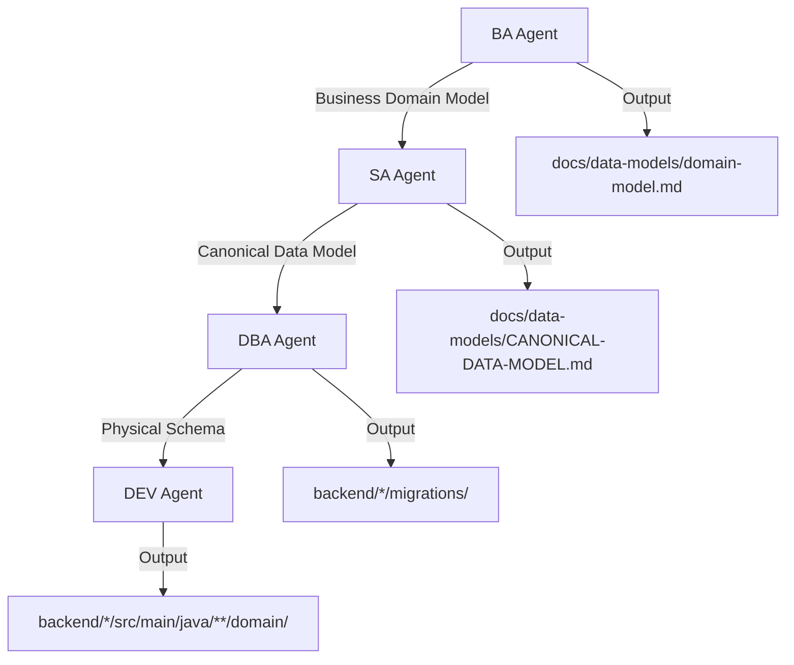
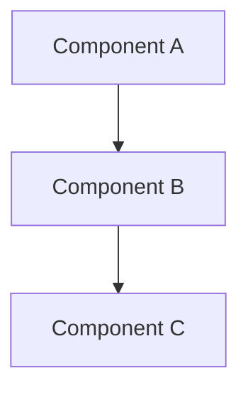
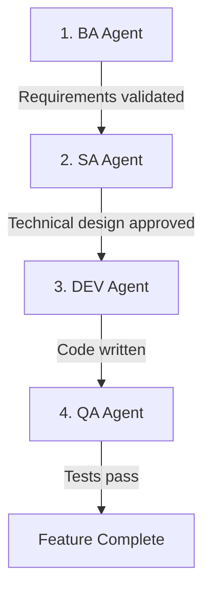
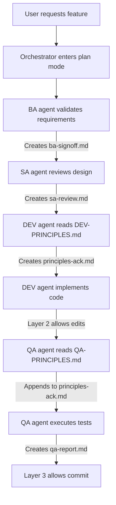

# EMSIST Project Instructions

## Unanswered Questions Wizard (MANDATORY)

### Question Tracking

When questions are asked but not answered, they MUST be tracked and re-prompted until resolved.

**Question Queue Format:**
```markdown
## 🔔 PENDING QUESTIONS (Must Answer Before Proceeding)

| ID | Question | Context | Asked On | Status |
|----|----------|---------|----------|--------|
| Q1 | [Question text] | [Why needed] | [Date] | ⏳ PENDING |
| Q2 | [Question text] | [Why needed] | [Date] | ⏳ PENDING |
```

### Wizard Rules

1. **Track All Questions** - Every question asked via `AskUserQuestion` must be logged
2. **Persist Until Answered** - Questions remain in queue until explicitly answered
3. **Re-prompt on Session Start** - Show pending questions at beginning of new sessions
4. **Block Dependent Work** - Tasks requiring answers cannot proceed until questions resolved
5. **Clear on Answer** - Remove from queue only when user provides explicit answer

### Question Lifecycle

```
Asked → PENDING → Answered → RESOLVED
              ↓
        Re-prompted (if session ends)
```

### Implementation

Before starting ANY work, check for pending questions:
```
1. Read PENDING-QUESTIONS.md (if exists)
2. If questions exist, present them first
3. Only proceed with new work after questions resolved
4. Log new questions to the file
```

### Pending Questions File

Location: `docs/governance/PENDING-QUESTIONS.md`

---

## Wizard-Style Interaction (MANDATORY)

### All Questions Must Be Wizard-Style

When gathering requirements or presenting options, ALWAYS use the `AskUserQuestion` tool with structured choices.

**NEVER** ask open-ended questions like "What do you want to do?"

**ALWAYS** present options like:
```
Question: "Which task do you want to start?"
Options:
1. Fix documentation (Recommended) - Correct ADRs to match code
2. Implement features - Build what docs describe
3. Review architecture - Assess current state
4. Other - Specify custom action
```

### Wizard Flow Rules

1. **Break complex tasks into steps** - Guide user through one decision at a time
2. **Provide recommendations** - Mark best option with "(Recommended)"
3. **Show context** - Brief description for each option
4. **Allow escape** - Always include "Other" for custom input
5. **Confirm before acting** - Summarize choices before execution

### Progress Tracking (MANDATORY)

For EVERY action, show implementation progress:

```
## Current Sprint Progress

| Task | Status | Progress |
|------|--------|----------|
| Fix ADR-005 | ✅ DONE | 100% |
| Fix ADR-001 | ✅ DONE | 100% |
| Fix ADR-003 | ✅ DONE | 100% |
| Fix ADR-006 | ✅ DONE | 100% |
| Fix ADR-007 | ⏳ PENDING | 0% |
| Fix arc42/05 | ⏳ PENDING | 0% |

**Overall Progress:** 4/10 tasks (40%)
```

### Progress Icons

| Icon | Meaning |
|------|---------|
| ✅ | Completed |
| 🔄 | In Progress |
| ⏳ | Pending |
| ❌ | Blocked |
| ⚠️ | Needs Review |

### After Each Action

After completing ANY task:
1. Update progress table
2. Show what was done
3. Present next options as wizard choices
4. Ask user to confirm next step

---

## SDLC Agent Orchestration (MANDATORY)

This project uses specialized SDLC agents. The orchestrator MUST delegate to appropriate agents.

### Agent Routing Rules

#### Core Agent Routing

| Task Type | MUST Use Agent | Never Do Directly |
|-----------|----------------|-------------------|
| Architecture decisions, HLD, ADRs, tech governance | `arch` | Don't make architecture decisions alone |
| **Business objects, domain model, entity relationships** | `ba` | Don't define business entities alone |
| LLD, **canonical data model** (from BA output), API contracts | `sa` | Don't design APIs or technical models alone |
| Test strategy, QA coordination, failure triage | `qa` | Don't plan testing alone |
| Unit tests (JUnit 5 / Vitest), component tests | `qa-unit` | Don't write tests alone |
| Integration tests, E2E tests, contract tests, a11y tests | `qa-int` | Don't write integration tests alone |
| Regression suites, smoke tests, BVT, change impact | `qa-reg` | Don't plan regression alone |
| Load tests, stress tests, soak tests, performance benchmarks | `qa-perf` | Don't design load tests alone |
| Backend/Frontend implementation | `dev` | Don't implement features alone |
| Docker, CI/CD pipelines, environment management, linting | `devops` | Don't write Dockerfiles alone |
| Database schema, Neo4j/PostgreSQL, migrations | `dba` | Don't design schemas alone |
| SAST, SCA, DAST, container scanning, threat modeling | `sec` | Don't assess security alone |
| User stories, requirements, acceptance criteria | `ba` | Don't gather requirements alone |
| Process analysis, BPMN | `pa` | Don't map processes alone |
| UX, wireframes, accessibility | `ux` | Don't design UX alone |
| Documentation, API docs | `doc` | Don't write docs alone |
| Release planning, deployment | `rel` | Don't plan releases alone |
| UAT coordination (Staging only) | `uat` | Don't plan UAT alone |
| Overall orchestration, backlog | `pm` | Use for cross-cutting coordination |

#### Test Type → Agent → Environment Matrix

Every test type has a designated owner agent and runs in specific environments:

**Development Environment (Local)**

| Test Type | Agent | Trigger |
|-----------|-------|---------|
| Unit Tests (Backend — JUnit 5/Mockito) | `qa-unit` | Every code change |
| Unit Tests (Frontend — Vitest/TestBed) | `qa-unit` | Every code change |
| Component Tests (Frontend — Vitest + DOM) | `qa-unit` | Component changes |
| Integration Tests (API — Testcontainers/MockMvc) | `qa-int` | API changes |

**Build / CI Pipeline**

| Test Type | Agent | Trigger |
|-----------|-------|---------|
| Linting (ESLint, Checkstyle) | `devops` | Every push |
| SAST (SonarQube, Semgrep) | `sec` | Every push |
| SCA (OWASP dependency-check, `npm audit`) | `sec` | Every push |
| Container Scanning (Trivy, Docker Scout) | `sec` | Image build |
| Unit Tests (re-run in CI for gate) | `qa-unit` | Every push |
| Contract Tests (Spring Cloud Contract/Pact) | `qa-int` | API schema change |
| BVT — Build Verification Tests (~20 critical-path subset) | `qa-reg` | Every push |

**Staging Environment**

| Test Type | Agent | Trigger |
|-----------|-------|---------|
| Functional E2E (Playwright, multi-browser) | `qa-int` | Deploy to staging |
| Responsive Tests (desktop/tablet/mobile viewports) | `qa-int` | UI deploy to staging |
| Accessibility Tests (axe-core, WCAG AAA, keyboard nav) | `qa-int` | UI deploy to staging |
| Smoke Tests (critical-path health check) | `qa-reg` | Every staging deploy |
| Regression Suite (full test assembly) | `qa-reg` | Release candidate |
| Load Tests (k6/Gatling, concurrent users) | `qa-perf` | Pre-release |
| Stress Tests (progressive load to breaking point) | `qa-perf` | Pre-release |
| Soak Tests (4-8hr endurance, memory leak detection) | `qa-perf` | Release candidate |
| DAST (OWASP ZAP active scan) | `sec` | Deploy to staging |
| Penetration Testing (ZAP + IDOR/auth bypass probes) | `sec` | Release candidate |
| Security Auth Tests (401/403, tenant isolation, tokens) | `sec` | Auth changes |
| UAT (acceptance scenario execution, sign-off) | `uat` | Feature complete |

**Production Environment**

| Test Type | Agent | Trigger |
|-----------|-------|---------|
| Synthetic Monitoring (health endpoint polling, alerts) | `devops` | Continuous |
| Canary Testing (metric comparison on progressive rollout) | `devops` | Post-deploy |
| Error Rate Monitoring (Prometheus alerts, Grafana dashboards) | `devops` | Continuous |

#### Failure Triage Router Pattern

When any test fails, the `qa` coordinator classifies the failure and routes to the correct agent:

| Failure Category | Routed To | Diagnosis |
|-----------------|-----------|-----------|
| `[CODE_BUG]` | `qa-unit` / `qa-int` | Unit/integration test failure → code fix needed |
| `[TEST_DEFECT]` | `qa-reg` | Flaky or stale test → test maintenance |
| `[INFRASTRUCTURE]` | `devops` | Container, network, or environment issue |
| `[DATA_STATE]` | `devops` | Missing seed data, migration drift, env state |
| `[THIRD_PARTY]` | `devops` | External service unavailable |
| `[SYNTAX_ERROR]` | `devops` (lint) | Linting failure → code format fix |
| `[VULNERABLE_DEPENDENCY]` | `sec` | SCA finding → dependency update |
| `[SECURITY_FINDING]` | `sec` | SAST/DAST finding → security fix |
| `[PERFORMANCE_REGRESSION]` | `qa-perf` | SLO breach → optimization needed |

**Cross-environment failure protocol** (when tests pass in Dev but fail in Staging):

1. **Configuration Comparison** — `devops` compares env configs between environments
2. **Dependency Health Check** — `devops` verifies service versions and connectivity
3. **Data State Verification** — `devops` checks seed data, migration state, cache state
4. **Infrastructure Audit** — `devops` inspects container resources, network policies

### Data Model Workflow (MANDATORY)

The canonical data model MUST follow this agent chain:



**Agent responsibilities in the chain:**

| Agent | Actions | Output |
|-------|---------|--------|
| **BA** | Define business objects, identify relationships, document business rules | Business Domain Model |
| **SA** | Transform to technical model, define data types/keys/indexes, map to service boundaries | Canonical Data Model |
| **DBA** | Validate for target DB (Neo4j, PostgreSQL), optimize indexes/queries, create migrations | Physical Schema |
| **DEV** | Implement entities (JPA, Neo4j SDN), create repositories and services | Source code |

**RULE:** Never skip steps. BA must define business objects BEFORE SA creates technical model.

---

## Agent Governance Framework (MANDATORY)

### Governance Structure

All agents MUST read their principles file before performing ANY work.

```
docs/governance/
├── GOVERNANCE-FRAMEWORK.md          # Master governance document
├── agents/
│   ├── ARCH-PRINCIPLES.md           # Architecture governance
│   ├── SA-PRINCIPLES.md             # Solution architecture rules
│   ├── BA-PRINCIPLES.md             # Business analysis standards
│   ├── DEV-PRINCIPLES.md            # Development build rules
│   ├── DBA-PRINCIPLES.md            # Database governance
│   ├── QA-PRINCIPLES.md             # Quality assurance rules
│   ├── SEC-PRINCIPLES.md            # Security governance
│   ├── DEVOPS-PRINCIPLES.md         # DevOps standards
│   └── DOC-PRINCIPLES.md            # Documentation standards
├── checklists/
│   ├── pre-commit-checklist.md      # Before code commit
│   ├── design-review-checklist.md   # Before implementation
│   └── release-checklist.md         # Before deployment
├── validation/
│   ├── validation-rules.json        # Automated validation rules
│   └── validate-principles.sh       # Validation script
└── metrics/
    ├── METRICS-DASHBOARD.md         # Governance metrics
    └── governance-metrics.json      # Tracking data
```

### Agent Principle File Requirements

Each agent's principles file MUST contain:

| Section | Required Content |
|---------|------------------|
| Version | Semantic version (e.g., v1.0.0) |
| MANDATORY | Rules that MUST be followed (read first) |
| Standards | Domain-specific rules and patterns |
| Forbidden | Explicitly prohibited practices (❌) |
| Checklist | Verification before completion |
| Feedback | How to suggest improvements |

### Enforcement Protocol

When an agent is spawned:

```
1. Agent MUST read docs/governance/agents/{AGENT}-PRINCIPLES.md
2. Agent MUST create/append to docs/sdlc-evidence/principles-ack.md with version + key constraints
3. Agent MUST acknowledge key constraints in first response
4. Agent MUST validate output against checklist
5. Agent MUST report any principle violations
6. Agent SHOULD suggest improvements to principles
```

**Technical enforcement:** The PreToolUse hook (`.claude/hooks/check-agent-evidence.sh`) blocks source code edits unless `principles-ack.md` exists. This means an agent CANNOT write source code until it has read its principles and created the acknowledgment file.

**Orchestrator obligation:** When spawning an agent via the Task tool, the prompt MUST include:
```
BEFORE doing any work, you MUST:
1. Read docs/governance/agents/{AGENT}-PRINCIPLES.md
2. Create/append to docs/sdlc-evidence/principles-ack.md with your agent type, principles version, and 3 key constraints
```

### Continuous Improvement

Principles evolve through:

1. **Agent Feedback** - Agents log improvement suggestions
2. **Retrospectives** - Regular review of principle effectiveness
3. **Incident Learning** - Update principles after issues
4. **Version Control** - All changes tracked with changelog

### Metrics Tracked

| Metric | Description | Target |
|--------|-------------|--------|
| Principle Compliance | % of agent outputs following rules | >95% |
| Violation Rate | Principle breaches per sprint | <5 |
| Improvement Rate | Suggestions implemented | >50% |
| Governance Health | Overall framework effectiveness | Green |

---

## Agent Skills & Capabilities (MANDATORY)

### QA Agent (Quality Assurance)
*   **Core Skills**: Playwright (E2E), Vitest (Unit), Selenium, Cypress.
*   **Specializations**:
    *   **UI/Functional**: Verifying toggles (Card/Table), sorting, pagination, and responsive layouts.
    *   **Accessibility**: WCAG 2.1 AAA auditing (axe-core).
    *   **Security**: OWASP ZAP, IDOR verification, SQLi probing.
*   **Mandate**: Must reject any feature that lacks execution evidence (logs/screenshots) for critical UI paths.

### UX Agent (User Experience)
*   **Core Skills**: Wireframing, CSS/SCSS, PrimeNG, Angular Material.
*   **Specializations**:
    *   **Visual QA**: Pixel-perfect verification against wireframes.
    *   **Responsive**: Validating breakpoints (Mobile/Tablet/Desktop).
*   **Mandate**: Must verify "Card/Table" toggles and empty states.

### Dev Agent (Implementation)
*   **Core Skills**: Java 21+, Spring Boot 3.x, Angular 17+, Neo4j/PostgreSQL.
*   **Mandate**: TDD/BDD adherence. Code must be committed *with* passing tests.

---

## Hourly Documentation Audit (MANDATORY)

### Automatic Discrepancy Detection

Every **hour** during active work sessions, the orchestrator MUST spawn agents to audit documentation against codebase.

### Audit Schedule

```
Every 60 minutes of active work:
1. Spawn `arch` agent → Check ADRs vs implementation
2. Spawn `sa` agent → Check data models vs entities
3. Spawn `doc` agent → Check arc42 vs codebase
4. Spawn `arch` + `sa` agents → Arc42 compliance check (see below)
```

### Arc42 Compliance Check (MANDATORY)

Agents MUST verify arc42 sections against code. The arc42 document is the architecture's
source of truth — if it diverges from code, EITHER the doc or the code must change.

**Sections to verify:**

| Arc42 Section | What to Check | Agent(s) |
|---------------|---------------|----------|
| 01 Introduction | Goals vs actual feature set | arch |
| 03 Context & Scope | External interfaces vs real integrations | sa |
| 04 Solution Strategy | Technology choices vs pom.xml/package.json | arch + sa |
| 05 Building Blocks | Component list vs actual services | arch |
| **06 Runtime View** | **Sequence diagrams vs actual API calls, DB access, cache patterns** | **arch + sa** |
| 07 Deployment View | Docker images vs docker-compose.yml | devops |
| 08 Crosscutting | Patterns vs code (cache, auth, tenant isolation) | arch + sa |

**Rule: Runtime View (06) is highest priority** — it describes actual system behavior.
Every sequence diagram arrow MUST correspond to a real code path (API call, DB query, etc.).

**Verification checklist for runtime diagrams:**
```
[ ] Every arrow in the diagram has a matching code path (file + line)
[ ] Database type matches reality (Neo4j vs PostgreSQL vs Valkey)
[ ] Service-to-service calls use real clients (Feign, RestTemplate, WebClient)
[ ] Cache layer matches reality (no aspirational Caffeine/L1 claims)
[ ] Kafka producers/consumers match reality (check for actual KafkaTemplate usage)
[ ] Error handling paths are documented (401, 403, circuit breaker)
```

**Arc42 status tags (same as Rule 2):**
- `[IMPLEMENTED]` — verified against code with file path
- `[IN-PROGRESS]` — partially built (state what exists vs what's missing)
- `[PLANNED]` — design only, no code exists

### Audit Prompt Template

```
**Hourly Documentation Audit**

You are the {AGENT} agent performing a scheduled audit.

Task: Check for discrepancies between documentation and codebase.

1. Read the relevant documentation files
2. Verify claims against actual code
3. Report any variations found

Output format:
| Document | Claim | Reality | Status |
|----------|-------|---------|--------|
| [file] | [what doc says] | [what code shows] | ✅ MATCH / ❌ MISMATCH |

If mismatches found, update docs/governance/DISCREPANCY-LOG.md
```

### Discrepancy Log

Location: `docs/governance/DISCREPANCY-LOG.md`

Format:
```markdown
# Documentation Discrepancy Log

## Active Discrepancies

| Date | Document | Discrepancy | Severity | Resolution |
|------|----------|-------------|----------|------------|
| YYYY-MM-DD | [file] | [description] | HIGH/MED/LOW | PENDING/RESOLVED |

## Resolved Discrepancies

[Moved here after resolution]
```

### Audit Triggers

| Trigger | Action |
|---------|--------|
| 60 minutes elapsed | Run full audit (arch + sa + doc) |
| New file written | Run targeted audit on affected domain |
| ADR status changed | Run arch agent audit |
| Entity modified | Run sa agent audit |
| Runtime flow changed | Run arch + sa audit on arc42/06-runtime-view.md |
| Service added/removed | Run arch audit on arc42/05 + arc42/06 + arc42/07 |
| Database config changed | Run sa + dba audit on arc42/06 (data access patterns) |
| Cache config changed | Run sa audit on arc42/06 + arc42/08 (crosscutting) |

### Enforcement

- Orchestrator MUST track session time
- At 60-minute mark, pause current work and run audit
- Resume work after audit completes
- User may skip audit with explicit `/skip-audit` command

---

### Mandatory Agent Usage

**RULE: For any non-trivial task, spawn the appropriate agent(s).**

```
User asks about architecture → Spawn `arch` agent
User asks about API design → Spawn `sa` agent
User asks about testing → Spawn `qa` agent
User asks to implement code → Spawn `dev` agent
User asks about deployment → Spawn `devops` agent
User asks about security → Spawn `sec` agent
User asks about documentation → Run `arch` + `sa` + `qa` to verify first
```

### Multi-Agent Verification

For documentation tasks, ALWAYS run multiple agents in parallel to cross-verify:

```
Documentation update → arch + sa + qa (verify against code)
New feature → ba + sa + dev + qa (full SDLC)
Architecture change → arch + sa + sec + dba (impact analysis)
Release preparation → pm + qa + devops + rel (coordination)
```

### Agent Response Protocol

When agents return results:
1. Present agent findings directly to user
2. Do NOT summarize or filter agent output
3. Let user interact with agent findings
4. Resume agents if follow-up needed

### Enforcement

If user asks a question that matches an agent's domain:
- DO spawn the appropriate agent
- DO NOT answer directly without agent consultation
- If multiple domains involved, spawn multiple agents in parallel

---

## Continuous Improvement Protocol (MANDATORY)

### Self-Correction on Breach Detection

When a **breach of conduct** or **glitch** is discovered:

1. **IMMEDIATELY update this CLAUDE.md file** with:
   - New rule to prevent recurrence
   - Add to "Known Discrepancies" if documentation drift
   - Add to "Lessons Learned" log below

2. **Document the breach:**
   - What went wrong
   - Why it happened
   - How to prevent it

3. **Update agent behavior:**
   - Add specific checks to prevent similar issues
   - Tighten verification requirements if needed

### Breach Types That Trigger Updates

| Breach Type | Action Required |
|-------------|-----------------|
| Documentation claims unverified code | Add to Known Discrepancies + new verification rule |
| Agent skipped when should have been used | Add explicit routing rule |
| Aspirational content written as fact | Add to forbidden patterns |
| ADR marked implemented but isn't | Update ADR Reality table |
| Technology mismatch (docs vs code) | Update Infrastructure Truth table |
| Agent gave incorrect information | Add verification checkpoint |

### Lessons Learned Log

Record all breaches here for future reference:

| Date | Breach | Correction Applied |
|------|--------|-------------------|
| 2026-02-25 | Docs claimed Neo4j for all services, only auth-facade uses it | Added to Known Discrepancies, updated Implementation Truth |
| 2026-02-25 | Cache naming and runtime details diverged across docs | Added to Known Discrepancies |
| 2026-02-25 | ADR-006 marked Accepted but 0% implemented | Added ADR Reality table |
| 2026-02-25 | Auth providers shown as implemented, only Keycloak exists | Added Identity Providers truth table |
| 2026-02-25 | Orchestrator answered without spawning agents | Added SDLC Agent Orchestration rules |
| 2026-02-25 | Open-ended questions without structure | Added Wizard-Style Interaction rules |
| 2026-02-25 | No visibility into task progress | Added Progress Tracking requirement |
| 2026-02-25 | Orchestrator attempted to build canonical data model directly | Clarified BA→SA→DBA workflow; BA defines business objects |
| 2026-02-25 | Agent spawns rejected but orchestrator didn't ask user | Added rule to ask user when agent spawn fails |
| 2026-02-25 | Documentation drift not detected proactively | Added Hourly Documentation Audit with arch+sa+doc agents |
| 2026-02-25 | Read-only verification commands required manual approval | Added Auto-Approved Commands section |
| 2026-02-26 | Features marked "done" without executing tests; only backend tested | Added Definition of Done (DoD) section with mandatory test execution |
| 2026-02-26 | No quality gate enforcing UI/functional/smoke tests | Updated QA-PRINCIPLES, DEV-PRINCIPLES, and GOVERNANCE-FRAMEWORK with DoD gates |
| 2026-02-26 | arc42/06 runtime view written from design perspective, not implementation | Added Arc42 Compliance Check to CLAUDE.md; 6 HIGH discrepancies logged |
| 2026-02-26 | Tenant initializer forcefully redirected on refresh, breaking UX | Removed forced navigation from APP_INITIALIZER; broadened isLoginPage for chromeless routes |
| 2026-02-27 | ASCII art diagrams unreadable in Markdown viewers | Added Rule 7: Mermaid Diagrams Required; updated all agent principles |
| 2026-02-27 | Orchestrator implemented license-management feature without spawning BA/SA/DEV/QA agents | Added Rule 9: Mandatory Agent Chain for Feature Implementation |
| 2026-02-27 | Requirements missed (seat management) because BA agent was not spawned to cross-reference requirements docs | Same — Rule 9 makes BA verification mandatory before any plan is approved |
| 2026-02-27 | Zero tests written or executed; DoD completely ignored for license-management wiring | Same — Rule 9 blocks "done" status without QA agent sign-off |
| 2026-02-27 | Plan marked seat management as "DEFERRED" without BA agent validating against requirements | Same — Rule 9 requires BA agent to validate plan scope against requirements before ExitPlanMode |

### Auto-Update Triggers

Claude MUST update this file when:
- [ ] User identifies incorrect documentation
- [ ] Agent audit finds discrepancy
- [ ] Code verification fails for documented feature
- [ ] New pattern of error emerges
- [ ] Technology stack changes
- [ ] Service added/removed/merged

### Update Format

When adding a new rule or correction:

```markdown
### Rule N: [Descriptive Name]
**Added:** [Date]
**Reason:** [What breach triggered this]
**Rule:** [The actual constraint]
```

---

## Documentation Governance (MANDATORY)

These rules are NON-NEGOTIABLE. AI agents MUST follow them.

### Rule 1: Evidence-Before-Documentation (EBD)

**NEVER document a feature as "implemented" without:**
1. Reading the actual source file
2. Quoting the specific code that implements it
3. Providing file path and line number

**VIOLATION:** Writing "The system supports X" without proving X exists in code.

### Rule 2: Three-State Classification

Every feature description MUST use one of:

| Tag | Meaning | Proof Required |
|-----|---------|----------------|
| `[IMPLEMENTED]` | Code exists, verified | File path + code snippet |
| `[IN-PROGRESS]` | Partial implementation | What exists vs what's missing |
| `[PLANNED]` | Design only, no code | Explicitly state "not yet built" |

### Rule 3: Present Tense Requires Proof

| Statement Type | Rule |
|----------------|------|
| "The system **does** X" | MUST cite source file |
| "The API **returns** Y" | MUST show endpoint code |
| "Users **can** Z" | MUST prove UI/API exists |
| "Will support X" | Allowed for roadmap |
| "Planned: X" | Allowed for future work |

### Rule 4: Pre-Documentation Checklist

Before writing ANY documentation claiming implementation:

```
[ ] I have READ the source file (not assumed it exists)
[ ] I can QUOTE the relevant code
[ ] I am documenting WHAT IS, not WHAT SHOULD BE
[ ] Status tag is accurate: [IMPLEMENTED|IN-PROGRESS|PLANNED]
[ ] docker-compose.yml matches what I'm documenting
[ ] application.yml matches what I'm documenting
```

### Rule 5: No Aspirational Documentation

**FORBIDDEN patterns:**
- Describing architecture that doesn't exist in code
- Listing features from design docs as if implemented
- Writing "the system handles X" when X is a TODO
- Copying ADR decisions into arc42 as implementations
- Marking ADRs as "Accepted" and treating them as "Implemented"

**REQUIRED pattern:**
- Check code first, document second
- If implementation differs from design, document THE IMPLEMENTATION
- Clearly separate "current state" from "target state"

### Rule 6: Documentation Corrections

When correcting documentation:
1. State what was wrong
2. READ the actual files to verify the correction
3. Show evidence of actual state
4. Update with accurate information including file paths

DO NOT just apologize and rewrite. PROVE the correction is accurate.

### Rule 7: Mermaid Diagrams Required (No ASCII Art)

**Added:** 2026-02-27
**Reason:** ASCII box diagrams (e.g., `+---+`, `|  |`, `v`) render poorly in Markdown viewers and are not machine-parseable. Mermaid diagrams are natively supported by GitHub, GitLab, VS Code, and most modern Markdown renderers.

**RULE: All diagrams in Markdown files MUST use Mermaid syntax.**

**FORBIDDEN patterns:**
```
+---------------------------+
|  ASCII box diagrams       |  ❌ NEVER USE
+---------------------------+
         |
         v
```

**REQUIRED pattern:**
````markdown

````

**Mermaid diagram types to use:**

| Diagram Type | Mermaid Syntax | Use For |
|-------------|----------------|---------|
| Flowcharts | `graph TD` / `graph LR` | Workflows, data flows, decision trees |
| Sequence diagrams | `sequenceDiagram` | API calls, runtime flows, inter-service communication |
| Class diagrams | `classDiagram` | Entity models, class relationships |
| Entity-Relationship | `erDiagram` | Database schemas, data models |
| State diagrams | `stateDiagram-v2` | Lifecycle states (ADR status, license state) |
| C4 Context | `C4Context` | System context diagrams |
| C4 Container | `C4Container` | Container diagrams |
| Gantt charts | `gantt` | Timelines, sprint plans |
| Pie charts | `pie` | Distribution/proportion data |

**Applies to:**
- All ADRs (`docs/adr/`)
- All arc42 sections (`docs/arc42/`)
- All LLDs (`docs/lld/`)
- All requirements documents (`docs/requirements/`)
- All governance documents (`docs/governance/`)
- Any other `.md` file in the repository

**Exceptions:**
- Code snippets (Java, TypeScript, SQL, YAML, etc.) remain in regular code blocks
- File/directory tree structures may use plain text (e.g., `src/app/core/...`)
- Small inline illustrations (1-2 lines) like `A --> B` in running text are acceptable

**Agent enforcement:** ALL agents MUST use Mermaid syntax when producing diagrams. If an agent reads existing ASCII art, it SHOULD convert it to Mermaid when editing that section.

### Rule 8: ADR Status Lifecycle

ADRs must use accurate status:
- `Draft` - Under discussion
- `Proposed` - Ready for review
- `Accepted` - Decision approved, implementation NOT YET STARTED
- `In Progress` - Implementation underway (include percentage)
- `Implemented` - Implementation COMPLETE and VERIFIED with code
- `Superseded` - Replaced by another ADR
- `Deferred` - Accepted but postponed indefinitely

**CRITICAL:** "Accepted" does NOT mean "Implemented". Never conflate these.

### Rule 9: Mandatory Agent Chain for Feature Implementation (No Solo Implementation)

**Added:** 2026-02-27
**Reason:** Orchestrator implemented the entire license-management frontend wiring (service, component, template, styles, API gateway route) without spawning a single SDLC agent. This violated the agent routing rules, caused requirements to be missed (seat management was a documented requirement but deferred in the plan), and resulted in zero tests — violating the Definition of Done.

**RULE: The orchestrator MUST NOT implement features directly. The full agent chain is MANDATORY.**

**Required agent chain for ANY feature implementation:**



**Step-by-step enforcement:**

| Step | Agent | MUST Do | Blocks Next Step If Missing |
|------|-------|---------|----------------------------|
| 1 | **BA** | Cross-reference ALL requirements docs against plan scope; flag any missing requirements | YES — cannot proceed to SA without BA sign-off |
| 2 | **SA** | Validate API contracts, data models, service interfaces against LLD | YES — cannot proceed to DEV without SA sign-off |
| 3 | **DEV** | Implement code following SA design; co-deliver unit tests | YES — cannot mark code complete without tests |
| 4 | **QA** | Execute all tests (unit, E2E, responsive, a11y); produce test execution report | YES — cannot mark feature done without QA report |

**Plan validation (BEFORE ExitPlanMode):**
- Orchestrator MUST spawn BA agent to validate plan scope against requirements
- If BA agent identifies missing requirements, plan MUST be updated before approval
- "DEFERRED" items in a plan MUST be cross-referenced with requirements — if requirements mandate the feature, it CANNOT be deferred

**FORBIDDEN:**
- Orchestrator writing service classes, components, templates, or styles directly
- Marking any task "completed" without QA agent test execution report
- Approving a plan without BA agent requirements validation
- Skipping the SA agent for API contract or data model design
- Implementing code without spawning the DEV agent

**If agent spawns are rejected by user:**
1. Explicitly warn: "CLAUDE.md requires agent {X} for this task. Skipping may cause missed requirements or untested code."
2. Ask user to confirm they want to proceed without the agent
3. Log the skip in Lessons Learned

### Rule 10: Three-Layer Enforcement with Evidence Files

**Added:** 2026-02-27
**Reason:** Rules 1-9 in CLAUDE.md were repeatedly violated because there was no enforcement mechanism — only instructions. Adding technical enforcement (hooks + git hooks) creates layers that physically block non-compliant actions.

**RULE: All feature implementations are gated by three enforcement layers.**

**Layer 1: Plan-Mode Gate (Prevention)**
- Every non-trivial feature MUST go through `EnterPlanMode`
- The plan MUST include explicit agent spawn steps (BA → SA → DEV → QA)
- Before `ExitPlanMode`, the orchestrator MUST spawn a BA agent to validate the plan scope against all requirements documents
- User reviews the plan and rejects if agents are missing

**Layer 2: Claude Code Hook (Runtime Enforcement)**
- File: `.claude/hooks/check-agent-evidence.sh`
- Configured in: `.claude/settings.json` (PreToolUse on Edit|Write)
- **Behavior:** Blocks Edit/Write to source code files (`frontend/src/`, `backend/*/src/`, `frontend/e2e/`) unless BOTH exist:
  - `docs/sdlc-evidence/ba-signoff.md` — BA agent validated requirements
  - `docs/sdlc-evidence/principles-ack.md` — Agent read its principles file and acknowledged key constraints
- Always allows writes to docs, config, evidence files, and other non-source paths
- Bypass: `echo "reason" > docs/sdlc-evidence/.bypass` (single-use)

**Layer 3: Git Pre-Commit Hook (Commit-Time Enforcement)**
- File: `.githooks/pre-commit`
- Installed via: `git config core.hooksPath .githooks`
- **Behavior:** Blocks commits containing source code changes unless both `docs/sdlc-evidence/ba-signoff.md` AND `docs/sdlc-evidence/qa-report.md` exist
- Allows docs-only commits freely
- Bypass: `echo "reason" > docs/sdlc-evidence/.bypass` (consumed after one use)

**Evidence file workflow:**



**Evidence directory:** `docs/sdlc-evidence/`

| Evidence File | Created By | Gates |
|---------------|-----------|-------|
| `ba-signoff.md` | BA agent | Layer 2 (Edit/Write to source code) |
| `principles-ack.md` | Any code-writing agent (DEV, QA-UNIT, QA-INT) | Layer 2 (Edit/Write to source code) |
| `sa-review.md` | SA agent | Informational (not enforced by hooks) |
| `qa-report.md` | QA agent | Layer 3 (git commit) |
| `.bypass` | User manually | Overrides all layers (single-use, auto-deleted) |

**Principles acknowledgment file format** (`principles-ack.md`):

```markdown
# Principles Acknowledgment

| Agent | Principles File | Version | Key Constraints | Date |
|-------|----------------|---------|-----------------|------|
| dev | DEV-PRINCIPLES.md | v1.1 | Test co-delivery, EBD, no solo implementation | 2026-02-27 |
| qa | QA-PRINCIPLES.md | v2.0 | Environment-aware testing, triage router, DoD gates | 2026-02-27 |
```

**Agent obligation:** Each agent MUST:
1. Read `docs/governance/agents/{AGENT}-PRINCIPLES.md` before doing any work
2. Create or append to `docs/sdlc-evidence/principles-ack.md` with version and key constraints
3. Create its specific evidence file upon successful completion

The evidence file format is documented in `docs/sdlc-evidence/EVIDENCE-WORKFLOW.md`.

**New repository clone setup:** After cloning, run `git config core.hooksPath .githooks` to activate the pre-commit hook.

---

## KNOWN DOCUMENTATION DISCREPANCIES (Audit 2026-02-25 + 2026-02-26)

These are VERIFIED mismatches. Do NOT repeat these errors:

| Document Claims | Reality | Status |
|-----------------|---------|--------|
| Neo4j for ALL services | Only auth-facade uses Neo4j; 7 services use PostgreSQL | **MISMATCH** |
| Valkey 8+ cache | docker-compose uses `valkey/valkey:8-alpine` | **ALIGNED** |
| license-service merged (ADR-006) | license-service exists at :8085 | **NOT IMPLEMENTED** |
| Auth0/Okta/Azure providers | Only KeycloakIdentityProvider exists | **NOT IMPLEMENTED** |
| Graph-per-tenant isolation (ADR-003) | Simple `tenant_id` column discrimination | **NOT IMPLEMENTED** |
| eureka-server | Directory `backend/eureka-server/` does not exist | **RESOLVED 2026-03-06** — `backend/eureka-server/` exists with `@EnableEurekaServer`, tests 3/3 pass, added to `backend/pom.xml` reactor |
| Neo4j Enterprise | docker-compose uses `neo4j:5.12.0-community` | **MISMATCH** |

### Arc42/06 Runtime View Discrepancies (Audit 2026-02-26)

| Section | Document Claims | Reality | Severity |
|---------|----------------|---------|----------|
| 6.1 | AF→US: Create/update session | No user-service Feign client in auth-facade | **HIGH** |
| 6.3 | All services query Neo4j with Cypher | 7/8 services use PostgreSQL/JPA | **HIGH** |
| 6.3 | Product query via product-service | product-service has no src/ (stub) | **HIGH** |
| 6.5 | Source services publish to Kafka | No KafkaTemplate in any service | **HIGH** |
| 6.5 | audit-service persists to Neo4j | Uses PostgreSQL (@Entity + Flyway) | **HIGH** |
| 6.6 | Caffeine L1 + Valkey L2 two-tier | Caffeine not present; single-tier Valkey | **HIGH** |
| 6.4 | Services call license-service feature gate | API exists but no consumers call it | **MEDIUM** |

### ADR Implementation Reality

| ADR | Documented Status | Actual Implementation |
|-----|-------------------|----------------------|
| ADR-001 (Neo4j Primary) | Accepted | **10%** - Only auth-facade |
| ADR-002 (Spring Boot 3.4) | Accepted | **100%** |
| ADR-003 (Graph-per-Tenant) | Accepted | **0%** |
| ADR-004 (Keycloak) | Accepted | **90%** |
| ADR-005 (Valkey) | Accepted | **100%** - Valkey runtime standardized |
| ADR-006 (Service Merge) | Accepted | **0%** |
| ADR-007 (Provider-Agnostic) | Accepted | **25%** - Keycloak only |

---

## CURRENT IMPLEMENTATION TRUTH

### Services That EXIST (Verified)

| Service | Port | Database | Evidence |
|---------|------|----------|----------|
| service-registry (eureka) | 8761 | - | `backend/eureka-server/` — tests 3/3 PASS (2026-03-06) |
| api-gateway | 8080 | - | `backend/api-gateway/` |
| auth-facade | 8081 | Neo4j + Valkey | `backend/auth-facade/` |
| tenant-service | 8082 | PostgreSQL | `backend/tenant-service/` |
| user-service | 8083 | PostgreSQL | `backend/user-service/` |
| license-service | 8085 | PostgreSQL | `backend/license-service/` (NOT merged) |
| notification-service | 8086 | PostgreSQL | `backend/notification-service/` |
| audit-service | 8087 | PostgreSQL | `backend/audit-service/` |
| ai-service | 8088 | PostgreSQL + pgvector | `backend/ai-service/` |
| process-service | 8089 | PostgreSQL | `backend/process-service/` |

### Services That DO NOT EXIST

- `persona-service` - Stub only (pom.xml, no src/)
- `product-service` - Stub only (pom.xml, no src/)

### Identity Providers (auth-facade)

| Provider | Status | File |
|----------|--------|------|
| Keycloak | EXISTS | `KeycloakIdentityProvider.java` |
| Auth0 | DOES NOT EXIST | - |
| Okta | DOES NOT EXIST | - |
| Azure AD | DOES NOT EXIST | - |

### Infrastructure (docker-compose.yml)

| Component | Image | NOT what docs claim |
|-----------|-------|---------------------|
| Cache | `valkey/valkey:8-alpine` | Correct |
| Graph DB | `neo4j:5.12.0-community` | Docs say Enterprise |
| Relational | `postgres:16-alpine` | Correct |
| Messaging | `confluentinc/cp-kafka:7.5.0` | Correct |
| Identity | `keycloak:24.0` | Correct |

---

## Auto-Approved Commands (MANDATORY)

### Commands That Should Be Auto-Approved

The following command patterns are safe and should be auto-approved without user confirmation:

```yaml
# File/Directory Existence Checks
- pattern: "ls -la *"
  reason: "Read-only directory listing"

- pattern: "[ -d * ] && echo * || echo *"
  reason: "Directory existence check"

- pattern: "[ -f * ] && echo * || echo *"
  reason: "File existence check"

# Service Source Code Verification
- pattern: "for service in *; do if [ -d */src/main/java ]; then echo *; fi; done"
  reason: "Check which backend services have source code"

# Git Status/Log (Read-Only)
- pattern: "git status"
  reason: "Read-only git state"

- pattern: "git log *"
  reason: "Read-only git history"

- pattern: "git diff *"
  reason: "Read-only diff view"

# Docker/Infrastructure Inspection
- pattern: "docker ps *"
  reason: "List running containers"

- pattern: "docker images *"
  reason: "List images"

# Maven/Gradle Read-Only
- pattern: "mvn dependency:tree *"
  reason: "View dependencies"

- pattern: "mvn help:effective-pom *"
  reason: "View effective POM"

# File Content Inspection (via grep)
- pattern: "grep -r * backend/*"
  reason: "Search codebase"

- pattern: "grep * pom.xml"
  reason: "Check Maven config"

- pattern: "grep * docker-compose.yml"
  reason: "Check Docker config"
```

### Commands That Require Approval

Always require explicit approval for:
- `rm`, `mv`, `cp` (file modifications)
- `git commit`, `git push`, `git reset` (repository changes)
- `docker run`, `docker-compose up` (container execution)
- `mvn install`, `mvn deploy` (artifact publishing)
- `npm install`, `npm publish` (package operations)
- Any command with `sudo`
- Any command writing to files (`>`, `>>`)

### Agent Behavior

When an agent needs to run a read-only verification command:
1. Check if it matches auto-approved patterns
2. If YES → Execute without asking
3. If NO → Ask user for approval

---

## Definition of Done (MANDATORY)

**Added:** 2026-02-26
**Reason:** Features marked "done" without sufficient testing; UI/functional tests missing; no enforced quality gate before feature completion.

### What "Done" Means

A feature is **NOT DONE** until ALL of the following are verified. No exceptions.

### DoD by Artifact Type

#### Feature (Backend Service / API Endpoint)

| Gate | Requirement | Verified By |
|------|-------------|-------------|
| **Code Complete** | Implementation matches SA LLD / API contract | DEV agent |
| **Unit Tests Pass** | >=80% line coverage, >=75% branch coverage on affected classes | QA-UNIT agent |
| **Integration Tests Pass** | API endpoint tested with Testcontainers (Neo4j, PostgreSQL, Valkey) | QA-INT agent |
| **Security Tests Pass** | Auth (401/403), tenant isolation, input validation tested | SEC agent |
| **Build Green** | `mvn clean verify` passes with zero failures | DEV agent |
| **No CRITICAL/HIGH Defects** | All P0/P1 defects resolved | QA agent |
| **Documentation Updated** | OpenAPI spec, arc42, ADR status accurate | DOC agent |

#### Feature (Frontend Component / Page)

| Gate | Requirement | Verified By |
|------|-------------|-------------|
| **Code Complete** | Component matches UX spec and wireframes | DEV agent |
| **Unit Tests Pass** | Component + service specs pass with >=80% coverage (Vitest) | QA-UNIT agent |
| **E2E Tests Pass** | Playwright tests cover happy path + error states + empty states | QA-INT agent |
| **Responsive Tests Pass** | Tested at desktop (>1024px), tablet (768-1024px), mobile (<768px) | QA-INT agent |
| **Accessibility Tests Pass** | WCAG AAA compliance, axe-core scan clean, keyboard navigation works | QA-INT agent |
| **Build Green** | `ng build` passes with zero errors/warnings | DEV agent |
| **Visual Verification** | Screenshot or browser check confirms UI matches spec | UX agent |
| **No CRITICAL/HIGH Defects** | All P0/P1 defects resolved | QA agent |

#### Bug Fix

| Gate | Requirement | Verified By |
|------|-------------|-------------|
| **Root Cause Identified** | Documented what caused the bug | DEV agent |
| **Fix Implemented** | Code change addresses root cause | DEV agent |
| **Regression Test Added** | Test that reproduces the bug (fails before fix, passes after) | QA-REG agent |
| **Existing Tests Pass** | No regressions introduced | QA agent |
| **Build Green** | Both backend and frontend build pass | DEV agent |

#### Documentation Change

| Gate | Requirement | Verified By |
|------|-------------|-------------|
| **Evidence-Based** | Every claim verified against code (EBD rule) | DOC + ARCH agents |
| **Cross-Verified** | At least 2 agents confirm accuracy | ARCH + SA + QA agents |
| **Status Tags Correct** | [IMPLEMENTED], [IN-PROGRESS], [PLANNED] accurate | DOC agent |

### Test Execution Requirements (MANDATORY)

**RULE: Tests must be EXECUTED, not just written.**

| Test Level | When to Run | How to Verify | Acceptable Result |
|------------|-------------|---------------|-------------------|
| **Unit Tests** | After every code change | `mvn test` / `npx vitest run` | All pass, coverage >= 80% |
| **Integration Tests** | After API/database changes | `mvn verify -Pintegration` | All pass with Testcontainers |
| **E2E Tests** | After frontend changes | `npx playwright test` | All pass (route-intercepted) |
| **Smoke Tests** | Before marking feature complete | Run critical path E2E subset | Login → Navigate → Core feature works |
| **Responsive Tests** | After any UI change | Playwright with viewport configs | Desktop + Tablet + Mobile pass |
| **Accessibility Tests** | After any UI change | axe-core via Playwright | Zero violations at AAA level |

### Test Evidence Required

When reporting test results, agents MUST provide:

```markdown
## Test Execution Report

**Date:** YYYY-MM-DD
**Feature:** [Feature name]
**Agent:** [QA-UNIT / QA-INT / QA-REG]

### Results Summary
| Level | Total | Passed | Failed | Skipped | Coverage |
|-------|-------|--------|--------|---------|----------|
| Unit  | NN    | NN     | 0      | 0       | XX%      |
| Integration | NN | NN  | 0      | 0       | -        |
| E2E   | NN    | NN     | 0      | 0       | -        |

### Failed Tests (if any)
| Test | Error | Root Cause | Fix |
|------|-------|------------|-----|

### Coverage Report
- Line: XX% (target: 80%)
- Branch: XX% (target: 75%)
```

### Enforcement

1. **DEV agent MUST NOT mark a task as complete** without test execution evidence
2. **QA agent MUST verify** test results before signing off
3. **Orchestrator MUST check** DoD gates before presenting "done" to user
4. **If tests cannot run** (e.g., Bash blocked), agent MUST flag this and NOT mark as done
5. **Partial completion** is allowed — use progress percentage and specify what's missing

### DoD Violation Handling

| Violation | Severity | Response |
|-----------|----------|----------|
| Feature marked done without tests | CRITICAL | Revert status, write tests immediately |
| Tests written but not executed | MAJOR | Execute tests, report results |
| Coverage below 80% | MAJOR | Write additional tests |
| E2E tests missing for UI feature | MAJOR | Write and execute E2E tests |
| Responsive/accessibility not tested | MAJOR | Add responsive + a11y tests |
| Only backend tested, frontend skipped | MAJOR | Add frontend tests |

---

## Verification Commands

Before documenting, agents MUST run:

```bash
# Check if file exists
ls -la path/to/claimed/file

# Check if class exists
grep -r "ClassName" backend/

# Check docker-compose for actual images
grep "image:" infrastructure/docker/docker-compose.yml

# Check actual database config
grep -A5 "datasource:" backend/*/src/main/resources/application.yml

# Verify service modules exist
cat backend/pom.xml | grep -A20 "<modules>"
```

---

## Project Structure

- Backend: Java 23 / Spring Boot 3.4.1 microservices in `/backend`
- Frontend: Angular 21 in `/frontend`
- Infrastructure: Docker Compose in `/infrastructure/docker`
- Documentation: `/docs` (arc42, adr, lld, data-models)

---

## Consequences of Violation

If an agent violates these rules:
1. User will reject the documentation
2. Agent must re-verify with actual file reads
3. Trust in AI-generated documentation is eroded

**The purpose of these rules is to ensure documentation reflects REALITY, not aspirations.**
