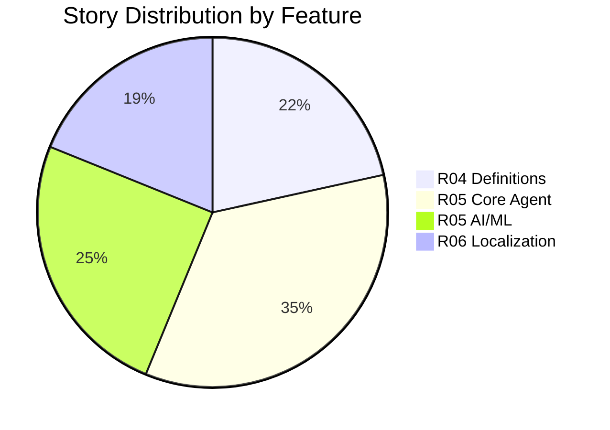

# EMSIST -- Consolidated Story Inventory

**Date:** 2026-03-13
**Author:** BA Agent
**Status:** [PLANNED] -- Cross-feature index of all inventoried user stories.

---

## 1. Executive Summary

| Metric | R04 (Definitions) | R05 (AI Platform) | R06 (Localization) | Total |
|--------|-------------------|-------------------|---------------------|-------|
| User Stories | 97 | 268 | 85 | **450** |
| Story Points | 681 | ~628 (Part 2 only) | 209 | ~1,518+ |
| Epics | 13 | 20 feature areas | 15 | 48 |
| Personas | 3 | 12 | 4 primary + 7 secondary | 19 unique |
| Error Codes | 63 | inline per story | 17 | 80+ |
| Warning Codes | 9 | inline per story | 4 | 13+ |
| Success Codes | 35 | inline per story | 12 | 47+ |
| Confirmation Dialogs | 20 | inline per story | 5 | 25+ |
| Screens | 20 | ~15 views | 9 | ~44 |
| Business Rules | 96 | inline per story | 18 | 114+ |
| Acceptance Criteria | 127 | inline per story | 233 | 360+ |

---

## 2. Feature Breakdown

| Feature | Prefix | ID Range | Stories | Points | Priority Split (M/S/C) |
|---------|--------|----------|---------|--------|------------------------|
| R04 Definition Management | US-DM- | 001-097 | 97 | 681 | varied |
| R05 AI Platform (Core) | US-AI- | 001-156 | 156 | -- | 89/47/20 |
| R05 AI Platform (AI/ML) | US-AI- | 200-334 | 112 | ~628 | 62/35/15 |
| R06 Localization | US-LM- | 001-085 | 85 | 209 | varied |
| **Total** | | | **450** | **~1,518+** | |

---

## 3. Unified Persona Registry

| Persona ID | Name | Role | Features | Source |
|------------|------|------|----------|--------|
| PER-UX-001 | Sam Martinez | Super Admin | R04, R06 | R04, R06 |
| PER-UX-002 | Nicole Russo | Architect | R04 | R04 |
| PER-UX-003 | Fiona Chang | Tenant Admin | R04, R06 | R04, R06 |
| PER-DEV | -- | Platform Developer | R05 | R05-P1 |
| PER-ADM | -- | Platform Administrator | R05 | R05-P1 |
| PER-SEC | -- | Security Officer | R05 | R05-P1 |
| PER-AUD | -- | Compliance Officer | R05 | R05-P1 |
| PER-USR | -- | End User | R05, R06 | R05-P1, R06 |
| PER-EXP | -- | Domain Expert | R05 | R05-P1 |
| PER-DES | -- | Agent Designer | R05 | R05-P1 |
| PER-EX-005 | Thomas Morrison | ML Engineer | R05 | R05-P2 |
| PER-EX-004 | Maria Sullivan | Domain Expert | R05 | R05-P2 |
| PER-EX-002 | Oliver Kent | Platform Administrator | R05 | R05-P2 |
| PER-UX-004 | Lisa Harrison | End User | R05 | R05-P2 |
| PER-UX-007 | Nora Davidson | Agent Designer | R05 | R05-P2 |
| SYS | -- | System (Automated) | R05 | R05-P2 |
| -- | -- | Anonymous/Visitor | R06 | R06 |

**Note:** R06 also references 7 secondary personas (Content Translator, QA Engineer, Accessibility Auditor, RTL Specialist, CI/CD Engineer, UX Designer, API Consumer).

---

## 4. Cross-Feature Story Index

### R04 -- Definition Management (97 stories)

| ID | Description |
|----|-------------|
| US-DM-003 | Object type CRUD operations |
| US-DM-005 | Create wizard with system defaults |
| US-DM-007 | Object type list/grid view |
| US-DM-008 - US-DM-015a | Attribute linking and management |
| US-DM-016 - US-DM-020 | Connection management |
| US-DM-021 - US-DM-030 | Cross-tenant visibility and propagation |
| US-DM-031 - US-DM-036 | Mandate toggles and lock indicators |
| US-DM-037 - US-DM-043 | Governance tab (workflows, operations) |
| US-DM-044 - US-DM-054 | Maturity model (4-axis, dashboard) |
| US-DM-055 - US-DM-062 | Locale management |
| US-DM-063 - US-DM-074 | Release management and notifications |
| US-DM-075 - US-DM-080 | Graph visualization |
| US-DM-081 - US-DM-085 | Import/export |
| US-DM-086 - US-DM-089 | Data sources tab |
| US-DM-090 - US-DM-095 | Measures management |
| US-DM-096 - US-DM-097 | AI insights panel |

**Full details:** `R04. MASTER DESFINITIONS/Design/R04-COMPLETE-STORY-INVENTORY.md`

### R05 -- AI Platform (268 stories)

See merged inventory for full index of all 268 stories (US-AI-001 to US-AI-156, US-AI-200 to US-AI-334).

**Full details:** `R05. AGENT MANAGER/Design/R05-COMPLETE-STORY-INVENTORY.md`

### R06 -- Localization (85 stories)

| ID | Description |
|----|-------------|
| US-LM-001 - US-LM-007, US-LM-020 | System languages management (FR-01) |
| US-LM-008 - US-LM-011 | Translation dictionary (FR-02) |
| US-LM-012, US-LM-013 | Dictionary import/export (FR-03) |
| US-LM-014 - US-LM-016 | Dictionary rollback (FR-04) |
| US-LM-017 - US-LM-019 | Agentic translation with HITL (FR-10) |
| US-LM-021 - US-LM-025 | Backend i18n infrastructure (E1) |
| US-LM-026 - US-LM-028 | Schema extensions (E12) |
| US-LM-029 - US-LM-031 | PrimeNG text expansion fixes (E13) |
| US-LM-032 - US-LM-034 | Localization service fixes (E3) |
| US-LM-035 - US-LM-039 | Frontend string externalization (E4, E8) |
| US-LM-040 - US-LM-044 | Backend message migration (E5, E9) |
| US-LM-045 | Documentation (E11) |
| US-LM-046 - US-LM-052 | Tenant translation overrides (E15) |
| US-LM-054, US-LM-055 | Language switcher (E6) |
| US-LM-056 - US-LM-062 | Frontend i18n runtime (E2) |
| US-LM-063, US-LM-064 | Language switcher RTL (E6) |
| US-LM-066 | User language preference (FR-05) |
| US-LM-067 | Translation reflection flow (E14) |
| US-LM-068 | Translation bundle API (FR-06) |
| US-LM-069 - US-LM-073 | Testing stories (E10) |
| US-LM-074 | RBAC enforcement on localization endpoints |

**Full details:** `R06. Localization/Design/R06-COMPLETE-STORY-INVENTORY.md`

---

## 5. Cross-Feature Error Code Registry

### R04 -- Definition Errors (DEF-E-xxx, 63 codes)

| Range | Category | Count |
|-------|----------|-------|
| DEF-E-002 - DEF-E-019 | Object Type errors | 14 |
| DEF-E-020 - DEF-E-029 | Attribute errors | 8 |
| DEF-E-030 - DEF-E-033 | Connection errors | 3 |
| DEF-E-050 | General API error | 1 |
| DEF-E-060 - DEF-E-065 | Governance errors | 4 |
| DEF-E-071 | Maturity errors | 1 |
| DEF-E-081 - DEF-E-087 | Measure errors | 6 |
| DEF-E-090 - DEF-E-096 | Inheritance errors | 7 |
| DEF-E-100 - DEF-E-104 | Locale errors | 5 |
| DEF-E-110 - DEF-E-113 | Data Source errors | 4 |
| DEF-E-120 - DEF-E-124 | Import/Export errors | 5 |
| DEF-E-130 - DEF-E-133 | Propagation errors | 4 |

### R05 -- AI Platform Errors (inline per story)

Error messages are documented inline within each story's table in R05. Key error categories:

| Category | Examples |
|----------|----------|
| Training pipeline | GPU OOM, insufficient data, budget exceeded, SLA breach |
| Knowledge/RAG | Unsupported format, file size exceeded, embedding unavailable |
| Agent lifecycle | Name duplicate, invalid status transition, system seed protection |
| Security | Injection blocked, prompt leakage detected, cross-tenant access |
| Pipeline execution | Tool timeout, circuit breaker, max turns reached |
| RBAC | 401 Unauthorized, 403 Forbidden, rate limit 429 |
| Orchestration | Routing failure, worker unavailable, quality gate failure |
| Benchmarking | Quality threshold failure, adversarial test failure |

### R06 -- Localization Errors (LOC-E-xxx, 17 codes)

| Code | Name |
|------|------|
| LOC-E-001 | Cannot Deactivate Alternative |
| LOC-E-002 | Cannot Deactivate Last Active |
| LOC-E-003 | Empty CSV File |
| LOC-E-004 | File Size Exceeded |
| LOC-E-005 | Rate Limit Exceeded |
| LOC-E-006 | Locale Not Active |
| LOC-E-007 | Locale Must Be Active for Alternative |
| LOC-E-008 | Preview Expired |
| LOC-E-009 | Translation Too Long |
| LOC-E-010 | Dictionary Entry Not Found |
| LOC-E-011 | Locale Not Active for Override |
| LOC-E-012 | Tenant ID Mismatch (IDOR protection) |
| LOC-E-013 | Override Not Found |
| LOC-E-014 | CSV Injection Detected |
| LOC-E-050 | API Error (general) |
| LOC-E-051 | Version No Snapshot |
| LOC-E-052 | Bundle Not Found |

---

## 6. Cross-Feature Confirmation Dialog Registry

### R04 -- Definition Dialogs (20 dialogs)

| Code | Trigger |
|------|---------|
| DEF-C-001 | Activate ObjectType |
| DEF-C-002 | Hold ObjectType |
| DEF-C-003 | Resume ObjectType |
| DEF-C-004 | Retire ObjectType |
| DEF-C-005 | Reactivate ObjectType |
| DEF-C-006 | Customize Default |
| DEF-C-007 | Restore Default |
| DEF-C-008 | Delete ObjectType |
| DEF-C-009 | Duplicate ObjectType |
| DEF-C-010 | Activate Attribute |
| DEF-C-011 | Retire Attribute |
| DEF-C-012 | Reactivate Attribute |
| DEF-C-013 | Unlink Attribute |
| DEF-C-014 | Delete Attribute Type |
| DEF-C-030 | Publish Release |
| DEF-C-031 | Rollback Release |
| DEF-C-032 | Adopt Release |
| DEF-C-040 | Flag Governance Violation |
| DEF-C-041 | Push Mandate Update |
| DEF-C-042 | Confirm Propagation |
| DEF-C-043 | Remove Workflow |
| DEF-C-050 | Remove Data Source |
| DEF-C-060 | Overwrite on Import |

### R05 -- AI Platform Dialogs (inline per story)

Key confirmation dialogs documented within R05 stories:

| Trigger | Story |
|---------|-------|
| Stop agent service | US-AI-008 |
| Start training run | US-AI-201 |
| Start DPO training | US-AI-202 |
| Generate teacher examples (cost) | US-AI-203 |
| Deploy new model (quality gate) | US-AI-205 |
| Freeze dataset version | US-AI-206 |
| Rollback to model version | US-AI-215 |
| Upload document for knowledge | US-AI-220 |
| Change embedding model | US-AI-226 |
| Delete knowledge source | US-AI-232 |
| Fork agent configuration | US-AI-079 |
| Delete agent with impact | US-AI-059 |
| Submit agent for gallery review | US-AI-060 |
| Archive/Unarchive agent | US-AI-151, US-AI-152 |
| Bulk operations on agents | US-AI-153 |
| Rollback agent version | US-AI-148 |
| Save RBAC changes | US-AI-146 |
| Change user role | US-AI-147 |
| Trigger pipeline run | US-AI-150 |
| New conversation (clear context) | US-AI-053 |
| Right-to-erasure (GDPR) | US-AI-037 |

### R06 -- Localization Dialogs (5 dialogs)

| Code | Trigger |
|------|---------|
| CD-LM-01 | Deactivate locale with users assigned |
| CD-LM-02 | Confirm import after preview |
| CD-LM-03 | Rollback to previous version |
| CD-LM-04 | Delete tenant override |
| CD-LM-05 | Confirm bulk override import |

---

## 7. Cross-Feature Edge Case Summary

### RBAC / Authorization

| Feature | Edge Cases |
|---------|-----------|
| R04 | Super Admin cross-tenant toggle; mandate enforcement blocks tenant edits; concurrent edit conflict (DEF-E-017) |
| R05 | 5-role RBAC matrix; tenant-scoped agent access; cross-tenant model context isolation; knowledge source RBAC |
| R06 | Super Admin manages global locales; Tenant Admin manages overrides only; End User sees language switcher; Anonymous gets global translations only; IDOR protection (LOC-E-012) |

### Empty States

| Feature | Screens with Empty States |
|---------|--------------------------|
| R04 | Object Type List, Attributes Tab, Connections Tab, Governance Tab, Maturity Tab, Locale Tab, Measures, Releases, Graph, AI Insights, Notifications (11 screens) |
| R05 | Agent List (card/table), Template Gallery, Chat (no agents), Knowledge Sources, Training Runs, Pipeline Runs, Benchmark Results |
| R06 | Languages (no search results), Dictionary (no results), Import (no imports), Rollback (no versions), AI Translation (all keys translated / AI unavailable), Overrides (no overrides), Switcher (1 locale -- hidden) |

### Concurrent Operations

| Feature | Scenarios |
|---------|-----------|
| R04 | Concurrent edit warning (DEF-W-001); stale-object detection; bulk operations with partial failures |
| R05 | Multiple tenants training simultaneously; pipeline retry during active requests; concurrent tool calls; model rollback during active requests |
| R06 | Concurrent edit warning (LOC-W-001); multiple admins editing dictionary; import during manual edits; bundle cache invalidation timing |

### Performance / Scalability

| Feature | Key Thresholds |
|---------|---------------|
| R04 | Pagination defaults (page size 25); graph rendering limits; import max 10MB |
| R05 | Tool timeout 30s; pipeline latency alert at 5s; rate limits per role (60-600/min); token budgets per request (4096) and conversation (50000); Playground rate limit 10/min |
| R06 | Bundle fetch < 200ms (NFR-01); language switch < 500ms (NFR-02); import rate limit 5/hr; 50-version retention; translation max 5000 chars |

---

## 8. Prototype Screen Mapping

### R04 -- Definition Management Screens

| Screen ID | Name | Status |
|-----------|------|--------|
| SCR-AUTH | Authentication | [IMPLEMENTED] |
| SCR-01 | Object Type List/Grid | [IMPLEMENTED] |
| SCR-02-T1 | General Tab | [IMPLEMENTED] |
| SCR-02-T2 | Attributes Tab | [IMPLEMENTED] |
| SCR-02-T3 | Connections Tab | [IMPLEMENTED] |
| SCR-02-T4 | Governance Tab | [PLANNED] |
| SCR-02-T5 | Maturity Tab | [PLANNED] |
| SCR-02-T5DS | Data Sources Tab | [PLANNED] |
| SCR-02-T6 | Locale Tab | [PLANNED] |
| SCR-02-T6M | Measure Categories | [PLANNED] |
| SCR-02-T7M | Measures | [PLANNED] |
| SCR-03 | Create Wizard | [IMPLEMENTED] |
| SCR-04 | Release Dashboard | [PLANNED] |
| SCR-04-M1 | Release Detail Modal | [PLANNED] |
| SCR-05 | Maturity Dashboard | [PLANNED] |
| SCR-06 | Locale Management | [PLANNED] |
| SCR-GV | Graph Visualization | [PLANNED] |
| SCR-AI | AI Insights Panel | [PLANNED] |
| SCR-NOTIF | Notifications | [PLANNED] |
| SCR-PROP | Propagation View | [PLANNED] |
| SCR-DIFF | Diff View | [PLANNED] |
| SCR-MANDATE | Mandate Configuration | [PLANNED] |
| SCR-EXPORT | Export View | [PLANNED] |

### R05 -- AI Platform Screens

| Screen/View | Description | Status |
|-------------|-------------|--------|
| Agent List (Card/Table) | Agent listing with toggle view | [PLANNED] |
| Agent Detail (Tabs) | Overview, Config, Metrics, History, Chat | [PLANNED] |
| Agent Builder (3-panel) | Capability Library, Canvas, Playground | [PLANNED] |
| Template Gallery | System seeds + tenant-published configs | [PLANNED] |
| Chat Interface | Conversational chat with agent | [PLANNED] |
| Notification Center | Category-based notification panel | [PLANNED] |
| Audit Log Viewer | Filterable audit log with export | [PLANNED] |
| Pipeline Run Viewer | 12-state execution tracking | [PLANNED] |
| RBAC Matrix | Visual permission matrix | [PLANNED] |
| AI Module Settings | Platform-wide AI configuration | [PLANNED] |
| Token/Cost Dashboard | Usage and cost tracking | [PLANNED] |
| Knowledge Source Manager | Upload, monitor, manage RAG sources | [PLANNED] |
| Training Dashboard | Pipeline status, resource usage | [PLANNED] |
| Eval/Benchmark Dashboard | Quality scores, trends, test results | [PLANNED] |
| HITL Approval Queue | Pending approvals with context | [PLANNED] |
| Analytics Dashboard | Performance, quality, usage analytics | [PLANNED] |
| Orchestration Dashboard | Super Agent observability | [PLANNED] |
| Version History Panel | Builder sidebar panel | [PLANNED] |

### R06 -- Localization Screens

| Screen ID | Name | Status |
|-----------|------|--------|
| SCR-LM-LANG | Languages Tab | [IMPLEMENTED] |
| SCR-LM-DICT | Dictionary Tab | [IMPLEMENTED] |
| SCR-LM-IMPORT | Import/Export Tab | [IMPLEMENTED] |
| SCR-LM-ROLL | Rollback Tab | [IMPLEMENTED] |
| SCR-LM-AI | Agentic Translation Tab | [PLANNED] |
| SCR-LM-FORMAT | Format Config Accordion | [IMPLEMENTED] |
| SCR-LM-OVERRIDE | Tenant Overrides Sub-Tab | [PLANNED] |
| SCR-LM-SWITCHER-AUTH | Language Switcher (Authenticated) | [PLANNED] |
| SCR-LM-SWITCHER-ANON | Language Switcher (Login Page) | [PLANNED] |

### Screen Summary

| Category | Implemented | Planned | Total |
|----------|-------------|---------|-------|
| R04 Definitions | 5 | 18 | 23 |
| R05 AI Platform | 0 | 18 | 18 |
| R06 Localization | 5 | 4 | 9 |
| **Total** | **10** | **40** | **50** |

---

## 9. Source Documents

### R04 -- Definition Management

| Doc | Name |
|-----|------|
| 01 | PRD v2.1.0 |
| 05 | UX Spec v1.3.0 |
| 09 | User Journeys v2.2.0 |
| 11 | Implementation Backlog v1.0.0 |
| 12 | SRS v2.0.0 |
| 18 | Addendum v1.0.0 |
| -- | Audit Report 2026-03-10 |

### R05 -- AI Platform

| Doc | Name |
|-----|------|
| 01 | PRD -- AI Agent Platform |
| 03 | Epics and User Stories |
| 06 | UI/UX Design Spec |
| 07 | Detailed User Stories |
| 00 | Super Agent Design Plan |
| 11 | Super Agent Benchmarking Study |
| -- | BA Domain-Skills-Tools Mapping |

### R06 -- Localization

| Doc | Name |
|-----|------|
| 00 | Benchmark Report v3.0 |
| 01 | PRD v4.0 |
| 03 | LLD Corrections v2.0 |
| 04 | Data Model v3.0 |
| 05 | UI/UX Spec v4.0 |
| 06 | API Contract v2.0 |
| 07 | SA Conditions v3.0 |
| 11 | Implementation Backlog v3.0 |
| 15 | Test Strategy v1.0 |
| 16 | Playwright Test Plan v1.0 |
| Backlog 00 | Overview v4.0 |
| Backlog 03 | i18n Infrastructure |
| Backlog 04 | Sprint Plan v1.0 |
| Backlog 05 | Scenario Matrix v2.0 |

---

**Document prepared by:** BA Agent
**Total Stories Across All Features:** 450
**Inventory Files:**
- `R04. MASTER DESFINITIONS/Design/R04-COMPLETE-STORY-INVENTORY.md`
- `R05. AGENT MANAGER/Design/R05-COMPLETE-STORY-INVENTORY.md`
- `R06. Localization/Design/R06-COMPLETE-STORY-INVENTORY.md`
