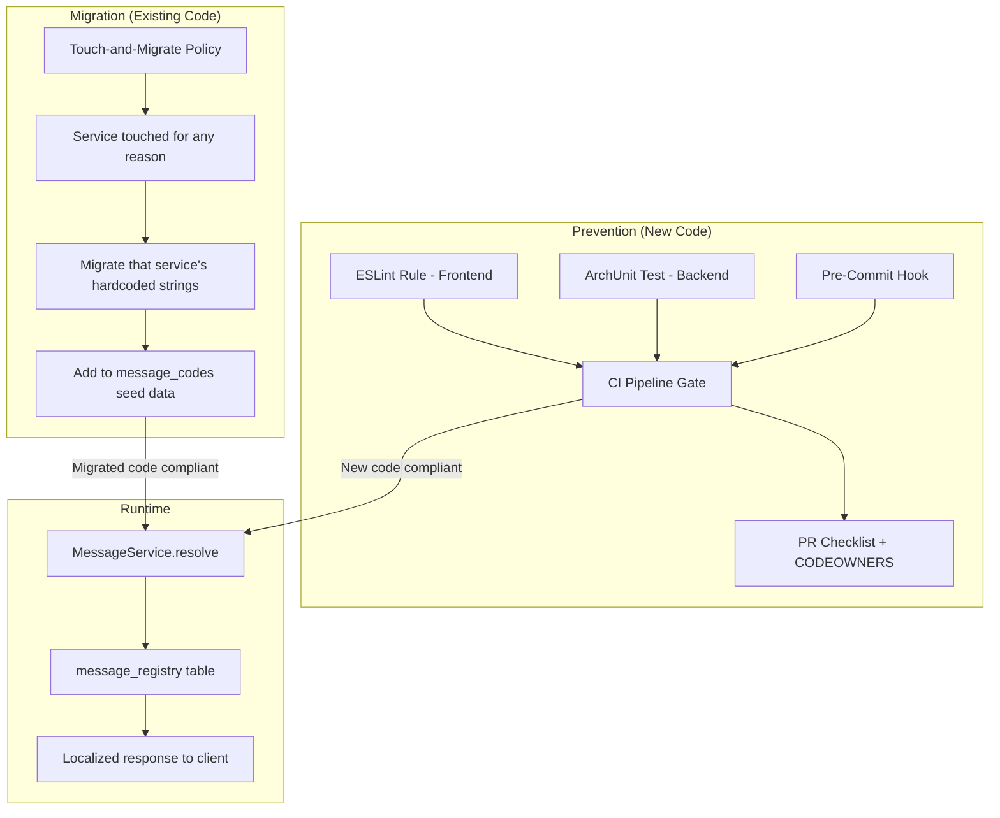
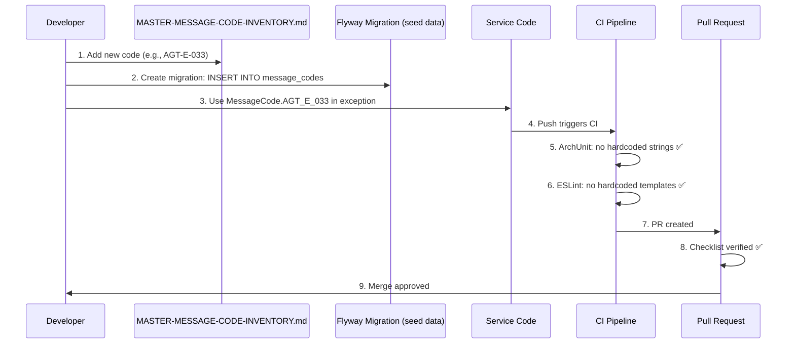
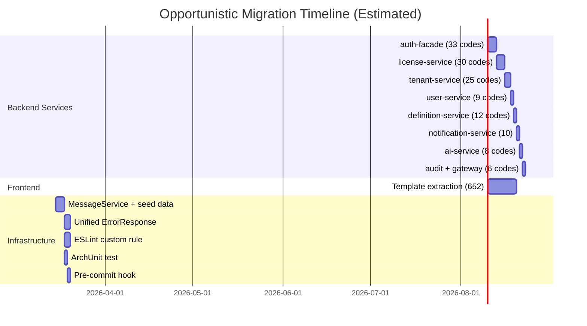

# Sustainable i18n Enforcement Plan

**Date:** 2026-03-13
**Status:** [PLANNED] -- Design-phase plan. No enforcement mechanisms implemented yet.
**Governing ADR:** ADR-031 (Zero Hardcoded Text)
**Goal:** Ensure every user-facing string in EMSIST is externalized to the message registry, and that no new hardcoded strings can enter the codebase.

---

## 1. Strategy Overview



**Two-pronged approach:**
1. **Prevention** — Full CI pipeline enforcement ensures no new hardcoded strings enter
2. **Migration** — Opportunistic migration during feature work eliminates existing violations gradually

---

## 2. Prevention Layer: Full CI Pipeline

### 2.1 Layer 1: ESLint Rule (Frontend — Compile-Time)

**Purpose:** Block hardcoded user-facing strings in Angular templates and TypeScript.

**Rule: `no-hardcoded-user-text`**

```
What it catches:
- String literals in component templates (HTML) outside of structural directives
- String literals in error/success/warning toast calls
- String literals in confirmation dialog message properties
- String literals in form validation messages

What it allows:
- CSS class names, attribute selectors, structural values
- Route paths, enum values, technical identifiers
- Strings passed to translate pipe ({{ 'KEY' | translate }})
- Test files (*.spec.ts)
- i18n marker functions: $localize, translate(), this.translateService.instant()
```

**File:** `frontend/.eslintrc.json` (add rule)
**Plugin:** Custom ESLint plugin at `frontend/eslint-rules/no-hardcoded-user-text.ts`

**Implementation sketch:**

```typescript
// eslint-rules/no-hardcoded-user-text.ts
// Flags:
//   1. Template literals in showToast(), showConfirmation(), showError() calls
//   2. String properties named 'message', 'label', 'header', 'detail', 'summary'
//      in object literals passed to PrimeNG components (p-toast, p-confirmDialog)
//   3. Hardcoded text content in HTML templates (requires @angular-eslint parser)
// Allows:
//   1. Strings wrapped in translate() or $localize
//   2. Technical strings (routes, CSS classes, enum values)
//   3. Test files
```

**CI integration:** `ng lint` runs on every push. Failure blocks merge.

### 2.2 Layer 2: ArchUnit Test (Backend — Compile-Time)

**Purpose:** Block hardcoded strings in Java exception constructors and error response builders.

**Test: `MessageCodeEnforcementTest.java`**

```java
// Location: backend/common/src/test/java/com/emsist/common/arch/
@AnalyzeClasses(packages = "com.emsist", importOptions = ImportOption.DoNotIncludeTests.class)
class MessageCodeEnforcementTest {

    @ArchTest
    static final ArchRule no_hardcoded_exception_messages =
        noClasses()
            .that().resideInAnyPackage("..service..", "..controller..")
            .should().callConstructorWhere(
                target -> target.getOwner().isAssignableTo(RuntimeException.class)
                    && target.getParameterTypes().stream()
                        .anyMatch(t -> t.getName().equals("java.lang.String"))
            )
            .because("ADR-031: Use MessageCode enum instead of hardcoded strings in exceptions");

    @ArchTest
    static final ArchRule error_responses_use_message_codes =
        methods()
            .that().areDeclaredInClassesThat().haveSimpleNameEndingWith("GlobalExceptionHandler")
            .should().onlyCallMethodsThat()
                .areDeclaredIn(MessageService.class)
                .or().areDeclaredIn(ProblemDetail.class)
            .because("ADR-031: GlobalExceptionHandler must resolve messages via MessageService");
}
```

**CI integration:** `mvn test` runs ArchUnit tests on every push. Failure blocks merge.

### 2.3 Layer 3: Pre-Commit Hook

**Purpose:** Fast local feedback before code leaves the developer's machine.

**File:** `.githooks/pre-commit-i18n-check.sh`

```bash
#!/bin/bash
# Quick regex scan for common hardcoded string patterns in staged files

STAGED_JAVA=$(git diff --cached --name-only --diff-filter=ACM | grep '\.java$' | grep -v 'Test\.java$')
STAGED_TS=$(git diff --cached --name-only --diff-filter=ACM | grep '\.ts$' | grep -v '\.spec\.ts$')
STAGED_HTML=$(git diff --cached --name-only --diff-filter=ACM | grep '\.html$')

VIOLATIONS=0

# Java: Check for string literals in throw statements
for file in $STAGED_JAVA; do
    if git show ":$file" | grep -nE 'throw new \w+Exception\("[^"]+"\)' | grep -v 'MessageCode\.' > /dev/null 2>&1; then
        echo "ADR-031 VIOLATION: Hardcoded exception string in $file"
        git show ":$file" | grep -nE 'throw new \w+Exception\("[^"]+"\)' | grep -v 'MessageCode\.'
        VIOLATIONS=$((VIOLATIONS + 1))
    fi
done

# TypeScript: Check for hardcoded strings in toast/dialog calls
for file in $STAGED_TS; do
    if git show ":$file" | grep -nE "showToast\([^)]*['\"][A-Z]" > /dev/null 2>&1; then
        echo "ADR-031 VIOLATION: Hardcoded toast message in $file"
        VIOLATIONS=$((VIOLATIONS + 1))
    fi
done

if [ $VIOLATIONS -gt 0 ]; then
    echo ""
    echo "Found $VIOLATIONS ADR-031 violations. Use MessageCode/translate pipe instead."
    echo "Bypass: echo 'i18n-bypass: <reason>' > docs/sdlc-evidence/.bypass"
    exit 1
fi
```

**Installation:** Already handled by `.githooks/` directory pattern (see CLAUDE.md Rule 10).

### 2.4 Layer 4: PR Checklist + CODEOWNERS

**Purpose:** Human review as final safety net.

**PR template addition** (`.github/PULL_REQUEST_TEMPLATE.md`):

```markdown
## ADR-031 Compliance (Zero Hardcoded Text)
- [ ] No hardcoded user-facing strings in exception constructors
- [ ] No hardcoded text in Angular templates (use translate pipe)
- [ ] No hardcoded toast/dialog messages (use MessageCode)
- [ ] New message codes added to MASTER-MESSAGE-CODE-INVENTORY.md
- [ ] New codes seeded in migration script (if applicable)
```

**CODEOWNERS** (`.github/CODEOWNERS`):

```
# Any changes to exception handlers require i18n review
**/GlobalExceptionHandler.java    @emsist/i18n-reviewers
**/exception/**                    @emsist/i18n-reviewers

# Message registry changes require BA sign-off
Documentation/.Requirements/MASTER-MESSAGE-CODE-INVENTORY.md  @emsist/ba-team
```

---

## 3. Migration Strategy: Touch-and-Migrate

### Policy

> When a developer (or AI agent) touches a backend service for **any reason** (feature, bug fix, refactoring), they MUST also migrate that service's hardcoded strings to the message registry.

### Migration Checklist Per Service

When touching a service, complete these steps:

```markdown
## Service Migration Checklist: {service-name}

- [ ] Read service's section in R01-R03-MESSAGE-CODE-AUDIT.md
- [ ] Create MessageCode enum/constants class: `{service}/src/main/java/.../MessageCode.java`
- [ ] Replace each hardcoded string with MessageCode reference
- [ ] Update GlobalExceptionHandler to use MessageService.resolve()
- [ ] Add Flyway migration: seed `message_codes` table with service's codes
- [ ] Add ArchUnit test verifying no hardcoded strings remain
- [ ] Update R01-R03-MESSAGE-CODE-AUDIT.md: mark service as MIGRATED
- [ ] Run tests: `mvn test -pl {service-module}`
```

### Migration Tracking

| Service | Codes | Status | Migrated By | Date |
|---------|-------|--------|-------------|------|
| auth-facade | 33 | PENDING | -- | -- |
| license-service | 30 | PENDING | -- | -- |
| tenant-service | 25 | PENDING | -- | -- |
| user-service | 9 | PENDING | -- | -- |
| definition-service | 12 | PENDING | -- | -- |
| notification-service | 10 | PENDING | -- | -- |
| ai-service | 8 | PENDING | -- | -- |
| audit-service | 3 | PENDING | -- | -- |
| api-gateway | 3 | PENDING | -- | -- |

### Priority Guidance

When multiple services need work, prefer migrating in this order (highest user-facing impact first):
1. auth-facade (41 strings, authentication messages visible to all users)
2. license-service (36 strings, license validation visible to admins)
3. tenant-service (30 strings, tenant lifecycle visible to admins)
4. user-service (27 strings, mostly ResourceNotFoundException patterns)
5. Everything else (diminishing returns)

---

## 4. Runtime Infrastructure Required

### 4.1 MessageService (Backend)

```java
// backend/common/src/main/java/com/emsist/common/i18n/MessageService.java
public interface MessageService {
    /**
     * Resolve a message code to a localized string.
     * @param code    e.g., "AUTH-E-001"
     * @param locale  e.g., Locale.forLanguageTag("ar")
     * @param args    placeholder values e.g., {"tenantId": "abc-123"}
     * @return localized message string, or English fallback, or code itself
     */
    String resolve(String code, Locale locale, Map<String, Object> args);
}
```

**Resolution order:**
1. Check Valkey cache for `{code}:{locale}`
2. Query `message_translation` table for exact locale
3. Fall back to `message_registry.default_description` (English)
4. Fall back to returning the code itself (e.g., `AUTH-E-001`)

### 4.2 Unified ErrorResponse

```java
// backend/common/src/main/java/com/emsist/common/dto/ErrorResponse.java
public record ErrorResponse(
    String messageCode,           // e.g., "AUTH-E-001"
    String message,               // localized message text
    int status,                   // HTTP status code
    Map<String, Object> params,   // placeholder values for client-side rendering
    String timestamp,
    String path
) {}
```

**All 3 existing ErrorResponse patterns** (auth/tenant/user custom DTOs, license/notification/audit shared DTO, definition-service ProblemDetail) converge to this single format.

### 4.3 Frontend MessageResolver

```typescript
// frontend/src/app/core/services/message-resolver.service.ts
@Injectable({ providedIn: 'root' })
export class MessageResolverService {
  /**
   * API error responses arrive with messageCode + params.
   * This service resolves the display text from the local translation bundle
   * or falls back to the server-provided message.
   */
  resolve(errorResponse: ErrorResponse): string {
    const template = this.translateService.instant(errorResponse.messageCode);
    if (template === errorResponse.messageCode) {
      // No local translation found, use server message
      return errorResponse.message;
    }
    return this.interpolate(template, errorResponse.params);
  }
}
```

---

## 5. New Code Workflow



**Key rule:** The inventory document is updated FIRST, seed migration SECOND, code THIRD. This ensures the registry is always ahead of the code.

---

## 6. Agent Enforcement (SDLC Agents)

### BA Agent Obligations

- When defining new user stories, BA MUST define all message codes (E/C/W/S) in the story
- New codes MUST be added to MASTER-MESSAGE-CODE-INVENTORY.md with BA sign-off
- BA validates that no story relies on hardcoded text

### DEV Agent Obligations

- DEV MUST NOT introduce hardcoded strings in exception constructors
- DEV MUST use MessageCode enum/constants for all error responses
- When touching a service with existing hardcoded strings, DEV MUST migrate them
- DEV's principles-ack.md MUST include: "ADR-031 compliance: no hardcoded user-facing strings"

### QA Agent Obligations

- QA MUST verify that error responses contain `messageCode` field
- QA MUST verify that toast messages display translated text (not raw strings)
- QA MUST test with at least 2 locales (en + ar) for every error scenario

### CI/CD Agent Obligations

- ArchUnit test failure for ADR-031 MUST block the build
- ESLint rule violation MUST block the build
- Pre-commit hook MUST be installed in all developer environments

---

## 7. Metrics & Monitoring

### Compliance Dashboard

| Metric | Target | How Measured |
|--------|--------|-------------|
| Backend hardcoded string count | 0 (from 133) | ArchUnit test + grep scan |
| Frontend hardcoded string count | 0 (from 652) | ESLint rule violations |
| Message code coverage | 100% | Codes in registry vs codes in code |
| Translation coverage per locale | >95% | `message_translation` rows vs `message_registry` rows |
| CI pipeline pass rate | >98% | GitHub Actions metrics |

### Tracking Migration Progress



> **Note:** The Gantt chart above shows estimated effort if all migration were done contiguously. With the touch-and-migrate policy, actual migration will be spread across sprints as services are touched for feature work.

---

## 8. Success Criteria

The i18n enforcement system is considered **complete** when:

1. **Zero hardcoded user-facing strings** in both backend (Java) and frontend (TypeScript/HTML)
2. **CI pipeline blocks** any PR that introduces hardcoded strings
3. **ArchUnit test exists** in every backend service verifying message code usage
4. **ESLint rule active** in frontend blocking template literals in user-facing positions
5. **Pre-commit hook** catches violations before push
6. **MessageService** operational with Valkey caching and locale fallback
7. **All 360+ codes** seeded in `message_registry` table
8. **At least 2 locales** (en + ar) fully translated
9. **SDLC agents** include ADR-031 compliance in their principles acknowledgment

---

## 9. Cross-References

| Document | Path | Relationship |
|----------|------|-------------|
| ADR-031 | `Documentation/adr/ADR-031-zero-hardcoded-text-i18n.md` | Governing decision |
| Master Code Inventory | `Documentation/.Requirements/MASTER-MESSAGE-CODE-INVENTORY.md` | Code registry |
| R01-R03 Backend Audit | `Documentation/.Requirements/R01-R03-MESSAGE-CODE-AUDIT.md` | Existing violations |
| R04 Story Inventory | `Documentation/.Requirements/R04.../R04-COMPLETE-STORY-INVENTORY.md` | DEF code definitions |
| R05 Message Registry | `Documentation/.Requirements/R05.../R05-MESSAGE-CODE-REGISTRY.md` | AGT code definitions |
| R06 Story Inventory | `Documentation/.Requirements/R06.../R06-COMPLETE-STORY-INVENTORY.md` | LOC code definitions |
| Governance Framework | `docs/governance/GOVERNANCE-FRAMEWORK.md` | Agent enforcement |
| DEV Principles | `docs/governance/agents/DEV-PRINCIPLES.md` | Developer rules |
| QA Principles | `docs/governance/agents/QA-PRINCIPLES.md` | Testing rules |
