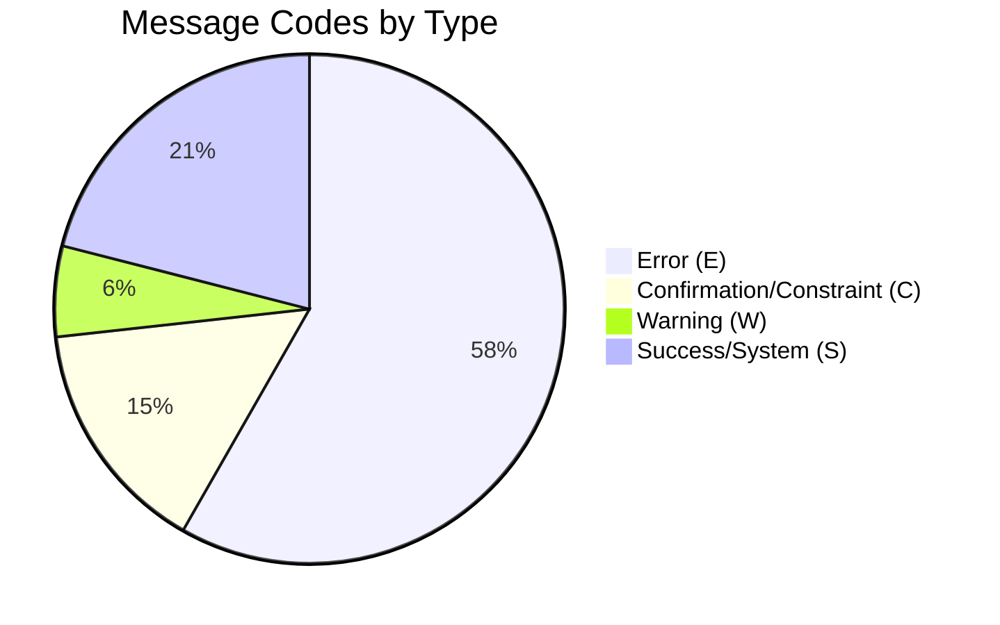
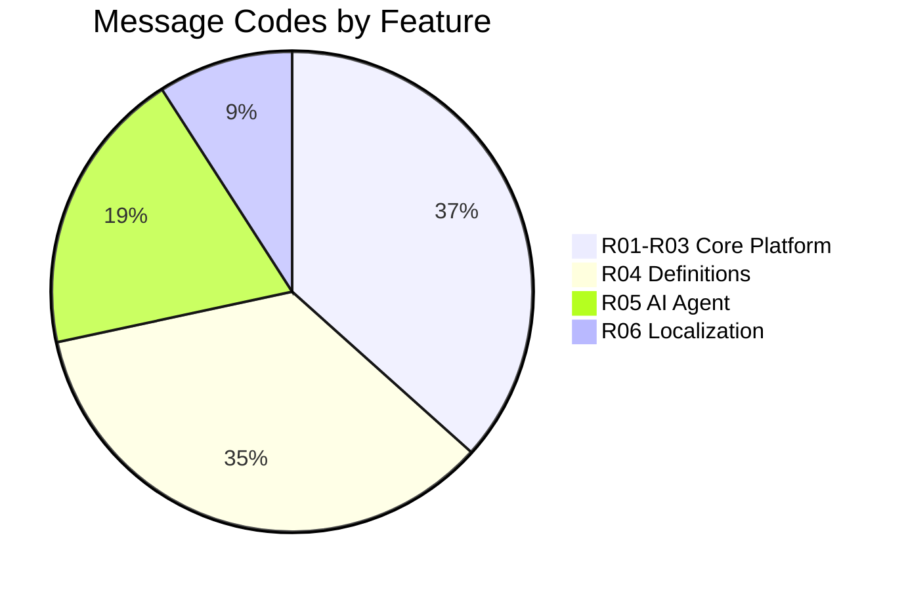

# EMSIST -- Master Message Code Inventory

**Date:** 2026-03-13
**Author:** SDLC Orchestration Agent
**Status:** [PLANNED] -- Design-phase inventory. Implementation is 0% (ADR-031 accepted, no codes externalized yet).
**Convention:** `{SERVICE}-{TYPE}-{SEQ}` where TYPE = E (Error), C (Confirmation/Constraint), W (Warning), S (Success/System)

---

## 1. Executive Summary

| Source | Service Prefix | Error (E) | Confirm/Constraint (C) | Warning (W) | Success/System (S) | Total |
|--------|---------------|-----------|------------------------|-------------|---------------------|-------|
| **R01-R03 Backend Audit** | AUTH, TEN, USR, LIC, NOT, AUD, AI, PRC, DEF, GW | 121 | 28 | 0 | 21 | **~133 unique** |
| **R04 Definition Mgmt** | DEF | 63 | 20 | 9 | 35 | **127** |
| **R05 AI Agent Platform** | AGT | 32 | 12 | 10 | 16 | **70** |
| **R06 Localization** | LOC | 17 | 0 | 4 | 12 | **33** |
| **GRAND TOTAL** | | | | | | **~363 unique** |

> **Note:** R04 DEF codes and R01-R03 DEF codes overlap (both define `DEF-E-xxx`). The R04 inventory is the authoritative design-phase source for definition-service codes. The R01-R03 audit captures the 16 _existing_ hardcoded strings in code that need to be migrated to R04's registry. After deduplication, the true unique count is approximately **350-360 codes**.

---

## 2. Service Prefix Registry

| Prefix | Service | Port | Database | Feature Area |
|--------|---------|------|----------|--------------|
| `AUTH` | auth-facade | 8081 | Neo4j + Valkey | R01 Authentication & Authorization |
| `TEN` | tenant-service | 8082 | PostgreSQL | R02 Tenant Management |
| `USR` | user-service | 8083 | PostgreSQL | R03 User Management |
| `LIC` | license-service | 8085 | PostgreSQL | R02/R03 Licensing |
| `NOT` | notification-service | 8086 | PostgreSQL | Cross-cutting Notifications |
| `AUD` | audit-service | 8087 | PostgreSQL | Cross-cutting Audit |
| `AI` | ai-service | 8088 | PostgreSQL + pgvector | R05 AI Platform (existing backend) |
| `PRC` | process-service | 8089 | PostgreSQL | Cross-cutting Process |
| `DEF` | definition-service | 8090 | Neo4j | R04 Definition Management |
| `GW` | api-gateway | 8080 | -- | Cross-cutting Gateway |
| `AGT` | ai-service (R05 extension) | 8088 | PostgreSQL + pgvector | R05 Agent Manager (new codes) |
| `LOC` | localization-service | TBD | PostgreSQL | R06 Localization |
| `SYS` | (cross-cutting) | -- | -- | Shared platform-wide codes |

---

## 3. Code Distribution by Type

---

## 4. R01-R03 Core Platform Codes (Backend Audit)

Source: `Documentation/.Requirements/R01-R03-MESSAGE-CODE-AUDIT.md`

These are **existing hardcoded strings** in production code that must be migrated to the message registry.

### Summary by Service

| Service | Prefix | Unique Codes | Reused Instances | Total Occurrences | Priority |
|---------|--------|-------------|------------------|-------------------|----------|
| auth-facade | AUTH | 33 | 8 | 41 | CRITICAL |
| license-service | LIC | 30 | 6 | 36 | CRITICAL |
| tenant-service | TEN | 25 | 5 | 30 | HIGH |
| user-service | USR | 9 | 18 | 27 | HIGH |
| definition-service | DEF | 12 | 4 | 16 | MEDIUM |
| notification-service | NOT | 10 | 6 | 16 | MEDIUM |
| ai-service | AI | 8 | 3 | 11 | MEDIUM |
| audit-service | AUD | 3 | 1 | 4 | LOW |
| api-gateway | GW | 3 | 0 | 3 | LOW |
| process-service | PRC | 0 | 0 | 0 | NONE |
| **Total** | | **~133** | **~51** | **184** | |

### Cross-Cutting Patterns (Candidates for SYS-* Codes)

| Pattern | Occurrences | Services | Proposed SYS Code |
|---------|------------|----------|-------------------|
| `"Authenticated JWT subject is required"` | 7 | USR, LIC, NOT, AI, TEN | `SYS-C-001` |
| `"An unexpected error occurred"` / `"internal_error"` | 7 | All GlobalExceptionHandlers | `SYS-S-001` |
| `"Validation failed"` / `"validation_error"` | 7 | All GlobalExceptionHandlers | `SYS-C-002` |
| `ResourceNotFoundException(entityType, id)` | 30+ | USR, LIC, NOT, AUD | Pattern: `{SVC}-E-xxx` |

### Architectural Observations

1. **3 different ErrorResponse patterns** need unification:
   - auth-facade / tenant / user: Own `ErrorResponse` DTO
   - license / notification / audit: Shared `common` module DTO
   - definition-service: RFC 7807 `ProblemDetail`

2. **ai-service uses `RuntimeException`** instead of domain exceptions (7 occurrences)

3. **api-gateway constructs inline JSON** for error responses (3 filter-level strings)

---

## 5. R04 Definition Management Codes

Source: `Documentation/.Requirements/R04. MASTER DESFINITIONS/Design/R04-COMPLETE-STORY-INVENTORY.md`

| Type | Range | Count |
|------|-------|-------|
| DEF-E-xxx | DEF-E-001 to DEF-E-133 | 63 |
| DEF-W-xxx | DEF-W-001 to DEF-W-009 | 9 |
| DEF-S-xxx | DEF-S-001 to DEF-S-035 | 35 |
| DEF-C-xxx (Confirmation Dialogs) | CD-01 to CD-60 | 20 |
| **Total** | | **127** |

### Key Code Ranges

| Range | Feature | Examples |
|-------|---------|---------|
| DEF-E-001 to DEF-E-015 | CRUD / Validation | Duplicate typeKey, not found, constraint violations |
| DEF-E-016 to DEF-E-030 | Authorization / Cross-Tenant | Forbidden, unauthorized, mandate violations |
| DEF-E-050 | API / Network Errors | Generic API error, network failure |
| DEF-E-071 | Maturity | Axis weights must sum to 100 |
| DEF-E-100 to DEF-E-104 | Locale Management | Duplicate locale, invalid code, cannot delete last |
| DEF-E-130 to DEF-E-133 | Propagation | Target not found, partial failure, duplicate, not master |
| DEF-W-001 to DEF-W-009 | Warnings | Low maturity, stale data, coverage gaps |
| DEF-S-001 to DEF-S-035 | Success Toasts | Created, updated, deleted, propagated, etc. |

---

## 6. R05 AI Agent Platform Codes

Source: `Documentation/.Requirements/R05. AGENT MANAGER/Design/R05-MESSAGE-CODE-REGISTRY.md`

| Type | Range | Count |
|------|-------|-------|
| AGT-E-xxx | AGT-E-001 to AGT-E-032 | 32 |
| AGT-C-xxx | AGT-C-001 to AGT-C-012 | 12 |
| AGT-W-xxx | AGT-W-001 to AGT-W-010 | 10 |
| AGT-S-xxx | AGT-S-001 to AGT-S-016 | 16 |
| **Total** | | **70** |

### Key Code Ranges

| Range | Feature | Examples |
|-------|---------|---------|
| AGT-E-001 to AGT-E-008 | Agent CRUD | Not found, duplicate name, state conflict |
| AGT-E-009 to AGT-E-016 | Skills & Tools | Skill not found, circular inheritance, tool timeout |
| AGT-E-017 to AGT-E-021 | Pipeline Execution | Step failure, timeout, retry exhausted |
| AGT-E-022 to AGT-E-026 | Training & Knowledge | Job failure, empty data, quota exceeded |
| AGT-E-027 to AGT-E-029 | Chat & Conversations | Not found, token/rate limit exceeded |
| AGT-E-030 to AGT-E-032 | Security & Governance | Prompt injection, maturity gate, HITL rejection |
| AGT-C-001 to AGT-C-012 | Confirmation Dialogs | Delete, hard-delete, restore, publish, train, rollback |
| AGT-W-001 to AGT-W-010 | Warnings | Concurrent edit, budget, deprecation, anomaly |
| AGT-S-001 to AGT-S-016 | Success | Created, updated, deleted, cloned, trained, promoted |

### Reserved Ranges

| Range | Reserved For |
|-------|-------------|
| AGT-E-033 to AGT-E-050 | Super Agent / Orchestration errors |
| AGT-E-051 to AGT-E-070 | Benchmarking / Eval Harness errors |
| AGT-C-013 to AGT-C-020 | Super Agent approval workflows |
| AGT-W-011 to AGT-W-020 | Super Agent / ATS warnings |
| AGT-S-017 to AGT-S-030 | Super Agent / Orchestration success |

---

## 7. R06 Localization Codes

Source: `Documentation/.Requirements/R06. Localization/Design/R06-COMPLETE-STORY-INVENTORY.md`

| Type | Range | Count |
|------|-------|-------|
| LOC-E-xxx | LOC-E-001 to LOC-E-052 | 17 |
| LOC-W-xxx | LOC-W-001 to LOC-W-004 | 4 |
| LOC-S-xxx | LOC-S-001 to LOC-S-012 | 12 |
| **Total** | | **33** |

### Key Codes

| Code | Description | HTTP Status |
|------|-------------|-------------|
| LOC-E-001 | Cannot deactivate alternative locale | 409 |
| LOC-E-002 | Cannot deactivate last active locale | 409 |
| LOC-E-003 | Empty CSV file | 400 |
| LOC-E-004 | File exceeds 10MB limit | 413 |
| LOC-E-005 | Import rate limit exceeded (5/hour) | 429 |
| LOC-E-006 | Selected locale not active | 422 |
| LOC-E-007 | Locale must be active for alternative | 422 |
| LOC-E-008 | Preview expired | 410 |
| LOC-E-009 | Translation too long (5000 chars) | 400 |
| LOC-E-010 | Dictionary entry not found | 400 |
| LOC-E-011 | Locale not active for override | 400 |
| LOC-E-012 | Tenant ID mismatch (IDOR) | 403 |
| LOC-E-013 | Override not found | 404 |
| LOC-E-014 | CSV injection detected | 400 |
| LOC-E-050 | Generic API error | 500 |
| LOC-E-051 | Version has no snapshot | 400 |
| LOC-E-052 | Bundle not found | 404 |

---

## 8. Overlap & Conflict Analysis

### R04 DEF codes vs R01-R03 Audit DEF codes

The R01-R03 audit identified **16 hardcoded strings** already in definition-service source code. The R04 story inventory defines **63 DEF-E codes** for the full feature. These two sets partially overlap:

| R01-R03 Audit Code | R04 Inventory Code | Conflict? |
|--------------------|--------------------|-----------|
| DEF-E-001 (TypeKey duplicate) | DEF-E-001 (same) | Aligned |
| DEF-E-002 (AttributeType not found) | DEF-E-002 (same) | Aligned |
| DEF-E-009 (ObjectType not found) | DEF-E-009 (same) | Aligned |
| DEF-C-001 (Missing tenant context) | -- | New in audit |
| DEF-S-001 (Internal error) | DEF-E-050 (API error) | **Needs alignment** |

**Action:** R04's inventory is the authoritative source. R01-R03 audit codes for DEF should be remapped to R04's numbering where they conflict.

### R04 Locale Codes vs R06 Locale Codes

| R04 Code | R06 Code | Overlap? |
|----------|----------|----------|
| DEF-E-100 (Duplicate Locale) | LOC-E-001 (Cannot deactivate alt) | Different concepts, no conflict |
| DEF-E-101 (Unfilled Values) | LOC-E-002 (Cannot deactivate last) | Different concepts, no conflict |
| DEF-E-102 (Invalid Locale Code) | LOC-E-006 (Locale not active) | Different concepts, no conflict |
| DEF-E-103 (Cannot Delete Last) | LOC-E-002 (same concept) | **Potential duplication** |

**Action:** R04's locale management (SCR-06) operates on per-tenant locale activation within definition-service. R06's localization service manages the dictionary and translations. These are complementary but the "cannot delete/deactivate last locale" concept appears in both. Recommend aligning: DEF-E-103 for definition-service locale list, LOC-E-002 for localization-service dictionary.

---

## 9. Implementation Roadmap

### Phase 1: Infrastructure (Sprint 1)

| Task | Description | Dependency |
|------|-------------|------------|
| Create `message_codes` table | Seed table in localization-service DB with all codes from this inventory | R06 service exists |
| Unified ErrorResponse DTO | Standardize error response format with `messageCode` + `messageParams` fields | Common module |
| Message Registry Service | REST endpoint to resolve code → localized template | R06 localization-service |
| Frontend MessageResolver | Angular service that resolves codes via registry | R06 service API |

### Phase 2: Backend Migration (Sprints 2-3)

| Service | Codes to Migrate | Effort | Priority |
|---------|-----------------|--------|----------|
| auth-facade | 33 unique | HIGH | 1 |
| license-service | 30 unique | HIGH | 2 |
| tenant-service | 25 unique | MEDIUM | 3 |
| user-service | 9 unique | LOW | 4 |
| definition-service | 12 unique | LOW | 5 |
| notification-service | 10 unique | LOW | 6 |
| ai-service | 8 unique | LOW | 7 |
| audit-service | 3 unique | LOW | 8 |
| api-gateway | 3 unique | LOW | 9 |

### Phase 3: New Feature Codes (Sprint 3+)

| Feature | Codes | When |
|---------|-------|------|
| R04 Definition Management | 127 codes | When R04 development starts |
| R05 AI Agent Platform | 70 codes | When R05 development starts |
| R06 Localization | 33 codes | When R06 development starts |

---

## 10. Enforcement Mechanisms

### Design-Time Enforcement

1. **This inventory is the single source of truth** for message code allocation
2. New codes MUST be added here FIRST with BA sign-off before being seeded
3. Code ranges are allocated per service — no cross-service code reuse
4. Reserved ranges (Section 6) prevent future conflicts

### Build-Time Enforcement

1. **Lint rule**: No hardcoded strings in `throw new` or `ResponseEntity` statements
2. **Compile-time check**: All `@MessageCode` annotations reference valid codes from seed data
3. **CI gate**: `message-code-coverage` job verifies every API error response includes `messageCode`

### Runtime Enforcement

1. **Fallback**: If code not found in registry, return code as-is (never crash)
2. **Missing translation**: Log warning, return English fallback
3. **Audit trail**: Every message code resolution logged for compliance

---

## 11. Cross-References

| Document | Path | Relationship |
|----------|------|-------------|
| ADR-031 Zero Hardcoded Text | `Documentation/adr/ADR-031-zero-hardcoded-text-i18n.md` | Governing decision |
| R01-R03 Backend Audit | `Documentation/.Requirements/R01-R03-MESSAGE-CODE-AUDIT.md` | Existing code audit |
| R04 Story Inventory | `Documentation/.Requirements/R04. MASTER DESFINITIONS/Design/R04-COMPLETE-STORY-INVENTORY.md` | DEF code definitions |
| R05 Message Code Registry | `Documentation/.Requirements/R05. AGENT MANAGER/Design/R05-MESSAGE-CODE-REGISTRY.md` | AGT code definitions |
| R06 Story Inventory | `Documentation/.Requirements/R06. Localization/Design/R06-COMPLETE-STORY-INVENTORY.md` | LOC code definitions |
| Consolidated Story Inventory | `Documentation/.Requirements/CONSOLIDATED-STORY-INVENTORY.md` | 450 stories cross-index |
| Screen Flow Playground | `Documentation/prototypes/screen-flow-playground.html` | Interactive gap analysis |
