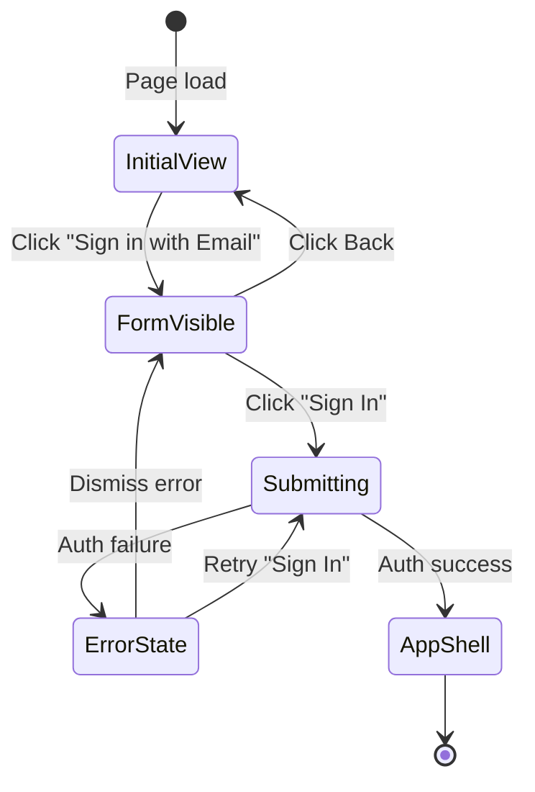
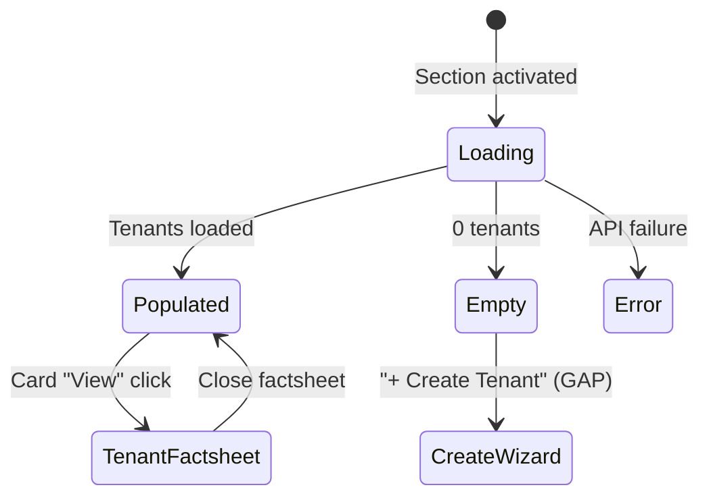
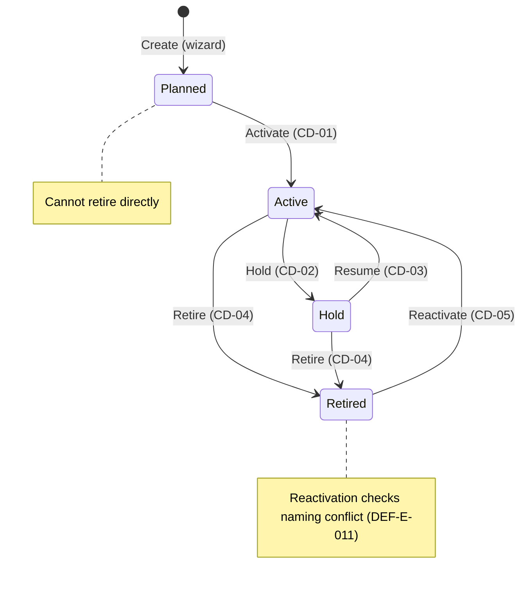
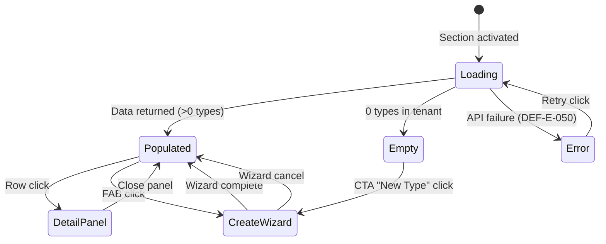
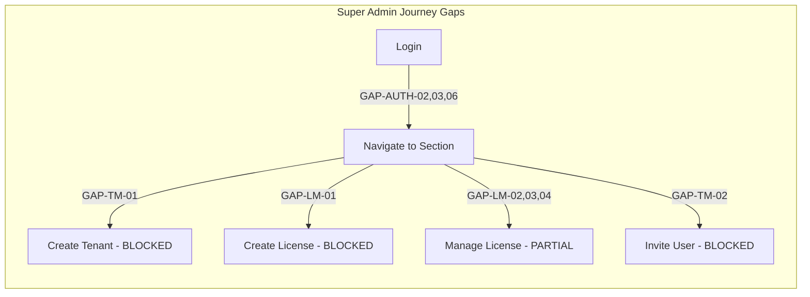
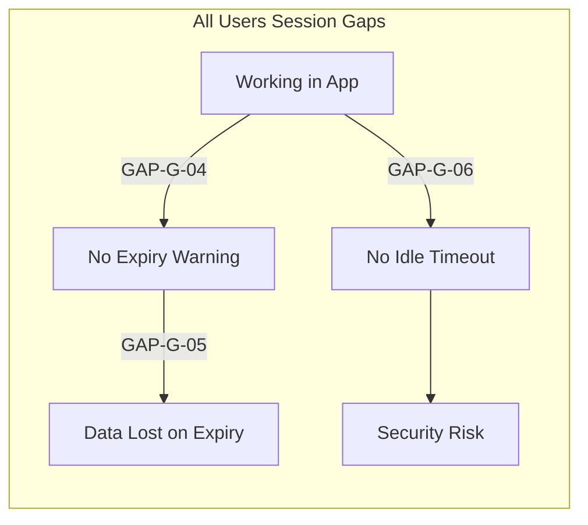

# EMSIST Persona Interaction Specification

**Document ID:** PIS-001
**Version:** 1.0.0
**Date:** 2026-03-13
**Author:** BA Agent (persona-interaction-spec)
**Status:** [PLANNED] -- Design-phase specification. Maps every interactive element per persona per screen.
**Sources:** PROTOTYPE-SCREEN-MAP.md, CONSOLIDATED-STORY-INVENTORY.md, R04/R05/R06 Complete Story Inventories, MASTER-MESSAGE-CODE-INVENTORY.md

> Reference-only note:
> R02-related content in this file is historical and is superseded by the normalized baselines under `../../R02. TENANT MANAGEMENT/R02.01 Business Requirements/`.
> Do not use this file as the source of truth for R02 personas, journeys, touchpoints, variants, shell, or dock behavior.

---

## Table of Contents

1. [Persona Access Matrix](#1-persona-access-matrix)
2. [Global Interactions (All Screens)](#2-global-interactions-all-screens)
3. [Core Screens -- Authentication and Shell](#3-core-screens----authentication-and-shell)
4. [R02 -- Tenant Management Screens](#4-r02----tenant-management-screens)
5. [R03 -- License Management Screens](#5-r03----license-management-screens)
6. [R04 -- Definition Management Screens](#6-r04----definition-management-screens)
7. [R05 -- Agent Manager Screens](#7-r05----agent-manager-screens)
8. [R06 -- Localization Screens](#8-r06----localization-screens)
9. [Comprehensive Gap Analysis](#9-comprehensive-gap-analysis)
10. [Cross-Cutting Interaction Patterns](#10-cross-cutting-interaction-patterns)

---

## 1. Persona Access Matrix

### 1.1 Consolidated Persona Registry

| ID | Name | Role Key | Dock Items | Feature Access |
|----|------|----------|------------|----------------|
| PER-UX-001 | Sam Martinez | SUPER_ADMIN (platform-admin) | All 5 sections | Full system, cross-tenant, licensing, governance |
| PER-UX-003 | Fiona Chang | ADMIN (tenant-admin) | Agent Mgr, Def Mgr, Release Dashboard | Tenant-scoped management, overrides, releases |
| PER-UX-002 | Nicole Russo | ARCHITECT | Def Mgr, Release Dashboard | Definition CRUD, maturity, governance |
| PER-UX-007 | Nora Davidson | AGENT_DESIGNER (agent-designer) | Agent Mgr | Agent CRUD, skills, tools, templates |
| PER-USR | Lisa Harrison | USER (user) | User Landing, Agent Mgr (view) | Chat, basic agent interaction, language |
| VW | -- | VIEWER (viewer) | Agent Mgr (view) | Read-only agent data |

### 1.2 Screen x Persona Access Level

**Legend:** F = Full (CRUD), R = Read-only, N = No access (hidden), C = Conditional

#### Core Screens

| Screen | Super Admin | Tenant Admin | Architect | Agent Designer | Business User | Viewer |
|--------|-------------|-------------|-----------|----------------|---------------|--------|
| SCR-AUTH (Login) | F | F | F | F | F | F |
| App Shell | F | F | F | F | F | F |
| User Landing | N | N | N | N | F | F |
| Notification Dropdown | F | F | F | F | F | R |
| Chatbot Mini Panel (FAB) | F | F | F | F | F | R |
| Full-Page Chat | F | F | F | F | F | R |
| Language Switcher | F | F | F | F | F | F |

#### R02 -- Tenant Management

| Screen | Super Admin | Tenant Admin | Architect | Agent Designer | Business User | Viewer |
|--------|-------------|-------------|-----------|----------------|---------------|--------|
| Tenant Manager Section | F | N | N | N | N | N |
| Tenant List (Cards) | F | N | N | N | N | N |
| Tenant Factsheet | F | N | N | N | N | N |
| User Factsheet | F | N | N | N | N | N |

#### R03 -- License Management

| Screen | Super Admin | Tenant Admin | Architect | Agent Designer | Business User | Viewer |
|--------|-------------|-------------|-----------|----------------|---------------|--------|
| License Manager Section | F | N | N | N | N | N |
| License List | F | N | N | N | N | N |
| License Factsheet | F | N | N | N | N | N |

#### R04 -- Definition Management

| Screen | Super Admin | Tenant Admin | Architect | Agent Designer | Business User | Viewer |
|--------|-------------|-------------|-----------|----------------|---------------|--------|
| Def Manager Section | F | C (own tenant) | F | N | N | N |
| Object Type List | F (cross-tenant) | F (own tenant) | F | N | N | N |
| Object Type Detail (7 tabs) | F | C (mandate-restricted) | F | N | N | N |
| Create Wizard | F | F | F | N | N | N |
| Release Dashboard | F | F (adopt/defer/reject) | F (publish) | N | N | N |
| Graph Visualization | F | N | F | N | N | N |
| Propagation Wizard | F | N | N | N | N | N |

#### R05 -- Agent Manager

| Screen | Super Admin | Tenant Admin | Architect | Agent Designer | Business User | Viewer |
|--------|-------------|-------------|-----------|----------------|---------------|--------|
| Agent Manager Section | F | F | N | F | R | R |
| Agent Insights | F | F | N | F | N | R |
| Agent List | F | F | N | F | R | R |
| Agent Factsheet | F | F | N | F | R | R |
| Skills Registry | F | F | N | F | N | R |
| Tools Registry | F | F | N | F | N | R |
| Templates Gallery | F | F | N | F | N | R |
| Governance (Audit/Compliance) | F | R | N | R | N | R |
| Event Triggers | F | F | N | F | N | R |
| Agent Settings | F | F | N | N | N | N |

#### R06 -- Localization

| Screen | Super Admin | Tenant Admin | Architect | Agent Designer | Business User | Viewer |
|--------|-------------|-------------|-----------|----------------|---------------|--------|
| Languages Tab | F | N | N | N | N | N |
| Dictionary Tab | F | F (edit values) | N | N | N | N |
| Import/Export Tab | F | N | N | N | N | N |
| Rollback Tab | F | N | N | N | N | N |
| AI Translate Tab | F | N | N | N | N | N |
| Tenant Overrides | N | F | N | N | N | N |
| Language Switcher (Auth) | F | F | F | F | F | F |
| Language Switcher (Anon) | F | F | F | F | F | F |

---

## 2. Global Interactions (All Screens)

These elements appear on every screen within the app-shell and are accessible to all authenticated personas unless noted.

### 2.1 Header Bar

| # | Element | Type | Personas | Action | Behavior | API Call | Success | Error | Loading | Edge Cases | Story Ref |
|---|---------|------|----------|--------|----------|----------|---------|-------|---------|------------|-----------|
| G-01 | EMSIST Logo | Image/Link | All | Click | Navigates to default landing (role-based: Admin -> first dock item; User -> user-landing) | None | View swap | -- | -- | Already on landing: no-op | -- |
| G-02 | Notification Bell | Icon Button | All | Click | Opens notification dropdown overlay. Badge shows unread count (red circle). | GET /api/v1/notifications?unread=true&limit=20 | Dropdown with up to 20 items | SYS-S-001: API error | Skeleton list (3 items) | 0 notifications: icon changes to pi-bell-slash, empty state "No notifications". 99+ unread: badge shows "99+" | US-DM-074, US-AI-034 |
| G-03 | Notification Item | List Item | All | Click | Navigates to related entity (e.g., release, agent, approval). Marks item as read. Badge decrements. | PUT /api/v1/notifications/{id}/read | Navigation + badge update | -- | -- | Linked entity deleted: "Item no longer available" toast | US-DM-074 |
| G-04 | Mark All Read | Text Button | All | Click | Marks all visible notifications as read. Badge resets to 0. | PUT /api/v1/notifications/read-all | Badge clears, items un-bold | -- | -- | 0 items: button disabled | US-DM-074 |
| G-05 | View All Notifications | Link | All | Click | Navigates to full Notification Center page | None | Page navigation | -- | -- | Page not prototyped in P1 (exists in P5 as page-notifications) | **GAP-G-01** |
| G-06 | Help Button | Icon Button | All | Click | **GAP: No help content exists. Button present but no destination.** | None | -- | -- | -- | -- | **GAP-G-02** |
| G-07 | Persona Badge | Chip/Button | All | Click | Opens persona/role information display. In P1 prototype, allows role switching for demo purposes. In production: shows current role, tenant, and user profile. | None (local) | Role display | -- | -- | Multi-role users: show primary role with dropdown for switching | **GAP-G-03** |
| G-08 | Sign Out | Button | All | Click | Ends session, clears tokens (localStorage/sessionStorage), redirects to login page. | POST /api/v1/auth/logout | Redirect to SCR-AUTH | -- | -- | Offline: clear local state anyway. Token already expired: redirect silently. | -- |
| G-09 | Language Switcher (Header) | Dropdown Pill | All authenticated | Click pill | Opens dropdown with active locales (flag emoji + native name). Current locale has checkmark. | GET /api/v1/locales/active (cached) | Dropdown renders | -- | -- | 1 active locale: switcher hidden entirely. RTL locale selected: document.dir flips within 300ms | US-LM-054, US-LM-055 |
| G-10 | Language Switcher - Option | List Item | All authenticated | Click option | UI updates without page reload (Signal-based). RTL/LTR flips. Persists preference. | PUT /api/v1/user/locale | LOC-S-012: "Language changed to {name}" (aria-live) | LOC-E-006: Locale not active (422) | -- | Dialog open during switch: dialog text updates. Mobile: switcher in hamburger menu. | US-LM-054, US-LM-057 |

### 2.2 Dock Navigation (Sidebar)

| # | Element | Type | Personas | Action | Behavior | API Call | Success | Error | Loading | Edge Cases | Story Ref |
|---|---------|------|----------|--------|----------|----------|---------|-------|---------|------------|-----------|
| G-11 | Dock - Tenant Manager | Nav Button | Super Admin only | Click | Swaps main content to section-tenant-manager. Active indicator on dock item. | None (local routing) | Section displayed | -- | Section loads data lazily | Not visible to other roles | -- |
| G-12 | Dock - Agent Manager | Nav Button | SA, TA, AD, US(view), VW(view) | Click | Swaps to section-agent-manager. Sub-nav appears (Insights, Agent List, etc.) | None (local routing) | Section displayed | -- | Section loads data lazily | US/VW: read-only mode, FAB hidden, action buttons disabled | -- |
| G-13 | Dock - License Manager | Nav Button | Super Admin only | Click | Swaps to section-license-manager. | None (local routing) | Section displayed | -- | Lazy load | Not visible to other roles | -- |
| G-14 | Dock - Definition Manager | Nav Button | SA, TA, ARCH | Click | Swaps to section-def-manager. | None (local routing) | Section displayed | -- | Lazy load | ARCH: full CRUD. TA: restricted by mandates | -- |
| G-15 | Dock - Release Dashboard | Nav Button | SA, TA, ARCH | Click | Swaps to section-release-dashboard. | None (local routing) | Section displayed | -- | Lazy load | TA: adopt/defer/reject only. ARCH: publish/rollback | -- |

### 2.3 Chatbot FAB (Floating Action Button)

| # | Element | Type | Personas | Action | Behavior | API Call | Success | Error | Loading | Edge Cases | Story Ref |
|---|---------|------|----------|--------|----------|----------|---------|-------|---------|------------|-----------|
| G-16 | Chatbot FAB | Circular Button | All (except VW read-only) | Click | Toggles chatbot-panel (mini floating chat). If already open, closes it. | None | Panel toggles | -- | -- | VW: FAB hidden or chat read-only | US-AI-046 |
| G-17 | Chatbot Panel - Agent Selector | Dropdown | All with chat | Click | Lists available agents for current tenant. Select to start/switch conversation. | GET /api/v1/agents?status=active&tenantId={tid} | Agent list renders | AGT-E-001 | Skeleton list | 0 agents: "No agents available" empty state | US-AI-047 |
| G-18 | Chatbot Panel - Message Input | Textarea | All with chat | Type + Enter/Send | Sends message to selected agent. Streams response via SSE. | POST /api/v1/conversations/{cid}/messages | Streaming response in chat | AGT-E-027: Not found, AGT-E-029: Token limit | Thinking indicator with elapsed time | Empty message: send disabled. Max 4096 tokens per request. Rate limit per role (60-600/min) | US-AI-046, US-AI-051 |
| G-19 | Chatbot Panel - Pop-out | Icon Button | All with chat | Click | Closes mini panel, opens section-fullpage-chat with same conversation | None (local routing) | Full-page chat opens | -- | -- | Conversation context preserved | -- |

### 2.4 Session and Timeout Interactions

| # | Element | Type | Personas | Trigger | Behavior | API Call | Success | Error | Edge Cases | Story Ref |
|---|---------|------|----------|---------|----------|----------|---------|-------|------------|-----------|
| G-20 | Session Expiry Warning | Dialog (auto) | All | JWT nearing expiry (e.g., 5 min before) | **GAP: No session expiry warning dialog exists in prototypes. Expected behavior: modal warns user, offers "Extend Session" or "Sign Out".** | POST /api/v1/auth/refresh | Session extended | AUTH-E-xxx: Refresh failed | **GAP: Not specified in any user story** | **GAP-G-04** |
| G-21 | Session Expired Redirect | Auto-redirect | All | JWT expired, API returns 401 | **Expected: Redirect to login with "Session expired" message. Page exists (session-expired route in frontend).** | None | Redirect to /session-expired | -- | Unsaved form data: **GAP -- no auto-save or warning specified** | **GAP-G-05** |
| G-22 | Idle Timeout | Timer (auto) | All | No user activity for configurable period | **GAP: No idle timeout behavior specified in any prototype or user story.** | -- | -- | -- | User returns after timeout: forced re-auth? Preserved state? | **GAP-G-06** |

---

## 3. Core Screens -- Authentication and Shell

### 3.1 SCR-AUTH -- Login Page

**Personas with access:** All (unauthenticated)
**Entry points:** Direct URL, session expiry redirect, sign out redirect
**Exit points:** App Shell (on successful login)

#### Interactive Elements

| # | Element | Type | Persona | Action | Behavior | API Call | Success | Error Codes | Loading | Empty State | Edge Cases | Story Ref |
|---|---------|------|---------|--------|----------|----------|---------|-------------|---------|-------------|------------|-----------|
| AUTH-01 | "Sign in with Email" Button | Primary Button | All | Click | Animates signin-card-stage into view with email/password form | None (CSS transition) | Form appears | -- | -- | -- | Already in form stage: no-op | -- |
| AUTH-02 | Email Input | Text Input | All | Type | Validates email format on blur | None | -- | Client-side: "Please enter a valid email" | -- | -- | Max length not specified. RTL: text direction auto | -- |
| AUTH-03 | Password Input | Password Input | All | Type | Masked input. Toggle visibility icon. | None | -- | Client-side: "Password is required" | -- | -- | Copy-paste allowed. Show/hide toggle | -- |
| AUTH-04 | "Sign In" Submit | Primary Button | All | Click | Authenticates via Keycloak. On success: JWT stored, role determined, redirect to appropriate dock section. | POST /api/v1/auth/login (or Keycloak OIDC flow) | Redirect to app-shell | AUTH-E-001: Invalid credentials. AUTH-E-002: Account locked. AUTH-E-003: Tenant not found. | Spinner on button, button disabled | -- | Multiple rapid clicks: debounced. Network failure: error banner persists. | -- |
| AUTH-05 | "Forgot Password?" Link | Text Link | All | Click | **Prototype: mailto link only. No forgot-password flow exists.** | -- | -- | -- | -- | -- | -- | **GAP-AUTH-01** |
| AUTH-06 | Back Button (card stage) | Icon Button | All | Click | Animates form out, returns to initial signin-section | None | View swap | -- | -- | -- | -- | -- |
| AUTH-07 | Error Banner | Alert Banner | All | Auto (on auth failure) | Displays error message with icon. Dismissible. | None | -- | -- | -- | -- | Persists until dismissed or retry succeeds | -- |
| AUTH-08 | Language Switcher (Login) | Pill Buttons | All (anon) | Click language | Rerenders login page in selected language. Preference stored in localStorage (no API -- unauthenticated). | GET /api/v1/locales/{code}/bundle (public endpoint) | UI updates, dir may flip | LOC-E-052: Bundle not found | -- | 1 locale: switcher hidden | Browser language auto-detected on first visit | US-LM-063, US-LM-064 |

#### State Transitions

#### Missing Interactions (GAP ANALYSIS -- SCR-AUTH)

| Gap ID | Missing Element | Required By | Severity | Description |
|--------|----------------|-------------|----------|-------------|
| GAP-AUTH-01 | Forgot Password flow | Security best practice, referenced in prototype as mailto only | HIGH | No password reset wizard. Link goes to mailto. Needs: email entry, verification code, new password form. |
| GAP-AUTH-02 | Tenant Manager navigation after login | User identified | CRITICAL | After SA login, no clear path indicator showing where to go. Dock appears but no onboarding/tour. |
| GAP-AUTH-03 | License Manager navigation after login | User identified | CRITICAL | Same as GAP-AUTH-02 -- no guided navigation post-login for license-related tasks. |
| GAP-AUTH-04 | Exit/Logout button visibility on login | User identified | HIGH | Login page has no explicit "exit" or "close" for embedded/SSO scenarios. Sign Out exists only in app-shell header. |
| GAP-AUTH-05 | Help button on login page | User identified | MEDIUM | No help/support access for users who cannot log in. No contact info, no FAQ link. |
| GAP-AUTH-06 | Session expiry handling | User identified | CRITICAL | No specification for what happens when JWT expires. No warning dialog. No auto-refresh. No "session expired" interstitial before redirect. |
| GAP-AUTH-07 | Language switcher behavior on login | User identified | HIGH | Prototype has switcher below form (P6) but P1/P4 login prototypes do not include it. Inconsistent across prototypes. |
| GAP-AUTH-08 | MFA / 2FA flow | Security best practice | MEDIUM | No multi-factor authentication flow specified. Keycloak supports it but no UI flow documented. |
| GAP-AUTH-09 | SSO redirect flow | Enterprise requirement | MEDIUM | No specification for SSO-initiated login (SAML/OIDC redirect from enterprise IdP). |
| GAP-AUTH-10 | Account lockout feedback | US-AI-032 (RBAC) | HIGH | AUTH-E-002 referenced but no UI shows lockout countdown or unlock instructions. |

---

### 3.2 App Shell (Admin Layout)

**Personas with access:** All authenticated
**Entry points:** Successful login
**Exit points:** Sign Out -> SCR-AUTH

#### Interactive Elements

| # | Element | Type | Persona | Action | Behavior | API Call | Success | Error Codes | Loading | Empty State | Edge Cases | Story Ref |
|---|---------|------|---------|--------|----------|----------|---------|-------------|---------|-------------|------------|-----------|
| SHELL-01 | Dock Menu Toggle | Hamburger / Menu button | All | Click | Opens floating dock dropdown with navigation items filtered by role | None | Dropdown renders with role-filtered items | -- | -- | -- | Mobile: hamburger icon. Desktop: may be persistent sidebar | -- |
| SHELL-02 | Breadcrumb Trail | Text / Links | All | Click segment | Navigates to parent level (e.g., Agent Manager > Agent List > Agent "Alpha") | None (local routing) | View navigates to parent | -- | -- | -- | Root level: breadcrumb shows only current section | -- |
| SHELL-03 | Main Content Area | Container | All | -- | Renders active section based on dock selection | -- | -- | -- | Skeleton/spinner per section | -- | First load: default section per role | -- |

#### Role-Based Shell Behavior

| Role | Default Landing | Dock Items Visible | FAB Visible | Notification Badge |
|------|----------------|-------------------|-------------|-------------------|
| Super Admin | Tenant Manager | TM, AM, LM, DM, RD | Yes | Yes |
| Tenant Admin | Agent Manager | AM, DM, RD | Yes | Yes |
| Architect | Definition Manager | DM, RD | Yes | Yes |
| Agent Designer | Agent Manager | AM | Yes | Yes |
| Business User | User Landing | AM (view) | Yes | Yes |
| Viewer | User Landing | AM (view) | No | Yes |

---

### 3.3 User Landing Page

**Personas with access:** Business User (USER), Viewer (VW)
**Entry points:** Login (role=user/viewer)
**Exit points:** Chat (Start Chat card), Agent Manager (Browse Agents card)

| # | Element | Type | Persona | Action | Behavior | API Call | Success | Error | Loading | Edge Cases | Story Ref |
|---|---------|------|---------|--------|----------|----------|---------|-------|---------|------------|-----------|
| LAND-01 | Welcome Message | Text | USR, VW | -- | Displays "Welcome, {firstName}" with greeting | None | -- | -- | -- | No first name: "Welcome" only | -- |
| LAND-02 | Start Chat Card | Action Card | USR | Click | Navigates to section-fullpage-chat | None | Chat section opens | -- | -- | VW: card hidden or disabled | US-AI-046 |
| LAND-03 | Recent Conversations Card | Action Card | USR | Click | Navigates to conversation history | GET /api/v1/conversations?userId={uid}&limit=5 | Shows recent list | -- | Skeleton | 0 conversations: "No recent chats" | US-AI-052 |
| LAND-04 | Browse Agents Card | Action Card | USR, VW | Click | Navigates to am-agent-list (read-only) | None | Agent list opens | -- | -- | VW: can view but not interact with agents | US-AI-137 |

---

## 4. R02 -- Tenant Management Screens

### 4.1 section-tenant-manager -- Tenant Manager

**Personas with access:** Super Admin only
**Entry points:** Dock > Tenant Manager
**Exit points:** Tenant Factsheet (card click), other dock sections

| # | Element | Type | Persona | Action | Behavior | API Call | Success | Error | Loading | Empty State | Edge Cases | Story Ref |
|---|---------|------|---------|--------|----------|----------|---------|-------|---------|-------------|------------|-----------|
| TM-01 | Search Input | Text Input | SA | Type (debounce 300ms) | Filters tenant cards by name, domain | Client-side filter (or GET /api/v1/tenants?search={q}) | Filtered cards | -- | -- | 0 results: "No tenants match" | -- | -- |
| TM-02 | + Create Tenant | Button | SA | Click | **GAP: Button exists in empty state CTA but no creation wizard is prototyped** | -- | -- | -- | -- | "No tenants found. Create your first tenant." | -- | **GAP-TM-01** |
| TM-03 | Tenant Card | Card Component | SA | Click "View" | Opens tenant-factsheet as slide-in panel | GET /api/v1/tenants/{id} | Factsheet renders | TEN-E-xxx: Not found | Card skeleton | -- | -- | -- |
| TM-04 | Tenant Card - Status Badge | Tag | SA | -- (display) | Shows tenant status (Active/Suspended/Trial) | -- | -- | -- | -- | -- | Suspended: amber. Trial: blue | -- |

### 4.2 tenant-factsheet -- Tenant Factsheet

**Personas with access:** Super Admin only
**Entry points:** Tenant card "View" click
**Exit points:** Close (X), User Factsheet, License Factsheet

#### Overview Tab

| # | Element | Type | Persona | Action | Behavior | API Call | Success | Error | Story Ref |
|---|---------|------|---------|--------|----------|----------|---------|-------|-----------|
| TF-01 | Tenant Name | Display | SA | -- | Shows tenant name, domain, creation date | -- | -- | -- | -- |
| TF-02 | Edit Button | Icon Button | SA | Click | Enters edit mode for tenant properties | None (local state) | Fields become editable | -- | -- |
| TF-03 | Save Button | Primary Button | SA | Click | Persists tenant changes | PUT /api/v1/tenants/{id} | TEN-S-xxx: Updated | TEN-E-xxx: Validation | -- |
| TF-04 | Cancel Button | Secondary Button | SA | Click | Reverts changes, exits edit mode | None | Fields revert | -- | -- |

#### Users Tab

| # | Element | Type | Persona | Action | Behavior | API Call | Success | Error | Story Ref |
|---|---------|------|---------|--------|----------|----------|---------|-------|-----------|
| TF-05 | User Table | p-table | SA | -- | Lists users in tenant with Name, Email, Role, Status, Last Login | GET /api/v1/tenants/{tid}/users | Table renders | -- | -- |
| TF-06 | User Row - View | Icon Button | SA | Click | Opens user-factsheet (nested) | GET /api/v1/users/{uid} | User factsheet renders | USR-E-xxx | -- |
| TF-07 | + Invite User | Button | SA | Click | **GAP: Button implied but no invitation flow prototyped** | -- | -- | -- | **GAP-TM-02** |

#### Branding Tab

| # | Element | Type | Persona | Action | Behavior | API Call | Success | Error | Story Ref |
|---|---------|------|---------|--------|----------|----------|---------|-------|-----------|
| TF-08 | Logo Upload | File Input | SA | Upload file | Uploads tenant logo | PUT /api/v1/tenants/{tid}/branding/logo | Logo updated | -- | -- |
| TF-09 | Color Picker | p-colorPicker | SA | Select color | Sets tenant primary color | PUT /api/v1/tenants/{tid}/branding | Branding saved | -- | -- |

#### Licenses Tab

| # | Element | Type | Persona | Action | Behavior | API Call | Success | Error | Story Ref |
|---|---------|------|---------|--------|----------|----------|---------|-------|-----------|
| TF-10 | License Table | p-table | SA | -- | Lists licenses assigned to tenant | GET /api/v1/tenants/{tid}/licenses | Table renders | -- | -- |
| TF-11 | License Row - View | Icon Button | SA | Click | Opens license-factsheet (tenant-nested context) | GET /api/v1/licenses/{lid} | License factsheet | LIC-E-xxx | -- |

---

## 5. R03 -- License Management Screens

### 5.1 section-license-manager -- License Manager

**Personas with access:** Super Admin only
**Entry points:** Dock > License Manager
**Exit points:** License Factsheet, other dock sections

| # | Element | Type | Persona | Action | Behavior | API Call | Success | Error | Loading | Empty State | Edge Cases | Story Ref |
|---|---------|------|---------|--------|----------|----------|---------|-------|---------|-------------|------------|-----------|
| LM-01 | View Toggle (Table/Grid) | Toggle Buttons | SA | Click | Switches between table view and card grid view | None (local) | View swaps | -- | -- | -- | Default: Table | -- |
| LM-02 | Search Input | Text Input | SA | Type | Filters licenses by name, tenant, status | Client-side or GET /api/v1/licenses?search={q} | Filtered results | -- | -- | 0 results: empty state | -- | -- |
| LM-03 | + Add License | Button | SA | Click | **GAP: Button in empty state CTA but no creation wizard prototyped** | -- | -- | -- | -- | "No licenses found. Add a license." | -- | **GAP-LM-01** |
| LM-04 | License Row/Card - View | Button | SA | Click | Opens license-mgr-factsheet | GET /api/v1/licenses/{lid} | Factsheet slide | LIC-E-xxx | -- | -- | -- | -- |
| LM-05 | Status Filter | Dropdown / Chips | SA | Select | Filters by Active/Expired/Trial/Suspended | None or API param | Filtered list | -- | -- | -- | -- | -- |

### 5.2 license-mgr-factsheet -- License Factsheet (Standalone)

**Personas with access:** Super Admin only
**Entry points:** License row/card "View" click
**Exit points:** Close (X), back to list

| # | Element | Type | Persona | Action | Behavior | API Call | Success | Error | Edge Cases | Story Ref |
|---|---------|------|---------|--------|----------|----------|---------|-------|------------|-----------|
| LF-01 | License Details | Display | SA | -- | Shows plan, tier, seats, expiry, tenant, features | -- | -- | -- | -- | -- |
| LF-02 | Renew Button | Primary Button | SA | Click | **GAP: Button exists in prototype but no renewal flow** | -- | -- | -- | License already expired: different flow? | **GAP-LM-02** |
| LF-03 | Add Seats Button | Secondary Button | SA | Click | **GAP: Button exists but no seat management flow** | -- | -- | -- | At max seats: button disabled? | **GAP-LM-03** |
| LF-04 | Revoke Button | Danger Button | SA | Click | **GAP: Button exists but no revocation flow/confirmation** | -- | -- | -- | Active users on license: warning? | **GAP-LM-04** |

---

## 6. R04 -- Definition Management Screens

### 6.1 section-def-manager -- Object Type List/Grid View (SCR-01)

**Personas with access:** Super Admin (cross-tenant), Tenant Admin (own tenant), Architect (full CRUD)
**Entry points:** Dock > Definition Manager
**Exit points:** Object Type Detail (row click), Create Wizard (FAB), Graph View, Release Dashboard

#### Interactive Elements

| # | Element | Type | Persona | Action | Behavior | API Call | Success | Error | Loading | Empty State | Edge Cases | Story Ref |
|---|---------|------|---------|--------|----------|----------|---------|-------|---------|-------------|------------|-----------|
| DM-01 | Search Input | Text Input | SA, TA, ARCH | Type (debounce 300ms) | Filters list by name, typeKey, code | GET /api/v1/definitions/object-types?search={q}&page=0&size=25 | Filtered results | DEF-E-050 | -- | 0 results: filtered empty state | Preserves sort order | US-DM-003 |
| DM-02 | Status Filter | Dropdown / Chips | SA, TA, ARCH | Select status | Filters by planned/active/hold/retired | API param: status={s} | Filtered results | -- | -- | -- | Multi-select supported | -- |
| DM-03 | State Filter | Dropdown | SA, TA, ARCH | Select state | Filters by default/customized/inherited/user_defined | API param: state={s} | Filtered results | -- | -- | -- | TA: "inherited" filter useful | US-DM-030 |
| DM-04 | View Toggle (Table/Card/Graph) | Toggle Group | SA, ARCH | Click | Switches between Table, Card, Graph views | None (local) | View swaps | -- | -- | -- | Graph: only SA/ARCH. Mobile: Card default. | US-DM-075 |
| DM-05 | Sort by Column Header | Column Header | SA, TA, ARCH | Click header | Toggles asc/desc. Arrow indicator shows direction. | API param: sort={field},{dir} | Re-sorted list | -- | -- | -- | Sortable: name, typeKey, code, status, createdAt, updatedAt, attributeCount | US-DM-003 |
| DM-06 | Pagination Controls | p-paginator | SA, TA, ARCH | Click page / change size | Navigates pages. Default size 25, max 100. | API params: page={p}&size={s} | Page renders | -- | -- | 0 total: paginator hidden | -- | US-DM-011 |
| DM-07 | FAB (+) Create | Floating Button | SA, TA, ARCH | Click | Opens wizard-overlay (Create Object Type Wizard) | None | Wizard opens | -- | -- | -- | VW/USR: FAB hidden | US-DM-005 |
| DM-08 | Object Type Row | Table Row | SA, TA, ARCH | Click | Opens detail-overlay (side panel) | GET /api/v1/definitions/object-types/{id} | Detail panel slides in | DEF-E-009 | -- | -- | Already open: swaps content | -- |
| DM-09 | Object Type Card (Card View) | Card | SA, TA, ARCH | Click "View" | Same as DM-08 | Same | Same | Same | -- | -- | -- | -- |
| DM-10 | Cross-Tenant Toggle | Toggle Switch | SA only | Toggle | Shows types from all tenants with Tenant column | GET /api/v1/definitions/object-types?crossTenant=true | List includes all tenants | DEF-E-016: 403 (non-SA) | -- | -- | 0 child tenants: empty cross-tenant | US-DM-026 |
| DM-11 | Lock Icon (Mandated) | Icon | TA | -- (display) | Shows pi-lock next to mandated types. Tooltip: "Mandated by master tenant" | -- | -- | -- | -- | -- | pi-lock on both type name and individual attributes/connections | US-DM-034 |
| DM-12 | Inherited Badge | Tag | TA | -- (display) | "Inherited" badge on propagated types | -- | -- | -- | -- | -- | -- | US-DM-030 |
| DM-13 | Status Transition (row action) | Context Menu / Action | SA, TA, ARCH | Click action | Shows confirmation dialog per transition | PUT /api/v1/definitions/object-types/{id}/status | DEF-S-001 to DEF-S-003 | DEF-E-012: Invalid transition | -- | -- | See state machine below | US-DM-007 |
| DM-14 | Delete (row action) | Danger Action | SA, ARCH | Click | CD-08: "Delete {name}? Cannot be undone." | DELETE /api/v1/definitions/object-types/{id} | DEF-S-003 | DEF-E-020: Mandated (403) | -- | -- | state=default: blocked. instanceCount>0: blocked. TA: disabled on mandated | US-DM-007 |
| DM-15 | Duplicate (row action) | Action | SA, TA, ARCH | Click | CD-09: "Create copy of {name}?" | POST /api/v1/definitions/object-types/{id}/duplicate | DEF-S-004 | -- | -- | -- | System defaults included in copy | -- |
| DM-16 | Restore Default (row action) | Action | SA, TA, ARCH | Click | CD-07: "Restore {name} to default? Customizations lost." | PUT /api/v1/definitions/object-types/{id}/restore | DEF-S-005 | -- | -- | -- | Already "default" state: button disabled | -- |

#### Object Type Lifecycle State Machine

#### Screen States

**Loading State:** 5 skeleton rows (circle placeholder + 2 text lines each).
**Empty State:** Icon pi-box, heading "No object types match your criteria.", subtext "Create your first object type.", action "New Type" button.
**Error State:** Error banner "Failed to load object types. Please try again." with Retry button. DEF-E-050 persistent toast.

---

### 6.2 wizard-overlay -- Create Object Type Wizard (SCR-03)

**Personas with access:** Super Admin, Tenant Admin, Architect
**Entry points:** FAB (+) button, Empty state CTA
**Exit points:** Complete (creates type), Cancel (returns to list)

| # | Element | Type | Persona | Action | Behavior | API Call | Success | Error | Edge Cases | Story Ref |
|---|---------|------|---------|--------|----------|----------|---------|-------|------------|-----------|
| WIZ-01 | Step 1: Name | Text Input (required) | SA, TA, ARCH | Type | Validates: not blank, max 255 chars | None | -- | DEF-E-004: Required. DEF-E-005: Too long | -- | US-DM-005 |
| WIZ-02 | Step 1: Description | Textarea | SA, TA, ARCH | Type | Optional, freeform | None | -- | -- | -- | -- |
| WIZ-03 | Step 1: Icon | p-select | SA, TA, ARCH | Select | Icon picker from PrimeNG icon set | None | Icon preview | -- | -- | -- |
| WIZ-04 | Step 1: Icon Color | p-colorPicker | SA, TA, ARCH | Select | Hex color for icon background | None | Color preview | DEF-E-019: Invalid color | -- | -- |
| WIZ-05 | Step 2: Connections | Multi-select | SA, TA, ARCH | Select targets | Pick target types, set connection properties | None | Connections listed | -- | 0 existing types: no options | -- |
| WIZ-06 | Step 3: Attributes | Checkbox List | SA, TA, ARCH | Check/uncheck | Pick attributes from library. System defaults auto-selected (disabled). | GET /api/v1/definitions/attribute-types | Attribute list | -- | Search preserves check state | US-DM-005, US-DM-014 |
| WIZ-07 | Step 3: AI Suggestions | Suggestion Panel | SA, TA, ARCH | Accept/Dismiss | AI suggests attributes based on type name | POST /api/v1/ai/suggest-attributes?name={name} | Suggestion cards | -- | AI unavailable: wizard proceeds without | US-DM-097 |
| WIZ-08 | Step 4: Status Select | Radio/Dropdown | SA, TA, ARCH | Select | Choose initial status: planned/active | None | -- | DEF-E-008: Invalid status | -- | -- |
| WIZ-09 | Step 4: Review Summary | Display | SA, TA, ARCH | -- | Shows all selections for confirmation | None | -- | -- | -- | -- |
| WIZ-10 | Create Button | Primary Button | SA, TA, ARCH | Click | Submits wizard. On failure: stays on Step 4 with data preserved. | POST /api/v1/definitions/object-types | DEF-S-001: Created. Wizard closes. List refreshes. | DEF-E-002: Dup typeKey. DEF-E-050: Network | Wizard stays open on error. Button re-enables. | -- |
| WIZ-11 | Cancel Button | Secondary Button | SA, TA, ARCH | Click | Closes wizard. All data lost. | None | Returns to list | -- | No "are you sure?" dialog | -- |
| WIZ-12 | Next Button | Primary Button | SA, TA, ARCH | Click | Advances to next step | None | Step panel swap | -- | Step 1: blocked if name empty | -- |
| WIZ-13 | Back Button | Secondary Button | SA, TA, ARCH | Click | Returns to previous step | None | Step panel swap | -- | Step 1: hidden | -- |

---

### 6.3 detail-overlay -- Object Type Detail Panel (SCR-02)

**Personas with access:** SA (full), TA (mandate-restricted), ARCH (full CRUD)
**Entry points:** Object type row/card click
**Exit points:** Close (X), navigate to other type

#### Tab Navigation

| # | Tab | Persona Access | Story Refs |
|---|-----|---------------|------------|
| DET-T1 | General | SA, TA, ARCH (edit restricted for TA on mandated) | US-DM-003 |
| DET-T2 | Attributes | SA, TA (additive only on mandated), ARCH | US-DM-008 to US-DM-015a, US-DM-044 |
| DET-T3 | Connections | SA, TA, ARCH | US-DM-016 to US-DM-020 |
| DET-T4 | Governance | SA (mandate config), TA (read if mandated), ARCH | US-DM-037 to US-DM-043 |
| DET-T5 | Maturity | SA, TA (weight config), ARCH | US-DM-048 to US-DM-054 |
| DET-T5DS | Data Sources | SA, ARCH | US-DM-086 to US-DM-089 |
| DET-T6 | Locale | SA, TA, ARCH | US-DM-055 to US-DM-062 |
| DET-T6M | Measure Categories | SA, ARCH | US-DM-090 to US-DM-091 |
| DET-T7M | Measures | SA, ARCH | US-DM-092 to US-DM-095 |

#### General Tab (DET-T1) Interactive Elements

| # | Element | Type | Persona | Action | Behavior | API Call | Success | Error | Edge Cases | Story Ref |
|---|---------|------|---------|--------|----------|----------|---------|-------|------------|-----------|
| DT1-01 | Edit Button | Icon Button | SA, ARCH, TA (non-mandated) | Click | Enters edit mode. On "default" state: CD-06 "Editing will change state to customized." | None | Fields editable | -- | TA on mandated: button disabled | -- |
| DT1-02 | Save Button | Primary Button | SA, ARCH, TA | Click | Saves changes. Optimistic locking with If-Match header. | PUT /api/v1/definitions/object-types/{id} | DEF-S-002: Updated | DEF-E-017: Concurrent edit (409). DEF-E-004/005: Validation | Force Save option on conflict | US-DM-003 |
| DT1-03 | Cancel Button | Secondary Button | SA, ARCH, TA | Click | Reverts changes | None | Fields revert | -- | -- | -- |
| DT1-04 | Set Parent Type | Button | SA, ARCH | Click | Dialog with p-select listing eligible parents (excludes self, descendants) | POST /api/v1/definitions/object-types/{childId}/parent/{parentId} | Parent badge appears | DEF-E-090: Depth >5. DEF-E-091: Circular ref | 0 eligible parents: button disabled | -- |
| DT1-05 | Concurrent Edit Warning | Banner | All | Auto (on 409) | "Modified by {user} at {timestamp}." Buttons: Reload, Force Save, Cancel | -- | -- | DEF-E-017, DEF-W-001 | -- | -- |

#### Attributes Tab (DET-T2) Interactive Elements

| # | Element | Type | Persona | Action | Behavior | API Call | Success | Error | Edge Cases | Story Ref |
|---|---------|------|---------|--------|----------|----------|---------|-------|------------|-----------|
| DT2-01 | Add Attribute | Button | SA, ARCH, TA | Click | Opens attribute pick-list dialog with search, group filter, checkboxes | GET /api/v1/definitions/attribute-types | Pick-list renders | -- | System defaults pre-selected, disabled | US-DM-014 |
| DT2-02 | Attribute Row - Lifecycle Chip | p-tag | All | -- (display) | blue=planned, green=active, grey=retired. Retired: row opacity 0.6 | -- | -- | -- | Screen reader: chip announced | US-DM-013 |
| DT2-03 | Attribute Row - Activate | Action | SA, ARCH | Click | CD-10: "Activate {attr} on {type}?" | PUT /api/v1/.../attributes/{aid}/status | Status updated | -- | Only from "planned" | US-DM-012 |
| DT2-04 | Attribute Row - Retire | Action | SA, ARCH | Click | CD-11: "Retire {attr}? {instanceCount} instances preserved." | PUT /api/v1/.../attributes/{aid}/status | Status updated | -- | Mandated: rejected. Warning if 15+ instances | US-DM-012 |
| DT2-05 | Attribute Row - Reactivate | Action | SA, ARCH | Click | CD-12: "Reactivate {attr}?" | PUT /api/v1/.../attributes/{aid}/status | Status updated | -- | Only from "retired" | US-DM-012 |
| DT2-06 | Attribute Row - Remove | Action | SA, ARCH, TA (non-mandated) | Click | CD-13: "Remove {attr} from {type}?" | DELETE /api/v1/.../attributes/{aid} | Removed | DEF-E-026: System default (403). DEF-E-020: Mandated (403) | System defaults: disabled with shield icon | US-DM-025 |
| DT2-07 | Select All Checkbox | Checkbox | SA, ARCH | Check | Selects all non-system-default attributes. Bulk toolbar appears. | None | Bulk toolbar visible with count | -- | System defaults excluded from selection | US-DM-015 |
| DT2-08 | Bulk Activate | Toolbar Button | SA, ARCH | Click | "Activate {N} attributes on {type}?" | Batch PUT | Bulk success | Partial failure toast | Mix of planned+active: only planned transition | US-DM-015 |
| DT2-09 | Bulk Retire | Toolbar Button | SA, ARCH | Click | "Retire {N} attributes?" | Batch PUT | Bulk success | Mandated skipped: "{N} retired. {M} could not" | -- | US-DM-015 |
| DT2-10 | Drag-and-Drop Reorder | Drag Handle | SA, ARCH | Drag row | Updates displayOrder values | PATCH /api/v1/.../attributes/reorder | Order persisted | -- | displayOrder < 0 rejected | US-DM-015a |
| DT2-11 | isRequired Toggle | Toggle/Checkbox | SA, ARCH, TA (override) | Toggle | Updates isRequired on linkage | PATCH /api/v1/.../attributes/{aid} | Updated | -- | TA: can override inherited isRequired | US-DM-015a |
| DT2-12 | Maturity Class Dropdown | p-select | SA, ARCH | Select | Mandatory/Conditional/Optional | PATCH /api/v1/.../attributes/{aid} | Updated | -- | Retired attr: excluded from maturity calc | US-DM-044 |
| DT2-13 | Required Mode Dropdown | p-select | SA, ARCH | Select | mandatory_creation/mandatory_workflow/optional/conditional | PATCH /api/v1/.../attributes/{aid} | Updated | -- | "conditional" without conditionRule: warning | US-DM-046 |
| DT2-14 | Inherited Badge | Tag (info) | TA | -- (display) | "Inherited from {parentName}" with pi-arrow-down. Remove disabled. | -- | -- | -- | Overridden locally: badge changes | -- |

**Empty State:** Icon pi-list, "No attributes linked.", "Link attributes from the library or create new ones.", "Add Attribute" button.

#### Governance Tab (DET-T4) Interactive Elements

| # | Element | Type | Persona | Action | Behavior | API Call | Success | Error | Edge Cases | Story Ref |
|---|---------|------|---------|--------|----------|----------|---------|-------|------------|-----------|
| DT4-01 | Add Workflow | Button | SA, ARCH | Click | Dialog: Workflow selector (from process-service), Behaviour radio, Permission table | POST /api/v1/.../governance/workflows | DEF-S-080 | DEF-E-063: Dup (409). DEF-E-065: Max 5 (400) | process-service down: dropdown empty | US-DM-038 |
| DT4-02 | Edit Workflow | Icon Button | SA, ARCH | Click | Dialog pre-populated. Workflow selector disabled. | PUT /api/v1/.../governance/workflows/{wid} | DEF-S-082 | -- | Deleted from process-service: warning | -- |
| DT4-03 | Delete Workflow | Icon Button | SA, ARCH | Click | CD-43: "Remove {workflow}? Instances remain." | DELETE /api/v1/.../governance/workflows/{wid} | DEF-S-083. Row animates out. | -- | Last workflow: type has 0 workflows | -- |
| DT4-04 | Direct Op Toggle - allowDirectCreate | Toggle | SA, ARCH | Toggle | PUT governance config | PUT /api/v1/.../governance/operations | DEF-S-081 | DEF-E-064: Failed (toggle reverts) | All off: instances via workflows only | US-DM-039 |
| DT4-05 | Direct Op Toggle - allowDirectUpdate | Toggle | SA, ARCH | Toggle | Same as DT4-04 | Same | Same | Same | -- | US-DM-039 |
| DT4-06 | Direct Op Toggle - allowDirectDelete | Toggle | SA, ARCH | Toggle | Same as DT4-04 | Same | Same | Same | -- | US-DM-039 |
| DT4-07 | Mandate Governance Toggle | Toggle | SA only | Toggle | Locks governance for all child tenants | PUT /api/v1/.../governance with isMasterMandate:true | Locked | -- | TA: sees lock icon, all controls disabled | -- |

**Empty State:** Icon pi-cog, "No governance configuration."
**Mandate Banner (TA):** "This governance configuration is mandated by the master tenant."

#### Maturity Tab (DET-T5) Interactive Elements

| # | Element | Type | Persona | Action | Behavior | API Call | Success | Error | Edge Cases | Story Ref |
|---|---------|------|---------|--------|----------|----------|---------|-------|------------|-----------|
| DT5-01 | Axis Weight Slider - Completeness | Slider/Input | SA, TA, ARCH | Adjust | Changes weight (default 40%). Sum must equal 100. | PUT /api/v1/.../maturity/config | DEF-S-040 | DEF-E-071: Sum != 100 | All 0 except one at 100: valid | US-DM-050 |
| DT5-02 | Axis Weight Slider - Compliance | Slider/Input | Same | Same | Default 25% | Same | Same | Same | -- | -- |
| DT5-03 | Axis Weight Slider - Relationship | Slider/Input | Same | Same | Default 20% | Same | Same | Same | -- | -- |
| DT5-04 | Axis Weight Slider - Freshness | Slider/Input | Same | Same | Default 15% | Same | Same | Same | -- | -- |
| DT5-05 | Freshness Threshold | Numeric Input | SA, ARCH | Type | Days threshold (e.g., 90). Negative rejected. | Same | Same | -- | 0: all instances always stale | US-DM-049 |
| DT5-06 | Radar Chart | Visualization | SA, TA, ARCH | -- (display) | 4-axis radar showing current scores | GET /api/v1/.../maturity | Chart renders | -- | 0 active attrs: scores N/A | US-DM-053 |
| DT5-07 | Scoring Preview | Live Panel | SA, TA, ARCH | -- (auto-update) | Recalculates preview as weights change | Client-side calc | Preview updates | -- | -- | -- |

**Empty State:** Icon pi-chart-bar, "No maturity configuration."

#### Additional Tabs (Summary)

| Tab | Key Interactions | Empty State | Story Refs |
|-----|-----------------|-------------|------------|
| DET-T3 Connections | Add connection, lifecycle transitions (activate/retire/reactivate), importance badge, required badge, maturity class, incoming/outgoing sections | pi-sitemap, "No connections defined." | US-DM-016 to US-DM-020 |
| DET-T5DS Data Sources | Add source (3-step dialog), Edit, Delete (CD-50), Test connection, Schedule sync, Execute/Preview | pi-database, "No data sources configured." Max 10 per type. | US-DM-086 to US-DM-089 |
| DET-T6 Locale | Language Dependent toggle per attribute, per-locale inputs (dir="rtl" for RTL), lookup code config | pi-globe, "No locales configured." | US-DM-055 to US-DM-062 |
| DET-T6M Measure Categories | Add category, edit, delete (blocked if has measures), mandate toggle (SA) | pi-folder, "No measure categories." | US-DM-090 to US-DM-091 |
| DET-T7M Measures | Add measure (name, unit, target, warning, critical, formula), threshold indicators (green/amber/red), calculated measures | pi-chart-line, "No measures defined." | US-DM-092 to US-DM-095 |

---

### 6.4 section-release-dashboard -- Release Dashboard (SCR-04)

**Personas with access:** SA (full), TA (adopt/defer/reject), ARCH (publish/rollback)
**Entry points:** Dock > Release Dashboard
**Exit points:** Other dock sections, Release Detail Modal

| # | Element | Type | Persona | Action | Behavior | API Call | Success | Error | Edge Cases | Story Ref |
|---|---------|------|---------|--------|----------|----------|---------|-------|------------|-----------|
| REL-01 | Release List | p-table | SA, TA, ARCH | -- | Shows releases: version, status (draft/published/adopted/deferred/rejected), date, author | GET /api/v1/definitions/releases | List renders | -- | 0 releases: empty state | US-DM-073 |
| REL-02 | Release Row - View Detail | Click | SA, TA, ARCH | Click | Opens release detail in right panel (split layout) | GET /api/v1/definitions/releases/{rid} | Detail renders | -- | -- | -- |
| REL-03 | Publish Button | Primary Button | SA, ARCH | Click | CD-30: Shows breaking change count. Publishes release. | PUT /api/v1/definitions/releases/{rid}/publish | Published. Alerts sent. | -- | 0 child tenants: alerts sent to none | US-DM-065 |
| REL-04 | Rollback Button | Danger Button | SA, ARCH | Click | CD-31: Rollback confirmation. Creates new version from old. | POST /api/v1/definitions/releases/{rid}/rollback | Rolled back. New version created. | -- | Rollback to v1 (first version) | US-DM-072 |
| REL-05 | Diff View | Button | SA, TA, ARCH | Click | Shows added (green), modified (amber), removed (red) between versions | GET /api/v1/definitions/releases/diff?from={v1}&to={v2} | Diff renders | -- | Same version: identical | US-DM-066 |
| REL-06 | Adopt Button | Primary Button | TA | Click | CD-32: Impact assessment first. Accept and Safe Pull. | PUT /api/v1/definitions/releases/{rid}/adopt | Adopted | -- | Conflicts: merge strategy display | US-DM-068 |
| REL-07 | Defer Button | Secondary Button | TA | Click | Requires reason text. Sets status=deferred. | PUT /api/v1/definitions/releases/{rid}/defer | Deferred | -- | Multiple deferrals: allowed | US-DM-069 |
| REL-08 | Reject Button | Danger Button | TA | Click | Requires feedback text. Sets status=rejected. | PUT /api/v1/definitions/releases/{rid}/reject | Rejected. Feedback sent. | -- | Reject after defer: allowed | US-DM-070 |
| REL-09 | Adoption Tracker | Display | SA, ARCH | -- | Shows adoption status per child tenant | GET /api/v1/definitions/releases/{rid}/adoption | Tracker renders | -- | 0 child tenants: tracker empty | US-DM-073 |
| REL-10 | Version History | Table | SA, TA, ARCH | -- | Chronological list. Select two for Compare. | GET /api/v1/definitions/releases?typeId={tid} | History renders | -- | 0 releases: empty | US-DM-071 |

**Empty State:** Icon pi-send, "No releases created."

---

### 6.5 SCR-GV -- Graph Visualization

**Personas with access:** Super Admin, Architect
**Entry points:** View toggle on Object Type List (Graph tab)
**Exit points:** Toggle back to Table/Card, Click node to open detail

| # | Element | Type | Persona | Action | Behavior | API Call | Success | Error | Edge Cases | Story Ref |
|---|---------|------|---------|--------|----------|----------|---------|-------|------------|-----------|
| GV-01 | Graph Canvas | Interactive Canvas | SA, ARCH | Pan/Zoom/Click | cytoscape.js canvas. Mouse wheel zoom (0.2x-3x). Click+drag pan. Click node: detail overlay. | GET /api/v1/definitions/object-types/graph | Graph renders | -- | 0 types: empty state. >500: warning. >1000: limited to 500 | US-DM-075 |
| GV-02 | Status Filter | Dropdown | SA, ARCH | Select | Shows only nodes matching status. Edges to hidden nodes hidden. Badge: "Showing X of Y." | Client-side filter | Graph updates | -- | Filter to 0 visible: empty canvas | US-DM-076 |
| GV-03 | Zoom In | Toolbar Button | SA, ARCH | Click | Zoom in 0.2x increment | None (local) | Zoom level changes | -- | Max 3x: button disabled | US-DM-077 |
| GV-04 | Zoom Out | Toolbar Button | SA, ARCH | Click | Zoom out 0.2x increment | None | -- | -- | Min 0.2x: button disabled | US-DM-077 |
| GV-05 | Fit All | Toolbar Button | SA, ARCH | Click | Show all nodes in viewport | None | -- | -- | -- | US-DM-077 |
| GV-06 | Reset Layout | Toolbar Button | SA, ARCH | Click | Re-run layout algorithm | None | Nodes reposition | -- | -- | US-DM-077 |
| GV-07 | Layout Selector | Dropdown | SA, ARCH | Select | Force-Directed, Hierarchical, Circular, Grid | None | Graph re-layouts | -- | 1 node: all same | US-DM-077 |
| GV-08 | Export | Dropdown Button | SA, ARCH | Select PNG/SVG | Downloads graph image | None (cy.png/cy.svg) | DEF-S-090: "Graph exported" | -- | Empty graph export: empty image | US-DM-078 |
| GV-09 | Search | Text Input | SA, ARCH | Type | Highlights matching node, centers it | Client-side | Node highlighted + centered | -- | No match: no highlight | US-DM-079 |
| GV-10 | Node Click | Node | SA, ARCH | Click | Border glow. Detail overlay (380px): name, typeKey, status, counts, "Open Full Detail" button | None (local) | Overlay appears | -- | Click canvas background: closes overlay | US-DM-080 |

**Empty State:** Icon pi-sitemap, "No object types to visualize."

---

## 7. R05 -- Agent Manager Screens

### 7.1 Agent Manager Section with Sub-Navigation

**Personas with access:** SA, TA, AD (full CRUD); USR, VW (read-only)
**Sub-nav items:** Insights, Agent List, Skills, Tools, Templates, Governance, Triggers, Settings

### 7.2 am-insights -- Agent Insights Dashboard

| # | Element | Type | Persona | Action | Behavior | API Call | Success | Error | Story Ref |
|---|---------|------|---------|--------|----------|----------|---------|-------|-----------|
| AI-01 | KPI Cards | Stat Cards | SA, TA, AD, VW | -- (display) | Total agents, active conversations, avg response time, satisfaction score | GET /api/v1/agents/insights | Cards render | -- | US-AI-280 |
| AI-02 | ATS Dimensions Chart | Chart | SA, TA, AD, VW | Hover/Click | Agent Type Specialization radar chart | Same | Chart renders | -- | US-AI-290 |
| AI-03 | Maturity Grid | Grid | SA, TA, AD, VW | Click cell | Drill-down to agent maturity detail | Same | Detail renders | -- | -- |
| AI-04 | Activity Feed | Feed List | SA, TA, AD, VW | Scroll | Recent agent activities (created, trained, deployed) | GET /api/v1/agents/activity?limit=20 | Feed renders | -- | -- |

### 7.3 am-agent-list -- Agent List

| # | Element | Type | Persona | Action | Behavior | API Call | Success | Error | Loading | Empty State | Edge Cases | Story Ref |
|---|---------|------|---------|--------|----------|----------|---------|-------|---------|-------------|------------|-----------|
| AL-01 | View Toggle (Card/Table) | Toggle | SA, TA, AD, USR, VW | Click | Switches between card grid and table view | None | View swaps | -- | -- | -- | Mobile: card default | US-AI-137 |
| AL-02 | Search | Text Input | SA, TA, AD, USR, VW | Type | Filters agents by name, type, status | GET /api/v1/agents?search={q} | Filtered results | -- | -- | 0 results: empty state | -- | US-AI-138 |
| AL-03 | Filter Chips | Chip Group | SA, TA, AD | Click chip | Filter by status (Active/Draft/Training/Archived), type, domain | API params | Filtered | -- | -- | -- | -- | US-AI-138 |
| AL-04 | + New Agent | Button | SA, TA, AD | Click | Navigates to Template Gallery or Agent Builder | None | Navigation | -- | -- | -- | USR/VW: button hidden | US-AI-058 |
| AL-05 | Agent Card - View | Button | SA, TA, AD, USR, VW | Click | Opens agent-factsheet | GET /api/v1/agents/{aid} | Factsheet renders | AGT-E-001: Not found | -- | -- | -- | US-AI-139 |
| AL-06 | Agent Card - Chat | Button | SA, TA, AD, USR | Click | Navigates to section-fullpage-chat with agent preselected | None | Chat opens | -- | -- | -- | VW: button hidden | US-AI-046 |
| AL-07 | Agent Card - Context Menu | 3-dot Button | SA, TA, AD | Click | Menu: Edit, Duplicate, Export, Archive, Delete | None (local) | Menu opens | -- | -- | -- | USR/VW: menu hidden | US-AI-059 to US-AI-064 |
| AL-08 | Context - Delete | Menu Item | SA, TA, AD | Click | Confirmation with impact assessment (conversations, integrations) | DELETE /api/v1/agents/{aid} | AGT-S-003: Deleted | AGT-E-002: System seed (403) | -- | -- | Shows affected count | US-AI-059 |
| AL-09 | Context - Duplicate | Menu Item | SA, TA, AD | Click | Clone agent with "-copy" suffix | POST /api/v1/agents/{aid}/clone | AGT-S-010: Cloned | -- | -- | -- | -- | US-AI-064 |
| AL-10 | Context - Export | Menu Item | SA, TA, AD | Click | Downloads agent config as JSON/YAML | GET /api/v1/agents/{aid}/export?format=json | File downloads | -- | -- | -- | -- | US-AI-061 |
| AL-11 | Context - Archive | Menu Item | SA, TA, AD | Click | Sets status to archived | PUT /api/v1/agents/{aid}/archive | AGT-S-008: Archived | -- | -- | -- | Active conversations: warning | US-AI-151 |
| AL-12 | Bulk Select Checkbox | Checkbox per card | SA, TA, AD | Check | Enables bulk toolbar (Activate, Archive, Delete, Export) | None | Toolbar appears | -- | -- | -- | Max bulk: 50? | US-AI-153 |
| AL-13 | Favorite Star | Icon Toggle | SA, TA, AD, USR | Click | Marks agent as favorite. Persists per user. | PUT /api/v1/agents/{aid}/favorite | Star filled | -- | -- | -- | -- | US-AI-155 |

**Loading State:** Skeleton cards (3x2 grid).
**Empty State:** "No agents yet" + CTA button "+ New Agent."

### 7.4 agent-factsheet -- Agent Factsheet (7 Tabs)

| Tab | Key Interactions | Persona Access | Story Refs |
|-----|-----------------|---------------|------------|
| Overview | Agent name, description, status, domain, hierarchy badge, ATS dimensions, creation info | All (read for USR/VW) | US-AI-139 |
| Configuration | Builder canvas (simplified in admin), prompt config, model selection, system prompt | SA, TA, AD | US-AI-090 |
| Skills | Linked skills list, add/remove skills, skill testing | SA, TA, AD | US-AI-065 to US-AI-071 |
| Tools | Linked tools list, add/remove, tool testing, timeout config | SA, TA, AD | US-AI-072 to US-AI-077 |
| Training | Training datasets, run history, metrics charts, start training button | SA, TA, AD | US-AI-200 to US-AI-217 |
| Performance | Quality scores, response times, satisfaction, token usage charts | All | US-AI-280 to US-AI-295 |
| History | Version list, compare versions, rollback button | SA, TA, AD | US-AI-085, US-AI-086, US-AI-148 |

### 7.5 am-skills -- Skills Registry

| # | Element | Type | Persona | Action | Behavior | API Call | Success | Error | Story Ref |
|---|---------|------|---------|--------|----------|----------|---------|-------|-----------|
| SK-01 | Skills Table | p-table | SA, TA, AD, VW | -- | Lists skills: name, version, status, agent count | GET /api/v1/skills | Table renders | -- | US-AI-065 |
| SK-02 | Skill Row - View | Click | SA, TA, AD, VW | Click | Opens skill factsheet (tabs: Definition, Versions, Agents Using, Test) | GET /api/v1/skills/{sid} | Factsheet renders | AGT-E-009 | -- |
| SK-03 | + Create Skill | Button | SA, TA, AD | Click | Opens creation dialog (name, prompt, tools, rules, examples) | POST /api/v1/skills | AGT-S-xxx: Created | -- | US-AI-065 |
| SK-04 | Test Skill | Button | SA, TA, AD | Click | Runs test cases against skill. Shows pass/fail results. | POST /api/v1/skills/{sid}/test | Test results | -- | US-AI-066 |

### 7.6 Other Agent Manager Panels (Summary)

| Panel | Key Interactions | Empty State | Story Refs |
|-------|-----------------|-------------|------------|
| am-tools | Tool list, factsheet (Config/Schema/Logs/Test), create, test, version | "No tools registered." | US-AI-072 to US-AI-077 |
| am-templates | Template card grid, factsheet (Preview/Config/Fork History), fork, use template, publish | "No templates available." | US-AI-078 to US-AI-084 |
| am-governance | Tabs: Audit Log (filterable, exportable), Compliance, Approvals (HITL queue), Policies | Per-tab empty states | US-AI-028, US-AI-019 |
| am-triggers | Trigger list, factsheet (Config/Conditions/Execution History), create, edit, enable/disable | "No triggers configured." | US-AI-045 |
| am-settings | Tabs: General (platform config), Notifications (preferences), Integrations (API keys) | -- | US-AI-027, US-AI-144 |

### 7.7 section-fullpage-chat -- Full-Page Chat

| # | Element | Type | Persona | Action | Behavior | API Call | Success | Error | Edge Cases | Story Ref |
|---|---------|------|---------|--------|----------|----------|---------|-------|------------|-----------|
| CH-01 | Agent Selector | Dropdown | SA, TA, AD, USR | Select | Lists active agents. Select to start/switch. | GET /api/v1/agents?status=active | Agent list | -- | 0 agents: "No agents available" | US-AI-047 |
| CH-02 | Message Input | Textarea | SA, TA, AD, USR | Type + Send | Sends message. Response streams via SSE. | POST /api/v1/conversations/{cid}/messages | Streaming response | AGT-E-027/028/029 | Token limit: 4096/req, 50000/conversation | US-AI-046 |
| CH-03 | Send Button | Icon Button | SA, TA, AD, USR | Click | Sends message (alternative to Enter) | Same | Same | Same | Disabled when empty or streaming | -- |
| CH-04 | Thinking Indicator | Animation | All | Auto | Shows during processing with elapsed timer | None (SSE-driven) | -- | -- | -- | US-AI-056 |
| CH-05 | Tool Call Visibility | Expandable | All | Click expand | Shows which tools are being called during processing | None (SSE metadata) | Tool names visible | -- | -- | US-AI-048 |
| CH-06 | Code Block | Formatted Block | All | Click "Copy" | Syntax-highlighted code with copy button | None | Copied to clipboard | -- | -- | US-AI-054 |
| CH-07 | Rating (Thumbs) | Icon Buttons | SA, TA, AD, USR | Click up/down | Rates response quality | POST /api/v1/conversations/{cid}/messages/{mid}/rating | Rating saved | -- | Can change rating | US-AI-049 |
| CH-08 | Submit Correction | Text Action | SA, TA, AD, USR | Click | Opens correction form for wrong responses | POST /api/v1/conversations/{cid}/messages/{mid}/correction | Correction submitted | -- | -- | US-AI-050 |
| CH-09 | New Conversation | Button | SA, TA, AD, USR | Click | Clears context, starts fresh | POST /api/v1/conversations | New conversation | -- | Unsaved context warning? | US-AI-053 |
| CH-10 | Conversation History | Sidebar List | SA, TA, AD, USR | Click item | Loads previous conversation | GET /api/v1/conversations/{cid} | Messages loaded | -- | -- | US-AI-052 |
| CH-11 | Search Conversations | Text Input | SA, TA, AD, USR | Type | Searches across conversation history | GET /api/v1/conversations?search={q} | Filtered list | -- | 0 results: empty | US-AI-055 |

**VW:** Read-only. Cannot send messages. Can view history if granted access.

---

## 8. R06 -- Localization Screens

### 8.1 SCR-LM-LANG -- Languages Tab

**Personas with access:** Super Admin only
**Entry points:** Dock > Localization / Languages tab
**Exit points:** Other tabs, sign out

| # | Element | Type | Persona | Action | Behavior | API Call | Success | Error | Loading | Empty State | Edge Cases | Story Ref |
|---|---------|------|---------|--------|----------|----------|---------|-------|---------|-------------|------------|-----------|
| LL-01 | Search Input | Text Input | SA | Type (debounce 300ms) | Filters locales by code or name | Client-side filter | Filtered table | -- | -- | "No locales found matching '{q}'" + Clear button | -- | US-LM-002 |
| LL-02 | Locale Table | p-table | SA | -- | Columns: flag, code, name, active toggle, alternative radio, coverage bar | GET /api/v1/locales | Table renders | LOC-E-050 | 5 skeleton rows | -- | Pagination: 10/page | US-LM-001 |
| LL-03 | Active Toggle | Toggle Switch | SA | Toggle | Activates/deactivates locale. Deactivation with users: CD-LM-01 confirmation. | PUT /api/v1/locales/{code}/activate or /deactivate | LOC-S-001 or LOC-S-002 | LOC-E-001: Alt locale (409). LOC-E-002: Last active (409) | -- | -- | Deactivate migrates users to alternative | US-LM-003, US-LM-004 |
| LL-04 | Alternative Radio | Radio Button | SA | Click | Sets fallback locale. Only active locales selectable. | PUT /api/v1/locales/{code}/alternative | Alternative set | LOC-E-007: Inactive (422) | -- | -- | Previous alternative auto-unset | US-LM-005 |
| LL-05 | Coverage Bar | Progress Bar | SA | -- (display) | Shows translation coverage. >80% green, 40-80% amber, <40% red | -- | -- | -- | -- | -- | -- | US-LM-011 |
| LL-06 | Format Config Row | Expandable Row | SA | Click | Accordion expands: calendar, numeral, currency, date/time format fields | GET /api/v1/locales/{code}/format-config | Form renders | -- | -- | -- | -- | US-LM-006, US-LM-020 |
| LL-07 | Format Config Save | Button | SA | Click | Saves format configuration | PUT /api/v1/locales/{code}/format-config | LOC-S-003 | -- | -- | -- | -- | US-LM-020 |

### 8.2 SCR-LM-DICT -- Dictionary Tab

**Personas with access:** Super Admin (full), Tenant Admin (edit values)

| # | Element | Type | Persona | Action | Behavior | API Call | Success | Error | Loading | Empty State | Edge Cases | Story Ref |
|---|---------|------|---------|--------|----------|----------|---------|-------|---------|-------------|------------|-----------|
| LD-01 | Search Input | Text Input | SA, TA | Type (debounce 300ms) | Filters by technical_name or module. Matches highlighted. | Client-side filter or API param | Filtered table | -- | -- | "No entries matching '{q}'" | Search preserved on tab switch | US-LM-009 |
| LD-02 | Dictionary Table | p-table | SA, TA | -- | Columns: key (technical_name), module, plus one column per active locale | GET /api/v1/locales/dictionary?page=0&size=10 | Table renders | -- | -- | -- | Dynamic columns based on active locales | US-LM-008 |
| LD-03 | Edit Button (per row) | Icon Button | SA, TA | Click | Opens edit-dialog. Per-locale inputs. RTL dir for RTL locales. | GET /api/v1/locales/dictionary/{entryId} | Dialog opens | -- | -- | -- | TA: can edit values but not keys/structure | US-LM-010 |
| LD-04 | Edit Dialog - Locale Input | Textarea per locale | SA, TA | Type | Text input with dir="rtl" for RTL. Character counter if max_length set. translator_notes shown read-only. | None (local) | -- | LOC-E-009: >5000 chars | -- | -- | HTML sanitized on save. ICU placeholders preserved. | US-LM-010 |
| LD-05 | Edit Dialog - Save | Button | SA, TA | Click | Persists translations. status=ACTIVE immediately. | PUT /api/v1/locales/dictionary/{entryId}/translations | LOC-S-004 | LOC-W-001: Concurrent edit | -- | -- | -- | US-LM-010 |
| LD-06 | Coverage Report Link | Link per locale | SA | Click | Shows "450/500 keys translated (90%)" + list of missing keys | GET /api/v1/locales/{code}/coverage | Report renders | -- | -- | -- | -- | US-LM-011 |

### 8.3 SCR-LM-IMPORT -- Import/Export Tab

| # | Element | Type | Persona | Action | Behavior | API Call | Success | Error | Edge Cases | Story Ref |
|---|---------|------|---------|--------|----------|----------|---------|-------|------------|-----------|
| LI-01 | Export CSV | Button | SA | Click | Downloads UTF-8 BOM CSV with one column per locale | GET /api/v1/locales/dictionary/export | LOC-S-005. File downloads. | -- | -- | US-LM-012 |
| LI-02 | Choose CSV (Upload) | File Input | SA | Select file | Validates: not empty, <=10MB, not injection. Shows preview with 30-min timer. | POST /api/v1/locales/dictionary/import/preview | Preview card renders | LOC-E-003: Empty. LOC-E-004: >10MB. LOC-E-014: Injection | Re-upload discards previous preview. 50k+ rows: preview caps at 1000. | US-LM-013 |
| LI-03 | Preview Card | Display | SA | -- | Shows: total rows, updates, new keys, errors, countdown timer | -- | -- | -- | Timer expires: LOC-E-008 | US-LM-013 |
| LI-04 | Confirm Import | Button | SA | Click | CD-LM-02: "Import {n} translations?" Upserts, creates snapshot, invalidates cache. | POST /api/v1/locales/dictionary/import/commit | LOC-S-006 | LOC-E-005: Rate limit (429) | -- | US-LM-013 |
| LI-05 | Cancel Import | Button | SA | Click | Discards preview | DELETE /api/v1/locales/dictionary/import/preview | Preview removed | -- | -- | -- |

### 8.4 SCR-LM-ROLL -- Rollback Tab

| # | Element | Type | Persona | Action | Behavior | API Call | Success | Error | Edge Cases | Story Ref |
|---|---------|------|---------|--------|----------|----------|---------|-------|------------|-----------|
| LR-01 | Version History Table | p-table | SA | -- | Columns: version#, type badge (EDIT/IMPORT/ROLLBACK), summary, date, creator | GET /api/v1/locales/dictionary/versions | Table renders | -- | 0 versions: empty state | US-LM-014 |
| LR-02 | Current Badge | Tag (green) | SA | -- | Shows "CURRENT" on latest version. No Rollback button. | -- | -- | -- | -- | -- |
| LR-03 | Rollback Button | Danger Button | SA | Click | CD-LM-03: "Rollback to version #{n}?" Creates pre-rollback snapshot, restores. | POST /api/v1/locales/dictionary/rollback/{versionId} | LOC-S-007 | LOC-E-051: No snapshot | Chain: v50 snapshot + v51 restore | US-LM-015 |
| LR-04 | Version Detail | Click version# | SA | Click | Shows full snapshot_data (JSON) in read-only viewer | GET /api/v1/locales/dictionary/versions/{vid} | JSON viewer | -- | -- | US-LM-016 |

**Empty State:** Icon pi-history, "No version history. Version history appears after the first dictionary modification."

### 8.5 SCR-LM-AI -- Agentic Translation Tab

| # | Element | Type | Persona | Action | Behavior | API Call | Success | Error | Edge Cases | Story Ref |
|---|---------|------|---------|--------|----------|----------|---------|-------|------------|-----------|
| LA-01 | Target Locale Selector | Dropdown | SA | Select | Choose locale to translate missing keys for | None (local) | -- | -- | -- | US-LM-017 |
| LA-02 | Translate Missing | Button | SA | Click | Sends missing keys to AI. 2s loading spinner. Returns auto-applied + ambiguous. | POST /api/v1/locales/ai/translate | Summary: "38 auto-applied" + HITL table | LOC-E-050: AI unavailable | Loading: spinner overlay | All keys translated: "100% coverage" empty state | US-LM-017 |
| LA-03 | Auto-Applied Summary | Display | SA | -- | Shows count of unambiguous translations applied (status=ACTIVE) | -- | -- | -- | -- | -- | -- |
| LA-04 | HITL Review Table | p-table | SA | -- | Columns: key, source (en-US), AI translation, ambiguity reason, approve/reject buttons | -- | -- | -- | -- | 0 ambiguous: table hidden | US-LM-018 |
| LA-05 | Approve (per row) | Button | SA | Click | Sets status=ACTIVE, included in bundle | PUT /api/v1/locales/ai/review/{id}/approve | Approved | -- | -- | US-LM-018 |
| LA-06 | Reject (per row) | Button | SA | Click | Sets status=REJECTED, excluded. Must re-translate manually. | PUT /api/v1/locales/ai/review/{id}/reject | Rejected | -- | -- | US-LM-018 |
| LA-07 | Approve All Pending | Bulk Button | SA | Click | Approves all 7 pending HITL items | PUT /api/v1/locales/ai/review/approve-all | LOC-S-008: "{n} approved, {m} rejected" | -- | -- | US-LM-019 |

**Empty States:**
- All translated: pi-check-circle, "All keys translated for {locale}. 100% coverage."
- AI unavailable: pi-exclamation-triangle, "AI translation unavailable. Please translate manually or try again later."

### 8.6 SCR-LM-OVERRIDE -- Tenant Overrides Sub-Tab

**Personas with access:** Tenant Admin only

| # | Element | Type | Persona | Action | Behavior | API Call | Success | Error | Edge Cases | Story Ref |
|---|---------|------|---------|--------|----------|----------|---------|-------|------------|-----------|
| LO-01 | Overrides Table | p-table | TA | -- | Columns: key, global value (struck-through), override value (highlighted), locale, source, actions | GET /api/v1/tenants/{tid}/locales/overrides | Table renders | LOC-E-012: IDOR (403) | 0 overrides: empty state | US-LM-046 |
| LO-02 | Add Override | Button | TA | Click | Dialog: autocomplete key selector, locale selector, override value | POST /api/v1/tenants/{tid}/locales/overrides | LOC-S-009 | LOC-E-010: Bad entry. LOC-E-011: Inactive locale | Upsert: existing overwritten | US-LM-047 |
| LO-03 | Edit Override | Icon Button | TA | Click | Dialog with current value, global shown struck-through | PUT /api/v1/tenants/{tid}/locales/overrides/{oid} | Updated. Cache invalidated. | LOC-E-012: IDOR | -- | US-LM-048 |
| LO-04 | Delete Override | Icon Button | TA | Click | CD-LM-04: "Remove override for '{key}'?" Reverts to global. | DELETE /api/v1/tenants/{tid}/locales/overrides/{oid} | LOC-S-010 | LOC-E-013: Not found. LOC-E-012: IDOR | -- | US-LM-049 |
| LO-05 | Import Overrides CSV | Button | TA | Click | Upload CSV with key, locale, value columns. Preview + CD-LM-05 confirm. | POST /api/v1/tenants/{tid}/locales/overrides/import | LOC-S-011 | LOC-E-003/004/005/014 | CSV injection sanitized | US-LM-050 |
| LO-06 | Export Overrides CSV | Button | TA | Click | Downloads CSV with global + override values | GET /api/v1/tenants/{tid}/locales/overrides/export | File downloads | -- | -- | US-LM-051 |

**Empty State:** Icon pi-globe, "No overrides for this tenant. Global translations are used for all keys." Action: "Add Override" button.

---

## 9. Comprehensive Gap Analysis

### 9.1 Summary by Severity

| Severity | Count | Description |
|----------|-------|-------------|
| CRITICAL | 8 | Missing flows that block core user journeys |
| HIGH | 12 | Missing flows that degrade user experience significantly |
| MEDIUM | 10 | Missing features referenced in stories but not prototyped |
| LOW | 5 | Nice-to-have improvements |

### 9.2 Full Gap Inventory

#### CRITICAL Gaps

| Gap ID | Screen | Missing Element | Required By | Description | Affected Personas | Story Ref |
|--------|--------|----------------|-------------|-------------|-------------------|-----------|
| GAP-AUTH-02 | SCR-AUTH | Post-login navigation guidance | User feedback | After login, no onboarding or guided navigation to Tenant Manager or License Manager sections. New users have no context for dock items. | SA | -- |
| GAP-AUTH-03 | SCR-AUTH | Post-login navigation for License Mgr | User feedback | Same as GAP-AUTH-02 for license management tasks | SA | -- |
| GAP-AUTH-06 | SCR-AUTH | Session expiry handling | Security, UX | No specification for JWT expiry warning, auto-refresh, or graceful degradation. User loses unsaved work. | All | -- |
| GAP-G-04 | Global | Session expiry warning dialog | Security | No modal warning before session expires. No "Extend Session" button. | All | -- |
| GAP-G-05 | Global | Unsaved data on session expiry | UX | When session expires during form edit, no auto-save or warning. Data lost. | SA, TA, ARCH | -- |
| GAP-G-06 | Global | Idle timeout behavior | Security, compliance | No idle timeout specified. Government compliance may require 15-30 min idle timeout. | All | -- |
| GAP-TM-01 | Tenant Manager | Tenant creation wizard | US-DM-021 (hierarchy) | CTA button exists but no wizard flow. Cannot create new tenants. | SA | -- |
| GAP-LM-01 | License Manager | License creation wizard | Core platform | CTA button exists but no wizard. Cannot add licenses. | SA | -- |

#### HIGH Gaps

| Gap ID | Screen | Missing Element | Required By | Description | Affected Personas | Story Ref |
|--------|--------|----------------|-------------|-------------|-------------------|-----------|
| GAP-AUTH-01 | SCR-AUTH | Forgot password flow | Security best practice | Only mailto link. No self-service password reset. | All | -- |
| GAP-AUTH-04 | SCR-AUTH | Exit/logout on login page | User feedback | No way to "exit" or navigate away from login in embedded scenarios | All | -- |
| GAP-AUTH-05 | SCR-AUTH | Help button on login page | User feedback | Users who cannot log in have no support access | All | -- |
| GAP-AUTH-07 | SCR-AUTH | Language switcher consistency | User feedback, US-LM-064 | P6 has switcher below login form. P1/P4 do not. Inconsistent. | All | US-LM-064 |
| GAP-AUTH-10 | SCR-AUTH | Account lockout feedback | AUTH-E-002 | Error code exists but no UI shows lockout status, countdown, or unlock path | All | -- |
| GAP-G-02 | Global | Help content/page | Prototype reference | Help button in header present in all prototypes but no help content or page exists | All | -- |
| GAP-G-03 | Global | User profile page | Persona badge | Persona badge clickable but no profile management UI (change name, avatar, password) | All | -- |
| GAP-LM-02 | License Factsheet | License renewal flow | Prototype button exists | "Renew" button prototyped but no wizard or form for renewal process | SA | -- |
| GAP-LM-03 | License Factsheet | Seat management flow | Prototype button, requirements | "Add Seats" button prototyped. Requirements mandate seat management. No flow. | SA | -- |
| GAP-LM-04 | License Factsheet | License revocation flow | Prototype button exists | "Revoke" button prototyped but no confirmation or impact assessment dialog | SA | -- |
| GAP-TM-02 | Tenant Factsheet | User invitation flow | Users tab implies invite | Invited status shown in user table but no creation/invitation form | SA | -- |
| GAP-AM-01 | Agent Manager | Agent deletion confirmation dialog | US-AI-059 | Delete button exists on context menu but no impact assessment dialog prototyped in admin view | SA, TA, AD | US-AI-059 |

#### MEDIUM Gaps

| Gap ID | Screen | Missing Element | Required By | Description | Affected Personas | Story Ref |
|--------|--------|----------------|-------------|-------------|-------------------|-----------|
| GAP-AUTH-08 | SCR-AUTH | MFA / 2FA flow | Security | Keycloak supports MFA but no UI flow documented | All | -- |
| GAP-AUTH-09 | SCR-AUTH | SSO redirect flow | Enterprise | No SAML/OIDC redirect flow from enterprise IdP | All | -- |
| GAP-G-01 | Notification Dropdown | Full notifications page | "View All" button | Link exists, no dedicated page in P1 (exists in P5 as page-notifications) | All | US-AI-034 |
| GAP-AM-02 | Agent Builder | Agent creation wizard (admin) | "+ New Agent" button | Button exists, no wizard in admin view (P5 has full Builder but different nav model) | SA, TA, AD | US-AI-058, US-AI-090 |
| GAP-AM-03 | Knowledge Mgmt | Upload flow detail | P5 page-knowledge | Page exists but upload/ingestion workflow is minimal | SA, TA, AD | US-AI-220 |
| GAP-AM-04 | Pipeline | Pipeline creation wizard | P5 page-pipeline | List view only, no creation flow prototyped | SA, TA | US-AI-150 |
| GAP-AM-05 | Eval Harness | Test execution flow | P5 page-eval | Results shown but no test execution initiation flow | SA, TA, AD | US-AI-097 |
| GAP-DM-01 | SCR-PROP | Propagation Wizard detail | US-DM-022 | 4-step wizard described in stories but not fully prototyped with all states | SA | US-DM-022 |
| GAP-DM-02 | SCR-MANDATE | Mandate Configuration page | US-DM-035 | Dedicated mandate interface referenced but no standalone screen prototyped | SA | US-DM-035 |
| GAP-DM-03 | SCR-AI | AI Insights Panel interactions | US-DM-096, US-DM-097 | Panel described in stories but interactions (accept/dismiss suggestions, merge duplicates) not fully mapped | SA, ARCH | US-DM-096 |

#### LOW Gaps

| Gap ID | Screen | Missing Element | Required By | Description | Affected Personas | Story Ref |
|--------|--------|----------------|-------------|-------------|-------------------|-----------|
| GAP-MISC-01 | Global | About page | R06 prototype link | Header link exists in R06 prototype but no page content | All | -- |
| GAP-MISC-02 | Global | Role management UI | Persona badge | Can switch roles in P1 (demo) but no admin UI for managing roles | SA | -- |
| GAP-MISC-03 | Graph View | Pinch gesture (tablet) | US-DM-077 | Specified in story but not verifiable without tablet prototype | SA, ARCH | US-DM-077 |
| GAP-MISC-04 | Chat | File attachment in chat | General AI platform | No file upload capability in chat interface | All with chat | -- |
| GAP-MISC-05 | Chat | Export conversation | General | No way to export/download a conversation as PDF/text | All with chat | -- |

### 9.3 Gap Impact on Persona Journeys

---

## 10. Cross-Cutting Interaction Patterns

### 10.1 Toast Notification Behavior (All Screens)

| Type | Icon | Duration | Dismissal | ARIA |
|------|------|----------|-----------|------|
| Success | pi-check-circle | 3 seconds | Auto-dismiss | role="status", aria-live="polite" |
| Warning | pi-exclamation-triangle | 5 seconds | Auto-dismiss | role="status", aria-live="polite" |
| Error | pi-times-circle | Persistent | Manual dismiss only | role="alert", aria-live="assertive" |
| Info | pi-info-circle | 4 seconds | Auto-dismiss | role="status", aria-live="polite" |

### 10.2 Confirmation Dialog Pattern (All Screens)

Every destructive or significant action follows this pattern:

| Phase | Behavior |
|-------|----------|
| Trigger | User clicks action button |
| Dialog Opens | role="alertdialog", aria-modal="true". Focus trapped. Focus on first interactive element. |
| Cancel | Dialog closes. Focus returns to trigger button. No API call. |
| Confirm | API call fires. Dialog closes on success. Toast shows result. |
| Error | Dialog stays open. Error message shown inline. Confirm button re-enables. |

### 10.3 Loading State Pattern (All Lists/Tables)

| State | Behavior |
|-------|----------|
| Initial Load | 5 skeleton rows (circle + 2 text lines) OR skeleton cards (3x2 grid) |
| Pagination | Inline spinner below table. Current data stays visible. |
| Refresh | Subtle overlay on current data. No layout shift. |
| Error | Error banner replaces content. Retry button. |

### 10.4 Empty State Pattern (All Screens)

Every screen with dynamic data has a documented empty state:

| Component | Required Elements |
|-----------|------------------|
| Icon | PrimeNG icon (pi-*), centered, muted color |
| Heading | Descriptive text ("No {items} match your criteria") |
| Subtext | Helpful guidance on what to do |
| CTA Button | Primary action to create/add (hidden for read-only personas) |

### 10.5 Responsive Breakpoints (All Screens)

| Viewport | Width | Key Changes |
|----------|-------|-------------|
| Mobile | <768px | Single column. Card views default. Bottom sheets for details. FAB repositioned. Dock: hamburger menu. Language switcher: in hamburger. Actions: overflow menu (pi-ellipsis-v). |
| Tablet | 768-1024px | Single column: list above, detail below. Horizontal scroll for wide tables. Dialog: 90% width. |
| Desktop | >1024px | Split-panel: list (280-400px resizable) + detail (flex). All views available. Dialog: fixed width (600-700px). |

### 10.6 RTL Support Pattern (All Screens)

When an RTL locale (ar-AE) is selected:

| Property | Change |
|----------|--------|
| document.dir | "rtl" |
| document.lang | "ar-AE" |
| CSS logical properties | All margin/padding use inline-start/end (auto-flip) |
| Text alignment | text-align: start (renders as right-aligned) |
| Table columns | Right-to-left order |
| Icons (chevrons) | Mirrored |
| Font stack | Noto Sans Arabic, Tahoma, Gotham Rounded |
| Number formatting | Eastern Arabic numerals (if configured in format config) |
| Transition time | Layout flip within 300ms |

### 10.7 Keyboard Navigation Pattern (All Screens)

| Context | Key | Action |
|---------|-----|--------|
| List/Table | Arrow Up/Down | Navigate rows |
| List/Table | Enter/Space | Select/activate row |
| Dialog | Tab | Cycle through interactive elements (trapped) |
| Dialog | Escape | Close dialog, return focus to trigger |
| Dropdown | Arrow Up/Down | Navigate options |
| Dropdown | Enter | Select option |
| Dropdown | Escape | Close, return focus |
| Tab bar | Arrow Left/Right | Switch tabs |
| Wizard | Tab | Move between fields |
| Global | Tab | Header -> Dock -> Main content -> FAB |

### 10.8 Error Recovery Pattern (All Screens)

| Scenario | Behavior |
|----------|----------|
| Save fails (network) | Form stays in edit mode. Data preserved. Error toast (persistent). Save button re-enables. |
| Wizard submission fails | Wizard stays open on current step. Data preserved. Error toast. Create button re-enables. |
| List load fails | Error banner with Retry button. Retry re-fetches. |
| Concurrent edit (409) | Warning banner: "Modified by {user} at {timestamp}." Options: Reload, Force Save, Cancel. |
| Token expired (401) | Redirect to session-expired page. **GAP: unsaved data handling not specified.** |
| Forbidden (403) | Toast: "You do not have permission to perform this action." No state change. |
| Rate limited (429) | Toast with retry-after duration. Action disabled until cooldown. |

---

## Appendix A: Complete Confirmation Dialog Cross-Reference

| Code | Screen | Trigger | Personas | Story Ref |
|------|--------|---------|----------|-----------|
| DEF-C-001 | SCR-01 | Activate ObjectType | SA, TA, ARCH | US-DM-007 |
| DEF-C-002 | SCR-01 | Hold ObjectType | SA, TA, ARCH | US-DM-007 |
| DEF-C-003 | SCR-01 | Resume ObjectType | SA, TA, ARCH | US-DM-007 |
| DEF-C-004 | SCR-01 | Retire ObjectType | SA, TA, ARCH | US-DM-007 |
| DEF-C-005 | SCR-01 | Reactivate ObjectType | SA, TA, ARCH | US-DM-007 |
| DEF-C-006 | SCR-02-T1 | Customize Default | SA, TA, ARCH | -- |
| DEF-C-007 | SCR-01 | Restore Default | SA, TA, ARCH | -- |
| DEF-C-008 | SCR-01 | Delete ObjectType | SA, ARCH | -- |
| DEF-C-009 | SCR-01 | Duplicate ObjectType | SA, TA, ARCH | -- |
| DEF-C-010 | SCR-02-T2 | Activate Attribute | SA, ARCH | US-DM-012 |
| DEF-C-011 | SCR-02-T2 | Retire Attribute | SA, ARCH | US-DM-012 |
| DEF-C-012 | SCR-02-T2 | Reactivate Attribute | SA, ARCH | US-DM-012 |
| DEF-C-013 | SCR-02-T2 | Unlink Attribute | SA, TA, ARCH | US-DM-025 |
| DEF-C-014 | SCR-02-T2 | Delete Attribute Type | SA, ARCH | US-DM-010 |
| DEF-C-030 | SCR-04 | Publish Release | SA, ARCH | US-DM-065 |
| DEF-C-031 | SCR-04 | Rollback Release | SA, ARCH | US-DM-072 |
| DEF-C-032 | SCR-04 | Adopt Release | TA | US-DM-068 |
| DEF-C-040 | SCR-04 | Flag Governance Violation | SA | US-DM-029 |
| DEF-C-041 | SCR-01 | Push Mandate Updates | SA | US-DM-035 |
| DEF-C-042 | SCR-PROP | Confirm Propagation | SA | US-DM-022 |
| DEF-C-043 | SCR-02-T4 | Remove Workflow | SA, ARCH | -- |
| DEF-C-050 | SCR-02-T5DS | Remove Data Source | SA, ARCH | -- |
| DEF-C-060 | SCR-01 | Overwrite on Import | SA, ARCH | US-DM-082 |
| CD-LM-01 | SCR-LM-LANG | Deactivate locale | SA | US-LM-004 |
| CD-LM-02 | SCR-LM-IMPORT | Confirm import | SA | US-LM-013 |
| CD-LM-03 | SCR-LM-ROLL | Rollback | SA | US-LM-015 |
| CD-LM-04 | SCR-LM-OVERRIDE | Delete override | TA | US-LM-049 |
| CD-LM-05 | SCR-LM-OVERRIDE | Bulk import overrides | TA | US-LM-050 |
| AGT-C-001 | am-agent-list | Delete agent | SA, TA, AD | US-AI-059 |
| AGT-C-002 | am-agent-list | Hard-delete agent | SA | -- |
| AGT-C-003 | am-agent-list | Restore archived | SA, TA, AD | US-AI-152 |
| AGT-C-004 | am-templates | Publish agent config | SA, TA, AD | US-AI-080 |
| AGT-C-005 | am-agent-list | Start training | SA, TA, AD | US-AI-201 |
| AGT-C-006 | agent-factsheet | Rollback version | SA, TA, AD | US-AI-148 |

---

## Appendix B: Screen-to-Prototype Mapping

| Screen ID | Feature | P1 (Main) | P3 (R04) | P4 (R05) | P5 (Vision) | P6 (R06) |
|-----------|---------|-----------|----------|----------|-------------|----------|
| SCR-AUTH | Core | Yes | -- | Yes | -- | -- |
| App Shell | Core | Yes | Yes | Yes | Yes | -- |
| User Landing | Core | Yes | -- | -- | -- | -- |
| Tenant Manager | R02 | Yes | -- | Yes | -- | -- |
| License Manager | R03 | Yes | -- | Yes | -- | -- |
| Def Manager | R04 | Yes | Yes | -- | -- | -- |
| Agent Manager | R05 | Yes | -- | Yes | Yes | -- |
| Localization | R06 | -- | -- | -- | -- | Yes |
| Full Chat | R05 | Yes | -- | Yes | Yes | -- |

---

## Appendix C: API Endpoint Summary Per Screen

| Screen | Endpoints Used | Auth Required |
|--------|---------------|---------------|
| SCR-AUTH | POST /auth/login, GET /locales/{code}/bundle, GET /locales/active | No (login), No (bundle) |
| Tenant Manager | GET/POST/PUT/DELETE /tenants, GET /tenants/{id}/users | Yes (SA) |
| License Manager | GET/POST/PUT/DELETE /licenses | Yes (SA) |
| Def Manager | GET/POST/PUT/DELETE /definitions/object-types, /attribute-types | Yes (SA, TA, ARCH) |
| Release Dashboard | GET/PUT /definitions/releases | Yes (SA, TA, ARCH) |
| Agent Manager | GET/POST/PUT/DELETE /agents, /skills, /tools | Yes (SA, TA, AD) |
| Chat | POST /conversations, GET/POST /conversations/{cid}/messages | Yes (SA, TA, AD, USR) |
| Languages Tab | GET/PUT /locales | Yes (SA) |
| Dictionary Tab | GET/PUT /locales/dictionary | Yes (SA, TA) |
| Import/Export | POST /locales/dictionary/import, GET /export | Yes (SA) |
| Rollback | GET /locales/dictionary/versions, POST /rollback | Yes (SA) |
| AI Translate | POST /locales/ai/translate, PUT /review | Yes (SA) |
| Tenant Overrides | GET/POST/PUT/DELETE /tenants/{tid}/locales/overrides | Yes (TA) |
| Language Switcher | PUT /user/locale, GET /locales/active | Auth: Yes. Bundle: No |

---

**Document end.**

**Total interactive elements mapped:** ~250+
**Total gaps identified:** 35 (8 CRITICAL, 12 HIGH, 10 MEDIUM, 5 LOW)
**Screens covered:** 75 (consolidated from 6 prototypes)
**Personas covered:** 6 primary
**Story cross-references:** 450 stories across R04, R05, R06
