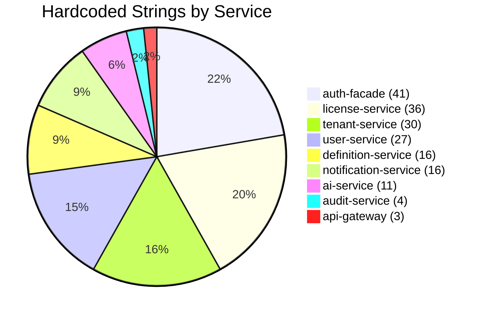

# R01-R03 Message Code Audit: Zero Hardcoded Text (ADR-031)

**Audit Date:** 2026-03-13
**Auditor:** SDLC Orchestration Agent (Code Audit Mode)
**Scope:** All backend services under `/backend/`
**Convention:** `{SERVICE}-{TYPE}-{SEQ}` where TYPE = E (Error), C (Constraint), W (Warning), S (System)

---

## Table of Contents

1. [auth-facade (AUTH)](#auth-facade-auth)
2. [tenant-service (TEN)](#tenant-service-ten)
3. [user-service (USR)](#user-service-usr)
4. [license-service (LIC)](#license-service-lic)
5. [notification-service (NOT)](#notification-service-not)
6. [audit-service (AUD)](#audit-service-aud)
7. [ai-service (AI)](#ai-service-ai)
8. [process-service (PRC)](#process-service-prc)
9. [definition-service (DEF)](#definition-service-def)
10. [api-gateway (GW)](#api-gateway-gw)
11. [GlobalExceptionHandler Hardcoded Codes](#globalexceptionhandler-hardcoded-codes)
12. [Summary](#summary)

---

## auth-facade (AUTH)

### Thrown Exceptions

| # | File | Line | Current Hardcoded String | Proposed Code | Message Template | HTTP Status |
|---|------|------|--------------------------|---------------|------------------|-------------|
| 1 | `auth/service/AuthServiceImpl.java` | 175 | `"Invalid MFA code"` | `AUTH-E-001` | `Invalid MFA verification code` | 401 |
| 2 | `auth/service/AuthServiceImpl.java` | 181 | `"MFA session expired"` | `AUTH-E-002` | `MFA session has expired` | 401 |
| 3 | `auth/provider/KeycloakIdentityProvider.java` | 119 | `"Invalid or expired refresh token"` | `AUTH-E-003` | `Refresh token is invalid or expired` | 401 |
| 4 | `auth/provider/KeycloakIdentityProvider.java` | 225 | `"Failed to setup MFA"` | `AUTH-E-004` | `MFA setup failed` | 401 |
| 5 | `auth/provider/KeycloakIdentityProvider.java` | 413 | `"Failed to process authentication response"` | `AUTH-E-005` | `Authentication response processing failed` | 401 |
| 6 | `auth/controller/AuthController.java` | 233 | `"Not authenticated"` | `AUTH-E-006` | `User is not authenticated` | 401 |
| 7 | `auth/controller/AuthController.java` | 272 | `"Not authenticated"` | `AUTH-E-006` | `User is not authenticated` (reuse) | 401 |
| 8 | `auth/controller/EventController.java` | 217 | `"Not authenticated"` | `AUTH-E-006` | `User is not authenticated` (reuse) | 401 |
| 9 | `auth/controller/EventController.java` | 222 | `"Insufficient permissions - admin role required"` | `AUTH-E-007` | `Insufficient permissions: admin role required` | 403 |
| 10 | `auth/security/JwtTokenValidator.java` | 50 | `"Token has expired"` | `AUTH-E-008` | `Authentication token has expired` | 401 |
| 11 | `auth/security/JwtTokenValidator.java` | 53 | `"Invalid or malformed token"` | `AUTH-E-009` | `Token is invalid or malformed` | 401 |
| 12 | `auth/security/JwtTokenValidator.java` | 101 | `"Invalid token format"` | `AUTH-E-010` | `Token format is invalid` | 401 |
| 13 | `auth/security/JwtTokenValidator.java` | 108 | `"Token missing key ID"` | `AUTH-E-011` | `Token header is missing key ID (kid)` | 401 |
| 14 | `auth/security/JwtTokenValidator.java` | 115 | `"Failed to parse token header"` | `AUTH-E-012` | `Unable to parse token header` | 401 |
| 15 | `auth/security/JwtTokenValidator.java` | 138 | `"Unknown signing key"` | `AUTH-E-013` | `Token signed with unknown key` | 401 |
| 16 | `auth/security/JwtTokenValidator.java` | 173 | `"Unable to validate token signature"` | `AUTH-E-014` | `Token signature validation failed` | 401 |
| 17 | `auth/service/TokenServiceImpl.java` | 58 | `"Token has expired"` | `AUTH-E-008` | (reuse) | 401 |
| 18 | `auth/service/TokenServiceImpl.java` | 61 | `"Invalid or malformed token"` | `AUTH-E-009` | (reuse) | 401 |
| 19 | `auth/service/TokenServiceImpl.java` | 137 | `"Invalid MFA session token"` | `AUTH-E-015` | `MFA session token is invalid` | 401 |
| 20 | `auth/service/TokenServiceImpl.java` | 143 | `"MFA session expired or invalid"` | `AUTH-E-016` | `MFA session has expired or is invalid` | 401 |
| 21 | `auth/service/TokenServiceImpl.java` | 151 | `"Invalid MFA session token"` | `AUTH-E-015` | (reuse) | 401 |
| 22 | `auth/service/KeycloakServiceImpl.java` | 122 | `"Invalid or expired refresh token"` | `AUTH-E-003` | (reuse) | 401 |
| 23 | `auth/service/KeycloakServiceImpl.java` | 182 | `"Google authentication failed"` | `AUTH-E-017` | `Google social authentication failed` | 401 |
| 24 | `auth/service/KeycloakServiceImpl.java` | 214 | `"Microsoft authentication failed"` | `AUTH-E-018` | `Microsoft social authentication failed` | 401 |
| 25 | `auth/service/KeycloakServiceImpl.java` | 249 | `"Failed to setup MFA"` | `AUTH-E-004` | (reuse) | 401 |
| 26 | `auth/service/KeycloakServiceImpl.java` | 343 | `"Failed to process authentication response"` | `AUTH-E-005` | (reuse) | 401 |
| 27 | `auth/security/TenantAccessValidator.java` | 53 | `"Access denied: not authenticated"` | `AUTH-E-019` | `Access denied: user is not authenticated` | 403 |
| 28 | `auth/util/RealmResolver.java` | 41 | `"tenantId must not be null or blank"` | `AUTH-C-001` | `Tenant ID must not be null or blank` | 400 |
| 29 | `auth/security/InternalServiceTokenProvider.java` | 60 | `"service-auth.client-secret must be configured"` | `AUTH-S-001` | `Service auth client secret is not configured` | 500 |
| 30 | `auth/security/InternalServiceTokenProvider.java` | 82 | `"Token endpoint did not return access_token"` | `AUTH-S-002` | `Token endpoint response missing access_token` | 500 |

### GlobalExceptionHandler Hardcoded Error Codes (auth-facade)

| # | File | Line | Current Hardcoded Code | Proposed Code | Message Template | HTTP Status |
|---|------|------|------------------------|---------------|------------------|-------------|
| 31 | `GlobalExceptionHandler.java` | 62 | `"access_denied"` | `AUTH-E-020` | `Access denied` | 403 |
| 32 | `GlobalExceptionHandler.java` | 69 | `"mfa_required"`, `"MFA verification required"` | `AUTH-E-021` | `MFA verification is required` | 403 |
| 33 | `GlobalExceptionHandler.java` | 91 | `"rate_limit_exceeded"` | `AUTH-E-022` | `Rate limit exceeded` | 429 |
| 34 | `GlobalExceptionHandler.java` | 98 | `"tenant_not_found"` | `AUTH-E-023` | `Tenant not found` | 404 |
| 35 | `GlobalExceptionHandler.java` | 105 | `"provider_not_found"` | `AUTH-E-024` | `Identity provider not found` | 404 |
| 36 | `GlobalExceptionHandler.java` | 112 | `"user_not_found"` | `AUTH-E-025` | `User not found` | 404 |
| 37 | `GlobalExceptionHandler.java` | 119 | `"provider_exists"` | `AUTH-E-026` | `Identity provider already exists` | 409 |
| 38 | `GlobalExceptionHandler.java` | 127 | `"missing_header"`, `"Required header '...' is missing"` | `AUTH-C-002` | `Required header '{header}' is missing` | 400 |
| 39 | `GlobalExceptionHandler.java` | 140 | `"validation_error"`, `"Validation failed"` | `AUTH-C-003` | `Request validation failed` | 400 |
| 40 | `GlobalExceptionHandler.java` | 154 | `"invalid_operation"` | `AUTH-E-027` | `Invalid operation` | 400 |
| 41 | `GlobalExceptionHandler.java` | 161 | `"internal_error"`, `"An unexpected error occurred"` | `AUTH-S-003` | `An unexpected internal error occurred` | 500 |

**auth-facade total: 41 hardcoded strings (30 throws + 11 handler codes)**

---

## tenant-service (TEN)

### Thrown Exceptions

| # | File | Line | Current Hardcoded String | Proposed Code | Message Template | HTTP Status |
|---|------|------|--------------------------|---------------|------------------|-------------|
| 1 | `service/TenantServiceImpl.java` | 195 | `"Cannot modify protected tenant identity fields"` | `TEN-E-001` | `Cannot modify identity fields on a protected tenant` | 400 |
| 2 | `service/TenantServiceImpl.java` | 198 | `"Cannot modify protected tenant identity fields"` | `TEN-E-001` | (reuse) | 400 |
| 3 | `service/TenantServiceImpl.java` | 227 | `"Cannot delete protected tenant. Protected tenants are required for system operation."` | `TEN-E-002` | `Cannot delete a protected tenant; it is required for system operation` | 400 |
| 4 | `service/TenantServiceImpl.java` | 243 | `"Cannot lock protected tenant. Protected tenants must remain ACTIVE."` | `TEN-E-003` | `Cannot lock a protected tenant; it must remain ACTIVE` | 400 |
| 5 | `service/TenantServiceImpl.java` | 265 | `"Cannot suspend protected tenant. Protected tenants must remain ACTIVE."` | `TEN-E-004` | `Cannot suspend a protected tenant; it must remain ACTIVE` | 400 |
| 6 | `service/TenantServiceImpl.java` | 278 | `"Only PENDING tenants can be activated. Current status: ..."` | `TEN-E-005` | `Only PENDING tenants can be activated; current status is {status}` | 400 |
| 7 | `service/TenantServiceImpl.java` | 292 | `"Cannot suspend protected tenant."` | `TEN-E-004` | (reuse) | 400 |
| 8 | `service/TenantServiceImpl.java` | 295 | `"Only ACTIVE tenants can be suspended. Current status: ..."` | `TEN-E-006` | `Only ACTIVE tenants can be suspended; current status is {status}` | 400 |
| 9 | `service/TenantServiceImpl.java` | 316 | `"Only SUSPENDED tenants can be reactivated. Current status: ..."` | `TEN-E-007` | `Only SUSPENDED tenants can be reactivated; current status is {status}` | 400 |
| 10 | `service/TenantServiceImpl.java` | 335 | `"Cannot decommission protected tenant."` | `TEN-E-008` | `Cannot decommission a protected tenant` | 400 |
| 11 | `service/TenantServiceImpl.java` | 338 | `"Only SUSPENDED tenants can be decommissioned. Current status: ..."` | `TEN-E-009` | `Only SUSPENDED tenants can be decommissioned; current status is {status}` | 400 |
| 12 | `service/TenantServiceImpl.java` | 445 | `"Domain not found"` | `TEN-E-010` | `Domain not found` | 404 |
| 13 | `service/TenantServiceImpl.java` | 448 | `"Cannot remove primary domain. Set another domain as primary first."` | `TEN-E-011` | `Cannot remove primary domain; set another domain as primary first` | 400 |
| 14 | `service/TenantServiceImpl.java` | 460 | `"No active tenant found for domain: ..."` | `TEN-E-012` | `No active tenant found for domain '{hostname}'` | 404 |
| 15 | `service/TenantServiceImpl.java` | 508 | `"Branding policy violations: ..."` | `TEN-C-001` | `Branding policy violations: {violations}` | 400 |
| 16 | `service/TenantServiceImpl.java` | 594 | `"componentTokens payload exceeds 512 KB limit"` | `TEN-C-002` | `componentTokens payload exceeds the 512 KB limit` | 400 |
| 17 | `service/TenantServiceImpl.java` | 598 | `"Failed to serialize componentTokens"` | `TEN-S-001` | `Failed to serialize componentTokens` | 500 |
| 18 | `service/TenantServiceImpl.java` | 676 | `"Tenant identifier is required"` | `TEN-C-003` | `Tenant identifier is required` | 404 |
| 19 | `service/TenantServiceImpl.java` | 681 | `"Tenant not found: ..."` | `TEN-E-013` | `Tenant not found: {identifier}` | 404 |
| 20 | `controller/TenantController.java` | 79-80 | `"missing_host"`, `"Host header is required"` | `TEN-C-004` | `Host header is required for tenant resolution` | 400 |
| 21 | `controller/TenantController.java` | 134 | `"tenant_not_found"`, `"No organization found for domain"` | `TEN-E-014` | `No organization found for domain '{hostname}'` | 404 |
| 22 | `controller/TenantController.java` | 414 | `"Authenticated principal is required"` | `TEN-C-005` | `Authenticated principal is required` | 400 |

### GlobalExceptionHandler Hardcoded Error Codes (tenant-service)

| # | File | Line | Current Hardcoded Code | Proposed Code | Message Template | HTTP Status |
|---|------|------|------------------------|---------------|------------------|-------------|
| 23 | `GlobalExceptionHandler.java` | 28 | `"tenant_not_found"` | `TEN-E-013` | `Tenant not found` | 404 |
| 24 | `GlobalExceptionHandler.java` | 35 | `"resource_not_found"` | `TEN-E-015` | `Resource not found` | 404 |
| 25 | `GlobalExceptionHandler.java` | 42 | `"duplicate_resource"` | `TEN-E-016` | `Duplicate resource` | 409 |
| 26 | `GlobalExceptionHandler.java` | 49 | `"domain_verification_failed"` | `TEN-E-017` | `Domain verification failed` | 400 |
| 27 | `GlobalExceptionHandler.java` | 62 | `"validation_error"`, `"Validation failed"` | `TEN-C-006` | `Request validation failed` | 400 |
| 28 | `GlobalExceptionHandler.java` | 76 | `"invalid_operation"` | `TEN-E-018` | `Invalid operation` | 400 |
| 29 | `GlobalExceptionHandler.java` | 83 | `"validation_error"` | `TEN-C-006` | (reuse) | 400 |
| 30 | `GlobalExceptionHandler.java` | 90 | `"internal_error"`, `"An unexpected error occurred"` | `TEN-S-002` | `An unexpected internal error occurred` | 500 |

**tenant-service total: 30 hardcoded strings (22 throws + 8 handler codes)**

---

## user-service (USR)

### Thrown Exceptions

| # | File | Line | Current Hardcoded String | Proposed Code | Message Template | HTTP Status |
|---|------|------|--------------------------|---------------|------------------|-------------|
| 1 | `service/SessionServiceImpl.java` | 39 | `ResourceNotFoundException("User", ...)` | `USR-E-001` | `User not found: {keycloakId}` | 404 |
| 2 | `service/SessionServiceImpl.java` | 77 | `ResourceNotFoundException("User", ...)` | `USR-E-001` | (reuse) | 404 |
| 3 | `service/SessionServiceImpl.java` | 80 | `ResourceNotFoundException("Session", ...)` | `USR-E-002` | `Session not found: {sessionId}` | 404 |
| 4 | `service/SessionServiceImpl.java` | 93 | `ResourceNotFoundException("User", ...)` | `USR-E-001` | (reuse) | 404 |
| 5 | `service/SessionServiceImpl.java` | 110 | `ResourceNotFoundException("User", ...)` | `USR-E-001` | (reuse) | 404 |
| 6 | `service/UserProfileServiceImpl.java` | 48 | `ResourceNotFoundException("User", ...)` | `USR-E-001` | (reuse) | 404 |
| 7 | `service/UserProfileServiceImpl.java` | 89 | `ResourceNotFoundException("User", ...)` | `USR-E-001` | (reuse) | 404 |
| 8 | `service/UserProfileServiceImpl.java` | 100 | `ResourceNotFoundException("User", ...)` | `USR-E-001` | (reuse) | 404 |
| 9 | `service/UserProfileServiceImpl.java` | 139 | `ResourceNotFoundException("User", ...)` | `USR-E-001` | (reuse) | 404 |
| 10 | `service/UserProfileServiceImpl.java` | 155 | `ResourceNotFoundException("User", ...)` | `USR-E-001` | (reuse) | 404 |
| 11 | `service/UserProfileServiceImpl.java` | 173 | `ResourceNotFoundException("User", ...)` | `USR-E-001` | (reuse) | 404 |
| 12 | `service/UserProfileServiceImpl.java` | 190 | `ResourceNotFoundException("User", ...)` | `USR-E-001` | (reuse) | 404 |
| 13 | `service/DeviceServiceImpl.java` | 36 | `ResourceNotFoundException("User", ...)` | `USR-E-001` | (reuse) | 404 |
| 14 | `service/DeviceServiceImpl.java` | 58 | `ResourceNotFoundException("User", ...)` | `USR-E-001` | (reuse) | 404 |
| 15 | `service/DeviceServiceImpl.java` | 61 | `ResourceNotFoundException("Device", ...)` | `USR-E-003` | `Device not found: {deviceId}` | 404 |
| 16 | `service/DeviceServiceImpl.java` | 75 | `ResourceNotFoundException("User", ...)` | `USR-E-001` | (reuse) | 404 |
| 17 | `service/DeviceServiceImpl.java` | 78 | `ResourceNotFoundException("Device", ...)` | `USR-E-003` | (reuse) | 404 |
| 18 | `service/DeviceServiceImpl.java` | 90 | `ResourceNotFoundException("Device", ...)` | `USR-E-003` | (reuse) | 404 |
| 19 | `service/DeviceServiceImpl.java` | 103 | `ResourceNotFoundException("User", ...)` | `USR-E-001` | (reuse) | 404 |
| 20 | `service/DeviceServiceImpl.java` | 106 | `ResourceNotFoundException("Device", ...)` | `USR-E-003` | (reuse) | 404 |
| 21 | `controller/UserController.java` | 298 | `"Authenticated JWT subject is required"` | `USR-C-001` | `Authenticated JWT subject is required` | 400 |

### GlobalExceptionHandler Hardcoded Error Codes (user-service)

| # | File | Line | Current Hardcoded Code | Proposed Code | Message Template | HTTP Status |
|---|------|------|------------------------|---------------|------------------|-------------|
| 22 | `GlobalExceptionHandler.java` | 25 | `"resource_not_found"` | `USR-E-004` | `Resource not found` | 404 |
| 23 | `GlobalExceptionHandler.java` | 38 | `"validation_error"`, `"Validation failed"` | `USR-C-002` | `Request validation failed` | 400 |
| 24 | `GlobalExceptionHandler.java` | 45 | `"validation_error"` | `USR-C-002` | (reuse) | 400 |
| 25 | `GlobalExceptionHandler.java` | 52 | `"invalid_operation"` | `USR-E-005` | `Invalid operation` | 400 |
| 26 | `GlobalExceptionHandler.java` | 59 | `"invalid_argument"` | `USR-C-003` | `Invalid argument` | 400 |
| 27 | `GlobalExceptionHandler.java` | 66 | `"internal_error"`, `"An unexpected error occurred"` | `USR-S-001` | `An unexpected internal error occurred` | 500 |

**user-service total: 27 hardcoded strings (21 throws + 6 handler codes)**

---

## license-service (LIC)

### Thrown Exceptions

| # | File | Line | Current Hardcoded String | Proposed Code | Message Template | HTTP Status |
|---|------|------|--------------------------|---------------|------------------|-------------|
| 1 | `service/LicenseImportServiceImpl.java` | 69 | `"signature_invalid"`, `"License file signature verification failed"` | `LIC-E-001` | `License file signature verification failed` | 400 |
| 2 | `service/LicenseImportServiceImpl.java` | 88 | `"product_mismatch"`, `"License product '...' does not match expected '...'"` | `LIC-E-002` | `License product '{product}' does not match expected '{expected}'` | 400 |
| 3 | `service/LicenseImportServiceImpl.java` | 104 | `"license_expired"`, `"License has already expired at ..."` | `LIC-E-003` | `License has already expired at {expiresAt}` | 400 |
| 4 | `service/LicenseImportServiceImpl.java` | 110 | `"license_revoked"`, `"License '...' has been revoked"` | `LIC-E-004` | `License '{licenseId}' has been revoked` | 400 |
| 5 | `service/LicenseImportServiceImpl.java` | 117 | `"no_tenants"`, `"License must contain at least one tenant"` | `LIC-E-005` | `License must contain at least one tenant` | 400 |
| 6 | `service/LicenseImportServiceImpl.java` | 122 | `"too_many_tenants"`, `"License contains N tenants but maxTenants is M"` | `LIC-E-006` | `License contains {count} tenants but maxTenants is {max}` | 400 |
| 7 | `service/LicenseImportServiceImpl.java` | 232 | `"tenant_expiry_exceeds"`, `"Tenant '...' expiry exceeds application expiry"` | `LIC-E-007` | `Tenant '{tenantId}' expiry exceeds application expiry` | 400 |
| 8 | `service/LicenseImportServiceImpl.java` | 239 | `"tenant_feature_not_in_app"`, `"Tenant '...' has feature '...' not in application feature set"` | `LIC-E-008` | `Tenant '{tenantId}' has feature '{feature}' not in application feature set` | 400 |
| 9 | `service/LicenseImportServiceImpl.java` | 255 | `"missing_seats"`, `"Tenant '...' is missing seat allocation configuration"` | `LIC-E-009` | `Tenant '{tenantId}' is missing seat allocation configuration` | 400 |
| 10 | `service/LicenseImportServiceImpl.java` | 262 | `"missing_tier_seats"`, `"Tenant '...' is missing seat allocation for tier ..."` | `LIC-E-010` | `Tenant '{tenantId}' is missing seat allocation for tier {tier}` | 400 |
| 11 | `service/LicenseImportServiceImpl.java` | 270 | `"tenant_admin_required"`, `"Tenant '...' must have at least 1 TENANT_ADMIN seat"` | `LIC-E-011` | `Tenant '{tenantId}' must have at least 1 TENANT_ADMIN seat` | 400 |
| 12 | `service/LicenseImportServiceImpl.java` | 298 | `"invalid_format"`, `"License file format is invalid. Expected header---payload---signature structure."` | `LIC-E-012` | `License file format is invalid; expected header---payload---signature structure` | 400 |
| 13 | `service/LicenseImportServiceImpl.java` | 315 | `"missing_kid"`, `"License file header is missing the KID (Key Identifier)"` | `LIC-E-013` | `License file header is missing the KID (Key Identifier)` | 400 |
| 14 | `service/LicenseImportServiceImpl.java` | 322 | `"invalid_signature_encoding"`, `"License file signature is not valid Base64"` | `LIC-E-014` | `License file signature is not valid Base64` | 400 |
| 15 | `service/LicenseImportServiceImpl.java` | 337 | `"invalid_payload"`, `"License payload is not valid JSON: ..."` | `LIC-E-015` | `License payload is not valid JSON: {details}` | 400 |
| 16 | `service/LicenseImportServiceImpl.java` | 344 | `"missing_field"`, `"Required field '...' is missing from license payload"` | `LIC-E-016` | `Required field '{field}' is missing from license payload` | 400 |
| 17 | `service/LicenseImportServiceImpl.java` | 360 | `"missing_field"` (duplicate) | `LIC-E-016` | (reuse) | 400 |
| 18 | `service/LicenseImportServiceImpl.java` | 370 | `"invalid_date"`, `"Field '...' is not a valid ISO-8601 timestamp: ..."` | `LIC-E-017` | `Field '{field}' is not a valid ISO-8601 timestamp: {text}` | 400 |
| 19 | `service/LicenseImportServiceImpl.java` | 378 | `"missing_field"`, `"Required array field '...' is missing from license payload"` | `LIC-E-018` | `Required array field '{field}' is missing from license payload` | 400 |
| 20 | `service/LicenseImportServiceImpl.java` | 384 | `"invalid_field"`, `"Field '...' is not a valid string array"` | `LIC-E-019` | `Field '{field}' is not a valid string array` | 400 |
| 21 | `controller/SeatManagementController.java` | 75 | `"tenant_mismatch"`, `"Request tenantId does not match path tenantId"` | `LIC-E-020` | `Request tenantId does not match path tenantId` | 400 |
| 22 | `controller/SeatManagementController.java` | 82 | `ResourceNotFoundException("TenantLicense", ...)` | `LIC-E-021` | `Tenant license not found for tenant '{tenantId}'` | 404 |
| 23 | `controller/SeatManagementController.java` | 88 | `"already_assigned"`, `"User already has a seat assignment in tenant '...'"` | `LIC-E-022` | `User already has a seat assignment in tenant '{tenantId}'` | 400 |
| 24 | `controller/SeatManagementController.java` | 94 | `"no_seats_available"`, `"No available seats for tier ... in tenant '...'"` | `LIC-E-023` | `No available seats for tier {tier} in tenant '{tenantId}'` | 400 |
| 25 | `controller/SeatManagementController.java` | 147 | `ResourceNotFoundException("UserLicenseAssignment", ...)` | `LIC-E-024` | `User license assignment not found` | 404 |
| 26 | `controller/SeatManagementController.java` | 206 | `ResourceNotFoundException("TenantLicense", ...)` | `LIC-E-021` | (reuse) | 404 |
| 27 | `controller/LicenseAdminController.java` | 188 | `"Authenticated JWT subject is required"` | `LIC-C-001` | `Authenticated JWT subject is required` | 400 |
| 28 | `controller/SeatManagementController.java` | 249 | `"Authenticated JWT subject is required"` | `LIC-C-001` | (reuse) | 400 |
| 29 | `service/LicenseSignatureVerifier.java` | 85 | `"Public key PEM file not found on classpath: ..."` | `LIC-S-001` | `Public key PEM file not found on classpath: {path}` | 500 |
| 30 | `service/LicenseSignatureVerifier.java` | 109 | `"Failed to load public key for kid: ..."` | `LIC-S-002` | `Failed to load public key for kid: {kid}` | 500 |
| 31 | `entity/converter/StringListJsonConverter.java` | 37 | `"Failed to convert list to JSON"` | `LIC-S-003` | `Failed to convert list to JSON` | 500 |
| 32 | `entity/converter/StringListJsonConverter.java` | 50 | `"Failed to convert JSON to list"` | `LIC-S-004` | `Failed to convert JSON to list` | 500 |

### GlobalExceptionHandler Hardcoded Error Codes (license-service)

| # | File | Line | Current Hardcoded Code | Proposed Code | Message Template | HTTP Status |
|---|------|------|------------------------|---------------|------------------|-------------|
| 33 | `GlobalExceptionHandler.java` | 26 | `"not_found"` | `LIC-E-025` | `Resource not found` | 404 |
| 34 | `GlobalExceptionHandler.java` | 49 | `"validation_error"`, `"Validation failed"` | `LIC-C-002` | `Request validation failed` | 400 |
| 35 | `GlobalExceptionHandler.java` | 57 | `"invalid_argument"` | `LIC-C-003` | `Invalid argument` | 400 |
| 36 | `GlobalExceptionHandler.java` | 65 | `"internal_error"`, `"An unexpected error occurred"` | `LIC-S-005` | `An unexpected internal error occurred` | 500 |

**license-service total: 36 hardcoded strings (32 throws + 4 handler codes)**

---

## notification-service (NOT)

### Thrown Exceptions

| # | File | Line | Current Hardcoded String | Proposed Code | Message Template | HTTP Status |
|---|------|------|--------------------------|---------------|------------------|-------------|
| 1 | `service/TemplateServiceImpl.java` | 33 | `"TEMPLATE_EXISTS"`, (message from constructor) | `NOT-E-001` | `Notification template already exists with this code and type` | 409 |
| 2 | `service/TemplateServiceImpl.java` | 52 | `ResourceNotFoundException("Template", ...)` | `NOT-E-002` | `Template not found: {templateId}` | 404 |
| 3 | `service/TemplateServiceImpl.java` | 61 | `ResourceNotFoundException("Template", ...)` | `NOT-E-003` | `Template not found: {code}/{type}` | 404 |
| 4 | `service/TemplateServiceImpl.java` | 81 | `ResourceNotFoundException("Template", ...)` | `NOT-E-002` | (reuse) | 404 |
| 5 | `service/TemplateServiceImpl.java` | 84 | `"SYSTEM_TEMPLATE"`, `"System templates cannot be modified"` | `NOT-E-004` | `System templates cannot be modified` | 400 |
| 6 | `service/TemplateServiceImpl.java` | 104 | `ResourceNotFoundException("Template", ...)` | `NOT-E-002` | (reuse) | 404 |
| 7 | `service/TemplateServiceImpl.java` | 107 | `"SYSTEM_TEMPLATE"`, `"System templates cannot be deleted"` | `NOT-E-005` | `System templates cannot be deleted` | 400 |
| 8 | `service/TemplateServiceImpl.java` | 117 | `ResourceNotFoundException("Template", ...)` | `NOT-E-002` | (reuse) | 404 |
| 9 | `service/TemplateServiceImpl.java` | 125 | `ResourceNotFoundException("Template", ...)` | `NOT-E-002` | (reuse) | 404 |
| 10 | `service/NotificationServiceImpl.java` | 77 | `ResourceNotFoundException("Notification", ...)` | `NOT-E-006` | `Notification not found: {notificationId}` | 404 |
| 11 | `service/NotificationServiceImpl.java` | 268 | `"Email recipient address is required"` | `NOT-C-001` | `Email recipient address is required` | 400 |
| 12 | `controller/PreferenceController.java` | 58 | `"Authenticated JWT subject is required"` | `NOT-C-002` | `Authenticated JWT subject is required` | 400 |
| 13 | `controller/NotificationController.java` | 110 | `"Authenticated JWT subject is required"` | `NOT-C-002` | (reuse) | 400 |

### GlobalExceptionHandler Hardcoded Error Codes (notification-service)

| # | File | Line | Current Hardcoded Code | Proposed Code | Message Template | HTTP Status |
|---|------|------|------------------------|---------------|------------------|-------------|
| 14 | `GlobalExceptionHandler.java` | 24 | `"not_found"` | `NOT-E-007` | `Resource not found` | 404 |
| 15 | `GlobalExceptionHandler.java` | 43 | `"validation_error"`, `"Validation failed"` | `NOT-C-003` | `Request validation failed` | 400 |
| 16 | `GlobalExceptionHandler.java` | 50 | `"internal_error"`, `"An unexpected error occurred"` | `NOT-S-001` | `An unexpected internal error occurred` | 500 |

**notification-service total: 16 hardcoded strings (13 throws + 3 handler codes)**

---

## audit-service (AUD)

### Thrown Exceptions

| # | File | Line | Current Hardcoded String | Proposed Code | Message Template | HTTP Status |
|---|------|------|--------------------------|---------------|------------------|-------------|
| 1 | `service/AuditServiceImpl.java` | 62 | `ResourceNotFoundException("AuditEvent", ...)` | `AUD-E-001` | `Audit event not found: {eventId}` | 404 |

### GlobalExceptionHandler Hardcoded Error Codes (audit-service)

| # | File | Line | Current Hardcoded Code | Proposed Code | Message Template | HTTP Status |
|---|------|------|------------------------|---------------|------------------|-------------|
| 2 | `GlobalExceptionHandler.java` | 24 | `"not_found"` | `AUD-E-002` | `Resource not found` | 404 |
| 3 | `GlobalExceptionHandler.java` | 43 | `"validation_error"`, `"Validation failed"` | `AUD-C-001` | `Request validation failed` | 400 |
| 4 | `GlobalExceptionHandler.java` | 50 | `"internal_error"`, `"An unexpected error occurred"` | `AUD-S-001` | `An unexpected internal error occurred` | 500 |

**audit-service total: 4 hardcoded strings (1 throw + 3 handler codes)**

---

## ai-service (AI)

### Thrown Exceptions

| # | File | Line | Current Hardcoded String | Proposed Code | Message Template | HTTP Status |
|---|------|------|--------------------------|---------------|------------------|-------------|
| 1 | `service/RagServiceImpl.java` | 57 | `"Not authorized to upload to this agent"` | `AI-E-001` | `Not authorized to upload to this agent` | 403 |
| 2 | `service/RagServiceImpl.java` | 91 | `"Not authorized to add source to this agent"` | `AI-E-002` | `Not authorized to add knowledge source to this agent` | 403 |
| 3 | `service/RagServiceImpl.java` | 123 | `"Not authorized to delete this source"` | `AI-E-003` | `Not authorized to delete this knowledge source` | 403 |
| 4 | `service/RagServiceImpl.java` | 203 | `"No embedding provider available"` | `AI-S-001` | `No embedding provider is available` | 500 |
| 5 | `service/AgentServiceImpl.java` | 64 | `"Not authorized to update this agent"` | `AI-E-004` | `Not authorized to update this agent` | 403 |
| 6 | `service/AgentServiceImpl.java` | 98 | `"Not authorized to delete this agent"` | `AI-E-005` | `Not authorized to delete this agent` | 403 |
| 7 | `service/AgentServiceImpl.java` | 102 | `"Cannot delete system agents"` | `AI-E-006` | `System agents cannot be deleted` | 400 |
| 8 | `controller/StreamController.java` | 45 | `"Authenticated JWT subject is required"` | `AI-C-001` | `Authenticated JWT subject is required` | 400 |
| 9 | `controller/AgentController.java` | 139 | `"Authenticated JWT subject is required"` | `AI-C-001` | (reuse) | 400 |
| 10 | `controller/ConversationController.java` | 158 | `"Authenticated JWT subject is required"` | `AI-C-001` | (reuse) | 400 |
| 11 | `provider/AnthropicProvider.java` | 150 | `"Anthropic does not support embeddings. Use OpenAI for embeddings."` | `AI-E-007` | `Anthropic does not support embeddings; use OpenAI for embeddings` | 400 |

**ai-service total: 11 hardcoded strings (all throws, no custom GlobalExceptionHandler found)**

---

## process-service (PRC)

### Thrown Exceptions

| # | File | Line | Current Hardcoded String | Proposed Code | Message Template | HTTP Status |
|---|------|------|--------------------------|---------------|------------------|-------------|
| (none) | - | - | No hardcoded exception strings found | - | - | - |

Note: `BpmnElementTypeController.java:49` uses `ResponseEntity.notFound().build()` which returns an empty 404 body -- no hardcoded string.

**process-service total: 0 hardcoded strings**

---

## definition-service (DEF)

### Thrown Exceptions (ResponseStatusException pattern)

| # | File | Line | Current Hardcoded String | Proposed Code | Message Template | HTTP Status |
|---|------|------|--------------------------|---------------|------------------|-------------|
| 1 | `service/ObjectTypeServiceImpl.java` | 78-79 | `"TypeKey '...' already exists for this tenant"` | `DEF-E-001` | `TypeKey '{typeKey}' already exists for this tenant` | 409 |
| 2 | `service/ObjectTypeServiceImpl.java` | 141-142 | `"TypeKey '...' already exists for this tenant"` | `DEF-E-001` | (reuse) | 409 |
| 3 | `service/ObjectTypeServiceImpl.java` | 193-194 | `"AttributeType not found: ..."` | `DEF-E-002` | `AttributeType not found: {id}` | 404 |
| 4 | `service/ObjectTypeServiceImpl.java` | 200-201 | `"Attribute already linked to this object type"` | `DEF-E-003` | `Attribute is already linked to this object type` | 409 |
| 5 | `service/ObjectTypeServiceImpl.java` | 232-233 | `"Attribute not linked to this object type: ..."` | `DEF-E-004` | `Attribute not linked to this object type: {attributeTypeId}` | 404 |
| 6 | `service/ObjectTypeServiceImpl.java` | 253-254 | `"Target ObjectType not found: ..."` | `DEF-E-005` | `Target ObjectType not found: {id}` | 404 |
| 7 | `service/ObjectTypeServiceImpl.java` | 287-288 | `"Connection not found to target: ..."` | `DEF-E-006` | `Connection not found to target: {targetId}` | 404 |
| 8 | `service/ObjectTypeServiceImpl.java` | 394-395 | `"AttributeType is in use by one or more ObjectTypes and cannot be deleted: ..."` | `DEF-E-007` | `AttributeType is in use by ObjectTypes and cannot be deleted: {id}` | 409 |
| 9 | `service/ObjectTypeServiceImpl.java` | 453-454 | `"Only customized object types can be restored to default"` | `DEF-E-008` | `Only customized object types can be restored to default` | 409 |
| 10 | `service/ObjectTypeServiceImpl.java` | 472-473 | `"ObjectType not found: ..."` | `DEF-E-009` | `ObjectType not found: {id}` | 404 |
| 11 | `service/ObjectTypeServiceImpl.java` | 478-479 | `"AttributeType not found: ..."` | `DEF-E-002` | (reuse) | 404 |
| 12 | `controller/AttributeTypeController.java` | 143-144 | `"Missing tenant context (no tenant_id JWT claim or X-Tenant-ID header)"` | `DEF-C-001` | `Missing tenant context: no tenant_id JWT claim or X-Tenant-ID header` | 400 |
| 13 | `controller/ObjectTypeController.java` | 273-274 | `"Missing tenant context (no tenant_id JWT claim or X-Tenant-ID header)"` | `DEF-C-001` | (reuse) | 400 |

### GlobalExceptionHandler Hardcoded Error Codes (definition-service)

| # | File | Line | Current Hardcoded Code | Proposed Code | Message Template | HTTP Status |
|---|------|------|------------------------|---------------|------------------|-------------|
| 14 | `GlobalExceptionHandler.java` | 45 | `"Validation Failed"` (title) | `DEF-C-002` | `Validation failed` | 400 |
| 15 | `GlobalExceptionHandler.java` | 60 | `"Constraint Violation"` (title) | `DEF-C-003` | `Constraint violation` | 400 |
| 16 | `GlobalExceptionHandler.java` | 71 | `"An unexpected error occurred"`, `"Internal Server Error"` (title) | `DEF-S-001` | `An unexpected internal error occurred` | 500 |

**definition-service total: 16 hardcoded strings (13 throws + 3 handler codes)**

---

## api-gateway (GW)

### Hardcoded JSON Error Bodies

| # | File | Line | Current Hardcoded String | Proposed Code | Message Template | HTTP Status |
|---|------|------|--------------------------|---------------|------------------|-------------|
| 1 | `filter/TenantContextFilter.java` | 103 | `"invalid_tenant_id"`, `"X-Tenant-ID must be a valid UUID"` | `GW-C-001` | `X-Tenant-ID must be a valid UUID` | 400 |
| 2 | `filter/TenantContextFilter.java` | 113 | `"tenant_mismatch"`, `"X-Tenant-ID does not match JWT tenant_id claim"` | `GW-E-001` | `X-Tenant-ID does not match JWT tenant_id claim` | 403 |
| 3 | `filter/TokenBlacklistFilter.java` | 86 | `"token_revoked"`, `"Token has been revoked"` | `GW-E-002` | `Authentication token has been revoked` | 401 |

**api-gateway total: 3 hardcoded strings (all inline JSON bodies)**

---

## Summary

### Total Hardcoded Strings by Service

| # | Service | Prefix | Throws | Handler Codes | Total | Priority |
|---|---------|--------|--------|---------------|-------|----------|
| 1 | **auth-facade** | AUTH | 30 | 11 | **41** | CRITICAL |
| 2 | **license-service** | LIC | 32 | 4 | **36** | CRITICAL |
| 3 | **tenant-service** | TEN | 22 | 8 | **30** | HIGH |
| 4 | **user-service** | USR | 21 | 6 | **27** | HIGH |
| 5 | **definition-service** | DEF | 13 | 3 | **16** | MEDIUM |
| 6 | **notification-service** | NOT | 13 | 3 | **16** | MEDIUM |
| 7 | **ai-service** | AI | 11 | 0 | **11** | MEDIUM |
| 8 | **audit-service** | AUD | 1 | 3 | **4** | LOW |
| 9 | **api-gateway** | GW | 3 | 0 | **3** | LOW |
| 10 | **process-service** | PRC | 0 | 0 | **0** | NONE |
| | **GRAND TOTAL** | | **146** | **38** | **184** | |

### Total Proposed Codes by Type

| Type | Code Prefix | Description | Count |
|------|-------------|-------------|-------|
| **E** (Error) | `*-E-*` | Business/domain errors, auth failures, not-found | **121** |
| **C** (Constraint) | `*-C-*` | Validation, missing fields, argument constraints | **28** |
| **S** (System) | `*-S-*` | Internal errors, config issues, infrastructure | **21** |
| **W** (Warning) | `*-W-*` | Warnings (none found in exception strings) | **0** |
| | | **TOTAL UNIQUE CODES** | **~130** (after deduplication of reuse) |

### Unique vs Reused Codes

After deduplication (removing repeated uses of the same code like `AUTH-E-006` used 3 times):

| Service | Unique Codes | Reused Instances |
|---------|-------------|------------------|
| AUTH | 33 | 8 |
| TEN | 25 | 5 |
| USR | 9 | 18 |
| LIC | 30 | 6 |
| NOT | 10 | 6 |
| AUD | 3 | 1 |
| AI | 8 | 3 |
| DEF | 12 | 4 |
| GW | 3 | 0 |
| **Total** | **~133 unique** | **~51 reused** |

### Priority Ranking for Remediation

### Recommended Remediation Order

1. **auth-facade** (41) -- Highest risk: authentication/authorization messages exposed to users
2. **license-service** (36) -- Business-critical: license validation messages need i18n
3. **tenant-service** (30) -- High impact: tenant lifecycle error messages
4. **user-service** (27) -- High volume: most are `ResourceNotFoundException("User", ...)` patterns
5. **definition-service** (16) -- Medium: uses `ResponseStatusException` pattern (different from others)
6. **notification-service** (16) -- Medium: template/notification errors
7. **ai-service** (11) -- Medium: authorization and provider errors
8. **audit-service** (4) -- Low: minimal surface area
9. **api-gateway** (3) -- Low: inline JSON bodies in filters
10. **process-service** (0) -- None: no violations found

### Cross-Cutting Observations

1. **Pattern: `"Authenticated JWT subject is required"`** -- Appears in 7 controllers across 5 services (USR, LIC, NOT, AI, TEN). Should be extracted to a common interceptor or base controller with a single code like `SYS-C-001`.

2. **Pattern: `ResourceNotFoundException(entityType, id)`** -- Used 30+ times across services. The `ResourceNotFoundException` constructor already takes entity type and ID. The message code should embed the entity type: e.g., `USR-E-001` for User, `USR-E-003` for Device.

3. **Pattern: `"An unexpected error occurred"` / `"internal_error"`** -- Appears identically in 7 GlobalExceptionHandlers. Should be a shared constant from the `common` module.

4. **Pattern: `"Validation failed"` / `"validation_error"`** -- Appears identically in 7 GlobalExceptionHandlers. Same recommendation.

5. **ai-service uses `RuntimeException` instead of domain exceptions** -- The 7 `RuntimeException` throws in `RagServiceImpl` and `AgentServiceImpl` should be replaced with proper `AccessDeniedException` or `BusinessException`.

6. **definition-service uses `ResponseStatusException` pattern** -- Different from all other services that use custom exception classes + GlobalExceptionHandler. Should be aligned with the common pattern for consistency.

7. **api-gateway uses inline JSON strings** -- The 3 error responses in gateway filters are constructed as raw JSON strings. Should use a shared `ErrorResponse` DTO.
