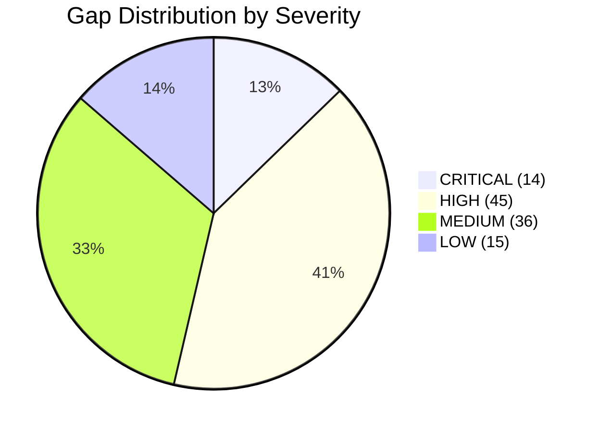
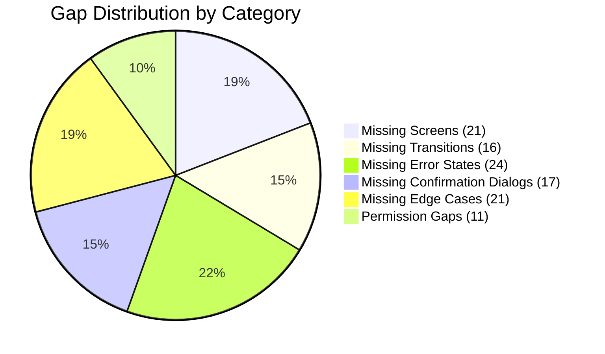
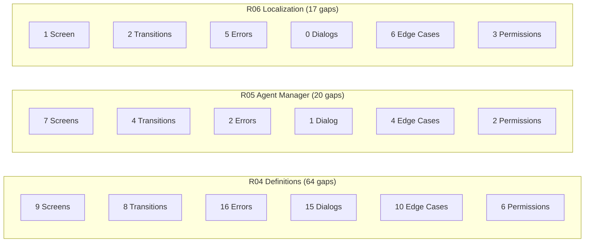
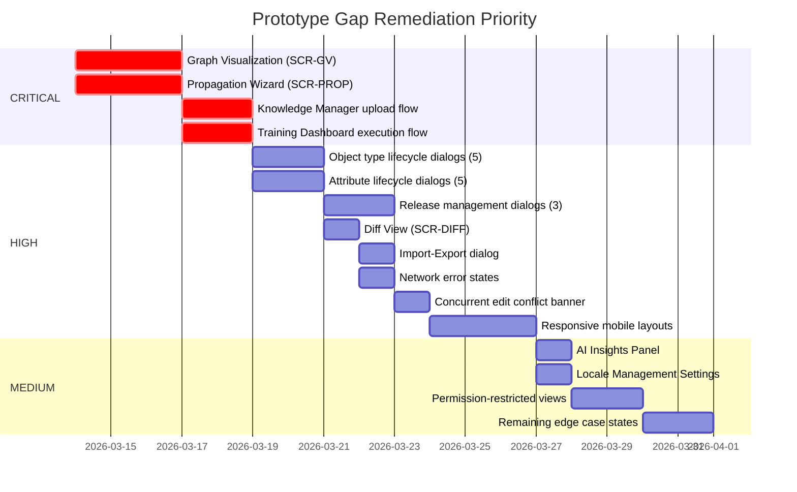

# Screen Transition Gap Analysis

**Document ID:** GAP-SCR-001
**Version:** 1.0.0
**Date:** 2026-03-13
**Author:** BA Agent (BA-PRINCIPLES.md v1.1.0)
**Status:** [PLANNED] -- Cross-audit of prototypes against requirements inventories.
**Input Files:**
- `PROTOTYPE-SCREEN-MAP.md` (75 screens, 6 prototypes)
- `CONSOLIDATED-STORY-INVENTORY.md` (450 stories across R04, R05, R06)
- `R04-COMPLETE-STORY-INVENTORY.md` (97 stories, 20 confirmation dialogs, 63 error codes)
- `R05-COMPLETE-STORY-INVENTORY.md` (268 stories, 20+ confirmation dialogs)
- `R06-COMPLETE-STORY-INVENTORY.md` (85 stories, 5 confirmation dialogs, 17 error codes)

> Reference-only note:
> Any historical R02 gaps in this file are superseded by the current normalized R02 baselines under `../../R02. TENANT MANAGEMENT/R02.01 Business Requirements/`.

---

## Executive Summary

| Gap Category | CRITICAL | HIGH | MEDIUM | LOW | Total |
|-------------|----------|------|--------|-----|-------|
| Missing Screens | 4 | 8 | 6 | 3 | **21** |
| Missing Transitions | 2 | 7 | 5 | 2 | **16** |
| Missing Error States | 3 | 9 | 8 | 4 | **24** |
| Missing Confirmation Dialogs | 2 | 10 | 5 | 0 | **17** |
| Missing Edge Cases | 1 | 6 | 9 | 5 | **21** |
| Permission Gaps | 2 | 5 | 3 | 1 | **11** |
| **Total** | **14** | **45** | **36** | **15** | **110** |

---

## 1. Missing Screens

Screens implied by requirements but not present in any of the 6 prototypes (75 screens inventoried).

| Gap ID | Required By | Screen Description | Stories Affected | Severity |
|--------|-------------|-------------------|------------------|----------|
| SCR-01 | R04 US-DM-075 to US-DM-080 | **Graph Visualization View (SCR-GV)** -- Interactive graph view with cose-bilkent layout, zoom/pan, node click, export as PNG/SVG, status filtering. No prototype implements this screen. | US-DM-075, US-DM-076, US-DM-077, US-DM-078, US-DM-079, US-DM-080 | CRITICAL |
| SCR-02 | R04 US-DM-096, US-DM-097 | **AI Insights Panel (SCR-AI)** -- Duplicate detection, attribute/connection suggestions during wizard. No prototype shows this panel. | US-DM-096, US-DM-097 | HIGH |
| SCR-03 | R04 US-DM-021, US-DM-022 | **Propagation Wizard (SCR-PROP)** -- 4-step wizard for selective definition distribution to child tenants (select tenant, definition checklist, mandate settings, review). Not prototyped. | US-DM-021, US-DM-022 | CRITICAL |
| SCR-04 | R04 US-DM-066 | **Diff View (SCR-DIFF)** -- Side-by-side comparison of release versions with added (green), modified (amber), removed (red) highlighting. Not prototyped. | US-DM-066, US-DM-071, US-DM-072 | HIGH |
| SCR-05 | R04 US-DM-035 | **Mandate Configuration Interface (SCR-MANDATE)** -- Dedicated mandate management with toggles for type, attributes, connections. Not prototyped as standalone screen. | US-DM-031, US-DM-032, US-DM-033, US-DM-035 | HIGH |
| SCR-06 | R04 US-DM-081 to US-DM-085 | **Import/Export Dialog (SCR-EXPORT)** -- Export dialog with format (JSON/YAML), scope, includes checkboxes. Import with conflict preview (create/update/conflict counts). Not prototyped. | US-DM-081, US-DM-082, US-DM-083, US-DM-084, US-DM-085 | HIGH |
| SCR-07 | R04 US-DM-052 | **Maturity Dashboard (SCR-05)** -- Summary cards with p-knob per type, four-axis breakdown drill-down, radar chart. Not prototyped. | US-DM-048, US-DM-049, US-DM-050, US-DM-051, US-DM-052 | HIGH |
| SCR-08 | R04 US-DM-055, US-DM-057 | **Locale Management Settings (SCR-06)** -- Active locale grid with toggle switches, RTL preview. Not prototyped (distinct from R06 Localization prototype which covers translation dictionary, not definition-level locale management). | US-DM-055, US-DM-057, US-DM-060 | MEDIUM |
| SCR-09 | R04 US-DM-027a | **Governance Compliance Report** -- Report generation dialog with format (PDF/CSV/XLSX), date range, scope. No prototype. | US-DM-027a, US-DM-029 | MEDIUM |
| SCR-10 | R05 US-AI-146 | **Visual RBAC Matrix** -- Permission matrix showing roles vs. resources with checkboxes. Not prototyped in P1/P4 (implied in P5 but no dedicated screen). | US-AI-031, US-AI-032, US-AI-146, US-AI-147 | HIGH |
| SCR-11 | R05 US-AI-141 | **Token/Cost Dashboard** -- Token usage and cost tracking per tenant/agent. Not in P1/P4 admin prototypes. P5 has page-analytics but lacks cost breakdown. | US-AI-141, US-AI-253, US-AI-281 | HIGH |
| SCR-12 | R05 US-AI-087, US-AI-220 to US-AI-235 | **Knowledge Source Manager** -- Upload, monitor, manage RAG knowledge sources with metadata tagging, chunking config, version tracking. P5 has page-knowledge but minimal upload flow. | US-AI-087, US-AI-220, US-AI-221, US-AI-222, US-AI-229 | CRITICAL |
| SCR-13 | R05 US-AI-200 to US-AI-217 | **Training Dashboard** -- Pipeline status, resource monitoring, run history, dataset versioning. P5 has page-training but shows populated/loading/empty states only -- no training run execution flow. | US-AI-200, US-AI-201, US-AI-209, US-AI-214 | CRITICAL |
| SCR-14 | R05 US-AI-140 | **AI Module Settings Page** -- Platform-wide AI configuration (model selection, token budgets, rate limits). Not in P1/P4. P5 has settings page but lacks AI-specific tabs. | US-AI-140, US-AI-010, US-AI-011 | MEDIUM |
| SCR-15 | R05 US-AI-250 | **Orchestration Observability Dashboard** -- Super Agent orchestration monitoring, task decomposition visualization, worker execution tracking. Not prototyped. | US-AI-240 to US-AI-255 | MEDIUM |
| SCR-16 | R06 US-LM-046 to US-LM-052 | **Tenant Override Import/Export Flow** -- CSV import preview for overrides (similar to main dictionary import but tenant-scoped). Not prototyped. | US-LM-050, US-LM-051 | MEDIUM |
| SCR-17 | R05 US-AI-037 | **Data Retention / GDPR Management** -- Right-to-erasure flow, data retention enforcement UI. No prototype. | US-AI-037, US-AI-038, US-AI-039 | MEDIUM |
| SCR-18 | R05 US-AI-097 to US-AI-100 | **Benchmark Test Suite Manager** -- Create, run, compare benchmark suites. P5 has page-eval but no test execution or creation flow. | US-AI-097, US-AI-098, US-AI-099, US-AI-100, US-AI-320 to US-AI-334 | HIGH |
| SCR-19 | PROTOTYPE-SCREEN-MAP | **Forgot Password Flow** -- Login page has placeholder mailto link only. No actual forgot password screen prototyped. | Cross-cutting (Auth) | LOW |
| SCR-20 | PROTOTYPE-SCREEN-MAP | **Tenant Creation Wizard** -- Empty state CTA exists ("+ Create Tenant") but no wizard prototyped. | R02 (Tenant Management) | LOW |
| SCR-21 | PROTOTYPE-SCREEN-MAP | **License Creation/Renewal Wizard** -- Buttons exist for "Add License", "Renew", "Add Seats" on factsheet but no flow prototyped. | R03 (License Management) | LOW |

---

## 2. Missing Transitions

Navigation paths implied by user stories but not prototyped (no transition exists in any prototype).

| Gap ID | From Screen | To Screen | Trigger | Stories Affected | Severity |
|--------|-------------|-----------|---------|------------------|----------|
| TRN-01 | Object Type List (SCR-01) | Graph Visualization (SCR-GV) | View toggle button (Table/Card/**Graph**) | US-DM-075 | CRITICAL |
| TRN-02 | Object Type Detail > General Tab | Parent Type Selection Dialog | "Set Parent Type" button | US-DM-INH (AC-6.INH.3) | HIGH |
| TRN-03 | Object Type Detail > Governance Tab | Workflow Settings Dialog | "Add Workflow" button | US-DM-038 | HIGH |
| TRN-04 | Object Type Detail > Data Sources Tab | Data Source Connection Wizard (3-step) | "Add Data Source" button | US-DM-087 | HIGH |
| TRN-05 | Object Type List (SCR-01) | Propagation Wizard (SCR-PROP) | "Propagate" action (super admin) | US-DM-022 | CRITICAL |
| TRN-06 | Release Dashboard (SCR-04) | Diff View (SCR-DIFF) | "Compare" button on two selected versions | US-DM-066 | HIGH |
| TRN-07 | Release Dashboard (SCR-04) | Impact Assessment View | "View Impact" on pending release (tenant admin) | US-DM-067 | HIGH |
| TRN-08 | Object Type List | Import/Export Dialog | "Import" / "Export" toolbar buttons | US-DM-081, US-DM-082 | HIGH |
| TRN-09 | Agent Factsheet > Overview | Agent Comparison Page | "Compare" action on agent | US-AI-063, US-AI-287 | MEDIUM |
| TRN-10 | Agent List | Agent Deletion Confirmation Dialog | "Delete" on agent card context menu | US-AI-059 | MEDIUM |
| TRN-11 | Agent Factsheet | Fork Confirmation Dialog | "Fork" button on agent configuration | US-AI-079 | MEDIUM |
| TRN-12 | Agent List | Archive Confirmation | "Archive" on agent card | US-AI-151 | MEDIUM |
| TRN-13 | Notification Dropdown | Full Notifications Page | "View All" button | US-AI-034, R04 US-DM-074 | MEDIUM |
| TRN-14 | R06 Languages Tab | Format Config Accordion | Row expansion click | US-LM-006 -- Prototyped in P6 but transition not explicit in PROTOTYPE-SCREEN-MAP transitions table | LOW |
| TRN-15 | R06 Dictionary Tab > Edit Dialog | Coverage Report | Coverage bar click on locale | US-LM-011 | LOW |
| TRN-16 | Agent Builder (P5 page-builder) | Version History Panel | "History" action in builder | US-AI-085, US-AI-148 | HIGH |

---

## 3. Missing Error States

Error handling scenarios defined in error code registries (80+ error codes) but no corresponding screen state shown in prototypes.

| Gap ID | Screen | Error Code | Expected Behavior | Stories Affected | Severity |
|--------|--------|------------|-------------------|------------------|----------|
| ERR-01 | Object Type List (SCR-01) | DEF-E-050 | **Network failure error banner** with "Failed to load object types. Please try again." + Retry button. Persistent toast for 504/503. Skeleton shows during initial load. | R04 cross-cutting | CRITICAL |
| ERR-02 | Object Type Detail > General Tab | DEF-E-017 | **Concurrent edit conflict banner** -- "Server was modified by another user. Please reload and retry." with "Reload" / "Force Save" / "Cancel" buttons (AC-6.OL.1). | US-DM-OL (GAP-019) | CRITICAL |
| ERR-03 | Create Wizard > Review Step | DEF-E-050 | **Wizard submission failure** -- Wizard stays open on Review step with all data preserved. Toast shows. Create button re-enables. Wizard does NOT close or reset (AC-6.NET.2). | US-DM-005 (GAP-025) | CRITICAL |
| ERR-04 | Object Type Detail > General Tab | DEF-E-002, DEF-E-003 | **Duplicate typeKey/code conflict** on save (409). Form stays in edit mode. | US-DM-003 (General Tab) | HIGH |
| ERR-05 | Object Type Detail > General Tab | DEF-E-090, DEF-E-091 | **IS_SUBTYPE_OF depth exceeded (max 5)** or **circular reference detected** when setting parent type. | AC-6.INH.3 | HIGH |
| ERR-06 | Object Type Detail > Attributes Tab | DEF-E-027 | **Cannot delete linked AttributeType** -- "linked to 3 object types: Server, Router, Switch" (409). | US-DM-010 | HIGH |
| ERR-07 | Object Type Detail > Attributes Tab | DEF-E-020 | **Cannot modify mandated attribute** -- 403 toast when attempting to unlink/retire mandated attribute in child tenant. | US-DM-032 | HIGH |
| ERR-08 | Object Type Detail > Governance Tab | DEF-E-060 | **Failed to load governance configuration** -- Error banner with Retry button. | US-DM-037 | HIGH |
| ERR-09 | Object Type Detail > Governance Tab | DEF-E-063 | **Duplicate workflow** -- Already attached (409). | US-DM-038 | MEDIUM |
| ERR-10 | Object Type Detail > Governance Tab | DEF-E-065 | **Max workflows exceeded** -- "Add Workflow" disabled when 5 already attached. | US-DM-038 | MEDIUM |
| ERR-11 | Object Type Detail > Maturity Tab | DEF-E-071 | **Axis weights must sum to 100%** -- Rejected on save (400). | US-DM-050 | MEDIUM |
| ERR-12 | Object Type Detail > Measures Tab | DEF-E-084, DEF-E-085, DEF-E-086 | **Measure validation errors** -- Duplicate name (409), invalid threshold config (warning >= critical), invalid formula syntax. | US-DM-092, US-DM-093 | MEDIUM |
| ERR-13 | Object Type Detail > Data Sources Tab | DEF-E-110 | **Connection test failed** -- Persistent toast with error message. Status = Disconnected (red). | AC-6.DS.5 | MEDIUM |
| ERR-14 | Object Type Detail > Data Sources Tab | DEF-E-111, DEF-E-112 | **Duplicate data source name** (409) and **max 10 exceeded** (400). | US-DM-087 | MEDIUM |
| ERR-15 | Import dialog | DEF-E-120 to DEF-E-124 | **Import errors** -- File too large (400), invalid JSON (400), schema mismatch (400), import failed with rollback (500), unsupported format (400). | US-DM-082 | HIGH |
| ERR-16 | Propagation Wizard | DEF-E-130 to DEF-E-133 | **Propagation errors** -- Target tenant not found (404), partial failure (500), duplicate in target (409), not master tenant (403). | US-DM-022 | HIGH |
| ERR-17 | Release Dashboard | No specific code | **Release publish with 0 child tenants** -- Edge case with no clear error state. | US-DM-065 | LOW |
| ERR-18 | R06 Import/Export Tab | LOC-E-003, LOC-E-004, LOC-E-005, LOC-E-008 | **Import errors** -- Empty CSV (400), file exceeds 10MB (413), rate limit exceeded with Retry-After (429), preview expired after 30min (410). Only partial error handling shown in prototype (preview card). | US-LM-013 | HIGH |
| ERR-19 | R06 AI Translate Tab | AI unavailable | **AI service unavailable** -- "AI translation unavailable. Please translate manually." empty state with "Translate Manually" link. Not shown in prototype animated flow. | US-LM-017 | MEDIUM |
| ERR-20 | R06 Dictionary Tab > Edit Dialog | LOC-E-009, LOC-W-001 | **Translation too long** (5000 chars exceeded) and **concurrent edit warning** ("Modified by {user} at {timestamp}"). | US-LM-010 | MEDIUM |
| ERR-21 | R06 Rollback Tab | LOC-E-051 | **Version has no snapshot data** -- 400 "Version {n} has no snapshot data to restore." | US-LM-015 | LOW |
| ERR-22 | R06 Languages Tab | LOC-E-001, LOC-E-002 | **Cannot deactivate alternative locale** (409) and **cannot deactivate last active** (409). Toast errors. | US-LM-004 | HIGH |
| ERR-23 | R05 Chat Interface | Tool timeout, circuit breaker | **Tool execution timeout** -- "Tool {name} timed out after 30s" with retry option. **Circuit breaker open** -- "Service temporarily unavailable." | US-AI-005, US-AI-043 | MEDIUM |
| ERR-24 | R05 Agent List | 401/403/429 | **Authentication/authorization/rate limit errors** -- Generic RBAC errors across agent management. No error state shown in prototypes. | US-AI-031, US-AI-032, US-AI-016 | LOW |

---

## 4. Missing Confirmation Dialogs

Confirmation dialogs defined in stories (25+ total across all features) but not present in prototype dialog inventories.

| Gap ID | Screen | Dialog ID | Trigger Action | Stories Affected | Severity |
|--------|--------|-----------|----------------|------------------|----------|
| DLG-01 | Object Type List | DEF-C-001 | Activate ObjectType status transition | US-DM-007 | HIGH |
| DLG-02 | Object Type List | DEF-C-002 | Hold ObjectType status transition | US-DM-007 | HIGH |
| DLG-03 | Object Type List | DEF-C-003 | Resume ObjectType from hold | US-DM-007 | HIGH |
| DLG-04 | Object Type List | DEF-C-004 | Retire ObjectType (shows instance count) | US-DM-007 | HIGH |
| DLG-05 | Object Type List | DEF-C-005 | Reactivate ObjectType (naming conflict check) | US-DM-007 | HIGH |
| DLG-06 | Object Type Detail > General Tab | DEF-C-006 | Customize default (edit changes state) | General Tab edit | MEDIUM |
| DLG-07 | Object Type Detail > Attributes Tab | DEF-C-010 | Activate attribute lifecycle | US-DM-012 | HIGH |
| DLG-08 | Object Type Detail > Attributes Tab | DEF-C-012 | Reactivate attribute lifecycle | US-DM-012 | MEDIUM |
| DLG-09 | Object Type Detail > Attributes Tab | DEF-C-013 | Unlink attribute from object type | US-DM-025 | MEDIUM |
| DLG-10 | Object Type Detail > Attributes Tab | DEF-C-014 | Delete attribute type permanently | US-DM-010 | HIGH |
| DLG-11 | Release Dashboard | DEF-C-030 | Publish release (shows breaking change count) | US-DM-065 | HIGH |
| DLG-12 | Release Dashboard | DEF-C-031 | Rollback release to previous version | US-DM-072 | HIGH |
| DLG-13 | Release Dashboard | DEF-C-032 | Adopt release (tenant admin) | US-DM-068 | HIGH |
| DLG-14 | Object Type Detail > Governance Tab | DEF-C-040 | Flag governance violation | US-DM-029 | MEDIUM |
| DLG-15 | Object Type List (Super Admin) | DEF-C-041 | Push mandate updates to child tenants | US-DM-035 | CRITICAL |
| DLG-16 | Object Type Detail > Data Sources Tab | DEF-C-050 | Remove data source | AC-6.DS.4 | MEDIUM |
| DLG-17 | R05 Agent List | (No code) | **Delete agent with impact assessment** -- "Deleting {name} will affect {N} conversations, {M} scheduled tasks. Continue?" | US-AI-059 | CRITICAL |

**Note:** Prototypes P1 and P3 implement only 3 of 20 R04 dialogs: CD-08 (Delete), CD-09 (Duplicate), CD-07 (Restore). The remaining 17 R04 dialogs and all R05 agent-specific dialogs are not prototyped. R06 dialogs (CD-LM-01 through CD-LM-05) are present in prototype P6.

---

## 5. Missing Edge Cases

Edge cases documented in user stories but no UI handling shown in prototypes.

| Gap ID | Screen | Edge Case | Expected Handling | Stories Affected | Severity |
|--------|--------|-----------|-------------------|------------------|----------|
| EDGE-01 | Object Type List | **Mobile (<768px) default view** -- Should default to Card view. Graph toggle hidden for non-ARCHITECT/SUPER_ADMIN. | Card view as mobile default; responsive behavior table specifies "Single column, Full width, Card view default" | R04 AC-NFR-010.1 | CRITICAL |
| EDGE-02 | Object Type Detail | **Bottom sheet on mobile** -- Detail panel should become bottom sheet (85% height, draggable handle) on mobile. Not shown in prototypes. | Bottom sheet with drag handle, 85% viewport height | R04 AC-NFR-010.1 | HIGH |
| EDGE-03 | Create Wizard | **Full-screen on mobile** -- Wizard should go full-screen on mobile. Prototypes only show desktop dialog. | Full-screen wizard layout | R04 AC-NFR-010.1 | HIGH |
| EDGE-04 | Object Type Detail > Attributes Tab | **Bulk retire includes mandated attributes** -- Partial failure toast: "{N} retired. {M} could not be retired (mandated by master tenant)." (AC-6.BULK.1) | Toast with partial success/failure counts | US-DM-015 | HIGH |
| EDGE-05 | Object Type Detail > Attributes Tab | **Inherited attribute override** -- Badge changes from "Inherited from Server" (pi-arrow-down) to "Inherited (overridden)" (pi-pencil). Subtle background tint. | Badge variant + tint per AC-6.INH.1/2 | AC-6.INH.1, AC-6.INH.2 | HIGH |
| EDGE-06 | Object Type Detail > Attributes Tab | **Parent change impact warning** -- "Adding 'Patch Level' to 'Server' will affect 3 subtypes." dialog. | Warning dialog with proceed/cancel | AC-6.INH.4, DEF-W-011 | HIGH |
| EDGE-07 | Object Type List | **Cross-tenant view with 0 child tenants** -- Empty cross-tenant view state. | Empty state specific to cross-tenant with "No child tenants configured" message | US-DM-026 | MEDIUM |
| EDGE-08 | Object Type List | **Filter producing 0 results vs truly empty tenant** -- Different empty states for "no results matching filter" vs "no object types defined". | Two distinct empty state messages | R04 SCR-01 Empty State | MEDIUM |
| EDGE-09 | Notifications Dropdown | **100+ unread** -- Badge should show "99+" instead of actual count. | Capped badge display "99+" | US-DM-074 (AC-6.NOTIF.1) | LOW |
| EDGE-10 | Graph Visualization | **500+ nodes performance** -- Warning banner at 500 nodes, limited to 500 (sorted by connections) at 1000+ nodes. | Warning banner + automatic limitation | US-DM-075 | MEDIUM |
| EDGE-11 | R06 Languages Tab | **Deactivate locale with active users** -- Confirmation dialog should show "5 users will be migrated to {alternative}" | CD-LM-01 prototyped but user count display not verified | US-LM-004 | MEDIUM |
| EDGE-12 | R06 Import/Export Tab | **Preview token expired (30min)** -- Import preview expires after 30 minutes with countdown timer. 410 returned. | Countdown timer + expired state | US-LM-013 (LOC-E-008) | MEDIUM |
| EDGE-13 | R06 Import/Export Tab | **CSV with 50,000+ rows** -- Preview caps at first 1000 rows. | Capped preview with total count notice | US-LM-013 (E-19) | MEDIUM |
| EDGE-14 | R06 Dictionary Tab | **RTL text in LTR context** -- Input fields for RTL locales must have `dir="rtl"` attribute. | RTL direction on input elements | US-LM-010 (E-11) | MEDIUM |
| EDGE-15 | R06 AI Translate Tab | **AI translates placeholders incorrectly** -- Validation ensures all `{param}` tokens preserved in translation. | Placeholder validation indicator per entry | US-LM-017 (BR-10) | MEDIUM |
| EDGE-16 | R05 Agent List | **Duplicate/similar agent detection** -- Alert when creating agent similar to existing one. | Warning toast or inline indicator | US-AI-154 | LOW |
| EDGE-17 | R05 Chat Interface | **Token budget exceeded** -- "Request exceeded 4096 token budget" or "Conversation exceeded 50000 token budget". | Budget warning message in chat | US-AI-017 | MEDIUM |
| EDGE-18 | R05 Agent Builder | **AI service unavailable during wizard** -- Wizard proceeds without AI suggestions. | Graceful degradation, suggestions section hidden | US-DM-097 | LOW |
| EDGE-19 | R06 Language Switcher | **Only 1 active locale** -- Switcher should be hidden entirely. | Conditional visibility | US-LM-054 (E-42) | LOW |
| EDGE-20 | R06 Language Switcher | **Mobile (<768px)** -- Switcher moves into hamburger menu. | Menu placement change | US-LM-054 (E-45) | LOW |
| EDGE-21 | R05 Pipeline Runs | **Pipeline with 12 distinct states** -- No prototype shows all 12 states in the step-by-step timeline. | State badges for: pending, queued, starting, running, paused, retrying, cancelling, cancelled, completed, failed, timed_out, skipped | US-AI-149 | HIGH |

---

## 6. Permission Gaps

Screens that require role-based visibility or behavior differences but prototypes do not demonstrate the restricted views.

| Gap ID | Screen | Required Role | Current State | Stories Affected | Severity |
|--------|--------|--------------|---------------|------------------|----------|
| PERM-01 | Object Type List -- Cross-Tenant View Toggle | SUPER_ADMIN only | Prototype P1 lists role "platform-admin" for Definition Manager dock item but does not show the cross-tenant toggle as role-restricted. | US-DM-026 (DEF-E-016: non-SUPER_ADMIN gets 403) | CRITICAL |
| PERM-02 | Mandate Management Actions | SUPER_ADMIN in master tenant only | Prototype shows mandate toggles but does not demonstrate the locked/disabled state for non-master tenants or non-SUPER_ADMIN roles. | US-DM-031, US-DM-032, US-DM-033, US-DM-035 | CRITICAL |
| PERM-03 | Object Type Detail -- Edit/Delete disabled for mandated items | Tenant Admin in child tenant | Prototype does not show the "disabled" state of edit/delete buttons or the banner "This definition is mandated by the master tenant and cannot be modified" for child tenant admins. | US-DM-024, US-DM-034 | HIGH |
| PERM-04 | Object Type List -- Create/Edit blocked for USER role | USER role gets 403 | Prototype persona switcher shows "Regular User" and "Viewer" but does not demonstrate hidden/disabled create button or 403 behavior. | US-DM-027 (DEF-E-016) | HIGH |
| PERM-05 | Measures Categories Tab -- CRUD restricted to ARCHITECT+ | USER role gets 403 | No role-specific view shown for Measures tab. | US-DM-090 (AC-6.12.4) | MEDIUM |
| PERM-06 | Graph View Toggle -- Restricted to ARCHITECT/SUPER_ADMIN | Non-architect roles should not see Graph toggle | Prototype view toggle shows Table/Card without role restriction for Graph option. | US-DM-075 | HIGH |
| PERM-07 | R06 Locale Management -- System locales restricted to SUPER_ADMIN | Tenant Admin cannot manage system locales (403) | R06 prototype does not show the Tenant Admin restricted view (read-only locales). | US-LM-074 (R-01) | HIGH |
| PERM-08 | R06 Tenant Overrides -- IDOR protection | Tenant A cannot read Tenant B overrides (403) | Not demonstrable in prototype but acceptance criteria require it. | US-LM-074 (E-57, LOC-E-012) | MEDIUM |
| PERM-09 | R05 Agent Manager -- 5-role visibility matrix | 5 roles (platform-admin, tenant-admin, agent-designer, user, viewer) with different navigation items | Prototype P1 shows dock-level role filtering but does not demonstrate sub-navigation restrictions within Agent Manager for each role. | US-AI-031, US-AI-032 | HIGH |
| PERM-10 | R06 Dictionary Tab -- Tenant Admin read-only for system locales | ROLE_ADMIN can edit translation values but not manage system locales | P6 does not demonstrate role-differentiated view. | US-LM-053 | MEDIUM |
| PERM-11 | R05 Analytics Dashboard -- Role-based dashboard access | RBAC on analytics views | P5 page-analytics does not show role restrictions. | US-AI-295 | LOW |

---

## 7. Summary

### Gaps by Feature Area

| Feature Area | Missing Screens | Missing Transitions | Missing Error States | Missing Dialogs | Missing Edge Cases | Permission Gaps | Total |
|-------------|----------------|--------------------|--------------------|----------------|-------------------|----------------|-------|
| **R04 -- Definition Management** | 9 | 8 | 16 | 15 | 10 | 6 | **64** |
| **R05 -- Agent Manager** | 7 | 4 | 2 | 1 | 4 | 2 | **20** |
| **R06 -- Localization** | 1 | 2 | 5 | 0 | 6 | 3 | **17** |
| **Cross-cutting (Auth, Shell)** | 4 | 2 | 1 | 1 | 1 | 0 | **9** |
| **Total** | **21** | **16** | **24** | **17** | **21** | **11** | **110** |

### CRITICAL Items Requiring Immediate Attention (14 total)

| Priority | Gap ID | Description | Feature |
|----------|--------|-------------|---------|
| 1 | SCR-01 | Graph Visualization view entirely missing (6 stories blocked) | R04 |
| 2 | SCR-03 | Propagation Wizard not prototyped (core super-admin flow) | R04 |
| 3 | SCR-12 | Knowledge Source Manager lacks upload/management flow | R05 |
| 4 | SCR-13 | Training Dashboard lacks execution flow | R05 |
| 5 | TRN-01 | No transition from list to graph view | R04 |
| 6 | TRN-05 | No transition to propagation wizard | R04 |
| 7 | ERR-01 | Network failure error state not shown for object type list | R04 |
| 8 | ERR-02 | Concurrent edit conflict banner not prototyped | R04 |
| 9 | ERR-03 | Wizard submission failure state not prototyped | R04 |
| 10 | DLG-15 | Push mandate updates dialog not prototyped (super-admin governance) | R04 |
| 11 | DLG-17 | Delete agent with impact assessment dialog not prototyped | R05 |
| 12 | EDGE-01 | Mobile responsive defaults not demonstrated | R04 |
| 13 | PERM-01 | Cross-tenant toggle not shown as role-restricted | R04 |
| 14 | PERM-02 | Mandate management not shown as master-tenant-only | R04 |

### Key Observations

1. **R04 (Definition Management) has the largest gap count** (64/110 = 58%) because it has the most detailed requirements specification (97 stories, 20 confirmation dialogs, 63 error codes) but its prototypes (P1, P3) only implement basic CRUD flows with 3 out of 20 dialogs.

2. **R06 (Localization) has the smallest gap count** (17/110 = 15%) because prototype P6 is the most aligned with its requirements specification, covering all 5 tabs with appropriate states.

3. **R05 (Agent Manager) appears to have fewer gaps** (20/110 = 18%) but this is because many of its 268 stories define inline error handling without explicit error codes, making it harder to audit. The P5 design vision prototype covers breadth (20 pages) but lacks depth (no wizards, no execution flows, no creation flows).

4. **Responsive behavior is universally missing** -- No prototype demonstrates tablet or mobile layouts despite detailed responsive specifications in R04 (AC-NFR-010.1 through AC-NFR-010.3).

5. **17 of 20 R04 confirmation dialogs are not prototyped** -- Only Delete (CD-08), Duplicate (CD-09), and Restore (CD-07) are implemented. All lifecycle transition dialogs (CD-01 through CD-05), all attribute lifecycle dialogs (CD-10 through CD-14), and all release/governance dialogs (CD-30 through CD-43) are missing.

### Recommended Prototyping Priority

---

**Document prepared by:** BA Agent
**Principles version:** BA-PRINCIPLES.md v1.1.0
**Key constraints acknowledged:**
1. Define business objects first -- entities, relationships, business rules before technical design
2. Acceptance criteria are testable -- must be verifiable by QA
3. Traceability required -- every requirement linked to business objective
