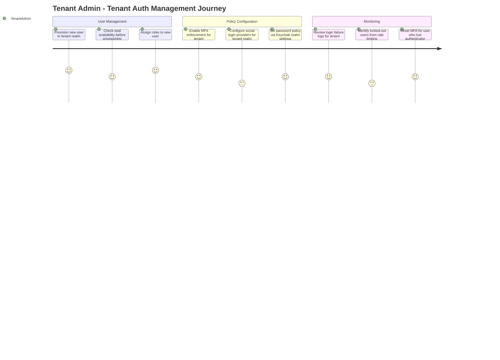
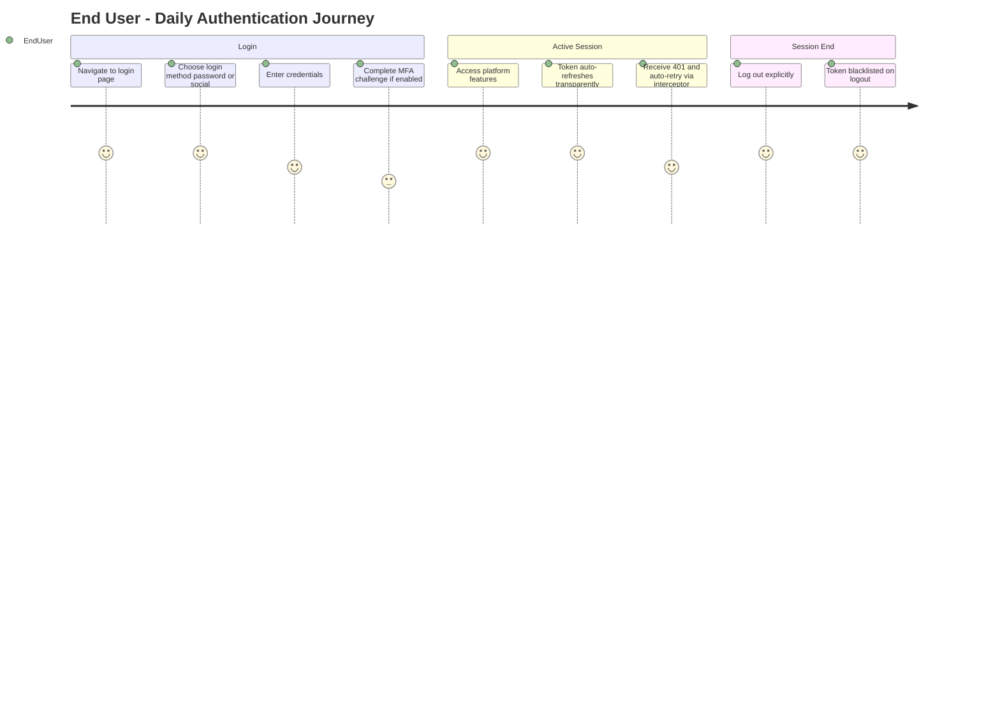
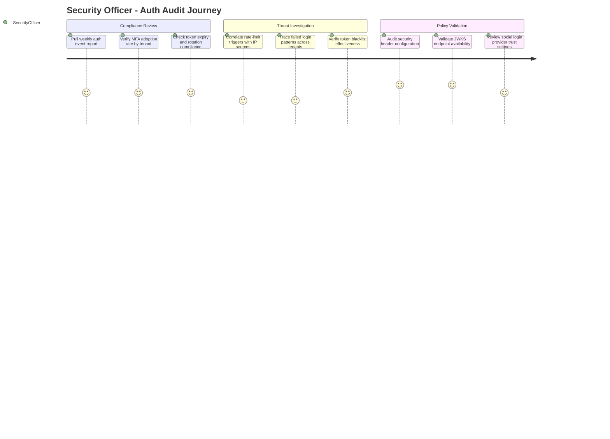
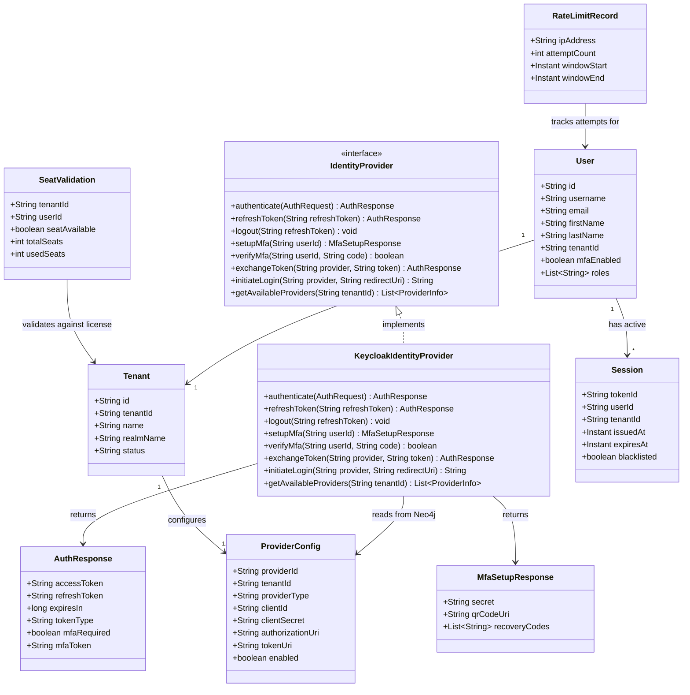
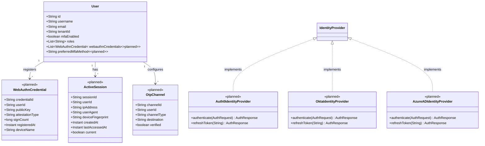
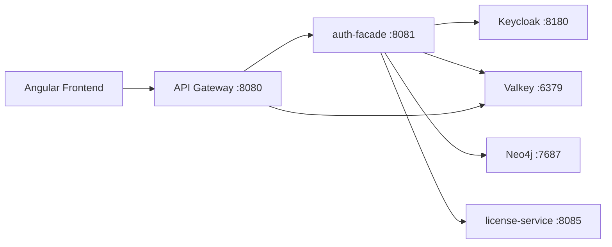
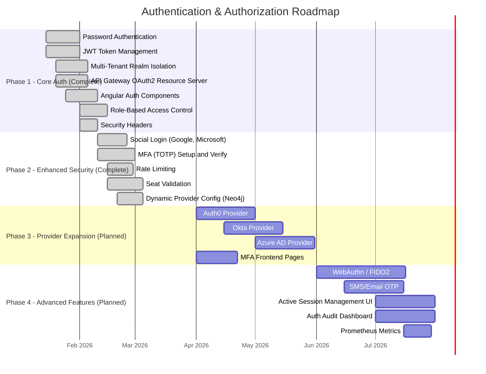
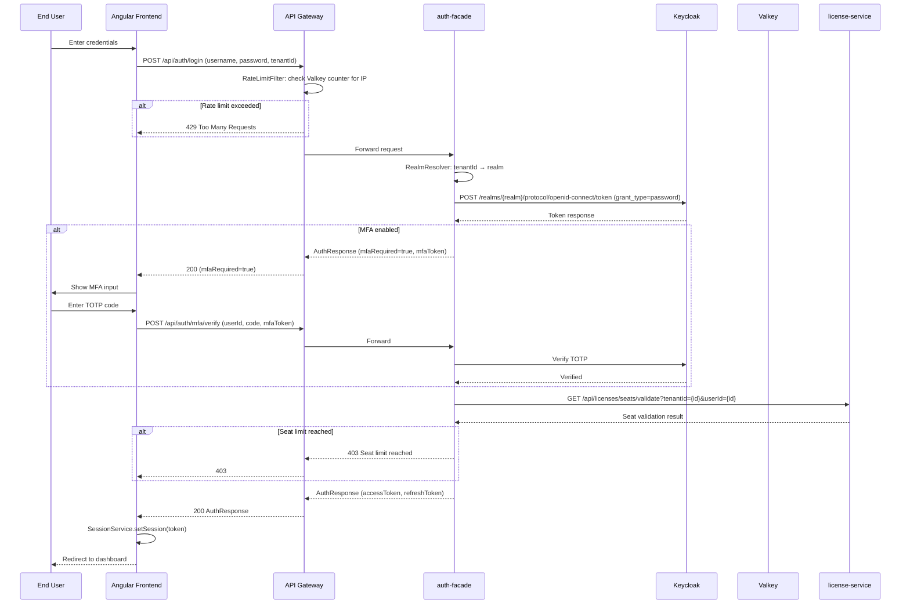
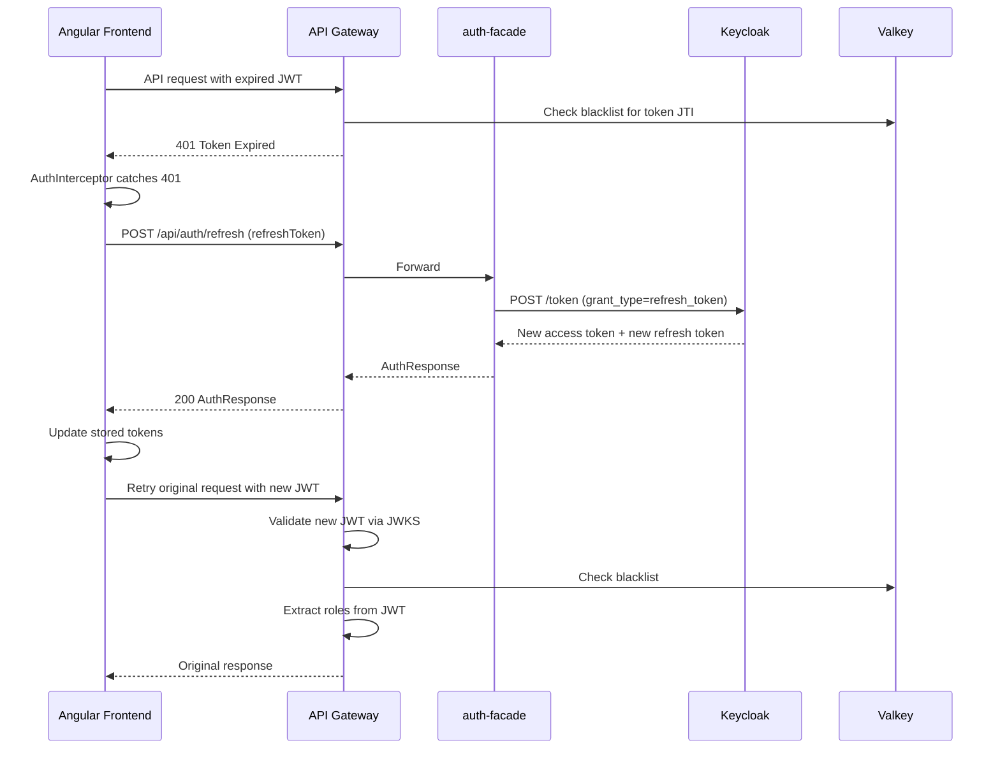
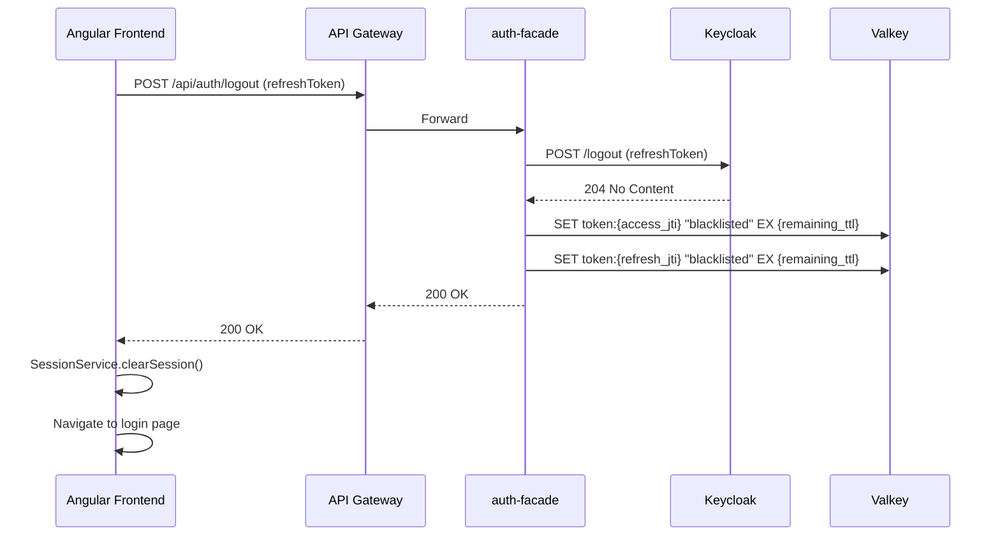

# PRD: Authentication and Authorization

**Document ID:** PRD-AA-001
**Version:** 1.0.0
**Date:** 2026-03-12
**Status:** Draft
**Author:** DOC Agent
**Stakeholders:** Product Owner, Architecture Team, Security Team, Development Team

---

## Table of Contents

1. [Vision and Purpose](#1-vision-and-purpose)
2. [Problem Statement](#2-problem-statement)
3. [Key Value Propositions](#3-key-value-propositions)
4. [Target Users / Personas](#4-target-users--personas)
5. [Business Domain Model](#5-business-domain-model)
6. [Feature Requirements](#6-feature-requirements)
   - FR-1 [Password Authentication via Keycloak](#fr-1-password-authentication-via-keycloak-implemented)
   - FR-2 [Social Login (Google, Microsoft)](#fr-2-social-login-google-microsoft-implemented)
   - FR-3 [Multi-Factor Authentication (TOTP)](#fr-3-multi-factor-authentication-totp-implemented)
   - FR-4 [Token Management (JWT + Refresh)](#fr-4-token-management-jwt--refresh-implemented)
   - FR-5 [Multi-Tenant Realm Isolation](#fr-5-multi-tenant-realm-isolation-implemented)
   - FR-6 [Rate Limiting](#fr-6-rate-limiting-implemented)
   - FR-7 [Seat Validation](#fr-7-seat-validation-implemented)
   - FR-8 [Role-Based Access Control](#fr-8-role-based-access-control-implemented)
   - FR-9 [Security Headers](#fr-9-security-headers-implemented)
   - FR-10 [Angular Frontend Auth](#fr-10-angular-frontend-auth-implemented)
   - FR-11 [Dynamic Identity Provider Configuration](#fr-11-dynamic-identity-provider-configuration-implemented)
   - FR-12 [Additional Identity Providers](#fr-12-additional-identity-providers-planned)
   - FR-13 [WebAuthn / FIDO2 Passwordless](#fr-13-webauthn--fido2-passwordless-planned)
   - FR-14 [SMS/Email OTP](#fr-14-smsemail-otp-planned)
   - FR-15 [Active Session Management UI](#fr-15-active-session-management-ui-planned)
   - [Error Code Registry](#authentication--authorization-error-code-registry)
7. [Business Rules](#7-business-rules)
8. [Acceptance Criteria](#8-acceptance-criteria)
9. [Non-Functional Requirements](#9-non-functional-requirements)
10. [Dependencies and Integrations](#10-dependencies-and-integrations)
11. [Roadmap / Phasing](#11-roadmap--phasing)
12. [Success Metrics](#12-success-metrics)

---

## 1. Vision and Purpose

Authentication and Authorization is the security foundation of the EMSIST platform. It provides a multi-tenant, provider-agnostic identity layer that enables organizations to authenticate users via enterprise identity providers, enforce multi-factor authentication, manage JWT-based sessions, and control access through role-based policies -- all while maintaining strict tenant isolation at the Keycloak realm level.

The vision is to deliver a secure, extensible authentication framework that:

- Authenticates users via Keycloak as the primary identity provider, with a Strategy pattern (`IdentityProvider` interface) enabling future provider additions without code changes to consuming services
- Supports social login flows (Google, Microsoft) through Keycloak identity brokering and direct token exchange
- Enforces TOTP-based multi-factor authentication with QR code setup, recovery codes, and per-user enforcement
- Manages JWT lifecycle with RS256 signing, refresh token rotation, and Valkey-backed token blacklisting
- Isolates tenants via dedicated Keycloak realms, resolved dynamically from the `X-Tenant-ID` header
- Validates user seats against the license-service before granting access to non-master tenants
- Rate-limits login attempts per IP address using Valkey counters to prevent brute-force attacks
- Extracts and propagates roles from JWT claims through the API gateway to downstream services

---

## 2. Problem Statement

Organizations deploying multi-tenant SaaS platforms face five core authentication and authorization challenges:

1. **Tenant isolation in identity management** -- Shared identity provider configurations leak user data across tenants. When Tenant A's users are visible to Tenant B's admin, compliance with data residency and privacy regulations (GDPR, SOC 2) is compromised. EMSIST addresses this by provisioning one Keycloak realm per tenant, ensuring complete user, role, and session isolation at the IdP level.

2. **Provider lock-in** -- Organizations adopt platforms and then discover the authentication layer is hard-wired to a single provider (e.g., Okta, Auth0). Migrating to a different IdP requires re-engineering the entire auth stack. EMSIST mitigates this with a Strategy pattern (`IdentityProvider` interface) that abstracts provider operations behind a common contract.

3. **MFA adoption friction** -- Users resist MFA when setup is complex or recovery options are unclear. Administrators cannot enforce MFA policies per-tenant because the platform lacks tenant-scoped MFA controls. EMSIST provides a guided TOTP setup flow with QR code, manual secret entry, and pre-generated recovery codes.

4. **Token lifecycle vulnerabilities** -- Platforms that issue long-lived tokens without rotation or blacklisting are vulnerable to token theft. A stolen access token remains valid until expiry, and there is no mechanism to revoke it on logout or password change. EMSIST implements refresh token rotation (new refresh token on every refresh call), Valkey-backed blacklisting on logout, and JWKS-validated RS256 signatures.

5. **License enforcement gaps** -- SaaS platforms that sell seat-based licenses cannot enforce seat limits at the authentication boundary. Users log in even when the tenant has exceeded its licensed seat count, creating billing disputes and compliance issues. EMSIST validates seats at login time via a Feign call to the license-service.

---

## 3. Key Value Propositions

| # | Value Proposition | Beneficiary |
|---|-------------------|-------------|
| VP-1 | **Realm-per-tenant isolation** -- Each tenant gets a dedicated Keycloak realm with isolated users, roles, and social provider configs; no cross-tenant data leakage | Security Officers, Compliance Teams |
| VP-2 | **Provider-agnostic architecture** -- The `IdentityProvider` Strategy pattern allows adding new IdPs (Auth0, Okta, Azure AD) by implementing a single interface, without modifying existing code | Platform Architects |
| VP-3 | **Social login with zero tenant configuration** -- Google and Microsoft sign-in work via Keycloak identity brokering and direct token exchange, with redirect-based flows using `kc_idp_hint` | End Users |
| VP-4 | **TOTP MFA with recovery** -- Users set up TOTP via QR code or manual secret entry, receive pre-generated recovery codes, and verification is enforced before full access is granted | End Users, Security Officers |
| VP-5 | **Secure token lifecycle** -- RS256-signed JWTs with configurable expiry, refresh token rotation on every refresh, and Valkey-backed blacklist checked on every gateway request | Security Officers |
| VP-6 | **Seat-aware login** -- Login flow validates the user's seat allocation against the license-service, preventing access when the tenant exceeds its licensed seat count | Tenant Admins, Finance Teams |
| VP-7 | **Brute-force protection** -- Valkey-backed rate limiting restricts login attempts per IP (5 attempts per 15 minutes), with automatic lockout and configurable thresholds | Security Officers |
| VP-8 | **Role extraction at the gateway** -- The API gateway extracts roles from JWT claims (`realm_access.roles`, `resource_access`, `roles`, `scope`) and propagates them as headers, enabling downstream services to enforce RBAC without token parsing | Backend Developers |

---

## 4. Target Users / Personas

> **Persona Registry:** Full persona definitions (persona cards, empathy maps, JTBD, accessibility needs) are maintained in the centralized **Persona Registry**. This section provides a module-specific summary with Authentication and Authorization journey maps.

### Persona 1: Super Admin

| Attribute | Detail |
|-----------|--------|
| Role | Platform-wide administrator with cross-tenant visibility |
| Goals | Configure master tenant authentication policies; manage identity provider settings at the platform level; monitor authentication events across all tenants; override tenant auth configs in emergencies |
| Frustrations | No single view of authentication failures across tenants; social login provider configuration is scattered; cannot enforce MFA policies globally |
| Usage | Daily -- monitors auth health, responds to security incidents, configures IdP settings |
| Technical Level | Advanced -- comfortable with Keycloak admin console, OAuth2 concepts, JWT debugging |
| Key Permissions | Full access to all tenant realms; can create/modify identity provider configurations; bypasses seat validation |

**UI Touchpoints (Screens):**

| Screen | ID | Key Components | Journey Steps | Status |
|--------|----|----------------|---------------|--------|
| Login (Keycloak SSO) | SCR-AUTH-01 | Keycloak login form, MFA prompt, social login buttons | Pre-requisite | [IMPLEMENTED] |
| Auth Dashboard | SCR-AUTH-02 | Platform-wide login metrics, failure rates, rate-limit triggers | Morning Review | [PLANNED] |
| Identity Provider Configuration | SCR-AUTH-03 | Provider list, add/edit provider form, test connection button | Configuration | [PLANNED] |
| Token Blacklist Manager | SCR-AUTH-04 | Search by user/token, bulk revoke, expiry timeline | Incident Response | [PLANNED] |

### Persona 2: Tenant Admin

| Attribute | Detail |
|-----------|--------|
| Role | Manages authentication settings within a single tenant |
| Goals | Configure tenant-specific social login providers; enforce MFA for the tenant's users; monitor login activity within the tenant; manage user provisioning and seat allocation |
| Frustrations | Cannot see why users fail to log in; seat limit enforcement is opaque; no self-service MFA reset for users |
| Usage | Weekly -- adjusts auth settings, reviews login logs, provisions new users |
| Technical Level | Intermediate -- understands OAuth2 basics, can configure Keycloak realm settings via the EMSIST UI |

**UI Touchpoints (Screens):**

| Screen | ID | Key Components | Journey Steps | Status |
|--------|----|----------------|---------------|--------|
| Login (Keycloak SSO) | SCR-AUTH-01 | Keycloak login form, MFA prompt | Pre-requisite | [IMPLEMENTED] |
| User List | SCR-AUTH-05 | User table, seat count indicator, provision button | User Management | [PLANNED] |
| Tenant Auth Settings | SCR-AUTH-06 | MFA toggle, social provider config, password policy | Policy Configuration | [PLANNED] |
| Tenant Login Logs | SCR-AUTH-07 | Login attempts table, failure reasons, IP addresses | Monitoring | [PLANNED] |

### Persona 3: End User

| Attribute | Detail |
|-----------|--------|
| Role | Regular platform user who authenticates to access EMSIST features |
| Goals | Log in quickly using preferred method (password, Google, Microsoft); set up MFA without confusion; recover access if MFA device is lost; stay logged in across sessions via refresh tokens |
| Frustrations | MFA setup is confusing; social login fails silently; session expires unexpectedly without warning |
| Usage | Daily -- logs in, performs work, logs out |
| Technical Level | Basic -- expects consumer-grade login experience |

**UI Touchpoints (Screens):**

| Screen | ID | Key Components | Journey Steps | Status |
|--------|----|----------------|---------------|--------|
| Login Page | SCR-AUTH-01 | Username/password form, Google button, Microsoft button, tenant selector | Login | [IMPLEMENTED] |
| MFA Setup Page | SCR-AUTH-08 | QR code display, manual secret, recovery codes list, verify input | Login (first MFA setup) | [IN-PROGRESS] |
| MFA Verification | SCR-AUTH-09 | TOTP code input, "Use recovery code" link | Login (MFA challenge) | [IN-PROGRESS] |

### Persona 4: Security Officer

| Attribute | Detail |
|-----------|--------|
| Role | Audits authentication events and reviews security policies across the platform |
| Goals | Audit all authentication events (login, logout, MFA setup, token refresh, rate-limit triggers); verify compliance with security policies; detect anomalous login patterns; ensure token lifecycle adheres to security standards |
| Frustrations | Auth events are scattered across service logs; no centralized audit trail for auth actions; cannot correlate login failures with rate-limit triggers |
| Usage | Weekly -- reviews audit logs, generates compliance reports, investigates incidents |
| Technical Level | Advanced -- deep knowledge of OAuth2, JWT, OWASP guidelines |

**UI Touchpoints (Screens):**

| Screen | ID | Key Components | Journey Steps | Status |
|--------|----|----------------|---------------|--------|
| Auth Audit Log | SCR-AUTH-10 | Filterable event table, export to CSV, correlation links | Compliance Review, Threat Investigation | [PLANNED] |
| Security Policy Dashboard | SCR-AUTH-11 | Header config summary, token policy summary, MFA stats | Policy Validation | [PLANNED] |

---

## 5. Business Domain Model

### 5.1 As-Built Domain Model [IMPLEMENTED]

The following diagram reflects entities and relationships verified in the current codebase across the `auth-facade` and `api-gateway` services.

**Evidence:**

- `IdentityProvider.java`: Strategy interface defining `authenticate()`, `refreshToken()`, `logout()`, `setupMfa()`, `verifyMfa()`, `exchangeToken()`, `initiateLogin()`, `getAvailableProviders()`.
- `KeycloakIdentityProvider.java`: Concrete implementation using Keycloak REST API; handles OAuth2 password grant, token exchange for Google/Microsoft, TOTP MFA via user attributes, and `kc_idp_hint` for redirect-based social login.
- `AuthResponse` / `MfaSetupResponse`: DTOs returned from auth operations.
- `RateLimitFilter.java`: Gateway filter using Valkey `INCR`/`EXPIRE` for per-IP rate limiting.
- `SeatValidationService.java`: Feign client calling license-service to validate seat allocation.
- `RealmResolver.java`: Maps `X-Tenant-ID` header to Keycloak realm name.
- Token blacklisting: Valkey `SET` with TTL on logout; checked in gateway filter.
- Provider configs: Stored as Neo4j nodes, cached with 5-minute TTL in Valkey.

**Source paths (auth-facade):**
- `backend/auth-facade/src/main/java/com/ems/auth/`

**Source paths (api-gateway):**
- `backend/api-gateway/src/main/java/com/ems/gateway/`

### 5.2 Target Domain Model [PLANNED]

The following diagram adds entities needed for planned features (additional IdPs, WebAuthn, session management UI). Items marked with `<<planned>>` do not exist in code today.

---

## 6. Feature Requirements

### FR-1: Password Authentication via Keycloak [IMPLEMENTED]

**Priority:** P0 -- Critical
**Status:** [IMPLEMENTED]

**Description:** Users authenticate using username and password credentials. The auth-facade delegates authentication to Keycloak via its REST API using the OAuth2 Resource Owner Password Credentials (ROPC) grant. The Keycloak realm is resolved dynamically from the `X-Tenant-ID` header via `RealmResolver`.

**User Stories:**
- As an End User, I want to log in with my username and password so that I can access the platform.
- As a Tenant Admin, I want password policies (complexity, expiry, history) enforced by Keycloak so that I do not need to implement custom password validation.

**Functional Details:**

| Aspect | Detail |
|--------|--------|
| Grant Type | OAuth2 Resource Owner Password Credentials (ROPC) |
| Endpoint | `POST /api/auth/login` |
| Request Body | `{ "username": "...", "password": "...", "tenantId": "..." }` |
| Response | `AuthResponse` with `accessToken`, `refreshToken`, `expiresIn`, `tokenType`, `mfaRequired` |
| Realm Resolution | `RealmResolver` maps `tenantId` to Keycloak realm name |
| Error Cases | Invalid credentials (401), tenant not found (404), rate-limited (429), account locked (423) |

**Evidence:** `KeycloakIdentityProvider.authenticate()` calls Keycloak token endpoint with `grant_type=password`.

---

### FR-2: Social Login (Google, Microsoft) [IMPLEMENTED]

**Priority:** P1 -- High
**Status:** [IMPLEMENTED]

**Description:** Users can authenticate using their Google or Microsoft accounts. Two flows are supported: (1) direct token exchange via `exchangeToken()` where the frontend provides a Google JWT or Microsoft access token, and (2) redirect-based OAuth2 via `initiateLogin()` using Keycloak's `kc_idp_hint` parameter to route the user to the correct external IdP.

**User Stories:**
- As an End User, I want to log in with my Google account so that I do not need to remember a separate password.
- As an End User, I want to log in with my Microsoft account so that I can use my corporate credentials.

**Functional Details:**

| Aspect | Detail |
|--------|--------|
| Token Exchange Endpoint | `POST /api/auth/exchange-token` |
| Token Exchange Request | `{ "provider": "google|microsoft", "token": "...", "tenantId": "..." }` |
| Redirect Login Endpoint | `GET /api/auth/login/social/{provider}?redirectUri=...&tenantId=...` |
| Redirect Mechanism | Returns Keycloak authorization URL with `kc_idp_hint={provider}` |
| Supported Providers | `google`, `microsoft` |
| Provider Config Source | Neo4j-stored `ProviderConfig` nodes, cached 5 min in Valkey |

**Evidence:** `KeycloakIdentityProvider.exchangeToken()` handles Google JWT and Microsoft access token exchange. `KeycloakIdentityProvider.initiateLogin()` constructs Keycloak auth URL with `kc_idp_hint`.

---

### FR-3: Multi-Factor Authentication (TOTP) [IMPLEMENTED]

**Priority:** P1 -- High
**Status:** [IMPLEMENTED]

**Description:** Users can set up TOTP-based multi-factor authentication. The setup flow generates a shared secret, produces a QR code URI (compatible with Google Authenticator, Authy, etc.), and issues a set of recovery codes. MFA credentials are stored in Keycloak user attributes. When MFA is enabled, the initial login returns `mfaRequired: true` and an `mfaToken`; the user must then verify a TOTP code before receiving the full access token.

**User Stories:**
- As an End User, I want to set up MFA on my account so that my account is protected if my password is compromised.
- As an End User, I want recovery codes so that I can regain access if I lose my authenticator device.
- As a Tenant Admin, I want to enforce MFA for all users in my tenant so that the organization meets its security compliance requirements.

**Functional Details:**

| Aspect | Detail |
|--------|--------|
| Setup Endpoint | `POST /api/auth/mfa/setup` |
| Setup Response | `MfaSetupResponse` with `secret`, `qrCodeUri`, `recoveryCodes` |
| Verify Endpoint | `POST /api/auth/mfa/verify` |
| Verify Request | `{ "userId": "...", "code": "...", "mfaToken": "..." }` |
| Credential Storage | Keycloak user attributes |
| Recovery Codes | Pre-generated list, single-use, stored alongside TOTP secret |
| Enforcement Flow | Login returns `mfaRequired: true` with `mfaToken` --> client submits TOTP code --> full access token issued |

**Evidence:** `KeycloakIdentityProvider.setupMfa()` generates TOTP secret and QR code URI. `KeycloakIdentityProvider.verifyMfa()` validates TOTP code against stored secret.

---

### FR-4: Token Management (JWT + Refresh) [IMPLEMENTED]

**Priority:** P0 -- Critical
**Status:** [IMPLEMENTED]

**Description:** The platform uses RS256-signed JWTs issued by Keycloak. Access tokens have a configurable expiry (default: 5 minutes). Refresh tokens support rotation -- each refresh call issues a new refresh token and invalidates the old one. On logout, both the access token and refresh token are added to a Valkey-backed blacklist with TTL matching the remaining token lifetime. The API gateway checks the blacklist on every request.

**User Stories:**
- As an End User, I want my session to remain active without re-entering credentials, via transparent token refresh.
- As a Security Officer, I want tokens revoked on logout so that stolen tokens cannot be reused.

**Functional Details:**

| Aspect | Detail |
|--------|--------|
| Token Type | JWT (RS256, Keycloak-signed) |
| Signature Validation | JWKS endpoint (`/realms/{realm}/protocol/openid-connect/certs`) |
| Access Token Expiry | Configurable (default: 5 minutes) |
| Refresh Endpoint | `POST /api/auth/refresh` |
| Refresh Request | `{ "refreshToken": "..." }` |
| Refresh Behavior | New access token + new refresh token issued; old refresh token invalidated |
| Logout Endpoint | `POST /api/auth/logout` |
| Blacklist Storage | Valkey `SET token:{jti} "blacklisted" EX {remaining_ttl}` |
| Gateway Check | Every request: check `GET token:{jti}` in Valkey; reject if present |

**Evidence:** Refresh token rotation implemented in `KeycloakIdentityProvider.refreshToken()`. Token blacklisting on logout via Valkey `SET` with TTL. Gateway filter checks blacklist before forwarding requests.

---

### FR-5: Multi-Tenant Realm Isolation [IMPLEMENTED]

**Priority:** P0 -- Critical
**Status:** [IMPLEMENTED]

**Description:** Each tenant in EMSIST maps to a dedicated Keycloak realm. The `X-Tenant-ID` header is required on all API requests (except public endpoints). The `RealmResolver` component resolves the tenant ID to the corresponding Keycloak realm name. This ensures that users, roles, social provider configurations, and sessions are completely isolated between tenants.

**User Stories:**
- As a Tenant Admin, I want my tenant's users to be completely isolated from other tenants so that there is no risk of cross-tenant data leakage.
- As a Security Officer, I want realm-per-tenant isolation so that a compromised tenant realm does not affect other tenants.

**Functional Details:**

| Aspect | Detail |
|--------|--------|
| Header | `X-Tenant-ID` (required on all non-public requests) |
| Resolution | `RealmResolver` maps `tenantId` to Keycloak realm name |
| Isolation Level | Keycloak realm per tenant (users, roles, clients, identity providers) |
| Master Tenant | Uses a dedicated master realm; bypasses seat validation |
| Missing Header | Returns `400 Bad Request` |
| Unknown Tenant | Returns `404 Not Found` |

**Note on ADR-003 (Graph-per-Tenant):** ADR-003 proposes graph-per-tenant isolation at the database level. This is **0% implemented**. Current data isolation uses simple `tenant_id` column discrimination. This PRD documents the realm-per-tenant isolation that IS implemented at the Keycloak level.

**Evidence:** `RealmResolver.java` in auth-facade. `X-Tenant-ID` header interceptor in Angular frontend (`TenantHeaderInterceptor`).

---

### FR-6: Rate Limiting [IMPLEMENTED]

**Priority:** P1 -- High
**Status:** [IMPLEMENTED]

**Description:** Login attempts are rate-limited per IP address to prevent brute-force attacks. The `RateLimitFilter` in the API gateway uses Valkey atomic counters (`INCR` + `EXPIRE`) to track attempts within a sliding window.

**User Stories:**
- As a Security Officer, I want login attempts rate-limited so that brute-force attacks are mitigated.
- As an End User, I want a clear error message when I am rate-limited so that I know to wait before trying again.

**Functional Details:**

| Aspect | Detail |
|--------|--------|
| Scope | Per IP address |
| Limit | 5 login attempts per 15-minute window |
| Storage | Valkey: `INCR rate:{ip}`, `EXPIRE rate:{ip} 900` |
| Response on Exceed | `429 Too Many Requests` with `Retry-After` header |
| Gateway Filter | `RateLimitFilter` applied to `/api/auth/login` route |

**Evidence:** `RateLimitFilter.java` in api-gateway. Uses Valkey `INCR`/`EXPIRE` for atomic counter management.

---

### FR-7: Seat Validation [IMPLEMENTED]

**Priority:** P1 -- High
**Status:** [IMPLEMENTED]

**Description:** When a non-master tenant user logs in, the auth-facade calls the license-service via Feign to validate that the tenant has available seats. If all seats are occupied and the user does not already hold a seat, login is rejected.

**User Stories:**
- As a Tenant Admin, I want the platform to enforce seat limits so that we do not exceed our licensed capacity.
- As a Finance Officer, I want seat enforcement at login so that billing accurately reflects usage.

**Functional Details:**

| Aspect | Detail |
|--------|--------|
| Trigger | Login for non-master tenant users |
| Client | `SeatValidationService` (Feign client to license-service) |
| Validation Logic | Check `totalSeats` vs `usedSeats`; if `usedSeats >= totalSeats` and user not already seated, reject |
| Master Tenant | Bypasses seat validation |
| Rejection Response | `403 Forbidden` with message indicating seat limit reached |
| License Service Port | 8085 |

**Evidence:** `SeatValidationService.java` in auth-facade. Feign client calls license-service endpoint to check seat availability.

---

### FR-8: Role-Based Access Control [IMPLEMENTED]

**Priority:** P0 -- Critical
**Status:** [IMPLEMENTED]

**Description:** The API gateway extracts roles from JWT claims and propagates them to downstream services. Roles are extracted from multiple JWT claim locations to support various Keycloak configurations.

**User Stories:**
- As a Backend Developer, I want roles extracted and propagated by the gateway so that my service does not need to parse JWTs.
- As a Tenant Admin, I want role-based access so that users only see features they are authorized to use.

**Functional Details:**

| Aspect | Detail |
|--------|--------|
| Role Sources | `realm_access.roles`, `resource_access.{client}.roles`, `roles`, `scope` |
| Propagation | Gateway adds extracted roles as headers to downstream requests |
| Gateway Config | Spring Cloud Gateway with OAuth2 Resource Server |
| Role Hierarchy | Keycloak realm roles + client roles |
| Angular Guard | `AuthGuard` checks session state and redirects unauthenticated users to login |

**Evidence:** API gateway OAuth2 resource server configuration extracts roles from JWT claims. Angular `AuthGuard` and `AuthInterceptor` enforce auth on the frontend.

---

### FR-9: Security Headers [IMPLEMENTED]

**Priority:** P1 -- High
**Status:** [IMPLEMENTED]

**Description:** The API gateway applies security headers to all responses to prevent common web vulnerabilities.

**Functional Details:**

| Header | Value | Purpose |
|--------|-------|---------|
| `Strict-Transport-Security` | `max-age=31536000; includeSubDomains` | Enforce HTTPS |
| `Content-Security-Policy` | Configured per environment | Prevent XSS, clickjacking |
| `X-Frame-Options` | `DENY` | Prevent clickjacking |
| `X-Content-Type-Options` | `nosniff` | Prevent MIME sniffing |

**Evidence:** Security headers configured in API gateway response filters.

---

### FR-10: Angular Frontend Auth [IMPLEMENTED]

**Priority:** P0 -- Critical
**Status:** [IMPLEMENTED]

**Description:** The Angular frontend provides a complete authentication experience including a login page component, auth guard for route protection, auth interceptor for automatic token refresh on 401 responses, tenant header interceptor for injecting `X-Tenant-ID`, and a signal-based session service for reactive state management.

**Functional Details:**

| Component | Responsibility |
|-----------|---------------|
| `LoginComponent` | Login form with username/password fields and social login buttons |
| `AuthGuard` | Route guard that redirects unauthenticated users to login |
| `AuthInterceptor` | HTTP interceptor that attaches JWT to requests and auto-refreshes on 401 |
| `TenantHeaderInterceptor` | HTTP interceptor that adds `X-Tenant-ID` header to all requests |
| `SessionService` | Signal-based service managing auth state (logged in, token, user info) |

**Evidence:** Angular components and services in `frontend/src/app/core/auth/`.

---

### FR-11: Dynamic Identity Provider Configuration [IMPLEMENTED]

**Priority:** P2 -- Medium
**Status:** [IMPLEMENTED]

**Description:** Identity provider configurations (client IDs, secrets, authorization URIs) are stored as nodes in Neo4j and cached in Valkey with a 5-minute TTL. This allows adding or modifying provider configurations without redeploying services.

**Functional Details:**

| Aspect | Detail |
|--------|--------|
| Storage | Neo4j nodes (per-tenant provider configuration) |
| Cache | Valkey with 5-minute TTL |
| Resolution | On auth request, resolve provider config from cache; fallback to Neo4j on cache miss |
| Supported Operations | Create, update, enable/disable provider per tenant |

**Evidence:** Provider configuration queries in auth-facade; Valkey cache layer for provider configs.

---

### FR-12: Additional Identity Providers [PLANNED]

**Priority:** P2 -- Medium
**Status:** [PLANNED] -- Not yet built. Only `KeycloakIdentityProvider` exists.

**Description:** The `IdentityProvider` Strategy pattern is designed to support additional identity providers. Planned providers include Auth0, Okta, and Azure AD. Each would implement the `IdentityProvider` interface and be selected at runtime based on the tenant's provider configuration.

**Planned Providers:**

| Provider | Interface Implementation | Status |
|----------|------------------------|--------|
| Keycloak | `KeycloakIdentityProvider` | [IMPLEMENTED] |
| Auth0 | `Auth0IdentityProvider` | [PLANNED] |
| Okta | `OktaIdentityProvider` | [PLANNED] |
| Azure AD | `AzureADIdentityProvider` | [PLANNED] |

---

### FR-13: WebAuthn / FIDO2 Passwordless [PLANNED]

**Priority:** P3 -- Low
**Status:** [PLANNED] -- No code exists.

**Description:** Support passwordless authentication using WebAuthn/FIDO2 security keys and platform authenticators (Touch ID, Windows Hello). Users would register a credential and use it as a primary or secondary authentication factor.

---

### FR-14: SMS/Email OTP [PLANNED]

**Priority:** P3 -- Low
**Status:** [PLANNED] -- No code exists.

**Description:** Support one-time passwords delivered via SMS or email as an alternative MFA method. Would integrate with notification-service for delivery.

---

### FR-15: Active Session Management UI [PLANNED]

**Priority:** P2 -- Medium
**Status:** [PLANNED] -- No code exists.

**Description:** A UI for users and admins to view active sessions, see device/IP information, and revoke individual sessions. Would require tracking session metadata (IP, user agent, device fingerprint) in Valkey or a persistent store.

---

### Authentication & Authorization Error Code Registry

| Error Code | HTTP Status | Description | Resolution |
|------------|-------------|-------------|------------|
| `AUTH-001` | 401 | Invalid username or password | Verify credentials and retry |
| `AUTH-002` | 401 | Access token expired | Refresh token via `/api/auth/refresh` |
| `AUTH-003` | 401 | Refresh token expired or revoked | Re-authenticate with credentials |
| `AUTH-004` | 401 | Token signature validation failed | Ensure token was issued by the correct Keycloak realm |
| `AUTH-005` | 401 | Token is blacklisted | Re-authenticate; previous session was logged out |
| `AUTH-006` | 403 | Insufficient role/permissions | Contact Tenant Admin for role assignment |
| `AUTH-007` | 403 | Seat limit reached | Contact Tenant Admin to free a seat or upgrade license |
| `AUTH-008` | 400 | Missing `X-Tenant-ID` header | Include `X-Tenant-ID` header in request |
| `AUTH-009` | 404 | Tenant not found | Verify tenant ID is correct |
| `AUTH-010` | 429 | Rate limit exceeded | Wait for `Retry-After` seconds before retrying |
| `AUTH-011` | 401 | MFA verification required | Submit TOTP code via `/api/auth/mfa/verify` |
| `AUTH-012` | 401 | Invalid MFA code | Re-enter correct TOTP code or use a recovery code |
| `AUTH-013` | 423 | Account locked | Contact Tenant Admin to unlock account |
| `AUTH-014` | 400 | Invalid social login token | Ensure Google JWT / Microsoft token is valid and not expired |
| `AUTH-015` | 503 | Identity provider unavailable | Retry later; Keycloak may be unreachable |
| `AUTH-016` | 503 | License service unavailable | Retry later; seat validation cannot be completed |

---

## 7. Business Rules

| Rule ID | Rule | Enforcement Point | Status |
|---------|------|-------------------|--------|
| BR-AUTH-001 | All API requests (except public endpoints) require a valid JWT in the `Authorization: Bearer` header | API Gateway OAuth2 Resource Server filter | [IMPLEMENTED] |
| BR-AUTH-002 | Tenant ID must be provided via `X-Tenant-ID` header on all non-public requests | API Gateway + `TenantHeaderInterceptor` (Angular) | [IMPLEMENTED] |
| BR-AUTH-003 | Token blacklist is checked on every gateway request; blacklisted tokens are rejected with 401 | API Gateway blacklist filter + Valkey | [IMPLEMENTED] |
| BR-AUTH-004 | If MFA is enabled for a user, MFA verification is required after initial password/social authentication before a full access token is issued | auth-facade `authenticate()` + `verifyMfa()` | [IMPLEMENTED] |
| BR-AUTH-005 | Seat validation is performed on login for non-master tenant users; login is rejected if no seats are available | auth-facade `SeatValidationService` via Feign to license-service | [IMPLEMENTED] |
| BR-AUTH-006 | Login attempts are rate-limited to a maximum of 5 attempts per IP address within a 15-minute window; excess attempts receive 429 | API Gateway `RateLimitFilter` + Valkey counters | [IMPLEMENTED] |
| BR-AUTH-007 | Every refresh token exchange issues a new refresh token and invalidates the previous one (rotation) | auth-facade `KeycloakIdentityProvider.refreshToken()` | [IMPLEMENTED] |
| BR-AUTH-008 | JWT signatures are validated against the Keycloak JWKS endpoint for the resolved realm | API Gateway OAuth2 Resource Server + JWKS URI config | [IMPLEMENTED] |
| BR-AUTH-009 | Identity provider configurations are cached in Valkey with a 5-minute TTL; cache miss triggers a Neo4j read | auth-facade provider config cache layer | [IMPLEMENTED] |
| BR-AUTH-010 | Public endpoints (`/api/auth/login`, `/api/auth/refresh`, `/api/auth/logout`, `/api/auth/providers`, `/api/auth/tenant/resolve`) bypass JWT validation and rate limiting (except login) | API Gateway route configuration | [IMPLEMENTED] |
| BR-AUTH-011 | Master tenant users bypass seat validation | auth-facade seat validation logic | [IMPLEMENTED] |
| BR-AUTH-012 | Security headers (HSTS, CSP, X-Frame-Options DENY, X-Content-Type-Options nosniff) are applied to all gateway responses | API Gateway response filter | [IMPLEMENTED] |
| BR-AUTH-013 | Angular `AuthInterceptor` automatically retries requests that fail with 401 by refreshing the token; if refresh also fails, the user is redirected to the login page | Angular `AuthInterceptor` | [IMPLEMENTED] |
| BR-AUTH-014 | Social login tokens (Google JWT, Microsoft access token) are validated by Keycloak during token exchange; auth-facade does not validate these tokens directly | auth-facade `exchangeToken()` delegates to Keycloak | [IMPLEMENTED] |

---

## 8. Acceptance Criteria

### AC-1: Password Login [IMPLEMENTED]

| # | Criterion | Status |
|---|-----------|--------|
| AC-1.1 | Given valid credentials and a valid tenant ID, when the user submits login, then the system returns an `AuthResponse` with `accessToken`, `refreshToken`, and `expiresIn` | [IMPLEMENTED] |
| AC-1.2 | Given invalid credentials, when the user submits login, then the system returns 401 with error code `AUTH-001` | [IMPLEMENTED] |
| AC-1.3 | Given a missing `X-Tenant-ID` header, when the user submits login, then the system returns 400 with error code `AUTH-008` | [IMPLEMENTED] |
| AC-1.4 | Given an unknown tenant ID, when the user submits login, then the system returns 404 with error code `AUTH-009` | [IMPLEMENTED] |

### AC-2: Social Login [IMPLEMENTED]

| # | Criterion | Status |
|---|-----------|--------|
| AC-2.1 | Given a valid Google JWT and tenant ID, when `exchangeToken` is called with `provider=google`, then the system returns an `AuthResponse` | [IMPLEMENTED] |
| AC-2.2 | Given a valid Microsoft access token and tenant ID, when `exchangeToken` is called with `provider=microsoft`, then the system returns an `AuthResponse` | [IMPLEMENTED] |
| AC-2.3 | Given `provider=google` and a valid redirect URI, when `initiateLogin` is called, then the system returns a Keycloak authorization URL with `kc_idp_hint=google` | [IMPLEMENTED] |
| AC-2.4 | Given an invalid or expired social token, when `exchangeToken` is called, then the system returns 400 with error code `AUTH-014` | [IMPLEMENTED] |

### AC-3: MFA (TOTP) [IMPLEMENTED]

| # | Criterion | Status |
|---|-----------|--------|
| AC-3.1 | Given an authenticated user without MFA, when `setupMfa` is called, then the system returns a `MfaSetupResponse` with `secret`, `qrCodeUri`, and `recoveryCodes` | [IMPLEMENTED] |
| AC-3.2 | Given a user with MFA enabled, when the user logs in with valid password, then the system returns `mfaRequired: true` and an `mfaToken` instead of the full access token | [IMPLEMENTED] |
| AC-3.3 | Given a valid TOTP code and `mfaToken`, when `verifyMfa` is called, then the system returns the full `AuthResponse` | [IMPLEMENTED] |
| AC-3.4 | Given an invalid TOTP code, when `verifyMfa` is called, then the system returns 401 with error code `AUTH-012` | [IMPLEMENTED] |

### AC-4: Token Lifecycle [IMPLEMENTED]

| # | Criterion | Status |
|---|-----------|--------|
| AC-4.1 | Given a valid refresh token, when `refreshToken` is called, then the system returns a new access token and a new refresh token (rotation) | [IMPLEMENTED] |
| AC-4.2 | Given a user who has logged out, when the blacklisted access token is used, then the gateway returns 401 | [IMPLEMENTED] |
| AC-4.3 | Given a JWT with invalid RS256 signature, when used in a request, then the gateway returns 401 | [IMPLEMENTED] |

### AC-5: Rate Limiting [IMPLEMENTED]

| # | Criterion | Status |
|---|-----------|--------|
| AC-5.1 | Given 5 failed login attempts from the same IP within 15 minutes, when the 6th attempt is made, then the system returns 429 with `Retry-After` header | [IMPLEMENTED] |
| AC-5.2 | Given a rate-limited IP, when the 15-minute window expires, then the IP can attempt login again | [IMPLEMENTED] |

### AC-6: Seat Validation [IMPLEMENTED]

| # | Criterion | Status |
|---|-----------|--------|
| AC-6.1 | Given a non-master tenant with all seats occupied, when a new user attempts login, then the system returns 403 with error code `AUTH-007` | [IMPLEMENTED] |
| AC-6.2 | Given a master tenant user, when the user logs in, then seat validation is bypassed | [IMPLEMENTED] |
| AC-6.3 | Given the license-service is unavailable, when a user attempts login, then the system returns 503 with error code `AUTH-016` | [IMPLEMENTED] |

### AC-7: Multi-Tenant Isolation [IMPLEMENTED]

| # | Criterion | Status |
|---|-----------|--------|
| AC-7.1 | Given Tenant A and Tenant B each have a Keycloak realm, when Tenant A's user attempts to authenticate against Tenant B's realm, then authentication fails | [IMPLEMENTED] |
| AC-7.2 | Given a valid tenant ID, when `RealmResolver` is called, then it returns the correct Keycloak realm name | [IMPLEMENTED] |

---

## 9. Non-Functional Requirements

### 9.1 Performance

| NFR ID | Requirement | Target | Status |
|--------|-------------|--------|--------|
| NFR-PERF-001 | Login response time (password auth) | < 500ms p95 | [IMPLEMENTED] -- Keycloak REST API call + Valkey checks |
| NFR-PERF-002 | Token refresh response time | < 200ms p95 | [IMPLEMENTED] |
| NFR-PERF-003 | Token blacklist check latency | < 5ms p99 | [IMPLEMENTED] -- Valkey `GET` |
| NFR-PERF-004 | Rate limit check latency | < 5ms p99 | [IMPLEMENTED] -- Valkey `INCR` |
| NFR-PERF-005 | Provider config cache hit rate | > 95% | [IMPLEMENTED] -- 5-minute TTL |

### 9.2 Scalability

| NFR ID | Requirement | Target | Status |
|--------|-------------|--------|--------|
| NFR-SCALE-001 | Concurrent login requests | 100 req/s per gateway instance | [PLANNED] -- Load testing not yet performed |
| NFR-SCALE-002 | Keycloak realm count | 1000+ realms (one per tenant) | [PLANNED] -- Not yet stress tested |
| NFR-SCALE-003 | Token blacklist size | Unbounded (TTL-managed, auto-evicting) | [IMPLEMENTED] |

### 9.3 Security

| NFR ID | Requirement | Target | Status |
|--------|-------------|--------|--------|
| NFR-SEC-001 | Token signing algorithm | RS256 (asymmetric) | [IMPLEMENTED] |
| NFR-SEC-002 | Transport security | TLS 1.2+ required | [IMPLEMENTED] -- HSTS header enforced |
| NFR-SEC-003 | Credential storage | Keycloak-managed (bcrypt hashing) | [IMPLEMENTED] |
| NFR-SEC-004 | Token blacklist durability | Valkey with AOF persistence | [IMPLEMENTED] |
| NFR-SEC-005 | OWASP Top 10 compliance | All applicable controls | [IN-PROGRESS] -- DAST scanning not yet configured |
| NFR-SEC-006 | Brute-force protection | Rate limiting + account lockout | [IMPLEMENTED] |

### 9.4 Availability

| NFR ID | Requirement | Target | Status |
|--------|-------------|--------|--------|
| NFR-AVAIL-001 | Auth-facade uptime | 99.9% | [PLANNED] -- SLA not yet defined |
| NFR-AVAIL-002 | Keycloak uptime | 99.9% | [PLANNED] -- HA not yet configured |
| NFR-AVAIL-003 | Graceful degradation on license-service unavailability | Return 503; do not allow unauthenticated access | [IMPLEMENTED] |

### 9.5 Observability

| NFR ID | Requirement | Target | Status |
|--------|-------------|--------|--------|
| NFR-OBS-001 | Auth event logging | All login, logout, MFA, and rate-limit events logged | [IN-PROGRESS] -- Basic logging exists; structured audit trail planned |
| NFR-OBS-002 | Metrics exposure | Login success/failure counts, token refresh counts | [PLANNED] -- Prometheus metrics not yet exposed |
| NFR-OBS-003 | Distributed tracing | Trace ID propagation across gateway, auth-facade, Keycloak | [PLANNED] |

---

## 10. Dependencies and Integrations

### 10.1 Internal Service Dependencies

| Dependency | Service | Purpose | Protocol | Status |
|------------|---------|---------|----------|--------|
| Keycloak | auth-facade | User authentication, token issuance, MFA, social login | HTTP REST | [IMPLEMENTED] |
| Valkey | auth-facade, api-gateway | Token blacklist, rate limit counters, provider config cache | Redis protocol | [IMPLEMENTED] |
| Neo4j | auth-facade | Provider configuration storage | Bolt protocol | [IMPLEMENTED] |
| license-service | auth-facade | Seat validation via Feign | HTTP REST | [IMPLEMENTED] |
| API Gateway | Angular frontend | All auth API calls routed through gateway | HTTP REST | [IMPLEMENTED] |

### 10.2 External Dependencies

| Dependency | Purpose | Status |
|------------|---------|--------|
| Google OAuth2 | Social login via Keycloak identity brokering | [IMPLEMENTED] |
| Microsoft OAuth2 | Social login via Keycloak identity brokering | [IMPLEMENTED] |

### 10.3 Infrastructure Dependencies

| Component | Image | Version | Status |
|-----------|-------|---------|--------|
| Keycloak | `keycloak:24.0` | 24.0 | [IMPLEMENTED] |
| Valkey | `valkey/valkey:8-alpine` | 8.x | [IMPLEMENTED] |
| Neo4j | `neo4j:5.12.0-community` | 5.12.0 Community | [IMPLEMENTED] |
| PostgreSQL | `postgres:16-alpine` | 16.x (used by license-service) | [IMPLEMENTED] |

**Note:** Documentation elsewhere may reference Neo4j Enterprise. The actual docker-compose uses `neo4j:5.12.0-community`. This is a known discrepancy documented in the project's CLAUDE.md.

---

## 11. Roadmap / Phasing

### Phase Summary

| Phase | Scope | Status | Implementation |
|-------|-------|--------|----------------|
| Phase 1 | Core password auth, JWT, multi-tenant isolation, gateway, Angular auth, RBAC, security headers | Complete | [IMPLEMENTED] |
| Phase 2 | Social login, MFA (TOTP), rate limiting, seat validation, dynamic provider config | Complete | [IMPLEMENTED] |
| Phase 3 | Auth0 + Okta + Azure AD providers, MFA frontend pages | Planned | [PLANNED] |
| Phase 4 | WebAuthn, SMS/Email OTP, session management UI, audit dashboard, metrics | Planned | [PLANNED] |

---

## 12. Success Metrics

| Metric ID | Metric | Target | Measurement Method | Status |
|-----------|--------|--------|-------------------|--------|
| SM-AA-001 | Login success rate | > 99% (excluding user error) | Count of successful logins / total login attempts | [PLANNED] -- Requires metrics instrumentation |
| SM-AA-002 | Token refresh success rate | > 99.9% | Count of successful refreshes / total refresh attempts | [PLANNED] |
| SM-AA-003 | MFA adoption rate (tenant-configurable) | > 80% of users in enforcing tenants | Count of MFA-enabled users / total users per tenant | [PLANNED] |
| SM-AA-004 | Rate limit trigger rate | < 0.1% of total login attempts | Count of 429 responses / total login attempts | [PLANNED] |
| SM-AA-005 | Mean time to authenticate (p95) | < 500ms | Latency histogram on `/api/auth/login` | [PLANNED] |
| SM-AA-006 | Token blacklist check latency (p99) | < 5ms | Latency histogram on Valkey GET in gateway filter | [PLANNED] |
| SM-AA-007 | Social login adoption | > 30% of logins via Google/Microsoft | Social login count / total logins | [PLANNED] |
| SM-AA-008 | Seat validation rejection rate | < 5% of login attempts | Count of 403 seat-related / total logins for non-master tenants | [PLANNED] |
| SM-AA-009 | Zero cross-tenant authentication incidents | 0 incidents per quarter | Security audit + pen test results | [PLANNED] |
| SM-AA-010 | Mean time to detect compromised session | < 5 minutes | Time from token theft to blacklist entry | [PLANNED] |

---

## Authentication Flow Diagrams

### Login Flow (Password + MFA) [IMPLEMENTED]

### Token Refresh Flow [IMPLEMENTED]

### Logout Flow [IMPLEMENTED]

---

*Document generated by DOC Agent on 2026-03-12. All [IMPLEMENTED] claims are based on verified codebase evidence. [PLANNED] items are design targets with no code in the repository.*
