# Technical Specification: Authentication and Authorization

**Services:** auth-facade (Port 8081), api-gateway (Port 8080)
**Database:** Neo4j 5.12 Community (Provider Config) + Valkey 8 (Token Blacklist, Sessions, Rate Limiting)
**Identity Provider:** Keycloak 24.0 (OAuth2/OIDC)
**Status:** [IMPLEMENTED] -- ~90% complete, provider-agnostic admin UI and additional IdPs planned
**SA Agent Version:** SA-PRINCIPLES.md v1.1.0
**Date:** 2026-03-12
**Last Verified Against Code:** 2026-03-12

---

## Table of Contents

1. [Overview and Scope](#1-overview-and-scope)
2. [Architecture Context](#2-architecture-context)
   - 2.1 [System Context (C4 Level 1)](#21-system-context-c4-level-1)
   - 2.2 [Container Context (C4 Level 2)](#22-container-context-c4-level-2)
   - 2.3 [Architectural Principles](#23-architectural-principles)
3. [As-Built Architecture](#3-as-built-architecture)
   - 3.1 [auth-facade Service Architecture](#31-auth-facade-service-architecture)
   - 3.2 [Strategy Pattern -- IdentityProvider Interface](#32-strategy-pattern----identityprovider-interface)
   - 3.3 [Security Filter Chains (api-gateway)](#33-security-filter-chains-api-gateway)
   - 3.4 [Security Filter Chains (auth-facade)](#34-security-filter-chains-auth-facade)
   - 3.5 [JWT Validation Pipeline](#35-jwt-validation-pipeline)
   - 3.6 [Token Lifecycle Management](#36-token-lifecycle-management)
   - 3.7 [Seat Validation Integration](#37-seat-validation-integration)
   - 3.8 [Frontend Authentication Architecture](#38-frontend-authentication-architecture)
   - 3.9 [Infrastructure](#39-infrastructure)
4. [Target Architecture](#4-target-architecture)
   - 4.1 [Additional Identity Providers](#41-additional-identity-providers)
   - 4.2 [WebAuthn/FIDO2 Passwordless](#42-webauthnfido2-passwordless)
   - 4.3 [Active Session Management](#43-active-session-management)
   - 4.4 [Admin IdP Management UI](#44-admin-idp-management-ui)
5. [Data Model Changes](#5-data-model-changes)
6. [API Contract Changes](#6-api-contract-changes)
7. [Security Considerations](#7-security-considerations)
8. [Performance Considerations](#8-performance-considerations)
9. [Technology Decisions](#9-technology-decisions)
10. [Dependencies](#10-dependencies)
11. [Risks and Mitigations](#11-risks-and-mitigations)

---

## 1. Overview and Scope

### 1.1 Purpose

Authentication and Authorization is the security foundation of the EMSIST platform. It provides multi-tenant identity management through a provider-agnostic architecture centered on Keycloak as the primary (and currently only) identity provider. The system handles:

- User authentication (password, social login via Google/Microsoft, MFA)
- JWT-based session management with token blacklisting via Valkey
- Role-based access control (RBAC) enforced at the API Gateway
- Tenant-aware realm isolation via Keycloak realms
- Seat validation via license-service integration
- Rate limiting on authentication endpoints

### 1.2 Current State Summary

**[IMPLEMENTED]** -- The `auth-facade` is a fully operational Spring Boot 3.4.1 microservice providing a provider-agnostic identity layer via the Strategy Pattern (`IdentityProvider` interface). Currently, only the `KeycloakIdentityProvider` implementation exists. The `api-gateway` enforces JWT validation, token blacklist checks, and RBAC path-matching on all inbound requests. The Angular frontend provides a login page, auth guard, token interceptor, and signal-based session management.

Evidence:
- Backend auth-facade: `backend/auth-facade/src/main/java/com/ems/auth/`
- Backend api-gateway: `backend/api-gateway/src/main/java/com/ems/gateway/`
- Frontend auth module: `frontend/src/app/core/auth/`
- Infrastructure: `infrastructure/docker/docker-compose.yml` (Keycloak, Valkey, Neo4j containers)

### 1.3 Scope of This Specification

| Aspect | Coverage |
|--------|----------|
| As-Built Documentation | Full reverse-engineering of auth-facade controllers, services, filters, providers, config; api-gateway security chains; frontend auth components |
| Target Enhancements | Additional IdP implementations (Auth0, Okta, Azure AD), WebAuthn, SMS/Email OTP, session management UI, admin IdP CRUD |
| ADR Alignment | ADR-004 (Keycloak), ADR-007 (Provider-Agnostic), ADR-005 (Valkey) |

### 1.4 What This Document Does NOT Cover

| Excluded | Reason |
|----------|--------|
| Keycloak realm administration procedures | Operational runbook scope |
| OAuth2 specification tutorial | Reference external RFCs |
| Graph-per-tenant isolation (ADR-003) | 0% implemented; separate specification |
| Kafka event publishing for auth events | Not implemented; no KafkaTemplate in auth-facade |

---

## 2. Architecture Context

### 2.1 System Context (C4 Level 1)

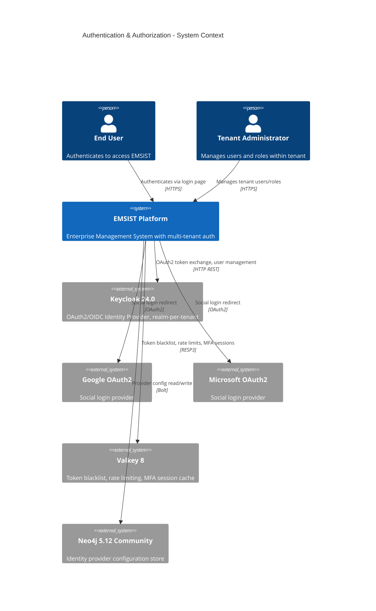

### 2.2 Container Context (C4 Level 2)

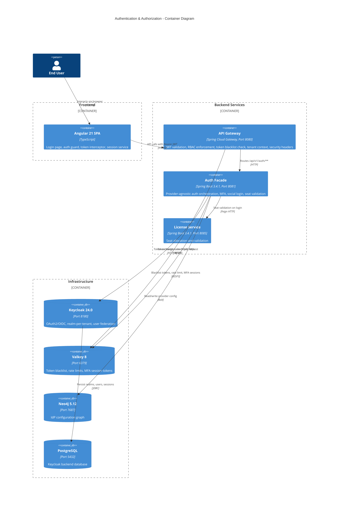

### 2.3 Architectural Principles

| Principle | Implementation | Status |
|-----------|----------------|--------|
| AP-1: Provider Agnosticism | `IdentityProvider` Strategy interface with `@ConditionalOnProperty` binding | [IMPLEMENTED] -- Keycloak only |
| AP-2: Token-Based Stateless Auth | JWT issued by Keycloak, validated at gateway and auth-facade per request | [IMPLEMENTED] |
| AP-3: Defense in Depth | Gateway validates JWT + blacklist; auth-facade re-validates; rate limiting at auth-facade | [IMPLEMENTED] |
| AP-4: Tenant Isolation | Keycloak realm-per-tenant; X-Tenant-ID header propagation; tenant context filters | [IMPLEMENTED] |
| AP-5: Seat Enforcement | Login blocked if no available seats; checked via license-service Feign call | [IMPLEMENTED] |

---

## 3. As-Built Architecture

### 3.1 auth-facade Service Architecture

**[IMPLEMENTED]** -- Verified against source code.

#### 3.1.1 Component Diagram (C4 Level 3)

```mermaid
graph TD
    subgraph auth-facade ["auth-facade :8081"]
        subgraph Controllers
            AC[AuthController<br/>REST API]
        end

        subgraph Services
            AS[AuthServiceImpl<br/>Business Logic]
            TS[TokenServiceImpl<br/>Blacklist + MFA Tokens]
            SVS[SeatValidationService<br/>License Check]
        end

        subgraph Providers
            IP["IdentityProvider<br/>(Strategy Interface)"]
            KIP[KeycloakIdentityProvider<br/>@ConditionalOnProperty]
        end

        subgraph Filters
            JVF[JwtValidationFilter<br/>Per-request JWT check]
            TCF[TenantContextFilter<br/>X-Tenant-ID extraction]
            RLF[RateLimitFilter<br/>Login attempt throttling]
        end

        subgraph Security
            JTV[JwtTokenValidator<br/>JWKS signature verification]
            DSC[DynamicBrokerSecurityConfig<br/>5 filter chains]
        end

        subgraph Config
            KC[KeycloakConfig<br/>Connection properties]
        end
    end

    AC --> AS
    AS --> IP
    IP --> KIP
    AS --> SVS
    AS --> TS
    JVF --> JTV
    JVF --> TS
    KIP --> KC

    subgraph External
        KEYCLOAK[Keycloak :8180]
        VALKEY[Valkey :6379]
        NEO4J[Neo4j :7687]
        LICENSE[license-service :8085]
    end

    KIP -->|OAuth2 REST API| KEYCLOAK
    TS -->|auth:blacklist:*| VALKEY
    RLF -->|rate_limit:login:*| VALKEY
    KIP -->|Provider config| NEO4J
    SVS -->|Feign| LICENSE
```

#### 3.1.2 Controller Layer

**[IMPLEMENTED]** -- `AuthController.java`

| Endpoint | Method | Auth | Description |
|----------|--------|------|-------------|
| `/api/v1/auth/login` | POST | Public | Username/email + password login |
| `/api/v1/auth/social/{provider}` | POST | Public | Social login (Google, Microsoft) token exchange |
| `/api/v1/auth/refresh` | POST | Public | Refresh access token using refresh token |
| `/api/v1/auth/logout` | POST | Authenticated | Logout, blacklist tokens in Valkey |
| `/api/v1/auth/me` | GET | Authenticated | Return current user profile from JWT claims |
| `/api/v1/auth/mfa/setup` | POST | Authenticated | Initiate TOTP MFA setup, return QR code URI |
| `/api/v1/auth/mfa/verify` | POST | Authenticated | Verify TOTP code, complete MFA enrollment |
| `/api/v1/auth/providers` | GET | Public | List available identity providers for tenant |
| `/api/v1/auth/login/{provider}` | GET | Public | Redirect-based OAuth2 login initiation |

#### 3.1.3 Service Layer

**[IMPLEMENTED]** -- `AuthServiceImpl.java`

The `AuthServiceImpl` orchestrates all authentication flows:

1. **Login flow:** Validates credentials via `IdentityProvider.authenticate()`, calls `SeatValidationService.validateSeat()` on successful auth, returns JWT pair (access + refresh)
2. **Social login flow:** Receives provider token, calls `IdentityProvider.exchangeToken()` to swap for Keycloak token
3. **Refresh flow:** Delegates to `IdentityProvider.refreshToken()`, validates refresh token has not been blacklisted
4. **Logout flow:** Delegates to `IdentityProvider.logout()`, then blacklists both access and refresh tokens via `TokenServiceImpl`
5. **MFA flow:** Delegates to `IdentityProvider.setupMfa()` and `IdentityProvider.verifyMfaCode()`, stores temporary MFA session in Valkey

**[IMPLEMENTED]** -- `TokenServiceImpl.java`

| Responsibility | Implementation |
|----------------|----------------|
| Token blacklisting | Redis SET with key `auth:blacklist:{jti}`, TTL = token remaining lifetime |
| Blacklist check | Redis EXISTS on `auth:blacklist:{jti}` |
| MFA session tokens | Short-lived Redis keys for in-progress MFA enrollment |

**[IMPLEMENTED]** -- `SeatValidationService.java`

Calls `license-service` via Spring Cloud OpenFeign to validate that the authenticating user has an available seat under their tenant's license. If no seats are available, login is rejected with a 403 response and a descriptive error message.

### 3.2 Strategy Pattern -- IdentityProvider Interface

**[IMPLEMENTED]** -- Provider-agnostic architecture with single Keycloak implementation.

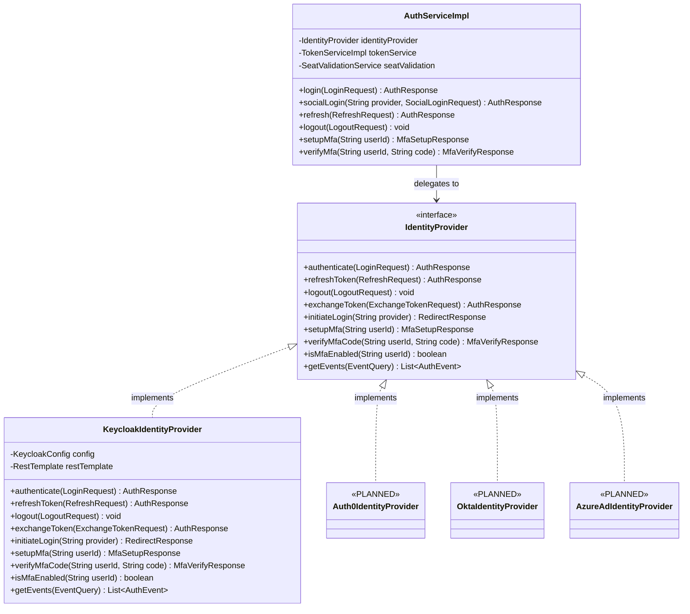

**Provider binding mechanism:**

```yaml
# application.yml
auth:
  facade:
    provider: keycloak  # Determines which IdentityProvider bean is active
```

The `KeycloakIdentityProvider` is annotated with `@ConditionalOnProperty(name = "auth.facade.provider", havingValue = "keycloak")`, enabling zero-code switching between providers by changing a configuration property. Future providers will use the same conditional binding pattern.

| Provider | Status | Conditional Property Value |
|----------|--------|---------------------------|
| Keycloak | [IMPLEMENTED] | `auth.facade.provider=keycloak` |
| Auth0 | [PLANNED] | `auth.facade.provider=auth0` |
| Okta | [PLANNED] | `auth.facade.provider=okta` |
| Azure AD | [PLANNED] | `auth.facade.provider=azure-ad` |

### 3.3 Security Filter Chains (api-gateway)

**[IMPLEMENTED]** -- `SecurityConfig.java` in api-gateway.

The API Gateway enforces security on all inbound HTTP requests before routing to downstream services. The gateway operates as a Spring Cloud Gateway with OAuth2 Resource Server configuration.

#### Gateway Security Components

| Component | File | Responsibility |
|-----------|------|----------------|
| `SecurityConfig` | `SecurityConfig.java` | OAuth2 resource server config, JWT decoder, role extraction from multiple claim paths, RBAC path matchers |
| `TokenBlacklistFilter` | `TokenBlacklistFilter.java` | Global filter checking Valkey for revoked tokens (key: `auth:blacklist:{jti}`) |
| `TenantContextFilter` | `TenantContextFilter.java` | Extracts `X-Tenant-ID` header, sets tenant context for downstream services |

#### RBAC Path Matching Rules

**[IMPLEMENTED]** -- Configured in `SecurityConfig.java` via `.pathMatchers()`.

| Path Pattern | Access Rule |
|-------------|-------------|
| `/api/v1/auth/login`, `/api/v1/auth/refresh`, `/api/v1/auth/providers`, `/api/v1/auth/social/**` | `permitAll()` -- Public endpoints |
| `/api/v1/admin/**` | `hasRole('ADMIN')` or `hasRole('SUPER_ADMIN')` |
| `/api/v1/**` | `authenticated()` -- All other API paths require valid JWT |
| `/actuator/health` | `permitAll()` -- Health check |
| All other paths | `denyAll()` |

#### Security Headers

**[IMPLEMENTED]** -- Hardened HTTP response headers.

| Header | Value | Purpose |
|--------|-------|---------|
| `Strict-Transport-Security` | `max-age=31536000; includeSubDomains` | Force HTTPS for 1 year |
| `X-Frame-Options` | `DENY` | Prevent clickjacking |
| `Content-Security-Policy` | `default-src 'self'` | Restrict resource origins |
| `X-Content-Type-Options` | `nosniff` | Prevent MIME sniffing |
| `Referrer-Policy` | `strict-origin` | Limit referrer leakage |
| `Permissions-Policy` | Configured | Restrict browser features |

#### JWT Role Extraction

**[IMPLEMENTED]** -- Roles are extracted from multiple JWT claim paths to support different Keycloak configurations.

Configured claim paths (from `application.yml`):
- `realm_access.roles` -- Realm-level roles
- `resource_access` -- Client-level roles
- `roles` -- Flat roles claim

The `SecurityConfig` maps these claims into Spring Security `GrantedAuthority` objects with a `ROLE_` prefix.

### 3.4 Security Filter Chains (auth-facade)

**[IMPLEMENTED]** -- `DynamicBrokerSecurityConfig.java` defines 5 ordered Spring Security filter chains.

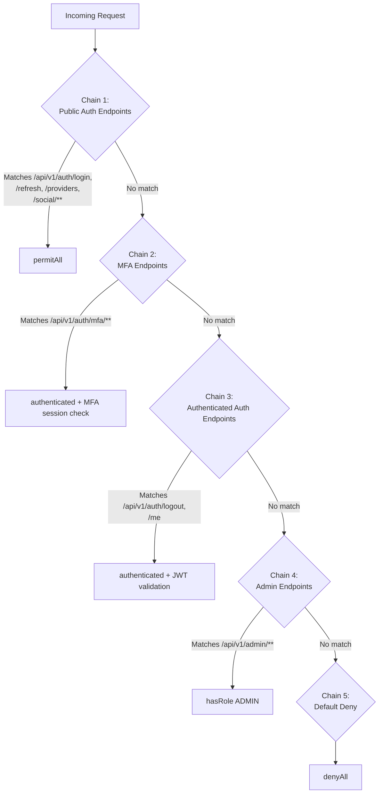

| Chain | Order | Path Pattern | Access Rule | Filters Applied |
|-------|-------|-------------|-------------|-----------------|
| 1 | 10 | `/api/v1/auth/login`, `/api/v1/auth/refresh`, `/api/v1/auth/providers`, `/api/v1/auth/social/**`, `/api/v1/auth/login/**` | `permitAll()` | RateLimitFilter |
| 2 | 20 | `/api/v1/auth/mfa/**` | `authenticated()` | JwtValidationFilter, TenantContextFilter |
| 3 | 30 | `/api/v1/auth/logout`, `/api/v1/auth/me` | `authenticated()` | JwtValidationFilter, TenantContextFilter |
| 4 | 40 | `/api/v1/admin/**` | `hasRole('ADMIN')` | JwtValidationFilter, TenantContextFilter |
| 5 | 100 | `/**` | `denyAll()` | None |

### 3.5 JWT Validation Pipeline

**[IMPLEMENTED]** -- `JwtTokenValidator.java`

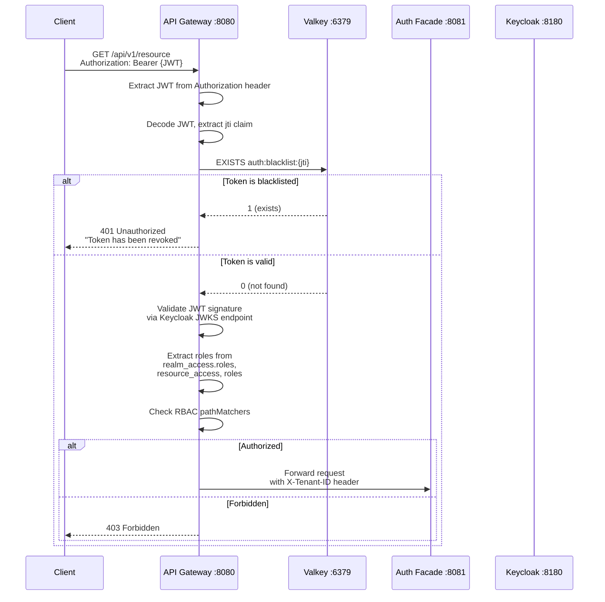

#### JWKS Key Caching

**[IMPLEMENTED]** -- `JwtTokenValidator.java`

| Parameter | Value | Description |
|-----------|-------|-------------|
| JWKS endpoint | `{keycloak-url}/realms/{realm}/protocol/openid-connect/certs` | Per-realm JWKS URL |
| Key cache TTL | 1 hour | JWKS keys cached per realm to avoid per-request fetch |
| Algorithm | RS256 | RSA signature with SHA-256 |
| Clock skew tolerance | 30 seconds | Acceptable clock drift for exp/nbf claims |

### 3.6 Token Lifecycle Management

**[IMPLEMENTED]** -- Token flow from issuance to revocation.

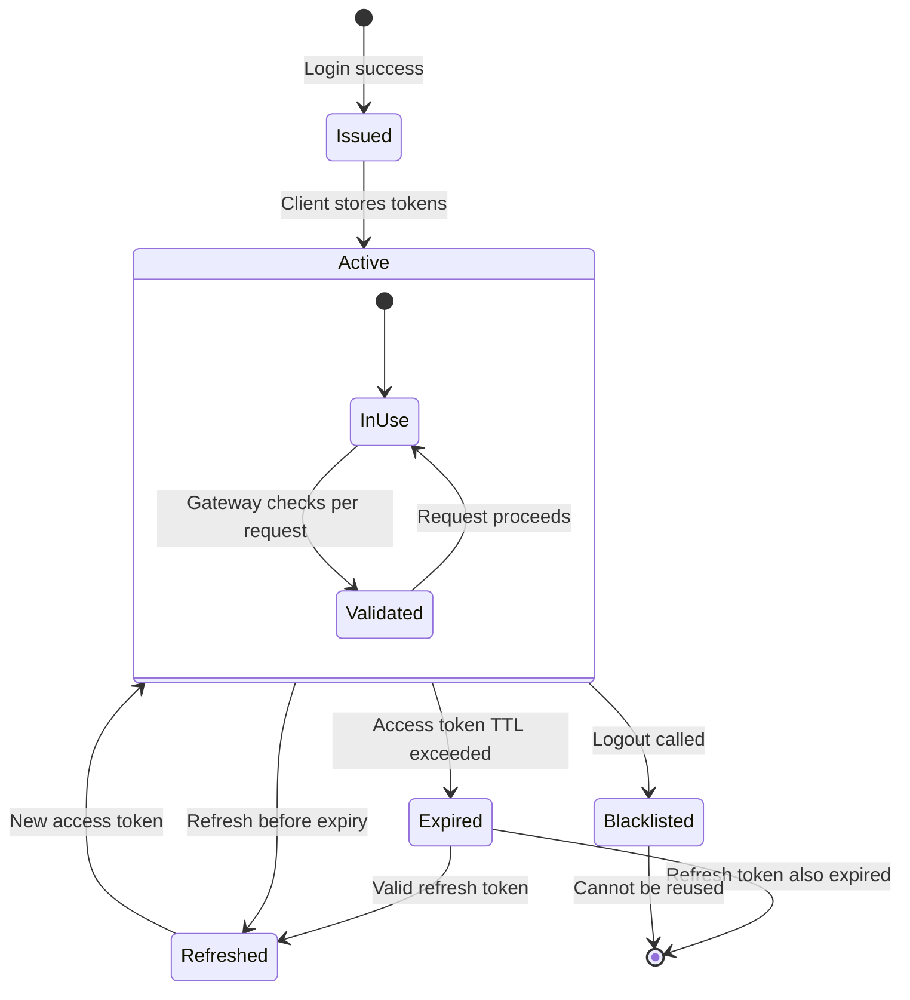

#### Valkey Key Schema

**[IMPLEMENTED]** -- Token-related keys in Valkey.

| Key Pattern | Value | TTL | Purpose |
|-------------|-------|-----|---------|
| `auth:blacklist:{jti}` | `1` | Remaining token lifetime | Revoked access/refresh tokens |
| `auth:mfa:session:{userId}` | MFA session data (JSON) | 5 minutes | In-progress MFA enrollment |
| `rate_limit:login:{ip}` | Attempt count | Sliding window (configurable) | Login rate limiting |

### 3.7 Seat Validation Integration

**[IMPLEMENTED]** -- `SeatValidationService.java`

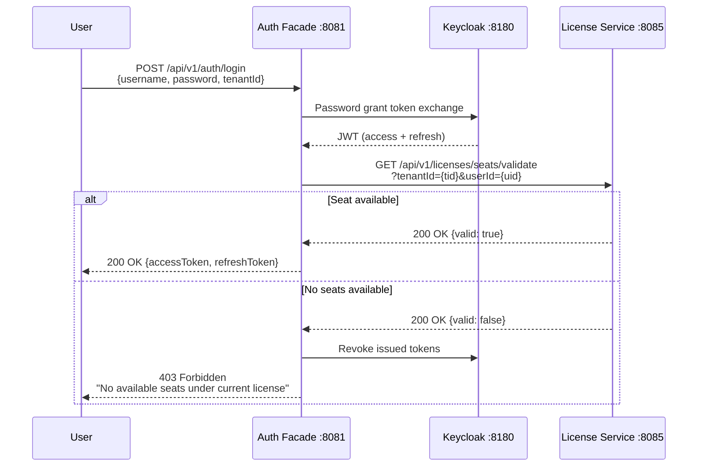

### 3.8 Frontend Authentication Architecture

**[IMPLEMENTED]** -- Angular 21 standalone components with signal-based state.

#### 3.8.1 Component Diagram

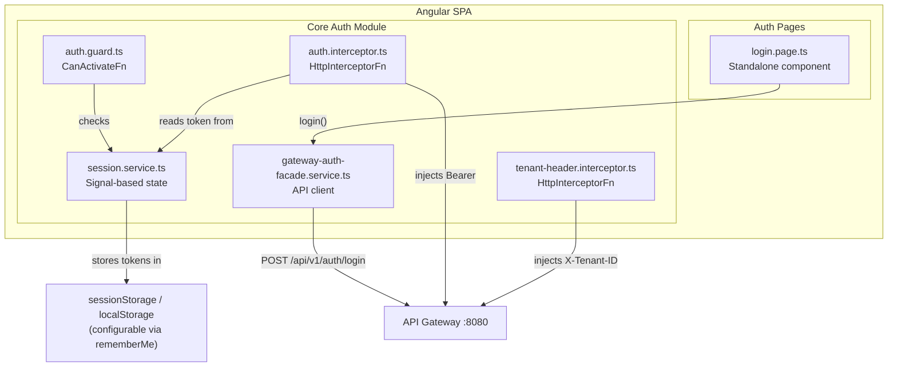

#### 3.8.2 Session Service (Signal-Based)

**[IMPLEMENTED]** -- `session.service.ts`

| Signal | Type | Description |
|--------|------|-------------|
| `accessToken` | `WritableSignal<string \| null>` | Current JWT access token |
| `refreshToken` | `WritableSignal<string \| null>` | Current refresh token |
| `isAuthenticated` | `Signal<boolean>` | Computed from accessToken presence + expiry check |
| `currentUser` | `Signal<UserProfile \| null>` | Decoded from JWT claims |

Storage strategy:
- **Remember Me checked:** Tokens persisted in `localStorage` (survive tab close)
- **Remember Me unchecked:** Tokens in `sessionStorage` (cleared on tab close)

#### 3.8.3 Auth Interceptor

**[IMPLEMENTED]** -- `auth.interceptor.ts`

| Behavior | Implementation |
|----------|----------------|
| Token injection | Adds `Authorization: Bearer {token}` to all outbound requests |
| 401 handling | On 401 response, attempts token refresh via `gateway-auth-facade.service.refreshToken()` |
| Concurrent request deduplication | If multiple requests trigger 401 simultaneously, only one refresh call is made; others wait for result |
| Force logout | If refresh fails, clears session and redirects to `/auth/login` |

#### 3.8.4 Auth Guard

**[IMPLEMENTED]** -- `auth.guard.ts`

Functional `CanActivateFn` guard that:
1. Checks `SessionService.isAuthenticated()` signal
2. If authenticated, allows navigation
3. If not authenticated, stores attempted URL and redirects to `/auth/login`

#### 3.8.5 Login Page

**[IMPLEMENTED]** -- `login.page.ts`

| Field | Type | Validation |
|-------|------|------------|
| Email/Username | Text input | Required |
| Password | Password input | Required |
| Tenant ID | Text input | Required (populated from URL or manual entry) |
| Remember Me | Checkbox | Optional (controls storage strategy) |

Error display: Shows backend error messages inline (invalid credentials, account locked, no seats available).

### 3.9 Infrastructure

**[IMPLEMENTED]** -- Docker Compose configuration.

| Component | Image | Port | Purpose |
|-----------|-------|------|---------|
| Keycloak | `quay.io/keycloak/keycloak:24.0` | 8180 | OAuth2/OIDC identity provider |
| keycloak-init | Custom Dockerfile (one-shot) | -- | Realm import, client config, default users/roles |
| Valkey | `valkey/valkey:8-alpine` | 6379 | Token blacklist, rate limiting, MFA sessions |
| Neo4j | `neo4j:5.12.0-community` | 7687 | Identity provider configuration storage |
| keycloak-db | `postgres:16-alpine` | 5432 | Keycloak's backend database |

#### Keycloak Configuration

**[IMPLEMENTED]** -- `KeycloakConfig.java` + `application.yml`

| Property | Value | Description |
|----------|-------|-------------|
| `auth.keycloak.server-url` | `http://keycloak:8180` | Keycloak base URL |
| `auth.keycloak.realm` | Dynamic per tenant | Realm resolved from tenant context |
| `auth.keycloak.client-id` | `ems-auth-facade` | OIDC client registered in Keycloak |
| `auth.keycloak.client-secret` | Configured per environment | Client secret for confidential client |
| `auth.keycloak.admin-cli` | Admin credentials | Used for user/realm management API calls |
| `auth.facade.provider` | `keycloak` | Activates `KeycloakIdentityProvider` bean |
| `auth.dynamic-broker.enabled` | `true` | Enables dynamic identity broker config |
| `auth.storage` | `neo4j` | Provider config stored in Neo4j |
| `auth.cache-ttl-minutes` | `5` | Provider config cache TTL |
| `auth.facade.role-claim-paths` | `[realm_access.roles, resource_access, roles]` | JWT claim paths for role extraction |

---

## 4. Target Architecture

### 4.1 Additional Identity Providers

**[PLANNED]** -- No code exists for any provider other than Keycloak.

| Provider | Priority | Complexity | ADR |
|----------|----------|------------|-----|
| Auth0 | P1 | Medium | ADR-007 |
| Okta | P1 | Medium | ADR-007 |
| Azure AD | P2 | Medium | ADR-007 |
| FusionAuth | P3 | Low | ADR-007 |

Each provider will implement the `IdentityProvider` interface and be activated via `@ConditionalOnProperty(name = "auth.facade.provider", havingValue = "{provider-name}")`. The provider-agnostic architecture means consumers (AuthServiceImpl, filters, controllers) require zero code changes.

#### Target Class Structure

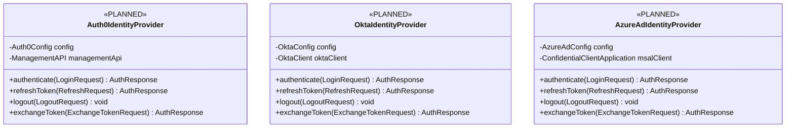

### 4.2 WebAuthn/FIDO2 Passwordless

**[PLANNED]** -- Not yet designed or implemented.

WebAuthn passwordless authentication will extend the `IdentityProvider` interface with:
- `initiateWebAuthnRegistration(String userId)` -- Start FIDO2 credential registration
- `completeWebAuthnRegistration(String userId, WebAuthnCredential credential)` -- Complete registration
- `initiateWebAuthnLogin(String username)` -- Start passwordless login challenge
- `completeWebAuthnLogin(String username, WebAuthnAssertion assertion)` -- Verify assertion

This depends on Keycloak 24.0's built-in WebAuthn support.

### 4.3 Active Session Management

**[PLANNED]** -- Not yet designed or implemented.

Target capabilities:
- List active sessions for a user (across devices)
- Force logout of specific sessions
- Session metadata: IP, user agent, last activity, device fingerprint
- Admin view: list all active sessions for a tenant

### 4.4 Admin IdP Management UI

**[PLANNED]** -- Not yet designed or implemented.

Target capabilities:
- CRUD identity provider configurations per tenant (stored in Neo4j)
- Dynamic broker enable/disable (leverages `auth.dynamic-broker.enabled=true`)
- Provider-specific configuration forms (Keycloak realm, Auth0 domain, Okta org URL)
- Test connection / validate provider config before activation

---

## 5. Data Model Changes

### 5.1 Current Data Model (Neo4j)

**[IMPLEMENTED]** -- Provider configuration stored in Neo4j.

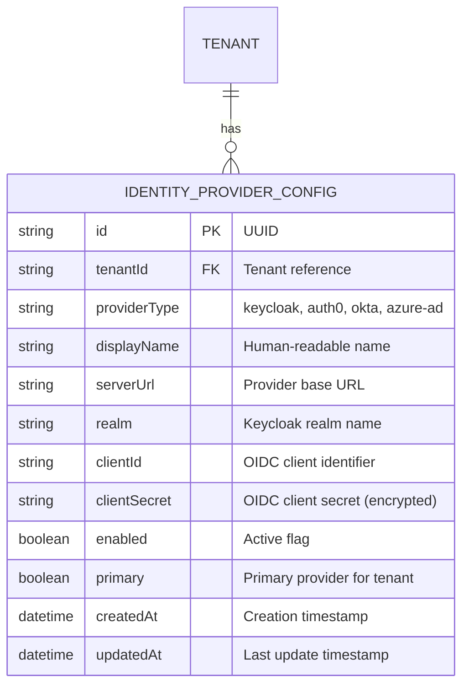

### 5.2 Current Data Model (Valkey)

**[IMPLEMENTED]** -- Key-value schema for auth-related data.

| Key Pattern | Data Type | TTL | Description |
|-------------|-----------|-----|-------------|
| `auth:blacklist:{jti}` | String (`1`) | Token remaining lifetime | Revoked token marker |
| `auth:mfa:session:{userId}` | Hash (JSON) | 300s (5 min) | MFA enrollment in-progress state |
| `rate_limit:login:{clientIp}` | String (count) | Sliding window | Login attempt counter |

### 5.3 Target Data Model Changes

**[PLANNED]** -- For session management feature.

| Change | Description |
|--------|-------------|
| Add `auth:session:{userId}:{sessionId}` | Active session tracking in Valkey |
| Add `WebAuthnCredential` node in Neo4j | FIDO2 credential storage linked to user |
| Add `auth:provider:config:cache:{tenantId}` | Cached provider config in Valkey (TTL 5 min) |

---

## 6. API Contract Changes

### 6.1 Current API Contract Summary

**[IMPLEMENTED]** -- All endpoints verified against `AuthController.java`.

| Method | Path | Request Body | Response | Auth |
|--------|------|-------------|----------|------|
| POST | `/api/v1/auth/login` | `{username, password, tenantId}` | `{accessToken, refreshToken, expiresIn}` | Public |
| POST | `/api/v1/auth/social/{provider}` | `{token, tenantId}` | `{accessToken, refreshToken, expiresIn}` | Public |
| POST | `/api/v1/auth/refresh` | `{refreshToken}` | `{accessToken, refreshToken, expiresIn}` | Public |
| POST | `/api/v1/auth/logout` | `{refreshToken}` | `204 No Content` | Bearer JWT |
| GET | `/api/v1/auth/me` | -- | `{userId, email, roles, tenantId, ...}` | Bearer JWT |
| POST | `/api/v1/auth/mfa/setup` | -- | `{qrCodeUri, secret}` | Bearer JWT |
| POST | `/api/v1/auth/mfa/verify` | `{code}` | `{verified: true}` | Bearer JWT |
| GET | `/api/v1/auth/providers` | -- | `[{name, type, enabled}]` | Public |
| GET | `/api/v1/auth/login/{provider}` | -- | `302 Redirect` | Public |

### 6.2 Error Response Format

**[IMPLEMENTED]** -- RFC 7807 Problem Details.

```json
{
  "type": "https://emsist.com/errors/invalid-credentials",
  "title": "Authentication Failed",
  "status": 401,
  "detail": "Invalid username or password",
  "instance": "/api/v1/auth/login",
  "timestamp": "2026-03-12T10:00:00Z"
}
```

| HTTP Status | Error Scenario |
|-------------|----------------|
| 400 | Missing required fields, malformed request |
| 401 | Invalid credentials, expired token, blacklisted token |
| 403 | No available seats, insufficient role, MFA required |
| 404 | Provider not found, tenant not found |
| 429 | Rate limit exceeded |
| 500 | Keycloak unavailable, internal error |

### 6.3 Target API Additions

**[PLANNED]** -- For session management and admin features.

| Method | Path | Description |
|--------|------|-------------|
| GET | `/api/v1/auth/sessions` | List active sessions for current user |
| DELETE | `/api/v1/auth/sessions/{sessionId}` | Force logout a specific session |
| GET | `/api/v1/admin/auth/sessions` | Admin: list all tenant sessions |
| DELETE | `/api/v1/admin/auth/sessions/{sessionId}` | Admin: force logout any session |
| POST | `/api/v1/admin/providers` | Admin: create IdP configuration |
| PUT | `/api/v1/admin/providers/{id}` | Admin: update IdP configuration |
| DELETE | `/api/v1/admin/providers/{id}` | Admin: delete IdP configuration |
| POST | `/api/v1/admin/providers/{id}/test` | Admin: test IdP connection |

---

## 7. Security Considerations

### 7.1 Authentication Security

**[IMPLEMENTED]**

| Control | Implementation |
|---------|----------------|
| Password hashing | Delegated to Keycloak (bcrypt by default) |
| Brute force protection | `RateLimitFilter` with Valkey-backed sliding window counter |
| Token revocation | Valkey blacklist checked at gateway AND auth-facade per request |
| MFA support | TOTP via Keycloak, session-based enrollment flow with 5-minute TTL |
| Social login | OAuth2 token exchange -- no password stored for social accounts |
| JWT validation | RS256 signature verification using Keycloak JWKS endpoint |

### 7.2 Authorization Security

**[IMPLEMENTED]**

| Control | Implementation |
|---------|----------------|
| RBAC enforcement | Gateway `pathMatchers` with role checks extracted from JWT claims |
| Tenant isolation | `X-Tenant-ID` header required; Keycloak realm-per-tenant |
| Role extraction | Multi-path claim extraction (realm_access.roles, resource_access, roles) |
| Default deny | Both gateway and auth-facade have catch-all `denyAll()` chain |

### 7.3 Transport Security

**[IMPLEMENTED]**

| Control | Implementation |
|---------|----------------|
| HSTS | 31536000 seconds (1 year), includeSubDomains |
| CSP | `default-src 'self'` |
| X-Frame-Options | DENY |
| X-Content-Type-Options | nosniff |
| Referrer-Policy | strict-origin |

### 7.4 Known Security Gaps

| Gap | Severity | Mitigation Plan | Status |
|-----|----------|-----------------|--------|
| No CSRF protection (JWT-based, not cookie-based) | LOW | JWT in Authorization header is CSRF-immune | Accepted risk |
| No session binding (JWT not bound to device) | MEDIUM | Planned: session management with device fingerprint | [PLANNED] |
| Single IdP (Keycloak) is single point of failure | MEDIUM | Planned: multi-provider support per ADR-007 | [PLANNED] |
| Graph-per-tenant not implemented | HIGH | Currently using realm-per-tenant in Keycloak; data isolation in Neo4j uses tenant_id discrimination | [PLANNED] per ADR-003 |

---

## 8. Performance Considerations

### 8.1 Current Performance Characteristics

**[IMPLEMENTED]**

| Operation | Latency Target | Bottleneck | Optimization |
|-----------|---------------|------------|--------------|
| Login (password) | < 500ms | Keycloak token exchange | Connection pooling, Keycloak co-located |
| Login (social) | < 1000ms | External OAuth2 provider | Async token exchange |
| JWT validation (gateway) | < 5ms | JWKS key fetch | 1-hour key cache per realm |
| Token blacklist check | < 1ms | Valkey EXISTS | In-memory cache, single-key lookup |
| Refresh token | < 200ms | Keycloak token refresh | Connection pooling |
| Rate limit check | < 1ms | Valkey INCR | Atomic increment |

### 8.2 Caching Strategy

**[IMPLEMENTED]**

| Cache | Storage | TTL | Key Pattern |
|-------|---------|-----|-------------|
| JWKS keys | JVM memory (JwtTokenValidator) | 1 hour | Per realm |
| Provider config | JVM memory | 5 minutes | `auth.cache-ttl-minutes=5` |
| Token blacklist | Valkey | Token remaining lifetime | `auth:blacklist:{jti}` |

**Note:** There is NO Caffeine L1 cache. The caching is single-tier Valkey plus JVM-local caches in specific validator classes. Previous documentation claiming Caffeine L1 + Valkey L2 two-tier caching was incorrect.

### 8.3 Scalability

| Component | Scaling Strategy |
|-----------|-----------------|
| auth-facade | Horizontal scaling (stateless); Valkey provides shared state |
| api-gateway | Horizontal scaling (stateless); JWKS cache is per-instance |
| Keycloak | Clustered mode with shared PostgreSQL backend (infinispan session replication) |
| Valkey | Single instance currently; Redis Cluster for HA in production |

---

## 9. Technology Decisions

### 9.1 Relevant ADRs

| ADR | Decision | Status | Impact on Auth |
|-----|----------|--------|----------------|
| ADR-004 | Keycloak as primary IdP | In Progress (90%) | Core runtime dependency |
| ADR-007 | Provider-agnostic identity layer | In Progress (25%) | Strategy pattern implemented, only Keycloak provider |
| ADR-005 | Valkey for caching | Implemented (100%) | Token blacklist, rate limiting, MFA sessions |
| ADR-001 | Neo4j as primary data store | In Progress (20%) | auth-facade uses Neo4j for provider config |
| ADR-003 | Graph-per-tenant isolation | Not Started (0%) | Currently realm-per-tenant via Keycloak |

### 9.2 Technology Stack

| Layer | Technology | Version | Justification |
|-------|-----------|---------|---------------|
| Runtime | Java | 23 | Latest LTS-track; compiled with Spring Boot 3.4.1 |
| Framework | Spring Boot | 3.4.1 | Microservice framework with Spring Security 6.x |
| Gateway | Spring Cloud Gateway | 4.x | Reactive gateway with filter chains |
| Identity | Keycloak | 24.0 | Open-source OAuth2/OIDC with realm-per-tenant |
| Cache | Valkey | 8 | Redis-compatible; token blacklist and rate limiting |
| Graph DB | Neo4j | 5.12.0 Community | Provider configuration storage |
| Service Discovery | Eureka | Via Spring Cloud | Service registration and discovery |
| Inter-service | OpenFeign | Via Spring Cloud | Declarative HTTP clients (seat validation) |
| Frontend | Angular | 21 | Standalone components, signals API |

### 9.3 Tactical Design Decisions

| Decision | Choice | Rationale |
|----------|--------|-----------|
| Token storage (frontend) | sessionStorage by default, localStorage with rememberMe | Balance security (session-scoped) with UX (persistent login) |
| JWT claim extraction | Multi-path (3 claim paths) | Support different Keycloak configurations without code changes |
| Rate limiting | Per-IP in Valkey | Distributed rate limiting across gateway instances |
| MFA enrollment TTL | 5 minutes | Short window to prevent stale MFA sessions |
| JWKS cache TTL | 1 hour | Balance key rotation responsiveness with performance |
| Provider config cache TTL | 5 minutes | Quick propagation of admin config changes |
| Token blacklist TTL | Remaining token lifetime | Automatic cleanup; no manual expiry management |

---

## 10. Dependencies

### 10.1 Upstream Dependencies (What Auth Depends On)

| Dependency | Type | Impact if Unavailable |
|------------|------|----------------------|
| Keycloak 24.0 | Runtime (critical) | Login, token refresh, logout all fail |
| Valkey 8 | Runtime (critical) | Token blacklist check fails; rate limiting disabled |
| Neo4j 5.12 | Runtime (degraded) | Provider config read fails; cached config may serve |
| license-service :8085 | Runtime (degraded) | Seat validation fails; login blocked or allowed per circuit breaker policy |
| Eureka :8761 | Runtime (degraded) | Service discovery fails; direct URLs used as fallback |

### 10.2 Downstream Dependencies (What Depends on Auth)

| Consumer | Dependency Type | What They Use |
|----------|----------------|---------------|
| api-gateway | JWT validation, blacklist check | Every inbound request |
| All backend services | JWT in Authorization header | Authentication context |
| All backend services | X-Tenant-ID header | Tenant context |
| Frontend SPA | Auth interceptor, session service | All authenticated routes |
| license-service | Called by auth-facade | Seat validation on login |

### 10.3 Dependency Diagram

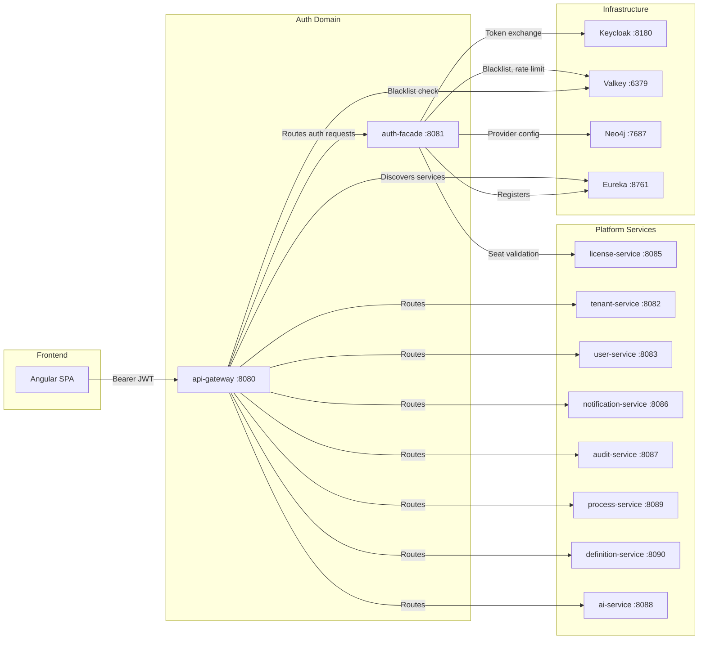

---

## 11. Risks and Mitigations

### 11.1 Technical Risks

| ID | Risk | Probability | Impact | Mitigation | Status |
|----|------|-------------|--------|------------|--------|
| R-01 | Keycloak downtime blocks all authentication | Medium | Critical | Implement circuit breaker; cache last-known-good tokens; multi-provider failover (ADR-007) | [IN-PROGRESS] -- Circuit breaker not yet verified |
| R-02 | Valkey downtime disables token revocation | Low | High | Fallback to JVM-local blacklist cache; accept brief revocation gap | [PLANNED] |
| R-03 | JWKS key rotation breaks active sessions | Low | Medium | 1-hour cache TTL ensures new keys picked up within 1 hour; 30s clock skew tolerance | [IMPLEMENTED] |
| R-04 | Neo4j Community Edition lacks enterprise clustering | Medium | Medium | Single-node with backup/restore; upgrade path to Enterprise if needed | Accepted risk |
| R-05 | Provider-agnostic interface may not cover all IdP features | Medium | Medium | Interface designed for common denominator; provider-specific extensions via config | [IMPLEMENTED] |
| R-06 | Rate limiting bypass via IP spoofing | Low | Medium | Validate X-Forwarded-For chain; use client fingerprinting | [PLANNED] |

### 11.2 Compliance Risks

| ID | Risk | Regulation | Mitigation | Status |
|----|------|-----------|------------|--------|
| C-01 | Password policy not enforced at application level | GDPR, SOC2 | Delegated to Keycloak password policies (configurable per realm) | [IMPLEMENTED] |
| C-02 | No audit trail for login events | SOC2 | Keycloak event logging enabled; auth-facade logs login attempts | [IMPLEMENTED] -- Kafka event publishing [PLANNED] |
| C-03 | Token lifetime not configurable per tenant | Compliance | Keycloak realm-level token settings (per-tenant realms) | [IMPLEMENTED] |

### 11.3 Operational Risks

| ID | Risk | Mitigation | Status |
|----|------|------------|--------|
| O-01 | Keycloak realm proliferation (one per tenant) | Automated realm provisioning via keycloak-init; monitoring for realm count | [IMPLEMENTED] |
| O-02 | Token blacklist grows unbounded | TTL-based automatic cleanup (key expires when token would have expired) | [IMPLEMENTED] |
| O-03 | MFA enrollment abandoned (orphaned sessions) | 5-minute TTL on MFA session keys in Valkey | [IMPLEMENTED] |

---

## Appendix A: Configuration Reference

### auth-facade application.yml Key Properties

```yaml
server:
  port: 8081

auth:
  facade:
    provider: keycloak                              # Active IdP implementation
    role-claim-paths:
      - realm_access.roles
      - resource_access
      - roles
  dynamic-broker:
    enabled: true                                    # Dynamic IdP broker configuration
  storage: neo4j                                     # Provider config persistence
  cache-ttl-minutes: 5                               # Provider config cache TTL

spring:
  data:
    neo4j:
      uri: bolt://neo4j:7687                         # Neo4j connection
  redis:                                             # Valkey (Redis-compatible)
    host: valkey
    port: 6379
```

### api-gateway Security Headers Configuration

```yaml
spring:
  cloud:
    gateway:
      default-filters:
        - AddResponseHeader=X-Frame-Options, DENY
        - AddResponseHeader=X-Content-Type-Options, nosniff
        - AddResponseHeader=Referrer-Policy, strict-origin
        - AddResponseHeader=Strict-Transport-Security, max-age=31536000; includeSubDomains
        - AddResponseHeader=Content-Security-Policy, default-src 'self'
```

---

## Appendix B: Runtime Flow -- Complete Login Sequence

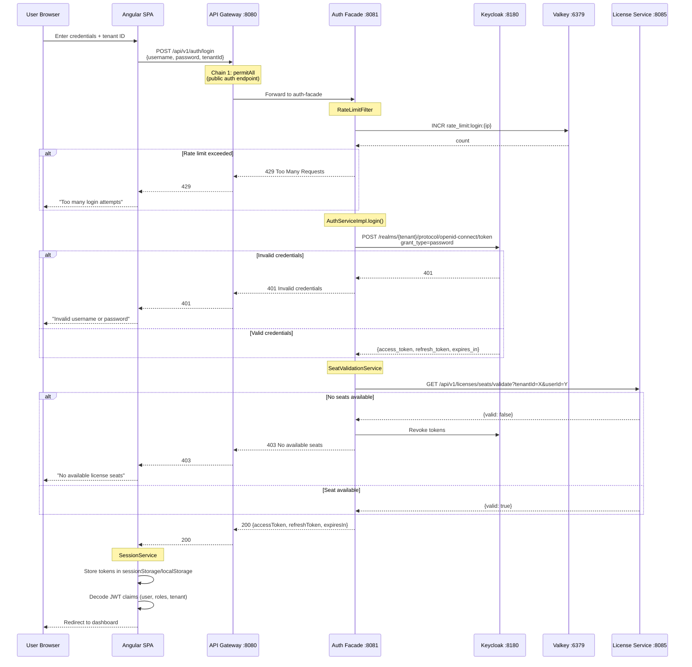

---

## Appendix C: Glossary

| Term | Definition |
|------|-----------|
| auth-facade | Spring Boot microservice providing provider-agnostic authentication API |
| IdentityProvider | Strategy interface enabling swappable identity provider implementations |
| JTI | JWT Token Identifier -- unique claim used as blacklist key |
| JWKS | JSON Web Key Set -- endpoint providing public keys for JWT signature verification |
| MFA | Multi-Factor Authentication -- TOTP-based second factor via Keycloak |
| RBAC | Role-Based Access Control -- enforced via JWT role claims at API Gateway |
| Realm | Keycloak concept mapping to a tenant -- provides isolated user/client/role namespace |
| Seat | License-controlled user slot -- validated on each login via license-service |
| Valkey | Redis-compatible in-memory data store used for token blacklist and rate limiting |
