# LLD-03: Authentication and Authorization -- Low-Level Design

**Document ID:** LLD-AUTH-001
**Version:** 1.0.0
**Date:** 2026-03-12
**Status:** [IMPLEMENTED] -- Verified against codebase
**Author:** SA Agent

---

## 1. Introduction and Scope

### 1.1 Purpose

This Low-Level Design document describes the **implemented** authentication and authorization architecture for the EMSIST platform. All claims in this document have been verified against the actual source code as of 2026-03-12.

### 1.2 Scope

| Area | Coverage | Status |
|------|----------|--------|
| auth-facade service (port 8081) | Full auth lifecycle | [IMPLEMENTED] |
| api-gateway security (port 8080) | Edge security, token blacklist, tenant validation | [IMPLEMENTED] |
| Frontend auth layer (Angular) | Guards, interceptors, session management | [IMPLEMENTED] |
| Identity provider abstraction | Strategy pattern, Keycloak implementation | [IMPLEMENTED] |
| MFA (TOTP) | Setup, verify, session management | [IMPLEMENTED] |
| License seat validation | Feign client to license-service with circuit breaker | [IMPLEMENTED] |
| Additional IdP implementations (Auth0, Okta, Azure AD) | Interface exists, no implementations | [PLANNED] |

### 1.3 Technology Stack

| Component | Technology | Evidence |
|-----------|-----------|----------|
| Backend framework | Spring Boot 3.4.1, Java 23 | `backend/auth-facade/pom.xml` |
| Identity provider | Keycloak 24 | `docker-compose.yml`, `KeycloakConfig.java` |
| Token validation | jjwt (io.jsonwebtoken) | `JwtTokenValidator.java` |
| Cache / token blacklist | Valkey 8 (via Spring Data Redis) | `StringRedisTemplate` usage across services |
| Graph database | Neo4j Community 5.12.0 | `Neo4jConfig.java`, provider nodes |
| Service discovery | Eureka | `LicenseServiceClient.java` uses `@FeignClient(name=...)` |
| Gateway | Spring Cloud Gateway (WebFlux) | `api-gateway` uses reactive `ServerHttpSecurity` |
| Frontend | Angular 21, signals | `session.service.ts`, `auth.guard.ts` |
| MFA | TOTP via samstevens totp library | `KeycloakIdentityProvider.java` |

---

## 2. Component Architecture

### 2.1 System Component Overview

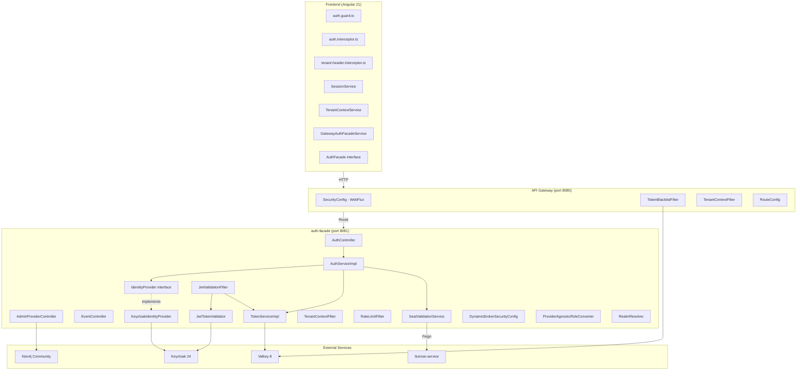

### 2.2 auth-facade Package Structure [IMPLEMENTED]

Verified file tree from actual codebase:

```
com.ems.auth/
├── AuthFacadeApplication.java
├── client/
│   ├── LicenseServiceClient.java              # Feign client to license-service
│   ├── LicenseServiceClientFallbackFactory.java
│   └── SeatValidationResponse.java
├── config/
│   ├── AuthProperties.java                    # @ConfigurationProperties(prefix = "auth.facade")
│   ├── CacheConfig.java
│   ├── DynamicBrokerSecurityConfig.java       # 5 SecurityFilterChain beans
│   ├── EncryptionConfig.java
│   ├── FeignSecurityConfig.java
│   ├── GlobalExceptionHandler.java            # @RestControllerAdvice
│   ├── JasyptConfig.java
│   ├── KeycloakConfig.java                    # @ConfigurationProperties(prefix = "keycloak")
│   ├── Neo4jConfig.java
│   ├── OpenApiConfig.java
│   ├── RedisConfig.java
│   ├── SecurityConfig.java
│   └── SecretsValidationConfig.java
├── controller/
│   ├── AdminProviderController.java           # /api/v1/admin/tenants/{tenantId}/providers
│   ├── AdminUserController.java               # /api/v1/admin/tenants/{tenantId}/users
│   ├── AuthController.java                    # /api/v1/auth/**
│   └── EventController.java                   # /api/v1/events/**
├── domain/
│   ├── ProtocolType.java
│   └── ProviderType.java
├── dto/
│   ├── PagedResponse.java
│   ├── ProviderConfigRequest.java
│   ├── ProviderConfigResponse.java
│   ├── ProviderPatchRequest.java
│   ├── TestConnectionResponse.java
│   └── UserResponse.java
├── exception/
│   └── UserNotFoundException.java
├── filter/
│   ├── JwtValidationFilter.java               # @Order(3) - JWT validation per request
│   ├── RateLimitFilter.java                   # @Order(2) - Valkey-backed rate limiting
│   └── TenantContextFilter.java               # @Order(1) - X-Tenant-ID extraction
├── graph/
│   ├── Neo4jDataInitializer.java
│   ├── entity/
│   │   ├── ConfigNode.java
│   │   ├── GroupNode.java
│   │   ├── ProtocolNode.java
│   │   ├── ProviderNode.java
│   │   ├── RoleNode.java
│   │   ├── TenantNode.java
│   │   └── UserNode.java
│   └── repository/
│       ├── AuthGraphRepository.java
│       └── UserGraphRepository.java
├── provider/
│   ├── DynamicProviderResolver.java
│   ├── IdentityProvider.java                  # Strategy interface (12 methods)
│   ├── InMemoryProviderResolver.java
│   ├── KeycloakIdentityProvider.java          # @ConditionalOnProperty("auth.facade.provider", "keycloak")
│   ├── LoginInitiationResponse.java
│   ├── Neo4jProviderResolver.java
│   ├── ProviderAlreadyExistsException.java
│   ├── ProviderConfig.java
│   └── ProviderNotFoundException.java
├── security/
│   ├── InternalServiceTokenProvider.java
│   ├── JwtTokenValidator.java                 # JWKS-based RS256 validation
│   ├── KeycloakPrincipalExtractor.java
│   ├── PrincipalExtractor.java
│   ├── ProviderAgnosticRoleConverter.java     # Configurable role claim paths
│   └── TenantAccessValidator.java
├── service/
│   ├── AuthService.java                       # Interface
│   ├── AuthServiceImpl.java                   # Core business logic
│   ├── EncryptionService.java
│   ├── GraphRoleService.java
│   ├── JasyptEncryptionService.java
│   ├── KeycloakService.java
│   ├── KeycloakServiceImpl.java
│   ├── ProviderConnectionTester.java
│   ├── SeatValidationService.java             # @CircuitBreaker(name = "licenseService")
│   ├── TokenService.java                      # Interface
│   ├── TokenServiceImpl.java                  # Blacklist + MFA sessions via Valkey
│   ├── UserManagementService.java
│   └── UserManagementServiceImpl.java
└── util/
    └── RealmResolver.java                     # tenantId -> Keycloak realm mapping
```

---

## 3. Service Layer Design

### 3.1 Class Diagram -- Core Services

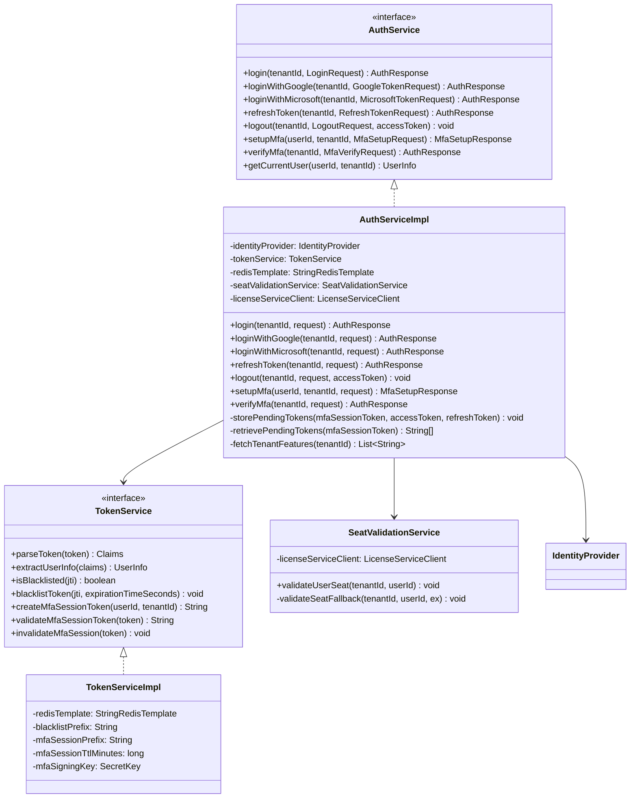

**Evidence:** `AuthServiceImpl.java` lines 33-39 show constructor injection of `IdentityProvider`, `TokenService`, `StringRedisTemplate`, `SeatValidationService`, and `LicenseServiceClient`.

### 3.2 Identity Provider Strategy Pattern [IMPLEMENTED]

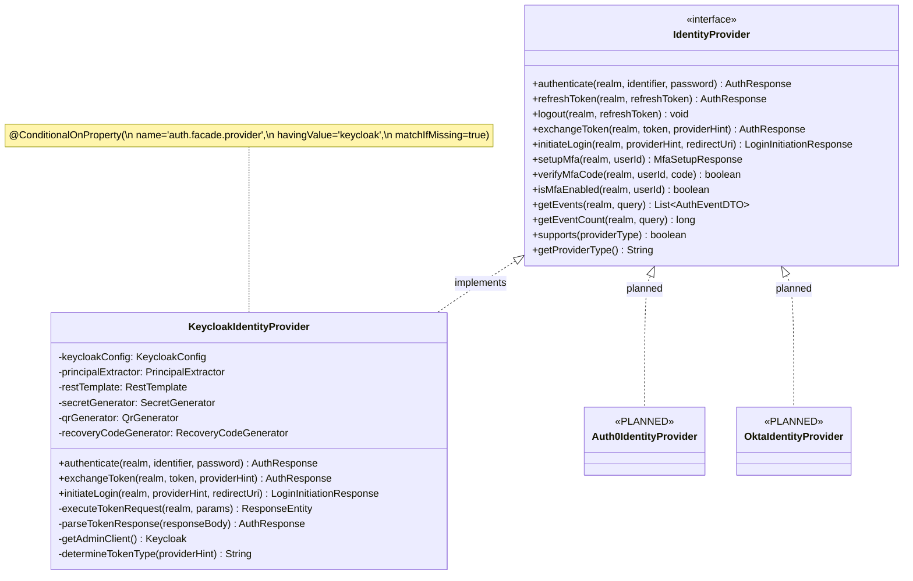

**Evidence:**
- Interface: `IdentityProvider.java` -- 12 methods defined (lines 18-92)
- Keycloak: `KeycloakIdentityProvider.java` line 56 -- `@ConditionalOnProperty(name = "auth.facade.provider", havingValue = "keycloak", matchIfMissing = true)`
- Auth0/Okta/Azure AD: No implementation files exist -- [PLANNED]

### 3.3 Realm Resolution [IMPLEMENTED]

```mermaid
graph TD
    A[tenantId input] --> B{Is master tenant?}
    B -->|"master" or MASTER_TENANT_UUID or "tenant-master"| C["master" realm]
    B -->|No| D{Starts with 'tenant-'?}
    D -->|Yes| E[Return as-is]
    D -->|No| F["tenant-" + tenantId]
```

**Evidence:** `RealmResolver.java` lines 39-54. Master tenant UUID is `68cd2a56-98c9-4ed4-8534-c299566d5b27` (line 23).

---

## 4. Filter Chain Design

### 4.1 auth-facade Servlet Filter Order [IMPLEMENTED]

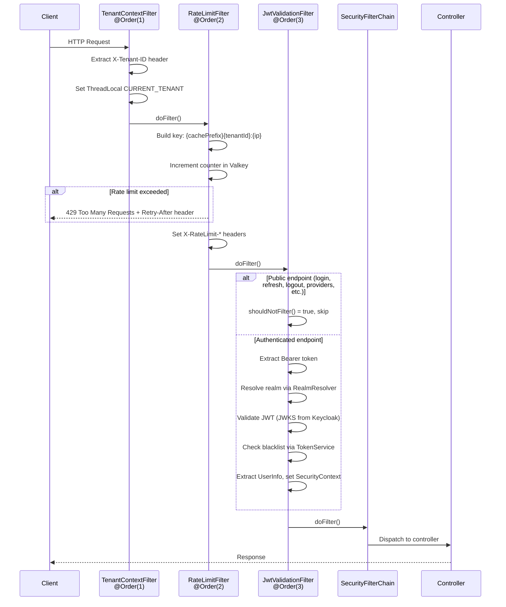

**Evidence:**
- `TenantContextFilter.java` line 16: `@Order(1)`
- `RateLimitFilter.java` line 28: `@Order(2)`
- `JwtValidationFilter.java` line 34: `@Order(3)`

### 4.2 JwtValidationFilter Skip Paths [IMPLEMENTED]

The filter skips these paths (verified from `JwtValidationFilter.java` lines 112-127):

| Path | Reason |
|------|--------|
| `/actuator/**` | Health checks |
| `/swagger/**`, `/api-docs/**`, `/v3/api-docs/**` | API documentation |
| `/api/v1/auth/login` | Login endpoint |
| `/api/v1/auth/login/**` | Dynamic provider selection |
| `/api/v1/auth/providers` | List available providers |
| `/api/v1/auth/social/**` | Social login (Google, Microsoft) |
| `/api/v1/auth/refresh` | Token refresh |
| `/api/v1/auth/logout` | Logout |
| `/api/v1/auth/mfa/verify` | MFA verification |

### 4.3 RateLimitFilter Behavior [IMPLEMENTED]

| Property | Value | Source |
|----------|-------|--------|
| Window | 60 seconds | `RateLimitFilter.java` line 62 |
| Default limit | 100 requests/minute | `@Value("${rate-limit.requests-per-minute:100}")` |
| Key pattern | `auth:rate:{tenantId}:{ip}` or `auth:rate:{ip}` | `getClientIdentifier()` lines 91-103 |
| Backed by | Valkey via `StringRedisTemplate` | Line 6 |
| Failure mode | Allow request (fail-open) | Lines 84-88 |
| Response headers | `X-RateLimit-Limit`, `X-RateLimit-Remaining`, `X-RateLimit-Reset` | Lines 72-74 |

---

## 5. Security Configuration

### 5.1 DynamicBrokerSecurityConfig -- 5 Filter Chains [IMPLEMENTED]

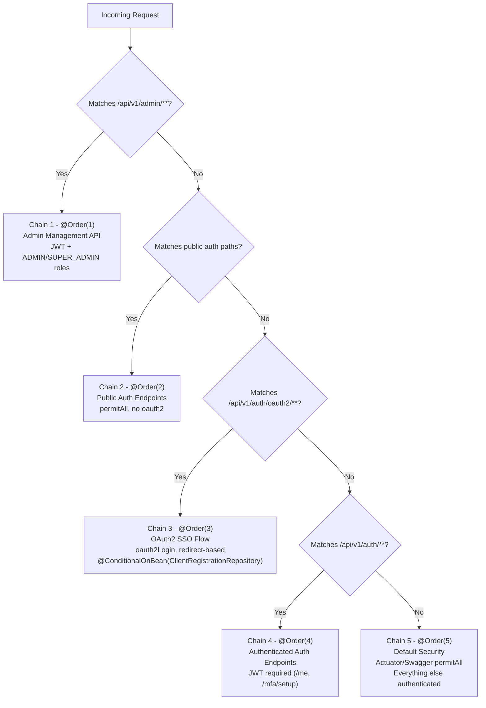

**Evidence:** `DynamicBrokerSecurityConfig.java`:

| Chain | Order | Matcher | Auth Mode | Key Roles |
|-------|-------|---------|-----------|-----------|
| 1 -- Admin | `@Order(1)` | `/api/v1/admin/**` | `oauth2ResourceServer` JWT | `ADMIN`, `SUPER_ADMIN` |
| 2 -- Public Auth | `@Order(2)` | `/api/v1/auth/login`, `/refresh`, `/logout`, `/providers/**`, `/social/**`, `/mfa/verify` | None -- `permitAll()` | None |
| 3 -- OAuth2 SSO | `@Order(3)` | `/api/v1/auth/oauth2/**` | `oauth2Login` redirect flow | None (conditional) |
| 4 -- Authenticated Auth | `@Order(4)` | `/api/v1/auth/**` (remainder) | `oauth2ResourceServer` JWT | Any authenticated |
| 5 -- Default | `@Order(5)` | Everything else | `oauth2ResourceServer` JWT | Authenticated (actuator/swagger exempt) |

All 5 chains share:
- CSRF disabled
- CORS disabled (handled by API Gateway)
- `SessionCreationPolicy.STATELESS`
- Security headers: HSTS (1 year, include subdomains), X-Frame-Options DENY, Content-Type-Options, Referrer-Policy STRICT_ORIGIN_WHEN_CROSS_ORIGIN, CSP `default-src 'self'; frame-ancestors 'none'`

**Critical design note:** Chain 2 deliberately omits `oauth2ResourceServer` and `oauth2Login` to prevent their authentication entry points from intercepting unauthenticated requests to public paths (see `DynamicBrokerSecurityConfig.java` lines 30-32).

### 5.2 API Gateway Security [IMPLEMENTED]

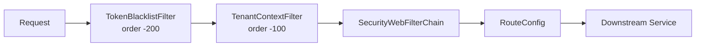

**Gateway SecurityConfig** (`api-gateway/SecurityConfig.java`):

| Path Pattern | Access |
|-------------|--------|
| `/api/tenants/resolve`, `/api/tenants/validate/**` | permitAll |
| `/api/v1/auth/login`, `/login/**`, `/providers`, `/social/**`, `/refresh`, `/logout`, `/mfa/verify` | permitAll |
| `/api/v1/auth/password/reset`, `/password/reset/confirm` | permitAll |
| `/actuator/health`, `/actuator/health/**` | permitAll |
| `/services/*/health` | permitAll |
| `/api/v1/internal/**` | **denyAll** |
| `/api/v1/admin/**` | `hasAnyRole("ADMIN", "SUPER_ADMIN")` |
| `/api/v1/tenants/*/seats/**` | `hasAnyRole("TENANT_ADMIN", "ADMIN", "SUPER_ADMIN")` |
| Everything else | authenticated |

**Evidence:** `SecurityConfig.java` lines 44-67.

Gateway security headers (lines 72-85):
- HSTS: 1 year, include subdomains
- X-Frame-Options: DENY
- Content-Type-Options: nosniff
- Referrer-Policy: STRICT_ORIGIN_WHEN_CROSS_ORIGIN
- CSP: `default-src 'self'; script-src 'self'; style-src 'self' 'unsafe-inline'; img-src 'self' data:; font-src 'self'; frame-ancestors 'none'`
- Permissions-Policy: `camera=(), microphone=(), geolocation=()`

### 5.3 Gateway Global Filters [IMPLEMENTED]

#### TokenBlacklistFilter (`api-gateway/filter/TokenBlacklistFilter.java`)

| Property | Value |
|----------|-------|
| Order | `-200` (runs before TenantContextFilter) |
| Type | `GlobalFilter` (reactive) |
| Backend | `ReactiveStringRedisTemplate` |
| Key pattern | `auth:blacklist:{jti}` |
| JTI extraction | Base64-decode JWT payload, read `jti` claim |
| Reject response | `401 {"error":"token_revoked","message":"Token has been revoked"}` |

#### TenantContextFilter (`api-gateway/filter/TenantContextFilter.java`)

| Property | Value |
|----------|-------|
| Order | `-100` |
| Type | `GlobalFilter` (reactive) |
| Validates | X-Tenant-ID is a valid UUID |
| Cross-validates | X-Tenant-ID header against JWT `tenant_id` claim |
| Generates | `X-Request-ID` (UUID) if not present |
| Rejects | `400` for invalid UUID, `403` for tenant mismatch |

**Evidence:** `TenantContextFilter.java` lines 46-48 validate UUID format; lines 53-58 cross-validate header vs JWT claim.

---

## 6. Frontend Architecture

### 6.1 Angular Auth Layer Class Diagram [IMPLEMENTED]

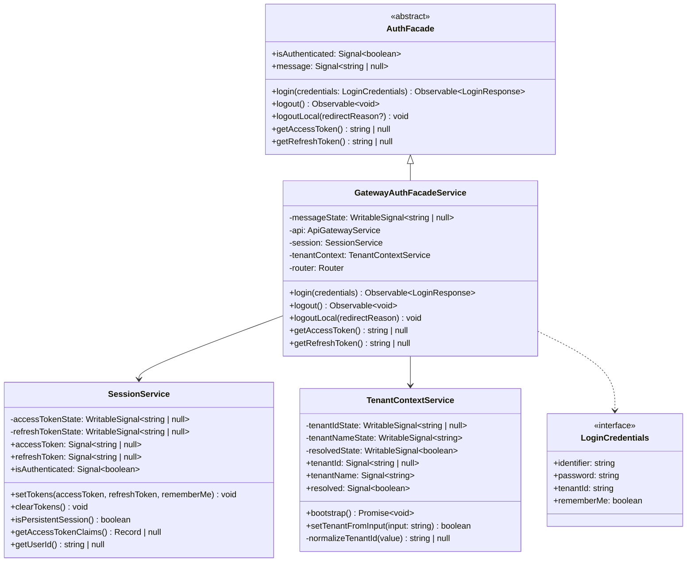

**Evidence:**
- `auth-facade.ts` lines 1-21 -- abstract class with Signal-based properties
- `gateway-auth-facade.service.ts` lines 13-96 -- concrete implementation
- `session.service.ts` lines 1-102 -- signal-based token state with localStorage/sessionStorage
- `tenant-context.service.ts` lines 1-85 -- UUID validation, alias mapping, tenant resolution

### 6.2 Token Storage Strategy [IMPLEMENTED]

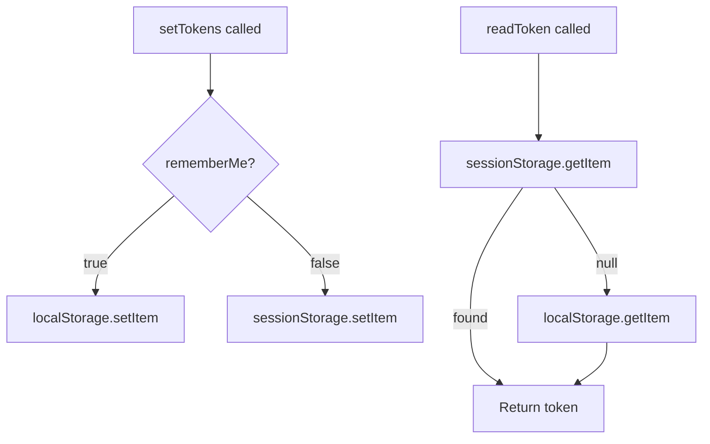

**Evidence:** `SessionService` lines 58-76. Storage keys are `tp_access_token` and `tp_refresh_token` (lines 3-4).

### 6.3 Route Protection -- authGuard [IMPLEMENTED]

```typescript
// auth.guard.ts -- Functional guard using inject()
export const authGuard: CanActivateFn = (_route, state) => {
  const session = inject(SessionService);
  const router = inject(Router);
  if (session.isAuthenticated()) return true;
  return router.createUrlTree(['/auth/login'], {
    queryParams: { returnUrl: state.url },
  });
};
```

**Evidence:** `auth.guard.ts` lines 1-16. Uses `SessionService.isAuthenticated()` which is `computed(() => Boolean(accessTokenState()))`.

### 6.4 HTTP Interceptor Pipeline [IMPLEMENTED]

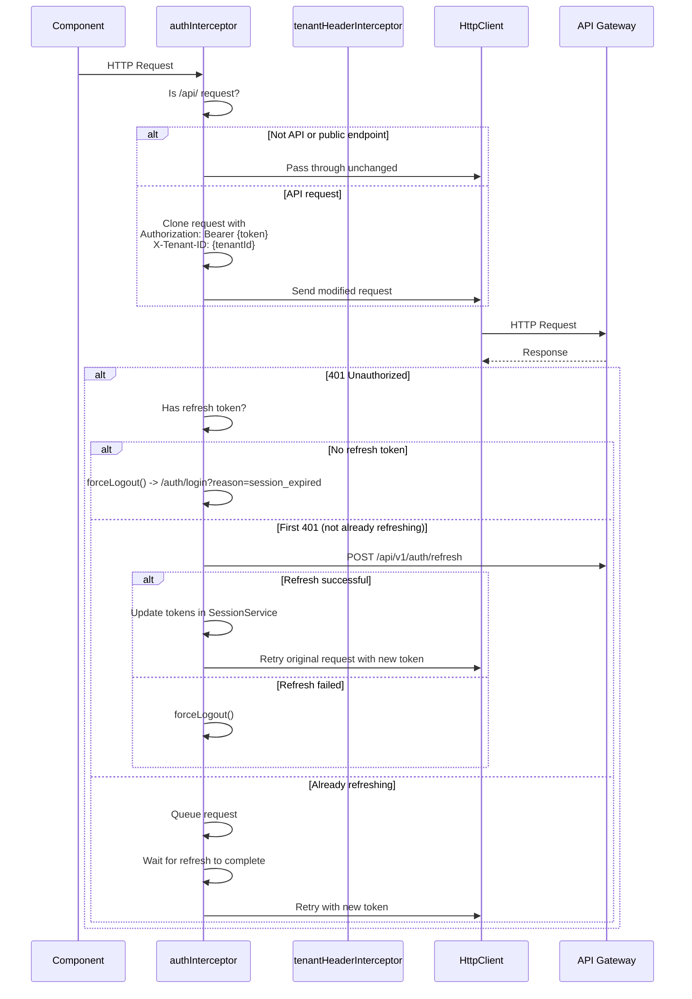

**Evidence:** `auth.interceptor.ts` lines 17-145. Key implementation details:
- Module-level `isRefreshing` flag prevents concurrent refreshes (line 14)
- `BehaviorSubject<boolean>` (`refreshCompleted$`) queues requests during refresh (line 15)
- Public endpoint detection in `isPublicEndpoint()` function (lines 135-144)

### 6.5 Tenant Context Resolution [IMPLEMENTED]

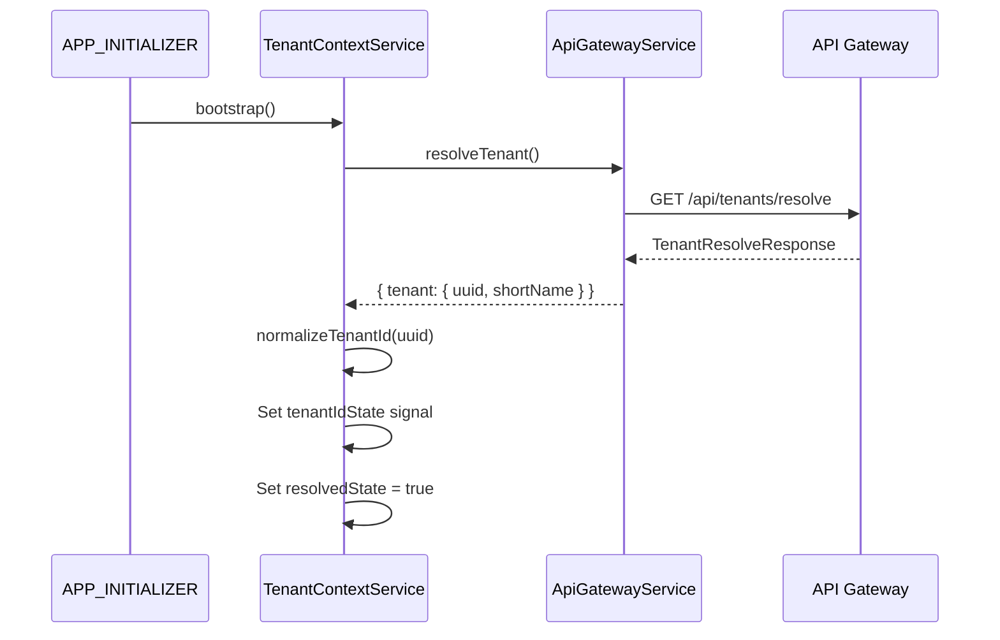

**Evidence:** `TenantContextService.bootstrap()` lines 22-32. The `normalizeTenantId` method (lines 60-79) validates UUID format and supports alias mapping via `environment.tenantAliasMap`.

---

## 7. Integration Points

### 7.1 auth-facade to Keycloak [IMPLEMENTED]

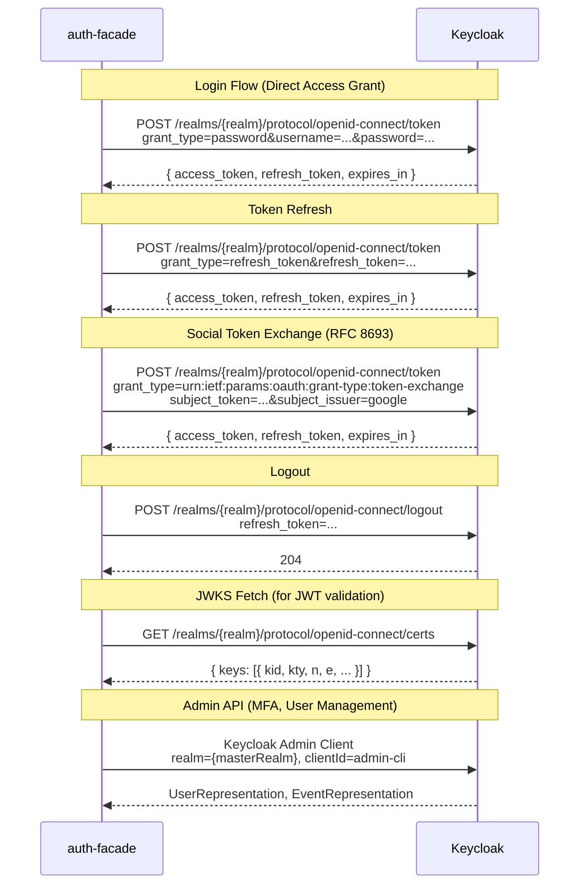

**Evidence:**
- Token endpoint construction: `KeycloakConfig.getTokenEndpoint()` line 34
- JWKS endpoint: `KeycloakConfig.getJwksUri()` line 47
- Token exchange: `KeycloakIdentityProvider.exchangeToken()` lines 147-172, uses `urn:ietf:params:oauth:grant-type:token-exchange`
- Admin client: `KeycloakIdentityProvider.getAdminClient()` lines 382-389

### 7.2 auth-facade to license-service (Feign) [IMPLEMENTED]

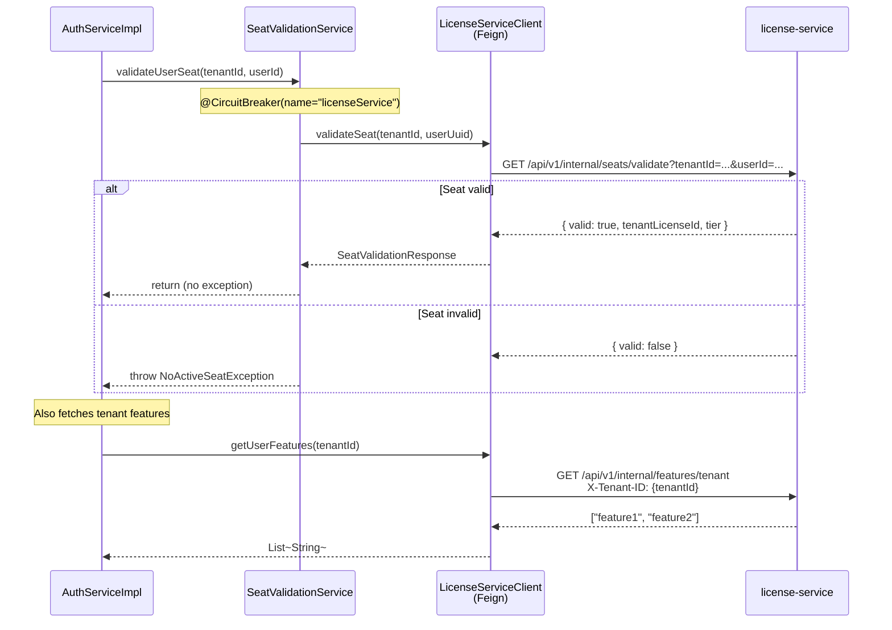

**Evidence:**
- `LicenseServiceClient.java` lines 15-36 -- `@FeignClient(name = "license-service", fallbackFactory = ...)`
- `SeatValidationService.java` line 32 -- `@CircuitBreaker(name = "licenseService", fallbackMethod = "validateSeatFallback")`
- Master tenant bypass: `AuthServiceImpl.java` line 52 -- `if (!RealmResolver.isMasterTenant(tenantId))`
- Feature fetch: `AuthServiceImpl.java` lines 252-261

### 7.3 auth-facade to Valkey [IMPLEMENTED]

| Operation | Key Pattern | TTL | Evidence |
|-----------|------------|-----|----------|
| Token blacklist | `auth:blacklist:{jti}` | Remaining JWT lifetime (min 60s) | `TokenServiceImpl.java` lines 91-103 |
| MFA session | `auth:mfa:{sessionId}` | 5 minutes (configurable) | `TokenServiceImpl.java` lines 106-128 |
| MFA pending tokens | `auth:mfa:pending:{hash}` | 5 minutes | `AuthServiceImpl.java` lines 203-206 |
| Rate limit counter | `auth:rate:{tenantId}:{ip}` | 60 seconds | `RateLimitFilter.java` lines 50-62 |
| Gateway blacklist check | `auth:blacklist:{jti}` | (reads same keys) | `TokenBlacklistFilter.java` lines 52-53 |

### 7.4 Gateway Route Configuration [IMPLEMENTED]

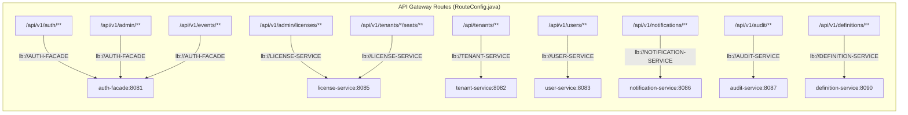

**Evidence:** `RouteConfig.java` lines 20-114. Uses `lb://` prefix for Eureka service discovery. Note: `@Profile("!docker")` on line 17 -- a separate configuration exists for Docker profile.

---

## 8. Error Handling

### 8.1 GlobalExceptionHandler Mapping [IMPLEMENTED]

All exception handling is centralized in `GlobalExceptionHandler.java` (`@RestControllerAdvice`).

| Exception | HTTP Status | Error Code | Evidence (line) |
|-----------|-------------|------------|-----------------|
| `InvalidCredentialsException` | 401 | `invalid_credentials` | 28 |
| `TokenExpiredException` | 401 | `token_expired` | 35 |
| `InvalidTokenException` | 401 | `invalid_token` | 42 |
| `AuthenticationException` | 401 or 503 | varies | 49 (503 if `auth_provider_unavailable`) |
| `AccessDeniedException` | 403 | `access_denied` | 58 |
| `MfaRequiredException` | 403 | `mfa_required` | 66 |
| `AccountLockedException` | 403 | `account_locked` | 72 |
| `NoActiveSeatException` | 403 | `no_active_seat` | 79 |
| `RateLimitExceededException` | 429 | `rate_limit_exceeded` | 87 |
| `TenantNotFoundException` | 404 | `tenant_not_found` | 94 |
| `ProviderNotFoundException` | 404 | `provider_not_found` | 101 |
| `UserNotFoundException` | 404 | `user_not_found` | 108 |
| `ProviderAlreadyExistsException` | 409 | `provider_exists` | 116 |
| `MissingRequestHeaderException` | 400 | `missing_header` | 122 |
| `MethodArgumentNotValidException` | 400 | `validation_error` | 131 |
| `ConstraintViolationException` | 400 | `validation_error` | 143 |
| `IllegalStateException` | 400 | `invalid_operation` | 150 |
| `Exception` (catch-all) | 500 | `internal_error` | 157 |

### 8.2 Error Response Format [IMPLEMENTED]

```json
{
  "error": "string (error code)",
  "message": "string (human-readable)",
  "details": { "field": "validation message" },
  "timestamp": "2026-03-12T10:00:00Z"
}
```

**Evidence:** `GlobalExceptionHandler.ErrorResponse` record at lines 164-177.

MFA-specific response:

```json
{
  "error": "mfa_required",
  "message": "MFA verification required",
  "mfaSessionToken": "eyJ..."
}
```

**Evidence:** `GlobalExceptionHandler.MfaRequiredResponse` record at lines 179-183.

### 8.3 Gateway Error Responses [IMPLEMENTED]

| Filter | Error | HTTP Status | Response Body |
|--------|-------|-------------|---------------|
| `TokenBlacklistFilter` | Revoked token | 401 | `{"error":"token_revoked","message":"Token has been revoked"}` |
| `TenantContextFilter` | Invalid UUID | 400 | `{"error":"invalid_tenant_id","message":"X-Tenant-ID must be a valid UUID"}` |
| `TenantContextFilter` | JWT/header mismatch | 403 | `{"error":"tenant_mismatch","message":"X-Tenant-ID does not match JWT tenant_id claim"}` |

---

## 9. Configuration Management

### 9.1 AuthProperties Configuration [IMPLEMENTED]

Bound to prefix `auth.facade` via `@ConfigurationProperties`:

| Property | Type | Default | Purpose |
|----------|------|---------|---------|
| `provider` | String | `"keycloak"` | Active IdP type |
| `role-claim-paths` | List\<String\> | `[roles, groups, realm_access.roles, resource_access, permissions]` | JWT claim paths for role extraction |
| `user-claim-mappings.user-id` | String | `"sub"` | JWT claim for user ID |
| `user-claim-mappings.email` | String | `"email"` | JWT claim for email |
| `user-claim-mappings.first-name` | String | `"given_name"` | JWT claim for first name |
| `user-claim-mappings.last-name` | String | `"family_name"` | JWT claim for last name |
| `user-claim-mappings.tenant-id` | String | `"tenant_id"` | JWT claim for tenant |
| `tenant-resolution` | String | `"header"` | How tenant is resolved |
| `tenant-header` | String | `"X-Tenant-ID"` | Header name for tenant |
| `tenant-claim` | String | `"tenant_id"` | JWT claim for tenant |
| `token.mfa-session-expiration-minutes` | int | `5` | MFA session TTL |
| `token.mfa-pending-prefix` | String | `"auth:mfa:pending:"` | Valkey key prefix |

**Evidence:** `AuthProperties.java` lines 41-137.

### 9.2 KeycloakConfig [IMPLEMENTED]

Bound to prefix `keycloak`:

| Property | Purpose |
|----------|---------|
| `server-url` | Keycloak base URL |
| `master-realm` | Master realm name (default: `"master"`) |
| `admin.username` | Admin CLI username |
| `admin.password` | Admin CLI password |
| `admin.client-id` | Admin client (default: `"admin-cli"`) |
| `client.client-id` | Application client ID |
| `client.client-secret` | Application client secret |

Endpoint derivation methods:
- `getTokenEndpoint(realm)` -> `{serverUrl}/realms/{realm}/protocol/openid-connect/token`
- `getLogoutEndpoint(realm)` -> `{serverUrl}/realms/{realm}/protocol/openid-connect/logout`
- `getJwksUri(realm)` -> `{serverUrl}/realms/{realm}/protocol/openid-connect/certs`
- `getUserInfoEndpoint(realm)` -> `{serverUrl}/realms/{realm}/protocol/openid-connect/userinfo`

**Evidence:** `KeycloakConfig.java` lines 1-49.

### 9.3 Token Service Configuration [IMPLEMENTED]

| Property | Default | Evidence |
|----------|---------|----------|
| `token.blacklist.prefix` | `auth:blacklist:` | `TokenServiceImpl.java` line 36 |
| `token.mfa-session.prefix` | `auth:mfa:` | `TokenServiceImpl.java` line 37 |
| `token.mfa-session.ttl-minutes` | `5` | `TokenServiceImpl.java` line 38 |
| `token.mfa-signing-key` | (required, no default) | `TokenServiceImpl.java` line 39 |
| `rate-limit.requests-per-minute` | `100` | `RateLimitFilter.java` line 33 |
| `rate-limit.cache-prefix` | `auth:rate:` | `RateLimitFilter.java` line 36 |

---

## 10. Deployment Considerations

### 10.1 Service Dependencies

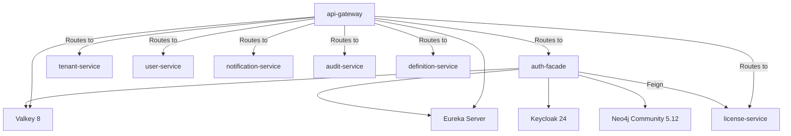

### 10.2 Infrastructure Components [IMPLEMENTED]

| Component | Image | Port |
|-----------|-------|------|
| Keycloak | `keycloak:24.0` | 8180 |
| Valkey | `valkey/valkey:8-alpine` | 6379 |
| Neo4j | `neo4j:5.12.0-community` | 7474/7687 |
| PostgreSQL | `postgres:16-alpine` | 5432 |
| Kafka | `confluentinc/cp-kafka:7.5.0` | 9092 |

### 10.3 Stateless Design

Both `auth-facade` and `api-gateway` are stateless:
- All session state is in Valkey (token blacklist, MFA sessions, rate limit counters)
- JWT tokens are self-contained; validation uses cached JWKS keys (1-hour TTL)
- No HTTP sessions (`SessionCreationPolicy.STATELESS` on all chains)
- Horizontal scaling is supported without sticky sessions

### 10.4 Known Limitations and Planned Work

| Item | Status | Notes |
|------|--------|-------|
| Auth0 / Okta / Azure AD providers | [PLANNED] | `IdentityProvider` interface exists; no implementations beyond Keycloak |
| Graph-per-tenant isolation (ADR-003) | [PLANNED] | Currently uses `tenant_id` column discrimination |
| Service merge (ADR-006, license into auth-facade) | [PLANNED] | `license-service` remains a separate service |
| Kafka event publishing | [PLANNED] | No `KafkaTemplate` usage in auth-facade |
| Caffeine L1 cache | [PLANNED] | Only Valkey is used; no two-tier caching |
| Neo4j Enterprise | [PLANNED] | Currently using Community edition |

---

## Appendix A: Complete API Endpoint Catalog

### AuthController (`/api/v1/auth`)

| Method | Path | Auth Required | Description |
|--------|------|---------------|-------------|
| POST | `/login` | No | Login with credentials |
| POST | `/social/google` | No | Google One Tap login |
| POST | `/social/microsoft` | No | Microsoft MSAL login |
| GET | `/login/{provider}` | No | Initiate IdP login (redirect flow) |
| GET | `/providers` | No (X-Tenant-ID optional) | List available providers |
| POST | `/refresh` | No | Refresh access token |
| POST | `/logout` | No | Logout and invalidate tokens |
| POST | `/mfa/setup` | Yes (Bearer JWT) | Initialize TOTP MFA setup |
| POST | `/mfa/verify` | No | Verify TOTP code |
| GET | `/me` | Yes (Bearer JWT) | Get current user profile |

### AdminProviderController (`/api/v1/admin/tenants/{tenantId}/providers`)

| Method | Path | Auth Required | Description |
|--------|------|---------------|-------------|
| GET | `/` | ADMIN / SUPER_ADMIN | List providers for tenant |
| POST | `/` | ADMIN / SUPER_ADMIN | Register new IdP |
| PUT | `/{providerId}` | ADMIN / SUPER_ADMIN | Update provider |
| DELETE | `/{providerId}` | ADMIN / SUPER_ADMIN | Delete provider |

---

## Appendix B: JWT Validation Flow Detail

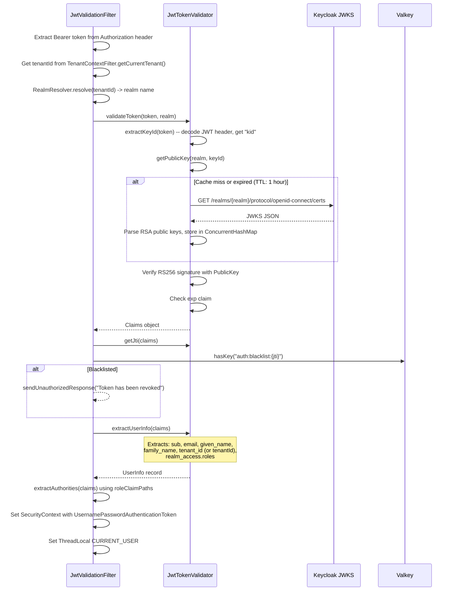

**Evidence:**
- JWKS cache: `JwtTokenValidator.java` -- `ConcurrentHashMap` at line 32, TTL 3600000ms at line 34
- RSA key construction: `createRsaPublicKey()` at lines 203-213
- UserInfo extraction: `extractUserInfo()` at lines 57-86, checks both `tenant_id` and `tenantId` claims (lines 65-69)
- Authority extraction: `JwtValidationFilter.extractAuthorities()` at lines 151-166, iterates `authProperties.getRoleClaimPaths()`

---

## Appendix C: Login Sequence (Full End-to-End)

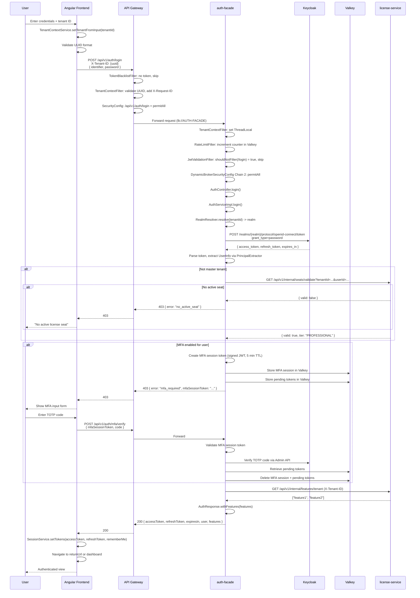

---

## Appendix D: ProviderAgnosticRoleConverter Claim Paths

The role converter checks JWT claims in order, collecting all matching roles. This enables the same codebase to work with multiple identity providers without code changes.

| Claim Path | Provider | Example Value |
|------------|----------|---------------|
| `roles` | Standard OIDC | `["ADMIN", "USER"]` |
| `groups` | Azure AD / Okta | `["admin-group", "users"]` |
| `realm_access.roles` | Keycloak (realm) | `{ "roles": ["ADMIN", "USER"] }` |
| `resource_access` | Keycloak (client) | `{ "my-client": { "roles": ["manage-users"] } }` |
| `permissions` | Auth0 | `["read:users", "write:users"]` |

All extracted roles are normalized to `ROLE_` prefix uppercase format (e.g., `admin` becomes `ROLE_ADMIN`).

**Evidence:** `ProviderAgnosticRoleConverter.java` lines 54-61, `AuthProperties.java` lines 59-65.

---

## Document Verification Summary

| Section | Verification Method | Files Read |
|---------|-------------------|------------|
| Component architecture | Glob + Read all .java files | 60+ files |
| Filter chain order | `@Order` annotations verified | `TenantContextFilter`, `RateLimitFilter`, `JwtValidationFilter` |
| Security filter chains | `@Order` and `securityMatcher` verified | `DynamicBrokerSecurityConfig.java` (294 lines) |
| Gateway security | `SecurityConfig.java` verified | `api-gateway/SecurityConfig.java` (168 lines) |
| Frontend architecture | All .ts files read | `auth.guard.ts`, `gateway-auth-facade.service.ts`, `auth.interceptor.ts`, `tenant-header.interceptor.ts`, `session.service.ts`, `tenant-context.service.ts` |
| Error handling | All exception handlers verified | `GlobalExceptionHandler.java` (184 lines) |
| Configuration | `@ConfigurationProperties` verified | `AuthProperties.java`, `KeycloakConfig.java` |
| Integration points | Feign client and RestTemplate verified | `LicenseServiceClient.java`, `KeycloakIdentityProvider.java` |
| Valkey key patterns | `@Value` annotations verified | `TokenServiceImpl.java`, `RateLimitFilter.java`, `TokenBlacklistFilter.java` |
