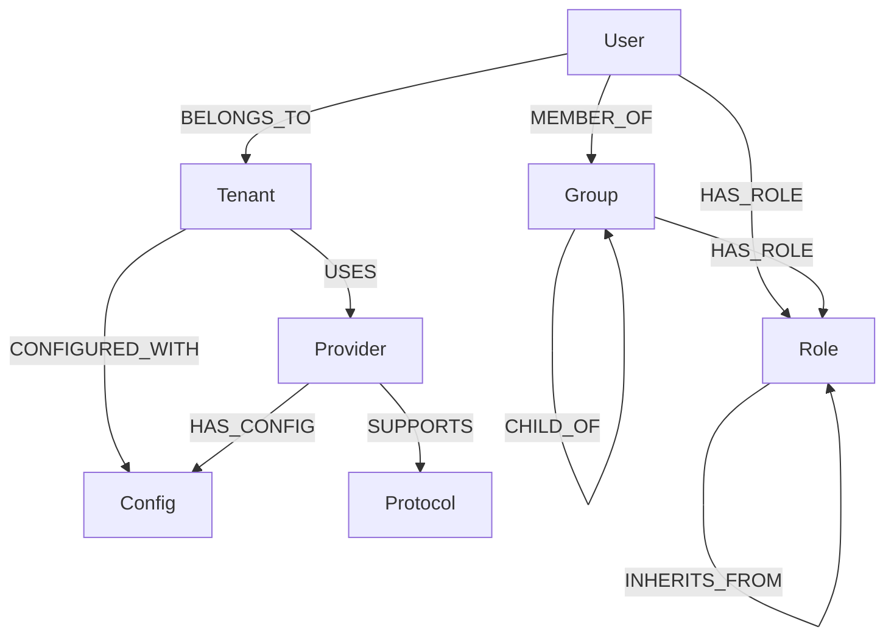
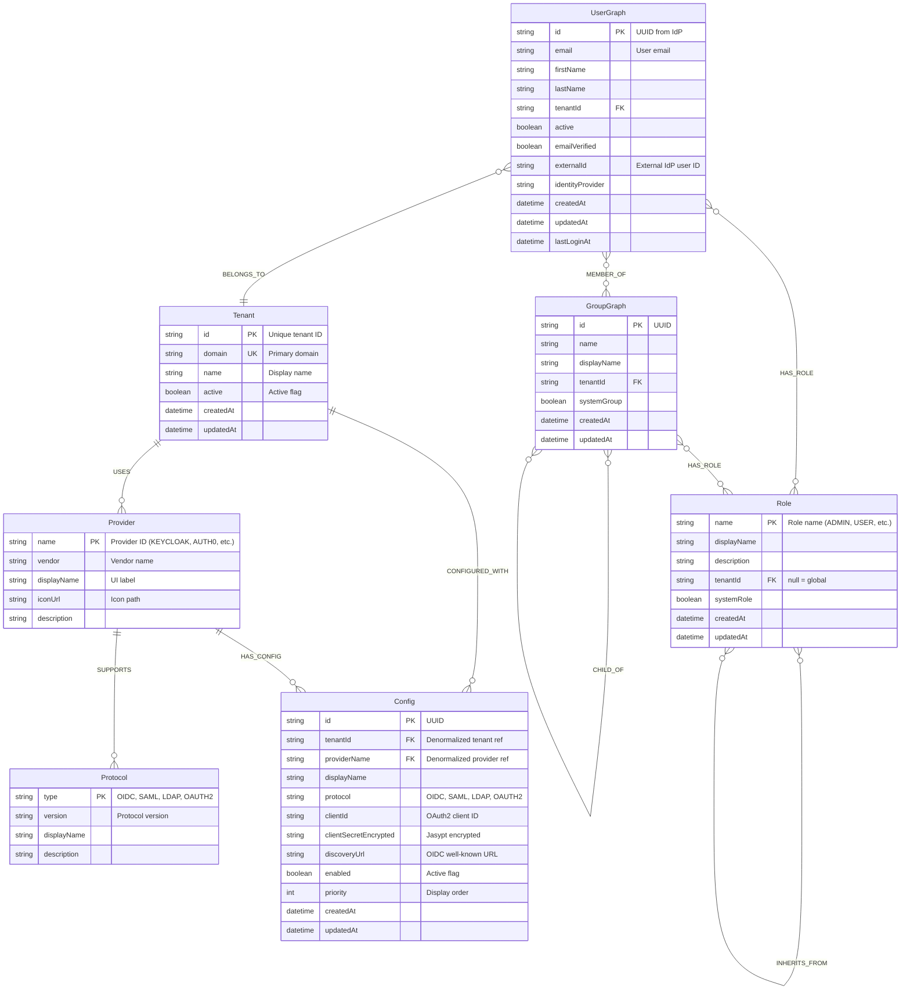
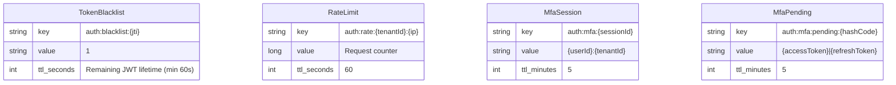
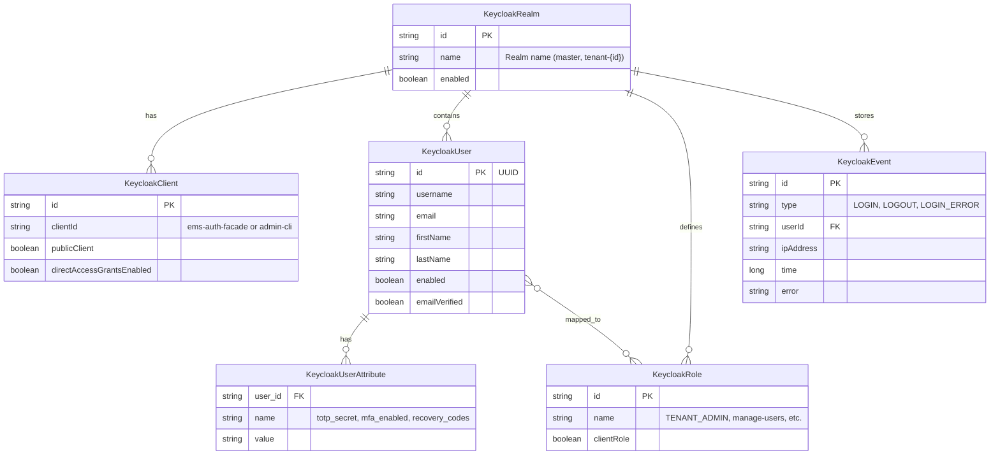
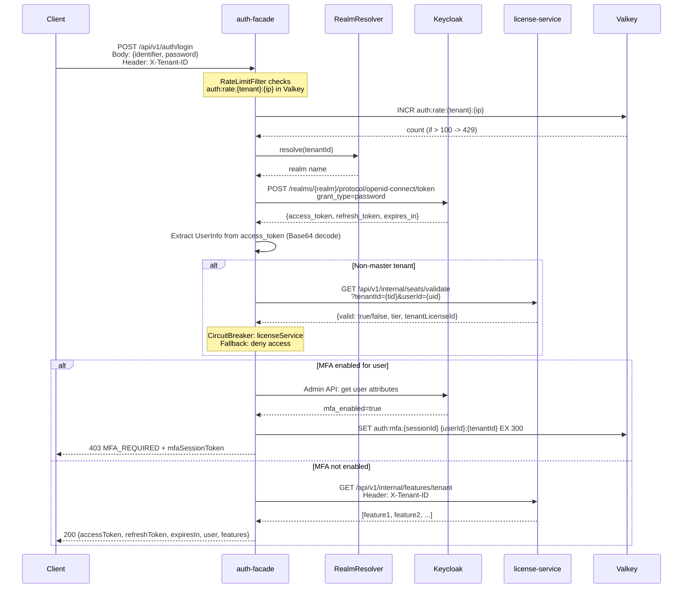
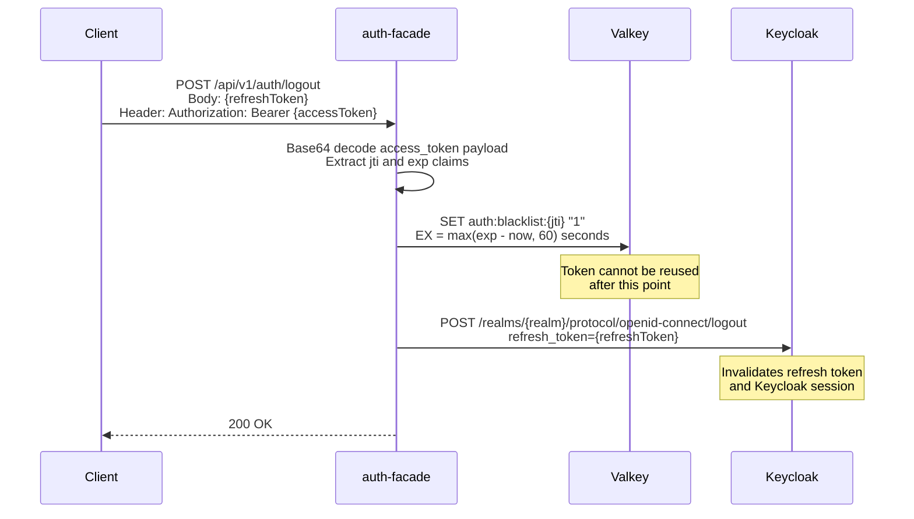
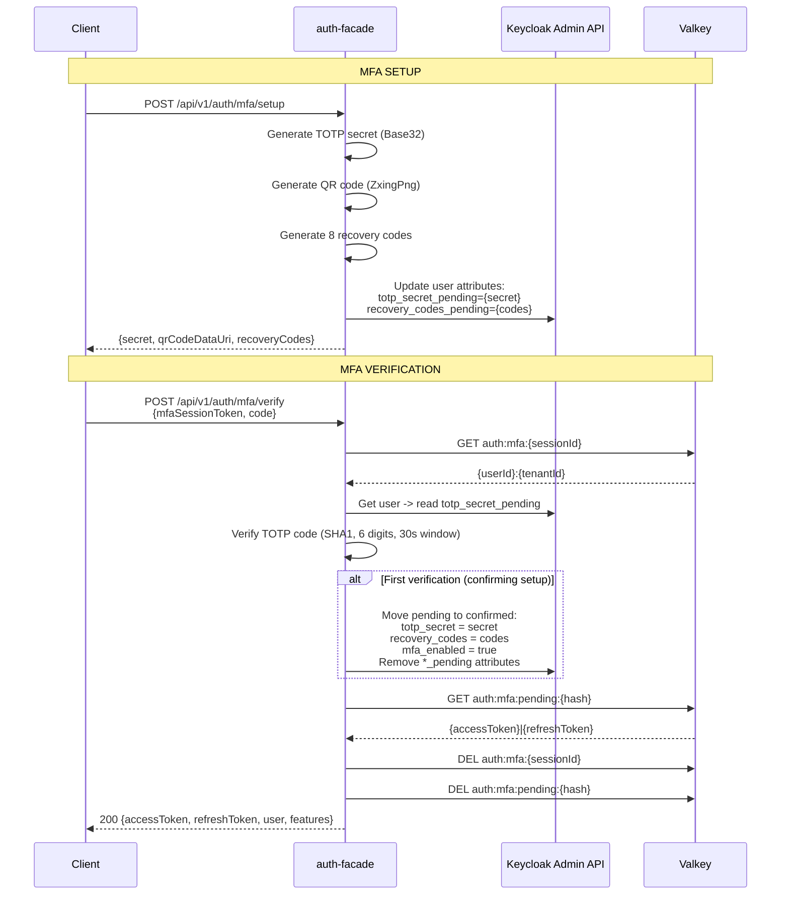
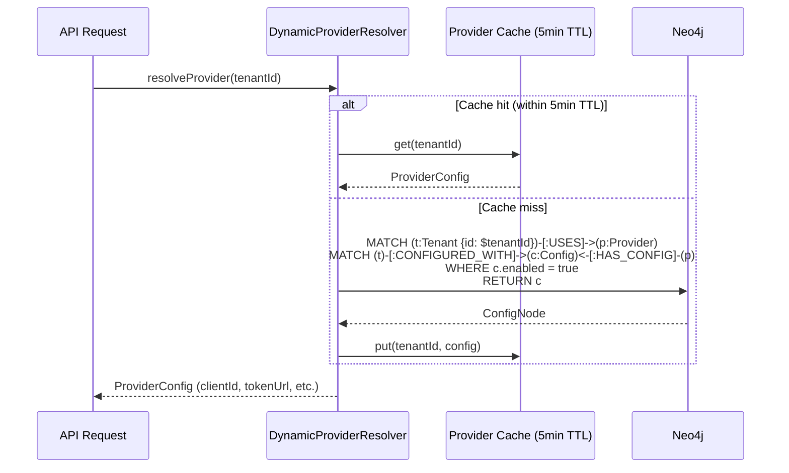

# Data Model: Authentication & Authorization

**Document ID:** R01-DM-04
**Feature:** Authentication & Authorization
**Service:** auth-facade (port 8081)
**Date:** 2026-03-12
**Status:** Evidence-Based Documentation (EBD)

---

## Table of Contents

1. [Overview](#1-overview)
2. [Neo4j Graph Model (Provider Configuration)](#2-neo4j-graph-model-provider-configuration)
3. [Valkey Key Schema (Token & Session Management)](#3-valkey-key-schema-token--session-management)
4. [Keycloak Data Model (Realm, Client, User, Role)](#4-keycloak-data-model-realm-client-user-role)
5. [PostgreSQL Schema (Keycloak Backend)](#5-postgresql-schema-keycloak-backend)
6. [Entity Relationship Diagrams](#6-entity-relationship-diagrams)
7. [Data Flow](#7-data-flow)
8. [Data Governance](#8-data-governance)

---

## 1. Overview

The Authentication & Authorization data model spans four data stores, each with a distinct responsibility. All claims in this document have been verified against the actual codebase.

| Data Store | Purpose | Status |
|------------|---------|--------|
| **Neo4j** (bolt://neo4j:7687) | Identity graph: provider configs, tenants, roles, groups, users | [IMPLEMENTED] |
| **Valkey** (redis://valkey:6379) | Token blacklist, rate limiting, MFA session tokens | [IMPLEMENTED] |
| **Keycloak** (http://keycloak:8180) | User identity, authentication, realm management, events | [IMPLEMENTED] |
| **PostgreSQL** (jdbc:postgresql://postgres:5432/keycloak_db) | Keycloak backend persistence | [IMPLEMENTED] |

**Evidence:** `backend/auth-facade/src/main/resources/application.yml` (lines 16-31) configures all three direct data stores (Neo4j, Valkey, Keycloak). Keycloak's PostgreSQL backend is configured via `KC_DB_URL` in `infrastructure/docker/docker-compose.yml` (lines 107-110).

---

## 2. Neo4j Graph Model (Provider Configuration)

### 2.1 Overview [IMPLEMENTED]

The auth-facade stores dynamic identity broker configuration in Neo4j. Configuration is set via `auth.dynamic-broker.storage=neo4j` with a cache TTL of 5 minutes.

**Evidence:** `application.yml` lines 61-67:
```yaml
auth:
  dynamic-broker:
    enabled: true
    storage: ${AUTH_BROKER_STORAGE:neo4j}
    cache-ttl-minutes: 5
```

### 2.2 Node Labels and Properties

All node entities are defined as Java records in `com.ems.auth.graph.entity.*` using Spring Data Neo4j (SDN).

#### 2.2.1 Tenant Node [IMPLEMENTED]

**Source:** `backend/auth-facade/src/main/java/com/ems/auth/graph/entity/TenantNode.java`

| Property | Type | Constraint | Description |
|----------|------|------------|-------------|
| `id` | String | `@Id`, UNIQUE | Tenant identifier (e.g., "master", "acme-corp") |
| `domain` | String | UNIQUE | Primary domain for tenant resolution |
| `name` | String | - | Display name |
| `active` | boolean | INDEX | Whether the tenant is active |
| `createdAt` | Instant | - | Creation timestamp |
| `updatedAt` | Instant | - | Last update timestamp |

**Relationships:**
- `(Tenant)-[:USES]->(Provider)` -- Providers configured for the tenant
- `(Tenant)-[:CONFIGURED_WITH]->(Config)` -- Provider configurations

#### 2.2.2 Provider Node [IMPLEMENTED]

**Source:** `backend/auth-facade/src/main/java/com/ems/auth/graph/entity/ProviderNode.java`

| Property | Type | Constraint | Description |
|----------|------|------------|-------------|
| `name` | String | `@Id`, UNIQUE | Provider identifier (e.g., "KEYCLOAK", "AZURE_AD") |
| `vendor` | String | - | Vendor name (e.g., "Red Hat", "Microsoft") |
| `displayName` | String | - | UI display name |
| `iconUrl` | String | - | Icon URL for UI |
| `description` | String | - | Provider description |

**Relationships:**
- `(Provider)-[:SUPPORTS]->(Protocol)` -- Supported authentication protocols
- `(Provider)-[:HAS_CONFIG]->(Config)` -- Tenant-specific configurations

**Seeded Providers** (from `V003__create_providers.cypher`):

| Provider Name | Vendor | Protocol | Status |
|---------------|--------|----------|--------|
| KEYCLOAK | Red Hat | OIDC, SAML | [IMPLEMENTED] -- Active with master tenant |
| AUTH0 | Okta | OIDC | [IMPLEMENTED] -- Node exists, no Java IdentityProvider class |
| OKTA | Okta | OIDC | [IMPLEMENTED] -- Node exists, no Java IdentityProvider class |
| AZURE_AD | Microsoft | OIDC | [IMPLEMENTED] -- Node exists, no Java IdentityProvider class |
| GOOGLE | Google | OIDC | [IMPLEMENTED] -- Node exists, token exchange via Keycloak |
| MICROSOFT | Microsoft | OIDC | [IMPLEMENTED] -- Node exists, token exchange via Keycloak |
| GITHUB | Microsoft | OAUTH2 | [IMPLEMENTED] -- Node exists |
| UAE_PASS | UAE Government | OAUTH2 | [IMPLEMENTED] -- Node exists |
| IBM_IAM | IBM | SAML | [IMPLEMENTED] -- Node exists |
| SAML_GENERIC | Generic | SAML | [IMPLEMENTED] -- Node exists |
| LDAP_GENERIC | Generic | LDAP | [IMPLEMENTED] -- Node exists |

**Important:** While all 11 provider nodes exist in Neo4j, only `KeycloakIdentityProvider.java` is implemented as a Java class. Other providers use Keycloak as a broker via `kc_idp_hint` for social login (Google, Microsoft) or are configuration-only placeholders for future direct integration.

#### 2.2.3 Protocol Node [IMPLEMENTED]

**Source:** `backend/auth-facade/src/main/java/com/ems/auth/graph/entity/ProtocolNode.java`

| Property | Type | Constraint | Description |
|----------|------|------------|-------------|
| `type` | String | `@Id`, UNIQUE | Protocol identifier (OIDC, SAML, LDAP, OAUTH2) |
| `version` | String | - | Protocol version (e.g., "1.0", "2.0", "3") |
| `displayName` | String | - | Human-readable name |
| `description` | String | - | Protocol description |

**Seeded Protocols** (from `V002__create_protocols.cypher`):

| Type | Version | Display Name |
|------|---------|-------------|
| OIDC | 1.0 | OpenID Connect |
| SAML | 2.0 | SAML 2.0 |
| LDAP | 3 | LDAP v3 |
| OAUTH2 | 2.0 | OAuth 2.0 |

#### 2.2.4 Config Node [IMPLEMENTED]

**Source:** `backend/auth-facade/src/main/java/com/ems/auth/graph/entity/ConfigNode.java`

The Config node is the largest node type, containing protocol-specific configuration fields. Sensitive fields are encrypted using Jasypt (`PBEWITHHMACSHA512ANDAES_256`).

| Property Group | Properties | Description |
|----------------|-----------|-------------|
| **Common** | `id` (UUID), `tenantId`, `providerName`, `displayName`, `protocol`, `enabled`, `priority`, `trustEmail`, `storeToken`, `linkExistingAccounts`, `idpHint`, `createdAt`, `updatedAt` | Shared across all protocols |
| **OIDC/OAuth2** | `clientId`, `clientSecretEncrypted`, `discoveryUrl`, `authorizationUrl`, `tokenUrl`, `userInfoUrl`, `jwksUrl`, `issuerUrl`, `scopes` | OpenID Connect endpoints |
| **SAML** | `metadataUrl`, `entityId`, `signingCertificate`, `ssoUrl`, `sloUrl`, `acsUrl`, `spCertificate`, `spPrivateKeyEncrypted`, `nameIdFormat`, `signAuthnRequest`, `wantAssertionsSigned`, `wantAssertionsEncrypted`, `enableSlo`, `attributeMappings` | SAML 2.0 configuration |
| **LDAP** | `serverUrl`, `port`, `bindDn`, `bindPasswordEncrypted`, `userSearchBase`, `userSearchFilter`, `userObjectClass`, `usernameAttribute`, `emailAttribute`, `firstNameAttribute`, `lastNameAttribute`, `memberOfAttribute`, `groupSearchBase`, `groupSearchFilter`, `resolveNestedGroups`, `syncEnabled`, `syncIntervalMinutes`, `useSsl`, `connectionTimeout`, `readTimeout` | LDAP/AD directory |
| **Azure AD** | `azureTenantId`, `enableAppRoles`, `enableGroupClaims`, `groupAttributeName`, `allowedDomains` | Microsoft Entra ID specifics |
| **UAE Pass** | `uaePassEnvironment`, `requiredAuthLevel`, `displayNameAr`, `languagePreference`, `emiratesIdRequired`, `enableDigitalSignature`, `redirectUri` | UAE government identity |

**Encrypted fields** (Jasypt): `clientSecretEncrypted`, `bindPasswordEncrypted`, `spPrivateKeyEncrypted`

#### 2.2.5 Role Node [IMPLEMENTED]

**Source:** `backend/auth-facade/src/main/java/com/ems/auth/graph/entity/RoleNode.java`

| Property | Type | Constraint | Description |
|----------|------|------------|-------------|
| `name` | String | `@Id`, UNIQUE | Role name (e.g., "ADMIN", "USER") |
| `displayName` | String | - | Display name |
| `description` | String | - | Role description |
| `tenantId` | String | INDEX | Tenant scope (null = global) |
| `systemRole` | boolean | INDEX | Whether system-managed |
| `createdAt` | Instant | - | Creation timestamp |
| `updatedAt` | Instant | - | Last update timestamp |

**Relationship:** `(Role)-[:INHERITS_FROM]->(Role)` -- Role inheritance hierarchy

**Default Role Hierarchy** (from `V004__create_default_roles.cypher`):

```
SUPER_ADMIN --> ADMIN --> MANAGER --> USER --> VIEWER
```

All default roles are system roles (`systemRole=true`, `tenantId=null`).

#### 2.2.6 Group Node [IMPLEMENTED]

**Source:** `backend/auth-facade/src/main/java/com/ems/auth/graph/entity/GroupNode.java`

| Property | Type | Constraint | Description |
|----------|------|------------|-------------|
| `id` | String | `@Id`, UNIQUE (UUID) | Group identifier |
| `name` | String | INDEX | Group name |
| `displayName` | String | - | Display name |
| `description` | String | - | Group description |
| `tenantId` | String | INDEX | Tenant scope |
| `systemGroup` | boolean | - | Whether system-managed |
| `createdAt` | Instant | - | Creation timestamp |
| `updatedAt` | Instant | - | Last update timestamp |

**Relationships:**
- `(Group)-[:HAS_ROLE]->(Role)` -- Roles assigned to the group
- `(Group)-[:CHILD_OF]->(Group)` -- Nested group hierarchy

**Default Groups** (from `V006__create_default_groups.cypher`):

| Group ID | Name | Role |
|----------|------|------|
| system-administrators | Administrators | ADMIN |
| system-users | Users | USER |
| system-viewers | Viewers | VIEWER |

#### 2.2.7 User Node [IMPLEMENTED]

**Source:** `backend/auth-facade/src/main/java/com/ems/auth/graph/entity/UserNode.java`

| Property | Type | Constraint | Description |
|----------|------|------------|-------------|
| `id` | String | `@Id`, UNIQUE (UUID) | User identifier from IdP |
| `email` | String | INDEX | User email |
| `firstName` | String | - | First name |
| `lastName` | String | - | Last name |
| `tenantId` | String | INDEX | Tenant scope |
| `active` | boolean | - | Whether active |
| `emailVerified` | boolean | - | Whether email is verified |
| `externalId` | String | INDEX | External IdP user ID |
| `identityProvider` | String | - | Authenticating IdP |
| `createdAt` | Instant | - | Creation timestamp |
| `updatedAt` | Instant | - | Last update timestamp |
| `lastLoginAt` | Instant | - | Last login timestamp |

**Relationships:**
- `(User)-[:MEMBER_OF]->(Group)` -- Group membership
- `(User)-[:HAS_ROLE]->(Role)` -- Direct role assignment
- `(User)-[:BELONGS_TO]->(Tenant)` -- Tenant association

**Composite Index:** `(email, tenantId)` for most-common lookup pattern.

### 2.3 Graph Relationships Summary [IMPLEMENTED]



### 2.4 Neo4j Constraints and Indexes [IMPLEMENTED]

**Source:** `V001__create_auth_graph_constraints.cypher`, `V007__provider_config_extensions.cypher`

| Constraint/Index | Type | Target |
|-----------------|------|--------|
| `tenant_id` | UNIQUE | `(Tenant).id` |
| `tenant_domain` | UNIQUE | `(Tenant).domain` |
| `tenant_active` | INDEX | `(Tenant).active` |
| `provider_name` | UNIQUE | `(Provider).name` |
| `protocol_type` | UNIQUE | `(Protocol).type` |
| `config_id` | UNIQUE | `(Config).id` |
| `config_tenant` | INDEX | `(Config).tenantId` |
| `config_provider` | INDEX | `(Config).providerName` |
| `config_enabled` | INDEX | `(Config).enabled` |
| `config_protocol` | INDEX | `(Config).protocol` |
| `config_tenant_provider_enabled` | COMPOSITE INDEX | `(Config).(tenantId, providerName, enabled)` |
| `config_azure_tenant_id` | INDEX | `(Config).azureTenantId` |
| `config_uaepass_environment` | INDEX | `(Config).uaePassEnvironment` |
| `config_ldap_server_url` | INDEX | `(Config).serverUrl` |
| `config_ldap_sync_enabled` | INDEX | `(Config).syncEnabled` |
| `config_saml_entity_id_unique` | UNIQUE | `(Config).entityId` |
| `config_saml_metadata_url` | INDEX | `(Config).metadataUrl` |
| `config_saml_sso_url` | INDEX | `(Config).ssoUrl` |
| `user_id` | UNIQUE | `(User).id` |
| `user_email` | INDEX | `(User).email` |
| `user_tenant` | INDEX | `(User).tenantId` |
| `user_external` | INDEX | `(User).externalId` |
| `user_email_tenant` | COMPOSITE INDEX | `(User).(email, tenantId)` |
| `group_id` | UNIQUE | `(Group).id` |
| `group_name` | INDEX | `(Group).name` |
| `group_tenant` | INDEX | `(Group).tenantId` |
| `group_name_tenant` | COMPOSITE INDEX | `(Group).(name, tenantId)` |
| `role_name` | UNIQUE | `(Role).name` |
| `role_tenant` | INDEX | `(Role).tenantId` |
| `role_system` | INDEX | `(Role).systemRole` |

### 2.5 Neo4j Migrations [IMPLEMENTED]

**Source:** `backend/auth-facade/src/main/resources/neo4j/migrations/`

| Migration | Description |
|-----------|-------------|
| V001 | Create constraints and indexes for all node labels |
| V002 | Create protocol nodes (OIDC, SAML, LDAP, OAUTH2) |
| V003 | Create provider nodes with protocol relationships (11 providers) |
| V004 | Create default role hierarchy (SUPER_ADMIN > ADMIN > MANAGER > USER > VIEWER) |
| V005 | Create master tenant with default Keycloak configuration |
| V006 | Create default system groups (Administrators, Users, Viewers) |
| V007 | Extend Config node for multi-provider properties (Azure AD, UAE Pass, LDAP, SAML) |
| V008 | Fix master tenant seed and superuser configuration |
| V009 | Update superadmin email |

### 2.6 Key Cypher Queries [IMPLEMENTED]

**Source:** `backend/auth-facade/src/main/java/com/ems/auth/graph/repository/AuthGraphRepository.java`

**Deep Role Lookup with Inheritance:**
```cypher
MATCH (u:User {email: $email})-[:MEMBER_OF*0..]->(groupOrUser)
MATCH (groupOrUser)-[:HAS_ROLE]->(rootRole:Role)
MATCH (rootRole)-[:INHERITS_FROM*0..]->(effectiveRole:Role)
RETURN DISTINCT effectiveRole.name
```

**Provider Config Resolution:**
```cypher
MATCH (t:Tenant {id: $tenantId})-[:USES]->(p:Provider {name: $providerName})
MATCH (p)-[:SUPPORTS]->(proto:Protocol)
MATCH (t)-[:CONFIGURED_WITH]->(c:Config)<-[:HAS_CONFIG]-(p)
WHERE c.enabled = true
RETURN c
```

**Tenant-Scoped Role Resolution:**
```cypher
MATCH (u:User {email: $email, tenantId: $tenantId})-[:MEMBER_OF*0..]->(groupOrUser)
MATCH (groupOrUser)-[:HAS_ROLE]->(rootRole:Role)
WHERE rootRole.tenantId = $tenantId OR rootRole.tenantId IS NULL
MATCH (rootRole)-[:INHERITS_FROM*0..]->(effectiveRole:Role)
RETURN DISTINCT effectiveRole.name
```

---

## 3. Valkey Key Schema (Token & Session Management)

### 3.1 Overview [IMPLEMENTED]

Valkey (Redis-compatible) is used for three purposes in the auth-facade: token blacklisting, rate limiting, and MFA session management. Connection is configured via Spring Data Redis.

**Evidence:** `application.yml` lines 16-23:
```yaml
spring.data.redis:
  host: ${VALKEY_HOST:localhost}
  port: ${VALKEY_PORT:6379}
```

### 3.2 Key Patterns [IMPLEMENTED]

| Key Pattern | Purpose | TTL | Set By | Source File |
|-------------|---------|-----|--------|-------------|
| `auth:blacklist:{jti}` | Token blacklist on logout | Remaining JWT lifetime (min 60s) | `TokenServiceImpl.blacklistToken()` | `TokenServiceImpl.java:91-103` |
| `auth:rate:{tenantId}:{ip}` or `auth:rate:{ip}` | Rate limit counter per client | 60 seconds | `RateLimitFilter.doFilterInternal()` | `RateLimitFilter.java:54-62` |
| `auth:mfa:{sessionId}` | MFA session validation token | 5 minutes | `TokenServiceImpl.createMfaSessionToken()` | `TokenServiceImpl.java:119-125` |
| `auth:mfa:pending:{hashCode}` | Pending access+refresh tokens during MFA | 5 minutes | `AuthServiceImpl.storePendingTokens()` | `AuthServiceImpl.java:203-206` |

### 3.3 Token Blacklist Detail [IMPLEMENTED]

**Source:** `backend/auth-facade/src/main/java/com/ems/auth/service/TokenServiceImpl.java`

When a user logs out, the access token's JTI (JWT ID) is stored in Valkey to prevent reuse:

```java
// TokenServiceImpl.java lines 91-103
public void blacklistToken(String jti, long expirationTimeSeconds) {
    long ttl = Math.max(expirationTimeSeconds - (System.currentTimeMillis() / 1000), 60);
    redisTemplate.opsForValue().set(blacklistPrefix + jti, "1", ttl, TimeUnit.SECONDS);
}
```

**Blacklist check** is performed via `isBlacklisted(String jti)` which calls `redisTemplate.hasKey(blacklistPrefix + jti)`.

Configuration from `application.yml` lines 120-126:
```yaml
token:
  blacklist:
    prefix: "auth:blacklist:"
    ttl-hours: 24
  mfa-session:
    prefix: "auth:mfa:"
    ttl-minutes: 5
```

### 3.4 Rate Limiting Detail [IMPLEMENTED]

**Source:** `backend/auth-facade/src/main/java/com/ems/auth/filter/RateLimitFilter.java`

| Configuration | Value | Source |
|--------------|-------|--------|
| Requests per minute | 100 (default) | `rate-limit.requests-per-minute` |
| Cache prefix | `auth:rate:` | `rate-limit.cache-prefix` |
| Window | 60 seconds (sliding window via Redis EXPIRE) | `RateLimitFilter.java:62` |
| Client identifier | `{tenantId}:{ip}` or `{ip}` if no tenant header | `RateLimitFilter.java:91-103` |

The filter adds response headers: `X-RateLimit-Limit`, `X-RateLimit-Remaining`, `X-RateLimit-Reset`.

Excluded paths: `/actuator`, `/swagger`, `/api-docs`.

If Valkey is unavailable, the filter allows the request (fail-open for rate limiting).

### 3.5 MFA Session Token Detail [IMPLEMENTED]

**Source:** `backend/auth-facade/src/main/java/com/ems/auth/service/TokenServiceImpl.java` lines 106-128

MFA session tokens are HMAC-signed JWTs created with a shared secret key (`token.mfa-signing-key`). The token contains:

| Claim | Value |
|-------|-------|
| `sub` | User ID |
| `tenant_id` | Tenant ID |
| `type` | `"mfa_session"` |
| `jti` | Random UUID (session ID) |
| `exp` | 5 minutes from creation |

The session ID is also stored in Valkey (`auth:mfa:{sessionId}` with value `{userId}:{tenantId}`) for server-side validation.

---

## 4. Keycloak Data Model (Realm, Client, User, Role)

### 4.1 Overview [IMPLEMENTED]

Keycloak is the primary (and currently only) identity provider. It is activated via `auth.facade.provider=keycloak` and interacted with through the Keycloak Admin Client and REST API.

**Evidence:** `backend/auth-facade/src/main/java/com/ems/auth/provider/KeycloakIdentityProvider.java` line 56:
```java
@ConditionalOnProperty(name = "auth.facade.provider", havingValue = "keycloak", matchIfMissing = true)
```

### 4.2 Realm Model [IMPLEMENTED]

Each tenant maps to a Keycloak realm. The mapping is handled by `RealmResolver`:

**Source:** `backend/auth-facade/src/main/java/com/ems/auth/util/RealmResolver.java`

| Tenant ID Input | Keycloak Realm Output | Rule |
|-----------------|----------------------|------|
| `"master"` | `"master"` | Master tenant keyword |
| `"tenant-master"` | `"master"` | Prefixed master |
| `"68cd2a56-98c9-4ed4-8534-c299566d5b27"` | `"master"` | Master tenant UUID |
| `"tenant-acme"` | `"tenant-acme"` | Already prefixed, pass through |
| `"acme"` | `"tenant-acme"` | Auto-prefix with `tenant-` |

### 4.3 Client Configuration [IMPLEMENTED]

**Source:** `application.yml` lines 102-112

| Client | Client ID | Type | Purpose |
|--------|-----------|------|---------|
| Auth Facade Client | `ems-auth-facade` (configurable via `KEYCLOAK_CLIENT_ID`) | Confidential | Token endpoint authentication, token exchange |
| Admin CLI | `admin-cli` | Confidential | Keycloak Admin API access for user management, MFA, events |

```yaml
keycloak:
  server-url: ${KEYCLOAK_URL:http://localhost:8180}
  master-realm: master
  admin:
    username: ${KEYCLOAK_ADMIN:admin}
    password: ${KEYCLOAK_ADMIN_PASSWORD:}
    client-id: admin-cli
  client:
    client-id: ${KEYCLOAK_CLIENT_ID:ems-auth-facade}
    client-secret: ${KEYCLOAK_CLIENT_SECRET:}
```

### 4.4 User Attributes (MFA) [IMPLEMENTED]

**Source:** `KeycloakIdentityProvider.java` lines 196-279

Keycloak user attributes used for MFA:

| Attribute | Type | Purpose | When Set |
|-----------|------|---------|----------|
| `totp_secret_pending` | String (Base32) | TOTP secret during setup, before verification | `setupMfa()` -- line 218 |
| `recovery_codes_pending` | String (comma-separated) | Recovery codes during setup | `setupMfa()` -- line 219 |
| `totp_secret` | String (Base32) | Confirmed TOTP secret | `verifyMfaCode()` after first successful verification -- line 260 |
| `recovery_codes` | String (comma-separated) | Confirmed recovery codes (8 codes) | `verifyMfaCode()` -- line 261 |
| `mfa_enabled` | String ("true"/"false") | MFA enabled flag | `verifyMfaCode()` -- line 264 |

**TOTP Configuration:**
- Algorithm: SHA1 (`HashingAlgorithm.SHA1`)
- Digits: 6
- Period: 30 seconds
- Secret generator: `DefaultSecretGenerator` (Base32)
- QR generator: `ZxingPngQrGenerator`
- Recovery codes: 8 codes via `RecoveryCodeGenerator`

### 4.5 Keycloak Events [IMPLEMENTED]

**Source:** `KeycloakIdentityProvider.java` lines 294-346

Authentication events are queried from Keycloak's event store via the Admin API (`realmResource.getEvents()`). Events are mapped to `AuthEventDTO` with the following fields:

| Field | Source |
|-------|--------|
| `eventId` | Composite: `{type}-{userId}-{timestamp}` |
| `type` | Event type (e.g., LOGIN, LOGOUT, LOGIN_ERROR) |
| `userId` | Keycloak user ID |
| `username` | From event details map |
| `ipAddress` | Client IP |
| `clientId` | Keycloak client ID |
| `sessionId` | Keycloak session ID |
| `time` | Event timestamp (epoch millis to Instant) |
| `error` | Error code (if failed event) |
| `details` | Full event details map |

### 4.6 Keycloak OAuth2 Token Flows [IMPLEMENTED]

**Source:** `KeycloakIdentityProvider.java`

| Flow | Grant Type | Used For |
|------|-----------|----------|
| Password Grant | `grant_type=password` | Direct username/password login (line 78) |
| Refresh Token | `grant_type=refresh_token` | Token refresh (line 105) |
| Token Exchange | `grant_type=urn:ietf:params:oauth:grant-type:token-exchange` | Social login (Google, Microsoft) via `kc_idp_hint` (line 153) |
| Authorization Code (redirect) | `response_type=code` | Initiated via `initiateLogin()` with `kc_idp_hint` (line 179) |

---

## 5. PostgreSQL Schema (Keycloak Backend)

### 5.1 Overview [IMPLEMENTED]

Keycloak persists its own data to a PostgreSQL database. This database is fully managed by Keycloak; the auth-facade does not access it directly.

**Evidence:** `infrastructure/docker/docker-compose.yml` lines 107-110:
```yaml
KC_DB: postgres
KC_DB_URL: jdbc:postgresql://postgres:5432/keycloak_db
KC_DB_USERNAME: ${KC_DB_USERNAME:-keycloak}
KC_DB_PASSWORD: ${KC_DB_PASSWORD:-keycloak}
```

### 5.2 Key Keycloak Tables (Managed Internally)

The following tables are managed by Keycloak and documented here for reference only. The auth-facade never queries them directly.

| Table Group | Key Tables | Content |
|-------------|-----------|---------|
| **Realm** | `realm`, `realm_attribute` | Realm definitions, settings |
| **Client** | `client`, `client_scope`, `client_attributes` | OAuth2 client registrations |
| **User** | `user_entity`, `user_attribute`, `credential` | Users, custom attributes (MFA), credentials |
| **Role** | `keycloak_role`, `user_role_mapping`, `composite_role` | Realm/client roles and assignments |
| **Session** | `user_session`, `client_session`, `offline_user_session` | Active sessions |
| **Events** | `event_entity`, `admin_event_entity` | Auth events, admin audit trail |
| **IdP** | `identity_provider`, `identity_provider_config` | Configured IdPs per realm |
| **Federation** | `user_federation_provider`, `user_federation_config` | External user stores |

### 5.3 Database Provisioning

The `keycloak_db` database is created alongside other service databases during PostgreSQL initialization:

**Evidence:** `docker-compose.dev-data.yml` line 201 and `docker-compose.staging-data.yml` line 207:
```bash
for DB in master_db user_db license_db notification_db audit_db ai_db process_db keycloak_db; do
```

---

## 6. Entity Relationship Diagrams

### 6.1 Neo4j Identity Graph



### 6.2 Valkey Key-Value Schema



### 6.3 Keycloak Data Model (External)



---

## 7. Data Flow

### 7.1 Login Flow [IMPLEMENTED]

**Source:** `AuthServiceImpl.java` lines 45-68, `KeycloakIdentityProvider.java` lines 74-98



### 7.2 Logout Flow [IMPLEMENTED]

**Source:** `AuthServiceImpl.java` lines 126-154



### 7.3 MFA Setup and Verification Flow [IMPLEMENTED]

**Source:** `KeycloakIdentityProvider.java` lines 196-279, `AuthServiceImpl.java` lines 157-194



### 7.4 Provider Configuration Resolution Flow [IMPLEMENTED]

**Source:** `AuthGraphRepository.java`, `Neo4jProviderResolver.java`



---

## 8. Data Governance

### 8.1 JWT Token Structure [IMPLEMENTED]

**Source:** `AuthServiceImpl.java` lines 222-249 (token parsing), `application.yml` lines 76-91 (claim mappings)

Keycloak-issued JWT access tokens contain:

```json
{
  "header": {
    "alg": "RS256",
    "kid": "<key-id-from-keycloak-JWKS>"
  },
  "payload": {
    "sub": "<user-uuid>",
    "email": "<user@example.com>",
    "given_name": "<FirstName>",
    "family_name": "<LastName>",
    "tenant_id": "<tenant-uuid>",
    "realm_access": {
      "roles": ["TENANT_ADMIN", "USER"]
    },
    "resource_access": {
      "ems-auth-facade": {
        "roles": ["manage-users"]
      }
    },
    "exp": 1709251200,
    "iat": 1709250900,
    "jti": "<unique-token-id>"
  }
}
```

**Claim extraction paths** (from `application.yml` lines 77-82):
```yaml
role-claim-paths:
  - realm_access.roles      # Keycloak Realm Roles
  - resource_access          # Keycloak Client Roles
  - roles                    # Standard OIDC / Azure AD
  - groups                   # Azure AD / Okta
  - permissions              # Auth0
```

**User claim mappings** (from `application.yml` lines 85-91):
```yaml
user-claim-mappings:
  user-id: sub
  email: email
  first-name: given_name
  last-name: family_name
  tenant-id: tenant_id
  identity-provider: identity_provider
```

### 8.2 Encryption at Rest [IMPLEMENTED]

| Data | Encryption Method | Evidence |
|------|-------------------|----------|
| Config `clientSecretEncrypted` | Jasypt (PBEWITHHMACSHA512ANDAES_256) | `ConfigNode.java` line 63, `application.yml` lines 48-55 |
| Config `bindPasswordEncrypted` | Jasypt (PBEWITHHMACSHA512ANDAES_256) | `ConfigNode.java` line 141 |
| Config `spPrivateKeyEncrypted` | Jasypt (PBEWITHHMACSHA512ANDAES_256) | `ConfigNode.java` line 318 |
| MFA session token signing | HMAC (`MFA_SIGNING_KEY`, min 32 chars) | `TokenServiceImpl.java` line 45, `application.yml` line 127 |
| Keycloak JWT signing | RS256 (asymmetric, Keycloak JWKS) | `application.yml` lines 11-13 |

### 8.3 Data Retention Policies

| Data Type | Retention | Mechanism |
|-----------|-----------|-----------|
| Blacklisted tokens | Remaining JWT lifetime (max 24h) | Valkey TTL auto-expiry |
| Rate limit counters | 60 seconds | Valkey TTL auto-expiry |
| MFA session tokens | 5 minutes | Valkey TTL auto-expiry |
| MFA pending tokens | 5 minutes | Valkey TTL auto-expiry |
| Keycloak events | Configurable per realm | Keycloak event expiration setting |
| Neo4j provider configs | Persistent | Manual administration |
| Neo4j user/role/group data | Persistent | Manual administration |

### 8.4 Tenant Data Isolation [IN-PROGRESS]

| Layer | Current State | Target (ADR-003) |
|-------|--------------|-------------------|
| **Neo4j** | Single graph with `tenantId` property discrimination on User, Group, Role, Config nodes | Graph-per-tenant isolation [PLANNED] |
| **Keycloak** | Realm-per-tenant isolation (each tenant = separate Keycloak realm) | Already isolated [IMPLEMENTED] |
| **Valkey** | Key-prefix includes tenant ID where applicable (rate limiting) | No change needed |

**Evidence for current state:** All Neo4j node entities include a `tenantId` property. Queries in `AuthGraphRepository.java` filter by `tenantId` (e.g., `findEffectiveRolesForTenant` on line 162). However, all data resides in a single Neo4j database -- graph-per-tenant isolation per ADR-003 is not yet implemented.

### 8.5 Service Integration Points [IMPLEMENTED]

| External Service | Protocol | Client | Circuit Breaker | Source |
|-----------------|----------|--------|-----------------|--------|
| **license-service** | HTTP/REST (Feign via Eureka) | `LicenseServiceClient.java` | `licenseService` (Resilience4j) | `application.yml` lines 155-170 |
| **Keycloak** | HTTP/REST (RestTemplate + Admin Client) | `KeycloakIdentityProvider.java` | None (direct) | `application.yml` lines 102-112 |
| **Neo4j** | Bolt protocol | Spring Data Neo4j (SDN) | None | `application.yml` lines 27-31 |
| **Valkey** | Redis protocol | Spring Data Redis (Lettuce) | Fail-open for rate limiting | `application.yml` lines 16-23 |

### 8.6 Migration File Index

All Neo4j migrations reside in `backend/auth-facade/src/main/resources/neo4j/migrations/` and use idempotent Cypher (`MERGE`, `IF NOT EXISTS`). Each migration creates a `(:Migration {version: 'Vnnn'})` marker node for tracking.

| File | Idempotent | Destructive |
|------|-----------|-------------|
| `V001__create_auth_graph_constraints.cypher` | Yes (IF NOT EXISTS) | No |
| `V002__create_protocols.cypher` | Yes (MERGE) | No |
| `V003__create_providers.cypher` | Yes (MERGE) | No |
| `V004__create_default_roles.cypher` | Yes (MERGE) | No |
| `V005__create_master_tenant.cypher` | Yes (MERGE + WHERE NULL check) | No |
| `V006__create_default_groups.cypher` | Yes (MERGE) | No |
| `V007__provider_config_extensions.cypher` | Yes (IF NOT EXISTS, MERGE) | Partial (DELETE relationship) |
| `V008__fix_master_tenant_seed_superuser.cypher` | Yes | No |
| `V009__update_superadmin_email.cypher` | Yes | No |

---

## Appendix: Evidence Summary

All claims in this document were verified by reading the following source files:

| File | Verified Claims |
|------|----------------|
| `backend/auth-facade/src/main/resources/application.yml` | Data store connections, claim mappings, rate limits, token config |
| `backend/auth-facade/src/main/java/com/ems/auth/graph/entity/TenantNode.java` | Tenant node properties and relationships |
| `backend/auth-facade/src/main/java/com/ems/auth/graph/entity/ProviderNode.java` | Provider node properties and relationships |
| `backend/auth-facade/src/main/java/com/ems/auth/graph/entity/ProtocolNode.java` | Protocol node properties |
| `backend/auth-facade/src/main/java/com/ems/auth/graph/entity/ConfigNode.java` | Config node properties (60+ fields) |
| `backend/auth-facade/src/main/java/com/ems/auth/graph/entity/RoleNode.java` | Role node with inheritance |
| `backend/auth-facade/src/main/java/com/ems/auth/graph/entity/GroupNode.java` | Group node with nested hierarchy |
| `backend/auth-facade/src/main/java/com/ems/auth/graph/entity/UserNode.java` | User node properties |
| `backend/auth-facade/src/main/java/com/ems/auth/graph/repository/AuthGraphRepository.java` | Cypher queries, CRUD operations |
| `backend/auth-facade/src/main/java/com/ems/auth/service/TokenServiceImpl.java` | Valkey key patterns, blacklist, MFA tokens |
| `backend/auth-facade/src/main/java/com/ems/auth/filter/RateLimitFilter.java` | Rate limiting Valkey schema |
| `backend/auth-facade/src/main/java/com/ems/auth/service/AuthServiceImpl.java` | Login/logout/MFA flows, license integration |
| `backend/auth-facade/src/main/java/com/ems/auth/provider/KeycloakIdentityProvider.java` | Keycloak integration, MFA attributes, events |
| `backend/auth-facade/src/main/java/com/ems/auth/util/RealmResolver.java` | Tenant-to-realm mapping |
| `backend/auth-facade/src/main/java/com/ems/auth/client/LicenseServiceClient.java` | Feign client for license-service |
| `backend/auth-facade/src/main/java/com/ems/auth/service/SeatValidationService.java` | Circuit breaker, seat validation |
| `backend/auth-facade/src/main/resources/neo4j/migrations/V001-V009` | All migration scripts |
| `infrastructure/docker/docker-compose.yml` | Keycloak PostgreSQL configuration |
