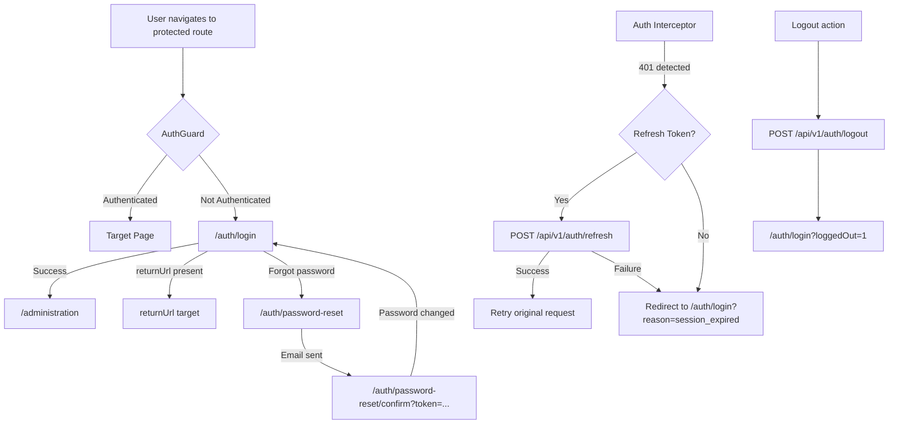
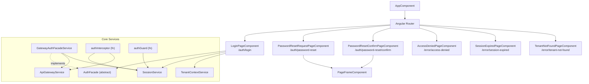
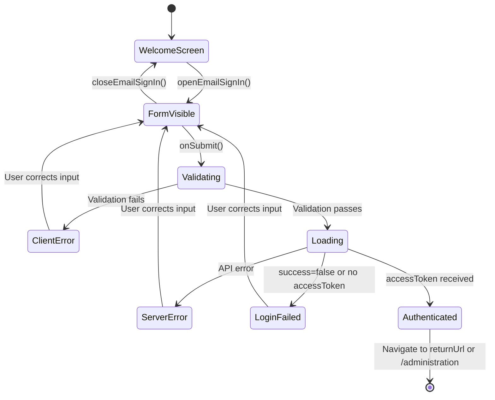
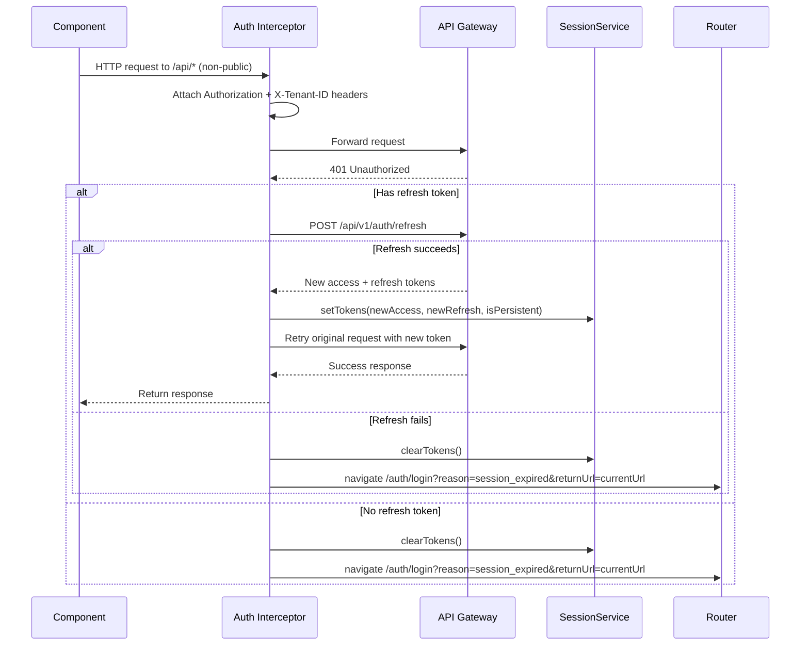

# R01 Authentication & Authorization -- UI/UX Design Specification

| Meta            | Value                                      |
|-----------------|--------------------------------------------|
| Document        | 05-UI-UX-Design-Spec                       |
| Requirement     | R01 -- Authentication & Authorization      |
| Version         | 1.0.0                                      |
| Date            | 2026-03-12                                 |
| Status          | Living Document                            |
| Frontend Stack  | Angular 21, PrimeNG, Standalone Components |
| Design Language | EMSIST Neumorphic (ThinkPLUS)              |

---

## 1. Design Overview

### 1.1 Purpose

This document specifies the UI/UX design for every screen, component, and interaction within the Authentication & Authorization feature of EMSIST. Every claim is tagged with an implementation status based on verified source code.

### 1.2 Implementation Status Summary

| Screen / Feature                  | Status           | Evidence                                                        |
|-----------------------------------|------------------|-----------------------------------------------------------------|
| Login Page                        | `[IMPLEMENTED]`  | `frontend/src/app/features/auth/login.page.ts`                  |
| Password Reset Request            | `[IMPLEMENTED]`  | `frontend/src/app/features/auth/password-reset/password-reset-request.page.ts` |
| Password Reset Confirm            | `[IMPLEMENTED]`  | `frontend/src/app/features/auth/password-reset/password-reset-confirm.page.ts` |
| Session Expired Redirect          | `[IMPLEMENTED]`  | `frontend/src/app/core/interceptors/auth.interceptor.ts`        |
| Access Denied Page                | `[IMPLEMENTED]`  | `frontend/src/app/features/errors/access-denied.page.ts`        |
| Tenant Not Found Page             | `[IMPLEMENTED]`  | `frontend/src/app/features/errors/tenant-not-found.page.ts`     |
| Session Expired Page              | `[IMPLEMENTED]`  | `frontend/src/app/features/errors/session-expired.page.ts`      |
| Auth Guard                        | `[IMPLEMENTED]`  | `frontend/src/app/core/auth/auth.guard.ts`                      |
| Auth Interceptor (token refresh)  | `[IMPLEMENTED]`  | `frontend/src/app/core/interceptors/auth.interceptor.ts`        |
| MFA Setup UI                      | `[PLANNED]`      | Backend API exists; no dedicated frontend page                  |
| MFA Verification UI               | `[PLANNED]`      | Backend API exists; no frontend challenge page                  |
| Account Settings (password/MFA)   | `[PLANNED]`      | No code exists                                                  |
| Active Sessions Management        | `[PLANNED]`      | API wiring exists (`getUserSessions`); no dedicated page        |
| Social Login Buttons              | `[PLANNED]`      | Only Keycloak provider implemented on backend                   |
| Admin: Identity Provider CRUD     | `[PLANNED]`      | API wiring exists in `ApiGatewayService`; no admin UI page      |

### 1.3 Screen Flow



---

## 2. Design System & Tokens

### 2.1 Color Palette -- Login Page `[IMPLEMENTED]`

Verified from `login.page.scss`:

| Token / Variable        | Value                          | Usage                                |
|-------------------------|--------------------------------|--------------------------------------|
| `$bg`                   | `#428177`                      | Page background, input/button base   |
| `$bg-light`             | `rgba(66, 129, 119, 0.5)`     | Neumorphic light shadow              |
| `$bg-dark`              | `rgba(5, 66, 57, 0.52)`       | Neumorphic dark shadow               |
| `$text-primary`         | `#edebe0`                      | Headings, labels, body text          |
| `$text-secondary`       | `rgba(237, 235, 224, 0.82)`   | Subtitle text                        |
| `$text-muted`           | `rgba(237, 235, 224, 0.64)`   | Help text, hints                     |
| `$accent`               | `#edebe0`                      | Link color                           |
| `$panel-bg`             | `#428177`                      | Form card background                 |
| `$focus-outline-color`  | `#edebe0`                      | Focus ring for all interactive items  |

### 2.2 Color Palette -- Password Reset Pages `[IMPLEMENTED]`

Verified from `password-reset-request.page.scss` and `password-reset-confirm.page.scss`:

| Token               | Value       | Usage                       |
|----------------------|-------------|-----------------------------|
| Label text color     | `#3d3a3b`   | Form field labels           |
| Input border         | `#b9a779`   | Input field borders         |
| Footer link color    | `#054239`   | "Return to sign in" link    |

### 2.3 Typography `[IMPLEMENTED]`

Verified from `login.page.scss` line 24-29:

| Property          | Value                                                    |
|-------------------|----------------------------------------------------------|
| Font family       | `'Gotham Rounded', 'Nunito', -apple-system, BlinkMacSystemFont, sans-serif` |
| Title size        | `2.2rem` (desktop), `1.6rem` (tablet), `1.35rem` (mobile) |
| Subtitle size     | `1.1rem` (desktop), `0.95rem` (tablet), `0.85rem` (mobile) |
| Label size        | `0.9rem` (desktop), `0.8rem` (tablet), `0.75rem` (small mobile) |
| Input text size   | `1.06rem` (desktop), `1rem` (tablet), `0.95rem` (mobile) |
| Button text size  | `1.05rem` (sign-in btn), `1.1rem` (submit btn)          |
| Label weight      | `700`                                                    |
| Button weight     | `600` (sign-in), `700` (submit)                          |

### 2.4 Spacing & Layout `[IMPLEMENTED]`

| Property                     | Value                  | Source               |
|------------------------------|------------------------|----------------------|
| Auth shell max width         | `560px`                | `$auth-shell-width`  |
| Form padding (desktop)       | `2.4rem 2.25rem 2rem`  | `.login-form`        |
| Form padding (mobile)        | `1.5rem 1.25rem 1.25rem` | `@media <768px`    |
| Form gap (desktop)           | `1.2rem`               | `.login-form`        |
| Form gap (mobile)            | `1rem`                 | `@media <768px`      |
| Form border radius (desktop) | `1.5rem`               | `.login-form`        |
| Form border radius (mobile)  | `1rem`                 | `@media <768px`      |
| Input height (desktop)       | `56px`                 | `.neo-input`         |
| Input height (mobile)        | `48px`                 | `@media <768px`      |
| Input border radius          | `28px` (desktop), `1.25rem` (mobile) | `.neo-input` |
| Button border radius         | `28px`                 | `.signin-btn`        |
| Content padding (desktop)    | `2rem 0.75rem 3.5rem`  | `.login-content`     |

### 2.5 Neumorphic Shadow System `[IMPLEMENTED]`

All shadows verified from `login.page.scss`:

| Element        | Resting State                                                    | Hover State                                          | Active/Pressed State                                 |
|----------------|------------------------------------------------------------------|------------------------------------------------------|------------------------------------------------------|
| Buttons        | `5px 5px 12px $bg-dark, -5px -5px 12px $bg-light`               | `8px 8px 18px rgba(5,66,57,0.66), -8px -8px 18px rgba(66,129,119,0.66)` | `inset 4px 4px 8px rgba(5,66,57,0.56), inset -4px -4px 8px rgba(66,129,119,0.56)` |
| Inputs         | `inset 2px 2px 5px rgba(5,66,57,0.46), inset -3px -3px 8px rgba(66,129,119,0.24)` | -- | Focused: `inset 1px 1px 2px rgba(5,66,57,0.4), inset -1px -1px 2px rgba(66,129,119,0.2)` |
| Form card      | `14px 14px 28px rgba(0,38,35,0.42)`                             | -- | -- |
| Logo fallback  | `6px 6px 16px rgba(5,66,57,0.36), -6px -6px 16px rgba(66,129,119,0.34)` | -- | -- |
| Disabled btn   | `3px 3px 8px rgba(5,66,57,0.42), -3px -3px 8px rgba(66,129,119,0.2)` | -- | -- |

---

## 3. Screen Inventory

### 3.1 Routing Table `[IMPLEMENTED]`

Verified from `app.routes.ts`:

| Route                         | Component                              | Guard    | Status           |
|-------------------------------|----------------------------------------|----------|------------------|
| `/auth/login`                 | `LoginPageComponent`                   | None     | `[IMPLEMENTED]`  |
| `/auth/password-reset`        | `PasswordResetRequestPageComponent`    | None     | `[IMPLEMENTED]`  |
| `/auth/password-reset/confirm`| `PasswordResetConfirmPageComponent`    | None     | `[IMPLEMENTED]`  |
| `/error/access-denied`        | `AccessDeniedPageComponent`            | None     | `[IMPLEMENTED]`  |
| `/error/session-expired`      | `SessionExpiredPageComponent`          | None     | `[IMPLEMENTED]`  |
| `/error/tenant-not-found`     | `TenantNotFoundPageComponent`          | None     | `[IMPLEMENTED]`  |
| `/login`                      | Redirect to `auth/login`               | --       | `[IMPLEMENTED]`  |
| `/administration`             | `AdministrationPageComponent`          | `authGuard` | `[IMPLEMENTED]` |

### 3.2 Component Hierarchy



---

## 4. Screen Specifications

### 4.1 Login Page `[IMPLEMENTED]`

**Source files:**
- Component: `frontend/src/app/features/auth/login.page.ts` (175 lines)
- Template: `frontend/src/app/features/auth/login.page.html` (182 lines)
- Styles: `frontend/src/app/features/auth/login.page.scss` (648 lines)

#### 4.1.1 Layout Description

The login page has a two-phase interaction model:

**Phase 1 -- Welcome Screen (initial state):**
- Full-viewport teal background (`#428177`) with repeating SVG geometric pattern at 13% opacity
- Vertically and horizontally centered content
- Logo image (`/assets/images/logo.png`) with inverted filter (white on teal), fallback to text "think+" in neumorphic badge if image fails to load
- Welcome title: "Welcome to {tenantName}" (`2.2rem`, weight 600)
- Subtitle: "Empower. Transform. Succeed." (`1.1rem`, secondary color)
- Info banner (if present) with `role="status"`
- Error banner (if present) with `role="alert"`
- Single CTA button: "Sign in with Email" with email SVG icon, full-width up to 560px
- Help text: "Having trouble signing in? Contact support" (mailto link)

**Phase 2 -- Email Sign-In Form (after clicking CTA):**
- Replaces the CTA button with an animated form card
- Form card has neumorphic elevated shadow and rounded corners
- Three fields stacked vertically with gap spacing
- Submit button and Back button below fields
- Help text appears below the card

#### 4.1.2 Form Fields

| Field           | Input ID     | Type       | Placeholder               | Autocomplete       | Required | Icon         |
|-----------------|-------------|------------|---------------------------|--------------------| ---------|--------------|
| Email/Username  | `identifier` | `text`    | "Enter your username"     | `username`         | Yes      | Person SVG   |
| Password        | `password`   | toggleable | "Enter your password"    | `current-password` | Yes      | Lock SVG     |
| Tenant ID       | `tenant-id`  | `text`    | "Enter tenant ID"         | --                 | Yes      | House SVG    |

**Password visibility toggle:** Button inside the password input wrapper, positioned at `inset-inline-end: 0.5rem`. Uses eye/eye-off SVG icons. Has `aria-label` that dynamically reflects state: "Show password" or "Hide password".

**Note:** The `Remember Me` checkbox is NOT rendered in the current template. The `rememberMe` property is hardcoded to `false` in the component (`login.page.ts`, line 110).

#### 4.1.3 Validation Logic `[IMPLEMENTED]`

Verified from `login.page.ts` lines 83-100:

| Check                        | Error Message                                           | When       |
|------------------------------|---------------------------------------------------------|------------|
| Empty identifier             | "Email or username and password are required."          | On submit  |
| Empty password               | "Email or username and password are required."          | On submit  |
| Empty tenant ID              | "Tenant ID is required."                                | On submit  |
| Invalid tenant format        | "Tenant ID must be a UUID or a recognized tenant alias."| On submit  |
| HTTP error                   | `"{status} {statusText}: {message}"`                    | On API error |
| Non-HTTP error               | "Login request failed."                                 | On API error |
| API success=false            | `payload.message` or "Login failed. Please verify your credentials." | On API response |

#### 4.1.4 State Machine



#### 4.1.5 Signals (Reactive State)

Verified from `login.page.ts` lines 33-38:

| Signal             | Type              | Initial Value                        | Purpose                       |
|--------------------|-------------------|--------------------------------------|-------------------------------|
| `showLoginForm`    | `boolean`         | `false`                              | Toggle CTA vs form view       |
| `loading`          | `boolean`         | `false`                              | Disable form during API call  |
| `error`            | `string | null`   | `null`                               | Error banner content          |
| `info`             | `string | null`   | `null`                               | Info banner content           |
| `showPassword`     | `boolean`         | `false`                              | Password visibility toggle    |
| `logoLoadFailed`   | `boolean`         | `false`                              | Switch to text fallback       |

#### 4.1.6 Info Banner Messages `[IMPLEMENTED]`

Verified from `login.page.ts` lines 46-57:

| Query Parameter              | Banner Message                                    | Role     |
|------------------------------|---------------------------------------------------|----------|
| `?loggedOut=1`               | "You have been signed out successfully."          | `status` |
| `?reason=session_expired`    | "Your session expired. Please sign in again."     | `status` |

#### 4.1.7 Return URL Handling `[IMPLEMENTED]`

Verified from `login.page.ts` lines 159-174 (`normalizeReturnUrl`):

| Condition                                  | Result                  |
|--------------------------------------------|-------------------------|
| No `returnUrl` param                       | Navigate to `/administration` |
| `returnUrl` present and valid              | Navigate to that URL    |
| `returnUrl` is `/auth/login` or starts with `/auth/login?` | Navigate to `/administration` |
| `returnUrl` does not start with `/`        | Navigate to `/administration` |

#### 4.1.8 Already-Authenticated Redirect `[IMPLEMENTED]`

Verified from `login.page.ts` lines 131-139: If `SessionService.isAuthenticated()` returns true when the login page loads, the user is immediately redirected to their `returnUrl` (or `/administration`).

---

### 4.2 Password Reset Request Page `[IMPLEMENTED]`

**Source files:**
- Component: `frontend/src/app/features/auth/password-reset/password-reset-request.page.ts` (55 lines)
- Template: `password-reset-request.page.html` (50 lines)
- Styles: `password-reset-request.page.scss` (53 lines)

#### 4.2.1 Layout Description

Uses `PageFrameComponent` wrapper with:
- Title: "Reset Password"
- Subtitle: "Request a secure reset link for your account."

**Form state (initial):**
- Panel with class `app-panel request-form`, max-width 460px
- Single email field with label "Email address", placeholder "name@company.com"
- Input type `email`, autocomplete `email`
- Error alert area (conditional)
- Submit button: "Send Reset Link" (disabled when loading or email empty)

**Success state (after submission):**
- Panel titled "Check Your Email"
- Message: "If an account exists for {email}, a reset link has been sent."
- Two action buttons: "Try Another Email" and "Back to Sign In"

**Footer:** Link "Return to sign in" pointing to `/auth/login`

#### 4.2.2 Security Behavior `[IMPLEMENTED]`

Verified from `password-reset-request.page.ts` lines 43-48: Both success and error API responses transition to the same `submitted=true` state. This prevents email enumeration -- the user sees the same "check your email" message regardless of whether the email exists.

#### 4.2.3 API Integration

- Endpoint: `POST /api/v1/auth/password/reset`
- Request body: `{ email: string, tenantId: string }` (tenantId from `environment.defaultTenantId`)
- Listed as public endpoint in auth interceptor (no Authorization header attached)

---

### 4.3 Password Reset Confirm Page `[IMPLEMENTED]`

**Source files:**
- Component: `frontend/src/app/features/auth/password-reset/password-reset-confirm.page.ts` (78 lines)
- Template: `password-reset-confirm.page.html` (47 lines)
- Styles: `password-reset-confirm.page.scss` (47 lines)

#### 4.3.1 Layout Description

Uses `PageFrameComponent` wrapper with:
- Title: "Set New Password"
- Subtitle: "Create a new password for your account."

**Form state:**
- Panel with class `app-panel confirm-form`, max-width 460px
- Field: "New password" (`type="password"`, `autocomplete="new-password"`)
- Field: "Confirm password" (`type="password"`, `autocomplete="new-password"`)
- Error alert area (conditional)
- Submit button: "Reset Password" (disabled when loading or `canSubmit` is false)

**Success state:**
- Panel titled "Password Reset Successfully"
- Message: "Your password has been updated. You can now sign in with the new password."
- CTA: "Sign In" button linking to `/auth/login`

**Footer:** Link "Return to sign in" pointing to `/auth/login`

#### 4.3.2 Validation `[IMPLEMENTED]`

Verified from `password-reset-confirm.page.ts` lines 37-48:

| Check                         | Error Message                                        |
|-------------------------------|------------------------------------------------------|
| Missing `?token` query param  | "Missing reset token. Open the reset link from your email." |
| Password < 8 characters       | "Password must be at least 8 characters."            |
| Passwords do not match         | "Passwords do not match."                            |
| HTTP error from API           | Formatted status and message                         |
| Non-HTTP error                | "Unable to reset password."                          |

#### 4.3.3 API Integration

- Endpoint: `POST /api/v1/auth/password/reset/confirm`
- Request body: `{ token: string, newPassword: string, confirmPassword: string }`
- Token extracted from query parameter `?token=...`

---

### 4.4 Session Expired Redirect `[IMPLEMENTED]`

**Source file:** `frontend/src/app/core/interceptors/auth.interceptor.ts` (145 lines)

This is not a standalone page but a behavioral flow within the HTTP interceptor.

#### 4.4.1 Flow



#### 4.4.2 Concurrent Request Handling `[IMPLEMENTED]`

Verified from `auth.interceptor.ts` lines 14-15, 75-91: A module-level `isRefreshing` boolean and a `BehaviorSubject<boolean>` coordinate multiple simultaneous 401 responses. Only the first 401 triggers a refresh call; subsequent requests wait on the BehaviorSubject and retry with the new token once refresh completes.

#### 4.4.3 Public Endpoints (No Auth Headers) `[IMPLEMENTED]`

Verified from `auth.interceptor.ts` lines 135-144:

- `/api/v1/auth/login`
- `/api/v1/auth/refresh`
- `/api/v1/auth/logout`
- `/api/v1/auth/password/reset`
- `/api/tenants/resolve`
- `/api/health`
- `/api/version`

---

### 4.5 Error Pages `[IMPLEMENTED]`

Three dedicated error pages exist as standalone components:

| Route                     | Component                      | Purpose                         |
|---------------------------|--------------------------------|---------------------------------|
| `/error/access-denied`    | `AccessDeniedPageComponent`    | 403 or insufficient permissions |
| `/error/session-expired`  | `SessionExpiredPageComponent`  | Expired session informational   |
| `/error/tenant-not-found` | `TenantNotFoundPageComponent`  | Tenant resolution failure       |

These are separate from the login page's inline error/info banners and provide dedicated landing pages for specific error conditions.

---

## 5. Component Library

### 5.1 Implemented Components

| Component               | Type          | Standalone | Imports                                      |
|--------------------------|---------------|------------|----------------------------------------------|
| `LoginPageComponent`     | Page          | Yes        | `CommonModule, FormsModule, RouterLink`       |
| `PasswordResetRequestPageComponent` | Page | Yes    | `CommonModule, FormsModule, RouterLink, PageFrameComponent` |
| `PasswordResetConfirmPageComponent` | Page | Yes    | `CommonModule, FormsModule, RouterLink, PageFrameComponent` |
| `PageFrameComponent`     | Layout        | Yes        | Wraps password-reset pages with title/subtitle/footer |
| `AuthFacade`             | Abstract class| --         | Defines `login()`, `logout()`, `logoutLocal()`, `getAccessToken()`, `getRefreshToken()` |
| `GatewayAuthFacadeService` | Service     | Root       | Implements `AuthFacade`, delegates to `ApiGatewayService` |
| `SessionService`         | Service       | Root       | Signal-based token storage with `sessionStorage`/`localStorage` |
| `authGuard`              | Guard fn      | --         | `CanActivateFn`, checks `SessionService.isAuthenticated()` |
| `authInterceptor`        | Interceptor fn| --         | Attaches headers, handles 401 + token refresh |

### 5.2 Auth Facade Interface `[IMPLEMENTED]`

Verified from `auth-facade.ts`:

```typescript
export abstract class AuthFacade {
  abstract readonly isAuthenticated: Signal<boolean>;
  abstract readonly message: Signal<string | null>;
  abstract login(credentials: LoginCredentials): Observable<LoginResponse>;
  abstract logout(): Observable<void>;
  abstract logoutLocal(redirectReason?: 'logged_out' | 'session_expired'): void;
  abstract getAccessToken(): string | null;
  abstract getRefreshToken(): string | null;
}
```

### 5.3 LoginCredentials Interface `[IMPLEMENTED]`

```typescript
export interface LoginCredentials {
  readonly identifier: string;
  readonly password: string;
  readonly tenantId: string;
  readonly rememberMe: boolean;
}
```

### 5.4 API Models for Auth `[IMPLEMENTED]`

Verified from `models.ts`:

| Model                       | Fields                                                                 |
|-----------------------------|------------------------------------------------------------------------|
| `LoginRequest`              | `identifier, password, tenantId?, rememberMe?`                        |
| `LoginResponse`             | `success?, accessToken?, refreshToken?, tokenType?, expiresIn?, message?` |
| `PasswordResetRequest`      | `email, tenantId`                                                     |
| `PasswordResetConfirmRequest` | `token, newPassword, confirmPassword`                               |
| `RefreshTokenRequest`       | `refreshToken`                                                        |
| `LogoutRequest`             | `refreshToken`                                                        |
| `UserSession`               | `id, deviceName, ipAddress, location, createdAt, lastActivity, expiresAt, isRemembered, mfaVerified, status, isCurrent` |

### 5.5 Session Service Token Strategy `[IMPLEMENTED]`

Verified from `session.service.ts`:

| Behavior                  | Implementation Detail                                                |
|---------------------------|----------------------------------------------------------------------|
| Storage keys              | `tp_access_token`, `tp_refresh_token`                               |
| Remember Me = false       | Tokens stored in `sessionStorage` (cleared on tab close)            |
| Remember Me = true        | Tokens stored in `localStorage` (persists across sessions)          |
| Read priority             | `sessionStorage` checked first, then `localStorage`                 |
| Clear tokens              | Both storage types cleared for both keys                            |
| `isAuthenticated` signal  | `computed(() => Boolean(accessTokenState()))`                       |
| JWT decode                | Manual base64 decoding of JWT payload segment, no external library  |
| `getUserId()`             | Extracts `sub`, `user_id`, or `uid` claim from decoded JWT         |
| `isPersistentSession()`   | Returns `true` if access token is in `localStorage`                 |

---

## 6. Responsive Design `[IMPLEMENTED]`

### 6.1 Breakpoint Matrix

Verified from `login.page.scss` media queries:

| Breakpoint        | Trigger                 | Key Changes                                              |
|-------------------|-------------------------|----------------------------------------------------------|
| Desktop           | `>768px` (default)      | Full layout as described in Section 4.1                  |
| Tablet / Small    | `max-width: 768px`      | Smaller title, reduced padding, shorter inputs           |
| Mobile            | `max-width: 480px`      | Further reduced sizing, tighter spacing                  |
| Small mobile      | `max-width: 375px`      | Minimum sizes for very small viewports                   |
| Short viewport    | `max-height: 620px`     | Content shifts to `flex-start`, scroll enabled           |

### 6.2 Detailed Responsive Adjustments

#### Title Typography

| Breakpoint    | Font Size   | Letter Spacing |
|---------------|-------------|----------------|
| Desktop       | `2.2rem`    | `0.01em`       |
| `<=768px`     | `1.6rem`    | `-0.01em`      |
| `<=480px`     | `1.35rem`   | --             |
| `<=375px`     | `1.2rem`    | --             |

#### Logo Height

| Breakpoint    | Height   |
|---------------|----------|
| Desktop       | `92px`   |
| `<=768px`     | `64px`   |
| `<=480px`     | `52px`   |
| `<=375px`     | `44px`   |

#### Input Height

| Breakpoint    | Height   |
|---------------|----------|
| Desktop       | `56px`   |
| `<=768px`     | `48px`   |
| `<=480px`     | `46px`   |
| `<=375px`     | `44px`   |

#### Submit Button Height

| Breakpoint    | Height   |
|---------------|----------|
| Desktop       | `58px`   |
| `<=768px`     | `50px`   |
| `<=480px`     | `48px`   |
| `<=375px`     | `48px`   |

#### Content Padding

| Breakpoint    | Padding                                                             |
|---------------|---------------------------------------------------------------------|
| Desktop       | `2rem 0.75rem 3.5rem`                                               |
| `<=768px`     | Uses `max()` with `env(safe-area-inset-*)` for notch-safe layouts   |
| Short viewport| Top shifts to `max(0.75rem, safe-area-inset-top)`, `justify-content: flex-start` |

### 6.3 Password Reset Pages Responsive Behavior

The password reset pages use `PageFrameComponent` for layout and have their own max-width constraints:
- Request form: `max-width: 460px`
- Confirm form: `max-width: 460px`
- Success panel: `max-width: 540px` (request), `max-width: 520px` (confirm)

These pages do not have custom media queries in their SCSS -- they rely on the `PageFrameComponent` responsive behavior.

### 6.4 Safe Area Inset Support `[IMPLEMENTED]`

Verified from `login.page.scss` lines 462-465: The mobile breakpoint uses `env(safe-area-inset-*)` CSS environment variables for proper rendering on devices with notches or home indicators (iPhone, etc.).

---

## 7. Accessibility

### 7.1 WCAG Compliance Analysis

#### 7.1.1 Form Labels `[IMPLEMENTED]`

All form inputs have explicit `<label>` elements with `for` attribute matching input `id`:

| Input         | Label Element                                 | Label Text          |
|---------------|-----------------------------------------------|---------------------|
| `#identifier` | `<label for="identifier">`                    | "Email or Username" |
| `#password`   | `<label for="password">`                      | "Password"          |
| `#tenant-id`  | `<label for="tenant-id">`                     | "Tenant ID"         |

Password reset pages also use explicit `<label>` wrapping with `<span>` text.

#### 7.1.2 ARIA Attributes `[IMPLEMENTED]`

| Element                  | ARIA                                                    | Source                |
|--------------------------|---------------------------------------------------------|-----------------------|
| Logo link                | `aria-label="ThinkPLUS Home"`                           | `login.page.html:5`   |
| Logo fallback            | `aria-label="ThinkPLUS"`                                | `login.page.html:14`  |
| Background pattern       | `aria-hidden="true"`                                    | `login.page.html:2`   |
| Info banner              | `role="status"`                                         | `login.page.html:22`  |
| Error banner             | `role="alert"`                                          | `login.page.html:26`  |
| Password toggle button   | `[attr.aria-label]="showPassword() ? 'Hide password' : 'Show password'"` | `login.page.html:99` |
| Password toggle SVGs     | `aria-hidden="true"`                                    | `login.page.html:110, 126` |
| Back button chevron      | `aria-hidden="true"`                                    | `login.page.html:168` |
| Field icons (decorative) | `aria-hidden="true"`                                    | `login.page.html:66, 89, 148` |

#### 7.1.3 Focus Management `[IMPLEMENTED]`

Verified from `login.page.scss` lines 176-184:

- All interactive elements have `:focus-visible` styles with `outline: 3px solid $focus-outline-color` and `outline-offset: 2px`
- Applied to: `.signin-btn`, `.submit-btn`, `.back-btn`, `.password-toggle`, `.neo-input`, `.welcome-logo-link`
- Help text links also have focus-visible styling with `border-radius: 4px`

#### 7.1.4 Tab Order `[IMPLEMENTED]`

The login form follows natural DOM order (no `tabindex` manipulation):

1. Identifier input
2. Password input
3. Password toggle button
4. Tenant ID input
5. Submit button ("Sign In")
6. Back button

#### 7.1.5 Touch Target Sizes `[IMPLEMENTED]`

| Element               | Minimum Size      | WCAG 2.5.5 (AAA) Requirement |
|-----------------------|-------------------|-------------------------------|
| Sign-in button        | `64px` height     | Exceeds 44x44px              |
| Submit button         | `58px` height     | Exceeds 44x44px              |
| Back button           | `44px` height     | Meets 44x44px                |
| Password toggle       | `44x44px`         | Meets 44x44px                |
| Help text link        | `min-height: 44px`| Meets 44x44px                |
| Inputs                | `56px` height     | Exceeds 44x44px              |

On small mobile (`<=375px`), the password toggle reduces to `40x40px` -- slightly below AAA target size, though still meets AA (24x24px minimum).

#### 7.1.6 Color Contrast Analysis

| Text Element       | Foreground                    | Background    | Approximate Ratio | WCAG AA | WCAG AAA |
|--------------------|-------------------------------|---------------|--------------------|---------|----------|
| Title text         | `#edebe0` (cream)             | `#428177`     | ~4.8:1             | Pass    | Marginal |
| Subtitle           | `rgba(237,235,224,0.82)`      | `#428177`     | ~3.9:1             | Pass (large) | Fail (normal) |
| Muted text         | `rgba(237,235,224,0.64)`      | `#428177`     | ~3.1:1             | Fail (normal) | Fail     |
| Input placeholder  | `rgba(237,235,224,0.54)`      | `#428177`     | ~2.6:1             | Fail    | Fail     |
| Label text         | `rgba(237,235,224,0.96)`      | `#428177`     | ~4.6:1             | Pass    | Marginal |

**Accessibility finding:** Placeholder text and muted help text have contrast ratios below WCAG AA 4.5:1. Placeholder text is decorative/supplementary (labels exist), so the practical impact is limited. However, the help text at `$text-muted` is informational and should be reviewed for AAA compliance.

#### 7.1.7 Reduced Motion Support `[IMPLEMENTED]`

Verified from `login.page.scss` lines 638-648:

```scss
@media (prefers-reduced-motion: reduce) {
  .login-form,
  .login-form > *,
  .signin-section,
  .signin-card-stage,
  .help-text-below-card,
  .welcome-logo-link {
    animation: none !important;
    transition: none !important;
  }
}
```

All animations and transitions are disabled when the user's OS preference is set to reduce motion.

#### 7.1.8 RTL / Bidirectional Support `[IMPLEMENTED]`

The SCSS uses logical properties throughout:

| Property Used              | Purpose                                   |
|----------------------------|-------------------------------------------|
| `padding-inline-start`     | Input left/right padding (RTL-aware)      |
| `padding-inline-end`       | Password input right padding              |
| `inset-inline-start`       | Icon positioning                          |
| `inset-inline-end`         | Password toggle positioning               |
| `margin-inline-start`      | Label indentation                         |

This means the login form will correctly mirror for RTL languages (Arabic, Hebrew) without additional CSS.

### 7.2 Accessibility Gaps `[PLANNED]`

| Gap                                           | Severity | Recommendation                              |
|-----------------------------------------------|----------|----------------------------------------------|
| No `aria-live` region for dynamic error changes | Medium  | Add `aria-live="polite"` to error container  |
| Placeholder contrast below AA                  | Low      | Placeholders are supplementary; labels exist |
| Muted help text contrast ~3.1:1                | Medium   | Increase opacity from 0.64 to 0.75+         |
| No skip-to-content link                        | Low      | Login page has minimal navigation            |
| Password reset pages lack `role="alert"` on errors | Medium | Add `role="alert"` to `.app-alert-error` |
| Small mobile password toggle 40x40px           | Low      | Below AAA 44x44px target                    |

---

## 8. Error States & Empty States

### 8.1 Error State Catalog `[IMPLEMENTED]`

#### Login Page Errors

| Error Condition              | Display Mechanism                          | User Message                                              |
|------------------------------|--------------------------------------------|-----------------------------------------------------------|
| Empty identifier/password    | Inline banner (`role="alert"`)             | "Email or username and password are required."            |
| Empty tenant ID              | Inline banner (`role="alert"`)             | "Tenant ID is required."                                  |
| Invalid tenant format        | Inline banner (`role="alert"`)             | "Tenant ID must be a UUID or a recognized tenant alias." |
| HTTP 401/403 from API        | Inline banner (`role="alert"`)             | `"{status} {statusText}: {message}"`                     |
| Non-HTTP error               | Inline banner (`role="alert"`)             | "Login request failed."                                  |
| API success=false            | Inline banner (`role="alert"`)             | Server message or "Login failed. Please verify your credentials." |
| Logo load failure            | Inline text fallback                       | "think+" text badge replaces image                       |

#### Password Reset Errors

| Error Condition              | Display Mechanism         | User Message                                             |
|------------------------------|---------------------------|----------------------------------------------------------|
| Empty email                  | Inline alert              | "Email is required."                                     |
| Missing reset token          | Inline alert              | "Missing reset token. Open the reset link from your email." |
| Password < 8 chars           | Inline alert              | "Password must be at least 8 characters."                |
| Password mismatch            | Inline alert              | "Passwords do not match."                                |
| API error on confirm         | Inline alert              | Formatted HTTP status + message                          |

### 8.2 Info State Catalog `[IMPLEMENTED]`

| Condition             | Display                        | Message                                         |
|-----------------------|--------------------------------|-------------------------------------------------|
| Successful logout     | Info banner (`role="status"`)  | "You have been signed out successfully."        |
| Session expired       | Info banner (`role="status"`)  | "Your session expired. Please sign in again."   |

### 8.3 Empty States

The auth screens do not have traditional "empty states" since they are form-based entry points. The welcome screen (Phase 1) serves as the initial state before user interaction.

---

## 9. Loading States `[IMPLEMENTED]`

### 9.1 Login Page Loading

| Trigger         | Visual Change                                              | Interaction Change        |
|-----------------|------------------------------------------------------------|---------------------------|
| Form submitted  | Submit button text changes from "Sign In" to "Signing in..." | Button disabled (`[disabled]="loading()"`) |
| API completes   | Button text reverts, loading signal cleared via `finalize()` | Button re-enabled         |

The `loading` signal is set to `true` before the API call and cleared via RxJS `finalize()` operator (runs on both success and error).

### 9.2 Password Reset Loading

| Page            | Loading Text              | Disabled Condition                    |
|-----------------|---------------------------|---------------------------------------|
| Reset Request   | "Sending..." (on button)  | `loading() || !email.trim()`         |
| Reset Confirm   | "Resetting..." (on button)| `loading() || !canSubmit`            |

### 9.3 Planned Loading Enhancements `[PLANNED]`

| Enhancement                       | Status       |
|-----------------------------------|--------------|
| Skeleton loader for form          | Not built    |
| Spinner icon in submit button     | Not built    |
| Progressive form field disabling  | Not built    |

---

## 10. Animation & Transitions `[IMPLEMENTED]`

### 10.1 Animation Catalog

Verified from `login.page.scss` lines 417-458:

| Animation Name     | Duration | Easing                         | Applied To                  | Effect                                     |
|--------------------|----------|--------------------------------|-----------------------------|--------------------------------------------|
| `formReveal`       | `460ms`  | `cubic-bezier(0.2, 0.9, 0.2, 1)` | `.login-form`            | Scale from 0.985 + translateY(16px) + desaturate to full |
| `contentFade`      | `300ms`  | `ease`                         | `.login-form > *` (staggered) | Fade in + translateY(8px) per child       |
| `stageFadeIn`      | `220ms`  | `ease`                         | `.signin-card-stage`        | Simple opacity fade                        |
| `sectionFadeUp`    | `280ms`  | `ease`                         | `.signin-section`, `.help-text-below-card` | Fade in + translateY(8px)     |

### 10.2 Staggered Content Animation

Form children animate with increasing delays (verified lines 216-237):

| Child Index | Delay    |
|-------------|----------|
| 1st         | `70ms`   |
| 2nd         | `100ms`  |
| 3rd         | `130ms`  |
| 4th         | `160ms`  |
| 5th         | `190ms`  |
| 6th         | `220ms`  |
| 7th         | `250ms`  |

### 10.3 Micro-Interactions

| Element         | Trigger       | Effect                                  | Duration |
|-----------------|---------------|-----------------------------------------|----------|
| Buttons         | `:hover`      | `translateY(-1px)` + enhanced shadow    | `0.16s`  |
| Buttons         | `:active`     | `translateY(0)` + inset shadow (pressed)| `0.16s`  |
| Logo link       | `:hover`      | `translateY(-1px)` + slight opacity     | `0.2s`   |
| Inputs          | `:focus`      | Border color change + softer inset shadow | `0.16s` |
| Password toggle | `:hover`      | Background highlight + text color boost | --       |

### 10.4 Reduced Motion

All animations respect `prefers-reduced-motion: reduce` (see Section 7.1.7). When active, all `animation` and `transition` properties are set to `none !important`.

---

## Appendix A: Wireframe Descriptions

### A.1 Login Page -- Desktop (>768px)

```
+----------------------------------------------------------------------+
|                        Background: #428177                           |
|                   SVG geometric pattern (13% opacity)                |
|                                                                      |
|                        [Logo Image: 92px]                            |
|                   "Welcome to {tenantName}"                          |
|                 "Empower. Transform. Succeed."                       |
|                                                                      |
|              +-------- Info/Error Banner --------+                   |
|              | (conditionally visible)            |                  |
|              +------------------------------------+                  |
|                                                                      |
|  Phase 1:    +------------------------------------+                  |
|              | [envelope icon] Sign in with Email  |   <- 64px tall  |
|              +------------------------------------+                  |
|              "Having trouble? Contact support"                       |
|                                                                      |
|  Phase 2:    +------------------------------------+                  |
|              | Email or Username      [person]     |                 |
|              | [________________________]          |   <- 56px tall   |
|              |                                    |                  |
|              | Password               [lock] [eye]|                  |
|              | [________________________]          |   <- 56px tall   |
|              |                                    |                  |
|              | Tenant ID              [house]     |                  |
|              | [________________________]          |   <- 56px tall   |
|              |                                    |                  |
|              | [========= Sign In =========]      |   <- 58px tall   |
|              |                                    |                  |
|              | [< Back]                           |   <- 44px tall   |
|              +------------------------------------+                  |
|              "Having trouble? Contact support"                       |
+----------------------------------------------------------------------+
```

### A.2 Login Page -- Mobile (<480px)

```
+----------------------------------+
| Background: #428177              |
| SVG pattern (13% opacity)        |
|                                  |
|        [Logo: 52px]              |
|   "Welcome to {tenantName}"     |
|  "Empower. Transform. Succeed." |
|                                  |
| +------------------------------+|
| | Email or Username  [person]  ||
| | [____________________]       || <- 46px
| |                              ||
| | Password      [lock] [eye]  ||
| | [____________________]       || <- 46px
| |                              ||
| | Tenant ID          [house]  ||
| | [____________________]       || <- 46px
| |                              ||
| | [====== Sign In ======]      || <- 48px
| |                              ||
| | [< Back]                     ||
| +------------------------------+|
| "Having trouble? Contact support"|
+----------------------------------+
```

---

## Appendix B: API Endpoint Summary for Auth Screens

| Endpoint                            | Method | Public | Used By                  | Status          |
|-------------------------------------|--------|--------|--------------------------|-----------------|
| `/api/v1/auth/login`                | POST   | Yes    | LoginPageComponent       | `[IMPLEMENTED]` |
| `/api/v1/auth/refresh`             | POST   | Yes    | authInterceptor          | `[IMPLEMENTED]` |
| `/api/v1/auth/logout`              | POST   | Yes    | GatewayAuthFacadeService | `[IMPLEMENTED]` |
| `/api/v1/auth/password/reset`      | POST   | Yes    | PasswordResetRequestPage | `[IMPLEMENTED]` |
| `/api/v1/auth/password/reset/confirm` | POST | Yes   | PasswordResetConfirmPage | `[IMPLEMENTED]` |
| `/api/tenants/resolve`             | GET    | Yes    | TenantContextService     | `[IMPLEMENTED]` |
| `/api/v1/auth/mfa/setup`          | POST   | No     | --                       | `[PLANNED]`     |
| `/api/v1/auth/mfa/verify`         | POST   | No     | --                       | `[PLANNED]`     |
| `/api/v1/users/{id}/sessions`     | GET    | No     | ApiGatewayService (wired)| `[IMPLEMENTED]` |
| `/api/v1/users/{id}/sessions`     | DELETE | No     | ApiGatewayService (wired)| `[IMPLEMENTED]` |

---

## Appendix C: Planned Screens (Not Yet Implemented)

### C.1 MFA Setup Page `[PLANNED]`

**Backend readiness:** API endpoints for MFA setup (QR code generation, secret provisioning, recovery codes) exist on the auth-facade backend. No frontend page exists.

**Proposed wireframe:**
- Page accessed from Account Settings
- Step 1: Display QR code (data URI from API) + manual secret entry option
- Step 2: User enters TOTP code for verification
- Step 3: Display recovery codes (downloadable)
- Navigation: Back to settings, or complete setup

### C.2 MFA Verification Challenge `[PLANNED]`

**Proposed flow:** After successful password authentication, if MFA is enabled for the user, the login flow should present a TOTP input challenge before issuing full tokens. This would replace the direct token storage in the current `handleSuccessfulLogin` method.

### C.3 Active Sessions Management `[PLANNED]`

**API readiness:** `getUserSessions()` and `revokeAllUserSessions()` exist in `ApiGatewayService`. The `UserSession` model includes `id, deviceName, ipAddress, location, createdAt, lastActivity, expiresAt, isRemembered, mfaVerified, status, isCurrent`.

**Proposed wireframe:**
- Table of active sessions with device, IP, last activity, status
- "Current session" badge on the user's active session
- "Revoke All" bulk action button
- Individual session revocation (not yet wired in API)

### C.4 Admin: Identity Provider Management `[PLANNED]`

**API readiness:** Full CRUD for tenant identity providers exists in `ApiGatewayService` (list, create, get, update, patch, delete, test connection). The `TenantIdentityProvider` model supports OIDC, SAML, LDAP, and OAuth2 protocols.

**Note:** Backend currently only implements Keycloak as an identity provider. Auth0, Okta, and Azure AD providers do not exist.

### C.5 Social Login Buttons `[PLANNED]`

Not implemented. The login page currently shows only the "Sign in with Email" option. Social login buttons (Google, Microsoft) would require additional identity provider configuration and corresponding backend provider implementations.
