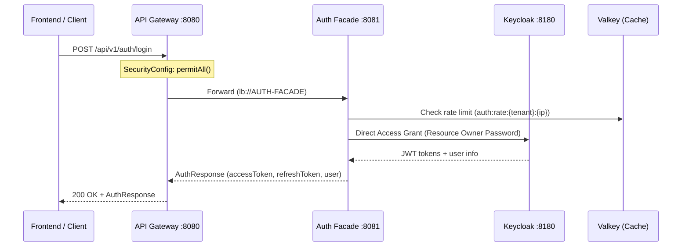
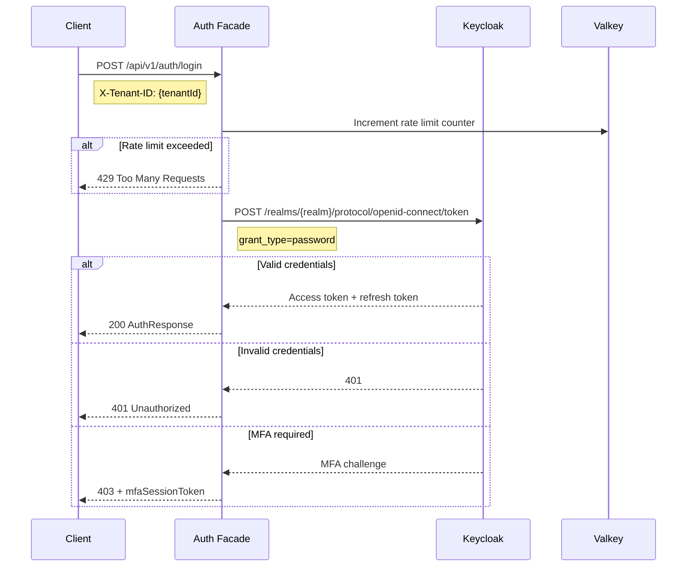
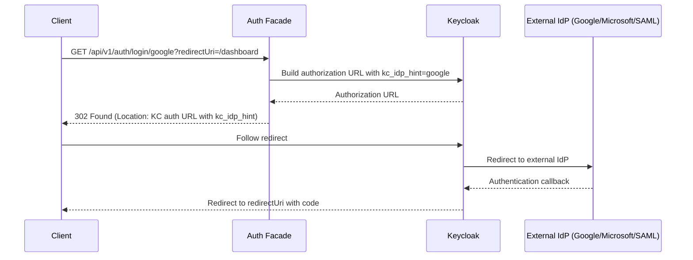
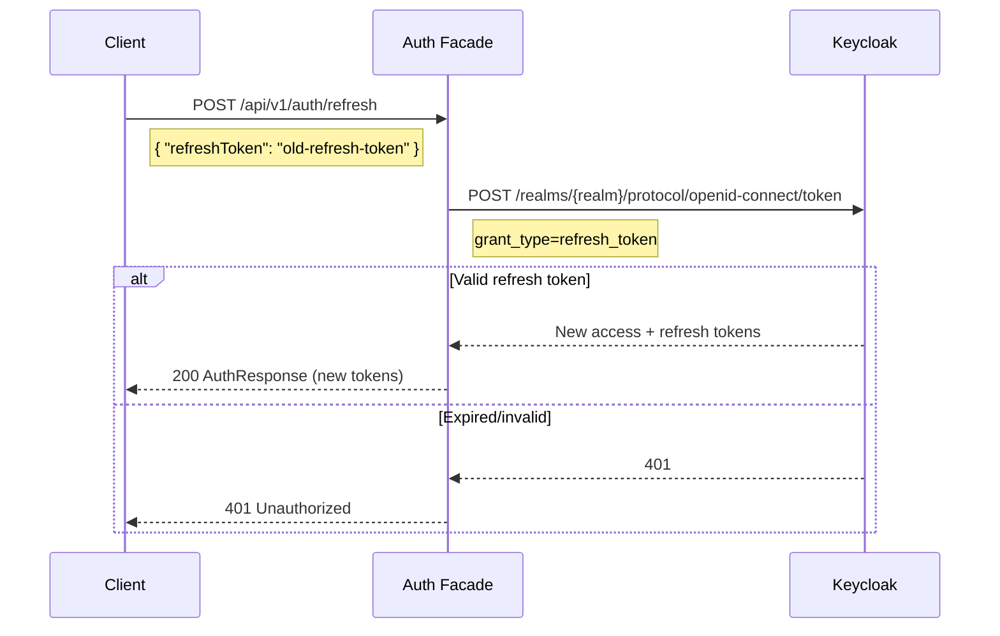
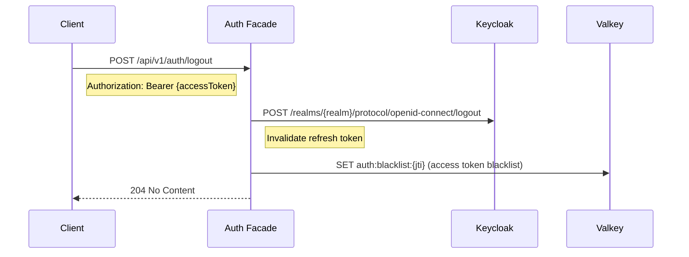
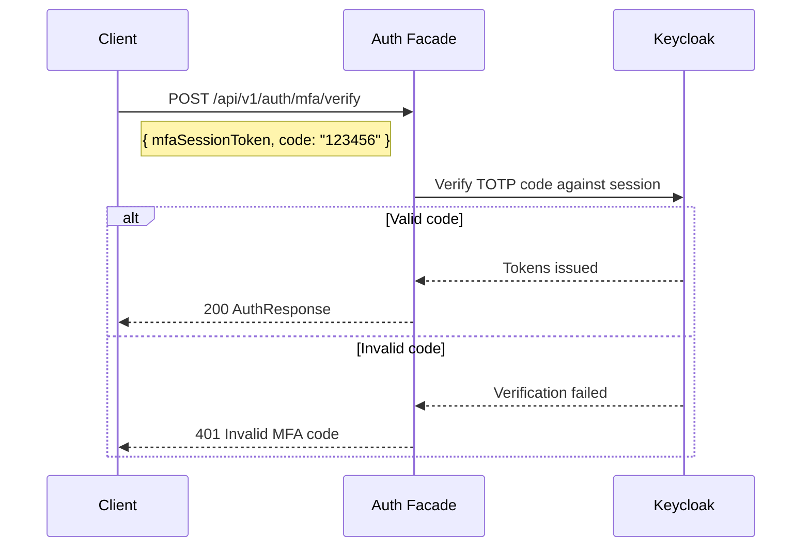
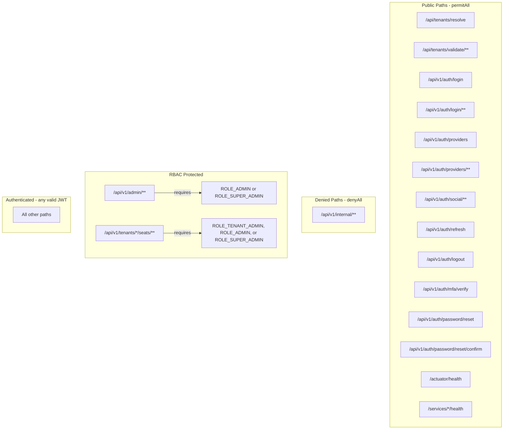

# R01 Authentication & Authorization - API Contract

| Field | Value |
|-------|-------|
| **Requirement** | R01 - Authentication and Authorization |
| **Version** | 1.0.0 |
| **Date** | 2026-03-12 |
| **Status** | Living Document |
| **Service** | auth-facade (port 8081) |
| **Gateway** | api-gateway (port 8080) |
| **Evidence** | All endpoints verified against source code |

---

## Table of Contents

1. [API Overview](#1-api-overview)
2. [Base URLs and Versioning](#2-base-urls-and-versioning)
3. [Authentication and Headers](#3-authentication-and-headers)
4. [Public Endpoints (No Auth Required)](#4-public-endpoints-no-auth-required)
5. [Protected Endpoints (JWT Required)](#5-protected-endpoints-jwt-required)
6. [Admin Endpoints (ADMIN Role Required)](#6-admin-endpoints-admin-role-required)
7. [Event Monitoring Endpoints](#7-event-monitoring-endpoints)
8. [Request/Response Schemas](#8-requestresponse-schemas)
9. [Error Codes](#9-error-codes)
10. [Rate Limiting](#10-rate-limiting)
11. [Gateway Routing](#11-gateway-routing)

---

## 1. API Overview

The Authentication & Authorization API is served by the **auth-facade** microservice and exposed through the **api-gateway**. It provides:

- Email/password authentication via Keycloak Direct Access Grant [IMPLEMENTED]
- Social login (Google, Microsoft) via token exchange [IMPLEMENTED]
- Dynamic identity provider selection via `kc_idp_hint` [IMPLEMENTED]
- Multi-factor authentication (TOTP) setup and verification [IMPLEMENTED]
- Token refresh with rotation [IMPLEMENTED]
- Logout with token invalidation [IMPLEMENTED]
- Admin provider management (CRUD for identity providers per tenant) [IMPLEMENTED]
- Admin user management (list and view users per tenant) [IMPLEMENTED]
- Authentication event monitoring and audit [IMPLEMENTED]

**Evidence:** `AuthController.java`, `AdminProviderController.java`, `AdminUserController.java`, `EventController.java` in `backend/auth-facade/src/main/java/com/ems/auth/controller/`

### Architecture Flow



---

## 2. Base URLs and Versioning

| Environment | Base URL |
|-------------|----------|
| Local (Gateway) | `http://localhost:8080` |
| Local (Direct) | `http://localhost:8081` |
| Docker | `http://api-gateway:8080` |

**API Version:** `v1` - embedded in path (`/api/v1/...`)

**Versioning Strategy:** URI path versioning. All authentication endpoints are prefixed with `/api/v1/auth/`. Admin endpoints use `/api/v1/admin/`. Event endpoints use `/api/v1/events/`.

**Evidence:** `@RequestMapping("/api/v1/auth")` in `AuthController.java` line 31, `@RequestMapping("/api/v1/admin/tenants/{tenantId}/providers")` in `AdminProviderController.java` line 41, `@RequestMapping("/api/v1/events")` in `EventController.java` line 31.

---

## 3. Authentication and Headers

### Required Headers

| Header | Required | Description | Evidence |
|--------|----------|-------------|----------|
| `X-Tenant-ID` | Yes (all requests) | Tenant identifier for multi-tenancy. Resolved by `TenantContextFilter`. | `TenantContextFilter.TENANT_HEADER` |
| `Authorization` | Protected/Admin only | `Bearer {jwt-token}` for authenticated endpoints | `JwtValidationFilter` / gateway `oauth2ResourceServer` |
| `Content-Type` | POST/PUT/PATCH | `application/json` | Standard Spring MVC |

**Note on `X-Tenant-ID`:** The `/api/v1/auth/providers` endpoint accepts `X-Tenant-ID` as optional. If omitted, it returns default providers. All other endpoints require it.

**Evidence:** `AuthController.java` line 153-156 shows `@RequestHeader(value = TenantContextFilter.TENANT_HEADER, required = false)` for the providers endpoint, while all other endpoints use `required = true` (default).

### Security Filter Chain Order (DynamicBrokerSecurityConfig) [IMPLEMENTED]

The auth-facade uses five ordered security filter chains:

| Order | Chain | Scope | Auth Requirement |
|-------|-------|-------|------------------|
| 1 | Admin Management | `/api/v1/admin/**` | JWT + ADMIN/SUPER_ADMIN role |
| 2 | Public Auth | `/api/v1/auth/login`, `/api/v1/auth/social/**`, etc. | None (permitAll) |
| 3 | OAuth2 SSO | `/api/v1/auth/oauth2/**` | OAuth2 redirect flow |
| 4 | Authenticated Auth | `/api/v1/auth/**` (remaining) | JWT required |
| 5 | Default | Everything else | JWT required (actuator/swagger: permitAll) |

**Evidence:** `DynamicBrokerSecurityConfig.java` lines 62-281, `@Order(1)` through `@Order(5)`.

---

## 4. Public Endpoints (No Auth Required)

All public endpoints are matched by Security Filter Chain 2 (Order 2) in `DynamicBrokerSecurityConfig` with `permitAll()`. They also appear in the gateway's `SecurityConfig` as `pathMatchers(...).permitAll()`.

---

### 4.1 POST /api/v1/auth/login [IMPLEMENTED]

**Login with email/password credentials.**

Uses Keycloak's Direct Access Grant (Resource Owner Password Credentials).

**Evidence:** `AuthController.java` lines 41-60



**Request:**

```yaml
# OpenAPI 3.1
post:
  operationId: login
  summary: Login with email or username and password
  description: Authenticate user using Direct Access Grant (Resource Owner Password Credentials)
  tags:
    - Authentication
  parameters:
    - name: X-Tenant-ID
      in: header
      required: true
      schema:
        type: string
      description: Tenant identifier
  requestBody:
    required: true
    content:
      application/json:
        schema:
          $ref: '#/components/schemas/LoginRequest'
  responses:
    '200':
      description: Login successful
      content:
        application/json:
          schema:
            $ref: '#/components/schemas/AuthResponse'
    '401':
      description: Invalid credentials
    '403':
      description: MFA required - check mfaSessionToken in response
    '429':
      description: Rate limit exceeded
```

**Request Body - LoginRequest:**

```json
{
  "identifier": "user@example.com",
  "password": "securePassword123"
}
```

| Field | Type | Required | Validation | Evidence |
|-------|------|----------|------------|----------|
| `identifier` | string | Yes | `@NotBlank` | `LoginRequest.java` line 6 |
| `password` | string | Yes | `@NotBlank` | `LoginRequest.java` line 9 |

**Response Body - AuthResponse (200):**

```json
{
  "accessToken": "eyJhbGciOiJSUzI1NiIs...",
  "refreshToken": "eyJhbGciOiJIUzI1NiIs...",
  "expiresIn": 300,
  "tokenType": "Bearer",
  "user": {
    "id": "550e8400-e29b-41d4-a716-446655440000",
    "email": "user@example.com",
    "firstName": "John",
    "lastName": "Doe",
    "tenantId": "tenant-acme",
    "roles": ["TENANT_ADMIN"]
  },
  "mfaRequired": false,
  "mfaSessionToken": null,
  "features": ["LICENSE_MANAGEMENT", "AUDIT_LOG"]
}
```

**Response Body - MFA Required (403):**

```json
{
  "accessToken": null,
  "refreshToken": null,
  "expiresIn": 0,
  "tokenType": null,
  "user": null,
  "mfaRequired": true,
  "mfaSessionToken": "mfa-session-uuid",
  "features": null
}
```

**Evidence:** `AuthResponse.java` lines 8-29 (record fields + factory methods).

---

### 4.2 POST /api/v1/auth/social/google [IMPLEMENTED]

**Login with Google One Tap (ID token exchange).**

**Evidence:** `AuthController.java` lines 62-78

**Request Body - GoogleTokenRequest:**

```json
{
  "idToken": "eyJhbGciOiJSUzI1NiIs..."
}
```

| Field | Type | Required | Validation | Evidence |
|-------|------|----------|------------|----------|
| `idToken` | string | Yes | `@NotBlank` | `GoogleTokenRequest.java` line 5 |

**Response:** Same as `AuthResponse` (see section 4.1).

**Responses:** `200` (success), `401` (invalid/expired Google token), `403` (MFA required)

---

### 4.3 POST /api/v1/auth/social/microsoft [IMPLEMENTED]

**Login with Microsoft MSAL (access token exchange).**

**Evidence:** `AuthController.java` lines 80-96

**Request Body - MicrosoftTokenRequest:**

```json
{
  "accessToken": "eyJ0eXAiOiJKV1Qi..."
}
```

| Field | Type | Required | Validation | Evidence |
|-------|------|----------|------------|----------|
| `accessToken` | string | Yes | `@NotBlank` | `MicrosoftTokenRequest.java` line 5 |

**Response:** Same as `AuthResponse` (see section 4.1).

**Responses:** `200` (success), `401` (invalid/expired Microsoft token), `403` (MFA required)

---

### 4.4 GET /api/v1/auth/login/{provider} [IMPLEMENTED]

**Initiate login with a specific identity provider (redirect-based flow).**

Uses Keycloak's `kc_idp_hint` mechanism for identity brokering.

**Evidence:** `AuthController.java` lines 102-142



**Path Parameters:**

| Parameter | Type | Description | Examples |
|-----------|------|-------------|----------|
| `provider` | string | Identity provider alias | `google`, `microsoft`, `facebook`, `github`, `saml`, `okta`, `azure-ad` |

**Query Parameters:**

| Parameter | Type | Required | Default | Description |
|-----------|------|----------|---------|-------------|
| `redirectUri` | string | No | `/` | URL to redirect after successful authentication |

**Responses:**

| Status | Description |
|--------|-------------|
| `302` | Redirect to identity provider (Location header set) |
| `200` | Inline authentication successful (rare, for direct grant providers) |
| `400` | Invalid provider or configuration |

---

### 4.5 GET /api/v1/auth/providers [IMPLEMENTED]

**List available identity providers for a tenant.**

**Evidence:** `AuthController.java` lines 144-179

**Headers:**

| Header | Required | Description |
|--------|----------|-------------|
| `X-Tenant-ID` | No | If omitted, returns default providers |

**Response Body (200):**

```json
{
  "active": "keycloak",
  "available": [
    { "alias": "google", "name": "Google", "type": "oidc" },
    { "alias": "microsoft", "name": "Microsoft", "type": "oidc" },
    { "alias": "facebook", "name": "Facebook", "type": "oidc" },
    { "alias": "github", "name": "GitHub", "type": "oidc" },
    { "alias": "saml", "name": "Enterprise SAML", "type": "saml" }
  ],
  "tenant": "tenant-acme"
}
```

**Note:** The current implementation returns a hardcoded list of available providers (lines 166-174). The active provider is read from `AuthProperties.getProvider()`. This could be enhanced to dynamically fetch from Keycloak realm configuration.

---

### 4.6 POST /api/v1/auth/refresh [IMPLEMENTED]

**Refresh access token using a refresh token (token rotation).**

**Evidence:** `AuthController.java` lines 181-196

**Request Body - RefreshTokenRequest:**

```json
{
  "refreshToken": "eyJhbGciOiJIUzI1NiIs..."
}
```

| Field | Type | Required | Validation | Evidence |
|-------|------|----------|------------|----------|
| `refreshToken` | string | Yes | `@NotBlank` | `RefreshTokenRequest.java` line 5 |

**Response:** Same as `AuthResponse` (see section 4.1) with new tokens.

**Responses:** `200` (success), `401` (invalid/expired refresh token)



---

### 4.7 POST /api/v1/auth/logout [IMPLEMENTED]

**Invalidate refresh token and end Keycloak session.**

Returns `204 No Content` on success.

**Evidence:** `AuthController.java` lines 198-214

**Request Body - LogoutRequest:**

```json
{
  "refreshToken": "eyJhbGciOiJIUzI1NiIs..."
}
```

| Field | Type | Required | Validation | Evidence |
|-------|------|----------|------------|----------|
| `refreshToken` | string | Yes | `@NotBlank` | `LogoutRequest.java` line 5 |

**Headers:**

| Header | Required | Description |
|--------|----------|-------------|
| `X-Tenant-ID` | Yes | Tenant identifier |
| `Authorization` | No | If present, access token is blacklisted in Valkey |

**Responses:** `204` (success), `400` (invalid request)



---

### 4.8 POST /api/v1/auth/mfa/verify [IMPLEMENTED]

**Verify TOTP code to complete MFA authentication or setup.**

This is a public endpoint because the user does not yet have a valid access token (they are mid-authentication after receiving an `mfaSessionToken`).

**Evidence:** `AuthController.java` lines 240-256

**Request Body - MfaVerifyRequest:**

```json
{
  "mfaSessionToken": "mfa-session-uuid",
  "code": "123456"
}
```

| Field | Type | Required | Validation | Evidence |
|-------|------|----------|------------|----------|
| `mfaSessionToken` | string | Yes | `@NotBlank` | `MfaVerifyRequest.java` line 6 |
| `code` | string | Yes | `@NotBlank` | `MfaVerifyRequest.java` line 9 |

**Response:** Same as `AuthResponse` (see section 4.1). On successful verification, the full token set is returned.

**Responses:** `200` (MFA verified, tokens issued), `401` (invalid MFA code or session)



---

## 5. Protected Endpoints (JWT Required)

These endpoints are matched by Security Filter Chain 4 (Order 4) in `DynamicBrokerSecurityConfig` and require a valid JWT in the `Authorization: Bearer {token}` header.

---

### 5.1 GET /api/v1/auth/me [IMPLEMENTED]

**Get current user profile from JWT claims.**

Returns the `UserInfo` extracted from the JWT by `JwtValidationFilter`.

**Evidence:** `AuthController.java` lines 258-276

**Response Body - UserInfo (200):**

```json
{
  "id": "550e8400-e29b-41d4-a716-446655440000",
  "email": "user@example.com",
  "firstName": "John",
  "lastName": "Doe",
  "tenantId": "tenant-acme",
  "roles": ["TENANT_ADMIN", "USER"]
}
```

| Field | Type | Nullable | Evidence |
|-------|------|----------|----------|
| `id` | string | No | `UserInfo.java` line 6 |
| `email` | string | No | `UserInfo.java` line 7 |
| `firstName` | string | Yes | `UserInfo.java` line 8 |
| `lastName` | string | Yes | `UserInfo.java` line 9 |
| `tenantId` | string | No | `UserInfo.java` line 10 |
| `roles` | string[] | Yes | `UserInfo.java` line 11 |

**Responses:** `200` (success), `401` (not authenticated)

---

### 5.2 POST /api/v1/auth/mfa/setup [IMPLEMENTED]

**Initialize MFA (TOTP) setup for the authenticated user.**

Requires authentication because MFA is being configured for the current user's account.

**Evidence:** `AuthController.java` lines 216-238

**Request Body - MfaSetupRequest:**

```json
{
  "method": "TOTP"
}
```

| Field | Type | Required | Validation | Values | Evidence |
|-------|------|----------|------------|--------|----------|
| `method` | MFAMethod (enum) | Yes | `@NotNull` | `TOTP` | `MfaSetupRequest.java` line 7 |

**Response Body - MfaSetupResponse (200):**

```json
{
  "method": "TOTP",
  "secret": "JBSWY3DPEHPK3PXP",
  "qrCodeUri": "otpauth://totp/EMSIST:user@example.com?secret=JBSWY3DPEHPK3PXP&issuer=EMSIST",
  "recoveryCodes": [
    "a1b2c3d4",
    "e5f6g7h8",
    "i9j0k1l2",
    "m3n4o5p6",
    "q7r8s9t0",
    "u1v2w3x4",
    "y5z6a7b8",
    "c9d0e1f2"
  ]
}
```

| Field | Type | Nullable | Evidence |
|-------|------|----------|----------|
| `method` | string (enum) | No | `MfaSetupResponse.java` line 8 |
| `secret` | string | No | `MfaSetupResponse.java` line 9 |
| `qrCodeUri` | string | No | `MfaSetupResponse.java` line 10 |
| `recoveryCodes` | string[] | Yes | `MfaSetupResponse.java` line 11 |

**Responses:** `200` (MFA setup initialized), `401` (not authenticated)

---

## 6. Admin Endpoints (ADMIN Role Required)

All admin endpoints are matched by Security Filter Chain 1 (Order 1) in `DynamicBrokerSecurityConfig` with `.hasAnyRole("ADMIN", "SUPER_ADMIN")`. Additionally, each endpoint uses `@PreAuthorize("hasAnyRole('ADMIN','SUPER_ADMIN')")` for method-level security.

The gateway enforces this at the edge: `.pathMatchers("/api/v1/admin/**").hasAnyRole("ADMIN", "SUPER_ADMIN")`.

All admin provider endpoints include **tenant isolation** via `TenantAccessValidator.validateTenantAccess(tenantId)` to prevent IDOR attacks (SEC-F02).

---

### 6.1 Identity Provider Management [IMPLEMENTED]

**Base Path:** `/api/v1/admin/tenants/{tenantId}/providers`

**Evidence:** `AdminProviderController.java` lines 41-556

#### 6.1.1 GET /api/v1/admin/tenants/{tenantId}/providers

**List all identity providers configured for a tenant.**

**Responses:** `200` (provider list), `401`, `403`, `404`

**Response Body (200):**

```json
[
  {
    "id": "550e8400-e29b-41d4-a716-446655440000",
    "providerName": "KEYCLOAK",
    "providerType": "KEYCLOAK",
    "displayName": "Company SSO",
    "protocol": "OIDC",
    "clientId": "ems-auth-client",
    "clientSecret": "cl****et",
    "discoveryUrl": "https://keycloak.example.com/realms/tenant-acme/.well-known/openid-configuration",
    "metadataUrl": null,
    "serverUrl": null,
    "port": null,
    "bindDn": null,
    "userSearchBase": null,
    "idpHint": "google",
    "scopes": ["openid", "profile", "email"],
    "pkceEnabled": null,
    "enabled": true,
    "priority": 1,
    "createdAt": "2026-01-15T10:30:00Z",
    "updatedAt": "2026-02-20T14:00:00Z",
    "lastTestedAt": null,
    "testResult": null
  }
]
```

**Note:** Sensitive fields (`clientSecret`, `bindDn`) are masked in responses. See `AdminProviderController.maskSecret()` at lines 547-555.

---

#### 6.1.2 GET /api/v1/admin/tenants/{tenantId}/providers/{providerId}

**Get a specific identity provider by ID.**

**Responses:** `200` (provider detail), `401`, `403`, `404`

**Response:** Single `ProviderConfigResponse` object (same schema as list items above).

---

#### 6.1.3 POST /api/v1/admin/tenants/{tenantId}/providers

**Register a new identity provider for a tenant.**

**Request Body - ProviderConfigRequest:**

```json
{
  "providerName": "AUTH0",
  "displayName": "Auth0 Enterprise",
  "protocol": "OIDC",
  "clientId": "auth0-client-id",
  "clientSecret": "auth0-client-secret",
  "discoveryUrl": "https://tenant.auth0.com/.well-known/openid-configuration",
  "enabled": true,
  "priority": 2,
  "trustEmail": true,
  "storeToken": false,
  "linkExistingAccounts": true
}
```

**ProviderConfigRequest Schema:**

| Field | Type | Required | Validation | Default | Evidence |
|-------|------|----------|------------|---------|----------|
| `providerName` | string | Yes | `@NotBlank`, max 50 | - | `ProviderConfigRequest.java` line 30 |
| `displayName` | string | No | max 100 | - | line 38 |
| `protocol` | string | Yes | `@NotBlank`, `^(OIDC\|SAML\|LDAP\|OAUTH2)$` | - | line 47 |
| `clientId` | string | No | max 255 | - | line 56 |
| `clientSecret` | string | No | max 512 | - | line 64 |
| `discoveryUrl` | string | No | max 512 | - | line 72 |
| `metadataUrl` | string | No | max 512 | - | line 80 |
| `serverUrl` | string | No | max 255 | - | line 88 |
| `port` | integer | No | - | 389 (LDAP) | line 95 |
| `bindDn` | string | No | max 255 | - | line 103 |
| `bindPassword` | string | No | max 255 | - | line 111 |
| `userSearchBase` | string | No | max 255 | - | line 119 |
| `userSearchFilter` | string | No | max 255 | - | line 127 |
| `idpHint` | string | No | max 100 | - | line 135 |
| `scopes` | string[] | No | - | `["openid","profile","email"]` | line 142 |
| `authorizationUrl` | string | No | max 512 | - | line 150 |
| `tokenUrl` | string | No | max 512 | - | line 158 |
| `userInfoUrl` | string | No | max 512 | - | line 166 |
| `jwksUrl` | string | No | max 512 | - | line 174 |
| `issuerUrl` | string | No | max 512 | - | line 182 |
| `enabled` | boolean | No | - | `true` | line 190 |
| `priority` | integer | No | - | `100` | line 197 |
| `trustEmail` | boolean | No | - | `true` | line 205 |
| `storeToken` | boolean | No | - | `false` | line 213 |
| `linkExistingAccounts` | boolean | No | - | `true` | line 221 |

**Allowed Provider Names:** `KEYCLOAK`, `UAE_PASS`, `AUTH0`, `OKTA`, `AZURE_AD`, `GOOGLE`, `MICROSOFT`, `GITHUB`, `LDAP`, `SAML`, `CUSTOM`

**Allowed Protocols:** `OIDC`, `SAML`, `LDAP`, `OAUTH2`

**Responses:** `201` (created), `400` (invalid config), `401`, `403`, `409` (duplicate name)

---

#### 6.1.4 PUT /api/v1/admin/tenants/{tenantId}/providers/{providerId}

**Update an existing identity provider (full replacement).**

**Request Body:** Same as `ProviderConfigRequest` above.

**Responses:** `200` (updated), `400`, `401`, `403`, `404`

---

#### 6.1.5 PATCH /api/v1/admin/tenants/{tenantId}/providers/{providerId}

**Partially update an identity provider.**

**Evidence:** `AdminProviderController.java` lines 305-381

**Request Body - ProviderPatchRequest:**

```json
{
  "enabled": false,
  "priority": 5,
  "displayName": "Updated Display Name"
}
```

| Field | Type | Required | Evidence |
|-------|------|----------|----------|
| `enabled` | boolean | No | `ProviderPatchRequest.java` line 16 |
| `priority` | integer | No | line 22 |
| `displayName` | string | No | line 28 |

At least one field must be non-null; otherwise returns `400 Bad Request` (line 341).

**Responses:** `200` (updated), `400` (no updates), `401`, `403`, `404`

---

#### 6.1.6 DELETE /api/v1/admin/tenants/{tenantId}/providers/{providerId}

**Delete an identity provider (irreversible).**

**Evidence:** `AdminProviderController.java` lines 255-295

**Responses:** `204` (deleted), `401`, `403`, `404`

---

#### 6.1.7 POST /api/v1/admin/tenants/{tenantId}/providers/{providerId}/test

**Test connectivity to an identity provider.**

**Evidence:** `AdminProviderController.java` lines 383-429

**Response Body - TestConnectionResponse (200):**

```json
{
  "success": true,
  "message": "Successfully connected to OIDC discovery endpoint",
  "details": {
    "issuer": "https://keycloak.example.com/realms/acme",
    "discoveryUrl": "https://keycloak.example.com/realms/acme/.well-known/openid-configuration",
    "supportedScopes": ["openid", "profile", "email", "roles"],
    "endpoints": {
      "authorization": "https://keycloak.example.com/realms/acme/protocol/openid-connect/auth",
      "token": "https://keycloak.example.com/realms/acme/protocol/openid-connect/token",
      "userinfo": "https://keycloak.example.com/realms/acme/protocol/openid-connect/userinfo"
    },
    "responseTimeMs": 245
  },
  "error": null
}
```

**Failure Response:**

```json
{
  "success": false,
  "message": "Failed to connect to identity provider",
  "details": null,
  "error": "Connection refused"
}
```

---

#### 6.1.8 POST /api/v1/admin/tenants/{tenantId}/providers/validate

**Validate provider configuration without persisting.**

**Evidence:** `AdminProviderController.java` lines 431-474

**Request Body:** Same as `ProviderConfigRequest`.

**Response:** Same as `TestConnectionResponse`.

---

#### 6.1.9 POST /api/v1/admin/tenants/{tenantId}/providers/cache/invalidate

**Force invalidation of the provider cache for a tenant.**

**Evidence:** `AdminProviderController.java` lines 476-511

**Responses:** `204` (cache invalidated), `401`, `403`

---

### 6.2 User Management [IMPLEMENTED]

**Base Path:** `/api/v1/admin/tenants/{tenantId}/users`

**Evidence:** `AdminUserController.java` lines 30-145

#### 6.2.1 GET /api/v1/admin/tenants/{tenantId}/users

**List users for a tenant with pagination, search, and filters.**

**Query Parameters:**

| Parameter | Type | Required | Default | Max | Description |
|-----------|------|----------|---------|-----|-------------|
| `page` | integer | No | `0` | - | Zero-based page number |
| `size` | integer | No | `20` | `100` | Page size |
| `search` | string | No | - | - | Filter by name or email (partial match) |
| `role` | string | No | - | - | Filter by role name (exact match) |
| `status` | string | No | - | - | Filter by status (`active` or `inactive`) |

**Response Body - PagedResponse of UserResponse (200):**

```json
{
  "content": [
    {
      "id": "550e8400-e29b-41d4-a716-446655440000",
      "email": "john.doe@example.com",
      "firstName": "John",
      "lastName": "Doe",
      "displayName": "John Doe",
      "active": true,
      "emailVerified": true,
      "roles": ["ADMIN", "USER"],
      "groups": ["administrators", "developers"],
      "identityProvider": "keycloak",
      "lastLoginAt": "2026-02-25T10:30:00Z",
      "createdAt": "2026-01-15T08:00:00Z"
    }
  ],
  "page": 0,
  "size": 20,
  "totalElements": 150,
  "totalPages": 8
}
```

**Responses:** `200` (user list), `401`, `403`, `404`

---

#### 6.2.2 GET /api/v1/admin/tenants/{tenantId}/users/{userId}

**Get a single user by ID within a tenant.**

**Response:** Single `UserResponse` object.

**Responses:** `200` (user detail), `401`, `403`, `404`

---

## 7. Event Monitoring Endpoints [IMPLEMENTED]

**Base Path:** `/api/v1/events`

All event endpoints require JWT authentication and admin role (enforced programmatically via `requireAdminRole()` in `EventController`). Tenant isolation is enforced via `TenantAccessValidator`.

**Evidence:** `EventController.java` lines 30-226

---

### 7.1 GET /api/v1/events

**Get authentication events with filters.**

**Query Parameters:**

| Parameter | Type | Required | Default | Description |
|-----------|------|----------|---------|-------------|
| `types` | string[] | No | - | Event type filter (comma-separated) |
| `userId` | string | No | - | Filter by user ID |
| `ipAddress` | string | No | - | Filter by IP address |
| `dateFrom` | ISO-8601 | No | - | Start date filter |
| `dateTo` | ISO-8601 | No | - | End date filter |
| `first` | integer | No | `0` | Pagination offset |
| `max` | integer | No | `100` | Maximum results |

**Response Body - List of AuthEventDTO:**

```json
[
  {
    "id": "event-uuid",
    "type": "LOGIN",
    "userId": "user-uuid",
    "username": "john.doe@example.com",
    "ipAddress": "192.168.1.100",
    "clientId": "ems-auth-client",
    "sessionId": "session-uuid",
    "timestamp": "2026-03-12T10:30:00Z",
    "error": null,
    "details": {
      "auth_method": "openid-connect",
      "redirect_uri": "http://localhost:4200/callback"
    }
  }
]
```

**Known Event Types (from `AuthEventDTO` constants):**

| Constant | Value | Description |
|----------|-------|-------------|
| `LOGIN` | `LOGIN` | Successful login |
| `LOGIN_ERROR` | `LOGIN_ERROR` | Failed login attempt |
| `LOGOUT` | `LOGOUT` | User logout |
| `REFRESH_TOKEN` | `REFRESH_TOKEN` | Token refresh |
| `REFRESH_TOKEN_ERROR` | `REFRESH_TOKEN_ERROR` | Failed token refresh |
| `CODE_TO_TOKEN` | `CODE_TO_TOKEN` | OAuth code exchange |
| `REGISTER` | `REGISTER` | User registration |
| `UPDATE_PASSWORD` | `UPDATE_PASSWORD` | Password update |
| `RESET_PASSWORD` | `RESET_PASSWORD` | Password reset |
| `SEND_RESET_PASSWORD` | `SEND_RESET_PASSWORD` | Reset password email sent |
| `IMPERSONATE` | `IMPERSONATE` | Admin impersonation |
| `TOKEN_EXCHANGE` | `TOKEN_EXCHANGE` | Token exchange |

---

### 7.2 GET /api/v1/events/recent

**Get recent authentication events (last 24 hours).**

**Query Parameters:** `limit` (integer, default `50`)

---

### 7.3 GET /api/v1/events/login-failures

**Get failed login attempts for security monitoring.**

**Query Parameters:** `dateFrom` (ISO-8601, default last 7 days), `limit` (integer, default `100`)

---

### 7.4 GET /api/v1/events/stats

**Get aggregated authentication event statistics.**

**Response Body (200):**

```json
{
  "last24Hours": {
    "successfulLogins": 245,
    "failedLogins": 12,
    "successRate": 95.33
  },
  "last7Days": {
    "successfulLogins": 1520,
    "failedLogins": 89,
    "passwordResets": 7
  },
  "generatedAt": "2026-03-12T15:30:00Z"
}
```

---

### 7.5 GET /api/v1/events/user/{userId}

**Get authentication events for a specific user.**

**Path Parameters:** `userId` (string, required)

**Query Parameters:** `limit` (integer, default `50`)

---

## 8. Request/Response Schemas

### Complete Schema Reference

```yaml
# OpenAPI 3.1 Components
components:
  securitySchemes:
    bearerAuth:
      type: http
      scheme: bearer
      bearerFormat: JWT
      description: JWT token from /api/v1/auth/login

  schemas:
    LoginRequest:
      type: object
      required: [identifier, password]
      properties:
        identifier:
          type: string
          description: Email address or username
          example: "user@example.com"
        password:
          type: string
          format: password
          description: User password
          example: "securePassword123"

    GoogleTokenRequest:
      type: object
      required: [idToken]
      properties:
        idToken:
          type: string
          description: Google ID token from Google One Tap
          example: "eyJhbGciOiJSUzI1NiIs..."

    MicrosoftTokenRequest:
      type: object
      required: [accessToken]
      properties:
        accessToken:
          type: string
          description: Microsoft access token from MSAL
          example: "eyJ0eXAiOiJKV1Qi..."

    RefreshTokenRequest:
      type: object
      required: [refreshToken]
      properties:
        refreshToken:
          type: string
          description: Refresh token from previous login/refresh
          example: "eyJhbGciOiJIUzI1NiIs..."

    LogoutRequest:
      type: object
      required: [refreshToken]
      properties:
        refreshToken:
          type: string
          description: Refresh token to invalidate
          example: "eyJhbGciOiJIUzI1NiIs..."

    MfaSetupRequest:
      type: object
      required: [method]
      properties:
        method:
          type: string
          enum: [TOTP]
          description: MFA method to set up
          example: "TOTP"

    MfaVerifyRequest:
      type: object
      required: [mfaSessionToken, code]
      properties:
        mfaSessionToken:
          type: string
          description: Session token from MFA-required login response
          example: "mfa-session-uuid"
        code:
          type: string
          description: 6-digit TOTP code
          example: "123456"

    AuthResponse:
      type: object
      description: Authentication response with tokens and user info
      properties:
        accessToken:
          type: string
          nullable: true
          description: JWT access token (null when MFA required)
        refreshToken:
          type: string
          nullable: true
          description: JWT refresh token (null when MFA required)
        expiresIn:
          type: integer
          format: int64
          description: Access token expiry in seconds
          example: 300
        tokenType:
          type: string
          nullable: true
          description: Token type (always "Bearer")
          example: "Bearer"
        user:
          $ref: '#/components/schemas/UserInfo'
          nullable: true
        mfaRequired:
          type: boolean
          description: Whether MFA verification is needed
          example: false
        mfaSessionToken:
          type: string
          nullable: true
          description: Session token for MFA verification (only when mfaRequired=true)
        features:
          type: array
          nullable: true
          items:
            type: string
          description: Licensed feature flags for the tenant
          example: ["LICENSE_MANAGEMENT", "AUDIT_LOG"]

    UserInfo:
      type: object
      properties:
        id:
          type: string
          description: User UUID
          example: "550e8400-e29b-41d4-a716-446655440000"
        email:
          type: string
          format: email
          example: "user@example.com"
        firstName:
          type: string
          nullable: true
          example: "John"
        lastName:
          type: string
          nullable: true
          example: "Doe"
        tenantId:
          type: string
          example: "tenant-acme"
        roles:
          type: array
          nullable: true
          items:
            type: string
          example: ["TENANT_ADMIN"]

    MfaSetupResponse:
      type: object
      properties:
        method:
          type: string
          enum: [TOTP]
          example: "TOTP"
        secret:
          type: string
          description: Base32-encoded TOTP secret
          example: "JBSWY3DPEHPK3PXP"
        qrCodeUri:
          type: string
          description: otpauth URI for QR code generation
          example: "otpauth://totp/EMSIST:user@example.com?secret=JBSWY3DPEHPK3PXP&issuer=EMSIST"
        recoveryCodes:
          type: array
          nullable: true
          items:
            type: string
          description: One-time recovery codes (8 codes)
          example: ["a1b2c3d4", "e5f6g7h8"]

    ProviderConfigRequest:
      type: object
      required: [providerName, protocol]
      properties:
        providerName:
          type: string
          maxLength: 50
          enum: [KEYCLOAK, UAE_PASS, AUTH0, OKTA, AZURE_AD, GOOGLE, MICROSOFT, GITHUB, LDAP, SAML, CUSTOM]
        displayName:
          type: string
          maxLength: 100
        protocol:
          type: string
          enum: [OIDC, SAML, LDAP, OAUTH2]
        clientId:
          type: string
          maxLength: 255
        clientSecret:
          type: string
          maxLength: 512
        discoveryUrl:
          type: string
          maxLength: 512
        metadataUrl:
          type: string
          maxLength: 512
        serverUrl:
          type: string
          maxLength: 255
        port:
          type: integer
        bindDn:
          type: string
          maxLength: 255
        bindPassword:
          type: string
          maxLength: 255
        userSearchBase:
          type: string
          maxLength: 255
        userSearchFilter:
          type: string
          maxLength: 255
        idpHint:
          type: string
          maxLength: 100
        scopes:
          type: array
          items:
            type: string
          default: ["openid", "profile", "email"]
        authorizationUrl:
          type: string
          maxLength: 512
        tokenUrl:
          type: string
          maxLength: 512
        userInfoUrl:
          type: string
          maxLength: 512
        jwksUrl:
          type: string
          maxLength: 512
        issuerUrl:
          type: string
          maxLength: 512
        enabled:
          type: boolean
          default: true
        priority:
          type: integer
          default: 100
        trustEmail:
          type: boolean
          default: true
        storeToken:
          type: boolean
          default: false
        linkExistingAccounts:
          type: boolean
          default: true

    ProviderConfigResponse:
      type: object
      properties:
        id:
          type: string
        providerName:
          type: string
        providerType:
          type: string
        displayName:
          type: string
        protocol:
          type: string
        clientId:
          type: string
        clientSecret:
          type: string
          description: Masked (e.g., "cl****et")
        discoveryUrl:
          type: string
        metadataUrl:
          type: string
        serverUrl:
          type: string
        port:
          type: integer
        bindDn:
          type: string
          description: Masked
        userSearchBase:
          type: string
        idpHint:
          type: string
        scopes:
          type: array
          items:
            type: string
        pkceEnabled:
          type: boolean
          nullable: true
        enabled:
          type: boolean
        priority:
          type: integer
        createdAt:
          type: string
          format: date-time
        updatedAt:
          type: string
          format: date-time
        lastTestedAt:
          type: string
          format: date-time
          nullable: true
        testResult:
          type: string
          nullable: true
          enum: [success, failure, pending]

    ProviderPatchRequest:
      type: object
      description: At least one field must be non-null
      properties:
        enabled:
          type: boolean
        priority:
          type: integer
        displayName:
          type: string

    TestConnectionResponse:
      type: object
      properties:
        success:
          type: boolean
        message:
          type: string
        details:
          $ref: '#/components/schemas/ConnectionDetails'
          nullable: true
        error:
          type: string
          nullable: true

    ConnectionDetails:
      type: object
      properties:
        issuer:
          type: string
          nullable: true
        discoveryUrl:
          type: string
          nullable: true
        supportedScopes:
          type: array
          nullable: true
          items:
            type: string
        endpoints:
          type: object
          additionalProperties:
            type: string
          nullable: true
        responseTimeMs:
          type: integer
          format: int64

    UserResponse:
      type: object
      properties:
        id:
          type: string
        email:
          type: string
          format: email
        firstName:
          type: string
        lastName:
          type: string
        displayName:
          type: string
        active:
          type: boolean
        emailVerified:
          type: boolean
        roles:
          type: array
          items:
            type: string
        groups:
          type: array
          items:
            type: string
        identityProvider:
          type: string
        lastLoginAt:
          type: string
          format: date-time
          nullable: true
        createdAt:
          type: string
          format: date-time

    PagedResponse:
      type: object
      properties:
        content:
          type: array
          items: {}
        page:
          type: integer
        size:
          type: integer
        totalElements:
          type: integer
          format: int64
        totalPages:
          type: integer

    AuthEventDTO:
      type: object
      properties:
        id:
          type: string
        type:
          type: string
          enum: [LOGIN, LOGIN_ERROR, LOGOUT, REFRESH_TOKEN, REFRESH_TOKEN_ERROR, CODE_TO_TOKEN, REGISTER, UPDATE_PASSWORD, RESET_PASSWORD, SEND_RESET_PASSWORD, IMPERSONATE, TOKEN_EXCHANGE]
        userId:
          type: string
        username:
          type: string
        ipAddress:
          type: string
        clientId:
          type: string
        sessionId:
          type: string
        timestamp:
          type: string
          format: date-time
        error:
          type: string
          nullable: true
        details:
          type: object
          additionalProperties:
            type: string

    ErrorResponse:
      type: object
      properties:
        error:
          type: string
          description: Error code
          example: "rate_limit_exceeded"
        message:
          type: string
          description: Human-readable error message
          example: "Too many requests. Please try again in 45 seconds."
        retryAfter:
          type: integer
          format: int64
          description: Seconds until retry is allowed (rate limit only)
        timestamp:
          type: string
          format: date-time
```

---

## 9. Error Codes

### HTTP Status Codes

| Status | Meaning | When Returned |
|--------|---------|---------------|
| `200` | Success | Successful operation |
| `201` | Created | Provider registered |
| `204` | No Content | Logout, delete, cache invalidation |
| `302` | Found | Redirect to identity provider |
| `400` | Bad Request | Invalid request body, validation failure, empty patch |
| `401` | Unauthorized | Missing/invalid/expired JWT, invalid credentials, invalid MFA |
| `403` | Forbidden | Insufficient role (not ADMIN), MFA required |
| `404` | Not Found | Provider/user/tenant not found |
| `409` | Conflict | Duplicate provider name |
| `429` | Too Many Requests | Rate limit exceeded |

### Rate Limit Error Response [IMPLEMENTED]

**Evidence:** `RateLimitFilter.java` lines 105-118

```json
{
  "error": "rate_limit_exceeded",
  "message": "Too many requests. Please try again in 45 seconds.",
  "retryAfter": 45,
  "timestamp": "2026-03-12T15:30:00.000Z"
}
```

### Rate Limit Response Headers [IMPLEMENTED]

**Evidence:** `RateLimitFilter.java` lines 72-74

| Header | Description | Example |
|--------|-------------|---------|
| `X-RateLimit-Limit` | Maximum requests per window | `100` |
| `X-RateLimit-Remaining` | Remaining requests in window | `87` |
| `X-RateLimit-Reset` | Unix timestamp when limit resets | `1741792200` |
| `Retry-After` | Seconds until retry (only on 429) | `45` |

---

## 10. Rate Limiting

### Configuration [IMPLEMENTED]

**Evidence:** `RateLimitFilter.java` lines 33-37

| Setting | Default | Config Property |
|---------|---------|-----------------|
| Requests per minute | `100` | `rate-limit.requests-per-minute` |
| Cache key prefix | `auth:rate:` | `rate-limit.cache-prefix` |
| Window duration | 60 seconds | Hardcoded (line 62) |
| Storage | Valkey (via `StringRedisTemplate`) | `spring.data.redis.*` |

### Rate Limit Key Strategy [IMPLEMENTED]

**Evidence:** `RateLimitFilter.java` lines 91-103

The rate limit key is composed of:
- `{tenant_id}:{client_ip}` if `X-Tenant-ID` header is present
- `{client_ip}` if no tenant header

IP resolution order:
1. `X-Forwarded-For` header (first IP, for proxied requests)
2. `request.getRemoteAddr()` (fallback)

### Exemptions [IMPLEMENTED]

**Evidence:** `RateLimitFilter.java` lines 44-48

The following paths are exempt from rate limiting:
- `/actuator/**`
- `/swagger/**`
- `/api-docs/**`

### Graceful Degradation [IMPLEMENTED]

**Evidence:** `RateLimitFilter.java` lines 84-88

If Valkey is unavailable, the request is allowed through with a warning log. This prevents auth from being completely blocked by a cache outage.

---

## 11. Gateway Routing

### Gateway Security Configuration [IMPLEMENTED]

**Evidence:** `api-gateway SecurityConfig.java` lines 38-87



### Route Definitions [IMPLEMENTED]

**Evidence:** `RouteConfig.java` lines 17-115 and `application.yml` lines 35-84

| Route ID | Path Pattern | Target Service | Evidence |
|----------|-------------|----------------|----------|
| `auth-service` | `/api/v1/auth/**` | `lb://AUTH-FACADE` | `RouteConfig.java` line 36 |
| `auth-admin-service` | `/api/v1/admin/**` | `lb://AUTH-FACADE` | line 39 |
| `auth-events-service` | `/api/v1/events/**` | `lb://AUTH-FACADE` | line 42 |
| `license-admin-service` | `/api/v1/admin/licenses/**` | `lb://LICENSE-SERVICE` | line 26 |
| `license-seats-service` | `/api/v1/tenants/*/seats/**` | `lb://LICENSE-SERVICE` | line 29 |
| `tenant-service` | `/api/tenants/**` | `lb://TENANT-SERVICE` | line 49 |
| `user-service` | `/api/v1/users/**` | `lb://USER-SERVICE` | line 56 |

**Important:** The `license-admin-service` route (line 26) is ordered before `auth-admin-service` (line 39) to ensure `/api/v1/admin/licenses/**` hits the license service, while all other `/api/v1/admin/**` paths hit the auth-facade.

### Service Discovery [IMPLEMENTED]

All routes use `lb://` prefix for Eureka-based load balancing via Spring Cloud LoadBalancer.

**Evidence:** `application.yml` lines 97-101

```yaml
eureka:
  client:
    enabled: ${EUREKA_ENABLED:true}
    service-url:
      defaultZone: ${EUREKA_URL:http://localhost:8761/eureka}
```

### JWT Validation at Gateway [IMPLEMENTED]

**Evidence:** `api-gateway SecurityConfig.java` lines 69-71, 89-118

The gateway validates JWTs using Spring Security's OAuth2 Resource Server:

```yaml
spring:
  security:
    oauth2:
      resourceserver:
        jwt:
          issuer-uri: ${KEYCLOAK_ISSUER_URI:http://localhost:8180/realms/master}
          jwk-set-uri: ${KEYCLOAK_JWKS_URI:http://localhost:8180/realms/master/protocol/openid-connect/certs}
```

Role extraction supports multiple JWT claim locations (lines 96-118):
1. `realm_access.roles` (Keycloak realm roles)
2. `resource_access.{client}.roles` (Keycloak client roles)
3. `roles` (top-level claim, Auth0/Okta style)
4. `scope` / `scp` (OAuth2 scopes as `SCOPE_*` authorities)

All roles are normalized to `ROLE_{UPPER_SNAKE_CASE}` format.

### Security Headers [IMPLEMENTED]

**Evidence:** `api-gateway SecurityConfig.java` lines 72-86

| Header | Value |
|--------|-------|
| `Strict-Transport-Security` | `max-age=31536000; includeSubDomains` |
| `X-Frame-Options` | `DENY` |
| `X-Content-Type-Options` | `nosniff` |
| `Referrer-Policy` | `strict-origin-when-cross-origin` |
| `Content-Security-Policy` | `default-src 'self'; script-src 'self'; style-src 'self' 'unsafe-inline'; img-src 'self' data:; font-src 'self'; frame-ancestors 'none'` |
| `Permissions-Policy` | `camera=(), microphone=(), geolocation=()` |

### Default Gateway Filters [IMPLEMENTED]

**Evidence:** `application.yml` lines 28-31

| Filter | Purpose |
|--------|---------|
| `DedupeResponseHeader` | Prevents duplicate `Access-Control-Allow-Origin` headers |
| `RemoveRequestHeader=Origin` | Removes Origin header before forwarding to services |
| `AddRequestHeader=X-Gateway-Request-Time` | Adds timestamp for request tracing |

---

## Appendix: Full Endpoint Summary

| # | Method | Path | Auth | Status |
|---|--------|------|------|--------|
| 1 | POST | `/api/v1/auth/login` | Public | [IMPLEMENTED] |
| 2 | POST | `/api/v1/auth/social/google` | Public | [IMPLEMENTED] |
| 3 | POST | `/api/v1/auth/social/microsoft` | Public | [IMPLEMENTED] |
| 4 | GET | `/api/v1/auth/login/{provider}` | Public | [IMPLEMENTED] |
| 5 | GET | `/api/v1/auth/providers` | Public | [IMPLEMENTED] |
| 6 | POST | `/api/v1/auth/refresh` | Public | [IMPLEMENTED] |
| 7 | POST | `/api/v1/auth/logout` | Public | [IMPLEMENTED] |
| 8 | POST | `/api/v1/auth/mfa/verify` | Public | [IMPLEMENTED] |
| 9 | GET | `/api/v1/auth/me` | JWT | [IMPLEMENTED] |
| 10 | POST | `/api/v1/auth/mfa/setup` | JWT | [IMPLEMENTED] |
| 11 | GET | `/api/v1/admin/tenants/{tid}/providers` | ADMIN | [IMPLEMENTED] |
| 12 | GET | `/api/v1/admin/tenants/{tid}/providers/{pid}` | ADMIN | [IMPLEMENTED] |
| 13 | POST | `/api/v1/admin/tenants/{tid}/providers` | ADMIN | [IMPLEMENTED] |
| 14 | PUT | `/api/v1/admin/tenants/{tid}/providers/{pid}` | ADMIN | [IMPLEMENTED] |
| 15 | PATCH | `/api/v1/admin/tenants/{tid}/providers/{pid}` | ADMIN | [IMPLEMENTED] |
| 16 | DELETE | `/api/v1/admin/tenants/{tid}/providers/{pid}` | ADMIN | [IMPLEMENTED] |
| 17 | POST | `/api/v1/admin/tenants/{tid}/providers/{pid}/test` | ADMIN | [IMPLEMENTED] |
| 18 | POST | `/api/v1/admin/tenants/{tid}/providers/validate` | ADMIN | [IMPLEMENTED] |
| 19 | POST | `/api/v1/admin/tenants/{tid}/providers/cache/invalidate` | ADMIN | [IMPLEMENTED] |
| 20 | GET | `/api/v1/admin/tenants/{tid}/users` | ADMIN | [IMPLEMENTED] |
| 21 | GET | `/api/v1/admin/tenants/{tid}/users/{uid}` | ADMIN | [IMPLEMENTED] |
| 22 | GET | `/api/v1/events` | JWT+Admin | [IMPLEMENTED] |
| 23 | GET | `/api/v1/events/recent` | JWT+Admin | [IMPLEMENTED] |
| 24 | GET | `/api/v1/events/login-failures` | JWT+Admin | [IMPLEMENTED] |
| 25 | GET | `/api/v1/events/stats` | JWT+Admin | [IMPLEMENTED] |
| 26 | GET | `/api/v1/events/user/{userId}` | JWT+Admin | [IMPLEMENTED] |

**Password Reset Endpoints [PLANNED]:**

The gateway's `SecurityConfig` includes `permitAll()` matchers for `/api/v1/auth/password/reset` and `/api/v1/auth/password/reset/confirm` (lines 56-57), but no corresponding controller methods exist in the auth-facade yet. These are reserved for future implementation.

---

## Appendix: Source File Index

| File | Path | Content |
|------|------|---------|
| AuthController | `backend/auth-facade/src/main/java/com/ems/auth/controller/AuthController.java` | Public + protected auth endpoints |
| AdminProviderController | `backend/auth-facade/src/main/java/com/ems/auth/controller/AdminProviderController.java` | Provider CRUD admin endpoints |
| AdminUserController | `backend/auth-facade/src/main/java/com/ems/auth/controller/AdminUserController.java` | User listing admin endpoints |
| EventController | `backend/auth-facade/src/main/java/com/ems/auth/controller/EventController.java` | Auth event monitoring |
| DynamicBrokerSecurityConfig | `backend/auth-facade/src/main/java/com/ems/auth/config/DynamicBrokerSecurityConfig.java` | Five-chain security config |
| SecurityConfig (legacy) | `backend/auth-facade/src/main/java/com/ems/auth/config/SecurityConfig.java` | Deprecated legacy config |
| Gateway SecurityConfig | `backend/api-gateway/src/main/java/com/ems/gateway/config/SecurityConfig.java` | Gateway RBAC + public paths |
| RouteConfig | `backend/api-gateway/src/main/java/com/ems/gateway/config/RouteConfig.java` | Gateway route definitions |
| RateLimitFilter | `backend/auth-facade/src/main/java/com/ems/auth/filter/RateLimitFilter.java` | Valkey-backed rate limiting |
| LoginRequest | `backend/common/src/main/java/com/ems/common/dto/auth/LoginRequest.java` | Login request DTO |
| AuthResponse | `backend/common/src/main/java/com/ems/common/dto/auth/AuthResponse.java` | Auth response DTO |
| UserInfo | `backend/common/src/main/java/com/ems/common/dto/auth/UserInfo.java` | JWT user info DTO |
| MfaSetupRequest | `backend/common/src/main/java/com/ems/common/dto/auth/MfaSetupRequest.java` | MFA setup request |
| MfaSetupResponse | `backend/common/src/main/java/com/ems/common/dto/auth/MfaSetupResponse.java` | MFA setup response |
| MfaVerifyRequest | `backend/common/src/main/java/com/ems/common/dto/auth/MfaVerifyRequest.java` | MFA verify request |
| GoogleTokenRequest | `backend/common/src/main/java/com/ems/common/dto/auth/GoogleTokenRequest.java` | Google token exchange |
| MicrosoftTokenRequest | `backend/common/src/main/java/com/ems/common/dto/auth/MicrosoftTokenRequest.java` | Microsoft token exchange |
| RefreshTokenRequest | `backend/common/src/main/java/com/ems/common/dto/auth/RefreshTokenRequest.java` | Token refresh request |
| LogoutRequest | `backend/common/src/main/java/com/ems/common/dto/auth/LogoutRequest.java` | Logout request |
| AuthEventDTO | `backend/common/src/main/java/com/ems/common/dto/auth/AuthEventDTO.java` | Auth event data |
| ProviderConfigRequest | `backend/auth-facade/src/main/java/com/ems/auth/dto/ProviderConfigRequest.java` | Provider config input |
| ProviderConfigResponse | `backend/auth-facade/src/main/java/com/ems/auth/dto/ProviderConfigResponse.java` | Provider config output |
| ProviderPatchRequest | `backend/auth-facade/src/main/java/com/ems/auth/dto/ProviderPatchRequest.java` | Provider partial update |
| TestConnectionResponse | `backend/auth-facade/src/main/java/com/ems/auth/dto/TestConnectionResponse.java` | Connection test result |
| UserResponse | `backend/auth-facade/src/main/java/com/ems/auth/dto/UserResponse.java` | Admin user detail |
| PagedResponse | `backend/auth-facade/src/main/java/com/ems/auth/dto/PagedResponse.java` | Pagination wrapper |
