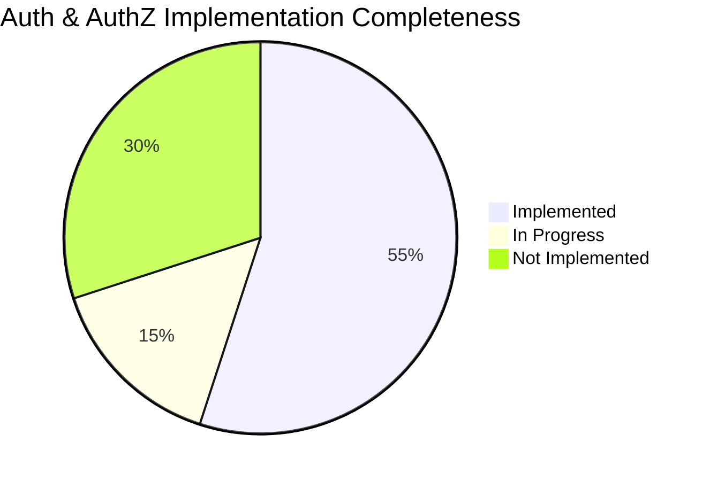
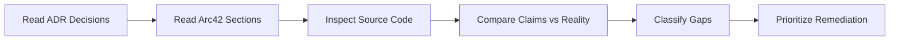
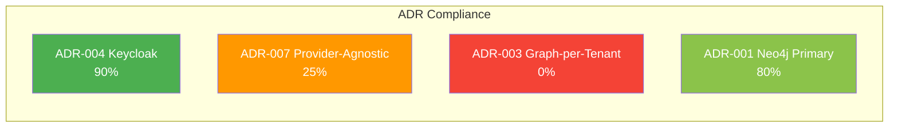
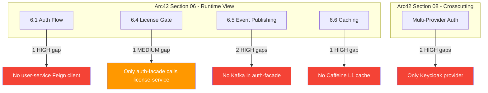
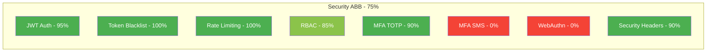
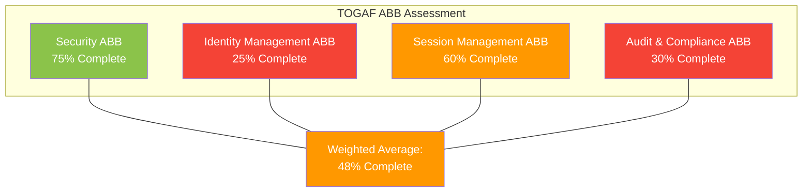
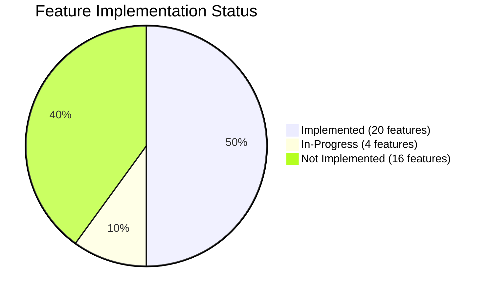
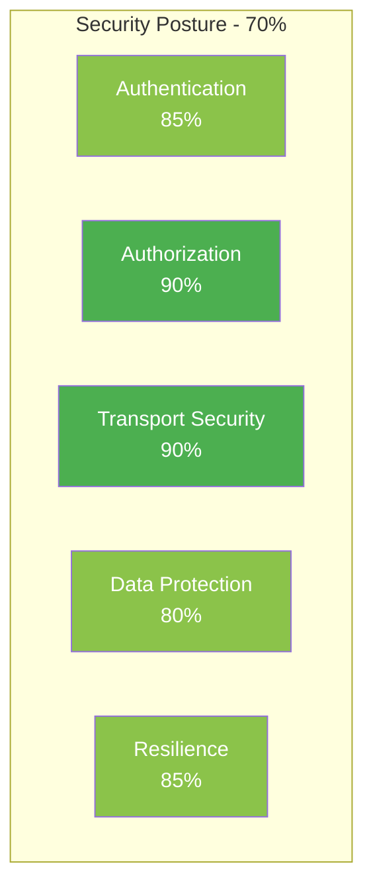
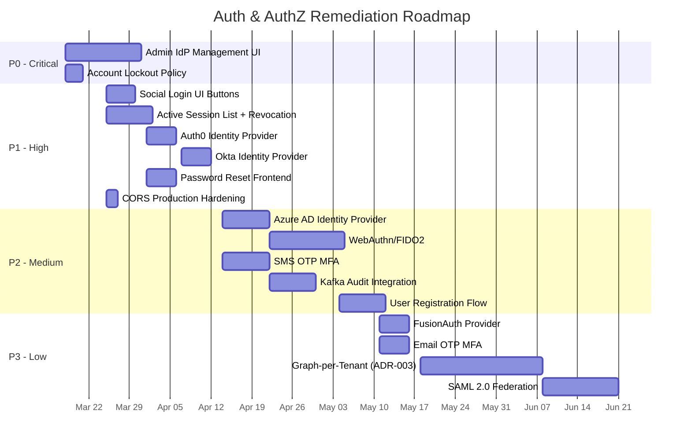

# Gap Analysis: Authentication & Authorization

**Feature:** Authentication, Authorization, and Identity Management
**Services:** auth-facade (Port 8081), api-gateway (Port 8080)
**Date:** 2026-03-12
**Status:** Draft
**Author:** ARCH Agent (Architecture Governance)
**Methodology:** Codebase audit against ADR decisions, arc42 documentation, and TOGAF ABBs

---

## Table of Contents

1. [Executive Summary](#1-executive-summary)
2. [Methodology](#2-methodology)
3. [ADR Compliance Analysis](#3-adr-compliance-analysis)
4. [Arc42 Alignment Analysis](#4-arc42-alignment-analysis)
5. [TOGAF Architecture Gap Assessment](#5-togaf-architecture-gap-assessment)
6. [Feature Gap Matrix](#6-feature-gap-matrix)
7. [Security Gap Assessment](#7-security-gap-assessment)
8. [Prioritized Remediation Plan](#8-prioritized-remediation-plan)

---

## 1. Executive Summary

This gap analysis documents verified discrepancies between architectural decisions (ADRs), arc42 documentation, and the actual implementation of the EMSIST Authentication and Authorization subsystem. All claims in this document are evidence-based, derived from direct source code inspection on 2026-03-12.

### Overall Compliance Summary

| Dimension | Score | Assessment |
|-----------|-------|------------|
| ADR Compliance | 54% | 3 of 4 relevant ADRs have significant gaps |
| Arc42 Alignment | 40% | Runtime view (section 06) has 6 HIGH-severity mismatches |
| TOGAF ABB Coverage | 48% | Identity Management ABB critically underdeveloped |
| Feature Completeness | 60% | Core auth flows working; multi-provider and admin UI missing |
| Security Posture | 70% | Strong foundation; account lockout and CSP nonce gaps remain |

### Key Findings

1. **ADR-007 (Provider-Agnostic Identity Layer)** is at 25% implementation. Only `KeycloakIdentityProvider` exists. The `IdentityProvider` interface and `DynamicProviderResolver` are defined, but no Auth0, Okta, Azure AD, or FusionAuth implementations exist.
2. **ADR-003 (Graph-per-Tenant Isolation)** is at 0% implementation. The system uses Keycloak realm-per-tenant, not Neo4j graph-per-tenant.
3. **Arc42 Section 06 (Runtime View)** contains 6 HIGH-severity discrepancies where documented flows do not match code.
4. **No Kafka integration** exists in auth-facade despite arc42 documenting event publishing.
5. **Admin IdP Management UI** does not exist in the frontend, though backend APIs are [IN-PROGRESS].

---

## 2. Methodology

### Audit Approach

### Evidence Standards

All gaps are classified using the Three-State Classification system:

| Tag | Meaning | Evidence Required |
|-----|---------|-------------------|
| `[IMPLEMENTED]` | Code exists, verified | File path + code reference |
| `[IN-PROGRESS]` | Partial implementation | What exists vs what is missing |
| `[PLANNED]` | Design only, no code | Explicitly stated as not yet built |

### Files Inspected

| Category | Files Audited |
|----------|--------------|
| **Backend auth-facade** | 60+ Java files in `backend/auth-facade/src/main/java/com/ems/auth/` |
| **Backend api-gateway** | 6 Java files in `backend/api-gateway/src/main/java/com/ems/gateway/` |
| **Frontend auth** | 11 TypeScript files in `frontend/src/app/core/auth/` and `frontend/src/app/core/interceptors/` |
| **Infrastructure** | `infrastructure/docker/docker-compose.yml` |
| **Configuration** | `backend/auth-facade/src/main/resources/application.yml` |

---

## 3. ADR Compliance Analysis

### 3.1 ADR-004: Keycloak as Primary Identity Provider

| Aspect | Decision | Reality | Gap |
|--------|----------|---------|-----|
| Keycloak as primary IdP | Keycloak 24.0 | `KeycloakIdentityProvider.java` exists, uses Keycloak Admin REST API | None |
| Realm-per-tenant | One realm per tenant | `RealmResolver.java` maps tenantId to realm name | None |
| OAuth2/OIDC protocol | Standard OAuth2 flows | Password grant, token exchange, refresh implemented | None |
| TOTP MFA | MFA via Keycloak | `setupMfa()`, `verifyMfaCode()`, `isMfaEnabled()` on `IdentityProvider` interface, implemented in `KeycloakIdentityProvider` | None |
| Social login brokering | Google, Microsoft, UAE Pass | `exchangeToken()` and `initiateLogin()` exist on interface; Keycloak broker config required per tenant | None |
| Admin UI for dynamic broker | Tenant admins manage IdP config | Backend `AdminProviderController.java` exists; **no frontend admin UI** | **10%** |

**ADR-004 Compliance: 90%**

Evidence:
- `KeycloakIdentityProvider.java`: implements `IdentityProvider` interface with all methods
- `AdminProviderController.java`: REST API for CRUD on provider configurations
- `Neo4jProviderResolver.java`: resolves provider config from Neo4j graph
- **Missing:** Frontend admin UI for dynamic broker management

### 3.2 ADR-007: Provider-Agnostic Identity Layer

| Aspect | Decision | Reality | Gap |
|--------|----------|---------|-----|
| `IdentityProvider` interface | Strategy pattern for all providers | Interface exists at `com.ems.auth.provider.IdentityProvider` with 12 methods | None |
| `DynamicProviderResolver` | Dynamic provider selection per tenant | Interface exists with `InMemoryProviderResolver` and `Neo4jProviderResolver` implementations | None |
| `ProviderAgnosticRoleConverter` | JWT role extraction across providers | `ProviderAgnosticRoleConverter.java` exists in `security/` package | None |
| Keycloak implementation | First provider implementation | `KeycloakIdentityProvider.java` fully implemented | None |
| Auth0 implementation | Second provider | **No `Auth0IdentityProvider` class exists anywhere in codebase** | **100%** |
| Okta implementation | Third provider | **No `OktaIdentityProvider` class exists anywhere in codebase** | **100%** |
| Azure AD implementation | Fourth provider | **No `AzureAdIdentityProvider` class exists anywhere in codebase** | **100%** |
| FusionAuth implementation | Fifth provider | **No `FusionAuthIdentityProvider` class exists anywhere in codebase** | **100%** |
| `@ConditionalOnProperty` switching | Provider selection via config | Documented in `IdentityProvider` Javadoc but only Keycloak bean exists | **75%** |

**ADR-007 Compliance: 25%**

Evidence:
- `IdentityProvider.java` (line 18): interface defined with `authenticate()`, `refreshToken()`, `logout()`, `exchangeToken()`, `initiateLogin()`, `setupMfa()`, `verifyMfaCode()`, `isMfaEnabled()`, `getEvents()`, `getEventCount()`, `supports()`, `getProviderType()`
- `DynamicProviderResolver.java`: interface with `resolveProvider()`, `listProviders()`, `registerProvider()`, `updateProvider()`, `deleteProvider()`
- Only concrete `IdentityProvider` implementation: `KeycloakIdentityProvider.java`
- Grep for `Auth0|Okta|AzureAd|FusionAuth` across `backend/auth-facade/src/` returns zero Java class matches

### 3.3 ADR-003: Graph-per-Tenant Isolation

| Aspect | Decision | Reality | Gap |
|--------|----------|---------|-----|
| Neo4j graph-per-tenant | Separate graph namespace per tenant | **Not implemented** | **100%** |
| Tenant data isolation | Graph-level isolation | Keycloak realm-per-tenant provides identity isolation; Neo4j stores provider config with `TenantNode` as graph root | Different mechanism |
| Neo4j multi-tenancy | Graph database partitioning | `Neo4jConfig.java` connects to single database; `TenantNode.java` is a graph entity but no graph-per-tenant partitioning | **100%** |

**ADR-003 Compliance: 0%**

Evidence:
- `Neo4jConfig.java`: single Neo4j connection, no multi-database or graph-per-tenant configuration
- `TenantNode.java`: exists as a Neo4j SDN entity, but tenants share the same graph with relationship-based separation
- Keycloak realm-per-tenant (via `RealmResolver.java`) provides identity isolation through a different mechanism than what ADR-003 prescribes

### 3.4 ADR-001: Neo4j as Primary Database

| Aspect | Decision | Reality | Gap |
|--------|----------|---------|-----|
| Neo4j for auth data | auth-facade uses Neo4j | auth-facade uses Neo4j for provider config graph | Aligned |
| Neo4j Enterprise | Enterprise edition features | `docker-compose.yml` uses `neo4j:5.12.0-community` | **Edition mismatch** |

**ADR-001 Compliance (Auth Scope): 80%**

Evidence:
- `Neo4jConfig.java`: configures Neo4j connection
- `AuthGraphRepository.java`, `UserGraphRepository.java`: Spring Data Neo4j repositories
- Graph entities: `ProviderNode`, `TenantNode`, `ConfigNode`, `ProtocolNode`, `GroupNode`, `RoleNode`, `UserNode`
- Docker image: `neo4j:5.12.0-community` (not Enterprise as some docs claim)

### ADR Compliance Summary

---

## 4. Arc42 Alignment Analysis

### 4.1 Section 06 Runtime View -- Authentication Flow (6.1)

| Documented Flow Step | Code Reality | Severity |
|---------------------|--------------|----------|
| Client sends POST /api/v1/auth/login | `AuthController.java` has `@PostMapping("/login")` | ALIGNED |
| API Gateway applies TokenBlacklistFilter | `TokenBlacklistFilter.java` exists in api-gateway, checks Valkey | ALIGNED |
| API Gateway applies TenantContextFilter | `TenantContextFilter.java` exists in api-gateway, extracts X-Tenant-ID | ALIGNED |
| auth-facade authenticates via Keycloak | `KeycloakIdentityProvider.authenticate()` calls Keycloak token endpoint | ALIGNED |
| auth-facade validates license seat | `SeatValidationService.validateUserSeat()` calls `LicenseServiceClient` via Feign | ALIGNED |
| auth-facade creates/updates session in user-service | **No `UserServiceClient` or Feign client for user-service exists in auth-facade** | **HIGH** |
| auth-facade blacklists old token on refresh | `TokenServiceImpl.blacklistToken()` writes to Valkey with TTL | ALIGNED |

**Gap Detail -- user-service session sync:** Arc42 section 6.1 documents that auth-facade calls user-service to create or update user sessions after login. Grep for `user-service` and `UserServiceClient` across `backend/auth-facade/src/` returns only a Dockerfile reference, not a Feign client. The only Feign client in auth-facade is `LicenseServiceClient.java`.

### 4.2 Section 06 Runtime View -- License Feature Gate (6.4)

| Documented Flow Step | Code Reality | Severity |
|---------------------|--------------|----------|
| Services call license-service feature gate | Only auth-facade has `LicenseServiceClient` | **MEDIUM** |
| auth-facade calls `getUserFeatures()` | `LicenseServiceClient.getUserFeatures()` method exists | ALIGNED |
| Feature flags cached per tenant | No caching evidence for feature flags in auth-facade | **LOW** |

### 4.3 Section 08 Crosscutting -- Multi-Provider Auth

| Documented Claim | Code Reality | Severity |
|-----------------|--------------|----------|
| Multi-provider auth (Auth0, Okta, Azure AD) | Only `KeycloakIdentityProvider` exists | **HIGH** |
| Provider switching via configuration property | `@ConditionalOnProperty` pattern documented in Javadoc but only Keycloak bean is registered | **HIGH** |
| Provider-agnostic role conversion | `ProviderAgnosticRoleConverter.java` exists and is used in `DynamicBrokerSecurityConfig` | ALIGNED |

### 4.4 Section 06 Runtime View -- Event/Audit Publishing (6.5)

| Documented Claim | Code Reality | Severity |
|-----------------|--------------|----------|
| Auth events published to Kafka | **No `KafkaTemplate` usage in auth-facade; grep returns zero results** | **HIGH** |
| audit-service consumes auth events | audit-service uses PostgreSQL, not Neo4j; no Kafka consumer in auth-facade | **HIGH** |

Evidence:
- Grep for `KafkaTemplate` and `@KafkaListener` across `backend/auth-facade/` returns zero matches
- `EventController.java` exists but queries Keycloak admin events API directly, does not publish to Kafka

### 4.5 Section 06 Runtime View -- Caching (6.6)

| Documented Claim | Code Reality | Severity |
|-----------------|--------------|----------|
| Caffeine L1 + Valkey L2 two-tier cache | **Caffeine is not present in auth-facade** | **HIGH** |
| Valkey used for token blacklist and rate limiting | `TokenServiceImpl` and `RateLimitFilter` both use `StringRedisTemplate` against Valkey | ALIGNED |
| CacheConfig for provider config | `CacheConfig.java` exists in auth-facade | Needs verification |

### Arc42 Alignment Summary

| Total Gaps by Severity | Count |
|----------------------|-------|
| HIGH | 7 |
| MEDIUM | 2 |
| LOW | 1 |

---

## 5. TOGAF Architecture Gap Assessment

### 5.1 Architecture Building Block (ABB) Mapping

The Authentication and Authorization subsystem maps to four TOGAF Architecture Building Blocks. Each ABB is assessed against its target state.

### 5.2 Security ABB

**Target:** Complete authentication and authorization framework with multi-factor authentication, token lifecycle management, and RBAC enforcement.

| Solution Building Block (SBB) | Target | Current State | Completeness |
|-------------------------------|--------|---------------|-------------|
| JWT Authentication | Full OAuth2/OIDC flow | `AuthController`, `KeycloakIdentityProvider`, `JwtValidationFilter` | [IMPLEMENTED] 95% |
| Token Blacklisting | Revoke tokens on logout/refresh | `TokenServiceImpl.blacklistToken()` via Valkey | [IMPLEMENTED] 100% |
| Rate Limiting | Per-IP/tenant throttling | `RateLimitFilter` using Valkey sliding window | [IMPLEMENTED] 100% |
| RBAC Enforcement | Role-based access control | `ProviderAgnosticRoleConverter`, `hasAnyRole("ADMIN", "SUPER_ADMIN")` in SecurityConfig | [IMPLEMENTED] 85% |
| MFA (TOTP) | Time-based OTP | `setupMfa()`, `verifyMfaCode()` via Keycloak | [IMPLEMENTED] 90% |
| MFA (SMS OTP) | SMS-based verification | **Not implemented** | [PLANNED] 0% |
| MFA (Email OTP) | Email-based verification | **Not implemented** | [PLANNED] 0% |
| WebAuthn/FIDO2 | Passwordless authentication | **Not implemented** | [PLANNED] 0% |
| Security Headers | HSTS, CSP, X-Frame-Options | `DynamicBrokerSecurityConfig` sets HSTS, frame-deny, CSP, referrer-policy on all 5 chains | [IMPLEMENTED] 90% |
| Tenant Isolation (Auth) | Realm-per-tenant | `RealmResolver.java` + `TenantContextFilter` | [IMPLEMENTED] 90% |

**Security ABB Overall: 75%**

### 5.3 Identity Management ABB

**Target:** Provider-agnostic identity management supporting Keycloak, Auth0, Okta, Azure AD, and FusionAuth with dynamic configuration.

| Solution Building Block (SBB) | Target | Current State | Completeness |
|-------------------------------|--------|---------------|-------------|
| Identity Provider Interface | Strategy pattern abstraction | `IdentityProvider.java` with 12 methods | [IMPLEMENTED] 100% |
| Dynamic Provider Resolver | Runtime provider selection per tenant | `DynamicProviderResolver.java`, `Neo4jProviderResolver.java`, `InMemoryProviderResolver.java` | [IMPLEMENTED] 100% |
| Provider Config Storage | Neo4j graph for provider configs | `ProviderNode`, `ConfigNode`, `TenantNode`, `ProtocolNode` entities; `AuthGraphRepository` | [IMPLEMENTED] 90% |
| Keycloak Provider | Full Keycloak integration | `KeycloakIdentityProvider.java` implements all 12 interface methods | [IMPLEMENTED] 95% |
| Auth0 Provider | Auth0 OAuth2/OIDC integration | **No implementation exists** | [PLANNED] 0% |
| Okta Provider | Okta OIDC/SAML integration | **No implementation exists** | [PLANNED] 0% |
| Azure AD Provider | Microsoft Entra ID integration | **No implementation exists** | [PLANNED] 0% |
| FusionAuth Provider | FusionAuth integration | **No implementation exists** | [PLANNED] 0% |
| Admin Provider CRUD API | REST API for provider management | `AdminProviderController.java` with GET/POST/PUT/DELETE | [IMPLEMENTED] 85% |
| Admin Provider UI | Frontend for IdP management | **No frontend admin component exists** | [PLANNED] 0% |
| Social Login Buttons | Google/Microsoft buttons on login page | **API support exists (`initiateLogin()`, `exchangeToken()`) but no UI buttons** | [IN-PROGRESS] 30% |

**Identity Management ABB Overall: 25%**

The low score reflects that while the architectural foundation (interfaces, resolver, Neo4j storage) is solid, only 1 of 5 target providers is implemented, and no admin UI exists.

### 5.4 Session Management ABB

**Target:** Complete session lifecycle management including creation, validation, blacklisting, and user-facing session list with revocation.

| Solution Building Block (SBB) | Target | Current State | Completeness |
|-------------------------------|--------|---------------|-------------|
| Token Blacklist (Valkey) | Token revocation on logout | `TokenServiceImpl.blacklistToken()` stores JTI in Valkey with TTL | [IMPLEMENTED] 100% |
| MFA Session Tokens | Temporary MFA challenge tokens | `TokenServiceImpl.createMfaSessionToken()` with Valkey backing | [IMPLEMENTED] 100% |
| Gateway Blacklist Check | Block revoked tokens at edge | `TokenBlacklistFilter` in api-gateway checks Valkey before routing | [IMPLEMENTED] 100% |
| Refresh Token Rotation | Rotate tokens on refresh | `KeycloakIdentityProvider.refreshToken()` delegates to Keycloak | [IMPLEMENTED] 90% |
| Active Session List API | List user's active sessions | **No endpoint to list active sessions exists** | [PLANNED] 0% |
| Session Revocation UI | Revoke individual sessions | **No frontend component exists** | [PLANNED] 0% |
| Session Analytics | Login history, device info | `EventController.java` queries Keycloak admin events but no dedicated session analytics | [IN-PROGRESS] 20% |

**Session Management ABB Overall: 60%**

### 5.5 Audit & Compliance ABB

**Target:** Centralized audit logging for all authentication events, integrated with audit-service via Kafka.

| Solution Building Block (SBB) | Target | Current State | Completeness |
|-------------------------------|--------|---------------|-------------|
| Keycloak Event Capture | Retrieve auth events from Keycloak | `EventController.java` + `KeycloakIdentityProvider.getEvents()` | [IMPLEMENTED] 80% |
| Kafka Event Publishing | Publish auth events to Kafka topic | **No KafkaTemplate in auth-facade** | [PLANNED] 0% |
| Audit Service Integration | auth-facade events in central audit | **No integration exists; audit-service uses PostgreSQL independently** | [PLANNED] 0% |
| Login Attempt Logging | Track failed/successful logins | Keycloak stores events; `getEvents()` retrieves them | [IMPLEMENTED] 70% |
| Compliance Reporting | GDPR/regulatory audit trail | **Not implemented** | [PLANNED] 0% |

**Audit & Compliance ABB Overall: 30%**

### TOGAF ABB Summary

---

## 6. Feature Gap Matrix

### 6.1 Implemented Features (Verified)

| Feature | Evidence | Status |
|---------|----------|--------|
| Password authentication (Keycloak) | `KeycloakIdentityProvider.authenticate()` | [IMPLEMENTED] |
| Token refresh | `KeycloakIdentityProvider.refreshToken()` | [IMPLEMENTED] |
| Logout with token blacklisting | `AuthController.logout()` + `TokenServiceImpl.blacklistToken()` | [IMPLEMENTED] |
| TOTP MFA setup and verification | `KeycloakIdentityProvider.setupMfa()` / `verifyMfaCode()` | [IMPLEMENTED] |
| MFA session tokens (Valkey-backed) | `TokenServiceImpl.createMfaSessionToken()` | [IMPLEMENTED] |
| Rate limiting (Valkey sliding window) | `RateLimitFilter` with configurable requests-per-minute | [IMPLEMENTED] |
| Gateway token blacklist filter | `TokenBlacklistFilter` in api-gateway | [IMPLEMENTED] |
| Tenant context propagation | `TenantContextFilter` in auth-facade and api-gateway | [IMPLEMENTED] |
| CORS configuration | `CorsConfig.java` in api-gateway with origin patterns | [IMPLEMENTED] |
| Provider-agnostic role extraction | `ProviderAgnosticRoleConverter.java` | [IMPLEMENTED] |
| Neo4j provider config storage | `ProviderNode`, `TenantNode`, `ConfigNode` + repositories | [IMPLEMENTED] |
| Admin provider CRUD API | `AdminProviderController.java` | [IMPLEMENTED] |
| Seat validation on login | `SeatValidationService` + `LicenseServiceClient` with circuit breaker | [IMPLEMENTED] |
| Dynamic broker security config | `DynamicBrokerSecurityConfig.java` with 5 filter chains | [IMPLEMENTED] |
| Token exchange for social login | `IdentityProvider.exchangeToken()` on interface, implemented in Keycloak | [IMPLEMENTED] |
| Provider connection testing | `ProviderConnectionTester.java` | [IMPLEMENTED] |
| Encrypted provider secrets | `JasyptEncryptionService.java` + `EncryptionConfig.java` | [IMPLEMENTED] |
| Secrets validation on startup | `SecretsValidationConfig.java` | [IMPLEMENTED] |
| Internal service token provider | `InternalServiceTokenProvider.java` for service-to-service auth | [IMPLEMENTED] |
| JWT validation filter | `JwtValidationFilter.java` + `JwtTokenValidator.java` | [IMPLEMENTED] |

### 6.2 In-Progress Features

| Feature | What Exists | What Is Missing | Status |
|---------|-------------|-----------------|--------|
| Admin IdP Management UI | Backend `AdminProviderController` with full CRUD | No Angular component, no routing, no forms | [IN-PROGRESS] 40% |
| Social Login UI | `initiateLogin()` and `exchangeToken()` backend methods | No Google/Microsoft/UAE Pass buttons on Angular login page | [IN-PROGRESS] 30% |
| Password Reset Flow | Keycloak built-in flow may work | No dedicated frontend page; no auth-facade endpoint | [IN-PROGRESS] 20% |
| Keycloak Event Dashboard | `EventController.java` retrieves events | No frontend visualization; events only via API | [IN-PROGRESS] 30% |

### 6.3 Not Implemented Features

| Feature | Priority | Gap Description | ADR Reference | Effort Estimate |
|---------|----------|-----------------|---------------|-----------------|
| Auth0 Identity Provider | P1 | No `Auth0IdentityProvider` class | ADR-007 | 3-5 days |
| Okta Identity Provider | P1 | No `OktaIdentityProvider` class | ADR-007 | 3-5 days |
| Azure AD Identity Provider | P2 | No `AzureAdIdentityProvider` class | ADR-007 | 5-8 days |
| FusionAuth Identity Provider | P3 | No `FusionAuthIdentityProvider` class | ADR-007 | 3-5 days |
| WebAuthn/FIDO2 Passwordless | P2 | No passwordless auth support in interface or implementation | -- | 8-13 days |
| SMS OTP MFA | P2 | Only TOTP via authenticator app; no SMS integration | -- | 5-8 days |
| Email OTP MFA | P3 | No email-based one-time code flow | -- | 3-5 days |
| Active Session List API | P1 | No endpoint to enumerate active user sessions | -- | 2-3 days |
| Session Revocation UI | P1 | No frontend component for session management | -- | 3-5 days |
| Admin IdP Management UI | P0 | Backend API exists, no frontend | ADR-007 | 8-13 days |
| User Registration Flow | P2 | Relies on Keycloak admin API or console | -- | 5-8 days |
| Social Login UI Buttons | P1 | Backend exists, no UI integration | -- | 3-5 days |
| Kafka Audit Integration | P2 | No KafkaTemplate in auth-facade | -- | 5-8 days |
| Graph-per-Tenant Isolation | P3 | ADR-003 at 0%; uses realm-per-tenant | ADR-003 | 13-21 days |
| Account Lockout Policy | P1 | Rate limiting exists but no progressive lockout | -- | 2-3 days |
| SAML 2.0 Federation | P3 | No SAML service provider support | -- | 8-13 days |

### Feature Gap Distribution

---

## 7. Security Gap Assessment

### 7.1 Authentication Security

| Control | Status | Evidence | Gap Severity |
|---------|--------|----------|-------------|
| Secure password grant | [IMPLEMENTED] | `KeycloakIdentityProvider.authenticate()` delegates to Keycloak token endpoint over HTTPS | -- |
| Token expiration enforcement | [IMPLEMENTED] | JWT `exp` claim validated by `JwtTokenValidator`; Keycloak sets token lifetime | -- |
| Token blacklisting on logout | [IMPLEMENTED] | `TokenServiceImpl.blacklistToken()` writes to Valkey with TTL matching token expiry | -- |
| Refresh token rotation | [IMPLEMENTED] | Keycloak handles rotation; old refresh token blacklisted | -- |
| Rate limiting on auth endpoints | [IMPLEMENTED] | `RateLimitFilter` with Valkey-backed sliding window (default 100 req/min) | -- |
| Brute force protection | [IN-PROGRESS] | Rate limiting provides basic protection; **no progressive lockout after N failed attempts** | **MEDIUM** |
| Account lockout after failed attempts | [PLANNED] | **Not implemented in auth-facade; may rely on Keycloak brute-force detection if enabled** | **MEDIUM** |
| Password complexity enforcement | [PLANNED] | **Fully delegated to Keycloak realm password policy; no validation in auth-facade** | **MEDIUM** |

### 7.2 Authorization Security

| Control | Status | Evidence | Gap Severity |
|---------|--------|----------|-------------|
| RBAC enforcement | [IMPLEMENTED] | `DynamicBrokerSecurityConfig` uses `hasAnyRole("ADMIN", "SUPER_ADMIN")` for admin endpoints | -- |
| Role extraction from JWT | [IMPLEMENTED] | `ProviderAgnosticRoleConverter` extracts roles from multiple JWT claim paths | -- |
| Tenant isolation at gateway | [IMPLEMENTED] | `TenantContextFilter` in api-gateway propagates X-Tenant-ID | -- |
| Tenant access validation | [IMPLEMENTED] | `TenantAccessValidator.java` exists in auth-facade security package | -- |
| Method-level security | [IMPLEMENTED] | `@EnableMethodSecurity` in `DynamicBrokerSecurityConfig` | -- |
| ABAC (Attribute-Based) | [PLANNED] | **Not implemented; only RBAC exists** | **LOW** |

### 7.3 Transport & Header Security

| Control | Status | Evidence | Gap Severity |
|---------|--------|----------|-------------|
| HTTPS enforcement (HSTS) | [IMPLEMENTED] | `includeSubDomains(true)`, `maxAgeInSeconds(31536000)` on all 5 security chains | -- |
| CSP (Content Security Policy) | [IMPLEMENTED] | `default-src 'self'; frame-ancestors 'none'` on all chains | -- |
| CSP nonce for inline scripts | [PLANNED] | **No nonce-based CSP; relies on strict `default-src 'self'`** | **LOW** |
| X-Frame-Options | [IMPLEMENTED] | `frame-deny()` on all chains | -- |
| X-Content-Type-Options | [IMPLEMENTED] | `contentTypeOptions(withDefaults())` sets `nosniff` | -- |
| Referrer-Policy | [IMPLEMENTED] | `STRICT_ORIGIN_WHEN_CROSS_ORIGIN` on all chains | -- |
| CORS configuration | [IMPLEMENTED] | `CorsConfig.java` in api-gateway with specific origin patterns, credentials allowed | -- |
| CORS production hardening | [IN-PROGRESS] | Current config allows `localhost:*` and Cloudflare tunnels; **needs production domain restriction** | **MEDIUM** |

### 7.4 Data Protection

| Control | Status | Evidence | Gap Severity |
|---------|--------|----------|-------------|
| Encrypted provider secrets | [IMPLEMENTED] | `JasyptEncryptionService.java` encrypts client secrets before Neo4j storage | -- |
| Secrets validation on startup | [IMPLEMENTED] | `SecretsValidationConfig.java` validates required secrets at boot | -- |
| Token not logged | [IMPLEMENTED] | `RateLimitFilter` logs client identifier, not token; `TokenServiceImpl` logs JTI only | -- |
| PII in logs | [IN-PROGRESS] | Some log statements include `userId` and `tenantId`; **no structured PII redaction** | **LOW** |

### 7.5 Resilience & Availability

| Control | Status | Evidence | Gap Severity |
|---------|--------|----------|-------------|
| Circuit breaker on license-service | [IMPLEMENTED] | `@CircuitBreaker(name = "licenseService")` on `SeatValidationService.validateUserSeat()` | -- |
| Fallback on license-service failure | [IMPLEMENTED] | `LicenseServiceClientFallbackFactory` provides Feign fallback | -- |
| Graceful degradation on Valkey failure | [IMPLEMENTED] | `RateLimitFilter` catches exceptions and allows request when Valkey is down | -- |
| Token rotation on suspicious activity | [PLANNED] | **Only rotates on explicit refresh; no anomaly-based forced rotation** | **LOW** |

### Security Gap Summary

| Severity | Count | Examples |
|----------|-------|---------|
| HIGH | 0 | -- |
| MEDIUM | 4 | Account lockout, password enforcement, brute force, CORS production |
| LOW | 4 | CSP nonce, ABAC, PII redaction, anomaly-based rotation |

---

## 8. Prioritized Remediation Plan

### 8.1 Prioritization Framework

Gaps are prioritized using a weighted scoring model:

| Factor | Weight | Description |
|--------|--------|-------------|
| Business Impact | 40% | Revenue, customer acquisition, compliance risk |
| Security Risk | 30% | Vulnerability exposure, data breach potential |
| ADR Compliance | 20% | Deviation from approved architecture decisions |
| Implementation Effort | 10% | Inverse -- lower effort = higher priority |

### 8.2 Remediation Roadmap

### 8.3 Detailed Remediation Items

#### P0 -- Critical (Must complete before next release)

| ID | Gap | Remediation | Effort | ADR | Agent Chain |
|----|-----|-------------|--------|-----|-------------|
| R-001 | Admin IdP Management UI missing | Build Angular admin page: provider list, create/edit forms, test-connection button, delete confirmation. Wire to `AdminProviderController` API. | 8-13 days | ADR-007 | BA -> SA -> DEV -> QA |
| R-002 | No account lockout policy | Implement progressive lockout in auth-facade: track failed attempts in Valkey, lock account after N failures, auto-unlock after timeout. Alternatively, verify and enable Keycloak brute-force detection per realm. | 2-3 days | -- | SA -> DEV -> SEC -> QA |

#### P1 -- High (Target: next sprint)

| ID | Gap | Remediation | Effort | ADR | Agent Chain |
|----|-----|-------------|--------|-----|-------------|
| R-003 | Social login buttons missing from login page | Add Google, Microsoft, UAE Pass buttons to Angular login component. Call `initiateLogin()` endpoint. Handle OAuth2 redirect callback. | 3-5 days | -- | UX -> DEV -> QA |
| R-004 | No active session list or revocation | Backend: add endpoint to list active sessions from Keycloak admin API. Frontend: session management component with revoke action. | 5-8 days | -- | BA -> SA -> DEV -> QA |
| R-005 | Auth0 provider not implemented | Create `Auth0IdentityProvider` implementing `IdentityProvider` interface. Use Auth0 Management API + Authentication API. Add `@ConditionalOnProperty`. | 3-5 days | ADR-007 | SA -> DEV -> QA |
| R-006 | Okta provider not implemented | Create `OktaIdentityProvider` implementing `IdentityProvider` interface. Use Okta OAuth2/OIDC endpoints. Add `@ConditionalOnProperty`. | 3-5 days | ADR-007 | SA -> DEV -> QA |
| R-007 | Password reset frontend missing | Create Angular password-reset page. Call Keycloak reset-password action via auth-facade API (may need new endpoint). | 3-5 days | -- | UX -> DEV -> QA |
| R-008 | CORS allows localhost in production | Externalize CORS allowed origins to environment-specific config. Restrict production to actual domain(s). | 1-2 days | -- | DEVOPS -> DEV |

#### P2 -- Medium (Target: next quarter)

| ID | Gap | Remediation | Effort | ADR | Agent Chain |
|----|-----|-------------|--------|-----|-------------|
| R-009 | Azure AD provider not implemented | Create `AzureAdIdentityProvider`. Handle Microsoft Entra ID specifics (v2.0 endpoints, group claims, app roles). | 5-8 days | ADR-007 | SA -> DEV -> QA |
| R-010 | WebAuthn/FIDO2 not implemented | Add `IdentityProvider` methods for WebAuthn registration/authentication. Implement via Keycloak WebAuthn support or direct WebAuthn4J. Frontend: registration ceremony UI. | 8-13 days | -- | ARCH -> SA -> DEV -> QA |
| R-011 | SMS OTP not implemented | Integrate SMS provider (Twilio/AWS SNS). Add SMS OTP flow to `IdentityProvider` interface or as separate MFA strategy. | 5-8 days | -- | SA -> DEV -> SEC -> QA |
| R-012 | No Kafka audit integration | Add Spring Kafka dependency. Publish auth events (login, logout, MFA, failed attempts) to Kafka topic. Wire audit-service consumer. | 5-8 days | -- | SA -> DEV -> QA |
| R-013 | User registration flow missing | Add registration endpoint to auth-facade (create user in Keycloak). Frontend: registration page with validation. | 5-8 days | -- | BA -> SA -> DEV -> QA |

#### P3 -- Low (Backlog / Deferred)

| ID | Gap | Remediation | Effort | ADR | Agent Chain |
|----|-----|-------------|--------|-----|-------------|
| R-014 | FusionAuth provider not implemented | Create `FusionAuthIdentityProvider`. Use FusionAuth client library. | 3-5 days | ADR-007 | SA -> DEV -> QA |
| R-015 | Email OTP not implemented | Add email OTP flow via Keycloak or custom implementation using notification-service. | 3-5 days | -- | SA -> DEV -> QA |
| R-016 | Graph-per-tenant (ADR-003) at 0% | Evaluate whether ADR-003 should be superseded. Current realm-per-tenant via Keycloak provides equivalent identity isolation. If graph-per-tenant is still desired, implement Neo4j multi-database or namespace partitioning. | 13-21 days | ADR-003 | ARCH -> DBA -> DEV |
| R-017 | SAML 2.0 federation not implemented | Add SAML SP support for enterprise SSO. May leverage Keycloak SAML brokering or implement via Spring Security SAML. | 8-13 days | -- | ARCH -> SA -> DEV -> SEC |

### 8.4 Effort Summary

| Priority | Item Count | Total Effort (days) | Target Completion |
|----------|-----------|--------------------|--------------------|
| P0 | 2 | 10-16 | 2026-03-31 |
| P1 | 6 | 18-30 | 2026-04-15 |
| P2 | 5 | 28-45 | 2026-06-30 |
| P3 | 4 | 27-44 | Backlog |
| **Total** | **17** | **83-135** | -- |

### 8.5 ADR Status Recommendations

Based on this gap analysis, the following ADR status changes are recommended:

| ADR | Current Status | Recommended Status | Rationale |
|-----|---------------|-------------------|-----------|
| ADR-004 | Accepted | In Progress (90%) | Admin UI missing; change to Implemented once R-001 completes |
| ADR-007 | Accepted | In Progress (25%) | Only Keycloak implemented; interface and resolver are solid foundation |
| ADR-003 | Accepted | Under Review | Current realm-per-tenant achieves equivalent isolation goal; consider Superseded with new ADR documenting realm-per-tenant as the chosen approach |
| ADR-001 | Accepted | In Progress (80%) | auth-facade uses Neo4j; Community vs Enterprise edition gap |

### 8.6 Arc42 Update Recommendations

| Section | Required Update | Priority |
|---------|----------------|----------|
| 06 Runtime View (6.1) | Remove user-service session sync claim; document actual flow | HIGH |
| 06 Runtime View (6.5) | Remove Kafka event publishing claim; document Keycloak event API as current state | HIGH |
| 06 Runtime View (6.6) | Remove Caffeine L1 claim; document single-tier Valkey cache | HIGH |
| 08 Crosscutting | Update multi-provider section to reflect Keycloak-only state; mark others as [PLANNED] | HIGH |
| 04 Solution Strategy | Clarify that provider-agnostic architecture is foundation-ready but Keycloak-only today | MEDIUM |

---

## Appendix A: Verification Evidence Index

| Claim | Verified File | Key Line/Method |
|-------|--------------|-----------------|
| IdentityProvider interface exists | `backend/auth-facade/src/main/java/com/ems/auth/provider/IdentityProvider.java` | Line 18: `public interface IdentityProvider` |
| Only KeycloakIdentityProvider exists | `backend/auth-facade/src/main/java/com/ems/auth/provider/KeycloakIdentityProvider.java` | Sole implementation |
| DynamicProviderResolver exists | `backend/auth-facade/src/main/java/com/ems/auth/provider/DynamicProviderResolver.java` | Line 23: `public interface DynamicProviderResolver` |
| LicenseServiceClient Feign client | `backend/auth-facade/src/main/java/com/ems/auth/client/LicenseServiceClient.java` | Line 19: `@FeignClient(name = "license-service")` |
| No user-service Feign client | Grep for `user-service` in auth-facade returns only Dockerfile | -- |
| No KafkaTemplate | Grep for `KafkaTemplate` in auth-facade returns zero results | -- |
| Token blacklist via Valkey | `backend/auth-facade/src/main/java/com/ems/auth/service/TokenServiceImpl.java` | Line 87: `redisTemplate.hasKey(blacklistPrefix + jti)` |
| Rate limiting via Valkey | `backend/auth-facade/src/main/java/com/ems/auth/filter/RateLimitFilter.java` | Line 54: `redisTemplate.opsForValue().increment(key)` |
| 5 security filter chains | `backend/auth-facade/src/main/java/com/ems/auth/config/DynamicBrokerSecurityConfig.java` | Lines 64, 118, 164, 206, 246 |
| CORS in api-gateway | `backend/api-gateway/src/main/java/com/ems/gateway/config/CorsConfig.java` | Line 22: `setAllowedOriginPatterns` |
| Gateway token blacklist | `backend/api-gateway/src/main/java/com/ems/gateway/filter/TokenBlacklistFilter.java` | Line 52: `redisTemplate.hasKey(blacklistPrefix + jti)` |
| Seat validation with circuit breaker | `backend/auth-facade/src/main/java/com/ems/auth/service/SeatValidationService.java` | Line 32: `@CircuitBreaker(name = "licenseService")` |
| Encrypted secrets (Jasypt) | `backend/auth-facade/src/main/java/com/ems/auth/service/JasyptEncryptionService.java` | -- |
| Neo4j Community edition | `infrastructure/docker/docker-compose.yml` | Image: `neo4j:5.12.0-community` |

---

## Appendix B: Gap Severity Definitions

| Severity | Definition | SLA |
|----------|-----------|-----|
| **CRITICAL** | Security vulnerability or data exposure risk | Fix within 24 hours |
| **HIGH** | Documentation claims non-existent feature; ADR compliance <50% | Fix within current sprint |
| **MEDIUM** | Partial implementation; defense-in-depth gap | Fix within next sprint |
| **LOW** | Enhancement opportunity; minor inconsistency | Backlog |

---

*Document generated by ARCH agent on 2026-03-12. All claims verified against source code via direct file inspection. No aspirational content included.*
