# Identity Provider Benchmark Study

**Document:** R01-DESIGN-08
**Version:** 1.0.0
**Date:** 2026-03-12
**Author:** Architecture Team (ARCH Agent)
**Status:** Draft
**Related:** [ADR-007: Provider-Agnostic Auth Facade](../../../../Documentation/adr/ADR-007-auth-facade-provider-agnostic.md)

---

## Table of Contents

1. [Executive Summary](#1-executive-summary)
2. [Evaluation Criteria](#2-evaluation-criteria)
3. [Provider Comparison Matrix](#3-provider-comparison-matrix)
4. [Detailed Provider Analysis](#4-detailed-provider-analysis)
5. [Multi-Tenant Support Comparison](#5-multi-tenant-support-comparison)
6. [MFA Capabilities](#6-mfa-capabilities)
7. [Social Login / Federation](#7-social-login--federation)
8. [API & SDK Comparison](#8-api--sdk-comparison)
9. [Pricing Analysis](#9-pricing-analysis)
10. [EMSIST Fit Assessment](#10-emsist-fit-assessment)
11. [Recommendation](#11-recommendation)

---

## 1. Executive Summary

This benchmark study evaluates six identity providers for the EMSIST platform's provider-agnostic architecture, as defined in ADR-007. The EMSIST auth-facade uses the Strategy Pattern with a `IdentityProvider` interface, allowing runtime provider selection via `auth.facade.provider` configuration. Currently, only the `KeycloakIdentityProvider` is implemented (25% of ADR-007 completion).

**Current State [IMPLEMENTED]:**

- Keycloak 24.0 Community, self-hosted, PostgreSQL-backed
- Realm-per-tenant multi-tenancy model
- TOTP MFA via user attributes and `dev.samstevens.totp` library
- Password grant (Direct Access Grants) + Token Exchange (RFC 8693)
- JWKS endpoint for JWT validation
- Admin REST API via `admin-cli` client
- Source: `backend/auth-facade/src/main/java/com/ems/auth/provider/KeycloakIdentityProvider.java`

**Providers Evaluated:**

| Provider | Deployment | License | Current Status |
|----------|-----------|---------|----------------|
| Keycloak 24.0 | Self-hosted | Apache 2.0 | [IMPLEMENTED] |
| Auth0 | Cloud (SaaS) | Proprietary | [PLANNED] |
| Okta | Cloud (SaaS) | Proprietary | [PLANNED] |
| Azure AD / Entra ID | Cloud (SaaS) | Proprietary | [PLANNED] |
| FusionAuth | Self-hosted / Cloud | Community + Commercial | [PLANNED] |
| AWS Cognito | Cloud (AWS) | Proprietary | Not yet considered |

**Key Finding:** Keycloak remains the recommended default provider for EMSIST due to its open-source nature, full API coverage, realm-per-tenant model, and zero per-user cost. Auth0 and FusionAuth are the strongest candidates for implementation as secondary providers, with Auth0 offering the best cloud-native experience and FusionAuth providing a self-hostable alternative.

---

## 2. Evaluation Criteria

### 2.1 Criteria Definition and Weighting

Each criterion is scored 1-5 (1 = poor, 5 = excellent) and weighted by importance to the EMSIST platform.

| ID | Criterion | Weight | Rationale |
|----|-----------|--------|-----------|
| C1 | Multi-tenant support | 15% | Core EMSIST requirement: realm/org per tenant isolation |
| C2 | OAuth2/OIDC compliance | 10% | Standard protocol support for interoperability |
| C3 | Social login providers | 5% | Nice-to-have for consumer-facing tenants |
| C4 | MFA options | 10% | Security requirement: TOTP, WebAuthn, SMS, Email |
| C5 | Admin API completeness | 12% | Programmatic user/role management via auth-facade |
| C6 | Self-hosted vs cloud | 8% | Government deployments require on-premises |
| C7 | Cost at scale | 10% | Per-user pricing impact at 10K, 50K, 100K users |
| C8 | SDK availability | 8% | Java (Spring Boot) and TypeScript (Angular) SDKs |
| C9 | SAML 2.0 federation | 5% | Enterprise SSO requirement |
| C10 | Compliance certifications | 7% | SOC2, ISO 27001, HIPAA for regulated industries |
| C11 | Custom identity brokering | 5% | External IdPs configured per tenant |
| C12 | Token customization | 5% | Custom claims: `tenant_id`, roles in JWT |
| **Total** | | **100%** | |

### 2.2 EMSIST Interface Compatibility

Every provider must be evaluated against the `IdentityProvider` interface methods:

```java
// Source: backend/auth-facade/src/main/java/com/ems/auth/provider/IdentityProvider.java
public interface IdentityProvider {
    AuthResponse authenticate(String realm, String identifier, String password);
    AuthResponse refreshToken(String realm, String refreshToken);
    void logout(String realm, String refreshToken);
    AuthResponse exchangeToken(String realm, String token, String providerHint);
    LoginInitiationResponse initiateLogin(String realm, String providerHint, String redirectUri);
    MfaSetupResponse setupMfa(String realm, String userId);
    boolean verifyMfaCode(String realm, String userId, String code);
    boolean isMfaEnabled(String realm, String userId);
    List<AuthEventDTO> getEvents(String realm, AuthEventQuery query);
    long getEventCount(String realm, AuthEventQuery query);
    boolean supports(String providerType);
    String getProviderType();
}
```

### 2.3 Scoring Scale

| Score | Meaning |
|-------|---------|
| 5 | Excellent -- native support, no workarounds needed |
| 4 | Good -- supported with minor configuration |
| 3 | Adequate -- supported with significant configuration or plugins |
| 2 | Limited -- partial support, workarounds required |
| 1 | Poor -- not supported or extremely difficult to implement |

---

## 3. Provider Comparison Matrix

### 3.1 High-Level Comparison

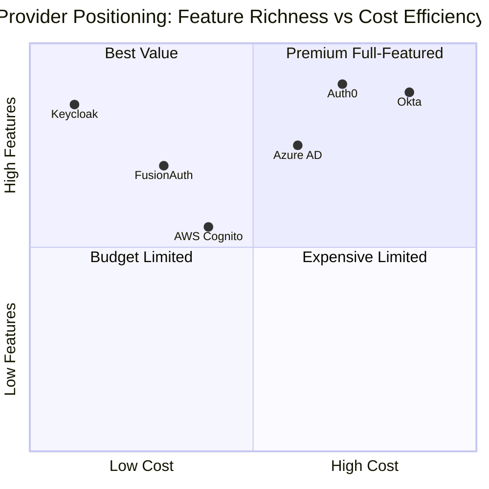

### 3.2 Weighted Scoring Matrix

| Criterion (Weight) | Keycloak | Auth0 | Okta | Azure AD | FusionAuth | Cognito |
|---------------------|----------|-------|------|----------|------------|---------|
| C1: Multi-tenant (15%) | 5 | 4 | 3 | 4 | 4 | 3 |
| C2: OAuth2/OIDC (10%) | 5 | 5 | 5 | 5 | 5 | 4 |
| C3: Social login (5%) | 4 | 5 | 5 | 4 | 4 | 5 |
| C4: MFA options (10%) | 4 | 5 | 5 | 5 | 4 | 3 |
| C5: Admin API (12%) | 5 | 5 | 5 | 4 | 5 | 3 |
| C6: Self-hosted (8%) | 5 | 1 | 1 | 1 | 5 | 1 |
| C7: Cost at scale (10%) | 5 | 2 | 1 | 3 | 4 | 4 |
| C8: SDK availability (8%) | 4 | 5 | 5 | 5 | 4 | 4 |
| C9: SAML 2.0 (5%) | 5 | 5 | 5 | 5 | 4 | 3 |
| C10: Compliance (7%) | 3 | 5 | 5 | 5 | 3 | 5 |
| C11: Identity brokering (5%) | 5 | 4 | 4 | 3 | 4 | 3 |
| C12: Token customization (5%) | 5 | 5 | 4 | 4 | 5 | 3 |
| **Weighted Total** | **4.62** | **4.03** | **3.68** | **3.82** | **4.17** | **3.30** |
| **Rank** | **1st** | **3rd** | **5th** | **4th** | **2nd** | **6th** |

### 3.3 Weighted Score Breakdown

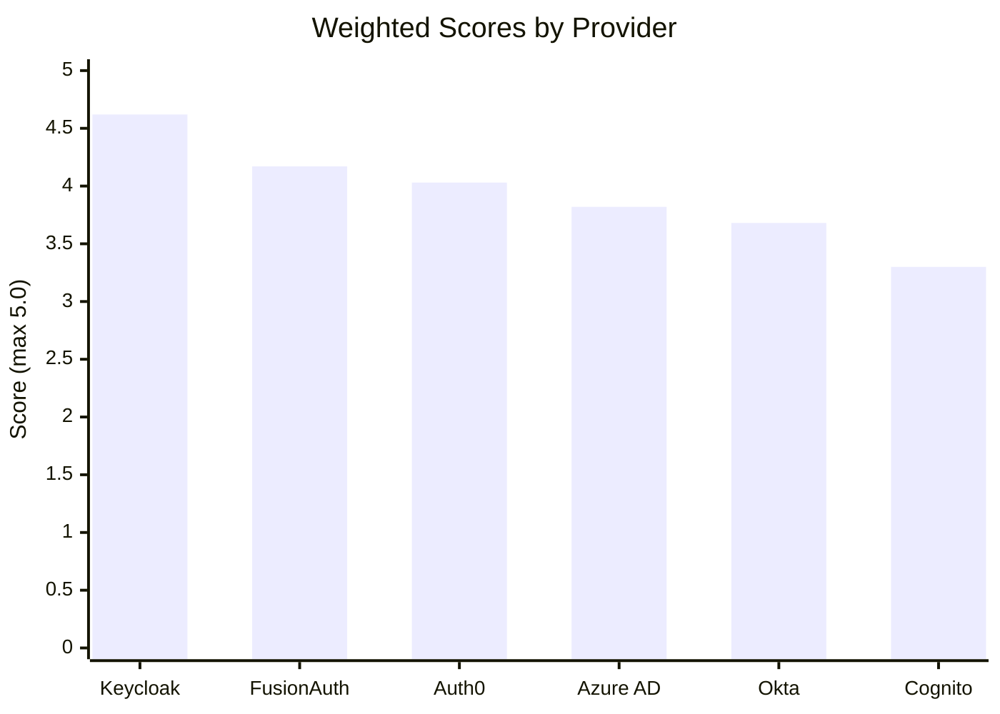

---

## 4. Detailed Provider Analysis

### 4.1 Keycloak 24.0 [IMPLEMENTED]

**Overview:** Open-source identity and access management solution by Red Hat / CNCF. Self-hosted, Java-based (Quarkus runtime since v17).

**Current EMSIST Implementation:**

| Component | Details | Source File |
|-----------|---------|-------------|
| Version | 24.0 Community | `docker-compose.yml`: `keycloak:24.0` |
| Database | PostgreSQL (`keycloak_db`) | `docker-compose.yml` |
| Multi-tenancy | Realm per tenant | `KeycloakIdentityProvider.java` line 74: `authenticate(String realm, ...)` |
| Auth flow | Password grant (Direct Access Grants) | `KeycloakIdentityProvider.java` line 78: `grant_type: password` |
| Token exchange | RFC 8693 (`urn:ietf:params:oauth:grant-type:token-exchange`) | `KeycloakIdentityProvider.java` line 152 |
| MFA | TOTP via `dev.samstevens.totp` library + user attributes | `KeycloakIdentityProvider.java` lines 196-279 |
| Admin API | Keycloak Admin Client (`org.keycloak:keycloak-admin-client`) | `KeycloakIdentityProvider.java` line 382: `getAdminClient()` |
| Events | Keycloak Event Store (`RealmResource.getEvents()`) | `KeycloakIdentityProvider.java` lines 294-322 |

**Strengths:**
- Full control over deployment and data residency
- Realm-per-tenant maps perfectly to EMSIST's multi-tenancy model
- Zero per-user licensing cost
- Extensive identity brokering (OIDC, SAML, social providers per realm)
- Token exchange (RFC 8693) natively supported
- Customizable themes, login flows, and authentication policies per realm
- Active CNCF community, frequent releases

**Weaknesses:**
- Operational overhead: requires infrastructure team to manage upgrades, backups, HA
- Community edition lacks some enterprise features (fine-grained authorization, org model)
- No built-in compliance certifications (SOC2/ISO 27001 depend on hosting infrastructure)
- MFA implementation in EMSIST uses custom TOTP library rather than Keycloak's native OTP, adding maintenance burden
- Neo4j Community in docker-compose (not Enterprise)

**EMSIST Interface Coverage:**

| Method | Keycloak Support | Implementation Status |
|--------|-----------------|----------------------|
| `authenticate()` | Native (Password Grant) | [IMPLEMENTED] |
| `refreshToken()` | Native (Token Endpoint) | [IMPLEMENTED] |
| `logout()` | Native (Logout Endpoint) | [IMPLEMENTED] |
| `exchangeToken()` | Native (RFC 8693) | [IMPLEMENTED] |
| `initiateLogin()` | Native (`kc_idp_hint`) | [IMPLEMENTED] |
| `setupMfa()` | Custom (via user attributes) | [IMPLEMENTED] |
| `verifyMfaCode()` | Custom (via `dev.samstevens.totp`) | [IMPLEMENTED] |
| `isMfaEnabled()` | Custom (via user attributes) | [IMPLEMENTED] |
| `getEvents()` | Native (Event Store API) | [IMPLEMENTED] |
| `getEventCount()` | Native (Event Store API) | [IMPLEMENTED] |

---

### 4.2 Auth0 [PLANNED]

**Overview:** Cloud-native identity platform, subsidiary of Okta Inc. Offers a developer-friendly API, extensive documentation, and managed infrastructure.

**Multi-Tenancy Model:** Auth0 "Organizations" feature provides tenant isolation within a single Auth0 tenant, or separate Auth0 tenants per EMSIST tenant for stronger isolation.

**Strengths:**
- Best-in-class developer experience (documentation, quickstarts, SDKs)
- Management API is comprehensive and well-documented
- Built-in MFA with TOTP, WebAuthn, SMS, Email, Push notification
- "Actions" (serverless hooks) for custom logic in auth flows
- Native social login with 30+ providers
- SOC2 Type II, ISO 27001, HIPAA BAA available
- Universal Login for customizable hosted login pages

**Weaknesses:**
- Cloud-only: no self-hosted option (disqualifies some government deployments)
- Per-user pricing becomes expensive at scale (see Section 9)
- Token exchange (RFC 8693) not natively supported; requires custom Action
- "Organization" feature only on B2B plans (higher tier)
- Rate limits on Management API (varies by plan)
- Data residency limited to US, EU, AU regions

**EMSIST Interface Mapping:**

| Method | Auth0 Equivalent | Complexity |
|--------|-----------------|------------|
| `authenticate()` | `POST /oauth/token` (Resource Owner Password Grant) | Low -- requires enabling ROPG grant |
| `refreshToken()` | `POST /oauth/token` (refresh_token grant) | Low |
| `logout()` | `GET /v2/logout` + revoke refresh token | Low |
| `exchangeToken()` | Custom Action or `/oauth/token` with federated token | Medium -- no native RFC 8693 |
| `initiateLogin()` | `GET /authorize` with `connection` hint | Low |
| `setupMfa()` | Management API: `POST /api/v2/guardian/enrollments` | Medium |
| `verifyMfaCode()` | `POST /oauth/token` with MFA challenge | Medium |
| `isMfaEnabled()` | Management API: `GET /api/v2/users/{id}/enrollments` | Low |
| `getEvents()` | Management API: `GET /api/v2/logs` | Low |
| `getEventCount()` | Management API: `GET /api/v2/logs` with pagination | Low |

**Realm-to-Organization Mapping:**

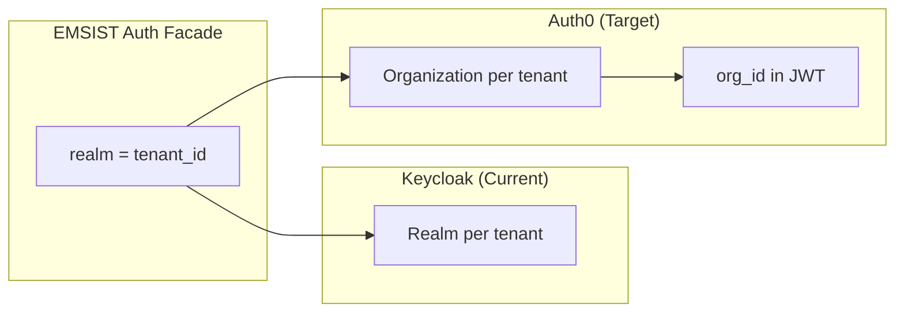

---

### 4.3 Okta [PLANNED]

**Overview:** Enterprise identity platform and market leader in IAM. Acquired Auth0 in 2021 but maintains separate products. Focused on workforce and customer identity.

**Multi-Tenancy Model:** Okta uses "Orgs" (separate Okta tenants) or custom Authorization Servers with tenant-specific policies. No native equivalent to Keycloak realms within a single deployment.

**Strengths:**
- Enterprise market leader with strongest brand recognition
- Extensive workforce identity features (HR integrations, lifecycle management)
- Advanced Adaptive MFA with risk-based authentication
- Comprehensive SAML 2.0 support with 7,000+ pre-built integrations
- SOC2 Type II, ISO 27001, FedRAMP (government compliance)
- Inline hooks and event hooks for extensibility

**Weaknesses:**
- Highest per-user cost of all providers evaluated
- Cloud-only: no self-hosted option
- Multi-tenancy requires separate Okta orgs (costly) or complex custom setup
- Token exchange support is limited
- API structure is complex compared to Auth0
- Less developer-friendly than Auth0 for custom CIAM use cases
- Rate limits on API endpoints are strict

**EMSIST Interface Mapping:**

| Method | Okta Equivalent | Complexity |
|--------|----------------|------------|
| `authenticate()` | `POST /oauth2/{authServer}/v1/token` (ROPG) | Medium -- ROPG is discouraged by Okta |
| `refreshToken()` | `POST /oauth2/{authServer}/v1/token` (refresh_token) | Low |
| `logout()` | `DELETE /api/v1/sessions/{id}` + revoke tokens | Medium |
| `exchangeToken()` | Custom inline hook or token exchange via Authorization Server | High |
| `initiateLogin()` | `GET /oauth2/{authServer}/v1/authorize` with `idp` hint | Low |
| `setupMfa()` | `POST /api/v1/users/{id}/factors` | Medium |
| `verifyMfaCode()` | `POST /api/v1/users/{id}/factors/{factorId}/verify` | Medium |
| `isMfaEnabled()` | `GET /api/v1/users/{id}/factors` | Low |
| `getEvents()` | System Log API: `GET /api/v1/logs` | Low |
| `getEventCount()` | System Log API with aggregation | Medium |

---

### 4.4 Azure AD / Entra ID [PLANNED]

**Overview:** Microsoft's cloud identity platform, part of Microsoft 365 and Azure ecosystem. Rebranded as "Microsoft Entra ID" in 2023. Strong in enterprises already using Microsoft stack.

**Multi-Tenancy Model:** Azure AD tenants are the natural isolation boundary. External Identities (B2C) provides a separate product for customer-facing scenarios with custom policies.

**Strengths:**
- Seamless integration with Microsoft 365, Azure, and Office ecosystem
- Conditional Access policies (device compliance, location, risk level)
- Built-in WebAuthn/FIDO2 passwordless support
- Microsoft Graph API is comprehensive and well-documented
- B2C custom policies allow complex auth flows (IEF -- Identity Experience Framework)
- SOC2, ISO 27001, FedRAMP High, HIPAA
- Native support for Azure Government (sovereign cloud)

**Weaknesses:**
- Cloud-only (Azure Government for on-prem-like requirements)
- B2C pricing model is complex (authentications/month vs active users)
- Token customization requires "claims mapping policies" or optional claims configuration
- No realm-per-tenant equivalent: B2C requires separate policy sets or tenants
- Identity brokering configuration is less flexible than Keycloak
- ROPG (password grant) is supported but Microsoft strongly discourages it
- Vendor lock-in to Microsoft ecosystem

**EMSIST Interface Mapping:**

| Method | Azure AD / B2C Equivalent | Complexity |
|--------|--------------------------|------------|
| `authenticate()` | `POST /oauth2/v2.0/token` (ROPC flow) | Medium -- ROPC discouraged |
| `refreshToken()` | `POST /oauth2/v2.0/token` (refresh_token) | Low |
| `logout()` | `GET /oauth2/v2.0/logout` + revoke | Low |
| `exchangeToken()` | On-Behalf-Of flow (`urn:ietf:params:oauth:grant-type:jwt-bearer`) | High -- different from RFC 8693 |
| `initiateLogin()` | `GET /oauth2/v2.0/authorize` with `domain_hint` | Low |
| `setupMfa()` | Graph API: `POST /users/{id}/authentication/methods` | High -- complex API |
| `verifyMfaCode()` | Not directly available via API; handled in auth flow | High |
| `isMfaEnabled()` | Graph API: `GET /users/{id}/authentication/methods` | Medium |
| `getEvents()` | Graph API: `GET /auditLogs/signIns` | Medium |
| `getEventCount()` | Graph API with `$count` OData parameter | Medium |

---

### 4.5 FusionAuth [PLANNED]

**Overview:** Developer-focused identity platform that can be self-hosted or cloud-managed. Built in Java, offers a comprehensive API-first approach. Community edition is free with all core features.

**Multi-Tenancy Model:** Native multi-tenancy with "Tenants" as first-class entities. Each tenant has isolated users, applications, and configuration -- very similar to Keycloak realms.

**Strengths:**
- Self-hostable with full feature set in Community edition
- Native multi-tenancy (tenant-per-EMSIST-tenant maps directly)
- API-first design with comprehensive REST API
- Built-in MFA (TOTP, Email, SMS)
- Webhook/event system for audit and notifications
- No per-user cost in self-hosted Community edition
- Single Docker image, simple deployment
- Token customization via Lambda functions (server-side JavaScript)
- Identity brokering (OIDC, SAML, Apple, Google, etc.)

**Weaknesses:**
- Smaller community and ecosystem compared to Keycloak or Auth0
- Fewer pre-built social login connectors than Auth0
- Enterprise features (advanced threat detection, SCIM) require paid plan
- No SOC2/ISO 27001 for self-hosted (cloud offering may have certifications)
- Token exchange (RFC 8693) not natively supported
- Less mature WebAuthn/FIDO2 support than Azure AD or Auth0
- Fewer third-party integrations and documentation resources

**EMSIST Interface Mapping:**

| Method | FusionAuth Equivalent | Complexity |
|--------|----------------------|------------|
| `authenticate()` | `POST /api/login` or `POST /oauth2/token` (ROPG) | Low |
| `refreshToken()` | `POST /oauth2/token` (refresh_token) | Low |
| `logout()` | `POST /api/logout` | Low |
| `exchangeToken()` | Identity Provider Login API (`POST /api/identity-provider/login`) | Medium |
| `initiateLogin()` | `GET /oauth2/authorize` with `idp_hint` | Low |
| `setupMfa()` | `POST /api/two-factor/send` + `POST /api/two-factor/enable` | Low |
| `verifyMfaCode()` | Included in `POST /api/login` with `twoFactorTrustId` | Low |
| `isMfaEnabled()` | `GET /api/user/{id}` -- check `twoFactor.methods` | Low |
| `getEvents()` | `GET /api/system/audit-log` + webhook events | Low |
| `getEventCount()` | `GET /api/system/audit-log` with pagination metadata | Low |

---

### 4.6 AWS Cognito

**Overview:** AWS-native identity service for web and mobile apps. Part of the AWS ecosystem with tight integration to API Gateway, Lambda, and other AWS services.

**Multi-Tenancy Model:** User Pools are the primary isolation unit. Each EMSIST tenant could map to a separate User Pool, or a single pool with custom attributes for tenant isolation (weaker).

**Strengths:**
- Tight AWS ecosystem integration (API Gateway, Lambda triggers)
- Built-in social login (Google, Facebook, Apple, Amazon, SAML, OIDC)
- Generous free tier (50,000 MAU free for basic features)
- Lambda triggers for custom auth logic at each flow step
- Hosted UI for login/signup (customizable)
- AWS compliance (SOC, ISO, HIPAA, FedRAMP)

**Weaknesses:**
- Multi-tenancy with separate User Pools creates management complexity (hard limit of 1,000 pools per account)
- Admin API is less comprehensive than Keycloak or Auth0
- Limited MFA options (SMS, TOTP only; no WebAuthn natively)
- Token customization requires Lambda triggers (pre-token-generation)
- No self-hosted option
- Vendor lock-in to AWS
- Event/audit logging requires integration with CloudTrail
- ROPG support exists but is limited
- No native token exchange (RFC 8693)
- Identity brokering limited to OIDC and SAML (no arbitrary IdP configuration per pool)

**EMSIST Interface Mapping:**

| Method | Cognito Equivalent | Complexity |
|--------|--------------------|------------|
| `authenticate()` | `AdminInitiateAuth` (ADMIN_USER_PASSWORD_AUTH) | Medium |
| `refreshToken()` | `AdminInitiateAuth` (REFRESH_TOKEN_AUTH) | Low |
| `logout()` | `AdminUserGlobalSignOut` or `RevokeToken` | Low |
| `exchangeToken()` | No native support; requires Lambda + custom flow | High |
| `initiateLogin()` | Hosted UI with identity_provider parameter | Medium |
| `setupMfa()` | `AssociateSoftwareToken` + `VerifySoftwareToken` | Medium |
| `verifyMfaCode()` | `AdminRespondToAuthChallenge` (SOFTWARE_TOKEN_MFA) | Medium |
| `isMfaEnabled()` | `AdminGetUser` -- check MFA preferences | Medium |
| `getEvents()` | CloudTrail + CloudWatch Logs (not built-in) | High |
| `getEventCount()` | CloudWatch Logs Insights query | High |

---

## 5. Multi-Tenant Support Comparison

Multi-tenancy is the single most critical requirement for EMSIST. The platform uses realm-per-tenant isolation where each tenant's users, roles, and configurations are fully separated.

### 5.1 Tenant Isolation Models

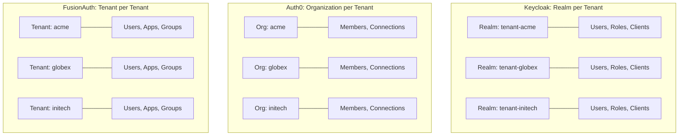

### 5.2 Multi-Tenant Feature Comparison

| Feature | Keycloak | Auth0 | Okta | Azure AD | FusionAuth | Cognito |
|---------|----------|-------|------|----------|------------|---------|
| Native multi-tenant unit | Realm | Organization | Org (separate) | Tenant / B2C | Tenant | User Pool |
| Isolation level | Full | Membership-based | Full (separate orgs) | Full | Full | Full |
| Max tenants per deployment | Unlimited (perf-bound) | 100 orgs (Enterprise) | Pay per org | Unlimited | Unlimited | 1,000 pools |
| Per-tenant IdP config | Yes (realm-level) | Yes (org connections) | Yes (per org) | Yes (B2C policies) | Yes (tenant-level) | Yes (per pool) |
| Per-tenant branding | Yes (themes per realm) | Yes (branding per org) | Yes (per org) | Yes (B2C custom UI) | Yes (per tenant) | Limited (hosted UI) |
| Per-tenant MFA policy | Yes | Yes (org-level) | Yes | Yes (CA policies) | Yes | Yes (per pool) |
| Tenant ID in JWT | Custom claim | `org_id` claim | Custom claim | `tid` claim | Custom claim | Custom via Lambda |
| Tenant provisioning API | Admin REST API | Management API | Admin API | Graph API | API | Cognito API |
| Cross-tenant user sharing | No (by design) | Yes (invitation) | No | Yes (B2B collab) | No (by design) | No |

### 5.3 EMSIST Tenant Mapping

The current `IdentityProvider` interface uses `String realm` as the first parameter in every method. This maps to each provider as follows:

| Interface `realm` param | Provider Mapping | Configuration |
|------------------------|-----------------|---------------|
| Keycloak | Keycloak Realm name | Direct mapping |
| Auth0 | Auth0 Organization ID | Lookup via `org_name` |
| Okta | Okta Org URL or Authorization Server | Requires tenant-to-org mapping |
| Azure AD | Azure AD Tenant ID or B2C policy | Requires tenant-to-directory mapping |
| FusionAuth | FusionAuth Tenant ID | Direct mapping |
| Cognito | User Pool ID | Requires tenant-to-pool mapping |

---

## 6. MFA Capabilities

### 6.1 MFA Method Comparison

| MFA Method | Keycloak | Auth0 | Okta | Azure AD | FusionAuth | Cognito |
|------------|----------|-------|------|----------|------------|---------|
| TOTP (Authenticator app) | Yes | Yes | Yes | Yes | Yes | Yes |
| WebAuthn / FIDO2 | Yes (v15+) | Yes | Yes | Yes (native) | Partial | No |
| SMS OTP | Plugin | Yes | Yes | Yes | Yes (Twilio) | Yes |
| Email OTP | Plugin | Yes | Yes | Yes | Yes | No |
| Push notification | No | Yes (Guardian) | Yes (Verify) | Yes (Authenticator) | No | No |
| Hardware tokens | FIDO2 | FIDO2 | Yes (Yubikey) | FIDO2 | FIDO2 | No |
| Risk-based / Adaptive | No | Yes | Yes | Yes (CA) | No | No |
| Recovery codes | Custom | Yes | Yes | Yes | Yes | No |
| Per-user MFA policy | Yes | Yes | Yes | Yes (CA) | Yes | Yes |
| Per-tenant MFA policy | Yes (realm) | Yes (org) | Yes (policy) | Yes (CA) | Yes (tenant) | Yes (pool) |

### 6.2 EMSIST MFA Implementation Notes

The current Keycloak implementation uses a custom TOTP approach rather than Keycloak's native OTP mechanism:

```java
// Current approach in KeycloakIdentityProvider.java (lines 196-227):
// - Generates TOTP secret via dev.samstevens.totp library
// - Stores secret as Keycloak user attribute (totp_secret_pending / totp_secret)
// - Verifies code using DefaultCodeVerifier
// - Tracks MFA status via user attribute (mfa_enabled)
```

This custom approach means switching providers is simpler -- the TOTP logic is provider-independent. However, it prevents using provider-native MFA features (WebAuthn, Push, Adaptive MFA).

### 6.3 MFA Architecture Decision

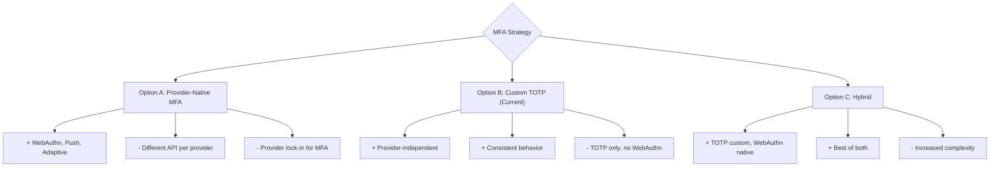

**Recommendation:** Maintain the current custom TOTP approach for consistency across providers. Consider adding provider-native WebAuthn support as an optional enhancement when the provider supports it.

---

## 7. Social Login / Federation

### 7.1 Social Provider Support

| Social Provider | Keycloak | Auth0 | Okta | Azure AD | FusionAuth | Cognito |
|-----------------|----------|-------|------|----------|------------|---------|
| Google | Yes | Yes | Yes | Yes | Yes | Yes |
| Microsoft | Yes | Yes | Yes | Native | Yes | No |
| Apple | Plugin | Yes | Yes | No | Yes | Yes |
| Facebook | Yes | Yes | Yes | No | Yes | Yes |
| GitHub | Yes | Yes | Yes | No | Yes | No |
| LinkedIn | Yes | Yes | Yes | No | Yes | No |
| Twitter/X | Yes | Yes | Yes | No | Yes | No |
| SAML 2.0 (generic) | Yes | Yes | Yes | Yes | Yes | Yes |
| OIDC (generic) | Yes | Yes | Yes | Yes | Yes | Yes |
| UAE Pass | Custom | Custom | Custom | Custom | Custom | Custom |
| Total pre-built | 15+ | 30+ | 7,000+ | 5 | 15+ | 7 |

### 7.2 Federation Architecture (Per-Tenant)

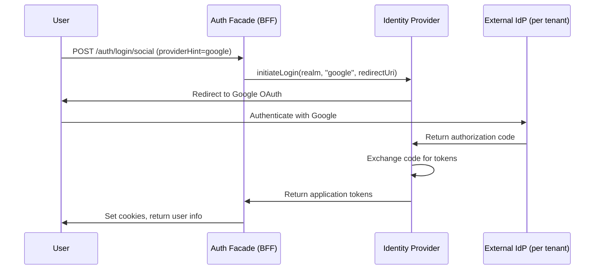

### 7.3 Per-Tenant IdP Configuration

A critical EMSIST requirement is that each tenant can configure its own set of external identity providers (e.g., Tenant A uses Google + SAML, Tenant B uses Azure AD + UAE Pass).

| Capability | Keycloak | Auth0 | Okta | Azure AD | FusionAuth | Cognito |
|------------|----------|-------|------|----------|------------|---------|
| Per-tenant IdP list | Yes (realm) | Yes (org connections) | Yes (per org) | Partial (B2C) | Yes (tenant) | Yes (per pool) |
| Dynamic IdP creation via API | Yes | Yes | Yes | Complex | Yes | Limited |
| IdP-initiated SSO | Yes | Yes | Yes | Yes | Yes | No |
| Just-in-time provisioning | Yes | Yes | Yes | Yes | Yes | Lambda trigger |
| Attribute mapping per IdP | Yes | Yes (Actions) | Yes | Yes (B2C claims) | Yes (Lambdas) | Lambda trigger |

---

## 8. API & SDK Comparison

### 8.1 Admin API Coverage

| API Capability | Keycloak | Auth0 | Okta | Azure AD | FusionAuth | Cognito |
|----------------|----------|-------|------|----------|------------|---------|
| User CRUD | Yes | Yes | Yes | Yes | Yes | Yes |
| Role/Group management | Yes | Yes | Yes | Yes | Yes | Yes (Groups) |
| Client/App management | Yes | Yes | Yes | Yes | Yes | Yes |
| IdP configuration | Yes | Yes | Yes | Yes | Yes | Yes |
| MFA enrollment | Partial | Yes | Yes | Yes | Yes | Yes |
| Event/Audit logs | Yes | Yes | Yes | Yes | Yes | CloudTrail |
| Realm/Tenant CRUD | Yes | Yes (orgs) | No (manual) | Yes | Yes | Yes |
| Custom attributes | Yes | Yes | Yes | Yes | Yes | Yes |
| Password policies | Yes | Yes | Yes | Yes | Yes | Yes |
| Session management | Yes | Yes | Yes | Yes | Yes | Yes |
| Token customization | Yes (mappers) | Yes (Actions) | Yes (hooks) | Yes (claims) | Yes (Lambdas) | Yes (Lambda) |
| Rate limits | None (self-hosted) | Varies by plan | Strict | Varies | None (self) | Varies |
| API documentation quality | Good | Excellent | Good | Good | Good | Fair |

### 8.2 SDK Availability

| SDK / Library | Keycloak | Auth0 | Okta | Azure AD | FusionAuth | Cognito |
|---------------|----------|-------|------|----------|------------|---------|
| **Java SDK** | `keycloak-admin-client` | `auth0` (Java) | `okta-sdk-java` | `msal4j` | `fusionauth-java-client` | AWS SDK |
| **Spring Boot Starter** | `keycloak-spring-boot-adapter` (deprecated) | `auth0-spring-security-api` | `okta-spring-boot-starter` | `azure-spring-boot-starter` | Community | `spring-cloud-aws` |
| **TypeScript/JS SDK** | `keycloak-js` | `@auth0/auth0-spa-js` | `@okta/okta-auth-js` | `@azure/msal-browser` | `@fusionauth/typescript-client` | `amazon-cognito-identity-js` |
| **Angular SDK** | `keycloak-angular` | `@auth0/auth0-angular` | `@okta/okta-angular` | `@azure/msal-angular` | Community | Community |
| **REST API client** | RestTemplate/WebClient | RestTemplate/WebClient | RestTemplate/WebClient | Graph SDK | RestTemplate/WebClient | AWS SDK |
| **OpenAPI spec** | Yes | Yes | Yes | Yes (Graph) | Yes | No |

### 8.3 EMSIST Integration Approach

The EMSIST auth-facade uses `RestTemplate` for Keycloak token endpoint calls and `keycloak-admin-client` for administrative operations. The same pattern applies to other providers:

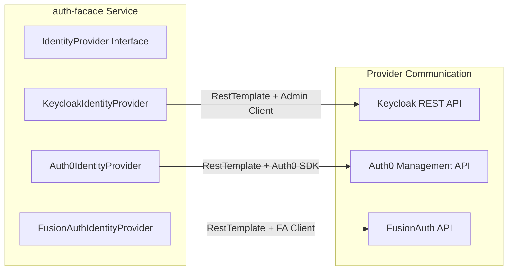

**Implementation Pattern:** Each `IdentityProvider` implementation should use `RestTemplate` for OAuth2 token endpoints (consistent with current Keycloak approach) and the provider's native SDK for administrative operations (user management, MFA enrollment, events).

---

## 9. Pricing Analysis

### 9.1 Cost Comparison at Scale

All prices are approximate as of March 2026 and based on publicly available pricing pages. Actual costs may vary by negotiation, plan tier, and usage patterns.

| Users (MAU) | Keycloak | Auth0 | Okta | Azure AD B2C | FusionAuth | Cognito |
|-------------|----------|-------|------|--------------|------------|---------|
| 1,000 | $0 (infra only) | $0 (free tier) | ~$1,500/mo | ~$28/mo | $0 (self-hosted) | $0 (free tier) |
| 10,000 | $0 (infra only) | ~$1,150/mo | ~$7,500/mo | ~$280/mo | $0 (self-hosted) | $0 (free tier) |
| 50,000 | $0 (infra only) | ~$4,600/mo | ~$25,000/mo | ~$1,400/mo | $0 (self-hosted) | ~$1,830/mo |
| 100,000 | $0 (infra only) | Custom pricing | Custom pricing | ~$2,800/mo | $125/mo (hosting) | ~$5,330/mo |

**Notes:**
- Keycloak: $0 license; infrastructure costs (compute, database, networking) estimated at $200-500/mo for a production HA setup
- Auth0: Free tier covers 7,500 MAU with limited features; B2B Organizations require Essential or Professional plan
- Okta: Customer Identity pricing; Workforce identity priced differently
- Azure AD B2C: Priced per authentication ($0.00325/auth after 50K free/mo)
- FusionAuth: Community edition is free; Cloud hosting starts at $125/mo
- Cognito: First 50K MAU free; $0.0055/MAU after that

### 9.2 Total Cost of Ownership (5-Year)

| Cost Factor | Keycloak | Auth0 | FusionAuth |
|-------------|----------|-------|------------|
| License (5yr @ 50K users) | $0 | ~$276,000 | $0 |
| Infrastructure (5yr) | ~$30,000 | $0 (included) | ~$30,000 |
| Operations staff (partial FTE) | ~$50,000 | ~$10,000 | ~$40,000 |
| Implementation effort | Already done | ~$20,000 | ~$15,000 |
| **5-Year TCO** | **~$80,000** | **~$306,000** | **~$85,000** |

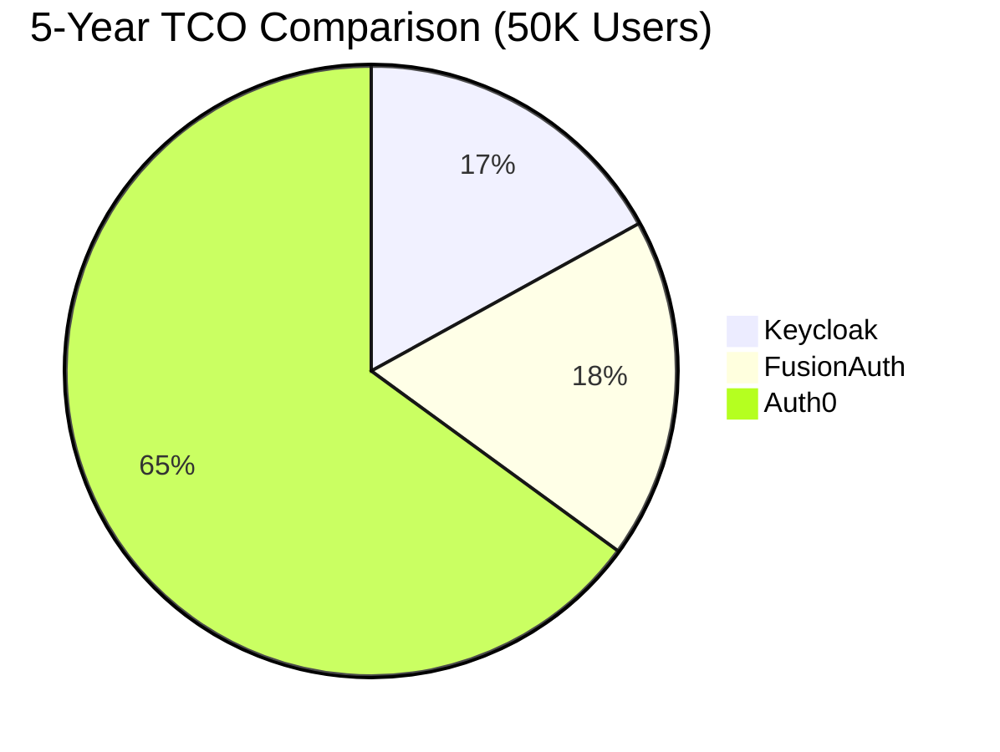

### 9.3 Cost Risk Factors

| Risk | Affected Providers | Mitigation |
|------|-------------------|------------|
| Price increases | Auth0, Okta, Azure, Cognito | Negotiate multi-year contracts |
| User count spikes | Auth0, Okta, Cognito | Monitor MAU, implement usage alerts |
| Feature tier upgrades | Auth0 (Organizations), Okta | Validate required features are in current plan |
| Infrastructure scaling | Keycloak, FusionAuth | Auto-scaling, capacity planning |

---

## 10. EMSIST Fit Assessment

### 10.1 Interface Compatibility Score

How easily can each provider implement the full `IdentityProvider` interface?

| Method | Keycloak | Auth0 | Okta | Azure AD | FusionAuth | Cognito |
|--------|----------|-------|------|----------|------------|---------|
| `authenticate()` | 5 | 4 | 3 | 3 | 5 | 3 |
| `refreshToken()` | 5 | 5 | 5 | 5 | 5 | 4 |
| `logout()` | 5 | 5 | 4 | 4 | 5 | 4 |
| `exchangeToken()` | 5 | 3 | 2 | 2 | 3 | 1 |
| `initiateLogin()` | 5 | 5 | 4 | 4 | 5 | 3 |
| `setupMfa()` | 4 | 5 | 4 | 3 | 5 | 3 |
| `verifyMfaCode()` | 4 | 4 | 4 | 2 | 5 | 3 |
| `isMfaEnabled()` | 4 | 5 | 4 | 3 | 5 | 3 |
| `getEvents()` | 5 | 5 | 5 | 4 | 4 | 2 |
| `getEventCount()` | 4 | 4 | 4 | 3 | 4 | 2 |
| **Average** | **4.6** | **4.5** | **3.9** | **3.3** | **4.6** | **2.8** |

### 10.2 Deployment Scenario Fit

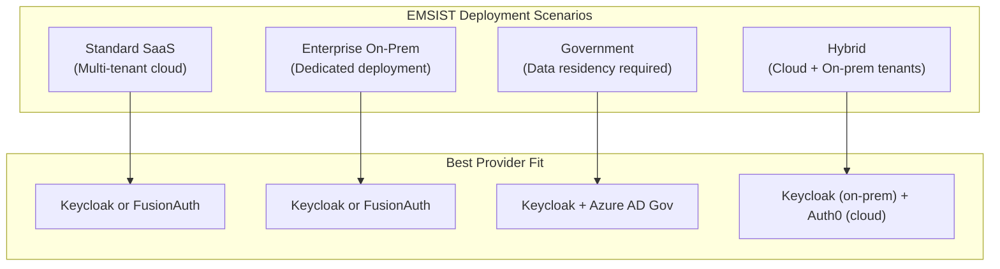

### 10.3 Implementation Effort Estimate

| Provider | Estimated Dev Effort | Complexity | Testcontainers Support |
|----------|---------------------|------------|----------------------|
| Keycloak | 0 days (done) | N/A | Yes (`dasniko/testcontainers-keycloak`) |
| Auth0 | 10-15 days | Medium | No (mock or Wiremock) |
| FusionAuth | 8-12 days | Medium-Low | Yes (`fusionauth/fusionauth-containers`) |
| Okta | 12-18 days | Medium-High | No (mock or Wiremock) |
| Azure AD | 15-20 days | High | No (mock or Wiremock) |
| Cognito | 12-18 days | High | Yes (`localstack/localstack`) |

### 10.4 Provider Selection Decision Tree

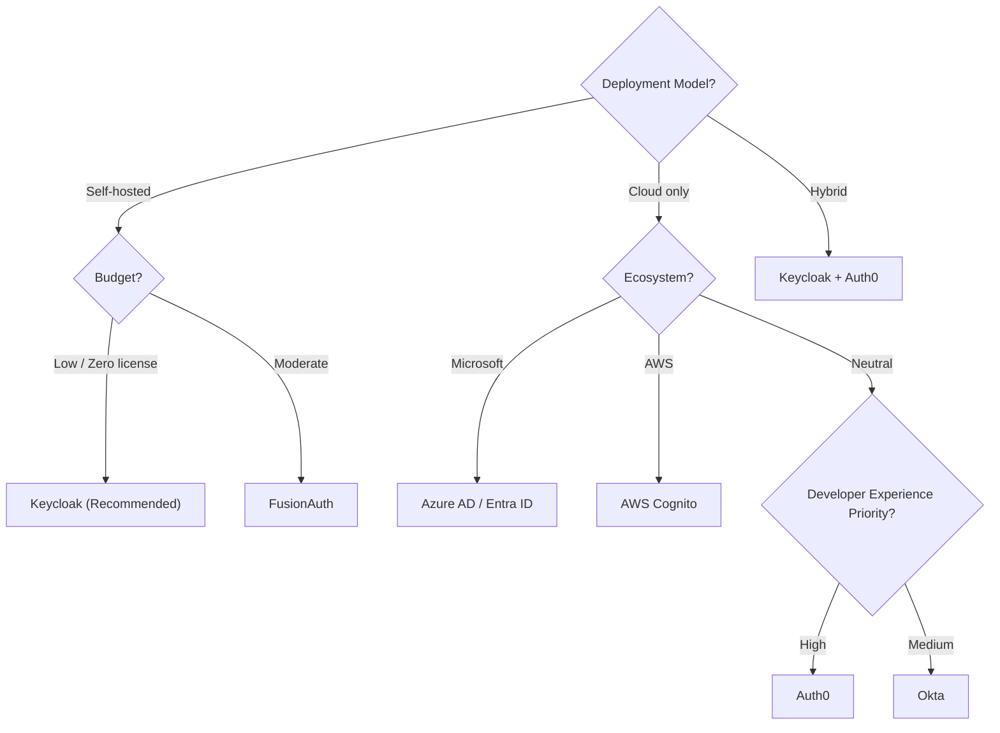

---

## 11. Recommendation

### 11.1 Provider Implementation Priority

Based on the weighted scoring, interface compatibility, cost analysis, and deployment scenario fit, the recommended implementation order for ADR-007 is:

| Priority | Provider | Rationale | Timeline |
|----------|----------|-----------|----------|
| 1 (Current) | **Keycloak** [IMPLEMENTED] | Default provider, best overall score, zero cost | Done |
| 2 (Next) | **FusionAuth** | Self-hostable alternative, native multi-tenancy, API-first, low implementation effort | Sprint N+1 |
| 3 | **Auth0** | Best cloud-native option, enterprise customers with Auth0 investments, excellent DX | Sprint N+2 |
| 4 | **Azure AD** | Microsoft enterprise customers, government deployments (Azure Gov) | Sprint N+3 |
| 5 (Deferred) | **Okta** | High cost, complex multi-tenancy, overlaps with Auth0 (same company) | Backlog |
| 6 (Deferred) | **AWS Cognito** | Lowest score, poorest interface fit, only for AWS-locked customers | Backlog |

### 11.2 Implementation Strategy

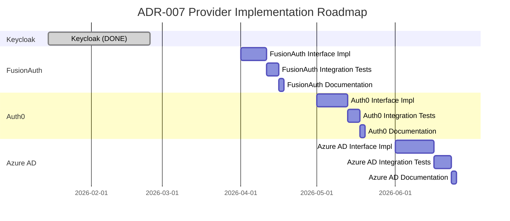

### 11.3 Architecture Recommendations

1. **Maintain the current `IdentityProvider` interface** -- it maps well to all evaluated providers. No interface changes needed.

2. **Keep custom TOTP for MFA** -- the `dev.samstevens.totp` approach in `KeycloakIdentityProvider.java` is provider-agnostic. Replicate this pattern for other providers rather than using provider-native MFA APIs (unless WebAuthn is required).

3. **Standardize on RestTemplate for token endpoints** -- all providers use standard OAuth2 token endpoints. Use provider SDKs only for admin operations.

4. **Create a tenant-to-provider mapping service** -- to support different providers per tenant:
   ```
   tenant-acme    -> keycloak (realm: acme)
   tenant-globex  -> auth0 (org: org_xyz)
   tenant-initech -> fusionauth (tenant: abc-123)
   ```

5. **Invest in Testcontainers** -- Keycloak and FusionAuth both have Testcontainers support. Use Wiremock for cloud-only providers (Auth0, Okta, Azure AD).

6. **Do not implement Okta and AWS Cognito** unless a specific customer requires them. Auth0 and Azure AD cover the enterprise and cloud scenarios respectively.

### 11.4 Risk Summary

| Risk | Probability | Impact | Mitigation |
|------|------------|--------|------------|
| Provider API breaking changes | Medium | High | Pin SDK versions, integration tests |
| ROPG deprecation by providers | High | High | Plan migration to Authorization Code + PKCE flow |
| Auth0 pricing increase | Medium | Medium | Negotiate contract, have FusionAuth as fallback |
| Government requiring specific provider | Low | High | Azure AD Gov or Keycloak covers this |
| Token exchange incompatibility | Medium | Medium | Custom implementation per provider |

### 11.5 Open Questions for Architecture Review Board

1. Should EMSIST support per-tenant provider selection (tenant A uses Keycloak, tenant B uses Auth0), or a single provider per deployment?
2. Should the platform migrate from ROPG (password grant) to Authorization Code + PKCE flow for all providers? Several providers are deprecating ROPG.
3. Should WebAuthn/FIDO2 be added to the `IdentityProvider` interface, or remain TOTP-only for cross-provider consistency?
4. What is the maximum number of identity provider implementations the team is willing to maintain long-term?

---

## Appendix A: Claim Mapping Reference

Reproduced from ADR-007 for completeness.

| Claim | Keycloak | Auth0 | Okta | Azure AD | FusionAuth | Cognito |
|-------|----------|-------|------|----------|------------|---------|
| User ID | `sub` | `sub` | `sub` | `oid` | `sub` | `sub` |
| Email | `email` | `email` | `email` | `preferred_username` | `email` | `email` |
| First Name | `given_name` | `given_name` | `given_name` | `given_name` | `given_name` | `given_name` |
| Last Name | `family_name` | `family_name` | `family_name` | `family_name` | `family_name` | `family_name` |
| Roles | `realm_access.roles` | `permissions` | `groups` | `roles` | `roles` | `cognito:groups` |
| Tenant ID | `tenant_id` (custom) | `org_id` | `tenant` (custom) | `tid` | `tenantId` (custom) | Custom attribute |
| Issuer | `iss` (realm URL) | `iss` (tenant URL) | `iss` (auth server) | `iss` (tenant URL) | `iss` (tenant URL) | `iss` (pool URL) |

## Appendix B: Configuration Templates

### B.1 Auth0 Configuration (Planned)

```yaml
# application-auth0.yml [PLANNED - No implementation exists]
auth:
  facade:
    provider: auth0

auth0:
  domain: ${AUTH0_DOMAIN}          # e.g., emsist.us.auth0.com
  client-id: ${AUTH0_CLIENT_ID}
  client-secret: ${AUTH0_CLIENT_SECRET}
  management-api:
    audience: ${AUTH0_MGMT_AUDIENCE} # https://emsist.us.auth0.com/api/v2/
  role-claim-paths:
    - permissions
    - https://emsist.com/roles
  user-claim-mappings:
    tenant-id: org_id
```

### B.2 FusionAuth Configuration (Planned)

```yaml
# application-fusionauth.yml [PLANNED - No implementation exists]
auth:
  facade:
    provider: fusionauth

fusionauth:
  base-url: ${FUSIONAUTH_URL}      # e.g., http://localhost:9011
  api-key: ${FUSIONAUTH_API_KEY}
  application-id: ${FUSIONAUTH_APP_ID}
  role-claim-paths:
    - roles
  user-claim-mappings:
    tenant-id: tenantId
```

## Appendix C: Glossary

| Term | Definition |
|------|-----------|
| BFF | Backend-for-Frontend -- the auth-facade acts as a BFF, hiding the IdP from the browser |
| CIAM | Customer Identity and Access Management -- identity for external users (vs workforce) |
| IdP | Identity Provider -- the system that authenticates users and issues tokens |
| MAU | Monthly Active Users -- pricing metric used by most SaaS identity providers |
| ROPG | Resource Owner Password Credentials Grant -- OAuth2 flow where the app collects credentials directly |
| RFC 8693 | OAuth 2.0 Token Exchange -- standard for exchanging one token for another |
| WebAuthn | Web Authentication API -- W3C standard for passwordless authentication using biometrics or security keys |
| FIDO2 | Fast Identity Online 2 -- umbrella term for WebAuthn + CTAP protocols |

---

**Document Control:**

| Version | Date | Author | Changes |
|---------|------|--------|---------|
| 1.0.0 | 2026-03-12 | ARCH Agent | Initial benchmark study |
