# Detailed User Journeys -- Authentication & Authorization

**Feature:** R01 -- Authentication and Authorization
**Document:** 09 -- Detailed User Journeys
**Version:** 1.0.0
**Date:** 2026-03-12
**Status:** Draft
**Services:** auth-facade (:8081), api-gateway (:8080)
**Frontend:** Angular 21 -- `frontend/src/app/features/auth/`
**Infrastructure:** Keycloak 24.0, Valkey 8, Neo4j 5.12 Community

---

## Table of Contents

1. [Overview](#1-overview)
2. [Persona Summary](#2-persona-summary)
3. [Journey Maps](#3-journey-maps)
   - 3.1 [Journey 1: Standard Login](#31-journey-1-standard-login-implemented)
   - 3.2 [Journey 2: MFA Setup](#32-journey-2-mfa-setup-implemented---backend)
   - 3.3 [Journey 3: Login with MFA](#33-journey-3-login-with-mfa-implemented---backend)
   - 3.4 [Journey 4: Social Login (Google)](#34-journey-4-social-login-google-implemented---backend-api)
   - 3.5 [Journey 5: Token Refresh (Silent)](#35-journey-5-token-refresh-silent-implemented)
   - 3.6 [Journey 6: Logout](#36-journey-6-logout-implemented)
   - 3.7 [Journey 7: Redirect-Based OAuth2 Login](#37-journey-7-redirect-based-oauth2-login-implemented)
   - 3.8 [Journey 8: Admin IdP Management](#38-journey-8-admin-idp-management-in-progress)
4. [Service Blueprints](#4-service-blueprints)
5. [Edge Cases & Error Flows](#5-edge-cases--error-flows)
6. [Cross-Journey Dependencies](#6-cross-journey-dependencies)

---

## 1. Overview

This document maps every user-facing authentication and authorization journey in EMSIST. Each journey is traced from the user's first interaction through the frontend, API gateway, auth-facade backend, identity provider (Keycloak), and supporting infrastructure (Valkey, Neo4j, license-service).

All journeys are documented against verified source code. Status tags follow governance rules:

| Tag | Meaning |
|-----|---------|
| `[IMPLEMENTED]` | Code verified in source with file path |
| `[IN-PROGRESS]` | Backend API exists, frontend UI partially or fully missing |
| `[PLANNED]` | Design only, no code exists |

**Evidence sources consulted:**

| Component | File Path |
|-----------|-----------|
| AuthController | `backend/auth-facade/src/main/java/com/ems/auth/controller/AuthController.java` |
| AuthServiceImpl | `backend/auth-facade/src/main/java/com/ems/auth/service/AuthServiceImpl.java` |
| KeycloakIdentityProvider | `backend/auth-facade/src/main/java/com/ems/auth/provider/KeycloakIdentityProvider.java` |
| TokenServiceImpl | `backend/auth-facade/src/main/java/com/ems/auth/service/TokenServiceImpl.java` |
| SeatValidationService | `backend/auth-facade/src/main/java/com/ems/auth/service/SeatValidationService.java` |
| RateLimitFilter | `backend/auth-facade/src/main/java/com/ems/auth/filter/RateLimitFilter.java` |
| AdminProviderController | `backend/auth-facade/src/main/java/com/ems/auth/controller/AdminProviderController.java` |
| LoginPageComponent | `frontend/src/app/features/auth/login.page.ts` |
| Login template | `frontend/src/app/features/auth/login.page.html` |
| GatewayAuthFacadeService | `frontend/src/app/core/auth/gateway-auth-facade.service.ts` |
| SessionService | `frontend/src/app/core/services/session.service.ts` |
| AuthInterceptor | `frontend/src/app/core/interceptors/auth.interceptor.ts` |
| AuthGuard | `frontend/src/app/core/auth/auth.guard.ts` |
| TenantContextService | `frontend/src/app/core/services/tenant-context.service.ts` |

---

## 2. Persona Summary

| Persona | Description | Primary Journeys |
|---------|-------------|------------------|
| **End User** | Regular tenant user authenticating to access EMSIST features | J1 (Login), J3 (MFA Login), J4 (Social Login), J5 (Token Refresh), J6 (Logout) |
| **Security-Conscious End User** | User enabling additional security measures | J2 (MFA Setup) |
| **External IdP User** | User authenticating via enterprise SSO (SAML, Okta, Azure AD) | J7 (Redirect OAuth2 Login) |
| **Tenant Admin** | Administrator managing identity provider configuration | J8 (Admin IdP Management) |

### Persona Detail

**End User**
- Accesses EMSIST via browser
- Has credentials in Keycloak realm corresponding to their tenant
- May or may not have MFA enabled
- Subject to seat validation via license-service (non-master tenants)

**Tenant Admin**
- Holds `ADMIN` or `SUPER_ADMIN` role in Keycloak
- Can configure identity providers for their tenant via Admin API
- Subject to tenant isolation checks (`TenantAccessValidator`)

---

## 3. Journey Maps

### 3.1 Journey 1: Standard Login [IMPLEMENTED]

**Persona:** End User
**Trigger:** User navigates to EMSIST application and is not authenticated
**Preconditions:** User has a Keycloak account in the tenant's realm; tenant has active license with available seats
**Postconditions:** User has valid access + refresh tokens stored in browser; redirected to dashboard

#### Step-by-Step Flow

| Step | Actor | Action | Implementation Evidence |
|------|-------|--------|------------------------|
| 1 | User | Navigates to a protected route | `authGuard` in `auth.guard.ts` checks `session.isAuthenticated()` |
| 2 | AuthGuard | Detects no valid session, redirects to `/auth/login?returnUrl=...` | `auth.guard.ts:13` -- `router.createUrlTree(['/auth/login'], { queryParams: { returnUrl: state.url } })` |
| 3 | User | Sees login page with "Sign in with Email" button | `login.page.html:31` -- `signin-btn` button |
| 4 | User | Clicks "Sign in with Email" | `login.page.ts:63` -- `openEmailSignIn()` sets `showLoginForm` signal to true |
| 5 | User | Enters email/username, password, and tenant ID | `login.page.html:54-154` -- three `neo-input` fields with `ngModel` bindings |
| 6 | User | Clicks "Sign In" | `login.page.ts:83` -- `onSubmit()` called |
| 7 | Frontend | Validates required fields and tenant ID format (UUID or alias) | `login.page.ts:87-100` -- checks `identifier`, `password`, `tenantId` non-empty; calls `tenantContext.setTenantFromInput()` |
| 8 | TenantContextService | Resolves tenant ID: validates UUID format or maps alias via `environment.tenantAliasMap` | `tenant-context.service.ts:60-80` -- `normalizeTenantId()` with UUID regex |
| 9 | Frontend | Calls `auth.login(credentials)` | `login.page.ts:105-118` -- `GatewayAuthFacadeService.login()` |
| 10 | GatewayAuthFacadeService | Calls `api.login()` which sends `POST /api/v1/auth/login` with `X-Tenant-ID` header | `gateway-auth-facade.service.ts:36-42` |
| 11 | API Gateway | Routes request to auth-facade | Gateway route configuration |
| 12 | RateLimitFilter | Checks rate limit in Valkey (`auth:rate:{tenantId}:{ip}`) | `RateLimitFilter.java:50-87` -- 100 requests/minute default |
| 13 | TenantContextFilter | Extracts `X-Tenant-ID` header and sets tenant context | `TenantContextFilter.java` |
| 14 | AuthController | Receives `POST /api/v1/auth/login`, delegates to `authService.login()` | `AuthController.java:53-60` |
| 15 | AuthServiceImpl | Resolves realm via `RealmResolver.resolve(tenantId)` | `AuthServiceImpl.java:48` |
| 16 | AuthServiceImpl | Delegates to `identityProvider.authenticate(realm, identifier, password)` | `AuthServiceImpl.java:49` |
| 17 | KeycloakIdentityProvider | Sends `grant_type=password` token request to Keycloak | `KeycloakIdentityProvider.java:77-88` -- Direct Access Grant |
| 18 | Keycloak | Validates credentials against tenant realm, returns access + refresh tokens | External IdP |
| 19 | KeycloakIdentityProvider | Parses token response, extracts `UserInfo` via `PrincipalExtractor` | `KeycloakIdentityProvider.java:399-415` |
| 20 | AuthServiceImpl | Validates user has active license seat (non-master tenants) | `AuthServiceImpl.java:52-54` -- `seatValidationService.validateUserSeat()` |
| 21 | SeatValidationService | Calls license-service via Feign client with circuit breaker | `SeatValidationService.java:33-55` -- `@CircuitBreaker(name = "licenseService")` |
| 22 | AuthServiceImpl | Checks if MFA is enabled for user (if not, continues to step 24) | `AuthServiceImpl.java:57` -- `identityProvider.isMfaEnabled()` |
| 23 | AuthServiceImpl | Fetches tenant features from license-service | `AuthServiceImpl.java:68` -- `fetchTenantFeatures()` via `LicenseServiceClient` |
| 24 | AuthServiceImpl | Returns `AuthResponse` with `accessToken`, `refreshToken`, `expiresIn`, `UserInfo`, `features` | `AuthServiceImpl.java:68` |
| 25 | Frontend | Receives response, stores tokens via `SessionService.setTokens()` | `gateway-auth-facade.service.ts:43-50` |
| 26 | SessionService | Writes tokens to `sessionStorage` (default) or `localStorage` (if rememberMe) | `session.service.ts:17-21,62-76` -- key `tp_access_token` / `tp_refresh_token` |
| 27 | Frontend | Redirects to `returnUrl` or `/administration` | `login.page.ts:121-129` -- `router.navigateByUrl(returnUrl)` |

#### Sequence Diagram

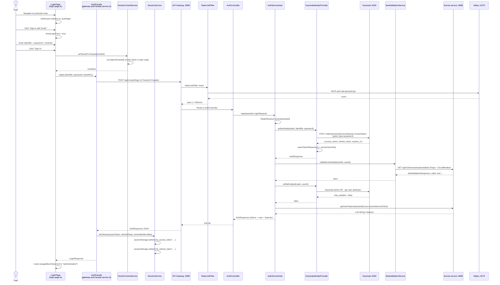

---

### 3.2 Journey 2: MFA Setup [IMPLEMENTED - Backend]

**Persona:** Security-conscious End User
**Trigger:** User wants to enable two-factor authentication
**Preconditions:** User is authenticated with a valid JWT; MFA is not yet enabled for this user
**Postconditions:** TOTP secret stored in Keycloak user attributes; MFA enabled flag set to `true`
**Frontend Status:** [PLANNED] -- No MFA setup UI exists in the Angular frontend. Backend API is fully implemented.

#### Step-by-Step Flow

| Step | Actor | Action | Implementation Evidence |
|------|-------|--------|------------------------|
| 1 | User | Navigates to security settings | [PLANNED] -- No frontend route or component exists for MFA settings |
| 2 | User | Clicks "Enable MFA" / "Setup Two-Factor" | [PLANNED] -- No UI button exists |
| 3 | Frontend | Calls `POST /api/v1/auth/mfa/setup` with bearer token | API endpoint exists: `AuthController.java:216-238` |
| 4 | AuthController | Extracts current user from `JwtValidationFilter.getCurrentUser()` | `AuthController.java:231-234` |
| 5 | AuthServiceImpl | Delegates to `identityProvider.setupMfa(realm, userId)` | `AuthServiceImpl.java:157-162` |
| 6 | KeycloakIdentityProvider | Generates TOTP secret via `DefaultSecretGenerator` | `KeycloakIdentityProvider.java:199` |
| 7 | KeycloakIdentityProvider | Creates QR code data URI via `ZxingPngQrGenerator` | `KeycloakIdentityProvider.java:205-214` |
| 8 | KeycloakIdentityProvider | Generates 8 recovery codes via `RecoveryCodeGenerator` | `KeycloakIdentityProvider.java:215` |
| 9 | KeycloakIdentityProvider | Stores pending secret + recovery codes in Keycloak user attributes (`totp_secret_pending`, `recovery_codes_pending`) | `KeycloakIdentityProvider.java:218-220` |
| 10 | KeycloakIdentityProvider | Returns `MfaSetupResponse` with secret, QR code URI, and recovery codes | `KeycloakIdentityProvider.java:222` |
| 11 | User | Scans QR code with authenticator app (Google Authenticator, Authy) | User action |
| 12 | User | Enters 6-digit TOTP code to confirm setup | User action |
| 13 | Frontend | Calls `POST /api/v1/auth/mfa/verify` with code (no mfaSessionToken for setup confirmation) | API endpoint: `AuthController.java:240-256` |
| 14 | KeycloakIdentityProvider | Verifies TOTP code using `DefaultCodeVerifier` against pending secret | `KeycloakIdentityProvider.java:230-278` |
| 15 | KeycloakIdentityProvider | On valid: moves `totp_secret_pending` to `totp_secret`, sets `mfa_enabled=true` | `KeycloakIdentityProvider.java:257-269` |
| 16 | Frontend | Shows confirmation and recovery codes to save | [PLANNED] -- No confirmation UI exists |

#### Sequence Diagram

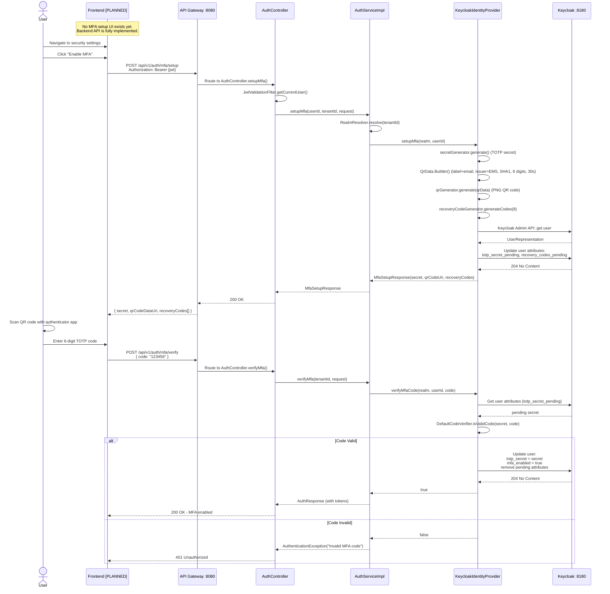

---

### 3.3 Journey 3: Login with MFA [IMPLEMENTED - Backend]

**Persona:** End User with MFA enabled
**Trigger:** User submits standard login credentials but has MFA enabled on their account
**Preconditions:** User has completed MFA setup (Journey 2); `mfa_enabled=true` in Keycloak user attributes
**Postconditions:** User authenticated with full token set after TOTP verification
**Frontend Status:** [PLANNED] -- No TOTP input UI exists in the login flow. Backend throws `MfaRequiredException` which the frontend does not handle.

#### Step-by-Step Flow

| Step | Actor | Action | Implementation Evidence |
|------|-------|--------|------------------------|
| 1-19 | (same as Journey 1) | Standard login steps 1-19 execute identically | See Journey 1 |
| 20 | AuthServiceImpl | Seat validation passes | `AuthServiceImpl.java:52-54` |
| 21 | AuthServiceImpl | Checks MFA: `identityProvider.isMfaEnabled(realm, userId)` returns `true` | `AuthServiceImpl.java:57` |
| 22 | AuthServiceImpl | Creates MFA session token (JWT signed with HMAC, stored in Valkey) | `AuthServiceImpl.java:61` -- `tokenService.createMfaSessionToken()` |
| 23 | TokenServiceImpl | Generates UUID session ID, builds JWT with `type=mfa_session`, stores `auth:mfa:{sessionId}` in Valkey with 5-min TTL | `TokenServiceImpl.java:106-128` |
| 24 | AuthServiceImpl | Stores pending access + refresh tokens in Valkey (`auth:mfa:pending:{hash}`) with 5-min TTL | `AuthServiceImpl.java:203-206` |
| 25 | AuthServiceImpl | Throws `MfaRequiredException(mfaSessionToken)` | `AuthServiceImpl.java:64` |
| 26 | GlobalExceptionHandler | Catches exception, returns 403 with `mfaSessionToken` in response body | `GlobalExceptionHandler.java` |
| 27 | Frontend | Receives 403 with `mfaSessionToken` | [PLANNED] -- Frontend does not currently handle this response code for MFA |
| 28 | Frontend | Shows TOTP input field | [PLANNED] -- No TOTP input component exists |
| 29 | User | Enters 6-digit code from authenticator app | User action |
| 30 | Frontend | Calls `POST /api/v1/auth/mfa/verify` with `{ code, mfaSessionToken }` | API exists: `AuthController.java:240-256` |
| 31 | AuthServiceImpl | Validates MFA session token from Valkey | `AuthServiceImpl.java:169` -- `tokenService.validateMfaSessionToken()` |
| 32 | KeycloakIdentityProvider | Verifies TOTP code against stored secret | `KeycloakIdentityProvider.java:230-278` |
| 33 | AuthServiceImpl | Retrieves pending tokens from Valkey | `AuthServiceImpl.java:179-183` |
| 34 | AuthServiceImpl | Invalidates MFA session, deletes pending tokens | `AuthServiceImpl.java:185-186` |
| 35 | AuthServiceImpl | Returns full `AuthResponse` with tokens + features | `AuthServiceImpl.java:192-193` |

#### Sequence Diagram

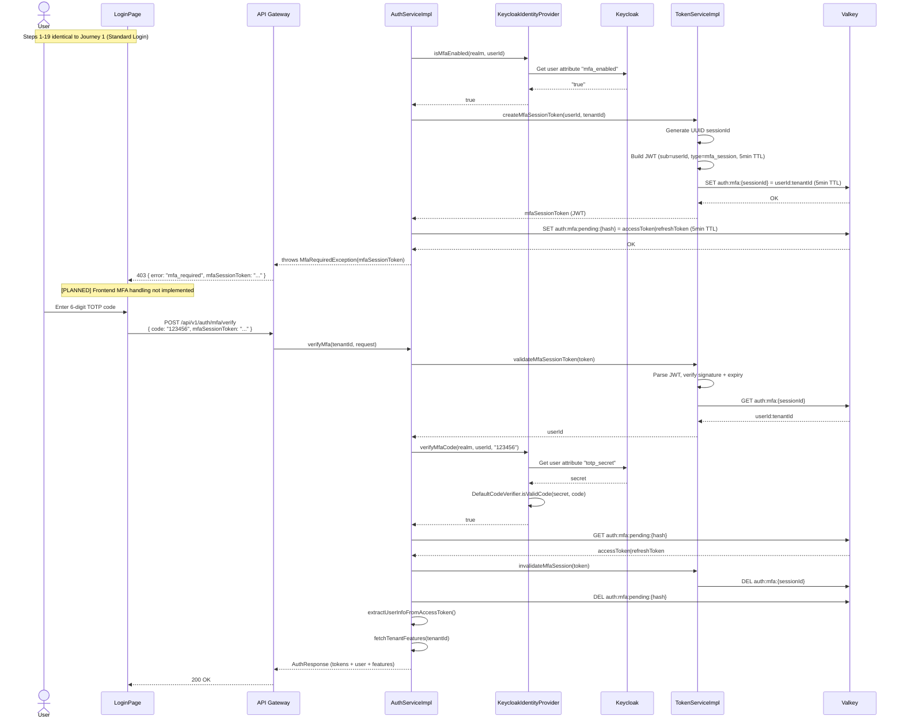

---

### 3.4 Journey 4: Social Login (Google) [IMPLEMENTED - Backend API]

**Persona:** End User preferring Google SSO
**Trigger:** User wants to authenticate using their Google account
**Preconditions:** Keycloak realm has Google IdP configured; user's Google account is linked or auto-linking is enabled
**Postconditions:** User authenticated with EMSIST tokens via Google token exchange
**Frontend Status:** [PLANNED] -- No "Sign in with Google" button exists in `login.page.html`. Backend API (`POST /api/v1/auth/social/google`) is fully implemented.

#### Step-by-Step Flow

| Step | Actor | Action | Implementation Evidence |
|------|-------|--------|------------------------|
| 1 | User | On login page | `login.page.html` |
| 2 | User | Clicks "Sign in with Google" | [PLANNED] -- Button does not exist in `login.page.html` |
| 3 | Frontend | Initiates Google OAuth flow, obtains Google ID token | [PLANNED] -- No Google SDK integration |
| 4 | Frontend | Calls `POST /api/v1/auth/social/google` with `{ idToken }` and `X-Tenant-ID` | API exists: `AuthController.java:62-78` |
| 5 | AuthServiceImpl | Resolves realm, calls `identityProvider.exchangeToken(realm, idToken, "google")` | `AuthServiceImpl.java:72-76` |
| 6 | KeycloakIdentityProvider | Sends RFC 8693 token exchange request to Keycloak | `KeycloakIdentityProvider.java:147-172` |
| 7 | KeycloakIdentityProvider | Sets `grant_type=urn:ietf:params:oauth:grant-type:token-exchange`, `subject_issuer=google`, `subject_token_type=urn:ietf:params:oauth:token-type:jwt` | `KeycloakIdentityProvider.java:151-161`, `determineTokenType()` at line 375-379 |
| 8 | Keycloak | Validates Google token against realm's Google IdP configuration, issues Keycloak tokens | External IdP |
| 9 | AuthServiceImpl | Validates seat (non-master tenants), checks MFA, fetches features | `AuthServiceImpl.java:79-91` |
| 10 | AuthServiceImpl | Returns `AuthResponse` | `AuthServiceImpl.java:91` |

**Note:** Microsoft login follows the same pattern via `POST /api/v1/auth/social/microsoft` using `MicrosoftTokenRequest.accessToken` and `subject_token_type=access_token`. See `AuthController.java:80-96` and `AuthServiceImpl.java:94-115`.

#### Sequence Diagram

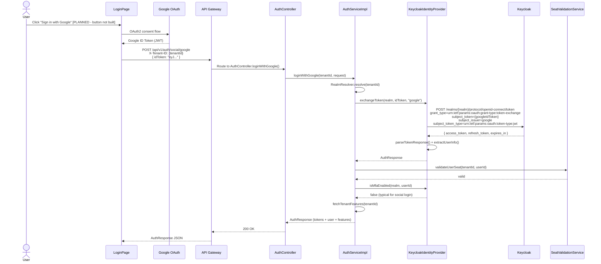

---

### 3.5 Journey 5: Token Refresh (Silent) [IMPLEMENTED]

**Persona:** End User (automatic, no user interaction)
**Trigger:** API request returns 401 (access token expired)
**Preconditions:** User has a valid refresh token in session/local storage
**Postconditions:** New access token stored; original failed request retried successfully
**Frontend + Backend Status:** [IMPLEMENTED] -- Full end-to-end implementation verified.

#### Step-by-Step Flow

| Step | Actor | Action | Implementation Evidence |
|------|-------|--------|------------------------|
| 1 | User | Makes API request (any protected endpoint) | User action |
| 2 | AuthInterceptor | Attaches `Authorization: Bearer {token}` and `X-Tenant-ID` headers | `auth.interceptor.ts:30-42` |
| 3 | API | Returns 401 (token expired) | Server response |
| 4 | AuthInterceptor | Catches 401 in `catchError`, calls `handleUnauthorized()` | `auth.interceptor.ts:45-52` |
| 5 | AuthInterceptor | Checks if refresh is already in progress (concurrent request handling) | `auth.interceptor.ts:75-91` -- `isRefreshing` flag + `refreshCompleted$` BehaviorSubject |
| 6 | AuthInterceptor | If not refreshing: sets `isRefreshing=true`, calls `api.refreshToken({ refreshToken })` | `auth.interceptor.ts:93-96` |
| 7 | ApiGatewayService | Sends `POST /api/v1/auth/refresh` with `{ refreshToken }` and `X-Tenant-ID` | API call |
| 8 | AuthController | Delegates to `authService.refreshToken()` | `AuthController.java:190-196` |
| 9 | AuthServiceImpl | Calls `identityProvider.refreshToken(realm, refreshToken)` | `AuthServiceImpl.java:118-123` |
| 10 | KeycloakIdentityProvider | Sends `grant_type=refresh_token` to Keycloak token endpoint | `KeycloakIdentityProvider.java:101-123` |
| 11 | Keycloak | Issues new access + refresh token pair (token rotation) | External IdP |
| 12 | AuthInterceptor | Stores new tokens via `session.setTokens()` | `auth.interceptor.ts:110-114` |
| 13 | AuthInterceptor | Retries original request with new access token | `auth.interceptor.ts:118` |
| 14 | AuthInterceptor | If multiple requests were queued: all retry after refresh completes | `auth.interceptor.ts:76-91` -- queued requests wait on `refreshCompleted$` |

**Error Flow:** If refresh fails (refresh token also expired), `forceLogout()` is called:
- Clears all tokens from `sessionStorage` and `localStorage`
- Redirects to `/auth/login?reason=session_expired&returnUrl={currentUrl}`
- Evidence: `auth.interceptor.ts:123-133`

#### Sequence Diagram

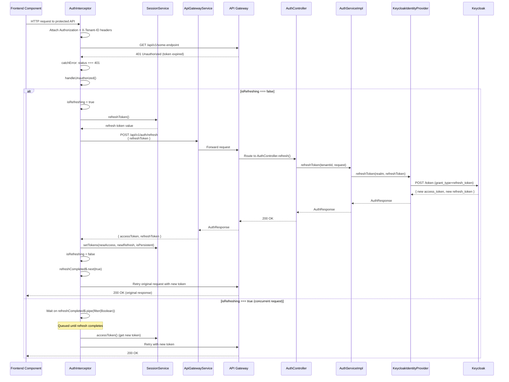

---

### 3.6 Journey 6: Logout [IMPLEMENTED]

**Persona:** End User
**Trigger:** User clicks "Logout" in the application
**Preconditions:** User is authenticated with valid tokens
**Postconditions:** Refresh token revoked in Keycloak; access token JTI blacklisted in Valkey; browser storage cleared; user redirected to login

#### Step-by-Step Flow

| Step | Actor | Action | Implementation Evidence |
|------|-------|--------|------------------------|
| 1 | User | Clicks "Logout" in application UI | User action |
| 2 | Frontend | Calls `authFacade.logout()` | `gateway-auth-facade.service.ts:56-69` |
| 3 | GatewayAuthFacadeService | Gets refresh token from `SessionService` | `gateway-auth-facade.service.ts:57` |
| 4 | GatewayAuthFacadeService | Calls `api.logout({ refreshToken })` | `gateway-auth-facade.service.ts:63` |
| 5 | ApiGatewayService | Sends `POST /api/v1/auth/logout` with `{ refreshToken }` and `Authorization` header | API call |
| 6 | AuthController | Receives request with `refreshToken` body and `Authorization` header | `AuthController.java:207-214` |
| 7 | AuthServiceImpl | Extracts JTI from access token (Base64 decode JWT payload) | `AuthServiceImpl.java:130-149` |
| 8 | AuthServiceImpl | Calls `tokenService.blacklistToken(jti, exp)` | `AuthServiceImpl.java:143` |
| 9 | TokenServiceImpl | Stores `auth:blacklist:{jti} = "1"` in Valkey with TTL = remaining JWT lifetime | `TokenServiceImpl.java:91-103` |
| 10 | AuthServiceImpl | Calls `identityProvider.logout(realm, refreshToken)` | `AuthServiceImpl.java:152-153` |
| 11 | KeycloakIdentityProvider | Posts to Keycloak logout endpoint with `client_id`, `client_secret`, `refresh_token` | `KeycloakIdentityProvider.java:126-144` |
| 12 | Keycloak | Revokes refresh token, ends session | External IdP |
| 13 | GatewayAuthFacadeService | Calls `logoutLocal('logged_out')` | `gateway-auth-facade.service.ts:66` |
| 14 | LogoutLocal | Clears `sessionStorage` and `localStorage` (`tp_access_token`, `tp_refresh_token`) | `session.service.ts:24-31` |
| 15 | LogoutLocal | Navigates to `/auth/login?loggedOut=1&returnUrl={previousUrl}` | `gateway-auth-facade.service.ts:79-86` |
| 16 | LoginPage | Detects `loggedOut=1` query param, shows "You have been signed out successfully." | `login.page.ts:49-50` |

#### Sequence Diagram

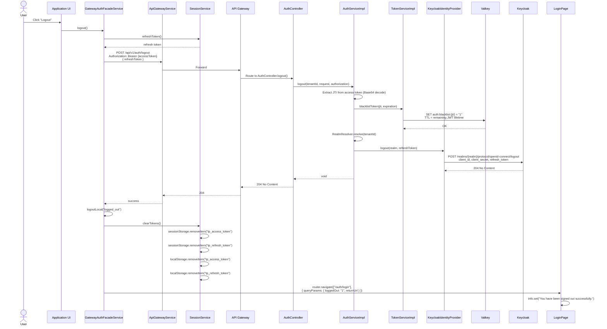

---

### 3.7 Journey 7: Redirect-Based OAuth2 Login [IMPLEMENTED]

**Persona:** End User using an external IdP (Google, Microsoft, SAML enterprise SSO)
**Trigger:** User clicks a provider-specific login button
**Preconditions:** Keycloak realm has the external IdP configured as an identity broker
**Postconditions:** User authenticated via external IdP through Keycloak brokering
**Frontend Status:** [PLANNED] -- No provider selection UI exists. Backend API (`GET /api/v1/auth/login/{provider}`) is fully implemented.

#### Step-by-Step Flow

| Step | Actor | Action | Implementation Evidence |
|------|-------|--------|------------------------|
| 1 | User | On login page, clicks provider-specific button | [PLANNED] -- No provider buttons in `login.page.html` |
| 2 | Frontend | Calls `GET /api/v1/auth/login/{provider}?redirect_uri=...` | API exists: `AuthController.java:102-142` |
| 3 | AuthController | Resolves realm via `RealmResolver.resolve(tenantId)` | `AuthController.java:129` |
| 4 | AuthController | Calls `identityProvider.initiateLogin(realm, provider, redirectUri)` | `AuthController.java:130` |
| 5 | KeycloakIdentityProvider | Builds Keycloak authorization URL with `kc_idp_hint={provider}` | `KeycloakIdentityProvider.java:175-192` |
| 6 | KeycloakIdentityProvider | URL format: `{keycloakUrl}/realms/{realm}/protocol/openid-connect/auth?client_id=...&redirect_uri=...&kc_idp_hint={provider}&state={uuid}` | `KeycloakIdentityProvider.java:179-192` |
| 7 | KeycloakIdentityProvider | Returns `LoginInitiationResponse.redirect(authUrl, state)` | `KeycloakIdentityProvider.java:192` |
| 8 | AuthController | Returns HTTP 302 with `Location` header pointing to external IdP | `AuthController.java:133-137` |
| 9 | Browser | Follows redirect to Keycloak, which redirects to external IdP (via `kc_idp_hint`) | Browser redirect |
| 10 | External IdP | Authenticates user | External system |
| 11 | External IdP | Callbacks to Keycloak with assertion/token | OIDC/SAML callback |
| 12 | Keycloak | Validates assertion, creates/links user, issues Keycloak tokens | External IdP |
| 13 | Keycloak | Redirects back to EMSIST with authorization code or tokens | Redirect callback |

**Available Providers Endpoint:** `GET /api/v1/auth/providers` returns a static list of available providers. Evidence: `AuthController.java:144-179`. The current implementation returns a hardcoded list (google, microsoft, facebook, github, saml) -- this is not dynamically derived from Keycloak realm configuration.

#### Sequence Diagram

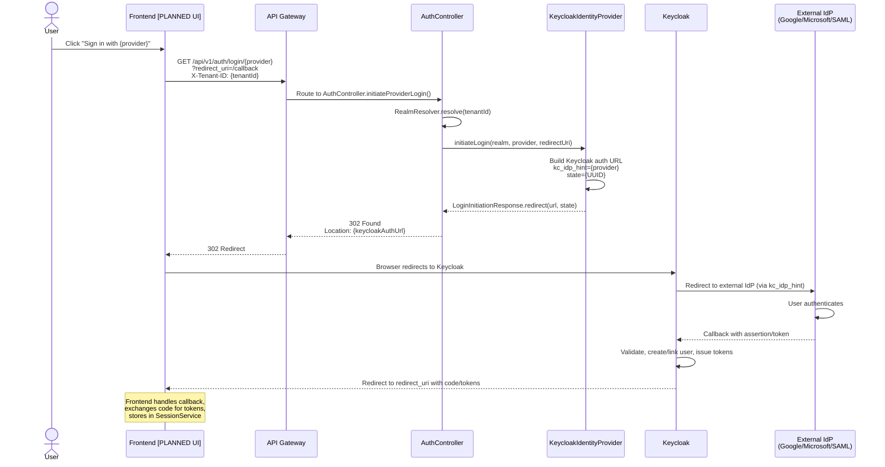

---

### 3.8 Journey 8: Admin IdP Management [IN-PROGRESS]

**Persona:** Tenant Admin
**Trigger:** Admin needs to configure identity providers for their tenant
**Backend Status:** [IMPLEMENTED] -- Full CRUD API with 8 endpoints in `AdminProviderController.java`
**Frontend Status:** [PLANNED] -- No admin UI for IdP management exists

#### Backend API Endpoints (Verified)

| Method | Path | Description | Evidence |
|--------|------|-------------|----------|
| `GET` | `/api/v1/admin/tenants/{tenantId}/providers` | List all providers for tenant | `AdminProviderController.java:58-101` |
| `GET` | `/api/v1/admin/tenants/{tenantId}/providers/{providerId}` | Get provider by ID | `AdminProviderController.java:110-141` |
| `POST` | `/api/v1/admin/tenants/{tenantId}/providers` | Register new provider | `AdminProviderController.java:150-199` |
| `PUT` | `/api/v1/admin/tenants/{tenantId}/providers/{providerId}` | Full update | `AdminProviderController.java:209-252` |
| `PATCH` | `/api/v1/admin/tenants/{tenantId}/providers/{providerId}` | Partial update (enable/disable, priority) | `AdminProviderController.java:305-381` |
| `DELETE` | `/api/v1/admin/tenants/{tenantId}/providers/{providerId}` | Delete provider | `AdminProviderController.java:280-295` |
| `POST` | `/api/v1/admin/tenants/{tenantId}/providers/{providerId}/test` | Test provider connection | `AdminProviderController.java:390-429` |
| `POST` | `/api/v1/admin/tenants/{tenantId}/providers/validate` | Validate config without saving | `AdminProviderController.java:438-474` |
| `POST` | `/api/v1/admin/tenants/{tenantId}/providers/cache/invalidate` | Invalidate provider cache | `AdminProviderController.java:482-511` |

All endpoints are gated by `@PreAuthorize("hasAnyRole('ADMIN','SUPER_ADMIN')")` and tenant isolation is enforced by `TenantAccessValidator.validateTenantAccess(tenantId)`.

#### Step-by-Step Flow (Target)

| Step | Actor | Action | Status |
|------|-------|--------|--------|
| 1 | Admin | Navigates to Admin > Identity Providers | [PLANNED] -- No frontend route |
| 2 | Frontend | Calls `GET /api/v1/admin/tenants/{tenantId}/providers` | [IMPLEMENTED] -- API works |
| 3 | Admin | Sees list of configured providers | [PLANNED] -- No list component |
| 4 | Admin | Clicks "Add Provider" | [PLANNED] |
| 5 | Admin | Selects protocol (OIDC, SAML, LDAP, OAuth2) and fills config | [PLANNED] |
| 6 | Frontend | Calls `POST /api/v1/admin/tenants/{tenantId}/providers/validate` | [IMPLEMENTED] |
| 7 | Frontend | On validation success, calls `POST /api/v1/admin/tenants/{tenantId}/providers` | [IMPLEMENTED] |
| 8 | Backend | `DynamicProviderResolver.registerProvider()` stores config in Neo4j | [IMPLEMENTED] -- Provider config stored as graph nodes |
| 9 | Admin | Tests connection via "Test Connection" button | [PLANNED] -- API exists at `POST .../providers/{id}/test` |
| 10 | Admin | Enables/disables provider via toggle | [PLANNED] -- API exists at `PATCH .../providers/{id}` |

#### Sequence Diagram

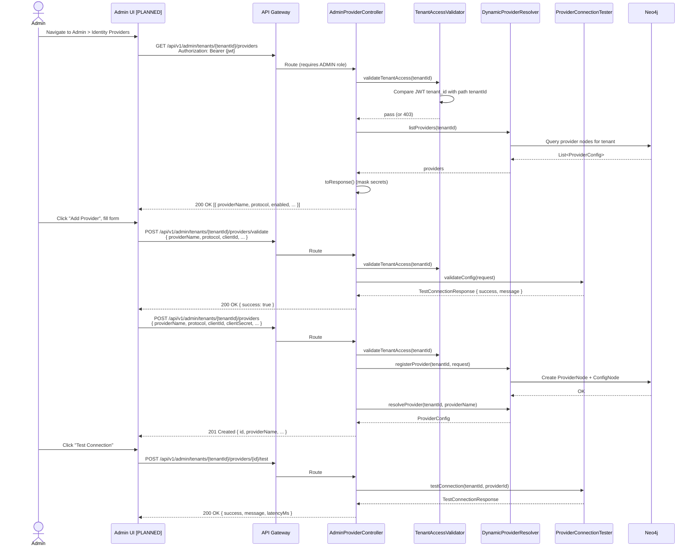

---

## 4. Service Blueprints

Service blueprints show the frontstage (user-visible), backstage (server-side), and support processes for each journey.

### 4.1 Standard Login Service Blueprint

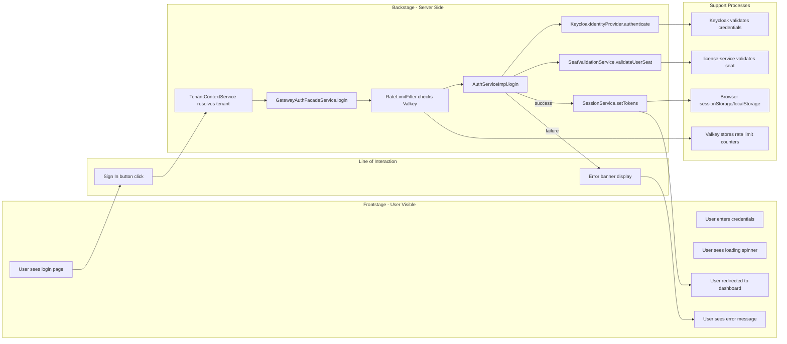

### 4.2 Token Refresh Service Blueprint

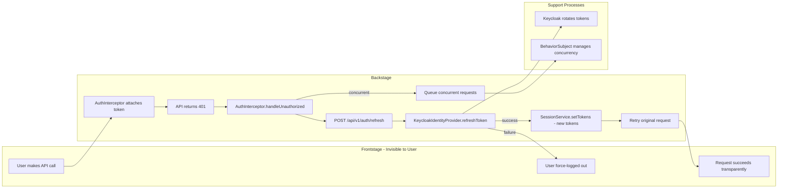

---

## 5. Edge Cases & Error Flows

### 5.1 Error Response Matrix

| Error Code | Scenario | Backend Source | Frontend Handling |
|------------|----------|---------------|-------------------|
| **401 Unauthorized** | Invalid credentials | `InvalidCredentialsException` thrown by `KeycloakIdentityProvider.java:93-94` | `login.page.ts:116` -- `formatHttpError()` shows status + message |
| **401 Unauthorized** | Expired access token (API call) | Gateway JWT validation | `auth.interceptor.ts:46-51` -- triggers silent refresh |
| **401 Unauthorized** | Invalid/expired refresh token | `InvalidTokenException` from `KeycloakIdentityProvider.java:119` | `auth.interceptor.ts:97-101` -- `forceLogout()` |
| **401 Unauthorized** | Invalid MFA code | `AuthenticationException("Invalid MFA code")` from `AuthServiceImpl.java:175` | [PLANNED] -- No MFA error handling in frontend |
| **403 Forbidden** | MFA required | `MfaRequiredException` from `AuthServiceImpl.java:64` | [PLANNED] -- Frontend does not handle 403 MFA flow |
| **423 Locked** | No active license seat | `NoActiveSeatException` from `SeatValidationService.java:42` | `login.page.ts:116` -- generic error display |
| **429 Too Many Requests** | Rate limit exceeded (>100 req/min) | `RateLimitFilter.java:77-79` -- returns JSON with `retryAfter` | `login.page.ts:116` -- generic error display |
| **503 Service Unavailable** | Keycloak unreachable | `AuthenticationException("auth_provider_unavailable")` from `KeycloakIdentityProvider.java:392-395` | `login.page.ts:116` -- generic error display |
| **503 Service Unavailable** | license-service circuit breaker open | `SeatValidationService.java:62-66` -- fallback denies access | Shows as seat validation failure |

### 5.2 Edge Case: Concurrent Token Refresh

When multiple API requests fail simultaneously with 401:

1. First request sets `isRefreshing = true` and initiates refresh
2. Subsequent requests detect `isRefreshing === true` and queue on `refreshCompleted$` BehaviorSubject
3. When refresh completes, `refreshCompleted$.next(true)` unblocks all queued requests
4. Each queued request reads the updated token from `SessionService` and retries
5. Evidence: `auth.interceptor.ts:14-16,75-91`

### 5.3 Edge Case: Remember Me vs Session-Only Storage

| rememberMe | Storage | Behavior |
|------------|---------|----------|
| `false` (default) | `sessionStorage` | Tokens cleared when browser tab closes |
| `true` | `localStorage` | Tokens persist across browser sessions |

Evidence: `session.service.ts:62-76` -- `writeToken()` method chooses storage based on `rememberMe` flag.

Note: The current login page hardcodes `rememberMe: false` (`login.page.ts:110`). A "Remember Me" checkbox is not present in the HTML template.

### 5.4 Edge Case: Tenant Resolution Failure

If the user enters an invalid tenant ID (neither UUID nor recognized alias):

1. `TenantContextService.setTenantFromInput()` returns `false`
2. `LoginPageComponent.onSubmit()` sets error: "Tenant ID must be a UUID or a recognized tenant alias."
3. Login request is never sent to the backend
4. Evidence: `login.page.ts:97-99`, `tenant-context.service.ts:34-41`

### 5.5 Edge Case: Session Expiry During Navigation

If the user's session expires while navigating:

1. Any protected API call returns 401
2. `authInterceptor` attempts refresh
3. If refresh fails (refresh token also expired):
   - `forceLogout()` clears tokens
   - Redirects to `/auth/login?reason=session_expired&returnUrl={currentUrl}`
   - Login page shows: "Your session expired. Please sign in again."
4. Evidence: `auth.interceptor.ts:123-133`, `login.page.ts:54-56`

### 5.6 Edge Case: Rate Limiting

Rate limiting is implemented per client identifier (tenant + IP):

- Key format: `auth:rate:{tenantId}:{ip}` or `auth:rate:{ip}` (no tenant)
- Limit: 100 requests per 60-second sliding window (configurable via `rate-limit.requests-per-minute`)
- Response headers: `X-RateLimit-Limit`, `X-RateLimit-Remaining`, `X-RateLimit-Reset`
- When exceeded: HTTP 429 with `Retry-After` header and JSON body
- Fallback: If Valkey is unavailable, requests are allowed through (fail-open)
- Evidence: `RateLimitFilter.java:36-37,50-88`

### 5.7 Edge Case: License Service Circuit Breaker

The `SeatValidationService` uses Resilience4j circuit breaker:

- Circuit breaker name: `licenseService`
- Fallback behavior: **Deny access** (fail-safe, not fail-open)
- Fallback throws `NoActiveSeatException("License service unavailable")`
- This means if license-service is down, no non-master tenant users can log in
- Evidence: `SeatValidationService.java:32,61-66`

### 5.8 Edge Case: Keycloak Logout Failure

Keycloak logout is designed to be idempotent:

- If the logout POST to Keycloak fails (e.g., network issue), the exception is caught and logged but not re-thrown
- The access token is still blacklisted in Valkey regardless
- Evidence: `KeycloakIdentityProvider.java:140-143` -- `catch (HttpClientErrorException e) { log.warn... }`

---

## 6. Cross-Journey Dependencies

### 6.1 Journey Dependency Graph

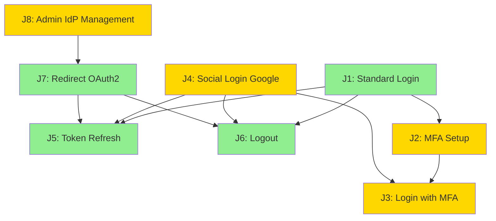

Legend: Green = Fully Implemented (frontend + backend), Yellow = Backend only or In-Progress

### 6.2 Shared Service Dependencies

| Service | Used By Journeys | Purpose |
|---------|------------------|---------|
| `SessionService` | J1, J4, J5, J6, J7 | Token storage/retrieval in browser |
| `AuthInterceptor` | J5 (primary), all authenticated requests | Automatic token attachment + 401 handling |
| `TenantContextService` | J1, J4, J6, J7 | Tenant ID resolution and header injection |
| `KeycloakIdentityProvider` | J1, J2, J3, J4, J6, J7 | All authentication operations |
| `TokenServiceImpl` | J3, J6 | MFA session management + token blacklisting |
| `SeatValidationService` | J1, J3, J4 | License seat check during login |
| `RateLimitFilter` | J1, J3, J4, J7 | Rate limiting on all auth-facade endpoints |

### 6.3 Infrastructure Dependencies

| Infrastructure | Failure Impact | Mitigation |
|----------------|----------------|------------|
| **Keycloak** | All authentication fails | `providerUnavailableException()` -- 503 error |
| **Valkey** | Rate limiting disabled (fail-open), token blacklist unavailable, MFA sessions fail | RateLimitFilter allows requests; blacklist check returns false |
| **Neo4j** | Admin IdP management fails, provider resolution fails | Fallback to `InMemoryProviderResolver` |
| **license-service** | Seat validation fails, circuit breaker opens, logins denied for non-master tenants | `validateSeatFallback()` denies access |

### 6.4 Implementation Status Summary

| Journey | Backend | Frontend | Overall |
|---------|---------|----------|---------|
| J1: Standard Login | [IMPLEMENTED] | [IMPLEMENTED] | [IMPLEMENTED] |
| J2: MFA Setup | [IMPLEMENTED] | [PLANNED] | [IN-PROGRESS] |
| J3: Login with MFA | [IMPLEMENTED] | [PLANNED] | [IN-PROGRESS] |
| J4: Social Login (Google) | [IMPLEMENTED] | [PLANNED] | [IN-PROGRESS] |
| J5: Token Refresh | [IMPLEMENTED] | [IMPLEMENTED] | [IMPLEMENTED] |
| J6: Logout | [IMPLEMENTED] | [IMPLEMENTED] | [IMPLEMENTED] |
| J7: Redirect OAuth2 | [IMPLEMENTED] | [PLANNED] | [IN-PROGRESS] |
| J8: Admin IdP Mgmt | [IMPLEMENTED] | [PLANNED] | [IN-PROGRESS] |

### 6.5 Known Gaps (Requiring Future Journeys)

| Gap | Description | Priority |
|-----|-------------|----------|
| MFA Setup UI | No Angular component for TOTP setup, QR scanning, recovery code display | P1 |
| MFA Login UI | LoginPage does not handle 403 MfaRequired response; no TOTP input step | P1 |
| Social Login Buttons | No Google/Microsoft sign-in buttons in login.page.html | P1 |
| Provider Selection UI | No dynamic provider button rendering from `/api/v1/auth/providers` | P2 |
| Remember Me Checkbox | Hardcoded to `false`; no UI control in login form | P2 |
| Admin IdP Management UI | Full CRUD API exists but no Angular admin page | P0 |
| Password Reset Journey | Backend endpoints exist but full journey not documented here | P1 |
| Session Management UI | No active session list, force-logout of other sessions | P2 |
