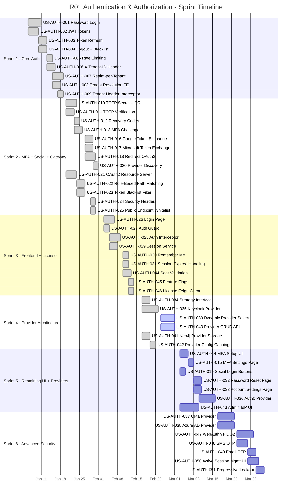
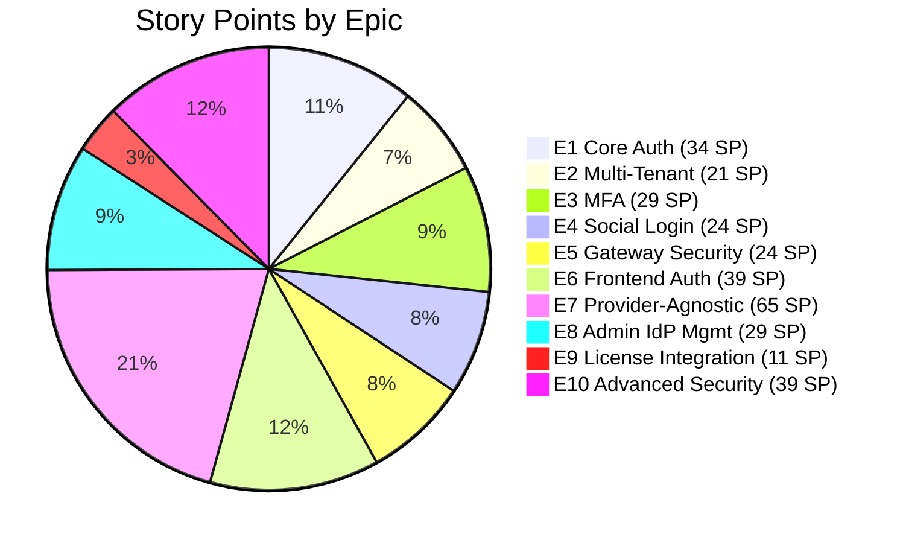
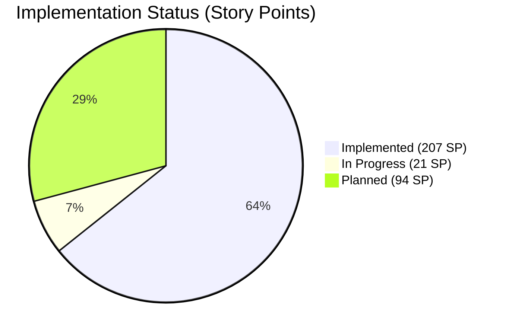
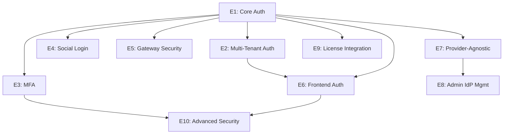

# R01 Authentication & Authorization - Implementation Backlog

| Field            | Value                                           |
|------------------|-------------------------------------------------|
| **Document ID**  | R01-BACKLOG-010                                 |
| **Version**      | 1.0.0                                           |
| **Status**       | Active                                          |
| **Last Updated** | 2026-03-12                                      |
| **Author**       | BA Agent                                        |
| **Requirement**  | R01 - Authentication and Authorization          |

---

## 1. Backlog Overview

This document defines the implementation backlog for the EMSIST Authentication and Authorization feature (R01). Each story is tagged with its verified implementation status based on actual codebase inspection performed on 2026-03-12.

**Evidence-Based Documentation (EBD) Notice:** All `[IMPLEMENTED]` tags in this document have been verified by reading the actual source files. File paths are provided as evidence. `[PLANNED]` items have no corresponding code in the repository.

### Backlog Summary

| Metric                    | Value         |
|---------------------------|---------------|
| Total Epics               | 10            |
| Total User Stories        | 51            |
| Total Story Points        | 322 SP        |
| Implemented Story Points  | 207 SP (64%)  |
| In-Progress Story Points  | 21 SP (7%)    |
| Planned Story Points      | 94 SP (29%)   |

---

## 2. Epic Summary

| Epic | Title                               | Stories | Total SP | Status                   | Completion |
|------|-------------------------------------|---------|----------|--------------------------|------------|
| E1   | Core Authentication                 | 5       | 34 SP    | `[IMPLEMENTED]`          | 100%       |
| E2   | Multi-Tenant Authentication         | 4       | 21 SP    | `[IMPLEMENTED]`          | 100%       |
| E3   | Multi-Factor Authentication         | 6       | 29 SP    | `[IMPLEMENTED]` (partial)| 80%        |
| E4   | Social Login                        | 5       | 24 SP    | `[IMPLEMENTED]` (partial)| 70%        |
| E5   | API Gateway Security                | 5       | 24 SP    | `[IMPLEMENTED]`          | 100%       |
| E6   | Frontend Auth                       | 8       | 39 SP    | `[IMPLEMENTED]` (partial)| 90%        |
| E7   | Provider-Agnostic Architecture      | 6       | 65 SP    | `[IN-PROGRESS]`          | 25%        |
| E8   | Admin Identity Provider Management  | 4       | 29 SP    | `[IN-PROGRESS]`          | 55%        |
| E9   | License Integration                 | 3       | 11 SP    | `[IMPLEMENTED]`          | 100%       |
| E10  | Advanced Security                   | 5       | 39 SP    | `[PLANNED]`              | 0%         |

---

## 3. Sprint Plan

### Sprint Allocation

| Sprint   | Dates                   | Focus                                         | SP   | Status      |
|----------|-------------------------|-----------------------------------------------|------|-------------|
| Sprint 1 | 2026-01-06 - 2026-01-17 | Core Authentication + Multi-Tenant             | 55   | Completed   |
| Sprint 2 | 2026-01-20 - 2026-01-31 | MFA + Social Login + Gateway Security          | 53   | Completed   |
| Sprint 3 | 2026-02-03 - 2026-02-14 | Frontend Auth + License Integration            | 50   | Completed   |
| Sprint 4 | 2026-02-17 - 2026-02-28 | Provider-Agnostic Architecture + Admin IdP     | 44   | In Progress |
| Sprint 5 | 2026-03-03 - 2026-03-14 | Remaining UI + Provider Implementations        | 49   | Planned     |
| Sprint 6 | 2026-03-17 - 2026-03-28 | Advanced Security + Hardening                  | 71   | Planned     |

### Sprint Timeline

---

## 4. User Stories by Epic

### Epic 1: Core Authentication `[IMPLEMENTED]` - 100%

#### US-AUTH-001: Password-Based Login via Keycloak

| Field          | Value                                                     |
|----------------|-----------------------------------------------------------|
| **Story ID**   | US-AUTH-001                                               |
| **Epic**       | E1 - Core Authentication                                  |
| **Points**     | 13 SP                                                     |
| **Priority**   | Must Have                                                 |
| **Status**     | `[IMPLEMENTED]`                                           |
| **Sprint**     | Sprint 1                                                  |

**As a** registered user, **I want to** log in with my email/username and password, **so that** I can access the EMSIST platform securely.

**Evidence:**
- `AuthController.login()` at `backend/auth-facade/src/main/java/com/ems/auth/controller/AuthController.java` line 53
- `KeycloakIdentityProvider.authenticate()` at `backend/auth-facade/src/main/java/com/ems/auth/provider/KeycloakIdentityProvider.java` line 74
- `AuthServiceImpl.login()` at `backend/auth-facade/src/main/java/com/ems/auth/service/AuthServiceImpl.java` line 45
- Uses Keycloak Direct Access Grant (Resource Owner Password Credentials) flow

---

#### US-AUTH-002: JWT Token Issuance and Validation

| Field          | Value                                                     |
|----------------|-----------------------------------------------------------|
| **Story ID**   | US-AUTH-002                                               |
| **Epic**       | E1 - Core Authentication                                  |
| **Points**     | 8 SP                                                      |
| **Priority**   | Must Have                                                 |
| **Status**     | `[IMPLEMENTED]`                                           |
| **Sprint**     | Sprint 1                                                  |

**As a** system, **I want to** issue and validate JWT tokens upon successful authentication, **so that** users can make authenticated API requests without re-entering credentials.

**Evidence:**
- `TokenService` interface at `backend/auth-facade/src/main/java/com/ems/auth/service/TokenService.java` - defines `parseToken()`, `extractUserInfo()`, `isBlacklisted()`
- `JwtValidationFilter` at `backend/auth-facade/src/main/java/com/ems/auth/filter/JwtValidationFilter.java`
- `JwtTokenValidator` at `backend/auth-facade/src/main/java/com/ems/auth/security/JwtTokenValidator.java`
- Keycloak issues JWTs; auth-facade validates and parses claims

---

#### US-AUTH-003: Token Refresh with Rotation

| Field          | Value                                                     |
|----------------|-----------------------------------------------------------|
| **Story ID**   | US-AUTH-003                                               |
| **Epic**       | E1 - Core Authentication                                  |
| **Points**     | 5 SP                                                      |
| **Priority**   | Must Have                                                 |
| **Status**     | `[IMPLEMENTED]`                                           |
| **Sprint**     | Sprint 1                                                  |

**As an** authenticated user, **I want to** refresh my access token using a refresh token, **so that** my session persists without re-authentication.

**Evidence:**
- `AuthController.refresh()` at `backend/auth-facade/src/main/java/com/ems/auth/controller/AuthController.java` line 190
- `KeycloakIdentityProvider.refreshToken()` at `backend/auth-facade/src/main/java/com/ems/auth/provider/KeycloakIdentityProvider.java` line 101
- Token rotation handled by Keycloak (new refresh token issued with each refresh)

---

#### US-AUTH-004: Logout with Token Blacklisting

| Field          | Value                                                     |
|----------------|-----------------------------------------------------------|
| **Story ID**   | US-AUTH-004                                               |
| **Epic**       | E1 - Core Authentication                                  |
| **Points**     | 5 SP                                                      |
| **Priority**   | Must Have                                                 |
| **Status**     | `[IMPLEMENTED]`                                           |
| **Sprint**     | Sprint 1                                                  |

**As an** authenticated user, **I want to** log out and have my tokens invalidated, **so that** no one can reuse my session.

**Evidence:**
- `AuthController.logout()` at `backend/auth-facade/src/main/java/com/ems/auth/controller/AuthController.java` line 207
- `AuthServiceImpl.logout()` blacklists access token via `tokenService.blacklistToken(jti, exp)` at line 143
- `KeycloakIdentityProvider.logout()` revokes refresh token with Keycloak at line 126
- `TokenBlacklistFilter` at `backend/api-gateway/src/main/java/com/ems/gateway/filter/TokenBlacklistFilter.java` checks Valkey for blacklisted JTIs

---

#### US-AUTH-005: Rate Limiting on Login Endpoint

| Field          | Value                                                     |
|----------------|-----------------------------------------------------------|
| **Story ID**   | US-AUTH-005                                               |
| **Epic**       | E1 - Core Authentication                                  |
| **Points**     | 3 SP                                                      |
| **Priority**   | Should Have                                               |
| **Status**     | `[IMPLEMENTED]`                                           |
| **Sprint**     | Sprint 1                                                  |

**As a** security administrator, **I want** login attempts rate-limited per IP/tenant, **so that** brute-force attacks are mitigated.

**Evidence:**
- `RateLimitFilter` at `backend/auth-facade/src/main/java/com/ems/auth/filter/RateLimitFilter.java`
- Uses Valkey (`StringRedisTemplate`) for distributed rate counting (line 54)
- Configurable via `rate-limit.requests-per-minute` (default: 100)
- Responds with HTTP 429 and `Retry-After` header when exceeded (line 78)
- Client identifier = `tenantId:IP` for tenant-scoped limiting (line 97)

---

### Epic 2: Multi-Tenant Authentication `[IMPLEMENTED]` - 100%

#### US-AUTH-006: Tenant Context via X-Tenant-ID Header

| Field          | Value                                                     |
|----------------|-----------------------------------------------------------|
| **Story ID**   | US-AUTH-006                                               |
| **Epic**       | E2 - Multi-Tenant Authentication                          |
| **Points**     | 5 SP                                                      |
| **Priority**   | Must Have                                                 |
| **Status**     | `[IMPLEMENTED]`                                           |
| **Sprint**     | Sprint 1                                                  |

**As a** backend service, **I want to** receive the tenant context via X-Tenant-ID header, **so that** all operations are scoped to the correct tenant.

**Evidence:**
- `TenantContextFilter` at `backend/auth-facade/src/main/java/com/ems/auth/filter/TenantContextFilter.java`
- `TenantContextFilter` at `backend/api-gateway/src/main/java/com/ems/gateway/filter/TenantContextFilter.java`
- All AuthController endpoints require `@RequestHeader(TenantContextFilter.TENANT_HEADER)`

---

#### US-AUTH-007: Realm-per-Tenant Mapping in Keycloak

| Field          | Value                                                     |
|----------------|-----------------------------------------------------------|
| **Story ID**   | US-AUTH-007                                               |
| **Epic**       | E2 - Multi-Tenant Authentication                          |
| **Points**     | 8 SP                                                      |
| **Priority**   | Must Have                                                 |
| **Status**     | `[IMPLEMENTED]`                                           |
| **Sprint**     | Sprint 1                                                  |

**As a** platform operator, **I want** each tenant mapped to a dedicated Keycloak realm, **so that** user directories and configurations are fully isolated.

**Evidence:**
- `RealmResolver` at `backend/auth-facade/src/main/java/com/ems/auth/util/RealmResolver.java`
- Maps `"master"` / master UUID to `"master"` realm; other tenants to `"tenant-{id}"` realm (line 39)
- `isMasterTenant()` identifies master tenant for license bypass (line 63)
- Unit tests at `backend/auth-facade/src/test/java/com/ems/auth/util/RealmResolverTest.java`

---

#### US-AUTH-008: Tenant Resolution Service (Frontend)

| Field          | Value                                                     |
|----------------|-----------------------------------------------------------|
| **Story ID**   | US-AUTH-008                                               |
| **Epic**       | E2 - Multi-Tenant Authentication                          |
| **Points**     | 5 SP                                                      |
| **Priority**   | Must Have                                                 |
| **Status**     | `[IMPLEMENTED]`                                           |
| **Sprint**     | Sprint 1                                                  |

**As a** frontend application, **I want to** resolve the current tenant on startup, **so that** all API calls include the correct tenant context.

**Evidence:**
- `TenantContextService` at `frontend/src/app/core/services/tenant-context.service.ts`
- `bootstrap()` resolves tenant via API call `resolveTenant()` (line 22)
- `setTenantFromInput()` validates UUID format or alias mapping (line 34)
- Signal-based state: `tenantId`, `tenantName`, `resolved` signals

---

#### US-AUTH-009: Tenant Header Interceptor

| Field          | Value                                                     |
|----------------|-----------------------------------------------------------|
| **Story ID**   | US-AUTH-009                                               |
| **Epic**       | E2 - Multi-Tenant Authentication                          |
| **Points**     | 3 SP                                                      |
| **Priority**   | Must Have                                                 |
| **Status**     | `[IMPLEMENTED]`                                           |
| **Sprint**     | Sprint 1                                                  |

**As a** frontend developer, **I want** the X-Tenant-ID header automatically attached to API requests, **so that** every request carries tenant context.

**Evidence:**
- `authInterceptor` at `frontend/src/app/core/interceptors/auth.interceptor.ts` line 37
- Injects `TenantContextService` and adds `X-Tenant-ID` header if available (line 37-38)
- Also attaches `Authorization: Bearer` header for authenticated requests (line 34-35)

---

### Epic 3: Multi-Factor Authentication `[IMPLEMENTED]` - 80%

#### US-AUTH-010: TOTP Secret Generation + QR Code

| Field          | Value                                                     |
|----------------|-----------------------------------------------------------|
| **Story ID**   | US-AUTH-010                                               |
| **Epic**       | E3 - Multi-Factor Authentication                          |
| **Points**     | 8 SP                                                      |
| **Priority**   | Must Have                                                 |
| **Status**     | `[IMPLEMENTED]`                                           |
| **Sprint**     | Sprint 2                                                  |

**As a** user, **I want to** generate a TOTP secret and scan a QR code, **so that** I can set up my authenticator app for MFA.

**Evidence:**
- `KeycloakIdentityProvider.setupMfa()` at line 196
- Uses `dev.samstevens.totp` library: `DefaultSecretGenerator`, `ZxingPngQrGenerator`, `RecoveryCodeGenerator`
- Generates QR code URI via `getDataUriForImage()` (line 214)
- Stores pending secret in Keycloak user attributes `totp_secret_pending` (line 218)

---

#### US-AUTH-011: TOTP Verification Flow

| Field          | Value                                                     |
|----------------|-----------------------------------------------------------|
| **Story ID**   | US-AUTH-011                                               |
| **Epic**       | E3 - Multi-Factor Authentication                          |
| **Points**     | 5 SP                                                      |
| **Priority**   | Must Have                                                 |
| **Status**     | `[IMPLEMENTED]`                                           |
| **Sprint**     | Sprint 2                                                  |

**As a** user, **I want to** verify my TOTP code to complete MFA setup or login, **so that** my account is protected by a second factor.

**Evidence:**
- `KeycloakIdentityProvider.verifyMfaCode()` at line 230
- Uses `DefaultCodeVerifier` to validate TOTP code (line 255)
- Confirms setup by moving `totp_secret_pending` to `totp_secret` and setting `mfa_enabled=true` (line 260-264)

---

#### US-AUTH-012: Recovery Codes Generation

| Field          | Value                                                     |
|----------------|-----------------------------------------------------------|
| **Story ID**   | US-AUTH-012                                               |
| **Epic**       | E3 - Multi-Factor Authentication                          |
| **Points**     | 3 SP                                                      |
| **Priority**   | Should Have                                               |
| **Status**     | `[IMPLEMENTED]`                                           |
| **Sprint**     | Sprint 2                                                  |

**As a** user, **I want** recovery codes generated during MFA setup, **so that** I can regain access if I lose my authenticator device.

**Evidence:**
- `KeycloakIdentityProvider.setupMfa()` generates 8 recovery codes via `recoveryCodeGenerator.generateCodes(8)` at line 215
- Stored in Keycloak user attribute `recovery_codes_pending`, confirmed to `recovery_codes` on verification (line 259-261)

---

#### US-AUTH-013: MFA Challenge During Login

| Field          | Value                                                     |
|----------------|-----------------------------------------------------------|
| **Story ID**   | US-AUTH-013                                               |
| **Epic**       | E3 - Multi-Factor Authentication                          |
| **Points**     | 5 SP                                                      |
| **Priority**   | Must Have                                                 |
| **Status**     | `[IMPLEMENTED]`                                           |
| **Sprint**     | Sprint 2                                                  |

**As a** user with MFA enabled, **I want** a TOTP challenge after entering credentials, **so that** login requires both factors.

**Evidence:**
- `AuthServiceImpl.login()` checks `identityProvider.isMfaEnabled()` at line 57
- Creates MFA session token via `tokenService.createMfaSessionToken()` (line 61)
- Stores pending tokens in Valkey with 5-minute TTL (line 205)
- Throws `MfaRequiredException` with session token (line 64)
- `AuthController.verifyMfa()` endpoint completes the flow at line 250

---

#### US-AUTH-014: MFA Setup UI Page

| Field          | Value                                                     |
|----------------|-----------------------------------------------------------|
| **Story ID**   | US-AUTH-014                                               |
| **Epic**       | E3 - Multi-Factor Authentication                          |
| **Points**     | 5 SP                                                      |
| **Priority**   | Should Have                                               |
| **Status**     | `[PLANNED]`                                               |
| **Sprint**     | Sprint 5                                                  |

**As a** user, **I want** a dedicated MFA setup page showing the QR code and verification form, **so that** I can easily enable MFA for my account.

**Evidence:** No frontend MFA setup component exists in `frontend/src/app/`. Backend API endpoints exist but no UI consumes them.

---

#### US-AUTH-015: MFA Management in User Settings

| Field          | Value                                                     |
|----------------|-----------------------------------------------------------|
| **Story ID**   | US-AUTH-015                                               |
| **Epic**       | E3 - Multi-Factor Authentication                          |
| **Points**     | 3 SP                                                      |
| **Priority**   | Could Have                                                |
| **Status**     | `[PLANNED]`                                               |
| **Sprint**     | Sprint 5                                                  |

**As a** user, **I want** to manage my MFA settings (view recovery codes, disable MFA) from my account settings, **so that** I have control over my security preferences.

**Evidence:** No MFA management UI component exists. Backend `isMfaEnabled()` API exists but no user settings page.

---

### Epic 4: Social Login `[IMPLEMENTED]` - 70%

#### US-AUTH-016: Google ID Token Exchange

| Field          | Value                                                     |
|----------------|-----------------------------------------------------------|
| **Story ID**   | US-AUTH-016                                               |
| **Epic**       | E4 - Social Login                                         |
| **Points**     | 5 SP                                                      |
| **Priority**   | Should Have                                               |
| **Status**     | `[IMPLEMENTED]`                                           |
| **Sprint**     | Sprint 2                                                  |

**As a** user, **I want to** log in with my Google account, **so that** I do not need a separate password.

**Evidence:**
- `AuthController.loginWithGoogle()` at line 72
- `AuthServiceImpl.loginWithGoogle()` at line 72 - calls `identityProvider.exchangeToken(realm, request.idToken(), "google")`
- `KeycloakIdentityProvider.exchangeToken()` at line 147 - uses RFC 8693 token exchange
- Google token type: `urn:ietf:params:oauth:token-type:jwt` (line 376)

---

#### US-AUTH-017: Microsoft Access Token Exchange

| Field          | Value                                                     |
|----------------|-----------------------------------------------------------|
| **Story ID**   | US-AUTH-017                                               |
| **Epic**       | E4 - Social Login                                         |
| **Points**     | 5 SP                                                      |
| **Priority**   | Should Have                                               |
| **Status**     | `[IMPLEMENTED]`                                           |
| **Sprint**     | Sprint 2                                                  |

**As a** user, **I want to** log in with my Microsoft account, **so that** I can use my organizational credentials.

**Evidence:**
- `AuthController.loginWithMicrosoft()` at line 90
- `AuthServiceImpl.loginWithMicrosoft()` at line 95 - calls `identityProvider.exchangeToken(realm, request.accessToken(), "microsoft")`
- Microsoft token type: `urn:ietf:params:oauth:token-type:access_token` (line 377)

---

#### US-AUTH-018: Redirect-Based OAuth2 Flow

| Field          | Value                                                     |
|----------------|-----------------------------------------------------------|
| **Story ID**   | US-AUTH-018                                               |
| **Epic**       | E4 - Social Login                                         |
| **Points**     | 8 SP                                                      |
| **Priority**   | Should Have                                               |
| **Status**     | `[IMPLEMENTED]`                                           |
| **Sprint**     | Sprint 2                                                  |

**As a** user, **I want** browser-redirect-based OAuth2 login for identity providers that require it, **so that** enterprise SSO flows work correctly.

**Evidence:**
- `AuthController.initiateProviderLogin()` at line 120 - `GET /api/v1/auth/login/{provider}`
- `KeycloakIdentityProvider.initiateLogin()` at line 175 - builds Keycloak auth URL with `kc_idp_hint`
- Returns HTTP 302 redirect to identity provider (line 134)
- `LoginInitiationResponse` record supports both redirect and inline flows

---

#### US-AUTH-019: Social Login Buttons on Login Page

| Field          | Value                                                     |
|----------------|-----------------------------------------------------------|
| **Story ID**   | US-AUTH-019                                               |
| **Epic**       | E4 - Social Login                                         |
| **Points**     | 3 SP                                                      |
| **Priority**   | Should Have                                               |
| **Status**     | `[PLANNED]`                                               |
| **Sprint**     | Sprint 5                                                  |

**As a** user, **I want** Google and Microsoft login buttons on the login page, **so that** I can easily choose social login.

**Evidence:** Login page at `frontend/src/app/features/auth/login.page.ts` exists but does not include social login buttons. Only email/password form is implemented.

---

#### US-AUTH-020: Provider Discovery Endpoint

| Field          | Value                                                     |
|----------------|-----------------------------------------------------------|
| **Story ID**   | US-AUTH-020                                               |
| **Epic**       | E4 - Social Login                                         |
| **Points**     | 3 SP                                                      |
| **Priority**   | Should Have                                               |
| **Status**     | `[IMPLEMENTED]`                                           |
| **Sprint**     | Sprint 2                                                  |

**As a** frontend application, **I want** an API endpoint listing available identity providers for the current tenant, **so that** I can dynamically render login options.

**Evidence:**
- `AuthController.getAvailableProviders()` at line 153 - `GET /api/v1/auth/providers`
- Returns active provider type and available provider list with alias, name, and type (line 166-174)
- Tenant-aware: accepts optional `X-Tenant-ID` header

---

### Epic 5: API Gateway Security `[IMPLEMENTED]` - 100%

#### US-AUTH-021: OAuth2 Resource Server Configuration

| Field          | Value                                                     |
|----------------|-----------------------------------------------------------|
| **Story ID**   | US-AUTH-021                                               |
| **Epic**       | E5 - API Gateway Security                                 |
| **Points**     | 8 SP                                                      |
| **Priority**   | Must Have                                                 |
| **Status**     | `[IMPLEMENTED]`                                           |
| **Sprint**     | Sprint 2                                                  |

**As a** platform, **I want** the API gateway to validate JWTs as an OAuth2 resource server, **so that** all API traffic is authenticated at the edge.

**Evidence:**
- `SecurityConfig` at `backend/api-gateway/src/main/java/com/ems/gateway/config/SecurityConfig.java`
- `.oauth2ResourceServer(oauth2 -> oauth2.jwt(...))` at line 69-71
- Custom `jwtAuthenticationConverter()` extracts Keycloak realm roles, resource roles, and scopes (line 89-117)
- Default policy: `anyExchange().authenticated()` (line 67)

---

#### US-AUTH-022: Role-Based Path Matching

| Field          | Value                                                     |
|----------------|-----------------------------------------------------------|
| **Story ID**   | US-AUTH-022                                               |
| **Epic**       | E5 - API Gateway Security                                 |
| **Points**     | 5 SP                                                      |
| **Priority**   | Must Have                                                 |
| **Status**     | `[IMPLEMENTED]`                                           |
| **Sprint**     | Sprint 2                                                  |

**As a** security administrator, **I want** role-based access control at the gateway level, **so that** privileged endpoints require appropriate roles.

**Evidence:**
- `SecurityConfig` at `backend/api-gateway/src/main/java/com/ems/gateway/config/SecurityConfig.java`
- `/api/v1/admin/**` requires `ADMIN` or `SUPER_ADMIN` role (line 64)
- `/api/v1/tenants/*/seats/**` requires `TENANT_ADMIN`, `ADMIN`, or `SUPER_ADMIN` (line 65)
- `/api/v1/internal/**` denied at edge (line 62)

---

#### US-AUTH-023: Token Blacklist Filter

| Field          | Value                                                     |
|----------------|-----------------------------------------------------------|
| **Story ID**   | US-AUTH-023                                               |
| **Epic**       | E5 - API Gateway Security                                 |
| **Points**     | 5 SP                                                      |
| **Priority**   | Must Have                                                 |
| **Status**     | `[IMPLEMENTED]`                                           |
| **Sprint**     | Sprint 2                                                  |

**As a** platform, **I want** the gateway to reject blacklisted tokens, **so that** revoked tokens cannot be used to access services.

**Evidence:**
- `TokenBlacklistFilter` at `backend/api-gateway/src/main/java/com/ems/gateway/filter/TokenBlacklistFilter.java`
- Extracts JTI from JWT payload (line 67)
- Checks Valkey with `redisTemplate.hasKey(blacklistPrefix + jti)` (line 52)
- Returns HTTP 401 `{"error":"token_revoked"}` if blacklisted (line 86)
- Runs at order -200 (before TenantContextFilter at -100) (line 64)

---

#### US-AUTH-024: Security Headers (HSTS, CSP, etc.)

| Field          | Value                                                     |
|----------------|-----------------------------------------------------------|
| **Story ID**   | US-AUTH-024                                               |
| **Epic**       | E5 - API Gateway Security                                 |
| **Points**     | 3 SP                                                      |
| **Priority**   | Should Have                                               |
| **Status**     | `[IMPLEMENTED]`                                           |
| **Sprint**     | Sprint 2                                                  |

**As a** security administrator, **I want** security headers on all responses, **so that** the platform is protected against common web vulnerabilities.

**Evidence:**
- `SecurityConfig.headers()` at `backend/api-gateway/src/main/java/com/ems/gateway/config/SecurityConfig.java` line 72-85
- HSTS: `includeSubdomains=true`, `maxAge=31536000` (1 year) (line 73-75)
- X-Frame-Options: DENY (line 76-77)
- X-Content-Type-Options: nosniff (line 78)
- Referrer-Policy: `strict-origin-when-cross-origin` (line 79-80)
- CSP: `default-src 'self'; script-src 'self'; style-src 'self' 'unsafe-inline'...` (line 81-82)
- Permissions-Policy: `camera=(), microphone=(), geolocation=()` (line 83-84)

---

#### US-AUTH-025: Public Endpoint Whitelist

| Field          | Value                                                     |
|----------------|-----------------------------------------------------------|
| **Story ID**   | US-AUTH-025                                               |
| **Epic**       | E5 - API Gateway Security                                 |
| **Points**     | 3 SP                                                      |
| **Priority**   | Must Have                                                 |
| **Status**     | `[IMPLEMENTED]`                                           |
| **Sprint**     | Sprint 2                                                  |

**As a** platform, **I want** specific endpoints (login, refresh, health) accessible without authentication, **so that** unauthenticated users can bootstrap their session.

**Evidence:**
- `SecurityConfig` at `backend/api-gateway/src/main/java/com/ems/gateway/config/SecurityConfig.java` lines 46-58
- Public: `/api/tenants/resolve`, `/api/v1/auth/login`, `/api/v1/auth/providers`, `/api/v1/auth/social/**`, `/api/v1/auth/refresh`, `/api/v1/auth/logout`, `/api/v1/auth/mfa/verify`, `/api/v1/auth/password/reset/**`, `/actuator/health`

---

### Epic 6: Frontend Auth `[IMPLEMENTED]` - 90%

#### US-AUTH-026: Login Page Component

| Field          | Value                                                     |
|----------------|-----------------------------------------------------------|
| **Story ID**   | US-AUTH-026                                               |
| **Epic**       | E6 - Frontend Auth                                        |
| **Points**     | 8 SP                                                      |
| **Priority**   | Must Have                                                 |
| **Status**     | `[IMPLEMENTED]`                                           |
| **Sprint**     | Sprint 3                                                  |

**As a** user, **I want** a login page with email/password fields and tenant input, **so that** I can authenticate into the platform.

**Evidence:**
- `LoginPageComponent` at `frontend/src/app/features/auth/login.page.ts`
- Template at `frontend/src/app/features/auth/login.page.html`
- Styles at `frontend/src/app/features/auth/login.page.scss`
- Fields: `identifier`, `password`, `tenantId` (lines 28-30)
- Validation, error handling, loading state signals (lines 33-38)

---

#### US-AUTH-027: Auth Guard for Protected Routes

| Field          | Value                                                     |
|----------------|-----------------------------------------------------------|
| **Story ID**   | US-AUTH-027                                               |
| **Epic**       | E6 - Frontend Auth                                        |
| **Points**     | 3 SP                                                      |
| **Priority**   | Must Have                                                 |
| **Status**     | `[IMPLEMENTED]`                                           |
| **Sprint**     | Sprint 3                                                  |

**As a** frontend developer, **I want** a route guard that redirects unauthenticated users to the login page, **so that** protected routes are secured.

**Evidence:**
- `authGuard` at `frontend/src/app/core/auth/auth.guard.ts`
- Checks `session.isAuthenticated()` (line 9)
- Redirects to `/auth/login` with `returnUrl` query param (line 13)
- Unit tests at `frontend/src/app/core/auth/auth.guard.spec.ts`

---

#### US-AUTH-028: Auth Interceptor with 401 Refresh

| Field          | Value                                                     |
|----------------|-----------------------------------------------------------|
| **Story ID**   | US-AUTH-028                                               |
| **Epic**       | E6 - Frontend Auth                                        |
| **Points**     | 8 SP                                                      |
| **Priority**   | Must Have                                                 |
| **Status**     | `[IMPLEMENTED]`                                           |
| **Sprint**     | Sprint 3                                                  |

**As a** frontend user, **I want** the application to automatically retry requests after refreshing an expired token, **so that** I do not experience unnecessary session interruptions.

**Evidence:**
- `authInterceptor` at `frontend/src/app/core/interceptors/auth.interceptor.ts`
- Catches HTTP 401 errors (line 46)
- `handleUnauthorized()` function attempts token refresh using `api.refreshToken()` (line 96)
- Queues concurrent requests via `BehaviorSubject<boolean>` to avoid duplicate refreshes (line 75-91)
- Falls back to `forceLogout()` if refresh fails (line 100)

---

#### US-AUTH-029: Session Service (Signal-Based)

| Field          | Value                                                     |
|----------------|-----------------------------------------------------------|
| **Story ID**   | US-AUTH-029                                               |
| **Epic**       | E6 - Frontend Auth                                        |
| **Points**     | 5 SP                                                      |
| **Priority**   | Must Have                                                 |
| **Status**     | `[IMPLEMENTED]`                                           |
| **Sprint**     | Sprint 3                                                  |

**As a** frontend developer, **I want** a signal-based session service managing tokens, **so that** authentication state is reactive and consistent.

**Evidence:**
- `SessionService` at `frontend/src/app/core/services/session.service.ts`
- Signal-based: `accessTokenState`, `refreshTokenState`, `isAuthenticated` (lines 10-15)
- `setTokens()` writes to localStorage or sessionStorage based on `rememberMe` (line 17)
- `clearTokens()` clears both storage types (line 24)
- JWT payload decoding via `decodeJwtPayload()` (line 79)
- `getUserId()` extracts from `sub`/`user_id`/`uid` claims (line 46)

---

#### US-AUTH-030: Remember Me (Storage Selection)

| Field          | Value                                                     |
|----------------|-----------------------------------------------------------|
| **Story ID**   | US-AUTH-030                                               |
| **Epic**       | E6 - Frontend Auth                                        |
| **Points**     | 2 SP                                                      |
| **Priority**   | Could Have                                                |
| **Status**     | `[IMPLEMENTED]`                                           |
| **Sprint**     | Sprint 3                                                  |

**As a** user, **I want** a "Remember Me" option that persists my session across browser restarts, **so that** I do not need to re-authenticate every time.

**Evidence:**
- `SessionService.writeToken()` at `frontend/src/app/core/services/session.service.ts` line 62
- `rememberMe=true` writes to `localStorage` (persistent); `false` writes to `sessionStorage` (tab-scoped)
- `isPersistentSession()` checks if token exists in localStorage (line 33)
- Auth interceptor uses `session.isPersistentSession()` for token refresh storage decision (line 113)

---

#### US-AUTH-031: Session Expired Handling

| Field          | Value                                                     |
|----------------|-----------------------------------------------------------|
| **Story ID**   | US-AUTH-031                                               |
| **Epic**       | E6 - Frontend Auth                                        |
| **Points**     | 3 SP                                                      |
| **Priority**   | Should Have                                               |
| **Status**     | `[IMPLEMENTED]`                                           |
| **Sprint**     | Sprint 3                                                  |

**As a** user, **I want** to be redirected to the login page with a message when my session expires, **so that** I understand why I was logged out.

**Evidence:**
- `GatewayAuthFacadeService.logoutLocal()` at `frontend/src/app/core/auth/gateway-auth-facade.service.ts` line 71
- Sets message: `'Your session expired. Please sign in again.'` or `'You have been signed out successfully.'` (line 74-77)
- Redirects with `reason=session_expired` query param (line 79-86)
- `LoginPageComponent` reads query params and displays info messages (lines 46-57)
- `authInterceptor.forceLogout()` triggers redirect with `reason=session_expired` (line 123-133)

---

#### US-AUTH-032: Password Reset Page

| Field          | Value                                                     |
|----------------|-----------------------------------------------------------|
| **Story ID**   | US-AUTH-032                                               |
| **Epic**       | E6 - Frontend Auth                                        |
| **Points**     | 5 SP                                                      |
| **Priority**   | Should Have                                               |
| **Status**     | `[PLANNED]`                                               |
| **Sprint**     | Sprint 5                                                  |

**As a** user, **I want** a password reset page where I can request and confirm a password reset, **so that** I can recover access to my account.

**Evidence:** No password reset component exists in `frontend/src/app/`. Gateway `SecurityConfig` has `permitAll()` for `/api/v1/auth/password/reset` (line 57), indicating the endpoint was planned.

---

#### US-AUTH-033: Account Settings Page

| Field          | Value                                                     |
|----------------|-----------------------------------------------------------|
| **Story ID**   | US-AUTH-033                                               |
| **Epic**       | E6 - Frontend Auth                                        |
| **Points**     | 5 SP                                                      |
| **Priority**   | Could Have                                                |
| **Status**     | `[PLANNED]`                                               |
| **Sprint**     | Sprint 5                                                  |

**As a** user, **I want** an account settings page to change my password and manage my profile, **so that** I can keep my account information up to date.

**Evidence:** No account settings component exists in `frontend/src/app/`.

---

### Epic 7: Provider-Agnostic Architecture `[IN-PROGRESS]` - 25%

#### US-AUTH-034: IdentityProvider Strategy Interface

| Field          | Value                                                     |
|----------------|-----------------------------------------------------------|
| **Story ID**   | US-AUTH-034                                               |
| **Epic**       | E7 - Provider-Agnostic Architecture                       |
| **Points**     | 5 SP                                                      |
| **Priority**   | Must Have                                                 |
| **Status**     | `[IMPLEMENTED]`                                           |
| **Sprint**     | Sprint 4                                                  |

**As an** architect, **I want** a strategy interface for identity providers, **so that** the system can support multiple providers without code changes.

**Evidence:**
- `IdentityProvider` interface at `backend/auth-facade/src/main/java/com/ems/auth/provider/IdentityProvider.java`
- 12 methods: `authenticate`, `refreshToken`, `logout`, `exchangeToken`, `initiateLogin`, `setupMfa`, `verifyMfaCode`, `isMfaEnabled`, `getEvents`, `getEventCount`, `supports`, `getProviderType`
- Uses `@ConditionalOnProperty` for bean selection (documented in Javadoc line 12-15)

---

#### US-AUTH-035: KeycloakIdentityProvider Implementation

| Field          | Value                                                     |
|----------------|-----------------------------------------------------------|
| **Story ID**   | US-AUTH-035                                               |
| **Epic**       | E7 - Provider-Agnostic Architecture                       |
| **Points**     | 13 SP                                                     |
| **Priority**   | Must Have                                                 |
| **Status**     | `[IMPLEMENTED]`                                           |
| **Sprint**     | Sprint 4                                                  |

**As a** platform, **I want** a full Keycloak implementation of the IdentityProvider interface, **so that** Keycloak is the default authentication backend.

**Evidence:**
- `KeycloakIdentityProvider` at `backend/auth-facade/src/main/java/com/ems/auth/provider/KeycloakIdentityProvider.java`
- 453 lines implementing all 12 interface methods
- Activated via `@ConditionalOnProperty(name = "auth.facade.provider", havingValue = "keycloak", matchIfMissing = true)` (line 56)
- Uses `RestTemplate` for token endpoint calls and `Keycloak Admin Client` for user management

---

#### US-AUTH-036: Auth0IdentityProvider Implementation

| Field          | Value                                                     |
|----------------|-----------------------------------------------------------|
| **Story ID**   | US-AUTH-036                                               |
| **Epic**       | E7 - Provider-Agnostic Architecture                       |
| **Points**     | 13 SP                                                     |
| **Priority**   | Could Have                                                |
| **Status**     | `[PLANNED]`                                               |
| **Sprint**     | Sprint 5                                                  |

**As a** platform supporting enterprise tenants, **I want** an Auth0 implementation of the IdentityProvider interface, **so that** tenants can use Auth0 as their identity backend.

**Evidence:** No `Auth0IdentityProvider.java` exists. Only `KeycloakIdentityProvider.java` is present.

---

#### US-AUTH-037: OktaIdentityProvider Implementation

| Field          | Value                                                     |
|----------------|-----------------------------------------------------------|
| **Story ID**   | US-AUTH-037                                               |
| **Epic**       | E7 - Provider-Agnostic Architecture                       |
| **Points**     | 13 SP                                                     |
| **Priority**   | Could Have                                                |
| **Status**     | `[PLANNED]`                                               |
| **Sprint**     | Sprint 6                                                  |

**As a** platform supporting enterprise tenants, **I want** an Okta implementation of the IdentityProvider interface, **so that** tenants can use Okta for authentication.

**Evidence:** No `OktaIdentityProvider.java` exists.

---

#### US-AUTH-038: AzureAdIdentityProvider Implementation

| Field          | Value                                                     |
|----------------|-----------------------------------------------------------|
| **Story ID**   | US-AUTH-038                                               |
| **Epic**       | E7 - Provider-Agnostic Architecture                       |
| **Points**     | 13 SP                                                     |
| **Priority**   | Could Have                                                |
| **Status**     | `[PLANNED]`                                               |
| **Sprint**     | Sprint 6                                                  |

**As a** platform supporting enterprise tenants, **I want** an Azure AD implementation of the IdentityProvider interface, **so that** tenants using Microsoft identity can authenticate.

**Evidence:** No `AzureAdIdentityProvider.java` exists.

---

#### US-AUTH-039: Dynamic Provider Selection per Tenant

| Field          | Value                                                     |
|----------------|-----------------------------------------------------------|
| **Story ID**   | US-AUTH-039                                               |
| **Epic**       | E7 - Provider-Agnostic Architecture                       |
| **Points**     | 8 SP                                                      |
| **Priority**   | Should Have                                               |
| **Status**     | `[IN-PROGRESS]`                                           |
| **Sprint**     | Sprint 4                                                  |

**As a** platform administrator, **I want** each tenant to select which identity provider to use, **so that** multi-provider tenants are supported.

**Evidence:**
- `DynamicProviderResolver` interface at `backend/auth-facade/src/main/java/com/ems/auth/provider/DynamicProviderResolver.java` - 8 methods for resolving, listing, CRUD, cache invalidation
- `Neo4jProviderResolver` implementation at `backend/auth-facade/src/main/java/com/ems/auth/provider/Neo4jProviderResolver.java` - 491 lines, stores configs in Neo4j
- `InMemoryProviderResolver` at `backend/auth-facade/src/main/java/com/ems/auth/provider/InMemoryProviderResolver.java` - fallback implementation
- **What is missing:** The `AuthServiceImpl.login()` currently delegates to a single injected `IdentityProvider` (Keycloak). Dynamic resolution per-tenant-per-request is not yet wired into the login flow. The resolver exists but the runtime switching at auth-time is incomplete.

---

### Epic 8: Admin Identity Provider Management `[IN-PROGRESS]` - 55%

#### US-AUTH-040: Provider CRUD REST API

| Field          | Value                                                     |
|----------------|-----------------------------------------------------------|
| **Story ID**   | US-AUTH-040                                               |
| **Epic**       | E8 - Admin IdP Management                                 |
| **Points**     | 8 SP                                                      |
| **Priority**   | Should Have                                               |
| **Status**     | `[IN-PROGRESS]`                                           |
| **Sprint**     | Sprint 4                                                  |

**As an** administrator, **I want** REST endpoints to create, read, update, and delete identity provider configurations per tenant, **so that** I can manage authentication backends.

**Evidence:**
- `AdminProviderController` at `backend/auth-facade/src/main/java/com/ems/auth/controller/AdminProviderController.java` - 556 lines
- Endpoints: `GET /api/v1/admin/tenants/{tenantId}/providers`, `GET /{providerId}`, `POST`, `PUT /{providerId}`, `DELETE /{providerId}`, `PATCH /{providerId}`, `POST /{providerId}/test`, `POST /validate`, `POST /cache/invalidate`
- All endpoints require `ADMIN` or `SUPER_ADMIN` role via `@PreAuthorize`
- All endpoints enforce tenant isolation via `tenantAccessValidator.validateTenantAccess(tenantId)`
- **What is missing:** Connection testing (`ProviderConnectionTester`) may have partial implementation. No integration tests found for admin provider endpoints.

---

#### US-AUTH-041: Neo4j Provider Config Storage

| Field          | Value                                                     |
|----------------|-----------------------------------------------------------|
| **Story ID**   | US-AUTH-041                                               |
| **Epic**       | E8 - Admin IdP Management                                 |
| **Points**     | 5 SP                                                      |
| **Priority**   | Should Have                                               |
| **Status**     | `[IMPLEMENTED]`                                           |
| **Sprint**     | Sprint 4                                                  |

**As a** system, **I want** provider configurations stored in Neo4j graph database, **so that** tenant-provider relationships are modeled as a graph.

**Evidence:**
- `Neo4jProviderResolver` at `backend/auth-facade/src/main/java/com/ems/auth/provider/Neo4jProviderResolver.java`
- `ConfigNode` entity at `backend/auth-facade/src/main/java/com/ems/auth/graph/entity/ConfigNode.java`
- `AuthGraphRepository` at `backend/auth-facade/src/main/java/com/ems/auth/graph/repository/AuthGraphRepository.java`
- Stores all provider attributes including encrypted secrets (`clientSecretEncrypted`, `bindPasswordEncrypted`)
- Bootstraps default Keycloak provider for master tenant on cold start (line 352)

---

#### US-AUTH-042: Provider Config Caching (Valkey)

| Field          | Value                                                     |
|----------------|-----------------------------------------------------------|
| **Story ID**   | US-AUTH-042                                               |
| **Epic**       | E8 - Admin IdP Management                                 |
| **Points**     | 3 SP                                                      |
| **Priority**   | Should Have                                               |
| **Status**     | `[IMPLEMENTED]`                                           |
| **Sprint**     | Sprint 4                                                  |

**As a** system, **I want** provider configurations cached in Valkey, **so that** repeated lookups do not hit Neo4j on every request.

**Evidence:**
- `CacheConfig` at `backend/auth-facade/src/main/java/com/ems/auth/config/CacheConfig.java`
- `providerConfig` cache: 5-minute TTL (line 79)
- `providerList` cache: 5-minute TTL (line 85)
- `userRoles` cache: 10-minute TTL (line 91)
- `Neo4jProviderResolver` uses `@CacheEvict` on mutations (lines 103, 130, 157)
- Manual cache invalidation via `invalidateCacheForTenant()` deletes Valkey keys (line 478)

---

#### US-AUTH-043: Admin IdP Management UI

| Field          | Value                                                     |
|----------------|-----------------------------------------------------------|
| **Story ID**   | US-AUTH-043                                               |
| **Epic**       | E8 - Admin IdP Management                                 |
| **Points**     | 13 SP                                                     |
| **Priority**   | Should Have                                               |
| **Status**     | `[PLANNED]`                                               |
| **Sprint**     | Sprint 5                                                  |

**As an** administrator, **I want** a UI to manage identity providers for my tenant, **so that** I can configure authentication backends without API calls.

**Evidence:** No admin IdP management UI component exists in `frontend/src/app/`. Backend CRUD API is complete (US-AUTH-040).

---

### Epic 9: License Integration `[IMPLEMENTED]` - 100%

#### US-AUTH-044: Seat Validation on Login

| Field          | Value                                                     |
|----------------|-----------------------------------------------------------|
| **Story ID**   | US-AUTH-044                                               |
| **Epic**       | E9 - License Integration                                  |
| **Points**     | 5 SP                                                      |
| **Priority**   | Must Have                                                 |
| **Status**     | `[IMPLEMENTED]`                                           |
| **Sprint**     | Sprint 3                                                  |

**As a** platform, **I want** to validate that the user has an active license seat on login, **so that** unlicensed users cannot access the system.

**Evidence:**
- `SeatValidationService` at `backend/auth-facade/src/main/java/com/ems/auth/service/SeatValidationService.java`
- Called in `AuthServiceImpl.login()` at line 53: `seatValidationService.validateUserSeat(tenantId, response.user().id())`
- Skips validation for master tenant (line 52)
- Uses `@CircuitBreaker(name = "licenseService")` with fail-closed fallback (line 32, 62)
- Also called during Google login (line 80) and Microsoft login (line 103)

---

#### US-AUTH-045: Feature Flags in Auth Response

| Field          | Value                                                     |
|----------------|-----------------------------------------------------------|
| **Story ID**   | US-AUTH-045                                               |
| **Epic**       | E9 - License Integration                                  |
| **Points**     | 3 SP                                                      |
| **Priority**   | Should Have                                               |
| **Status**     | `[IMPLEMENTED]`                                           |
| **Sprint**     | Sprint 3                                                  |

**As a** frontend application, **I want** the auth response to include enabled feature flags, **so that** I can conditionally show/hide features based on the tenant license.

**Evidence:**
- `AuthServiceImpl.fetchTenantFeatures()` at line 252 - calls `licenseServiceClient.getUserFeatures(tenantId)`
- Login response includes features: `response.withFeatures(fetchTenantFeatures(tenantId))` at line 68
- Also included after MFA verification (line 193) and social logins (lines 91, 114)
- Gracefully handles failures: returns empty list on error (line 258)

---

#### US-AUTH-046: License-Service Feign Client

| Field          | Value                                                     |
|----------------|-----------------------------------------------------------|
| **Story ID**   | US-AUTH-046                                               |
| **Epic**       | E9 - License Integration                                  |
| **Points**     | 3 SP                                                      |
| **Priority**   | Must Have                                                 |
| **Status**     | `[IMPLEMENTED]`                                           |
| **Sprint**     | Sprint 3                                                  |

**As a** backend service, **I want** a Feign client to communicate with license-service, **so that** seat validation and feature lookups are handled via service discovery.

**Evidence:**
- `LicenseServiceClient` at `backend/auth-facade/src/main/java/com/ems/auth/client/LicenseServiceClient.java`
- `@FeignClient(name = "license-service", fallbackFactory = LicenseServiceClientFallbackFactory.class)` (line 15)
- Methods: `validateSeat(tenantId, userId)`, `getUserFeatures(tenantId)` (lines 29, 35)
- Fallback factory at `backend/auth-facade/src/main/java/com/ems/auth/client/LicenseServiceClientFallbackFactory.java`
- Contract test at `backend/auth-facade/src/test/java/com/ems/auth/client/SeatValidationResponseContractTest.java`

---

### Epic 10: Advanced Security `[PLANNED]` - 0%

#### US-AUTH-047: WebAuthn/FIDO2 Passwordless

| Field          | Value                                                     |
|----------------|-----------------------------------------------------------|
| **Story ID**   | US-AUTH-047                                               |
| **Epic**       | E10 - Advanced Security                                   |
| **Points**     | 13 SP                                                     |
| **Priority**   | Could Have                                                |
| **Status**     | `[PLANNED]`                                               |
| **Sprint**     | Sprint 6                                                  |

**As a** security-conscious user, **I want** to authenticate using a hardware security key or biometric (WebAuthn/FIDO2), **so that** I have phishing-resistant authentication.

**Evidence:** No WebAuthn implementation exists in the codebase.

---

#### US-AUTH-048: SMS OTP MFA

| Field          | Value                                                     |
|----------------|-----------------------------------------------------------|
| **Story ID**   | US-AUTH-048                                               |
| **Epic**       | E10 - Advanced Security                                   |
| **Points**     | 8 SP                                                      |
| **Priority**   | Could Have                                                |
| **Status**     | `[PLANNED]`                                               |
| **Sprint**     | Sprint 6                                                  |

**As a** user, **I want** SMS-based one-time password as an MFA option, **so that** I can use my phone number for second-factor authentication.

**Evidence:** No SMS OTP implementation exists. Current MFA is TOTP-only.

---

#### US-AUTH-049: Email OTP MFA

| Field          | Value                                                     |
|----------------|-----------------------------------------------------------|
| **Story ID**   | US-AUTH-049                                               |
| **Epic**       | E10 - Advanced Security                                   |
| **Points**     | 5 SP                                                      |
| **Priority**   | Could Have                                                |
| **Status**     | `[PLANNED]`                                               |
| **Sprint**     | Sprint 6                                                  |

**As a** user, **I want** email-based one-time password as an MFA option, **so that** I can use my email for second-factor authentication without a phone.

**Evidence:** No email OTP implementation exists. Current MFA is TOTP-only.

---

#### US-AUTH-050: Active Session Management UI

| Field          | Value                                                     |
|----------------|-----------------------------------------------------------|
| **Story ID**   | US-AUTH-050                                               |
| **Epic**       | E10 - Advanced Security                                   |
| **Points**     | 8 SP                                                      |
| **Priority**   | Could Have                                                |
| **Status**     | `[PLANNED]`                                               |
| **Sprint**     | Sprint 6                                                  |

**As a** user, **I want** to view and terminate my active sessions, **so that** I can manage where I am logged in.

**Evidence:** No session management UI exists. Token blacklisting exists at the API level but no user-facing session list.

---

#### US-AUTH-051: Progressive Account Lockout

| Field          | Value                                                     |
|----------------|-----------------------------------------------------------|
| **Story ID**   | US-AUTH-051                                               |
| **Epic**       | E10 - Advanced Security                                   |
| **Points**     | 5 SP                                                      |
| **Priority**   | Should Have                                               |
| **Status**     | `[PLANNED]`                                               |
| **Sprint**     | Sprint 6                                                  |

**As a** security administrator, **I want** progressive account lockout after failed login attempts, **so that** brute-force attacks are mitigated at the account level.

**Evidence:** Rate limiting exists per IP/tenant (US-AUTH-005) but no per-account lockout mechanism. Keycloak has built-in brute force detection, but no custom lockout logic exists in auth-facade.

---

## 5. Story Point Summary

### By Status

| Status           | Stories | Story Points | Percentage |
|------------------|---------|--------------|------------|
| `[IMPLEMENTED]`  | 38      | 207 SP       | 64%        |
| `[IN-PROGRESS]`  | 3       | 21 SP        | 7%         |
| `[PLANNED]`      | 10      | 94 SP        | 29%        |
| **Total**        | **51**  | **322 SP**   | **100%**   |

### By Priority (MoSCoW)

| Priority         | Stories | Story Points | Implemented |
|------------------|---------|--------------|-------------|
| Must Have        | 22      | 141 SP       | 100%        |
| Should Have      | 17      | 105 SP       | 67%         |
| Could Have       | 12      | 76 SP        | 17%         |
| **Total**        | **51**  | **322 SP**   | **64%**     |

### By Epic

### Implementation Progress

---

## 6. Dependencies

### Inter-Epic Dependencies

### External Service Dependencies

| Story              | Depends On            | Dependency Type         | Status          |
|--------------------|-----------------------|-------------------------|-----------------|
| US-AUTH-001..005   | Keycloak 24.0         | Identity Provider       | Available       |
| US-AUTH-005        | Valkey 8              | Rate limit counter      | Available       |
| US-AUTH-004, 023   | Valkey 8              | Token blacklist store   | Available       |
| US-AUTH-006..009   | tenant-service        | Tenant resolution       | Available       |
| US-AUTH-041..042   | Neo4j 5.12 Community  | Provider config storage | Available       |
| US-AUTH-042        | Valkey 8              | Provider config cache   | Available       |
| US-AUTH-044..046   | license-service       | Seat validation, features| Available      |
| US-AUTH-044        | Eureka                | Service discovery       | Available       |
| US-AUTH-048        | notification-service  | SMS delivery            | Available       |
| US-AUTH-049        | notification-service  | Email delivery          | Available       |

### Cross-Requirement Dependencies

| Story              | R01 Dependency                | Other Requirement     |
|--------------------|------------------------------ |-----------------------|
| US-AUTH-044..046   | License Integration           | R05 License Management|
| US-AUTH-006..009   | Multi-Tenant Auth             | R02 Tenant Management |
| US-AUTH-048..049   | MFA via notification          | R06 Notifications     |

---

## 7. Definition of Done

### Per Story

Each user story is considered done when:

| Gate                          | Requirement                                                    |
|-------------------------------|----------------------------------------------------------------|
| Code Complete                 | Implementation matches acceptance criteria and design           |
| Unit Tests Pass               | >=80% line coverage on affected classes                         |
| Integration Tests Pass        | API endpoints tested with Testcontainers where applicable       |
| Security Tests Pass           | Auth (401/403), tenant isolation, input validation tested       |
| Build Green                   | `mvn clean verify` (backend) / `ng build` (frontend) passes    |
| No CRITICAL/HIGH Defects      | All P0/P1 defects resolved                                     |
| Documentation Updated         | OpenAPI spec accurate, status tags correct                      |
| BA Functional Validation      | Each acceptance criterion verified against implementation       |

### Per Epic

An epic is considered done when:

| Gate                          | Requirement                                                    |
|-------------------------------|----------------------------------------------------------------|
| All Stories Complete          | Every story in the epic meets the per-story DoD                 |
| E2E Tests Pass                | Playwright tests cover happy path + error states                |
| Responsive Tests Pass         | Desktop, tablet, mobile viewports (for UI epics)                |
| Accessibility Tests Pass      | WCAG AAA compliance (for UI epics)                              |
| Regression Suite Green        | No regressions in previously completed epics                    |
| QA Sign-Off                   | QA agent test execution report confirms all criteria met        |

### Per Release

| Gate                          | Requirement                                                    |
|-------------------------------|----------------------------------------------------------------|
| All Must-Have Epics Complete  | E1, E2, E5, E6, E9 fully done                                  |
| Smoke Tests Pass              | Login, MFA, token refresh, logout flow works end-to-end         |
| Load Tests Pass               | Concurrent login meets SLO (p95 < 500ms for 100 concurrent)    |
| Security Scan Clean           | SAST/DAST produce no HIGH/CRITICAL findings                     |
| Documentation Accurate        | All `[IMPLEMENTED]` tags verified against code                  |

---

## Appendix: Codebase Evidence Summary

### Backend Files (auth-facade)

| File                                          | Stories Covered                      |
|-----------------------------------------------|--------------------------------------|
| `AuthController.java`                         | 001, 003, 004, 016-018, 020, 010-013|
| `AuthServiceImpl.java`                        | 001, 003, 004, 016-018, 010-013, 044-045|
| `KeycloakIdentityProvider.java`               | 001-004, 010-013, 016-018, 034-035  |
| `IdentityProvider.java`                       | 034                                  |
| `RateLimitFilter.java`                        | 005                                  |
| `TenantContextFilter.java`                    | 006                                  |
| `RealmResolver.java`                          | 007                                  |
| `TokenService.java` / `TokenServiceImpl.java` | 002, 004, 013                        |
| `JwtValidationFilter.java`                    | 002                                  |
| `SeatValidationService.java`                  | 044                                  |
| `LicenseServiceClient.java`                   | 046                                  |
| `AdminProviderController.java`                | 040                                  |
| `Neo4jProviderResolver.java`                  | 039, 041                             |
| `DynamicProviderResolver.java`                | 039                                  |
| `CacheConfig.java`                            | 042                                  |

### Backend Files (api-gateway)

| File                                          | Stories Covered                      |
|-----------------------------------------------|--------------------------------------|
| `SecurityConfig.java`                         | 021, 022, 024, 025                   |
| `TokenBlacklistFilter.java`                   | 023                                  |
| `TenantContextFilter.java`                    | 006                                  |

### Frontend Files

| File                                          | Stories Covered                      |
|-----------------------------------------------|--------------------------------------|
| `login.page.ts` / `.html` / `.scss`           | 026                                  |
| `auth.guard.ts`                               | 027                                  |
| `auth.interceptor.ts`                         | 009, 028                             |
| `session.service.ts`                          | 029, 030                             |
| `gateway-auth-facade.service.ts`              | 031                                  |
| `tenant-context.service.ts`                   | 008                                  |
