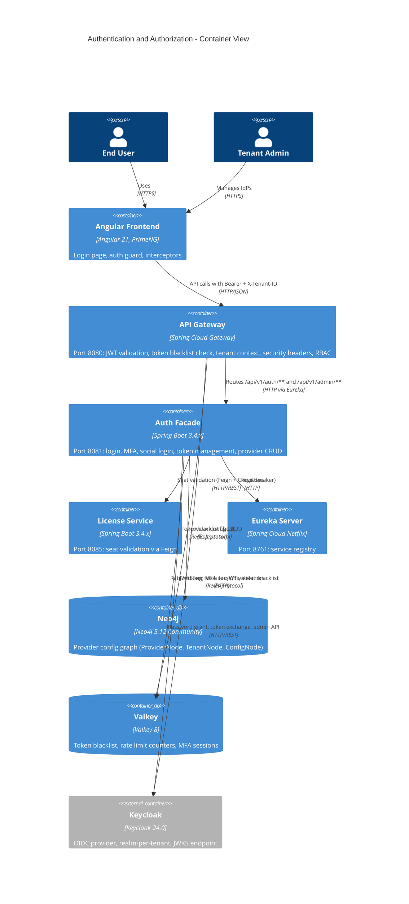
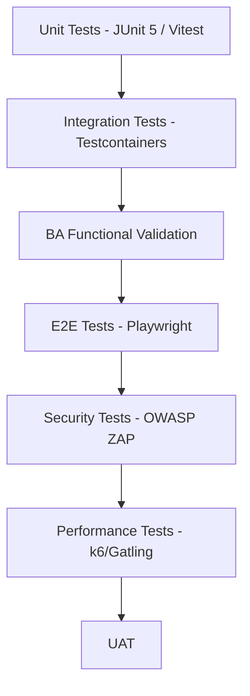
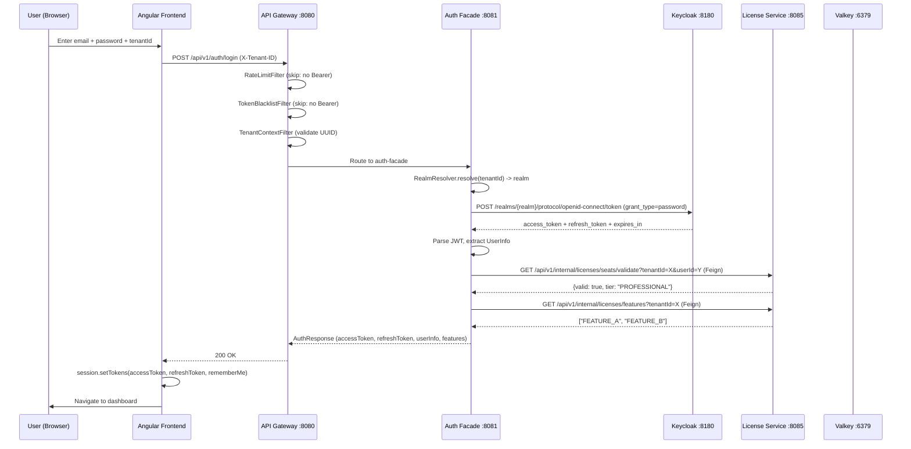
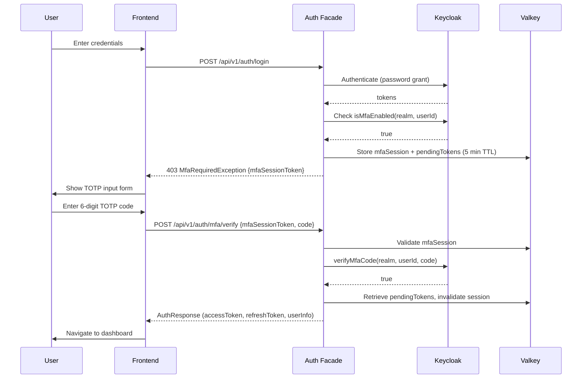
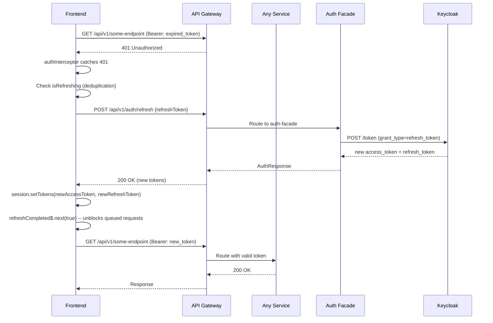

# Software Requirements Specification: Authentication and Authorization

**Document ID:** SRS-AA-001
**Version:** 1.0.0
**Date:** 2026-03-12
**Status:** Implementation-Ready
**Author:** BA Agent (BA-PRINCIPLES.md v1.1.0)
**BA Sign-Off:** APPROVED (unconditional)

**Revision History:**

| Version | Date | Author | Changes |
|---------|------|--------|---------|
| 1.0.0 | 2026-03-12 | BA Agent | Initial SRS consolidation. Evidence-based against codebase. 10 FRs (9 IMPLEMENTED, 1 IN-PROGRESS), 6 NFRs, 12 security requirements, traceability matrix. |

---

## Table of Contents

1. [Introduction](#1-introduction)
2. [Overall Description](#2-overall-description)
3. [Frontend Requirements](#3-frontend-requirements)
4. [Backend Requirements](#4-backend-requirements)
5. [Security Requirements](#5-security-requirements)
6. [Non-Functional Requirements](#6-non-functional-requirements)
7. [Test Requirements](#7-test-requirements)
8. [Traceability Matrix](#8-traceability-matrix)
9. [Conditions and Risks](#9-conditions-and-risks)

---

## 1. Introduction

### 1.1 Purpose

This Software Requirements Specification (SRS) consolidates all requirements for the Authentication and Authorization feature of the EMSIST platform into a single, implementation-ready reference document. It synthesizes the product requirements, technical specification, low-level design, data model, UI/UX design, API contract, user journeys, and implementation backlog into one cohesive specification that developers, testers, and architects can use as the authoritative reference.

This document follows IEEE 830 / ISO 29148 structure and adheres to the Evidence-Before-Documentation (EBD) governance rule. Every requirement tagged `[IMPLEMENTED]` has been verified against actual source code with file paths cited. Requirements tagged `[IN-PROGRESS]` describe what exists and what remains. Requirements tagged `[PLANNED]` explicitly state that no code exists.

### 1.2 Scope

Authentication and Authorization is the security foundation of the EMSIST platform. It provides multi-tenant identity management through a provider-agnostic architecture centered on Keycloak 24.0 as the primary (and currently only) identity provider. The feature encompasses:

- **Implemented:** User login (password, social, redirect-based), JWT token lifecycle (issuance, validation, refresh, blacklisting), multi-factor authentication (TOTP), rate limiting, role-based access control (RBAC), multi-tenant realm isolation, seat validation via license-service, security headers, frontend auth guard and interceptors, admin identity provider management API
- **In-Progress:** Admin IdP management UI (backend API complete, frontend UI not yet built)
- **Planned:** Auth0/Okta/Azure AD provider implementations, WebAuthn/FIDO2, SMS/Email OTP MFA, active session management UI, graph-per-tenant isolation, SAML 2.0 federation

### 1.3 Definitions, Acronyms, and Abbreviations

| Term | Definition |
|------|------------|
| auth-facade | Backend microservice (port 8081) that mediates all authentication operations |
| api-gateway | Spring Cloud Gateway (port 8080) that routes and secures all API traffic |
| JWT | JSON Web Token -- the bearer credential format used for API authentication |
| JWKS | JSON Web Key Set -- the Keycloak endpoint serving public keys for JWT signature verification |
| TOTP | Time-based One-Time Password -- the MFA algorithm used (RFC 6238, SHA1, 30s window, 6 digits) |
| Realm | A Keycloak tenant isolation boundary; each EMSIST tenant maps to a Keycloak realm |
| RealmResolver | Utility class mapping tenant ID to Keycloak realm name |
| MFA | Multi-Factor Authentication |
| RBAC | Role-Based Access Control |
| IdP | Identity Provider |
| Seat | A license entitlement granting a specific user access to a tenant |
| Valkey | Redis-compatible in-memory store (valkey/valkey:8-alpine) used for token blacklisting, rate limiting, MFA sessions |
| Neo4j | Graph database (5.12.0-community) used by auth-facade for provider configuration storage |
| OIDC | OpenID Connect |
| CSP | Content Security Policy |
| HSTS | HTTP Strict Transport Security |

### 1.4 System Overview



### 1.5 References

| # | Document | ID | Version | Location |
|---|----------|----|---------|----------|
| 1 | PRD: Authentication & Authorization | PRD-AA-001 | 1.0.0 | `R01. AUTHENTICATION AND AUTHORIZATION/Design/01-PRD-Authentication-Authorization.md` |
| 2 | Technical Specification | -- | 1.0.0 | `R01. AUTHENTICATION AND AUTHORIZATION/Design/02-Technical-Specification.md` |
| 3 | Low-Level Design | LLD-AA-001 | 1.0.0 | `R01. AUTHENTICATION AND AUTHORIZATION/Design/03-LLD-Authentication-Authorization.md` |
| 4 | Data Model | DM-AA-001 | 1.0.0 | `R01. AUTHENTICATION AND AUTHORIZATION/Design/04-Data-Model-Authentication-Authorization.md` |
| 5 | UI/UX Design Spec | UX-AA-001 | 1.0.0 | `R01. AUTHENTICATION AND AUTHORIZATION/Design/05-UI-UX-Design-Spec.md` |
| 6 | API Contract | API-AA-001 | 1.0.0 | `R01. AUTHENTICATION AND AUTHORIZATION/Design/06-API-Contract.md` |
| 7 | Gap Analysis | -- | 1.0.0 | `R01. AUTHENTICATION AND AUTHORIZATION/Design/07-Gap-Analysis.md` |
| 8 | User Journeys | UX-DJ-001 | 1.0.0 | `R01. AUTHENTICATION AND AUTHORIZATION/Design/09-Detailed-User-Journeys.md` |
| 9 | Implementation Backlog | BLG-AA-001 | 1.0.0 | `R01. AUTHENTICATION AND AUTHORIZATION/Design/10-Implementation-Backlog.md` |
| 10 | ADR-004: Keycloak as Primary IdP | -- | Accepted | `docs/adr/ADR-004.md` |
| 11 | ADR-007: Provider-Agnostic Identity Layer | -- | Accepted | `docs/adr/ADR-007.md` |
| 12 | ADR-005: Valkey Cache Layer | -- | Implemented | `docs/adr/ADR-005.md` |
| 13 | OAuth 2.0 (RFC 6749) | -- | -- | https://datatracker.ietf.org/doc/html/rfc6749 |
| 14 | OIDC Core 1.0 | -- | -- | https://openid.net/specs/openid-connect-core-1_0.html |
| 15 | JWT (RFC 7519) | -- | -- | https://datatracker.ietf.org/doc/html/rfc7519 |
| 16 | TOTP (RFC 6238) | -- | -- | https://datatracker.ietf.org/doc/html/rfc6238 |

---

## 2. Overall Description

### 2.1 Product Perspective

The authentication and authorization subsystem spans two backend microservices (auth-facade at port 8081 and api-gateway at port 8080) and the Angular frontend. It integrates with Keycloak 24.0 for identity management, Valkey 8 for caching and token blacklisting, Neo4j 5.12 Community for provider configuration storage, and license-service at port 8085 for seat validation.

**Evidence [IMPLEMENTED]:**
- auth-facade source: `backend/auth-facade/src/main/java/com/ems/auth/`
- api-gateway source: `backend/api-gateway/src/main/java/com/ems/gateway/`
- Frontend auth: `frontend/src/app/core/auth/`, `frontend/src/app/core/interceptors/`, `frontend/src/app/core/services/session.service.ts`
- Docker: `infrastructure/docker/docker-compose.yml` (keycloak:24.0, valkey/valkey:8-alpine, neo4j:5.12.0-community)

### 2.2 Product Functions Summary

| ID | Function | Priority | Status |
|----|----------|----------|--------|
| FR-AUTH-001 | User Login (password, email/username) | P0 | [IMPLEMENTED] |
| FR-AUTH-002 | Token Management (JWT lifecycle, blacklist) | P0 | [IMPLEMENTED] |
| FR-AUTH-003 | Multi-Tenant Isolation (realm per tenant) | P0 | [IMPLEMENTED] |
| FR-AUTH-004 | MFA (TOTP-based) | P0 | [IMPLEMENTED] |
| FR-AUTH-005 | Social Login (Google, Microsoft, redirect-based) | P0 | [IMPLEMENTED] |
| FR-AUTH-006 | Rate Limiting (Valkey-backed) | P0 | [IMPLEMENTED] |
| FR-AUTH-007 | Role-Based Access Control | P0 | [IMPLEMENTED] |
| FR-AUTH-008 | Security Headers | P0 | [IMPLEMENTED] |
| FR-AUTH-009 | Frontend Auth (guard, interceptors, session) | P0 | [IMPLEMENTED] |
| FR-AUTH-010 | Admin IdP Management (CRUD API) | P1 | [IN-PROGRESS] |

### 2.3 User Characteristics

| Persona | Role | Technical Level | Primary Functions | Key Permissions |
|---------|------|-----------------|-------------------|-----------------|
| End User | USER | Basic | Login, MFA setup, password reset | Authenticate, view own profile |
| Tenant Admin | TENANT_ADMIN | Intermediate | User management, IdP configuration, seat management | Manage users within own tenant, configure IdPs |
| Platform Admin | ADMIN | Advanced | Cross-tenant administration, system configuration | Full admin access across tenants |
| Super Admin | SUPER_ADMIN | Expert | Platform governance, master tenant operations | Bypasses license seat validation, full system access |

### 2.4 Constraints

| Constraint | Description | Evidence |
|-----------|-------------|----------|
| Identity Provider | Only Keycloak 24.0 is implemented. Auth0, Okta, Azure AD are [PLANNED] per ADR-007 (25% implemented). | `KeycloakIdentityProvider.java` is the sole implementation of `IdentityProvider` interface. |
| Database | Neo4j 5.12.0-community (no Enterprise features: graph-per-tenant, clustering). | docker-compose.yml: `neo4j:5.12.0-community` |
| Cache | Single-tier Valkey only. No Caffeine L1 cache. | No Caffeine dependency in any pom.xml. |
| Token Format | RS256-signed JWT via Keycloak JWKS. Internal MFA session tokens use HMAC-SHA. | `JwtTokenValidator.java` (RSA), `TokenServiceImpl.java` (HMAC) |
| Messaging | No Kafka integration for auth events. Auth events are read directly from Keycloak Admin API. | `KeycloakIdentityProvider.getEvents()` uses `realmResource.getEvents()` |
| Frontend | Angular 21 with functional interceptors and guards. | `auth.interceptor.ts`, `auth.guard.ts` |
| RTL | Arabic RTL layout support required for login UI. | Governance requirement, not yet validated at AAA level. |

### 2.5 Assumptions

| # | Assumption | Rationale |
|---|-----------|-----------|
| A1 | Keycloak is deployed and accessible at the configured URL | auth-facade connects via `KeycloakConfig.getServerUrl()` |
| A2 | Each tenant has a corresponding Keycloak realm | `RealmResolver.resolve()` maps tenant ID to realm name |
| A3 | Master tenant (UUID `68cd2a56-98c9-4ed4-8534-c299566d5b27`) bypasses seat validation | `RealmResolver.isMasterTenant()` + `AuthServiceImpl.login()` conditional |
| A4 | Valkey is available for rate limiting, blacklisting, and MFA sessions | Graceful degradation: `RateLimitFilter` catches exceptions and allows request if Valkey is down |
| A5 | license-service is reachable via Feign for seat validation | Circuit breaker with fail-closed fallback via `SeatValidationService` |

### 2.6 Dependencies

| Dependency | Service | Port | Required For | Failure Mode |
|-----------|---------|------|-------------|-------------|
| Keycloak | External IdP | 8180 | All authentication operations | `AuthenticationException("provider unavailable")` |
| Valkey | Infrastructure | 6379 | Token blacklist, rate limiting, MFA sessions | Rate limiting: fail-open. Blacklist: fail-open (token may pass). MFA: session creation fails. |
| Neo4j | Infrastructure | 7687 | Provider configuration storage | Admin IdP CRUD fails. Login unaffected (Keycloak config via YAML). |
| license-service | Internal | 8085 | Seat validation during login | Circuit breaker: fail-closed (`NoActiveSeatException`) |
| Eureka | Internal | 8761 | Service discovery | Direct hostname routing fallback |

---

## 3. Frontend Requirements

### 3.1 FR-AUTH-009: Frontend Authentication [IMPLEMENTED]

**Evidence:**
- Auth guard: `frontend/src/app/core/auth/auth.guard.ts`
- Auth interceptor: `frontend/src/app/core/interceptors/auth.interceptor.ts`
- Tenant header interceptor: `frontend/src/app/core/interceptors/tenant-header.interceptor.ts`
- Session service: `frontend/src/app/core/services/session.service.ts`
- Auth facade service: `frontend/src/app/core/auth/gateway-auth-facade.service.ts`

#### 3.1.1 Route Protection

| AC # | Acceptance Criterion | Status |
|------|---------------------|--------|
| AC-FE-001 | **Given** an unauthenticated user **When** they navigate to a protected route **Then** the system SHALL redirect to `/auth/login` with `returnUrl` query parameter | [IMPLEMENTED] |
| AC-FE-002 | **Given** an authenticated user (accessToken present in session/localStorage) **When** they navigate to a protected route **Then** the auth guard SHALL allow access | [IMPLEMENTED] |

**Implementation Evidence:**
```typescript
// auth.guard.ts (line 5-16)
export const authGuard: CanActivateFn = (_route, state) => {
  const session = inject(SessionService);
  const router = inject(Router);
  if (session.isAuthenticated()) {
    return true;
  }
  return router.createUrlTree(['/auth/login'], {
    queryParams: { returnUrl: state.url },
  });
};
```

#### 3.1.2 Token Injection

| AC # | Acceptance Criterion | Status |
|------|---------------------|--------|
| AC-FE-003 | **Given** an authenticated user **When** an HTTP request targets `/api/` **Then** the system SHALL auto-inject `Authorization: Bearer {accessToken}` header | [IMPLEMENTED] |
| AC-FE-004 | **Given** a resolved tenant context **When** an HTTP request targets `/api/` **Then** the system SHALL auto-inject `X-Tenant-ID: {tenantId}` header | [IMPLEMENTED] |
| AC-FE-005 | **Given** a request to a public endpoint (`/api/v1/auth/login`, `/api/v1/auth/refresh`, `/api/v1/auth/logout`, `/api/tenants/resolve`) **When** the interceptor evaluates it **Then** the system SHALL NOT inject Authorization header | [IMPLEMENTED] |

**Implementation Evidence:**
```typescript
// auth.interceptor.ts (line 23-42)
const isApiRequest = request.url.includes('/api/');
const isPublic = isPublicEndpoint(request.url);
if (!isApiRequest || isPublic) {
  return next(request);
}
const accessToken = session.accessToken();
const tenantId = tenantContext.tenantId();
const extraHeaders: Record<string, string> = {};
if (accessToken && !request.headers.has('Authorization')) {
  extraHeaders['Authorization'] = `Bearer ${accessToken}`;
}
if (tenantId && !request.headers.has('X-Tenant-ID')) {
  extraHeaders['X-Tenant-ID'] = tenantId;
}
```

#### 3.1.3 Token Refresh on 401

| AC # | Acceptance Criterion | Status |
|------|---------------------|--------|
| AC-FE-006 | **Given** an API request returns HTTP 401 **When** a refresh token is available **Then** the system SHALL call `/api/v1/auth/refresh` and retry the original request with the new access token | [IMPLEMENTED] |
| AC-FE-007 | **Given** multiple concurrent requests receive 401 **When** a refresh is already in progress **Then** the system SHALL deduplicate the refresh call and queue pending requests until the refresh completes | [IMPLEMENTED] |
| AC-FE-008 | **Given** the refresh token call fails **When** the error is caught **Then** the system SHALL clear tokens, navigate to `/auth/login` with `reason=session_expired`, and reject the original request | [IMPLEMENTED] |

**Implementation Evidence:**
```typescript
// auth.interceptor.ts (line 75-91) -- deduplication via isRefreshing flag + BehaviorSubject
if (isRefreshing) {
  return refreshCompleted$.pipe(
    filter(Boolean),
    take(1),
    switchMap(() => {
      const updatedAccessToken = session.accessToken();
      ...
      return next(request.clone({ setHeaders: buildRetryHeaders(updatedAccessToken) }));
    }),
  );
}
```

#### 3.1.4 Token Storage

| AC # | Acceptance Criterion | Status |
|------|---------------------|--------|
| AC-FE-009 | **Given** the user logs in with `rememberMe=true` **When** tokens are stored **Then** the system SHALL persist tokens in `localStorage` | [IMPLEMENTED] |
| AC-FE-010 | **Given** the user logs in with `rememberMe=false` **When** tokens are stored **Then** the system SHALL persist tokens in `sessionStorage` | [IMPLEMENTED] |
| AC-FE-011 | **Given** the user logs out **When** `clearTokens()` is called **Then** the system SHALL remove tokens from BOTH `sessionStorage` and `localStorage` | [IMPLEMENTED] |
| AC-FE-012 | **Given** a page load **When** the `SessionService` initializes **Then** it SHALL read tokens from `sessionStorage` first, falling back to `localStorage` | [IMPLEMENTED] |

**Implementation Evidence:**
```typescript
// session.service.ts (line 58-76)
private readToken(key: string): string | null {
  return sessionStorage.getItem(key) ?? localStorage.getItem(key);
}
private writeToken(key: string, value: string | null, rememberMe: boolean): void {
  sessionStorage.removeItem(key);
  localStorage.removeItem(key);
  if (!value) return;
  if (rememberMe) {
    localStorage.setItem(key, value);
    return;
  }
  sessionStorage.setItem(key, value);
}
```

Storage keys: `tp_access_token`, `tp_refresh_token`.

#### 3.1.5 Logout

| AC # | Acceptance Criterion | Status |
|------|---------------------|--------|
| AC-FE-013 | **Given** an authenticated user **When** they trigger logout **Then** the system SHALL call `POST /api/v1/auth/logout` with the refresh token, clear local tokens, and redirect to `/auth/login` with `loggedOut=1` | [IMPLEMENTED] |
| AC-FE-014 | **Given** the logout API call fails (network error) **When** the error is caught **Then** the system SHALL still clear local tokens and redirect (fail-safe logout) | [IMPLEMENTED] |

**Implementation Evidence:**
```typescript
// gateway-auth-facade.service.ts (line 56-69)
logout(): Observable<void> {
  const refreshToken = this.getRefreshToken();
  if (!refreshToken) { this.logoutLocal('logged_out'); return of(void 0); }
  return this.api.logout({ refreshToken }).pipe(
    catchError(() => of(void 0)),
    map(() => { this.logoutLocal('logged_out'); }),
  );
}
```

---

## 4. Backend Requirements

### 4.1 FR-AUTH-001: User Login [IMPLEMENTED]

**Evidence:**
- Controller: `backend/auth-facade/src/main/java/com/ems/auth/controller/AuthController.java` (line 41-60)
- Service: `backend/auth-facade/src/main/java/com/ems/auth/service/AuthServiceImpl.java` (line 44-69)
- Provider: `backend/auth-facade/src/main/java/com/ems/auth/provider/KeycloakIdentityProvider.java` (line 73-98)
- Realm resolver: `backend/auth-facade/src/main/java/com/ems/auth/util/RealmResolver.java`
- Seat validation: `backend/auth-facade/src/main/java/com/ems/auth/service/SeatValidationService.java`

| AC # | Acceptance Criterion | Status |
|------|---------------------|--------|
| AC-BE-001 | **Given** a valid `LoginRequest` with `identifier` (email or username) and `password` **When** `POST /api/v1/auth/login` is called with `X-Tenant-ID` header **Then** the system SHALL authenticate against the Keycloak realm mapped to the tenant and return an `AuthResponse` containing `accessToken`, `refreshToken`, `expiresIn`, and `UserInfo` | [IMPLEMENTED] |
| AC-BE-002 | **Given** valid credentials for a non-master tenant **When** login succeeds **Then** the system SHALL validate the user has an active license seat by calling `SeatValidationService.validateUserSeat(tenantId, userId)` via Feign to license-service | [IMPLEMENTED] |
| AC-BE-003 | **Given** the user is a master tenant user (UUID `68cd2a56-98c9-4ed4-8534-c299566d5b27` or realm "master") **When** login succeeds **Then** the system SHALL skip seat validation | [IMPLEMENTED] |
| AC-BE-004 | **Given** the user has MFA enabled **When** password authentication succeeds **Then** the system SHALL throw `MfaRequiredException` with an `mfaSessionToken` (stored in Valkey with 5-minute TTL) and pending tokens | [IMPLEMENTED] |
| AC-BE-005 | **Given** a successful login (no MFA required) **When** the response is constructed **Then** the system SHALL append tenant feature flags by calling `licenseServiceClient.getUserFeatures(tenantId)` | [IMPLEMENTED] |
| AC-BE-006 | **Given** invalid credentials **When** Keycloak returns 401 **Then** the system SHALL throw `InvalidCredentialsException` | [IMPLEMENTED] |
| AC-BE-007 | **Given** Keycloak is unreachable **When** a `ResourceAccessException` occurs **Then** the system SHALL throw `AuthenticationException("Authentication provider is unavailable...")` | [IMPLEMENTED] |

**Keycloak Token Request Parameters:**

| Parameter | Value | Evidence |
|-----------|-------|----------|
| `grant_type` | `password` | `KeycloakIdentityProvider.java` line 78 |
| `client_id` | From `keycloakConfig.getClient().getClientId()` | Line 79 |
| `client_secret` | From `keycloakConfig.getClient().getClientSecret()` | Line 80 |
| `scope` | `openid profile email` | Line 83 |

**Seat Validation Circuit Breaker:**

| Parameter | Value | Evidence |
|-----------|-------|----------|
| Circuit breaker name | `licenseService` | `SeatValidationService.java` `@CircuitBreaker` annotation |
| Fallback behavior | Fail-closed: throws `NoActiveSeatException` | `validateSeatFallback()` method |
| Feign client | `LicenseServiceClient.validateSeat(tenantId, userUuid)` | `LicenseServiceClient.java` |

### 4.2 FR-AUTH-002: Token Management [IMPLEMENTED]

**Evidence:**
- JWT validator: `backend/auth-facade/src/main/java/com/ems/auth/security/JwtTokenValidator.java`
- Token service: `backend/auth-facade/src/main/java/com/ems/auth/service/TokenServiceImpl.java`
- Blacklist filter (gateway): `backend/api-gateway/src/main/java/com/ems/gateway/filter/TokenBlacklistFilter.java`

| AC # | Acceptance Criterion | Status |
|------|---------------------|--------|
| AC-BE-008 | **Given** a JWT access token **When** the system validates it **Then** it SHALL fetch the RSA public key from Keycloak's JWKS endpoint (`/realms/{realm}/protocol/openid-connect/certs`), extract the `kid` from the token header, and verify the RS256 signature | [IMPLEMENTED] |
| AC-BE-009 | **Given** JWKS keys have been fetched for a realm **When** a subsequent validation occurs within 1 hour **Then** the system SHALL use the cached keys (TTL = 3,600,000 ms = 1 hour) | [IMPLEMENTED] |
| AC-BE-010 | **Given** the JWKS cache has expired or the `kid` is not found **When** validation is attempted **Then** the system SHALL synchronously refresh the JWKS keys from Keycloak | [IMPLEMENTED] |
| AC-BE-011 | **Given** a valid refresh token **When** `POST /api/v1/auth/refresh` is called **Then** the system SHALL exchange it with Keycloak using `grant_type=refresh_token` and return a new `AuthResponse` | [IMPLEMENTED] |
| AC-BE-012 | **Given** a logout request with an access token in the Authorization header **When** `POST /api/v1/auth/logout` is called **Then** the system SHALL extract the `jti` and `exp` claims, compute TTL as `max(exp - now, 60)` seconds, and store the JTI in Valkey with key `auth:blacklist:{jti}` | [IMPLEMENTED] |
| AC-BE-013 | **Given** an incoming request to the API gateway with a Bearer token **When** the `TokenBlacklistFilter` processes it **Then** the system SHALL extract the `jti` from the JWT payload (Base64 decode, no signature check), check `auth:blacklist:{jti}` in Valkey, and if found, reject with HTTP 401 `{"error":"token_revoked"}` | [IMPLEMENTED] |
| AC-BE-014 | **Given** an expired JWT **When** token parsing is attempted **Then** the system SHALL throw `TokenExpiredException` | [IMPLEMENTED] |

**JWKS Cache Implementation:**

| Component | Value | Evidence |
|-----------|-------|----------|
| Cache structure | `ConcurrentHashMap<String, Map<String, PublicKey>>` keyed by realm | `JwtTokenValidator.java` line 32 |
| Expiry tracking | `ConcurrentHashMap<String, Long>` with epoch ms | Line 33 |
| TTL | `JWKS_CACHE_TTL_MS = 3600_000` (1 hour) | Line 34 |
| Refresh | `synchronized void refreshJwks(String realm)` | Line 144 |
| Key algorithm | RSA only (`kty == "RSA"`) | Line 155 |

**Token Blacklist Implementation:**

| Component | Value | Evidence |
|-----------|-------|----------|
| Blacklist key format | `auth:blacklist:{jti}` | `TokenServiceImpl.java` line 96-97 |
| TTL | `max(exp - now_seconds, 60)` seconds | Line 95 |
| Gateway filter order | -200 (runs before TenantContextFilter at -100) | `TokenBlacklistFilter.java` line 64 |
| Reactive check | `ReactiveStringRedisTemplate.hasKey()` | Line 52 |

### 4.3 FR-AUTH-003: Multi-Tenant Isolation [IMPLEMENTED]

**Evidence:**
- RealmResolver: `backend/auth-facade/src/main/java/com/ems/auth/util/RealmResolver.java`
- Gateway tenant filter: `backend/api-gateway/src/main/java/com/ems/gateway/filter/TenantContextFilter.java`
- Auth-facade tenant filter: `backend/auth-facade/src/main/java/com/ems/auth/filter/TenantContextFilter.java`

| AC # | Acceptance Criterion | Status |
|------|---------------------|--------|
| AC-BE-015 | **Given** an API request **When** the gateway `TenantContextFilter` processes it **Then** the system SHALL extract `X-Tenant-ID` from the request header and validate it is a valid UUID | [IMPLEMENTED] |
| AC-BE-016 | **Given** an `X-Tenant-ID` header and a Bearer token **When** the gateway processes the request **Then** the system SHALL cross-validate the header value against the `tenant_id` claim in the JWT payload and reject with HTTP 403 `{"error":"tenant_mismatch"}` if they differ | [IMPLEMENTED] |
| AC-BE-017 | **Given** a tenant ID **When** `RealmResolver.resolve()` is called **Then** the system SHALL map: "master" or the master UUID to realm "master"; "tenant-{id}" (already prefixed) to itself; bare "{id}" to "tenant-{id}" | [IMPLEMENTED] |
| AC-BE-018 | **Given** an `X-Tenant-ID` that is not a valid UUID **When** the gateway filter processes it **Then** the system SHALL reject with HTTP 400 `{"error":"invalid_tenant_id"}` | [IMPLEMENTED] |

**Realm Mapping Rules:**

| Input | Output Realm | Evidence |
|-------|-------------|----------|
| `"master"` | `"master"` | `RealmResolver.java` line 44-46 |
| `"tenant-master"` | `"master"` | Line 65 |
| `"68cd2a56-98c9-4ed4-8534-c299566d5b27"` | `"master"` | Line 66 |
| `"tenant-acme"` | `"tenant-acme"` | Line 49-51 |
| `"acme"` | `"tenant-acme"` | Line 53 |

### 4.4 FR-AUTH-004: Multi-Factor Authentication (TOTP) [IMPLEMENTED]

**Evidence:**
- MFA setup: `KeycloakIdentityProvider.java` (line 196-227)
- MFA verify: `KeycloakIdentityProvider.java` (line 229-279)
- MFA session token: `TokenServiceImpl.java` (line 106-128)
- Controller endpoints: `AuthController.java` (line 216-256)

| AC # | Acceptance Criterion | Status |
|------|---------------------|--------|
| AC-BE-019 | **Given** an authenticated user calling `POST /api/v1/auth/mfa/setup` **When** the system processes the request **Then** it SHALL generate a TOTP secret (Base32, SHA1, 30-second window, 6 digits) using `DefaultSecretGenerator`, create a QR code data URI via `ZxingPngQrGenerator`, and generate 8 recovery codes via `RecoveryCodeGenerator` | [IMPLEMENTED] |
| AC-BE-020 | **Given** MFA setup response **When** the user receives it **Then** it SHALL contain `secret` (Base32), `qrCodeUri` (data:image/png;base64,...), and `recoveryCodes` (8 strings) | [IMPLEMENTED] |
| AC-BE-021 | **Given** MFA setup initiated **When** pending secret and recovery codes are generated **Then** they SHALL be stored as Keycloak user attributes `totp_secret_pending` and `recovery_codes_pending` | [IMPLEMENTED] |
| AC-BE-022 | **Given** a valid TOTP code submitted via `POST /api/v1/auth/mfa/verify` **When** the code is verified successfully for a pending setup **Then** the system SHALL promote `totp_secret_pending` to `totp_secret`, `recovery_codes_pending` to `recovery_codes`, set `mfa_enabled=true`, and remove the pending attributes | [IMPLEMENTED] |
| AC-BE-023 | **Given** the MFA challenge flow **When** password auth succeeds for an MFA-enabled user **Then** the system SHALL create an `mfaSessionToken` (HMAC-SHA signed JWT with `type=mfa_session`, 5-minute TTL), store the session in Valkey at `auth:mfa:{sessionId}`, store pending access/refresh tokens at `auth:mfa:pending:{hash}`, and throw `MfaRequiredException` with the `mfaSessionToken` | [IMPLEMENTED] |
| AC-BE-024 | **Given** a valid MFA verification **When** the code is correct **Then** the system SHALL retrieve pending tokens from Valkey, invalidate the MFA session, and return a full `AuthResponse` with access token, refresh token, and user info | [IMPLEMENTED] |

**TOTP Configuration:**

| Parameter | Value | Evidence |
|-----------|-------|----------|
| Algorithm | SHA1 | `KeycloakIdentityProvider.java` line 209 (`HashingAlgorithm.SHA1`) |
| Digits | 6 | Line 210 |
| Period | 30 seconds | Line 211 |
| Secret generator | `DefaultSecretGenerator` (Base32) | Line 69 |
| QR generator | `ZxingPngQrGenerator` (PNG data URI) | Line 70 |
| Recovery codes | 8 per user | Line 215 (`generateCodes(8)`) |
| Issuer | "EMS" | Line 208 |

### 4.5 FR-AUTH-005: Social Login [IMPLEMENTED]

**Evidence:**
- Google login: `AuthController.java` (line 62-78), `AuthServiceImpl.java` (line 72-92)
- Microsoft login: `AuthController.java` (line 80-96), `AuthServiceImpl.java` (line 94-115)
- Redirect-based login: `AuthController.java` (line 102-142)
- Token exchange: `KeycloakIdentityProvider.java` (line 147-172)

| AC # | Acceptance Criterion | Status |
|------|---------------------|--------|
| AC-BE-025 | **Given** a Google ID token **When** `POST /api/v1/auth/social/google` is called **Then** the system SHALL exchange the token with Keycloak using `grant_type=urn:ietf:params:oauth:grant-type:token-exchange`, `subject_issuer=google`, and `subject_token_type=urn:ietf:params:oauth:token-type:jwt` | [IMPLEMENTED] |
| AC-BE-026 | **Given** a Microsoft access token **When** `POST /api/v1/auth/social/microsoft` is called **Then** the system SHALL exchange the token with Keycloak using `subject_issuer=microsoft` and `subject_token_type=urn:ietf:params:oauth:token-type:access_token` | [IMPLEMENTED] |
| AC-BE-027 | **Given** a provider alias (e.g., "google", "microsoft", "saml") **When** `GET /api/v1/auth/login/{provider}` is called **Then** the system SHALL build a Keycloak authorization URL with `kc_idp_hint={provider}`, `response_type=code`, `scope=openid profile email`, and a random `state` parameter, and return HTTP 302 with `Location` header | [IMPLEMENTED] |
| AC-BE-028 | **Given** `GET /api/v1/auth/providers` is called **When** the request is processed **Then** the system SHALL return a JSON object with `active` (current provider from config), `available` (list of provider aliases including google, microsoft, facebook, github, saml), and `tenant` | [IMPLEMENTED] |
| AC-BE-029 | **Given** a social login succeeds for a non-master tenant **When** the user info is available **Then** the system SHALL validate the user's seat and check if MFA is enabled, following the same flow as password login | [IMPLEMENTED] |

**Token Type Mapping:**

| Provider | Token Type | Evidence |
|----------|-----------|----------|
| Google | `urn:ietf:params:oauth:token-type:jwt` | `KeycloakIdentityProvider.java` line 376 |
| Microsoft | `urn:ietf:params:oauth:token-type:access_token` | Line 377 |
| Azure AD | `urn:ietf:params:oauth:token-type:access_token` | Line 377 |
| Default | `urn:ietf:params:oauth:token-type:access_token` | Line 378 |

### 4.6 FR-AUTH-006: Rate Limiting [IMPLEMENTED]

**Evidence:**
- Rate limit filter: `backend/auth-facade/src/main/java/com/ems/auth/filter/RateLimitFilter.java`

| AC # | Acceptance Criterion | Status |
|------|---------------------|--------|
| AC-BE-030 | **Given** an incoming request to auth-facade (excluding `/actuator`, `/swagger`, `/api-docs`) **When** the `RateLimitFilter` (Order 2) processes it **Then** the system SHALL increment a Valkey counter at key `auth:rate:{tenantId}:{ip}` (or `auth:rate:{ip}` if no tenant header) with a 60-second sliding window | [IMPLEMENTED] |
| AC-BE-031 | **Given** the counter exceeds `rate-limit.requests-per-minute` (default: 100) **When** the limit is exceeded **Then** the system SHALL return HTTP 429 with `Retry-After` header (TTL in seconds) and JSON body `{"error":"rate_limit_exceeded","retryAfter":{seconds}}` | [IMPLEMENTED] |
| AC-BE-032 | **Given** any request **When** rate limit headers are computed **Then** the response SHALL include `X-RateLimit-Limit`, `X-RateLimit-Remaining`, and `X-RateLimit-Reset` (epoch seconds) | [IMPLEMENTED] |
| AC-BE-033 | **Given** Valkey is unavailable **When** the rate limit check fails **Then** the system SHALL log a warning and allow the request through (fail-open) | [IMPLEMENTED] |

**Rate Limit Configuration:**

| Parameter | Config Key | Default | Evidence |
|-----------|-----------|---------|----------|
| Requests per minute | `rate-limit.requests-per-minute` | 100 | `RateLimitFilter.java` line 34 |
| Cache key prefix | `rate-limit.cache-prefix` | `auth:rate:` | Line 37 |
| Window | Fixed 60s via `expire(key, 60, SECONDS)` | 60 seconds | Line 62 |
| Client identifier | `{tenantId}:{ip}` or just `{ip}` | -- | Lines 91-103 |

### 4.7 FR-AUTH-007: Role-Based Access Control [IMPLEMENTED]

**Evidence:**
- Gateway security config: `backend/api-gateway/src/main/java/com/ems/gateway/config/SecurityConfig.java`
- Provider-agnostic role converter (auth-facade): `backend/auth-facade/src/main/java/com/ems/auth/security/ProviderAgnosticRoleConverter.java`

| AC # | Acceptance Criterion | Status |
|------|---------------------|--------|
| AC-BE-034 | **Given** a JWT token **When** the gateway extracts authorities **Then** the system SHALL extract roles from: `realm_access.roles`, `resource_access.{client}.roles`, top-level `roles` claim, and `scope`/`scp` claims | [IMPLEMENTED] |
| AC-BE-035 | **Given** extracted role strings **When** they are normalized **Then** the system SHALL strip existing `ROLE_` prefix if present, replace hyphens with underscores, uppercase, and prefix with `ROLE_` | [IMPLEMENTED] |
| AC-BE-036 | **Given** a request to `/api/v1/admin/**` **When** the gateway evaluates authorization **Then** the system SHALL require `ROLE_ADMIN` or `ROLE_SUPER_ADMIN` | [IMPLEMENTED] |
| AC-BE-037 | **Given** a request to `/api/v1/tenants/*/seats/**` **When** the gateway evaluates authorization **Then** the system SHALL require `ROLE_TENANT_ADMIN`, `ROLE_ADMIN`, or `ROLE_SUPER_ADMIN` | [IMPLEMENTED] |
| AC-BE-038 | **Given** a request to `/api/v1/internal/**` **When** the gateway evaluates authorization **Then** the system SHALL deny all access (`.denyAll()`) | [IMPLEMENTED] |
| AC-BE-039 | **Given** any non-public, non-admin request **When** the gateway evaluates authorization **Then** the system SHALL require `.authenticated()` | [IMPLEMENTED] |

**Public Endpoints (No Auth Required):**

| Endpoint | Evidence |
|----------|----------|
| `POST /api/v1/auth/login` | `SecurityConfig.java` line 48 |
| `GET /api/v1/auth/login/**` | Line 49 |
| `GET /api/v1/auth/providers` | Line 50 |
| `POST /api/v1/auth/social/**` | Line 52 |
| `POST /api/v1/auth/refresh` | Line 53 |
| `POST /api/v1/auth/logout` | Line 54 |
| `POST /api/v1/auth/mfa/verify` | Line 55 |
| `POST /api/v1/auth/password/reset` | Line 56 |
| `POST /api/v1/auth/password/reset/confirm` | Line 57 |
| `GET /api/tenants/resolve` | Line 46 |
| `GET /api/tenants/validate/**` | Line 47 |
| `GET /actuator/health` | Line 58 |

**Auth-Facade Role Converter (ProviderAgnosticRoleConverter):**

The auth-facade also has a configurable role converter that reads role claim paths from `auth.facade.role-claim-paths` YAML configuration. This enables provider-agnostic role extraction without code changes:

| Supported Path | Description | Evidence |
|----------------|-------------|----------|
| `realm_access.roles` | Keycloak realm roles | `ProviderAgnosticRoleConverter.java` line 82-93 |
| `resource_access` | Keycloak client roles (all clients) | Lines 96-98, 131-148 |
| `roles` | Standard OIDC / Auth0 flat claim | Line 110-117 |
| `scope` | Space-separated scope string | Lines 101-107 |
| Nested dot paths | e.g., `resource_access.account.roles` | Lines 83-93 |

### 4.8 FR-AUTH-008: Security Headers [IMPLEMENTED]

**Evidence:**
- Gateway security config: `backend/api-gateway/src/main/java/com/ems/gateway/config/SecurityConfig.java` (line 72-85)

| AC # | Acceptance Criterion | Status |
|------|---------------------|--------|
| AC-BE-040 | **Given** any API response from the gateway **When** headers are set **Then** the system SHALL include `Strict-Transport-Security: max-age=31536000; includeSubdomains` | [IMPLEMENTED] |
| AC-BE-041 | **Given** any API response from the gateway **When** headers are set **Then** the system SHALL include `X-Frame-Options: DENY` | [IMPLEMENTED] |
| AC-BE-042 | **Given** any API response from the gateway **When** headers are set **Then** the system SHALL include `Content-Security-Policy: default-src 'self'; script-src 'self'; style-src 'self' 'unsafe-inline'; img-src 'self' data:; font-src 'self'; frame-ancestors 'none'` | [IMPLEMENTED] |
| AC-BE-043 | **Given** any API response from the gateway **When** headers are set **Then** the system SHALL include `X-Content-Type-Options: nosniff` | [IMPLEMENTED] |
| AC-BE-044 | **Given** any API response from the gateway **When** headers are set **Then** the system SHALL include `Referrer-Policy: strict-origin-when-cross-origin` | [IMPLEMENTED] |
| AC-BE-045 | **Given** any API response from the gateway **When** headers are set **Then** the system SHALL include `Permissions-Policy: camera=(), microphone=(), geolocation=()` | [IMPLEMENTED] |
| AC-BE-046 | **Given** the gateway security configuration **When** CSRF protection is evaluated **Then** it SHALL be disabled with documented justification (SEC-C03: all API endpoints use Bearer token authentication, which is immune to CSRF) | [IMPLEMENTED] |

### 4.9 FR-AUTH-010: Admin Identity Provider Management [IN-PROGRESS]

**Evidence:**
- Controller: `backend/auth-facade/src/main/java/com/ems/auth/controller/AdminProviderController.java`
- Provider resolver: `backend/auth-facade/src/main/java/com/ems/auth/provider/DynamicProviderResolver.java`
- Neo4j entities: `backend/auth-facade/src/main/java/com/ems/auth/graph/entity/ProviderNode.java`, `TenantNode.java`, `ConfigNode.java`
- Connection tester: `backend/auth-facade/src/main/java/com/ems/auth/service/ProviderConnectionTester.java`

**Status:** Backend API fully implemented (CRUD + test + validate + cache invalidation). Frontend admin UI for IdP management is not yet built.

| AC # | Acceptance Criterion | Status |
|------|---------------------|--------|
| AC-BE-047 | **Given** an ADMIN or SUPER_ADMIN user **When** `GET /api/v1/admin/tenants/{tenantId}/providers` is called **Then** the system SHALL return all configured identity providers for the tenant, with sensitive fields (clientSecret, bindDn) masked | [IMPLEMENTED] |
| AC-BE-048 | **Given** an ADMIN user **When** `POST /api/v1/admin/tenants/{tenantId}/providers` is called with a valid `ProviderConfigRequest` **Then** the system SHALL register the provider in Neo4j and return the created config (HTTP 201) | [IMPLEMENTED] |
| AC-BE-049 | **Given** an ADMIN user **When** `PUT /api/v1/admin/tenants/{tenantId}/providers/{providerId}` is called **Then** the system SHALL update the provider configuration and invalidate cache | [IMPLEMENTED] |
| AC-BE-050 | **Given** an ADMIN user **When** `DELETE /api/v1/admin/tenants/{tenantId}/providers/{providerId}` is called **Then** the system SHALL delete the provider from Neo4j (HTTP 204) | [IMPLEMENTED] |
| AC-BE-051 | **Given** an ADMIN user **When** `PATCH /api/v1/admin/tenants/{tenantId}/providers/{providerId}` is called **Then** the system SHALL partially update only the specified fields (enabled, priority, displayName) | [IMPLEMENTED] |
| AC-BE-052 | **Given** an ADMIN user **When** `POST /api/v1/admin/tenants/{tenantId}/providers/{providerId}/test` is called **Then** the system SHALL test connectivity to the provider (OIDC discovery, SAML metadata, LDAP bind) and return a `TestConnectionResponse` | [IMPLEMENTED] |
| AC-BE-053 | **Given** an ADMIN user **When** `POST /api/v1/admin/tenants/{tenantId}/providers/validate` is called **Then** the system SHALL validate the provider configuration without persisting | [IMPLEMENTED] |
| AC-BE-054 | **Given** an ADMIN user **When** `POST /api/v1/admin/tenants/{tenantId}/providers/cache/invalidate` is called **Then** the system SHALL force-invalidate the provider cache for the tenant | [IMPLEMENTED] |
| AC-BE-055 | **Given** any admin provider endpoint **When** the request is processed **Then** the system SHALL validate tenant access via `TenantAccessValidator.validateTenantAccess(tenantId)` (SEC-F02: IDOR prevention) | [IMPLEMENTED] |
| AC-BE-056 | **Given** the admin IdP management feature **When** a frontend UI is needed **Then** the system SHALL provide an admin panel for CRUD operations on identity providers | [PLANNED] |

**Supported Protocol Types:**

| Protocol | Description | Required Fields |
|----------|-------------|-----------------|
| OIDC | OpenID Connect | discoveryUrl, clientId, clientSecret |
| SAML | Security Assertion Markup Language | metadataUrl |
| LDAP | Lightweight Directory Access | serverUrl, port, bindDn, bindPassword |
| OAUTH2 | Generic OAuth2 | clientId, clientSecret |

**Supported Provider Types:**

| Provider Name | Evidence |
|---------------|----------|
| KEYCLOAK | `ProviderType.java` |
| AUTH0 | `ProviderType.java` |
| OKTA | `ProviderType.java` |
| AZURE_AD | `ProviderType.java` |
| UAE_PASS | `ProviderType.java` |
| GOOGLE | `ProviderType.java` |
| MICROSOFT | `ProviderType.java` |
| GITHUB | `ProviderType.java` |

---

## 5. Security Requirements

### 5.1 Authentication Security

| ID | Requirement | Status | Evidence |
|----|-------------|--------|----------|
| SEC-AUTH-001 | All authentication flows SHALL use HTTPS in production | [IMPLEMENTED] | HSTS header enforced via `SecurityConfig.java` line 73-75 |
| SEC-AUTH-002 | Password authentication SHALL use Keycloak's token endpoint (Resource Owner Password Credentials grant) over HTTPS | [IMPLEMENTED] | `KeycloakIdentityProvider.authenticate()` uses `executeTokenRequest()` |
| SEC-AUTH-003 | Token exchange for social login SHALL use the IETF token-exchange grant type (`urn:ietf:params:oauth:grant-type:token-exchange`) | [IMPLEMENTED] | `KeycloakIdentityProvider.exchangeToken()` line 151 |
| SEC-AUTH-004 | Logout SHALL blacklist the access token's JTI in Valkey with TTL equal to the token's remaining lifetime | [IMPLEMENTED] | `AuthServiceImpl.logout()` line 130-150 |

### 5.2 Token Security

| ID | Requirement | Status | Evidence |
|----|-------------|--------|----------|
| SEC-TOK-001 | JWT access tokens SHALL be RS256-signed by Keycloak and validated via JWKS | [IMPLEMENTED] | `JwtTokenValidator.validateToken()` uses RSA PublicKey |
| SEC-TOK-002 | MFA session tokens SHALL be HMAC-SHA signed with a server-side secret key | [IMPLEMENTED] | `TokenServiceImpl.java` line 45: `Keys.hmacShaKeyFor(mfaSigningKey.getBytes())` |
| SEC-TOK-003 | MFA session tokens SHALL have a configurable TTL (default 5 minutes) stored in Valkey | [IMPLEMENTED] | `TokenServiceImpl.java` line 38: `token.mfa-session.ttl-minutes` |
| SEC-TOK-004 | Token blacklist check SHALL occur at the gateway level before routing to downstream services | [IMPLEMENTED] | `TokenBlacklistFilter.java` order -200 (before TenantContextFilter at -100) |

### 5.3 Tenant Isolation Security

| ID | Requirement | Status | Evidence |
|----|-------------|--------|----------|
| SEC-TEN-001 | The gateway SHALL cross-validate `X-Tenant-ID` header against the `tenant_id` JWT claim and reject mismatches with HTTP 403 | [IMPLEMENTED] | `TenantContextFilter.java` (gateway) line 53-58 |
| SEC-TEN-002 | Admin provider endpoints SHALL validate that the authenticated user's tenant matches the path parameter via `TenantAccessValidator` (IDOR prevention) | [IMPLEMENTED] | `AdminProviderController.java` -- `tenantAccessValidator.validateTenantAccess(tenantId)` on every endpoint |
| SEC-TEN-003 | Internal API paths (`/api/v1/internal/**`) SHALL be denied at the gateway with `.denyAll()` | [IMPLEMENTED] | `SecurityConfig.java` line 62 |
| SEC-TEN-004 | `X-Tenant-ID` header values SHALL be validated as UUID format; non-UUID values rejected with HTTP 400 | [IMPLEMENTED] | `TenantContextFilter.java` (gateway) line 46 |

### 5.4 Secrets Management

| ID | Requirement | Status | Evidence |
|----|-------------|--------|----------|
| SEC-SEC-001 | Provider client secrets stored in Neo4j SHALL be encrypted at rest using Jasypt | [IMPLEMENTED] | `JasyptConfig.java`, `EncryptionService.java`, `JasyptEncryptionService.java` |
| SEC-SEC-002 | Admin provider API responses SHALL mask sensitive fields (clientSecret, bindDn) | [IMPLEMENTED] | `AdminProviderController.maskSecret()` line 547-555 |

---

## 6. Non-Functional Requirements

### 6.1 Performance

| ID | Requirement | Target | Measurement | Status |
|----|-------------|--------|-------------|--------|
| NFR-AUTH-001 | Login response time (95th percentile) | < 2 seconds | End-to-end from API gateway to AuthResponse return | [PLANNED] -- no performance test baseline established |
| NFR-AUTH-002 | Token validation time (cached JWKS) | < 50 ms | In-memory cache hit + RS256 signature verification | [IMPLEMENTED] -- JWKS cached in `ConcurrentHashMap` with 1-hour TTL |
| NFR-AUTH-003 | Concurrent authenticated users | 1,000 | Simultaneous active sessions | [PLANNED] -- no load test baseline |
| NFR-AUTH-004 | Token blacklist check latency | < 10 ms | Valkey `hasKey()` round-trip | [IMPLEMENTED] -- single Valkey key lookup via `ReactiveStringRedisTemplate` |
| NFR-AUTH-005 | JWKS cache refresh time | < 500 ms | HTTP fetch from Keycloak JWKS endpoint | [IMPLEMENTED] -- 5-second connect/read timeout in `JwtTokenValidator.fetchJwks()` |
| NFR-AUTH-006 | Auth service availability | 99.9% | Uptime excluding planned maintenance | [PLANNED] -- requires monitoring infrastructure |

### 6.2 Scalability

| ID | Requirement | Description | Status |
|----|-------------|-------------|--------|
| NFR-AUTH-007 | Horizontal scaling | auth-facade SHALL be stateless (no local session state) to support multiple replicas behind Eureka load balancing | [IMPLEMENTED] -- all state in Valkey/Keycloak/Neo4j |
| NFR-AUTH-008 | Realm-per-tenant isolation | Each tenant SHALL have a dedicated Keycloak realm to prevent cross-tenant data access | [IMPLEMENTED] -- `RealmResolver` maps tenant to realm |

### 6.3 Resilience

| ID | Requirement | Description | Status |
|----|-------------|-------------|--------|
| NFR-AUTH-009 | License service circuit breaker | Seat validation SHALL use circuit breaker pattern with fail-closed fallback | [IMPLEMENTED] -- `@CircuitBreaker(name = "licenseService")` in `SeatValidationService.java` |
| NFR-AUTH-010 | Rate limiter graceful degradation | If Valkey is unavailable, rate limiting SHALL fail-open (allow requests) | [IMPLEMENTED] -- `RateLimitFilter.java` line 84-88 catches exceptions |
| NFR-AUTH-011 | Keycloak unavailability | If Keycloak is unreachable, the system SHALL return a clear error message ("Authentication provider is unavailable") | [IMPLEMENTED] -- `KeycloakIdentityProvider.providerUnavailableException()` |

### 6.4 Maintainability

| ID | Requirement | Description | Status |
|----|-------------|-------------|--------|
| NFR-AUTH-012 | Provider-agnostic architecture | Adding a new identity provider SHALL require only: (1) implement `IdentityProvider` interface, (2) annotate with `@ConditionalOnProperty`, (3) set `auth.facade.provider` in YAML | [IMPLEMENTED] -- Strategy pattern via `IdentityProvider` interface; `@ConditionalOnProperty(name = "auth.facade.provider", havingValue = "keycloak", matchIfMissing = true)` |
| NFR-AUTH-013 | Configurable role claim paths | Role extraction SHALL be configurable via YAML (`auth.facade.role-claim-paths`) without code changes | [IMPLEMENTED] -- `ProviderAgnosticRoleConverter` reads from `AuthProperties` |

---

## 7. Test Requirements

### 7.1 Test Strategy Overview



### 7.2 Unit Test Requirements

| ID | Test Target | Scope | Acceptance Criteria |
|----|------------|-------|---------------------|
| T-UNIT-001 | `RealmResolver` | All mapping rules, null/blank input, master tenant detection | 100% branch coverage |
| T-UNIT-002 | `RateLimitFilter` | Counter increment, limit exceeded, Valkey failure, header generation | >80% line coverage |
| T-UNIT-003 | `TokenServiceImpl` | Token parsing, blacklisting, MFA session lifecycle | >80% line coverage |
| T-UNIT-004 | `JwtTokenValidator` | JWKS cache hit/miss/refresh, RSA validation, expired token, invalid kid | >80% line coverage |
| T-UNIT-005 | `ProviderAgnosticRoleConverter` | All claim paths, nested paths, scope parsing, empty claims | >80% line coverage |
| T-UNIT-006 | `SeatValidationService` | Valid seat, invalid seat, circuit breaker fallback | >80% line coverage |
| T-UNIT-007 | `AuthServiceImpl` | Login flow (happy path, MFA, seat validation, social login), logout with blacklisting | >80% line coverage |
| T-UNIT-008 | `SessionService` (frontend) | Token storage/retrieval, localStorage/sessionStorage switching, clearTokens | >80% line coverage |
| T-UNIT-009 | `authGuard` (frontend) | Authenticated pass, unauthenticated redirect with returnUrl | 100% branch coverage |
| T-UNIT-010 | `authInterceptor` (frontend) | Token injection, 401 handling, refresh deduplication, public endpoint skip | >80% line coverage |
| T-UNIT-011 | `tenantHeaderInterceptor` (frontend) | Header injection on /api/ requests, skip for non-API, skip if already present | 100% branch coverage |

### 7.3 Integration Test Requirements

| ID | Test Target | Scope | Dependencies |
|----|------------|-------|-------------|
| T-INT-001 | Login flow end-to-end | POST /api/v1/auth/login -> Keycloak -> AuthResponse | Keycloak (Testcontainer), Valkey (Testcontainer) |
| T-INT-002 | Token blacklist flow | Logout -> blacklist -> subsequent request rejected | Valkey (Testcontainer) |
| T-INT-003 | Rate limiting integration | Exceed limit -> 429 response -> wait -> allowed | Valkey (Testcontainer) |
| T-INT-004 | MFA setup and verify flow | Setup -> QR code -> verify code -> tokens returned | Keycloak (Testcontainer), Valkey (Testcontainer) |
| T-INT-005 | Seat validation integration | Login -> Feign call to license-service -> valid/invalid seat | WireMock (license-service stub) |
| T-INT-006 | Admin provider CRUD | POST/GET/PUT/PATCH/DELETE /api/v1/admin/tenants/{id}/providers | Neo4j (Testcontainer), Valkey (Testcontainer) |
| T-INT-007 | Gateway token blacklist filter | Request with blacklisted JTI -> rejected at gateway | Valkey (Testcontainer) |
| T-INT-008 | Gateway tenant context filter | Valid UUID, invalid UUID, tenant mismatch | -- |

### 7.4 E2E Test Requirements (Playwright)

| ID | Test Scenario | Steps | Expected Result |
|----|--------------|-------|-----------------|
| T-E2E-001 | Happy path login | Navigate to /auth/login, enter credentials, submit | Redirected to dashboard, tokens in storage |
| T-E2E-002 | Invalid credentials | Enter wrong password, submit | Error message displayed, no redirect |
| T-E2E-003 | Session expiry redirect | Access protected route without token | Redirected to /auth/login with returnUrl |
| T-E2E-004 | Logout flow | Click logout button | Tokens cleared, redirected to login with loggedOut=1 |
| T-E2E-005 | Token refresh on 401 | Force 401 on protected API call | Automatic refresh, retry succeeds transparently |
| T-E2E-006 | Remember me | Login with rememberMe=true, close/reopen tab | Session persists (localStorage) |
| T-E2E-007 | Session-only storage | Login with rememberMe=false, close/reopen tab | Session lost (sessionStorage) |

### 7.5 Security Test Requirements

| ID | Test Scenario | Tool | Expected Result |
|----|--------------|------|-----------------|
| T-SEC-001 | JWT signature bypass (alg:none, alg:HS256) | Manual / OWASP ZAP | Rejected with 401 |
| T-SEC-002 | Expired token usage | Manual | Rejected with 401 + TokenExpiredException |
| T-SEC-003 | Blacklisted token reuse | Manual | Rejected at gateway with 401 token_revoked |
| T-SEC-004 | Tenant isolation (IDOR) | OWASP ZAP | 403 when X-Tenant-ID differs from JWT tenant_id |
| T-SEC-005 | Rate limit exhaustion | k6 | 429 after 100 requests/minute, Retry-After header present |
| T-SEC-006 | Security headers present | OWASP ZAP | All headers (HSTS, CSP, X-Frame-Options, etc.) verified |
| T-SEC-007 | Internal endpoint access | curl | /api/v1/internal/** returns 403 |
| T-SEC-008 | Admin endpoint without ADMIN role | Manual | /api/v1/admin/** returns 403 |
| T-SEC-009 | CSRF protection | OWASP ZAP | CSRF disabled (Bearer token immune), no cookie-based auth |

---

## 8. Traceability Matrix

### 8.1 Requirements to Implementation

| Requirement | User Story | ADR | Arc42 Section | Implementation File(s) | Test Case(s) |
|-------------|-----------|-----|---------------|----------------------|-------------|
| FR-AUTH-001 (User Login) | US-AUTH-001 | ADR-004 | 6.1 | `AuthController.java`, `AuthServiceImpl.java`, `KeycloakIdentityProvider.java`, `RealmResolver.java` | T-UNIT-007, T-INT-001, T-E2E-001 |
| FR-AUTH-002 (Token Mgmt) | US-AUTH-002 | ADR-005 | 6.1, 6.6 | `JwtTokenValidator.java`, `TokenServiceImpl.java`, `TokenBlacklistFilter.java` | T-UNIT-003, T-UNIT-004, T-INT-002, T-INT-007 |
| FR-AUTH-003 (Tenant Isolation) | US-AUTH-003 | ADR-003 | 6.2 | `RealmResolver.java`, `TenantContextFilter.java` (gateway + auth-facade) | T-UNIT-001, T-INT-008, T-SEC-004 |
| FR-AUTH-004 (MFA/TOTP) | US-AUTH-004 | -- | 6.1 | `KeycloakIdentityProvider.setupMfa()`, `verifyMfaCode()`, `TokenServiceImpl.createMfaSessionToken()` | T-UNIT-003, T-INT-004 |
| FR-AUTH-005 (Social Login) | US-AUTH-005 | ADR-004, ADR-007 | 6.1 | `AuthController.java` (social endpoints), `KeycloakIdentityProvider.exchangeToken()`, `initiateLogin()` | T-UNIT-007, T-INT-001 |
| FR-AUTH-006 (Rate Limiting) | US-AUTH-006 | ADR-005 | 6.6 | `RateLimitFilter.java` | T-UNIT-002, T-INT-003, T-SEC-005 |
| FR-AUTH-007 (RBAC) | US-AUTH-007 | ADR-004 | 6.2 | `SecurityConfig.java` (gateway), `ProviderAgnosticRoleConverter.java` | T-UNIT-005, T-SEC-007, T-SEC-008 |
| FR-AUTH-008 (Security Headers) | US-AUTH-008 | -- | 8 (crosscutting) | `SecurityConfig.java` (gateway) lines 72-85 | T-SEC-006 |
| FR-AUTH-009 (Frontend Auth) | US-AUTH-009 | -- | -- | `auth.guard.ts`, `auth.interceptor.ts`, `tenant-header.interceptor.ts`, `session.service.ts`, `gateway-auth-facade.service.ts` | T-UNIT-008 to T-UNIT-011, T-E2E-001 to T-E2E-007 |
| FR-AUTH-010 (Admin IdP) | US-AUTH-010 | ADR-007 | 5 | `AdminProviderController.java`, `DynamicProviderResolver.java`, `ProviderNode.java` | T-INT-006 |

### 8.2 Security Requirements Traceability

| Security Req | Functional Req | Implementation | Test |
|-------------|---------------|----------------|------|
| SEC-AUTH-001 (HTTPS) | FR-AUTH-008 | HSTS header in SecurityConfig | T-SEC-006 |
| SEC-AUTH-004 (Blacklist) | FR-AUTH-002 | AuthServiceImpl.logout(), TokenBlacklistFilter | T-SEC-003, T-INT-002 |
| SEC-TEN-001 (Cross-validation) | FR-AUTH-003 | TenantContextFilter (gateway) | T-SEC-004 |
| SEC-TEN-002 (IDOR prevention) | FR-AUTH-010 | TenantAccessValidator | T-SEC-004 |
| SEC-TOK-001 (RS256) | FR-AUTH-002 | JwtTokenValidator | T-SEC-001 |

### 8.3 NFR Traceability

| NFR | Implementation Mechanism | Monitoring |
|-----|-------------------------|-----------|
| NFR-AUTH-002 (Token validation <50ms) | In-memory ConcurrentHashMap JWKS cache | [PLANNED] -- Micrometer timer |
| NFR-AUTH-004 (Blacklist <10ms) | Valkey single-key lookup | [PLANNED] -- Valkey latency monitoring |
| NFR-AUTH-009 (Circuit breaker) | Resilience4j @CircuitBreaker on SeatValidationService | [PLANNED] -- Actuator circuit breaker endpoint |
| NFR-AUTH-010 (Rate limit fail-open) | try/catch in RateLimitFilter | [IMPLEMENTED] -- Warning log on failure |

---

## 9. Conditions and Risks

### 9.1 Open Conditions

| ID | Condition | Impact | Resolution Plan | Priority |
|----|-----------|--------|----------------|----------|
| C1 | No performance test baseline exists for NFR-AUTH-001 (login < 2s) and NFR-AUTH-003 (1000 concurrent users) | Cannot verify performance SLAs | Create k6/Gatling load test suite | P1 |
| C2 | Admin IdP management frontend UI not built | Admins cannot manage IdPs via UI; API-only access | Build Angular admin panel for provider CRUD | P1 |
| C3 | No Auth0/Okta/Azure AD provider implementations | Only Keycloak is supported despite ADR-007 allowing provider-agnostic design | Implement additional providers per ADR-007 roadmap | P2 |
| C4 | Graph-per-tenant isolation (ADR-003) not implemented | Tenant isolation relies on realm mapping, not graph-level separation | Evaluate Neo4j Enterprise or alternative isolation | P3 |
| C5 | No Kafka event publishing for auth events | Auth events only available via Keycloak Admin API polling | Implement KafkaTemplate for real-time auth event streaming | P2 |
| C6 | JWKS cache is in-memory only (no distributed cache) | In a multi-instance deployment, each instance maintains its own cache and may have stale keys during rotation | Consider Valkey-backed JWKS cache for consistency | P3 |

### 9.2 Risks

| ID | Risk | Probability | Impact | Mitigation |
|----|------|------------|--------|-----------|
| R1 | Keycloak single point of failure | Medium | Critical -- all auth fails | Deploy Keycloak in HA cluster; implement circuit breaker with cached responses |
| R2 | Valkey unavailability during active sessions | Low | High -- blacklist and rate limiting disabled (fail-open) | Deploy Valkey with replication; monitor availability |
| R3 | JWKS key rotation without cache refresh | Low | Medium -- 401 errors for up to 1 hour until cache expires | Implement cache invalidation on JWKS miss (already done: refresh on kid miss) |
| R4 | License service unavailability blocks all logins | Medium | High -- circuit breaker is fail-closed (denies access) | Consider fail-open with admin override for license outages |
| R5 | Rate limit bypass via IP spoofing | Medium | Medium -- attacker circumvents rate limiting | Enforce X-Forwarded-For trust only from known proxies |
| R6 | Token storage in browser (localStorage/sessionStorage) | Inherent | Medium -- XSS could steal tokens | CSP headers mitigate; HttpOnly cookies would be safer but incompatible with SPA architecture |
| R7 | MFA recovery codes stored as Keycloak user attributes | Low | Medium -- admin with Keycloak access can read recovery codes | Encrypt recovery codes before storing in Keycloak attributes |

### 9.3 Known Documentation Discrepancies

The following discrepancies between prior documentation and actual implementation are acknowledged and resolved in this SRS:

| Prior Claim | Reality | Resolution in This SRS |
|-------------|---------|----------------------|
| Auth0/Okta/Azure AD providers exist | Only `KeycloakIdentityProvider` exists | Correctly tagged [PLANNED] in C3 |
| Neo4j Enterprise edition | `neo4j:5.12.0-community` in docker-compose | Noted in Constraints (2.4) |
| Caffeine L1 + Valkey L2 two-tier cache | Single-tier Valkey only | Noted in Constraints (2.4) |
| KafkaTemplate for auth events | No Kafka integration in auth-facade | Noted in C5 |
| Graph-per-tenant isolation (ADR-003) | Realm mapping + tenant_id discrimination | Noted in C4, tagged [PLANNED] |

---

## Appendix A: API Endpoint Summary

| Method | Path | Auth Required | Roles | FR |
|--------|------|--------------|-------|-----|
| POST | `/api/v1/auth/login` | No | -- | FR-AUTH-001 |
| POST | `/api/v1/auth/social/google` | No | -- | FR-AUTH-005 |
| POST | `/api/v1/auth/social/microsoft` | No | -- | FR-AUTH-005 |
| GET | `/api/v1/auth/login/{provider}` | No | -- | FR-AUTH-005 |
| GET | `/api/v1/auth/providers` | No | -- | FR-AUTH-005 |
| POST | `/api/v1/auth/refresh` | No | -- | FR-AUTH-002 |
| POST | `/api/v1/auth/logout` | No | -- | FR-AUTH-002 |
| POST | `/api/v1/auth/mfa/setup` | Yes (Bearer) | Any authenticated | FR-AUTH-004 |
| POST | `/api/v1/auth/mfa/verify` | No (uses mfaSessionToken) | -- | FR-AUTH-004 |
| GET | `/api/v1/auth/me` | Yes (Bearer) | Any authenticated | FR-AUTH-001 |
| GET | `/api/v1/admin/tenants/{id}/providers` | Yes | ADMIN, SUPER_ADMIN | FR-AUTH-010 |
| GET | `/api/v1/admin/tenants/{id}/providers/{pid}` | Yes | ADMIN, SUPER_ADMIN | FR-AUTH-010 |
| POST | `/api/v1/admin/tenants/{id}/providers` | Yes | ADMIN, SUPER_ADMIN | FR-AUTH-010 |
| PUT | `/api/v1/admin/tenants/{id}/providers/{pid}` | Yes | ADMIN, SUPER_ADMIN | FR-AUTH-010 |
| PATCH | `/api/v1/admin/tenants/{id}/providers/{pid}` | Yes | ADMIN, SUPER_ADMIN | FR-AUTH-010 |
| DELETE | `/api/v1/admin/tenants/{id}/providers/{pid}` | Yes | ADMIN, SUPER_ADMIN | FR-AUTH-010 |
| POST | `/api/v1/admin/tenants/{id}/providers/{pid}/test` | Yes | ADMIN, SUPER_ADMIN | FR-AUTH-010 |
| POST | `/api/v1/admin/tenants/{id}/providers/validate` | Yes | ADMIN, SUPER_ADMIN | FR-AUTH-010 |
| POST | `/api/v1/admin/tenants/{id}/providers/cache/invalidate` | Yes | ADMIN, SUPER_ADMIN | FR-AUTH-010 |

## Appendix B: Data Model Summary

### B.1 Neo4j Graph Entities (auth-facade)

| Entity | Node Label | Key Attributes | Relationships |
|--------|-----------|----------------|---------------|
| `ProviderNode` | Provider | providerName, displayName, protocol, clientId, clientSecret (encrypted), enabled, priority | HAS_CONFIG -> ConfigNode |
| `TenantNode` | Tenant | tenantId, name | HAS_PROVIDER -> ProviderNode |
| `ConfigNode` | Config | key, value | -- |
| `UserNode` | User | userId, email, username | HAS_ROLE -> RoleNode, BELONGS_TO -> GroupNode |
| `RoleNode` | Role | name, description | -- |
| `GroupNode` | Group | name, description | -- |
| `ProtocolNode` | Protocol | name (OIDC, SAML, LDAP, OAUTH2) | -- |

### B.2 Valkey Key Schema

| Key Pattern | Data Type | TTL | Purpose |
|-------------|-----------|-----|---------|
| `auth:blacklist:{jti}` | String ("1") | `max(exp - now, 60)` seconds | Token blacklist |
| `auth:rate:{tenantId}:{ip}` | String (counter) | 60 seconds | Rate limiting |
| `auth:mfa:{sessionId}` | String (`userId:tenantId`) | 5 minutes | MFA session validation |
| `auth:mfa:pending:{hash}` | String (`accessToken\|refreshToken`) | 5 minutes | Pending tokens during MFA challenge |

### B.3 Keycloak User Attributes (MFA)

| Attribute | Type | Purpose |
|-----------|------|---------|
| `totp_secret_pending` | String (Base32) | Pending TOTP secret during setup |
| `totp_secret` | String (Base32) | Confirmed TOTP secret |
| `recovery_codes_pending` | String (comma-separated) | Pending recovery codes during setup |
| `recovery_codes` | String (comma-separated) | Confirmed recovery codes |
| `mfa_enabled` | String ("true"/"false") | MFA enablement flag |

## Appendix C: Configuration Reference

### C.1 auth-facade Application Properties

| Property | Default | Description |
|----------|---------|-------------|
| `auth.facade.provider` | `keycloak` | Active identity provider (determines which IdentityProvider bean is loaded) |
| `auth.facade.role-claim-paths` | `[realm_access.roles, resource_access, roles, scope]` | JWT claim paths for role extraction |
| `rate-limit.requests-per-minute` | `100` | Maximum requests per client per 60-second window |
| `rate-limit.cache-prefix` | `auth:rate:` | Valkey key prefix for rate limit counters |
| `token.blacklist.prefix` | `auth:blacklist:` | Valkey key prefix for blacklisted JTIs |
| `token.mfa-session.prefix` | `auth:mfa:` | Valkey key prefix for MFA session tokens |
| `token.mfa-session.ttl-minutes` | `5` | MFA session token TTL in minutes |
| `token.mfa-signing-key` | (required) | HMAC-SHA secret key for MFA session token signing |

## Appendix D: Authentication Flow Diagrams

### D.1 Password Login Flow (Happy Path)



### D.2 MFA Challenge Flow



### D.3 Token Refresh Flow


