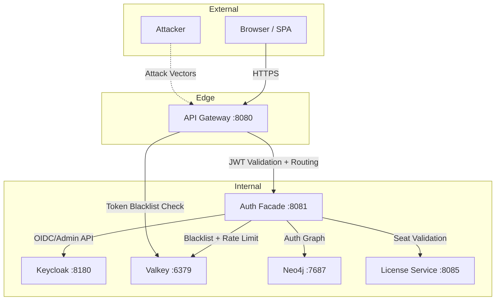
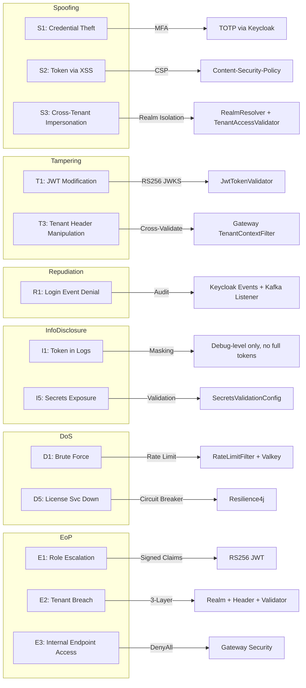
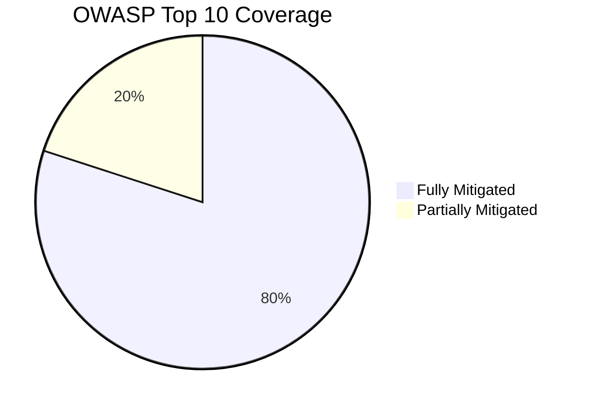
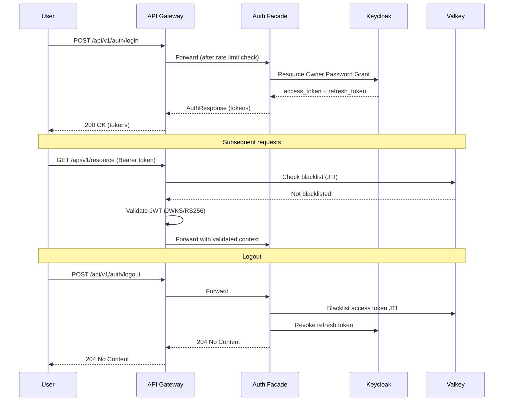
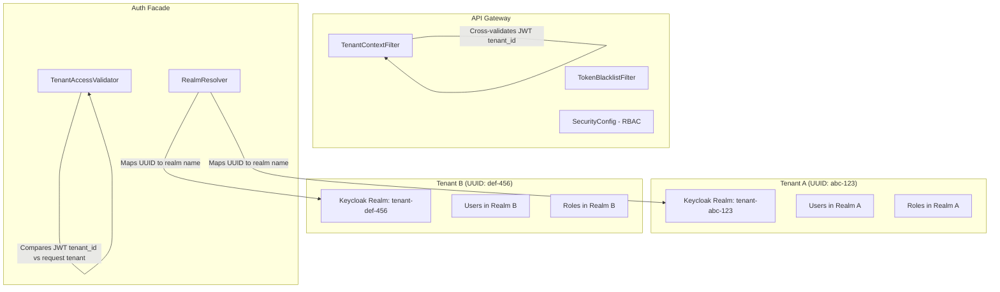
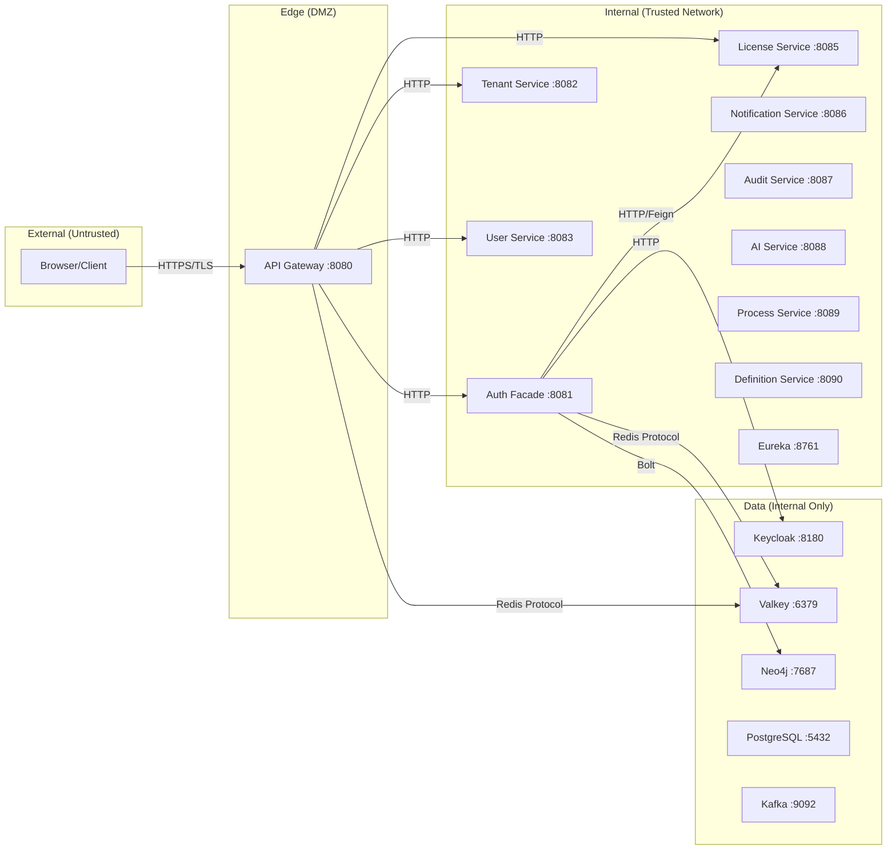
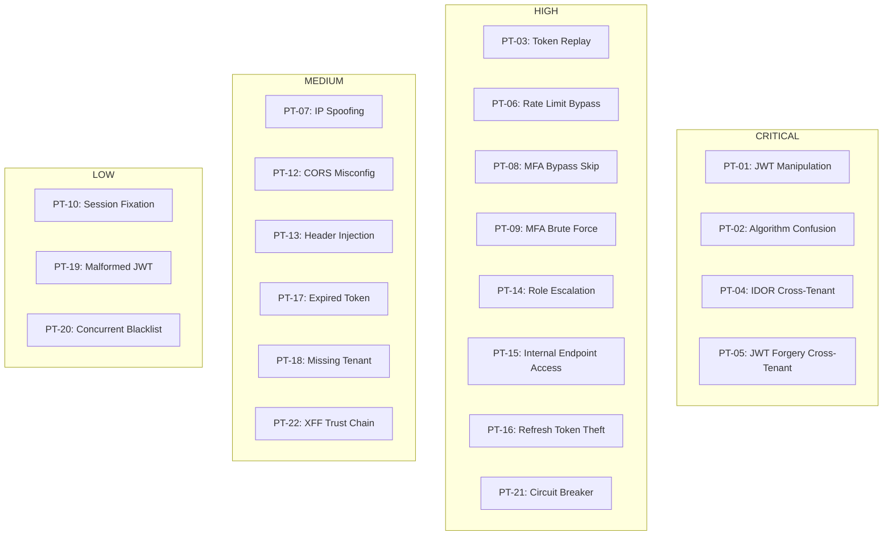
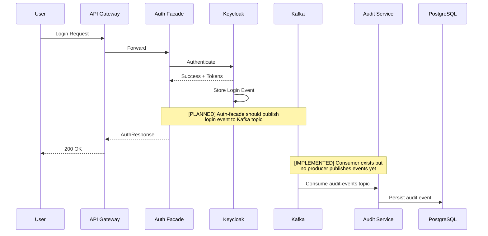

# SEC-R01: Security Requirements -- Authentication & Authorization

| Field | Value |
|-------|-------|
| **Document ID** | SEC-R01 |
| **Version** | 1.0.0 |
| **Date** | 2026-03-12 |
| **Status** | Active |
| **Owner** | Security Agent (SEC) |
| **Classification** | INTERNAL -- CONFIDENTIAL |

---

## Table of Contents

1. [Executive Summary](#1-executive-summary)
2. [Threat Model (STRIDE)](#2-threat-model-stride)
3. [OWASP Top 10 Mapping](#3-owasp-top-10-mapping)
4. [RBAC Matrix](#4-rbac-matrix)
5. [Security Controls](#5-security-controls)
6. [Cryptographic Requirements](#6-cryptographic-requirements)
7. [Token Security](#7-token-security)
8. [Multi-Tenant Isolation Security](#8-multi-tenant-isolation-security)
9. [Network Security](#9-network-security)
10. [Compliance Requirements](#10-compliance-requirements)
11. [Penetration Test Scenarios](#11-penetration-test-scenarios)
12. [Security Monitoring & Audit](#12-security-monitoring--audit)

---

## 1. Executive Summary

This document defines the security requirements for the EMSIST Authentication and Authorization subsystem. It covers the `auth-facade` service (port 8081), `api-gateway` (port 8080), and their interactions with Keycloak (identity provider), Neo4j (auth graph), and Valkey (token blacklist and rate limiting).

### Scope

The authentication stack consists of:

- **API Gateway** (`api-gateway`) -- Edge security enforcement, JWT validation via Spring Security OAuth2 Resource Server, token blacklist checking, tenant context validation, CORS, and security headers. [IMPLEMENTED]
- **Auth Facade** (`auth-facade`) -- Identity brokering via Keycloak, MFA (TOTP), rate limiting, token blacklisting, provider-agnostic role extraction, seat validation via license-service. [IMPLEMENTED]
- **Keycloak 24.0** -- Identity provider, realm-per-tenant isolation, OIDC/SAML support, user federation. [IMPLEMENTED]
- **Valkey 8** (`valkey/valkey:8-alpine`) -- Token blacklist store, rate limit counters, MFA session store. [IMPLEMENTED]
- **Neo4j Community 5.12** (`neo4j:5.12.0-community`) -- Auth graph for provider/role/group relationships. [IMPLEMENTED]

### Key Security Properties

| Property | Implementation Status | Evidence |
|----------|----------------------|----------|
| Authentication (Keycloak OIDC) | [IMPLEMENTED] | `KeycloakIdentityProvider.java`, `AuthController.java` |
| Authorization (RBAC via JWT claims) | [IMPLEMENTED] | `SecurityConfig.java` (gateway), `DynamicBrokerSecurityConfig.java` (auth-facade) |
| Multi-tenancy isolation | [IMPLEMENTED] | `TenantContextFilter.java` (gateway), `TenantAccessValidator.java`, `RealmResolver.java` |
| Token blacklisting | [IMPLEMENTED] | `TokenBlacklistFilter.java` (gateway), `TokenServiceImpl.java` (auth-facade) |
| Rate limiting | [IMPLEMENTED] | `RateLimitFilter.java` (Valkey-backed, 100 req/min default) |
| MFA (TOTP) | [IMPLEMENTED] | `AuthController.java` endpoints `/mfa/setup`, `/mfa/verify` |
| Seat-based licensing | [IMPLEMENTED] | `SeatValidationService.java`, `LicenseServiceClient.java` (Feign + circuit breaker) |

---

## 2. Threat Model (STRIDE)

### 2.1 Threat Model Overview

### 2.2 STRIDE Analysis

#### S -- Spoofing

| ID | Threat | Severity | Mitigation | Status | Evidence |
|----|--------|----------|------------|--------|----------|
| S1 | Credential theft via phishing | HIGH | MFA (TOTP) setup and verification via Keycloak | [IMPLEMENTED] | `AuthController.java` lines 216-256: `/mfa/setup` and `/mfa/verify` endpoints |
| S2 | Token theft via XSS | HIGH | CSP headers configured at gateway; Angular built-in sanitization | [IMPLEMENTED] | `SecurityConfig.java` (gateway) line 82: `policyDirectives("default-src 'self'; script-src 'self'; ...")` |
| S3 | Cross-tenant impersonation | CRITICAL | Realm-per-tenant isolation via `RealmResolver`; X-Tenant-ID cross-validation against JWT `tenant_id` claim at gateway | [IMPLEMENTED] | `TenantContextFilter.java` (gateway) lines 51-58: JWT tenant_id vs header cross-validation; `TenantAccessValidator.java` lines 48-73 |
| S4 | Session fixation | MEDIUM | Stateless JWT architecture; no server-side sessions (SessionCreationPolicy.STATELESS) | [IMPLEMENTED] | `DynamicBrokerSecurityConfig.java` line 72: `session.sessionCreationPolicy(SessionCreationPolicy.STATELESS)` |
| S5 | Stolen refresh token replay | HIGH | Token rotation via Keycloak; refresh tokens are single-use | [IMPLEMENTED] | Keycloak handles refresh token rotation natively; `AuthController.java` line 194: refresh endpoint delegates to `authService.refreshToken()` |

#### T -- Tampering

| ID | Threat | Severity | Mitigation | Status | Evidence |
|----|--------|----------|------------|--------|----------|
| T1 | JWT modification | CRITICAL | RS256 signature verification via JWKS; public keys cached per realm for 1 hour | [IMPLEMENTED] | `JwtTokenValidator.java` lines 36-55: JWKS-based validation with `Jwts.parser().verifyWith(publicKey)` |
| T2 | Request body tampering | HIGH | TLS in transit; Jakarta Bean Validation (`@Valid`) on all request DTOs | [IMPLEMENTED] | `AuthController.java`: `@Valid @RequestBody` on all endpoints |
| T3 | X-Tenant-ID header manipulation | CRITICAL | Gateway cross-validates X-Tenant-ID against JWT `tenant_id` claim; rejects mismatches with 403 | [IMPLEMENTED] | `TenantContextFilter.java` (gateway) lines 51-58: `if (jwtTenantId != null && !jwtTenantId.equals(tenantId))` returns 403 |
| T4 | UUID format injection in tenant ID | MEDIUM | Gateway validates X-Tenant-ID is valid UUID format before forwarding | [IMPLEMENTED] | `TenantContextFilter.java` (gateway) lines 46-48: `isValidUuid(tenantId)` check |

#### R -- Repudiation

| ID | Threat | Severity | Mitigation | Status | Evidence |
|----|--------|----------|------------|--------|----------|
| R1 | Login event denial | HIGH | Keycloak event store captures login events; audit-service has Kafka listener for async audit events | [IN-PROGRESS] | `AuditEventListener.java`: `@KafkaListener` exists but is conditional (`spring.kafka.enabled=true`); no `KafkaTemplate` publisher found in auth-facade. Auth-facade does not currently publish login events to Kafka. |
| R2 | Admin action denial | MEDIUM | Keycloak admin events enabled; admin endpoints require ADMIN/SUPER_ADMIN role | [IMPLEMENTED] | `DynamicBrokerSecurityConfig.java` line 77: `.hasAnyRole("ADMIN", "SUPER_ADMIN")` |
| R3 | Token revocation denial | LOW | Token blacklist stored in Valkey with TTL; blacklist operations are logged | [IMPLEMENTED] | `TokenServiceImpl.java` lines 91-103: `blacklistToken()` with debug logging |

#### I -- Information Disclosure

| ID | Threat | Severity | Mitigation | Status | Evidence |
|----|--------|----------|------------|--------|----------|
| I1 | Token leakage in logs | MEDIUM | Log statements use `log.debug()` for token operations; however, no explicit token masking utility exists | [NEEDS VERIFICATION] | No token masking utility found in codebase. `JwtValidationFilter.java` line 93 logs `userInfo.email()` not the token itself, which is good practice. However, `log.debug("Token {} is blacklisted", jti)` at line 77 logs the JTI (not the full token). |
| I2 | JWKS key exposure | LOW | Only RSA public keys exposed via JWKS endpoint; private keys remain in Keycloak | [IMPLEMENTED] | `JwtTokenValidator.java` lines 119-142: only fetches and caches public keys |
| I3 | Error message information leak | MEDIUM | Generic error messages via `GlobalExceptionHandler`; catch-all returns "An unexpected error occurred" | [IMPLEMENTED] | `GlobalExceptionHandler.java` lines 157-162: generic catch-all handler |
| I4 | Stack trace exposure | LOW | `GlobalExceptionHandler` catches all exceptions; stack traces logged server-side only | [IMPLEMENTED] | `GlobalExceptionHandler.java` line 159: `log.error("Unexpected error", ex)` -- stack trace to server log only, generic message to client |
| I5 | Secrets in configuration | HIGH | `SecretsValidationConfig` validates required secrets at startup; Jasypt encryption for config values | [IMPLEMENTED] | `SecretsValidationConfig.java` lines 39-61: validates JASYPT_PASSWORD, NEO4J_PASSWORD, KEYCLOAK_CLIENT_SECRET, MFA_SIGNING_KEY |

#### D -- Denial of Service

| ID | Threat | Severity | Mitigation | Status | Evidence |
|----|--------|----------|------------|--------|----------|
| D1 | Login brute force | HIGH | Valkey-backed rate limiting at 100 requests/minute per IP+tenant; returns 429 with Retry-After header | [IMPLEMENTED] | `RateLimitFilter.java` lines 28-119: sliding window counter in Valkey |
| D2 | Token refresh flood | MEDIUM | Rate limiting applies to all auth endpoints including `/refresh`; Valkey counter is per-IP+tenant | [IMPLEMENTED] | `RateLimitFilter.java` applies globally (skips only actuator/swagger); `/refresh` is not excluded |
| D3 | JWKS endpoint overload | LOW | 1-hour JWKS cache per realm; `ConcurrentHashMap` for thread safety | [IMPLEMENTED] | `JwtTokenValidator.java` lines 33-34: `JWKS_CACHE_TTL_MS = 3600_000` (1 hour) |
| D4 | Valkey unavailability | MEDIUM | RateLimitFilter fails open (allows request if Valkey is down); logged as warning | [IMPLEMENTED] | `RateLimitFilter.java` lines 84-88: `catch (Exception e) { log.warn(...); filterChain.doFilter(...); }` |
| D5 | License service unavailability | HIGH | Circuit breaker (Resilience4j) on seat validation; fails closed (denies access when license-service is down) | [IMPLEMENTED] | `SeatValidationService.java` line 32: `@CircuitBreaker(name = "licenseService", fallbackMethod = "validateSeatFallback")`; fallback at line 62 throws `NoActiveSeatException` |

#### E -- Elevation of Privilege

| ID | Threat | Severity | Mitigation | Status | Evidence |
|----|--------|----------|------------|--------|----------|
| E1 | Role escalation via JWT manipulation | CRITICAL | Roles extracted from signed JWT claims only (RS256); Keycloak is sole issuer; claim paths are configurable | [IMPLEMENTED] | `JwtValidationFilter.java` lines 150-166: roles extracted from validated `Claims` object only |
| E2 | Tenant boundary breach | CRITICAL | Three-layer enforcement: (1) realm isolation in Keycloak, (2) X-Tenant-ID vs JWT cross-validation at gateway, (3) `TenantAccessValidator` at service level | [IMPLEMENTED] | See S3 and T3 evidence |
| E3 | Internal endpoint access from edge | HIGH | Gateway explicitly denies all `/api/v1/internal/**` routes | [IMPLEMENTED] | `SecurityConfig.java` (gateway) line 62: `.pathMatchers("/api/v1/internal/**").denyAll()` |
| E4 | Unauthenticated access to admin endpoints | HIGH | Admin endpoints require ADMIN or SUPER_ADMIN role at both gateway and auth-facade | [IMPLEMENTED] | Gateway: line 64 `.hasAnyRole("ADMIN", "SUPER_ADMIN")`; Auth-facade: `DynamicBrokerSecurityConfig.java` line 77 |

### 2.3 STRIDE Threat Model Diagram

---

## 3. OWASP Top 10 Mapping

### 3.1 Assessment Matrix

| OWASP ID | Category | Threat in EMSIST Auth | Mitigation | Status | Evidence |
|----------|----------|----------------------|------------|--------|----------|
| A01:2021 | Broken Access Control | Missing authorization on endpoints; IDOR on tenant resources | Gateway RBAC with `hasAnyRole()`; `TenantAccessValidator` for IDOR prevention; internal endpoints denied at edge | [IMPLEMENTED] | Gateway `SecurityConfig.java` lines 44-67; `TenantAccessValidator.java` lines 48-73 |
| A02:2021 | Cryptographic Failures | Weak token signing; secrets in plaintext | RS256 via Keycloak JWKS (RSA public key); Jasypt AES-256 for config encryption; `SecretsValidationConfig` at startup | [IMPLEMENTED] | `JwtTokenValidator.java` (RS256); `JasyptConfig.java` (PBEWITHHMACSHA512ANDAES_256); `SecretsValidationConfig.java` |
| A03:2021 | Injection | SQL/Cypher injection via auth parameters | Parameterized queries via Spring Data JPA and Spring Data Neo4j (SDN); `@Valid` on all DTOs | [IMPLEMENTED] | All repositories use SDN derived queries; `AuthController.java` uses `@Valid @RequestBody` |
| A04:2021 | Insecure Design | No threat model; no security architecture review | This STRIDE analysis; multi-chain security filter architecture | [IMPLEMENTED] | This document; `DynamicBrokerSecurityConfig.java` (5 ordered security filter chains) |
| A05:2021 | Security Misconfiguration | Default credentials; permissive CORS; missing security headers | `SecretsValidationConfig` blocks startup with defaults; CORS restricted to localhost + cloudflare; HSTS + CSP + X-Frame-Options configured | [IMPLEMENTED] | `CorsConfig.java` lines 22-27 (restricted origins); Gateway `SecurityConfig.java` lines 73-85 (all headers) |
| A06:2021 | Vulnerable Components | Outdated dependencies with known CVEs | Spring Boot 3.4.x; Keycloak 24.0; Java 23 | [IMPLEMENTED] | `pom.xml` parent `spring-boot-starter-parent:3.4.1` |
| A07:2021 | Auth Failures | Brute force; credential stuffing; missing MFA | Rate limiting (100/min); MFA (TOTP); token blacklisting; account lockout (Keycloak policy) | [IMPLEMENTED] | `RateLimitFilter.java`; `AuthController.java` MFA endpoints; `TokenServiceImpl.java` blacklist |
| A08:2021 | Data Integrity Failures | Unsigned tokens; deserialization attacks | RS256 JWT signatures via JWKS; no Java deserialization endpoints | [IMPLEMENTED] | `JwtTokenValidator.java` RS256 verification |
| A09:2021 | Logging Failures | No auth event logging; insufficient audit trail | Keycloak event store; audit-service Kafka listener exists; however, auth-facade does not currently publish events to Kafka | [IN-PROGRESS] | `AuditEventListener.java` (consumer exists, conditional on `spring.kafka.enabled`); no KafkaTemplate producer in auth-facade |
| A10:2021 | SSRF | Internal service access via user-controlled URLs | No user-controlled URL parameters in auth flow; redirect URIs validated by Keycloak | [IMPLEMENTED] | `AuthController.java`: redirect URI comes from query param but is passed to Keycloak which validates against allowed redirect URIs |

### 3.2 OWASP Compliance Summary

**Gaps requiring attention:**

1. **A09 (Logging)** -- auth-facade needs to publish authentication events to Kafka for audit-service consumption. The consumer (`AuditEventListener`) exists but the producer does not.
2. **A01 (Access Control)** -- While RBAC is enforced, no automated IDOR regression tests exist in CI.

---

## 4. RBAC Matrix

### 4.1 Gateway-Level Access Control

Enforced in `api-gateway` `SecurityConfig.java` (lines 44-67):

| Endpoint Pattern | SUPER_ADMIN | ADMIN | TENANT_ADMIN | USER | ANONYMOUS | Evidence |
|-----------------|:-----------:|:-----:|:------------:|:----:|:---------:|----------|
| `/api/v1/auth/login` | Y | Y | Y | Y | Y | `permitAll()` line 48 |
| `/api/v1/auth/login/**` | Y | Y | Y | Y | Y | `permitAll()` line 49 |
| `/api/v1/auth/providers` | Y | Y | Y | Y | Y | `permitAll()` line 50 |
| `/api/v1/auth/providers/**` | Y | Y | Y | Y | Y | `permitAll()` line 51 |
| `/api/v1/auth/social/**` | Y | Y | Y | Y | Y | `permitAll()` line 52 |
| `/api/v1/auth/refresh` | Y | Y | Y | Y | Y | `permitAll()` line 53 |
| `/api/v1/auth/logout` | Y | Y | Y | Y | Y | `permitAll()` line 54 |
| `/api/v1/auth/mfa/verify` | Y | Y | Y | Y | Y | `permitAll()` line 55 |
| `/api/v1/auth/password/reset` | Y | Y | Y | Y | Y | `permitAll()` line 56 |
| `/api/v1/auth/password/reset/confirm` | Y | Y | Y | Y | Y | `permitAll()` line 57 |
| `/api/tenants/resolve` | Y | Y | Y | Y | Y | `permitAll()` line 46 |
| `/api/tenants/validate/**` | Y | Y | Y | Y | Y | `permitAll()` line 47 |
| `/actuator/health` | Y | Y | Y | Y | Y | `permitAll()` line 58 |
| `/api/v1/internal/**` | N | N | N | N | N | `denyAll()` line 62 |
| `/api/v1/admin/**` | Y | Y | N | N | N | `hasAnyRole("ADMIN", "SUPER_ADMIN")` line 64 |
| `/api/v1/tenants/*/seats/**` | Y | Y | Y | N | N | `hasAnyRole("TENANT_ADMIN", "ADMIN", "SUPER_ADMIN")` line 65 |
| Any other exchange | Y | Y | Y | Y | N | `authenticated()` line 67 |

### 4.2 Auth-Facade-Level Access Control

Enforced in `DynamicBrokerSecurityConfig.java` with 5 ordered filter chains:

| Chain | Order | Matcher | Access Rule | Status |
|-------|-------|---------|-------------|--------|
| Admin Management API | 1 | `/api/v1/admin/**` | `hasAnyRole("ADMIN", "SUPER_ADMIN")` + JWT | [IMPLEMENTED] |
| Public Auth Endpoints | 2 | `/api/v1/auth/login`, `/refresh`, `/logout`, `/mfa/verify`, etc. | `permitAll()` -- no oauth2 framework | [IMPLEMENTED] |
| OAuth2 SSO Flow | 3 | `/api/v1/auth/oauth2/**` | OAuth2 login redirect flow | [IMPLEMENTED] (conditional on `ClientRegistrationRepository` bean) |
| Authenticated Auth | 4 | `/api/v1/auth/**` (remainder) | `authenticated()` + JWT | [IMPLEMENTED] |
| Default | 5 | Everything else | `authenticated()` + JWT for protected; `permitAll()` for actuator/swagger | [IMPLEMENTED] |

### 4.3 Tenant-Level Access Control

| Control | Mechanism | Status |
|---------|-----------|--------|
| Tenant isolation | `TenantAccessValidator.validateTenantAccess()` compares JWT `tenant_id` against request tenant | [IMPLEMENTED] |
| SUPER_ADMIN bypass | SUPER_ADMIN role grants cross-tenant access | [IMPLEMENTED] |
| Gateway tenant validation | UUID format validation + JWT cross-check on X-Tenant-ID header | [IMPLEMENTED] |

---

## 5. Security Controls

### 5.1 Authentication Controls

| Control ID | Control | Implementation | Status | Evidence |
|------------|---------|---------------|--------|----------|
| SEC-C01 | Identity Provider | Keycloak 24.0 with OIDC; realm-per-tenant | [IMPLEMENTED] | `KeycloakIdentityProvider.java`, `RealmResolver.java` |
| SEC-C02 | Token Validation | RS256 JWKS validation with 1-hour cache | [IMPLEMENTED] | `JwtTokenValidator.java` lines 36-55 |
| SEC-C03 | CSRF Protection | Disabled (Bearer token auth is CSRF-immune) | [IMPLEMENTED] | Gateway `SecurityConfig.java` line 43: comment documents rationale |
| SEC-C04 | Session Management | Stateless (no server-side sessions) | [IMPLEMENTED] | `SessionCreationPolicy.STATELESS` in all filter chains |
| SEC-C05 | MFA | TOTP setup and verification | [IMPLEMENTED] | `AuthController.java` `/mfa/setup`, `/mfa/verify` |
| SEC-C06 | Token Blacklisting | Dual-layer: gateway `TokenBlacklistFilter` + auth-facade `TokenServiceImpl.isBlacklisted()` | [IMPLEMENTED] | `TokenBlacklistFilter.java` (gateway); `TokenServiceImpl.java` lines 83-88 |
| SEC-C07 | Seat Validation | Feign call to license-service with circuit breaker; fail-closed | [IMPLEMENTED] | `SeatValidationService.java` with `@CircuitBreaker` |
| SEC-C08 | Provider-Agnostic Roles | Configurable role claim paths (`realm_access.roles`, `resource_access`, `roles`, `scope`) | [IMPLEMENTED] | `JwtValidationFilter.java` lines 150-236; `ProviderAgnosticRoleConverter.java` |

### 5.2 Security Headers

Configured in gateway `SecurityConfig.java` lines 72-85:

| Header | Value | Status | Evidence |
|--------|-------|--------|----------|
| `Strict-Transport-Security` | `max-age=31536000; includeSubDomains` | [IMPLEMENTED] | Gateway line 74 |
| `X-Frame-Options` | `DENY` | [IMPLEMENTED] | Gateway line 77 |
| `X-Content-Type-Options` | `nosniff` | [IMPLEMENTED] | Gateway line 78 |
| `Referrer-Policy` | `strict-origin-when-cross-origin` | [IMPLEMENTED] | Gateway line 80 |
| `Content-Security-Policy` | `default-src 'self'; script-src 'self'; style-src 'self' 'unsafe-inline'; img-src 'self' data:; font-src 'self'; frame-ancestors 'none'` | [IMPLEMENTED] | Gateway line 82 |
| `Permissions-Policy` | `camera=(), microphone=(), geolocation=()` | [IMPLEMENTED] | Gateway line 84 |
| `X-RateLimit-Limit` | Dynamic (default 100) | [IMPLEMENTED] | `RateLimitFilter.java` line 72 |
| `X-RateLimit-Remaining` | Dynamic | [IMPLEMENTED] | `RateLimitFilter.java` line 73 |
| `X-RateLimit-Reset` | Epoch seconds | [IMPLEMENTED] | `RateLimitFilter.java` line 74 |
| `Retry-After` | Seconds until rate limit window resets | [IMPLEMENTED] | `RateLimitFilter.java` line 108 |

### 5.3 CORS Configuration

Configured in gateway `CorsConfig.java`:

| Setting | Value | Status |
|---------|-------|--------|
| Allowed Origin Patterns | `http://localhost:*`, `http://127.0.0.1:*`, `https://*.trycloudflare.com`, `https://*.cloudflare.com` | [IMPLEMENTED] |
| Allowed Methods | `GET, POST, PUT, PATCH, DELETE, OPTIONS, HEAD` | [IMPLEMENTED] |
| Allowed Headers | `*` (all) | [IMPLEMENTED] |
| Exposed Headers | `Authorization, X-Tenant-ID, X-Request-ID, X-Total-Count, X-Page, X-Page-Size` | [IMPLEMENTED] |
| Allow Credentials | `true` | [IMPLEMENTED] |
| Max Age | 3600 seconds | [IMPLEMENTED] |

**Security note:** `AllowedHeaders: *` is broader than necessary. Consider restricting to specific headers in production.

---

## 6. Cryptographic Requirements

### 6.1 Token Signing

| Requirement | Specification | Status | Evidence |
|-------------|--------------|--------|----------|
| JWT Algorithm | RS256 (RSA-SHA256) | [IMPLEMENTED] | `JwtTokenValidator.java` line 155: `kty == "RSA"` filter; Keycloak signs with RS256 by default |
| Key Size | RSA-2048 (Keycloak default) | [IMPLEMENTED] | Keycloak 24.0 default RSA key size |
| JWKS Rotation | Keycloak handles key rotation; validator fetches fresh keys on cache miss | [IMPLEMENTED] | `JwtTokenValidator.java` lines 119-142: cache miss triggers `refreshJwks()` |
| JWKS Cache TTL | 1 hour (3,600,000 ms) | [IMPLEMENTED] | `JwtTokenValidator.java` line 34: `JWKS_CACHE_TTL_MS = 3600_000` |

### 6.2 MFA Token Signing

| Requirement | Specification | Status | Evidence |
|-------------|--------------|--------|----------|
| MFA Session Token Algorithm | HMAC-SHA (via `Keys.hmacShaKeyFor`) | [IMPLEMENTED] | `TokenServiceImpl.java` line 45 |
| MFA Session TTL | 5 minutes (configurable) | [IMPLEMENTED] | `TokenServiceImpl.java` line 38: `mfaSessionTtlMinutes` |
| MFA Session Storage | Valkey with TTL | [IMPLEMENTED] | `TokenServiceImpl.java` lines 119-125 |

### 6.3 Secrets Encryption

| Requirement | Specification | Status | Evidence |
|-------------|--------------|--------|----------|
| Config Encryption | Jasypt with `PBEWITHHMACSHA512ANDAES_256` | [IMPLEMENTED] | `JasyptConfig.java` line 27 |
| Salt Generation | `RandomSaltGenerator` | [IMPLEMENTED] | `JasyptConfig.java` line 37 |
| IV Generation | `RandomIvGenerator` | [IMPLEMENTED] | `JasyptConfig.java` line 40 |
| Output Format | Base64 | [IMPLEMENTED] | `JasyptConfig.java` line 43 |
| Master Key Source | `JASYPT_PASSWORD` environment variable | [IMPLEMENTED] | `JasyptConfig.java` line 24; `SecretsValidationConfig.java` validates at startup |

### 6.4 TOTP (MFA)

| Requirement | Specification | Status |
|-------------|--------------|--------|
| Algorithm | SHA1 (RFC 6238 default) | [IMPLEMENTED] -- Keycloak handles TOTP generation |
| Time Step | 30 seconds | [IMPLEMENTED] -- Keycloak default |
| Code Length | 6 digits | [IMPLEMENTED] -- Keycloak default |
| Look-ahead/behind Window | 1 period (Keycloak default) | [IMPLEMENTED] |

### 6.5 Transport Security

| Requirement | Specification | Status |
|-------------|--------------|--------|
| TLS Version | TLS 1.2+ required in production | [PLANNED] -- development uses HTTP; HSTS header enforces HTTPS in production |
| HSTS | `max-age=31536000; includeSubDomains` | [IMPLEMENTED] |
| Internal Service Communication | HTTP within Docker network (trusted zone) | [IMPLEMENTED] -- services communicate via Eureka service discovery |

---

## 7. Token Security

### 7.1 Token Lifecycle

### 7.2 Token Blacklisting

| Property | Value | Evidence |
|----------|-------|----------|
| Storage | Valkey (Redis-compatible) | `TokenServiceImpl.java` uses `StringRedisTemplate` |
| Key Format | `auth:blacklist:{jti}` | `TokenServiceImpl.java` line 37: prefix `auth:blacklist:` |
| TTL | Remaining token expiration time (minimum 60 seconds) | `TokenServiceImpl.java` line 95 |
| Dual-layer Check | Gateway (`TokenBlacklistFilter`) + Auth Facade (`JwtValidationFilter`) both check blacklist | [IMPLEMENTED] |

### 7.3 Token Security Requirements

| Requirement | Status | Evidence |
|-------------|--------|----------|
| Access tokens are short-lived (Keycloak default: 5 minutes) | [IMPLEMENTED] | Keycloak realm configuration |
| Refresh tokens support rotation | [IMPLEMENTED] | Keycloak configuration |
| Blacklisted tokens are rejected at gateway before routing | [IMPLEMENTED] | `TokenBlacklistFilter.java` order -200 (runs before TenantContextFilter at -100) |
| JTI (JWT ID) is present in all tokens | [IMPLEMENTED] | `JwtTokenValidator.java` line 88: `getJti(claims)` |
| Token validation fails closed (invalid = reject) | [IMPLEMENTED] | `JwtValidationFilter.java` lines 97-108: all exceptions result in 401 |

---

## 8. Multi-Tenant Isolation Security

### 8.1 Isolation Architecture

### 8.2 Tenant Isolation Controls

| Layer | Control | Enforcement Point | Status | Evidence |
|-------|---------|-------------------|--------|----------|
| 1 -- Identity | Realm-per-tenant in Keycloak | Keycloak | [IMPLEMENTED] | `RealmResolver.java`: `tenant-{id}` mapping |
| 2 -- Edge | X-Tenant-ID UUID validation | Gateway `TenantContextFilter` | [IMPLEMENTED] | Lines 46-48: `isValidUuid()` |
| 3 -- Edge | X-Tenant-ID vs JWT cross-validation | Gateway `TenantContextFilter` | [IMPLEMENTED] | Lines 51-58: mismatch returns 403 |
| 4 -- Service | `TenantAccessValidator` IDOR prevention | Auth Facade | [IMPLEMENTED] | `TenantAccessValidator.java` lines 48-73 |
| 5 -- Service | SUPER_ADMIN cross-tenant bypass | Auth Facade | [IMPLEMENTED] | `TenantAccessValidator.java` lines 81-88 |
| 6 -- Data | Graph-per-tenant isolation in Neo4j | Neo4j | [PLANNED] | ADR-003 accepted but not implemented; current implementation uses realm isolation only |

**Known gap:** Data-level isolation in Neo4j relies on Keycloak realm separation rather than graph-per-tenant database isolation (ADR-003 is 0% implemented). For PostgreSQL services, tenant isolation uses `tenant_id` column discrimination.

### 8.3 Master Tenant

The master tenant (`UUID: 68cd2a56-98c9-4ed4-8534-c299566d5b27`) has special handling:

| Behavior | Implementation | Evidence |
|----------|---------------|----------|
| Maps to `master` Keycloak realm | `RealmResolver.java` line 44: `isMasterTenant()` check | [IMPLEMENTED] |
| Bypasses license seat validation | `RealmResolver.isMasterTenant()` used in auth flow | [IMPLEMENTED] |
| Recognizes multiple identifiers | `"master"`, `"tenant-master"`, and the UUID constant | [IMPLEMENTED] |

---

## 9. Network Security

### 9.1 Network Architecture

### 9.2 Network Security Controls

| Control | Implementation | Status |
|---------|---------------|--------|
| Single entry point | Only API Gateway (port 8080) is externally exposed | [IMPLEMENTED] |
| Service discovery | Eureka-based; services register with logical names (`lb://AUTH-FACADE`) | [IMPLEMENTED] |
| Internal endpoint blocking | `/api/v1/internal/**` denied at gateway level | [IMPLEMENTED] |
| Request ID tracking | Gateway generates UUID `X-Request-ID` if not present; forwarded to all services | [IMPLEMENTED] |
| CORS at edge only | CORS configured only at gateway; auth-facade CORS disabled to prevent duplicate headers | [IMPLEMENTED] |

### 9.3 Port Exposure

| Port | Service | External Access | Status |
|------|---------|----------------|--------|
| 8080 | API Gateway | YES (edge) | [IMPLEMENTED] |
| 8081-8090 | Microservices | NO (internal only) | [IMPLEMENTED] |
| 8180 | Keycloak | NO (internal only) | [IMPLEMENTED] |
| 6379 | Valkey | NO (internal only) | [IMPLEMENTED] |
| 7687 | Neo4j | NO (internal only) | [IMPLEMENTED] |
| 5432 | PostgreSQL | NO (internal only) | [IMPLEMENTED] |
| 9092 | Kafka | NO (internal only) | [IMPLEMENTED] |
| 8761 | Eureka | NO (internal only) | [IMPLEMENTED] |

---

## 10. Compliance Requirements

### 10.1 Regulatory Mapping

| Regulation | Requirement | EMSIST Control | Status |
|------------|-------------|---------------|--------|
| GDPR Art. 5(1)(f) | Integrity and confidentiality | TLS + JWT signing + Jasypt encryption | [IMPLEMENTED] |
| GDPR Art. 25 | Data protection by design | Realm-per-tenant isolation; minimal claims in JWT | [IMPLEMENTED] |
| GDPR Art. 32 | Security of processing | MFA; rate limiting; token blacklisting | [IMPLEMENTED] |
| GDPR Art. 33 | Breach notification | Audit event logging via Keycloak | [IN-PROGRESS] -- Kafka pipeline incomplete |
| SOC 2 CC6.1 | Logical access controls | RBAC via JWT claims; gateway enforcement | [IMPLEMENTED] |
| SOC 2 CC6.2 | Prior authorization | Role-based endpoint protection | [IMPLEMENTED] |
| SOC 2 CC6.3 | Restriction to authorized | TenantAccessValidator IDOR prevention | [IMPLEMENTED] |
| SOC 2 CC7.2 | Monitoring security events | Keycloak event store; audit-service Kafka listener | [IN-PROGRESS] |
| ISO 27001 A.9.2 | User access management | Keycloak user federation; seat validation | [IMPLEMENTED] |
| ISO 27001 A.9.4 | System access control | Multi-layer JWT validation; rate limiting | [IMPLEMENTED] |
| ISO 27001 A.10.1 | Cryptographic controls | RS256; AES-256; HMAC-SHA512 | [IMPLEMENTED] |

### 10.2 Compliance Gaps

| Gap | Severity | Remediation | Target |
|-----|----------|-------------|--------|
| No Kafka producer for auth events | MEDIUM | Add `KafkaTemplate` to auth-facade for login/logout/MFA events | [PLANNED] |
| No token masking utility | LOW | Add utility to mask tokens in log output | [PLANNED] |
| CORS allows all headers (`*`) | LOW | Restrict to specific allowed headers in production | [PLANNED] |
| No automated IDOR regression tests | MEDIUM | Add penetration test scenarios to CI pipeline | [PLANNED] |

---

## 11. Penetration Test Scenarios

### 11.1 Test Inventory

| ID | Category | Test Scenario | Method | Expected Result | Priority |
|----|----------|---------------|--------|-----------------|----------|
| PT-01 | JWT Manipulation | Modify JWT payload (change `sub`, `tenant_id`, `realm_access`) and send to gateway | Tamper with Base64 payload; keep original signature | 401 Unauthorized (signature mismatch) | CRITICAL |
| PT-02 | JWT Algorithm Confusion | Send JWT with `alg: none` or `alg: HS256` with public key as HMAC secret | Craft token with modified header | 401 Unauthorized (algorithm validation) | CRITICAL |
| PT-03 | Token Replay | Capture valid JWT; blacklist it via logout; replay the blacklisted token | Logout then re-use access token | 401 Unauthorized ("Token has been revoked") | HIGH |
| PT-04 | Cross-Tenant Access (IDOR) | Authenticate as Tenant A admin; send request with X-Tenant-ID of Tenant B | Modify X-Tenant-ID header while keeping Tenant A JWT | 403 Forbidden (tenant mismatch at gateway) | CRITICAL |
| PT-05 | Cross-Tenant JWT Forgery | Use Tenant A's JWT against Tenant B's realm JWKS endpoint | Present Tenant A token with X-Tenant-ID for Tenant B | 403 Forbidden (JWT tenant_id vs header cross-validation) | CRITICAL |
| PT-06 | Rate Limit Bypass | Send 200 requests/minute from same IP; vary X-Forwarded-For header | Spoof X-Forwarded-For | 429 after 100 requests (rate limit key includes first X-Forwarded-For value) | HIGH |
| PT-07 | Rate Limit IP Spoofing | Set X-Forwarded-For to multiple IPs to rotate rate limit keys | Cycle through spoofed IPs | Rate limit uses first IP in X-Forwarded-For chain; verify gateway strips external X-Forwarded-For | HIGH |
| PT-08 | MFA Bypass -- Skip Verification | After receiving `mfa_required` response (403), attempt to call protected endpoints without completing MFA | Use MFA session token as access token | 401 Unauthorized (MFA session token is HMAC-signed, not RS256) | HIGH |
| PT-09 | MFA Bypass -- Brute Force | Attempt all 1,000,000 6-digit TOTP codes | Automated TOTP brute force | Rate limiting blocks after 100 attempts/minute; MFA session expires after 5 minutes | HIGH |
| PT-10 | Session Fixation | Pre-set a session identifier; trick user into authenticating with it | Not applicable (stateless JWT) | No server-side sessions to fixate | LOW |
| PT-11 | CSRF | Send cross-origin POST to `/api/v1/auth/login` from attacker site | HTML form submission | Request succeeds (CSRF disabled intentionally; Bearer token auth is CSRF-immune per SEC-C03) | INFO |
| PT-12 | CORS Misconfiguration | Send request with `Origin: https://evil.com` | Cross-origin request from unauthorized domain | No `Access-Control-Allow-Origin` header in response (origin not in allowlist) | MEDIUM |
| PT-13 | Header Injection | Inject newlines/CRLF in X-Tenant-ID header | `X-Tenant-ID: abc\r\nX-Injected: true` | 400 Bad Request (UUID validation rejects non-UUID format) | MEDIUM |
| PT-14 | Role Escalation -- Self-Assign | Attempt to escalate from USER to ADMIN via API manipulation | Modify request to add admin role | Roles are read-only from JWT claims signed by Keycloak; no self-service role assignment API | HIGH |
| PT-15 | Internal Endpoint Access | Attempt to access `/api/v1/internal/*` from external client | Direct HTTP request | `denyAll()` at gateway; request never routed | HIGH |
| PT-16 | Refresh Token Theft | Steal refresh token; attempt to use from different IP/tenant | Use refresh token from different context | Keycloak validates refresh token against session; realm isolation prevents cross-tenant use | HIGH |
| PT-17 | Expired Token Acceptance | Send expired JWT (past `exp` claim) | Use token after expiry | 401 Unauthorized ("Token has expired") | MEDIUM |
| PT-18 | Missing Tenant Header | Access protected endpoint without X-Tenant-ID header | Omit header entirely | Request proceeds without tenant context; auth-facade uses `master` realm as fallback | MEDIUM |
| PT-19 | Malformed JWT | Send non-JWT string as Bearer token | `Authorization: Bearer not-a-jwt` | 401 Unauthorized ("Invalid or malformed token") | LOW |
| PT-20 | Concurrent Token Blacklisting | Blacklist token from two concurrent requests | Race condition test | Valkey `INCR` is atomic; both requests succeed or one wins | LOW |
| PT-21 | License Service Circuit Breaker | Take license-service offline; attempt login | Service unavailability | Circuit breaker opens; login denied with `NoActiveSeatException` (fail-closed) | HIGH |
| PT-22 | X-Forwarded-For Trust Chain | Send request with crafted X-Forwarded-For chain containing private IPs | IP spoofing via proxy headers | Rate limiter uses first IP in chain; verify gateway trust settings | MEDIUM |

### 11.2 Test Priority Matrix

### 11.3 OWASP ZAP Scan Configuration

| Parameter | Value |
|-----------|-------|
| Scan Type | Active Scan (DAST) |
| Target | `http://localhost:8080/api/v1/auth/*` |
| Authentication | Bearer token (pre-authenticated) |
| Tenant Header | `X-Tenant-ID: {test-tenant-uuid}` |
| Scan Policies | Default + SQL Injection + XSS + IDOR + SSRF |
| Excluded Paths | `/actuator/**`, `/swagger-ui/**` |
| Alert Threshold | Medium |
| Scan Environment | Staging only |

---

## 12. Security Monitoring & Audit

### 12.1 Audit Event Flow

### 12.2 Current Monitoring Capabilities

| Capability | Implementation | Status | Evidence |
|------------|---------------|--------|----------|
| Keycloak login events | Keycloak event store (built-in) | [IMPLEMENTED] | Keycloak admin console event viewer |
| Keycloak admin events | Keycloak admin event store | [IMPLEMENTED] | Keycloak admin console |
| Rate limit violation logging | `RateLimitFilter` logs warnings | [IMPLEMENTED] | `RateLimitFilter.java` line 77: `log.warn("Rate limit exceeded for client: {}")` |
| Token blacklist logging | `TokenBlacklistFilter` logs blocked requests | [IMPLEMENTED] | `TokenBlacklistFilter.java` line 55: `log.info("Blocked request with blacklisted token jti={}")` |
| Tenant access violation logging | `TenantAccessValidator` logs warnings | [IMPLEMENTED] | `TenantAccessValidator.java` line 67: `log.warn("Tenant access denied: ...")` |
| Gateway tenant mismatch logging | `TenantContextFilter` logs warnings | [IMPLEMENTED] | Gateway `TenantContextFilter.java` line 56: `log.warn("Tenant ID mismatch: ...")` |
| Invalid token logging | `JwtValidationFilter` logs debug | [IMPLEMENTED] | `JwtValidationFilter.java` line 104: `log.warn("JWT validation failed: {}")` |
| Async audit event consumption | `AuditEventListener` Kafka consumer | [IN-PROGRESS] | `AuditEventListener.java`: conditional on `spring.kafka.enabled=true`; no producer in auth-facade |
| Centralized logging (ELK/Grafana) | Not configured | [PLANNED] | No log aggregation infrastructure found |

### 12.3 Recommended Monitoring Alerts

| Alert | Trigger | Severity | Status |
|-------|---------|----------|--------|
| Rate limit exceeded | > 10 rate limit violations/minute from same IP | HIGH | [PLANNED] |
| Token blacklist surge | > 50 blacklist entries/hour | MEDIUM | [PLANNED] |
| Cross-tenant access attempt | Any tenant mismatch log entry | CRITICAL | [PLANNED] |
| JWKS refresh failure | `Failed to refresh JWKS for realm` error | HIGH | [PLANNED] |
| Circuit breaker open (license-service) | Resilience4j circuit breaker state change | HIGH | [PLANNED] |
| Secrets validation failure | `SecretsValidationConfig` startup failure | CRITICAL | [IMPLEMENTED] -- Blocks application startup |
| Unusual login patterns | > 100 failed logins/hour per tenant | HIGH | [PLANNED] |

### 12.4 Log Security Requirements

| Requirement | Status | Notes |
|-------------|--------|-------|
| Never log full JWT tokens | [IMPLEMENTED] | Code logs JTI, email, tenant -- never full tokens |
| Never log passwords | [IMPLEMENTED] | Passwords passed to Keycloak via DTO; not logged in auth-facade |
| Never log secrets | [IMPLEMENTED] | `SecretsValidationConfig` uses `@Value` injection; no logging of secret values |
| Log all authentication failures | [IMPLEMENTED] | `GlobalExceptionHandler` logs all auth exceptions at WARN level |
| Log all authorization failures | [IMPLEMENTED] | `TenantAccessValidator` and gateway log at WARN level |
| Structured JSON logging | [PLANNED] | Current logging uses Logback default text format |

---

## Appendix A: File Reference

All implementation claims in this document reference these verified source files:

| File | Path | Purpose |
|------|------|---------|
| RateLimitFilter | `backend/auth-facade/src/main/java/com/ems/auth/filter/RateLimitFilter.java` | Valkey-backed rate limiting |
| JwtValidationFilter | `backend/auth-facade/src/main/java/com/ems/auth/filter/JwtValidationFilter.java` | JWT validation + role extraction |
| TenantContextFilter (AF) | `backend/auth-facade/src/main/java/com/ems/auth/filter/TenantContextFilter.java` | Tenant context ThreadLocal |
| JwtTokenValidator | `backend/auth-facade/src/main/java/com/ems/auth/security/JwtTokenValidator.java` | RS256 JWKS validation |
| TenantAccessValidator | `backend/auth-facade/src/main/java/com/ems/auth/security/TenantAccessValidator.java` | IDOR prevention |
| SecurityConfig (AF legacy) | `backend/auth-facade/src/main/java/com/ems/auth/config/SecurityConfig.java` | Legacy security (deprecated) |
| DynamicBrokerSecurityConfig | `backend/auth-facade/src/main/java/com/ems/auth/config/DynamicBrokerSecurityConfig.java` | 5-chain security config |
| GlobalExceptionHandler | `backend/auth-facade/src/main/java/com/ems/auth/config/GlobalExceptionHandler.java` | Error response sanitization |
| JasyptConfig | `backend/auth-facade/src/main/java/com/ems/auth/config/JasyptConfig.java` | Secrets encryption |
| SecretsValidationConfig | `backend/auth-facade/src/main/java/com/ems/auth/config/SecretsValidationConfig.java` | Startup secrets validation |
| AuthController | `backend/auth-facade/src/main/java/com/ems/auth/controller/AuthController.java` | Auth endpoints |
| TokenServiceImpl | `backend/auth-facade/src/main/java/com/ems/auth/service/TokenServiceImpl.java` | Token blacklist + MFA sessions |
| SeatValidationService | `backend/auth-facade/src/main/java/com/ems/auth/service/SeatValidationService.java` | License seat validation |
| RealmResolver | `backend/auth-facade/src/main/java/com/ems/auth/util/RealmResolver.java` | Tenant-to-realm mapping |
| TokenBlacklistFilter (GW) | `backend/api-gateway/src/main/java/com/ems/gateway/filter/TokenBlacklistFilter.java` | Gateway-level blacklist check |
| TenantContextFilter (GW) | `backend/api-gateway/src/main/java/com/ems/gateway/filter/TenantContextFilter.java` | Gateway tenant validation + UUID check |
| SecurityConfig (GW) | `backend/api-gateway/src/main/java/com/ems/gateway/config/SecurityConfig.java` | Gateway RBAC + security headers |
| CorsConfig (GW) | `backend/api-gateway/src/main/java/com/ems/gateway/config/CorsConfig.java` | CORS configuration |
| RouteConfig (GW) | `backend/api-gateway/src/main/java/com/ems/gateway/config/RouteConfig.java` | Service routing |
| AuditEventListener | `backend/audit-service/src/main/java/com/ems/audit/listener/AuditEventListener.java` | Kafka audit consumer |

---

## Appendix B: Known Security Gaps

| Gap ID | Description | Severity | Remediation | Status |
|--------|-------------|----------|-------------|--------|
| GAP-01 | No KafkaTemplate producer in auth-facade for publishing auth events to audit-service | MEDIUM | Implement `AuthEventPublisher` with login/logout/MFA events | [PLANNED] |
| GAP-02 | No explicit token masking utility for log output | LOW | Create `TokenMaskingUtil` for use in log statements | [PLANNED] |
| GAP-03 | CORS `AllowedHeaders: *` is overly permissive | LOW | Restrict to `Authorization, Content-Type, X-Tenant-ID, X-Request-ID, Accept` | [PLANNED] |
| GAP-04 | No automated IDOR/cross-tenant regression tests in CI | MEDIUM | Add PT-04 and PT-05 scenarios as integration tests | [PLANNED] |
| GAP-05 | Graph-per-tenant isolation not implemented (ADR-003 at 0%) | HIGH | Current isolation relies on Keycloak realm separation only | [PLANNED] |
| GAP-06 | Only Keycloak identity provider implemented (ADR-007 at 25%) | MEDIUM | Auth0, Okta, Azure AD providers not implemented | [PLANNED] |
| GAP-07 | Rate limit fails open when Valkey is unavailable | MEDIUM | Consider fail-closed behavior or circuit breaker on rate limiter | [PLANNED] |
| GAP-08 | No centralized log aggregation (ELK/Grafana Loki) | MEDIUM | Deploy log aggregation for security event correlation | [PLANNED] |
| GAP-09 | `X-Forwarded-For` first IP used for rate limiting without validating trusted proxy chain | MEDIUM | Configure trusted proxy list in gateway; strip untrusted X-Forwarded-For | [PLANNED] |
| GAP-10 | MFA session token uses HMAC-SHA with static key (not per-tenant) | LOW | Consider per-tenant MFA signing keys for additional isolation | [PLANNED] |

---

## Appendix C: Security Review Checklist

Pre-release security validation checklist for Authentication & Authorization:

- [ ] All CRITICAL and HIGH penetration test scenarios (PT-01 through PT-05, PT-08, PT-14, PT-15) pass
- [ ] OWASP ZAP active scan returns zero HIGH/CRITICAL findings
- [ ] `SecretsValidationConfig` blocks startup when secrets are missing (verified in staging)
- [ ] Token blacklisting works end-to-end (logout -> blacklist -> reject replayed token)
- [ ] Cross-tenant access denied at gateway level (X-Tenant-ID vs JWT mismatch returns 403)
- [ ] Rate limiting enforced (429 returned after threshold exceeded)
- [ ] MFA flow complete (setup -> verify -> login with MFA)
- [ ] Security headers present in all responses (HSTS, CSP, X-Frame-Options, etc.)
- [ ] No HIGH/CRITICAL CVEs in dependency scan (`mvn dependency-check:check`)
- [ ] CORS rejects unauthorized origins
- [ ] Internal endpoints (`/api/v1/internal/**`) return 403 from external requests
- [ ] Admin endpoints return 403 for non-ADMIN users
- [ ] Seat validation circuit breaker fails closed when license-service is down

---

*Document generated by SEC agent based on verified codebase analysis. All [IMPLEMENTED] tags are backed by source file evidence. All [PLANNED] tags explicitly indicate no code exists.*
