# Test Strategy: Authentication and Authorization

**Document ID:** TS-AA-001
**Version:** 1.0.0
**Date:** 2026-03-12
**Status:** Draft
**Author:** QA Lead Agent
**Requirement:** R01 - Authentication and Authorization
**PRD Reference:** PRD-AA-001

---

## Table of Contents

1. [Test Strategy Overview](#1-test-strategy-overview)
2. [Test Pyramid](#2-test-pyramid)
3. [Test Environment Matrix](#3-test-environment-matrix)
4. [Unit Test Plan](#4-unit-test-plan)
5. [Integration Test Plan](#5-integration-test-plan)
6. [E2E Test Plan](#6-e2e-test-plan)
7. [Security Test Plan](#7-security-test-plan)
8. [Performance Test Plan](#8-performance-test-plan)
9. [Test Data Strategy](#9-test-data-strategy)
10. [Coverage Targets](#10-coverage-targets)
11. [Test Automation](#11-test-automation)
12. [Defect Management](#12-defect-management)

---

## 1. Test Strategy Overview

### 1.1 Purpose

This document defines the complete test strategy for the Authentication and Authorization module (R01) of the EMSIST platform. It covers all test levels, from unit tests through performance tests, and maps each test case back to the feature requirements (FR-1 through FR-15) and acceptance criteria defined in PRD-AA-001.

### 1.2 Scope

The test strategy covers the following services and components:

| Layer | Component | Technology |
|-------|-----------|------------|
| Backend | auth-facade | Java 23, Spring Boot 3.4, Neo4j, Valkey |
| Backend | api-gateway | Java 23, Spring Cloud Gateway, JWT validation |
| Backend | license-service | Java 23, Spring Boot 3.4, PostgreSQL (seat validation) |
| Frontend | Angular auth module | Angular 21, Vitest, Playwright |
| Infrastructure | Keycloak | Realm-per-tenant, OAuth2/OIDC |
| Infrastructure | Valkey | Token blacklist, rate limiting, session cache |

### 1.3 Out of Scope

- Identity providers not yet implemented: Auth0, Okta, Azure AD (FR-12 [PLANNED])
- WebAuthn / FIDO2 passwordless authentication (FR-13 [PLANNED])
- SMS/Email OTP (FR-14 [PLANNED])
- Active session management UI (FR-15 [PLANNED])

### 1.4 Risk Assessment

| Risk | Likelihood | Impact | Mitigation |
|------|-----------|--------|------------|
| Token validation bypass | Low | Critical | Dedicated JWT manipulation test suite (SEC) |
| Cross-tenant data leakage | Medium | Critical | Tenant isolation tests at every layer |
| Rate limit bypass via IP rotation | Medium | High | Rate limit integration tests with concurrent clients |
| MFA setup fails silently | Medium | High | E2E tests covering full MFA setup flow |
| Refresh token replay after logout | Low | Critical | Blacklist verification in integration tests |
| Seat validation bypass | Medium | High | Integration tests with license-service mock |
| Keycloak realm misconfiguration | Medium | High | Integration tests with multi-realm Testcontainer |

### 1.5 Entry and Exit Criteria

**Entry Criteria (test execution may begin when):**

- Code compiles and builds successfully (`mvn clean compile` / `ng build`)
- All dependencies are available (Keycloak, Neo4j, Valkey, PostgreSQL containers)
- Test data fixtures are loaded (see Section 9)
- Feature branch is rebased on latest main

**Exit Criteria (testing is complete when):**

- All P0 and P1 test cases pass
- Unit test coverage >= 80% line, >= 75% branch
- Zero CRITICAL or HIGH defects remain open
- All E2E user journeys pass across desktop, tablet, and mobile viewports
- Security test suite passes with zero findings at CRITICAL/HIGH severity
- Performance SLOs are met (see Section 8)
- QA agent produces signed test execution report

---

## 2. Test Pyramid

### 2.1 Pyramid Distribution

The test strategy follows the standard testing pyramid ratio: 70% unit, 20% integration, 10% E2E.

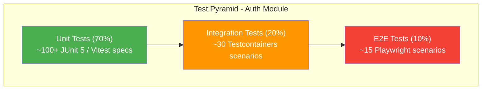

### 2.2 Pyramid Breakdown by Feature Requirement

| Feature Requirement | Unit | Integration | E2E | Security | Performance |
|---------------------|------|-------------|-----|----------|-------------|
| FR-1 Password Auth | 12 | 4 | 2 | 3 | 1 |
| FR-2 Social Login | 8 | 3 | 2 | 2 | - |
| FR-3 MFA (TOTP) | 10 | 4 | 3 | 2 | - |
| FR-4 Token Management | 15 | 5 | 2 | 5 | 2 |
| FR-5 Multi-Tenant Realm | 8 | 4 | 1 | 3 | 1 |
| FR-6 Rate Limiting | 6 | 3 | 1 | 2 | 2 |
| FR-7 Seat Validation | 6 | 3 | 1 | 1 | 1 |
| FR-8 RBAC | 8 | 3 | 2 | 3 | - |
| FR-9 Security Headers | 4 | 2 | - | 2 | - |
| FR-10 Angular Auth | 20 | - | 4 | 2 | - |
| FR-11 Dynamic IdP Config | 6 | 3 | 1 | 1 | - |
| **Total** | **103** | **34** | **19** | **26** | **7** |

### 2.3 Agent Responsibility Matrix

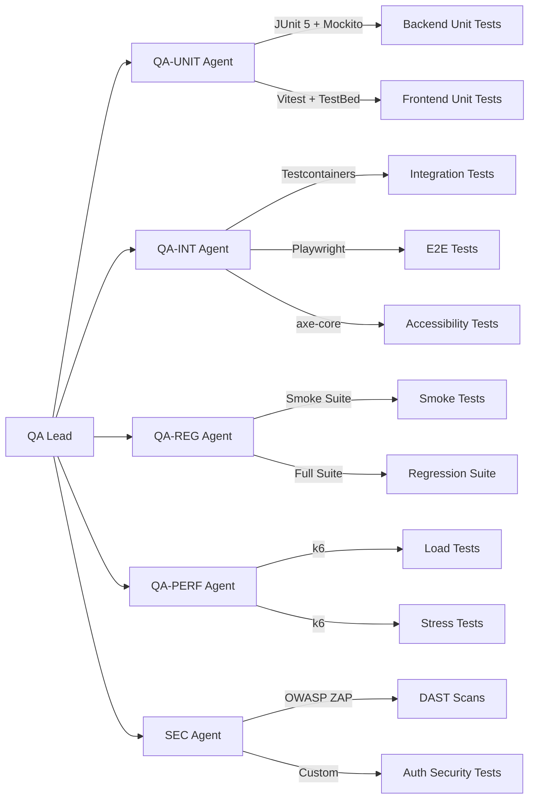

---

## 3. Test Environment Matrix

### 3.1 Development Environment (Local)

| Test Type | Framework | Trigger | Agent |
|-----------|-----------|---------|-------|
| Backend unit tests | JUnit 5 + Mockito | Every code change | QA-UNIT |
| Frontend unit tests | Vitest + Angular TestBed | Every code change | QA-UNIT |
| Frontend component tests | Vitest + DOM rendering | Component changes | QA-UNIT |
| Integration tests (API) | Testcontainers + MockMvc | API changes | QA-INT |

**Required containers for local development:**

| Container | Image | Purpose |
|-----------|-------|---------|
| Keycloak | `keycloak:24.0` | OAuth2/OIDC provider |
| Neo4j | `neo4j:5.12.0-community` | auth-facade data store |
| Valkey | `valkey/valkey:8-alpine` | Token blacklist, rate limiting |
| PostgreSQL | `postgres:16-alpine` | license-service, tenant-service |

### 3.2 CI Pipeline

| Test Type | Framework | Trigger | Agent |
|-----------|-----------|---------|-------|
| Unit tests (re-run) | JUnit 5, Vitest | Every push | QA-UNIT |
| Linting | ESLint, Checkstyle | Every push | DevOps |
| SAST | SonarQube, Semgrep | Every push | SEC |
| SCA | OWASP dependency-check, `npm audit` | Every push | SEC |
| Container scanning | Trivy | Image build | SEC |
| BVT (Build Verification) | JUnit 5 subset (~20 tests) | Every push | QA-REG |
| Contract tests | Spring Cloud Contract | API schema change | QA-INT |

### 3.3 Staging Environment

| Test Type | Framework | Trigger | Agent |
|-----------|-----------|---------|-------|
| Functional E2E | Playwright (multi-browser) | Deploy to staging | QA-INT |
| Responsive tests | Playwright viewports | UI deploy to staging | QA-INT |
| Accessibility tests | axe-core, WCAG AAA | UI deploy to staging | QA-INT |
| Smoke tests | Critical-path subset | Every staging deploy | QA-REG |
| Regression suite | Full test assembly | Release candidate | QA-REG |
| Load tests | k6 | Pre-release | QA-PERF |
| Stress tests | k6 | Pre-release | QA-PERF |
| DAST | OWASP ZAP | Deploy to staging | SEC |
| Penetration tests | ZAP + custom probes | Release candidate | SEC |
| Security auth tests | Custom (401/403, isolation) | Auth changes | SEC |
| UAT | Manual + Playwright | Feature complete | UAT |

### 3.4 Environment Flow

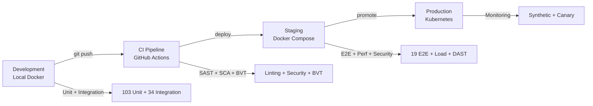

---

## 4. Unit Test Plan

### 4.1 Backend Unit Tests (JUnit 5 + Mockito)

#### 4.1.1 P0 -- Critical Path

| # | Class Under Test | Test Case | Mock Dependencies | FR |
|---|------------------|-----------|-------------------|-----|
| U-BE-01 | `AuthServiceImpl` | Login with valid credentials returns tokens | `IdentityProvider`, `SeatValidationService` | FR-1 |
| U-BE-02 | `AuthServiceImpl` | Login with invalid credentials throws `AuthenticationException` | `IdentityProvider` | FR-1 |
| U-BE-03 | `AuthServiceImpl` | Login when MFA required returns `mfaRequired=true` with MFA token | `IdentityProvider` | FR-3 |
| U-BE-04 | `AuthServiceImpl` | Login when seat limit exceeded throws `SeatLimitExceededException` | `SeatValidationService` | FR-7 |
| U-BE-05 | `AuthServiceImpl` | Logout blacklists token in Valkey | `TokenService`, `IdentityProvider` | FR-4 |
| U-BE-06 | `AuthServiceImpl` | Refresh token returns new access + refresh token pair | `IdentityProvider` | FR-4 |
| U-BE-07 | `KeycloakIdentityProvider` | `authenticate()` calls Keycloak token endpoint with correct grant_type | `RestTemplate` | FR-1 |
| U-BE-08 | `KeycloakIdentityProvider` | `authenticate()` maps Keycloak response to `AuthResponse` | `RestTemplate` | FR-1 |
| U-BE-09 | `KeycloakIdentityProvider` | `refreshToken()` sends refresh_token grant to Keycloak | `RestTemplate` | FR-4 |
| U-BE-10 | `KeycloakIdentityProvider` | `logout()` revokes token at Keycloak revocation endpoint | `RestTemplate` | FR-4 |
| U-BE-11 | `KeycloakIdentityProvider` | `setupMfa()` returns QR code URI and recovery codes | `RestTemplate` | FR-3 |
| U-BE-12 | `KeycloakIdentityProvider` | `verifyMfa()` validates TOTP code against Keycloak | `RestTemplate` | FR-3 |
| U-BE-13 | `JwtTokenValidator` | Valid RS256 token passes validation | JWKS endpoint (mocked) | FR-4 |
| U-BE-14 | `JwtTokenValidator` | Expired token throws `TokenExpiredException` | JWKS endpoint (mocked) | FR-4 |
| U-BE-15 | `JwtTokenValidator` | Token with invalid signature throws `InvalidSignatureException` | JWKS endpoint (mocked) | FR-4 |
| U-BE-16 | `JwtTokenValidator` | JWKS key is cached after first fetch | JWKS endpoint (mocked) | FR-4 |
| U-BE-17 | `TokenServiceImpl` | `blacklistToken()` stores token ID in Valkey with TTL | `StringRedisTemplate` | FR-4 |
| U-BE-18 | `TokenServiceImpl` | `isBlacklisted()` returns true for blacklisted token | `StringRedisTemplate` | FR-4 |
| U-BE-19 | `TokenServiceImpl` | `isBlacklisted()` returns false for non-blacklisted token | `StringRedisTemplate` | FR-4 |
| U-BE-20 | `TokenServiceImpl` | MFA session token is stored with short TTL (5 min) | `StringRedisTemplate` | FR-3 |

#### 4.1.2 P1 -- Supporting Components

| # | Class Under Test | Test Case | Mock Dependencies | FR |
|---|------------------|-----------|-------------------|-----|
| U-BE-21 | `RateLimitFilter` | First request from IP passes | `StringRedisTemplate` | FR-6 |
| U-BE-22 | `RateLimitFilter` | 5th request from IP within window passes | `StringRedisTemplate` | FR-6 |
| U-BE-23 | `RateLimitFilter` | 6th request from IP within window returns 429 | `StringRedisTemplate` | FR-6 |
| U-BE-24 | `RateLimitFilter` | Counter resets after window expires | `StringRedisTemplate` | FR-6 |
| U-BE-25 | `RateLimitFilter` | Non-login endpoints bypass rate limiting | - | FR-6 |
| U-BE-26 | `TenantContextFilter` | Valid `X-Tenant-ID` header sets tenant context | - | FR-5 |
| U-BE-27 | `TenantContextFilter` | Missing `X-Tenant-ID` returns 400 for protected endpoints | - | FR-5 |
| U-BE-28 | `TenantContextFilter` | Public endpoints (health, actuator) bypass tenant check | - | FR-5 |
| U-BE-29 | `JwtValidationFilter` | Valid token passes filter chain | `JwtTokenValidator`, `TokenService` | FR-4 |
| U-BE-30 | `JwtValidationFilter` | Blacklisted token returns 401 | `TokenService` | FR-4 |
| U-BE-31 | `JwtValidationFilter` | Public paths (`/api/auth/login`, `/actuator/health`) bypass filter | - | FR-4 |
| U-BE-32 | `JwtValidationFilter` | Token with missing `Bearer` prefix returns 401 | - | FR-4 |
| U-BE-33 | `RealmResolver` | Resolves tenant ID to Keycloak realm name | `TenantService` (mocked) | FR-5 |
| U-BE-34 | `RealmResolver` | Master tenant resolves to `master` realm | - | FR-5 |
| U-BE-35 | `RealmResolver` | Unknown tenant throws `TenantNotFoundException` | `TenantService` (mocked) | FR-5 |
| U-BE-36 | `SeatValidationService` | Available seats returns true | `LicenseServiceClient` (Feign mock) | FR-7 |
| U-BE-37 | `SeatValidationService` | No available seats returns false | `LicenseServiceClient` (Feign mock) | FR-7 |
| U-BE-38 | `SeatValidationService` | Master tenant bypasses seat check | - | FR-7 |
| U-BE-39 | `SeatValidationService` | License-service unavailable triggers fallback (allow) | `LicenseServiceClient` (Feign mock) | FR-7 |

#### 4.1.3 P1 -- API Gateway Filters

| # | Class Under Test | Test Case | FR |
|---|------------------|-----------|-----|
| U-BE-40 | `JwtValidationFilter` (gateway) | Extracts roles from `realm_access.roles` claim | FR-8 |
| U-BE-41 | `JwtValidationFilter` (gateway) | Extracts roles from `resource_access` claim | FR-8 |
| U-BE-42 | `JwtValidationFilter` (gateway) | Propagates roles as `X-User-Roles` header | FR-8 |
| U-BE-43 | `JwtValidationFilter` (gateway) | Propagates `X-User-ID` and `X-Tenant-ID` headers | FR-5, FR-8 |
| U-BE-44 | `SecurityHeadersFilter` | Adds `X-Content-Type-Options: nosniff` | FR-9 |
| U-BE-45 | `SecurityHeadersFilter` | Adds `X-Frame-Options: DENY` | FR-9 |
| U-BE-46 | `SecurityHeadersFilter` | Adds `Strict-Transport-Security` header | FR-9 |
| U-BE-47 | `SecurityHeadersFilter` | Adds `Content-Security-Policy` header | FR-9 |

#### 4.1.4 P1 -- Social Login

| # | Class Under Test | Test Case | FR |
|---|------------------|-----------|-----|
| U-BE-48 | `KeycloakIdentityProvider` | `exchangeToken()` exchanges external token for Keycloak tokens | FR-2 |
| U-BE-49 | `KeycloakIdentityProvider` | `exchangeToken()` with invalid external token throws exception | FR-2 |
| U-BE-50 | `KeycloakIdentityProvider` | `initiateLogin()` returns redirect URI with `kc_idp_hint` | FR-2 |
| U-BE-51 | `KeycloakIdentityProvider` | `getAvailableProviders()` returns enabled providers for tenant | FR-11 |
| U-BE-52 | `KeycloakIdentityProvider` | `getAvailableProviders()` filters disabled providers | FR-11 |

### 4.2 Frontend Unit Tests (Vitest + Angular TestBed)

#### 4.2.1 P0 -- Core Auth Services

| # | Service/Component | Test Case | FR |
|---|-------------------|-----------|-----|
| U-FE-01 | `SessionService` | `login()` stores tokens in sessionStorage by default | FR-10 |
| U-FE-02 | `SessionService` | `login()` with rememberMe stores tokens in localStorage | FR-10 |
| U-FE-03 | `SessionService` | `logout()` clears all stored tokens | FR-10 |
| U-FE-04 | `SessionService` | `isAuthenticated` signal returns true when valid token exists | FR-10 |
| U-FE-05 | `SessionService` | `isAuthenticated` signal returns false when token is expired | FR-10 |
| U-FE-06 | `SessionService` | `getAccessToken()` returns current access token | FR-10 |
| U-FE-07 | `SessionService` | `decodeToken()` extracts claims from JWT payload | FR-10 |
| U-FE-08 | `SessionService` | `getUserRoles()` extracts roles from decoded token | FR-8 |
| U-FE-09 | `AuthInterceptor` | Attaches `Authorization: Bearer <token>` to outgoing requests | FR-10 |
| U-FE-10 | `AuthInterceptor` | Does not attach token to public endpoints (login, health) | FR-10 |
| U-FE-11 | `AuthInterceptor` | On 401 response, triggers token refresh | FR-10 |
| U-FE-12 | `AuthInterceptor` | Deduplicates concurrent refresh requests (only one inflight) | FR-10 |
| U-FE-13 | `AuthInterceptor` | On refresh failure, redirects to login page | FR-10 |
| U-FE-14 | `AuthGuard` | Allows navigation when user is authenticated | FR-10 |
| U-FE-15 | `AuthGuard` | Redirects to `/login` when user is not authenticated | FR-10 |
| U-FE-16 | `AuthGuard` | Stores attempted URL for post-login redirect | FR-10 |
| U-FE-17 | `GatewayAuthFacadeService` | `login()` sends POST to `/api/auth/login` with credentials | FR-10 |
| U-FE-18 | `GatewayAuthFacadeService` | `logout()` sends POST to `/api/auth/logout` with refresh token | FR-10 |
| U-FE-19 | `GatewayAuthFacadeService` | `refreshToken()` sends POST to `/api/auth/refresh` | FR-10 |
| U-FE-20 | `GatewayAuthFacadeService` | `setupMfa()` sends POST to `/api/auth/mfa/setup` | FR-3 |

#### 4.2.2 P1 -- UI Components and Interceptors

| # | Service/Component | Test Case | FR |
|---|-------------------|-----------|-----|
| U-FE-21 | `TenantHeaderInterceptor` | Injects `X-Tenant-ID` header from tenant context | FR-5 |
| U-FE-22 | `TenantHeaderInterceptor` | Skips header injection for external URLs | FR-5 |
| U-FE-23 | `LoginPageComponent` | Renders username and password fields | FR-10 |
| U-FE-24 | `LoginPageComponent` | Disables submit button when form is invalid | FR-10 |
| U-FE-25 | `LoginPageComponent` | Shows validation error for empty username | FR-10 |
| U-FE-26 | `LoginPageComponent` | Shows validation error for empty password | FR-10 |
| U-FE-27 | `LoginPageComponent` | Calls `GatewayAuthFacadeService.login()` on submit | FR-10 |
| U-FE-28 | `LoginPageComponent` | Displays error message on login failure | FR-10 |
| U-FE-29 | `LoginPageComponent` | Shows social login buttons (Google, Microsoft) | FR-2 |
| U-FE-30 | `LoginPageComponent` | Navigates to dashboard on successful login | FR-10 |
| U-FE-31 | `LoginPageComponent` | Shows "Remember me" checkbox | FR-10 |

---

## 5. Integration Test Plan

### 5.1 Testcontainers Configuration

All integration tests use Testcontainers to spin up real infrastructure. No mocks at the integration level.

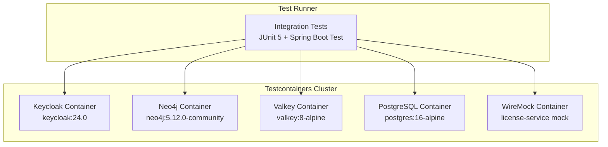

### 5.2 Integration Test Cases

#### 5.2.1 Login Flow (FR-1)

| # | Test Case | Containers | Assertions |
|---|-----------|------------|------------|
| I-01 | Login with valid credentials via Keycloak | Keycloak, Neo4j, Valkey | 200 OK, tokens returned, session cached |
| I-02 | Login with invalid credentials | Keycloak | 401 Unauthorized, no tokens |
| I-03 | Login with non-existent user | Keycloak | 401 Unauthorized |
| I-04 | Login populates tenant context from `X-Tenant-ID` | Keycloak, Neo4j | Correct realm resolved |

#### 5.2.2 Token Lifecycle (FR-4)

| # | Test Case | Containers | Assertions |
|---|-----------|------------|------------|
| I-05 | Refresh token returns new token pair | Keycloak | New access + refresh tokens, old refresh invalidated |
| I-06 | Refresh with revoked token returns 401 | Keycloak | 401 Unauthorized |
| I-07 | Logout blacklists access token in Valkey | Keycloak, Valkey | Token ID exists in Valkey with TTL |
| I-08 | Request with blacklisted token returns 401 | Valkey | 401 at gateway filter |
| I-09 | Token validation against JWKS endpoint | Keycloak | RS256 signature verified |

#### 5.2.3 MFA (FR-3)

| # | Test Case | Containers | Assertions |
|---|-----------|------------|------------|
| I-10 | MFA setup returns QR code and recovery codes | Keycloak | 200, qrCodeUri non-null, recoveryCodes.size >= 6 |
| I-11 | MFA verify with valid TOTP code succeeds | Keycloak | 200, full tokens returned |
| I-12 | MFA verify with invalid code returns 401 | Keycloak | 401, attempt counter incremented |
| I-13 | Login for MFA-enabled user returns mfaRequired=true | Keycloak | 200, mfaRequired=true, mfaToken present |

#### 5.2.4 Rate Limiting (FR-6)

| # | Test Case | Containers | Assertions |
|---|-----------|------------|------------|
| I-14 | 5 login attempts from same IP within 15 minutes pass | Valkey | All return 200 or 401 (not 429) |
| I-15 | 6th login attempt from same IP returns 429 | Valkey | 429 Too Many Requests |
| I-16 | Rate limit counter resets after window expiry | Valkey | Next request after TTL returns 200/401 |

#### 5.2.5 Multi-Tenant Realm Resolution (FR-5)

| # | Test Case | Containers | Assertions |
|---|-----------|------------|------------|
| I-17 | Login with Tenant A resolves to Realm A | Keycloak (multi-realm), Neo4j | Realm A tokens returned |
| I-18 | Login with Tenant B resolves to Realm B | Keycloak (multi-realm), Neo4j | Realm B tokens returned |
| I-19 | Tenant A token cannot access Tenant B resources | Keycloak, Gateway | 403 Forbidden |
| I-20 | Missing `X-Tenant-ID` header returns 400 | Gateway | 400 Bad Request |

#### 5.2.6 Seat Validation (FR-7)

| # | Test Case | Containers | Assertions |
|---|-----------|------------|------------|
| I-21 | Login succeeds when seats available | WireMock (license mock) | 200, tokens returned |
| I-22 | Login fails when no seats available | WireMock (license mock) | 403, seat limit error |
| I-23 | Master tenant bypasses seat validation | WireMock (not called) | 200, tokens returned |
| I-24 | License-service timeout triggers fallback (allow) | WireMock (delay 10s) | 200, tokens returned with warning |

#### 5.2.7 Social Login (FR-2)

| # | Test Case | Containers | Assertions |
|---|-----------|------------|------------|
| I-25 | Token exchange with valid Google token | Keycloak | 200, EMSIST tokens returned |
| I-26 | Token exchange with invalid external token | Keycloak | 401 Unauthorized |
| I-27 | Initiate social login returns redirect URI | Keycloak | 302, Location contains kc_idp_hint |

#### 5.2.8 RBAC and Header Propagation (FR-8)

| # | Test Case | Containers | Assertions |
|---|-----------|------------|------------|
| I-28 | Gateway extracts roles and propagates `X-User-Roles` | Keycloak, Gateway | Downstream receives correct roles |
| I-29 | Gateway propagates `X-User-ID` from JWT sub claim | Keycloak, Gateway | Header matches JWT subject |
| I-30 | Endpoint restricted to ADMIN role rejects USER role | Keycloak, Gateway | 403 Forbidden |

#### 5.2.9 Security Headers (FR-9)

| # | Test Case | Containers | Assertions |
|---|-----------|------------|------------|
| I-31 | All responses include `X-Content-Type-Options: nosniff` | Gateway | Header present |
| I-32 | All responses include `X-Frame-Options: DENY` | Gateway | Header present |

#### 5.2.10 Dynamic IdP Configuration (FR-11)

| # | Test Case | Containers | Assertions |
|---|-----------|------------|------------|
| I-33 | Available providers endpoint returns enabled providers | Keycloak, Neo4j | JSON array with provider metadata |
| I-34 | Disabled provider is excluded from available list | Neo4j | Provider not in response |

---

## 6. E2E Test Plan

### 6.1 Playwright Configuration

```typescript
// playwright.config.ts (auth module tests)
{
  projects: [
    { name: 'Desktop Chrome', use: { viewport: { width: 1920, height: 1080 } } },
    { name: 'Tablet', use: { viewport: { width: 768, height: 1024 } } },
    { name: 'Mobile', use: { viewport: { width: 375, height: 812 } } },
  ],
  retries: 1,
  timeout: 30000,
}
```

### 6.2 E2E Test Scenarios

#### 6.2.1 Login Journeys

| # | Scenario | Steps | Expected Outcome | FR |
|---|----------|-------|-------------------|-----|
| E2E-01 | Login happy path | 1. Navigate to `/login` 2. Enter valid credentials 3. Click submit | Redirect to dashboard, tokens stored | FR-1, FR-10 |
| E2E-02 | Login error path | 1. Navigate to `/login` 2. Enter invalid credentials 3. Click submit | Error message displayed, no redirect | FR-1, FR-10 |
| E2E-03 | Login with tenant resolution | 1. Navigate to `/login?tenant=acme` 2. Enter credentials 3. Submit | Correct realm used, tenant-scoped dashboard | FR-5, FR-10 |
| E2E-04 | Login form validation | 1. Navigate to `/login` 2. Click submit without entering data | Validation errors on both fields | FR-10 |

#### 6.2.2 Session Management

| # | Scenario | Steps | Expected Outcome | FR |
|---|----------|-------|-------------------|-----|
| E2E-05 | Session expiry redirect | 1. Login 2. Wait for token expiry 3. Navigate to protected page | Redirect to `/login` with return URL | FR-4, FR-10 |
| E2E-06 | Remember me (localStorage) | 1. Login with "Remember me" checked 2. Close tab 3. Reopen | Session persists from localStorage | FR-10 |
| E2E-07 | No remember me (sessionStorage) | 1. Login without "Remember me" 2. Close tab 3. Reopen | Session lost, redirect to login | FR-10 |

#### 6.2.3 Logout

| # | Scenario | Steps | Expected Outcome | FR |
|---|----------|-------|-------------------|-----|
| E2E-08 | Logout flow | 1. Login 2. Click logout button | Redirect to login, tokens cleared | FR-4, FR-10 |
| E2E-09 | Post-logout token invalid | 1. Login 2. Copy access token 3. Logout 4. Use token in API call | 401 Unauthorized (token blacklisted) | FR-4 |

#### 6.2.4 Auth Guard

| # | Scenario | Steps | Expected Outcome | FR |
|---|----------|-------|-------------------|-----|
| E2E-10 | Auth guard redirect | 1. Navigate to `/dashboard` without login | Redirect to `/login` | FR-10 |
| E2E-11 | Post-login redirect | 1. Navigate to `/settings` (protected) 2. Login | Redirect to `/settings` after login | FR-10 |

#### 6.2.5 MFA

| # | Scenario | Steps | Expected Outcome | FR |
|---|----------|-------|-------------------|-----|
| E2E-12 | MFA setup flow | 1. Login 2. Navigate to MFA setup 3. Scan QR 4. Enter TOTP | MFA enabled, recovery codes shown | FR-3 |
| E2E-13 | MFA challenge on login | 1. Login with MFA-enabled account | MFA code prompt, successful after code | FR-3 |
| E2E-14 | MFA with invalid code | 1. Login 2. Enter wrong MFA code | Error message, retry allowed | FR-3 |

#### 6.2.6 Social Login

| # | Scenario | Steps | Expected Outcome | FR |
|---|----------|-------|-------------------|-----|
| E2E-15 | Google login button | 1. Navigate to `/login` 2. Click "Sign in with Google" | Redirect to Google OAuth, return to dashboard | FR-2 |
| E2E-16 | Microsoft login button | 1. Navigate to `/login` 2. Click "Sign in with Microsoft" | Redirect to Microsoft OAuth, return to dashboard | FR-2 |

#### 6.2.7 Responsive Verification

| # | Viewport | Key Checks | FR |
|---|----------|------------|-----|
| E2E-17 | Desktop (1920x1080) | Login form centered, social buttons inline | FR-10 |
| E2E-18 | Tablet (768x1024) | Login form scales, social buttons stack if needed | FR-10 |
| E2E-19 | Mobile (375x812) | Login form full width, touch-friendly buttons | FR-10 |

### 6.3 E2E Test Flow Diagram

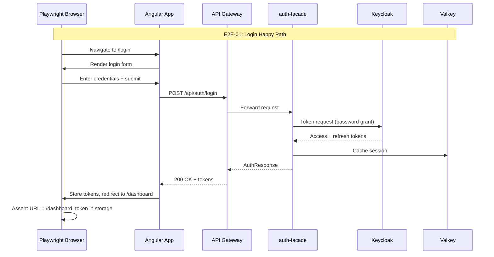

---

## 7. Security Test Plan

### 7.1 Security Test Categories

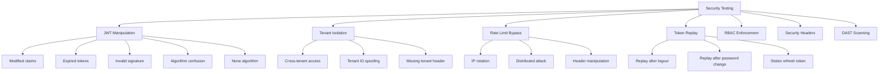

### 7.2 JWT Manipulation Tests

| # | Test Case | Attack Vector | Expected Result |
|---|-----------|---------------|-----------------|
| S-01 | Modified claims (elevated role) | Change `realm_access.roles` to include `ADMIN` | 401 -- signature invalid |
| S-02 | Expired token | Use token past `exp` claim | 401 -- token expired |
| S-03 | Invalid signature | Re-sign JWT with different key | 401 -- signature verification failed |
| S-04 | Algorithm confusion (`alg: none`) | Set JWT header `alg` to `none` | 401 -- unsupported algorithm |
| S-05 | Algorithm confusion (`alg: HS256`) | Sign with HS256 using public key as secret | 401 -- algorithm mismatch |
| S-06 | Missing `iss` claim | Remove issuer from JWT | 401 -- invalid token |
| S-07 | Wrong `iss` claim | Set issuer to different realm | 401 -- issuer mismatch |
| S-08 | Future `iat` claim | Set issued-at to future date | 401 -- invalid token |

### 7.3 Cross-Tenant Access Tests

| # | Test Case | Attack Vector | Expected Result |
|---|-----------|---------------|-----------------|
| S-09 | Tenant A token used with Tenant B header | Valid Tenant A JWT + `X-Tenant-ID: B` | 403 -- tenant mismatch |
| S-10 | Missing `X-Tenant-ID` on protected endpoint | No tenant header | 400 -- missing header |
| S-11 | Spoofed `X-Tenant-ID` with valid token | Modify header to unknown tenant | 404 or 403 -- tenant not found |
| S-12 | Tenant A user queries Tenant B data | Tenant A token + Tenant B resource URL | 403 -- access denied |

### 7.4 Rate Limit Bypass Tests

| # | Test Case | Attack Vector | Expected Result |
|---|-----------|---------------|-----------------|
| S-13 | IP rotation via `X-Forwarded-For` | Send 6+ requests with different `X-Forwarded-For` | 429 -- real IP is rate-limited (ignore proxy headers) |
| S-14 | Concurrent burst from single IP | 10 simultaneous requests | At most 5 succeed, rest get 429 |
| S-15 | Rate limit on multiple endpoints | Hit login + refresh from same IP | Only login endpoint is rate-limited |

### 7.5 Token Replay Tests

| # | Test Case | Attack Vector | Expected Result |
|---|-----------|---------------|-----------------|
| S-16 | Replay access token after logout | Use stored token post-logout | 401 -- token blacklisted |
| S-17 | Replay refresh token after logout | Use stored refresh token post-logout | 401 -- refresh token revoked |
| S-18 | Use old refresh token after rotation | Use previous refresh token (already rotated) | 401 -- token revoked |

### 7.6 RBAC Enforcement Tests

| # | Test Case | Attack Vector | Expected Result |
|---|-----------|---------------|-----------------|
| S-19 | USER role accesses ADMIN endpoint | Valid USER token + ADMIN-only URL | 403 Forbidden |
| S-20 | No roles in token | Valid token with empty roles | 403 on all role-protected endpoints |
| S-21 | Privilege escalation via API | POST request to change own role | 403 or endpoint does not exist |

### 7.7 DAST Scanning (OWASP ZAP)

| Scan Type | Target | Trigger | Acceptable Findings |
|-----------|--------|---------|---------------------|
| Passive scan | All auth endpoints | Every staging deploy | Zero HIGH/CRITICAL alerts |
| Active scan | Login, MFA, token endpoints | Release candidate | Zero HIGH/CRITICAL alerts |
| API scan | OpenAPI spec for auth-facade | Release candidate | Zero HIGH/CRITICAL alerts |

---

## 8. Performance Test Plan

### 8.1 SLO Targets

| Metric | Target | Measurement |
|--------|--------|-------------|
| Login response time (p50) | < 300ms | k6 histogram |
| Login response time (p95) | < 800ms | k6 histogram |
| Login response time (p99) | < 1500ms | k6 histogram |
| Token refresh response time (p95) | < 200ms | k6 histogram |
| Token validation at gateway (p95) | < 50ms | k6 histogram |
| Rate limit check (p95) | < 10ms | k6 histogram |
| Concurrent logins supported | >= 100/sec | k6 ramping VUs |
| Error rate under load | < 1% | k6 error counter |
| Token blacklist lookup (p95) | < 5ms | k6 histogram |

### 8.2 Load Test Scenarios (k6)

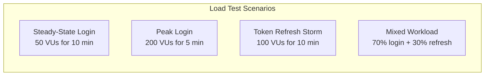

| # | Scenario | VUs | Duration | Ramp-Up | Success Criteria |
|---|----------|-----|----------|---------|------------------|
| P-01 | Steady-state login | 50 | 10 min | 30s | p95 < 800ms, 0% errors |
| P-02 | Peak login load | 200 | 5 min | 1 min | p95 < 1500ms, < 1% errors |
| P-03 | Token refresh storm | 100 | 10 min | 30s | p95 < 200ms, 0% errors |
| P-04 | Mixed workload | 100 | 15 min | 1 min | p95 < 800ms login, < 200ms refresh |
| P-05 | Rate limit effectiveness | 300 (single IP) | 2 min | immediate | 429 returned within 5 requests |

### 8.3 Stress Test Scenarios

| # | Scenario | Approach | Goal |
|---|----------|----------|------|
| P-06 | Find breaking point | Ramp from 50 to 500 VUs over 10 min | Identify max concurrent logins before errors > 5% |
| P-07 | Valkey failure resilience | Kill Valkey mid-test | Graceful degradation (no 500 errors, fallback behavior) |

### 8.4 Soak Test

| # | Scenario | Duration | VUs | Goal |
|---|----------|----------|-----|------|
| P-08 | 4-hour endurance | 4 hours | 30 | No memory leaks, stable response times, no connection pool exhaustion |

---

## 9. Test Data Strategy

### 9.1 Test Tenants

| Tenant ID | Realm | Purpose | Seats |
|-----------|-------|---------|-------|
| `master` | `master` | Super admin testing, bypasses seat checks | Unlimited |
| `tenant-a` | `realm-a` | Primary test tenant | 10 |
| `tenant-b` | `realm-b` | Cross-tenant isolation tests | 5 |
| `tenant-full` | `realm-full` | Seat limit exhaustion tests | 1 (occupied) |

### 9.2 Test Users

| Username | Tenant | Role | MFA | Purpose |
|----------|--------|------|-----|---------|
| `superadmin` | master | SUPER_ADMIN | No | Admin flow tests |
| `admin-a` | tenant-a | ADMIN | No | Tenant admin tests |
| `user-a1` | tenant-a | USER | No | Basic login tests |
| `user-a2` | tenant-a | USER | Yes (TOTP) | MFA flow tests |
| `user-b1` | tenant-b | USER | No | Cross-tenant tests |
| `user-full` | tenant-full | USER | No | Seat exhaustion tests |
| `social-google` | tenant-a | USER | No | Google login tests |
| `social-microsoft` | tenant-a | USER | No | Microsoft login tests |
| `noroles` | tenant-a | (none) | No | RBAC denial tests |

### 9.3 Test Data Lifecycle

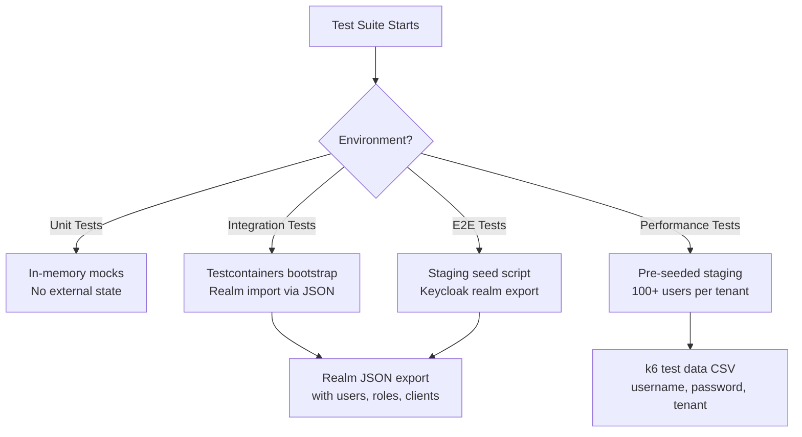

### 9.4 Data Isolation Rules

- Each test class creates its own test data and cleans up after execution
- Integration tests use `@DirtiesContext` or dedicated Testcontainer instances per test class
- E2E tests use unique usernames (timestamp-suffixed) to avoid collisions
- Performance tests use a dedicated staging environment that resets nightly

---

## 10. Coverage Targets

### 10.1 Code Coverage

| Layer | Metric | Target | Tool |
|-------|--------|--------|------|
| Backend (auth-facade) | Line coverage | >= 80% | JaCoCo |
| Backend (auth-facade) | Branch coverage | >= 75% | JaCoCo |
| Backend (api-gateway) | Line coverage | >= 80% | JaCoCo |
| Backend (api-gateway) | Branch coverage | >= 75% | JaCoCo |
| Frontend (auth module) | Line coverage | >= 80% | Vitest/Istanbul |
| Frontend (auth module) | Branch coverage | >= 75% | Vitest/Istanbul |

### 10.2 Requirement Coverage Matrix

Every feature requirement must have at least one test at each applicable level.

| FR | Description | Unit | Integration | E2E | Security | Performance |
|----|-------------|------|-------------|-----|----------|-------------|
| FR-1 | Password Auth | U-BE-01..08 | I-01..04 | E2E-01..04 | S-01..08 | P-01,P-02 |
| FR-2 | Social Login | U-BE-48..50 | I-25..27 | E2E-15,16 | - | - |
| FR-3 | MFA (TOTP) | U-BE-03,11,12,20 | I-10..13 | E2E-12..14 | - | - |
| FR-4 | Token Mgmt | U-BE-05..06,13..19 | I-05..09 | E2E-05..09 | S-01..08,16..18 | P-03 |
| FR-5 | Multi-Tenant | U-BE-26..28,33..35 | I-17..20 | E2E-03 | S-09..12 | P-04 |
| FR-6 | Rate Limiting | U-BE-21..25 | I-14..16 | - | S-13..15 | P-05 |
| FR-7 | Seat Validation | U-BE-04,36..39 | I-21..24 | - | - | - |
| FR-8 | RBAC | U-BE-40..43, U-FE-08 | I-28..30 | - | S-19..21 | - |
| FR-9 | Security Headers | U-BE-44..47 | I-31..32 | - | DAST | - |
| FR-10 | Angular Auth | U-FE-01..31 | - | E2E-01..11,17..19 | - | - |
| FR-11 | Dynamic IdP | U-BE-51..52 | I-33..34 | - | - | - |

### 10.3 Coverage Gaps and Risks

| Gap | Risk | Mitigation |
|-----|------|------------|
| FR-12 (Additional IdPs) not testable | Provider-agnostic interface untested with real providers | Unit test `IdentityProvider` interface contract |
| FR-13 (WebAuthn) not implemented | No test coverage | Defer until implementation begins |
| FR-14 (SMS/Email OTP) not implemented | No test coverage | Defer until implementation begins |
| FR-15 (Session Management UI) not implemented | No test coverage | Defer until implementation begins |
| Social login E2E depends on external OAuth providers | Flaky in CI | Use Keycloak identity brokering with test IdP |

---

## 11. Test Automation

### 11.1 CI Pipeline Integration

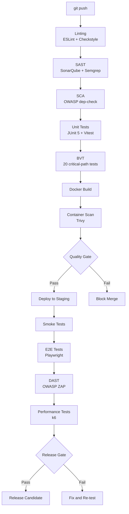

### 11.2 Quality Gates

| Gate | Criteria | Blocks |
|------|----------|--------|
| Unit Gate | All unit tests pass, coverage >= 80% | Merge to main |
| BVT Gate | 20 critical-path tests pass | Docker build |
| Smoke Gate | Login + navigate + core feature works | E2E execution |
| E2E Gate | All E2E scenarios pass across viewports | DAST scan |
| Security Gate | Zero CRITICAL/HIGH DAST findings | Release candidate |
| Performance Gate | All SLOs met (p95 < 800ms login) | Production deploy |

### 11.3 Test Execution Commands

| Level | Command | Environment |
|-------|---------|-------------|
| Backend unit tests | `mvn test -pl auth-facade,api-gateway` | Local / CI |
| Frontend unit tests | `npx vitest run --coverage` | Local / CI |
| Integration tests | `mvn verify -Pintegration -pl auth-facade` | Local / CI |
| E2E tests | `npx playwright test --project="Desktop Chrome"` | Staging |
| E2E (all viewports) | `npx playwright test` | Staging |
| Accessibility tests | `npx playwright test --grep @a11y` | Staging |
| Load tests | `k6 run tests/performance/auth-load.js` | Staging |
| DAST scan | `zap-cli quick-scan --self-contained https://staging.emsist.io` | Staging |

### 11.4 BVT (Build Verification Test) Suite

The BVT suite contains the 20 most critical test cases that must pass on every push.

| # | Test Case | Source | Level |
|---|-----------|--------|-------|
| BVT-01 | Login with valid credentials | U-BE-01 | Unit |
| BVT-02 | Login with invalid credentials | U-BE-02 | Unit |
| BVT-03 | JWT signature validation | U-BE-13 | Unit |
| BVT-04 | JWT expiry check | U-BE-14 | Unit |
| BVT-05 | Token blacklist on logout | U-BE-17 | Unit |
| BVT-06 | Blacklisted token check | U-BE-18 | Unit |
| BVT-07 | Rate limit enforcement | U-BE-23 | Unit |
| BVT-08 | Tenant context extraction | U-BE-26 | Unit |
| BVT-09 | Seat validation pass | U-BE-36 | Unit |
| BVT-10 | Seat validation fail | U-BE-37 | Unit |
| BVT-11 | Auth guard (authenticated) | U-FE-14 | Unit |
| BVT-12 | Auth guard (unauthenticated) | U-FE-15 | Unit |
| BVT-13 | Auth interceptor token attach | U-FE-09 | Unit |
| BVT-14 | Auth interceptor 401 refresh | U-FE-11 | Unit |
| BVT-15 | Session service login | U-FE-01 | Unit |
| BVT-16 | Session service logout | U-FE-03 | Unit |
| BVT-17 | Login flow integration | I-01 | Integration |
| BVT-18 | Token blacklist integration | I-07 | Integration |
| BVT-19 | Tenant isolation integration | I-19 | Integration |
| BVT-20 | Security headers present | I-31 | Integration |

---

## 12. Defect Management

### 12.1 Defect Severity Classification

| Severity | Definition | Auth Examples | SLA |
|----------|-----------|---------------|-----|
| P0 -- Critical | System unusable, security breach | Login completely broken; token validation bypassed; cross-tenant data leak | Fix within 4 hours |
| P1 -- High | Major feature broken, no workaround | MFA setup fails; refresh token not working; rate limiting ineffective | Fix within 24 hours |
| P2 -- Medium | Feature partially broken, workaround exists | Social login button misaligned; error message unclear; session expiry off by minutes | Fix within sprint |
| P3 -- Low | Minor issue, cosmetic | Tooltip text wrong; login form alignment on edge viewport | Fix when capacity allows |

### 12.2 Defect Triage Router

When a test fails, the QA Lead classifies the failure and routes to the correct agent.

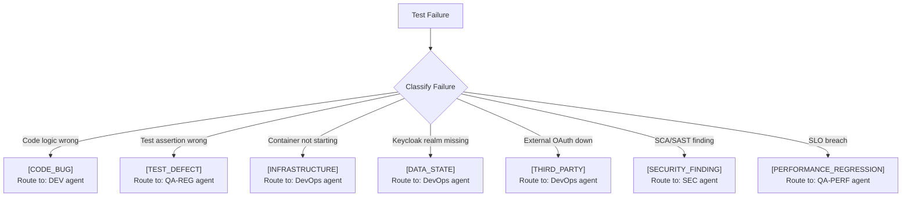

### 12.3 Defect Lifecycle

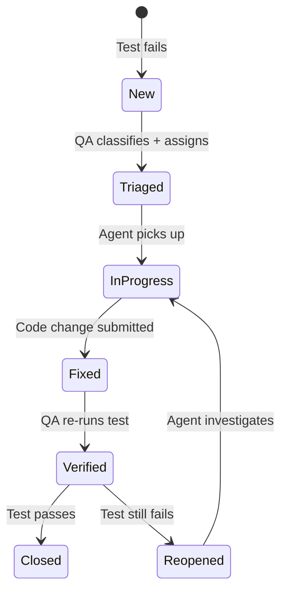

### 12.4 Cross-Environment Failure Protocol

When a test passes in Development but fails in Staging:

| Step | Action | Agent |
|------|--------|-------|
| 1 | Compare environment configs (application.yml, env vars) | DevOps |
| 2 | Verify service versions match (docker image tags) | DevOps |
| 3 | Check Keycloak realm state (users, clients, roles) | DevOps |
| 4 | Verify Valkey state (cache entries, rate limit counters) | DevOps |
| 5 | Inspect container resources (memory, CPU limits) | DevOps |
| 6 | Check network policies (service-to-service connectivity) | DevOps |

### 12.5 Regression Prevention

After every P0/P1 defect fix:

1. **QA-REG agent** adds a regression test that reproduces the original defect
2. The regression test is added to the BVT suite if it covers a critical path
3. The root cause is documented in the defect record
4. If the defect reveals a gap in the test strategy, this document is updated

---

## Appendix A: Traceability Matrix (FR to Acceptance Criteria to Test Cases)

| FR | Acceptance Criteria | Test Cases |
|----|---------------------|------------|
| FR-1 | Valid credentials return 200 with tokens | U-BE-01, I-01, E2E-01 |
| FR-1 | Invalid credentials return 401 | U-BE-02, I-02, E2E-02 |
| FR-2 | Social login returns redirect URI | U-BE-50, I-27, E2E-15 |
| FR-2 | Token exchange returns EMSIST tokens | U-BE-48, I-25 |
| FR-3 | MFA setup returns QR code + recovery codes | U-BE-11, I-10, E2E-12 |
| FR-3 | MFA verify with valid code succeeds | U-BE-12, I-11, E2E-13 |
| FR-4 | Refresh token returns new pair | U-BE-06, I-05 |
| FR-4 | Logout blacklists token | U-BE-05,17, I-07, E2E-08 |
| FR-4 | Blacklisted token returns 401 | U-BE-18,30, I-08, S-16 |
| FR-5 | Tenant resolves to correct realm | U-BE-33, I-17,18 |
| FR-5 | Cross-tenant access denied | I-19, S-09 |
| FR-6 | 6th attempt returns 429 | U-BE-23, I-15, S-14 |
| FR-7 | No seats returns 403 | U-BE-04,37, I-22 |
| FR-7 | Master bypasses seat check | U-BE-38, I-23 |
| FR-8 | Roles extracted and propagated | U-BE-40..43, I-28,29 |
| FR-8 | Insufficient role returns 403 | I-30, S-19 |
| FR-9 | Security headers present | U-BE-44..47, I-31,32 |
| FR-10 | AuthGuard redirects unauthenticated | U-FE-15, E2E-10 |
| FR-10 | Interceptor refreshes on 401 | U-FE-11, E2E-05 |
| FR-11 | Available providers returned for tenant | U-BE-51, I-33 |

---

## Appendix B: Glossary

| Term | Definition |
|------|-----------|
| BVT | Build Verification Test -- minimal critical-path suite run on every push |
| DAST | Dynamic Application Security Testing -- runtime security scanning |
| SAST | Static Application Security Testing -- source code analysis |
| SCA | Software Composition Analysis -- dependency vulnerability scanning |
| SLO | Service Level Objective -- measurable performance target |
| TOTP | Time-based One-Time Password -- MFA mechanism |
| VU | Virtual User -- simulated concurrent user in load tests |
| JWKS | JSON Web Key Set -- public key endpoint for JWT verification |
