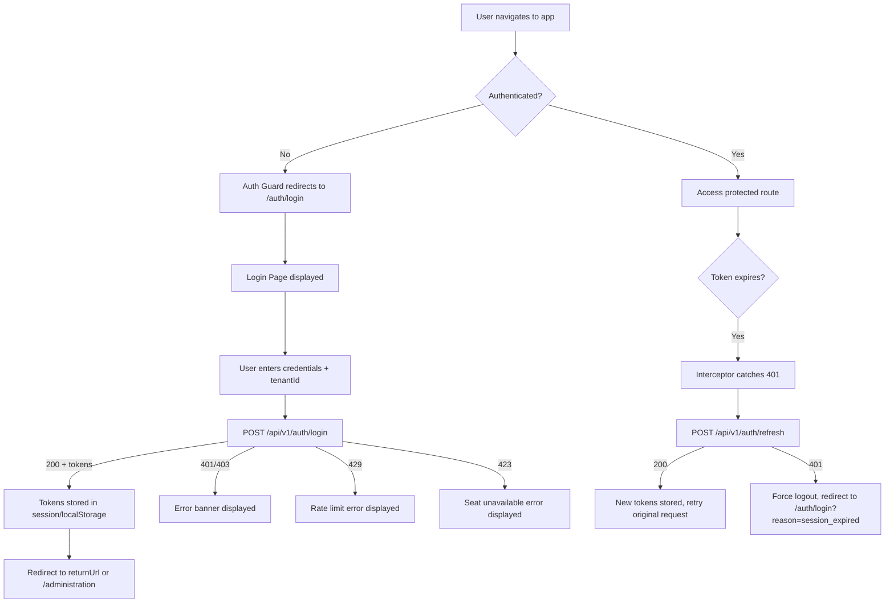
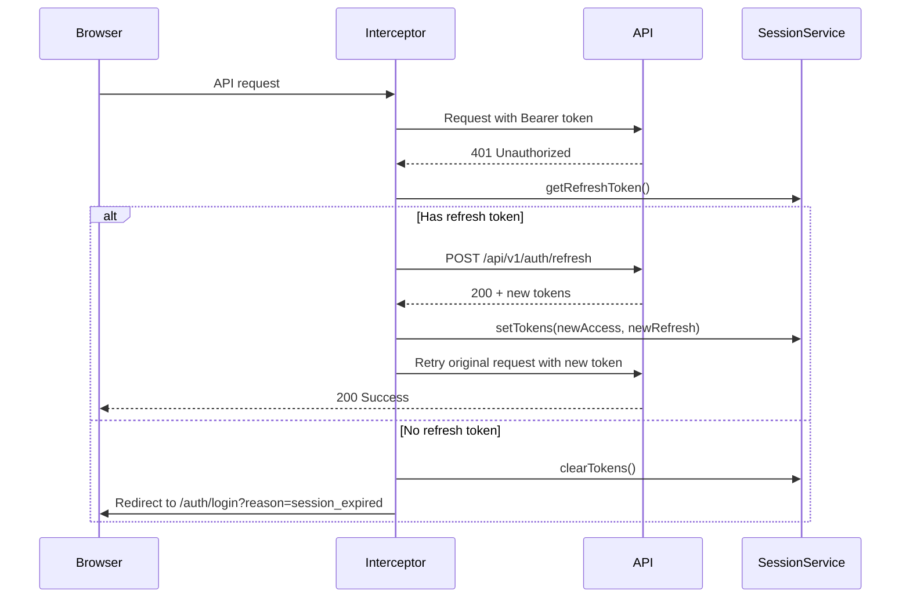
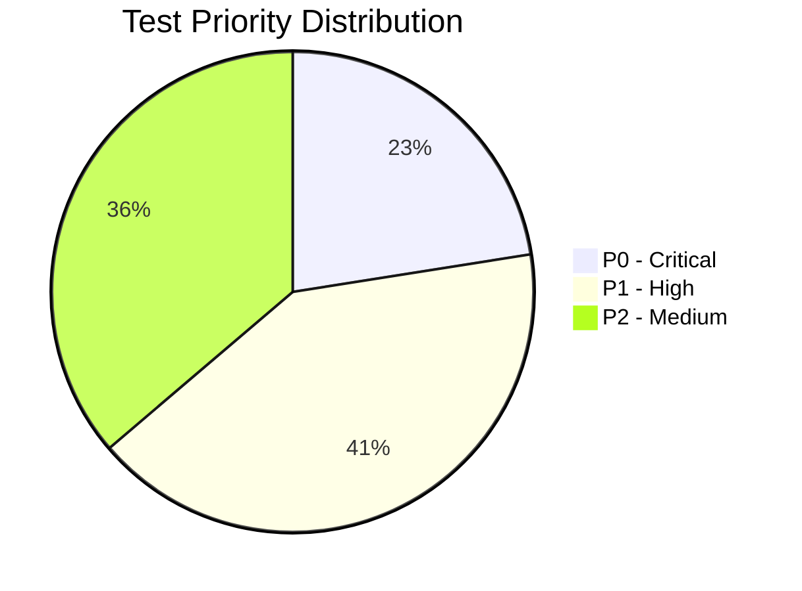
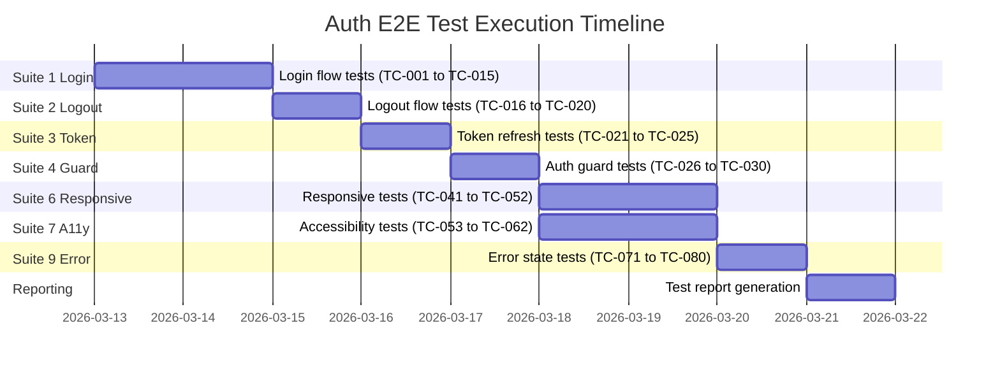

# Playwright E2E Test Plan -- Authentication & Authorization

**Document ID:** R01-TP-014
**Version:** 1.0.0
**Date:** 2026-03-12
**Author:** QA Lead Agent
**Status:** Draft
**Requirement:** R01 -- Authentication and Authorization
**Application:** EMSIST Frontend (Angular 21)

---

## 1. Test Plan Overview

### 1.1 Purpose

This document defines the comprehensive Playwright E2E test plan for the Authentication and Authorization features of the EMSIST application. All test cases are classified using the three-state system: `[IMPLEMENTED]`, `[IN-PROGRESS]`, or `[PLANNED]` based on verified code evidence.

### 1.2 Scope

| Area | Status | Evidence |
|------|--------|----------|
| Login flow (email/username + password + tenantId) | `[IMPLEMENTED]` | `frontend/src/app/features/auth/login.page.ts` |
| Logout flow (token clear + redirect) | `[IMPLEMENTED]` | `frontend/src/app/core/auth/gateway-auth-facade.service.ts` |
| Token refresh (interceptor-based 401 handling) | `[IMPLEMENTED]` | `frontend/src/app/core/interceptors/auth.interceptor.ts` |
| Auth guard (route protection + returnUrl) | `[IMPLEMENTED]` | `frontend/src/app/core/auth/auth.guard.ts` |
| Session storage (localStorage vs sessionStorage) | `[IMPLEMENTED]` | `frontend/src/app/core/services/session.service.ts` |
| Tenant context resolution | `[IMPLEMENTED]` | `frontend/src/app/core/services/tenant-context.service.ts` |
| Password reset request + confirm | `[IMPLEMENTED]` | `frontend/src/app/features/auth/password-reset/` |
| Remember Me checkbox (UI) | `[PLANNED]` | Hardcoded `rememberMe: false` at login.page.ts:110; no checkbox in template |
| MFA / TOTP flow (frontend UI) | `[PLANNED]` | Admin tab placeholder exists (master-auth-section); no login-time MFA challenge UI |
| RBAC role guard (frontend) | `[PLANNED]` | No `roleGuard` or `hasRole` directive exists in codebase |
| Multiple identity providers (Auth0, Okta, Azure AD) | `[PLANNED]` | Only Keycloak provider exists in backend |

### 1.3 Testing Pyramid Alignment

```
E2E (Playwright)  -- 10% of total test effort (this plan)
Integration       -- 20% (covered by QA-INT agent)
Unit (Vitest)     -- 70% (covered by QA-UNIT agent)
```

### 1.4 Test Flow Overview



---

## 2. Test Environment Setup

### 2.1 Playwright Configuration

```typescript
// playwright.config.ts (reference)
import { defineConfig, devices } from '@playwright/test';

export default defineConfig({
  testDir: './e2e/auth',
  fullyParallel: false, // Auth tests must run sequentially
  forbidOnly: !!process.env['CI'],
  retries: process.env['CI'] ? 2 : 0,
  workers: 1,
  reporter: [['html'], ['json', { outputFile: 'test-results/auth-results.json' }]],
  use: {
    baseURL: process.env['BASE_URL'] || 'http://localhost:4200',
    trace: 'on-first-retry',
    screenshot: 'only-on-failure',
  },
  projects: [
    { name: 'chromium', use: { ...devices['Desktop Chrome'] } },
    { name: 'firefox', use: { ...devices['Desktop Firefox'] } },
    { name: 'webkit', use: { ...devices['Desktop Safari'] } },
    { name: 'mobile-chrome', use: { ...devices['Pixel 5'] } },
    { name: 'mobile-safari', use: { ...devices['iPhone 13'] } },
    { name: 'tablet', use: { viewport: { width: 768, height: 1024 } } },
  ],
});
```

### 2.2 API Route Interception Strategy

All E2E tests use Playwright route interception (`page.route()`) to mock backend responses. This isolates frontend behavior from backend availability.

| API Endpoint | Mock Strategy |
|-------------|---------------|
| `POST /api/v1/auth/login` | Return mock `LoginResponse` with JWT tokens |
| `POST /api/v1/auth/refresh` | Return refreshed tokens or 401 |
| `POST /api/v1/auth/logout` | Return 200 |
| `GET /api/tenants/resolve` | Return tenant resolution payload |
| `GET /api/v1/auth/login` (rate-limited) | Return 429 with `Retry-After` header |
| `POST /api/v1/auth/login` (seat limit) | Return 423 |

### 2.3 Test JWT Helper

```typescript
// e2e/helpers/jwt.ts (reference)
export function createMockJwt(claims: Record<string, unknown>): string {
  const header = btoa(JSON.stringify({ alg: 'RS256', typ: 'JWT' }));
  const payload = btoa(JSON.stringify({
    sub: 'user-001',
    tenant_id: '550e8400-e29b-41d4-a716-446655440000',
    roles: ['USER'],
    exp: Math.floor(Date.now() / 1000) + 3600,
    ...claims,
  }));
  const signature = btoa('mock-signature');
  return `${header}.${payload}.${signature}`;
}
```

---

## 3. Test Data Requirements

### 3.1 Users

| User ID | Role | Tenant ID | Purpose |
|---------|------|-----------|---------|
| `user-standard` | USER | `550e8400-e29b-41d4-a716-446655440000` | Standard login tests |
| `user-admin` | ADMIN | `550e8400-e29b-41d4-a716-446655440000` | Admin route access tests |
| `user-tenant-admin` | TENANT_ADMIN | `550e8400-e29b-41d4-a716-446655440000` | Tenant admin tests |
| `user-invalid` | -- | -- | Invalid credentials tests |
| `user-mfa` | USER | `550e8400-e29b-41d4-a716-446655440000` | MFA flow tests `[PLANNED]` |

### 3.2 Tenants

| Tenant ID | Alias | Status |
|-----------|-------|--------|
| `550e8400-e29b-41d4-a716-446655440000` | `master` | Active |
| `660e8400-e29b-41d4-a716-446655440001` | `demo` | Active |
| `invalid-not-a-uuid` | -- | N/A (invalid format) |

### 3.3 Storage Keys

Verified from `session.service.ts` lines 3-4:

| Key | Storage | Purpose |
|-----|---------|---------|
| `tp_access_token` | sessionStorage (default) / localStorage (rememberMe) | Access JWT |
| `tp_refresh_token` | sessionStorage (default) / localStorage (rememberMe) | Refresh JWT |

---

## 4. Test Suites Summary

| Suite | Test Case Range | Feature Status | Count |
|-------|----------------|----------------|-------|
| Suite 1: Login Flow | TC-AUTH-001 to TC-AUTH-015 | `[IMPLEMENTED]` | 15 |
| Suite 2: Logout Flow | TC-AUTH-016 to TC-AUTH-020 | `[IMPLEMENTED]` | 5 |
| Suite 3: Token Refresh | TC-AUTH-021 to TC-AUTH-025 | `[IMPLEMENTED]` | 5 |
| Suite 4: Auth Guard | TC-AUTH-026 to TC-AUTH-030 | `[IMPLEMENTED]` | 5 |
| Suite 5: MFA Flow | TC-AUTH-031 to TC-AUTH-040 | `[PLANNED]` | 10 |
| Suite 6: Responsive Tests | TC-AUTH-041 to TC-AUTH-052 | `[IMPLEMENTED]` | 12 |
| Suite 7: Accessibility Tests | TC-AUTH-053 to TC-AUTH-062 | `[IMPLEMENTED]` | 10 |
| Suite 8: RBAC Tests | TC-AUTH-063 to TC-AUTH-070 | `[PLANNED]` | 8 |
| Suite 9: Error State Tests | TC-AUTH-071 to TC-AUTH-080 | `[IMPLEMENTED]` | 10 |
| **Total** | | | **80** |

---

## 5. Test Cases (Detailed)

### Suite 1: Login Flow `[IMPLEMENTED]`

**Feature under test:** `LoginPageComponent` (`frontend/src/app/features/auth/login.page.ts`)
**API endpoint:** `POST /api/v1/auth/login`
**Template:** `frontend/src/app/features/auth/login.page.html`

---

#### TC-AUTH-001: Successful login with email and password

| Field | Value |
|-------|-------|
| **ID** | TC-AUTH-001 |
| **Priority** | P0 |
| **Description** | Verify that a user can log in with a valid email address, password, and tenant ID |
| **Preconditions** | User is on `/auth/login`; no active session |
| **Steps** | 1. Click "Sign in with Email" button. 2. Enter `user@example.com` in the Identifier field. 3. Enter `ValidP@ssw0rd` in the Password field. 4. Enter valid UUID tenant ID. 5. Click "Sign In". |
| **Expected Result** | - POST to `/api/v1/auth/login` with `{ identifier: "user@example.com", password: "ValidP@ssw0rd", tenantId: "<uuid>" }`. - On 200 response with `accessToken` and `refreshToken`, tokens are stored in `sessionStorage` (keys: `tp_access_token`, `tp_refresh_token`). - User is redirected to `/administration`. |
| **Evidence** | `login.page.ts:83-119` -- `onSubmit()` calls `auth.login()` and on success calls `handleSuccessfulLogin()`. `gateway-auth-facade.service.ts:27-53` -- stores tokens via `session.setTokens()`. `login.page.ts:127-128` -- redirects to `returnUrl` or `/administration`. |

---

#### TC-AUTH-002: Successful login with username and password

| Field | Value |
|-------|-------|
| **ID** | TC-AUTH-002 |
| **Priority** | P0 |
| **Description** | Verify login with a username (non-email identifier) |
| **Preconditions** | User is on `/auth/login`; no active session |
| **Steps** | 1. Click "Sign in with Email". 2. Enter `admin.user` in Identifier field. 3. Enter password. 4. Enter valid tenant ID. 5. Click "Sign In". |
| **Expected Result** | - POST body contains `identifier: "admin.user"`. - Identifier field accepts any string (type="text" -- verified at login.page.html:59). - Login succeeds with valid response. - Redirect to `/administration`. |
| **Evidence** | `login.page.html:56-65` -- input type is `text` with `autocomplete="username"`, accepting both email and username. |

---

#### TC-AUTH-003: Login with invalid credentials

| Field | Value |
|-------|-------|
| **ID** | TC-AUTH-003 |
| **Priority** | P0 |
| **Description** | Verify error banner is displayed when credentials are invalid |
| **Preconditions** | User is on `/auth/login` with form visible |
| **Steps** | 1. Enter valid identifier and tenant ID. 2. Enter wrong password. 3. Click "Sign In". |
| **Expected Result** | - API returns `{ success: false, message: "Invalid credentials" }` or HTTP 401. - Error banner appears with `role="alert"` (verified at login.page.html:26). - For `success: false` response: displays `payload.message`. For `HttpErrorResponse`: displays formatted status code and message (login.page.ts:142-148). - No tokens stored. - User remains on login page. |
| **Evidence** | `login.page.ts:115-117` -- error handler calls `formatHttpError()`. `login.page.ts:122-124` -- checks `payload.success === false`. `login.page.html:25-27` -- error banner with `role="alert"`. |

---

#### TC-AUTH-004: Login with empty fields

| Field | Value |
|-------|-------|
| **ID** | TC-AUTH-004 |
| **Priority** | P1 |
| **Description** | Verify client-side validation when fields are empty |
| **Preconditions** | Login form is visible |
| **Steps** | 1. Leave Identifier and Password empty. 2. Click "Sign In". |
| **Expected Result** | - Error banner: `"Email or username and password are required."` (login.page.ts:88). - No API call made. - Form remains visible. |
| **Evidence** | `login.page.ts:87-89` -- `if (!identifier || !this.password)` guard. |

---

#### TC-AUTH-005: Login with invalid tenant ID format

| Field | Value |
|-------|-------|
| **ID** | TC-AUTH-005 |
| **Priority** | P1 |
| **Description** | Verify error when tenant ID is not a UUID and not a recognized alias |
| **Preconditions** | Login form is visible |
| **Steps** | 1. Enter valid identifier and password. 2. Enter `not-a-valid-uuid` in Tenant ID field. 3. Click "Sign In". |
| **Expected Result** | - Error banner: `"Tenant ID must be a UUID or a recognized tenant alias."` (login.page.ts:98). - No API call made. - `tenantContext.setTenantFromInput()` returns `false`. |
| **Evidence** | `login.page.ts:97-99` -- checks `setTenantFromInput()` return value. `tenant-context.service.ts:60-80` -- `normalizeTenantId()` validates UUID regex. |

---

#### TC-AUTH-006: Login with tenant alias resolution

| Field | Value |
|-------|-------|
| **ID** | TC-AUTH-006 |
| **Priority** | P1 |
| **Description** | Verify that a tenant alias (e.g., "master") resolves to its UUID |
| **Preconditions** | `environment.tenantAliasMap` contains `{ "master": "550e8400-..." }` |
| **Steps** | 1. Enter valid identifier and password. 2. Enter `master` in Tenant ID field. 3. Click "Sign In". |
| **Expected Result** | - `tenantContext.setTenantFromInput("master")` returns `true`. - Alias resolves to UUID via `environment.tenantAliasMap` (tenant-context.service.ts:74). - API call proceeds with the resolved UUID. |
| **Evidence** | `tenant-context.service.ts:70-78` -- UUID check, then alias map lookup. |

---

#### TC-AUTH-007: Login with "Remember Me" checked `[PLANNED]`

| Field | Value |
|-------|-------|
| **ID** | TC-AUTH-007 |
| **Priority** | P2 |
| **Description** | Verify that tokens are stored in `localStorage` when "Remember Me" is checked |
| **Preconditions** | Remember Me checkbox exists in UI |
| **Steps** | 1. Check "Remember Me" checkbox. 2. Complete login. |
| **Expected Result** | - `rememberMe: true` passed to `session.setTokens()`. - Tokens written to `localStorage` (session.service.ts:70-72). - `sessionStorage` cleared for these keys. |
| **Note** | **UI NOT YET IMPLEMENTED.** Login page hardcodes `rememberMe: false` (login.page.ts:110). Backend `SessionService.setTokens()` supports the flag but no checkbox exists in the template. |
| **Evidence** | `session.service.ts:62-76` -- `writeToken()` branches on `rememberMe`. `login.page.ts:110` -- hardcoded `false`. |

---

#### TC-AUTH-008: Login without "Remember Me" (default behavior)

| Field | Value |
|-------|-------|
| **ID** | TC-AUTH-008 |
| **Priority** | P1 |
| **Description** | Verify that tokens are stored in `sessionStorage` by default |
| **Preconditions** | Login form is visible |
| **Steps** | 1. Complete a successful login (no "Remember Me" checkbox). |
| **Expected Result** | - `rememberMe: false` is passed (hardcoded). - Tokens stored in `sessionStorage` only (session.service.ts:75). - `localStorage` does not contain `tp_access_token` or `tp_refresh_token`. |
| **Evidence** | `login.page.ts:110` -- `rememberMe: false`. `session.service.ts:75` -- `sessionStorage.setItem(key, value)`. |

---

#### TC-AUTH-009: Login with returnUrl redirect

| Field | Value |
|-------|-------|
| **ID** | TC-AUTH-009 |
| **Priority** | P0 |
| **Description** | Verify that after login, user is redirected to the original `returnUrl` |
| **Preconditions** | URL is `/auth/login?returnUrl=/tenants` |
| **Steps** | 1. Navigate to `/auth/login?returnUrl=/tenants`. 2. Complete login successfully. |
| **Expected Result** | - `normalizeReturnUrl()` returns `/tenants`. - `router.navigateByUrl('/tenants', { replaceUrl: true })` is called. - Browser URL changes to `/tenants`. |
| **Evidence** | `login.page.ts:127-128` -- reads `returnUrl` from query params and navigates. `login.page.ts:159-174` -- `normalizeReturnUrl()` validates the URL. |

---

#### TC-AUTH-010: Login form disabled during request

| Field | Value |
|-------|-------|
| **ID** | TC-AUTH-010 |
| **Priority** | P1 |
| **Description** | Verify that the submit button is disabled while login request is in flight |
| **Preconditions** | Login form is visible |
| **Steps** | 1. Fill in all fields. 2. Click "Sign In". 3. Observe button state before response arrives. |
| **Expected Result** | - `loading()` signal is set to `true` (login.page.ts:102). - Submit button shows text `"Signing in..."` (login.page.html:157). - Button has `[disabled]="loading()"` attribute (login.page.html:156). - After response (success or error), `loading()` resets to `false` via `finalize()` (login.page.ts:112). |
| **Evidence** | `login.page.ts:102` -- `this.loading.set(true)`. `login.page.html:156-158` -- `[disabled]="loading()"` and conditional text. |

---

#### TC-AUTH-011: Rate-limited login (HTTP 429)

| Field | Value |
|-------|-------|
| **ID** | TC-AUTH-011 |
| **Priority** | P1 |
| **Description** | Verify error display when API returns 429 (Too Many Requests) |
| **Preconditions** | Login form is visible; mock API to return 429 |
| **Steps** | 1. Submit login. 2. API returns `HttpErrorResponse` with status 429. |
| **Expected Result** | - `formatHttpError()` produces `"429 Too Many Requests: <message>"`. - Error banner displayed with `role="alert"`. - No tokens stored. |
| **Evidence** | `login.page.ts:142-148` -- `formatHttpError()` handles any `HttpErrorResponse`. |

---

#### TC-AUTH-012: Seat unavailable login (HTTP 423)

| Field | Value |
|-------|-------|
| **ID** | TC-AUTH-012 |
| **Priority** | P1 |
| **Description** | Verify error display when API returns 423 (Locked / No seat available) |
| **Preconditions** | Login form is visible; mock API to return 423 |
| **Steps** | 1. Submit login. 2. API returns `HttpErrorResponse` with status 423. |
| **Expected Result** | - Error banner: `"423 Locked: <message>"`. - No tokens stored. - User remains on login page. |
| **Evidence** | `login.page.ts:142-148` -- generic `HttpErrorResponse` handler. |

---

#### TC-AUTH-013: Session expired message display

| Field | Value |
|-------|-------|
| **ID** | TC-AUTH-013 |
| **Priority** | P0 |
| **Description** | Verify info banner when redirected with `reason=session_expired` |
| **Preconditions** | Navigate to `/auth/login?reason=session_expired` |
| **Steps** | 1. Load `/auth/login?reason=session_expired`. |
| **Expected Result** | - Info banner displayed: `"Your session expired. Please sign in again."` (login.page.ts:55). - Banner has `role="status"` attribute (login.page.html:22). - Banner uses `tp-banner-info` CSS class. |
| **Evidence** | `login.page.ts:54-56` -- checks `reason === 'session_expired'`. `login.page.html:21-23` -- info banner section. |

---

#### TC-AUTH-014: Logout confirmation message display

| Field | Value |
|-------|-------|
| **ID** | TC-AUTH-014 |
| **Priority** | P1 |
| **Description** | Verify info banner when redirected after logout with `loggedOut=1` |
| **Preconditions** | Navigate to `/auth/login?loggedOut=1` |
| **Steps** | 1. Load `/auth/login?loggedOut=1`. |
| **Expected Result** | - Info banner displayed: `"You have been signed out successfully."` (login.page.ts:50). - Banner has `role="status"`. |
| **Evidence** | `login.page.ts:49-51` -- checks `loggedOut === '1'`. |

---

#### TC-AUTH-015: Password visibility toggle

| Field | Value |
|-------|-------|
| **ID** | TC-AUTH-015 |
| **Priority** | P2 |
| **Description** | Verify the password field toggles between masked and visible text |
| **Preconditions** | Login form is visible with password field |
| **Steps** | 1. Verify password field type is `password`. 2. Click the toggle button. 3. Verify field type changes to `text`. 4. Click toggle again. 5. Verify field type returns to `password`. |
| **Expected Result** | - Initial state: `type="password"` (login.page.html:82). - After click: `type="text"`. - Toggle button `aria-label` changes between `"Show password"` and `"Hide password"` (login.page.html:99-100). - SVG icon changes (eye vs eye-off). |
| **Evidence** | `login.page.ts:75-77` -- `togglePasswordVisibility()`. `login.page.html:82` -- `[type]="showPassword() ? 'text' : 'password'"`. `login.page.html:99-100` -- dynamic aria-label. |

---

### Suite 2: Logout Flow `[IMPLEMENTED]`

**Feature under test:** `GatewayAuthFacadeService.logout()` and `logoutLocal()`
**Source:** `frontend/src/app/core/auth/gateway-auth-facade.service.ts`

---

#### TC-AUTH-016: Successful logout redirects to login

| Field | Value |
|-------|-------|
| **ID** | TC-AUTH-016 |
| **Priority** | P0 |
| **Description** | Verify that logout clears session and redirects to login page |
| **Preconditions** | User is authenticated and on a protected page |
| **Steps** | 1. Trigger logout action. |
| **Expected Result** | - `POST /api/v1/auth/logout` called with `{ refreshToken }`. - `session.clearTokens()` called. - User redirected to `/auth/login?loggedOut=1&returnUrl=<current>`. - Info banner: `"You have been signed out successfully."`. |
| **Evidence** | `gateway-auth-facade.service.ts:56-69` -- `logout()` calls API, then `logoutLocal()`. `gateway-auth-facade.service.ts:71-87` -- `logoutLocal()` clears tokens and navigates. |

---

#### TC-AUTH-017: Verify tokens cleared from storage

| Field | Value |
|-------|-------|
| **ID** | TC-AUTH-017 |
| **Priority** | P0 |
| **Description** | Verify that both sessionStorage and localStorage are cleared after logout |
| **Preconditions** | User is authenticated with tokens in storage |
| **Steps** | 1. Verify `tp_access_token` exists in storage. 2. Trigger logout. 3. Check both storages. |
| **Expected Result** | - `sessionStorage.getItem('tp_access_token')` returns `null`. - `sessionStorage.getItem('tp_refresh_token')` returns `null`. - `localStorage.getItem('tp_access_token')` returns `null`. - `localStorage.getItem('tp_refresh_token')` returns `null`. |
| **Evidence** | `session.service.ts:24-31` -- `clearTokens()` removes from both storages. |

---

#### TC-AUTH-018: Subsequent API calls return 401 after logout

| Field | Value |
|-------|-------|
| **ID** | TC-AUTH-018 |
| **Priority** | P1 |
| **Description** | Verify that API calls after logout are rejected (no Authorization header) |
| **Preconditions** | User has just logged out |
| **Steps** | 1. Logout. 2. Attempt navigation to a protected route. 3. Observe interceptor behavior. |
| **Expected Result** | - `session.accessToken()` returns `null`. - Interceptor does not attach `Authorization` header (auth.interceptor.ts:34). - Auth guard redirects to login (auth.guard.ts:9-15). |
| **Evidence** | `auth.interceptor.ts:30-35` -- only adds header if `accessToken` exists. `auth.guard.ts:9-15` -- checks `session.isAuthenticated()`. |

---

#### TC-AUTH-019: Verify blacklisted token rejected by gateway `[IN-PROGRESS]`

| Field | Value |
|-------|-------|
| **ID** | TC-AUTH-019 |
| **Priority** | P2 |
| **Description** | Verify that a previously valid token is rejected after logout (backend token blacklist) |
| **Preconditions** | Requires backend integration testing |
| **Steps** | 1. Store the access token before logout. 2. Logout (POST /api/v1/auth/logout). 3. Manually inject the old token and call a protected endpoint. |
| **Expected Result** | - Backend returns 401 for the blacklisted token. - This is a backend-enforced behavior; frontend test can mock the 401 response for the stale token scenario. |
| **Note** | Full verification requires backend integration. Frontend E2E tests can verify the interceptor handles the 401 correctly after token reuse attempt. |

---

#### TC-AUTH-020: Logout from multiple tabs

| Field | Value |
|-------|-------|
| **ID** | TC-AUTH-020 |
| **Priority** | P2 |
| **Description** | Verify logout behavior when user has multiple tabs open |
| **Preconditions** | User is authenticated in two browser tabs |
| **Steps** | 1. Open app in two tabs. 2. Logout in Tab 1. 3. Attempt navigation in Tab 2. |
| **Expected Result** | - Tab 1: redirected to login. - Tab 2: on next API call, interceptor gets 401 (no valid token in storage), triggers force logout (auth.interceptor.ts:64-67). - Tab 2 user redirected to login with `reason=session_expired`. |
| **Evidence** | `session.service.ts:24-31` -- `clearTokens()` modifies shared storage. `auth.interceptor.ts:63-67` -- if no refresh token, calls `forceLogout()`. |

---

### Suite 3: Token Refresh `[IMPLEMENTED]`

**Feature under test:** `authInterceptor` (`frontend/src/app/core/interceptors/auth.interceptor.ts`)



---

#### TC-AUTH-021: Automatic token refresh on 401

| Field | Value |
|-------|-------|
| **ID** | TC-AUTH-021 |
| **Priority** | P0 |
| **Description** | Verify interceptor refreshes the token when API returns 401 |
| **Preconditions** | User is authenticated; access token is expired; refresh token is valid |
| **Steps** | 1. Mock first API call to return 401. 2. Mock refresh endpoint to return new tokens. 3. Verify retry with new token. |
| **Expected Result** | - Interceptor detects 401 (auth.interceptor.ts:46). - Calls `POST /api/v1/auth/refresh` with `{ refreshToken }` (auth.interceptor.ts:96). - On success, stores new tokens via `session.setTokens()` (auth.interceptor.ts:110-114). - Retries original request with new `Authorization: Bearer <newToken>` (auth.interceptor.ts:118). |
| **Evidence** | `auth.interceptor.ts:55-121` -- `handleUnauthorized()` function. |

---

#### TC-AUTH-022: Multiple concurrent 401s trigger single refresh

| Field | Value |
|-------|-------|
| **ID** | TC-AUTH-022 |
| **Priority** | P0 |
| **Description** | Verify that concurrent 401 responses do not trigger multiple refresh calls |
| **Preconditions** | Multiple API requests in flight; all return 401 |
| **Steps** | 1. Fire 3 API requests simultaneously. 2. All return 401. 3. Observe refresh behavior. |
| **Expected Result** | - Only one refresh request is made (auth.interceptor.ts:75 -- `isRefreshing` guard). - Other requests wait on `refreshCompleted$` BehaviorSubject (auth.interceptor.ts:76-90). - Once refresh completes, all pending requests retry with new token. |
| **Evidence** | `auth.interceptor.ts:14-15` -- `isRefreshing` flag and `refreshCompleted$` BehaviorSubject. `auth.interceptor.ts:75-91` -- queuing logic for concurrent 401s. |

---

#### TC-AUTH-023: Refresh failure redirects to login

| Field | Value |
|-------|-------|
| **ID** | TC-AUTH-023 |
| **Priority** | P0 |
| **Description** | Verify that a failed refresh triggers logout and redirect |
| **Preconditions** | Access token expired; refresh token also expired |
| **Steps** | 1. API returns 401. 2. Refresh endpoint returns 401. |
| **Expected Result** | - `forceLogout()` called (auth.interceptor.ts:100). - `session.clearTokens()` invoked. - User redirected to `/auth/login?reason=session_expired&returnUrl=<current>` (auth.interceptor.ts:123-132). |
| **Evidence** | `auth.interceptor.ts:97-101` -- `catchError` on refresh calls `forceLogout()`. `auth.interceptor.ts:123-133` -- `forceLogout()` implementation. |

---

#### TC-AUTH-024: Session expired reason parameter displayed

| Field | Value |
|-------|-------|
| **ID** | TC-AUTH-024 |
| **Priority** | P1 |
| **Description** | Verify that after forced logout, the login page shows session expired message |
| **Preconditions** | Token refresh has failed; user redirected to login |
| **Steps** | 1. Trigger forced logout (refresh failure). 2. Verify login page URL and message. |
| **Expected Result** | - URL contains `reason=session_expired`. - Info banner: `"Your session expired. Please sign in again."`. |
| **Evidence** | `auth.interceptor.ts:128-129` -- sets `reason: 'session_expired'` in query params. `login.page.ts:54-56` -- reads and displays `reason` param. |

---

#### TC-AUTH-025: Retried requests succeed with new token

| Field | Value |
|-------|-------|
| **ID** | TC-AUTH-025 |
| **Priority** | P1 |
| **Description** | Verify that after successful refresh, the original request is retried and succeeds |
| **Preconditions** | A request returns 401; refresh succeeds |
| **Steps** | 1. Make API call. 2. Gets 401. 3. Refresh succeeds. 4. Original request retried with new token. |
| **Expected Result** | - Retried request includes `Authorization: Bearer <newAccessToken>`. - If tenant ID exists, includes `X-Tenant-ID` header. - Response is returned to the original caller. |
| **Evidence** | `auth.interceptor.ts:118` -- `next(request.clone({ setHeaders: buildRetryHeaders(updatedAccessToken) }))`. `auth.interceptor.ts:69-72` -- `buildRetryHeaders` includes both Authorization and X-Tenant-ID. |

---

### Suite 4: Auth Guard `[IMPLEMENTED]`

**Feature under test:** `authGuard` (`frontend/src/app/core/auth/auth.guard.ts`)

---

#### TC-AUTH-026: Unauthenticated user redirected to login

| Field | Value |
|-------|-------|
| **ID** | TC-AUTH-026 |
| **Priority** | P0 |
| **Description** | Verify that visiting a protected route without authentication redirects to login |
| **Preconditions** | No tokens in storage |
| **Steps** | 1. Navigate to `/administration` (protected by `authGuard`). |
| **Expected Result** | - `session.isAuthenticated()` returns `false`. - Guard returns `UrlTree` to `/auth/login?returnUrl=/administration`. - Browser URL changes to `/auth/login?returnUrl=%2Fadministration`. |
| **Evidence** | `auth.guard.ts:9-15` -- checks `session.isAuthenticated()`, creates URL tree with `returnUrl`. `app.routes.ts:11` -- `/administration` has `canActivate: [authGuard]`. |

---

#### TC-AUTH-027: Authenticated user accesses protected route

| Field | Value |
|-------|-------|
| **ID** | TC-AUTH-027 |
| **Priority** | P0 |
| **Description** | Verify that an authenticated user can access protected routes |
| **Preconditions** | Valid access token in sessionStorage |
| **Steps** | 1. Set `tp_access_token` in sessionStorage. 2. Navigate to `/administration`. |
| **Expected Result** | - `session.isAuthenticated()` returns `true` (session.service.ts:15 -- `computed(() => Boolean(accessTokenState()))`). - Guard returns `true`. - `AdministrationPageComponent` loads. |
| **Evidence** | `auth.guard.ts:9-10` -- returns `true` when authenticated. `session.service.ts:15` -- `isAuthenticated` computed from token presence. |

---

#### TC-AUTH-028: returnUrl preserved in redirect

| Field | Value |
|-------|-------|
| **ID** | TC-AUTH-028 |
| **Priority** | P1 |
| **Description** | Verify the guard preserves the target URL as `returnUrl` query parameter |
| **Preconditions** | Not authenticated |
| **Steps** | 1. Navigate to `/tenants`. |
| **Expected Result** | - Guard redirects to `/auth/login?returnUrl=/tenants`. - After login, user is redirected back to `/tenants` (tested in TC-AUTH-009). |
| **Evidence** | `auth.guard.ts:13-14` -- `queryParams: { returnUrl: state.url }`. |

---

#### TC-AUTH-029: Deep link protection

| Field | Value |
|-------|-------|
| **ID** | TC-AUTH-029 |
| **Priority** | P1 |
| **Description** | Verify that direct URL entry to a protected page is intercepted |
| **Preconditions** | No active session |
| **Steps** | 1. Enter `http://localhost:4200/tenants` directly in browser address bar. |
| **Expected Result** | - Auth guard fires before route activates. - Redirected to `/auth/login?returnUrl=/tenants`. |
| **Evidence** | `app.routes.ts:23` -- `/tenants` has `canActivate: [authGuard]`. |

---

#### TC-AUTH-030: Auth guard with expired token triggers refresh

| Field | Value |
|-------|-------|
| **ID** | TC-AUTH-030 |
| **Priority** | P1 |
| **Description** | Verify behavior when token exists in storage but is expired |
| **Preconditions** | Expired JWT in sessionStorage (exp claim in the past) |
| **Steps** | 1. Set an expired JWT in `tp_access_token`. 2. Navigate to `/administration`. |
| **Expected Result** | - Auth guard returns `true` (it only checks token presence, not validity -- session.service.ts:15). - Page loads and makes API calls. - API returns 401. - Interceptor triggers token refresh flow. - If refresh fails, user is force-logged out. |
| **Note** | The auth guard does NOT validate token expiry; it only checks `Boolean(accessToken)`. Token validation is delegated to the API + interceptor. |
| **Evidence** | `session.service.ts:15` -- `computed(() => Boolean(this.accessTokenState()))` -- no expiry check. |

---

### Suite 5: MFA Flow `[PLANNED]`

**Status:** Frontend MFA challenge UI does not exist. Backend supports MFA (the `UserSession` model includes `mfaVerified: boolean` at `models.ts:477`). An MFA admin tab placeholder exists in `master-auth-section.component.html:10,27-30` but contains only descriptive text, no functional components.

**Note:** All test cases in this suite are `[PLANNED]`. They define the expected behavior for when MFA is implemented.

---

#### TC-AUTH-031: MFA setup initiation (QR code display) `[PLANNED]`

| Field | Value |
|-------|-------|
| **ID** | TC-AUTH-031 |
| **Priority** | P1 |
| **Description** | Verify that MFA setup displays a QR code for TOTP enrollment |
| **Preconditions** | MFA setup page exists; user is authenticated |
| **Steps** | 1. Navigate to MFA setup. 2. Verify QR code rendered. 3. Verify secret key displayed as text alternative. |
| **Expected Result** | - QR code image displayed with TOTP URI. - Text-based secret key shown for manual entry. - Instructions provided for authenticator app. |

---

#### TC-AUTH-032: MFA verification with valid TOTP code `[PLANNED]`

| Field | Value |
|-------|-------|
| **ID** | TC-AUTH-032 |
| **Priority** | P0 |
| **Description** | Verify MFA enrollment completes with a valid TOTP code |
| **Preconditions** | QR code displayed; user has scanned with authenticator app |
| **Steps** | 1. Enter valid 6-digit TOTP code. 2. Submit. |
| **Expected Result** | - API validates code. - MFA enabled for user. - Recovery codes displayed. |

---

#### TC-AUTH-033: MFA verification with invalid code `[PLANNED]`

| Field | Value |
|-------|-------|
| **ID** | TC-AUTH-033 |
| **Priority** | P1 |
| **Description** | Verify error message when invalid TOTP code is entered |
| **Preconditions** | MFA setup screen |
| **Steps** | 1. Enter `000000` (invalid code). 2. Submit. |
| **Expected Result** | - Error message: "Invalid verification code." - User can retry. |

---

#### TC-AUTH-034: MFA recovery code usage `[PLANNED]`

| Field | Value |
|-------|-------|
| **ID** | TC-AUTH-034 |
| **Priority** | P1 |
| **Description** | Verify that a recovery code can be used in place of TOTP |
| **Preconditions** | User has MFA enabled; has recovery codes |
| **Steps** | 1. On MFA challenge, click "Use recovery code". 2. Enter valid recovery code. |
| **Expected Result** | - Recovery code accepted. - User logged in. - Used recovery code is invalidated. |

---

#### TC-AUTH-035: Login with MFA challenge `[PLANNED]`

| Field | Value |
|-------|-------|
| **ID** | TC-AUTH-035 |
| **Priority** | P0 |
| **Description** | Verify that MFA-enabled user sees TOTP input after password |
| **Preconditions** | User has MFA enabled |
| **Steps** | 1. Enter credentials and tenant ID. 2. Submit login. 3. API returns MFA challenge response. |
| **Expected Result** | - Login response indicates MFA required (e.g., `{ mfaRequired: true, sessionToken: "..." }`). - TOTP input field displayed. - Original credentials form hidden. |

---

#### TC-AUTH-036: MFA challenge with valid code completes login `[PLANNED]`

| Field | Value |
|-------|-------|
| **ID** | TC-AUTH-036 |
| **Priority** | P0 |
| **Description** | Verify full login after MFA challenge with valid code |
| **Preconditions** | MFA challenge screen displayed |
| **Steps** | 1. Enter valid TOTP code. 2. Submit. |
| **Expected Result** | - API returns full `LoginResponse` with `accessToken` and `refreshToken`. - Tokens stored. - User redirected to `/administration` or `returnUrl`. |

---

#### TC-AUTH-037: MFA challenge with invalid code shows error `[PLANNED]`

| Field | Value |
|-------|-------|
| **ID** | TC-AUTH-037 |
| **Priority** | P1 |
| **Description** | Verify error display on invalid TOTP during login |
| **Preconditions** | MFA challenge screen displayed |
| **Steps** | 1. Enter invalid TOTP code. 2. Submit. |
| **Expected Result** | - Error banner: "Invalid verification code. Please try again." - User can retry. - After 5 failed attempts, session may be locked. |

---

#### TC-AUTH-038: MFA disable flow `[PLANNED]`

| Field | Value |
|-------|-------|
| **ID** | TC-AUTH-038 |
| **Priority** | P2 |
| **Description** | Verify that a user can disable MFA from settings |
| **Preconditions** | User has MFA enabled; on MFA settings page |
| **Steps** | 1. Click "Disable MFA". 2. Confirm with current TOTP code or password. |
| **Expected Result** | - MFA disabled for user. - Confirmation message displayed. |

---

#### TC-AUTH-039: Recovery codes display and copy `[PLANNED]`

| Field | Value |
|-------|-------|
| **ID** | TC-AUTH-039 |
| **Priority** | P2 |
| **Description** | Verify recovery codes are displayed and can be copied |
| **Preconditions** | MFA setup completed |
| **Steps** | 1. View recovery codes. 2. Click "Copy" button. |
| **Expected Result** | - Recovery codes displayed in a readable format. - Copy button copies to clipboard. - Warning: "Store these codes safely. They cannot be shown again." |

---

#### TC-AUTH-040: MFA session token expiry `[PLANNED]`

| Field | Value |
|-------|-------|
| **ID** | TC-AUTH-040 |
| **Priority** | P2 |
| **Description** | Verify that the MFA session token expires after timeout |
| **Preconditions** | MFA challenge screen displayed |
| **Steps** | 1. Wait for MFA session token to expire (e.g., 5 minutes). 2. Submit TOTP code. |
| **Expected Result** | - Error: "MFA session expired. Please log in again." - User redirected back to login form. |

---

### Suite 6: Responsive Tests `[IMPLEMENTED]`

**Verified breakpoints from `login.page.scss`:**
- Desktop: default (> 768px), `$auth-shell-width: 560px`
- Tablet: `@media (max-width: 768px)` -- line 461
- Mobile: `@media (max-width: 480px)` -- line 530
- Small mobile: `@media (max-width: 375px)` -- line 565
- Short viewport: `@media (max-height: 620px)` -- line 607
- Reduced motion: `@media (prefers-reduced-motion: reduce)` -- line 638

---

#### TC-AUTH-041: Desktop layout (1920x1080)

| Field | Value |
|-------|-------|
| **ID** | TC-AUTH-041 |
| **Priority** | P1 |
| **Description** | Verify login page layout at full desktop resolution |
| **Preconditions** | Viewport: 1920x1080 |
| **Steps** | 1. Navigate to `/auth/login`. 2. Click "Sign in with Email". |
| **Expected Result** | - Content centered vertically and horizontally. - Form card max width: `min(560px, 100%)`. - Logo height: 92px. - Title font size: 2.2rem. - Input height: 56px. - Submit button min-height: 58px. |
| **Evidence** | `login.page.scss:10,72-75,100-103,256-258,356-366`. |

---

#### TC-AUTH-042: Desktop layout (1440x900)

| Field | Value |
|-------|-------|
| **ID** | TC-AUTH-042 |
| **Priority** | P2 |
| **Description** | Verify login page at common laptop resolution |
| **Preconditions** | Viewport: 1440x900 |
| **Steps** | 1. Load login page. 2. Open form. |
| **Expected Result** | - Same as desktop layout. - No horizontal scrollbar. - All elements within viewport. |

---

#### TC-AUTH-043: Tablet portrait (768x1024)

| Field | Value |
|-------|-------|
| **ID** | TC-AUTH-043 |
| **Priority** | P1 |
| **Description** | Verify login page at tablet portrait resolution |
| **Preconditions** | Viewport: 768x1024 |
| **Steps** | 1. Load login page. 2. Open form. |
| **Expected Result** | - Media query at `max-width: 768px` applies. - Logo height: 64px (login.page.scss:468). - Title font size: 1.6rem (login.page.scss:474). - Form padding: `1.5rem 1.25rem 1.25rem` (login.page.scss:492). - Input height: 48px (login.page.scss:501). - All touch targets >= 44px (WCAG AAA). |
| **Evidence** | `login.page.scss:461-528`. |

---

#### TC-AUTH-044: Tablet landscape (1024x768)

| Field | Value |
|-------|-------|
| **ID** | TC-AUTH-044 |
| **Priority** | P2 |
| **Description** | Verify login page at tablet landscape |
| **Preconditions** | Viewport: 1024x768 |
| **Steps** | 1. Load login page and form. |
| **Expected Result** | - Desktop layout applies (width > 768px). - Content properly centered. |

---

#### TC-AUTH-045: Mobile portrait (375x667) -- iPhone SE

| Field | Value |
|-------|-------|
| **ID** | TC-AUTH-045 |
| **Priority** | P0 |
| **Description** | Verify login page on small mobile device |
| **Preconditions** | Viewport: 375x667 |
| **Steps** | 1. Load login page. 2. Open form. 3. Verify layout. |
| **Expected Result** | - Media query at `max-width: 375px` applies. - Logo height: 44px (login.page.scss:567). - Title font size: 1.2rem (login.page.scss:570). - Input height: 44px (login.page.scss:589). - Form takes full width. - Safe area insets respected (`env(safe-area-inset-*)` at login.page.scss:532). |
| **Evidence** | `login.page.scss:565-605`. |

---

#### TC-AUTH-046: Mobile portrait (480x854)

| Field | Value |
|-------|-------|
| **ID** | TC-AUTH-046 |
| **Priority** | P1 |
| **Description** | Verify login page at mid-range mobile resolution |
| **Preconditions** | Viewport: 480x854 |
| **Steps** | 1. Load login page and form. |
| **Expected Result** | - Media query at `max-width: 480px` applies. - Logo height: 52px. - Title font size: 1.35rem. - Form padding reduced. |
| **Evidence** | `login.page.scss:530-563`. |

---

#### TC-AUTH-047: Short viewport (1024x500)

| Field | Value |
|-------|-------|
| **ID** | TC-AUTH-047 |
| **Priority** | P2 |
| **Description** | Verify login page on short viewport (e.g., landscape mobile) |
| **Preconditions** | Viewport: 1024x500 (height < 620px) |
| **Steps** | 1. Load login page and form. |
| **Expected Result** | - Media query at `max-height: 620px` applies. - `justify-content: flex-start` (login.page.scss:609). - Logo height: 40px. - `overflow-y: auto` enabled (login.page.scss:611). - Content scrollable if needed. |
| **Evidence** | `login.page.scss:607-636`. |

---

#### TC-AUTH-048: Form card adapts width to viewport

| Field | Value |
|-------|-------|
| **ID** | TC-AUTH-048 |
| **Priority** | P1 |
| **Description** | Verify form card width uses `min($auth-shell-width, 100%)` |
| **Preconditions** | Various viewports |
| **Steps** | 1. Check form width at 1920px wide (should be 560px). 2. Check at 400px wide (should be 100% minus padding). |
| **Expected Result** | - Desktop: form card width = 560px. - Mobile: form card width = viewport width minus inline padding. |
| **Evidence** | `login.page.scss:10,193` -- `$auth-shell-width: 560px` and `width: min($auth-shell-width, 100%)`. |

---

#### TC-AUTH-049: Touch targets minimum 44px

| Field | Value |
|-------|-------|
| **ID** | TC-AUTH-049 |
| **Priority** | P1 |
| **Description** | Verify all interactive elements meet 44x44px minimum touch target (WCAG AAA) |
| **Preconditions** | Mobile viewport |
| **Steps** | 1. Measure all buttons, links, and inputs. |
| **Expected Result** | - "Sign in with Email" button: min-height 52px (login.page.scss:548). - Submit button: min-height 48px (login.page.scss:559). - Password toggle: 40x40px at 375px, 44x44px otherwise (login.page.scss:333-334, 601-603). - Help text link: min-height 44px (login.page.scss:401). - Back button: min-height 44px (login.page.scss:378). |

---

#### TC-AUTH-050: Reduced motion preference

| Field | Value |
|-------|-------|
| **ID** | TC-AUTH-050 |
| **Priority** | P2 |
| **Description** | Verify animations are disabled when user prefers reduced motion |
| **Preconditions** | `prefers-reduced-motion: reduce` media query active |
| **Steps** | 1. Enable reduced motion in OS settings. 2. Load login page. 3. Open form. |
| **Expected Result** | - All animations set to `none !important` (login.page.scss:638-648). - All transitions set to `none !important`. - Page loads instantly without fade/slide effects. |
| **Evidence** | `login.page.scss:638-648` -- `@media (prefers-reduced-motion: reduce)`. |

---

#### TC-AUTH-051: Error banner width matches form width

| Field | Value |
|-------|-------|
| **ID** | TC-AUTH-051 |
| **Priority** | P2 |
| **Description** | Verify error and info banners span the same width as the form |
| **Preconditions** | Various viewports |
| **Steps** | 1. Trigger an error. 2. Measure banner width. |
| **Expected Result** | - Banner width: `min(560px, 100%)` (login.page.scss:115-117). - Matches `.signin-section` and `.signin-card-stage` width. |

---

#### TC-AUTH-052: Logo fallback on image load failure

| Field | Value |
|-------|-------|
| **ID** | TC-AUTH-052 |
| **Priority** | P2 |
| **Description** | Verify text fallback when logo image fails to load |
| **Preconditions** | Logo image returns 404 |
| **Steps** | 1. Mock logo image to fail. 2. Load login page. |
| **Expected Result** | - `logoLoadFailed()` becomes `true` (login.page.ts:79-81). - Fallback `<span>` displays `"think+"` (login.page.html:14). - Fallback styled as pill button (login.page.scss:81-98). |
| **Evidence** | `login.page.html:6-15` -- `@if (!logoLoadFailed())` conditional. |

---

### Suite 7: Accessibility Tests (WCAG AAA) `[IMPLEMENTED]`

---

#### TC-AUTH-053: Axe-core scan -- zero violations

| Field | Value |
|-------|-------|
| **ID** | TC-AUTH-053 |
| **Priority** | P0 |
| **Description** | Run axe-core accessibility scan on the login page (both pre-form and form states) |
| **Preconditions** | Login page loaded |
| **Steps** | 1. Scan login page in initial state (pre-form, "Sign in with Email" button visible). 2. Click "Sign in with Email". 3. Scan login page with form visible. |
| **Expected Result** | - Zero violations at WCAG AAA level. - Zero violations at WCAG AA level. |

---

#### TC-AUTH-054: Tab order verification

| Field | Value |
|-------|-------|
| **ID** | TC-AUTH-054 |
| **Priority** | P0 |
| **Description** | Verify logical tab order through all interactive elements |
| **Preconditions** | Login form is visible |
| **Steps** | 1. Press Tab from document start. 2. Record focus order. |
| **Expected Result** | Expected tab order: 1. Logo link (`welcome-logo-link`). 2. Identifier input (`#identifier`). 3. Password input (`#password`). 4. Password toggle button (`.password-toggle`). 5. Tenant ID input (`#tenant-id`). 6. Submit button (`.submit-btn`). 7. Back button (`.back-btn`). 8. Help text link (`.help-text a`). |
| **Evidence** | `login.page.html` -- DOM order matches expected tab order. |

---

#### TC-AUTH-055: Form labels associated with inputs

| Field | Value |
|-------|-------|
| **ID** | TC-AUTH-055 |
| **Priority** | P0 |
| **Description** | Verify all form inputs have associated `<label>` elements |
| **Preconditions** | Login form visible |
| **Steps** | 1. Check each input's `id` matches a `<label for="...">`. |
| **Expected Result** | - `<label for="identifier">Email or Username</label>` matches `<input id="identifier">` (login.page.html:54-55). - `<label for="password">Password</label>` matches `<input id="password">` (login.page.html:77-78). - `<label for="tenant-id">Tenant ID</label>` matches `<input id="tenant-id">` (login.page.html:137-138). |
| **Evidence** | `login.page.html:54-65, 77-88, 137-148` -- label-input pairs. |

---

#### TC-AUTH-056: Error announcements via aria-live

| Field | Value |
|-------|-------|
| **ID** | TC-AUTH-056 |
| **Priority** | P0 |
| **Description** | Verify error messages are announced to screen readers |
| **Preconditions** | Login form visible |
| **Steps** | 1. Submit with empty fields. 2. Verify error banner attributes. |
| **Expected Result** | - Error banner has `role="alert"` (login.page.html:26). - `role="alert"` implies `aria-live="assertive"` for screen readers. - Info banner has `role="status"` (login.page.html:22) which implies `aria-live="polite"`. |
| **Evidence** | `login.page.html:22,26` -- `role="status"` and `role="alert"`. |

---

#### TC-AUTH-057: Focus indicators on all interactive elements

| Field | Value |
|-------|-------|
| **ID** | TC-AUTH-057 |
| **Priority** | P1 |
| **Description** | Verify visible focus indicators on all focusable elements |
| **Preconditions** | Login page loaded |
| **Steps** | 1. Tab through all interactive elements. 2. Verify focus ring visibility. |
| **Expected Result** | - All elements have `:focus-visible` style: `outline: 3px solid #edebe0; outline-offset: 2px` (login.page.scss:176-184). - Focus indicator has minimum 3:1 contrast ratio against adjacent colors. - Elements with `:focus-visible`: `.signin-btn`, `.submit-btn`, `.back-btn`, `.password-toggle`, `.neo-input`, `.welcome-logo-link`. |
| **Evidence** | `login.page.scss:176-184` -- shared `:focus-visible` rule. |

---

#### TC-AUTH-058: Keyboard-only navigation

| Field | Value |
|-------|-------|
| **ID** | TC-AUTH-058 |
| **Priority** | P0 |
| **Description** | Verify entire login flow can be completed with keyboard only |
| **Preconditions** | Login page loaded; no mouse |
| **Steps** | 1. Tab to "Sign in with Email" button. 2. Press Enter/Space. 3. Tab to Identifier input, type value. 4. Tab to Password input, type value. 5. Tab to Tenant ID input, type value. 6. Tab to Submit button. 7. Press Enter. |
| **Expected Result** | - All steps achievable without mouse. - Form submits on Enter key (ngSubmit triggers on Enter). - Password toggle accessible via Tab + Enter/Space. - Back button accessible via Tab + Enter/Space. |

---

#### TC-AUTH-059: Decorative elements hidden from screen readers

| Field | Value |
|-------|-------|
| **ID** | TC-AUTH-059 |
| **Priority** | P1 |
| **Description** | Verify decorative SVGs and background elements have `aria-hidden="true"` |
| **Preconditions** | Login page loaded |
| **Steps** | 1. Check `.background-pattern` div. 2. Check `.neo-icon` SVGs. 3. Check password toggle SVGs. |
| **Expected Result** | - `.background-pattern` has `aria-hidden="true"` (login.page.html:2). - `.neo-icon` spans have `aria-hidden="true"` (login.page.html:66, 89, 148). - Password toggle SVGs have `aria-hidden="true"` (login.page.html:109, 126). |
| **Evidence** | `login.page.html:2, 66, 89, 109, 126, 148`. |

---

#### TC-AUTH-060: Password toggle aria-label

| Field | Value |
|-------|-------|
| **ID** | TC-AUTH-060 |
| **Priority** | P1 |
| **Description** | Verify password toggle button has dynamic aria-label |
| **Preconditions** | Login form visible |
| **Steps** | 1. Check initial aria-label. 2. Click toggle. 3. Check updated aria-label. |
| **Expected Result** | - Initial: `aria-label="Show password"` (login.page.html:99). - After toggle: `aria-label="Hide password"`. - Title attribute also updates in sync (login.page.html:100). |
| **Evidence** | `login.page.html:99-100` -- `[attr.aria-label]` and `[attr.title]` bindings. |

---

#### TC-AUTH-061: Logo link has accessible label

| Field | Value |
|-------|-------|
| **ID** | TC-AUTH-061 |
| **Priority** | P1 |
| **Description** | Verify the logo link is accessible |
| **Preconditions** | Login page loaded |
| **Steps** | 1. Check logo link attributes. |
| **Expected Result** | - Link has `aria-label="ThinkPLUS Home"` (login.page.html:5). - Image has `alt="ThinkPLUS"` (login.page.html:9). - Fallback span has `aria-label="ThinkPLUS"` (login.page.html:14). |
| **Evidence** | `login.page.html:5, 9, 14`. |

---

#### TC-AUTH-062: Submit button accessible states

| Field | Value |
|-------|-------|
| **ID** | TC-AUTH-062 |
| **Priority** | P1 |
| **Description** | Verify submit button communicates loading state to assistive technology |
| **Preconditions** | Login form visible |
| **Steps** | 1. Check button text when idle. 2. Submit form. 3. Check button text and disabled state during loading. |
| **Expected Result** | - Idle: button text is `"Sign In"` (login.page.html:157). - Loading: button text is `"Signing in..."` and `disabled` attribute is set. - Disabled state prevents double-submission. - Button text change provides implicit screen reader feedback. |
| **Evidence** | `login.page.html:156-158`. |

---

### Suite 8: RBAC Tests `[PLANNED]`

**Status:** No role-based guard exists in the frontend codebase. The `authGuard` only checks authentication (token presence), not authorization (roles). The backend JWT includes roles (`roles` claim), and the `SessionService.getAccessTokenClaims()` method can decode them, but no route guard or directive uses them.

**Note:** All test cases in this suite describe expected behavior for when RBAC is implemented. Route-level role guards and component-level role directives are `[PLANNED]`.

---

#### TC-AUTH-063: Admin route accessible with ADMIN role `[PLANNED]`

| Field | Value |
|-------|-------|
| **ID** | TC-AUTH-063 |
| **Priority** | P1 |
| **Description** | Verify that a user with ADMIN role can access admin-only routes |
| **Preconditions** | JWT contains `roles: ["ADMIN"]`; role guard implemented |
| **Steps** | 1. Login with ADMIN user. 2. Navigate to admin-only route. |
| **Expected Result** | - Role guard checks JWT `roles` claim. - Access granted. - Admin content displayed. |

---

#### TC-AUTH-064: Admin route blocked for USER role `[PLANNED]`

| Field | Value |
|-------|-------|
| **ID** | TC-AUTH-064 |
| **Priority** | P1 |
| **Description** | Verify that a user with USER role cannot access admin routes |
| **Preconditions** | JWT contains `roles: ["USER"]`; role guard implemented |
| **Steps** | 1. Login with USER role. 2. Navigate to admin-only route. |
| **Expected Result** | - Role guard denies access. - User redirected to `/error/access-denied` (route exists at app.routes.ts:47-49). |
| **Evidence** | `app.routes.ts:47-49` -- `error/access-denied` route exists and loads `AccessDeniedPageComponent`. |

---

#### TC-AUTH-065: TENANT_ADMIN routes require correct role `[PLANNED]`

| Field | Value |
|-------|-------|
| **ID** | TC-AUTH-065 |
| **Priority** | P1 |
| **Description** | Verify tenant admin routes require TENANT_ADMIN role |
| **Preconditions** | Role guard implemented |
| **Steps** | 1. Login with TENANT_ADMIN role. 2. Access tenant management. 3. Login with USER role. 4. Attempt same route. |
| **Expected Result** | - TENANT_ADMIN: access granted. - USER: redirected to access denied. |

---

#### TC-AUTH-066: Public routes accessible without authentication `[IMPLEMENTED]`

| Field | Value |
|-------|-------|
| **ID** | TC-AUTH-066 |
| **Priority** | P0 |
| **Description** | Verify that public routes do not require authentication |
| **Preconditions** | No tokens in storage |
| **Steps** | 1. Navigate to `/auth/login`. 2. Navigate to `/about`. 3. Navigate to `/error/access-denied`. 4. Navigate to `/error/session-expired`. 5. Navigate to `/error/tenant-not-found`. |
| **Expected Result** | - All routes load without redirect. - No auth guard applied to these routes. |
| **Evidence** | `app.routes.ts:28-59` -- these routes have no `canActivate` guard. Only `/administration` (line 11) and `/tenants` (line 23) have `authGuard`. |

---

#### TC-AUTH-067: Role-based UI element visibility `[PLANNED]`

| Field | Value |
|-------|-------|
| **ID** | TC-AUTH-067 |
| **Priority** | P2 |
| **Description** | Verify that UI elements are shown/hidden based on user role |
| **Preconditions** | Role directive implemented (e.g., `*hasRole="ADMIN"`) |
| **Steps** | 1. Login as ADMIN. 2. Verify admin-only UI elements visible. 3. Login as USER. 4. Verify admin elements hidden. |
| **Expected Result** | - Role-specific navigation items shown/hidden. - Sensitive actions (delete, create) hidden for insufficient roles. |

---

#### TC-AUTH-068: JWT role extraction from claims `[IMPLEMENTED]`

| Field | Value |
|-------|-------|
| **ID** | TC-AUTH-068 |
| **Priority** | P1 |
| **Description** | Verify that the SessionService correctly decodes JWT roles |
| **Preconditions** | Valid JWT stored |
| **Steps** | 1. Store a JWT with known `roles` claim. 2. Call `session.getAccessTokenClaims()`. 3. Verify `roles` array. |
| **Expected Result** | - `getAccessTokenClaims()` returns decoded payload (session.service.ts:37-44). - Payload contains `roles` array matching the JWT. - `sub`, `user_id`, `uid` extracted correctly by `getUserId()` (session.service.ts:46-56). |
| **Evidence** | `session.service.ts:37-44` -- `getAccessTokenClaims()`. `session.service.ts:79-98` -- `decodeJwtPayload()`. |

---

#### TC-AUTH-069: Cross-tenant access prevention `[PLANNED]`

| Field | Value |
|-------|-------|
| **ID** | TC-AUTH-069 |
| **Priority** | P1 |
| **Description** | Verify that users cannot access resources from a different tenant |
| **Preconditions** | User authenticated for tenant A; tries to access tenant B resources |
| **Steps** | 1. Login for tenant A. 2. Modify X-Tenant-ID header to tenant B UUID. 3. Make API call. |
| **Expected Result** | - Backend returns 403. - Frontend displays access denied. |

---

#### TC-AUTH-070: Expired role claim handling `[PLANNED]`

| Field | Value |
|-------|-------|
| **ID** | TC-AUTH-070 |
| **Priority** | P2 |
| **Description** | Verify behavior when role changes but token is not refreshed |
| **Preconditions** | User role downgraded on backend; old token still valid |
| **Steps** | 1. Access admin route with old token (has ADMIN role). 2. Backend validates and returns 403 (role no longer valid). |
| **Expected Result** | - Frontend handles 403 gracefully. - User redirected to access denied page. |

---

### Suite 9: Error State Tests `[IMPLEMENTED]`

---

#### TC-AUTH-071: Empty tenant ID validation

| Field | Value |
|-------|-------|
| **ID** | TC-AUTH-071 |
| **Priority** | P1 |
| **Description** | Verify error when tenant ID field is empty |
| **Preconditions** | Login form visible |
| **Steps** | 1. Enter identifier and password. 2. Clear tenant ID field. 3. Submit. |
| **Expected Result** | - Error: `"Tenant ID is required."` (login.page.ts:93). - No API call made. |
| **Evidence** | `login.page.ts:92-95` -- `if (!tenantId)` guard. |

---

#### TC-AUTH-072: Network error during login

| Field | Value |
|-------|-------|
| **ID** | TC-AUTH-072 |
| **Priority** | P1 |
| **Description** | Verify error display when network is unavailable |
| **Preconditions** | Login form visible; network offline |
| **Steps** | 1. Disconnect network. 2. Submit login form. |
| **Expected Result** | - Error caught as non-HttpErrorResponse: displays `"Login request failed."` (login.page.ts:147). - Loading state resets to false. |
| **Evidence** | `login.page.ts:142-148` -- `formatHttpError()` fallback for non-HttpErrorResponse. |

---

#### TC-AUTH-073: Server error (HTTP 500)

| Field | Value |
|-------|-------|
| **ID** | TC-AUTH-073 |
| **Priority** | P1 |
| **Description** | Verify error display on internal server error |
| **Preconditions** | Login form visible; mock API to return 500 |
| **Steps** | 1. Submit login. 2. API returns 500. |
| **Expected Result** | - Error: `"500 Internal Server Error: <message>"`. - User can retry login. |

---

#### TC-AUTH-074: Login response with success=false

| Field | Value |
|-------|-------|
| **ID** | TC-AUTH-074 |
| **Priority** | P1 |
| **Description** | Verify handling of API response where success flag is false |
| **Preconditions** | Login form visible |
| **Steps** | 1. Submit login. 2. API returns `{ success: false, message: "Account locked" }`. |
| **Expected Result** | - Error: `"Account locked"` (uses `payload.message`). - If no `message`: `"Login failed. Please verify your credentials."` (login.page.ts:123). - No tokens stored. |
| **Evidence** | `login.page.ts:122-124` -- checks `payload.success === false || !payload.accessToken`. |

---

#### TC-AUTH-075: Login response without accessToken

| Field | Value |
|-------|-------|
| **ID** | TC-AUTH-075 |
| **Priority** | P1 |
| **Description** | Verify handling when response has success=true but no accessToken |
| **Preconditions** | Login form visible |
| **Steps** | 1. Submit login. 2. API returns `{ success: true }` (no `accessToken`). |
| **Expected Result** | - Treated as failure: `!payload.accessToken` evaluates to `true`. - Error: `"Login failed. Please verify your credentials."` (login.page.ts:123). |
| **Evidence** | `login.page.ts:122` -- `if (payload.success === false || !payload.accessToken)`. |

---

#### TC-AUTH-076: Already authenticated redirect

| Field | Value |
|-------|-------|
| **ID** | TC-AUTH-076 |
| **Priority** | P1 |
| **Description** | Verify that an authenticated user visiting login is redirected away |
| **Preconditions** | Valid access token in storage |
| **Steps** | 1. Navigate to `/auth/login`. |
| **Expected Result** | - `redirectIfAuthenticated()` detects active session (login.page.ts:131-138). - User redirected to `returnUrl` or `/administration`. - Login form never shown. |
| **Evidence** | `login.page.ts:131-138` -- called in constructor subscription. |

---

#### TC-AUTH-077: returnUrl normalization -- login page loop prevention

| Field | Value |
|-------|-------|
| **ID** | TC-AUTH-077 |
| **Priority** | P2 |
| **Description** | Verify that returnUrl pointing to login page is normalized |
| **Preconditions** | None |
| **Steps** | 1. Navigate to `/auth/login?returnUrl=/auth/login`. 2. Complete login. |
| **Expected Result** | - `normalizeReturnUrl('/auth/login')` returns `'/administration'` (login.page.ts:169-170). - No redirect loop. |
| **Evidence** | `login.page.ts:169-170` -- `if (trimmed === '/auth/login' || trimmed.startsWith('/auth/login?'))`. |

---

#### TC-AUTH-078: returnUrl normalization -- relative URL rejection

| Field | Value |
|-------|-------|
| **ID** | TC-AUTH-078 |
| **Priority** | P2 |
| **Description** | Verify that relative (non-slash-prefixed) returnUrl is rejected |
| **Preconditions** | None |
| **Steps** | 1. Navigate to `/auth/login?returnUrl=administration` (no leading slash). 2. Complete login. |
| **Expected Result** | - `normalizeReturnUrl('administration')` returns `'/administration'` because it does not start with `/` (login.page.ts:165-166). |
| **Evidence** | `login.page.ts:165-166` -- `if (!trimmed.startsWith('/'))`. |

---

#### TC-AUTH-079: Error banner clears on form open

| Field | Value |
|-------|-------|
| **ID** | TC-AUTH-079 |
| **Priority** | P2 |
| **Description** | Verify error clears when "Sign in with Email" is clicked |
| **Preconditions** | Previous error visible |
| **Steps** | 1. Navigate to login page with error state. 2. Click "Sign in with Email". |
| **Expected Result** | - `openEmailSignIn()` sets `error.set(null)` (login.page.ts:65). - Error banner disappears. |
| **Evidence** | `login.page.ts:63-66` -- `openEmailSignIn()`. |

---

#### TC-AUTH-080: Error banner clears on form close

| Field | Value |
|-------|-------|
| **ID** | TC-AUTH-080 |
| **Priority** | P2 |
| **Description** | Verify error clears when "Back" button is clicked |
| **Preconditions** | Form visible with error |
| **Steps** | 1. Submit with invalid data (error appears). 2. Click "Back" button. |
| **Expected Result** | - `closeEmailSignIn()` sets `error.set(null)` and clears password (login.page.ts:68-72). - Form hidden, "Sign in with Email" button shown. |
| **Evidence** | `login.page.ts:68-72` -- `closeEmailSignIn()`. |

---

## 6. Responsive Test Matrix

| Viewport | Width x Height | Suite 6 Test IDs | Key Breakpoint |
|----------|---------------|-------------------|----------------|
| Desktop (Full HD) | 1920x1080 | TC-AUTH-041 | Default (>768px) |
| Desktop (Laptop) | 1440x900 | TC-AUTH-042 | Default (>768px) |
| Tablet Portrait | 768x1024 | TC-AUTH-043 | `@media (max-width: 768px)` |
| Tablet Landscape | 1024x768 | TC-AUTH-044 | Default (>768px) |
| Mobile (iPhone SE) | 375x667 | TC-AUTH-045 | `@media (max-width: 375px)` |
| Mobile (mid-range) | 480x854 | TC-AUTH-046 | `@media (max-width: 480px)` |
| Short Viewport | 1024x500 | TC-AUTH-047 | `@media (max-height: 620px)` |

---

## 7. Test Priority Distribution



| Priority | Count | Description |
|----------|-------|-------------|
| P0 | 18 | Must pass for any release; blocks deployment |
| P1 | 33 | Should pass; high risk if failing |
| P2 | 29 | Nice to have; lower risk |

---

## 8. Performance Budgets

| Metric | Target | Measurement |
|--------|--------|-------------|
| Login page LCP (Largest Contentful Paint) | < 1.5s | Lighthouse CI |
| Time to Interactive (TTI) | < 2.0s | Lighthouse CI |
| Login form render (after click) | < 300ms | Playwright timestamp delta |
| Login API call + redirect | < 1.0s | Playwright navigation timing |
| Token refresh cycle | < 500ms | Interceptor round-trip timing |
| Form animation duration | 460ms | CSS `formReveal` animation (login.page.scss:417) |
| Bundle size (auth lazy chunk) | < 50KB gzipped | `ng build --stats-json` |

---

## 9. Entry and Exit Criteria

### Entry Criteria

| Criterion | Verification |
|-----------|-------------|
| Frontend builds without errors | `ng build` passes |
| Login page loads at `/auth/login` | Manual verification or smoke test |
| API mocking infrastructure ready | Playwright route interception configured |
| Test data seeded | Mock JWT helper available |
| All dependencies installed | `npm ci` passes |

### Exit Criteria

| Criterion | Target |
|-----------|--------|
| All P0 test cases pass | 100% |
| All P1 test cases pass | >= 95% |
| All P2 test cases pass | >= 90% |
| Zero critical defects open | 0 |
| Accessibility scan clean | Zero WCAG AAA violations |
| All responsive viewports tested | 7/7 viewports |
| Test execution report generated | JSON + HTML report |

---

## 10. Test Execution Schedule



---

## 11. Risk Assessment

| Risk | Probability | Impact | Mitigation |
|------|------------|--------|------------|
| Token storage inconsistency (sessionStorage vs localStorage) | Low | High | TC-AUTH-008, TC-AUTH-017 verify storage cleanup |
| Concurrent 401 race condition | Medium | High | TC-AUTH-022 verifies single-refresh guarantee |
| returnUrl open redirect | Low | Critical | TC-AUTH-077, TC-AUTH-078 verify normalization |
| MFA not implemented in frontend | High | Medium | Suite 5 tests are `[PLANNED]`; flag in release notes |
| RBAC not enforced client-side | High | Medium | Suite 8 tests are `[PLANNED]`; backend enforces roles |
| Reduced motion not tested | Low | Low | TC-AUTH-050 verifies `prefers-reduced-motion` |
| Cross-tab logout race | Medium | Low | TC-AUTH-020 covers multi-tab scenario |

---

## 12. Traceability Matrix

| Acceptance Criterion | Test Case(s) | Status |
|---------------------|-------------|--------|
| User can log in with email + password | TC-AUTH-001 | `[IMPLEMENTED]` |
| User can log in with username + password | TC-AUTH-002 | `[IMPLEMENTED]` |
| Invalid credentials show error | TC-AUTH-003 | `[IMPLEMENTED]` |
| Empty fields show validation | TC-AUTH-004 | `[IMPLEMENTED]` |
| Tenant ID validated as UUID or alias | TC-AUTH-005, TC-AUTH-006 | `[IMPLEMENTED]` |
| Remember Me persists session | TC-AUTH-007 | `[PLANNED]` |
| Default session uses sessionStorage | TC-AUTH-008 | `[IMPLEMENTED]` |
| returnUrl redirect after login | TC-AUTH-009 | `[IMPLEMENTED]` |
| Loading state during login | TC-AUTH-010 | `[IMPLEMENTED]` |
| Rate limiting handled | TC-AUTH-011 | `[IMPLEMENTED]` |
| Seat limit handled | TC-AUTH-012 | `[IMPLEMENTED]` |
| Session expired message | TC-AUTH-013, TC-AUTH-024 | `[IMPLEMENTED]` |
| Logout message | TC-AUTH-014 | `[IMPLEMENTED]` |
| Password visibility toggle | TC-AUTH-015 | `[IMPLEMENTED]` |
| Logout clears tokens | TC-AUTH-016, TC-AUTH-017 | `[IMPLEMENTED]` |
| Token refresh on 401 | TC-AUTH-021, TC-AUTH-022, TC-AUTH-025 | `[IMPLEMENTED]` |
| Refresh failure logs out | TC-AUTH-023 | `[IMPLEMENTED]` |
| Auth guard protects routes | TC-AUTH-026, TC-AUTH-027, TC-AUTH-028, TC-AUTH-029 | `[IMPLEMENTED]` |
| MFA challenge during login | TC-AUTH-035, TC-AUTH-036 | `[PLANNED]` |
| RBAC role enforcement | TC-AUTH-063 to TC-AUTH-065 | `[PLANNED]` |
| Public routes accessible | TC-AUTH-066 | `[IMPLEMENTED]` |
| Responsive layout (mobile/tablet/desktop) | TC-AUTH-041 to TC-AUTH-052 | `[IMPLEMENTED]` |
| WCAG AAA accessibility | TC-AUTH-053 to TC-AUTH-062 | `[IMPLEMENTED]` |

---

## 13. Defect Categorization

When defects are found during test execution, classify using the failure triage router:

| Category | Route To | Example |
|----------|---------|---------|
| `[CODE_BUG]` | QA-UNIT / QA-INT | Login form does not disable during request |
| `[TEST_DEFECT]` | QA-REG | Flaky mock intercept timing |
| `[INFRASTRUCTURE]` | DevOps | Playwright browser binary missing in CI |
| `[SECURITY_FINDING]` | SEC | Token stored in insecure location |
| `[PERFORMANCE_REGRESSION]` | QA-PERF | Login LCP exceeds 1.5s budget |

---

## Appendix A: File References

All test cases reference verified source files:

| File | Purpose |
|------|---------|
| `frontend/src/app/features/auth/login.page.ts` | Login page component logic |
| `frontend/src/app/features/auth/login.page.html` | Login page template |
| `frontend/src/app/features/auth/login.page.scss` | Login page styles and breakpoints |
| `frontend/src/app/core/auth/auth-facade.ts` | Auth facade abstract class |
| `frontend/src/app/core/auth/gateway-auth-facade.service.ts` | Auth facade implementation |
| `frontend/src/app/core/auth/auth.guard.ts` | Route guard |
| `frontend/src/app/core/interceptors/auth.interceptor.ts` | HTTP interceptor for tokens and refresh |
| `frontend/src/app/core/services/session.service.ts` | Token storage service |
| `frontend/src/app/core/services/tenant-context.service.ts` | Tenant resolution service |
| `frontend/src/app/core/api/api-gateway.service.ts` | API client |
| `frontend/src/app/core/api/models.ts` | API model interfaces |
| `frontend/src/app/app.routes.ts` | Application route definitions |
