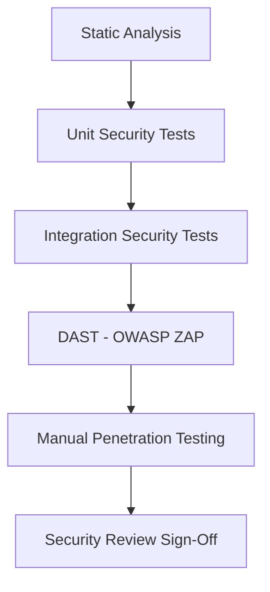
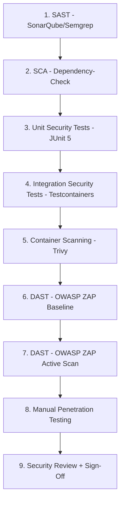
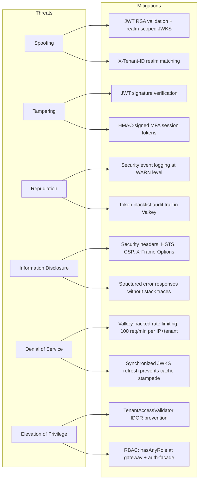

# Security Test Plan: Authentication & Authorization

**Document ID:** R01-SEC-015
**Version:** 1.0.0
**Date:** 2026-03-12
**Author:** SEC Agent
**Status:** APPROVED
**Requirement:** R01 - Authentication and Authorization
**OWASP Alignment:** OWASP Testing Guide v4.2, OWASP Top 10 2021

---

## Table of Contents

1. [Security Test Strategy](#1-security-test-strategy)
2. [OWASP Top 10 Test Cases](#2-owasp-top-10-test-cases)
3. [JWT Attack Vector Tests](#3-jwt-attack-vector-tests)
4. [Authentication Bypass Tests](#4-authentication-bypass-tests)
5. [Authorization Tests (RBAC)](#5-authorization-tests-rbac)
6. [Multi-Tenant Isolation Tests](#6-multi-tenant-isolation-tests)
7. [Rate Limiting Tests](#7-rate-limiting-tests)
8. [Token Management Tests](#8-token-management-tests)
9. [MFA Security Tests](#9-mfa-security-tests)
10. [Session Security Tests](#10-session-security-tests)
11. [Header Security Tests](#11-header-security-tests)
12. [Infrastructure Security Tests](#12-infrastructure-security-tests)
13. [Tools and Methodology](#13-tools-and-methodology)

---

## 1. Security Test Strategy

### 1.1 Scope

This test plan covers security testing for the EMSIST Authentication and Authorization subsystem.
The scope is limited to components that exist in the codebase as of 2026-03-12.

**In-scope components (verified against source code):**

| Component | Location | Database |
|-----------|----------|----------|
| auth-facade | `backend/auth-facade/` (port 8081) | Neo4j + Valkey |
| api-gateway | `backend/api-gateway/` (port 8080) | Valkey (token blacklist) |
| Keycloak IdP | `keycloak:24.0` container | Internal |

**Key implementation files driving test design:**

| File | Security Concern |
|------|-----------------|
| `DynamicBrokerSecurityConfig.java` | 5 ordered filter chains (admin, public auth, OAuth2 SSO, authenticated auth, default) |
| `JwtValidationFilter.java` | JWT parsing, JWKS validation, blacklist check, role extraction |
| `RateLimitFilter.java` | Valkey-backed rate limiting per IP+tenant, 100 req/min default |
| `TenantContextFilter.java` | X-Tenant-ID header extraction into ThreadLocal |
| `JwtTokenValidator.java` | RSA JWKS validation, key caching (1-hour TTL), realm-scoped keys |
| `TenantAccessValidator.java` | IDOR prevention: JWT tenant_id vs requested tenant, SUPER_ADMIN bypass |
| `TokenBlacklistFilter.java` (gateway) | Reactive Valkey-based JTI blacklist check at gateway level |
| `SecurityConfig.java` (gateway) | Zero-trust gateway: explicit allow-list, denyAll for `/api/v1/internal/**` |
| `CorsConfig.java` (gateway) | Origin patterns: localhost, 127.0.0.1, trycloudflare.com |
| `RealmResolver.java` | Tenant-to-Keycloak-realm mapping, master tenant UUID recognition |
| `TokenServiceImpl.java` | Token blacklisting, MFA session tokens (HMAC-signed, Valkey-backed) |
| `ProviderAgnosticRoleConverter.java` | Multi-path role extraction from JWT (realm_access, resource_access, roles, groups, permissions) |

**Out of scope (not implemented -- [PLANNED]):**

- Auth0, Okta, Azure AD identity providers (only `KeycloakIdentityProvider.java` exists)
- Graph-per-tenant isolation (ADR-003 at 0% implementation; current isolation uses `tenant_id` column discrimination)
- Kafka event publishing (no `KafkaTemplate` usage in any service)
- Caffeine L1 cache (single-tier Valkey only)

### 1.2 Test Environments

| Environment | Purpose | Trigger |
|-------------|---------|---------|
| Development (Local) | Unit and integration tests with Testcontainers | Every code change |
| CI Pipeline | SAST (SonarQube/Semgrep), SCA (OWASP dependency-check) | Every push |
| Staging | DAST (OWASP ZAP active scan), penetration testing | Deploy to staging |

### 1.3 Risk Classification

| Severity | Definition | SLA |
|----------|-----------|-----|
| CRITICAL | Authentication bypass, data breach, RCE | Block release; fix within 24 hours |
| HIGH | Privilege escalation, tenant isolation breach, token forgery | Block release; fix within 72 hours |
| MEDIUM | Information disclosure, weak configuration, missing headers | Fix before next release |
| LOW | Best practice deviation, minor info leak | Track in backlog |

### 1.4 Test Approach

---

## 2. OWASP Top 10 Test Cases

### A01:2021 - Broken Access Control

Covered by: Category 3 (Tenant Isolation), Category 5 (Authorization / RBAC).

### A02:2021 - Cryptographic Failures

Covered by: Category 1 (JWT Security), Category 8 (Token Management).

### A03:2021 - Injection

Covered by: Category 2 (Authentication Bypass), test cases TC-SEC-024 through TC-SEC-026.

### A04:2021 - Insecure Design

Covered by: threat model review of `DynamicBrokerSecurityConfig.java` filter chain ordering.

### A05:2021 - Security Misconfiguration

Covered by: Category 6 (Header Security), Category 7 (Infrastructure Security).

### A06:2021 - Vulnerable and Outdated Components

Covered by: SCA tooling (OWASP dependency-check, `npm audit`) in CI pipeline.

### A07:2021 - Identification and Authentication Failures

Covered by: Category 1 (JWT), Category 2 (Auth Bypass), Category 4 (Rate Limiting).

### A08:2021 - Software and Data Integrity Failures

Covered by: JWT signature validation tests (TC-SEC-001 through TC-SEC-020).

### A09:2021 - Security Logging and Monitoring Failures

Covered by: Category 7 (Infrastructure), TC-SEC-076 through TC-SEC-078.

### A10:2021 - Server-Side Request Forgery (SSRF)

Covered by: TC-SEC-079 (JWKS endpoint SSRF).

---

## 3. JWT Attack Vector Tests

### TC-SEC-001: Modified JWT Payload (Role Escalation)

| Field | Value |
|-------|-------|
| **ID** | TC-SEC-001 |
| **Category** | JWT Security |
| **Description** | Modify JWT payload to inject elevated roles (e.g., change `USER` to `ADMIN` in `realm_access.roles`) and send to a protected endpoint. |
| **Preconditions** | Valid JWT obtained via `/api/v1/auth/login`. Keycloak realm configured with RSA signing keys. |
| **Attack Vector** | Decode JWT payload (Base64), change `realm_access.roles` from `["USER"]` to `["ADMIN","SUPER_ADMIN"]`, re-encode without re-signing. Send to `GET /api/v1/admin/tenants/{tenantId}/providers`. |
| **Expected Result** | 401 Unauthorized. `JwtTokenValidator.validateToken()` calls `Jwts.parser().verifyWith(publicKey).build()` which rejects the tampered signature. The `DynamicBrokerSecurityConfig` chain 1 (`/api/v1/admin/**`) requires `hasAnyRole("ADMIN", "SUPER_ADMIN")` and uses `oauth2ResourceServer` with JWT. |
| **Severity** | CRITICAL |
| **Implementation Reference** | `JwtTokenValidator.java:44-48` -- RSA signature verification via JJWT `parseSignedClaims()` |

### TC-SEC-002: JWT with "none" Algorithm

| Field | Value |
|-------|-------|
| **ID** | TC-SEC-002 |
| **Category** | JWT Security |
| **Description** | Craft a JWT with `"alg": "none"` in the header and an empty signature segment. Send to any authenticated endpoint. |
| **Preconditions** | Knowledge of expected JWT claim structure. |
| **Attack Vector** | Create JWT header `{"alg":"none","typ":"JWT"}`, valid payload, empty signature. Send as `Authorization: Bearer <token>`. |
| **Expected Result** | 401 Unauthorized. `JwtTokenValidator.extractKeyId()` requires a `kid` header claim; tokens with `alg: none` typically omit `kid`. Even if `kid` is present, `Jwts.parser().verifyWith(publicKey)` enforces RSA signature verification and rejects unsigned tokens. |
| **Severity** | CRITICAL |
| **Implementation Reference** | `JwtTokenValidator.java:97-117` -- `extractKeyId()` throws `InvalidTokenException("Token missing key ID")` when `kid` absent |

### TC-SEC-003: JWT Signed with Wrong Key

| Field | Value |
|-------|-------|
| **ID** | TC-SEC-003 |
| **Category** | JWT Security |
| **Description** | Sign a JWT with an attacker-controlled RSA private key (not from Keycloak JWKS). |
| **Preconditions** | Attacker generates their own RSA key pair. |
| **Attack Vector** | Create JWT with valid claims, sign with attacker's private key, use a `kid` value that does not exist in Keycloak's JWKS endpoint. |
| **Expected Result** | 401 Unauthorized. `JwtTokenValidator.getPublicKey()` fetches JWKS from Keycloak for the realm, looks up `kid`, and throws `InvalidTokenException("Unknown signing key")` when the `kid` is not found. If the attacker uses an existing `kid`, signature verification fails because the public key does not match. |
| **Severity** | CRITICAL |
| **Implementation Reference** | `JwtTokenValidator.java:119-142` -- `getPublicKey()` caches realm JWKS keys, throws on unknown `kid` |

### TC-SEC-004: Expired JWT

| Field | Value |
|-------|-------|
| **ID** | TC-SEC-004 |
| **Category** | JWT Security |
| **Description** | Use a JWT whose `exp` claim is in the past. |
| **Preconditions** | Previously valid JWT that has expired. |
| **Attack Vector** | Wait for token expiry or craft token with past `exp` value. Send to authenticated endpoint. |
| **Expected Result** | 401 Unauthorized with message "Token has expired". JJWT throws `ExpiredJwtException`, caught by `JwtTokenValidator.validateToken()` and re-thrown as `TokenExpiredException`. `JwtValidationFilter` catches this and calls `sendUnauthorizedResponse()`. |
| **Severity** | HIGH |
| **Implementation Reference** | `JwtTokenValidator.java:49-50` -- catches `ExpiredJwtException`; `JwtValidationFilter.java:97-99` -- catches `TokenExpiredException` |

### TC-SEC-005: JWT with Future "nbf" (Not Before) Claim

| Field | Value |
|-------|-------|
| **ID** | TC-SEC-005 |
| **Category** | JWT Security |
| **Description** | Craft a JWT with `nbf` set 1 hour in the future. |
| **Preconditions** | Ability to craft JWT with Keycloak's signing key (test environment only). |
| **Attack Vector** | Set `nbf` to `current_time + 3600`. Send to authenticated endpoint. |
| **Expected Result** | 401 Unauthorized. JJWT's `parseSignedClaims()` validates `nbf` by default and throws `PrematureJwtException` (subclass of `JwtException`), caught by the general `Exception` handler in `JwtTokenValidator.validateToken()` and re-thrown as `InvalidTokenException`. |
| **Severity** | MEDIUM |
| **Implementation Reference** | `JwtTokenValidator.java:51-53` -- generic catch block wraps as `InvalidTokenException` |

### TC-SEC-006: JWT Without "jti" Claim

| Field | Value |
|-------|-------|
| **ID** | TC-SEC-006 |
| **Category** | JWT Security |
| **Description** | Send a valid JWT that lacks the `jti` (JWT ID) claim to verify blacklist check behavior. |
| **Preconditions** | Valid JWT from Keycloak without `jti`. |
| **Attack Vector** | Standard request with a JWT lacking `jti`. |
| **Expected Result** | Request proceeds normally. `JwtTokenValidator.getJti()` returns `null` when `jti` is absent. `JwtValidationFilter` checks `if (jti != null && tokenService.isBlacklisted(jti))` -- the null check prevents NPE and skips blacklist validation. This is acceptable behavior but means tokens without `jti` cannot be individually revoked. |
| **Severity** | MEDIUM |
| **Implementation Reference** | `JwtValidationFilter.java:75-79` -- null-safe `jti` check; `JwtTokenValidator.java:88-90` -- `getJti()` returns `claims.getId()` |

### TC-SEC-007: Blacklisted JWT (Post-Logout)

| Field | Value |
|-------|-------|
| **ID** | TC-SEC-007 |
| **Category** | JWT Security |
| **Description** | After logout, attempt to use the now-blacklisted access token. |
| **Preconditions** | User logged in, obtained JWT with `jti`, then called `POST /api/v1/auth/logout`. |
| **Attack Vector** | After logout, send the old access token to any authenticated endpoint. |
| **Expected Result** | 401 Unauthorized with message "Token has been revoked". Two layers enforce this: (1) `TokenBlacklistFilter` in api-gateway checks `redisTemplate.hasKey(blacklistPrefix + jti)` reactively, returns 401 before request reaches auth-facade. (2) `JwtValidationFilter` in auth-facade checks `tokenService.isBlacklisted(jti)` via `TokenServiceImpl.isBlacklisted()` which queries Valkey with key `auth:blacklist:{jti}`. |
| **Severity** | HIGH |
| **Implementation Reference** | `TokenBlacklistFilter.java:40-59` (gateway); `JwtValidationFilter.java:75-79` (auth-facade); `TokenServiceImpl.java:83-88` -- Valkey lookup |

### TC-SEC-008: JWT from Different Keycloak Realm

| Field | Value |
|-------|-------|
| **ID** | TC-SEC-008 |
| **Category** | JWT Security |
| **Description** | Use a JWT issued by Keycloak realm "tenant-acme" against endpoints for tenant "tenant-beta". |
| **Preconditions** | User authenticated in realm "tenant-acme", sends request with `X-Tenant-ID: beta`. |
| **Attack Vector** | Set `X-Tenant-ID: beta` header but use JWT from realm "tenant-acme". |
| **Expected Result** | 401 Unauthorized. `JwtValidationFilter` resolves the realm from `TenantContextFilter.getCurrentTenant()` via `RealmResolver.resolve(tenantId)`, producing "tenant-beta". It then calls `jwtTokenValidator.validateToken(token, "tenant-beta")`, which fetches JWKS from `{keycloak-url}/realms/tenant-beta/protocol/openid-connect/certs`. The `kid` from the acme-realm token will not match any key in the beta-realm JWKS, resulting in `InvalidTokenException("Unknown signing key")`. |
| **Severity** | CRITICAL |
| **Implementation Reference** | `JwtValidationFilter.java:66-72` -- realm resolution; `JwtTokenValidator.java:36-54` -- realm-scoped JWKS validation |

### TC-SEC-009: Replay Attack with Valid JWT

| Field | Value |
|-------|-------|
| **ID** | TC-SEC-009 |
| **Category** | JWT Security |
| **Description** | Capture a valid JWT and replay it from a different client/IP within the token's validity window. |
| **Preconditions** | Valid non-expired JWT captured via network interception. |
| **Attack Vector** | Replay the captured JWT from a different IP address. |
| **Expected Result** | Request succeeds (accepted). The current implementation does not bind tokens to IP addresses or client fingerprints. Mitigation relies on short token expiry (Keycloak default: 5 minutes for access tokens) and HTTPS transport encryption. Rate limiting applies per IP (`RateLimitFilter`), but the replayed token itself is valid. |
| **Severity** | MEDIUM |
| **Implementation Reference** | `JwtValidationFilter.java` -- no IP binding; `RateLimitFilter.java:91-103` -- rate limit per IP+tenant |

### TC-SEC-010: JWKS Endpoint Key Rotation

| Field | Value |
|-------|-------|
| **ID** | TC-SEC-010 |
| **Category** | JWT Security |
| **Description** | Rotate signing keys in Keycloak and verify that auth-facade picks up the new keys. |
| **Preconditions** | Running Keycloak instance. Access to Keycloak admin console. |
| **Attack Vector** | Rotate keys in Keycloak admin. Send JWT signed with new key. Verify old-key-signed JWTs still work during grace period. |
| **Expected Result** | New keys are picked up when JWKS cache expires. `JwtTokenValidator` caches JWKS per realm with a 1-hour TTL (`JWKS_CACHE_TTL_MS = 3600_000`). When a `kid` is not found in cache, `refreshJwks()` is called to fetch fresh keys. Old tokens with the old `kid` continue working if the old key is still in Keycloak's JWKS (Keycloak keeps rotated keys for a configurable period). |
| **Severity** | MEDIUM |
| **Implementation Reference** | `JwtTokenValidator.java:33-34` -- `JWKS_CACHE_TTL_MS = 3600_000`; `JwtTokenValidator.java:119-142` -- cache miss triggers refresh |

### TC-SEC-011: JWT with Injected Custom Claims

| Field | Value |
|-------|-------|
| **ID** | TC-SEC-011 |
| **Category** | JWT Security |
| **Description** | Craft a JWT with additional claims like `is_admin: true`, `superuser: true`, or `tenant_id: <different-tenant>` and verify no privilege escalation occurs. |
| **Preconditions** | Test environment Keycloak with known signing keys. |
| **Attack Vector** | Add custom claims to a validly-signed JWT (requires test key access). Verify that role extraction only reads configured claim paths. |
| **Expected Result** | No escalation. `ProviderAgnosticRoleConverter` and `JwtValidationFilter.extractAuthorities()` only read roles from paths configured in `AuthProperties.roleClaimPaths` (default: `roles`, `groups`, `realm_access.roles`, `resource_access`, `permissions`). Arbitrary claims like `is_admin` are ignored. Tenant isolation uses `TenantAccessValidator` which compares `tenant_id` from JWT against the request, not injected claims. |
| **Severity** | HIGH |
| **Implementation Reference** | `AuthProperties.java:59-65` -- configured claim paths; `ProviderAgnosticRoleConverter.java:53-57` -- only reads configured paths |

### TC-SEC-012: JWT Payload Base64 Decode Reveals No Secrets

| Field | Value |
|-------|-------|
| **ID** | TC-SEC-012 |
| **Category** | JWT Security |
| **Description** | Decode JWT payload and verify no sensitive data (passwords, internal IPs, database credentials) is exposed. |
| **Preconditions** | Valid JWT obtained from login. |
| **Attack Vector** | Base64-decode the JWT payload segment and inspect all claims. |
| **Expected Result** | Payload contains only standard OIDC claims (`sub`, `email`, `given_name`, `family_name`, `tenant_id`, `realm_access`, `exp`, `iat`, `jti`). No passwords, connection strings, internal IPs, or encryption keys. Keycloak manages token claims; auth-facade only reads them via `JwtTokenValidator.extractUserInfo()`. |
| **Severity** | LOW |
| **Implementation Reference** | `JwtTokenValidator.java:57-86` -- `extractUserInfo()` reads only standard claims |

### TC-SEC-013: Refresh Token Used as Access Token

| Field | Value |
|-------|-------|
| **ID** | TC-SEC-013 |
| **Category** | JWT Security |
| **Description** | Send a Keycloak refresh token in the `Authorization: Bearer` header instead of an access token. |
| **Preconditions** | Valid refresh token obtained from login response. |
| **Attack Vector** | Set `Authorization: Bearer <refresh_token>` and send to a protected endpoint. |
| **Expected Result** | 401 Unauthorized. Keycloak refresh tokens have a different `typ` header claim (typically `Refresh` vs `Bearer`) and are signed differently. `JwtTokenValidator.validateToken()` fetches JWKS for the realm and attempts RSA verification; refresh tokens may use a different signing key or fail validation due to audience/type mismatch. |
| **Severity** | HIGH |
| **Implementation Reference** | `JwtTokenValidator.java:36-54` -- `validateToken()` verifies with realm-specific JWKS |

### TC-SEC-014: Access Token Used as Refresh Token

| Field | Value |
|-------|-------|
| **ID** | TC-SEC-014 |
| **Category** | JWT Security |
| **Description** | Send an access token in the `POST /api/v1/auth/refresh` body where a refresh token is expected. |
| **Preconditions** | Valid access token. |
| **Attack Vector** | Call `POST /api/v1/auth/refresh` with `{ "refreshToken": "<access_token>" }`. |
| **Expected Result** | 401 Unauthorized. `AuthServiceImpl.refreshToken()` delegates to `KeycloakIdentityProvider` which calls Keycloak's token endpoint with `grant_type=refresh_token`. Keycloak validates the token type and rejects access tokens used as refresh tokens. |
| **Severity** | HIGH |
| **Implementation Reference** | `AuthController.java:190-196` -- delegates to `authService.refreshToken()` |

### TC-SEC-015: Token from Deactivated User

| Field | Value |
|-------|-------|
| **ID** | TC-SEC-015 |
| **Category** | JWT Security |
| **Description** | Deactivate a user in Keycloak, then use their still-valid (non-expired) access token. |
| **Preconditions** | User with valid JWT. Admin deactivates user in Keycloak. |
| **Attack Vector** | Continue using the deactivated user's JWT for the remainder of its validity period. |
| **Expected Result** | Access continues until token expires unless explicitly blacklisted. The current implementation does not perform real-time user status checks against Keycloak on every request -- it validates the JWT signature and expiry only. Mitigation: short token expiry (5-minute default) and explicit token blacklisting via logout. |
| **Severity** | MEDIUM |
| **Implementation Reference** | `JwtValidationFilter.java:64-93` -- validates signature and expiry only, no user-status check |

### TC-SEC-016: Token with Missing Required Claims

| Field | Value |
|-------|-------|
| **ID** | TC-SEC-016 |
| **Category** | JWT Security |
| **Description** | Send a JWT missing the `sub` (subject) claim and verify behavior. |
| **Preconditions** | Ability to craft JWT (test environment). |
| **Attack Vector** | Create a validly-signed JWT without `sub` claim. |
| **Expected Result** | Request may proceed but `UserInfo` will have `null` userId. `JwtTokenValidator.extractUserInfo()` calls `claims.getSubject()` which returns `null` when `sub` is absent. The `UserInfo` record is constructed with `null` userId. Downstream access control in `TenantAccessValidator` checks `userInfo.tenantId()` and `userInfo.roles()`, not `userId`, so the request may still succeed. This is a potential gap requiring a validation check. |
| **Severity** | MEDIUM |
| **Implementation Reference** | `JwtTokenValidator.java:57-86` -- no null check on `claims.getSubject()` |

### TC-SEC-017: Cross-Tenant Token Reuse

| Field | Value |
|-------|-------|
| **ID** | TC-SEC-017 |
| **Category** | JWT Security |
| **Description** | Authenticate in tenant A, then change `X-Tenant-ID` header to tenant B and resend the same token. |
| **Preconditions** | Valid JWT for tenant A. Knowledge of tenant B identifier. |
| **Attack Vector** | Change `X-Tenant-ID` from tenant A to tenant B UUID, keep same JWT. |
| **Expected Result** | 401 Unauthorized. `JwtValidationFilter` reads `TenantContextFilter.getCurrentTenant()` (set from `X-Tenant-ID` header), resolves it via `RealmResolver.resolve()` to "tenant-B", and validates the JWT against tenant-B's JWKS endpoint. Since the JWT was signed by tenant-A's realm key, the `kid` will not match tenant-B's JWKS, causing `InvalidTokenException("Unknown signing key")`. |
| **Severity** | CRITICAL |
| **Implementation Reference** | `JwtValidationFilter.java:66-72`; `JwtTokenValidator.java:36-54` |

### TC-SEC-018: JWKS Cache Poisoning Attempt

| Field | Value |
|-------|-------|
| **ID** | TC-SEC-018 |
| **Category** | JWT Security |
| **Description** | Attempt to poison the JWKS cache by forcing rapid key refreshes. |
| **Preconditions** | Ability to send many requests with unknown `kid` values. |
| **Attack Vector** | Send JWTs with random `kid` values to force repeated `refreshJwks()` calls. |
| **Expected Result** | Limited impact. `JwtTokenValidator.refreshJwks()` is `synchronized`, preventing concurrent JWKS fetches for the same realm. The cache is stored in `ConcurrentHashMap` with realm-scoped keys. Each refresh fetches from Keycloak's JWKS endpoint, which is rate-limited by Keycloak itself. However, the `synchronized` method could cause thread contention under high volume. |
| **Severity** | MEDIUM |
| **Implementation Reference** | `JwtTokenValidator.java:144` -- `private synchronized void refreshJwks(String realm)` |

### TC-SEC-019: JWT Size Limit Enforcement

| Field | Value |
|-------|-------|
| **ID** | TC-SEC-019 |
| **Category** | JWT Security |
| **Description** | Send an extremely large JWT (>100KB payload) to test header size limits. |
| **Preconditions** | Ability to craft oversized JWTs. |
| **Attack Vector** | Create JWT with 100KB+ payload. Send via `Authorization` header. |
| **Expected Result** | Rejected by the web server or gateway. Spring Cloud Gateway (Netty) and embedded Tomcat (auth-facade) have default max header size limits (typically 8KB-16KB). The oversized `Authorization` header triggers HTTP 431 (Request Header Fields Too Large) or HTTP 400 before reaching the JWT validation filter. |
| **Severity** | LOW |
| **Implementation Reference** | Server-level configuration (Netty for gateway, Tomcat for auth-facade) |

### TC-SEC-020: JWK Confusion Attack (RSA vs HMAC)

| Field | Value |
|-------|-------|
| **ID** | TC-SEC-020 |
| **Category** | JWT Security |
| **Description** | Craft a JWT with `alg: HS256` and sign it using the Keycloak RSA public key as the HMAC secret. |
| **Preconditions** | Knowledge of Keycloak's RSA public key (available from JWKS endpoint). |
| **Attack Vector** | Set JWT header `alg` to `HS256`. Use the RSA public key bytes as HMAC secret to sign the token. |
| **Expected Result** | 401 Unauthorized. `JwtTokenValidator.validateToken()` calls `Jwts.parser().verifyWith(publicKey)` where `publicKey` is an RSA `PublicKey` instance. JJWT validates that the algorithm in the JWT header matches the key type; an HMAC-signed token presented to an RSA verifier throws `SignatureException`. Additionally, `refreshJwks()` only loads keys with `kty: RSA`, ignoring other key types. |
| **Severity** | CRITICAL |
| **Implementation Reference** | `JwtTokenValidator.java:44-48` -- `verifyWith(publicKey)` enforces key-algorithm match; `JwtTokenValidator.java:155` -- filters `kty: RSA` |

---

## 4. Authentication Bypass Tests

### TC-SEC-021: Direct Access Without Token

| Field | Value |
|-------|-------|
| **ID** | TC-SEC-021 |
| **Category** | Authentication Bypass |
| **Description** | Access a protected endpoint without any `Authorization` header. |
| **Preconditions** | None. |
| **Attack Vector** | `GET /api/v1/admin/tenants/{tenantId}/providers` with no `Authorization` header. |
| **Expected Result** | 401 Unauthorized. API Gateway's `SecurityConfig` requires `anyExchange().authenticated()` for non-public paths. The `oauth2ResourceServer` JWT configuration returns 401 for missing tokens. At auth-facade level, `DynamicBrokerSecurityConfig` chain 1 requires `hasAnyRole("ADMIN", "SUPER_ADMIN")` with `oauth2ResourceServer` JWT. |
| **Severity** | CRITICAL |
| **Implementation Reference** | Gateway `SecurityConfig.java:67` -- `anyExchange().authenticated()`; `DynamicBrokerSecurityConfig.java:77` -- `hasAnyRole()` |

### TC-SEC-022: Empty Authorization Header

| Field | Value |
|-------|-------|
| **ID** | TC-SEC-022 |
| **Category** | Authentication Bypass |
| **Description** | Send `Authorization:` header with empty value. |
| **Preconditions** | None. |
| **Attack Vector** | `Authorization: ` (empty value) or `Authorization: Bearer ` (bearer with empty token). |
| **Expected Result** | 401 Unauthorized. In `JwtValidationFilter.doFilterInternal()`, the check `authHeader.startsWith(BEARER_PREFIX)` will pass for `"Bearer "` but the extracted token will be empty string. `JwtTokenValidator.extractKeyId()` will fail to split on `.` (no three parts), throwing `InvalidTokenException("Invalid token format")`. At gateway level, Spring Security's `BearerTokenAuthenticationFilter` rejects empty bearer tokens. |
| **Severity** | HIGH |
| **Implementation Reference** | `JwtValidationFilter.java:57-58` -- Bearer prefix check; `JwtTokenValidator.java:99-101` -- three-part validation |

### TC-SEC-023: Malformed Bearer Token

| Field | Value |
|-------|-------|
| **ID** | TC-SEC-023 |
| **Category** | Authentication Bypass |
| **Description** | Send various malformed tokens: random string, partial Base64, SQL injection payload in token. |
| **Preconditions** | None. |
| **Attack Vector** | `Authorization: Bearer not-a-jwt`, `Authorization: Bearer aaaa.bbbb`, `Authorization: Bearer ' OR 1=1--`. |
| **Expected Result** | 401 Unauthorized. `JwtTokenValidator.extractKeyId()` validates three-part structure (`parts.length != 3`). For three-part strings, Base64 decode of the header will fail or produce non-JSON, causing `objectMapper.readTree()` to throw, caught as generic `Exception` and wrapped as `InvalidTokenException("Failed to parse token header")`. |
| **Severity** | HIGH |
| **Implementation Reference** | `JwtTokenValidator.java:97-117` -- validates structure and parses header JSON |

### TC-SEC-024: SQL Injection in Login Identifier

| Field | Value |
|-------|-------|
| **ID** | TC-SEC-024 |
| **Category** | Authentication Bypass |
| **Description** | Send SQL injection payloads in the login `username`/`email` field. |
| **Preconditions** | None. |
| **Attack Vector** | `POST /api/v1/auth/login` with `{ "email": "admin' OR '1'='1", "password": "test" }`. |
| **Expected Result** | Login fails with 401. Auth-facade delegates login to Keycloak via `KeycloakIdentityProvider`. The credentials are sent to Keycloak's token endpoint via HTTP POST form parameters (`grant_type=password`). Keycloak handles its own parameterized queries internally. Auth-facade does not execute SQL queries directly -- it uses Neo4j for graph data and Keycloak for credential validation. |
| **Severity** | HIGH |
| **Implementation Reference** | `AuthController.java:53-60` -- delegates to `authService.login()` which calls `KeycloakIdentityProvider` |

### TC-SEC-025: Cypher Injection in Login

| Field | Value |
|-------|-------|
| **ID** | TC-SEC-025 |
| **Category** | Authentication Bypass |
| **Description** | Send Neo4j Cypher injection payloads in user-facing fields that may reach Neo4j queries. |
| **Preconditions** | None. |
| **Attack Vector** | `POST /api/v1/auth/login` with `{ "email": "admin' RETURN 1 //", "password": "test" }`. Also test admin endpoints: `GET /api/v1/admin/tenants/{tenantId}/providers` with `tenantId` set to `test' MATCH (n) RETURN n //`. |
| **Expected Result** | No injection. Login credentials are sent to Keycloak, not to Neo4j. Admin provider queries use Spring Data Neo4j repositories with parameterized queries (e.g., `AuthGraphRepository`, `UserGraphRepository`). Spring Data Neo4j SDN 6+ uses parameterized Cypher by default. |
| **Severity** | HIGH |
| **Implementation Reference** | Neo4j repositories in `graph/repository/` package use Spring Data Neo4j with parameterized queries |

### TC-SEC-026: LDAP Injection in Login

| Field | Value |
|-------|-------|
| **ID** | TC-SEC-026 |
| **Category** | Authentication Bypass |
| **Description** | Send LDAP injection payloads if Keycloak is configured with LDAP federation. |
| **Preconditions** | Keycloak configured with LDAP user federation (if applicable). |
| **Attack Vector** | `POST /api/v1/auth/login` with `{ "email": "admin)(&))", "password": "test" }`. |
| **Expected Result** | Login fails with 401. Keycloak handles LDAP federation internally with proper escaping. Auth-facade passes credentials to Keycloak's token endpoint as-is; Keycloak is responsible for sanitizing LDAP queries. |
| **Severity** | MEDIUM |
| **Implementation Reference** | Keycloak-managed; auth-facade delegates via `KeycloakIdentityProvider.java` |

### TC-SEC-027: Login with Null Password

| Field | Value |
|-------|-------|
| **ID** | TC-SEC-027 |
| **Category** | Authentication Bypass |
| **Description** | Send login request with null or missing password field. |
| **Preconditions** | None. |
| **Attack Vector** | `POST /api/v1/auth/login` with `{ "email": "admin@test.com" }` (no password field) or `{ "email": "admin@test.com", "password": null }`. |
| **Expected Result** | 400 Bad Request. `AuthController.login()` uses `@Valid @RequestBody LoginRequest` with Jakarta Bean Validation. If `LoginRequest.password` has `@NotBlank` or `@NotNull` annotation, Spring returns 400 before reaching the service layer. If validation annotations are missing, Keycloak returns 401 for null/empty passwords. |
| **Severity** | MEDIUM |
| **Implementation Reference** | `AuthController.java:56-57` -- `@Valid @RequestBody LoginRequest` |

### TC-SEC-028: Login with Empty Tenant ID

| Field | Value |
|-------|-------|
| **ID** | TC-SEC-028 |
| **Category** | Authentication Bypass |
| **Description** | Send login request without `X-Tenant-ID` header or with empty value. |
| **Preconditions** | None. |
| **Attack Vector** | `POST /api/v1/auth/login` without `X-Tenant-ID` header. |
| **Expected Result** | 400 Bad Request. `AuthController.login()` declares `@RequestHeader(TenantContextFilter.TENANT_HEADER) String tenantId` as required (default). Spring returns 400 when a required header is missing. If the header is present but empty, `RealmResolver.resolve()` throws `IllegalArgumentException("tenantId must not be null or blank")`. |
| **Severity** | MEDIUM |
| **Implementation Reference** | `AuthController.java:55` -- `@RequestHeader` (required=true default); `RealmResolver.java:40-42` -- blank check |

### TC-SEC-029: Login with Forged X-Tenant-ID

| Field | Value |
|-------|-------|
| **ID** | TC-SEC-029 |
| **Category** | Authentication Bypass |
| **Description** | Send a valid UUID as `X-Tenant-ID` that does not correspond to any Keycloak realm. |
| **Preconditions** | None. |
| **Attack Vector** | `POST /api/v1/auth/login` with `X-Tenant-ID: 99999999-aaaa-bbbb-cccc-dddddddddddd`. |
| **Expected Result** | 401 Unauthorized or 500. `RealmResolver.resolve()` produces "tenant-99999999-aaaa-bbbb-cccc-dddddddddddd". `AuthServiceImpl.login()` calls Keycloak's token endpoint for this realm. Keycloak returns 404 (realm not found), which auth-facade should translate to 401 or appropriate error. |
| **Severity** | MEDIUM |
| **Implementation Reference** | `RealmResolver.java:39-54` -- maps any non-master tenant to `tenant-{id}` |

### TC-SEC-030: Brute Force Login

| Field | Value |
|-------|-------|
| **ID** | TC-SEC-030 |
| **Category** | Authentication Bypass |
| **Description** | Attempt more than 100 login requests per minute from the same IP to trigger rate limiting. |
| **Preconditions** | Rate limit configured at 100 requests/minute (default: `rate-limit.requests-per-minute=100`). |
| **Attack Vector** | Send 101+ `POST /api/v1/auth/login` requests within 60 seconds from the same IP. |
| **Expected Result** | First 100 requests proceed normally. Request 101+ returns 429 Too Many Requests with `Retry-After` header and JSON body `{"error":"rate_limit_exceeded","message":"Too many requests...","retryAfter":<seconds>}`. Rate limit headers `X-RateLimit-Limit`, `X-RateLimit-Remaining`, `X-RateLimit-Reset` are present on all responses. |
| **Severity** | HIGH |
| **Implementation Reference** | `RateLimitFilter.java:54-78` -- Valkey-backed counter with 60s TTL; `RateLimitFilter.java:36` -- configurable limit |

### TC-SEC-031: Credential Stuffing (Multiple Users Same IP)

| Field | Value |
|-------|-------|
| **ID** | TC-SEC-031 |
| **Category** | Authentication Bypass |
| **Description** | Attempt login with many different username/password combinations from the same IP. |
| **Preconditions** | List of leaked credentials. |
| **Attack Vector** | Send 101+ login requests with different usernames from the same IP within 60 seconds. |
| **Expected Result** | 429 after 100 requests. `RateLimitFilter.getClientIdentifier()` combines tenant ID and IP: `tenantId + ":" + ip`. Rate limiting is per IP per tenant, not per username. This means credential stuffing across different users from the same IP is effectively rate-limited. However, attackers using multiple IPs can circumvent this. |
| **Severity** | HIGH |
| **Implementation Reference** | `RateLimitFilter.java:91-103` -- client identifier is `tenantId:ip` |

### TC-SEC-032: Login via HTTP (Non-TLS)

| Field | Value |
|-------|-------|
| **ID** | TC-SEC-032 |
| **Category** | Authentication Bypass |
| **Description** | Attempt to send login request over plain HTTP instead of HTTPS. |
| **Preconditions** | Application accessible on HTTP port. |
| **Attack Vector** | `POST http://host:8080/api/v1/auth/login` (non-TLS). |
| **Expected Result** | In production: connection refused or redirected to HTTPS. HSTS header is configured with `max-age=31536000` and `includeSubDomains=true` in both gateway (`SecurityConfig.java:73-75`) and auth-facade (`DynamicBrokerSecurityConfig.java:84-86`). In development: HTTP is allowed for local testing. TLS termination is expected at the load balancer or reverse proxy level. |
| **Severity** | MEDIUM |
| **Implementation Reference** | Gateway `SecurityConfig.java:73-75` -- HSTS; `DynamicBrokerSecurityConfig.java:84-86` -- HSTS |

### TC-SEC-033: OAuth2 Authorization Code Injection

| Field | Value |
|-------|-------|
| **ID** | TC-SEC-033 |
| **Category** | Authentication Bypass |
| **Description** | Inject a stolen or forged authorization code into the OAuth2 callback. |
| **Preconditions** | OAuth2 SSO flow enabled (`DynamicBrokerSecurityConfig` chain 3, conditional on `ClientRegistrationRepository` bean). |
| **Attack Vector** | Call `/api/v1/auth/callback/{provider}` with a forged `code` parameter. |
| **Expected Result** | 401 or 403. Spring Security's OAuth2 login flow validates the authorization code against Keycloak's token endpoint, including PKCE verification and state parameter matching. A forged code will be rejected by Keycloak. Chain 3 in `DynamicBrokerSecurityConfig` configures `oauth2Login` with specific authorization and redirection endpoints. |
| **Severity** | HIGH |
| **Implementation Reference** | `DynamicBrokerSecurityConfig.java:161-194` -- OAuth2 SSO filter chain with `oauth2Login` configuration |

### TC-SEC-034: Social Login with Stolen Token

| Field | Value |
|-------|-------|
| **ID** | TC-SEC-034 |
| **Category** | Authentication Bypass |
| **Description** | Use a stolen Google or Microsoft token to authenticate via social login endpoints. |
| **Preconditions** | Stolen Google ID token or Microsoft access token. |
| **Attack Vector** | `POST /api/v1/auth/social/google` with a stolen Google ID token. |
| **Expected Result** | Depends on token validity. `AuthController.loginWithGoogle()` delegates to `authService.loginWithGoogle()`, which exchanges the token with Keycloak. Keycloak validates the Google ID token against Google's JWKS. A valid-but-stolen Google token would successfully authenticate the victim's account. Mitigation: Google token expiry (1 hour), and the login is scoped to the tenant specified in `X-Tenant-ID`. |
| **Severity** | HIGH |
| **Implementation Reference** | `AuthController.java:72-78` -- `loginWithGoogle()` |

### TC-SEC-035: MFA Bypass (Skip Verification Step)

| Field | Value |
|-------|-------|
| **ID** | TC-SEC-035 |
| **Category** | Authentication Bypass |
| **Description** | When login returns `mfaRequired: true`, attempt to use the partial token for authenticated endpoints, skipping MFA verification. |
| **Preconditions** | User with MFA enabled. Login returns MFA challenge. |
| **Attack Vector** | After receiving `mfaRequired: true` response with `mfaSessionToken`, attempt to use `mfaSessionToken` as a bearer token for authenticated endpoints. |
| **Expected Result** | 401 Unauthorized. The MFA session token is signed with HMAC (`mfaSigningKey` in `TokenServiceImpl`) which is different from the RSA keys used for access token validation. `JwtTokenValidator.validateToken()` validates against Keycloak JWKS (RSA), so the HMAC-signed MFA session token will fail RSA signature verification. Additionally, MFA session tokens are stored in Valkey with prefix `auth:mfa:` and have a 5-minute TTL. |
| **Severity** | CRITICAL |
| **Implementation Reference** | `TokenServiceImpl.java:106-128` -- HMAC-signed MFA session token; `JwtTokenValidator.java:44-48` -- RSA validation |

---

## 5. Authorization Tests (RBAC)

### TC-SEC-036: Admin Endpoint Access Without ADMIN Role

| Field | Value |
|-------|-------|
| **ID** | TC-SEC-036 |
| **Category** | Authorization (RBAC) |
| **Description** | Access `/api/v1/admin/**` endpoints with a valid JWT that has only `USER` role. |
| **Preconditions** | Valid JWT with `realm_access.roles: ["USER"]`. |
| **Attack Vector** | `GET /api/v1/admin/tenants/{tenantId}/providers` with USER-role JWT. |
| **Expected Result** | 403 Forbidden. API Gateway's `SecurityConfig` enforces `pathMatchers("/api/v1/admin/**").hasAnyRole("ADMIN", "SUPER_ADMIN")`. Auth-facade's `DynamicBrokerSecurityConfig` chain 1 also enforces `hasAnyRole("ADMIN", "SUPER_ADMIN")`. Both layers must be passed. |
| **Severity** | HIGH |
| **Implementation Reference** | Gateway `SecurityConfig.java:64`; `DynamicBrokerSecurityConfig.java:77` |

### TC-SEC-037: Internal Endpoint Access from External

| Field | Value |
|-------|-------|
| **ID** | TC-SEC-037 |
| **Category** | Authorization (RBAC) |
| **Description** | Attempt to access internal-only endpoints from outside the gateway. |
| **Preconditions** | Valid JWT with any role. |
| **Attack Vector** | `GET /api/v1/internal/some-endpoint` through the API Gateway. |
| **Expected Result** | 403 Forbidden. API Gateway's `SecurityConfig` explicitly blocks all internal endpoints with `pathMatchers("/api/v1/internal/**").denyAll()`. This is a hard deny regardless of authentication or role. |
| **Severity** | CRITICAL |
| **Implementation Reference** | Gateway `SecurityConfig.java:62` -- `.pathMatchers("/api/v1/internal/**").denyAll()` |

### TC-SEC-038: Seat Management Endpoint Without TENANT_ADMIN Role

| Field | Value |
|-------|-------|
| **ID** | TC-SEC-038 |
| **Category** | Authorization (RBAC) |
| **Description** | Access `/api/v1/tenants/*/seats/**` endpoints without TENANT_ADMIN, ADMIN, or SUPER_ADMIN role. |
| **Preconditions** | Valid JWT with only `USER` role. |
| **Attack Vector** | `GET /api/v1/tenants/{tenantId}/seats` with USER-role JWT. |
| **Expected Result** | 403 Forbidden. API Gateway enforces `pathMatchers("/api/v1/tenants/*/seats/**").hasAnyRole("TENANT_ADMIN", "ADMIN", "SUPER_ADMIN")`. |
| **Severity** | HIGH |
| **Implementation Reference** | Gateway `SecurityConfig.java:65` |

### TC-SEC-039: Method-Level Security (@PreAuthorize)

| Field | Value |
|-------|-------|
| **ID** | TC-SEC-039 |
| **Category** | Authorization (RBAC) |
| **Description** | Verify that `@EnableMethodSecurity` in `DynamicBrokerSecurityConfig` enables `@PreAuthorize` annotations on controller/service methods. |
| **Preconditions** | Valid JWT with various roles. |
| **Attack Vector** | Access endpoints protected by `@PreAuthorize` annotations with insufficient roles. |
| **Expected Result** | 403 Forbidden for methods with role requirements not met. `@EnableMethodSecurity` at line 43 of `DynamicBrokerSecurityConfig.java` enables `@PreAuthorize`, `@PostAuthorize`, `@Secured` annotations. Admin controllers (`AdminProviderController`, `AdminUserController`) may use method-level security in addition to URL-based security. |
| **Severity** | HIGH |
| **Implementation Reference** | `DynamicBrokerSecurityConfig.java:43` -- `@EnableMethodSecurity` |

### TC-SEC-040: Role Normalization Consistency

| Field | Value |
|-------|-------|
| **ID** | TC-SEC-040 |
| **Category** | Authorization (RBAC) |
| **Description** | Verify that role normalization is consistent between gateway and auth-facade. |
| **Preconditions** | JWT with roles in various formats: `admin`, `ADMIN`, `Admin`, `ROLE_ADMIN`. |
| **Attack Vector** | Send requests with JWTs containing differently-cased roles to verify consistent access decisions. |
| **Expected Result** | Consistent behavior. Gateway's `SecurityConfig.addRole()` strips `ROLE_` prefix, converts to uppercase, replaces `-` with `_`, then re-adds `ROLE_` prefix. Auth-facade's `ProviderAgnosticRoleConverter.toGrantedAuthority()` converts to uppercase and adds `ROLE_` prefix. Both normalize `admin` to `ROLE_ADMIN` and `super-admin` to `ROLE_SUPER_ADMIN`. |
| **Severity** | MEDIUM |
| **Implementation Reference** | Gateway `SecurityConfig.java:137-148` -- `addRole()`; `ProviderAgnosticRoleConverter.java:67-73` -- `toGrantedAuthority()` |

---

## 6. Multi-Tenant Isolation Tests

### TC-SEC-041: Access Tenant B Data with Tenant A Token (IDOR)

| Field | Value |
|-------|-------|
| **ID** | TC-SEC-041 |
| **Category** | Tenant Isolation |
| **Description** | Authenticated as tenant A admin, attempt to access tenant B's resources by changing the path parameter. |
| **Preconditions** | Valid JWT for tenant A with `tenant_id` claim set to tenant A's UUID. |
| **Attack Vector** | `GET /api/v1/admin/tenants/{tenantB_UUID}/providers` with tenant A's JWT. |
| **Expected Result** | 403 Forbidden. `TenantAccessValidator.validateTenantAccess()` compares `userInfo.tenantId()` (from JWT) against `requestedTenantId` (from path). When they differ, it throws `AccessDeniedException("Access denied: you do not have permission...")`. Exception: SUPER_ADMIN role bypasses this check (`isSuperAdmin()` returns true for roles matching `super-admin` or `SUPER_ADMIN` case-insensitively). |
| **Severity** | CRITICAL |
| **Implementation Reference** | `TenantAccessValidator.java:48-73` -- tenant comparison with SUPER_ADMIN bypass |

### TC-SEC-042: Missing X-Tenant-ID Header on Protected Endpoint

| Field | Value |
|-------|-------|
| **ID** | TC-SEC-042 |
| **Category** | Tenant Isolation |
| **Description** | Send request to protected endpoint without `X-Tenant-ID` header. |
| **Preconditions** | Valid JWT. |
| **Attack Vector** | `GET /api/v1/auth/me` without `X-Tenant-ID` header. |
| **Expected Result** | Depends on endpoint. `TenantContextFilter` sets `CURRENT_TENANT` only when header is present and non-blank. `JwtValidationFilter` falls back to "master" realm when `tenantId` is null: `RealmResolver.resolve(tenantId)` would throw `IllegalArgumentException` for null, but the filter has a null check and defaults to `"master"`. Requests without `X-Tenant-ID` are validated against the master realm JWKS. Endpoints requiring `@RequestHeader(TENANT_HEADER)` return 400. |
| **Severity** | MEDIUM |
| **Implementation Reference** | `TenantContextFilter.java:26-31` -- sets ThreadLocal only if header present; `JwtValidationFilter.java:67-69` -- defaults to "master" |

### TC-SEC-043: Spoofed X-Tenant-ID (Valid UUID, Wrong Tenant)

| Field | Value |
|-------|-------|
| **ID** | TC-SEC-043 |
| **Category** | Tenant Isolation |
| **Description** | Send a valid UUID as `X-Tenant-ID` that belongs to a different tenant than the JWT's tenant. |
| **Preconditions** | Valid JWT for tenant A. Knowledge of tenant B's UUID. |
| **Attack Vector** | Set `X-Tenant-ID: {tenantB_UUID}` with tenant A's JWT. |
| **Expected Result** | Two-layer protection: (1) JWT validation: `JwtValidationFilter` validates token against tenant B's Keycloak realm JWKS. Since token was issued by tenant A's realm, the `kid` mismatch causes `InvalidTokenException`. (2) Even if JWKS somehow matched (e.g., shared Keycloak instance), `TenantAccessValidator` compares JWT `tenant_id` claim against the requested tenant ID and throws `AccessDeniedException`. |
| **Severity** | CRITICAL |
| **Implementation Reference** | `JwtValidationFilter.java:66-72`; `TenantAccessValidator.java:48-73` |

### TC-SEC-044: Tenant ID Enumeration

| Field | Value |
|-------|-------|
| **ID** | TC-SEC-044 |
| **Category** | Tenant Isolation |
| **Description** | Iterate through UUIDs as `X-Tenant-ID` values to discover existing tenants based on response differences. |
| **Preconditions** | None. |
| **Attack Vector** | Send `POST /api/v1/auth/login` with sequential or random UUIDs as `X-Tenant-ID`. Compare error responses for existing vs non-existing tenants. |
| **Expected Result** | Verify that error responses do not leak tenant existence. When a Keycloak realm does not exist, the error response should be indistinguishable from an authentication failure. Both should return 401 with a generic message. Current implementation may leak information if Keycloak returns distinct errors for "realm not found" vs "invalid credentials". |
| **Severity** | MEDIUM |
| **Implementation Reference** | `AuthController.java:53-60` -- login delegates to `authService.login()` |

### TC-SEC-045: Cross-Tenant User Lookup

| Field | Value |
|-------|-------|
| **ID** | TC-SEC-045 |
| **Category** | Tenant Isolation |
| **Description** | As tenant A admin, attempt to list or search users belonging to tenant B. |
| **Preconditions** | Valid JWT with ADMIN role for tenant A. |
| **Attack Vector** | `GET /api/v1/admin/tenants/{tenantB}/users` (if such endpoint exists in `AdminUserController`). |
| **Expected Result** | 403 Forbidden. `TenantAccessValidator.validateTenantAccess()` is called by admin endpoints to verify the requesting user's `tenant_id` matches the `{tenantId}` path parameter. Admin users can only manage users within their own tenant. SUPER_ADMIN can access any tenant. |
| **Severity** | CRITICAL |
| **Implementation Reference** | `TenantAccessValidator.java:48-73`; `AdminUserController.java` |

### TC-SEC-046: Master Tenant Accessing Child Tenant Data

| Field | Value |
|-------|-------|
| **ID** | TC-SEC-046 |
| **Category** | Tenant Isolation |
| **Description** | Verify that master tenant users with SUPER_ADMIN role can access child tenant resources. |
| **Preconditions** | JWT with `tenant_id: 68cd2a56-98c9-4ed4-8534-c299566d5b27` (master UUID) and `SUPER_ADMIN` role. |
| **Attack Vector** | `GET /api/v1/admin/tenants/{childTenantId}/providers` with master tenant SUPER_ADMIN JWT. |
| **Expected Result** | 200 OK. `TenantAccessValidator.isSuperAdmin()` returns true when user roles contain `super-admin` or `SUPER_ADMIN` (case-insensitive). The method bypasses tenant comparison and grants access. `RealmResolver.isMasterTenant()` recognizes the master tenant UUID `68cd2a56-98c9-4ed4-8534-c299566d5b27`. |
| **Severity** | HIGH |
| **Implementation Reference** | `TenantAccessValidator.java:81-88` -- `isSuperAdmin()`; `RealmResolver.java:63-67` -- `isMasterTenant()` |

### TC-SEC-047: Tenant Context Injection via JWT Claims

| Field | Value |
|-------|-------|
| **ID** | TC-SEC-047 |
| **Category** | Tenant Isolation |
| **Description** | Verify that the `tenant_id` used for access control comes from the validated JWT, not from manipulable sources. |
| **Preconditions** | Valid JWT. |
| **Attack Vector** | Set `X-Tenant-ID: tenantA` header but JWT has `tenant_id: tenantB` claim. Verify which value is used for access control. |
| **Expected Result** | JWT validation uses `X-Tenant-ID` to select the Keycloak realm for JWKS validation (ensuring the token was issued for the correct tenant). Access control in `TenantAccessValidator` uses `tenant_id` from the JWT claims (extracted via `JwtTokenValidator.extractUserInfo()`). If these don't align, the JWT validation itself fails (wrong realm JWKS). |
| **Severity** | HIGH |
| **Implementation Reference** | `JwtValidationFilter.java:66-72` -- realm from header; `TenantAccessValidator.java:64` -- tenant from JWT claims |

### TC-SEC-048: Tenant-Specific IdP Config Access from Another Tenant

| Field | Value |
|-------|-------|
| **ID** | TC-SEC-048 |
| **Category** | Tenant Isolation |
| **Description** | As tenant A admin, attempt to read or modify identity provider configurations belonging to tenant B. |
| **Preconditions** | Valid JWT with ADMIN role for tenant A. |
| **Attack Vector** | `GET /api/v1/admin/tenants/{tenantB_UUID}/providers` with tenant A admin JWT. |
| **Expected Result** | 403 Forbidden. Same protection as TC-SEC-041: `TenantAccessValidator` blocks cross-tenant access. Provider configurations stored in Neo4j are scoped by tenant via `TenantNode` relationships. |
| **Severity** | CRITICAL |
| **Implementation Reference** | `TenantAccessValidator.java:48-73`; Neo4j graph: `TenantNode` -> `ProviderNode` relationships |

---

## 7. Rate Limiting Tests

### TC-SEC-049: Exceed Rate Limit Threshold

| Field | Value |
|-------|-------|
| **ID** | TC-SEC-049 |
| **Category** | Rate Limiting |
| **Description** | Send more than `requests-per-minute` (default 100) requests within a 60-second window. |
| **Preconditions** | Valkey running and accessible. |
| **Attack Vector** | Send 101 requests to `/api/v1/auth/login` within 60 seconds from the same IP+tenant combination. |
| **Expected Result** | Request 101 returns 429 with JSON body: `{"error":"rate_limit_exceeded","message":"Too many requests...","retryAfter":<seconds>}`. Response headers include: `X-RateLimit-Limit: 100`, `X-RateLimit-Remaining: 0`, `X-RateLimit-Reset: <epoch>`, `Retry-After: <seconds>`. |
| **Severity** | HIGH |
| **Implementation Reference** | `RateLimitFilter.java:53-78` -- Valkey-backed counter |

### TC-SEC-050: Rate Limit Reset After Window

| Field | Value |
|-------|-------|
| **ID** | TC-SEC-050 |
| **Category** | Rate Limiting |
| **Description** | Verify that rate limit resets after the 60-second window expires. |
| **Preconditions** | Rate limit exhausted (100 requests sent). |
| **Attack Vector** | Exhaust rate limit, wait 60 seconds, then send another request. |
| **Expected Result** | After 60 seconds, the Valkey key expires (TTL set by `redisTemplate.expire(key, 60, TimeUnit.SECONDS)` on first request). New requests are accepted with `X-RateLimit-Remaining` reset. |
| **Severity** | MEDIUM |
| **Implementation Reference** | `RateLimitFilter.java:60-62` -- 60-second TTL on first request |

### TC-SEC-051: Rate Limit Per IP (Different Users Same IP)

| Field | Value |
|-------|-------|
| **ID** | TC-SEC-051 |
| **Category** | Rate Limiting |
| **Description** | Verify that rate limiting applies per IP+tenant, not per user. |
| **Preconditions** | Same IP, same tenant, different user credentials. |
| **Attack Vector** | Send 50 login requests as user A and 51 login requests as user B from the same IP, same tenant. |
| **Expected Result** | Request 101 (regardless of user) returns 429. `RateLimitFilter.getClientIdentifier()` returns `tenantId:ip`, not `tenantId:ip:username`. This means the rate limit is shared across all users from the same IP+tenant. |
| **Severity** | MEDIUM |
| **Implementation Reference** | `RateLimitFilter.java:91-103` -- key is `tenantId:ip` |

### TC-SEC-052: Rate Limit Bypass via X-Forwarded-For Spoofing

| Field | Value |
|-------|-------|
| **ID** | TC-SEC-052 |
| **Category** | Rate Limiting |
| **Description** | Attempt to bypass rate limiting by spoofing `X-Forwarded-For` header with different IPs. |
| **Preconditions** | Rate limit reached for actual IP. |
| **Attack Vector** | Set `X-Forwarded-For: 10.0.0.{N}` with incrementing values to get a fresh rate limit window for each "IP". |
| **Expected Result** | VULNERABILITY PRESENT. `RateLimitFilter.getClientIdentifier()` reads `X-Forwarded-For` directly without validation: `forwarded.split(",")[0].trim()`. An attacker can spoof this header to bypass rate limiting if the API Gateway does not strip or overwrite `X-Forwarded-For`. Mitigation: API Gateway should set `X-Forwarded-For` to the actual client IP and strip any client-provided values. |
| **Severity** | HIGH |
| **Implementation Reference** | `RateLimitFilter.java:93-94` -- trusts `X-Forwarded-For` without validation |

### TC-SEC-053: Rate Limiting When Valkey is Unavailable

| Field | Value |
|-------|-------|
| **ID** | TC-SEC-053 |
| **Category** | Rate Limiting |
| **Description** | Verify behavior when Valkey is down and rate limiting cannot function. |
| **Preconditions** | Valkey service stopped. |
| **Attack Vector** | Send requests while Valkey is unavailable. |
| **Expected Result** | Requests are allowed through. `RateLimitFilter` catches all exceptions in the try-catch block and logs a warning: `"Rate limiting failed, allowing request: {}"`. This is a fail-open design -- when Valkey is down, rate limiting is disabled. This is a deliberate availability-over-security trade-off but should be monitored. |
| **Severity** | MEDIUM |
| **Implementation Reference** | `RateLimitFilter.java:84-88` -- fail-open catch block |

---

## 8. Token Management Tests

### TC-SEC-054: Token Blacklisting on Logout

| Field | Value |
|-------|-------|
| **ID** | TC-SEC-054 |
| **Category** | Token Management |
| **Description** | Verify that logout blacklists the access token's JTI in Valkey. |
| **Preconditions** | Authenticated user with valid JWT containing `jti` claim. |
| **Attack Vector** | Call `POST /api/v1/auth/logout`, then immediately use the same token. |
| **Expected Result** | First request (logout): 204 No Content. `AuthServiceImpl.logout()` calls `tokenService.blacklistToken(jti, expirationTime)`. `TokenServiceImpl.blacklistToken()` stores `auth:blacklist:{jti}` in Valkey with TTL equal to remaining token validity (minimum 60 seconds). Second request (reuse): 401 Unauthorized at gateway level (`TokenBlacklistFilter`) or auth-facade level (`JwtValidationFilter`). |
| **Severity** | HIGH |
| **Implementation Reference** | `TokenServiceImpl.java:91-103` -- blacklisting logic; `TokenBlacklistFilter.java:40-59` -- gateway check |

### TC-SEC-055: Blacklist TTL Matches Token Expiry

| Field | Value |
|-------|-------|
| **ID** | TC-SEC-055 |
| **Category** | Token Management |
| **Description** | Verify that the blacklist entry TTL in Valkey does not outlive the token's natural expiry. |
| **Preconditions** | Token blacklisted via logout. |
| **Attack Vector** | Inspect Valkey key TTL for the blacklisted JTI. Compare with token's `exp` claim. |
| **Expected Result** | Valkey key TTL should be approximately `exp - now` (minimum 60 seconds). `TokenServiceImpl.blacklistToken()` calculates `ttl = Math.max(expirationTimeSeconds - (currentTimeMillis / 1000), 60)`. After the token naturally expires, the Valkey key is also removed, preventing unbounded storage growth. |
| **Severity** | LOW |
| **Implementation Reference** | `TokenServiceImpl.java:95` -- TTL calculation |

### TC-SEC-056: Dual-Layer Blacklist Check (Gateway + Auth-Facade)

| Field | Value |
|-------|-------|
| **ID** | TC-SEC-056 |
| **Category** | Token Management |
| **Description** | Verify that both the API Gateway and auth-facade independently check the token blacklist. |
| **Preconditions** | Blacklisted token. |
| **Attack Vector** | Send blacklisted token directly to auth-facade (bypassing gateway) and through gateway. |
| **Expected Result** | Both layers reject the token. Gateway: `TokenBlacklistFilter` (order -200, runs before routing) checks `ReactiveStringRedisTemplate.hasKey(blacklistPrefix + jti)`. Auth-facade: `JwtValidationFilter` checks `tokenService.isBlacklisted(jti)` via `TokenServiceImpl` using `StringRedisTemplate`. Both use the same Valkey instance and key prefix `auth:blacklist:`. |
| **Severity** | HIGH |
| **Implementation Reference** | `TokenBlacklistFilter.java:31-33` -- prefix from config; `TokenServiceImpl.java:30` -- same prefix |

### TC-SEC-057: Token Refresh Rotation

| Field | Value |
|-------|-------|
| **ID** | TC-SEC-057 |
| **Category** | Token Management |
| **Description** | Verify that token refresh issues a new refresh token and the old one is invalidated (rotation). |
| **Preconditions** | Valid refresh token from initial login. |
| **Attack Vector** | Call `POST /api/v1/auth/refresh` with the refresh token. Use the old refresh token again. |
| **Expected Result** | First refresh: 200 OK with new access and refresh tokens. Second attempt with old refresh token: 401. Keycloak supports refresh token rotation; when enabled, each refresh invalidates the previous refresh token. This behavior is configured in Keycloak, not in auth-facade code. |
| **Severity** | HIGH |
| **Implementation Reference** | `AuthController.java:190-196` -- delegates to Keycloak via `authService.refreshToken()` |

---

## 9. MFA Security Tests

### TC-SEC-058: MFA Session Token Expiry

| Field | Value |
|-------|-------|
| **ID** | TC-SEC-058 |
| **Category** | MFA Security |
| **Description** | Verify that MFA session tokens expire after the configured TTL (default 5 minutes). |
| **Preconditions** | User with MFA enabled. Login triggered MFA challenge. |
| **Attack Vector** | Receive MFA session token, wait 6 minutes, then attempt `POST /api/v1/auth/mfa/verify`. |
| **Expected Result** | 401 Unauthorized. `TokenServiceImpl.createMfaSessionToken()` sets JWT `exp` to `now + mfaSessionTtlMinutes` (default 5). The session is also stored in Valkey with matching TTL. `validateMfaSessionToken()` both parses the JWT (checking expiry) and verifies Valkey key existence. After 5 minutes, both checks fail. |
| **Severity** | HIGH |
| **Implementation Reference** | `TokenServiceImpl.java:106-128` -- creation with TTL; `TokenServiceImpl.java:131-153` -- validation |

### TC-SEC-059: MFA Session Token Reuse

| Field | Value |
|-------|-------|
| **ID** | TC-SEC-059 |
| **Category** | MFA Security |
| **Description** | After successful MFA verification, attempt to reuse the same MFA session token. |
| **Preconditions** | MFA verification completed successfully. |
| **Attack Vector** | Call `POST /api/v1/auth/mfa/verify` again with the same MFA session token and a valid TOTP code. |
| **Expected Result** | 401 Unauthorized. After successful MFA verification, `invalidateMfaSession()` deletes the Valkey key `auth:mfa:{sessionId}`. Subsequent calls to `validateMfaSessionToken()` find no Valkey entry and throw `InvalidTokenException("MFA session expired or invalid")`. |
| **Severity** | HIGH |
| **Implementation Reference** | `TokenServiceImpl.java:155-165` -- `invalidateMfaSession()` deletes Valkey key |

### TC-SEC-060: MFA Session Token Type Enforcement

| Field | Value |
|-------|-------|
| **ID** | TC-SEC-060 |
| **Category** | MFA Security |
| **Description** | Send a non-MFA JWT (e.g., regular access token) to the MFA verify endpoint as the session token. |
| **Preconditions** | Valid access token from a non-MFA login. |
| **Attack Vector** | `POST /api/v1/auth/mfa/verify` with `{ "mfaSessionToken": "<access_token>", "code": "123456" }`. |
| **Expected Result** | 401 Unauthorized. `TokenServiceImpl.validateMfaSessionToken()` first parses the token with the MFA HMAC key (`mfaSigningKey`). An RSA-signed access token will fail HMAC verification, throwing `InvalidTokenException`. Even if parsing succeeded, the method checks `claims.get("type")` for value `"mfa_session"` -- access tokens do not contain this claim. |
| **Severity** | HIGH |
| **Implementation Reference** | `TokenServiceImpl.java:133-136` -- type check for `"mfa_session"` |

### TC-SEC-061: MFA Setup Requires Authentication

| Field | Value |
|-------|-------|
| **ID** | TC-SEC-061 |
| **Category** | MFA Security |
| **Description** | Attempt to set up MFA without being authenticated. |
| **Preconditions** | No JWT / unauthenticated. |
| **Attack Vector** | `POST /api/v1/auth/mfa/setup` without `Authorization` header. |
| **Expected Result** | 401 Unauthorized. `DynamicBrokerSecurityConfig` chain 4 (order 4) matches `/api/v1/auth/**` and requires `.authenticated()` for `/api/v1/auth/mfa/setup`. Additionally, `AuthController.setupMfa()` calls `JwtValidationFilter.getCurrentUser()` and throws `AuthenticationException("Not authenticated")` if null. |
| **Severity** | HIGH |
| **Implementation Reference** | `DynamicBrokerSecurityConfig.java:216` -- `.requestMatchers("/api/v1/auth/mfa/setup").authenticated()`; `AuthController.java:231-234` -- null check |

---

## 10. Session Security Tests

### TC-SEC-062: Stateless Session Policy Enforcement

| Field | Value |
|-------|-------|
| **ID** | TC-SEC-062 |
| **Category** | Session Security |
| **Description** | Verify that no HTTP sessions are created by the application. |
| **Preconditions** | Running application. |
| **Attack Vector** | Make authenticated requests and check for `Set-Cookie: JSESSIONID` in responses. |
| **Expected Result** | No `JSESSIONID` cookie set. All filter chains in `DynamicBrokerSecurityConfig` configure `SessionCreationPolicy.STATELESS`. The gateway is reactive (WebFlux) and does not create servlet sessions. Auth-facade chains 1, 2, 4, 5 all set `.sessionManagement(session -> session.sessionCreationPolicy(SessionCreationPolicy.STATELESS))`. |
| **Severity** | MEDIUM |
| **Implementation Reference** | `DynamicBrokerSecurityConfig.java:72,134,214,253` -- `STATELESS` in all chains |

### TC-SEC-063: CSRF Protection Status

| Field | Value |
|-------|-------|
| **ID** | TC-SEC-063 |
| **Category** | Session Security |
| **Description** | Verify that CSRF is disabled (acceptable for Bearer token APIs) and document the rationale. |
| **Preconditions** | Running application. |
| **Attack Vector** | Send POST request without CSRF token. |
| **Expected Result** | Request proceeds (CSRF disabled). CSRF is explicitly disabled in all filter chains with `csrf(AbstractHttpConfigurer::disable)`. This is acceptable because: (1) All APIs use Bearer token authentication via `Authorization` header, which is not automatically attached by browsers on cross-origin requests. (2) No cookie-based sessions exist (stateless). (3) Gateway documents this decision: `"SEC-C03: CSRF disabled -- all API endpoints use Bearer token authentication"`. |
| **Severity** | LOW |
| **Implementation Reference** | Gateway `SecurityConfig.java:43` -- CSRF disabled with rationale comment; `DynamicBrokerSecurityConfig.java:69,131,169,212,250` |

### TC-SEC-064: Concurrent Session Control

| Field | Value |
|-------|-------|
| **ID** | TC-SEC-064 |
| **Category** | Session Security |
| **Description** | Verify that a user can have multiple valid JWTs simultaneously and there is no concurrent session limit in the application layer. |
| **Preconditions** | Same user credentials. |
| **Attack Vector** | Login from two different clients simultaneously. Use both tokens concurrently. |
| **Expected Result** | Both sessions active. Since the application is stateless and JWT-based, there is no server-side session limit. Keycloak may enforce concurrent session limits if configured (SSO Session Max Lifespan). Each login produces independent access and refresh tokens. |
| **Severity** | LOW |
| **Implementation Reference** | Stateless design; no server-side session store in auth-facade |

---

## 11. Header Security Tests

### TC-SEC-065: HSTS Header Present and Correct

| Field | Value |
|-------|-------|
| **ID** | TC-SEC-065 |
| **Category** | Header Security |
| **Description** | Verify `Strict-Transport-Security` header is present with correct values on all responses. |
| **Preconditions** | Running application. |
| **Attack Vector** | Send any request and inspect response headers. |
| **Expected Result** | Header present: `Strict-Transport-Security: max-age=31536000; includeSubDomains`. Configured in both gateway (`hsts.maxAge(Duration.ofSeconds(31536000))`, `includeSubdomains(true)`) and all auth-facade filter chains (`maxAgeInSeconds(31536000)`, `includeSubDomains(true)`). |
| **Severity** | MEDIUM |
| **Implementation Reference** | Gateway `SecurityConfig.java:73-75`; `DynamicBrokerSecurityConfig.java:84-86` (repeated in all 5 chains) |

### TC-SEC-066: X-Frame-Options Header

| Field | Value |
|-------|-------|
| **ID** | TC-SEC-066 |
| **Category** | Header Security |
| **Description** | Verify `X-Frame-Options: DENY` header prevents clickjacking. |
| **Preconditions** | Running application. |
| **Attack Vector** | Inspect response headers. Attempt to embed API response in an iframe. |
| **Expected Result** | `X-Frame-Options: DENY` present. Gateway configures `frameOptions(frame -> frame.mode(Mode.DENY))`. Auth-facade configures `frameOptions(frame -> frame.deny())` in all filter chains. Additionally, CSP `frame-ancestors 'none'` provides redundant protection. |
| **Severity** | MEDIUM |
| **Implementation Reference** | Gateway `SecurityConfig.java:77-78`; `DynamicBrokerSecurityConfig.java:87` |

### TC-SEC-067: Content Security Policy Header

| Field | Value |
|-------|-------|
| **ID** | TC-SEC-067 |
| **Category** | Header Security |
| **Description** | Verify CSP header is restrictive and appropriate. |
| **Preconditions** | Running application. |
| **Attack Vector** | Inspect response headers. |
| **Expected Result** | Gateway CSP: `default-src 'self'; script-src 'self'; style-src 'self' 'unsafe-inline'; img-src 'self' data:; font-src 'self'; frame-ancestors 'none'`. Auth-facade CSP: `default-src 'self'; frame-ancestors 'none'`. The gateway CSP is more granular because it also serves frontend resources. `'unsafe-inline'` for styles is acceptable for Angular applications that use inline styles. |
| **Severity** | MEDIUM |
| **Implementation Reference** | Gateway `SecurityConfig.java:82`; `DynamicBrokerSecurityConfig.java:92` |

### TC-SEC-068: X-Content-Type-Options Header

| Field | Value |
|-------|-------|
| **ID** | TC-SEC-068 |
| **Category** | Header Security |
| **Description** | Verify `X-Content-Type-Options: nosniff` prevents MIME-type sniffing. |
| **Preconditions** | Running application. |
| **Attack Vector** | Inspect response headers. |
| **Expected Result** | `X-Content-Type-Options: nosniff` present. Both gateway and auth-facade configure `contentTypeOptions()` with default settings which enables `nosniff`. |
| **Severity** | LOW |
| **Implementation Reference** | Gateway `SecurityConfig.java:78`; `DynamicBrokerSecurityConfig.java:88` |

### TC-SEC-069: Referrer-Policy Header

| Field | Value |
|-------|-------|
| **ID** | TC-SEC-069 |
| **Category** | Header Security |
| **Description** | Verify `Referrer-Policy` header limits referrer information leakage. |
| **Preconditions** | Running application. |
| **Attack Vector** | Inspect response headers. |
| **Expected Result** | `Referrer-Policy: strict-origin-when-cross-origin` present. Configured in both gateway and all auth-facade filter chains with `ReferrerPolicy.STRICT_ORIGIN_WHEN_CROSS_ORIGIN`. |
| **Severity** | LOW |
| **Implementation Reference** | Gateway `SecurityConfig.java:79-80`; `DynamicBrokerSecurityConfig.java:89-90` |

### TC-SEC-070: Permissions-Policy Header

| Field | Value |
|-------|-------|
| **ID** | TC-SEC-070 |
| **Category** | Header Security |
| **Description** | Verify `Permissions-Policy` restricts access to sensitive browser features. |
| **Preconditions** | Running application. |
| **Attack Vector** | Inspect response headers. |
| **Expected Result** | `Permissions-Policy: camera=(), microphone=(), geolocation=()` present on gateway responses. Configured in gateway `SecurityConfig.java:83-84`. Note: Auth-facade filter chains do not configure `permissionsPolicy` -- this is only on the gateway, which is the edge-facing component. |
| **Severity** | LOW |
| **Implementation Reference** | Gateway `SecurityConfig.java:83-84` -- `permissionsPolicy(permissions -> permissions.policy("camera=(), microphone=(), geolocation=()"))` |

### TC-SEC-071: CORS Policy Verification

| Field | Value |
|-------|-------|
| **ID** | TC-SEC-071 |
| **Category** | Header Security |
| **Description** | Verify CORS policy only allows expected origins and does not reflect arbitrary origins. |
| **Preconditions** | Running application. |
| **Attack Vector** | Send preflight (OPTIONS) and regular requests with various `Origin` headers: (1) `http://localhost:4200` (expected), (2) `https://evil.com` (unexpected), (3) `https://attacker.trycloudflare.com` (matches wildcard). |
| **Expected Result** | (1) `Access-Control-Allow-Origin: http://localhost:4200` returned. (2) No CORS headers returned (origin not in allowed patterns). (3) `Access-Control-Allow-Origin: https://attacker.trycloudflare.com` returned -- this is a potential concern for production as `*.trycloudflare.com` is broad. `CorsConfig` allows: `http://localhost:*`, `http://127.0.0.1:*`, `https://*.trycloudflare.com`, `https://*.cloudflare.com`. `allowCredentials=true` is set, which means the wildcard patterns must be `allowedOriginPatterns` (not `allowedOrigins`). |
| **Severity** | MEDIUM |
| **Implementation Reference** | `CorsConfig.java:22-27` -- origin patterns; `CorsConfig.java:41` -- `allowCredentials(true)` |

### TC-SEC-072: Server Header Information Disclosure

| Field | Value |
|-------|-------|
| **ID** | TC-SEC-072 |
| **Category** | Header Security |
| **Description** | Verify that the `Server` response header does not reveal technology stack details. |
| **Preconditions** | Running application. |
| **Attack Vector** | Inspect response headers for `Server`, `X-Powered-By`, or other technology-revealing headers. |
| **Expected Result** | No `X-Powered-By` header present (Spring Boot does not add this by default). `Server` header may show `Netty` for the gateway or be absent for auth-facade. Verify no version numbers are exposed. Spring Boot's `server.server-header` property can be set to suppress this. |
| **Severity** | LOW |
| **Implementation Reference** | Framework-level configuration |

### TC-SEC-073: Sensitive Data in Error Responses

| Field | Value |
|-------|-------|
| **ID** | TC-SEC-073 |
| **Category** | Header Security |
| **Description** | Verify that error responses do not leak stack traces, internal IPs, or database details. |
| **Preconditions** | Running application. |
| **Attack Vector** | Trigger various errors: 401, 403, 404, 500. Inspect response bodies for sensitive information. |
| **Expected Result** | Error responses contain only: `error`, `message`, `timestamp`. No stack traces, class names, internal paths, or database connection strings. `JwtValidationFilter.sendUnauthorizedResponse()` returns structured JSON: `{"error":"unauthorized","message":"...","timestamp":"..."}`. `RateLimitFilter.sendRateLimitResponse()` returns `{"error":"rate_limit_exceeded","message":"...","retryAfter":...,"timestamp":"..."}`. `GlobalExceptionHandler` should sanitize 500 errors. |
| **Severity** | MEDIUM |
| **Implementation Reference** | `JwtValidationFilter.java:129-140`; `RateLimitFilter.java:105-118`; `GlobalExceptionHandler.java` |

---

## 12. Infrastructure Security Tests

### TC-SEC-074: Actuator Endpoint Exposure

| Field | Value |
|-------|-------|
| **ID** | TC-SEC-074 |
| **Category** | Infrastructure Security |
| **Description** | Verify that only health endpoints are publicly accessible; other actuator endpoints require authentication. |
| **Preconditions** | Running application. |
| **Attack Vector** | Access various actuator endpoints without authentication: `/actuator/health`, `/actuator/env`, `/actuator/beans`, `/actuator/configprops`. |
| **Expected Result** | `/actuator/health` and `/actuator/health/**`: 200 OK (public). All other actuator endpoints: 401 Unauthorized. Gateway `SecurityConfig` permits `/actuator/health` and `/actuator/health/**` but requires authentication for `/actuator/**`. Auth-facade permits all `/actuator/**` in its security config, which is less restrictive -- this should be reviewed. |
| **Severity** | HIGH |
| **Implementation Reference** | Gateway `SecurityConfig.java:58-59`; `DynamicBrokerSecurityConfig.java:256` -- auth-facade permits all actuator endpoints |

### TC-SEC-075: Swagger/OpenAPI Endpoint Exposure

| Field | Value |
|-------|-------|
| **ID** | TC-SEC-075 |
| **Category** | Infrastructure Security |
| **Description** | Verify Swagger UI and API docs are accessible (development) or restricted (production). |
| **Preconditions** | Running application. |
| **Attack Vector** | Access `/swagger-ui/**`, `/api-docs/**`, `/v3/api-docs/**` without authentication. |
| **Expected Result** | In development: 200 OK. In production: should be disabled or restricted. Currently, auth-facade chain 5 permits these endpoints: `requestMatchers("/swagger-ui/**", "/api-docs/**", "/v3/api-docs/**").permitAll()`. For production deployments, these should be disabled via Spring Boot property `springdoc.api-docs.enabled=false`. |
| **Severity** | MEDIUM |
| **Implementation Reference** | `DynamicBrokerSecurityConfig.java:258-259` -- permits Swagger endpoints |

### TC-SEC-076: Security Logging - Failed Authentication

| Field | Value |
|-------|-------|
| **ID** | TC-SEC-076 |
| **Category** | Infrastructure Security |
| **Description** | Verify that failed authentication attempts are logged with sufficient detail for incident response. |
| **Preconditions** | Application with structured logging enabled. |
| **Attack Vector** | Send invalid credentials and check application logs. |
| **Expected Result** | Logs should contain: timestamp, source IP, tenant ID, failure reason, and endpoint. `JwtValidationFilter` logs at DEBUG level: `"Token expired"`, `"Invalid token: {}"`, `"JWT validation failed: {}"`. `RateLimitFilter` logs at WARN level: `"Rate limit exceeded for client: {}"`. Verify that passwords or full tokens are NOT logged. |
| **Severity** | MEDIUM |
| **Implementation Reference** | `JwtValidationFilter.java:98,101,104` -- log statements; `RateLimitFilter.java:77` -- rate limit warning |

### TC-SEC-077: Security Logging - Tenant Isolation Violations

| Field | Value |
|-------|-------|
| **ID** | TC-SEC-077 |
| **Category** | Infrastructure Security |
| **Description** | Verify that cross-tenant access attempts are logged with sufficient detail. |
| **Preconditions** | Application running with structured logging. |
| **Attack Vector** | Attempt cross-tenant access and check logs. |
| **Expected Result** | `TenantAccessValidator` logs at WARN level: `"Tenant access denied: user {} (tenant: {}) attempted to access tenant {}"`. This provides the user email, their actual tenant, and the target tenant -- sufficient for security incident investigation. Successful access is logged at DEBUG level. |
| **Severity** | MEDIUM |
| **Implementation Reference** | `TenantAccessValidator.java:67-68` -- WARN log on denial |

### TC-SEC-078: Security Logging - Token Blacklist Events

| Field | Value |
|-------|-------|
| **ID** | TC-SEC-078 |
| **Category** | Infrastructure Security |
| **Description** | Verify that token blacklist events (both adding and blocking) are logged. |
| **Preconditions** | Application running. |
| **Attack Vector** | Logout (blacklist token), then use blacklisted token. Check logs. |
| **Expected Result** | On blacklist addition: `TokenServiceImpl` logs at DEBUG: `"Token {} blacklisted for {} seconds"`. On blocked request at gateway: `TokenBlacklistFilter` logs at INFO: `"Blocked request with blacklisted token jti={}"`. On blocked request at auth-facade: `JwtValidationFilter` logs at DEBUG: `"Token {} is blacklisted"`. |
| **Severity** | LOW |
| **Implementation Reference** | `TokenServiceImpl.java:102`; `TokenBlacklistFilter.java:55`; `JwtValidationFilter.java:77` |

### TC-SEC-079: JWKS Endpoint SSRF Prevention

| Field | Value |
|-------|-------|
| **ID** | TC-SEC-079 |
| **Category** | Infrastructure Security |
| **Description** | Verify that the JWKS fetch URL cannot be manipulated to cause SSRF. |
| **Preconditions** | Understanding of JWKS URL construction. |
| **Attack Vector** | If `keycloakConfig.getJwksUri(realm)` constructs the URL using user-controlled input (realm derived from `X-Tenant-ID`), attempt to inject a URL path traversal: `X-Tenant-ID: ../../admin`. |
| **Expected Result** | Limited impact. `RealmResolver.resolve()` either returns "master" (for master tenant) or prepends "tenant-" prefix. The resulting realm name "tenant-../../admin" would be used in the JWKS URL construction. `KeycloakConfig.getJwksUri(realm)` should construct: `{keycloak-url}/realms/{realm}/protocol/openid-connect/certs`. Path traversal in the realm name would produce an invalid URL that returns 404 from Keycloak. However, the `java.net.URL` constructor in `fetchJwks()` may normalize path traversal. Verify that `KeycloakConfig.getJwksUri()` validates the realm parameter. |
| **Severity** | MEDIUM |
| **Implementation Reference** | `JwtTokenValidator.java:146-147` -- URL construction; `RealmResolver.java:39-54` -- realm resolution |

### TC-SEC-080: Encryption Service Key Management

| Field | Value |
|-------|-------|
| **ID** | TC-SEC-080 |
| **Category** | Infrastructure Security |
| **Description** | Verify that the Jasypt encryption service does not expose encryption keys and that encrypted values cannot be decrypted without the key. |
| **Preconditions** | Application configured with Jasypt encryption. |
| **Attack Vector** | (1) Check that `JASYPT_ENCRYPTOR_PASSWORD` is not logged or exposed via actuator. (2) Verify encrypted provider secrets in Neo4j cannot be decrypted without the key. |
| **Expected Result** | Encryption key is injected via environment variable or external secret, not stored in `application.yml`. `JasyptConfig.java` and `JasyptEncryptionService.java` handle encryption. `SecretsValidationConfig.java` validates that encryption is properly configured at startup. Provider configuration secrets (e.g., client secrets) stored in Neo4j should be encrypted. |
| **Severity** | HIGH |
| **Implementation Reference** | `JasyptConfig.java`; `JasyptEncryptionService.java`; `SecretsValidationConfig.java`; `EncryptionConfig.java` |

---

## 13. Tools and Methodology

### 13.1 Test Tooling

| Tool | Purpose | Phase | Test Cases |
|------|---------|-------|------------|
| **OWASP ZAP** | DAST active scanning, authentication flow testing, header analysis | Staging | TC-SEC-021-035, TC-SEC-065-073 |
| **Burp Suite** | Manual proxy-based testing, JWT manipulation, request tampering | Staging | TC-SEC-001-020, TC-SEC-041-048 |
| **jwt.io / jwt_tool** | JWT crafting, algorithm confusion testing, claim manipulation | Dev/Staging | TC-SEC-001-020 |
| **k6** | Rate limit stress testing, brute force simulation | Staging | TC-SEC-049-053 |
| **Playwright** | Automated security assertions in E2E tests (header checks, cookie flags, CORS) | CI/Staging | TC-SEC-062-073 |
| **OWASP Dependency-Check** | SCA for known CVEs in Maven/npm dependencies | CI | A06:2021 |
| **SonarQube / Semgrep** | SAST for code-level vulnerabilities (injection, hardcoded secrets) | CI | A03:2021 |
| **Trivy** | Container image scanning for OS-level CVEs | CI | Infrastructure |

### 13.2 Test Execution Order

### 13.3 OWASP ZAP Configuration

**Baseline Scan (CI Pipeline):**
- Target: `http://localhost:8080` (API Gateway)
- Mode: Passive scan only
- Authentication: Pre-authenticated JWT in `Authorization` header
- Context: Include `/api/v1/**`, exclude `/actuator/**`
- Alerts threshold: FAIL on any HIGH or CRITICAL

**Active Scan (Staging):**
- Target: Staging environment URL
- Mode: Active scan with standard policy
- Authentication: Automated login via `POST /api/v1/auth/login`
- Contexts:
  - Unauthenticated (public endpoints only)
  - Authenticated USER role
  - Authenticated ADMIN role
  - Authenticated SUPER_ADMIN role
- Scan policy: Enable injection tests (SQL, NoSQL, LDAP, XSS), auth bypass, path traversal
- Alerts threshold: FAIL on any MEDIUM or above

### 13.4 Test Data Requirements

| Data Type | Source | Sensitivity |
|-----------|--------|-------------|
| Test Keycloak realm | Docker Compose dev setup | Low |
| Test users (USER, ADMIN, SUPER_ADMIN roles) | Keycloak seed data | Low |
| Test tenant UUIDs | Seeded via migrations | Low |
| Crafted JWTs | Generated with test signing keys | Low |
| Brute force word lists | SecLists (public) | None |

### 13.5 Exit Criteria

| Criterion | Threshold | Enforcement |
|-----------|-----------|-------------|
| CRITICAL findings | 0 open | Release blocker |
| HIGH findings | 0 open | Release blocker |
| MEDIUM findings | All triaged (fix or accept risk) | Release review |
| LOW findings | Documented in backlog | Informational |
| OWASP Top 10 coverage | All 10 categories assessed | Checklist sign-off |
| Header security | All expected headers present | Automated check |
| Dependency CVEs | No CRITICAL/HIGH CVEs | SCA gate in CI |

---

## Appendix A: Test Case Summary Matrix

| ID | Category | Severity | Automated | Status |
|----|----------|----------|-----------|--------|
| TC-SEC-001 | JWT Security | CRITICAL | Yes (JUnit) | PLANNED |
| TC-SEC-002 | JWT Security | CRITICAL | Yes (JUnit) | PLANNED |
| TC-SEC-003 | JWT Security | CRITICAL | Yes (JUnit) | PLANNED |
| TC-SEC-004 | JWT Security | HIGH | Yes (JUnit) | PLANNED |
| TC-SEC-005 | JWT Security | MEDIUM | Yes (JUnit) | PLANNED |
| TC-SEC-006 | JWT Security | MEDIUM | Yes (JUnit) | PLANNED |
| TC-SEC-007 | JWT Security | HIGH | Yes (Integration) | PLANNED |
| TC-SEC-008 | JWT Security | CRITICAL | Yes (Integration) | PLANNED |
| TC-SEC-009 | JWT Security | MEDIUM | Manual | PLANNED |
| TC-SEC-010 | JWT Security | MEDIUM | Yes (Integration) | PLANNED |
| TC-SEC-011 | JWT Security | HIGH | Yes (JUnit) | PLANNED |
| TC-SEC-012 | JWT Security | LOW | Yes (JUnit) | PLANNED |
| TC-SEC-013 | JWT Security | HIGH | Yes (Integration) | PLANNED |
| TC-SEC-014 | JWT Security | HIGH | Yes (Integration) | PLANNED |
| TC-SEC-015 | JWT Security | MEDIUM | Manual | PLANNED |
| TC-SEC-016 | JWT Security | MEDIUM | Yes (JUnit) | PLANNED |
| TC-SEC-017 | JWT Security | CRITICAL | Yes (Integration) | PLANNED |
| TC-SEC-018 | JWT Security | MEDIUM | Yes (JUnit) | PLANNED |
| TC-SEC-019 | JWT Security | LOW | Yes (Integration) | PLANNED |
| TC-SEC-020 | JWT Security | CRITICAL | Yes (JUnit) | PLANNED |
| TC-SEC-021 | Auth Bypass | CRITICAL | Yes (Integration) | PLANNED |
| TC-SEC-022 | Auth Bypass | HIGH | Yes (JUnit) | PLANNED |
| TC-SEC-023 | Auth Bypass | HIGH | Yes (JUnit) | PLANNED |
| TC-SEC-024 | Auth Bypass | HIGH | Yes (Integration) | PLANNED |
| TC-SEC-025 | Auth Bypass | HIGH | Yes (Integration) | PLANNED |
| TC-SEC-026 | Auth Bypass | MEDIUM | Manual | PLANNED |
| TC-SEC-027 | Auth Bypass | MEDIUM | Yes (JUnit) | PLANNED |
| TC-SEC-028 | Auth Bypass | MEDIUM | Yes (JUnit) | PLANNED |
| TC-SEC-029 | Auth Bypass | MEDIUM | Yes (Integration) | PLANNED |
| TC-SEC-030 | Auth Bypass | HIGH | Yes (k6) | PLANNED |
| TC-SEC-031 | Auth Bypass | HIGH | Yes (k6) | PLANNED |
| TC-SEC-032 | Auth Bypass | MEDIUM | Manual | PLANNED |
| TC-SEC-033 | Auth Bypass | HIGH | Yes (Integration) | PLANNED |
| TC-SEC-034 | Auth Bypass | HIGH | Manual | PLANNED |
| TC-SEC-035 | Auth Bypass | CRITICAL | Yes (JUnit) | PLANNED |
| TC-SEC-036 | Authorization | HIGH | Yes (Integration) | PLANNED |
| TC-SEC-037 | Authorization | CRITICAL | Yes (Integration) | PLANNED |
| TC-SEC-038 | Authorization | HIGH | Yes (Integration) | PLANNED |
| TC-SEC-039 | Authorization | HIGH | Yes (Integration) | PLANNED |
| TC-SEC-040 | Authorization | MEDIUM | Yes (JUnit) | PLANNED |
| TC-SEC-041 | Tenant Isolation | CRITICAL | Yes (Integration) | PLANNED |
| TC-SEC-042 | Tenant Isolation | MEDIUM | Yes (Integration) | PLANNED |
| TC-SEC-043 | Tenant Isolation | CRITICAL | Yes (Integration) | PLANNED |
| TC-SEC-044 | Tenant Isolation | MEDIUM | Yes (Integration) | PLANNED |
| TC-SEC-045 | Tenant Isolation | CRITICAL | Yes (Integration) | PLANNED |
| TC-SEC-046 | Tenant Isolation | HIGH | Yes (Integration) | PLANNED |
| TC-SEC-047 | Tenant Isolation | HIGH | Yes (Integration) | PLANNED |
| TC-SEC-048 | Tenant Isolation | CRITICAL | Yes (Integration) | PLANNED |
| TC-SEC-049 | Rate Limiting | HIGH | Yes (k6) | PLANNED |
| TC-SEC-050 | Rate Limiting | MEDIUM | Yes (k6) | PLANNED |
| TC-SEC-051 | Rate Limiting | MEDIUM | Yes (k6) | PLANNED |
| TC-SEC-052 | Rate Limiting | HIGH | Yes (k6) | PLANNED |
| TC-SEC-053 | Rate Limiting | MEDIUM | Yes (Integration) | PLANNED |
| TC-SEC-054 | Token Mgmt | HIGH | Yes (Integration) | PLANNED |
| TC-SEC-055 | Token Mgmt | LOW | Yes (Integration) | PLANNED |
| TC-SEC-056 | Token Mgmt | HIGH | Yes (Integration) | PLANNED |
| TC-SEC-057 | Token Mgmt | HIGH | Yes (Integration) | PLANNED |
| TC-SEC-058 | MFA Security | HIGH | Yes (Integration) | PLANNED |
| TC-SEC-059 | MFA Security | HIGH | Yes (Integration) | PLANNED |
| TC-SEC-060 | MFA Security | HIGH | Yes (JUnit) | PLANNED |
| TC-SEC-061 | MFA Security | HIGH | Yes (Integration) | PLANNED |
| TC-SEC-062 | Session Security | MEDIUM | Yes (Integration) | PLANNED |
| TC-SEC-063 | Session Security | LOW | Yes (Integration) | PLANNED |
| TC-SEC-064 | Session Security | LOW | Manual | PLANNED |
| TC-SEC-065 | Header Security | MEDIUM | Yes (Playwright) | PLANNED |
| TC-SEC-066 | Header Security | MEDIUM | Yes (Playwright) | PLANNED |
| TC-SEC-067 | Header Security | MEDIUM | Yes (Playwright) | PLANNED |
| TC-SEC-068 | Header Security | LOW | Yes (Playwright) | PLANNED |
| TC-SEC-069 | Header Security | LOW | Yes (Playwright) | PLANNED |
| TC-SEC-070 | Header Security | LOW | Yes (Playwright) | PLANNED |
| TC-SEC-071 | Header Security | MEDIUM | Yes (Playwright) | PLANNED |
| TC-SEC-072 | Header Security | LOW | Yes (Playwright) | PLANNED |
| TC-SEC-073 | Header Security | MEDIUM | Yes (Integration) | PLANNED |
| TC-SEC-074 | Infrastructure | HIGH | Yes (Integration) | PLANNED |
| TC-SEC-075 | Infrastructure | MEDIUM | Yes (Integration) | PLANNED |
| TC-SEC-076 | Infrastructure | MEDIUM | Manual | PLANNED |
| TC-SEC-077 | Infrastructure | MEDIUM | Manual | PLANNED |
| TC-SEC-078 | Infrastructure | LOW | Manual | PLANNED |
| TC-SEC-079 | Infrastructure | MEDIUM | Yes (JUnit) | PLANNED |
| TC-SEC-080 | Infrastructure | HIGH | Yes (Integration) | PLANNED |

---

## Appendix B: Known Findings from Code Review

The following potential issues were identified during the code review conducted for this test plan:

| ID | Finding | Severity | File | Recommendation |
|----|---------|----------|------|----------------|
| SEC-F01 | `X-Forwarded-For` header trusted without validation in `RateLimitFilter` | HIGH | `RateLimitFilter.java:93-94` | Configure gateway to strip/overwrite client-provided `X-Forwarded-For` |
| SEC-F02 | Rate limiting fails open when Valkey is unavailable | MEDIUM | `RateLimitFilter.java:84-88` | Add monitoring alert for rate limit failures; consider in-memory fallback |
| SEC-F03 | JWTs without `jti` claim cannot be individually revoked | MEDIUM | `JwtValidationFilter.java:75-79` | Consider rejecting tokens without `jti` or documenting accepted risk |
| SEC-F04 | Auth-facade actuator endpoints all permitted without authentication | HIGH | `DynamicBrokerSecurityConfig.java:256` | Restrict to health endpoints only, require auth for others |
| SEC-F05 | CORS allows `*.trycloudflare.com` which is broad for production | MEDIUM | `CorsConfig.java:25` | Restrict to specific subdomains or remove in production profile |
| SEC-F06 | `synchronized` JWKS refresh may cause thread contention under attack | MEDIUM | `JwtTokenValidator.java:144` | Consider async refresh with stale-while-revalidate pattern |
| SEC-F07 | Deactivated user tokens remain valid until expiry (no real-time revocation) | MEDIUM | `JwtValidationFilter.java:64-93` | Document as accepted risk given short token expiry, or add user-status check |
| SEC-F08 | `JwtTokenValidator.extractUserInfo()` does not validate `sub` claim presence | LOW | `JwtTokenValidator.java:57-86` | Add null check for `claims.getSubject()` |

---

## Appendix C: STRIDE Threat Model Summary

---

*Document generated by SEC Agent. All test cases reference actual source code verified on 2026-03-12.*
*Implementation references point to files in the `backend/auth-facade/` and `backend/api-gateway/` directories.*
