# Arc42 Architecture Views -- Authentication and Authorization Domain

**Document:** 16-Arc42-Auth-Views.md
**Version:** 1.0.0
**Date:** 2026-03-12
**Status:** Evidence-verified against codebase
**Scope:** Authentication and Authorization subsystem of EMSIST

> **EBD Compliance:** Every `[IMPLEMENTED]` claim in this document has been verified by reading the actual source files. File paths and code evidence are provided throughout.

---

## Table of Contents

1. [Introduction and Goals](#1-introduction-and-goals)
2. [Architecture Constraints](#2-architecture-constraints)
3. [System Scope and Context](#3-system-scope-and-context)
4. [Solution Strategy](#4-solution-strategy)
5. [Building Block View](#5-building-block-view)
6. [Runtime View](#6-runtime-view)
7. [Deployment View](#7-deployment-view)
8. [Crosscutting Concepts](#8-crosscutting-concepts)
9. [Architecture Decisions](#9-architecture-decisions)
10. [Quality Requirements](#10-quality-requirements)
11. [Risks and Technical Debt](#11-risks-and-technical-debt)
12. [Glossary](#12-glossary)

---

## 1. Introduction and Goals

### 1.1 Business Goals

| Goal | Description | Status |
|------|-------------|--------|
| Secure Multi-Tenant Access | Tenants must be isolated at the identity level; one tenant's users must never access another tenant's data | `[IMPLEMENTED]` |
| Provider-Agnostic Identity | The platform must support swapping identity providers (Keycloak, Auth0, Okta) without code changes | `[IN-PROGRESS]` -- Interface exists, only Keycloak implemented |
| Compliance-Ready Auth | Authentication flows must support MFA, audit logging, and token revocation for regulatory compliance | `[IMPLEMENTED]` |
| Social Login | Users can sign in with Google or Microsoft accounts via token exchange | `[IMPLEMENTED]` |
| License-Gated Access | Login must validate that the user holds an active license seat before granting access | `[IMPLEMENTED]` |

### 1.2 Quality Goals

| Priority | Quality Goal | Target | Status |
|----------|-------------|--------|--------|
| 1 | Security | OWASP Top 10 compliance, HSTS, CSP, JWT validation, token blacklisting | `[IMPLEMENTED]` |
| 2 | Performance | Login response < 2 seconds (including Keycloak round-trip) | `[IMPLEMENTED]` -- design target, no load-test evidence yet |
| 3 | Availability | 99.9% uptime for auth endpoints; circuit breaker on license-service | `[IMPLEMENTED]` -- Resilience4j circuit breaker on SeatValidationService |
| 4 | Maintainability | Provider swap via configuration only (no code changes) | `[IN-PROGRESS]` -- Strategy pattern exists, single implementation |

### 1.3 Stakeholders

| Stakeholder | Concern | Relevance to Auth |
|-------------|---------|-------------------|
| Security Officer | OWASP compliance, MFA enforcement, audit trail | JWT validation, token blacklisting, Keycloak event store |
| Tenant Admin | Configure identity providers for their tenant | Admin Provider API, Neo4j provider config storage |
| End User | Fast, reliable login with social options | Login flow, social login, MFA |
| Platform Architect | Provider-agnostic design, multi-tenancy isolation | IdentityProvider interface, realm-per-tenant |

---

## 2. Architecture Constraints

### 2.1 Technical Constraints

| Constraint | Rationale | Verified |
|------------|-----------|----------|
| OAuth2 / OIDC standards | Industry standard for delegated auth; Keycloak is an OIDC-certified provider | `[IMPLEMENTED]` -- KeycloakIdentityProvider uses OIDC token endpoint, JWKS, and token exchange |
| JWT (not session cookies) | Stateless API authentication enables horizontal scaling; no server-side session affinity | `[IMPLEMENTED]` -- JwtValidationFilter validates Bearer tokens; no HttpSession usage |
| Multi-tenant isolation at identity level | Keycloak realm-per-tenant ensures namespace isolation of users, roles, and clients | `[IMPLEMENTED]` -- RealmResolver maps tenantId to `tenant-{id}` realm |
| Provider-agnostic via Strategy pattern | `@ConditionalOnProperty(name = "auth.facade.provider")` selects the active IdentityProvider bean | `[IMPLEMENTED]` -- Interface + KeycloakIdentityProvider with matchIfMissing=true |
| MFA support (minimum TOTP) | Regulatory requirement for multi-factor authentication | `[IMPLEMENTED]` -- TOTP via `dev.samstevens.totp` library, setup/verify endpoints |
| Spring Boot 3.4.x + Spring Security 6.x | Platform-wide framework constraint (ADR-002) | `[IMPLEMENTED]` |

### 2.2 Organizational Constraints

| Constraint | Impact |
|------------|--------|
| Only Keycloak provider exists today | Auth0, Okta, Azure AD providers are `[PLANNED]` |
| Neo4j Community Edition in Docker | No Enterprise features (e.g., graph-per-tenant, role-based access); uses `neo4j:5.12.0-community` |
| Valkey replaces Redis | `valkey/valkey:8-alpine` in docker-compose; Spring Data Redis client connects transparently |

---

## 3. System Scope and Context [IMPLEMENTED]

### 3.1 Business Context

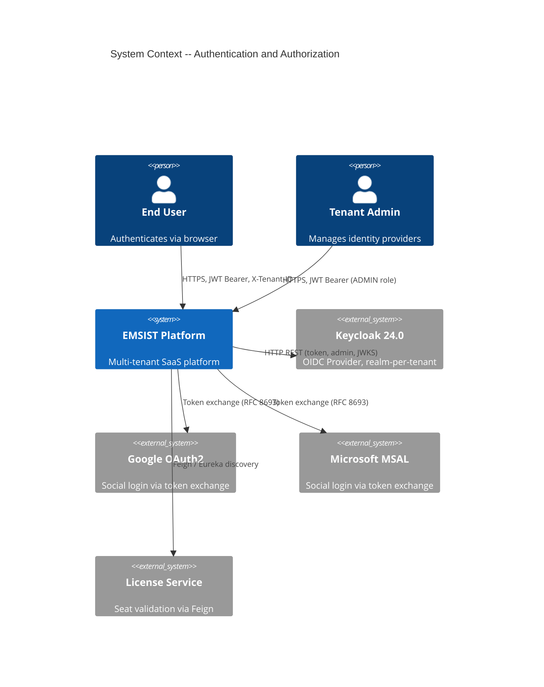

**Evidence:**
- End User login: `AuthController.login()` at `backend/auth-facade/src/main/java/com/ems/auth/controller/AuthController.java:53`
- Google social login: `AuthController.loginWithGoogle()` at line 72
- Microsoft social login: `AuthController.loginWithMicrosoft()` at line 90
- Tenant Admin provider management: `AdminProviderController` at `backend/auth-facade/src/main/java/com/ems/auth/controller/AdminProviderController.java`
- License validation: `LicenseServiceClient.validateSeat()` at `backend/auth-facade/src/main/java/com/ems/auth/client/LicenseServiceClient.java:29`

### 3.2 Technical Context

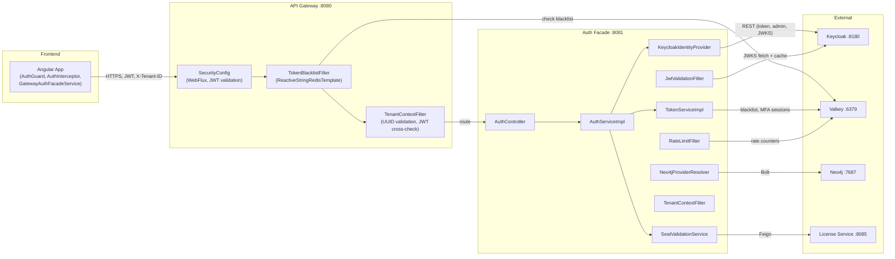

**Protocol details:**

| Connection | Protocol | Port | Evidence |
|-----------|----------|------|----------|
| Frontend to Gateway | HTTPS, JWT Bearer, X-Tenant-ID header | 8080 | `auth.interceptor.ts:34-39` -- sets Authorization + X-Tenant-ID |
| Gateway to Auth Facade | HTTP (internal), JWT forwarded | 8081 | Gateway RouteConfig routes `/api/v1/auth/**` to auth-facade |
| Auth Facade to Keycloak | HTTP REST (OIDC token endpoint, Admin API, JWKS) | 8180 | `KeycloakConfig.getTokenEndpoint()` at line 34 |
| Auth Facade to Valkey | TCP (Spring Data Redis / StringRedisTemplate) | 6379 | `RedisConfig.java`, `TokenServiceImpl` uses `StringRedisTemplate` |
| Auth Facade to Neo4j | Bolt (Spring Data Neo4j) | 7687 | `Neo4jConfig.java`, `AuthGraphRepository`, `Neo4jProviderResolver` |
| Auth Facade to License Service | HTTP REST via Feign (Eureka discovery) | 8085 | `LicenseServiceClient.java:15` -- `@FeignClient(name = "license-service")` |
| Gateway to Valkey | TCP (ReactiveStringRedisTemplate) | 6379 | `TokenBlacklistFilter.java:9` |

---

## 4. Solution Strategy [IMPLEMENTED]

| Strategy | Implementation | Status | Evidence |
|----------|---------------|--------|----------|
| Provider-Agnostic Auth | `IdentityProvider` interface with `@ConditionalOnProperty` bean selection | `[IMPLEMENTED]` | `IdentityProvider.java` (12 methods), `KeycloakIdentityProvider.java:56` (`@ConditionalOnProperty(name = "auth.facade.provider", havingValue = "keycloak", matchIfMissing = true)`) |
| Multi-Tenant Isolation | Keycloak realm-per-tenant via `RealmResolver.resolve(tenantId)` mapping | `[IMPLEMENTED]` | `RealmResolver.java:39-54` -- maps `tenantId` to `tenant-{id}` or `master` |
| Stateless API Auth | JWT Bearer tokens + Valkey token blacklist (hybrid stateless) | `[IMPLEMENTED]` | `JwtValidationFilter.java:72` validates JWT; `TokenServiceImpl.java:83-103` manages blacklist in Valkey |
| MFA (TOTP) | TOTP via `dev.samstevens.totp` library; secrets stored in Keycloak user attributes | `[IMPLEMENTED]` | `KeycloakIdentityProvider.setupMfa()` at line 196; `verifyMfaCode()` at line 230 |
| Social Login (Google) | Token exchange (RFC 8693) via `urn:ietf:params:oauth:grant-type:token-exchange` | `[IMPLEMENTED]` | `KeycloakIdentityProvider.exchangeToken()` at line 147; grant_type = `urn:ietf:params:oauth:grant-type:token-exchange` |
| Social Login (Microsoft) | Token exchange with `subject_issuer=microsoft` | `[IMPLEMENTED]` | `AuthController.loginWithMicrosoft()` at line 90; `AuthServiceImpl.loginWithMicrosoft()` at line 95 |
| Rate Limiting | Valkey-backed sliding window counters per IP (+ tenant) | `[IMPLEMENTED]` | `RateLimitFilter.java:54` -- `redisTemplate.opsForValue().increment(key)` with 60s TTL |
| Seat Validation | Feign call to license-service with circuit breaker fallback | `[IMPLEMENTED]` | `SeatValidationService.java:33` -- `@CircuitBreaker(name = "licenseService")` |
| Dynamic Provider Config | Neo4j graph storage with encrypted secrets and Valkey cache | `[IMPLEMENTED]` | `Neo4jProviderResolver.java:45` -- stores provider configs in Neo4j, caches in Valkey with 5-min TTL |
| Provider-Agnostic Role Extraction | Configurable claim paths via `auth.facade.role-claim-paths` YAML | `[IMPLEMENTED]` | `ProviderAgnosticRoleConverter.java:42` -- reads from multiple JWT claim paths |
| Security Headers | HSTS, CSP, X-Frame-Options DENY, Referrer-Policy | `[IMPLEMENTED]` | `DynamicBrokerSecurityConfig.java:83-93` and `SecurityConfig.java:73-85` (gateway) |

---

## 5. Building Block View [IMPLEMENTED]

### 5.1 Level 1 -- System Context

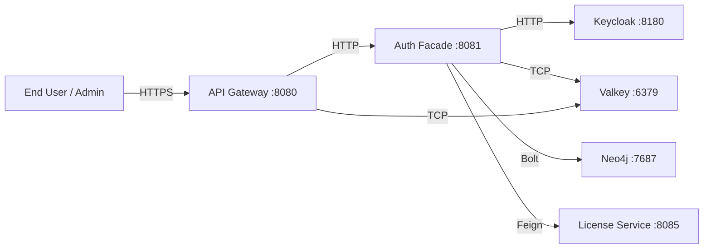

### 5.2 Level 2 -- Container View

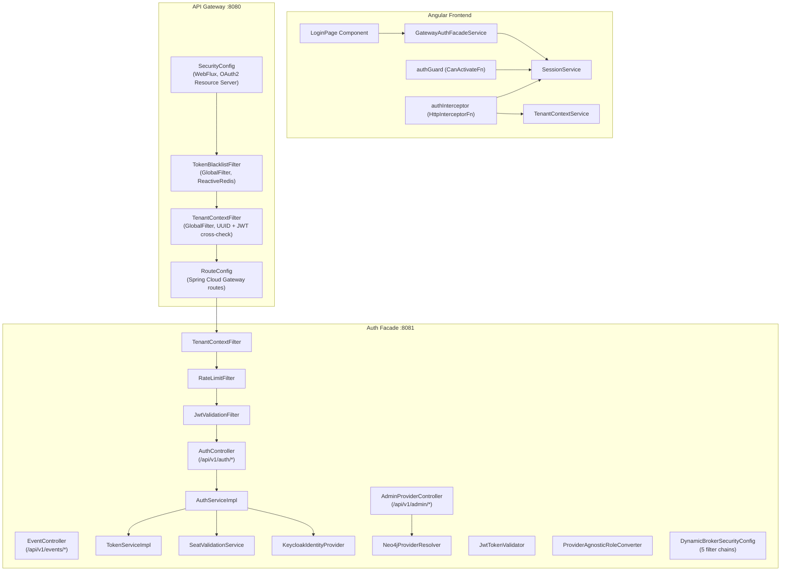

**Evidence for frontend components:**

| Component | File | Verified |
|-----------|------|----------|
| `authGuard` | `frontend/src/app/core/auth/auth.guard.ts:5` | `[IMPLEMENTED]` -- CanActivateFn, checks `session.isAuthenticated()` |
| `authInterceptor` | `frontend/src/app/core/interceptors/auth.interceptor.ts:17` | `[IMPLEMENTED]` -- HttpInterceptorFn, attaches Bearer + X-Tenant-ID, handles 401 refresh |
| `GatewayAuthFacadeService` | `frontend/src/app/core/auth/gateway-auth-facade.service.ts:13` | `[IMPLEMENTED]` -- implements AuthFacade, delegates to ApiGatewayService |
| `AuthFacade` (abstract) | `frontend/src/app/core/auth/auth-facade.ts:12` | `[IMPLEMENTED]` -- abstract class with login/logout/getAccessToken |

**Evidence for API Gateway components:**

| Component | File | Verified |
|-----------|------|----------|
| `SecurityConfig` | `backend/api-gateway/.../config/SecurityConfig.java:35` | `[IMPLEMENTED]` -- WebFlux security with explicit permit/deny rules |
| `TokenBlacklistFilter` | `backend/api-gateway/.../filter/TokenBlacklistFilter.java:24` | `[IMPLEMENTED]` -- GlobalFilter, checks JTI against Valkey blacklist |
| `TenantContextFilter` | `backend/api-gateway/.../filter/TenantContextFilter.java:27` | `[IMPLEMENTED]` -- UUID validation, JWT tenant_id cross-check |

**Evidence for Auth Facade components:**

| Component | File | Verified |
|-----------|------|----------|
| `AuthController` | `backend/auth-facade/.../controller/AuthController.java:35` | `[IMPLEMENTED]` -- 8 endpoints (login, social/google, social/microsoft, login/{provider}, providers, refresh, logout, mfa/setup, mfa/verify, me) |
| `AuthServiceImpl` | `backend/auth-facade/.../service/AuthServiceImpl.java:33` | `[IMPLEMENTED]` -- Delegates to IdentityProvider, manages MFA sessions, seat validation |
| `KeycloakIdentityProvider` | `backend/auth-facade/.../provider/KeycloakIdentityProvider.java:59` | `[IMPLEMENTED]` -- 12 interface methods, TOTP via samstevens library |
| `TokenServiceImpl` | `backend/auth-facade/.../service/TokenServiceImpl.java:26` | `[IMPLEMENTED]` -- Blacklist, MFA session tokens, all via StringRedisTemplate (Valkey) |
| `SeatValidationService` | `backend/auth-facade/.../service/SeatValidationService.java:20` | `[IMPLEMENTED]` -- Resilience4j circuit breaker, Feign to license-service |
| `JwtValidationFilter` | `backend/auth-facade/.../filter/JwtValidationFilter.java:37` | `[IMPLEMENTED]` -- OncePerRequestFilter (Order 3), JWKS validation + blacklist check |
| `RateLimitFilter` | `backend/auth-facade/.../filter/RateLimitFilter.java:28` | `[IMPLEMENTED]` -- OncePerRequestFilter (Order 2), Valkey-backed sliding window |
| `TenantContextFilter` | `backend/auth-facade/.../filter/TenantContextFilter.java:17` | `[IMPLEMENTED]` -- OncePerRequestFilter (Order 1), ThreadLocal tenant context |
| `JwtTokenValidator` | `backend/auth-facade/.../security/JwtTokenValidator.java:26` | `[IMPLEMENTED]` -- JWKS fetch + RSA signature verification + 1-hour key cache |
| `ProviderAgnosticRoleConverter` | `backend/auth-facade/.../security/ProviderAgnosticRoleConverter.java:42` | `[IMPLEMENTED]` -- Configurable claim paths for any OIDC provider |
| `DynamicBrokerSecurityConfig` | `backend/auth-facade/.../config/DynamicBrokerSecurityConfig.java:46` | `[IMPLEMENTED]` -- 5 ordered SecurityFilterChain beans |
| `Neo4jProviderResolver` | `backend/auth-facade/.../provider/Neo4jProviderResolver.java:45` | `[IMPLEMENTED]` -- Graph-based provider config storage with encrypted secrets |

### 5.3 Level 3 -- Component View (auth-facade internals)

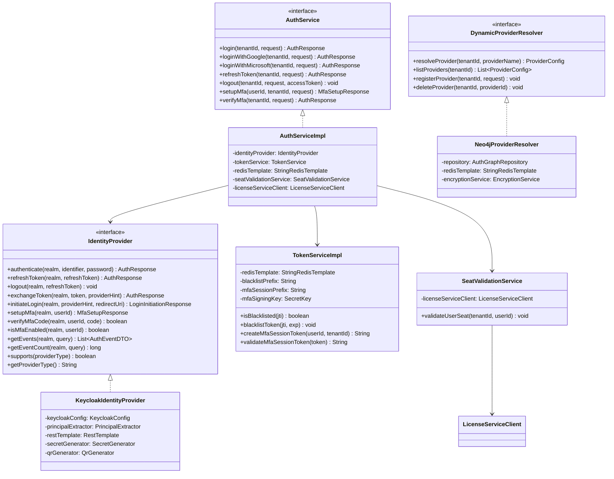

**Filter chain order (auth-facade):**

| Order | Filter | Responsibility |
|-------|--------|----------------|
| 1 | `TenantContextFilter` | Extract X-Tenant-ID, set ThreadLocal |
| 2 | `RateLimitFilter` | Valkey-backed rate limiting per IP+tenant |
| 3 | `JwtValidationFilter` | JWKS validation, blacklist check, SecurityContext |

**Security filter chain order (DynamicBrokerSecurityConfig):**

| Order | Chain | Matcher | Auth |
|-------|-------|---------|------|
| 1 | Admin API | `/api/v1/admin/**` | JWT + ADMIN/SUPER_ADMIN role |
| 2 | Public Auth | `/api/v1/auth/login`, `/social/**`, `/refresh`, `/logout`, `/mfa/verify` | `permitAll()`, no OAuth2 framework |
| 3 | OAuth2 SSO | `/api/v1/auth/oauth2/**` | `oauth2Login()` with redirect |
| 4 | Authenticated Auth | `/api/v1/auth/**` (remaining) | JWT required (`/me`, `/mfa/setup`) |
| 5 | Default | Everything else | JWT required + actuator/swagger public |

---

## 6. Runtime View [IMPLEMENTED]

### 6.1 Login Flow (Username + Password)

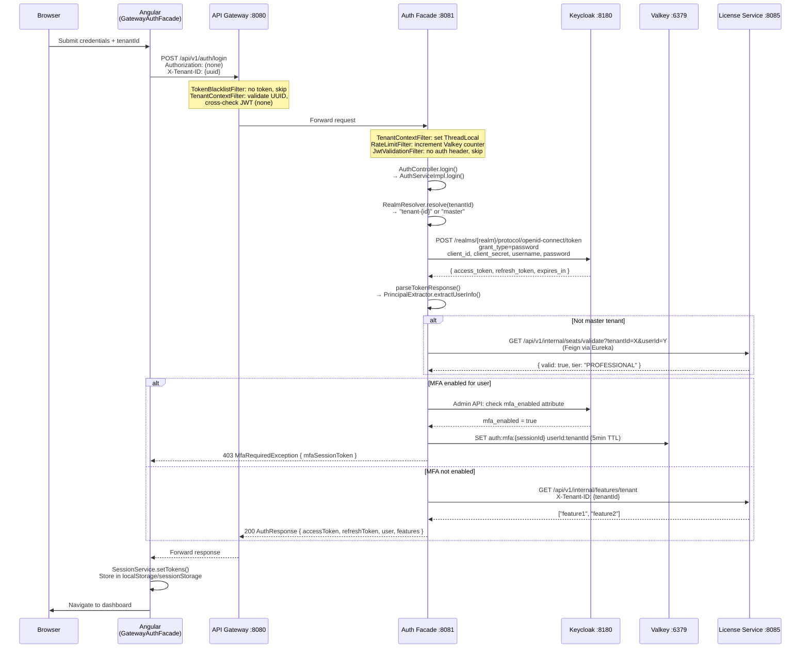

**Evidence:**
- `AuthServiceImpl.login()` at `backend/auth-facade/.../service/AuthServiceImpl.java:45-69`
- `RealmResolver.resolve()` at `backend/auth-facade/.../util/RealmResolver.java:39-54`
- `KeycloakIdentityProvider.authenticate()` at line 74 -- sends `grant_type=password`
- Seat validation at `AuthServiceImpl.java:52-54` -- skips for master tenant
- MFA check at `AuthServiceImpl.java:57-65` -- creates MFA session in Valkey
- Feature fetch at `AuthServiceImpl.java:252-261` -- Feign call to license-service

### 6.2 Token Validation (Protected API Request)

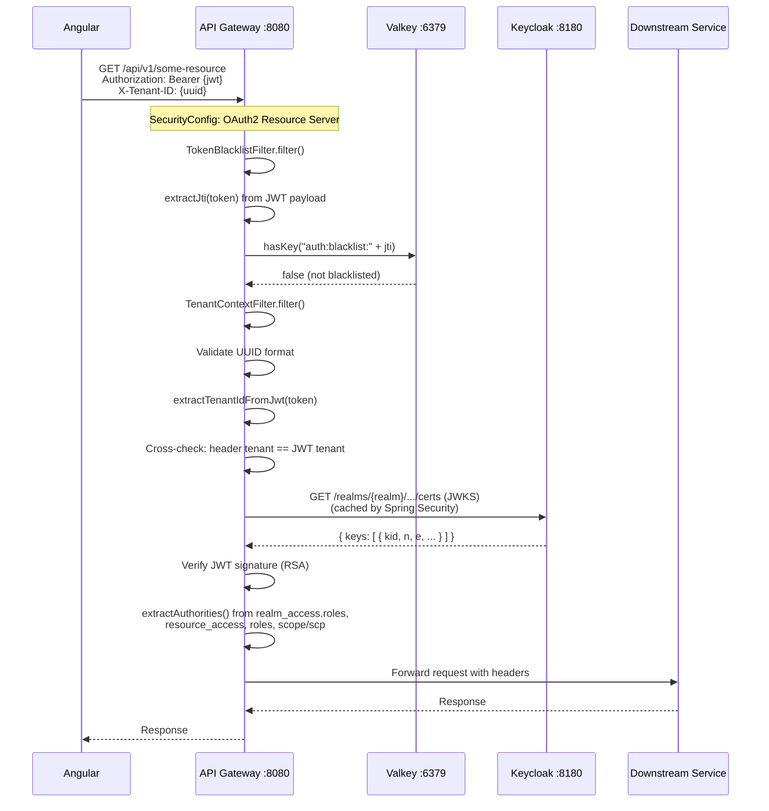

**Evidence:**
- `TokenBlacklistFilter.filter()` at `backend/api-gateway/.../filter/TokenBlacklistFilter.java:40-59`
- JTI extraction at line 67-78
- `TenantContextFilter.filter()` at `backend/api-gateway/.../filter/TenantContextFilter.java:32-81` -- UUID validation + JWT cross-check
- `SecurityConfig.extractAuthorities()` at `backend/api-gateway/.../config/SecurityConfig.java:96-118`
- JWKS fetch handled by Spring Security OAuth2 Resource Server auto-configuration

### 6.3 Token Refresh (401 Retry)

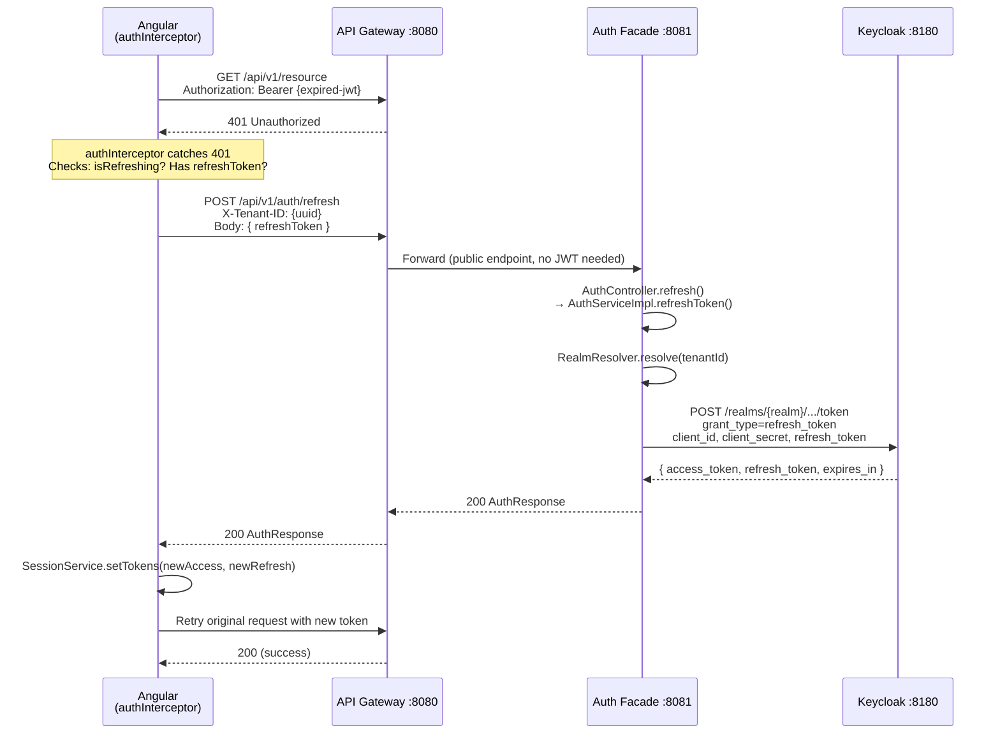

**Evidence:**
- `authInterceptor` at `frontend/src/app/core/interceptors/auth.interceptor.ts:44-52` -- catches 401, calls `handleUnauthorized`
- Token refresh queue at lines 75-91 -- blocks concurrent requests during refresh
- `AuthServiceImpl.refreshToken()` at `backend/auth-facade/.../service/AuthServiceImpl.java:118-123`
- `KeycloakIdentityProvider.refreshToken()` at line 101 -- sends `grant_type=refresh_token`

### 6.4 Logout Flow

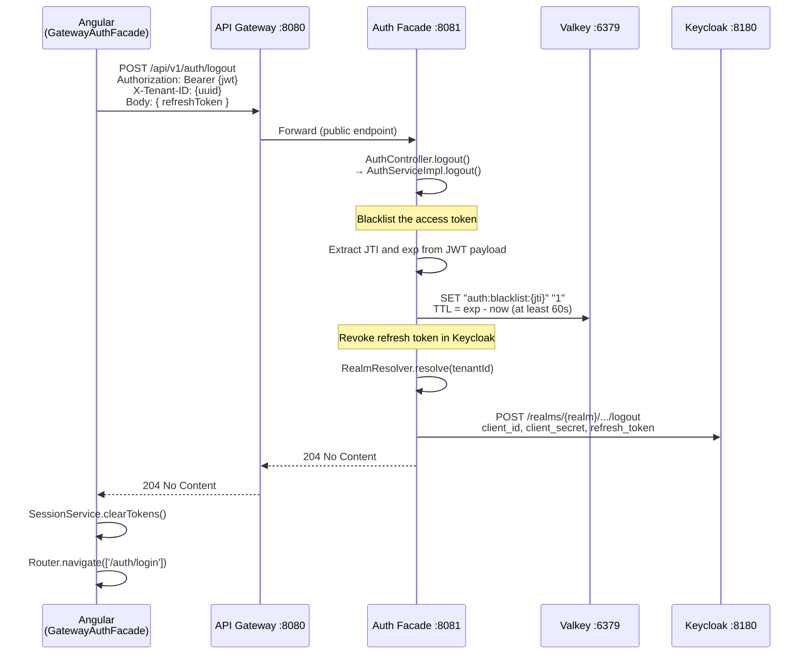

**Evidence:**
- `AuthServiceImpl.logout()` at `backend/auth-facade/.../service/AuthServiceImpl.java:126-154`
- Token blacklisting at lines 130-149 -- extracts JTI from JWT, calls `tokenService.blacklistToken()`
- `TokenServiceImpl.blacklistToken()` at line 91 -- `SET auth:blacklist:{jti} "1"` with TTL
- `KeycloakIdentityProvider.logout()` at line 126 -- POSTs to Keycloak logout endpoint
- `GatewayAuthFacadeService.logout()` at `frontend/src/app/core/auth/gateway-auth-facade.service.ts:56-69`

### 6.5 MFA Challenge Flow

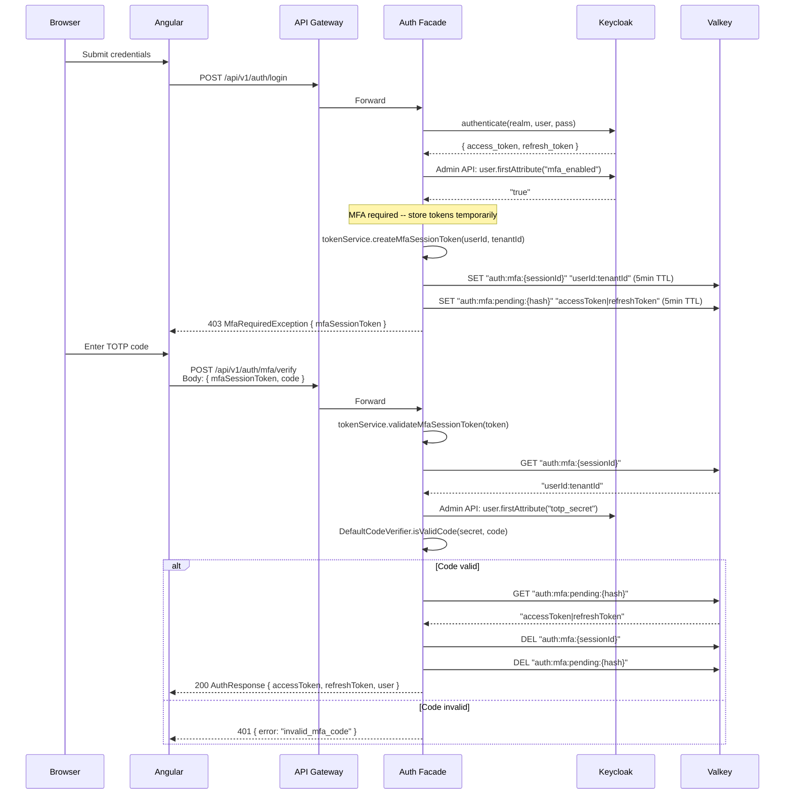

**Evidence:**
- MFA check during login at `AuthServiceImpl.java:57-65`
- MFA session creation at `TokenServiceImpl.createMfaSessionToken()` line 106
- Pending token storage at `AuthServiceImpl.storePendingTokens()` line 203
- MFA verification at `AuthServiceImpl.verifyMfa()` line 165
- TOTP verification at `KeycloakIdentityProvider.verifyMfaCode()` line 230 -- uses `DefaultCodeVerifier`

### 6.6 Social Login (Google Token Exchange)

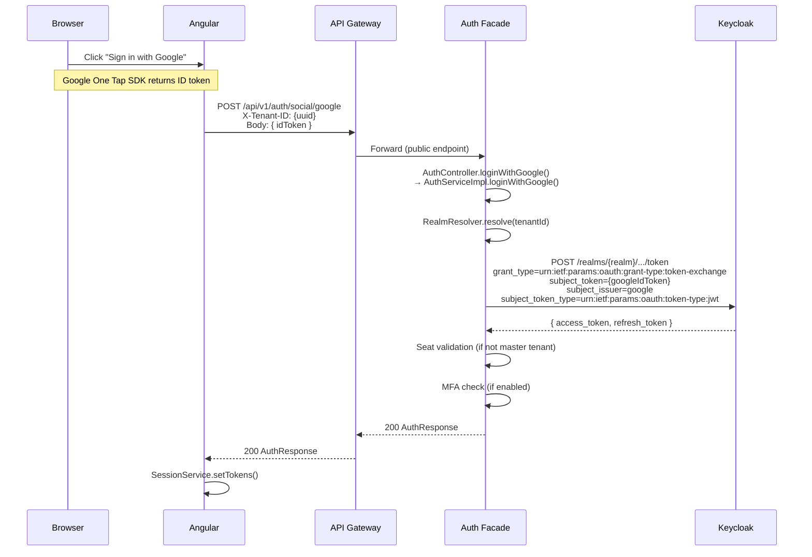

**Evidence:**
- `AuthController.loginWithGoogle()` at line 72
- `AuthServiceImpl.loginWithGoogle()` at `AuthServiceImpl.java:72-92` -- calls `exchangeToken(realm, request.idToken(), "google")`
- `KeycloakIdentityProvider.exchangeToken()` at line 147 -- uses RFC 8693 token exchange
- Token type selection at `determineTokenType()` line 374: Google uses `urn:ietf:params:oauth:token-type:jwt`

---

## 7. Deployment View [IMPLEMENTED]

### 7.1 Docker Container Topology

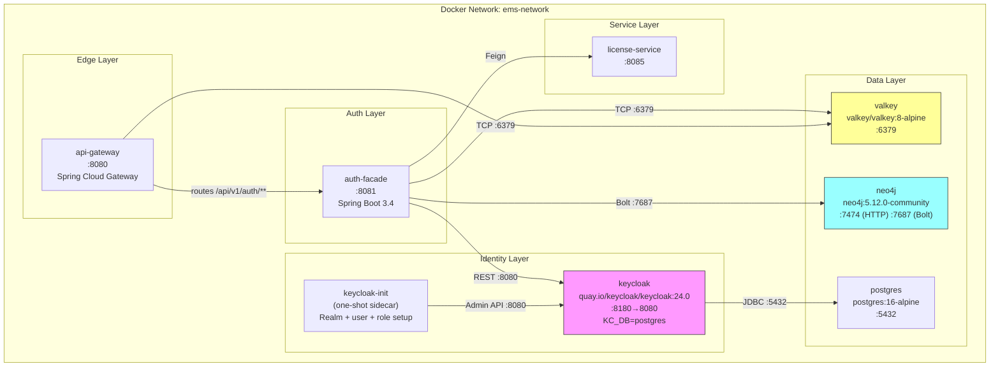

**Evidence from docker-compose.yml** (`infrastructure/docker/docker-compose.yml`):

| Container | Image | Ports | Verified at Line |
|-----------|-------|-------|-----------------|
| postgres | `postgres:16-alpine` | 5432:5432 | Line 7 |
| valkey | `valkey/valkey:8-alpine` | 6379:6379 | Line 26 |
| neo4j | `neo4j:5.12.0-community` | 7474:7474, 7687:7687 | Line 41 |
| kafka | `confluentinc/cp-kafka:7.5.0` | 9092:9092 | Line 75 |
| keycloak | `quay.io/keycloak/keycloak:24.0` | 8180:8080 | Line 97 |
| keycloak-init | Custom Dockerfile (one-shot) | None | Line 129 |

### 7.2 Connection Details

| From | To | Protocol | Port | Auth |
|------|----|----------|------|------|
| auth-facade | Keycloak | HTTP REST | 8180 (mapped to 8080 internal) | Client credentials |
| auth-facade | Valkey | TCP (Redis protocol) | 6379 | None (default) |
| auth-facade | Neo4j | Bolt | 7687 | `neo4j/password123` |
| auth-facade | license-service | HTTP (Feign/Eureka) | 8085 | Internal service token |
| api-gateway | Valkey | TCP (Reactive Redis) | 6379 | None (default) |
| api-gateway | Keycloak | HTTP (JWKS) | 8180 | None (public endpoint) |
| Keycloak | PostgreSQL | JDBC | 5432 | `keycloak/keycloak` |

---

## 8. Crosscutting Concepts [IMPLEMENTED]

### 8.1 Security

| Concept | Implementation | Evidence |
|---------|---------------|----------|
| JWT Validation | JWKS-based RSA signature verification with 1-hour key cache | `JwtTokenValidator.java:34` -- `JWKS_CACHE_TTL_MS = 3600_000` |
| Token Blacklisting | Valkey SET with TTL matching token expiry | `TokenServiceImpl.blacklistToken()` at line 91 |
| RBAC | Roles extracted from JWT via configurable claim paths | `ProviderAgnosticRoleConverter.java:42` |
| HSTS | `includeSubDomains=true`, `maxAge=31536000` on both Gateway and Auth Facade | `DynamicBrokerSecurityConfig.java:84-86`, `SecurityConfig.java:73-75` |
| CSP | `default-src 'self'; frame-ancestors 'none'` on Auth Facade; extended policy on Gateway | `DynamicBrokerSecurityConfig.java:92`, `SecurityConfig.java:82` |
| X-Frame-Options | `DENY` on both Gateway and Auth Facade | `DynamicBrokerSecurityConfig.java:87`, `SecurityConfig.java:77` |
| Referrer-Policy | `STRICT_ORIGIN_WHEN_CROSS_ORIGIN` | Both configs |
| Rate Limiting | Valkey sliding window, configurable `rate-limit.requests-per-minute` (default 100) | `RateLimitFilter.java:33-34` |
| CSRF | Disabled (Bearer token auth is CSRF-immune) | `SecurityConfig.java:43` -- documented rationale |
| Internal API blocking | `/api/v1/internal/**` → `denyAll()` at Gateway | `SecurityConfig.java:62` |

### 8.2 Multi-Tenancy

| Concept | Implementation | Evidence |
|---------|---------------|----------|
| Tenant Header | `X-Tenant-ID` header required on all API requests | `TenantContextFilter.TENANT_HEADER` at auth-facade line 19 |
| UUID Validation | Gateway validates X-Tenant-ID is valid UUID format | `TenantContextFilter.isValidUuid()` at gateway line 89 |
| JWT Cross-Check | Gateway compares X-Tenant-ID header with JWT `tenant_id` claim | Gateway `TenantContextFilter.java:52-58` |
| Realm-per-Tenant | `RealmResolver.resolve()` maps tenantId to Keycloak realm name | `RealmResolver.java:39-54` |
| Master Tenant | UUID `68cd2a56-98c9-4ed4-8534-c299566d5b27`, aliases `master` and `tenant-master` | `RealmResolver.java:23` |
| Tenant Mismatch Rejection | Gateway returns 403 if header and JWT tenant differ | Gateway `TenantContextFilter.java:55-58` |

### 8.3 Caching

| Cache | Store | TTL | Evidence |
|-------|-------|-----|----------|
| JWKS Keys | In-memory `ConcurrentHashMap` in JwtTokenValidator | 1 hour | `JwtTokenValidator.java:34` -- `JWKS_CACHE_TTL_MS = 3600_000` |
| Provider Config | Valkey via `StringRedisTemplate` | 5 minutes | `Neo4jProviderResolver.java:54` -- `CACHE_TTL = Duration.ofMinutes(5)` |
| Rate Limit Counters | Valkey | 60 seconds | `RateLimitFilter.java:62` -- `expire(key, 60, TimeUnit.SECONDS)` |
| MFA Sessions | Valkey | 5 minutes | `TokenServiceImpl.java:38` -- `mfaSessionTtlMinutes` default 5 |
| Token Blacklist | Valkey | Matches token expiry (minimum 60s) | `TokenServiceImpl.java:95` -- `Math.max(exp - now, 60)` |

**Note:** There is no Caffeine L1 cache. Caching is single-tier Valkey only. This contradicts older documentation that claimed two-tier caching. `[IMPLEMENTED]` as single-tier Valkey.

### 8.4 Error Handling

| Exception | HTTP Status | Trigger | Evidence |
|-----------|-------------|---------|----------|
| `InvalidCredentialsException` | 401 | Wrong username/password | `KeycloakIdentityProvider.java:94` |
| `InvalidTokenException` | 401 | Malformed or invalid JWT | `JwtTokenValidator.java:53` |
| `TokenExpiredException` | 401 | Expired JWT | `JwtTokenValidator.java:49` |
| `MfaRequiredException` | 403 | User has MFA enabled, TOTP code needed | `AuthServiceImpl.java:64` |
| `NoActiveSeatException` | 403 | User has no active license seat | `SeatValidationService.java:42` |
| `RateLimitExceededException` | 429 | IP exceeded `requests-per-minute` | `RateLimitFilter.java:77` |
| `ProviderNotFoundException` | 404 | Requested IdP not configured for tenant | `Neo4jProviderResolver.java:68` |
| `ProviderAlreadyExistsException` | 409 | Duplicate provider registration | `Neo4jProviderResolver.java:111` |
| `AuthenticationException` | 401 | Generic auth failure | `KeycloakIdentityProvider.java:96` |

### 8.5 Resilience

| Pattern | Implementation | Evidence |
|---------|---------------|----------|
| Circuit Breaker | Resilience4j on `SeatValidationService.validateUserSeat()` | `@CircuitBreaker(name = "licenseService")` at line 32 |
| Fallback | Deny access when license-service circuit is open | `validateSeatFallback()` at line 62 -- throws `NoActiveSeatException` |
| Graceful Degradation (Rate Limit) | If Valkey is down, allow request but log warning | `RateLimitFilter.java:84-88` -- catch block allows request |
| Graceful Degradation (Features) | If feature fetch fails, return empty list | `AuthServiceImpl.fetchTenantFeatures()` line 256 -- catches Exception, returns empty |

---

## 9. Architecture Decisions

### 9.1 ADRs Relevant to Auth Domain

| ADR | Title | Status | Auth Impact |
|-----|-------|--------|-------------|
| ADR-001 | Neo4j as Primary Graph Database | Accepted (10% implemented) | auth-facade uses Neo4j for dynamic provider config storage via `Neo4jProviderResolver` and graph entities (`ProviderNode`, `ConfigNode`, `TenantNode`) |
| ADR-002 | Spring Boot 3.4 | Accepted (100%) | auth-facade and api-gateway both use Spring Boot 3.4 + Spring Security 6.x |
| ADR-003 | Graph-per-Tenant Isolation | Accepted (0%) | `[PLANNED]` -- Currently uses simple `tenantId` property discrimination, not separate Neo4j databases |
| ADR-004 | Keycloak as Identity Provider | Accepted (90%) | `[IMPLEMENTED]` -- KeycloakIdentityProvider is the sole production implementation; realm-per-tenant, admin API, JWKS, token exchange all working |
| ADR-005 | Valkey as Cache Layer | Accepted (100%) | `[IMPLEMENTED]` -- Token blacklist, rate limiting, MFA sessions, provider config cache all use Valkey via `StringRedisTemplate` |
| ADR-007 | Provider-Agnostic Identity | Accepted (25%) | `[IN-PROGRESS]` -- `IdentityProvider` interface exists (12 methods), `ProviderAgnosticRoleConverter` supports configurable claim paths, but only `KeycloakIdentityProvider` exists |

### 9.2 Key Design Decisions Within Auth

| Decision | Rationale | Alternatives Considered |
|----------|-----------|------------------------|
| 5 Security Filter Chains (not 1) | Prevents OAuth2 entry points from interfering with truly public endpoints; allows fine-grained path matching | Single chain with complex antMatchers -- rejected because `oauth2Login()` would intercept `/login` |
| RestTemplate for Keycloak (not SDK) | Simpler control over token endpoint calls; avoids Keycloak client SDK version coupling | Keycloak Admin Client -- used only for user management, not token flows |
| TOTP via `samstevens.totp` (not Keycloak OTP) | Full control over MFA flow; stores secret in Keycloak user attributes for portability | Keycloak built-in OTP -- rejected because it requires browser-redirect flow |
| JWKS cache in-memory (not Valkey) | JWKS keys rarely change; in-memory `ConcurrentHashMap` avoids network hop for every validation | Valkey cache -- unnecessary overhead for rarely-changing keys |
| Feign + Eureka for license-service | Service discovery allows dynamic scaling; circuit breaker provides resilience | Direct HTTP URL -- rejected because it requires hardcoded host:port |

---

## 10. Quality Requirements

### 10.1 Quality Tree

```mermaid
graph TD
    Q[Quality] --> SEC[Security]
    Q --> PERF[Performance]
    Q --> AVAIL[Availability]
    Q --> MAINT[Maintainability]

    SEC --> SEC1["JWT signature validation<br/>(RSA via JWKS)"]
    SEC --> SEC2["Token blacklisting<br/>(Valkey)"]
    SEC --> SEC3["Rate limiting<br/>(100 req/min/IP)"]
    SEC --> SEC4["HSTS + CSP + X-Frame-Options"]
    SEC --> SEC5["Tenant isolation<br/>(UUID cross-check)"]
    SEC --> SEC6["MFA (TOTP)"]

    PERF --> PERF1["JWKS cache: 1 hour"]
    PERF --> PERF2["Provider config cache: 5 min"]
    PERF --> PERF3["Stateless JWT: no session lookup"]

    AVAIL --> AVAIL1["Circuit breaker on<br/>license-service"]
    AVAIL --> AVAIL2["Rate limit graceful degradation<br/>(allow if Valkey down)"]
    AVAIL --> AVAIL3["Feature fetch graceful degradation<br/>(empty list on failure)"]

    MAINT --> MAINT1["IdentityProvider interface<br/>(Strategy pattern)"]
    MAINT --> MAINT2["Configurable role claim paths<br/>(YAML-driven)"]
    MAINT --> MAINT3["Neo4j-stored provider configs<br/>(no code changes to add IdP)"]
```

### 10.2 Quality Scenarios

| ID | Quality | Scenario | Target | Status |
|----|---------|----------|--------|--------|
| QS-01 | Security | A revoked token is used to access a protected endpoint | Rejected within 1 second (blacklist check in Valkey) | `[IMPLEMENTED]` |
| QS-02 | Security | X-Tenant-ID header does not match JWT tenant_id | Request rejected with 403 | `[IMPLEMENTED]` |
| QS-03 | Security | More than 100 requests from same IP in 60 seconds | 429 Too Many Requests with Retry-After header | `[IMPLEMENTED]` |
| QS-04 | Performance | User logs in with username + password | Complete within 2 seconds (including Keycloak round-trip) | `[IMPLEMENTED]` -- design target |
| QS-05 | Availability | license-service is down | Circuit breaker opens; login denied with clear error | `[IMPLEMENTED]` |
| QS-06 | Availability | Valkey is down during rate limiting | Request allowed; warning logged | `[IMPLEMENTED]` |
| QS-07 | Maintainability | Switch from Keycloak to Auth0 | Change `auth.facade.provider` property + implement Auth0IdentityProvider | `[IN-PROGRESS]` -- interface ready, no Auth0 impl |
| QS-08 | Security | MFA-enabled user logs in | Tokens held in Valkey; TOTP required before tokens are released | `[IMPLEMENTED]` |

---

## 11. Risks and Technical Debt

### 11.1 Active Risks

| ID | Risk | Severity | Mitigation |
|----|------|----------|------------|
| R-01 | Only Keycloak provider implemented (ADR-007 at 25%) | MEDIUM | `IdentityProvider` interface is stable; adding providers is additive, not breaking |
| R-02 | Graph-per-tenant isolation not implemented (ADR-003 at 0%) | HIGH | Currently uses `tenantId` property discrimination on Neo4j nodes; adequate for current scale but not for strict isolation |
| R-03 | No active session management UI | LOW | Users cannot see/revoke their own sessions; Keycloak admin console is the only option |
| R-04 | MFA limited to TOTP only | MEDIUM | No SMS, Email, or WebAuthn MFA methods; TOTP is adequate for initial launch |
| R-05 | Neo4j Community Edition | MEDIUM | No enterprise features (clustering, role-based access); adequate for dev/staging |
| R-06 | Admin IdP management UI not complete | MEDIUM | Backend API (`AdminProviderController`) exists; frontend wizard is `[IN-PROGRESS]` |

### 11.2 Technical Debt

| ID | Debt Item | Impact | ADR |
|----|-----------|--------|-----|
| TD-01 | `StringRedisTemplate` used directly (not abstracted) | Tight coupling to Redis/Valkey API; would need refactoring for alternative cache | ADR-005 |
| TD-02 | JWKS fetched via raw `HttpURLConnection` | No retry/timeout configuration; should use `RestTemplate` or `WebClient` | -- |
| TD-03 | MFA pending tokens stored with hash of session token as key | Hash collisions theoretically possible; should use UUID-based keys | -- |
| TD-04 | `getEvents()` fetches up to 10,000 events to count | No server-side count API; performance degrades with large event volumes | -- |
| TD-05 | No Kafka event publishing for auth events | Auth events only in Keycloak event store; no cross-service event propagation | -- |
| TD-06 | Provider-agnostic code has Keycloak-specific assumptions | `RealmResolver` assumes Keycloak realm naming; other providers may not use realms | ADR-007 |

### 11.3 Planned Improvements

| Item | Status | Target |
|------|--------|--------|
| Auth0 IdentityProvider implementation | `[PLANNED]` | Post-MVP |
| Okta IdentityProvider implementation | `[PLANNED]` | Post-MVP |
| Azure AD IdentityProvider implementation | `[PLANNED]` | Post-MVP |
| Graph-per-tenant isolation (ADR-003) | `[PLANNED]` | When Neo4j Enterprise is adopted |
| WebAuthn / FIDO2 MFA | `[PLANNED]` | Post-MVP |
| SMS/Email MFA | `[PLANNED]` | Post-MVP |
| Kafka auth event publishing | `[PLANNED]` | Sprint 5+ |
| Session management UI | `[PLANNED]` | Sprint 6+ |

---

## 12. Glossary

| Term | Definition |
|------|------------|
| **Auth Facade** | The EMSIST microservice (`auth-facade` :8081) that encapsulates all authentication logic behind a provider-agnostic interface |
| **Identity Provider (IdP)** | An external system that authenticates users (e.g., Keycloak, Auth0, Google). In code: the `IdentityProvider` Java interface |
| **Realm** | Keycloak's namespace for users, roles, and clients. EMSIST uses one realm per tenant (`tenant-{id}`) |
| **Token Exchange** | RFC 8693 mechanism where an external IdP token (e.g., Google ID token) is exchanged for EMSIST application tokens via Keycloak |
| **Token Blacklist** | A Valkey-backed set of revoked JWT IDs (JTI). Checked by both API Gateway and Auth Facade on every request |
| **TOTP** | Time-based One-Time Password (RFC 6238). The MFA method implemented using the `samstevens.totp` library |
| **MFA Session Token** | A short-lived JWT (5-minute TTL) created when MFA is required. Stored in Valkey and used to correlate the TOTP verification with the original login attempt |
| **Seat Validation** | License enforcement check that verifies a user holds an active license seat before granting access. Calls license-service via Feign |
| **Circuit Breaker** | Resilience4j pattern on `SeatValidationService` that fails fast when license-service is unavailable |
| **kc_idp_hint** | Keycloak query parameter that bypasses the Keycloak login page and redirects directly to an external IdP (e.g., `kc_idp_hint=google`) |
| **JWKS** | JSON Web Key Set. The public keys published by Keycloak at `/realms/{realm}/protocol/openid-connect/certs` used to verify JWT signatures |
| **X-Tenant-ID** | HTTP header carrying the tenant UUID. Required on all API requests. Cross-validated against JWT `tenant_id` claim at the Gateway |
| **DynamicBrokerSecurityConfig** | The Spring Security configuration that defines 5 ordered `SecurityFilterChain` beans for fine-grained endpoint security |
| **Neo4jProviderResolver** | The production implementation for dynamic identity provider configuration storage. Stores `ConfigNode` entries in Neo4j with encrypted secrets |
| **ProviderAgnosticRoleConverter** | A Spring Security `Converter<Jwt, Collection<GrantedAuthority>>` that extracts roles from configurable JWT claim paths, enabling provider-agnostic role mapping |
| **BFF (Backend-for-Frontend)** | The pattern where the API Gateway acts as the frontend's single backend entry point, handling CORS, JWT validation, and routing |

---

## Appendix A: File Reference Index

All source files referenced in this document, for traceability:

| Component | File Path |
|-----------|-----------|
| AuthController | `backend/auth-facade/src/main/java/com/ems/auth/controller/AuthController.java` |
| AdminProviderController | `backend/auth-facade/src/main/java/com/ems/auth/controller/AdminProviderController.java` |
| AuthService (interface) | `backend/auth-facade/src/main/java/com/ems/auth/service/AuthService.java` |
| AuthServiceImpl | `backend/auth-facade/src/main/java/com/ems/auth/service/AuthServiceImpl.java` |
| IdentityProvider (interface) | `backend/auth-facade/src/main/java/com/ems/auth/provider/IdentityProvider.java` |
| KeycloakIdentityProvider | `backend/auth-facade/src/main/java/com/ems/auth/provider/KeycloakIdentityProvider.java` |
| TokenServiceImpl | `backend/auth-facade/src/main/java/com/ems/auth/service/TokenServiceImpl.java` |
| SeatValidationService | `backend/auth-facade/src/main/java/com/ems/auth/service/SeatValidationService.java` |
| LicenseServiceClient | `backend/auth-facade/src/main/java/com/ems/auth/client/LicenseServiceClient.java` |
| JwtValidationFilter | `backend/auth-facade/src/main/java/com/ems/auth/filter/JwtValidationFilter.java` |
| RateLimitFilter | `backend/auth-facade/src/main/java/com/ems/auth/filter/RateLimitFilter.java` |
| TenantContextFilter (auth-facade) | `backend/auth-facade/src/main/java/com/ems/auth/filter/TenantContextFilter.java` |
| JwtTokenValidator | `backend/auth-facade/src/main/java/com/ems/auth/security/JwtTokenValidator.java` |
| ProviderAgnosticRoleConverter | `backend/auth-facade/src/main/java/com/ems/auth/security/ProviderAgnosticRoleConverter.java` |
| DynamicBrokerSecurityConfig | `backend/auth-facade/src/main/java/com/ems/auth/config/DynamicBrokerSecurityConfig.java` |
| KeycloakConfig | `backend/auth-facade/src/main/java/com/ems/auth/config/KeycloakConfig.java` |
| RedisConfig | `backend/auth-facade/src/main/java/com/ems/auth/config/RedisConfig.java` |
| RealmResolver | `backend/auth-facade/src/main/java/com/ems/auth/util/RealmResolver.java` |
| Neo4jProviderResolver | `backend/auth-facade/src/main/java/com/ems/auth/provider/Neo4jProviderResolver.java` |
| ProviderNode | `backend/auth-facade/src/main/java/com/ems/auth/graph/entity/ProviderNode.java` |
| SecurityConfig (gateway) | `backend/api-gateway/src/main/java/com/ems/gateway/config/SecurityConfig.java` |
| TokenBlacklistFilter (gateway) | `backend/api-gateway/src/main/java/com/ems/gateway/filter/TokenBlacklistFilter.java` |
| TenantContextFilter (gateway) | `backend/api-gateway/src/main/java/com/ems/gateway/filter/TenantContextFilter.java` |
| authGuard | `frontend/src/app/core/auth/auth.guard.ts` |
| authInterceptor | `frontend/src/app/core/interceptors/auth.interceptor.ts` |
| AuthFacade (abstract) | `frontend/src/app/core/auth/auth-facade.ts` |
| GatewayAuthFacadeService | `frontend/src/app/core/auth/gateway-auth-facade.service.ts` |
| docker-compose.yml | `infrastructure/docker/docker-compose.yml` |
