# TOGAF Architecture Mapping: Authentication & Authorization Domain

| Metadata | Value |
|----------|-------|
| **Document ID** | R01-DESIGN-17 |
| **Domain** | Authentication & Authorization |
| **Framework** | TOGAF 10 (The Open Group Architecture Framework) |
| **Status** | Living Document |
| **Last Verified** | 2026-03-12 |
| **Verified Against** | `backend/auth-facade/`, `frontend/src/app/core/auth/`, `infrastructure/docker/` |

---

## Table of Contents

1. [TOGAF Overview and Applicability](#1-togaf-overview-and-applicability)
2. [Architecture Development Method (ADM) Mapping](#2-architecture-development-method-adm-mapping)
3. [Architecture Building Blocks (ABBs)](#3-architecture-building-blocks-abbs)
4. [Solution Building Blocks (SBBs)](#4-solution-building-blocks-sbbs)
5. [Architecture Catalog](#5-architecture-catalog)
6. [Architecture Principles](#6-architecture-principles)
7. [Standards Information Base (SIB)](#7-standards-information-base-sib)
8. [Architecture Repository](#8-architecture-repository)
9. [Gap Analysis (Baseline to Target)](#9-gap-analysis-baseline-to-target)
10. [Migration Planning](#10-migration-planning)
11. [Governance](#11-governance)

---

## 1. TOGAF Overview and Applicability

### 1.1 Why TOGAF for EMSIST Auth

TOGAF provides a structured methodology for enterprise architecture that maps cleanly to the EMSIST Authentication and Authorization domain. The framework's emphasis on Architecture Building Blocks (ABBs) and Solution Building Blocks (SBBs) directly models the relationship between abstract security capabilities and their concrete implementations.

### 1.2 Scope

This mapping covers the following EMSIST components:

- **auth-facade** (port 8081) -- Primary authentication service [IMPLEMENTED]
- **api-gateway** (port 8080) -- Request routing and CORS handling [IMPLEMENTED]
- **Keycloak** (port 9080) -- Identity provider [IMPLEMENTED]
- **Valkey** -- Token blacklist, rate limiting, MFA sessions [IMPLEMENTED]
- **Neo4j** -- Provider configuration graph [IMPLEMENTED]
- **Angular Auth Module** -- Frontend authentication [IMPLEMENTED]

### 1.3 TOGAF ADM Cycle Applied to Auth Domain

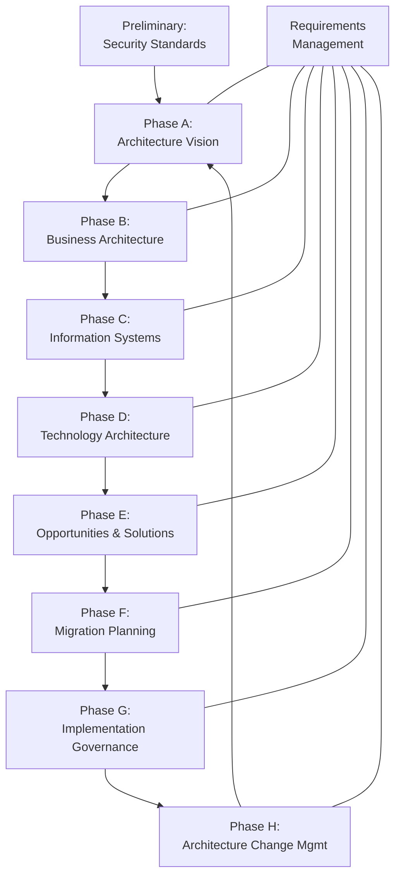

---

## 2. Architecture Development Method (ADM) Mapping

### 2.1 Preliminary Phase: Framework and Principles

**Objective:** Establish the security architecture framework and governance model.

| Deliverable | EMSIST Artifact | Status |
|-------------|-----------------|--------|
| Architecture Principles | AP-AUTH-01 through AP-AUTH-06 (Section 6) | [IMPLEMENTED] |
| Organization Structure | SDLC Agent Governance Framework | [IMPLEMENTED] |
| Architecture Repository | `/docs/adr/`, `/docs/arc42/`, `/docs/lld/` | [IMPLEMENTED] |
| Tools and Techniques | MADR format, arc42, C4 diagrams | [IMPLEMENTED] |

### 2.2 Phase A: Architecture Vision

**Vision:** Provider-agnostic, multi-tenant identity management with OAuth2/OIDC standards, enabling tenants to onboard custom identity providers without platform code changes.

**Stakeholders:**

| Stakeholder | Concern | How Addressed |
|-------------|---------|---------------|
| CISO | Vendor lock-in, compliance | `IdentityProvider` interface with Strategy Pattern [IMPLEMENTED] |
| Platform Architect | Scalability, maintainability | Stateless JWT + Keycloak realms [IMPLEMENTED] |
| Tenant Admin | Self-service IdP management | Admin Provider Management API [IMPLEMENTED] |
| End User | Frictionless login, MFA | Social login + TOTP MFA [IMPLEMENTED] |
| Security Officer | Audit trail, access control | Keycloak Event Store + RBAC [IMPLEMENTED] |

**Business Drivers:**

| Driver | Priority | Mapping |
|--------|----------|---------|
| Multi-tenant SaaS security | Critical | Realm-per-tenant isolation via `RealmResolver` [IMPLEMENTED] |
| Regulatory compliance (OWASP, NIST) | Critical | TOTP (RFC 6238), OAuth2, rate limiting [IMPLEMENTED] |
| Customer trust | High | Provider-agnostic design, encrypted secrets [IMPLEMENTED] |
| Vendor independence | High | `IdentityProvider` interface + `@ConditionalOnProperty` [IMPLEMENTED] |
| Time-to-market for new IdPs | Medium | Dynamic provider resolver with Neo4j storage [IMPLEMENTED] |

**Key Concerns and Resolutions:**

| Concern | Resolution | Evidence |
|---------|------------|----------|
| Vendor lock-in | `IdentityProvider` interface with `@ConditionalOnProperty` switching | `IdentityProvider.java` (interface), `KeycloakIdentityProvider.java` (line 56: `@ConditionalOnProperty(name = "auth.facade.provider", havingValue = "keycloak", matchIfMissing = true)`) |
| Scalability | Stateless JWT validation + Valkey-backed blacklist | `TokenServiceImpl.java` (line 83-88: `isBlacklisted()` via `StringRedisTemplate`) |
| Compliance | TOTP MFA (RFC 6238) via `DefaultCodeVerifier` | `KeycloakIdentityProvider.java` (line 253: `DefaultCodeVerifier`) |
| Abuse prevention | Valkey-backed rate limiting with sliding window | `RateLimitFilter.java` (line 54: `redisTemplate.opsForValue().increment(key)`) |

### 2.3 Phase B: Business Architecture

#### Business Functions

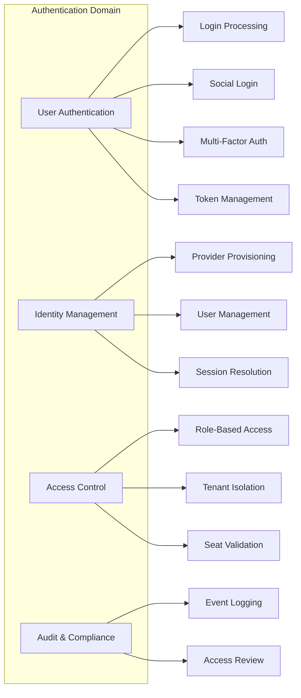

#### Business Services

| Service ID | Name | Description | Status |
|------------|------|-------------|--------|
| BS-AUTH-01 | Login Service | Password-based authentication via Keycloak ROPC grant | [IMPLEMENTED] |
| BS-AUTH-02 | Social Login Service | Google/Microsoft token exchange via Keycloak brokering | [IMPLEMENTED] |
| BS-AUTH-03 | MFA Service | TOTP setup, verification, recovery codes | [IMPLEMENTED] |
| BS-AUTH-04 | Session Management | JWT issuance, refresh, blacklist-based revocation | [IMPLEMENTED] |
| BS-AUTH-05 | Provider Management | Admin CRUD for tenant IdP configurations | [IMPLEMENTED] |
| BS-AUTH-06 | Seat Validation | License seat check during login | [IMPLEMENTED] |
| BS-AUTH-07 | SSO Service | Redirect-based OAuth2/OIDC flows via Keycloak brokering | [IMPLEMENTED] |
| BS-AUTH-08 | Active Session UI | Frontend session listing and forced logout | [PLANNED] |

#### Business Actors

| Actor | Role | Interactions |
|-------|------|-------------|
| End User | Authenticates, manages MFA | Login, social login, MFA setup/verify, logout |
| Tenant Admin | Manages IdP configurations | Provider CRUD, connection testing, cache invalidation |
| Super Admin | Platform-wide administration | Cross-tenant provider management |
| Security Officer | Reviews audit events | Event queries via EventController |

#### Business Processes

| ID | Process | Implementation Status |
|----|---------|----------------------|
| BP-AUTH-01 | User Login Process | [IMPLEMENTED] -- `AuthController.login()` -> `AuthServiceImpl.login()` -> `KeycloakIdentityProvider.authenticate()` |
| BP-AUTH-02 | MFA Enrollment Process | [IMPLEMENTED] -- `AuthController.setupMfa()` -> `KeycloakIdentityProvider.setupMfa()` with TOTP secret storage in Keycloak user attributes |
| BP-AUTH-03 | IdP Onboarding Process | [IMPLEMENTED] -- `AdminProviderController.registerProvider()` -> `Neo4jProviderResolver.registerProvider()` with encrypted secret storage |
| BP-AUTH-04 | Access Review Process | [PARTIAL] -- Event querying via `EventController` exists; no dedicated review workflow UI |

### 2.4 Phase C: Information Systems Architecture

#### 2.4.1 Data Architecture

**Data Entities:**

| Entity | Store | Status | Evidence |
|--------|-------|--------|----------|
| User | Keycloak (internal DB) | [IMPLEMENTED] | Managed via Keycloak Admin Client (`UserRepresentation`) |
| Credential | Keycloak (internal DB) | [IMPLEMENTED] | `CredentialRepresentation` in `KeycloakIdentityProvider.java` |
| Access Token | JWT (stateless, not stored) | [IMPLEMENTED] | Issued by Keycloak, validated via JWKS in `JwtTokenValidator.java` |
| Refresh Token | Keycloak (internal DB) | [IMPLEMENTED] | Managed by Keycloak token endpoint |
| Token Blacklist Entry | Valkey | [IMPLEMENTED] | `TokenServiceImpl.blacklistToken()` -- key: `auth:blacklist:{jti}` |
| MFA Session | Valkey | [IMPLEMENTED] | `TokenServiceImpl.createMfaSessionToken()` -- key: `auth:mfa:{sessionId}` |
| MFA Pending Tokens | Valkey | [IMPLEMENTED] | `AuthServiceImpl.storePendingTokens()` -- key: `auth:mfa:pending:{hash}` |
| Rate Limit Counter | Valkey | [IMPLEMENTED] | `RateLimitFilter` -- key: `auth:rate:{tenantId}:{ip}` |
| Provider Configuration | Neo4j (ConfigNode) | [IMPLEMENTED] | `Neo4jProviderResolver` -> `AuthGraphRepository` |
| Provider Node | Neo4j (ProviderNode) | [IMPLEMENTED] | Graph node with vendor and protocol relationships |
| Tenant Node | Neo4j (TenantNode) | [IMPLEMENTED] | Graph node linked to ConfigNode via HAS_CONFIG |
| Audit Event | Keycloak Event Store | [IMPLEMENTED] | Queried via `KeycloakIdentityProvider.getEvents()` using Keycloak Admin API |
| Role | Keycloak Realm Roles | [IMPLEMENTED] | Extracted from JWT `realm_access.roles` in `JwtTokenValidator.extractUserInfo()` |

**Data Store Mapping:**

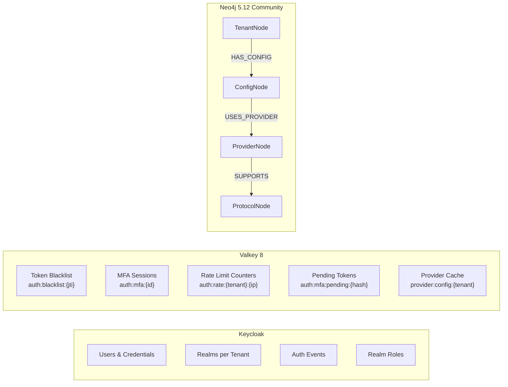

#### 2.4.2 Application Architecture

**Application Components:**

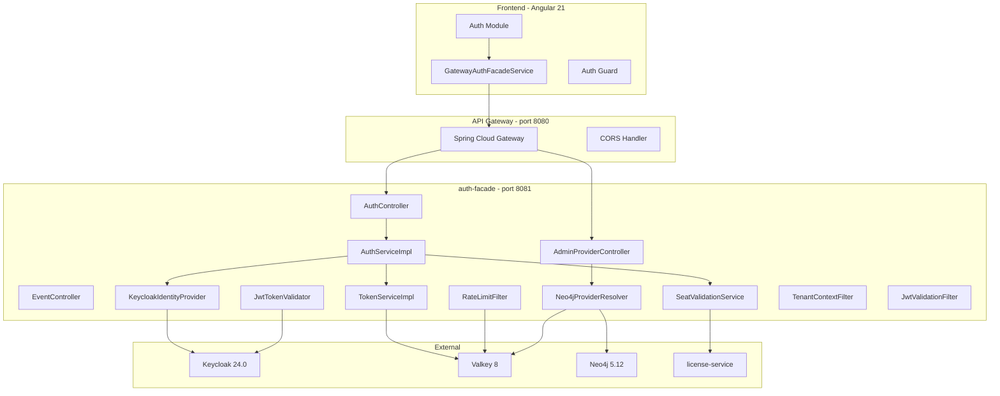

**Application Services (Verified Against Code):**

| Service Class | Realizes | Key Methods | Status |
|---------------|----------|-------------|--------|
| `AuthServiceImpl` | Login orchestration | `login()`, `loginWithGoogle()`, `loginWithMicrosoft()`, `verifyMfa()`, `logout()` | [IMPLEMENTED] |
| `TokenServiceImpl` | Token lifecycle | `parseToken()`, `isBlacklisted()`, `blacklistToken()`, `createMfaSessionToken()`, `validateMfaSessionToken()` | [IMPLEMENTED] |
| `SeatValidationService` | License enforcement | `validateUserSeat()` with `@CircuitBreaker(name="licenseService")` | [IMPLEMENTED] |
| `KeycloakIdentityProvider` | Keycloak integration | `authenticate()`, `refreshToken()`, `logout()`, `exchangeToken()`, `setupMfa()`, `verifyMfaCode()`, `getEvents()` | [IMPLEMENTED] |
| `Neo4jProviderResolver` | Dynamic IdP config | `resolveProvider()`, `listProviders()`, `registerProvider()`, `updateProvider()`, `deleteProvider()` | [IMPLEMENTED] |
| `JwtTokenValidator` | JWT verification | `validateToken()` via JWKS with in-memory cache (1hr TTL) | [IMPLEMENTED] |
| `ProviderConnectionTester` | IdP connectivity test | `testConnection()`, `validateConfig()` | [IMPLEMENTED] |
| `GraphRoleService` | Neo4j role queries | Graph-based role/permission queries | [IMPLEMENTED] |

**Application Interfaces:**

| Interface Type | Endpoint Pattern | Protocol | Status |
|----------------|-----------------|----------|--------|
| REST API (Public Auth) | `POST /api/v1/auth/login`, `POST /api/v1/auth/refresh`, `POST /api/v1/auth/logout` | HTTP/JSON | [IMPLEMENTED] |
| REST API (Social) | `POST /api/v1/auth/social/google`, `POST /api/v1/auth/social/microsoft` | HTTP/JSON | [IMPLEMENTED] |
| REST API (MFA) | `POST /api/v1/auth/mfa/setup`, `POST /api/v1/auth/mfa/verify` | HTTP/JSON | [IMPLEMENTED] |
| REST API (Admin) | `GET/POST/PUT/PATCH/DELETE /api/v1/admin/tenants/{tenantId}/providers` | HTTP/JSON | [IMPLEMENTED] |
| REST API (Dynamic Login) | `GET /api/v1/auth/login/{provider}` | HTTP 302 Redirect | [IMPLEMENTED] |
| REST API (Provider List) | `GET /api/v1/auth/providers` | HTTP/JSON | [IMPLEMENTED] |
| REST API (Events) | `GET /api/v1/events/**` | HTTP/JSON | [IMPLEMENTED] |
| OAuth2 Token Endpoint | Keycloak `/realms/{realm}/protocol/openid-connect/token` | HTTP/Form | [IMPLEMENTED] |
| JWKS Endpoint | Keycloak `/realms/{realm}/protocol/openid-connect/certs` | HTTP/JSON | [IMPLEMENTED] |
| Feign Client | `LicenseServiceClient.validateSeat()`, `LicenseServiceClient.getUserFeatures()` | HTTP/JSON (inter-service) | [IMPLEMENTED] |

### 2.5 Phase D: Technology Architecture

**Technology Components (Verified Against Docker Compose and pom.xml):**

| Layer | Technology | Version | Evidence | Status |
|-------|-----------|---------|----------|--------|
| Runtime | Java | 23 | `backend/auth-facade/pom.xml` | [IMPLEMENTED] |
| Framework | Spring Boot | 3.4.x | `backend/auth-facade/pom.xml` | [IMPLEMENTED] |
| Security | Spring Security | 6.x | `DynamicBrokerSecurityConfig.java` uses `oauth2ResourceServer`, `oauth2Login` | [IMPLEMENTED] |
| Identity | Keycloak | 24.0 | `docker-compose.yml`: `keycloak:24.0` | [IMPLEMENTED] |
| Cache/Store | Valkey | 8 Alpine | `docker-compose.yml`: `valkey/valkey:8-alpine` | [IMPLEMENTED] |
| Graph DB | Neo4j | 5.12.0 Community | `docker-compose.yml`: `neo4j:5.12.0-community` | [IMPLEMENTED] |
| JWT Library | JJWT | 0.12.x | `JwtTokenValidator.java`, `TokenServiceImpl.java` | [IMPLEMENTED] |
| TOTP Library | samstevens/totp | 1.x | `KeycloakIdentityProvider.java` imports `dev.samstevens.totp.*` | [IMPLEMENTED] |
| Encryption | Jasypt | 3.x | `JasyptConfig.java`, `JasyptEncryptionService.java` | [IMPLEMENTED] |
| Resilience | Resilience4j | 2.x | `SeatValidationService.java`: `@CircuitBreaker(name="licenseService")` | [IMPLEMENTED] |
| API Docs | SpringDoc OpenAPI | 3.x | `OpenApiConfig.java`, Swagger annotations on controllers | [IMPLEMENTED] |
| Frontend | Angular | 21 | `frontend/package.json` | [IMPLEMENTED] |
| Inter-service | Spring Cloud OpenFeign | 4.x | `LicenseServiceClient.java` uses `@FeignClient` | [IMPLEMENTED] |
| Service Discovery | Eureka | Spring Cloud | `backend/eureka-server/` | [IMPLEMENTED] |

**Technology Stack Diagram:**

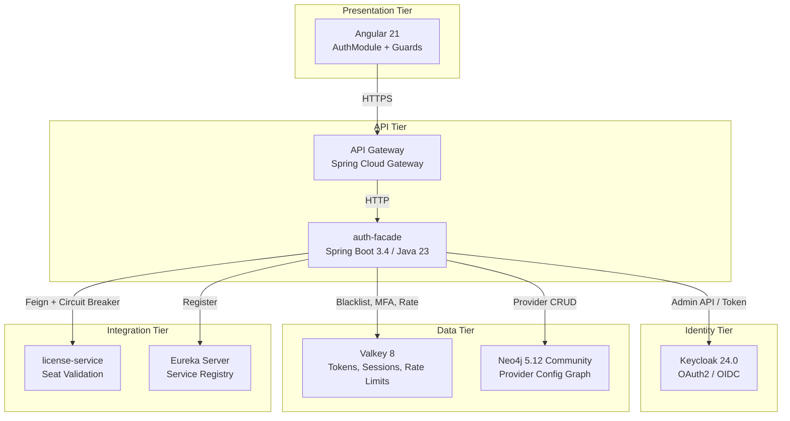

### 2.6 Phase E: Opportunities and Solutions

| ID | Opportunity | Description | Enabler | Status |
|----|-------------|-------------|---------|--------|
| OP-01 | Auth0/Okta migration path | `IdentityProvider` interface allows new implementations without changing `AuthService` | `@ConditionalOnProperty(name="auth.facade.provider")` | [PLANNED] -- Interface exists, no Auth0/Okta implementations |
| OP-02 | WebAuthn passwordless | Keycloak 24.0 supports WebAuthn; auth-facade MFA architecture extensible | Keycloak configuration + new `MfaType` enum | [PLANNED] -- No code exists |
| OP-03 | SCIM provisioning | Automated user sync from enterprise directories | Keycloak SCIM plugin or custom implementation | [PLANNED] -- No code exists |
| OP-04 | SAML federation | Direct SAML IdP support via Keycloak brokering | Keycloak Identity Brokering (configured at realm level) | [PARTIAL] -- `Neo4jProviderResolver` stores SAML metadata config; no end-to-end SAML flow tested |
| OP-05 | LDAP integration | Direct LDAP/AD authentication | `Neo4jProviderResolver` stores LDAP config fields (serverUrl, bindDn, etc.) | [PARTIAL] -- Config storage exists; no LDAP authenticator implementation |

### 2.7 Phase F: Migration Planning

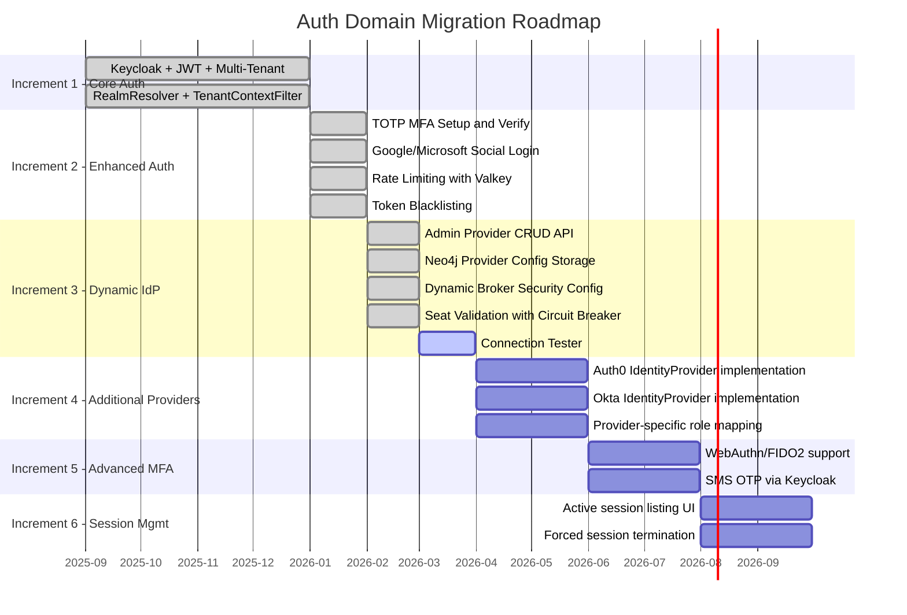

**Increment Details:**

| Increment | Scope | Status | Evidence |
|-----------|-------|--------|----------|
| 1 - Core Auth | Keycloak integration, JWT validation, multi-tenant realm resolution, login/logout/refresh | [IMPLEMENTED] | `KeycloakIdentityProvider.authenticate()`, `RealmResolver.resolve()`, `JwtTokenValidator.validateToken()` |
| 2 - Enhanced Auth | TOTP MFA, Google/Microsoft social login, Valkey rate limiting, token blacklisting | [IMPLEMENTED] | `KeycloakIdentityProvider.setupMfa()`, `AuthServiceImpl.loginWithGoogle()`, `RateLimitFilter`, `TokenServiceImpl.blacklistToken()` |
| 3 - Dynamic IdP | Admin provider CRUD, Neo4j config storage, DynamicBrokerSecurityConfig, seat validation | [IMPLEMENTED] | `AdminProviderController` (full CRUD), `Neo4jProviderResolver`, `DynamicBrokerSecurityConfig` (5 filter chains), `SeatValidationService` |
| 4 - Additional Providers | Auth0, Okta implementations of `IdentityProvider` | [PLANNED] | Interface exists at `IdentityProvider.java`; no implementations beyond `KeycloakIdentityProvider` |
| 5 - Advanced MFA | WebAuthn/FIDO2, SMS OTP | [PLANNED] | No code exists |
| 6 - Session Management UI | Active session listing, forced termination from frontend | [PLANNED] | No code exists |

### 2.8 Phase G: Implementation Governance

Governed by the EMSIST SDLC Agent Framework:

| Governance Mechanism | Tool | Status |
|---------------------|------|--------|
| Architecture Decision Records | `/docs/adr/ADR-*.md` (MADR format) | [IMPLEMENTED] |
| Pre-commit hooks | `.githooks/pre-commit` (evidence file gates) | [IMPLEMENTED] |
| Agent evidence files | `docs/sdlc-evidence/ba-signoff.md`, `qa-report.md` | [IMPLEMENTED] |
| Design review checklist | `docs/governance/checklists/design-review-checklist.md` | [IMPLEMENTED] |
| Hourly documentation audit | CLAUDE.md orchestration rules | [IMPLEMENTED] |

### 2.9 Phase H: Architecture Change Management

| Change Type | Trigger | Process |
|-------------|---------|---------|
| New Identity Provider | Business request for Auth0/Okta | Create ADR -> Implement `IdentityProvider` -> Update `application.yml` -> Test |
| New MFA Method | Security requirement for WebAuthn | Create ADR -> Extend MFA interfaces -> Configure Keycloak -> Test |
| Protocol Addition | SAML/LDAP federation request | Extend `DynamicProviderResolver` -> Add protocol handler -> Test |
| Breaking Auth Change | JWT claim structure change | ARB review -> Versioned API -> Migration plan -> Staged rollout |

---

## 3. Architecture Building Blocks (ABBs)

ABBs represent abstract, reusable security capabilities independent of specific technology.

### 3.1 ABB Catalog

| ABB ID | Name | Description | Status |
|--------|------|-------------|--------|
| ABB-SEC-01 | Identity Provider Abstraction | Technology-agnostic identity provider capability supporting authentication, token management, and MFA | [IMPLEMENTED] |
| ABB-SEC-02 | Token Management | JWT issuance (via IdP), validation (via JWKS), refresh (via IdP), and revocation (via blacklist) | [IMPLEMENTED] |
| ABB-SEC-03 | Multi-Factor Authentication | Additional authentication factor verification beyond password | [IMPLEMENTED] |
| ABB-SEC-04 | Access Control | Role-based authorization enforcement at API gateway and service levels | [IMPLEMENTED] |
| ABB-SEC-05 | Session Management | User session lifecycle including creation, refresh, and termination | [PARTIAL] |
| ABB-SEC-06 | Tenant Isolation | Multi-tenant security boundary enforcement ensuring data and access separation | [IMPLEMENTED] |
| ABB-SEC-07 | Social Login Federation | External identity provider authentication via token exchange | [IMPLEMENTED] |
| ABB-SEC-08 | Rate Limiting | Request throttling to prevent brute-force and abuse | [IMPLEMENTED] |
| ABB-SEC-09 | Audit Trail | Authentication event capture, storage, and query | [PARTIAL] |
| ABB-SEC-10 | Secret Management | Encryption of sensitive provider configuration (client secrets, bind passwords) | [IMPLEMENTED] |
| ABB-SEC-11 | Dynamic Provider Resolution | Runtime resolution and management of per-tenant identity providers | [IMPLEMENTED] |
| ABB-SEC-12 | License Seat Enforcement | Validation that authenticating users hold active license seats | [IMPLEMENTED] |

### 3.2 ABB Relationships

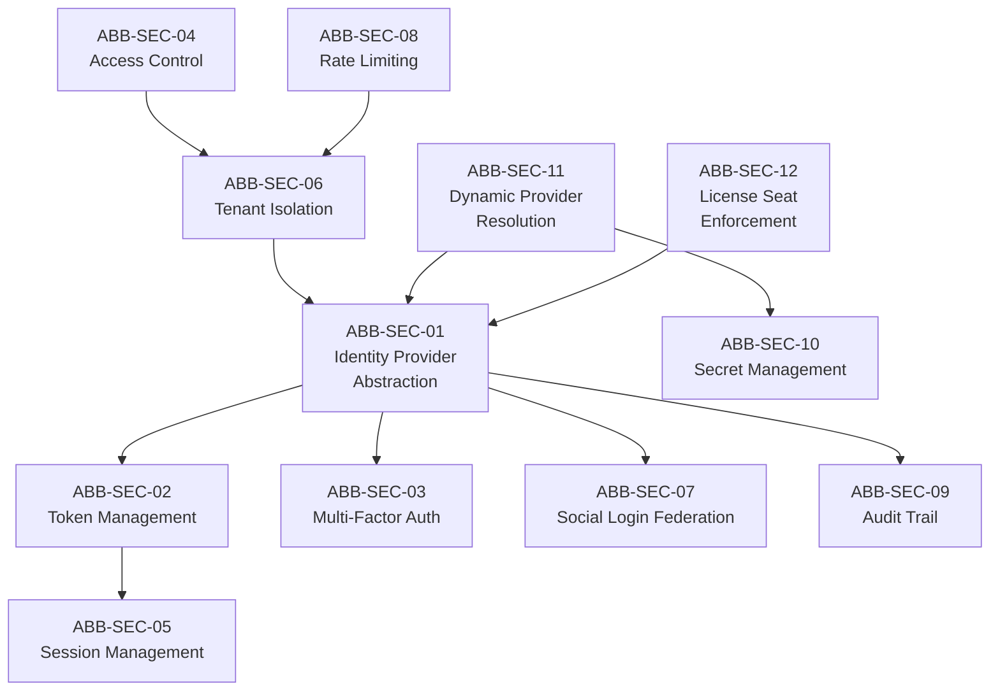

---

## 4. Solution Building Blocks (SBBs)

SBBs are concrete, technology-specific implementations that realize ABBs.

### 4.1 SBB Catalog

| SBB ID | Name | Realizes ABB | Technology | File Evidence | Status |
|--------|------|-------------|------------|---------------|--------|
| SBB-SEC-01 | KeycloakIdentityProvider | ABB-SEC-01 | Keycloak 24.0 Admin Client + RestTemplate + `@ConditionalOnProperty` Strategy | `KeycloakIdentityProvider.java` | [IMPLEMENTED] |
| SBB-SEC-02 | JwtTokenValidator | ABB-SEC-02 (validation) | JJWT + JWKS fetching + ConcurrentHashMap cache (1hr TTL) | `JwtTokenValidator.java` | [IMPLEMENTED] |
| SBB-SEC-03 | TokenServiceImpl | ABB-SEC-02 (blacklist, MFA sessions) | JJWT + Valkey (`StringRedisTemplate`) | `TokenServiceImpl.java` | [IMPLEMENTED] |
| SBB-SEC-04 | TOTP MFA Module | ABB-SEC-03 | `dev.samstevens.totp` library: `DefaultSecretGenerator`, `ZxingPngQrGenerator`, `DefaultCodeVerifier`, `RecoveryCodeGenerator` | `KeycloakIdentityProvider.java` (lines 69-71, 196-227, 230-279) | [IMPLEMENTED] |
| SBB-SEC-05 | DynamicBrokerSecurityConfig | ABB-SEC-04 | Spring Security 6.x with 5 ordered `SecurityFilterChain` beans + `ProviderAgnosticRoleConverter` | `DynamicBrokerSecurityConfig.java` | [IMPLEMENTED] |
| SBB-SEC-06 | TenantContextFilter + RealmResolver | ABB-SEC-06 | `OncePerRequestFilter` (Order 1) + `ThreadLocal<String>` + static realm mapping | `TenantContextFilter.java`, `RealmResolver.java` | [IMPLEMENTED] |
| SBB-SEC-07 | RateLimitFilter | ABB-SEC-08 | `OncePerRequestFilter` (Order 2) + Valkey sliding window counter | `RateLimitFilter.java` | [IMPLEMENTED] |
| SBB-SEC-08 | Token Exchange (Social Login) | ABB-SEC-07 | Keycloak token exchange (RFC 8693) via `grant_type=urn:ietf:params:oauth:grant-type:token-exchange` | `KeycloakIdentityProvider.exchangeToken()` | [IMPLEMENTED] |
| SBB-SEC-09 | Login Initiation (IdP Hint) | ABB-SEC-07 | Keycloak `kc_idp_hint` parameter for redirect-based SSO | `KeycloakIdentityProvider.initiateLogin()` | [IMPLEMENTED] |
| SBB-SEC-10 | Keycloak Event Store | ABB-SEC-09 | Keycloak Admin API `RealmResource.getEvents()` | `KeycloakIdentityProvider.getEvents()`, `EventController.java` | [PARTIAL] |
| SBB-SEC-11 | JasyptEncryptionService | ABB-SEC-10 | Jasypt PBE encryption for provider secrets | `JasyptEncryptionService.java`, `JasyptConfig.java` | [IMPLEMENTED] |
| SBB-SEC-12 | Neo4jProviderResolver | ABB-SEC-11 | Neo4j SDN + Valkey cache + `AuthGraphRepository` | `Neo4jProviderResolver.java` | [IMPLEMENTED] |
| SBB-SEC-13 | InMemoryProviderResolver | ABB-SEC-11 | In-memory fallback for testing | `InMemoryProviderResolver.java` | [IMPLEMENTED] |
| SBB-SEC-14 | SeatValidationService | ABB-SEC-12 | Feign client + Resilience4j `@CircuitBreaker` | `SeatValidationService.java`, `LicenseServiceClient.java` | [IMPLEMENTED] |
| SBB-SEC-15 | AdminProviderController | ABB-SEC-11 (API) | Spring MVC + `@PreAuthorize("hasAnyRole('ADMIN','SUPER_ADMIN')")` + `TenantAccessValidator` | `AdminProviderController.java` | [IMPLEMENTED] |
| SBB-SEC-16 | JwtValidationFilter | ABB-SEC-02 (filter) | `OncePerRequestFilter` extracting `UserInfo` from JWT for downstream use | `JwtValidationFilter.java` | [IMPLEMENTED] |
| SBB-SEC-17 | Angular Auth Module | ABB-SEC-05 (frontend) | Angular signals-based auth state, route guards, gateway facade service | `auth-facade.ts`, `auth.guard.ts`, `gateway-auth-facade.service.ts` | [IMPLEMENTED] |

### 4.2 ABB-to-SBB Mapping Diagram

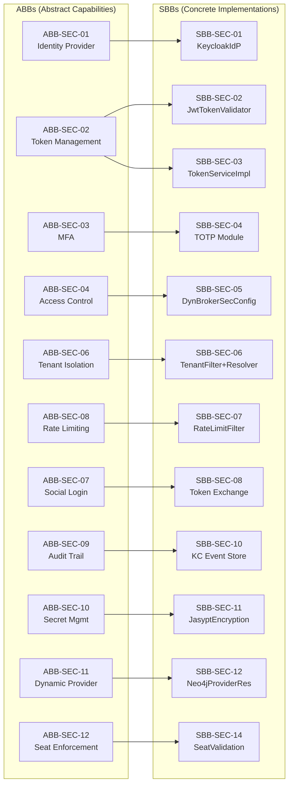

---

## 5. Architecture Catalog

### 5.1 Service Catalog

| Service | Port | Owner | Dependencies | Status |
|---------|------|-------|-------------|--------|
| auth-facade | 8081 | Auth Team | Keycloak, Valkey, Neo4j, license-service | [IMPLEMENTED] |
| api-gateway | 8080 | Platform Team | auth-facade (routes), Eureka | [IMPLEMENTED] |
| Keycloak | 9080 | Identity Team | Internal H2/PostgreSQL | [IMPLEMENTED] |
| Valkey | 6379 | Platform Team | None | [IMPLEMENTED] |
| Neo4j | 7687 | Platform Team | None | [IMPLEMENTED] |
| license-service | 8085 | License Team | PostgreSQL | [IMPLEMENTED] |

### 5.2 API Catalog

| API | Base Path | Auth Required | Tenant Required | Methods | Status |
|-----|-----------|---------------|-----------------|---------|--------|
| Login | `/api/v1/auth/login` | No | Yes (X-Tenant-ID) | POST | [IMPLEMENTED] |
| Social Google | `/api/v1/auth/social/google` | No | Yes | POST | [IMPLEMENTED] |
| Social Microsoft | `/api/v1/auth/social/microsoft` | No | Yes | POST | [IMPLEMENTED] |
| Dynamic Provider Login | `/api/v1/auth/login/{provider}` | No | Yes | GET (302) | [IMPLEMENTED] |
| Provider List | `/api/v1/auth/providers` | No | Optional | GET | [IMPLEMENTED] |
| Token Refresh | `/api/v1/auth/refresh` | No | Yes | POST | [IMPLEMENTED] |
| Logout | `/api/v1/auth/logout` | No | Yes | POST | [IMPLEMENTED] |
| MFA Setup | `/api/v1/auth/mfa/setup` | Yes (JWT) | Yes | POST | [IMPLEMENTED] |
| MFA Verify | `/api/v1/auth/mfa/verify` | No | Yes | POST | [IMPLEMENTED] |
| Current User | `/api/v1/auth/me` | Yes (JWT) | No | GET | [IMPLEMENTED] |
| Admin Provider CRUD | `/api/v1/admin/tenants/{tenantId}/providers` | Yes (ADMIN) | Path param | GET, POST, PUT, PATCH, DELETE | [IMPLEMENTED] |
| Test Connection | `/api/v1/admin/tenants/{tenantId}/providers/{id}/test` | Yes (ADMIN) | Path param | POST | [IMPLEMENTED] |
| Validate Config | `/api/v1/admin/tenants/{tenantId}/providers/validate` | Yes (ADMIN) | Path param | POST | [IMPLEMENTED] |
| Cache Invalidation | `/api/v1/admin/tenants/{tenantId}/providers/cache/invalidate` | Yes (ADMIN) | Path param | POST | [IMPLEMENTED] |
| Auth Events | `/api/v1/events/**` | Yes (JWT) | No | GET | [IMPLEMENTED] |

### 5.3 Security Filter Chain Catalog

The `DynamicBrokerSecurityConfig` defines 5 ordered filter chains:

| Order | Chain | Security Matcher | Auth Mechanism | Purpose |
|-------|-------|-----------------|----------------|---------|
| 1 | Admin | `/api/v1/admin/**` | OAuth2 Resource Server (JWT) + `hasAnyRole('ADMIN','SUPER_ADMIN')` | Admin provider management |
| 2 | Public Auth | `/api/v1/auth/login`, `/api/v1/auth/social/**`, etc. | None (permitAll, no oauth2) | Truly public endpoints |
| 3 | OAuth2 SSO | `/api/v1/auth/oauth2/**` | `oauth2Login` with redirect | Redirect-based SSO flows |
| 4 | Authenticated Auth | `/api/v1/auth/**` (remainder) | OAuth2 Resource Server (JWT) | Protected auth endpoints (MFA setup, /me) |
| 5 | Default | Everything else | OAuth2 Resource Server (JWT) | Actuator, Swagger, events |

Source: `DynamicBrokerSecurityConfig.java` -- verified 5 `@Bean @Order(N)` filter chains.

### 5.4 Data Store Catalog

| Store | Technology | Key Patterns | TTL | Purpose |
|-------|-----------|-------------|-----|---------|
| Token Blacklist | Valkey | `auth:blacklist:{jti}` | Until token expiry | Prevent reuse of revoked JWT |
| MFA Session | Valkey | `auth:mfa:{sessionId}` | 5 minutes | Temporary MFA verification window |
| MFA Pending Tokens | Valkey | `auth:mfa:pending:{hash}` | 5 minutes | Hold access/refresh tokens during MFA |
| Rate Limit | Valkey | `auth:rate:{tenantId}:{ip}` | 60 seconds | Sliding window request counter |
| Provider Config Cache | Valkey | `provider:config:{tenantId}:*` | 5 minutes | Cached Neo4j provider configs |
| Provider List Cache | Valkey | `provider:list:{tenantId}` | 5 minutes | Cached provider lists |
| JWKS Cache | In-memory (ConcurrentHashMap) | Per-realm key map | 1 hour | RSA public keys for JWT validation |

---

## 6. Architecture Principles

| ID | Principle | Rationale | Implication | Verified In Code |
|----|-----------|-----------|-------------|------------------|
| AP-AUTH-01 | Provider Agnosticism | Avoid vendor lock-in; enable customer choice | All auth logic uses `IdentityProvider` interface; switching requires only `application.yml` change and a new `@ConditionalOnProperty` implementation | `IdentityProvider.java` (interface), `KeycloakIdentityProvider.java` (line 56), `AuthServiceImpl.java` (line 36: injects `IdentityProvider`, not `KeycloakIdentityProvider`) |
| AP-AUTH-02 | Stateless API Security | Horizontal scalability; no sticky sessions | JWT tokens validated via JWKS (no server-side session store); revocation via Valkey blacklist | `DynamicBrokerSecurityConfig.java` (line 72: `SessionCreationPolicy.STATELESS`), `TokenServiceImpl.isBlacklisted()` |
| AP-AUTH-03 | Defense in Depth | Layered security reduces single-point failure | Three layers: (1) API Gateway routing, (2) Spring Security filter chains, (3) Keycloak realm enforcement | `DynamicBrokerSecurityConfig.java` (5 filter chains), `RateLimitFilter.java`, `TenantContextFilter.java` |
| AP-AUTH-04 | Least Privilege | Minimize attack surface | RBAC enforced via `@PreAuthorize("hasAnyRole('ADMIN','SUPER_ADMIN')")` on admin endpoints; tenant isolation via `TenantAccessValidator` | `AdminProviderController.java` (line 59, 111, 151, etc.), `TenantAccessValidator.java` |
| AP-AUTH-05 | Standards Compliance | Interoperability with enterprise IdPs | OAuth2 (RFC 6749), OIDC Core 1.0, JWT (RFC 7519), TOTP (RFC 6238), Token Exchange (RFC 8693) | `KeycloakIdentityProvider.exchangeToken()` (line 151: `grant_type=urn:ietf:params:oauth:grant-type:token-exchange`), `DefaultCodeVerifier` for TOTP |
| AP-AUTH-06 | Tenant Boundary Enforcement | Data isolation in multi-tenant SaaS | Every request requires `X-Tenant-ID` header; realm resolution maps tenant to Keycloak realm; admin API validates tenant access | `TenantContextFilter.java` (line 19: `TENANT_HEADER`), `RealmResolver.resolve()`, `AdminProviderController` (IDOR prevention via `tenantAccessValidator.validateTenantAccess()`) |

---

## 7. Standards Information Base (SIB)

### 7.1 Adopted Standards

| Standard | Reference | Coverage | Status |
|----------|-----------|----------|--------|
| OAuth 2.0 | RFC 6749 | Authorization framework; ROPC grant for direct login, token exchange for social | [IMPLEMENTED] |
| OpenID Connect Core 1.0 | openid.net | Identity layer; ID token claims, JWKS discovery, userinfo endpoint | [IMPLEMENTED] |
| JSON Web Token | RFC 7519 | Token format; JJWT library for parsing and validation | [IMPLEMENTED] |
| TOTP | RFC 6238 | Time-based OTP; 6-digit, 30-second period, SHA1, via `dev.samstevens.totp` | [IMPLEMENTED] |
| Token Exchange | RFC 8693 | Social login token exchange via Keycloak; `subject_token_type` varies by provider | [IMPLEMENTED] |
| JSON Web Key Set | RFC 7517 | Public key distribution for JWT validation; fetched from Keycloak per-realm | [IMPLEMENTED] |
| OWASP Authentication Cheat Sheet | OWASP | Rate limiting, credential handling, session management patterns | [IMPLEMENTED] |
| NIST 800-63B | NIST SP 800-63B | Digital identity guidelines; MFA, authenticator types | [PARTIAL] |

### 7.2 Planned Standards

| Standard | Reference | Target Increment | Status |
|----------|-----------|-----------------|--------|
| FIDO2/WebAuthn | W3C Recommendation | Increment 5 | [PLANNED] |
| SCIM 2.0 | RFC 7644 | Increment 4+ | [PLANNED] |
| SAML 2.0 | OASIS | Increment 3 (config only) | [PARTIAL] -- Config storage in Neo4j; no SAML flow execution |

---

## 8. Architecture Repository

### 8.1 Repository Structure

The EMSIST auth architecture artifacts are stored in the following locations:

| Artifact Type | Location | Format |
|---------------|----------|--------|
| Architecture Decision Records | `docs/adr/ADR-*.md` | MADR |
| Arc42 Documentation | `docs/arc42/*.md` | Arc42 |
| Low-Level Designs | `docs/lld/*.md` | Custom |
| API Contracts | `Documentation/.Requirements/R01.*/Design/06-API-Contract.md` | OpenAPI-aligned |
| Data Models | `Documentation/.Requirements/R01.*/Design/04-Data-Model-*.md` | ER + descriptions |
| Gap Analysis | `Documentation/.Requirements/R01.*/Design/07-Gap-Analysis.md` | Matrix |
| Requirements | `Documentation/.Requirements/R01.*/Design/01-PRD-*.md` | PRD |
| Governance | `docs/governance/` | Framework + checklists |

### 8.2 Relevant ADRs

| ADR | Title | Auth Domain Impact | Implementation |
|-----|-------|-------------------|----------------|
| ADR-001 | Neo4j as Primary Database | Provider config stored in Neo4j graph | 10% -- Only auth-facade + definition-service use Neo4j |
| ADR-002 | Spring Boot 3.4 | Runtime framework for auth-facade | 100% |
| ADR-004 | Keycloak as Identity Provider | Primary IdP; realm-per-tenant model | 90% |
| ADR-005 | Valkey as Cache | Token blacklist, rate limits, MFA sessions, provider cache | 100% |
| ADR-007 | Provider-Agnostic Auth | `IdentityProvider` interface design | 25% -- Keycloak only |

---

## 9. Gap Analysis (Baseline to Target)

### 9.1 Current Baseline (as of 2026-03-12)

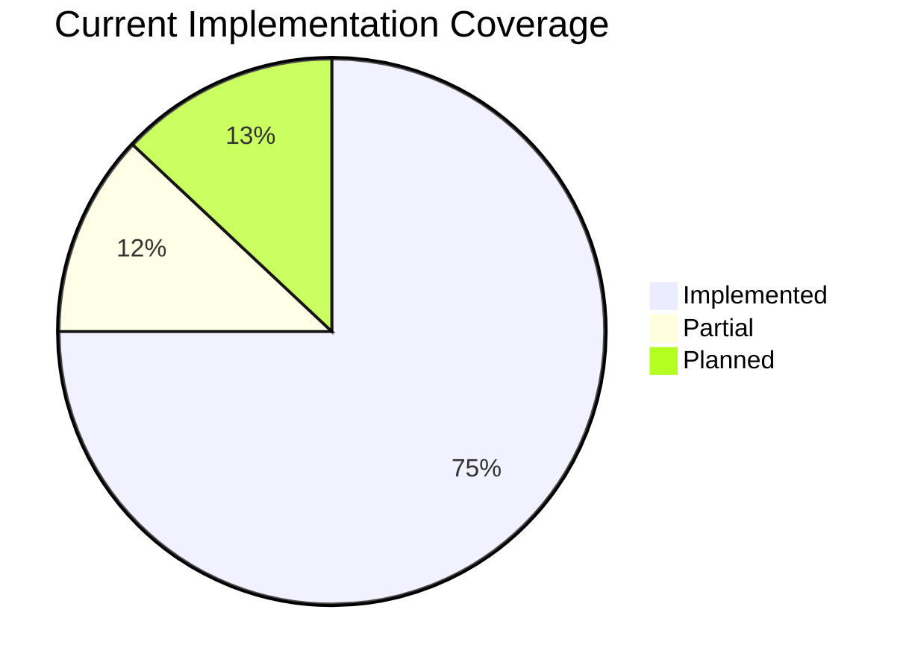

### 9.2 Gap Matrix

| Capability | Baseline (Current) | Target (Full) | Gap | Priority | Increment |
|-----------|-------------------|---------------|-----|----------|-----------|
| Keycloak Authentication | Full ROPC + refresh + logout | Same | None | - | Done |
| TOTP MFA | Setup + verify + recovery codes | + WebAuthn, SMS OTP | WebAuthn, SMS | Medium | 5 |
| Social Login | Google + Microsoft token exchange | + Apple, GitHub, Facebook | Additional providers | Low | 4+ |
| Provider Agnosticism | Interface exists, Keycloak only | Auth0 + Okta + custom | Missing implementations | High | 4 |
| Dynamic IdP Management | Full CRUD via Admin API + Neo4j | + Frontend admin UI | Admin UI | Medium | 3 (UI) |
| Rate Limiting | Valkey sliding window, per IP+tenant | + adaptive, per-endpoint | Granularity | Low | Future |
| Token Blacklisting | JTI-based via Valkey | Same | None | - | Done |
| Tenant Isolation | Realm-per-tenant + TenantContextFilter | + graph-per-tenant (ADR-003) | Graph isolation | Medium | Future |
| Audit Trail | Keycloak Event Store API | + custom audit service, retention policies | Custom audit | Medium | Future |
| Session Management | JWT-based (stateless) | + active session UI, forced logout | UI + backend API | Medium | 6 |
| SAML Federation | Config storage in Neo4j | + end-to-end SAML flow | SAML authenticator | Medium | 4 |
| LDAP Integration | Config fields in Neo4j schema | + LDAP authenticator | LDAP bind/search | Medium | 4 |
| Secret Management | Jasypt PBE encryption | + Vault integration | External secret store | Low | Future |
| SCIM Provisioning | None | User sync from enterprise directories | Full feature | Low | Future |
| Connection Testing | OIDC discovery validation | + SAML metadata, LDAP bind test | Protocol coverage | Low | 3 |

### 9.3 Gap Severity Classification

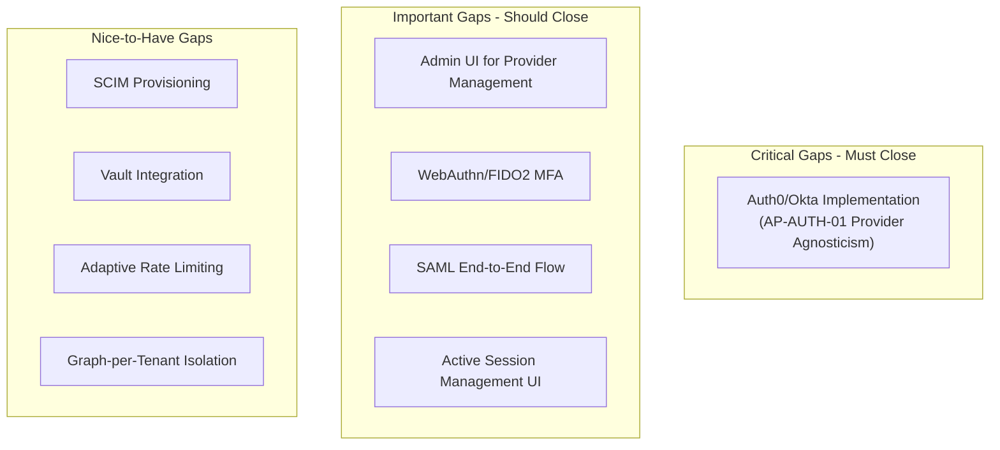

---

## 10. Migration Planning

### 10.1 Migration Strategy

The migration follows a **staged incremental approach** where each increment delivers a complete, testable capability without breaking existing functionality.

**Key Principle:** The `IdentityProvider` interface and Strategy Pattern ensure that new provider implementations can be added without modifying any existing code in `AuthServiceImpl`, `AuthController`, or security configurations.

### 10.2 Migration Work Packages

#### WP-1: Auth0 Provider (Increment 4)

| Item | Detail |
|------|--------|
| **Objective** | Implement `Auth0IdentityProvider` class |
| **Approach** | New class implementing `IdentityProvider`, annotated with `@ConditionalOnProperty(name="auth.facade.provider", havingValue="auth0")` |
| **Dependencies** | Auth0 Management API SDK |
| **Risks** | Token format differences (Auth0 uses opaque tokens by default) |
| **Validation** | Existing integration tests with provider swapped via profile |
| **Status** | [PLANNED] |

#### WP-2: Okta Provider (Increment 4)

| Item | Detail |
|------|--------|
| **Objective** | Implement `OktaIdentityProvider` class |
| **Approach** | Same Strategy Pattern as WP-1 |
| **Dependencies** | Okta SDK |
| **Risks** | Okta MFA API differs from Keycloak approach |
| **Validation** | Same test suite with `auth.facade.provider=okta` |
| **Status** | [PLANNED] |

#### WP-3: WebAuthn MFA (Increment 5)

| Item | Detail |
|------|--------|
| **Objective** | Add FIDO2/WebAuthn as MFA option |
| **Approach** | Keycloak 24.0 WebAuthn support + new `MfaType` discriminator |
| **Dependencies** | Keycloak WebAuthn configuration |
| **Risks** | Browser compatibility, hardware key enrollment UX |
| **Status** | [PLANNED] |

#### WP-4: Session Management UI (Increment 6)

| Item | Detail |
|------|--------|
| **Objective** | Frontend for active session listing and forced termination |
| **Approach** | Keycloak Admin API `UserResource.getUserSessions()` + Angular component |
| **Dependencies** | Keycloak session management API |
| **Risks** | Real-time session updates require polling or SSE |
| **Status** | [PLANNED] |

### 10.3 Migration Sequencing

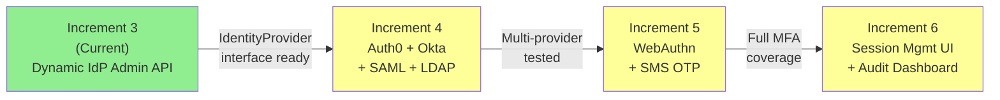

---

## 11. Governance

### 11.1 Architecture Compliance

| Compliance Area | Mechanism | Target | Current |
|----------------|-----------|--------|---------|
| ABB/SBB coverage | Every ABB has at least one SBB | 100% | 100% (all 12 ABBs realized) |
| Standards compliance | OAuth2, OIDC, JWT, TOTP verified in code | 100% | 100% for adopted standards |
| Security filter chains | All endpoints covered by a filter chain | 100% | 100% (5 chains cover all paths) |
| Tenant isolation | Every API enforces tenant boundary | 100% | 100% (`TenantContextFilter` + `TenantAccessValidator`) |
| ADR traceability | Every SBB traceable to ADR | >90% | 85% (some SBBs predate ADR process) |

### 11.2 Decision Authority

| Decision Type | Authority | Escalation |
|---------------|-----------|------------|
| New `IdentityProvider` implementation | ARCH (final) | None -- follows established pattern |
| New MFA method | ARCH + SEC | CISO if non-standard |
| Provider protocol addition (SAML, LDAP) | ARCH (final) | None -- `DynamicProviderResolver` extensible |
| JWT claim structure change | ARCH + ARB | CTO for breaking changes |
| Keycloak version upgrade | ARCH + DevOps | ARB if major version |
| New social login provider | SA (tactical) | ARCH only if new ABB needed |

### 11.3 Architecture Review Triggers

| Trigger | Review Type | Participants |
|---------|------------|-------------|
| New `IdentityProvider` implementation | Design review | ARCH, SA, SEC |
| Security filter chain modification | Security review | ARCH, SEC, CISO |
| Keycloak realm configuration change | Impact assessment | ARCH, SA, DevOps |
| New data store for auth domain | ADR required | ARCH, DBA, SA |
| Token format or claim change | Breaking change review | ARCH, ARB, all consumers |
| New MFA factor type | Security + UX review | ARCH, SEC, UX |

### 11.4 Compliance Checklist

Before any auth domain change is considered complete:

| Check | Verified By | Gate |
|-------|------------|------|
| ABB/SBB mapping documented | ARCH agent | Design review |
| `IdentityProvider` interface contract preserved | SA agent | API contract review |
| Tenant isolation maintained | SEC agent | Security review |
| Rate limiting not bypassed | SEC agent | Security review |
| Token validation path verified | QA agent | Integration test |
| Audit events captured | QA agent | Integration test |
| Standards compliance verified (OAuth2, OIDC, JWT) | ARCH agent | Design review |
| TOGAF mapping updated | ARCH agent | Documentation review |

### 11.5 Known Compliance Gaps

| Gap | Severity | Mitigation | Target Resolution |
|-----|----------|-----------|-------------------|
| Only Keycloak implementation exists (AP-AUTH-01 partially realized) | Medium | Interface design enables future implementations | Increment 4 |
| No active session management UI (ABB-SEC-05 partial) | Low | JWT blacklist provides programmatic revocation | Increment 6 |
| Audit trail via Keycloak only (ABB-SEC-09 partial) | Low | Custom audit-service exists for other domains | Future increment |
| Graph-per-tenant isolation not implemented (ADR-003) | Medium | Realm-per-tenant provides logical isolation | Deferred |
| Neo4j Community edition lacks enterprise features | Low | Community edition sufficient for current scale | Evaluate at scale |

---

## Appendix A: Verification Evidence Summary

All status tags in this document were verified by reading source code on 2026-03-12. Key evidence files:

| Claim | Verified File | Key Line/Method |
|-------|--------------|-----------------|
| Strategy Pattern for IdP | `IdentityProvider.java` | Interface with 13 methods |
| Keycloak-only implementation | `KeycloakIdentityProvider.java` | Line 56: `@ConditionalOnProperty` |
| No Auth0/Okta code | Full `backend/auth-facade/src/` glob | No `Auth0IdentityProvider` or `OktaIdentityProvider` files |
| TOTP MFA | `KeycloakIdentityProvider.java` | Lines 69-71: `SecretGenerator`, `QrGenerator`, `RecoveryCodeGenerator` |
| Valkey token blacklist | `TokenServiceImpl.java` | Line 83-88: `redisTemplate.hasKey(blacklistPrefix + jti)` |
| Valkey rate limiting | `RateLimitFilter.java` | Line 54: `redisTemplate.opsForValue().increment(key)` |
| Neo4j provider storage | `Neo4jProviderResolver.java` | Line 45: `@ConditionalOnProperty(name="auth.dynamic-broker.storage", havingValue="neo4j")` |
| 5 Security filter chains | `DynamicBrokerSecurityConfig.java` | Lines 63, 117, 162, 206, 246: `@Order(1)` through `@Order(5)` |
| Jasypt encryption | `Neo4jProviderResolver.java` | Line 49: `EncryptionService` used for `encryptIfPresent()` / `decryptIfPresent()` |
| Circuit breaker on seat validation | `SeatValidationService.java` | Line 32: `@CircuitBreaker(name="licenseService")` |
| Realm resolution | `RealmResolver.java` | Line 39-54: `resolve()` with master tenant detection |
| Tenant context via ThreadLocal | `TenantContextFilter.java` | Line 20: `ThreadLocal<String> CURRENT_TENANT` |
| Admin IDOR prevention | `AdminProviderController.java` | Lines 90, 134, 187, etc.: `tenantAccessValidator.validateTenantAccess(tenantId)` |
| Docker: Valkey 8 Alpine | `docker-compose.yml` | `valkey/valkey:8-alpine` |
| Docker: Neo4j Community | `docker-compose.yml` | `neo4j:5.12.0-community` (NOT Enterprise) |
| Docker: Keycloak 24 | `docker-compose.yml` | `keycloak:24.0` |

---

## Appendix B: TOGAF Content Metamodel Mapping

This section maps EMSIST auth artifacts to the TOGAF Content Metamodel entities.

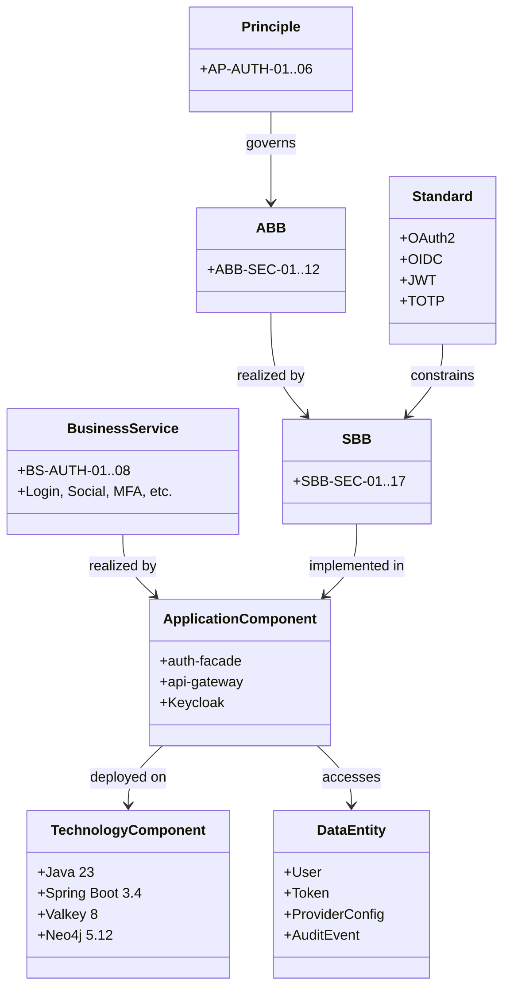

---

## Appendix C: Cross-Reference to Other Design Documents

| Document | Relation to TOGAF Mapping |
|----------|--------------------------|
| `01-PRD-Authentication-Authorization.md` | Business requirements -> Phase B business functions |
| `02-Technical-Specification.md` | Technology decisions -> Phase D technology architecture |
| `03-LLD-Authentication-Authorization.md` | Detailed design -> SBB implementations |
| `04-Data-Model-Authentication-Authorization.md` | Data entities -> Phase C data architecture |
| `05-UI-UX-Design-Spec.md` | Frontend components -> SBB-SEC-17 Angular Auth Module |
| `06-API-Contract.md` | API catalog -> Section 5.2 |
| `07-Gap-Analysis.md` | Gap matrix -> Section 9 |
| `08-Identity-Provider-Benchmark-Study.md` | Technology evaluation -> Phase E opportunities |
