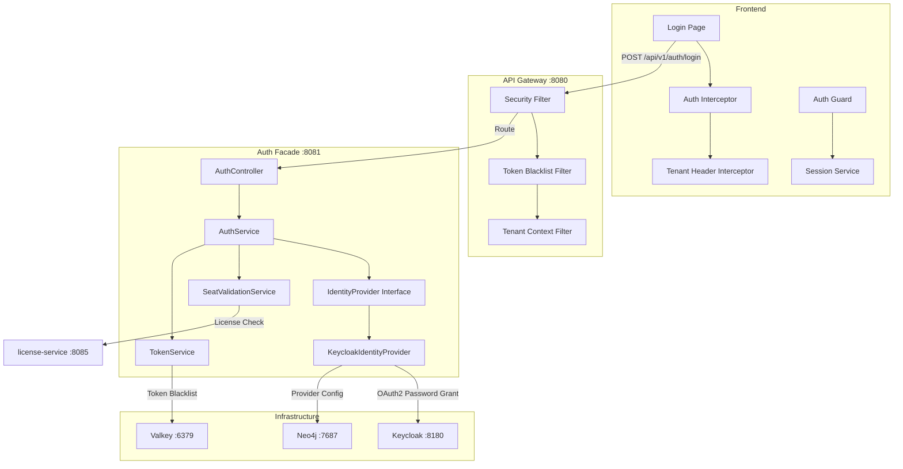

# Authentication & Authorization — Feature Documentation

**Feature:** Authentication, Authorization, and Identity Management
**Services:** auth-facade (Port 8081), api-gateway (Port 8080)
**Database:** Neo4j 5.12 (Provider Config) + Valkey 8 (Token Blacklist, Sessions, Rate Limiting)
**Identity Provider:** Keycloak 24.0 (OAuth2/OIDC)
**Owner:** Architecture / SA / Security
**Status:** [IMPLEMENTED] — ~90% complete, provider-agnostic admin UI in progress
**Date:** 2026-03-12

---

## Scope

Authentication & Authorization is the security foundation of the EMSIST platform. It provides multi-tenant identity management through a provider-agnostic architecture centered on Keycloak as the primary identity provider. The system handles user authentication (password, social login, MFA), JWT-based session management with token blacklisting, role-based access control (RBAC), tenant-aware realm isolation, and seat validation via license integration.

The architecture follows a **Strategy Pattern** (`IdentityProvider` interface) allowing future migration to Auth0, Okta, Azure AD, or FusionAuth without code changes to consumers.

## Documentation Index

| # | Document | Status | Description |
|---|----------|--------|-------------|
| 01 | [PRD](Design/01-PRD-Authentication-Authorization.md) | Draft | Product Requirements Document — vision, personas, feature requirements |
| 02 | [Technical Specification](Design/02-Technical-Specification.md) | Draft | Backend + Frontend technical spec — as-built + target architecture |
| 03 | [LLD](Design/03-LLD-Authentication-Authorization.md) | Draft | Low-Level Design — service layers, filters, interceptors, class diagrams |
| 04 | [Data Model](Design/04-Data-Model-Authentication-Authorization.md) | Draft | Neo4j provider graph + Valkey key schema + Keycloak realm model |
| 05 | [UI/UX Design Spec](Design/05-UI-UX-Design-Spec.md) | Draft | Login page, MFA flow, session management, tenant resolution UI |
| 06 | [API Contract](Design/06-API-Contract.md) | Draft | OpenAPI specification — auth-facade + gateway security endpoints |
| 07 | [Gap Analysis](Design/07-Gap-Analysis.md) | Draft | Current vs target gap assessment — ADR compliance + missing features |
| 08 | [Identity Provider Benchmark Study](Design/08-Identity-Provider-Benchmark-Study.md) | Draft | Keycloak vs Auth0 vs Okta vs Azure AD vs FusionAuth comparison |
| 09 | [Detailed User Journeys](Design/09-Detailed-User-Journeys.md) | Draft | Login, MFA setup, social login, logout, session expiry journey maps |
| 10 | [Implementation Backlog](Design/10-Implementation-Backlog.md) | Draft | Epics, user stories, sprint plan for remaining 10% + enhancements |
| 11 | [SRS](Design/11-SRS-Authentication-Authorization.md) | Draft | Software Requirements Specification — functional + non-functional |
| 12 | [Security Requirements](Design/12-Security-Requirements.md) | Draft | STRIDE threat model, OWASP mitigations, RBAC matrix, pentest scenarios |
| 13 | [Test Strategy](Design/13-Test-Strategy.md) | Draft | Test pyramid, environment matrix, coverage targets |
| 14 | [Playwright Test Plan](Design/14-Playwright-Test-Plan.md) | Draft | E2E test cases — login flows, MFA, RBAC, tenant isolation |
| 15 | [Security Test Plan](Design/15-Security-Test-Plan.md) | Draft | OWASP Top 10, JWT attack vectors, tenant isolation, rate limiting |
| 16 | [Arc42 Auth Views](Design/16-Arc42-Auth-Views.md) | Draft | Arc42 sections 1-12 scoped to authentication & authorization |
| 17 | [TOGAF Architecture Mapping](Design/17-TOGAF-Architecture-Mapping.md) | Draft | TOGAF ADM alignment — ABBs, SBBs, architecture catalog, standards |

## Architecture Overview

## Key Architecture Decisions

| ADR | Decision | Implementation Status |
|-----|----------|----------------------|
| ADR-004 | Keycloak as primary IdP | [IMPLEMENTED] — 90% |
| ADR-007 | Provider-agnostic identity layer | [IN-PROGRESS] — 25% (Keycloak only) |
| ADR-001 | Neo4j for auth provider config | [IMPLEMENTED] — auth-facade uses Neo4j |
| ADR-005 | Valkey for token blacklist + sessions | [IMPLEMENTED] — 100% |

## Prototype

| Artifact | Description |
|----------|-------------|
| — | Login page exists as Angular component in production codebase |

## References

| Document | Description |
|----------|-------------|
| [Keycloak 24.0 Admin Guide](https://www.keycloak.org/docs/24.0/server_admin/) | Primary IdP administration reference |
| [OAuth 2.0 RFC 6749](https://datatracker.ietf.org/doc/html/rfc6749) | OAuth 2.0 Authorization Framework |
| [OpenID Connect Core 1.0](https://openid.net/specs/openid-connect-core-1_0.html) | OIDC specification |
| [JWT RFC 7519](https://datatracker.ietf.org/doc/html/rfc7519) | JSON Web Token specification |
| [OWASP Authentication Cheat Sheet](https://cheatsheetseries.owasp.org/cheatsheets/Authentication_Cheat_Sheet.html) | Security best practices |

## Enhancement Roadmap (Planned)

| # | Enhancement | Priority | Complexity | ADR |
|---|------------|----------|------------|-----|
| 1 | Auth0 Identity Provider implementation | P1 | MEDIUM | ADR-007 |
| 2 | Okta Identity Provider implementation | P1 | MEDIUM | ADR-007 |
| 3 | Azure AD Identity Provider implementation | P2 | MEDIUM | ADR-007 |
| 4 | WebAuthn/FIDO2 passwordless authentication | P2 | HIGH | — |
| 5 | SMS/Email OTP as MFA alternative | P2 | MEDIUM | — |
| 6 | Active session management UI | P1 | MEDIUM | — |
| 7 | Admin IdP management UI (dynamic broker) | P0 | HIGH | ADR-007 |
| 8 | Graph-per-tenant isolation (Keycloak realms) | P3 | HIGH | ADR-003 |
| 9 | SSO federation (SAML 2.0 cross-org) | P3 | HIGH | — |

## Governance

- All documents follow [Documentation Governance](../DOCUMENTATION-GOVERNANCE.md)
- Status tags: `[IMPLEMENTED]`, `[IN-PROGRESS]`, `[PLANNED]`
- All claims must be evidence-based (Rule 1: EBD)
- Diagrams must use Mermaid syntax (Rule 7)
