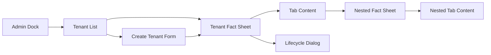
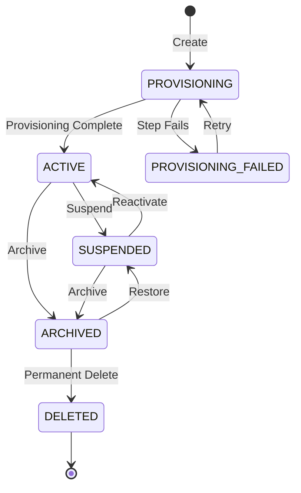
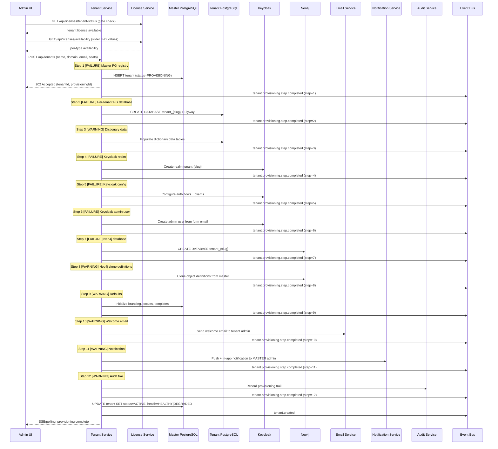

# R02 PRD -- Tenant Management

**Date:** 2026-03-25
**Status:** Draft -- provisional, not locked
**Worktree:** `tenant-factsheet-spec`
**Governance:** See `../PROVISIONAL.md`, `../README.md`, and `../Foundation/00-FOUNDATION-TRACK.md`

> **Revision Notice (2026-03-25):**
> This PRD predates the current `R02` correction cycle in several areas.
> The following are already sealed or closed at subtrack level and must be treated as binding:
> - auth target model (Rev 2)
> - documentation alignment for the auth target model
>
> The following are still not approved and therefore keep this PRD provisional:
> - non-auth to-be system graph
> - PostgreSQL target data model
> - ERD
> - journeys, stories, touchpoints, and prototypes as a final aligned bundle
>
> Rule:
> - no section of this PRD may be treated as baselined in isolation
> - any stale assumptions must be revalidated against the canonical `R02` package and `R04` where object-definition or object-instance concerns are involved

---

## Section 0: As-Is vs Target-State Legend

This document uses three evidence tags throughout. Every claim must comply with its tag's evidence rule.

| Tag | Meaning | Evidence Rule |
|-----|---------|---------------|
| `[AS-IS]` | Currently implemented in code | Must cite `file:line` |
| `[TARGET]` | Desired future state -- not yet built | Must NOT be presented as fact |
| `[FORK]` | Contradictory implementations exist or a decision is pending | Requires explicit decision before build proceeds |

Rules:

- `[AS-IS]` claims that cannot cite a source file and line number must be reclassified or removed.
- `[TARGET]` content must never use present-tense language that implies current implementation.
- `[FORK]` items block the Ready-for-Build Checklist until resolved.

---

## Section 1: What We Are Building

Tenant Management is not only a tenant CRUD feature.

It is a product capability that must enable the system to:

1. manage tenants
2. manage object definitions in tenant context
3. manage object instances in tenant context

The fact-sheet style interaction model is part of how these capabilities may be reviewed and operated, but it is not the product objective by itself.

At `R02` level, the design work therefore has to cover more than screens. It must align:

- tenant lifecycle and governance
- tenant-scoped object-definition management
- tenant-scoped object-instance management
- the supporting service, information, security, integration, and operational model required to make those capabilities real

**Current authoring rule:**

- `R02` must not be designed in isolation where object definitions, object instances, or the information model are concerned
- those areas must align with `R04`

**Interaction pattern note:**

The fact-sheet pattern remains a relevant interaction pattern for tenant-facing review and governance, but it must be treated as a supporting UX pattern inside the broader `R02` product capability, not as the sole definition of the requirement.

---

## Section 2: What Good Looks Like

Eight success criteria define when R02 is complete:

| # | Criterion | Measurable |
|---|-----------|------------|
| 1 | ADMIN in MASTER can create, view, edit, suspend, archive, and delete any tenant | Playwright E2E covers all 6 actions |
| 2 | ADMIN in REGULAR or DOMINANT can view and manage own tenant only | Role-based Playwright test with 403 assertion for cross-tenant |
| 3 | Tenant Fact Sheet shows banner hero + 8 tabs with correct visibility per role and tenant type | Visual regression test + tab-visibility matrix test |
| 4 | Provisioning creates isolated per-tenant databases (PostgreSQL + Neo4j + Keycloak realm) | Integration test with Testcontainers asserting 4 stores |
| 5 | Lifecycle state machine enforces valid transitions only | Unit test with exhaustive transition matrix |
| 6 | Protected tenants (MASTER) cannot be suspended, archived, or deleted | Unit + integration test asserting 403 and hidden UI buttons |
| 7 | All actions are auditable | Integration test asserting audit event emission per action |
| 8 | Fact sheet pattern is reusable for other entity types | Second entity (User) can adopt the shell without forking |

---

## Section 3: Actors

### 3.1 Target Role Model `[TARGET]`

The target role model eliminates the SUPER_ADMIN role. Cross-tenant capability is determined by the combination of a standard role (ADMIN, MANAGER, USER, VIEWER) and the tenant type (MASTER, REGULAR, DOMINANT).

| Role | In MASTER tenant | In REGULAR/DOMINANT tenant |
|------|-------------------|----------------------------|
| ADMIN | Full platform management: all tenants visible, all tabs accessible, all lifecycle actions available | Own-tenant management: 8 tabs visible, lifecycle actions scoped to own tenant only |
| MANAGER | Elevated operational access (delegated by ADMIN) | Elevated operational access (own tenant only) |
| USER | Standard feature access | Standard feature access |
| VIEWER | Read-only access to all visible tenants | Read-only access to own tenant |

Key principle: role determines *what* you can do; tenant type determines *where* you can do it.

### 3.2 As-Is Evidence `[AS-IS]`

The current codebase uses a dedicated `SUPER_ADMIN` role for cross-tenant bypass rather than the role+tenantType model described above.

- `TenantAccessValidator.java:56` -- `// SUPER_ADMIN bypasses tenant isolation -- they manage all tenants`
- `TenantAccessValidator.java:86-87` -- `.anyMatch(role -> SUPER_ADMIN_ROLE.equalsIgnoreCase(role) || SUPER_ADMIN_ROLE_ALT.equalsIgnoreCase(role))`
- Approximately 923 occurrences of `SUPER_ADMIN` across approximately 128 files (codebase-wide grep).
- Cleanup is owned by R09 (Roles Management). See `R02-STALE-DOC-IMPACT-MAP.md` Section 2 for the impact map.

R02 will NOT perform the SUPER_ADMIN cleanup. R02 will build the new Tenant Management features using the target role model. R09 will retire SUPER_ADMIN and migrate all existing references.

---

## Section 4: Capability Map

Twelve capabilities, phased across three delivery waves:

| # | Capability | Phase | Owner | Dependencies |
|---|-----------|-------|-------|-------------|
| 1 | Create Tenant (single form + provisioning) | 1 | R02 | -- |
| 2 | View Tenant List (search, filter, sort) | 1 | R02 | -- |
| 3 | View Tenant Fact Sheet (shell + banner) | 1 | R02 | -- |
| 4 | Manage Tenant Lifecycle (state machine) | 1 | R02 | -- |
| 5 | Edit Tenant Details (banner inline edit) | 1 | R02 | -- |
| 6 | Manage Branding (tab) | 2 | R02 | Phase 1 complete |
| 7 | Manage Users (tab) | 2 | R02 | Phase 1 complete |
| 8 | Manage Integrations (tab) | 2 | R02 | Phase 1 complete |
| 9 | View Audit Log (tab) | 2 | R02 | Phase 1 complete |
| 10 | Manage Dictionary (tab) | 3 | R02 | Phase 2 complete, System Cypher sanctioned |
| 11 | Manage Agents (tab) | 3 | R02 | Phase 2 complete |
| 12 | View Health Checks (tab) | 3 | R02 | Phase 2 complete |

---

## Section 5: Touchpoints

| Touchpoint | Technology | Status | Evidence |
|-----------|-----------|--------|----------|
| Admin UI | Angular 21 + PrimeNG 21 | `[AS-IS]` | `frontend/src/app/features/administration/` |
| Gateway API | Spring Cloud Gateway | `[AS-IS]` | `backend/gateway/` (route configuration) |
| Tenant Service | Spring Boot | `[AS-IS]` | `backend/tenant-service/` |
| Auth Facade | Spring Boot | `[AS-IS]` | `backend/auth-facade/` |
| PostgreSQL (Master) | PostgreSQL 17 | `[AS-IS]` | `infrastructure/docker/` (compose definition) |
| PostgreSQL (Per-tenant) | PostgreSQL 17 | `[TARGET]` | Currently single DB with tenant_id column discrimination |
| Keycloak | Keycloak 26 | `[AS-IS]` | `infrastructure/keycloak/keycloak-init.sh` |
| Neo4j | Neo4j 5.x | `[TARGET]` | Model B adopted: master (`system`) + per-tenant (`tenant_{slug}`). Object data only, no auth. See Section 13. |
| Valkey | Valkey (Redis-compatible) | `[AS-IS]` | `infrastructure/docker/` (session cache) |

---

## Section 6: Frozen Fact Sheet Structure

### 6.1 Banner Hero

The banner is the fixed header of every fact sheet. It does not scroll with tab content.

| Element | Description | Editable |
|---------|-------------|----------|
| Logo | Tenant logo or generated default icon | Yes (via Branding tab) |
| Name + Slug | Tenant display name and URL-safe slug | Name: yes. Slug: immutable after creation. |
| Type Badge | MASTER, REGULAR, or DOMINANT -- color-coded | No (set at creation, immutable) |
| Status Indicator | Lifecycle state with semantic color | No (changed via lifecycle actions only) |
| KPI Chips | User count, agent count, object type count, license usage % | No (computed, read-only) |
| Action Buttons | Edit, plus contextual lifecycle actions (Suspend, Archive, etc.) | N/A (buttons, not data) |

### 6.2 Tab Inventory

| # | Tab Name | Graph Relationship | Content Summary | Visibility |
|---|---------|-------------------|----------------|------------|
| 1 | Users | HAS_USER | User list with invite, role assignment, search, pagination | All tenant types |
| 2 | Branding | HAS_BRANDING | Logo upload, color palette, typography, live preview, publish | All tenant types |
| 3 | Integrations | HAS_INTEGRATION | Identity providers: SAML, OIDC, LDAP configuration | All tenant types |
| 4 | Dictionary | HAS_DICTIONARY | Object types, attributes, seeded from master definitions | All tenant types |
| 5 | Agents | HAS_AGENT | AI agents, skills, deployment configuration | All tenant types |
| 6 | Studio | HAS_STUDIO | Process definitions, workflow designer | All tenant types |
| 7 | Audit Log | HAS_AUDIT_EVENT | Chronological admin action log, filterable | All tenant types |
| 8 | Health Checks | HAS_HEALTH_CHECK | DB, Keycloak, Neo4j, service status dashboard | MASTER tenant only |

### 6.3 As-Is Comparison `[AS-IS]`

The current implementation has 5 hardcoded tabs with no banner hero:

- `tenant-manager-section.component.ts:76` -- `type FactSheetTab = 'overview' | 'license' | 'auth' | 'users' | 'branding';`
- No banner hero component exists. The current UI uses a modal dialog container for tenant detail.
- Tab routing is signal-based: `tenant-manager-section.component.ts:356` -- `protected readonly factSheetTab = signal<FactSheetTab>('overview');`

The target state replaces this with the fact sheet pattern: full-page view, banner hero, 8 relationship-based tabs, URL-routable.

---

## Section 7: User Journeys

### J01: Create Tenant

**Trigger:** ADMIN in MASTER clicks "New Tenant" button in the tenant list view.

**Pre-condition (tenant license gate):** The platform must have at least one available tenant license. If no tenant license is available, the "New Tenant" button is disabled and TEN-E-020 is shown on hover. The license gate is checked via `GET /api/licenses/tenant-status` before the form opens.

**Form fields (single form, no stepper):**

- **Tenant Name** — required. Slug auto-generated from name (not shown in form). No duplicate names allowed (TEN-E-022).
- **Domain** — required. Custom domain for tenant access. No duplicate domains allowed.
- **Tenant Admin Email** — required. Valid email format. First admin user provisioned in Keycloak realm.
- **Admin Seats** — required. Slider, minimum 1. Shows: `{available} / {platformTotal}` available platform-wide. Capped at available count.
- **User Seats** — required. Slider, minimum 0. Shows: `{available} / {platformTotal}` available platform-wide. Capped at available count.
- **Viewer Seats** — required. Slider, minimum 0. Shows: `{available} / {platformTotal}` available platform-wide. Capped at available count.

Slider max values fetched from `GET /api/licenses/availability`. At least 1 Admin seat is required (TEN-E-021).

License model note: R02 implements the **Dedicated** license model (seats are reserved per tenant). The **Concurrent** license model (shared pool, checked at login time) is a separate track outside R02 scope.

On submit: provisioning sequence begins.

**Provisioning Sequence `[TARGET]` -- 12 Steps with Severity Classification:**

Each step is classified as FAILURE (blocking) or WARNING (non-blocking).

| Step | Action | Severity | Blocking |
|------|--------|----------|----------|
| 1 | Master PG: INSERT into tenants registry table | FAILURE | Yes |
| 2 | Per-tenant PG: CREATE DATABASE `tenant_{slug}` + Flyway schema migrations | FAILURE | Yes |
| 3 | Per-tenant PG: Populate dictionary data tables | WARNING | No |
| 4 | Keycloak: Create realm `tenant-{slug}` | FAILURE | Yes |
| 5 | Keycloak: Configure realm (auth flows, clients) | FAILURE | Yes |
| 6 | Keycloak: Create admin user from form email | FAILURE | Yes |
| 7 | Per-tenant Neo4j: CREATE DATABASE `tenant_{slug}` | FAILURE | Yes |
| 8 | Neo4j: Clone object definitions from master | WARNING | No |
| 9 | Defaults: Initialize branding, locales, templates | WARNING | No |
| 10 | Email: Send welcome email to tenant admin | WARNING | No |
| 11 | Notification: Push + in-app notification to MASTER admin | WARNING | No |
| 12 | Audit: Record provisioning trail | WARNING | No |

**Outcome Matrix:**

| Condition | Tenant Status | Health Status | Message |
|-----------|---------------|---------------|---------|
| All 12 steps pass | ACTIVE | HEALTHY | TEN-S-001 |
| All blocking steps pass, one or more warnings | ACTIVE | DEGRADED | TEN-S-014 |
| Any blocking step (1-2, 4-7) fails | PROVISIONING_FAILED | -- | TEN-E-004 (with step detail) |

**Integration Points:**

- **Notification Service** -- step 11: push + in-app notification to MASTER admin on completion.
- **Email Service** -- step 10: welcome email to tenant admin on success; failure report email on PROVISIONING_FAILED.
- **Audit Service** -- step 12: all provisioning steps recorded as audit events.
- **Health Check Service** -- provisioning results feed into tenant health indicators (Health Checks tab).
- **License Service** -- seat allocation validated and reserved before provisioning begins.

**Success:** TEN-S-001 -- "Tenant '{name}' created successfully." Redirect to the new tenant's fact sheet.

**Partial Success:** TEN-S-014 -- "Tenant '{name}' is active but some provisioning steps completed with warnings. Check Health Checks tab."

**Failure:**
- TEN-E-002 -- Name invalid (format).
- TEN-E-004 -- Provisioning step failed (shows which step, with retry option).
- TEN-E-009 -- Invalid domain format.
- TEN-E-010 -- Domain already claimed by another tenant.
- TEN-E-016 -- Invalid admin email format.
- TEN-E-017 -- Database creation failed (blocking).
- TEN-E-018 -- Keycloak realm creation failed (blocking).
- TEN-E-019 -- Admin user creation failed (blocking).
- TEN-E-020 -- No tenant license available.
- TEN-E-021 -- At least 1 Admin seat required.
- TEN-E-022 -- Duplicate tenant name.

**Warning (non-blocking):**
- TEN-W-008 -- Dictionary seeding incomplete.
- TEN-W-009 -- Object definition cloning incomplete.
- TEN-W-010 -- Default configuration incomplete.
- TEN-W-011 -- Welcome email delivery failed.

**Info:** TEN-I-001 -- Provisioning progress indicator (step X of 12). TEN-I-007 -- Individual step completion. TEN-I-008 -- License allocation summary.

---

### J02: View Tenant List

**Trigger:** ADMIN in MASTER navigates to Administration > Tenant Manager.

**Steps:**

1. Load tenant list from API with default pagination (page 0, size 20).
2. Display tenant cards or rows with: name, slug, type badge, status indicator, user count, creation date.
3. Search by name or slug (debounced, 300ms).
4. Filter by: type (MASTER, REGULAR, DOMINANT), status (ACTIVE, SUSPENDED, ARCHIVED), date range.
5. Sort by: name, creation date, user count, status.
6. Click a tenant card to navigate to its fact sheet.

**Success:** List renders with tenant data.

**Empty:** TEN-I-002 -- "No tenants found. Create your first tenant to get started." (with Create button CTA).

---

### J03: Open Tenant Fact Sheet

**Trigger:** Click a tenant in the list, or navigate via deep-link URL (`/admin/tenants/{slug}`).

**Steps:**

1. Resolve tenant by slug.
2. Load banner data (name, slug, type, status, KPI counts).
3. Render banner hero.
4. Load default tab (Users) or tab specified in URL (`/admin/tenants/{slug}/users`).
5. Render tab content with its own pagination and loading state.

**Success:** Fact sheet renders with banner hero and active tab content.

**Failure:**
- TEN-E-006 -- Tenant not found (404). Redirect to tenant list after message.
- TEN-E-005 -- No permission to view this tenant (403). Redirect to permitted scope.

**Info:**
- TEN-I-004 -- "You are viewing the master tenant." (informational badge, not blocking).
- TEN-I-005 -- "You have read-only access to this tenant." (for VIEWER role).

---

### J04: Edit Tenant Details

**Trigger:** ADMIN clicks Edit button in the fact sheet banner.

**Steps:**

1. Banner enters inline edit mode.
2. Editable fields: display name, allowed domains, default locale, timezone.
3. Non-editable fields (shown but disabled): slug, type, creation date.
4. Save or Cancel.

**Success:** TEN-S-002 -- "Tenant details updated."

**Failure:** TEN-E-005 -- Insufficient permissions (403).

---

### J05: Activate Tenant

**Trigger:** ADMIN in MASTER clicks Activate on a tenant in PROVISIONING state.

**Steps:**

1. System validates provisioning is complete (all steps succeeded).
2. API call to transition state to ACTIVE.
3. Status indicator updates in banner.

**Success:** TEN-S-003 -- "Tenant '{name}' is now active."

**Failure:** TEN-E-007 -- Invalid state transition (provisioning not complete).

---

### J06: Suspend Tenant

**Trigger:** ADMIN in MASTER clicks Suspend on an ACTIVE tenant.

**Steps:**

1. Display confirmation dialog TEN-C-001: "Suspending '{name}' will terminate {sessionCount} active sessions. Users will be logged out immediately. Continue?"
2. On confirm: API call to terminate all sessions, then transition state to SUSPENDED.
3. Status indicator updates. Suspended tenants remain visible but users cannot log in.

**Success:** TEN-S-004 -- "Tenant '{name}' has been suspended. {sessionCount} sessions terminated."

**Failure:**
- TEN-E-007 -- Invalid state transition.
- TEN-E-008 -- Protected tenant (MASTER cannot be suspended).

---

### J07: Archive Tenant

**Trigger:** ADMIN in MASTER clicks Archive on an ACTIVE or SUSPENDED tenant.

**Steps:**

1. Display confirmation dialog TEN-C-002: "Archiving '{name}' will make it inaccessible to all users. Data will be retained for 90 days. After 90 days, the tenant becomes eligible for permanent deletion. Continue?"
2. On confirm: API call to transition state to ARCHIVED.

**Success:** TEN-S-006 -- "Tenant '{name}' has been archived. Data retained until {retentionDate}."

**Failure:**
- TEN-E-007 -- Invalid state transition.
- TEN-E-008 -- Protected tenant (MASTER cannot be archived).

**Warning:** TEN-W-004 -- Retention policy reminder shown in confirmation.

---

### J08: Restore Tenant

**Trigger:** ADMIN in MASTER clicks Restore on an ARCHIVED tenant.

**Steps:**

1. Display confirmation dialog TEN-C-007: "Restore '{name}' from archive? The tenant will be placed in SUSPENDED state. You will need to reactivate it separately."
2. On confirm: API call to transition state from ARCHIVED to SUSPENDED.

**Success:** TEN-S-013 -- "Tenant '{name}' has been restored to suspended state."

---

### J09: Permanently Delete Tenant

**Trigger:** ADMIN in MASTER clicks Delete on an ARCHIVED tenant.

**Steps:**

1. Display confirmation dialog TEN-C-003: "This action is IRREVERSIBLE. All data for '{name}' will be permanently destroyed across all stores (PostgreSQL, Neo4j, Keycloak). Type the tenant slug '{slug}' to confirm."
2. User must type the exact slug. Confirm button disabled until match.
3. On confirm: API call to hard-delete all tenant data across all stores.

**Success:** Redirect to tenant list. Toast: "Tenant '{name}' has been permanently deleted."

**Failure:** TEN-E-008 -- Protected tenant (MASTER cannot be deleted), or tenant is not in ARCHIVED state.

---

### J10: Manage Branding

**Trigger:** Navigate to the Branding tab in a tenant's fact sheet.

**Steps:**

1. View current branding configuration (logo, color palette, typography settings).
2. Edit: upload logo, select primary/secondary/accent colors, configure typography.
3. Live preview: side panel shows branding applied to a sample layout.
4. Save draft: TEN-S-007 -- "Branding draft saved."
5. Publish: TEN-C-004 -- "Publishing will apply these branding changes to all users of '{name}' immediately. Continue?"
6. On confirm: TEN-S-008 -- "Branding published for '{name}'."

**Warning:** TEN-W-005 -- "You have unsaved branding changes." (navigation guard when leaving tab with edits).

**Error:** TEN-E-012 -- Logo validation failure (size exceeds 2MB, format not PNG or SVG, dimensions invalid).

---

### J11: Manage Integrations

**Trigger:** Navigate to the Integrations tab in a tenant's fact sheet.

**Steps:**

1. View list of configured identity providers.
2. Add new provider: choose type (SAML, OIDC, LDAP), fill configuration form.
3. Test connection: validate provider is reachable and credentials work.
4. Enable or disable provider.

**Success:** TEN-S-009 -- "Integration '{providerName}' configured successfully."

**Errors:**
- TEN-E-013 -- Connection test failed (timeout, invalid credentials, unreachable endpoint).
- TEN-E-014 -- Invalid provider configuration (missing required fields, malformed URLs).

---

### J12: Manage Users

**Trigger:** Navigate to the Users tab in a tenant's fact sheet.

**Steps:**

1. View user list with search, filter by role, pagination.
2. Invite user: enter email address, select role.
3. Assign or change roles for existing users.
4. Remove user from tenant: TEN-C-005 -- "Remove '{email}' from '{tenantName}'? They will lose access immediately."

**Success:** TEN-S-010 -- "User '{email}' invited to '{tenantName}' with role {role}."

**Errors:** TEN-E-011 -- Seat limit reached. Shows current usage vs. maximum: "Cannot invite user. {current}/{max} seats used."

**Warning:** TEN-W-001 -- License seat usage approaching limit (>90% used).

---

### J13: View Health Checks

**Trigger:** ADMIN in MASTER navigates to the Health Checks tab.

**Visibility:** This tab is visible only when viewing a tenant from the MASTER tenant context.

**Steps:**

1. Load health dashboard for the selected tenant.
2. Display per-service status: PostgreSQL connectivity, Neo4j connectivity, Keycloak realm status, service endpoint health.
3. Auto-refresh every 30 seconds.

**Warning:** TEN-W-006 -- "One or more services are degraded for this tenant."

**Error:** TEN-E-015 -- Health check endpoint unreachable. Individual failed checks shown with error detail; other checks still display.

**Info:** TEN-I-006 -- "Health data refreshes automatically every 30 seconds."

---

## Section 8: Navigation and Screen Flow

### 8.1 Entry Points

| # | Entry Point | URL | Resolves To |
|---|-------------|-----|-------------|
| 1 | Administration dock | `/admin/tenants` | Tenant list |
| 2 | Deep-link to tenant | `/admin/tenants/{slug}` | Tenant fact sheet, default tab (Users) |
| 3 | Deep-link to tab | `/admin/tenants/{slug}/{tabName}` | Tenant fact sheet, specified tab |

### 8.2 Screen Flow



### 8.3 Breadcrumb Pattern

`Administration > Tenant Manager > {TenantName} > {TabName}`

Examples:
- `Administration > Tenant Manager > Acme Corp > Users`
- `Administration > Tenant Manager > Acme Corp > Branding`

Clicking "Tenant Manager" in the breadcrumb returns to the tenant list. Clicking the tenant name returns to the default tab.

---

## Section 9: Layout Rules

### 9.1 Breakpoint Definitions

| Breakpoint | Range | Label |
|-----------|-------|-------|
| Desktop | 1440px and above | Large screens |
| Tablet | 768px to 1439px | Medium screens |
| Mobile | 320px to 767px | Small screens |

### 9.2 Per-Screen Layout

| Screen | Desktop (1440px+) | Tablet (768-1439px) | Mobile (320-767px) |
|--------|-------------------|--------------------|--------------------|
| Tenant List | 3-column grid of tenant cards | 2-column grid of tenant cards | Single-column list view |
| Fact Sheet Banner | Full-width, KPI chips in horizontal row | Full-width, KPI chips wrap to 2 rows | Stacked vertical layout |
| Tab Bar | Horizontal, all tabs visible if space allows, scrollable overflow | Horizontal scrollable | Horizontal scrollable with navigation arrows |
| Tab Content (table) | Full table with all columns | Horizontal scroll on overflow | Card view per row (each row becomes a card) |
| Create Tenant Form | Centered, max-width 640px | Centered with side padding | Full-width with horizontal padding |
| Lifecycle Dialog | Modal, 480px wide | Modal, 480px wide | Bottom sheet, full-width |

### 9.3 RTL Considerations

All layouts must support right-to-left (RTL) rendering for Arabic locale:
- Tab bar scrolls from right to left.
- Banner KPI chips flow right to left.
- Form labels align to the right.
- Breadcrumb separator direction reverses.
- Action buttons remain in their logical order (primary action on the trailing edge).

---

## Section 10: Edge Cases and Exceptions

| # | Situation | UX Behavior | Service Behavior |
|---|----------|------------|-----------------|
| 1 | Slug collision during create | TEN-E-001 inline error on slug field, suggest alternative slug | 409 Conflict |
| 2 | Provisioning step fails mid-way | TEN-E-004 with indication of which step failed, retry button for that step | Rollback completed steps, mark status PROVISIONING_FAILED |
| 3 | Concurrent edit on same tenant | Last-write-wins with optimistic locking; loser sees conflict toast | 409 Conflict with version mismatch detail |
| 4 | MASTER tenant lifecycle action attempted | TEN-E-008; lifecycle action buttons hidden in UI for MASTER | 403 Forbidden for any lifecycle mutation on MASTER |
| 5 | Tenant with active sessions suspended | TEN-W-003 warning shows session count; TEN-C-001 confirmation required | Broadcast session termination, then state change |
| 6 | Archive tenant with 0 users | Skip session warning, still show TEN-C-002 for data retention notice | Same archive flow, session count = 0 |
| 7 | Restore after 89 days (near retention limit) | TEN-C-007 with urgency banner: "1 day remaining before permanent deletion eligibility" | Same restore flow |
| 8 | Delete a non-archived tenant | Delete button not visible in UI | 409 Invalid State Transition |
| 9 | Network failure during provisioning | TEN-E-004 shown, retry button available | Idempotent retry skips already-completed steps |
| 10 | Upload oversized logo (>2MB) | TEN-E-012 inline: "Logo must be under 2MB" | 422 Unprocessable Entity with validation details |
| 11 | Upload non-PNG/SVG logo | TEN-E-012 inline: "Logo must be PNG or SVG format" | 422 Unprocessable Entity with validation details |
| 12 | Branding publish with no changes from current published state | Publish button disabled (no diff detected) | -- |
| 13 | Navigate away with unsaved branding edits | TEN-W-005 guard dialog: "You have unsaved changes. Discard?" | -- |
| 14 | Integration test connection timeout | TEN-E-013 with timeout detail and endpoint | 504 Gateway Timeout |
| 15 | Invite user to tenant at seat limit | TEN-E-011 with seat info: "{current}/{max} seats used" | 422 with current and max seat counts |
| 16 | Invite email that already exists in tenant | Inline error: "This user is already a member of this tenant" | 409 Conflict |
| 17 | Health check service unreachable | TEN-E-015 per individual check; other checks still render normally | Partial response; failed checks include error detail |
| 18 | Deep-link to non-existent tenant slug | TEN-E-006 toast, redirect to tenant list after 3 seconds | 404 Not Found |
| 19 | Deep-link to tenant without permission | TEN-E-005 toast, redirect to user's permitted scope | 403 Forbidden |
| 20 | Tab with 0 items | TEN-I-003 empty state with contextual create CTA (e.g., "No users yet. Invite your first user.") | 200 with empty array |
| 21 | Tab with 10,000+ items | Virtual scroll with server-side pagination, max 100 items per page | Paginated API response, Link headers |
| 22 | Slug with unicode characters | TEN-E-003 inline: "Slug must contain only lowercase letters, numbers, and hyphens" | 422 validation error |
| 23 | Tenant name with only whitespace | TEN-E-002 inline after trim: "Tenant name is required" | 422 validation error |
| 24 | Two admins create same slug simultaneously | First request wins; second receives TEN-E-001 | Database unique constraint enforces; 409 Conflict |
| 25 | Browser refresh during create form | Form state lost, user re-enters fields | No server-side form state persisted |
| 26 | No tenant license available | TEN-E-020 shown; "New Tenant" button disabled with tooltip | 422 pre-check; form cannot open |
| 27 | 0 Admin seats on create form | TEN-E-021 inline error; submit button disabled | 422 validation; at least 1 Admin seat required |
| 28 | All infra succeeds but email fails | Status: ACTIVE. Health: DEGRADED. TEN-S-014 banner + TEN-W-011. | Status and Health are independent attributes. Health reflects provisioning warnings. |
| 29 | Dictionary seeding fails during provisioning | Status: ACTIVE. Health: DEGRADED. TEN-W-008 shown in Health Checks tab. | Blocking steps passed → Status=ACTIVE. Warning step failed → Health=DEGRADED. |
| 30 | Object definition clone fails during provisioning | Status: ACTIVE. Health: DEGRADED. TEN-W-009 shown in Health Checks tab. | Blocking steps passed → Status=ACTIVE. Warning step failed → Health=DEGRADED. |
| 31 | All 3 license slider values set to 0 | TEN-E-021 inline error; at least 1 Admin seat required | 422 validation |
| 32 | License slider value exceeds available count | Slider capped at available count; cannot drag beyond max | Slider max bound to `GET /api/licenses/availability` response |

---

## Section 11: Messages and Confirmations

Complete message definitions are maintained in `R02-MESSAGE-CODE-REGISTRY.md`. This section provides a journey-to-message mapping.

### 11.1 Journey-to-Message Matrix

| Journey | Success | Warning | Error | Confirmation | Info |
|---------|---------|---------|-------|-------------|------|
| J01 Create | TEN-S-001, TEN-S-014 | TEN-W-002, TEN-W-007, TEN-W-008, TEN-W-009, TEN-W-010, TEN-W-011 | TEN-E-001, TEN-E-002, TEN-E-003, TEN-E-004, TEN-E-009, TEN-E-010, TEN-E-016, TEN-E-017, TEN-E-018, TEN-E-019, TEN-E-020, TEN-E-021, TEN-E-022 | -- | TEN-I-001, TEN-I-007, TEN-I-008 |
| J02 List | -- | -- | -- | -- | TEN-I-002 |
| J03 Open Fact Sheet | -- | -- | TEN-E-005, TEN-E-006 | -- | TEN-I-004, TEN-I-005 |
| J04 Edit | TEN-S-002 | -- | TEN-E-005 | -- | -- |
| J05 Activate | TEN-S-003 | -- | TEN-E-007 | -- | -- |
| J06 Suspend | TEN-S-004 | TEN-W-003 | TEN-E-007, TEN-E-008 | TEN-C-001 | -- |
| J07 Archive | TEN-S-006 | TEN-W-004 | TEN-E-007, TEN-E-008 | TEN-C-002 | -- |
| J08 Restore | TEN-S-013 | -- | -- | TEN-C-007 | -- |
| J09 Delete | -- | -- | TEN-E-008 | TEN-C-003 | -- |
| J10 Branding | TEN-S-007, TEN-S-008 | TEN-W-005 | TEN-E-012 | TEN-C-004 | -- |
| J11 Integration | TEN-S-009 | -- | TEN-E-013, TEN-E-014 | -- | -- |
| J12 Users | TEN-S-010 | TEN-W-001 | TEN-E-011 | TEN-C-005 | -- |
| J13 Health | -- | TEN-W-006 | TEN-E-015 | -- | TEN-I-006 |

### 11.2 Message Type Summary

| Type | Count | Prefix |
|------|-------|--------|
| Success | 14 | TEN-S-xxx |
| Warning | 11 | TEN-W-xxx |
| Error | 22 | TEN-E-xxx |
| Confirmation | 7 | TEN-C-xxx |
| Info | 8 | TEN-I-xxx |

---

## Section 12: Core Service Behavior

### 12.0 Tenant Node — Two Independent Attributes

The Tenant node carries two independent observable attributes. They must not be conflated.

| Attribute | Purpose | Values | Set By |
|-----------|---------|--------|--------|
| **Status** | Lifecycle position | PROVISIONING, PROVISIONING_FAILED, ACTIVE, SUSPENDED, ARCHIVED, DELETED | Lifecycle state machine (explicit admin actions or provisioning outcome) |
| **Health** | Infrastructure state of provisioned resources | HEALTHY, DEGRADED, UNHEALTHY | Health Check Service (continuous monitoring + provisioning outcome) |

**Independence rules:**
- Status transitions do NOT automatically change Health.
- Health changes do NOT automatically change Status.
- A tenant can be ACTIVE + UNHEALTHY (service went down after provisioning).
- A tenant can be SUSPENDED + HEALTHY (admin suspended it, infra is fine).
- PROVISIONING_FAILED tenants have no Health value (infrastructure was never fully created).
- Health is only meaningful for tenants in ACTIVE or SUSPENDED status.

**Provisioning sets both attributes on completion:**

| Provisioning Outcome | Status set to | Health set to |
|---------------------|---------------|---------------|
| All 12 steps pass | ACTIVE | HEALTHY |
| Blocking steps pass, 1+ warnings | ACTIVE | DEGRADED |
| Any blocking step fails | PROVISIONING_FAILED | _(not set)_ |

After provisioning, Health is maintained independently by the Health Check Service based on continuous infrastructure monitoring (database connectivity, Keycloak realm status, Neo4j availability, service endpoints).

### 12.1 Tenant Lifecycle State Machine (Status attribute)



**Valid transitions (exhaustive):**

| From | To | Trigger | Guard |
|------|----|---------|-------|
| -- | PROVISIONING | Create tenant | ADMIN in MASTER |
| PROVISIONING | ACTIVE | All provisioning steps complete | System (automated) |
| PROVISIONING | PROVISIONING_FAILED | Any provisioning step fails | System (automated) |
| PROVISIONING_FAILED | PROVISIONING | Retry provisioning | ADMIN in MASTER |
| ACTIVE | SUSPENDED | Suspend action | ADMIN in MASTER, NOT a MASTER tenant |
| SUSPENDED | ACTIVE | Reactivate action | ADMIN in MASTER |
| ACTIVE | ARCHIVED | Archive action | ADMIN in MASTER, NOT a MASTER tenant |
| SUSPENDED | ARCHIVED | Archive action | ADMIN in MASTER, NOT a MASTER tenant |
| ARCHIVED | SUSPENDED | Restore action | ADMIN in MASTER |
| ARCHIVED | DELETED | Permanent delete action | ADMIN in MASTER, NOT a MASTER tenant |

Any transition not listed above is invalid and must return 409 Invalid State Transition.

**As-Is State Constraint `[AS-IS]`:**

The V8 migration defines the following status values: `V8__per_service_routing_metadata.sql:30-41`

```
PENDING, PROVISIONING, PROVISIONING_FAILED, ACTIVE, SUSPENDED,
LOCKED, DELETION_PENDING, DELETION_FAILED, DELETED, RESTORING, DECOMMISSIONED
```

The target state machine (above) uses a subset. The additional states (PENDING, LOCKED, DELETION_PENDING, DELETION_FAILED, RESTORING, DECOMMISSIONED) exist in the DB constraint but are not part of the R02 target journeys. They may be used by future requirements or removed in a schema cleanup.

### 12.2 Provisioning Sequence `[TARGET]`

The provisioning sequence consists of 12 steps, each classified as FAILURE (blocking) or WARNING (non-blocking). Blocking failures halt provisioning and set status to PROVISIONING_FAILED. Non-blocking warnings allow the tenant to become ACTIVE with DEGRADED health.



**Outcome Matrix:**

| Condition | Status | Health | Message |
|-----------|--------|--------|---------|
| All 12 steps pass | ACTIVE | HEALTHY | TEN-S-001 |
| All blocking steps pass, 1+ warnings | ACTIVE | DEGRADED | TEN-S-014 |
| Any blocking step fails (1, 2, 4, 5, 6, 7) | PROVISIONING_FAILED | -- | TEN-E-004 / TEN-E-017 / TEN-E-018 / TEN-E-019 |

Each provisioning step is tracked individually. If a blocking step fails, previously completed steps are retained and the retry starts from the failed step (idempotent).

**License Model Note:** R02 implements the **Dedicated** license model, where seats are reserved per tenant at creation time. The **Concurrent** license model (shared pool, checked at login time with session limits) is a separate track outside R02 scope. Post-creation, the tenant's License page shows KPIs: total/available per seat type (Admin, User, Viewer). Admins can kill active sessions to free concurrent seats when that model is implemented.

### 12.3 Business Rules

| # | Rule | Enforcement |
|---|------|-------------|
| 1 | Slug is immutable after creation | API rejects PATCH requests that include slug field |
| 2 | MASTER tenant is protected -- cannot be suspended, archived, or deleted | State machine guard + API 403 |
| 3 | Tenant type (MASTER, REGULAR, DOMINANT) is set at creation and cannot be changed | API rejects PATCH requests that include type field |
| 4 | Suspension terminates all active sessions immediately | Session service broadcasts termination before state change commits |
| 5 | Archive retains data for 90 days, then eligible for permanent deletion | Retention date computed at archive time, stored in tenant record |
| 6 | Permanent deletion is irreversible -- all data across all stores destroyed | No soft-delete; PG database dropped, Neo4j database dropped, Keycloak realm deleted |
| 7 | One MASTER tenant per deployment | Unique constraint on (type = MASTER) or application-level enforcement |
| 8 | Tenant slug format: lowercase alphanumeric and hyphens, 3-63 characters | Validation at API layer, regex: `^[a-z][a-z0-9-]{1,61}[a-z0-9]$` |
| 9 | Optimistic locking on tenant updates | Version column, 409 on mismatch |
| 10 | All lifecycle transitions emit domain events | Event bus publish before API response |

---

## Section 13: Data Architecture

**Neo4j topology decision: LOCKED to Model B (graph-per-tenant) on 2026-03-23.**
**Auth migration decision: LOCKED — auth moves from Neo4j to PostgreSQL on 2026-03-23.**

### 13.1 PostgreSQL Architecture

#### Master PostgreSQL `[AS-IS]` / `[TARGET]`

Currently a single database with tenant_id column discrimination `[AS-IS]`. The target architecture separates the master database (tenant registry, licenses, message registry) from per-tenant databases `[TARGET]`.

**Master DB entities:**

| Entity | Purpose | Key Fields |
|--------|---------|------------|
| TenantEntity | Tenant registry | id, uuid, name, slug, type, status, version, createdAt |
| TenantDomainEntity | Allowed domains per tenant | id, tenantId, domain, verified |
| TenantProvisioningStepEntity | Tracks provisioning progress | id, tenantId, step, status, startedAt, completedAt, error |
| ApplicationLicenseEntity | Platform license definitions | id, name, tier, seatLimit |
| LicenseFileEntity | Uploaded license files | id, licenseId, content |
| TenantLicenseEntity | License assignment to tenants | id, tenantId, licenseId |
| TierSeatAllocationEntity | Seat allocation per tier | id, tierId, allocated, used |
| MessageRegistryEntity | Centralized message templates | id, code, type, defaultTitle, defaultDetail |

#### Per-Tenant PostgreSQL `[TARGET]`

Each tenant would get its own PostgreSQL database: `tenant_{slug}`. Currently, all tenant data lives in the single shared database with tenant_id discrimination `[AS-IS]`.

**Per-tenant DB entities:**

| Entity Group | Entities |
|-------------|----------|
| User management | UserProfileEntity, UserDeviceEntity, UserSessionEntity |
| Branding and config | TenantBrandingEntity, TenantSessionConfigEntity, TenantMFAConfigEntity |
| Localization | TenantLocaleEntity, MessageTranslationEntity, TenantMessageTranslationEntity |
| Audit and notification | AuditEventEntity, NotificationEntity, NotificationTemplateEntity, NotificationPreferenceEntity |
| AI agents | AgentEntity, AgentCategoryEntity, ConversationEntity, MessageEntity |
| Knowledge base | KnowledgeSourceEntity, KnowledgeChunkEntity |
| Process | BpmnElementTypeEntity |
| Auth providers | TenantAuthProviderEntity |
| Licensing | UserLicenseAssignmentEntity, RevocationEntryEntity |

### 13.2 Neo4j Architecture — DECIDED

**Decision (2026-03-23):** Model B (graph-per-tenant) adopted, with auth removed from Neo4j.

#### Selected: Model B Modified — Graph-per-Tenant, Object Data Only `[TARGET]`

**Topology:**
- **Master Neo4j** (`system` database): System Cypher metamodel — master object type definitions, fact sheet pattern definitions, relationship templates. Read-only reference for seeding.
- **Per-tenant Neo4j** (`tenant_{slug}` database): Object definitions (seeded from master, tenant-customizable) + Object instances (tenant's actual EA data). No auth data.

**What Neo4j holds:**

| Domain | Node Labels | Key Relationships |
|--------|------------|-------------------|
| Definitions | ObjectType, AttributeType, ConnectionType, GovernanceRule | HAS_ATTRIBUTE, CONNECTS_TO, GOVERNED_BY |
| Instances | ObjectInstance, AttributeValue, Connection | INSTANCE_OF, HAS_VALUE, CONNECTED_TO |
| Process | ProcessDefinition, ProcessElement, ProcessInstance | CONTAINS, FLOWS_TO, EXECUTES |

**What Neo4j no longer holds:**

Auth data (User, Group, Role, Provider, Protocol, Config nodes) migrates to per-tenant PostgreSQL + Keycloak. The existing Neo4j auth graph (`V004__create_default_roles.cypher`, `TenantAccessValidator.java` SUPER_ADMIN bypass, `TenantAwareAuthDatabaseSelectionProvider.java`) is legacy `[AS-IS]` to be retired.

#### Retired: Model C — Per-Service Routing

Model C (`tenant_{slug}_auth` + `tenant_{slug}_definitions` split) is **retired**. The following artifacts are legacy:
- `V8__per_service_routing_metadata.sql:48-49` — `auth_db_name` and `definitions_db_name` columns
- `TenantAwareAuthDatabaseSelectionProvider.java:21-27` — auth-specific Neo4j database routing
- `application.yml:62` — `auth.graph-per-tenant.enabled` feature flag

These remain in the codebase as `[AS-IS]` evidence but are not part of the target architecture. Cleanup is a downstream concern.

#### Legacy: Model A — Single Shared Database `[AS-IS]`

Model A (single `neo4j` database, `tenantId` discrimination) is what currently runs in production. It remains `[AS-IS]` until Model B is implemented. Evidence: `neo4j-ems-db.md:6`, `09-architecture-decisions.md:28`.

#### Decision Record

| Aspect | Decision |
|--------|----------|
| Neo4j content | Object definitions + object instances only. No auth. |
| Auth home | Per-tenant PostgreSQL + Keycloak realm |
| Master Neo4j | System Cypher metamodel (read-only reference) |
| Per-tenant Neo4j | `tenant_{slug}` — definitions (seeded from master) + instances |
| Model C status | Retired. `auth_db_name` column unused. |
| Model A status | Legacy `[AS-IS]`. Remains active until migration. |
| Decision date | 2026-03-23 |

### 13.3 Keycloak Architecture `[AS-IS]`

Per-tenant realm: `tenant-{slug}`. Each realm contains:

| Component | Description |
|-----------|-------------|
| Users | Synced from PostgreSQL user profile |
| Roles | ADMIN, MANAGER, USER, VIEWER (per target role model) |
| Clients | Frontend application, backend service clients |
| Identity Providers | SAML, OIDC, LDAP (configured per tenant in Integrations tab) |
| Sessions | Active user sessions, managed by Keycloak |
| Auth Flows | Login flow, registration flow, password reset flow |

**Evidence:** `infrastructure/keycloak/keycloak-init.sh` bootstraps the master realm.

### 13.4 System Cypher `[TARGET -- PENDING SANCTION]`

System Cypher is the proposed architecture for seeding new tenant Neo4j databases from a master set of definitions. When a new tenant is provisioned, its Neo4j database would be populated with a baseline copy of object types, attribute types, and governance rules from the master definitions.

**This architecture is NOT finalized.** It depends on:
1. ~~The Neo4j topology decision (Section 13.2).~~ **RESOLVED** — Model B adopted (2026-03-23).
2. A separate architecture sanction process.

R02 documents System Cypher as a dependency, not as an approved design.

### 13.5 Data Residency Map

Every entity group mapped to its storage home. Neo4j entries are topology-neutral.

| Entity Group | Storage Home | Isolation Model |
|-------------|-------------|----------------|
| Tenant registry, master licenses, message templates | Master PostgreSQL | Single shared database |
| User profiles, sessions, branding, audit, agents, notifications | Per-tenant PostgreSQL `[TARGET]` | Physical database per tenant |
| Auth (users, roles, groups, RBAC) | Per-tenant PostgreSQL `[TARGET]` + Keycloak | Physical DB per tenant + realm isolation |
| Object definitions (types, attributes, connections) | Per-tenant Neo4j (`tenant_{slug}`) `[TARGET]` | Physical database per tenant (seeded from master) |
| Object instances (EA data, attribute values) | Per-tenant Neo4j (`tenant_{slug}`) `[TARGET]` | Physical database per tenant |
| System Cypher metamodel | Master Neo4j (`system`) `[TARGET — PENDING SANCTION]` | Single shared read-only reference |
| Identity, sessions, authentication flows | Keycloak | Per-tenant realm isolation |
| Session cache, transient data | Valkey | Key prefix `tenant:{slug}:` |

---

## Section 14: API Contracts

### 14.1 API Groups

| # | Group | Base Path | Methods | Status |
|---|-------|----------|---------|--------|
| 1 | Tenant CRUD | `/api/tenants` | GET (list), POST (create) | `[AS-IS]` partial |
| 2 | Tenant Detail | `/api/tenants/{id}` | GET, PATCH, DELETE | `[AS-IS]` partial |
| 3 | Tenant Lifecycle | `/api/tenants/{id}/lifecycle` | PATCH | `[TARGET]` |
| 4 | Provisioning Status | `/api/tenants/{id}/provisioning-status` | GET | `[TARGET]` |
| 5 | Tenant Users | `/api/tenants/{id}/users` | GET (list), POST (invite), DELETE (remove) | `[TARGET]` |
| 6 | Tenant Branding | `/api/tenants/{id}/branding` | GET, PUT | `[AS-IS]` partial |
| 7 | Branding Publish | `/api/tenants/{id}/branding/publish` | POST | `[TARGET]` |
| 8 | Tenant Integrations | `/api/tenants/{id}/integrations` | GET, POST, PUT, DELETE | `[TARGET]` |
| 9 | Tenant Dictionary | `/api/tenants/{id}/object-types` | GET, POST, PUT | `[TARGET]` |
| 10 | Tenant Agents | `/api/tenants/{id}/agents` | GET, POST | `[TARGET]` |
| 11 | Tenant Studio | `/api/tenants/{id}/studio` | GET | `[TARGET]` |
| 12 | Tenant Audit Log | `/api/tenants/{id}/audit-log` | GET | `[TARGET]` |
| 13 | Tenant Health | `/api/tenants/{id}/health` | GET | `[TARGET]` |
| 14 | License Availability | `/api/licenses/availability` | GET | `[TARGET]` |
| 15 | Tenant License Gate | `/api/licenses/tenant-status` | GET | `[TARGET]` |

### 14.2 Contract Rules

| Rule | Detail |
|------|--------|
| Authentication | All endpoints require `Authorization: Bearer {token}` |
| Tenant isolation | ADMIN in MASTER can access any tenant's endpoints; ADMIN in REGULAR/DOMINANT can access own tenant only |
| Pagination | Query parameters: `?page=0&size=20` (defaults). Maximum page size: 100. |
| Sorting | Query parameter: `?sort=name,asc`. Multiple sort fields: `?sort=name,asc&sort=createdAt,desc` |
| Error format | RFC 7807 Problem Detail (`application/problem+json`) |
| Versioning | No URL versioning in Phase 1. Breaking changes handled via content negotiation if needed. |
| Rate limiting | Per-tenant rate limits enforced at gateway level |

### 14.3 Domain Events

| Event Topic | Payload Summary | Emitted By |
|-------------|----------------|------------|
| `tenant.created` | tenantId, slug, type, timestamp | Tenant Service (after provisioning complete) |
| `tenant.updated` | tenantId, changedFields, version, timestamp | Tenant Service |
| `tenant.lifecycle.changed` | tenantId, fromState, toState, actor, timestamp | Tenant Service |
| `tenant.provisioning.step.completed` | tenantId, step, status, timestamp | Tenant Service (per step) |
| `tenant.deleted` | tenantId, slug, actor, timestamp | Tenant Service (after permanent delete) |

### 14.4 License Endpoints `[TARGET]`

**`GET /api/licenses/availability`**

Returns per-seat-type availability for populating slider max values on the Create Tenant form.

Response (200):
```json
{
  "adminSeats": { "available": 15, "total": 50 },
  "userSeats": { "available": 200, "total": 500 },
  "viewerSeats": { "available": 450, "total": 1000 }
}
```

**`GET /api/licenses/tenant-status`**

Returns whether the platform has available tenant licenses (gate check before opening Create Tenant form).

Response (200):
```json
{
  "tenantLicenseAvailable": true,
  "usedTenantLicenses": 8,
  "totalTenantLicenses": 10
}
```

If `tenantLicenseAvailable` is `false`, the "New Tenant" button is disabled and TEN-E-020 is shown as a tooltip.

---

## Section 15: Trust and Recovery

### 15.1 Tenant Isolation

| Layer | Mechanism | Detail |
|-------|-----------|--------|
| Database | Physical separation | Separate PostgreSQL database per tenant `[TARGET]`. Separate Neo4j database per tenant `[FORK]`. Separate Keycloak realm per tenant `[AS-IS]`. |
| API | Request validation | Every request validated against caller's tenant context via `TenantAccessValidator` |
| Session | Token scoping | JWT tokens scoped to tenant realm. Cross-realm tokens rejected. |
| Cache | Key prefixing | Valkey keys prefixed with `tenant:{slug}:` to prevent cross-tenant cache reads |
| UI | Route guarding | Angular route guards enforce tenant context. Deep-links validated server-side. |

### 15.2 Protected Tenants

| Protection | Detail |
|-----------|--------|
| MASTER cannot be suspended | State machine guard rejects transition. UI hides Suspend button. API returns 403. |
| MASTER cannot be archived | State machine guard rejects transition. UI hides Archive button. API returns 403. |
| MASTER cannot be deleted | State machine guard rejects transition. UI hides Delete button. API returns 403. |
| MASTER is the only tenant with cross-tenant management UI | Tab visibility and action button rendering check tenant type. |
| Enforcement location | Service layer (authoritative) + UI layer (convenience). UI-only checks are never sufficient. |

### 15.3 Audit

| Aspect | Detail |
|--------|--------|
| Scope | All lifecycle transitions, all CRUD operations, all role changes, all configuration changes |
| Event fields | actor (userId + role), action, target (entityType + entityId), timestamp, before state, after state |
| Immutability | Audit log is append-only. No UPDATE or DELETE on audit events. |
| Retention | Configurable per tenant. Default: 365 days. Minimum: 90 days. |
| Storage | Per-tenant PostgreSQL (AuditEventEntity) |
| Access | Audit Log tab in fact sheet. Filterable by action type, actor, date range, target entity. |

### 15.4 Recovery

| Scenario | Recovery Path |
|----------|--------------|
| Archive | Data retained for 90 days. Restorable to SUSPENDED state via J08. |
| Permanent delete | Irreversible. All tenant data across all stores destroyed (PG database dropped, Neo4j database dropped, Keycloak realm deleted). |
| Provisioning failure | Partial rollback of completed steps. Retry from the failed step (idempotent). Status: PROVISIONING_FAILED. |
| Backup | Per-tenant backup scope: `pg_dump` per tenant database, `neo4j-admin dump` per tenant graph (topology-dependent), Keycloak realm export. |
| Disaster recovery | Restore from backup to new infrastructure. Tenant registry in master DB is the source of truth for which tenants exist. |

---

## Section 16: Delivery Path

| Phase | Focus | Key Stories | Dependencies | Exit Criteria |
|-------|-------|-------------|-------------|---------------|
| 0 | Requirements (this package) | -- | -- | PRD approved, prototype approved, topology decided |
| 1 | Core: CRUD, lifecycle, list, fact sheet shell + banner | US-TM-01, US-TM-02, US-TM-03 (shell), US-TM-04, US-TM-06 | Phase 0 gates passed | Tenant CRUD E2E green, state machine unit tests green, list renders |
| 2 | Tabs: users, branding, integrations, audit log | US-TM-03 (tabs), US-TM-05, US-TM-07, US-TM-08, US-TM-12 | Phase 1 complete, System Cypher sanctioned | All 4 tabs functional, branding publish works |
| 3 | Advanced: dictionary, agents, studio, health | US-TM-09, US-TM-10, US-TM-11, US-TM-13 | Phase 2 complete | All 8 tabs functional, health checks dashboard live |

Story references map to `R02-COMPLETE-STORY-INVENTORY.md`.

---

## Section 17: Ready-for-Build Checklist

| # | Gate | Status | Blocking |
|---|------|--------|----------|
| 1 | PRD approved | Pending -- this document under review | Phase 1 |
| 2 | Prototype approved by user | Pending -- requires interactive review | Phase 1 |
| 3 | Neo4j topology decided (Model A, B, or C) | **DONE** -- Model B adopted, auth→PostgreSQL (2026-03-23) | Phase 1 (provisioning) |
| 4 | System Cypher architecture sanctioned | BLOCKED -- separate architecture track | Phase 2 (dictionary seeding) |
| 5 | Story inventory complete | DONE -- see `R02-COMPLETE-STORY-INVENTORY.md` | -- |
| 6 | Message registry complete | DONE -- see `R02-MESSAGE-CODE-REGISTRY.md` | -- |
| 7 | API contracts reviewed by SA | Pending -- Phase 1 contracts ready for review | Phase 1 |
| 8 | Data model validated by DBA | Pending -- Gate 3 resolved, DBA review can proceed | Phase 1 |
| 9 | Security review by SEC | Pending -- Phase 1 | Phase 1 |
| 10 | Test strategy defined by QA | Pending -- Phase 1 | Phase 1 |

**Critical path:** Gate 3 (Neo4j topology) resolved — Model B adopted with auth→PostgreSQL. Gate 4 (System Cypher) remains an external decision that blocks dictionary tab and tenant seeding but does NOT block Phase 1.

---

## Section 18: Build Verification Baseline

Phase 1 proof-of-concept must pass all 10 verifications before Phase 2 begins.

| # | Verification | Method | Pass Criteria |
|---|-------------|--------|--------------|
| 1 | Tenant CRUD works end-to-end | Playwright E2E | Create, read, update tenant via UI; data persisted and retrievable |
| 2 | Provisioning creates all required stores | Integration test (Testcontainers) | PostgreSQL database, Keycloak realm, and Neo4j database (topology-dependent) all created and accessible |
| 3 | Lifecycle state machine enforces valid transitions | Unit test | All valid transitions succeed; all invalid transitions return 409; exhaustive matrix |
| 4 | MASTER tenant protection works | Unit + integration test | Suspend, archive, delete all return 403 for MASTER; UI buttons hidden |
| 5 | Tenant list search, filter, sort works | Playwright E2E | Search by name returns correct results; filter by type/status works; sort toggles correctly |
| 6 | Fact sheet banner renders correctly | Playwright visual test | Banner shows logo, name, slug, type badge, status, KPIs; responsive at all 3 breakpoints |
| 7 | Tab visibility varies by role and tenant type | Playwright + role-based test fixtures | ADMIN in MASTER sees all 8 tabs; ADMIN in REGULAR sees 7 tabs (no Health Checks); VIEWER sees all tabs read-only |
| 8 | Deep-links resolve to correct fact sheet and tab | Playwright navigation test | `/admin/tenants/{slug}` opens fact sheet; `/admin/tenants/{slug}/users` opens Users tab |
| 9 | Concurrent slug creation handled | Integration test | Two simultaneous POST requests with same slug: one succeeds (201), one fails (409) |
| 10 | Audit events emitted for all lifecycle actions | Integration test | Create, update, suspend, archive, restore, delete each produce corresponding audit event |
