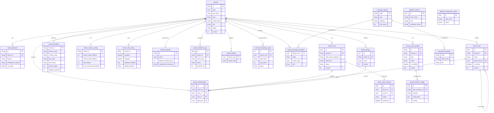

# R02 Tenant Management ERD

```mermaid
erDiagram
    tenants ||--o{ tenant_domains : "has"
    tenants ||--o{ tenant_auth_providers : "has"
    tenants ||--o| tenant_branding : "styled by"
    tenants ||--o| tenant_session_config : "has"
    tenants ||--o| tenant_mfa_config : "has"
    tenants }o--o| retention_policies : "governed by"
    tenants ||--o{ tenant_database_logs : "tracked by"
    tenants ||--o{ tenant_locales : "supports"
    tenants ||--o{ tenant_provisioning_steps : "provisioned via"
    tenants ||--o{ tenant_message_translation : "overrides"
    tenants ||--o{ tenant_users : "has"
    tenants ||--o{ tenant_roles : "defines"
    tenants ||--o{ tenant_groups : "defines"
    tenants ||--o{ tenant_memberships : "governs"
    message_registry ||--o{ message_translation : "translated as"
    message_registry ||--o{ tenant_message_translation : "overridden by"
    tenant_users ||--o{ tenant_memberships : "assigned"
    tenant_roles ||--o{ tenant_memberships : "grants"
    tenant_groups ||--o{ tenant_memberships : "includes"
    tenant_roles ||--o{ tenant_roles : "inherits from"
    tenant_users ||--o{ tenant_user_sessions : "tracked by"
    tenant_auth_providers ||--o{ tenant_provider_configs : "configured by"

    tenants {
        string id PK
        uuid uuid
        string full_name
        string slug
        string tenant_type
        string tier
        string status
        int version
    }

    tenant_domains {
        string id PK
        string tenant_id FK
        string domain
        string verification_method
        string ssl_status
    }

    tenant_auth_providers {
        string id PK
        string tenant_id FK
        string type
        string name
        boolean is_enabled
        json config
    }

    tenant_branding {
        string tenant_id PK
        string primary_color
        string surface_color
        string text_color
        string font_family
        int corner_radius
        int shadow_intensity
    }

    tenant_session_config {
        string tenant_id PK
        int access_token_lifetime
        int refresh_token_lifetime
        int idle_timeout
        int max_concurrent_sessions
    }

    tenant_mfa_config {
        string tenant_id PK
        boolean enabled
        boolean required
        text allowed_methods
        string default_method
    }

    retention_policies {
        string id PK
        string name
        int default_retention_days
        string compliance_framework
    }

    tenant_database_logs {
        string id PK
        string tenant_id FK
        string event_type
        string status
        int duration_ms
    }

    tenant_locales {
        uuid tenant_uuid PK
        string locale_code
    }

    tenant_provisioning_steps {
        int id PK
        uuid tenant_uuid FK
        string step_name
        int step_order
        string status
    }

    message_registry {
        string code PK
        string type
        string category
        int http_status
    }

    message_translation {
        string code PK
        string locale_code
        string title
    }

    tenant_message_translation {
        uuid tenant_uuid PK
        string code
        string locale_code
        string title
    }

    tenant_users {
        uuid id PK
        string tenant_id FK
        string auth_server_subject_id
        string username
        string status
        int version
    }

    tenant_roles {
        uuid id PK
        string tenant_id FK
        string name
        uuid parent_role_id FK
        boolean is_system
        int version
    }

    tenant_groups {
        uuid id PK
        string tenant_id FK
        string name
        int version
    }

    tenant_memberships {
        uuid id PK
        string tenant_id FK
        uuid user_id FK
        uuid role_id FK
        uuid group_id FK
    }

    tenant_user_sessions {
        uuid id PK
        string tenant_id FK
        uuid user_id FK
        string status
        datetime started_at
    }

    tenant_provider_configs {
        uuid id PK
        string auth_provider_id FK
        string protocol
        json config_data
        int version
    }

    platform_servers {
        uuid id PK
        string server_type
        string host
        string validation_status
    }

    platform_initialization_status {
        uuid id PK
        string step_name
        string status
    }
```
