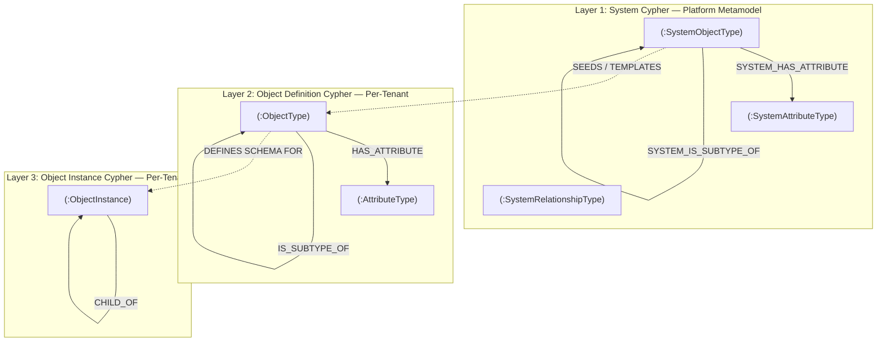
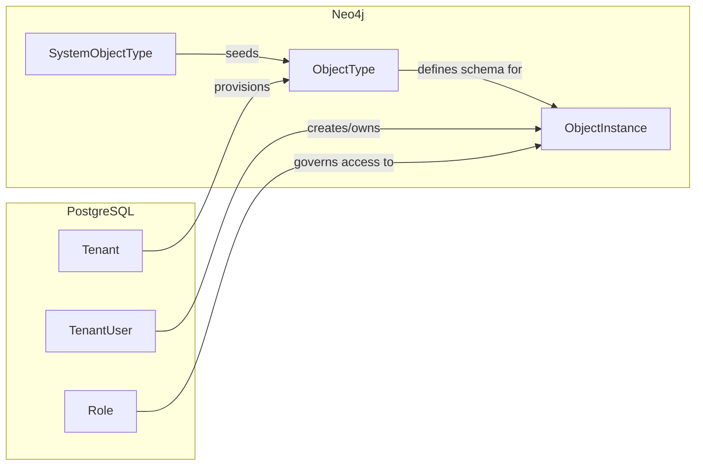
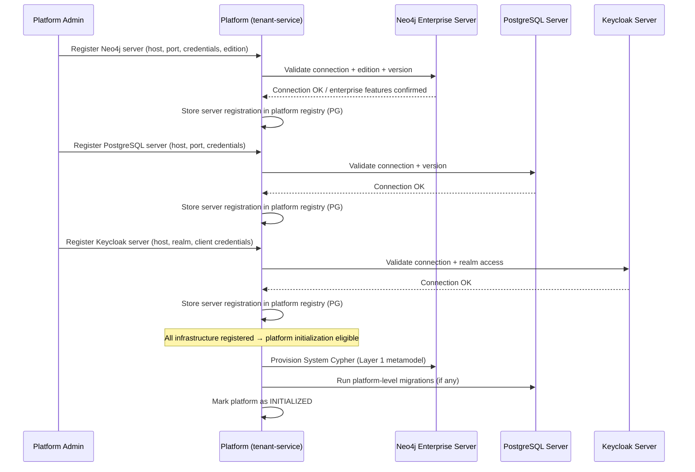
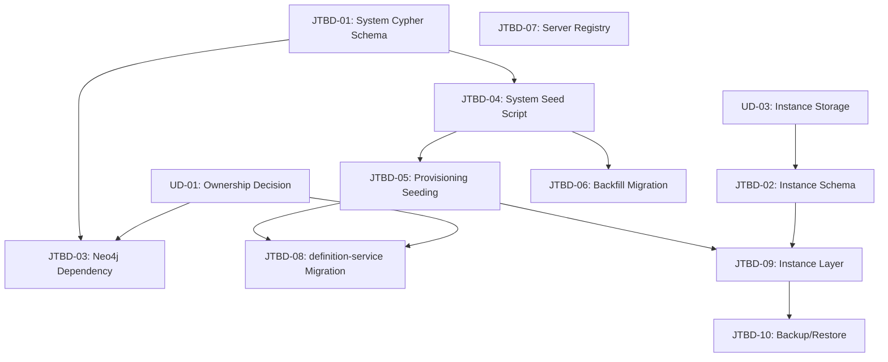

# R02 Foundation Track — 07 To-Be System Graph (Non-Auth)

**Status:** [REVISION 3] — Rewritten against `07-feedback-ledger.md`. User verdict required.
**Date:** 2026-03-25
**Classification:** Target model + impact analysis + transition design + planned work items
**Scope:** Non-auth graph only. Auth graph decision is sealed (Neo4j removed from auth domain).
**Revision input:** `07-feedback-ledger.md` — all 14 feedback items addressed below.

---

## Part 1: To-Be System Graph — Pure Target Model

### 1.1 Three-Layer Graph Architecture

The target system graph has three distinct layers, each with its own lifecycle, ownership, and provisioning rules:

### 1.2 Layer 1: System Cypher (Platform Metamodel)

**Purpose:** The platform-wide catalog of object types, attribute types, and allowed relationships. This is the "schema of schemas" — the master template from which per-tenant definitions are seeded.

**Cardinality:** One per platform (not per tenant)
**Mutability:** Platform admin only. Versioned. Tenants cannot modify.
**Lifecycle:** Created at platform initialization. Updated by platform admin. Version-tracked.

> **[FB-03]** This layer does NOT exist in the as-is system. The current VOO3 seed data (`voo3-seed.cypher`) is an implicit, unversioned precursor. Layer 1 explicitly replaces it with a versioned, queryable graph.

#### Node Categories

| Node Label | Purpose | Key Fields |
|------------|---------|-----------|
| `SystemObjectType` | Master object type definition | id, typeKey, name, code, description, iconName, iconColor, category, version, status |
| `SystemAttributeType` | Master attribute definition | id, attributeKey, name, dataType, attributeGroup, description, defaultValue, validationRules, version |
| `SystemRelationshipType` | Master allowed-connection definition | id, relationshipKey, activeName, passiveName, cardinality, isDirected, version |

#### Relationship Categories

| Relationship | From → To | Properties | Purpose |
|-------------|-----------|------------|---------|
| `SYSTEM_HAS_ATTRIBUTE` | SystemObjectType → SystemAttributeType | isRequired, displayOrder, version | Which attributes a system type defines |
| `SYSTEM_CAN_CONNECT_TO` | SystemObjectType → SystemObjectType | via SystemRelationshipType | Which system types can connect |
| `SYSTEM_IS_SUBTYPE_OF` | SystemObjectType → SystemObjectType | (none) | System-level type hierarchy |

#### Categories (from VOO3 Baseline — Seeded into Layer 1)

> **[FB-03]** These 24 types originate as VOO3 seed data. In the target model, they become SystemObjectType nodes in Layer 1. They are the initial content of the system metamodel, not its entirety.

| Category | System Object Types |
|----------|-------------------|
| Business Architecture | business_domain, business_capability, business_process, process_activity, assessment, action_plan, gap |
| Solution Architecture | application, application_component, screen, api_contract, data_entity, rule, test_case, code_asset |
| Realization | capability_realization |
| Change Management | project_instance, epic, feature, user_story, task |
| Audit/AI | evidence_record, safety_assessment, agent_exchange |

### 1.3 Layer 2: Object Definition Cypher (Per-Tenant Definitions)

**Purpose:** Per-tenant customization of the system metamodel. When a tenant is provisioned, Layer 1 seeds a copy of object type definitions into the tenant's definition graph. Tenants can then customize (add attributes, modify connections, create user-defined types).

**Cardinality:** One definition graph per tenant
**Mutability:** Tenant admin. Customizations tracked via `state` field.

> **[FB-13]** The `state` field exists on `ObjectTypeNode` in the as-is code (`ObjectTypeNode.java:63`, default value `"user_defined"`). Seeded types receive `state = 'default'` via `voo3-seed.cypher`. This is ObjectType-level, not attribute-level. The target model preserves this as ObjectType-level.

#### Node Categories

| Node Label | Purpose | Key Fields |
|------------|---------|-----------|
| `ObjectType` | Tenant-specific object type (seeded from SystemObjectType or user-created) | id, tenantId, typeKey, name, code, description, iconName, iconColor, status, state, sourceSystemVersion, createdAt, updatedAt |
| `AttributeType` | Tenant-specific attribute (seeded from SystemAttributeType or user-created) | id, tenantId, attributeKey, name, dataType, attributeGroup, description, defaultValue, validationRules, createdAt, updatedAt |

#### Relationship Categories

| Relationship | From → To | Properties | Purpose |
|-------------|-----------|------------|---------|
| `HAS_ATTRIBUTE` | ObjectType → AttributeType | isRequired, displayOrder | Tenant-level attribute composition |
| `CAN_CONNECT_TO` | ObjectType → ObjectType | relationshipKey, activeName, passiveName, cardinality, isDirected | Tenant-level allowed connections |
| `IS_SUBTYPE_OF` | ObjectType → ObjectType | (none) | Tenant-level type hierarchy |
| `SEEDED_FROM` | ObjectType → SystemObjectType | seedVersion, seedDate | Traceability to system template (NEW — does not exist in as-is) |

#### State Values

| State | Meaning | Evidence |
|-------|---------|----------|
| `default` | Unchanged from system seed | `voo3-seed.cypher` sets `state = 'default'` on all 24 seeded types |
| `customized` | Modified from system seed by tenant admin | Transition on edit (application logic in ObjectTypeService) |
| `user_defined` | Created by tenant, no system source | Default value in `ObjectTypeNode.java:63` |

### 1.4 Layer 3: Object Instance Cypher (Per-Tenant Data)

> **[FB-12] [DESIGN OPEN — requires SA verdict]** Layer 3 does not exist in the as-is system. The design below is the current best-understanding based on the three-layer architecture. Every structural assumption is flagged. Instance modeling (dynamic attribute storage, validation enforcement, connection constraint checking) is an open design question that must be resolved by SA before implementation.

**Purpose:** The actual objects tenants create — real applications, real business processes, real capabilities. Each instance conforms to an ObjectType definition from Layer 2.

**Cardinality:** Many instances per tenant
**Mutability:** Tenant users (based on RBAC permissions).

#### Node Categories

| Node Label | Purpose | Key Fields | Assumption Status |
|------------|---------|-----------|-------------------|
| `ObjectInstance` | A concrete object (e.g., "SAP ERP" of type `application`) | id, tenantId, objectTypeId, name, description, status, createdBy, createdAt, updatedAt | `[PROPOSED]` — node structure |
| (dynamic attributes) | Instance-specific attribute values | — | `[OPEN]` — storage approach not decided (see UD-03 in feedback ledger) |

**Open design questions for Layer 3:**

| Question | Options | Status |
|----------|---------|--------|
| How are dynamic attributes stored? | A: Neo4j properties on ObjectInstance node, B: Separate AttributeValue nodes linked by HAS_VALUE, C: Hybrid (simple values as properties, complex as nodes) | `[DECISION REQUIRED — SA]` |
| How is connection validation enforced? | A: Application-layer validation before write, B: Neo4j constraint/trigger, C: Async validation with eventual consistency | `[DECISION REQUIRED — SA]` |
| How is required-attribute validation enforced? | A: Application-layer validation, B: Schema-level constraint | `[DECISION REQUIRED — SA]` |

#### Relationship Categories (Proposed)

| Relationship | From → To | Properties | Purpose | Status |
|-------------|-----------|------------|---------|--------|
| `CONNECTED_TO` | ObjectInstance → ObjectInstance | relationshipTypeId, createdBy, createdAt | Concrete connection between objects | `[PROPOSED]` |
| `CHILD_OF` | ObjectInstance → ObjectInstance | (none) | Concrete hierarchy | `[PROPOSED]` |
| `INSTANCE_OF` | ObjectInstance → ObjectType | (none) | Links instance to its type definition | `[PROPOSED]` |

#### Validation Rules (Proposed)

- `CONNECTED_TO` between two instances is only valid if their respective ObjectTypes have a matching `CAN_CONNECT_TO` in Layer 2
- `ObjectInstance` attributes must conform to the `HAS_ATTRIBUTE` definitions on the instance's ObjectType
- Required attributes (from `HAS_ATTRIBUTE.isRequired`) must be present on creation
- **All validation rules are `[PROPOSED]` — enforcement mechanism is `[DECISION REQUIRED — SA]`**

### 1.5 Ownership and Boundaries

> **[FB-01] [DECISION REQUIRED — user verdict]** The ownership model below depends on whether definition-service is absorbed into tenant-service. Two options are presented. Neither is frozen.

#### Option A: Absorb definition-service into tenant-service

| Layer | Owner (Target) | Storage | Scope | Admin Level |
|-------|---------------|---------|-------|-------------|
| System Cypher | tenant-service | Neo4j | Platform-wide | Platform admin |
| Object Definition Cypher | tenant-service | Neo4j | Per-tenant | Tenant admin |
| Object Instance Cypher | tenant-service | Neo4j | Per-tenant | Tenant user (RBAC) |

**Implications:**
- tenant-service becomes polyglot (PostgreSQL + Neo4j)
- definition-service is removed (Eureka, gateway route, codebase)
- Single service owns tenant lifecycle + definitions + instances
- Risk: tenant-service grows large

#### Option B: Keep definition-service separate

| Layer | Owner (Target) | Storage | Scope | Admin Level |
|-------|---------------|---------|-------|-------------|
| System Cypher | tenant-service | Neo4j | Platform-wide | Platform admin |
| Object Definition Cypher | definition-service | Neo4j | Per-tenant | Tenant admin |
| Object Instance Cypher | definition-service | Neo4j | Per-tenant | Tenant user (RBAC) |

**Implications:**
- tenant-service remains PostgreSQL-only
- definition-service gains Instance layer + System Cypher read access
- Cross-service coordination for provisioning (tenant-service triggers, definition-service seeds)
- Clearer service boundary but more inter-service communication

#### Option C: Hybrid — Shared Neo4j, Separate API Surfaces

| Layer | Owner (Target) | Storage | Scope | Admin Level |
|-------|---------------|---------|-------|-------------|
| System Cypher | tenant-service | Neo4j (shared) | Platform-wide | Platform admin |
| Object Definition Cypher | definition-service | Neo4j (shared) | Per-tenant | Tenant admin |
| Object Instance Cypher | definition-service | Neo4j (shared) | Per-tenant | Tenant user (RBAC) |

**Implications:**
- tenant-service owns system metamodel + provisioning only
- definition-service owns definition + instance CRUD
- Shared Neo4j database, different service responsibilities
- Minimal change from as-is for definition-service

**User verdict required before proceeding. This decision blocks Phase 3 transition and all downstream design.**

### 1.6 Cross-Layer Relationships

- **PostgreSQL → Neo4j:** Tenant provisioning seeds definition graph from system graph. RBAC (PG) governs who can create/edit instances (Neo4j). Tenant ID in PG is the partition key for Neo4j data.
- **Neo4j → PostgreSQL:** Instance ownership tracked by `createdBy` (references `tenant_users.id` in PG). Audit events for graph mutations published to Kafka → audit-service (PG).

---

## Part 2: Impact on Current Architecture

> **[FB-14]** Each impact includes: what exists today (with evidence), what changes in target, migration path, and what breaks if not addressed.

### 2.1 definition-service — `[DECISION REQUIRED]`

> **[FB-01]** This section describes the impact IF absorption (Option A) is chosen. If Option B or C is chosen, the impact differs. Both paths are described.

#### If Option A (Absorb):

| Aspect | Current (AS-IS) | Evidence | Target | Migration Path | Breaks If Not Addressed |
|--------|-----------------|----------|--------|----------------|------------------------|
| Service | definition-service (port 8090) | `backend/definition-service/` | **Removed** — absorbed into tenant-service | Migrate entities, repositories, services, controllers into tenant-service module | All definition CRUD fails |
| Neo4j config | Own `Neo4jConfig.java` | `definition-service/.../config/Neo4jConfig.java` | tenant-service owns Neo4j connection | Add Spring Data Neo4j dependency to tenant-service | No graph access from tenant-service |
| Entity model | `ObjectTypeNode`, `AttributeTypeNode` | `definition-service/.../node/ObjectTypeNode.java`, `AttributeTypeNode.java` | Replaced by 3-layer model (System/Definition/Instance) | Extend existing entities + add SystemObjectType, ObjectInstance | Layer 1 and 3 do not exist |
| API surface | `/api/v1/definitions/*` (18 endpoints) | `definition-service/.../controller/ObjectTypeController.java`, `AttributeTypeController.java` | Migrates to tenant-service API surface | Re-expose same endpoints from tenant-service, redirect gateway route | API consumers break |
| Eureka registration | `DEFINITION-SERVICE` | `definition-service/src/main/resources/application.yml` | Removed from registry | Deregister after all consumers migrate | Stale registry entry, routing failures |
| Gateway route | `/services/definitions/**` → `lb://DEFINITION-SERVICE` | `api-gateway/.../application.yml` | Route points to tenant-service | Update gateway route config | 404 on all definition requests |

#### If Option B or C (Keep Separate):

| Aspect | Current (AS-IS) | Target | Migration Path |
|--------|-----------------|--------|----------------|
| Service | definition-service (port 8090) | Remains, gains Instance layer | Extend existing service |
| Neo4j config | Own Neo4jConfig | Unchanged | None |
| Entity model | ObjectTypeNode, AttributeTypeNode | + SystemObjectType (read), ObjectInstance (new) | Add new entities |
| API surface | `/api/v1/definitions/*` | + `/api/v1/instances/*` | Add new controllers |
| Provisioning | No provisioning role | Receives seed trigger from tenant-service | Add provisioning listener (Kafka or Feign) |

### 2.2 tenant-service Changes

| Aspect | Current (AS-IS) | Evidence | Target (Option A) | Target (Option B/C) |
|--------|-----------------|----------|-------------------|---------------------|
| Database | PostgreSQL only | `tenant-service/pom.xml` (no Neo4j dependency) | PostgreSQL + Neo4j (polyglot) | PostgreSQL only (+ System Cypher if Option C) |
| Neo4j dependency | None | `pom.xml` excludes `spring-boot-starter-data-neo4j` | Spring Data Neo4j added | None (or minimal for System Cypher) |
| Entities | 11 PG entities | `tenant-service/.../entity/*.java` | 11 PG entities + 3 graph layers | 11 PG entities + System Cypher only |
| API surface | Tenant CRUD, branding, domains, provisioning | `tenant-service/.../controller/*.java` | + definition CRUD, instance CRUD, system metamodel admin | + system metamodel admin only |
| Provisioning | PG + Keycloak realm + `definitions_db_name` column (unused) | `V8__per_service_routing_metadata.sql` | PG + Keycloak + Neo4j graph seeding | PG + Keycloak + trigger definition-service to seed |

### 2.3 Provisioning Flow Changes

> **[FB-10]** Provisioning assumes external infrastructure is already registered (see Part 6). Tenant provisioning creates tenant-scoped structures INTO registered servers. It does NOT manage infrastructure.

| Step | Current | Evidence | Target |
|------|---------|----------|--------|
| Pre | — | — | **PREREQUISITE:** External Neo4j, PostgreSQL, Keycloak servers registered and validated (see Part 6) |
| 1 | Create tenant row in PG | `TenantProvisioningService.java` | Create tenant row in PG (unchanged) |
| 2 | Configure Keycloak realm | `KeycloakProvisioningService.java` | Configure Keycloak realm (unchanged) |
| 3 | — | — | **NEW: Seed tenant definition graph from System Cypher (Layer 1 → Layer 2)** |
| 4 | — | — | **NEW: Initialize empty instance graph space for tenant (Layer 3 placeholder)** |
| 5 | — | — | **NEW: Record provisioning status for graph seeding** |

**Rollback on failure:** If step 3 or 4 fails, the tenant enters `PROVISIONING_FAILED` status. Graph nodes created in the failed step must be cleaned up. PG and Keycloak steps are independently rollback-able.

### 2.4 Data Available to Factsheet

> **[FB-11]** This section describes what graph data becomes AVAILABLE to the factsheet. It does NOT prescribe UI tabs or components — those are a UX subtrack decision.

| Data Source | Available After | Description |
|-------------|----------------|-------------|
| Definition count | Phase 2 | Number of ObjectTypes in tenant's definition graph (seeded + customized + user-defined) |
| Definition details | Phase 2 | ObjectType names, states, attribute counts, connection counts |
| Customization delta | Phase 2 | Which definitions differ from system baseline (state != 'default') |
| Instance count | Phase 3 | Number of ObjectInstances per ObjectType |
| Instance details | Phase 3 | ObjectInstance names, statuses, creation dates, owners |
| Connection graph | Phase 3 | CONNECTED_TO relationships between instances |
| Type coverage | Phase 3 | Which ObjectTypes have instances vs which are unused |

**[PROPOSED — UX verdict required]** How this data is surfaced in the factsheet UI (tabs, cards, charts, inline sections) is a UX design decision that must go through the UX subtrack.

---

## Part 3: Transition Architecture

### Phase 0: Current State (AS-IS)

**State:** definition-service runs independently. Shared Neo4j. 2 node types. No System Cypher. No Instance layer.

| Component | State | Evidence |
|-----------|-------|----------|
| definition-service | Active, port 8090 | `backend/definition-service/` |
| Neo4j | Shared single database | `definition-service/.../config/Neo4jConfig.java` (default connection) |
| Node types | ObjectTypeNode, AttributeTypeNode | `definition-service/.../node/*.java` |
| Tenant isolation | Field-based (`tenantId` on every node) | `ObjectTypeNode.java` field + repository queries |
| Seed data | 24 VOO3 types, 6 connections per tenant | `voo3-seed.cypher` |
| System metamodel | Does not exist (implicit in seed file) | — |
| Instance layer | Does not exist | — |
| Control plane scaffolding | `tenants.definitions_db_name` column exists, unused | `V8__per_service_routing_metadata.sql` |

**No changes. This is the starting point.**

### Phase 1: System Cypher Introduced

**Goal:** Establish the platform metamodel as an explicit, versioned, queryable graph.

**Concrete changes:**
1. Create `SystemObjectType` nodes — one per VOO3 object type (24 initial nodes)
2. Create `SystemAttributeType` nodes — one per attribute definition in the VOO3 seed
3. Create `SystemRelationshipType` nodes — one per allowed connection (6 initial)
4. Create `SYSTEM_HAS_ATTRIBUTE`, `SYSTEM_CAN_CONNECT_TO`, `SYSTEM_IS_SUBTYPE_OF` relationships
5. Add version tracking: system graph version = `1.0.0` (baseline = current 24 types + 6 connections)
6. Graph owner (tenant-service or definition-service depending on Option A/B/C) gains `SystemGraph` repository layer

**Coexistence rules:**
- definition-service continues serving existing tenant definitions (unchanged)
- System Cypher is read-only for all except platform admin
- No tenant definition graphs are modified
- System Cypher lives in a system namespace (e.g., `tenantId = '__SYSTEM__'` or separate label prefix)

**Ownership (temporary):**
- System Cypher: tenant-service (new)
- Definition Cypher: definition-service (existing, unchanged)

**Rollback:** Remove System Cypher nodes. No tenant impact (seed file still works).

### Phase 2: Tenant Definition Graph Seeding from System Cypher

**Goal:** Replace manual `voo3-seed.cypher` execution with provisioning-driven seeding from System Cypher.

**Concrete changes:**
1. Tenant provisioning gains a step: "Seed tenant definition graph from System Cypher"
2. For each `SystemObjectType`, create a tenant-scoped `ObjectType` with `state = 'default'`
3. Add `SEEDED_FROM` relationship: `(ObjectType)-[:SEEDED_FROM {seedVersion, seedDate}]->(SystemObjectType)`
4. `sourceSystemVersion` field on ObjectType tracks which system version was used
5. **New tenants:** seeded from System Cypher (not from static seed file)
6. **Existing tenants:** backfill migration adds `SEEDED_FROM` relationships to existing ObjectTypes (non-destructive — no data modified, only relationships added)

**Coexistence rules:**
- definition-service still serves reads/writes for tenant definitions
- Seeding is done by the provisioning owner (tenant-service)
- Both services read the same Neo4j graph (shared database)

**Ownership (temporary):**
- System Cypher: tenant-service
- Definition Cypher: definition-service (reads/writes) + tenant-service (seeding only)

**Rollback:** Revert provisioning to use `voo3-seed.cypher`. Existing tenants unaffected. `SEEDED_FROM` relationships are harmless to leave in place.

### Phase 3: Graph Consolidation + Instance Layer

> **[FB-01]** This phase differs significantly between Option A (absorb) and Option B/C (keep separate). Both paths described.

#### Phase 3A: If Absorption (Option A)

**Goal:** Consolidate all graph ownership into tenant-service. Activate Instance layer.

**Concrete changes:**
1. Migrate definition CRUD code from definition-service to tenant-service (entities, repositories, services, controllers)
2. Add Neo4j dependency to tenant-service `pom.xml`
3. Create Instance layer entities: `ObjectInstance`, `CONNECTED_TO`, `CHILD_OF`, `INSTANCE_OF`
4. Create instance validation layer (validates against Layer 2 definitions)
5. Update gateway route: `/services/definitions/**` → tenant-service
6. Deregister definition-service from Eureka
7. Remove definition-service from codebase

**Rollback:** Re-enable definition-service. Restore gateway route. Instance data preserved in shared Neo4j.

#### Phase 3B: If Keep Separate (Option B/C)

**Goal:** Extend definition-service with Instance layer. No service consolidation.

**Concrete changes:**
1. Add Instance layer entities to definition-service
2. Add instance validation layer
3. Add `/api/v1/instances/*` endpoints to definition-service
4. tenant-service signals definition-service for provisioning events (Kafka or Feign)

**Rollback:** Remove instance entities and endpoints. Definition layer unaffected.

### Phase 4: UI / Factsheet Dynamic Data Binding

**Goal:** Factsheet and UI components consume graph data dynamically.

**Concrete changes:**
1. Factsheet queries Layer 2 to discover available object types for a tenant
2. Factsheet queries Layer 3 to show actual object instances per type
3. Connection visualization shows `CONNECTED_TO` relationships between instances
4. **[PROPOSED — UX verdict required]** Renderer registry maps ObjectType → UI component (if sanctioned)

**Coexistence rules:**
- `[TRANSITION]` Static factsheet views coexist with dynamic discovery during rollout
- `[TARGET]` Factsheet is graph-data-driven: available types, instances, connections all derived from Layer 2 + 3

**Rollback:** Revert to static factsheet views. Graph data preserved.

### Cutover Rules

| Rule | Description |
|------|------------|
| **No data loss** | Every existing ObjectTypeNode and AttributeTypeNode preserved during any migration. Backfill relationships, never delete or recreate. |
| **API compatibility** | During transitions, consumers see the same endpoints. Gateway routing handles redirection transparently. |
| **Rollback per phase** | Each phase is independently rollback-able. No phase destroys the ability to return to the previous state. |
| **Feature flag** | Instance layer activation controlled by feature flag. |
| **Read-before-write** | During coexistence periods, writes go to the authoritative owner. The other service is read-only. |

---

## Part 4: Platform Initialization / External Infrastructure Registration

> **[FB-04]** This section covers the COTS deployment vision. Infrastructure is external. The platform discovers, validates, and registers it. This is SEPARATE from tenant provisioning.

### 4.1 Infrastructure Registration Flow

### 4.2 Registration Requirements

| Server | Validation | What Gets Provisioned |
|--------|-----------|----------------------|
| Neo4j Enterprise | Connection, authentication, edition (Enterprise required for production), version compatibility | System Cypher (Layer 1). Per-tenant definition/instance graphs during tenant provisioning. |
| PostgreSQL | Connection, authentication, version compatibility | Platform-level tables (tenant registry, platform config). Per-tenant schema/rows during tenant provisioning. |
| Keycloak | Connection, realm access, client credentials | Per-tenant realm configuration during tenant provisioning. |

### 4.3 Separation of Concerns

| Concern | When | What Happens |
|---------|------|-------------|
| **Infrastructure registration** | Platform setup (once) | External servers are discovered, validated, and registered in platform registry |
| **Platform initialization** | After registration (once) | System Cypher seeded, platform-level PG schema created |
| **Tenant provisioning** | Per tenant (many times) | Tenant structures created in already-registered, already-initialized infrastructure |

---

## Part 5: PostgreSQL Canonical Model Impact

> **[FB-05]** This section identifies what the three-layer graph means for the PostgreSQL canonical model. It is input for the PG canonical model subtrack, not the model itself.

### 5.1 Cross-Reference Points (PG ↔ Neo4j)

| PG Entity | Neo4j Entity | Cross-Reference | Direction |
|-----------|-------------|-----------------|-----------|
| `tenants.id` | `ObjectType.tenantId`, `ObjectInstance.tenantId` | Tenant partition key | PG → Neo4j |
| `tenant_users.id` | `ObjectInstance.createdBy` | Instance ownership | PG → Neo4j |
| `roles` / `permissions` | ObjectInstance access | RBAC governs who can CRUD instances | PG → Neo4j (application-layer enforcement) |
| `tenants.definitions_db_name` | Neo4j database/namespace for definitions | Per-tenant graph routing (if applicable) | PG → Neo4j |
| `audit_events` | Graph mutations | Instance create/update/delete events | Neo4j → PG (via Kafka) |

### 5.2 New PG Tables or Columns (Potential)

> These are CANDIDATES, not approved schema. The PG canonical model subtrack owns the final design.

| Table/Column | Purpose | Status |
|-------------|---------|--------|
| `platform_server_registry` | Stores registered external server connections (Neo4j, PG, Keycloak) | `[PROPOSED]` — needed for COTS deployment |
| `system_graph_version` | Tracks current System Cypher version | `[PROPOSED]` — needed for version-aware seeding |
| `tenant_graph_provisioning_status` | Tracks per-tenant graph seeding status | `[PROPOSED]` — needed for provisioning rollback |
| `tenants.graph_seed_version` | Which system graph version this tenant was seeded from | `[PROPOSED]` — needed for upgrade tracking |

### 5.3 Existing PG Tables Affected

| Table | Impact | Reason |
|-------|--------|--------|
| `tenants` | May gain `graph_seed_version` column | Track which system metamodel version seeded this tenant |
| `tenants.definitions_db_name` | Becomes meaningful (currently unused) | Per-tenant graph routing for definition-service or tenant-service |
| `tenant_provisioning_steps` (if exists) | Gains graph-seeding steps | Provisioning now includes Neo4j seeding |

---

## Part 6: ERD Impact

> **[FB-06]** This section identifies every PG ↔ Neo4j cross-reference that must appear in the ERD. It is input for the ERD subtrack, not the ERD itself.

### 6.1 Cross-References for ERD

| # | PG Side | Neo4j Side | Relationship | Enforcement |
|---|---------|-----------|--------------|-------------|
| 1 | `tenants.id` (PK) | `ObjectType.tenantId` | Every ObjectType belongs to exactly one tenant | Application-layer (Neo4j has no FK to PG) |
| 2 | `tenants.id` (PK) | `ObjectInstance.tenantId` | Every ObjectInstance belongs to exactly one tenant | Application-layer |
| 3 | `tenant_users.id` (PK) | `ObjectInstance.createdBy` | Every ObjectInstance has a creator | Application-layer |
| 4 | `tenants.definitions_db_name` | Neo4j database name | Per-tenant graph routing | Configuration-layer |
| 5 | `audit_events` table | Graph mutation events | Every graph write produces an audit event | Kafka event (eventual consistency) |
| 6 | `roles` + `permissions` | ObjectInstance CRUD operations | RBAC governs graph access | Application-layer |

### 6.2 ERD Notation Requirements

- Cross-store references (PG ↔ Neo4j) must be visually distinct from same-store foreign keys
- The ERD must show which references are enforced at application layer vs database layer
- Neo4j entities should appear as a separate partition in the ERD (not mixed with PG tables)

---

## Part 7: Backup / Restore / Rollback

> **[FB-07]** Graph data is tenant-critical. This section covers durability requirements.

### 7.1 Backup Strategy

| Layer | Backup Scope | Frequency | Method |
|-------|-------------|-----------|--------|
| System Cypher | Entire system graph | On every system graph version change | Neo4j backup (full database or targeted Cypher export) |
| Definition Cypher | Per-tenant definition graph | On every definition change (or periodic) | Neo4j backup + tenant-scoped Cypher export |
| Instance Cypher | Per-tenant instance graph | Periodic (schedule TBD) + on-demand | Neo4j backup + tenant-scoped Cypher export |

### 7.2 Restore Strategy

| Scenario | Restore Approach | Consistency Requirement |
|----------|-----------------|----------------------|
| Single tenant data loss | Re-seed from System Cypher (Layer 2) + restore instances from backup | Tenant PG data must be consistent — restore PG and Neo4j together or accept eventual consistency |
| System graph corruption | Restore System Cypher from backup | No tenant impact until next seeding operation |
| Full Neo4j failure | Restore full Neo4j backup | All PG cross-references (tenantId, createdBy) must still be valid |

### 7.3 PG ↔ Neo4j Consistency

| Risk | Mitigation |
|------|-----------|
| PG restored but Neo4j not (or vice versa) | Cross-store references become dangling. Validation job must detect and report orphans. |
| Tenant deleted in PG but graph data remains | Graph cleanup must be part of tenant deletion flow (not a background job assumption). |
| Neo4j restored to older state than PG | Audit events in PG reference graph mutations that no longer exist. Accept as historical record. |

### 7.4 Provisioning Rollback

| Failure Point | Rollback Action |
|---------------|----------------|
| Graph seeding fails mid-way | Delete all nodes with the tenant's `tenantId` created in this provisioning attempt. Set tenant status to `PROVISIONING_FAILED`. |
| Instance graph initialization fails | Delete instance-layer nodes for this tenant. Definition layer unaffected. |
| System Cypher version upgrade fails | Revert System Cypher nodes to previous version. No tenant impact (tenants reference `seedVersion`, not live system graph). |

---

## Part 8: JTBD / Planned Work Items

> **[FB-08]** These are actionable work items, not passive gate bullets.

### JTBD-01: Design System Cypher Schema

| Attribute | Value |
|-----------|-------|
| **Description** | Design the System Cypher (Layer 1) node labels, properties, relationships, and version strategy |
| **Acceptance criteria** | Schema document with node definitions, relationship definitions, version tracking strategy, naming conventions |
| **Owner** | SA |
| **Blocks** | Phase 1 implementation |
| **Blocked by** | User verdict on 07 (this document) |
| **Complexity** | Medium |

### JTBD-02: Design Instance Cypher Schema

| Attribute | Value |
|-----------|-------|
| **Description** | Design the Object Instance (Layer 3) node structure, dynamic attribute storage, validation rules, and relationship types |
| **Acceptance criteria** | Schema document resolving UD-03 (attribute storage approach), validation enforcement mechanism, relationship validation rules |
| **Owner** | SA |
| **Blocks** | Phase 3 implementation |
| **Blocked by** | JTBD-01, user verdict on UD-03 |
| **Complexity** | High |

### JTBD-03: Add Neo4j Dependency to Graph Owner Service

| Attribute | Value |
|-----------|-------|
| **Description** | Add Spring Data Neo4j to tenant-service (Option A) or extend definition-service (Option B/C) |
| **Acceptance criteria** | Service connects to Neo4j, SystemGraph repository layer operational, integration test passes |
| **Owner** | DEV |
| **Blocks** | Phase 1 implementation |
| **Blocked by** | User verdict on UD-01 (ownership decision), JTBD-01 |
| **Complexity** | Medium |

### JTBD-04: Implement System Cypher Seed Script

| Attribute | Value |
|-----------|-------|
| **Description** | Convert VOO3 seed data into System Cypher nodes. Create versioned migration script. |
| **Acceptance criteria** | 24 SystemObjectType nodes, corresponding SystemAttributeType nodes, 6 SystemRelationshipType nodes, version = 1.0.0, idempotent execution |
| **Owner** | DBA |
| **Blocks** | Phase 1 completion |
| **Blocked by** | JTBD-01 |
| **Complexity** | Medium |

### JTBD-05: Implement Provisioning-Driven Seeding

| Attribute | Value |
|-----------|-------|
| **Description** | Replace manual `voo3-seed.cypher` execution with provisioning-driven seeding from System Cypher |
| **Acceptance criteria** | New tenant provisioning seeds Layer 2 from Layer 1, `SEEDED_FROM` relationships created, `sourceSystemVersion` populated, provisioning status tracked |
| **Owner** | DEV |
| **Blocks** | Phase 2 completion |
| **Blocked by** | Phase 1 complete, JTBD-04 |
| **Complexity** | High |

### JTBD-06: Backfill Existing Tenant Definitions

| Attribute | Value |
|-----------|-------|
| **Description** | Add `SEEDED_FROM` relationships to existing tenant ObjectType nodes (non-destructive migration) |
| **Acceptance criteria** | Every existing ObjectType with `state = 'default'` gets a `SEEDED_FROM` relationship to its SystemObjectType. No data modified. Migration is idempotent. |
| **Owner** | DBA |
| **Blocks** | Phase 2 completion |
| **Blocked by** | Phase 1 complete, JTBD-04 |
| **Complexity** | Medium |

### JTBD-07: Design Platform Server Registry

| Attribute | Value |
|-----------|-------|
| **Description** | Design the PG schema for registering external infrastructure servers (Neo4j, PostgreSQL, Keycloak) |
| **Acceptance criteria** | Table schema, registration API contract, validation rules, connection test mechanism |
| **Owner** | SA |
| **Blocks** | COTS deployment capability |
| **Blocked by** | User verdict on 07 |
| **Complexity** | Medium |

### JTBD-08: definition-service Migration (Option A Only)

| Attribute | Value |
|-----------|-------|
| **Description** | Migrate definition-service entities, repositories, services, and controllers into tenant-service. Update gateway routes. Deregister from Eureka. |
| **Acceptance criteria** | All 18 definition endpoints operational from tenant-service, integration tests pass, gateway route updated, definition-service removed |
| **Owner** | DEV |
| **Blocks** | Phase 3A completion |
| **Blocked by** | User verdict on UD-01, Phase 2 complete |
| **Complexity** | Very High |

### JTBD-09: Implement Instance Layer

| Attribute | Value |
|-----------|-------|
| **Description** | Create ObjectInstance node, CONNECTED_TO, CHILD_OF, INSTANCE_OF relationships. Implement validation layer. |
| **Acceptance criteria** | Instance CRUD endpoints, connection validation against Layer 2, required-attribute validation, RBAC integration |
| **Owner** | DEV |
| **Blocks** | Phase 3 completion |
| **Blocked by** | JTBD-02, Phase 2 complete, PG canonical model approved (for RBAC) |
| **Complexity** | Very High |

### JTBD-10: Design Backup/Restore Strategy

| Attribute | Value |
|-----------|-------|
| **Description** | Design and implement backup/restore procedures for the three-layer graph with PG consistency |
| **Acceptance criteria** | Backup scripts for all 3 layers, restore procedures tested, PG ↔ Neo4j consistency validation job, provisioning rollback tested |
| **Owner** | DBA + DevOps |
| **Blocks** | Production readiness |
| **Blocked by** | Phase 3 complete |
| **Complexity** | High |

### Dependency Graph

---

## Part 9: Affected Requirement Tracks and Documents

> **[FB-09]** Comprehensive list of every downstream document that must change once 07 is approved.

### 9.1 Requirement Tracks

| Track | Impact | Reason |
|-------|--------|--------|
| **R01 — Platform Setup** | System Cypher initialization, infrastructure registration, platform server registry | Platform initialization now includes Layer 1 seeding and external server registration |
| **R02 — Tenant Management** | Provisioning gains graph seeding, factsheet gains graph data, tenant lifecycle includes graph cleanup | Core impact — this IS the R02 system graph |
| **R04 — Object Definitions** | Layer 2 is the definition layer. All R04 design must align with this three-layer model. | Definition CRUD, customization, seeding, state tracking all governed by this design |
| **R07 — Object Instances** | Layer 3 is the instance layer. All R07 design must align with this model. | Instance CRUD, connections, validation, RBAC all governed by this design |
| **R08 — Reporting / Analytics** | Instance data is queryable. Reporting must understand graph traversal for connections. | Cross-type queries, connection analysis, coverage reports depend on instance layer |

### 9.2 Architecture Documents (arc42)

| Document | Sections Affected | Reason |
|----------|------------------|--------|
| `Architecture/03-context-scope.md` | System context, service boundaries | definition-service role changes (absorption or extension) |
| `Architecture/04-solution-strategy.md` | Storage strategy, polyglot persistence | Three-layer graph + PG cross-references |
| `Architecture/05-building-blocks.md` | Service decomposition | definition-service boundary changes |
| `Architecture/06-runtime-view.md` | Provisioning sequence, definition CRUD | New provisioning steps, API migration |
| `Architecture/08-crosscutting.md` | Multi-tenancy, data isolation | Graph-level tenant isolation strategy |
| `Architecture/09-architecture-decisions.md` | ADRs for graph topology, service absorption | New ADRs needed |

### 9.3 TOGAF Documents

| Document | Sections Affected | Reason |
|----------|------------------|--------|
| `togaf/03-data-architecture.md` | Data ownership, entity catalog, storage mapping | Three-layer graph entities, PG ↔ Neo4j cross-references |
| `togaf/04-application-architecture.md` | Service responsibilities | definition-service role change |
| `togaf/07-migration-planning.md` | Migration phases | Phase 1-4 transition architecture |
| `togaf/artifacts/catalogs/application-portfolio-catalog.md` | Service catalog | definition-service status change |
| `togaf/artifacts/catalogs/data-entity-catalog.md` | Entity catalog | New graph entities (System, Instance layers) |
| `togaf/artifacts/matrices/application-to-data-matrix.md` | Service-to-data mapping | Graph ownership changes |
| `togaf/artifacts/building-blocks/ABB-002-tenant-context-enforcement.md` | Graph-level tenant enforcement | Three-layer isolation model |

### 9.4 LLD Documents

| Document | Sections Affected | Reason |
|----------|------------------|--------|
| `lld/graph-per-tenant-lld.md` | Entire document scope | Must add definition/instance graph topology (currently auth-only) |
| `lld/database-durability-strategy.md` | Backup/restore | Neo4j backup for three-layer graph |
| `lld/deployment-installer-blueprint.md` | Infrastructure registration | COTS deployment: external server registration |
| `lld/integration-hub-spec.md` | Service integration | definition-service ↔ tenant-service integration (if kept separate) |

### 9.5 R02 Foundation Documents

| Document | Sections Affected | Reason |
|----------|------------------|--------|
| `01-node-inventory.md` | Add SystemObjectType, SystemAttributeType, SystemRelationshipType, ObjectInstance nodes | Three new node types |
| `02-relationship-inventory.md` | Add SYSTEM_* relationships, SEEDED_FROM, INSTANCE_OF, CONNECTED_TO, CHILD_OF | New relationship types |
| `03-ownership-boundaries.md` | Graph ownership section | definition-service ownership depends on UD-01 |
| `04-data-residency.md` | Neo4j residency section | Three-layer graph storage mapping |
| `05-topology-contract.md` | Non-auth topology section (Part C) | Graph topology for definitions/instances |

### 9.6 PRD Impact

The PRD (when written) must carry `[AS-IS]` / `[TRANSITION]` / `[TARGET]` tags for:
- System graph topology and ownership
- PostgreSQL ↔ Neo4j ownership boundaries
- Provisioning flow (including graph seeding)
- Journeys that touch definition or instance data
- API contracts for definition and instance CRUD
- Service boundaries (definition-service absorption or retention)
- Factsheet assumptions about graph data availability

---

## Part 10: As-Is Appendix (Reference Only)

> This section is reference material for migration planning. It is not part of the to-be design.

### A.1 Current definition-service

- **Port:** 8090
- **Database:** Neo4j (shared, single database)
- **Entities:** ObjectTypeNode (24 seeded per tenant), AttributeTypeNode
- **Relationships:** HAS_ATTRIBUTE, CAN_CONNECT_TO, IS_SUBTYPE_OF
- **Tenant isolation:** Field-based (`tenantId` on every node)
- **Routing:** None (default Spring Data Neo4j connection)
- **Migrations:** None (manual seed only)
- **Neo4j config:** `backend/definition-service/src/main/java/com/ems/definition/config/Neo4jConfig.java` — Cypher DSL dialect only

### A.2 Control Plane Scaffolding

- `tenants.definitions_db_name` column exists (V8 migration) — unused
- `TenantRoutingResponse.definitionsDbName` field populated — unused
- `definitions_db_name` format: `tenant_{slug}_definitions`

### A.3 Seed Data

- `backend/definition-service/src/main/resources/data/voo3-seed.cypher`
- 24 ObjectTypes across 5 domains
- 6 CAN_CONNECT_TO relationships
- Parameterized by `$tenantId`

### A.4 API Surface (to be migrated or extended)

| Method | Path | Purpose |
|--------|------|---------|
| GET | `/api/v1/definitions/object-types` | List object types (paginated, tenant-scoped) |
| POST | `/api/v1/definitions/object-types` | Create object type |
| GET | `/api/v1/definitions/object-types/{id}` | Get object type |
| PUT | `/api/v1/definitions/object-types/{id}` | Update object type |
| DELETE | `/api/v1/definitions/object-types/{id}` | Delete object type |
| POST | `/api/v1/definitions/object-types/{id}/duplicate` | Duplicate (state=user_defined) |
| POST | `/api/v1/definitions/object-types/{id}/restore` | Restore to default |
| GET | `/api/v1/definitions/object-types/{id}/attributes` | List attributes |
| POST | `/api/v1/definitions/object-types/{id}/attributes` | Add attribute |
| DELETE | `/api/v1/definitions/object-types/{id}/attributes/{attrId}` | Remove attribute |
| GET | `/api/v1/definitions/object-types/{id}/connections` | List connections |
| POST | `/api/v1/definitions/object-types/{id}/connections` | Add connection |
| DELETE | `/api/v1/definitions/object-types/{id}/connections/{connId}` | Remove connection |
| GET | `/api/v1/definitions/attribute-types` | List attribute types |
| POST | `/api/v1/definitions/attribute-types` | Create attribute type |
| GET | `/api/v1/definitions/attribute-types/{id}` | Get attribute type |
| PUT | `/api/v1/definitions/attribute-types/{id}` | Update attribute type |
| DELETE | `/api/v1/definitions/attribute-types/{id}` | Delete attribute type |

### A.5 Evidence Index

| Artifact | Path |
|----------|------|
| ObjectTypeNode | `backend/definition-service/src/main/java/com/ems/definition/node/ObjectTypeNode.java` |
| AttributeTypeNode | `backend/definition-service/src/main/java/com/ems/definition/node/AttributeTypeNode.java` |
| HAS_ATTRIBUTE relationship | `backend/definition-service/src/main/java/com/ems/definition/node/relationship/HasAttributeRelationship.java` |
| CAN_CONNECT_TO relationship | `backend/definition-service/src/main/java/com/ems/definition/node/relationship/CanConnectToRelationship.java` |
| ObjectTypeRepository | `backend/definition-service/src/main/java/com/ems/definition/repository/ObjectTypeRepository.java` |
| AttributeTypeRepository | `backend/definition-service/src/main/java/com/ems/definition/repository/AttributeTypeRepository.java` |
| Neo4j config | `backend/definition-service/src/main/java/com/ems/definition/config/Neo4jConfig.java` |
| VOO3 seed | `backend/definition-service/src/main/resources/data/voo3-seed.cypher` |
| Control plane V8 | `backend/tenant-service/src/main/resources/db/migration/V8__per_service_routing_metadata.sql` |
| Routing DTO | `backend/tenant-service/src/main/java/com/ems/tenant/dto/internal/TenantRoutingResponse.java` |
