# PRD: Definition Management

**Document ID:** PRD-DM-001
**Version:** 2.1.0
**Date:** 2026-03-10
**Status:** Draft
**Author:** BA Agent
**Stakeholders:** Product Owner, Architecture Team, Development Team

---

## Table of Contents

1. [Vision and Purpose](#1-vision-and-purpose)
2. [Problem Statement](#2-problem-statement)
3. [Key Value Propositions](#3-key-value-propositions)
4. [Target Users / Personas](#4-target-users--personas)
5. [Business Domain Model](#5-business-domain-model)
6. [Feature Requirements](#6-feature-requirements)
   - AP-1 [Definition / Instance Repository Separation](#ap-1-definition-repository--instance-repository-separation-planned)
   - AP-2 [Default Attributes per Object Type](#ap-2-default-attributes-per-object-type-planned)
   - AP-3 [Definition Release Safety](#ap-3-definition-release-safety--zero-data-loss-guarantee-planned)
   - AP-4 [Centralized Message Registry with i18n](#ap-4-centralized-message-registry-with-i18n-planned)
   - AP-5 [Lifecycle State Machines](#ap-5-lifecycle-state-machines-with-controlled-transitions-planned)
   - [Error Code Registry](#definition-management-error-code-registry-planned)
   - 6.6.1 [Four-Axis Maturity Model](#661-four-axis-maturity-model-planned)
   - 6.6.2 [Required Mode (requiredMode)](#662-required-mode-requiredmode-planned)
   - 6.12 [Measures Categories](#612-measures-categories-planned)
   - 6.13 [Measures](#613-measures-planned)
   - 6.14 [Viewpoints](#614-viewpoints-planned--future-phase)
   - 6.15 [Special Attribute Types — BPMN](#615-special-attribute-types--bpmn-process-diagrams-planned--future-phase)
7. [Business Rules](#7-business-rules)
8. [Acceptance Criteria](#8-acceptance-criteria)
9. [Non-Functional Requirements](#9-non-functional-requirements)
10. [Dependencies and Integrations](#10-dependencies-and-integrations)
11. [Roadmap / Phasing](#11-roadmap--phasing)
12. [Success Metrics](#12-success-metrics)
13. [Appendix: Metrix+ Reference Mapping](#13-appendix-metrix-reference-mapping)

---

## 1. Vision and Purpose

Definition Management is the backbone of EMSIST's service management platform. It provides a configurable, graph-based metamodel that allows organizations to define the types of business objects they manage (e.g., Server, Application, Contract, Person), the attributes those objects carry, and the relationships (connections) between them. This metamodel drives all downstream runtime behavior: instance creation forms, validation, documentation maturity scoring, and cross-tenant governance.

The vision is to deliver a fully configurable, multi-tenant definition engine that:

- Empowers administrators to model their service management domain without code changes
- Enforces cross-tenant governance so master tenants can mandate canonical definitions
- Tracks documentation maturity of object instances through schema-level maturity definitions covering both attributes and relations
- Supports locale-aware attribute labels and values for global deployments
- Provides visual graph exploration of the type system
- Enables a release management workflow for definition schema changes across tenants
- Leverages AI to detect duplication, suggest merges, and guide administrators intelligently

---

## 2. Problem Statement

Organizations using service management platforms face four core challenges:

1. **Rigid data models** -- Traditional CMDB/ITSM tools ship with fixed object types. When an organization needs to track a new business object class (e.g., "Digital Certificate", "SaaS Subscription"), it requires vendor customization or workarounds.

2. **No cross-tenant governance** -- In multi-tenant deployments (e.g., a government entity overseeing subsidiary agencies), there is no mechanism for a master tenant to mandate which object types, attributes, and relationships subsidiary tenants must use.

3. **Invisible documentation maturity** -- Administrators define attributes as "required" or "optional", but there is no graduated maturity model that tells users how complete an object instance's documentation is. There is no mechanism to distinguish "mandatory at creation" from "mandatory for workflow progression" from "optional but impacts maturity score," nor does maturity consider relationship completeness alongside attribute completeness.

4. **No change governance for evolving schemas** -- When a master tenant modifies mandatory attributes or relations on an object definition, child tenants have no structured process to assess the impact, review changes, or safely adopt them. Schema changes propagate blindly or not at all.

---

## 3. Key Value Propositions

| # | Value Proposition | Beneficiary |
|---|-------------------|-------------|
| VP-1 | **Zero-code object modeling** -- Define new object types, attributes, and relationships through a wizard-driven UI without developer involvement | Platform Administrators, Architects |
| VP-2 | **Graph-native metamodel** -- Relationships are first-class citizens stored in Neo4j, enabling rich traversal queries and visual exploration | Architects |
| VP-3 | **Cross-tenant governance** -- Master tenant defines canonical definitions; child tenants inherit but cannot override mandated items | Government/Enterprise Governance Officers |
| VP-4 | **Four-axis maturity scoring** -- Object Type definitions declare maturity classifications for attributes and relations across four axes: Completeness (fill rate), Compliance (governance conformance), Relationship (connection coverage), and Freshness (update recency), driving a composite per-instance maturity percentage with configurable weights `[Benchmark: R-04, P-05]` | Architects, Super Admins |
| VP-5 | **Locale management** -- Language-dependent attributes require values in all active locales; language-independent attributes carry a single locale-neutral value with lookup codes configured at attribute creation time | Global Organizations |
| VP-6 | **Definition release management** -- A Git-like workflow for definition schema changes: release notes generation, tenant manager alerts, impact assessment, and safe-pull merging | Tenant Admins, Architects |
| VP-7 | **AI-assisted definition governance** -- AI detects object type duplication, suggests merges, identifies unused definitions, and provides intelligent recommendations during creation | Architects |

---

## 4. Target Users / Personas

> **Persona Registry:** Full persona definitions (persona cards, empathy maps, JTBD, accessibility needs) are maintained in the centralized **[TX Persona Registry](../../persona/PERSONA-REGISTRY.md)**. This section provides a module-specific summary with Definition Management journey maps.

| Registry ID | Persona Name | Role | Registry Link |
|-------------|-------------|------|---------------|
| PER-UX-001 | Sam Martinez | Super Admin | [PERSONA-REGISTRY.md -- PER-UX-001](../../persona/PERSONA-REGISTRY.md#per-ux-001-sam-martinez--super-admin) |
| PER-UX-002 | Nicole Roberts | Architect | [PERSONA-REGISTRY.md -- PER-UX-002](../../persona/PERSONA-REGISTRY.md#per-ux-002-nicole-roberts--architect) |
| PER-UX-003 | Fiona Shaw | Tenant Admin | [PERSONA-REGISTRY.md -- PER-UX-003](../../persona/PERSONA-REGISTRY.md#per-ux-003-fiona-shaw--tenant-admin) |

### Persona 1: Super Admin (Sam Martinez) [PER-UX-001]

| Attribute | Detail |
|-----------|--------|
| Role | Whole-application custodian with cross-tenant visibility |
| Goals | Oversee the entire platform; bypass licensing checks; ensure all tenants operate within governance standards; monitor platform health across all tenants |
| Frustrations | Lack of cross-tenant visibility in existing tools; no single pane of glass for platform-wide definition governance |
| Usage | Daily -- platform-wide monitoring, escalation handling, tenant provisioning |
| Technical Level | Advanced -- comfortable with administration, configuration, and troubleshooting |
| Key Permissions | Bypasses licensing checks; visibility across all tenants; can impersonate tenant admins |

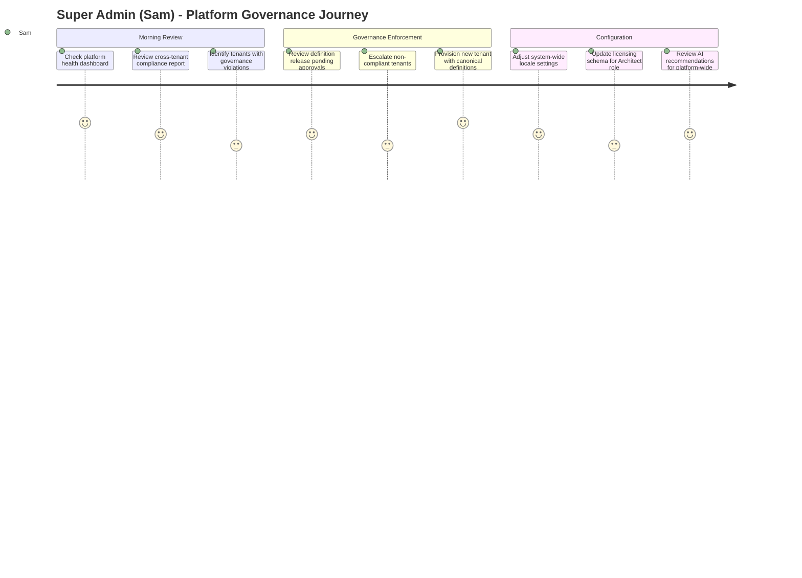
```mermaid
journey
    title Super Admin (Sam) - Platform Governance Journey
    section Morning Review
      Check platform health dashboard: 5: Sam
      Review cross-tenant compliance report: 4: Sam
      Identify tenants with governance violations: 3: Sam
    section Governance Enforcement
      Review definition release pending approvals: 4: Sam
      Escalate non-compliant tenants: 3: Sam
      Provision new tenant with canonical definitions: 5: Sam
    section Configuration
      Adjust system-wide locale settings: 4: Sam
      Update licensing schema for Architect role: 3: Sam
      Review AI recommendations for platform-wide duplication: 4: Sam
```

**UI Touchpoints (Screens):**

| Screen | ID | Key Components | Journey Steps | Status |
|--------|----|----------------|---------------|--------|
| Login (Keycloak SSO) | SCR-AUTH | Keycloak login form, MFA prompt | Pre-requisite | [IMPLEMENTED] |
| Object Type List — Cross-Tenant View | SCR-01 | `p-table` with cross-tenant filter toggle, tenant column, compliance badges | Morning Review: compliance report, violations | [PLANNED] |
| Object Type Configuration — Governance Tab | SCR-02-T4 | Governance tab (Tab 4): mandate flags, inheritance status, compliance indicators | Governance Enforcement: escalate non-compliant | [PLANNED] |
| Release Management Dashboard | SCR-04 | Pending approvals list, release timeline, adoption tracker | Governance Enforcement: pending approvals | [PLANNED] |
| Tenant Provisioning Wizard | SCR-TPW | Tenant creation form, canonical definition selection checklist | Governance Enforcement: provision tenant | [PLANNED] |
| Locale Management | SCR-06 | System locale grid, active/inactive toggles, RTL preview | Configuration: locale settings | [PLANNED] |
| Maturity Dashboard | SCR-05 | Summary cards (`p-knob`), per-type maturity table, drill-down | Morning Review: health dashboard | [PLANNED] |
| AI Insights Panel | SCR-AI | Duplication alerts, merge suggestions, unused definition flags | Configuration: AI recommendations | [PLANNED] |

### Persona 2: Architect (Nicole Roberts) [PER-UX-002]

| Attribute | Detail |
|-----------|--------|
| Role | Owner of the definitions repository -- designs, configures, and governs object type taxonomy |
| Goals | Design and maintain the canonical object type taxonomy; rapidly create and configure object types with proper attribute and relation setup; ensure correct maturity classifications; govern schema evolution across releases; prevent duplication; maintain locale completeness for language-dependent attributes |
| Frustrations | No role-based access for definition architects; duplication creeps in across tenants without visibility; schema changes lack a review workflow; repetitive manual configuration; no AI-assisted suggestions during creation; difficult to find existing attributes to reuse |
| Usage | Daily to weekly -- creates/configures object types, links attributes, sets up connections, reviews AI duplication alerts, authors release notes for definition changes |
| Technical Level | Advanced -- understands data modeling, graph relationships, schema governance, forms, and wizards |
| Key Permissions | Full CRUD on definitions; can trigger release management workflows; can review and approve definition changes |
| Licensing Note | **This role must be included in the licensing schema** |

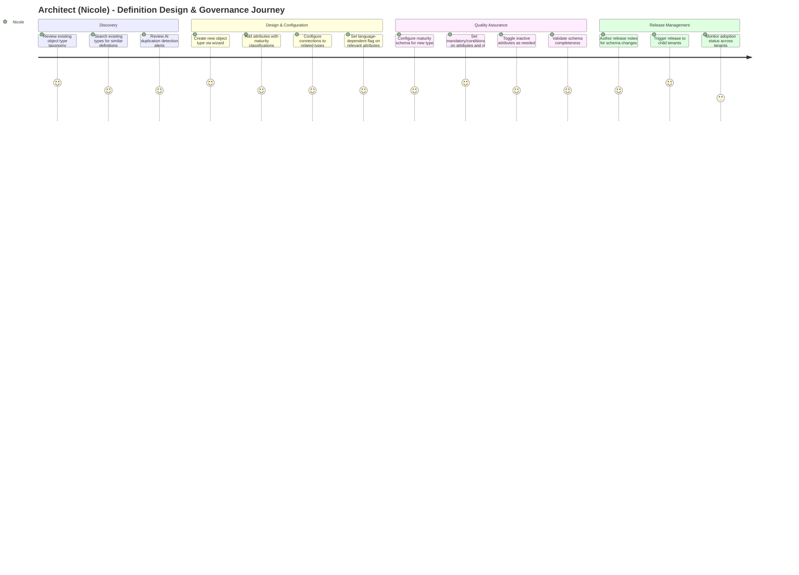
```mermaid
journey
    title Architect (Nicole) - Definition Design & Governance Journey
    section Discovery
      Review existing object type taxonomy: 5: Nicole
      Search existing types for similar definitions: 4: Nicole
      Review AI duplication detection alerts: 4: Nicole
    section Design & Configuration
      Create new object type via wizard: 5: Nicole
      Add attributes with maturity classifications: 4: Nicole
      Configure connections to related types: 4: Nicole
      Set language-dependent flag on relevant attributes: 4: Nicole
    section Quality Assurance
      Configure maturity schema for new type: 4: Nicole
      Set mandatory/conditional/optional on attributes and relations: 5: Nicole
      Toggle inactive attributes as needed: 4: Nicole
      Validate schema completeness: 4: Nicole
    section Release Management
      Author release notes for schema changes: 4: Nicole
      Trigger release to child tenants: 5: Nicole
      Monitor adoption status across tenants: 3: Nicole
```

**UI Touchpoints (Screens):**

| Screen | ID | Key Components | Journey Steps | Status |
|--------|----|----------------|---------------|--------|
| Login (Keycloak SSO) | SCR-AUTH | Keycloak login form, MFA prompt | Pre-requisite | [IMPLEMENTED] |
| Object Type List | SCR-01 | `p-table`/`p-card` view toggle, search bar, AI duplication badges | Discovery: review taxonomy, search, AI alerts | [IMPLEMENTED] |
| Create Object Type Wizard | SCR-03 | 5-step wizard: Basic Info → Attributes → Connections → Review → Confirm | Design: create new object type | [IMPLEMENTED] |
| Object Type Configuration — Attributes Tab | SCR-02-T2 | Attribute pick-list, maturity classification dropdown, lifecycle chips | Design: add attributes, set maturity; QA: mandatory/conditional/optional | [IMPLEMENTED] |
| Object Type Configuration — Connections Tab | SCR-02-T3 | Connection pick-list, cardinality selector, direction toggle | Design: configure connections | [IMPLEMENTED] |
| Object Type Configuration — Maturity Tab | SCR-02-T5 | Four-axis maturity weights, completeness threshold, scoring preview | QA: configure maturity schema | [PLANNED] |
| Object Type Configuration — Locale Tab | SCR-02-T6 | Language-dependent flag toggle, per-locale value editor | Design: set language-dependent flag | [PLANNED] |
| Maturity Dashboard | SCR-05 | Summary cards, per-type table, drill-down, AI priority-fill | QA: validate schema completeness | [PLANNED] |
| Release Management Dashboard | SCR-04 | Release notes editor, tenant distribution list, adoption tracker | Release: author notes, trigger, monitor | [PLANNED] |

<!-- Persona 3 (Quality Manager / Ravi) removed — maturity monitoring responsibilities absorbed into Architect (Nicole Roberts) and Super Admin (Sam Martinez) personas -->

### Persona 3: Tenant Admin (Fiona Shaw) [PER-UX-003]

| Attribute | Detail |
|-----------|--------|
| Role | Manages definitions within her tenant; receives release alerts from master tenant |
| Goals | Customize inherited definitions for local needs (add attributes, adjust display order) without violating mandated items; safely adopt schema changes from the master tenant |
| Frustrations | Cannot add local attributes because the system locks entire inherited types; no clear indicator of what is mandated vs. customizable; schema changes arrive without impact context |
| Usage | Weekly -- adjusts definitions when new local requirements arise; reviews and adopts definition releases |
| Technical Level | Basic to Intermediate -- needs clear visual cues for locked/unlocked items and guided impact assessment |

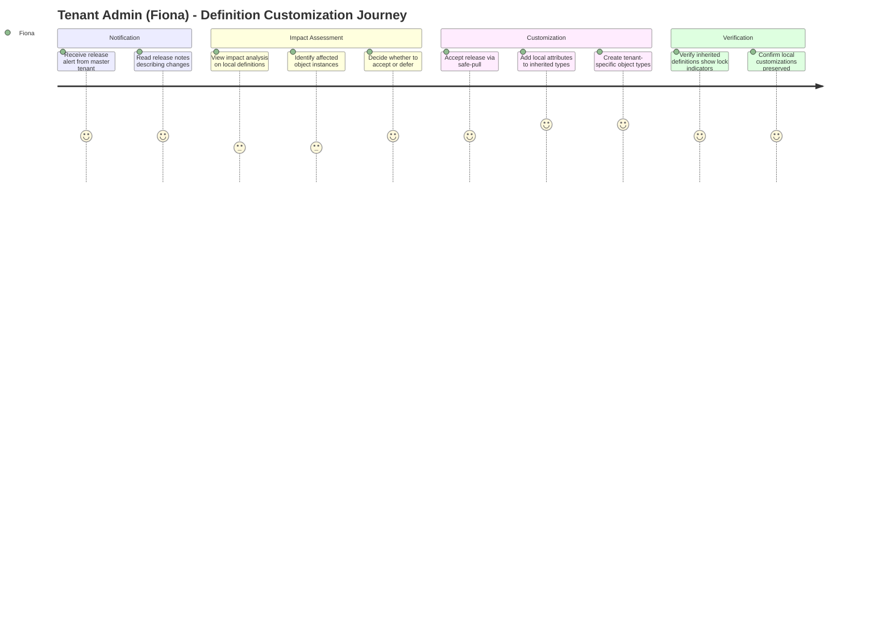
```mermaid
journey
    title Tenant Admin (Fiona) - Definition Customization Journey
    section Notification
      Receive release alert from master tenant: 4: Fiona
      Read release notes describing changes: 4: Fiona
    section Impact Assessment
      View impact analysis on local definitions: 3: Fiona
      Identify affected object instances: 3: Fiona
      Decide whether to accept or defer: 4: Fiona
    section Customization
      Accept release via safe-pull: 4: Fiona
      Add local attributes to inherited types: 5: Fiona
      Create tenant-specific object types: 5: Fiona
    section Verification
      Verify inherited definitions show lock indicators: 4: Fiona
      Confirm local customizations preserved: 4: Fiona
```

**UI Touchpoints (Screens):**

| Screen | ID | Key Components | Journey Steps | Status |
|--------|----|----------------|---------------|--------|
| Login (Keycloak SSO) | SCR-AUTH | Keycloak login form, MFA prompt | Pre-requisite | [IMPLEMENTED] |
| Notification Bell / Dropdown | SCR-NOTIF | Badge count, notification list, "View Impact" link | Notification: receive alert, read notes | [PLANNED] |
| Release Management Dashboard | SCR-04 | Release detail panel, impact analysis modal, accept/reject/defer actions | Impact Assessment: view analysis, identify affected, decide; Customization: accept release | [PLANNED] |
| Impact Analysis Modal | SCR-04-M1 | Before/after comparison, affected instances table, conflict indicators | Impact Assessment: view impact, identify affected instances | [PLANNED] |
| Object Type Configuration — Attributes Tab | SCR-02-T2 | Attribute list with lock icons (`pi-lock`), "Add Local Attribute" button | Customization: add local attributes | [IMPLEMENTED] |
| Create Object Type Wizard | SCR-03 | 5-step wizard (tenant-scoped, no mandate options) | Customization: create tenant-specific types | [IMPLEMENTED] |
| Object Type List | SCR-01 | Lock indicators on inherited rows, mandate badges, "Inherited" filter | Verification: lock indicators, confirm customizations | [PLANNED] |
| Object Type Configuration — Governance Tab | SCR-02-T4 | Inheritance banner, mandated vs. customizable visual distinction | Verification: confirm local customizations preserved | [PLANNED] |

<!-- Persona 5 (Data Steward) merged into Persona 2 (Architect) per consolidation decision 2026-03-10 -->
<!-- Persona 6 (End User) removed -- will be defined in Instance Management module (Phase 2) -->

---

## 5. Business Domain Model

### 5.1 As-Built Domain Model [IMPLEMENTED]

The following diagram reflects entities and relationships verified in the current codebase.

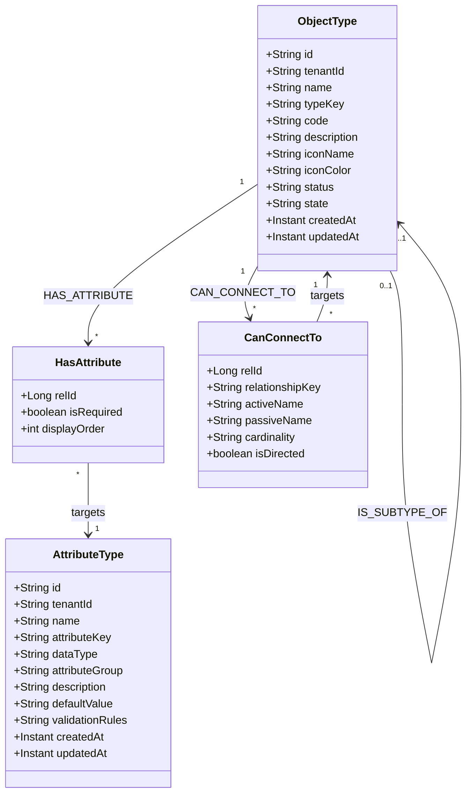
```mermaid
classDiagram
    class ObjectType {
        +String id
        +String tenantId
        +String name
        +String typeKey
        +String code
        +String description
        +String iconName
        +String iconColor
        +String status
        +String state
        +Instant createdAt
        +Instant updatedAt
    }

    class AttributeType {
        +String id
        +String tenantId
        +String name
        +String attributeKey
        +String dataType
        +String attributeGroup
        +String description
        +String defaultValue
        +String validationRules
        +Instant createdAt
        +Instant updatedAt
    }

    class HasAttribute {
        +Long relId
        +boolean isRequired
        +int displayOrder
    }

    class CanConnectTo {
        +Long relId
        +String relationshipKey
        +String activeName
        +String passiveName
        +String cardinality
        +boolean isDirected
    }

    ObjectType "1" --> "*" HasAttribute : HAS_ATTRIBUTE
    HasAttribute "*" --> "1" AttributeType : targets
    ObjectType "1" --> "*" CanConnectTo : CAN_CONNECT_TO
    CanConnectTo "*" --> "1" ObjectType : targets
    ObjectType "0..1" --> "0..1" ObjectType : IS_SUBTYPE_OF
```

**Evidence:**
- `ObjectTypeNode.java` (lines 25-77): `@Node("ObjectType")` with fields `id`, `tenantId`, `name`, `typeKey`, `code`, `description`, `iconName`, `iconColor`, `status`, `state`, `createdAt`, `updatedAt`, plus `@Relationship` annotations for `HAS_ATTRIBUTE`, `CAN_CONNECT_TO`, `IS_SUBTYPE_OF`.
- `AttributeTypeNode.java` (lines 20-53): `@Node("AttributeType")` with fields `id`, `tenantId`, `name`, `attributeKey`, `dataType`, `attributeGroup`, `description`, `defaultValue`, `validationRules`, `createdAt`, `updatedAt`.
- `HasAttributeRelationship.java` (lines 19-36): `@RelationshipProperties` with `relId`, `isRequired`, `displayOrder`, `@TargetNode AttributeTypeNode`.
- `CanConnectToRelationship.java` (lines 20-48): `@RelationshipProperties` with `relId`, `relationshipKey`, `activeName`, `passiveName`, `cardinality`, `isDirected`, `@TargetNode ObjectTypeNode`.

**Source paths (all under `backend/definition-service/src/main/java/com/ems/definition/`):**
- `node/ObjectTypeNode.java`
- `node/AttributeTypeNode.java`
- `node/relationship/HasAttributeRelationship.java`
- `node/relationship/CanConnectToRelationship.java`

### 5.2 Target Domain Model [PLANNED]

The following diagram adds the planned entities and properties needed for features 6.4 through 6.13. Items marked with `<<planned>>` do not exist in code today. Future-phase entities for Viewpoints (6.14) and BPMN Special Attributes (6.15) are not included in this diagram and will be elaborated in dedicated PRDs.

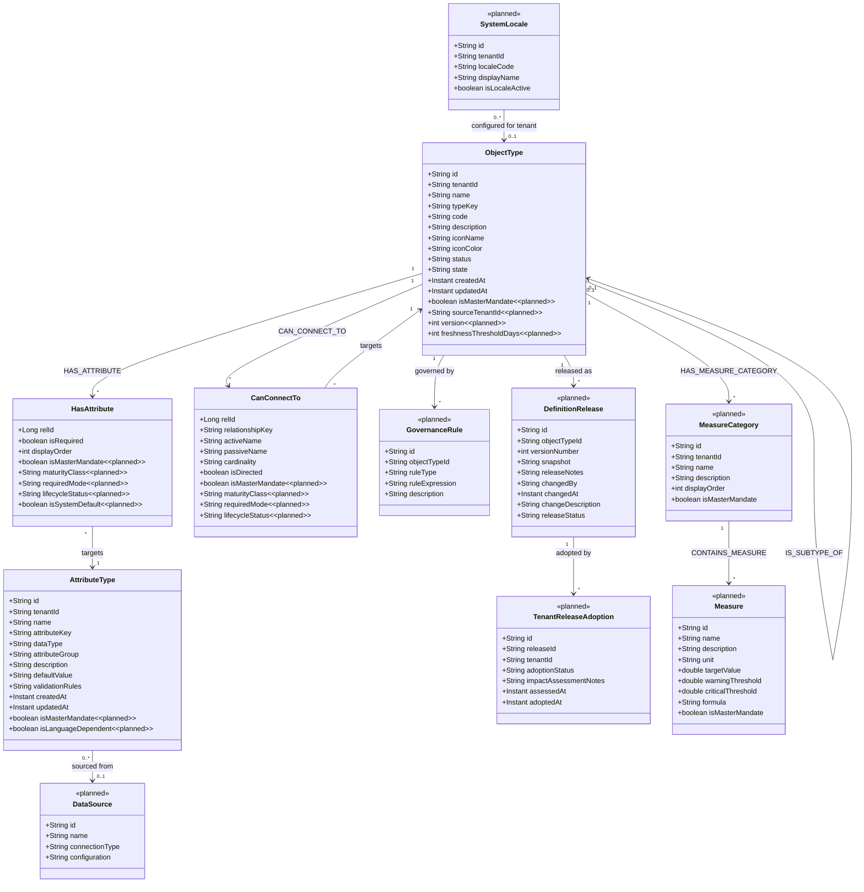
```mermaid
classDiagram
    class ObjectType {
        +String id
        +String tenantId
        +String name
        +String typeKey
        +String code
        +String description
        +String iconName
        +String iconColor
        +String status
        +String state
        +Instant createdAt
        +Instant updatedAt
        +boolean isMasterMandate~~planned~~
        +String sourceTenantId~~planned~~
        +int version~~planned~~
        +int freshnessThresholdDays~~planned~~
    }

    class AttributeType {
        +String id
        +String tenantId
        +String name
        +String attributeKey
        +String dataType
        +String attributeGroup
        +String description
        +String defaultValue
        +String validationRules
        +Instant createdAt
        +Instant updatedAt
        +boolean isMasterMandate~~planned~~
        +boolean isLanguageDependent~~planned~~
    }

    class HasAttribute {
        +Long relId
        +boolean isRequired
        +int displayOrder
        +boolean isMasterMandate~~planned~~
        +String maturityClass~~planned~~
        +String requiredMode~~planned~~
        +String lifecycleStatus~~planned~~
        +boolean isSystemDefault~~planned~~
    }

    class CanConnectTo {
        +Long relId
        +String relationshipKey
        +String activeName
        +String passiveName
        +String cardinality
        +boolean isDirected
        +boolean isMasterMandate~~planned~~
        +String maturityClass~~planned~~
        +String requiredMode~~planned~~
        +String lifecycleStatus~~planned~~
    }

    class GovernanceRule {
        <<planned>>
        +String id
        +String objectTypeId
        +String ruleType
        +String ruleExpression
        +String description
    }

    class DataSource {
        <<planned>>
        +String id
        +String name
        +String connectionType
        +String configuration
    }

    class DefinitionRelease {
        <<planned>>
        +String id
        +String objectTypeId
        +int versionNumber
        +String snapshot
        +String releaseNotes
        +String changedBy
        +Instant changedAt
        +String changeDescription
        +String releaseStatus
    }

    class TenantReleaseAdoption {
        <<planned>>
        +String id
        +String releaseId
        +String tenantId
        +String adoptionStatus
        +String impactAssessmentNotes
        +Instant assessedAt
        +Instant adoptedAt
    }

    class SystemLocale {
        <<planned>>
        +String id
        +String tenantId
        +String localeCode
        +String displayName
        +boolean isLocaleActive
    }

    class MeasureCategory {
        <<planned>>
        +String id
        +String tenantId
        +String name
        +String description
        +int displayOrder
        +boolean isMasterMandate
    }

    class Measure {
        <<planned>>
        +String id
        +String name
        +String description
        +String unit
        +double targetValue
        +double warningThreshold
        +double criticalThreshold
        +String formula
        +boolean isMasterMandate
    }

    ObjectType "1" --> "*" HasAttribute : HAS_ATTRIBUTE
    HasAttribute "*" --> "1" AttributeType : targets
    ObjectType "1" --> "*" CanConnectTo : CAN_CONNECT_TO
    CanConnectTo "*" --> "1" ObjectType : targets
    ObjectType "0..1" --> "0..1" ObjectType : IS_SUBTYPE_OF
    ObjectType "1" --> "*" GovernanceRule : governed by
    ObjectType "1" --> "*" DefinitionRelease : released as
    DefinitionRelease "1" --> "*" TenantReleaseAdoption : adopted by
    AttributeType "0..*" --> "0..1" DataSource : sourced from
    SystemLocale "0..*" --> "0..1" ObjectType : configured for tenant
    ObjectType "1" --> "*" MeasureCategory : HAS_MEASURE_CATEGORY
    MeasureCategory "1" --> "*" Measure : CONTAINS_MEASURE
```

---

## 6. Feature Requirements

### Architectural Principles

The following principles govern all definition management features:

#### AP-1: Definition Repository / Instance Repository Separation [PLANNED]

The **definitions repository** (schema: object types, attribute types, connections, maturity schemas, governance configs) MUST be physically separated from the **instance repository** (runtime data: object instances, attribute values, relationship instances). This separation ensures:

| Concern | Benefit |
|---------|---------|
| **Data isolation** | Schema changes cannot corrupt or lose instance data |
| **Independent scaling** | Definition repo (low write, medium read) scales differently from instance repo (high write, high read) |
| **Release safety** | Definition releases can be tested, previewed, and rolled back without touching instance data |
| **Multi-tenant governance** | Master tenant manages definitions; child tenants manage instances against those definitions |
| **Backup/restore granularity** | Definitions can be exported/imported independently of instance data |

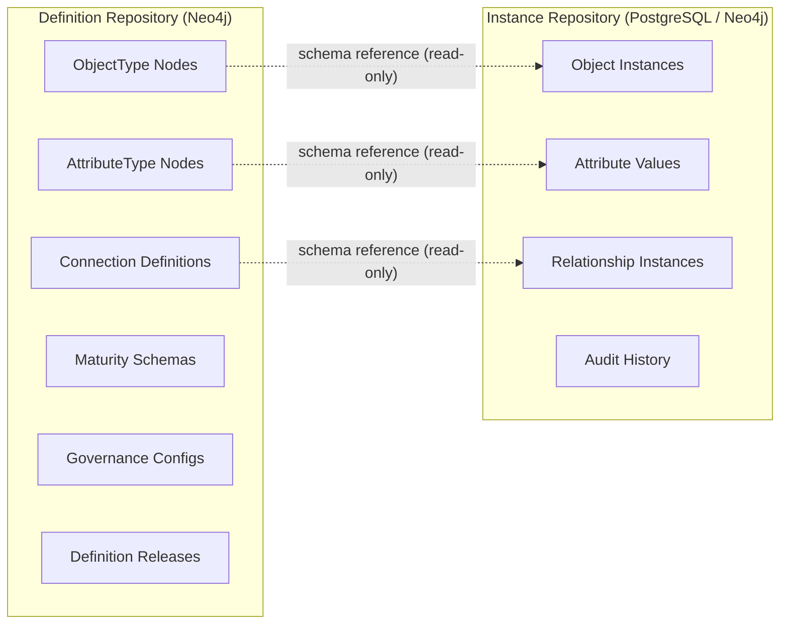
```mermaid
graph LR
    subgraph "Definition Repository (Neo4j)"
        OT[ObjectType Nodes]
        AT[AttributeType Nodes]
        CT[Connection Definitions]
        MS[Maturity Schemas]
        GC[Governance Configs]
        REL[Definition Releases]
    end

    subgraph "Instance Repository (PostgreSQL / Neo4j)"
        OI[Object Instances]
        AV[Attribute Values]
        RI[Relationship Instances]
        HIST[Audit History]
    end

    OT -.->|"schema reference (read-only)"| OI
    AT -.->|"schema reference (read-only)"| AV
    CT -.->|"schema reference (read-only)"| RI
```

**Rule:** Instance services consume definition schemas via **read-only references** (definition ID pointers). They MUST NOT write to the definition repository. Definition changes propagate to instances ONLY through the release management process (Section 6.10).

#### AP-2: Default Attributes per Object Type [PLANNED]

Every object type MUST be provisioned with a set of **system default attributes** upon creation. These attributes are automatically attached and cannot be removed by users (though they can be hidden in specific viewpoints). They provide a baseline data quality foundation for every object instance.

**System Default Attributes:**

| Attribute Name | Data Type | Required Mode | Description | Editable |
|----------------|-----------|---------------|-------------|----------|
| `name` | STRING | mandatory_creation | Display name of the object instance | Yes |
| `description` | TEXT | optional | Textual description | Yes |
| `status` | ENUM | mandatory_creation | Lifecycle status (Active, Planned, On Hold, Retired) | Yes |
| `owner` | USER_REFERENCE | optional | Responsible person/team | Yes |
| `createdAt` | DATETIME | mandatory_creation | Auto-set on creation | No (system-managed) |
| `createdBy` | USER_REFERENCE | mandatory_creation | Auto-set to current user | No (system-managed) |
| `updatedAt` | DATETIME | mandatory_creation | Auto-set on update | No (system-managed) |
| `updatedBy` | USER_REFERENCE | mandatory_creation | Auto-set to current user | No (system-managed) |
| `externalId` | STRING | optional | External system reference ID | Yes |
| `tags` | STRING_ARRAY | optional | Classification tags | Yes |

**Rules:**
- Default attributes are attached automatically when an object type is created (system or user-defined)
- Default attributes have `isSystemDefault: true` flag on the HAS_ATTRIBUTE relationship
- Users CANNOT delete system default attributes from an object type
- Users CAN add additional attributes beyond the defaults
- Master mandate flags apply equally to system default and user-defined attributes
- Tenants can configure which default attributes are **visible** vs **hidden** per viewpoint (future — see 6.14)

#### AP-3: Definition Release Safety — Zero Data Loss Guarantee [PLANNED]

Definition updates MUST NEVER cause instance data loss. The release management process (Section 6.10) enforces safety through:

| Safety Mechanism | Description |
|------------------|-------------|
| **Impact assessment before apply** | Every release shows what will change, what instances are affected, and whether changes are breaking |
| **Non-destructive schema evolution** | Adding attributes/connections is always safe; removing or changing type of mandatory attributes is a breaking change requiring explicit confirmation |
| **Soft-delete for removed attributes** | When a definition removes an attribute, existing instance data is archived (soft-deleted), not destroyed |
| **Versioned snapshots** | Every release captures a full JSON snapshot of the definition state before and after, enabling rollback |
| **Rollback capability** | Any release can be rolled back to restore the previous definition state; instance data archived by the release is restored |
| **Tenant-level adoption control** | Child tenants choose when to adopt a release (pull model), allowing them to prepare data migration before applying |

**Breaking Change Classification:**

| Change Type | Breaking? | Instance Impact | Safety Action |
|-------------|-----------|-----------------|---------------|
| Add optional attribute | No | None — new field defaults to null | Auto-apply |
| Add mandatory attribute | Yes | Existing instances missing required value | Require default value or migration plan |
| Remove attribute | Yes | Existing values orphaned | Soft-delete + archive |
| Change attribute data type | Yes | Existing values may be incompatible | Block unless explicit type coercion defined |
| Add connection | No | None | Auto-apply |
| Remove connection | Yes | Existing relationship instances orphaned | Soft-delete + archive |
| Rename attribute | No | Internal ID unchanged, only display name | Auto-apply |

#### AP-4: Centralized Message Registry with i18n [PLANNED]

All **error messages**, **confirmation dialogs**, **warning messages**, and **toast notifications** MUST be stored in a centralized PostgreSQL message registry and rendered in the user's selected interface language.

**Message Registry Table (PostgreSQL — shared service):**

| Column | Type | Description |
|--------|------|-------------|
| `id` | BIGSERIAL PK | Auto-increment primary key |
| `message_code` | VARCHAR(50) UNIQUE NOT NULL | Structured code (e.g., `DEF-E-001`, `DEF-C-003`) |
| `message_type` | VARCHAR(20) NOT NULL | `ERROR`, `CONFIRMATION`, `WARNING`, `INFO`, `SUCCESS` |
| `category` | VARCHAR(50) NOT NULL | Feature category (e.g., `OBJECT_TYPE`, `ATTRIBUTE`, `CONNECTION`, `RELEASE`, `GOVERNANCE`) |
| `default_name` | VARCHAR(255) NOT NULL | English name / short title (fallback) |
| `default_description` | TEXT NOT NULL | English description with placeholder support (e.g., `{0}`, `{attributeName}`) |
| `http_status` | INTEGER | HTTP status code for errors (400, 404, 409, etc.) |
| `severity` | VARCHAR(20) | `CRITICAL`, `HIGH`, `MEDIUM`, `LOW`, `INFO` |
| `is_active` | BOOLEAN DEFAULT TRUE | Soft-delete flag |
| `created_at` | TIMESTAMP | Row creation timestamp |
| `updated_at` | TIMESTAMP | Last update timestamp |

**Message Translation Table (PostgreSQL):**

| Column | Type | Description |
|--------|------|-------------|
| `id` | BIGSERIAL PK | Auto-increment primary key |
| `message_code` | VARCHAR(50) FK NOT NULL | References `message_registry.message_code` |
| `locale_code` | VARCHAR(10) NOT NULL | ISO 639-1 + region (e.g., `en`, `ar`, `fr`, `de`) |
| `translated_name` | VARCHAR(255) NOT NULL | Localized short title |
| `translated_description` | TEXT NOT NULL | Localized description with same placeholders |
| UNIQUE(`message_code`, `locale_code`) | | One translation per message per locale |

**Message Code Convention:**

```
{SERVICE}-{TYPE}-{SEQ}
```

| Segment | Values | Example |
|---------|--------|---------|
| SERVICE | `DEF` (Definition), `AUTH` (Auth), `TEN` (Tenant), `LIC` (License), `USR` (User) | `DEF` |
| TYPE | `E` (Error), `C` (Confirmation), `W` (Warning), `I` (Info), `S` (Success) | `E` |
| SEQ | 3-digit sequential number | `001` |

Example: `DEF-E-001` = Definition service, Error, #001

**Rendering Flow:**

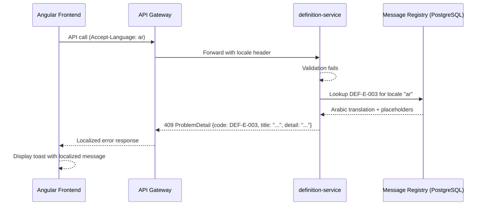
```mermaid
sequenceDiagram
    participant UI as Angular Frontend
    participant GW as API Gateway
    participant SVC as definition-service
    participant MSG as Message Registry (PostgreSQL)

    UI->>GW: API call (Accept-Language: ar)
    GW->>SVC: Forward with locale header
    SVC-->>SVC: Validation fails
    SVC->>MSG: Lookup DEF-E-003 for locale "ar"
    MSG-->>SVC: Arabic translation + placeholders
    SVC-->>GW: 409 ProblemDetail {code: DEF-E-003, title: "...", detail: "..."}
    GW-->>UI: Localized error response
    UI-->>UI: Display toast with localized message
```

**Frontend Integration:**
- Messages are loaded lazily from `/api/v1/messages?locale={locale}&category={category}` and cached in browser
- Confirmation dialogs use message codes (e.g., `DEF-C-003`) to render localized title + description
- Error toasts render localized ProblemDetail responses
- Cache invalidated on locale change

**Rules:**
- Every user-facing message in the Definition Management module MUST have a registered message code
- Backend MUST NOT hardcode user-facing strings — always reference message codes
- Frontend MUST NOT hardcode labels — always render from message registry or locale cache
- Default English text serves as fallback when translation is unavailable
- Placeholders use named parameters (e.g., `{objectTypeName}`, `{attributeName}`) for translator clarity

#### AP-5: Lifecycle State Machines with Controlled Transitions [PLANNED]

Every entity with a lifecycle (ObjectType, Attribute linkage, Connection definition) MUST have:

1. **Defined states** with clear entry/exit conditions
2. **Allowed transitions** with validation rules
3. **Confirmation messages** for destructive or impactful transitions (from message registry)
4. **Error messages** for invalid transitions (from message registry)
5. **Fallback behaviour** when a transition fails

**ObjectType Status Lifecycle:**

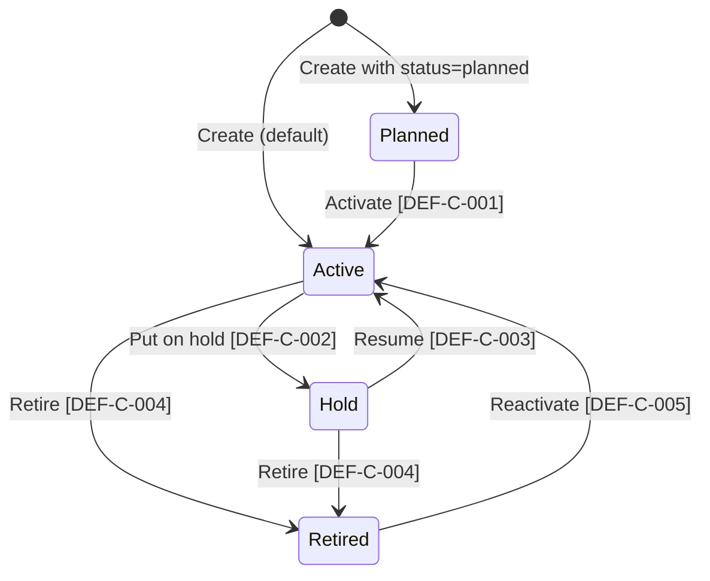
```mermaid
stateDiagram-v2
    [*] --> Active : Create (default)
    [*] --> Planned : Create with status=planned
    Planned --> Active : Activate [DEF-C-001]
    Active --> Hold : Put on hold [DEF-C-002]
    Hold --> Active : Resume [DEF-C-003]
    Active --> Retired : Retire [DEF-C-004]
    Hold --> Retired : Retire [DEF-C-004]
    Retired --> Active : Reactivate [DEF-C-005]
```

**ObjectType State (Origin) Lifecycle:**

```mermaid
stateDiagram-v2
    [*] --> default : Seeded by system
    [*] --> user_defined : Created by user
    default --> customized : Edit [DEF-C-006]
    customized --> default : Restore [DEF-C-007]
    user_defined --> user_defined : Edit
    default --> user_defined : Duplicate
    customized --> user_defined : Duplicate
```

**Attribute Lifecycle (on HAS_ATTRIBUTE):**

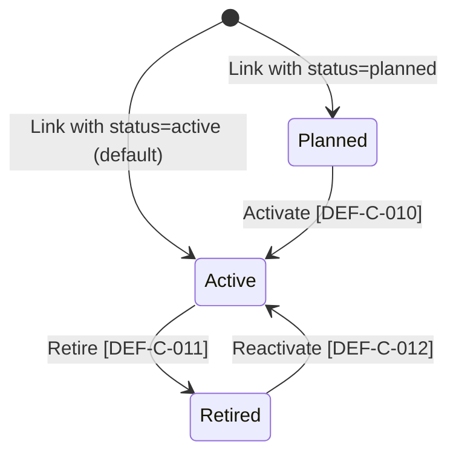
```mermaid
stateDiagram-v2
    [*] --> Planned : Link with status=planned
    [*] --> Active : Link with status=active (default)
    Planned --> Active : Activate [DEF-C-010]
    Active --> Retired : Retire [DEF-C-011]
    Retired --> Active : Reactivate [DEF-C-012]
```

**Connection Lifecycle (on CAN_CONNECT_TO):**

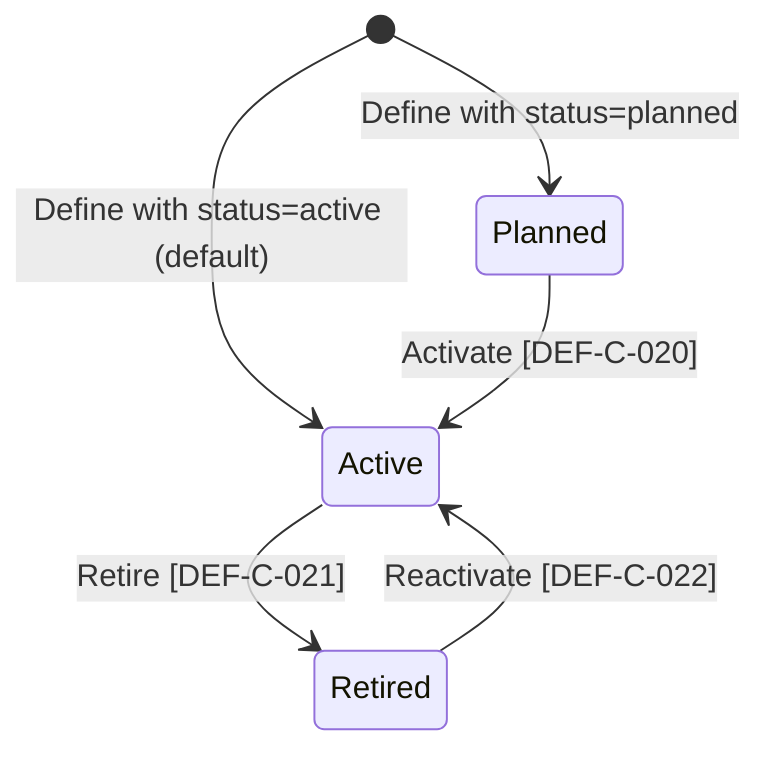
```mermaid
stateDiagram-v2
    [*] --> Planned : Define with status=planned
    [*] --> Active : Define with status=active (default)
    Planned --> Active : Activate [DEF-C-020]
    Active --> Retired : Retire [DEF-C-021]
    Retired --> Active : Reactivate [DEF-C-022]
```

**Transition Validation Rules:**

| Entity | Transition | Condition | Error on Violation |
|--------|------------|-----------|-------------------|
| ObjectType | Any → Retired | No active instances OR explicit force | DEF-E-010 |
| ObjectType | Retired → Active | No naming conflict with existing active type | DEF-E-011 |
| ObjectType | default → customized | Type must be in "default" state | DEF-E-012 |
| ObjectType | customized → default | Type must be in "customized" state | DEF-E-013 |
| Attribute | Active → Retired | Confirm if mandatory with instance data | DEF-C-011 |
| Attribute | Any → Retired | Cannot retire mandated attribute (child tenant) | DEF-E-020 |
| Connection | Active → Retired | Confirm if instances have relationships | DEF-C-021 |
| Connection | Any → Retired | Cannot retire mandated connection (child tenant) | DEF-E-030 |

**Fallback Behaviour:**

| Scenario | Fallback |
|----------|----------|
| Transition API call fails (network) | Frontend retains previous state, shows retry toast [DEF-E-050] |
| Concurrent modification (optimistic lock) | Reload entity, show warning [DEF-W-001], let user retry |
| Transition rejected by business rule | Show specific error from message registry, no state change |
| Transition succeeds but downstream event fails | Entity state is committed; downstream retry via Kafka DLQ |

---

### Definition Management Message Registry [PLANNED]

All messages below are stored in the **single `message_registry` table** (AP-4). The `message_type` column determines how the frontend renders each message (error toast, confirmation dialog, warning banner, success toast). Filtered by type at query time — no separate tables.

| Code | Type | Category | Name | Description | HTTP | Severity |
|------|------|----------|------|-------------|------|----------|
| DEF-E-001 | ERROR | OBJECT_TYPE | ObjectType Not Found | Object type with ID `{objectTypeId}` not found in tenant `{tenantId}` | 404 | HIGH |
| DEF-E-002 | ERROR | OBJECT_TYPE | Duplicate TypeKey | An object type with typeKey `{typeKey}` already exists in tenant `{tenantId}` | 409 | HIGH |
| DEF-E-003 | ERROR | OBJECT_TYPE | Duplicate Code | An object type with code `{code}` already exists in tenant `{tenantId}` | 409 | HIGH |
| DEF-E-004 | ERROR | OBJECT_TYPE | Name Required | Object type name is required and must not be empty | 400 | HIGH |
| DEF-E-005 | ERROR | OBJECT_TYPE | Name Too Long | Object type name must not exceed 255 characters (current: `{length}`) | 400 | MEDIUM |
| DEF-E-006 | ERROR | OBJECT_TYPE | TypeKey Too Long | TypeKey must not exceed 100 characters (current: `{length}`) | 400 | MEDIUM |
| DEF-E-007 | ERROR | OBJECT_TYPE | Code Too Long | Code must not exceed 20 characters (current: `{length}`) | 400 | MEDIUM |
| DEF-E-008 | ERROR | OBJECT_TYPE | Invalid Status | Status `{status}` is not valid. Allowed values: active, planned, hold, retired | 400 | HIGH |
| DEF-E-009 | ERROR | OBJECT_TYPE | Invalid State | State `{state}` is not valid. Allowed values: default, customized, user_defined | 400 | HIGH |
| DEF-E-010 | ERROR | OBJECT_TYPE | Cannot Retire With Instances | Object type `{objectTypeName}` has `{instanceCount}` active instances. Retire or migrate instances first. | 409 | HIGH |
| DEF-E-011 | ERROR | OBJECT_TYPE | Reactivation Naming Conflict | Cannot reactivate `{objectTypeName}`: an active type with typeKey `{typeKey}` already exists | 409 | HIGH |
| DEF-E-012 | ERROR | OBJECT_TYPE | Invalid State Transition | Cannot transition from `{currentState}` to `{targetState}`. Type must be in `{requiredState}` state. | 400 | HIGH |
| DEF-E-013 | ERROR | OBJECT_TYPE | Restore Not Customized | Only customized object types can be restored to default. Current state: `{currentState}` | 400 | HIGH |
| DEF-E-014 | ERROR | OBJECT_TYPE | Delete Has Instances | Cannot delete `{objectTypeName}` because it has `{instanceCount}` instances | 409 | HIGH |
| DEF-E-015 | ERROR | SYSTEM | Tenant ID Missing | Tenant ID is required. Provide via JWT `tenant_id` claim or `X-Tenant-ID` header. | 400 | CRITICAL |
| DEF-E-016 | ERROR | SYSTEM | Unauthorized Role | Role `{role}` is not authorized. Required: SUPER_ADMIN or ARCHITECT. | 403 | HIGH |
| DEF-E-017 | ERROR | OBJECT_TYPE | Optimistic Lock Conflict | `{objectTypeName}` was modified by another user. Please reload and retry. | 409 | MEDIUM |
| DEF-E-018 | ERROR | OBJECT_TYPE | Invalid Icon Name | Icon `{iconName}` is not in the allowed icon set | 400 | LOW |
| DEF-E-019 | ERROR | OBJECT_TYPE | Invalid Icon Color | Color `{iconColor}` is not a valid hex color (expected: #RRGGBB) | 400 | LOW |
| DEF-E-020 | ERROR | ATTRIBUTE | Cannot Retire Mandated Attribute | Attribute `{attributeName}` is mandated by master tenant and cannot be retired by `{tenantId}` | 403 | HIGH |
| DEF-E-021 | ERROR | ATTRIBUTE | Attribute Not Found | Attribute type with ID `{attributeTypeId}` not found | 404 | HIGH |
| DEF-E-022 | ERROR | ATTRIBUTE | Duplicate Attribute Link | Attribute `{attributeName}` is already linked to `{objectTypeName}` | 409 | HIGH |
| DEF-E-023 | ERROR | ATTRIBUTE | Attribute Key Required | Attribute key is required and must not be empty | 400 | HIGH |
| DEF-E-024 | ERROR | ATTRIBUTE | Invalid Data Type | Data type `{dataType}` is not valid. Allowed: string, text, integer, float, boolean, date, datetime, enum, json | 400 | HIGH |
| DEF-E-025 | ERROR | ATTRIBUTE | Invalid Lifecycle Transition | Cannot transition attribute from `{currentStatus}` to `{targetStatus}`. Allowed: planned→active, active→retired, retired→active | 400 | HIGH |
| DEF-E-026 | ERROR | ATTRIBUTE | System Default Cannot Be Removed | `{attributeName}` is a system default and cannot be unlinked from `{objectTypeName}` | 403 | HIGH |
| DEF-E-030 | ERROR | CONNECTION | Cannot Retire Mandated Connection | Connection `{connectionName}` is mandated by master tenant and cannot be retired by `{tenantId}` | 403 | HIGH |
| DEF-E-031 | ERROR | CONNECTION | Connection Not Found | Connection `{connectionId}` not found on `{objectTypeName}` | 404 | HIGH |
| DEF-E-032 | ERROR | CONNECTION | Invalid Cardinality | Cardinality `{cardinality}` is not valid. Allowed: one-to-one, one-to-many, many-to-many | 400 | HIGH |
| DEF-E-033 | ERROR | CONNECTION | Cross-Tenant Connection | Source and target object types must belong to the same tenant | 400 | HIGH |
| DEF-E-034 | ERROR | CONNECTION | Self Connection | Object type cannot connect to itself unless explicitly configured | 400 | MEDIUM |
| DEF-E-035 | ERROR | CONNECTION | Duplicate Connection | Connection `{relationshipKey}` already exists between `{sourceName}` and `{targetName}` | 409 | HIGH |
| DEF-E-040 | ERROR | RELEASE | Release Not Found | Definition release `{releaseId}` not found | 404 | HIGH |
| DEF-E-041 | ERROR | RELEASE | Release Already Published | Release `{releaseId}` is already published and cannot be modified | 409 | HIGH |
| DEF-E-042 | ERROR | RELEASE | Release Has Breaking Changes | Release `{releaseId}` contains `{breakingCount}` breaking changes. Review impact assessment. | 409 | HIGH |
| DEF-E-043 | ERROR | RELEASE | Rollback Not Available | No previous release version available for rollback | 409 | MEDIUM |
| DEF-E-050 | ERROR | SYSTEM | Network Error | Unable to complete the request. Please check your connection and try again. | 503 | HIGH |
| DEF-E-051 | ERROR | SYSTEM | Service Unavailable | Definition service is temporarily unavailable. Please try again later. | 503 | HIGH |
| DEF-E-052 | ERROR | SYSTEM | Request Timeout | Request timed out after `{timeoutMs}` ms. Please try again. | 504 | MEDIUM |
| DEF-E-060 | ERROR | GOVERNANCE | Governance Config Not Found | Governance configuration for `{objectTypeName}` not found | 404 | HIGH |
| DEF-E-061 | ERROR | GOVERNANCE | Invalid Governance Transition | Cannot transition governance from `{currentState}` to `{targetState}` | 400 | HIGH |
| DEF-E-062 | ERROR | GOVERNANCE | Workflow Not Found | Workflow `{workflowId}` not found in process-service | 404 | HIGH |
| DEF-E-070 | ERROR | MATURITY | Maturity Schema Invalid | Maturity schema configuration is invalid: `{validationError}` | 400 | HIGH |
| DEF-E-071 | ERROR | MATURITY | Axis Weights Must Sum 100 | Maturity axis weights must sum to 100%. Current sum: `{sum}`% | 400 | HIGH |
| DEF-E-080 | ERROR | MEASURE | Category Not Found | Measure category `{categoryId}` not found | 404 | HIGH |
| DEF-E-081 | ERROR | MEASURE | Duplicate Category Name | Category `{categoryName}` already exists in tenant `{tenantId}` | 409 | HIGH |
| DEF-E-082 | ERROR | MEASURE | Category Has Measures | Cannot delete `{categoryName}` — contains `{measureCount}` measures | 409 | HIGH |
| DEF-E-083 | ERROR | MEASURE | Measure Not Found | Measure `{measureId}` not found in category `{categoryName}` | 404 | HIGH |
| DEF-E-090 | ERROR | INHERITANCE | Subtype Depth Exceeded | IS_SUBTYPE_OF depth `{depth}` exceeds maximum of 5 | 400 | HIGH |
| DEF-E-091 | ERROR | INHERITANCE | Circular Inheritance | Adding IS_SUBTYPE_OF from `{childType}` to `{parentType}` would create a cycle | 400 | CRITICAL |
| DEF-E-092 | ERROR | INHERITANCE | Inherited Attribute Conflict | Cannot add `{attributeName}` — already inherited from `{parentTypeName}` | 409 | MEDIUM |
| DEF-C-001 | CONFIRMATION | OBJECT_TYPE | Confirm Activate ObjectType | Activate `{objectTypeName}`? It will become available for instance creation. | — | INFO |
| DEF-C-002 | CONFIRMATION | OBJECT_TYPE | Confirm Hold ObjectType | Put `{objectTypeName}` on hold? Existing instances preserved, no new creation. | — | INFO |
| DEF-C-003 | CONFIRMATION | OBJECT_TYPE | Confirm Resume ObjectType | Resume `{objectTypeName}`? It will become available for instance creation again. | — | INFO |
| DEF-C-004 | CONFIRMATION | OBJECT_TYPE | Confirm Retire ObjectType | Retire `{objectTypeName}`? `{instanceCount}` existing instances preserved as read-only. | — | HIGH |
| DEF-C-005 | CONFIRMATION | OBJECT_TYPE | Confirm Reactivate ObjectType | Reactivate `{objectTypeName}`? It will become available for instance creation again. | — | INFO |
| DEF-C-006 | CONFIRMATION | OBJECT_TYPE | Confirm Customize Default | Editing this default type will change state to "customized". You can restore later. Proceed? | — | MEDIUM |
| DEF-C-007 | CONFIRMATION | OBJECT_TYPE | Confirm Restore Default | Restore `{objectTypeName}` to default? All customizations will be lost. | — | HIGH |
| DEF-C-008 | CONFIRMATION | OBJECT_TYPE | Confirm Delete ObjectType | Permanently delete `{objectTypeName}`? This cannot be undone. | — | CRITICAL |
| DEF-C-009 | CONFIRMATION | OBJECT_TYPE | Confirm Duplicate ObjectType | Create a copy of `{objectTypeName}` as `{objectTypeName} (Copy)`? | — | LOW |
| DEF-C-010 | CONFIRMATION | ATTRIBUTE | Confirm Activate Attribute | Activate `{attributeName}` on `{objectTypeName}`? It will appear in instance forms. | — | INFO |
| DEF-C-011 | CONFIRMATION | ATTRIBUTE | Confirm Retire Attribute | Retire `{attributeName}` on `{objectTypeName}`? `{instanceCount}` instances have data — preserved as read-only. | — | HIGH |
| DEF-C-012 | CONFIRMATION | ATTRIBUTE | Confirm Reactivate Attribute | Reactivate `{attributeName}`? It will appear in instance forms again. | — | INFO |
| DEF-C-013 | CONFIRMATION | ATTRIBUTE | Confirm Unlink Attribute | Remove `{attributeName}` from `{objectTypeName}`? Instance data will be archived. | — | HIGH |
| DEF-C-020 | CONFIRMATION | CONNECTION | Confirm Activate Connection | Activate `{connectionName}` between `{sourceType}` and `{targetType}`? | — | INFO |
| DEF-C-021 | CONFIRMATION | CONNECTION | Confirm Retire Connection | Retire `{connectionName}`? `{relationshipCount}` instance relationships preserved as read-only. | — | HIGH |
| DEF-C-022 | CONFIRMATION | CONNECTION | Confirm Reactivate Connection | Reactivate `{connectionName}`? Instance relationships will become editable again. | — | INFO |
| DEF-C-023 | CONFIRMATION | CONNECTION | Confirm Remove Connection | Remove `{connectionName}` from `{objectTypeName}`? Instance relationships will be archived. | — | HIGH |
| DEF-C-030 | CONFIRMATION | RELEASE | Confirm Publish Release | Publish `{releaseName}` (v`{version}`)? `{breakingCount}` breaking changes. All child tenants notified. | — | CRITICAL |
| DEF-C-031 | CONFIRMATION | RELEASE | Confirm Rollback Release | Roll back `{releaseName}` (v`{version}`)? Adopted tenants will be notified. | — | CRITICAL |
| DEF-C-032 | CONFIRMATION | RELEASE | Confirm Adopt Release | Adopt `{releaseName}` (v`{version}`)? `{changeCount}` changes applied to your definitions. | — | HIGH |
| DEF-W-001 | WARNING | SYSTEM | Concurrent Modification | Modified by `{modifiedBy}` at `{modifiedAt}`. Your changes may overwrite. Reload? | — | MEDIUM |
| DEF-W-002 | WARNING | OBJECT_TYPE | Retiring Type With Subtypes | `{objectTypeName}` has `{subtypeCount}` subtypes. Retiring affects inherited attributes on all. | — | HIGH |
| DEF-W-003 | WARNING | RELEASE | Breaking Release Changes | `{releaseName}` contains breaking changes affecting `{affectedTenants}` tenants. Review carefully. | — | HIGH |
| DEF-W-004 | WARNING | MATURITY | Low Maturity Score | `{objectTypeName}` maturity is `{score}`% (below `{target}`%). Consider filling missing attributes. | — | MEDIUM |
| DEF-W-005 | WARNING | MATURITY | Stale Definition | `{objectTypeName}` not updated in `{daysSince}` days (threshold: `{threshold}`). | — | MEDIUM |
| DEF-W-006 | WARNING | GOVERNANCE | Mandated Attribute Missing | Master-mandated `{attributeName}` not yet linked to `{objectTypeName}`. | — | HIGH |
| DEF-S-001 | SUCCESS | OBJECT_TYPE | ObjectType Created | Object type `{objectTypeName}` created successfully | — | INFO |
| DEF-S-002 | SUCCESS | OBJECT_TYPE | ObjectType Updated | Object type `{objectTypeName}` updated successfully | — | INFO |
| DEF-S-003 | SUCCESS | OBJECT_TYPE | ObjectType Deleted | Object type `{objectTypeName}` deleted successfully | — | INFO |
| DEF-S-004 | SUCCESS | OBJECT_TYPE | ObjectType Duplicated | Object type duplicated as `{newName}` | — | INFO |
| DEF-S-005 | SUCCESS | OBJECT_TYPE | ObjectType Restored | Object type `{objectTypeName}` restored to default | — | INFO |
| DEF-S-006 | SUCCESS | OBJECT_TYPE | Status Changed | `{objectTypeName}` status changed to `{newStatus}` | — | INFO |
| DEF-S-010 | SUCCESS | ATTRIBUTE | Attribute Linked | `{attributeName}` linked to `{objectTypeName}` | — | INFO |
| DEF-S-011 | SUCCESS | ATTRIBUTE | Attribute Unlinked | `{attributeName}` removed from `{objectTypeName}` | — | INFO |
| DEF-S-012 | SUCCESS | ATTRIBUTE | Attribute Status Changed | `{attributeName}` lifecycle changed to `{newStatus}` | — | INFO |
| DEF-S-020 | SUCCESS | CONNECTION | Connection Added | Connection `{connectionName}` added between `{sourceType}` and `{targetType}` | — | INFO |
| DEF-S-021 | SUCCESS | CONNECTION | Connection Removed | Connection `{connectionName}` removed from `{objectTypeName}` | — | INFO |
| DEF-S-022 | SUCCESS | CONNECTION | Connection Status Changed | `{connectionName}` lifecycle changed to `{newStatus}` | — | INFO |
| DEF-S-030 | SUCCESS | RELEASE | Release Published | `{releaseName}` (v`{version}`) published. `{tenantCount}` tenants notified. | — | INFO |
| DEF-S-031 | SUCCESS | RELEASE | Release Rolled Back | `{releaseName}` (v`{version}`) rolled back successfully | — | INFO |
| DEF-S-032 | SUCCESS | RELEASE | Release Adopted | `{releaseName}` (v`{version}`) adopted. `{changeCount}` changes applied. | — | INFO |

**Frontend rendering by `message_type`:**

| message_type | UI Rendering |
|-------------|-------------|
| `ERROR` | PrimeNG error toast (`severity: 'error'`) — auto-dismiss after 5s |
| `CONFIRMATION` | PrimeNG `p-confirmDialog` — requires user Accept/Cancel before action proceeds |
| `WARNING` | PrimeNG warning toast (`severity: 'warn'`) or inline warning banner |
| `SUCCESS` | PrimeNG success toast (`severity: 'success'`) — auto-dismiss after 3s |
| `INFO` | PrimeNG info toast (`severity: 'info'`) — auto-dismiss after 3s |

---

### 6.1 Object Type Management [IMPLEMENTED]

**Description:** Administrators create, view, update, delete, duplicate, and restore object type definitions. Each object type belongs to a tenant and has a unique type key within that tenant.

**As-built capabilities (verified against code):**

| Capability | Evidence |
|------------|----------|
| **Create object type** with name (required, max 255), typeKey (auto-derived from name or explicit, max 100), code (auto-generated OBJ_NNN or explicit, max 20), description (max 2000), iconName (default "box", max 100), iconColor (default "#428177", max 7), status (default "active", max 20), state (default "user_defined", max 30) | `ObjectTypeCreateRequest.java` lines 9-35; `ObjectTypeServiceImpl.java` lines 71-110 |
| **List object types** with pagination (page, size), search (filters on name and typeKey), and status filter | `ObjectTypeController.java` lines 49-63; `ObjectTypeServiceImpl.java` lines 49-67 |
| **Get object type by ID** including nested attributes and connections | `ObjectTypeController.java` lines 78-89; `ObjectTypeServiceImpl.java` lines 113-118 |
| **Update object type** via partial update (non-null fields only); editing a default-state type transitions it to "customized" | `ObjectTypeController.java` lines 91-103; `ObjectTypeServiceImpl.java` lines 122-169 |
| **Delete object type** (cascades Neo4j node and relationships) | `ObjectTypeController.java` lines 105-116; `ObjectTypeServiceImpl.java` lines 172-180 |
| **Duplicate object type** creates a copy with state "user_defined", new ID, appended " (Copy)" to name, unique typeKey with suffix | `ObjectTypeController.java` lines 118-129; `ObjectTypeServiceImpl.java` lines 334-373 |
| **Restore object type** reverts a "customized" type back to "default" state; rejects if state is not "customized" | `ObjectTypeController.java` lines 131-142; `ObjectTypeServiceImpl.java` lines 376-394 |
| **TypeKey uniqueness** within tenant enforced on create and update | `ObjectTypeServiceImpl.java` lines 76-79 (create), lines 138-142 (update) |
| **Tenant isolation** via JWT `tenant_id` claim or `X-Tenant-ID` header fallback; 400 if missing | `ObjectTypeController.java` lines 245-277 |
| **Authorization** requires `SUPER_ADMIN` role for all definition endpoints | `SecurityConfig.java` lines 47-48 |
| **Error handling** returns RFC 7807 ProblemDetail for validation errors, not-found, conflict, and server errors | `GlobalExceptionHandler.java` lines 23-77 |

**Object Type Lifecycle States (as-built):**

```mermaid
stateDiagram-v2
    [*] --> user_defined : Create new
    [*] --> default : Seeded by system
    default --> customized : Edit
    customized --> default : Restore
    user_defined --> user_defined : Edit
    default --> user_defined : Duplicate
    customized --> user_defined : Duplicate
    user_defined --> [*] : Delete
    customized --> [*] : Delete
```

**Object Type Status Values (as-built):**

| Status | Label | Severity (UI) |
|--------|-------|---------------|
| active | Active | success (green) |
| planned | Planned | info (blue) |
| hold | On Hold | warn (amber) |
| retired | Retired | secondary (grey) |

**Evidence:** `administration.models.ts` lines 101, 166-171.

**Frontend UI (as-built):**

The Master Definitions section provides:

| UI Feature | Evidence |
|------------|----------|
| Split-panel layout: list on left, detail on right | `master-definitions-section.component.html` lines 35-558 |
| Table (list) and card view toggle | `master-definitions-section.component.ts` lines 32, 71, 465-467; HTML lines 43-66 |
| Search input filtering on name, typeKey, code | `master-definitions-section.component.ts` lines 190-202; HTML lines 82-106 |
| Status dropdown filter (All/Active/Planned/On Hold/Retired) | HTML lines 95-105 |
| Loading skeleton state (5 rows) | HTML lines 109-120 |
| Empty state with icon and message | HTML lines 210-214, 286-290 |
| 4-step creation wizard dialog (Basic Info, Connections, Attributes, Status/Review) | HTML lines 606-1053; TS lines 236-521 |
| Detail panel with edit mode (name, description, status, icon, color) | HTML lines 302-557; TS lines 392-432 |
| Delete confirmation dialog | HTML lines 561-604; TS lines 359-390 |
| Duplicate and Restore action buttons | HTML lines 160-185; TS lines 434-463 |
| Delete disabled when instanceCount > 0 or state = "default" | HTML line 193 |
| Attribute and connection counts shown in card meta and detail meta grid | HTML lines 245-253, 361-367 |
| Record count summary | HTML lines 294-298 |

**Source paths (frontend, all under `frontend/src/app/`):**
- `features/administration/sections/master-definitions/master-definitions-section.component.ts`
- `features/administration/sections/master-definitions/master-definitions-section.component.html`
- `features/administration/models/administration.models.ts`
- `core/api/api-gateway.service.ts` (definition methods at lines 351-441)
- `core/api/models.ts` (definition interfaces at lines 345-405)

### 6.2 Attribute Management [IMPLEMENTED]

**Description:** Administrators create attribute type definitions and link them to object types. Attribute types are reusable across multiple object types.

**As-built capabilities (verified against code):**

| Capability | Evidence |
|------------|----------|
| **Create attribute type** with name (required, max 255), attributeKey (required, max 100), dataType (required, max 30), attributeGroup (optional, max 100), description (optional, max 2000), defaultValue (optional, max 500), validationRules (optional, max 2000 -- JSON string) | `AttributeTypeCreateRequest.java` lines 9-34; `ObjectTypeServiceImpl.java` lines 308-330 |
| **List attribute types** for a tenant (no pagination -- returns full list) | `AttributeTypeController.java` lines 39-49; `ObjectTypeServiceImpl.java` lines 298-304 |
| **Supported data types:** string, text, integer, float, boolean, date, datetime, enum, json | `administration.models.ts` lines 103-112 (TypeScript); `AttributeTypeNode.java` line 37 comment |
| **Link attribute to object type** via `POST /{id}/attributes` with attributeTypeId, isRequired, displayOrder; checks for duplicate linkage | `ObjectTypeController.java` lines 161-173; `ObjectTypeServiceImpl.java` lines 184-217 |
| **Unlink attribute from object type** via `DELETE /{id}/attributes/{attrId}` | `ObjectTypeController.java` lines 175-187; `ObjectTypeServiceImpl.java` lines 220-240 |
| **List attributes of an object type** via `GET /{id}/attributes` returns AttributeReferenceDTO list | `ObjectTypeController.java` lines 148-159 |

**Attribute Selection in Wizard (as-built):**
- Wizard Step 2 (Attributes) shows a pick-list of all tenant attribute types with checkbox selection
- Selected attributes are linked after object type creation with `isRequired=false` and sequential displayOrder
- Evidence: `master-definitions-section.component.ts` lines 291-303 (toggle), 324-332 (save linkage); HTML lines 896-927

**Not yet implemented for AttributeType:**
- Update attribute type (no PUT endpoint exists)
- Delete attribute type (no DELETE endpoint exists)
- Pagination for attribute type listing
- Attribute grouping/categorization UI (attributeGroup field exists in backend but no UI filter)

#### 6.2.1 Attribute Lifecycle Status [PLANNED]

**Description:** Each attribute associated with an object type carries a **three-state lifecycle status** (`planned`, `active`, `retired`) that controls its visibility and behavior in object instance forms and maturity scoring.

**Business Capabilities (target):**

| Capability | Priority |
|------------|----------|
| Each HasAttribute linkage carries a `lifecycleStatus` field with values `planned`, `active`, or `retired` (default: `active`) | Must Have |
| **Planned** attributes are visible only in the definition management UI (design-time); they do NOT appear on object instance forms and do NOT contribute to maturity scoring | Must Have |
| **Active** attributes appear in object instance forms, are editable, and contribute to maturity scoring | Must Have |
| **Retired** attributes are hidden from new object instance forms, not visible to end users for new entries, but existing instance data is preserved (read-only). Retired attributes do NOT contribute to maturity scoring. | Must Have |
| Administrator can transition an attribute through the lifecycle on the object type detail panel | Must Have |
| Retiring a mandatory attribute triggers a warning when existing instances have data for that attribute | Should Have |
| Bulk transition: administrator can select multiple attributes and change their lifecycle status in a single action | Could Have |
| Attribute lifecycle status is displayed in the attribute list with a visual indicator (e.g., blue chip for planned, green for active, grey for retired) | Must Have |
| Same lifecycle applies to CAN_CONNECT_TO relationships (`lifecycleStatus` on the connection definition) | Must Have |

**Attribute Lifecycle State Diagram:**

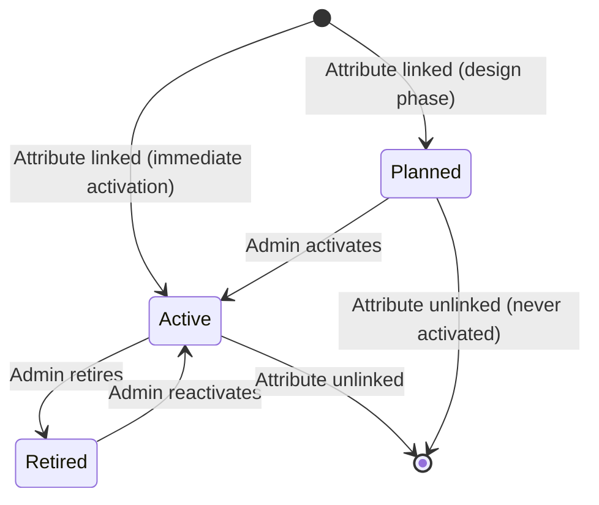
```mermaid
stateDiagram-v2
    [*] --> Planned : Attribute linked (design phase)
    [*] --> Active : Attribute linked (immediate activation)
    Planned --> Active : Admin activates
    Active --> Retired : Admin retires
    Retired --> Active : Admin reactivates
    Active --> [*] : Attribute unlinked
    Planned --> [*] : Attribute unlinked (never activated)
```

**Status Behaviour Matrix:**

| Status | Visible in Definition UI | Visible in Instance Forms | Contributes to Maturity | Existing Data | Editable by Users |
|--------|--------------------------|---------------------------|------------------------|---------------|-------------------|
| **Planned** | Yes | No | No | N/A | N/A |
| **Active** | Yes | Yes | Yes | Editable | Yes |
| **Retired** | Yes (greyed) | No (new instances) | No | Read-only (preserved) | No |

**Tenant Scope:** Tenant-scoped (each tenant independently controls lifecycle status of attributes on their object types).

### 6.3 Relationship / Connection Management [IMPLEMENTED]

**Description:** Administrators define permissible relationships (connections) between object types. Each connection has directional labeling (active/passive names), cardinality, and direction.

**As-built capabilities (verified against code):**

| Capability | Evidence |
|------------|----------|
| **Add connection** from source object type to target object type with relationshipKey (required, max 100), activeName (max 255), passiveName (max 255), cardinality (required, max 20), isDirected (boolean) | `AddConnectionRequest.java` lines 9-29; `ObjectTypeServiceImpl.java` lines 244-272 |
| **Remove connection** by target object type ID | `ObjectTypeController.java` lines 220-232; `ObjectTypeServiceImpl.java` lines 275-295 |
| **List connections** of an object type via `GET /{id}/connections` returns ConnectionDTO list | `ObjectTypeController.java` lines 193-204 |
| **Cardinality values:** one-to-one, one-to-many, many-to-many | `administration.models.ts` line 113; `master-definitions-section.component.ts` lines 172-176 |
| **Connection wizard** (Step 1 in creation wizard) -- select target type, enter active/passive names, cardinality, directed toggle; add multiple connections before save | HTML lines 777-893; TS lines 265-289 |
| **Connection display** in detail panel showing activeName, target type name, and cardinality tag | HTML lines 400-414 |

**Not yet implemented for Connections:**
- Update connection properties (no PUT endpoint)
- Connection-level attributes (Metrix+ supports attributes on relations)
- Importance/weight on connections
- Bidirectional display (viewing incoming connections to an object type)
- Maturity classification on connections (planned in 6.6)

### 6.4 Cross-Tenant Definition Governance [PLANNED]

**Description:** A master tenant owns canonical definitions that child tenants inherit. Child tenants receive object types, attributes, and connections from the master tenant. They can customize non-mandated items but cannot modify mandated ones. This feature does not exist in code today.

**Business Capabilities (target):**

| Capability | Priority |
|------------|----------|
| Master tenant creates a canonical definition set (object types, attributes, connections) | Must Have |
| System propagates canonical definitions to child tenants upon tenant provisioning | Must Have |
| Child tenants see inherited definitions with a visual indicator (e.g., state = "inherited") | Must Have |
| Child tenants can add local object types, attributes, and connections alongside inherited ones | Must Have |
| Changes to canonical definitions in master tenant flow through the release management process (see 6.10) rather than propagating automatically | Should Have |
| Conflict resolution when a child tenant has customized an item that the master tenant updates | Should Have |
| Audit trail of governance actions (who mandated, when, what changed) | Could Have |

**Tenant Scope:** Tenant-scoped (master tenant is a special tenant type; child tenants are linked to master).

### 6.5 Master Mandate Flags [PLANNED]

**Description:** Objects, attributes, and relationships can be flagged with a boolean `isMasterMandate`. Items flagged as mandated by the master tenant cannot be modified or deleted in child tenants. This feature does not exist in code today.

**Business Capabilities (target):**

| Capability | Priority |
|------------|----------|
| Master tenant admin can toggle `isMasterMandate` on any object type | Must Have |
| Master tenant admin can toggle `isMasterMandate` on any attribute linkage (HasAttribute) | Must Have |
| Master tenant admin can toggle `isMasterMandate` on any connection (CanConnectTo) | Must Have |
| Child tenant UI disables edit/delete controls on mandated items with clear visual lock indicator | Must Have |
| Child tenant API rejects modification/deletion of mandated items with 403 Forbidden | Must Have |
| Mandate status visible in list and detail views with a lock badge | Should Have |

**Tenant Scope:** Master tenant sets flags; child tenants read and enforce.

### 6.6 Object Type Maturity Scoring [PLANNED]

**Description:** Maturity scoring operates at the **Object Type level** as a schema-level definition. Administrators configure maturity classifications on both attributes and relations within an object type definition. The system then uses this schema-level maturity definition to calculate a maturity score for each object **instance** of that type. The maturity model is a **four-axis model** inspired by ServiceNow CMDB Health, LeanIX Freshness scoring, and Metrix+ maturity classifications. `[Benchmark: R-04, P-05]`

**Schema-Level Maturity Definition:**

An Object Type's maturity schema consists of:

1. **Attribute maturity classifications** -- Each attribute linked to the object type (via HasAttribute) is classified as Mandatory, Conditional, or Optional
2. **Relation maturity classifications** -- Each connection defined on the object type (via CanConnectTo) is classified as Mandatory, Conditional, or Optional
3. **Freshness threshold** -- A configurable number of days (`freshnessThresholdDays`) after which an instance is considered stale if not updated
4. **Compliance checks** -- Governance rules that the instance must satisfy (mandated attributes present, validation rules passing, required workflows completed)

Together, these classifications and rules form the **maturity schema** for the Object Type.

**Maturity Classes:**

| Class | Meaning | Impact on Instance Creation | Impact on Maturity Score |
|-------|---------|----------------------------|--------------------------|
| **Mandatory** | Required to create/save the instance | Blocks creation if absent | Contributes to maturity denominator and numerator when filled |
| **Conditional** | Required at a specific workflow stage or under certain conditions | Blocks workflow progression if absent | Contributes to maturity denominator and numerator when filled |
| **Optional** | Not required at any stage | No blocking | Contributes to maturity denominator and numerator when filled |

#### 6.6.1 Four-Axis Maturity Model [PLANNED]

The maturity score for each object instance is calculated across **four independent axes**, each measuring a different dimension of data quality. This model is adapted from ServiceNow's CMDB Health Dashboard, which uses Completeness, Compliance, and Relationship axes, extended with a Freshness axis from LeanIX. `[Benchmark: R-04, P-05]`

**Maturity Axes:**

| Axis | Weight (Default) | Description | What It Measures |
|------|------------------|-------------|------------------|
| **Completeness** | 40% | How thoroughly are attributes documented? | Percentage of active attribute values filled, weighted by maturityClass (Mandatory attributes weigh more than Optional) |
| **Compliance** | 25% | Does the instance conform to governance rules? | All mandated attributes present (isMasterMandate=true and lifecycleStatus=active), all validation rules passing, all required workflows completed |
| **Relationship** | 20% | Are required and expected connections established? | Percentage of active mandatory/conditional/optional connections established, weighted by maturityClass |
| **Freshness** | 15% | Is the data current and regularly maintained? | Whether the instance's `lastUpdatedAt` timestamp is within the Object Type's configurable `freshnessThresholdDays` |

**Axis Formulas:**

**Completeness Axis:**

```
completeness = (w_mandatory * filledMandatoryAttrs / totalMandatoryAttrs
              + w_conditional * filledConditionalAttrs / totalConditionalAttrs
              + w_optional * filledOptionalAttrs / totalOptionalAttrs)
```

Where `w_mandatory = 0.50`, `w_conditional = 0.30`, `w_optional = 0.20` (configurable). Only **active** attributes are counted (see 6.2.1). If a category has zero items, its weight is redistributed proportionally.

**Compliance Axis:**

```
compliance = mandateScore * 0.60
           + validationScore * 0.20
           + workflowScore * 0.20
```

Where:
- `mandateScore` = percentage of master-mandated attributes and relations that are present and have values
- `validationScore` = percentage of attribute values passing their configured validation rules
- `workflowScore` = percentage of required governance workflows completed for this instance

**Relationship Axis:**

```
relationship = (w_mandatory * establishedMandatoryRels / totalMandatoryRels
              + w_conditional * establishedConditionalRels / totalConditionalRels
              + w_optional * establishedOptionalRels / totalOptionalRels)
```

Same weighting as the Completeness axis. Only **active** connections are counted.

**Freshness Axis:**

```
freshness = max(0, 1 - (daysSinceLastUpdate / freshnessThresholdDays))
```

If `freshnessThresholdDays` is not configured on the Object Type, the Freshness axis defaults to 100% (no penalty). If the instance has never been updated since creation, `daysSinceLastUpdate` is measured from `createdAt`.

**Composite Maturity Score:**

```
overallMaturity = w1 * completeness + w2 * compliance + w3 * relationship + w4 * freshness
```

Default weights: `w1 = 0.40`, `w2 = 0.25`, `w3 = 0.20`, `w4 = 0.15`. These weights are configurable per tenant (see BR-068).

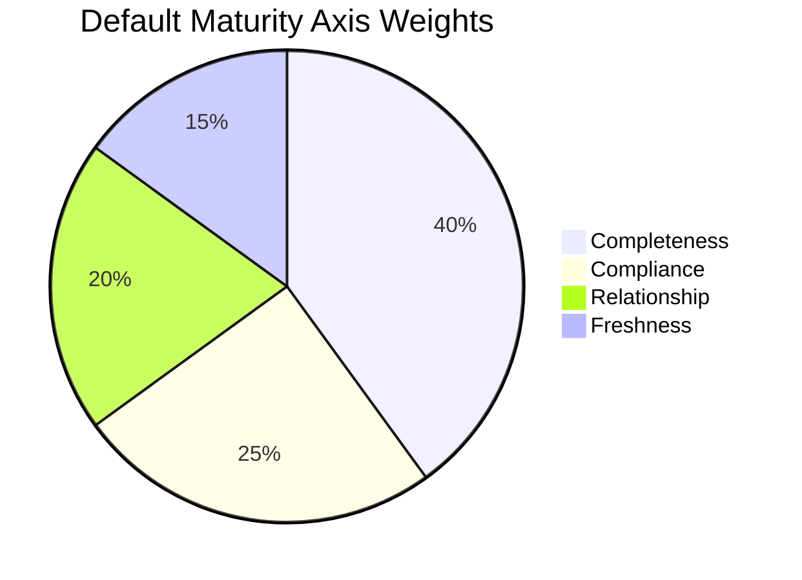
```mermaid
pie title Default Maturity Axis Weights
    "Completeness" : 40
    "Compliance" : 25
    "Relationship" : 20
    "Freshness" : 15
```

#### 6.6.2 Required Mode (requiredMode) [PLANNED]

In addition to the three-level maturity classification (Mandatory / Conditional / Optional), each attribute linkage (HasAttribute) and connection definition (CanConnectTo) carries a **requiredMode** property that defines the enforcement behaviour. This four-mode model is adapted from Metrix+'s validation approach, which distinguishes between creation-time enforcement and workflow-stage enforcement. `[Benchmark: R-04, P-05]`

**Required Modes:**

| Mode | Meaning | Enforcement Behaviour | Maturity Impact |
|------|---------|----------------------|-----------------|
| `mandatory_creation` | Required to create or save the instance | Blocks instance creation/save if absent | Contributes to Completeness (or Relationship) axis |
| `mandatory_workflow` | Required for workflow stage progression | Blocks workflow progression if absent; does NOT block initial creation | Contributes to Compliance axis when the workflow condition is active |
| `optional` | Not required at any stage | No blocking | Contributes to Completeness (or Relationship) axis when filled |
| `conditional` | Required when specific conditions are met | Blocks creation/workflow when condition evaluates to true (condition expressed as a rule) | Contributes to Compliance axis when condition is active |

**Relationship between maturityClass and requiredMode:**

The `maturityClass` property determines the **weight** of the item in the maturity score calculation (Mandatory items weigh more than Optional items). The `requiredMode` property determines the **enforcement behaviour** (when and how the system blocks or warns). They work together:

| maturityClass | requiredMode | Result |
|---------------|-------------|--------|
| Mandatory | mandatory_creation | Blocks creation; highest weight in Completeness/Relationship |
| Mandatory | mandatory_workflow | Does not block creation but blocks workflow; highest weight in Compliance |
| Conditional | conditional | Blocks when condition is true; medium weight |
| Optional | optional | No blocking; lowest weight |

Administrators set both properties when configuring the maturity schema for an object type.

**Business Capabilities (target):**

| Capability | Priority |
|------------|----------|
| Admin assigns maturity class (Mandatory/Conditional/Optional) to each attribute linkage on an object type | Must Have |
| Admin assigns maturity class (Mandatory/Conditional/Optional) to each connection on an object type | Must Have |
| Admin assigns requiredMode (mandatory_creation/mandatory_workflow/optional/conditional) to each attribute linkage | Should Have |
| Admin assigns requiredMode (mandatory_creation/mandatory_workflow/optional/conditional) to each connection | Should Have |
| Instance creation form enforces `mandatory_creation` attributes and relations before save | Must Have |
| Workflow progression enforces `mandatory_workflow` attributes and relations before stage advancement | Should Have |
| Conditional enforcement evaluates condition rules before blocking | Could Have |
| Maturity percentage calculated across four axes: Completeness, Compliance, Relationship, Freshness | Must Have |
| Composite maturity score displayed on each object instance with axis-level breakdown | Should Have |
| Dashboard aggregating maturity scores across all instances of a type, filterable by axis | Should Have |
| Axis weights configurable per tenant (default: 40/25/20/15) | Should Have |
| Freshness threshold (days) configurable per Object Type | Should Have |
| Only active attributes and relations contribute to maturity scoring | Must Have |
| Compliance axis calculates mandate conformance, validation adherence, and workflow completion | Should Have |

**Maturity Scoring Workflow:**

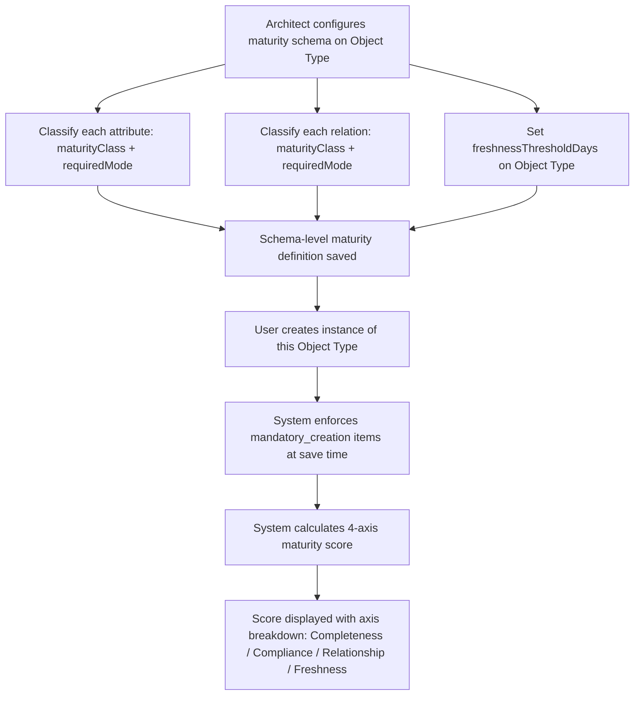
```mermaid
graph TD
    A[Architect configures maturity schema on Object Type] --> B[Classify each attribute: maturityClass + requiredMode]
    A --> C[Classify each relation: maturityClass + requiredMode]
    A --> D[Set freshnessThresholdDays on Object Type]
    B --> E[Schema-level maturity definition saved]
    C --> E
    D --> E
    E --> F[User creates instance of this Object Type]
    F --> G[System enforces mandatory_creation items at save time]
    G --> H[System calculates 4-axis maturity score]
    H --> I[Score displayed with axis breakdown: Completeness / Compliance / Relationship / Freshness]
```

**Tenant Scope:** Tenant-scoped (each tenant can have different maturity configurations and axis weights per object type).

### 6.7 Locale Management [PLANNED]

**Description:** The system provides locale management at the tenant or system level. Administrators select which locales (languages) the system operates on. Attributes flagged as language-dependent require data entry in all active locales. Attributes flagged as language-independent carry a single value with lookup codes configured during attribute creation. This feature does not exist in code today.

This is distinct from simple multilingual translation. Locale management governs how attribute data is captured and stored across the organization's active languages.

**Key Concepts:**

| Concept | Description |
|---------|-------------|
| **System/Tenant Locale List** | The set of active locales (e.g., en, ar, fr) managed at the tenant or system level |
| **Language-Dependent Attribute** | An attribute that requires a separate value for each active locale (e.g., "Display Name" needs an English value and an Arabic value) |
| **Language-Independent Attribute** | An attribute that carries a single value regardless of locale, with optional lookup codes configured at attribute creation time (e.g., "Status Code" = "ACT" everywhere) |

**Business Capabilities (target):**

| Capability | Priority |
|------------|----------|
| Admin configures the active locale list at the tenant or system level (e.g., en, ar, fr) | Must Have |
| Admin flags each attribute type as Language Dependent or Language Independent during attribute creation | Must Have |
| Language Dependent attributes at runtime require a value entry in each active locale | Must Have |
| Language Independent attributes carry a single value with optional lookup codes configured during attribute creation | Must Have |
| UI shows locale tabs or input fields for Language Dependent attributes during instance editing | Should Have |
| Validation rejects instance save if Language Dependent attribute values are incomplete for active locales | Should Have |
| RTL layout support for Arabic locale content | Must Have |
| Adding a new locale to the active list surfaces unfilled Language Dependent values on existing instances | Could Have |

**Locale Management Flow:**

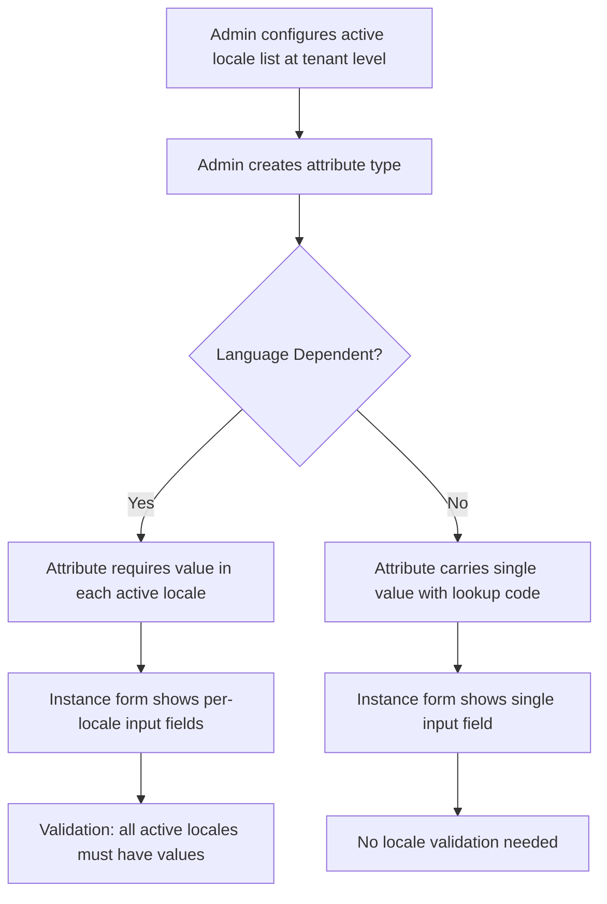
```mermaid
graph TD
    A[Admin configures active locale list at tenant level] --> B[Admin creates attribute type]
    B --> C{Language Dependent?}
    C -->|Yes| D[Attribute requires value in each active locale]
    C -->|No| E[Attribute carries single value with lookup code]
    D --> F[Instance form shows per-locale input fields]
    E --> G[Instance form shows single input field]
    F --> H[Validation: all active locales must have values]
    G --> I[No locale validation needed]
```

**Tenant Scope:** Tenant-scoped (locale requirements may differ per tenant; the locale list is managed at tenant or system level).

### 6.8 Governance Tab [PLANNED]

**Description:** Each object type has a Governance tab (mirroring Metrix+ Tab 4) where administrators configure workflow-based governance and direct operation permissions per object type. This feature does not exist in code today.

**Metrix+ Reference Analysis (from screenshots):**

The Metrix+ Governance tab uses a **split-panel layout** with two distinct sections:

1. **Workflow List (left panel):** A table of workflows attached to this object type, with columns: Workflow Name, Active Version, Create Workflow, Actions. An "Add" button opens the Workflow Settings dialog.

2. **Direct Operation Settings (right panel):** A table of CRUD operation permissions per object type, controlling whether instances of this type can be created/updated/deleted directly (bypassing workflow) or require a workflow. Operations include:
   - `allowDirectCreate` — Active/Inactive + optional template
   - `allowDirectUpdate` — Active/Inactive + optional template
   - `versionTemplate` — Active/Inactive + optional template
   - `viewTemplate` — Active/Inactive + optional template
   - `allowDirectDelete` — Active/Inactive + "No Template Required"
   Each operation has an edit action to toggle status and assign templates.

3. **Workflow Settings Dialog:** Modal with:
   - Workflow selector (dropdown of available workflows)
   - Behaviour: radio group (Create / Reading / Reporting / Other)
   - Permission: table of Username/Role + Type + Actions, with "Add User/Role" button to assign workflow participants

**Business Capabilities (target):**

| Capability | Priority |
|------------|----------|
| **Workflow List** — Admin attaches workflows to an object type, each with an active version and creation controls | Must Have |
| **Direct Operation Settings** — Admin configures per-operation permissions (allowDirectCreate, allowDirectUpdate, allowDirectDelete, versionTemplate, viewTemplate) with Active/Inactive status and optional template association | Must Have |
| **Workflow Settings Dialog** — Admin configures workflow behaviour (Create/Reading/Reporting/Other) and assigns user/role permissions to the workflow | Must Have |
| Master mandate flag on the governance configuration (master tenant locks governance settings for child tenants) | Must Have |
| Override policy: "No overrides allowed", "Additive only", "Full customization" | Should Have |
| Governance rules reference specific attributes or connections | Should Have |
| Governance rules can define conditions (IF attribute X = value THEN require approval) | Could Have |
| Governance tab displays active rules with description and status | Should Have |
| Audit trail of governance changes (who, when, what changed) | Could Have |

**Tenant Scope:** Tenant-scoped. Master tenant sets governance configuration; child tenants inherit with restrictions based on mandate flags.

### 6.9 Graph Visualization [PLANNED]

**Description:** An interactive visual graph showing object types as nodes and connections as edges. Users can explore the type system visually, drill into nodes, and see relationship details. This feature does not exist in code today.

**Business Capabilities (target):**

| Capability | Priority |
|------------|----------|
| Display all object types as nodes with their icons and colors | Should Have |
| Display CAN_CONNECT_TO relationships as labeled edges | Should Have |
| Display IS_SUBTYPE_OF hierarchy | Should Have |
| Click on a node to open its detail panel | Should Have |
| Filter graph by status, state, or search term | Could Have |
| Zoom, pan, and layout controls | Should Have |
| Export graph as image (PNG/SVG) | Could Have |

**Tenant Scope:** Tenant-scoped (shows only current tenant's definitions).

### 6.10 Definition Release Management [PLANNED]

**Description:** When the master tenant changes mandatory attributes or relations on an object type definition, the system generates release notes and orchestrates a structured adoption workflow for child tenants. This replaces a simple import/export versioning model with a comprehensive, Git-like workflow for definition schema changes. This feature does not exist in code today.

**Core Concepts:**

| Concept | Description |
|---------|-------------|
| **Definition Release** | A versioned snapshot of an object type definition (attributes, relations, maturity schema, governance rules) published by the master tenant |
| **Release Notes** | System-generated summary of what changed between versions (added/removed/modified attributes, relations, maturity classes) |
| **Alert** | Notification sent to child tenant managers when a new release is published for a definition they inherit |
| **Impact Assessment** | A review step where tenant managers evaluate how the release affects their existing instances and local customizations |
| **Safe Pull** | The action of adopting a release after impact assessment, merging master changes into the child tenant's definition while preserving local customizations |
| **Diff** | A comparison view showing what changed between two versions of a definition |
| **Rollback** | Reverting a definition to a previous release version |

**Release Management Workflow:**

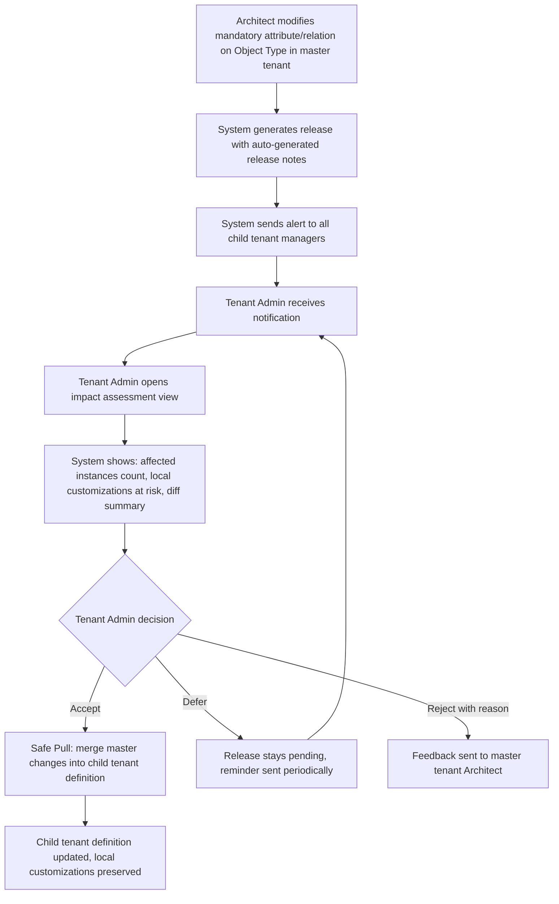
```mermaid
graph TD
    A[Architect modifies mandatory attribute/relation on Object Type in master tenant]
    A --> B[System generates release with auto-generated release notes]
    B --> C[System sends alert to all child tenant managers]
    C --> D[Tenant Admin receives notification]
    D --> E[Tenant Admin opens impact assessment view]
    E --> F[System shows: affected instances count, local customizations at risk, diff summary]
    F --> G{Tenant Admin decision}
    G -->|Accept| H[Safe Pull: merge master changes into child tenant definition]
    G -->|Defer| I[Release stays pending, reminder sent periodically]
    G -->|Reject with reason| J[Feedback sent to master tenant Architect]
    H --> K[Child tenant definition updated, local customizations preserved]
    I --> D
```

**Business Capabilities (target):**

| Capability | Priority |
|------------|----------|
| Each change to a mandated object type definition in the master tenant creates a new release version | Must Have |
| System auto-generates release notes describing what changed (added/removed/modified attributes, relations, maturity classes) | Must Have |
| Alerts sent to child tenant managers when a new release is available for definitions they inherit | Must Have |
| Child tenant managers can view the release diff (before vs. after) | Must Have |
| Child tenant managers perform impact assessment: see how many instances are affected, which local customizations conflict | Must Have |
| **Safe Pull**: child tenant adopts the release, merging master changes while preserving non-conflicting local customizations | Must Have |
| Release adoption can be deferred with a reason; periodic reminders are sent | Should Have |
| Child tenant can reject a release with a reason, sending feedback to the master tenant | Should Have |
| Version history: view all releases for an object type with timestamps, authors, and change descriptions | Should Have |
| Diff between any two versions showing added/removed/changed attributes and connections | Should Have |
| Rollback: revert a definition to a previous release version | Could Have |
| Export definitions as JSON/YAML for backup or migration purposes | Should Have |
| Import definitions from JSON/YAML with conflict detection (type key collision, attribute key collision) | Should Have |
| Release status tracking: draft, published, adopted, deferred, rejected | Must Have |

**Release Lifecycle States:**

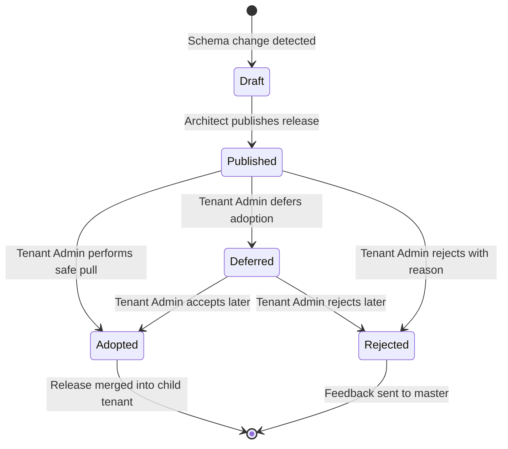
```mermaid
stateDiagram-v2
    [*] --> Draft : Schema change detected
    Draft --> Published : Architect publishes release
    Published --> Adopted : Tenant Admin performs safe pull
    Published --> Deferred : Tenant Admin defers adoption
    Published --> Rejected : Tenant Admin rejects with reason
    Deferred --> Adopted : Tenant Admin accepts later
    Deferred --> Rejected : Tenant Admin rejects later
    Adopted --> [*] : Release merged into child tenant
    Rejected --> [*] : Feedback sent to master
```

**Tenant Scope:** Cross-tenant (releases originate in master tenant and flow to child tenants).

### 6.11 AI-Assisted Definition Management [PLANNED]

**Description:** When a user navigates to the Definition Management section, the AI orchestrator activates relevant tools and skills to assist with object type governance. The AI provides intelligent recommendations, detects duplication, and suggests optimization actions. This feature does not exist in code today but will integrate with the existing ai-service (see `docs/ai-service/Design/01-PRD-AI-Agent-Platform.md`).

**AI Capabilities on Definition Management Page:**

| Capability | Description | Priority |
|------------|-------------|----------|
| **Role-aware activation** | AI identifies the user's roles and responsibilities, activating relevant tools and skills for managing object definitions | Must Have |
| **Duplication detection** | AI analyzes object type names, attributes, and relations across the tenant to detect similar or duplicated object types | Must Have |
| **Merge suggestions** | When similar object types are detected, AI suggests merging them with a proposed merged definition | Should Have |
| **Deletion suggestions** | AI identifies unused or redundant object types (zero instances, no connections, inactive for a configurable period) and suggests deletion | Should Have |
| **Creation recommendations** | During object type creation, AI suggests relevant attributes and connections based on the type name and existing patterns in the tenant | Should Have |
| **Schema completeness analysis** | AI reviews an object type's maturity schema and suggests missing attributes or relations based on similar types | Could Have |

**AI Interaction Flow:**

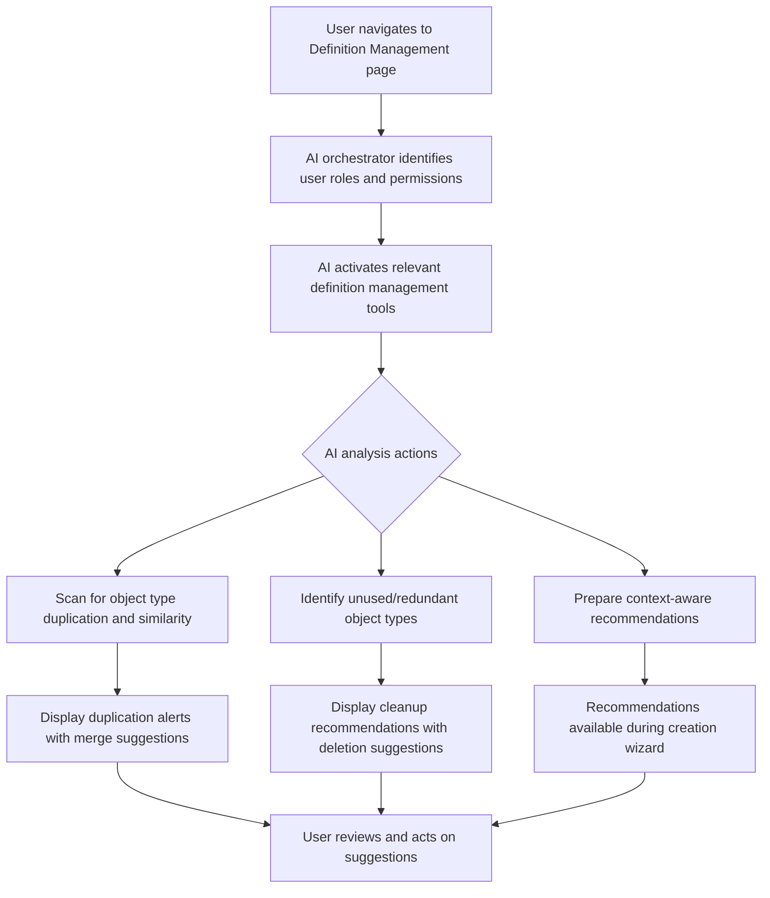
```mermaid
graph TD
    A[User navigates to Definition Management page]
    A --> B[AI orchestrator identifies user roles and permissions]
    B --> C[AI activates relevant definition management tools]
    C --> D{AI analysis actions}
    D --> E[Scan for object type duplication and similarity]
    D --> F[Identify unused/redundant object types]
    D --> G[Prepare context-aware recommendations]
    E --> H[Display duplication alerts with merge suggestions]
    F --> I[Display cleanup recommendations with deletion suggestions]
    G --> J[Recommendations available during creation wizard]
    H --> K[User reviews and acts on suggestions]
    I --> K
    J --> K
```

**Integration:**
- Relies on ai-service for natural language processing, similarity analysis, and recommendation generation
- AI skills are scoped to the user's tenant and role permissions
- Recommendations are non-blocking; the user always retains full control over actions

**Tenant Scope:** Tenant-scoped (AI analysis scoped to current tenant's definitions; Super Admin can view cross-tenant duplication).

### 6.12 Measures Categories [PLANNED]

**Description:** Administrators define categories to group measurements (KPIs, metrics) associated with an object type. Each object type can have multiple measure categories, and each category organizes related measures into a logical group (e.g., "Performance", "Compliance", "SLA Adherence", "Cost"). Measure categories correspond to Metrix+ Tab 6 (Measures Categories) and provide the organizational structure for the measures defined in Section 6.13. `[Benchmark: R-12]`

**Business Capabilities (target):**

| Capability | Priority |
|------------|----------|
| Admin creates a measure category with a unique name within the tenant, a description, and an optional display order | Must Have |
| Admin links a measure category to one or more object types | Must Have |
| Admin views all measure categories linked to an object type on the Measures Categories tab | Must Have |
| Admin updates a measure category's name, description, or display order | Must Have |
| Admin deletes a measure category only if it contains no measures | Must Have |
| Measure categories are displayed in display order on the object type detail panel | Should Have |
| Master mandate flag on measure categories: master tenant can mandate categories for child tenants | Should Have |
| Child tenants can add local measure categories alongside inherited mandated ones | Should Have |

**Measures Categories Flow:**

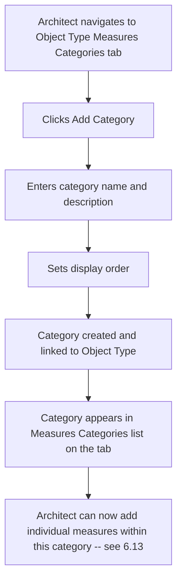
```mermaid
graph TD
    A[Architect navigates to Object Type Measures Categories tab] --> B[Clicks Add Category]
    B --> C[Enters category name and description]
    C --> D[Sets display order]
    D --> E[Category created and linked to Object Type]
    E --> F[Category appears in Measures Categories list on the tab]
    F --> G[Architect can now add individual measures within this category -- see 6.13]
```

**Tenant Scope:** Tenant-scoped (each tenant manages its own measure categories; master mandate flag controls inheritance).

### 6.13 Measures [PLANNED]

**Description:** Administrators define specific measures (KPIs, metrics) within measure categories. Each measure represents a quantifiable indicator associated with an object type, such as "CPU Utilization", "Uptime Percentage", "Mean Time to Repair", or "Cost per Transaction". Measures correspond to Metrix+ Tab 7 (Measures) and carry configuration for units, target values, warning/critical thresholds, and optional calculation formulas. `[Benchmark: R-12]`

**Business Capabilities (target):**

| Capability | Priority |
|------------|----------|
| Admin creates a measure within a measure category with: name (unique within category), description, unit of measurement (e.g., %, ms, USD), target value, warning threshold, critical threshold | Must Have |
| Admin optionally defines a formula for calculated measures (e.g., "avgResponseTime / targetResponseTime * 100") | Could Have |
| Admin views all measures within a category on the object type detail panel | Must Have |
| Admin updates a measure's name, description, thresholds, or formula | Must Have |
| Admin deletes a measure | Must Have |
| Measures display threshold indicators: green (at or above target), amber (between warning and target), red (at or below critical) | Should Have |
| Master mandate flag on measures: master tenant can mandate specific measures for child tenants | Should Have |
| Child tenants can add local measures alongside inherited mandated ones | Should Have |
| Measure values are captured per object instance at runtime (instance-level data entry for each defined measure) | Should Have |
| Measures contribute to a separate "Measures Health" indicator on the instance, distinct from the four-axis maturity score | Could Have |

**Measures Configuration Flow:**

```mermaid
graph TD
    A[Architect navigates to Measure Category within Object Type] --> B[Clicks Add Measure]
    B --> C[Enters measure name, description, unit]
    C --> D[Sets target value, warning threshold, critical threshold]
    D --> E{Formula needed?}
    E -->|Yes| F[Enters calculation formula]
    E -->|No| G[Manual data entry measure]
    F --> H[Measure created within category]
    G --> H
    H --> I[Measure appears in category list with threshold indicators]
```

**Example Measures Configuration:**

| Measure Name | Category | Unit | Target | Warning | Critical | Formula |
|--------------|----------|------|--------|---------|----------|---------|
| Uptime | Performance | % | 99.9 | 99.5 | 99.0 | (none -- manual entry) |
| Avg Response Time | Performance | ms | 200 | 500 | 1000 | (none -- manual entry) |
| Compliance Score | Compliance | % | 95 | 80 | 60 | (calculated from audit results) |
| Cost per Transaction | Cost | USD | 0.05 | 0.10 | 0.25 | totalCost / transactionCount |

**Tenant Scope:** Tenant-scoped (each tenant manages its own measures; master mandate flag controls inheritance).

---

### 6.14 Viewpoints [PLANNED — Future Phase]

> **Benchmark Traceability:** [Benchmark: R-14 Complex Visualization, P-03 Dependency Mapping, T-05 Cytoscape.js]

**Description:** Viewpoints provide a mechanism to compose **complex, context-filtered views** over the definition graph — surfacing object instances, relationships, and KPIs in purpose-built layouts. Each viewpoint defines a lifecycle management framework supporting CRUD operations, optional workflow governance, agentic AI assistance, import/export, and external integration via APIs and MCPs.

**Business Capabilities:**

| ID | Capability | Priority |
|----|-----------|----------|
| VP-CAP-01 | Create, read, update, delete viewpoints with configurable lifecycle (with or without workflows) | Must Have |
| VP-CAP-02 | Attach optional governance workflows to viewpoint lifecycle (approval, review, publish) | Should Have |
| VP-CAP-03 | Agentic AI assistance — AI can suggest viewpoint composition, auto-populate from existing object types, recommend relevant KPIs | Should Have |
| VP-CAP-04 | Import/export viewpoints as portable definitions (JSON/YAML) for cross-tenant or cross-environment sharing | Must Have |
| VP-CAP-05 | External integration via REST API and MCP (Model Context Protocol) for third-party tool consumption | Must Have |
| VP-CAP-06 | Context-based filtering — filter displayed object instances and KPIs by context object (e.g., business unit, domain, project) | Must Have |
| VP-CAP-07 | Compose viewpoints that aggregate objects from multiple object types with cross-type relationships | Must Have |

**Example Viewpoint Use Cases:**

| Viewpoint | Description | Content |
|-----------|-------------|---------|
| Business Model | Visualize a business model with its constituent elements | Object instances (Capabilities, Processes, Applications) + KPIs (cost, performance) filtered by business domain |
| Operating Model | Show operational structure and dependencies | Object instances (Teams, Systems, Services) + KPIs (availability, SLA compliance) filtered by organizational unit |
| Strategy Map | Display strategic objectives and their traceability | Object instances (Goals, Initiatives, Projects) + KPIs (progress, budget) filtered by strategic theme |
| Technology Landscape | Show technology stack and dependencies | Object instances (Applications, Servers, Databases) + KPIs (tech debt, version currency) filtered by domain |

**Viewpoint Lifecycle:**

```mermaid
stateDiagram-v2
    [*] --> Draft : Create viewpoint
    Draft --> Active : Activate (no workflow)
    Draft --> PendingApproval : Submit for approval (with workflow)
    PendingApproval --> Active : Approved
    PendingApproval --> Draft : Rejected
    Active --> Archived : Archive
    Archived --> Active : Reactivate
    Active --> [*] : Delete
```

**Integration Model:**

```mermaid
graph LR
    VP[Viewpoint Engine] -->|REST API| EXT[External Tools]
    VP -->|MCP Protocol| AI[AI Agents / MCPs]
    VP -->|Import/Export| FILE[JSON/YAML Files]
    VP -->|Render| UI[Angular Frontend]
    VP -->|Query| NEO[Neo4j Graph]
    VP -->|Fetch KPIs| MEAS[Measures Engine]
    VP -->|Context Filter| CTX[Context Object]
```

**Tenant Scope:** Tenant-scoped (each tenant defines its own viewpoints; master mandate flag available for cross-tenant viewpoint templates).

**NOTE:** This is a future feature. Specific implementation details (data model, API contracts, UI wireframes) will be elaborated in a dedicated Viewpoint PRD during the planning phase. The examples above (Business Models, Operating Models, Strategies) are illustrative — the viewpoint framework is generic and supports any composition of object instances and KPIs.

---

### 6.15 Special Attribute Types — BPMN Process Diagrams [PLANNED — Future Phase]

> **Benchmark Traceability:** [Benchmark: R-14 Complex Visualization, P-01 Rich Attribute Types]

**Description:** A special attribute type that stores **BPMN 2.0 XML** as its value, enabling users to capture, view, and edit process diagrams directly within an object type's attribute panel. Saving the BPMN file automatically parses the XML and manages BPMN elements (activities, gateways, events, sequence flows) as **nested objects** within the parent object — creating a bidirectional link between the visual process diagram and the structured definition graph.

**Business Capabilities:**

| ID | Capability | Priority |
|----|-----------|----------|
| BPMN-CAP-01 | Define a BPMN attribute type that accepts BPMN 2.0 XML files | Must Have |
| BPMN-CAP-02 | Embedded BPMN viewer/editor within the attribute panel (view and edit process diagrams inline) | Must Have |
| BPMN-CAP-03 | On save, auto-parse BPMN XML and extract process elements (activities, gateways, events, data objects) | Must Have |
| BPMN-CAP-04 | Auto-create extracted BPMN elements as nested objects within the parent object (linked via HAS_BPMN_ELEMENT relationship) | Must Have |
| BPMN-CAP-05 | Bidirectional sync — editing the diagram updates nested objects; editing nested object properties reflects in the diagram | Should Have |
| BPMN-CAP-06 | BPMN element types mapped to definition object types (e.g., UserTask → "Activity" object type, ExclusiveGateway → "Gateway" object type) | Must Have |
| BPMN-CAP-07 | Support BPMN 2.0 standard elements: tasks, sub-processes, gateways (exclusive, parallel, inclusive), events (start, end, intermediate), sequence flows, message flows, data objects | Must Have |
| BPMN-CAP-08 | Version control — each BPMN save creates a new version; diff between versions shows added/removed/modified elements | Should Have |

**BPMN Parsing Flow:**

```mermaid
sequenceDiagram
    participant User
    participant UI as Angular BPMN Editor
    participant API as definition-service API
    participant Parser as BPMN Parser
    participant Neo as Neo4j

    User->>UI: Edit process diagram
    User->>UI: Click Save
    UI->>API: PUT /object-types/{id}/attributes/{attrId}/bpmn
    API->>Parser: Parse BPMN 2.0 XML
    Parser-->>API: Extracted elements (activities, gateways, events, flows)
    API->>Neo: Store BPMN XML as attribute value
    API->>Neo: Upsert nested objects (HAS_BPMN_ELEMENT)
    API->>Neo: Create/update sequence flow relationships
    Neo-->>API: Confirm
    API-->>UI: 200 OK + updated object with nested elements
    UI-->>User: Diagram saved, nested objects visible in tree
```

**Nested Object Structure (Neo4j):**

```mermaid
graph TD
    PARENT[Parent Object Instance] -->|HAS_BPMN_ELEMENT| TASK1[UserTask: Review Application]
    PARENT -->|HAS_BPMN_ELEMENT| GW1[ExclusiveGateway: Approved?]
    PARENT -->|HAS_BPMN_ELEMENT| TASK2[ServiceTask: Send Notification]
    PARENT -->|HAS_BPMN_ELEMENT| EVT1[StartEvent: Request Received]
    PARENT -->|HAS_BPMN_ELEMENT| EVT2[EndEvent: Process Complete]
    EVT1 -->|SEQUENCE_FLOW| TASK1
    TASK1 -->|SEQUENCE_FLOW| GW1
    GW1 -->|SEQUENCE_FLOW yes| TASK2
    GW1 -->|SEQUENCE_FLOW no| EVT2
    TASK2 -->|SEQUENCE_FLOW| EVT2
```

**BPMN Element → Object Type Mapping:**

| BPMN Element | Definition Object Type | Key Attributes |
|--------------|----------------------|----------------|
| `bpmn:userTask` | Activity | name, assignee, documentation |
| `bpmn:serviceTask` | Activity | name, implementation, documentation |
| `bpmn:exclusiveGateway` | Gateway | name, type (exclusive), default flow |
| `bpmn:parallelGateway` | Gateway | name, type (parallel) |
| `bpmn:startEvent` | Event | name, type (start), trigger |
| `bpmn:endEvent` | Event | name, type (end), result |
| `bpmn:intermediateThrowEvent` | Event | name, type (intermediate), trigger |
| `bpmn:subProcess` | SubProcess | name, isExpanded, documentation |
| `bpmn:dataObjectReference` | DataObject | name, dataState |
| `bpmn:sequenceFlow` | (relationship) | sourceRef, targetRef, condition |

**Tenant Scope:** Tenant-scoped (BPMN attribute type availability and nested object type mappings are configurable per tenant).

**NOTE:** This is a future feature. The BPMN editor component (e.g., bpmn.io/bpmn-js integration), detailed Neo4j schema for nested objects, and bidirectional sync algorithm will be elaborated in a dedicated Special Attribute Types PRD during the planning phase.

---

## 7. Business Rules

### Object Type Rules

| ID | Rule | Entities | Priority |
|----|------|----------|----------|
| BR-001 | Object type name is required and must not exceed 255 characters | ObjectType | Must Have |
| BR-002 | Object type typeKey must be unique within a tenant; auto-derived from name (lowercase, spaces to underscores, alphanumeric only) if not explicitly provided | ObjectType | Must Have |
| BR-003 | Object type code is auto-generated as `OBJ_NNN` (sequential) if not explicitly provided; must not exceed 20 characters | ObjectType | Must Have |
| BR-004 | Object type status must be one of: active, planned, hold, retired | ObjectType | Must Have |
| BR-005 | Object type state must be one of: default, customized, user_defined | ObjectType | Must Have |
| BR-006 | Editing a "default" state object type automatically transitions it to "customized" state | ObjectType | Must Have |
| BR-007 | Only "customized" state object types can be restored to "default" state | ObjectType | Must Have |
| BR-008 | Duplicating an object type creates a new type with state "user_defined", appended " (Copy)" name, and a unique typeKey with incremental suffix | ObjectType | Must Have |
| BR-009 | Deleting an object type is blocked when instanceCount > 0 or state = "default" | ObjectType | Must Have |
| BR-010 | Every API operation requires a valid tenant context from JWT `tenant_id` claim or `X-Tenant-ID` header; return 400 if missing | ObjectType, AttributeType | Must Have |
| BR-011 | All definition endpoints require `SUPER_ADMIN` or `ARCHITECT` role; return 403 if unauthorized | ObjectType, AttributeType | Must Have |

### Attribute Rules

| ID | Rule | Entities | Priority |
|----|------|----------|----------|
| BR-012 | Attribute type name is required and must not exceed 255 characters | AttributeType | Must Have |
| BR-013 | Attribute type attributeKey is required and must not exceed 100 characters | AttributeType | Must Have |
| BR-014 | Attribute type dataType is required and must be one of: string, text, integer, float, boolean, date, datetime, enum, json | AttributeType | Must Have |
| BR-015 | An attribute type can be linked to multiple object types (reusable) | HasAttribute | Must Have |
| BR-016 | An attribute type cannot be linked to the same object type more than once; return 409 Conflict if duplicate | HasAttribute | Must Have |
| BR-017 | Attribute displayOrder must be >= 0 | HasAttribute | Must Have |
| BR-018 | Validation rules are stored as a JSON string with a maximum length of 2000 characters | AttributeType | Must Have |

### Attribute Lifecycle Rules [PLANNED]

| ID | Rule | Entities | Priority |
|----|------|----------|----------|
| BR-019 | Each HasAttribute linkage carries a `lifecycleStatus` field with values `planned`, `active`, or `retired` (default: `active`) | HasAttribute | Must Have |
| BR-020 | **Active** attributes appear in object instance forms, are editable, and contribute to maturity scoring | HasAttribute | Must Have |
| BR-021 | **Planned** attributes are visible only in the definition management UI; they do NOT appear on instance forms and do NOT contribute to maturity scoring | HasAttribute | Must Have |
| BR-022 | **Retired** attributes are hidden from new instance forms but existing instance data is preserved as read-only. Retiring a mandatory attribute triggers a confirmation warning. | HasAttribute | Should Have |
| BR-023 | Reactivating a retired attribute (retired → active) restores its visibility in forms and its contribution to maturity scoring | HasAttribute | Must Have |
| BR-024 | A mandated attribute (isMasterMandate = true) cannot be retired by a child tenant | HasAttribute | Must Have |
| BR-024a | The same three-state lifecycle (`planned`, `active`, `retired`) applies to CAN_CONNECT_TO relationship definitions | CanConnectTo | Must Have |

### Connection Rules

| ID | Rule | Entities | Priority |
|----|------|----------|----------|
| BR-025 | Connection relationshipKey is required and must not exceed 100 characters | CanConnectTo | Must Have |
| BR-026 | Connection cardinality is required and must be one of: one-to-one, one-to-many, many-to-many | CanConnectTo | Must Have |
| BR-027 | Both source and target object types must belong to the same tenant | CanConnectTo | Must Have |
| BR-028 | Active name and passive name provide directional labeling for the relationship (e.g., "runs on" / "hosts") | CanConnectTo | Must Have |

### Governance Rules [PLANNED]

| ID | Rule | Entities | Priority |
|----|------|----------|----------|
| BR-029 | When `isMasterMandate = true` on an object type, child tenants cannot modify or delete it | ObjectType | Must Have |
| BR-030 | When `isMasterMandate = true` on a HasAttribute linkage, child tenants cannot unlink, modify the isRequired/displayOrder, or deactivate the attribute | HasAttribute | Must Have |
| BR-031 | When `isMasterMandate = true` on a CanConnectTo relationship, child tenants cannot remove or modify the connection | CanConnectTo | Must Have |
| BR-032 | Only users in the master tenant with `SUPER_ADMIN` or `ARCHITECT` role can set `isMasterMandate` flags | ObjectType, HasAttribute, CanConnectTo | Must Have |
| BR-033 | Canonical definitions propagated from master to child tenants receive state "inherited" (new state value) | ObjectType | Must Have |

### Maturity Rules [PLANNED]

| ID | Rule | Entities | Priority |
|----|------|----------|----------|
| BR-034 | Maturity class is one of: Mandatory, Conditional, Optional; applies to both attribute linkages and connection definitions on an Object Type | HasAttribute, CanConnectTo | Must Have |
| BR-035 | Mandatory attributes must be filled before an instance can be created/saved | HasAttribute | Must Have |
| BR-036 | Mandatory relations must be established before an instance can be created/saved | CanConnectTo | Must Have |
| BR-037 | Conditional attributes must be filled before a specific workflow stage can progress | HasAttribute | Should Have |
| BR-038 | Conditional relations must be established before a specific workflow stage can progress | CanConnectTo | Should Have |
| BR-039 | Maturity score is a composite of four axes: overallMaturity = w1*Completeness + w2*Compliance + w3*Relationship + w4*Freshness, where default weights are 40/25/20/15 (configurable per tenant, see BR-068). The Completeness axis measures filled active attributes weighted by maturityClass; the Compliance axis measures mandate conformance, validation adherence, and workflow completion (see BR-066); the Relationship axis measures established active connections weighted by maturityClass; the Freshness axis measures update recency (see BR-067). See Section 6.6.1 for full axis formulas `[Benchmark: R-04, P-05]` | ObjectType, HasAttribute, CanConnectTo | Must Have |
| BR-040 | Non-active attributes (planned or retired) and non-active relations are excluded from both the numerator and denominator of the maturity score — only `lifecycleStatus = active` items participate | HasAttribute, CanConnectTo | Must Have |
| BR-041 | An instance with 100% maturity score has all active mandatory, conditional, and optional attributes filled and all active mandatory, conditional, and optional relations established | ObjectType | Must Have |
| BR-042 | The maturity schema is defined at the Object Type level and applied consistently to all instances of that type | ObjectType | Must Have |

### Locale Management Rules [PLANNED]

| ID | Rule | Entities | Priority |
|----|------|----------|----------|
| BR-043 | The tenant or system administrator manages the active locale list (e.g., en, ar, fr) | SystemLocale | Must Have |
| BR-044 | An attribute flagged as Language Dependent requires a value entry in every active locale | AttributeType | Must Have |
| BR-045 | An attribute flagged as Language Independent carries a single value regardless of locale, with optional lookup codes configured during attribute creation | AttributeType | Must Have |
| BR-046 | Saving an instance with incomplete Language Dependent values for active locales is rejected with a validation error listing the missing locales | AttributeType | Should Have |
| BR-047 | The Language Dependent / Language Independent flag is set during attribute type creation and can be changed by an administrator | AttributeType | Must Have |

### Release Management Rules [PLANNED]

| ID | Rule | Entities | Priority |
|----|------|----------|----------|
| BR-048 | When a master tenant modifies mandatory attributes or mandatory relations on a mandated object type definition, the system creates a new release version | DefinitionRelease | Must Have |
| BR-049 | Each release includes auto-generated release notes describing what changed (added, removed, modified attributes and relations) | DefinitionRelease | Must Have |
| BR-050 | Alerts are sent to all child tenant managers who inherit the affected definition when a release is published | DefinitionRelease, TenantReleaseAdoption | Must Have |
| BR-051 | Child tenant managers can view the release diff before deciding to adopt | DefinitionRelease | Must Have |
| BR-052 | Child tenant managers perform an impact assessment before adopting: system displays affected instance count and conflicting local customizations | TenantReleaseAdoption | Must Have |
| BR-053 | Safe Pull merges master changes into the child tenant definition while preserving non-conflicting local customizations | TenantReleaseAdoption | Must Have |
| BR-054 | A release can be deferred by a child tenant with a reason; periodic reminders are sent until the release is adopted or rejected | TenantReleaseAdoption | Should Have |
| BR-055 | A release can be rejected by a child tenant with a reason; feedback is sent to the master tenant Architect | TenantReleaseAdoption | Should Have |
| BR-056 | Release status transitions follow the lifecycle: Draft, Published, Adopted, Deferred, Rejected | DefinitionRelease | Must Have |
| BR-057 | Version history retains all releases for an object type; rollback to any prior version is supported | DefinitionRelease | Could Have |

### AI Integration Rules [PLANNED]

| ID | Rule | Entities | Priority |
|----|------|----------|----------|
| BR-058 | When a user navigates to the Definition Management page, the AI orchestrator identifies the user's roles and activates relevant tools | AI Integration | Must Have |
| BR-059 | AI duplication detection compares object type names, attribute sets, and relation patterns within the tenant to identify similarity above a configurable threshold | ObjectType | Must Have |
| BR-060 | AI merge suggestions include a proposed merged definition showing which attributes and relations from each source type would be retained | ObjectType | Should Have |
| BR-061 | AI deletion suggestions target object types with zero instances and no connections that have been inactive for a configurable period (default: 90 days) | ObjectType | Should Have |
| BR-062 | AI recommendations during object type creation are non-blocking; the user always retains full control over the final definition | ObjectType | Must Have |
| BR-063 | AI analysis is scoped to the current user's tenant and respects role-based permissions; Super Admin can access cross-tenant duplication analysis | ObjectType | Must Have |

### Architect Role Licensing Rule [PLANNED]

| ID | Rule | Entities | Priority |
|----|------|----------|----------|
| BR-064 | The Architect role must be included in the licensing schema; tenants are charged for Architect seats | License, Role | Must Have |
| BR-065 | The Architect role grants full CRUD access to definitions, the ability to trigger release management workflows, and access to AI definition governance tools | Role | Must Have |

### Maturity Model Rules (Four-Axis) [PLANNED]

| ID | Rule | Entities | Priority |
|----|------|----------|----------|
| BR-066 | The Compliance maturity axis checks: (a) all master-mandated attributes are present (isMasterMandate=true, lifecycleStatus=active, and has a value), (b) all configured validation rules are passing for attribute values, (c) all required governance workflows are completed for the instance. Compliance score = mandateScore * 0.60 + validationScore * 0.20 + workflowScore * 0.20 `[Benchmark: R-04, P-05]` | ObjectType, HasAttribute, CanConnectTo | Should Have |
| BR-067 | The Freshness maturity axis checks: instance lastUpdatedAt must be within the Object Type's configured freshnessThresholdDays. Freshness = max(0, 1 - daysSinceLastUpdate / freshnessThresholdDays). Instances exceeding the threshold score 0% on the Freshness axis. If freshnessThresholdDays is not configured, Freshness defaults to 100% `[Benchmark: R-04, P-05]` | ObjectType | Should Have |
| BR-068 | Default maturity axis weights are: Completeness 40%, Compliance 25%, Relationship 20%, Freshness 15%. These weights are configurable per tenant. Tenant Admin can adjust weights, and the four weights must sum to 100% `[Benchmark: R-04, P-05]` | ObjectType | Should Have |
| BR-069 | Measures Categories are tenant-scoped; each category has a unique name within the tenant and an optional display order. A category cannot be deleted if it contains measures `[Benchmark: R-12]` | MeasureCategory | Must Have |
| BR-070 | Each Measure belongs to exactly one Measures Category; each measure has a unique name within its category. A measure carries: name, description, unit, target value, warning threshold, critical threshold, and an optional formula `[Benchmark: R-12]` | Measure, MeasureCategory | Must Have |
| BR-071 | The requiredMode property and maturityClass property work together on HasAttribute and CanConnectTo: maturityClass (Mandatory/Conditional/Optional) determines the weight of the item in the Completeness and Relationship maturity axes; requiredMode (mandatory_creation/mandatory_workflow/optional/conditional) determines enforcement behaviour (creation blocking, workflow blocking, or no blocking) `[Benchmark: R-04, P-05]` | HasAttribute, CanConnectTo | Should Have |

### Architectural Principle Rules

| ID | Rule | Entities | Priority |
|----|------|----------|----------|
| BR-072 | The definition repository (Neo4j — object types, attribute types, connections, maturity schemas, governance configs, releases) MUST be physically separated from the instance repository. Instance services consume definitions via read-only references only. | All Definition Entities | Must Have |
| BR-073 | Every newly created object type MUST be automatically provisioned with system default attributes (name, description, status, owner, createdAt, createdBy, updatedAt, updatedBy, externalId, tags). Default attributes have `isSystemDefault: true` on HAS_ATTRIBUTE and CANNOT be removed by users. | ObjectType, HasAttribute | Must Have |
| BR-074 | Definition updates via release management MUST NEVER destroy existing instance data. Removed attributes/connections are soft-deleted and archived. Rollback restores archived data. | DefinitionRelease, ReleaseChange | Must Have |
| BR-075 | Breaking definition changes (remove mandatory attribute, change data type, remove connection) MUST require explicit confirmation and impact assessment before applying to instances. | DefinitionRelease, ReleaseChange | Must Have |
| BR-076 | When a mandatory attribute is added to an existing object type via a release, a default value or migration plan MUST be provided for existing instances that lack the attribute. | DefinitionRelease, AttributeType | Must Have |

### Message Registry & Lifecycle Control Rules [PLANNED]

| ID | Rule | Entities | Priority |
|----|------|----------|----------|
| BR-077 | All user-facing messages (errors, confirmations, warnings, success) MUST be stored in the centralized message registry (PostgreSQL) with a unique message code following the `{SERVICE}-{TYPE}-{SEQ}` convention | MessageRegistry | Must Have |
| BR-078 | Backend services MUST NOT hardcode user-facing strings. All error/success messages MUST reference message codes from the registry. | All Services | Must Have |
| BR-079 | Frontend MUST NOT hardcode user-facing labels. All messages MUST be rendered from the message registry cache, resolved in the user's selected interface language. | Frontend | Must Have |
| BR-080 | Every message code MUST have a default English translation. Additional locale translations are stored in the message_translation table. If a translation is unavailable for the selected locale, the English default is used as fallback. | MessageRegistry, MessageTranslation | Must Have |
| BR-081 | ObjectType status transitions MUST follow the defined state machine: planned→active, active→hold, hold→active, active→retired, hold→retired, retired→active. Any other transition MUST be rejected with DEF-E-012. | ObjectType | Must Have |
| BR-082 | Attribute lifecycleStatus transitions MUST follow: planned→active, active→retired, retired→active. Any other transition MUST be rejected with DEF-E-025. | HasAttribute | Must Have |
| BR-083 | Connection lifecycleStatus transitions MUST follow: planned→active, active→retired, retired→active. Any other transition MUST be rejected with the corresponding error code. | CanConnectTo | Must Have |
| BR-084 | Destructive or impactful lifecycle transitions (retire, delete, restore to default, publish release) MUST display a confirmation dialog from the message registry before execution. The user must explicitly confirm. | All Lifecycle Entities | Must Have |
| BR-085 | When a lifecycle transition fails due to network error or timeout, the frontend MUST NOT change the displayed state. It MUST show a retry-capable error toast (DEF-E-050/DEF-E-052) and retain the previous state. | Frontend | Must Have |
| BR-086 | Optimistic lock conflicts (concurrent modification) MUST show warning DEF-W-001 and offer the user a "Reload" action to fetch the latest version. | All Entities | Must Have |

---

## 8. Acceptance Criteria

### AC-6.1: Object Type Management [IMPLEMENTED]

**AC-6.1.1 Main Scenario: Create Object Type (Happy Path)**

```gherkin
Given the user is authenticated as SUPER_ADMIN in tenant "T001"
And the user is on the Master Definitions page
When the user clicks "New Type"
And enters name "Server"
And selects icon "server"
And selects icon color "#428177"
And enters description "Physical or virtual server"
And clicks "Next" through Connections and Attributes steps
And selects status "Active" on the Status step
And clicks "Create"
Then a new object type is created with:
  | Field    | Value                    |
  | name     | Server                   |
  | typeKey  | server                   |
  | code     | OBJ_NNN (auto-generated) |
  | status   | active                   |
  | state    | user_defined             |
  | iconName | server                   |
And the new type appears at the top of the list
And the total record count increases by 1
```

**AC-6.1.2 Alternative Scenario: Create with Explicit TypeKey**

```gherkin
Given the user is authenticated as SUPER_ADMIN in tenant "T001"
When the user creates an object type with name "Virtual Machine" and typeKey "vm"
Then the object type is created with typeKey "vm" (not auto-derived "virtual_machine")
```

**AC-6.1.3 Edge Case: Duplicate TypeKey**

```gherkin
Given an object type with typeKey "server" exists in tenant "T001"
When the user attempts to create another object type with typeKey "server" in tenant "T001"
Then the system returns HTTP 409 Conflict
And the error message states "TypeKey 'server' already exists for this tenant"
```

**AC-6.1.4 Edge Case: Empty List State**

```gherkin
Given the user is authenticated as SUPER_ADMIN in tenant "T001"
And no object types exist for tenant "T001"
When the Master Definitions page loads
Then the list panel shows the empty state with icon and message "No object types match your criteria."
And the "New Type" button is still visible and enabled
```

**AC-6.1.5 Search and Filter**

```gherkin
Given object types "Server", "Application", "Contract" exist in tenant "T001"
When the user types "ser" in the search field
Then only "Server" is shown in the list
When the user clears the search and selects status filter "Planned"
And no object types have status "planned"
Then the empty state is shown
```

**AC-6.1.6 Pagination**

```gherkin
Given 30 object types exist in tenant "T001"
And the page size is 25
When the Master Definitions page loads
Then 25 object types are displayed
And the record count shows "Showing 25 of 30 object types"
```

**AC-6.1.7 View Mode Toggle**

```gherkin
Given object types exist in tenant "T001"
When the user clicks the card view toggle button
Then the list switches from table rows to a card grid layout
And each card shows icon, name, status, attribute count, and connection count
When the user clicks the list view toggle button
Then the view switches back to table rows
```

**AC-6.1.8 Permissions / Authorization**

```gherkin
Given the user is authenticated with role "USER" (not SUPER_ADMIN or ARCHITECT)
When the user attempts to access GET /api/v1/definitions/object-types
Then the system returns HTTP 403 Forbidden
```

**AC-6.1.9 Missing Tenant Context**

```gherkin
Given the user's JWT does not contain a "tenant_id" claim
And no "X-Tenant-ID" header is present
When the user attempts any definition API call
Then the system returns HTTP 400 Bad Request
And the message states "Missing tenant context (no tenant_id JWT claim or X-Tenant-ID header)"
```

**AC-6.1.10 Delete Object Type**

```gherkin
Given object type "Server" with state "user_defined" and instanceCount 0 exists
When the user clicks the delete button on "Server"
Then a confirmation dialog appears with message "Delete Server? This action cannot be undone."
When the user clicks "Delete" in the dialog
Then the object type is removed from the list
And the total record count decreases by 1
```

**AC-6.1.11 Delete Blocked for Default State**

```gherkin
Given object type "Built-In Type" with state "default" exists
When the user views the list
Then the delete button for "Built-In Type" is disabled
And the tooltip shows "Cannot delete default types"
```

**AC-6.1.12 Delete Blocked for Active Instances**

```gherkin
Given object type "Server" with instanceCount 5 exists
When the user views the list
Then the delete button for "Server" is disabled
And the tooltip shows "Cannot delete: has active instances"
```

**AC-6.1.13 Duplicate Object Type**

```gherkin
Given object type "Server" with typeKey "server" exists in tenant "T001"
When the user clicks the duplicate button on "Server"
Then a new object type is created with:
  | Field    | Value            |
  | name     | Server (Copy)    |
  | typeKey  | server_copy      |
  | state    | user_defined     |
And the copy appears at the top of the list
```

**AC-6.1.14 Restore to Default**

```gherkin
Given object type "Built-In Type" with state "customized" exists
When the user clicks the "Restore to Default" button
Then the object type state changes to "default"
And the restore button disappears (only shown for customized state)
```

**AC-6.1.15 Restore Rejected for Non-Customized**

```gherkin
Given object type "My Type" with state "user_defined" exists
When the API receives POST /api/v1/definitions/object-types/{id}/restore
Then the system returns HTTP 409 Conflict
And the message states "Only customized object types can be restored to default"
```

**AC-6.1.16 Edit Object Type (Detail Panel)**

```gherkin
Given object type "Server" is selected in the detail panel
When the user clicks "Edit"
Then the detail panel switches to edit mode showing:
  | Field       | Pre-filled Value        |
  | Name        | Server                  |
  | Description | (current description)   |
  | Status      | (current status)        |
  | Icon        | (current icon selected) |
  | Icon Color  | (current color)         |
When the user changes the name to "Server v2" and clicks "Save"
Then the object type is updated and the detail panel returns to view mode
And the list reflects the updated name
```

**AC-6.1.17 Error Handling: API Failure**

```gherkin
Given the definition-service is unreachable
When the Master Definitions page attempts to load object types
Then an error banner appears with message "Failed to load object types. Please try again."
And a "Retry" button is shown
When the user clicks "Retry" and the service is now available
Then the object types load successfully and the error banner disappears
```

### AC-6.2: Attribute Management [IMPLEMENTED]

**AC-6.2.1 Main Scenario: Create Attribute Type**

```gherkin
Given the user is authenticated as SUPER_ADMIN in tenant "T001"
When the user calls POST /api/v1/definitions/attribute-types with:
  | Field         | Value       |
  | name          | Hostname    |
  | attributeKey  | hostname    |
  | dataType      | string      |
  | attributeGroup| network     |
Then an attribute type is created with the provided values
And the response includes a generated UUID id
```

**AC-6.2.2 Link Attribute to Object Type**

```gherkin
Given object type "Server" and attribute type "Hostname" exist in tenant "T001"
When the user calls POST /api/v1/definitions/object-types/{serverId}/attributes with:
  | Field           | Value        |
  | attributeTypeId | {hostnameId} |
  | isRequired      | true         |
  | displayOrder    | 1            |
Then the attribute is linked to the object type
And the object type's attributes list includes "Hostname" with isRequired=true and displayOrder=1
```

**AC-6.2.3 Edge Case: Duplicate Attribute Linkage**

```gherkin
Given attribute "Hostname" is already linked to object type "Server"
When the user attempts to link "Hostname" to "Server" again
Then the system returns HTTP 409 Conflict
And the message states "Attribute already linked to this object type"
```

**AC-6.2.4 Wizard Attribute Selection**

```gherkin
Given attribute types "Hostname", "IP Address", "OS Version" exist in tenant "T001"
When the user reaches Step 2 (Attributes) of the creation wizard
Then all three attribute types are shown as checkboxes
When the user checks "Hostname" and "IP Address"
And completes the wizard
Then the created object type has both attributes linked with isRequired=false and sequential displayOrder
```

**AC-6.2.5 Empty Attribute List in Wizard**

```gherkin
Given no attribute types exist in tenant "T001"
When the user reaches Step 2 (Attributes) of the creation wizard
Then a message states "No attribute types available. You can add attributes after creating this object type."
```

### AC-6.2.1: Attribute Lifecycle Status [PLANNED]

**AC-6.2.1.1 Main Scenario: Create Attribute as Planned**

```gherkin
Given object type "Server" exists in tenant "T001"
When the administrator links attribute "MaintenanceWindow" with lifecycleStatus "planned"
Then the attribute appears in the definition management attribute list with a blue "Planned" chip
And the attribute does NOT appear in object instance creation/edit forms for "Server"
And the attribute does NOT contribute to maturity scoring
```

**AC-6.2.1.2 Main Scenario: Activate a Planned Attribute**

```gherkin
Given object type "Server" has attribute "MaintenanceWindow" with lifecycleStatus "planned"
When the administrator transitions "MaintenanceWindow" to "active"
Then the attribute lifecycleStatus changes to "active"
And the attribute appears in instance creation/edit forms for "Server"
And the attribute begins contributing to maturity scoring
```

**AC-6.2.1.3 Main Scenario: Retire an Active Attribute**

```gherkin
Given object type "Server" has attribute "Notes" linked with lifecycleStatus "active"
When the administrator transitions "Notes" to "retired"
Then the attribute lifecycleStatus changes to "retired"
And the attribute row appears greyed out in the definition attribute list with a grey "Retired" chip
And the attribute no longer appears in new instance creation/edit forms for "Server"
And existing instance data for "Notes" is preserved as read-only
```

**AC-6.2.1.4 Alternative Scenario: Reactivate a Retired Attribute**

```gherkin
Given object type "Server" has attribute "Notes" with lifecycleStatus "retired"
When the administrator transitions "Notes" to "active"
Then the attribute lifecycleStatus changes to "active"
And the attribute appears again in instance creation/edit forms for "Server"
And existing preserved data becomes editable
And the attribute resumes contributing to maturity scoring
```

**AC-6.2.1.5 Edge Case: Retire Mandatory Attribute with Existing Data**

```gherkin
Given object type "Server" has mandatory attribute "Hostname" with lifecycleStatus "active"
And 15 instances of "Server" have "Hostname" values
When the administrator attempts to retire "Hostname"
Then a warning dialog appears stating "15 instances have data for 'Hostname'. Retiring will hide this attribute from forms but existing data will be preserved as read-only."
When the administrator confirms the retirement
Then the attribute lifecycleStatus changes to "retired"
And existing "Hostname" values are preserved in the data store as read-only
```

**AC-6.2.1.6 Edge Case: Mandated Attribute Cannot Be Retired by Child Tenant**

```gherkin
Given object type "Server" is inherited from master tenant
And attribute "Hostname" has isMasterMandate=true
When the child tenant administrator attempts to retire "Hostname"
Then the system rejects the action
And a message states "Cannot retire a mandated attribute inherited from the master tenant"
```

**AC-6.2.1.7 Maturity Score Excludes Non-Active Attributes**

```gherkin
Given object type "Server" has 4 active attributes, 1 planned attribute, and 1 retired attribute
And an instance has all 4 active attributes filled
When the system calculates the maturity score
Then the score is 100% (4/4)
And planned and retired attributes are not counted in the denominator
```

### AC-6.3: Connection Management [IMPLEMENTED]

**AC-6.3.1 Main Scenario: Add Connection**

```gherkin
Given object types "Server" and "Application" exist in tenant "T001"
When the user calls POST /api/v1/definitions/object-types/{serverId}/connections with:
  | Field              | Value         |
  | targetObjectTypeId | {appId}       |
  | relationshipKey    | runs_on       |
  | activeName         | runs          |
  | passiveName        | runs on       |
  | cardinality        | one-to-many   |
  | isDirected         | true          |
Then a CAN_CONNECT_TO relationship is created from "Server" to "Application"
And the connection appears in the detail panel connections section
```

**AC-6.3.2 Wizard Connection Creation**

```gherkin
Given the user is on Step 1 (Connections) of the creation wizard
And object type "Application" exists
When the user selects target type "Application"
And enters active name "hosts"
And enters passive name "hosted on"
And selects cardinality "one-to-many"
And clicks "Add Connection"
Then the connection appears in the wizard's connection list
And the draft form fields are reset
```

**AC-6.3.3 Remove Connection**

```gherkin
Given object type "Server" has a connection to "Application"
When the user calls DELETE /api/v1/definitions/object-types/{serverId}/connections/{appId}
Then the connection is removed
And the object type's connections list no longer includes "Application"
```

**AC-6.3.4 Edge Case: Target Not Found**

```gherkin
Given object type "Server" exists in tenant "T001"
When the user attempts to add a connection with targetObjectTypeId "nonexistent-id"
Then the system returns HTTP 404 Not Found
And the message states "Target ObjectType not found: nonexistent-id"
```

### AC-6.4: Cross-Tenant Definition Governance [PLANNED]

**AC-6.4.1 Main Scenario: Inherit Definitions from Master Tenant**

```gherkin
Given the master tenant "MASTER" has defined object types "Server", "Application", "Contract"
And child tenant "CHILD-A" is provisioned under "MASTER"
When "CHILD-A" admin loads the Master Definitions page
Then all three object types appear with state "inherited"
And an "Inherited" badge is visible on each
And edit/delete buttons are disabled for mandated items
```

**AC-6.4.2 Alternative: Child Adds Local Type**

```gherkin
Given child tenant "CHILD-A" inherits definitions from "MASTER"
When the "CHILD-A" admin creates a new object type "Local Device"
Then "Local Device" is created with state "user_defined"
And it appears alongside inherited types in the list
```

**AC-6.4.3 Edge Case: Child Attempts to Delete Inherited Type**

```gherkin
Given object type "Server" is inherited from master with isMasterMandate=true in "CHILD-A"
When the "CHILD-A" admin attempts to delete "Server"
Then the system returns HTTP 403 Forbidden
And the message states "Cannot delete a mandated definition inherited from the master tenant"
```

### AC-6.5: Master Mandate Flags [PLANNED]

**AC-6.5.1 Main Scenario: Set Mandate Flag**

```gherkin
Given the user is SUPER_ADMIN in the master tenant
And object type "Server" exists
When the user toggles isMasterMandate to true on "Server"
Then the object type is flagged as mandated
And a lock icon appears on the type in all child tenants
```

**AC-6.5.2 Child Tenant: Mandated Item Is Read-Only**

```gherkin
Given object type "Server" has isMasterMandate=true in child tenant "CHILD-A"
When the "CHILD-A" admin selects "Server" in the detail panel
Then the "Edit" button is hidden or disabled
And a message states "This definition is mandated by the master tenant and cannot be modified"
```

### AC-6.6: Object Type Maturity Scoring [PLANNED]

**AC-6.6.1 Main Scenario: Configure Maturity Schema**

```gherkin
Given object type "Server" has attributes and connections:
  | Item                    | Type       | Current Class |
  | Hostname                | Attribute  | (none)        |
  | IP Address              | Attribute  | (none)        |
  | OS Version              | Attribute  | (none)        |
  | Notes                   | Attribute  | (none)        |
  | runs_on -> Application  | Connection | (none)        |
When the Architect assigns maturity classes:
  | Item                    | Maturity Class |
  | Hostname                | Mandatory      |
  | IP Address              | Conditional    |
  | OS Version              | Conditional    |
  | Notes                   | Optional       |
  | runs_on -> Application  | Mandatory      |
Then the Object Type "Server" has a complete maturity schema
And the schema is saved and applied to all instances of "Server"
```

**AC-6.6.2 Main Scenario: Maturity Score Calculation with Four-Axis Model**

```gherkin
Given object type "Server" has the maturity schema:
  | Item                    | Maturity Class | Required Mode        |
  | Hostname                | Mandatory      | mandatory_creation   |
  | IP Address              | Conditional    | conditional          |
  | OS Version              | Conditional    | mandatory_workflow   |
  | Notes                   | Optional       | optional             |
  | runs_on -> Application  | Mandatory      | mandatory_creation   |
And the Object Type "Server" has freshnessThresholdDays = 90
And the tenant uses default axis weights (Completeness 40%, Compliance 25%, Relationship 20%, Freshness 15%)
And an instance of "Server" has:
  | Item                    | Filled |
  | Hostname                | Yes    |
  | IP Address              | Yes    |
  | OS Version              | No     |
  | Notes                   | No     |
  | runs_on -> Application  | Yes    |
And the instance was last updated 10 days ago
And all mandated attributes are present and all validation rules pass
Then the system calculates four axis scores:
  | Axis          | Score  | Explanation                                      |
  | Completeness  | 62.5%  | Weighted average of filled attributes by class    |
  | Compliance    | 100%   | All mandates met, validations pass, workflows done|
  | Relationship  | 100%   | 1/1 mandatory relation established                |
  | Freshness     | 88.9%  | 1 - (10/90) = 88.9%                              |
And the composite maturity score is:
  0.40 * 62.5 + 0.25 * 100 + 0.20 * 100 + 0.15 * 88.9 = 83.3%
And the score is displayed with an axis-level breakdown
```

**AC-6.6.3 Edge Case: Mandatory Attribute Missing Blocks Instance Creation**

```gherkin
Given object type "Server" has attribute "Hostname" with maturityClass "Mandatory"
When the user attempts to create an instance of "Server" without filling "Hostname"
Then the system rejects the creation
And the error message states "Mandatory attribute 'Hostname' is required"
```

**AC-6.6.4 Edge Case: Mandatory Relation Missing Blocks Instance Creation**

```gherkin
Given object type "Server" has connection "runs_on -> Application" with maturityClass "Mandatory"
When the user attempts to create an instance of "Server" without linking any Application
Then the system rejects the creation
And the error message states "Mandatory relation 'runs_on -> Application' is required"
```

**AC-6.6.5 Edge Case: Inactive Attribute Excluded from Score**

```gherkin
Given object type "Server" has attribute "Notes" with maturityClass "Optional" and activeStatus "inactive"
And the maturity schema has 5 total items (4 active, 1 inactive)
When the system calculates the maturity score for an instance
Then the denominator is 4 (excluding the inactive attribute)
And the numerator counts only filled active items
```

**AC-6.6.6 Compliance Axis: Mandated Attribute Missing Reduces Compliance Score [PLANNED]**

```gherkin
Given object type "Server" is inherited from the master tenant
And attribute "Serial Number" has isMasterMandate=true and activeStatus=active
And an instance of "Server" does not have a value for "Serial Number"
When the system calculates the Compliance axis score
Then the mandateScore component is reduced (e.g., 4/5 = 80% if 4 of 5 mandated items are present)
And the overall Compliance score reflects the reduced mandateScore
And the instance maturity breakdown highlights "Serial Number" as a missing mandated attribute
```

**AC-6.6.7 Compliance Axis: Validation Rule Failure Reduces Compliance Score [PLANNED]**

```gherkin
Given object type "Server" has attribute "IP Address" with a validation rule pattern "^\d{1,3}\.\d{1,3}\.\d{1,3}\.\d{1,3}$"
And an instance of "Server" has IP Address value "not-an-ip"
When the system calculates the Compliance axis score
Then the validationScore component is reduced (e.g., 3/4 = 75% if 3 of 4 validation rules pass)
And the overall Compliance score reflects the reduced validationScore
```

**AC-6.6.8 Freshness Axis: Stale Instance Penalized [PLANNED]**

```gherkin
Given object type "Server" has freshnessThresholdDays = 90
And an instance of "Server" was last updated 120 days ago
When the system calculates the Freshness axis score
Then the Freshness score is max(0, 1 - 120/90) = 0%
And the composite maturity score is reduced by the Freshness weight (15% default)
And the instance is flagged as "stale" in the maturity dashboard
```

**AC-6.6.9 Freshness Axis: No Threshold Configured Defaults to 100% [PLANNED]**

```gherkin
Given object type "Contract" does not have freshnessThresholdDays configured
And an instance of "Contract" was last updated 365 days ago
When the system calculates the Freshness axis score
Then the Freshness score defaults to 100% (no penalty)
And the composite maturity score is not penalized for freshness
```

**AC-6.6.10 Configurable Axis Weights [PLANNED]**

```gherkin
Given the Tenant Admin for tenant "T001" navigates to maturity settings
When the Tenant Admin changes axis weights to:
  | Axis          | Weight |
  | Completeness  | 50%    |
  | Compliance    | 20%    |
  | Relationship  | 20%    |
  | Freshness     | 10%    |
And the weights sum to 100%
Then the new weights are saved for tenant "T001"
And all maturity scores for instances in "T001" are recalculated using the updated weights
```

**AC-6.6.11 Axis Weights Must Sum to 100% [PLANNED]**

```gherkin
Given the Tenant Admin for tenant "T001" navigates to maturity settings
When the Tenant Admin attempts to save axis weights that sum to 90%
Then the system rejects the change
And an error message states "Axis weights must sum to 100%"
```

**AC-6.6.12 Required Mode: mandatory_workflow Does Not Block Creation [PLANNED]**

```gherkin
Given object type "Server" has attribute "Patch Level" with:
  | maturityClass | requiredMode       |
  | Mandatory     | mandatory_workflow |
And an instance of "Server" is being created without a value for "Patch Level"
When the user clicks "Create"
Then the instance is created successfully (mandatory_workflow does not block creation)
And the "Patch Level" absence is tracked for workflow enforcement
When the instance attempts to progress to the "Approved" workflow stage
Then the system blocks progression
And the error message states "Mandatory attribute 'Patch Level' is required for workflow stage 'Approved'"
```

**AC-6.6.13 Required Mode: conditional Evaluates Condition Rule [PLANNED]**

```gherkin
Given object type "Server" has attribute "Cluster ID" with:
  | maturityClass | requiredMode | conditionRule                            |
  | Conditional   | conditional  | isClusteredServer == true                |
And an instance of "Server" has isClusteredServer = true
When the user attempts to save the instance without a value for "Cluster ID"
Then the system blocks the save
And the error message states "Conditional attribute 'Cluster ID' is required when isClusteredServer is true"
```

### AC-6.12: Measures Categories [PLANNED]

**AC-6.12.1 Main Scenario: Create Measure Category**

```gherkin
Given the user is authenticated as ARCHITECT in tenant "T001"
And object type "Server" exists
When the user navigates to the Measures Categories tab for "Server"
And clicks "Add Category"
And enters name "Performance" and description "Performance-related KPIs"
And sets display order to 1
And clicks "Save"
Then a measure category "Performance" is created and linked to "Server"
And it appears in the Measures Categories list with display order 1
```

**AC-6.12.2 Edge Case: Duplicate Category Name**

```gherkin
Given measure category "Performance" already exists in tenant "T001"
When the user attempts to create another category named "Performance" in tenant "T001"
Then the system rejects the creation
And the error message states "Measure category 'Performance' already exists in this tenant"
```

**AC-6.12.3 Edge Case: Delete Category with Measures**

```gherkin
Given measure category "Performance" contains 3 measures
When the user attempts to delete the category "Performance"
Then the system rejects the deletion
And the error message states "Cannot delete category 'Performance': it contains 3 measures. Remove all measures first."
```

**AC-6.12.4 Permissions: Only ARCHITECT or SUPER_ADMIN Can Manage Categories**

```gherkin
Given the user is authenticated with role "USER" (not ARCHITECT or SUPER_ADMIN)
When the user attempts to create a measure category
Then the system returns HTTP 403 Forbidden
```

### AC-6.13: Measures [PLANNED]

**AC-6.13.1 Main Scenario: Create Measure**

```gherkin
Given measure category "Performance" exists for object type "Server"
When the ARCHITECT clicks "Add Measure" within "Performance"
And enters:
  | Field              | Value            |
  | name               | Uptime           |
  | description        | Server uptime %  |
  | unit               | %                |
  | targetValue        | 99.9             |
  | warningThreshold   | 99.5             |
  | criticalThreshold  | 99.0             |
And clicks "Save"
Then the measure "Uptime" is created within "Performance"
And it appears in the measures list with a green threshold indicator (no value yet -- defaults to target-state display)
```

**AC-6.13.2 Alternative Scenario: Create Calculated Measure**

```gherkin
Given measure category "Cost" exists for object type "Server"
When the ARCHITECT creates a measure with:
  | Field              | Value                          |
  | name               | Cost per Transaction           |
  | unit               | USD                            |
  | targetValue        | 0.05                           |
  | warningThreshold   | 0.10                           |
  | criticalThreshold  | 0.25                           |
  | formula            | totalCost / transactionCount   |
Then the measure "Cost per Transaction" is created as a calculated measure
And the formula is stored and will be evaluated at runtime when measure values are entered
```

**AC-6.13.3 Edge Case: Duplicate Measure Name Within Category**

```gherkin
Given measure "Uptime" already exists in category "Performance"
When the user attempts to create another measure named "Uptime" in "Performance"
Then the system rejects the creation
And the error message states "Measure 'Uptime' already exists in category 'Performance'"
```

**AC-6.13.4 Threshold Indicator Display**

```gherkin
Given measure "Uptime" has target 99.9, warning 99.5, critical 99.0
And an instance of "Server" has an Uptime value of 99.7
When the system evaluates the threshold
Then the measure displays an amber indicator (between warning 99.5 and target 99.9)
```

### AC-6.7: Locale Management [PLANNED]

**AC-6.7.1 Main Scenario: Configure Active Locales**

```gherkin
Given the user is a Tenant Admin for tenant "T001"
When the user navigates to Locale Management settings
And adds locales "en" (English) and "ar" (Arabic) to the active locale list
Then both locales are saved as active for tenant "T001"
And all Language Dependent attributes in "T001" now require values in both en and ar
```

**AC-6.7.2 Main Scenario: Language Dependent Attribute Entry**

```gherkin
Given tenant "T001" has active locales [en, ar]
And attribute "Display Name" is flagged as Language Dependent
When the user creates an instance of an object type containing "Display Name"
Then the form shows two input fields for "Display Name": one for English, one for Arabic
And the Arabic field renders with RTL text direction
```

**AC-6.7.3 Alternative Scenario: Language Independent Attribute**

```gherkin
Given tenant "T001" has active locales [en, ar]
And attribute "Status Code" is flagged as Language Independent
And "Status Code" has lookup code "ACT" configured during attribute creation
When the user creates an instance of an object type containing "Status Code"
Then the form shows a single input field for "Status Code"
And the value "ACT" is not locale-specific
```

**AC-6.7.4 Edge Case: Incomplete Locale Values**

```gherkin
Given tenant "T001" has active locales [en, ar]
And attribute "Display Name" is Language Dependent
When the user fills only the English value and attempts to save
Then the system rejects the save
And the error message states "Language Dependent attribute 'Display Name' requires a value in all active locales: ar is missing"
```

**AC-6.7.5 Edge Case: New Locale Added to Active List**

```gherkin
Given tenant "T001" has active locales [en, ar]
And 50 instances have Language Dependent attributes with values in en and ar
When the admin adds "fr" (French) to the active locale list
Then the system surfaces the 50 instances as requiring French values for Language Dependent attributes
And the maturity score of affected instances reflects the missing French values
```

### AC-6.8: Governance Tab [PLANNED]

**AC-6.8.1 Main Scenario: View Governance Rules**

```gherkin
Given object type "Server" has governance rules:
  | Rule Description                          | Status |
  | Requires approval for status change       | Active |
  | Review cycle every 90 days                | Active |
When the user navigates to the Governance tab for "Server"
Then both rules are displayed with their descriptions and status
```

### AC-6.9: Graph Visualization [PLANNED]

**AC-6.9.1 Main Scenario: View Type Graph**

```gherkin
Given object types "Server", "Application", "Database" exist
And connections: Server -[hosts]-> Application, Application -[uses]-> Database
When the user opens the Graph Visualization view
Then three nodes are displayed with their respective icons and colors
And two directed edges are drawn with labels "hosts" and "uses"
When the user clicks on the "Server" node
Then the detail panel opens for "Server"
```

### AC-6.10: Definition Release Management [PLANNED]

**AC-6.10.1 Main Scenario: Release Created on Schema Change**

```gherkin
Given the master tenant has object type "Server" with isMasterMandate=true
And child tenant "CHILD-A" inherits "Server"
When the Architect in the master tenant adds a new mandatory attribute "Serial Number" to "Server"
Then the system creates a new release version for "Server"
And the system generates release notes stating: "Added mandatory attribute 'Serial Number'"
And an alert is sent to the Tenant Admin of "CHILD-A"
```

**AC-6.10.2 Main Scenario: Tenant Admin Reviews and Adopts Release**

```gherkin
Given child tenant "CHILD-A" has a pending release for object type "Server"
And the release notes state "Added mandatory attribute 'Serial Number'"
When the Tenant Admin opens the release notification
Then the system displays:
  | Information              | Value                           |
  | Change summary           | Added mandatory attribute       |
  | Affected instances       | 42 instances of "Server"        |
  | Local customizations     | 2 local attributes (no conflict)|
When the Tenant Admin clicks "Accept and Safe Pull"
Then the "Serial Number" attribute is added to "Server" in "CHILD-A"
And existing local customizations are preserved
And the release status changes to "Adopted"
```

**AC-6.10.3 Alternative Scenario: Tenant Admin Defers Release**

```gherkin
Given child tenant "CHILD-A" has a pending release for object type "Server"
When the Tenant Admin clicks "Defer" and enters reason "Need to prepare data migration first"
Then the release status changes to "Deferred" for "CHILD-A"
And the reason is recorded
And the system schedules a reminder notification for the Tenant Admin
```

**AC-6.10.4 Alternative Scenario: Tenant Admin Rejects Release**

```gherkin
Given child tenant "CHILD-A" has a pending release for object type "Server"
When the Tenant Admin clicks "Reject" and enters reason "This attribute conflicts with our regulatory requirements"
Then the release status changes to "Rejected" for "CHILD-A"
And feedback is sent to the master tenant Architect
And the Architect can view the rejection reason on the release detail page
```

**AC-6.10.5 Edge Case: View Release Diff**

```gherkin
Given object type "Server" has release version 3 (current) and release version 4 (pending)
When the Tenant Admin opens the diff view
Then the system shows:
  | Change Type | Item           | Before         | After            |
  | Added       | Serial Number  | (not present)  | Mandatory attr   |
  | Modified    | IP Address     | Optional        | Conditional      |
And added items are highlighted in green and modified items in amber
```

**AC-6.10.6 Edge Case: Rollback to Previous Version**

```gherkin
Given object type "Server" has been updated to version 5
When the Architect selects version 3 and clicks "Rollback"
Then the system restores the definition to the state captured in version 3
And a new version 6 is created with change description "Rollback to version 3"
And release notes describe the differences between version 5 and the rollback state
```

**AC-6.10.7 Export/Import Definitions**

```gherkin
Given object types "Server" and "Application" with attributes and connections exist in tenant "T001"
When the user clicks "Export" and selects format "JSON"
Then a JSON file is downloaded containing:
  | Content                | Included |
  | Object type definitions| Yes      |
  | Attribute types        | Yes      |
  | Attribute linkages     | Yes      |
  | Connections            | Yes      |
  | Metadata (exported at, tenant, version) | Yes |
```

### AC-6.11: AI-Assisted Definition Management [PLANNED]

**AC-6.11.1 Main Scenario: AI Activates on Page Load**

```gherkin
Given the user is authenticated as ARCHITECT in tenant "T001"
When the user navigates to the Definition Management page
Then the AI orchestrator identifies the user's role as ARCHITECT
And the AI activates definition management tools (duplication detection, merge suggestions, creation recommendations)
And an AI insights panel becomes available
```

**AC-6.11.2 Main Scenario: Duplication Detection**

```gherkin
Given tenant "T001" has object types "Server", "Physical Server", and "Virtual Machine"
And "Server" and "Physical Server" share 8 out of 10 attributes
When the AI runs duplication detection
Then the AI highlights "Server" and "Physical Server" as potentially duplicated
And suggests "Consider merging 'Server' and 'Physical Server' -- 80% attribute overlap"
And provides a proposed merged definition
```

**AC-6.11.3 Alternative Scenario: Unused Type Deletion Suggestion**

```gherkin
Given object type "Legacy Device" has zero instances and zero connections
And "Legacy Device" has been inactive for 120 days (above the 90-day threshold)
When the AI runs cleanup analysis
Then the AI suggests "Consider deleting 'Legacy Device' -- no instances, no connections, inactive for 120 days"
```

**AC-6.11.4 Edge Case: AI Recommendations During Creation**

```gherkin
Given the user is creating a new object type named "Database Server"
When the AI detects the name pattern
Then the AI suggests relevant attributes: "Hostname", "IP Address", "DB Engine", "Port", "Storage Capacity"
And the AI suggests connections: "hosts -> Database", "runs_on -> Server"
And the user can accept or dismiss each suggestion independently
```

**AC-6.11.5 Permissions: AI Scoped to Tenant**

```gherkin
Given the user is ARCHITECT in tenant "T001"
When the AI performs duplication analysis
Then the AI only analyzes object types within tenant "T001"
And does not access or compare definitions from other tenants

Given the user is SUPER_ADMIN (cross-tenant visibility)
When the AI performs duplication analysis
Then the AI can compare object types across all tenants
And flags cross-tenant duplication patterns
```

---

## 9. Non-Functional Requirements

| ID | Requirement | Category | Target |
|----|-------------|----------|--------|
| NFR-001 | Definition listing API response time under 200ms for up to 1000 object types | Performance | P95 < 200ms |
| NFR-002 | Graph visualization renders up to 500 nodes with smooth interaction (>30fps) | Performance | Must Have |
| NFR-003 | All UI components support RTL layout for Arabic locale | Accessibility | Must Have |
| NFR-004 | WCAG AAA compliance for all definition management UI | Accessibility | Must Have |
| NFR-005 | Definition data isolated per tenant with no cross-tenant data leakage | Security | Must Have |
| NFR-006 | JWT validation on every API request; reject expired/invalid tokens | Security | Must Have |
| NFR-007 | All API errors returned as RFC 7807 ProblemDetail format | Maintainability | Must Have |
| NFR-008 | Import/export handles definition schemas up to 10MB | Scalability | Should Have |
| NFR-009 | Version history retains all releases per object type (no limit) | Data Retention | Should Have |
| NFR-010 | Frontend supports responsive layout at desktop (>1024px), tablet (768-1024px), mobile (<768px) | Responsiveness | Must Have |
| NFR-011 | Neo4j 5 Community Edition compatibility maintained | Infrastructure | Must Have |
| NFR-012 | All definition changes are auditable (who changed what, when) | Compliance | Should Have |
| NFR-013 | Release management alerts delivered within 60 seconds of publication | Performance | Should Have |
| NFR-014 | AI duplication detection completes within 5 seconds for tenants with up to 500 object types | Performance | Should Have |

---

## 10. Dependencies and Integrations

```mermaid
graph LR
    DS[definition-service :8090]
    AG[api-gateway :8080]
    KC[Keycloak :8443]
    NEO[Neo4j :7687]
    FE[Angular Frontend :4200]
    TS[tenant-service :8082]
    LS[license-service :8085]
    NS[notification-service :8086]
    AI[ai-service :8088]

    FE -->|HTTP via| AG
    AG -->|Route /api/v1/definitions/**| DS
    DS -->|Spring Data Neo4j| NEO
    DS -->|JWT validation| KC
    DS -.->|Planned: tenant hierarchy lookup| TS
    DS -.->|Planned: feature gate check| LS
    DS -.->|Planned: release alerts| NS
    DS -.->|Planned: AI analysis| AI
```

| Dependency | Type | Status | Notes |
|------------|------|--------|-------|
| Neo4j 5.12 Community | Database | [IMPLEMENTED] | Definition graph storage |
| Keycloak 24.0 | Identity | [IMPLEMENTED] | JWT issuance and role mapping |
| api-gateway | Routing | [IMPLEMENTED] | Routes `/api/v1/definitions/**` to definition-service |
| tenant-service | Service | [PLANNED] | Needed for cross-tenant governance (tenant hierarchy) |
| license-service | Service | [PLANNED] | Feature gate for premium definition features; Architect role licensing |
| notification-service | Service | [PLANNED] | Delivery channel for release management alerts |
| ai-service | Service | [PLANNED] | Duplication detection, merge suggestions, creation recommendations |
| Eureka Service Registry | Infrastructure | [IMPLEMENTED] | Service discovery |
| Valkey cache | Infrastructure | [PLANNED] | Caching for frequently accessed definitions |

---

## 11. Roadmap / Phasing

```mermaid
gantt
    title Definition Management Roadmap
    dateFormat YYYY-MM-DD
    axisFormat %b %Y

    section Phase 1 - Foundation (Complete)
    Object Type CRUD            :done, p1a, 2026-02-01, 2026-02-28
    Attribute Type CRUD         :done, p1b, 2026-02-01, 2026-02-28
    Connection Management       :done, p1c, 2026-02-01, 2026-02-28
    Frontend Wizard UI          :done, p1d, 2026-02-15, 2026-03-05

    section Phase 2 - Governance & Roles
    Architect Role + Licensing  :p2r, 2026-03-15, 15d
    Master Mandate Flags        :p2a, 2026-03-15, 30d
    Cross-Tenant Inheritance    :p2b, 2026-03-20, 45d
    Governance Tab              :p2c, 2026-04-15, 20d

    section Phase 3 - Data Quality, Locale & Measures
    Attribute Lifecycle Status   :p3x, 2026-05-01, 15d
    Object Type Maturity Schema (4-axis) :p3a, 2026-05-01, 40d
    Required Mode (requiredMode):p3m, 2026-05-15, 20d
    Locale Management           :p3b, 2026-05-20, 30d
    Measures Categories         :p3c, 2026-06-01, 15d
    Measures                    :p3d, 2026-06-10, 20d

    section Phase 4 - Release Management
    Definition Release Workflow :p4a, 2026-06-01, 45d
    Release Alerts + Notifications :p4b, 2026-06-15, 20d
    Safe Pull + Impact Assessment :p4c, 2026-06-20, 30d
    Export/Import + Rollback    :p4d, 2026-07-01, 20d

    section Phase 5 - Intelligence & Visualization
    AI Duplication Detection    :p5a, 2026-07-15, 30d
    AI Merge + Cleanup Suggest. :p5b, 2026-08-01, 25d
    AI Creation Recommendations :p5c, 2026-08-15, 20d
    Graph Visualization         :p5d, 2026-08-01, 30d

    section Phase 6 - Viewpoints & Special Attributes
    Viewpoint Framework (CRUD)  :p6a, 2026-09-01, 40d
    Viewpoint Workflows + AI    :p6b, 2026-09-15, 30d
    Viewpoint API + MCP         :p6c, 2026-10-01, 25d
    BPMN Attribute Type         :p6d, 2026-10-01, 40d
    BPMN Auto-Parse + Nested    :p6e, 2026-10-15, 30d
    Import/Export Viewpoints    :p6f, 2026-11-01, 20d
```

| Phase | Features | Priority | Est. Duration |
|-------|----------|----------|---------------|
| **Phase 1** (Complete) | Object Type CRUD, Attribute CRUD, Connection Management, Frontend Wizard | Must Have | Done |
| **Phase 2** | Architect Role + Licensing (BR-064/BR-065), Master Mandate Flags (6.5), Cross-Tenant Governance (6.4), Governance Tab (6.8) | Must Have / Should Have | 8-10 weeks |
| **Phase 3** | Attribute Lifecycle Status (6.2.1), Object Type Maturity Schema -- four-axis model (6.6), Required Mode (6.6.2), Locale Management (6.7), Measures Categories (6.12), Measures (6.13) | Must Have / Should Have | 10-12 weeks |
| **Phase 4** | Definition Release Management (6.10) -- release workflow, alerts, safe pull, impact assessment, export/import, rollback | Must Have / Should Have | 10-12 weeks |
| **Phase 5** | AI-Assisted Definition Management (6.11) -- duplication detection, merge suggestions, creation recommendations; Graph Visualization (6.9) | Should Have / Could Have | 8-10 weeks |
| **Phase 6** | Viewpoints Framework (6.14) -- lifecycle CRUD, workflows, agentic AI, API + MCP integration, import/export; Special Attribute Types -- BPMN (6.15) -- embedded editor, auto-parse, nested objects | Should Have / Could Have | 12-14 weeks |

---

## 12. Success Metrics

| Metric | Definition | Target | Measurement |
|--------|------------|--------|-------------|
| **Adoption Rate** | % of tenants that have created at least 5 custom object types | >60% within 6 months of GA | Analytics dashboard |
| **Self-Service Rate** | % of object type changes made without support tickets | >90% | Support ticket volume comparison |
| **Governance Compliance** | % of child tenants with all mandated definitions present and adopted | >95% | Automated governance audit |
| **Documentation Maturity** | Average maturity score across all instances in a tenant (including attribute and relation completeness) | >75% within 3 months of maturity feature GA | Maturity dashboard |
| **Locale Completeness** | % of Language Dependent attributes with values in all active locales | >80% | Locale audit report |
| **Release Adoption Rate** | % of published releases adopted by child tenants within 30 days | >80% | Release management dashboard |
| **Release Adoption Time** | Median time from release publication to safe-pull adoption | < 7 days | Release management dashboard |
| **AI Recommendation Acceptance** | % of AI suggestions (merge, delete, attribute) accepted by users | >40% | AI analytics |
| **Schema Portability** | Average time to import/export a full tenant schema | < 30 seconds for 500 types | Performance monitoring |
| **API Performance** | P95 latency for definition listing API | < 200ms | APM monitoring |

---

## 13. Appendix: Metrix+ Reference Mapping

The following table maps Metrix+ Object Type Configuration features (from the reference PDF analysis) to EMSIST capabilities.

### Object Type Tabs

| Metrix+ Tab | Metrix+ Feature | EMSIST Feature | Status |
|-------------|-----------------|----------------|--------|
| **1. General Info** | Name (multilingual) | `ObjectType.name` (single value) | [IMPLEMENTED] -- single language only; multilingual [PLANNED] via Locale Management (6.7) |
| **1. General Info** | Description (multilingual) | `ObjectType.description` (single value) | [IMPLEMENTED] -- single language only; multilingual [PLANNED] |
| **1. General Info** | Properties (Measurable, Has Overall Value) | Not implemented | [PLANNED] -- candidates for Governance Tab (6.8) |
| **1. General Info** | Object Type Icon | `ObjectType.iconName`, `ObjectType.iconColor` | [IMPLEMENTED] -- icon grid with 37 icons and 12 color swatches plus custom color picker |
| **2. Attributes** | Attribute list with ID, Name, Type, Category, Lock Status, Actions | Attribute listing in detail panel and wizard | [IMPLEMENTED] -- shows name, dataType, isRequired; missing: attributeGroup filter, lock status, lifecycle status (planned/active/retired) |
| **3. Relations** | From Object Type, Active Name, Passive Name, Target Object Type, Cardinality, Importance | `CanConnectTo` with activeName, passiveName, cardinality, isDirected | [IMPLEMENTED] -- missing: Importance field, maturity classification |
| **4. Governance** | Split-panel: Workflow List (left) + Direct Operation Settings (right). Workflows with Active Version and Create Workflow. Operations: allowDirectCreate, allowDirectUpdate, versionTemplate, viewTemplate, allowDirectDelete — each with Active/Inactive status and Template assignment. Workflow Settings dialog with Workflow selector, Behaviour radio (Create/Reading/Reporting/Other), Permission table (Username/Role + Type). | Not implemented | [PLANNED] -- Governance Tab (6.8) |
| **5. Data Sources** | Connection List with dropdown selector, Save/Execute buttons. Connection detail cards below. Scheduling section with Schedule button for periodic sync. | Not implemented | [PLANNED] |
| **6. Measures Categories** | Measurement categorization | Measures Categories (6.12): tenant-scoped categories with name, description, display order, master mandate flag | [PLANNED] -- Section 6.12. `[Benchmark: R-12]` |
| **7. Measures** | KPI/metric definitions | Measures (6.13): name, description, unit, target/warning/critical thresholds, optional formula | [PLANNED] -- Section 6.13. `[Benchmark: R-12]` |

### Attribute Creation Tabs

| Metrix+ Tab | Metrix+ Feature | EMSIST Feature | Status |
|-------------|-----------------|----------------|--------|
| **1. General** | Name (multilingual) | `AttributeType.name` (single value) | [IMPLEMENTED] -- multilingual [PLANNED] via 6.7 |
| **1. General** | Description (multilingual) | `AttributeType.description` (single value) | [IMPLEMENTED] -- multilingual [PLANNED] |
| **1. General** | Data Type (Text/Number/Value/Boolean/File/Date/Time) | `AttributeType.dataType` (string/text/integer/float/boolean/date/datetime/enum/json) | [IMPLEMENTED] -- File type not yet mapped |
| **1. General** | Input Mask | Not implemented | [PLANNED] -- can store in `validationRules` JSON |
| **1. General** | Min/Max Value Length | Not implemented | [PLANNED] -- can store in `validationRules` JSON |
| **1. General** | Phone Prefix/Pattern | Not implemented | [PLANNED] -- can store in `validationRules` JSON |
| **1. General** | Date/Time Format | Not implemented | [PLANNED] -- can store in `validationRules` JSON |
| **1. General** | File Pattern/Max Size | Not implemented | [PLANNED] -- File dataType not yet supported |
| **1. General** | Versioning Relevant toggle | Not implemented | [PLANNED] -- candidate for `AttributeType` boolean flag |
| **1. General** | Workflow Action toggle | Not implemented | [PLANNED] -- candidate for `AttributeType` boolean flag |
| **1. General** | Language Dependent toggle | Not implemented | [PLANNED] -- Locale Management (6.7) |
| **2. Validation** | Required (Mandatory+stop WF / Mandatory+proceed / Optional / Conditional) | `HasAttribute.maturityClass` + `HasAttribute.requiredMode` | [IMPLEMENTED] -- binary `isRequired` only; four-mode `requiredMode` (mandatory_creation / mandatory_workflow / optional / conditional) [PLANNED] via 6.6.2 `[Benchmark: R-04, P-05]` |
| **2. Validation** | Enabled (TRUE/FALSE/Conditional) | `HasAttribute.lifecycleStatus` (planned/active/retired) | [PLANNED] -- Attribute Lifecycle Status (6.2.1) |
| **2. Validation** | Reset Value | Not implemented | [PLANNED] |
| **2. Validation** | Condition rules | Not implemented | [PLANNED] |
| **3. Data Source** | System Data configuration | Not implemented | [PLANNED] |

### Relation Creation Tabs

| Metrix+ Tab | Metrix+ Feature | EMSIST Feature | Status |
|-------------|-----------------|----------------|--------|
| **1. General Info** | Language selector | Not implemented | [PLANNED] via 6.7 |
| **1. General Info** | Active Name (multilingual) | `CanConnectTo.activeName` (single value) | [IMPLEMENTED] -- multilingual [PLANNED] |
| **1. General Info** | Passive Name (multilingual) | `CanConnectTo.passiveName` (single value) | [IMPLEMENTED] -- multilingual [PLANNED] |
| **2. Attributes** | Relations can have their own attributes | Not implemented | [PLANNED] -- connection-level attributes |
| **Settings** | Required toggle | `CanConnectTo.maturityClass` | [PLANNED] -- maturity classification on connections (6.6) |
| **Settings** | To Object Type | `CanConnectTo.targetType` | [IMPLEMENTED] |
| **Settings** | Importance | Not implemented | [PLANNED] -- importance field on CanConnectTo |
| **Settings** | Cardinality | `CanConnectTo.cardinality` | [IMPLEMENTED] |

---

## Document History

| Version | Date | Author | Changes |
|---------|------|--------|---------|
| 1.0.0 | 2026-03-10 | BA Agent | Initial as-built + target PRD |
| 2.0.0 | 2026-03-10 | BA Agent | Applied user feedback corrections F1-F9: Maturity scoring corrected to Object Type schema-level (attributes + relations); "Language Context" renamed to "Locale Management" with tenant-level locale list; "Import/Export & Versioning" expanded to "Definition Release Management" with Git-like workflow; 6 comprehensive personas with Mermaid journey diagrams added; Attribute Lifecycle Status feature added (6.2.1); AI-Assisted Definition Management section added (6.11); Architect role added to personas and licensing; tone reviewed for requirements-oriented language; business rules renumbered BR-001 through BR-065; roadmap expanded to 5 phases |
| 2.1.0 | 2026-03-10 | BA Agent | Benchmark gap fill: (GAP-01) Added four-axis maturity model (Completeness, Compliance, Relationship, Freshness) to Section 6.6.1 with axis formulas and configurable weights [Benchmark: R-04, P-05]; (GAP-02) Updated maturity formula from flat filled/total to weighted four-axis composite matching Tech Spec; (GAP-07) Added Sections 6.12 (Measures Categories) and 6.13 (Measures) with business capabilities, acceptance criteria [Benchmark: R-12]; (GAP-09) Added requiredMode property (mandatory_creation/mandatory_workflow/optional/conditional) to Section 6.6.2 alongside maturityClass [Benchmark: R-04, P-05]; Added BR-066 through BR-071; Added AC-6.6.6 through AC-6.6.13, AC-6.12.1 through AC-6.12.4, AC-6.13.1 through AC-6.13.4; Updated target domain model with MeasureCategory, Measure, freshnessThresholdDays, requiredMode; Updated roadmap Phase 3 to include Measures and requiredMode |
