# Technical Specification: Definition Management

**Service:** definition-service
**Port:** 8090
**Database:** Neo4j 5 (Community Edition)
**Status:** [IN-PROGRESS] -- As-built capture + target enhancement design
**SA Agent Version:** SA-PRINCIPLES.md v1.1.0
**Date:** 2026-03-10
**Last Verified Against Code:** 2026-03-10

---

## Table of Contents

1. [Overview and Scope](#1-overview-and-scope)
2. [Architecture Context](#2-architecture-context)
   - 2.3 [Architectural Principles (from PRD)](#23-architectural-principles-from-prd)
   - 2.4 [Message Registry Schema (AP-4)](#24-message-registry-schema-ap-4-planned)
3. [As-Built Architecture](#3-as-built-architecture)
   - 3.1 [Neo4j Graph Schema](#31-neo4j-graph-schema)
   - 3.2 [REST API Contract](#32-rest-api-contract)
   - 3.3 [Service Layer Architecture](#33-service-layer-architecture)
   - 3.4 [Security Model](#34-security-model)
   - 3.5 [Frontend Component Architecture](#35-frontend-component-architecture)
   - 3.6 [Infrastructure](#36-infrastructure)
4. [Target Architecture](#4-target-architecture)
   - 4.1 [Enhanced Neo4j Graph Schema](#41-enhanced-neo4j-graph-schema)
   - 4.2 [Cross-Tenant Governance Model](#42-cross-tenant-governance-model)
   - 4.3 [Locale Management Architecture](#43-locale-management-architecture)
   - 4.4 [Object Data Maturity Engine](#44-object-data-maturity-engine)
   - 4.5 [New REST API Endpoints](#45-new-rest-api-endpoints)
   - 4.6 [Graph Visualization Architecture](#46-graph-visualization-architecture)
   - 4.7 [Definition Release Management](#47-definition-release-management)
   - 4.8 [AI Service Integration](#48-ai-service-integration)
   - 4.9 [Governance Tab Technical Design](#49-governance-tab-technical-design)
   - 4.10 [IS_SUBTYPE_OF Attribute Inheritance](#410-is_subtype_of-attribute-inheritance)
   - 4.11 [SpEL Conditional Validation Engine](#411-spel-conditional-validation-engine)
5. [Data Model Changes](#5-data-model-changes)
6. [API Contract Changes](#6-api-contract-changes)
7. [Security Considerations](#7-security-considerations)
8. [Performance Considerations](#8-performance-considerations)
9. [Technology Decisions](#9-technology-decisions)
10. [Dependencies](#10-dependencies)
11. [Risks and Mitigations](#11-risks-and-mitigations)
12. [Appendix: Metrix+ Feature Mapping](#12-appendix-metrix-feature-mapping)

---

## 1. Overview and Scope

### 1.1 Purpose

The Definition Management feature provides the foundational configuration layer for EMSIST. It allows administrators to define, configure, and govern master business object types (e.g., "Server", "Application", "Contract", "Person"), their attributes, and inter-type relationships. All other EMSIST modules depend on this service for structured metadata contracts.

### 1.2 Current State Summary

**[IMPLEMENTED]** -- The `definition-service` is a fully operational Spring Boot 3.4.x microservice backed by Neo4j, providing CRUD operations for ObjectTypes, AttributeTypes, and their graph relationships (HAS_ATTRIBUTE, CAN_CONNECT_TO, IS_SUBTYPE_OF). A frontend admin UI exists in Angular with list/card views, a multi-step creation wizard, inline editing, attribute and connection management, and duplicate/restore capabilities.

Evidence:
- Backend: `/Users/mksulty/Claude/Projects/Emsist-app/backend/definition-service/src/main/java/com/ems/definition/` (full source tree)
- Frontend: `/Users/mksulty/Claude/Projects/Emsist-app/frontend/src/app/features/administration/sections/master-definitions/master-definitions-section.component.ts`
- Docker: definition-service block in `docker-compose.dev-app.yml` (line 356)
- Gateway route: `RouteConfig.java` (line 107-111)

### 1.3 Scope of This Specification

| Aspect | Coverage |
|--------|----------|
| As-Built Documentation | Full reverse-engineering of current graph schema, API, service layer, frontend, infrastructure |
| Target Enhancements | Cross-tenant governance, master mandates, locale management, maturity scoring, graph visualization, definition release management, AI integration |
| Metrix+ Parity Features | Governance tab, Data Sources tab, Measures Categories, Measures, Lock Status, Attribute Categories, Versioning Relevant, Workflow Action, Relation Importance |

---

## 2. Architecture Context

### 2.1 System Context (C4 Level 1)

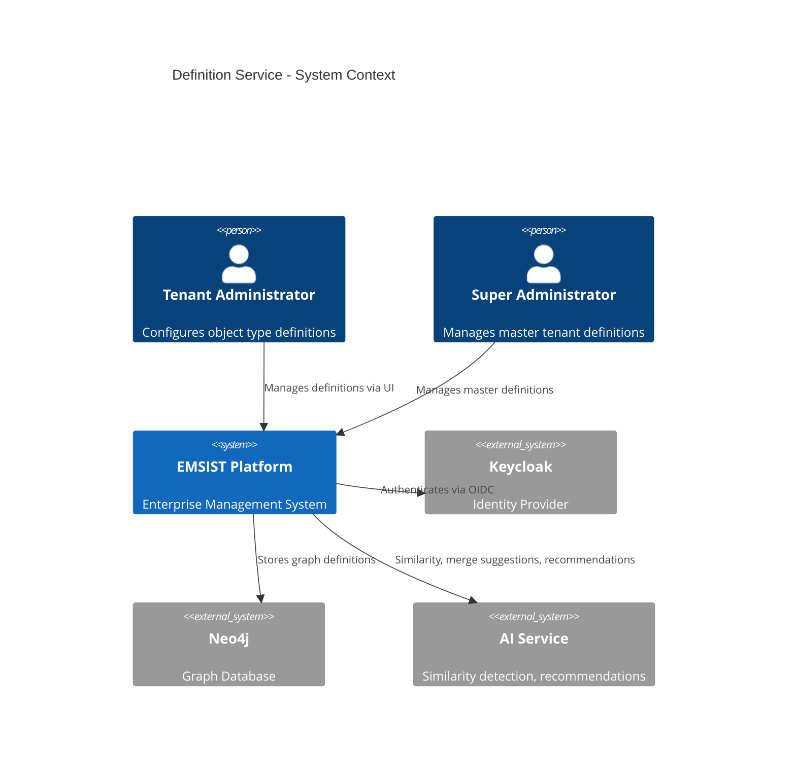

### 2.2 Container Context (C4 Level 2)

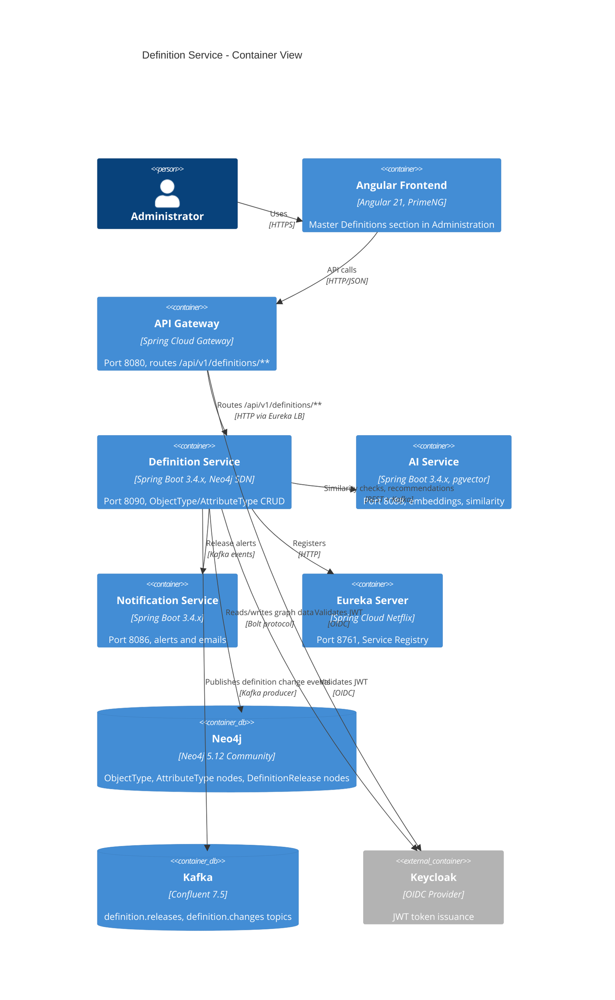

**Evidence for gateway route [IMPLEMENTED]:**
File: `backend/api-gateway/src/main/java/com/ems/gateway/config/RouteConfig.java`, lines 107-111:
```java
// DEFINITION SERVICE (8090) - Master type definitions
.route("definition-service", r -> r
    .path("/api/v1/definitions/**")
    .uri("lb://DEFINITION-SERVICE"))
```

### 2.3 Architectural Principles (from PRD)

The following five architectural principles govern all Definition Management design decisions. They are defined in the PRD (01-PRD-Definition-Management.md, Section 6) and must be respected throughout this specification. All are **[PLANNED]** -- no code exists.

| Principle | Title | Summary | Tech Spec Sections |
|-----------|-------|---------|-------------------|
| **AP-1** | Definition/Instance Repository Separation | Neo4j stores definitions (schema); PostgreSQL stores instances (runtime data). Instance services consume definition schemas via read-only references. | 4.1, 4.4, 10.2 |
| **AP-2** | Default Attributes per Object Type | Every new ObjectType is provisioned with system default attributes (name, description, status, owner, createdAt, createdBy, updatedAt, updatedBy, externalId, tags). Default attributes have `isSystemDefault: true` on HAS_ATTRIBUTE and cannot be removed by users. | 4.1.1, 5.1, 5.2 |
| **AP-3** | Zero Data Loss Guarantee | Definition updates must never cause instance data loss. Soft-delete for removed attributes, versioned snapshots, rollback capability, tenant-level adoption control. | 4.7, 5.1 |
| **AP-4** | Centralized Message Registry with i18n | All user-facing messages (errors, confirmations, warnings, success, info) stored in a PostgreSQL message registry with locale-aware translations. Code convention: `{SERVICE}-{TYPE}-{SEQ}`. | 2.4, 4.5.8, 7 |
| **AP-5** | Lifecycle State Machines | Every entity with a lifecycle carries a `lifecycleStatus` field (enum: `planned`, `active`, `retired`) with validated transitions and confirmation/error messages from the message registry. | 4.1.1, 4.1.2, 4.4.5, 4.5.8, 5.1 |

**Cross-references:** The PRD defines these principles in detail with state machine diagrams, transition validation rules, and message code assignments. This Tech Spec implements them at the data model, API, and migration level.

### 2.4 Message Registry Schema (AP-4) [PLANNED]

Per AP-4, all user-facing messages are stored in a centralized PostgreSQL database (shared service, not Neo4j). The definition-service references message codes in its error responses and the frontend renders localized messages from this registry.

**Message Registry Table (PostgreSQL -- shared database):**

```sql
CREATE TABLE message_registry (
    id BIGSERIAL PRIMARY KEY,
    message_code VARCHAR(50) NOT NULL UNIQUE,      -- e.g., DEF-E-001
    message_type VARCHAR(20) NOT NULL,              -- ERROR, CONFIRMATION, WARNING, INFO, SUCCESS
    category VARCHAR(50) NOT NULL,                  -- OBJECT_TYPE, ATTRIBUTE, CONNECTION, RELEASE, GOVERNANCE, MATURITY, SYSTEM, etc.
    default_name VARCHAR(255) NOT NULL,             -- English short title (fallback)
    default_description TEXT NOT NULL,               -- English description with {placeholder} support
    http_status INTEGER,                             -- HTTP status code (errors only, e.g., 400, 404, 409)
    severity VARCHAR(20),                            -- CRITICAL, HIGH, MEDIUM, LOW, INFO
    is_active BOOLEAN DEFAULT TRUE,                  -- Soft-delete flag for the message itself
    created_at TIMESTAMP DEFAULT CURRENT_TIMESTAMP,
    updated_at TIMESTAMP DEFAULT CURRENT_TIMESTAMP
);

CREATE TABLE message_translation (
    id BIGSERIAL PRIMARY KEY,
    message_code VARCHAR(50) NOT NULL REFERENCES message_registry(message_code),
    locale_code VARCHAR(10) NOT NULL,               -- ISO locale: en, ar, fr, de, etc.
    translated_name VARCHAR(255) NOT NULL,
    translated_description TEXT NOT NULL,
    created_at TIMESTAMP DEFAULT CURRENT_TIMESTAMP,
    updated_at TIMESTAMP DEFAULT CURRENT_TIMESTAMP,
    UNIQUE(message_code, locale_code)
);

-- Indexes for common query patterns
CREATE INDEX idx_message_registry_type ON message_registry(message_type);
CREATE INDEX idx_message_registry_category ON message_registry(category);
CREATE INDEX idx_message_translation_locale ON message_translation(locale_code);
```

**Message Code Convention:**

```
{SERVICE}-{TYPE}-{SEQ}
```

| Segment | Values | Example |
|---------|--------|---------|
| SERVICE | `DEF` (Definition), `AUTH` (Auth), `TEN` (Tenant), `LIC` (License), `USR` (User), `AUD` (Audit), `NOT` (Notification), `AI` (AI), `PRC` (Process), `SYS` (System) | `DEF` |
| TYPE | `E` (Error), `C` (Confirmation), `W` (Warning), `I` (Info), `S` (Success) | `E` |
| SEQ | 3-digit sequential number | `001` |

Example: `DEF-E-001` = Definition service, Error, #001

**Service integration pattern:**

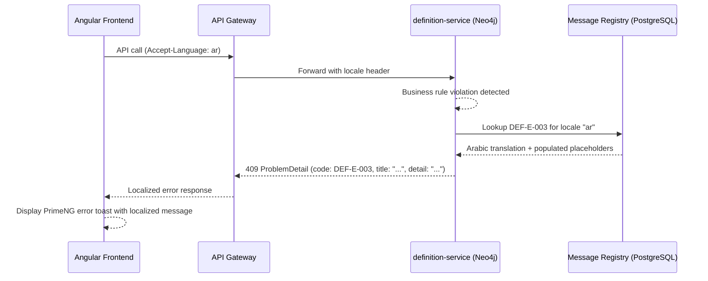

**Frontend message loading:**

| Method | Path | Description |
|--------|------|-------------|
| GET | `/api/v1/messages?locale={locale}&category={category}` | Load messages for a feature category in a locale (cached in browser) |
| GET | `/api/v1/messages/{messageCode}?locale={locale}` | Load a single message by code |

**Note:** The `is_active` column on `message_registry` is a soft-delete flag for the message record itself (whether the message definition is active in the registry). This is NOT the same as the `lifecycleStatus` enum on HAS_ATTRIBUTE / CAN_CONNECT_TO relationships, which governs attribute/connection visibility per AP-5.

**Definition Management message codes:** See PRD Section "Definition Management Message Registry" for the full catalog of DEF-E-xxx, DEF-C-xxx, DEF-W-xxx, DEF-S-xxx codes.

---

## 3. As-Built Architecture

### 3.1 Neo4j Graph Schema

**[IMPLEMENTED]** -- Verified against actual node and relationship classes.

#### 3.1.1 Graph Schema Diagram

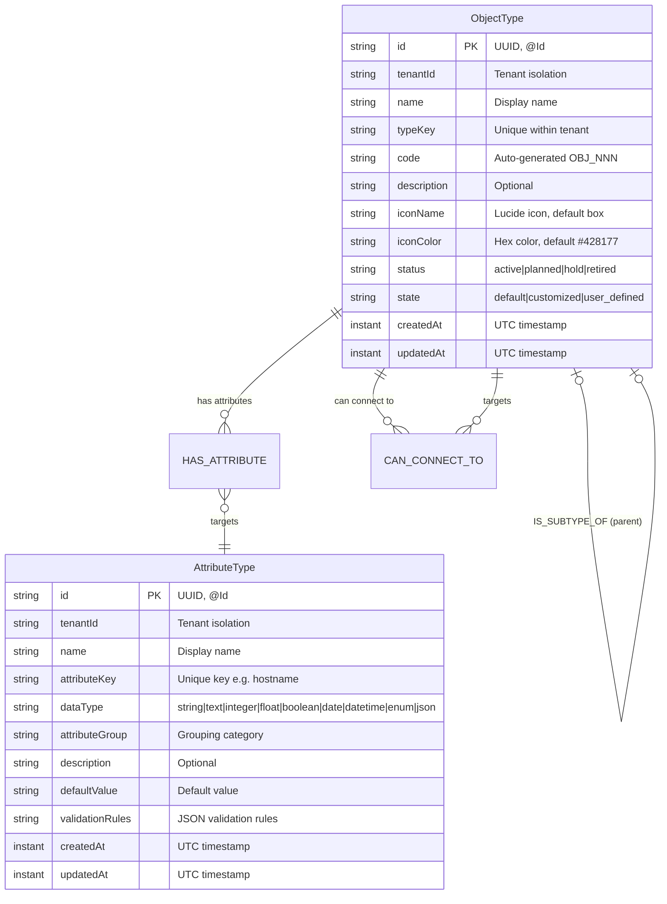

#### 3.1.2 Relationship Properties

**HAS_ATTRIBUTE** [IMPLEMENTED]
File: `backend/definition-service/src/main/java/com/ems/definition/node/relationship/HasAttributeRelationship.java`, lines 24-36

```java
@RelationshipProperties
public class HasAttributeRelationship {
    @Id @GeneratedValue
    private Long relId;
    private boolean isRequired;
    private int displayOrder;
    @TargetNode
    private AttributeTypeNode attribute;
}
```

| Property | Type | Description |
|----------|------|-------------|
| relId | Long | Auto-generated relationship ID |
| isRequired | boolean | Whether attribute is mandatory on instances |
| displayOrder | int | Display ordering position |
| attribute | AttributeTypeNode | Target attribute type node |

**CAN_CONNECT_TO** [IMPLEMENTED]
File: `backend/definition-service/src/main/java/com/ems/definition/node/relationship/CanConnectToRelationship.java`, lines 27-52

```java
@RelationshipProperties
public class CanConnectToRelationship {
    @Id @GeneratedValue
    private Long relId;
    private String relationshipKey;    // e.g. "runs_on"
    private String activeName;         // e.g. "runs on"
    private String passiveName;        // e.g. "hosts"
    private String cardinality;        // one-to-one|one-to-many|many-to-many
    private boolean isDirected;
    @TargetNode
    private ObjectTypeNode targetType;
}
```

| Property | Type | Description |
|----------|------|-------------|
| relId | Long | Auto-generated relationship ID |
| relationshipKey | String | Unique key (e.g., "runs_on", "depends_on") |
| activeName | String | Active-voice label |
| passiveName | String | Passive-voice label |
| cardinality | String | one-to-one, one-to-many, many-to-many |
| isDirected | boolean | Whether the relationship has direction |
| targetType | ObjectTypeNode | Target object type node |

**IS_SUBTYPE_OF** [IMPLEMENTED] -- Declared but not yet utilized in business logic.
File: `backend/definition-service/src/main/java/com/ems/definition/node/ObjectTypeNode.java`, lines 81-84

```java
@Relationship(type = "IS_SUBTYPE_OF", direction = Relationship.Direction.OUTGOING)
private ObjectTypeNode parentType;
```

**Note:** The `parentType` field is mapped in the node class and included in the DTO (as `parentTypeId`), but no API endpoint or service method currently creates or manages this relationship. The `toDTO()` method (line 462) reads it: `String parentTypeId = node.getParentType() != null ? node.getParentType().getId() : null;`

#### 3.1.3 ObjectTypeNode Properties

**[IMPLEMENTED]** -- File: `backend/definition-service/src/main/java/com/ems/definition/node/ObjectTypeNode.java`, lines 27-85

| Property | Type | Default | Neo4j Annotation | Description |
|----------|------|---------|------------------|-------------|
| id | String | (UUID) | @Id | Primary key, generated as UUID in service layer |
| tenantId | String | -- | -- | Tenant isolation discriminator |
| name | String | -- | -- | Human-readable display name |
| typeKey | String | (derived from name) | -- | Unique key within tenant, lowercase with underscores |
| code | String | OBJ_NNN | -- | Auto-generated sequential code |
| description | String | null | -- | Optional description |
| iconName | String | "box" | @Builder.Default | Lucide icon name |
| iconColor | String | "#428177" | @Builder.Default | Hex color for icon |
| status | String | "active" | @Builder.Default | Lifecycle: active, planned, hold, retired |
| state | String | "user_defined" | @Builder.Default | Origin: default, customized, user_defined |
| createdAt | Instant | (now) | -- | UTC creation timestamp |
| updatedAt | Instant | (now) | -- | UTC last-update timestamp |
| attributes | List<HasAttributeRelationship> | [] | @Relationship(HAS_ATTRIBUTE, OUTGOING) | Linked attribute types |
| connections | List<CanConnectToRelationship> | [] | @Relationship(CAN_CONNECT_TO, OUTGOING) | Permitted connections |
| parentType | ObjectTypeNode | null | @Relationship(IS_SUBTYPE_OF, OUTGOING) | Inheritance parent |

#### 3.1.4 AttributeTypeNode Properties

**[IMPLEMENTED]** -- File: `backend/definition-service/src/main/java/com/ems/definition/node/AttributeTypeNode.java`, lines 25-53

| Property | Type | Description |
|----------|------|-------------|
| id | String | UUID primary key |
| tenantId | String | Tenant isolation discriminator |
| name | String | Human-readable name |
| attributeKey | String | Unique key (e.g., "hostname") |
| dataType | String | Data type: string, text, integer, float, boolean, date, datetime, enum, json |
| attributeGroup | String | Grouping category (e.g., "general", "network") |
| description | String | Optional description |
| defaultValue | String | Default value for instances |
| validationRules | String | JSON string of validation rules |
| createdAt | Instant | UTC creation timestamp |
| updatedAt | Instant | UTC last-update timestamp |

#### 3.1.5 Gaps vs. SA Standards

| Standard | Current State | Gap |
|----------|---------------|-----|
| UUID v7 primary keys | UUID v4 (random) generated in service layer | Minor -- v4 is functional, v7 preferred for sortability |
| @Version optimistic locking | **Not present** on any node | **CRITICAL** -- no concurrent edit protection |
| Audit fields (createdBy, updatedBy) | **Not present** | **HIGH** -- no audit trail for who made changes |
| Soft delete (deletedAt) | Not present; hard delete used | **MEDIUM** -- no recoverability |

---

### 3.2 REST API Contract

**[IMPLEMENTED]** -- All endpoints verified against `ObjectTypeController.java` and `AttributeTypeController.java`.

#### 3.2.1 Base Path

`/api/v1/definitions/`

Routed through API Gateway at `:8080` to definition-service at `:8090` via Eureka load balancer.

#### 3.2.2 Object Type Endpoints

| Method | Path | Operation | Auth | Status |
|--------|------|-----------|------|--------|
| GET | `/api/v1/definitions/object-types` | List (paginated) | JWT (SUPER_ADMIN) | [IMPLEMENTED] |
| POST | `/api/v1/definitions/object-types` | Create | JWT (SUPER_ADMIN) | [IMPLEMENTED] |
| GET | `/api/v1/definitions/object-types/{id}` | Get by ID | JWT (SUPER_ADMIN) | [IMPLEMENTED] |
| PUT | `/api/v1/definitions/object-types/{id}` | Update (partial) | JWT (SUPER_ADMIN) | [IMPLEMENTED] |
| DELETE | `/api/v1/definitions/object-types/{id}` | Delete | JWT (SUPER_ADMIN) | [IMPLEMENTED] |
| POST | `/api/v1/definitions/object-types/{id}/duplicate` | Duplicate | JWT (SUPER_ADMIN) | [IMPLEMENTED] |
| POST | `/api/v1/definitions/object-types/{id}/restore` | Restore to default | JWT (SUPER_ADMIN) | [IMPLEMENTED] |
| GET | `/api/v1/definitions/object-types/{id}/attributes` | List attributes | JWT (SUPER_ADMIN) | [IMPLEMENTED] |
| POST | `/api/v1/definitions/object-types/{id}/attributes` | Add attribute | JWT (SUPER_ADMIN) | [IMPLEMENTED] |
| DELETE | `/api/v1/definitions/object-types/{id}/attributes/{attrId}` | Remove attribute | JWT (SUPER_ADMIN) | [IMPLEMENTED] |
| GET | `/api/v1/definitions/object-types/{id}/connections` | List connections | JWT (SUPER_ADMIN) | [IMPLEMENTED] |
| POST | `/api/v1/definitions/object-types/{id}/connections` | Add connection | JWT (SUPER_ADMIN) | [IMPLEMENTED] |
| DELETE | `/api/v1/definitions/object-types/{id}/connections/{connId}` | Remove connection | JWT (SUPER_ADMIN) | [IMPLEMENTED] |

Evidence: `backend/definition-service/src/main/java/com/ems/definition/controller/ObjectTypeController.java`, lines 39-278

#### 3.2.3 Attribute Type Endpoints

| Method | Path | Operation | Auth | Status |
|--------|------|-----------|------|--------|
| GET | `/api/v1/definitions/attribute-types` | List all for tenant | JWT (SUPER_ADMIN) | [IMPLEMENTED] |
| POST | `/api/v1/definitions/attribute-types` | Create | JWT (SUPER_ADMIN) | [IMPLEMENTED] |

Evidence: `backend/definition-service/src/main/java/com/ems/definition/controller/AttributeTypeController.java`, lines 35-103

**Missing AttributeType endpoints (not implemented):**
- GET by ID
- PUT update
- DELETE
- GET/PUT/DELETE for individual validation rules

#### 3.2.4 Request/Response Shapes

**ObjectTypeCreateRequest** [IMPLEMENTED] -- File: `dto/ObjectTypeCreateRequest.java`
```json
{
  "name": "Server",           // @NotBlank, max 255
  "typeKey": "server",         // max 100 (auto-derived from name if null)
  "code": "OBJ_001",          // max 20 (auto-generated if null)
  "description": "...",        // max 2000
  "iconName": "server",        // max 100 (default: "box")
  "iconColor": "#428177",      // max 7 (default: "#428177")
  "status": "active",          // max 20 (default: "active")
  "state": "user_defined"      // max 30 (default: "user_defined")
}
```

**ObjectTypeDTO** (Response) [IMPLEMENTED] -- File: `dto/ObjectTypeDTO.java`
```json
{
  "id": "uuid-string",
  "tenantId": "tenant-uuid",
  "name": "Server",
  "typeKey": "server",
  "code": "OBJ_001",
  "description": "Physical or virtual server",
  "iconName": "server",
  "iconColor": "#428177",
  "status": "active",
  "state": "user_defined",
  "createdAt": "2026-03-10T12:00:00Z",
  "updatedAt": "2026-03-10T12:00:00Z",
  "attributes": [
    {
      "relId": 1,
      "attributeTypeId": "attr-uuid",
      "name": "Hostname",
      "attributeKey": "hostname",
      "dataType": "string",
      "isRequired": true,
      "displayOrder": 1
    }
  ],
  "connections": [
    {
      "relId": 2,
      "targetObjectTypeId": "target-uuid",
      "targetObjectTypeName": "Application",
      "relationshipKey": "hosts",
      "activeName": "hosts",
      "passiveName": "runs on",
      "cardinality": "one-to-many",
      "isDirected": true
    }
  ],
  "parentTypeId": null,
  "instanceCount": 0
}
```

**PagedResponse** [IMPLEMENTED] -- File: `dto/PagedResponse.java`
```json
{
  "content": [ /* ObjectTypeDTO[] */ ],
  "page": 0,
  "size": 20,
  "totalElements": 42,
  "totalPages": 3
}
```

**AddAttributeRequest** [IMPLEMENTED] -- File: `dto/AddAttributeRequest.java`
```json
{
  "attributeTypeId": "attr-uuid",  // @NotBlank
  "isRequired": false,
  "displayOrder": 1                 // @Min(0)
}
```

**AddConnectionRequest** [IMPLEMENTED] -- File: `dto/AddConnectionRequest.java`
```json
{
  "targetObjectTypeId": "target-uuid",  // @NotBlank
  "relationshipKey": "runs_on",          // @NotBlank, max 100
  "activeName": "runs on",              // max 255
  "passiveName": "hosts",               // max 255
  "cardinality": "one-to-many",         // @NotBlank, max 20
  "isDirected": true
}
```

**AttributeTypeCreateRequest** [IMPLEMENTED] -- File: `dto/AttributeTypeCreateRequest.java`
```json
{
  "name": "Hostname",          // @NotBlank, max 255
  "attributeKey": "hostname",  // @NotBlank, max 100
  "dataType": "string",        // @NotBlank, max 30
  "attributeGroup": "network", // max 100
  "description": "...",        // max 2000
  "defaultValue": "",          // max 500
  "validationRules": "{}"      // max 2000, JSON string
}
```

---

### 3.3 Service Layer Architecture

**[IMPLEMENTED]** -- Verified against source files.

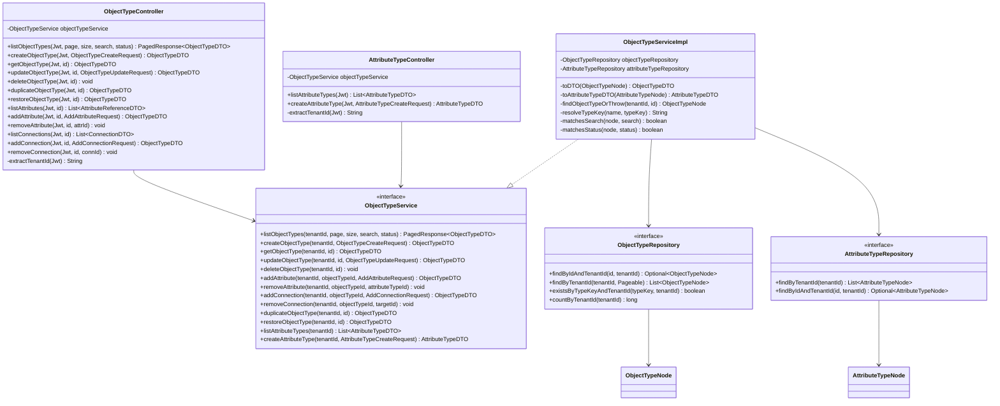

Evidence:
- Service interface: `backend/definition-service/src/main/java/com/ems/definition/service/ObjectTypeService.java` (139 lines)
- Service implementation: `backend/definition-service/src/main/java/com/ems/definition/service/ObjectTypeServiceImpl.java` (499 lines)
- Repositories: `backend/definition-service/src/main/java/com/ems/definition/repository/` (2 files)

**Key implementation details:**

1. **Manual DTO mapping** -- `toDTO()` and `toAttributeTypeDTO()` are private methods in `ObjectTypeServiceImpl`. MapStruct is declared as a dependency in `pom.xml` (line 58-60) but not yet used -- mapping is done inline.

2. **In-memory filtering** -- Search and status filtering happen in-memory after fetching from Neo4j (lines 57-61 of `ObjectTypeServiceImpl`). This is acceptable for moderate dataset sizes but will not scale to thousands of object types per tenant.

3. **Transaction management** -- `@Transactional(readOnly = true)` at class level, individual write methods annotated with `@Transactional` (lines 42, 70, 121, 171, 183, 243, 275, 307, 333, 376).

4. **State machine** -- On update, editing a `default` object type automatically transitions its state to `customized` (line 128-129). Restore operation only works on `customized` state (line 382-384).

```mermaid
stateDiagram-v2
    [*] --> user_defined : Create new
    [*] --> default : Seeded by system
    default --> customized : Edit any field
    customized --> default : Restore to default
    user_defined --> user_defined : Edit (stays user_defined)
    default --> default : No edit (read only until modified)
```

---

### 3.4 Security Model

**[IMPLEMENTED]** -- Verified against `SecurityConfig.java`.

File: `backend/definition-service/src/main/java/com/ems/definition/config/SecurityConfig.java`, lines 36-161

#### 3.4.1 Authentication

- OAuth2 Resource Server with JWT validation
- JWT issuer: Keycloak (`${KEYCLOAK_ISSUER_URI}`)
- JWK Set URI for token verification

#### 3.4.2 Authorization Rules

```java
.authorizeHttpRequests(auth -> auth
    .requestMatchers("/actuator/**").permitAll()
    .requestMatchers("/swagger-ui/**", "/api-docs/**", "/v3/api-docs/**").permitAll()
    .requestMatchers("/api/v1/definitions/**").hasRole("SUPER_ADMIN")
    .anyRequest().authenticated()
)
```

| Path Pattern | Required Role | Notes |
|-------------|---------------|-------|
| `/actuator/**` | None (permitAll) | Health checks, metrics |
| `/swagger-ui/**`, `/api-docs/**` | None (permitAll) | API documentation |
| `/api/v1/definitions/**` | ROLE_SUPER_ADMIN | All definition endpoints |
| Everything else | Authenticated | Catch-all |

**Critical observation:** Currently ALL definition endpoints require `SUPER_ADMIN` role. This is correct for master definitions but will need refinement for cross-tenant governance where child tenants need read access.

#### 3.4.3 Tenant Isolation

Tenant ID extraction from JWT (file: `ObjectTypeController.java`, lines 245-277):

1. Primary: `tenant_id` claim from JWT (supports String or List<String>)
2. Fallback: `X-Tenant-ID` header forwarded by API Gateway
3. Failure: Returns HTTP 400 if neither source provides a tenant ID

Every repository query includes `tenantId` as a filter parameter, enforcing row-level tenant isolation at the query level.

#### 3.4.4 CORS Configuration

File: `SecurityConfig.java`, lines 142-160

- Allowed origins: `http://localhost:*`, `http://127.0.0.1:*`, `https://*.trycloudflare.com`, `https://*.cloudflare.com`
- Allowed methods: GET, POST, PUT, DELETE, OPTIONS, PATCH
- Credentials: allowed
- Exposed headers: Authorization, X-Tenant-ID

---

### 3.5 Frontend Component Architecture

**[IMPLEMENTED]** -- Verified against source files.

File: `frontend/src/app/features/administration/sections/master-definitions/master-definitions-section.component.ts` (734 lines)

#### 3.5.1 Component Structure

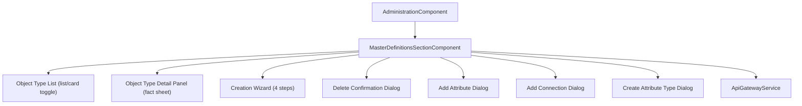

#### 3.5.2 State Management (Angular Signals)

The component uses Angular Signals (not NgRx or other state management library). Key signals:

| Signal | Type | Purpose |
|--------|------|---------|
| `loading` | `signal(false)` | Loading indicator |
| `objectTypes` | `signal<ObjectType[]>([])` | Cached list |
| `selectedObjectType` | `signal<ObjectType \| null>(null)` | Currently selected item |
| `viewMode` | `signal<ViewMode>('list')` | List or card view |
| `showWizard` | `signal(false)` | Wizard dialog visibility |
| `wizardStep` | `signal(0)` | Current wizard step (0-3) |
| `search` | `signal('')` | Search filter term |
| `statusFilter` | `signal<ObjectTypeStatus \| 'all'>('all')` | Status filter |
| `currentPage` / `pageSize` | `signal(0)` / `signal(25)` | Pagination |
| `factSheetTab` | `signal<string>('attributes')` | Detail panel active tab |

#### 3.5.3 Frontend Type Models

File: `frontend/src/app/features/administration/models/administration.models.ts`, lines 108-185

Key types: `ObjectType`, `ObjectTypeAttribute`, `AttributeType`, `ObjectTypeConnection`
Enums: `ObjectTypeStatus`, `ObjectTypeState`, `AttributeDataType`, `ConnectionCardinality`

#### 3.5.4 API Service Methods

File: `frontend/src/app/core/api/api-gateway.service.ts` -- definition-related methods (lines 394-517):

| Method | HTTP | Path |
|--------|------|------|
| `listObjectTypes(params)` | GET | `/api/v1/definitions/object-types` |
| `createObjectType(req)` | POST | `/api/v1/definitions/object-types` |
| `getObjectType(id)` | GET | `/api/v1/definitions/object-types/{id}` |
| `updateObjectType(id, req)` | PUT | `/api/v1/definitions/object-types/{id}` |
| `deleteObjectType(id)` | DELETE | `/api/v1/definitions/object-types/{id}` |
| `listAttributeTypes()` | GET | `/api/v1/definitions/attribute-types` |
| `duplicateObjectType(id)` | POST | `/api/v1/definitions/object-types/{id}/duplicate` |
| `restoreObjectType(id)` | POST | `/api/v1/definitions/object-types/{id}/restore` |
| `addAttributeToObjectType(id, req)` | POST | `/api/v1/definitions/object-types/{id}/attributes` |
| `addConnectionToObjectType(id, req)` | POST | `/api/v1/definitions/object-types/{id}/connections` |
| `removeAttributeFromObjectType(id, attrId)` | DELETE | `/api/v1/definitions/object-types/{id}/attributes/{attrId}` |
| `removeConnectionFromObjectType(id, targetId)` | DELETE | `/api/v1/definitions/object-types/{id}/connections/{targetId}` |
| `createAttributeType(req)` | POST | `/api/v1/definitions/attribute-types` |

---

### 3.6 Infrastructure

#### 3.6.1 Docker Configuration

**[IMPLEMENTED]** -- File: `docker-compose.dev-app.yml`, lines 355-379

```yaml
definition-service:
  build:
    context: ./backend
    dockerfile: definition-service/Dockerfile
  environment:
    SPRING_PROFILES_ACTIVE: docker
    EUREKA_ENABLED: "true"
    EUREKA_URL: http://eureka:8761/eureka
    KEYCLOAK_ISSUER_URI: http://keycloak:8080/realms/${KEYCLOAK_REALM:-master}
    KEYCLOAK_JWKS_URI: http://keycloak:8080/realms/${KEYCLOAK_REALM:-master}/protocol/openid-connect/certs
    NEO4J_URI: ${NEO4J_URI:-bolt://neo4j:7687}
    NEO4J_USER: ${NEO4J_USER:-neo4j}
    NEO4J_PASSWORD: ${NEO4J_PASSWORD:-dev_neo4j_password}
  depends_on:
    eureka:
      condition: service_healthy
  networks:
    - ems-dev-backend
    - ems-dev-data
  deploy:
    resources:
      limits:
        memory: 512M
        cpus: "0.5"
```

#### 3.6.2 Dockerfile

**[IMPLEMENTED]** -- File: `backend/definition-service/Dockerfile` (62 lines)

- Build stage: `eclipse-temurin:21-jdk-alpine` with Maven
- Runtime stage: `eclipse-temurin:21-jre-alpine`
- Non-root user: `ems`
- Health check: `wget` to `/actuator/health` every 30s
- Exposed port: 8090
- Java version override: `21` (parent POM uses 23 for dev)

#### 3.6.3 Eureka Registration

**[IMPLEMENTED]** -- File: `application.yml`, lines 19-25

```yaml
eureka:
  client:
    service-url:
      defaultZone: ${EUREKA_URL:http://localhost:8761/eureka}
    enabled: ${EUREKA_ENABLED:true}
  instance:
    prefer-ip-address: true
```

Service registers as `DEFINITION-SERVICE` (derived from `spring.application.name: definition-service`).

#### 3.6.4 API Gateway Routes

**[IMPLEMENTED]** -- Two routes configured:

1. **Programmatic (RouteConfig.java)**: `/api/v1/definitions/**` routed to `lb://DEFINITION-SERVICE`
2. **YAML (application.yml)**: `/services/definition/health` rewritten to `/actuator/health`

#### 3.6.5 Neo4j Configuration

**[IMPLEMENTED]** -- File: `backend/definition-service/src/main/java/com/ems/definition/config/Neo4jConfig.java`

- `@EnableNeo4jRepositories(basePackages = "com.ems.definition.repository")`
- `@EnableNeo4jAuditing`
- `@EnableTransactionManagement`
- Cypher DSL configured for Neo4j 5 dialect

**Note:** `@EnableNeo4jAuditing` is configured but no `@CreatedDate`/`@LastModifiedDate` annotations are used on the node classes -- timestamps are set manually in the service layer.

---

## 4. Target Architecture

All items in this section are **[PLANNED]** -- no code exists for these features.

### 4.1 Enhanced Neo4j Graph Schema

The target schema extends the current model with new nodes, properties, and relationships to support governance, locale management, maturity, release management, AI integration, and Metrix+ feature parity.

```mermaid
erDiagram
    MasterTenant {
        string id PK "UUID 00000000-0000-0000-0000-000000000000"
        string name "Master Tenant"
        boolean isMasterTenant "true"
    }

    ObjectType {
        string id PK "UUID"
        string tenantId FK "Tenant isolation"
        string masterObjectTypeId FK "If inherited from master"
        string name "Display name"
        string typeKey "Unique within tenant"
        string code "Auto-generated"
        string description "Optional"
        string iconName "Lucide icon"
        string iconColor "Hex color"
        string status "active|planned|hold|retired"
        string state "default|customized|user_defined|master_mandated"
        boolean isMasterMandate "Cannot be modified by child tenants"
        boolean isMeasurable "Has measures attached"
        boolean hasOverallValue "Aggregate value available"
        string maturitySchemaJson "Maturity weight config JSON"
        int freshnessThresholdDays "Staleness threshold for Freshness axis, default 90"
        string complianceRules "JSON compliance config"
        long version "Optimistic locking"
        string createdBy "User UUID"
        string updatedBy "User UUID"
        instant createdAt "UTC"
        instant updatedAt "UTC"
        instant deletedAt "Soft delete"
    }

    AttributeType {
        string id PK "UUID"
        string tenantId FK "Tenant isolation"
        string masterAttributeTypeId FK "If inherited from master"
        string name "Display name"
        string attributeKey "Unique key"
        string dataType "string|text|integer|float|boolean|date|datetime|enum|json|file|value|number|time"
        string attributeGroup "Grouping category"
        string attributeCategory "Object Type Attribute|Version Attribute|Custom"
        string description "Optional"
        string defaultValue "Default value"
        string validationRules "JSON"
        boolean isMasterMandate "Read-only in child tenants"
        boolean isLanguageDependent "Multi-locale storage"
        boolean isVersioningRelevant "Triggers version bump"
        boolean isWorkflowAction "Triggers workflow"
        string lockStatus "none|locked|partial"
        string requirementLevel "MANDATORY|CONDITIONAL|OPTIONAL"
        string inputMask "Input mask pattern"
        int minValueLength "Min length"
        int maxValueLength "Max length"
        string phonePrefix "Phone prefix pattern"
        string phonePattern "Phone pattern"
        string dateFormat "Date format pattern"
        string timeFormat "Time format pattern"
        string filePattern "Accepted file extensions"
        long maxFileSize "Max file size in bytes"
        long version "Optimistic locking"
        string createdBy "User UUID"
        string updatedBy "User UUID"
        instant createdAt "UTC"
        instant updatedAt "UTC"
    }

    LocalizedValue {
        string id PK "UUID"
        string entityId FK "Parent entity ID"
        string entityType "ObjectType|AttributeType"
        string fieldName "name|description"
        string locale "en|ar|fr|..."
        string value "Translated text"
    }

    DefinitionRelease {
        string id PK "UUID"
        string tenantId FK "Originating tenant (master)"
        string version "Semver: 1.0.0"
        string versionType "MAJOR|MINOR|PATCH"
        string status "draft|published|superseded"
        string releaseNotes "Auto-generated + edited"
        string changeDiffJson "JSON diff of changes"
        int affectedTenantCount "Number of child tenants affected"
        int affectedInstanceCount "Estimated instance impact"
        string createdBy "User UUID"
        instant createdAt "UTC"
        instant publishedAt "UTC or null"
    }

    ReleaseChange {
        string id PK "UUID"
        string releaseId FK "Parent release"
        string changeType "ADD_ATTR|REMOVE_ATTR|MODIFY_ATTR|ADD_REL|REMOVE_REL|MODIFY_REL|MODIFY_TYPE"
        string entityType "ObjectType|AttributeType|Relationship"
        string entityId FK "Affected entity"
        string entityName "Human-readable name"
        string beforeJson "State before change"
        string afterJson "State after change"
        boolean isBreaking "Requires tenant action"
    }

    TenantReleaseStatus {
        string id PK "UUID"
        string releaseId FK "Release reference"
        string tenantId FK "Child tenant"
        string status "pending|reviewing|accepted|scheduled|rejected|merged|rollback"
        string scheduledDate "Merge date if scheduled"
        string rejectionReason "If rejected"
        string conflictsJson "Detected conflicts"
        string mergedBy "User UUID"
        instant reviewedAt "UTC"
        instant mergedAt "UTC"
    }

    DataSource {
        string id PK "UUID"
        string tenantId FK "Tenant"
        string name "Data source name"
        string type "system|api|import|manual"
        string connectionConfig "JSON connection config"
    }

    MeasureCategory {
        string id PK "UUID"
        string tenantId FK "Tenant"
        string name "Category name"
        string description "Optional"
    }

    Measure {
        string id PK "UUID"
        string tenantId FK "Tenant"
        string name "Measure name"
        string formula "Calculation formula"
        string unit "Unit of measure"
        string measureCategoryId FK "Parent category"
    }

    GovernanceRule {
        string id PK "UUID"
        string tenantId FK "Tenant"
        string ruleType "mandate|readonly|conditional"
        string appliesTo "ObjectType|AttributeType|Relationship"
        string entityId FK "Target entity"
        string condition "JSON rule condition"
    }

    GovernanceConfig {
        string id PK "UUID"
        string tenantId FK "Tenant isolation"
        string objectTypeId FK "Parent ObjectType"
        boolean allowDirectCreate "Allow creation without workflow"
        boolean allowDirectUpdate "Allow update without workflow"
        boolean allowDirectDelete "Allow deletion without workflow"
        string versionTemplate "Template for version display"
        string viewTemplate "Template for view layout"
        string governanceState "Draft|PendingReview|Approved|Published|PendingRetirement|Retired"
        long version "Optimistic locking"
    }

    WorkflowAttachment {
        string id PK "UUID"
        string tenantId FK "Tenant isolation"
        string objectTypeId FK "Parent ObjectType"
        string workflowId FK "Reference to process-service"
        string behaviour "Create|Reading|Reporting|Other"
        string permissionType "User|Role"
        boolean isActive "Active or Inactive"
        long version "Optimistic locking"
    }

    ObjectType ||--o{ HAS_ATTRIBUTE : "has"
    HAS_ATTRIBUTE }o--|| AttributeType : "targets"
    ObjectType ||--o{ CAN_CONNECT_TO : "connects"
    CAN_CONNECT_TO }o--|| ObjectType : "targets"
    ObjectType |o--o| ObjectType : "IS_SUBTYPE_OF"
    ObjectType ||--o{ INHERITS_FROM : "master inheritance"
    INHERITS_FROM }o--|| ObjectType : "master type"
    ObjectType ||--o{ HAS_DATA_SOURCE : "has data source"
    HAS_DATA_SOURCE }o--|| DataSource : "references"
    ObjectType ||--o{ HAS_MEASURE_CATEGORY : "has measure category"
    HAS_MEASURE_CATEGORY }o--|| MeasureCategory : "references"
    MeasureCategory ||--o{ CONTAINS_MEASURE : "contains"
    CONTAINS_MEASURE }o--|| Measure : "references"
    ObjectType ||--o{ GOVERNED_BY : "governed by"
    GOVERNED_BY }o--|| GovernanceRule : "rule"
    ObjectType ||--o| HAS_GOVERNANCE_CONFIG : "governance config"
    HAS_GOVERNANCE_CONFIG }o--|| GovernanceConfig : "configuration"
    ObjectType ||--o{ HAS_WORKFLOW_ATTACHMENT : "has workflow"
    HAS_WORKFLOW_ATTACHMENT }o--|| WorkflowAttachment : "attachment"
    AttributeType ||--o{ HAS_LOCALIZATION : "localized"
    HAS_LOCALIZATION }o--|| LocalizedValue : "value"
    ObjectType ||--o{ HAS_LOCALIZATION_OT : "localized"
    HAS_LOCALIZATION_OT }o--|| LocalizedValue : "value"
    DefinitionRelease ||--o{ CONTAINS_CHANGE : "contains"
    CONTAINS_CHANGE }o--|| ReleaseChange : "change detail"
    DefinitionRelease ||--o{ TENANT_STATUS : "tenant status"
    TENANT_STATUS }o--|| TenantReleaseStatus : "per-tenant tracking"
    ObjectType ||--o{ RELEASED_IN : "released in"
    RELEASED_IN }o--|| DefinitionRelease : "release"
```

#### 4.1.1 Enhanced HAS_ATTRIBUTE Properties [PLANNED]

| Property | Type | Current | New |
|----------|------|---------|-----|
| relId | Long | Yes | Yes |
| isRequired | boolean | Yes | Yes |
| displayOrder | int | Yes | Yes |
| attribute | AttributeTypeNode | Yes | Yes |
| **lifecycleStatus** | String | No | **Enum: `planned`, `active`, `retired` (default `active`). Controls visibility and maturity inclusion per AP-5.** |
| **requirementLevel** | String | No | **MANDATORY, CONDITIONAL, OPTIONAL** |
| **lockStatus** | String | No | **none, locked, partial** |
| **isMasterMandate** | boolean | No | **Inherited from master, read-only** |
| **conditionRules** | String | No | **JSON rules for CONDITIONAL requirement** |
| **isSystemDefault** | boolean | No | **true for system default attributes (AP-2); cannot be unlinked** |

#### 4.1.2 Enhanced CAN_CONNECT_TO Properties [PLANNED]

| Property | Type | Current | New |
|----------|------|---------|-----|
| relId | Long | Yes | Yes |
| relationshipKey | String | Yes | Yes |
| activeName | String | Yes | Yes |
| passiveName | String | Yes | Yes |
| cardinality | String | Yes | Yes |
| isDirected | boolean | Yes | Yes |
| targetType | ObjectTypeNode | Yes | Yes |
| **lifecycleStatus** | String | No | **Enum: `planned`, `active`, `retired` (default `active`). Controls visibility and maturity inclusion per AP-5.** |
| **requirementLevel** | String | No | **MANDATORY, CONDITIONAL, OPTIONAL** |
| **importance** | String | No | **high, medium, low** |
| **isMasterMandate** | boolean | No | **Read-only in child tenants** |
| **hasRelationAttributes** | boolean | No | **Relation-level attributes** |

---

### 4.2 Cross-Tenant Governance Model

**[PLANNED]** -- Design for master tenant definition inheritance.

#### 4.2.1 Concept

A designated **Master Tenant** (UUID: `00000000-0000-0000-0000-000000000000`) owns canonical definitions. When a child tenant is created, it inherits all master-mandated definitions via an `INHERITS_FROM` relationship.

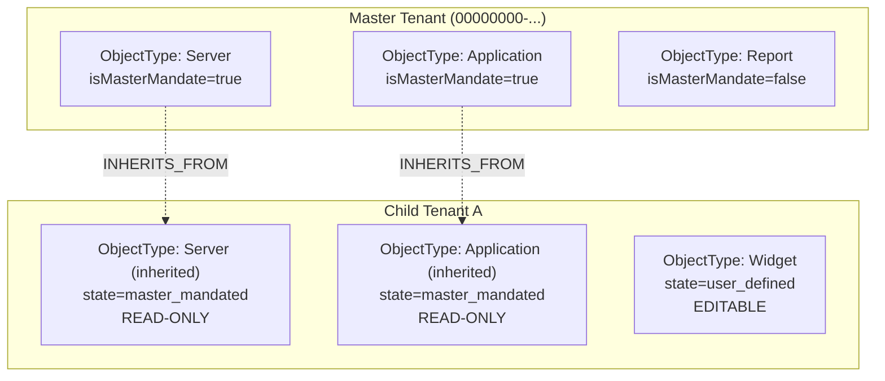

#### 4.2.2 Inheritance Rules

| Rule | Description |
|------|-------------|
| Master mandates are read-only | Child tenants cannot modify `isMasterMandate=true` ObjectTypes, AttributeTypes, or Relationships |
| Attributes inherit lock status | Master can lock individual attributes, preventing child modification |
| Child tenants can add custom definitions | User-defined types coexist with inherited mandates |
| Master changes trigger releases | When master updates a mandated definition, a DefinitionRelease is created (see Section 4.7) |
| Child can extend (not override) mandates | Child can add attributes to a mandated type but cannot remove mandated ones |

#### 4.2.3 Authorization Matrix

| Action | Master Tenant SUPER_ADMIN | Child Tenant SUPER_ADMIN | Child Tenant ADMIN |
|--------|--------------------------|-------------------------|--------------------|
| Create mandated ObjectType | Yes | No | No |
| Edit mandated ObjectType | Yes | No | No |
| Delete mandated ObjectType | Yes | No | No |
| View mandated ObjectType | Yes | Read-only | Read-only |
| Add attribute to mandated type | Yes | Only non-mandated attrs | No |
| Create custom ObjectType | Yes | Yes | No |
| Edit custom ObjectType | Yes | Yes | No |

#### 4.2.4 Implementation Approach

1. **New node property:** `isMasterMandate: boolean` on ObjectTypeNode, AttributeTypeNode
2. **New node property:** `masterObjectTypeId: String` -- references the master tenant's version
3. **New relationship:** `INHERITS_FROM` -- from child tenant's ObjectType to master tenant's ObjectType
4. **New state value:** `master_mandated` in ObjectTypeNode.state
5. **Release management:** Master changes are distributed via DefinitionRelease workflow (Section 4.7)
6. **Authorization filter:** Pre-authorization check in service layer that blocks mutations on mandated types

#### 4.2.5 Classification Propagation [PLANNED] [Benchmark: R-16, Apache Atlas Pattern]

When `isMasterMandate=true` is set on an ObjectType, the mandate flag automatically propagates to all its HAS_ATTRIBUTE and CAN_CONNECT_TO relationships, and downward through IS_SUBTYPE_OF to subtypes. This eliminates the need for administrators to manually toggle mandates on every attribute and connection individually.

**Propagation rules:**

| Trigger | Propagation Direction | Target |
|---------|----------------------|--------|
| ObjectType `isMasterMandate` set to `true` | Downward to relationships | All HAS_ATTRIBUTE edges get `isMasterMandate=true` |
| ObjectType `isMasterMandate` set to `true` | Downward to relationships | All CAN_CONNECT_TO edges get `isMasterMandate=true` |
| ObjectType `isMasterMandate` set to `true` | Downward via IS_SUBTYPE_OF | All subtype ObjectTypes get `isMasterMandate=true` (recursive) |
| ObjectType `isMasterMandate` set to `false` | Upward check | Only allowed if parent type (via IS_SUBTYPE_OF) is also not mandated |
| Individual attribute/relation `isMasterMandate` override | None | Administrators can additionally mandate individual attributes on non-mandated types |

**Recursive Cypher query for propagation:**

```cypher
// Propagate isMasterMandate=true from ObjectType to all attributes, connections, and subtypes
// Step 1: Set mandate on all HAS_ATTRIBUTE relationships
MATCH (ot:ObjectType {id: $objectTypeId, tenantId: $tenantId})-[r:HAS_ATTRIBUTE]->(at:AttributeType)
SET r.isMasterMandate = true

// Step 2: Set mandate on all CAN_CONNECT_TO relationships
WITH ot
MATCH (ot)-[r:CAN_CONNECT_TO]->(target:ObjectType)
SET r.isMasterMandate = true

// Step 3: Recursively propagate to subtypes via IS_SUBTYPE_OF
WITH ot
MATCH (subtype:ObjectType)-[:IS_SUBTYPE_OF*1..]->(ot)
WHERE subtype.tenantId = $tenantId
SET subtype.isMasterMandate = true
WITH subtype
MATCH (subtype)-[r:HAS_ATTRIBUTE]->(at:AttributeType)
SET r.isMasterMandate = true
WITH subtype
MATCH (subtype)-[r:CAN_CONNECT_TO]->(target:ObjectType)
SET r.isMasterMandate = true
```

**Kafka event on propagation:**

When propagation completes, a Kafka event is published to `definition.changes`:

```json
{
  "eventType": "MANDATE_PROPAGATED",
  "tenantId": "master-tenant-uuid",
  "objectTypeId": "uuid",
  "objectTypeName": "Server",
  "propagatedTo": {
    "attributes": 12,
    "connections": 5,
    "subtypes": 3
  },
  "timestamp": "2026-03-10T12:00:00Z",
  "userId": "admin-uuid"
}
```

**De-propagation:** When `isMasterMandate` is set back to `false` on an ObjectType, the service reverses the propagation only for relationships and subtypes that do not have an independent mandate. The service checks each relationship: if `isMasterMandate` was set independently (before the parent propagation), it stays `true`.

---

### 4.3 Locale Management Architecture

**[PLANNED]** -- Comprehensive locale management for language-dependent definitions.

#### 4.3.1 Concept

Locale management operates at three tiers:

1. **System-level locale configuration** -- Which locales are available across the platform (defined by PLATFORM_ADMIN)
2. **Per-tenant locale configuration** -- Which locales this specific tenant uses, and which is the default
3. **Per-attribute `isLanguageDependent` flag** -- Whether a given attribute stores values per locale

Attributes with `isLanguageDependent=true` store values per locale. Language-independent attributes store a single value with an optional lookup code.

From Metrix+ reference (PDF pages 7-8): Object Type Config shows a "Language" column in General Info tab, indicating dual-language support (e.g., English and Arabic).

#### 4.3.2 Locale Configuration Model

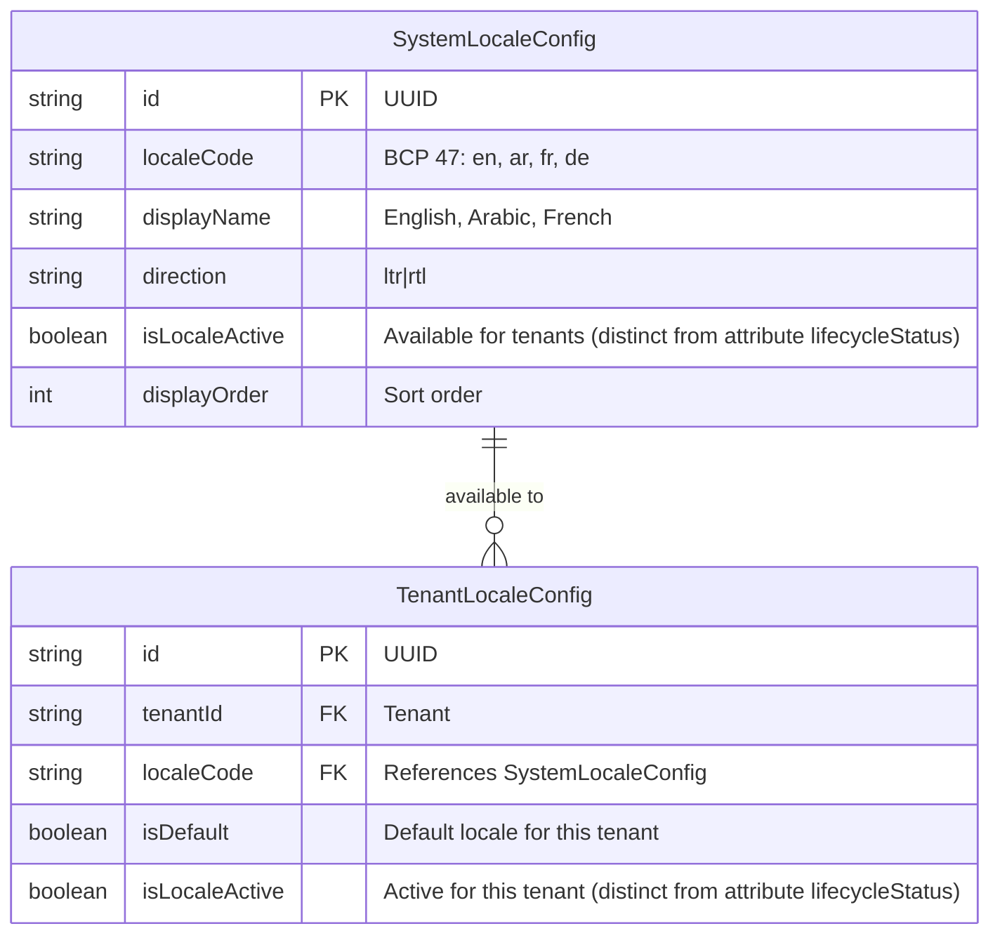

#### 4.3.3 Storage Architecture Evaluation

**Option A: Separate LocalizedValue Nodes in Neo4j**

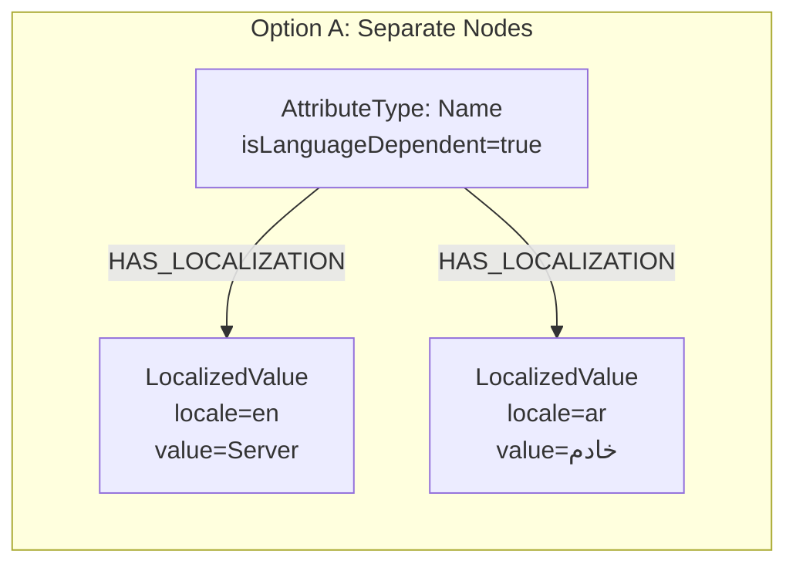

| Aspect | Assessment |
|--------|-----------|
| Query pattern | `MATCH (e)-[:HAS_LOCALIZATION]->(lv:LocalizedValue {locale: $locale})` |
| Pros | Clean graph model; each locale is a separate node; easy to query specific locales; supports indexing on `(entityId, locale)` |
| Cons | More nodes in graph; N+1 risk when loading entities with translations; requires additional traversals |
| Scalability | Good for moderate locale counts (2-5); overhead grows linearly with locales x entities |

**Option B: JSON Map Property**

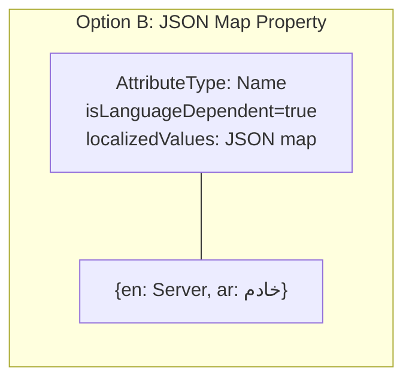

| Aspect | Assessment |
|--------|-----------|
| Storage | `localizedValues: '{"en": "Server", "ar": "خادم"}'` as String property on node |
| Pros | Single node per entity; no additional traversals; simple read/write; atomic updates |
| Cons | Cannot index individual locale values; entire JSON replaced on update; harder to query "all Arabic translations" across entities |
| Scalability | Excellent for per-entity reads; poor for cross-entity locale queries |

**Recommendation: Option A (Separate LocalizedValue Nodes)**

Rationale: The definition management module requires cross-entity locale queries (e.g., "show all definitions missing Arabic translations"), locale-specific search, and audit trails per translation change. These use cases favor the node-based approach. The N+1 risk is mitigated by Cypher `OPTIONAL MATCH` patterns that eagerly load localized values for a requested locale.

#### 4.3.4 LocalizedValue Node

```cypher
// Node definition
CREATE (lv:LocalizedValue {
    id: randomUUID(),
    entityId: $entityId,      // FK to parent entity (ObjectType or AttributeType)
    entityType: $entityType,  // "ObjectType" | "AttributeType"
    fieldName: $fieldName,    // "name" | "description" | instance value field
    locale: $locale,          // BCP 47: "en", "ar", "fr", etc.
    value: $value,            // Translated text
    createdAt: datetime(),
    updatedAt: datetime()
})
```

**Relationship:** `HAS_LOCALIZATION` from ObjectType/AttributeType to LocalizedValue nodes.

#### 4.3.5 API Impact

**Read path:** `Accept-Language` HTTP header determines which locale is returned. When the header is absent or specifies a locale the tenant has not enabled, the tenant's default locale is used.

```
GET /api/v1/definitions/object-types
Accept-Language: ar
```

Response includes only the requested locale's values for language-dependent fields.

**Write path:** Locale is explicitly specified in the request body for translation endpoints.

```json
// PUT /api/v1/definitions/localizations/ObjectType/{id}
{
  "translations": [
    { "fieldName": "name", "locale": "ar", "value": "خادم" },
    { "fieldName": "description", "locale": "ar", "value": "خادم فيزيائي أو افتراضي" }
  ]
}
```

**New endpoints:**

| Method | Path | Description |
|--------|------|-------------|
| GET | `/api/v1/definitions/locales/system` | List all system-level locales |
| GET | `/api/v1/definitions/locales/tenant` | List tenant's enabled locales |
| PUT | `/api/v1/definitions/locales/tenant` | Update tenant locale configuration |
| GET | `/api/v1/definitions/localizations/{entityType}/{entityId}` | Get all translations for an entity |
| PUT | `/api/v1/definitions/localizations/{entityType}/{entityId}` | Batch update translations |

---

### 4.4 Object Data Maturity Engine

**[PLANNED]** -- Four-axis maturity scoring at the **Object Type level**, combining Completeness, Compliance, Relationship, and Freshness axes. [Benchmark: R-04, P-01]

#### 4.4.1 Concept

The maturity engine uses a **four-axis composite model** inspired by ServiceNow CMDB Health (Completeness + Compliance) and LeanIX (Freshness). Each ObjectType has a maturity schema that classifies both its **attributes** and **relations** into requirement levels (MANDATORY, CONDITIONAL, OPTIONAL), with configurable axis weights per tenant.

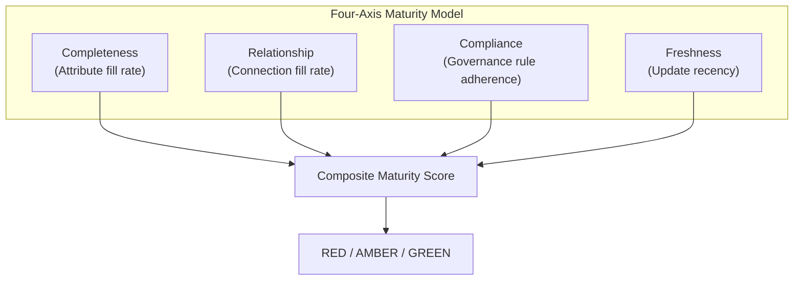

The four axes are:

| Axis | Source | What It Measures | Weight Default |
|------|--------|------------------|---------------|
| **Completeness** | ServiceNow, Metrix+ | % of mandatory/conditional/optional attributes filled | 40% |
| **Relationship** | ServiceNow | % of mandatory/conditional/optional relations established | 20% |
| **Compliance** | ServiceNow (new) | Adherence to governance rules: mandate conformance, validation rule pass rate, duplicate-free status | 25% |
| **Freshness** | LeanIX (new) | How recently the instance was updated relative to a configurable staleness threshold | 15% |

#### 4.4.2 Requirement Levels

Each attribute AND relation attached to an ObjectType has a `requirementLevel`:

| Level | Behavior | Default Weight |
|-------|----------|---------------|
| **MANDATORY** | Blocks instance creation if absent. Must have a value/link. | 50% of total score |
| **CONDITIONAL** | Required only when conditions are met (workflow playbook). | 35% of total score |
| **OPTIONAL** | Does not block creation. Contributes to maturity score. | 15% of total score |

#### 4.4.3 Scoring Formula -- Four-Axis Composite [Benchmark: R-04]

The maturity score is computed per **instance** of an ObjectType, evaluating four independent axes:

```
compositeMaturityScore = (
    completenessScore * W_COMPLETENESS +
    relationshipScore * W_RELATIONSHIP +
    complianceScore   * W_COMPLIANCE +
    freshnessScore    * W_FRESHNESS
) * 100
```

**Axis 1: Completeness (attribute fill rate)**

```
completenessScore = (
  (filledMandatoryAttrs / totalMandatoryAttrs)       * 0.50 +
  (filledConditionalAttrs / totalConditionalAttrs)    * 0.35 +
  (filledOptionalAttrs / totalOptionalAttrs)          * 0.15
)
```

Where:
- `filledMandatoryAttrs` = count of mandatory attributes that have a non-null, non-empty value on the instance
- Conditional items are only counted when their condition is met (unmet conditions receive full score)
- Division by zero (e.g., no mandatory attrs) yields 1.0 for that term (100% -- nothing to fail)

**Axis 2: Relationship (connection fill rate)**

```
relationshipScore = (
  (filledMandatoryRelations / totalMandatoryRelations)       * 0.50 +
  (filledConditionalRelations / totalConditionalRelations)   * 0.35 +
  (filledOptionalRelations / totalOptionalRelations)         * 0.15
)
```

Where `filledMandatoryRelations` = count of mandatory relations where the instance has at least one connection of that type.

**Axis 3: Compliance (governance rule adherence)** [Benchmark: R-04, ServiceNow CMDB Health]

```
complianceScore = (
  mandateConformance  * 0.60 +
  validationPassRate  * 0.20 +
  duplicateFreeScore  * 0.20
)
```

Where:
- `mandateConformance` = % of master-mandated attributes/relations present on the instance (1.0 if no mandates apply)
- `validationPassRate` = % of attributes passing their SpEL validation rules (see Section 4.11)
- `duplicateFreeScore` = 1.0 if the instance is not flagged as a potential duplicate; 0.0 if flagged by AI similarity detection (threshold configurable)

**Axis 4: Freshness (update recency)** [Benchmark: R-04, LeanIX]

```
freshnessScore = max(0, 1 - (daysSinceLastUpdate / freshnessThresholdDays))
```

Where:
- `daysSinceLastUpdate` = number of days since the instance's `updatedAt` timestamp
- `freshnessThresholdDays` = configurable per ObjectType (stored on ObjectType node), default 90 days
- Result is clamped to `[0.0, 1.0]` -- an instance updated today scores 1.0; one not updated for `freshnessThresholdDays` or more scores 0.0

**Default axis weight distribution (configurable per tenant):**

| Weight | Default Value | Total |
|--------|--------------|-------|
| W_COMPLETENESS | 0.40 | 40% |
| W_RELATIONSHIP | 0.20 | 20% |
| W_COMPLIANCE | 0.25 | 25% |
| W_FRESHNESS | 0.15 | 15% |
| **Total** | **1.00** | **100%** |

**Cypher query for Compliance axis -- mandate conformance:**

```cypher
// Calculate mandate conformance for a specific instance
MATCH (ot:ObjectType {id: $objectTypeId, tenantId: $tenantId})-[r:HAS_ATTRIBUTE]->(at:AttributeType)
WHERE r.isMasterMandate = true AND r.lifecycleStatus = 'active'
WITH count(r) AS totalMandated,
     count(CASE WHEN $instanceValues[at.attributeKey] IS NOT NULL
                 AND $instanceValues[at.attributeKey] <> '' THEN 1 END) AS filledMandated
RETURN CASE WHEN totalMandated = 0 THEN 1.0
            ELSE toFloat(filledMandated) / totalMandated END AS mandateConformance
```

**Cypher query for Freshness axis:**

```cypher
// Calculate freshness for a specific instance
WITH datetime($instanceUpdatedAt) AS lastUpdate,
     datetime() AS now,
     $freshnessThresholdDays AS threshold
WITH duration.between(lastUpdate, now).days AS daysSince, threshold
RETURN CASE WHEN daysSince >= threshold THEN 0.0
            ELSE 1.0 - (toFloat(daysSince) / threshold) END AS freshnessScore
```

#### 4.4.4 Neo4j Schema for Maturity Configuration

Maturity configuration is stored as a JSON property on the ObjectType node and as `requirementLevel` properties on HAS_ATTRIBUTE and CAN_CONNECT_TO relationships. The four-axis model adds `freshnessThresholdDays` and `complianceRules` to the ObjectType node. [Benchmark: R-04]

**New ObjectType properties for maturity:**

| Property | Type | Default | Description |
|----------|------|---------|-------------|
| `freshnessThresholdDays` | int | 90 | Days after which an instance is considered stale (Freshness axis scores 0.0) |
| `complianceRules` | String (JSON) | null | Compliance rules configuration (mandate check, validation check, duplicate check weights) |

```cypher
// Store four-axis weight overrides on ObjectType
MATCH (ot:ObjectType {id: $objectTypeId, tenantId: $tenantId})
SET ot.maturitySchemaJson = '{
  "axisWeights": {
    "W_COMPLETENESS": 0.40,
    "W_RELATIONSHIP": 0.20,
    "W_COMPLIANCE": 0.25,
    "W_FRESHNESS": 0.15
  },
  "completenessWeights": {
    "MANDATORY": 0.50,
    "CONDITIONAL": 0.35,
    "OPTIONAL": 0.15
  },
  "relationshipWeights": {
    "MANDATORY": 0.50,
    "CONDITIONAL": 0.35,
    "OPTIONAL": 0.15
  },
  "complianceWeights": {
    "mandateConformance": 0.60,
    "validationPassRate": 0.20,
    "duplicateFreeScore": 0.20
  },
  "thresholds": {
    "red": 0,
    "amber": 50,
    "green": 80
  }
}',
    ot.freshnessThresholdDays = 90,
    ot.complianceRules = '{
      "duplicateSimilarityThreshold": 0.85,
      "validationStrictMode": false
    }'

// Set requirement levels on attributes
MATCH (ot:ObjectType {id: $objectTypeId})-[r:HAS_ATTRIBUTE]->(at:AttributeType)
WHERE at.id = $attrId
SET r.requirementLevel = 'MANDATORY'

// Set requirement levels on relations
MATCH (ot:ObjectType {id: $objectTypeId})-[r:CAN_CONNECT_TO]->(target:ObjectType)
WHERE r.relationshipKey = $relKey
SET r.requirementLevel = 'MANDATORY'
```

#### 4.4.5 Attribute Lifecycle Status and Maturity Interaction (AP-5)

Only attributes with `lifecycleStatus = 'active'` on the HAS_ATTRIBUTE relationship are **included** in maturity calculations. Attributes with `lifecycleStatus = 'planned'` or `lifecycleStatus = 'retired'` are excluded entirely -- they do not count toward any total and do not penalize the score.

**Lifecycle status behaviour in maturity context:**

| lifecycleStatus | Counted in maturity totals | Penalizes if empty | Visible in instance forms |
|-----------------|---------------------------|--------------------|---------------------------|
| `planned` | No | No | No (design-time only) |
| `active` | Yes | Yes | Yes |
| `retired` | No | No | No (existing data read-only) |

**Warning system:** When retiring a **mandatory** attribute (transition from `active` to `retired`):
1. The API returns a warning in the response body: `"warnings": [{"code": "DEF-C-011", "message": "..."}]` (from message registry per AP-4)
2. The frontend displays a confirmation dialog using the registered message
3. If confirmed, the attribute's `lifecycleStatus` transitions to `retired` AND its `requirementLevel` is preserved (so reactivation restores mandatory status)

#### 4.4.6 Maturity Score Response (Four-Axis) [Benchmark: R-04]

```json
{
  "objectTypeId": "uuid",
  "objectTypeName": "Server",
  "instanceId": "uuid",
  "compositeMaturityScore": 72.3,
  "maturityLevel": "AMBER",
  "axes": {
    "completeness": {
      "score": 0.857,
      "weight": 0.40,
      "weightedContribution": 34.3,
      "breakdown": {
        "mandatory": { "filled": 8, "total": 8, "weight": 0.50, "score": 1.0 },
        "conditional": { "filled": 3, "total": 5, "weight": 0.35, "score": 0.60 },
        "optional": { "filled": 4, "total": 7, "weight": 0.15, "score": 0.571 }
      }
    },
    "relationship": {
      "score": 0.667,
      "weight": 0.20,
      "weightedContribution": 13.3,
      "breakdown": {
        "mandatory": { "filled": 2, "total": 3, "weight": 0.50, "score": 0.667 },
        "conditional": { "filled": 1, "total": 2, "weight": 0.35, "score": 0.50 },
        "optional": { "filled": 1, "total": 2, "weight": 0.15, "score": 0.50 }
      }
    },
    "compliance": {
      "score": 0.76,
      "weight": 0.25,
      "weightedContribution": 19.0,
      "breakdown": {
        "mandateConformance": { "mandatedPresent": 5, "mandatedTotal": 6, "weight": 0.60, "score": 0.833 },
        "validationPassRate": { "passed": 9, "total": 12, "weight": 0.20, "score": 0.75 },
        "duplicateFreeScore": { "isDuplicate": false, "weight": 0.20, "score": 1.0 }
      }
    },
    "freshness": {
      "score": 0.378,
      "weight": 0.15,
      "weightedContribution": 5.7,
      "daysSinceLastUpdate": 56,
      "freshnessThresholdDays": 90
    }
  },
  "missingItems": [
    { "type": "RELATION", "key": "depends_on", "requirementLevel": "MANDATORY", "targetType": "Application" },
    { "type": "ATTRIBUTE", "key": "ip_address", "requirementLevel": "CONDITIONAL", "reason": "Condition: status=deployed" },
    { "type": "ATTRIBUTE", "key": "documentation_url", "requirementLevel": "OPTIONAL" },
    { "type": "COMPLIANCE", "key": "compliance_level", "reason": "Master-mandated attribute missing" }
  ],
  "axisWeights": {
    "W_COMPLETENESS": 0.40, "W_RELATIONSHIP": 0.20,
    "W_COMPLIANCE": 0.25, "W_FRESHNESS": 0.15
  }
}
```

#### 4.4.7 API Endpoints

| Method | Path | Description |
|--------|------|-------------|
| GET | `/api/v1/definitions/object-types/{id}/maturity-config` | Get maturity schema (requirement levels + weights) for an ObjectType |
| PUT | `/api/v1/definitions/object-types/{id}/maturity-config` | Update maturity weights for an ObjectType |
| GET | `/api/v1/instances/{instanceId}/maturity-score` | Calculate maturity score for a specific instance (may reside in instance-service) |
| GET | `/api/v1/definitions/object-types/{id}/maturity-summary` | Aggregate maturity across all instances of a type |

---

### 4.5 New REST API Endpoints

**[PLANNED]** -- All endpoints below do not yet exist in code.

#### 4.5.1 Governance Endpoints

| Method | Path | Description |
|--------|------|-------------|
| GET | `/api/v1/definitions/governance/mandates` | List all master mandates |
| POST | `/api/v1/definitions/governance/mandates` | Create a master mandate |
| PUT | `/api/v1/definitions/governance/mandates/{id}` | Update mandate |
| DELETE | `/api/v1/definitions/governance/mandates/{id}` | Remove mandate |
| POST | `/api/v1/definitions/governance/propagate` | Trigger propagation to child tenants |
| GET | `/api/v1/definitions/governance/inheritance/{objectTypeId}` | View inheritance chain |

#### 4.5.2 Localization Endpoints

| Method | Path | Description |
|--------|------|-------------|
| GET | `/api/v1/definitions/locales/system` | List system-level locales |
| GET | `/api/v1/definitions/locales/tenant` | List tenant's enabled locales |
| PUT | `/api/v1/definitions/locales/tenant` | Update tenant locale config |
| GET | `/api/v1/definitions/localizations/{entityType}/{entityId}` | Get all translations for an entity |
| PUT | `/api/v1/definitions/localizations/{entityType}/{entityId}` | Batch update translations |

#### 4.5.3 Release Management Endpoints

| Method | Path | Description |
|--------|------|-------------|
| GET | `/api/v1/definitions/releases` | List definition releases (paginated) |
| POST | `/api/v1/definitions/releases` | Create a new release from pending changes |
| GET | `/api/v1/definitions/releases/{releaseId}` | Get release details with change diff |
| POST | `/api/v1/definitions/releases/{releaseId}/publish` | Publish release and notify tenants |
| GET | `/api/v1/definitions/releases/{releaseId}/impact` | Get impact assessment for a release |
| GET | `/api/v1/definitions/releases/{releaseId}/tenants` | List per-tenant status for a release |
| POST | `/api/v1/definitions/releases/{releaseId}/tenants/{tenantId}/accept` | Accept and merge release |
| POST | `/api/v1/definitions/releases/{releaseId}/tenants/{tenantId}/schedule` | Schedule merge for a future date |
| POST | `/api/v1/definitions/releases/{releaseId}/tenants/{tenantId}/reject` | Reject release with justification |
| POST | `/api/v1/definitions/releases/{releaseId}/tenants/{tenantId}/rollback` | Rollback a previously merged release |
| GET | `/api/v1/definitions/releases/{releaseId}/tenants/{tenantId}/conflicts` | Preview merge conflicts |
| GET | `/api/v1/definitions/releases/pending-changes` | List uncommitted changes since last release |
| GET | `/api/v1/definitions/export?format=json` | Export current schema |
| POST | `/api/v1/definitions/import` | Import schema (with merge strategy) |

#### 4.5.4 Data Sources Endpoints

| Method | Path | Description |
|--------|------|-------------|
| GET | `/api/v1/definitions/object-types/{id}/data-sources` | List data sources for type |
| POST | `/api/v1/definitions/object-types/{id}/data-sources` | Add data source |
| DELETE | `/api/v1/definitions/object-types/{id}/data-sources/{dsId}` | Remove data source |

#### 4.5.5 Measures Endpoints

| Method | Path | Description |
|--------|------|-------------|
| GET | `/api/v1/definitions/object-types/{id}/measure-categories` | List measure categories |
| POST | `/api/v1/definitions/object-types/{id}/measure-categories` | Create measure category |
| GET | `/api/v1/definitions/object-types/{id}/measures` | List measures |
| POST | `/api/v1/definitions/object-types/{id}/measures` | Create measure |

#### 4.5.6 Graph Visualization Endpoint

| Method | Path | Description |
|--------|------|-------------|
| GET | `/api/v1/definitions/graph?depth=2` | Get full graph for visualization |
| GET | `/api/v1/definitions/object-types/{id}/graph?depth=1` | Get subgraph centered on a type |

#### 4.5.7 AI Integration Endpoints

| Method | Path | Description |
|--------|------|-------------|
| GET | `/api/v1/definitions/ai/similar/{objectTypeId}` | Find similar ObjectTypes |
| POST | `/api/v1/definitions/ai/merge-preview` | Preview merge of two similar types |
| GET | `/api/v1/definitions/ai/unused` | List unused ObjectTypes (candidates for cleanup) |
| GET | `/api/v1/definitions/ai/recommend-attributes/{objectTypeId}` | Get attribute recommendations for a type |

#### 4.5.8 Attribute Lifecycle Status Endpoint (AP-5)

| Method | Path | Description |
|--------|------|-------------|
| PUT | `/api/v1/definitions/object-types/{id}/attributes/{relId}/lifecycle-status` | Transition `lifecycleStatus` on HAS_ATTRIBUTE (body: `{ "targetStatus": "active" }`) |
| PUT | `/api/v1/definitions/object-types/{id}/connections/{relId}/lifecycle-status` | Transition `lifecycleStatus` on CAN_CONNECT_TO (body: `{ "targetStatus": "retired" }`) |

**Lifecycle transition request:**

```json
{
  "targetStatus": "active"  // "planned" | "active" | "retired"
}
```

**Allowed transitions (enforced server-side per AP-5):**

| From | To | Confirmation Code |
|------|----|-------------------|
| `planned` | `active` | DEF-C-010 (attribute) / DEF-C-020 (connection) |
| `active` | `retired` | DEF-C-011 (attribute) / DEF-C-021 (connection) |
| `retired` | `active` | DEF-C-012 (attribute) / DEF-C-022 (connection) |

**Error on invalid transition:** HTTP 400 with message code `DEF-E-025` (attribute) or equivalent for connections.

**Validation rules:**
- Cannot retire a mandated attribute in a child tenant (error: `DEF-E-020`)
- Cannot retire a mandated connection in a child tenant (error: `DEF-E-030`)
- Retiring a mandatory attribute with existing instance data triggers a confirmation warning

---

### 4.6 Graph Visualization Architecture

**[PLANNED]** -- Interactive graph view of object types and their connections.

#### 4.6.1 Architecture

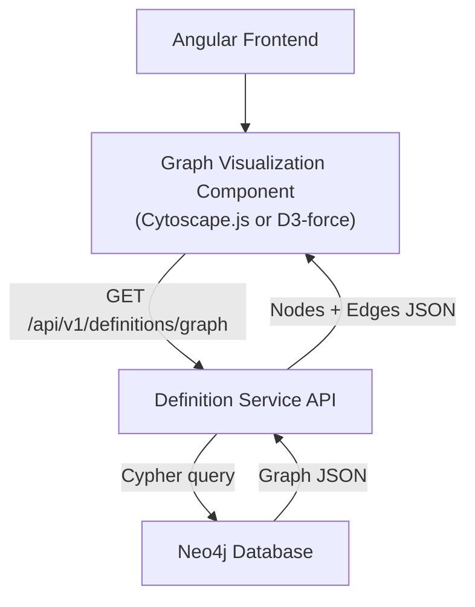

#### 4.6.2 Graph API Response Format

```json
{
  "nodes": [
    {
      "id": "uuid",
      "label": "Server",
      "typeKey": "server",
      "iconName": "server",
      "iconColor": "#428177",
      "status": "active",
      "attributeCount": 12,
      "connectionCount": 5
    }
  ],
  "edges": [
    {
      "id": "rel-id",
      "source": "source-uuid",
      "target": "target-uuid",
      "label": "hosts",
      "cardinality": "one-to-many",
      "isDirected": true,
      "importance": "high"
    }
  ]
}
```

#### 4.6.3 Technology Recommendation

| Option | Pros | Cons | Recommendation |
|--------|------|------|----------------|
| **Cytoscape.js** | Purpose-built for graph visualization, rich layout algorithms, good Angular integration | Larger bundle size | **Recommended** for complex graph interactions |
| D3-force | Lightweight, flexible | Lower-level API, more code to write | Good for simpler visualizations |
| vis-network | Simple API | Less customizable | Not recommended |

---

### 4.7 Definition Release Management

**[PLANNED]** -- Git-like workflow for propagating definition schema changes from master tenant to child tenants.

This section replaces the previous "Import/Export and Versioning Design" with a comprehensive release management system that treats definition changes as versioned releases with controlled distribution.

#### 4.7.1 Concept Overview

When the master tenant modifies a definition (adds/removes/modifies mandatory attributes or relations), the system does NOT propagate changes automatically. Instead, it follows a controlled release workflow:

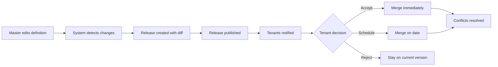

#### 4.7.2 Change Detection

The system tracks changes to master-mandated definitions since the last published release. Change detection runs on every mutation to a mandated ObjectType, AttributeType, or relationship.

**Tracked changes:**

| Change Type | Enum Value | Breaking? | Description |
|-------------|-----------|-----------|-------------|
| Add mandatory attribute | `ADD_ATTR` | YES | Child tenants must fill this attribute on all instances |
| Remove attribute | `REMOVE_ATTR` | YES | Child tenants may have data in this attribute |
| Modify attribute (type change) | `MODIFY_ATTR` | YES | Data type change requires migration |
| Modify attribute (name/description) | `MODIFY_ATTR` | NO | Metadata change only |
| Add mandatory relation | `ADD_REL` | YES | Child tenants must establish connections |
| Remove relation | `REMOVE_REL` | YES | Existing connections will be orphaned |
| Modify relation | `MODIFY_REL` | Depends | Cardinality change may be breaking |
| Modify ObjectType metadata | `MODIFY_TYPE` | NO | Name, description, icon changes |

#### 4.7.3 Release Creation and Version Numbering

Releases use semantic versioning:

| Version Component | Trigger | Example |
|-------------------|---------|---------|
| **MAJOR** | Breaking change (new mandatory attr/rel, removed attr/rel, type change) | 2.0.0 |
| **MINOR** | Additive, non-breaking change (new optional attr, metadata update) | 1.1.0 |
| **PATCH** | Documentation/metadata only (description, icon, display order) | 1.0.1 |

```cypher
// Create a DefinitionRelease node
CREATE (r:DefinitionRelease {
    id: randomUUID(),
    tenantId: '00000000-0000-0000-0000-000000000000',  // master tenant
    version: $version,          // e.g., "2.0.0"
    versionType: $versionType,  // "MAJOR" | "MINOR" | "PATCH"
    status: 'draft',
    releaseNotes: $notes,
    changeDiffJson: $diffJson,
    affectedTenantCount: $tenantCount,
    affectedInstanceCount: $instanceCount,
    createdBy: $userId,
    createdAt: datetime(),
    publishedAt: null
})
```

#### 4.7.4 Release Lifecycle

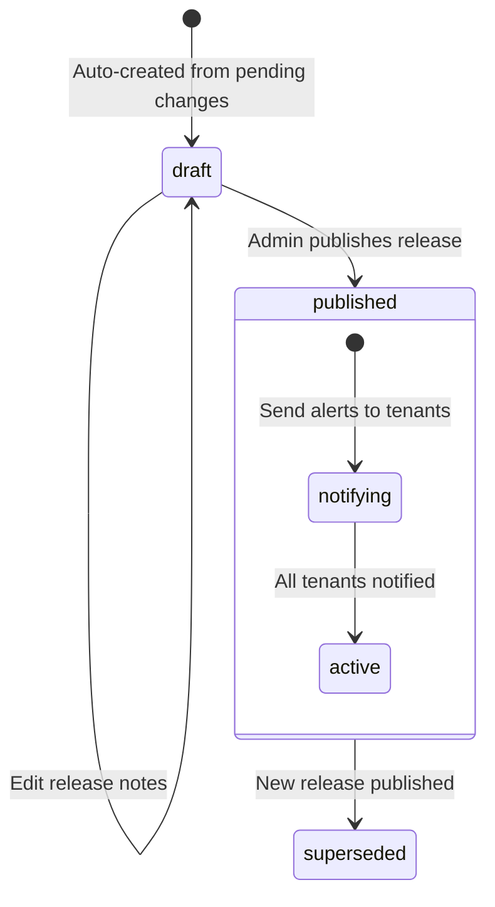

#### 4.7.5 Per-Tenant Release Status

Each child tenant has an independent status for each release:

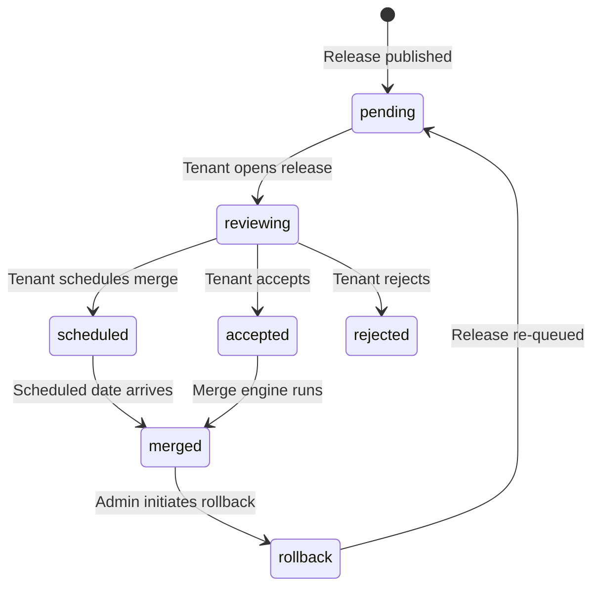

#### 4.7.6 Impact Assessment

Before a tenant accepts a release, they can request an impact assessment:

```json
// GET /api/v1/definitions/releases/{releaseId}/tenants/{tenantId}/conflicts

{
  "releaseId": "rel-uuid",
  "releaseVersion": "2.0.0",
  "tenantId": "tenant-uuid",
  "impactSummary": {
    "totalChanges": 5,
    "breakingChanges": 2,
    "affectedObjectTypes": 3,
    "affectedInstances": 1247,
    "estimatedMigrationTime": "PT15M"
  },
  "changes": [
    {
      "changeType": "ADD_ATTR",
      "isBreaking": true,
      "entityName": "Server",
      "detail": "New mandatory attribute 'compliance_level' (enum: low|medium|high)",
      "instancesAffected": 523,
      "instancesAlreadyCompliant": 0,
      "action": "All 523 Server instances need 'compliance_level' populated"
    },
    {
      "changeType": "MODIFY_ATTR",
      "isBreaking": false,
      "entityName": "Application",
      "detail": "Description updated for 'deployment_type' attribute",
      "instancesAffected": 0,
      "action": "No action required (metadata only)"
    }
  ],
  "conflicts": [
    {
      "conflictType": "CHILD_CUSTOMIZED",
      "entityType": "AttributeType",
      "entityName": "hostname",
      "masterChange": "maxLength changed from 255 to 128",
      "childState": "Child added custom validationRules with maxLength=500",
      "resolution": "MANUAL -- child must choose master limit or request exception"
    }
  ]
}
```

#### 4.7.7 Merge Engine

The merge engine applies release changes to a child tenant's definition graph:

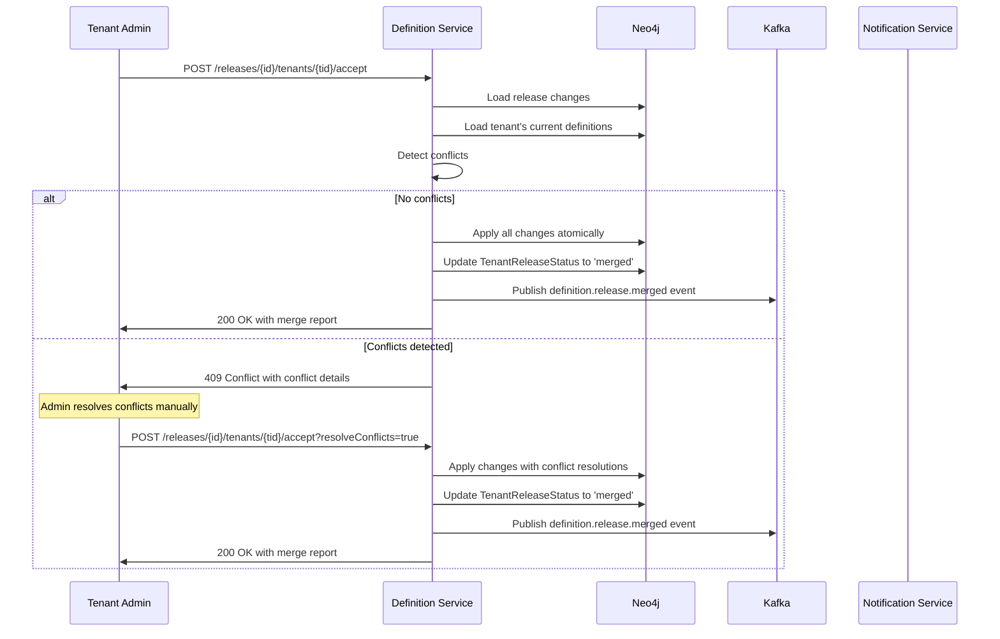

**Conflict resolution rules:**

| Conflict Type | Auto-Resolution | Manual Resolution |
|---------------|----------------|-------------------|
| Master added attr, child has no conflict | Auto-merge: add attribute | N/A |
| Master modified attr, child did not customize | Auto-merge: apply master change | N/A |
| Master modified attr, child also customized | MANUAL | Admin picks master or child version |
| Master removed attr, child has data | MANUAL | Admin confirms data deletion or keeps as user_defined |
| Master added relation, child has no conflict | Auto-merge: add relation | N/A |
| Child added user_defined attr (no master conflict) | Preserved | Child additions are always kept |

#### 4.7.8 Rollback Mechanism

A tenant can rollback a previously merged release:

```cypher
// Rollback: restore pre-merge snapshot
MATCH (trs:TenantReleaseStatus {
    releaseId: $releaseId,
    tenantId: $tenantId,
    status: 'merged'
})
// The TenantReleaseStatus stores a pre-merge snapshot
SET trs.status = 'rollback'

// Restore the definition graph from the snapshot
// (stored as snapshotJson on the TenantReleaseStatus node)
```

Rollback creates a new snapshot of the current state before restoring, enabling "rollback the rollback" if needed.

#### 4.7.9 Event-Driven Architecture

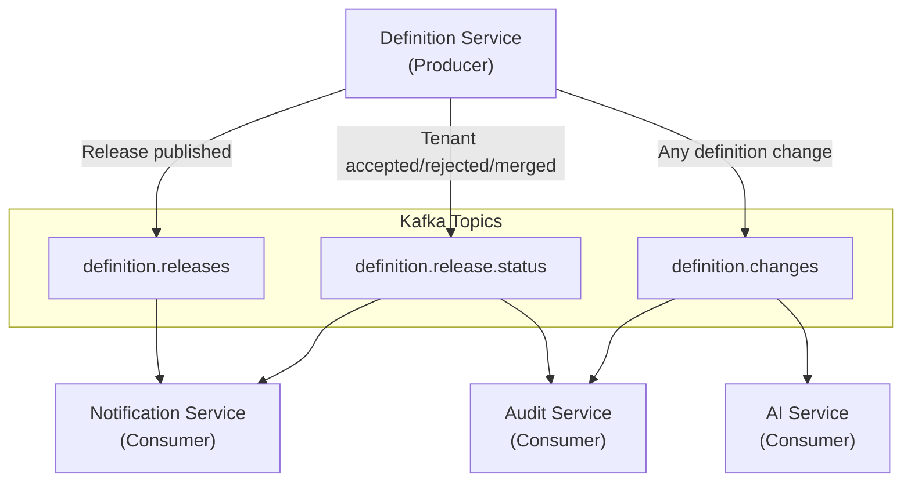

**Kafka topic schema:**

| Topic | Key | Value Schema |
|-------|-----|-------------|
| `definition.releases` | `releaseId` | `{ releaseId, version, versionType, status, affectedTenantIds[], changeSummary }` |
| `definition.release.status` | `releaseId:tenantId` | `{ releaseId, tenantId, status, timestamp, userId }` |
| `definition.changes` | `tenantId:objectTypeId` | `{ tenantId, objectTypeId, changeType, entityType, entityId, before, after, userId, timestamp }` |

#### 4.7.10 JSON Patch RFC 6902 for Release Diffs [PLANNED] [Benchmark: R-20]

The `changeDiffJson` field on DefinitionRelease and the `beforeJson`/`afterJson` fields on ReleaseChange adopt JSON Patch (RFC 6902) as the standard diff format. This provides a well-defined, interoperable format for describing changes.

**Rationale:** JSON Patch is an IETF standard (RFC 6902) with library support in Java (`json-patch` by `com.github.java-json-tools`) and JavaScript (`fast-json-patch`). Using a standard format allows external systems to parse release diffs without custom parsing logic.

**Example release diff in JSON Patch format:**

```json
{
  "releaseId": "uuid",
  "version": "2.0.0",
  "changeDiffJsonPatch": [
    {
      "op": "add",
      "path": "/objectTypes/server/attributes/compliance_level",
      "value": {
        "attributeKey": "compliance_level",
        "name": "Compliance Level",
        "dataType": "enum",
        "requirementLevel": "MANDATORY",
        "validationRules": "{\"rules\":[{\"type\":\"enum_values\",\"expression\":\"{'low','medium','high','critical'}.contains(#value)\"}]}"
      }
    },
    {
      "op": "replace",
      "path": "/objectTypes/server/attributes/hostname/maxValueLength",
      "value": 128
    },
    {
      "op": "remove",
      "path": "/objectTypes/server/attributes/legacy_rack_id"
    }
  ]
}
```

**JSON Patch operations used:**

| Operation | Use Case |
|-----------|----------|
| `add` | New attribute, relation, or ObjectType added to a mandated definition |
| `remove` | Attribute, relation, or ObjectType removed from a mandated definition |
| `replace` | Property value changed (e.g., dataType, requirementLevel, description) |
| `move` | Attribute moved between groups/categories |
| `copy` | Not used in release diffs |
| `test` | Used in conflict detection (assert value before applying patch) |

**Maven dependency:**

```xml
<dependency>
    <groupId>com.github.java-json-tools</groupId>
    <artifactId>json-patch</artifactId>
    <version>1.13</version>
</dependency>
```

#### 4.7.11 Export/Import (Retained)

The export/import functionality is retained as a complementary mechanism to release management:

| Method | Path | Description |
|--------|------|-------------|
| GET | `/api/v1/definitions/export?format=json` | Export current schema as JSON |
| POST | `/api/v1/definitions/import` | Import schema with merge strategy |

**Import merge strategies:**

| Strategy | Behavior |
|----------|----------|
| `OVERWRITE` | Replace all existing definitions with imported ones |
| `MERGE_KEEP_EXISTING` | Add new types, keep existing ones unchanged |
| `MERGE_PREFER_IMPORT` | Add new types, overwrite existing with imported values |
| `DRY_RUN` | Show what would change without applying |

---

### 4.8 AI Service Integration

**[PLANNED]** -- Technical architecture for definition-service integration with ai-service.

#### 4.8.1 Overview

The ai-service (port 8088, PostgreSQL + pgvector) provides intelligent capabilities for definition management:

1. **Role Detection** -- Read user JWT claims, determine persona, configure UI tools
2. **Similarity Detection** -- Compare ObjectType names, descriptions, attribute sets using embeddings
3. **Merge Suggestion** -- When similarity exceeds threshold, suggest merge with impact preview
4. **Deletion Suggestion** -- Detect unused types (0 instances for > N days), suggest cleanup
5. **Smart Attribute Recommendation** -- When creating a new type, suggest attributes based on similar types

#### 4.8.2 Communication Architecture

```mermaid
graph TD
    subgraph DefinitionService["definition-service (8090)"]
        DS_API["REST API Layer"]
        DS_SVC["ObjectTypeService"]
        DS_KAFKA["Kafka Producer"]
    end

    subgraph AIService["ai-service (8088)"]
        AI_API["REST API Layer"]
        AI_EMBED["Embedding Engine<br/>(pgvector)"]
        AI_SIM["Similarity Calculator"]
        AI_REC["Recommendation Engine"]
        AI_KAFKA["Kafka Consumer"]
    end

    subgraph Kafka["Kafka"]
        T_CHANGES["definition.changes"]
        T_AI_RESULTS["definition.ai.results"]
    end

    DS_SVC -->|On create/update/delete| DS_KAFKA
    DS_KAFKA -->|Publish change event| T_CHANGES
    T_CHANGES --> AI_KAFKA
    AI_KAFKA --> AI_EMBED
    AI_EMBED --> AI_SIM

    DS_API -->|Sync: GET /ai/similar/{id}| AI_API
    AI_API --> AI_SIM
    AI_API --> AI_REC

    AI_SIM -->|Async results| T_AI_RESULTS
    T_AI_RESULTS --> DS_KAFKA
```

**Communication patterns:**

| Pattern | Use Case | Protocol |
|---------|----------|----------|
| **Async (Kafka)** | Embedding generation on definition create/update | `definition.changes` topic |
| **Sync (REST)** | Similarity search, attribute recommendations | REST via Eureka LB |
| **Async (Kafka)** | AI result notifications | `definition.ai.results` topic |

#### 4.8.3 Role Detection

The ai-service reads JWT claims to determine the user's persona and surfaces context-appropriate AI tools:

```mermaid
sequenceDiagram
    participant FE as Frontend
    participant GW as API Gateway
    participant AI as AI Service
    participant Def as Definition Service

    FE->>GW: GET /api/v1/ai/context (with JWT)
    GW->>AI: Forward request
    AI->>AI: Extract JWT claims (roles, tenant_id, permissions)
    AI->>AI: Map roles to persona (PLATFORM_ADMIN, TENANT_ADMIN, DEFINITION_EDITOR)
    AI->>Def: GET /api/v1/definitions/object-types (count, status summary)
    AI-->>FE: PersonaContext { persona, availableTools[], suggestions[] }
```

| JWT Role | Persona | Available AI Tools |
|----------|---------|-------------------|
| SUPER_ADMIN + master tenant | Platform Admin | Similarity detection, merge suggestion, cross-tenant analysis, deletion suggestion |
| SUPER_ADMIN + child tenant | Tenant Admin | Similarity detection within tenant, attribute recommendation |
| DEFINITION_EDITOR | Definition Editor | Attribute recommendation, smart defaults |
| DEFINITION_READER | Reader | No AI tools (read-only) |

#### 4.8.4 Similarity Detection

When a new ObjectType is created or an existing one is updated, the system generates an embedding vector and checks for similar types.

```mermaid
sequenceDiagram
    participant Admin as Tenant Admin
    participant Def as Definition Service
    participant Kafka as Kafka
    participant AI as AI Service
    participant PGV as PostgreSQL (pgvector)

    Admin->>Def: POST /object-types { name: "Server Machine" }
    Def->>Def: Create ObjectType node in Neo4j
    Def->>Kafka: Publish to definition.changes
    Note over Kafka: { tenantId, objectTypeId, name, description, attributeKeys[] }

    Kafka->>AI: Consumer receives event
    AI->>AI: Generate embedding from name + description + attribute list
    AI->>PGV: Store embedding vector
    AI->>PGV: Query nearest neighbors (cosine similarity > threshold)

    alt Similar types found
        AI->>Kafka: Publish to definition.ai.results
        Note over Kafka: { type: SIMILARITY_ALERT, objectTypeId, similarTypes: [{id, name, score}] }
        Kafka->>Def: Consumer receives result
        Def->>Def: Store similarity alert (or notify frontend via WebSocket)
    end
```

**Similarity API (synchronous, on-demand):**

```
GET /api/v1/definitions/ai/similar/{objectTypeId}?threshold=0.85
```

```json
{
  "objectTypeId": "uuid",
  "objectTypeName": "Server Machine",
  "similarTypes": [
    {
      "objectTypeId": "uuid-2",
      "objectTypeName": "Server",
      "tenantId": "same-or-master-tenant",
      "similarityScore": 0.92,
      "matchReasons": [
        "Name similarity: 0.95",
        "Shared attributes: hostname, ip_address, os_version (3/5 = 0.60)",
        "Description overlap: 0.88"
      ],
      "suggestedAction": "MERGE"
    },
    {
      "objectTypeId": "uuid-3",
      "objectTypeName": "Virtual Machine",
      "tenantId": "same-tenant",
      "similarityScore": 0.87,
      "matchReasons": [
        "Name similarity: 0.78",
        "Shared attributes: hostname, ip_address, cpu_cores, memory_gb (4/6 = 0.67)",
        "Description overlap: 0.91"
      ],
      "suggestedAction": "REVIEW"
    }
  ]
}
```

#### 4.8.5 Merge Suggestion

When similarity exceeds a configurable threshold (default: 0.85), the AI service suggests a merge:

```
POST /api/v1/definitions/ai/merge-preview
{
  "sourceObjectTypeId": "uuid-source",
  "targetObjectTypeId": "uuid-target"
}
```

```json
{
  "mergePreview": {
    "mergedName": "Server",
    "sourceAttributes": ["hostname", "ip_address", "os_version", "rack_location"],
    "targetAttributes": ["hostname", "ip_address", "cpu_cores", "memory_gb", "os_version"],
    "mergedAttributes": ["hostname", "ip_address", "os_version", "cpu_cores", "memory_gb", "rack_location"],
    "conflictingAttributes": [],
    "sourceConnections": ["hosts -> Application", "depends_on -> Network"],
    "targetConnections": ["hosts -> Application", "runs_on -> Hypervisor"],
    "mergedConnections": ["hosts -> Application", "depends_on -> Network", "runs_on -> Hypervisor"],
    "instanceImpact": {
      "sourceInstances": 120,
      "targetInstances": 340,
      "totalAfterMerge": 460
    }
  }
}
```

#### 4.8.6 Deletion Suggestion

```
GET /api/v1/definitions/ai/unused?thresholdDays=90
```

```json
{
  "unusedTypes": [
    {
      "objectTypeId": "uuid",
      "objectTypeName": "Legacy Widget",
      "instanceCount": 0,
      "lastInstanceDeletedAt": "2025-12-15T10:00:00Z",
      "daysSinceLastInstance": 85,
      "connectionCount": 2,
      "dependentTypes": ["Dashboard"],
      "suggestedAction": "DELETE",
      "confidence": 0.92,
      "warning": "2 other types reference this via CAN_CONNECT_TO"
    }
  ]
}
```

#### 4.8.7 Smart Attribute Recommendation

When creating a new ObjectType, suggest attributes based on similar existing types:

```
GET /api/v1/definitions/ai/recommend-attributes/{objectTypeId}
```

```json
{
  "objectTypeId": "uuid",
  "objectTypeName": "Container",
  "recommendations": [
    {
      "attributeKey": "image_name",
      "attributeName": "Image Name",
      "dataType": "string",
      "requirementLevel": "MANDATORY",
      "confidence": 0.95,
      "source": "Found in 4/5 similar types (Docker Image, Pod, Deployment, Service)"
    },
    {
      "attributeKey": "port_number",
      "attributeName": "Port Number",
      "dataType": "integer",
      "requirementLevel": "OPTIONAL",
      "confidence": 0.78,
      "source": "Found in 3/5 similar types"
    }
  ]
}
```

#### 4.8.8 Data Flow: Embedding Generation

```cypher
// Data sent to ai-service for embedding generation (via Kafka)
// definition-service publishes this payload on every ObjectType create/update:
{
  "eventType": "DEFINITION_CHANGED",
  "tenantId": "tenant-uuid",
  "objectTypeId": "ot-uuid",
  "name": "Server",
  "description": "Physical or virtual server hosting applications",
  "typeKey": "server",
  "attributeKeys": ["hostname", "ip_address", "os_version", "cpu_cores", "memory_gb"],
  "attributeNames": ["Hostname", "IP Address", "OS Version", "CPU Cores", "Memory (GB)"],
  "connectionKeys": ["hosts", "depends_on", "runs_on"],
  "timestamp": "2026-03-10T12:00:00Z"
}
```

The ai-service concatenates `name + description + attributeNames` into a text document, generates an embedding via the configured LLM/embedding model (Ollama or cloud), and stores it in pgvector for similarity search.

---

### 4.9 Governance Tab Technical Design

**[PLANNED]** -- Technical design for the Governance Tab (PRD Section 6.8), providing per-ObjectType workflow management and direct operation settings. [Benchmark: R-06, Collibra governance workflow pattern]

#### 4.9.1 Concept

The Governance Tab exposes per-ObjectType governance configuration with two panels:

1. **Workflow List (left panel)** -- Workflows attached to this ObjectType, defining approval chains for create/update/delete operations
2. **Direct Operation Settings (right panel)** -- Controls for direct CRUD operations outside of workflows, including version/view templates

Additionally, each ObjectType follows a **governance lifecycle state machine** inspired by Collibra's configurable per-asset-type state machine.

#### 4.9.2 Neo4j Nodes

```mermaid
erDiagram
    ObjectType ||--o{ HAS_GOVERNANCE_CONFIG : "governed by"
    HAS_GOVERNANCE_CONFIG }o--|| GovernanceConfig : "configuration"

    ObjectType ||--o{ HAS_WORKFLOW_ATTACHMENT : "has workflow"
    HAS_WORKFLOW_ATTACHMENT }o--|| WorkflowAttachment : "attachment"

    GovernanceConfig {
        string id PK "UUID"
        string tenantId FK "Tenant isolation"
        string objectTypeId FK "Parent ObjectType"
        boolean allowDirectCreate "Allow creation without workflow"
        boolean allowDirectUpdate "Allow update without workflow"
        boolean allowDirectDelete "Allow deletion without workflow"
        string versionTemplate "Template for version display"
        string viewTemplate "Template for view/read layout"
        string governanceState "Draft|PendingReview|Approved|Published|PendingRetirement|Retired"
        string createdBy "User UUID"
        string updatedBy "User UUID"
        instant createdAt "UTC"
        instant updatedAt "UTC"
        long version "Optimistic locking"
    }

    WorkflowAttachment {
        string id PK "UUID"
        string tenantId FK "Tenant isolation"
        string objectTypeId FK "Parent ObjectType"
        string workflowId FK "Reference to process-service workflow"
        string workflowName "Display name"
        string behaviour "Create|Reading|Reporting|Other"
        string permissionType "User|Role"
        string permissionValue "User UUID or Role name"
        boolean isActive "Active or Inactive"
        string createdBy "User UUID"
        instant createdAt "UTC"
        long version "Optimistic locking"
    }

    DirectOperationSetting {
        string id PK "UUID"
        string tenantId FK "Tenant isolation"
        string governanceConfigId FK "Parent GovernanceConfig"
        string operation "Create|Update|Delete"
        boolean isAllowed "Whether direct operation is allowed"
        string templateId "Template UUID for this operation"
        string createdBy "User UUID"
        instant createdAt "UTC"
    }

    GovernanceConfig ||--o{ HAS_OPERATION_SETTING : "has settings"
    HAS_OPERATION_SETTING }o--|| DirectOperationSetting : "setting"
```

#### 4.9.3 Per-ObjectType Governance Lifecycle State Machine [Benchmark: R-06, Collibra Pattern]

Each ObjectType follows a configurable governance lifecycle. The default state machine:

```mermaid
stateDiagram-v2
    [*] --> Draft : ObjectType created
    Draft --> PendingReview : Submit for review
    PendingReview --> Approved : Reviewer approves
    PendingReview --> Draft : Reviewer requests changes
    Approved --> Published : Admin publishes
    Published --> PendingRetirement : Initiate retirement
    PendingRetirement --> Retired : Confirm retirement
    PendingRetirement --> Published : Cancel retirement
    Retired --> Draft : Reactivate

    state Draft {
        [*] --> Editable
        Editable : All fields editable
        Editable : Attributes/relations modifiable
    }

    state Published {
        [*] --> Live
        Live : Instances can be created
        Live : Schema changes trigger release
    }

    state Retired {
        [*] --> ReadOnly
        ReadOnly : No new instances
        ReadOnly : Existing instances preserved
    }
```

**State transition rules:**

| From State | To State | Required Role | Condition | Side Effect |
|------------|----------|---------------|-----------|-------------|
| Draft | PendingReview | DEFINITION_EDITOR, ADMIN | At least 1 mandatory attribute defined | Notification sent to reviewers |
| PendingReview | Approved | ADMIN, SUPER_ADMIN | Review completed | Approval timestamp recorded |
| PendingReview | Draft | ADMIN, SUPER_ADMIN | Changes requested | Rejection reason recorded |
| Approved | Published | SUPER_ADMIN | No blocking validation errors | Instances can now be created; release triggered if mandated |
| Published | PendingRetirement | SUPER_ADMIN | No active instances OR confirmed | Warning if instances exist |
| PendingRetirement | Retired | SUPER_ADMIN | Grace period elapsed (configurable, default 30 days) | Existing instances marked read-only |
| Retired | Draft | SUPER_ADMIN | Explicit reactivation | Status reset, previous config preserved |

**State stored on:** `GovernanceConfig.governanceState` (linked 1:1 to ObjectType).

#### 4.9.4 Relationship to process-service

WorkflowAttachments reference workflows managed by the process-service (port 8089). The definition-service does NOT execute workflows -- it stores the attachment metadata and delegates execution to process-service.

```mermaid
sequenceDiagram
    participant Admin as Tenant Admin
    participant DefService as Definition Service (8090)
    participant ProcService as Process Service (8089)
    participant Neo4j as Neo4j

    Note over Admin: Attach workflow to ObjectType

    Admin->>DefService: POST /governance/{otId}/workflows
    DefService->>ProcService: GET /api/v1/workflows/{workflowId} (validate exists)
    ProcService-->>DefService: 200 OK (workflow metadata)
    DefService->>Neo4j: CREATE WorkflowAttachment node
    DefService-->>Admin: 201 Created

    Note over Admin: Instance creation triggers workflow

    Admin->>DefService: POST /instances (ObjectType with attached workflow)
    DefService->>DefService: Check GovernanceConfig.allowDirectCreate
    alt Direct create allowed
        DefService->>Neo4j: Create instance directly
    else Workflow required
        DefService->>ProcService: POST /api/v1/workflows/{workflowId}/start
        ProcService-->>DefService: 202 Accepted (process instance ID)
        DefService-->>Admin: 202 Accepted (pending workflow approval)
    end
```

#### 4.9.5 REST API Endpoints for Governance Tab [PLANNED]

| Method | Path | Description |
|--------|------|-------------|
| GET | `/api/v1/definitions/object-types/{id}/governance` | Get governance config for an ObjectType |
| PUT | `/api/v1/definitions/object-types/{id}/governance` | Update governance config (direct operation settings, templates) |
| POST | `/api/v1/definitions/object-types/{id}/governance/state` | Transition governance state (body: `{ "targetState": "PendingReview", "comment": "..." }`) |
| GET | `/api/v1/definitions/object-types/{id}/governance/history` | Get governance state transition history |
| GET | `/api/v1/definitions/object-types/{id}/governance/workflows` | List attached workflows |
| POST | `/api/v1/definitions/object-types/{id}/governance/workflows` | Attach a workflow |
| PUT | `/api/v1/definitions/object-types/{id}/governance/workflows/{waId}` | Update workflow attachment (permissions, active/inactive) |
| DELETE | `/api/v1/definitions/object-types/{id}/governance/workflows/{waId}` | Detach a workflow |

#### 4.9.6 Workflow Settings Dialog (Frontend)

The Workflow Settings Dialog allows configuring:

| Field | Type | Options | Description |
|-------|------|---------|-------------|
| Workflow | Dropdown (from process-service) | Available workflows | The workflow to attach |
| Behaviour | Enum | Create, Reading, Reporting, Other | When this workflow triggers |
| Permission Type | Enum | User, Role | Who can trigger this workflow |
| Permission Value | Text/Dropdown | User UUID or Role name | The specific user or role |
| Active/Inactive | Toggle | Active, Inactive | Whether the attachment is currently active |

---

### 4.10 IS_SUBTYPE_OF Attribute Inheritance

**[PLANNED]** -- Design for attribute and connection inheritance through the IS_SUBTYPE_OF relationship hierarchy. [Benchmark: R-13, Apache Atlas type inheritance]

#### 4.10.1 Concept

When ObjectType B `IS_SUBTYPE_OF` ObjectType A:
- B **inherits** all HAS_ATTRIBUTE relationships from A
- B **inherits** all CAN_CONNECT_TO relationships from A
- B **can add** additional attributes and connections beyond those inherited
- B **cannot remove** inherited attributes or connections
- Inherited items are displayed with a visual indicator in the UI (e.g., "inherited from Server")

This reduces configuration duplication -- common attributes (e.g., `hostname`, `ip_address`) are defined once on the parent type and inherited by all subtypes.

#### 4.10.2 Inheritance Resolution

```mermaid
graph TD
    CI["ObjectType: CI<br/>attrs: name, status, owner"]
    Server["ObjectType: Server<br/>IS_SUBTYPE_OF CI<br/>local attrs: hostname, ip_address<br/>resolved attrs: name, status, owner, hostname, ip_address"]
    VM["ObjectType: Virtual Machine<br/>IS_SUBTYPE_OF Server<br/>local attrs: hypervisor, vCPUs<br/>resolved attrs: name, status, owner, hostname, ip_address, hypervisor, vCPUs"]

    CI --> Server
    Server --> VM
```

**Resolution rules:**

| Rule | Description |
|------|-------------|
| Local attributes take precedence | If B defines an attribute with the same `attributeKey` as an inherited one, B's local definition wins for display properties (displayOrder, requirementLevel) |
| Inherited attributes are read-only | B cannot modify the inherited attribute's core properties (dataType, validationRules); only local overrides (displayOrder) are allowed |
| Inherited connections are additive | B receives all CAN_CONNECT_TO from A; B can add more but cannot remove inherited ones |
| Mandate inheritance | If A's attribute is `isMasterMandate=true`, B's inherited copy is also mandated (see Section 4.2.5) |
| Depth limit | Maximum inheritance depth is 5 levels (configurable). Deeper hierarchies are rejected on creation. |

#### 4.10.3 Cypher Query: Resolve Full Attribute Set

```cypher
// Resolve all attributes for an ObjectType including inherited ones
// Traverses IS_SUBTYPE_OF chain upward, collecting attributes at each level
MATCH path = (ot:ObjectType {id: $objectTypeId, tenantId: $tenantId})-[:IS_SUBTYPE_OF*0..5]->(ancestor:ObjectType)
WITH ot, ancestor, length(path) AS depth
ORDER BY depth DESC  // Process from root ancestor down to the leaf type

// Collect attributes from each level (only active per AP-5 lifecycle)
MATCH (ancestor)-[r:HAS_ATTRIBUTE]->(at:AttributeType)
WHERE r.lifecycleStatus = 'active'
WITH ot, at.attributeKey AS attrKey, at, r, ancestor, depth,
     CASE WHEN depth = 0 THEN 'LOCAL' ELSE 'INHERITED' END AS source,
     ancestor.name AS inheritedFrom

// Keep the most specific definition (lowest depth = closest to the target type)
WITH attrKey, collect({
  attribute: at, relationship: r, source: source,
  inheritedFrom: inheritedFrom, depth: depth
}) AS definitions
WITH attrKey, definitions[0] AS bestDef  // First element is deepest (most specific)

RETURN bestDef.attribute AS attribute,
       bestDef.relationship AS relationship,
       bestDef.source AS source,
       bestDef.inheritedFrom AS inheritedFrom
ORDER BY bestDef.relationship.displayOrder
```

#### 4.10.4 API Impact

The GET `/{id}` response is extended with an `inheritedAttributes` section:

```json
{
  "id": "uuid",
  "name": "Virtual Machine",
  "attributes": [
    {
      "attributeKey": "hostname",
      "name": "Hostname",
      "dataType": "string",
      "isRequired": true,
      "displayOrder": 1,
      "source": "INHERITED",
      "inheritedFrom": "Server"
    },
    {
      "attributeKey": "hypervisor",
      "name": "Hypervisor",
      "dataType": "string",
      "isRequired": false,
      "displayOrder": 10,
      "source": "LOCAL",
      "inheritedFrom": null
    }
  ],
  "parentTypeId": "server-uuid",
  "parentTypeName": "Server",
  "inheritanceChain": ["CI", "Server", "Virtual Machine"]
}
```

**New endpoints:**

| Method | Path | Description |
|--------|------|-------------|
| GET | `/api/v1/definitions/object-types/{id}/resolved-attributes` | Get full attribute set including inherited |
| GET | `/api/v1/definitions/object-types/{id}/inheritance-chain` | Get the IS_SUBTYPE_OF ancestor chain |

---

### 4.11 SpEL Conditional Validation Engine

**[PLANNED]** -- Design for a validation engine using Spring Expression Language (SpEL) to evaluate conditional attribute rules. [Benchmark: R-09, Metrix+ conditional validation]

#### 4.11.1 Concept

The `validationRules` field on AttributeType and the `conditionRules` field on HAS_ATTRIBUTE currently store JSON strings with no processing engine. This section defines a SpEL-based validation engine that evaluates rules at instance creation/update time.

SpEL is already on the Spring Boot classpath (part of `spring-context`), so no new dependency is required.

#### 4.11.2 Supported Validation Rule Types

| Rule Type | SpEL Expression Example | Description |
|-----------|------------------------|-------------|
| `required_if` | `#instance['status'] == 'deployed'` | Attribute is required when condition is true |
| `visible_if` | `#instance['type'] != 'virtual'` | Attribute is visible/hidden based on condition |
| `min_value` | `#value >= 0` | Minimum numeric value |
| `max_value` | `#value <= 65535` | Maximum numeric value |
| `min_length` | `#value.length() >= 3` | Minimum string length |
| `max_length` | `#value.length() <= 255` | Maximum string length |
| `regex` | `#value matches '^[a-z][a-z0-9-]*$'` | Regular expression pattern |
| `enum_values` | `{'low','medium','high','critical'}.contains(#value)` | Value must be in enum set |
| `cross_field` | `#instance['endDate'] > #instance['startDate']` | Cross-field validation |
| `range` | `#value >= #instance['minPort'] && #value <= #instance['maxPort']` | Dynamic range validation |

#### 4.11.3 Validation Rule JSON Schema

The `validationRules` JSON field on AttributeType uses this schema:

```json
{
  "rules": [
    {
      "type": "required_if",
      "expression": "#instance['status'] == 'deployed'",
      "message": "IP Address is required when status is 'deployed'",
      "severity": "ERROR"
    },
    {
      "type": "regex",
      "expression": "#value matches '^\\d{1,3}\\.\\d{1,3}\\.\\d{1,3}\\.\\d{1,3}$'",
      "message": "Must be a valid IPv4 address",
      "severity": "ERROR"
    },
    {
      "type": "max_length",
      "expression": "#value.length() <= 15",
      "message": "IP address cannot exceed 15 characters",
      "severity": "WARNING"
    }
  ]
}
```

**Severity levels:**

| Severity | Behavior |
|----------|----------|
| `ERROR` | Blocks save; instance cannot be created/updated |
| `WARNING` | Allows save; displayed as warning in UI |
| `INFO` | Informational; logged but does not block |

#### 4.11.4 ValidationEngine Service Design

```mermaid
classDiagram
    class ValidationEngine {
        -SpelExpressionParser parser
        -StandardEvaluationContext baseContext
        +validate(instanceData Map, objectTypeId String) ValidationResult
        +validateField(fieldKey String, value Object, instanceData Map, rules List~ValidationRule~) List~ValidationError~
        +evaluateCondition(expression String, instanceData Map) boolean
    }

    class ValidationRule {
        +String type
        +String expression
        +String message
        +String severity
    }

    class ValidationResult {
        +boolean isValid
        +List~ValidationError~ errors
        +List~ValidationError~ warnings
        +List~ValidationError~ infos
    }

    class ValidationError {
        +String fieldKey
        +String ruleType
        +String message
        +String severity
        +String expression
    }

    ValidationEngine --> ValidationRule : evaluates
    ValidationEngine --> ValidationResult : produces
    ValidationResult --> ValidationError : contains
```

**SpEL evaluation context variables:**

| Variable | Type | Description |
|----------|------|-------------|
| `#value` | Object | The current field's value being validated |
| `#instance` | Map<String, Object> | All field values on the instance (for cross-field validation) |
| `#objectType` | Map<String, Object> | ObjectType metadata (name, typeKey, status) |
| `#tenant` | Map<String, Object> | Tenant metadata (tenantId, locale) |
| `#now` | Instant | Current timestamp (for date comparisons) |

**Security constraints:**
- SpEL expressions are sandboxed: no method invocations on arbitrary classes
- Only `String`, `Number`, `Boolean`, `Collection`, and `Map` methods are allowed
- Maximum expression length: 500 characters
- Expression parsing is done at AttributeType save time (fail-fast on invalid expressions)
- Expressions are cached after first parse (per attributeTypeId)

#### 4.11.5 conditionRules on HAS_ATTRIBUTE

The `conditionRules` field on HAS_ATTRIBUTE relationships stores the condition under which a CONDITIONAL attribute becomes required:

```json
{
  "condition": "#instance['status'] == 'deployed' && #instance['environment'] == 'production'",
  "description": "Required when instance is deployed to production",
  "evaluateOn": ["CREATE", "UPDATE"]
}
```

When the SpEL expression evaluates to `true`, the CONDITIONAL attribute behaves as MANDATORY (blocks save if absent). When `false`, it behaves as OPTIONAL (contributes to maturity but does not block).

---

## 5. Data Model Changes

### 5.1 Migration Path: Current to Target

| Change | Type | Impact | Migration Strategy |
|--------|------|--------|--------------------|
| Add `isMasterMandate` to ObjectTypeNode | New property | Non-breaking | Default `false` on all existing nodes |
| Add `version` to ObjectTypeNode | New property | Non-breaking | Default `0` on existing nodes |
| Add `createdBy`, `updatedBy` to ObjectTypeNode | New properties | Non-breaking | Default `null` (system) on existing |
| Add `deletedAt` to ObjectTypeNode | New property | Non-breaking | Default `null` (not deleted) |
| Add `masterObjectTypeId` to ObjectTypeNode | New property | Non-breaking | Default `null` (no master) |
| Add `maturitySchemaJson` to ObjectTypeNode | New property | Non-breaking | Default `null` (no maturity config) |
| Add `state` value `master_mandated` | Enum extension | Non-breaking | No migration needed |
| Add `isLanguageDependent` to AttributeTypeNode | New property | Non-breaking | Default `false` |
| Add `isVersioningRelevant` to AttributeTypeNode | New property | Non-breaking | Default `false` |
| Add `isWorkflowAction` to AttributeTypeNode | New property | Non-breaking | Default `false` |
| Add `lockStatus` to AttributeTypeNode | New property | Non-breaking | Default `"none"` |
| Add `requirementLevel` to HAS_ATTRIBUTE | New rel property | Non-breaking | Default `"OPTIONAL"` for existing, derive from `isRequired` |
| Add `lifecycleStatus` to HAS_ATTRIBUTE | New rel property | Non-breaking | Default `'active'` (enum: planned/active/retired per AP-5) |
| Add `isSystemDefault` to HAS_ATTRIBUTE | New rel property | Non-breaking | Default `false` (true for AP-2 system defaults) |
| Add `requirementLevel` to CAN_CONNECT_TO | New rel property | Non-breaking | Default `"OPTIONAL"` |
| Add `lifecycleStatus` to CAN_CONNECT_TO | New rel property | Non-breaking | Default `'active'` (enum: planned/active/retired per AP-5) |
| Add `importance` to CAN_CONNECT_TO | New rel property | Non-breaking | Default `"medium"` |
| Add `attributeCategory` to AttributeTypeNode | New property | Non-breaking | Default `"Object Type Attribute"` |
| Add validation fields to AttributeTypeNode | New properties | Non-breaking | All default `null` |
| Create LocalizedValue node type | New node | Non-breaking | No existing data to migrate |
| Create SystemLocaleConfig node type | New node | Non-breaking | Seed with default locales |
| Create TenantLocaleConfig node type | New node | Non-breaking | Create default config per tenant |
| Create DefinitionRelease node type | New node | Non-breaking | No existing data |
| Create ReleaseChange node type | New node | Non-breaking | No existing data |
| Create TenantReleaseStatus node type | New node | Non-breaking | No existing data |
| Create DataSource node type | New node | Non-breaking | No existing data to migrate |
| Create MeasureCategory node type | New node | Non-breaking | No existing data to migrate |
| Create Measure node type | New node | Non-breaking | No existing data to migrate |
| Create GovernanceRule node type | New node | Non-breaking | No existing data to migrate |
| Create GovernanceConfig node type | New node | Non-breaking | No existing data; one config per ObjectType created on demand |
| Create WorkflowAttachment node type | New node | Non-breaking | No existing data; created when workflows are attached |
| Add `freshnessThresholdDays` to ObjectTypeNode | New property | Non-breaking | Default `90` on all existing nodes |
| Add `complianceRules` to ObjectTypeNode | New property | Non-breaking | Default `null` on all existing nodes |
| Create INHERITS_FROM relationship | New relationship | Non-breaking | No existing data |
| Create CONTAINS_CHANGE relationship | New relationship | Non-breaking | No existing data |
| Create TENANT_STATUS relationship | New relationship | Non-breaking | No existing data |

### 5.2 Migration Script (Neo4j Cypher)

```cypher
// Phase 1: Add governance and maturity properties to ObjectType
MATCH (ot:ObjectType)
WHERE ot.isMasterMandate IS NULL
SET ot.isMasterMandate = false,
    ot.version = 0,
    ot.createdBy = null,
    ot.updatedBy = null,
    ot.deletedAt = null,
    ot.masterObjectTypeId = null,
    ot.isMeasurable = false,
    ot.hasOverallValue = false,
    ot.maturitySchemaJson = null,
    ot.freshnessThresholdDays = 90,
    ot.complianceRules = null;

// Phase 2: Add new properties to AttributeType
MATCH (at:AttributeType)
WHERE at.isLanguageDependent IS NULL
SET at.isLanguageDependent = false,
    at.isVersioningRelevant = false,
    at.isWorkflowAction = false,
    at.lockStatus = 'none',
    at.requirementLevel = 'OPTIONAL',
    at.attributeCategory = 'Object Type Attribute',
    at.isMasterMandate = false,
    at.version = 0,
    at.inputMask = null,
    at.minValueLength = null,
    at.maxValueLength = null,
    at.phonePrefix = null,
    at.phonePattern = null,
    at.dateFormat = null,
    at.timeFormat = null,
    at.filePattern = null,
    at.maxFileSize = null;

// Phase 3: Migrate isRequired to requirementLevel on HAS_ATTRIBUTE + add lifecycleStatus (AP-5)
MATCH (ot:ObjectType)-[r:HAS_ATTRIBUTE]->(at:AttributeType)
WHERE r.requirementLevel IS NULL
SET r.requirementLevel = CASE WHEN r.isRequired THEN 'MANDATORY' ELSE 'OPTIONAL' END,
    r.lifecycleStatus = 'active',
    r.isSystemDefault = false,
    r.lockStatus = 'none',
    r.isMasterMandate = false,
    r.conditionRules = null;

// Phase 4: Add properties to CAN_CONNECT_TO + add lifecycleStatus (AP-5)
MATCH (ot1:ObjectType)-[r:CAN_CONNECT_TO]->(ot2:ObjectType)
WHERE r.importance IS NULL
SET r.importance = 'medium',
    r.lifecycleStatus = 'active',
    r.requirementLevel = 'OPTIONAL',
    r.isMasterMandate = false,
    r.hasRelationAttributes = false;

// Phase 5: Create indexes for new queries
CREATE INDEX IF NOT EXISTS FOR (ot:ObjectType) ON (ot.isMasterMandate);
CREATE INDEX IF NOT EXISTS FOR (ot:ObjectType) ON (ot.masterObjectTypeId);
CREATE INDEX IF NOT EXISTS FOR (ot:ObjectType) ON (ot.deletedAt);
CREATE INDEX IF NOT EXISTS FOR (at:AttributeType) ON (at.isLanguageDependent);
CREATE INDEX IF NOT EXISTS FOR (lv:LocalizedValue) ON (lv.entityId, lv.locale);
CREATE INDEX IF NOT EXISTS FOR (dr:DefinitionRelease) ON (dr.tenantId, dr.version);
CREATE INDEX IF NOT EXISTS FOR (dr:DefinitionRelease) ON (dr.status);
CREATE INDEX IF NOT EXISTS FOR (trs:TenantReleaseStatus) ON (trs.tenantId, trs.status);
CREATE INDEX IF NOT EXISTS FOR (trs:TenantReleaseStatus) ON (trs.releaseId);
CREATE INDEX IF NOT EXISTS FOR (rc:ReleaseChange) ON (rc.releaseId);
CREATE INDEX IF NOT EXISTS FOR (slc:SystemLocaleConfig) ON (slc.localeCode);
CREATE INDEX IF NOT EXISTS FOR (tlc:TenantLocaleConfig) ON (tlc.tenantId, tlc.localeCode);
CREATE INDEX IF NOT EXISTS FOR (gc:GovernanceConfig) ON (gc.objectTypeId, gc.tenantId);
CREATE INDEX IF NOT EXISTS FOR (wa:WorkflowAttachment) ON (wa.objectTypeId, wa.tenantId);

// Phase 6: Seed system locale configuration
MERGE (en:SystemLocaleConfig {localeCode: 'en'})
  ON CREATE SET en.id = randomUUID(), en.displayName = 'English', en.direction = 'ltr', en.isLocaleActive = true, en.displayOrder = 1
MERGE (ar:SystemLocaleConfig {localeCode: 'ar'})
  ON CREATE SET ar.id = randomUUID(), ar.displayName = 'Arabic', ar.direction = 'rtl', ar.isLocaleActive = true, ar.displayOrder = 2;
```

---

## 6. API Contract Changes

### 6.1 Modified Endpoints (Backward Compatible)

| Endpoint | Change | Backward Compatible |
|----------|--------|---------------------|
| GET `/object-types` | Add `Accept-Language` header support, add governance fields to response | Yes -- new fields are additive |
| GET `/object-types/{id}` | Response includes `isMasterMandate`, `maturityConfig`, `localizations` | Yes -- additive |
| POST `/object-types` | Accept `isMasterMandate`, `isLanguageDependent` in request | Yes -- optional fields |
| PUT `/object-types/{id}` | Reject mutations on `isMasterMandate=true` types for non-master tenants | Yes -- new validation |
| GET `/attribute-types` | Response includes new fields | Yes -- additive |
| POST `/attribute-types` | Accept new validation fields | Yes -- optional fields |

### 6.2 New Endpoints Summary

| Category | Count | Base Path |
|----------|-------|-----------|
| Governance (mandates) | 6 | `/api/v1/definitions/governance/` |
| Governance Tab (per-ObjectType) | 8 | `/api/v1/definitions/object-types/{id}/governance/` |
| Localization | 5 | `/api/v1/definitions/locales/`, `/api/v1/definitions/localizations/` |
| Release Management | 14 | `/api/v1/definitions/releases/` |
| Data Sources | 3 | `/api/v1/definitions/object-types/{id}/data-sources/` |
| Measures | 4 | `/api/v1/definitions/object-types/{id}/measure-categories/`, `.../measures/` |
| Graph | 2 | `/api/v1/definitions/graph`, `/api/v1/definitions/object-types/{id}/graph` |
| AI Integration | 4 | `/api/v1/definitions/ai/` |
| Maturity | 4 | `/api/v1/definitions/object-types/{id}/maturity-*` |
| Attribute/Connection Lifecycle | 2 | `/api/v1/definitions/object-types/{id}/attributes/{relId}/lifecycle-status`, `.../connections/{relId}/lifecycle-status` |
| Inheritance | 2 | `/api/v1/definitions/object-types/{id}/resolved-attributes`, `.../inheritance-chain` |
| **Total** | **54** | -- |

### 6.3 Missing CRUD Endpoints to Add

These standard CRUD operations are missing from the current API and should be added:

| Endpoint | Reason |
|----------|--------|
| GET `/attribute-types/{id}` | Get individual attribute type |
| PUT `/attribute-types/{id}` | Update attribute type |
| DELETE `/attribute-types/{id}` | Delete attribute type |
| PATCH `/object-types/{id}` | Proper partial update (currently PUT is used for partial) |
| PUT `/object-types/{id}/attributes/{relId}` | Update relationship properties (e.g., change displayOrder, lifecycleStatus, requirementLevel) |
| PUT `/object-types/{id}/connections/{relId}` | Update connection properties |
| POST `/object-types/{id}/parent` | Set IS_SUBTYPE_OF parent |
| DELETE `/object-types/{id}/parent` | Remove IS_SUBTYPE_OF parent |

---

## 7. Security Considerations

### 7.1 Cross-Tenant Access Control

| Concern | Mitigation |
|---------|------------|
| Child tenant modifying master mandates | Service-layer pre-check: if `isMasterMandate=true` AND `tenantId != MASTER_TENANT_UUID`, reject with 403 |
| Tenant A accessing Tenant B definitions | Existing: all queries filtered by `tenantId` from JWT. No change needed. |
| Release distribution to wrong tenant | Releases are scoped to tenants via INHERITS_FROM relationships; TenantReleaseStatus is created only for tenants that inherit the modified type |
| AI cross-tenant data leakage | AI similarity searches are scoped to same-tenant or master tenant types only; embeddings are partitioned by tenantId in pgvector |
| Import of malicious schema | Validate imported JSON against schema; reject unknown node types; sanitize all string values |

### 7.2 Role Refinement

Current: single `SUPER_ADMIN` role for all endpoints. Target:

| Role | Permissions |
|------|------------|
| SUPER_ADMIN | Full CRUD on all definitions + governance + release management |
| ADMIN | CRUD on custom definitions; read-only on mandated definitions; accept/reject/schedule releases |
| DEFINITION_READER | Read-only access to all definitions |
| DEFINITION_EDITOR | CRUD on custom definitions, no governance |

### 7.3 Data Protection

| Data | Protection |
|------|-----------|
| Validation rules (JSON) | Input validation: max 2000 chars, JSON schema validation |
| Export files | Tenant-scoped; export only includes requesting tenant's data |
| Release snapshots | Contain definition metadata only, never instance data |
| AI embeddings | Stored per-tenant in pgvector; never shared across tenants |

---

## 8. Performance Considerations

### 8.1 Current Performance Concerns

| Concern | Location | Impact | Mitigation |
|---------|----------|--------|------------|
| In-memory filtering | `ObjectTypeServiceImpl.listObjectTypes()` line 57 | High for tenants with many object types | Move search/filter to Cypher query |
| N+1 relationship loading | Neo4j SDN loads relationships eagerly on `findByTenantId` | High -- each ObjectType loads all attributes and connections | Use custom Cypher with `OPTIONAL MATCH` and projections |
| No pagination for attribute types | `listAttributeTypes()` returns all | Medium -- grows with tenant complexity | Add pagination support |

### 8.2 Target Optimizations

| Optimization | Technique |
|-------------|-----------|
| Cypher-level search | `WHERE toLower(ot.name) CONTAINS toLower($search)` |
| Index on tenant + status | `CREATE INDEX FOR (ot:ObjectType) ON (ot.tenantId, ot.status)` |
| Localization caching | Cache frequently-accessed translations in Valkey with TTL 300s |
| Graph visualization caching | Cache full graph JSON per tenant in Valkey; invalidate on any definition change |
| Lazy relationship loading | Use `@Relationship(lazy = true)` for connections in list views |
| Release diff caching | Cache release change diffs in Valkey; immutable once published |
| AI embedding batch processing | Generate embeddings asynchronously via Kafka; avoid blocking API calls |
| Maturity score caching | Cache maturity scores per instance in Valkey with TTL 60s; invalidate on instance or definition change |

### 8.3 Neo4j Query Optimization

```cypher
// Optimized paginated list with search (replace in-memory filtering)
MATCH (ot:ObjectType {tenantId: $tenantId})
WHERE ($search IS NULL OR toLower(ot.name) CONTAINS toLower($search)
       OR toLower(ot.typeKey) CONTAINS toLower($search))
  AND ($status IS NULL OR ot.status = $status)
  AND ot.deletedAt IS NULL
RETURN ot
ORDER BY ot.name
SKIP $skip LIMIT $limit
```

```cypher
// Optimized release impact assessment
MATCH (r:DefinitionRelease {id: $releaseId})-[:CONTAINS_CHANGE]->(rc:ReleaseChange)
WITH collect(rc) AS changes
MATCH (trs:TenantReleaseStatus {releaseId: $releaseId, tenantId: $tenantId})
RETURN changes, trs
```

---

## 9. Technology Decisions

### 9.1 Current Stack (Verified)

| Component | Technology | Evidence |
|-----------|-----------|----------|
| Runtime | Java 21 (Docker), Java 23 (dev) | `Dockerfile` line 7, `pom.xml` parent |
| Framework | Spring Boot 3.4.x | `pom.xml` parent |
| Graph DB | Neo4j 5.12 Community | `docker-compose.dev-data.yml`, Cypher DSL Dialect.NEO4J_5 |
| ORM | Spring Data Neo4j (SDN 7.x) | `pom.xml` line 31: `spring-boot-starter-data-neo4j` |
| Security | Spring Security + OAuth2 Resource Server | `pom.xml` lines 35-40 |
| Validation | Jakarta Validation | `pom.xml` line 43: `spring-boot-starter-validation` |
| API Docs | SpringDoc OpenAPI | `pom.xml` line 63: `springdoc-openapi-starter-webmvc-ui` |
| Testing | Testcontainers + Neo4j | `pom.xml` lines 69-83 |
| Mapping | MapStruct (declared, not used) | `pom.xml` line 58 |
| Service Discovery | Eureka Client | `pom.xml` line 52 |

### 9.2 Decisions for Target Enhancements

| Decision | Choice | Rationale | Escalation |
|----------|--------|-----------|------------|
| Graph visualization library | Cytoscape.js | Best graph-specific library; good Angular support; built-in layouts | SA decision |
| Localization storage | Neo4j nodes (LocalizedValue) -- **Option A** | Supports cross-entity locale queries, per-translation audit trail, locale-specific indexing | SA decision |
| Release management storage | Neo4j nodes (DefinitionRelease, ReleaseChange, TenantReleaseStatus) | Consistent with existing data layer; graph relationships model release-to-change associations naturally | SA decision |
| Release event distribution | Kafka topics (definition.releases, definition.release.status) | Async notification to downstream services; decoupled from merge engine | SA decision -- escalate to ARCH if Kafka is not yet operational |
| AI integration protocol | REST (sync) + Kafka (async) | REST for on-demand queries; Kafka for background embedding generation | SA decision |
| Maturity scoring location | definition-service | Scoring config lives with definitions; instance data access via REST call to instance-service | SA decision -- escalate to ARCH if instance data is in another service |
| Optimistic locking | `@Version` annotation on all nodes | SA Standards requirement | SA decision |
| MapStruct activation | Use MapStruct for all DTO mapping | Already a dependency; reduces boilerplate | SA decision |
| Import/export format | JSON (primary), YAML (optional) | JSON native to JS/Java; YAML human-friendly | SA decision |
| Release diff format | JSON Patch RFC 6902 | Standard interoperable diff format; library support in Java and JS | SA decision |
| Conditional validation engine | Spring Expression Language (SpEL) | Already on classpath (spring-context); sandboxable; well-documented | SA decision |

### 9.3 GraphQL Assessment [PLANNED] [Benchmark: R-14, LeanIX pattern]

**Status:** Assess (Technology Radar ring: "Assess" -- evaluate after REST API stabilization in Phase 10)

**Benchmark context:** LeanIX uses GraphQL effectively for complex graph queries against its Fact Sheet model. Apache Atlas uses REST. The benchmark recommends GraphQL as a supplementary API for EMSIST's graph-heavy query patterns.

| Aspect | Assessment |
|--------|-----------|
| **Use case** | Complex graph traversal queries that are cumbersome in REST (e.g., "all types that are subtypes of CI and have a mandatory enum attribute") |
| **Not a replacement for REST** | REST remains the primary API for CRUD operations. GraphQL supplements REST for read-heavy, flexible query scenarios. |
| **Target phase** | Phase 10 (Graph Visualization) -- GraphQL would serve the frontend graph explorer and external integrators |
| **Library** | `spring-boot-starter-graphql` (Spring for GraphQL, based on GraphQL Java) |
| **Schema** | Auto-generated from Neo4j node/relationship model; ObjectType, AttributeType, connections as GraphQL types |

**Example GraphQL query (target):**

```graphql
query {
  objectTypes(
    filter: { status: "active", hasSubtypeOf: "ci" }
  ) {
    name
    typeKey
    attributes(filter: { requirementLevel: MANDATORY, dataType: "enum" }) {
      name
      attributeKey
      validationRules
    }
    connections(filter: { importance: "high" }) {
      targetType { name }
      cardinality
    }
    maturitySummary {
      compositeScore
      maturityLevel
    }
  }
}
```

**Pros:**
- Reduces over-fetching: frontend requests exactly the fields it needs
- Single request for complex queries that would require 3-5 REST calls
- Self-documenting schema (introspection)
- Strong typing matches Neo4j's typed graph model

**Cons:**
- Additional API surface to maintain alongside REST
- Caching is more complex than REST (no HTTP caching by default)
- Learning curve for frontend developers
- Query complexity limits needed to prevent expensive graph traversals

**Decision:** Defer to Phase 10. Assess after REST API is stable and graph visualization is implemented. If the frontend graph explorer requires more than 3 REST calls per interaction, GraphQL becomes the recommended path. Escalate to ARCH for final decision.

### 9.4 Spring Statemachine Assessment [PLANNED] [Benchmark: R-12, R-20, Collibra pattern]

**Status:** Assess -- for the per-ObjectType governance lifecycle state machine (Section 4.9.3).

| Option | Pros | Cons | Recommendation |
|--------|------|------|----------------|
| **Spring Statemachine** | Production-grade; persistence support; event-driven; guards and actions; distributed state via Redis/Valkey | Heavy dependency; learning curve; complex XML/Java config for simple state machines; stateful beans need lifecycle management | **Recommended for Phase 3+** if governance workflows become complex (>6 states, conditional transitions, timer-based auto-transitions) |
| **Custom enum-based state machine** | Simple; no dependency; easy to understand; stateless service methods; trivial to unit test | Limited to if/else or switch logic; no persistence support; no event model; hard to extend for async transitions | **Recommended for Phase 3 MVP** -- start simple, migrate to Spring Statemachine if complexity grows |

**Recommended approach -- staged adoption:**

1. **Phase 3 (Governance MVP):** Implement a custom `GovernanceStateService` with an enum `GovernanceState` and a `transition(currentState, targetState, role)` method. This is sufficient for the 6-state lifecycle (Draft, PendingReview, Approved, Published, PendingRetirement, Retired) with role-based guards.

2. **Phase 6+ (Complex workflows):** If governance requirements grow to include timer-based auto-transitions (e.g., auto-retire after 180 days inactive), parallel states, or conditional fork/join, migrate to Spring Statemachine with Valkey-backed persistence.

**Custom state machine sketch:**

```java
public enum GovernanceState {
    DRAFT, PENDING_REVIEW, APPROVED, PUBLISHED, PENDING_RETIREMENT, RETIRED;

    private static final Map<GovernanceState, Set<GovernanceState>> TRANSITIONS = Map.of(
        DRAFT, Set.of(PENDING_REVIEW),
        PENDING_REVIEW, Set.of(APPROVED, DRAFT),
        APPROVED, Set.of(PUBLISHED),
        PUBLISHED, Set.of(PENDING_RETIREMENT),
        PENDING_RETIREMENT, Set.of(RETIRED, PUBLISHED),
        RETIRED, Set.of(DRAFT)
    );

    public boolean canTransitionTo(GovernanceState target) {
        return TRANSITIONS.getOrDefault(this, Set.of()).contains(target);
    }
}
```

**Decision:** Start with custom enum-based state machine in Phase 3. Evaluate Spring Statemachine adoption if governance complexity exceeds the custom implementation's ability to handle it cleanly. Escalate to ARCH if distributed state management is needed.

---

## 10. Dependencies

### 10.1 Upstream Dependencies

| Dependency | Service | Purpose | Status |
|-----------|---------|---------|--------|
| Keycloak | External | JWT issuance and validation | [IMPLEMENTED] |
| Neo4j | Infrastructure | Graph data storage | [IMPLEMENTED] |
| Eureka | eureka-server | Service discovery and load balancing | [IMPLEMENTED] |
| API Gateway | api-gateway | Request routing, CORS | [IMPLEMENTED] |
| tenant-service | Backend | Tenant metadata (for master tenant identification) | [IMPLEMENTED] -- but no Feign client in definition-service |
| ai-service | Backend | Similarity detection, attribute recommendations, embedding generation | [IMPLEMENTED] -- service exists at :8088 but no integration |
| notification-service | Backend | Release alert distribution to tenant managers | [IMPLEMENTED] -- service exists at :8086 but no integration |
| Kafka | Infrastructure | Event-driven release distribution and AI embedding pipeline | [IMPLEMENTED] -- `confluentinc/cp-kafka:7.5.0` in docker-compose |

### 10.2 Downstream Consumers

| Consumer | How It Uses Definitions | Status |
|----------|------------------------|--------|
| Instance management (future) | Validates instances against ObjectType schemas; maturity scoring | [PLANNED] |
| Process service | Uses ObjectType/AttributeType for workflow form generation | [PLANNED] -- process-service exists but no integration |
| Frontend admin | Master Definitions section | [IMPLEMENTED] |
| AI service | Consumes definition changes for embedding generation | [PLANNED] |
| Audit service | Consumes release status events for audit trail | [PLANNED] |
| Reporting (future) | Queries graph for metadata schema | [PLANNED] |

### 10.3 New Dependencies Required for Target

| Dependency | Purpose | Type |
|-----------|---------|------|
| Feign client to tenant-service | Resolve master tenant identity | New internal dependency |
| Feign client to ai-service | Synchronous similarity queries and recommendations | New internal dependency |
| Valkey (cache) | Cache graph visualizations, translations, maturity scores, release diffs | New infrastructure dependency |
| Spring Kafka | Publish/consume release events and definition change events | New library dependency |
| Cytoscape.js | Frontend graph rendering | New frontend dependency |
| json-patch (com.github.java-json-tools) | RFC 6902 JSON Patch for release diffs | New library dependency |
| Feign client to process-service | Workflow validation for governance tab | New internal dependency |

---

## 11. Risks and Mitigations

| Risk | Severity | Probability | Mitigation |
|------|----------|-------------|------------|
| Neo4j Community Edition lacks multi-database | HIGH | CERTAIN | Cannot use database-per-tenant. Must continue with `tenantId` property discrimination. Escalate to ARCH. |
| Release management complexity at scale | HIGH | MEDIUM | Limit concurrent active releases to 5; auto-supersede old unpublished drafts; batch tenant notification |
| Master mandate propagation conflicts | HIGH | MEDIUM | Implement conflict detection before merge; provide manual resolution UI; support rollback |
| Multilingual storage bloats graph | MEDIUM | HIGH | Index on (entityId, locale); consider separate Valkey cache for hot translations |
| Graph visualization performance with many types | MEDIUM | MEDIUM | Server-side aggregation; limit depth parameter; virtual scrolling in frontend |
| Breaking API changes for existing frontend | HIGH | LOW | All changes are additive; new fields are optional; no existing fields removed |
| No optimistic locking currently | HIGH | MEDIUM | Add `@Version` before any concurrent editing features. Must be done in first phase. |
| No audit trail (createdBy/updatedBy) | MEDIUM | CERTAIN | Add audit fields in first phase before governance features |
| AI similarity false positives | MEDIUM | MEDIUM | Configurable similarity threshold; require manual review for merge; never auto-merge |
| Kafka not yet operational in all environments | MEDIUM | MEDIUM | Fallback to synchronous REST calls if Kafka is unavailable; feature-flag Kafka integration |
| Import of incompatible schemas | MEDIUM | MEDIUM | Validate schema version compatibility; provide dry-run mode; reject unknown node types |
| Metrix+ feature parity scope creep | HIGH | HIGH | Prioritize by P0/P1/P2; implement in phases; validate each phase with BA agent |
| Inactive attribute reactivation confusion | LOW | MEDIUM | Preserve requirementLevel on deactivation; show clear status in UI; audit log for activation changes |

---

## 12. Appendix: Metrix+ Feature Mapping

Mapping from Metrix+ Object Type Config (reference PDF) to EMSIST technical components.

### 12.1 Metrix+ Tab Structure vs EMSIST Implementation

| Metrix+ Tab | EMSIST Status | EMSIST Component |
|-------------|---------------|------------------|
| **General Info** | [IMPLEMENTED] -- name, description, properties (Measurable, Has Overall Value, Object Type Icon) | ObjectTypeNode properties; frontend General Info panel |
| **Attributes** | [IMPLEMENTED] -- list with ID, Name, Type, Attribute Category, Lock Status, Actions | HAS_ATTRIBUTE relationship; Attributes tab in detail panel |
| **Relations** | [IMPLEMENTED] -- From Object Type, Active Name, Passive Name, Target Object Type, Cardinality, Importance, Actions | CAN_CONNECT_TO relationship; Connections tab in detail panel |
| **Governance** | [PLANNED] | GovernanceRule nodes; new Governance tab |
| **Data Sources** | [PLANNED] | DataSource nodes; new Data Sources tab |
| **Measures Categories** | [PLANNED] | MeasureCategory nodes; new Measures Categories tab |
| **Measures** | [PLANNED] | Measure nodes; new Measures tab |

### 12.2 Metrix+ Attribute Features vs EMSIST

| Metrix+ Feature | EMSIST Current | EMSIST Target | Priority |
|-----------------|---------------|---------------|----------|
| Attribute Type selection (Text, Number, Value, Boolean, File, Date, Time) | [IMPLEMENTED] -- dataType field (string, text, integer, float, boolean, date, datetime, enum, json) | Extend with: file, value, number, time | P1 |
| Attribute Category (Object Type Attribute, Version Attribute) | [IMPLEMENTED] -- `attributeGroup` field | Rename to `attributeCategory` with formalized enum | P1 |
| Lock Status (None, Locked, Partial) | Not implemented | [PLANNED] -- `lockStatus` property | P1 |
| Versioning Relevant toggle | Not implemented | [PLANNED] -- `isVersioningRelevant` boolean | P2 |
| Workflow Action toggle | Not implemented | [PLANNED] -- `isWorkflowAction` boolean | P2 |
| Language Dependent toggle | Not implemented | [PLANNED] -- `isLanguageDependent` boolean | P1 |
| Input Mask | Not implemented | [PLANNED] -- `inputMask` string | P2 |
| Min/Max Value Length | Not implemented | [PLANNED] -- `minValueLength`, `maxValueLength` | P2 |
| Phone Prefix + Phone Pattern | Not implemented | [PLANNED] -- `phonePrefix`, `phonePattern` | P3 |
| Date Format / Time Format | Not implemented | [PLANNED] -- `dateFormat`, `timeFormat` | P2 |
| File Pattern / Max File Size | Not implemented | [PLANNED] -- `filePattern`, `maxFileSize` | P3 |

### 12.3 Metrix+ Attribute Validation Tab vs EMSIST

From PDF pages 9 and 16 -- Create New Attribute has three sub-tabs: General, Validation, Data Source.

| Metrix+ Validation Feature | EMSIST Current | EMSIST Target |
|---------------------------|---------------|---------------|
| Required: Mandatory and stop WF actions | `isRequired` boolean on HAS_ATTRIBUTE | `requirementLevel: MANDATORY` (stop WF variant) |
| Required: Mandatory and proceed other actions | Not implemented | `requirementLevel: MANDATORY_PROCEED` |
| Required: Optional | `isRequired: false` | `requirementLevel: OPTIONAL` |
| Required: Conditional | Not implemented | `requirementLevel: CONDITIONAL` with condition rules |
| Enabled: TRUE / FALSE / Conditional | Not implemented | `isEnabled` boolean + condition rules |
| Reset Value toggle | Not implemented | `resetValue` boolean |
| Condition builder (Set As + Condition + Actions) | Not implemented | JSON condition rules in `conditionRules` property |

### 12.4 Metrix+ Relations Features vs EMSIST

From PDF page 15 -- Relations tab shows: From Object Type, Active Name, Passive Name, Target Object Type, Cardinality, Importance.

| Metrix+ Feature | EMSIST Current | EMSIST Target |
|-----------------|---------------|---------------|
| From Object Type | [IMPLEMENTED] -- source of CAN_CONNECT_TO | No change |
| Active Name (per language) | [IMPLEMENTED] -- `activeName` field | Add language-dependent support |
| Passive Name (per language) | [IMPLEMENTED] -- `passiveName` field | Add language-dependent support |
| Target Object Type | [IMPLEMENTED] -- `@TargetNode` | No change |
| Cardinality | [IMPLEMENTED] -- `cardinality` field | No change |
| **Importance** | **Not implemented** | [PLANNED] -- `importance: high\|medium\|low` |
| Relation Attributes | Not implemented | [PLANNED] -- relation-level attributes (separate from type-level) |

### 12.5 Metrix+ Create New Relation Dialog vs EMSIST

From PDF page 15 -- Create New Relation has two sub-tabs: General Info, Attributes.

| Field | EMSIST Current | Status |
|-------|---------------|--------|
| Language (multi-language active/passive names) | Not implemented | [PLANNED] |
| Active Name | [IMPLEMENTED] | -- |
| Passive Name | [IMPLEMENTED] | -- |
| Required | Not implemented for relations | [PLANNED] -- `requirementLevel` on relation |
| To Object Type | [IMPLEMENTED] -- `targetObjectTypeId` | -- |
| Importance | Not implemented | [PLANNED] |
| Cardinality | [IMPLEMENTED] | -- |
| Relation-level Attributes tab | Not implemented | [PLANNED] -- new RELATION_HAS_ATTRIBUTE relationship type |

---

## Implementation Phases

| Phase | Features | Priority | Estimated Effort | Benchmark Gaps Addressed |
|-------|----------|----------|-----------------|--------------------------|
| **Phase 1: Foundation** | Add @Version, audit fields (createdBy/updatedBy), soft delete, missing CRUD endpoints for AttributeType, Cypher-level search/filter, `lifecycleStatus` (planned/active/retired per AP-5) on HAS_ATTRIBUTE and CAN_CONNECT_TO, `isSystemDefault` flag on HAS_ATTRIBUTE (AP-2), message registry schema (AP-4) | P0 | 2 sprints | -- |
| **Phase 2: Metrix+ Parity + Rule-Based AI** | Lock status, attribute categories, validation fields (input mask, min/max length, phone, date/time, file), versioning relevant, workflow action toggles, **SpEL validation engine (Section 4.11)**, **rule-based Smart Defaults** (auto-suggest attributeKey from name, auto-detect duplicate typeKey, suggest dataType from attribute name patterns -- no ai-service dependency) | P1 | 3 sprints | GAP-05, GAP-08 |
| **Phase 3: Governance** | Master tenant, isMasterMandate, INHERITS_FROM, governance rules, **classification propagation (Section 4.2.5)**, **Governance Tab (Section 4.9)** with per-ObjectType lifecycle state machine, workflow attachments, direct operation settings, role refinement | P0 | 3 sprints | GAP-03, GAP-04 |
| **Phase 4: Locale Management** | System/tenant locale config, isLanguageDependent, LocalizedValue nodes, Accept-Language header API, translation management UI | P1 | 2 sprints | -- |
| **Phase 5: Maturity Engine (4-Axis)** | requirementLevel on HAS_ATTRIBUTE and CAN_CONNECT_TO, **four-axis maturity scoring** (Completeness + Relationship + Compliance + Freshness), configurable axis weights per tenant, `freshnessThresholdDays` and `complianceRules` on ObjectType, maturity config API | P1 | 2 sprints | GAP-01 |
| **Phase 6: Definition Release Management** | DefinitionRelease/ReleaseChange/TenantReleaseStatus nodes, change detection, release creation, **JSON Patch RFC 6902 diff format (Section 4.7.10)**, tenant pull/accept/reject/schedule, merge engine, conflict resolution, rollback, Kafka events | P0 | 3 sprints | GAP-11 |
| **Phase 7: IS_SUBTYPE_OF Inheritance** | **Attribute inheritance through IS_SUBTYPE_OF (Section 4.10)**, resolved attribute API, inheritance chain API, parent type management endpoints | P1 | 2 sprints | GAP-06 |
| **Phase 8: ML-Based AI Integration** | Kafka producer for definition changes, ai-service embedding consumer, similarity detection API, merge suggestion, deletion suggestion, attribute recommendation via embeddings (pgvector) | P1 | 2 sprints | GAP-05 (Phase 2 of AI) |
| **Phase 9: Relations Enhancement + Data Sources + Measures** | Importance, relation-level attributes, language-dependent relation names, DataSource nodes, MeasureCategory/Measure nodes, corresponding CRUD APIs | P2 | 2 sprints | -- |
| **Phase 10: Graph Visualization** | Cytoscape.js integration, graph API endpoints, interactive UI, **GraphQL assessment (Section 9.3)** -- evaluate GraphQL as supplementary query API | P2 | 2 sprints | GAP-10 |

---

*This specification was produced by the SA agent after reading all source files listed in Section 1.2. Every [IMPLEMENTED] claim cites a specific file path. All [PLANNED] features are clearly marked as not yet built. Diagrams use Mermaid syntax exclusively per Rule 7. Benchmark gaps (GAP-01 through GAP-12) from 10-Benchmark-Alignment-Analysis.md have been addressed in this revision -- see [Benchmark: R-XX] tags throughout Sections 4.4, 4.2.5, 4.9, 4.10, 4.11, 4.7.10, 9.3, 9.4, and the Implementation Phases table.*
