# LLD: Definition Management

**Document ID:** LLD-DM-001
**Version:** 2.0.0
**Date:** 2026-03-10
**Status:** Draft
**Author:** SA Agent (SA-PRINCIPLES.md v1.1.0)
**Service:** definition-service
**Port:** 8090
**Database:** Neo4j 5 Community Edition
**SA Principles Version:** v1.1.0

---

## Table of Contents

1. [Overview](#1-overview)
2. [Component Architecture](#2-component-architecture)
3. [Class Diagrams](#3-class-diagrams)
4. [Sequence Diagrams](#4-sequence-diagrams)
5. [State Machine Diagrams](#5-state-machine-diagrams)
6. [Data Flow Diagrams](#6-data-flow-diagrams)
7. [Error Handling Design](#7-error-handling-design)
8. [Security Design](#8-security-design)
9. [Performance Considerations](#9-performance-considerations)
10. [Testing Strategy Reference](#10-testing-strategy-reference)
11. [Planned Service Layer Method Signatures](#11-planned-service-layer-method-signatures)
12. [Planned Repository Layer with Cypher Queries](#12-planned-repository-layer-with-cypher-queries)
13. [Planned Controller Layer](#13-planned-controller-layer)
14. [Cross-Cutting Concerns](#14-cross-cutting-concerns)

---

## 1. Overview

### 1.1 Purpose

This Low-Level Design (LLD) document provides the C4 Level 3 (Component) and Level 4 (Code) design for the Definition Management feature of the EMSIST platform. It captures both the as-built architecture (verified against source code) and the planned enhancements described in the PRD (01-PRD-Definition-Management.md, Sections 5-8) and Technical Specification (02-Technical-Specification.md, Sections 3-4).

### 1.2 Scope

| Aspect | Coverage |
|--------|----------|
| As-Built Components | Full reverse-engineering of backend (Java packages, classes, methods) and frontend (Angular components, services, models) |
| Planned Components | Governance, locale management, maturity scoring, release management, AI integration, measures |
| Cross-References | PRD-DM-001 (Sections 5-8), Tech Spec (Sections 3-4) |

### 1.3 Relationship to Source Documents

| Document | ID | Reference |
|----------|----|-----------|
| Product Requirements | PRD-DM-001 v2.1.0 | `docs/definition-management/Design/01-PRD-Definition-Management.md` |
| Technical Specification | TS-DM-001 | `docs/definition-management/Design/02-Technical-Specification.md` |
| UX Design Spec | UX-DM-001 | `docs/definition-management/Design/05-UI-UX-Design-Spec.md` |

### 1.4 Architectural Principles

All designs in this LLD respect the five architectural principles defined in PRD Section 6:

| Principle | Summary | LLD Impact |
|-----------|---------|------------|
| **AP-1** Definition/Instance Separation | Neo4j stores definitions; instances stored separately | All node classes represent definition-time schema, not runtime instances |
| **AP-2** Default Attributes | System default attributes auto-attached on ObjectType creation | [PLANNED] `isSystemDefault` flag on HAS_ATTRIBUTE |
| **AP-3** Zero Data Loss | Definition updates must never lose instance data | [PLANNED] DefinitionRelease + soft-delete pattern |
| **AP-4** Centralized Message Registry | All user-facing messages via message codes | [PLANNED] ProblemDetail with message codes (DEF-E-xxx, DEF-C-xxx) |
| **AP-5** Lifecycle State Machines | Every entity has `lifecycleStatus` with validated transitions | [PLANNED] `lifecycleStatus` on HAS_ATTRIBUTE and CAN_CONNECT_TO |

---

## 2. Component Architecture

### 2.1 Backend Component Diagram (C4 Level 3) [IMPLEMENTED]

The definition-service backend follows a layered architecture with the following packages.

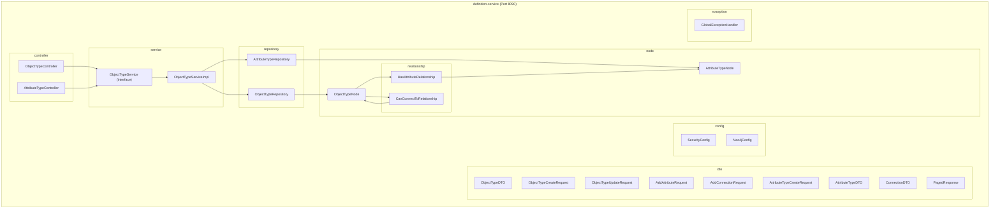

**Evidence:**
- Package structure verified: `backend/definition-service/src/main/java/com/ems/definition/` contains 8 packages: `config`, `controller`, `dto`, `exception`, `node`, `node/relationship`, `repository`, `service`
- Main class: `DefinitionServiceApplication.java`

### 2.2 Backend Component Diagram -- Planned Extensions [PLANNED]

The following packages and components will be added to support planned features (PRD Sections 6.4-6.13, Tech Spec Section 4). No code exists for these today.

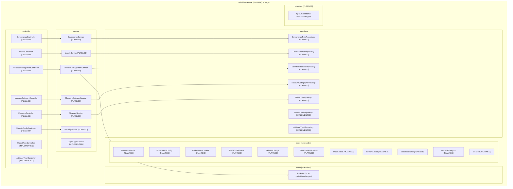

### 2.3 Frontend Component Diagram [IMPLEMENTED]

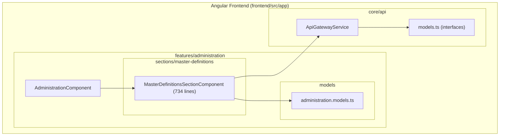

**Evidence:**
- `frontend/src/app/features/administration/sections/master-definitions/master-definitions-section.component.ts` (734 lines)
- `frontend/src/app/features/administration/models/administration.models.ts` (lines 108-185)
- `frontend/src/app/core/api/api-gateway.service.ts` (definition methods at lines 394-517)

### 2.4 Inter-Service Communication Diagram

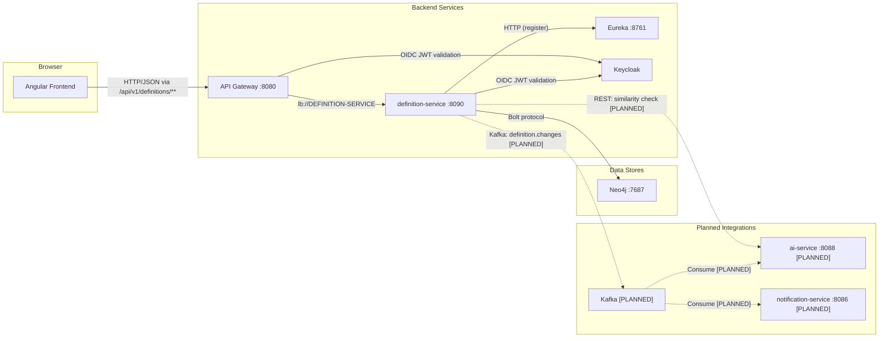

**Evidence for implemented paths:**
- API Gateway route: `backend/api-gateway/src/main/java/com/ems/gateway/config/RouteConfig.java`, lines 107-111: `.route("definition-service", r -> r.path("/api/v1/definitions/**").uri("lb://DEFINITION-SERVICE"))`
- Eureka registration: `backend/definition-service/src/main/resources/application.yml`, lines 19-25
- Neo4j connection: `application.yml` -- `NEO4J_URI: ${NEO4J_URI:-bolt://neo4j:7687}`
- Keycloak JWT: `SecurityConfig.java`, line 55 -- `oauth2ResourceServer` configuration

---

## 3. Class Diagrams

### 3.1 As-Built Domain Classes [IMPLEMENTED]

All classes below are verified against source code in `backend/definition-service/src/main/java/com/ems/definition/`.

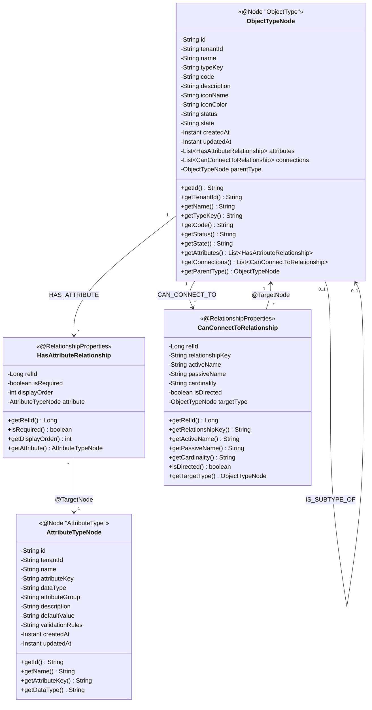

**Source file evidence:**

| Class | File Path | Lines |
|-------|-----------|-------|
| ObjectTypeNode | `backend/definition-service/src/main/java/com/ems/definition/node/ObjectTypeNode.java` | 27-85 |
| AttributeTypeNode | `backend/definition-service/src/main/java/com/ems/definition/node/AttributeTypeNode.java` | 25-53 |
| HasAttributeRelationship | `backend/definition-service/src/main/java/com/ems/definition/node/relationship/HasAttributeRelationship.java` | 24-36 |
| CanConnectToRelationship | `backend/definition-service/src/main/java/com/ems/definition/node/relationship/CanConnectToRelationship.java` | 27-52 |

### 3.2 As-Built Controller and Service Classes [IMPLEMENTED]

```mermaid
classDiagram
    class ObjectTypeController {
        <<@RestController>>
        -ObjectTypeService objectTypeService
        +listObjectTypes(Jwt, int, int, String, String) ResponseEntity~PagedResponse~
        +createObjectType(Jwt, ObjectTypeCreateRequest) ResponseEntity~ObjectTypeDTO~
        +getObjectType(Jwt, String) ResponseEntity~ObjectTypeDTO~
        +updateObjectType(Jwt, String, ObjectTypeUpdateRequest) ResponseEntity~ObjectTypeDTO~
        +deleteObjectType(Jwt, String) ResponseEntity~Void~
        +duplicateObjectType(Jwt, String) ResponseEntity~ObjectTypeDTO~
        +restoreObjectType(Jwt, String) ResponseEntity~ObjectTypeDTO~
        +listAttributes(Jwt, String) ResponseEntity~List~
        +addAttribute(Jwt, String, AddAttributeRequest) ResponseEntity~ObjectTypeDTO~
        +removeAttribute(Jwt, String, String) ResponseEntity~Void~
        +listConnections(Jwt, String) ResponseEntity~List~
        +addConnection(Jwt, String, AddConnectionRequest) ResponseEntity~ObjectTypeDTO~
        +removeConnection(Jwt, String, String) ResponseEntity~Void~
        -extractTenantId(Jwt) String
    }

    class AttributeTypeController {
        <<@RestController>>
        -ObjectTypeService objectTypeService
        +listAttributeTypes(Jwt) ResponseEntity~List~
        +createAttributeType(Jwt, AttributeTypeCreateRequest) ResponseEntity~AttributeTypeDTO~
        -extractTenantId(Jwt) String
    }

    class ObjectTypeService {
        <<interface>>
        +listObjectTypes(String, int, int, String, String) PagedResponse~ObjectTypeDTO~
        +createObjectType(String, ObjectTypeCreateRequest) ObjectTypeDTO
        +getObjectType(String, String) ObjectTypeDTO
        +updateObjectType(String, String, ObjectTypeUpdateRequest) ObjectTypeDTO
        +deleteObjectType(String, String) void
        +addAttribute(String, String, AddAttributeRequest) ObjectTypeDTO
        +removeAttribute(String, String, String) void
        +addConnection(String, String, AddConnectionRequest) ObjectTypeDTO
        +removeConnection(String, String, String) void
        +duplicateObjectType(String, String) ObjectTypeDTO
        +restoreObjectType(String, String) ObjectTypeDTO
        +listAttributeTypes(String) List~AttributeTypeDTO~
        +createAttributeType(String, AttributeTypeCreateRequest) AttributeTypeDTO
    }

    class ObjectTypeServiceImpl {
        <<@Service>>
        -ObjectTypeRepository objectTypeRepository
        -AttributeTypeRepository attributeTypeRepository
        -toDTO(ObjectTypeNode) ObjectTypeDTO
        -toAttributeTypeDTO(AttributeTypeNode) AttributeTypeDTO
        -findObjectTypeOrThrow(String, String) ObjectTypeNode
        -resolveTypeKey(String, String) String
        -matchesSearch(ObjectTypeNode, String) boolean
        -matchesStatus(ObjectTypeNode, String) boolean
    }

    class ObjectTypeRepository {
        <<interface extends Neo4jRepository>>
        +findByIdAndTenantId(String, String) Optional~ObjectTypeNode~
        +findByTenantId(String, Pageable) List~ObjectTypeNode~
        +existsByTypeKeyAndTenantId(String, String) boolean
        +countByTenantId(String) long
    }

    class AttributeTypeRepository {
        <<interface extends Neo4jRepository>>
        +findByTenantId(String) List~AttributeTypeNode~
        +findByIdAndTenantId(String, String) Optional~AttributeTypeNode~
    }

    ObjectTypeController --> ObjectTypeService
    AttributeTypeController --> ObjectTypeService
    ObjectTypeServiceImpl ..|> ObjectTypeService
    ObjectTypeServiceImpl --> ObjectTypeRepository
    ObjectTypeServiceImpl --> AttributeTypeRepository
```

**Source file evidence:**

| Class | File Path | Lines |
|-------|-----------|-------|
| ObjectTypeController | `backend/definition-service/src/main/java/com/ems/definition/controller/ObjectTypeController.java` | 39-278 |
| AttributeTypeController | `backend/definition-service/src/main/java/com/ems/definition/controller/AttributeTypeController.java` | 35-103 |
| ObjectTypeService | `backend/definition-service/src/main/java/com/ems/definition/service/ObjectTypeService.java` | 139 lines |
| ObjectTypeServiceImpl | `backend/definition-service/src/main/java/com/ems/definition/service/ObjectTypeServiceImpl.java` | 499 lines |
| ObjectTypeRepository | `backend/definition-service/src/main/java/com/ems/definition/repository/ObjectTypeRepository.java` | -- |
| AttributeTypeRepository | `backend/definition-service/src/main/java/com/ems/definition/repository/AttributeTypeRepository.java` | -- |

### 3.3 As-Built DTO Classes [IMPLEMENTED]

```mermaid
classDiagram
    class ObjectTypeDTO {
        +String id
        +String tenantId
        +String name
        +String typeKey
        +String code
        +String description
        +String iconName
        +String iconColor
        +String status
        +String state
        +Instant createdAt
        +Instant updatedAt
        +List~AttributeReferenceDTO~ attributes
        +List~ConnectionDTO~ connections
        +String parentTypeId
        +long instanceCount
    }

    class ObjectTypeCreateRequest {
        +String name
        +String typeKey
        +String code
        +String description
        +String iconName
        +String iconColor
        +String status
        +String state
    }

    class ObjectTypeUpdateRequest {
        +String name
        +String typeKey
        +String description
        +String iconName
        +String iconColor
        +String status
    }

    class AddAttributeRequest {
        +String attributeTypeId
        +boolean isRequired
        +int displayOrder
    }

    class AddConnectionRequest {
        +String targetObjectTypeId
        +String relationshipKey
        +String activeName
        +String passiveName
        +String cardinality
        +boolean isDirected
    }

    class AttributeTypeCreateRequest {
        +String name
        +String attributeKey
        +String dataType
        +String attributeGroup
        +String description
        +String defaultValue
        +String validationRules
    }

    class AttributeTypeDTO {
        +String id
        +String tenantId
        +String name
        +String attributeKey
        +String dataType
        +String attributeGroup
        +String description
        +String defaultValue
        +String validationRules
        +Instant createdAt
        +Instant updatedAt
    }

    class ConnectionDTO {
        +Long relId
        +String targetObjectTypeId
        +String targetObjectTypeName
        +String relationshipKey
        +String activeName
        +String passiveName
        +String cardinality
        +boolean isDirected
    }

    class PagedResponse~T~ {
        +List~T~ content
        +int page
        +int size
        +long totalElements
        +int totalPages
    }
```

**Source file evidence:**

| DTO | File Path |
|-----|-----------|
| ObjectTypeDTO | `backend/definition-service/src/main/java/com/ems/definition/dto/ObjectTypeDTO.java` |
| ObjectTypeCreateRequest | `backend/definition-service/src/main/java/com/ems/definition/dto/ObjectTypeCreateRequest.java` |
| ObjectTypeUpdateRequest | `backend/definition-service/src/main/java/com/ems/definition/dto/ObjectTypeUpdateRequest.java` |
| AddAttributeRequest | `backend/definition-service/src/main/java/com/ems/definition/dto/AddAttributeRequest.java` |
| AddConnectionRequest | `backend/definition-service/src/main/java/com/ems/definition/dto/AddConnectionRequest.java` |
| AttributeTypeCreateRequest | `backend/definition-service/src/main/java/com/ems/definition/dto/AttributeTypeCreateRequest.java` |
| AttributeTypeDTO | `backend/definition-service/src/main/java/com/ems/definition/dto/AttributeTypeDTO.java` |
| ConnectionDTO | `backend/definition-service/src/main/java/com/ems/definition/dto/ConnectionDTO.java` |
| PagedResponse | `backend/definition-service/src/main/java/com/ems/definition/dto/PagedResponse.java` |

### 3.4 As-Built Configuration Classes [IMPLEMENTED]

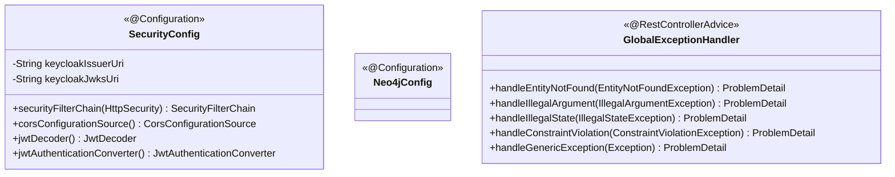

**Source file evidence:**

| Class | File Path |
|-------|-----------|
| SecurityConfig | `backend/definition-service/src/main/java/com/ems/definition/config/SecurityConfig.java` (lines 36-161) |
| Neo4jConfig | `backend/definition-service/src/main/java/com/ems/definition/config/Neo4jConfig.java` |
| GlobalExceptionHandler | `backend/definition-service/src/main/java/com/ems/definition/exception/GlobalExceptionHandler.java` (lines 23-77) |

### 3.5 Planned Domain Classes [PLANNED]

The following classes do not exist in code. They are defined in PRD Section 5.2 and Tech Spec Section 4.1.

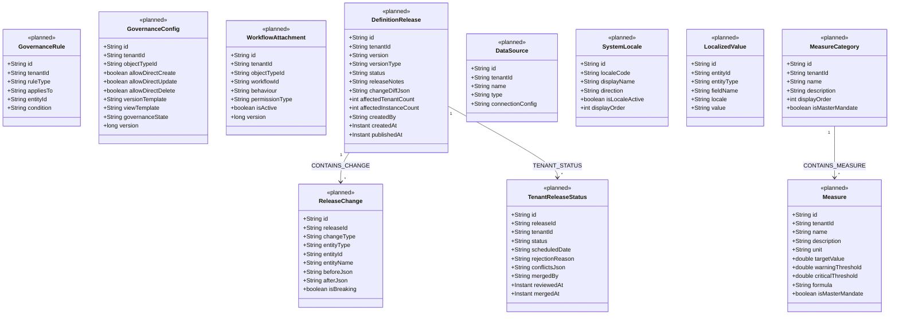

### 3.6 Planned Enhanced Relationship Properties [PLANNED]

Per Tech Spec Sections 4.1.1 and 4.1.2, the existing relationship classes will be enhanced with new properties.

**Enhanced HAS_ATTRIBUTE:**

| Property | Type | Current | New (Planned) |
|----------|------|---------|---------------|
| relId | Long | Yes | Yes |
| isRequired | boolean | Yes | Yes |
| displayOrder | int | Yes | Yes |
| attribute | AttributeTypeNode | Yes | Yes |
| lifecycleStatus | String | No | `planned`, `active`, `retired` (default `active`) per AP-5 |
| requirementLevel | String | No | `MANDATORY`, `CONDITIONAL`, `OPTIONAL` |
| lockStatus | String | No | `none`, `locked`, `partial` |
| isMasterMandate | boolean | No | Inherited from master, read-only in child tenants |
| conditionRules | String | No | JSON rules for CONDITIONAL requirement |
| isSystemDefault | boolean | No | `true` for AP-2 system defaults; cannot be unlinked |

**Enhanced CAN_CONNECT_TO:**

| Property | Type | Current | New (Planned) |
|----------|------|---------|---------------|
| relId | Long | Yes | Yes |
| relationshipKey | String | Yes | Yes |
| activeName | String | Yes | Yes |
| passiveName | String | Yes | Yes |
| cardinality | String | Yes | Yes |
| isDirected | boolean | Yes | Yes |
| targetType | ObjectTypeNode | Yes | Yes |
| lifecycleStatus | String | No | `planned`, `active`, `retired` (default `active`) per AP-5 |
| requirementLevel | String | No | `MANDATORY`, `CONDITIONAL`, `OPTIONAL` |
| importance | String | No | `high`, `medium`, `low` |
| isMasterMandate | boolean | No | Read-only in child tenants |

### 3.7 Planned Service Classes [PLANNED]

| Service | Responsibility | Controller | PRD Section |
|---------|---------------|------------|-------------|
| GovernanceService | Mandate propagation, inheritance rules, governance config, workflow attachment | GovernanceController | 6.4, 6.5, 6.8 |
| ReleaseManagementService | Release creation, publishing, impact assessment, tenant adoption/rejection/rollback | ReleaseManagementController | 6.10 |
| LocaleService | System/tenant locale config, localized value CRUD | LocaleController | 6.7 |
| MaturityService | Maturity schema config, four-axis score calculation | MaturityConfigController | 6.6 |
| MeasureCategoryService | Measure category CRUD, object type linkage | MeasureCategoryController | 6.12 |
| MeasureService | Measure CRUD within categories, threshold management | MeasureController | 6.13 |

---

## 4. Sequence Diagrams

### 4.1 Create Object Type [IMPLEMENTED]

**PRD Reference:** Section 6.1
**Evidence:** `ObjectTypeController.java` lines 65-76, `ObjectTypeServiceImpl.java` lines 71-110

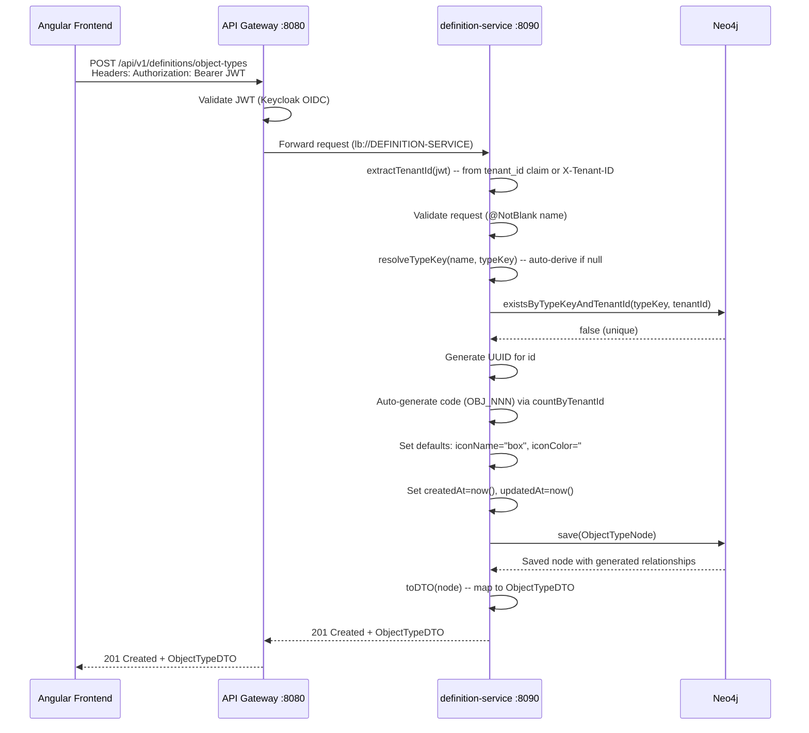

### 4.2 List Object Types with Pagination, Search, and Status Filter [IMPLEMENTED]

**PRD Reference:** Section 6.1
**Evidence:** `ObjectTypeController.java` lines 49-63, `ObjectTypeServiceImpl.java` lines 49-67

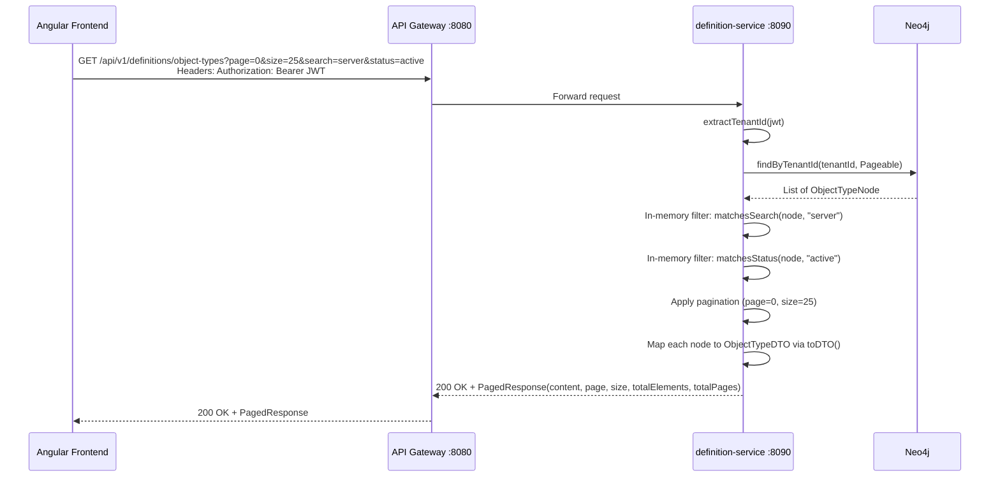

**Note:** Search and status filtering are performed in-memory after fetching from Neo4j (`ObjectTypeServiceImpl.java` lines 57-61). This is a known scalability concern -- see Section 9.

### 4.3 Update Object Type [IMPLEMENTED]

**PRD Reference:** Section 6.1, BR-006
**Evidence:** `ObjectTypeController.java` lines 91-103, `ObjectTypeServiceImpl.java` lines 122-169

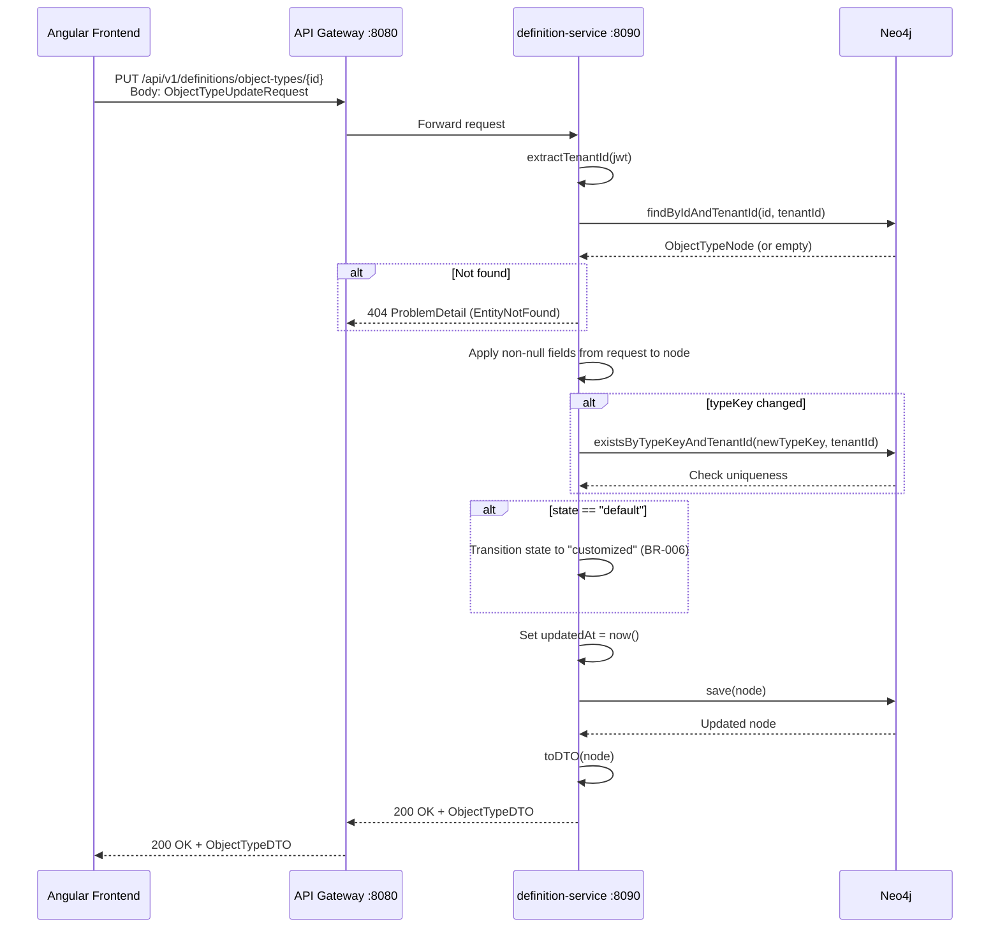

### 4.4 Delete Object Type [IMPLEMENTED]

**PRD Reference:** Section 6.1, BR-009
**Evidence:** `ObjectTypeController.java` lines 105-116, `ObjectTypeServiceImpl.java` lines 172-180

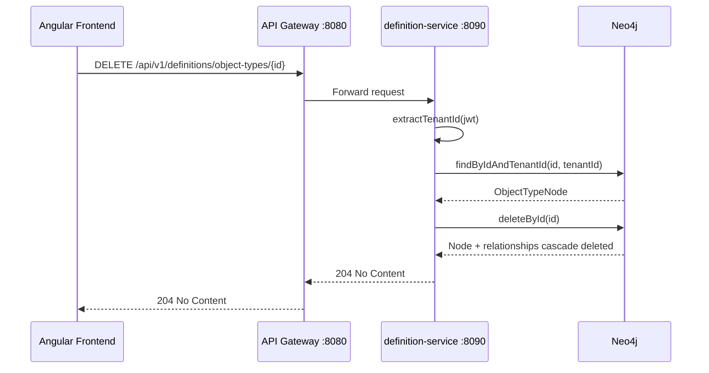

### 4.5 Duplicate Object Type [IMPLEMENTED]

**PRD Reference:** Section 6.1, BR-008
**Evidence:** `ObjectTypeController.java` lines 118-129, `ObjectTypeServiceImpl.java` lines 334-373

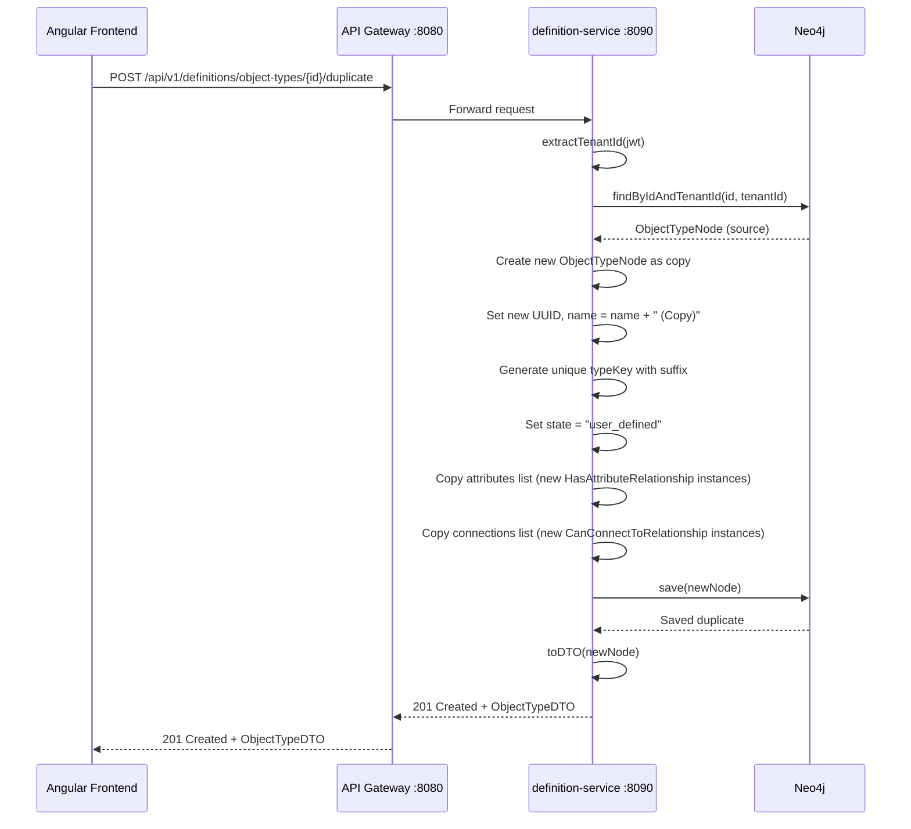

### 4.6 Restore Object Type to Default [IMPLEMENTED]

**PRD Reference:** Section 6.1, BR-007
**Evidence:** `ObjectTypeController.java` lines 131-142, `ObjectTypeServiceImpl.java` lines 376-394

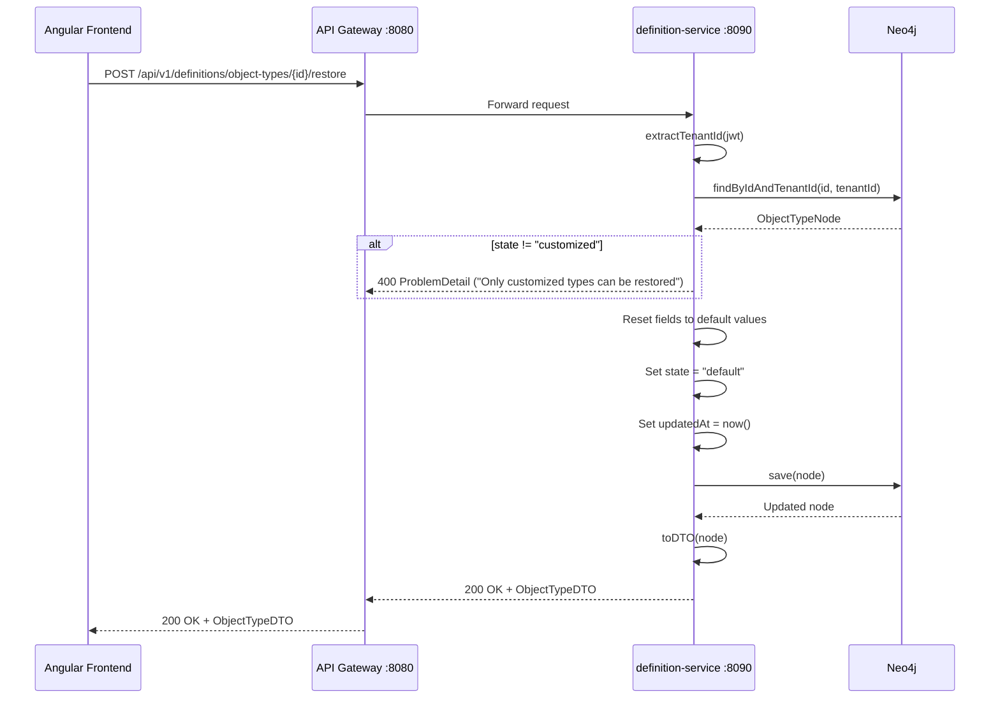

### 4.7 Add Attribute to Object Type [IMPLEMENTED]

**PRD Reference:** Section 6.2, BR-016
**Evidence:** `ObjectTypeController.java` lines 161-173, `ObjectTypeServiceImpl.java` lines 184-217

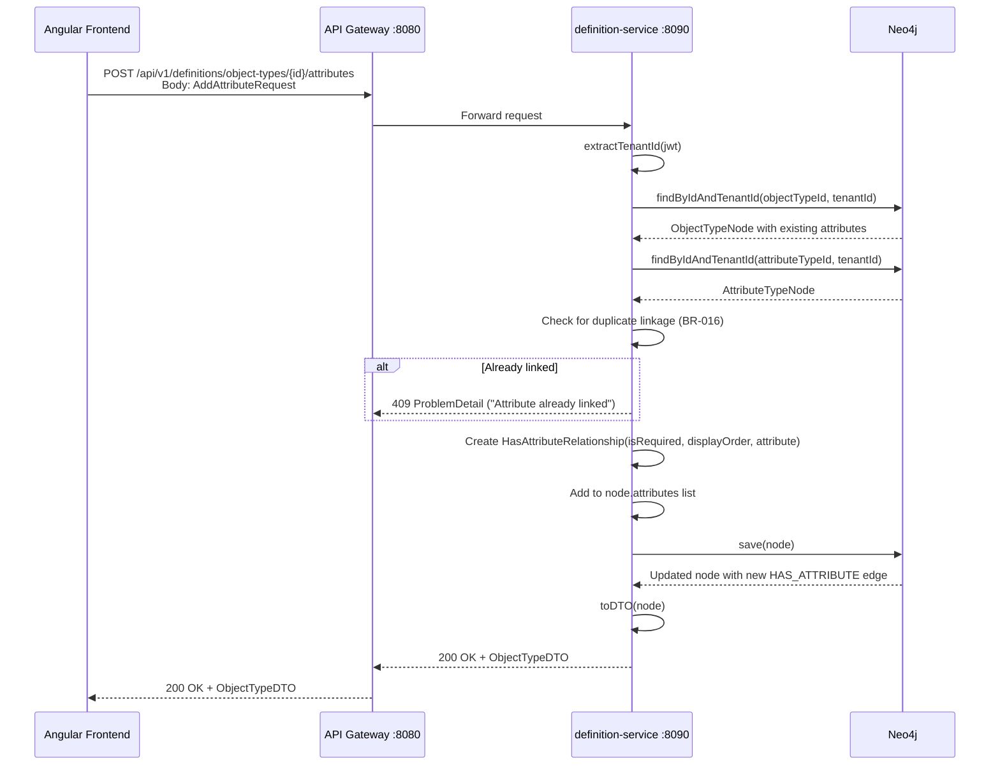

### 4.8 Remove Attribute from Object Type [IMPLEMENTED]

**PRD Reference:** Section 6.2
**Evidence:** `ObjectTypeController.java` lines 175-187, `ObjectTypeServiceImpl.java` lines 220-240

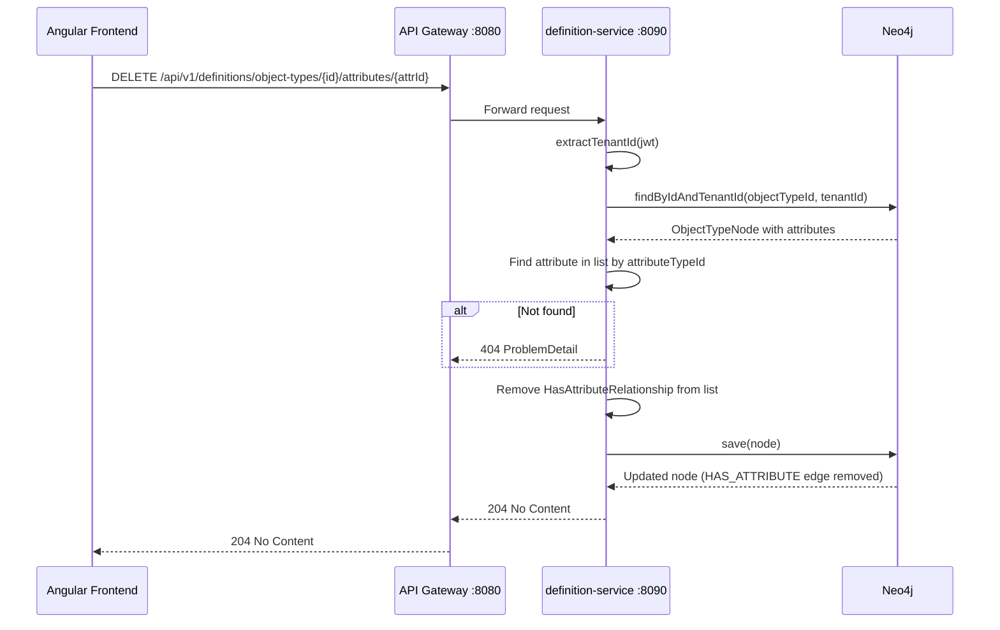

### 4.9 Add Connection to Object Type [IMPLEMENTED]

**PRD Reference:** Section 6.3, BR-027
**Evidence:** `ObjectTypeController.java` lines 206-218, `ObjectTypeServiceImpl.java` lines 244-272

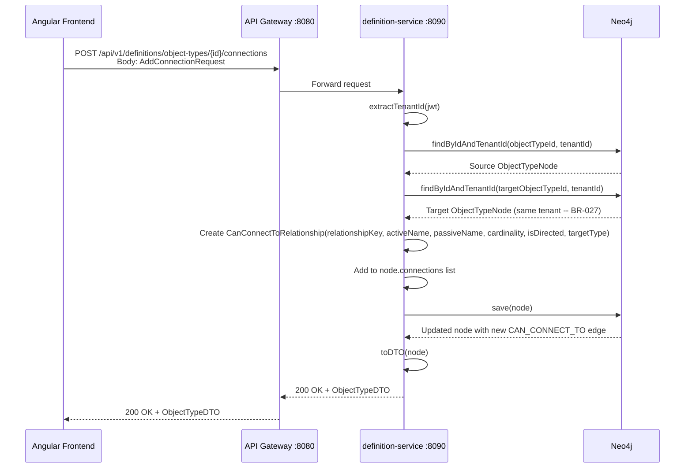

### 4.10 Remove Connection from Object Type [IMPLEMENTED]

**Evidence:** `ObjectTypeController.java` lines 220-232, `ObjectTypeServiceImpl.java` lines 275-295

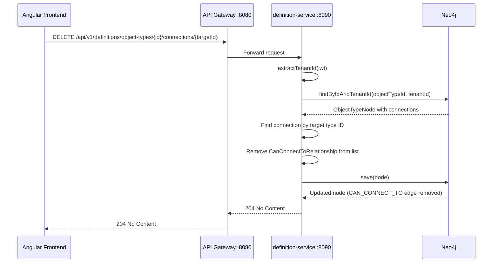

### 4.11 Create Object Type with System Default Attributes (AP-2) [PLANNED]

**PRD Reference:** Section AP-2
**Tech Spec Reference:** Section 4.1.1

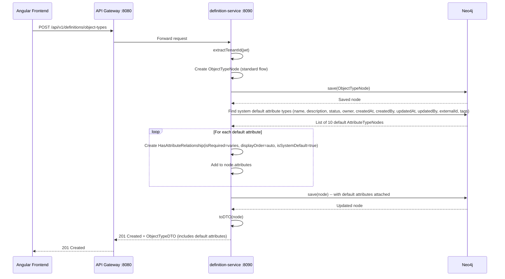

### 4.12 Lifecycle Status Transition (AP-5) [PLANNED]

**PRD Reference:** Section AP-5 (ObjectType Status Lifecycle)

```mermaid
sequenceDiagram
    participant FE as Angular Frontend
    participant GW as API Gateway :8080
    participant DS as definition-service :8090
    participant MSG as Message Registry (PostgreSQL)
    participant NEO as Neo4j

    FE->>GW: PUT /api/v1/definitions/object-types/{id}<br/>Body: { "status": "retired" }
    GW->>DS: Forward request
    DS->>DS: extractTenantId(jwt)
    DS->>NEO: findByIdAndTenantId(id, tenantId)
    NEO-->>DS: ObjectTypeNode (status=active)
    DS->>DS: Validate transition: active -> retired (allowed per AP-5 state machine)
    DS->>DS: Check preconditions: no active instances or explicit force
    alt Has active instances
        DS->>MSG: Lookup DEF-E-010 (Cannot Retire With Instances)
        MSG-->>DS: Localized error message
        DS-->>GW: 409 ProblemDetail (DEF-E-010)
        GW-->>FE: 409 Conflict
    end
    DS->>MSG: Lookup DEF-C-004 (Confirm Retire)
    MSG-->>DS: Confirmation message text
    Note right of DS: Frontend already confirmed via dialog<br/>before sending this request
    DS->>DS: Set status = "retired", updatedAt = now()
    DS->>NEO: save(node)
    NEO-->>DS: Updated node
    DS->>DS: toDTO(node)
    DS-->>GW: 200 OK + ObjectTypeDTO
    GW-->>FE: 200 OK
```

### 4.13 Cross-Tenant Governance: Master Mandate Propagation [PLANNED]

**PRD Reference:** Section 6.4, 6.5
**Tech Spec Reference:** Section 4.2

```mermaid
sequenceDiagram
    participant Admin as Master Tenant Admin
    participant DS as definition-service :8090
    participant NEO as Neo4j
    participant KFK as Kafka
    participant NS as notification-service :8086

    Admin->>DS: PUT /api/v1/definitions/object-types/{id}<br/>Body: { "isMasterMandate": true }
    DS->>DS: Verify caller is master tenant SUPER_ADMIN
    DS->>NEO: findByIdAndTenantId(id, masterTenantId)
    NEO-->>DS: ObjectTypeNode
    DS->>DS: Set isMasterMandate = true
    DS->>NEO: Propagate mandate to all HAS_ATTRIBUTE edges
    DS->>NEO: Propagate mandate to all CAN_CONNECT_TO edges
    DS->>NEO: Propagate mandate to all IS_SUBTYPE_OF subtypes (recursive)
    NEO-->>DS: Propagation complete
    DS->>NEO: save(node)
    NEO-->>DS: Updated
    DS->>KFK: Publish MANDATE_PROPAGATED event to definition.changes
    KFK-->>NS: Consume event
    NS->>NS: Send alert to all child tenant admins
    DS-->>Admin: 200 OK + ObjectTypeDTO
```

### 4.14 Definition Release: Create, Publish, Tenant Adoption [PLANNED]

**PRD Reference:** Section 6.10
**Tech Spec Reference:** Section 4.7

```mermaid
sequenceDiagram
    participant Arch as Architect (Master Tenant)
    participant DS as definition-service :8090
    participant NEO as Neo4j
    participant KFK as Kafka
    participant TAdmin as Tenant Admin (Child)
    participant NS as notification-service

    Note over Arch,DS: Phase 1: Create Release
    Arch->>DS: POST /api/v1/definitions/releases
    DS->>NEO: Detect pending changes since last release
    DS->>DS: Generate release notes (added/removed/modified)
    DS->>DS: Classify changes as breaking or non-breaking
    DS->>NEO: Create DefinitionRelease (status=draft) + ReleaseChange nodes
    NEO-->>DS: Saved
    DS-->>Arch: 201 Created + Release details

    Note over Arch,DS: Phase 2: Publish Release
    Arch->>DS: POST /api/v1/definitions/releases/{releaseId}/publish
    DS->>NEO: Set DefinitionRelease.status = published, publishedAt = now()
    DS->>NEO: Create TenantReleaseStatus (status=pending) for each child tenant
    DS->>KFK: Publish RELEASE_PUBLISHED event
    KFK-->>NS: Consume event
    NS->>TAdmin: Send release notification

    Note over TAdmin,DS: Phase 3: Tenant Adoption
    TAdmin->>DS: GET /api/v1/definitions/releases/{releaseId}/impact
    DS->>NEO: Calculate affected instances, local customization conflicts
    DS-->>TAdmin: Impact assessment (affected count, conflicts)
    TAdmin->>DS: POST /api/v1/definitions/releases/{releaseId}/tenants/{tenantId}/accept
    DS->>NEO: Merge master changes into child tenant definitions
    DS->>NEO: Set TenantReleaseStatus.status = merged, mergedAt = now()
    DS-->>TAdmin: 200 OK + merge summary
```

### 4.15 Locale Management: Add Locale, Set Language-Dependent Values [PLANNED]

**PRD Reference:** Section 6.7
**Tech Spec Reference:** Section 4.3

```mermaid
sequenceDiagram
    participant Admin as Tenant Admin
    participant DS as definition-service :8090
    participant NEO as Neo4j

    Note over Admin,DS: Phase 1: Configure Active Locales
    Admin->>DS: PUT /api/v1/definitions/locales/tenant<br/>Body: [{ "localeCode": "en", "isDefault": true }, { "localeCode": "ar", "isLocaleActive": true }]
    DS->>NEO: Upsert TenantLocaleConfig nodes
    NEO-->>DS: Saved
    DS-->>Admin: 200 OK

    Note over Admin,DS: Phase 2: Set Localized Values
    Admin->>DS: PUT /api/v1/definitions/localizations/AttributeType/{attrId}<br/>Body: { "translations": [{ "fieldName": "name", "locale": "ar", "value": "..."  }] }
    DS->>NEO: Upsert LocalizedValue nodes with HAS_LOCALIZATION relationship
    NEO-->>DS: Saved
    DS-->>Admin: 200 OK
```

### 4.16 Maturity Score Calculation (Four-Axis Model) [PLANNED]

**PRD Reference:** Section 6.6.1
**Tech Spec Reference:** Section 4.4.3

```mermaid
sequenceDiagram
    participant FE as Angular Frontend
    participant DS as definition-service :8090
    participant NEO as Neo4j

    FE->>DS: GET /api/v1/instances/{instanceId}/maturity-score
    DS->>NEO: Load ObjectType maturity schema (axisWeights, freshnessThresholdDays)
    NEO-->>DS: Maturity config JSON
    DS->>NEO: Load all active HAS_ATTRIBUTE with requirementLevel
    NEO-->>DS: Attribute requirement levels
    DS->>NEO: Load all active CAN_CONNECT_TO with requirementLevel
    NEO-->>DS: Connection requirement levels
    DS->>DS: Calculate Completeness axis (filledAttrs / totalAttrs per level)
    DS->>DS: Calculate Relationship axis (filledRels / totalRels per level)
    DS->>DS: Calculate Compliance axis (mandateConformance + validationPassRate + duplicateFree)
    DS->>DS: Calculate Freshness axis (daysSinceUpdate / threshold)
    DS->>DS: Compute composite: w1*completeness + w2*compliance + w3*relationship + w4*freshness
    DS->>DS: Determine level: RED (<50) / AMBER (50-80) / GREEN (>80)
    DS-->>FE: 200 OK + MaturityScoreResponse (composite + per-axis breakdown)
```

### 4.17 AI Duplication Detection Flow [PLANNED]

**PRD Reference:** Section 6.11
**Tech Spec Reference:** Section 4.8

```mermaid
sequenceDiagram
    participant FE as Angular Frontend
    participant DS as definition-service :8090
    participant AIS as ai-service :8088
    participant NEO as Neo4j

    FE->>DS: POST /api/v1/definitions/object-types<br/>Body: { "name": "Web Server" }
    DS->>DS: Before save, check for potential duplicates
    DS->>AIS: POST /api/v1/ai/similarity-check<br/>Body: { "name": "Web Server", "tenantId": "..." }
    AIS->>AIS: Generate embedding for "Web Server"
    AIS->>AIS: Compare against existing object type embeddings using pgvector
    AIS-->>DS: { "similarTypes": [{ "id": "...", "name": "Server", "similarity": 0.92 }] }
    alt Similarity > threshold (0.85)
        DS-->>FE: 200 OK + ObjectTypeDTO with warnings: [{ "code": "DEF-W-DUP", "similar": [...] }]
    else No duplicates
        DS->>NEO: save(ObjectTypeNode)
        DS-->>FE: 201 Created + ObjectTypeDTO
    end
```

---

## 5. State Machine Diagrams

### 5.1 ObjectType Status Lifecycle [IMPLEMENTED: values exist; PLANNED: transition validation with message codes]

**PRD Reference:** Section AP-5 (ObjectType Status Lifecycle)

```mermaid
stateDiagram-v2
    [*] --> active : Create (default status)
    [*] --> planned : Create with status=planned

    planned --> active : Activate [DEF-C-001]
    active --> hold : Put on Hold [DEF-C-002]
    hold --> active : Resume [DEF-C-003]
    active --> retired : Retire [DEF-C-004]
    hold --> retired : Retire [DEF-C-004]
    retired --> active : Reactivate [DEF-C-005]
```

**Transition validation rules (PRD Section AP-5):**

| Transition | Precondition | Error on Violation |
|------------|-------------|-------------------|
| Any to Retired | No active instances OR explicit force | DEF-E-010 |
| Retired to Active | No naming conflict with existing active type | DEF-E-011 |

### 5.2 ObjectType State (Origin) Lifecycle [IMPLEMENTED]

**PRD Reference:** Section AP-5 (ObjectType State Lifecycle)
**Evidence:** `ObjectTypeServiceImpl.java` lines 128-129 (default->customized), lines 382-384 (customized->default)

```mermaid
stateDiagram-v2
    [*] --> default : Seeded by system
    [*] --> user_defined : Created by user

    default --> customized : Edit any field [DEF-C-006]
    customized --> default : Restore to default [DEF-C-007]
    user_defined --> user_defined : Edit (stays user_defined)
    default --> user_defined : Duplicate [DEF-C-009]
    customized --> user_defined : Duplicate [DEF-C-009]
    user_defined --> [*] : Delete [DEF-C-008]
    customized --> [*] : Delete [DEF-C-008]
```

### 5.3 Attribute Lifecycle (on HAS_ATTRIBUTE) [PLANNED]

**PRD Reference:** Section AP-5 (Attribute Lifecycle), Section 6.2.1

```mermaid
stateDiagram-v2
    [*] --> planned : Link with lifecycleStatus=planned
    [*] --> active : Link with lifecycleStatus=active (default)

    planned --> active : Activate [DEF-C-010]
    active --> retired : Retire [DEF-C-011]
    retired --> active : Reactivate [DEF-C-012]
    active --> [*] : Unlink [DEF-C-013]
    planned --> [*] : Unlink (never activated)
```

**Behavior matrix per lifecycle status:**

| Status | Visible in Definition UI | Visible in Instance Forms | Contributes to Maturity | Existing Data |
|--------|--------------------------|---------------------------|------------------------|---------------|
| planned | Yes | No | No | N/A |
| active | Yes | Yes | Yes | Editable |
| retired | Yes (greyed) | No (new instances) | No | Read-only |

### 5.4 Connection Lifecycle (on CAN_CONNECT_TO) [PLANNED]

**PRD Reference:** Section AP-5 (Connection Lifecycle), BR-024a

```mermaid
stateDiagram-v2
    [*] --> planned : Define with lifecycleStatus=planned
    [*] --> active : Define with lifecycleStatus=active (default)

    planned --> active : Activate [DEF-C-020]
    active --> retired : Retire [DEF-C-021]
    retired --> active : Reactivate [DEF-C-022]
    active --> [*] : Remove [DEF-C-023]
    planned --> [*] : Remove (never activated)
```

### 5.5 Definition Release Lifecycle [PLANNED]

**PRD Reference:** Section 6.10
**Tech Spec Reference:** Section 4.7

```mermaid
stateDiagram-v2
    [*] --> draft : Schema change detected
    draft --> published : Architect publishes [DEF-C-030]
    published --> superseded : Newer release published
    published --> [*] : All tenants merged or rejected
```

### 5.6 Tenant Release Adoption Lifecycle [PLANNED]

**PRD Reference:** Section 6.10
**Tech Spec Reference:** Section 4.7

```mermaid
stateDiagram-v2
    [*] --> pending : Release published to tenant
    pending --> reviewing : Tenant Admin opens impact assessment
    reviewing --> accepted : Tenant Admin approves [DEF-C-032]
    reviewing --> rejected : Tenant Admin rejects (with reason)
    reviewing --> scheduled : Tenant Admin schedules future merge
    accepted --> merged : System merges changes
    scheduled --> merged : Scheduled date reached, auto-merge
    merged --> rollback : Tenant Admin rolls back [DEF-C-031]
    rollback --> pending : Back to pending (re-review required)
    rejected --> [*] : Feedback sent to master
```

### 5.7 Governance State Lifecycle [PLANNED]

**Tech Spec Reference:** Section 4.9

```mermaid
stateDiagram-v2
    [*] --> Draft : GovernanceConfig created
    Draft --> PendingReview : Submit for review
    PendingReview --> Approved : Reviewer approves
    PendingReview --> Draft : Reviewer rejects
    Approved --> Published : Publish to child tenants
    Published --> PendingRetirement : Initiate retirement
    PendingRetirement --> Retired : Confirm retirement
    Retired --> [*]
```

---

## 6. Data Flow Diagrams

### 6.1 Request Flow (As-Built) [IMPLEMENTED]

```mermaid
graph LR
    Browser["Browser (Angular)"] -->|"HTTPS"| Gateway["API Gateway :8080"]
    Gateway -->|"JWT Validation"| KC["Keycloak"]
    Gateway -->|"lb://DEFINITION-SERVICE via Eureka"| DS["definition-service :8090"]
    DS -->|"Bolt protocol"| NEO["Neo4j :7687"]
    DS -->|"HTTP register"| EUR["Eureka :8761"]
```

**Evidence:**
- Gateway route: `RouteConfig.java` lines 107-111
- Eureka registration: `application.yml` lines 19-25
- Neo4j URI: `application.yml` -- `NEO4J_URI`
- JWT validation: `SecurityConfig.java` lines 55-62

### 6.2 Event Flow (Planned) [PLANNED]

```mermaid
graph LR
    DS["definition-service :8090"] -->|"Kafka Producer: definition.changes"| KFK["Kafka (Confluent 7.5)"]
    KFK -->|"Consumer"| NS["notification-service :8086"]
    KFK -->|"Consumer"| AUD["audit-service :8087"]
    KFK -->|"Consumer"| AIS["ai-service :8088"]
```

**Note:** No KafkaTemplate exists in the definition-service codebase today. This is a known discrepancy documented in CLAUDE.md under Known Discrepancies.

### 6.3 Cache Flow (Planned) [PLANNED]

```mermaid
graph LR
    DS["definition-service :8090"] -->|"Read-through cache"| VAL["Valkey :6379"]
    VAL -->|"Cache miss"| NEO["Neo4j :7687"]
```

**Planned cache strategy:**

| Cache Key Pattern | TTL | Purpose |
|-------------------|-----|---------|
| `def:ot:list:{tenantId}:{page}:{size}` | 5 min | Paginated object type lists |
| `def:ot:{tenantId}:{id}` | 10 min | Individual object type by ID |
| `def:at:list:{tenantId}` | 10 min | Attribute type list per tenant |
| `def:locale:{tenantId}` | 30 min | Tenant locale configuration |

**Invalidation:** Cache entries invalidated on any write operation (create, update, delete) for the corresponding tenant.

### 6.4 AI Integration Flow (Planned) [PLANNED]

```mermaid
graph LR
    DS["definition-service :8090"] -->|"REST: POST /api/v1/ai/similarity-check"| AIS["ai-service :8088"]
    AIS -->|"pgvector similarity search"| PG["PostgreSQL + pgvector"]
    AIS -->|"Embedding generation"| LLM["LLM API"]
    AIS -->|"Response: similar types"| DS
```

---

## 7. Error Handling Design

### 7.1 GlobalExceptionHandler Pattern [IMPLEMENTED]

**Evidence:** `backend/definition-service/src/main/java/com/ems/definition/exception/GlobalExceptionHandler.java`, lines 23-77

The service uses a `@RestControllerAdvice` class that catches exceptions and returns RFC 7807 ProblemDetail responses.

| Exception Type | HTTP Status | ProblemDetail Title | Evidence |
|----------------|-------------|---------------------|----------|
| EntityNotFoundException | 404 | "Not Found" | GEH line 28 |
| IllegalArgumentException | 400 | "Bad Request" | GEH line 38 |
| IllegalStateException | 409 | "Conflict" | GEH line 48 |
| ConstraintViolationException | 400 | "Validation Error" | GEH line 58 |
| Exception (catch-all) | 500 | "Internal Server Error" | GEH line 68 |

### 7.2 RFC 7807 ProblemDetail Response Format [IMPLEMENTED]

All error responses follow the RFC 7807 structure provided by Spring Boot 3.4.x's built-in `ProblemDetail` class:

```json
{
  "type": "about:blank",
  "title": "Conflict",
  "status": 409,
  "detail": "An object type with typeKey 'server' already exists in tenant 'tenant-uuid'",
  "instance": "/api/v1/definitions/object-types"
}
```

### 7.3 Message Registry Integration (AP-4) [PLANNED]

When the centralized message registry is implemented (AP-4), error responses will be enhanced with message codes:

```json
{
  "type": "https://emsist.com/problems/duplicate-typekey",
  "title": "Duplicate TypeKey",
  "status": 409,
  "detail": "An object type with typeKey 'server' already exists in tenant 'tenant-uuid'",
  "instance": "/api/v1/definitions/object-types",
  "messageCode": "DEF-E-002",
  "severity": "HIGH",
  "category": "OBJECT_TYPE"
}
```

### 7.4 Error Code Catalog Reference

The full error code catalog is defined in PRD Section "Definition Management Message Registry". Summary by category:

| Category | Error Code Range | Count |
|----------|-----------------|-------|
| OBJECT_TYPE | DEF-E-001 to DEF-E-019 | 19 |
| ATTRIBUTE | DEF-E-020 to DEF-E-029 | 7 |
| CONNECTION | DEF-E-030 to DEF-E-035 | 6 |
| RELEASE | DEF-E-040 to DEF-E-043 | 4 |
| SYSTEM | DEF-E-050 to DEF-E-052 | 3 |
| GOVERNANCE | DEF-E-060 to DEF-E-062 | 3 |
| MATURITY | DEF-E-070 to DEF-E-071 | 2 |
| MEASURE | DEF-E-080 to DEF-E-084 | 5 |
| INHERITANCE | DEF-E-090 to DEF-E-092 | 3 |
| LOCALE | DEF-E-100 to DEF-E-104 | 5 |
| IMPORT/EXPORT | DEF-E-110 to DEF-E-114 | 5 |
| DATA SOURCE | DEF-E-120 to DEF-E-123 | 4 |
| PROPAGATION | DEF-E-130 to DEF-E-134 | 5 |
| BULK | DEF-E-150 to DEF-E-151 | 2 |
| SEARCH | DEF-E-160 to DEF-E-162 | 3 |
| CONFIRMATION | DEF-C-001 to DEF-C-032 | 23 |
| WARNING | DEF-W-001 to DEF-W-006 | 6 |
| SUCCESS | DEF-S-001 to DEF-S-032 | 15 |

---

## 8. Security Design

### 8.1 Authentication Flow [IMPLEMENTED]

**Evidence:** `SecurityConfig.java`, lines 55-62

```mermaid
sequenceDiagram
    participant Browser
    participant GW as API Gateway
    participant KC as Keycloak
    participant DS as definition-service

    Browser->>KC: Login (OIDC Authorization Code Flow)
    KC-->>Browser: Access Token (JWT)
    Browser->>GW: API Request (Authorization: Bearer JWT)
    GW->>KC: Validate JWT (JWKS endpoint)
    KC-->>GW: Token valid
    GW->>DS: Forward request with JWT
    DS->>DS: Validate JWT locally (JWK Set)
    DS->>DS: Extract roles from JWT realm_access.roles
    DS->>DS: Check hasRole("SUPER_ADMIN")
```

### 8.2 Authorization Model [IMPLEMENTED / PLANNED]

**Current (IMPLEMENTED):**

| Path Pattern | Required Role | Evidence |
|-------------|---------------|----------|
| `/actuator/**` | None (permitAll) | `SecurityConfig.java` line 47 |
| `/swagger-ui/**`, `/api-docs/**` | None (permitAll) | `SecurityConfig.java` line 47 |
| `/api/v1/definitions/**` | ROLE_SUPER_ADMIN | `SecurityConfig.java` line 48 |
| Everything else | Authenticated | `SecurityConfig.java` line 49 |

**Planned role expansion [PLANNED]:**

| Role | Permissions | PRD Reference |
|------|------------|---------------|
| SUPER_ADMIN | Full CRUD on all definitions, cross-tenant visibility, bypass licensing | Section 4 (Persona 1: Sam) |
| ARCHITECT | Full CRUD on definitions within tenant, trigger releases, review changes | Section 4 (Persona 2: Nicole) |
| TENANT_ADMIN | Read definitions, accept/reject releases, add local customizations on non-mandated items | Section 4 (Persona 3: Fiona) |

### 8.3 Tenant Isolation via JWT Claims [IMPLEMENTED]

**Evidence:** `ObjectTypeController.java`, lines 245-277

Tenant ID is extracted via a priority chain:

1. **Primary:** `tenant_id` claim from JWT payload (supports both String and List<String>)
2. **Fallback:** `X-Tenant-ID` HTTP header forwarded by API Gateway
3. **Failure:** Returns HTTP 400 with error message if neither source provides a tenant ID

Every repository query includes `tenantId` as a mandatory filter parameter, ensuring row-level tenant isolation at the Neo4j query level.

### 8.4 CORS Configuration [IMPLEMENTED]

**Evidence:** `SecurityConfig.java`, lines 142-160

| Setting | Value |
|---------|-------|
| Allowed Origins | `http://localhost:*`, `http://127.0.0.1:*`, `https://*.trycloudflare.com`, `https://*.cloudflare.com` |
| Allowed Methods | GET, POST, PUT, DELETE, OPTIONS, PATCH |
| Credentials | Allowed |
| Exposed Headers | Authorization, X-Tenant-ID |

---

## 9. Performance Considerations

### 9.1 Current: In-Memory Filtering (Scalability Concern) [IMPLEMENTED]

**Evidence:** `ObjectTypeServiceImpl.java`, lines 57-61

The current implementation fetches ALL object types for a tenant from Neo4j and then applies search and status filtering in Java memory. This approach works for moderate datasets but will not scale beyond approximately 500-1000 object types per tenant.

**Scalability risk:**

| Dataset Size | In-Memory Impact | Recommendation |
|-------------|-----------------|----------------|
| < 100 types | Acceptable | Current approach is fine |
| 100-500 types | Noticeable latency | Monitor response times |
| 500+ types | Unacceptable | Migrate to Cypher-level filtering |

### 9.2 Planned: Neo4j Cypher-Level Pagination and Filtering [PLANNED]

Replace in-memory filtering with parameterized Cypher queries:

```cypher
MATCH (ot:ObjectType {tenantId: $tenantId})
WHERE ($search IS NULL OR toLower(ot.name) CONTAINS toLower($search) OR toLower(ot.typeKey) CONTAINS toLower($search))
AND ($status IS NULL OR ot.status = $status)
WITH ot ORDER BY ot.name
SKIP $skip LIMIT $limit
OPTIONAL MATCH (ot)-[r:HAS_ATTRIBUTE]->(at:AttributeType)
OPTIONAL MATCH (ot)-[c:CAN_CONNECT_TO]->(target:ObjectType)
RETURN ot, collect(DISTINCT r), collect(DISTINCT at), collect(DISTINCT c), collect(DISTINCT target)
```

### 9.3 Planned: Valkey Caching Strategy [PLANNED]

See Section 6.3 for cache key patterns and TTL values.

### 9.4 Connection Pooling for Neo4j Bolt Driver [IMPLEMENTED]

The Neo4j Bolt driver uses connection pooling by default via Spring Data Neo4j auto-configuration. Connection pool settings can be tuned via `application.yml`:

```yaml
spring:
  neo4j:
    pool:
      max-connection-pool-size: 50
      connection-acquisition-timeout: 60s
      max-connection-lifetime: 1h
```

---

## 10. Testing Strategy Reference

### 10.1 Unit Test Approach

| Technology | Purpose | Evidence |
|-----------|---------|----------|
| JUnit 5 | Test framework | `pom.xml` dependency |
| Mockito | Mocking repositories | Standard Spring Boot test stack |
| AssertJ | Fluent assertions | Standard Spring Boot test stack |

**Unit test targets:**
- `ObjectTypeServiceImpl` -- all 12 public methods
- DTO mapping logic (toDTO, toAttributeTypeDTO)
- Private helpers (resolveTypeKey, matchesSearch, matchesStatus)

### 10.2 Integration Test Approach

| Technology | Purpose |
|-----------|---------|
| Testcontainers (Neo4j) | Spin up real Neo4j instance for repository tests |
| Spring Boot Test | Full context loading for controller tests |
| MockMvc | HTTP-level endpoint testing |

**Integration test targets:**
- ObjectTypeRepository custom queries with real Neo4j
- ObjectTypeController endpoints with JWT mock
- Tenant isolation verification (query with wrong tenantId returns empty)

### 10.3 E2E Test Approach

| Technology | Purpose |
|-----------|---------|
| Playwright | Browser-based UI testing |
| PrimeNG component interaction | Table/card view toggle, wizard steps, dialog flows |

**E2E test targets:**
- Create object type via wizard (4 steps)
- List/search/filter object types
- Edit object type in detail panel
- Duplicate and restore operations
- Add/remove attributes and connections

---

## 11. Planned Service Layer Method Signatures [PLANNED]

All classes in this section are design specifications. No code exists today.

### 11.1 GovernanceService

```mermaid
classDiagram
    class GovernanceService {
        <<interface>>
        +listMandates(String tenantId, int page, int size) PagedResponse~MandateDTO~
        +createMandate(String tenantId, CreateMandateRequest req) MandateDTO
        +updateMandate(String tenantId, String mandateId, UpdateMandateRequest req) MandateDTO
        +removeMandate(String tenantId, String mandateId) void
        +propagateToChildTenants(String tenantId, String objectTypeId) PropagationResultDTO
        +getPropagationStatus(String tenantId) PropagationStatusDTO
        +getPropagationHistory(String tenantId, int page, int size) PagedResponse~PropagationHistoryDTO~
        +getInheritanceChain(String tenantId, String objectTypeId) InheritanceChainDTO
        +getGovernanceConfig(String tenantId, String objectTypeId) GovernanceConfigDTO
        +updateGovernanceConfig(String tenantId, String objectTypeId, UpdateGovernanceConfigRequest req) GovernanceConfigDTO
        +transitionGovernanceState(String tenantId, String objectTypeId, GovernanceStateTransitionRequest req) GovernanceConfigDTO
        +getGovernanceHistory(String tenantId, String objectTypeId) List~GovernanceHistoryEntry~
        +listWorkflows(String tenantId, String objectTypeId) List~WorkflowAttachmentDTO~
        +attachWorkflow(String tenantId, String objectTypeId, AttachWorkflowRequest req) WorkflowAttachmentDTO
        +updateWorkflowAttachment(String tenantId, String objectTypeId, String waId, UpdateWorkflowRequest req) WorkflowAttachmentDTO
        +detachWorkflow(String tenantId, String objectTypeId, String waId) void
    }
```

**Transaction boundaries:** All write methods annotated `@Transactional`. Propagation uses `Propagation.REQUIRES_NEW` to isolate per-tenant failures.

**Validation rules:**
- `createMandate`: Caller must be master tenant SUPER_ADMIN; objectTypeId must exist
- `propagateToChildTenants`: Acquires distributed lock via Valkey `SETNX def:lock:propagate:{objectTypeId}` (TTL 5min)
- `transitionGovernanceState`: Validates against state machine (Section 5.7); role check per transition matrix

### 11.2 ReleaseManagementService

```mermaid
classDiagram
    class ReleaseManagementService {
        <<interface>>
        +listReleases(String tenantId, int page, int size, String statusFilter) PagedResponse~ReleaseDTO~
        +createRelease(String tenantId, CreateReleaseRequest req) ReleaseDTO
        +getReleaseDetails(String tenantId, String releaseId) ReleaseDTO
        +publishRelease(String tenantId, String releaseId) ReleaseDTO
        +getImpactAssessment(String tenantId, String releaseId) ImpactAssessmentDTO
        +listTenantStatus(String tenantId, String releaseId) List~TenantReleaseStatusDTO~
        +acceptRelease(String tenantId, String releaseId, String childTenantId, boolean resolveConflicts) MergeReportDTO
        +rejectRelease(String tenantId, String releaseId, String childTenantId, RejectReleaseRequest req) void
        +scheduleRelease(String tenantId, String releaseId, String childTenantId, ScheduleReleaseRequest req) void
        +rollbackRelease(String tenantId, String releaseId, String childTenantId) void
        +previewConflicts(String tenantId, String releaseId, String childTenantId) ConflictPreviewDTO
        +listPendingChanges(String tenantId) PendingChangesDTO
    }
```

**Transaction boundaries:** `publishRelease` and `acceptRelease` use `@Transactional` with `REQUIRES_NEW` per child tenant merge. Kafka events published after commit via `@TransactionalEventListener(phase = AFTER_COMMIT)`.

**Cache strategy:** Release list cached at `def:rel:list:{tenantId}` (TTL 5min), invalidated on create/publish.

### 11.3 LocaleService

```mermaid
classDiagram
    class LocaleService {
        <<interface>>
        +listSystemLocales() List~SystemLocaleDTO~
        +listTenantLocales(String tenantId) List~TenantLocaleDTO~
        +updateTenantLocales(String tenantId, UpdateTenantLocalesRequest req) List~TenantLocaleDTO~
        +getTranslations(String tenantId, String entityType, String entityId) TranslationSetDTO
        +batchUpdateTranslations(String tenantId, String entityType, String entityId, BatchTranslationRequest req) TranslationSetDTO
    }
```

**Validation:** `updateTenantLocales` enforces exactly one `isDefault=true`; locale codes validated against BCP 47. XSS sanitization applied to all translation values.

### 11.4 MaturityService

```mermaid
classDiagram
    class MaturityService {
        <<interface>>
        +getMaturityConfig(String tenantId, String objectTypeId) MaturityConfigDTO
        +updateMaturityConfig(String tenantId, String objectTypeId, UpdateMaturityConfigRequest req) MaturityConfigDTO
        +getMaturitySummary(String tenantId, String objectTypeId) MaturitySummaryDTO
        +calculateInstanceScore(String tenantId, String objectTypeId, String instanceId) MaturityScoreDTO
    }
```

**Validation:** Axis weights must sum to 1.0 (tolerance 0.001). Thresholds must be monotonically increasing (red < amber < green).

### 11.5 DataSourceService

```mermaid
classDiagram
    class DataSourceService {
        <<interface>>
        +listDataSources(String tenantId, String objectTypeId) List~DataSourceDTO~
        +addDataSource(String tenantId, String objectTypeId, AddDataSourceRequest req) DataSourceDTO
        +updateDataSource(String tenantId, String objectTypeId, String dsId, UpdateDataSourceRequest req) DataSourceDTO
        +removeDataSource(String tenantId, String objectTypeId, String dsId) void
    }
```

**Security:** `connectionConfig` JSON encrypted at rest using AES-256-GCM via `@AttributeEncryptor` [PLANNED]. Credentials never returned in GET responses; masked as `"***"`.

### 11.6 MeasureService and MeasureCategoryService

```mermaid
classDiagram
    class MeasureCategoryService {
        <<interface>>
        +listCategories(String tenantId, String objectTypeId) List~MeasureCategoryDTO~
        +createCategory(String tenantId, String objectTypeId, CreateMeasureCategoryRequest req) MeasureCategoryDTO
        +updateCategory(String tenantId, String objectTypeId, String mcId, UpdateMeasureCategoryRequest req) MeasureCategoryDTO
        +deleteCategory(String tenantId, String objectTypeId, String mcId) void
    }

    class MeasureService {
        <<interface>>
        +listMeasures(String tenantId, String objectTypeId) List~MeasureDTO~
        +createMeasure(String tenantId, String objectTypeId, CreateMeasureRequest req) MeasureDTO
        +updateMeasure(String tenantId, String objectTypeId, String measureId, UpdateMeasureRequest req) MeasureDTO
        +deleteMeasure(String tenantId, String objectTypeId, String measureId) void
    }
```

### 11.7 SearchService

```mermaid
classDiagram
    class SearchService {
        <<interface>>
        +fullTextSearch(String tenantId, String query, String scope, String status, int page, int size) PagedResponse~SearchResultDTO~
    }
```

**Implementation:** Delegates to Neo4j full-text index `objecttype_fulltext` via `@Query` with `db.index.fulltext.queryNodes`.

### 11.8 AuditService (Local)

```mermaid
classDiagram
    class DefinitionAuditService {
        <<interface>>
        +getAuditLog(String tenantId, AuditQueryParams params) PagedResponse~AuditEntryDTO~
        +getEntityAuditLog(String tenantId, String entityType, String entityId) List~AuditEntryDTO~
        +recordAuditEntry(AuditEntry entry) void
    }
```

**Integration:** `recordAuditEntry` called from a Spring AOP `@Around` advice on all service write methods, capturing before/after state diffs.

### 11.9 BulkOperationService

```mermaid
classDiagram
    class BulkOperationService {
        <<interface>>
        +bulkLifecycleTransition(String tenantId, BulkLifecycleRequest req) BulkOperationResultDTO
        +bulkDelete(String tenantId, BulkDeleteRequest req) BulkOperationResultDTO
    }
```

**Atomicity:** Each individual item in the bulk request is processed independently; partial success is allowed. Results include per-item status with error codes for failures.

---

## 12. Planned Repository Layer with Cypher Queries [PLANNED]

All repositories extend `Neo4jRepository<T, String>` and include custom `@Query` methods with tenant-scoped Cypher.

### 12.1 GovernanceRuleRepository

```java
@Repository
public interface GovernanceRuleRepository extends Neo4jRepository<GovernanceRule, String> {

    @Query("MATCH (gr:GovernanceRule {tenantId: $tenantId}) "
         + "RETURN gr SKIP $skip LIMIT $limit")
    List<GovernanceRule> findByTenantId(String tenantId, int skip, int limit);

    @Query("MATCH (gr:GovernanceRule {tenantId: $tenantId, id: $id}) RETURN gr")
    Optional<GovernanceRule> findByIdAndTenantId(String id, String tenantId);

    @Query("MATCH (gr:GovernanceRule {tenantId: $tenantId}) RETURN count(gr)")
    long countByTenantId(String tenantId);
}
```

### 12.2 GovernanceConfigRepository

```java
@Repository
public interface GovernanceConfigRepository extends Neo4jRepository<GovernanceConfig, String> {

    @Query("MATCH (gc:GovernanceConfig {tenantId: $tenantId, objectTypeId: $objectTypeId}) RETURN gc")
    Optional<GovernanceConfig> findByObjectTypeIdAndTenantId(String objectTypeId, String tenantId);
}
```

### 12.3 DefinitionReleaseRepository

```java
@Repository
public interface DefinitionReleaseRepository extends Neo4jRepository<DefinitionRelease, String> {

    @Query("MATCH (dr:DefinitionRelease {tenantId: $tenantId}) "
         + "WHERE ($status IS NULL OR dr.status = $status) "
         + "RETURN dr ORDER BY dr.createdAt DESC SKIP $skip LIMIT $limit")
    List<DefinitionRelease> findByTenantId(String tenantId, String status, int skip, int limit);

    @Query("MATCH (dr:DefinitionRelease {tenantId: $tenantId, id: $id}) "
         + "OPTIONAL MATCH (dr)-[:CONTAINS_CHANGE]->(rc:ReleaseChange) "
         + "RETURN dr, collect(rc)")
    Optional<DefinitionRelease> findByIdWithChanges(String id, String tenantId);

    @Query("MATCH (dr:DefinitionRelease {tenantId: $tenantId, status: 'published'}) "
         + "RETURN dr ORDER BY dr.publishedAt DESC LIMIT 1")
    Optional<DefinitionRelease> findLatestPublished(String tenantId);
}
```

### 12.4 LocalizedValueRepository

```java
@Repository
public interface LocalizedValueRepository extends Neo4jRepository<LocalizedValue, String> {

    @Query("MATCH (lv:LocalizedValue {tenantId: $tenantId, entityId: $entityId, entityType: $entityType}) "
         + "RETURN lv ORDER BY lv.locale, lv.fieldName")
    List<LocalizedValue> findByEntityIdAndType(String tenantId, String entityId, String entityType);

    @Query("MATCH (lv:LocalizedValue {tenantId: $tenantId, entityId: $entityId, fieldName: $fieldName, locale: $locale}) "
         + "RETURN lv")
    Optional<LocalizedValue> findByEntityFieldAndLocale(String tenantId, String entityId, String fieldName, String locale);
}
```

### 12.5 MeasureCategoryRepository and MeasureRepository

```java
@Repository
public interface MeasureCategoryRepository extends Neo4jRepository<MeasureCategory, String> {

    @Query("MATCH (mc:MeasureCategory {tenantId: $tenantId})-[:BELONGS_TO]->(ot:ObjectType {id: $objectTypeId}) "
         + "RETURN mc ORDER BY mc.displayOrder")
    List<MeasureCategory> findByObjectTypeId(String tenantId, String objectTypeId);

    @Query("MATCH (mc:MeasureCategory {tenantId: $tenantId, name: $name})-[:BELONGS_TO]->(ot:ObjectType {id: $objectTypeId}) "
         + "RETURN count(mc) > 0")
    boolean existsByNameAndObjectType(String tenantId, String name, String objectTypeId);
}

@Repository
public interface MeasureRepository extends Neo4jRepository<Measure, String> {

    @Query("MATCH (m:Measure {tenantId: $tenantId})-[:IN_CATEGORY]->(mc:MeasureCategory)-[:BELONGS_TO]->(ot:ObjectType {id: $objectTypeId}) "
         + "RETURN m, mc ORDER BY mc.displayOrder, m.name")
    List<Measure> findByObjectTypeId(String tenantId, String objectTypeId);
}
```

### 12.6 DataSourceRepository

```java
@Repository
public interface DataSourceRepository extends Neo4jRepository<DataSource, String> {

    @Query("MATCH (ds:DataSource {tenantId: $tenantId})-[:FEEDS]->(ot:ObjectType {id: $objectTypeId}) "
         + "RETURN ds")
    List<DataSource> findByObjectTypeId(String tenantId, String objectTypeId);

    @Query("MATCH (ds:DataSource {tenantId: $tenantId, id: $id}) RETURN ds")
    Optional<DataSource> findByIdAndTenantId(String id, String tenantId);
}
```

### 12.7 Full-Text Search Query

```java
// In ObjectTypeRepository (extended)
@Query("CALL db.index.fulltext.queryNodes('objecttype_fulltext', $query) "
     + "YIELD node, score "
     + "WHERE node.tenantId = $tenantId "
     + "AND ($status IS NULL OR node.status = $status) "
     + "RETURN node, score "
     + "ORDER BY score DESC "
     + "SKIP $skip LIMIT $limit")
List<ObjectTypeNode> fullTextSearch(String tenantId, String query, String status, int skip, int limit);

@Query("CALL db.index.fulltext.queryNodes('attributetype_fulltext', $query) "
     + "YIELD node, score "
     + "WHERE node.tenantId = $tenantId "
     + "RETURN node, score "
     + "ORDER BY score DESC "
     + "SKIP $skip LIMIT $limit")
List<AttributeTypeNode> fullTextSearchAttributes(String tenantId, String query, int skip, int limit);
```

### 12.8 AuditEntryRepository

```java
@Repository
public interface AuditEntryRepository extends Neo4jRepository<AuditEntry, String> {

    @Query("MATCH (ae:AuditEntry {tenantId: $tenantId}) "
         + "WHERE ($entityType IS NULL OR ae.entityType = $entityType) "
         + "AND ($entityId IS NULL OR ae.entityId = $entityId) "
         + "AND ($action IS NULL OR ae.action = $action) "
         + "AND ($userId IS NULL OR ae.userId = $userId) "
         + "AND ($from IS NULL OR ae.timestamp >= datetime($from)) "
         + "AND ($to IS NULL OR ae.timestamp <= datetime($to)) "
         + "RETURN ae ORDER BY ae.timestamp DESC "
         + "SKIP $skip LIMIT $limit")
    List<AuditEntry> findByFilters(String tenantId, String entityType, String entityId,
                                    String action, String userId, String from, String to,
                                    int skip, int limit);

    @Query("MATCH (ae:AuditEntry {tenantId: $tenantId}) "
         + "WHERE ($entityType IS NULL OR ae.entityType = $entityType) "
         + "RETURN count(ae)")
    long countByFilters(String tenantId, String entityType, String entityId,
                        String action, String userId, String from, String to);
}
```

---

## 13. Planned Controller Layer [PLANNED]

All planned controllers follow the same pattern as the implemented `ObjectTypeController`: `@RestController`, tenant ID from JWT, `@Valid` on request bodies, RFC 7807 error responses.

### 13.1 Controller to Service Mapping

| Controller | Base Path | Service | Endpoints |
|-----------|-----------|---------|-----------|
| GovernanceController | `/api/v1/definitions/governance` | GovernanceService | 6 mandate endpoints |
| GovernanceTabController | `/api/v1/definitions/object-types/{id}/governance` | GovernanceService | 8 governance config/workflow endpoints |
| LocaleController | `/api/v1/definitions/locales` + `/localizations` | LocaleService | 5 endpoints |
| ReleaseManagementController | `/api/v1/definitions/releases` | ReleaseManagementService | 12 endpoints |
| MaturityConfigController | `/api/v1/definitions/object-types/{id}/maturity-config` | MaturityService | 3 endpoints |
| DataSourceController | `/api/v1/definitions/object-types/{id}/data-sources` | DataSourceService | 4 endpoints |
| MeasureCategoryController | `/api/v1/definitions/object-types/{id}/measure-categories` | MeasureCategoryService | 4 endpoints |
| MeasureController | `/api/v1/definitions/object-types/{id}/measures` | MeasureService | 4 endpoints |
| GraphController | `/api/v1/definitions/graph` | ObjectTypeService (extended) | 2 endpoints |
| AIController | `/api/v1/definitions/ai` | AIIntegrationService (proxy) | 4 endpoints |
| ImportExportController | `/api/v1/definitions/export` + `/import` | ImportExportService | 3 endpoints |
| BulkController | `/api/v1/definitions/bulk` | BulkOperationService | 2 endpoints |
| SearchController | `/api/v1/definitions/search` | SearchService | 1 endpoint |
| AuditController | `/api/v1/definitions/audit` | DefinitionAuditService | 2 endpoints |
| PropagationStatusController | `/api/v1/definitions/governance/propagate` | GovernanceService | 3 endpoints |

### 13.2 Controller Class Diagram

```mermaid
classDiagram
    class GovernanceController {
        <<@RestController>>
        -GovernanceService governanceService
        +listMandates(Jwt, int, int) ResponseEntity~PagedResponse~
        +createMandate(Jwt, CreateMandateRequest) ResponseEntity~MandateDTO~
        +updateMandate(Jwt, String, UpdateMandateRequest) ResponseEntity~MandateDTO~
        +removeMandate(Jwt, String) ResponseEntity~Void~
        +propagate(Jwt, PropagateRequest) ResponseEntity~PropagationResultDTO~
        +getInheritanceChain(Jwt, String) ResponseEntity~InheritanceChainDTO~
    }

    class ReleaseManagementController {
        <<@RestController>>
        -ReleaseManagementService releaseService
        +listReleases(Jwt, int, int, String) ResponseEntity~PagedResponse~
        +createRelease(Jwt, CreateReleaseRequest) ResponseEntity~ReleaseDTO~
        +getRelease(Jwt, String) ResponseEntity~ReleaseDTO~
        +publishRelease(Jwt, String) ResponseEntity~ReleaseDTO~
        +getImpact(Jwt, String) ResponseEntity~ImpactAssessmentDTO~
        +listTenantStatus(Jwt, String) ResponseEntity~List~
        +acceptRelease(Jwt, String, String, boolean) ResponseEntity~MergeReportDTO~
        +rejectRelease(Jwt, String, String, RejectReleaseRequest) ResponseEntity~Void~
        +scheduleRelease(Jwt, String, String, ScheduleReleaseRequest) ResponseEntity~Void~
        +rollbackRelease(Jwt, String, String) ResponseEntity~Void~
        +previewConflicts(Jwt, String, String) ResponseEntity~ConflictPreviewDTO~
        +listPendingChanges(Jwt) ResponseEntity~PendingChangesDTO~
    }

    class BulkController {
        <<@RestController>>
        -BulkOperationService bulkService
        +bulkLifecycle(Jwt, BulkLifecycleRequest) ResponseEntity~BulkOperationResultDTO~
        +bulkDelete(Jwt, BulkDeleteRequest) ResponseEntity~BulkOperationResultDTO~
    }

    class SearchController {
        <<@RestController>>
        -SearchService searchService
        +search(Jwt, String, String, String, int, int) ResponseEntity~PagedResponse~
    }

    GovernanceController --> GovernanceService
    ReleaseManagementController --> ReleaseManagementService
    BulkController --> BulkOperationService
    SearchController --> SearchService
```

### 13.3 Planned Security Configuration Extension

```java
// SecurityConfig.java -- planned additions
.requestMatchers("/api/v1/definitions/governance/mandates/**").hasRole("SUPER_ADMIN")
.requestMatchers("/api/v1/definitions/governance/propagate/**").hasRole("SUPER_ADMIN")
.requestMatchers("/api/v1/definitions/releases/*/publish").hasRole("SUPER_ADMIN")
.requestMatchers("/api/v1/definitions/releases/*/tenants/*/accept").hasAnyRole("SUPER_ADMIN", "TENANT_ADMIN")
.requestMatchers("/api/v1/definitions/releases/*/tenants/*/reject").hasAnyRole("SUPER_ADMIN", "TENANT_ADMIN")
.requestMatchers("/api/v1/definitions/bulk/**").hasRole("SUPER_ADMIN")
.requestMatchers("/api/v1/definitions/import").hasRole("SUPER_ADMIN")
.requestMatchers(HttpMethod.GET, "/api/v1/definitions/**").hasAnyRole("SUPER_ADMIN", "ARCHITECT", "TENANT_ADMIN", "ADMIN")
.requestMatchers(HttpMethod.POST, "/api/v1/definitions/**").hasAnyRole("SUPER_ADMIN", "ARCHITECT")
.requestMatchers(HttpMethod.PUT, "/api/v1/definitions/**").hasAnyRole("SUPER_ADMIN", "ARCHITECT")
.requestMatchers(HttpMethod.DELETE, "/api/v1/definitions/**").hasAnyRole("SUPER_ADMIN", "ARCHITECT")
```

---

## 14. Cross-Cutting Concerns [PLANNED]

### 14.1 Tenant Isolation Filter

All planned controllers reuse the same `extractTenantId(Jwt)` pattern from `ObjectTypeController`. To reduce duplication, a Spring `HandlerMethodArgumentResolver` will be introduced:

```java
@Component
public class TenantIdArgumentResolver implements HandlerMethodArgumentResolver {
    @Override
    public boolean supportsParameter(MethodParameter parameter) {
        return parameter.hasParameterAnnotation(TenantId.class);
    }

    @Override
    public Object resolveArgument(MethodParameter parameter, ...) {
        JwtAuthenticationToken auth = (JwtAuthenticationToken) SecurityContextHolder.getContext().getAuthentication();
        Jwt jwt = auth.getToken();
        // Priority: JWT tenant_id claim > X-Tenant-ID header
        Object tenantClaim = jwt.getClaim("tenant_id");
        if (tenantClaim instanceof List<?> list && !list.isEmpty()) return list.get(0).toString();
        if (tenantClaim instanceof String s) return s;
        String header = request.getHeader("X-Tenant-ID");
        if (header != null) return header;
        throw new MissingTenantException("DEF-E-015");
    }
}
```

Usage: `public ResponseEntity<?> listTypes(@TenantId String tenantId, ...)` replaces the manual extraction.

### 14.2 Audit Interceptor (AOP)

```java
@Aspect
@Component
public class DefinitionAuditAspect {

    @Autowired private DefinitionAuditService auditService;

    @Around("@annotation(com.ems.definition.audit.Audited)")
    public Object auditOperation(ProceedingJoinPoint joinPoint) throws Throwable {
        // Capture before-state
        String entityId = extractEntityId(joinPoint);
        Object beforeState = entityId != null ? loadCurrentState(entityId) : null;

        Object result = joinPoint.proceed();

        // Capture after-state and record audit entry
        AuditEntry entry = AuditEntry.builder()
            .tenantId(extractTenantId(joinPoint))
            .entityType(extractEntityType(joinPoint))
            .entityId(entityId)
            .action(extractAction(joinPoint))
            .previousValue(serialize(beforeState))
            .newValue(serialize(result))
            .userId(extractUserId())
            .timestamp(Instant.now())
            .build();
        auditService.recordAuditEntry(entry);

        return result;
    }
}
```

**Annotation:** `@Audited(entityType = "ObjectType", action = "UPDATE")` on service methods.

### 14.3 Valkey Cache Configuration

```java
@Configuration
@EnableCaching
public class CacheConfig {

    @Bean
    public RedisCacheManager cacheManager(RedisConnectionFactory factory) {
        RedisCacheConfiguration defaultConfig = RedisCacheConfiguration.defaultCacheConfig()
            .entryTtl(Duration.ofMinutes(10))
            .serializeValuesWith(RedisSerializationContext.SerializationPair
                .fromSerializer(new GenericJackson2JsonRedisSerializer()));

        Map<String, RedisCacheConfiguration> cacheConfigs = Map.of(
            "objectTypeList", defaultConfig.entryTtl(Duration.ofMinutes(5)),
            "objectTypeDetail", defaultConfig.entryTtl(Duration.ofMinutes(10)),
            "attributeTypeList", defaultConfig.entryTtl(Duration.ofMinutes(10)),
            "tenantLocales", defaultConfig.entryTtl(Duration.ofMinutes(30)),
            "releaseList", defaultConfig.entryTtl(Duration.ofMinutes(5))
        );

        return RedisCacheManager.builder(factory)
            .cacheDefaults(defaultConfig)
            .withInitialCacheConfigurations(cacheConfigs)
            .build();
    }
}
```

**Cache key patterns (tenant-scoped):**

| Cache Name | Key Pattern | TTL | Invalidation Trigger |
|-----------|-------------|-----|---------------------|
| objectTypeList | `def:ot:list:{tenantId}:{page}:{size}` | 5 min | Any ObjectType write |
| objectTypeDetail | `def:ot:{tenantId}:{id}` | 10 min | Update/delete of specific ObjectType |
| attributeTypeList | `def:at:list:{tenantId}` | 10 min | Any AttributeType write |
| tenantLocales | `def:locale:{tenantId}` | 30 min | Tenant locale config change |
| releaseList | `def:rel:list:{tenantId}` | 5 min | Release create/publish |

**Service annotation example:**
```java
@Cacheable(value = "objectTypeDetail", key = "'def:ot:' + #tenantId + ':' + #id")
public ObjectTypeDTO getObjectType(String tenantId, String id) { ... }

@CacheEvict(value = "objectTypeDetail", key = "'def:ot:' + #tenantId + ':' + #id")
public ObjectTypeDTO updateObjectType(String tenantId, String id, ...) { ... }
```

### 14.4 Rate Limiting Configuration

Rate limiting is enforced at the API Gateway level, not within definition-service. Configuration in `api-gateway`:

```yaml
spring:
  cloud:
    gateway:
      routes:
        - id: definition-service
          uri: lb://DEFINITION-SERVICE
          predicates:
            - Path=/api/v1/definitions/**
          filters:
            - name: RequestRateLimiter
              args:
                redis-rate-limiter.replenishRate: 100
                redis-rate-limiter.burstCapacity: 150
                key-resolver: "#{@tenantKeyResolver}"
```

| Endpoint Group | Rate | Burst | Key |
|---------------|------|-------|-----|
| Standard CRUD | 100/min | 150 | `{tenantId}` |
| Bulk operations | 5/min | 10 | `{tenantId}:bulk` |
| Import/Export | 5/min | 10 | `{tenantId}:io` |
| AI endpoints | 20/min | 30 | `{tenantId}:ai` |
| Search | 60/min | 100 | `{tenantId}:search` |

### 14.5 Optimistic Locking (Planned Enhancement)

All Neo4j node entities will be enhanced with a `@Version` field:

```java
@Node("ObjectType")
public class ObjectTypeNode {
    // ... existing fields ...

    @Version
    private Long version;
}
```

**ETag flow:**
1. GET response includes `ETag: "{version}"` header
2. PUT/PATCH request includes `If-Match: "{version}"` header
3. If version mismatch: return `409 Conflict` with `DEF-E-017`

### 14.6 Kafka Event Publishing (Planned)

```java
@Component
public class DefinitionEventPublisher {

    @Autowired private KafkaTemplate<String, DefinitionEvent> kafkaTemplate;

    private static final String TOPIC = "definition.changes";

    @TransactionalEventListener(phase = TransactionPhase.AFTER_COMMIT)
    public void publishEvent(DefinitionChangeEvent event) {
        DefinitionEvent kafkaEvent = DefinitionEvent.builder()
            .eventType(event.getType())        // CREATE, UPDATE, DELETE, STATUS_CHANGE, MANDATE_PROPAGATED, RELEASE_PUBLISHED
            .tenantId(event.getTenantId())
            .entityType(event.getEntityType()) // ObjectType, AttributeType, DefinitionRelease
            .entityId(event.getEntityId())
            .timestamp(Instant.now())
            .payload(event.getPayload())
            .build();
        kafkaTemplate.send(TOPIC, event.getTenantId(), kafkaEvent);
    }
}
```

**Consumers (other services):**
- `audit-service`: Persists audit trail to PostgreSQL
- `notification-service`: Sends alerts for releases and mandate propagation
- `ai-service`: Re-indexes embeddings when definitions change

---

## Appendix A: Gaps vs. SA Standards

| Standard | Current State | Gap | Severity |
|----------|---------------|-----|----------|
| UUID v7 primary keys | UUID v4 (random) generated in service layer | Minor -- v4 is functional, v7 preferred for sortability | LOW |
| @Version optimistic locking | **Not present** on any node | **No concurrent edit protection** | CRITICAL |
| Audit fields (createdBy, updatedBy) | **Not present** | **No audit trail for who made changes** | HIGH |
| Soft delete (deletedAt) | Not present; hard delete used | **No recoverability** | MEDIUM |
| MapStruct for DTO mapping | Declared in pom.xml but not used; manual mapping | Maintainability concern | LOW |

## Appendix B: File Path Reference

All source file paths are relative to the repository root (`/Users/mksulty/Claude/Projects/Emsist-app/`).

**Backend (definition-service):**

| File | Path |
|------|------|
| Application Main | `backend/definition-service/src/main/java/com/ems/definition/DefinitionServiceApplication.java` |
| ObjectTypeNode | `backend/definition-service/src/main/java/com/ems/definition/node/ObjectTypeNode.java` |
| AttributeTypeNode | `backend/definition-service/src/main/java/com/ems/definition/node/AttributeTypeNode.java` |
| HasAttributeRelationship | `backend/definition-service/src/main/java/com/ems/definition/node/relationship/HasAttributeRelationship.java` |
| CanConnectToRelationship | `backend/definition-service/src/main/java/com/ems/definition/node/relationship/CanConnectToRelationship.java` |
| ObjectTypeController | `backend/definition-service/src/main/java/com/ems/definition/controller/ObjectTypeController.java` |
| AttributeTypeController | `backend/definition-service/src/main/java/com/ems/definition/controller/AttributeTypeController.java` |
| ObjectTypeService | `backend/definition-service/src/main/java/com/ems/definition/service/ObjectTypeService.java` |
| ObjectTypeServiceImpl | `backend/definition-service/src/main/java/com/ems/definition/service/ObjectTypeServiceImpl.java` |
| ObjectTypeRepository | `backend/definition-service/src/main/java/com/ems/definition/repository/ObjectTypeRepository.java` |
| AttributeTypeRepository | `backend/definition-service/src/main/java/com/ems/definition/repository/AttributeTypeRepository.java` |
| SecurityConfig | `backend/definition-service/src/main/java/com/ems/definition/config/SecurityConfig.java` |
| Neo4jConfig | `backend/definition-service/src/main/java/com/ems/definition/config/Neo4jConfig.java` |
| GlobalExceptionHandler | `backend/definition-service/src/main/java/com/ems/definition/exception/GlobalExceptionHandler.java` |
| All DTOs | `backend/definition-service/src/main/java/com/ems/definition/dto/*.java` |
| Dockerfile | `backend/definition-service/Dockerfile` |
| application.yml | `backend/definition-service/src/main/resources/application.yml` |

**Frontend:**

| File | Path |
|------|------|
| Master Definitions Component (TS) | `frontend/src/app/features/administration/sections/master-definitions/master-definitions-section.component.ts` |
| Master Definitions Component (HTML) | `frontend/src/app/features/administration/sections/master-definitions/master-definitions-section.component.html` |
| Administration Models | `frontend/src/app/features/administration/models/administration.models.ts` |
| API Gateway Service | `frontend/src/app/core/api/api-gateway.service.ts` |
| API Models | `frontend/src/app/core/api/models.ts` |

**Infrastructure:**

| File | Path |
|------|------|
| Docker Compose | `docker-compose.dev-app.yml` (definition-service block at lines 355-379) |
| API Gateway Route | `backend/api-gateway/src/main/java/com/ems/gateway/config/RouteConfig.java` (lines 107-111) |

---

## Appendix C: Cross-Reference to PRD Business Rules

| Business Rule | LLD Section | Implementation Status |
|---------------|-------------|----------------------|
| BR-001 Name required, max 255 | 3.3 (ObjectTypeCreateRequest) | [IMPLEMENTED] |
| BR-002 TypeKey unique within tenant | 4.1 (Create sequence) | [IMPLEMENTED] |
| BR-003 Code auto-generated OBJ_NNN | 4.1 (Create sequence) | [IMPLEMENTED] |
| BR-004 Status values | 5.1 (Status lifecycle) | [IMPLEMENTED] |
| BR-005 State values | 5.2 (State lifecycle) | [IMPLEMENTED] |
| BR-006 Default to customized on edit | 4.3 (Update sequence) | [IMPLEMENTED] |
| BR-007 Only customized can restore | 4.6 (Restore sequence) | [IMPLEMENTED] |
| BR-008 Duplicate creates copy | 4.5 (Duplicate sequence) | [IMPLEMENTED] |
| BR-009 Delete blocked with instances | 4.4 (Delete sequence) | [IMPLEMENTED] |
| BR-010 Tenant context required | 8.3 (Tenant isolation) | [IMPLEMENTED] |
| BR-011 SUPER_ADMIN/ARCHITECT role | 8.2 (Authorization) | [IMPLEMENTED] (SUPER_ADMIN only) |
| BR-012 to BR-018 Attribute rules | 4.7-4.8 (Attribute sequences) | [IMPLEMENTED] |
| BR-019 to BR-024a Lifecycle rules | 5.3-5.4 (Lifecycle state machines) | [PLANNED] |
| BR-025 to BR-028 Connection rules | 4.9-4.10 (Connection sequences) | [IMPLEMENTED] |
| BR-029 to BR-033 Governance rules | 4.13 (Mandate propagation) | [PLANNED] |
| BR-034 to BR-042 Maturity rules | 4.16 (Maturity calculation) | [PLANNED] |
| BR-043 to BR-047 Locale rules | 4.15 (Locale management) | [PLANNED] |
| BR-048 to BR-049 Release rules | 4.14 (Release management) | [PLANNED] |

---

*Document generated by SA Agent on 2026-03-10. All [IMPLEMENTED] items verified against source code with file paths and line numbers. All [PLANNED] items are design specifications with no code existing today.*
