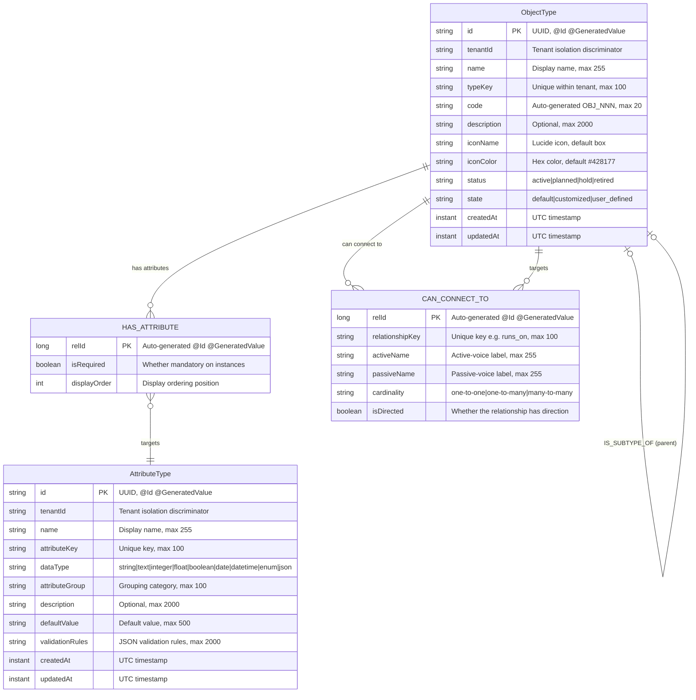
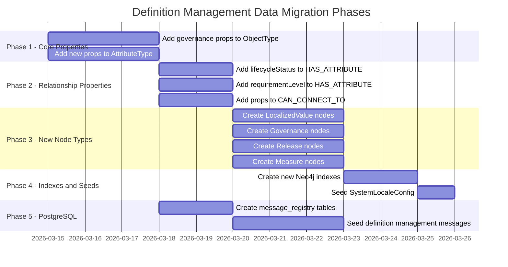
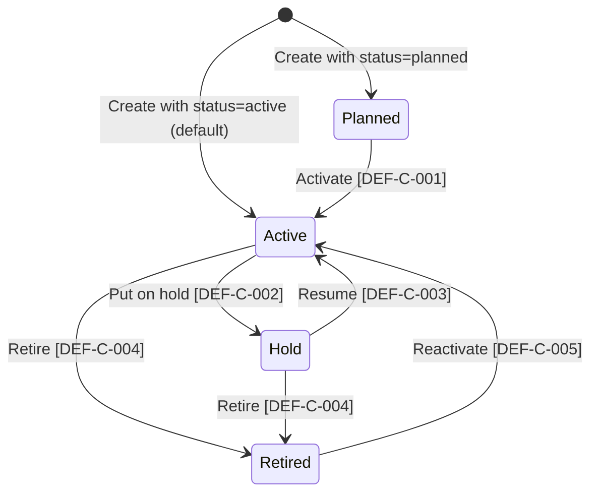
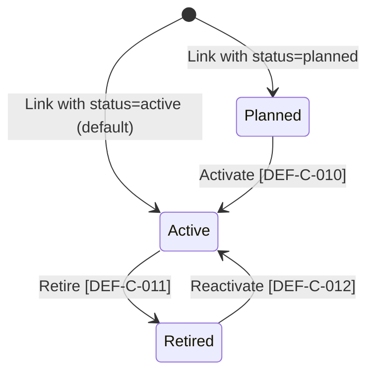
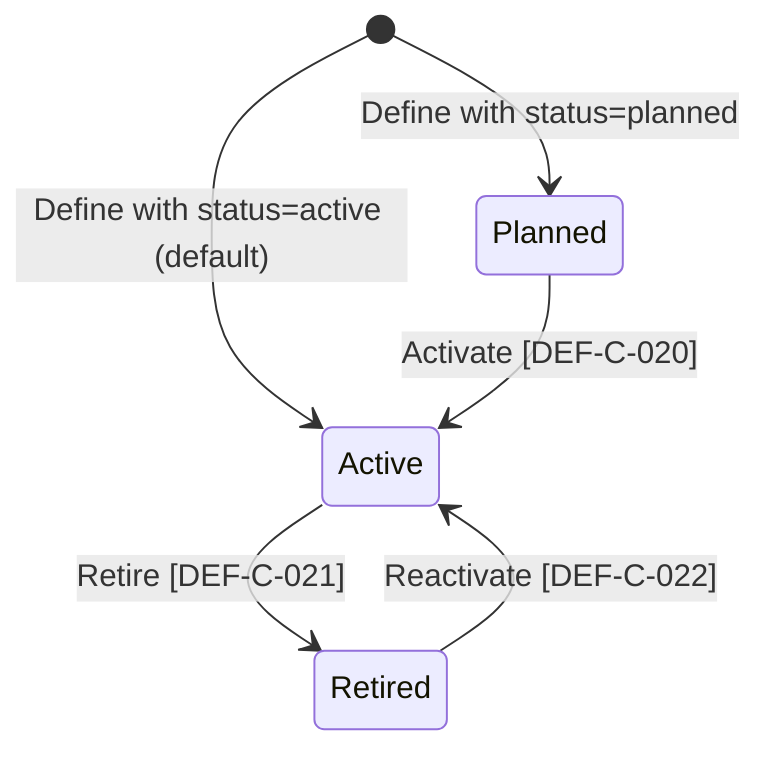
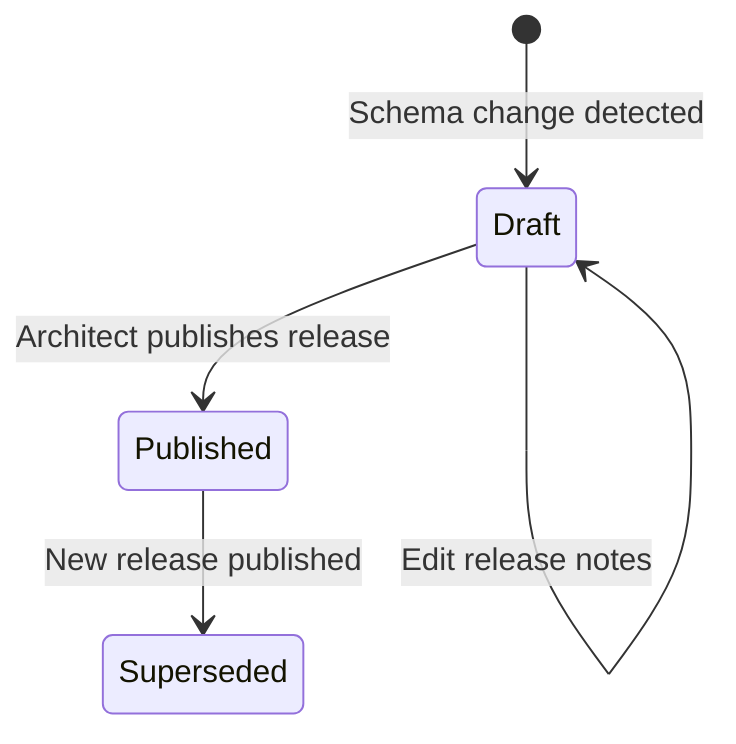
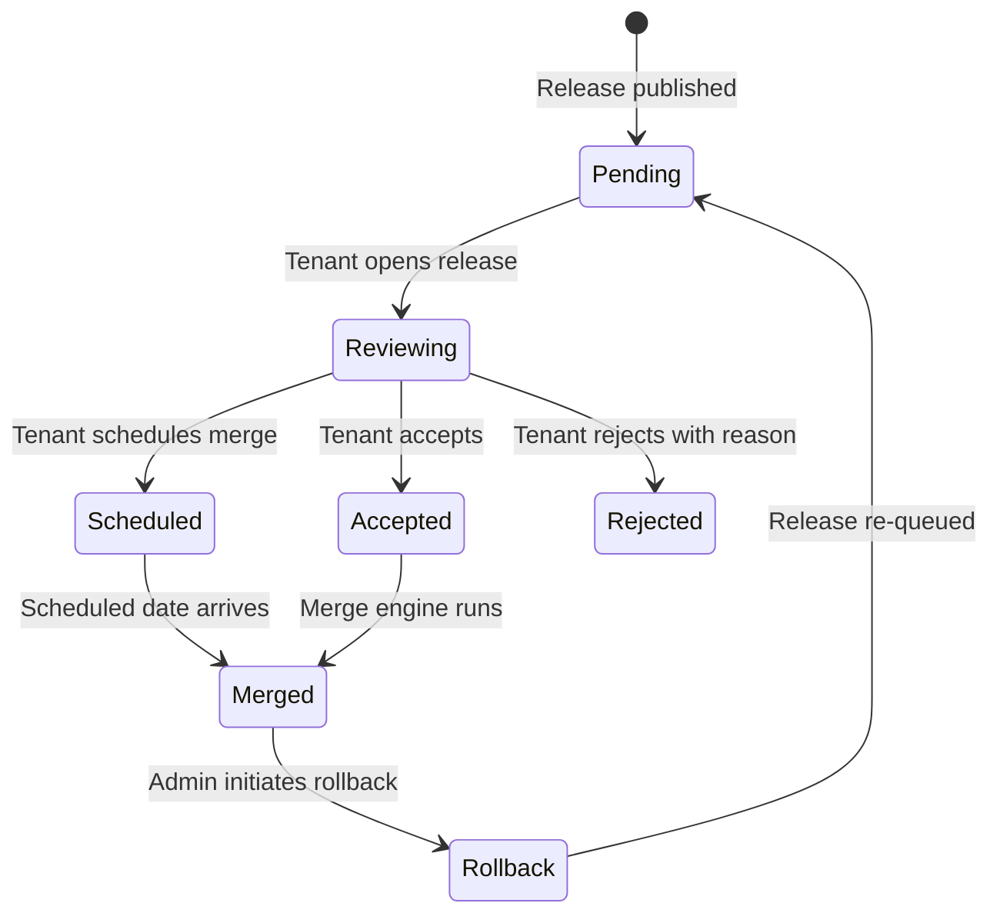
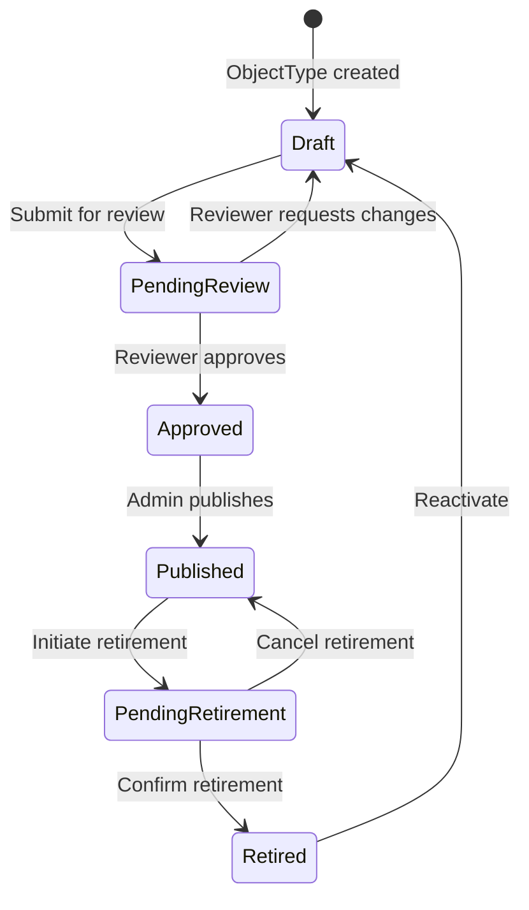

# Canonical Data Model: Definition Management

**Document ID:** DM-DM-001
**Version:** 2.0.0
**Date:** 2026-03-10
**Status:** Draft
**Author:** SA Agent
**SA Principles Version:** v1.1.0
**Source Documents:**
- PRD: `docs/definition-management/Design/01-PRD-Definition-Management.md` (Section 5 Business Domain Model, Section 6 Features)
- Tech Spec: `docs/definition-management/Design/02-Technical-Specification.md` (Sections 3.1, 4.1, 5)

---

## Table of Contents

1. [Purpose and Scope](#1-purpose-and-scope)
2. [Architectural Principles Governing the Data Model](#2-architectural-principles-governing-the-data-model)
3. [Business Domain Model Reference](#3-business-domain-model-reference)
4. [Neo4j Graph Schema -- As-Built](#4-neo4j-graph-schema----as-built-implemented)
5. [Neo4j Graph Schema -- Target](#5-neo4j-graph-schema----target-planned)
6. [PostgreSQL Schema -- Message Registry](#6-postgresql-schema----message-registry-planned)
7. [Valkey Cache Schema](#7-valkey-cache-schema-planned)
8. [Data Type Catalog](#8-data-type-catalog)
9. [Constraint Catalog](#9-constraint-catalog)
10. [Index Strategy](#10-index-strategy)
11. [Migration Strategy](#11-migration-strategy)
12. [Data Lifecycle State Machines](#12-data-lifecycle-state-machines)
13. [System Default Attributes (AP-2)](#13-system-default-attributes-ap-2)
14. [Cross-Reference Matrix](#14-cross-reference-matrix)

---

## 1. Purpose and Scope

This document is the **canonical data model** for the Definition Management feature of the EMSIST platform. It serves as the single source of truth for all data structures, relationships, constraints, and lifecycle rules used by the `definition-service` (port 8090, Neo4j 5 Community Edition) and its supporting infrastructure (PostgreSQL message registry, Valkey cache).

**Audience:** DBA Agent (physical schema and migrations), DEV Agent (entity implementation), SA Agent (design reference), QA Agent (test data requirements).

**Databases involved:**

| Database | Purpose | Technology |
|----------|---------|------------|
| Definition Repository | Object types, attribute types, connections, governance, maturity, releases | Neo4j 5.12 Community Edition |
| Message Registry | Error/confirmation/warning/success messages with i18n translations | PostgreSQL 16 (shared service) |
| Cache | Cached definition lookups, graph JSON, maturity scores, translations | Valkey 8 (Alpine) |
| Instance Repository | Object instances, attribute values, relationship instances (separate service -- AP-1) | PostgreSQL (out of scope for this document) |

---

## 2. Architectural Principles Governing the Data Model

Five architectural principles from the PRD (Section 6) govern all data model decisions. All are **[PLANNED]** unless stated otherwise.

| Principle | Title | Data Model Impact |
|-----------|-------|-------------------|
| **AP-1** | Definition/Instance Repository Separation | Neo4j stores definitions (schema); PostgreSQL stores instances (runtime data). Instance services consume definitions via read-only references only. Definition changes propagate through release management. |
| **AP-2** | Default Attributes per Object Type | Every new ObjectType is auto-provisioned with 10 system default attributes (name, description, status, owner, createdAt, createdBy, updatedAt, updatedBy, externalId, tags). `isSystemDefault: true` on HAS_ATTRIBUTE. Cannot be removed by users. |
| **AP-3** | Zero Data Loss Guarantee | Removed attributes/connections are soft-deleted and archived. Versioned snapshots enable rollback. Breaking changes require explicit confirmation. |
| **AP-4** | Centralized Message Registry with i18n | All user-facing messages stored in PostgreSQL `message_registry` + `message_translation` tables. Code convention: `{SERVICE}-{TYPE}-{SEQ}`. |
| **AP-5** | Lifecycle State Machines | Every entity with a lifecycle carries a `lifecycleStatus` field (enum: `planned`, `active`, `retired`) with validated transitions and confirmation/error messages from the message registry. |

---

## 3. Business Domain Model Reference

The business domain model is defined in the PRD (Section 5). This canonical data model transforms the BA-defined business objects into technical data structures.

### 3.1 As-Built Domain Model [IMPLEMENTED]

Reference: PRD Section 5.1 -- class diagram with ObjectType, AttributeType, HasAttribute, CanConnectTo, IS_SUBTYPE_OF.

**Entity catalog (as-built):**

| Business Entity | Technical Node/Relationship | Description |
|----------------|---------------------------|-------------|
| Object Type | `ObjectType` node | A configurable business object class (e.g., Server, Application, Contract) |
| Attribute Type | `AttributeType` node | A reusable attribute definition (e.g., Hostname, IP Address) with data type and validation |
| Has Attribute | `HAS_ATTRIBUTE` relationship | Links an ObjectType to an AttributeType with ordering and requirement metadata |
| Can Connect To | `CAN_CONNECT_TO` relationship | Defines a permitted relationship between two ObjectTypes with cardinality and labeling |
| Is Subtype Of | `IS_SUBTYPE_OF` relationship | Declares an inheritance/subtype relationship between ObjectTypes |

**Relationship catalog (as-built):**

| Relationship | Source | Target | Cardinality | Business Rule |
|-------------|--------|--------|-------------|---------------|
| HAS_ATTRIBUTE | ObjectType | AttributeType | 1:N (ObjectType to many HAS_ATTRIBUTE) | An ObjectType can have many attributes; an AttributeType can be linked to many ObjectTypes (M:N via relationship properties) |
| CAN_CONNECT_TO | ObjectType | ObjectType | N:N | Defines permitted connections between types; each connection has directional labels and cardinality |
| IS_SUBTYPE_OF | ObjectType | ObjectType | N:1 (child to parent) | A child type inherits attributes and connections from its parent; declared but not yet utilized in business logic |

### 3.2 Target Domain Model [PLANNED]

Reference: PRD Section 5.2 -- extended class diagram adding GovernanceRule, DataSource, DefinitionRelease, TenantReleaseAdoption, SystemLocale, MeasureCategory, Measure, and enhanced properties on existing entities.

---

## 4. Neo4j Graph Schema -- As-Built [IMPLEMENTED]

The following schema is verified against the current codebase. All items are **[IMPLEMENTED]** with source file evidence.

### 4.1 Entity-Relationship Diagram (As-Built)



### 4.2 Node Properties -- ObjectType [IMPLEMENTED]

**Source:** `backend/definition-service/src/main/java/com/ems/definition/node/ObjectTypeNode.java`, lines 27-85

| Property | Java Type | Neo4j Annotation | Default | Constraints | Description |
|----------|-----------|-----------------|---------|-------------|-------------|
| id | String | @Id | UUID (service-generated) | PK, NOT NULL | Primary key |
| tenantId | String | -- | -- | NOT NULL | Tenant isolation discriminator |
| name | String | -- | -- | NOT NULL, max 255 | Human-readable display name |
| typeKey | String | -- | derived from name | UNIQUE per tenant, max 100 | Lowercase, underscored key |
| code | String | -- | OBJ_NNN | max 20 | Auto-generated sequential code |
| description | String | -- | null | max 2000 | Optional description |
| iconName | String | @Builder.Default | "box" | max 100 | Lucide icon name |
| iconColor | String | @Builder.Default | "#428177" | max 7, hex format | Hex color for icon |
| status | String | @Builder.Default | "active" | ENUM: active, planned, hold, retired | Lifecycle status |
| state | String | @Builder.Default | "user_defined" | ENUM: default, customized, user_defined | Origin state |
| createdAt | Instant | -- | now() | NOT NULL | UTC creation timestamp |
| updatedAt | Instant | -- | now() | NOT NULL | UTC last-update timestamp |
| attributes | List\<HasAttributeRelationship\> | @Relationship(HAS_ATTRIBUTE, OUTGOING) | [] | -- | Linked attribute types |
| connections | List\<CanConnectToRelationship\> | @Relationship(CAN_CONNECT_TO, OUTGOING) | [] | -- | Permitted connections |
| parentType | ObjectTypeNode | @Relationship(IS_SUBTYPE_OF, OUTGOING) | null | -- | Inheritance parent |

### 4.3 Node Properties -- AttributeType [IMPLEMENTED]

**Source:** `backend/definition-service/src/main/java/com/ems/definition/node/AttributeTypeNode.java`, lines 25-53

| Property | Java Type | Default | Constraints | Description |
|----------|-----------|---------|-------------|-------------|
| id | String | UUID (service-generated) | PK, NOT NULL | Primary key |
| tenantId | String | -- | NOT NULL | Tenant isolation discriminator |
| name | String | -- | NOT NULL, max 255 | Human-readable name |
| attributeKey | String | -- | NOT NULL, UNIQUE per tenant, max 100 | Unique key (e.g., "hostname") |
| dataType | String | -- | NOT NULL, max 30 | Data type enum (see Section 8) |
| attributeGroup | String | -- | max 100 | Grouping category |
| description | String | null | max 2000 | Optional description |
| defaultValue | String | null | max 500 | Default value for instances |
| validationRules | String | null | max 2000 | JSON string of validation rules |
| createdAt | Instant | now() | NOT NULL | UTC creation timestamp |
| updatedAt | Instant | now() | NOT NULL | UTC last-update timestamp |

### 4.4 Relationship Properties -- HAS_ATTRIBUTE [IMPLEMENTED]

**Source:** `backend/definition-service/src/main/java/com/ems/definition/node/relationship/HasAttributeRelationship.java`, lines 24-36

| Property | Java Type | Description |
|----------|-----------|-------------|
| relId | Long | Auto-generated relationship ID (@Id @GeneratedValue) |
| isRequired | boolean | Whether attribute is mandatory on instances |
| displayOrder | int | Display ordering position (0-based) |
| attribute | AttributeTypeNode | @TargetNode -- target attribute type node |

### 4.5 Relationship Properties -- CAN_CONNECT_TO [IMPLEMENTED]

**Source:** `backend/definition-service/src/main/java/com/ems/definition/node/relationship/CanConnectToRelationship.java`, lines 27-52

| Property | Java Type | Description |
|----------|-----------|-------------|
| relId | Long | Auto-generated relationship ID |
| relationshipKey | String | Unique key (e.g., "runs_on", "depends_on") |
| activeName | String | Active-voice label (e.g., "runs on") |
| passiveName | String | Passive-voice label (e.g., "hosts") |
| cardinality | String | one-to-one, one-to-many, many-to-many |
| isDirected | boolean | Whether the relationship has direction |
| targetType | ObjectTypeNode | @TargetNode -- target object type node |

### 4.6 Relationship -- IS_SUBTYPE_OF [IMPLEMENTED]

**Source:** `backend/definition-service/src/main/java/com/ems/definition/node/ObjectTypeNode.java`, lines 81-84

Declared as `@Relationship(type = "IS_SUBTYPE_OF", direction = Relationship.Direction.OUTGOING) private ObjectTypeNode parentType`. Mapped in DTO as `parentTypeId`. **Not yet utilized in business logic** -- no API endpoint or service method creates or manages this relationship.

### 4.7 As-Built Gaps vs. SA Standards

| Standard | Current State | Gap | Severity |
|----------|---------------|-----|----------|
| UUID v7 primary keys | UUID v4 (random) | Minor -- v4 is functional, v7 preferred for sortability | LOW |
| @Version optimistic locking | **Not present** on any node | No concurrent edit protection | CRITICAL |
| Audit fields (createdBy, updatedBy) | **Not present** | No audit trail for who made changes | HIGH |
| Soft delete (deletedAt) | Not present; hard delete used | No recoverability | MEDIUM |

---

## 5. Neo4j Graph Schema -- Target [PLANNED]

All items in this section are **[PLANNED]** -- no code exists. This is the target data model for Definition Management enhancements.

### 5.1 Entity-Relationship Diagram (Target)

```mermaid
erDiagram
    ObjectType {
        string id PK "UUID"
        string tenantId FK "Tenant isolation"
        string masterObjectTypeId FK "If inherited from master"
        string name "Display name"
        string typeKey "Unique within tenant"
        string code "Auto-generated"
        string description "Optional"
        string iconName "Lucide icon"
        string iconColor "Hex color"
        string status "active|planned|hold|retired"
        string state "default|customized|user_defined|master_mandated"
        boolean isMasterMandate "Cannot be modified by child tenants"
        boolean isMeasurable "Has measures attached"
        boolean hasOverallValue "Aggregate value available"
        string maturitySchemaJson "Maturity weight config JSON"
        int freshnessThresholdDays "Staleness threshold default 90"
        string complianceRules "JSON compliance config"
        long version "Optimistic locking @Version"
        string createdBy "User UUID"
        string updatedBy "User UUID"
        instant createdAt "UTC"
        instant updatedAt "UTC"
        instant deletedAt "Soft delete"
    }

    AttributeType {
        string id PK "UUID"
        string tenantId FK "Tenant isolation"
        string masterAttributeTypeId FK "If inherited from master"
        string name "Display name"
        string attributeKey "Unique key"
        string dataType "string|text|integer|float|boolean|date|datetime|enum|json|file|value|number|time"
        string attributeGroup "Grouping category"
        string attributeCategory "Object Type Attribute|Version Attribute|Custom"
        string description "Optional"
        string defaultValue "Default value"
        string validationRules "JSON SpEL rules"
        boolean isMasterMandate "Read-only in child tenants"
        boolean isLanguageDependent "Multi-locale storage"
        boolean isVersioningRelevant "Triggers version bump"
        boolean isWorkflowAction "Triggers workflow"
        string lockStatus "none|locked|partial"
        string requirementLevel "MANDATORY|CONDITIONAL|OPTIONAL"
        string inputMask "Input mask pattern"
        int minValueLength "Min length"
        int maxValueLength "Max length"
        string phonePrefix "Phone prefix pattern"
        string phonePattern "Phone pattern"
        string dateFormat "Date format pattern"
        string timeFormat "Time format pattern"
        string filePattern "Accepted file extensions"
        long maxFileSize "Max file size in bytes"
        long version "Optimistic locking @Version"
        string createdBy "User UUID"
        string updatedBy "User UUID"
        instant createdAt "UTC"
        instant updatedAt "UTC"
    }

    LocalizedValue {
        string id PK "UUID"
        string entityId FK "Parent entity ID"
        string entityType "ObjectType|AttributeType"
        string fieldName "name|description"
        string locale "en|ar|fr|de"
        string value "Translated text"
        instant createdAt "UTC"
        instant updatedAt "UTC"
    }

    DefinitionRelease {
        string id PK "UUID"
        string tenantId FK "Originating tenant - master"
        string version "Semver 1.0.0"
        string versionType "MAJOR|MINOR|PATCH"
        string status "draft|published|superseded"
        string releaseNotes "Auto-generated plus edited"
        string changeDiffJson "JSON Patch RFC 6902 diff"
        int affectedTenantCount "Number of affected child tenants"
        int affectedInstanceCount "Estimated instance impact"
        string createdBy "User UUID"
        instant createdAt "UTC"
        instant publishedAt "UTC or null"
    }

    ReleaseChange {
        string id PK "UUID"
        string releaseId FK "Parent release"
        string changeType "ADD_ATTR|REMOVE_ATTR|MODIFY_ATTR|ADD_REL|REMOVE_REL|MODIFY_REL|MODIFY_TYPE"
        string entityType "ObjectType|AttributeType|Relationship"
        string entityId FK "Affected entity"
        string entityName "Human-readable name"
        string beforeJson "State before change"
        string afterJson "State after change"
        boolean isBreaking "Requires tenant action"
    }

    TenantReleaseStatus {
        string id PK "UUID"
        string releaseId FK "Release reference"
        string tenantId FK "Child tenant"
        string status "pending|reviewing|accepted|scheduled|rejected|merged|rollback"
        string scheduledDate "Merge date if scheduled"
        string rejectionReason "If rejected"
        string conflictsJson "Detected conflicts"
        string mergedBy "User UUID"
        instant reviewedAt "UTC"
        instant mergedAt "UTC"
    }

    DataSource {
        string id PK "UUID"
        string tenantId FK "Tenant"
        string name "Data source name"
        string type "system|api|import|manual"
        string connectionConfig "JSON connection config"
    }

    SystemLocaleConfig {
        string id PK "UUID"
        string localeCode "BCP 47 en ar fr de"
        string displayName "English Arabic French"
        string direction "ltr|rtl"
        boolean isLocaleActive "Available for tenants"
        int displayOrder "Sort order"
    }

    TenantLocaleConfig {
        string id PK "UUID"
        string tenantId FK "Tenant"
        string localeCode FK "References SystemLocaleConfig"
        boolean isDefault "Default locale for this tenant"
        boolean isLocaleActive "Active for this tenant"
    }

    MeasureCategory {
        string id PK "UUID"
        string tenantId FK "Tenant"
        string name "Category name"
        string description "Optional"
        int displayOrder "Sort order"
        boolean isMasterMandate "Mandated by master tenant"
    }

    Measure {
        string id PK "UUID"
        string tenantId FK "Tenant"
        string name "Measure name"
        string description "Optional"
        string unit "Unit of measure"
        double targetValue "Target threshold"
        double warningThreshold "Warning level"
        double criticalThreshold "Critical level"
        string formula "Calculation formula"
        boolean isMasterMandate "Mandated by master tenant"
        string measureCategoryId FK "Parent category"
    }

    GovernanceRule {
        string id PK "UUID"
        string tenantId FK "Tenant"
        string ruleType "mandate|readonly|conditional"
        string appliesTo "ObjectType|AttributeType|Relationship"
        string entityId FK "Target entity"
        string condition "JSON rule condition"
    }

    GovernanceConfig {
        string id PK "UUID"
        string tenantId FK "Tenant isolation"
        string objectTypeId FK "Parent ObjectType"
        boolean allowDirectCreate "Allow creation without workflow"
        boolean allowDirectUpdate "Allow update without workflow"
        boolean allowDirectDelete "Allow deletion without workflow"
        string versionTemplate "Template for version display"
        string viewTemplate "Template for view layout"
        string governanceState "Draft|PendingReview|Approved|Published|PendingRetirement|Retired"
        long version "Optimistic locking"
        string createdBy "User UUID"
        string updatedBy "User UUID"
        instant createdAt "UTC"
        instant updatedAt "UTC"
    }

    WorkflowAttachment {
        string id PK "UUID"
        string tenantId FK "Tenant isolation"
        string objectTypeId FK "Parent ObjectType"
        string workflowId FK "Reference to process-service"
        string workflowName "Display name"
        string behaviour "Create|Reading|Reporting|Other"
        string permissionType "User|Role"
        string permissionValue "User UUID or Role name"
        boolean isActive "Active or Inactive"
        long version "Optimistic locking"
        string createdBy "User UUID"
        instant createdAt "UTC"
    }

    ObjectType ||--o{ HAS_ATTRIBUTE : "has"
    HAS_ATTRIBUTE }o--|| AttributeType : "targets"
    ObjectType ||--o{ CAN_CONNECT_TO : "connects"
    CAN_CONNECT_TO }o--|| ObjectType : "targets"
    ObjectType |o--o| ObjectType : "IS_SUBTYPE_OF"
    ObjectType ||--o{ INHERITS_FROM : "master inheritance"
    INHERITS_FROM }o--|| ObjectType : "master type"
    ObjectType ||--o{ HAS_DATA_SOURCE : "has data source"
    HAS_DATA_SOURCE }o--|| DataSource : "references"
    ObjectType ||--o{ HAS_MEASURE_CATEGORY : "has measure category"
    HAS_MEASURE_CATEGORY }o--|| MeasureCategory : "references"
    MeasureCategory ||--o{ CONTAINS_MEASURE : "contains"
    CONTAINS_MEASURE }o--|| Measure : "references"
    ObjectType ||--o{ GOVERNED_BY : "governed by"
    GOVERNED_BY }o--|| GovernanceRule : "rule"
    ObjectType ||--o| HAS_GOVERNANCE_CONFIG : "governance config"
    HAS_GOVERNANCE_CONFIG }o--|| GovernanceConfig : "configuration"
    ObjectType ||--o{ HAS_WORKFLOW_ATTACHMENT : "has workflow"
    HAS_WORKFLOW_ATTACHMENT }o--|| WorkflowAttachment : "attachment"
    AttributeType ||--o{ HAS_LOCALIZATION : "localized"
    HAS_LOCALIZATION }o--|| LocalizedValue : "value"
    ObjectType ||--o{ HAS_LOCALIZATION_OT : "localized"
    HAS_LOCALIZATION_OT }o--|| LocalizedValue : "value"
    DefinitionRelease ||--o{ CONTAINS_CHANGE : "contains"
    CONTAINS_CHANGE }o--|| ReleaseChange : "change detail"
    DefinitionRelease ||--o{ TENANT_STATUS : "tenant status"
    TENANT_STATUS }o--|| TenantReleaseStatus : "per-tenant tracking"
    ObjectType ||--o{ RELEASED_IN : "released in"
    RELEASED_IN }o--|| DefinitionRelease : "release"
    SystemLocaleConfig ||--o{ TENANT_LOCALE : "available to"
    TENANT_LOCALE }o--|| TenantLocaleConfig : "tenant config"
```



### 5.2 Enhanced HAS_ATTRIBUTE Properties [PLANNED]

| Property | Type | Current | New | Description |
|----------|------|---------|-----|-------------|
| relId | Long | Yes | Yes | Auto-generated relationship ID |
| isRequired | boolean | Yes | Yes | Legacy required flag (retained for backward compatibility) |
| displayOrder | int | Yes | Yes | Display ordering position |
| attribute | AttributeTypeNode | Yes | Yes | @TargetNode |
| **lifecycleStatus** | String | -- | **NEW** | Enum: `planned`, `active`, `retired` (default `active`). Controls visibility and maturity inclusion per AP-5. |
| **requirementLevel** | String | -- | **NEW** | `MANDATORY`, `CONDITIONAL`, `OPTIONAL`. Determines weight in maturity scoring. |
| **lockStatus** | String | -- | **NEW** | `none`, `locked`, `partial`. Governance lock status. |
| **isMasterMandate** | boolean | -- | **NEW** | Inherited from master, read-only in child tenants. |
| **conditionRules** | String | -- | **NEW** | JSON SpEL rules for CONDITIONAL requirement. |
| **isSystemDefault** | boolean | -- | **NEW** | `true` for system default attributes (AP-2); cannot be unlinked. |

### 5.3 Enhanced CAN_CONNECT_TO Properties [PLANNED]

| Property | Type | Current | New | Description |
|----------|------|---------|-----|-------------|
| relId | Long | Yes | Yes | Auto-generated relationship ID |
| relationshipKey | String | Yes | Yes | Unique key |
| activeName | String | Yes | Yes | Active-voice label |
| passiveName | String | Yes | Yes | Passive-voice label |
| cardinality | String | Yes | Yes | one-to-one, one-to-many, many-to-many |
| isDirected | boolean | Yes | Yes | Directional flag |
| targetType | ObjectTypeNode | Yes | Yes | @TargetNode |
| **lifecycleStatus** | String | -- | **NEW** | Enum: `planned`, `active`, `retired` (default `active`). Per AP-5. |
| **requirementLevel** | String | -- | **NEW** | `MANDATORY`, `CONDITIONAL`, `OPTIONAL`. |
| **importance** | String | -- | **NEW** | `high`, `medium`, `low`. |
| **isMasterMandate** | boolean | -- | **NEW** | Read-only in child tenants. |
| **hasRelationAttributes** | boolean | -- | **NEW** | Whether relation-level attributes exist. |

### 5.4 New Nodes Summary [PLANNED]

| Node Label | Purpose | Key Properties | Relationships |
|-----------|---------|----------------|---------------|
| LocalizedValue | Multi-locale translations for definition entities | entityId, entityType, fieldName, locale, value | HAS_LOCALIZATION from ObjectType/AttributeType |
| DefinitionRelease | Versioned schema snapshot from master tenant | version, status, releaseNotes, changeDiffJson | RELEASED_IN from ObjectType; CONTAINS_CHANGE to ReleaseChange; TENANT_STATUS to TenantReleaseStatus |
| ReleaseChange | Individual change within a release | changeType, entityType, beforeJson, afterJson, isBreaking | CONTAINS_CHANGE from DefinitionRelease |
| TenantReleaseStatus | Per-tenant adoption status for a release | status, scheduledDate, rejectionReason | TENANT_STATUS from DefinitionRelease |
| DataSource | External data source linked to an ObjectType | name, type, connectionConfig | HAS_DATA_SOURCE from ObjectType |
| SystemLocaleConfig | System-wide locale configuration | localeCode, displayName, direction, isLocaleActive | Referenced by TenantLocaleConfig |
| TenantLocaleConfig | Per-tenant locale settings | tenantId, localeCode, isDefault, isLocaleActive | TENANT_LOCALE from SystemLocaleConfig |
| MeasureCategory | Grouping for measures on an ObjectType | name, description, displayOrder, isMasterMandate | HAS_MEASURE_CATEGORY from ObjectType; CONTAINS_MEASURE to Measure |
| Measure | Quantifiable indicator within a category | name, unit, targetValue, warningThreshold, criticalThreshold, formula | CONTAINS_MEASURE from MeasureCategory |
| GovernanceRule | Governance rules applied to entities | ruleType, appliesTo, entityId, condition | GOVERNED_BY from ObjectType |
| GovernanceConfig | Per-ObjectType governance configuration | allowDirectCreate/Update/Delete, governanceState | HAS_GOVERNANCE_CONFIG from ObjectType |
| WorkflowAttachment | Workflow linked to an ObjectType | workflowId, behaviour, permissionType, isActive | HAS_WORKFLOW_ATTACHMENT from ObjectType |

### 5.5 New Relationships Summary [PLANNED]

| Relationship | Source | Target | Cardinality | Description |
|-------------|--------|--------|-------------|-------------|
| INHERITS_FROM | ObjectType (child) | ObjectType (master) | N:1 | Cross-tenant definition inheritance |
| HAS_DATA_SOURCE | ObjectType | DataSource | 1:N | Data sources for an ObjectType |
| HAS_MEASURE_CATEGORY | ObjectType | MeasureCategory | 1:N | Measure categories for an ObjectType |
| CONTAINS_MEASURE | MeasureCategory | Measure | 1:N | Measures within a category |
| GOVERNED_BY | ObjectType | GovernanceRule | 1:N | Governance rules applied to an ObjectType |
| HAS_GOVERNANCE_CONFIG | ObjectType | GovernanceConfig | 1:1 | Governance configuration for an ObjectType |
| HAS_WORKFLOW_ATTACHMENT | ObjectType | WorkflowAttachment | 1:N | Workflows attached to an ObjectType |
| HAS_LOCALIZATION | ObjectType/AttributeType | LocalizedValue | 1:N | Multi-locale translations |
| RELEASED_IN | ObjectType | DefinitionRelease | 1:N | Releases published for an ObjectType |
| CONTAINS_CHANGE | DefinitionRelease | ReleaseChange | 1:N | Changes within a release |
| TENANT_STATUS | DefinitionRelease | TenantReleaseStatus | 1:N | Per-tenant adoption tracking |

---

## 6. PostgreSQL Schema -- Message Registry [PLANNED]

Per AP-4, all user-facing messages are stored in a centralized PostgreSQL database (shared service, not Neo4j). The definition-service references message codes in its error responses and the frontend renders localized messages from this registry.

### 6.1 Table: message_registry

```sql
CREATE TABLE message_registry (
    id BIGSERIAL PRIMARY KEY,
    message_code VARCHAR(50) NOT NULL UNIQUE,      -- e.g., DEF-E-001
    message_type VARCHAR(20) NOT NULL,              -- ERROR, CONFIRMATION, WARNING, INFO, SUCCESS
    category VARCHAR(50) NOT NULL,                  -- OBJECT_TYPE, ATTRIBUTE, CONNECTION, RELEASE, GOVERNANCE, MATURITY, SYSTEM
    default_name VARCHAR(255) NOT NULL,             -- English name / short title (fallback)
    default_description TEXT NOT NULL,               -- English description with {placeholder} support
    http_status INTEGER,                             -- HTTP status code for errors (400, 404, 409, etc.)
    severity VARCHAR(20),                            -- CRITICAL, HIGH, MEDIUM, LOW, INFO
    is_active BOOLEAN DEFAULT TRUE,                  -- Soft-delete flag for the message itself
    created_at TIMESTAMP DEFAULT CURRENT_TIMESTAMP,
    updated_at TIMESTAMP DEFAULT CURRENT_TIMESTAMP
);
```

### 6.2 Table: message_translation

```sql
CREATE TABLE message_translation (
    id BIGSERIAL PRIMARY KEY,
    message_code VARCHAR(50) NOT NULL REFERENCES message_registry(message_code),
    locale_code VARCHAR(10) NOT NULL,               -- ISO locale: en, ar, fr, de
    translated_name VARCHAR(255) NOT NULL,
    translated_description TEXT NOT NULL,
    created_at TIMESTAMP DEFAULT CURRENT_TIMESTAMP,
    updated_at TIMESTAMP DEFAULT CURRENT_TIMESTAMP,
    UNIQUE(message_code, locale_code)
);
```

### 6.3 Indexes

```sql
CREATE INDEX idx_message_registry_type ON message_registry(message_type);
CREATE INDEX idx_message_registry_category ON message_registry(category);
CREATE INDEX idx_message_translation_locale ON message_translation(locale_code);
```

### 6.4 Message Code Convention

```
{SERVICE}-{TYPE}-{SEQ}
```

| Segment | Values | Example |
|---------|--------|---------|
| SERVICE | `DEF` (Definition), `AUTH` (Auth), `TEN` (Tenant), `LIC` (License), `USR` (User), `AUD` (Audit), `NOT` (Notification), `AI` (AI), `PRC` (Process), `SYS` (System) | `DEF` |
| TYPE | `E` (Error), `C` (Confirmation), `W` (Warning), `I` (Info), `S` (Success) | `E` |
| SEQ | 3-digit sequential number | `001` |

Example: `DEF-E-001` = Definition service, Error, #001

### 6.5 Definition Management Message Catalog

The full message catalog is defined in the PRD (Section "Definition Management Message Registry"). Key codes:

| Code Range | Category | Count |
|-----------|----------|-------|
| DEF-E-001 to DEF-E-019 | OBJECT_TYPE errors | 19 |
| DEF-E-020 to DEF-E-026 | ATTRIBUTE errors | 7 |
| DEF-E-030 to DEF-E-035 | CONNECTION errors | 6 |
| DEF-E-040 to DEF-E-043 | RELEASE errors | 4 |
| DEF-E-050 to DEF-E-052 | SYSTEM errors | 3 |
| DEF-E-060 to DEF-E-062 | GOVERNANCE errors | 3 |
| DEF-E-070 to DEF-E-071 | MATURITY errors | 2 |
| DEF-E-080 to DEF-E-083 | MEASURE errors | 4 |
| DEF-E-090 to DEF-E-092 | INHERITANCE errors | 3 |
| DEF-C-001 to DEF-C-032 | CONFIRMATION dialogs | 17 |
| DEF-W-001 to DEF-W-006 | WARNINGS | 6 |
| DEF-S-001 to DEF-S-032 | SUCCESS messages | 14 |

---

## 7. Valkey Cache Schema [PLANNED]

### 7.1 Key Patterns

| Key Pattern | Value Type | Description |
|------------|-----------|-------------|
| `def:{tenantId}:ot:list:{page}:{size}:{status}:{search}` | JSON (PagedResponse) | Paginated ObjectType list |
| `def:{tenantId}:ot:{objectTypeId}` | JSON (ObjectTypeDTO) | Single ObjectType with attributes and connections |
| `def:{tenantId}:at:list` | JSON (List\<AttributeTypeDTO\>) | Full attribute type list for tenant |
| `def:{tenantId}:graph:{depth}` | JSON (GraphResponse) | Full graph visualization data |
| `def:{tenantId}:ot:{objectTypeId}:graph:{depth}` | JSON (SubgraphResponse) | Subgraph centered on a type |
| `def:{tenantId}:locales` | JSON (List\<TenantLocaleConfig\>) | Tenant locale configuration |
| `def:{tenantId}:translations:{entityType}:{entityId}:{locale}` | JSON (Map) | Translations for an entity in a locale |
| `def:{tenantId}:maturity:{objectTypeId}:config` | JSON (MaturityConfig) | Maturity schema configuration |
| `def:instance:{instanceId}:maturity` | JSON (MaturityScoreResponse) | Cached maturity score per instance |
| `def:{tenantId}:releases:list:{page}` | JSON (PagedResponse) | Release list |
| `def:{tenantId}:release:{releaseId}:diff` | JSON (ChangeDiff) | Release change diff (immutable once published) |
| `msg:{locale}:{category}` | JSON (Map\<String, Message\>) | Message registry cache by locale and category |

### 7.2 TTL Strategy

| Cache Category | TTL | Rationale |
|---------------|-----|-----------|
| ObjectType list | 60s | Moderate write frequency; acceptable staleness for list views |
| Single ObjectType | 120s | Slightly longer; detail views tolerate brief delay |
| Attribute type list | 300s | Low write frequency; rarely changes within a session |
| Graph visualization | 300s | Expensive to compute; invalidated on any definition change |
| Locale configuration | 600s | Rarely changes; long TTL acceptable |
| Translations | 300s | Invalidated on locale change or translation update |
| Maturity config | 300s | Changes infrequently once configured |
| Maturity score (per instance) | 60s | Needs to be relatively fresh; invalidated on instance or definition change |
| Release diff | -1 (no expiry) | Immutable once published; never changes |
| Message registry | 600s | Messages change rarely; invalidated on message registry update |

### 7.3 Invalidation Patterns

| Trigger Event | Keys Invalidated |
|--------------|-----------------|
| ObjectType created/updated/deleted | `def:{tenantId}:ot:list:*`, `def:{tenantId}:ot:{id}`, `def:{tenantId}:graph:*` |
| AttributeType created/updated/deleted | `def:{tenantId}:at:list`, `def:{tenantId}:ot:*` (affected types) |
| Attribute linked/unlinked | `def:{tenantId}:ot:{objectTypeId}`, `def:{tenantId}:ot:list:*`, `def:{tenantId}:graph:*` |
| Connection added/removed | `def:{tenantId}:ot:{objectTypeId}`, `def:{tenantId}:graph:*` |
| Translation updated | `def:{tenantId}:translations:{entityType}:{entityId}:*` |
| Locale config changed | `def:{tenantId}:locales` |
| Release published | `def:{tenantId}:releases:list:*` |
| Instance updated | `def:instance:{instanceId}:maturity` |
| Maturity config changed | `def:{tenantId}:maturity:{objectTypeId}:config`, `def:instance:*:maturity` (bulk invalidation for that type) |
| Message registry updated | `msg:*:{category}` |

---

## 8. Data Type Catalog

### 8.1 Supported Attribute Data Types

**As-built data types [IMPLEMENTED]:** string, text, integer, float, boolean, date, datetime, enum, json

**Target data types [PLANNED]:** string, text, integer, float, boolean, date, datetime, enum, json, file, value, number, time

| Data Type | Description | Java Mapping | Validation Rules | Default Value |
|-----------|-------------|-------------|-----------------|---------------|
| `string` | Single-line text | String | maxLength (default 255), minLength, regex | "" (empty) |
| `text` | Multi-line text | String | maxLength (default 2000) | null |
| `integer` | Whole number | Long | min, max, range | 0 |
| `float` | Decimal number | Double | min, max, precision | 0.0 |
| `boolean` | True/false | Boolean | -- | false |
| `date` | Date without time | LocalDate | dateFormat (default ISO), min, max | null |
| `datetime` | Date with time | Instant | dateFormat, timeFormat | null |
| `enum` | Enumerated value | String | enum_values (SpEL set) | null |
| `json` | JSON object | String | JSON schema validation | "{}" |
| `file` | File attachment reference | String | filePattern (extensions), maxFileSize (bytes) | null |
| `value` | Lookup value / reference code | String | Referenced from a value list | null |
| `number` | Generic numeric (integer or decimal) | BigDecimal | min, max, precision, scale | null |
| `time` | Time without date | LocalTime | timeFormat | null |

### 8.2 Validation Rule Types (SpEL-based) [PLANNED]

| Rule Type | SpEL Expression Example | Description |
|-----------|------------------------|-------------|
| `required_if` | `#instance['status'] == 'deployed'` | Attribute is required when condition is true |
| `visible_if` | `#instance['type'] != 'virtual'` | Attribute is visible/hidden based on condition |
| `min_value` | `#value >= 0` | Minimum numeric value |
| `max_value` | `#value <= 65535` | Maximum numeric value |
| `min_length` | `#value.length() >= 3` | Minimum string length |
| `max_length` | `#value.length() <= 255` | Maximum string length |
| `regex` | `#value matches '^[a-z][a-z0-9-]*$'` | Regular expression pattern |
| `enum_values` | `{'low','medium','high','critical'}.contains(#value)` | Value must be in enum set |
| `cross_field` | `#instance['endDate'] > #instance['startDate']` | Cross-field validation |
| `range` | `#value >= #instance['minPort'] && #value <= #instance['maxPort']` | Dynamic range validation |

---

## 9. Constraint Catalog

### 9.1 Uniqueness Constraints

| Entity | Constraint | Scope | Enforcement |
|--------|-----------|-------|-------------|
| ObjectType | `typeKey` unique per `tenantId` | Tenant-scoped | Service-layer check + Neo4j constraint |
| ObjectType | `code` unique per `tenantId` | Tenant-scoped | Service-layer check |
| AttributeType | `attributeKey` unique per `tenantId` | Tenant-scoped | Service-layer check |
| HAS_ATTRIBUTE | One link per (ObjectType, AttributeType) pair | Per ObjectType | Service-layer duplicate check (409 Conflict) |
| CAN_CONNECT_TO | `relationshipKey` unique per (source, target) pair | Per ObjectType pair | Service-layer check |
| message_registry | `message_code` globally unique | Global | PostgreSQL UNIQUE constraint |
| message_translation | (`message_code`, `locale_code`) unique | Global | PostgreSQL UNIQUE constraint |
| MeasureCategory | `name` unique per `tenantId` | Tenant-scoped | Service-layer check |
| Measure | `name` unique per `measureCategoryId` | Per category | Service-layer check |

### 9.2 Mandatory Field Constraints

| Entity | Mandatory Fields |
|--------|-----------------|
| ObjectType | id, tenantId, name, typeKey, status, state, createdAt, updatedAt |
| AttributeType | id, tenantId, name, attributeKey, dataType, createdAt, updatedAt |
| HAS_ATTRIBUTE | relId, isRequired, displayOrder |
| CAN_CONNECT_TO | relId, relationshipKey, cardinality, isDirected |
| message_registry | message_code, message_type, category, default_name, default_description |
| DefinitionRelease | id, tenantId, version, versionType, status, createdBy, createdAt |

### 9.3 Referential Integrity

| Constraint | Description | Enforcement |
|-----------|-------------|-------------|
| HAS_ATTRIBUTE target exists | AttributeType must exist and belong to same tenant | Service-layer check (404 if not found) |
| CAN_CONNECT_TO target exists | Target ObjectType must exist and belong to same tenant | Service-layer check (400 if cross-tenant) |
| IS_SUBTYPE_OF no circular | Adding IS_SUBTYPE_OF must not create a cycle | Cypher traversal check before creation |
| IS_SUBTYPE_OF max depth 5 | Inheritance chain must not exceed 5 levels | Service-layer depth check |
| INHERITS_FROM valid master | Source must reference a master tenant ObjectType | Service-layer check |
| message_translation FK | `message_code` must exist in `message_registry` | PostgreSQL FK constraint |
| WorkflowAttachment FK | `workflowId` must exist in process-service | REST validation call to process-service |
| ReleaseChange FK | `releaseId` must reference existing DefinitionRelease | Graph relationship integrity |
| TenantReleaseStatus FK | `releaseId` must reference existing DefinitionRelease | Graph relationship integrity |

### 9.4 Business Rule Constraints

| Rule ID | Constraint | Entities | Error Code |
|---------|-----------|----------|------------|
| BR-005 | ObjectType state must be one of: default, customized, user_defined | ObjectType | DEF-E-009 |
| BR-006 | Editing a "default" state ObjectType transitions it to "customized" | ObjectType | -- |
| BR-007 | Only "customized" state ObjectTypes can be restored to "default" | ObjectType | DEF-E-013 |
| BR-009 | Cannot delete ObjectType when instanceCount > 0 or state = "default" | ObjectType | DEF-E-014 |
| BR-016 | Cannot link same AttributeType to same ObjectType twice | HAS_ATTRIBUTE | DEF-E-022 |
| BR-024 | Mandated attribute cannot be retired by child tenant | HAS_ATTRIBUTE | DEF-E-020 |
| BR-026 | System default attribute cannot be unlinked | HAS_ATTRIBUTE | DEF-E-026 |
| BR-029 | Mandated ObjectType cannot be modified by child tenant | ObjectType | 403 Forbidden |
| BR-068 | Maturity axis weights must sum to 100% | ObjectType | DEF-E-071 |
| BR-069 | MeasureCategory cannot be deleted if it contains measures | MeasureCategory | DEF-E-082 |
| BR-090 | IS_SUBTYPE_OF depth cannot exceed 5 | ObjectType | DEF-E-090 |
| BR-091 | IS_SUBTYPE_OF must not create circular inheritance | ObjectType | DEF-E-091 |

---

## 10. Index Strategy

### 10.1 Neo4j Indexes

**Existing indexes [IMPLEMENTED]:**

| Index | Node/Property | Type | Purpose |
|-------|--------------|------|---------|
| ObjectType(tenantId, typeKey) | ObjectType | Composite | Uniqueness lookup within tenant |
| ObjectType(tenantId, status) | ObjectType | Composite | Status filtering per tenant |
| AttributeType(tenantId, attributeKey) | AttributeType | Composite | Attribute lookup within tenant |

**New indexes [PLANNED]:**

| Index | Node/Property | Type | Purpose |
|-------|--------------|------|---------|
| ObjectType(isMasterMandate) | ObjectType | Single | Governance mandate queries |
| ObjectType(masterObjectTypeId) | ObjectType | Single | Inheritance chain lookups |
| ObjectType(deletedAt) | ObjectType | Single | Soft-delete filtering |
| AttributeType(isLanguageDependent) | AttributeType | Single | Locale-aware queries |
| LocalizedValue(entityId, locale) | LocalizedValue | Composite | Translation lookups |
| DefinitionRelease(tenantId, version) | DefinitionRelease | Composite | Release version lookup |
| DefinitionRelease(status) | DefinitionRelease | Single | Release status filtering |
| TenantReleaseStatus(tenantId, status) | TenantReleaseStatus | Composite | Per-tenant adoption status |
| TenantReleaseStatus(releaseId) | TenantReleaseStatus | Single | Release-centric queries |
| ReleaseChange(releaseId) | ReleaseChange | Single | Changes within a release |
| SystemLocaleConfig(localeCode) | SystemLocaleConfig | Single | Locale lookup |
| TenantLocaleConfig(tenantId, localeCode) | TenantLocaleConfig | Composite | Tenant locale lookup |
| GovernanceConfig(objectTypeId, tenantId) | GovernanceConfig | Composite | Governance config lookup |
| WorkflowAttachment(objectTypeId, tenantId) | WorkflowAttachment | Composite | Workflow attachment lookup |

### 10.2 PostgreSQL Indexes

| Index | Table | Column(s) | Type | Purpose |
|-------|-------|----------|------|---------|
| idx_message_registry_type | message_registry | message_type | BTREE | Filter by message type |
| idx_message_registry_category | message_registry | category | BTREE | Filter by category |
| idx_message_translation_locale | message_translation | locale_code | BTREE | Filter by locale |

---

## 11. Migration Strategy

### 11.1 Phased Migration Approach

Migration from as-built to target follows a phased, non-breaking approach. All changes are additive -- no existing properties are removed or renamed.



### 11.2 Neo4j Cypher Migration Scripts

**Phase 1: Core ObjectType properties**

```cypher
MATCH (ot:ObjectType)
WHERE ot.isMasterMandate IS NULL
SET ot.isMasterMandate = false,
    ot.version = 0,
    ot.createdBy = null,
    ot.updatedBy = null,
    ot.deletedAt = null,
    ot.masterObjectTypeId = null,
    ot.isMeasurable = false,
    ot.hasOverallValue = false,
    ot.maturitySchemaJson = null,
    ot.freshnessThresholdDays = 90,
    ot.complianceRules = null;
```

**Phase 1: Core AttributeType properties**

```cypher
MATCH (at:AttributeType)
WHERE at.isLanguageDependent IS NULL
SET at.isLanguageDependent = false,
    at.isVersioningRelevant = false,
    at.isWorkflowAction = false,
    at.lockStatus = 'none',
    at.requirementLevel = 'OPTIONAL',
    at.attributeCategory = 'Object Type Attribute',
    at.isMasterMandate = false,
    at.version = 0,
    at.inputMask = null,
    at.minValueLength = null,
    at.maxValueLength = null,
    at.phonePrefix = null,
    at.phonePattern = null,
    at.dateFormat = null,
    at.timeFormat = null,
    at.filePattern = null,
    at.maxFileSize = null;
```

**Phase 2: HAS_ATTRIBUTE relationship properties (with isRequired migration)**

```cypher
MATCH (ot:ObjectType)-[r:HAS_ATTRIBUTE]->(at:AttributeType)
WHERE r.requirementLevel IS NULL
SET r.requirementLevel = CASE WHEN r.isRequired THEN 'MANDATORY' ELSE 'OPTIONAL' END,
    r.lifecycleStatus = 'active',
    r.isSystemDefault = false,
    r.lockStatus = 'none',
    r.isMasterMandate = false,
    r.conditionRules = null;
```

**Phase 2: CAN_CONNECT_TO relationship properties**

```cypher
MATCH (ot1:ObjectType)-[r:CAN_CONNECT_TO]->(ot2:ObjectType)
WHERE r.importance IS NULL
SET r.importance = 'medium',
    r.lifecycleStatus = 'active',
    r.requirementLevel = 'OPTIONAL',
    r.isMasterMandate = false,
    r.hasRelationAttributes = false;
```

**Phase 4: New indexes**

```cypher
CREATE INDEX IF NOT EXISTS FOR (ot:ObjectType) ON (ot.isMasterMandate);
CREATE INDEX IF NOT EXISTS FOR (ot:ObjectType) ON (ot.masterObjectTypeId);
CREATE INDEX IF NOT EXISTS FOR (ot:ObjectType) ON (ot.deletedAt);
CREATE INDEX IF NOT EXISTS FOR (at:AttributeType) ON (at.isLanguageDependent);
CREATE INDEX IF NOT EXISTS FOR (lv:LocalizedValue) ON (lv.entityId, lv.locale);
CREATE INDEX IF NOT EXISTS FOR (dr:DefinitionRelease) ON (dr.tenantId, dr.version);
CREATE INDEX IF NOT EXISTS FOR (dr:DefinitionRelease) ON (dr.status);
CREATE INDEX IF NOT EXISTS FOR (trs:TenantReleaseStatus) ON (trs.tenantId, trs.status);
CREATE INDEX IF NOT EXISTS FOR (trs:TenantReleaseStatus) ON (trs.releaseId);
CREATE INDEX IF NOT EXISTS FOR (rc:ReleaseChange) ON (rc.releaseId);
CREATE INDEX IF NOT EXISTS FOR (slc:SystemLocaleConfig) ON (slc.localeCode);
CREATE INDEX IF NOT EXISTS FOR (tlc:TenantLocaleConfig) ON (tlc.tenantId, tlc.localeCode);
CREATE INDEX IF NOT EXISTS FOR (gc:GovernanceConfig) ON (gc.objectTypeId, gc.tenantId);
CREATE INDEX IF NOT EXISTS FOR (wa:WorkflowAttachment) ON (wa.objectTypeId, wa.tenantId);
```

**Phase 4: Seed system locales**

```cypher
MERGE (en:SystemLocaleConfig {localeCode: 'en'})
  ON CREATE SET en.id = randomUUID(), en.displayName = 'English',
    en.direction = 'ltr', en.isLocaleActive = true, en.displayOrder = 1
MERGE (ar:SystemLocaleConfig {localeCode: 'ar'})
  ON CREATE SET ar.id = randomUUID(), ar.displayName = 'Arabic',
    ar.direction = 'rtl', ar.isLocaleActive = true, ar.displayOrder = 2;
```

### 11.3 PostgreSQL Flyway Migrations

**Migration V1__create_message_registry.sql:**

```sql
CREATE TABLE message_registry (
    id BIGSERIAL PRIMARY KEY,
    message_code VARCHAR(50) NOT NULL UNIQUE,
    message_type VARCHAR(20) NOT NULL,
    category VARCHAR(50) NOT NULL,
    default_name VARCHAR(255) NOT NULL,
    default_description TEXT NOT NULL,
    http_status INTEGER,
    severity VARCHAR(20),
    is_active BOOLEAN DEFAULT TRUE,
    created_at TIMESTAMP DEFAULT CURRENT_TIMESTAMP,
    updated_at TIMESTAMP DEFAULT CURRENT_TIMESTAMP
);

CREATE TABLE message_translation (
    id BIGSERIAL PRIMARY KEY,
    message_code VARCHAR(50) NOT NULL REFERENCES message_registry(message_code),
    locale_code VARCHAR(10) NOT NULL,
    translated_name VARCHAR(255) NOT NULL,
    translated_description TEXT NOT NULL,
    created_at TIMESTAMP DEFAULT CURRENT_TIMESTAMP,
    updated_at TIMESTAMP DEFAULT CURRENT_TIMESTAMP,
    UNIQUE(message_code, locale_code)
);

CREATE INDEX idx_message_registry_type ON message_registry(message_type);
CREATE INDEX idx_message_registry_category ON message_registry(category);
CREATE INDEX idx_message_translation_locale ON message_translation(locale_code);
```

### 11.4 Data Backfill Strategy

| Existing Data | Backfill Action | Default Value |
|--------------|-----------------|---------------|
| ObjectType nodes missing `isMasterMandate` | Set to `false` | `false` |
| ObjectType nodes missing `version` | Set to `0` | `0` |
| ObjectType nodes missing `freshnessThresholdDays` | Set to `90` | `90` |
| AttributeType nodes missing `isLanguageDependent` | Set to `false` | `false` |
| HAS_ATTRIBUTE missing `lifecycleStatus` | Set to `'active'` | `'active'` |
| HAS_ATTRIBUTE missing `requirementLevel` | Derive from `isRequired`: true -> `MANDATORY`, false -> `OPTIONAL` | Derived |
| HAS_ATTRIBUTE missing `isSystemDefault` | Set to `false` (existing attributes are user-defined) | `false` |
| CAN_CONNECT_TO missing `lifecycleStatus` | Set to `'active'` | `'active'` |
| CAN_CONNECT_TO missing `importance` | Set to `'medium'` | `'medium'` |

---

## 12. Data Lifecycle State Machines

### 12.1 ObjectType Status Lifecycle



**Transition rules:**

| From | To | Condition | Error on Violation |
|------|----|-----------|-------------------|
| Any | Retired | No active instances OR explicit force confirmation | DEF-E-010 |
| Retired | Active | No naming conflict with existing active type of same typeKey | DEF-E-011 |

### 12.2 ObjectType State (Origin) Lifecycle

```mermaid
stateDiagram-v2
    [*] --> default : Seeded by system
    [*] --> user_defined : Created by user
    default --> customized : Edit any field [DEF-C-006]
    customized --> default : Restore [DEF-C-007]
    user_defined --> user_defined : Edit (stays user_defined)
    default --> user_defined : Duplicate [DEF-C-009]
    customized --> user_defined : Duplicate [DEF-C-009]
```

### 12.3 Attribute Lifecycle (on HAS_ATTRIBUTE) [PLANNED]

Per AP-5, each HAS_ATTRIBUTE linkage carries a `lifecycleStatus` field.



**Status behavior matrix:**

| Status | Visible in Definition UI | Visible in Instance Forms | Contributes to Maturity | Existing Instance Data | Editable by Users |
|--------|--------------------------|---------------------------|------------------------|----------------------|-------------------|
| **Planned** | Yes | No | No | N/A | N/A |
| **Active** | Yes | Yes | Yes | Editable | Yes |
| **Retired** | Yes (greyed) | No (new instances) | No | Read-only (preserved) | No |

### 12.4 Connection Lifecycle (on CAN_CONNECT_TO) [PLANNED]

Per AP-5, same three-state lifecycle as attributes.



### 12.5 Definition Release Lifecycle [PLANNED]



### 12.6 Tenant Release Adoption Lifecycle [PLANNED]



### 12.7 Governance State Lifecycle [PLANNED]

Per-ObjectType governance state machine.



---

## 13. System Default Attributes (AP-2)

Per AP-2, every new ObjectType is automatically provisioned with the following 10 system default attributes. These attributes have `isSystemDefault: true` on the HAS_ATTRIBUTE relationship and **cannot be removed** by users.

| # | Attribute Name | attributeKey | Data Type | Required Mode | Description | Editable by User |
|---|---------------|-------------|-----------|---------------|-------------|------------------|
| 1 | Name | `name` | STRING | mandatory_creation | Display name of the object instance | Yes |
| 2 | Description | `description` | TEXT | optional | Textual description | Yes |
| 3 | Status | `status` | ENUM | mandatory_creation | Lifecycle status (Active, Planned, On Hold, Retired) | Yes |
| 4 | Owner | `owner` | USER_REFERENCE | optional | Responsible person/team | Yes |
| 5 | Created At | `createdAt` | DATETIME | mandatory_creation | Auto-set on creation | No (system-managed) |
| 6 | Created By | `createdBy` | USER_REFERENCE | mandatory_creation | Auto-set to current user | No (system-managed) |
| 7 | Updated At | `updatedAt` | DATETIME | mandatory_creation | Auto-set on update | No (system-managed) |
| 8 | Updated By | `updatedBy` | USER_REFERENCE | mandatory_creation | Auto-set to current user | No (system-managed) |
| 9 | External ID | `externalId` | STRING | optional | External system reference ID | Yes |
| 10 | Tags | `tags` | STRING_ARRAY | optional | Classification tags | Yes |

**Rules:**
- Default attributes are attached automatically when an ObjectType is created (system or user-defined)
- Default attributes have `isSystemDefault: true` flag on the HAS_ATTRIBUTE relationship
- Users CANNOT delete system default attributes from an ObjectType (DEF-E-026)
- Users CAN add additional attributes beyond the defaults
- Master mandate flags apply equally to system default and user-defined attributes
- `lifecycleStatus` on system defaults is always `active` by default; system defaults CAN be retired by tenant admin (but not unlinked)

---

## 14. Cross-Reference Matrix

### 14.1 Entity to Source Document Mapping

| Data Entity | PRD Section | Tech Spec Section | API Endpoints | Frontend Component |
|------------|-------------|-------------------|---------------|-------------------|
| ObjectType (as-built) | 5.1, 6.1 | 3.1.3, 3.2.2 | CRUD at `/api/v1/definitions/object-types` | MasterDefinitionsSectionComponent |
| AttributeType (as-built) | 5.1, 6.2 | 3.1.4, 3.2.3 | CRUD at `/api/v1/definitions/attribute-types` | MasterDefinitionsSectionComponent |
| HAS_ATTRIBUTE (as-built) | 5.1, 6.2 | 3.1.2 | `/{id}/attributes` | Wizard Step 2 (Attributes) |
| CAN_CONNECT_TO (as-built) | 5.1, 6.3 | 3.1.2 | `/{id}/connections` | Wizard Step 1 (Connections) |
| IS_SUBTYPE_OF (as-built) | 5.1 | 3.1.2, 4.10 | Not yet exposed | parentTypeId in DTO |
| ObjectType (target enhancements) | 5.2, 6.4, 6.5, 6.6 | 4.1, 4.2, 4.4 | Enhanced existing + governance endpoints | Governance Tab [PLANNED] |
| AttributeType (target enhancements) | 5.2, 6.7 | 4.1, 4.3 | Enhanced existing + locale endpoints | Locale Tab [PLANNED] |
| HAS_ATTRIBUTE (target enhancements) | 5.2, AP-5 | 4.1.1 | `/{id}/attributes/{relId}/lifecycle-status` | Lifecycle chips [PLANNED] |
| CAN_CONNECT_TO (target enhancements) | 5.2, AP-5 | 4.1.2 | `/{id}/connections/{relId}/lifecycle-status` | Lifecycle chips [PLANNED] |
| GovernanceRule | 5.2, 6.4, 6.5 | 4.2, 4.9 | `/governance/mandates` | Governance Tab [PLANNED] |
| GovernanceConfig | 6.8 | 4.9 | `/{id}/governance` | Governance Tab [PLANNED] |
| WorkflowAttachment | 6.8 | 4.9 | `/{id}/governance/workflows` | Governance Tab [PLANNED] |
| DefinitionRelease | 5.2, 6.10 | 4.7 | `/releases` (14 endpoints) | Release Dashboard [PLANNED] |
| ReleaseChange | 6.10 | 4.7.2 | Included in release responses | Release diff view [PLANNED] |
| TenantReleaseStatus | 5.2, 6.10 | 4.7.5 | `/releases/{id}/tenants` | Adoption tracker [PLANNED] |
| DataSource | 5.2 | 4.1 | `/{id}/data-sources` | Data Sources Tab [PLANNED] |
| SystemLocaleConfig | 6.7 | 4.3 | `/locales/system` | Locale Management [PLANNED] |
| TenantLocaleConfig | 6.7 | 4.3 | `/locales/tenant` | Locale Management [PLANNED] |
| LocalizedValue | 6.7 | 4.3.3, 4.3.4 | `/localizations/{entityType}/{entityId}` | Locale Tab [PLANNED] |
| MeasureCategory | 5.2, 6.12 | 4.1 | `/{id}/measure-categories` | Measures Tab [PLANNED] |
| Measure | 5.2, 6.13 | 4.1 | `/{id}/measures` | Measures Tab [PLANNED] |
| message_registry | AP-4 | 2.4 | `/api/v1/messages` | Toast/dialog rendering |
| message_translation | AP-4 | 2.4 | `/api/v1/messages/{code}?locale=` | i18n rendering |

### 14.2 Architectural Principle to Entity Mapping

| Principle | Affected Entities | Key Properties |
|-----------|------------------|----------------|
| AP-1 (Def/Instance Separation) | All definition entities | Definitions in Neo4j; instances in PostgreSQL (separate service) |
| AP-2 (Default Attributes) | HAS_ATTRIBUTE | `isSystemDefault: true` on 10 system defaults |
| AP-3 (Zero Data Loss) | DefinitionRelease, ReleaseChange | `changeDiffJson`, `beforeJson`/`afterJson`, `deletedAt` |
| AP-4 (Message Registry) | message_registry, message_translation | `message_code`, `locale_code` |
| AP-5 (Lifecycle State Machines) | HAS_ATTRIBUTE, CAN_CONNECT_TO, ObjectType, DefinitionRelease, TenantReleaseStatus | `lifecycleStatus`, `status`, `governanceState` |

---

## 15. Detailed Node Property Specifications -- Target Entities [PLANNED]

All entities in this section are **[PLANNED]** -- no code exists. These supplement the ERD in Section 5 with full property-level specification for each planned Neo4j node.

### 15.1 GovernanceRule Node

**Node Label:** `GovernanceRule`
**Relationship:** `GOVERNED_BY` from ObjectType (1:N)
**Purpose:** Represents a governance rule applied to an ObjectType, controlling mandate and read-only behavior.

| Property | Type | Required | Default | Constraints | Description |
|----------|------|----------|---------|-------------|-------------|
| id | String | Yes | UUID (service-generated) | PK, NOT NULL | Primary key |
| tenantId | String | Yes | -- | NOT NULL, indexed | Tenant isolation discriminator |
| ruleType | String | Yes | -- | NOT NULL; ENUM: `mandate`, `readonly`, `conditional` | Type of governance rule |
| appliesTo | String | Yes | -- | NOT NULL; ENUM: `ObjectType`, `AttributeType`, `Relationship` | Entity type this rule applies to |
| entityId | String | Yes | -- | NOT NULL, FK to target entity | ID of the governed entity |
| entityName | String | No | -- | max 255 | Human-readable name of governed entity (denormalized for display) |
| condition | String | No | null | max 2000, JSON | JSON condition for `conditional` rules (SpEL expression) |
| sourceTenantId | String | No | null | FK to master tenant | Originating tenant for cross-tenant mandates |
| severity | String | No | "HIGH" | ENUM: `CRITICAL`, `HIGH`, `MEDIUM`, `LOW` | Severity if rule is violated |
| isActive | boolean | No | true | -- | Whether rule is currently enforced |
| version | Long | No | 0 | @Version, NOT NULL | Optimistic locking |
| createdBy | String | No | null | UUID | User who created the rule |
| updatedBy | String | No | null | UUID | User who last modified the rule |
| createdAt | Instant | Yes | now() | NOT NULL | UTC creation timestamp |
| updatedAt | Instant | Yes | now() | NOT NULL | UTC last-update timestamp |

### 15.2 GovernanceConfig Node

**Node Label:** `GovernanceConfig`
**Relationship:** `HAS_GOVERNANCE_CONFIG` from ObjectType (1:1)
**Purpose:** Per-ObjectType configuration for workflow governance, direct operation permissions, and governance lifecycle state.

| Property | Type | Required | Default | Constraints | Description |
|----------|------|----------|---------|-------------|-------------|
| id | String | Yes | UUID | PK, NOT NULL | Primary key |
| tenantId | String | Yes | -- | NOT NULL, indexed | Tenant isolation discriminator |
| objectTypeId | String | Yes | -- | NOT NULL, FK to ObjectType, UNIQUE per tenant | Associated ObjectType |
| allowDirectCreate | boolean | No | true | -- | Allow creation without workflow |
| allowDirectUpdate | boolean | No | true | -- | Allow update without workflow |
| allowDirectDelete | boolean | No | false | -- | Allow deletion without workflow |
| versionTemplate | String | No | "{name}-v{version}" | max 255 | Template for version display |
| viewTemplate | String | No | "standard" | max 100; ENUM: `standard`, `compact`, `detailed` | Template for view layout |
| governanceState | String | Yes | "Draft" | NOT NULL; ENUM: `Draft`, `PendingReview`, `Approved`, `Published`, `PendingRetirement`, `Retired` | Governance lifecycle state |
| isMasterMandate | boolean | No | false | -- | Whether config is mandated by master tenant |
| version | Long | No | 0 | @Version, NOT NULL | Optimistic locking |
| createdBy | String | No | null | UUID | Creator |
| updatedBy | String | No | null | UUID | Last modifier |
| createdAt | Instant | Yes | now() | NOT NULL | UTC creation timestamp |
| updatedAt | Instant | Yes | now() | NOT NULL | UTC last-update timestamp |

### 15.3 WorkflowAttachment Node

**Node Label:** `WorkflowAttachment`
**Relationship:** `HAS_WORKFLOW_ATTACHMENT` from ObjectType (1:N)
**Purpose:** Links a workflow definition from process-service to an ObjectType with behavior and permission configuration.

| Property | Type | Required | Default | Constraints | Description |
|----------|------|----------|---------|-------------|-------------|
| id | String | Yes | UUID | PK, NOT NULL | Primary key |
| tenantId | String | Yes | -- | NOT NULL, indexed | Tenant isolation discriminator |
| objectTypeId | String | Yes | -- | NOT NULL, FK to ObjectType | Associated ObjectType |
| workflowId | String | Yes | -- | NOT NULL, FK to process-service workflow | Reference to external workflow |
| workflowName | String | No | -- | max 255 | Display name of the workflow (denormalized) |
| behaviour | String | Yes | -- | NOT NULL; ENUM: `Create`, `Reading`, `Reporting`, `Other` | What behavior triggers this workflow |
| permissionType | String | Yes | -- | NOT NULL; ENUM: `User`, `Role` | Type of permission assignment |
| permissionValue | String | Yes | -- | NOT NULL, max 255 | User UUID or role name |
| isActive | boolean | No | true | -- | Whether attachment is active |
| version | Long | No | 0 | @Version, NOT NULL | Optimistic locking |
| createdBy | String | No | null | UUID | Creator |
| createdAt | Instant | Yes | now() | NOT NULL | UTC creation timestamp |

**Referential integrity:** `workflowId` is validated at the service layer by calling `GET /api/v1/workflows/{workflowId}` on process-service. If the workflow does not exist, error DEF-E-062 is returned.

### 15.4 DefinitionRelease Node

**Node Label:** `DefinitionRelease`
**Relationships:** `RELEASED_IN` from ObjectType (1:N), `CONTAINS_CHANGE` to ReleaseChange (1:N), `TENANT_STATUS` to TenantReleaseStatus (1:N)
**Purpose:** A versioned snapshot of definition changes from the master tenant, published to child tenants for review and adoption.

| Property | Type | Required | Default | Constraints | Description |
|----------|------|----------|---------|-------------|-------------|
| id | String | Yes | UUID | PK, NOT NULL | Primary key |
| tenantId | String | Yes | -- | NOT NULL | Originating (master) tenant |
| version | String | Yes | -- | NOT NULL, max 20; semver format `M.m.p` | Release version |
| versionType | String | Yes | -- | NOT NULL; ENUM: `MAJOR`, `MINOR`, `PATCH` | Semantic version type |
| status | String | Yes | "draft" | NOT NULL; ENUM: `draft`, `published`, `superseded` | Release lifecycle status |
| releaseNotes | String | No | null | max 5000 | Auto-generated or manually edited notes |
| changeDiffJson | String | No | null | TEXT (unlimited) | JSON Patch (RFC 6902) diff of all changes |
| affectedTenantCount | int | No | 0 | >= 0 | Number of child tenants affected |
| affectedInstanceCount | int | No | 0 | >= 0 | Estimated instance count affected |
| createdBy | String | Yes | -- | NOT NULL, UUID | User who created the release |
| createdAt | Instant | Yes | now() | NOT NULL | UTC creation timestamp |
| publishedAt | Instant | No | null | -- | UTC publish timestamp (null for drafts) |

### 15.5 ReleaseChange Node

**Node Label:** `ReleaseChange`
**Relationship:** `CONTAINS_CHANGE` from DefinitionRelease (1:N)
**Purpose:** An individual change within a release, capturing before/after state for each entity modification.

| Property | Type | Required | Default | Constraints | Description |
|----------|------|----------|---------|-------------|-------------|
| id | String | Yes | UUID | PK, NOT NULL | Primary key |
| releaseId | String | Yes | -- | NOT NULL, FK to DefinitionRelease | Parent release |
| changeType | String | Yes | -- | NOT NULL; ENUM: `ADD_ATTR`, `REMOVE_ATTR`, `MODIFY_ATTR`, `ADD_REL`, `REMOVE_REL`, `MODIFY_REL`, `MODIFY_TYPE`, `ADD_TYPE`, `REMOVE_TYPE` | Type of change |
| entityType | String | Yes | -- | NOT NULL; ENUM: `ObjectType`, `AttributeType`, `Relationship` | Affected entity type |
| entityId | String | Yes | -- | NOT NULL, FK to affected entity | Affected entity ID |
| entityName | String | No | -- | max 255 | Human-readable name (denormalized) |
| beforeJson | String | No | null | TEXT | JSON snapshot of entity state before change |
| afterJson | String | No | null | TEXT | JSON snapshot of entity state after change |
| isBreaking | boolean | No | false | -- | Whether this change requires tenant action |

### 15.6 TenantReleaseStatus Node

**Node Label:** `TenantReleaseStatus`
**Relationship:** `TENANT_STATUS` from DefinitionRelease (1:N)
**Purpose:** Tracks per-tenant adoption status for a published release.

| Property | Type | Required | Default | Constraints | Description |
|----------|------|----------|---------|-------------|-------------|
| id | String | Yes | UUID | PK, NOT NULL | Primary key |
| releaseId | String | Yes | -- | NOT NULL, FK to DefinitionRelease | Release reference |
| tenantId | String | Yes | -- | NOT NULL | Child tenant ID |
| status | String | Yes | "pending" | NOT NULL; ENUM: `pending`, `reviewing`, `accepted`, `scheduled`, `rejected`, `merged`, `rollback` | Adoption status |
| scheduledDate | String | No | null | ISO 8601 date | Scheduled merge date |
| rejectionReason | String | No | null | max 2000 | Reason if rejected |
| conflictsJson | String | No | null | TEXT | Detected conflicts JSON |
| mergedBy | String | No | null | UUID | User who merged |
| reviewedAt | Instant | No | null | -- | UTC review timestamp |
| mergedAt | Instant | No | null | -- | UTC merge timestamp |

### 15.7 DataSource Node

**Node Label:** `DataSource`
**Relationship:** `HAS_DATA_SOURCE` from ObjectType (1:N)
**Purpose:** Represents an external data source linked to an ObjectType (e.g., ServiceNow CMDB, API integration, CSV import source).

| Property | Type | Required | Default | Constraints | Description |
|----------|------|----------|---------|-------------|-------------|
| id | String | Yes | UUID | PK, NOT NULL | Primary key |
| tenantId | String | Yes | -- | NOT NULL, indexed | Tenant isolation discriminator |
| name | String | Yes | -- | NOT NULL, max 255 | Data source display name |
| type | String | Yes | -- | NOT NULL; ENUM: `system`, `api`, `import`, `manual` | Data source type |
| connectionConfig | String | No | null | max 5000, JSON | Connection configuration (URL, auth, mappings) |
| description | String | No | null | max 2000 | Optional description |
| isActive | boolean | No | true | -- | Whether data source is currently active |
| lastSyncAt | Instant | No | null | -- | Last successful sync timestamp |
| syncFrequency | String | No | null | max 50; e.g., `daily`, `hourly`, `manual` | Sync frequency |
| version | Long | No | 0 | @Version, NOT NULL | Optimistic locking |
| createdBy | String | No | null | UUID | Creator |
| updatedBy | String | No | null | UUID | Last modifier |
| createdAt | Instant | Yes | now() | NOT NULL | UTC creation timestamp |
| updatedAt | Instant | Yes | now() | NOT NULL | UTC last-update timestamp |

**Note:** `connectionConfig` stores sensitive data (credentials, API keys). Per SEC-DM-001, this field must be encrypted at rest and masked in API responses (show only connection type and status, not credentials).

### 15.8 SystemLocaleConfig Node

**Node Label:** `SystemLocaleConfig`
**Relationship:** Referenced by TenantLocaleConfig
**Purpose:** System-level locale configuration, managed by PLATFORM_ADMIN.

| Property | Type | Required | Default | Constraints | Description |
|----------|------|----------|---------|-------------|-------------|
| id | String | Yes | UUID | PK, NOT NULL | Primary key |
| localeCode | String | Yes | -- | NOT NULL, UNIQUE, max 10; BCP 47 format | Locale code (e.g., `en`, `ar`, `fr`, `de`) |
| displayName | String | Yes | -- | NOT NULL, max 100 | Human-readable locale name |
| direction | String | Yes | "ltr" | NOT NULL; ENUM: `ltr`, `rtl` | Text direction |
| isLocaleActive | boolean | No | true | -- | Whether locale is available for tenants |
| displayOrder | int | No | 0 | >= 0 | Sort order for UI display |

### 15.9 TenantLocaleConfig Node

**Node Label:** `TenantLocaleConfig`
**Relationship:** `TENANT_LOCALE` from SystemLocaleConfig
**Purpose:** Per-tenant locale enablement and default locale selection.

| Property | Type | Required | Default | Constraints | Description |
|----------|------|----------|---------|-------------|-------------|
| id | String | Yes | UUID | PK, NOT NULL | Primary key |
| tenantId | String | Yes | -- | NOT NULL | Tenant ID |
| localeCode | String | Yes | -- | NOT NULL, FK to SystemLocaleConfig.localeCode | Locale code |
| isDefault | boolean | No | false | -- | Whether this is the default locale for the tenant (exactly one must be true) |
| isLocaleActive | boolean | No | true | -- | Whether locale is active for this tenant |

**Constraint:** Exactly one TenantLocaleConfig per tenant must have `isDefault = true`. Service-layer enforcement.

### 15.10 LocalizedValue Node

**Node Label:** `LocalizedValue`
**Relationship:** `HAS_LOCALIZATION` from ObjectType or AttributeType (1:N)
**Purpose:** Stores multi-locale translations for localizable fields on definition entities.

| Property | Type | Required | Default | Constraints | Description |
|----------|------|----------|---------|-------------|-------------|
| id | String | Yes | UUID | PK, NOT NULL | Primary key |
| entityId | String | Yes | -- | NOT NULL, FK to parent entity | ID of the entity being localized |
| entityType | String | Yes | -- | NOT NULL; ENUM: `ObjectType`, `AttributeType` | Type of the parent entity |
| fieldName | String | Yes | -- | NOT NULL; ENUM: `name`, `description` | Which field is being translated |
| locale | String | Yes | -- | NOT NULL, max 10; BCP 47 | Target locale code |
| value | String | Yes | -- | NOT NULL, max 5000 | Translated text |
| createdAt | Instant | Yes | now() | NOT NULL | UTC creation timestamp |
| updatedAt | Instant | Yes | now() | NOT NULL | UTC last-update timestamp |

**Uniqueness constraint:** (entityId, entityType, fieldName, locale) must be unique. Service-layer enforcement.

### 15.11 MeasureCategory Node

**Node Label:** `MeasureCategory`
**Relationship:** `HAS_MEASURE_CATEGORY` from ObjectType (1:N), `CONTAINS_MEASURE` to Measure (1:N)
**Purpose:** Groups measures for an ObjectType into categories (e.g., Performance, Availability, Security).

| Property | Type | Required | Default | Constraints | Description |
|----------|------|----------|---------|-------------|-------------|
| id | String | Yes | UUID | PK, NOT NULL | Primary key |
| tenantId | String | Yes | -- | NOT NULL, indexed | Tenant isolation discriminator |
| name | String | Yes | -- | NOT NULL, max 255; UNIQUE per tenantId | Category display name |
| description | String | No | null | max 2000 | Optional description |
| displayOrder | int | No | 0 | >= 0 | Sort order for UI display |
| isMasterMandate | boolean | No | false | -- | Mandated by master tenant (read-only in child) |
| version | Long | No | 0 | @Version, NOT NULL | Optimistic locking |
| createdBy | String | No | null | UUID | Creator |
| updatedBy | String | No | null | UUID | Last modifier |
| createdAt | Instant | Yes | now() | NOT NULL | UTC creation timestamp |
| updatedAt | Instant | Yes | now() | NOT NULL | UTC last-update timestamp |

### 15.12 Measure Node

**Node Label:** `Measure`
**Relationship:** `CONTAINS_MEASURE` from MeasureCategory (1:N)
**Purpose:** A quantifiable indicator within a category, with threshold configuration and calculation formula.

| Property | Type | Required | Default | Constraints | Description |
|----------|------|----------|---------|-------------|-------------|
| id | String | Yes | UUID | PK, NOT NULL | Primary key |
| tenantId | String | Yes | -- | NOT NULL, indexed | Tenant isolation discriminator |
| name | String | Yes | -- | NOT NULL, max 255; UNIQUE per measureCategoryId | Measure display name |
| description | String | No | null | max 2000 | Optional description |
| unit | String | No | null | max 50 | Unit of measure (e.g., `%`, `ms`, `count`) |
| targetValue | Double | No | null | -- | Target threshold value |
| warningThreshold | Double | No | null | -- | Warning level threshold |
| criticalThreshold | Double | No | null | -- | Critical level threshold |
| formula | String | No | null | max 1000 | Calculation formula expression |
| isMasterMandate | boolean | No | false | -- | Mandated by master tenant |
| measureCategoryId | String | Yes | -- | NOT NULL, FK to MeasureCategory | Parent category |
| version | Long | No | 0 | @Version, NOT NULL | Optimistic locking |
| createdBy | String | No | null | UUID | Creator |
| updatedBy | String | No | null | UUID | Last modifier |
| createdAt | Instant | Yes | now() | NOT NULL | UTC creation timestamp |
| updatedAt | Instant | Yes | now() | NOT NULL | UTC last-update timestamp |

**Validation rules:**
- If `warningThreshold` and `criticalThreshold` are both set, `criticalThreshold` must be <= `warningThreshold` (for lower-is-worse metrics) OR `criticalThreshold` >= `warningThreshold` (for higher-is-worse). The direction is determined by whether `targetValue > criticalThreshold`.
- `formula` must be a valid expression parseable by the maturity engine.

### 15.13 AuditEntry Node [PLANNED]

**Node Label:** `AuditEntry`
**Relationship:** `AUDIT_LOG` from any definition entity (1:N)
**Purpose:** Captures a fine-grained audit trail of all changes to definition entities, supporting compliance requirements (SEC-DM-001 Section 8).

| Property | Type | Required | Default | Constraints | Description |
|----------|------|----------|---------|-------------|-------------|
| id | String | Yes | UUID | PK, NOT NULL | Primary key |
| tenantId | String | Yes | -- | NOT NULL, indexed | Tenant isolation discriminator |
| entityType | String | Yes | -- | NOT NULL; ENUM: `ObjectType`, `AttributeType`, `HAS_ATTRIBUTE`, `CAN_CONNECT_TO`, `GovernanceConfig`, `DefinitionRelease`, `MeasureCategory`, `Measure`, `DataSource`, `WorkflowAttachment` | Type of entity modified |
| entityId | String | Yes | -- | NOT NULL | ID of the entity modified |
| action | String | Yes | -- | NOT NULL; ENUM: `CREATE`, `UPDATE`, `DELETE`, `LINK`, `UNLINK`, `STATUS_CHANGE`, `STATE_CHANGE`, `LIFECYCLE_TRANSITION`, `PUBLISH`, `MERGE`, `ROLLBACK` | Action performed |
| userId | String | Yes | -- | NOT NULL, UUID | User who performed the action |
| userName | String | No | null | max 255 | Username (denormalized for display) |
| beforeJson | String | No | null | TEXT | JSON snapshot before change |
| afterJson | String | No | null | TEXT | JSON snapshot after change |
| ipAddress | String | No | null | max 45 | Client IP address |
| userAgent | String | No | null | max 500 | Client user agent string |
| timestamp | Instant | Yes | now() | NOT NULL | UTC timestamp of the action |

**Retention:** Audit entries are append-only and never deleted. Configurable retention period per tenant (default: 7 years per compliance requirements).

---

## 16. Full-Text Search Index Strategy [PLANNED]

### 16.1 Neo4j Full-Text Indexes

| Index Name | Node Labels | Properties | Analyzer | Purpose |
|-----------|-------------|-----------|----------|---------|
| `idx_ft_objecttype_search` | ObjectType | name, typeKey, description, code | standard | Full-text search across ObjectType list view (SCR-01) |
| `idx_ft_attributetype_search` | AttributeType | name, attributeKey, description | standard | Full-text search for attribute type picker |
| `idx_ft_localized_value` | LocalizedValue | value | standard | Search across translated values |
| `idx_ft_measure_search` | Measure, MeasureCategory | name, description | standard | Search measures and categories |

### 16.2 Full-Text Search Cypher

**ObjectType search query:**

```cypher
CALL db.index.fulltext.queryNodes('idx_ft_objecttype_search', $searchTerm)
YIELD node, score
WHERE node.tenantId = $tenantId AND node.deletedAt IS NULL
RETURN node, score
ORDER BY score DESC
SKIP $skip LIMIT $limit
```

### 16.3 Full-Text Index Creation Scripts

```cypher
CALL db.index.fulltext.createNodeIndex(
  'idx_ft_objecttype_search',
  ['ObjectType'],
  ['name', 'typeKey', 'description', 'code'],
  {analyzer: 'standard-no-stop-words'}
);

CALL db.index.fulltext.createNodeIndex(
  'idx_ft_attributetype_search',
  ['AttributeType'],
  ['name', 'attributeKey', 'description'],
  {analyzer: 'standard-no-stop-words'}
);

CALL db.index.fulltext.createNodeIndex(
  'idx_ft_localized_value',
  ['LocalizedValue'],
  ['value'],
  {analyzer: 'standard-no-stop-words'}
);

CALL db.index.fulltext.createNodeIndex(
  'idx_ft_measure_search',
  ['Measure', 'MeasureCategory'],
  ['name', 'description'],
  {analyzer: 'standard-no-stop-words'}
);
```

---

## 17. Cascade and Deletion Rules

### 17.1 Cascade Behavior Matrix

| Parent Entity | Child/Relationship | On Parent Delete | On Parent Archive | Justification |
|--------------|-------------------|------------------|-------------------|---------------|
| ObjectType | HAS_ATTRIBUTE relationships | CASCADE DELETE | CASCADE ARCHIVE (set lifecycleStatus=retired) | Attributes are meaningless without parent |
| ObjectType | CAN_CONNECT_TO relationships | CASCADE DELETE | CASCADE ARCHIVE | Connections are meaningless without parent |
| ObjectType | IS_SUBTYPE_OF relationship | SET NULL (child.parentType = null) | No change | Children become independent |
| ObjectType | GovernanceConfig | CASCADE DELETE | No change | Config is per-ObjectType |
| ObjectType | WorkflowAttachment | CASCADE DELETE | No change | Attachments are per-ObjectType |
| ObjectType | DataSource links | CASCADE DELETE | No change | Links are per-ObjectType |
| ObjectType | MeasureCategory links | CASCADE DELETE | No change | Links are per-ObjectType |
| ObjectType | LocalizedValue | CASCADE DELETE | No change | Translations are per-entity |
| ObjectType | AuditEntry | RETAIN (orphaned but preserved) | RETAIN | Audit trail must survive deletion |
| MeasureCategory | Measure | BLOCK DELETE (must remove measures first) | No change | Per BR-069 |
| AttributeType | HAS_ATTRIBUTE relationships | BLOCK DELETE (must unlink first) | No change | AttributeType may be shared |
| DefinitionRelease | ReleaseChange | CASCADE DELETE | No change | Changes are part of release |
| DefinitionRelease | TenantReleaseStatus | CASCADE DELETE | No change | Status is per-release |
| SystemLocaleConfig | TenantLocaleConfig | BLOCK DELETE (must deactivate in tenants first) | No change | Locale may be in use |

### 17.2 Soft Delete Pattern

Entities that support soft delete use a `deletedAt` timestamp field:

| Entity | Supports Soft Delete | Field | Behavior |
|--------|---------------------|-------|----------|
| ObjectType | Yes | `deletedAt: Instant` | Set to now() on delete; excluded from all queries via `WHERE deletedAt IS NULL` |
| AttributeType | No | -- | Hard delete (blocked if linked to any ObjectType) |
| HAS_ATTRIBUTE | Yes (via lifecycleStatus) | `lifecycleStatus: "retired"` | Retired attributes are preserved but hidden from new instance forms |
| CAN_CONNECT_TO | Yes (via lifecycleStatus) | `lifecycleStatus: "retired"` | Same as HAS_ATTRIBUTE |
| GovernanceConfig | No | -- | Hard delete (per-ObjectType, deleted with parent) |
| DefinitionRelease | No | -- | Never deleted; superseded releases kept for history |

---

## 18. Entity Count Summary

| Category | Count | Entities |
|----------|-------|----------|
| As-Built Nodes | 2 | ObjectType, AttributeType |
| As-Built Relationships | 3 | HAS_ATTRIBUTE, CAN_CONNECT_TO, IS_SUBTYPE_OF |
| Planned Nodes | 13 | GovernanceRule, GovernanceConfig, WorkflowAttachment, DefinitionRelease, ReleaseChange, TenantReleaseStatus, DataSource, SystemLocaleConfig, TenantLocaleConfig, LocalizedValue, MeasureCategory, Measure, AuditEntry |
| Planned Relationships | 11 | INHERITS_FROM, HAS_DATA_SOURCE, HAS_MEASURE_CATEGORY, CONTAINS_MEASURE, GOVERNED_BY, HAS_GOVERNANCE_CONFIG, HAS_WORKFLOW_ATTACHMENT, HAS_LOCALIZATION, RELEASED_IN, CONTAINS_CHANGE, TENANT_STATUS, AUDIT_LOG |
| PostgreSQL Tables | 2 | message_registry, message_translation |
| **Total** | **31** | 15 nodes + 14 relationships + 2 PostgreSQL tables |

---

*End of Canonical Data Model -- Definition Management v2.0.0*
