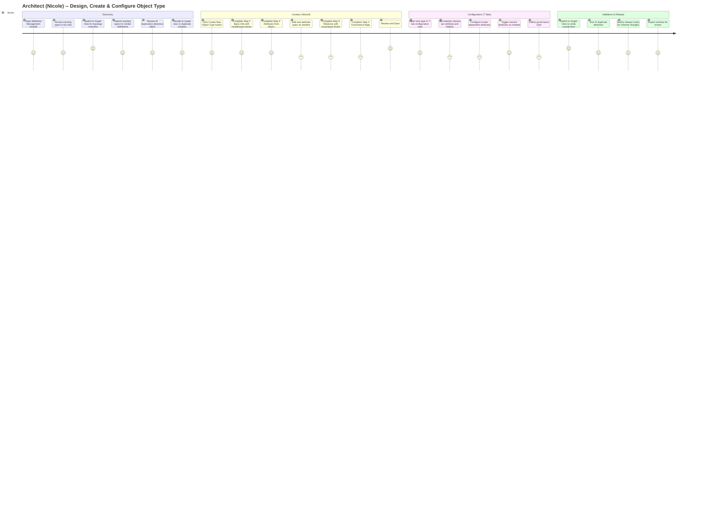
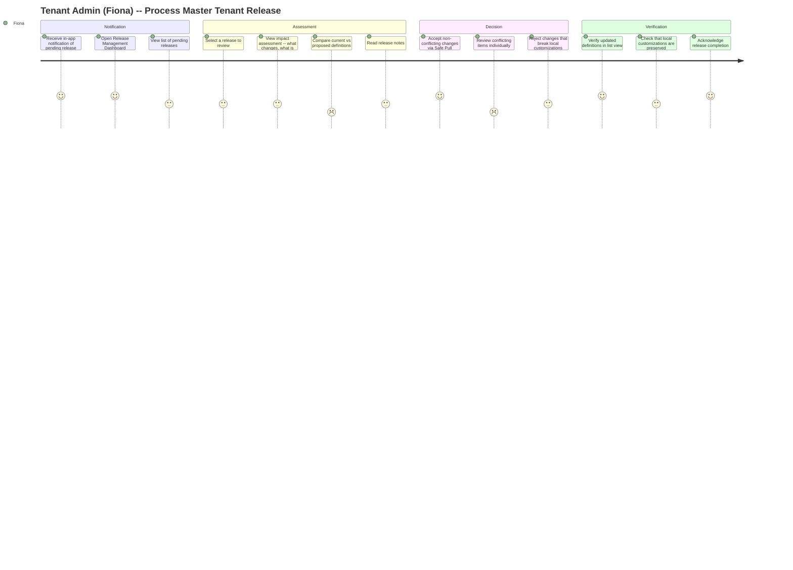
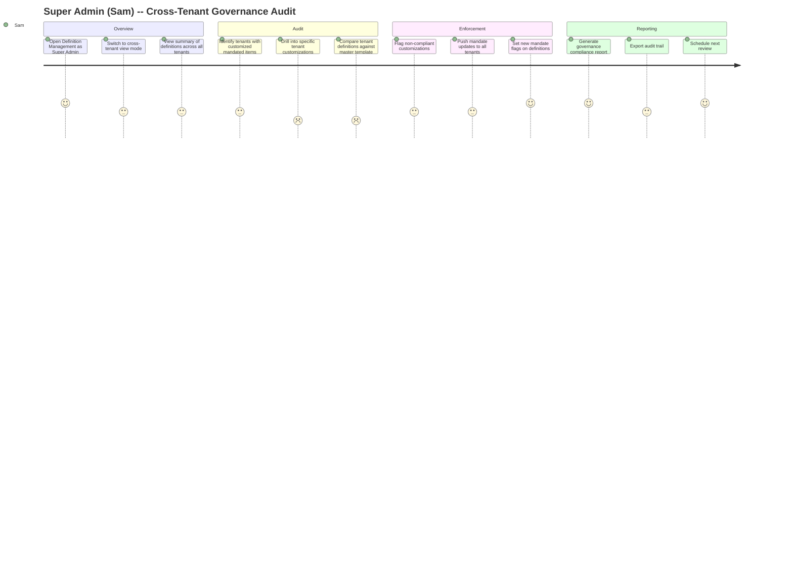
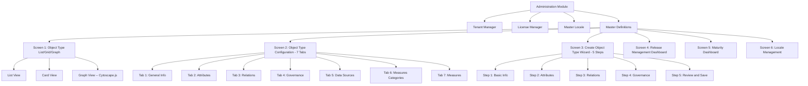
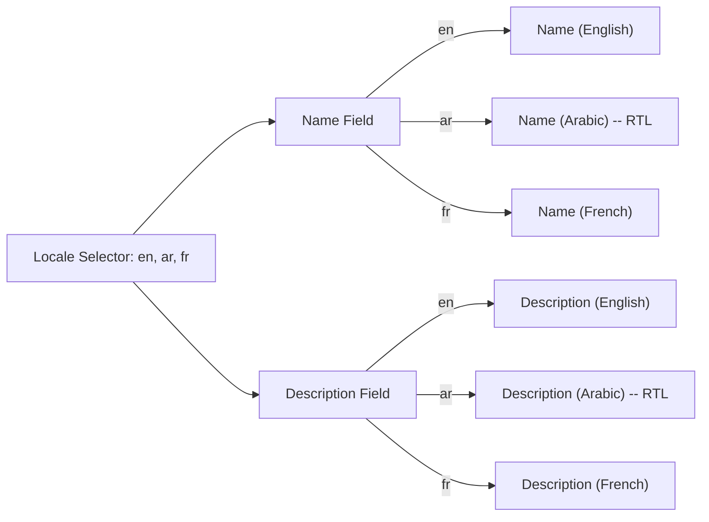
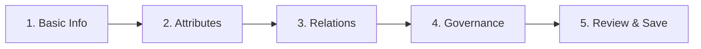
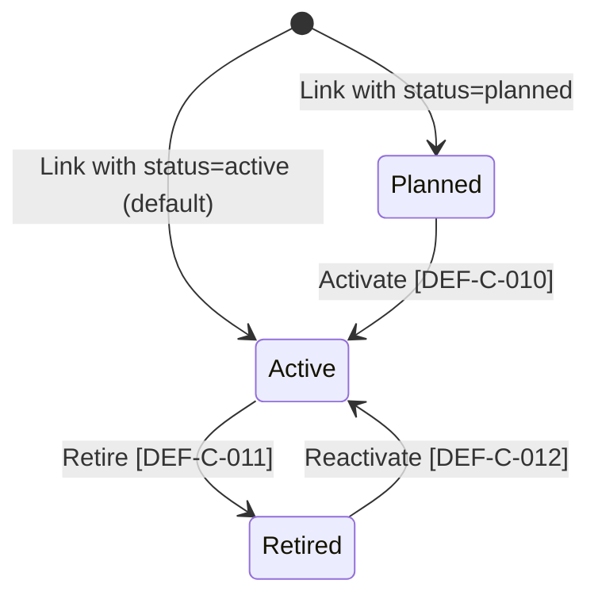
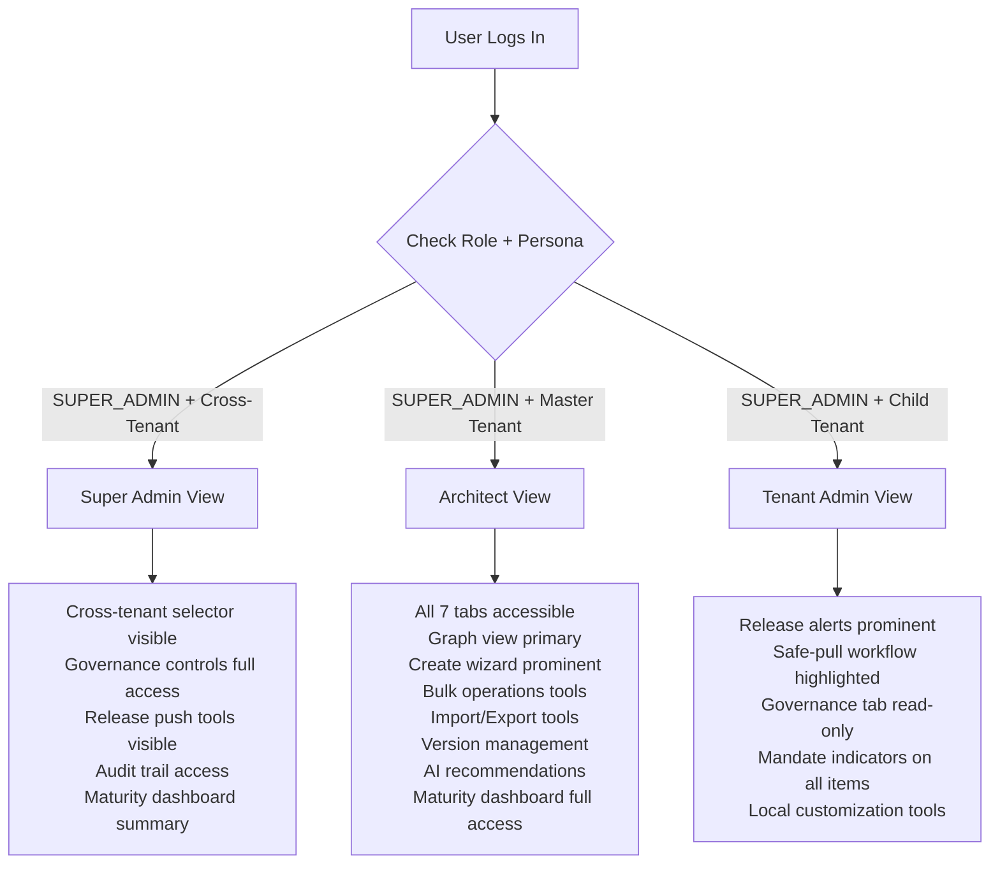

# UI/UX Design Specification: Definition Management

**Document ID:** UX-DM-001
**Version:** 1.3.0
**Date:** 2026-03-10
**Status:** Draft
**Author:** UX Agent
**Stakeholders:** Product Owner, Architecture Team, Development Team, QA Team

---

## Table of Contents

1. [Design Principles](#1-design-principles)
2. [Design System Integration](#2-design-system-integration)
3. [Personas](#3-personas)
4. [User Journeys](#4-user-journeys)
5. [Information Architecture](#5-information-architecture)
6. [Screen Specifications](#6-screen-specifications)
7. [Component Library](#7-component-library)
8. [Interaction Design](#8-interaction-design)
9. [Hyperpersonalization Matrix](#9-hyperpersonalization-matrix)
10. [AI Integration Touchpoints](#10-ai-integration-touchpoints)
11. [Responsive Design Specifications](#11-responsive-design-specifications)
12. [Accessibility Requirements](#12-accessibility-requirements)
13. [Appendix: Metrix+ UI Reference Mapping](#13-appendix-metrix-ui-reference-mapping)

---

## 1. Design Principles

### 1.1 Guiding Principles

| # | Principle | Description | Application |
|---|-----------|-------------|-------------|
| P1 | **Progressive Disclosure** | Show only what the user needs at each step; complex options revealed on demand | Wizard steps, tabbed configuration panels, collapsible governance sections |
| P2 | **Context Preservation** | Never lose the user's place; maintain state across navigation | Split-panel layout keeps list visible while editing detail; wizard saves draft state |
| P3 | **Visual Hierarchy through Neumorphism** | Use neumorphic depth cues (raised, inset, flat) to convey interactivity and grouping | Raised cards for selectable items; inset fields for inputs; flat surfaces for background |
| P4 | **Error Prevention over Error Recovery** | Disable invalid actions; pre-validate inputs; confirm destructive operations | Disable Delete on mandated items; type-ahead validation on typeKey; confirmation dialogs |
| P5 | **Persona-Adaptive UI** | Surface different controls and dashboard prominence based on the logged-in user's role | Super Admin sees cross-tenant governance; Architect sees maturity and definition tools prominently |
| P6 | **Accessibility First** | Every interaction must be keyboard-navigable, screen-reader announced, and meet WCAG AAA contrast ratios | Focus management in wizards; ARIA live regions for toast notifications; 7:1 contrast minimum |
| P7 | **Multilingual by Design** | All labels, descriptions, and content areas support RTL and multi-locale entry from the start | Locale selector in object type config; `dir="auto"` on text inputs; RTL-aware layout grid |

### 1.2 Architectural Principle References (from PRD) [PLANNED]

The following PRD architectural principles have direct UX implications. All UI behaviors described in this document conform to these principles.

| PRD Principle | UX Implication | Where Applied in This Spec |
|---------------|----------------|---------------------------|
| **AP-2: Default Attributes per Object Type** | When a new object type is created, the UI must show inherited system default attributes (name, description, status, owner, etc.) as pre-attached and non-removable. Default attributes display a `pi-shield` icon and disabled Remove button. | Section 6.2 Tab 2 (Attributes), Section 6.3 Step 2 (Wizard Attributes) |
| **AP-3: Zero Data Loss (Definition Release Safety)** | The UI must use "Retire" instead of "Delete" for attributes and connections. Confirmation dialogs must warn about instance data preservation. No hard-delete of attributes that have instance data. | Section 8.2 (Attribute Actions), Section 8.3 (Connection Actions) |
| **AP-4: Centralized Message Registry with i18n (ADR-031)** | Zero hardcoded user-facing text. All toast messages, error messages, confirmation dialogs, and status labels reference message codes (e.g., `DEF-S-001`, `DEF-E-002`) resolved at runtime from the `message_registry` table via the user's locale. | Section 8.1-8.3 (all Interaction Design actions), Section 12.4 (Screen Reader Announcements) |
| **AP-5: Lifecycle State Machines** | Attributes and connections use a 3-state lifecycle (`planned` / `active` / `retired`) instead of binary Active/Inactive. The UI renders lifecycle status as PrimeNG severity chips and provides transition actions with confirmation dialogs from the message registry. | Section 6.2 Tab 2 (Attributes), Section 8.2 (Attribute Actions) |

### 1.3 Design Constraints

| Constraint | Source | Impact |
|------------|--------|--------|
| Angular 21 + PrimeNG | Technology stack | All components must use PrimeNG primitives or custom Angular components |
| Neumorphic design system | Existing codebase (`administration.tokens.scss`) | All surfaces use the existing neumorphic shadow/color token system |
| Neo4j graph backend | `definition-service` uses Neo4j SDN | Graph visualization must reflect Neo4j relationship model |
| Tenant isolation | JWT `tenant_id` claim | All UI data is scoped to current tenant; cross-tenant views require SUPER_ADMIN role |
| SUPER_ADMIN role required | `SecurityConfig.java` | Definition management is only accessible to SUPER_ADMIN users |

---

## 2. Design System Integration

### 2.1 Color Palette (from `administration.tokens.scss`)

| Token | Value | Usage |
|-------|-------|-------|
| `--adm-primary` | `#428177` | Primary interactive elements, accent borders, active tab indicators |
| `--adm-primary-hover` | `#054239` | Hover state for primary buttons |
| `--adm-bg` / `--adm-surface` | `#edebe0` | Page background, card surfaces (neumorphic base) |
| `--adm-surface-alt` | `#edebe0` | Inset panel backgrounds, input field backgrounds |
| `--adm-text-strong` | `#3d3a3b` | Primary body text, headings |
| `--adm-text-muted` / `--adm-on-primary` | `#3d3a3b` / `#ffffff` | Secondary text / text on primary-colored surfaces |
| `--adm-danger` | `#6b1f2a` | Error states, destructive action text |
| `--adm-danger-hover` | `#4a151e` | Hover state for danger buttons |
| `--bs-color-success-strong` | `#054239` | Success state text |
| `--bs-color-warning-rgb` | `185, 167, 121` | Warning backgrounds (soft) |

### 2.2 Typography

| Element | Font | Size | Weight | Token |
|---------|------|------|--------|-------|
| Page heading (h2) | Gotham Rounded / Nunito | 1.5rem (24px) | 700 | `--adm-font-brand` |
| Section heading (h3) | Gotham Rounded / Nunito | 1.125rem (18px) | 700 | `--adm-font-brand` |
| Subsection heading (h4) | System sans-serif | 0.88rem (14px) | 600 | inherit |
| Body text | System sans-serif | 0.84rem (13.4px) | 400 | inherit |
| Small / muted | System sans-serif | 0.75rem (12px) | 400 | inherit |
| Code / monospace | SF Mono / Fira Code | 0.76rem (12.2px) | 400 | `--adm-font-code` |
| Label (uppercase) | System sans-serif | 0.72rem (11.5px) | 600 | `.label` class |

### 2.3 Spacing System (8px base)

| Token | Value | Usage |
|-------|-------|-------|
| xs | 4px | Inline icon gaps, micro spacing |
| sm | 8px | Inner padding of compact elements |
| md | 12px | Standard gap between stacked elements |
| lg | 16px | Card padding, section spacing |
| xl | 24px | Major section separators |
| 2xl | 32px | Page-level margins |
| 3xl | 48px | Hero section spacing |

### 2.4 Neumorphic Shadow Tokens

| Shadow Type | Token | Usage |
|-------------|-------|-------|
| Raised card | `--tm-shadow-card` | Main panels, detail cards |
| Raised item | `--tm-shadow-item` | List items, card grid items |
| Raised item hover | `--tm-shadow-item` + translateY(-1px) | Hover lift effect |
| Inset (active/selected) | `--tm-shadow-item-active` | Selected list item, active tab |
| Inset input | `--tm-shadow-input-inset` | Text fields, dropdowns |
| Inset search | `--tm-shadow-search-inset` | Search bar, filter controls |
| Pill | `--tm-shadow-pill` | Toggle buttons, status pills |
| Dialog | `--adm-dialog-shadow` | Modal overlays |

### 2.5 Border Radius

| Token | Value | Usage |
|-------|-------|-------|
| `--adm-radius-card` | 1rem (16px) | Main panel cards, dialog |
| `--adm-radius-control` | 0.72rem (~11.5px) | Inputs, dropdowns, small cards |
| `--adm-radius-pill` | 999px | Toggle buttons, search fields, tags |

---

## 3. Personas

### 3.1 Persona: Super Admin (Sam)

| Attribute | Detail |
|-----------|--------|
| **Name** | Sam Martinez |
| **Role** | Super Admin -- Application Custodian |
| **Organization** | Government master entity overseeing subsidiary agencies |
| **Age / Demographics** | 42, Abu Dhabi, Arabic/English bilingual |
| **Goals** | 1. Ensure platform governance across all tenants. 2. Override definitions when policy changes mandate it. 3. Monitor overall system health and definition consistency. |
| **Frustrations** | 1. Cannot see what subsidiary tenants have customized at a glance. 2. No audit trail of governance overrides. 3. Bulk operations are slow -- must configure one type at a time. |
| **Tech Comfort** | 4/5 -- Power user comfortable with admin panels, not a developer |
| **Channel** | Web (desktop) -- 27" monitor typical |
| **Frequency** | Weekly -- governance review sessions |
| **Key Tasks** | Cross-tenant definition audit, mandate flag management, release management |
| **Success Metric** | Time to propagate governance changes < 15 minutes across all tenants |

### 3.2 Persona: Architect (Nicole) -- PRIMARY PERSONA

| Attribute | Detail |
|-----------|--------|
| **Name** | Nicole Roberts |
| **Role** | Architect -- Definitions Repository Owner (designs, configures, and governs object type taxonomy) |
| **Organization** | Central IT of master tenant |
| **Age / Demographics** | 35, Dubai, English primary, Arabic secondary |
| **Goals** | 1. Design and govern the object type schema for the entire platform. 2. Rapidly create and configure object types with proper attribute and relation setup. 3. Define attribute taxonomies and connection patterns. 4. Ensure correct maturity classifications and locale completeness. 5. Ensure the type system is extensible, consistent, and well-documented. |
| **Frustrations** | 1. No visual graph view to understand the full type system topology. 2. Cannot see maturity impact of adding/removing attributes. 3. Versioning is manual -- no way to diff or rollback changes. 4. Repetitive manual configuration with no attribute template library. 5. No AI-assisted suggestions during creation. |
| **Tech Comfort** | 5/5 -- Highly technical, comfortable with graph databases, APIs, forms, wizards, and data modeling |
| **Channel** | Web (desktop) -- dual-monitor setup, 1440p or higher |
| **Frequency** | Daily -- creates/configures object types, designs schema, reviews AI alerts, authors release notes |
| **Key Tasks** | Object type creation wizard, attribute management, connection setup, bulk operations, full 7-tab configuration, graph visualization, import/export, version management |
| **Success Metric** | Zero orphaned attributes or inconsistent connections; average time to create a fully configured object type < 10 minutes |

<!-- Persona 3.3 (Quality Manager/Ravi) removed 2026-03-10. Maturity features reassigned to Architect (Nicole) and Super Admin (Sam). -->

### 3.3 Persona: Tenant Admin (Fiona)

| Attribute | Detail |
|-----------|--------|
| **Name** | Fiona Shaw |
| **Role** | Tenant Admin -- Manages definitions within subsidiary tenant |
| **Organization** | Subsidiary government agency |
| **Age / Demographics** | 31, Abu Dhabi, Arabic primary, English secondary |
| **Goals** | 1. Accept or reject definition updates pushed from master tenant. 2. Add local attributes and types that complement the master schema. 3. Keep local definitions in sync without breaking mandated items. |
| **Frustrations** | 1. No clear notification when master tenant pushes new definitions. 2. Impact of accepting changes is unclear (what changes, what breaks). 3. Cannot preview changes before accepting them. |
| **Tech Comfort** | 3/5 -- Needs clear visual cues and guided workflows |
| **Channel** | Web (desktop) + notifications (email/in-app) |
| **Frequency** | Weekly -- responds to release alerts, adjusts local definitions |
| **Key Tasks** | Review release notifications, safe-pull workflow, local customization |
| **Success Metric** | Zero accidental overrides of mandated definitions |

<!-- Persona 5 (Data Steward/Omar) merged into Persona 2 (Architect/Nicole) per consolidation decision 2026-03-10 -->
<!-- Persona 6 (End User/Layla) removed -- will be defined in Instance Management module (Phase 2) -->

---

## 4. User Journeys

### 4.1 Journey: Architect Designs New Object Type Schema



**Touchpoints:** Object Type List (Screen 1), Create Wizard (Screen 3), Object Type Configuration Tabs (Screen 2), Graph View (Screen 1 - graph tab)

<!-- Journey 4.2 (Quality Manager Monitors Maturity) removed 2026-03-10. Maturity monitoring is now part of Architect (Nicole) workflow via Journey 4.1 and the Maturity Dashboard screen. -->

### 4.2 Journey: Tenant Admin Receives and Processes Release



**Touchpoints:** Notification bell (global header), Release Management Dashboard (Screen 4), Object Type List (Screen 1)

<!-- Journey 4.3 (Data Steward) merged into Journey 4.1 (Architect) per persona consolidation 2026-03-10 -->

### 4.3 Journey: Super Admin Performs Cross-Tenant Governance Audit



**Touchpoints:** Object Type List with cross-tenant filter (Screen 1), Release Management (Screen 4), Governance Tab (Screen 2 Tab 4)

---

## 5. Information Architecture

### 5.1 Navigation Sitemap



### 5.2 Navigation Patterns

| Pattern | Implementation |
|---------|---------------|
| **Primary navigation** | Left sidebar dock in Administration module (existing) |
| **Secondary navigation** | View mode toggle (List/Card/Graph) in Screen 1 toolbar |
| **Tertiary navigation** | Tab strip in Screen 2 (7 tabs) |
| **Wizard navigation** | Step indicator with numbered steps in Screen 3 |
| **Deep linking** | Hash-based routes: `/admin/definitions`, `/admin/definitions/:id`, `/admin/definitions/:id/tab/:tabId` |
| **Back navigation** | Breadcrumb: Administration > Master Definitions > [Object Type Name] |

---

## 6. Screen Specifications

### 6.1 Screen 1: Object Type List/Grid/Graph View

**Route:** `/admin/definitions`
**Status:** [IN-PROGRESS] -- List and Card views implemented; Graph view is [PLANNED]
**Evidence:** `master-definitions-section.component.html`, `master-definitions-section.component.ts`

#### 6.1.1 Layout Structure

```
+---------------------------------------------------------------------------------+
| [Breadcrumb: Administration > Master Definitions]                               |
+---------------------------------------------------------------------------------+
| TOOLBAR                                                                         |
| [h3: Object Types]  [View Toggle: List|Card|Graph]  [+ Create New Object Type] |
+---------------------------------------------------------------------------------+
| FILTER ROW                                                                      |
| [Search Input (icon: pi-search)]  [Status Dropdown: All|Active|Planned|...]     |
+---------------------------------------------------------------------------------+
| MAIN CONTENT AREA (varies by view mode)                                         |
|                                                                                 |
| LIST VIEW:           | DETAIL PANEL (right):                                   |
| Split-panel layout   | Shows selected object type                              |
| (left 280-400px,     | with 7 configuration tabs                               |
|  right flex)         |                                                          |
|                      |                                                          |
| CARD VIEW:           | Same detail panel                                       |
| 2-column card grid   |                                                          |
|                      |                                                          |
| GRAPH VIEW:          | Full-width Cytoscape.js canvas                           |
| (replaces split)     | with overlay detail panel on node click                  |
+---------------------------------------------------------------------------------+
| FOOTER: Record count: "Showing X of Y object types"                            |
+---------------------------------------------------------------------------------+
```

#### 6.1.2 Component Specifications

**Toolbar**

| Component | PrimeNG | Props/Config |
|-----------|---------|-------------|
| Heading | Native `<h3>` | Text: "Object Types", class: `list-head h3` |
| View Toggle | Custom radio button group | 3 buttons: `pi-list` (List), `pi-th-large` (Card), `pi-sitemap` (Graph). Role: `radiogroup`. ARIA label: "Object type view mode" |
| Create Button | `p-button` | Label: "New Object Type", Icon: `pi-plus`, Severity: primary, `data-testid="definitions-create-btn"` |

**Filter Row**

| Component | PrimeNG | Props/Config |
|-----------|---------|-------------|
| Search Input | `pInputText` | Placeholder: "Search by name, key, or code...", Icon prefix: `pi-search`, class: `type-search`, debounce: 300ms |
| Status Dropdown | `p-select` | Options: All, Active, Planned, On Hold, Retired. Default: "All". class: `status-dropdown` |

**List View (Left Panel)** [IMPLEMENTED]

| Element | Component | Details |
|---------|-----------|---------|
| List container | `<ul>` with `role="listbox"` | class: `type-items`, max-height: 520px, overflow-y: auto |
| List item | `<li>` with `role="option"` | class: `type-item`, click: `selectObjectType(ot)`, keyboard: Enter/Space to select |
| Icon circle | `<div>` | 32x32px circle, background: `ot.iconColor`, icon: `pi pi-${ot.iconName}` |
| Type name | `<strong>` | Font: 0.86rem, truncate with ellipsis |
| Type key | `<span>` | Font: monospace 0.72rem, class: `type-key` |
| Status tag | `p-tag` | Severity mapped from `OBJECT_TYPE_STATUS_SEVERITY` |
| State tag | `p-tag` | Severity mapped from `OBJECT_TYPE_STATE_SEVERITY` |
| Delete button | `p-button` | Icon: `pi-trash`, text mode, danger severity, hidden until hover, `data-testid="definitions-delete-${ot.typeKey}"` |
| Duplicate button | `p-button` | Icon: `pi-copy`, text mode, secondary severity, hidden until hover |

**Card View** [IMPLEMENTED]

| Element | Component | Details |
|---------|-----------|---------|
| Card grid | CSS Grid | `grid-template-columns: repeat(2, 1fr)`, gap: 0.6rem |
| Card | `<div>` | class: `type-card`, click: `selectObjectType(ot)`, padding: 0.75rem |
| Card head | Flex row | Icon circle (32px) + name (bold) + status tag |
| Card meta | Flex row | Attribute count (`pi-list` + count), Connection count (`pi-sitemap` + count) |
| Card delete | `p-button` | Absolute positioned top-right, appears on hover |

**Graph View** [PLANNED]

| Element | Component | Details |
|---------|-----------|---------|
| Graph container | `<div>` hosting Cytoscape.js | Full width of main content area, min-height: 500px |
| Node rendering | Cytoscape node | Shape: rounded rectangle. Background: `ot.iconColor`. Label: `ot.name`. Icon overlay. |
| Edge rendering | Cytoscape edge | Label: `activeName`. Style: solid for `CAN_CONNECT_TO`, dashed for `IS_SUBTYPE_OF`. Arrow: directed if `isDirected=true`. |
| Layout controls | Toolbar overlay | Buttons: Zoom In, Zoom Out, Fit All, Reset Layout. Layout algorithm: `cose-bilkent` (force-directed). |
| Filter sync | Shared signal | Graph filters sync with the same search/status signals used by list/card views |
| Node click | Event handler | Opens detail panel as overlay sidebar on the right |
| Export | `p-button` | Icon: `pi-download`, exports as PNG or SVG via `cy.png()` / `cy.svg()` |

**Loading State** [IMPLEMENTED]

| State | Rendering |
|-------|-----------|
| Loading | 5 skeleton rows using `p-skeleton`: circle (32px) + 2 text lines |
| Empty (no types) | Icon `pi-inbox` (2rem, muted), message "No object types found", Create button |
| Empty (filter no match) | Icon `pi-search` (2rem, muted), message "No matching object types" |
| Error | Error banner with `pi-exclamation-triangle`, message text, Retry button, Dismiss button |

**Detail Panel (Right Panel)** [IMPLEMENTED]

| Element | Component | Details |
|---------|-----------|---------|
| Detail card | `<div>` | class: `detail-card`, neumorphic raised shadow |
| Header | Flex row | Icon circle (42px) + name (h3) + typeKey code badge |
| Action buttons | `p-button` group | Edit (`pi-pencil`), Duplicate (`pi-copy`), Restore (`pi-replay`, only if state=customized), Delete (`pi-trash`) |
| Description | `<p>` | class: `detail-description`, font: 0.88rem, line-height: 1.55 |
| Meta grid | CSS Grid | Auto-fit columns, min 140px. Fields: Status (tag), State (tag), Created, Updated, Attributes count, Connections count |
| Tab strip | `p-tabs` | See Section 6.2 for full tab specification |
| Empty detail | `<div>` | class: `empty-detail-card`, icon `pi-arrow-left`, message "Select an object type" |

#### 6.1.3 Data Table Columns (for future p-table enhancement)

| Column | Field | Width | Sortable | Filterable |
|--------|-------|-------|----------|------------|
| Icon | `iconName` + `iconColor` | 48px | No | No |
| Name | `name` | flex | Yes | Yes (search) |
| Code | `code` | 100px | Yes | No |
| Status | `status` | 100px | Yes | Yes (dropdown) |
| State | `state` | 120px | Yes | Yes (dropdown) |
| Maturity Score | `maturityScore` [PLANNED] | 120px | Yes | No |
| Active Attrs | `attributes.length` | 80px | Yes | No |
| Relations | `connections.length` | 80px | Yes | No |
| Actions | -- | 120px | No | No |

---

### 6.2 Screen 2: Object Type Configuration (7 Tabs)

**Route:** `/admin/definitions/:id` or detail panel within split-panel
**Status:** [IN-PROGRESS] -- Attributes and Connections tabs partially implemented; 5 additional tabs are [PLANNED]

#### Tab 1: General Info [IN-PROGRESS]

**Currently implemented fields:** name, description, iconName, iconColor, status (via edit mode).
**Planned enhancements:** Multilingual name/description, locale selector, additional properties.

| Field | Component | Type | Validation | Locale-Aware |
|-------|-----------|------|------------|--------------|
| Name | `pInputText` | text | Required, max 255 chars | Yes -- per locale |
| Type Key | `pInputText` (readonly after creation) | text | Auto-derived, unique within tenant, max 100 chars | No |
| Code | `pInputText` (readonly) | text | Auto-generated OBJ_NNN, max 20 chars | No |
| Description | `<textarea>` | textarea | Max 2000 chars | Yes -- per locale |
| Icon | Icon grid picker (custom) | selection | Required, default "box" | No |
| Icon Color | Color swatch picker (custom) | color | Required, default "#428177" | No |
| Status | Button group (`status-buttons`) | enum | Required: active, planned, hold, retired | No |
| State | `p-tag` (readonly) | display | Read-only: default, customized, user_defined | No |
| Locale Selector [PLANNED] | `p-select` or `p-tabview` | dropdown/tabs | Shows name/description fields per selected locale | Yes |
| Master Mandate [PLANNED] | `p-toggleswitch` | boolean | Only visible/editable for master tenant users | No |
| Version [PLANNED] | Display field | number | Read-only, auto-incremented | No |

**Locale-Aware Field Rendering:**



#### Tab 2: Attributes [IN-PROGRESS]

**Currently implemented:** Attribute list with add/remove, isRequired flag.
**Planned enhancements:** Lifecycle status selector (planned/active/retired per AP-5), maturity class, language-dependent flag, lock indicator, display order drag, system default indicator (per AP-2).

| Column | Component | Width | Details |
|--------|-----------|-------|---------|
| Drag handle | Icon `pi-bars` | 32px | Drag to reorder (`displayOrder`). Not yet implemented. |
| Name | Text | flex | Attribute type name. Bold if required. |
| Key | Code badge | 120px | `attributeKey` in monospace |
| Data Type | `p-tag` | 80px | Severity: info |
| Group | Text | 100px | `attributeGroup` or "--" |
| Lifecycle Status [PLANNED] | `p-tag` (severity chip) | 80px | 3-state lifecycle per AP-5: `planned` (severity: info, blue), `active` (severity: success, green), `retired` (severity: warn, orange/grey). Click opens transition action menu. Retired attributes hidden from instance forms but data preserved (AP-3). |
| Maturity Class [PLANNED] | `p-select` | 120px | Options: Mandatory, Conditional, Optional. Drives maturity scoring. |
| Language Dependent [PLANNED] | `p-checkbox` or icon | 40px | Flag icon `pi-globe` when true |
| Lock Status [PLANNED] | Icon `pi-lock` / `pi-lock-open` | 32px | Locked = master mandate, cannot edit in child tenant |
| Actions | `p-button` group | 80px | Remove (`pi-times`), only enabled if not mandated |

**Add Attribute Dialog (existing):**

| Field | Component | Validation |
|-------|-----------|------------|
| Attribute Type | `p-select` | Required. Filtered to exclude already-linked attributes. |
| Is Required | `p-checkbox` | Default: false |
| Display Order | Auto-calculated | `attributes.length + 1` |

#### Tab 3: Relations [IN-PROGRESS]

**Currently implemented:** Connection list with add/remove, active/passive names, cardinality, directed.
**Planned enhancements:** Importance level, per-locale active/passive names, mandatory/conditional/optional flag.

| Column | Component | Width | Details |
|--------|-----------|-------|---------|
| Direction icon | Icon | 32px | `pi-arrow-right` (directed) or `pi-arrows-h` (undirected) |
| Target Type | Text + icon circle | flex | Target object type name with its icon |
| Active Name | Text | 150px | Per-locale active name (e.g., "runs on") |
| Passive Name | Text | 150px | Per-locale passive name (e.g., "hosts") |
| Cardinality | `p-tag` | 100px | one-to-one, one-to-many, many-to-many |
| Importance [PLANNED] | `p-select` | 100px | Options: Critical, Important, Informational |
| Maturity Class [PLANNED] | `p-select` | 120px | Mandatory, Conditional, Optional |
| Lock Status [PLANNED] | Icon `pi-lock` | 32px | Master mandate indicator |
| Actions | `p-button` group | 80px | Remove (`pi-times`), Edit (`pi-pencil`) |

#### Tab 4: Governance [PLANNED]

**Layout:** Split-panel (mirroring Metrix+ Governance tab pattern)

**Left Panel — Workflow List:**

| Section | Component | Details |
|---------|-----------|---------|
| Workflow List Header | `h3` + `p-button` (Add) | "Workflow List" heading with primary Add button (icon: `pi-plus`, label: "Add") |
| Workflow Table | `p-table` | Columns: Workflow Name, Active Version, Create Workflow (link/button), Actions (edit `pi-pencil`, delete `pi-trash`) |
| Empty State | `<div>` with icon | "No workflows attached. Click Add to configure workflow governance for this object type." |

**Right Panel — Direct Operation Settings:**

| Section | Component | Details |
|---------|-----------|---------|
| Operations Table | `p-table` | Columns: Operation, Status (`p-tag` Enabled/Disabled), Template (name or "-"), Actions (edit `pi-pencil`) |
| Operations | Static rows | `allowDirectCreate`, `allowDirectUpdate`, `versionTemplate`, `viewTemplate`, `allowDirectDelete` |
| Status Toggle | Inline `p-tag` | Green "Enabled" / Grey "Disabled" -- toggled via edit action. Note: this is a binary operational toggle, distinct from the 3-state lifecycle (AP-5) used for attributes and connections. |
| Template Column | Text or `p-tag` | Shows assigned template name, "-" if none, or "No Template Required" |

**Workflow Settings Dialog (opened by Add or Edit):**

| Section | Component | Details |
|---------|-----------|---------|
| Dialog | `p-dialog` | Title: "Workflow Settings", width: 700px, modal: true |
| Workflow Selector | `p-select` | Label: "Workflow", placeholder: "Select Workflow", loads available workflows from process-service |
| Behaviour | Radio group (`p-radiobutton`) | Options: Create, Reading, Reporting, Other — determines when this workflow triggers |
| Permission Table | `p-table` | Columns: Username/Role, Type, Actions (remove `pi-times`) |
| Add Permission | `p-button` | Label: "Add User / Role", opens user/role picker |
| Footer | `p-button` group | Close (secondary), Save (primary) |

**Governance Settings (below split panel):**

| Section | Component | Details |
|---------|-----------|---------|
| Master Mandate Flag | `p-toggleswitch` + label | "This object type is mandated by master tenant." Only editable for master tenant users. |
| Override Policy | `p-select` | Options: "No overrides allowed", "Additive only (child can add, not remove)", "Full customization" |
| Audit Trail | `p-timeline` or table | Shows governance change history: who, when, what changed |

#### Tab 5: Data Sources [PLANNED]

**Layout:** Vertical stack with Connection List on top and Scheduling below (mirroring Metrix+ Data Sources tab pattern)

| Section | Component | Details |
|---------|-----------|---------|
| Connection List Header | `h3` | "Connection List" heading with Save and Execute action buttons (right-aligned, disabled until connection selected) |
| Connection Selector | `p-select` | Placeholder: "Please Select Connection", loads available data connections |
| Connection Details | Card list | Once connection selected, displays connection details as stacked cards (connection parameters, field mappings, status) — skeleton loading state while fetching |
| Save Button | `p-button` | Saves connection configuration (disabled until changes made) |
| Execute Button | `p-button` | Manually triggers data sync from this connection (disabled until connection saved) |
| Scheduling Section | `h3` + `p-button` | "Scheduling" heading with Schedule button — opens scheduling dialog to configure periodic sync (cron-like) |
| Add Data Source | `p-button` + Dialog | Dialog: Name, Connection Type (`p-select`: API, Database, File), Connection String / URL, Authentication config |
| Mapping Configuration | Nested table or dialog | Map source fields to attribute types on this object type |
| Test Connection | `p-button` | Tests connectivity and displays result toast |

#### Tab 6: Measures Categories [PLANNED]

| Section | Component | Details |
|---------|-----------|---------|
| Category List | `p-table` | Columns: Category Name, Description, Measure Count, Active toggle |
| Add Category | `p-button` + inline form | Name (`pInputText`), Description (`<textarea>`) |
| Category Ordering | Drag handle | Reorder categories by display priority |

#### Tab 7: Measures [PLANNED]

| Section | Component | Details |
|---------|-----------|---------|
| Measures List | `p-table` | Columns: Measure Name, Category, Unit, Target Value, Threshold (warning/critical), Active toggle |
| Add Measure | `p-button` + Dialog | Name, Category (`p-select`), Unit (`pInputText`), Target (`pInputNumber`), Warning threshold, Critical threshold, Description |
| Measure Formula | Code editor or `<textarea>` | Expression for calculated measures |

---

### 6.3 Screen 3: Create Object Type Wizard (5 Steps)

**Status:** [IN-PROGRESS] -- 4 steps implemented (Basic Info, Connections, Attributes, Status/Review). Needs enhancement to 5 steps with Governance.
**Evidence:** `master-definitions-section.component.ts` lines 236-521; HTML lines 606-1053.

#### Wizard Step Indicator



| Component | PrimeNG | Details |
|-----------|---------|---------|
| Step bar | Custom (existing `wizard-steps` class) | Flex row with numbered circles, labels, active/completed states |
| Step circle | `<span>` | 20x20px, centered number, accent bg when active, accent-soft bg when completed |
| Step label | `<span>` | Hidden below 980px breakpoint |

#### Step 1: Basic Info

| Field | Component | Validation | Notes |
|-------|-----------|------------|-------|
| Name (per locale) | `pInputText` | Required, max 255. Show char count. | Primary locale required; additional locales shown via locale tabs/selector |
| Type Key | `pInputText` (readonly, auto-derived) | Auto from name: lowercase, underscores. Unique within tenant. | Lock icon to indicate read-only. Editable if blank on first focus. |
| Description (per locale) | `<textarea>` class `wizard-textarea` | Max 2000 chars. Show char count. | Optional but recommended |
| Icon | Icon grid picker | Required. Default: "box" | 76 icons in 38px grid, selected state with accent bg |
| Icon Color | Color swatch picker | Required. Default: "#428177" | 12 preset swatches + custom color input |
| Status | Button group (4 buttons) | Required. Default: "active" | Active, Planned, On Hold, Retired |

#### Step 2: Attributes

| Element | Component | Details |
|---------|-----------|---------|
| Step hint | `<p>` | "Select attributes to include in this object type. You can adjust order and settings later." |
| Attribute pick list | Scrollable list (max-height 280px) | Checkbox + name + key + data type tag per item. Selected items highlighted. |
| Create New Attribute | `p-button` (link style) | Opens inline dialog or navigates to create attribute type form |
| Selected count | Badge / text | "N attributes selected" |
| Maturity Class [PLANNED] | `p-select` per attribute | Set Mandatory/Conditional/Optional during creation |

#### Step 3: Relations

| Element | Component | Details |
|---------|-----------|---------|
| Added connections list | Scrollable list | Icon (`pi-link`), target name, active/passive names, cardinality tag, remove button |
| Add Connection form | Fieldset below list | Target Type (`p-select` of existing types), Active Name (`pInputText`), Passive Name (`pInputText`), Cardinality (`p-select`), Directed (`p-checkbox`) |
| Add button | `p-button` | Disabled until target type and active name provided |
| Importance [PLANNED] | `p-select` | Critical, Important, Informational |

#### Step 4: Governance [PLANNED]

| Element | Component | Details |
|---------|-----------|---------|
| Master Mandate toggle | `p-toggleswitch` | "Make this type mandatory for all child tenants" |
| Override Policy | `p-select` | "No overrides", "Additive only", "Full customization" |
| Propagation Strategy | `p-select` | "Immediate push", "Queue for review", "Manual release" |
| Hint text | `<p>` | "Governance settings control how this type is managed across tenants. You can adjust these later in the Governance tab." |

#### Step 5: Review and Save

| Element | Component | Details |
|---------|-----------|---------|
| Review grid | 2-column grid | Field labels + values for all wizard inputs |
| Icon preview | Circle with selected icon and color | 52x52px preview box |
| Attributes summary | Count + list of names | "3 attributes: [Name], [Description], [Owner]" |
| Connections summary | Count + list of targets | "2 connections: Server (runs on), Application (hosts)" |
| Governance summary [PLANNED] | Text | "Master mandate: Yes. Override policy: Additive only." |
| Save button | `p-button` | Label: "Create Object Type", Icon: `pi-check`, Severity: primary, Loading state during save |
| Back button | `p-button` | Label: "Back", Severity: secondary |
| Cancel button | `p-button` | Label: "Cancel", Text mode |

---

### 6.4 Screen 4: Release Management Dashboard [PLANNED]

**Route:** `/admin/definitions/releases`
**Status:** [PLANNED] -- No code exists

#### Layout

| Section | Component | Details |
|---------|-----------|---------|
| Page header | `<h3>` + badges | "Release Management" + badge showing pending release count |
| Release list | `p-table` | Columns: Release ID, Source Tenant, Date, Items Changed, Status (Pending/Accepted/Rejected/Partial), Actions |
| Release detail panel | Split-panel right side | Opens on row click |

#### Release Detail

| Section | Component | Details |
|---------|-----------|---------|
| Release header | Flex row | Release ID, date, source tenant name, release notes button |
| Impact assessment | `p-table` | Columns: Item Type (Object Type / Attribute / Connection), Item Name, Change Type (Added / Modified / Removed), Conflict Status |
| Conflict indicator | `p-tag` | Green: "No conflict", Amber: "Local customization exists", Red: "Breaking change" |
| Side-by-side diff | 2-column layout | Left: Current definition. Right: Proposed change. Highlighted diffs. |
| Action buttons | `p-button` group | "Accept All" (primary), "Accept Non-Conflicting" (secondary), "Reject All" (danger text), "Review Each" (outlined) |
| Per-item actions | Inline buttons | Accept / Reject / Merge per conflict item |

#### Release Notes Viewer

| Section | Component | Details |
|---------|-----------|---------|
| Dialog | `p-dialog` | Modal with release notes in markdown-rendered format |
| Content | Rich text or `<pre>` | Formatted change description from master tenant |

---

### 6.5 Screen 5: Maturity Dashboard [PLANNED]

**Route:** `/admin/definitions/maturity`
**Status:** [PLANNED] -- No code exists

#### Layout

| Section | Component | Details |
|---------|-----------|---------|
| Summary cards | Flex row (3 cards) | Overall Maturity % (gauge), Types Below Threshold count, Attributes Missing Total |
| Per-type table | `p-table` | Columns: Object Type (icon + name), Instance Count, Avg Maturity %, Mandatory Fill %, Conditional Fill %, Optional Fill %, Trend (sparkline) |
| Type drill-down | Expandable row or panel | Shows per-instance scores for selected type |

#### Maturity Gauge [PLANNED]

| Component | Details |
|-----------|---------|
| Gauge chart | Circular progress indicator (SVG or PrimeNG `knob`) |
| Center text | Percentage value (large font) |
| Label | "Overall Maturity" |
| Color coding | Green (>80%), Amber (50-80%), Red (<50%) |

#### Per-Instance Drill-Down

| Column | Details |
|--------|---------|
| Instance Name/ID | Clickable link to instance detail |
| Maturity Score | Progress bar with percentage |
| Missing Mandatory | Count (should be 0 if creation enforces) |
| Missing Conditional | Count + list on hover/expand |
| Missing Optional | Count + list on hover/expand |
| AI Suggestion | "Fill [attribute] for +5% maturity" |

---

### 6.6 Screen 6: Locale Management [PLANNED]

**Route:** `/admin/definitions/locales`
**Status:** [PLANNED] -- No code exists

#### Layout

| Section | Component | Details |
|---------|-----------|---------|
| Active Locales | `p-table` or card list | Columns: Locale Code (en, ar, fr), Language Name, Direction (LTR/RTL), Required toggle, Actions |
| Add Locale | `p-button` + dialog | Select from ISO 639-1 list, set as required/optional |
| Translation Progress | `p-table` | Per object type: Type Name, Total Fields, Translated %, per locale columns showing fill % |

#### Locale Detail Dialog

| Field | Component | Details |
|-------|-----------|---------|
| Locale Code | `p-select` (ISO 639-1 list) | e.g., en, ar, fr, de, zh |
| Language Name | Auto-filled from selection | "English", "Arabic", etc. |
| Text Direction | Auto-filled from locale | LTR or RTL |
| Is Required | `p-toggleswitch` | If required, all language-dependent attributes must have values in this locale |
| Fallback Locale | `p-select` | Optional fallback if translation missing |

---

## 7. Component Library

### 7.1 PrimeNG Components Used

| Component | Import Module | Usage in Definition Management |
|-----------|---------------|-------------------------------|
| `p-button` | `ButtonModule` | All action buttons (create, save, delete, cancel, navigation) |
| `p-dialog` | `DialogModule` | Creation wizard, confirmation dialogs, add attribute/connection dialogs |
| `p-tag` | `TagModule` | Status badges, state badges, data type indicators, cardinality labels |
| `p-select` | `SelectModule` | Status filter, cardinality selection, data type, locale, maturity class |
| `p-tabs` / `p-tablist` / `p-tab` / `p-tabpanels` / `p-tabpanel` | `TabsModule` | 7-tab configuration panel, locale tabs |
| `pInputText` | `InputTextModule` | Name fields, search, type key, description |
| `p-checkbox` | `CheckboxModule` | Attribute selection, directed toggle, language-dependent flag |
| `p-toggleswitch` [PLANNED] | `ToggleSwitchModule` | Active/inactive attribute toggle, master mandate flag, governance toggles |
| `p-skeleton` | `SkeletonModule` | Loading state placeholders |
| `p-progressspinner` | `ProgressSpinnerModule` | Save/loading indicator |
| `p-tooltip` | `TooltipModule` | Hover hints on icons, truncated text, status explanations |
| `p-table` [PLANNED] | `TableModule` | Full data table for attributes, connections, releases, maturity |
| `p-knob` [PLANNED] | `KnobModule` | Maturity gauge visualization |
| `p-timeline` [PLANNED] | `TimelineModule` | Governance audit trail |
| `p-confirmdialog` [PLANNED] | `ConfirmDialogModule` | Standardized confirmation prompts |
| `p-toast` [PLANNED] | `ToastModule` | Success/error notifications |
| `p-breadcrumb` [PLANNED] | `BreadcrumbModule` | Navigation breadcrumbs |
| `p-paginator` [PLANNED] | `PaginatorModule` | Table pagination for large attribute/connection lists |

### 7.2 Custom Components

| Component | Purpose | Status |
|-----------|---------|--------|
| Icon Grid Picker | Select from 76 PrimeIcons for object type icon | [IMPLEMENTED] |
| Color Swatch Picker | Select from 12 preset colors + custom input for icon color | [IMPLEMENTED] |
| Neumorphic View Toggle | Radio button group styled as neumorphic pills for list/card/graph toggle | [IMPLEMENTED] (list/card), graph [PLANNED] |
| Wizard Step Indicator | Numbered step circles with active/completed states | [IMPLEMENTED] |
| Graph Visualization | Cytoscape.js wrapper component for interactive type graph | [PLANNED] |
| Maturity Gauge | Circular progress indicator with color coding | [PLANNED] |
| Diff Viewer | Side-by-side comparison for release management | [PLANNED] |
| Locale Field Group | Wrapper that renders input fields per active locale with tabs | [PLANNED] |

---

## 8. Interaction Design

### 8.1 Object Type Actions

#### Create Object Type

| Aspect | Detail |
|--------|--------|
| **Trigger** | Click "New Object Type" button in toolbar |
| **Happy path** | Wizard opens as modal dialog. User completes 5 steps. On save, new type appears at top of list, selected, with success toast `DEF-S-001`: "Object type '{objectTypeName}' created successfully" (resolved from message_registry). Per AP-2, system default attributes are auto-attached. |
| **Edge cases** | TypeKey collision (another type with same key exists in tenant). Name exceeds 255 chars. Network failure during save. |
| **Error messages** | TypeKey collision: `DEF-E-002` "An object type with typeKey '{typeKey}' already exists in tenant '{tenantId}'" (resolved from message_registry). Network: `DEF-E-050` "Unable to complete the request. Please check your connection and try again." (resolved from message_registry). Name required: `DEF-E-004`. Name too long: `DEF-E-005`. All error text resolved from message_registry at runtime per AP-4. |
| **Confirmation** | None needed for creation. Optional: `DEF-C-009` for duplicate confirmation. |
| **Consequences** | New type gets state `user_defined`, status from wizard selection, auto-generated code. System default attributes (AP-2) auto-attached. Appears in list, card, and graph views. |

#### Edit Object Type (General Info)

| Aspect | Detail |
|--------|--------|
| **Trigger** | Click Edit button (`pi-pencil`) in detail panel header |
| **Happy path** | Detail panel switches to edit mode. Name, description, icon, color, status become editable. Save commits changes, exits edit mode, shows success toast `DEF-S-002`: "Object type '{objectTypeName}' updated successfully" (resolved from message_registry). If type was `default` state, confirmation `DEF-C-006` shown first. |
| **Edge cases** | Type is mandated by master tenant and user is child tenant (edit blocked). Concurrent edit by another user. Name emptied (required field). |
| **Error messages** | Mandated: controls disabled, not clickable (no error toast -- prevention over recovery). Required: `DEF-E-004` "Object type name is required and must not be empty" (inline validation under field, resolved from message_registry). Conflict: `DEF-E-017` "'{objectTypeName}' was modified by another user. Please reload and retry." (resolved from message_registry). All error text resolved from message_registry at runtime per AP-4. |
| **Confirmation** | For default-state types: `DEF-C-006` "Editing this default type will change state to 'customized'. You can restore later. Proceed?" (resolved from message_registry). Cancel edit with unsaved changes: standard browser confirmation. |
| **Consequences** | If type was `default` state, transitions to `customized` (after `DEF-C-006` confirmation). Updated timestamp changes. List item updates in-place. |

#### Delete Object Type

| Aspect | Detail |
|--------|--------|
| **Trigger** | Click Delete button (`pi-trash`) on list item or detail panel |
| **Happy path** | Confirmation dialog `DEF-C-008`: "Permanently delete '{objectTypeName}'? This cannot be undone." (resolved from message_registry). User confirms. Type removed from list, detail panel clears, success toast `DEF-S-003`: "Object type '{objectTypeName}' deleted successfully" (resolved from message_registry). |
| **Edge cases** | Type has instances (instanceCount > 0). Type is `default` state. Type is mandated by master. |
| **Error messages** | Has instances: `DEF-E-014` "Cannot delete '{objectTypeName}' because it has {instanceCount} instances" (Delete button disabled with tooltip, resolved from message_registry). Default state: button disabled (no error toast -- prevention over recovery). Mandated: button disabled with tooltip. All error text resolved from message_registry at runtime per AP-4. |
| **Confirmation dialog** | `DEF-C-008` (resolved from message_registry). Title and body text are locale-dependent. Buttons: "Delete" (danger), "Cancel" (secondary). |
| **Consequences** | Neo4j node and all relationships (HAS_ATTRIBUTE, CAN_CONNECT_TO, IS_SUBTYPE_OF) cascade-deleted. List count decrements. Graph view removes node and connected edges. |

#### Duplicate Object Type

| Aspect | Detail |
|--------|--------|
| **Trigger** | Click Duplicate button (`pi-copy`) on list item or detail panel |
| **Happy path** | Immediate copy created with name "{name} (Copy)", state `user_defined`, new ID. Copy appears at top of list, selected. Success toast `DEF-S-004`: "Object type duplicated as '{newName}'" (resolved from message_registry). |
| **Edge cases** | Duplicate of a duplicate (name already ends with " (Copy)"). Network failure. |
| **Error messages** | Network: `DEF-E-050` "Unable to complete the request. Please check your connection and try again." (resolved from message_registry). |
| **Confirmation** | None -- duplicate is non-destructive. (Optional: `DEF-C-009` for explicit confirmation.) |
| **Consequences** | New type with copied attributes, connections, and governance settings (except master mandate flags). New unique typeKey with suffix. |

#### Restore to Default

| Aspect | Detail |
|--------|--------|
| **Trigger** | Click Restore button (`pi-replay`) in detail panel. Only visible when `state === 'customized'`. |
| **Happy path** | Confirmation dialog `DEF-C-007`: "Restore '{objectTypeName}' to default? All customizations will be lost." (resolved from message_registry). User confirms. Type reverts to `default` state, customizations removed. Success toast `DEF-S-005`: "Object type '{objectTypeName}' restored to default" (resolved from message_registry). |
| **Edge cases** | Type is not in `customized` state (button hidden). Type was customized and has additional local attributes. |
| **Error messages** | Not customized: `DEF-E-013` "Only customized object types can be restored to default. Current state: '{currentState}'" (resolved from message_registry). Network: `DEF-E-050` (resolved from message_registry). |
| **Confirmation dialog** | `DEF-C-007` (resolved from message_registry). Title and body text are locale-dependent. Buttons: "Restore" (primary), "Cancel" (secondary). |
| **Consequences** | State changes from `customized` to `default`. All customizations lost. Attributes and connections reset to default set (including system defaults per AP-2). |

### 8.2 Attribute Actions

#### Add Attribute to Object Type

| Aspect | Detail |
|--------|--------|
| **Trigger** | Click "Add Attribute" button (`pi-plus`) in Attributes tab |
| **Happy path** | Dialog opens with dropdown of available attribute types (excluding already-linked ones). User selects, optionally sets required flag and initial lifecycle status (default: `active`), saves. Attribute appears in list with lifecycle chip. Success toast `DEF-S-010`: "'{attributeName}' linked to '{objectTypeName}'" (resolved from message_registry). |
| **Edge cases** | All attribute types already linked (empty dropdown). No attribute types exist in tenant. System default attributes (AP-2) are auto-attached and not shown in the add dialog. |
| **Error messages** | All linked: shown in dialog, save disabled (text resolved from message_registry). Duplicate: `DEF-E-022` "Attribute '{attributeName}' is already linked to '{objectTypeName}'" (server-side, resolved from message_registry). All error text resolved from message_registry at runtime per AP-4. |
| **Confirmation** | None. |
| **Consequences** | New HAS_ATTRIBUTE relationship created in Neo4j with `lifecycleStatus` (default: `active`). Attribute count increments. Instance forms will now show this attribute if status is `active`. |

#### Remove Attribute from Object Type

| Aspect | Detail |
|--------|--------|
| **Trigger** | Click Remove button (`pi-times`) on attribute row. Per AP-3, prefer "Retire" (lifecycle transition) over "Remove" (unlink) when instance data exists. Remove button hidden for system default attributes (AP-2: `isSystemDefault: true`). |
| **Happy path** | Confirmation dialog `DEF-C-013`: "Remove '{attributeName}' from '{objectTypeName}'? Instance data will be archived." (resolved from message_registry). On confirm, attribute removed from list. Success toast `DEF-S-011`: "'{attributeName}' removed from '{objectTypeName}'" (resolved from message_registry). |
| **Edge cases** | Attribute is mandated by master (locked). Attribute is a system default (AP-2 -- Remove button hidden). Attribute is the last remaining attribute. Existing instances have data for this attribute (AP-3 -- soft-delete). |
| **Error messages** | Mandated: Remove button disabled with tooltip (text resolved from message_registry). System default: `DEF-E-026` "'{attributeName}' is a system default and cannot be unlinked from '{objectTypeName}'" (resolved from message_registry). All error text resolved from message_registry at runtime per AP-4. |
| **Confirmation** | `DEF-C-013` (resolved from message_registry at runtime based on user locale). Per AP-3, confirmation explicitly states that instance data will be archived, not destroyed. |
| **Consequences** | HAS_ATTRIBUTE relationship deleted (instance data soft-deleted per AP-3). Attribute count decrements. Maturity scores for affected instances recalculate (if maturity is implemented). |

#### Attribute Lifecycle Transitions [PLANNED]

Per AP-5, attributes follow a 3-state lifecycle: `planned` --> `active` --> `retired`. Transitions are controlled via the lifecycle status chip on the attribute row.



**Activate Attribute (planned --> active):**

| Aspect | Detail |
|--------|--------|
| **Trigger** | Click lifecycle chip on a `planned` attribute row, select "Activate" from transition menu |
| **Happy path** | Confirmation dialog `DEF-C-010`: "Activate '{attributeName}' on '{objectTypeName}'? It will appear in instance forms." (resolved from message_registry). On confirm, chip changes from blue `planned` to green `active`. Success toast `DEF-S-012`: "'{attributeName}' lifecycle changed to active." |
| **Edge cases** | All mandatory fields on the attribute must be configured (maturityClass, dataType). |
| **Error messages** | Validation failure: `DEF-E-025` "Cannot transition attribute from planned to active. Allowed: planned-->active, active-->retired, retired-->active." (resolved from message_registry). |
| **Confirmation** | `DEF-C-010` (resolved from message_registry at runtime based on user locale) |
| **Consequences** | Attribute becomes visible in instance creation/edit forms. Maturity scores include this attribute. |

**Retire Attribute (active --> retired):**

| Aspect | Detail |
|--------|--------|
| **Trigger** | Click lifecycle chip on an `active` attribute row, select "Retire" from transition menu |
| **Happy path** | Confirmation dialog `DEF-C-011`: "Retire '{attributeName}' on '{objectTypeName}'? {instanceCount} instances have data -- preserved as read-only." (resolved from message_registry). On confirm, chip changes from green `active` to orange/grey `retired`. Row visually greyed. Success toast `DEF-S-012`: "'{attributeName}' lifecycle changed to retired." |
| **Edge cases** | Attribute is mandatory maturity class. Attribute is mandated by master tenant. Per AP-3, existing instance data is preserved (soft-delete, zero data loss). |
| **Error messages** | Mandatory maturity: `DEF-E-025` (resolved from message_registry). Mandated by master: `DEF-E-020` "Attribute '{attributeName}' is mandated by master tenant and cannot be retired by '{tenantId}'." (resolved from message_registry). Transition menu item disabled with tooltip for mandated attributes. |
| **Confirmation** | `DEF-C-011` (resolved from message_registry at runtime based on user locale) |
| **Consequences** | Attribute hidden from instance creation/edit forms. Existing instance data preserved as read-only (AP-3). Maturity scores recalculate excluding retired attribute. |

**Reactivate Attribute (retired --> active):**

| Aspect | Detail |
|--------|--------|
| **Trigger** | Click lifecycle chip on a `retired` attribute row, select "Reactivate" from transition menu |
| **Happy path** | Confirmation dialog `DEF-C-012`: "Reactivate '{attributeName}'? It will appear in instance forms again." (resolved from message_registry). On confirm, chip changes from orange/grey `retired` to green `active`. Success toast `DEF-S-012`: "'{attributeName}' lifecycle changed to active." |
| **Edge cases** | None specific. |
| **Error messages** | General transition failure: `DEF-E-025` (resolved from message_registry). |
| **Confirmation** | `DEF-C-012` (resolved from message_registry at runtime based on user locale) |
| **Consequences** | Attribute reappears in instance forms. Previously archived data restored to visible state. Maturity scores recalculate including reactivated attribute. |

### 8.3 Connection Actions

#### Add Connection

| Aspect | Detail |
|--------|--------|
| **Trigger** | Click "Add Connection" button in Relations tab or wizard step |
| **Happy path** | Dialog/form opens. Select target type, enter names, set cardinality, set initial lifecycle status (default: `active`). Save creates connection. Success toast `DEF-S-020`: "Connection '{connectionName}' added between '{sourceType}' and '{targetType}'" (resolved from message_registry). |
| **Edge cases** | Self-referencing connection (source = target). Duplicate connection to same target. No other types exist. |
| **Error messages** | Self-reference: Allowed (e.g., "Server" connects to "Server" for clustering). Duplicate: `DEF-E-035` "Connection '{relationshipKey}' already exists between '{sourceName}' and '{targetName}'" (save disabled, resolved from message_registry). No types: text resolved from message_registry. All error text resolved from message_registry at runtime per AP-4. |
| **Confirmation** | None. |
| **Consequences** | CAN_CONNECT_TO relationship created with `lifecycleStatus` (default: `active`). Graph view adds edge. Connection count increments. |

#### Remove Connection

| Aspect | Detail |
|--------|--------|
| **Trigger** | Click Remove button on connection row. Per AP-3, prefer "Retire" (lifecycle transition) over "Remove" (unlink) when instance relationships exist. |
| **Happy path** | Confirmation dialog `DEF-C-023`: "Remove '{connectionName}' from '{objectTypeName}'? Instance relationships will be archived." (resolved from message_registry). On confirm, connection removed. Success toast `DEF-S-021`: "Connection '{connectionName}' removed from '{objectTypeName}'" (resolved from message_registry). |
| **Edge cases** | Connection is mandated. Existing instances have this connection populated with data (AP-3 -- soft-delete). |
| **Error messages** | Mandated: `DEF-E-030` "Connection '{connectionName}' is mandated by master tenant and cannot be retired by '{tenantId}'" (Remove button disabled with tooltip, resolved from message_registry). All error text resolved from message_registry at runtime per AP-4. |
| **Confirmation** | `DEF-C-023` (resolved from message_registry at runtime based on user locale). Per AP-3, confirmation explicitly states that instance relationships will be archived, not destroyed. |
| **Consequences** | CAN_CONNECT_TO relationship deleted (instance relationships soft-deleted per AP-3). Graph edge removed. Existing instance-level connections archived but recoverable. |

### 8.4 Wizard Navigation

| Action | Behavior |
|--------|----------|
| **Next** | Validates current step. If valid, advances to next. If invalid, highlights errors and blocks. |
| **Back** | Returns to previous step. Preserves all entered data. |
| **Cancel** | If any data entered: confirmation dialog (text resolved from message_registry per AP-4 -- default: "Discard this draft? All entered information will be lost."). If no data: closes immediately. |
| **Step click** | Allows clicking on a completed step number to jump back. Cannot jump forward past current + 1. |
| **Keyboard** | Tab through form fields. Enter on last field advances to next step. Escape cancels wizard (with confirmation if data present). |

### 8.5 View Mode Switching

| Transition | Behavior |
|------------|----------|
| List to Card | Object types re-render as cards. Selected item preserved. Scroll position reset. |
| List/Card to Graph | Split-panel collapses. Full-width graph canvas renders. Filters remain applied. |
| Graph to List/Card | Graph removed. Split-panel restored. Last selected item re-selected. |
| Any to Graph with selection | Selected node highlighted and centered in graph. Detail panel as overlay. |

---

## 9. Hyperpersonalization Matrix

### 9.1 Role-Based UI Adaptation



### 9.2 Feature Visibility Matrix

| Feature / Control | Super Admin | Architect | Tenant Admin |
|-------------------|:-----------:|:---------:|:------------:|
| Cross-tenant selector | Visible | Hidden | Hidden |
| Create Object Type button | Visible | Visible | Visible (local only) |
| Delete Object Type button | Visible | Visible | Visible (non-mandated only) |
| Graph View toggle | Visible | Visible | Visible |
| Tab 1: General Info | Edit | Edit | Edit (non-mandated) |
| Tab 2: Attributes | Edit | Edit | Edit (non-mandated) |
| Tab 3: Relations | Edit | Edit | Edit (non-mandated) |
| Tab 4: Governance | Edit | Edit | Read-only |
| Tab 5: Data Sources | Edit | Edit | Edit |
| Tab 6: Measures Categories | Edit | Edit | Edit |
| Tab 7: Measures | Edit | Edit | Edit |
| Master Mandate toggles | Edit | Edit | Hidden (show lock icon) |
| Release Management | Push + Review | Push + Review | Review + Accept/Reject |
| Maturity Dashboard | Summary | Full | Summary |
| Import/Export | Full | Full | Import (from master) |
| Version History | Full | Full | Read-only |
| AI Recommendations | Full | Full | Hidden |
| Bulk Operations | Full | Full | Limited |

### 9.3 Landing Page by Persona

| Persona | Default Landing | Rationale |
|---------|-----------------|-----------|
| Super Admin | Object Type List with cross-tenant selector | Governance-first view |
| Architect | Object Type List in Graph View (with prominent Create button) | Design and creation-first workflow; maturity dashboard accessible via navigation |
| Tenant Admin | Object Type List with release alert banner | Release-responsive workflow |

---

## 10. AI Integration Touchpoints

### 10.1 AI Feature Map

```mermaid
graph TD
    AI[AI Service Integration] --> OC[Object Creation AI]
    AI --> OL[Object List AI]
    AI --> MV[Maturity View AI]
    AI --> RM[Release Management AI]

    OC --> OC1["Suggest similar existing types
    (avoid duplication)"]
    OC --> OC2["Recommend attributes
    based on type name/category"]
    OC --> OC3["Suggest connections
    based on domain patterns"]

    OL --> OL1["Detect potential duplicate types
    (name similarity, attribute overlap)"]
    OL --> OL2["Suggest type merges
    when overlap > threshold"]
    OL --> OL3["Flag orphaned types
    (no connections, unused)"]

    MV --> MV1["Prioritize attributes to fill
    for max maturity improvement"]
    MV --> MV2["Predict maturity trend
    based on fill velocity"]
    MV --> MV3["Suggest maturity class changes
    based on fill patterns"]

    RM --> RM1["Summarize impact of incoming changes
    in natural language"]
    RM --> RM2["Predict conflict probability
    based on customization history"]
    RM --> RM3["Recommend accept/reject decisions
    per change item"]
```



### 10.2 AI UI Components

| Touchpoint | UI Element | Trigger | Display |
|------------|-----------|---------|---------|
| Create Wizard - Similar Types | Inline alert card below name field | Name field loses focus with 3+ chars | Card with icon `pi-lightbulb`, message "Similar types found: [Type A], [Type B]. Consider reusing an existing type." Link to view each. |
| Create Wizard - Attribute Suggestions | Collapsible panel in Step 2 | Step 2 activated, type name provided | "AI suggests these attributes for '[type name]': [attr1], [attr2], [attr3]." Checkbox to select each. |
| Object List - Duplicate Detection | Banner above list | Page load (debounced, async) | "AI detected 2 potential duplicate pairs. [Review]" link opens overlay. |
| Maturity Dashboard - Priority Fill | Column in per-instance table | Dashboard load | "Fill [attribute] for +5% maturity" per instance row. |
| Release Management - Impact Summary | Card at top of release detail | Release selected | Natural language summary: "This release adds 3 new attributes to 'Server', modifies the 'runs on' connection cardinality, and removes 1 deprecated attribute. 2 items may conflict with local customizations." |

### 10.3 AI Interaction Pattern

| Step | System | User |
|------|--------|------|
| 1 | AI generates suggestion asynchronously (does not block UI) | Continues working |
| 2 | Suggestion appears in a non-intrusive card (not modal, not toast) | Notices suggestion |
| 3 | Card shows: icon, short text, action link(s), dismiss button | Reads, acts or dismisses |
| 4 | If acted upon, AI logs user feedback for model improvement | Completes action |
| 5 | If dismissed, AI hides card and does not re-suggest for same context | Continues working |

---

## 11. Responsive Design Specifications

### 11.1 Breakpoint Definitions

| Breakpoint | Width | Layout Changes |
|------------|-------|----------------|
| Desktop | >1024px | Split-panel (list 280-400px + detail flex). 2-column card grid. Full graph canvas. 7-tab strip. |
| Tablet | 768-1024px | Single-column stack (list above detail). 1-column card grid. Graph with reduced controls. Tab strip with scroll. |
| Mobile | <768px | Single-column stack. List items simplified (no meta badges). Bottom sheet for detail. Wizard full-screen. Graph replaced with list-based connection view. |

### 11.2 Desktop Layout (>1024px)

| Region | Specification |
|--------|---------------|
| Split grid | `grid-template-columns: minmax(280px, 400px) minmax(0, 1fr)` |
| Card grid | `grid-template-columns: repeat(2, 1fr)` |
| Review grid | `grid-template-columns: 1fr 1fr` |
| Meta grid | `grid-template-columns: repeat(auto-fit, minmax(140px, 1fr))` |
| Wizard steps | Horizontal flex with labels visible |
| Tab strip | All 7 tabs visible without scroll |
| Detail panel | Right side, always visible when item selected |

### 11.3 Tablet Layout (768-1024px)

| Region | Specification |
|--------|---------------|
| Split grid | `grid-template-columns: 1fr` (stacked) |
| Card grid | `grid-template-columns: 1fr` (single column) |
| Review grid | `grid-template-columns: 1fr` (single column) |
| Meta grid | `grid-template-columns: repeat(auto-fit, minmax(140px, 1fr))` (unchanged) |
| Wizard steps | Horizontal flex, labels hidden, numbers only |
| Tab strip | Scrollable horizontal with overflow indicators |
| Detail panel | Below list, collapsible/expandable |
| Graph view | Reduced to 60% height, controls in bottom bar |

### 11.4 Mobile Layout (<768px)

| Region | Specification |
|--------|---------------|
| List head | Column layout: title above actions row |
| Head actions | Full width, justify-content: space-between |
| Filter row | Column layout: search above status dropdown (full width) |
| Meta grid | `grid-template-columns: 1fr 1fr` (2 items per row) |
| Wizard | Full-screen overlay, step numbers only (no labels) |
| Tab strip | Horizontal scroll with fade indicators |
| Detail panel | Bottom sheet (slide up from bottom, 85% height) |
| Graph view | Not available. Replaced with "Connection Map" list showing textual connections. |
| Card grid | Single column |
| List items | Icon + name only. Status tag moved to second line. Delete button hidden (available in detail view only). |

### 11.5 RTL (Arabic) Layout Considerations

> **Note:** RTL (Arabic) layout testing uses locale settings, not persona names. All personas test RTL by switching to Arabic locale.

| Aspect | RTL Behavior |
|--------|--------------|
| Text direction | All text inputs with Arabic content: `dir="rtl"` |
| Layout mirroring | Split-panel mirrors: detail on left, list on right |
| Icon positioning | Icons that imply direction (arrows, chevrons) flip horizontally |
| Tab strip | Tabs flow right-to-left |
| Wizard steps | Step indicator flows right-to-left |
| Number alignment | Numbers remain LTR within RTL context |
| Button placement | Primary action on left (RTL convention) |
| Scrollbar | On left side |

### 11.6 Reduced Motion

As implemented in existing CSS (`@media (prefers-reduced-motion: reduce)`):

| Element | Behavior |
|---------|----------|
| List/card hover | No `translateY` transform |
| Wizard step transition | No animation |
| View toggle | No transition |
| Graph layout | No animated layout transitions; instant positioning |
| Dialog open/close | No fade/slide; instant show/hide |

---

## 12. Accessibility Requirements

### 12.1 WCAG AAA Compliance Matrix

| Criterion | Level | Requirement | Implementation |
|-----------|-------|-------------|----------------|
| 1.1.1 Non-text Content | A | All images have alt text | Icons use `aria-hidden="true"` with adjacent text labels; standalone icon buttons have `aria-label` |
| 1.3.1 Info and Relationships | A | Structure conveyed through markup | Headings hierarchy (h2 > h3 > h4), ARIA roles on interactive elements |
| 1.3.2 Meaningful Sequence | A | Reading order matches visual order | DOM order follows visual layout; CSS does not reorder content meaningfully |
| 1.4.1 Use of Color | A | Color not sole means of conveying info | All status indicators use text labels + color. Lock icons + disabled state for mandates. |
| 1.4.3 Contrast (Minimum) | AA | 4.5:1 for normal text, 3:1 for large | Primary text (`#3d3a3b` on `#edebe0`) = 5.2:1. Accent text (`#428177` on `#edebe0`) = 4.6:1. |
| 1.4.6 Contrast (Enhanced) | AAA | 7:1 for normal text, 4.5:1 for large | Primary heading (`#054239` on `#edebe0`) = 10.8:1. Body text needs audit on some backgrounds. |
| 2.1.1 Keyboard | A | All functionality via keyboard | Tab order defined for all interactive elements. Enter/Space for activation. Escape for cancel/close. |
| 2.1.2 No Keyboard Trap | A | Users can navigate away from components | Focus management in dialogs returns focus to trigger on close. Tab wrapping within dialogs only. |
| 2.4.1 Bypass Blocks | A | Skip to main content | Skip link at page top (existing pattern in app shell) |
| 2.4.3 Focus Order | A | Logical tab order | Tab order: toolbar > filter > list > detail panel > tabs > tab content |
| 2.4.7 Focus Visible | AA | Visible focus indicator | `outline: 2px solid var(--nm-accent); outline-offset: 2px` on `focus-visible` |
| 2.4.11 Focus Appearance | AAA | Focus indicator area >= 2px | 2px solid outline at 2px offset = compliant |
| 3.2.1 On Focus | A | No context change on focus | Focus does not trigger navigation or submit |
| 3.3.1 Error Identification | A | Errors identified and described | Inline error messages below fields. Error banner with specific text. ARIA `role="alert"` on error elements. |
| 3.3.2 Labels or Instructions | A | Labels for all inputs | All form fields have visible `<label>` elements. Required fields marked with asterisk and `aria-required="true"`. |
| 4.1.2 Name, Role, Value | A | ARIA attributes for custom widgets | View toggle: `role="radiogroup"`, items `role="radio"`, `aria-checked`. List: `role="listbox"`, items `role="option"`, `aria-selected`. |

### 12.2 Keyboard Navigation Map

| Screen Area | Tab Order | Key Bindings |
|-------------|-----------|-------------|
| Toolbar | 1. View toggle buttons, 2. Create button | Arrow Left/Right between toggle options |
| Filter row | 3. Search input, 4. Status dropdown | Escape clears search |
| Object type list | 5. List items (sequential) | Arrow Up/Down to move selection, Enter to select, Delete key to initiate delete |
| Detail panel | 6. Action buttons (Edit, Duplicate, Restore, Delete) | |
| Tab strip | 7. Tab items | Arrow Left/Right between tabs |
| Tab content | 8. Content elements (tables, forms, buttons) | Standard form navigation |
| Wizard dialog | Focus trapped within dialog | Tab cycles through fields, Enter on Save, Escape to cancel |

### 12.3 ARIA Specifications

| Element | ARIA Attributes |
|---------|----------------|
| Error banner | `role="alert"`, `aria-live="assertive"` |
| View toggle group | `role="radiogroup"`, `aria-label="Object type view mode"` |
| View toggle button | `role="radio"`, `aria-checked="true/false"`, `aria-label="[View name] view"` |
| Object type list | `role="listbox"`, `aria-label="Object types"` |
| Object type item | `role="option"`, `aria-selected="true/false"`, `tabindex="0/-1"` |
| Loading skeleton | `aria-busy="true"`, `aria-label="Loading object types"` |
| Empty state | `role="status"`, `aria-label="No object types found"` |
| Tab strip | `role="tablist"` (PrimeNG default) |
| Tab | `role="tab"`, `aria-selected`, `aria-controls` (PrimeNG default) |
| Tab panel | `role="tabpanel"`, `aria-labelledby` (PrimeNG default) |
| Wizard step indicator | `role="navigation"`, `aria-label="Wizard progress"` |
| Wizard step | `aria-current="step"` for active step |
| Dialog | `role="dialog"`, `aria-modal="true"`, `aria-labelledby` (PrimeNG default) |
| Toast notification | `role="status"`, `aria-live="polite"` |
| Maturity progress bar | `role="progressbar"`, `aria-valuenow`, `aria-valuemin="0"`, `aria-valuemax="100"`, `aria-label="Maturity score"` |
| Delete button (disabled) | `aria-disabled="true"`, `aria-describedby="delete-reason-[id]"` |
| Locked attribute | `aria-label="[name] (locked by master tenant)"` |

### 12.4 Screen Reader Announcements

All announcement text is resolved from the message_registry at runtime per AP-4. The message codes below are the source of truth; the English text shown is the default fallback.

| Event | Message Code | Default Announcement (English) |
|-------|-------------|-------------------------------|
| Object type selected | (client-side, not in registry) | "{Name} selected. Status: {status}. State: {state}. {N} attributes, {M} connections." |
| Tab changed | (PrimeNG default) | "{Tab name} tab selected." |
| Wizard step changed | (client-side, not in registry) | "Step {N} of 5: {Step name}." |
| Object created | `DEF-S-001` | "Object type '{objectTypeName}' created successfully" |
| Object deleted | `DEF-S-003` | "Object type '{objectTypeName}' deleted successfully" |
| Attribute added | `DEF-S-010` | "'{attributeName}' linked to '{objectTypeName}'" |
| Attribute lifecycle changed | `DEF-S-012` | "'{attributeName}' lifecycle changed to '{newStatus}'" |
| Error occurred | (varies by error code) | Resolved from message_registry based on specific error code. Screen reader reads: "Error: {localized error text}. Retry button available." |
| Loading started | (client-side, not in registry) | "Loading object types." |
| Loading complete | (client-side, not in registry) | "Object types loaded. {N} types found." |
| Maturity score update | (client-side, not in registry) | "{Object type} maturity score: {N} percent." |

---

## 13. Appendix: Metrix+ UI Reference Mapping

### 13.1 Tab-to-Tab Mapping

| Metrix+ Tab | EMSIST Tab | Notes |
|-------------|-----------|-------|
| Tab 1: Allgemein (General) | Tab 1: General Info | Name, description, properties, icon, locale selector |
| Tab 2: Attribute (Attributes) | Tab 2: Attributes | Lifecycle status (planned/active/retired per AP-5), mandatory/conditional/optional, language-dependent, lock |
| Tab 3: Verbindungen (Relations) | Tab 3: Relations | Active/passive names per locale, importance, cardinality |
| Tab 4: Berechtigung (Governance) | Tab 4: Governance | Mandate flags, override policies, governance rules |
| Tab 5: Datenquelle (Data Sources) | Tab 5: Data Sources | External data source configuration |
| Tab 6: Kennzahlkategorien (Measures Categories) | Tab 6: Measures Categories | KPI categorization |
| Tab 7: Kennzahlen (Measures) | Tab 7: Measures | KPI/metric definitions |

### 13.2 Concept Mapping

| Metrix+ Concept | EMSIST Concept | Implementation Status |
|-----------------|----------------|----------------------|
| Objekttyp (Object Type) | ObjectType node | [IMPLEMENTED] |
| Attributtyp (Attribute Type) | AttributeType node | [IMPLEMENTED] |
| Verbindung (Connection) | CAN_CONNECT_TO relationship | [IMPLEMENTED] |
| Vererbung (Inheritance) | IS_SUBTYPE_OF relationship | [IMPLEMENTED] (model) |
| Pflichtfeld (Mandatory) | maturityClass = "Mandatory" | [PLANNED] |
| Bedingt (Conditional) | maturityClass = "Conditional" | [PLANNED] |
| Optional | maturityClass = "Optional" | [PLANNED] |
| Sprachabhaengig (Language Dependent) | isLanguageDependent flag | [PLANNED] |
| Mandatskennung (Mandate Flag) | isMasterMandate flag | [PLANNED] |
| Reifegrad (Maturity) | Maturity score calculation | [PLANNED] |
| Datenquelle (Data Source) | DataSource entity | [PLANNED] |
| Kennzahl (Measure/KPI) | Measure entity | [PLANNED] |
| Versionierung (Versioning) | DefinitionVersion entity | [PLANNED] |

### 13.3 UI Pattern Mapping

| Metrix+ Pattern | EMSIST Implementation |
|-----------------|----------------------|
| Tree list view | List view with IS_SUBTYPE_OF hierarchy [PLANNED] |
| Card tiles | Card view [IMPLEMENTED] |
| Graph view | Cytoscape.js graph [PLANNED] |
| Tabbed fact sheet | 7-tab PrimeNG `p-tabs` [IN-PROGRESS: 2 tabs, 5 PLANNED] |
| Wizard creation | 5-step modal wizard [IN-PROGRESS: 4 steps, 1 PLANNED] |
| Language tabs | Locale selector per field [PLANNED] |
| Lock indicators | `pi-lock` icon on mandated items [PLANNED] |
| Lifecycle status chips | `p-tag` severity chips: planned (info), active (success), retired (warn) per AP-5 [PLANNED] |
| Message code rendering | All UI text from message_registry via `translate` pipe per AP-4/ADR-031 [PLANNED] |
| System default indicators | `pi-shield` icon on auto-attached attributes per AP-2 [PLANNED] |
| Maturity gauge | Circular progress (`p-knob`) [PLANNED] |
| Release management | Safe-pull workflow [PLANNED] |
| Diff view | Side-by-side comparison [PLANNED] |

---

## Document Control

| Version | Date | Author | Changes |
|---------|------|--------|---------|
| 1.0.0 | 2026-03-10 | UX Agent | Initial creation. 6 personas, 5 user journeys, 6 screen specs, 7 tabs, interaction design, hyperpersonalization, AI touchpoints, responsive specs, WCAG AAA accessibility, Metrix+ mapping. |
| 1.1.0 | 2026-03-10 | UX Agent | PRD alignment fixes: (1) Replaced all hardcoded toast/error/confirmation strings with message_registry codes per AP-4/ADR-031; (2) Replaced binary Active/Inactive with 3-state lifecycle (planned/active/retired) per AP-5; (3) Added Section 1.2 Architectural Principle References (AP-2, AP-3, AP-4, AP-5); (4) Added AP-2 system default attribute indicators; (5) Updated Metrix+ mapping; (6) Updated screen reader announcements with message codes. |
| 1.2.0 | 2026-03-10 | UX Agent | Persona consolidation: (1) Removed Persona 3.3 Quality Manager (Ravi) -- maturity features reassigned to Architect and Super Admin; (2) Removed Journey 4.2 Quality Manager Monitors Maturity; (3) Removed QUALITY_MANAGER role from hyperpersonalization matrix, feature visibility matrix, and landing page table; (4) Updated P5 description; (5) Renumbered remaining personas and journeys; (6) Architect now has Full access to Maturity Dashboard. |
| 1.3.0 | 2026-03-10 | DOC Agent | English canonical persona names: (1) Replaced Saeed Al-Mazrouei with Sam Martinez (Super Admin, PER-UX-001); (2) Replaced Nadia Rashidi with Nicole Roberts (Architect, PER-UX-002); (3) Replaced Fatima Al-Shehhi with Fiona Shaw (Tenant Admin, PER-UX-003); (4) Updated all Mermaid journey diagram actors; (5) Updated HTML comment cross-references; (6) Added RTL locale note to Section 11.5. |
