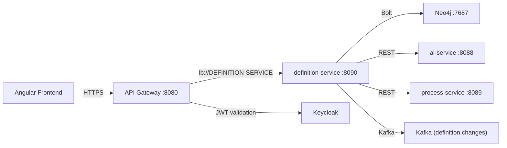
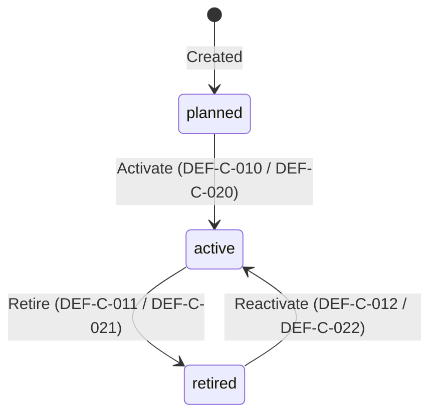
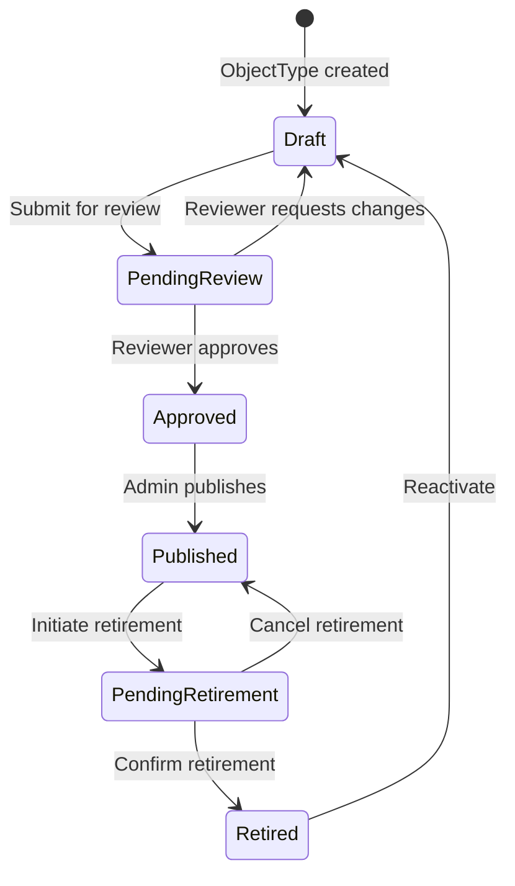
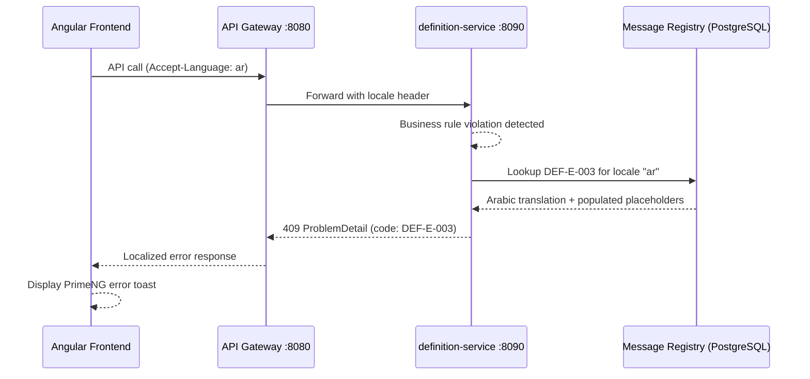

# API Contract: Definition Management

**Document ID:** API-DM-001
**Version:** 2.0.0
**Date:** 2026-03-10
**Status:** [PLANNED] -- Design document; no new endpoints exist in code unless marked [IMPLEMENTED]
**Author:** SA Agent (SA-PRINCIPLES.md v1.1.0)
**Service:** definition-service
**Port:** 8090
**Database:** Neo4j 5 Community Edition
**Base URL:** `/api/v1/definitions`
**Gateway Route:** `/api/v1/definitions/**` routed via API Gateway (port 8080) to `lb://DEFINITION-SERVICE`

---

## Table of Contents

1. [Service Overview](#1-service-overview)
2. [Authentication and Authorization](#2-authentication-and-authorization)
3. [Common Headers](#3-common-headers)
4. [Common Response Schemas](#4-common-response-schemas)
5. [API Endpoint Groups](#5-api-endpoint-groups)
   - 5.1 [Object Type CRUD](#51-object-type-crud)
   - 5.2 [Attribute Type Management](#52-attribute-type-management)
   - 5.3 [Object Type Attributes (HAS_ATTRIBUTE)](#53-object-type-attributes-has_attribute)
   - 5.4 [Object Type Connections (CAN_CONNECT_TO)](#54-object-type-connections-can_connect_to)
   - 5.5 [Lifecycle Status Transitions (AP-5)](#55-lifecycle-status-transitions-ap-5)
   - 5.6 [Governance](#56-governance)
   - 5.7 [Governance Tab (Per-ObjectType)](#57-governance-tab-per-objecttype)
   - 5.8 [Localization](#58-localization)
   - 5.9 [Maturity Configuration](#59-maturity-configuration)
   - 5.10 [Release Management](#510-release-management)
   - 5.11 [Data Sources](#511-data-sources)
   - 5.12 [Measures](#512-measures)
   - 5.13 [Graph Visualization](#513-graph-visualization)
   - 5.14 [AI Integration](#514-ai-integration)
   - 5.15 [Import/Export](#515-importexport)
   - 5.16 [Bulk Operations](#516-bulk-operations)
   - 5.17 [Full-Text Search](#517-full-text-search)
   - 5.18 [Propagation Status](#518-propagation-status)
   - 5.19 [Audit Trail](#519-audit-trail)
6. [Common Schemas (Components)](#6-common-schemas-components)
7. [Error Response Format (AP-4 / ADR-031)](#7-error-response-format-ap-4--adr-031)
8. [Error Code Registry](#8-error-code-registry)
9. [Pagination](#9-pagination)
10. [Versioning Strategy](#10-versioning-strategy)
11. [Rate Limiting](#11-rate-limiting)
12. [Cross-Reference Matrix](#12-cross-reference-matrix)

---

## 1. Service Overview

The definition-service is the backbone of the EMSIST platform, providing the configurable metamodel for business object types. It stores ObjectType, AttributeType, and relationship definitions in a Neo4j graph database, enabling zero-code object modeling, cross-tenant governance, and lifecycle management.

| Property | Value |
|----------|-------|
| Service Name | `definition-service` |
| Eureka Registration | `DEFINITION-SERVICE` |
| Port | 8090 |
| Database | Neo4j 5.12 Community Edition (Bolt protocol) |
| Cache | Valkey 8 (tenant-scoped keys) [PLANNED] |
| Framework | Spring Boot 3.4.x, Spring Data Neo4j (SDN) |
| API Version | v1 (URI path-based versioning) |
| Content Type | `application/json` |
| Character Encoding | UTF-8 |



---

## 2. Authentication and Authorization

### 2.1 Authentication

All endpoints (except actuator and Swagger) require a valid JWT Bearer token issued by Keycloak.

```yaml
securitySchemes:
  bearerAuth:
    type: http
    scheme: bearer
    bearerFormat: JWT
    description: "Keycloak-issued JWT with tenant_id claim"
```

Every request must include:

```
Authorization: Bearer <jwt-token>
```

### 2.2 Authorization -- RBAC Roles

| Role | Scope | Permissions |
|------|-------|-------------|
| `SUPER_ADMIN` | Platform-wide | Full CRUD on all definitions; manage mandates; publish releases |
| `ARCHITECT` | Tenant-scoped [PLANNED] | Full CRUD on tenant definitions; review releases; cannot manage mandates |
| `TENANT_ADMIN` | Tenant-scoped [PLANNED] | Read mandated types; CRUD on custom types; accept/reject releases |
| `ADMIN` | Tenant-scoped [PLANNED] | Read definitions; limited attribute management |

**Current implementation [IMPLEMENTED]:** All `/api/v1/definitions/**` endpoints require `ROLE_SUPER_ADMIN`.

Evidence: `backend/definition-service/src/main/java/com/ems/definition/config/SecurityConfig.java`, line 674:
```java
.requestMatchers("/api/v1/definitions/**").hasRole("SUPER_ADMIN")
```

### 2.3 Tenant Isolation

Tenant ID is resolved in this order:
1. `tenant_id` claim from JWT token (supports String or List)
2. `X-Tenant-ID` request header (fallback)
3. If neither is available: HTTP 400 with error code `DEF-E-015`

Every repository query includes `tenantId` as a filter, enforcing row-level tenant isolation.

---

## 3. Common Headers

### 3.1 Request Headers

| Header | Required | Type | Description |
|--------|----------|------|-------------|
| `Authorization` | Yes | `Bearer <JWT>` | Keycloak JWT token |
| `X-Tenant-ID` | Conditional | UUID string | Tenant identifier (fallback if JWT lacks `tenant_id` claim) |
| `Content-Type` | Yes (POST/PUT/PATCH) | `application/json` | Request body format |
| `Accept` | No | `application/json` | Response format (default: JSON) |
| `Accept-Language` | No | BCP 47 (e.g., `en`, `ar`) | Locale for language-dependent fields [PLANNED] |
| `If-Match` | No | Version number | Optimistic locking (ETag-based) [PLANNED] |

### 3.2 Response Headers

| Header | Description |
|--------|-------------|
| `Content-Type` | `application/json;charset=UTF-8` |
| `X-Tenant-ID` | Echo of resolved tenant ID |
| `ETag` | Entity version for optimistic locking [PLANNED] |

---

## 4. Common Response Schemas

### 4.1 Paginated Response

All list endpoints return a paginated response:

```json
{
  "content": [],
  "page": 0,
  "size": 20,
  "totalElements": 42,
  "totalPages": 3
}
```

### 4.2 Error Response (RFC 7807 Problem Details)

All errors follow RFC 7807 format with AP-4 message codes:

```json
{
  "type": "https://emsist.io/problems/definition-not-found",
  "title": "ObjectType Not Found",
  "status": 404,
  "detail": "Object type with ID 'abc-123' not found in tenant 'tenant-456'",
  "instance": "/api/v1/definitions/object-types/abc-123",
  "messageCode": "DEF-E-001",
  "timestamp": "2026-03-10T12:00:00Z",
  "traceId": "trace-uuid"
}
```

### 4.3 Standard HTTP Status Codes

| Code | Meaning | When Used |
|------|---------|-----------|
| 200 | OK | Successful GET, PUT, PATCH |
| 201 | Created | Successful POST (resource created) |
| 204 | No Content | Successful DELETE |
| 400 | Bad Request | Validation failure, invalid input |
| 401 | Unauthorized | Missing or invalid JWT |
| 403 | Forbidden | Insufficient role or mandate violation |
| 404 | Not Found | Resource does not exist for tenant |
| 409 | Conflict | Duplicate key, optimistic lock, state conflict |
| 500 | Internal Server Error | Unexpected server error |
| 503 | Service Unavailable | Service temporarily unavailable |
| 504 | Gateway Timeout | Request timed out |

---

## 5. API Endpoint Groups

### 5.1 Object Type CRUD

Base path: `/api/v1/definitions/object-types`

UI screens: SCR-01 (List), SCR-02 (Detail/Configuration), SCR-03 (Create Wizard)

---

#### 5.1.1 List Object Types [IMPLEMENTED]

```
GET /api/v1/definitions/object-types
```

**Description:** Returns a paginated list of object types for the authenticated tenant. Supports search and status filtering.

**Query Parameters:**

| Param | Type | Default | Description |
|-------|------|---------|-------------|
| `page` | int | 0 | Page number (zero-indexed) |
| `size` | int | 20 | Page size |
| `search` | string | null | Full-text search on name, typeKey, description |
| `status` | string | null | Filter by lifecycle status: `active`, `planned`, `hold`, `retired` |
| `sort` | string | `name,asc` | Sort field and direction |

**Response:** `200 OK`

```json
{
  "content": [
    {
      "id": "550e8400-e29b-41d4-a716-446655440000",
      "tenantId": "tenant-uuid",
      "name": "Server",
      "typeKey": "server",
      "code": "OBJ_001",
      "description": "Physical or virtual server",
      "iconName": "server",
      "iconColor": "#428177",
      "status": "active",
      "state": "user_defined",
      "createdAt": "2026-03-10T12:00:00Z",
      "updatedAt": "2026-03-10T12:00:00Z",
      "attributes": [],
      "connections": [],
      "parentTypeId": null,
      "instanceCount": 0
    }
  ],
  "page": 0,
  "size": 20,
  "totalElements": 42,
  "totalPages": 3
}
```

**Error Responses:**

| Status | Code | Condition |
|--------|------|-----------|
| 400 | DEF-E-015 | Missing tenant ID |
| 401 | -- | Invalid or missing JWT |
| 403 | DEF-E-016 | Insufficient role |

---

#### 5.1.2 Create Object Type [IMPLEMENTED]

```
POST /api/v1/definitions/object-types
```

**Description:** Creates a new object type for the tenant. Auto-generates `typeKey` from name and `code` as `OBJ_NNN` if not provided.

**Request Body:**

```json
{
  "name": "Server",
  "typeKey": "server",
  "code": "OBJ_001",
  "description": "Physical or virtual server hosting applications",
  "iconName": "server",
  "iconColor": "#428177",
  "status": "active",
  "state": "user_defined"
}
```

| Field | Type | Required | Constraints | Default |
|-------|------|----------|-------------|---------|
| `name` | string | Yes | `@NotBlank`, max 255 | -- |
| `typeKey` | string | No | max 100, lowercase + underscores | Derived from name |
| `code` | string | No | max 20 | Auto-generated `OBJ_NNN` |
| `description` | string | No | max 2000 | null |
| `iconName` | string | No | max 100, Lucide icon name | `"box"` |
| `iconColor` | string | No | max 7, hex color `#RRGGBB` | `"#428177"` |
| `status` | string | No | max 20, enum: `active\|planned\|hold\|retired` | `"active"` |
| `state` | string | No | max 30, enum: `default\|customized\|user_defined` | `"user_defined"` |

**Response:** `201 Created`

Returns the full `ObjectTypeDTO` (same shape as list item).

**Error Responses:**

| Status | Code | Condition |
|--------|------|-----------|
| 400 | DEF-E-004 | Name is blank |
| 400 | DEF-E-005 | Name exceeds 255 characters |
| 400 | DEF-E-006 | TypeKey exceeds 100 characters |
| 400 | DEF-E-008 | Invalid status value |
| 400 | DEF-E-009 | Invalid state value |
| 400 | DEF-E-015 | Missing tenant ID |
| 400 | DEF-E-018 | Invalid icon name |
| 400 | DEF-E-019 | Invalid icon color |
| 409 | DEF-E-002 | Duplicate typeKey in tenant |
| 409 | DEF-E-003 | Duplicate code in tenant |

---

#### 5.1.3 Get Object Type by ID [IMPLEMENTED]

```
GET /api/v1/definitions/object-types/{id}
```

**Path Parameters:**

| Param | Type | Description |
|-------|------|-------------|
| `id` | UUID string | Object type identifier |

**Response:** `200 OK`

Returns full `ObjectTypeDTO` including embedded `attributes[]` and `connections[]`.

```json
{
  "id": "550e8400-e29b-41d4-a716-446655440000",
  "tenantId": "tenant-uuid",
  "name": "Server",
  "typeKey": "server",
  "code": "OBJ_001",
  "description": "Physical or virtual server",
  "iconName": "server",
  "iconColor": "#428177",
  "status": "active",
  "state": "user_defined",
  "createdAt": "2026-03-10T12:00:00Z",
  "updatedAt": "2026-03-10T12:00:00Z",
  "attributes": [
    {
      "relId": 1,
      "attributeTypeId": "attr-uuid",
      "name": "Hostname",
      "attributeKey": "hostname",
      "dataType": "string",
      "isRequired": true,
      "displayOrder": 1
    }
  ],
  "connections": [
    {
      "relId": 2,
      "targetObjectTypeId": "target-uuid",
      "targetObjectTypeName": "Application",
      "relationshipKey": "hosts",
      "activeName": "hosts",
      "passiveName": "runs on",
      "cardinality": "one-to-many",
      "isDirected": true
    }
  ],
  "parentTypeId": null,
  "instanceCount": 0
}
```

**Error Responses:**

| Status | Code | Condition |
|--------|------|-----------|
| 400 | DEF-E-015 | Missing tenant ID |
| 404 | DEF-E-001 | Object type not found |

---

#### 5.1.4 Update Object Type [IMPLEMENTED]

```
PUT /api/v1/definitions/object-types/{id}
```

**Description:** Updates an object type. If the object type state is `default`, editing automatically transitions it to `customized`.

**Path Parameters:**

| Param | Type | Description |
|-------|------|-------------|
| `id` | UUID string | Object type identifier |

**Request Body:** Same schema as create request. All fields optional (partial update behavior).

**Response:** `200 OK` -- Updated `ObjectTypeDTO`

**Error Responses:**

| Status | Code | Condition |
|--------|------|-----------|
| 400 | DEF-E-005 | Name exceeds 255 characters |
| 400 | DEF-E-012 | Invalid state transition |
| 400 | DEF-E-015 | Missing tenant ID |
| 404 | DEF-E-001 | Object type not found |
| 409 | DEF-E-002 | Duplicate typeKey |
| 409 | DEF-E-017 | Optimistic lock conflict [PLANNED] |

---

#### 5.1.5 Delete Object Type [IMPLEMENTED]

```
DELETE /api/v1/definitions/object-types/{id}
```

**Description:** Deletes an object type. Fails if the type has active instances.

**Response:** `204 No Content`

**Error Responses:**

| Status | Code | Condition |
|--------|------|-----------|
| 400 | DEF-E-015 | Missing tenant ID |
| 404 | DEF-E-001 | Object type not found |
| 409 | DEF-E-014 | Type has instances; cannot delete |

---

#### 5.1.6 Duplicate Object Type [IMPLEMENTED]

```
POST /api/v1/definitions/object-types/{id}/duplicate
```

**Description:** Creates a copy of the object type with a new ID, name suffix `" (Copy)"`, and a new generated typeKey and code.

**Response:** `201 Created` -- New `ObjectTypeDTO`

---

#### 5.1.7 Restore Object Type to Default [IMPLEMENTED]

```
POST /api/v1/definitions/object-types/{id}/restore
```

**Description:** Restores a `customized` object type back to its `default` state. Only works when `state == "customized"`.

**Response:** `200 OK` -- Restored `ObjectTypeDTO`

**Error Responses:**

| Status | Code | Condition |
|--------|------|-----------|
| 400 | DEF-E-013 | Type is not in `customized` state |
| 404 | DEF-E-001 | Object type not found |

---

### 5.2 Attribute Type Management

Base path: `/api/v1/definitions/attribute-types`

---

#### 5.2.1 List Attribute Types [IMPLEMENTED]

```
GET /api/v1/definitions/attribute-types
```

**Description:** Returns all attribute types for the tenant (non-paginated).

**Response:** `200 OK`

```json
[
  {
    "id": "attr-uuid",
    "tenantId": "tenant-uuid",
    "name": "Hostname",
    "attributeKey": "hostname",
    "dataType": "string",
    "attributeGroup": "network",
    "description": "Server hostname (FQDN)",
    "defaultValue": "",
    "validationRules": "{}",
    "createdAt": "2026-03-10T12:00:00Z",
    "updatedAt": "2026-03-10T12:00:00Z"
  }
]
```

---

#### 5.2.2 Create Attribute Type [IMPLEMENTED]

```
POST /api/v1/definitions/attribute-types
```

**Request Body:**

```json
{
  "name": "Hostname",
  "attributeKey": "hostname",
  "dataType": "string",
  "attributeGroup": "network",
  "description": "Server hostname (FQDN)",
  "defaultValue": "",
  "validationRules": "{}"
}
```

| Field | Type | Required | Constraints | Default |
|-------|------|----------|-------------|---------|
| `name` | string | Yes | `@NotBlank`, max 255 | -- |
| `attributeKey` | string | Yes | `@NotBlank`, max 100 | -- |
| `dataType` | string | Yes | `@NotBlank`, max 30; enum: `string\|text\|integer\|float\|boolean\|date\|datetime\|enum\|json` | -- |
| `attributeGroup` | string | No | max 100 | null |
| `description` | string | No | max 2000 | null |
| `defaultValue` | string | No | max 500 | null |
| `validationRules` | string | No | max 2000, JSON string | `"{}"` |

**Response:** `201 Created` -- `AttributeTypeDTO`

**Error Responses:**

| Status | Code | Condition |
|--------|------|-----------|
| 400 | DEF-E-023 | Attribute key is blank |
| 400 | DEF-E-024 | Invalid data type |

---

#### 5.2.3 Get Attribute Type by ID [PLANNED]

```
GET /api/v1/definitions/attribute-types/{id}
```

**Response:** `200 OK` -- `AttributeTypeDTO`

---

#### 5.2.4 Update Attribute Type [PLANNED]

```
PUT /api/v1/definitions/attribute-types/{id}
```

**Request Body:** Same schema as create. All fields optional.

**Response:** `200 OK` -- Updated `AttributeTypeDTO`

---

#### 5.2.5 Delete Attribute Type [PLANNED]

```
DELETE /api/v1/definitions/attribute-types/{id}
```

**Description:** Deletes an attribute type. Fails if the attribute is linked to any object types.

**Response:** `204 No Content`

---

### 5.3 Object Type Attributes (HAS_ATTRIBUTE)

Base path: `/api/v1/definitions/object-types/{id}/attributes`

UI screen: SCR-02-T2 (Attributes Tab)

---

#### 5.3.1 List Attributes for Object Type [IMPLEMENTED]

```
GET /api/v1/definitions/object-types/{id}/attributes
```

**Response:** `200 OK`

```json
[
  {
    "relId": 1,
    "attributeTypeId": "attr-uuid",
    "name": "Hostname",
    "attributeKey": "hostname",
    "dataType": "string",
    "isRequired": true,
    "displayOrder": 1
  }
]
```

---

#### 5.3.2 Add Attribute to Object Type [IMPLEMENTED]

```
POST /api/v1/definitions/object-types/{id}/attributes
```

**Request Body:**

```json
{
  "attributeTypeId": "attr-uuid",
  "isRequired": false,
  "displayOrder": 1
}
```

| Field | Type | Required | Constraints |
|-------|------|----------|-------------|
| `attributeTypeId` | UUID string | Yes | `@NotBlank`, must exist in tenant |
| `isRequired` | boolean | No | Default: `false` |
| `displayOrder` | int | No | `@Min(0)`, default: 0 |

**Response:** `200 OK` -- Full `ObjectTypeDTO` with updated attributes list

**Error Responses:**

| Status | Code | Condition |
|--------|------|-----------|
| 404 | DEF-E-001 | Object type not found |
| 404 | DEF-E-021 | Attribute type not found |
| 409 | DEF-E-022 | Attribute already linked to this object type |

---

#### 5.3.3 Remove Attribute from Object Type [IMPLEMENTED]

```
DELETE /api/v1/definitions/object-types/{id}/attributes/{attrId}
```

**Path Parameters:**

| Param | Type | Description |
|-------|------|-------------|
| `id` | UUID string | Object type identifier |
| `attrId` | UUID string | Attribute type identifier |

**Response:** `204 No Content`

**Error Responses:**

| Status | Code | Condition |
|--------|------|-----------|
| 403 | DEF-E-026 | System default attribute cannot be removed [PLANNED] |
| 404 | DEF-E-001 | Object type not found |

---

#### 5.3.4 Update Attribute Relationship Properties [PLANNED]

```
PATCH /api/v1/definitions/object-types/{id}/attributes/{relId}
```

**Description:** Updates properties on the HAS_ATTRIBUTE relationship (requirementLevel, displayOrder, conditionRules, lockStatus).

**Request Body:**

```json
{
  "isRequired": true,
  "displayOrder": 3,
  "requirementLevel": "MANDATORY",
  "lockStatus": "none",
  "conditionRules": null
}
```

| Field | Type | Required | Description |
|-------|------|----------|-------------|
| `isRequired` | boolean | No | Backward-compatible required flag |
| `displayOrder` | int | No | Display ordering |
| `requirementLevel` | string | No | `MANDATORY\|CONDITIONAL\|OPTIONAL` |
| `lockStatus` | string | No | `none\|locked\|partial` |
| `conditionRules` | string | No | JSON rules for CONDITIONAL requirement |

**Response:** `200 OK` -- Updated `ObjectTypeDTO`

---

### 5.4 Object Type Connections (CAN_CONNECT_TO)

Base path: `/api/v1/definitions/object-types/{id}/connections`

UI screen: SCR-02-T3 (Connections Tab)

---

#### 5.4.1 List Connections for Object Type [IMPLEMENTED]

```
GET /api/v1/definitions/object-types/{id}/connections
```

**Response:** `200 OK`

```json
[
  {
    "relId": 2,
    "targetObjectTypeId": "target-uuid",
    "targetObjectTypeName": "Application",
    "relationshipKey": "hosts",
    "activeName": "hosts",
    "passiveName": "runs on",
    "cardinality": "one-to-many",
    "isDirected": true
  }
]
```

---

#### 5.4.2 Add Connection to Object Type [IMPLEMENTED]

```
POST /api/v1/definitions/object-types/{id}/connections
```

**Request Body:**

```json
{
  "targetObjectTypeId": "target-uuid",
  "relationshipKey": "runs_on",
  "activeName": "runs on",
  "passiveName": "hosts",
  "cardinality": "one-to-many",
  "isDirected": true
}
```

| Field | Type | Required | Constraints |
|-------|------|----------|-------------|
| `targetObjectTypeId` | UUID string | Yes | `@NotBlank`, must exist in tenant |
| `relationshipKey` | string | Yes | `@NotBlank`, max 100 |
| `activeName` | string | No | max 255 |
| `passiveName` | string | No | max 255 |
| `cardinality` | string | Yes | `@NotBlank`, max 20; enum: `one-to-one\|one-to-many\|many-to-many` |
| `isDirected` | boolean | No | Default: `true` |

**Response:** `200 OK` -- Full `ObjectTypeDTO` with updated connections list

**Error Responses:**

| Status | Code | Condition |
|--------|------|-----------|
| 400 | DEF-E-032 | Invalid cardinality value |
| 400 | DEF-E-033 | Cross-tenant connection attempt |
| 400 | DEF-E-034 | Self-connection not allowed |
| 404 | DEF-E-001 | Source or target object type not found |
| 409 | DEF-E-035 | Duplicate connection (same relationshipKey between same types) |

---

#### 5.4.3 Remove Connection from Object Type [IMPLEMENTED]

```
DELETE /api/v1/definitions/object-types/{id}/connections/{connId}
```

**Response:** `204 No Content`

**Error Responses:**

| Status | Code | Condition |
|--------|------|-----------|
| 404 | DEF-E-031 | Connection not found |

---

#### 5.4.4 Update Connection Relationship Properties [PLANNED]

```
PATCH /api/v1/definitions/object-types/{id}/connections/{relId}
```

**Request Body:**

```json
{
  "requirementLevel": "MANDATORY",
  "importance": "high",
  "lifecycleStatus": "active"
}
```

---

### 5.5 Lifecycle Status Transitions (AP-5)

These endpoints transition the `lifecycleStatus` field on HAS_ATTRIBUTE and CAN_CONNECT_TO relationships.

**Lifecycle states:** `planned` --> `active` --> `retired` (with `retired` --> `active` reactivation)



---

#### 5.5.1 Transition Attribute Lifecycle Status [PLANNED]

```
PUT /api/v1/definitions/object-types/{id}/attributes/{relId}/lifecycle-status
```

**Request Body:**

```json
{
  "targetStatus": "active"
}
```

| Field | Type | Required | Constraints |
|-------|------|----------|-------------|
| `targetStatus` | string | Yes | Enum: `planned\|active\|retired` |

**Allowed Transitions:**

| From | To | Confirmation Code | Error on Invalid |
|------|----|-------------------|------------------|
| `planned` | `active` | DEF-C-010 | DEF-E-025 |
| `active` | `retired` | DEF-C-011 | DEF-E-025 |
| `retired` | `active` | DEF-C-012 | DEF-E-025 |

**Response:** `200 OK`

```json
{
  "relId": 1,
  "attributeTypeId": "attr-uuid",
  "name": "Hostname",
  "lifecycleStatus": "active",
  "previousStatus": "planned",
  "message": {
    "code": "DEF-C-010",
    "text": "Attribute 'Hostname' activated successfully"
  }
}
```

**Error Responses:**

| Status | Code | Condition |
|--------|------|-----------|
| 400 | DEF-E-025 | Invalid lifecycle transition |
| 403 | DEF-E-020 | Cannot retire mandated attribute in child tenant |
| 404 | DEF-E-001 | Object type not found |
| 404 | DEF-E-021 | Attribute relationship not found |

---

#### 5.5.2 Transition Connection Lifecycle Status [PLANNED]

```
PUT /api/v1/definitions/object-types/{id}/connections/{relId}/lifecycle-status
```

**Request Body:** Same as attribute lifecycle transition.

**Allowed Transitions:**

| From | To | Confirmation Code | Error on Invalid |
|------|----|-------------------|------------------|
| `planned` | `active` | DEF-C-020 | (same DEF-E-025 pattern) |
| `active` | `retired` | DEF-C-021 | |
| `retired` | `active` | DEF-C-022 | |

**Error Responses:**

| Status | Code | Condition |
|--------|------|-----------|
| 403 | DEF-E-030 | Cannot retire mandated connection in child tenant |
| 404 | DEF-E-031 | Connection not found |

---

### 5.6 Governance

Base path: `/api/v1/definitions/governance`

UI screen: SCR-02-T4 (Governance Tab -- cross-tenant mandates)

All endpoints in this section are **[PLANNED]**.

---

#### 5.6.1 List Master Mandates [PLANNED]

```
GET /api/v1/definitions/governance/mandates
```

**Description:** Lists all master-mandated ObjectTypes, attributes, and connections for the tenant.

**Query Parameters:**

| Param | Type | Default | Description |
|-------|------|---------|-------------|
| `page` | int | 0 | Page number |
| `size` | int | 20 | Page size |

**Response:** `200 OK`

```json
{
  "content": [
    {
      "id": "mandate-uuid",
      "objectTypeId": "ot-uuid",
      "objectTypeName": "Server",
      "isMasterMandate": true,
      "mandatedAttributes": ["hostname", "ip_address", "os_version"],
      "mandatedConnections": ["hosts", "depends_on"],
      "sourceObjectTypeId": "master-ot-uuid",
      "sourceTenantId": "00000000-0000-0000-0000-000000000000"
    }
  ],
  "page": 0,
  "size": 20,
  "totalElements": 5,
  "totalPages": 1
}
```

---

#### 5.6.2 Create Master Mandate [PLANNED]

```
POST /api/v1/definitions/governance/mandates
```

**Description:** Marks an ObjectType as a master mandate. Triggers classification propagation to all HAS_ATTRIBUTE and CAN_CONNECT_TO relationships per Section 4.2.5 of the Tech Spec.

**Request Body:**

```json
{
  "objectTypeId": "ot-uuid",
  "isMasterMandate": true
}
```

**Response:** `201 Created`

---

#### 5.6.3 Update Mandate [PLANNED]

```
PUT /api/v1/definitions/governance/mandates/{id}
```

---

#### 5.6.4 Remove Mandate [PLANNED]

```
DELETE /api/v1/definitions/governance/mandates/{id}
```

---

#### 5.6.5 Trigger Propagation to Child Tenants [PLANNED]

```
POST /api/v1/definitions/governance/propagate
```

**Description:** Triggers propagation of mandate flags from master tenant to child tenants. Publishes `MANDATE_PROPAGATED` event to Kafka topic `definition.changes`.

**Request Body:**

```json
{
  "objectTypeId": "ot-uuid"
}
```

**Response:** `200 OK`

```json
{
  "objectTypeId": "ot-uuid",
  "propagatedTo": {
    "attributes": 12,
    "connections": 5,
    "subtypes": 3
  },
  "timestamp": "2026-03-10T12:00:00Z"
}
```

---

#### 5.6.6 View Inheritance Chain [PLANNED]

```
GET /api/v1/definitions/governance/inheritance/{objectTypeId}
```

**Description:** Returns the inheritance chain for an object type (INHERITS_FROM relationships from master to child).

**Response:** `200 OK`

```json
{
  "objectTypeId": "ot-uuid",
  "objectTypeName": "Server",
  "inheritanceChain": [
    {
      "tenantId": "00000000-0000-0000-0000-000000000000",
      "tenantName": "Master Tenant",
      "objectTypeId": "master-ot-uuid",
      "isMasterMandate": true,
      "state": "master_mandated"
    },
    {
      "tenantId": "child-tenant-uuid",
      "tenantName": "Agency Alpha",
      "objectTypeId": "child-ot-uuid",
      "isMasterMandate": true,
      "state": "master_mandated"
    }
  ]
}
```

---

### 5.7 Governance Tab (Per-ObjectType)

Base path: `/api/v1/definitions/object-types/{id}/governance`

UI screen: SCR-02-T4 (Governance Tab -- workflows, direct operation settings)

All endpoints in this section are **[PLANNED]**.

---

#### 5.7.1 Get Governance Config [PLANNED]

```
GET /api/v1/definitions/object-types/{id}/governance
```

**Response:** `200 OK`

```json
{
  "id": "gc-uuid",
  "objectTypeId": "ot-uuid",
  "allowDirectCreate": true,
  "allowDirectUpdate": true,
  "allowDirectDelete": false,
  "versionTemplate": "{name}-v{version}",
  "viewTemplate": "standard",
  "governanceState": "Published",
  "createdBy": "user-uuid",
  "updatedBy": "user-uuid",
  "createdAt": "2026-03-10T12:00:00Z",
  "updatedAt": "2026-03-10T12:00:00Z",
  "version": 1
}
```

**Error Responses:**

| Status | Code | Condition |
|--------|------|-----------|
| 404 | DEF-E-060 | Governance config not found for this object type |

---

#### 5.7.2 Update Governance Config [PLANNED]

```
PUT /api/v1/definitions/object-types/{id}/governance
```

**Request Body:**

```json
{
  "allowDirectCreate": true,
  "allowDirectUpdate": true,
  "allowDirectDelete": false,
  "versionTemplate": "{name}-v{version}",
  "viewTemplate": "standard",
  "version": 1
}
```

**Response:** `200 OK` -- Updated governance config

---

#### 5.7.3 Transition Governance State [PLANNED]

```
POST /api/v1/definitions/object-types/{id}/governance/state
```

**Description:** Transitions the governance lifecycle state for an ObjectType.

**Request Body:**

```json
{
  "targetState": "PendingReview",
  "comment": "Ready for architecture review"
}
```

**Governance State Machine:**



| From | To | Required Role |
|------|----|---------------|
| Draft | PendingReview | DEFINITION_EDITOR, ADMIN |
| PendingReview | Approved | ADMIN, SUPER_ADMIN |
| PendingReview | Draft | ADMIN, SUPER_ADMIN |
| Approved | Published | SUPER_ADMIN |
| Published | PendingRetirement | SUPER_ADMIN |
| PendingRetirement | Retired | SUPER_ADMIN |
| PendingRetirement | Published | SUPER_ADMIN |
| Retired | Draft | SUPER_ADMIN |

**Error Responses:**

| Status | Code | Condition |
|--------|------|-----------|
| 400 | DEF-E-061 | Invalid governance state transition |

---

#### 5.7.4 Get Governance State History [PLANNED]

```
GET /api/v1/definitions/object-types/{id}/governance/history
```

**Response:** `200 OK`

```json
[
  {
    "fromState": "Draft",
    "toState": "PendingReview",
    "comment": "Ready for review",
    "userId": "user-uuid",
    "timestamp": "2026-03-10T12:00:00Z"
  }
]
```

---

#### 5.7.5 List Attached Workflows [PLANNED]

```
GET /api/v1/definitions/object-types/{id}/governance/workflows
```

**Response:** `200 OK`

```json
[
  {
    "id": "wa-uuid",
    "workflowId": "workflow-uuid",
    "workflowName": "Server Provisioning Approval",
    "behaviour": "Create",
    "permissionType": "Role",
    "permissionValue": "ADMIN",
    "isActive": true,
    "createdBy": "user-uuid",
    "createdAt": "2026-03-10T12:00:00Z"
  }
]
```

---

#### 5.7.6 Attach Workflow [PLANNED]

```
POST /api/v1/definitions/object-types/{id}/governance/workflows
```

**Description:** Attaches a workflow from process-service to this object type. The definition-service validates the workflow exists by calling `GET /api/v1/workflows/{workflowId}` on process-service.

**Request Body:**

```json
{
  "workflowId": "workflow-uuid",
  "behaviour": "Create",
  "permissionType": "Role",
  "permissionValue": "ADMIN",
  "isActive": true
}
```

| Field | Type | Required | Constraints |
|-------|------|----------|-------------|
| `workflowId` | UUID string | Yes | Must exist in process-service |
| `behaviour` | string | Yes | Enum: `Create\|Reading\|Reporting\|Other` |
| `permissionType` | string | Yes | Enum: `User\|Role` |
| `permissionValue` | string | Yes | User UUID or role name |
| `isActive` | boolean | No | Default: `true` |

**Response:** `201 Created`

**Error Responses:**

| Status | Code | Condition |
|--------|------|-----------|
| 404 | DEF-E-062 | Workflow not found in process-service |

---

#### 5.7.7 Update Workflow Attachment [PLANNED]

```
PUT /api/v1/definitions/object-types/{id}/governance/workflows/{waId}
```

---

#### 5.7.8 Detach Workflow [PLANNED]

```
DELETE /api/v1/definitions/object-types/{id}/governance/workflows/{waId}
```

**Response:** `204 No Content`

---

### 5.8 Localization

Base path: `/api/v1/definitions/locales` and `/api/v1/definitions/localizations`

UI screens: SCR-02-T6 (Locale Tab), SCR-06 (Locale Management)

All endpoints in this section are **[PLANNED]**.

---

#### 5.8.1 List System Locales [PLANNED]

```
GET /api/v1/definitions/locales/system
```

**Description:** Returns all system-level locale configurations (managed by PLATFORM_ADMIN).

**Response:** `200 OK`

```json
[
  {
    "id": "locale-uuid",
    "localeCode": "en",
    "displayName": "English",
    "direction": "ltr",
    "isLocaleActive": true,
    "displayOrder": 1
  },
  {
    "id": "locale-uuid-2",
    "localeCode": "ar",
    "displayName": "Arabic",
    "direction": "rtl",
    "isLocaleActive": true,
    "displayOrder": 2
  }
]
```

---

#### 5.8.2 List Tenant Locales [PLANNED]

```
GET /api/v1/definitions/locales/tenant
```

**Description:** Returns the tenant's enabled locale configuration.

**Response:** `200 OK`

```json
[
  {
    "id": "tlc-uuid",
    "tenantId": "tenant-uuid",
    "localeCode": "en",
    "isDefault": true,
    "isLocaleActive": true
  },
  {
    "id": "tlc-uuid-2",
    "tenantId": "tenant-uuid",
    "localeCode": "ar",
    "isDefault": false,
    "isLocaleActive": true
  }
]
```

---

#### 5.8.3 Update Tenant Locale Configuration [PLANNED]

```
PUT /api/v1/definitions/locales/tenant
```

**Request Body:**

```json
{
  "locales": [
    { "localeCode": "en", "isDefault": true, "isLocaleActive": true },
    { "localeCode": "ar", "isDefault": false, "isLocaleActive": true },
    { "localeCode": "fr", "isDefault": false, "isLocaleActive": false }
  ]
}
```

**Response:** `200 OK`

---

#### 5.8.4 Get Translations for an Entity [PLANNED]

```
GET /api/v1/definitions/localizations/{entityType}/{entityId}
```

**Path Parameters:**

| Param | Type | Description |
|-------|------|-------------|
| `entityType` | string | `ObjectType` or `AttributeType` |
| `entityId` | UUID string | Entity identifier |

**Response:** `200 OK`

```json
{
  "entityType": "ObjectType",
  "entityId": "ot-uuid",
  "translations": [
    { "fieldName": "name", "locale": "en", "value": "Server" },
    { "fieldName": "name", "locale": "ar", "value": "خادم" },
    { "fieldName": "description", "locale": "en", "value": "Physical or virtual server" },
    { "fieldName": "description", "locale": "ar", "value": "خادم فيزيائي أو افتراضي" }
  ]
}
```

---

#### 5.8.5 Batch Update Translations [PLANNED]

```
PUT /api/v1/definitions/localizations/{entityType}/{entityId}
```

**Request Body:**

```json
{
  "translations": [
    { "fieldName": "name", "locale": "ar", "value": "خادم" },
    { "fieldName": "description", "locale": "ar", "value": "خادم فيزيائي أو افتراضي" }
  ]
}
```

**Response:** `200 OK`

---

### 5.9 Maturity Configuration

Base path: `/api/v1/definitions/object-types/{id}/maturity-config`

UI screens: SCR-02-T5 (Maturity Tab), SCR-05 (Maturity Dashboard)

All endpoints in this section are **[PLANNED]**.

---

#### 5.9.1 Get Maturity Configuration [PLANNED]

```
GET /api/v1/definitions/object-types/{id}/maturity-config
```

**Description:** Returns the four-axis maturity schema configuration for an ObjectType, including axis weights, requirement level weights, and thresholds.

**Response:** `200 OK`

```json
{
  "objectTypeId": "ot-uuid",
  "objectTypeName": "Server",
  "axisWeights": {
    "W_COMPLETENESS": 0.40,
    "W_RELATIONSHIP": 0.20,
    "W_COMPLIANCE": 0.25,
    "W_FRESHNESS": 0.15
  },
  "completenessWeights": {
    "MANDATORY": 0.50,
    "CONDITIONAL": 0.35,
    "OPTIONAL": 0.15
  },
  "relationshipWeights": {
    "MANDATORY": 0.50,
    "CONDITIONAL": 0.35,
    "OPTIONAL": 0.15
  },
  "complianceWeights": {
    "mandateConformance": 0.60,
    "validationPassRate": 0.20,
    "duplicateFreeScore": 0.20
  },
  "thresholds": {
    "red": 0,
    "amber": 50,
    "green": 80
  },
  "freshnessThresholdDays": 90,
  "attributes": [
    {
      "attributeKey": "hostname",
      "name": "Hostname",
      "requirementLevel": "MANDATORY",
      "lifecycleStatus": "active"
    },
    {
      "attributeKey": "documentation_url",
      "name": "Documentation URL",
      "requirementLevel": "OPTIONAL",
      "lifecycleStatus": "active"
    }
  ],
  "relations": [
    {
      "relationshipKey": "hosts",
      "targetTypeName": "Application",
      "requirementLevel": "MANDATORY",
      "lifecycleStatus": "active"
    }
  ]
}
```

---

#### 5.9.2 Update Maturity Configuration [PLANNED]

```
PUT /api/v1/definitions/object-types/{id}/maturity-config
```

**Request Body:**

```json
{
  "axisWeights": {
    "W_COMPLETENESS": 0.40,
    "W_RELATIONSHIP": 0.20,
    "W_COMPLIANCE": 0.25,
    "W_FRESHNESS": 0.15
  },
  "thresholds": {
    "red": 0,
    "amber": 50,
    "green": 80
  },
  "freshnessThresholdDays": 90
}
```

**Validation Rules:**
- Axis weights must sum to 1.0 (100%). Error: `DEF-E-071`
- Thresholds must be in ascending order: `red < amber < green`
- `freshnessThresholdDays` must be positive

**Response:** `200 OK`

**Error Responses:**

| Status | Code | Condition |
|--------|------|-----------|
| 400 | DEF-E-070 | Invalid maturity schema configuration |
| 400 | DEF-E-071 | Axis weights do not sum to 100% |
| 404 | DEF-E-001 | Object type not found |

---

#### 5.9.3 Get Maturity Summary [PLANNED]

```
GET /api/v1/definitions/object-types/{id}/maturity-summary
```

**Description:** Returns aggregate maturity statistics across all instances of an ObjectType.

**Response:** `200 OK`

```json
{
  "objectTypeId": "ot-uuid",
  "objectTypeName": "Server",
  "instanceCount": 523,
  "averageCompositeScore": 72.3,
  "distribution": {
    "green": 210,
    "amber": 258,
    "red": 55
  },
  "axisAverages": {
    "completeness": 0.82,
    "relationship": 0.65,
    "compliance": 0.78,
    "freshness": 0.45
  }
}
```

---

### 5.10 Release Management

Base path: `/api/v1/definitions/releases`

UI screen: SCR-04 (Release Management Dashboard)

All endpoints in this section are **[PLANNED]**.

---

#### 5.10.1 List Releases [PLANNED]

```
GET /api/v1/definitions/releases
```

**Query Parameters:**

| Param | Type | Default | Description |
|-------|------|---------|-------------|
| `page` | int | 0 | Page number |
| `size` | int | 20 | Page size |
| `status` | string | null | Filter: `draft\|published\|superseded` |

**Response:** `200 OK`

```json
{
  "content": [
    {
      "id": "release-uuid",
      "tenantId": "00000000-0000-0000-0000-000000000000",
      "version": "2.0.0",
      "versionType": "MAJOR",
      "status": "published",
      "releaseNotes": "Added compliance_level mandatory attribute to Server",
      "affectedTenantCount": 5,
      "affectedInstanceCount": 1247,
      "createdBy": "admin-uuid",
      "createdAt": "2026-03-10T12:00:00Z",
      "publishedAt": "2026-03-10T14:00:00Z"
    }
  ],
  "page": 0,
  "size": 20,
  "totalElements": 3,
  "totalPages": 1
}
```

---

#### 5.10.2 Create Release [PLANNED]

```
POST /api/v1/definitions/releases
```

**Description:** Creates a new release from pending changes since the last published release.

**Request Body:**

```json
{
  "releaseNotes": "Added compliance_level to Server, updated hostname max length",
  "versionType": "MAJOR"
}
```

| Field | Type | Required | Constraints |
|-------|------|----------|-------------|
| `releaseNotes` | string | No | max 5000 |
| `versionType` | string | No | `MAJOR\|MINOR\|PATCH`; auto-detected from changes if omitted |

**Response:** `201 Created`

```json
{
  "id": "release-uuid",
  "version": "2.0.0",
  "versionType": "MAJOR",
  "status": "draft",
  "releaseNotes": "...",
  "changeDiffJson": "[{\"op\":\"add\",\"path\":\"/objectTypes/server/attributes/compliance_level\",...}]",
  "affectedTenantCount": 5,
  "affectedInstanceCount": 1247,
  "createdBy": "admin-uuid",
  "createdAt": "2026-03-10T12:00:00Z",
  "publishedAt": null
}
```

---

#### 5.10.3 Get Release Details [PLANNED]

```
GET /api/v1/definitions/releases/{releaseId}
```

**Response:** `200 OK` -- Full release with change diff.

**Error Responses:**

| Status | Code | Condition |
|--------|------|-----------|
| 404 | DEF-E-040 | Release not found |

---

#### 5.10.4 Publish Release [PLANNED]

```
POST /api/v1/definitions/releases/{releaseId}/publish
```

**Description:** Publishes a draft release and notifies all affected child tenants via Kafka topic `definition.releases`.

**Response:** `200 OK`

**Error Responses:**

| Status | Code | Condition |
|--------|------|-----------|
| 404 | DEF-E-040 | Release not found |
| 409 | DEF-E-041 | Release already published |

---

#### 5.10.5 Get Impact Assessment [PLANNED]

```
GET /api/v1/definitions/releases/{releaseId}/impact
```

**Response:** `200 OK`

```json
{
  "releaseId": "release-uuid",
  "releaseVersion": "2.0.0",
  "impactSummary": {
    "totalChanges": 5,
    "breakingChanges": 2,
    "affectedObjectTypes": 3,
    "affectedInstances": 1247,
    "estimatedMigrationTime": "PT15M"
  },
  "changes": [
    {
      "changeType": "ADD_ATTR",
      "isBreaking": true,
      "entityName": "Server",
      "detail": "New mandatory attribute 'compliance_level' (enum: low|medium|high)",
      "instancesAffected": 523,
      "instancesAlreadyCompliant": 0,
      "action": "All 523 Server instances need 'compliance_level' populated"
    }
  ]
}
```

---

#### 5.10.6 List Per-Tenant Release Status [PLANNED]

```
GET /api/v1/definitions/releases/{releaseId}/tenants
```

**Response:** `200 OK`

```json
[
  {
    "tenantId": "tenant-uuid",
    "tenantName": "Agency Alpha",
    "status": "pending",
    "reviewedAt": null,
    "mergedAt": null
  }
]
```

---

#### 5.10.7 Accept and Merge Release [PLANNED]

```
POST /api/v1/definitions/releases/{releaseId}/tenants/{tenantId}/accept
```

**Query Parameters:**

| Param | Type | Default | Description |
|-------|------|---------|-------------|
| `resolveConflicts` | boolean | false | When true, force-merge with conflict resolutions |

**Response:** `200 OK` -- Merge report

**Error Responses:**

| Status | Code | Condition |
|--------|------|-----------|
| 409 | DEF-E-042 | Release has unresolved breaking changes |

---

#### 5.10.8 Schedule Merge [PLANNED]

```
POST /api/v1/definitions/releases/{releaseId}/tenants/{tenantId}/schedule
```

**Request Body:**

```json
{
  "scheduledDate": "2026-04-01T00:00:00Z"
}
```

---

#### 5.10.9 Reject Release [PLANNED]

```
POST /api/v1/definitions/releases/{releaseId}/tenants/{tenantId}/reject
```

**Request Body:**

```json
{
  "rejectionReason": "Incompatible with local compliance requirements"
}
```

---

#### 5.10.10 Rollback Release [PLANNED]

```
POST /api/v1/definitions/releases/{releaseId}/tenants/{tenantId}/rollback
```

**Description:** Rolls back a previously merged release, restoring the pre-merge snapshot.

**Error Responses:**

| Status | Code | Condition |
|--------|------|-----------|
| 409 | DEF-E-043 | No previous release version available for rollback |

---

#### 5.10.11 Preview Merge Conflicts [PLANNED]

```
GET /api/v1/definitions/releases/{releaseId}/tenants/{tenantId}/conflicts
```

**Response:** `200 OK`

```json
{
  "releaseId": "release-uuid",
  "releaseVersion": "2.0.0",
  "tenantId": "tenant-uuid",
  "impactSummary": {
    "totalChanges": 5,
    "breakingChanges": 2,
    "affectedObjectTypes": 3,
    "affectedInstances": 1247,
    "estimatedMigrationTime": "PT15M"
  },
  "conflicts": [
    {
      "conflictType": "CHILD_CUSTOMIZED",
      "entityType": "AttributeType",
      "entityName": "hostname",
      "masterChange": "maxLength changed from 255 to 128",
      "childState": "Child added custom validationRules with maxLength=500",
      "resolution": "MANUAL -- child must choose master limit or request exception"
    }
  ]
}
```

---

#### 5.10.12 List Pending Changes [PLANNED]

```
GET /api/v1/definitions/releases/pending-changes
```

**Description:** Lists all uncommitted changes to mandated definitions since the last published release.

**Response:** `200 OK`

```json
{
  "changesSinceLastRelease": 3,
  "lastReleaseVersion": "1.0.0",
  "lastReleaseDate": "2026-02-28T12:00:00Z",
  "changes": [
    {
      "changeType": "ADD_ATTR",
      "entityType": "AttributeType",
      "entityName": "compliance_level",
      "objectTypeName": "Server",
      "timestamp": "2026-03-05T10:00:00Z",
      "userId": "admin-uuid"
    }
  ]
}
```

---

### 5.11 Data Sources

Base path: `/api/v1/definitions/object-types/{id}/data-sources`

All endpoints in this section are **[PLANNED]**.

---

#### 5.11.1 List Data Sources [PLANNED]

```
GET /api/v1/definitions/object-types/{id}/data-sources
```

**Response:** `200 OK`

```json
[
  {
    "id": "ds-uuid",
    "name": "ServiceNow CMDB",
    "type": "api",
    "connectionConfig": "{\"url\":\"https://...\",\"auth\":\"oauth2\"}"
  }
]
```

---

#### 5.11.2 Add Data Source [PLANNED]

```
POST /api/v1/definitions/object-types/{id}/data-sources
```

**Request Body:**

```json
{
  "name": "ServiceNow CMDB",
  "type": "api",
  "connectionConfig": "{\"url\":\"https://...\",\"auth\":\"oauth2\"}"
}
```

| Field | Type | Required | Constraints |
|-------|------|----------|-------------|
| `name` | string | Yes | max 255 |
| `type` | string | Yes | Enum: `system\|api\|import\|manual` |
| `connectionConfig` | string | No | JSON string, max 5000 |

**Response:** `201 Created`

---

#### 5.11.3 Update Data Source [PLANNED]

```
PUT /api/v1/definitions/object-types/{id}/data-sources/{dsId}
```

**Request Body:**

```json
{
  "name": "ServiceNow CMDB (Updated)",
  "type": "api",
  "connectionConfig": "{\"url\":\"https://updated.example.com\",\"auth\":\"oauth2\"}"
}
```

| Field | Type | Required | Constraints |
|-------|------|----------|-------------|
| `name` | string | No | max 255 |
| `type` | string | No | Enum: `system\|api\|import\|manual` |
| `connectionConfig` | string | No | JSON string, max 5000; credentials encrypted at rest [PLANNED] |

**Response:** `200 OK` -- Updated DataSource

**Error Responses:**

| Status | Code | Condition |
|--------|------|-----------|
| 400 | DEF-E-120 | Invalid data source type |
| 404 | DEF-E-001 | Object type not found |
| 404 | DEF-E-121 | Data source not found |
| 409 | DEF-E-122 | Duplicate data source name for this object type |

---

#### 5.11.4 Remove Data Source [PLANNED]

```
DELETE /api/v1/definitions/object-types/{id}/data-sources/{dsId}
```

**Response:** `204 No Content`

**Error Responses:**

| Status | Code | Condition |
|--------|------|-----------|
| 404 | DEF-E-121 | Data source not found |
| 409 | DEF-E-123 | Data source is active and feeding instances; deactivate first |

---

### 5.12 Measures

Base path: `/api/v1/definitions/object-types/{id}/measure-categories` and `.../measures`

All endpoints in this section are **[PLANNED]**.

---

#### 5.12.1 List Measure Categories [PLANNED]

```
GET /api/v1/definitions/object-types/{id}/measure-categories
```

**Response:** `200 OK`

```json
[
  {
    "id": "mc-uuid",
    "name": "Performance",
    "description": "Performance-related measures",
    "measureCount": 3
  }
]
```

---

#### 5.12.2 Create Measure Category [PLANNED]

```
POST /api/v1/definitions/object-types/{id}/measure-categories
```

**Request Body:**

```json
{
  "name": "Performance",
  "description": "Performance-related measures"
}
```

**Error Responses:**

| Status | Code | Condition |
|--------|------|-----------|
| 409 | DEF-E-081 | Duplicate category name in tenant |

---

#### 5.12.3 Update Measure Category [PLANNED]

```
PUT /api/v1/definitions/object-types/{id}/measure-categories/{mcId}
```

**Request Body:**

```json
{
  "name": "Performance (Updated)",
  "description": "Updated performance-related measures"
}
```

| Field | Type | Required | Constraints |
|-------|------|----------|-------------|
| `name` | string | No | max 255 |
| `description` | string | No | max 2000 |

**Response:** `200 OK` -- Updated MeasureCategory

**Error Responses:**

| Status | Code | Condition |
|--------|------|-----------|
| 404 | DEF-E-080 | Measure category not found |
| 409 | DEF-E-081 | Duplicate category name in tenant |

---

#### 5.12.4 Delete Measure Category [PLANNED]

```
DELETE /api/v1/definitions/object-types/{id}/measure-categories/{mcId}
```

**Error Responses:**

| Status | Code | Condition |
|--------|------|-----------|
| 409 | DEF-E-082 | Category contains measures; remove measures first |

---

#### 5.12.5 List Measures [PLANNED]

```
GET /api/v1/definitions/object-types/{id}/measures
```

**Response:** `200 OK`

```json
[
  {
    "id": "measure-uuid",
    "name": "CPU Utilization",
    "formula": "avg(cpu_percent)",
    "unit": "%",
    "measureCategoryId": "mc-uuid",
    "measureCategoryName": "Performance"
  }
]
```

---

#### 5.12.6 Create Measure [PLANNED]

```
POST /api/v1/definitions/object-types/{id}/measures
```

**Request Body:**

```json
{
  "name": "CPU Utilization",
  "formula": "avg(cpu_percent)",
  "unit": "%",
  "measureCategoryId": "mc-uuid"
}
```

| Field | Type | Required | Constraints |
|-------|------|----------|-------------|
| `name` | string | Yes | `@NotBlank`, max 255 |
| `formula` | string | No | max 1000 |
| `unit` | string | No | max 50 |
| `measureCategoryId` | UUID string | Yes | Must exist in tenant |

**Response:** `201 Created`

**Error Responses:**

| Status | Code | Condition |
|--------|------|-----------|
| 404 | DEF-E-080 | Measure category not found |
| 409 | DEF-E-084 | Duplicate measure name within category |

---

#### 5.12.7 Update Measure [PLANNED]

```
PUT /api/v1/definitions/object-types/{id}/measures/{measureId}
```

**Request Body:**

```json
{
  "name": "CPU Utilization (Updated)",
  "formula": "avg(cpu_percent_5min)",
  "unit": "%",
  "measureCategoryId": "mc-uuid"
}
```

| Field | Type | Required | Constraints |
|-------|------|----------|-------------|
| `name` | string | No | max 255 |
| `formula` | string | No | max 1000 |
| `unit` | string | No | max 50 |
| `measureCategoryId` | UUID string | No | Must exist if provided |

**Response:** `200 OK` -- Updated Measure

**Error Responses:**

| Status | Code | Condition |
|--------|------|-----------|
| 404 | DEF-E-083 | Measure not found |
| 409 | DEF-E-084 | Duplicate measure name within category |

---

#### 5.12.8 Delete Measure [PLANNED]

```
DELETE /api/v1/definitions/object-types/{id}/measures/{measureId}
```

**Response:** `204 No Content`

**Error Responses:**

| Status | Code | Condition |
|--------|------|-----------|
| 404 | DEF-E-083 | Measure not found |

---

### 5.13 Graph Visualization

Base path: `/api/v1/definitions/graph`

UI screen: Graph Explorer view

All endpoints in this section are **[PLANNED]**.

---

#### 5.13.1 Get Full Graph [PLANNED]

```
GET /api/v1/definitions/graph
```

**Query Parameters:**

| Param | Type | Default | Description |
|-------|------|---------|-------------|
| `depth` | int | 2 | Graph traversal depth |

**Response:** `200 OK`

```json
{
  "nodes": [
    {
      "id": "ot-uuid",
      "label": "Server",
      "typeKey": "server",
      "iconName": "server",
      "iconColor": "#428177",
      "status": "active",
      "attributeCount": 12,
      "connectionCount": 5
    }
  ],
  "edges": [
    {
      "id": "rel-id",
      "source": "source-uuid",
      "target": "target-uuid",
      "label": "hosts",
      "cardinality": "one-to-many",
      "isDirected": true,
      "importance": "high"
    }
  ]
}
```

---

#### 5.13.2 Get Subgraph for Object Type [PLANNED]

```
GET /api/v1/definitions/object-types/{id}/graph
```

**Query Parameters:**

| Param | Type | Default | Description |
|-------|------|---------|-------------|
| `depth` | int | 1 | Traversal depth from center node |

**Response:** Same format as full graph, centered on the specified object type.

---

### 5.14 AI Integration

Base path: `/api/v1/definitions/ai`

UI screen: SCR-AI (AI Insights Panel)

All endpoints in this section are **[PLANNED]**. The definition-service proxies requests to ai-service (port 8088).

---

#### 5.14.1 Find Similar Object Types [PLANNED]

```
GET /api/v1/definitions/ai/similar/{objectTypeId}
```

**Query Parameters:**

| Param | Type | Default | Description |
|-------|------|---------|-------------|
| `threshold` | float | 0.8 | Minimum similarity score (0.0 - 1.0) |
| `limit` | int | 10 | Maximum results |

**Response:** `200 OK`

```json
{
  "objectTypeId": "ot-uuid",
  "objectTypeName": "Virtual Machine",
  "similarTypes": [
    {
      "objectTypeId": "similar-uuid",
      "objectTypeName": "Server",
      "similarityScore": 0.92,
      "sharedAttributes": ["hostname", "ip_address", "os_version"],
      "uniqueAttributes": {
        "thisType": ["hypervisor", "vCPUs"],
        "otherType": ["rack_unit", "power_supply"]
      },
      "suggestedAction": "REVIEW_MERGE"
    }
  ]
}
```

---

#### 5.14.2 Preview Merge [PLANNED]

```
POST /api/v1/definitions/ai/merge-preview
```

**Request Body:**

```json
{
  "sourceObjectTypeId": "ot-uuid-1",
  "targetObjectTypeId": "ot-uuid-2"
}
```

**Response:** `200 OK`

```json
{
  "mergedName": "Server (merged)",
  "combinedAttributes": 15,
  "conflictingAttributes": 2,
  "conflicts": [
    {
      "attributeKey": "hostname",
      "sourceDataType": "string",
      "targetDataType": "text",
      "resolution": "MANUAL"
    }
  ],
  "estimatedImpact": {
    "sourceInstances": 100,
    "targetInstances": 250,
    "totalAfterMerge": 350
  }
}
```

---

#### 5.14.3 List Unused Object Types [PLANNED]

```
GET /api/v1/definitions/ai/unused
```

**Query Parameters:**

| Param | Type | Default | Description |
|-------|------|---------|-------------|
| `daysSinceLastInstance` | int | 90 | Threshold for "unused" |

**Response:** `200 OK`

```json
{
  "unusedTypes": [
    {
      "objectTypeId": "ot-uuid",
      "objectTypeName": "Legacy Report",
      "instanceCount": 0,
      "daysSinceCreation": 180,
      "connectionCount": 2,
      "dependentTypes": ["Dashboard"],
      "suggestedAction": "DELETE",
      "confidence": 0.92,
      "warning": "2 other types reference this via CAN_CONNECT_TO"
    }
  ]
}
```

---

#### 5.14.4 Get Attribute Recommendations [PLANNED]

```
GET /api/v1/definitions/ai/recommend-attributes/{objectTypeId}
```

**Response:** `200 OK`

```json
{
  "objectTypeId": "ot-uuid",
  "objectTypeName": "Container",
  "recommendations": [
    {
      "attributeKey": "image_name",
      "attributeName": "Image Name",
      "dataType": "string",
      "requirementLevel": "MANDATORY",
      "confidence": 0.95,
      "source": "Found in 4/5 similar types (Docker Image, Pod, Deployment, Service)"
    }
  ]
}
```

---

### 5.15 Import/Export

Base path: `/api/v1/definitions/export` and `/api/v1/definitions/import`

All endpoints in this section are **[PLANNED]**.

---

#### 5.15.1 Export Schema [PLANNED]

```
GET /api/v1/definitions/export
```

**Query Parameters:**

| Param | Type | Default | Description |
|-------|------|---------|-------------|
| `format` | string | `json` | Export format: `json` |

**Response:** `200 OK` -- Full tenant definition schema as JSON

---

#### 5.15.2 Import Schema [PLANNED]

```
POST /api/v1/definitions/import
```

**Query Parameters:**

| Param | Type | Default | Description |
|-------|------|---------|-------------|
| `strategy` | string | `DRY_RUN` | Merge strategy |

**Merge Strategies:**

| Strategy | Behavior |
|----------|----------|
| `OVERWRITE` | Replace all existing definitions |
| `MERGE_KEEP_EXISTING` | Add new types, keep existing unchanged |
| `MERGE_PREFER_IMPORT` | Add new types, overwrite existing with import |
| `DRY_RUN` | Preview what would change without applying |

**Request Body:** JSON schema export format (Content-Type: `application/json`)

**Response:** `200 OK` -- Import result report

**Error Responses:**

| Status | Code | Condition |
|--------|------|-----------|
| 400 | DEF-E-110 | Invalid import file format |
| 400 | DEF-E-111 | Import schema validation failed: `{validationErrors}` |
| 409 | DEF-E-112 | Import conflicts detected (DRY_RUN mode shows conflicts) |
| 413 | DEF-E-113 | Import file exceeds maximum size of 10 MB |
| 500 | DEF-E-114 | Import processing failed: `{errorDetails}` |

---

#### 5.15.3 Export Single Object Type [PLANNED]

```
GET /api/v1/definitions/export/{objectTypeId}
```

**Description:** Exports a single object type with all its attributes, connections, governance config, and localization data.

**Response:** `200 OK` -- JSON export of single object type and dependencies

---

### 5.16 Bulk Operations

Base path: `/api/v1/definitions/bulk`

All endpoints in this section are **[PLANNED]**.

---

#### 5.16.1 Bulk Lifecycle Transition [PLANNED]

```
PATCH /api/v1/definitions/bulk/lifecycle-status
```

**Description:** Transitions the lifecycle status of multiple ObjectTypes, HAS_ATTRIBUTE relationships, or CAN_CONNECT_TO relationships in a single request. Atomic -- all succeed or all fail.

**Request Body:**

```json
{
  "entityType": "ObjectType",
  "targetStatus": "retired",
  "ids": [
    "uuid-1",
    "uuid-2",
    "uuid-3"
  ],
  "comment": "Retiring legacy types per governance decision GD-042"
}
```

| Field | Type | Required | Constraints |
|-------|------|----------|-------------|
| `entityType` | string | Yes | Enum: `ObjectType\|HasAttribute\|CanConnectTo` |
| `targetStatus` | string | Yes | Enum: `planned\|active\|hold\|retired` |
| `ids` | string[] | Yes | 1-100 UUIDs per request |
| `comment` | string | No | max 1000; audit trail annotation |

**Response:** `200 OK`

```json
{
  "totalRequested": 3,
  "successful": 2,
  "failed": 1,
  "results": [
    { "id": "uuid-1", "status": "SUCCESS", "newStatus": "retired" },
    { "id": "uuid-2", "status": "SUCCESS", "newStatus": "retired" },
    { "id": "uuid-3", "status": "FAILED", "errorCode": "DEF-E-010", "errorDetail": "Has 15 active instances" }
  ]
}
```

**Error Responses:**

| Status | Code | Condition |
|--------|------|-----------|
| 400 | DEF-E-150 | Bulk request exceeds maximum of 100 items |
| 400 | DEF-E-151 | Invalid entity type for bulk operation |
| 400 | DEF-E-025 | Invalid lifecycle transition (per-item error) |

---

#### 5.16.2 Bulk Delete [PLANNED]

```
DELETE /api/v1/definitions/bulk/object-types
```

**Description:** Soft-deletes multiple object types. Returns partial success if some types cannot be deleted.

**Request Body:**

```json
{
  "ids": ["uuid-1", "uuid-2", "uuid-3"],
  "comment": "Cleanup of unused types"
}
```

**Response:** `200 OK` -- Same result format as bulk lifecycle transition

**Error Responses:**

| Status | Code | Condition |
|--------|------|-----------|
| 400 | DEF-E-150 | Bulk request exceeds maximum of 100 items |
| 409 | DEF-E-014 | Type has instances (per-item error) |

---

### 5.17 Full-Text Search

Base path: `/api/v1/definitions/search`

All endpoints in this section are **[PLANNED]**.

---

#### 5.17.1 Full-Text Search Across Definitions [PLANNED]

```
GET /api/v1/definitions/search
```

**Description:** Performs full-text search across ObjectType and AttributeType nodes using Neo4j full-text indexes. Returns results ranked by relevance score.

**Query Parameters:**

| Param | Type | Default | Description |
|-------|------|---------|-------------|
| `q` | string | -- (required) | Search query string (supports Lucene syntax) |
| `scope` | string | `all` | Search scope: `all\|object-types\|attribute-types` |
| `status` | string | null | Filter by lifecycle status |
| `page` | int | 0 | Page number |
| `size` | int | 20 | Page size |

**Response:** `200 OK`

```json
{
  "content": [
    {
      "entityType": "ObjectType",
      "id": "ot-uuid",
      "name": "Server",
      "typeKey": "server",
      "description": "Physical or virtual server",
      "status": "active",
      "score": 0.95,
      "highlightedFields": {
        "name": "<em>Server</em>",
        "description": "Physical or virtual <em>server</em>"
      }
    },
    {
      "entityType": "AttributeType",
      "id": "attr-uuid",
      "name": "Server Hostname",
      "attributeKey": "server_hostname",
      "description": "FQDN of the server",
      "score": 0.72,
      "highlightedFields": {
        "name": "<em>Server</em> Hostname"
      }
    }
  ],
  "page": 0,
  "size": 20,
  "totalElements": 12,
  "totalPages": 1,
  "searchMetadata": {
    "query": "server",
    "scope": "all",
    "indexUsed": "objecttype_fulltext",
    "queryTimeMs": 12
  }
}
```

**Error Responses:**

| Status | Code | Condition |
|--------|------|-----------|
| 400 | DEF-E-160 | Search query is empty |
| 400 | DEF-E-161 | Invalid Lucene query syntax |
| 400 | DEF-E-162 | Search query exceeds maximum of 500 characters |

**Neo4j Full-Text Index (used internally):**

```cypher
CALL db.index.fulltext.queryNodes('objecttype_fulltext', $query)
YIELD node, score
WHERE node.tenantId = $tenantId
RETURN node, score
ORDER BY score DESC
SKIP $skip LIMIT $limit
```

---

### 5.18 Propagation Status

Base path: `/api/v1/definitions/governance/propagate`

Extends Section 5.6.5 with status tracking and history endpoints.

All endpoints in this section are **[PLANNED]**.

---

#### 5.18.1 Get Propagation Status [PLANNED]

```
GET /api/v1/definitions/governance/propagate/status
```

**Description:** Returns the current status of ongoing or last completed propagation operation.

**Response:** `200 OK`

```json
{
  "lastPropagation": {
    "id": "prop-uuid",
    "objectTypeId": "ot-uuid",
    "objectTypeName": "Server",
    "status": "completed",
    "startedAt": "2026-03-10T12:00:00Z",
    "completedAt": "2026-03-10T12:01:30Z",
    "tenantsAffected": 5,
    "tenantsSucceeded": 4,
    "tenantsFailed": 1,
    "triggeredBy": "admin-uuid"
  }
}
```

**Error Responses:**

| Status | Code | Condition |
|--------|------|-----------|
| 404 | DEF-E-130 | No propagation history found |

---

#### 5.18.2 Get Propagation History [PLANNED]

```
GET /api/v1/definitions/governance/propagate/history
```

**Query Parameters:**

| Param | Type | Default | Description |
|-------|------|---------|-------------|
| `page` | int | 0 | Page number |
| `size` | int | 20 | Page size |
| `objectTypeId` | UUID | null | Filter by object type |

**Response:** `200 OK`

```json
{
  "content": [
    {
      "id": "prop-uuid",
      "objectTypeId": "ot-uuid",
      "objectTypeName": "Server",
      "status": "completed",
      "propagationType": "MANDATE_CREATE",
      "startedAt": "2026-03-10T12:00:00Z",
      "completedAt": "2026-03-10T12:01:30Z",
      "summary": {
        "tenantsAffected": 5,
        "attributesPropagated": 12,
        "connectionsPropagated": 5,
        "subtypesPropagated": 3
      },
      "triggeredBy": "admin-uuid"
    }
  ],
  "page": 0,
  "size": 20,
  "totalElements": 15,
  "totalPages": 1
}
```

---

#### 5.18.3 Get Per-Tenant Propagation Result [PLANNED]

```
GET /api/v1/definitions/governance/propagate/{propagationId}/tenants
```

**Response:** `200 OK`

```json
[
  {
    "tenantId": "tenant-uuid",
    "tenantName": "Agency Alpha",
    "status": "success",
    "objectsCreated": 1,
    "attributesPropagated": 12,
    "connectionsPropagated": 5,
    "completedAt": "2026-03-10T12:00:45Z"
  },
  {
    "tenantId": "tenant-uuid-2",
    "tenantName": "Agency Beta",
    "status": "failed",
    "errorCode": "DEF-E-131",
    "errorDetail": "Naming conflict: typeKey 'server' already exists as user_defined"
  }
]
```

**Error Responses:**

| Status | Code | Condition |
|--------|------|-----------|
| 400 | DEF-E-131 | Propagation conflict: naming collision in child tenant |
| 400 | DEF-E-132 | Propagation conflict: incompatible attribute data types |
| 404 | DEF-E-133 | Propagation record not found |

---

### 5.19 Audit Trail

Base path: `/api/v1/definitions/audit`

All endpoints in this section are **[PLANNED]**.

---

#### 5.19.1 Get Audit Log for Definition Service [PLANNED]

```
GET /api/v1/definitions/audit
```

**Description:** Returns the audit trail for all definition changes within the tenant. Reads from the local AuditEntry nodes in Neo4j (not the centralized audit-service).

**Query Parameters:**

| Param | Type | Default | Description |
|-------|------|---------|-------------|
| `page` | int | 0 | Page number |
| `size` | int | 20 | Page size (max 100) |
| `entityType` | string | null | Filter: `ObjectType\|AttributeType\|DefinitionRelease\|GovernanceConfig` |
| `entityId` | UUID | null | Filter by specific entity |
| `action` | string | null | Filter: `CREATE\|UPDATE\|DELETE\|STATUS_CHANGE\|LIFECYCLE_TRANSITION\|PROPAGATE` |
| `userId` | UUID | null | Filter by actor |
| `from` | ISO 8601 | null | Start date filter |
| `to` | ISO 8601 | null | End date filter |

**Response:** `200 OK`

```json
{
  "content": [
    {
      "id": "audit-uuid",
      "tenantId": "tenant-uuid",
      "entityType": "ObjectType",
      "entityId": "ot-uuid",
      "entityName": "Server",
      "action": "UPDATE",
      "changeDescription": "Updated description, added 2 attributes",
      "previousValue": "{\"description\":\"Old description\"}",
      "newValue": "{\"description\":\"Physical or virtual server\"}",
      "userId": "user-uuid",
      "userName": "admin@example.com",
      "ipAddress": "192.168.1.100",
      "timestamp": "2026-03-10T12:00:00Z"
    }
  ],
  "page": 0,
  "size": 20,
  "totalElements": 150,
  "totalPages": 8
}
```

---

#### 5.19.2 Get Audit Log for Specific Entity [PLANNED]

```
GET /api/v1/definitions/audit/{entityType}/{entityId}
```

**Path Parameters:**

| Param | Type | Description |
|-------|------|-------------|
| `entityType` | string | Entity type: `ObjectType\|AttributeType\|DefinitionRelease` |
| `entityId` | UUID | Entity identifier |

**Response:** `200 OK` -- Same format as general audit log, filtered to single entity

---

## 6. Common Schemas (Components)

### 6.1 ObjectTypeDTO

```json
{
  "id": "string (UUID)",
  "tenantId": "string (UUID)",
  "name": "string",
  "typeKey": "string",
  "code": "string",
  "description": "string | null",
  "iconName": "string",
  "iconColor": "string (#RRGGBB)",
  "status": "string (active|planned|hold|retired)",
  "state": "string (default|customized|user_defined|master_mandated)",
  "createdAt": "string (ISO 8601)",
  "updatedAt": "string (ISO 8601)",
  "attributes": "AttributeReferenceDTO[]",
  "connections": "ConnectionDTO[]",
  "parentTypeId": "string (UUID) | null",
  "instanceCount": "integer"
}
```

### 6.2 AttributeTypeDTO

```json
{
  "id": "string (UUID)",
  "tenantId": "string (UUID)",
  "name": "string",
  "attributeKey": "string",
  "dataType": "string (string|text|integer|float|boolean|date|datetime|enum|json)",
  "attributeGroup": "string | null",
  "description": "string | null",
  "defaultValue": "string | null",
  "validationRules": "string (JSON) | null",
  "createdAt": "string (ISO 8601)",
  "updatedAt": "string (ISO 8601)"
}
```

### 6.3 AttributeReferenceDTO (HAS_ATTRIBUTE relationship)

```json
{
  "relId": "integer (Long)",
  "attributeTypeId": "string (UUID)",
  "name": "string",
  "attributeKey": "string",
  "dataType": "string",
  "isRequired": "boolean",
  "displayOrder": "integer",
  "lifecycleStatus": "string (planned|active|retired) [PLANNED]",
  "requirementLevel": "string (MANDATORY|CONDITIONAL|OPTIONAL) [PLANNED]",
  "lockStatus": "string (none|locked|partial) [PLANNED]",
  "isMasterMandate": "boolean [PLANNED]",
  "isSystemDefault": "boolean [PLANNED]"
}
```

### 6.4 ConnectionDTO (CAN_CONNECT_TO relationship)

```json
{
  "relId": "integer (Long)",
  "targetObjectTypeId": "string (UUID)",
  "targetObjectTypeName": "string",
  "relationshipKey": "string",
  "activeName": "string",
  "passiveName": "string",
  "cardinality": "string (one-to-one|one-to-many|many-to-many)",
  "isDirected": "boolean",
  "lifecycleStatus": "string (planned|active|retired) [PLANNED]",
  "requirementLevel": "string (MANDATORY|CONDITIONAL|OPTIONAL) [PLANNED]",
  "importance": "string (high|medium|low) [PLANNED]",
  "isMasterMandate": "boolean [PLANNED]"
}
```

### 6.5 PagedResponse

```json
{
  "content": "T[]",
  "page": "integer",
  "size": "integer",
  "totalElements": "integer (long)",
  "totalPages": "integer"
}
```

### 6.6 Enumerations

#### 6.6.1 ObjectType Status (Lifecycle)

| Value | Description |
|-------|-------------|
| `planned` | In design phase, not yet active |
| `active` | Active and in use |
| `hold` | Temporarily suspended |
| `retired` | Decommissioned, read-only |

#### 6.6.2 ObjectType State (Origin)

| Value | Description |
|-------|-------------|
| `default` | Seeded by system |
| `customized` | System-seeded, then modified |
| `user_defined` | Created by user |
| `master_mandated` | Inherited from master tenant [PLANNED] |

#### 6.6.3 Attribute Data Types

| Value | Description |
|-------|-------------|
| `string` | Short text (max ~255 chars) |
| `text` | Long text (unlimited) |
| `integer` | Whole number |
| `float` | Decimal number |
| `boolean` | True/false |
| `date` | Date only (YYYY-MM-DD) |
| `datetime` | Date and time (ISO 8601) |
| `enum` | Enumerated value set |
| `json` | JSON object/array |
| `file` | File attachment reference [PLANNED] |
| `value` | Numeric value with unit [PLANNED] |
| `number` | Generic number [PLANNED] |
| `time` | Time only (HH:MM:SS) [PLANNED] |

#### 6.6.4 Lifecycle Status (AP-5)

| Value | Description |
|-------|-------------|
| `planned` | Design-time only; not visible in instance forms |
| `active` | Active; included in maturity calculations |
| `retired` | Decommissioned; existing data preserved read-only |

#### 6.6.5 Requirement Level

| Value | Description |
|-------|-------------|
| `MANDATORY` | Blocks instance creation if absent |
| `CONDITIONAL` | Required when conditions are met |
| `OPTIONAL` | Does not block creation; contributes to maturity |

#### 6.6.6 Governance States

| Value | Description |
|-------|-------------|
| `Draft` | Under development, fully editable |
| `PendingReview` | Submitted for review |
| `Approved` | Reviewed and approved |
| `Published` | Live; instances can be created |
| `PendingRetirement` | Retirement initiated |
| `Retired` | No new instances; existing preserved |

---

## 7. Error Response Format (AP-4 / ADR-031)

All error responses follow RFC 7807 Problem Details format with EMSIST extensions for AP-4 message registry integration.

### 7.1 Error Response Schema

```json
{
  "type": "string (URI reference)",
  "title": "string (short title from message registry)",
  "status": "integer (HTTP status code)",
  "detail": "string (localized description with populated placeholders)",
  "instance": "string (request path)",
  "messageCode": "string (DEF-{TYPE}-{SEQ} format)",
  "timestamp": "string (ISO 8601)",
  "traceId": "string (UUID, for log correlation)"
}
```

### 7.2 Message Code Convention

```
{SERVICE}-{TYPE}-{SEQ}
```

| Segment | Values |
|---------|--------|
| SERVICE | `DEF` (Definition), `AUTH`, `TEN`, `LIC`, `USR`, `AUD`, `NOT`, `AI`, `PRC`, `SYS` |
| TYPE | `E` (Error), `C` (Confirmation), `W` (Warning), `I` (Info), `S` (Success) |
| SEQ | 3-digit sequential number (e.g., `001`) |

### 7.3 Localized Error Flow



### 7.4 Example Error Response

```json
{
  "type": "https://emsist.io/problems/duplicate-type-key",
  "title": "Duplicate TypeKey",
  "status": 409,
  "detail": "An object type with typeKey 'server' already exists in tenant 'tenant-456'",
  "instance": "/api/v1/definitions/object-types",
  "messageCode": "DEF-E-002",
  "timestamp": "2026-03-10T12:00:00Z",
  "traceId": "7c5d3e2f-1a4b-4c6d-8e9f-0a1b2c3d4e5f"
}
```

---

## 8. Error Code Registry

### 8.1 Object Type Errors (DEF-E-001 -- DEF-E-019)

| Code | HTTP | Title | Detail Template |
|------|------|-------|-----------------|
| DEF-E-001 | 404 | ObjectType Not Found | Object type with ID `{objectTypeId}` not found in tenant `{tenantId}` |
| DEF-E-002 | 409 | Duplicate TypeKey | An object type with typeKey `{typeKey}` already exists in tenant `{tenantId}` |
| DEF-E-003 | 409 | Duplicate Code | An object type with code `{code}` already exists in tenant `{tenantId}` |
| DEF-E-004 | 400 | Name Required | Object type name is required and must not be empty |
| DEF-E-005 | 400 | Name Too Long | Object type name must not exceed 255 characters (current: `{length}`) |
| DEF-E-006 | 400 | TypeKey Too Long | TypeKey must not exceed 100 characters (current: `{length}`) |
| DEF-E-007 | 400 | Code Too Long | Code must not exceed 20 characters (current: `{length}`) |
| DEF-E-008 | 400 | Invalid Status | Status `{status}` is not valid. Allowed values: active, planned, hold, retired |
| DEF-E-009 | 400 | Invalid State | State `{state}` is not valid. Allowed values: default, customized, user_defined |
| DEF-E-010 | 409 | Cannot Retire With Instances | Object type `{objectTypeName}` has `{instanceCount}` active instances |
| DEF-E-011 | 409 | Reactivation Naming Conflict | Cannot reactivate `{objectTypeName}`: active type with typeKey `{typeKey}` exists |
| DEF-E-012 | 400 | Invalid State Transition | Cannot transition from `{currentState}` to `{targetState}` |
| DEF-E-013 | 400 | Restore Not Customized | Only customized object types can be restored to default |
| DEF-E-014 | 409 | Delete Has Instances | Cannot delete `{objectTypeName}` because it has `{instanceCount}` instances |
| DEF-E-015 | 400 | Tenant ID Missing | Tenant ID required via JWT `tenant_id` claim or `X-Tenant-ID` header |
| DEF-E-016 | 403 | Unauthorized Role | Role `{role}` is not authorized. Required: SUPER_ADMIN or ARCHITECT |
| DEF-E-017 | 409 | Optimistic Lock Conflict | `{objectTypeName}` was modified by another user. Reload and retry. |
| DEF-E-018 | 400 | Invalid Icon Name | Icon `{iconName}` is not in the allowed icon set |
| DEF-E-019 | 400 | Invalid Icon Color | Color `{iconColor}` is not a valid hex color (expected: #RRGGBB) |

### 8.2 Attribute Errors (DEF-E-020 -- DEF-E-029)

| Code | HTTP | Title | Detail Template |
|------|------|-------|-----------------|
| DEF-E-020 | 403 | Cannot Retire Mandated Attribute | Attribute `{attributeName}` is mandated by master tenant |
| DEF-E-021 | 404 | Attribute Not Found | Attribute type with ID `{attributeTypeId}` not found |
| DEF-E-022 | 409 | Duplicate Attribute Link | Attribute `{attributeName}` is already linked to `{objectTypeName}` |
| DEF-E-023 | 400 | Attribute Key Required | Attribute key is required and must not be empty |
| DEF-E-024 | 400 | Invalid Data Type | Data type `{dataType}` is not valid |
| DEF-E-025 | 400 | Invalid Lifecycle Transition | Cannot transition attribute from `{currentStatus}` to `{targetStatus}` |
| DEF-E-026 | 403 | System Default Cannot Be Removed | `{attributeName}` is a system default; cannot be unlinked |

### 8.3 Connection Errors (DEF-E-030 -- DEF-E-039)

| Code | HTTP | Title | Detail Template |
|------|------|-------|-----------------|
| DEF-E-030 | 403 | Cannot Retire Mandated Connection | Connection `{connectionName}` is mandated by master tenant |
| DEF-E-031 | 404 | Connection Not Found | Connection `{connectionId}` not found on `{objectTypeName}` |
| DEF-E-032 | 400 | Invalid Cardinality | Cardinality `{cardinality}` is not valid |
| DEF-E-033 | 400 | Cross-Tenant Connection | Source and target must belong to the same tenant |
| DEF-E-034 | 400 | Self Connection | Object type cannot connect to itself unless explicitly configured |
| DEF-E-035 | 409 | Duplicate Connection | Connection `{relationshipKey}` already exists between `{sourceName}` and `{targetName}` |

### 8.4 Release Errors (DEF-E-040 -- DEF-E-049)

| Code | HTTP | Title | Detail Template |
|------|------|-------|-----------------|
| DEF-E-040 | 404 | Release Not Found | Definition release `{releaseId}` not found |
| DEF-E-041 | 409 | Release Already Published | Release `{releaseId}` is already published |
| DEF-E-042 | 409 | Release Has Breaking Changes | Release has `{breakingCount}` breaking changes |
| DEF-E-043 | 409 | Rollback Not Available | No previous release version available for rollback |

### 8.5 System Errors (DEF-E-050 -- DEF-E-059)

| Code | HTTP | Title | Detail Template |
|------|------|-------|-----------------|
| DEF-E-050 | 503 | Network Error | Unable to complete the request |
| DEF-E-051 | 503 | Service Unavailable | Definition service is temporarily unavailable |
| DEF-E-052 | 504 | Request Timeout | Request timed out after `{timeoutMs}` ms |

### 8.6 Governance Errors (DEF-E-060 -- DEF-E-069)

| Code | HTTP | Title | Detail Template |
|------|------|-------|-----------------|
| DEF-E-060 | 404 | Governance Config Not Found | Governance configuration for `{objectTypeName}` not found |
| DEF-E-061 | 400 | Invalid Governance Transition | Cannot transition governance from `{currentState}` to `{targetState}` |
| DEF-E-062 | 404 | Workflow Not Found | Workflow `{workflowId}` not found in process-service |

### 8.7 Maturity Errors (DEF-E-070 -- DEF-E-079)

| Code | HTTP | Title | Detail Template |
|------|------|-------|-----------------|
| DEF-E-070 | 400 | Maturity Schema Invalid | Maturity schema configuration is invalid: `{validationError}` |
| DEF-E-071 | 400 | Axis Weights Must Sum 100 | Maturity axis weights must sum to 100%. Current: `{sum}`% |

### 8.8 Measure Errors (DEF-E-080 -- DEF-E-089)

| Code | HTTP | Title | Detail Template |
|------|------|-------|-----------------|
| DEF-E-080 | 404 | Category Not Found | Measure category `{categoryId}` not found |
| DEF-E-081 | 409 | Duplicate Category Name | Category `{categoryName}` already exists |
| DEF-E-082 | 409 | Category Has Measures | Cannot delete `{categoryName}` -- contains `{measureCount}` measures |
| DEF-E-083 | 404 | Measure Not Found | Measure `{measureId}` not found |
| DEF-E-084 | 409 | Duplicate Measure Name | Measure `{measureName}` already exists in category `{categoryName}` |

### 8.9 Inheritance Errors (DEF-E-090 -- DEF-E-099)

| Code | HTTP | Title | Detail Template |
|------|------|-------|-----------------|
| DEF-E-090 | 400 | Subtype Depth Exceeded | IS_SUBTYPE_OF depth `{depth}` exceeds maximum of 5 |
| DEF-E-091 | 400 | Circular Inheritance | Adding IS_SUBTYPE_OF would create a cycle |
| DEF-E-092 | 409 | Inherited Attribute Conflict | Cannot add `{attributeName}` -- already inherited from `{parentTypeName}` |

### 8.10 Locale Errors (DEF-E-100 -- DEF-E-109)

| Code | HTTP | Title | Detail Template |
|------|------|-------|-----------------|
| DEF-E-100 | 400 | Invalid Locale Code | Locale code `{localeCode}` is not a valid BCP 47 tag |
| DEF-E-101 | 404 | Locale Not Found | Locale `{localeCode}` is not configured for this tenant |
| DEF-E-102 | 400 | Default Locale Required | At least one locale must be marked as default |
| DEF-E-103 | 400 | Cannot Deactivate Default | Cannot deactivate the default locale `{localeCode}` |
| DEF-E-104 | 409 | Translation Conflict | Translation for `{fieldName}` in locale `{localeCode}` already exists |

### 8.11 Import/Export Errors (DEF-E-110 -- DEF-E-119)

| Code | HTTP | Title | Detail Template |
|------|------|-------|-----------------|
| DEF-E-110 | 400 | Invalid Import Format | Import file is not valid JSON or does not match expected schema |
| DEF-E-111 | 400 | Import Validation Failed | Import schema validation failed: `{validationErrors}` |
| DEF-E-112 | 409 | Import Conflicts | Import conflicts detected: `{conflictCount}` naming collisions |
| DEF-E-113 | 413 | Import File Too Large | Import file size `{sizeBytes}` exceeds maximum of 10 MB |
| DEF-E-114 | 500 | Import Processing Failed | Import processing failed: `{errorDetails}` |

### 8.12 Data Source Errors (DEF-E-120 -- DEF-E-129)

| Code | HTTP | Title | Detail Template |
|------|------|-------|-----------------|
| DEF-E-120 | 400 | Invalid Data Source Type | Data source type `{type}` is not valid. Allowed: system, api, import, manual |
| DEF-E-121 | 404 | Data Source Not Found | Data source `{dataSourceId}` not found on `{objectTypeName}` |
| DEF-E-122 | 409 | Duplicate Data Source | Data source `{dataSourceName}` already exists for `{objectTypeName}` |
| DEF-E-123 | 409 | Data Source Active | Data source `{dataSourceName}` is actively feeding instances; deactivate first |

### 8.13 Propagation Errors (DEF-E-130 -- DEF-E-139)

| Code | HTTP | Title | Detail Template |
|------|------|-------|-----------------|
| DEF-E-130 | 404 | No Propagation History | No propagation history found for tenant `{tenantId}` |
| DEF-E-131 | 409 | Propagation Naming Conflict | Propagation conflict in `{tenantName}`: typeKey `{typeKey}` already exists |
| DEF-E-132 | 409 | Propagation Data Type Mismatch | Attribute `{attributeName}` has incompatible data type in `{tenantName}` |
| DEF-E-133 | 404 | Propagation Not Found | Propagation record `{propagationId}` not found |
| DEF-E-134 | 409 | Propagation In Progress | A propagation is already in progress for `{objectTypeName}` |

### 8.14 Bulk Operation Errors (DEF-E-150 -- DEF-E-159)

| Code | HTTP | Title | Detail Template |
|------|------|-------|-----------------|
| DEF-E-150 | 400 | Bulk Limit Exceeded | Bulk request contains `{count}` items; maximum is 100 |
| DEF-E-151 | 400 | Invalid Bulk Entity Type | Entity type `{entityType}` is not valid for bulk operations |

### 8.15 Search Errors (DEF-E-160 -- DEF-E-169)

| Code | HTTP | Title | Detail Template |
|------|------|-------|-----------------|
| DEF-E-160 | 400 | Search Query Empty | Search query parameter `q` is required and must not be empty |
| DEF-E-161 | 400 | Invalid Search Syntax | Search query contains invalid Lucene syntax: `{parseError}` |
| DEF-E-162 | 400 | Search Query Too Long | Search query must not exceed 500 characters (current: `{length}`) |

---

## 9. Pagination

### 9.1 Request Parameters

All list endpoints accept these standard pagination parameters:

| Param | Type | Default | Description |
|-------|------|---------|-------------|
| `page` | int | 0 | Zero-indexed page number |
| `size` | int | 20 | Number of items per page (max: 100) |
| `sort` | string | `name,asc` | Sort field and direction (e.g., `createdAt,desc`) |

### 9.2 Response Envelope

```json
{
  "content": [],
  "page": 0,
  "size": 20,
  "totalElements": 42,
  "totalPages": 3
}
```

### 9.3 Sortable Fields

| Entity | Sortable Fields |
|--------|----------------|
| ObjectType | `name`, `typeKey`, `code`, `status`, `createdAt`, `updatedAt` |
| AttributeType | `name`, `attributeKey`, `dataType`, `createdAt` |
| DefinitionRelease | `version`, `status`, `createdAt`, `publishedAt` |

---

## 10. Versioning Strategy

| Aspect | Strategy |
|--------|----------|
| API Version | URI path-based: `/api/v1/definitions/...` |
| Breaking Changes | Increment to `/api/v2/` with deprecation period |
| Non-Breaking Changes | Add optional fields to existing schemas |
| Optimistic Locking | `@Version` field on entities; `If-Match` header [PLANNED] |
| Release Versioning | Semantic versioning (MAJOR.MINOR.PATCH) for DefinitionRelease |
| JSON Patch | RFC 6902 for release diff format [PLANNED] |

---

## 11. Rate Limiting

Rate limiting is handled at the API Gateway level (port 8080), not within the definition-service itself.

| Tier | Rate Limit | Scope |
|------|-----------|-------|
| Standard | 100 requests/minute | Per tenant |
| Bulk Operations (import/export) | 5 requests/minute | Per tenant |
| AI Endpoints | 20 requests/minute | Per tenant |

**Rate limit response:** HTTP 429 Too Many Requests with `Retry-After` header.

---

## 12. Cross-Reference Matrix

### 12.1 Endpoint to UI Screen Mapping

| Endpoint Group | UI Screen | Screen ID |
|----------------|-----------|-----------|
| Object Type CRUD | Object Type List | SCR-01 |
| Object Type CRUD | Object Type Detail | SCR-02 |
| Object Type Create | Create Wizard | SCR-03 |
| Attributes | Attributes Tab | SCR-02-T2 |
| Connections | Connections Tab | SCR-02-T3 |
| Governance Tab | Governance Tab | SCR-02-T4 |
| Maturity Config | Maturity Tab | SCR-02-T5 |
| Localization | Locale Tab | SCR-02-T6 |
| Release Management | Release Dashboard | SCR-04 |
| Maturity Summary | Maturity Dashboard | SCR-05 |
| System Locales | Locale Management | SCR-06 |
| AI Integration | AI Insights Panel | SCR-AI |

### 12.2 Endpoint to Source Document Mapping

| Endpoint Group | PRD Section | Tech Spec Section | LLD Section |
|----------------|------------|-------------------|-------------|
| Object Type CRUD | 6.1 (AP-1) | 3.2 | 2, 3, 4 |
| Attribute Management | 6.2 (AP-2) | 3.2.3 | 2, 3 |
| Lifecycle Transitions | 6.5 (AP-5) | 4.5.8 | 5 |
| Governance (Mandates) | 6.4 | 4.2, 4.5.1 | 2 |
| Governance Tab | 6.8 | 4.9 | 2 |
| Localization | 6.3 | 4.3, 4.5.2 | 2 |
| Maturity | 6.6 | 4.4, 4.5 | 2 |
| Release Management | 6.7 (AP-3) | 4.7, 4.5.3 | 2 |
| Data Sources | 6.9 | 4.5.4 | 2 |
| Measures | 6.12, 6.13 | 4.5.5 | 2 |
| Graph Visualization | 6.10 | 4.6, 4.5.6 | 2 |
| AI Integration | 6.11 | 4.8, 4.5.7 | 2 |
| Import/Export | 6.7 | 4.7.11 | 2 |

### 12.3 Implementation Status Summary

| Group | Endpoints | [IMPLEMENTED] | [PLANNED] |
|-------|-----------|---------------|-----------|
| Object Type CRUD | 7 | 7 | 0 |
| Attribute Types | 5 | 2 | 3 |
| Object Type Attributes | 4 | 3 | 1 |
| Object Type Connections | 4 | 3 | 1 |
| Lifecycle Transitions | 2 | 0 | 2 |
| Governance (Mandates) | 6 | 0 | 6 |
| Governance Tab | 8 | 0 | 8 |
| Localization | 5 | 0 | 5 |
| Maturity Config | 3 | 0 | 3 |
| Release Management | 12 | 0 | 12 |
| Data Sources | 4 | 0 | 4 |
| Measures | 8 | 0 | 8 |
| Graph Visualization | 2 | 0 | 2 |
| AI Integration | 4 | 0 | 4 |
| Import/Export | 3 | 0 | 3 |
| Bulk Operations | 2 | 0 | 2 |
| Full-Text Search | 1 | 0 | 1 |
| Propagation Status | 3 | 0 | 3 |
| Audit Trail | 2 | 0 | 2 |
| **Total** | **85** | **15** | **70** |

---

## Appendix: OpenAPI 3.1 Skeleton

Below is a condensed OpenAPI 3.1 header for tool consumption. The full specification should be generated into `backend/definition-service/openapi.yaml` when implementation begins.

```yaml
openapi: 3.1.0
info:
  title: Definition Service API
  version: 1.0.0
  description: |
    API contract for the EMSIST Definition Management service.
    Manages ObjectType, AttributeType, and relationship definitions
    stored in Neo4j graph database.
  contact:
    name: EMSIST Platform Team
  license:
    name: Proprietary
servers:
  - url: http://localhost:8090
    description: Direct service access (development)
  - url: http://localhost:8080
    description: Via API Gateway (standard access)
security:
  - bearerAuth: []
tags:
  - name: Object Types
    description: ObjectType CRUD operations
  - name: Attribute Types
    description: AttributeType management
  - name: Attributes
    description: HAS_ATTRIBUTE relationship management
  - name: Connections
    description: CAN_CONNECT_TO relationship management
  - name: Lifecycle
    description: Lifecycle status transitions (AP-5)
  - name: Governance
    description: Cross-tenant mandate management
  - name: Governance Tab
    description: Per-ObjectType governance config and workflows
  - name: Localization
    description: Locale and translation management
  - name: Maturity
    description: Four-axis maturity configuration
  - name: Releases
    description: Definition release management
  - name: Data Sources
    description: Data source attachments
  - name: Measures
    description: Measure categories and measures
  - name: Graph
    description: Graph visualization data
  - name: AI
    description: AI-powered similarity and recommendations
  - name: Import/Export
    description: Bulk schema import and export
components:
  securitySchemes:
    bearerAuth:
      type: http
      scheme: bearer
      bearerFormat: JWT
      description: Keycloak-issued JWT with tenant_id claim
```

---

**Document End**

**Author:** SA Agent
**Principles Version:** SA-PRINCIPLES.md v1.1.0
**Status:** [PLANNED] -- Design document for definition-service API contract
**Cross-references:** PRD-DM-001, Tech Spec (02), LLD-DM-001, DM-DM-001, UX-DM-001
