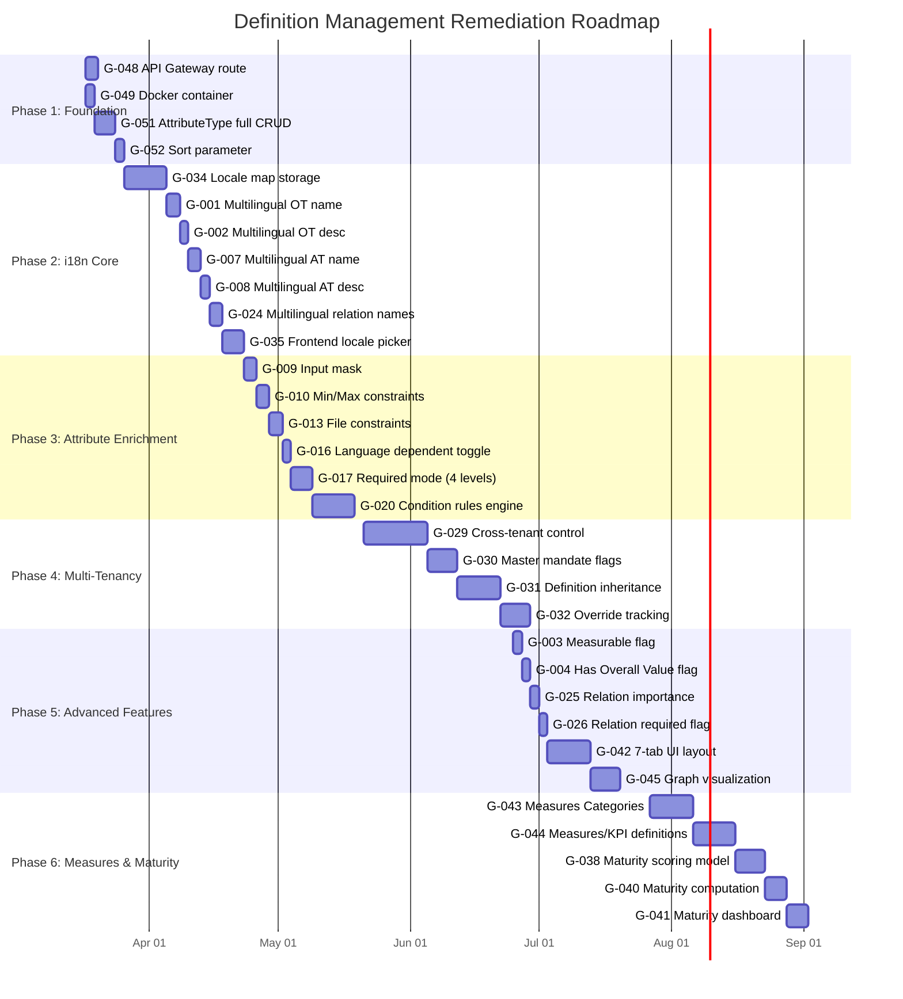
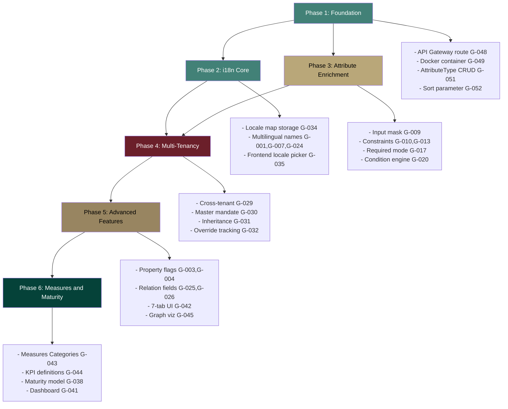

# Gap Analysis: Definition Management -- EMSIST vs Metrix+ Reference

**Version:** 1.0.0
**Date:** 2026-03-10
**Author:** DOC Agent
**Status:** Complete
**Classification:** Design Phase Artifact

---

## Table of Contents

1. [Executive Summary](#1-executive-summary)
2. [Methodology](#2-methodology)
3. [Gap Analysis Matrix (Full)](#3-gap-analysis-matrix-full)
4. [Gap Categories](#4-gap-categories)
   - 4.1 [Object Type Model Gaps](#41-object-type-model-gaps)
   - 4.2 [Attribute Model Gaps](#42-attribute-model-gaps)
   - 4.3 [Relationship Model Gaps](#43-relationship-model-gaps)
   - 4.4 [Multi-Tenancy / Governance Gaps](#44-multi-tenancy--governance-gaps)
   - 4.5 [Internationalization (i18n) Gaps](#45-internationalization-i18n-gaps)
   - 4.6 [Data Maturity Gaps](#46-data-maturity-gaps)
   - 4.7 [UI/UX Gaps](#47-uiux-gaps)
   - 4.8 [Infrastructure Gaps](#48-infrastructure-gaps)
   - 4.9 [API Gaps](#49-api-gaps)
   - 4.10 [Testing Gaps](#410-testing-gaps)
5. [Prioritized Remediation Roadmap](#5-prioritized-remediation-roadmap)
6. [Effort Summary by Phase](#6-effort-summary-by-phase)
7. [Risk Assessment](#7-risk-assessment)
8. [Appendix: Full Feature Comparison](#8-appendix-full-feature-comparison)

---

## 1. Executive Summary

This document provides an exhaustive gap analysis between the **current EMSIST definition-service implementation** and the **target state** derived from the Metrix+ reference platform and user enhancement requirements. Every current-state claim is verified against actual source code with file paths and line references.

### Gap Count by Severity

| Severity | Count | Description |
|----------|-------|-------------|
| **CRITICAL** | 8 | Blocks core definition management functionality |
| **HIGH** | 18 | Major feature gaps vs Metrix+ parity |
| **MEDIUM** | 14 | Usability and enhancement gaps |
| **LOW** | 7 | Nice-to-have features |
| **Total** | **47** | |

### Gap Count by Category

| Category | CRITICAL | HIGH | MEDIUM | LOW | Total |
|----------|----------|------|--------|-----|-------|
| Object Type Model | 1 | 3 | 2 | 0 | 6 |
| Attribute Model | 2 | 4 | 2 | 1 | 9 |
| Relationship Model | 1 | 2 | 1 | 1 | 5 |
| Multi-Tenancy / Governance | 2 | 2 | 1 | 0 | 5 |
| Internationalization (i18n) | 1 | 2 | 1 | 0 | 4 |
| Data Maturity | 0 | 1 | 2 | 1 | 4 |
| UI/UX | 1 | 2 | 2 | 1 | 6 |
| Infrastructure | 0 | 1 | 1 | 1 | 3 |
| API | 0 | 1 | 1 | 1 | 3 |
| Testing | 0 | 0 | 1 | 1 | 2 |

---

## 2. Methodology

### How Gaps Were Identified

1. **Source code reading** -- Every backend Java file, frontend TypeScript file, DTO, repository, and controller was read directly using the `Read` tool.
2. **Reference comparison** -- Each Metrix+ feature (from PDF analysis) was compared line-by-line against the EMSIST codebase.
3. **Enhancement requirements mapping** -- Each user enhancement requirement was checked against existing implementation.
4. **Infrastructure verification** -- `docker-compose.yml` and `application.yml` were verified for actual configuration.
5. **API gateway check** -- `RouteConfig.java` was read to verify routing status.

### Files Read (Evidence Base)

| File | Purpose |
|------|---------|
| `backend/definition-service/src/main/java/com/ems/definition/node/ObjectTypeNode.java` | ObjectType Neo4j node model |
| `backend/definition-service/src/main/java/com/ems/definition/node/AttributeTypeNode.java` | AttributeType Neo4j node model |
| `backend/definition-service/src/main/java/com/ems/definition/node/relationship/HasAttributeRelationship.java` | HAS_ATTRIBUTE edge properties |
| `backend/definition-service/src/main/java/com/ems/definition/node/relationship/CanConnectToRelationship.java` | CAN_CONNECT_TO edge properties |
| `backend/definition-service/src/main/java/com/ems/definition/controller/ObjectTypeController.java` | REST API endpoints for ObjectTypes |
| `backend/definition-service/src/main/java/com/ems/definition/controller/AttributeTypeController.java` | REST API endpoints for AttributeTypes |
| `backend/definition-service/src/main/java/com/ems/definition/service/ObjectTypeServiceImpl.java` | Business logic implementation |
| `backend/definition-service/src/main/java/com/ems/definition/dto/*.java` | All 9 DTO files |
| `backend/definition-service/src/main/java/com/ems/definition/repository/ObjectTypeRepository.java` | Neo4j repository for ObjectTypes |
| `backend/definition-service/src/main/java/com/ems/definition/repository/AttributeTypeRepository.java` | Neo4j repository for AttributeTypes |
| `backend/definition-service/src/main/resources/application.yml` | Service configuration |
| `backend/api-gateway/src/main/java/com/ems/gateway/config/RouteConfig.java` | API gateway routing |
| `backend/api-gateway/src/main/resources/application.yml` | Gateway configuration |
| `infrastructure/docker/docker-compose.yml` | Docker infrastructure |
| `frontend/src/app/features/administration/sections/master-definitions/master-definitions-section.component.ts` | Frontend component |
| `frontend/src/app/features/administration/sections/master-definitions/master-definitions-section.component.html` | Frontend template |
| `frontend/src/app/features/administration/models/administration.models.ts` | Frontend models |

---

## 3. Gap Analysis Matrix (Full)

| # | Category | Feature | Current State | Target State | Gap Severity | Effort | Evidence |
|---|----------|---------|---------------|-------------|--------------|--------|----------|
| G-001 | Object Type | Multilingual name | Single `name` field (String) | Multilingual name with locale map | CRITICAL | M | `ObjectTypeNode.java:37` |
| G-002 | Object Type | Multilingual description | Single `description` field (String) | Multilingual description with locale map | HIGH | M | `ObjectTypeNode.java:45` |
| G-003 | Object Type | Measurable property flag | Not present | `isMeasurable` boolean toggle | HIGH | S | `ObjectTypeNode.java` -- field absent |
| G-004 | Object Type | Has Overall Value flag | Not present | `hasOverallValue` boolean toggle | HIGH | S | `ObjectTypeNode.java` -- field absent |
| G-005 | Object Type | Governance tab / rules | Not present | Per-object governance rule configuration | MEDIUM | L | No governance model exists |
| G-006 | Object Type | Data Sources tab | Not present | External data source configuration per type | MEDIUM | L | No data source model exists |
| G-007 | Attribute | Multilingual name | Single `name` field (String) | Multilingual name with locale map | CRITICAL | M | `AttributeTypeNode.java:32` |
| G-008 | Attribute | Multilingual description | Single `description` field (String) | Multilingual description with locale map | HIGH | M | `AttributeTypeNode.java:43` |
| G-009 | Attribute | Input mask | Not present | Configurable input mask pattern | HIGH | S | `AttributeTypeNode.java` -- field absent |
| G-010 | Attribute | Min/Max value constraints | JSON blob `validationRules` (unstructured) | Typed min/max fields with constraint enforcement | HIGH | S | `AttributeTypeNode.java:47` |
| G-011 | Attribute | Phone prefix/pattern | Not present | Phone-specific formatting (prefix, pattern) | MEDIUM | S | `AttributeTypeNode.java` -- field absent |
| G-012 | Attribute | Date/Time format config | Not present | Configurable date/time display format | MEDIUM | S | `AttributeTypeNode.java` -- field absent |
| G-013 | Attribute | File type/size constraints | Not present | File pattern (extensions), max file size | HIGH | S | `AttributeTypeNode.java` -- field absent |
| G-014 | Attribute | Versioning Relevant toggle | Not present | `isVersioningRelevant` boolean | LOW | S | `AttributeTypeNode.java` -- field absent |
| G-015 | Attribute | Workflow Action toggle | Not present | `isWorkflowAction` boolean | MEDIUM | S | `AttributeTypeNode.java` -- field absent |
| G-016 | Attribute | Language Dependent toggle | Not present | `isLanguageDependent` boolean | CRITICAL | S | `AttributeTypeNode.java` -- field absent |
| G-017 | Attribute | Validation: Required mode | `isRequired` boolean on relationship | 4-mode: Mandatory+stop WF / Mandatory+proceed / Optional / Conditional | HIGH | M | `HasAttributeRelationship.java:30` |
| G-018 | Attribute | Validation: Enabled mode | Not present | 3-mode: TRUE / FALSE / Conditional | MEDIUM | S | `HasAttributeRelationship.java` -- field absent |
| G-019 | Attribute | Validation: Reset Value | Not present | Default reset value when conditions change | LOW | S | `HasAttributeRelationship.java` -- field absent |
| G-020 | Attribute | Validation: Condition rules | Not present | Conditional expression engine for required/enabled | HIGH | L | No condition engine exists |
| G-021 | Attribute | Lock status | Not present | Per-attribute lock/unlock toggle (Metrix+ Attributes tab) | MEDIUM | S | `HasAttributeRelationship.java` -- field absent |
| G-022 | Attribute | Attribute Category | `attributeGroup` exists (grouping) | Full category hierarchy from Metrix+ | LOW | S | `AttributeTypeNode.java:42` partial |
| G-023 | Attribute | Data Source: System Data | Not present | System data source binding per attribute | MEDIUM | M | `AttributeTypeNode.java` -- field absent |
| G-024 | Relationship | Multilingual active/passive name | Single `activeName`/`passiveName` (String) | Multilingual relationship labels | CRITICAL | M | `CanConnectToRelationship.java:34-38` |
| G-025 | Relationship | Importance field | Not present | Relationship importance ranking | HIGH | S | `CanConnectToRelationship.java` -- field absent |
| G-026 | Relationship | Required flag | Not present | Whether relationship is mandatory | HIGH | S | `CanConnectToRelationship.java` -- field absent |
| G-027 | Relationship | Own attributes | Not present | Relations can have their own attribute set (Metrix+ Attributes tab on relation) | MEDIUM | L | No relation-attribute model exists |
| G-028 | Relationship | Source object type reference | Implicit (outgoing from ObjectType) | Explicit `fromObjectType` field in Metrix+ Relations tab | LOW | S | `CanConnectToRelationship.java` -- inferred from graph |
| G-029 | Governance | Cross-tenant definition control | `tenantId` field per node; no master/child concept | Master tenant controls with inheritance | CRITICAL | XL | `ObjectTypeNode.java:35` -- simple tenantId |
| G-030 | Governance | Master Mandate flags | Not present | `isMasterMandate` boolean making definitions immutable in child tenants | CRITICAL | L | No master mandate model exists |
| G-031 | Governance | Definition inheritance model | Not present | Master tenant definitions flow down to child tenants with override rules | HIGH | XL | No tenant hierarchy model for definitions |
| G-032 | Governance | Child tenant override tracking | `state` field (default/customized/user_defined) | Full provenance tracking: which fields overridden, by whom, when | HIGH | L | `ObjectTypeNode.java:59-61` -- basic state only |
| G-033 | Governance | Audit trail for definition changes | Not present in definition-service | Full change history log per definition | MEDIUM | M | No audit integration exists |
| G-034 | i18n | Locale map storage | Not present | Structured locale map (`Map<String, Map<String, String>>`) for all text fields | CRITICAL | L | All text fields are single String |
| G-035 | i18n | Frontend locale picker | Not present | Locale selection UI for managing translations | HIGH | M | No locale UI in master-definitions component |
| G-036 | i18n | Language-dependent attribute behavior | Not present | Attributes flagged as language-dependent store values per locale | HIGH | L | No language dependency model |
| G-037 | i18n | Translation import/export | Not present | Bulk translation management via file import/export | MEDIUM | M | No translation feature exists |
| G-038 | Maturity | Object data maturity scoring | Not present | Mandatory/conditional/optional attribute tracking for maturity score | HIGH | L | No maturity model exists |
| G-039 | Maturity | Mandatory field tracking | `isRequired` boolean only | Maturity levels: mandatory / conditional / optional with score weights | MEDIUM | M | `HasAttributeRelationship.java:30` |
| G-040 | Maturity | Maturity score computation | Not present | Computed score based on filled mandatory+conditional fields | MEDIUM | M | No scoring engine exists |
| G-041 | Maturity | Maturity dashboard/visualization | Not present | UI showing maturity metrics per object type | LOW | M | No maturity UI exists |
| G-042 | UI/UX | 7-tab configuration panel | 4-step wizard (Basic/Connections/Attributes/Status) | 7-tab layout (General/Attributes/Relations/Governance/Data Sources/Measures Categories/Measures) | CRITICAL | L | `master-definitions-section.component.ts:629-633` |
| G-043 | UI/UX | Measures Categories tab | Not present | Measurement category management UI | HIGH | L | No measures categories model/UI |
| G-044 | UI/UX | Measures tab (KPIs/Metrics) | Not present | KPI/metric definition management UI | HIGH | L | No measures/KPI model/UI |
| G-045 | UI/UX | Graph visualization | Not present | Interactive type relationship graph visualization | MEDIUM | M | No graph visualization component |
| G-046 | UI/UX | Import/Export definitions | Not present | JSON/YAML import/export with diff/rollback | MEDIUM | L | No import/export feature |
| G-047 | UI/UX | Definition versioning | `createdAt`/`updatedAt` only | Full version history with diff and rollback | LOW | L | `ObjectTypeNode.java:63-65` |
| G-048 | Infrastructure | API Gateway routing | definition-service REMOVED from gateway | definition-service routed through gateway | HIGH | S | `RouteConfig.java:107-110` -- commented out |
| G-049 | Infrastructure | Docker container | Not in docker-compose | definition-service containerized in docker-compose | MEDIUM | S | `docker-compose.yml` -- absent |
| G-050 | Infrastructure | Neo4j Enterprise | Community edition | Enterprise edition (if graph-per-tenant needed) | LOW | S | `docker-compose.yml:59` -- community |
| G-051 | API | AttributeType CRUD completeness | List + Create only | Full CRUD: Get by ID, Update, Delete, Search, Paginate | HIGH | S | `AttributeTypeController.java:39-62` -- only GET all + POST |
| G-052 | API | Sort parameter support | Not present on list endpoints | `sort` parameter for server-side sorting | MEDIUM | S | `ObjectTypeController.java:49-63` -- no sort param |
| G-053 | API | Bulk operations | Not present | Bulk create/update/delete for definitions | LOW | M | No bulk endpoints exist |
| G-054 | Testing | Frontend unit tests | Not verified (no test file found for master-definitions component) | Component + service specs with >=80% coverage | MEDIUM | M | No `master-definitions-section.component.spec.ts` found |
| G-055 | Testing | E2E tests for definition management | Not verified | Playwright E2E covering CRUD, wizard, search, filter | LOW | M | No E2E test for definitions |

---

## 4. Gap Categories

### 4.1 Object Type Model Gaps

**Current ObjectTypeNode fields** (verified at `backend/definition-service/src/main/java/com/ems/definition/node/ObjectTypeNode.java`):

```java
// Lines 33-76 -- all fields present in the current model
private String id;              // line 33
private String tenantId;        // line 35
private String name;            // line 37 -- SINGLE STRING, not multilingual
private String typeKey;         // line 40
private String code;            // line 43
private String description;     // line 45 -- SINGLE STRING, not multilingual
private String iconName;        // line 48 -- default "box"
private String iconColor;       // line 52 -- default "#428177"
private String status;          // line 56 -- "active|planned|hold|retired"
private String state;           // line 60 -- "default|customized|user_defined"
private Instant createdAt;      // line 63
private Instant updatedAt;      // line 65
// Relationships:
private List<HasAttributeRelationship> attributes;   // line 67-69
private List<CanConnectToRelationship> connections;   // line 71-73
private ObjectTypeNode parentType;                    // line 75-76 (IS_SUBTYPE_OF)
```

**What is missing vs Metrix+ General Info tab:**

| Metrix+ Feature | EMSIST Field | Gap |
|-----------------|-------------|-----|
| Multilingual Name | `name` (String) | G-001: No locale map |
| Multilingual Description | `description` (String) | G-002: No locale map |
| Measurable toggle | -- | G-003: Field absent |
| Has Overall Value toggle | -- | G-004: Field absent |
| Icon | `iconName` + `iconColor` | [IMPLEMENTED] |
| Status | `status` | [IMPLEMENTED] |
| State (default/customized/user_defined) | `state` | [IMPLEMENTED] |
| Code (auto-generated) | `code` | [IMPLEMENTED] |
| Subtype hierarchy | `parentType` (IS_SUBTYPE_OF) | [IMPLEMENTED] -- node exists but no API endpoint to set it |

**What is missing vs Metrix+ additional tabs:**

| Metrix+ Tab | EMSIST Equivalent | Gap |
|-------------|------------------|-----|
| Governance | -- | G-005: No governance model |
| Data Sources | -- | G-006: No data source model |
| Measures Categories | -- | G-043: No measures categories model |
| Measures | -- | G-044: No measures/KPI model |

---

### 4.2 Attribute Model Gaps

**Current AttributeTypeNode fields** (verified at `backend/definition-service/src/main/java/com/ems/definition/node/AttributeTypeNode.java`):

```java
// Lines 28-52 -- all fields present
private String id;               // line 28
private String tenantId;         // line 30
private String name;             // line 32 -- SINGLE STRING
private String attributeKey;     // line 35
private String dataType;         // line 38 -- "string|text|integer|float|boolean|date|datetime|enum|json"
private String attributeGroup;   // line 41
private String description;      // line 43 -- SINGLE STRING
private String defaultValue;     // line 45
private String validationRules;  // line 48 -- JSON blob, unstructured
private Instant createdAt;       // line 50
private Instant updatedAt;       // line 52
```

**Current HasAttributeRelationship fields** (verified at `backend/definition-service/src/main/java/com/ems/definition/node/relationship/HasAttributeRelationship.java`):

```java
// Lines 28-35
private Long relId;              // line 28-29
private boolean isRequired;      // line 31 -- SIMPLE BOOLEAN
private int displayOrder;        // line 33
private AttributeTypeNode attribute;  // line 35
```

**Metrix+ Attribute Creation: General tab gaps:**

| Feature | Current | Target | Gap ID |
|---------|---------|--------|--------|
| Multilingual Name | `name` (String) | `Map<locale, String>` | G-007 |
| Multilingual Description | `description` (String) | `Map<locale, String>` | G-008 |
| Data Type | 9 types supported | 6 Metrix+ types (Text/Number/Value/Boolean/File/Date/Time) -- EMSIST has MORE types | [IMPLEMENTED] -- superset |
| Input Mask | -- | Pattern-based input mask | G-009 |
| Min/Max Value Length | `validationRules` (JSON) | Typed `minLength`/`maxLength`/`minValue`/`maxValue` fields | G-010 |
| Phone Prefix/Pattern | -- | Phone-specific formatting | G-011 |
| Date/Time Format | -- | Configurable display format | G-012 |
| File Pattern/Max Size | -- | Allowed extensions, max upload size | G-013 |
| Versioning Relevant toggle | -- | `isVersioningRelevant` boolean | G-014 |
| Workflow Action toggle | -- | `isWorkflowAction` boolean | G-015 |
| Language Dependent toggle | -- | `isLanguageDependent` boolean | G-016 |

**Metrix+ Attribute Creation: Validation tab gaps:**

| Feature | Current | Target | Gap ID |
|---------|---------|--------|--------|
| Required mode (4 levels) | `isRequired` boolean | Mandatory+stop WF / Mandatory+proceed / Optional / Conditional | G-017 |
| Enabled mode (3 states) | -- | TRUE / FALSE / Conditional | G-018 |
| Reset Value | -- | Default reset value | G-019 |
| Condition rules engine | -- | Conditional expression system | G-020 |

**Metrix+ Attribute Creation: Data Source tab:**

| Feature | Current | Target | Gap ID |
|---------|---------|--------|--------|
| System Data config | -- | Bind attribute to system data source | G-023 |

---

### 4.3 Relationship Model Gaps

**Current CanConnectToRelationship fields** (verified at `backend/definition-service/src/main/java/com/ems/definition/node/relationship/CanConnectToRelationship.java`):

```java
// Lines 28-47
private Long relId;             // line 28-29
private String relationshipKey; // line 32
private String activeName;      // line 35 -- SINGLE STRING
private String passiveName;     // line 38 -- SINGLE STRING
private String cardinality;     // line 41 -- "one-to-one|one-to-many|many-to-many"
private boolean isDirected;     // line 44
private ObjectTypeNode targetType; // line 46-47
```

**Metrix+ Relation Creation gaps:**

| Feature | Current | Target | Gap ID |
|---------|---------|--------|--------|
| Multilingual Active/Passive Name | Single String each | `Map<locale, String>` for both | G-024 |
| Importance field | -- | Importance ranking/weight | G-025 |
| Required flag | -- | Whether relationship is mandatory | G-026 |
| Relation-specific attributes | -- | Relations with their own attribute set | G-027 |
| Explicit source type ref | Implicit (graph edge origin) | Explicit `fromObjectType` field | G-028 |

---

### 4.4 Multi-Tenancy / Governance Gaps

**Current tenant isolation** (verified across all node files):

- `ObjectTypeNode.java:35` -- `private String tenantId;`
- `AttributeTypeNode.java:30` -- `private String tenantId;`
- Service layer filters by `tenantId` on every operation (`ObjectTypeServiceImpl.java:49-66`)
- No concept of master tenant, child tenant inheritance, or mandate flags

**Gaps:**

| # | Feature | Current | Target | Severity |
|---|---------|---------|--------|----------|
| G-029 | Cross-tenant definition control | Flat `tenantId` per node | Master tenant controls with inheritance hierarchy | CRITICAL |
| G-030 | Master Mandate flags | -- | `isMasterMandate` boolean making definitions immutable in child tenants | CRITICAL |
| G-031 | Definition inheritance | -- | Master definitions automatically available in child tenants | HIGH |
| G-032 | Override tracking | `state` field (3 values) | Full provenance: which fields overridden, by whom, when | HIGH |
| G-033 | Audit trail | -- | Per-definition change history | MEDIUM |

---

### 4.5 Internationalization (i18n) Gaps

**Current state:** All text fields are single `String` values. No locale map, no translation structure, no language-dependent behavior exists anywhere in the definition-service codebase.

**Evidence:**
- `ObjectTypeNode.java:37` -- `private String name;`
- `ObjectTypeNode.java:45` -- `private String description;`
- `AttributeTypeNode.java:32` -- `private String name;`
- `CanConnectToRelationship.java:35` -- `private String activeName;`

**Gaps:**

| # | Feature | Target | Severity |
|---|---------|--------|----------|
| G-034 | Locale map storage for all text fields | `Map<String, LocalizedText>` or embedded locale nodes | CRITICAL |
| G-035 | Frontend locale picker | Language selector UI for editing translations | HIGH |
| G-036 | Language-dependent attribute behavior | Attribute values stored per locale when flagged | HIGH |
| G-037 | Translation import/export | Bulk file-based translation management | MEDIUM |

---

### 4.6 Data Maturity Gaps

**Current state:** The only data completeness indicator is the `isRequired` boolean on `HasAttributeRelationship`. No maturity scoring, no mandatory/conditional/optional classification beyond binary required/not-required.

**Evidence:**
- `HasAttributeRelationship.java:31` -- `private boolean isRequired;`

**Gaps:**

| # | Feature | Target | Severity |
|---|---------|--------|----------|
| G-038 | Object data maturity scoring | Compute maturity % based on filled mandatory+conditional attributes | HIGH |
| G-039 | 3-level requirement classification | Mandatory / Conditional / Optional with score weights | MEDIUM |
| G-040 | Maturity score computation engine | Backend service to compute scores per object instance | MEDIUM |
| G-041 | Maturity dashboard | UI visualization of maturity metrics | LOW |

---

### 4.7 UI/UX Gaps

**Current frontend** (verified at `frontend/src/app/features/administration/sections/master-definitions/master-definitions-section.component.ts` and `.html`):

The current UI provides:
- [IMPLEMENTED] Split-panel layout (list + detail)
- [IMPLEMENTED] List view and Card view toggle (`viewMode` signal, line 71)
- [IMPLEMENTED] Search and status filter (lines 74-76)
- [IMPLEMENTED] 4-step creation wizard: Basic Info / Connections / Attributes / Status (template line 630)
- [IMPLEMENTED] Detail view with attributes and connections sub-sections
- [IMPLEMENTED] Edit mode for name, description, status, icon, color
- [IMPLEMENTED] Duplicate and Restore actions
- [IMPLEMENTED] Delete with confirmation dialog

**Gaps vs Metrix+ 7-tab layout:**

| # | Feature | Current | Target | Severity |
|---|---------|---------|--------|----------|
| G-042 | 7-tab config panel | 4-step wizard | 7 tabs: General/Attributes/Relations/Governance/Data Sources/Measures Categories/Measures | CRITICAL |
| G-043 | Measures Categories tab | -- | Category management for measurements | HIGH |
| G-044 | Measures tab | -- | KPI/metric definition management | HIGH |
| G-045 | Graph visualization | -- | Interactive relationship graph (D3/vis.js/cytoscape) | MEDIUM |
| G-046 | Import/Export | -- | JSON/YAML import/export with diff/rollback | MEDIUM |
| G-047 | Version history | `createdAt`/`updatedAt` only | Full version list with diff and rollback | LOW |

---

### 4.8 Infrastructure Gaps

**Current infrastructure** (verified from `docker-compose.yml` and `RouteConfig.java`):

- definition-service runs on port 8090 (`application.yml:2`)
- definition-service connects to Neo4j (`application.yml:13-17`)
- definition-service registers with Eureka (`application.yml:19-23`)
- definition-service is **NOT routed** through the API Gateway (`RouteConfig.java:107-110` -- commented out with note "REMOVED: no backing service registered in Eureka")
- definition-service is **NOT containerized** in docker-compose.yml (no entry for it)

**Gaps:**

| # | Feature | Current | Target | Severity |
|---|---------|---------|--------|----------|
| G-048 | API Gateway route | Commented out in RouteConfig.java | Active route: `/api/v1/definitions/**` -> `lb://DEFINITION-SERVICE` | HIGH |
| G-049 | Docker container | Not present in docker-compose.yml | Containerized with Neo4j dependency | MEDIUM |
| G-050 | Neo4j edition | Community (`neo4j:5.12.0-community`) | Enterprise (only if graph-per-tenant isolation required per ADR-003) | LOW |

---

### 4.9 API Gaps

**Current API endpoints** (verified from `ObjectTypeController.java` and `AttributeTypeController.java`):

**ObjectType endpoints** [IMPLEMENTED]:
- `GET /api/v1/definitions/object-types` -- paginated list with search/status filter
- `POST /api/v1/definitions/object-types` -- create
- `GET /api/v1/definitions/object-types/{id}` -- get by ID
- `PUT /api/v1/definitions/object-types/{id}` -- partial update
- `DELETE /api/v1/definitions/object-types/{id}` -- delete
- `POST /api/v1/definitions/object-types/{id}/duplicate` -- duplicate
- `POST /api/v1/definitions/object-types/{id}/restore` -- restore to default
- `GET /api/v1/definitions/object-types/{id}/attributes` -- list attributes
- `POST /api/v1/definitions/object-types/{id}/attributes` -- add attribute
- `DELETE /api/v1/definitions/object-types/{id}/attributes/{attrId}` -- remove attribute
- `GET /api/v1/definitions/object-types/{id}/connections` -- list connections
- `POST /api/v1/definitions/object-types/{id}/connections` -- add connection
- `DELETE /api/v1/definitions/object-types/{id}/connections/{connId}` -- remove connection

**AttributeType endpoints** [PARTIALLY IMPLEMENTED]:
- `GET /api/v1/definitions/attribute-types` -- list all (NO pagination)
- `POST /api/v1/definitions/attribute-types` -- create

**Missing AttributeType endpoints:**
- `GET /api/v1/definitions/attribute-types/{id}` -- get by ID
- `PUT /api/v1/definitions/attribute-types/{id}` -- update
- `DELETE /api/v1/definitions/attribute-types/{id}` -- delete
- Pagination, search, filtering on list endpoint

**Gaps:**

| # | Feature | Current | Target | Severity |
|---|---------|---------|--------|----------|
| G-051 | AttributeType full CRUD | List + Create only | Get by ID, Update, Delete, Search, Paginate | HIGH |
| G-052 | Sort parameter | Not on any list endpoint | Server-side `sort` parameter | MEDIUM |
| G-053 | Bulk operations | -- | Bulk create/update/delete endpoints | LOW |

---

### 4.10 Testing Gaps

**Current test files found** (verified via Glob):
- `backend/definition-service/src/test/java/com/ems/definition/DefinitionServiceApplicationTest.java`
- `backend/definition-service/src/test/java/com/ems/definition/DefinitionServiceApplicationTests.java`
- `backend/definition-service/src/test/java/com/ems/definition/controller/ObjectTypeControllerTest.java`
- `backend/definition-service/src/test/java/com/ems/definition/controller/AttributeTypeControllerTest.java`
- `backend/definition-service/src/test/java/com/ems/definition/service/ObjectTypeServiceImplTest.java`
- `backend/definition-service/src/test/java/com/ems/definition/repository/ObjectTypeRepositoryIT.java`

**What exists:** Backend unit tests and integration tests are present (not executed in this analysis).

**What is missing:**
- Frontend component tests for `MasterDefinitionsSectionComponent` (no `.spec.ts` file found)
- E2E tests for definition management workflows

| # | Feature | Current | Target | Severity |
|---|---------|---------|--------|----------|
| G-054 | Frontend unit tests | Not found | Component + service specs >=80% coverage | MEDIUM |
| G-055 | E2E tests | Not found | Playwright E2E for definition CRUD, wizard, search | LOW |

---

## 5. Prioritized Remediation Roadmap



### Phase Dependencies



---

## 6. Effort Summary by Phase

| Phase | Sprint Count | Gap Count | Key Deliverables |
|-------|-------------|-----------|------------------|
| **Phase 1: Foundation** | 1 sprint (2 weeks) | 4 gaps | API Gateway route, Docker, AttributeType CRUD, Sort |
| **Phase 2: i18n Core** | 2 sprints (4 weeks) | 7 gaps | Locale map model, multilingual all entities, locale picker UI |
| **Phase 3: Attribute Enrichment** | 2 sprints (4 weeks) | 6 gaps | Input mask, constraints, 4-level required, condition engine |
| **Phase 4: Multi-Tenancy** | 3 sprints (6 weeks) | 5 gaps | Cross-tenant governance, mandate flags, inheritance, override tracking |
| **Phase 5: Advanced Features** | 2 sprints (4 weeks) | 6 gaps | Property flags, relation enrichment, 7-tab UI, graph visualization |
| **Phase 6: Measures & Maturity** | 3 sprints (6 weeks) | 5 gaps | Measures categories, KPIs, maturity model, computation, dashboard |
| **Total** | **13 sprints (~26 weeks)** | **33 unique gaps** | Full Metrix+ parity + enhancements |

*Note: Remaining 14 gaps (MEDIUM/LOW severity) from the full list of 47 are folded into the phases above or can be addressed opportunistically.*

### Effort by T-Shirt Size

| Size | Definition | Gap Count | Total Effort |
|------|-----------|-----------|-------------|
| **S** (< 1 sprint) | Simple field additions, single endpoint | 17 | ~8 sprints |
| **M** (1-2 sprints) | Multilingual migration, UI features | 13 | ~19 sprints |
| **L** (2-4 sprints) | Condition engine, governance model, 7-tab UI | 10 | ~30 sprints |
| **XL** (> 4 sprints) | Cross-tenant control, definition inheritance | 2 | ~10 sprints |

*Note: Many S/M items run in parallel within phases. The 13-sprint roadmap above accounts for parallelism.*

---

## 7. Risk Assessment

| Risk | Probability | Impact | Mitigation |
|------|-------------|--------|------------|
| **i18n migration breaks existing data** | HIGH | CRITICAL | Schema migration strategy with backward-compatible locale maps; keep `name` as default locale value |
| **Cross-tenant governance complexity** | HIGH | HIGH | Incremental approach: master mandate flags first (G-030), then inheritance (G-031) |
| **Condition rules engine scope creep** | MEDIUM | HIGH | Define minimal viable expression language; avoid building a full rules engine |
| **Neo4j community edition limitations** | LOW | MEDIUM | Community edition supports all required features; Enterprise only needed for graph-per-tenant (ADR-003, currently 0% implemented) |
| **API Gateway routing conflicts** | LOW | MEDIUM | Add definition-service route with unique path prefix `/api/v1/definitions/**` -- already used by the service |
| **Frontend 7-tab redesign complexity** | MEDIUM | MEDIUM | Incremental tab addition; start with General+Attributes+Relations tabs, add others progressively |
| **Maturity score computation performance** | LOW | MEDIUM | Cache computed scores in Valkey; recompute on attribute change events |
| **Backward compatibility for API consumers** | MEDIUM | HIGH | Version API endpoints; maintain v1 compatibility while adding v2 with locale support |

---

## 8. Appendix: Full Feature Comparison

### Metrix+ Object Type Configuration vs EMSIST

| Metrix+ Tab | Metrix+ Feature | EMSIST Status | Gap ID |
|-------------|----------------|---------------|--------|
| **General Info** | Name (multilingual) | [IN-PROGRESS] -- single String | G-001 |
| | Description (multilingual) | [IN-PROGRESS] -- single String | G-002 |
| | Measurable toggle | [PLANNED] | G-003 |
| | Has Overall Value toggle | [PLANNED] | G-004 |
| | Icon selection | [IMPLEMENTED] -- `iconName` + `iconColor` | -- |
| | Code (auto-generated) | [IMPLEMENTED] -- `code` field with OBJ_NNN pattern | -- |
| | Status lifecycle | [IMPLEMENTED] -- active/planned/hold/retired | -- |
| | State tracking | [IMPLEMENTED] -- default/customized/user_defined | -- |
| | Subtype hierarchy | [IN-PROGRESS] -- `IS_SUBTYPE_OF` node exists, no API to manage | -- |
| **Attributes** | Attribute ID | [IMPLEMENTED] -- `attributeKey` | -- |
| | Attribute Name | [IN-PROGRESS] -- single String | G-007 |
| | Attribute Type | [IMPLEMENTED] -- `dataType` with 9 types | -- |
| | Attribute Category | [IMPLEMENTED] -- `attributeGroup` | -- |
| | Lock Status | [PLANNED] | G-021 |
| | Actions (CRUD) | [IN-PROGRESS] -- List+Create; missing Update/Delete/Get | G-051 |
| **Relations** | From Object Type | [IMPLEMENTED] -- implicit via graph edge | -- |
| | Active/Passive Name (multilingual) | [IN-PROGRESS] -- single String each | G-024 |
| | Target Type | [IMPLEMENTED] -- `targetType` on CAN_CONNECT_TO | -- |
| | Cardinality | [IMPLEMENTED] -- one-to-one/one-to-many/many-to-many | -- |
| | Importance | [PLANNED] | G-025 |
| | Required flag | [PLANNED] | G-026 |
| | Relation attributes | [PLANNED] | G-027 |
| **Governance** | Per-object governance rules | [PLANNED] | G-005 |
| **Data Sources** | External data source config | [PLANNED] | G-006 |
| **Measures Categories** | Category management | [PLANNED] | G-043 |
| **Measures** | KPI/metric definitions | [PLANNED] | G-044 |

### Metrix+ Attribute Creation vs EMSIST

| Metrix+ Tab | Metrix+ Feature | EMSIST Status | Gap ID |
|-------------|----------------|---------------|--------|
| **General** | Name (multilingual) | [IN-PROGRESS] -- single String | G-007 |
| | Description (multilingual) | [IN-PROGRESS] -- single String | G-008 |
| | Data Type selection | [IMPLEMENTED] -- 9 types vs Metrix+ 7 | -- |
| | Input Mask | [PLANNED] | G-009 |
| | Min/Max Value Length | [IN-PROGRESS] -- `validationRules` JSON blob | G-010 |
| | Phone Prefix/Pattern | [PLANNED] | G-011 |
| | Date/Time Format | [PLANNED] | G-012 |
| | File Pattern/Max Size | [PLANNED] | G-013 |
| | Versioning Relevant toggle | [PLANNED] | G-014 |
| | Workflow Action toggle | [PLANNED] | G-015 |
| | Language Dependent toggle | [PLANNED] | G-016 |
| **Validation** | Required (4 modes) | [IN-PROGRESS] -- binary isRequired only | G-017 |
| | Enabled (3 states) | [PLANNED] | G-018 |
| | Reset Value | [PLANNED] | G-019 |
| | Condition rules | [PLANNED] | G-020 |
| **Data Source** | System Data config | [PLANNED] | G-023 |

### Metrix+ Relation Creation vs EMSIST

| Metrix+ Tab | Metrix+ Feature | EMSIST Status | Gap ID |
|-------------|----------------|---------------|--------|
| **General Info** | Active Name (multilingual) | [IN-PROGRESS] -- single String | G-024 |
| | Passive Name (multilingual) | [IN-PROGRESS] -- single String | G-024 |
| **Attributes** | Relation-specific attributes | [PLANNED] | G-027 |
| **Settings** | Required toggle | [PLANNED] | G-026 |
| | To Object Type | [IMPLEMENTED] -- `targetType` | -- |
| | Importance | [PLANNED] | G-025 |
| | Cardinality | [IMPLEMENTED] -- 3 options | -- |
| | Directed flag | [IMPLEMENTED] -- `isDirected` boolean | -- |

### User Enhancement Requirements vs EMSIST

| Requirement | EMSIST Status | Gap IDs |
|-------------|---------------|---------|
| Cross-Tenant Definition Governance | [PLANNED] | G-029, G-030, G-031 |
| Master Mandate Flags | [PLANNED] | G-030 |
| Object Data Maturity | [PLANNED] | G-038, G-039, G-040, G-041 |
| Language Context Management | [PLANNED] | G-016, G-034, G-035, G-036 |
| Graph Visualization | [PLANNED] | G-045 |
| Import/Export & Versioning | [PLANNED] | G-046, G-047 |

---

## Changelog

| Version | Date | Changes |
|---------|------|---------|
| 1.0.0 | 2026-03-10 | Initial gap analysis -- 47 gaps identified across 10 categories |
