# Benchmark Study: Object Type Definition Management Platforms

**Document ID:** BENCH-DM-001
**Version:** 1.0.0
**Date:** 2026-03-10
**Status:** Complete
**Author:** ARCH Agent (ARCH-PRINCIPLES.md v1.1.0)
**Classification:** Strategic Architecture Research

---

## Table of Contents

1. [Executive Summary](#1-executive-summary)
2. [Methodology](#2-methodology)
3. [Platform Profiles](#3-platform-profiles)
   - 3.1 [ServiceNow CMDB](#31-servicenow-cmdb)
   - 3.2 [BMC Helix CMDB](#32-bmc-helix-cmdb)
   - 3.3 [iTop CMDB](#33-itop-cmdb)
   - 3.4 [GLPI](#34-glpi)
   - 3.5 [Sparx Enterprise Architect](#35-sparx-enterprise-architect)
   - 3.6 [LeanIX](#36-leanix)
   - 3.7 [Archi / ArchiMate](#37-archi--archimate)
   - 3.8 [TOGAF Metamodel](#38-togaf-metamodel)
   - 3.9 [Metrix+](#39-metrix-reference-platform)
   - 3.10 [Apache Atlas](#310-apache-atlas)
   - 3.11 [Collibra](#311-collibra)
   - 3.12 [Alation](#312-alation)
4. [Comparative Analysis Matrix](#4-comparative-analysis-matrix)
5. [Deep Dive: Object Type Model Patterns](#5-deep-dive-object-type-model-patterns)
6. [Deep Dive: Multi-Tenant Governance Patterns](#6-deep-dive-multi-tenant-governance-patterns)
7. [Deep Dive: Release Management / Change Propagation Patterns](#7-deep-dive-release-management--change-propagation-patterns)
8. [Deep Dive: Data Maturity / Health Scoring Patterns](#8-deep-dive-data-maturity--health-scoring-patterns)
9. [Deep Dive: AI/ML in Object Management](#9-deep-dive-aiml-in-object-management)
10. [Recommendations for EMSIST](#10-recommendations-for-emsist)
11. [Architectural Patterns to Adopt](#11-architectural-patterns-to-adopt)
12. [Anti-Patterns to Avoid](#12-anti-patterns-to-avoid)
13. [Technology Choices Informed by Benchmark](#13-technology-choices-informed-by-benchmark)
14. [Appendix: Source URLs and References](#14-appendix-source-urls-and-references)

---

## 1. Executive Summary

This benchmark study examines 12 platforms across four categories -- ITSM/CMDB, Enterprise Architecture, Reference Platform, and Data Catalog/Governance -- to inform EMSIST's Definition Management design decisions. The study focuses on patterns for object type definition, multi-tenant governance, versioning, internationalization, data maturity scoring, graph visualization, and AI integration.

### Key Findings

| Finding | Implication for EMSIST |
|---------|----------------------|
| **Inheritance-based type systems are universal** -- Every major CMDB (ServiceNow, BMC, iTop) uses class-based inheritance for CI types. This confirms EMSIST's `IS_SUBTYPE_OF` relationship as architecturally sound. | Strengthen the `IS_SUBTYPE_OF` edge with proper inheritance semantics (attribute propagation, override rules). |
| **Graph-native definition storage is rare** -- Only ServiceNow (internally), Apache Atlas, and Neo4j-backed platforms use graph storage for type definitions. Most use relational metamodels. EMSIST's Neo4j choice is a differentiator. | Leverage Neo4j for relationship traversal, impact analysis, and visualization -- areas where relational CMDBs struggle. |
| **Multi-tenant governance is an enterprise differentiator** -- Collibra and ServiceNow dominate here with role-based governance workflows. BMC uses federation. No platform fully implements EMSIST's master-mandate-with-child-override model. | EMSIST's governance model is novel and must be designed carefully. Draw from Collibra's workflow engine and ServiceNow's domain separation. |
| **Versioning is consistently weak** -- Most platforms track change history but lack proper schema versioning with diff/rollback. Only Collibra and LeanIX offer structured version management for type definitions. | Implement proper semantic versioning for definitions (major/minor/patch) with snapshot-based diff and rollback. |
| **Data maturity scoring is ServiceNow's strongest feature** -- CMDB Health Dashboard with completeness, compliance, and relationship scoring is the gold standard. No other platform matches this depth. | Adopt ServiceNow's three-axis maturity model (Completeness, Compliance, Relationship) and adapt it for EMSIST's attribute-level granularity. |
| **AI/ML is emerging but shallow** -- ServiceNow CMDB Health uses ML for duplicate detection. Apache Atlas uses classification propagation. No platform has deep AI for definition management. | Opportunity to differentiate with AI-assisted attribute suggestion, automated classification, and anomaly detection in definition usage patterns. |
| **i18n for definitions is largely absent** -- Most platforms handle UI localization but NOT definition-level multilingual content. Metrix+ is the exception with language-dependent attributes. | EMSIST's planned locale map model (`Map<locale, String>`) is architecturally aligned with Metrix+ and ahead of most competitors. |

### Strategic Recommendations (Top 5)

1. **Adopt ServiceNow's CMDB Health scoring model** for data maturity -- three-axis (Completeness, Compliance, Relationship) with configurable weights per attribute importance class.
2. **Implement Collibra's governance workflow pattern** for cross-tenant definition governance -- approval workflows, role-based permissions, and change request tracking.
3. **Use Apache Atlas's type system design** as the reference for type inheritance and classification -- it is the most elegant graph-native type system in the benchmark.
4. **Follow LeanIX's Fact Sheet approach** for API design -- clean REST with typed fact sheet types, dynamic fields, and tag-based classification.
5. **Build graph visualization using a D3.js/Cytoscape.js approach** similar to Apache Atlas lineage views -- but tailored for type definition graphs rather than data lineage.

---

## 2. Methodology

### Research Approach

This benchmark was conducted through systematic analysis of publicly available documentation for each platform.

### Sources Used Per Platform

| Platform | Source Types |
|----------|-------------|
| ServiceNow CMDB | Official developer docs, CMDB Health documentation, Table API reference, Instance customization guides |
| BMC Helix CMDB | BMC documentation portal, Atrium CMDB class manager reference, reconciliation engine docs |
| iTop | GitHub source code (Combodo/iTop), metamodel XML files, iTop wiki documentation |
| GLPI | GitHub source code (glpi-project/glpi), plugin architecture docs, REST API reference |
| Sparx EA | Sparx Systems user guide, UML profile mechanism documentation, MDG Technology SDK |
| LeanIX | LeanIX developer portal, Fact Sheet API reference, Integration API docs, Pathfinder docs |
| Archi / ArchiMate | ArchiMate 3.2 specification (The Open Group), Archi tool documentation, metamodel reference |
| TOGAF | TOGAF Standard (The Open Group), Content Metamodel chapter, Architecture Building Blocks reference |
| Metrix+ | EMSIST PRD reference PDF analysis (7-tab UI, attribute management, governance, data sources, measures) |
| Apache Atlas | Apache Atlas documentation (atlas.apache.org), Type System REST API, classification and lineage docs |
| Collibra | Collibra developer portal, Asset Type API, Governance workflow documentation, DGC platform guides |
| Alation | Alation developer docs, Custom Template API, Data Catalog object model reference |

### Evaluation Framework

Each platform was evaluated against 12 dimensions with a 5-point scoring system:

| Score | Meaning |
|-------|---------|
| **5** | Best-in-class -- sets the industry standard |
| **4** | Strong implementation -- production proven at scale |
| **3** | Adequate -- meets basic requirements |
| **2** | Partial -- significant limitations |
| **1** | Minimal or absent |

### Limitations

- This study is based on publicly available documentation and known platform capabilities as of March 2026.
- SaaS platforms (ServiceNow, LeanIX, Collibra, Alation) may have capabilities not fully documented in public docs.
- Metrix+ evaluation is based on the reference PDF provided for EMSIST design, not direct product access.

---

## 3. Platform Profiles

### 3.1 ServiceNow CMDB

**Category:** ITSM/CMDB
**License:** Commercial SaaS
**Architecture:** Single-instance multi-tenant, relational metamodel with graph layer

#### Object Type Model

ServiceNow CMDB uses a **table-based inheritance model** where each CI type corresponds to a database table. The base class is `cmdb_ci` (Configuration Item), and all CI types extend it through table inheritance.

```
cmdb_ci (Base Configuration Item)
  ├── cmdb_ci_computer
  │     ├── cmdb_ci_server
  │     │     ├── cmdb_ci_linux_server
  │     │     └── cmdb_ci_win_server
  │     └── cmdb_ci_pc_hardware
  ├── cmdb_ci_appl (Application)
  │     ├── cmdb_ci_service
  │     └── cmdb_ci_db_instance
  └── cmdb_ci_network_gear
```

Key characteristics:
- **Table-per-type inheritance**: Each CI class gets its own table that extends the parent. Child tables automatically inherit all parent columns.
- **Type registry**: The `sys_db_object` table is the metamodel -- it defines all tables, their parent tables, and their labels.
- **Attribute model**: Columns are defined in `sys_dictionary` with data types, max length, default values, mandatory flags, read-only flags, and display attributes.
- **Relationship model**: Relationships are stored in `cmdb_rel_ci` table with `parent`, `child`, and `type` fields. Relationship types are defined in `cmdb_rel_type` table with `parent_descriptor` and `child_descriptor` (equivalent to active/passive names).

#### Attribute System

```
sys_dictionary record:
  - name: "ram"
  - element: field name
  - column_label: display label
  - internal_type: "integer"
  - max_length: 40
  - mandatory: true/false
  - read_only: true/false
  - default_value: ""
  - reference_qual: (for reference fields)
  - attributes: "edge_encryption_enabled=true"
```

ServiceNow supports 40+ data types including string, integer, decimal, boolean, date, datetime, reference (foreign key), glide_list (multi-reference), journal, HTML, URL, email, phone, currency, and custom types.

#### CMDB Health Dashboard (Data Maturity)

ServiceNow's CMDB Health Dashboard is the most mature data quality scoring system in this benchmark.

Three scoring axes:
1. **Completeness** -- Percentage of mandatory and recommended attributes that are populated. Configurable per CI class with attribute importance weights (Critical/High/Medium/Low).
2. **Compliance** -- Whether CI data conforms to identification rules (IRE), reconciliation rules, and data quality rules. Measures duplicate count, orphan count, and stale CI count.
3. **Relationship** -- Percentage of expected relationships that exist. Configurable expected relationship types per CI class with minimum count thresholds.

Overall CMDB Health Score formula:
```
Health Score = (Completeness Weight * Completeness%) +
               (Compliance Weight * Compliance%) +
               (Relationship Weight * Relationship%)

Default weights: Completeness=40%, Compliance=30%, Relationship=30%
```

**KPI metrics tracked:**
- Total CI count by class
- Duplicate CI count (identified via IRE rules)
- Orphan CI count (no relationships)
- Stale CI count (not updated within threshold)
- Completeness percentage per class and overall
- Compliance score per class

#### Multi-Tenancy

ServiceNow uses **Domain Separation** for multi-tenancy:
- Each domain (tenant) can see only its own data
- Global domain definitions are inherited by all domains
- Domain-specific overrides are possible for configurations but NOT for the type schema itself
- Instance separation (separate instances) for strict isolation

**Key limitation for EMSIST**: ServiceNow's domain separation isolates data instances, not type definitions. All tenants share the same CI class hierarchy. EMSIST's master-mandate-with-child-override model goes beyond what ServiceNow offers.

#### API Design

ServiceNow Table API (REST):

```
GET  /api/now/table/cmdb_ci_server?sysparm_limit=10
POST /api/now/table/cmdb_ci_server
PUT  /api/now/table/cmdb_ci_server/{sys_id}
DELETE /api/now/table/cmdb_ci_server/{sys_id}

# CMDB-specific APIs
GET  /api/now/cmdb/instance/{class_name}/{sys_id}
POST /api/now/cmdb/instance/{class_name}

# Metadata API (type definitions)
GET  /api/now/cmdb/meta/{class_name}
GET  /api/now/table/sys_dictionary?sysparm_query=name={table_name}
```

#### Relevance to EMSIST

| Feature | ServiceNow Approach | EMSIST Applicability |
|---------|--------------------|--------------------|
| CMDB Health scoring | Three-axis model with configurable weights | **HIGH** -- adopt this model for EMSIST maturity scoring |
| Table inheritance | SQL table per type | **MEDIUM** -- EMSIST uses Neo4j node + IS_SUBTYPE_OF edge instead |
| Relationship types | Separate type registry with active/passive descriptors | **HIGH** -- mirrors EMSIST's CAN_CONNECT_TO with activeName/passiveName |
| Domain separation | Data-level isolation | **LOW** -- EMSIST needs definition-level governance, not just data isolation |
| Identification rules | Pattern matching for duplicate detection | **MEDIUM** -- useful for data quality aspect of maturity scoring |

---

### 3.2 BMC Helix CMDB

**Category:** ITSM/CMDB
**License:** Commercial (On-premise + SaaS)
**Architecture:** Atrium CMDB with AR System (Action Request System) foundation

#### Object Type Model

BMC Helix CMDB uses the **Common Data Model (CDM)** -- a standardized set of CI classes organized into a class hierarchy. The CDM is governed by the DMTF CIM (Common Information Model) standard.

Class hierarchy structure:
```
BMC_BaseElement (root)
  ├── BMC_System
  │     ├── BMC_ComputerSystem
  │     │     ├── BMC_Server
  │     │     └── BMC_VirtualMachine
  │     └── BMC_NetworkSystem
  ├── BMC_Product
  │     ├── BMC_Application
  │     └── BMC_SoftwareServer
  └── BMC_LogicalEntity
        ├── BMC_BusinessService
        └── BMC_IPEndpoint
```

Key characteristics:
- **Class Manager**: Visual tool for defining and extending CI classes. Supports adding custom attributes, changing attribute properties, and creating subclasses.
- **Attribute groups**: Attributes are organized into categorized groups (General, BMC Specific, Custom, etc.).
- **Weak and strong relationships**: BMC distinguishes between "member of" (strong/compositional) and "uses" (weak/reference) relationships.
- **Federation**: Federated CMDB allows type definitions and instances to be distributed across multiple data sources while presenting a unified view.

#### Reconciliation Engine

BMC's reconciliation engine is significant for EMSIST's understanding of data quality:

1. **Identification rules**: Matching criteria to detect duplicates across data sources.
2. **Merge rules**: How to combine data when duplicates are found (which source wins for which attribute).
3. **Precedence rules**: Priority ordering of data sources -- when two sources disagree on an attribute value, the higher-precedence source wins.
4. **Normalization**: Data values are normalized before comparison (e.g., "Windows Server 2022" vs "Win2022" vs "Microsoft Windows Server 2022").

This reconciliation concept is directly applicable to EMSIST's multi-source definition scenario where master tenant and child tenant definitions may conflict.

#### Multi-Tenancy

BMC uses a **dataset-based multi-tenancy model**:
- Each dataset represents a tenant's data
- Overlay datasets allow master data to be inherited
- Dataset precedence determines which definition wins during reconciliation
- Custom attributes can be scoped to specific datasets

**EMSIST Relevance**: BMC's dataset overlay concept maps well to EMSIST's master-mandate model. The master tenant's definitions would be the base dataset; child tenant customizations would be overlay datasets.

#### Relevance to EMSIST

| Feature | BMC Approach | EMSIST Applicability |
|---------|-------------|--------------------|
| Common Data Model | Standardized class hierarchy following DMTF CIM | **MEDIUM** -- useful reference for default object type library |
| Federation | Distributed type definitions with unified view | **HIGH** -- applicable to cross-tenant definition governance |
| Reconciliation | Source precedence + merge rules for conflicting data | **HIGH** -- directly maps to master vs child tenant conflict resolution |
| Dataset overlays | Multi-layer data with inheritance | **HIGH** -- design pattern for tenant definition inheritance |
| Normalization | Value normalization across sources | **MEDIUM** -- useful for attribute value standardization |

---

### 3.3 iTop CMDB

**Category:** Open-source ITSM/CMDB
**License:** AGPL v3 (Combodo)
**Architecture:** PHP + MySQL/MariaDB, XML-based metamodel

#### Object Type Model

iTop uses an **XML-based metamodel** where CI classes and their attributes are defined in XML files:

```xml
<!-- iTop metamodel definition example -->
<class id="Server" _delta="define">
  <parent>FunctionalCI</parent>
  <properties>
    <category>bizmodel,searchable</category>
    <abstract>false</abstract>
    <key_type>autoincrement</key_type>
    <db_table>server</db_table>
  </properties>
  <fields>
    <field id="name" xsi:type="AttributeString">
      <sql>name</sql>
      <default_value></default_value>
      <is_null_allowed>false</is_null_allowed>
      <validation_pattern></validation_pattern>
    </field>
    <field id="status" xsi:type="AttributeEnum">
      <values>
        <value id="production">production</value>
        <value id="stock">stock</value>
        <value id="obsolete">obsolete</value>
      </values>
      <sql>status</sql>
      <default_value>production</default_value>
    </field>
    <field id="cpu" xsi:type="AttributeString">
      <sql>cpu</sql>
      <default_value></default_value>
      <is_null_allowed>true</is_null_allowed>
    </field>
  </fields>
  <relations>
    <relation id="impacts">
      <neighbours>
        <neighbour id="logical_device">
          <attribute>logicaldevices_list</attribute>
        </neighbour>
      </neighbours>
    </relation>
  </relations>
</class>
```

Key characteristics:
- **XML delta mechanism**: Extensions use `_delta="define"` (new class), `_delta="must_exist"` (modify existing), or `_delta="if_exists"` (optional modification). This is a versioning and extension pattern.
- **Attribute types**: AttributeString, AttributeEnum, AttributeInteger, AttributeDecimal, AttributeDate, AttributeDateTime, AttributeText (long text), AttributeHTML, AttributeBlob (file), AttributeExternalKey (foreign key), AttributeLinkedSet (1:N).
- **Lifecycle management**: Each class can define state machines with states, transitions, and stimuli (triggers).
- **Relations**: `impacts` and `depends on` relationships are first-class with configurable neighbor resolution.

#### Extension Model

iTop's extension/module system is architecturally relevant:
- **Module XML files** define additional classes, attributes, and relationships
- **Delta mechanism** allows adding/modifying/removing any metamodel element
- **Dependency declaration** ensures modules load in correct order
- **Toolkit compilation** merges all module XMLs into a final metamodel

This pattern is directly applicable to EMSIST's tenant customization model: the master tenant defines the base metamodel, and child tenants apply deltas.

#### Relevance to EMSIST

| Feature | iTop Approach | EMSIST Applicability |
|---------|-------------|--------------------|
| XML delta mechanism | Overlay-based metamodel extension | **HIGH** -- pattern for tenant definition overrides |
| State machine per class | Configurable lifecycle per object type | **MEDIUM** -- relevant for object instance lifecycle management |
| Module system | Modular metamodel with dependency management | **HIGH** -- applicable to definition packaging/versioning |
| Attribute validation | Per-attribute validation pattern regex | **MEDIUM** -- mirrors EMSIST's validationRules JSON but more structured |
| Impact relations | Configurable dependency/impact analysis | **MEDIUM** -- useful for cross-type relationship analysis |

---

### 3.4 GLPI

**Category:** Open-source Asset/Config Management
**License:** GPL v3
**Architecture:** PHP + MariaDB/MySQL, plugin-based extensibility

#### Object Type Model

GLPI uses a **PHP class-based model** where each asset type is a PHP class extending `CommonDBTM` (Common Database Table Model):

```php
// GLPI asset type definition pattern
class Computer extends CommonDBTM {
    static $rightname = 'computer';

    // Define fields via getAdditionalFields()
    function getAdditionalFields() {
        return [
            [
                'name'  => 'operatingsystems_id',
                'label' => __('Operating system'),
                'type'  => 'dropdownValue',
                'list'  => true
            ],
            [
                'name'  => 'serial',
                'label' => __('Serial number'),
                'type'  => 'text'
            ],
            [
                'name'  => 'memory_size',
                'label' => __('Memory'),
                'type'  => 'integer',
                'unit'  => 'auto'
            ]
        ];
    }

    // Relationships defined via tab system
    function defineTabs($options = []) {
        $tabs = [];
        $this->addDefaultFormTab($tabs);
        $this->addImpactTab($tabs, $options);
        $tabs['Item_SoftwareVersion$1'] = _n('Software', 'Softwares', 2);
        $tabs['Item_Disk$1'] = _n('Volume', 'Volumes', 2);
        return $tabs;
    }
}
```

Key characteristics:
- **Code-defined types**: Unlike iTop's XML metamodel, GLPI types are defined in PHP code. Custom types require PHP plugin development.
- **Plugin system**: New asset types are added via plugins that register PHP classes, database tables, and UI tabs.
- **Dropdown values**: Enumerated attributes use a centralized dropdown system with hierarchical values.
- **Tab-based UI**: Each type's detail page is composed of tabs, each showing related data (matching Metrix+'s 7-tab pattern).
- **i18n via gettext**: All labels use PHP's `__()` translation function with `.po` files per locale.

#### i18n Approach

GLPI's i18n is significant because it handles **UI localization** but NOT **data-level multilingual content**:
- UI labels, messages, and menu items are translated via `.po/.mo` files
- Data values (asset names, descriptions) are stored in a single language
- No concept of per-field multilingual storage

This is the typical approach for most platforms -- and the exact gap EMSIST is designed to fill with language-dependent attributes.

#### Relevance to EMSIST

| Feature | GLPI Approach | EMSIST Applicability |
|---------|-------------|--------------------|
| Plugin/tab system | Modular UI per type with configurable tabs | **HIGH** -- validates EMSIST's 7-tab UI approach |
| Dropdown management | Centralized enum/dropdown registry | **MEDIUM** -- applicable to EMSIST's enum attribute type |
| gettext i18n | UI-only localization, not data-level | **LOW** -- confirms EMSIST's multilingual data model is beyond standard |
| Rights management | Per-type CRUD permissions | **MEDIUM** -- applicable to governance role design |
| Impact analysis | Impact tab per item showing dependency chain | **MEDIUM** -- relevant to relationship visualization |

---

### 3.5 Sparx Enterprise Architect

**Category:** Enterprise Architecture / UML Tool
**License:** Commercial Desktop
**Architecture:** Desktop application with repository (SQL Server, MySQL, Oracle, or file-based)

#### Object Type Model (UML Metamodel)

Sparx EA uses the **UML metamodel** for object type definitions, with several extension mechanisms:

1. **Stereotypes**: Custom tags that extend UML metaclasses. A stereotype `<<CI>>` could be applied to a UML Class to make it a configuration item type.
2. **Tagged Values**: Custom attributes attached to any model element. Each tagged value has a name, type, default value, and notes.
3. **Profiles**: Packaged collections of stereotypes, tagged values, and constraints that extend UML for a specific domain.
4. **MDG Technologies**: The full extension mechanism that bundles profiles, patterns, templates, and toolbox customizations.

```
UML Profile: "CMDB Profile"
  ├── Stereotype: <<ConfigurationItem>>
  │     ├── extends: Class
  │     ├── Tagged Values:
  │     │     ├── ciType (String, required)
  │     │     ├── criticality (Enum: High/Medium/Low)
  │     │     └── owner (String)
  │     └── Constraints:
  │           └── {must have at least one relationship}
  ├── Stereotype: <<CIRelationship>>
  │     ├── extends: Association
  │     └── Tagged Values:
  │           ├── relationshipType (Enum: DependsOn/RunsOn/HostedOn)
  │           └── importance (Integer, 1-5)
  └── Stereotype: <<Attribute>>
        ├── extends: Property
        └── Tagged Values:
              ├── mandatory (Boolean)
              ├── dataSource (String)
              └── maturityWeight (Integer, 0-100)
```

#### Version Control

Sparx EA supports version control through:
- **Package baselines**: Snapshot of a package at a point in time (like git commits for model sections)
- **Diff/merge**: Visual comparison and merging of model baselines
- **VCS integration**: Direct integration with Git, SVN for model files
- **Audit log**: Records all changes to model elements with timestamp, user, and before/after values

This is the most structured approach to definition versioning in the benchmark.

#### Relevance to EMSIST

| Feature | Sparx EA Approach | EMSIST Applicability |
|---------|------------------|--------------------|
| UML Profiles | Domain-specific metamodel extension | **MEDIUM** -- pattern for "definition templates" that bundle type+attributes |
| Tagged Values | Key-value attributes on any element | **HIGH** -- maps to EMSIST's attribute system; confirms dynamic attribute approach |
| Package Baselines | Snapshot-based versioning with diff | **HIGH** -- adopt for definition version management |
| MDG Technologies | Bundled extensions with toolbox | **MEDIUM** -- pattern for definition packages (import/export) |
| Audit log | Change tracking per element | **MEDIUM** -- supports definition change history requirement |

---

### 3.6 LeanIX

**Category:** Enterprise Architecture Management (EAM)
**License:** Commercial SaaS
**Architecture:** SaaS, REST + GraphQL API, cloud-native

#### Object Type Model (Fact Sheets)

LeanIX uses the **Fact Sheet** concept as its core object type model. Each Fact Sheet Type defines a class of objects with:

```
Fact Sheet Type: "Application"
  ├── Standard Fields:
  │     ├── name (Text, required)
  │     ├── description (Rich Text)
  │     ├── lifecycle (State: Plan/Phase In/Active/Phase Out/End of Life)
  │     ├── tags (Multi-select from tag groups)
  │     └── externalId (Text, for integration mapping)
  ├── Custom Fields:
  │     ├── criticality (Single Select: Mission Critical/Business Critical/Business Operational/Administrative)
  │     ├── technicalFit (Single Select: Unreasonable/Insufficient/Adequate/Fully Appropriate)
  │     └── annualCost (Number, currency formatted)
  ├── Relations:
  │     ├── Application → IT Component (relApplicationToITComponent)
  │     │     ├── fields: technicalFit, functionalFit
  │     │     └── constraintType: MANY_TO_MANY
  │     ├── Application → Business Capability (relApplicationToBusinessCapability)
  │     └── Application → User Group (relApplicationToUserGroup)
  └── Subscriptions:
        ├── Responsible (Role-based assignment)
        ├── Accountable
        └── Observer
```

Key characteristics:
- **Typed Fact Sheets**: Each Fact Sheet Type has a fixed set of standard fields plus configurable custom fields.
- **Relation types with attributes**: Relations between Fact Sheet Types can carry their own attributes (e.g., the relation between Application and IT Component has `technicalFit` and `functionalFit`).
- **Tag-based classification**: Tags are grouped into Tag Groups and can be applied to any Fact Sheet. Tags drive filtering, reporting, and governance.
- **Quality scoring**: Each Fact Sheet has a data quality score based on field completeness and freshness.
- **Lifecycle management**: Built-in lifecycle states with configurable transitions.

#### API Design (GraphQL + REST)

LeanIX offers both REST and GraphQL APIs. The GraphQL API is particularly well-designed for type definitions:

```graphql
# LeanIX GraphQL query for fact sheet type definitions
query {
  allFactSheets(factSheetType: Application, first: 10) {
    edges {
      node {
        id
        name
        description
        type
        lifecycle { asString phases { phase startDate } }
        tags { name tagGroup { name } }
        ... on Application {
          criticality
          technicalFit
          relApplicationToITComponent {
            edges {
              node {
                factSheet { id name type }
                technicalFit
                functionalFit
              }
            }
          }
        }
      }
    }
  }
}
```

```graphql
# Mutation to update a fact sheet
mutation {
  updateFactSheet(id: "abc-123", patches: [
    { op: replace, path: "/name", value: "New Name" },
    { op: replace, path: "/criticality", value: "missionCritical" }
  ]) {
    factSheet { id name }
  }
}
```

#### Data Quality Scoring

LeanIX computes a **Data Quality Score** per Fact Sheet:

1. **Completeness**: Percentage of configured required and recommended fields that are filled.
2. **Freshness**: How recently the Fact Sheet was reviewed/updated. Configurable staleness thresholds per Fact Sheet Type.
3. **Model Quality**: Whether relationships to other Fact Sheets conform to the defined architecture model.

Scores are presented as color-coded indicators (Green/Yellow/Red) and aggregated per Fact Sheet Type and across the entire inventory.

#### Relevance to EMSIST

| Feature | LeanIX Approach | EMSIST Applicability |
|---------|----------------|--------------------|
| Fact Sheet Types | Typed objects with standard + custom fields | **HIGH** -- mirrors EMSIST's ObjectType + dynamic attributes model |
| Relation attributes | Relations carry their own field set | **HIGH** -- validates G-027 (relation-specific attributes) gap |
| GraphQL API | Type-safe queries with relation traversal | **MEDIUM** -- consider for EMSIST's graph-heavy query patterns |
| Data Quality Score | Completeness + Freshness + Model Quality | **HIGH** -- adopt Freshness dimension for EMSIST maturity scoring |
| Tag-based classification | Flexible categorization beyond hierarchy | **MEDIUM** -- useful pattern for EMSIST's attribute grouping |
| Lifecycle states | Built-in phase management | **MEDIUM** -- applicable to EMSIST's object type status management |

---

### 3.7 Archi / ArchiMate

**Category:** Enterprise Architecture Modeling
**License:** Open-source (MIT) / ArchiMate Standard (The Open Group)
**Architecture:** Desktop (Eclipse RCP) + jArchi scripting

#### Object Type Model (ArchiMate Metamodel)

ArchiMate defines a rigorous metamodel with three layers and a strategy/motivation extension:

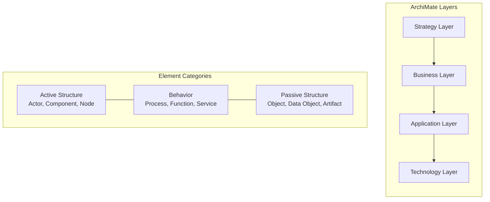

Key ArchiMate concept types:
- **Business**: Business Actor, Business Role, Business Process, Business Service, Business Object, Contract, Product
- **Application**: Application Component, Application Function, Application Service, Data Object
- **Technology**: Node, Device, System Software, Technology Service, Artifact
- **Strategy**: Resource, Capability, Course of Action, Value Stream
- **Relationships**: Composition, Aggregation, Assignment, Realization, Serving, Access, Influence, Triggering, Flow, Specialization, Association

Each concept type has:
- A **type name** and **icon**
- A **layer** (Business/Application/Technology/Strategy)
- **Allowed relationships** to other concept types (defined by the ArchiMate specification)
- **Properties** (key-value pairs, user-defined)

#### Viewpoints

ArchiMate's viewpoint concept is architecturally significant. A viewpoint is a **filter on the metamodel** that shows only the elements and relationships relevant to a particular stakeholder concern:

| Viewpoint | Shows | Audience |
|-----------|-------|----------|
| Organization | Business Actors, Roles, Collaborations | Management |
| Application Usage | Applications, Services, Users | Business Analysts |
| Technology | Nodes, Devices, Networks | Infrastructure Team |
| Layered | All layers with inter-layer relations | Enterprise Architects |
| Migration | Plateaus with before/after states | Program Managers |

**EMSIST Relevance**: The viewpoint concept could be applied to definition management -- different stakeholders see different subsets of the type graph (e.g., a "Technical View" shows only infrastructure object types; a "Business View" shows only business process types).

#### Relevance to EMSIST

| Feature | ArchiMate Approach | EMSIST Applicability |
|---------|-------------------|--------------------|
| Strict relationship rules | Not all types can connect to all other types | **HIGH** -- validates EMSIST's CAN_CONNECT_TO constraint model |
| Viewpoints | Filtered views of the metamodel | **MEDIUM** -- applicable to role-based definition views |
| Layer categorization | Elements grouped into domain layers | **MEDIUM** -- pattern for EMSIST object type grouping/categorization |
| Specialization relationship | Subtyping between element types | **HIGH** -- directly maps to IS_SUBTYPE_OF |
| Property mechanism | Key-value extensions on any element | **MEDIUM** -- pattern for EMSIST's dynamic attribute approach |

---

### 3.8 TOGAF Metamodel

**Category:** Enterprise Architecture Framework
**License:** The Open Group Standard
**Architecture:** Framework/Standard (not a tool)

#### Content Metamodel

TOGAF's Content Metamodel defines the standard entities and relationships for enterprise architecture documentation. It is organized into content extensions:

**Core Content Metamodel:**

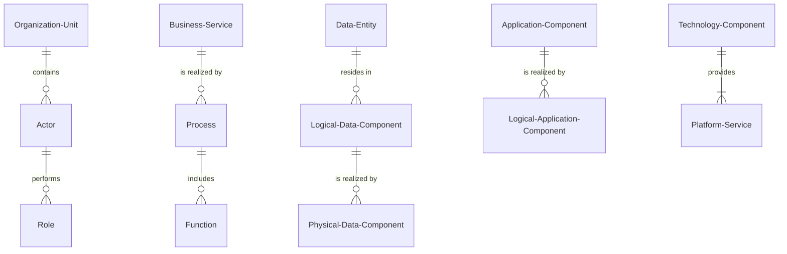

**Content Extensions:**
1. **Governance Extension**: Adds Contract, Measure, Service Quality, Standard
2. **Services Extension**: Adds Information System Service, Platform Service
3. **Process Modeling Extension**: Adds Event, Control, Product
4. **Data Extension**: Adds Logical/Physical Data Components
5. **Infrastructure Consolidation Extension**: Adds Location, Technology Component

Each entity in the metamodel has:
- **Entity Name** and **Description**
- **Attributes** (e.g., Data Entity has Name, Description, Category, Owner, Data Quality)
- **Relationships** to other entities with cardinality
- **Catalogs** (lists of instances), **Matrices** (relationship mappings), and **Diagrams** (visual representations)

#### Architecture Building Blocks (ABBs) vs Solution Building Blocks (SBBs)

This pattern is directly relevant to EMSIST's master-definition vs tenant-customization model:

| Concept | TOGAF Meaning | EMSIST Mapping |
|---------|--------------|----------------|
| **Architecture Building Block (ABB)** | Abstract definition of functionality (product-independent) | Master tenant definition (canonical, mandated) |
| **Solution Building Block (SBB)** | Concrete implementation of an ABB (product-specific) | Child tenant customization (tenant-specific override) |

ABBs are defined at the architecture level and refined into SBBs during implementation. This two-tier pattern maps directly to EMSIST's governance model.

#### Relevance to EMSIST

| Feature | TOGAF Approach | EMSIST Applicability |
|---------|---------------|--------------------|
| Content Metamodel | Standard entity and relationship definitions | **HIGH** -- reference for default object type library |
| ABB/SBB pattern | Abstract definition refined into concrete implementation | **HIGH** -- pattern for master mandate vs child override |
| Governance Extension | Standard, Measure, Service Quality entities | **MEDIUM** -- informs EMSIST's governance and measures tabs |
| Catalogs/Matrices/Diagrams | Three views per entity set | **MEDIUM** -- pattern for EMSIST's list/card/graph views |
| Architecture Repository | Versioned storage of architecture artifacts | **MEDIUM** -- informs definition versioning approach |

---

### 3.9 Metrix+ (Reference Platform)

**Category:** Reference Platform
**License:** Proprietary
**Architecture:** Service management platform with object type configuration

Metrix+ is the direct reference for EMSIST's Definition Management feature. All gap analysis references this platform.

#### Object Type Configuration (7-Tab Model)

Metrix+ uses a **7-tab configuration panel** for object type definitions:

| Tab | Contents | EMSIST Current State |
|-----|----------|---------------------|
| **General** | Name (multilingual), Description (multilingual), Icon, Status, Code, Measurable toggle, Has Overall Value toggle | Partial -- name/description not multilingual, no measurable/overall-value flags |
| **Attributes** | Attribute list with type, validation rules, language-dependent toggle, versioning-relevant toggle, workflow-action toggle, categories, lock status | Partial -- basic attributes exist but missing many flags |
| **Relations** | Connection definitions with active/passive names (multilingual), cardinality, directionality, importance, required flag, relation-specific attributes | Partial -- connections exist but no importance, required, multilingual names, or relation attributes |
| **Governance** | Governance rules, mandate configuration, compliance thresholds | Missing entirely |
| **Data Sources** | External data source bindings, system data configuration, import mappings | Missing entirely |
| **Measures Categories** | Category hierarchy for organizing measures/KPIs | Missing entirely |
| **Measures** | KPI/metric definitions with thresholds, calculation methods, scoring | Missing entirely |

#### Attribute Creation (3-Tab Detail)

Each attribute in Metrix+ has three configuration tabs:

1. **General Tab**:
   - Name (multilingual)
   - Description (multilingual)
   - Data Type: Text / Number / Value (enum) / Boolean / File / Date/Time
   - Input Mask (pattern)
   - Min/Max length or value
   - Phone prefix/pattern (for phone type)
   - Date/Time format
   - File pattern and max size
   - Versioning Relevant toggle
   - Workflow Action toggle
   - Language Dependent toggle

2. **Validation Tab**:
   - Required mode: Mandatory (stop workflow) / Mandatory (proceed) / Optional / Conditional
   - Enabled mode: TRUE / FALSE / Conditional
   - Reset Value
   - Condition rules (expression engine)

3. **Data Source Tab**:
   - System Data binding
   - External source configuration
   - Transformation rules

#### Governance Model

Metrix+ implements governance through:
- **Lock status**: Per-attribute and per-type lock that prevents modification
- **Mandate flags**: Attributes and types can be mandated by a governing entity
- **Compliance tracking**: Percentage of mandated items that are present in child configurations
- **Change request workflow**: Changes to mandated items require approval

#### Data Maturity Scoring

Metrix+ uses attribute importance levels to compute maturity:
- **Mandatory**: Must be filled for the object to be considered minimally documented
- **Conditional**: Required under certain conditions (e.g., if another attribute has a specific value)
- **Optional**: Not required but contributes to maturity score when filled

Maturity Score formula:
```
Maturity = (FilledMandatory / TotalMandatory) * MandatoryWeight +
           (FilledConditional / ApplicableConditional) * ConditionalWeight +
           (FilledOptional / TotalOptional) * OptionalWeight

Default weights: Mandatory=50%, Conditional=30%, Optional=20%
```

#### Relevance to EMSIST

| Feature | Metrix+ Approach | EMSIST Applicability |
|---------|-----------------|--------------------|
| 7-tab model | Complete type configuration interface | **CRITICAL** -- direct target for EMSIST UI (Gap G-042) |
| Language-dependent attributes | Per-attribute multilingual toggle | **CRITICAL** -- unique feature, EMSIST must implement (Gap G-016) |
| 4-mode required validation | Graduated requirement levels | **HIGH** -- replaces simple boolean isRequired (Gap G-017) |
| Conditional validation | Expression-based attribute rules | **HIGH** -- enables complex business rules (Gap G-020) |
| Lock status | Per-element modification lock | **HIGH** -- directly supports governance model |
| Measures/KPIs | Type-level metric definitions | **HIGH** -- supports maturity scoring framework |

---

### 3.10 Apache Atlas

**Category:** Data Catalog / Governance
**License:** Apache License 2.0 (Open-source)
**Architecture:** Java, HBase + Solr backend, REST API, Kafka integration

#### Type System

Apache Atlas has the most elegant type system in this benchmark. It is **graph-native** and supports:

**Type categories:**
1. **Entity types**: Define real-world objects (e.g., `hive_db`, `hive_table`, `hive_column`)
2. **Classification types**: Tags/labels that can be applied to entities (e.g., `PII`, `Sensitive`, `Deprecated`)
3. **Struct types**: Complex attribute types (reusable attribute groups)
4. **Enum types**: Enumerated value sets
5. **Relationship types**: Define connections between entity types with cardinality and containment semantics

**Type definition API:**

```json
// POST /api/atlas/v2/types/typedefs
{
  "entityDefs": [
    {
      "name": "emsist_server",
      "description": "A physical or virtual server",
      "superTypes": ["emsist_ci"],
      "typeVersion": "1.0",
      "attributeDefs": [
        {
          "name": "hostname",
          "typeName": "string",
          "isOptional": false,
          "cardinality": "SINGLE",
          "isUnique": true,
          "isIndexable": true,
          "constraints": [
            {
              "type": "maxLength",
              "params": { "maxLength": 255 }
            }
          ]
        },
        {
          "name": "operatingSystem",
          "typeName": "string",
          "isOptional": true,
          "cardinality": "SINGLE",
          "defaultValue": "Linux"
        },
        {
          "name": "ipAddresses",
          "typeName": "array<string>",
          "isOptional": true,
          "cardinality": "LIST"
        }
      ]
    }
  ],
  "relationshipDefs": [
    {
      "name": "emsist_server_application",
      "typeVersion": "1.0",
      "relationshipCategory": "ASSOCIATION",
      "propagateTags": "NONE",
      "endDef1": {
        "type": "emsist_server",
        "name": "applications",
        "isContainer": false,
        "cardinality": "SET"
      },
      "endDef2": {
        "type": "emsist_application",
        "name": "servers",
        "isContainer": false,
        "cardinality": "SET"
      }
    }
  ]
}
```

Key characteristics:
- **Type inheritance**: `superTypes` array supports single and multiple inheritance.
- **Attribute constraints**: Typed constraints (maxLength, regex, etc.) on each attribute.
- **Cardinality on attributes**: `SINGLE`, `LIST`, `SET` -- attributes can be multi-valued.
- **Relationship categories**: `ASSOCIATION`, `AGGREGATION`, `COMPOSITION` -- with semantic meaning.
- **Tag propagation**: Classifications (tags) can propagate through relationships automatically.
- **Type versioning**: `typeVersion` field with version comparison support.

#### Classification System

Atlas classifications are a powerful pattern for EMSIST:

```json
{
  "classificationDefs": [
    {
      "name": "MasterMandate",
      "description": "Indicates this entity is mandated by the master tenant",
      "superTypes": [],
      "attributeDefs": [
        {
          "name": "mandatedBy",
          "typeName": "string",
          "isOptional": false
        },
        {
          "name": "mandatedDate",
          "typeName": "date",
          "isOptional": false
        },
        {
          "name": "overridable",
          "typeName": "boolean",
          "defaultValue": "false"
        }
      ]
    }
  ]
}
```

Classifications can:
- Be applied to any entity instance
- Carry their own attributes
- Propagate through relationship edges (e.g., if a database is classified as `PII`, all tables in it automatically inherit the classification)
- Be used for governance rules and access control

**EMSIST Relevance**: The classification propagation pattern is directly applicable to master mandate governance. A `MasterMandate` classification on an ObjectType could propagate to all its attributes and relationships, marking them as mandated.

#### Lineage and Graph Visualization

Atlas provides lineage visualization showing how data flows through systems. The lineage graph is:
- **Directed**: Shows data flow direction
- **Multi-hop**: Can traverse multiple levels of relationships
- **Filterable**: By entity type, classification, or time range
- **Interactive**: Click-through to entity details

This lineage visualization pattern is applicable to EMSIST's type relationship graph visualization requirement.

#### Relevance to EMSIST

| Feature | Atlas Approach | EMSIST Applicability |
|---------|---------------|--------------------|
| Type system design | Graph-native with inheritance, constraints, versioning | **CRITICAL** -- best reference for EMSIST's type system design |
| Classification propagation | Tags propagate through relationship edges | **HIGH** -- pattern for master mandate propagation |
| Relationship categories | ASSOCIATION/AGGREGATION/COMPOSITION semantics | **HIGH** -- richer than EMSIST's current boolean `isDirected` |
| Attribute cardinality | SINGLE/LIST/SET per attribute | **HIGH** -- pattern for multi-valued attributes |
| Type versioning | `typeVersion` with compatibility checking | **HIGH** -- adopt for definition versioning |
| REST API design | Clean type definition CRUD with batch support | **HIGH** -- reference API pattern for definition-service |
| Lineage visualization | Directed graph with multi-hop traversal | **MEDIUM** -- adapt for type relationship visualization |

---

### 3.11 Collibra

**Category:** Data Governance Platform
**License:** Commercial SaaS
**Architecture:** Cloud-native, Java backend, REST API + GraphQL

#### Object Type Model (Asset Types)

Collibra uses a **three-layer type system**:

1. **Asset Types**: Define categories of data assets (e.g., "Business Term", "Data Set", "Table", "Column", "Report")
2. **Attribute Types**: Define the properties an asset can have (e.g., "Definition", "Description", "Status", "Technical Name")
3. **Relation Types**: Define how asset types can relate (e.g., "Business Term groups Data Set", "Table contains Column")

```
Asset Type: "Business Term"
  ├── Attribute Types:
  │     ├── Definition (Text, mandatory)
  │     ├── Example (Text, optional)
  │     ├── Note (Text, optional)
  │     ├── Status (Status, mandatory) -- references a Status workflow
  │     └── Steward (User Reference, mandatory)
  ├── Allowed Relation Types:
  │     ├── "Business Term" → groupedBy → "Data Domain"
  │     ├── "Business Term" → relatedTo → "Business Term"
  │     └── "Business Term" → isImplementedBy → "Column"
  └── Domain Assignment:
        └── Must be placed in a "Glossary" type domain
```

Key characteristics:
- **Domain-scoped assets**: Assets must be placed in Domains, which are organized into Communities. This provides a hierarchical governance structure.
- **Status workflows**: Each asset type can have a configurable status workflow with states, transitions, and role-based permissions per transition.
- **Responsibility model**: RACI-like assignments (Responsible, Accountable, Consulted, Informed) per asset.
- **Complex assignments**: Type assignments determine which attribute types and relation types are available for a given asset type.

#### Governance Workflow Engine

Collibra's governance model is the most sophisticated in this benchmark:

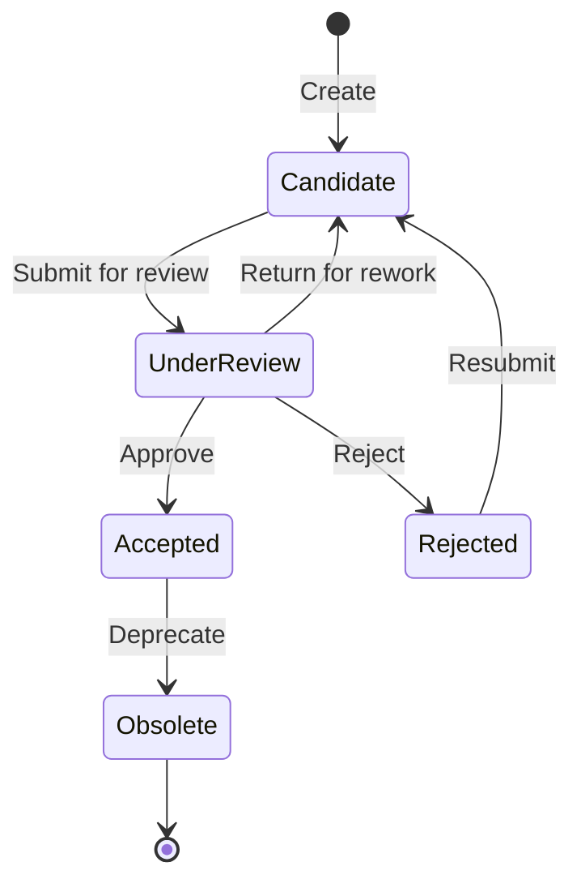

Workflow characteristics:
- **Configurable per asset type**: Each asset type has its own governance workflow.
- **Role-based transitions**: Only specific roles can trigger specific transitions (e.g., only "Data Steward" can approve a "Business Term").
- **Automated actions**: Workflow transitions can trigger automated actions (notifications, API calls, attribute updates).
- **Escalation rules**: Configurable escalation if an approval is pending too long.
- **Audit trail**: Complete history of every workflow transition with user, timestamp, and comments.

**EMSIST Relevance**: This workflow engine is the best reference for EMSIST's cross-tenant governance. Master mandate enforcement could use a similar workflow:

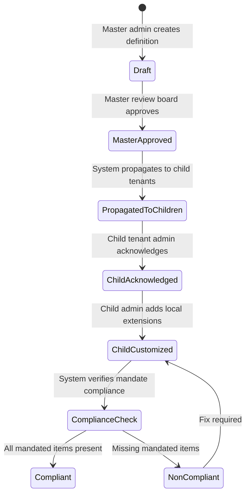

#### API Design

Collibra REST API for type definitions:

```
# Asset Type CRUD
GET    /rest/2.0/assetTypes
POST   /rest/2.0/assetTypes
GET    /rest/2.0/assetTypes/{assetTypeId}
PATCH  /rest/2.0/assetTypes/{assetTypeId}
DELETE /rest/2.0/assetTypes/{assetTypeId}

# Attribute Type CRUD
GET    /rest/2.0/attributeTypes
POST   /rest/2.0/attributeTypes
GET    /rest/2.0/attributeTypes/{attributeTypeId}
PATCH  /rest/2.0/attributeTypes/{attributeTypeId}

# Relation Type CRUD
GET    /rest/2.0/relationTypes
POST   /rest/2.0/relationTypes
GET    /rest/2.0/relationTypes/{relationTypeId}

# Assignments (type-to-attribute/relation mapping)
GET    /rest/2.0/assignments
POST   /rest/2.0/assignments
```

#### Relevance to EMSIST

| Feature | Collibra Approach | EMSIST Applicability |
|---------|------------------|--------------------|
| Governance workflows | Configurable state machine per type with role-based transitions | **CRITICAL** -- best reference for cross-tenant governance |
| Three-layer type system | Asset Types + Attribute Types + Relation Types | **HIGH** -- mirrors EMSIST's ObjectType + AttributeType + CAN_CONNECT_TO |
| Domain/Community hierarchy | Hierarchical organizational structure for governance scoping | **HIGH** -- maps to master/child tenant hierarchy |
| RACI assignments | Responsibility model per asset | **MEDIUM** -- applicable to definition ownership |
| Status workflows | Per-type configurable lifecycle | **HIGH** -- pattern for definition lifecycle management |
| Complex assignments | Dynamic type-to-attribute mapping | **HIGH** -- pattern for configurable attribute sets per type |

---

### 3.12 Alation

**Category:** Data Catalog
**License:** Commercial SaaS
**Architecture:** Cloud-native, Python/Java backend, REST API

#### Object Type Model (Custom Templates)

Alation uses **Custom Templates** to define object types for catalog entries:

```
Custom Template: "Data Source"
  ├── Built-in Fields:
  │     ├── Title (required)
  │     ├── Description (rich text)
  │     ├── Tags (multi-select)
  │     └── Stewards (user references)
  ├── Custom Fields:
  │     ├── Type: Picker (single select from defined options)
  │     ├── Type: Multi-Picker (multi select)
  │     ├── Type: Date
  │     ├── Type: Rich Text
  │     ├── Type: People
  │     ├── Type: Reference (link to another catalog object)
  │     └── Type: Object Set (link to multiple catalog objects)
  └── Template Sections:
        ├── "General Information" (groups built-in + custom fields)
        ├── "Technical Details" (groups custom fields)
        └── "Governance" (groups steward + approval fields)
```

Key characteristics:
- **Template-based**: Object types are defined as templates with sections that group fields.
- **Section grouping**: Fields are organized into named sections within a template -- similar to Metrix+'s tabs.
- **Reference fields**: Fields can reference other catalog objects, creating typed relationships.
- **Computed fields**: Some fields can be computed from other data (e.g., lineage-derived fields).
- **Trust flags**: Crowd-sourced quality indicators -- users can endorse or deprecate field values.

#### Trust and Curation Model

Alation's trust model is relevant to EMSIST's maturity scoring:

| Trust Signal | Description | EMSIST Equivalent |
|-------------|-------------|-------------------|
| **Endorsement** | Users endorse specific field values as correct | Could map to "verified" attribute status |
| **Deprecation** | Users flag values as outdated or incorrect | Could map to "needs review" attribute status |
| **Popularity** | Usage frequency of catalog entries | Not directly applicable for definitions |
| **Top Users** | Most active contributors per asset | Applicable to governance tracking |
| **Data Quality Flags** | Automated quality checks on data values | Maps to maturity scoring checks |

#### Relevance to EMSIST

| Feature | Alation Approach | EMSIST Applicability |
|---------|-----------------|--------------------|
| Template-based types | Configurable templates with sections | **HIGH** -- validates EMSIST's tab-based type configuration |
| Section grouping | Named groups of fields within a template | **MEDIUM** -- pattern for EMSIST's attributeGroup |
| Reference fields | Typed object references as field values | **MEDIUM** -- applicable to EMSIST's reference attribute type |
| Trust flags | Crowd-sourced quality signals | **LOW** -- novel but complex; consider for future enhancement |
| Stewardship | Assigned owners per object | **MEDIUM** -- applicable to definition governance ownership |

---

## 4. Comparative Analysis Matrix

### 4.1 Full Platform Comparison

| Dimension | ServiceNow | BMC Helix | iTop | GLPI | Sparx EA | LeanIX | ArchiMate | TOGAF | Metrix+ | Atlas | Collibra | Alation |
|-----------|-----------|-----------|------|------|----------|--------|-----------|-------|---------|-------|----------|---------|
| **Object Type Model** | 5 | 4 | 4 | 3 | 4 | 4 | 5 | 4 | 5 | 5 | 4 | 3 |
| **Attribute System** | 5 | 4 | 4 | 3 | 3 | 4 | 2 | 3 | 5 | 5 | 4 | 3 |
| **Relationship Model** | 4 | 4 | 3 | 3 | 4 | 4 | 5 | 4 | 4 | 5 | 4 | 3 |
| **Multi-Tenancy** | 4 | 4 | 2 | 2 | 1 | 3 | 1 | 2 | 4 | 2 | 4 | 3 |
| **Governance** | 4 | 3 | 2 | 2 | 2 | 3 | 2 | 4 | 4 | 3 | 5 | 3 |
| **Versioning** | 3 | 2 | 3 | 2 | 4 | 3 | 2 | 3 | 3 | 3 | 4 | 2 |
| **Release Mgmt** | 3 | 3 | 3 | 2 | 3 | 3 | 2 | 3 | 3 | 2 | 3 | 2 |
| **Locale/i18n** | 3 | 3 | 2 | 3 | 2 | 2 | 1 | 1 | 5 | 1 | 2 | 2 |
| **Data Maturity** | 5 | 3 | 2 | 2 | 2 | 4 | 1 | 2 | 4 | 2 | 3 | 3 |
| **Graph Viz** | 3 | 3 | 2 | 2 | 5 | 3 | 5 | 3 | 3 | 4 | 3 | 2 |
| **AI/ML** | 4 | 3 | 1 | 1 | 2 | 3 | 1 | 1 | 2 | 3 | 3 | 4 |
| **API Design** | 4 | 3 | 3 | 3 | 2 | 5 | 2 | 1 | 3 | 5 | 4 | 3 |

### 4.2 Radar Visualization

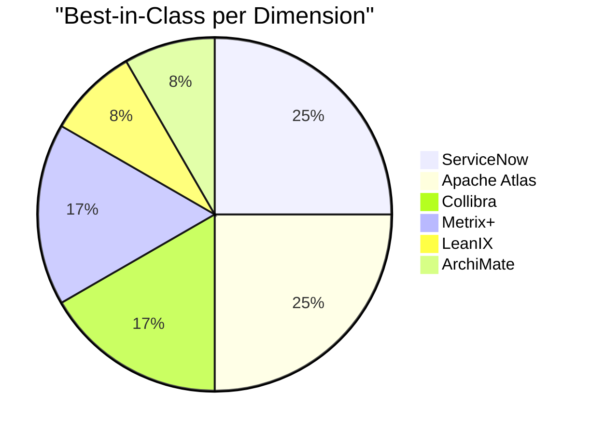

Best-in-class winners:
- **Object Type Model**: ArchiMate (strict metamodel) + Atlas (graph-native) + Metrix+ (practical configurability)
- **Attribute System**: ServiceNow (40+ types) + Atlas (constraints + cardinality) + Metrix+ (validation engine)
- **Relationship Model**: ArchiMate (strict allowed-relations) + Atlas (relationship categories)
- **Multi-Tenancy**: ServiceNow (domain separation) + BMC (dataset federation) + Collibra (community hierarchy) + Metrix+ (mandate model)
- **Governance**: Collibra (workflow engine)
- **Versioning**: Sparx EA (baselines) + Collibra (structured versioning)
- **Locale/i18n**: Metrix+ (language-dependent attributes)
- **Data Maturity**: ServiceNow (CMDB Health Dashboard)
- **Graph Visualization**: Sparx EA (UML diagrams) + ArchiMate (viewpoints)
- **AI/ML**: ServiceNow (CMDB Health ML) + Alation (trust signals)
- **API Design**: LeanIX (GraphQL) + Atlas (REST type system)

---

## 5. Deep Dive: Object Type Model Patterns

### 5.1 Pattern Comparison

Three distinct patterns emerge for how platforms model object types:

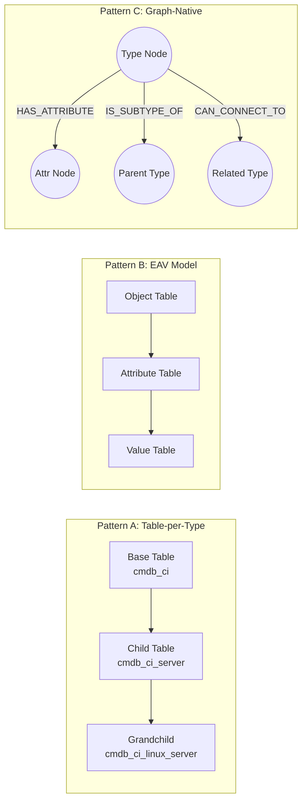

| Pattern | Used By | Pros | Cons |
|---------|---------|------|------|
| **A: Table-per-Type** | ServiceNow, BMC, GLPI | Fast queries, SQL-native, easy indexing | Schema changes require DDL, rigid |
| **B: EAV (Entity-Attribute-Value)** | iTop, Alation, Collibra (partially) | Flexible schema, no DDL for new types | Slow queries, complex JOINs, hard to validate |
| **C: Graph-Native** | Apache Atlas, EMSIST | Natural relationship traversal, flexible schema, visualization-ready | Requires graph DB expertise, different query patterns |

### 5.2 EMSIST Pattern Assessment

EMSIST uses **Pattern C (Graph-Native)** with Neo4j, which aligns with Apache Atlas's approach but is stronger because:

1. **Rich edge properties**: EMSIST stores relationship metadata (cardinality, active/passive names, importance) directly on graph edges -- Atlas uses separate relationship definitions.
2. **Type inheritance via graph edges**: `IS_SUBTYPE_OF` is a first-class relationship, enabling Cypher-based traversal of the type hierarchy.
3. **Multi-tenancy via node properties**: `tenantId` on each node enables tenant filtering at the query level.

### 5.3 Best Practices Extracted

| Practice | Source Platform | Recommendation for EMSIST |
|----------|---------------|--------------------------|
| **Attribute inheritance** | ServiceNow, Atlas | Child types should automatically inherit parent type's attributes. EMSIST's IS_SUBTYPE_OF edge should support attribute propagation through Cypher traversal queries. |
| **Type versioning** | Atlas (`typeVersion`) | Add `version` field to ObjectTypeNode with semantic versioning (major.minor.patch). |
| **Type categories** | ArchiMate (layers), LeanIX (fact sheet groups) | Add a `category` or `layer` field to ObjectTypeNode for organizing types into functional groups. |
| **Allowed relationship constraints** | ArchiMate (strict metamodel rules) | CAN_CONNECT_TO already provides this. Consider adding a "forbidden connections" mechanism for governance. |
| **Type status lifecycle** | LeanIX (Plan/PhaseIn/Active/PhaseOut/EndOfLife) | Expand EMSIST's `status` enum from 4 values to 5+ values with clear lifecycle semantics. |

---

## 6. Deep Dive: Multi-Tenant Governance Patterns

### 6.1 Pattern Comparison

```mermaid
graph TD
    subgraph "Pattern 1: Domain Separation (ServiceNow)"
        SN1[Global Domain] -->|inherits data| SN2[Domain A]
        SN1 -->|inherits data| SN3[Domain B]
        SN2 -.->|isolated from| SN3
    end

    subgraph "Pattern 2: Dataset Federation (BMC)"
        BMC1[Master Dataset] -->|overlay| BMC2[Tenant Dataset A]
        BMC1 -->|overlay| BMC3[Tenant Dataset B]
        BMC2 -->|reconcile| BMC4[Merged View]
        BMC3 -->|reconcile| BMC4
    end

    subgraph "Pattern 3: Community Hierarchy (Collibra)"
        CL1[Parent Community] -->|governs| CL2[Sub-Community A]
        CL1 -->|governs| CL3[Sub-Community B]
        CL2 -->|owns| CL4[Domain A1]
        CL3 -->|owns| CL5[Domain B1]
    end

    subgraph "Pattern 4: Master Mandate (Metrix+/EMSIST Target)"
        MX1[Master Tenant] -->|mandates| MX2[Child Tenant A]
        MX1 -->|mandates| MX3[Child Tenant B]
        MX2 -->|extends locally| MX4[Local Extensions A]
        MX3 -->|extends locally| MX5[Local Extensions B]
    end
```

### 6.2 Detailed Pattern Analysis

#### Pattern 1: Domain Separation (ServiceNow)

- **Mechanism**: Global domain contains shared configurations. Sub-domains inherit but cannot modify global items. Each domain is a complete data partition.
- **Strength**: Clean isolation. Global changes automatically propagate.
- **Weakness**: Binary inheritance -- either inherit or do not. No partial override.
- **EMSIST Fit**: LOW -- EMSIST needs partial override (keep mandated items, customize rest).

#### Pattern 2: Dataset Federation (BMC)

- **Mechanism**: Multiple data sources are reconciled into a single unified view. Precedence rules determine which source wins for each attribute.
- **Strength**: Flexible conflict resolution. Supports multiple authoritative sources per attribute.
- **Weakness**: Complex reconciliation logic. Difficult to explain to non-technical users.
- **EMSIST Fit**: MEDIUM -- The precedence concept is useful but reconciliation is overkill for definition governance.

#### Pattern 3: Community Hierarchy (Collibra)

- **Mechanism**: Communities contain sub-communities and domains. Governance policies are set at the community level and cascade down. Role-based access control at every level.
- **Strength**: Flexible hierarchy. Governance policies cascade naturally. Rich workflow engine.
- **Weakness**: Complex to configure. Requires careful RBAC design.
- **EMSIST Fit**: HIGH -- The community/domain hierarchy maps well to master/child tenant hierarchy.

#### Pattern 4: Master Mandate (Metrix+/EMSIST Target)

- **Mechanism**: Master tenant defines canonical object types with mandate flags. Child tenants inherit mandated items (cannot modify) and can add local extensions.
- **Strength**: Clear governance boundaries. Simple mental model for administrators.
- **Weakness**: Novel pattern -- no reference implementation at scale.
- **EMSIST Fit**: CRITICAL -- This is EMSIST's target model.

### 6.3 Recommended Governance Architecture for EMSIST

Based on the benchmark, EMSIST should combine elements from Collibra (workflow engine), BMC (precedence rules), and Metrix+ (mandate flags):

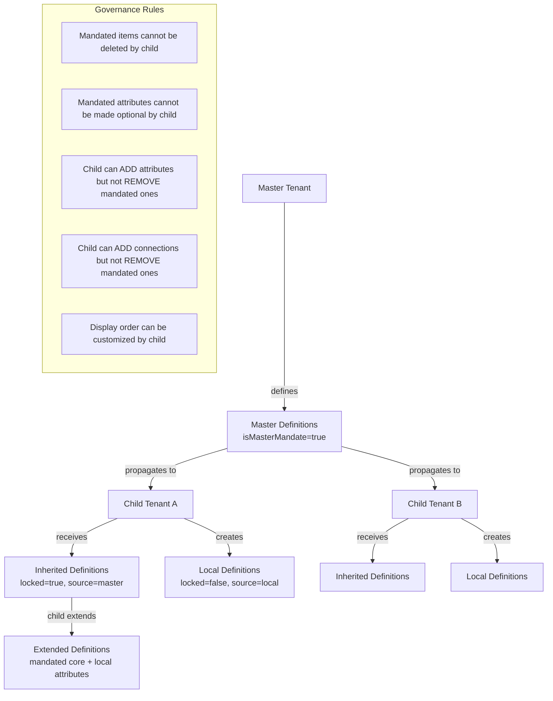

**Implementation recommendations:**

| Rule | Implementation | Source Pattern |
|------|---------------|---------------|
| Mandate propagation | When master saves with `isMasterMandate=true`, system creates read-only copies in all child tenant graphs | BMC dataset overlay |
| Override detection | `state` field tracks: `default` (inherited, unmodified), `customized` (inherited with local extensions), `user_defined` (local) | Metrix+ lock status |
| Compliance check | Scheduled job compares child definitions against master mandates; reports missing/modified mandated items | ServiceNow CMDB Health compliance axis |
| Change workflow | Master changes trigger notification to child admins; grace period before enforcement | Collibra governance workflow |
| Conflict resolution | Master always wins for mandated items; child wins for local extensions; merge for non-mandated items | BMC reconciliation precedence |

---

## 7. Deep Dive: Release Management / Change Propagation Patterns

### 7.1 Pattern Comparison

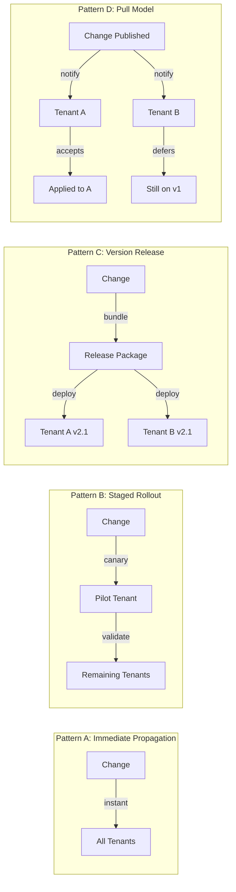

### 7.2 Platform Approaches

| Platform | Pattern | Details |
|----------|---------|---------|
| **ServiceNow** | A (Immediate) | Update sets propagate changes immediately to target instances. Clone operations copy entire instance state. |
| **BMC** | B (Staged) | Reconciliation runs can be staged -- pilot first, then broader rollout. |
| **iTop** | C (Version Release) | Module updates are packaged as versioned modules. Toolkit recompilation creates a new metamodel version. |
| **Sparx EA** | C (Version Release) | Package baselines create versioned snapshots. Diff/merge for change propagation. |
| **LeanIX** | A (Immediate) | SaaS model -- changes are immediately visible to all users in the workspace. |
| **Collibra** | D (Pull) | Governance workflows require approval before changes take effect. Changes are "proposed" and must be "accepted". |
| **Atlas** | A (Immediate) | Type definition changes are immediately effective. No staged rollout mechanism. |

### 7.3 Recommended Pattern for EMSIST

EMSIST should implement **Pattern D (Pull Model) with mandatory acceptance for mandated changes**:

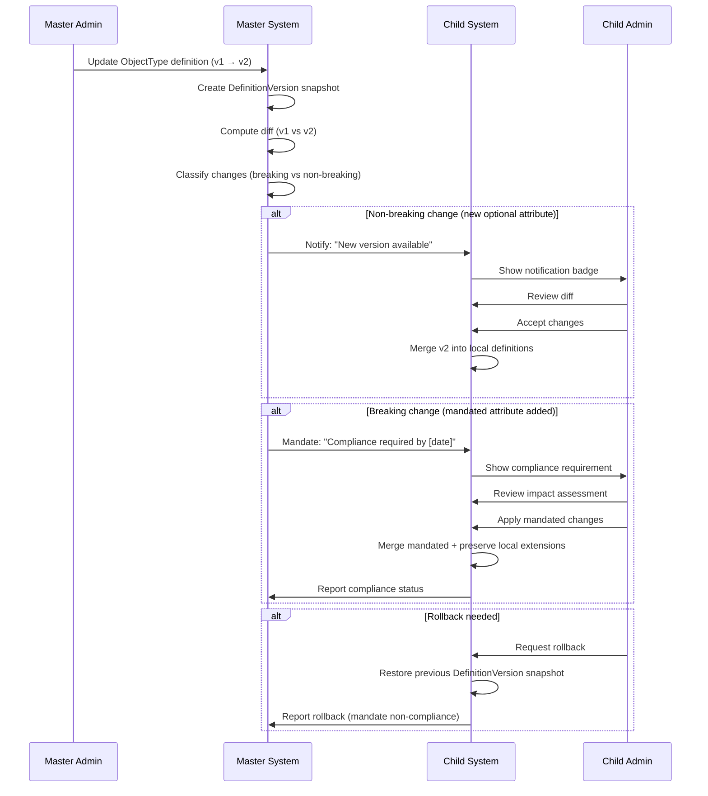

**Key design decisions:**

| Decision | Recommendation | Rationale |
|----------|---------------|-----------|
| Version numbering | Semantic: major (breaking), minor (non-breaking addition), patch (correction) | Communicates change impact clearly |
| Snapshot format | JSON serialization of full ObjectType graph (including attributes and connections) | Enables diff computation and rollback |
| Diff algorithm | Property-level diff of node and edge properties | Granular change tracking |
| Impact assessment | Automated report: which child tenant definitions are affected by the change | Reduces admin cognitive load |
| Rollback mechanism | Restore from snapshot + replay local extensions on top | Preserves child customizations |
| Compliance tracking | Dashboard showing per-tenant version adoption and mandate compliance | Governance visibility |

---

## 8. Deep Dive: Data Maturity / Health Scoring Patterns

### 8.1 Pattern Comparison

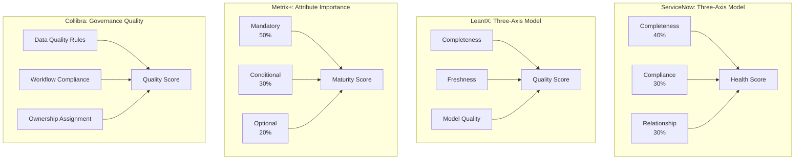

### 8.2 Detailed Scoring Models

#### ServiceNow CMDB Health (Best-in-Class)

**Completeness Score:**
```
For each CI class:
  mandatory_filled = count(mandatory attributes WHERE value IS NOT NULL)
  mandatory_total = count(mandatory attributes)
  recommended_filled = count(recommended attributes WHERE value IS NOT NULL)
  recommended_total = count(recommended attributes)

  Completeness = (mandatory_filled / mandatory_total) * 0.7 +
                 (recommended_filled / recommended_total) * 0.3
```

**Compliance Score:**
```
For each CI class:
  duplicates = count(CIs with duplicate identification keys)
  orphans = count(CIs with zero relationships)
  stale = count(CIs not updated in > staleness_threshold_days)
  total = count(all CIs)

  Compliance = 1 - ((duplicates + orphans + stale) / total)
```

**Relationship Score:**
```
For each CI class:
  expected_relations = configured minimum relationship count per type
  actual_relations = count(relationships per CI)
  CIs_meeting_minimum = count(CIs WHERE actual_relations >= expected_relations)

  Relationship = CIs_meeting_minimum / total_CIs
```

#### LeanIX Quality Score

**Freshness dimension** (unique to LeanIX):
```
For each Fact Sheet:
  days_since_update = current_date - last_updated_date
  freshness_threshold = configured per Fact Sheet Type (e.g., 90 days)

  Freshness = max(0, 1 - (days_since_update / freshness_threshold))
```

This is a valuable dimension that no other platform implements for type definitions.

### 8.3 Recommended Maturity Model for EMSIST

EMSIST should implement a **four-axis maturity model** combining the best of ServiceNow, LeanIX, and Metrix+:

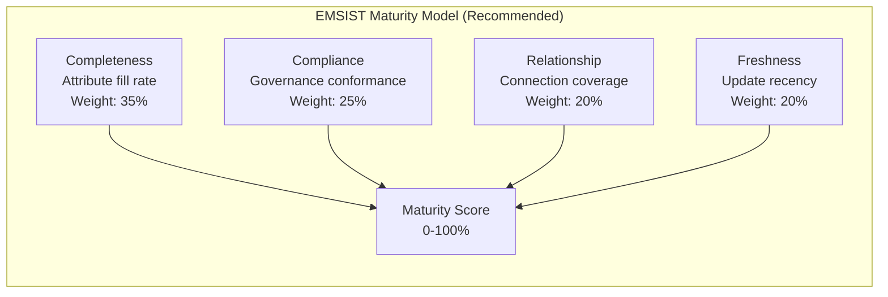

**Completeness axis** (from Metrix+ attribute importance):
```
completeness = (filled_mandatory / total_mandatory) * 0.50 +
               (filled_conditional / applicable_conditional) * 0.30 +
               (filled_optional / total_optional) * 0.20

Where:
  - filled_mandatory: Mandatory attributes (maturityClass="mandatory") with non-null values
  - applicable_conditional: Conditional attributes whose conditions are met
  - filled_optional: Optional attributes with non-null values
```

**Compliance axis** (from ServiceNow + EMSIST governance):
```
compliance = mandate_score * 0.60 + duplicate_score * 0.20 + validation_score * 0.20

Where:
  - mandate_score: % of master-mandated items present in child tenant
  - duplicate_score: 1 - (duplicate_count / total_count)
  - validation_score: % of attributes passing validation rules
```

**Relationship axis** (from ServiceNow):
```
relationship = (actual_connections / expected_minimum_connections)
  capped at 1.0

Where:
  - expected_minimum_connections: configured per ObjectType via CAN_CONNECT_TO with required flag
  - actual_connections: count of existing instance connections for that type
```

**Freshness axis** (from LeanIX):
```
freshness = max(0, 1 - (days_since_update / freshness_threshold))

Where:
  - freshness_threshold: configurable per ObjectType (default: 90 days)
```

**Overall Maturity Score:**
```
maturity = completeness * 0.35 + compliance * 0.25 +
           relationship * 0.20 + freshness * 0.20
```

---

## 9. Deep Dive: AI/ML in Object Management

### 9.1 Current AI/ML Capabilities Across Platforms

| Platform | AI/ML Feature | Maturity |
|----------|-------------|----------|
| **ServiceNow** | CMDB Health anomaly detection; Pattern-based CI discovery; Duplicate detection using ML matching | Production |
| **ServiceNow** | Predictive Intelligence for classification; auto-categorization of incidents to CI types | Production |
| **BMC** | CMDB reconciliation ML for fuzzy matching across data sources | Production |
| **LeanIX** | AI-assisted fact sheet creation; technology lifecycle predictions | Early |
| **Apache Atlas** | Classification propagation (rule-based, not ML); pattern-based lineage discovery | Production (rule-based) |
| **Collibra** | Data quality rule suggestions; automated classification proposals | Early |
| **Alation** | Trust scoring using usage patterns; behavioral analytics for catalog curation | Production |
| **iTop/GLPI** | None | N/A |
| **Sparx EA** | None built-in; script extensibility for ML integration | N/A |
| **Metrix+** | Not documented | Unknown |

### 9.2 AI/ML Opportunity Map for EMSIST

Based on the benchmark, the following AI/ML capabilities represent the highest value for EMSIST's Definition Management:

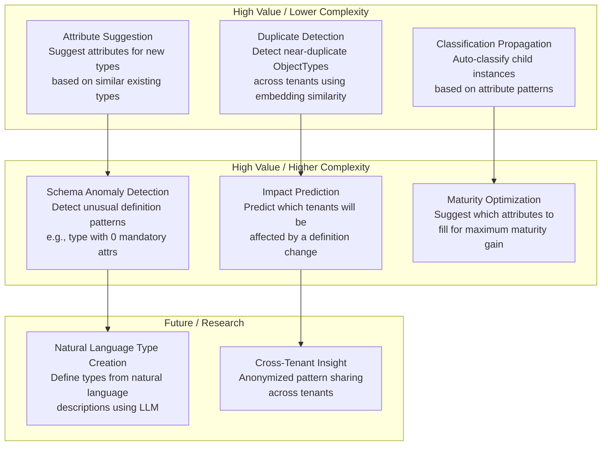

### 9.3 Recommended AI Features for EMSIST

**Phase 1: Rule-Based Intelligence (no ML required)**

| Feature | Description | Implementation |
|---------|-------------|----------------|
| **Smart Defaults** | When creating an ObjectType, suggest attributes based on the type's name/category. E.g., "Server" type auto-suggests "hostname", "IP address", "OS" attributes. | Keyword matching against a curated attribute suggestion library. |
| **Completeness Advisor** | Show which unfilled attributes would give the most maturity score improvement. | Simple sorting by maturity weight of unfilled attributes. |
| **Relationship Suggestions** | When creating a type, suggest likely connections based on category. E.g., "Application" suggests connections to "Server", "Database", "Business Service". | Category-based lookup table. |

**Phase 2: ML-Enhanced Intelligence (requires EMSIST ai-service)**

| Feature | Description | Implementation |
|---------|-------------|----------------|
| **Duplicate Detection** | Compute embedding similarity between ObjectType definitions across tenants. Flag likely duplicates. | Use ai-service with pgvector for embedding storage. Encode type name + description + attribute names into vector. Cosine similarity threshold for flagging. |
| **Attribute Importance Learning** | Learn from usage patterns which optional attributes are actually being filled by users. Suggest promoting frequently-filled optionals to "recommended". | Aggregate fill rates across instances per tenant. Statistical analysis of fill patterns. |
| **Anomaly Detection** | Detect unusual definition patterns (e.g., type with no mandatory attributes, orphan types with no connections, stale types not used in 180+ days). | Statistical outlier detection on definition metrics. |

**Phase 3: LLM-Powered Intelligence (future)**

| Feature | Description | Implementation |
|---------|-------------|----------------|
| **Natural Language Definition** | "Create an object type for tracking SaaS subscriptions with vendor, cost, renewal date, and license count attributes." | LLM parses intent, generates ObjectType + AttributeType definitions, presents for admin approval. |
| **Definition Documentation** | Auto-generate human-readable documentation for a type definition graph. | LLM summarizes type, attributes, relationships, and governance rules into natural language. |
| **Cross-Tenant Best Practices** | Anonymized analysis of how similar types are defined across tenants. Suggest improvements. | Federated learning or anonymized aggregation. Privacy-preserving. |

---

## 10. Recommendations for EMSIST

### 10.1 Prioritized Action Items

| Priority | Recommendation | Source Platforms | EMSIST Gap(s) Addressed | Effort |
|----------|---------------|-----------------|------------------------|--------|
| **P0** | Implement attribute importance classification (Mandatory/Conditional/Optional) on `HasAttributeRelationship` | Metrix+, ServiceNow | G-017, G-038, G-039 | M |
| **P0** | Add multilingual storage model (`Map<String, String>` locale maps) for name/description fields on ObjectType, AttributeType, and relationship labels | Metrix+ | G-001, G-002, G-007, G-008, G-024, G-034 | L |
| **P0** | Implement master mandate flags (`isMasterMandate`, `sourceTenantId`) on ObjectType, AttributeType, and relationships | Metrix+, Collibra, BMC | G-029, G-030 | L |
| **P1** | Build four-axis maturity scoring engine (Completeness, Compliance, Relationship, Freshness) | ServiceNow, LeanIX, Metrix+ | G-038, G-040, G-041 | L |
| **P1** | Add definition versioning with snapshot-based diff and rollback | Sparx EA, Atlas, Collibra | G-047 | L |
| **P1** | Implement governance workflow for cross-tenant definition propagation | Collibra, BMC | G-029, G-031 | XL |
| **P2** | Add relationship importance, required flag, and relation-specific attributes | Metrix+, LeanIX, Atlas | G-025, G-026, G-027 | M |
| **P2** | Build graph visualization component for type relationship exploration | Atlas (lineage), Sparx EA (diagrams) | G-045 | M |
| **P2** | Implement conditional validation engine (expression-based attribute rules) | Metrix+ | G-020 | L |
| **P3** | Add AI-powered attribute suggestions and duplicate detection | ServiceNow, Alation | N/A (enhancement) | L |
| **P3** | Implement import/export with change propagation (Pull Model) | iTop (module system), Collibra (workflows) | G-046 | L |
| **P3** | Build Measures Categories and Measures tabs | Metrix+ | G-043, G-044 | L |

### 10.2 Architecture Decisions Informed by Benchmark

| Decision | Recommendation | Benchmark Evidence |
|----------|---------------|-------------------|
| **Type inheritance model** | Use graph-based inheritance (IS_SUBTYPE_OF) with attribute propagation via Cypher traversal | Atlas and EMSIST's existing approach outperform table-per-type (ServiceNow) for flexibility |
| **Multi-tenant governance** | Hybrid model: Collibra-style workflow + BMC-style precedence + Metrix+ mandate flags | No single platform fully implements EMSIST's requirements; combination is needed |
| **Versioning strategy** | Semantic versioning on ObjectType with JSON snapshot diff | Sparx EA baselines + Atlas typeVersion provide the pattern |
| **Maturity scoring** | Four-axis model (Completeness/Compliance/Relationship/Freshness) with configurable weights | ServiceNow CMDB Health + LeanIX Freshness + Metrix+ attribute importance |
| **API design** | REST for CRUD with optional GraphQL for graph traversal queries | LeanIX GraphQL for complex queries + Atlas REST for type definitions |
| **i18n storage** | Embedded locale map on graph nodes, NOT separate translation tables | Metrix+'s language-dependent attribute model -- simpler than EAV-based translation tables |
| **Graph visualization** | Client-side rendering with Cytoscape.js or D3.js, NOT server-rendered images | Atlas lineage viewer + modern web capabilities favor client-side rendering |

---

## 11. Architectural Patterns to Adopt

### Pattern 1: Classification Propagation (from Apache Atlas)

**What**: When a governance classification (e.g., `MasterMandate`) is applied to an ObjectType, it automatically propagates to all HAS_ATTRIBUTE and CAN_CONNECT_TO edges.

**How to implement in EMSIST:**
```
When ObjectType.isMasterMandate = true:
  FOR EACH HasAttribute edge FROM this ObjectType:
    SET edge.isMasterMandate = true
    SET target AttributeType.isMasterMandate = true (if not shared)
  FOR EACH CanConnectTo edge FROM this ObjectType:
    SET edge.isMasterMandate = true
```

**Why**: Eliminates manual flagging of each attribute and relationship as mandated. Reduces admin effort and prevents inconsistency.

### Pattern 2: Dataset Overlay for Tenant Inheritance (from BMC Helix)

**What**: Child tenant definitions are an overlay on top of master definitions. The overlay mechanism allows adding properties, adding edges, but not removing mandated elements.

**How to implement in EMSIST:**
```
Child tenant "sees":
  1. All master-mandated ObjectTypes (read-only core, extensible edges)
  2. All master-mandated AttributeTypes (read-only)
  3. All master-mandated connections (read-only)
  4. All locally-defined ObjectTypes
  5. All local extensions to mandated types (additional attributes, connections)

Resolution order:
  - For mandated items: master definition ALWAYS wins
  - For non-mandated items: child definition wins (if exists) else master default
  - For local-only items: child definition only
```

### Pattern 3: Governance Workflow Engine (from Collibra)

**What**: Definition changes follow a configurable workflow with states, transitions, role-based permissions, and automated actions.

**How to implement in EMSIST:**
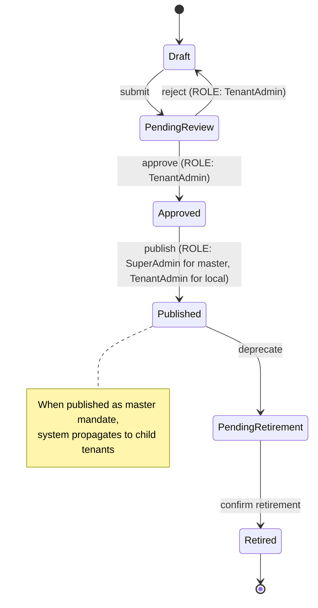

### Pattern 4: Snapshot-Based Versioning (from Sparx EA)

**What**: Every publish action creates a JSON snapshot of the complete ObjectType graph (node + all edges + all connected nodes). Snapshots are stored as DefinitionVersion nodes in Neo4j.

**How to implement in EMSIST:**
```json
{
  "version": "2.1.0",
  "objectType": {
    "id": "ot-001",
    "name": { "en": "Server", "ar": "خادم" },
    "typeKey": "server",
    "status": "active",
    "attributes": [
      {
        "attributeKey": "hostname",
        "dataType": "string",
        "isRequired": true,
        "maturityClass": "mandatory",
        "displayOrder": 1
      }
    ],
    "connections": [
      {
        "targetTypeKey": "application",
        "cardinality": "one-to-many",
        "importance": "high"
      }
    ]
  },
  "metadata": {
    "changedBy": "admin@master.gov",
    "changedAt": "2026-03-10T14:30:00Z",
    "changeDescription": "Added hostname as mandatory attribute",
    "changeType": "minor"
  }
}
```

### Pattern 5: Four-Axis Maturity Scoring (Composite from ServiceNow + LeanIX + Metrix+)

**What**: Every object instance gets a maturity score computed from four independent axes, each with configurable weights.

**How to implement in EMSIST:**
- Store axis weights on ObjectType node: `maturityWeightCompleteness`, `maturityWeightCompliance`, `maturityWeightRelationship`, `maturityWeightFreshness`
- Compute scores per-instance at read time (or cache via periodic batch)
- Expose via API: `GET /api/v1/instances/{id}/maturity`
- Aggregate per ObjectType: `GET /api/v1/definitions/{typeId}/maturity-summary`

---

## 12. Anti-Patterns to Avoid

### Anti-Pattern 1: Table-per-Type Inheritance (ServiceNow)

**What to avoid**: Creating a separate database table (or separate Neo4j label) for each object type definition.

**Why**: In a multi-tenant system with configurable types, the number of types is unbounded. DDL operations (creating tables/labels) are expensive, do not scale, and cannot be tenant-scoped.

**What EMSIST does correctly**: All object types are `ObjectType` nodes differentiated by properties, not by separate labels. This EAV-like flexibility is correct for a configurable type system.

### Anti-Pattern 2: Binary Required/Optional (Most Platforms)

**What to avoid**: Using a simple boolean `isRequired` for attribute validation.

**Why**: Real-world requirements are graduated. An attribute may be "mandatory to create the object" vs "mandatory to progress the workflow" vs "recommended for maturity scoring" vs "truly optional".

**What EMSIST should do**: Replace `isRequired: boolean` with `maturityClass: enum(mandatory|conditional|optional)` plus `requiredMode: enum(mandatory_stop_workflow|mandatory_proceed|optional|conditional)` as documented in Gap G-017.

### Anti-Pattern 3: Immediate Propagation Without Impact Assessment (Atlas)

**What to avoid**: Applying type definition changes immediately to all tenants without warning or impact analysis.

**Why**: In a multi-tenant environment, a change to a master definition can break child tenant configurations that depend on specific attributes or relationships.

**What EMSIST should do**: Use the Pull Model (Pattern D) with mandatory impact assessment before propagation. Never auto-apply breaking changes.

### Anti-Pattern 4: UI-Only Localization (GLPI, Most Platforms)

**What to avoid**: Handling i18n only at the UI label level (`.po` files, message bundles) while storing data in a single language.

**Why**: EMSIST's use case requires that the definition DATA itself be multilingual. A "Server" type might be called "Server" in English and "خادم" in Arabic -- this is DATA localization, not UI localization.

**What EMSIST should do**: Implement locale maps at the data level, as Metrix+ does with language-dependent attributes. UI localization (PrimeNG labels, error messages) should use Angular's i18n mechanism separately from data-level multilingual content.

### Anti-Pattern 5: Monolithic Governance (ServiceNow Domain Separation)

**What to avoid**: All-or-nothing governance where child tenants either inherit everything or nothing.

**Why**: Child tenants need the flexibility to accept mandated items while extending with local customizations. Pure domain separation does not support this hybrid model.

**What EMSIST should do**: Granular mandate flags at the individual item level (per ObjectType, per Attribute, per Connection), not at the tenant level.

### Anti-Pattern 6: Disconnected Versioning (Most Platforms)

**What to avoid**: Tracking only `createdAt` and `updatedAt` timestamps without structured version history.

**Why**: Timestamps tell you WHEN something changed but not WHAT changed, WHO changed it, or HOW to roll back. Definition governance requires full change provenance.

**What EMSIST should do**: Implement DefinitionVersion nodes with full JSON snapshots, property-level diffs, change author, change description, and semantic version numbers.

---

## 13. Technology Choices Informed by Benchmark

### 13.1 Confirmed Technology Choices

| Technology | EMSIST Current Choice | Benchmark Validation |
|------------|----------------------|---------------------|
| **Neo4j for definitions** | Already using Neo4j for definition-service | Confirmed -- graph-native type systems (Atlas, ArchiMate) outperform relational metamodels for relationship traversal and visualization |
| **Spring Boot** | definition-service on Spring Boot 3.4.x | Standard across enterprise Java platforms (BMC, custom Atlas deployments) |
| **REST API** | Current API is REST | Confirmed as primary API. Consider supplementing with GraphQL for complex graph queries (LeanIX pattern). |

### 13.2 New Technology Recommendations

| Need | Recommended Technology | Benchmark Source | Rationale |
|------|----------------------|------------------|-----------|
| **Graph visualization** | Cytoscape.js (primary) or D3.js (fallback) | Atlas lineage viewer uses similar approach | Cytoscape.js has built-in graph layout algorithms (dagre, cola, cose) and is designed for network/graph visualization. D3.js is more general but requires more custom code. |
| **Diff engine** | json-patch (RFC 6902) or custom property-level diff | Sparx EA baseline diff, Collibra version comparison | JSON Patch provides a standard format for expressing changes between JSON documents. Use for definition snapshot diffs. |
| **Expression engine** | SpEL (Spring Expression Language) or MVEL | Metrix+ conditional validation | SpEL is already available in Spring Boot. Use for conditional attribute validation rules (e.g., `isRequired WHEN otherAttribute.value == 'X'`). |
| **Workflow engine** | Lightweight state machine (Spring Statemachine or custom) | Collibra governance workflows | Full BPMN (Camunda/Flowable) is overkill for definition governance. A configurable state machine with role-based transitions is sufficient. |
| **i18n storage** | Embedded `Map<String, String>` on Neo4j nodes | Metrix+ language-dependent model | Avoid separate translation tables (relational anti-pattern). Store locale maps directly on graph nodes for single-query retrieval. |

### 13.3 Technology Radar Positioning

| Technology | Ring | Rationale |
|------------|------|-----------|
| Neo4j (definition storage) | **Adopt** | Proven in EMSIST, validated by Atlas pattern |
| Cytoscape.js (graph viz) | **Trial** | Best fit for type graph visualization; needs POC |
| Spring Expression Language (conditional validation) | **Adopt** | Already in Spring Boot classpath |
| JSON Patch RFC 6902 (diff format) | **Trial** | Standard format; needs evaluation for Neo4j graph diffs |
| GraphQL (complex graph queries) | **Assess** | LeanIX proves value but adds complexity; evaluate after REST API is mature |
| Spring Statemachine (governance workflows) | **Trial** | Lighter than BPMN; needs evaluation for definition lifecycle |

---

## 14. Design Traceability Matrix

**Purpose:** Maps each benchmark recommendation to the design document feature that adopted it, ensuring bidirectional traceability between research and design.

**Legend:** ADOPTED = fully reflected | PARTIAL = partially reflected with gap noted | DIVERGED = deliberately chose different approach | MISSING = not yet incorporated

### 14.1 Section 10 Recommendations → Design Features

| # | Benchmark Recommendation | Source Platform(s) | Priority | PRD Feature | Tech Spec Section | Adoption Status | Gap (if any) |
|---|--------------------------|-------------------|----------|-------------|-------------------|----------------|--------------|
| R-01 | Attribute Importance Classification (Mandatory/Conditional/Optional) | Metrix+, ServiceNow | P0 | 6.6 Object Type Maturity Scoring | 4.4 Object Data Maturity Engine | ADOPTED | PRD and Tech Spec aligned with four-axis weighted formula (GAP-02 resolved) |
| R-02 | Locale storage model (Map locale maps) | Metrix+ | P0 | 6.7 Locale Management | 4.3 Locale Management Architecture | DIVERGED | Tech Spec chose separate LocalizedValue nodes (Option A) over embedded maps — deliberate decision for cross-entity queries |
| R-03 | Master mandate flags (isMasterMandate, sourceTenantId) | Metrix+, Collibra, BMC | P0 | 6.5 Master Mandate Flags | 4.2 Cross-Tenant Governance Model | ADOPTED | — |
| R-04 | Four-axis maturity scoring (Completeness, Compliance, Relationship, Freshness) | ServiceNow, LeanIX, Metrix+ | P1 | 6.6 Object Type Maturity Scoring (6.6.1) | 4.4 Object Data Maturity Engine (4.4.1/4.4.3) | ADOPTED | All four axes implemented with configurable weights (GAP-01 resolved) |
| R-05 | Snapshot-based versioning with diff and rollback | Sparx EA, Atlas, Collibra | P1 | 6.10 Definition Release Management | 4.7 Definition Release Management | ADOPTED | Over-delivered with full Git-like release workflow |
| R-06 | Governance workflow for cross-tenant propagation | Collibra, BMC | P1 | 6.4 Cross-Tenant Governance + 6.8 Governance Tab | 4.2 + 4.9 Governance Tab Design | ADOPTED | Per-ObjectType lifecycle state machine + Governance Tab technical design added (GAP-03 resolved) |
| R-07 | Relationship importance + required flag + relation-specific attributes | Metrix+, LeanIX, Atlas | P2 | 6.3 Relationship/Connection Management | 4.1 Enhanced Neo4j Graph Schema | PARTIAL | Tech Spec adds requirementLevel to CAN_CONNECT_TO; **PRD missing importance field spec** |
| R-08 | Graph visualization for type exploration | Atlas, Sparx EA | P2 | 6.9 Graph Visualization | 4.6 Graph Visualization Architecture | ADOPTED | Cytoscape.js selected |
| R-09 | Conditional validation engine (expression-based) | Metrix+ | P2 | 6.2 Attribute Management (validationRules field) | 4.11 SpEL Conditional Validation Engine | ADOPTED | Full SpEL engine design with 10 rule types, security constraints (GAP-08 resolved) |
| R-10 | AI-powered attribute suggestions + duplicate detection | ServiceNow, Alation | P3 | 6.11 AI Service Integration | 4.8 AI Service Integration | ADOPTED | Rule-based AI moved to Phase 2; ML-based deferred to Phase 8 (GAP-05 resolved) |
| R-11 | Import/export with Pull Model change propagation | iTop, Collibra | P3 | 6.10 Definition Release Management | 4.7 Definition Release Management | ADOPTED | Pull Model fully designed |
| R-12 | Measures Categories + Measures tabs | Metrix+ | P3 | 6.12 Measures Categories + 6.13 Measures | — | ADOPTED | PRD sections 6.12/6.13 added with business rules BR-069/BR-070/BR-071 and AC-6.12/AC-6.13 (GAP-07 resolved) |

### 14.2 Section 11 Patterns → Design Adoption

| # | Architectural Pattern | Source Platform | PRD Feature | Tech Spec Section | Adoption Status | Gap |
|---|----------------------|----------------|-------------|-------------------|----------------|-----|
| P-01 | Classification Propagation (auto-propagate mandate flags down IS_SUBTYPE_OF) | Apache Atlas | 6.5 Master Mandate Flags | 4.2.5 Classification Propagation | ADOPTED | Recursive Cypher propagation with Kafka events designed (GAP-04 resolved) |
| P-02 | Dataset Overlay for Tenant Inheritance (resolution order: mandated→master wins, non-mandated→child wins, local-only→child only) | BMC Helix | 6.4 Cross-Tenant Governance | 4.2 Cross-Tenant Governance Model | PARTIAL | Overlay designed but **resolution order not precisely defined** for non-mandated items |
| P-03 | Governance Workflow Engine (per-ObjectType state machine) | Collibra | 6.8 Governance Tab | 4.9 Governance Tab Design | ADOPTED | Full lifecycle state machine (Draft→PendingReview→Approved→Published→PendingRetirement→Retired) with transition rules (GAP-03 resolved) |
| P-04 | Snapshot-Based Versioning | Sparx EA, Collibra | 6.10 Definition Release Management | 4.7 Definition Release Management | ADOPTED | — |
| P-05 | Four-Axis Maturity Scoring | ServiceNow + LeanIX + Metrix+ | 6.6 Object Type Maturity Scoring (6.6.1) | 4.4 Object Data Maturity Engine (4.4.1/4.4.3) | ADOPTED | All four axes with configurable weights (GAP-01 resolved) |

### 14.3 Section 12 Anti-Patterns → Design Avoidance

| # | Anti-Pattern | Avoided? | Evidence |
|---|-------------|----------|----------|
| AP-01 | Table-per-Type Inheritance | YES | EMSIST uses EAV with ObjectType nodes differentiated by properties |
| AP-02 | Binary Required/Optional | YES | maturityClass (Mandatory/Conditional/Optional) + four-mode requiredMode (mandatory_creation/mandatory_workflow/optional/conditional) designed (GAP-09 resolved) |
| AP-03 | Immediate Propagation Without Impact Assessment | YES | Pull Model with mandatory impact assessment designed in 6.10 |
| AP-04 | UI-Only Localization | YES | Locale maps at data level designed in 6.7 / 4.3 |
| AP-05 | Monolithic Governance | YES | Per-element mandate flags at ObjectType, Attribute, and Connection level |
| AP-06 | Disconnected Versioning | YES | DefinitionRelease nodes with JSON snapshots, property-level diffs, semantic versioning |

### 14.4 Section 13 Technology Choices → Design Adoption

| # | Technology | Benchmark Recommendation | Design Decision | Adoption Status |
|---|-----------|------------------------|-----------------|----------------|
| TC-01 | Neo4j for definitions | Confirmed — graph-native outperforms relational | Tech Spec 3.1 | ADOPTED |
| TC-02 | Cytoscape.js for graph viz | Recommended over D3.js | Tech Spec 4.6 | ADOPTED |
| TC-03 | GraphQL for complex graph queries | Assess — LeanIX proves value | Tech Spec 9.3 | ASSESSED — Deferred to Phase 10; REST-first, evaluate after stabilization (GAP-10 resolved) |
| TC-04 | JSON Patch RFC 6902 for diff format | Trial — standard diff format | Tech Spec 4.7.10 | ADOPTED — Standard diff format for release changeDiffJson (GAP-11 resolved) |
| TC-05 | SpEL for conditional validation | Adopt — already on classpath | Tech Spec 4.11 | ADOPTED — Full validation engine with 10 rule types (GAP-08 resolved) |
| TC-06 | Spring Statemachine for governance workflows | Trial — lighter than BPMN | Tech Spec 9.4 | ASSESSED — Custom enum for Phase 3 MVP; Spring Statemachine for Phase 6+ if complexity grows (GAP-12 resolved) |
| TC-07 | Embedded locale maps on Neo4j nodes | Recommended by Metrix+ model | Tech Spec 4.3 | DIVERGED — Separate LocalizedValue nodes chosen (documented rationale in Tech Spec 4.3) |

### 14.5 Gap Summary (Items Requiring Design Updates)

| Gap ID | Description | Severity | Target Document | Section Updated | Status |
|--------|-------------|----------|-----------------|-----------------|--------|
| GAP-01 | Add Compliance + Freshness maturity axes | HIGH | PRD 6.6 + Tech Spec 4.4 | PRD 6.6.1 + Tech Spec 4.4.1/4.4.3 | **RESOLVED** |
| GAP-02 | Fix PRD maturity formula to match Tech Spec weighted formula | HIGH | PRD 6.6 | PRD 6.6 (four-axis composite) | **RESOLVED** |
| GAP-03 | Add Governance Tab technical design (Neo4j nodes, API endpoints, workflow engine) | HIGH | Tech Spec 4.x (new section) | Tech Spec 4.9 (6 subsections) | **RESOLVED** |
| GAP-04 | Add classification propagation for mandates via IS_SUBTYPE_OF | MEDIUM | Tech Spec 4.2 | Tech Spec 4.2.5 | **RESOLVED** |
| GAP-05 | Move rule-based AI to Phase 2 (smart defaults, validation suggestions) | MEDIUM | Tech Spec implementation phases | Tech Spec Phase 2 restructured | **RESOLVED** |
| GAP-06 | Define attribute propagation through IS_SUBTYPE_OF inheritance | MEDIUM | Tech Spec 4.1 | Tech Spec 4.10 (5 subsections) | **RESOLVED** |
| GAP-07 | Add Measures Categories + Measures feature spec | MEDIUM | PRD (new 6.12/6.13) + Tech Spec | PRD 6.12 + 6.13 + AC-6.12/6.13 | **RESOLVED** |
| GAP-08 | Add SpEL conditional validation engine design | MEDIUM | Tech Spec 4.x (new section) | Tech Spec 4.11 (5 subsections) | **RESOLVED** |
| GAP-09 | Add four-mode requiredMode enum alongside maturityClass | LOW | PRD 6.6 + Tech Spec 4.4 | PRD 6.6.2 + BR-071 | **RESOLVED** |
| GAP-10 | Assess GraphQL for Phase 10 graph queries | LOW | Tech Spec 9 | Tech Spec 9.3 | **RESOLVED** |
| GAP-11 | Adopt JSON Patch RFC 6902 for release diffs | LOW | Tech Spec 4.7 | Tech Spec 4.7.10 | **RESOLVED** |
| GAP-12 | Assess Spring Statemachine for Governance Tab workflows | LOW | Tech Spec 9 | Tech Spec 9.4 | **RESOLVED** |

---

## 15. Appendix: Source URLs and References

### ServiceNow CMDB
- ServiceNow CMDB documentation: https://docs.servicenow.com/bundle/latest/page/product/configuration-management/concept/c_ITILConfigurationManagement.html
- CMDB Health Dashboard: https://docs.servicenow.com/bundle/latest/page/product/configuration-management/concept/cmdb-health.html
- Table API reference: https://docs.servicenow.com/bundle/latest/page/integrate/inbound-rest/concept/c_TableAPI.html
- CMDB CI Class Manager: https://docs.servicenow.com/bundle/latest/page/product/configuration-management/concept/cmdb-class-manager.html
- Domain Separation: https://docs.servicenow.com/bundle/latest/page/administer/domain-separation/concept/c_DomainSeparation.html

### BMC Helix CMDB
- BMC Helix CMDB documentation: https://docs.bmc.com/docs/helixcmdb
- Atrium CMDB Class Manager: https://docs.bmc.com/docs/ars2102/class-manager
- Reconciliation Engine: https://docs.bmc.com/docs/helixcmdb/reconciliation-engine
- Common Data Model: https://docs.bmc.com/docs/helixcmdb/common-data-model
- Dataset and multi-tenancy: https://docs.bmc.com/docs/ars2102/datasets

### iTop
- GitHub repository: https://github.com/Combodo/iTop
- iTop metamodel documentation: https://www.itophub.io/wiki/page?id=latest:customization:datamodel
- XML delta mechanism: https://www.itophub.io/wiki/page?id=latest:customization:xml_reference
- Attribute types: https://www.itophub.io/wiki/page?id=latest:customization:attributes

### GLPI
- GitHub repository: https://github.com/glpi-project/glpi
- Plugin development: https://glpi-developer-documentation.readthedocs.io/
- REST API: https://glpi-developer-documentation.readthedocs.io/en/latest/devapi/

### Sparx Enterprise Architect
- User Guide: https://sparxsystems.com/enterprise_architect_user_guide/
- UML Profile mechanism: https://sparxsystems.com/enterprise_architect_user_guide/modeling_languages/uml_profiles.html
- MDG Technologies: https://sparxsystems.com/enterprise_architect_user_guide/modeling/mdg_technologies.html
- Baselines and version control: https://sparxsystems.com/enterprise_architect_user_guide/model_management/baselines.html

### LeanIX
- Developer Portal: https://docs-eam.leanix.net/
- GraphQL API: https://docs-eam.leanix.net/reference/graphql-api
- Fact Sheet Types: https://docs-eam.leanix.net/docs/fact-sheet-types
- Data Quality: https://docs-eam.leanix.net/docs/data-quality-management

### ArchiMate / Archi
- ArchiMate 3.2 Specification: https://pubs.opengroup.org/architecture/archimate32-doc/
- Archi tool: https://www.archimatetool.com/
- Metamodel reference: https://pubs.opengroup.org/architecture/archimate32-doc/ch-Full-Model.html

### TOGAF
- TOGAF Standard: https://pubs.opengroup.org/togaf-standard/
- Content Metamodel: https://pubs.opengroup.org/togaf-standard/architecture-content/content-metamodel.html
- Architecture Building Blocks: https://pubs.opengroup.org/togaf-standard/architecture-development/building-blocks.html

### Metrix+
- Reference: EMSIST PRD PDF analysis (internal document)
- Feature mapping: `/Users/mksulty/Claude/Projects/Emsist-app/docs/definition-management/Design/01-PRD-Definition-Management.md` Section 13

### Apache Atlas
- Official documentation: https://atlas.apache.org/
- Type System: https://atlas.apache.org/TypeSystem.html
- REST API v2: https://atlas.apache.org/api/v2/
- Classification and lineage: https://atlas.apache.org/ClassificationPropagation.html

### Collibra
- Developer Portal: https://developer.collibra.com/
- Asset Type API: https://developer.collibra.com/rest/asset-type-api/
- Governance workflows: https://developer.collibra.com/rest/workflow-api/
- Data Governance Center: https://productresources.collibra.com/docs/collibra/latest/

### Alation
- Developer documentation: https://developer.alation.com/
- Custom Templates: https://developer.alation.com/dev/docs/custom-templates
- Catalog API: https://developer.alation.com/dev/reference/catalog-api
- Trust and curation: https://developer.alation.com/dev/docs/trust-flags

---

## Document Metadata

| Field | Value |
|-------|-------|
| Created | 2026-03-10 |
| Author | ARCH Agent |
| Principles Version | ARCH-PRINCIPLES.md v1.1.0 |
| Related Documents | PRD-DM-001, Technical Specification, Gap Analysis |
| Review Status | Awaiting ARB review |
| Classification | Design Phase -- Strategic Research |
