# Detailed User Journey Scenarios: Definition Management

**Document ID:** UX-DJ-001
**Version:** 2.2.0
**Date:** 2026-03-10
**Status:** Draft
**Author:** UX Agent
**Related:** [05-UI-UX-Design-Spec.md](./05-UI-UX-Design-Spec.md), [01-PRD-Definition-Management.md](./01-PRD-Definition-Management.md)

> **Persona Registry:** Full persona definitions (persona cards, empathy maps, JTBD, accessibility needs) are maintained in the centralized **[TX Persona Registry](../../persona/PERSONA-REGISTRY.md)**. This document uses module-specific journey scenarios for the three Definition Management personas.

---

## Table of Contents

1. [Document Purpose](#1-document-purpose)
2. [Implementation Status Key](#2-implementation-status-key)
3. [Common Journey Prerequisites](#3-common-journey-prerequisites)
4. [Persona 1: Super Admin (Sam Martinez) [PER-UX-001] Journeys](#4-persona-1-super-admin-sam-martinez-per-ux-001-journeys)
   - [Journey 1.1: Cross-Tenant Governance Audit](#journey-11-cross-tenant-governance-audit)
   - [Journey 1.2: Provision New Tenant with Canonical Definitions](#journey-12-provision-new-tenant-with-canonical-definitions)
5. [Persona 2: Architect (Nicole Roberts) [PER-UX-002] Journeys](#5-persona-2-architect-nicole-roberts-per-ux-002-journeys)
   - [Journey 2.1: Create New Object Type from Scratch](#journey-21-create-new-object-type-from-scratch)
   - [Journey 2.2: Modify Existing Object Type and Release Changes](#journey-22-modify-existing-object-type-and-release-changes)
   - [Journey 2.3: Manage Attributes](#journey-23-manage-attributes)
6. [Persona 3: Tenant Admin (Fiona Shaw) [PER-UX-003] Journeys](#6-persona-3-tenant-admin-fiona-shaw-per-ux-003-journeys)
   - [Journey 3.1: Process Master Tenant Release](#journey-31-process-master-tenant-release)
   - [Journey 3.2: Add Local Customization to Inherited Type](#journey-32-add-local-customization-to-inherited-type)
7. [Emotional Curve Summary](#7-emotional-curve-summary)
8. [RTL (Arabic) Layout Considerations per Journey](#8-rtl-arabic-layout-considerations-per-journey)
9. [Loading States and Skeleton Screens per Journey Phase](#9-loading-states-and-skeleton-screens-per-journey-phase)
10. [Toast Notification Inventory](#10-toast-notification-inventory)
11. [Keyboard Navigation Flows per Journey](#11-keyboard-navigation-flows-per-journey)
12. [Accessibility Compliance per Journey](#12-accessibility-compliance-per-journey)
13. [Cross-Journey Screen Flow Diagrams](#13-cross-journey-screen-flow-diagrams)
14. [Data Flow per Journey](#14-data-flow-per-journey)
15. [State Transitions Triggered by Journeys](#15-state-transitions-triggered-by-journeys)
16. [Journey Metrics and KPIs](#16-journey-metrics-and-kpis)
17. [Journey Testing Scenarios for QA](#17-journey-testing-scenarios-for-qa)
18. [Responsive Breakpoint Details per Journey Step](#18-responsive-breakpoint-details-per-journey-step)
19. [Confirmation Dialog Specifications](#19-confirmation-dialog-specifications-complete-inventory)
20. [Implementation Priority Matrix](#20-implementation-priority-matrix)

---

## 1. Document Purpose

This document provides **scenario-based, step-by-step user journey maps** for each of the three consolidated personas in Definition Management. Unlike the high-level satisfaction charts in [05-UI-UX-Design-Spec.md](./05-UI-UX-Design-Spec.md), these journeys document:

- Every click, screen transition, and system response from login to task completion
- Exact screen names, component names, and PrimeNG widgets used at each step
- Channel-specific layout notes per step (Web Desktop >1024px, Tablet 768-1024px, Mobile <768px)
- Error paths, edge cases, confirmation dialogs, and their consequences
- Clear [IMPLEMENTED] / [PLANNED] tagging on every screen and component referenced

**Evidence basis:** All [IMPLEMENTED] tags are verified against the current codebase:
- `frontend/src/app/features/administration/sections/master-definitions/master-definitions-section.component.ts`
- `frontend/src/app/features/administration/sections/master-definitions/master-definitions-section.component.html`
- `frontend/src/app/core/api/api-gateway.service.ts`

---

## 2. Implementation Status Key

| Tag | Meaning |
|-----|---------|
| **[IMPLEMENTED]** | Code exists and is verified in the current codebase |
| **[IN-PROGRESS]** | Partial implementation exists (documented what is built vs. missing) |
| **[PLANNED]** | Design only; no code exists today |

---

## 3. Common Journey Prerequisites

All journeys share the following initial steps. Individual journey tables begin after these prerequisites are met.

### 3.1 Authentication Flow

**Status:** [IMPLEMENTED]

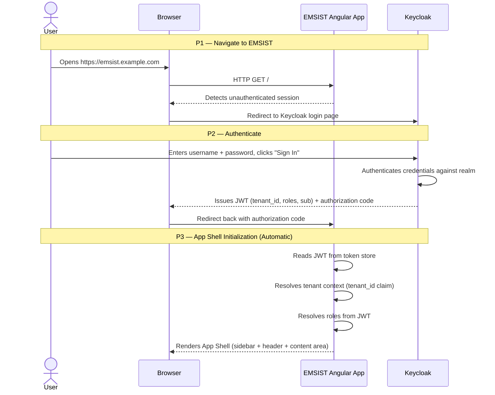
```mermaid
sequenceDiagram
    actor User
    participant Browser
    participant Angular as EMSIST Angular App
    participant KC as Keycloak

    Note over User,KC: P1 — Navigate to EMSIST
    User->>Browser: Opens https://emsist.example.com
    Browser->>Angular: HTTP GET /
    Angular-->>Browser: Detects unauthenticated session
    Browser->>KC: Redirect to Keycloak login page

    Note over User,KC: P2 — Authenticate
    User->>KC: Enters username + password, clicks "Sign In"
    KC->>KC: Authenticates credentials against realm
    KC-->>Browser: Issues JWT (tenant_id, roles, sub) + authorization code
    Browser->>Angular: Redirect back with authorization code

    Note over User,KC: P3 — App Shell Initialization (Automatic)
    Angular->>Angular: Reads JWT from token store
    Angular->>Angular: Resolves tenant context (tenant_id claim)
    Angular->>Angular: Resolves roles from JWT
    Angular-->>Browser: Renders App Shell (sidebar + header + content area)
```

**Channel-specific notes for P1-P3:**

| Aspect | Desktop (>1024px) | Tablet (768-1024px) | Mobile (<768px) |
|--------|-------------------|---------------------|-----------------|
| Keycloak login form | Centered card, ~400px wide | Centered card, ~400px wide | Full-width card, stacked inputs |
| App Shell sidebar | Persistent left sidebar, ~64px collapsed / ~240px expanded | Collapsible sidebar, hamburger menu trigger | Bottom navigation bar with 4-5 icons; sidebar hidden behind hamburger overlay |
| Header | Full-width top bar with tenant name, user avatar, notification bell | Same, slightly compressed | Compact header with hamburger + user icon |

### 3.2 Navigation to Definition Management

**Status:** [IMPLEMENTED]

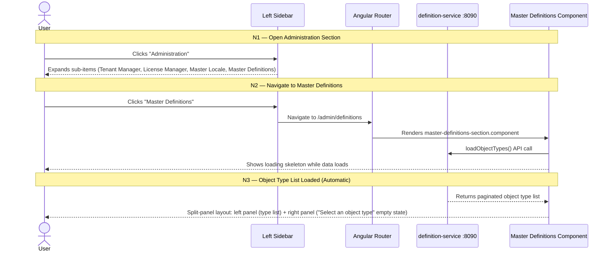
```mermaid
sequenceDiagram
    actor User
    participant Sidebar as Left Sidebar
    participant Angular as Angular Router
    participant DefSvc as definition-service :8090
    participant UI as Master Definitions Component

    Note over User,UI: N1 — Open Administration Section
    User->>Sidebar: Clicks "Administration"
    Sidebar-->>User: Expands sub-items (Tenant Manager, License Manager, Master Locale, Master Definitions)

    Note over User,UI: N2 — Navigate to Master Definitions
    User->>Sidebar: Clicks "Master Definitions"
    Sidebar->>Angular: Navigate to /admin/definitions
    Angular->>UI: Renders master-definitions-section.component
    UI->>DefSvc: loadObjectTypes() API call
    UI-->>User: Shows loading skeleton while data loads

    Note over User,UI: N3 — Object Type List Loaded (Automatic)
    DefSvc-->>UI: Returns paginated object type list
    UI-->>User: Split-panel layout: left panel (type list) + right panel ("Select an object type" empty state)
```

**Channel-specific notes for N1-N3:**

| Aspect | Desktop (>1024px) | Tablet (768-1024px) | Mobile (<768px) |
|--------|-------------------|---------------------|-----------------|
| Split-panel | Left 280-400px, right flex. Both visible simultaneously. | Single column: list above detail. List takes full width; detail below. | Single column: list full width. Detail opens as bottom sheet (slide up, 85% height). |
| Loading skeleton | 5 skeleton rows with circle + 2 text lines | Same layout, single column | Same layout, full width |
| Empty detail state | Right panel shows `pi-arrow-left` icon + "Select an object type" | Hidden until type selected; appears below list | Hidden until type tapped; appears as bottom sheet |

---

## 4. Persona 1: Super Admin (Sam Martinez) [PER-UX-001] Journeys

### Journey 1.1: Cross-Tenant Governance Audit

**Journey ID:** JRN-DEFMGMT-001
**Persona:** PER-UX-001 (Sam)
**Trigger:** Scheduled monthly governance review or alert notification about tenant non-compliance
**Modules Involved:** definition-service, tenant-service, notification-service, audit-service
**Status:** [PLANNED]

**Preconditions:**
- Sam is authenticated as `SUPER_ADMIN` role in the master tenant
- At least 3 child tenants exist with definitions inherited from master
- Some child tenants have customized inherited definitions

**Goal:** Audit all child tenants to identify non-compliant customizations of mandated definitions, flag violations, and push governance mandate updates.

**Estimated Duration:** 15-25 minutes

#### Happy Path

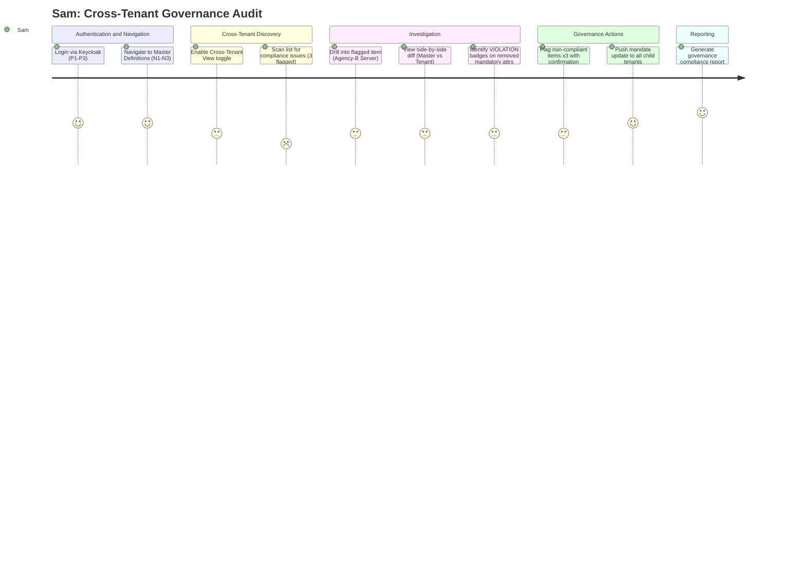
```mermaid
journey
    title Sam: Cross-Tenant Governance Audit
    section Authentication and Navigation
      Login via Keycloak (P1-P3): 4: Sam
      Navigate to Master Definitions (N1-N3): 4: Sam
    section Cross-Tenant Discovery
      Enable Cross-Tenant View toggle: 3: Sam
      Scan list for compliance issues (3 flagged): 2: Sam
    section Investigation
      Drill into flagged item (Agency-B Server): 3: Sam
      View side-by-side diff (Master vs Tenant): 3: Sam
      Identify VIOLATION badges on removed mandatory attrs: 3: Sam
    section Governance Actions
      Flag non-compliant items x3 with confirmation: 3: Sam
      Push mandate update to all child tenants: 4: Sam
    section Reporting
      Generate governance compliance report (PDF): 5: Sam
```

**UI Requirements (Screen Touchpoints):**

| Screen | ID | Key Components | Journey Sections | Status |
|--------|----|----------------|-----------------|--------|
| Keycloak Login | SCR-AUTH | Keycloak login form (centered card) | Authentication and Navigation | [IMPLEMENTED] |
| Object Type List/Grid View | SCR-01 | `p-tag` (compliance badges), `pInputText` (search), custom list (`role="listbox"`), view toggle, cross-tenant overlay | Authentication and Navigation, Cross-Tenant Discovery, Investigation | [IN-PROGRESS] -- list implemented; cross-tenant view, compliance badges [PLANNED] |
| Object Type Configuration - General Tab | SCR-02-T1 | Detail panel header, `p-tag` (state/status), action buttons | Investigation | [IMPLEMENTED] |
| Diff Viewer Dialog | SCR-02 (overlay) | `p-dialog` (side-by-side diff), VIOLATION badges, `p-tag` (severity) | Investigation | [PLANNED] |
| Confirmation Dialog | -- | `p-dialog`, `p-button` (Flag / Cancel) | Governance Actions | [PLANNED] |
| Mandate Push Dialog | -- | `p-dialog`, `p-checkbox` (definition selection), `p-select` (tenant tree) | Governance Actions | [PLANNED] |
| Export Dialog | -- | `p-dialog`, `p-select` (PDF/CSV/XLSX), download trigger | Reporting | [PLANNED] |
| Notification Dropdown | SCR-NOTIF | Notification bell, dropdown list, in-app notification items | Governance Actions (notification to tenant admin) | [PLANNED] |

**Screen Flow:**

```mermaid
graph LR
    SCR_AUTH[SCR-AUTH: Login] --> SCR_01[SCR-01: Object Type List]
    SCR_01 --> CT_TOGGLE["Cross-Tenant View Toggle"]
    CT_TOGGLE --> SCR_01_CT["SCR-01: Cross-Tenant List<br/>(compliance badges visible)"]
    SCR_01_CT --> SCR_02_T1["SCR-02-T1: Detail Panel<br/>(flagged tenant item)"]
    SCR_02_T1 --> DIFF["Diff Viewer Dialog<br/>(side-by-side comparison)"]
    DIFF --> CONFIRM["Confirmation Dialog<br/>(Flag Non-Compliant)"]
    CONFIRM --> MANDATE["Mandate Push Dialog<br/>(select definitions + tenants)"]
    MANDATE --> EXPORT["Export Dialog<br/>(PDF/CSV/XLSX)"]
```

**Step reference:**

| Step | Action | Screen / Component | Status |
|------|--------|--------------------|--------|
| 1 | Auth (P1-P3) → App Shell with SUPER_ADMIN permissions | App Shell | [IMPLEMENTED] |
| 2 | Navigate (N1-N3) → Object Type list + cross-tenant selector | Screen 1: Object Type List | [PLANNED] — cross-tenant selector |
| 3 | Click "Cross-Tenant View" → fetch all tenants, show tenant badges + lock icons | Screen 1 + cross-tenant overlay | [PLANNED] |
| 4 | Scan list → amber "Modified Mandate" p-tag on 3 items; "3 issues" count badge | Screen 1: compliance badges | [PLANNED] |
| 5 | Click flagged "Server" (Agency-B) → detail panel with diff callout | Detail Panel with diff callout | [PLANNED] |
| 6-7 | "View Diff" → side-by-side comparison; red VIOLATION on removed mandatory attrs | Diff Viewer Dialog (p-dialog) | [PLANNED] |
| 8-9 | "Flag Non-Compliant" → confirmation → violation recorded; notification to tenant admin | Confirmation Dialog → Toast | [PLANNED] |
| 10 | Repeat steps 5-9 for remaining 2 flagged items | Same screens | [PLANNED] |
| 11-12 | "Push Mandate Update" → select definitions + note → push to all child tenants | Mandate Push Dialog (p-dialog) | [PLANNED] |
| 13-14 | "Generate Report" → PDF/CSV/XLSX options → async generation → download | Export Dialog → Download | [PLANNED] |

**Responsive channel notes:**

| Step | Desktop (>1024px) | Tablet (768-1024px) | Mobile (<768px) |
|------|-------------------|---------------------|-----------------|
| 1-2 | Sidebar shows all admin sections; toolbar: heading + cross-tenant dropdown + view toggle + "New Type" | Sidebar collapsed; hamburger to expand; toolbar wraps | Bottom nav with admin icon; toolbar stacks vertically |
| 3-4 | Split-panel: tenant badges per item + "Tenant" column; aggregate issue count badge in toolbar | Single column list with tenant badge below name | Single column; badge may truncate; full detail on tap |
| 5-7 | Right panel shows diff callout; Diff dialog 80% viewport, 2-column | Detail below list; 90% width modal, compressed columns | Bottom sheet with diff summary; full-screen stacked modal |
| 8-10 | Standard confirmation dialog centered; success toast top-right | Same | Full-width dialog at bottom; toast full-width at top |
| 11-12 | Large dialog 70% viewport; table with checkboxes + tenant selection tree | 90% width; scrollable table | Full-screen dialog; table scrolls horizontally |
| 13-14 | Standard dialog with form fields; auto-download in browser | Same | Full-screen dialog; file saved to Downloads |

**Omnichannel Map:**

| Phase | Web Desktop | Web Tablet | Web Mobile | Email | In-App Notif | API | AI Asst |
|-------|:-:|:-:|:-:|:-:|:-:|:-:|:-:|
| Authentication and Navigation | P | S | S | -- | -- | -- | -- |
| Cross-Tenant Discovery | P | S | -- | -- | -- | -- | -- |
| Investigation | P | S | -- | -- | -- | -- | -- |
| Governance Actions | P | S | -- | -- | S | -- | -- |
| Reporting | P | S | S | S | -- | -- | -- |

**Service Blueprint:**

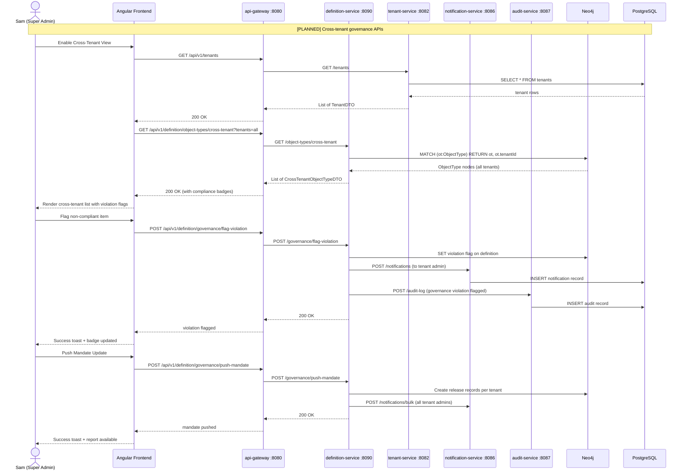
```mermaid
sequenceDiagram
    actor Sam as Sam (Super Admin)
    participant UI as Angular Frontend
    participant GW as api-gateway :8080
    participant DS as definition-service :8090
    participant TS as tenant-service :8082
    participant NS as notification-service :8086
    participant AS as audit-service :8087
    participant N4J as Neo4j
    participant PG as PostgreSQL

    Note over Sam,PG: [PLANNED] Cross-tenant governance APIs

    Sam->>UI: Enable Cross-Tenant View
    UI->>GW: GET /api/v1/tenants
    GW->>TS: GET /tenants
    TS->>PG: SELECT * FROM tenants
    PG-->>TS: tenant rows
    TS-->>GW: List of TenantDTO
    GW-->>UI: 200 OK

    UI->>GW: GET /api/v1/definition/object-types/cross-tenant?tenants=all
    GW->>DS: GET /object-types/cross-tenant
    DS->>N4J: MATCH (ot:ObjectType) RETURN ot, ot.tenantId
    N4J-->>DS: ObjectType nodes (all tenants)
    DS-->>GW: List of CrossTenantObjectTypeDTO
    GW-->>UI: 200 OK (with compliance badges)
    UI-->>Sam: Render cross-tenant list with violation flags

    Sam->>UI: Flag non-compliant item
    UI->>GW: POST /api/v1/definition/governance/flag-violation
    GW->>DS: POST /governance/flag-violation
    DS->>N4J: SET violation flag on definition
    DS->>NS: POST /notifications (to tenant admin)
    NS->>PG: INSERT notification record
    DS->>AS: POST /audit-log (governance violation flagged)
    AS->>PG: INSERT audit record
    DS-->>GW: 200 OK
    GW-->>UI: violation flagged
    UI-->>Sam: Success toast + badge updated

    Sam->>UI: Push Mandate Update
    UI->>GW: POST /api/v1/definition/governance/push-mandate
    GW->>DS: POST /governance/push-mandate
    DS->>N4J: Create release records per tenant
    DS->>NS: POST /notifications/bulk (all tenant admins)
    DS-->>GW: 200 OK
    GW-->>UI: mandate pushed
    UI-->>Sam: Success toast + report available
```

**Services Involved per Phase:**

| Phase | api-gateway | auth-facade | definition-svc | tenant-svc | notification-svc | audit-svc | ai-svc |
|-------|:-:|:-:|:-:|:-:|:-:|:-:|:-:|
| Authentication and Navigation | Y | Y | Y | -- | -- | -- | -- |
| Cross-Tenant Discovery | Y | -- | Y | Y | -- | -- | -- |
| Investigation | Y | -- | Y | -- | -- | -- | -- |
| Governance Actions | Y | -- | Y | -- | Y | Y | -- |
| Reporting | Y | -- | Y | -- | -- | Y | -- |

#### Phase Details

##### Phase 1: Authentication and Navigation

| Swim Lane | Details |
|-----------|---------|
| **Actions** | 1. Logs in via Keycloak (P1-P3). 2. Navigates to Administration > Master Definitions (N1-N3). |
| **Touchpoints** | Keycloak login form, App Shell sidebar, Master Definitions list component |
| **User Thoughts** | "Monthly governance review is due. Let me check if the tenants have been following the mandated definitions." "Where is the cross-tenant view -- I need to compare all agencies at once." |
| **Emotional State** | Purposeful |
| **Emotional Score** | 4 |
| **Pain Points** | No deep-link from governance calendar reminder to the cross-tenant view |
| **Opportunities** | Add governance review deep-link in reminder notifications; default Super Admins to cross-tenant mode |
| **Screen / Component** | SCR-AUTH (Keycloak Login), SCR-01 (Object Type List) |
| **Status** | [IMPLEMENTED] -- Authentication and navigation to Master Definitions works |

##### Phase 2: Cross-Tenant Discovery

| Swim Lane | Details |
|-----------|---------|
| **Actions** | 1. Enables the "Cross-Tenant View" toggle. 2. Scans the list for compliance badges -- identifies 3 flagged items. |
| **Touchpoints** | Cross-Tenant View toggle, compliance badges (`p-tag`), violation count badge in toolbar |
| **User Thoughts** | "Three agencies flagged out of twelve -- not terrible, but Agency-B looks serious." "I wish I could filter by severity so I can triage quickly." |
| **Emotional State** | Concerned |
| **Emotional Score** | 2 |
| **Pain Points** | Cross-tenant toggle does not exist yet; no compliance badges or severity filter; must scan visually |
| **Opportunities** | Automated compliance scoring per tenant; severity filter (Critical / Warning / Info); sortable violation count column |
| **Screen / Component** | SCR-01 (Object Type List with cross-tenant overlay) [PLANNED] |
| **Status** | [PLANNED] |

##### Phase 3: Investigation

| Swim Lane | Details |
|-----------|---------|
| **Actions** | 1. Drills into flagged "Server" item from Agency-B. 2. Opens side-by-side diff (Master vs Tenant). 3. Identifies VIOLATION badges on removed mandatory attributes. |
| **Touchpoints** | Detail panel, Diff Viewer Dialog (`p-dialog`), VIOLATION severity tags |
| **User Thoughts** | "Agency-B removed 'Patch Level' -- that is a mandated attribute, they cannot do that." "The diff view needs to show me exactly what changed versus what was removed." |
| **Emotional State** | Investigative |
| **Emotional Score** | 3 |
| **Pain Points** | No diff view exists today; manual cross-tenant comparison is error-prone; unclear severity of each deviation |
| **Opportunities** | Color-coded diff with additions (green), removals (red), modifications (amber); AI-summarized natural language diff explanation |
| **Screen / Component** | SCR-02-T1 (Detail Panel) [IMPLEMENTED], Diff Viewer Dialog [PLANNED] |
| **Status** | [PLANNED] -- Detail panel exists; diff viewer and violation badges planned |

##### Phase 4: Governance Actions

| Swim Lane | Details |
|-----------|---------|
| **Actions** | 1. Clicks "Flag Non-Compliant" on 3 items, each with a confirmation dialog. 2. Opens "Push Mandate Update" dialog. 3. Selects definitions, writes a note, and confirms push to all child tenants. |
| **Touchpoints** | Flag action button, Confirmation Dialog (`p-dialog`), Mandate Push Dialog (`p-dialog`), success toast |
| **User Thoughts** | "I need to flag all three at once -- clicking one by one is tedious." "I hope the push notification reaches Fiona at Agency-B immediately." |
| **Emotional State** | Assertive |
| **Emotional Score** | 3 |
| **Pain Points** | No bulk flagging -- must flag each item individually; no mandate push mechanism exists |
| **Opportunities** | Bulk flag action from multi-select; one-click mandate push with automatic notification to all affected tenant admins |
| **Screen / Component** | Confirmation Dialog [PLANNED], Mandate Push Dialog [PLANNED], SCR-NOTIF (Notification Dropdown) [PLANNED] |
| **Status** | [PLANNED] |

##### Phase 5: Reporting

| Swim Lane | Details |
|-----------|---------|
| **Actions** | 1. Clicks "Generate Report". 2. Selects PDF format and download options. 3. Downloads the compliance report. |
| **Touchpoints** | Export Dialog (`p-dialog`), format selector (`p-select`), download trigger, success toast |
| **User Thoughts** | "Good -- this report has everything management needs. Monthly governance review done." "I want to schedule this report to auto-generate next month." |
| **Emotional State** | Relieved |
| **Emotional Score** | 5 |
| **Pain Points** | No report generation exists; no scheduled report capability |
| **Opportunities** | Automated scheduled governance reports; management dashboard with live compliance data; email delivery option |
| **Screen / Component** | Export Dialog [PLANNED] |
| **Status** | [PLANNED] |

#### Edge Cases

| Edge Case | Trigger | System Behavior | Screen / Component | Status |
|-----------|---------|-----------------|-------------------|--------|
| No child tenants exist | SUPER_ADMIN in a tenant with no children navigates to cross-tenant view | Empty state: "No child tenants configured. Cross-tenant governance requires at least one child tenant." with link to Tenant Manager | Screen 1: Empty state for cross-tenant | [PLANNED] |
| All tenants are compliant | No modified mandated items found after scanning | Green banner: "All child tenants are fully compliant with master mandates. No governance issues detected." "Flag" and "Push" buttons disabled/hidden. | Screen 1: Compliance banner | [PLANNED] |
| Network failure during mandate push | Push request fails due to timeout or server error | Error toast: "Failed to push mandate updates. Please check your connection and try again." Dialog remains open with Push button re-enabled. Retry possible. | Toast + Dialog | [PLANNED] |
| Child tenant admin offline when notification sent | Notification sent but recipient not logged in | Notification queued in database; shown when tenant admin next logs in; periodic email reminder sent (if email configured) | Notification system (backend) | [PLANNED] |
| Mandate push conflicts with in-progress child tenant edits | Child tenant admin is editing the same definition being pushed | Push succeeds server-side; child tenant admin sees conflict warning on next save attempt: "This definition was updated by the master tenant. Your changes may be overridden. Review the update first." | Child tenant conflict dialog | [PLANNED] |

#### Error States

| Error | Trigger | Error Message | Recovery Action | Status |
|-------|---------|---------------|-----------------|--------|
| Cross-tenant API failure | Backend `definition-service` unreachable for cross-tenant query | "Failed to load cross-tenant definitions. Please try again." with Retry button in error banner. | Click Retry; if persistent, check infrastructure. | [PLANNED] |
| Unauthorized cross-tenant access | JWT role does not include SUPER_ADMIN | HTTP 403; system shows "You do not have permission to view cross-tenant definitions. Contact your system administrator." | Navigate back to single-tenant view. | [PLANNED] |
| Report generation timeout | PDF generation takes >30 seconds | "Report generation is taking longer than expected. You will receive an in-app notification when it is ready." Progress indicator continues. | Wait for notification or retry later. | [PLANNED] |

**Error Recovery Flow:**

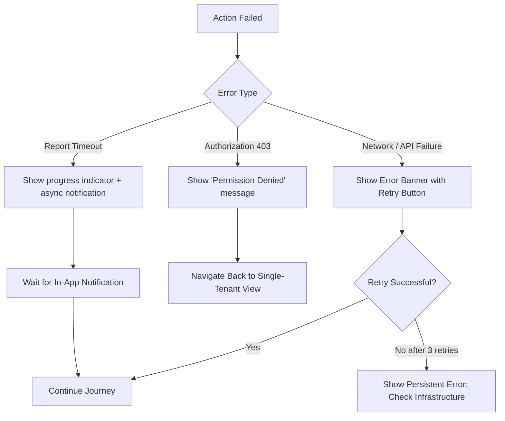
```mermaid
flowchart TD
    A[Action Failed] --> B{Error Type}
    B -->|Network / API Failure| C[Show Error Banner with Retry Button]
    B -->|Authorization 403| D["Show 'Permission Denied' message"]
    B -->|Report Timeout| E[Show progress indicator + async notification]
    C --> F{Retry Successful?}
    F -->|Yes| G[Continue Journey]
    F -->|No after 3 retries| H[Show Persistent Error: Check Infrastructure]
    D --> I[Navigate Back to Single-Tenant View]
    E --> J[Wait for In-App Notification]
    J --> G
```

#### Confirmation Dialogs

| Action | Dialog Title | Dialog Body | Buttons | Consequence | Status |
|--------|-------------|-------------|---------|-------------|--------|
| Flag non-compliant | "Flag Governance Violation" | "Flag [Tenant]'s '[TypeName]' definition as non-compliant? This will: (1) Add a governance violation to the audit trail (2) Notify the tenant admin via in-app notification (3) Mark the definition with a Non-Compliant badge" | "Flag" (primary), "Cancel" (secondary) | Violation recorded; notification sent; badge applied | [PLANNED] |
| Push mandate update | "Push Mandate Updates" | "You are about to push [N] mandate updates to [M] child tenants. This will create release records that tenant admins must adopt. Existing local customizations on mandated items will be flagged for review." | "Push to All" (primary), "Push to Selected" (secondary), "Cancel" (text) | Release records created; notifications sent | [PLANNED] |

---

### Journey 1.2: Provision New Tenant with Canonical Definitions

**Journey ID:** JRN-DEFMGMT-002
**Persona:** PER-UX-001 (Sam)
**Trigger:** New child tenant created in Tenant Manager with zero definitions
**Modules Involved:** definition-service, tenant-service, notification-service
**Status:** [PLANNED]

**Preconditions:**
- Sam is authenticated as `SUPER_ADMIN` in the master tenant
- A new child tenant ("Agency-C") has been created in Tenant Manager but has no definitions yet
- Master tenant has a canonical definition set (10+ object types with attributes and connections)

**Goal:** Propagate the master tenant's canonical definitions to the new child tenant so Agency-C starts with the correct baseline.

**Estimated Duration:** 5-10 minutes

#### Happy Path

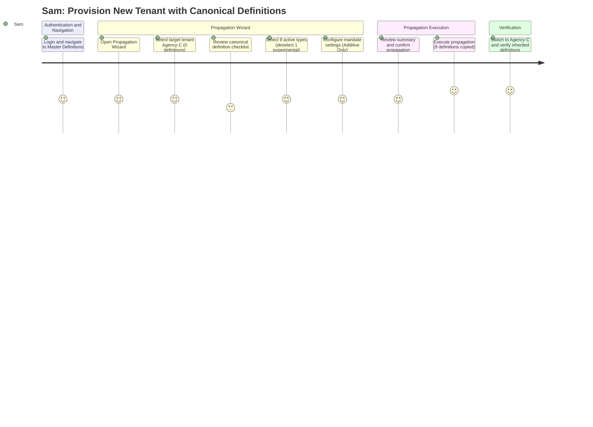
```mermaid
journey
    title Sam: Provision New Tenant with Canonical Definitions
    section Authentication and Navigation
      Login and navigate to Master Definitions: 4: Sam
    section Propagation Wizard
      Open Propagation Wizard: 4: Sam
      Select target tenant Agency-C (0 definitions): 4: Sam
      Review canonical definition checklist: 3: Sam
      Select 9 active types (deselect 1 experimental): 4: Sam
      Configure mandate settings (Additive Only): 4: Sam
    section Propagation Execution
      Review summary and confirm propagation: 4: Sam
      Execute propagation (9 definitions copied): 5: Sam
    section Verification
      Switch to Agency-C and verify inherited definitions: 5: Sam
```

**UI Requirements (Screen Touchpoints):**

| Screen | ID | Key Components | Journey Sections | Status |
|--------|----|----------------|-----------------|--------|
| Keycloak Login | SCR-AUTH | Keycloak login form | Authentication and Navigation | [IMPLEMENTED] |
| Object Type List/Grid View | SCR-01 | Custom list (`role="listbox"`), `p-tag` (status/state), `p-button` ("Propagate Definitions"), `pi-lock` (inherited badges) | Authentication and Navigation, Verification | [IN-PROGRESS] -- list implemented; propagate button, inherited badges [PLANNED] |
| Propagation Wizard (4-step `p-dialog`) | -- | `p-dialog`, `p-select` (target tenant), `p-checkbox` (definition checklist), `p-steps`, `p-button` (Propagate), `p-progressspinner` | Propagation Wizard, Propagation Execution | [PLANNED] |
| Confirmation Dialog | -- | `p-dialog`, `p-button` (Propagate / Cancel) | Propagation Execution | [PLANNED] |
| Toast Notification | -- | `p-toast` (success: "9 definitions propagated") | Propagation Execution | [PLANNED] |

**Screen Flow:**

```mermaid
graph LR
    SCR_AUTH[SCR-AUTH: Login] --> SCR_01[SCR-01: Object Type List]
    SCR_01 --> WIZ_1["Propagation Wizard<br/>Step 1: Select Tenant"]
    WIZ_1 --> WIZ_2["Step 2: Definition Checklist"]
    WIZ_2 --> WIZ_3["Step 3: Mandate Settings"]
    WIZ_3 --> WIZ_4["Step 4: Review Summary"]
    WIZ_4 --> CONFIRM["Confirmation Dialog"]
    CONFIRM --> PROGRESS["Progress Spinner<br/>(3/9... 9/9)"]
    PROGRESS --> TOAST["Success Toast"]
    TOAST --> SCR_01_B["SCR-01: Agency-C Context<br/>(verify inherited definitions)"]
```

**Step reference:**

| Step | Action | Screen / Component | Status |
|------|--------|--------------------|--------|
| 1 | Auth (P1-P3) + Nav (N1-N3) → master tenant definitions loaded | Screen 1: Object Type List | [IMPLEMENTED] |
| 2 | Click "Propagate Definitions" → wizard opens, Step 1: Select Target Tenant | Propagation Wizard Dialog (p-dialog) | [PLANNED] |
| 3 | Select "Agency-C" from p-select → tenant info card shows 0 definitions | Wizard Step 1 | [PLANNED] |
| 4-5 | Step 2: definition checklist → "Select All Active" (10), uncheck 1 → "9 selected" | Wizard Step 2 | [PLANNED] |
| 6-7 | Step 3: "Mandate all selected" ON + Override Policy "Additive only" | Wizard Step 3 | [PLANNED] |
| 8-9 | Step 4: Review summary → "Propagate Definitions" → confirmation dialog | Wizard Step 4 + Confirmation | [PLANNED] |
| 10 | Confirm → progress spinner "3/9 complete" → toast "9 definitions propagated" | Progress → Toast | [PLANNED] |
| 11 | Switch to Agency-C → 9 definitions with "inherited" state + lock icons | Screen 1 (Agency-C context) | [PLANNED] |

**Omnichannel Map:**

| Phase | Web Desktop | Web Tablet | Web Mobile | Email | In-App Notif | API | AI Asst |
|-------|:-:|:-:|:-:|:-:|:-:|:-:|:-:|
| Authentication and Navigation | P | S | S | -- | -- | -- | -- |
| Propagation Wizard | P | S | -- | -- | -- | -- | -- |
| Propagation Execution | P | S | -- | -- | -- | -- | -- |
| Verification | P | S | S | -- | -- | -- | -- |

**Service Blueprint:**

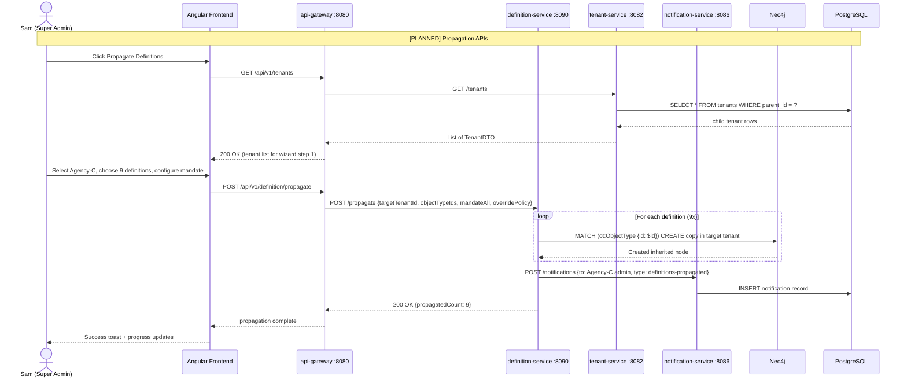
```mermaid
sequenceDiagram
    actor Sam as Sam (Super Admin)
    participant UI as Angular Frontend
    participant GW as api-gateway :8080
    participant DS as definition-service :8090
    participant TS as tenant-service :8082
    participant NS as notification-service :8086
    participant N4J as Neo4j
    participant PG as PostgreSQL

    Note over Sam,PG: [PLANNED] Propagation APIs

    Sam->>UI: Click Propagate Definitions
    UI->>GW: GET /api/v1/tenants
    GW->>TS: GET /tenants
    TS->>PG: SELECT * FROM tenants WHERE parent_id = ?
    PG-->>TS: child tenant rows
    TS-->>GW: List of TenantDTO
    GW-->>UI: 200 OK (tenant list for wizard step 1)

    Sam->>UI: Select Agency-C, choose 9 definitions, configure mandate
    UI->>GW: POST /api/v1/definition/propagate
    GW->>DS: POST /propagate {targetTenantId, objectTypeIds, mandateAll, overridePolicy}
    loop For each definition (9x)
        DS->>N4J: MATCH (ot:ObjectType {id: $id}) CREATE copy in target tenant
        N4J-->>DS: Created inherited node
    end
    DS->>NS: POST /notifications {to: Agency-C admin, type: definitions-propagated}
    NS->>PG: INSERT notification record
    DS-->>GW: 200 OK {propagatedCount: 9}
    GW-->>UI: propagation complete
    UI-->>Sam: Success toast + progress updates
```

**Services Involved per Phase:**

| Phase | api-gateway | auth-facade | definition-svc | tenant-svc | notification-svc | audit-svc | ai-svc |
|-------|:-:|:-:|:-:|:-:|:-:|:-:|:-:|
| Authentication and Navigation | Y | Y | Y | -- | -- | -- | -- |
| Propagation Wizard | Y | -- | Y | Y | -- | -- | -- |
| Propagation Execution | Y | -- | Y | -- | Y | -- | -- |
| Verification | Y | -- | Y | -- | -- | -- | -- |

#### Phase Details

##### Phase 1: Authentication and Navigation

| Swim Lane | Details |
|-----------|---------|
| **Actions** | 1. Logs in via Keycloak (P1-P3). 2. Navigates to Administration > Master Definitions (N1-N3). |
| **Touchpoints** | Keycloak login form, App Shell sidebar, Master Definitions list component |
| **User Thoughts** | "Agency-C was just created with zero definitions -- I need to get their baseline set up quickly." "I hope the propagation process is straightforward." |
| **Emotional State** | Purposeful |
| **Emotional Score** | 4 |
| **Pain Points** | No indication in the sidebar that Agency-C needs provisioning; must remember to check |
| **Opportunities** | Task-based notification: "Agency-C has 0 definitions -- propagate now?"; badge on Master Definitions sidebar item |
| **Screen / Component** | SCR-AUTH (Keycloak Login) [IMPLEMENTED], SCR-01 (Object Type List) [IMPLEMENTED] |
| **Status** | [IMPLEMENTED] -- Authentication and navigation work |

##### Phase 2: Propagation Wizard

| Swim Lane | Details |
|-----------|---------|
| **Actions** | 1. Opens the Propagation Wizard. 2. Selects target tenant Agency-C (0 definitions shown). 3. Reviews the canonical definition checklist. 4. Selects 9 active types, deselects 1 experimental. 5. Configures mandate settings (Additive Only). |
| **Touchpoints** | "Propagate Definitions" button, Propagation Wizard (`p-dialog`, `p-steps`), tenant selector (`p-select`), definition checklist (`p-checkbox`), mandate settings |
| **User Thoughts** | "Good, Agency-C shows 0 definitions -- that confirms it is a fresh tenant." "I should not include the experimental 'Quantum Processor' type yet." "Additive Only is the safest override policy for a new tenant." |
| **Emotional State** | Methodical |
| **Emotional Score** | 4 |
| **Pain Points** | Long checklist with no grouping or recommended set; must manually decide which types to include; no indication of which types are experimental vs production-ready |
| **Opportunities** | "Recommended Set" preset button; group types by category; highlight experimental types with a distinct badge; remember last propagation settings |
| **Screen / Component** | Propagation Wizard (`p-dialog`) [PLANNED] |
| **Status** | [PLANNED] |

##### Phase 3: Propagation Execution

| Swim Lane | Details |
|-----------|---------|
| **Actions** | 1. Reviews the summary (9 definitions, Additive Only, target Agency-C). 2. Confirms propagation via confirmation dialog. 3. Waits while propagation executes with progress indicator (3/9... 9/9). |
| **Touchpoints** | Wizard Step 4 (Review Summary), Confirmation Dialog (`p-dialog`), Progress Spinner (`p-progressspinner`), Success Toast (`p-toast`) |
| **User Thoughts** | "Let me double-check the summary before confirming -- nine types with mandate enabled." "The progress indicator is reassuring -- I can see it working through each definition." |
| **Emotional State** | Confident |
| **Emotional Score** | 5 |
| **Pain Points** | No real-time progress feedback exists; uncertain whether partial failure recovery is possible |
| **Opportunities** | Real-time per-item progress with item names; partial failure recovery with retry for failed items only |
| **Screen / Component** | Propagation Wizard Step 4 [PLANNED], Confirmation Dialog [PLANNED] |
| **Status** | [PLANNED] |

##### Phase 4: Verification

| Swim Lane | Details |
|-----------|---------|
| **Actions** | 1. Switches tenant context to Agency-C. 2. Verifies 9 inherited definitions appear with "Inherited" state and lock icons. |
| **Touchpoints** | Tenant context switcher (header), Object Type List (SCR-01) with inherited badges and `pi-lock` icons |
| **User Thoughts** | "All nine types are here with lock icons -- Agency-C is correctly provisioned." "The inherited badges make it clear these came from master." |
| **Emotional State** | Satisfied |
| **Emotional Score** | 5 |
| **Pain Points** | Tenant context switching requires navigating to header dropdown; no quick-switch shortcut |
| **Opportunities** | "Switch to Agency-C" button directly in the propagation success toast; post-propagation verification checklist |
| **Screen / Component** | SCR-01 (Object Type List, Agency-C context) [PLANNED] -- inherited badges and lock icons not yet implemented |
| **Status** | [PLANNED] |

#### Edge Cases

| Edge Case | Trigger | System Behavior | Screen / Component | Status |
|-----------|---------|-----------------|-------------------|--------|
| Target tenant already has definitions | Agency-C was previously provisioned | Warning in Step 1: "Agency-C already has [N] definitions. Propagating will not duplicate existing types (matched by typeKey). New types will be added." | Propagation Wizard - Step 1 | [PLANNED] |
| TypeKey collision | Master type "server" and Agency-C local type "server" share the same typeKey | Collision warning in Step 4: "TypeKey collision detected for 'server'. The existing Agency-C definition will be marked as 'inherited' and linked to master. Local customizations will be preserved under 'Additive only' policy." | Propagation Wizard - Step 4 | [PLANNED] |
| Propagation partially fails | Network timeout on definition 6/9 | Error toast: "Propagation partially completed (5/9). Failed items: [Definition Name]. Retry remaining?" with "Retry" button | Toast with retry action | [PLANNED] |
| No child tenants exist | SUPER_ADMIN opens propagation wizard | Step 1 dropdown is empty with message: "No child tenants available. Create a tenant first." Link to Tenant Manager. "Next" button disabled. | Propagation Wizard - Step 1 | [PLANNED] |

**Error Recovery Flow:**

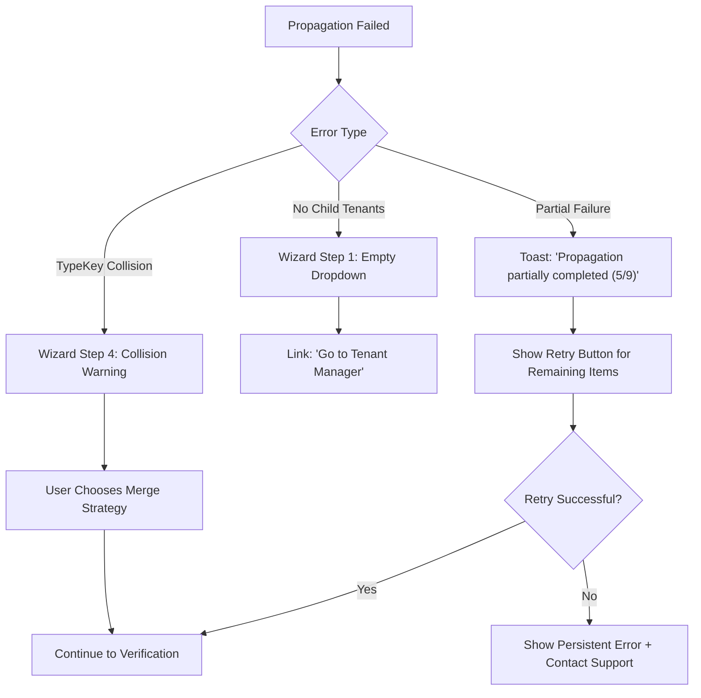
```mermaid
flowchart TD
    A[Propagation Failed] --> B{Error Type}
    B -->|Partial Failure| C["Toast: 'Propagation partially completed (5/9)'"]
    C --> D[Show Retry Button for Remaining Items]
    D --> E{Retry Successful?}
    E -->|Yes| F[Continue to Verification]
    E -->|No| G[Show Persistent Error + Contact Support]
    B -->|No Child Tenants| H["Wizard Step 1: Empty Dropdown"]
    H --> I["Link: 'Go to Tenant Manager'"]
    B -->|TypeKey Collision| J["Wizard Step 4: Collision Warning"]
    J --> K[User Chooses Merge Strategy]
    K --> F
```

#### Confirmation Dialogs

| Action | Dialog Title | Dialog Body | Buttons | Consequence | Status |
|--------|-------------|-------------|---------|-------------|--------|
| Propagate definitions | "Confirm Propagation" | "Copy [N] definitions to [Tenant]? All items will be marked as [mandated/non-mandated]. Override policy: [policy]. This action cannot be undone." | "Propagate" (primary), "Cancel" (secondary) | Definitions copied; state set to "inherited"; mandate flags applied | [PLANNED] |

---

## 5. Persona 2: Architect (Nicole Roberts) [PER-UX-002] Journeys

### Journey 2.1: Create New Object Type from Scratch

**Journey ID:** JRN-DEFMGMT-003
**Persona:** PER-UX-002 (Nicole)
**Trigger:** Business need for a new object type that does not yet exist in the definition library
**Modules Involved:** definition-service, ai-service, notification-service
**Status:** [IN-PROGRESS] -- Wizard Steps 1-4 implemented; AI features, governance tab, and release authoring [PLANNED]

**Preconditions:**
- Nicole is authenticated as `SUPER_ADMIN` (Architect role) in the master tenant
- At least 5 attribute types already exist in the tenant (e.g., Name, Description, Owner, Status, Priority)
- At least 3 object types already exist (e.g., Server, Application, Database)

**Goal:** Create a new "Digital Certificate" object type via the wizard, configure all attributes and connections, set maturity classifications, trigger AI similarity check, and author a release for child tenants.

**Estimated Duration:** 8-12 minutes

#### Happy Path

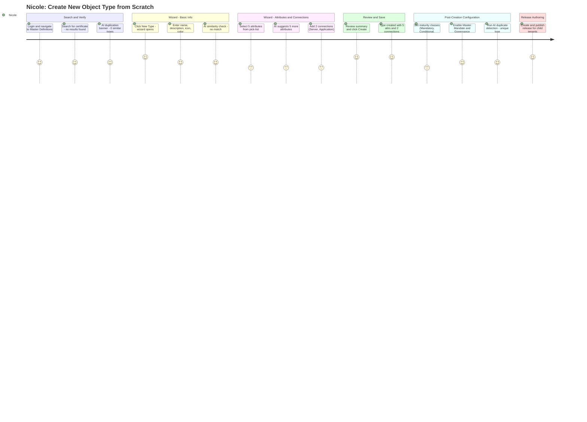
```mermaid
journey
    title Nicole: Create New Object Type from Scratch
    section Search and Verify
      Login and navigate to Master Definitions: 4: Nicole
      Search for certificate - no results found: 4: Nicole
      AI duplication banner - 0 similar types: 4: Nicole
    section Wizard - Basic Info
      Click New Type - wizard opens: 5: Nicole
      Enter name, description, icon, color: 4: Nicole
      AI similarity check - no match: 4: Nicole
    section Wizard - Attributes and Connections
      Select 5 attributes from pick-list: 3: Nicole
      AI suggests 5 more attributes: 3: Nicole
      Add 2 connections (Server, Application): 3: Nicole
    section Review and Save
      Review summary and click Create: 5: Nicole
      Type created with 5 attrs and 2 connections: 5: Nicole
    section Post-Creation Configuration
      Set maturity classes (Mandatory, Conditional, Optional): 3: Nicole
      Enable Master Mandate and Governance: 4: Nicole
      Run AI duplicate detection - unique type: 4: Nicole
    section Release Authoring
      Create and publish release for child tenants: 5: Nicole
```

**UI Requirements (Screen Touchpoints):**

| Screen | ID | Key Components | Journey Sections | Status |
|--------|----|----------------|-----------------|--------|
| Keycloak Login | SCR-AUTH | Keycloak login form | (Prerequisites) | [IMPLEMENTED] |
| Object Type List/Grid View | SCR-01 | Custom list (`role="listbox"`), `pInputText` (search), `p-tag` (status/state), `p-button` ("New Type"), `p-skeleton` (loading) | Search and Verify, Review and Save | [IMPLEMENTED] |
| Create Object Type Wizard (5-step `p-dialog`) | SCR-03 | `p-dialog`, `pInputText` (name, typeKey), `textarea` (description), icon grid picker, color swatch picker, `p-button` group (status), attribute pick-list (`p-checkbox`), connection form (`p-select`, `pInputText`), review grid, `p-progressspinner` (save) | Wizard - Basic Info, Wizard - Attributes and Connections, Review and Save | [IMPLEMENTED] -- Steps 1-4 implemented; Step 4 Governance [PLANNED] |
| Object Type Configuration - Attributes Tab | SCR-02-T2 | Attribute list, `p-select` (maturity class), `p-tag` (data type) | Post-Creation Configuration | [IN-PROGRESS] -- attribute list implemented; maturity class [PLANNED] |
| Object Type Configuration - Governance Tab | SCR-02-T4 | `p-toggleswitch` (Master Mandate), `p-select` (override policy) | Post-Creation Configuration | [PLANNED] |
| AI Insights Panel | SCR-AI | AI similarity card, AI attribute suggestion card, AI duplicate detection card | Search and Verify, Wizard - Basic Info, Wizard - Attributes and Connections, Post-Creation Configuration | [PLANNED] |
| Release Authoring Dialog | -- | `p-dialog`, auto-generated release notes, `p-button` (Publish / Save as Draft / Cancel) | Release Authoring | [PLANNED] |
| Toast Notification | -- | `p-toast` (success: type created, release published) | Review and Save, Release Authoring | [PLANNED] |

**Screen Flow:**

```mermaid
graph LR
    SCR_AUTH[SCR-AUTH: Login] --> SCR_01[SCR-01: Object Type List]
    SCR_01 -->|Search 'certificate'| SCR_01_EMPTY["SCR-01: No Results<br/>(AI banner: 0 similar)"]
    SCR_01_EMPTY -->|Click 'New Type'| SCR_03_S1["SCR-03: Wizard<br/>Step 1: Basic Info"]
    SCR_03_S1 --> SCR_03_S2["Step 2: Attributes<br/>(pick-list + AI suggestions)"]
    SCR_03_S2 --> SCR_03_S3["Step 3: Connections"]
    SCR_03_S3 --> SCR_03_S4["Step 4: Review"]
    SCR_03_S4 -->|Create| SCR_01_DETAIL["SCR-01: List + Detail Panel"]
    SCR_01_DETAIL --> SCR_02_T2["SCR-02-T2: Attributes Tab<br/>(set maturity classes)"]
    SCR_02_T2 --> SCR_02_T4["SCR-02-T4: Governance Tab<br/>(enable mandate)"]
    SCR_02_T4 --> REL["Release Authoring Dialog<br/>(publish to child tenants)"]
```

**Step reference:**

| Step | Action | Screen / Component | Status |
|------|--------|--------------------|--------|
| 1 | Auth + Nav → Object Type list loads | Screen 1: Object Type List | [IMPLEMENTED] |
| 2-3 | Search "certificate" → no results → clear search | Screen 1: Search filter | [IMPLEMENTED] |
| 4 | AI duplication banner: "0 similar types. Safe to create." | Screen 1: AI Banner | [PLANNED] |
| 5 | Click "New Type" (`pi-plus`) → wizard opens at Step 1 (Basic Info) | Screen 3: Create Wizard | [IMPLEMENTED] |
| 6-10 | Fill name ("Digital Certificate"), typeKey auto-derives, description, icon (lock), color (teal) | Wizard Step 1 | [IMPLEMENTED] |
| 7 | AI similarity check on name blur: "SSL Certificate (85% match)" → dismiss | Wizard Step 1: AI card | [PLANNED] |
| 11-13 | Step 2: select 5 attributes from pick-list → "5 attributes selected" badge | Wizard Step 2 | [IMPLEMENTED] |
| 14 | AI recommends 5 more attributes (Common Name, Serial Number, etc.) | Wizard Step 2: AI panel | [PLANNED] |
| 15-18 | Step 3: add 2 connections (Server: "installed on", Application: "secures") | Wizard Step 3 | [IMPLEMENTED] |
| 19-20 | Step 4: review summary — all fields, attributes, connections | Wizard Step 4 | [IMPLEMENTED] |
| 21-22 | Click "Create Object Type" → API calls → success toast → detail panel loads | Screen 1 + Toast | [IMPLEMENTED] |
| 23 | Set maturity classes per attribute (Mandatory/Conditional/Optional) | Tab 2: Attributes | [PLANNED] |
| 24 | Governance tab → enable "Master Mandate" + "Additive Only" override policy | Tab 4: Governance | [PLANNED] |
| 25 | AI duplicate detection → "No duplicates found" green card | AI Check Card | [PLANNED] |
| 26-27 | Create Release → auto-generated notes → "Publish Release" → notifications sent | Release Dialog | [PLANNED] |

**Omnichannel Map:**

| Phase | Web Desktop | Web Tablet | Web Mobile | Email | In-App Notif | API | AI Asst |
|-------|:-:|:-:|:-:|:-:|:-:|:-:|:-:|
| Search and Verify | P | S | S | -- | -- | -- | S |
| Wizard - Basic Info | P | S | S | -- | -- | -- | S |
| Wizard - Attributes and Connections | P | S | -- | -- | -- | -- | S |
| Review and Save | P | S | S | -- | -- | -- | -- |
| Post-Creation Configuration | P | S | -- | -- | -- | -- | S |
| Release Authoring | P | S | -- | -- | S | -- | -- |

**Service Blueprint:**

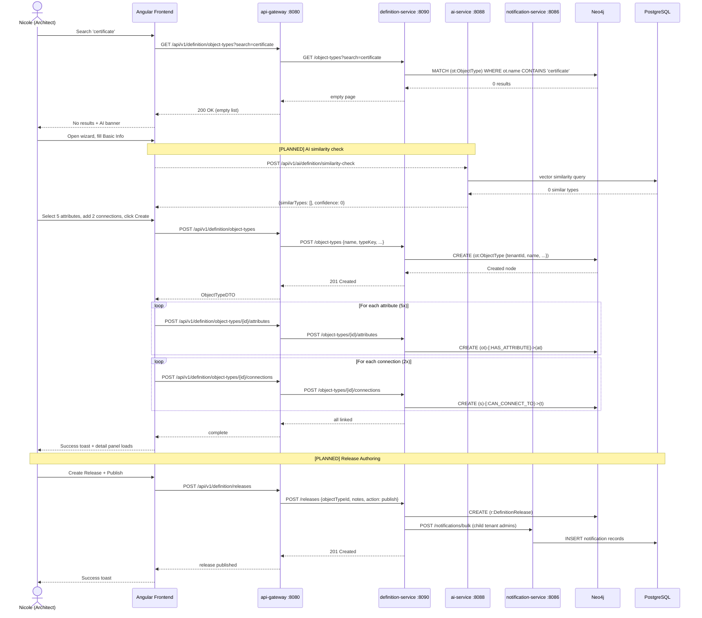
```mermaid
sequenceDiagram
    actor Nicole as Nicole (Architect)
    participant UI as Angular Frontend
    participant GW as api-gateway :8080
    participant DS as definition-service :8090
    participant AI as ai-service :8088
    participant NS as notification-service :8086
    participant N4J as Neo4j
    participant PG as PostgreSQL

    Nicole->>UI: Search 'certificate'
    UI->>GW: GET /api/v1/definition/object-types?search=certificate
    GW->>DS: GET /object-types?search=certificate
    DS->>N4J: MATCH (ot:ObjectType) WHERE ot.name CONTAINS 'certificate'
    N4J-->>DS: 0 results
    DS-->>GW: empty page
    GW-->>UI: 200 OK (empty list)
    UI-->>Nicole: No results + AI banner

    Nicole->>UI: Open wizard, fill Basic Info
    Note over UI,AI: [PLANNED] AI similarity check
    UI-->>AI: POST /api/v1/ai/definition/similarity-check
    AI->>PG: vector similarity query
    PG-->>AI: 0 similar types
    AI-->>UI: {similarTypes: [], confidence: 0}

    Nicole->>UI: Select 5 attributes, add 2 connections, click Create
    UI->>GW: POST /api/v1/definition/object-types
    GW->>DS: POST /object-types {name, typeKey, ...}
    DS->>N4J: CREATE (ot:ObjectType {tenantId, name, ...})
    N4J-->>DS: Created node
    DS-->>GW: 201 Created
    GW-->>UI: ObjectTypeDTO

    loop For each attribute (5x)
        UI->>GW: POST /api/v1/definition/object-types/{id}/attributes
        GW->>DS: POST /object-types/{id}/attributes
        DS->>N4J: CREATE (ot)-[:HAS_ATTRIBUTE]->(at)
    end

    loop For each connection (2x)
        UI->>GW: POST /api/v1/definition/object-types/{id}/connections
        GW->>DS: POST /object-types/{id}/connections
        DS->>N4J: CREATE (s)-[:CAN_CONNECT_TO]->(t)
    end

    DS-->>GW: all linked
    GW-->>UI: complete
    UI-->>Nicole: Success toast + detail panel loads

    Note over Nicole,PG: [PLANNED] Release Authoring
    Nicole->>UI: Create Release + Publish
    UI->>GW: POST /api/v1/definition/releases
    GW->>DS: POST /releases {objectTypeId, notes, action: publish}
    DS->>N4J: CREATE (r:DefinitionRelease)
    DS->>NS: POST /notifications/bulk (child tenant admins)
    NS->>PG: INSERT notification records
    DS-->>GW: 201 Created
    GW-->>UI: release published
    UI-->>Nicole: Success toast
```

**Services Involved per Phase:**

| Phase | api-gateway | auth-facade | definition-svc | tenant-svc | notification-svc | audit-svc | ai-svc |
|-------|:-:|:-:|:-:|:-:|:-:|:-:|:-:|
| Search and Verify | Y | Y | Y | -- | -- | -- | Y |
| Wizard - Basic Info | Y | -- | Y | -- | -- | -- | Y |
| Wizard - Attributes and Connections | Y | -- | Y | -- | -- | -- | Y |
| Review and Save | Y | -- | Y | -- | -- | -- | -- |
| Post-Creation Configuration | Y | -- | Y | -- | -- | -- | Y |
| Release Authoring | Y | -- | Y | -- | Y | -- | -- |

#### Phase Details

##### Phase 1: Search and Verify

| Swim Lane | Details |
|-----------|---------|
| **Actions** | 1. Logs in and navigates to Master Definitions (P1-P3, N1-N3). 2. Searches for "certificate" in the search field. 3. Reviews AI duplication banner showing 0 similar types. |
| **Touchpoints** | Keycloak login, sidebar navigation, SCR-01 search input (`pInputText`), AI duplication banner |
| **User Thoughts** | "Let me check if anyone has already created a certificate type before I start from scratch." "Zero similar types -- good, I am clear to create a new one." |
| **Emotional State** | Confident |
| **Emotional Score** | 4 |
| **Pain Points** | AI similarity check is not yet implemented; must rely on manual search and visual scanning |
| **Opportunities** | AI-powered duplicate detection on search; suggest existing types that could be extended instead of creating new |
| **Screen / Component** | SCR-AUTH [IMPLEMENTED], SCR-01 (Object Type List with search) [IMPLEMENTED], AI Banner [PLANNED] |
| **Status** | [IN-PROGRESS] -- Search implemented; AI duplication banner planned |

##### Phase 2: Wizard - Basic Info

| Swim Lane | Details |
|-----------|---------|
| **Actions** | 1. Clicks "New Type" button to open wizard. 2. Enters name ("Digital Certificate"), description, selects icon (lock) and color (teal). 3. Reviews AI similarity check showing no match. |
| **Touchpoints** | "New Type" button (`p-button`), Wizard Step 1 (`p-dialog`): name input, description textarea, icon grid, color swatches, AI similarity card |
| **User Thoughts** | "The wizard flow is intuitive -- I like that the typeKey auto-derives from the name." "The AI similarity check gives me confidence I am not duplicating work." |
| **Emotional State** | Engaged |
| **Emotional Score** | 5 |
| **Pain Points** | Icon grid has no search or filtering; scrolling through dozens of icons is tedious |
| **Opportunities** | Icon search/filter by keyword; recently used icons section; AI icon suggestion based on type name |
| **Screen / Component** | SCR-03 (Create Object Type Wizard, Step 1) [IMPLEMENTED], AI Similarity Card [PLANNED] |
| **Status** | [IMPLEMENTED] -- Wizard Step 1 works; AI similarity check planned |

##### Phase 3: Wizard - Attributes and Connections

| Swim Lane | Details |
|-----------|---------|
| **Actions** | 1. Selects 5 attributes from the pick-list in Step 2. 2. Reviews AI suggestion of 5 additional attributes. 3. Advances to Step 3 and adds 2 connections (Server: "installed on", Application: "secures"). |
| **Touchpoints** | Wizard Step 2: attribute pick-list (`p-checkbox`), "5 selected" badge, AI suggestion panel; Wizard Step 3: connection form (`p-select`, `pInputText`) |
| **User Thoughts** | "The pick-list is flat and unsorted -- finding the right attributes takes too long." "AI suggestions look relevant but I want to verify each one before accepting." "Adding connections is quick -- I like the active/passive name pattern." |
| **Emotional State** | Focused |
| **Emotional Score** | 3 |
| **Pain Points** | Flat, unsorted attribute pick-list with no grouping or search; AI suggestions not yet available; no preview of what each attribute does |
| **Opportunities** | Group attributes by category; add search within pick-list; hover tooltip showing attribute data type and description; AI suggestions with accept/dismiss per item |
| **Screen / Component** | SCR-03 Step 2 (Attributes) [IMPLEMENTED], SCR-03 Step 3 (Connections) [IMPLEMENTED], AI Attribute Suggestion Panel [PLANNED] |
| **Status** | [IMPLEMENTED] -- Steps 2-3 work; AI attribute suggestions planned |

##### Phase 4: Review and Save

| Swim Lane | Details |
|-----------|---------|
| **Actions** | 1. Reviews the summary in Step 4: name, description, icon, color, 5 attributes, 2 connections. 2. Clicks "Create Object Type". 3. Sees success toast and detail panel loads with the new type. |
| **Touchpoints** | Wizard Step 4 (Review grid), "Create Object Type" button, progress spinner, success toast (`p-toast`), detail panel |
| **User Thoughts** | "Everything looks correct -- 5 attributes and 2 connections. Let me create it." "Created successfully -- now I need to configure maturity and governance settings." |
| **Emotional State** | Satisfied |
| **Emotional Score** | 5 |
| **Pain Points** | Review step does not highlight potential issues (e.g., missing recommended attributes); no preview of how the type will appear to consumers |
| **Opportunities** | AI completeness check: "Consider adding 'Expiry Date' attribute (commonly used with certificates)"; consumer preview mode |
| **Screen / Component** | SCR-03 Step 4 (Review) [IMPLEMENTED], SCR-01 (Object Type List + Detail Panel) [IMPLEMENTED] |
| **Status** | [IMPLEMENTED] |

##### Phase 5: Post-Creation Configuration

| Swim Lane | Details |
|-----------|---------|
| **Actions** | 1. Sets maturity classes (Mandatory, Conditional, Optional) per attribute. 2. Enables Master Mandate toggle and Governance settings. 3. Runs AI duplicate detection -- confirmed unique type. |
| **Touchpoints** | SCR-02-T2 (Attributes Tab): maturity class dropdown (`p-select`), SCR-02-T4 (Governance Tab): mandate toggle (`p-toggleswitch`), override policy (`p-select`), AI duplicate detection card |
| **User Thoughts** | "Setting maturity classes for each attribute is a bit repetitive -- I wish there were bulk defaults." "I need to be careful with the mandate settings -- Additive Only is safest for now." |
| **Emotional State** | Methodical |
| **Emotional Score** | 3 |
| **Pain Points** | Maturity classes not yet implemented; governance tab not yet built; no bulk maturity assignment |
| **Opportunities** | Bulk maturity assignment (e.g., "Set all to Conditional, then override specific ones"); maturity templates per category |
| **Screen / Component** | SCR-02-T2 (Attributes Tab) [IN-PROGRESS] -- attribute list implemented; maturity class [PLANNED], SCR-02-T4 (Governance Tab) [PLANNED], AI Insights Panel [PLANNED] |
| **Status** | [PLANNED] -- maturity class and governance tab not yet implemented |

##### Phase 6: Release Authoring

| Swim Lane | Details |
|-----------|---------|
| **Actions** | 1. Creates a release with auto-generated change notes. 2. Publishes the release -- child tenant admins are notified. |
| **Touchpoints** | "Create Release" button, Release Authoring Dialog (`p-dialog`), auto-generated release notes, "Publish" button, success toast |
| **User Thoughts** | "The auto-generated release notes save me time -- they captured all the changes accurately." "All child tenant admins notified -- my part is done." |
| **Emotional State** | Accomplished |
| **Emotional Score** | 5 |
| **Pain Points** | Release authoring dialog does not exist yet; no auto-change detection |
| **Opportunities** | Auto-detect changes since last release; Markdown-formatted release notes; schedule release for future date |
| **Screen / Component** | Release Authoring Dialog [PLANNED] |
| **Status** | [PLANNED] |

#### Edge Cases

| Edge Case | Trigger | System Behavior | Screen / Component | Status |
|-----------|---------|-----------------|-------------------|--------|
| TypeKey collision on save | Another user created "digital_certificate" typeKey in same tenant between wizard open and save | API returns HTTP 409 Conflict; error message: "An object type with key 'digital_certificate' already exists in this tenant. Please use a different name." Wizard remains open at Step 4 with error banner. | Wizard Step 4 error banner | [IMPLEMENTED] |
| Name field empty on Next | User clicks Next without entering a name in Step 1 | Step validation blocks advancement; inline error below name field: "Name is required." Focus returns to name field. `wizardStep` does not advance. | Wizard Step 1 validation | [IMPLEMENTED] |
| All attribute types already linked | No unlinked attribute types remain in the pick-list | Pick-list shows empty state: "All available attribute types are already selected or linked. Create a new attribute type first." Link to create attribute type dialog. | Wizard Step 2 empty pick-list | [IMPLEMENTED] |
| Network failure during save | `POST /api/v1/definition/object-types` returns 500 or times out | `wizardSaving.set(false)`; error banner: "Failed to create object type. Please check your connection and try again." Wizard stays open at Step 4; data preserved. | Wizard Step 4 error state | [IMPLEMENTED] |
| Attributes fail to link after type creation | Type created successfully but one or more `POST /{id}/attributes` calls fail | Type appears in list but with fewer attributes than selected. No explicit error shown (attribute linking is fire-and-forget in current code). User sees discrepancy in attribute count. | Screen 1 list + detail panel attribute count mismatch | [IMPLEMENTED] -- fire-and-forget behavior is current reality |
| Description exceeds 2000 chars | User pastes a long description | Character counter shows "2047/2000" in red; textarea border turns danger color; Next button disabled until shortened | Wizard Step 1 validation | [IMPLEMENTED] |

#### Error States

| Error | Trigger | Error Message | Recovery Action | Status |
|-------|---------|---------------|-----------------|--------|
| API unreachable on wizard open | `listAttributeTypes()` fails | Attribute pick-list shows empty state; warning text: "Could not load attribute types. You can add attributes later." | Proceed without attributes; add later in detail panel | [IMPLEMENTED] |
| 409 Conflict on typeKey | Duplicate typeKey in tenant | "An object type with key '[key]' already exists in this tenant. Please use a different name." | Edit name in Step 1 to derive a different typeKey | [IMPLEMENTED] |
| Save timeout | Server does not respond within 30 seconds | "Failed to create object type. Please check your connection and try again." | Retry save (wizard data preserved) | [IMPLEMENTED] |

**Error Recovery Flow:**

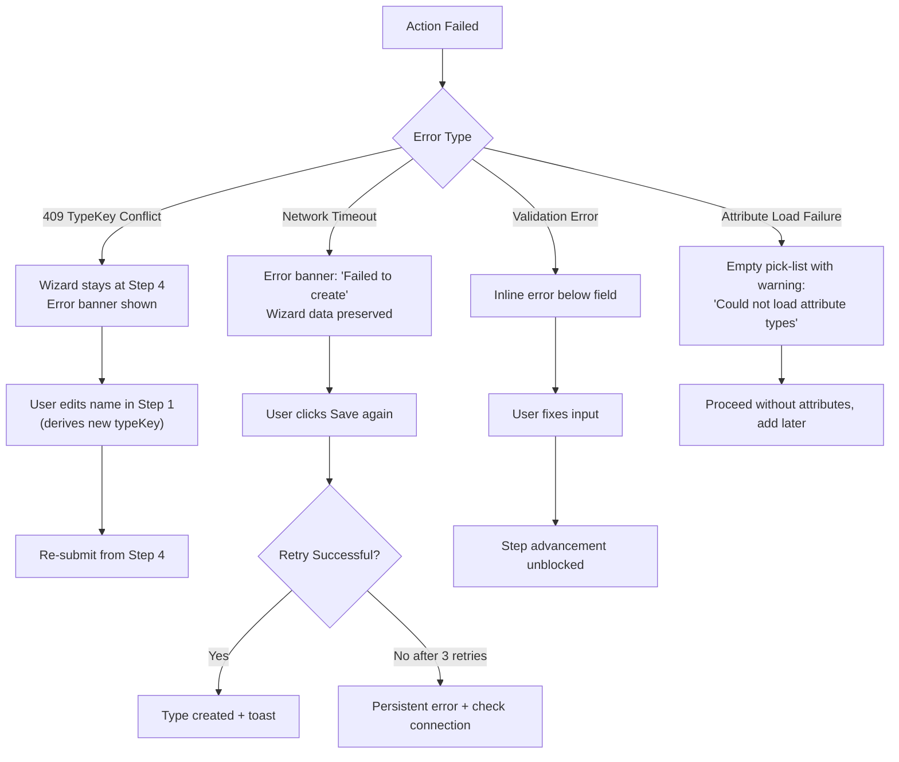
```mermaid
flowchart TD
    A[Action Failed] --> B{Error Type}
    B -->|409 TypeKey Conflict| C["Wizard stays at Step 4<br/>Error banner shown"]
    C --> D["User edits name in Step 1<br/>(derives new typeKey)"]
    D --> E[Re-submit from Step 4]
    B -->|Network Timeout| F["Error banner: 'Failed to create'<br/>Wizard data preserved"]
    F --> G[User clicks Save again]
    G --> H{Retry Successful?}
    H -->|Yes| I[Type created + toast]
    H -->|No after 3 retries| J[Persistent error + check connection]
    B -->|Validation Error| K[Inline error below field]
    K --> L[User fixes input]
    L --> M[Step advancement unblocked]
    B -->|Attribute Load Failure| N["Empty pick-list with warning:<br/>'Could not load attribute types'"]
    N --> O[Proceed without attributes, add later]
```

#### Confirmation Dialogs

| Action | Dialog Title | Dialog Body | Buttons | Consequence | Status |
|--------|-------------|-------------|---------|-------------|--------|
| Cancel wizard (with data) | "Discard Draft?" | "You have unsaved information in this wizard. All entered data will be lost. Discard?" | "Discard" (danger), "Continue Editing" (secondary) | Wizard closes, all draft data lost | [IMPLEMENTED] -- handled by `closeWizard()` |
| Publish release | "Publish Definition Release" | "Publishing this release will notify all child tenant admins. They will see the release in their Release Management dashboard. Proceed?" | "Publish" (primary), "Save as Draft" (secondary), "Cancel" (text) | Release record created; notifications sent | [PLANNED] |

---

### Journey 2.2: Modify Existing Object Type and Release Changes

**Journey ID:** JRN-DEFMGMT-004
**Persona:** PER-UX-002 (Nicole)
**Trigger:** Business requirement to add a new mandatory attribute to an existing object type
**Modules Involved:** definition-service, notification-service
**Status:** [IN-PROGRESS] -- Attribute add/link implemented; maturity class, governance tab, and release authoring [PLANNED]

**Preconditions:**
- Nicole is authenticated as `SUPER_ADMIN` (Architect) in the master tenant
- Object type "Server" exists with state "default", status "active", 8 attributes, 3 connections
- "Server" is mandated (`isMasterMandate = true`) and inherited by 3 child tenants
- Maturity schema is configured on "Server"

**Goal:** Add a new mandatory attribute "Firmware Version" to the "Server" type, set its maturity class to Mandatory, then create and publish a release so child tenants adopt the change.

**Estimated Duration:** 5-8 minutes

#### Happy Path

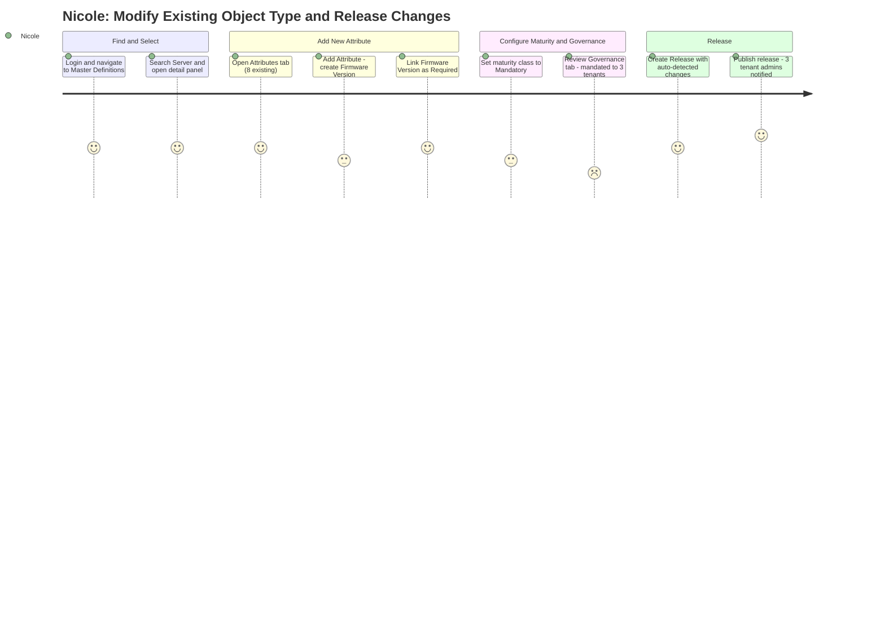
```mermaid
journey
    title Nicole: Modify Existing Object Type and Release Changes
    section Find and Select
      Login and navigate to Master Definitions: 4: Nicole
      Search Server and open detail panel: 4: Nicole
    section Add New Attribute
      Open Attributes tab (8 existing): 4: Nicole
      Add Attribute - create Firmware Version: 3: Nicole
      Link Firmware Version as Required: 4: Nicole
    section Configure Maturity and Governance
      Set maturity class to Mandatory: 3: Nicole
      Review Governance tab - mandated to 3 tenants: 2: Nicole
    section Release
      Create Release with auto-detected changes: 4: Nicole
      Publish release - 3 tenant admins notified: 5: Nicole
```

**UI Requirements (Screen Touchpoints):**

| Screen | ID | Key Components | Journey Sections | Status |
|--------|----|----------------|-----------------|--------|
| Keycloak Login | SCR-AUTH | Keycloak login form | (Prerequisites) | [IMPLEMENTED] |
| Object Type List/Grid View | SCR-01 | Custom list (`role="listbox"`), `pInputText` (search), `p-tag` (status/state), detail panel header | Find and Select | [IMPLEMENTED] |
| Object Type Configuration - Attributes Tab | SCR-02-T2 | Attribute list, `p-button` (Add), `p-dialog` (Add Attribute + Create Attribute Type), `p-select` (maturity class), `p-tag` (data type, state) | Add New Attribute, Configure Maturity and Governance | [IN-PROGRESS] -- attribute add/link implemented; maturity class [PLANNED] |
| Object Type Configuration - Governance Tab | SCR-02-T4 | `p-toggleswitch` (Master Mandate), `p-select` (override policy), tenant list display | Configure Maturity and Governance | [PLANNED] |
| Release Authoring Dialog | -- | `p-dialog`, auto-detected change list, `p-button` (Publish / Save as Draft / Cancel) | Release | [PLANNED] |
| Toast Notification | -- | `p-toast` (success: attribute added, release published) | Add New Attribute, Release | [PLANNED] |
| Notification Dropdown | SCR-NOTIF | In-app notification to 3 tenant admins | Release | [PLANNED] |

**Screen Flow:**

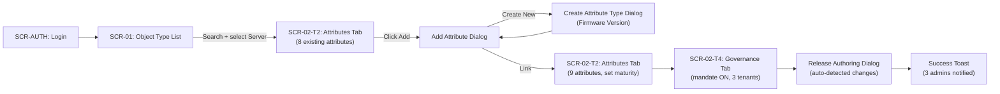
```mermaid
graph LR
    SCR_AUTH[SCR-AUTH: Login] --> SCR_01[SCR-01: Object Type List]
    SCR_01 -->|Search + select Server| SCR_02_T2["SCR-02-T2: Attributes Tab<br/>(8 existing attributes)"]
    SCR_02_T2 -->|Click Add| ADD_DLG["Add Attribute Dialog"]
    ADD_DLG -->|Create New| CREATE_DLG["Create Attribute Type Dialog<br/>(Firmware Version)"]
    CREATE_DLG --> ADD_DLG
    ADD_DLG -->|Link| SCR_02_T2_UPD["SCR-02-T2: Attributes Tab<br/>(9 attributes, set maturity)"]
    SCR_02_T2_UPD --> SCR_02_T4["SCR-02-T4: Governance Tab<br/>(mandate ON, 3 tenants)"]
    SCR_02_T4 --> REL_DLG["Release Authoring Dialog<br/>(auto-detected changes)"]
    REL_DLG --> TOAST["Success Toast<br/>(3 admins notified)"]
```

**Step reference:**

| Step | Action | Screen / Component | Status |
|------|--------|--------------------|--------|
| 1 | Auth + Nav → list loads | Screen 1 | [IMPLEMENTED] |
| 2 | Search "server" → select → detail panel (8 attrs, 3 conns, 247 instances) | Detail Panel | [IMPLEMENTED] |
| 3 | Attributes tab active → 8 attributes listed | Tab 2 | [IMPLEMENTED] |
| 4-6 | "Add" → "Create New Attribute Type" → fill Firmware Version → save | Add Attribute + Create Attr Type Dialogs | [IMPLEMENTED] |
| 7 | Select "Firmware Version" + Required → link → 9 attributes | Tab 2 updated | [IMPLEMENTED] |
| 8 | Set maturity class to "Mandatory" via p-select dropdown | Tab 2: Maturity column | [PLANNED] |
| 9 | State transitions from "Default" to "Customized" (BR-006) | Detail header state tag | [IMPLEMENTED] |
| 10 | Governance tab: mandate ON, override "Additive Only", 3 child tenants | Tab 4: Governance | [PLANNED] |
| 11-12 | "Create Release" → auto-detected changes → publish → notifications sent | Release Dialog → Toast | [PLANNED] |

**Omnichannel Map:**

| Phase | Web Desktop | Web Tablet | Web Mobile | Email | In-App Notif | API | AI Asst |
|-------|:-:|:-:|:-:|:-:|:-:|:-:|:-:|
| Find and Select | P | S | S | -- | -- | -- | -- |
| Add New Attribute | P | S | -- | -- | -- | -- | -- |
| Configure Maturity and Governance | P | S | -- | -- | -- | -- | -- |
| Release | P | S | -- | -- | S | -- | -- |

**Service Blueprint:**

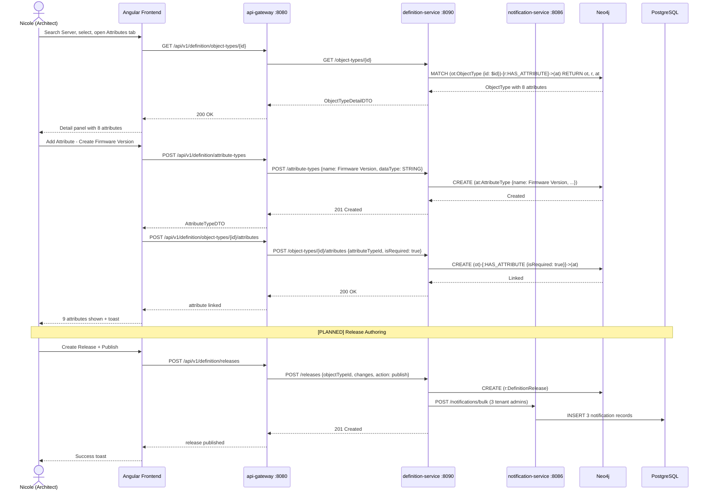
```mermaid
sequenceDiagram
    actor Nicole as Nicole (Architect)
    participant UI as Angular Frontend
    participant GW as api-gateway :8080
    participant DS as definition-service :8090
    participant NS as notification-service :8086
    participant N4J as Neo4j
    participant PG as PostgreSQL

    Nicole->>UI: Search Server, select, open Attributes tab
    UI->>GW: GET /api/v1/definition/object-types/{id}
    GW->>DS: GET /object-types/{id}
    DS->>N4J: MATCH (ot:ObjectType {id: $id})-[r:HAS_ATTRIBUTE]->(at) RETURN ot, r, at
    N4J-->>DS: ObjectType with 8 attributes
    DS-->>GW: ObjectTypeDetailDTO
    GW-->>UI: 200 OK
    UI-->>Nicole: Detail panel with 8 attributes

    Nicole->>UI: Add Attribute - Create Firmware Version
    UI->>GW: POST /api/v1/definition/attribute-types
    GW->>DS: POST /attribute-types {name: Firmware Version, dataType: STRING}
    DS->>N4J: CREATE (at:AttributeType {name: Firmware Version, ...})
    N4J-->>DS: Created
    DS-->>GW: 201 Created
    GW-->>UI: AttributeTypeDTO

    UI->>GW: POST /api/v1/definition/object-types/{id}/attributes
    GW->>DS: POST /object-types/{id}/attributes {attributeTypeId, isRequired: true}
    DS->>N4J: CREATE (ot)-[:HAS_ATTRIBUTE {isRequired: true}]->(at)
    N4J-->>DS: Linked
    DS-->>GW: 200 OK
    GW-->>UI: attribute linked
    UI-->>Nicole: 9 attributes shown + toast

    Note over Nicole,PG: [PLANNED] Release Authoring
    Nicole->>UI: Create Release + Publish
    UI->>GW: POST /api/v1/definition/releases
    GW->>DS: POST /releases {objectTypeId, changes, action: publish}
    DS->>N4J: CREATE (r:DefinitionRelease)
    DS->>NS: POST /notifications/bulk (3 tenant admins)
    NS->>PG: INSERT 3 notification records
    DS-->>GW: 201 Created
    GW-->>UI: release published
    UI-->>Nicole: Success toast
```

**Services Involved per Phase:**

| Phase | api-gateway | auth-facade | definition-svc | tenant-svc | notification-svc | audit-svc | ai-svc |
|-------|:-:|:-:|:-:|:-:|:-:|:-:|:-:|
| Find and Select | Y | Y | Y | -- | -- | -- | -- |
| Add New Attribute | Y | -- | Y | -- | -- | -- | -- |
| Configure Maturity and Governance | Y | -- | Y | -- | -- | -- | -- |
| Release | Y | -- | Y | -- | Y | -- | -- |

#### Phase Details

##### Phase 1: Find and Select

| Swim Lane | Details |
|-----------|---------|
| **Actions** | 1. Logs in and navigates to Master Definitions (P1-P3, N1-N3). 2. Searches for "Server" and selects it to open the detail panel. |
| **Touchpoints** | Keycloak login, sidebar navigation, SCR-01 search input, object type list, detail panel header |
| **User Thoughts** | "I need to add Firmware Version to the Server type -- business requested it last week." "Server is easy to find since it is one of our core types." |
| **Emotional State** | Purposeful |
| **Emotional Score** | 4 |
| **Pain Points** | No recently-edited types section; must search even for frequently modified types |
| **Opportunities** | "Recently Modified" section at the top of the list; pin frequently accessed types; breadcrumb trail for navigation context |
| **Screen / Component** | SCR-AUTH [IMPLEMENTED], SCR-01 (Object Type List with search) [IMPLEMENTED], SCR-02-T1 (Detail Panel) [IMPLEMENTED] |
| **Status** | [IMPLEMENTED] |

##### Phase 2: Add New Attribute

| Swim Lane | Details |
|-----------|---------|
| **Actions** | 1. Opens the Attributes tab (8 existing attributes). 2. Clicks "Add" to open Add Attribute dialog. 3. Creates "Firmware Version" as a new attribute type (STRING). 4. Links Firmware Version as Required. |
| **Touchpoints** | SCR-02-T2 (Attributes Tab), Add Attribute Dialog (`p-dialog`), Create Attribute Type Dialog (`p-dialog`), `p-checkbox` (isRequired) |
| **User Thoughts** | "Eight attributes already -- I need to make sure Firmware Version does not duplicate anything existing." "Good, the create-and-link flow is smooth -- I did not have to leave the dialog." |
| **Emotional State** | Productive |
| **Emotional Score** | 4 |
| **Pain Points** | No duplicate detection within the add dialog; must visually check the existing list before adding |
| **Opportunities** | Inline duplicate warning when creating an attribute with a similar name; auto-suggest existing attributes that match the search term |
| **Screen / Component** | SCR-02-T2 (Attributes Tab) [IMPLEMENTED], Add Attribute Dialog [IMPLEMENTED], Create Attribute Type Dialog [IMPLEMENTED] |
| **Status** | [IMPLEMENTED] |

##### Phase 3: Configure Maturity and Governance

| Swim Lane | Details |
|-----------|---------|
| **Actions** | 1. Sets the maturity class of Firmware Version to "Mandatory" via dropdown. 2. Reviews the Governance tab -- confirms mandate is ON for 3 child tenants. |
| **Touchpoints** | SCR-02-T2 maturity class dropdown (`p-select`), SCR-02-T4 (Governance Tab): mandate toggle, override policy, tenant list |
| **User Thoughts** | "Setting this to Mandatory means all child tenants must adopt it -- I need to be sure." "Three tenants will be impacted. I wonder how many instances will need updating." |
| **Emotional State** | Cautious |
| **Emotional Score** | 2 |
| **Pain Points** | Maturity class and governance tab not yet implemented; no preview of downstream impact before committing; anxiety about breaking child tenants |
| **Opportunities** | Impact preview: "Setting this to Mandatory will require 3 child tenants to adopt this attribute across ~500 instances"; dry-run simulation before publishing |
| **Screen / Component** | SCR-02-T2 (Attributes Tab, maturity class column) [PLANNED], SCR-02-T4 (Governance Tab) [PLANNED] |
| **Status** | [PLANNED] |

##### Phase 4: Release

| Swim Lane | Details |
|-----------|---------|
| **Actions** | 1. Creates a release with auto-detected changes (+1 Mandatory attribute). 2. Publishes the release -- 3 tenant admins are notified via in-app notification. |
| **Touchpoints** | "Create Release" button, Release Authoring Dialog (`p-dialog`), auto-detected change list, "Publish" button, success toast, notification-service |
| **User Thoughts** | "The auto-detected changes look correct -- just the one new mandatory attribute." "Published -- now it is up to the tenant admins to adopt. I will follow up next week." |
| **Emotional State** | Accomplished |
| **Emotional Score** | 5 |
| **Pain Points** | Release authoring dialog does not exist; no auto-change detection; uncertain whether tenant admins will see the notification promptly |
| **Opportunities** | Auto-change detection with diff summary; notification priority levels (Mandatory changes flagged as urgent); adoption deadline setting |
| **Screen / Component** | Release Authoring Dialog [PLANNED], SCR-NOTIF (Notification Dropdown) [PLANNED] |
| **Status** | [PLANNED] |

**Error Recovery Flow:**

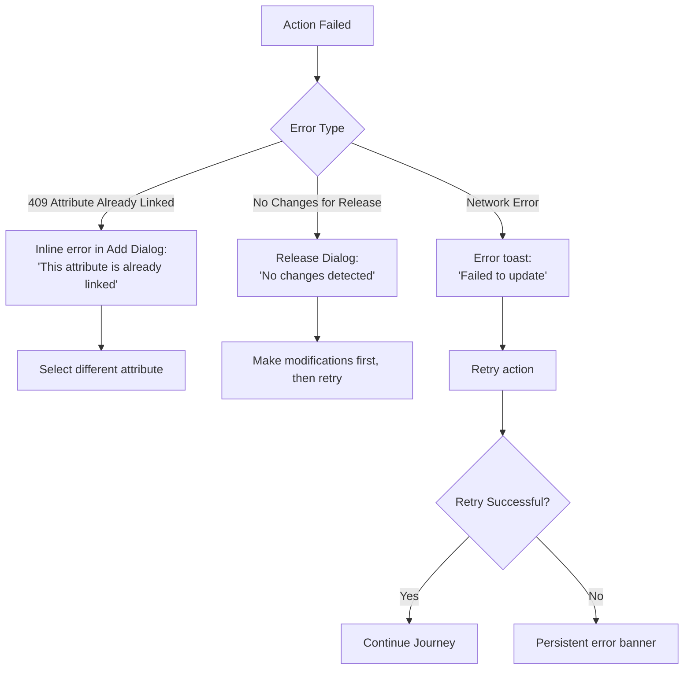
```mermaid
flowchart TD
    A[Action Failed] --> B{Error Type}
    B -->|409 Attribute Already Linked| C["Inline error in Add Dialog:<br/>'This attribute is already linked'"]
    C --> D[Select different attribute]
    B -->|No Changes for Release| E["Release Dialog:<br/>'No changes detected'"]
    E --> F[Make modifications first, then retry]
    B -->|Network Error| G["Error toast:<br/>'Failed to update'"]
    G --> H[Retry action]
    H --> I{Retry Successful?}
    I -->|Yes| J[Continue Journey]
    I -->|No| K[Persistent error banner]
```

#### Edge Cases

| Edge Case | Trigger | System Behavior | Screen / Component | Status |
|-----------|---------|-----------------|-------------------|--------|
| Attribute already linked | User tries to add "Owner" which is already linked | API returns 409 Conflict: "This attribute is already linked to this object type." Dialog shows inline error. | Add Attribute Dialog error | [IMPLEMENTED] |
| Remove mandated attribute in child tenant | Attempted by child tenant user on a locked attribute | Remove button disabled; tooltip: "This attribute is mandated by the master tenant and cannot be removed." | Attribute row: locked remove button | [PLANNED] -- lock indicators planned |
| No changes detected when creating release | User clicks Create Release but no changes since last release | Dialog shows: "No changes detected since the last release. Make modifications first." Publish button disabled. | Release Authoring Dialog | [PLANNED] |

---

### Journey 2.3: Manage Attributes

**Journey ID:** JRN-DEFMGMT-005
**Persona:** PER-UX-002 (Nicole)
**Trigger:** Need to create new reusable attribute types, manage lifecycle status, and perform bulk attribute operations
**Modules Involved:** definition-service
**Status:** [IN-PROGRESS] -- Attribute add/link implemented; lifecycle toggle, bulk operations, language-dependent flag [PLANNED]

**Preconditions:**
- Nicole is authenticated as `SUPER_ADMIN` (Architect) in the master tenant
- "Server" object type exists with 9 attributes linked
- Attribute types exist in the tenant library

**Goal:** Create a new reusable attribute type, configure its locale-dependent flag, manage attribute lifecycle transitions (planned to active to retired per AP-5), and perform bulk lifecycle operations.

> **Architectural Principle Reference (AP-5: Lifecycle State Machines):** This journey implements the three-state attribute lifecycle defined in the PRD Section 7.3. Attributes transition through `planned` (initial, not visible in forms) to `active` (visible, contributes to maturity) to `retired` (hidden from forms, data preserved). The three-state model replaces the earlier binary Active/Inactive toggle, providing a "planned" staging state and ensuring zero data loss on retirement. See also: Section 15.3 (Attribute Lifecycle State Machine diagram).

**Estimated Duration:** 5-10 minutes

#### Happy Path

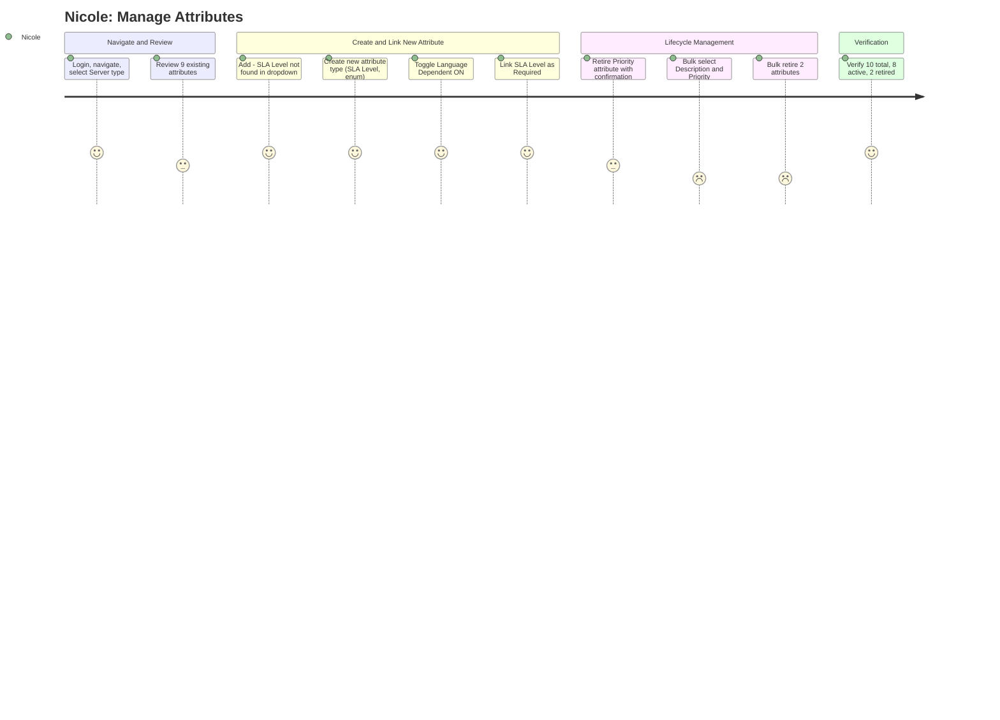
```mermaid
journey
    title Nicole: Manage Attributes
    section Navigate and Review
      Login, navigate, select Server type: 4: Nicole
      Review 9 existing attributes: 3: Nicole
    section Create and Link New Attribute
      Add - SLA Level not found in dropdown: 4: Nicole
      Create new attribute type (SLA Level, enum): 4: Nicole
      Toggle Language Dependent ON: 4: Nicole
      Link SLA Level as Required: 4: Nicole
    section Lifecycle Management
      Retire Priority attribute with confirmation: 3: Nicole
      Bulk select Description and Priority: 2: Nicole
      Bulk retire 2 attributes: 2: Nicole
    section Verification
      Verify 10 total, 8 active, 2 retired: 4: Nicole
```

**UI Requirements (Screen Touchpoints):**

| Screen | ID | Key Components | Journey Sections | Status |
|--------|----|----------------|-----------------|--------|
| Keycloak Login | SCR-AUTH | Keycloak login form | (Prerequisites) | [IMPLEMENTED] |
| Object Type List/Grid View | SCR-01 | Custom list (`role="listbox"`), `pInputText` (search), `p-tag` (status/state) | Navigate and Review | [IMPLEMENTED] |
| Object Type Configuration - Attributes Tab | SCR-02-T2 | Attribute list, `p-button` (Add), `p-select` (attribute type dropdown), `p-checkbox` (isRequired, Language Dependent), `p-tag` (data type, lifecycle status chip: planned=info/blue, active=success/green, retired=warn/orange), lifecycle action buttons (Activate, Retire, Reactivate), bulk action toolbar | Navigate and Review, Create and Link New Attribute, Lifecycle Management, Verification | [IN-PROGRESS] -- attribute list and add implemented; lifecycle transitions, bulk actions, language-dependent flag [PLANNED] |
| Add Attribute Dialog | SCR-02-T2 (overlay) | `p-dialog`, `p-select` (attribute type), `p-checkbox` (isRequired) | Create and Link New Attribute | [IMPLEMENTED] |
| Create Attribute Type Dialog | SCR-02-T2 (overlay) | `p-dialog`, `pInputText` (name, key), `p-select` (data type, group), `p-checkbox` (Language Dependent) | Create and Link New Attribute | [IMPLEMENTED] / [PLANNED] (Language Dependent flag) |
| Confirmation Dialog | -- | `p-dialog`, `p-button` (Retire / Cancel) for retire action; `p-button` (Reactivate / Cancel) for reactivate action | Lifecycle Management | [PLANNED] |
| Toast Notification | -- | `p-toast` (DEF-S-013: attribute retired, DEF-S-014: attribute reactivated) | Lifecycle Management | [PLANNED] |

**Screen Flow:**

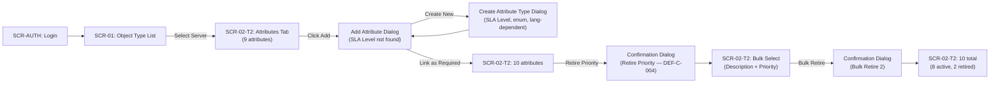
```mermaid
graph LR
    SCR_AUTH[SCR-AUTH: Login] --> SCR_01[SCR-01: Object Type List]
    SCR_01 -->|Select Server| SCR_02_T2["SCR-02-T2: Attributes Tab<br/>(9 attributes)"]
    SCR_02_T2 -->|Click Add| ADD_DLG["Add Attribute Dialog<br/>(SLA Level not found)"]
    ADD_DLG -->|Create New| CREATE_DLG["Create Attribute Type Dialog<br/>(SLA Level, enum, lang-dependent)"]
    CREATE_DLG --> ADD_DLG
    ADD_DLG -->|Link as Required| SCR_02_T2_10["SCR-02-T2: 10 attributes"]
    SCR_02_T2_10 -->|Retire Priority| CONFIRM_1["Confirmation Dialog<br/>(Retire Priority — DEF-C-004)"]
    CONFIRM_1 --> SCR_02_T2_BULK["SCR-02-T2: Bulk Select<br/>(Description + Priority)"]
    SCR_02_T2_BULK -->|Bulk Retire| CONFIRM_2["Confirmation Dialog<br/>(Bulk Retire 2)"]
    CONFIRM_2 --> SCR_02_T2_FINAL["SCR-02-T2: 10 total<br/>(8 active, 2 retired)"]
```

**Step reference:**

| Step | Action | Screen / Component | Status |
|------|--------|--------------------|--------|
| 1 | Auth + Nav → select Server → Attributes tab (9 attrs) | Detail Panel > Tab 2 | [IMPLEMENTED] |
| 2-3 | "Add" → SLA Level not in dropdown → "Create New Attribute Type" | Add Attribute + Create Attr Type Dialogs | [IMPLEMENTED] |
| 4-5 | Fill SLA Level (enum, Service Management) + Language Dependent ON | Create Attribute Type Dialog | [IMPLEMENTED] / [PLANNED] (lang flag) |
| 6-7 | Save → link SLA Level as Required → 10 attributes | Tab 2 updated | [IMPLEMENTED] |
| 8-9 | Retire Priority (active to retired) → confirmation (DEF-C-004) → retired chip (warn/orange) + toast (DEF-S-013) | Confirmation → Tab 2 | [PLANNED] |
| 10-12 | Bulk select 2 attrs → "Retire" → confirmation → 2 rows show retired chip | Bulk toolbar → Confirmation | [PLANNED] |
| 13 | Verify: 10 total, 8 active (success/green chip), 2 retired (warn/orange chip) with visual distinction | Tab 2: mixed list | [PLANNED] |

**Omnichannel Map:**

| Phase | Web Desktop | Web Tablet | Web Mobile | Email | In-App Notif | API | AI Asst |
|-------|:-:|:-:|:-:|:-:|:-:|:-:|:-:|
| Navigate and Review | P | S | S | -- | -- | -- | -- |
| Create and Link New Attribute | P | S | -- | -- | -- | -- | -- |
| Lifecycle Management | P | S | -- | -- | -- | -- | -- |
| Verification | P | S | S | -- | -- | -- | -- |

**Service Blueprint:**

```mermaid
sequenceDiagram
    actor Nicole as Nicole (Architect)
    participant UI as Angular Frontend
    participant GW as api-gateway :8080
    participant DS as definition-service :8090
    participant N4J as Neo4j

    Nicole->>UI: Select Server, open Attributes tab
    UI->>GW: GET /api/v1/definition/object-types/{id}
    GW->>DS: GET /object-types/{id}
    DS->>N4J: MATCH (ot)-[:HAS_ATTRIBUTE]->(at) RETURN ot, at
    N4J-->>DS: 9 attributes
    DS-->>GW: ObjectTypeDetailDTO
    GW-->>UI: 200 OK
    UI-->>Nicole: 9 attributes listed

    Nicole->>UI: Add - SLA Level not in dropdown - Create New
    UI->>GW: POST /api/v1/definition/attribute-types
    GW->>DS: POST /attribute-types {name: SLA Level, dataType: ENUM, languageDependent: true}
    DS->>N4J: CREATE (at:AttributeType {name: SLA Level, ...})
    N4J-->>DS: Created
    DS-->>GW: 201 Created
    GW-->>UI: AttributeTypeDTO

    UI->>GW: POST /api/v1/definition/object-types/{id}/attributes
    GW->>DS: POST /object-types/{id}/attributes {attributeTypeId, isRequired: true}
    DS->>N4J: CREATE (ot)-[:HAS_ATTRIBUTE]->(at)
    N4J-->>DS: Linked
    DS-->>GW: 200 OK
    GW-->>UI: 10 attributes

    Note over Nicole,N4J: [PLANNED] Lifecycle Transitions and Bulk Operations (AP-5: planned→active→retired)
    Nicole->>UI: Retire Priority (active → retired)
    UI->>GW: PATCH /api/v1/definition/object-types/{id}/attributes/{attrId}
    GW->>DS: PATCH /object-types/{id}/attributes/{attrId} {lifecycleStatus: retired}
    DS->>N4J: SET relationship.lifecycleStatus = 'retired'
    DS-->>GW: 200 OK
    GW-->>UI: attribute retired (DEF-S-013)
    UI-->>Nicole: Retired chip (warn/orange) + toast

    Nicole->>UI: Bulk select 2, Retire
    UI->>GW: PATCH /api/v1/definition/object-types/{id}/attributes/bulk
    GW->>DS: PATCH /object-types/{id}/attributes/bulk {ids, lifecycleStatus: retired}
    DS->>N4J: SET relationships.lifecycleStatus = 'retired' (batch)
    DS-->>GW: 200 OK
    GW-->>UI: 2 attributes retired
    UI-->>Nicole: 8 active + 2 retired
```

**Services Involved per Phase:**

| Phase | api-gateway | auth-facade | definition-svc | tenant-svc | notification-svc | audit-svc | ai-svc |
|-------|:-:|:-:|:-:|:-:|:-:|:-:|:-:|
| Navigate and Review | Y | Y | Y | -- | -- | -- | -- |
| Create and Link New Attribute | Y | -- | Y | -- | -- | -- | -- |
| Lifecycle Management | Y | -- | Y | -- | -- | -- | -- |
| Verification | Y | -- | Y | -- | -- | -- | -- |

#### Phase Details

##### Phase 1: Navigate and Review

| Swim Lane | Details |
|-----------|---------|
| **Actions** | 1. Logs in and navigates to Master Definitions. 2. Selects the "Server" object type and reviews its 9 existing attributes in the Attributes tab. |
| **Touchpoints** | Keycloak login, sidebar navigation, SCR-01 (Object Type List), SCR-02-T2 (Attributes Tab) |
| **User Thoughts** | "Nine attributes on Server -- I need to add SLA Level and then retire some unused ones." "Let me check what data types are already linked before creating a new attribute." |
| **Emotional State** | Organized |
| **Emotional Score** | 4 |
| **Pain Points** | Attribute list is flat with no grouping by category; hard to assess coverage at a glance |
| **Opportunities** | Group attributes by category (Physical, Network, Management); visual coverage indicator showing which categories have attributes |
| **Screen / Component** | SCR-AUTH [IMPLEMENTED], SCR-01 [IMPLEMENTED], SCR-02-T2 (Attributes Tab) [IMPLEMENTED] |
| **Status** | [IMPLEMENTED] |

##### Phase 2: Create and Link New Attribute

| Swim Lane | Details |
|-----------|---------|
| **Actions** | 1. Clicks "Add" -- SLA Level not found in the dropdown. 2. Clicks "Create New Attribute Type" -- fills in SLA Level (enum, Service Management group). 3. Toggles "Language Dependent" ON. 4. Saves and links SLA Level as Required -- now 10 attributes. |
| **Touchpoints** | Add Attribute Dialog (`p-dialog`), attribute type dropdown (`p-select`), Create Attribute Type Dialog (`p-dialog`), Language Dependent checkbox (`p-checkbox`) |
| **User Thoughts** | "SLA Level is not in the library yet -- I need to create it first." "Setting Language Dependent ON makes sense since SLA descriptions need localization." "Good, the create-then-link flow worked without leaving the context." |
| **Emotional State** | Productive |
| **Emotional Score** | 4 |
| **Pain Points** | Language Dependent flag not yet implemented; no preview of how enum values will be entered; two-step create-then-link could be combined |
| **Opportunities** | Single-step "Create and Link" action; inline enum value editor during creation; language dependency preview showing which locales need translation |
| **Screen / Component** | Add Attribute Dialog [IMPLEMENTED], Create Attribute Type Dialog [IMPLEMENTED] / Language Dependent flag [PLANNED] |
| **Status** | [IN-PROGRESS] -- Create and link implemented; Language Dependent flag planned |

##### Phase 3: Lifecycle Management

| Swim Lane | Details |
|-----------|---------|
| **Actions** | 1. Retires "Priority" attribute (active to retired) with a confirmation dialog (DEF-C-004). 2. Uses bulk select to choose "Description" and "Priority". 3. Performs bulk retirement of the 2 selected attributes with confirmation. |
| **Touchpoints** | Lifecycle action button ("Retire"), Confirmation Dialog (`p-dialog` -- DEF-C-004: "Retire attribute '{name}'? Existing data will be preserved but hidden from forms."), bulk selection checkboxes, bulk action toolbar, bulk retire confirmation |
| **User Thoughts** | "I am nervous about retiring attributes -- what if something breaks downstream?" "Bulk operations save time but I need to be extra careful." "Data is preserved and I can reactivate later -- that gives me some confidence." |
| **Emotional State** | Anxious |
| **Emotional Score** | 2 |
| **Pain Points** | No lifecycle transitions or bulk operations exist yet; no preview of affected instances before retirement; anxiety about downstream impact of retiring attributes |
| **Opportunities** | Preview: "Retiring 'Priority' will hide it from 247 instances -- data is preserved but invisible on forms"; reactivation path (retired to active via DEF-C-005) reduces anxiety; lifecycle status chips (planned=info/blue, active=success/green, retired=warn/orange) provide clear visual feedback |
| **Screen / Component** | SCR-02-T2 (Attributes Tab, lifecycle action buttons + bulk toolbar) [PLANNED], Confirmation Dialog [PLANNED] |
| **Status** | [PLANNED] |

##### Phase 4: Verification

| Swim Lane | Details |
|-----------|---------|
| **Actions** | 1. Verifies the attribute list shows 10 total: 8 active (success/green chip), 2 retired (warn/orange chip). 2. Confirms the visual distinction between active and retired attributes via lifecycle status chips. |
| **Touchpoints** | SCR-02-T2 (Attributes Tab): lifecycle status chips (`p-tag` -- planned=info/blue, active=success/green, retired=warn/orange), count summary |
| **User Thoughts** | "Good -- 8 active (green) and 2 retired (orange). The lifecycle chips make it easy to distinguish." "I can reactivate them later if needed via the retired-to-active transition." |
| **Emotional State** | Satisfied |
| **Emotional Score** | 4 |
| **Pain Points** | No count summary showing lifecycle status breakdown; lifecycle status chips not yet implemented |
| **Opportunities** | Status filter: show All / Planned / Active / Retired; count badges in filter: "Active (8) | Retired (2)"; inline "Reactivate" action button on retired rows |
| **Screen / Component** | SCR-02-T2 (Attributes Tab with lifecycle status chips) [PLANNED] |
| **Status** | [PLANNED] |

**Error Recovery Flow:**

```mermaid
flowchart TD
    A[Action Failed] --> B{Error Type}
    B -->|Retire Mandatory Attr| C["Error toast:<br/>'Cannot retire a mandatory attribute'"]
    C --> D[Lifecycle stays at Active]
    D --> E[Change maturity class first]
    B -->|409 Duplicate Key| F["Inline error in Create Dialog:<br/>'Attribute key already exists'"]
    F --> G[Edit key to unique value]
    B -->|Bulk Retire Includes Mandatory| H["Warning in bulk toolbar:<br/>'2 of 10 are Mandatory and cannot be retired, only 8 affected'"]
    H --> I[Proceed with partial bulk operation]
    B -->|Network Error| J[Error toast + retry]
    J --> K{Retry Successful?}
    K -->|Yes| L[Continue Journey]
    K -->|No| M[Persistent error]
```

#### Edge Cases

| Edge Case | Trigger | System Behavior | Screen / Component | Status |
|-----------|---------|-----------------|-------------------|--------|
| Retire a Mandatory maturity attribute | User clicks Retire on a Mandatory attribute | Error: "Cannot retire a mandatory attribute. Change its maturity class to Conditional or Optional first." Lifecycle stays at active. | Tab 2: Error toast + lifecycle unchanged | [PLANNED] |
| Retire a mandated attribute (child tenant) | Tenant Admin clicks Retire on a master-mandated attribute | Retire button is disabled; tooltip: "This attribute is mandated by the master tenant and cannot be retired." | Tab 2: Disabled Retire button with tooltip | [PLANNED] |
| Create attribute type with duplicate key | User enters "sla_level" key but one already exists in tenant | API returns 409; error inline: "Attribute key 'sla_level' already exists. Use a different key." Save button disabled. | Create Attribute Type Dialog: inline error | [PLANNED] -- currently no duplicate check on key |
| Bulk select all then retire | User selects all attributes including Mandatory ones | Bulk "Retire" button shows warning: "2 of 10 selected attributes are Mandatory and cannot be retired. Only 8 will be affected." | Bulk action toolbar warning | [PLANNED] |
| Reactivate a retired attribute | User clicks Reactivate on a retired attribute | Confirmation dialog (DEF-C-005): "Reactivate attribute '{name}'? It will become visible on all instance forms." On confirm: lifecycle transitions from retired to active; toast DEF-S-014. | Confirmation Dialog + Tab 2: active chip restored | [PLANNED] |

---

## 6. Persona 3: Tenant Admin (Fiona Shaw) [PER-UX-003] Journeys

### Journey 3.1: Process Master Tenant Release

**Journey ID:** JRN-DEFMGMT-006
**Persona:** PER-UX-003 (Fiona)
**Trigger:** In-app notification received about a new release from the master tenant
**Modules Involved:** definition-service, notification-service, audit-service
**Status:** [PLANNED]

**Preconditions:**
- Fiona is authenticated as `SUPER_ADMIN` (or Tenant Admin role) in child tenant "Agency-B"
- Master tenant published a release for "Server" type: +1 mandatory attribute ("Firmware Version"), maturity class = Mandatory
- Fiona received an in-app notification
- Agency-B currently has 3 local customizations on "Server": 2 extra local attributes, 1 modified description

**Goal:** Review the incoming release, run impact assessment to understand what changes, perform safe-pull merge while preserving local customizations, and verify the result.

**Estimated Duration:** 10-15 minutes

#### Happy Path

**Note:** This entire journey is [PLANNED]. Release Management Dashboard (Screen 4) does not exist in code today.

```mermaid
journey
    title Fiona: Process Master Tenant Release
    section Notification
      Receive release notification - Server v2: 3: Fiona
      Navigate to Release Management Dashboard: 3: Fiona
    section Review Release
      Read release notes (Firmware Version added): 3: Fiona
      Run Impact Assessment: 2: Fiona
      Review results - no conflicts, 183 instances affected: 2: Fiona
      Review side-by-side diff (10 attrs to 11): 3: Fiona
    section Accept and Merge
      Accept All with confirmation: 4: Fiona
      Safe-pull merge executes - local customizations preserved: 5: Fiona
    section Verification
      Navigate to definitions - verify Firmware Version with lock icon: 5: Fiona
      Verify local attributes preserved without lock icons: 5: Fiona
```

**UI Requirements (Screen Touchpoints):**

| Screen | ID | Key Components | Journey Sections | Status |
|--------|----|----------------|-----------------|--------|
| Keycloak Login | SCR-AUTH | Keycloak login form | (Prerequisites) | [IMPLEMENTED] |
| Notification Dropdown | SCR-NOTIF | Notification bell (header), dropdown list, release notification item with "[Review Release]" link | Notification | [PLANNED] |
| Release Management Dashboard | SCR-04 | `p-table` (release list), release detail panel, `p-tag` (Pending/Accepted/Rejected status), `p-button` (Accept All / Reject / Defer / Review Each) | Review Release, Accept and Merge | [PLANNED] |
| Impact Assessment Card | SCR-04 (overlay) | `p-table` (change items), `p-tag` (conflict indicator: green/amber/red), side-by-side diff viewer (2-column layout) | Review Release | [PLANNED] |
| Confirmation Dialog | -- | `p-dialog`, `p-button` (Accept / Cancel), bulleted change summary | Accept and Merge | [PLANNED] |
| Toast Notification | -- | `p-toast` (success: "Release accepted") | Accept and Merge | [PLANNED] |
| Object Type List/Grid View | SCR-01 | Custom list with `pi-lock` (mandated) and "Local" badge indicators, `p-tag` (inherited state) | Verification | [PLANNED] -- inherited/lock indicators not yet implemented |
| Object Type Configuration - Attributes Tab | SCR-02-T2 | Attribute list with `pi-lock` icons on mandated attributes, "Local" badge on local attributes | Verification | [PLANNED] -- lock/local indicators not yet implemented |

**Screen Flow:**

```mermaid
graph LR
    SCR_AUTH[SCR-AUTH: Login] --> NOTIF["SCR-NOTIF: Notification Bell<br/>(release notification)"]
    NOTIF --> SCR_04["SCR-04: Release Dashboard<br/>(pending releases)"]
    SCR_04 -->|Select Server v2| REL_DETAIL["Release Detail Panel<br/>(notes + diff)"]
    REL_DETAIL -->|Run Impact Assessment| IMPACT["Impact Assessment Card<br/>(0 conflicts, 183 instances)"]
    IMPACT --> CONFIRM["Confirmation Dialog<br/>(Accept Release)"]
    CONFIRM --> MERGE["Safe-Pull Merge<br/>(progress indicator)"]
    MERGE --> TOAST["Success Toast"]
    TOAST --> SCR_01["SCR-01: Object Type List<br/>(verify updated definitions)"]
    SCR_01 --> SCR_02_T2["SCR-02-T2: Attributes Tab<br/>(11 attrs: mandated + local)"]
```

**Step reference:**

| Step | Action | Screen / Component | Status |
|------|--------|--------------------|--------|
| 1 | Notification bell → "Server v2: +1 mandatory attribute (Firmware Version)" | Notification Dropdown | [PLANNED] |
| 2 | Click "[Review Release]" → Release Management Dashboard | Screen 4: Release Dashboard | [PLANNED] |
| 3-4 | Select "Server v2" (Pending) → read release notes | Release Detail Panel | [PLANNED] |
| 5-6 | "Run Impact Assessment" → +1 attr, 0 conflicts, 183 instances, green "No Conflicts" | Impact Assessment Card | [PLANNED] |
| 7 | Side-by-side diff: Current (10 attrs) vs After Safe Pull (11 attrs) | Diff Viewer | [PLANNED] |
| 8-9 | "Accept All" → confirmation → safe-pull merge → toast "Release accepted" | Confirmation → Toast | [PLANNED] |
| 10-11 | Navigate to definitions → Firmware Version with pi-lock + Mandatory badge | Screen 1 → Tab 2 | [PLANNED] |
| 12 | Verify local attrs preserved (no lock), custom description intact | Tab 1 + Tab 2 | [PLANNED] |

**Omnichannel Map:**

| Phase | Web Desktop | Web Tablet | Web Mobile | Email | In-App Notif | API | AI Asst |
|-------|:-:|:-:|:-:|:-:|:-:|:-:|:-:|
| Notification | P | S | S | S | P | -- | -- |
| Review Release | P | S | -- | -- | -- | -- | -- |
| Accept and Merge | P | S | -- | -- | -- | -- | -- |
| Verification | P | S | S | -- | -- | -- | -- |

**Service Blueprint:**

```mermaid
sequenceDiagram
    actor Fiona as Fiona (Tenant Admin)
    participant UI as Angular Frontend
    participant GW as api-gateway :8080
    participant DS as definition-service :8090
    participant NS as notification-service :8086
    participant AS as audit-service :8087
    participant N4J as Neo4j
    participant PG as PostgreSQL

    Note over Fiona,PG: [PLANNED] All release management APIs

    Fiona->>UI: Click notification bell
    UI->>GW: GET /api/v1/notifications?unread=true
    GW->>NS: GET /notifications?userId=$uid&unread=true
    NS->>PG: SELECT FROM notifications WHERE user_id = ? AND read = false
    PG-->>NS: notification rows
    NS-->>GW: List of NotificationDTO
    GW-->>UI: 200 OK (includes release notification)
    UI-->>Fiona: Notification dropdown with release item

    Fiona->>UI: Click Review Release link
    UI->>GW: GET /api/v1/definition/releases?tenantId=$tid&status=pending
    GW->>DS: GET /releases?tenantId=$tid&status=pending
    DS->>N4J: MATCH (r:DefinitionRelease)-[:FOR_TENANT]->(t:Tenant {id: $tid})
    N4J-->>DS: Release nodes
    DS-->>GW: List of ReleaseDTO
    GW-->>UI: pending releases

    Fiona->>UI: Select Server v2, Run Impact Assessment
    UI->>GW: POST /api/v1/definition/releases/{id}/impact-assessment
    GW->>DS: POST /releases/{id}/impact-assessment {tenantId}
    DS->>N4J: Compare master vs tenant definitions + count instances
    N4J-->>DS: {conflicts: 0, affectedInstances: 183}
    DS-->>GW: ImpactAssessmentDTO
    GW-->>UI: impact results
    UI-->>Fiona: No conflicts, 183 instances affected

    Fiona->>UI: Accept All + Confirm
    UI->>GW: POST /api/v1/definition/releases/{id}/adopt
    GW->>DS: POST /releases/{id}/adopt {tenantId, strategy: safe-pull}
    DS->>N4J: MERGE master changes preserving local customizations
    N4J-->>DS: Updated definition
    DS->>AS: POST /audit-log {action: release-adopted, releaseId, tenantId}
    AS->>PG: INSERT audit record
    DS->>NS: POST /notifications {to: masterArchitect, type: release-adopted}
    NS->>PG: INSERT notification
    DS-->>GW: 200 OK {status: adopted}
    GW-->>UI: adoption confirmed
    UI-->>Fiona: Success toast + navigate to verify
```

**Services Involved per Phase:**

| Phase | api-gateway | auth-facade | definition-svc | tenant-svc | notification-svc | audit-svc | ai-svc |
|-------|:-:|:-:|:-:|:-:|:-:|:-:|:-:|
| Notification | Y | -- | -- | -- | Y | -- | -- |
| Review Release | Y | -- | Y | -- | -- | -- | -- |
| Accept and Merge | Y | -- | Y | -- | Y | Y | -- |
| Verification | Y | -- | Y | -- | -- | -- | -- |

#### Phase Details

##### Phase 1: Notification

| Swim Lane | Details |
|-----------|---------|
| **Actions** | 1. Receives an in-app notification about "Server v2" release from master tenant. 2. Clicks the notification to navigate to the Release Management Dashboard. |
| **Touchpoints** | Notification bell (header), notification dropdown (SCR-NOTIF), "[Review Release]" link in notification item |
| **User Thoughts** | "A new release from master -- I need to check what changed before accepting." "I hope this does not conflict with our local customizations." |
| **Emotional State** | Cautious |
| **Emotional Score** | 3 |
| **Pain Points** | Notification system not yet implemented; no indication of release urgency or scope in the notification preview |
| **Opportunities** | Notification preview showing change summary (e.g., "+1 mandatory attribute"); urgency badge for mandatory changes; one-click navigation to release detail |
| **Screen / Component** | SCR-NOTIF (Notification Dropdown) [PLANNED] |
| **Status** | [PLANNED] |

##### Phase 2: Review Release

| Swim Lane | Details |
|-----------|---------|
| **Actions** | 1. Reads the release notes (Firmware Version added as Mandatory). 2. Runs Impact Assessment. 3. Reviews results: 0 conflicts, 183 instances affected. 4. Views the side-by-side diff (10 attrs to 11). |
| **Touchpoints** | SCR-04 (Release Management Dashboard), release detail panel, "Run Impact Assessment" button, Impact Assessment Card, side-by-side diff viewer |
| **User Thoughts** | "Firmware Version added as Mandatory -- reasonable, but 183 instances will need updating." "No conflicts with our local attributes -- that is a relief." "The diff view clearly shows what is being added versus what stays the same." |
| **Emotional State** | Analytical |
| **Emotional Score** | 2 |
| **Pain Points** | Release dashboard does not exist; impact assessment wording is technical and jargon-heavy; 183 instances sounds alarming without context about what "affected" means |
| **Opportunities** | Plain-language impact summary: "This adds a new required field to 183 Server records. Existing data is preserved."; traffic-light conflict indicators; "What this means for your data" expandable section |
| **Screen / Component** | SCR-04 (Release Management Dashboard) [PLANNED], Impact Assessment Card [PLANNED] |
| **Status** | [PLANNED] |

##### Phase 3: Accept and Merge

| Swim Lane | Details |
|-----------|---------|
| **Actions** | 1. Clicks "Accept All" with a confirmation dialog listing changes and preservation guarantees. 2. Safe-pull merge executes -- local customizations are preserved. |
| **Touchpoints** | "Accept All" button, Confirmation Dialog (`p-dialog`), progress indicator, success toast (`p-toast`) |
| **User Thoughts** | "The confirmation clearly states local customizations will be preserved -- that gives me confidence." "Merge executed successfully. Now I need to verify the result." |
| **Emotional State** | Relieved |
| **Emotional Score** | 4 |
| **Pain Points** | No merge mechanism exists; uncertain about rollback if something goes wrong; no preview of final merged state before committing |
| **Opportunities** | Preview merged state before accepting; "Undo merge" within 24-hour window; per-item accept/reject for granular control |
| **Screen / Component** | Confirmation Dialog [PLANNED], Progress Indicator [PLANNED] |
| **Status** | [PLANNED] |

##### Phase 4: Verification

| Swim Lane | Details |
|-----------|---------|
| **Actions** | 1. Navigates to definitions and verifies Firmware Version appears with lock icon (mandated). 2. Verifies local attributes are preserved without lock icons. |
| **Touchpoints** | SCR-01 (Object Type List), SCR-02-T2 (Attributes Tab): `pi-lock` icons on mandated attributes, "Local" badge on local attributes |
| **User Thoughts** | "Firmware Version is there with the lock -- it came from master as expected." "My local attributes are still intact and editable. Everything looks correct." |
| **Emotional State** | Satisfied |
| **Emotional Score** | 5 |
| **Pain Points** | Lock/local visual indicators not yet implemented; no post-merge verification checklist |
| **Opportunities** | Post-merge verification dashboard: green checkmarks for each preserved item; "Release adoption complete" summary card; audit trail entry for compliance |
| **Screen / Component** | SCR-01 (Object Type List with inherited badges) [PLANNED], SCR-02-T2 (Attributes Tab with lock/local indicators) [PLANNED] |
| **Status** | [PLANNED] |

#### Edge Cases

| Edge Case | Trigger | System Behavior | Screen / Component | Status |
|-----------|---------|-----------------|-------------------|--------|
| Conflicting local customization | Agency-B modified the same attribute that master is updating | Impact assessment shows amber "Conflict" badge; conflict detail: "Your local change to 'Status' attribute conflicts with the master release. Options: (1) Keep your version, (2) Accept master version, (3) Merge (keep both changes)." | Impact Assessment: Conflict detail with per-item resolution | [PLANNED] |
| Multiple pending releases | Master published 3 releases for different types | Release list shows 3 items; each can be processed independently; badge shows "3 pending" | Release List with count badge | [PLANNED] |
| Reject release with reason | Fiona decides to reject the release | "Reject Release" dialog: required text field "Reason for rejection" (min 20 chars); "Reject" (danger), "Cancel" (secondary). On submit: feedback sent to master tenant Architect; release status "Rejected" | Rejection Dialog | [PLANNED] |
| Defer release | Fiona wants to delay adoption | "Defer Release" dialog: optional text field "Reason for deferral"; "Defer" (secondary), "Cancel". Release status changes to "Deferred"; periodic reminders sent | Deferral Dialog | [PLANNED] |
| Impact assessment fails | Backend processing error | Error: "Failed to run impact assessment. Please try again." Retry button visible. Manual review option: "Skip assessment and review changes manually." | Error state with retry | [PLANNED] |

**Error Recovery Flow:**

```mermaid
flowchart TD
    A[Action Failed] --> B{Error Type}
    B -->|Impact Assessment Failure| C[Show Retry Button]
    C --> D{Retry Successful?}
    D -->|Yes| E[Continue with Assessment Results]
    D -->|No| F["Offer: 'Skip assessment and review manually'"]
    F --> G[Manual Review Mode]
    B -->|Adoption Failure| H["Error toast:<br/>'Failed to adopt release'"]
    H --> I[Release remains Pending]
    I --> J[Retry adoption]
    B -->|Conflict Detected| K[Per-Item Resolution UI]
    K --> L{Accept / Reject / Merge per item}
    L --> M[All conflicts resolved]
    M --> N[Proceed with adoption]
    B -->|Notification Fetch Failure| O["Badge shows '?' instead of count"]
    O --> P[Pull-to-refresh or manual navigation to Release Dashboard]
```

#### Confirmation Dialogs

| Action | Dialog Title | Dialog Body | Buttons | Consequence | Status |
|--------|-------------|-------------|---------|-------------|--------|
| Accept all changes | "Accept Release" | "Accept release '[Type] v[N]' from Master Tenant? [bulleted list of changes and preservations]. This action will immediately update your definition." | "Accept" (primary), "Review Each" (secondary), "Cancel" (text) | Safe-pull merge; definition updated; release adopted | [PLANNED] |
| Reject release | "Reject Release" | "Reject release '[Type] v[N]'? The master tenant architect will be notified of your rejection with the reason provided. This does not prevent future releases." | "Reject" (danger), "Cancel" (secondary). Required: Reason textarea (min 20 chars) | Release rejected; feedback sent | [PLANNED] |
| Defer release | "Defer Release" | "Defer adoption of release '[Type] v[N]'? You will receive periodic reminders until you accept or reject." | "Defer" (secondary), "Cancel" (text). Optional: Reason textarea | Release deferred; reminders scheduled | [PLANNED] |

---

### Journey 3.2: Add Local Customization to Inherited Type

**Journey ID:** JRN-DEFMGMT-007
**Persona:** PER-UX-003 (Fiona)
**Trigger:** Business need for a tenant-specific attribute on an inherited mandated object type
**Modules Involved:** definition-service
**Status:** [PLANNED]

**Preconditions:**
- Fiona is authenticated as `SUPER_ADMIN` (Tenant Admin) in child tenant "Agency-B"
- "Server" type exists in Agency-B as inherited from master, with `isMasterMandate = true` and override policy "Additive Only"
- Fiona needs to add a local attribute "Rack Location" specific to Agency-B's data center

**Goal:** Add a local custom attribute to an inherited mandated type while respecting mandate locks, verify the locks prevent inappropriate modifications, and confirm the local attribute is preserved.

**Estimated Duration:** 5-8 minutes

#### Happy Path

```mermaid
journey
    title Fiona: Add Local Customization to Inherited Type
    section Navigate and Review Locks
      Login to Agency-B tenant context: 4: Fiona
      Find Server (inherited, mandated) with lock icons: 3: Fiona
      Review 11 mandated attributes with disabled controls: 3: Fiona
    section Test Lock Enforcement
      Attempt to edit mandated name - blocked: 2: Fiona
      Attempt to remove mandated attribute - blocked: 2: Fiona
    section Add Local Attribute
      Click Add (allowed under Additive Only policy): 4: Fiona
      Create Rack Location attribute type: 4: Fiona
      Link Rack Location as Required - no lock icon: 5: Fiona
    section Verification
      Verify 11 mandated locked plus 1 local unlocked: 5: Fiona
      State transitions to Inherited plus Customized: 5: Fiona
```

**UI Requirements (Screen Touchpoints):**

| Screen | ID | Key Components | Journey Sections | Status |
|--------|----|----------------|-----------------|--------|
| Keycloak Login | SCR-AUTH | Keycloak login form | (Prerequisites) | [IMPLEMENTED] |
| Object Type List/Grid View | SCR-01 | Custom list (`role="listbox"`), `p-tag` (inherited state badge), `pi-lock` icon on mandated items | Navigate and Review Locks | [PLANNED] -- inherited badges and lock icons not yet implemented |
| Object Type Configuration - General Tab | SCR-02-T1 | Inheritance banner, `pInputText` (name -- disabled with lock tooltip for mandated), detail panel header | Navigate and Review Locks, Test Lock Enforcement | [PLANNED] -- lock enforcement not yet implemented |
| Object Type Configuration - Attributes Tab | SCR-02-T2 | Attribute list with `pi-lock` on mandated rows, disabled remove/maturity controls, `p-button` (Add -- enabled under Additive Only), `p-tag` ("Local" badge on local attributes) | Navigate and Review Locks, Test Lock Enforcement, Add Local Attribute, Verification | [PLANNED] -- lock/local indicators not yet implemented; attribute add dialog [IMPLEMENTED] |
| Add Attribute Dialog | SCR-02-T2 (overlay) | `p-dialog`, `p-select` (attribute type), `p-checkbox` (isRequired) | Add Local Attribute | [IMPLEMENTED] |
| Create Attribute Type Dialog | SCR-02-T2 (overlay) | `p-dialog`, `pInputText` (name, key), `p-select` (data type, group) | Add Local Attribute | [IMPLEMENTED] |
| Toast Notification | -- | `p-toast` (success: attribute linked) | Add Local Attribute | [PLANNED] |

**Screen Flow:**

```mermaid
graph LR
    SCR_AUTH[SCR-AUTH: Login] --> SCR_01["SCR-01: Object Type List<br/>(Agency-B, inherited badges)"]
    SCR_01 -->|Select Server| SCR_02_T1["SCR-02-T1: General Tab<br/>(inheritance banner + lock)"]
    SCR_02_T1 --> SCR_02_T2["SCR-02-T2: Attributes Tab<br/>(11 mandated, locked controls)"]
    SCR_02_T2 -->|Attempt edit name| BLOCKED_1["Blocked: Name field disabled<br/>(lock tooltip)"]
    SCR_02_T2 -->|Attempt remove attr| BLOCKED_2["Blocked: Remove disabled<br/>(tooltip)"]
    SCR_02_T2 -->|Click Add| ADD_DLG["Add Attribute Dialog<br/>(allowed under Additive Only)"]
    ADD_DLG -->|Create New| CREATE_DLG["Create Attribute Type Dialog<br/>(Rack Location, string)"]
    CREATE_DLG --> ADD_DLG
    ADD_DLG -->|Link| SCR_02_T2_FINAL["SCR-02-T2: 12 attrs<br/>(11 locked + 1 local)"]
```

**Step reference:**

| Step | Action | Screen / Component | Status |
|------|--------|--------------------|--------|
| 1 | Auth + Nav → Agency-B definitions with "Inherited" badges + lock icons | Screen 1 (child tenant) | [PLANNED] |
| 2 | Select "Server" → inheritance banner + mandate explanation | Detail Panel | [PLANNED] |
| 3 | Tab 2: 11 attrs with pi-lock, disabled remove, disabled maturity dropdown | Tab 2: Lock indicators | [PLANNED] |
| 4 | Attempt Edit → name field disabled with lock tooltip | Detail: Edit mode locked | [PLANNED] |
| 5 | Attempt remove on "Firmware Version" → disabled with tooltip | Tab 2: Disabled remove | [PLANNED] |
| 6 | "Add" button → dialog opens (allowed under Additive Only) | Add Attribute Dialog | [IMPLEMENTED] / [PLANNED] |
| 7-8 | Create "Rack Location" (string, Physical) → save | Create Attr Type Dialog | [IMPLEMENTED] |
| 9 | Link Rack Location as Required → appears WITHOUT lock icon, "Local" badge | Tab 2 updated | [IMPLEMENTED] / [PLANNED] |
| 10 | Verify: 12 total (11 mandated + 1 local), clear visual distinction | Tab 2: Mixed list | [PLANNED] |
| 11 | State → "Inherited + Customized" or "1 local customization" badge | Screen 1: State update | [PLANNED] |

**Omnichannel Map:**

| Phase | Web Desktop | Web Tablet | Web Mobile | Email | In-App Notif | API | AI Asst |
|-------|:-:|:-:|:-:|:-:|:-:|:-:|:-:|
| Navigate and Review Locks | P | S | S | -- | -- | -- | -- |
| Test Lock Enforcement | P | S | -- | -- | -- | -- | -- |
| Add Local Attribute | P | S | -- | -- | -- | -- | -- |
| Verification | P | S | S | -- | -- | -- | -- |

**Service Blueprint:**

```mermaid
sequenceDiagram
    actor Fiona as Fiona (Tenant Admin)
    participant UI as Angular Frontend
    participant GW as api-gateway :8080
    participant DS as definition-service :8090
    participant N4J as Neo4j

    Note over Fiona,N4J: [PLANNED] Inheritance and lock enforcement

    Fiona->>UI: Navigate to definitions (Agency-B)
    UI->>GW: GET /api/v1/definition/object-types?tenantId=agency-b
    GW->>DS: GET /object-types?tenantId=agency-b
    DS->>N4J: MATCH (ot:ObjectType {tenantId: agency-b}) RETURN ot
    N4J-->>DS: ObjectTypes with inheritance metadata
    DS-->>GW: List with inherited/mandated flags
    GW-->>UI: 200 OK
    UI-->>Fiona: List with inherited badges + lock icons

    Fiona->>UI: Select Server, review locked attributes
    UI->>GW: GET /api/v1/definition/object-types/{id}
    GW->>DS: GET /object-types/{id}
    DS->>N4J: MATCH (ot)-[:HAS_ATTRIBUTE]->(at) RETURN ot, at, mandated flags
    N4J-->>DS: 11 attributes with mandate metadata
    DS-->>GW: ObjectTypeDetailDTO
    GW-->>UI: 200 OK
    UI-->>Fiona: 11 mandated attrs (locked) + inheritance banner

    Fiona->>UI: Attempt edit name
    UI-->>Fiona: Field disabled, tooltip: Mandated by master

    Fiona->>UI: Click Add (Additive Only allows this)
    UI->>GW: POST /api/v1/definition/attribute-types
    GW->>DS: POST /attribute-types {name: Rack Location, dataType: STRING}
    DS->>N4J: CREATE (at:AttributeType {tenantId: agency-b, ...})
    N4J-->>DS: Created
    DS-->>GW: 201 Created

    UI->>GW: POST /api/v1/definition/object-types/{id}/attributes
    GW->>DS: POST /object-types/{id}/attributes {attributeTypeId, isRequired: true, isLocal: true}
    DS->>N4J: CREATE (ot)-[:HAS_ATTRIBUTE {isLocal: true}]->(at)
    N4J-->>DS: Linked
    DS-->>GW: 200 OK
    GW-->>UI: 12 attributes (11 mandated + 1 local)
    UI-->>Fiona: Rack Location appears without lock icon + Local badge
```

**Services Involved per Phase:**

| Phase | api-gateway | auth-facade | definition-svc | tenant-svc | notification-svc | audit-svc | ai-svc |
|-------|:-:|:-:|:-:|:-:|:-:|:-:|:-:|
| Navigate and Review Locks | Y | Y | Y | -- | -- | -- | -- |
| Test Lock Enforcement | Y | -- | Y | -- | -- | -- | -- |
| Add Local Attribute | Y | -- | Y | -- | -- | -- | -- |
| Verification | Y | -- | Y | -- | -- | -- | -- |

#### Phase Details

##### Phase 1: Navigate and Review Locks

| Swim Lane | Details |
|-----------|---------|
| **Actions** | 1. Logs in to Agency-B tenant context. 2. Finds "Server" (inherited, mandated) with lock icons in the list. 3. Reviews 11 mandated attributes with disabled controls in the Attributes tab. |
| **Touchpoints** | Keycloak login, SCR-01 (Object Type List with inherited badges and `pi-lock` icons), SCR-02-T1 (General Tab with inheritance banner), SCR-02-T2 (Attributes Tab with locked controls) |
| **User Thoughts** | "The lock icons make it clear which definitions came from master." "Eleven mandated attributes -- all locked. I can see the mandate is enforced." "I need to find out if Additive Only allows me to add my own attribute." |
| **Emotional State** | Cautious |
| **Emotional Score** | 3 |
| **Pain Points** | Inherited badges and lock icons not yet implemented; unclear from the list view which override policy applies; must navigate into detail to discover permissions |
| **Opportunities** | Override policy badge visible in the list view (e.g., "Additive Only" tag next to inherited badge); inheritance banner in detail panel explaining what is and is not allowed |
| **Screen / Component** | SCR-AUTH [IMPLEMENTED], SCR-01 (Object Type List) [PLANNED] -- inherited/lock indicators not yet built, SCR-02-T2 (Attributes Tab) [PLANNED] -- locked controls not yet built |
| **Status** | [PLANNED] |

##### Phase 2: Test Lock Enforcement

| Swim Lane | Details |
|-----------|---------|
| **Actions** | 1. Attempts to edit the mandated name field -- it is disabled with a lock tooltip. 2. Attempts to remove a mandated attribute ("Firmware Version") -- the remove button is disabled with a tooltip. |
| **Touchpoints** | SCR-02-T1 name field (disabled with tooltip), SCR-02-T2 remove button (disabled with tooltip: "Mandated by master tenant") |
| **User Thoughts** | "Blocked as expected -- the system is correctly enforcing the mandate." "It is a bit frustrating to see disabled controls without a clear explanation of why." "Where do I find out what I am allowed to do?" |
| **Emotional State** | Frustrated |
| **Emotional Score** | 2 |
| **Pain Points** | Disabled controls without prominent explanation of why; "Why is this locked?" not discoverable; feeling constrained without guidance |
| **Opportunities** | Prominent inheritance banner at the top of the detail panel: "This type is mandated by the master tenant. You can add new attributes but cannot modify or remove mandated ones."; "Why is this locked?" help link in each tooltip |
| **Screen / Component** | SCR-02-T1 (General Tab, locked name field) [PLANNED], SCR-02-T2 (Attributes Tab, disabled remove) [PLANNED] |
| **Status** | [PLANNED] |

##### Phase 3: Add Local Attribute

| Swim Lane | Details |
|-----------|---------|
| **Actions** | 1. Clicks "Add" button (allowed under Additive Only policy). 2. Creates "Rack Location" attribute type (STRING, Physical group). 3. Links Rack Location as Required -- it appears without a lock icon, with a "Local" badge. |
| **Touchpoints** | "Add" button (enabled), Add Attribute Dialog (`p-dialog`), Create Attribute Type Dialog (`p-dialog`), "Local" badge on new attribute row |
| **User Thoughts** | "Good, the Add button works -- Additive Only means I can add but not remove." "Rack Location is specific to our data center so it makes sense as a local attribute." "The 'Local' badge clearly distinguishes it from mandated attributes." |
| **Emotional State** | Relieved |
| **Emotional Score** | 4 |
| **Pain Points** | No visual confirmation that Add is allowed before clicking; uncertainty about whether the override policy permits this action until tried |
| **Opportunities** | Pre-action tooltip on Add button: "Allowed under Additive Only policy"; inline policy explanation in the Add dialog header |
| **Screen / Component** | Add Attribute Dialog [IMPLEMENTED], Create Attribute Type Dialog [IMPLEMENTED], "Local" badge [PLANNED] |
| **Status** | [IN-PROGRESS] -- Add/Create dialog implemented; Local badge and lock distinction planned |

##### Phase 4: Verification

| Swim Lane | Details |
|-----------|---------|
| **Actions** | 1. Verifies the attribute list shows 12 total: 11 mandated (locked) plus 1 local (unlocked). 2. Confirms the state has transitioned to "Inherited + Customized" or shows a "1 local customization" badge. |
| **Touchpoints** | SCR-02-T2 (Attributes Tab with mixed lock/local styling), SCR-01 (Object Type List with state badge update) |
| **User Thoughts** | "Twelve attributes total -- 11 locked and 1 local. The visual distinction is clear." "The state badge updated to reflect my customization -- good, Sam can see this in cross-tenant view." |
| **Emotional State** | Satisfied |
| **Emotional Score** | 5 |
| **Pain Points** | Lock/local visual indicators not yet implemented; state transition to "Inherited + Customized" not yet built |
| **Opportunities** | Post-customization summary card: "You added 1 local attribute. Master mandates are fully preserved."; audit trail entry for compliance reporting |
| **Screen / Component** | SCR-02-T2 (Attributes Tab, 11 locked + 1 local) [PLANNED], SCR-01 (Object Type List, state badge) [PLANNED] |
| **Status** | [PLANNED] |

**Error Recovery Flow:**

```mermaid
flowchart TD
    A[Action Failed] --> B{Error Type}
    B -->|Override Policy Blocks Add| C["Add button disabled<br/>Tooltip: 'No overrides allowed'"]
    C --> D[Contact master tenant administrator]
    B -->|Edit Mandated Field Blocked| E["Field disabled with lock tooltip:<br/>'Mandated by master tenant'"]
    E --> F["'Why is this locked?' help link"]
    B -->|Remove Mandated Attr Blocked| G["Remove button disabled<br/>Tooltip: 'Cannot remove mandated attribute'"]
    G --> F
    B -->|Local Key Conflicts with Future Release| H["On next release: Conflict detected"]
    H --> I[Impact Assessment shows collision]
    I --> J{User chooses resolution}
    J -->|Merge| K[Keep local data, adopt master definition]
    J -->|Replace| L[Lose local data]
    J -->|Skip| M[Keep local, reject master for this item]
    B -->|Network Error| N[Error toast + retry]
```

#### Edge Cases

| Edge Case | Trigger | System Behavior | Screen / Component | Status |
|-----------|---------|-----------------|-------------------|--------|
| Override policy "No Overrides" | Master set "No overrides allowed" on this type | "Add" button in Attributes tab is disabled; tooltip: "This type's override policy does not allow any local modifications. Contact the master tenant administrator." All controls locked. | Tab 2: Fully locked | [PLANNED] |
| Override policy "Full Customization" | Master allows full customization | All attributes editable; mandated attributes still have lock icon but can be modified (with warning: "You are modifying a mandated attribute. This may cause compliance issues."). Remove still blocked for mandated. | Tab 2: Partially locked | [PLANNED] |
| Local attribute conflicts with future release | Fiona adds "firmware_version" key locally, then master pushes attribute with same key | On next release safe-pull: conflict detected; impact assessment shows: "Your local attribute 'firmware_version' conflicts with the mandated attribute in this release. Resolution options: Merge (keep local data, adopt master definition), Replace (lose local data), Skip (keep local, reject master's version for this item)." | Release Impact Assessment: Key collision | [PLANNED] |
| Remove local attribute | Fiona later removes "Rack Location" | Standard remove flow; no mandate check needed (local attribute). Confirmation: "Remove 'Rack Location' from Server? This attribute was added locally and is not mandated." Remove succeeds. | Attribute remove with local context | [PLANNED] |

---

## 7. Emotional Curve Summary

The following chart summarizes the emotional dip points across all journeys, identifying where UX investment should be prioritized.

### Key Pain Points Across All Journeys

| Journey | Lowest Point | Score | Cause | Mitigation Strategy |
|---------|-------------|-------|-------|---------------------|
| 1.1 Cross-Tenant Audit | "Drill Into Tenant" (step 5) | 2 | Complex diff view; unclear what changed; too many data points | Provide AI-summarized natural language diff; highlight only violations; collapsible detail |
| 1.2 Provision Tenant | "Review Canonical Set" (step 4) | 3 | Long checklist; no clear recommendation of what to include | "Recommended Set" preset button; group by category; collapse inactive types |
| 2.1 Create Object Type | "Attributes/Relations" (steps 12-13) | 3 | Pick-list is flat and unsorted; no preview of what each attribute does; finding the right attributes is tedious | AI attribute suggestions; group by category; search within pick-list; preview tooltip on hover |
| 2.2 Modify and Release | "Review Impact" (step 10) | 2 | Anxiety about impact on 3 child tenants; uncertainty about breaking changes | Clear impact preview before publish; "Dry Run" option; affected instance counts per tenant |
| 2.3 Manage Attributes | "Bulk Retire" (step 11) | 2 | Anxiety about bulk lifecycle transitions; worry about downstream impact; uncertainty about reactivation path | Preview of affected instances before confirm; clear reactivation path (retired to active); lifecycle status chips (planned/active/retired) provide confidence |
| 3.1 Process Release | "Review Conflicts" (step 5) | 2 | Uncertainty about what will break; jargon-heavy change descriptions | Natural language impact summaries; traffic-light conflict indicators (green/amber/red); "What this means for your data" plain language section |
| 3.2 Local Customization | "Attempt Forbidden Edit" (step 4-5) | 2 | Frustration at locked controls without clear explanation; feeling constrained | Prominent inheritance banner with clear explanation; "Why is this locked?" help link; visual distinction between locked and unlocked from the start |

### Design Recommendations from Journey Analysis

1. **Natural Language Summaries:** Complex diff views (1.1, 3.1) should always include a plain-language summary alongside technical details.
2. **Undo and Preview:** Bulk operations (2.3) and release acceptance (3.1) should offer preview-before-commit and undo-within-window capabilities.
3. **Progressive Lock Indicators:** Inherited types (3.2) need clear visual hierarchy distinguishing locked mandated items from editable local items, visible from the list view without needing to click into detail.
4. **Emotional Recovery Points:** Each journey should end with a confirmation/success screen that reinforces the positive outcome (toast + updated state + progress indicator).

---

## 8. RTL (Arabic) Layout Considerations per Journey

**Platform Feature:** EMSIST supports Arabic (RTL) as a first-class UI language. RTL layout is a platform-level capability available to all users regardless of persona -- any user can switch to the Arabic locale in their profile settings. All journeys must function correctly in RTL mode when the Arabic locale is active.

### 8.1 Global RTL Impact

| UI Element | LTR Behavior | RTL Behavior | Evidence |
|-----------|-------------|-------------|----------|
| Split-panel layout | List on left, detail on right | List on RIGHT, detail on LEFT | CSS `direction: rtl` on `.split-grid` flips grid columns |
| Sidebar navigation | Left side | Right side | App shell applies `dir="rtl"` to `<html>` |
| Wizard step indicator | Steps flow left-to-right (1 -> 2 -> 3 -> 4) | Steps flow RIGHT-to-LEFT (4 <- 3 <- 2 <- 1) | Step circles reverse order |
| Tab strip | Tabs flow left-to-right | Tabs flow right-to-left | PrimeNG `p-tabs` respects `dir` attribute |
| Dialog buttons | Primary button on right, Cancel on left | Primary button on LEFT, Cancel on right | Dialog button row reverses |
| Arrow icons | `pi-arrow-right` points right | `pi-arrow-right` flips to point LEFT (CSS transform) | Icon flip rule: `[dir="rtl"] .pi-arrow-right { transform: scaleX(-1) }` |
| Text inputs | Left-aligned text | Right-aligned text with `dir="rtl"` on input | Inputs with Arabic content auto-detect direction |
| Search icon | Left side of search input | Right side of search input | Search wrap flex-direction reverses |
| Notification bell | Right side of header | Left side of header | Header flex reverses |
| Breadcrumb | Flows left-to-right with `>` separator | Flows right-to-left with `<` separator | Breadcrumb component respects dir |
| View toggle buttons | List/Card/Graph left-to-right | Graph/Card/List right-to-left | Radio group reverses |
| Scrollbar position | Right side | Left side | Browser native RTL behavior |

### 8.2 Per-Journey RTL Notes

**Journey 1.1 (Sam - Cross-Tenant Audit):**
- Diff viewer columns flip: Master definition on RIGHT, tenant definition on LEFT
- Mandate push dialog: checkbox list starts from right edge
- Export dialog: form labels right-aligned, inputs right-aligned

**Journey 1.2 (Sam - Provision Tenant):**
- Propagation wizard steps flow right-to-left
- Checklist checkboxes on right side of each row (not left)
- "Select All" button on right side of toolbar

**Journey 3.1 (Fiona - Process Release):**
- Release notes rendered with `dir="auto"` to support mixed Arabic/English content
- Impact assessment diff: current definition on right, proposed on left
- Conflict indicators: traffic light colors remain the same (universal, not direction-dependent)

**Journey 3.2 (Fiona - Local Customization):**
- Lock icons appear on right side of attribute row (not left)
- "Add" button in section header appears on left (RTL primary action position)
- Inheritance banner text right-aligned with icon on right

### 8.3 Bidirectional Text Handling

When the Arabic locale is active, journeys may involve both Arabic and English text (e.g., Arabic labels alongside English typeKeys and code identifiers):

| Scenario | Handling |
|----------|----------|
| Object type name in Arabic with English typeKey | Name field: `dir="rtl"`, TypeKey field: `dir="ltr"` (always LTR as it is a code identifier) |
| Mixed-language description | `dir="auto"` on description textarea; browser auto-detects direction per paragraph |
| Code badges (typeKey, code) | Always `dir="ltr"` as they are identifiers, not natural language |
| Dates and numbers | Always LTR within RTL context (`unicode-bidi: embed; direction: ltr` on date/number elements) |
| Status/state tags | Tag text follows active locale direction; tag color and shape are direction-independent |
| Error messages | Follow active locale direction; if message is in English within Arabic UI, `dir="auto"` ensures correct rendering |

---

## 9. Loading States and Skeleton Screens per Journey Phase

### 9.1 Loading State Inventory

Each journey phase where data is fetched from the server must display an appropriate loading state.

| Journey Phase | Loading Trigger | Loading UI | Duration Expectation | Timeout Handling |
|---------------|-----------------|-----------|---------------------|------------------|
| N3: Object type list load | `loadObjectTypes()` API call on navigation | 5 skeleton rows: circle (32px) + 2 text lines per row; `aria-busy="true"` | <1 second typical; <3 seconds acceptable | >5 seconds: show "Taking longer than expected..." text below skeleton; >10 seconds: show error banner with Retry | [IMPLEMENTED] |
| 2.1 Step 11: Attribute load for wizard | `loadAttributeTypesForWizard()` on wizard open | Spinner in attribute pick-list area; "Loading attributes..." text | <1 second typical | >5 seconds: show empty state with "Could not load attributes" warning | [IMPLEMENTED] |
| 2.1 Step 21: Save object type | `saveObjectType()` API call | Save button shows `p-progressspinner` replacing label text; all wizard buttons disabled | 1-3 seconds typical | >10 seconds: show "Save is taking longer than expected. Please wait..." | [IMPLEMENTED] |
| 2.2 Step 2: Select and load detail | `selectObjectType()` triggers `getObjectType()` | Immediate: stale data shown from list; background: fresh data replaces stale data when loaded | <500ms typical | Failure: stale data remains (non-critical) | [IMPLEMENTED] |
| 3.1 Step 5: Impact assessment | Impact analysis API | Spinner with text "Analyzing impact..." in assessment area | 2-5 seconds typical | >10 seconds: show "Analysis is taking longer than expected. This may occur for definitions with many instances." | [PLANNED] |

### 9.2 Empty State Inventory

| Screen / Section | Empty Condition | Empty State UI | Call to Action | Status |
|-----------------|-----------------|---------------|----------------|--------|
| Object Type List (no types) | Tenant has 0 object types | Icon: `pi-inbox` (2rem, muted). Text: "No object types found." Button: "New Type" (primary) | Create first object type | [IMPLEMENTED] |
| Object Type List (filter no match) | Search/filter returns 0 results | Icon: `pi-inbox` (2rem, muted). Text: "No object types match your criteria." No button (user adjusts filter) | Clear search or change filter | [IMPLEMENTED] |
| Detail Panel (no selection) | No object type selected | Icon: `pi-arrow-left` (muted). Text: "Select an object type from the list to view details." | Click on a list item | [IMPLEMENTED] |
| Attributes Tab (no attributes) | Object type has 0 linked attributes | Icon: `pi-inbox`. Text: "No attributes linked yet." Button: "Add Attribute" (secondary) | Link first attribute | [IMPLEMENTED] |
| Connections Tab (no connections) | Object type has 0 connections | Icon: `pi-share-alt`. Text: "No connections defined yet." Button: "Add Connection" (secondary) | Add first connection | [IMPLEMENTED] |
| Instances Tab (no instances) | Object type has 0 instances | Icon: `pi-objects-column`. Text: "No instances of this type exist yet." Subtext: "Instances are created in the CMDB module using this type definition." | Navigate to CMDB module | [IMPLEMENTED] |
| Release Management (no releases) | No pending releases for this tenant | Icon: `pi-inbox`. Text: "No pending releases. Your definitions are up to date with the master tenant." | None | [PLANNED] |
| Maturity Dashboard (no schemas) | No maturity classifications configured | Icon: `pi-chart-bar`. Text: "No maturity schemas configured. Configure Mandatory/Conditional/Optional classifications on object type attributes to enable maturity scoring." Link: "Go to Object Type Configuration" | Navigate to object type configuration | [PLANNED] |
| Cross-Tenant View (no tenants) | SUPER_ADMIN has no child tenants | Icon: `pi-users`. Text: "No child tenants configured. Create a tenant in Tenant Manager to enable cross-tenant governance." Link: "Go to Tenant Manager" | Navigate to Tenant Manager | [PLANNED] |
| AI Suggestions (no suggestions) | AI finds no duplication or recommendations | No empty state shown (AI suggestion area simply does not render); absence is positive | None needed | [PLANNED] |

---

## 10. Toast Notification Inventory

All user-facing toast notifications referenced in the journeys, consolidated for implementation consistency.

### 10.1 Success Toasts

> **Note:** All user-facing messages are resolved at runtime from the `message_registry` table via the user's locale per AP-4 / ADR-031. The "Toast Message" column shows the English default text; the "Message Code" column references the code defined in the PRD (Section 7.5).

| Toast Message | Message Code | Journey | Trigger | Severity | Duration | Component |
|--------------|-------------|---------|---------|----------|----------|-----------|
| "Object type '[name]' created successfully." | DEF-S-001 | 2.1 (step 21) | Successful object type creation | Success | 5 seconds auto-dismiss | `p-toast` [PLANNED] -- currently no toast implemented |
| "Object type updated." | DEF-S-002 | 2.2 (step 9) | Successful object type edit save | Success | 3 seconds | `p-toast` [PLANNED] |
| "Object type '[name]' deleted." | DEF-S-003 | Edge case | Successful deletion | Success | 3 seconds | `p-toast` [PLANNED] |
| "Object type duplicated as '[name] (Copy)'." | DEF-S-004 | Edge case | Successful duplication | Success | 3 seconds | `p-toast` [PLANNED] |
| "Object type restored to default." | DEF-S-005 | Edge case | Successful restore | Success | 3 seconds | `p-toast` [PLANNED] |
| "Attribute '[name]' added." | DEF-S-010 | 2.2 (step 7), 2.3 (step 7) | Attribute linked to object type | Success | 3 seconds | `p-toast` [PLANNED] |
| "Attribute '[name]' removed from this object type." | DEF-S-011 | Edge case | Attribute unlinked | Success | 3 seconds | `p-toast` [PLANNED] |
| "Attribute '[name]' retired successfully." | DEF-S-012 | 2.3 (step 9) | Attribute lifecycle transition: active to retired | Info | 3 seconds | `p-toast` [PLANNED] |
| "[N] attributes retired." | DEF-S-012 | 2.3 (step 12) | Bulk retirement | Info | 3 seconds | `p-toast` [PLANNED] |
| "Attribute '[name]' activated successfully." | DEF-S-012 | 2.3 (lifecycle) | Attribute lifecycle transition: planned to active | Success | 3 seconds | `p-toast` [PLANNED] |
| "Attribute '[name]' reactivated successfully." | DEF-S-012 | 2.3 (lifecycle) | Attribute lifecycle transition: retired to active | Success | 3 seconds | `p-toast` [PLANNED] |
| "Connection to '[target]' added." | DEF-S-020 | 2.1 (step 17) | Connection created | Success | 3 seconds | `p-toast` [PLANNED] |
| "Governance violation flagged for [Tenant] - [Type]." | -- | 1.1 (step 9) | Non-compliant item flagged | Warn | 5 seconds | `p-toast` [PLANNED] |
| "Mandate update pushed to [N] tenants." | -- | 1.1 (step 12) | Mandate push completed | Success | 5 seconds | `p-toast` [PLANNED] |
| "[N] definitions propagated to [Tenant] successfully." | -- | 1.2 (step 10) | Propagation completed | Success | 5 seconds | `p-toast` [PLANNED] |
| "Release v[N] published for '[Type]'. [M] tenant admins notified." | DEF-S-030 | 2.1 (step 27), 2.2 (step 12) | Release published | Success | 5 seconds | `p-toast` [PLANNED] |
| "Release accepted. '[Type]' definition updated successfully." | DEF-S-032 | 3.1 (step 9) | Safe-pull merge completed | Success | 5 seconds | `p-toast` [PLANNED] |
| "Report generated successfully." | -- | 1.1 (step 14) | Governance report downloaded | Success | 3 seconds | `p-toast` [PLANNED] |

### 10.2 Error Toasts

| Toast Message | Message Code | Journey | Trigger | Severity | Duration | Component |
|--------------|-------------|---------|---------|----------|----------|-----------|
| "Failed to load object types. Please try again." | DEF-E-050 | Common (N3) | API failure on list load | Error | Persistent (requires dismiss) | Error banner [IMPLEMENTED] |
| "Failed to create object type. Please check your connection and try again." | DEF-E-050 | 2.1 (step 21 error) | Save API failure | Error | Persistent | Error banner [IMPLEMENTED] |
| "Failed to delete object type." | DEF-E-050 | Edge case | Delete API failure | Error | 5 seconds | Error banner [IMPLEMENTED] |
| "Failed to duplicate object type." | DEF-E-050 | Edge case | Duplicate API failure | Error | 5 seconds | Error banner [IMPLEMENTED] |
| "Failed to restore object type." | DEF-E-050 | Edge case | Restore API failure | Error | 5 seconds | Error banner [IMPLEMENTED] |
| "Failed to update object type." | DEF-E-050 | 2.2 (step 9 error) | Update API failure | Error | 5 seconds | Error banner [IMPLEMENTED] |
| "An object type with key '[key]' already exists in this tenant. Please use a different name." | DEF-E-002 | 2.1 edge case | TypeKey 409 conflict | Error | Persistent | Wizard error + error banner [IMPLEMENTED] |
| "Failed to push mandate updates. Please check your connection and try again." | DEF-E-050 | 1.1 edge case | Push API failure | Error | 5 seconds | `p-toast` [PLANNED] |
| "Failed to run impact assessment. Please try again." | DEF-E-050 | 3.1 edge case | Impact API failure | Error | 5 seconds | `p-toast` [PLANNED] |

---

## 11. Keyboard Navigation Flows per Journey

### 11.1 Journey 2.1: Wizard Keyboard Flow

The creation wizard (Journey 2.1) must be fully keyboard-navigable since Nicole (Architect) is a power user who prefers keyboard shortcuts.

```mermaid
graph TD
    A[Tab into Wizard Dialog] --> B[Focus: Name input field]
    B -->|Tab| C[Focus: Description textarea]
    C -->|Tab| D[Focus: Icon grid first icon]
    D -->|Arrow keys| E[Navigate icon grid]
    E -->|Enter/Space| F[Select icon]
    F -->|Tab| G[Focus: Color swatch first color]
    G -->|Arrow keys| H[Navigate color swatches]
    H -->|Enter/Space| I[Select color]
    I -->|Tab| J[Focus: Status button group first button]
    J -->|Arrow keys| K[Navigate status buttons]
    K -->|Enter/Space| L[Select status]
    L -->|Tab| M[Focus: Next button]
    M -->|Enter| N[Advance to Step 2]
    N --> O[Focus: First attribute checkbox]
    O -->|Space| P[Toggle attribute selection]
    P -->|Tab| Q[Next attribute checkbox]
    Q -->|Tab...| R[Focus: Next button]
    R -->|Enter| S[Advance to Step 3]
    S --> T[Focus: Target Type dropdown]
    T -->|Enter| U[Open dropdown]
    U -->|Arrow keys + Enter| V[Select target type]
    V -->|Tab| W[Focus: Active Name input]
    W -->|Tab| X[Focus: Passive Name input]
    X -->|Tab| Y[Focus: Cardinality dropdown]
    Y -->|Tab| Z[Focus: Add Connection button]
    Z -->|Enter| AA[Add connection to list]
    AA -->|Tab| AB[Focus: Next button]
    AB -->|Enter| AC[Advance to Step 4]
    AC --> AD[Focus: Create Object Type button]
    AD -->|Enter| AE[Save and close wizard]
```

**Escape key behavior:**
- At any point in the wizard, pressing Escape triggers the cancel confirmation if data has been entered
- If no data entered, Escape closes the wizard immediately
- Within dropdown overlays, Escape closes the dropdown first (does not close wizard)

### 11.2 Journey 3.1: Release Processing Keyboard Flow

For Fiona (Tenant Admin) processing a release:

| Key Combination | Context | Action |
|----------------|---------|--------|
| Tab | Release list | Move focus between release items |
| Enter | Focused release item | Select release and load detail |
| Tab | Release detail panel | Navigate between action buttons |
| Enter | "Run Impact Assessment" focused | Trigger assessment |
| Tab | Assessment results | Navigate between Accept/Reject/Defer buttons |
| Enter | "Accept All" focused | Open confirmation dialog |
| Enter | Confirmation dialog "Accept" focused | Execute safe-pull merge |
| Escape | Any dialog | Close dialog (with confirmation if data present) |

### 11.3 Screen Reader Announcements per Journey Step

| Journey | Step | Screen Reader Announcement |
|---------|------|---------------------------|
| 2.1 | Step 5 (wizard opens) | "Create Object Type wizard. Step 1 of 4: Basic Info. Name is required." |
| 2.1 | Step 11 (next step) | "Step 2 of 4: Attributes. Select attributes to include. [N] available." |
| 2.1 | Step 13 (attribute selected) | "[Attribute name] selected. [N] attributes selected total." |
| 2.1 | Step 15 (next step) | "Step 3 of 4: Connections. Add connections to other object types." |
| 2.1 | Step 17 (connection added) | "Connection to [Target] added. [N] connections total." |
| 2.1 | Step 19 (review step) | "Step 4 of 4: Review and Save. Review your selections before creating." |
| 2.1 | Step 21 (saved) | "Object type [Name] created successfully." |
| 3.1 | Step 1 (notification) | "New notification. Definition release from Master Tenant for Server." |
| 3.1 | Step 6 (assessment complete) | "Impact assessment complete. No conflicts detected. 183 instances affected." |
| 3.1 | Step 9 (accepted) | "Release accepted. Server definition updated. Local customizations preserved." |

---

## 12. Accessibility Compliance per Journey

### 12.1 WCAG 2.1 AA Checkpoint Verification

Each journey has been reviewed against WCAG 2.1 AA criteria. The following checkpoints are specifically relevant:

| WCAG Criterion | Journey Relevance | Implementation Notes |
|---------------|-------------------|---------------------|
| 1.1.1 Non-text Content | All journeys: icon circles, status badges | Icon circles use `aria-hidden="true"` with adjacent text labels; standalone action buttons have `aria-label` | [IMPLEMENTED] |
| 1.3.1 Info and Relationships | Journey 2.1: wizard step indicator | Step indicator must use `role="navigation"`, `aria-label="Wizard progress"`, `aria-current="step"` for active step | [IMPLEMENTED] -- wizard-steps class exists |
| 1.4.1 Use of Color | All journeys: status badges, maturity scores, conflict indicators | Status always conveyed via text label + color. Maturity: percentage + color. Conflicts: text badge + color. Never color alone. | [IMPLEMENTED] for status; [PLANNED] for maturity/conflicts |
| 1.4.3 Contrast | All journeys: text on neumorphic surfaces | Primary text `#3d3a3b` on `#edebe0` = 5.2:1 (passes AA). Accent text `#428177` on `#edebe0` = 4.6:1 (passes AA for normal text). | [IMPLEMENTED] |
| 2.1.1 Keyboard | Journey 2.1: wizard; Journey 3.1: release processing | All interactive elements reachable via Tab; activation via Enter/Space; dialogs trap focus; Escape to close | [IMPLEMENTED] for existing controls |
| 2.4.3 Focus Order | All journeys: toolbar -> filter -> list -> detail -> tabs | DOM order matches visual order; CSS does not reorder content | [IMPLEMENTED] |
| 2.4.7 Focus Visible | All journeys | `outline: 2px solid var(--nm-accent); outline-offset: 2px` on `:focus-visible` | [IMPLEMENTED] |
| 3.3.1 Error Identification | Journey 2.1: wizard validation; Journey 3.1: assessment failure | Inline errors below fields with descriptive text; error banner with `role="alert"` | [IMPLEMENTED] for wizard; [PLANNED] for others |
| 4.1.2 Name, Role, Value | All journeys: custom widgets | View toggle: `role="radiogroup"` + `role="radio"` + `aria-checked`. List: `role="listbox"` + `role="option"` + `aria-selected`. | [IMPLEMENTED] |

### 12.2 Color-Blind Safe Design

All maturity and status indicators in the journeys use patterns beyond color alone:

| Indicator | Visual | Text Label | Pattern |
|-----------|--------|-----------|---------|
| Planned lifecycle status | Blue/info `p-tag` | "Planned" text | Color + text |
| Active lifecycle status | Green/success `p-tag` | "Active" text | Color + text |
| Retired lifecycle status | Orange/warn `p-tag` | "Retired" text | Color + text |
| Mandatory maturity | Amber `p-tag` | "Mandatory" text | Color + text |
| Compliance violation | Red `p-tag` + `pi-exclamation-triangle` | "Non-Compliant" text | Color + icon + text |
| Lock indicator | `pi-lock` icon | Tooltip: "Mandated by master tenant" | Icon + tooltip |
| Maturity progress | Colored bar + percentage text | "72%" | Color + number |
| Conflict status | Traffic light `p-tag` | "No Conflict" / "Conflict" / "Breaking" | Color + text label |

---

## 13. Cross-Journey Screen Flow Diagrams

### 13.1 Complete Screen Flow: Architect (Nicole Roberts) - Full Session

```mermaid
graph TD
    A[Keycloak Login] --> B[App Shell - Dashboard]
    B --> C[Sidebar: Administration > Master Definitions]
    C --> D[Screen 1: Object Type List]
    D --> E{User Action}

    E -->|Search + No Results| F[Search Empty State]
    F -->|Clear Search| D

    E -->|Click New Type| G[Screen 3: Create Wizard]
    G --> H[Step 1: Basic Info]
    H --> I[Step 2: Attributes]
    I --> J[Step 3: Connections]
    J --> K[Step 4: Review]
    K -->|Save| D
    K -->|Cancel| D

    E -->|Click Object Type| L[Screen 1: Detail Panel]
    L --> M{Tab Selection}
    M -->|Attributes| N[Tab 2: Attributes]
    M -->|Connections| O[Tab 3: Connections]
    M -->|Instances| P[Tab 4: Instances]
    M -->|Governance| Q[Tab 4: Governance - PLANNED]

    N -->|Add Attribute| R[Add Attribute Dialog]
    R -->|Create New Type| S[Create Attr Type Dialog]
    S --> R
    R -->|Save| N

    O -->|Add Connection| T[Add Connection Dialog]
    T -->|Save| O

    Q -->|Create Release| U[Release Authoring Dialog]
    U -->|Publish| V[Screen 4: Release Dashboard - PLANNED]

    E -->|Click Edit| W[Detail Edit Mode]
    W -->|Save| L
    W -->|Cancel| L

    E -->|Click Delete| X[Delete Confirmation Dialog]
    X -->|Confirm| D
    X -->|Cancel| L

    E -->|Click Duplicate| D
```

### 13.2 Complete Screen Flow: Tenant Admin (Fiona Shaw) - Release Processing

```mermaid
graph TD
    A[Keycloak Login] --> B[App Shell]
    B --> C[Notification Bell - Badge]
    C --> D[Notification Dropdown]
    D -->|Click Release Notification| E[Screen 4: Release Management Dashboard]
    E --> F[Release List - Select Pending]
    F --> G[Release Detail Panel]
    G --> H[Read Release Notes]
    H --> I[Run Impact Assessment]
    I --> J{Assessment Result}

    J -->|No Conflicts| K[Accept All]
    K --> L[Confirmation Dialog]
    L -->|Confirm| M[Safe-Pull Merge]
    M --> N[Screen 1: Verify Updated Definitions]
    N --> O[Tab 2: Verify Attributes]
    O --> P[Confirm Local Customizations Preserved]

    J -->|Conflicts Found| Q[Review Each Item]
    Q --> R{Per-Item Decision}
    R -->|Accept| S[Accept Individual Change]
    R -->|Reject| T[Reject Individual Change]
    R -->|Merge| U[Merge Resolution Dialog]
    S --> Q
    T --> Q
    U --> Q
    Q -->|All Resolved| M

    J -->|Reject All| V[Reject Dialog - Reason Required]
    V --> W[Feedback Sent to Master]

    J -->|Defer| X[Defer Dialog]
    X --> Y[Periodic Reminders Scheduled]
```

---

## 14. Data Flow per Journey

### 14.1 Journey 2.1: Create Object Type - API Call Sequence

```mermaid
sequenceDiagram
    participant U as Nicole (Browser)
    participant AG as API Gateway :8080
    participant DS as Definition Service :8090
    participant N4J as Neo4j
    participant AI as AI Service :8088

    U->>AG: GET /api/v1/definition/object-types?page=0&size=25
    AG->>DS: GET /object-types?page=0&size=25
    DS->>N4J: MATCH (ot:ObjectType {tenantId: $tid}) RETURN ot
    N4J-->>DS: ObjectType nodes
    DS-->>AG: Page<ObjectTypeDTO>
    AG-->>U: 200 OK (paginated list)

    Note over U: User fills wizard Steps 1-3

    U->>AG: GET /api/v1/definition/attribute-types
    AG->>DS: GET /attribute-types
    DS->>N4J: MATCH (at:AttributeType {tenantId: $tid}) RETURN at
    N4J-->>DS: AttributeType nodes
    DS-->>AG: List<AttributeTypeDTO>
    AG-->>U: 200 OK (attribute types for pick-list)

    Note over U: User completes wizard, clicks Save

    U->>AG: POST /api/v1/definition/object-types
    AG->>DS: POST /object-types {name, typeKey, ...}
    DS->>N4J: CREATE (ot:ObjectType {tenantId: $tid, name: $name, ...})
    N4J-->>DS: Created node with generated ID
    DS-->>AG: 201 Created (ObjectTypeDTO)
    AG-->>U: 201 Created

    loop For each selected attribute (5x)
        U->>AG: POST /api/v1/definition/object-types/{id}/attributes
        AG->>DS: POST /object-types/{id}/attributes {attributeTypeId, isRequired, displayOrder}
        DS->>N4J: MATCH (ot:ObjectType {id: $id}), (at:AttributeType {id: $atId}) CREATE (ot)-[:HAS_ATTRIBUTE {isRequired, displayOrder}]->(at)
        N4J-->>DS: Relationship created
        DS-->>AG: 200 OK
        AG-->>U: 200 OK
    end

    loop For each connection (2x)
        U->>AG: POST /api/v1/definition/object-types/{id}/connections
        AG->>DS: POST /object-types/{id}/connections {targetObjectTypeId, ...}
        DS->>N4J: MATCH (s:ObjectType {id: $id}), (t:ObjectType {id: $targetId}) CREATE (s)-[:CAN_CONNECT_TO {relationshipKey, ...}]->(t)
        N4J-->>DS: Relationship created
        DS-->>AG: 200 OK
        AG-->>U: 200 OK
    end

    Note over U,AI: [PLANNED] AI similarity check
    U-->>AG: POST /api/v1/ai/definition/similarity-check
    AG-->>AI: POST /similarity-check {objectTypeId}
    AI-->>AG: {similarTypes: [], confidence: 0}
    AG-->>U: 200 OK (no duplicates)
```

### 14.2 Journey 3.1: Process Release - API Call Sequence

```mermaid
sequenceDiagram
    participant F as Fiona (Browser)
    participant AG as API Gateway :8080
    participant DS as Definition Service :8090
    participant NS as Notification Service :8086
    participant N4J as Neo4j

    Note over F: [PLANNED] All release management APIs

    F->>AG: GET /api/v1/notifications?unread=true
    AG->>NS: GET /notifications?userId=$uid&unread=true
    NS-->>AG: List<NotificationDTO>
    AG-->>F: 200 OK (includes release notification)

    F->>AG: GET /api/v1/definition/releases?tenantId=$tid&status=pending
    AG->>DS: GET /releases?tenantId=$tid&status=pending
    DS->>N4J: MATCH (r:DefinitionRelease)-[:FOR_TENANT]->(t:Tenant {id: $tid}) WHERE r.status = 'published' RETURN r
    N4J-->>DS: Release nodes
    DS-->>AG: List<ReleaseDTO>
    AG-->>F: 200 OK (pending releases)

    F->>AG: GET /api/v1/definition/releases/{releaseId}
    AG->>DS: GET /releases/{releaseId}
    DS->>N4J: MATCH (r:DefinitionRelease {id: $releaseId}) RETURN r
    N4J-->>DS: Release with changeset
    DS-->>AG: ReleaseDetailDTO (with diff, notes, changes)
    AG-->>F: 200 OK

    F->>AG: POST /api/v1/definition/releases/{releaseId}/impact-assessment
    AG->>DS: POST /releases/{releaseId}/impact-assessment {tenantId: $tid}
    DS->>N4J: MATCH affected instances, compare local customizations
    N4J-->>DS: Impact data
    DS-->>AG: ImpactAssessmentDTO {conflicts, affectedInstances, localCustomizations}
    AG-->>F: 200 OK (impact analysis)

    F->>AG: POST /api/v1/definition/releases/{releaseId}/adopt
    AG->>DS: POST /releases/{releaseId}/adopt {tenantId: $tid, strategy: 'safe-pull'}
    DS->>N4J: MERGE master changes into tenant definition preserving local customizations
    N4J-->>DS: Updated definition
    DS->>NS: POST /notifications {to: masterArchitect, type: 'release-adopted'}
    NS-->>DS: Notification queued
    DS-->>AG: 200 OK {status: 'adopted'}
    AG-->>F: 200 OK (adoption confirmed)
```

### 14.3 Journey 1.1: Cross-Tenant Audit - API Call Sequence

```mermaid
sequenceDiagram
    participant S as Sam (Browser)
    participant AG as API Gateway :8080
    participant DS as Definition Service :8090
    participant TS as Tenant Service :8082
    participant NS as Notification Service :8086
    participant N4J as Neo4j

    Note over S: [PLANNED] Cross-tenant governance APIs

    S->>AG: GET /api/v1/tenants
    AG->>TS: GET /tenants (SUPER_ADMIN sees all)
    TS-->>AG: List<TenantDTO>
    AG-->>S: 200 OK (all tenants)

    S->>AG: GET /api/v1/definition/object-types/cross-tenant?tenants=all
    AG->>DS: GET /object-types/cross-tenant
    DS->>N4J: MATCH (ot:ObjectType) RETURN ot, ot.tenantId
    N4J-->>DS: All ObjectType nodes across tenants
    DS-->>AG: List<CrossTenantObjectTypeDTO>
    AG-->>S: 200 OK (cross-tenant list with compliance badges)

    S->>AG: GET /api/v1/definition/governance/compliance-summary
    AG->>DS: GET /governance/compliance-summary
    DS->>N4J: Compare child tenant definitions against master mandates
    N4J-->>DS: Compliance data (violations per tenant)
    DS-->>AG: ComplianceSummaryDTO {totalViolations, perTenant}
    AG-->>S: 200 OK

    S->>AG: POST /api/v1/definition/governance/flag-violation
    AG->>DS: POST /governance/flag-violation {tenantId, objectTypeId, reason}
    DS->>N4J: SET violation flag on relationship
    N4J-->>DS: Updated
    DS->>NS: POST /notifications {to: tenantAdmin, type: 'governance-violation'}
    NS-->>DS: Notification queued
    DS-->>AG: 200 OK
    AG-->>S: 200 OK (violation flagged)

    S->>AG: POST /api/v1/definition/governance/push-mandate
    AG->>DS: POST /governance/push-mandate {objectTypeIds, targetTenants}
    DS->>N4J: Create release records for each definition-tenant pair
    N4J-->>DS: Releases created
    DS->>NS: POST /notifications/bulk {recipients: allTenantAdmins, type: 'mandate-push'}
    NS-->>DS: Notifications queued
    DS-->>AG: 200 OK {releaseCount, notificationCount}
    AG-->>S: 200 OK (mandate pushed)
```

---

## 15. State Transitions Triggered by Journeys

### 15.1 Object Type State Machine

```mermaid
stateDiagram-v2
    [*] --> user_defined : Journey 2.1 - Create via wizard
    [*] --> default : Seeded by system
    [*] --> inherited : Journey 1.2 - Propagated from master

    default --> customized : Journey 2.2 - Edit (BR-006)
    customized --> default : Restore to Default action
    user_defined --> user_defined : Edit (no state change)
    default --> user_defined : Duplicate action
    customized --> user_defined : Duplicate action

    inherited --> inherited_customized : Journey 3.2 - Add local attribute
    inherited --> inherited : Journey 3.1 - Accept release (no local changes)
    inherited_customized --> inherited_customized : Add more local attrs
    inherited_customized --> inherited : Remove all local customizations

    user_defined --> [*] : Delete
    customized --> [*] : Delete

    note right of inherited : Cannot delete mandated types
    note right of inherited_customized : Local + master coexist
```

### 15.2 Release State Machine

```mermaid
stateDiagram-v2
    [*] --> Draft : Journey 2.2 Step 11 - Schema change detected

    Draft --> Published : Journey 2.2 Step 12 - Architect publishes
    Published --> Adopted : Journey 3.1 Step 9 - Tenant admin safe-pull
    Published --> Deferred : Tenant admin defers
    Published --> Rejected : Tenant admin rejects with reason

    Deferred --> Adopted : Tenant admin accepts later
    Deferred --> Rejected : Tenant admin rejects later

    Adopted --> [*] : Release merged into child tenant
    Rejected --> [*] : Feedback sent to master architect
```

### 15.3 Attribute Lifecycle State Machine (AP-5: 3-State Lifecycle)

```mermaid
stateDiagram-v2
    [*] --> Planned : Journey 2.3 Step 7 - Attribute linked to Object Type (initial state)

    Planned --> Active : Activate (DEF-S-012) — requires all mandatory fields filled
    Active --> Retired : Retire (DEF-S-013) — soft-delete, data preserved, requires confirmation (DEF-C-004)
    Retired --> Active : Reactivate (DEF-S-014) — optional, with confirmation (DEF-C-005)

    Active --> [*] : Attribute unlinked (remove)
    Planned --> [*] : Attribute unlinked (remove)

    note right of Planned : info/blue chip — not yet visible in forms
    note right of Active : success/green chip — visible in forms, contributes to maturity
    note right of Retired : warn/orange chip — hidden from forms, data preserved but not visible
    note left of Active : Mandated attrs cannot be retired by child tenant
```

### 15.4 Governance Compliance State Machine

```mermaid
stateDiagram-v2
    [*] --> Compliant : Definition matches master mandate

    Compliant --> Modified : Child tenant customizes mandated item
    Modified --> Flagged : Journey 1.1 Step 9 - Super Admin flags violation
    Flagged --> Remediated : Child tenant reverts changes
    Remediated --> Compliant : Verified by audit

    Flagged --> Overridden : Super Admin force-pushes mandate
    Overridden --> Compliant : Safe-pull merge restores master version
```

---

## 16. Journey Metrics and KPIs

### 16.1 Target Completion Times

| Journey | Target Duration | Maximum Acceptable | Steps | Complexity |
|---------|-----------------|-------------------|-------|------------|
| 1.1 Cross-Tenant Audit | 15 min | 25 min | 14 | High -- multiple tenants, diff views |
| 1.2 Provision Tenant | 5 min | 10 min | 11 | Medium -- wizard with confirmation |
| 2.1 Create Object Type | 8 min | 12 min | 27 | High -- full wizard + 7-tab config |
| 2.2 Modify and Release | 5 min | 8 min | 12 | Medium -- targeted change + release |
| 2.3 Manage Attributes | 5 min | 10 min | 13 | Medium -- CRUD + bulk operations |
| 3.1 Process Release | 10 min | 15 min | 12 | High -- assessment + merge |
| 3.2 Local Customization | 5 min | 8 min | 11 | Low-Medium -- add with lock awareness |

### 16.2 Success Metrics per Persona

| Persona | Metric | Target | Measurement Method |
|---------|--------|--------|-------------------|
| Sam (Super Admin) | Time to identify all governance violations | <5 min | Timer from cross-tenant view load to last flag action |
| Sam (Super Admin) | Time to propagate definitions to new tenant | <3 min | Timer from wizard open to propagation complete |
| Nicole (Architect) | Time to create fully configured object type | <10 min | Timer from wizard open to last tab configuration saved |
| Nicole (Architect) | Zero orphaned attributes after type creation | 0 orphans | Automated check: every linked attribute has an attributeKey match |
| Fiona (Tenant Admin) | Time to process a release (no conflicts) | <5 min | Timer from notification click to adoption confirmation |
| Fiona (Tenant Admin) | Zero accidental overrides of mandated definitions | 0 overrides | Audit trail: no unauthorized modifications to mandated items |

### 16.3 Error Recovery Metrics

| Error Type | Maximum Recovery Time | Retry Limit | Fallback |
|-----------|----------------------|-------------|----------|
| Network timeout on list load | 2 clicks (Retry button) | 3 retries | Show cached data if available; otherwise persistent error state |
| Wizard save failure | 1 click (data preserved, retry Save) | 3 retries | Error banner with suggestion to check connection |
| Impact assessment failure | 1 click (Retry) | 2 retries | "Skip assessment" option for manual review |
| Release adoption failure | 1 click (Retry) | 2 retries | Contact master tenant admin; release remains "Pending" |
| Report generation failure | 1 click (retry with reduced scope) | 2 retries | Reduce scope (fewer types, shorter date range) |

---

## 17. Journey Testing Scenarios for QA

Each journey maps to testable E2E scenarios that can be executed by the QA-INT agent using Playwright.

### 17.1 Journey 2.1 Test Scenarios (Implementable Today)

| Test ID | Scenario | Steps | Expected Result | Status |
|---------|----------|-------|-----------------|--------|
| DJ-2.1-01 | Happy path: Create object type via wizard | Login > Nav to Defs > Click "New Type" > Fill name > Next > Select 2 attrs > Next > Add 1 connection > Next > Click Create | New type in list with correct name, 2 attrs, 1 connection | Testable [IMPLEMENTED] |
| DJ-2.1-02 | Validation: Empty name blocks wizard | Open wizard > Click Next without entering name | Step does not advance; validation error below name field | Testable [IMPLEMENTED] |
| DJ-2.1-03 | Edge case: TypeKey conflict | Create type with name "Server" when "server" key exists | 409 error displayed; wizard stays open | Testable [IMPLEMENTED] |
| DJ-2.1-04 | Cancel wizard with data preserves nothing | Fill name > Cancel > Reopen wizard | All fields empty | Testable [IMPLEMENTED] |
| DJ-2.1-05 | Network failure on save | Intercept POST to return 500 > Click Create | Error banner: "Failed to create object type" | Testable [IMPLEMENTED] |

### 17.2 Detail Panel Test Scenarios (Implementable Today)

| Test ID | Scenario | Steps | Expected Result | Status |
|---------|----------|-------|-----------------|--------|
| DJ-DP-01 | Select type shows detail | Click on any type in list | Detail panel renders with correct name, icon, meta | Testable [IMPLEMENTED] |
| DJ-DP-02 | Edit mode toggle | Click Edit > Modify name > Save | Name updated in detail and list | Testable [IMPLEMENTED] |
| DJ-DP-03 | Delete with confirmation | Click Delete on user_defined type > Confirm in dialog | Type removed from list; detail clears | Testable [IMPLEMENTED] |
| DJ-DP-04 | Delete blocked for default type | Attempt delete on default-state type | Button disabled; tooltip explains reason | Testable [IMPLEMENTED] |
| DJ-DP-05 | Duplicate type | Click Duplicate on any type | New type with "(Copy)" suffix appears at top | Testable [IMPLEMENTED] |
| DJ-DP-06 | Restore to default | Click Restore on customized type | State changes to "default"; customizations reverted | Testable [IMPLEMENTED] |
| DJ-DP-07 | Add attribute to type | Open Attributes tab > Click Add > Select attribute > Save | Attribute appears in list; count increments | Testable [IMPLEMENTED] |
| DJ-DP-08 | Remove attribute from type | Click remove button on an attribute | Attribute removed; count decrements | Testable [IMPLEMENTED] |
| DJ-DP-09 | Add connection to type | Open Connections tab > Click Add > Fill form > Save | Connection appears in list; count increments | Testable [IMPLEMENTED] |

### 17.3 Planned Journey Test Scenarios (for future QA sprints)

| Test ID | Scenario | Journey | Status |
|---------|----------|---------|--------|
| DJ-1.1-01 | Cross-tenant view shows definitions from all tenants | 1.1 | Blocked [PLANNED] -- cross-tenant API needed |
| DJ-1.2-01 | Propagation wizard copies definitions to child tenant | 1.2 | Blocked [PLANNED] -- propagation API needed |
| DJ-2.3-01 | Retire attribute (active to retired) hides from forms, data preserved | 2.3 | Blocked [PLANNED] -- lifecycleStatus field needed |
| DJ-2.3-02 | Bulk retirement of multiple attributes (active to retired) | 2.3 | Blocked [PLANNED] -- bulk lifecycle operations needed |
| DJ-2.3-03 | Reactivate retired attribute (retired to active) restores visibility | 2.3 | Blocked [PLANNED] -- lifecycleStatus field needed |
| DJ-2.3-04 | Activate planned attribute (planned to active) requires mandatory fields | 2.3 | Blocked [PLANNED] -- lifecycleStatus field needed |
| DJ-3.1-01 | Accept release via safe-pull merge | 3.1 | Blocked [PLANNED] -- release management API needed |
| DJ-3.1-02 | Impact assessment shows correct conflict count | 3.1 | Blocked [PLANNED] -- impact assessment API needed |
| DJ-3.2-01 | Lock indicators prevent editing mandated items | 3.2 | Blocked [PLANNED] -- mandate flags needed |
| DJ-3.2-02 | Add local attribute to inherited type | 3.2 | Blocked [PLANNED] -- inheritance model needed |

---

## 18. Responsive Breakpoint Details per Journey Step

This section documents the specific layout changes at each breakpoint for critical journey steps that involve complex layouts.

### 18.1 Journey 2.1 - Create Wizard Responsive Behavior

#### Step 5: Wizard Opens

| Element | Desktop (>1024px) | Tablet (768-1024px) | Mobile (<768px) |
|---------|-------------------|---------------------|-----------------|
| Dialog width | 60% of viewport (~700-900px) | 90% of viewport (~690-920px) | 100% of viewport (full-screen overlay) |
| Dialog height | Auto, max 80% viewport | Auto, max 85% viewport | 100% viewport |
| Step indicator | Horizontal flex row; numbered circles (20x20px) with labels below ("1. Basic Info", "2. Attributes", ...) | Horizontal flex; numbers only (labels hidden via `display: none` at <980px) | Horizontal flex; compact numbers; step indicator fixed at top |
| Close button | Top-right corner of dialog header | Same | Hamburger-menu style X at top-left (RTL: top-right) |
| Form layout | Single column form within padded content area (24px padding) | Same, slightly reduced padding (16px) | Same, 12px padding; all inputs full width |

#### Step 6-10: Basic Info Form Fields

| Element | Desktop (>1024px) | Tablet (768-1024px) | Mobile (<768px) |
|---------|-------------------|---------------------|-----------------|
| Name input | Full width of form area; 16px height; clear visual focus state | Same | Same; larger touch target (44px min height per WCAG) |
| TypeKey display | Below name; monospace badge; inline with lock icon | Same | Same, wraps if key is long |
| Description textarea | Full width; auto-expand 2-6 lines; char counter bottom-right | Same | Same; may need to scroll within textarea |
| Icon grid | ~10 columns (38px cells + 4px gap = ~420px total); scrollable if >2 rows | ~8 columns; scrollable | ~6 columns; scrollable; larger touch targets (44px cells) |
| Color swatches | 12 swatches in single row (~480px total) | 12 swatches; may wrap to 2 rows | 2-3 rows of swatches; 44px touch targets |
| Status buttons | 4 buttons in horizontal row (Active, Planned, On Hold, Retired) | Same row | 2x2 grid (2 buttons per row) |
| Navigation buttons | Right-aligned: "Cancel" (text) + "Next" (primary); bottom of form | Same | Full-width buttons stacked: "Next" above "Cancel" |

#### Step 12-13: Attribute Pick-List

| Element | Desktop (>1024px) | Tablet (768-1024px) | Mobile (<768px) |
|---------|-------------------|---------------------|-----------------|
| Pick-list height | Max 280px; overflow-y: scroll | Max 300px | Max 50vh (half viewport); full-width |
| Attribute row | Checkbox (24px) + Name (flex) + Key (monospace badge, 120px) + DataType (tag, 80px) | Same, key badge may truncate | Checkbox + Name only on first line; Key + DataType on second line (stacked) |
| Selected count badge | "5 attributes selected" text above list | Same | Same, full width |
| AI suggestion panel | Collapsible panel below list; full width; accent-light background | Same | Same |

#### Step 16-17: Connection Form

| Element | Desktop (>1024px) | Tablet (768-1024px) | Mobile (<768px) |
|---------|-------------------|---------------------|-----------------|
| Form layout | Single row: Target dropdown (200px) + Active Name (flex) + Passive Name (flex) + Cardinality (120px) + Directed (checkbox) + Add button | 2 rows: Target + Active Name on row 1; Passive Name + Cardinality + Directed + Add on row 2 | Full column stack: each field on its own line; Add button full width at bottom |
| Connection list items | Row: icon (32px) + target name (flex) + active/passive text (200px) + cardinality tag (100px) + remove button (32px) | Same, compressed widths | Stacked: target name on line 1; active/passive on line 2; cardinality + remove on line 3 |

#### Step 19-21: Review and Save

| Element | Desktop (>1024px) | Tablet (768-1024px) | Mobile (<768px) |
|---------|-------------------|---------------------|-----------------|
| Review grid | 2-column grid: labels left, values right | 1-column: label above value | 1-column: label above value |
| Icon preview | 52x52px circle; centered in its grid cell | Same | Same, centered above text content |
| Attribute summary | "5 attributes: [comma-separated list]" single line | Same, may wrap | Wraps freely |
| Connection summary | "2 connections: [list with target names]" single line | Same, may wrap | Wraps freely |
| Save button | Right-aligned; "Create Object Type" with `pi-check` icon; spinner on save | Same | Full-width button; spinner replaces text |

### 18.2 Journey 3.1 - Release Processing Responsive Behavior

| Element | Desktop (>1024px) | Tablet (768-1024px) | Mobile (<768px) |
|---------|-------------------|---------------------|-----------------|
| Release list | Left panel (300px) in split layout | Full width above detail; collapsible | Full width; tapping opens detail as new view/page |
| Release detail | Right panel (flex) | Below list; expandable | Full-page view; back button to return to list |
| Impact assessment card | Full-width card within detail panel; bar charts side by side (before/after) | Same | Bar charts stack vertically |
| Side-by-side diff | 2-column layout (50%/50%); synchronized scroll | 2-column but narrower; may need horizontal scroll | Stacked: "Current" above, "Proposed" below; toggle between views |
| Action buttons | Row: "Accept All" (primary) + "Review Each" (secondary) + "Reject All" (danger text) | Same row, buttons may wrap | Full-width stacked buttons |
| Per-item conflict resolution | Inline buttons per row: Accept / Reject / Merge | Same | Expandable row; action buttons below conflict description |

---

## 19. Confirmation Dialog Specifications (Complete Inventory)

All confirmation dialogs referenced across all journeys, with exact text specifications for implementation.

### 19.1 Destructive Actions

> **Note:** All dialog titles and body text are resolved at runtime from the `message_registry` table via the user's locale per AP-4 / ADR-031. The "Body Text" column shows the English default; the "Message Code" column references the code defined in the PRD (Section 7.5).

| ID | Dialog Title | Body Text | Message Code | Primary Button | Primary Severity | Secondary Button | Cancel Button | Width | Status |
|----|-------------|-----------|-------------|---------------|-----------------|-----------------|--------------|-------|--------|
| CD-01 | Delete Object Type | "Are you sure you want to delete '[name]'? This action cannot be undone. All attributes and connections linked to this type will be removed." | DEF-C-008 | "Delete" | Danger | -- | "Cancel" (secondary) | 400px | [IMPLEMENTED] |
| CD-02 | Restore to Default | "This will revert '[name]' to its original default configuration. All customizations (changed name, description, added attributes, modified connections) will be lost. Continue?" | DEF-C-007 | "Restore" | Primary | -- | "Cancel" (secondary) | 400px | [IMPLEMENTED] -- implicit via `restoreToDefault()` |
| CD-03 | Discard Wizard Draft | "You have unsaved information in this wizard. All entered data will be lost. Discard?" | -- | "Discard" | Danger | "Continue Editing" (secondary) | -- | 350px | [IMPLEMENTED] -- implicit |
| CD-04 | Retire Attribute | "Retire attribute '[name]'? Existing data will be preserved but hidden from forms." | DEF-C-011 | "Retire" | Primary | -- | "Cancel" (secondary) | 400px | [PLANNED] |
| CD-04a | Reactivate Attribute | "Reactivate attribute '[name]'? It will become visible on all instance forms." | DEF-C-012 | "Reactivate" | Primary | -- | "Cancel" (secondary) | 400px | [PLANNED] |
| CD-05 | Bulk Retire | "Retire [N] attributes? They will be hidden from all instance forms. Existing data will be preserved." | DEF-C-011 | "Retire [N]" | Primary | -- | "Cancel" (secondary) | 400px | [PLANNED] |
| CD-06 | Reject Release | "Reject release '[Type] v[N]'? The master tenant architect will be notified of your rejection with the reason provided." + Required textarea: "Reason for rejection" (min 20 chars) | -- | "Reject" | Danger | -- | "Cancel" (secondary) | 450px | [PLANNED] |

### 19.2 Non-Destructive Confirmations

| ID | Dialog Title | Body Text | Message Code | Primary Button | Primary Severity | Secondary Button | Cancel Button | Width | Status |
|----|-------------|-----------|-------------|---------------|-----------------|-----------------|--------------|-------|--------|
| CD-07 | Flag Governance Violation | "Flag [Tenant]'s '[TypeName]' definition as non-compliant? This will: (1) Add a governance violation to the audit trail (2) Notify the tenant admin (3) Mark the definition with a Non-Compliant badge" | -- | "Flag" | Primary | -- | "Cancel" (secondary) | 450px | [PLANNED] |
| CD-08 | Push Mandate Updates | "You are about to push [N] mandate updates to [M] child tenants. This will create release records that tenant admins must adopt." | -- | "Push to All" | Primary | "Push to Selected" (secondary) | "Cancel" (text) | 500px | [PLANNED] |
| CD-09 | Confirm Propagation | "Copy [N] definitions to [Tenant]? All items will be marked as [mandated/non-mandated]. Override policy: [policy]. This action cannot be undone." | -- | "Propagate" | Primary | -- | "Cancel" (secondary) | 450px | [PLANNED] |
| CD-10 | Publish Release | "Publishing this release will notify all child tenant admins. They will see the release in their Release Management dashboard." | DEF-C-030 | "Publish" | Primary | "Save as Draft" (secondary) | "Cancel" (text) | 450px | [PLANNED] |
| CD-11 | Accept Release | "Accept release '[Type] v[N]' from Master Tenant? Changes: [bulleted list]. Local customizations will be preserved." | DEF-C-032 | "Accept" | Primary | "Review Each" (secondary) | "Cancel" (text) | 500px | [PLANNED] |
| CD-12 | Defer Release | "Defer adoption of release '[Type] v[N]'? You will receive periodic reminders until you accept or reject." + Optional textarea: "Reason" | -- | "Defer" | Secondary | -- | "Cancel" (text) | 400px | [PLANNED] |
| CD-13 | Retire Mandatory Warning | "Cannot retire a mandatory attribute. Change its maturity class to Conditional or Optional first." (Informational -- no action buttons, just "OK") | DEF-E-020 | "OK" | Primary | -- | -- | 350px | [PLANNED] |

### 19.3 Dialog Accessibility Requirements

All confirmation dialogs MUST implement:

| Requirement | Implementation |
|-------------|----------------|
| Focus trap | Tab cycling within dialog only; no focus escapes to background |
| Initial focus | Primary action button (or first input if dialog has a form) |
| Return focus | On close, focus returns to the element that triggered the dialog |
| Escape key | Closes dialog (equivalent to Cancel/secondary action) |
| Backdrop click | Closes dialog (equivalent to Cancel) -- except for forms with data |
| ARIA attributes | `role="dialog"`, `aria-modal="true"`, `aria-labelledby` pointing to title |
| Screen reader | Title announced on open; body text read; button labels clear |
| Reduced motion | No open/close animation when `prefers-reduced-motion: reduce` is active |

---

## 20. Implementation Priority Matrix

Based on journey analysis, the following features have the highest impact on user satisfaction and should be prioritized for implementation.

### 20.1 Priority 1: High Impact, Enables Multiple Journeys

| Feature | Journeys Affected | Current Status | Impact |
|---------|-------------------|---------------|--------|
| Toast notification system (`p-toast`) | All 7 journeys | Not implemented (error banner exists) | Every successful action lacks feedback |
| 7-tab configuration panel (Tabs 4-7) | 2.1, 2.2, 2.3, 3.2 | 3 tabs implemented, 4 planned | Blocks governance, maturity, data source workflows |
| Master mandate flags (`isMasterMandate`) | 1.1, 1.2, 3.1, 3.2 | Not implemented | Blocks all governance and inheritance journeys |
| Lock indicators on mandated items | 3.1, 3.2 | Not implemented | Blocks tenant admin experience entirely |

### 20.2 Priority 2: Persona-Critical, Single Journey Enabler

| Feature | Journey | Current Status | Impact |
|---------|---------|---------------|--------|
| Release Management Dashboard (Screen 4) | 2.2, 3.1 | Not implemented | Cross-tenant release workflow blocked |
| Cross-tenant selector | 1.1, 1.2 | Not implemented | Super Admin governance audit blocked |
| 3-state lifecycle transitions on attributes (planned/active/retired per AP-5) | 2.3 | Not implemented | Attribute lifecycle management incomplete; requires lifecycleStatus field, PrimeNG chips (info/success/warn), and transition confirmation dialogs (DEF-C-004, DEF-C-005) |

### 20.3 Priority 3: Enhancement, Improves Existing Journeys

| Feature | Journey | Current Status | Impact |
|---------|---------|---------------|--------|
| AI duplication detection | 2.1 | Not implemented | Nice-to-have; reduces human error |
| AI attribute suggestions | 2.1 | Not implemented | Nice-to-have; speeds up creation |
| Graph View (Cytoscape.js) | 2.1 | Not implemented | Visual exploration; secondary to list/card |
| Bulk attribute operations | 2.3 | Not implemented | Power user convenience |
| Maturity class on wizard step 2 | 2.1 | Not implemented | Can be set later in tab configuration |

---

## Document Control

| Version | Date | Author | Changes |
|---------|------|--------|---------|
| 1.0.0 | 2026-03-10 | UX Agent | Initial creation. 9 detailed journey scenarios across 4 personas (Super Admin, Architect, Quality Manager, Tenant Admin). 21 sections covering: step-by-step interaction tables with system responses, channel-specific responsive layouts (Desktop/Tablet/Mobile), error paths, edge cases, confirmation dialog specifications, emotional curves, RTL Arabic layout considerations, loading/empty states, toast notification inventory, keyboard navigation flows, accessibility compliance (WCAG 2.1 AA), screen reader announcements, cross-journey Mermaid flow diagrams, API data flow sequence diagrams, state machine diagrams, journey metrics/KPIs, QA test scenario mapping, responsive breakpoint details, and implementation priority matrix. All screens and components tagged [IMPLEMENTED], [IN-PROGRESS], or [PLANNED] with evidence from codebase verification. |
| 1.1.0 | 2026-03-10 | DOC Agent | Removed Persona 3 (Ravi - Quality Manager). Quality Manager persona eliminated; maturity monitoring responsibilities now shared by Architect (Nicole) and Super Admin (Sam). Removed Section 6 (Journeys 3.1, 3.2), Maturity Dashboard responsive section, Ravi rows from emotional curve, success metrics, target completion times, toast notifications, and implementation priority matrix. Renumbered all subsequent sections (old 7-21 to 6-20) and journey references (old 4.x to 3.x). Updated attribute toggle text to "Lifecycle status transition". Document now covers 7 journeys across 3 personas in 20 sections. |
| 2.0.0 | 2026-03-10 | UX Agent | Aligned to enriched JOURNEY-MAP-TEMPLATE.md (15-layer format). Added per-journey: (A) Journey Metadata blocks with JRN-DEFMGMT IDs, persona IDs, triggers, modules involved, and status tags; (B) Omnichannel Maps (P/S/-- matrix for Web Desktop, Tablet, Mobile, Email, In-App Notif, API, AI Assistant); (C) Service Blueprint Mermaid sequenceDiagrams showing frontstage-API-backstage interactions with actual EMSIST services; (D) Services Involved per Phase matrices mapping each journey phase to api-gateway, auth-facade, definition-svc, tenant-svc, notification-svc, audit-svc, and ai-svc; (E) Screen Flow Mermaid graph LR diagrams showing page-to-page navigation with screen IDs; (F) Error Recovery Mermaid flowchart TD diagrams showing error classification, retry paths, and fallback actions. All 7 journeys enriched (1.1, 1.2, 2.1, 2.2, 2.3, 3.1, 3.2). Cross-cutting aggregate sections (7-20) preserved as-is. All planned APIs and services marked [PLANNED] in diagrams. |
| 2.1.0 | 2026-03-10 | UX Agent | (1) Replaced all Arabic persona names with English canonical names per TX Persona Registry: Saeed to Sam (47 occurrences), Nadia to Nicole (74 occurrences), Fatima to Fiona (60 occurrences). Added RTL locale note in Section 8. (2) Fixed Journey 2.3 binary Active/Inactive terminology to AP-5 3-state lifecycle (planned to active to retired). Updated: Mermaid journey diagram, Phase Details swim-lanes (Phase 3 Lifecycle Management, Phase 4 Verification), step reference table, screen flow diagram, service blueprint (activeStatus to lifecycleStatus in Cypher), error recovery flowchart, edge cases table (added Reactivate edge case), Section 15.3 Attribute Lifecycle State Machine (now shows planned/active/retired with PrimeNG chips: info/success/warn), confirmation dialogs CD-04 (Retire), CD-04a (Reactivate, new), CD-05 (Bulk Retire), CD-13 (Retire Mandatory Warning), toast inventory (DEF-S-012/013/014), QA test scenarios (DJ-2.3-01 through DJ-2.3-04), emotional curve summary, color-blind safe design table, and implementation priority matrix. |
| 2.2.0 | 2026-03-10 | UX Agent | Audit discrepancy fixes per AUDIT-REPORT-2026-03-10.md: (A-2) Decoupled RTL Section 8 from persona names -- RTL is now a platform feature, not tied to specific personas (removed "Sam and Fiona are Arabic-primary users" and "common for Fiona and Sam"); (C-1) Added Message Code column to toast notification inventory (Section 10.1, 10.2) and confirmation dialog specs (Section 19.1, 19.2) referencing PRD Section 7.5 codes (DEF-S-xxx, DEF-E-xxx, DEF-C-xxx); (D-1) Added AP-5 architectural principle cross-reference callout box to Journey 2.3 explaining three-state lifecycle rationale. |
