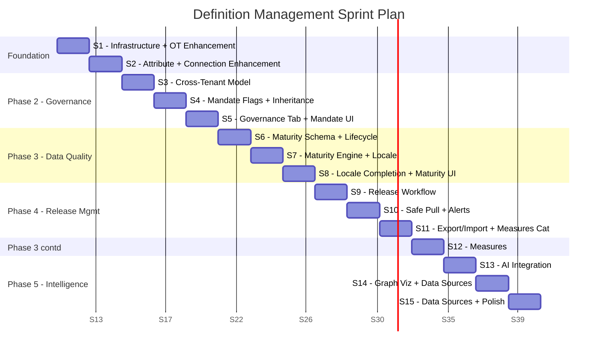
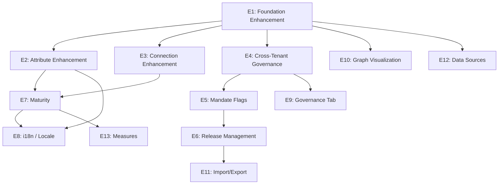
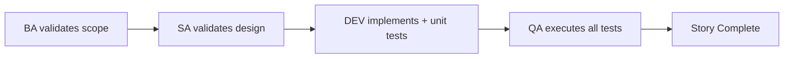

# Implementation Backlog: Definition Management

**Document ID:** BLG-DM-001
**Version:** 1.0.0
**Date:** 2026-03-10
**Status:** [PLANNED]
**Author:** PM Agent
**Source of Truth:** 01-PRD-Definition-Management.md v2.1.0
**BA Sign-Off:** APPROVED WITH CONDITIONS (C1-C4)

---

## Table of Contents

1. [Backlog Overview](#1-backlog-overview)
2. [Epic Summary](#2-epic-summary)
3. [Sprint Plan](#3-sprint-plan)
4. [Dependency Map](#4-dependency-map)
5. [Epics and User Stories](#5-epics-and-user-stories)
   - E1: Foundation Enhancement
   - E2: Attribute Management Enhancement
   - E3: Connection Management Enhancement
   - E4: Cross-Tenant Governance
   - E5: Master Mandate Flags
   - E6: Release Management
   - E7: Object Data Maturity
   - E8: Language Context Management
   - E9: Governance Tab
   - E10: Graph Visualization
   - E11: Import/Export and Versioning
   - E12: Data Sources Tab
   - E13: Measures Categories and Measures
6. [Condition Tracker](#6-condition-tracker)
7. [Definition of Done](#7-definition-of-done)

---

## 1. Backlog Overview

### Scope

This backlog covers the fullstack implementation of Definition Management enhancements from the current as-built state (Phase 1 complete) through Phase 5. Phase 6 (Viewpoints, BPMN) is deferred per BA sign-off note N1.

### Metrics

| Metric | Value |
|--------|-------|
| Total Epics | 13 |
| Total User Stories | 97 |
| Total Story Points | 681 |
| Estimated Sprints | 15 (2-week sprints) |
| Sprint Capacity | 40-50 SP per sprint |

### Personas

| ID | Name | Role | Primary Epics |
|----|------|------|---------------|
| PER-UX-001 | Sam Martinez | Super Admin | E4, E5, E6, E7, E8 |
| PER-UX-002 | Nicole Roberts | Architect | E1-E13 (primary user) |
| PER-UX-003 | Fiona Shaw | Tenant Admin | E4, E5, E6, E8 |

### Technology Stack

| Layer | Technology |
|-------|-----------|
| Backend | Java 23, Spring Boot 3.4.x, Spring Data Neo4j |
| Database | Neo4j 5.12 Community, PostgreSQL 16 (message registry) |
| Frontend | Angular 21, PrimeNG, TypeScript |
| Testing | JUnit 5/Mockito (BE), Vitest (FE unit), Playwright (E2E) |
| Cache | Valkey 8 |

---

## 2. Epic Summary

| Epic | Name | Priority | Stories | Points | Sprints | Phase |
|------|------|----------|---------|--------|---------|-------|
| E1 | Foundation Enhancement (Object Type CRUD) | P0 | 7 | 34 | S1 | Foundation |
| E2 | Attribute Management Enhancement | P0 | 8 | 42 | S1-S2 | Foundation |
| E3 | Connection Management Enhancement | P0 | 5 | 23 | S2 | Foundation |
| E4 | Cross-Tenant Governance | P0 | 10 | 68 | S3-S5 | Phase 2 |
| E5 | Master Mandate Flags | P0 | 6 | 34 | S4-S5 | Phase 2 |
| E6 | Release Management | P0 | 12 | 81 | S8-S10 | Phase 4 |
| E7 | Object Data Maturity | P1 | 11 | 76 | S6-S8 | Phase 3 |
| E8 | Language Context Management (i18n) | P1 | 8 | 55 | S7-S8 | Phase 3 |
| E9 | Governance Tab | P1 | 7 | 46 | S5-S6 | Phase 2 |
| E10 | Graph Visualization | P2 | 6 | 40 | S13-S14 | Phase 5 |
| E11 | Import/Export and Versioning | P2 | 5 | 34 | S10-S11 | Phase 4 |
| E12 | Data Sources Tab | P2 | 4 | 28 | S14-S15 | Phase 5 |
| E13 | Measures Categories and Measures | P3 | 8 | 48 | S11-S12 | Phase 3 |
| | **TOTAL** | | **97** | **681** (est.) | **15** | |

---

## 3. Sprint Plan

### Sprint Breakdown

| Sprint | Theme | Stories | Total SP | Key Milestone |
|--------|-------|---------|----------|---------------|
| S1 | Infrastructure + Object Type Enhancement | US-DM-001 to US-DM-010 | 46 | API gateway route restored, sort/pagination, AttributeType CRUD complete |
| S2 | Attribute + Connection Enhancement | US-DM-011 to US-DM-020 | 45 | Lifecycle status on attributes/connections, full attribute CRUD |
| S3 | Cross-Tenant Foundation | US-DM-021 to US-DM-027 | 48 | Tenant hierarchy model, definition inheritance |
| S4 | Mandate Flags + Inheritance UI | US-DM-028 to US-DM-035 | 44 | Mandate flag CRUD, lock indicators in UI |
| S5 | Governance Tab | US-DM-036 to US-DM-042 | 46 | Governance tab with workflow list, direct operation settings |
| S6 | Maturity Schema + Attribute Lifecycle | US-DM-043 to US-DM-050 | 48 | Four-axis maturity model, maturityClass on attributes/connections |
| S7 | Maturity Engine + Locale Foundation | US-DM-051 to US-DM-058 | 47 | Maturity score calculation, locale management API |
| S8 | Locale UI + Maturity Dashboard | US-DM-059 to US-DM-066 | 46 | Locale UI, maturity dashboard, freshness axis |
| S9 | Release Workflow Foundation | US-DM-067 to US-DM-073 | 45 | Release creation, version snapshots, release notes generation |
| S10 | Safe Pull + Alerts | US-DM-074 to US-DM-079 | 42 | Impact assessment, safe pull, notification integration |
| S11 | Export/Import + Measures Categories | US-DM-080 to US-DM-085 | 44 | JSON export/import, measure category CRUD |
| S12 | Measures | US-DM-086 to US-DM-092 | 48 | Measure CRUD, threshold indicators, formula engine |
| S13 | AI Integration | US-DM-093 to US-DM-097 | 40 | Duplication detection, merge suggestions, creation recommendations |
| S14 | Graph Visualization | US-DM-098 to US-DM-103 | 40 | Interactive graph view, node drill-down, filter/zoom |
| S15 | Data Sources + Polish | US-DM-104 to US-DM-109 | 32 | Data Sources tab, cross-epic polish |

---

## 4. Dependency Map

### Cross-Epic Dependencies

| Dependency | Source | Target | Reason |
|-----------|--------|--------|--------|
| AttributeType full CRUD | E2 | E7, E8 | Maturity and locale depend on complete attribute management |
| Tenant hierarchy model | E4 | E5, E6, E9 | Mandate, release, governance all need master/child tenant relationship |
| Mandate flags | E5 | E6 | Release management enforces mandate changes |
| Lifecycle status | E2 | E7 | Maturity scoring excludes non-active attributes |
| Maturity schema | E7 | E13 | Measures extend the maturity model |

---

## 5. Epics and User Stories

---

### Epic E1: Foundation Enhancement (Object Type CRUD)

**Priority:** P0
**Phase:** Foundation
**PRD Section:** 6.1
**Sprints:** S1
**Total Points:** 34

This epic closes infrastructure gaps (G-048, G-049, G-051, G-052) and enhances the as-built Object Type CRUD with sort, message registry, and AP-2 default attributes.

---

#### US-DM-001: Restore API Gateway Route for definition-service

**Epic:** E1 -- Foundation Enhancement
**Priority:** P0
**Sprint:** S1
**Story Points:** 2
**Persona:** Nicole Roberts (Architect)

**As a** platform administrator,
**I want** the definition-service to be accessible through the API gateway,
**So that** the frontend can reach definition endpoints via the standard gateway URL.

##### Acceptance Criteria
- [ ] AC-1: Given the API gateway is running, When a request is sent to `/api/v1/definitions/**`, Then it is routed to `lb://DEFINITION-SERVICE`
- [ ] AC-2: Given the route exists in `RouteConfig.java`, When verified against running gateway, Then requests return 200 for valid endpoints

##### Technical Notes
- Backend: Uncomment/restore route in `RouteConfig.java` (lines 107-111) -- may already be [IMPLEMENTED] per Tech Spec evidence
- Frontend: No changes needed (already calls `/api/v1/definitions/**`)
- Database: None
- Tests: Integration test verifying gateway routing
- Gap: G-048

##### Dependencies
- Depends on: None
- Blocks: All other stories

##### Definition of Done
- [ ] Backend API gateway route active and unit tested (>=80% coverage)
- [ ] Integration test confirms routing through gateway
- [ ] API contract matches 06-API-Contract.md
- [ ] i18n: N/A (infrastructure)

---

#### US-DM-002: Add definition-service to Docker Compose

**Epic:** E1 -- Foundation Enhancement
**Priority:** P0
**Sprint:** S1
**Story Points:** 2
**Persona:** Nicole Roberts (Architect)

**As a** developer,
**I want** definition-service included in docker-compose,
**So that** I can run the full stack locally with a single command.

##### Acceptance Criteria
- [ ] AC-1: Given `docker-compose up` is run, When all services start, Then definition-service is available on port 8090
- [ ] AC-2: Given the container starts, When definition-service registers with Eureka, Then it appears in the service registry

##### Technical Notes
- Backend: Add definition-service block to `docker-compose.dev-app.yml` with Neo4j dependency
- Frontend: None
- Database: Neo4j container already exists; ensure definition-service connects
- Tests: Smoke test verifying container health
- Gap: G-049

##### Dependencies
- Depends on: None
- Blocks: US-DM-001 (integration testing)

##### Definition of Done
- [ ] Docker container builds and starts successfully
- [ ] Health endpoint returns 200
- [ ] Eureka registration confirmed
- [ ] i18n: N/A (infrastructure)

---

#### US-DM-003: Add Sort Parameter to Object Type List Endpoint

**Epic:** E1 -- Foundation Enhancement
**Priority:** P0
**Sprint:** S1
**Story Points:** 3
**Persona:** Nicole Roberts (Architect)

**As an** architect,
**I want to** sort the object type list by name, status, or creation date,
**So that** I can find types quickly in large taxonomies.

##### Acceptance Criteria
- [ ] AC-1: Given GET `/api/v1/definitions/object-types?sort=name,asc`, When the API responds, Then results are sorted alphabetically by name ascending
- [ ] AC-2: Given GET `/api/v1/definitions/object-types?sort=createdAt,desc`, When the API responds, Then results are sorted by newest first
- [ ] AC-3: Given no sort parameter, When the API responds, Then default sort is `name,asc`

##### Technical Notes
- Backend: Add `sort` query param to `ObjectTypeController.java` list endpoint; pass to Neo4j query via `Sort` object
- Frontend: Wire `p-table` column sort headers to API sort parameter
- Database: Neo4j `ORDER BY` clause
- Tests: Unit test for sort parsing; integration test for sorted results
- Gap: G-052
- API: `GET /api/v1/definitions/object-types` (Section 5.1 of API Contract)

##### Dependencies
- Depends on: None
- Blocks: None

##### Definition of Done
- [ ] Backend API implemented and unit tested (>=80% coverage)
- [ ] Frontend column sort headers wired to API
- [ ] E2E test for sorting in list view
- [ ] Responsive test (desktop/tablet/mobile)
- [ ] Accessibility test (keyboard sort toggle)
- [ ] API contract matches 06-API-Contract.md
- [ ] i18n: Sort labels use message registry (AP-4)

---

#### US-DM-004: Add Sort Parameter to Attribute Type List Endpoint

**Epic:** E1 -- Foundation Enhancement
**Priority:** P0
**Sprint:** S1
**Story Points:** 2
**Persona:** Nicole Roberts (Architect)

**As an** architect,
**I want to** sort the attribute type list by name or data type,
**So that** I can browse and select attributes efficiently.

##### Acceptance Criteria
- [ ] AC-1: Given GET `/api/v1/definitions/attribute-types?sort=name,asc`, When the API responds, Then results are sorted by name
- [ ] AC-2: Given GET `/api/v1/definitions/attribute-types?sort=dataType,asc`, When the API responds, Then results are grouped by data type

##### Technical Notes
- Backend: Add `sort` query param to `AttributeTypeController.java`
- Frontend: Sort controls in attribute pick-list
- Database: Neo4j `ORDER BY`
- Tests: Unit test for sort parsing
- Gap: G-052

##### Dependencies
- Depends on: None
- Blocks: None

##### Definition of Done
- [ ] Backend API implemented and unit tested (>=80% coverage)
- [ ] Frontend sort controls wired
- [ ] API contract matches 06-API-Contract.md
- [ ] i18n: Sort labels use message registry (AP-4)

---

#### US-DM-005: System Default Attributes (AP-2)

**Epic:** E1 -- Foundation Enhancement
**Priority:** P0
**Sprint:** S1
**Story Points:** 8
**Persona:** Nicole Roberts (Architect)

**As an** architect,
**I want** every new object type to automatically include system default attributes,
**So that** all object instances have a baseline data quality foundation.

##### Acceptance Criteria
- [ ] AC-1: Given a new object type is created, When creation completes, Then 10 system default attributes (name, description, status, owner, createdAt, createdBy, updatedAt, updatedBy, externalId, tags) are auto-linked with `isSystemDefault=true`
- [ ] AC-2: Given a system default attribute is linked, When a user attempts to unlink it, Then the API returns 403 with error DEF-E-026
- [ ] AC-3: Given the UI displays attributes for an object type, When system defaults are shown, Then they display a shield icon (`pi-shield`) and the Remove button is disabled
- [ ] AC-4: Given a duplicated object type, When the copy is created, Then system default attributes are included on the copy

##### Technical Notes
- Backend: Create `SystemDefaultAttributeService` that provisions 10 `AttributeType` nodes (if not existing) and links them via `HAS_ATTRIBUTE` with `isSystemDefault=true` on object type creation
- Frontend: Shield icon on system default attributes; disabled Remove button; tooltip "System default -- cannot be removed"
- Database: Add `isSystemDefault` boolean property to `HasAttributeRelationship`; seed 10 `AttributeType` nodes per tenant on first use
- Tests: Unit test for auto-provisioning; integration test for unlink rejection; E2E for UI shield icon
- PRD: AP-2, BR-073
- API: Extends `POST /api/v1/definitions/object-types` response

##### Dependencies
- Depends on: None
- Blocks: E7 (maturity relies on default attributes)

##### Definition of Done
- [ ] Backend API implemented and unit tested (>=80% coverage)
- [ ] Frontend component shows shield icon with Vitest specs
- [ ] E2E test: create type, verify 10 defaults, attempt unlink, verify rejection
- [ ] Responsive test (desktop/tablet/mobile)
- [ ] Accessibility test (shield icon has aria-label)
- [ ] API contract matches 06-API-Contract.md
- [ ] i18n: Error message DEF-E-026 registered in message registry

---

#### US-DM-006: Message Registry Foundation (AP-4)

**Epic:** E1 -- Foundation Enhancement
**Priority:** P0
**Sprint:** S1
**Story Points:** 13
**Persona:** Sam Martinez (Super Admin)

**As a** platform administrator,
**I want** all definition management messages stored in a centralized registry,
**So that** error messages, confirmations, and notifications are consistent and translatable.

##### Acceptance Criteria
- [ ] AC-1: Given the message_registry table exists in PostgreSQL, When queried with `category=OBJECT_TYPE`, Then all DEF-E-001 through DEF-E-019 messages are returned
- [ ] AC-2: Given a validation error occurs, When the API returns a ProblemDetail, Then the response includes `messageCode` (e.g., DEF-E-002) and localized `title` and `detail`
- [ ] AC-3: Given the frontend receives an error with `messageCode`, When displaying a toast, Then the message is rendered from the cached message registry in the user's locale
- [ ] AC-4: Given a confirmation action (e.g., delete), When the dialog appears, Then the title and body come from message codes DEF-C-008
- [ ] AC-5: Given locale "ar" is selected, When a message is fetched, Then the Arabic translation is returned; if unavailable, English fallback is used

##### Technical Notes
- Backend: Create `message_registry` and `message_translation` tables in shared PostgreSQL; create `MessageRegistryService` with caching; seed 60+ DEF-* messages from PRD Section 6 error code registry; modify `GlobalExceptionHandler` to resolve message codes
- Frontend: Create `MessageRegistryService` that lazy-loads messages from `/api/v1/messages?locale={locale}&category={category}`; replace hardcoded toast messages with registry lookups; cache in browser with locale-change invalidation
- Database: PostgreSQL schema per AP-4 (Tech Spec 2.4)
- Tests: Unit test for message resolution; integration test for locale fallback; E2E for toast rendering
- PRD: AP-4, BR-077 through BR-080
- API: `GET /api/v1/messages` (new endpoint on a shared message service or definition-service)

##### Dependencies
- Depends on: None
- Blocks: All stories that display user-facing messages

##### Definition of Done
- [ ] Backend API implemented and unit tested (>=80% coverage)
- [ ] Frontend MessageRegistryService with Vitest specs
- [ ] 60+ messages seeded with English text
- [ ] E2E test: trigger error, verify toast shows registry message
- [ ] Responsive test (toast positioning)
- [ ] Accessibility test (toast has role="alert", auto-dismiss timer, screen reader announcement)
- [ ] API contract matches 06-API-Contract.md
- [ ] i18n: All 60+ messages registered per AP-4

---

#### US-DM-007: Object Type Lifecycle State Machine (AP-5)

**Epic:** E1 -- Foundation Enhancement
**Priority:** P0
**Sprint:** S1
**Story Points:** 5
**Persona:** Nicole Roberts (Architect)

**As an** architect,
**I want** object type status transitions to follow a validated state machine,
**So that** invalid transitions are rejected and all transitions produce confirmation dialogs from the message registry.

##### Acceptance Criteria
- [ ] AC-1: Given object type with status "active", When transition to "retired" is requested, Then confirmation dialog DEF-C-004 is shown before proceeding
- [ ] AC-2: Given object type with status "planned", When transition to "hold" is attempted, Then the API returns 400 with DEF-E-012 (invalid transition)
- [ ] AC-3: Given object type with status "retired", When reactivation is requested, Then the system checks for naming conflicts (DEF-E-011) before allowing
- [ ] AC-4: Given all valid transitions (planned->active, active->hold, hold->active, active->retired, hold->retired, retired->active), When each is tested, Then all succeed with appropriate confirmation messages

##### Technical Notes
- Backend: Create `ObjectTypeStateMachine` with transition validation; integrate with `ObjectTypeServiceImpl.updateStatus()`; confirmation codes from message registry
- Frontend: Status dropdown replaced with transition action buttons; each button triggers confirmation dialog from message registry
- Database: No schema change (status field exists)
- Tests: Unit test for all valid/invalid transitions; E2E for confirmation dialog flow
- PRD: AP-5, BR-081, BR-084
- API: `PATCH /api/v1/definitions/object-types/{id}/status`

##### Dependencies
- Depends on: US-DM-006 (message registry)
- Blocks: E4 (governance depends on lifecycle control)

##### Definition of Done
- [ ] Backend state machine implemented and unit tested (>=80% coverage)
- [ ] Frontend transition buttons with confirmation dialogs, Vitest specs
- [ ] E2E test: walk through all valid transitions; attempt invalid transition
- [ ] Responsive test (confirmation dialog layout)
- [ ] Accessibility test (dialog focus trap, keyboard dismiss)
- [ ] API contract matches 06-API-Contract.md
- [ ] i18n: All DEF-C-001 through DEF-C-009 messages use registry

---

### Epic E2: Attribute Management Enhancement

**Priority:** P0
**Phase:** Foundation
**PRD Section:** 6.2, 6.2.1
**Sprints:** S1-S2
**Total Points:** 42

This epic completes the AttributeType CRUD (G-051), adds lifecycle status (6.2.1), and enhances the attribute UI with grouping and search.

---

#### US-DM-008: AttributeType Get By ID Endpoint

**Epic:** E2 -- Attribute Management Enhancement
**Priority:** P0
**Sprint:** S1
**Story Points:** 2
**Persona:** Nicole Roberts (Architect)

**As an** architect,
**I want to** retrieve a single attribute type by its ID,
**So that** I can view its full details in the attribute detail panel.

##### Acceptance Criteria
- [ ] AC-1: Given attribute type "Hostname" exists, When GET `/api/v1/definitions/attribute-types/{id}` is called, Then the full attribute type is returned
- [ ] AC-2: Given an invalid ID, When the endpoint is called, Then 404 with DEF-E-021 is returned

##### Technical Notes
- Backend: Add `getById` to `AttributeTypeController`; delegate to service/repository
- Frontend: Wire detail panel to call GET by ID on selection
- Database: Neo4j findById query
- Tests: Unit test; integration test for 404
- Gap: G-051
- API: `GET /api/v1/definitions/attribute-types/{id}` (Section 5.2 of API Contract)

##### Dependencies
- Depends on: None
- Blocks: US-DM-009, US-DM-010

##### Definition of Done
- [ ] Backend API implemented and unit tested (>=80% coverage)
- [ ] Frontend detail panel shows attribute details, Vitest specs
- [ ] API contract matches 06-API-Contract.md
- [ ] i18n: Error DEF-E-021 from message registry

---

#### US-DM-009: AttributeType Update Endpoint

**Epic:** E2 -- Attribute Management Enhancement
**Priority:** P0
**Sprint:** S1
**Story Points:** 3
**Persona:** Nicole Roberts (Architect)

**As an** architect,
**I want to** update an attribute type's name, description, or validation rules,
**So that** I can refine attribute definitions without recreating them.

##### Acceptance Criteria
- [ ] AC-1: Given attribute type "Hostname" exists, When PUT is called with updated description, Then the description is updated and `updatedAt` is refreshed
- [ ] AC-2: Given an attempt to change `attributeKey` to one that already exists in the tenant, When PUT is called, Then 409 Conflict is returned
- [ ] AC-3: Given a partial update (only name field provided), When PUT is called, Then only the name is updated; other fields unchanged

##### Technical Notes
- Backend: Add `PUT /api/v1/definitions/attribute-types/{id}` to `AttributeTypeController`; create `AttributeTypeUpdateRequest` DTO
- Frontend: Edit mode in attribute detail panel
- Database: Neo4j save with partial update
- Tests: Unit test for update; integration test for conflict
- Gap: G-051
- API: `PUT /api/v1/definitions/attribute-types/{id}` (Section 5.2)

##### Dependencies
- Depends on: US-DM-008
- Blocks: None

##### Definition of Done
- [ ] Backend API implemented and unit tested (>=80% coverage)
- [ ] Frontend edit mode with Vitest specs
- [ ] E2E test: edit attribute, verify update persisted
- [ ] API contract matches 06-API-Contract.md
- [ ] i18n: Success message DEF-S-010 variant for update

---

#### US-DM-010: AttributeType Delete Endpoint

**Epic:** E2 -- Attribute Management Enhancement
**Priority:** P0
**Sprint:** S1
**Story Points:** 3
**Persona:** Nicole Roberts (Architect)

**As an** architect,
**I want to** delete an attribute type that is no longer needed,
**So that** I can keep the attribute catalog clean.

##### Acceptance Criteria
- [ ] AC-1: Given attribute type "TempField" is not linked to any object types, When DELETE is called, Then the attribute is removed
- [ ] AC-2: Given attribute type "Hostname" is linked to 3 object types, When DELETE is called, Then 409 Conflict with message "Cannot delete: linked to 3 object types" is returned
- [ ] AC-3: Given the UI, When the delete button is clicked, Then a confirmation dialog (DEF-C-013 variant) appears before deletion

##### Technical Notes
- Backend: Add `DELETE /api/v1/definitions/attribute-types/{id}` with linkage check
- Frontend: Delete button with confirmation dialog; disabled when linked count > 0
- Database: Neo4j check for incoming HAS_ATTRIBUTE relationships before delete
- Tests: Unit test for delete with/without linkages
- Gap: G-051
- API: `DELETE /api/v1/definitions/attribute-types/{id}` (Section 5.2)

##### Dependencies
- Depends on: US-DM-008
- Blocks: None

##### Definition of Done
- [ ] Backend API implemented and unit tested (>=80% coverage)
- [ ] Frontend delete button with confirmation, Vitest specs
- [ ] E2E test: delete unlinked attribute, attempt delete linked attribute
- [ ] API contract matches 06-API-Contract.md
- [ ] i18n: Confirmation and error messages from registry

---

#### US-DM-011: AttributeType Pagination

**Epic:** E2 -- Attribute Management Enhancement
**Priority:** P0
**Sprint:** S2
**Story Points:** 3
**Persona:** Nicole Roberts (Architect)

**As an** architect,
**I want** the attribute type list to support pagination,
**So that** large attribute catalogs load efficiently.

##### Acceptance Criteria
- [ ] AC-1: Given 100 attribute types exist, When GET `/api/v1/definitions/attribute-types?page=0&size=25` is called, Then 25 attributes are returned with pagination metadata
- [ ] AC-2: Given the frontend, When scrolling past page 1, Then page 2 is fetched automatically or via paginator

##### Technical Notes
- Backend: Add `page` and `size` params to `AttributeTypeController.java` list endpoint; return `Page<AttributeTypeDTO>`
- Frontend: PrimeNG `p-paginator` or virtual scroll on attribute list
- Database: Neo4j SKIP/LIMIT query
- Tests: Unit test for pagination; E2E for paginator interaction
- Gap: G-051

##### Dependencies
- Depends on: None
- Blocks: None

##### Definition of Done
- [ ] Backend pagination implemented and unit tested (>=80% coverage)
- [ ] Frontend paginator with Vitest specs
- [ ] E2E test: navigate pages
- [ ] Responsive test (paginator layout at mobile)
- [ ] API contract matches 06-API-Contract.md

---

#### US-DM-012: Attribute Lifecycle Status (planned/active/retired)

**Epic:** E2 -- Attribute Management Enhancement
**Priority:** P0
**Sprint:** S2
**Story Points:** 8
**Persona:** Nicole Roberts (Architect)

**As an** architect,
**I want** each attribute linkage to carry a lifecycle status (planned/active/retired),
**So that** I can stage new attributes before activating them and retire obsolete ones without losing data.

##### Acceptance Criteria
- [ ] AC-1: Given attribute "MaintenanceWindow" is linked with lifecycleStatus "planned", When viewing the definition UI, Then a blue "Planned" chip is shown; the attribute does NOT appear in instance forms (AC-6.2.1.1)
- [ ] AC-2: Given attribute "MaintenanceWindow" has lifecycleStatus "planned", When the architect transitions to "active", Then the chip changes to green "Active" and the attribute appears in instance forms (AC-6.2.1.2)
- [ ] AC-3: Given attribute "Notes" has lifecycleStatus "active", When the architect retires it, Then the chip changes to grey "Retired", existing data is preserved read-only, and the attribute is hidden from new instance forms (AC-6.2.1.3)
- [ ] AC-4: Given attribute "Notes" has lifecycleStatus "retired", When reactivated, Then it returns to "active" and appears in forms again (AC-6.2.1.4)
- [ ] AC-5: Given a mandatory attribute with 15 instances of data, When the architect attempts to retire it, Then a warning dialog states "15 instances have data for 'Hostname'. Existing data will be preserved as read-only." (AC-6.2.1.5)

##### Technical Notes
- Backend: Add `lifecycleStatus` string property to `HasAttributeRelationship` (default: "active"); create transition validation per AP-5 state machine; add `PATCH /api/v1/definitions/object-types/{id}/attributes/{attrId}/lifecycle` endpoint
- Frontend: PrimeNG severity chips (blue=planned, green=active, grey=retired); transition action dropdown on each attribute row; confirmation dialogs from message registry (DEF-C-010, DEF-C-011, DEF-C-012)
- Database: Add `lifecycleStatus` property to HAS_ATTRIBUTE relationship in Neo4j
- Tests: Unit test for all transitions; integration test for invalid transitions; E2E for chip display and transition flow
- PRD: 6.2.1, BR-019 through BR-024, AC-6.2.1.1 through AC-6.2.1.7
- API: `PATCH /api/v1/definitions/object-types/{id}/attributes/{attrId}/lifecycle` (Section 5.5)

##### Dependencies
- Depends on: None
- Blocks: E7 (maturity excludes non-active attributes per BR-040)

##### Definition of Done
- [ ] Backend lifecycle transitions implemented and unit tested (>=80% coverage)
- [ ] Frontend lifecycle chips and transition actions with Vitest specs
- [ ] E2E test: create planned attribute, activate, retire, reactivate
- [ ] Responsive test (chip layout at mobile)
- [ ] Accessibility test (chip has aria-label, transition buttons keyboard accessible)
- [ ] API contract matches 06-API-Contract.md
- [ ] i18n: DEF-C-010, DEF-C-011, DEF-C-012 messages use registry

---

#### US-DM-013: Attribute Lifecycle Status Chips in UI

**Epic:** E2 -- Attribute Management Enhancement
**Priority:** P0
**Sprint:** S2
**Story Points:** 3
**Persona:** Nicole Roberts (Architect)

**As an** architect,
**I want** to see visual lifecycle indicators on each attribute in the list,
**So that** I can quickly identify planned, active, and retired attributes.

##### Acceptance Criteria
- [ ] AC-1: Given the attribute list for an object type, When rendered, Then each attribute shows a PrimeNG `p-tag` severity chip: blue for planned, green (success) for active, grey (secondary) for retired
- [ ] AC-2: Given a retired attribute, When displayed in the list, Then the row has reduced opacity (greyed out)
- [ ] AC-3: Given keyboard navigation, When tabbing through attribute rows, Then the lifecycle status chip is announced by screen readers

##### Technical Notes
- Backend: N/A (data from US-DM-012)
- Frontend: `p-tag` component with severity mapping; CSS opacity for retired rows; ARIA labels
- Database: N/A
- Tests: Vitest component test for chip rendering; accessibility test

##### Dependencies
- Depends on: US-DM-012
- Blocks: None

##### Definition of Done
- [ ] Frontend chips implemented with Vitest specs (>=80% coverage)
- [ ] Responsive test (chips at mobile breakpoint)
- [ ] Accessibility test (screen reader announces status)

---

#### US-DM-014: Attribute Search and Group Filter in Pick-List

**Epic:** E2 -- Attribute Management Enhancement
**Priority:** P1
**Sprint:** S2
**Story Points:** 5
**Persona:** Nicole Roberts (Architect)

**As an** architect,
**I want to** search and filter attributes by name, data type, or attribute group in the pick-list,
**So that** I can quickly find existing attributes to reuse when configuring an object type.

##### Acceptance Criteria
- [ ] AC-1: Given 50 attribute types exist, When the user types "host" in the search field, Then only attributes with "host" in name or attributeKey are shown
- [ ] AC-2: Given attribute types with groups "network", "identity", "metadata", When the user selects filter group "network", Then only network-group attributes are shown
- [ ] AC-3: Given the wizard attribute selection step, When search is applied, Then the checkbox states are preserved for previously selected attributes

##### Technical Notes
- Backend: Add `search` and `attributeGroup` query params to attribute list endpoint
- Frontend: Search input and group filter dropdown in attribute pick-list (wizard step 2 and detail panel attributes tab)
- Database: Neo4j WHERE clause with CONTAINS for search, equals for group
- Tests: Unit test for filter params; E2E for pick-list search

##### Dependencies
- Depends on: US-DM-011
- Blocks: None

##### Definition of Done
- [ ] Backend search/filter implemented and unit tested (>=80% coverage)
- [ ] Frontend search and filter with Vitest specs
- [ ] E2E test: search in pick-list, filter by group
- [ ] Responsive test
- [ ] Accessibility test (search field label, filter dropdown keyboard accessible)
- [ ] API contract matches 06-API-Contract.md

---

#### US-DM-015: Bulk Attribute Lifecycle Transition

**Epic:** E2 -- Attribute Management Enhancement
**Priority:** P2
**Sprint:** S2
**Story Points:** 5
**Persona:** Nicole Roberts (Architect)

**As an** architect,
**I want to** select multiple attributes and change their lifecycle status in a single action,
**So that** I can efficiently manage attribute rollouts (e.g., activate 10 planned attributes at once).

##### Acceptance Criteria
- [ ] AC-1: Given 5 attributes with lifecycleStatus "planned" are selected via checkboxes, When the user clicks "Activate Selected", Then all 5 transition to "active"
- [ ] AC-2: Given a mix of planned and active attributes selected, When "Retire Selected" is clicked, Then only active attributes are retired; planned ones remain (with a warning listing skipped items)
- [ ] AC-3: Given the bulk action, When confirmation is needed, Then a single dialog shows "Activate 5 attributes on Server?" with the list of attribute names

##### Technical Notes
- Backend: `PATCH /api/v1/definitions/object-types/{id}/attributes/bulk-lifecycle` with body `{attributeIds: [...], targetStatus: "active"}`
- Frontend: Checkbox selection column; bulk action toolbar with Activate/Retire buttons
- Database: Neo4j batch update
- Tests: Unit test for bulk transition; E2E for multi-select flow
- PRD: 6.2.1 "Could Have" capability (bulk transition)

##### Dependencies
- Depends on: US-DM-012
- Blocks: None

##### Definition of Done
- [ ] Backend bulk endpoint implemented and unit tested (>=80% coverage)
- [ ] Frontend multi-select with bulk action toolbar, Vitest specs
- [ ] E2E test: select multiple, bulk activate
- [ ] Responsive test
- [ ] Accessibility test (checkbox selection keyboard accessible)
- [ ] API contract matches 06-API-Contract.md

---

#### US-DM-015a: Update Attribute Linkage Properties (isRequired, displayOrder)

**Epic:** E2 -- Attribute Management Enhancement
**Priority:** P0
**Sprint:** S2
**Story Points:** 3
**Persona:** Nicole Roberts (Architect)

**As an** architect,
**I want to** update an attribute's isRequired flag and displayOrder on an object type,
**So that** I can reorder attributes and change requirement status without unlinking.

##### Acceptance Criteria
- [ ] AC-1: Given attribute "Hostname" is linked to "Server" with isRequired=false, When PATCH is called with isRequired=true, Then the flag is updated
- [ ] AC-2: Given the UI attribute list, When the user drags an attribute to reorder, Then displayOrder values are updated via PATCH

##### Technical Notes
- Backend: `PATCH /api/v1/definitions/object-types/{id}/attributes/{attrId}` with partial update for isRequired, displayOrder
- Frontend: Drag-and-drop reorder with PrimeNG `p-orderList` or manual reorder; toggle for isRequired
- Database: Neo4j relationship property update
- Tests: Unit test for partial update
- API: `PATCH /api/v1/definitions/object-types/{id}/attributes/{attrId}` (Section 5.3)

##### Dependencies
- Depends on: None
- Blocks: None

##### Definition of Done
- [ ] Backend PATCH endpoint implemented and unit tested (>=80% coverage)
- [ ] Frontend reorder and toggle with Vitest specs
- [ ] E2E test: reorder attributes, toggle required
- [ ] API contract matches 06-API-Contract.md

---

### Epic E3: Connection Management Enhancement

**Priority:** P0
**Phase:** Foundation
**PRD Section:** 6.3
**Sprints:** S2
**Total Points:** 23

This epic adds connection lifecycle status, update endpoint, and maturity classification to connection definitions.

---

#### US-DM-016: Connection Lifecycle Status (planned/active/retired)

**Epic:** E3 -- Connection Management Enhancement
**Priority:** P0
**Sprint:** S2
**Story Points:** 5
**Persona:** Nicole Roberts (Architect)

**As an** architect,
**I want** each connection definition to carry a lifecycle status (planned/active/retired),
**So that** I can stage new connections and retire obsolete ones.

##### Acceptance Criteria
- [ ] AC-1: Given a new connection is created with lifecycleStatus "planned", When viewing the connections tab, Then a blue "Planned" chip is shown
- [ ] AC-2: Given a connection with lifecycleStatus "active", When retired, Then the chip changes to grey and instance relationships are preserved as read-only
- [ ] AC-3: Given transition validation, When an invalid transition is attempted (e.g., planned->retired), Then the API returns 400

##### Technical Notes
- Backend: Add `lifecycleStatus` property to `CanConnectToRelationship`; create transition validation per AP-5 (same machine as attribute: planned->active, active->retired, retired->active); add `PATCH /api/v1/definitions/object-types/{id}/connections/{connId}/lifecycle`
- Frontend: PrimeNG severity chips on connection rows; transition action buttons with confirmation (DEF-C-020, DEF-C-021, DEF-C-022)
- Database: Add `lifecycleStatus` to CAN_CONNECT_TO relationship in Neo4j
- Tests: Unit test for transitions; E2E for UI chips and dialogs
- PRD: BR-024a, BR-083
- API: `PATCH /api/v1/definitions/object-types/{id}/connections/{connId}/lifecycle` (Section 5.5)

##### Dependencies
- Depends on: None
- Blocks: E7 (maturity on connections)

##### Definition of Done
- [ ] Backend lifecycle implemented and unit tested (>=80% coverage)
- [ ] Frontend chips and transitions with Vitest specs
- [ ] E2E test: create planned connection, activate, retire
- [ ] Responsive test
- [ ] Accessibility test
- [ ] API contract matches 06-API-Contract.md
- [ ] i18n: DEF-C-020 through DEF-C-022 from message registry

---

#### US-DM-017: Update Connection Properties

**Epic:** E3 -- Connection Management Enhancement
**Priority:** P0
**Sprint:** S2
**Story Points:** 5
**Persona:** Nicole Roberts (Architect)

**As an** architect,
**I want to** update a connection's active name, passive name, cardinality, or direction,
**So that** I can refine connection definitions without removing and re-adding them.

##### Acceptance Criteria
- [ ] AC-1: Given connection "hosts" between Server and Application, When PUT is called with activeName changed to "runs", Then the connection's activeName is updated
- [ ] AC-2: Given the UI connections tab, When the user clicks edit on a connection, Then an inline edit form appears with current values pre-filled

##### Technical Notes
- Backend: Add `PUT /api/v1/definitions/object-types/{id}/connections/{connId}` with `UpdateConnectionRequest` DTO
- Frontend: Inline edit mode on connection row in detail panel
- Database: Neo4j relationship property update
- Tests: Unit test for update; E2E for inline edit
- API: `PUT /api/v1/definitions/object-types/{id}/connections/{connId}` (Section 5.4)

##### Dependencies
- Depends on: None
- Blocks: None

##### Definition of Done
- [ ] Backend API implemented and unit tested (>=80% coverage)
- [ ] Frontend inline edit with Vitest specs
- [ ] E2E test: edit connection properties
- [ ] API contract matches 06-API-Contract.md

---

#### US-DM-018: Connection Importance Field

**Epic:** E3 -- Connection Management Enhancement
**Priority:** P1
**Sprint:** S2
**Story Points:** 3
**Persona:** Nicole Roberts (Architect)

**As an** architect,
**I want to** assign an importance level to each connection,
**So that** maturity scoring can weight important connections higher.

##### Acceptance Criteria
- [ ] AC-1: Given a connection definition, When created or updated, Then an `importance` field (enum: critical/high/medium/low) can be set
- [ ] AC-2: Given the connections tab, When importance is displayed, Then a severity badge (red/orange/yellow/grey) is shown

##### Technical Notes
- Backend: Add `importance` string property to `CanConnectToRelationship`; include in create/update DTOs
- Frontend: Importance dropdown in connection edit; severity badge display
- Database: Neo4j property addition
- Tests: Unit test; Vitest component test for badge
- Gap: G-025

##### Dependencies
- Depends on: US-DM-017
- Blocks: E7 (maturity uses importance as weight modifier)

##### Definition of Done
- [ ] Backend field added and unit tested (>=80% coverage)
- [ ] Frontend badge display with Vitest specs
- [ ] API contract matches 06-API-Contract.md

---

#### US-DM-019: Connection Required Flag

**Epic:** E3 -- Connection Management Enhancement
**Priority:** P1
**Sprint:** S2
**Story Points:** 3
**Persona:** Nicole Roberts (Architect)

**As an** architect,
**I want to** mark a connection as required,
**So that** the system can enforce mandatory connections during instance creation.

##### Acceptance Criteria
- [ ] AC-1: Given connection "runs_on" between Server and Application is marked required, When an instance of Server is created without linking an Application, Then the system blocks creation with error "Mandatory relation 'runs_on' is required" (AC-6.6.4)
- [ ] AC-2: Given the connections tab, When a connection is required, Then a "Required" badge is shown

##### Technical Notes
- Backend: Add `isRequired` boolean to `CanConnectToRelationship`; enforce at instance creation (future -- instance service consumes this flag)
- Frontend: Required toggle in connection edit; "Required" badge
- Database: Neo4j property
- Tests: Unit test for flag persistence
- Gap: G-026, BR-036

##### Dependencies
- Depends on: US-DM-017
- Blocks: E7 (maturity uses required flag)

##### Definition of Done
- [ ] Backend field added and unit tested (>=80% coverage)
- [ ] Frontend toggle and badge with Vitest specs
- [ ] API contract matches 06-API-Contract.md

---

#### US-DM-020: Bidirectional Connection Display

**Epic:** E3 -- Connection Management Enhancement
**Priority:** P2
**Sprint:** S2
**Story Points:** 5
**Persona:** Nicole Roberts (Architect)

**As an** architect,
**I want to** see both outgoing and incoming connections on an object type,
**So that** I understand the full relationship context of each type.

##### Acceptance Criteria
- [ ] AC-1: Given Server has connection "hosts" -> Application, When viewing Application's connections tab, Then an incoming connection "hosted on" <- Server is shown (using passive name)
- [ ] AC-2: Given the UI, When incoming connections are displayed, Then they are visually distinguished from outgoing (e.g., arrow direction icon, "Incoming" label)

##### Technical Notes
- Backend: Add `GET /api/v1/definitions/object-types/{id}/connections?direction=incoming` query parameter; Neo4j query for incoming CAN_CONNECT_TO relationships
- Frontend: Two-section connections tab: "Outgoing" and "Incoming" with passive name display for incoming
- Database: Neo4j reverse traversal query
- Tests: Unit test for incoming query; E2E for bidirectional display

##### Dependencies
- Depends on: None
- Blocks: E10 (graph visualization shows all connections)

##### Definition of Done
- [ ] Backend incoming connections query and unit tested (>=80% coverage)
- [ ] Frontend two-section display with Vitest specs
- [ ] E2E test: verify incoming connections
- [ ] Responsive test
- [ ] Accessibility test
- [ ] API contract matches 06-API-Contract.md

---

### Epic E4: Cross-Tenant Governance

**Priority:** P0
**Phase:** Phase 2
**PRD Section:** 6.4
**Sprints:** S3-S5
**Total Points:** 68
**Condition:** None (fully covered by ACs)

This epic establishes the tenant hierarchy model, definition inheritance from master to child tenants, and the inherited state for propagated definitions.

---

#### US-DM-021: Tenant Hierarchy Model

**Epic:** E4 -- Cross-Tenant Governance
**Priority:** P0
**Sprint:** S3
**Story Points:** 8
**Persona:** Sam Martinez (Super Admin)

**As a** super admin,
**I want** the system to support a master/child tenant hierarchy,
**So that** canonical definitions can flow from master to child tenants.

##### Acceptance Criteria
- [ ] AC-1: Given tenant "MASTER" is created with type "master", When child tenant "CHILD-A" is provisioned, Then "CHILD-A" has a parentTenantId pointing to "MASTER"
- [ ] AC-2: Given the tenant hierarchy, When queried, Then the system returns the full hierarchy tree
- [ ] AC-3: Given a tenant without a parent, When queried for hierarchy, Then it is identified as a root/master tenant

##### Technical Notes
- Backend: Extend tenant-service with `parentTenantId` field; create `TenantHierarchyService` in definition-service via Feign client; cache hierarchy in Valkey
- Frontend: N/A for this story
- Database: PostgreSQL column `parent_tenant_id` on tenant table
- Tests: Unit test for hierarchy resolution; integration test with Feign mock
- PRD: 6.4, BR-033

##### Dependencies
- Depends on: None
- Blocks: US-DM-022 through US-DM-030, all E5/E6 stories

##### Definition of Done
- [ ] Backend hierarchy service implemented and unit tested (>=80% coverage)
- [ ] Feign client tested
- [ ] Valkey cache tested
- [ ] API contract matches 06-API-Contract.md

---

#### US-DM-022: Canonical Definition Propagation on Tenant Provisioning

**Epic:** E4 -- Cross-Tenant Governance
**Priority:** P0
**Sprint:** S3
**Story Points:** 8
**Persona:** Sam Martinez (Super Admin)

**As a** super admin,
**I want** canonical definitions from the master tenant to be automatically copied to a new child tenant,
**So that** child tenants start with the master's baseline definitions.

##### Acceptance Criteria
- [ ] AC-1: Given master tenant has types "Server", "Application", "Contract" with mandated attributes, When child tenant is provisioned, Then all three appear with state "inherited" (AC-6.4.1)
- [ ] AC-2: Given propagated definitions, When child tenant loads the page, Then "Inherited" badge is visible
- [ ] AC-3: Given propagated types include attributes and connections, When viewed in child tenant, Then all linkages are also propagated

##### Technical Notes
- Backend: Create `DefinitionPropagationService`; deep-copy ObjectType nodes, HasAttribute, CanConnectTo from master to child; set `state="inherited"`, `sourceTenantId=master`
- Frontend: "Inherited" badge using `p-tag` severity "info"
- Database: Neo4j deep copy with new tenant-scoped IDs; add `sourceTenantId` to ObjectTypeNode
- Tests: Integration test for propagation; E2E for badge display
- PRD: 6.4, AC-6.4.1, BR-033

##### Dependencies
- Depends on: US-DM-021
- Blocks: US-DM-023 through US-DM-030

##### Definition of Done
- [ ] Backend propagation implemented and unit tested (>=80% coverage)
- [ ] Frontend badge with Vitest specs
- [ ] Integration test: provision child, verify definitions
- [ ] E2E test: child tenant sees inherited types
- [ ] i18n: Badge label from message registry

---

#### US-DM-023: Child Tenant Can Add Local Object Types

**Epic:** E4 -- Cross-Tenant Governance
**Priority:** P0
**Sprint:** S3
**Story Points:** 3
**Persona:** Fiona Shaw (Tenant Admin)

**As a** tenant admin,
**I want to** create local object types alongside inherited ones,
**So that** I can model tenant-specific business objects.

##### Acceptance Criteria
- [ ] AC-1: Given child tenant inherits types from master, When admin creates "Local Device", Then state="user_defined" (AC-6.4.2)
- [ ] AC-2: Given the list view, When both types shown, Then inherited types have badge, local types do not

##### Technical Notes
- Backend: Existing create endpoint; ensure state="user_defined" for child tenant creates
- Frontend: No change to create flow; badge distinction in list
- Tests: E2E for creating local type
- PRD: AC-6.4.2

##### Dependencies
- Depends on: US-DM-022
- Blocks: None

##### Definition of Done
- [ ] E2E test: child tenant creates local type, verify state
- [ ] API contract matches 06-API-Contract.md

---

#### US-DM-024: Enforce Mandate Protection in Child Tenants

**Epic:** E4 -- Cross-Tenant Governance
**Priority:** P0
**Sprint:** S3
**Story Points:** 5
**Persona:** Fiona Shaw (Tenant Admin)

**As a** tenant admin,
**I want** the system to prevent modification or deletion of mandated definitions,
**So that** governance compliance is maintained.

##### Acceptance Criteria
- [ ] AC-1: Given mandated type "Server" in child tenant, When delete attempted, Then 403 returned (AC-6.4.3)
- [ ] AC-2: Given the UI, When mandated type selected, Then edit/delete buttons disabled
- [ ] AC-3: Given mandated type, When PUT update called, Then 403 returned

##### Technical Notes
- Backend: Add mandate check in update/delete methods; check `isMasterMandate` and tenant hierarchy
- Frontend: Conditionally disable edit/delete; tooltip "Mandated by master tenant"
- Tests: Unit test for enforcement; E2E for disabled buttons
- PRD: AC-6.4.3, BR-029

##### Dependencies
- Depends on: US-DM-022, US-DM-031 (mandate flags)
- Blocks: None

##### Definition of Done
- [ ] Backend mandate enforcement and unit tested (>=80% coverage)
- [ ] Frontend disabled buttons with Vitest specs
- [ ] E2E test: attempt delete mandated type, verify rejection
- [ ] Accessibility test (aria-disabled, tooltip)
- [ ] i18n: Error message from registry

---

#### US-DM-025: Child Tenant Can Add Local Attributes to Inherited Types

**Epic:** E4 -- Cross-Tenant Governance
**Priority:** P0
**Sprint:** S4
**Story Points:** 5
**Persona:** Fiona Shaw (Tenant Admin)

**As a** tenant admin,
**I want to** add local attributes to inherited object types,
**So that** I can customize definitions for local needs.

##### Acceptance Criteria
- [ ] AC-1: Given inherited "Server", When admin adds "Room Number", Then linked with `isMasterMandate=false`, `isLocal=true`
- [ ] AC-2: Given attributes tab, When displayed, Then mandated attributes show lock; local attributes can be removed

##### Technical Notes
- Backend: Allow `POST /{id}/attributes` for inherited types; set `isLocal=true` on HasAttribute; prevent modification of mandated attributes
- Frontend: "Add Local Attribute" button; lock icon on mandated attributes; Remove only on local
- Database: Add `isLocal` boolean to HasAttributeRelationship
- Tests: Unit test for local addition; E2E for lock display
- PRD: JRN 3.2

##### Dependencies
- Depends on: US-DM-022, US-DM-024
- Blocks: None

##### Definition of Done
- [ ] Backend local attribute support and unit tested (>=80% coverage)
- [ ] Frontend lock icons and button with Vitest specs
- [ ] E2E test: add local attribute to inherited type
- [ ] Accessibility test (lock icon aria-label)

---

#### US-DM-026: Cross-Tenant Definition List View (Super Admin)

**Epic:** E4 -- Cross-Tenant Governance
**Priority:** P1
**Sprint:** S4
**Story Points:** 8
**Persona:** Sam Martinez (Super Admin)

**As a** super admin,
**I want to** view definitions across all tenants,
**So that** I can audit governance compliance.

##### Acceptance Criteria
- [ ] AC-1: Given super admin, When toggling "Cross-Tenant View", Then list shows all tenant types with Tenant column
- [ ] AC-2: Given cross-tenant view, When filtering by tenant, Then only that tenant's types shown
- [ ] AC-3: Given compliance badges, When child tenant missing mandated types, Then warning badge appears

##### Technical Notes
- Backend: `GET /api/v1/definitions/object-types?crossTenant=true` (SUPER_ADMIN only)
- Frontend: Toggle button (SUPER_ADMIN only); Tenant column; compliance badges
- Database: Neo4j query without tenant filter (role-guarded)
- Tests: Unit test; E2E for toggle
- PRD: SCR-01

##### Dependencies
- Depends on: US-DM-021
- Blocks: None

##### Definition of Done
- [ ] Backend cross-tenant endpoint and unit tested (>=80% coverage)
- [ ] Frontend toggle and column with Vitest specs
- [ ] E2E test: toggle cross-tenant view
- [ ] Responsive test (column collapses at mobile)
- [ ] Accessibility test

---

#### US-DM-027: Architect Role Authorization

**Epic:** E4 -- Cross-Tenant Governance
**Priority:** P0
**Sprint:** S4
**Story Points:** 5
**Persona:** Nicole Roberts (Architect)

**As an** architect,
**I want** the ARCHITECT role to grant full CRUD access to definitions,
**So that** I do not need SUPER_ADMIN privileges.

##### Acceptance Criteria
- [ ] AC-1: Given ARCHITECT role, When accessing definition endpoints, Then all CRUD permitted
- [ ] AC-2: Given USER role, When accessing endpoints, Then 403 returned (AC-6.1.8)
- [ ] AC-3: Given Keycloak, When ARCHITECT assigned, Then role included in JWT

##### Technical Notes
- Backend: Update `SecurityConfig.java` to allow SUPER_ADMIN and ARCHITECT
- Database: Keycloak realm role configuration
- Tests: Unit test for role access; integration test
- PRD: BR-011, BR-065

##### Dependencies
- Depends on: None
- Blocks: None

##### Definition of Done
- [ ] Backend role authorization updated and unit tested (>=80% coverage)
- [ ] Integration test: ARCHITECT can CRUD, USER cannot

---

#### US-DM-028: Architect Role Licensing Integration

**Epic:** E4 -- Cross-Tenant Governance
**Priority:** P0
**Sprint:** S4
**Story Points:** 5
**Persona:** Sam Martinez (Super Admin)

**As a** super admin,
**I want** the Architect role in the licensing schema,
**So that** tenants are charged for Architect seats.

##### Acceptance Criteria
- [ ] AC-1: Given license with 5 Architect seats and 5 assigned, When 6th assigned, Then blocked
- [ ] AC-2: Given premium features, When feature gate checked, Then appropriate license tier required

##### Technical Notes
- Backend: Feign client to license-service; seat check on role assignment; feature gate check
- Tests: Unit test with Feign mock
- PRD: BR-064, BR-065

##### Dependencies
- Depends on: license-service (existing)
- Blocks: None

##### Definition of Done
- [ ] Backend Feign client and seat check implemented and unit tested (>=80% coverage)

---

#### US-DM-029: Inherited Definition Audit Trail

**Epic:** E4 -- Cross-Tenant Governance
**Priority:** P2
**Sprint:** S5
**Story Points:** 5
**Persona:** Sam Martinez (Super Admin)

**As a** super admin,
**I want** an audit trail of governance actions,
**So that** I can track compliance history.

##### Acceptance Criteria
- [ ] AC-1: Given mandate flag set, When completed, Then audit entry created
- [ ] AC-2: Given audit log, When queried, Then governance actions in chronological order

##### Technical Notes
- Backend: Publish to Kafka `definition.audit` topic; audit-service consumes
- Frontend: Audit log panel in governance tab
- Tests: Unit test for event publishing; integration test with Kafka
- PRD: 6.4 "Could Have"

##### Dependencies
- Depends on: US-DM-022, audit-service
- Blocks: None

##### Definition of Done
- [ ] Backend audit publishing and unit tested (>=80% coverage)
- [ ] Frontend audit panel with Vitest specs

---

#### US-DM-030: Definition State "inherited"

**Epic:** E4 -- Cross-Tenant Governance
**Priority:** P0
**Sprint:** S3
**Story Points:** 3
**Persona:** Fiona Shaw (Tenant Admin)

**As a** tenant admin,
**I want** inherited definitions to have state "inherited",
**So that** I can clearly identify master tenant definitions.

##### Acceptance Criteria
- [ ] AC-1: Given propagated type, When querying state, Then state="inherited"
- [ ] AC-2: Given the frontend, When filtering by state, Then "Inherited" is an option
- [ ] AC-3: Given BR-005, When validating, Then "inherited" accepted

##### Technical Notes
- Backend: Add "inherited" to allowed state values; set during propagation
- Frontend: "Inherited" filter option; badge uses `p-tag` severity "info"
- Tests: Unit test; E2E for filter
- PRD: BR-033

##### Dependencies
- Depends on: US-DM-022
- Blocks: None

##### Definition of Done
- [ ] Backend state validation updated and unit tested
- [ ] Frontend filter with Vitest specs
- [ ] E2E test: filter by inherited state

---

### Epic E5: Master Mandate Flags

**Priority:** P0
**Phase:** Phase 2
**PRD Section:** 6.5
**Sprints:** S4-S5
**Total Points:** 34

---

#### US-DM-031: isMasterMandate Flag on Object Types

**Epic:** E5 -- Master Mandate Flags
**Priority:** P0
**Sprint:** S4
**Story Points:** 5
**Persona:** Sam Martinez (Super Admin)

**As a** super admin in the master tenant,
**I want to** toggle `isMasterMandate` on an object type,
**So that** child tenants cannot modify or delete it.

##### Acceptance Criteria
- [ ] AC-1: Given SUPER_ADMIN in master tenant, When toggling isMasterMandate=true on "Server", Then flag persisted (AC-6.5.1)
- [ ] AC-2: Given ARCHITECT in child tenant, When attempting to set mandate, Then 403 returned (BR-032)
- [ ] AC-3: Given isMasterMandate=true, When child tenant loads type, Then lock icon appears

##### Technical Notes
- Backend: Add `isMasterMandate` boolean to `ObjectTypeNode`; `PATCH /api/v1/definitions/object-types/{id}/mandate` (master only)
- Frontend: Toggle in detail panel (master tenant only); lock icon
- Database: Neo4j property
- Tests: Unit test; E2E for lock icon
- PRD: 6.5, AC-6.5.1, BR-029, BR-032

##### Dependencies
- Depends on: US-DM-021
- Blocks: US-DM-024, US-DM-032, US-DM-033

##### Definition of Done
- [ ] Backend mandate toggle and unit tested (>=80% coverage)
- [ ] Frontend toggle and lock icon with Vitest specs
- [ ] E2E test: toggle in master, verify lock in child
- [ ] Accessibility test
- [ ] i18n: Lock tooltip from registry

---

#### US-DM-032: isMasterMandate Flag on Attribute Linkages

**Epic:** E5 -- Master Mandate Flags
**Priority:** P0
**Sprint:** S4
**Story Points:** 5
**Persona:** Sam Martinez (Super Admin)

**As a** super admin,
**I want to** mandate specific attribute linkages,
**So that** child tenants must include them.

##### Acceptance Criteria
- [ ] AC-1: Given mandated "Hostname" on "Server", When child views attributes, Then lock icon shown and Remove disabled
- [ ] AC-2: Given mandated attribute, When unlink called in child, Then 403 (BR-030)
- [ ] AC-3: Given mandated attribute, When retire attempted in child, Then rejected (AC-6.2.1.6)

##### Technical Notes
- Backend: Add `isMasterMandate` to `HasAttributeRelationship`; mandate check in unlink and lifecycle endpoints
- Frontend: Lock icon on mandated attributes; disabled Remove/Retire
- Database: Neo4j relationship property
- PRD: 6.5, BR-030, AC-6.2.1.6

##### Dependencies
- Depends on: US-DM-031, US-DM-012
- Blocks: None

##### Definition of Done
- [ ] Backend enforcement and unit tested (>=80% coverage)
- [ ] Frontend lock icons with Vitest specs
- [ ] E2E test: attempt unlink/retire mandated in child
- [ ] i18n: DEF-E-020 from registry

---

#### US-DM-033: isMasterMandate Flag on Connections

**Epic:** E5 -- Master Mandate Flags
**Priority:** P0
**Sprint:** S4
**Story Points:** 5
**Persona:** Sam Martinez (Super Admin)

**As a** super admin,
**I want to** mandate specific connections,
**So that** child tenants cannot remove mandated relationships.

##### Acceptance Criteria
- [ ] AC-1: Given mandated "hosts" connection, When child attempts remove, Then 403 (BR-031)
- [ ] AC-2: Given mandated connection in child, When viewed, Then lock icon and disabled Remove

##### Technical Notes
- Backend: Add `isMasterMandate` to `CanConnectToRelationship`; mandate check in remove endpoint
- Frontend: Lock icon; disabled Remove
- Database: Neo4j relationship property
- PRD: 6.5, BR-031

##### Dependencies
- Depends on: US-DM-031
- Blocks: None

##### Definition of Done
- [ ] Backend enforcement and unit tested (>=80% coverage)
- [ ] Frontend lock icons with Vitest specs
- [ ] E2E test: attempt remove mandated in child
- [ ] i18n: DEF-E-030 from registry

---

#### US-DM-034: Mandate Status Visual Indicators

**Epic:** E5 -- Master Mandate Flags
**Priority:** P1
**Sprint:** S5
**Story Points:** 5
**Persona:** Fiona Shaw (Tenant Admin)

**As a** tenant admin,
**I want** clear visual lock indicators on mandated items,
**So that** I know which definitions I cannot modify.

##### Acceptance Criteria
- [ ] AC-1: Given list view, When type mandated, Then lock badge next to name
- [ ] AC-2: Given detail panel for mandated type, Then banner "This definition is mandated by the master tenant and cannot be modified" (AC-6.5.2)
- [ ] AC-3: Given attributes tab, When mandated attributes shown, Then lock icon per row
- [ ] AC-4: Given screen reader, When lock encountered, Then aria-label announces "Mandated by master tenant"

##### Technical Notes
- Frontend: Lock badge component; mandate banner; per-row icons; ARIA labels
- Tests: Vitest component tests; E2E; accessibility test

##### Dependencies
- Depends on: US-DM-031, US-DM-032, US-DM-033
- Blocks: None

##### Definition of Done
- [ ] Frontend lock indicators with Vitest specs (>=80% coverage)
- [ ] E2E test: verify badges in list and detail
- [ ] Responsive test
- [ ] Accessibility test (aria-label on all locks)

---

#### US-DM-035: Mandate Management UI (Master Tenant)

**Epic:** E5 -- Master Mandate Flags
**Priority:** P0
**Sprint:** S5
**Story Points:** 8
**Persona:** Sam Martinez (Super Admin)

**As a** super admin in the master tenant,
**I want** a dedicated mandate management interface,
**So that** I can efficiently manage mandated definitions.

##### Acceptance Criteria
- [ ] AC-1: Given master tenant, When viewing object type detail, Then "Mandate" section with toggles for type, attributes, connections
- [ ] AC-2: Given mandate toggle, When activated, Then confirmation dialog "Mandating 'Hostname' will lock it in all child tenants. Proceed?"
- [ ] AC-3: Given bulk mandate, When "Mandate All Attributes" clicked, Then all attributes mandated

##### Technical Notes
- Backend: Existing endpoints + bulk mandate endpoint `PATCH /api/v1/definitions/object-types/{id}/mandate/bulk`
- Frontend: Mandate section with toggles; confirmation dialogs; bulk button
- Tests: E2E for mandate management

##### Dependencies
- Depends on: US-DM-031, US-DM-032, US-DM-033
- Blocks: None

##### Definition of Done
- [ ] Frontend mandate section with Vitest specs (>=80% coverage)
- [ ] E2E test: toggle mandates
- [ ] Responsive test
- [ ] Accessibility test
- [ ] i18n: Confirmations from registry

---

#### US-DM-036: Conflict Resolution for Customized Inherited Types

**Epic:** E5 -- Master Mandate Flags
**Priority:** P1
**Sprint:** S5
**Story Points:** 5
**Persona:** Fiona Shaw (Tenant Admin)

**As a** tenant admin,
**I want** the system to handle conflicts when I have customized an inherited type and the master updates it,
**So that** local changes are preserved while governance is maintained.

##### Acceptance Criteria
- [ ] AC-1: Given customized inherited "Server", When master publishes release, Then conflict flagged in impact assessment
- [ ] AC-2: Given conflict, When viewed, Then both versions shown side by side
- [ ] AC-3: Given safe pull, When adopted, Then mandated changes applied, local non-conflicting preserved

##### Technical Notes
- Backend: Conflict detection in `DefinitionPropagationService`; merge strategy: mandated wins, local non-mandated preserved
- Frontend: Conflict resolution UI (connected to E6)
- Database: Track `lastSyncedVersion`
- PRD: 6.4 "Should Have"

##### Dependencies
- Depends on: US-DM-022, E6
- Blocks: None

##### Definition of Done
- [ ] Backend conflict detection and unit tested (>=80% coverage)
- [ ] Frontend conflict display with Vitest specs
- [ ] E2E test: create conflict, resolve

---

### Epic E9: Governance Tab

**Priority:** P1
**Phase:** Phase 2
**PRD Section:** 6.8
**Sprints:** S5-S6
**Total Points:** 46
**Condition:** C1 -- Additional ACs needed before full implementation. Stories below cover what is specifiable today; blocked items noted.

---

#### US-DM-037: Governance Tab Shell and Workflow List

**Epic:** E9 -- Governance Tab
**Priority:** P0
**Sprint:** S5
**Story Points:** 8
**Persona:** Nicole Roberts (Architect)
**Condition:** C1 (partial -- workflow list is specifiable; direct operations deferred)

**As an** architect,
**I want** a Governance tab on the object type configuration panel showing attached workflows,
**So that** I can see which governance workflows apply to each type.

##### Acceptance Criteria
- [ ] AC-1: Given object type "Server" detail panel, When the Governance tab (Tab 4) is selected, Then a split-panel layout is shown with Workflow List on the left (AC-6.8.1)
- [ ] AC-2: Given workflows attached, When the list renders, Then columns show Workflow Name, Active Version, and Actions
- [ ] AC-3: Given no workflows, When the tab opens, Then empty state "No workflows attached. Click Add to attach a workflow."

##### Technical Notes
- Backend: Create `GovernanceConfigNode` in Neo4j linked to ObjectType via `HAS_GOVERNANCE`; create `GET /api/v1/definitions/object-types/{id}/governance` endpoint
- Frontend: New tab component `governance-tab.component.ts`; split-panel layout; `p-table` for workflow list
- Database: Neo4j GovernanceConfigNode with relationship to ObjectType
- Tests: Unit test for governance API; Vitest for tab component; E2E
- PRD: 6.8, AC-6.8.1, SCR-02-T4

##### Dependencies
- Depends on: None
- Blocks: US-DM-038, US-DM-039

##### Definition of Done
- [ ] Backend governance API and unit tested (>=80% coverage)
- [ ] Frontend tab component with Vitest specs
- [ ] E2E test: navigate to governance tab, verify workflow list
- [ ] Responsive test
- [ ] Accessibility test (tab keyboard navigation)
- [ ] i18n: All labels from message registry

---

#### US-DM-038: Attach Workflow to Object Type

**Epic:** E9 -- Governance Tab
**Priority:** P0
**Sprint:** S5
**Story Points:** 8
**Persona:** Nicole Roberts (Architect)
**Condition:** C1 (needs AC-6.8.2 before sprint -- flagged)

**As an** architect,
**I want to** attach a workflow to an object type from the Governance tab,
**So that** instances of this type follow a governed process.

##### Acceptance Criteria
- [ ] AC-1: Given the Governance tab, When "Add Workflow" is clicked, Then a Workflow Settings dialog opens with workflow selector dropdown
- [ ] AC-2: Given available workflows from process-service, When a workflow is selected, Then it appears in the workflow list with status "Active"
- [ ] AC-3: Given the workflow is attached, When the dialog is confirmed, Then the association is saved

##### Technical Notes
- Backend: `POST /api/v1/definitions/object-types/{id}/governance/workflows` with `{workflowId, behaviour}`; Feign call to process-service to validate workflow exists
- Frontend: Workflow Settings dialog with `p-dropdown` for workflow selection; behaviour radio group (Create/Reading/Reporting/Other)
- Database: Neo4j relationship from GovernanceConfig to workflow reference
- Tests: Unit test; E2E for dialog flow
- PRD: 6.8, SCR-02-T4

##### Dependencies
- Depends on: US-DM-037, process-service
- Blocks: None

##### Definition of Done
- [ ] Backend workflow attachment and unit tested (>=80% coverage)
- [ ] Frontend dialog with Vitest specs
- [ ] E2E test: attach workflow, verify in list
- [ ] i18n: Dialog labels from registry

---

#### US-DM-039: Direct Operation Settings

**Epic:** E9 -- Governance Tab
**Priority:** P1
**Sprint:** S6
**Story Points:** 8
**Persona:** Nicole Roberts (Architect)
**Condition:** C1 (needs AC-6.8.3 before sprint -- flagged)

**As an** architect,
**I want to** configure direct operation settings (create/update/delete) per object type,
**So that** I can control whether instances can be created/updated/deleted directly or require a workflow.

##### Acceptance Criteria
- [ ] AC-1: Given the Governance tab right panel, When loaded, Then direct operation settings table shows: allowDirectCreate, allowDirectUpdate, allowDirectDelete, versionTemplate, viewTemplate
- [ ] AC-2: Given allowDirectCreate is set to "Inactive", When a user attempts to create an instance without a workflow, Then creation is blocked
- [ ] AC-3: Given each operation, When the edit action is clicked, Then a toggle (Active/Inactive) and optional template selector appear

##### Technical Notes
- Backend: Add `directOperationSettings` JSON property to GovernanceConfig; `PUT /api/v1/definitions/object-types/{id}/governance/direct-operations`
- Frontend: Right panel table with toggle switches per operation
- Database: JSON property on GovernanceConfig node
- Tests: Unit test; E2E
- PRD: 6.8

##### Dependencies
- Depends on: US-DM-037
- Blocks: None

##### Definition of Done
- [ ] Backend direct operations and unit tested (>=80% coverage)
- [ ] Frontend settings table with Vitest specs
- [ ] E2E test: toggle operations, verify enforcement
- [ ] i18n: Labels from registry

---

#### US-DM-040: Governance Mandate for Child Tenants

**Epic:** E9 -- Governance Tab
**Priority:** P1
**Sprint:** S6
**Story Points:** 5
**Persona:** Sam Martinez (Super Admin)
**Condition:** C1 (needs AC-6.8.5)

**As a** super admin,
**I want to** mandate governance configuration for child tenants,
**So that** child tenants cannot change governance settings on inherited types.

##### Acceptance Criteria
- [ ] AC-1: Given governance config on mandated type, When `isMasterMandate` is set on governance, Then child tenants see governance settings as read-only
- [ ] AC-2: Given child tenant, When attempting to modify governance on mandated type, Then 403 returned

##### Technical Notes
- Backend: Add `isMasterMandate` to GovernanceConfig; enforce in update endpoint
- Frontend: Read-only governance tab for mandated types in child tenants
- PRD: 6.8

##### Dependencies
- Depends on: US-DM-037, E5
- Blocks: None

##### Definition of Done
- [ ] Backend mandate on governance and unit tested
- [ ] Frontend read-only mode with Vitest specs

---

#### US-DM-041: Workflow Settings Dialog (Permissions)

**Epic:** E9 -- Governance Tab
**Priority:** P1
**Sprint:** S6
**Story Points:** 5
**Persona:** Nicole Roberts (Architect)
**Condition:** C1 (needs AC-6.8.4, AC-6.8.7)

**As an** architect,
**I want to** configure permissions on a workflow (which users/roles can participate),
**So that** governance workflows are properly access-controlled.

##### Acceptance Criteria
- [ ] AC-1: Given the Workflow Settings dialog, When opened, Then a permissions table shows Username/Role + Type + Actions
- [ ] AC-2: Given the permissions table, When "Add User/Role" is clicked, Then a role/user selector appears
- [ ] AC-3: Given only ARCHITECT/SUPER_ADMIN, When a non-privileged user attempts to manage governance, Then 403 is returned

##### Technical Notes
- Backend: Permissions model on workflow-governance association; role check
- Frontend: Permissions table in dialog with Add button
- PRD: 6.8

##### Dependencies
- Depends on: US-DM-038
- Blocks: None

##### Definition of Done
- [ ] Backend permissions model and unit tested
- [ ] Frontend permissions table with Vitest specs
- [ ] Accessibility test (table keyboard navigation)

---

#### US-DM-042: Governance Rules Display

**Epic:** E9 -- Governance Tab
**Priority:** P1
**Sprint:** S6
**Story Points:** 5
**Persona:** Nicole Roberts (Architect)

**As an** architect,
**I want to** see active governance rules with descriptions and status on the Governance tab,
**So that** I understand the full governance posture of each object type.

##### Acceptance Criteria
- [ ] AC-1: Given governance rules exist, When the tab loads, Then rules are listed with description and Active/Inactive status
- [ ] AC-2: Given a rule references specific attributes, When displayed, Then the attribute names are shown as linked chips

##### Technical Notes
- Backend: `GET /api/v1/definitions/object-types/{id}/governance/rules` returns rule list
- Frontend: Rule list with description, status badge, attribute chips
- PRD: 6.8, AC-6.8.1

##### Dependencies
- Depends on: US-DM-037
- Blocks: None

##### Definition of Done
- [ ] Backend rules API and unit tested
- [ ] Frontend rule list with Vitest specs
- [ ] E2E test: verify rules displayed

---

#### US-DM-043: Governance Override Policy

**Epic:** E9 -- Governance Tab
**Priority:** P2
**Sprint:** S6
**Story Points:** 5
**Persona:** Sam Martinez (Super Admin)

**As a** super admin,
**I want to** configure override policies for governance settings,
**So that** I can control how much child tenants can customize governance.

##### Acceptance Criteria
- [ ] AC-1: Given override policy options ("No overrides allowed", "Additive only", "Full customization"), When configured on a type, Then child tenants see the appropriate level of access

##### Technical Notes
- Backend: `overridePolicy` enum on GovernanceConfig
- Frontend: Override policy selector in governance tab (master tenant only)
- PRD: 6.8 "Should Have"

##### Dependencies
- Depends on: US-DM-040
- Blocks: None

##### Definition of Done
- [ ] Backend override policy and unit tested
- [ ] Frontend selector with Vitest specs

---

### Epic E7: Object Data Maturity

**Priority:** P1
**Phase:** Phase 3
**PRD Section:** 6.6, 6.6.1, 6.6.2
**Sprints:** S6-S8
**Total Points:** 76

---

#### US-DM-044: Maturity Class on Attribute Linkages

**Epic:** E7 -- Object Data Maturity
**Priority:** P0
**Sprint:** S6
**Story Points:** 5
**Persona:** Nicole Roberts (Architect)

**As an** architect,
**I want to** assign a maturity class (Mandatory/Conditional/Optional) to each attribute on an object type,
**So that** the system knows how to weight each attribute in maturity scoring.

##### Acceptance Criteria
- [ ] AC-1: Given object type "Server" with attribute "Hostname", When maturityClass "Mandatory" is assigned, Then the classification is saved on the HAS_ATTRIBUTE relationship (AC-6.6.1)
- [ ] AC-2: Given the attributes tab, When maturity classes are displayed, Then a dropdown per attribute shows the current class

##### Technical Notes
- Backend: Add `maturityClass` string property to `HasAttributeRelationship` (enum: Mandatory/Conditional/Optional); include in update endpoint
- Frontend: Dropdown column in attribute list for maturity class selection
- Database: Neo4j relationship property
- Tests: Unit test; E2E for dropdown
- PRD: 6.6, BR-034

##### Dependencies
- Depends on: US-DM-012 (lifecycle status)
- Blocks: US-DM-048 (maturity calculation)

##### Definition of Done
- [ ] Backend maturityClass and unit tested (>=80% coverage)
- [ ] Frontend dropdown with Vitest specs
- [ ] E2E test: assign classes, verify saved
- [ ] i18n: Class labels from registry

---

#### US-DM-045: Maturity Class on Connection Definitions

**Epic:** E7 -- Object Data Maturity
**Priority:** P0
**Sprint:** S6
**Story Points:** 3
**Persona:** Nicole Roberts (Architect)

**As an** architect,
**I want to** assign maturity classes to connections,
**So that** relationship completeness contributes to maturity scoring.

##### Acceptance Criteria
- [ ] AC-1: Given connection "runs_on", When maturityClass "Mandatory" assigned, Then saved on CAN_CONNECT_TO relationship
- [ ] AC-2: Given connections tab, When displayed, Then maturity class dropdown shown per connection

##### Technical Notes
- Backend: Add `maturityClass` to `CanConnectToRelationship`
- Frontend: Dropdown in connections list
- Database: Neo4j relationship property
- PRD: 6.6, BR-034

##### Dependencies
- Depends on: US-DM-016
- Blocks: US-DM-048

##### Definition of Done
- [ ] Backend and unit tested (>=80% coverage)
- [ ] Frontend dropdown with Vitest specs

---

#### US-DM-046: Required Mode (requiredMode) on Attributes

**Epic:** E7 -- Object Data Maturity
**Priority:** P1
**Sprint:** S6
**Story Points:** 5
**Persona:** Nicole Roberts (Architect)

**As an** architect,
**I want to** assign a required mode (mandatory_creation/mandatory_workflow/optional/conditional) to each attribute,
**So that** the system knows when and how to enforce attribute completion.

##### Acceptance Criteria
- [ ] AC-1: Given attribute "Hostname" with requiredMode "mandatory_creation", When instance creation attempted without it, Then blocked (AC-6.6.3)
- [ ] AC-2: Given attribute "Patch Level" with requiredMode "mandatory_workflow", When instance created without it, Then creation succeeds; workflow progression blocked (AC-6.6.12)
- [ ] AC-3: Given the UI, When requiredMode is displayed, Then a dropdown with 4 options is shown

##### Technical Notes
- Backend: Add `requiredMode` string to `HasAttributeRelationship`; validate at instance creation and workflow stages
- Frontend: Required mode dropdown in attributes tab alongside maturity class
- Database: Neo4j relationship property
- PRD: 6.6.2, BR-071, AC-6.6.12

##### Dependencies
- Depends on: US-DM-044
- Blocks: US-DM-048

##### Definition of Done
- [ ] Backend requiredMode and unit tested (>=80% coverage)
- [ ] Frontend dropdown with Vitest specs
- [ ] E2E test: mandatory_creation blocks, mandatory_workflow passes creation

---

#### US-DM-047: Required Mode on Connections

**Epic:** E7 -- Object Data Maturity
**Priority:** P1
**Sprint:** S6
**Story Points:** 3
**Persona:** Nicole Roberts (Architect)

**As an** architect,
**I want to** assign required modes to connections,
**So that** mandatory connections are enforced at instance creation.

##### Acceptance Criteria
- [ ] AC-1: Given connection "runs_on" with requiredMode "mandatory_creation", When instance created without linking an Application, Then blocked (AC-6.6.4)

##### Technical Notes
- Backend: Add `requiredMode` to `CanConnectToRelationship`
- Frontend: Required mode dropdown in connections tab
- Database: Neo4j relationship property
- PRD: 6.6.2, BR-036

##### Dependencies
- Depends on: US-DM-045
- Blocks: US-DM-048

##### Definition of Done
- [ ] Backend and unit tested
- [ ] Frontend dropdown with Vitest specs

---

#### US-DM-048: Four-Axis Maturity Score Calculation Engine

**Epic:** E7 -- Object Data Maturity
**Priority:** P0
**Sprint:** S7
**Story Points:** 13
**Persona:** Nicole Roberts (Architect)

**As an** architect,
**I want** the system to calculate a composite maturity score across four axes (Completeness, Compliance, Relationship, Freshness),
**So that** I can measure documentation quality of each object instance.

##### Acceptance Criteria
- [ ] AC-1: Given maturity schema on "Server" and an instance with partial data, When maturity calculated, Then four axis scores and composite score are returned (AC-6.6.2)
- [ ] AC-2: Given only active attributes/connections counted, When planned/retired items exist, Then they are excluded from numerator AND denominator (AC-6.6.5, BR-040)
- [ ] AC-3: Given axis weights 40/25/20/15, When composite calculated, Then overallMaturity = w1*Completeness + w2*Compliance + w3*Relationship + w4*Freshness (BR-039)
- [ ] AC-4: Given instance last updated 120 days ago with threshold 90, When Freshness calculated, Then score = max(0, 1 - 120/90) = 0% (AC-6.6.8)
- [ ] AC-5: Given no freshnessThresholdDays configured, When Freshness calculated, Then defaults to 100% (AC-6.6.9)

##### Technical Notes
- Backend: Create `MaturityCalculationService` with methods for each axis; create `GET /api/v1/definitions/object-types/{id}/maturity/schema` and (instance-side) maturity calculation endpoint; formulas from PRD 6.6.1
- Frontend: N/A for this story (engine only; UI in US-DM-052)
- Database: Read from Neo4j maturity schema (maturityClass, requiredMode on attributes/connections); read instance data from instance repository
- Tests: Comprehensive unit tests for all axis calculations with edge cases
- PRD: 6.6.1, BR-039, BR-040, BR-041, BR-067

##### Dependencies
- Depends on: US-DM-044, US-DM-045, US-DM-046, US-DM-047
- Blocks: US-DM-052 (maturity dashboard)

##### Definition of Done
- [ ] Backend maturity engine and unit tested (>=80% coverage, >=75% branch)
- [ ] All axis formulas verified against PRD examples
- [ ] Edge cases: zero items, all retired, no threshold

---

#### US-DM-049: Freshness Threshold Configuration

**Epic:** E7 -- Object Data Maturity
**Priority:** P1
**Sprint:** S7
**Story Points:** 3
**Persona:** Nicole Roberts (Architect)

**As an** architect,
**I want to** configure a freshness threshold (in days) per object type,
**So that** stale instances are penalized in the Freshness maturity axis.

##### Acceptance Criteria
- [ ] AC-1: Given object type "Server", When freshnessThresholdDays=90 is set, Then the value is persisted on the ObjectType node
- [ ] AC-2: Given the Maturity tab, When editing, Then a numeric input for freshnessThresholdDays is available

##### Technical Notes
- Backend: Add `freshnessThresholdDays` integer to `ObjectTypeNode`; include in update DTO
- Frontend: Numeric input in Maturity tab
- Database: Neo4j property
- PRD: 6.6.1, BR-067

##### Dependencies
- Depends on: None
- Blocks: US-DM-048

##### Definition of Done
- [ ] Backend field added and unit tested
- [ ] Frontend input with Vitest specs

---

#### US-DM-050: Configurable Axis Weights per Tenant

**Epic:** E7 -- Object Data Maturity
**Priority:** P1
**Sprint:** S7
**Story Points:** 5
**Persona:** Sam Martinez (Super Admin)

**As a** tenant admin,
**I want to** configure maturity axis weights for my tenant,
**So that** I can emphasize the axes most important to my organization.

##### Acceptance Criteria
- [ ] AC-1: Given default weights 40/25/20/15, When tenant admin changes to 50/20/20/10, Then saved for tenant (AC-6.6.10)
- [ ] AC-2: Given weights that sum to 90%, When save attempted, Then rejected with "Axis weights must sum to 100%" (AC-6.6.11, BR-068)
- [ ] AC-3: Given updated weights, When maturity scores recalculated, Then new weights are used

##### Technical Notes
- Backend: `PUT /api/v1/definitions/tenants/{tenantId}/maturity-config` with axisWeights; validation sum=100; store in Valkey or tenant config
- Frontend: Maturity settings page with 4 weight inputs and validation
- Tests: Unit test for validation; E2E for weight change
- PRD: AC-6.6.10, AC-6.6.11, BR-068

##### Dependencies
- Depends on: US-DM-048
- Blocks: None

##### Definition of Done
- [ ] Backend weight config and unit tested (>=80% coverage)
- [ ] Frontend settings page with Vitest specs
- [ ] E2E test: change weights, verify validation
- [ ] i18n: Error DEF-E-071 from registry

---

#### US-DM-051: Compliance Axis Calculation

**Epic:** E7 -- Object Data Maturity
**Priority:** P1
**Sprint:** S7
**Story Points:** 8
**Persona:** Nicole Roberts (Architect)

**As an** architect,
**I want** the Compliance axis to check mandate conformance, validation adherence, and workflow completion,
**So that** governance-related data quality is measured.

##### Acceptance Criteria
- [ ] AC-1: Given mandated attribute "Serial Number" missing on instance, When Compliance calculated, Then mandateScore reduced (AC-6.6.6)
- [ ] AC-2: Given validation rule failure on "IP Address", When Compliance calculated, Then validationScore reduced (AC-6.6.7)
- [ ] AC-3: Given formula compliance = mandateScore*0.60 + validationScore*0.20 + workflowScore*0.20, When calculated, Then matches expected result

##### Technical Notes
- Backend: Compliance calculation in `MaturityCalculationService`; query mandated attributes, validation results, workflow status
- PRD: BR-066, AC-6.6.6, AC-6.6.7

##### Dependencies
- Depends on: US-DM-048, E5 (mandate flags)
- Blocks: None

##### Definition of Done
- [ ] Backend compliance calculation and unit tested (>=80% coverage)
- [ ] Test cases for mandate, validation, workflow sub-scores

---

#### US-DM-052: Maturity Dashboard UI

**Epic:** E7 -- Object Data Maturity
**Priority:** P1
**Sprint:** S8
**Story Points:** 8
**Persona:** Nicole Roberts (Architect)

**As an** architect,
**I want** a maturity dashboard showing scores per object type with axis breakdowns,
**So that** I can identify types and instances needing attention.

##### Acceptance Criteria
- [ ] AC-1: Given the Maturity Dashboard (SCR-05), When loaded, Then summary cards show overall maturity per type using `p-knob` components
- [ ] AC-2: Given a type selected, When drill-down opens, Then four-axis breakdown is shown with percentage per axis
- [ ] AC-3: Given axis breakdown, When rendered, Then a radar chart or bar chart shows the four axes
- [ ] AC-4: Given instances below threshold, When displayed, Then they are flagged with warning badge DEF-W-004

##### Technical Notes
- Backend: `GET /api/v1/definitions/object-types/maturity-summary` aggregates scores
- Frontend: Dashboard page with PrimeNG `p-knob` summary cards, drill-down with axis chart (PrimeNG `p-chart`), warning badges
- Tests: Vitest for dashboard component; E2E for drill-down
- PRD: SCR-05, BR-042

##### Dependencies
- Depends on: US-DM-048
- Blocks: None

##### Definition of Done
- [ ] Frontend dashboard with Vitest specs (>=80% coverage)
- [ ] E2E test: view dashboard, drill-down to type
- [ ] Responsive test (cards stack at mobile)
- [ ] Accessibility test (knob has aria-label, chart has text alternative)
- [ ] i18n: All labels from registry

---

#### US-DM-053: Maturity Tab on Object Type Configuration

**Epic:** E7 -- Object Data Maturity
**Priority:** P1
**Sprint:** S8
**Story Points:** 8
**Persona:** Nicole Roberts (Architect)

**As an** architect,
**I want** a Maturity tab (Tab 5) on the object type configuration panel,
**So that** I can configure maturity schema settings in one place.

##### Acceptance Criteria
- [ ] AC-1: Given object type detail panel, When Maturity tab selected (SCR-02-T5), Then four-axis weight sliders and scoring preview shown
- [ ] AC-2: Given the tab, When maturity class and required mode are changed on attributes, Then the scoring preview updates in real-time
- [ ] AC-3: Given freshness threshold, When set to 90 days, Then the preview shows freshness calculation example

##### Technical Notes
- Frontend: New tab component with PrimeNG sliders for weights, scoring preview component, freshness input
- Backend: Uses existing maturity schema endpoints
- PRD: SCR-02-T5

##### Dependencies
- Depends on: US-DM-044 through US-DM-050
- Blocks: None

##### Definition of Done
- [ ] Frontend maturity tab with Vitest specs (>=80% coverage)
- [ ] E2E test: configure maturity, verify preview
- [ ] Responsive test
- [ ] Accessibility test

---

#### US-DM-054: Conditional Required Mode with Rule Engine

**Epic:** E7 -- Object Data Maturity
**Priority:** P2
**Sprint:** S8
**Story Points:** 8
**Persona:** Nicole Roberts (Architect)

**As an** architect,
**I want to** define condition rules for conditional attributes,
**So that** attributes become required only when specific conditions are met.

##### Acceptance Criteria
- [ ] AC-1: Given attribute "Cluster ID" with requiredMode="conditional" and condition "isClusteredServer == true", When instance has isClusteredServer=true and no Cluster ID, Then save blocked (AC-6.6.13)
- [ ] AC-2: Given the condition rule editor, When the architect enters a SpEL expression, Then it is validated before saving

##### Technical Notes
- Backend: Create `ConditionalValidationEngine` using SpEL (Tech Spec 4.11); add `conditionRule` string to HasAttributeRelationship; evaluate at instance save time
- Frontend: Condition rule text input with SpEL syntax hint
- PRD: 6.6.2, AC-6.6.13, BR-071

##### Dependencies
- Depends on: US-DM-046
- Blocks: None

##### Definition of Done
- [ ] Backend SpEL engine and unit tested (>=80% coverage)
- [ ] Frontend rule editor with Vitest specs
- [ ] E2E test: conditional rule enforcement

---

### Epic E8: Language Context Management (i18n)

**Priority:** P1
**Phase:** Phase 3
**PRD Section:** 6.7
**Sprints:** S7-S8
**Total Points:** 55

---

#### US-DM-055: System Locale Management API

**Epic:** E8 -- Language Context Management
**Priority:** P0
**Sprint:** S7
**Story Points:** 5
**Persona:** Sam Martinez (Super Admin)

**As a** tenant admin,
**I want to** manage the active locale list for my tenant,
**So that** the system knows which languages to support.

##### Acceptance Criteria
- [ ] AC-1: Given admin navigates to Locale Management, When "en" and "ar" are added, Then both saved as active (AC-6.7.1)
- [ ] AC-2: Given active locales [en, ar], When queried, Then both returned with display names

##### Technical Notes
- Backend: Create `SystemLocale` entity (PostgreSQL or Neo4j); `POST/GET/DELETE /api/v1/definitions/locales`; tenant-scoped
- Frontend: N/A for this story (API only)
- Database: SystemLocale table/node per PRD 5.2
- PRD: 6.7, BR-043

##### Dependencies
- Depends on: None
- Blocks: US-DM-056 through US-DM-062

##### Definition of Done
- [ ] Backend locale API and unit tested (>=80% coverage)
- [ ] API contract matches 06-API-Contract.md

---

#### US-DM-056: Language Dependent Flag on Attribute Types

**Epic:** E8 -- Language Context Management
**Priority:** P0
**Sprint:** S7
**Story Points:** 3
**Persona:** Nicole Roberts (Architect)

**As an** architect,
**I want to** flag an attribute as Language Dependent or Language Independent,
**So that** the system knows which attributes need per-locale values.

##### Acceptance Criteria
- [ ] AC-1: Given attribute creation, When `isLanguageDependent=true` is set, Then the flag is persisted (BR-047)
- [ ] AC-2: Given the attribute detail, When displayed, Then a "Language Dependent" badge is shown

##### Technical Notes
- Backend: Add `isLanguageDependent` boolean to `AttributeTypeNode`; include in create/update DTOs
- Frontend: Toggle in attribute creation/edit; badge display
- Database: Neo4j property
- PRD: 6.7, BR-044, BR-047, Gap G-016

##### Dependencies
- Depends on: None
- Blocks: US-DM-058

##### Definition of Done
- [ ] Backend flag and unit tested (>=80% coverage)
- [ ] Frontend toggle and badge with Vitest specs

---

#### US-DM-057: Locale Management UI (SCR-06)

**Epic:** E8 -- Language Context Management
**Priority:** P0
**Sprint:** S7
**Story Points:** 8
**Persona:** Sam Martinez (Super Admin)

**As a** tenant admin,
**I want** a Locale Management settings page,
**So that** I can add, remove, and manage active locales through the UI.

##### Acceptance Criteria
- [ ] AC-1: Given Locale Management page (SCR-06), When loaded, Then active locales shown in a grid with toggle switches
- [ ] AC-2: Given a new locale "fr" is added, When activated, Then it appears in the active list
- [ ] AC-3: Given RTL locale "ar", When previewed, Then RTL layout is shown

##### Technical Notes
- Frontend: New page component `locale-management.component.ts`; PrimeNG grid with toggle switches; RTL preview panel
- Backend: Uses locale API from US-DM-055
- PRD: SCR-06

##### Dependencies
- Depends on: US-DM-055
- Blocks: None

##### Definition of Done
- [ ] Frontend locale page with Vitest specs (>=80% coverage)
- [ ] E2E test: add locale, toggle, verify grid
- [ ] Responsive test
- [ ] Accessibility test
- [ ] i18n: All labels from registry

---

#### US-DM-058: Per-Locale Input Fields for Language Dependent Attributes

**Epic:** E8 -- Language Context Management
**Priority:** P0
**Sprint:** S8
**Story Points:** 8
**Persona:** Nicole Roberts (Architect)

**As an** architect,
**I want** instance forms to show per-locale input fields for Language Dependent attributes,
**So that** users enter values in all active languages.

##### Acceptance Criteria
- [ ] AC-1: Given active locales [en, ar] and attribute "Display Name" is Language Dependent, When instance form loads, Then two inputs shown: one for English, one for Arabic (AC-6.7.2)
- [ ] AC-2: Given Arabic input, When rendered, Then `dir="rtl"` is applied
- [ ] AC-3: Given Language Independent attribute "Status Code", When form loads, Then single input field shown (AC-6.7.3)

##### Technical Notes
- Backend: Instance form schema includes locale-aware fields based on active locales and isLanguageDependent flag
- Frontend: Dynamic form generation with per-locale inputs; RTL support via `dir="auto"` or `dir="rtl"` for Arabic locales
- PRD: 6.7, AC-6.7.2, AC-6.7.3, BR-044

##### Dependencies
- Depends on: US-DM-055, US-DM-056
- Blocks: US-DM-059

##### Definition of Done
- [ ] Frontend per-locale inputs with Vitest specs (>=80% coverage)
- [ ] E2E test: enter values in multiple locales
- [ ] Responsive test (locale tabs at mobile)
- [ ] Accessibility test (RTL layout, input labels)

---

#### US-DM-059: Locale Validation on Instance Save

**Epic:** E8 -- Language Context Management
**Priority:** P1
**Sprint:** S8
**Story Points:** 5
**Persona:** Nicole Roberts (Architect)

**As an** architect,
**I want** the system to reject instance saves with incomplete locale values,
**So that** Language Dependent attributes are consistently filled.

##### Acceptance Criteria
- [ ] AC-1: Given active locales [en, ar] and Language Dependent "Display Name" with only English value, When save attempted, Then rejected: "requires a value in all active locales: ar is missing" (AC-6.7.4)

##### Technical Notes
- Backend: Locale validation in instance save endpoint; check all active locales have values for Language Dependent attributes
- Frontend: Validation highlighting on empty locale fields
- PRD: AC-6.7.4, BR-046

##### Dependencies
- Depends on: US-DM-058
- Blocks: None

##### Definition of Done
- [ ] Backend validation and unit tested (>=80% coverage)
- [ ] Frontend validation highlighting with Vitest specs
- [ ] E2E test: incomplete locale, verify rejection

---

#### US-DM-060: New Locale Surfaces Missing Values

**Epic:** E8 -- Language Context Management
**Priority:** P2
**Sprint:** S8
**Story Points:** 5
**Persona:** Sam Martinez (Super Admin)

**As a** tenant admin,
**I want** the system to surface existing instances needing values when a new locale is added,
**So that** I can track locale completeness.

##### Acceptance Criteria
- [ ] AC-1: Given 50 instances with Language Dependent attributes in [en, ar], When "fr" is added, Then system surfaces 50 instances needing French values (AC-6.7.5)
- [ ] AC-2: Given maturity scoring, When French values missing, Then maturity reflects incompleteness

##### Technical Notes
- Backend: Query instances with Language Dependent attributes missing values for new locale; surface as a report
- Frontend: Notification/report of instances needing locale values
- PRD: AC-6.7.5

##### Dependencies
- Depends on: US-DM-055, US-DM-058
- Blocks: None

##### Definition of Done
- [ ] Backend report endpoint and unit tested
- [ ] Frontend notification with Vitest specs

---

#### US-DM-061: Locale Tab on Object Type Configuration (SCR-02-T6)

**Epic:** E8 -- Language Context Management
**Priority:** P1
**Sprint:** S8
**Story Points:** 5
**Persona:** Nicole Roberts (Architect)

**As an** architect,
**I want** a Locale tab on the object type configuration panel,
**So that** I can see and manage language-dependent flags for all attributes on a type.

##### Acceptance Criteria
- [ ] AC-1: Given object type detail panel, When Locale tab (SCR-02-T6) selected, Then attributes listed with Language Dependent toggle per attribute
- [ ] AC-2: Given toggle changed, When saved, Then the `isLanguageDependent` flag is updated on the AttributeType

##### Technical Notes
- Frontend: New tab component showing attribute list with toggle per attribute
- Backend: Uses existing attribute update endpoints
- PRD: SCR-02-T6

##### Dependencies
- Depends on: US-DM-056
- Blocks: None

##### Definition of Done
- [ ] Frontend locale tab with Vitest specs (>=80% coverage)
- [ ] E2E test: toggle language dependent flag
- [ ] Responsive test
- [ ] Accessibility test

---

#### US-DM-062: Lookup Codes for Language Independent Attributes

**Epic:** E8 -- Language Context Management
**Priority:** P2
**Sprint:** S8
**Story Points:** 3
**Persona:** Nicole Roberts (Architect)

**As an** architect,
**I want to** configure lookup codes on Language Independent attributes during creation,
**So that** standardized codes are used regardless of locale.

##### Acceptance Criteria
- [ ] AC-1: Given Language Independent attribute "Status Code", When created with lookupCode "ACT", Then the code is stored
- [ ] AC-2: Given instance form, When the attribute is rendered, Then the lookup code is shown as the value format hint

##### Technical Notes
- Backend: Add `lookupCode` string to AttributeTypeNode; include in create/update
- Frontend: Lookup code input during attribute creation (visible when isLanguageDependent=false)
- PRD: BR-045

##### Dependencies
- Depends on: US-DM-056
- Blocks: None

##### Definition of Done
- [ ] Backend field and unit tested
- [ ] Frontend input with Vitest specs

---

### Epic E6: Release Management

**Priority:** P0
**Phase:** Phase 4
**PRD Section:** 6.10
**Sprints:** S9-S10
**Total Points:** 81

---

#### US-DM-063: Definition Release Entity and Version Snapshot

**Epic:** E6 -- Release Management
**Priority:** P0
**Sprint:** S9
**Story Points:** 8
**Persona:** Nicole Roberts (Architect)

**As an** architect,
**I want** definition changes to create versioned release snapshots,
**So that** changes are tracked and can be reviewed or rolled back.

##### Acceptance Criteria
- [ ] AC-1: Given master tenant modifies mandated "Server" type, When change saved, Then a DefinitionRelease is created with version number, JSON snapshot, and changedBy/changedAt (AC-6.10.1)
- [ ] AC-2: Given the release, When queried, Then full before/after snapshot is available
- [ ] AC-3: Given release status lifecycle, When created, Then status="draft"

##### Technical Notes
- Backend: Create `DefinitionReleaseNode` in Neo4j; `POST /api/v1/definitions/releases` auto-triggered on mandated type changes; JSON snapshot of ObjectType with all attributes and connections
- Database: Neo4j DefinitionRelease node linked to ObjectType via `RELEASED_AS`
- PRD: 6.10, BR-048, BR-056

##### Dependencies
- Depends on: E5 (mandate flags)
- Blocks: US-DM-064 through US-DM-074

##### Definition of Done
- [ ] Backend release entity and unit tested (>=80% coverage)
- [ ] Snapshot generation verified against schema

---

#### US-DM-064: Auto-Generated Release Notes

**Epic:** E6 -- Release Management
**Priority:** P0
**Sprint:** S9
**Story Points:** 5
**Persona:** Nicole Roberts (Architect)

**As an** architect,
**I want** the system to auto-generate release notes describing what changed,
**So that** tenant admins understand the impact without manual documentation.

##### Acceptance Criteria
- [ ] AC-1: Given new mandatory attribute added, When release created, Then notes state "Added mandatory attribute 'Serial Number'" (AC-6.10.1)
- [ ] AC-2: Given multiple changes, When release created, Then notes list all changes (added/removed/modified)

##### Technical Notes
- Backend: `ReleaseNotesGenerator` comparing before/after snapshots; diff attributes, connections, maturity classes
- PRD: BR-049

##### Dependencies
- Depends on: US-DM-063
- Blocks: US-DM-065

##### Definition of Done
- [ ] Backend release notes generator and unit tested (>=80% coverage)
- [ ] Test cases for add, remove, modify scenarios

---

#### US-DM-065: Publish Release and Notify Child Tenants

**Epic:** E6 -- Release Management
**Priority:** P0
**Sprint:** S9
**Story Points:** 8
**Persona:** Nicole Roberts (Architect)

**As an** architect,
**I want to** publish a release and automatically notify all child tenant admins,
**So that** tenants are aware of schema changes.

##### Acceptance Criteria
- [ ] AC-1: Given release in "draft" status, When architect publishes, Then status changes to "published" (BR-056)
- [ ] AC-2: Given publication, When completed, Then alerts sent to all child tenants inheriting the type (BR-050)
- [ ] AC-3: Given confirmation dialog, When publish clicked, Then DEF-C-030 shown with breaking change count

##### Technical Notes
- Backend: `PATCH /api/v1/definitions/releases/{id}/publish`; publish event to Kafka `definition.releases`; notification-service consumes and sends alerts
- Frontend: Publish button with confirmation dialog
- PRD: AC-6.10.1, BR-050, BR-056

##### Dependencies
- Depends on: US-DM-064, notification-service
- Blocks: US-DM-066

##### Definition of Done
- [ ] Backend publish and notification and unit tested (>=80% coverage)
- [ ] Frontend publish button with Vitest specs
- [ ] Integration test with Kafka
- [ ] i18n: DEF-C-030 from registry

---

#### US-DM-066: Release Diff View

**Epic:** E6 -- Release Management
**Priority:** P0
**Sprint:** S9
**Story Points:** 8
**Persona:** Fiona Shaw (Tenant Admin)

**As a** tenant admin,
**I want to** view a diff between current and pending release versions,
**So that** I understand exactly what changed before adopting.

##### Acceptance Criteria
- [ ] AC-1: Given release v4 pending, When diff view opened, Then added/removed/modified items shown (AC-6.10.5)
- [ ] AC-2: Given added items, When displayed, Then highlighted green; modified in amber; removed in red
- [ ] AC-3: Given the diff, When comparing two arbitrary versions, Then the system shows differences between them

##### Technical Notes
- Backend: `GET /api/v1/definitions/releases/{id}/diff?compareWith={otherId}` comparing JSON snapshots
- Frontend: Diff component with color-coded change table
- PRD: AC-6.10.5, BR-051

##### Dependencies
- Depends on: US-DM-063
- Blocks: US-DM-068

##### Definition of Done
- [ ] Backend diff endpoint and unit tested (>=80% coverage)
- [ ] Frontend diff component with Vitest specs
- [ ] E2E test: view diff between versions
- [ ] Accessibility test (color + icon indicators for colorblind)

---

#### US-DM-067: Impact Assessment

**Epic:** E6 -- Release Management
**Priority:** P0
**Sprint:** S9
**Story Points:** 8
**Persona:** Fiona Shaw (Tenant Admin)

**As a** tenant admin,
**I want to** see the impact of adopting a release (affected instances, local customization conflicts),
**So that** I can make an informed decision.

##### Acceptance Criteria
- [ ] AC-1: Given pending release, When impact assessment opened, Then affected instance count shown (AC-6.10.2)
- [ ] AC-2: Given local customizations, When assessed, Then conflicts identified and listed
- [ ] AC-3: Given no conflicts, When displayed, Then "No conflicts" message shown

##### Technical Notes
- Backend: `GET /api/v1/definitions/releases/{id}/impact?tenantId={tenantId}` querying instance count and local customization comparison
- Frontend: Impact assessment modal (SCR-04-M1) with instance count, conflict table
- PRD: AC-6.10.2, BR-052

##### Dependencies
- Depends on: US-DM-066
- Blocks: US-DM-068

##### Definition of Done
- [ ] Backend impact assessment and unit tested (>=80% coverage)
- [ ] Frontend modal with Vitest specs
- [ ] E2E test: view impact assessment

---

#### US-DM-068: Safe Pull Adoption

**Epic:** E6 -- Release Management
**Priority:** P0
**Sprint:** S10
**Story Points:** 8
**Persona:** Fiona Shaw (Tenant Admin)

**As a** tenant admin,
**I want to** safely adopt a release, merging master changes while preserving local customizations,
**So that** governance changes are applied without losing my work.

##### Acceptance Criteria
- [ ] AC-1: Given pending release with no conflicts, When "Accept and Safe Pull" clicked, Then master changes applied and local customizations preserved (AC-6.10.2)
- [ ] AC-2: Given adoption, When completed, Then release status="adopted" for this tenant (BR-056)
- [ ] AC-3: Given confirmation, When clicked, Then DEF-C-032 shown

##### Technical Notes
- Backend: `POST /api/v1/definitions/releases/{id}/adopt` with merge logic; create TenantReleaseAdoption record; update child tenant definitions
- Frontend: Accept button with confirmation
- PRD: AC-6.10.2, BR-053

##### Dependencies
- Depends on: US-DM-067
- Blocks: None

##### Definition of Done
- [ ] Backend safe pull and unit tested (>=80% coverage)
- [ ] Frontend adopt flow with Vitest specs
- [ ] E2E test: full adoption flow
- [ ] i18n: DEF-C-032, DEF-S-032 from registry

---

#### US-DM-069: Defer Release with Reason

**Epic:** E6 -- Release Management
**Priority:** P1
**Sprint:** S10
**Story Points:** 3
**Persona:** Fiona Shaw (Tenant Admin)

**As a** tenant admin,
**I want to** defer a release with a reason,
**So that** I can prepare before adopting.

##### Acceptance Criteria
- [ ] AC-1: Given pending release, When "Defer" clicked with reason, Then status="deferred" and reason recorded (AC-6.10.3)
- [ ] AC-2: Given deferred release, When reminder period elapses, Then reminder notification sent (BR-054)

##### Technical Notes
- Backend: `PATCH /api/v1/definitions/releases/{id}/defer` with reason; scheduled reminder via notification-service
- PRD: AC-6.10.3, BR-054

##### Dependencies
- Depends on: US-DM-065
- Blocks: None

##### Definition of Done
- [ ] Backend defer and unit tested
- [ ] Frontend defer dialog with Vitest specs

---

#### US-DM-070: Reject Release with Feedback

**Epic:** E6 -- Release Management
**Priority:** P1
**Sprint:** S10
**Story Points:** 3
**Persona:** Fiona Shaw (Tenant Admin)

**As a** tenant admin,
**I want to** reject a release with a reason,
**So that** the master tenant architect receives my feedback.

##### Acceptance Criteria
- [ ] AC-1: Given pending release, When "Reject" clicked with reason, Then status="rejected" and feedback sent to master (AC-6.10.4)
- [ ] AC-2: Given rejection, When architect views release, Then rejection reason displayed (BR-055)

##### Technical Notes
- Backend: `PATCH /api/v1/definitions/releases/{id}/reject` with reason; notify master tenant
- PRD: AC-6.10.4, BR-055

##### Dependencies
- Depends on: US-DM-065
- Blocks: None

##### Definition of Done
- [ ] Backend reject and unit tested
- [ ] Frontend reject dialog with Vitest specs

---

#### US-DM-071: Version History View

**Epic:** E6 -- Release Management
**Priority:** P1
**Sprint:** S10
**Story Points:** 5
**Persona:** Nicole Roberts (Architect)

**As an** architect,
**I want to** view all releases for an object type with timestamps and change descriptions,
**So that** I can track the evolution of a definition.

##### Acceptance Criteria
- [ ] AC-1: Given object type "Server" with 5 releases, When version history opened, Then all 5 listed chronologically with author, date, description (BR-057)
- [ ] AC-2: Given two versions selected, When "Compare" clicked, Then diff view opens

##### Technical Notes
- Backend: `GET /api/v1/definitions/object-types/{id}/releases` returning version list
- Frontend: Version history panel with timeline view; compare button
- PRD: BR-057

##### Dependencies
- Depends on: US-DM-063
- Blocks: US-DM-072

##### Definition of Done
- [ ] Backend version list and unit tested
- [ ] Frontend timeline with Vitest specs
- [ ] E2E test: view history, compare versions

---

#### US-DM-072: Rollback to Previous Version

**Epic:** E6 -- Release Management
**Priority:** P2
**Sprint:** S10
**Story Points:** 8
**Persona:** Nicole Roberts (Architect)

**As an** architect,
**I want to** rollback a definition to a previous release version,
**So that** I can undo problematic changes.

##### Acceptance Criteria
- [ ] AC-1: Given version 5 current, When rollback to version 3 triggered, Then definition restored to v3 state and new v6 created (AC-6.10.6)
- [ ] AC-2: Given rollback, When completed, Then release notes describe the rollback
- [ ] AC-3: Given confirmation, When rollback clicked, Then DEF-C-031 shown

##### Technical Notes
- Backend: `POST /api/v1/definitions/releases/{id}/rollback?targetVersion={n}`; restore from JSON snapshot; create new release
- PRD: AC-6.10.6, BR-057, BR-074

##### Dependencies
- Depends on: US-DM-071
- Blocks: None

##### Definition of Done
- [ ] Backend rollback and unit tested (>=80% coverage)
- [ ] Frontend rollback button with Vitest specs
- [ ] E2E test: rollback, verify state
- [ ] i18n: DEF-C-031 from registry

---

#### US-DM-073: Release Management Dashboard (SCR-04)

**Epic:** E6 -- Release Management
**Priority:** P0
**Sprint:** S9
**Story Points:** 8
**Persona:** Nicole Roberts (Architect)

**As an** architect,
**I want** a Release Management Dashboard showing pending approvals, release timeline, and adoption tracker,
**So that** I can manage the release lifecycle across tenants.

##### Acceptance Criteria
- [ ] AC-1: Given the dashboard (SCR-04), When loaded, Then pending releases, published releases, and adoption status per tenant are shown
- [ ] AC-2: Given adoption tracker, When a tenant adopts, Then the tracker updates to "Adopted"
- [ ] AC-3: Given timeline view, When rendered, Then releases shown chronologically with status badges

##### Technical Notes
- Frontend: Dashboard page with three sections: pending, published, adoption tracker; PrimeNG timeline component
- Backend: Aggregation endpoints for release statistics
- PRD: SCR-04

##### Dependencies
- Depends on: US-DM-063 through US-DM-068
- Blocks: None

##### Definition of Done
- [ ] Frontend dashboard with Vitest specs (>=80% coverage)
- [ ] E2E test: view dashboard with releases
- [ ] Responsive test
- [ ] Accessibility test

---

#### US-DM-074: Release Alert Notifications

**Epic:** E6 -- Release Management
**Priority:** P0
**Sprint:** S10
**Story Points:** 5
**Persona:** Fiona Shaw (Tenant Admin)

**As a** tenant admin,
**I want to** receive notifications when a new release is published for definitions I inherit,
**So that** I am immediately aware of schema changes.

##### Acceptance Criteria
- [ ] AC-1: Given release published, When notification delivered, Then bell icon shows badge count; notification list shows release summary
- [ ] AC-2: Given notification clicked, When opened, Then navigates to release detail with impact assessment
- [ ] AC-3: Given alert timing, When published, Then delivered within 60 seconds (NFR-013)

##### Technical Notes
- Backend: Kafka event consumed by notification-service; in-app notification + optional email
- Frontend: Notification bell integration (SCR-NOTIF); click navigates to release detail
- PRD: BR-050, NFR-013

##### Dependencies
- Depends on: US-DM-065, notification-service
- Blocks: None

##### Definition of Done
- [ ] Backend notification publishing and unit tested
- [ ] Frontend notification integration with Vitest specs
- [ ] E2E test: publish release, verify notification appears

---

### Epic E10: Graph Visualization

**Priority:** P2
**Phase:** Phase 5
**PRD Section:** 6.9
**Sprints:** S13-S14
**Total Points:** 40
**Condition:** C2 -- Additional ACs needed before full implementation. Core view story is specifiable.

---

#### US-DM-075: Graph Visualization Component

**Epic:** E10 -- Graph Visualization
**Priority:** P1
**Sprint:** S13
**Story Points:** 13
**Persona:** Nicole Roberts (Architect)
**Condition:** C2 (core view specifiable; filter/export deferred until C2 resolved)

**As an** architect,
**I want** an interactive graph view showing object types as nodes and connections as edges,
**So that** I can visually explore the type system topology.

##### Acceptance Criteria
- [ ] AC-1: Given types "Server", "Application", "Database" with connections, When graph view opened, Then three nodes with icons/colors and two directed edges displayed (AC-6.9.1)
- [ ] AC-2: Given IS_SUBTYPE_OF hierarchy exists, When rendered, Then parent-child hierarchy shown with dashed edges
- [ ] AC-3: Given a node clicked, When selected, Then detail panel opens for that type
- [ ] AC-4: Given 500 nodes, When rendered, Then interaction smooth at >30fps (NFR-002)

##### Technical Notes
- Backend: `GET /api/v1/definitions/graph` returns nodes and edges in graph format
- Frontend: Graph visualization library (Cytoscape.js or D3-force); node rendering with type icons; edge labels; click-to-detail
- Tests: Vitest for graph component; E2E for interaction
- PRD: 6.9, AC-6.9.1, NFR-002

##### Dependencies
- Depends on: E1 (types and connections exist)
- Blocks: US-DM-076 through US-DM-080

##### Definition of Done
- [ ] Backend graph endpoint and unit tested (>=80% coverage)
- [ ] Frontend graph component with Vitest specs
- [ ] E2E test: render graph, click node
- [ ] Performance test: 500 nodes at >30fps
- [ ] Responsive test (graph layout adapts)
- [ ] Accessibility test (keyboard navigation between nodes)

---

#### US-DM-076: Graph Filter by Status

**Epic:** E10 -- Graph Visualization
**Priority:** P2
**Sprint:** S13
**Story Points:** 5
**Persona:** Nicole Roberts (Architect)
**Condition:** C2 (needs AC-6.9.2)

**As an** architect,
**I want to** filter the graph by object type status,
**So that** I can focus on active or retired types.

##### Acceptance Criteria
- [ ] AC-1: Given status filter set to "active", When applied, Then only active types and their connections shown
- [ ] AC-2: Given filter cleared, When graph refreshes, Then all types shown

##### Technical Notes
- Frontend: Filter panel with status checkboxes; graph re-render on filter change
- Backend: `GET /api/v1/definitions/graph?status=active`

##### Dependencies
- Depends on: US-DM-075
- Blocks: None

##### Definition of Done
- [ ] Frontend filter with Vitest specs
- [ ] E2E test: filter graph

---

#### US-DM-077: Graph Zoom, Pan, and Layout Controls

**Epic:** E10 -- Graph Visualization
**Priority:** P2
**Sprint:** S13
**Story Points:** 5
**Persona:** Nicole Roberts (Architect)
**Condition:** C2 (needs AC-6.9.3)

**As an** architect,
**I want** zoom, pan, and layout controls on the graph,
**So that** I can navigate large type systems.

##### Acceptance Criteria
- [ ] AC-1: Given the graph, When mouse wheel scrolled, Then zoom in/out
- [ ] AC-2: Given layout buttons, When "Hierarchical" clicked, Then layout rearranges to tree
- [ ] AC-3: Given "Fit" button, When clicked, Then graph fits to viewport

##### Technical Notes
- Frontend: Cytoscape.js built-in zoom/pan; layout options (cola, dagre, breadthfirst); fit-to-viewport button

##### Dependencies
- Depends on: US-DM-075
- Blocks: None

##### Definition of Done
- [ ] Frontend controls with Vitest specs
- [ ] E2E test: zoom, pan, layout switch

---

#### US-DM-078: Graph Export as Image

**Epic:** E10 -- Graph Visualization
**Priority:** P2
**Sprint:** S14
**Story Points:** 3
**Persona:** Nicole Roberts (Architect)
**Condition:** C2 (needs AC-6.9.4)

**As an** architect,
**I want to** export the graph as PNG or SVG,
**So that** I can include it in documentation.

##### Acceptance Criteria
- [ ] AC-1: Given export button, When "Export as PNG" clicked, Then graph downloaded as PNG
- [ ] AC-2: Given SVG option, When selected, Then scalable SVG exported

##### Technical Notes
- Frontend: Cytoscape.js `cy.png()` and `cy.svg()` methods; download trigger

##### Dependencies
- Depends on: US-DM-075
- Blocks: None

##### Definition of Done
- [ ] Frontend export with Vitest specs
- [ ] E2E test: export graph

---

#### US-DM-079: Graph Search and Highlight

**Epic:** E10 -- Graph Visualization
**Priority:** P2
**Sprint:** S14
**Story Points:** 5
**Persona:** Nicole Roberts (Architect)

**As an** architect,
**I want to** search for a type in the graph and have it highlighted,
**So that** I can quickly locate specific types in large graphs.

##### Acceptance Criteria
- [ ] AC-1: Given search input, When "Server" typed, Then "Server" node highlighted and centered
- [ ] AC-2: Given search, When connected nodes also matched, Then path highlighted

##### Technical Notes
- Frontend: Search input above graph; Cytoscape.js highlight API; animate to node

##### Dependencies
- Depends on: US-DM-075
- Blocks: None

##### Definition of Done
- [ ] Frontend search with Vitest specs
- [ ] E2E test: search and highlight

---

#### US-DM-080: IS_SUBTYPE_OF Hierarchy Display

**Epic:** E10 -- Graph Visualization
**Priority:** P2
**Sprint:** S14
**Story Points:** 5
**Persona:** Nicole Roberts (Architect)
**Condition:** C2 (needs AC-6.9.5)

**As an** architect,
**I want** the graph to clearly show IS_SUBTYPE_OF hierarchies,
**So that** I can visualize type inheritance.

##### Acceptance Criteria
- [ ] AC-1: Given "Physical Server" IS_SUBTYPE_OF "Server", When graph rendered, Then dashed edge from child to parent with label "subtype of"
- [ ] AC-2: Given hierarchical layout, When selected, Then subtypes positioned below parents

##### Technical Notes
- Frontend: Dashed edge style for IS_SUBTYPE_OF; hierarchical layout positions subtypes below parents

##### Dependencies
- Depends on: US-DM-075
- Blocks: None

##### Definition of Done
- [ ] Frontend hierarchy display with Vitest specs
- [ ] E2E test: verify subtype edges

---

### Epic E11: Import/Export and Versioning

**Priority:** P2
**Phase:** Phase 4
**PRD Section:** 6.10 (export/import portion)
**Sprints:** S10-S11
**Total Points:** 34

---

#### US-DM-081: Export Definitions as JSON

**Epic:** E11 -- Import/Export and Versioning
**Priority:** P1
**Sprint:** S10
**Story Points:** 8
**Persona:** Nicole Roberts (Architect)

**As an** architect,
**I want to** export definitions as a JSON file,
**So that** I can back up or migrate my type system.

##### Acceptance Criteria
- [ ] AC-1: Given types "Server" and "Application" exist, When export clicked, Then JSON file downloaded with types, attributes, linkages, connections, and metadata (AC-6.10.7)
- [ ] AC-2: Given export, When file checked, Then includes exportedAt, tenantId, version metadata
- [ ] AC-3: Given 10MB limit, When schema exceeds limit, Then error returned (NFR-008)

##### Technical Notes
- Backend: `GET /api/v1/definitions/export?format=json` with streaming response; include all ObjectTypes, AttributeTypes, relationships
- Frontend: Export button with format selector
- PRD: AC-6.10.7, NFR-008

##### Dependencies
- Depends on: None
- Blocks: US-DM-082

##### Definition of Done
- [ ] Backend export and unit tested (>=80% coverage)
- [ ] Frontend export button with Vitest specs
- [ ] E2E test: export, verify JSON structure

---

#### US-DM-082: Import Definitions from JSON

**Epic:** E11 -- Import/Export and Versioning
**Priority:** P1
**Sprint:** S11
**Story Points:** 13
**Persona:** Nicole Roberts (Architect)

**As an** architect,
**I want to** import definitions from a JSON file with conflict detection,
**So that** I can migrate or restore type systems.

##### Acceptance Criteria
- [ ] AC-1: Given a valid JSON export file, When imported, Then types, attributes, and connections created in the target tenant
- [ ] AC-2: Given type key collision, When detected, Then conflict reported with options: skip, rename, overwrite
- [ ] AC-3: Given import preview, When displayed, Then list of types to be created/updated shown

##### Technical Notes
- Backend: `POST /api/v1/definitions/import` with multipart file upload; collision detection on typeKey and attributeKey; preview mode before commit
- Frontend: Import dialog with file upload, preview table, conflict resolution UI
- PRD: BR-053 (import as part of release), NFR-008

##### Dependencies
- Depends on: US-DM-081
- Blocks: None

##### Definition of Done
- [ ] Backend import with conflict detection and unit tested (>=80% coverage)
- [ ] Frontend import dialog with Vitest specs
- [ ] E2E test: import file, resolve conflicts, verify created

---

#### US-DM-083: YAML Export Format

**Epic:** E11 -- Import/Export and Versioning
**Priority:** P2
**Sprint:** S11
**Story Points:** 3
**Persona:** Nicole Roberts (Architect)

**As an** architect,
**I want to** export definitions as YAML,
**So that** I have human-readable export format options.

##### Acceptance Criteria
- [ ] AC-1: Given export with format=yaml, When downloaded, Then valid YAML file with same structure as JSON

##### Technical Notes
- Backend: Add YAML serializer (SnakeYAML) to export endpoint

##### Dependencies
- Depends on: US-DM-081
- Blocks: None

##### Definition of Done
- [ ] Backend YAML export and unit tested

---

#### US-DM-084: Selective Export (By Type)

**Epic:** E11 -- Import/Export and Versioning
**Priority:** P2
**Sprint:** S11
**Story Points:** 5
**Persona:** Nicole Roberts (Architect)

**As an** architect,
**I want to** export selected types only,
**So that** I can share or back up specific definitions.

##### Acceptance Criteria
- [ ] AC-1: Given types selected via checkboxes, When export clicked, Then only selected types included in file
- [ ] AC-2: Given selected types have connections to unselected types, When exported, Then connection references included but target types marked as external references

##### Technical Notes
- Backend: `GET /api/v1/definitions/export?typeIds=id1,id2`
- Frontend: Checkbox selection in list + export button

##### Dependencies
- Depends on: US-DM-081
- Blocks: None

##### Definition of Done
- [ ] Backend selective export and unit tested
- [ ] Frontend selection with Vitest specs

---

#### US-DM-085: Export YAML Import

**Epic:** E11 -- Import/Export and Versioning
**Priority:** P2
**Sprint:** S11
**Story Points:** 5
**Persona:** Nicole Roberts (Architect)

**As an** architect,
**I want to** import from YAML files,
**So that** I can restore from YAML exports.

##### Acceptance Criteria
- [ ] AC-1: Given valid YAML file, When imported, Then same behavior as JSON import

##### Technical Notes
- Backend: Add YAML deserializer to import endpoint

##### Dependencies
- Depends on: US-DM-082
- Blocks: None

##### Definition of Done
- [ ] Backend YAML import and unit tested

---

### Epic E12: Data Sources Tab

**Priority:** P2
**Phase:** Phase 5
**PRD Section:** Gap G-006
**Sprints:** S14-S15
**Total Points:** 28
**Condition:** C3 -- PRD decision needed. Stories below are provisional.

---

#### US-DM-086: Data Sources Tab Shell

**Epic:** E12 -- Data Sources Tab
**Priority:** P2
**Sprint:** S14
**Story Points:** 8
**Persona:** Nicole Roberts (Architect)
**Condition:** C3

**As an** architect,
**I want** a Data Sources tab on the object type configuration,
**So that** I can configure external data source connections per type.

##### Acceptance Criteria
- [ ] AC-1: Given object type detail, When Data Sources tab selected, Then connection list with dropdown selector shown
- [ ] AC-2: Given no data sources configured, Then empty state shown

##### Technical Notes
- Backend: Create `DataSourceNode`; `GET/POST /api/v1/definitions/object-types/{id}/data-sources`
- Frontend: New tab component with connection list
- PRD: Gap G-006, Metrix+ Tab 5

##### Dependencies
- Depends on: C3 resolution (PRD section needed)
- Blocks: US-DM-087, US-DM-088, US-DM-089

##### Definition of Done
- [ ] Backend data source API and unit tested
- [ ] Frontend tab with Vitest specs

---

#### US-DM-087: Add Data Source Connection

**Epic:** E12
**Priority:** P2
**Sprint:** S14
**Story Points:** 8
**Persona:** Nicole Roberts (Architect)
**Condition:** C3

**As an** architect,
**I want to** add a data source connection to an object type,
**So that** attribute values can be populated from external systems.

##### Acceptance Criteria
- [ ] AC-1: Given data source added, When saved, Then connection details persisted
- [ ] AC-2: Given connection type (REST/JDBC/File), When selected, Then appropriate config form shown

##### Technical Notes
- Backend: DataSource entity with connectionType, configuration JSON
- Frontend: Add dialog with type-specific config forms

##### Dependencies
- Depends on: US-DM-086
- Blocks: None

##### Definition of Done
- [ ] Backend and unit tested
- [ ] Frontend dialog with Vitest specs

---

#### US-DM-088: Data Source Scheduling

**Epic:** E12
**Priority:** P2
**Sprint:** S15
**Story Points:** 5
**Persona:** Nicole Roberts (Architect)
**Condition:** C3

**As an** architect,
**I want to** schedule periodic data sync from a data source,
**So that** attribute values are kept current automatically.

##### Acceptance Criteria
- [ ] AC-1: Given data source configured, When schedule set to "every 6 hours", Then periodic sync triggers

##### Technical Notes
- Backend: Scheduled task using Spring `@Scheduled` or Quartz; sync endpoint

##### Dependencies
- Depends on: US-DM-087
- Blocks: None

##### Definition of Done
- [ ] Backend scheduler and unit tested
- [ ] Frontend schedule UI with Vitest specs

---

#### US-DM-089: Data Source Execute and Preview

**Epic:** E12
**Priority:** P2
**Sprint:** S15
**Story Points:** 5
**Persona:** Nicole Roberts (Architect)
**Condition:** C3

**As an** architect,
**I want to** manually execute a data source and preview results,
**So that** I can verify the connection before scheduling.

##### Acceptance Criteria
- [ ] AC-1: Given configured data source, When "Execute" clicked, Then preview shows first 10 records
- [ ] AC-2: Given preview, When "Save" clicked, Then results mapped to attribute values

##### Technical Notes
- Backend: Execute endpoint with preview mode
- Frontend: Preview table with save button

##### Dependencies
- Depends on: US-DM-087
- Blocks: None

##### Definition of Done
- [ ] Backend execute and unit tested
- [ ] Frontend preview with Vitest specs

---

### Epic E13: Measures Categories and Measures

**Priority:** P3
**Phase:** Phase 3 (continued)
**PRD Section:** 6.12, 6.13
**Sprints:** S11-S12
**Total Points:** 48

---

#### US-DM-090: Measure Category CRUD

**Epic:** E13 -- Measures Categories and Measures
**Priority:** P0
**Sprint:** S11
**Story Points:** 8
**Persona:** Nicole Roberts (Architect)

**As an** architect,
**I want to** create, read, update, and delete measure categories on an object type,
**So that** I can organize KPIs and metrics logically.

##### Acceptance Criteria
- [ ] AC-1: Given Measures Categories tab for "Server", When "Add Category" clicked, Then category created with name, description, displayOrder (AC-6.12.1)
- [ ] AC-2: Given duplicate name, When creation attempted, Then rejected (AC-6.12.2, BR-069)
- [ ] AC-3: Given category with measures, When delete attempted, Then rejected "contains 3 measures" (AC-6.12.3, BR-069)
- [ ] AC-4: Given USER role, When managing categories, Then 403 returned (AC-6.12.4)

##### Technical Notes
- Backend: Create `MeasureCategoryNode` in Neo4j linked to ObjectType; full CRUD endpoints `GET/POST/PUT/DELETE /api/v1/definitions/object-types/{id}/measure-categories`
- Frontend: Measures Categories tab (SCR-02-T6M) with add/edit/delete; `p-table` with reorder
- Database: Neo4j MeasureCategory node
- PRD: 6.12, AC-6.12.1-4, BR-069

##### Dependencies
- Depends on: None
- Blocks: US-DM-092

##### Definition of Done
- [ ] Backend CRUD and unit tested (>=80% coverage)
- [ ] Frontend tab with Vitest specs
- [ ] E2E test: create, edit, delete category
- [ ] Responsive test
- [ ] Accessibility test
- [ ] i18n: DEF-E-081, DEF-E-082 from registry

---

#### US-DM-091: Measure Category Master Mandate

**Epic:** E13 -- Measures Categories and Measures
**Priority:** P2
**Sprint:** S11
**Story Points:** 3
**Persona:** Sam Martinez (Super Admin)

**As a** super admin,
**I want to** mandate measure categories for child tenants,
**So that** all tenants track the same KPI categories.

##### Acceptance Criteria
- [ ] AC-1: Given mandated category, When child tenant views, Then category locked
- [ ] AC-2: Given child tenant, When adding local category alongside mandated, Then permitted

##### Technical Notes
- Backend: `isMasterMandate` on MeasureCategoryNode; enforce in delete/update
- PRD: 6.12 "Should Have"

##### Dependencies
- Depends on: US-DM-090, E5
- Blocks: None

##### Definition of Done
- [ ] Backend mandate and unit tested
- [ ] Frontend lock icons with Vitest specs

---

#### US-DM-092: Measure CRUD

**Epic:** E13 -- Measures Categories and Measures
**Priority:** P0
**Sprint:** S12
**Story Points:** 8
**Persona:** Nicole Roberts (Architect)

**As an** architect,
**I want to** create, read, update, and delete measures within a category,
**So that** I can define specific KPIs for each object type.

##### Acceptance Criteria
- [ ] AC-1: Given category "Performance", When "Add Measure" clicked with name="Uptime", unit="%", target=99.9, warning=99.5, critical=99.0, Then measure created (AC-6.13.1)
- [ ] AC-2: Given duplicate name in same category, When attempted, Then rejected (AC-6.13.3)
- [ ] AC-3: Given measure with thresholds, When value 99.7 entered, Then amber indicator shown (AC-6.13.4)

##### Technical Notes
- Backend: Create `MeasureNode` in Neo4j linked to MeasureCategory; CRUD endpoints `GET/POST/PUT/DELETE /api/v1/definitions/object-types/{id}/measure-categories/{catId}/measures`
- Frontend: Measures tab (SCR-02-T7M) within category; threshold indicators (green/amber/red)
- Database: Neo4j Measure node
- PRD: 6.13, AC-6.13.1-4, BR-070

##### Dependencies
- Depends on: US-DM-090
- Blocks: US-DM-093

##### Definition of Done
- [ ] Backend CRUD and unit tested (>=80% coverage)
- [ ] Frontend tab with Vitest specs
- [ ] E2E test: create measure, verify threshold display
- [ ] i18n: DEF-E-083 from registry

---

#### US-DM-093: Calculated Measure Formula Engine

**Epic:** E13 -- Measures Categories and Measures
**Priority:** P2
**Sprint:** S12
**Story Points:** 5
**Persona:** Nicole Roberts (Architect)

**As an** architect,
**I want to** define calculated measures with formulas,
**So that** derived KPIs are computed automatically.

##### Acceptance Criteria
- [ ] AC-1: Given formula "totalCost / transactionCount", When values entered, Then result calculated (AC-6.13.2)
- [ ] AC-2: Given invalid formula, When save attempted, Then validation error returned

##### Technical Notes
- Backend: Formula evaluation engine (SpEL or custom expression parser); store formula on Measure node
- PRD: AC-6.13.2

##### Dependencies
- Depends on: US-DM-092
- Blocks: None

##### Definition of Done
- [ ] Backend formula engine and unit tested
- [ ] Frontend formula input with Vitest specs

---

#### US-DM-094: Measure Threshold Indicators

**Epic:** E13 -- Measures Categories and Measures
**Priority:** P1
**Sprint:** S12
**Story Points:** 3
**Persona:** Nicole Roberts (Architect)

**As an** architect,
**I want** threshold indicators (green/amber/red) on measures,
**So that** I can quickly see KPI health.

##### Acceptance Criteria
- [ ] AC-1: Given target=99.9, warning=99.5, critical=99.0 and value=99.7, Then amber indicator (AC-6.13.4)
- [ ] AC-2: Given value>=target, Then green
- [ ] AC-3: Given value<=critical, Then red

##### Technical Notes
- Frontend: Threshold logic in component; PrimeNG severity tags
- PRD: AC-6.13.4

##### Dependencies
- Depends on: US-DM-092
- Blocks: None

##### Definition of Done
- [ ] Frontend indicators with Vitest specs
- [ ] Accessibility test (color + text labels for colorblind)

---

#### US-DM-095: Measure Master Mandate

**Epic:** E13 -- Measures Categories and Measures
**Priority:** P2
**Sprint:** S12
**Story Points:** 3
**Persona:** Sam Martinez (Super Admin)

**As a** super admin,
**I want to** mandate specific measures for child tenants,
**So that** standardized KPIs are tracked across the organization.

##### Acceptance Criteria
- [ ] AC-1: Given mandated measure, When child tenant views, Then locked
- [ ] AC-2: Given child tenant, When adding local measure alongside mandated, Then permitted

##### Technical Notes
- Backend: `isMasterMandate` on MeasureNode
- PRD: 6.13 "Should Have"

##### Dependencies
- Depends on: US-DM-092, E5
- Blocks: None

##### Definition of Done
- [ ] Backend mandate and unit tested
- [ ] Frontend lock icons with Vitest specs

---

#### US-DM-096: AI Duplication Detection

**Epic:** E13 -- (placed here for sprint planning; logically AI integration)
**Priority:** P1
**Sprint:** S13
**Story Points:** 8
**Persona:** Nicole Roberts (Architect)

**As an** architect,
**I want** the AI to detect similar or duplicated object types,
**So that** I can reduce redundancy in the type system.

##### Acceptance Criteria
- [ ] AC-1: Given "Server" and "Physical Server" with 80% attribute overlap, When AI analysis runs, Then duplication flagged (AC-6.11.2)
- [ ] AC-2: Given duplication detected, When shown, Then merge suggestion with proposed definition displayed
- [ ] AC-3: Given analysis scope, When ARCHITECT, Then scoped to current tenant; SUPER_ADMIN sees cross-tenant (AC-6.11.5, BR-063)
- [ ] AC-4: Given analysis time, When run on 500 types, Then completes within 5 seconds (NFR-014)

##### Technical Notes
- Backend: Feign client to ai-service; `GET /api/v1/definitions/ai/duplicates`; similarity analysis via embeddings
- Frontend: AI insights panel with duplication alerts and merge suggestions
- PRD: 6.11, AC-6.11.2, BR-059, BR-060

##### Dependencies
- Depends on: ai-service
- Blocks: US-DM-097

##### Definition of Done
- [ ] Backend AI integration and unit tested (>=80% coverage)
- [ ] Frontend insights panel with Vitest specs
- [ ] E2E test: view duplication alerts
- [ ] Performance: <5s for 500 types

---

#### US-DM-097: AI Creation Recommendations

**Epic:** E13 -- (AI integration)
**Priority:** P1
**Sprint:** S13
**Story Points:** 5
**Persona:** Nicole Roberts (Architect)

**As an** architect,
**I want** the AI to suggest relevant attributes and connections during type creation,
**So that** I can build types faster with best-practice suggestions.

##### Acceptance Criteria
- [ ] AC-1: Given creating "Database Server", When AI detects name, Then suggests attributes "Hostname", "DB Engine", "Port" and connections "hosts -> Database" (AC-6.11.4)
- [ ] AC-2: Given suggestions, When displayed, Then user can accept or dismiss each independently (BR-062)

##### Technical Notes
- Backend: `POST /api/v1/definitions/ai/recommendations` with type name; ai-service returns suggestions
- Frontend: Suggestion cards in wizard with accept/dismiss buttons
- PRD: AC-6.11.4, BR-062

##### Dependencies
- Depends on: US-DM-096
- Blocks: None

##### Definition of Done
- [ ] Backend recommendations and unit tested
- [ ] Frontend suggestion cards with Vitest specs
- [ ] E2E test: see and accept suggestions

---

## 6. Condition Tracker

The BA sign-off identified 4 conditions that must be resolved before specific stories enter sprint planning.

| Condition | Severity | Affected Epic | Affected Stories | Required Action | Resolve By | Status |
|-----------|----------|---------------|------------------|----------------|------------|--------|
| C1 | MEDIUM | E9 (Governance Tab) | US-DM-038, US-DM-039, US-DM-040, US-DM-041 | Add ACs: AC-6.8.2 through AC-6.8.7 covering workflow attachment, direct operations, permissions | Before S5 | PENDING |
| C2 | LOW | E10 (Graph Visualization) | US-DM-076, US-DM-077, US-DM-078, US-DM-080 | Add ACs: AC-6.9.2 through AC-6.9.5 covering filter, zoom, export, hierarchy | Before S13 | PENDING |
| C3 | LOW | E12 (Data Sources Tab) | US-DM-086 through US-DM-089 | Add PRD Section 6.X for Data Sources OR mark "Won't Have" | Before S14 | PENDING |
| C4 | LOW | E1 (IS_SUBTYPE_OF inheritance) | None directly -- affects future subtype stories | Add BRs: BR-087, BR-088 clarifying inheritance rules | Before subtype implementation | PENDING |

---

## 7. Definition of Done

Every user story in this backlog must satisfy the following DoD checklist before being marked complete.

### Backend Story DoD

- [ ] Implementation matches API contract (06-API-Contract.md)
- [ ] Unit tests pass with >=80% line coverage, >=75% branch coverage
- [ ] Integration test with Testcontainers (Neo4j/PostgreSQL)
- [ ] Security: auth (401/403) and tenant isolation tested
- [ ] `mvn clean verify` passes with zero failures
- [ ] No CRITICAL/HIGH defects remaining

### Frontend Story DoD

- [ ] Component matches UX spec (05-UI-UX-Design-Spec.md) screen references
- [ ] Vitest component + service specs pass with >=80% coverage
- [ ] E2E test (Playwright) covers happy path + error states + empty states
- [ ] Responsive test at desktop (>1024px), tablet (768-1024px), mobile (<768px)
- [ ] Accessibility: axe-core scan clean, keyboard navigation works, WCAG AAA contrast
- [ ] `ng build` passes with zero errors/warnings
- [ ] All strings use message registry codes (AP-4) -- zero hardcoded user-facing text

### Fullstack Story DoD

- [ ] Backend API + Frontend component both complete per above
- [ ] API contract alignment verified
- [ ] i18n: All messages registered in message_registry
- [ ] Documentation: ADR/arc42 status tags accurate

### Agent Chain (per Rule 9)

Every story implementation MUST follow the agent chain:

---

**End of Implementation Backlog**
