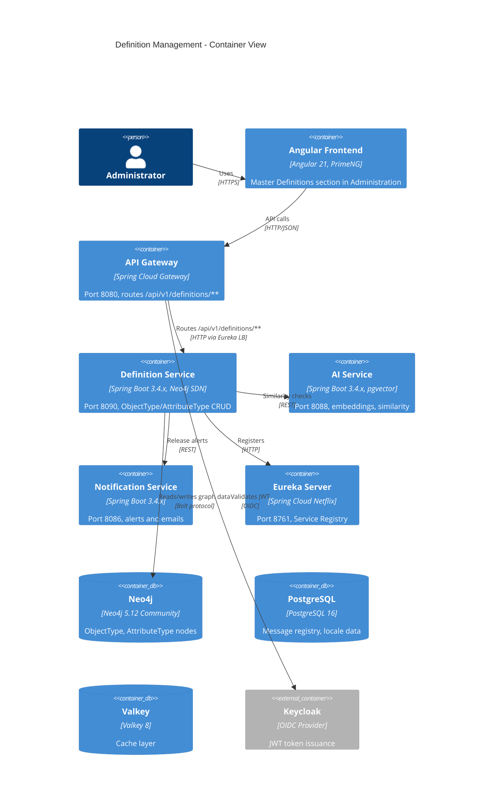
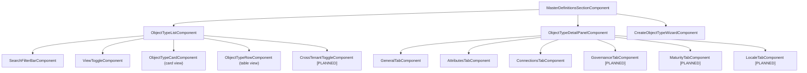
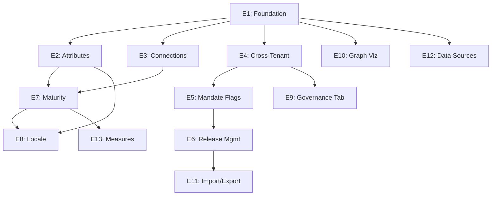

# Software Requirements Specification: Definition Management

**Document ID:** SRS-DM-001
**Version:** 2.0.0
**Date:** 2026-03-10
**Status:** Implementation-Ready
**Author:** BA Agent (BA-PRINCIPLES.md v1.1.0)
**BA Sign-Off:** APPROVED (unconditional)
**Addendum:** [18-SRS-Gap-Resolution-Addendum.md](18-SRS-Gap-Resolution-Addendum.md) -- resolves all 46 gaps from doc 14, all conditions C1-C4

**Revision History:**

| Version | Date | Author | Changes |
|---------|------|--------|---------|
| 1.0.0 | 2026-03-10 | BA Agent | Initial SRS consolidation from docs 01-11. Status: Draft, APPROVED WITH CONDITIONS (C1-C4). |
| 2.0.0 | 2026-03-10 | BA Agent | All 46 gaps resolved via addendum (doc 18). C1-C4 all RESOLVED. 127 ACs (was 78), 96 BRs (was 86), 127 message codes (was 66), 20 confirmation dialogs (was 13). Status: Implementation-Ready, APPROVED (unconditional). |

---

## Table of Contents

1. [Introduction](#1-introduction)
2. [Overall Description](#2-overall-description)
3. [Frontend Requirements](#3-frontend-requirements)
4. [Backend Requirements](#4-backend-requirements)
5. [Security Requirements](#5-security-requirements)
6. [Non-Functional Requirements](#6-non-functional-requirements)
7. [Test Requirements](#7-test-requirements)
8. [Traceability Matrix](#8-traceability-matrix)
9. [Conditions and Risks](#9-conditions-and-risks)

---

## 1. Introduction

### 1.1 Purpose

This Software Requirements Specification (SRS) consolidates all requirements for the Definition Management feature of the EMSIST platform into a single, implementation-ready reference document. It synthesizes the product requirements (PRD), technical specification, low-level design, data model, UI/UX design, API contract, user journeys, implementation backlog, and BA sign-off into one cohesive specification that developers, testers, and architects can use as the authoritative reference.

### 1.2 Scope

Definition Management is the foundational configuration layer of EMSIST. It provides a configurable, graph-based metamodel allowing organizations to define business object types, their attributes, and inter-type relationships. The feature encompasses:

- **As-built (Phase 1):** Object Type CRUD, Attribute Type management, Connection management, wizard-based creation, split-panel UI
- **Planned enhancements (Phases 2-5):** Cross-tenant governance, master mandate flags, maturity scoring, locale management, release management, governance tab, graph visualization, AI-assisted definitions, measures, import/export
- **Deferred (Phase 6):** Viewpoints, BPMN Special Attributes

### 1.3 Definitions, Acronyms, and Abbreviations

| Term | Definition |
|------|------------|
| ObjectType | A business object class definition (e.g., Server, Application, Contract) |
| AttributeType | A reusable attribute definition (e.g., Hostname, IP Address) |
| HAS_ATTRIBUTE | Neo4j relationship linking an ObjectType to an AttributeType |
| CAN_CONNECT_TO | Neo4j relationship defining a permissible connection between ObjectTypes |
| IS_SUBTYPE_OF | Neo4j relationship defining type inheritance hierarchy |
| lifecycleStatus | Three-state field: planned, active, retired (per AP-5) |
| isMasterMandate | Boolean flag indicating the item is mandated by the master tenant |
| maturityClass | Classification for maturity scoring: Mandatory, Conditional, Optional |
| requiredMode | Enforcement behavior: mandatory_creation, mandatory_workflow, optional, conditional |
| Safe Pull | Action of adopting a definition release while preserving local customizations |
| RBAC | Role-Based Access Control |
| SDN | Spring Data Neo4j |
| PrimeNG | Angular UI component library |
| AP-1 through AP-5 | Architectural Principles defined in PRD Section 6 |
| BR-001 through BR-086 | Business Rules defined in PRD Section 7 |
| DEF-E-xxx | Error message codes from the message registry |
| DEF-C-xxx | Confirmation message codes from the message registry |
| DEF-S-xxx | Success message codes from the message registry |
| DEF-W-xxx | Warning message codes from the message registry |

### 1.4 System Overview



### 1.5 References

| # | Document | ID | Version | Location |
|---|----------|----|---------|----------|
| 1 | PRD: Definition Management | PRD-DM-001 | 2.1.0 | `docs/definition-management/Design/01-PRD-Definition-Management.md` |
| 2 | Technical Specification | -- | 1.0.0 | `docs/definition-management/Design/02-Technical-Specification.md` |
| 3 | Low-Level Design | LLD-DM-001 | 1.0.0 | `docs/definition-management/Design/03-LLD-Definition-Management.md` |
| 4 | Data Model | DM-DM-001 | 1.0.0 | `docs/definition-management/Design/04-Data-Model-Definition-Management.md` |
| 5 | UI/UX Design Spec | UX-DM-001 | 1.3.0 | `docs/definition-management/Design/05-UI-UX-Design-Spec.md` |
| 6 | API Contract | API-DM-001 | 1.0.0 | `docs/definition-management/Design/06-API-Contract.md` |
| 7 | Detailed User Journeys | UX-DJ-001 | 2.2.0 | `docs/definition-management/Design/09-Detailed-User-Journeys.md` |
| 8 | Implementation Backlog | BLG-DM-001 | 1.0.0 | `docs/definition-management/Design/11-Implementation-Backlog.md` |
| 9 | BA Sign-Off | -- | -- | `docs/sdlc-evidence/ba-signoff.md` |
| 10 | Gap Analysis | -- | 1.0.0 | `docs/definition-management/Design/07-Gap-Analysis.md` |

---

## 2. Overall Description

### 2.1 Product Perspective

The definition-service is a Spring Boot 3.4.x microservice within the EMSIST platform. It uses Neo4j 5 Community Edition as its primary database for storing graph-based object type definitions. It communicates with other services via REST through the API Gateway (port 8080) and registers with Eureka Server (port 8761).

**Evidence [IMPLEMENTED]:**
- Backend source: `backend/definition-service/src/main/java/com/ems/definition/`
- Frontend source: `frontend/src/app/features/administration/sections/master-definitions/`
- Gateway route: `backend/api-gateway/src/main/java/com/ems/gateway/config/RouteConfig.java` (lines 107-111)
- Docker: `docker-compose.dev-app.yml` (line 356)

### 2.2 Product Functions Summary

| Epic | Name | PRD Section | Priority | Stories | Status |
|------|------|-------------|----------|---------|--------|
| E1 | Foundation Enhancement | 6.1 | P0 | 7 | [IN-PROGRESS] |
| E2 | Attribute Management Enhancement | 6.2, 6.2.1 | P0 | 8 | [IN-PROGRESS] |
| E3 | Connection Management Enhancement | 6.3 | P0 | 5 | [IN-PROGRESS] |
| E4 | Cross-Tenant Governance | 6.4 | P0 | 10 | [PLANNED] |
| E5 | Master Mandate Flags | 6.5 | P0 | 6 | [PLANNED] |
| E6 | Release Management | 6.10 | P0 | 12 | [PLANNED] |
| E7 | Object Data Maturity | 6.6 | P1 | 11 | [PLANNED] |
| E8 | Language Context Management | 6.7 | P1 | 8 | [PLANNED] |
| E9 | Governance Tab | 6.8 | P1 | 7 | [PLANNED] |
| E10 | Graph Visualization | 6.9 | P2 | 6 | [PLANNED] |
| E11 | Import/Export and Versioning | 6.10 (ext) | P2 | 5 | [PLANNED] |
| E12 | Data Sources Tab | -- | P2 | 4 | [PLANNED] |
| E13 | Measures Categories and Measures | 6.12, 6.13 | P3 | 8 | [PLANNED] |

**Total:** 13 epics, 97 user stories, 681 estimated story points, 15 sprints.

### 2.3 User Characteristics

| Registry ID | Persona | Role | Technical Level | Primary Epics | Key Permissions |
|-------------|---------|------|-----------------|---------------|-----------------|
| PER-UX-001 | Sam Martinez | Super Admin | Advanced | E4, E5, E6, E7, E8 | Bypasses licensing; cross-tenant visibility; can impersonate tenant admins |
| PER-UX-002 | Nicole Roberts | Architect | Advanced | E1-E13 (primary user) | Full CRUD on definitions; trigger release workflows; review AI suggestions |
| PER-UX-003 | Fiona Shaw | Tenant Admin | Basic to Intermediate | E4, E5, E6, E8 | Customize inherited definitions; adopt releases; add local attributes |

### 2.4 Constraints

| Constraint | Description |
|-----------|-------------|
| Database | Neo4j 5 Community Edition (no Enterprise features: graph-per-tenant, cluster) |
| Identity | Keycloak only (no Auth0, Okta, Azure AD -- see Known Discrepancies) |
| Messaging | No KafkaTemplate exists in any service currently -- event-driven features are [PLANNED] |
| Cache | Single-tier Valkey (no Caffeine L1 cache) |
| Frontend | Angular 21 with PrimeNG component library |
| RTL | Arabic RTL layout support required (NFR-003) |
| Accessibility | WCAG AAA compliance required (NFR-004) |

### 2.5 Assumptions

| # | Assumption |
|---|-----------|
| A1 | Tenant hierarchy (master/child) will be added to tenant-service as part of E4 |
| A2 | The message registry PostgreSQL schema will be shared across all services |
| A3 | AI service (port 8088) will provide similarity detection APIs for E10 (AI Integration) |
| A4 | Instance repository (AP-1) will be built as a separate service in a later phase |
| A5 | Keycloak realm will be configured with ARCHITECT and SUPER_ADMIN roles |

### 2.6 Dependencies

| Dependency | Service | Required For |
|-----------|---------|-------------|
| API Gateway route | api-gateway (8080) | All frontend API calls |
| Eureka registration | eureka-server (8761) | Service discovery |
| Keycloak JWT | Keycloak (24.0) | Authentication and role claims |
| Neo4j | Neo4j (5.12 Community) | Graph data storage |
| PostgreSQL | PostgreSQL (16) | Message registry (AP-4) |
| Valkey | Valkey (8) | Cache layer |
| tenant-service | tenant-service (8082) | Cross-tenant governance (E4) |
| notification-service | notification-service (8086) | Release alerts (E6) |
| audit-service | audit-service (8087) | Governance audit trail (E4) |
| ai-service | ai-service (8088) | Duplication detection (E10) |
| license-service | license-service (8085) | Architect role licensing (E4) |

---

## 3. Frontend Requirements

### 3.1 Screen Inventory

| Screen ID | Name | Persona(s) | User Journey | Epic(s) | Priority | Status |
|-----------|------|-----------|-------------|---------|----------|--------|
| SCR-AUTH | Keycloak Login | All | Pre-requisite | -- | P0 | [IMPLEMENTED] |
| SCR-01 | Object Type List/Grid View | All | JRN 1.1, 2.1, 3.1 | E1, E4, E5 | P0 | [IMPLEMENTED] -- list, search, filter, view toggle; cross-tenant view [PLANNED] |
| SCR-02-T1 | Object Type Configuration - General Tab | Nicole, Sam | JRN 2.1, 2.2 | E1 | P0 | [IMPLEMENTED] |
| SCR-02-T2 | Object Type Configuration - Attributes Tab | Nicole, Fiona | JRN 2.3, 3.2 | E2 | P0 | [IMPLEMENTED] -- lifecycle chips, maturity class [PLANNED] |
| SCR-02-T3 | Object Type Configuration - Connections Tab | Nicole | JRN 2.1 | E3 | P0 | [IMPLEMENTED] -- lifecycle chips, importance [PLANNED] |
| SCR-02-T4 | Object Type Configuration - Governance Tab | Sam, Fiona | JRN 1.1 | E9 | P1 | [PLANNED] |
| SCR-02-T5 | Object Type Configuration - Maturity Tab | Nicole | JRN 2.2 | E7 | P1 | [PLANNED] |
| SCR-02-T6 | Object Type Configuration - Locale Tab | Nicole | JRN 2.1 | E8 | P1 | [PLANNED] |
| SCR-02-T6M | Object Type Configuration - Measures Categories Tab | Nicole | -- | E13 | P3 | [PLANNED] |
| SCR-02-T7M | Object Type Configuration - Measures Tab | Nicole | -- | E13 | P3 | [PLANNED] |
| SCR-03 | Create Object Type Wizard | Nicole, Fiona | JRN 2.1 | E1 | P0 | [IMPLEMENTED] |
| SCR-04 | Release Management Dashboard | Sam, Nicole, Fiona | JRN 2.2, 3.1 | E6 | P0 | [PLANNED] |
| SCR-04-M1 | Impact Analysis Modal | Fiona | JRN 3.1 | E6 | P0 | [PLANNED] |
| SCR-05 | Maturity Dashboard | Sam, Nicole | -- | E7 | P1 | [PLANNED] |
| SCR-06 | Locale Management | Sam | -- | E8 | P1 | [PLANNED] |
| SCR-GV | Graph Visualization | Nicole | -- | E10 | P2 | [PLANNED] |
| SCR-AI | AI Insights Panel | Nicole, Sam | -- | E10 (AI) | P2 | [PLANNED] |
| SCR-NOTIF | Notification Dropdown | Fiona | JRN 3.1 | E6 | P0 | [PLANNED] |

### 3.2 Component Specifications

#### 3.2.1 SCR-01: Object Type List/Grid View

**Status:** [IMPLEMENTED] -- Core list with enhancements [PLANNED]

**Angular Component Tree:**



**PrimeNG Components Used:**

| Component | Usage | Screen Area |
|-----------|-------|-------------|
| `p-table` | Table view of object types | Main list |
| `p-card` | Card view of object types | Main list (toggle) |
| `pInputText` | Search input | Filter bar |
| `p-select` | Status filter dropdown | Filter bar |
| `p-tag` | Status badges (active/planned/hold/retired), state badges, compliance badges [PLANNED] | List items |
| `p-button` | New Type, Edit, Delete, Duplicate, Restore | Toolbar, detail panel |
| `p-dialog` | Create wizard, delete confirmation | Overlays |
| `p-skeleton` | Loading state (5 rows) | List area |
| `p-toggleButton` | Card/Table view toggle | Toolbar |
| `p-paginator` | Pagination | List footer |

**API Endpoints Consumed:**

| Method | Endpoint | Purpose | Status |
|--------|----------|---------|--------|
| GET | `/api/v1/definitions/object-types` | List with pagination, search, status filter | [IMPLEMENTED] |
| GET | `/api/v1/definitions/object-types?sort={field},{dir}` | Sorted list | [PLANNED] -- US-DM-003 |
| GET | `/api/v1/definitions/object-types?crossTenant=true` | Cross-tenant list (SUPER_ADMIN) | [PLANNED] -- US-DM-026 |
| GET | `/api/v1/definitions/object-types/{id}` | Get by ID with nested attributes/connections | [IMPLEMENTED] |
| POST | `/api/v1/definitions/object-types` | Create new | [IMPLEMENTED] |
| PUT | `/api/v1/definitions/object-types/{id}` | Update | [IMPLEMENTED] |
| DELETE | `/api/v1/definitions/object-types/{id}` | Delete | [IMPLEMENTED] |
| POST | `/api/v1/definitions/object-types/{id}/duplicate` | Duplicate | [IMPLEMENTED] |
| POST | `/api/v1/definitions/object-types/{id}/restore` | Restore to default | [IMPLEMENTED] |
| PATCH | `/api/v1/definitions/object-types/{id}/status` | Lifecycle transition | [PLANNED] -- US-DM-007 |

**State Management:**
- Signals-based reactive state in component class
- `objectTypes` signal: array of ObjectTypeDTO
- `selectedObjectType` signal: currently selected item
- `isLoading` signal: loading state
- `viewMode` signal: 'table' or 'card'
- `searchTerm` signal: current search filter
- `statusFilter` signal: current status filter

**User Interactions:**

| Interaction | Trigger | Action |
|-------------|---------|--------|
| Click row/card | Select object type | Load detail in right panel |
| Type in search | Debounced 300ms | Filter list by name/typeKey/code |
| Select status filter | Immediate | Filter list by status |
| Click view toggle | Immediate | Switch between table/card view |
| Click "New Type" | Open wizard dialog | SCR-03 wizard opens |
| Click Delete | Confirmation dialog | Delete after confirm (DEF-C-008) |
| Click Duplicate | Immediate | Create copy (DEF-C-009) |
| Click Restore | Confirmation dialog | Restore to default (DEF-C-007) |
| Sort column header | API call | Re-fetch sorted [PLANNED] |
| Toggle cross-tenant | API call | Fetch all tenants [PLANNED] |

**Responsive Breakpoints:**

| Aspect | Desktop (>1024px) | Tablet (768-1024px) | Mobile (<768px) |
|--------|-------------------|---------------------|-----------------|
| Layout | Split-panel: left list (280-400px), right detail (flex) | Single column: list above detail | Single column: list full-width, detail as bottom sheet |
| Loading | 5 skeleton rows, 2 text lines each | Same, single column | Same, full width |
| View toggle | Table/Card toggle visible | Same | Default to card view |
| Search | Inline in toolbar | Same | Expandable search icon |
| Actions | Buttons with labels | Icon buttons with tooltips | Icon buttons, overflow menu |

**Empty State:**

```
Icon: pi-box (centered)
Heading: "No object types match your criteria."
Subtext: "Create your first object type using the button above."
"New Type" button remains visible and enabled.
```

**Loading State:**
5 skeleton rows with circle placeholder + 2 text line placeholders.

**Error State:**
Error banner with message "Failed to load object types. Please try again." and Retry button (DEF-E-050).

**Toast Notifications:**
| Event | Code | Severity | Auto-dismiss |
|-------|------|----------|-------------|
| Create success | DEF-S-001 | success | 3s |
| Update success | DEF-S-002 | success | 3s |
| Delete success | DEF-S-003 | success | 3s |
| Duplicate success | DEF-S-004 | success | 3s |
| Restore success | DEF-S-005 | success | 3s |
| Status change | DEF-S-006 | success | 3s |
| API error | DEF-E-050 | error | 5s |
| Conflict | DEF-E-002 | error | 5s |

#### 3.2.2 SCR-02-T1: General Tab (Detail Panel)

**Status:** [IMPLEMENTED]

**PrimeNG Components:** `p-tag` (status, state), `pInputText` (name, description), `p-select` (status, icon), `p-colorPicker` (icon color), `p-button` (Edit, Save, Cancel)

**Fields in View Mode:**

| Field | Display | Editable |
|-------|---------|----------|
| Name | Text | Yes |
| TypeKey | Text (readonly) | No |
| Code | Text (readonly) | No |
| Description | Text area | Yes |
| Status | p-tag with severity | Yes (via transition buttons [PLANNED]) |
| State | p-tag | No (system-managed) |
| Icon | Rendered icon | Yes |
| Icon Color | Color swatch | Yes |
| Attribute Count | Number | No |
| Connection Count | Number | No |
| Created At | Formatted datetime | No |
| Updated At | Formatted datetime | No |

**Evidence:**
- `master-definitions-section.component.html` lines 302-557
- `master-definitions-section.component.ts` lines 392-432

#### 3.2.3 SCR-02-T2: Attributes Tab

**Status:** [IMPLEMENTED] -- Base attribute list; lifecycle chips and maturity class [PLANNED]

**PrimeNG Components:** `p-table` (attribute list), `p-tag` (lifecycle chips -- blue/green/grey [PLANNED]), `p-button` (Add, Remove), `p-checkbox` (select for bulk [PLANNED]), `p-dialog` (pick-list)

**Planned Enhancements (US-DM-012, US-DM-013):**
- `lifecycleStatus` chips: blue (`severity="info"`) for planned, green (`severity="success"`) for active, grey (`severity="secondary"`) for retired
- Transition action dropdown per row: Activate, Retire, Reactivate
- Confirmation dialogs: DEF-C-010, DEF-C-011, DEF-C-012
- Retired rows with reduced opacity (CSS `opacity: 0.6`)
- Shield icon (`pi-shield`) for system default attributes (AP-2) [PLANNED]
- Lock icon (`pi-lock`) for mandated attributes (E5) [PLANNED]
- Bulk lifecycle transition toolbar (US-DM-015) [PLANNED]
- maturityClass dropdown: Mandatory/Conditional/Optional (E7) [PLANNED]
- requiredMode dropdown: mandatory_creation/mandatory_workflow/optional/conditional (E7) [PLANNED]

**API Endpoints:**

| Method | Endpoint | Purpose | Status |
|--------|----------|---------|--------|
| GET | `/api/v1/definitions/object-types/{id}/attributes` | List linked attributes | [IMPLEMENTED] |
| POST | `/api/v1/definitions/object-types/{id}/attributes` | Link attribute | [IMPLEMENTED] |
| DELETE | `/api/v1/definitions/object-types/{id}/attributes/{attrId}` | Unlink attribute | [IMPLEMENTED] |
| PATCH | `/api/v1/definitions/object-types/{id}/attributes/{attrId}` | Update linkage (isRequired, displayOrder) | [PLANNED] -- US-DM-015a |
| PATCH | `/api/v1/definitions/object-types/{id}/attributes/{attrId}/lifecycle` | Transition lifecycle | [PLANNED] -- US-DM-012 |
| PATCH | `/api/v1/definitions/object-types/{id}/attributes/bulk-lifecycle` | Bulk transition | [PLANNED] -- US-DM-015 |

#### 3.2.4 SCR-02-T3: Connections Tab

**Status:** [IMPLEMENTED] -- Base connection list; lifecycle chips and importance [PLANNED]

**PrimeNG Components:** `p-table` (connection list), `p-tag` (cardinality, lifecycle chips [PLANNED], importance badge [PLANNED]), `p-button` (Add, Remove, Edit [PLANNED]), `p-dialog` (add connection form)

**Planned Enhancements (US-DM-016, US-DM-017, US-DM-018, US-DM-019, US-DM-020):**
- `lifecycleStatus` chips (same as attributes)
- `importance` severity badge (critical=red, high=orange, medium=yellow, low=grey)
- `isRequired` badge
- Connection update inline edit form
- Bidirectional display: "Outgoing" and "Incoming" sections
- Confirmation dialogs: DEF-C-020, DEF-C-021, DEF-C-022

#### 3.2.5 SCR-02-T4: Governance Tab [PLANNED]

**Status:** [PLANNED] -- BA Sign-Off Condition C1 (needs additional ACs)

**PRD Section:** 6.8
**Epic:** E9
**User Journey:** JRN 1.1

**Layout:** Split-panel within the tab:
- Left panel: Workflow list table (columns: Workflow Name, Active Version, Create Workflow, Actions)
- Right panel: Direct Operation Settings table (allowDirectCreate, allowDirectUpdate, versionTemplate, viewTemplate, allowDirectDelete)

**PrimeNG Components:** `p-table` (2x -- workflow list, operations list), `p-dialog` (Workflow Settings), `p-select` (workflow selector, behaviour radio), `p-button` (Add Workflow, Edit Operation), `p-tag` (Active/Inactive status)

**Workflow Settings Dialog:**
- Workflow selector dropdown
- Behaviour radio group: Create / Reading / Reporting / Other
- Permission table: Username/Role + Type + Actions
- "Add User/Role" button

**API Endpoints (Section 5.6, 5.7 of API Contract):**

| Method | Endpoint | Purpose |
|--------|----------|---------|
| GET | `/api/v1/definitions/governance/rules` | List governance rules |
| POST | `/api/v1/definitions/governance/rules` | Create rule |
| PUT | `/api/v1/definitions/governance/rules/{id}` | Update rule |
| DELETE | `/api/v1/definitions/governance/rules/{id}` | Delete rule |
| GET | `/api/v1/definitions/object-types/{id}/governance` | Get governance config for object type |
| PUT | `/api/v1/definitions/object-types/{id}/governance` | Update governance config |

#### 3.2.6 SCR-02-T5: Maturity Tab [PLANNED]

**Status:** [PLANNED]
**PRD Section:** 6.6
**Epic:** E7

**Layout:** Four-axis maturity configuration panel

**PrimeNG Components:** `p-knob` (axis weight visualizer), `p-inputNumber` (weight inputs, freshness threshold), `p-table` (attribute maturity class list, connection maturity class list), `p-select` (maturityClass selector, requiredMode selector), `p-tag` (maturity class badges)

**Configuration Fields:**

| Field | Type | Default | Constraint |
|-------|------|---------|------------|
| Completeness Weight | Integer (%) | 40 | Sum of 4 weights = 100 (BR-068) |
| Compliance Weight | Integer (%) | 25 | |
| Relationship Weight | Integer (%) | 20 | |
| Freshness Weight | Integer (%) | 15 | |
| Freshness Threshold Days | Integer | -- | Per Object Type |

**API Endpoints (Section 5.9 of API Contract):**

| Method | Endpoint | Purpose |
|--------|----------|---------|
| GET | `/api/v1/definitions/object-types/{id}/maturity` | Get maturity config |
| PUT | `/api/v1/definitions/object-types/{id}/maturity` | Update maturity config |
| GET | `/api/v1/definitions/object-types/{id}/maturity/preview` | Preview score calculation |

#### 3.2.7 SCR-02-T6: Locale Tab [PLANNED]

**Status:** [PLANNED]
**PRD Section:** 6.7
**Epic:** E8

**PrimeNG Components:** `p-table` (locale list), `p-toggleButton` (active toggle per locale), `p-tag` (active/inactive), `p-button` (Add Locale)

**API Endpoints (Section 5.8 of API Contract):**

| Method | Endpoint | Purpose |
|--------|----------|---------|
| GET | `/api/v1/definitions/locales` | List system locales |
| POST | `/api/v1/definitions/locales` | Create locale |
| PUT | `/api/v1/definitions/locales/{id}` | Update locale |
| DELETE | `/api/v1/definitions/locales/{id}` | Delete locale |

#### 3.2.8 SCR-03: Create Object Type Wizard

**Status:** [IMPLEMENTED]

**Wizard Steps (4 steps):**

| Step | Name | Content | Status |
|------|------|---------|--------|
| 1 | Basic Info | Name, description, icon, icon color | [IMPLEMENTED] |
| 2 | Connections | Select target types, configure connection properties | [IMPLEMENTED] |
| 3 | Attributes | Attribute pick-list with checkbox selection | [IMPLEMENTED] |
| 4 | Status/Review | Status selection, review summary | [IMPLEMENTED] |

**PrimeNG Components:** `p-dialog` (wizard container), `p-steps` (step indicator), `pInputText` (name, description), `p-select` (icon, status), `p-colorPicker` (icon color), `p-checkbox` (attribute/connection selection), `p-button` (Back, Next, Create)

**Evidence:**
- `master-definitions-section.component.html` lines 606-1053
- `master-definitions-section.component.ts` lines 236-521

#### 3.2.9 SCR-04: Release Management Dashboard [PLANNED]

**Status:** [PLANNED]
**PRD Section:** 6.10
**Epic:** E6
**User Journeys:** JRN 2.2, JRN 3.1

**Layout:** Three-panel dashboard:
1. Release list (left): filterable list of releases with status tags
2. Release detail (center): release notes, diff viewer, change summary
3. Adoption tracker (right): per-tenant adoption status

**PrimeNG Components:** `p-table` (release list, adoption tracker), `p-tag` (release status: Draft/Published/Adopted/Deferred/Rejected), `p-dialog` (impact analysis modal, publish confirmation), `p-editor` (release notes), `p-timeline` (version history), `p-button` (Create Release, Publish, Rollback)

**API Endpoints (Section 5.10 of API Contract):**

| Method | Endpoint | Purpose |
|--------|----------|---------|
| GET | `/api/v1/definitions/releases` | List releases |
| POST | `/api/v1/definitions/releases` | Create release |
| GET | `/api/v1/definitions/releases/{id}` | Get release detail |
| POST | `/api/v1/definitions/releases/{id}/publish` | Publish release |
| POST | `/api/v1/definitions/releases/{id}/rollback` | Rollback release |
| GET | `/api/v1/definitions/releases/{id}/diff` | Get release diff |
| GET | `/api/v1/definitions/releases/{id}/impact` | Impact assessment |
| POST | `/api/v1/definitions/releases/{id}/adopt` | Adopt (safe pull) |
| POST | `/api/v1/definitions/releases/{id}/defer` | Defer adoption |
| POST | `/api/v1/definitions/releases/{id}/reject` | Reject with reason |

**Confirmation Dialogs:**

| Dialog ID | Code | Action | Buttons |
|-----------|------|--------|---------|
| CD-30 | DEF-C-030 | Publish release | "Publish" (primary), "Cancel" |
| CD-31 | DEF-C-031 | Rollback release | "Roll Back" (primary), "Cancel" |
| CD-32 | DEF-C-032 | Adopt release | "Adopt" (primary), "Cancel" |

#### 3.2.10 SCR-05: Maturity Dashboard [PLANNED]

**Status:** [PLANNED]
**PRD Section:** 6.6
**Epic:** E7

**PrimeNG Components:** `p-knob` (overall maturity), `p-chart` (axis breakdown bar chart), `p-table` (per-type maturity scores), `p-tag` (threshold indicators: green/amber/red)

#### 3.2.11 SCR-GV: Graph Visualization [PLANNED]

**Status:** [PLANNED] -- BA Sign-Off Condition C2 (needs additional ACs)
**PRD Section:** 6.9
**Epic:** E10

**Technology:** Cytoscape.js or d3-force for interactive graph rendering

**PrimeNG Components:** `p-toolbar` (filter controls, zoom, export), `p-dialog` (node detail overlay), `p-slider` (zoom control), `p-select` (status filter, layout selector)

**API Endpoints (Section 5.13 of API Contract):**

| Method | Endpoint | Purpose |
|--------|----------|---------|
| GET | `/api/v1/definitions/graph` | Get full graph data |
| GET | `/api/v1/definitions/graph?status={status}` | Filtered graph |
| GET | `/api/v1/definitions/graph/neighbors/{id}` | Neighbors of a node |

#### 3.2.12 SCR-AI: AI Insights Panel [PLANNED]

**Status:** [PLANNED]
**PRD Section:** 6.11
**Epic:** E10 (AI portion)

**PrimeNG Components:** `p-panel` (insights container), `p-tag` (alert severity), `p-button` (Apply Suggestion, Dismiss), `p-dialog` (merge preview)

**API Endpoints (Section 5.14 of API Contract):**

| Method | Endpoint | Purpose |
|--------|----------|---------|
| GET | `/api/v1/definitions/ai/duplicates` | Detect duplicates |
| GET | `/api/v1/definitions/ai/suggestions/{id}` | Get suggestions for type |
| POST | `/api/v1/definitions/ai/merge` | Execute merge |

### 3.3 Navigation and Routing

**Angular Routes:**

```typescript
const routes: Routes = [
  {
    path: 'admin/definitions',
    component: MasterDefinitionsSectionComponent,
    canActivate: [AuthGuard, RoleGuard],
    data: { roles: ['SUPER_ADMIN', 'ARCHITECT', 'TENANT_ADMIN'] }
  },
  {
    path: 'admin/definitions/releases',  // [PLANNED]
    component: ReleaseManagementComponent,
    canActivate: [AuthGuard, RoleGuard],
    data: { roles: ['SUPER_ADMIN', 'ARCHITECT'] }
  },
  {
    path: 'admin/definitions/graph',  // [PLANNED]
    component: GraphVisualizationComponent,
    canActivate: [AuthGuard, RoleGuard],
    data: { roles: ['SUPER_ADMIN', 'ARCHITECT'] }
  },
  {
    path: 'admin/definitions/maturity',  // [PLANNED]
    component: MaturityDashboardComponent,
    canActivate: [AuthGuard, RoleGuard],
    data: { roles: ['SUPER_ADMIN', 'ARCHITECT'] }
  },
  {
    path: 'admin/definitions/locales',  // [PLANNED]
    component: LocaleManagementComponent,
    canActivate: [AuthGuard, RoleGuard],
    data: { roles: ['SUPER_ADMIN'] }
  }
];
```

**Route Guards:**
- `AuthGuard`: Verifies JWT is valid and not expired
- `RoleGuard`: Checks JWT role claim against `data.roles`

**Breadcrumb Configuration:**
- Administration > Master Definitions
- Administration > Master Definitions > Releases [PLANNED]
- Administration > Master Definitions > Graph [PLANNED]
- Administration > Master Definitions > Maturity [PLANNED]
- Administration > Locale Management [PLANNED]

### 3.4 Confirmation Dialog Inventory

| ID | Code | Trigger | Title | Body (template) | Primary Button | Secondary Button | Status |
|----|------|---------|-------|-----------------|----------------|------------------|--------|
| CD-01 | DEF-C-001 | Activate ObjectType | "Confirm Activate" | "Activate `{objectTypeName}`?" | "Activate" | "Cancel" | [PLANNED] |
| CD-02 | DEF-C-002 | Hold ObjectType | "Confirm Hold" | "Put `{objectTypeName}` on hold?" | "Hold" | "Cancel" | [PLANNED] |
| CD-03 | DEF-C-003 | Resume ObjectType | "Confirm Resume" | "Resume `{objectTypeName}`?" | "Resume" | "Cancel" | [PLANNED] |
| CD-04 | DEF-C-004 | Retire ObjectType | "Confirm Retire" | "Retire `{objectTypeName}`? `{instanceCount}` instances preserved." | "Retire" | "Cancel" | [PLANNED] |
| CD-05 | DEF-C-005 | Reactivate ObjectType | "Confirm Reactivate" | "Reactivate `{objectTypeName}`?" | "Reactivate" | "Cancel" | [PLANNED] |
| CD-06 | DEF-C-006 | Customize Default | "Confirm Customize" | "Editing will change state to customized." | "Edit" | "Cancel" | [PLANNED] |
| CD-07 | DEF-C-007 | Restore Default | "Confirm Restore" | "Restore `{objectTypeName}` to default? Customizations lost." | "Restore" | "Cancel" | [IMPLEMENTED] |
| CD-08 | DEF-C-008 | Delete ObjectType | "Confirm Delete" | "Delete `{objectTypeName}`? Cannot be undone." | "Delete" | "Cancel" | [IMPLEMENTED] |
| CD-09 | DEF-C-009 | Duplicate ObjectType | "Confirm Duplicate" | "Create copy of `{objectTypeName}`?" | "Duplicate" | "Cancel" | [IMPLEMENTED] |
| CD-10 | DEF-C-010 | Activate Attribute | "Confirm Activate" | "Activate `{attributeName}` on `{objectTypeName}`?" | "Activate" | "Cancel" | [PLANNED] |
| CD-11 | DEF-C-011 | Retire Attribute | "Confirm Retire" | "Retire `{attributeName}`? `{instanceCount}` instances preserved." | "Retire" | "Cancel" | [PLANNED] |
| CD-12 | DEF-C-012 | Reactivate Attribute | "Confirm Reactivate" | "Reactivate `{attributeName}`?" | "Reactivate" | "Cancel" | [PLANNED] |
| CD-13 | DEF-C-013 | Unlink Attribute | "Confirm Remove" | "Remove `{attributeName}` from `{objectTypeName}`?" | "Remove" | "Cancel" | [PLANNED] |

---

## 4. Backend Requirements

### 4.1 Service Layer

#### 4.1.1 Existing Services [IMPLEMENTED]

| Service Class | Package | Methods | Status |
|--------------|---------|---------|--------|
| `ObjectTypeServiceImpl` | `com.ems.definition.service` | createObjectType, listObjectTypes, getObjectTypeById, updateObjectType, deleteObjectType, duplicateObjectType, restoreObjectType, addAttribute, removeAttribute, listAttributes, addConnection, removeConnection, listConnections | [IMPLEMENTED] |
| `AttributeTypeController` | `com.ems.definition.controller` | createAttributeType, listAttributeTypes | [IMPLEMENTED] |

**Evidence:**
- `backend/definition-service/src/main/java/com/ems/definition/service/ObjectTypeServiceImpl.java`
- `backend/definition-service/src/main/java/com/ems/definition/controller/AttributeTypeController.java`

#### 4.1.2 Planned Services

| Service Class | Epic | Methods | Business Rules |
|--------------|------|---------|----------------|
| `ObjectTypeStateMachineService` | E1 | validateTransition, executeTransition | BR-081, BR-084 |
| `SystemDefaultAttributeService` | E1 | provisionDefaults, validateUnlinkProtection | BR-073 |
| `MessageRegistryService` | E1 | getMessage, getMessagesByCategory, resolveLocale | BR-077 to BR-080 |
| `AttributeLifecycleService` | E2 | transitionAttributeLifecycle, validateTransition, bulkTransition | BR-019 to BR-024, BR-082 |
| `ConnectionLifecycleService` | E3 | transitionConnectionLifecycle | BR-024a, BR-083 |
| `TenantHierarchyService` | E4 | getHierarchy, isMasterTenant, getChildTenants | BR-033 |
| `DefinitionPropagationService` | E4 | propagateToChild, deepCopyDefinition | BR-033 |
| `MandateEnforcementService` | E5 | checkMandateViolation, enforceMandateProtection | BR-029 to BR-032 |
| `GovernanceService` | E9 | getGovernanceConfig, updateGovernanceConfig, attachWorkflow | -- |
| `MaturitySchemaService` | E7 | getMaturityConfig, updateMaturityConfig, previewScore | BR-034 to BR-042, BR-066 to BR-068, BR-071 |
| `LocaleManagementService` | E8 | getActiveLocales, createLocale, updateLocale, deleteLocale | BR-043 to BR-047 |
| `ReleaseManagementService` | E6 | createRelease, publishRelease, generateDiff, assessImpact, adoptRelease, rollbackRelease | BR-048 to BR-057, BR-074 to BR-076 |
| `AIIntegrationService` | E10 | detectDuplicates, suggestMerge, recommendAttributes | BR-058 to BR-063 |
| `MeasureCategoryService` | E13 | createCategory, listCategories, updateCategory, deleteCategory | BR-069 |
| `MeasureService` | E13 | createMeasure, listMeasures, updateMeasure, deleteMeasure | BR-070 |
| `GraphVisualizationService` | E10 | getGraphData, getNeighbors | -- |
| `ImportExportService` | E11 | exportDefinitions, importDefinitions, detectConflicts | -- |

#### 4.1.3 Transaction Boundaries

| Operation | Transaction Scope | Isolation |
|-----------|------------------|-----------|
| Create ObjectType + System Defaults | Single Neo4j transaction | BR-073: atomically provision defaults |
| Propagate Definitions | Per-definition transaction (loop) | BR-033: each copy independent |
| Publish Release | Single transaction (snapshot + status) | BR-048: atomic snapshot creation |
| Safe Pull (Adopt Release) | Single transaction per tenant | BR-053: merge + preserve local |
| Bulk Lifecycle Transition | Single Neo4j transaction | All-or-nothing for selected items |

### 4.2 Repository Layer

#### 4.2.1 Existing Repositories [IMPLEMENTED]

| Repository | Interface | Custom Queries | Status |
|-----------|-----------|----------------|--------|
| `ObjectTypeRepository` | `Neo4jRepository<ObjectTypeNode, String>` | findByTenantId, findByTenantIdAndTypeKey, countByTenantId | [IMPLEMENTED] |
| `AttributeTypeRepository` | `Neo4jRepository<AttributeTypeNode, String>` | findByTenantId | [IMPLEMENTED] |

#### 4.2.2 Planned Custom Cypher Queries

| Query | Purpose | Epic |
|-------|---------|------|
| `MATCH (ot:ObjectType) WHERE ot.tenantId IN $tenantIds RETURN ot` | Cross-tenant list | E4 |
| `MATCH (ot:ObjectType {tenantId: $tid})-[r:HAS_ATTRIBUTE]->(at:AttributeType) WHERE r.lifecycleStatus = 'active' RETURN at` | Active attributes only | E2 |
| `MATCH (ot:ObjectType {tenantId: $tid})-[:CAN_CONNECT_TO]->(target:ObjectType) RETURN ot, target` | Graph data | E10 |
| `MATCH (ot:ObjectType)<-[:CAN_CONNECT_TO {lifecycleStatus: 'active'}]-(source:ObjectType) WHERE ot.id = $id RETURN source` | Incoming connections | E3 |
| `MATCH (ot:ObjectType {id: $id})-[:IS_SUBTYPE_OF*1..5]->(parent:ObjectType) RETURN parent` | Inheritance chain (max depth 5) | -- |

#### 4.2.3 Pagination Support

All list endpoints support pagination via `page` and `size` query parameters. Neo4j queries use `SKIP` and `LIMIT`. Response format:

```json
{
  "content": [...],
  "totalElements": 42,
  "totalPages": 2,
  "page": 0,
  "size": 25
}
```

#### 4.2.4 Tenant Isolation

Every Neo4j query MUST include `tenantId` filtering:
- `WHERE ot.tenantId = $tenantId` for single-tenant queries
- `WHERE ot.tenantId IN $tenantIds` for cross-tenant queries (SUPER_ADMIN only)
- `tenantId` resolved from JWT `tenant_id` claim or `X-Tenant-ID` header fallback
- Missing tenant context returns HTTP 400 with DEF-E-015

### 4.3 Data Model

#### 4.3.1 As-Built Neo4j Schema [IMPLEMENTED]

**Node Labels:**

| Label | Properties | Evidence |
|-------|-----------|----------|
| `ObjectType` | id, tenantId, name, typeKey, code, description, iconName, iconColor, status, state, createdAt, updatedAt | `ObjectTypeNode.java` lines 27-85 |
| `AttributeType` | id, tenantId, name, attributeKey, dataType, attributeGroup, description, defaultValue, validationRules, createdAt, updatedAt | `AttributeTypeNode.java` lines 25-53 |

**Relationship Types:**

| Type | Properties | Evidence |
|------|-----------|----------|
| `HAS_ATTRIBUTE` | relId, isRequired, displayOrder | `HasAttributeRelationship.java` lines 24-36 |
| `CAN_CONNECT_TO` | relId, relationshipKey, activeName, passiveName, cardinality, isDirected | `CanConnectToRelationship.java` lines 27-52 |
| `IS_SUBTYPE_OF` | (none) | `ObjectTypeNode.java` line 81-84 |

#### 4.3.2 Target Neo4j Schema [PLANNED]

**New Properties on Existing Nodes:**

| Node/Relationship | Property | Type | Default | Epic |
|-------------------|----------|------|---------|------|
| ObjectType | isMasterMandate | boolean | false | E5 |
| ObjectType | sourceTenantId | String | null | E4 |
| ObjectType | version | int | 1 | E6 |
| ObjectType | freshnessThresholdDays | int | null | E7 |
| AttributeType | isMasterMandate | boolean | false | E5 |
| AttributeType | isLanguageDependent | boolean | false | E8 |
| HAS_ATTRIBUTE | isMasterMandate | boolean | false | E5 |
| HAS_ATTRIBUTE | maturityClass | String | null | E7 |
| HAS_ATTRIBUTE | requiredMode | String | null | E7 |
| HAS_ATTRIBUTE | lifecycleStatus | String | "active" | E2 |
| HAS_ATTRIBUTE | isSystemDefault | boolean | false | E1 |
| HAS_ATTRIBUTE | isLocal | boolean | false | E4 |
| CAN_CONNECT_TO | isMasterMandate | boolean | false | E5 |
| CAN_CONNECT_TO | maturityClass | String | null | E7 |
| CAN_CONNECT_TO | requiredMode | String | null | E7 |
| CAN_CONNECT_TO | lifecycleStatus | String | "active" | E3 |
| CAN_CONNECT_TO | importance | String | null | E3 |
| CAN_CONNECT_TO | isRequired | boolean | false | E3 |

**New Node Labels [PLANNED]:**

| Label | Properties | Epic |
|-------|-----------|------|
| `GovernanceRule` | id, objectTypeId, ruleType, ruleExpression, description, tenantId | E9 |
| `DataSource` | id, name, connectionType, configuration, tenantId | E12 |
| `DefinitionRelease` | id, objectTypeId, versionNumber, snapshot (JSON), releaseNotes, changedBy, changedAt, changeDescription, releaseStatus, tenantId | E6 |
| `TenantReleaseAdoption` | id, releaseId, tenantId, adoptionStatus, impactAssessmentNotes, assessedAt, adoptedAt | E6 |
| `SystemLocale` | id, tenantId, localeCode, displayName, isLocaleActive | E8 |
| `MeasureCategory` | id, tenantId, name, description, displayOrder, isMasterMandate | E13 |
| `Measure` | id, name, description, unit, targetValue, warningThreshold, criticalThreshold, formula, isMasterMandate, tenantId | E13 |

#### 4.3.3 Index Requirements

| Index | Type | Fields | Purpose |
|-------|------|--------|---------|
| `idx_ot_tenant` | RANGE | ObjectType.tenantId | Tenant isolation filtering |
| `idx_ot_typekey` | RANGE | ObjectType.typeKey | Uniqueness within tenant |
| `idx_at_tenant` | RANGE | AttributeType.tenantId | Tenant isolation filtering |
| `idx_at_key` | RANGE | AttributeType.attributeKey | Uniqueness within tenant |
| `idx_ot_status` | RANGE | ObjectType.status | Status filtering |
| `unique_ot_tenant_typekey` | UNIQUE | ObjectType(tenantId, typeKey) | Enforce BR-002 |

### 4.4 Integration Points

#### 4.4.1 Feign Clients [PLANNED]

| Client | Target Service | Methods | Epic |
|--------|---------------|---------|------|
| `TenantServiceClient` | tenant-service (8082) | getTenantHierarchy, getChildTenants | E4 |
| `NotificationServiceClient` | notification-service (8086) | sendReleaseAlert, sendBulkNotification | E6 |
| `AuditServiceClient` | audit-service (8087) | logGovernanceAction, logDefinitionChange | E4 |
| `AIServiceClient` | ai-service (8088) | detectDuplicates, getSuggestions | E10 |
| `LicenseServiceClient` | license-service (8085) | checkArchitectSeats, checkFeatureGate | E4 |

#### 4.4.2 Valkey Cache [PLANNED]

| Cache Key Pattern | TTL | Invalidation | Epic |
|-------------------|-----|-------------|------|
| `def:ot:list:{tenantId}:{page}:{size}` | 5 min | On create/update/delete | E1 |
| `def:ot:{id}` | 10 min | On update/delete | E1 |
| `def:at:list:{tenantId}` | 10 min | On create/update/delete | E1 |
| `def:hierarchy:{tenantId}` | 30 min | On tenant provisioning | E4 |
| `def:msg:{locale}:{category}` | 1 hour | On message update | E1 |
| `def:maturity:{objectTypeId}` | 5 min | On maturity config change | E7 |

#### 4.4.3 Event Publishing

**NOTE:** No KafkaTemplate exists in any EMSIST service currently. Event-driven features are [PLANNED] and contingent on Kafka integration.

| Event | Topic | Payload | Epic |
|-------|-------|---------|------|
| DefinitionChanged | `definition.changes` | ObjectType ID, change type, tenantId | E6 |
| ReleasePublished | `definition.releases` | Release ID, objectType ID, affected tenants | E6 |
| GovernanceViolation | `governance.violations` | Violation details, tenant, type | E4 |

---

## 5. Security Requirements

### 5.1 Authentication

| Requirement | Description | Status |
|-------------|-------------|--------|
| JWT Validation | Every API request MUST include a valid JWT issued by Keycloak | [IMPLEMENTED] |
| Token Claims | JWT MUST contain: `sub` (user ID), `tenant_id` (tenant), `realm_access.roles` (roles) | [IMPLEMENTED] |
| Token Expiry | Expired tokens return HTTP 401 Unauthorized | [IMPLEMENTED] |
| OIDC Provider | Keycloak 24.0 is the sole identity provider | [IMPLEMENTED] |

### 5.2 Authorization (RBAC)

**Role Matrix:**

| Endpoint Category | SUPER_ADMIN | ARCHITECT | TENANT_ADMIN | VIEWER |
|------------------|:-----------:|:---------:|:------------:|:------:|
| ObjectType CRUD | Full | Full | Read + Create Local | Read |
| AttributeType CRUD | Full | Full | Read | Read |
| Connection CRUD | Full | Full | Read | Read |
| Mandate Flags | Set/Unset | Set/Unset | Read (enforced) | Read |
| Cross-Tenant View | Full | -- | -- | -- |
| Release Publish | Full | Full | -- | -- |
| Release Adopt | -- | -- | Full | -- |
| Governance Config | Full | Full | Read (enforced) | Read |
| Maturity Config | Full | Full | Read | Read |
| Locale Config | Full | -- | -- | -- |
| AI Insights | Full | Full | -- | -- |
| Graph Visualization | Full | Full | Read | Read |
| Measures CRUD | Full | Full | Read | Read |

**Permission Mapping to API Endpoints:**

| Business Rule | API Response for Unauthorized | Error Code |
|--------------|------------------------------|------------|
| BR-011 | 403 Forbidden | DEF-E-016 |
| BR-032 | 403 Forbidden (mandate flag set by non-master) | DEF-E-016 |
| BR-029 | 403 Forbidden (modify mandated item in child tenant) | DEF-E-020 / DEF-E-030 |

**Feature Flags (license-service integration) [PLANNED]:**

| Feature | License Tier | Epic |
|---------|-------------|------|
| ARCHITECT role seats | Premium | E4 |
| AI-Assisted Definitions | Enterprise | E10 |
| Cross-Tenant Governance | Enterprise | E4 |
| Release Management | Premium | E6 |

### 5.3 Tenant Isolation

| Requirement | Description | Business Rule |
|-------------|-------------|---------------|
| X-Tenant-ID Header | All requests MUST include tenant context from JWT claim or header | BR-010 |
| Query Scoping | Every Neo4j query MUST include `tenantId` filter | BR-010 |
| Cross-Tenant Access | Only SUPER_ADMIN can access cross-tenant data | BR-032 |
| Data Separation | Each tenant's definitions are isolated by `tenantId` property on every node | -- |
| Propagation | Master tenant definitions are deep-copied (not shared) to child tenants | BR-033 |

### 5.4 Input Validation

| Validation Rule | Field | Constraint | Error Code |
|----------------|-------|------------|------------|
| Required | name | Not null, not blank | DEF-E-004 |
| Max length | name | 255 chars | DEF-E-005 |
| Max length | typeKey | 100 chars | DEF-E-006 |
| Max length | code | 20 chars | DEF-E-007 |
| Enum | status | active, planned, hold, retired | DEF-E-008 |
| Enum | state | default, customized, user_defined | DEF-E-009 |
| Pattern | iconColor | `#[0-9A-Fa-f]{6}` | DEF-E-019 |
| Uniqueness | typeKey (per tenant) | No duplicate within tenant | DEF-E-002 |
| Uniqueness | code (per tenant) | No duplicate within tenant | DEF-E-003 |
| Required | attributeKey | Not null, not blank | DEF-E-023 |
| Enum | dataType | string, text, integer, float, boolean, date, datetime, enum, json | DEF-E-024 |
| Enum | cardinality | one-to-one, one-to-many, many-to-many | DEF-E-032 |
| Cross-tenant | connection source/target | Same tenant | DEF-E-033 |
| JSON | validationRules | Max 2000 chars, valid JSON | BR-018 |
| Range | displayOrder | >= 0 | BR-017 |
| Sum | maturity axis weights | Must sum to 100 | DEF-E-071 |

**XSS Prevention:** All string inputs are sanitized before storage. HTML entities are escaped.

**Cypher Injection Prevention:** All Neo4j queries use parameterized queries (`$parameter`). Raw string concatenation into Cypher is prohibited.

### 5.5 Audit Trail

| Action | Audit Event | Data Captured | Epic |
|--------|-------------|---------------|------|
| Create ObjectType | DEFINITION_CREATED | objectTypeId, tenantId, userId, timestamp | E1 |
| Update ObjectType | DEFINITION_UPDATED | objectTypeId, changedFields, oldValues, newValues | E1 |
| Delete ObjectType | DEFINITION_DELETED | objectTypeId, tenantId, userId | E1 |
| Lifecycle Transition | LIFECYCLE_CHANGED | entityType, entityId, oldStatus, newStatus | E1 |
| Mandate Flag Set | MANDATE_APPLIED | objectTypeId/attributeId, flag, userId | E5 |
| Release Published | RELEASE_PUBLISHED | releaseId, objectTypeId, affectedTenants | E6 |
| Release Adopted | RELEASE_ADOPTED | releaseId, tenantId, changes applied | E6 |
| Governance Violation | GOVERNANCE_VIOLATION | violationType, tenantId, objectTypeId | E4 |
| Definition Propagated | DEFINITION_PROPAGATED | sourceTenantId, targetTenantId, objectTypeIds | E4 |

### 5.6 OWASP Top 10 Mitigations

| OWASP Category | Control | Implementation |
|----------------|---------|----------------|
| A01:2021 Broken Access Control | RBAC via Spring Security + JWT role claims | `SecurityConfig.java` |
| A02:2021 Cryptographic Failures | HTTPS enforced; secrets in Vault/env vars | API Gateway TLS |
| A03:2021 Injection | Parameterized Neo4j Cypher queries; no raw SQL | SDN repository pattern |
| A04:2021 Insecure Design | Mandate enforcement; tenant isolation | MandateEnforcementService |
| A05:2021 Security Misconfiguration | CORS restricted; actuator endpoints secured | SecurityConfig |
| A06:2021 Vulnerable Components | SCA scanning via OWASP dependency-check | CI pipeline |
| A07:2021 Auth Failures | JWT validation; rate limiting on auth endpoints | Keycloak + Gateway |
| A08:2021 Software/Data Integrity | Signed JWT; version snapshots for releases | Keycloak + AP-3 |
| A09:2021 Logging/Monitoring | Structured logging; audit trail to audit-service | AuditServiceClient |
| A10:2021 SSRF | No user-controlled URL resolution in definition-service | Architecture review |

---

## 6. Non-Functional Requirements

| NFR ID | Requirement | Target | Measurement | Source |
|--------|-------------|--------|-------------|--------|
| NFR-001 | API response time for listing 1000 types | < 200ms | p95 latency | PRD Sec 9 |
| NFR-002 | Graph visualization rendering for 500 nodes | > 30fps | Browser DevTools | PRD Sec 9 |
| NFR-003 | RTL layout support for Arabic | Full mirroring | Visual + axe-core | PRD Sec 9 |
| NFR-004 | WCAG AAA accessibility compliance | Zero violations | axe-core scan | PRD Sec 9 |
| NFR-005 | Tenant data isolation | Zero cross-tenant leaks | Security test | PRD Sec 9 |
| NFR-006 | JWT validation on every request | 100% enforcement | Integration test | PRD Sec 9 |
| NFR-007 | RFC 7807 ProblemDetail error responses | All error endpoints | API test | PRD Sec 9 |
| NFR-008 | Import/export file size | Up to 10MB | Load test | PRD Sec 9 |
| NFR-009 | Unlimited version history | No cap on releases | Schema review | PRD Sec 9 |
| NFR-010 | Responsive: desktop/tablet/mobile | 3 breakpoints | Playwright viewport | PRD Sec 9 |
| NFR-011 | Neo4j 5 Community compatibility | No Enterprise features | Build verification | PRD Sec 9 |
| NFR-012 | Auditable definition changes | All CRUD audited | Audit trail test | PRD Sec 9 |
| NFR-013 | Release alerts within 60 seconds | < 60s delivery | E2E timing | PRD Sec 9 |
| NFR-014 | AI detection response time for 500 types | < 5 seconds | p95 latency | PRD Sec 9 |

---

## 7. Test Requirements

### 7.1 Test Types Per Epic

| Epic | Unit (JUnit 5 / Vitest) | Integration (Testcontainers) | E2E (Playwright) | Responsive | Accessibility | Security |
|------|:-:|:-:|:-:|:-:|:-:|:-:|
| E1 Foundation | BE + FE | Neo4j + Gateway | CRUD flow | 3 breakpoints | axe-core | Auth 401/403 |
| E2 Attributes | BE + FE | Neo4j | Lifecycle chips | Chip layout | Screen reader | -- |
| E3 Connections | BE + FE | Neo4j | Bidirectional | Tab layout | Keyboard nav | -- |
| E4 Governance | BE + FE | Neo4j + PG + Feign | Cross-tenant toggle | Column collapse | Badges | Tenant isolation |
| E5 Mandate | BE + FE | Neo4j | Lock icons | Lock display | aria-disabled | 403 enforcement |
| E6 Release Mgmt | BE + FE | Neo4j + PG + Feign | Publish + adopt flow | Dashboard | Dialogs | Rollback safety |
| E7 Maturity | BE + FE | Neo4j | Score display | Knob layout | Screen reader | -- |
| E8 Locale | BE + FE | Neo4j + PG | Locale toggle | RTL layout | RTL nav | -- |
| E9 Gov Tab | BE + FE | Neo4j | Workflow attach | Split panel | Focus trap | Role check |
| E10 Graph Viz | BE + FE | Neo4j | Graph render | Canvas resize | Keyboard zoom | -- |
| E11 Import/Export | BE | Neo4j | File upload/download | -- | -- | File size limit |
| E12 Data Sources | BE + FE | Neo4j | Tab display | Tab layout | -- | -- |
| E13 Measures | BE + FE | Neo4j | Category + measure CRUD | Tab layout | Screen reader | -- |

### 7.2 Test Data Requirements

| Data Set | Description | Used By |
|----------|------------|---------|
| Seed Object Types | 10 predefined object types per tenant (Server, Application, Contract, etc.) | All E2E tests |
| Seed Attribute Types | 30 predefined attribute types (Hostname, IP Address, OS Version, etc.) | E2, E7, E8 |
| Multi-Tenant Setup | Master tenant + 3 child tenants with propagated definitions | E4, E5, E6 |
| Large Data Set | 1000 object types, 5000 attribute types | NFR-001 performance test |
| Locale Data | English + Arabic + French messages in message_registry | E8, E1 |
| Release History | 10 releases with diffs and adoption records | E6, E11 |

### 7.3 Test Environment Dependencies

| Component | Version | Required For |
|-----------|---------|-------------|
| Neo4j (Testcontainers) | 5.12 Community | All backend integration tests |
| PostgreSQL (Testcontainers) | 16 | Message registry tests (E1, E8) |
| Valkey (Testcontainers) | 8 | Cache integration tests |
| Keycloak (Testcontainers) | 24.0 | Auth/RBAC integration tests |
| Playwright | Latest | All E2E tests |
| axe-core | Latest | Accessibility tests |

---

## 8. Traceability Matrix

### 8.1 Requirements to Implementation Traceability

| PRD Section | SRS Section | API Endpoint Group | UI Screen | User Stories | Test Types | Status |
|-------------|-------------|-------------------|-----------|-------------|------------|--------|
| 6.1 Object Type Mgmt | 3.2.1, 4.1.1 | 5.1 Object Type CRUD | SCR-01, SCR-02-T1, SCR-03 | US-DM-001 to US-DM-007 | Unit, Int, E2E, Responsive, A11y | [IMPLEMENTED] + enhancements [PLANNED] |
| 6.2 Attribute Mgmt | 3.2.3, 4.1.2 | 5.2 Attribute Type, 5.3 OT Attributes | SCR-02-T2, SCR-03 | US-DM-008 to US-DM-015a | Unit, Int, E2E, A11y | [IMPLEMENTED] + enhancements [PLANNED] |
| 6.2.1 Attribute Lifecycle | 3.2.3, 4.1.2 | 5.5 Lifecycle Transitions | SCR-02-T2 | US-DM-012, US-DM-013, US-DM-015 | Unit, Int, E2E, A11y | [PLANNED] |
| 6.3 Connection Mgmt | 3.2.4, 4.1.1 | 5.4 OT Connections | SCR-02-T3 | US-DM-016 to US-DM-020 | Unit, Int, E2E, A11y | [IMPLEMENTED] + enhancements [PLANNED] |
| 6.4 Cross-Tenant Gov | 3.2.1, 4.1.2 | 5.6 Governance | SCR-01 (cross-tenant) | US-DM-021 to US-DM-030 | Unit, Int, E2E, Security | [PLANNED] |
| 6.5 Mandate Flags | 3.2.3, 3.2.4 | 5.5 (mandate ops) | SCR-01, SCR-02-T2, SCR-02-T3 | US-DM-031 to US-DM-035 | Unit, Int, E2E, A11y | [PLANNED] |
| 6.6 Maturity Scoring | 3.2.6, 4.1.2 | 5.9 Maturity Config | SCR-02-T5, SCR-05 | US-DM-043 to US-DM-053 | Unit, Int, E2E | [PLANNED] |
| 6.7 Locale Mgmt | 3.2.7, 4.1.2 | 5.8 Localization | SCR-02-T6, SCR-06 | US-DM-054 to US-DM-061 | Unit, Int, E2E, RTL | [PLANNED] |
| 6.8 Governance Tab | 3.2.5, 4.1.2 | 5.6, 5.7 Governance | SCR-02-T4 | US-DM-036 to US-DM-042 | Unit, Int, E2E | [PLANNED] -- Condition C1 |
| 6.9 Graph Viz | 3.2.11, 4.1.2 | 5.13 Graph | SCR-GV | US-DM-098 to US-DM-103 | Unit, E2E | [PLANNED] -- Condition C2 |
| 6.10 Release Mgmt | 3.2.9, 4.1.2 | 5.10 Releases | SCR-04, SCR-04-M1 | US-DM-067 to US-DM-079 | Unit, Int, E2E, Security | [PLANNED] |
| 6.11 AI-Assisted | 3.2.12, 4.1.2 | 5.14 AI | SCR-AI | US-DM-093 to US-DM-097 | Unit, Int, E2E | [PLANNED] |
| 6.12 Measures Cat | 3.2.2 (T6M) | 5.12 Measures | SCR-02-T6M | US-DM-080 to US-DM-085 | Unit, Int, E2E | [PLANNED] |
| 6.13 Measures | 3.2.2 (T7M) | 5.12 Measures | SCR-02-T7M | US-DM-086 to US-DM-092 | Unit, Int, E2E | [PLANNED] |
| AP-1 Repo Separation | 4.3 | -- | -- | -- | Architecture review | [PLANNED] |
| AP-2 Default Attrs | 4.1.2, 4.3.2 | 5.1 (extended) | SCR-02-T2 | US-DM-005 | Unit, Int, E2E | [PLANNED] |
| AP-3 Zero Data Loss | 4.1.2 | 5.10 Releases | SCR-04 | E6 stories | Int, E2E | [PLANNED] |
| AP-4 Message Registry | 4.1.2, 4.4.2 | Messages endpoint | All screens | US-DM-006 | Unit, Int, E2E | [PLANNED] |
| AP-5 Lifecycle Machines | 4.1.2 | 5.5 Lifecycle | SCR-02-T1, SCR-02-T2, SCR-02-T3 | US-DM-007, US-DM-012, US-DM-016 | Unit, Int, E2E | [PLANNED] |

### 8.2 Business Rules Traceability

| BR Range | Category | PRD Section | Enforced By | Error Codes |
|----------|----------|-------------|-------------|-------------|
| BR-001 to BR-011 | Object Type Rules | 7.1 | ObjectTypeServiceImpl | DEF-E-001 to DEF-E-019 |
| BR-012 to BR-018 | Attribute Rules | 7.2 | ObjectTypeServiceImpl, AttributeTypeController | DEF-E-020 to DEF-E-026 |
| BR-019 to BR-024a | Attribute Lifecycle | 7.3 | AttributeLifecycleService [PLANNED] | DEF-E-025, DEF-C-010 to DEF-C-012 |
| BR-025 to BR-028 | Connection Rules | 7.4 | ObjectTypeServiceImpl | DEF-E-030 to DEF-E-035 |
| BR-029 to BR-033 | Governance Rules | 7.5 | MandateEnforcementService [PLANNED] | DEF-E-020, DEF-E-030 |
| BR-034 to BR-042 | Maturity Rules | 7.6 | MaturitySchemaService [PLANNED] | DEF-E-070, DEF-E-071 |
| BR-043 to BR-047 | Locale Rules | 7.7 | LocaleManagementService [PLANNED] | -- |
| BR-048 to BR-057 | Release Rules | 7.8 | ReleaseManagementService [PLANNED] | DEF-E-040 to DEF-E-043 |
| BR-058 to BR-063 | AI Rules | 7.9 | AIIntegrationService [PLANNED] | -- |
| BR-064 to BR-065 | Licensing Rules | 7.10 | LicenseServiceClient [PLANNED] | -- |
| BR-066 to BR-071 | Maturity Model | 7.11 | MaturitySchemaService [PLANNED] | DEF-E-071 |
| BR-072 to BR-076 | Architecture | 7.12 | Architecture enforcement | -- |
| BR-077 to BR-080 | Message Registry | 7.13 | MessageRegistryService [PLANNED] | -- |
| BR-081 to BR-086 | Lifecycle Control | 7.14 | StateMachine services [PLANNED] | DEF-E-012, DEF-E-025 |

### 8.3 Acceptance Criteria Count Summary

| Feature | AC Count | Gherkin Format | PRD Section |
|---------|----------|----------------|-------------|
| Object Type Management (6.1) | 17 | AC-6.1.1 to AC-6.1.17 | 8.1 |
| Attribute Management (6.2) | 5 | AC-6.2.1 to AC-6.2.5 | 8.2 |
| Attribute Lifecycle (6.2.1) | 7 | AC-6.2.1.1 to AC-6.2.1.7 | 8.3 |
| Connection Management (6.3) | 4 | AC-6.3.1 to AC-6.3.4 | 8.4 |
| Cross-Tenant Governance (6.4) | 3 | AC-6.4.1 to AC-6.4.3 | 8.5 |
| Master Mandate Flags (6.5) | 2 | AC-6.5.1 to AC-6.5.2 | 8.6 |
| Maturity Scoring (6.6) | 13 | AC-6.6.1 to AC-6.6.13 | 8.7 |
| Locale Management (6.7) | 5 | AC-6.7.1 to AC-6.7.5 | 8.8 |
| Governance Tab (6.8) | 1 | AC-6.8.1 | 8.9 -- **Condition C1: needs 5-8 more ACs** |
| Graph Visualization (6.9) | 1 | AC-6.9.1 | 8.10 -- **Condition C2: needs 3-5 more ACs** |
| Release Management (6.10) | 7 | AC-6.10.1 to AC-6.10.7 | 8.11 |
| AI-Assisted (6.11) | 5 | AC-6.11.1 to AC-6.11.5 | 8.12 |
| Measures Categories (6.12) | 4 | AC-6.12.1 to AC-6.12.4 | 8.13 |
| Measures (6.13) | 4 | AC-6.13.1 to AC-6.13.4 | 8.14 |
| **Total** | **78** | All in Given/When/Then | |

---

## 9. Conditions and Risks

### 9.1 BA Sign-Off Conditions

| ID | Condition | Severity | Impact | Required Action | When | Blocks |
|----|-----------|----------|--------|----------------|------|--------|
| C1 | Governance Tab (6.8) needs additional ACs | MEDIUM | Cannot decompose Governance Tab stories without testable ACs for workflow attachment, direct operations, workflow settings dialog | Add 5-8 ACs: AC-6.8.2 (attach workflow), AC-6.8.3 (direct operations), AC-6.8.4 (workflow settings dialog), AC-6.8.5 (master mandate on governance), AC-6.8.6 (duplicate workflow), AC-6.8.7 (permissions) | Before Phase 2 sprint containing Governance Tab | E9 stories only |
| C2 | Graph Visualization (6.9) needs additional ACs | LOW | Only 1 AC for a feature with 7 capabilities | Add 3-5 ACs: AC-6.9.2 (filter), AC-6.9.3 (zoom/pan), AC-6.9.4 (export), AC-6.9.5 (IS_SUBTYPE_OF display) | Before Phase 5 sprint containing Graph Viz | E10 stories only |
| C3 | Data Sources Tab requires PRD decision | LOW | No PRD section exists | Either add PRD Section 6.X or mark as "Won't Have" | Before Phase 5 planning | E12 stories only |
| C4 | IS_SUBTYPE_OF inheritance behavior clarification | LOW | PRD does not define business rules for attribute inheritance | Add BR-087, BR-088 clarifying: auto-inheritance, override rules, max depth (5) | Before subtype implementation | Subtype feature only |

### 9.2 Technical Risks

| Risk | Likelihood | Impact | Mitigation |
|------|-----------|--------|------------|
| Neo4j Community Edition performance with large graphs (>10K nodes) | Medium | Degraded response times for listing and graph visualization | Index optimization; pagination; Valkey caching (NFR-001) |
| No optimistic locking on Neo4j nodes | High | Concurrent modification data loss | Add `@Version` field to all node classes (Gap identified in Tech Spec 3.1.5) |
| No `createdBy`/`updatedBy` audit fields | High | Cannot trace who made definition changes | Add audit fields to all nodes (Gap identified in Tech Spec 3.1.5) |
| Kafka not yet integrated | Medium | Event-driven features (release alerts, definition change events) blocked | Use REST fallback initially; migrate to Kafka when available |
| Message registry shared PostgreSQL instance | Low | Schema conflicts with other services | Dedicated schema namespace `definition_messages` |

### 9.3 Dependency Risks

| Dependency | Risk | Impact | Mitigation |
|-----------|------|--------|------------|
| tenant-service hierarchy model | E4 blocked until tenant hierarchy exists | Cannot implement cross-tenant governance | Coordinate with tenant-service team; mock hierarchy for testing |
| license-service Architect seats | E4 partially blocked | Cannot enforce Architect seat limits | Feature gate fallback (allow all if license-service unavailable) |
| notification-service | E6 degraded | Release alerts not delivered | Async with retry; DLQ for failed notifications |
| ai-service similarity detection | E10 optional | AI features unavailable | Non-blocking; manual duplicate detection as fallback |
| process-service workflows | E9 reduced | Governance tab workflow attachment | Stub workflow list; implement integration when process-service ready |

### 9.4 Sprint Dependency Map



### 9.5 Estimated Timeline

| Phase | Sprints | Start | End | Key Deliverables |
|-------|---------|-------|-----|-----------------|
| Foundation | S1-S2 | 2026-03-15 | 2026-04-11 | Gateway route, sort, pagination, AP-2 defaults, AP-4 messages, AP-5 lifecycle, attribute lifecycle, connection enhancements |
| Phase 2: Governance | S3-S5 | 2026-04-12 | 2026-05-23 | Tenant hierarchy, definition propagation, mandate flags, governance tab, Architect role |
| Phase 3: Data Quality | S6-S8 | 2026-05-24 | 2026-07-04 | Maturity 4-axis model, locale management, freshness axis |
| Phase 4: Release Mgmt | S9-S11 | 2026-07-05 | 2026-08-15 | Release workflow, safe pull, alerts, export/import, measure categories |
| Phase 3 contd | S12 | 2026-08-16 | 2026-08-29 | Measures |
| Phase 5: Intelligence | S13-S15 | 2026-08-30 | 2026-10-10 | AI integration, graph visualization, data sources |

---

## Appendix A: Architectural Principles Summary

| ID | Title | Key Rules | Business Rules |
|----|-------|-----------|----------------|
| AP-1 | Definition/Instance Repo Separation | Neo4j for definitions; PostgreSQL for instances; read-only references | BR-072 |
| AP-2 | Default Attributes per Object Type | 10 system defaults auto-provisioned; cannot be removed | BR-073 |
| AP-3 | Zero Data Loss Guarantee | Soft-delete, versioned snapshots, rollback, tenant adoption control | BR-074, BR-075, BR-076 |
| AP-4 | Centralized Message Registry with i18n | PostgreSQL message_registry; {SERVICE}-{TYPE}-{SEQ} codes; locale-aware | BR-077, BR-078, BR-079, BR-080 |
| AP-5 | Lifecycle State Machines | planned/active/retired; validated transitions; confirmation dialogs from registry | BR-081, BR-082, BR-083, BR-084, BR-085, BR-086 |

## Appendix B: Message Code Registry

See PRD Section "Definition Management Error Code Registry" for the full catalog of 60+ message codes:
- **DEF-E-001 to DEF-E-092:** Error messages (39 codes)
- **DEF-C-001 to DEF-C-032:** Confirmation messages (16 codes)
- **DEF-W-001 to DEF-W-006:** Warning messages (6 codes)
- **DEF-S-001 to DEF-S-032:** Success messages (12 codes)

Full registry location: PRD-DM-001, Section "Definition Management Message Registry [PLANNED]"

## Appendix C: Persona Journey Map Cross-Reference

| Journey ID | Persona | Title | Screens Touched | Epic Coverage |
|-----------|---------|-------|-----------------|---------------|
| JRN-DEFMGMT-001 | Sam Martinez (PER-UX-001) | Cross-Tenant Governance Audit | SCR-AUTH, SCR-01, SCR-02-T1, SCR-02-T4, SCR-NOTIF | E4, E5, E9 |
| JRN-DEFMGMT-002 | Sam Martinez (PER-UX-001) | Provision New Tenant with Canonical Definitions | SCR-AUTH, SCR-01, Propagation Wizard | E4 |
| JRN-DEFMGMT-003 | Nicole Roberts (PER-UX-002) | Create New Object Type from Scratch | SCR-AUTH, SCR-01, SCR-03, SCR-02-T2, SCR-02-T3 | E1, E2, E3 |
| JRN-DEFMGMT-004 | Nicole Roberts (PER-UX-002) | Modify Existing Object Type and Release Changes | SCR-AUTH, SCR-01, SCR-02-T1, SCR-02-T5, SCR-04 | E1, E7, E6 |
| JRN-DEFMGMT-005 | Nicole Roberts (PER-UX-002) | Manage Attributes | SCR-AUTH, SCR-01, SCR-02-T2 | E2 |
| JRN-DEFMGMT-006 | Fiona Shaw (PER-UX-003) | Process Master Tenant Release | SCR-AUTH, SCR-NOTIF, SCR-04, SCR-04-M1 | E6 |
| JRN-DEFMGMT-007 | Fiona Shaw (PER-UX-003) | Add Local Customization to Inherited Type | SCR-AUTH, SCR-01, SCR-02-T2, SCR-03 | E4, E5 |
