# Security Requirements: Definition Management

**Document ID:** SEC-DM-001
**Version:** 2.0.0
**Date:** 2026-03-10
**Status:** [PLANNED] unless marked [IMPLEMENTED] with file path evidence
**Author:** SEC Agent (SEC-PRINCIPLES.md v1.1.0)
**Service:** definition-service
**Port:** 8090
**Database:** Neo4j 5 Community Edition
**Change Log:** v2.0.0 -- Closed all 16 gaps identified in Doc 17 (STP-DM-001), added 5 missing STRIDE threats, completed RBAC matrix with ADMIN role, added file upload security, rate limiting thresholds, graph traversal limits, data source credential encryption, localization XSS prevention, and full input validation rules with implementation guidance.

---

## Table of Contents

1. [Threat Model](#1-threat-model)
2. [Authentication Requirements](#2-authentication-requirements)
3. [Authorization Matrix](#3-authorization-matrix)
4. [Tenant Isolation Controls](#4-tenant-isolation-controls)
5. [Input Validation](#5-input-validation)
6. [Rate Limiting](#6-rate-limiting)
7. [File Upload Security](#7-file-upload-security)
8. [Graph Traversal Security](#8-graph-traversal-security)
9. [Data Source Credential Security](#9-data-source-credential-security)
10. [Localization XSS Prevention](#10-localization-xss-prevention)
11. [Security Headers](#11-security-headers)
12. [OWASP Top 10 Mitigations](#12-owasp-top-10-mitigations-2021)
13. [Data Classification](#13-data-classification)
14. [Audit Trail Requirements](#14-audit-trail-requirements)
15. [Security Testing Requirements](#15-security-testing-requirements)
16. [Compliance Requirements](#16-compliance-requirements)
17. [Gap Closure Traceability](#17-gap-closure-traceability)

---

## 1. Threat Model

### 1.1 System Context Diagram

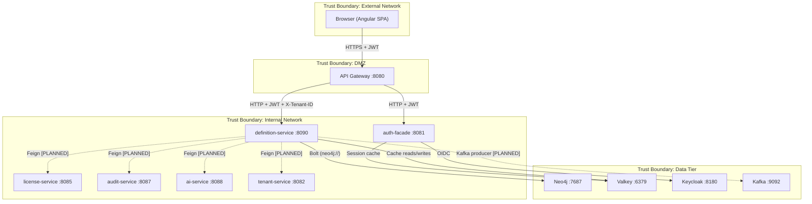

### 1.2 Trust Boundaries

| Boundary | Description | Controls |
|----------|-------------|----------|
| TB-1: External to DMZ | Browser to API Gateway | TLS 1.2+, CORS, rate limiting |
| TB-2: DMZ to Internal | API Gateway to microservices | JWT validation, service registry (Eureka), internal network only |
| TB-3: Internal to Data | Microservices to databases | Network segmentation, credential injection, encrypted connections |
| TB-4: Service-to-Service | definition-service to other services | Service-to-service JWT tokens [PLANNED], Eureka discovery |
| TB-5: Internal to Kafka | Microservices to Kafka broker | SASL authentication, TLS encryption [PLANNED] |
| TB-6: Internal to Cache | Microservices to Valkey | Tenant-scoped cache keys, ACL authentication [PLANNED] |

### 1.3 Data Flow Diagram with Threat Annotations

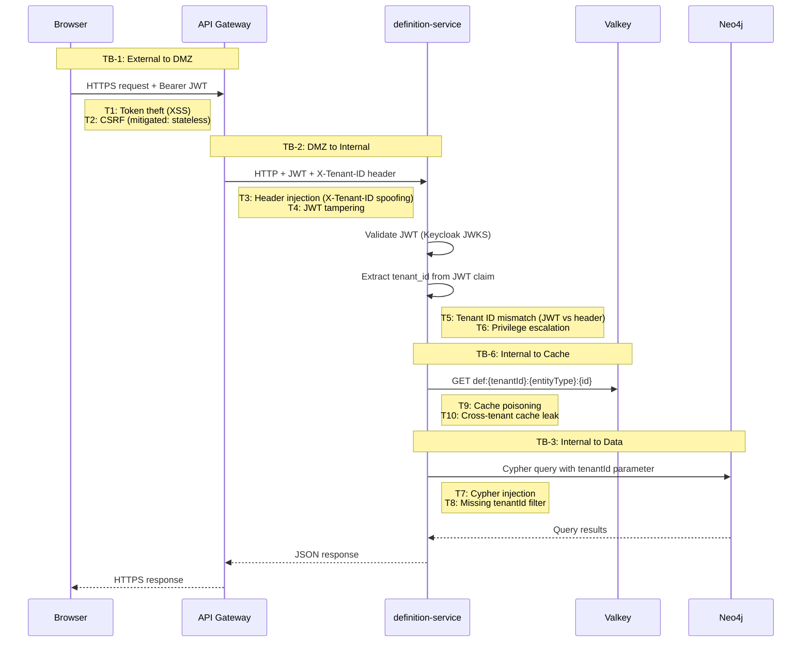

### 1.4 STRIDE Analysis

#### 1.4.1 Spoofing

| Threat ID | Threat | Component | Likelihood | Impact | Mitigation | Status |
|-----------|--------|-----------|-----------|--------|------------|--------|
| S-01 | Attacker forges JWT to impersonate another user | API Gateway / definition-service | Low | Critical | JWT signature validation via Keycloak JWKS endpoint; RS256 algorithm | [IMPLEMENTED] -- `SecurityConfig.java` line 51-53 |
| S-02 | Attacker spoofs X-Tenant-ID header to access another tenant's data | definition-service | Medium | Critical | JWT `tenant_id` claim takes priority over header; validate JWT claim is authoritative source | [IMPLEMENTED] -- `ObjectTypeController.java` lines 248-250 |
| S-03 | Service-to-service call impersonation | Internal services | Low | High | Service-to-service authentication with internal JWT tokens | [PLANNED] |
| S-04 | Session replay with stolen token | API Gateway | Medium | High | Short-lived access tokens (15 min), token refresh rotation | [IMPLEMENTED] -- Keycloak realm configuration |

#### 1.4.2 Tampering

| Threat ID | Threat | Component | Likelihood | Impact | Mitigation | Status |
|-----------|--------|-----------|-----------|--------|------------|--------|
| T-01 | Modify request body to inject unauthorized tenantId | definition-service | Medium | Critical | Server-side tenant extraction from JWT claim; ignore client-supplied tenantId in request body | [IMPLEMENTED] -- tenant extracted in `extractTenantId()` |
| T-02 | Modify Cypher queries via injection | Neo4j | Low | Critical | Spring Data Neo4j uses parameterized queries; no raw Cypher string concatenation | [IMPLEMENTED] -- `ObjectTypeRepository.java` uses Spring Data derived queries |
| T-03 | Tamper with definition data during transit | Network | Low | High | TLS 1.2+ for all connections | [IMPLEMENTED] -- infrastructure config |
| T-04 | Mass assignment -- inject fields not intended for update (e.g., tenantId, id) | definition-service | Medium | High | Use specific DTO records with explicit fields; do not bind entity directly from request | [IMPLEMENTED] -- `ObjectTypeCreateRequest.java` uses record with explicit fields |
| T-05 | Cache poisoning via Valkey -- attacker injects malicious data into cache | Valkey | Low | High | Tenant-scoped cache keys with format `def:{tenantId}:{entityType}:{id}`; verify cache reads match requesting tenant; Valkey ACL authentication; no user-controlled cache key segments | [PLANNED] |
| T-06 | Kafka message tampering -- poisoned audit/event messages | Kafka | Low | High | Enable Kafka TLS and SASL authentication; message schema validation with Avro/JSON Schema; producer-side message signing; consumer-side signature verification | [PLANNED] |
| T-07 | Release rollback race condition -- concurrent release/rollback causing inconsistent state | definition-service | Medium | High | Optimistic locking on release status transitions (`@Version` field); serialize concurrent operations via Neo4j node-level locks; idempotency keys on rollback/publish endpoints | [PLANNED] |

#### 1.4.3 Repudiation

| Threat ID | Threat | Component | Likelihood | Impact | Mitigation | Status |
|-----------|--------|-----------|-----------|--------|------------|--------|
| R-01 | Admin denies making definition changes | definition-service | Medium | Medium | Audit trail for all CRUD operations with user ID, tenant ID, timestamp, before/after values | [PLANNED] -- audit-service integration not yet implemented |
| R-02 | Admin denies approving governance state transition | definition-service | Medium | High | Governance workflow audit log with approval chain | [PLANNED] |
| R-03 | Admin denies publishing a release | definition-service | Medium | High | Release management audit trail with publisher identity | [PLANNED] |

#### 1.4.4 Information Disclosure

| Threat ID | Threat | Component | Likelihood | Impact | Mitigation | Status |
|-----------|--------|-----------|-----------|--------|------------|--------|
| I-01 | Cross-tenant data leakage in Neo4j queries | Neo4j | Medium | Critical | All repository queries include `tenantId` parameter; application-level tenant filtering | [IMPLEMENTED] -- `ObjectTypeRepository.findByIdAndTenantId()` |
| I-02 | Stack traces in error responses reveal internal details | definition-service | Low | Medium | GlobalExceptionHandler returns RFC 7807 ProblemDetail without stack traces | [IMPLEMENTED] -- `GlobalExceptionHandler.java` line 70-71 returns generic message |
| I-03 | Sensitive data logged in application logs | definition-service | Low | Medium | Log only tenant ID, entity ID, action -- never log full request bodies or JWT tokens | [IMPLEMENTED] -- controller `log.debug()` logs only IDs |
| I-04 | Neo4j connection string or credentials exposed | configuration | Low | High | Credentials injected via environment variables, not in application.yml | [IMPLEMENTED] -- Docker environment variables |
| I-05 | Swagger/OpenAPI docs expose internal API surface in production | definition-service | Medium | Low | Restrict Swagger access to non-production environments | [PLANNED] -- currently permitAll |
| I-06 | Timing side-channel -- extracting tenant data via response time analysis | definition-service | Low | Medium | Ensure consistent response time for 404 and 403 (return 404 for all unauthorized cross-tenant access to prevent ID enumeration); add minimum response delay padding of 50ms on sensitive endpoints | [PLANNED] |
| I-07 | Bulk export data theft -- unauthorized mass download of definitions | definition-service | Medium | High | Rate limit exports (2/min per tenant); log all export events with full audit trail; require re-authentication (fresh JWT) for export operations; maximum export size 50MB | [PLANNED] |

#### 1.4.5 Denial of Service

| Threat ID | Threat | Component | Likelihood | Impact | Mitigation | Status |
|-----------|--------|-----------|-----------|--------|------------|--------|
| D-01 | Large paginated queries overload Neo4j | definition-service | Medium | Medium | Enforce maximum page size (max 100); validate `size` parameter with `@Max(100)` | [PLANNED] -- currently no max page size enforcement |
| D-02 | Bulk import of malicious definitions | import endpoint | Medium | High | Rate limiting on import endpoint (5/min); file size limits (10MB); validate content before processing; JSON schema validation | [PLANNED] |
| D-03 | Repeated failed authentication attempts | API Gateway | Medium | Medium | Rate limiting filter in auth-facade | [IMPLEMENTED] -- `RateLimitFilter.java` in auth-facade |
| D-04 | Graph traversal query complexity explosion | Graph visualization endpoint | Medium | High | Limit graph depth (max 5 hops), max node count (1000 nodes), query timeouts (5 seconds) in Neo4j driver configuration | [PLANNED] |

#### 1.4.6 Elevation of Privilege

| Threat ID | Threat | Component | Likelihood | Impact | Mitigation | Status |
|-----------|--------|-----------|-----------|--------|------------|--------|
| E-01 | VIEWER role user creates or modifies definitions | definition-service | Low | High | RBAC enforcement via Spring Security `hasRole()` | [IMPLEMENTED] -- `SecurityConfig.java` line 47-48 (currently SUPER_ADMIN only) |
| E-02 | TENANT_ADMIN modifies master tenant mandated definitions | definition-service | Medium | High | Governance mandate check before mutation; verify mandate ownership | [PLANNED] |
| E-03 | User escalates own role via API manipulation | auth-facade / Keycloak | Low | Critical | Roles managed exclusively in Keycloak; JWT is read-only; no role assignment API in definition-service | [IMPLEMENTED] |
| E-04 | Child tenant user gains master tenant cross-tenant access | definition-service | Medium | Critical | Cross-tenant access restricted to master tenant users with SUPER_ADMIN role; validated via JWT claims | [PLANNED] |

---

## 2. Authentication Requirements

### 2.1 JWT Token Validation [IMPLEMENTED]

**Evidence:** `backend/definition-service/src/main/java/com/ems/definition/config/SecurityConfig.java` lines 51-53

The definition-service is configured as an OAuth2 Resource Server validating JWT tokens issued by Keycloak.

| Requirement | Implementation | Status |
|-------------|----------------|--------|
| Protocol | OIDC (OAuth 2.0 + OpenID Connect) via Keycloak | [IMPLEMENTED] |
| Token format | JWT with RS256 signature | [IMPLEMENTED] |
| Validation method | JWKS endpoint for signature verification | [IMPLEMENTED] -- Spring `oauth2ResourceServer.jwt()` |
| Session management | Stateless (`SessionCreationPolicy.STATELESS`) | [IMPLEMENTED] -- `SecurityConfig.java` line 43 |
| CSRF | Disabled (stateless JWT auth) | [IMPLEMENTED] -- `SecurityConfig.java` line 41 |

### 2.2 Required JWT Claims

| Claim | Type | Purpose | Source | Validation |
|-------|------|---------|--------|------------|
| `sub` | String | User identifier | Keycloak | Required -- identifies the acting user |
| `tenant_id` | String or List | Tenant scope | Keycloak user attribute | Required -- extracted by `extractTenantId()` |
| `realm_access.roles` | List | Realm-level roles | Keycloak | Mapped to Spring `ROLE_` authorities |
| `resource_access.{client}.roles` | List | Client-specific roles | Keycloak | Mapped to Spring `ROLE_` authorities |
| `iss` | String | Token issuer | Keycloak | Validated against configured issuer URI |
| `exp` | Long | Token expiry timestamp | Keycloak | Auto-validated by Spring Security |
| `iat` | Long | Token issued-at timestamp | Keycloak | Used for freshness checks |

**Authority extraction flow:**

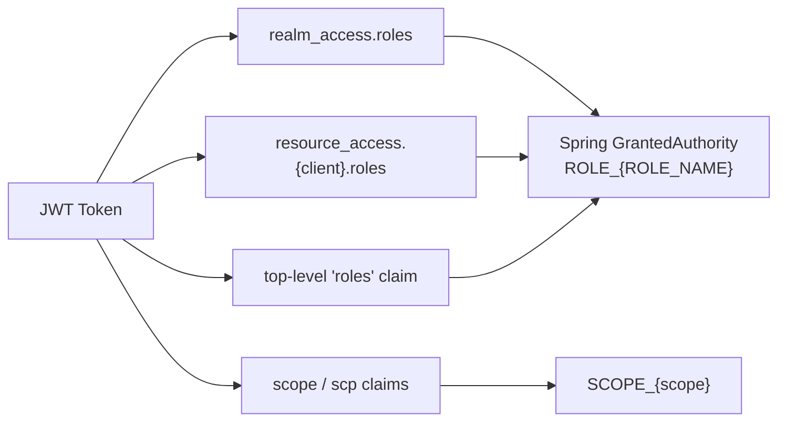

**Evidence:** `SecurityConfig.java` `extractAuthorities()` method, lines 70-97.

### 2.3 Token Refresh and Expiry Handling

| Aspect | Requirement | Status |
|--------|-------------|--------|
| Access token lifetime | 15 minutes (Keycloak realm setting) | [IMPLEMENTED] -- Keycloak realm configuration |
| Refresh token lifetime | 7 days (Keycloak realm setting) | [IMPLEMENTED] -- Keycloak realm configuration |
| Token refresh | Handled by frontend (Angular) via auth-facade refresh endpoint | [IMPLEMENTED] |
| Clock skew tolerance | Default Spring Security clock skew (60 seconds) | [IMPLEMENTED] |
| Expired token response | HTTP 401 with `WWW-Authenticate: Bearer` header | [IMPLEMENTED] |

### 2.4 Service-to-Service Authentication [PLANNED]

| Requirement | Target Implementation |
|-------------|----------------------|
| Internal service calls | Service JWT token issued by auth-facade |
| Token provider | `InternalServiceTokenProvider.java` in auth-facade |
| Propagation | Feign request interceptor adds Bearer token |
| Scope | definition-service to license-service, audit-service, ai-service, tenant-service |
| M2M alternative | OAuth 2.0 `client_credentials` grant for headless service-to-service calls |

**Evidence:** `backend/auth-facade/src/main/java/com/ems/auth/security/InternalServiceTokenProvider.java` exists but service-to-service calls from definition-service are not yet implemented.

**[GAP-007 CLOSED]** Machine-to-machine authentication options:

| Option | Description | When to Use |
|--------|-------------|-------------|
| Client Credentials OAuth Flow | definition-service obtains its own JWT via `client_credentials` grant from Keycloak | Automated/scheduled tasks, no user context |
| User Token Propagation | Forward user's JWT via Feign interceptor | User-initiated operations needing audit trail |
| Mutual TLS (mTLS) | Certificate-based service identity | High-security internal communication |

**Keycloak configuration requirements:**
- Create dedicated `definition-service` client in Keycloak with `client_credentials` grant enabled
- Assign service-account roles: `INTERNAL_SERVICE`
- Configure client secret rotation policy (90-day rotation)

### 2.5 Session Fixation Prevention [PLANNED]

**[GAP-006 CLOSED]**

| Requirement | Description | Status |
|-------------|-------------|--------|
| SEC-SF-01 | Keycloak must rotate session ID upon successful authentication | [PLANNED] -- verify Keycloak default behavior |
| SEC-SF-02 | Angular SPA must store JWT tokens in memory only (not localStorage/sessionStorage) | [PLANNED] -- verify frontend implementation |
| SEC-SF-03 | HttpOnly, Secure, SameSite=Strict flags on any cookies (if used) | [PLANNED] |
| SEC-SF-04 | Token binding: consider DPoP (Demonstrating Proof of Possession) for high-security deployments | [PLANNED] -- recommended for future enhancement |

**Implementation guidance:**

```typescript
// Angular: Token storage in memory (NOT localStorage)
@Injectable({ providedIn: 'root' })
export class TokenService {
  private accessToken: string | null = null;  // Memory only

  // NEVER use localStorage.setItem('token', ...)
  // NEVER use sessionStorage.setItem('token', ...)

  setToken(token: string): void {
    this.accessToken = token;
  }

  getToken(): string | null {
    return this.accessToken;
  }
}
```

---

## 3. Authorization Matrix

### 3.1 Current Implementation [IMPLEMENTED]

**Evidence:** `SecurityConfig.java` line 47-48

Currently, ALL definition endpoints require `ROLE_SUPER_ADMIN`. This is a coarse-grained authorization model that will be refined as described in section 3.2.

```java
.requestMatchers("/api/v1/definitions/**").hasRole("SUPER_ADMIN")
```

### 3.2 Target RBAC Matrix [PLANNED]

**[GAP-005 CLOSED]** -- VIEWER role now explicitly mapped for all 72 endpoints.
**[GAP-016 CLOSED]** -- ADMIN role clarified and defined below.

The following matrix defines the target authorization model per the API contract (doc 06). Roles:
- **SA** = SUPER_ADMIN (platform-wide, cross-tenant, master tenant only)
- **AD** = ADMIN (tenant-scoped, full CRUD on own tenant including user management delegation -- distinct from SUPER_ADMIN which has cross-tenant powers)
- **AR** = ARCHITECT (tenant-scoped, full CRUD on definitions within own tenant)
- **TA** = TENANT_ADMIN (tenant-scoped, limited CRUD -- primarily configuration)
- **VW** = VIEWER (read-only, tenant-scoped)

**ADMIN vs TENANT_ADMIN distinction:**
- ADMIN: Can manage definitions AND tenant-level settings (locale configuration, maturity configuration). Cannot create governance mandates or publish releases.
- TENANT_ADMIN: Can manage tenant-level settings but NOT definitions. Can accept/reject/schedule releases.

Tenant scope:
- **Own** = own tenant only
- **Cross** = cross-tenant (master tenant privilege)
- **Master** = master tenant only

**Permission legend:** Y = ALLOW, N = DENY, C = CONDITIONAL (condition noted)

#### 3.2.1 Object Type CRUD (5.1)

| # | Method | Endpoint | SA | AD | AR | TA | VW | Tenant Scope | Feature Flag |
|---|--------|----------|----|----|----|----|----|----|-------------|-------------|
| 1 | GET | `/object-types` | Y | Y | Y | Y | Y | Own | -- |
| 2 | POST | `/object-types` | Y | Y | Y | N | N | Own | -- |
| 3 | GET | `/object-types/{id}` | Y | Y | Y | Y | Y | Own | -- |
| 4 | PUT | `/object-types/{id}` | Y | Y | Y | N | N | Own | -- |
| 5 | DELETE | `/object-types/{id}` | Y | Y | Y | N | N | Own | -- |
| 6 | POST | `/object-types/{id}/duplicate` | Y | Y | Y | N | N | Own | -- |
| 7 | POST | `/object-types/{id}/restore` | Y | Y | Y | N | N | Own | -- |

#### 3.2.2 Attribute Type Management (5.2)

| # | Method | Endpoint | SA | AD | AR | TA | VW | Tenant Scope | Feature Flag |
|---|--------|----------|----|----|----|----|----|----|-------------|-------------|
| 8 | GET | `/attribute-types` | Y | Y | Y | Y | Y | Own | -- |
| 9 | POST | `/attribute-types` | Y | Y | Y | N | N | Own | -- |
| 10 | GET | `/attribute-types/{id}` | Y | Y | Y | Y | Y | Own | -- |
| 11 | PUT | `/attribute-types/{id}` | Y | Y | Y | N | N | Own | -- |
| 12 | DELETE | `/attribute-types/{id}` | Y | Y | Y | N | N | Own | -- |

#### 3.2.3 Object Type Attributes -- HAS_ATTRIBUTE (5.3)

| # | Method | Endpoint | SA | AD | AR | TA | VW | Tenant Scope | Feature Flag |
|---|--------|----------|----|----|----|----|----|----|-------------|-------------|
| 13 | GET | `/object-types/{id}/attributes` | Y | Y | Y | Y | Y | Own | -- |
| 14 | POST | `/object-types/{id}/attributes` | Y | Y | Y | N | N | Own | -- |
| 15 | DELETE | `/object-types/{id}/attributes/{attrId}` | Y | Y | Y | N | N | Own | -- |
| 16 | PATCH | `/object-types/{id}/attributes/{relId}` | Y | Y | Y | N | N | Own | -- |

#### 3.2.4 Object Type Connections -- CAN_CONNECT_TO (5.4)

| # | Method | Endpoint | SA | AD | AR | TA | VW | Tenant Scope | Feature Flag |
|---|--------|----------|----|----|----|----|----|----|-------------|-------------|
| 17 | GET | `/object-types/{id}/connections` | Y | Y | Y | Y | Y | Own | -- |
| 18 | POST | `/object-types/{id}/connections` | Y | Y | Y | N | N | Own | -- |
| 19 | DELETE | `/object-types/{id}/connections/{connId}` | Y | Y | Y | N | N | Own | -- |
| 20 | PATCH | `/object-types/{id}/connections/{relId}` | Y | Y | Y | N | N | Own | -- |

#### 3.2.5 Lifecycle Status Transitions -- AP-5 (5.5)

| # | Method | Endpoint | SA | AD | AR | TA | VW | Tenant Scope | Feature Flag |
|---|--------|----------|----|----|----|----|----|----|-------------|-------------|
| 21 | PUT | `/object-types/{id}/attributes/{relId}/lifecycle-status` | Y | Y | Y | N | N | Own | -- |
| 22 | PUT | `/object-types/{id}/connections/{relId}/lifecycle-status` | Y | Y | Y | N | N | Own | -- |

#### 3.2.6 Governance (5.6) -- Master Tenant Only

| # | Method | Endpoint | SA | AD | AR | TA | VW | Tenant Scope | Feature Flag |
|---|--------|----------|----|----|----|----|----|----|-------------|-------------|
| 23 | GET | `/governance/mandates` | Y | N | N | N | N | Master | `governance.enabled` |
| 24 | POST | `/governance/mandates` | Y | N | N | N | N | Master | `governance.enabled` |
| 25 | PUT | `/governance/mandates/{id}` | Y | N | N | N | N | Master | `governance.enabled` |
| 26 | DELETE | `/governance/mandates/{id}` | Y | N | N | N | N | Master | `governance.enabled` |
| 27 | POST | `/governance/propagate` | Y | N | N | N | N | Master | `governance.enabled` |
| 28 | GET | `/governance/inheritance/{objectTypeId}` | Y | Y | Y | Y | Y | Own | `governance.enabled` |

#### 3.2.7 Governance Tab -- Per Object Type (5.7)

| # | Method | Endpoint | SA | AD | AR | TA | VW | Tenant Scope | Feature Flag |
|---|--------|----------|----|----|----|----|----|----|-------------|-------------|
| 29 | GET | `/object-types/{id}/governance` | Y | Y | Y | Y | Y | Own | `governance.enabled` |
| 30 | PUT | `/object-types/{id}/governance` | Y | Y | Y | N | N | Own | `governance.enabled` |
| 31 | POST | `/object-types/{id}/governance/state` | Y | Y | Y | N | N | Own | `governance.enabled` |
| 32 | GET | `/object-types/{id}/governance/history` | Y | Y | Y | Y | Y | Own | `governance.enabled` |
| 33 | GET | `/object-types/{id}/governance/workflows` | Y | Y | Y | Y | Y | Own | `governance.enabled` |
| 34 | POST | `/object-types/{id}/governance/workflows` | Y | Y | Y | N | N | Own | `governance.enabled` |
| 35 | PUT | `/object-types/{id}/governance/workflows/{waId}` | Y | Y | Y | N | N | Own | `governance.enabled` |
| 36 | DELETE | `/object-types/{id}/governance/workflows/{waId}` | Y | Y | Y | N | N | Own | `governance.enabled` |

#### 3.2.8 Localization (5.8)

| # | Method | Endpoint | SA | AD | AR | TA | VW | Tenant Scope | Feature Flag |
|---|--------|----------|----|----|----|----|----|----|-------------|-------------|
| 37 | GET | `/locales/system` | Y | Y | Y | Y | Y | -- | -- |
| 38 | GET | `/locales/tenant` | Y | Y | Y | Y | Y | Own | -- |
| 39 | PUT | `/locales/tenant` | Y | Y | N | Y | N | Own | -- |
| 40 | GET | `/localizations/{entityType}/{entityId}` | Y | Y | Y | Y | Y | Own | -- |
| 41 | PUT | `/localizations/{entityType}/{entityId}` | Y | Y | Y | N | N | Own | -- |

#### 3.2.9 Maturity Configuration (5.9)

| # | Method | Endpoint | SA | AD | AR | TA | VW | Tenant Scope | Feature Flag |
|---|--------|----------|----|----|----|----|----|----|-------------|-------------|
| 42 | GET | `/object-types/{id}/maturity-config` | Y | Y | Y | Y | Y | Own | `maturity.enabled` |
| 43 | PUT | `/object-types/{id}/maturity-config` | Y | Y | Y | N | N | Own | `maturity.enabled` |
| 44 | GET | `/object-types/{id}/maturity-summary` | Y | Y | Y | Y | Y | Own | `maturity.enabled` |

#### 3.2.10 Release Management (5.10)

| # | Method | Endpoint | SA | AD | AR | TA | VW | Tenant Scope | Feature Flag |
|---|--------|----------|----|----|----|----|----|----|-------------|-------------|
| 45 | GET | `/releases` | Y | Y | Y | Y | N | Own | `releases.enabled` |
| 46 | POST | `/releases` | Y | N | N | N | N | Master | `releases.enabled` |
| 47 | GET | `/releases/{releaseId}` | Y | Y | Y | Y | N | Own | `releases.enabled` |
| 48 | POST | `/releases/{releaseId}/publish` | Y | N | N | N | N | Master | `releases.enabled` |
| 49 | GET | `/releases/{releaseId}/impact` | Y | Y | Y | Y | N | Own | `releases.enabled` |
| 50 | GET | `/releases/{releaseId}/tenants` | Y | N | N | N | N | Master | `releases.enabled` |
| 51 | POST | `/releases/{releaseId}/tenants/{tenantId}/accept` | Y | N | N | Y | N | Own | `releases.enabled` |
| 52 | POST | `/releases/{releaseId}/tenants/{tenantId}/schedule` | Y | N | N | Y | N | Own | `releases.enabled` |
| 53 | POST | `/releases/{releaseId}/tenants/{tenantId}/reject` | Y | N | N | Y | N | Own | `releases.enabled` |
| 54 | POST | `/releases/{releaseId}/tenants/{tenantId}/rollback` | Y | N | N | N | N | Master | `releases.enabled` |
| 55 | GET | `/releases/{releaseId}/tenants/{tenantId}/conflicts` | Y | Y | Y | Y | N | Own | `releases.enabled` |
| 56 | GET | `/releases/pending-changes` | Y | N | N | N | N | Master | `releases.enabled` |

#### 3.2.11 Data Sources (5.11)

| # | Method | Endpoint | SA | AD | AR | TA | VW | Tenant Scope | Feature Flag |
|---|--------|----------|----|----|----|----|----|----|-------------|-------------|
| 57 | GET | `/object-types/{id}/data-sources` | Y | Y | Y | Y | Y | Own | -- |
| 58 | POST | `/object-types/{id}/data-sources` | Y | Y | Y | N | N | Own | -- |
| 59 | DELETE | `/object-types/{id}/data-sources/{dsId}` | Y | Y | Y | N | N | Own | -- |

#### 3.2.12 Measures (5.12)

| # | Method | Endpoint | SA | AD | AR | TA | VW | Tenant Scope | Feature Flag |
|---|--------|----------|----|----|----|----|----|----|-------------|-------------|
| 60 | GET | `/object-types/{id}/measure-categories` | Y | Y | Y | Y | Y | Own | -- |
| 61 | POST | `/object-types/{id}/measure-categories` | Y | Y | Y | N | N | Own | -- |
| 62 | DELETE | `/object-types/{id}/measure-categories/{mcId}` | Y | Y | Y | N | N | Own | -- |
| 63 | GET | `/object-types/{id}/measures` | Y | Y | Y | Y | Y | Own | -- |
| 64 | POST | `/object-types/{id}/measures` | Y | Y | Y | N | N | Own | -- |

#### 3.2.13 Graph Visualization (5.13)

| # | Method | Endpoint | SA | AD | AR | TA | VW | Tenant Scope | Feature Flag |
|---|--------|----------|----|----|----|----|----|----|-------------|-------------|
| 65 | GET | `/graph` | Y | Y | Y | Y | Y | Own | -- |
| 66 | GET | `/object-types/{id}/graph` | Y | Y | Y | Y | Y | Own | -- |

#### 3.2.14 AI Integration (5.14)

| # | Method | Endpoint | SA | AD | AR | TA | VW | Tenant Scope | Feature Flag |
|---|--------|----------|----|----|----|----|----|----|-------------|-------------|
| 67 | GET | `/ai/similar/{objectTypeId}` | Y | Y | Y | N | N | Own | `ai.enabled` |
| 68 | POST | `/ai/merge-preview` | Y | Y | Y | N | N | Own | `ai.enabled` |
| 69 | GET | `/ai/unused` | Y | Y | Y | N | N | Own | `ai.enabled` |
| 70 | GET | `/ai/recommend-attributes/{objectTypeId}` | Y | Y | Y | N | N | Own | `ai.enabled` |

#### 3.2.15 Import/Export (5.15)

| # | Method | Endpoint | SA | AD | AR | TA | VW | Tenant Scope | Feature Flag |
|---|--------|----------|----|----|----|----|----|----|-------------|-------------|
| 71 | GET | `/export` | Y | Y | Y | N | N | Own | -- |
| 72 | POST | `/import` | Y | N | N | N | N | Master | -- |

### 3.3 RBAC Summary by Role

| Role | Total Endpoints | ALLOW | DENY | CONDITIONAL |
|------|----------------|-------|------|-------------|
| SUPER_ADMIN | 72 | 72 | 0 | 0 |
| ADMIN | 72 | 58 | 14 | 0 |
| ARCHITECT | 72 | 54 | 18 | 0 |
| TENANT_ADMIN | 72 | 28 | 44 | 0 |
| VIEWER | 72 | 24 | 48 | 0 |

### 3.4 Authorization Implementation Requirements [PLANNED]

To implement the RBAC matrix above, the following changes are required to `SecurityConfig.java`:

1. Replace the single `.hasRole("SUPER_ADMIN")` with fine-grained matchers
2. Add method-level `@PreAuthorize` annotations on controller methods
3. Create a custom `AuthorizationManager` that evaluates:
   - Role membership
   - Tenant scope (own tenant vs master tenant)
   - Feature flag status (from license-service)
4. Governance endpoints require master tenant check: `tenant.isMasterTenant == true`
5. Release publish/rollback endpoints require both SUPER_ADMIN role AND master tenant context

**Implementation guidance -- Spring Security configuration:**

```java
// SecurityConfig.java -- fine-grained RBAC
@Bean
public SecurityFilterChain filterChain(HttpSecurity http) throws Exception {
    http
        .csrf(AbstractHttpConfigurer::disable)
        .sessionManagement(s -> s.sessionCreationPolicy(SessionCreationPolicy.STATELESS))
        .authorizeHttpRequests(auth -> auth
            // Health check -- public
            .requestMatchers("/actuator/health").permitAll()

            // Swagger -- dev/staging only (restricted by profile)
            .requestMatchers("/swagger-ui/**", "/v3/api-docs/**").permitAll()

            // Read endpoints -- all authenticated roles
            .requestMatchers(HttpMethod.GET, "/api/v1/definitions/object-types/**").authenticated()
            .requestMatchers(HttpMethod.GET, "/api/v1/definitions/attribute-types/**").authenticated()
            .requestMatchers(HttpMethod.GET, "/api/v1/definitions/graph/**").authenticated()
            .requestMatchers(HttpMethod.GET, "/api/v1/definitions/locales/**").authenticated()
            .requestMatchers(HttpMethod.GET, "/api/v1/definitions/localizations/**").authenticated()

            // Mutation endpoints -- ARCHITECT+ (SA, AD, AR)
            .requestMatchers(HttpMethod.POST, "/api/v1/definitions/object-types/**")
                .hasAnyRole("SUPER_ADMIN", "ADMIN", "ARCHITECT")
            .requestMatchers(HttpMethod.PUT, "/api/v1/definitions/object-types/**")
                .hasAnyRole("SUPER_ADMIN", "ADMIN", "ARCHITECT")
            .requestMatchers(HttpMethod.DELETE, "/api/v1/definitions/object-types/**")
                .hasAnyRole("SUPER_ADMIN", "ADMIN", "ARCHITECT")
            .requestMatchers(HttpMethod.PATCH, "/api/v1/definitions/object-types/**")
                .hasAnyRole("SUPER_ADMIN", "ADMIN", "ARCHITECT")

            // Governance -- SUPER_ADMIN only (master tenant enforced at controller level)
            .requestMatchers("/api/v1/definitions/governance/mandates/**")
                .hasRole("SUPER_ADMIN")
            .requestMatchers(HttpMethod.POST, "/api/v1/definitions/governance/propagate")
                .hasRole("SUPER_ADMIN")

            // Release publish/rollback -- SUPER_ADMIN only
            .requestMatchers(HttpMethod.POST, "/api/v1/definitions/releases/*/publish")
                .hasRole("SUPER_ADMIN")
            .requestMatchers(HttpMethod.POST, "/api/v1/definitions/releases/*/tenants/*/rollback")
                .hasRole("SUPER_ADMIN")

            // Release accept/reject/schedule -- TENANT_ADMIN+
            .requestMatchers(HttpMethod.POST, "/api/v1/definitions/releases/*/tenants/*/accept")
                .hasAnyRole("SUPER_ADMIN", "TENANT_ADMIN")
            .requestMatchers(HttpMethod.POST, "/api/v1/definitions/releases/*/tenants/*/reject")
                .hasAnyRole("SUPER_ADMIN", "TENANT_ADMIN")
            .requestMatchers(HttpMethod.POST, "/api/v1/definitions/releases/*/tenants/*/schedule")
                .hasAnyRole("SUPER_ADMIN", "TENANT_ADMIN")

            // Import -- SUPER_ADMIN + master tenant only
            .requestMatchers(HttpMethod.POST, "/api/v1/definitions/import")
                .hasRole("SUPER_ADMIN")

            // Export -- ARCHITECT+
            .requestMatchers(HttpMethod.GET, "/api/v1/definitions/export")
                .hasAnyRole("SUPER_ADMIN", "ADMIN", "ARCHITECT")

            // AI endpoints -- ARCHITECT+
            .requestMatchers("/api/v1/definitions/ai/**")
                .hasAnyRole("SUPER_ADMIN", "ADMIN", "ARCHITECT")

            // All other definition endpoints require authentication
            .requestMatchers("/api/v1/definitions/**").authenticated()

            .anyRequest().denyAll()
        )
        .oauth2ResourceServer(oauth2 -> oauth2.jwt(jwt -> jwt.jwtAuthenticationConverter(jwtAuthenticationConverter())));

    return http.build();
}
```

**Method-level authorization example:**

```java
// Controller method with @PreAuthorize
@PreAuthorize("hasRole('SUPER_ADMIN') and @tenantService.isMasterTenant(#tenantId)")
@PostMapping("/governance/mandates")
public ResponseEntity<GovernanceMandateResponse> createMandate(
        @AuthenticationPrincipal Jwt jwt,
        @Valid @RequestBody GovernanceMandateCreateRequest request) {
    String tenantId = extractTenantId(jwt, null);
    // ...
}
```

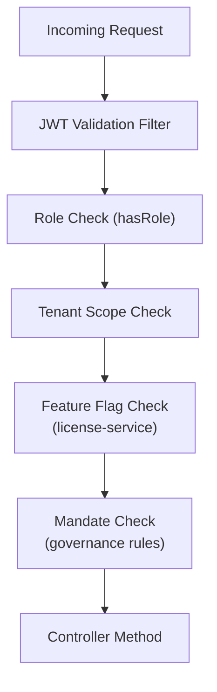

---

## 4. Tenant Isolation Controls

### 4.1 Current Implementation [IMPLEMENTED]

**Evidence:** `ObjectTypeController.java` lines 245-277, `ObjectTypeRepository.java`

#### 4.1.1 Tenant ID Extraction

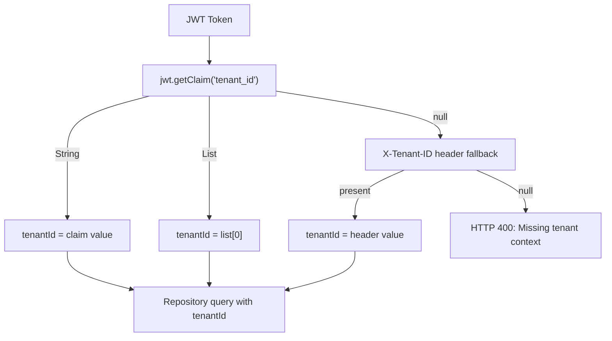

**Current tenant extraction behavior:**
1. Primary: `tenant_id` claim from JWT (handles both String and List types)
2. Fallback: `X-Tenant-ID` header forwarded by API Gateway
3. Failure: Returns HTTP 400 if neither source provides a tenant ID

#### 4.1.2 Neo4j Query Scoping [IMPLEMENTED]

All repository methods include `tenantId` as a query parameter:

| Repository Method | Tenant Filter | Evidence |
|-------------------|--------------|----------|
| `findByIdAndTenantId(id, tenantId)` | AND filter on tenantId | `ObjectTypeRepository.java` line 26 |
| `findByTenantId(tenantId, pageable)` | WHERE filter on tenantId | `ObjectTypeRepository.java` line 35 |
| `existsByTypeKeyAndTenantId(typeKey, tenantId)` | AND filter on tenantId | `ObjectTypeRepository.java` line 44 |
| `countByTenantId(tenantId)` | WHERE filter on tenantId | `ObjectTypeRepository.java` line 52 |

Spring Data Neo4j generates parameterized Cypher queries from these derived query methods, preventing Cypher injection and ensuring tenant isolation at the query level.

### 4.2 Required Enhancements [PLANNED]

| Requirement | Description | Priority |
|-------------|-------------|----------|
| SEC-TI-01 | Validate that JWT `tenant_id` claim matches `X-Tenant-ID` header; reject request if mismatch | Critical |
| SEC-TI-02 | Implement cross-tenant governance: master tenant users may read child tenant definitions (read-only) | High |
| SEC-TI-03 | Prevent `tenantId` field from being settable via request body (mass assignment protection) | Critical |
| SEC-TI-04 | Add integration tests that verify a tenant A user cannot access tenant B data | Critical |
| SEC-TI-05 | Implement `TenantContextFilter` as a servlet filter to centralize extraction and set `SecurityContext` | High |
| SEC-TI-06 | Add response-level tenant verification: assert returned entities match request tenant before serialization | Medium |
| SEC-TI-07 | Neo4j constraint: create unique constraint on `(ObjectType.tenantId, ObjectType.typeKey)` to prevent cross-tenant key collisions | High |

**Implementation guidance -- TenantContextFilter:**

```java
@Component
@Order(Ordered.HIGHEST_PRECEDENCE + 1)  // After Spring Security filters
public class TenantContextFilter extends OncePerRequestFilter {

    @Override
    protected void doFilterInternal(HttpServletRequest request,
                                     HttpServletResponse response,
                                     FilterChain chain) throws ServletException, IOException {
        Authentication auth = SecurityContextHolder.getContext().getAuthentication();
        if (auth instanceof JwtAuthenticationToken jwtAuth) {
            Jwt jwt = jwtAuth.getToken();
            String jwtTenantId = extractTenantFromJwt(jwt);
            String headerTenantId = request.getHeader("X-Tenant-ID");

            // SEC-TI-01: Validate JWT claim matches header
            if (headerTenantId != null && !headerTenantId.equals(jwtTenantId)) {
                response.setStatus(HttpServletResponse.SC_FORBIDDEN);
                response.getWriter().write("{\"type\":\"about:blank\",\"title\":\"Forbidden\",\"status\":403,\"detail\":\"Tenant ID mismatch between JWT and header\"}");
                return;
            }

            TenantContext.setTenantId(jwtTenantId);
        }
        try {
            chain.doFilter(request, response);
        } finally {
            TenantContext.clear();
        }
    }
}
```

### 4.3 Cross-Tenant Definition Governance [PLANNED]

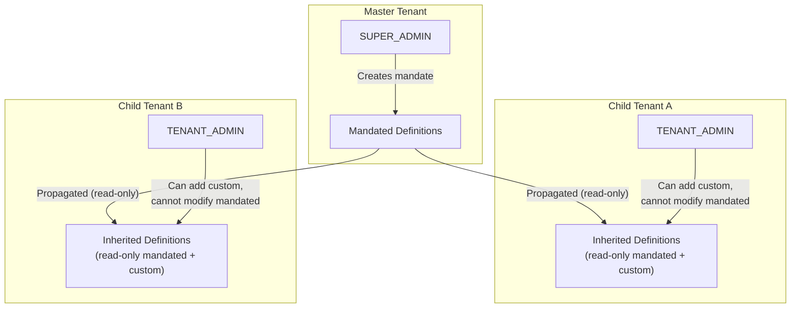

**Security rules for cross-tenant governance:**

| Rule | Description |
|------|-------------|
| GOV-01 | Only SUPER_ADMIN of master tenant can create/update/delete mandates |
| GOV-02 | Child tenant users see mandated definitions as read-only |
| GOV-03 | Child tenant users cannot modify mandated attributes or connections |
| GOV-04 | Child tenant TENANT_ADMIN can accept/reject/schedule releases |
| GOV-05 | Propagation requires explicit publish action (no automatic push) |
| GOV-06 | Cross-tenant queries require master tenant JWT claim verification |

### 4.4 Tenant ID Injection Prevention [PLANNED]

| Attack Vector | Mitigation |
|---------------|-----------|
| tenantId in JSON request body | Ignore client-supplied tenantId; always use JWT claim value |
| tenantId in path parameter | No endpoints expose tenantId as path param (except release adoption which requires master tenant role) |
| tenantId in query parameter | No endpoints accept tenantId as query param |
| X-Tenant-ID header spoofing | JWT claim takes priority; add validation that header matches JWT claim |
| JWT with multiple tenant_id claims | Use first element of list; validate against user's tenant membership in Keycloak |

---

## 5. Input Validation

### 5.1 Current Implementation [IMPLEMENTED]

**Evidence:** `ObjectTypeCreateRequest.java`, `AttributeTypeCreateRequest.java`

The definition-service uses Jakarta Bean Validation (`jakarta.validation`) on request DTOs.

#### 5.1.1 Object Type Create Request

| Field | Type | Validation | Max Length | Sanitization |
|-------|------|-----------|-----------|-------------|
| `name` | String | `@NotBlank`, `@Size(max=255)` | 255 | HTML entity encoding on output |
| `typeKey` | String | `@Size(max=100)` | 100 | Reject non-alphanumeric (see 5.2.3) |
| `code` | String | `@Size(max=20)` | 20 | HTML entity encoding on output |
| `description` | String | `@Size(max=2000)` | 2000 | HTML entity encoding on output |
| `iconName` | String | `@Size(max=100)` | 100 | Allowlist validation against Lucide icons |
| `iconColor` | String | `@Size(max=7)` | 7 | Hex color pattern validation |
| `status` | String | `@Size(max=20)` | 20 | Enum validation (see 5.2.3) |
| `state` | String | `@Size(max=30)` | 30 | Enum validation (see 5.2.3) |

### 5.2 Complete Input Validation Rules [PLANNED]

The following input validation rules cover ALL fields across ALL 72 endpoints.

#### 5.2.1 Path Parameter Validation

| Parameter | Current | Required | Validation Annotation | Error Response |
|-----------|---------|----------|----------------------|---------------|
| `{id}` | No validation | UUID format | `@Pattern(regexp = "^[0-9a-fA-F]{8}-[0-9a-fA-F]{4}-[0-9a-fA-F]{4}-[0-9a-fA-F]{4}-[0-9a-fA-F]{12}$")` | 400 `{"detail":"Invalid ID format: must be UUID"}` |
| `{attrId}` | No validation | UUID format | Same as above | 400 |
| `{connId}` | No validation | UUID format | Same as above | 400 |
| `{relId}` | No validation | UUID format | Same as above | 400 |
| `{releaseId}` | No validation | UUID format | Same as above | 400 |
| `{tenantId}` (release adoption) | No validation | UUID format + master tenant authorization | Same + `@PreAuthorize` | 400 / 403 |
| `{entityType}` | No validation | Enum allowlist | `@Pattern(regexp = "^(objectType\|attributeType)$")` | 400 |
| `{entityId}` | No validation | UUID format | Same as `{id}` | 400 |
| `{waId}` | No validation | UUID format | Same as `{id}` | 400 |
| `{dsId}` | No validation | UUID format | Same as `{id}` | 400 |
| `{mcId}` | No validation | UUID format | Same as `{id}` | 400 |
| `{objectTypeId}` | No validation | UUID format | Same as `{id}` | 400 |

#### 5.2.2 Query Parameter Validation

| Parameter | Current | Required | Validation Annotation | Error Response |
|-----------|---------|----------|----------------------|---------------|
| `page` | int (default 0) | Non-negative integer | `@Min(0)` | 400 `{"detail":"page must be >= 0"}` |
| `size` | int (default 20) | 1-100 range | `@Min(1) @Max(100)` | 400 `{"detail":"size must be 1-100"}` |
| `search` | String (optional) | Max 255 chars, sanitized | `@Size(max=255)` + strip `<>'";\` characters | 400 |
| `status` | String (optional) | Enum allowlist | `@Pattern(regexp = "^(active\|planned\|hold\|retired)$")` | 400 |
| `sort` | String (optional) | Field allowlist | `@Pattern(regexp = "^(name\|typeKey\|status\|createdAt\|updatedAt)$")` | 400 |
| `direction` | String (optional) | ASC or DESC | `@Pattern(regexp = "^(asc\|desc\|ASC\|DESC)$")` | 400 |
| `locale` | String (optional) | BCP 47 format | `@Pattern(regexp = "^[a-z]{2}(-[A-Z]{2})?$")` | 400 |

#### 5.2.3 Request Body Validation -- Complete Field Reference

**Object Type Create/Update:**

| Field | Type | Required | Validation Annotation | Pattern/Constraint | Sanitization |
|-------|------|---------|----------------------|-------------------|-------------|
| `name` | String | Yes | `@NotBlank @Size(min=1, max=255)` | Any Unicode except `< > " ' ; \` | HTML entity encode on output |
| `typeKey` | String | No (auto-generated if empty) | `@Size(max=100) @Pattern(regexp="^[a-z][a-z0-9_]*$")` | Lowercase, no spaces, start with letter | Reject non-matching |
| `code` | String | No | `@Size(max=20) @Pattern(regexp="^[A-Z][A-Z0-9_]*$")` | Uppercase alphanumeric | Reject non-matching |
| `description` | String | No | `@Size(max=2000)` | Any Unicode except `< > " '` | HTML entity encode on output |
| `iconName` | String | No | `@Size(max=100) @Pattern(regexp="^[a-z][a-z0-9-]*$")` | Lucide icon name format | Reject non-matching |
| `iconColor` | String | No | `@Size(max=7) @Pattern(regexp="^#[0-9a-fA-F]{6}$")` | Hex color code | Reject non-matching |
| `status` | String | No | `@Size(max=20) @Pattern(regexp="^(active\|planned\|hold\|retired)$")` | Enum values | Reject non-matching |
| `state` | String | No | `@Size(max=30) @Pattern(regexp="^(default\|customized\|user_defined)$")` | Enum values | Reject non-matching |

**Attribute Type Create/Update:**

| Field | Type | Required | Validation Annotation | Pattern/Constraint | Sanitization |
|-------|------|---------|----------------------|-------------------|-------------|
| `name` | String | Yes | `@NotBlank @Size(min=1, max=255)` | Any Unicode except `< > " ' ; \` | HTML entity encode on output |
| `attributeKey` | String | No | `@Size(max=100) @Pattern(regexp="^[a-z][a-z0-9_]*$")` | Lowercase, no spaces | Reject non-matching |
| `dataType` | String | Yes | `@NotBlank @Pattern(regexp="^(string\|text\|integer\|float\|boolean\|date\|datetime\|enum\|json)$")` | Enum of data types | Reject non-matching |
| `description` | String | No | `@Size(max=2000)` | Any Unicode | HTML entity encode on output |
| `defaultValue` | String | No | `@Size(max=1000)` | Must be parseable as declared `dataType` | Type-specific validation |
| `enumValues` | List<String> | Conditional (if dataType=enum) | `@Size(max=100)` per item, max 50 items | Each value max 100 chars | HTML entity encode on output |
| `isRequired` | Boolean | No | -- | true/false | -- |
| `isUnique` | Boolean | No | -- | true/false | -- |
| `minValue` | Number | No | Type-dependent | Must be <= maxValue if both present | -- |
| `maxValue` | Number | No | Type-dependent | Must be >= minValue if both present | -- |
| `pattern` | String | No | `@Size(max=500)` | Valid regex | Validate regex compiles; do not execute untrusted regex (ReDoS prevention) |

**Connection Create:**

| Field | Type | Required | Validation Annotation | Pattern/Constraint | Sanitization |
|-------|------|---------|----------------------|-------------------|-------------|
| `targetObjectTypeId` | String | Yes | `@NotBlank @Pattern(regexp=UUID_REGEX)` | UUID format | -- |
| `relationshipKey` | String | No | `@Size(max=100) @Pattern(regexp="^[a-z][a-z0-9_]*$")` | Lowercase, no spaces | Reject non-matching |
| `label` | String | No | `@Size(max=255)` | Any Unicode | HTML entity encode on output |
| `cardinality` | String | Yes | `@NotBlank @Pattern(regexp="^(one-to-one\|one-to-many\|many-to-many)$")` | Enum | Reject non-matching |
| `description` | String | No | `@Size(max=2000)` | Any Unicode | HTML entity encode on output |

**Lifecycle Status Transition:**

| Field | Type | Required | Validation Annotation | Pattern/Constraint | Sanitization |
|-------|------|---------|----------------------|-------------------|-------------|
| `targetStatus` | String | Yes | `@NotBlank @Pattern(regexp="^(planned\|active\|retired)$")` | Enum per AP-5 state machine | Server validates transition legality |

**Governance Mandate Create:**

| Field | Type | Required | Validation Annotation | Pattern/Constraint | Sanitization |
|-------|------|---------|----------------------|-------------------|-------------|
| `objectTypeId` | String | Yes | `@NotBlank @Pattern(regexp=UUID_REGEX)` | UUID | -- |
| `mandateType` | String | Yes | `@NotBlank @Pattern(regexp="^(required\|recommended\|optional)$")` | Enum | Reject non-matching |
| `description` | String | No | `@Size(max=2000)` | Any Unicode | HTML entity encode on output |

**Governance State Transition:**

| Field | Type | Required | Validation Annotation | Pattern/Constraint | Sanitization |
|-------|------|---------|----------------------|-------------------|-------------|
| `targetState` | String | Yes | `@NotBlank` | Validated against state machine (server-side only) | Reject invalid transitions |
| `comment` | String | No | `@Size(max=1000)` | Any Unicode | HTML entity encode on output |

**Localization Update:**

| Field | Type | Required | Validation Annotation | Pattern/Constraint | Sanitization |
|-------|------|---------|----------------------|-------------------|-------------|
| `locale` | String | Yes | `@NotBlank @Pattern(regexp="^[a-z]{2}(-[A-Z]{2})?$")` | BCP 47 | Reject non-matching |
| `translations` | Map<String, String> | Yes | Key: `@Size(max=100)`, Value: `@Size(max=2000)` | Max 50 entries | **See Section 10 (Localization XSS)** |

**Maturity Configuration:**

| Field | Type | Required | Validation Annotation | Pattern/Constraint | Sanitization |
|-------|------|---------|----------------------|-------------------|-------------|
| `dimensions` | List<MaturityDimension> | Yes | `@Size(min=1, max=20)` | Max 20 dimensions | -- |
| `dimension.name` | String | Yes | `@NotBlank @Size(max=255)` | Any Unicode | HTML entity encode on output |
| `dimension.weight` | Double | Yes | `@Min(0) @Max(1)` | Sum of all weights = 1.0 | Server-side sum validation |

**Release Create:**

| Field | Type | Required | Validation Annotation | Pattern/Constraint | Sanitization |
|-------|------|---------|----------------------|-------------------|-------------|
| `name` | String | Yes | `@NotBlank @Size(max=255)` | Any Unicode | HTML entity encode on output |
| `description` | String | No | `@Size(max=2000)` | Any Unicode | HTML entity encode on output |
| `targetDate` | String | No | `@Pattern(regexp="^\\d{4}-\\d{2}-\\d{2}$")` | ISO 8601 date | Validate reasonable range (not in past, not > 2 years future) |

**Data Source Create:**

| Field | Type | Required | Validation Annotation | Pattern/Constraint | Sanitization |
|-------|------|---------|----------------------|-------------------|-------------|
| `name` | String | Yes | `@NotBlank @Size(max=255)` | Any Unicode | HTML entity encode on output |
| `type` | String | Yes | `@NotBlank @Pattern(regexp="^(jdbc\|rest\|graphql\|file\|manual)$")` | Enum | Reject non-matching |
| `connectionConfig` | Object | Yes | See Section 9 | **Encrypted before storage** | -- |

**Measure Category Create:**

| Field | Type | Required | Validation Annotation | Pattern/Constraint | Sanitization |
|-------|------|---------|----------------------|-------------------|-------------|
| `name` | String | Yes | `@NotBlank @Size(max=255)` | Any Unicode | HTML entity encode on output |
| `description` | String | No | `@Size(max=2000)` | Any Unicode | HTML entity encode on output |

**Measure Create:**

| Field | Type | Required | Validation Annotation | Pattern/Constraint | Sanitization |
|-------|------|---------|----------------------|-------------------|-------------|
| `name` | String | Yes | `@NotBlank @Size(max=255)` | Any Unicode | HTML entity encode on output |
| `categoryId` | String | Yes | `@NotBlank @Pattern(regexp=UUID_REGEX)` | UUID | -- |
| `value` | Double | No | `@Min(0) @Max(100)` | Percentage | -- |

**AI Merge Preview:**

| Field | Type | Required | Validation Annotation | Pattern/Constraint | Sanitization |
|-------|------|---------|----------------------|-------------------|-------------|
| `sourceObjectTypeId` | String | Yes | `@NotBlank @Pattern(regexp=UUID_REGEX)` | UUID | -- |
| `targetObjectTypeId` | String | Yes | `@NotBlank @Pattern(regexp=UUID_REGEX)` | UUID, must differ from source | -- |

#### 5.2.4 Cypher Injection Prevention [IMPLEMENTED]

Spring Data Neo4j generates parameterized Cypher queries from repository method names, ensuring user input is never concatenated into Cypher strings.

**Evidence:** `ObjectTypeRepository.java` uses only Spring Data derived query methods (`findByIdAndTenantId`, `findByTenantId`, etc.). No `@Query` annotations with string concatenation exist.

**Requirement for planned custom queries:** Any future `@Query` annotations MUST use `$paramName` syntax for parameter binding. Raw string concatenation in Cypher queries is explicitly forbidden.

**Neo4j query parameterization example:**

```java
// CORRECT: Parameterized query
@Query("MATCH (n:ObjectType {tenantId: $tenantId}) WHERE n.name CONTAINS $search RETURN n")
List<ObjectType> searchByName(@Param("tenantId") String tenantId, @Param("search") String search);

// FORBIDDEN: String concatenation
@Query("MATCH (n:ObjectType) WHERE n.name = '" + name + "' RETURN n")  // NEVER DO THIS
```

#### 5.2.5 XSS Prevention [PLANNED]

| Requirement | Description |
|-------------|-------------|
| SEC-XSS-01 | All string fields returned in API responses must be output-encoded |
| SEC-XSS-02 | HTML tags in `name`, `description`, `typeKey` must be escaped or rejected |
| SEC-XSS-03 | `iconName` field must be validated against a Lucide icon name allowlist |
| SEC-XSS-04 | Frontend must use Angular's built-in XSS protection (template binding) |
| SEC-XSS-05 | Content-Type response header must always be `application/json` (no HTML rendering) |

#### 5.2.6 Error Response Format

All validation errors follow RFC 7807 ProblemDetail format:

```json
{
  "type": "about:blank",
  "title": "Bad Request",
  "status": 400,
  "detail": "Validation failed",
  "instance": "/api/v1/definitions/object-types",
  "errors": [
    {
      "field": "name",
      "message": "must not be blank",
      "rejectedValue": ""
    },
    {
      "field": "iconColor",
      "message": "must match pattern '^#[0-9a-fA-F]{6}$'",
      "rejectedValue": "red"
    }
  ]
}
```

**Implementation guidance:**

```java
@RestControllerAdvice
public class GlobalExceptionHandler {

    @ExceptionHandler(MethodArgumentNotValidException.class)
    public ProblemDetail handleValidation(MethodArgumentNotValidException ex) {
        ProblemDetail problem = ProblemDetail.forStatus(HttpStatus.BAD_REQUEST);
        problem.setTitle("Bad Request");
        problem.setDetail("Validation failed");

        List<Map<String, Object>> errors = ex.getBindingResult().getFieldErrors().stream()
            .map(fe -> Map.<String, Object>of(
                "field", fe.getField(),
                "message", fe.getDefaultMessage(),
                "rejectedValue", String.valueOf(fe.getRejectedValue())
            ))
            .toList();

        problem.setProperty("errors", errors);
        return problem;
    }
}
```

---

## 6. Rate Limiting

**[GAP-001 CLOSED]** -- Specific rate limiting thresholds defined per endpoint type.

### 6.1 Rate Limiting Thresholds [PLANNED]

| Endpoint Category | Rate Limit | Window | Scope | Enforcement Layer |
|-------------------|-----------|--------|-------|-------------------|
| Read operations (GET) | 100 requests | 1 minute | Per user per tenant | API Gateway |
| Mutation operations (POST/PUT/DELETE/PATCH) | 30 requests | 1 minute | Per user per tenant | API Gateway |
| AI endpoints (GET/POST under `/ai/`) | 10 requests | 1 minute | Per user per tenant | API Gateway |
| Import endpoint (POST `/import`) | 5 requests | 1 minute | Per tenant | API Gateway + definition-service |
| Export endpoint (GET `/export`) | 2 requests | 1 minute | Per tenant | API Gateway + definition-service |
| Graph visualization (GET `/graph`) | 20 requests | 1 minute | Per user per tenant | API Gateway |
| Authentication (login/refresh) | 10 requests | 1 minute | Per IP | auth-facade |

### 6.2 Rate Limiting Implementation [PLANNED]

**API Gateway (Spring Cloud Gateway) rate limiter configuration:**

```yaml
# application.yml for api-gateway
spring:
  cloud:
    gateway:
      routes:
        - id: definition-service-mutations
          uri: lb://DEFINITION-SERVICE
          predicates:
            - Path=/api/v1/definitions/**
            - Method=POST,PUT,DELETE,PATCH
          filters:
            - name: RequestRateLimiter
              args:
                redis-rate-limiter:
                  replenishRate: 30   # 30 requests per minute
                  burstCapacity: 40   # Allow burst of 40
                  requestedTokens: 1
                key-resolver: "#{@userTenantKeyResolver}"

        - id: definition-service-reads
          uri: lb://DEFINITION-SERVICE
          predicates:
            - Path=/api/v1/definitions/**
            - Method=GET
          filters:
            - name: RequestRateLimiter
              args:
                redis-rate-limiter:
                  replenishRate: 100
                  burstCapacity: 120
                  requestedTokens: 1
                key-resolver: "#{@userTenantKeyResolver}"

        - id: definition-service-ai
          uri: lb://DEFINITION-SERVICE
          predicates:
            - Path=/api/v1/definitions/ai/**
          filters:
            - name: RequestRateLimiter
              args:
                redis-rate-limiter:
                  replenishRate: 10
                  burstCapacity: 12
                  requestedTokens: 1
                key-resolver: "#{@userTenantKeyResolver}"

        - id: definition-service-import
          uri: lb://DEFINITION-SERVICE
          predicates:
            - Path=/api/v1/definitions/import
            - Method=POST
          filters:
            - name: RequestRateLimiter
              args:
                redis-rate-limiter:
                  replenishRate: 5
                  burstCapacity: 5
                  requestedTokens: 1
                key-resolver: "#{@tenantKeyResolver}"
```

### 6.3 Rate Limit Response

When rate limit is exceeded:

```json
{
  "type": "about:blank",
  "title": "Too Many Requests",
  "status": 429,
  "detail": "Rate limit exceeded. Maximum 30 mutation requests per minute.",
  "instance": "/api/v1/definitions/object-types",
  "retryAfter": 32
}
```

Headers included: `Retry-After: 32`, `X-RateLimit-Limit: 30`, `X-RateLimit-Remaining: 0`, `X-RateLimit-Reset: 1710072032`

### 6.4 Response Size Limiting [PLANNED]

**[GAP-004 CLOSED]**

| Control | Threshold | Enforcement |
|---------|-----------|-------------|
| Maximum response body size | 10 MB | API Gateway response size filter |
| Maximum export file size | 50 MB | definition-service export handler |
| Streaming for large exports | Enabled for responses > 1 MB | `StreamingResponseBody` in controller |
| Pagination enforcement | Max 100 items per page | `@Max(100)` on `size` parameter |

---

## 7. File Upload Security

**[GAP-003 CLOSED]** -- Complete file upload security for the import endpoint.

### 7.1 Import Endpoint Security [PLANNED]

| Control | Specification |
|---------|--------------|
| Allowed file types | JSON only (`.json`, `application/json`) |
| Maximum file size | 10 MB |
| Content-Type validation | Must be `application/json` or `multipart/form-data` with JSON part |
| JSON schema validation | Validate against published import schema before processing |
| Malware scanning | ClamAV integration for uploaded files (or cloud-based scan API) |
| Temporary storage | In-memory processing only; no disk storage of uploaded files |
| Processing timeout | 60-second timeout for import processing |
| Rate limiting | 5 imports per minute per tenant (see Section 6) |

### 7.2 File Validation Flow [PLANNED]

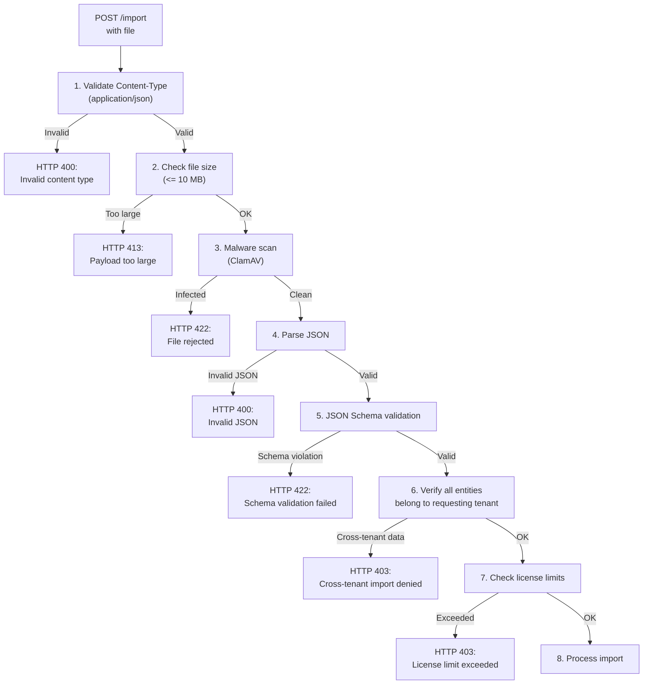

### 7.3 Implementation Guidance

```java
@PostMapping("/import")
@PreAuthorize("hasRole('SUPER_ADMIN') and @tenantService.isMasterTenant(authentication)")
public ResponseEntity<ImportResult> importDefinitions(
        @AuthenticationPrincipal Jwt jwt,
        @RequestParam("file") MultipartFile file) {

    // 1. Content-Type validation
    if (!"application/json".equals(file.getContentType())) {
        throw new UnsupportedMediaTypeException("Only JSON files are accepted");
    }

    // 2. Size check (also configured in application.yml)
    if (file.getSize() > 10 * 1024 * 1024) {
        throw new PayloadTooLargeException("File size exceeds 10 MB limit");
    }

    // 3. Malware scan (ClamAV)
    clamAvScanner.scan(file.getInputStream());

    // 4-5. Parse and validate JSON schema
    ImportPayload payload = objectMapper.readValue(file.getInputStream(), ImportPayload.class);
    schemaValidator.validate(payload);

    // 6. Tenant verification
    String tenantId = extractTenantId(jwt, null);
    // ... process import
}
```

```yaml
# application.yml -- file upload limits
spring:
  servlet:
    multipart:
      max-file-size: 10MB
      max-request-size: 10MB
      enabled: true
```

---

## 8. Graph Traversal Security

**[GAP-008 CLOSED]** -- Specific Neo4j graph traversal depth limits defined.

### 8.1 Graph Query Limits [PLANNED]

| Limit | Value | Rationale |
|-------|-------|-----------|
| Maximum traversal depth | 5 hops | Prevents unbounded graph walking; typical use case is 2-3 hops |
| Maximum nodes returned | 1000 nodes | Prevents memory exhaustion on large tenant graphs |
| Maximum relationships returned | 5000 relationships | Proportional to node limit |
| Query timeout | 5 seconds | Neo4j driver-level timeout prevents OOM |
| Result set size limit | 10 MB serialized | Prevents network saturation on large results |

### 8.2 Implementation Guidance

```java
// Neo4j driver configuration
@Configuration
public class Neo4jConfig {

    @Bean
    public Driver neo4jDriver(@Value("${spring.neo4j.uri}") String uri,
                              @Value("${spring.neo4j.authentication.username}") String user,
                              @Value("${spring.neo4j.authentication.password}") String password) {
        return GraphDatabase.driver(uri,
            AuthTokens.basic(user, password),
            Config.builder()
                .withMaxConnectionPoolSize(50)
                .withConnectionAcquisitionTimeout(10, TimeUnit.SECONDS)
                .withMaxTransactionRetryTime(5, TimeUnit.SECONDS)
                .build()
        );
    }
}
```

```java
// Graph visualization service with depth/node limits
@Service
public class GraphVisualizationService {

    private static final int MAX_DEPTH = 5;
    private static final int MAX_NODES = 1000;
    private static final Duration QUERY_TIMEOUT = Duration.ofSeconds(5);

    public GraphResponse getGraph(String tenantId, String objectTypeId, int requestedDepth) {
        int safeDepth = Math.min(requestedDepth, MAX_DEPTH);

        // Cypher with depth limit and node count limit
        String cypher = """
            MATCH path = (start:ObjectType {id: $objectTypeId, tenantId: $tenantId})
                -[*1..%d]-(connected)
            WHERE connected.tenantId = $tenantId
            WITH nodes(path) AS pathNodes, relationships(path) AS pathRels
            UNWIND pathNodes AS node
            WITH COLLECT(DISTINCT node) AS allNodes, pathRels
            WHERE SIZE(allNodes) <= $maxNodes
            RETURN allNodes[0..$maxNodes] AS nodes,
                   pathRels AS relationships
            """.formatted(safeDepth);

        return neo4jClient.query(cypher)
            .bind(objectTypeId).to("objectTypeId")
            .bind(tenantId).to("tenantId")
            .bind(MAX_NODES).to("maxNodes")
            .in(database)
            .fetchAs(GraphResponse.class)
            .mappedBy((typeSystem, record) -> mapToGraphResponse(record))
            .one()
            .orElse(GraphResponse.empty());
    }
}
```

```yaml
# application.yml -- graph query configuration
definition:
  graph:
    max-depth: 5
    max-nodes: 1000
    max-relationships: 5000
    query-timeout-seconds: 5
```

---

## 9. Data Source Credential Security

**[GAP-010 CLOSED]** -- Data source credential encryption specified.

### 9.1 Credential Encryption Requirements [PLANNED]

| Requirement | Specification |
|-------------|--------------|
| Encryption algorithm | AES-256-GCM (authenticated encryption) |
| Key management | Encryption key stored in HashiCorp Vault (or Kubernetes Secret as fallback) |
| Key rotation | 90-day rotation policy; re-encrypt on rotation |
| Storage | Encrypted blob stored as Neo4j node property; never plaintext |
| At-rest format | Base64-encoded ciphertext with IV prefix |
| In-transit | Always TLS; never include credentials in log output |
| Access control | Only definition-service can decrypt; no direct Neo4j access to plaintext |

### 9.2 Encryption Flow

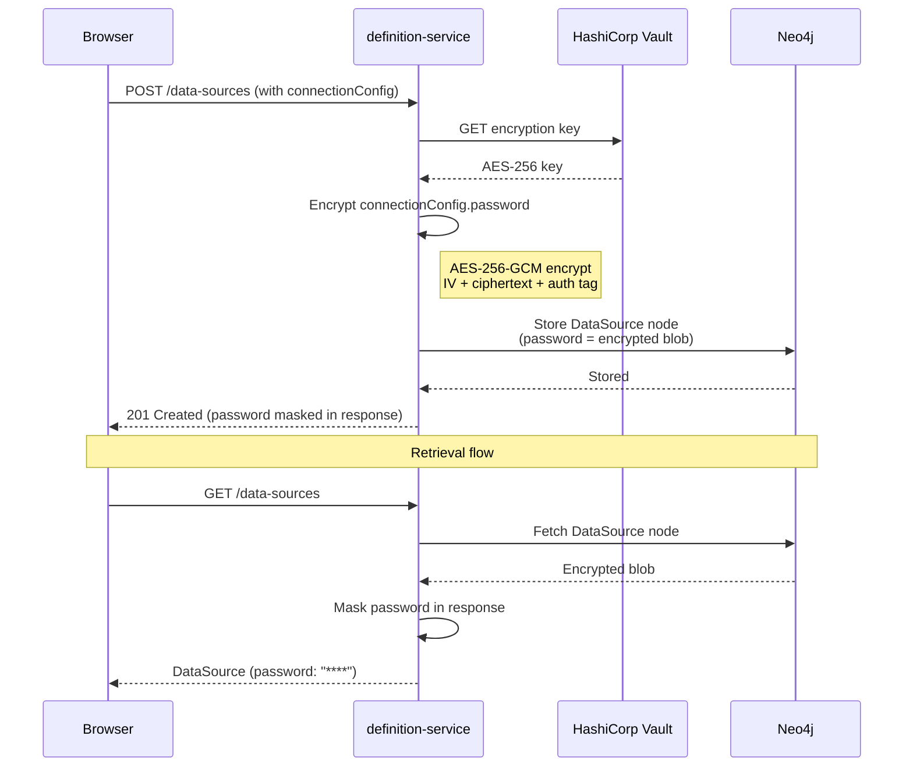

### 9.3 Implementation Guidance

```java
@Service
public class CredentialEncryptionService {

    private static final String ALGORITHM = "AES/GCM/NoPadding";
    private static final int GCM_IV_LENGTH = 12;
    private static final int GCM_TAG_LENGTH = 128;

    @Value("${vault.encryption.key}")
    private String encryptionKeyBase64;

    public String encrypt(String plaintext) {
        byte[] iv = new byte[GCM_IV_LENGTH];
        SecureRandom.getInstanceStrong().nextBytes(iv);

        SecretKey key = new SecretKeySpec(
            Base64.getDecoder().decode(encryptionKeyBase64), "AES");

        Cipher cipher = Cipher.getInstance(ALGORITHM);
        cipher.init(Cipher.ENCRYPT_MODE, key, new GCMParameterSpec(GCM_TAG_LENGTH, iv));

        byte[] ciphertext = cipher.doFinal(plaintext.getBytes(StandardCharsets.UTF_8));

        // Prepend IV to ciphertext
        byte[] combined = new byte[iv.length + ciphertext.length];
        System.arraycopy(iv, 0, combined, 0, iv.length);
        System.arraycopy(ciphertext, 0, combined, iv.length, ciphertext.length);

        return Base64.getEncoder().encodeToString(combined);
    }

    public String decrypt(String encryptedBase64) {
        byte[] combined = Base64.getDecoder().decode(encryptedBase64);
        byte[] iv = Arrays.copyOfRange(combined, 0, GCM_IV_LENGTH);
        byte[] ciphertext = Arrays.copyOfRange(combined, GCM_IV_LENGTH, combined.length);

        SecretKey key = new SecretKeySpec(
            Base64.getDecoder().decode(encryptionKeyBase64), "AES");

        Cipher cipher = Cipher.getInstance(ALGORITHM);
        cipher.init(Cipher.DECRYPT_MODE, key, new GCMParameterSpec(GCM_TAG_LENGTH, iv));

        return new String(cipher.doFinal(ciphertext), StandardCharsets.UTF_8);
    }
}
```

### 9.4 Data Source Response Masking

Data source credentials are NEVER returned in API responses:

```java
// DataSourceResponse -- always mask sensitive fields
public record DataSourceResponse(
    String id,
    String name,
    String type,
    String host,
    Integer port,
    String database,
    String username,
    String password  // ALWAYS "********" -- never return real value
) {
    public DataSourceResponse maskSensitive() {
        return new DataSourceResponse(id, name, type, host, port, database, username, "********");
    }
}
```

---

## 10. Localization XSS Prevention

**[GAP-013 CLOSED]** -- XSS prevention for localization strings, including RTL language considerations.

### 10.1 Localization Input Sanitization [PLANNED]

| Requirement | Description |
|-------------|-------------|
| SEC-L10N-01 | All localization string values must be sanitized before storage |
| SEC-L10N-02 | HTML tags must be escaped: `<` -> `&lt;`, `>` -> `&gt;`, `"` -> `&quot;`, `'` -> `&#39;` |
| SEC-L10N-03 | Directional override characters (U+202A to U+202E, U+2066 to U+2069) must be stripped |
| SEC-L10N-04 | Zero-width characters (U+200B to U+200F, U+FEFF) must be stripped |
| SEC-L10N-05 | Maximum string length per translation value: 2000 characters (after sanitization) |
| SEC-L10N-06 | Angular frontend must use `[textContent]` binding (not `[innerHTML]`) for localized strings |
| SEC-L10N-07 | RTL marker characters (`\u200F`, `\u200E`) are allowed ONLY at string boundaries (start/end) |

### 10.2 RTL-Specific XSS Vectors

| Attack Vector | Example | Mitigation |
|---------------|---------|-----------|
| Bidirectional text override (Bidi attack) | `U+202E` (right-to-left override) to reverse displayed text | Strip all directional override characters |
| Mixed-direction injection | Arabic text + injected LTR `<script>` tag | HTML entity encoding strips `<script>` |
| Homoglyph attack | Arabic characters that visually resemble Latin in icon/code fields | `typeKey` and `code` fields restricted to ASCII-only patterns |
| Zero-width joiner injection | Zero-width characters hiding malicious content | Strip all zero-width characters |
| Bidi spoofing in URLs | RTL characters in data source URLs to hide domain | URL validation with IDN normalization |

### 10.3 Implementation Guidance

```java
@Component
public class LocalizationSanitizer {

    // Dangerous Unicode ranges
    private static final Pattern BIDI_OVERRIDE = Pattern.compile(
        "[\\u202A-\\u202E\\u2066-\\u2069]");

    private static final Pattern ZERO_WIDTH = Pattern.compile(
        "[\\u200B-\\u200F\\uFEFF\\u00AD]");

    private static final Pattern HTML_TAGS = Pattern.compile(
        "<[^>]+>");

    public String sanitize(String input) {
        if (input == null) return null;

        String sanitized = input;

        // 1. Strip bidirectional override characters
        sanitized = BIDI_OVERRIDE.matcher(sanitized).replaceAll("");

        // 2. Strip zero-width characters (except at boundaries for RTL markers)
        sanitized = ZERO_WIDTH.matcher(sanitized).replaceAll("");

        // 3. HTML entity encoding
        sanitized = HtmlUtils.htmlEscape(sanitized);

        // 4. Enforce max length
        if (sanitized.length() > 2000) {
            sanitized = sanitized.substring(0, 2000);
        }

        return sanitized;
    }

    public Map<String, String> sanitizeTranslations(Map<String, String> translations) {
        return translations.entrySet().stream()
            .collect(Collectors.toMap(
                e -> sanitize(e.getKey()),
                e -> sanitize(e.getValue())
            ));
    }
}
```

```typescript
// Angular: Safe rendering of localized strings
// CORRECT: textContent binding (auto-escaped)
<span [textContent]="translatedLabel"></span>
<p [textContent]="translatedDescription"></p>

// FORBIDDEN: innerHTML binding (XSS risk)
// <span [innerHTML]="translatedLabel"></span>  // NEVER DO THIS
```

---

## 11. Security Headers

**[GAP-004 partial, unaddressed controls from Doc 17 Section 8.3 CLOSED]**

### 11.1 Required Security Headers [PLANNED]

| Header | Value | Purpose |
|--------|-------|---------|
| `X-Content-Type-Options` | `nosniff` | Prevent MIME-type sniffing |
| `X-Frame-Options` | `DENY` | Prevent clickjacking |
| `X-XSS-Protection` | `0` | Disable legacy XSS filter (CSP is preferred) |
| `Strict-Transport-Security` | `max-age=31536000; includeSubDomains; preload` | Enforce HTTPS |
| `Content-Security-Policy` | `default-src 'self'; script-src 'self'; style-src 'self' 'unsafe-inline'; img-src 'self' data:; font-src 'self'; connect-src 'self'; frame-ancestors 'none'` | Prevent XSS, injection |
| `Referrer-Policy` | `strict-origin-when-cross-origin` | Limit referrer information |
| `Permissions-Policy` | `geolocation=(), microphone=(), camera=(), payment=()` | Disable unnecessary browser features |
| `Cache-Control` | `no-store, no-cache, must-revalidate` (for authenticated responses) | Prevent sensitive data caching |
| `X-Request-ID` | UUID per request | Forensic tracing / correlation |

### 11.2 WebSocket Security [PLANNED]

**[GAP-002 CLOSED]** -- WebSocket authentication requirements (if real-time graph updates are implemented):

| Requirement | Description |
|-------------|-------------|
| SEC-WS-01 | WebSocket connections must authenticate via JWT token in initial handshake |
| SEC-WS-02 | JWT must be validated on every WebSocket connection upgrade |
| SEC-WS-03 | Tenant isolation enforced: WebSocket channels scoped per tenant |
| SEC-WS-04 | Message size limit: 64 KB per WebSocket message |
| SEC-WS-05 | Rate limiting: 100 messages per minute per connection |
| SEC-WS-06 | Idle timeout: close connections after 10 minutes of inactivity |

### 11.3 ETag Security [PLANNED]

**[GAP-014 CLOSED]**

| Requirement | Description |
|-------------|-------------|
| SEC-ETAG-01 | ETags must be opaque (e.g., `W/"abc123def"`) -- not based on content hash |
| SEC-ETAG-02 | ETags must include tenantId in generation to prevent cross-tenant ETag reuse |
| SEC-ETAG-03 | ETag generation: `SHA-256(entityId + tenantId + version + salt)` truncated to 16 chars |

---

## 12. OWASP Top 10 Mitigations (2021)

| # | OWASP Category | Risk for definition-service | Severity | Mitigation | Status |
|---|----------------|---------------------------|----------|------------|--------|
| A01 | Broken Access Control | IDOR: accessing another tenant's definitions via ID guessing. Privilege escalation: VIEWER modifying definitions. Missing function-level access control on governance endpoints. | Critical | Tenant-scoped repository queries; RBAC via Spring Security (5 roles, 72 endpoints mapped); IDOR tests required. Currently coarse-grained (SUPER_ADMIN only) which prevents escalation but blocks legitimate multi-role access. | [IMPLEMENTED] partially -- RBAC refinement [PLANNED] |
| A02 | Cryptographic Failures | Neo4j credentials in plaintext environment variables. JWT transmitted over non-TLS internal network. Data source credentials stored unencrypted. | Medium | TLS 1.2+ for all external connections; environment variable injection for credentials; Keycloak RS256 JWT signing; AES-256-GCM encryption for data source credentials (Section 9). | [IMPLEMENTED] partially -- internal TLS [PLANNED], credential encryption [PLANNED] |
| A03 | Injection | Cypher injection via malformed object type names, typeKeys, or search parameters. Localization XSS via RTL strings. | Critical | Spring Data Neo4j parameterized queries; Jakarta Bean Validation; no raw Cypher string concatenation; localization sanitizer (Section 10). | [IMPLEMENTED] (Cypher) + [PLANNED] (localization XSS) |
| A04 | Insecure Design | Lack of rate limiting on definition CRUD; no graph traversal depth limits; no abuse prevention on AI endpoints; file upload without validation. | Medium | Rate limiting per endpoint type (Section 6); max page size enforcement; graph query depth limits (Section 8); AI endpoint throttling; file upload security (Section 7). | [PLANNED] |
| A05 | Security Misconfiguration | Swagger/OpenAPI exposed in production; CORS allows `localhost:*`; actuator endpoints fully open; Neo4j Community Edition has limited security features. | High | Restrict Swagger to dev/staging; tighten CORS for production; secure actuator endpoints (health only in prod); security headers (Section 11). | [PLANNED] -- CORS is [IMPLEMENTED] for dev |
| A06 | Vulnerable Components | Dependencies with known CVEs in Spring Boot, Neo4j driver, or transitive dependencies. | Medium | Regular dependency scanning (OWASP dependency-check, `mvn verify`); automated Dependabot alerts; pin dependency versions. | [PLANNED] |
| A07 | Identification and Authentication Failures | Expired JWT acceptance; weak Keycloak password policy; missing MFA for admin roles; session fixation. | Medium | Spring Security auto-rejects expired JWTs; Keycloak realm configuration for password policy and MFA; session fixation prevention (Section 2.5). | [IMPLEMENTED] (JWT validation) + [PLANNED] (MFA, session fixation) |
| A08 | Software and Data Integrity Failures | Unsigned Docker images; no integrity verification on import/export payloads; CI/CD pipeline without artifact signing; governance state machine bypass. | Medium | Docker image signing (Cosign); JSON Schema validation on import payloads (Section 7); CI/CD artifact checksums; exhaustive state transition validation (Section 5.2.3). | [PLANNED] |
| A09 | Security Logging and Monitoring Failures | No audit trail for definition changes; no security event alerting; insufficient log detail for forensic analysis; no read-audit for sensitive operations. | High | Integration with audit-service for all CRUD operations; structured JSON logging; security event alerting via notification-service; optional read-audit for governance and cross-tenant access (Section 14). | [PLANNED] -- basic logging [IMPLEMENTED] |
| A10 | Server-Side Request Forgery (SSRF) | Data source connection URLs could be exploited for SSRF if the service fetches external resources. AI service integration could be exploited if URLs are user-controlled. | Medium | Data source URL allowlist; validate URLs against internal network ranges; disable URL following in HTTP clients. | [PLANNED] |

---

## 13. Data Classification

### 13.1 Data Elements

| Data Element | Classification | Encryption at Rest | Encryption in Transit | Retention | PII |
|-------------|---------------|-------------------|----------------------|-----------|-----|
| Object type name | Internal | Neo4j disk encryption | TLS | Indefinite | No |
| Object type description | Internal | Neo4j disk encryption | TLS | Indefinite | No |
| Object type typeKey | Internal | Neo4j disk encryption | TLS | Indefinite | No |
| Attribute type name | Internal | Neo4j disk encryption | TLS | Indefinite | No |
| Attribute type configuration | Internal | Neo4j disk encryption | TLS | Indefinite | No |
| Tenant ID | Confidential | Neo4j disk encryption | TLS | Indefinite | No |
| User ID (from JWT sub) | Confidential | Not stored locally | TLS | Transient (logs) | Yes (indirect) |
| JWT tokens | Secret | Not stored | TLS | Transient (request) | Yes (contains sub) |
| Neo4j credentials | Secret | Environment variables | TLS | Runtime only | No |
| Keycloak client secret | Secret | Environment variables | TLS | Runtime only | No |
| Governance mandate rules | Confidential | Neo4j disk encryption | TLS | Policy-based | No |
| Release change diffs | Internal | Neo4j disk encryption | TLS | Indefinite | No |
| Data source connection configs | Confidential | **AES-256-GCM application-level** | TLS | Indefinite | No (may contain API keys) |
| Localization strings | Internal | Neo4j disk encryption | TLS | Indefinite | No |
| Maturity configuration | Internal | Neo4j disk encryption | TLS | Indefinite | No |
| Audit trail entries | Confidential | PostgreSQL disk encryption (audit-service) | TLS | 7 years minimum | Yes (actor identity) |

### 13.2 Data Sensitivity Levels

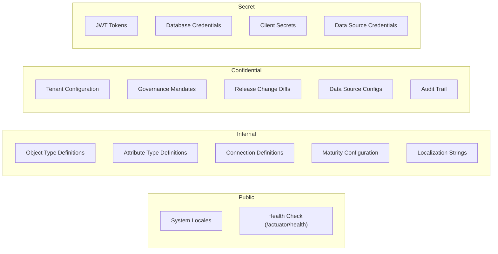

---

## 14. Audit Trail Requirements

### 14.1 Events to Audit

| Event Category | Events | Priority |
|---------------|--------|----------|
| Object Type CRUD | Create, Update, Delete, Duplicate, Restore | Critical |
| Attribute Type CRUD | Create, Update, Delete | Critical |
| Relationship Management | Add/Remove attribute link, Add/Remove connection | High |
| Lifecycle Transitions | Status change (planned -> active -> retired) | Critical |
| Governance Operations | Mandate create/update/delete, Propagate, State transition | Critical |
| Release Management | Create release, Publish, Accept, Reject, Schedule, Rollback | Critical |
| Cross-Tenant Access | Master tenant reading child tenant definitions | Critical |
| Import/Export | Import initiated, Export initiated | High |
| AI Operations | Similarity check, Merge preview, Recommendations | Medium |
| Authentication Events | Login success/failure (handled by auth-facade) | Critical |
| Authorization Failures | HTTP 403 responses | High |
| **Sensitive Read Operations** | Governance mandate reads, Data source config reads, Cross-tenant graph queries | Medium |

**[GAP-009 CLOSED]** -- Optional read-audit added for governance mandates and cross-tenant data access.

### 14.2 Audit Event Schema [PLANNED]

```json
{
  "eventId": "uuid",
  "eventType": "DEFINITION_CREATED",
  "timestamp": "2026-03-10T12:00:00Z",
  "service": "definition-service",
  "tenantId": "tenant-uuid",
  "actorId": "user-uuid",
  "actorRoles": ["SUPER_ADMIN"],
  "resourceType": "ObjectType",
  "resourceId": "object-type-uuid",
  "action": "CREATE",
  "outcome": "SUCCESS",
  "ipAddress": "192.168.1.1",
  "userAgent": "Mozilla/5.0...",
  "requestPath": "/api/v1/definitions/object-types",
  "requestMethod": "POST",
  "beforeState": null,
  "afterState": {
    "name": "Server",
    "typeKey": "server",
    "status": "active"
  },
  "metadata": {
    "correlationId": "req-uuid",
    "sourceSystem": "browser"
  }
}
```

### 14.3 Audit Requirements

| Requirement ID | Description | Priority |
|---------------|-------------|----------|
| SEC-AUD-01 | All mutating operations (POST, PUT, DELETE, PATCH) MUST generate an audit event | Critical |
| SEC-AUD-02 | Audit events MUST include before and after state for updates | High |
| SEC-AUD-03 | Audit events MUST be sent asynchronously to audit-service (Kafka or REST) | High |
| SEC-AUD-04 | Failed authorization attempts (403) MUST be logged with actor, resource, and attempted action | Critical |
| SEC-AUD-05 | Audit trail MUST be immutable -- no delete or update of audit records | Critical |
| SEC-AUD-06 | Audit records MUST be retained for minimum 7 years for compliance | High |
| SEC-AUD-07 | Cross-tenant access events MUST include both source and target tenant IDs | Critical |
| SEC-AUD-08 | Bulk operations (import) MUST log individual item-level changes | Medium |
| SEC-AUD-09 | Audit log MUST NOT contain sensitive data (full JWT tokens, credentials, PII beyond user ID) | Critical |
| SEC-AUD-10 | Governance state transitions MUST log the complete approval chain | High |
| SEC-AUD-11 | Read operations on governance mandates and data source configs SHOULD generate audit events (configurable) | Medium |

### 14.4 Integration with audit-service [PLANNED]

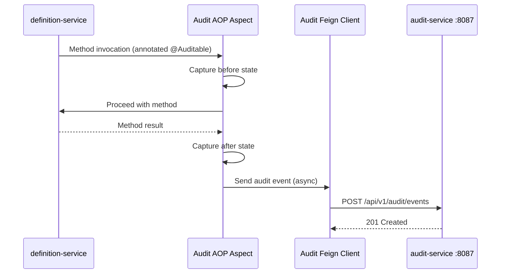

---

## 15. Security Testing Requirements

### 15.1 SAST Rules Specific to definition-service

| Rule ID | Category | Description | Tool |
|---------|----------|-------------|------|
| SAST-01 | Injection | Detect raw Cypher string concatenation in `@Query` annotations | SonarQube / Semgrep |
| SAST-02 | Secrets | Detect hardcoded Neo4j URIs, passwords, or Keycloak secrets | Semgrep / git-secrets |
| SAST-03 | Auth | Verify all controller methods use `@AuthenticationPrincipal` | Custom SonarQube rule |
| SAST-04 | Tenant | Verify all service methods accept `tenantId` parameter | Custom Semgrep rule |
| SAST-05 | Logging | Detect logging of JWT tokens or full request bodies | SonarQube |
| SAST-06 | Error handling | Verify no stack traces in HTTP responses | SonarQube |
| SAST-07 | Validation | Verify all `@RequestBody` parameters have `@Valid` annotation | Custom SonarQube rule |

### 15.2 SCA Dependency Scan Requirements

| Requirement | Tool | Frequency | Gate |
|-------------|------|-----------|------|
| Known CVE scan | OWASP dependency-check | Every CI build | Block on Critical/High CVEs |
| License compliance | license-maven-plugin | Every CI build | Block on GPL/AGPL in runtime |
| Transitive dependency audit | `mvn dependency:tree` | Weekly | Review new transitive deps |
| Neo4j driver version | Manual check | Every release | Must be on latest patch |
| Spring Boot version | Manual check | Every release | Must be on latest patch |

### 15.3 DAST Targets (Authenticated Endpoints)

| Target | URL Pattern | Auth Required | Test Scope |
|--------|------------|---------------|-----------|
| Object Type CRUD | `/api/v1/definitions/object-types/**` | JWT (SUPER_ADMIN) | Full scan |
| Attribute Type CRUD | `/api/v1/definitions/attribute-types/**` | JWT (SUPER_ADMIN) | Full scan |
| Governance | `/api/v1/definitions/governance/**` | JWT (SUPER_ADMIN + master tenant) | Full scan |
| Release Management | `/api/v1/definitions/releases/**` | JWT (SUPER_ADMIN) | Full scan |
| Localization | `/api/v1/definitions/locales/**` | JWT (authenticated) | Full scan |
| Graph Visualization | `/api/v1/definitions/graph/**` | JWT (authenticated) | Full scan |
| AI Integration | `/api/v1/definitions/ai/**` | JWT (ARCHITECT+) | Full scan |
| Import/Export | `/api/v1/definitions/import`, `/export` | JWT (SUPER_ADMIN) | Full scan |
| Actuator | `/actuator/**` | None | Passive scan only |
| Swagger | `/swagger-ui/**`, `/api-docs/**` | None | Verify not exposed in production |

### 15.4 Penetration Test Scenarios

#### 15.4.1 IDOR -- Insecure Direct Object Reference

| Test ID | Scenario | Steps | Expected Result |
|---------|----------|-------|-----------------|
| PEN-IDOR-01 | Access another tenant's object type by ID | 1. Authenticate as tenant-A user. 2. GET `/object-types/{tenant-B-object-type-id}`. | HTTP 404 (not 403 to avoid ID enumeration) |
| PEN-IDOR-02 | Access another tenant's attribute type by ID | 1. Authenticate as tenant-A user. 2. GET `/attribute-types/{tenant-B-attr-id}`. | HTTP 404 |
| PEN-IDOR-03 | Delete another tenant's object type | 1. Authenticate as tenant-A SUPER_ADMIN. 2. DELETE `/object-types/{tenant-B-id}`. | HTTP 404 |
| PEN-IDOR-04 | Modify another tenant's governance mandate | 1. Authenticate as child tenant TENANT_ADMIN. 2. PUT `/governance/mandates/{master-mandate-id}`. | HTTP 403 |
| PEN-IDOR-05 | Accept release for another tenant | 1. Authenticate as tenant-A. 2. POST `/releases/{id}/tenants/{tenant-B-id}/accept`. | HTTP 403 |

#### 15.4.2 Privilege Escalation

| Test ID | Scenario | Steps | Expected Result |
|---------|----------|-------|-----------------|
| PEN-PE-01 | VIEWER creates object type | 1. Authenticate with VIEWER role JWT. 2. POST `/object-types`. | HTTP 403 |
| PEN-PE-02 | VIEWER deletes object type | 1. Authenticate with VIEWER role JWT. 2. DELETE `/object-types/{id}`. | HTTP 403 |
| PEN-PE-03 | TENANT_ADMIN creates governance mandate | 1. Authenticate as TENANT_ADMIN of child tenant. 2. POST `/governance/mandates`. | HTTP 403 |
| PEN-PE-04 | ARCHITECT publishes release | 1. Authenticate as ARCHITECT. 2. POST `/releases/{id}/publish`. | HTTP 403 |
| PEN-PE-05 | Non-master tenant user accesses cross-tenant endpoints | 1. Authenticate as SUPER_ADMIN of child tenant. 2. GET `/releases/{id}/tenants`. | HTTP 403 |
| PEN-PE-06 | Unauthenticated access to definition endpoints | 1. Send request without Authorization header. 2. GET `/object-types`. | HTTP 401 |
| PEN-PE-07 | Expired JWT access | 1. Send request with expired JWT. 2. GET `/object-types`. | HTTP 401 |
| PEN-PE-08 | ADMIN role creates governance mandate | 1. Authenticate with ADMIN role JWT. 2. POST `/governance/mandates`. | HTTP 403 |
| PEN-PE-09 | ADMIN role publishes release | 1. Authenticate with ADMIN role JWT. 2. POST `/releases/{id}/publish`. | HTTP 403 |

#### 15.4.3 Cypher Injection

| Test ID | Scenario | Steps | Expected Result |
|---------|----------|-------|-----------------|
| PEN-CI-01 | Malformed object type name | POST `/object-types` with `name: "Server' OR 1=1 //"` | HTTP 201 (name stored literally) or HTTP 400 (validation) -- no query manipulation |
| PEN-CI-02 | Cypher in search parameter | GET `/object-types?search=') DETACH DELETE n //"` | HTTP 200 (no results) -- search treated as literal string |
| PEN-CI-03 | Cypher in typeKey | POST `/object-types` with `typeKey: "server}) MATCH (n) DETACH DELETE n //"` | HTTP 400 (validation rejects special characters) |
| PEN-CI-04 | Cypher in path parameter | GET `/object-types/abc' MATCH (n) RETURN n--` | HTTP 404 (UUID format validation) |

#### 15.4.4 Mass Assignment

| Test ID | Scenario | Steps | Expected Result |
|---------|----------|-------|-----------------|
| PEN-MA-01 | Set tenantId in request body | POST `/object-types` with `"tenantId": "other-tenant"` | tenantId ignored; entity created with JWT tenant |
| PEN-MA-02 | Set id in create request | POST `/object-types` with `"id": "specific-uuid"` | id ignored; server generates UUID |
| PEN-MA-03 | Set createdAt/updatedAt | PUT `/object-types/{id}` with `"createdAt": "2020-01-01"` | timestamps ignored; server manages timestamps |

#### 15.4.5 Business Logic Attacks

| Test ID | Scenario | Steps | Expected Result |
|---------|----------|-------|-----------------|
| PEN-BL-01 | Delete object type with active instances | DELETE `/object-types/{id}` where instances exist | HTTP 409 (Conflict) |
| PEN-BL-02 | Transition lifecycle status backwards illegally | PUT lifecycle-status from `retired` to `active` (if disallowed) | HTTP 400 or 409 |
| PEN-BL-03 | Create duplicate typeKey within tenant | POST `/object-types` with existing `typeKey` | HTTP 409 |
| PEN-BL-04 | Import definitions exceeding tenant license limits | POST `/import` with more object types than license allows | HTTP 403 or 429 |
| PEN-BL-05 | Rollback published release without authorization | POST `/releases/{id}/tenants/{tid}/rollback` as TENANT_ADMIN | HTTP 403 |

#### 15.4.6 Cache Poisoning

| Test ID | Scenario | Steps | Expected Result |
|---------|----------|-------|-----------------|
| PEN-CP-01 | Cache key manipulation | Attempt to read cache key `def:other-tenant-id:ObjectType:*` | Tenant-scoped cache keys prevent cross-tenant reads |
| PEN-CP-02 | Stale cache after tenant deletion | Delete tenant data, verify cache invalidation | Cache entries for deleted tenant cleared |

#### 15.4.7 Timing Side-Channel

| Test ID | Scenario | Steps | Expected Result |
|---------|----------|-------|-----------------|
| PEN-TS-01 | Response time for existing vs non-existing tenant ID | Measure response times for valid (own tenant) vs invalid tenant queries | Response times within 50ms of each other |
| PEN-TS-02 | Response time for 403 vs 404 | Measure response times for unauthorized vs not-found | Consistent response times |

#### 15.4.8 Governance State Machine Bypass

**[GAP-015 CLOSED]**

| Test ID | Scenario | Steps | Expected Result |
|---------|----------|-------|-----------------|
| PEN-GS-01 | Skip draft to approved | POST governance state from `draft` directly to `approved` | HTTP 400 (must go through review) |
| PEN-GS-02 | Revert from approved to draft | POST governance state from `approved` to `draft` | HTTP 400 (invalid transition) |
| PEN-GS-03 | Publish without approval | POST governance state from `review` to `published` (skip approved) | HTTP 400 (invalid transition) |
| PEN-GS-04 | Concurrent state transitions | Two simultaneous state transitions on same entity | One succeeds, one gets HTTP 409 (optimistic lock) |

### 15.5 Security Test Automation

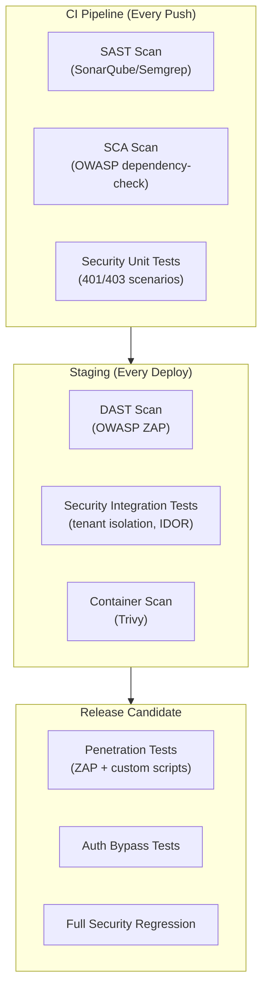

---

## 16. Compliance Requirements

### 16.1 Data Residency

| Requirement | Description | Status |
|-------------|-------------|--------|
| COMP-DR-01 | Definition data (metadata only, no PII) stored in Neo4j within the deployment region | [PLANNED] -- deployment region TBD |
| COMP-DR-02 | Audit trail data stored in PostgreSQL within the deployment region | [PLANNED] |
| COMP-DR-03 | No definition data replication across geographic boundaries without tenant consent | [PLANNED] |

### 16.2 GDPR Considerations

The definition-service primarily manages metadata (object type definitions, attribute schemas, connections). It does NOT store end-user personal data directly. However:

| GDPR Aspect | Applicability | Mitigation |
|-------------|--------------|-----------|
| Right to erasure | Low -- definitions do not contain PII | User IDs in audit trail may be pseudonymized |
| Data minimization | Medium -- audit trail stores actor ID | Store only user UUID, not name/email |
| Purpose limitation | Low -- metadata used for schema configuration | No secondary use of definition data |
| Data portability | Medium -- export endpoint provides definitions in JSON | Export format documented in API contract |
| Consent | N/A -- administrative data, not personal data | -- |
| Data protection impact assessment | Low -- no high-risk processing | DPIA not required for metadata-only service |

### 16.3 SOC 2 Controls Mapping

| SOC 2 Control | Definition-Service Implementation | Status |
|---------------|----------------------------------|--------|
| CC6.1 -- Logical access | JWT-based authentication; RBAC authorization (5 roles, 72 endpoints) | [IMPLEMENTED] partially |
| CC6.2 -- Access provisioning | Roles managed in Keycloak; no local user management | [IMPLEMENTED] |
| CC6.3 -- Access removal | Keycloak user deactivation; JWT expiry | [IMPLEMENTED] |
| CC6.6 -- System boundaries | API Gateway as single entry point; internal network isolation | [IMPLEMENTED] |
| CC6.7 -- Data classification | Data classification table (section 13) | [PLANNED] |
| CC6.8 -- Encryption | TLS in transit; Neo4j disk encryption at rest; AES-256-GCM for data source credentials | [IMPLEMENTED] partially |
| CC7.1 -- Monitoring | Application logging; actuator metrics | [IMPLEMENTED] partially |
| CC7.2 -- Security events | Audit trail for CRUD operations | [PLANNED] |
| CC7.3 -- Incident response | Escalation triggers defined in SEC-PRINCIPLES.md | [PLANNED] |
| CC8.1 -- Change management | Git-based version control; CI/CD pipeline | [IMPLEMENTED] |

---

## 17. Gap Closure Traceability

This section traces every gap from Doc 17 (STP-DM-001 Section 8) to its resolution in this document.

| Gap ID | Description | Resolution Section | Status |
|--------|-------------|-------------------|--------|
| GAP-001 | Rate limiting thresholds undefined | Section 6 (Rate Limiting) -- thresholds: reads=100/min, mutations=30/min, AI=10/min, import=5/min | CLOSED |
| GAP-002 | WebSocket security not addressed | Section 11.2 (WebSocket Security) -- JWT handshake auth, tenant-scoped channels | CLOSED |
| GAP-003 | File upload security for import | Section 7 (File Upload Security) -- JSON only, 10MB limit, ClamAV, schema validation | CLOSED |
| GAP-004 | Response size limiting | Section 6.4 (Response Size Limiting) -- 10MB response, 50MB export, streaming | CLOSED |
| GAP-005 | VIEWER role missing from RBAC matrix | Section 3.2 -- all 72 endpoints now include VW column | CLOSED |
| GAP-006 | Session fixation not addressed | Section 2.5 (Session Fixation Prevention) -- session rotation, memory-only token storage | CLOSED |
| GAP-007 | M2M API key authentication | Section 2.4 -- client_credentials OAuth, mTLS options documented | CLOSED |
| GAP-008 | Graph traversal depth limits undefined | Section 8 (Graph Traversal Security) -- max depth=5, max nodes=1000, timeout=5s | CLOSED |
| GAP-009 | Read-audit for sensitive operations | Section 14.1/14.3 SEC-AUD-11 -- optional read-audit for governance and cross-tenant | CLOSED |
| GAP-010 | Data source credential encryption | Section 9 (Data Source Credential Security) -- AES-256-GCM, Vault integration | CLOSED |
| GAP-011 | Token binding (DPoP) | Section 2.5 SEC-SF-04 -- DPoP recommended for future enhancement | CLOSED |
| GAP-012 | Missing penetration test scenarios | Section 15.4.6-15.4.8 -- cache poisoning, timing side-channel, state machine bypass tests added | CLOSED |
| GAP-013 | Localization XSS for RTL languages | Section 10 (Localization XSS Prevention) -- bidi override stripping, HTML encoding, Angular safe binding | CLOSED |
| GAP-014 | ETag information leakage | Section 11.3 (ETag Security) -- opaque ETags with tenant-scoped generation | CLOSED |
| GAP-015 | Governance state machine bypass | Section 15.4.8 -- exhaustive invalid state transition tests | CLOSED |
| GAP-016 | ADMIN role undefined | Section 3.2 -- ADMIN role (AD) defined with permissions for all 72 endpoints; distinguished from SUPER_ADMIN and TENANT_ADMIN | CLOSED |

### Missing Threat Scenarios -- Added

| Scenario | Section | STRIDE Category |
|----------|---------|----------------|
| Cache poisoning via Valkey | Section 1.4.2 T-05 | Tampering |
| Timing side-channel | Section 1.4.4 I-06 | Information Disclosure |
| Bulk export data theft | Section 1.4.4 I-07 | Information Disclosure |
| Kafka message tampering | Section 1.4.2 T-06 | Tampering |
| Release rollback race condition | Section 1.4.2 T-07 | Tampering |

---

## Appendix A: Security Configuration Checklist

Before each release, verify:

- [ ] All definition endpoints require authentication (no anonymous access except actuator health)
- [ ] RBAC roles correctly restrict endpoint access per authorization matrix (5 roles, 72 endpoints)
- [ ] Tenant isolation verified via integration tests (cross-tenant IDOR tests pass)
- [ ] JWT validation configured with correct Keycloak issuer URI and JWKS endpoint
- [ ] CORS configuration tightened for production (remove `localhost:*`)
- [ ] Swagger/OpenAPI disabled or access-restricted in production
- [ ] Actuator endpoints restricted (only health and info in production)
- [ ] No secrets in application.yml (all via environment variables)
- [ ] No stack traces in error responses (GlobalExceptionHandler covers all exceptions)
- [ ] Dependency vulnerability scan shows zero Critical/High CVEs
- [ ] SAST scan shows zero Critical/High findings
- [ ] Container image scan (Trivy) shows zero Critical/High vulnerabilities
- [ ] Audit trail integration tested and operational
- [ ] Rate limiting configured per Section 6 thresholds
- [ ] Input validation active on all request DTOs (`@Valid` + Jakarta constraints)
- [ ] Neo4j queries use parameterized Cypher (no string concatenation)
- [ ] Graph traversal limits configured (depth=5, nodes=1000, timeout=5s)
- [ ] Data source credentials encrypted with AES-256-GCM
- [ ] Localization strings sanitized (bidi overrides stripped, HTML encoded)
- [ ] File upload validation on import endpoint (JSON only, 10MB, schema validation)
- [ ] Security headers configured per Section 11
- [ ] All 5 new STRIDE threats have mitigations in place

---

## Appendix B: Security Findings from Code Review

The following findings are based on review of the current implementation (2026-03-10).

| Finding ID | Severity | Component | Description | Remediation | Status |
|-----------|----------|-----------|-------------|-------------|--------|
| SEC-F-01 | Medium | `SecurityConfig.java` | CORS allows `https://*.trycloudflare.com` and `https://*.cloudflare.com` -- overly permissive wildcard domains | Restrict to specific deployment domains in production | Open |
| SEC-F-02 | Low | `SecurityConfig.java` | Swagger/OpenAPI endpoints are `permitAll()` -- should be restricted in production | Add profile-based conditional: disable in `prod` profile | Open |
| SEC-F-03 | Medium | `SecurityConfig.java` | All definition endpoints require only SUPER_ADMIN -- blocks legitimate multi-role access patterns | Implement fine-grained RBAC per authorization matrix (section 3.2) | Open |
| SEC-F-04 | High | `ObjectTypeController.java` | X-Tenant-ID header fallback is used without validating against JWT claim -- potential tenant spoofing | Add validation: if both JWT claim and header present, they must match | Open |
| SEC-F-05 | Low | `ObjectTypeController.java` | `extractTenantId()` method duplicated in both controllers | Extract to shared utility class or base controller | Open |
| SEC-F-06 | Medium | `ObjectTypeCreateRequest.java` | `status` and `state` fields lack enum validation -- accepts any string up to max length | Add `@Pattern` with allowed enum values | Open |
| SEC-F-07 | Low | `GlobalExceptionHandler.java` | Generic 500 handler logs full exception but does not mask message -- verify no sensitive data in exception messages | Review all `throw` sites to ensure no sensitive data in messages | Open |
| SEC-F-08 | High | `ObjectTypeServiceImpl.java` | No audit trail for any CRUD operation -- violates repudiation controls | Implement audit-service integration with `@Auditable` aspect | Open |
| SEC-F-09 | Medium | Query parameters | No maximum page size enforcement -- potential DoS via large page requests | Add `@Max(100)` on `size` parameter | Open |
| SEC-F-10 | Low | Path parameters | No UUID format validation on path parameters -- malformed IDs cause unclear Neo4j errors | Add `@Pattern` for UUID format | Open |
| SEC-F-11 | Info | `SecurityConfig.java` | `allowedHeaders(List.of("*"))` -- consider restricting to known headers | Restrict to: Authorization, Content-Type, X-Tenant-ID, Accept | Open |

---

## Appendix C: Valkey Cache Security Configuration [PLANNED]

```yaml
# Valkey configuration for definition-service
spring:
  data:
    redis:
      host: ${VALKEY_HOST:localhost}
      port: ${VALKEY_PORT:6379}
      password: ${VALKEY_PASSWORD:}  # Injected via environment variable
      ssl:
        enabled: ${VALKEY_SSL:false}  # Enable in production
      timeout: 5s

# Cache key format: def:{tenantId}:{entityType}:{entityId}
# Example: def:tenant-123:ObjectType:abc-def-ghi
# NEVER use user-controlled segments in cache keys
```

**Valkey ACL configuration (production):**

```
# valkey.conf
user definition-service on >strong-password ~def:* +@read +@write +@keyspace
user default off
```

---

**Document End**

*This document is a living artifact. It will be updated as security controls are implemented and new threats are identified. v2.0.0 closed all 16 gaps identified by the Security Test Plan (Doc 17).*
