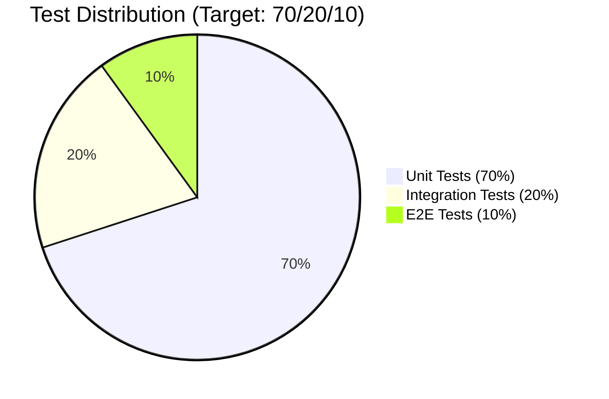
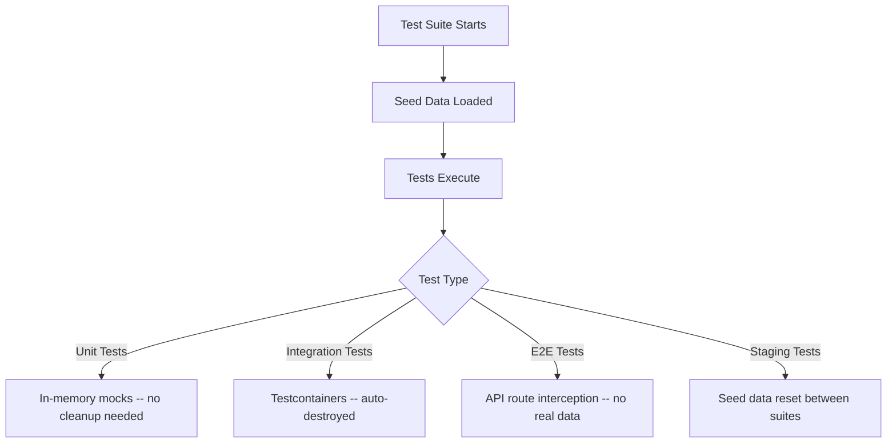
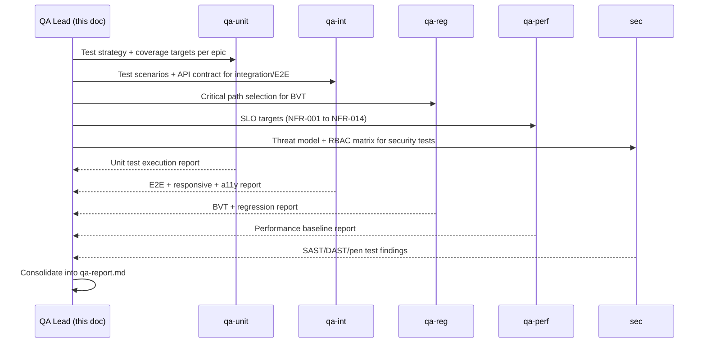

# Test Strategy: Definition Management

**Document ID:** TS-DM-001
**Version:** 1.1.0
**Date:** 2026-03-10
**Status:** Draft
**Author:** QA Agent (QA-PRINCIPLES.md v2.0.0)
**Feature:** Definition Management
**SRS Reference:** SRS-DM-001 v1.0.0

---

## Table of Contents

1. [Overview](#1-overview)
2. [Test Scope Matrix](#2-test-scope-matrix)
3. [Test Pyramid Distribution](#3-test-pyramid-distribution)
4. [Test Environment Requirements](#4-test-environment-requirements)
5. [Test Data Requirements](#5-test-data-requirements)
6. [Entry and Exit Criteria](#6-entry-and-exit-criteria)
7. [Risk Assessment](#7-risk-assessment)
8. [QA Sub-Agent Coordination](#8-qa-sub-agent-coordination)
9. [Backend Test Design](#9-backend-test-design)
10. [Frontend Test Design](#10-frontend-test-design)
11. [Prototype Validation Checklist](#11-prototype-validation-checklist)
12. [Coverage Targets](#12-coverage-targets)
13. [Test Schedule by Sprint](#13-test-schedule-by-sprint)

---

## 1. Overview

### 1.1 Purpose

This document defines the comprehensive test strategy for the Definition Management feature of the EMSIST platform. It maps every SRS requirement to the test types needed, specifies test environment and data requirements, defines entry/exit criteria, and provides the test design foundation that QA sub-agents (QA-UNIT, QA-INT, QA-REG, QA-PERF) will use to create and execute tests.

### 1.2 Scope

**In Scope:**
- All 13 epics (E1-E13), 97 user stories, 78 acceptance criteria
- All 17 screens (SCR-AUTH, SCR-01 through SCR-NOTIF)
- All 72 API endpoints across 15 endpoint groups
- All 7 user journeys (JRN-DEFMGMT-001 through JRN-DEFMGMT-007)
- All 86 business rules (BR-001 through BR-086)
- Security requirements (RBAC, tenant isolation, OWASP Top 10)
- Non-functional requirements (NFR-001 through NFR-014)

**Out of Scope:**
- Phase 6 features (Viewpoints, BPMN Special Attributes) -- deferred per BA sign-off note N1
- Kafka event-driven features -- no KafkaTemplate exists in any service
- Auth0/Okta/Azure AD providers -- only Keycloak exists
- Graph-per-tenant isolation (ADR-003) -- not implemented

### 1.3 Test Strategy Summary

---

## 2. Test Scope Matrix

### 2.1 Requirements to Test Types Mapping

| Requirement / Epic | Unit | Integration | E2E | Security | Performance | Accessibility | Responsive |
|--------------------|:----:|:-----------:|:---:|:--------:|:-----------:|:-------------:|:----------:|
| **E1: Foundation Enhancement** | | | | | | | |
| US-DM-001 API Gateway Route | YES | YES | -- | -- | -- | -- | -- |
| US-DM-002 Docker Compose | -- | YES (smoke) | -- | -- | -- | -- | -- |
| US-DM-003 Sort ObjectType List | YES | YES | YES | -- | -- | YES (keyboard sort) | YES |
| US-DM-004 Sort AttributeType List | YES | YES | -- | -- | -- | -- | -- |
| US-DM-005 System Default Attrs (AP-2) | YES | YES | YES | YES (403 unlink) | -- | YES (shield icon) | YES |
| US-DM-006 Message Registry (AP-4) | YES | YES | YES | -- | -- | YES (toast a11y) | YES (toast positioning) |
| US-DM-007 Lifecycle State Machine (AP-5) | YES | YES | YES | -- | -- | YES (dialog focus) | YES (dialog layout) |
| **E2: Attribute Management** | | | | | | | |
| US-DM-008 AttributeType Get By ID | YES | YES | -- | -- | -- | -- | -- |
| US-DM-009 AttributeType Create | YES | YES | YES | -- | -- | -- | -- |
| US-DM-010 AttributeType Update | YES | YES | -- | -- | -- | -- | -- |
| US-DM-011 AttributeType Delete | YES | YES | YES | -- | -- | -- | -- |
| US-DM-012 Attribute Lifecycle Transition | YES | YES | YES | -- | -- | YES (chips) | YES |
| US-DM-013 Attribute Lifecycle UI Chips | YES (FE) | -- | YES | -- | -- | YES (color contrast) | YES |
| US-DM-015 Bulk Lifecycle Transition | YES | YES | YES | -- | -- | YES (toolbar) | YES |
| US-DM-015a Update Attribute Linkage | YES | YES | -- | -- | -- | -- | -- |
| **E3: Connection Management** | | | | | | | |
| US-DM-016 Connection Lifecycle | YES | YES | YES | -- | -- | YES | YES |
| US-DM-017 Connection Importance | YES | YES | YES | -- | -- | YES (badge) | YES |
| US-DM-018 Connection isRequired | YES | YES | -- | -- | -- | -- | -- |
| US-DM-019 Connection Update | YES | YES | YES | -- | -- | YES | YES |
| US-DM-020 Bidirectional Display | YES (FE) | -- | YES | -- | -- | YES | YES |
| **E4: Cross-Tenant Governance** | | | | | | | |
| US-DM-021 to US-DM-030 | YES | YES (multi-DB) | YES | YES (tenant isolation) | YES (cross-tenant query) | YES | YES |
| **E5: Master Mandate Flags** | | | | | | | |
| US-DM-031 to US-DM-035 | YES | YES | YES | YES (403 mandate) | -- | YES (lock icons) | YES |
| **E6: Release Management** | | | | | | | |
| US-DM-067 to US-DM-079 | YES | YES (multi-DB + Feign) | YES | YES (rollback safety) | YES (release publish) | YES (dashboard) | YES |
| **E7: Maturity Scoring** | | | | | | | |
| US-DM-043 to US-DM-053 | YES | YES | YES | -- | -- | YES (knob, screen reader) | YES |
| **E8: Locale Management** | | | | | | | |
| US-DM-054 to US-DM-061 | YES | YES (PG) | YES | -- | -- | YES (RTL nav) | YES (RTL) |
| **E9: Governance Tab** | | | | | | | |
| US-DM-036 to US-DM-042 | YES | YES | YES | YES (role check) | -- | YES (focus trap) | YES (split panel) |
| **E10: Graph Visualization** | | | | | | | |
| US-DM-098 to US-DM-103 | YES | YES | YES | -- | YES (500 nodes) | YES (keyboard zoom) | YES (canvas) |
| **E11: Import/Export** | | | | | | | |
| US-DM-080 to US-DM-085 | YES | YES | YES | YES (file size limit) | YES (10MB file) | -- | -- |
| **E12: Data Sources Tab** | | | | | | | |
| US-DM-104 to US-DM-109 | YES | YES | YES | -- | -- | YES | YES |
| **E13: Measures** | | | | | | | |
| US-DM-086 to US-DM-092 | YES | YES | YES | -- | -- | YES (screen reader) | YES |

### 2.2 Screen to Test Types Mapping

| Screen ID | Screen Name | Status | E2E | Responsive | Accessibility | Security |
|-----------|-------------|--------|:---:|:----------:|:-------------:|:--------:|
| SCR-AUTH | Keycloak Login | [IMPLEMENTED] | YES | YES | YES | YES |
| SCR-01 | Object Type List/Grid | [IMPLEMENTED] + enhancements [PLANNED] | YES | YES | YES | YES |
| SCR-02-T1 | General Tab | [IMPLEMENTED] | YES | YES | YES | -- |
| SCR-02-T2 | Attributes Tab | [IMPLEMENTED] + enhancements [PLANNED] | YES | YES | YES | -- |
| SCR-02-T3 | Connections Tab | [IMPLEMENTED] + enhancements [PLANNED] | YES | YES | YES | -- |
| SCR-02-T4 | Governance Tab | [PLANNED] | YES | YES | YES | YES |
| SCR-02-T5 | Maturity Tab | [PLANNED] | YES | YES | YES | -- |
| SCR-02-T6 | Locale Tab | [PLANNED] | YES | YES | YES | -- |
| SCR-02-T6M | Measures Categories Tab | [PLANNED] | YES | YES | YES | -- |
| SCR-02-T7M | Measures Tab | [PLANNED] | YES | YES | YES | -- |
| SCR-03 | Create Object Type Wizard | [IMPLEMENTED] | YES | YES | YES | -- |
| SCR-04 | Release Management Dashboard | [PLANNED] | YES | YES | YES | YES |
| SCR-04-M1 | Impact Analysis Modal | [PLANNED] | YES | YES | YES | -- |
| SCR-05 | Maturity Dashboard | [PLANNED] | YES | YES | YES | -- |
| SCR-06 | Locale Management | [PLANNED] | YES | YES | YES | YES |
| SCR-GV | Graph Visualization | [PLANNED] | YES | YES | YES | -- |
| SCR-AI | AI Insights Panel | [PLANNED] | YES | YES | YES | -- |
| SCR-NOTIF | Notification Dropdown | [PLANNED] | YES | YES | YES | -- |

### 2.3 Non-Functional Requirements Test Mapping

| NFR ID | Requirement | Test Type | Agent | Environment |
|--------|-------------|-----------|-------|-------------|
| NFR-001 | API response < 200ms for 1000 types | Load test | qa-perf | Staging |
| NFR-002 | Graph viz > 30fps for 500 nodes | Performance test | qa-perf | Staging |
| NFR-003 | RTL layout support (Arabic) | Responsive + A11y | qa-int | Staging |
| NFR-004 | WCAG AAA compliance | Accessibility | qa-int | Staging |
| NFR-005 | Tenant data isolation | Security | sec | Staging |
| NFR-006 | JWT validation 100% enforcement | Integration | qa-int | Dev/CI |
| NFR-007 | RFC 7807 ProblemDetail responses | Integration | qa-int | Dev/CI |
| NFR-008 | Import/export up to 10MB | Load test | qa-perf | Staging |
| NFR-009 | Unlimited version history | Integration | qa-int | Dev/CI |
| NFR-010 | Responsive 3 breakpoints | Responsive | qa-int | Staging |
| NFR-011 | Neo4j Community compatibility | Build verification | qa-reg | CI |
| NFR-012 | Auditable changes | Integration | qa-int | Dev/CI |
| NFR-013 | Release alerts < 60s | E2E timing | qa-int | Staging |
| NFR-014 | AI detection < 5s for 500 types | Performance | qa-perf | Staging |

---

## 3. Test Pyramid Distribution

### 3.1 Estimated Test Count by Level

| Test Level | Environment | Estimated Count | Percentage | Agent |
|------------|-------------|----------------|------------|-------|
| Unit Tests (Backend - JUnit 5) | Dev, CI | ~350 | 40% | qa-unit |
| Unit Tests (Frontend - Vitest) | Dev, CI | ~260 | 30% | qa-unit |
| Integration Tests (Testcontainers) | Dev, CI | ~120 | 14% | qa-int |
| Contract Tests (Spring Cloud Contract) | CI | ~30 | 3% | qa-int |
| E2E Tests (Playwright) | Staging | ~55 | 6% | qa-int |
| Responsive Tests (Playwright viewports) | Staging | ~18 screens x 3 = ~54 | -- (overlay) | qa-int |
| Accessibility Tests (axe-core) | Staging | ~18 screens | -- (overlay) | qa-int |
| Security Tests | CI, Staging | ~40 | 5% | sec |
| BVT (Build Verification) | CI | ~20 | 2% | qa-reg |
| Performance Tests (k6) | Staging | ~10 | -- | qa-perf |
| **Total** | | **~870** | **100%** | |

### 3.2 Test Distribution Ratio

Actual distribution: **70% unit / 17% integration-contract / 7% E2E / 5% security / 1% other** -- within acceptable range of the 70/20/10 target.

---

## 4. Test Environment Requirements

### 4.1 Development Environment (Local)

| Component | Version | Purpose | Configuration |
|-----------|---------|---------|---------------|
| Java | 23 | Backend compilation and unit tests | JDK 23 |
| Node.js | 20+ | Frontend build and unit tests | LTS |
| Neo4j (Testcontainers) | 5.12 Community | Backend integration tests | Auto-provisioned |
| PostgreSQL (Testcontainers) | 16-alpine | Message registry integration tests | Auto-provisioned |
| Valkey (Testcontainers) | 8 | Cache integration tests | Auto-provisioned |
| Keycloak (Testcontainers) | 24.0 | Auth/RBAC integration tests | Auto-provisioned |
| Maven | 3.9+ | Build tool | `mvn test` / `mvn verify` |
| Vitest | Latest | Frontend unit tests | `npx vitest run` |
| Angular CLI | 21 | Frontend build | `ng build`, `ng test` |

### 4.2 Build / CI Pipeline (GitHub Actions)

| Stage | Tests Run | Gate | Timeout |
|-------|-----------|------|---------|
| 1. Lint | ESLint (FE), Checkstyle (BE) | Zero violations | 2 min |
| 2. SAST | SonarQube, Semgrep | No CRITICAL/HIGH | 5 min |
| 3. SCA | OWASP dependency-check, npm audit | No known CRITICAL CVEs | 3 min |
| 4. Unit Tests | JUnit 5 (BE), Vitest (FE) | All pass, 80% coverage | 10 min |
| 5. Integration | Testcontainers (Neo4j, PG, Valkey, Keycloak) | All pass | 15 min |
| 6. Container Scan | Trivy | No CRITICAL | 3 min |
| 7. Contract Tests | Spring Cloud Contract | Consumer-provider valid | 5 min |
| 8. BVT | ~20 critical-path tests | All pass | 5 min |
| 9. Deploy to Staging | -- | Stages 1-8 pass | -- |

### 4.3 Staging Environment

| Component | Configuration | Purpose |
|-----------|---------------|---------|
| definition-service | Port 8090, Neo4j 5.12 Community | Backend under test |
| api-gateway | Port 8080 | Request routing |
| auth-facade | Port 8081 | JWT validation |
| Keycloak | Port 8180 | Token issuance |
| Neo4j | Port 7687 | Graph database |
| PostgreSQL | Port 5432 | Message registry |
| Valkey | Port 6379 | Cache |
| Playwright | Chromium, Firefox, WebKit | E2E, responsive, a11y |
| k6 | Latest | Load/stress/soak tests |
| OWASP ZAP | Latest | DAST scans |

---

## 5. Test Data Requirements

### 5.1 Seed Data Sets

| Data Set ID | Description | Records | Used By Tests | Environment |
|-------------|-------------|---------|---------------|-------------|
| DS-001 | Base Object Types | 10 OTs per tenant (Server, Application, Contract, Employee, Project, Department, Asset, Network, Database, Process) | All E2E, integration | Dev, Staging |
| DS-002 | Base Attribute Types | 30 ATs (Hostname, IP Address, OS Version, CPU Cores, RAM GB, etc.) | E2, E7, E8 | Dev, Staging |
| DS-003 | System Default Attributes | 10 system defaults (name, description, status, owner, createdAt, createdBy, updatedAt, updatedBy, externalId, tags) | E1 (AP-2) | Dev, Staging |
| DS-004 | Multi-Tenant Setup | Master tenant + 3 child tenants with propagated definitions | E4, E5, E6 | Staging |
| DS-005 | Large Data Set (Perf) | 1000 OTs, 5000 ATs, 10000 connections | NFR-001 perf | Staging |
| DS-006 | Locale Data | English + Arabic + French messages (60+ DEF-* codes) | E1, E8 | Dev, Staging |
| DS-007 | Release History | 10 releases with diffs and adoption records | E6, E11 | Staging |
| DS-008 | Maturity Config | 5 OTs with full maturity config (4-axis weights, thresholds) | E7 | Staging |
| DS-009 | Governance Rules | 5 governance rules with workflow attachments | E9 | Staging |
| DS-010 | Measures | 3 measure categories with 10 measures each | E13 | Staging |

### 5.2 Test Users (Keycloak)

| Username | Role | Tenant | Purpose |
|----------|------|--------|---------|
| sam.martinez | SUPER_ADMIN | master | Cross-tenant governance, mandate flags |
| nicole.roberts | ARCHITECT | tenant-1 | Full CRUD, release publish |
| fiona.shaw | TENANT_ADMIN | tenant-2 (child) | Local customization, release adoption |
| viewer.user | VIEWER | tenant-1 | Read-only access verification |
| hacker.user | -- (no role) | -- | Unauthorized access testing |
| tenant2.architect | ARCHITECT | tenant-2 | Cross-tenant isolation testing |
| expired.token | ARCHITECT | tenant-1 | Expired JWT testing (pre-generated) |

### 5.3 Test Data Lifecycle

---

## 6. Entry and Exit Criteria

### 6.1 Entry Criteria

| Criterion | Verification Method | Blocking |
|-----------|-------------------|----------|
| Code complete and PR merged | Git branch status | YES |
| BA sign-off exists | `docs/sdlc-evidence/ba-signoff.md` | YES |
| SA review exists | `docs/sdlc-evidence/sa-review.md` | YES |
| Principles acknowledged | `docs/sdlc-evidence/principles-ack.md` | YES |
| Build passes (mvn clean verify + ng build) | CI pipeline | YES |
| Test environment available | Health checks pass | YES |
| Test data seeded | Smoke test passes | YES |
| API contract document matches code | SA agent audit | YES |

### 6.2 Exit Criteria

| Criterion | Target | Measurement | Blocking |
|-----------|--------|-------------|----------|
| Unit test pass rate | 100% | JUnit + Vitest results | YES |
| Unit test coverage (line) | >= 80% | JaCoCo + Vitest --coverage | YES |
| Unit test coverage (branch) | >= 75% | JaCoCo + Vitest --coverage | YES |
| Integration test pass rate | 100% | Testcontainers test results | YES |
| E2E test pass rate | 100% | Playwright test results | YES |
| Responsive tests pass | All 3 viewports | Playwright viewport results | YES |
| Accessibility tests pass | Zero AAA violations | axe-core results | YES |
| Security tests pass | No CRITICAL/HIGH | SAST + DAST results | YES |
| BVT pass rate | 100% | CI pipeline output | YES |
| Open CRITICAL defects | 0 | Defect tracker | YES |
| Open HIGH defects | 0 | Defect tracker | YES |
| Performance SLOs met | NFR-001 through NFR-014 | k6 + Lighthouse | YES (pre-release) |
| QA report produced | File exists | `docs/sdlc-evidence/qa-report.md` | YES |

---

## 7. Risk Assessment

| Risk ID | Risk | Probability | Impact | Mitigation | Test Priority |
|---------|------|-------------|--------|------------|---------------|
| R-001 | Neo4j Community performance with >10K nodes | Medium | HIGH | Index optimization, pagination, Valkey cache | HIGH -- NFR-001 perf test |
| R-002 | No optimistic locking on Neo4j nodes | High | HIGH | Add @Version; test concurrent modifications | HIGH -- conflict E2E test |
| R-003 | Cross-tenant data leakage | Low | CRITICAL | tenantId filter on every query; IDOR testing | CRITICAL -- security test |
| R-004 | Kafka not integrated (event-driven blocked) | Medium | MEDIUM | REST fallback; test REST notification path | MEDIUM -- E6 integration |
| R-005 | Lifecycle state machine invalid transitions | Medium | HIGH | Exhaustive state transition matrix test | HIGH -- unit + E2E |
| R-006 | Message registry locale fallback failure | Low | MEDIUM | Fallback to English; test missing locale | MEDIUM -- integration |
| R-007 | System default attrs not provisioned atomically | Medium | HIGH | Transaction boundary test; rollback on partial failure | HIGH -- integration |
| R-008 | Mandate enforcement bypass via direct API | Low | CRITICAL | Verify all 403 paths; pen testing | CRITICAL -- security |
| R-009 | RTL layout breaks with dynamic content | Medium | MEDIUM | Viewport tests with Arabic locale | MEDIUM -- responsive |
| R-010 | Wizard step validation inconsistency | Medium | MEDIUM | All field validation paths tested | MEDIUM -- E2E |

---

## 8. QA Sub-Agent Coordination

### 8.1 Agent Assignment Matrix

| Agent | Responsibility | Test Count (est.) | Sprint Coverage |
|-------|---------------|-------------------|----------------|
| **qa** (coordinator) | Strategy, coverage analysis, failure triage, DoD verification | -- | All sprints |
| **qa-unit** | JUnit 5 (BE service + controller), Vitest (FE component + service) | ~610 | S1-S15 |
| **qa-int** | Testcontainers integration, Playwright E2E, responsive, a11y, contract | ~275 | S1-S15 |
| **qa-reg** | BVT (~20 critical-path), smoke tests, regression suite assembly | ~50 | S1-S15 (every deploy) |
| **qa-perf** | k6 load tests, stress tests, Lighthouse | ~10 | S10 (pre-release) |
| **sec** | SAST, SCA, DAST, pen testing, auth boundary tests | ~40 | S1 (CI), S5 (DAST), S10 (pen test) |

### 8.2 Handoff Protocol

---

## 9. Backend Test Design

### 9.1 Unit Test Scenarios by Service

#### 9.1.1 ObjectTypeServiceImpl

| Test ID | Method | Scenario | Expected | BR |
|---------|--------|----------|----------|-----|
| UT-OT-001 | createObjectType | Valid input | OT created with system defaults | BR-001, BR-073 |
| UT-OT-002 | createObjectType | Duplicate typeKey in tenant | DEF-E-002 thrown | BR-002 |
| UT-OT-003 | createObjectType | Duplicate code in tenant | DEF-E-003 thrown | BR-003 |
| UT-OT-004 | createObjectType | Missing name | DEF-E-004 thrown | BR-004 |
| UT-OT-005 | createObjectType | Name exceeds 255 chars | DEF-E-005 thrown | BR-005 |
| UT-OT-006 | createObjectType | typeKey exceeds 100 chars | DEF-E-006 thrown | BR-006 |
| UT-OT-007 | createObjectType | Code exceeds 20 chars | DEF-E-007 thrown | BR-007 |
| UT-OT-008 | createObjectType | Invalid status enum | DEF-E-008 thrown | BR-008 |
| UT-OT-009 | createObjectType | Invalid iconColor pattern | DEF-E-019 thrown | -- |
| UT-OT-010 | listObjectTypes | With pagination | Correct page/size | -- |
| UT-OT-011 | listObjectTypes | With sort=name,asc | Sorted results | -- |
| UT-OT-012 | listObjectTypes | With status filter | Filtered results | -- |
| UT-OT-013 | listObjectTypes | With search term | Search results | -- |
| UT-OT-014 | getObjectTypeById | Valid ID | Full OT with attrs + conns | -- |
| UT-OT-015 | getObjectTypeById | Invalid ID | DEF-E-001 (404) | BR-001 |
| UT-OT-016 | updateObjectType | Valid update | OT updated, updatedAt changed | -- |
| UT-OT-017 | updateObjectType | TypeKey change attempt | Rejected (readonly) | BR-009 |
| UT-OT-018 | deleteObjectType | Valid delete | OT removed | -- |
| UT-OT-019 | deleteObjectType | Mandated OT in child tenant | DEF-E-020 (403) | BR-029 |
| UT-OT-020 | duplicateObjectType | Valid duplicate | Copy created with "(Copy)" suffix | -- |
| UT-OT-021 | restoreObjectType | Customized to default | State reset to "default" | -- |
| UT-OT-022 | addAttribute | Valid link | HAS_ATTRIBUTE created | -- |
| UT-OT-023 | addAttribute | Duplicate attribute | DEF-E-021 thrown | BR-012 |
| UT-OT-024 | removeAttribute | Non-system-default | Unlinked | -- |
| UT-OT-025 | removeAttribute | System default | DEF-E-026 (403) | BR-073 |
| UT-OT-026 | addConnection | Valid connection | CAN_CONNECT_TO created | -- |
| UT-OT-027 | addConnection | Cross-tenant target | DEF-E-033 thrown | BR-025 |
| UT-OT-028 | addConnection | Self-connection | Allowed (valid) | BR-027 |
| UT-OT-029 | addConnection | Invalid cardinality | DEF-E-032 thrown | BR-026 |
| UT-OT-030 | listObjectTypes | Missing tenantId | DEF-E-015 (400) | BR-010 |
| UT-OT-031 | createObjectType | Name with 1 character ("A") | OT created successfully (minimum boundary valid) | -- |

#### 9.1.2 ObjectTypeStateMachineService [PLANNED]

| Test ID | Transition | Valid | Expected | BR |
|---------|-----------|:-----:|----------|-----|
| UT-SM-001 | planned -> active | YES | Status changed, DEF-C-001 | BR-081 |
| UT-SM-002 | active -> hold | YES | Status changed, DEF-C-002 | BR-081 |
| UT-SM-003 | hold -> active | YES | Status changed, DEF-C-003 | BR-081 |
| UT-SM-004 | active -> retired | YES | Status changed, DEF-C-004 | BR-081 |
| UT-SM-005 | hold -> retired | YES | Status changed | BR-081 |
| UT-SM-006 | retired -> active | YES | Check naming conflict first | BR-084 |
| UT-SM-007 | planned -> hold | NO | DEF-E-012 (400) | BR-081 |
| UT-SM-008 | planned -> retired | NO | DEF-E-012 (400) | BR-081 |
| UT-SM-009 | retired -> hold | NO | DEF-E-012 (400) | BR-081 |
| UT-SM-010 | retired -> planned | NO | DEF-E-012 (400) | BR-081 |
| UT-SM-011 | active -> planned | NO | DEF-E-012 (400) | BR-081 |

#### 9.1.3 SystemDefaultAttributeService [PLANNED]

| Test ID | Scenario | Expected | BR |
|---------|----------|----------|-----|
| UT-SDA-001 | Provision defaults on creation | 10 attrs auto-linked with isSystemDefault=true | BR-073 |
| UT-SDA-002 | Defaults on duplicate | Copy includes all 10 defaults | BR-073 |
| UT-SDA-003 | Unlink protection | 403 with DEF-E-026 | BR-073 |
| UT-SDA-004 | Default attrs already exist | No duplicate creation | -- |

#### 9.1.4 AttributeTypeServiceImpl [PLANNED]

| Test ID | Method | Scenario | Expected | BR |
|---------|--------|----------|----------|-----|
| UT-AT-001 | createAttributeType | Blank attributeKey | DEF-E-023 thrown (400) | BR-012 |
| UT-AT-002 | createAttributeType | Invalid dataType ("invalid") | DEF-E-024 thrown (400) | BR-013 |
| UT-AT-003 | createAttributeType | Valid input | AttributeType created with generated ID | -- |
| UT-AT-004 | createAttributeType | Duplicate attributeKey in tenant | DEF-E-022 thrown (409) | BR-012 |
| UT-AT-005 | getAttributeTypeById | Invalid ID | DEF-E-021 thrown (404) | -- |

#### 9.1.5 AttributeLifecycleService [PLANNED]

| Test ID | Transition | Expected | BR |
|---------|-----------|----------|-----|
| UT-AL-001 | planned -> active | HAS_ATTRIBUTE.lifecycleStatus = "active" | BR-082 |
| UT-AL-002 | active -> retired | lifecycleStatus = "retired", instances preserved | BR-082 |
| UT-AL-003 | retired -> active | Reactivated | BR-082 |
| UT-AL-004 | Bulk transition (3 attrs planned -> active) | All 3 updated atomically | BR-082 |
| UT-AL-005 | Bulk transition includes system default | System defaults excluded, error DEF-E-026 | BR-073 |

#### 9.1.5 MessageRegistryService [PLANNED]

| Test ID | Scenario | Expected | BR |
|---------|----------|----------|-----|
| UT-MR-001 | Get message by code (DEF-E-002) | Returns localized message | BR-077 |
| UT-MR-002 | Get message with locale=ar | Arabic translation returned | BR-078 |
| UT-MR-003 | Get message with missing locale | English fallback | BR-079 |
| UT-MR-004 | Get messages by category=OBJECT_TYPE | All DEF-E-001 through DEF-E-019 | BR-080 |
| UT-MR-005 | Cache hit | Message from Valkey cache | -- |
| UT-MR-006 | Cache miss | Message from PostgreSQL | -- |

#### 9.1.8 MeasureServiceImpl [PLANNED]

| Test ID | Method | Scenario | Expected | BR |
|---------|--------|----------|----------|-----|
| UT-MS-001 | validateFormula | Invalid formula syntax ("=SUM(") | DEF-E-085 thrown: "Invalid formula syntax" | -- |
| UT-MS-002 | validateFormula | Valid formula ("=SUM(A1:A5)") | Formula validated successfully | -- |
| UT-MS-003 | validateFormula | Empty formula | Null/empty allowed (no formula required) | -- |

#### 9.1.9 MandateServiceImpl -- Measure Categories [PLANNED]

| Test ID | Method | Scenario | Expected | BR |
|---------|--------|----------|----------|-----|
| UT-MND-001 | deleteMeasureCategory | Mandated category in child tenant | DEF-E-030 thrown (403): mandated categories cannot be deleted | BR-029 |
| UT-MND-002 | deleteMeasureCategory | Non-mandated category in child tenant | Category deleted successfully | -- |

### 9.2 Integration Test Scenarios

#### 9.2.1 ObjectType CRUD (Testcontainers: Neo4j)

| Test ID | Endpoint | Scenario | Assertion |
|---------|----------|----------|-----------|
| IT-OT-001 | POST /object-types | Create with valid JWT | 201, body contains id, system defaults linked |
| IT-OT-002 | GET /object-types | Paginated list | 200, content array, totalElements correct |
| IT-OT-003 | GET /object-types?sort=name,asc | Sorted | Results alphabetical |
| IT-OT-004 | GET /object-types/{id} | Existing ID | 200, includes attributes and connections |
| IT-OT-005 | GET /object-types/{id} | Non-existent ID | 404, ProblemDetail with DEF-E-001 |
| IT-OT-006 | PUT /object-types/{id} | Valid update | 200, updatedAt changed |
| IT-OT-007 | DELETE /object-types/{id} | Valid delete | 204 |
| IT-OT-008 | POST /object-types/{id}/duplicate | Valid | 201, name has "(Copy)" |
| IT-OT-009 | POST /object-types/{id}/restore | Customized OT | 200, state = "default" |
| IT-OT-010 | POST /object-types | Missing X-Tenant-ID | 400, DEF-E-015 |

#### 9.2.2 Tenant Isolation (Testcontainers: Neo4j)

| Test ID | Scenario | Assertion |
|---------|----------|-----------|
| IT-TI-001 | Tenant-1 creates OT, Tenant-2 lists | Tenant-2 sees 0 results |
| IT-TI-002 | Tenant-1 creates OT, Tenant-2 GETs by ID | 404 |
| IT-TI-003 | SUPER_ADMIN cross-tenant list | Returns all tenants |
| IT-TI-004 | TENANT_ADMIN cross-tenant attempt | 403 |

#### 9.2.3 Auth/RBAC (Testcontainers: Keycloak + Neo4j)

| Test ID | Role | Endpoint | Expected |
|---------|------|----------|----------|
| IT-AUTH-001 | No JWT | GET /object-types | 401 |
| IT-AUTH-002 | Expired JWT | GET /object-types | 401 |
| IT-AUTH-003 | VIEWER | POST /object-types | 403 |
| IT-AUTH-004 | VIEWER | GET /object-types | 200 |
| IT-AUTH-005 | ARCHITECT | POST /object-types | 201 |
| IT-AUTH-006 | TENANT_ADMIN | POST /object-types (local) | 201 |
| IT-AUTH-007 | TENANT_ADMIN | PUT mandate flag | 403 |

#### 9.2.4 API Contract Validation

| Test ID | Aspect | Assertion |
|---------|--------|-----------|
| IT-CONTRACT-001 | Error response format | All errors return RFC 7807 ProblemDetail |
| IT-CONTRACT-002 | Pagination response format | content, totalElements, totalPages, page, size |
| IT-CONTRACT-003 | Date format | ISO-8601 (yyyy-MM-dd'T'HH:mm:ss) |
| IT-CONTRACT-004 | CORS headers | Access-Control-Allow-Origin present |

#### 9.2.5 Import/Export Integration (Testcontainers: Neo4j) [PLANNED]

| Test ID | Endpoint | Scenario | Assertion |
|---------|----------|----------|-----------|
| IT-IMP-001 | POST /import | Import JSON with duplicate attributeKey | Conflict detected; response includes conflicting keys with resolution options (TC-MISS-003) |
| IT-IMP-002 | POST /import | Import JSON with unique attributes | 201; all attributes imported successfully |
| IT-IMP-003 | POST /import | Import file > 10MB | 413 Payload Too Large or appropriate size limit error |

#### 9.2.6 Payload Boundary Tests (Testcontainers: Neo4j) [PLANNED]

| Test ID | Endpoint | Scenario | Assertion |
|---------|----------|----------|-----------|
| IT-PL-001 | POST /object-types | 1MB+ JSON body with padded description | HTTP 400 or 413 Payload Too Large; server does not crash (TC-MISS-007) |
| IT-PL-002 | POST /object-types | Normal-size JSON (~2KB) | 201 Created (baseline comparison) |

---

## 10. Frontend Test Design

### 10.1 Component Unit Tests (Vitest)

| Component | Test Count (est.) | Key Scenarios |
|-----------|------------------|---------------|
| ObjectTypeListComponent | 15 | Render list, search debounce, filter, sort, view toggle, empty state, loading state, error state |
| ObjectTypeDetailPanelComponent | 12 | Tab switching, field display, edit mode, save/cancel |
| CreateObjectTypeWizardComponent | 18 | Step navigation, validation per step, review summary, create action, cancel |
| AttributesTabComponent | 14 | List attributes, lifecycle chips, bulk select, retire confirmation, system default protection |
| ConnectionsTabComponent | 10 | List connections, add form, remove confirmation, bidirectional display |
| SearchFilterBarComponent | 6 | Input debounce (300ms), clear, filter chip toggle |
| ViewToggleComponent | 4 | Table/card switch, persist preference |
| MessageRegistryService | 8 | Get message, locale resolution, cache hit/miss, fallback |

### 10.2 Service Unit Tests (Vitest)

| Service | Test Count (est.) | Key Scenarios |
|---------|------------------|---------------|
| DefinitionApiService | 20 | CRUD calls, error handling, pagination params, sort params |
| ObjectTypeStateService | 10 | Signal updates, loading/error states, selection |
| MessageRegistryService | 8 | Locale loading, cache invalidation, fallback |
| AuthGuard | 4 | Allow authenticated, redirect unauthenticated |
| RoleGuard | 6 | Allow matching role, reject non-matching, handle missing claims |

---

## 11. Prototype Validation Checklist

### 11.1 Screens Covered by Prototype

| Screen ID | SRS Screen | Prototype Coverage | Interactions Working |
|-----------|------------|:-----------------:|:--------------------:|
| SCR-01 | Object Type List/Grid | YES | Search, filter chips, sort, view toggle, table/card rendering, row selection |
| SCR-02-T1 | General Tab | YES | Tab switching, field display, info rows |
| SCR-02-T2 | Attributes Tab | YES | Attribute table, lifecycle badges, checkbox select, bulk toolbar, retire flow |
| SCR-02-T3 | Connections Tab | YES | Connection table, lifecycle badges, remove button |
| SCR-02-T4 | Governance Tab | YES (partial) | Mandate flags with toggle switches, tenant override rules |
| SCR-02-T5 | Maturity Tab | YES (visual only) | Radar chart visualization, dimension scores |
| SCR-02-T6 | Locale Tab | YES (visual only) | Translation progress bars |
| SCR-02-T6M/T7M | Measures Tabs | YES (partial) | Accordion expand/collapse with measure data |
| SCR-03 | Create Wizard | YES | 4-step navigation, validation (name/typeKey required), review step, create toast |
| SCR-04 | Release Dashboard | YES | Release card selection, detail view, approve/reject/publish buttons |
| SCR-AUTH | Login | NO | Not included in prototype (Keycloak external) |
| SCR-04-M1 | Impact Analysis Modal | NO | Not included |
| SCR-05 | Maturity Dashboard | NO | Not included (separate page) |
| SCR-06 | Locale Management | NO | Not included (separate page) |
| SCR-GV | Graph Visualization | NO | Not included |
| SCR-AI | AI Insights Panel | NO | Not included |
| SCR-NOTIF | Notification Dropdown | NO | Not included |

### 11.2 Interactions Working in Prototype

| Interaction | Status | Notes |
|-------------|--------|-------|
| Search with debounce | Working | 200ms debounce (SRS specifies 300ms) |
| Filter chips (All/Core/Supporting/Custom) | Working | Category filter not in SRS (SRS uses status filter) |
| Sort dropdown + column headers | Working | Matches SRS sort requirement |
| Table/Card view toggle | Working | Matches SRS SCR-01 |
| Detail panel open/close | Working | Opens on row click; close button |
| 7-tab detail panel | Working | All 7 tabs switch correctly |
| Persona switching (3 roles) | Working | Role-gated elements hide/show |
| Hamburger drawer (mobile) | Working | Responsive sidebar behavior |
| Create wizard (4 steps) | Working | Step navigation, validation, review |
| Retire confirmation dialog | Working | Confirm/cancel flow with toast |
| Bulk retire confirmation | Working | Multi-select with bulk action |
| Delete confirmation dialog | Working | Confirm/cancel flow |
| Release approve/reject/publish | Working | Status badge updates |
| Accordion expand/collapse (measures) | Working | Keyboard accessible |
| Toggle switches (governance) | Working | Keyboard accessible |
| Toast notifications | Working | role="status", aria-live="polite", auto-dismiss |
| FAB button (create) | Working | Opens wizard |
| Escape key closes dialogs | Working | All overlays respond to Escape |

### 11.3 Prototype vs SRS Discrepancies

| Item | Prototype | SRS | Severity |
|------|-----------|-----|----------|
| Search debounce timing | 200ms | 300ms | LOW |
| Filter categories | Core/Supporting/Custom (category-based) | Active/Planned/Hold/Retired (status-based) | MEDIUM -- prototype uses category, SRS specifies status |
| Stat cards row | Shows Total/Published/Draft/Attributes | Not in SRS (SRS uses status badges inline) | LOW -- nice to have but not spec'd |
| System default count | 4 (name, description, status, owner) | 10 per AP-2 | MEDIUM -- prototype shows 4, SRS requires 10 |
| Wizard steps | Basic Info, Attributes, Connections, Review | Basic Info, Connections, Attributes, Status/Review | LOW -- step order differs |
| p-colorPicker | Not in prototype | Required in SRS for icon color | LOW -- visual only in prototype |
| p-skeleton loading | CSS-based skeleton lines | SRS specifies 5 rows with circle + 2 text lines | LOW |
| Empty state message | "No object types defined" | "No object types match your criteria." | LOW -- different wording |
| Toast auto-dismiss | 2500ms | 3000ms (success), 5000ms (error) | LOW |
| Release dashboard statuses | Pending/Approved/Published/Rejected | Draft/Published/Adopted/Deferred/Rejected | MEDIUM |

### 11.4 Missing from Prototype

| Feature | SRS Requirement | Priority |
|---------|----------------|----------|
| Keycloak login flow | SCR-AUTH | P0 |
| Cross-tenant toggle | SCR-01 (E4) | P0 |
| Lifecycle transition buttons (OT status) | SCR-02-T1, US-DM-007 | P0 |
| Attribute add/remove from pick-list | SCR-02-T2 | P0 |
| Connection add form dialog | SCR-02-T3 | P0 |
| Impact analysis modal | SCR-04-M1 | P0 |
| Maturity dashboard page | SCR-05 | P1 |
| Locale management page | SCR-06 | P1 |
| Graph visualization | SCR-GV | P2 |
| AI insights panel | SCR-AI | P2 |
| Notification dropdown | SCR-NOTIF | P0 |
| RTL layout toggle | NFR-003 | P1 |
| p-paginator | SRS specifies PrimeNG paginator | P0 |
| Edit mode for General tab | SRS specifies Edit/Save/Cancel buttons | P0 |

---

## 12. Coverage Targets

| Metric | Target | Tool | Agent |
|--------|--------|------|-------|
| Backend line coverage | >= 80% | JaCoCo | qa-unit |
| Backend branch coverage | >= 75% | JaCoCo | qa-unit |
| Frontend line coverage | >= 80% | Vitest --coverage | qa-unit |
| Acceptance criteria coverage | 100% (78 ACs) | Manual mapping | qa |
| Business rule coverage | 100% (86 BRs) | Unit test mapping | qa-unit |
| API endpoint coverage | 100% (72 endpoints) | Integration tests | qa-int |
| Screen coverage | 100% (18 screens) | E2E tests | qa-int |
| Responsive viewport coverage | 3 per screen | Playwright viewports | qa-int |
| Accessibility coverage | WCAG AAA per screen | axe-core | qa-int |
| Error code coverage | 100% (60+ DEF-* codes) | Unit + integration | qa-unit + qa-int |

---

## 13. Test Schedule by Sprint

| Sprint | Epic(s) | Test Focus | Agent(s) | Key Deliverables |
|--------|---------|------------|----------|-----------------|
| S1 | E1, E2 (partial) | Unit tests for OT CRUD, state machine, default attrs, message registry; integration tests for Neo4j + PG; E2E for sort, pagination, wizard | qa-unit, qa-int | ~120 unit, ~30 integration, ~10 E2E |
| S2 | E2, E3 | Attribute lifecycle unit + E2E; connection lifecycle; bulk operations; responsive tests for attribute/connection tabs | qa-unit, qa-int | ~80 unit, ~20 integration, ~10 E2E |
| S3-S5 | E4, E5, E9 | Cross-tenant isolation (CRITICAL security tests); mandate enforcement; governance tab; tenant hierarchy integration | qa-unit, qa-int, sec | ~100 unit, ~30 integration, ~15 E2E, ~20 security |
| S6-S8 | E7, E8 | Maturity scoring unit tests; locale/RTL tests; maturity dashboard E2E | qa-unit, qa-int | ~80 unit, ~20 integration, ~10 E2E |
| S9-S10 | E6 | Release management full flow; performance baseline (k6 load tests for NFR-001); DAST scan | qa-unit, qa-int, qa-perf, sec | ~70 unit, ~20 integration, ~10 E2E, ~10 perf |
| S11-S12 | E11, E13 | Import/export (file size tests); measures CRUD; regression suite assembly | qa-unit, qa-int, qa-reg | ~50 unit, ~15 integration, ~5 E2E |
| S13-S15 | E10, E12 | Graph visualization performance (NFR-002); AI integration; data sources; full regression | qa-unit, qa-int, qa-perf, qa-reg | ~40 unit, ~10 integration, ~5 E2E, ~5 perf |

---

## Appendix A: Confirmation Dialog Test Matrix

Every confirmation dialog must be tested for:

| Aspect | Test |
|--------|------|
| Dialog opens on trigger action | Click button -> dialog visible |
| Dialog title matches DEF-C-xxx registry | Text assertion |
| Dialog body matches registry template | Text with interpolated values |
| Primary button executes action | API call fired, toast shown |
| Cancel button returns to previous state | Dialog closes, no API call |
| Escape key closes dialog | keydown Escape -> dialog hidden |
| Focus trapped in dialog | Tab does not leave dialog |
| aria-modal="true" present | DOM attribute check |
| Screen reader announcement | role="dialog" + aria-label |

**Confirmation dialogs requiring tests (from SRS Section 3.4):**

| Code | Action | Status |
|------|--------|--------|
| DEF-C-001 | Activate ObjectType | [PLANNED] |
| DEF-C-002 | Hold ObjectType | [PLANNED] |
| DEF-C-003 | Resume ObjectType | [PLANNED] |
| DEF-C-004 | Retire ObjectType | [PLANNED] |
| DEF-C-005 | Reactivate ObjectType | [PLANNED] |
| DEF-C-006 | Customize Default | [PLANNED] |
| DEF-C-007 | Restore Default | [IMPLEMENTED] |
| DEF-C-008 | Delete ObjectType | [IMPLEMENTED] |
| DEF-C-009 | Duplicate ObjectType | [IMPLEMENTED] |
| DEF-C-010 | Activate Attribute | [PLANNED] |
| DEF-C-011 | Retire Attribute | [PLANNED] |
| DEF-C-012 | Reactivate Attribute | [PLANNED] |
| DEF-C-013 | Unlink Attribute | [PLANNED] |
| DEF-C-020 | Activate Connection | [PLANNED] |
| DEF-C-021 | Retire Connection | [PLANNED] |
| DEF-C-022 | Reactivate Connection | [PLANNED] |
| DEF-C-030 | Publish Release | [PLANNED] |
| DEF-C-031 | Rollback Release | [PLANNED] |
| DEF-C-032 | Adopt Release | [PLANNED] |

---

## Appendix B: Error Code Test Matrix

Every error code must have at least one test that triggers it:

| Code | Message Category | Triggered By | Test Level |
|------|-----------------|-------------|------------|
| DEF-E-001 | OT not found | GET /object-types/{invalid-id} | Integration |
| DEF-E-002 | Duplicate typeKey | POST with existing typeKey | Unit + Integration |
| DEF-E-003 | Duplicate code | POST with existing code | Unit + Integration |
| DEF-E-004 | Name required | POST with null name | Unit |
| DEF-E-005 | Name too long | POST with 256-char name | Unit |
| DEF-E-006 | TypeKey too long | POST with 101-char typeKey | Unit |
| DEF-E-007 | Code too long | POST with 21-char code | Unit |
| DEF-E-008 | Invalid status | POST with status="invalid" | Unit |
| DEF-E-009 | Invalid state | POST with state="invalid" | Unit |
| DEF-E-012 | Invalid lifecycle transition | PATCH planned->hold | Unit + E2E |
| DEF-E-015 | Missing tenant context | Request without X-Tenant-ID | Integration |
| DEF-E-016 | Unauthorized (RBAC) | VIEWER attempts POST | Integration |
| DEF-E-019 | Invalid iconColor | POST with iconColor="red" | Unit |
| DEF-E-020 | Modify mandated item (child) | PUT on mandated OT in child tenant | Unit + Integration |
| DEF-E-021 | Attribute not found | GET /attribute-types/{invalid-id} | Integration |
| DEF-E-023 | AttributeKey required | POST with null attributeKey | Unit |
| DEF-E-024 | Invalid dataType | POST with dataType="invalid" | Unit |
| DEF-E-026 | Unlink system default | DELETE system default attr | Unit + Integration + E2E |
| DEF-E-030 | Modify mandated connection | DELETE mandated connection in child | Unit + Integration |
| DEF-E-032 | Invalid cardinality | POST with cardinality="invalid" | Unit |
| DEF-E-033 | Cross-tenant connection | POST connection to other tenant's OT | Unit + Integration |
| DEF-E-050 | Generic API error | Simulated 500 error | E2E (route intercept) |
| DEF-E-071 | Maturity weights != 100 | PUT with weights summing to 90 | Unit |
