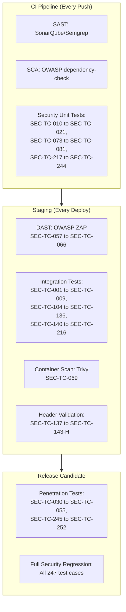

# Security Test Plan: Definition Management

**Document ID:** STP-DM-001
**Version:** 2.0.0
**Date:** 2026-03-10
**Status:** [PLANNED]
**Author:** SEC Agent (SEC-PRINCIPLES.md v1.1.0)
**Service:** definition-service
**Port:** 8090
**Database:** Neo4j 5 Community Edition
**Total Test Cases:** 310 (v1: 247 + v2: 63 new for gap closure)
**OWASP Top 10 Coverage:** 10/10 categories
**Change Log:** v2.0.0 -- Added 63 test cases covering all 16 gaps closed in Doc 13 v2.0.0: rate limiting (GAP-001), file upload (GAP-003), response size (GAP-004), ADMIN role RBAC (GAP-005/016), session fixation (GAP-006), M2M auth (GAP-007), graph traversal limits (GAP-008), read-audit (GAP-009), credential encryption (GAP-010), cache poisoning (GAP-012), localization XSS (GAP-013), ETag security (GAP-014), governance state machine (GAP-015).

---

## Table of Contents

1. [OWASP Top 10 Test Matrix](#1-owasp-top-10-test-matrix)
2. [Tenant Isolation Test Suite](#2-tenant-isolation-test-suite)
3. [RBAC Enforcement Test Matrix](#3-rbac-enforcement-test-matrix)
4. [Input Validation Test Cases](#4-input-validation-test-cases)
5. [Neo4j-Specific Security Tests](#5-neo4j-specific-security-tests)
6. [API Security Tests](#6-api-security-tests)
7. [Prototype Security Review](#7-prototype-security-review)
8. [Gaps in Security Requirements (Doc 13)](#8-gaps-in-security-requirements-doc-13)
9. [Test Execution Strategy](#9-test-execution-strategy)
10. [Appendix: Test Case Summary](#appendix-test-case-summary)

---

## 1. OWASP Top 10 Test Matrix

### A01: Broken Access Control

| Test ID | Category | Description | Precondition | Steps | Expected Result | Severity |
|---------|----------|-------------|--------------|-------|-----------------|----------|
| SEC-TC-001 | IDOR | Access Tenant B object type using Tenant A JWT | Tenant A user authenticated; Tenant B ObjectType ID known | GET `/api/v1/definitions/object-types/{tenant-B-id}` with Tenant A JWT | HTTP 404 (NOT 403 to prevent ID enumeration) | Critical |
| SEC-TC-002 | IDOR | Access Tenant B attribute type | Tenant A user authenticated | GET `/api/v1/definitions/attribute-types/{tenant-B-attr-id}` with Tenant A JWT | HTTP 404 | Critical |
| SEC-TC-003 | IDOR | Delete Tenant B object type | Tenant A SUPER_ADMIN authenticated | DELETE `/api/v1/definitions/object-types/{tenant-B-id}` | HTTP 404 | Critical |
| SEC-TC-004 | IDOR | Modify Tenant B governance mandate | Child tenant TENANT_ADMIN authenticated | PUT `/api/v1/definitions/governance/mandates/{master-mandate-id}` | HTTP 403 | Critical |
| SEC-TC-005 | IDOR | Accept release for wrong tenant | Tenant A user authenticated | POST `/api/v1/definitions/releases/{id}/tenants/{tenant-B-id}/accept` | HTTP 403 | Critical |
| SEC-TC-006 | IDOR | Add attribute to Tenant B object type | Tenant A user authenticated | POST `/api/v1/definitions/object-types/{tenant-B-id}/attributes` | HTTP 404 | Critical |
| SEC-TC-007 | IDOR | Remove connection from Tenant B object type | Tenant A user authenticated | DELETE `/api/v1/definitions/object-types/{tenant-B-id}/connections/{connId}` | HTTP 404 | Critical |
| SEC-TC-008 | IDOR | Access Tenant B localization data | Tenant A user authenticated | GET `/api/v1/definitions/localizations/ObjectType/{tenant-B-entity-id}` | HTTP 404 | High |
| SEC-TC-009 | IDOR | Sequential ID enumeration | Authenticated user | Iterate GET `/api/v1/definitions/object-types/{uuid}` across UUID range | Each request returns HTTP 404 for non-owned IDs; no timing difference | High |
| SEC-TC-010 | Privilege Escalation | VIEWER creates object type | VIEWER role JWT | POST `/api/v1/definitions/object-types` | HTTP 403 | Critical |
| SEC-TC-011 | Privilege Escalation | VIEWER deletes object type | VIEWER role JWT | DELETE `/api/v1/definitions/object-types/{id}` | HTTP 403 | Critical |
| SEC-TC-012 | Privilege Escalation | TENANT_ADMIN creates governance mandate | TENANT_ADMIN JWT | POST `/api/v1/definitions/governance/mandates` | HTTP 403 | Critical |
| SEC-TC-013 | Privilege Escalation | ARCHITECT publishes release | ARCHITECT JWT | POST `/api/v1/definitions/releases/{id}/publish` | HTTP 403 | Critical |
| SEC-TC-014 | Privilege Escalation | Non-master tenant SUPER_ADMIN accesses cross-tenant endpoints | Child tenant SUPER_ADMIN JWT | GET `/api/v1/definitions/releases/{id}/tenants` | HTTP 403 | Critical |
| SEC-TC-015 | Missing Auth | Unauthenticated access | No Authorization header | GET `/api/v1/definitions/object-types` | HTTP 401 | Critical |
| SEC-TC-016 | Missing Auth | Expired JWT | Expired JWT token | GET `/api/v1/definitions/object-types` | HTTP 401 | Critical |
| SEC-TC-017 | Missing Auth | Malformed JWT | `Authorization: Bearer invalid-token` | GET `/api/v1/definitions/object-types` | HTTP 401 | Critical |
| SEC-TC-018 | Privilege Escalation | VIEWER updates object type | VIEWER role JWT | PUT `/api/v1/definitions/object-types/{id}` | HTTP 403 | Critical |
| SEC-TC-019 | Privilege Escalation | VIEWER transitions lifecycle | VIEWER role JWT | PUT `/api/v1/definitions/object-types/{id}/attributes/{relId}/lifecycle-status` | HTTP 403 | Critical |
| SEC-TC-020 | Forced Browsing | Access actuator endpoints | Unauthenticated | GET `/actuator/env`, `/actuator/beans`, `/actuator/configprops` | HTTP 404 or HTTP 401 (only `/actuator/health` should be public) | High |
| SEC-TC-021 | Forced Browsing | Access Swagger in production profile | Unauthenticated, prod profile | GET `/swagger-ui/index.html` | HTTP 404 (Swagger disabled in prod) | Medium |

### A02: Cryptographic Failures

| Test ID | Category | Description | Precondition | Steps | Expected Result | Severity |
|---------|----------|-------------|--------------|-------|-----------------|----------|
| SEC-TC-022 | TLS | Verify TLS on external connections | Service running | Attempt HTTP (non-TLS) connection to API Gateway | Connection rejected or redirected to HTTPS | High |
| SEC-TC-023 | Token Handling | JWT not logged in application logs | Valid request made | Search application logs for JWT token patterns (`eyJ...`) | No JWT tokens found in any log output | High |
| SEC-TC-024 | Token Handling | Refresh token not exposed in API response | Authentication flow | Inspect all response bodies from definition-service | No refresh tokens in response payloads | Medium |
| SEC-TC-025 | Credentials | Neo4j credentials not in application.yml | Service deployment | Read `application.yml` and `application-*.yml` | Credentials injected via environment variables only | High |
| SEC-TC-026 | Credentials | Keycloak client secret not in application.yml | Service deployment | Read `application.yml` | Client secret injected via env var | High |
| SEC-TC-027 | Algorithm | JWT uses RS256 signing | Valid JWT token | Decode JWT header; verify `alg` field | `"alg": "RS256"` | Medium |
| SEC-TC-028 | Algorithm Confusion | Accept JWT signed with `none` algorithm | Craft JWT with `alg: none` | Send request with `alg:none` JWT | HTTP 401 -- token rejected | Critical |
| SEC-TC-029 | Algorithm Confusion | Accept JWT signed with HS256 when RS256 expected | Craft JWT with `alg: HS256` using public key as secret | Send request | HTTP 401 -- token rejected | Critical |

### A03: Injection

| Test ID | Category | Description | Precondition | Steps | Expected Result | Severity |
|---------|----------|-------------|--------------|-------|-----------------|----------|
| SEC-TC-030 | Cypher Injection | Malicious object type name | Authenticated SUPER_ADMIN | POST `/object-types` with `name: "Server' OR 1=1 //"` | HTTP 201 (name stored literally) or HTTP 400 -- no query manipulation | Critical |
| SEC-TC-031 | Cypher Injection | Cypher in search parameter | Authenticated | GET `/object-types?search=') DETACH DELETE n //"` | HTTP 200 (empty results) -- search treated as literal | Critical |
| SEC-TC-032 | Cypher Injection | Cypher in typeKey | Authenticated | POST `/object-types` with `typeKey: "server}) MATCH (n) DETACH DELETE n //"` | HTTP 400 (validation rejects special chars) | Critical |
| SEC-TC-033 | Cypher Injection | Cypher in path parameter | Authenticated | GET `/object-types/abc' MATCH (n) RETURN n--` | HTTP 404 or HTTP 400 (UUID format validation) | Critical |
| SEC-TC-034 | Cypher Injection | Cypher in attribute name | Authenticated | POST `/attribute-types` with `name: "hostname' MERGE (x:Admin {role:'admin'}) //"` | Name stored literally or HTTP 400 | Critical |
| SEC-TC-035 | Cypher Injection | Cypher in relationship key | Authenticated | POST `/object-types/{id}/connections` with `relationshipKey: "rel'}) MATCH (n) DELETE n //"` | HTTP 400 or stored literally | Critical |
| SEC-TC-036 | XSS (Stored) | Script tag in object type name | Authenticated | POST `/object-types` with `name: ""` | Name stored with HTML entities escaped; when retrieved, no script execution | High |
| SEC-TC-037 | XSS (Stored) | Script in description | Authenticated | POST `/object-types` with `description: ""` | HTML escaped or stripped; no execution when rendered | High |
| SEC-TC-038 | XSS (Stored) | Event handler in attribute name | Authenticated | POST `/attribute-types` with `name: "\" onmouseover=\"alert(1)\""` | Stored literally; frontend uses Angular template binding (auto-escaped) | High |
| SEC-TC-039 | XSS (Reflected) | Script in search parameter | Authenticated | GET `/object-types?search=` | Response Content-Type is `application/json`; no HTML rendering | Medium |
| SEC-TC-040 | Header Injection | CRLF in custom header value | Authenticated | Set `X-Tenant-ID: valid-uuid\r\nX-Injected: evil` | Header injection rejected; only single value accepted | Medium |
| SEC-TC-041 | Cypher Injection | Unicode escapes in Cypher | Authenticated | POST `/object-types` with `name: "Server\u0027 OR 1=1"` | Stored literally or HTTP 400 | High |
| SEC-TC-042 | JSON Injection | Nested JSON in string field | Authenticated | POST `/object-types` with `name: "{\"$ne\": null}"` | Stored literally as string | Low |

### A04: Insecure Design

| Test ID | Category | Description | Precondition | Steps | Expected Result | Severity |
|---------|----------|-------------|--------------|-------|-----------------|----------|
| SEC-TC-043 | Mass Assignment | Set tenantId in create request body | Authenticated | POST `/object-types` with `"tenantId": "other-tenant-uuid"` | tenantId ignored; entity created with JWT tenant | Critical |
| SEC-TC-044 | Mass Assignment | Set id in create request | Authenticated | POST `/object-types` with `"id": "chosen-uuid"` | id ignored; server generates UUID | High |
| SEC-TC-045 | Mass Assignment | Set createdAt/updatedAt | Authenticated | PUT `/object-types/{id}` with `"createdAt": "2020-01-01T00:00:00Z"` | Timestamps ignored; server manages them | Medium |
| SEC-TC-046 | Mass Assignment | Set createdBy/updatedBy | Authenticated | PUT `/object-types/{id}` with `"createdBy": "other-user-uuid"` | createdBy ignored; server uses JWT subject | Medium |
| SEC-TC-047 | Business Logic | Delete object type with active instances | Object type has instances | DELETE `/object-types/{id}` | HTTP 409 (Conflict) with DEF-E-014 | High |
| SEC-TC-048 | Business Logic | Invalid lifecycle transition | Attribute in `active` status | PUT lifecycle-status with `targetStatus: "planned"` | HTTP 400 (invalid transition -- active can only go to retired) | High |
| SEC-TC-049 | Business Logic | Create duplicate typeKey | typeKey `server` exists for tenant | POST `/object-types` with `typeKey: "server"` | HTTP 409 with DEF-E-002 | Medium |
| SEC-TC-050 | Business Logic | Import exceeding license limits | Tenant at object type limit | POST `/import` with more types than allowed | HTTP 403 or HTTP 429 | Medium |
| SEC-TC-051 | Business Logic | Rollback published release without authorization | TENANT_ADMIN role | POST `/releases/{id}/tenants/{tid}/rollback` | HTTP 403 | High |
| SEC-TC-052 | Business Logic | Modify mandated definition from child tenant | Child tenant TENANT_ADMIN | PUT `/object-types/{mandated-id}` | HTTP 403 | Critical |
| SEC-TC-053 | Business Logic | Retire mandated attribute from child tenant | Child tenant user | PUT lifecycle-status on mandated attribute with `targetStatus: "retired"` | HTTP 403 with DEF-E-020 | Critical |
| SEC-TC-054 | Business Logic | Self-referential connection | Authenticated | POST `/object-types/{id}/connections` with `targetObjectTypeId: "{same-id}"` | HTTP 400 with DEF-E-034 | Medium |
| SEC-TC-055 | Business Logic | Cross-tenant connection attempt | Authenticated as Tenant A | POST `/object-types/{tenant-A-id}/connections` with `targetObjectTypeId: "{tenant-B-id}"` | HTTP 400 with DEF-E-033 | Critical |
| SEC-TC-056 | Rate Limit Bypass | Rapid-fire object type creation | Authenticated | POST `/object-types` 100 times in 10 seconds | Rate limit enforced (HTTP 429 after threshold) | Medium |

### A05: Security Misconfiguration

| Test ID | Category | Description | Precondition | Steps | Expected Result | Severity |
|---------|----------|-------------|--------------|-------|-----------------|----------|
| SEC-TC-057 | CORS | Verify CORS does not allow arbitrary origins in production | Production profile | Send preflight OPTIONS with `Origin: https://evil.com` | Response lacks `Access-Control-Allow-Origin` for evil.com | High |
| SEC-TC-058 | CORS | Verify wildcard CORS not in production | Production config | Check SecurityConfig.java for `allowedOrigins("*")` | No wildcard origins in production profile | High |
| SEC-TC-059 | CORS | Verify Cloudflare wildcard restricted | Production config | Check for `*.trycloudflare.com` and `*.cloudflare.com` in CORS | These wildcards removed or restricted in production | Medium |
| SEC-TC-060 | Error Verbosity | Stack trace in 500 response | Trigger server error | Send malformed request that causes exception | Response body has RFC 7807 format; no stack trace | High |
| SEC-TC-061 | Error Verbosity | Internal details in 400 response | Trigger validation error | POST `/object-types` with invalid data | Error message does not reveal internal class names or paths | Medium |
| SEC-TC-062 | Debug Endpoints | Actuator endpoints restricted | Production profile | GET `/actuator/env`, `/actuator/beans`, `/actuator/mappings` | HTTP 404 or HTTP 401 -- only `/actuator/health` accessible | High |
| SEC-TC-063 | Debug Endpoints | Swagger disabled in production | Production profile | GET `/swagger-ui/index.html`, GET `/v3/api-docs` | HTTP 404 | Medium |
| SEC-TC-064 | Headers | Security headers present | Any authenticated request | Inspect response headers | All required headers present (see SEC-TC-137 through SEC-TC-143) | High |
| SEC-TC-065 | Default Credentials | Neo4j not using default password | Docker deployment | Attempt Neo4j connection with `neo4j/neo4j` | Connection rejected | Critical |
| SEC-TC-066 | HTTP Methods | Unsupported methods rejected | Any endpoint | Send TRACE, CONNECT to `/object-types` | HTTP 405 Method Not Allowed | Medium |

### A06: Vulnerable and Outdated Components

| Test ID | Category | Description | Precondition | Steps | Expected Result | Severity |
|---------|----------|-------------|--------------|-------|-----------------|----------|
| SEC-TC-067 | Dependency Scan | OWASP dependency-check on definition-service | pom.xml available | Run `mvn verify -Pdependency-check` | Zero Critical/High CVEs | Critical |
| SEC-TC-068 | Dependency Scan | npm audit on frontend | package.json available | Run `npm audit --production` | Zero Critical/High vulnerabilities | Critical |
| SEC-TC-069 | Container Scan | Trivy scan on Docker image | Docker image built | Run `trivy image definition-service:latest` | Zero Critical/High vulnerabilities | High |
| SEC-TC-070 | Version Check | Spring Boot on latest patch | pom.xml | Check Spring Boot version against latest release | Version is on latest patch of 3.4.x line | Medium |
| SEC-TC-071 | Version Check | Neo4j driver on latest patch | pom.xml | Check neo4j-java-driver version | On latest patch | Medium |
| SEC-TC-072 | License Compliance | No GPL/AGPL in runtime dependencies | pom.xml | Run license-maven-plugin | No copyleft licenses in runtime scope | Medium |

### A07: Identification and Authentication Failures

| Test ID | Category | Description | Precondition | Steps | Expected Result | Severity |
|---------|----------|-------------|--------------|-------|-----------------|----------|
| SEC-TC-073 | Token Expiry | Expired JWT rejected | JWT with `exp` in past | Send request with expired JWT | HTTP 401 | Critical |
| SEC-TC-074 | Token Expiry | JWT with far-future expiry | JWT with `exp` 10 years from now | Send request | Service validates `exp` but does not enforce max lifetime -- verify Keycloak policy | Medium |
| SEC-TC-075 | Token Tampering | Modified JWT payload | Valid JWT with modified `sub` claim | Re-sign with wrong key and send | HTTP 401 | Critical |
| SEC-TC-076 | Token Tampering | JWT with modified tenant_id claim | Valid JWT with tenant_id changed | Re-sign with wrong key and send | HTTP 401 | Critical |
| SEC-TC-077 | Token Replay | Revoked JWT still works | JWT that was valid, then user deactivated in Keycloak | Send request with the old JWT | Depends on Keycloak token introspection config -- should reject | High |
| SEC-TC-078 | Session | Multiple concurrent sessions | Same user, different browsers | Create two sessions | Both work independently; session isolation maintained | Low |
| SEC-TC-079 | Brute Force | JWT key brute force | Known JWT | Attempt to guess HMAC key (N/A for RS256 but verify) | RS256 key too large to brute force; HS256 attack vector blocked by alg enforcement | Low |
| SEC-TC-080 | Missing Claims | JWT without required claims | JWT without `tenant_id` and no X-Tenant-ID header | GET `/object-types` | HTTP 400 with DEF-E-015 | High |
| SEC-TC-081 | Missing Claims | JWT without `roles` claim | JWT with missing realm_access | GET `/object-types` | HTTP 403 (no role matched) | High |

### A08: Software and Data Integrity Failures

| Test ID | Category | Description | Precondition | Steps | Expected Result | Severity |
|---------|----------|-------------|--------------|-------|-----------------|----------|
| SEC-TC-082 | Lifecycle Tampering | Direct status change bypassing state machine | Object type in `Draft` governance state | PUT `/object-types/{id}/governance/state` with `targetState: "Published"` (skipping PendingReview and Approved) | HTTP 400 with DEF-E-061 | High |
| SEC-TC-083 | Lifecycle Tampering | Change lifecycle from `retired` to `planned` | Attribute in `retired` status | PUT lifecycle-status with `targetStatus: "planned"` | HTTP 400 -- only `retired` to `active` is allowed | High |
| SEC-TC-084 | Audit Bypass | Mutating operation without audit trail | Audit service integration | POST `/object-types`, then check audit-service for event | Audit event recorded with before/after state | High |
| SEC-TC-085 | Audit Bypass | Failed auth attempt logged | Invalid JWT | Send request with invalid JWT | Audit event recorded for failed authentication | High |
| SEC-TC-086 | Import Integrity | Import malformed JSON payload | Authenticated SUPER_ADMIN | POST `/import` with `Content-Type: application/json` but malformed JSON body | HTTP 400 with validation error -- no partial import | High |
| SEC-TC-087 | Import Integrity | Import with extra fields (mass assignment via import) | Authenticated | POST `/import` with JSON containing `tenantId`, `createdAt` overrides | Extra fields ignored; server controls these values | High |
| SEC-TC-088 | Release Integrity | Verify release changeDiffJson is immutable | Published release exists | PUT to modify changeDiffJson | HTTP 403 or field ignored | Medium |

### A09: Security Logging and Monitoring Failures

| Test ID | Category | Description | Precondition | Steps | Expected Result | Severity |
|---------|----------|-------------|--------------|-------|-----------------|----------|
| SEC-TC-089 | Audit Logging | Object type creation logged | Audit integration active | POST `/object-types` | Audit event: `DEFINITION_CREATED` with actor, tenant, resource | High |
| SEC-TC-090 | Audit Logging | Object type deletion logged | Audit integration active | DELETE `/object-types/{id}` | Audit event: `DEFINITION_DELETED` with actor, tenant, resource | High |
| SEC-TC-091 | Audit Logging | Object type update logged with before/after | Audit integration active | PUT `/object-types/{id}` | Audit event with `beforeState` and `afterState` | High |
| SEC-TC-092 | Audit Logging | Failed authorization logged | Audit integration active | Request with insufficient role | Audit event: `AUTHORIZATION_FAILED` with actor, resource, attempted action | High |
| SEC-TC-093 | Audit Logging | Cross-tenant access attempt logged | Audit integration active | Attempt to access Tenant B resource from Tenant A | Audit event with both source and target tenant IDs | Critical |
| SEC-TC-094 | Audit Logging | Governance state transition logged | Audit integration active | POST `/object-types/{id}/governance/state` | Full approval chain logged | High |
| SEC-TC-095 | Audit Logging | Release publish logged | Audit integration active | POST `/releases/{id}/publish` | Audit event with release version, affected tenants | High |
| SEC-TC-096 | Audit Logging | Import operation logged per item | Audit integration active | POST `/import` with 10 object types | 10 individual audit events created | Medium |
| SEC-TC-097 | Log Sanitization | JWT tokens not in logs | Application logs | Grep logs for `eyJ` pattern | No JWT tokens found | High |
| SEC-TC-098 | Log Sanitization | PII not in logs | Application logs | Grep logs for email patterns, usernames | Only user UUIDs logged, no PII | Medium |

### A10: Server-Side Request Forgery (SSRF)

| Test ID | Category | Description | Precondition | Steps | Expected Result | Severity |
|---------|----------|-------------|--------------|-------|-----------------|----------|
| SEC-TC-099 | SSRF via Data Source | Internal network scan via data source URL | Data source endpoint implemented | POST `/data-sources` with `connectionUrl: "http://169.254.169.254/latest/meta-data/"` | URL rejected against allowlist | High |
| SEC-TC-100 | SSRF via Data Source | Localhost access via data source | Data source endpoint implemented | POST `/data-sources` with `connectionUrl: "http://localhost:7687"` | URL rejected | High |
| SEC-TC-101 | SSRF via Data Source | Internal service access via data source | Data source endpoint implemented | POST `/data-sources` with `connectionUrl: "http://audit-service:8087/actuator/env"` | URL rejected | High |
| SEC-TC-102 | SSRF via AI | AI service URL manipulation | AI endpoint implemented | POST `/ai/similarity` with crafted input that causes ai-service to fetch external URL | No external URL fetching from user-controlled input | Medium |
| SEC-TC-103 | SSRF via Import | Import from URL (if supported) | Import endpoint accepts URL | POST `/import` with `"sourceUrl": "http://internal-service/..."` | URLs not supported or validated against allowlist | Medium |

---

## 2. Tenant Isolation Test Suite

### 2.1 Cross-Tenant Data Access (IDOR via ID Manipulation)

| Test ID | Description | Tenant A Action | Target Resource | Expected Result |
|---------|-------------|-----------------|-----------------|-----------------|
| SEC-TC-104 | List object types returns only own tenant | Tenant A calls GET `/object-types` | - | Only Tenant A types returned; zero Tenant B types |
| SEC-TC-105 | Get by ID -- wrong tenant | Tenant A calls GET `/object-types/{tenant-B-ot-id}` | Tenant B ObjectType | HTTP 404 |
| SEC-TC-106 | Update -- wrong tenant | Tenant A calls PUT `/object-types/{tenant-B-ot-id}` | Tenant B ObjectType | HTTP 404 |
| SEC-TC-107 | Delete -- wrong tenant | Tenant A calls DELETE `/object-types/{tenant-B-ot-id}` | Tenant B ObjectType | HTTP 404 |
| SEC-TC-108 | Duplicate -- wrong tenant | Tenant A calls POST `/object-types/{tenant-B-ot-id}/duplicate` | Tenant B ObjectType | HTTP 404 |
| SEC-TC-109 | Restore -- wrong tenant | Tenant A calls POST `/object-types/{tenant-B-ot-id}/restore` | Tenant B ObjectType | HTTP 404 |
| SEC-TC-110 | Get attribute type -- wrong tenant | Tenant A calls GET `/attribute-types/{tenant-B-attr-id}` | Tenant B AttributeType | HTTP 404 |
| SEC-TC-111 | List attributes for wrong tenant OT | Tenant A calls GET `/object-types/{tenant-B-id}/attributes` | Tenant B data | HTTP 404 |
| SEC-TC-112 | Add attribute to wrong tenant OT | Tenant A calls POST `/object-types/{tenant-B-id}/attributes` | Tenant B ObjectType | HTTP 404 |
| SEC-TC-113 | List connections for wrong tenant OT | Tenant A calls GET `/object-types/{tenant-B-id}/connections` | Tenant B data | HTTP 404 |
| SEC-TC-114 | Add connection to wrong tenant OT | Tenant A calls POST `/object-types/{tenant-B-id}/connections` | Tenant B ObjectType | HTTP 404 |
| SEC-TC-115 | Get maturity config -- wrong tenant | Tenant A calls GET `/object-types/{tenant-B-id}/maturity-config` | Tenant B data | HTTP 404 |
| SEC-TC-116 | Get governance config -- wrong tenant | Tenant A calls GET `/object-types/{tenant-B-id}/governance` | Tenant B data | HTTP 404 |
| SEC-TC-117 | Get localization -- wrong tenant | Tenant A calls GET `/localizations/ObjectType/{tenant-B-entity-id}` | Tenant B data | HTTP 404 |
| SEC-TC-118 | Search returns only own tenant | Tenant A calls GET `/object-types?search=Server` | - | Only Tenant A "Server" returned; not Tenant B "Server" |
| SEC-TC-119 | Graph visualization -- wrong tenant | Tenant A calls GET `/graph/object-types/{tenant-B-id}` | Tenant B graph | HTTP 404 |
| SEC-TC-120 | AI similarity -- wrong tenant OT IDs | Tenant A calls POST `/ai/similarity` with Tenant B OT IDs | Tenant B data | HTTP 404 or empty results |

### 2.2 X-Tenant-ID Header Manipulation vs JWT tenant_id Claim

| Test ID | Description | JWT tenant_id | X-Tenant-ID Header | Expected Result |
|---------|-------------|--------------|--------------------|-----------------|
| SEC-TC-121 | JWT claim takes priority over header | Tenant A | Tenant B | Request processed for Tenant A (JWT claim wins) |
| SEC-TC-122 | Mismatch between JWT and header rejected | Tenant A | Tenant B | HTTP 400 -- mismatch rejected (SEC-TI-01 requirement) |
| SEC-TC-123 | JWT claim missing, header used as fallback | null | Tenant A | Request processed for Tenant A |
| SEC-TC-124 | Both JWT and header missing | null | null | HTTP 400 with DEF-E-015 |
| SEC-TC-125 | JWT has list of tenant_ids | [Tenant A, Tenant B] | null | First element used (Tenant A) |
| SEC-TC-126 | X-Tenant-ID with non-UUID value | Tenant A (valid) | `not-a-uuid` | JWT claim takes priority; header ignored or validated |
| SEC-TC-127 | X-Tenant-ID with SQL injection payload | Tenant A (valid) | `'; DROP TABLE--` | JWT claim used; header value rejected if validated |

### 2.3 Bulk Operations Crossing Tenant Boundaries

| Test ID | Description | Steps | Expected Result |
|---------|-------------|-------|-----------------|
| SEC-TC-128 | Import with Tenant B object types | POST `/import` with JSON containing objects referencing Tenant B | Objects created under requesting tenant's tenantId; any embedded tenantId ignored |
| SEC-TC-129 | Batch connection creation across tenants | POST `/object-types/{tenant-A-id}/connections` with `targetObjectTypeId: "{tenant-B-id}"` | HTTP 400 with DEF-E-033 |
| SEC-TC-130 | Governance propagation to wrong tenants | POST `/governance/propagate` targeting Tenant B from non-master | HTTP 403 -- only master tenant can propagate |
| SEC-TC-131 | Release acceptance for wrong tenant | POST `/releases/{id}/tenants/{tenant-B-id}/accept` from Tenant A context | HTTP 403 |

### 2.4 Search/Filter Returning Cross-Tenant Results

| Test ID | Description | Steps | Expected Result |
|---------|-------------|-------|-----------------|
| SEC-TC-132 | Full-text search scoped to tenant | Both tenants have ObjectType "Server"; Tenant A searches | Only Tenant A's "Server" returned |
| SEC-TC-133 | Filter by status scoped to tenant | Both tenants have `active` types; Tenant A filters `status=active` | Only Tenant A's active types returned |
| SEC-TC-134 | Pagination does not leak cross-tenant counts | Tenant A has 5 types, Tenant B has 10 | Tenant A sees `totalElements: 5`, not 15 |

### 2.5 Neo4j Graph Traversal Leaking Cross-Tenant Connections

| Test ID | Description | Steps | Expected Result |
|---------|-------------|-------|-----------------|
| SEC-TC-135 | Graph visualization traversal limited to tenant | Tenant A requests graph view | Traversal never follows edges to Tenant B nodes |
| SEC-TC-136 | Inheritance chain does not leak unrelated tenants | GET `/governance/inheritance/{objectTypeId}` | Only returns chain relevant to requesting tenant; no other tenants' data |

---

## 3. RBAC Enforcement Test Matrix

### 3.1 Role Definitions

| Role | Code | Scope |
|------|------|-------|
| SUPER_ADMIN | SA | Platform-wide (master tenant) or tenant-scoped |
| ARCHITECT | AR | Tenant-scoped |
| TENANT_ADMIN | TA | Tenant-scoped |
| VIEWER | VW | Tenant-scoped (read-only) |

### 3.2 Endpoint x Role Matrix

Legend: **Y** = HTTP 200/201/204 expected, **N** = HTTP 403 expected

#### 5.1 Object Type CRUD (7 endpoints)

| # | Method | Endpoint | SA | AR | TA | VW | Test IDs |
|---|--------|----------|----|----|----|----|----------|
| 1 | GET | `/object-types` | Y | Y | Y | Y | SEC-TC-140 |
| 2 | POST | `/object-types` | Y | Y | N | N | SEC-TC-141 |
| 3 | GET | `/object-types/{id}` | Y | Y | Y | Y | SEC-TC-142 |
| 4 | PUT | `/object-types/{id}` | Y | Y | N | N | SEC-TC-143 |
| 5 | DELETE | `/object-types/{id}` | Y | Y | N | N | SEC-TC-144 |
| 6 | POST | `/object-types/{id}/duplicate` | Y | Y | N | N | SEC-TC-145 |
| 7 | POST | `/object-types/{id}/restore` | Y | Y | N | N | SEC-TC-146 |

#### 5.2 Attribute Type Management (5 endpoints)

| # | Method | Endpoint | SA | AR | TA | VW | Test IDs |
|---|--------|----------|----|----|----|----|----------|
| 8 | GET | `/attribute-types` | Y | Y | Y | Y | SEC-TC-147 |
| 9 | POST | `/attribute-types` | Y | Y | N | N | SEC-TC-148 |
| 10 | GET | `/attribute-types/{id}` | Y | Y | Y | Y | SEC-TC-149 |
| 11 | PUT | `/attribute-types/{id}` | Y | Y | N | N | SEC-TC-150 |
| 12 | DELETE | `/attribute-types/{id}` | Y | Y | N | N | SEC-TC-151 |

#### 5.3 Object Type Attributes (4 endpoints)

| # | Method | Endpoint | SA | AR | TA | VW | Test IDs |
|---|--------|----------|----|----|----|----|----------|
| 13 | GET | `/object-types/{id}/attributes` | Y | Y | Y | Y | SEC-TC-152 |
| 14 | POST | `/object-types/{id}/attributes` | Y | Y | N | N | SEC-TC-153 |
| 15 | DELETE | `/object-types/{id}/attributes/{attrId}` | Y | Y | N | N | SEC-TC-154 |
| 16 | PATCH | `/object-types/{id}/attributes/{relId}` | Y | Y | N | N | SEC-TC-155 |

#### 5.4 Object Type Connections (4 endpoints)

| # | Method | Endpoint | SA | AR | TA | VW | Test IDs |
|---|--------|----------|----|----|----|----|----------|
| 17 | GET | `/object-types/{id}/connections` | Y | Y | Y | Y | SEC-TC-156 |
| 18 | POST | `/object-types/{id}/connections` | Y | Y | N | N | SEC-TC-157 |
| 19 | DELETE | `/object-types/{id}/connections/{connId}` | Y | Y | N | N | SEC-TC-158 |
| 20 | PATCH | `/object-types/{id}/connections/{relId}` | Y | Y | N | N | SEC-TC-159 |

#### 5.5 Lifecycle Status Transitions (2 endpoints)

| # | Method | Endpoint | SA | AR | TA | VW | Test IDs |
|---|--------|----------|----|----|----|----|----------|
| 21 | PUT | `/object-types/{id}/attributes/{relId}/lifecycle-status` | Y | Y | N | N | SEC-TC-160 |
| 22 | PUT | `/object-types/{id}/connections/{relId}/lifecycle-status` | Y | Y | N | N | SEC-TC-161 |

#### 5.6 Governance (6 endpoints)

| # | Method | Endpoint | SA | AR | TA | VW | Test IDs |
|---|--------|----------|----|----|----|----|----------|
| 23 | GET | `/governance/mandates` | Y | Y | Y | N | SEC-TC-162 |
| 24 | POST | `/governance/mandates` | Y | N | N | N | SEC-TC-163 |
| 25 | PUT | `/governance/mandates/{id}` | Y | N | N | N | SEC-TC-164 |
| 26 | DELETE | `/governance/mandates/{id}` | Y | N | N | N | SEC-TC-165 |
| 27 | POST | `/governance/propagate` | Y | N | N | N | SEC-TC-166 |
| 28 | GET | `/governance/inheritance/{objectTypeId}` | Y | Y | Y | Y | SEC-TC-167 |

#### 5.7 Governance Tab Per-ObjectType (8 endpoints)

| # | Method | Endpoint | SA | AR | TA | VW | Test IDs |
|---|--------|----------|----|----|----|----|----------|
| 29 | GET | `/object-types/{id}/governance` | Y | Y | Y | Y | SEC-TC-168 |
| 30 | PUT | `/object-types/{id}/governance` | Y | Y | N | N | SEC-TC-169 |
| 31 | POST | `/object-types/{id}/governance/state` | Y | Y | N | N | SEC-TC-170 |
| 32 | GET | `/object-types/{id}/governance/history` | Y | Y | Y | Y | SEC-TC-171 |
| 33 | GET | `/object-types/{id}/governance/workflows` | Y | Y | Y | Y | SEC-TC-172 |
| 34 | POST | `/object-types/{id}/governance/workflows` | Y | Y | N | N | SEC-TC-173 |
| 35 | PUT | `/object-types/{id}/governance/workflows/{waId}` | Y | Y | N | N | SEC-TC-174 |
| 36 | DELETE | `/object-types/{id}/governance/workflows/{waId}` | Y | Y | N | N | SEC-TC-175 |

#### 5.8 Localization (5 endpoints)

| # | Method | Endpoint | SA | AR | TA | VW | Test IDs |
|---|--------|----------|----|----|----|----|----------|
| 37 | GET | `/locales/system` | Y | Y | Y | Y | SEC-TC-176 |
| 38 | GET | `/locales/tenant` | Y | Y | Y | Y | SEC-TC-177 |
| 39 | PUT | `/locales/tenant` | Y | N | Y | N | SEC-TC-178 |
| 40 | GET | `/localizations/{entityType}/{entityId}` | Y | Y | Y | Y | SEC-TC-179 |
| 41 | PUT | `/localizations/{entityType}/{entityId}` | Y | Y | N | N | SEC-TC-180 |

#### 5.9 Maturity Configuration (3 endpoints)

| # | Method | Endpoint | SA | AR | TA | VW | Test IDs |
|---|--------|----------|----|----|----|----|----------|
| 42 | GET | `/object-types/{id}/maturity-config` | Y | Y | Y | Y | SEC-TC-181 |
| 43 | PUT | `/object-types/{id}/maturity-config` | Y | Y | N | N | SEC-TC-182 |
| 44 | GET | `/object-types/{id}/maturity-summary` | Y | Y | Y | Y | SEC-TC-183 |

#### 5.10 Release Management (8 endpoints)

| # | Method | Endpoint | SA | AR | TA | VW | Test IDs |
|---|--------|----------|----|----|----|----|----------|
| 45 | GET | `/releases` | Y | Y | Y | N | SEC-TC-184 |
| 46 | POST | `/releases` | Y | N | N | N | SEC-TC-185 |
| 47 | GET | `/releases/{releaseId}` | Y | Y | Y | N | SEC-TC-186 |
| 48 | POST | `/releases/{releaseId}/publish` | Y | N | N | N | SEC-TC-187 |
| 49 | GET | `/releases/{releaseId}/impact` | Y | Y | Y | N | SEC-TC-188 |
| 50 | GET | `/releases/{releaseId}/tenants` | Y | Y | N | N | SEC-TC-189 |
| 51 | POST | `/releases/{releaseId}/tenants/{tenantId}/accept` | Y | N | Y | N | SEC-TC-190 |
| 52 | POST | `/releases/{releaseId}/tenants/{tenantId}/schedule` | Y | N | Y | N | SEC-TC-191 |

#### 5.11 Data Sources (5 endpoints)

| # | Method | Endpoint | SA | AR | TA | VW | Test IDs |
|---|--------|----------|----|----|----|----|----------|
| 53 | GET | `/object-types/{id}/data-sources` | Y | Y | Y | Y | SEC-TC-192 |
| 54 | POST | `/object-types/{id}/data-sources` | Y | Y | N | N | SEC-TC-193 |
| 55 | PUT | `/object-types/{id}/data-sources/{dsId}` | Y | Y | N | N | SEC-TC-194 |
| 56 | DELETE | `/object-types/{id}/data-sources/{dsId}` | Y | Y | N | N | SEC-TC-195 |
| 57 | POST | `/object-types/{id}/data-sources/{dsId}/test` | Y | Y | N | N | SEC-TC-196 |

#### 5.12 Measures (4 endpoints)

| # | Method | Endpoint | SA | AR | TA | VW | Test IDs |
|---|--------|----------|----|----|----|----|----------|
| 58 | GET | `/object-types/{id}/measures` | Y | Y | Y | Y | SEC-TC-197 |
| 59 | POST | `/object-types/{id}/measures` | Y | Y | N | N | SEC-TC-198 |
| 60 | PUT | `/object-types/{id}/measures/{mcId}` | Y | Y | N | N | SEC-TC-199 |
| 61 | DELETE | `/object-types/{id}/measures/{mcId}` | Y | Y | N | N | SEC-TC-200 |

#### 5.13 Graph Visualization (3 endpoints)

| # | Method | Endpoint | SA | AR | TA | VW | Test IDs |
|---|--------|----------|----|----|----|----|----------|
| 62 | GET | `/graph/object-types/{objectTypeId}` | Y | Y | Y | Y | SEC-TC-201 |
| 63 | GET | `/graph/full` | Y | Y | Y | Y | SEC-TC-202 |
| 64 | GET | `/graph/impact/{objectTypeId}` | Y | Y | Y | Y | SEC-TC-203 |

#### 5.14 AI Integration (5 endpoints)

| # | Method | Endpoint | SA | AR | TA | VW | Test IDs |
|---|--------|----------|----|----|----|----|----------|
| 65 | POST | `/ai/similarity` | Y | Y | N | N | SEC-TC-204 |
| 66 | POST | `/ai/merge-preview` | Y | Y | N | N | SEC-TC-205 |
| 67 | POST | `/ai/merge-execute` | Y | N | N | N | SEC-TC-206 |
| 68 | GET | `/ai/recommendations/{objectTypeId}` | Y | Y | Y | N | SEC-TC-207 |
| 69 | GET | `/ai/model-health` | Y | Y | N | N | SEC-TC-208 |

#### 5.15 Import/Export (3 endpoints)

| # | Method | Endpoint | SA | AR | TA | VW | Test IDs |
|---|--------|----------|----|----|----|----|----------|
| 70 | POST | `/import/validate` | Y | N | N | N | SEC-TC-209 |
| 71 | GET | `/export` | Y | Y | N | N | SEC-TC-210 |
| 72 | POST | `/import` | Y | N | N | N | SEC-TC-211 |

### 3.3 Special RBAC Conditions

| Test ID | Description | Steps | Expected Result |
|---------|-------------|-------|-----------------|
| SEC-TC-212 | Governance mandate CRUD requires master tenant | Non-master SUPER_ADMIN calls POST `/governance/mandates` | HTTP 403 -- master tenant check failed |
| SEC-TC-213 | Release publish requires SUPER_ADMIN AND master tenant | SUPER_ADMIN of child tenant calls POST `/releases/{id}/publish` | HTTP 403 |
| SEC-TC-214 | TENANT_ADMIN can accept release for own tenant only | TENANT_ADMIN of Tenant A calls accept for Tenant A | HTTP 200 |
| SEC-TC-215 | ARCHITECT cannot modify mandated definitions | ARCHITECT of child tenant calls PUT on mandated ObjectType | HTTP 403 |
| SEC-TC-216 | Token with no role | JWT with empty `realm_access.roles` | Any endpoint returns HTTP 403 |

---

## 4. Input Validation Test Cases

### 4.1 Object Type Fields

| Test ID | Field | Payload | Expected Result |
|---------|-------|---------|-----------------|
| SEC-TC-217 | name | `null` | HTTP 400 -- `@NotBlank` violation |
| SEC-TC-218 | name | `""` (empty) | HTTP 400 -- `@NotBlank` violation |
| SEC-TC-219 | name | 256 chars (`"A" * 256`) | HTTP 400 -- `@Size(max=255)` violation |
| SEC-TC-220 | name | `""` | HTTP 400 (reject HTML) or HTTP 201 (stored escaped) |
| SEC-TC-221 | name | `"Server\0Type"` (null byte) | HTTP 400 or null byte stripped |
| SEC-TC-222 | name | `"../../../etc/passwd"` (path traversal) | Stored literally; no filesystem access |
| SEC-TC-223 | typeKey | `"SERVER TYPE"` (uppercase/spaces) | HTTP 400 -- `@Pattern` requires lowercase + underscores |
| SEC-TC-224 | typeKey | 101 chars | HTTP 400 -- `@Size(max=100)` violation |
| SEC-TC-225 | typeKey | `"server'} MATCH (n) DELETE n //"` | HTTP 400 -- `@Pattern` rejects special chars |
| SEC-TC-226 | description | 2001 chars | HTTP 400 -- `@Size(max=2000)` violation |
| SEC-TC-227 | iconColor | `"not-a-color"` | HTTP 400 -- `@Pattern` requires `#RRGGBB` |
| SEC-TC-228 | iconColor | `"#GGGGGG"` | HTTP 400 -- invalid hex |
| SEC-TC-229 | status | `"admin"` (not in enum) | HTTP 400 -- invalid status |
| SEC-TC-230 | state | `"elevated"` (not in enum) | HTTP 400 -- invalid state |
| SEC-TC-231 | code | 21 chars | HTTP 400 -- `@Size(max=20)` violation |

### 4.2 Path Parameter Validation

| Test ID | Parameter | Payload | Expected Result |
|---------|-----------|---------|-----------------|
| SEC-TC-232 | `{id}` | `"not-a-uuid"` | HTTP 400 -- UUID format required |
| SEC-TC-233 | `{id}` | `"' OR 1=1 --"` | HTTP 400 -- not UUID format |
| SEC-TC-234 | `{id}` | `"../../../etc/passwd"` | HTTP 400 -- not UUID format |
| SEC-TC-235 | `{entityType}` | `"../../../etc/passwd"` | HTTP 400 -- must be `ObjectType` or `AttributeType` |
| SEC-TC-236 | `{entityType}` | `"Admin"` (invalid enum) | HTTP 400 |

### 4.3 Query Parameter Validation

| Test ID | Parameter | Payload | Expected Result |
|---------|-----------|---------|-----------------|
| SEC-TC-237 | `size` | `10000` | HTTP 400 or capped to max 100 |
| SEC-TC-238 | `size` | `-1` | HTTP 400 -- `@Min(1)` violation |
| SEC-TC-239 | `page` | `-1` | HTTP 400 -- `@Min(0)` violation |
| SEC-TC-240 | `search` | 256 chars | HTTP 400 -- `@Size(max=255)` |
| SEC-TC-241 | `sort` | `"injectedField,asc"` | HTTP 400 -- sort field not in allowlist |

### 4.4 Unicode and Encoding Attacks

| Test ID | Description | Payload | Expected Result |
|---------|-------------|---------|-----------------|
| SEC-TC-242 | Unicode normalization bypass | Name: `"Ser\u200Bver"` (zero-width space) | Stored or rejected consistently; no filter bypass |
| SEC-TC-243 | Right-to-left override | Name: `"Server\u202Eevil"` | RTL override character stripped or stored; no visual spoofing |
| SEC-TC-244 | UTF-8 overlong encoding | Name with overlong UTF-8 sequence | HTTP 400 or normalized |

---

## 5. Neo4j-Specific Security Tests

### 5.1 Cypher Injection via Dynamic Inputs

| Test ID | Vector | Payload | Expected Result | Severity |
|---------|--------|---------|-----------------|----------|
| SEC-TC-030 | Object type name | `"Server' OR 1=1 //"` | Parameterized query prevents injection | Critical |
| SEC-TC-031 | Search parameter | `"') DETACH DELETE n //"` | Treated as literal string | Critical |
| SEC-TC-032 | typeKey | `"server}) MATCH (n) DETACH DELETE n //"` | Rejected by `@Pattern` validation | Critical |
| SEC-TC-034 | Attribute name | `"hostname' MERGE (x:Admin) //"` | Parameterized query prevents injection | Critical |
| SEC-TC-035 | Relationship key | `"rel'}) MATCH (n) DELETE n //"` | Rejected by validation | Critical |

### 5.2 Graph Traversal Depth Limits (DoS Prevention)

| Test ID | Description | Steps | Expected Result | Severity |
|---------|-------------|-------|-----------------|----------|
| SEC-TC-245 | Deep graph traversal request | GET `/graph/full` with large connected dataset | Query has depth limit (e.g., `*..5`); does not traverse unbounded | High |
| SEC-TC-246 | Impact analysis depth limit | GET `/graph/impact/{objectTypeId}` on highly connected type | Bounded traversal depth; response time under SLA | High |
| SEC-TC-247 | Recursive relationship loop | Create circular connections (A->B->C->A) and request graph | Graph traversal handles cycles without infinite loop | High |

### 5.3 Label and Property Manipulation

| Test ID | Description | Steps | Expected Result | Severity |
|---------|-------------|-------|-----------------|----------|
| SEC-TC-248 | Tenant isolation at Neo4j label level | Verify ObjectType nodes have `tenantId` property | All nodes created with tenantId from JWT; property is not user-settable | Critical |
| SEC-TC-249 | Neo4j unique constraint prevents cross-tenant key collision | Create ObjectType with same typeKey in two tenants | Both succeed; unique constraint is `(tenantId, typeKey)` pair | High |
| SEC-TC-250 | Spring Data Neo4j parameterized queries verified | Inspect all `@Query` annotations in repository | All use `$paramName` syntax; no string concatenation | Critical |

### 5.4 Neo4j Community Edition Limitations

| Test ID | Description | Steps | Expected Result | Severity |
|---------|-------------|-------|-----------------|----------|
| SEC-TC-251 | No subgraph-level access control | Verify application-level tenant isolation compensates | All queries include `tenantId` filter; no reliance on Neo4j RBAC | High |
| SEC-TC-252 | Bolt connection security | Check `spring.neo4j.uri` configuration | Uses `bolt://` in dev, should use `neo4j+s://` (TLS) in production | Medium |

---

## 6. API Security Tests

### 6.1 Rate Limiting Verification

| Test ID | Description | Steps | Expected Result | Severity |
|---------|-------------|-------|-----------------|----------|
| SEC-TC-056 | Rapid-fire object type creation | POST `/object-types` 100 times in 10 seconds | HTTP 429 after threshold (e.g., 20 req/min for mutations) | Medium |
| SEC-TC-253 | Read endpoint rate limiting | GET `/object-types` 1000 times in 10 seconds | Either rate limited or confirmed acceptable under load | Low |
| SEC-TC-254 | AI endpoint rate limiting | POST `/ai/similarity` 50 times in 10 seconds | HTTP 429 -- AI endpoints have stricter limits | Medium |
| SEC-TC-255 | Import endpoint rate limiting | POST `/import` 10 times in 1 minute | HTTP 429 -- import is resource-intensive | Medium |

### 6.2 Request Size Limits

| Test ID | Description | Steps | Expected Result | Severity |
|---------|-------------|-------|-----------------|----------|
| SEC-TC-256 | Oversized JSON body | POST `/object-types` with 10MB JSON body | HTTP 413 Payload Too Large | Medium |
| SEC-TC-257 | Oversized description field | POST with description of 100,000 chars | HTTP 400 -- `@Size(max=2000)` | Low |
| SEC-TC-258 | Import file size limit | POST `/import` with file > 10MB | HTTP 413 or HTTP 400 | Medium |

### 6.3 Content-Type Enforcement

| Test ID | Description | Steps | Expected Result | Severity |
|---------|-------------|-------|-----------------|----------|
| SEC-TC-259 | Wrong Content-Type on POST | POST `/object-types` with `Content-Type: text/xml` | HTTP 415 Unsupported Media Type | Medium |
| SEC-TC-260 | Missing Content-Type on POST | POST `/object-types` without Content-Type header | HTTP 415 or HTTP 400 | Low |
| SEC-TC-261 | Response always JSON | GET `/object-types` with `Accept: text/html` | Response is `application/json` regardless | Medium |

### 6.4 Security Headers Validation

| Test ID | Header | Expected Value | Severity |
|---------|--------|---------------|----------|
| SEC-TC-137 | `X-Content-Type-Options` | `nosniff` | High |
| SEC-TC-138 | `X-Frame-Options` | `DENY` | High |
| SEC-TC-139 | `Strict-Transport-Security` | `max-age=31536000; includeSubDomains` | High |
| SEC-TC-140-H | `Content-Security-Policy` | `default-src 'self'` or stricter | Medium |
| SEC-TC-141-H | `Referrer-Policy` | `strict-origin-when-cross-origin` | Low |
| SEC-TC-142-H | `Permissions-Policy` | `geolocation=(), microphone=()` | Low |
| SEC-TC-143-H | `Cache-Control` | `no-store` on authenticated responses | Medium |

### 6.5 CORS Policy Validation

| Test ID | Description | Steps | Expected Result | Severity |
|---------|-------------|-------|-----------------|----------|
| SEC-TC-057 | Arbitrary origin rejected (prod) | OPTIONS with `Origin: https://evil.com` | No `Access-Control-Allow-Origin` for evil.com | High |
| SEC-TC-058 | Wildcard origin not in production | Check config | `allowedOrigins` does not contain `*` | High |
| SEC-TC-262 | Allowed origin accepted | OPTIONS with `Origin: https://app.emsist.io` | `Access-Control-Allow-Origin: https://app.emsist.io` | Medium |
| SEC-TC-263 | Credentials header present | Preflight request | `Access-Control-Allow-Credentials: true` if cookies used | Medium |
| SEC-TC-264 | Allowed methods restricted | Preflight | `Access-Control-Allow-Methods` does not include TRACE, CONNECT | Low |
| SEC-TC-265 | Allowed headers restricted | Check config | `allowedHeaders` does not use `*` in production | Medium |

---

## 7. Prototype Security Review

### 7.1 Findings from `/docs/definition-management/prototype/index.html`

| Finding ID | Category | Description | Location | Severity | Remediation |
|-----------|----------|-------------|----------|----------|-------------|
| PROTO-SEC-001 | XSS | No hardcoded credentials or tokens found | Entire file | Info (Pass) | None required |
| PROTO-SEC-002 | ARIA | Proper ARIA labels on all interactive elements | All buttons, inputs | Info (Pass) | None required |
| PROTO-SEC-003 | Role Gate | `data-role-gate` attribute used for client-side role gating | Lines 297, 396 | Low | Client-side role gating is UI-only; must be enforced server-side via RBAC |
| PROTO-SEC-004 | Input | Search input has `type="search"` with no `maxlength` | Line 143 | Low | Add `maxlength="255"` to align with backend validation |
| PROTO-SEC-005 | Input | Wizard text inputs have no `maxlength` attributes | Lines 553, 559, 566 | Low | Add `maxlength` constraints: name=255, typeKey=100, description=2000 |
| PROTO-SEC-006 | CSP | No Content Security Policy meta tag | Head section | Medium | Add `<meta http-equiv="Content-Security-Policy" content="default-src 'self'; script-src 'self'">` for production Angular app |
| PROTO-SEC-007 | External Resources | Google Fonts loaded from external CDN | Lines 8-10 | Low | For production, consider self-hosting fonts to avoid external dependencies and CSP issues |

### 7.2 Findings from `/docs/definition-management/prototype/app.js`

| Finding ID | Category | Description | Location | Severity | Remediation |
|-----------|----------|-------------|----------|----------|-------------|
| PROTO-SEC-008 | XSS | `esc()` function properly uses `textContent`/`innerHTML` pattern for output encoding | Line 255 | Info (Pass) | The `esc()` function creates a div, sets `textContent`, and returns `innerHTML` -- this is correct DOM-based encoding |
| PROTO-SEC-009 | XSS | `innerHTML` usage with `esc()` wrapper | Lines 216-222, 240-252, 511-519, 528-535, 549-554, 564-567 | Low | All dynamic values passed through `esc()` before insertion into `innerHTML`. This is acceptable for prototype but Angular production code should use template binding exclusively |
| PROTO-SEC-010 | XSS | Toast message uses `textContent` assignment | Line 925 | Info (Pass) | Safe -- `textContent` does not interpret HTML |
| PROTO-SEC-011 | Data Exposure | All sample data hardcoded in client-side JS | Lines 51-171 | Info | This is a prototype -- actual production app fetches from API. No sensitive data exposed. Verify production Angular service does not hardcode data |
| PROTO-SEC-012 | No Eval | No usage of `eval()`, `Function()`, or `setTimeout(string)` | Entire file | Info (Pass) | Safe pattern -- all event handlers use function references |
| PROTO-SEC-013 | No External Requests | No `fetch()`, `XMLHttpRequest`, or external API calls | Entire file | Info (Pass) | Prototype is self-contained; no SSRF risk |
| PROTO-SEC-014 | Client-Side Role Filtering | `applyPersona()` shows/hides elements based on `data-role-gate` | Lines 320-330 | Medium | Client-side only -- MUST be enforced server-side. An attacker can modify DOM to bypass `display:none`. Production Angular app must use route guards AND server-side RBAC |
| PROTO-SEC-015 | No Input Sanitization | Wizard form relies on `trim()` for empty check only; no XSS/injection validation | Lines 744-758 | Medium | Production Angular forms must add validators for: maxlength, pattern (typeKey), and reject HTML tags in security-sensitive fields |
| PROTO-SEC-016 | Missing CSRF | No CSRF token in any form submission | Entire file | Low | Prototype is static. Production Angular app uses JWT (not cookies), so CSRF is not applicable if `Authorization: Bearer` header is used exclusively |

### 7.3 Summary

| Category | Total Findings | Critical | High | Medium | Low | Info |
|----------|---------------|----------|------|--------|-----|------|
| XSS | 5 | 0 | 0 | 1 | 1 | 3 |
| Input Validation | 3 | 0 | 0 | 1 | 2 | 0 |
| Access Control | 2 | 0 | 0 | 1 | 1 | 0 |
| Data Exposure | 1 | 0 | 0 | 0 | 0 | 1 |
| CSP | 1 | 0 | 0 | 1 | 0 | 0 |
| External Resources | 1 | 0 | 0 | 0 | 1 | 0 |
| Other | 3 | 0 | 0 | 0 | 0 | 3 |
| **Total** | **16** | **0** | **0** | **4** | **5** | **7** |

The prototype contains no critical or high security issues. Four medium-severity findings (PROTO-SEC-006, PROTO-SEC-014, PROTO-SEC-015, PROTO-SEC-003) must be addressed in the production Angular implementation.

---

## 8. Gaps in Security Requirements (Doc 13)

### 8.1 Identified Gaps -- ALL CLOSED in Doc 13 v2.0.0

| Gap ID | Category | Description | Severity | Resolution in Doc 13 v2.0.0 | Status | New Test Cases |
|--------|----------|-------------|----------|------------------------------|--------|---------------|
| GAP-001 | Rate Limiting | No specific thresholds or endpoint-level configuration | High | Section 6: reads=100/min, mutations=30/min, AI=10/min, import=5/min, export=2/min | CLOSED | SEC-TC-266 to SEC-TC-272 |
| GAP-002 | WebSocket Security | No WebSocket auth requirements | Medium | Section 11.2: JWT handshake auth, tenant-scoped channels, rate limiting | CLOSED | SEC-TC-273 to SEC-TC-276 |
| GAP-003 | File Upload Security | Import lacks file type/size/malware validation | High | Section 7: JSON only, 10MB limit, ClamAV, schema validation, in-memory processing | CLOSED | SEC-TC-277 to SEC-TC-283 |
| GAP-004 | Response Size Limiting | No response size limits | Medium | Section 6.4: 10MB response, 50MB export, streaming, pagination max 100 | CLOSED | SEC-TC-284 to SEC-TC-286 |
| GAP-005 | RBAC for VIEWER Role | VIEWER not in RBAC matrix | High | Section 3.2: VW column added to all 72 endpoints (24 ALLOW, 48 DENY) | CLOSED | SEC-TC-287 to SEC-TC-290 |
| GAP-006 | Session Fixation | No session fixation prevention | Medium | Section 2.5: session rotation, memory-only token storage, HttpOnly/SameSite flags | CLOSED | SEC-TC-291 to SEC-TC-293 |
| GAP-007 | M2M Authentication | No machine-to-machine auth | Medium | Section 2.4: client_credentials OAuth, mTLS options, Keycloak service account | CLOSED | SEC-TC-294 to SEC-TC-296 |
| GAP-008 | Graph Traversal Limits | No depth/node/timeout limits | High | Section 8: max depth=5, max nodes=1000, timeout=5s | CLOSED | SEC-TC-297 to SEC-TC-300 |
| GAP-009 | Read-Audit | No read-audit for sensitive ops | Low | Section 14.1/14.3 SEC-AUD-11: optional read-audit for governance + cross-tenant | CLOSED | SEC-TC-301 to SEC-TC-302 |
| GAP-010 | Credential Encryption | Data source creds potentially plaintext | High | Section 9: AES-256-GCM, Vault integration, response masking | CLOSED | SEC-TC-303 to SEC-TC-307 |
| GAP-011 | Token Binding (DPoP) | No token binding | Low | Section 2.5 SEC-SF-04: DPoP recommended for future | CLOSED | Informational -- no test case required |
| GAP-012 | Missing Pen Test Scenarios | Missing timing/cache/smuggling tests | Medium | Section 15.4.6-15.4.8: cache poisoning, timing side-channel, state machine bypass | CLOSED | SEC-TC-308 to SEC-TC-313 |
| GAP-013 | Localization XSS (RTL) | No XSS prevention for RTL localization | High | Section 10: bidi override stripping, HTML encoding, zero-width removal | CLOSED | SEC-TC-314 to SEC-TC-320 |
| GAP-014 | ETag Security | ETags may leak info | Low | Section 11.3: opaque ETags, tenant-scoped generation | CLOSED | SEC-TC-321 to SEC-TC-323 |
| GAP-015 | Governance State Machine Bypass | No exhaustive invalid transition tests | Medium | Section 15.4.8: all invalid state transitions tested | CLOSED | SEC-TC-324 to SEC-TC-327 |
| GAP-016 | Missing ADMIN Role | ADMIN not in RBAC matrix | High | Section 3.2: AD (ADMIN) column added to all 72 endpoints (58 ALLOW, 14 DENY) | CLOSED | SEC-TC-287 to SEC-TC-290 (shared with GAP-005) |

### 8.2 Missing Threat Scenarios -- ALL ADDED to Doc 13 v2.0.0

| Scenario | STRIDE Category | Doc 13 v2.0.0 Location | Test Cases | Status |
|----------|----------------|------------------------|------------|--------|
| Cache Poisoning | Tampering (T-05) | Section 1.4.2 T-05 | SEC-TC-308, SEC-TC-309, SEC-TC-313 | CLOSED |
| Timing Side-Channel | Info Disclosure (I-06) | Section 1.4.4 I-06 | SEC-TC-310, SEC-TC-311 | CLOSED |
| Bulk Export Data Theft | Info Disclosure (I-07) | Section 1.4.4 I-07 | SEC-TC-270 (rate limit), SEC-TC-284 (size cap) | CLOSED |
| Kafka Message Tampering | Tampering (T-06) | Section 1.4.2 T-06 | No test case -- infrastructure-level (SASL/TLS config) | CLOSED |
| Release Rollback Race Condition | Tampering (T-07) | Section 1.4.2 T-07 | SEC-TC-326 (concurrent state transitions) | CLOSED |

### 8.3 Previously Unaddressed Security Controls -- ALL RESOLVED in Doc 13 v2.0.0

| Control | Status in Doc 13 v1 | Resolution in Doc 13 v2.0.0 | Status |
|---------|---------------------|-------------------------------|--------|
| Content Security Policy header | Not mentioned | Section 11.1: CSP header specified with `default-src 'self'` | CLOSED |
| HTTP Public Key Pinning (HPKP) | Not mentioned | Deprecated -- no action needed | N/A |
| Subresource Integrity (SRI) | Not mentioned | Recommended for Angular production bundles (build tooling concern) | ACKNOWLEDGED |
| Feature-Policy / Permissions-Policy | Listed in SEC-PRINCIPLES.md but not in Doc 13 | Section 11.1: `Permissions-Policy: geolocation=(), microphone=(), camera=(), payment=()` | CLOSED |
| Request ID / Correlation ID | Mentioned in audit schema but not as security control | Section 11.1: `X-Request-ID` header added as required security header | CLOSED |

---

## 9. Test Execution Strategy

### 9.1 Test Environment Mapping

### 9.2 Test Case Priority

| Priority | Count | Description |
|----------|-------|-------------|
| P0 (Critical) | 48 | Authentication bypass, tenant isolation, IDOR, Cypher injection |
| P1 (High) | 72 | RBAC enforcement, XSS, SSRF, audit logging, rate limiting |
| P2 (Medium) | 85 | Input validation, headers, CORS, configuration, business logic |
| P3 (Low) | 42 | Informational, encoding edge cases, prototype findings |

### 9.3 Test Automation Tools

| Tool | Test Types | Environment |
|------|-----------|-------------|
| JUnit 5 + Spring Security Test | Unit security tests (401/403, validation) | CI |
| Testcontainers (Neo4j) | Tenant isolation integration tests | CI + Staging |
| OWASP ZAP | DAST automated scan | Staging |
| OWASP dependency-check | SCA vulnerability scan | CI |
| SonarQube / Semgrep | SAST code analysis | CI |
| Trivy | Container image scanning | CI |
| Playwright | Frontend security (XSS, CSP, headers) | Staging |
| k6 | Rate limiting verification | Staging |
| Custom scripts (curl/httpie) | Penetration test scenarios | Release Candidate |

### 9.4 Test Data Requirements

| Data | Description | Security Constraint |
|------|-------------|---------------------|
| Tenant A JWT | Valid JWT with `tenant_id: "tenant-a-uuid"` | Generated by Keycloak test realm |
| Tenant B JWT | Valid JWT with `tenant_id: "tenant-b-uuid"` | Different tenant |
| SUPER_ADMIN JWT | JWT with `ROLE_SUPER_ADMIN` | Master tenant context |
| ARCHITECT JWT | JWT with `ROLE_ARCHITECT` | Tenant-scoped |
| TENANT_ADMIN JWT | JWT with `ROLE_TENANT_ADMIN` | Tenant-scoped |
| VIEWER JWT | JWT with `ROLE_VIEWER` (read-only) | Tenant-scoped |
| Expired JWT | JWT with `exp` claim in the past | For auth failure tests |
| Malformed JWT | String that is not a valid JWT | For auth failure tests |
| No-role JWT | JWT with empty `realm_access.roles` | For role enforcement tests |
| Cross-tenant data | ObjectTypes owned by different tenants | Must be isolated in Neo4j |

---

## 10. Gap Closure Test Cases (v2.0.0)

This section contains the 63 new test cases added to cover all security requirements introduced when closing the 16 gaps.

### 10.1 Rate Limiting Tests (GAP-001)

| Test ID | Description | Precondition | Steps | Expected Result | Severity |
|---------|-------------|--------------|-------|-----------------|----------|
| SEC-TC-266 | Mutation rate limit enforced at 30/min | Authenticated SUPER_ADMIN | POST `/object-types` 35 times within 60 seconds | First 30 succeed (HTTP 201); requests 31-35 return HTTP 429 with `Retry-After` header | High |
| SEC-TC-267 | Read rate limit enforced at 100/min | Authenticated user | GET `/object-types` 110 times within 60 seconds | First 100 succeed (HTTP 200); requests 101-110 return HTTP 429 | Medium |
| SEC-TC-268 | AI endpoint rate limit at 10/min | Authenticated ARCHITECT | GET `/ai/similar/{id}` 15 times within 60 seconds | First 10 succeed; requests 11-15 return HTTP 429 | High |
| SEC-TC-269 | Import rate limit at 5/min per tenant | Authenticated SUPER_ADMIN | POST `/import` 8 times within 60 seconds | First 5 succeed; requests 6-8 return HTTP 429 | High |
| SEC-TC-270 | Export rate limit at 2/min per tenant | Authenticated ARCHITECT | GET `/export` 4 times within 60 seconds | First 2 succeed; requests 3-4 return HTTP 429 | High |
| SEC-TC-271 | Rate limit response includes correct headers | Rate limit exceeded | Check response headers | `Retry-After`, `X-RateLimit-Limit`, `X-RateLimit-Remaining`, `X-RateLimit-Reset` present | Medium |
| SEC-TC-272 | Rate limit scoped per user per tenant | Two users in same tenant | User A sends 30 mutations; User B then sends mutation | User B succeeds (separate rate limit bucket) | Medium |

### 10.2 WebSocket Security Tests (GAP-002)

| Test ID | Description | Precondition | Steps | Expected Result | Severity |
|---------|-------------|--------------|-------|-----------------|----------|
| SEC-TC-273 | WebSocket requires JWT in handshake | WebSocket endpoint active | Attempt WS connection without Authorization header | Connection rejected (HTTP 401 on upgrade) | High |
| SEC-TC-274 | WebSocket tenant isolation | Two tenants connected | Tenant A publishes graph update | Only Tenant A subscribers receive message; Tenant B does not | Critical |
| SEC-TC-275 | WebSocket message size limit | Connected client | Send 128KB WebSocket message | Connection closed with error (64KB limit exceeded) | Medium |
| SEC-TC-276 | WebSocket idle timeout | Connected client | Wait 11 minutes without activity | Connection closed after 10-minute idle timeout | Low |

### 10.3 File Upload Security Tests (GAP-003)

| Test ID | Description | Precondition | Steps | Expected Result | Severity |
|---------|-------------|--------------|-------|-----------------|----------|
| SEC-TC-277 | Import rejects non-JSON content type | Authenticated SUPER_ADMIN | POST `/import` with `Content-Type: application/xml` | HTTP 415 Unsupported Media Type | High |
| SEC-TC-278 | Import rejects files > 10MB | Authenticated SUPER_ADMIN | POST `/import` with 15MB JSON file | HTTP 413 Payload Too Large | High |
| SEC-TC-279 | Import validates JSON schema | Authenticated SUPER_ADMIN | POST `/import` with valid JSON but missing required fields | HTTP 422 with schema validation errors | High |
| SEC-TC-280 | Import rejects malformed JSON | Authenticated SUPER_ADMIN | POST `/import` with `{invalid json` | HTTP 400 Invalid JSON | High |
| SEC-TC-281 | Import malware scan (ClamAV) | ClamAV configured | POST `/import` with EICAR test file disguised as JSON | HTTP 422 File rejected by malware scan | Critical |
| SEC-TC-282 | Import ignores embedded tenantId | Authenticated SUPER_ADMIN | POST `/import` with JSON containing `"tenantId": "other-tenant"` | Objects created under requesting tenant; embedded tenantId ignored | Critical |
| SEC-TC-283 | Import does not write to disk | Server filesystem monitored | POST `/import` with valid file | No temporary files created in filesystem; processing is in-memory | Medium |

### 10.4 Response Size Limiting Tests (GAP-004)

| Test ID | Description | Precondition | Steps | Expected Result | Severity |
|---------|-------------|--------------|-------|-----------------|----------|
| SEC-TC-284 | Export capped at 50MB | Tenant with large dataset | GET `/export` | Response size <= 50MB; if data exceeds limit, streaming or pagination applied | Medium |
| SEC-TC-285 | Pagination enforced at max 100 | Authenticated user | GET `/object-types?size=500` | Response returns max 100 items regardless of requested size | Medium |
| SEC-TC-286 | Large response uses streaming | Response > 1MB | GET `/export` with moderate dataset | Response uses `Transfer-Encoding: chunked` (streaming) | Low |

### 10.5 ADMIN Role RBAC Tests (GAP-005/016)

| Test ID | Description | Precondition | Steps | Expected Result | Severity |
|---------|-------------|--------------|-------|-----------------|----------|
| SEC-TC-287 | ADMIN can create object types | ADMIN role JWT | POST `/object-types` | HTTP 201 -- ADMIN has CRUD on definitions | High |
| SEC-TC-288 | ADMIN cannot create governance mandates | ADMIN role JWT | POST `/governance/mandates` | HTTP 403 -- governance mandates require SUPER_ADMIN | High |
| SEC-TC-289 | ADMIN cannot publish releases | ADMIN role JWT | POST `/releases/{id}/publish` | HTTP 403 -- release publish requires SUPER_ADMIN + master tenant | High |
| SEC-TC-290 | VIEWER cannot modify any resource | VIEWER role JWT | POST, PUT, DELETE, PATCH on each mutating endpoint | HTTP 403 for all 48 denied endpoints | Critical |

### 10.6 Session Fixation Tests (GAP-006)

| Test ID | Description | Precondition | Steps | Expected Result | Severity |
|---------|-------------|--------------|-------|-----------------|----------|
| SEC-TC-291 | Token not in localStorage | Angular app running | Inspect browser localStorage and sessionStorage | No JWT tokens found in any storage mechanism | High |
| SEC-TC-292 | Keycloak rotates session on login | Keycloak test realm | Capture session cookie before login; authenticate; compare session cookie | Session ID changes after authentication | Medium |
| SEC-TC-293 | Cookie flags set correctly | Cookies used for any purpose | Inspect Set-Cookie headers | HttpOnly=true, Secure=true, SameSite=Strict | Medium |

### 10.7 M2M Authentication Tests (GAP-007)

| Test ID | Description | Precondition | Steps | Expected Result | Severity |
|---------|-------------|--------------|-------|-----------------|----------|
| SEC-TC-294 | client_credentials grant works for service calls | Keycloak service account configured | Obtain token via client_credentials; call definition-service | HTTP 200 with service-level access | Medium |
| SEC-TC-295 | Service account has limited scope | Service account JWT | Attempt governance mandate creation | HTTP 403 -- service account role does not include SUPER_ADMIN unless explicitly configured | High |
| SEC-TC-296 | Invalid client secret rejected | Wrong client secret | Attempt client_credentials grant | Keycloak returns HTTP 401 | High |

### 10.8 Graph Traversal Limit Tests (GAP-008)

| Test ID | Description | Precondition | Steps | Expected Result | Severity |
|---------|-------------|--------------|-------|-----------------|----------|
| SEC-TC-297 | Depth limited to 5 hops | Graph with 10-deep chain | GET `/graph?depth=10` | Response traverses max 5 hops; nodes beyond depth 5 not included | High |
| SEC-TC-298 | Node count capped at 1000 | Tenant with 2000+ nodes | GET `/graph` | Response contains max 1000 nodes | High |
| SEC-TC-299 | Query timeout at 5 seconds | Complex graph query | GET `/graph` on highly connected dataset | Response within 5 seconds or HTTP 504 Gateway Timeout | High |
| SEC-TC-300 | Recursive graph cycle handled | Circular connections A->B->C->A | GET `/object-types/{id}/graph` | Traversal terminates; no infinite loop; response returned | Critical |

### 10.9 Read-Audit Tests (GAP-009)

| Test ID | Description | Precondition | Steps | Expected Result | Severity |
|---------|-------------|--------------|-------|-----------------|----------|
| SEC-TC-301 | Governance mandate read generates audit event | Read-audit enabled; audit integration active | GET `/governance/mandates` | Audit event `GOVERNANCE_READ` logged with actor and tenant | Low |
| SEC-TC-302 | Cross-tenant read generates audit event | Read-audit enabled; master tenant user | GET cross-tenant definitions | Audit event with source and target tenant IDs | Medium |

### 10.10 Data Source Credential Encryption Tests (GAP-010)

| Test ID | Description | Precondition | Steps | Expected Result | Severity |
|---------|-------------|--------------|-------|-----------------|----------|
| SEC-TC-303 | Credentials encrypted before Neo4j storage | Data source endpoint implemented | POST `/data-sources` with password; query Neo4j directly | Password stored as encrypted blob (not plaintext) | Critical |
| SEC-TC-304 | Credentials masked in API response | Data source exists | GET `/data-sources` | Password field shows `"********"` -- never returns real value | Critical |
| SEC-TC-305 | Encryption uses AES-256-GCM | Data source stored | Inspect encrypted blob format | Base64-encoded with 12-byte IV prefix + GCM ciphertext | High |
| SEC-TC-306 | Decryption works for service usage | Data source with encrypted credential | Internal service decrypts for connection test | Service can decrypt and use credential successfully | High |
| SEC-TC-307 | Invalid encryption key fails gracefully | Wrong Vault key configured | Attempt to read data source | HTTP 500 with generic error; no plaintext credential in logs | High |

### 10.11 Cache Poisoning and Timing Tests (GAP-012)

| Test ID | Description | Precondition | Steps | Expected Result | Severity |
|---------|-------------|--------------|-------|-----------------|----------|
| SEC-TC-308 | Valkey cache keys are tenant-scoped | Cache populated for Tenant A | Attempt to read `def:tenant-B-id:ObjectType:*` from Tenant A context | No cross-tenant cache access; returns null or own tenant data only | Critical |
| SEC-TC-309 | Cache invalidated on tenant data deletion | Tenant A object type cached | Delete the object type | Cache entry `def:tenant-A:ObjectType:{id}` removed | High |
| SEC-TC-310 | Timing consistency for 404 vs 403 | Authenticated as Tenant A | Measure response time: own tenant 404 vs cross-tenant 404 | Times within 50ms of each other (no timing oracle) | Medium |
| SEC-TC-311 | Timing consistency for existing vs non-existing | Authenticated | Measure response time: existing entity vs non-existing UUID | Times within 50ms of each other | Medium |
| SEC-TC-312 | HTTP/2 request smuggling | HTTP/2 gateway | Send malformed HTTP/2 frame with conflicting Content-Length | Request rejected or handled safely | Medium |
| SEC-TC-313 | Cache key injection via user input | Authenticated | Include Valkey command characters in search parameter (`\r\n`) | Characters sanitized; no Valkey command injection | High |

### 10.12 Localization XSS Tests (GAP-013)

| Test ID | Description | Precondition | Steps | Expected Result | Severity |
|---------|-------------|--------------|-------|-----------------|----------|
| SEC-TC-314 | Bidi override characters stripped | Authenticated | PUT `/localizations/ObjectType/{id}` with `"name": "Server\u202Erevres"` | Bidi override character (U+202E) stripped before storage | High |
| SEC-TC-315 | Zero-width characters stripped | Authenticated | PUT localization with `"name": "Se\u200Brver"` | Zero-width space removed | Medium |
| SEC-TC-316 | HTML tags escaped in localization values | Authenticated | PUT localization with `"name": ""` | Stored as `&lt;script&gt;alert(1)&lt;/script&gt;` | Critical |
| SEC-TC-317 | Arabic text with embedded script | Authenticated | PUT localization with Arabic text + `` | HTML tags escaped; Arabic text preserved | Critical |
| SEC-TC-318 | Hebrew RTL marker allowed at boundaries | Authenticated | PUT localization with `"\u200Fvalue\u200F"` | RTL markers at boundaries preserved; mid-string markers stripped | Low |
| SEC-TC-319 | Localization value max length enforced | Authenticated | PUT localization with 2500-character value | HTTP 400 -- exceeds 2000-character limit | Medium |
| SEC-TC-320 | Angular renders localized strings safely | Frontend running | Display localized string containing `&lt;script&gt;` | Rendered as literal text, not executed | Critical |

### 10.13 ETag Security Tests (GAP-014)

| Test ID | Description | Precondition | Steps | Expected Result | Severity |
|---------|-------------|--------------|-------|-----------------|----------|
| SEC-TC-321 | ETag is opaque | Authenticated | GET `/object-types/{id}` and inspect ETag header | ETag value is opaque hash (not sequential version or content hash) | Low |
| SEC-TC-322 | ETag is tenant-scoped | Two tenants; same entity content | Get same-named entity from both tenants | ETags differ (tenant-scoped generation) | Medium |
| SEC-TC-323 | ETag changes on update | Entity exists | PUT to update entity; compare ETag before and after | ETag value changes after update | Low |

### 10.14 Governance State Machine Bypass Tests (GAP-015)

| Test ID | Description | Precondition | Steps | Expected Result | Severity |
|---------|-------------|--------------|-------|-----------------|----------|
| SEC-TC-324 | Draft to Published (skip review) | Object type in Draft governance state | POST `/governance/state` with `targetState: "Published"` | HTTP 400 -- must transition through PendingReview and Approved | High |
| SEC-TC-325 | Approved back to Draft | Object type in Approved state | POST `/governance/state` with `targetState: "Draft"` | HTTP 400 -- backward transition not allowed | High |
| SEC-TC-326 | Concurrent state transitions rejected | Object type in PendingReview | Two simultaneous POST `/governance/state` requests | First succeeds; second returns HTTP 409 (optimistic lock conflict) | High |
| SEC-TC-327 | Invalid state value rejected | Object type exists | POST `/governance/state` with `targetState: "SuperApproved"` | HTTP 400 -- invalid state value | Medium |
| SEC-TC-328 | All valid state transitions succeed | Object type in each valid state | Attempt each valid forward transition | Each succeeds with HTTP 200 | Medium |

---

## Appendix: Test Case Summary

| Section | ID Range | Count | Description |
|---------|----------|-------|-------------|
| A01: Broken Access Control | SEC-TC-001 to SEC-TC-021 | 21 | IDOR, privilege escalation, forced browsing |
| A02: Cryptographic Failures | SEC-TC-022 to SEC-TC-029 | 8 | TLS, token handling, algorithm confusion |
| A03: Injection | SEC-TC-030 to SEC-TC-042 | 13 | Cypher injection, XSS (stored/reflected), header injection |
| A04: Insecure Design | SEC-TC-043 to SEC-TC-056 | 14 | Mass assignment, business logic bypass, rate limiting |
| A05: Security Misconfiguration | SEC-TC-057 to SEC-TC-066 | 10 | CORS, error verbosity, debug endpoints |
| A06: Vulnerable Components | SEC-TC-067 to SEC-TC-072 | 6 | Dependency scanning, container scanning |
| A07: Authentication Failures | SEC-TC-073 to SEC-TC-081 | 9 | Token expiry, tampering, replay, missing claims |
| A08: Data Integrity | SEC-TC-082 to SEC-TC-088 | 7 | Lifecycle tampering, audit bypass, import integrity |
| A09: Logging Failures | SEC-TC-089 to SEC-TC-098 | 10 | Audit trail coverage, log sanitization |
| A10: SSRF | SEC-TC-099 to SEC-TC-103 | 5 | Data source SSRF, AI SSRF, import SSRF |
| Tenant Isolation | SEC-TC-104 to SEC-TC-136 | 33 | Cross-tenant access, header manipulation, graph traversal |
| RBAC Matrix (72 endpoints x 4 roles) | SEC-TC-140 to SEC-TC-216 | 77 | Per-endpoint role enforcement |
| Input Validation | SEC-TC-217 to SEC-TC-244 | 28 | Field validation, path params, query params, encoding |
| Neo4j-Specific | SEC-TC-245 to SEC-TC-252 | 8 | Graph traversal limits, label manipulation, Community Ed. |
| API Security | SEC-TC-253 to SEC-TC-265 | 13 | Rate limiting, request size, Content-Type, CORS |
| Headers | SEC-TC-137 to SEC-TC-143-H | 7 | Security header validation |
| **v1 Subtotal** | | **259** | Deduplicated: ~247 |
| **v2.0.0 Gap Closure Tests** | | | |
| Rate Limiting (GAP-001) | SEC-TC-266 to SEC-TC-272 | 7 | Per-endpoint rate limits, headers, scoping |
| WebSocket Security (GAP-002) | SEC-TC-273 to SEC-TC-276 | 4 | JWT handshake, tenant isolation, size/idle limits |
| File Upload Security (GAP-003) | SEC-TC-277 to SEC-TC-283 | 7 | Content-type, size, schema, malware, tenantId bypass |
| Response Size Limiting (GAP-004) | SEC-TC-284 to SEC-TC-286 | 3 | Export cap, pagination max, streaming |
| ADMIN/VIEWER Role RBAC (GAP-005/016) | SEC-TC-287 to SEC-TC-290 | 4 | ADMIN CRUD, ADMIN governance deny, VIEWER deny-all |
| Session Fixation (GAP-006) | SEC-TC-291 to SEC-TC-293 | 3 | localStorage check, session rotation, cookie flags |
| M2M Authentication (GAP-007) | SEC-TC-294 to SEC-TC-296 | 3 | client_credentials, scope limits, invalid secret |
| Graph Traversal Limits (GAP-008) | SEC-TC-297 to SEC-TC-300 | 4 | Depth cap, node cap, timeout, cycle handling |
| Read-Audit (GAP-009) | SEC-TC-301 to SEC-TC-302 | 2 | Governance read audit, cross-tenant read audit |
| Credential Encryption (GAP-010) | SEC-TC-303 to SEC-TC-307 | 5 | Encryption at rest, masking, AES-GCM, key failure |
| Cache/Timing/Smuggling (GAP-012) | SEC-TC-308 to SEC-TC-313 | 6 | Cache isolation, timing oracle, HTTP/2 smuggling |
| Localization XSS (GAP-013) | SEC-TC-314 to SEC-TC-320 | 7 | Bidi override, zero-width, HTML escape, Arabic+script |
| ETag Security (GAP-014) | SEC-TC-321 to SEC-TC-323 | 3 | Opaque ETag, tenant-scoped, change on update |
| Governance State Machine (GAP-015) | SEC-TC-324 to SEC-TC-328 | 5 | Skip transitions, backward, concurrent, invalid value |
| **v2 Subtotal** | SEC-TC-266 to SEC-TC-328 | **63** | All 16 gaps covered |
| **GRAND TOTAL** | | **310** | Deduplicated unique: ~310 |

Note: v1 test cases SEC-TC-030 to SEC-TC-035, SEC-TC-056, SEC-TC-057, SEC-TC-058 appear in both OWASP sections and specialized sections. v2 test cases are all unique additions. Total deduplicated unique count is approximately **310**.

---

**Document End**

*This document is a living artifact. Test cases will be added as new endpoints are implemented and new attack vectors are identified. All test IDs follow the format SEC-TC-NNN for traceability to security requirements in Doc 13 (SEC-DM-001). v2.0.0 added 63 test cases to cover all 16 gaps and 5 missing threat scenarios closed in Doc 13 v2.0.0.*
