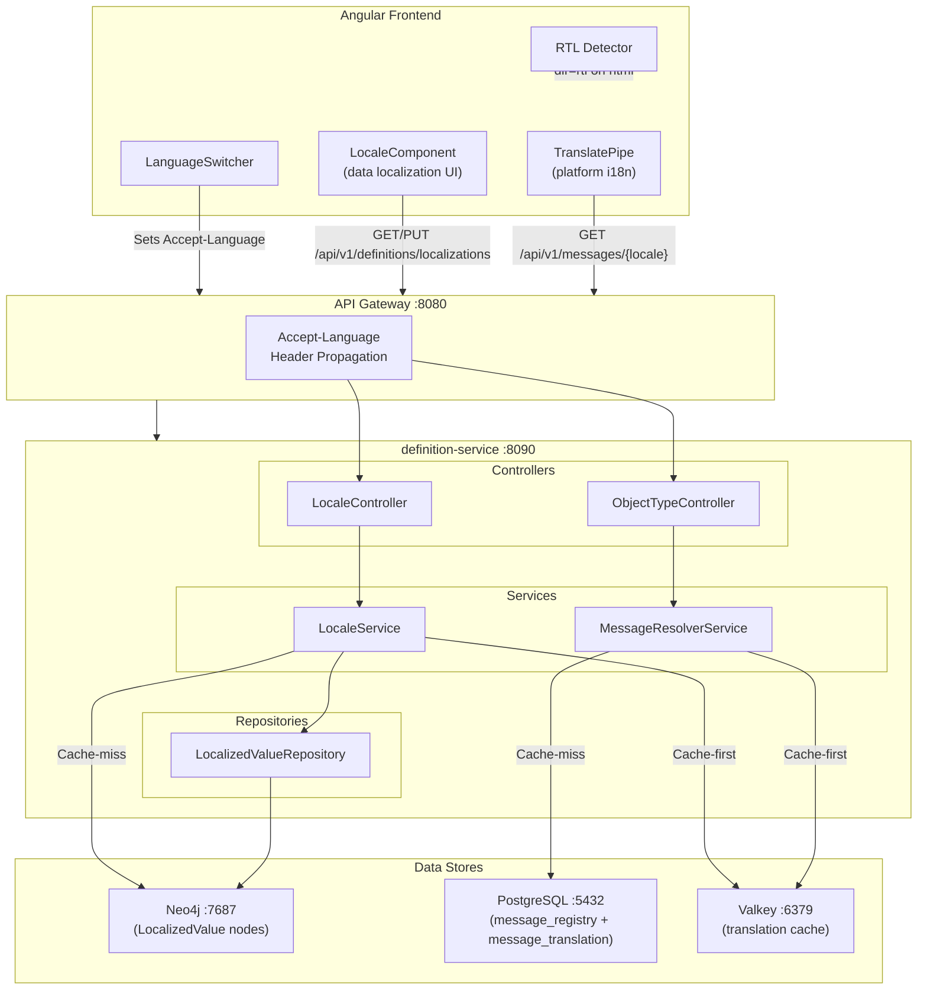
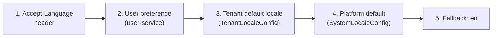
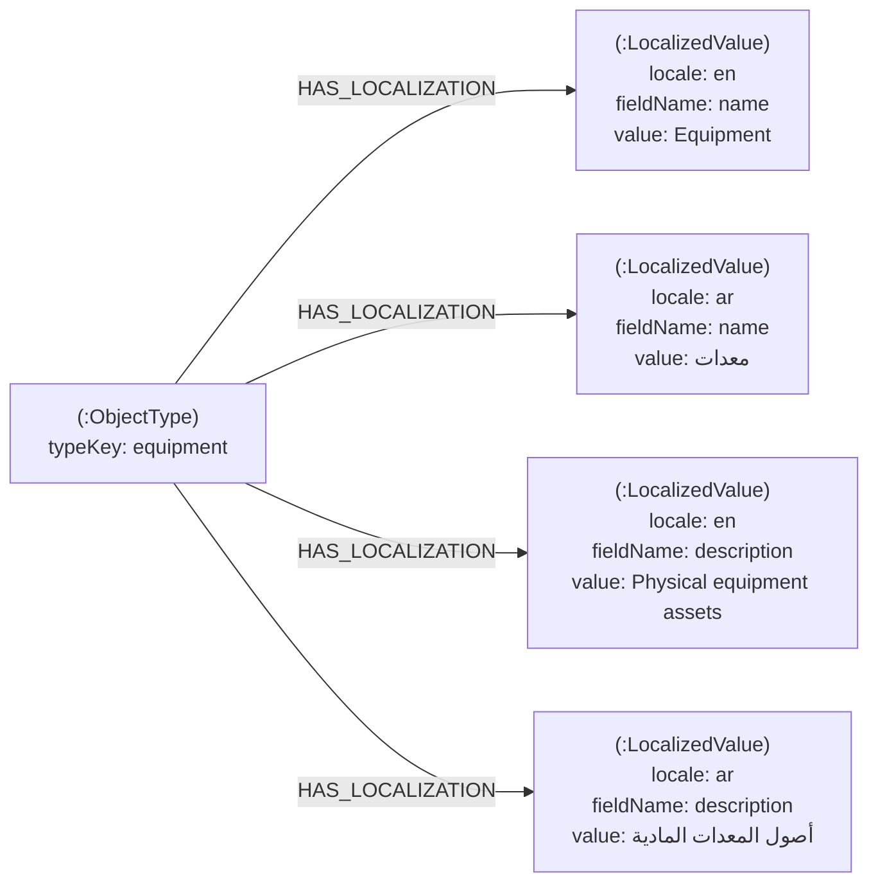
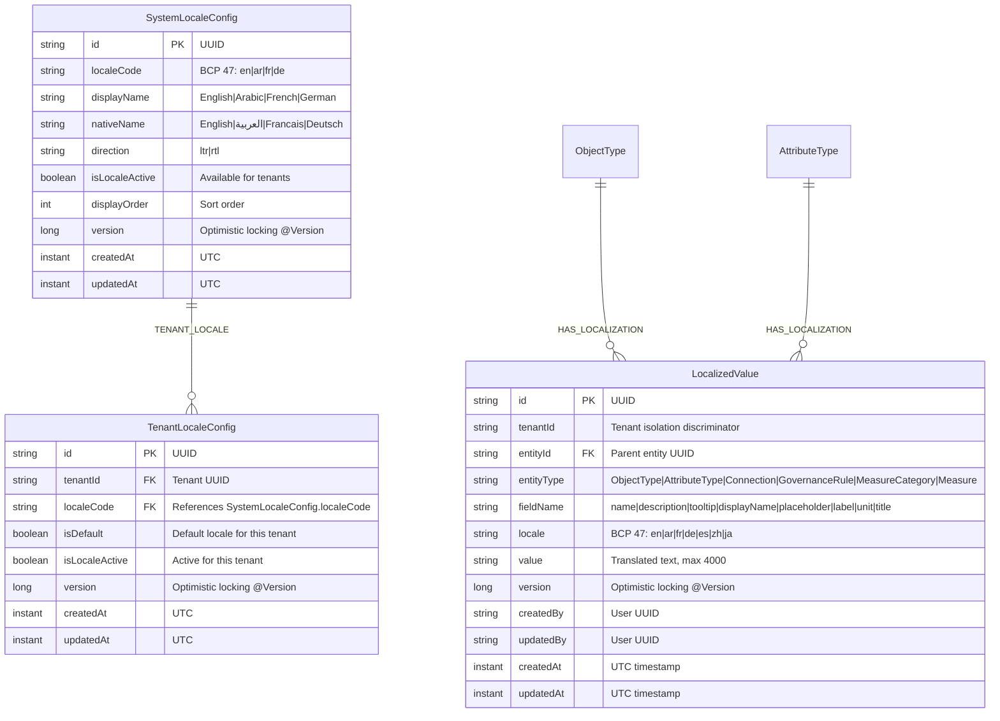
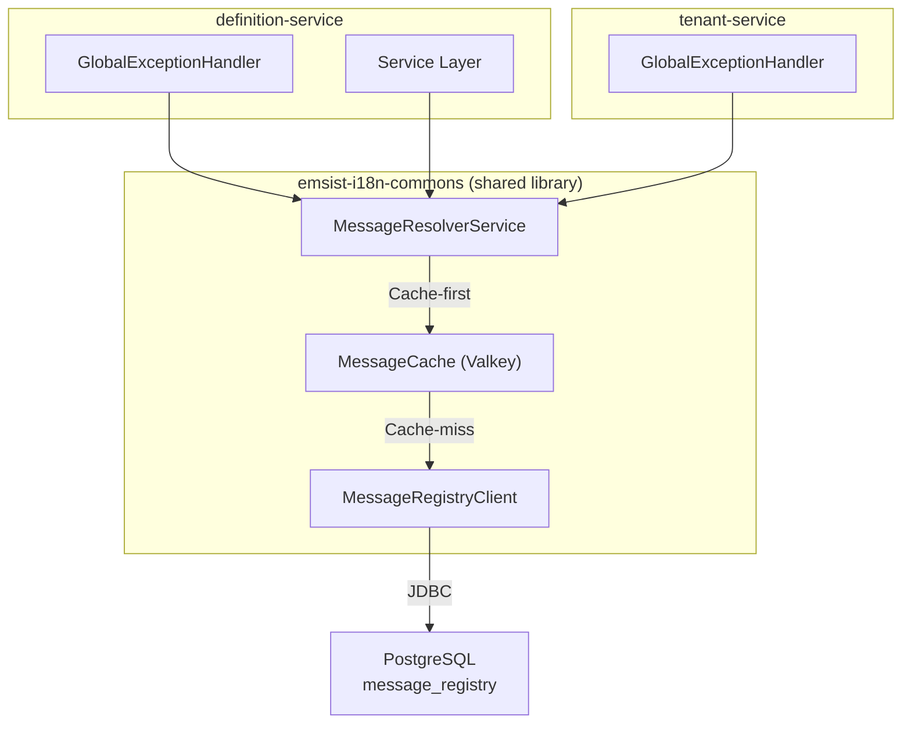
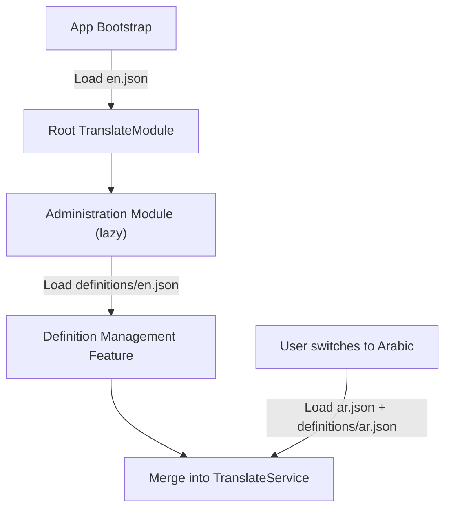
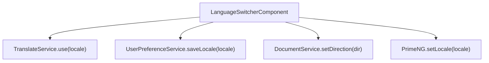
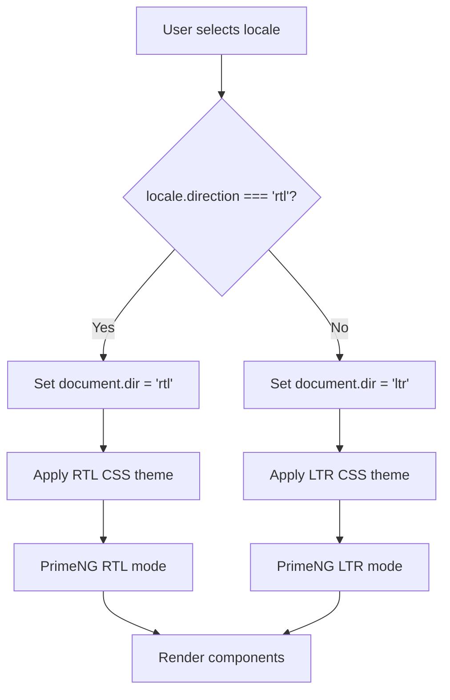
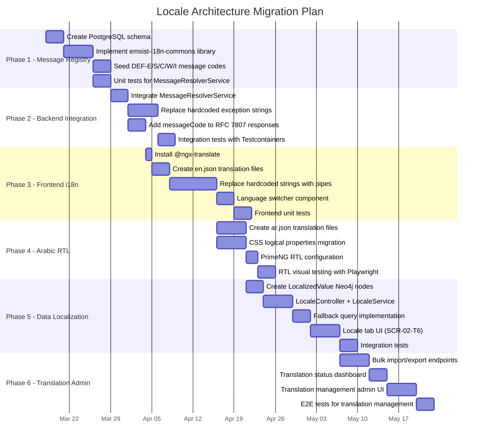

# Locale Architecture Design: Definition Management

**Document ID:** LAD-DM-001
**Version:** 1.0.0
**Date:** 2026-03-10
**Status:** [PLANNED] -- Design document; no locale code exists in any service
**Author:** SA Agent (SA-PRINCIPLES.md v1.1.0)
**Service:** definition-service (port 8090)
**Database:** Neo4j 5.12 Community Edition (data localization), PostgreSQL 16 (message registry)
**Cache:** Valkey 8

**Source Documents:**

| # | Document | Reference |
|---|----------|-----------|
| 1 | PRD Section 6.7 (Language Context Management) | `docs/definition-management/Design/01-PRD-Definition-Management.md` |
| 2 | Data Model Section 6 (PostgreSQL Message Registry) | `docs/definition-management/Design/04-Data-Model-Definition-Management.md` |
| 3 | API Contract Section 5.8 (Localization) | `docs/definition-management/Design/06-API-Contract.md` |
| 4 | LLD Section 2.2 (Planned Extensions) | `docs/definition-management/Design/03-LLD-Definition-Management.md` |
| 5 | SRS Epic E8 (Language Context Management) | `docs/definition-management/Design/12-SRS-Definition-Management.md` |
| 6 | Security Requirements Section 10 (Localization XSS Prevention) | `docs/definition-management/Design/13-Security-Requirements.md` |

**ADR Alignment:** ADR-031 (Zero Hardcoded Text) -- status: Accepted, implementation: 0%

---

## Table of Contents

1. [Architecture Overview](#1-architecture-overview)
2. [Neo4j Data Localization Model](#2-neo4j-data-localization-model)
3. [Platform i18n (ADR-031) for Definition Service](#3-platform-i18n-adr-031-for-definition-service)
4. [API Contract Enhancements](#4-api-contract-enhancements)
5. [Frontend i18n Architecture](#5-frontend-i18n-architecture)
6. [Caching Strategy](#6-caching-strategy)
7. [RTL Implementation Guide](#7-rtl-implementation-guide)
8. [Migration Plan](#8-migration-plan)
9. [Cross-Reference Matrix](#9-cross-reference-matrix)

---

## 1. Architecture Overview

### 1.1 Two Locale Concerns [PLANNED]

Locale management in Definition Management involves two distinct and independent concerns:

| Concern | What | Where Stored | Who Manages | Example |
|---------|------|-------------|-------------|---------|
| **Platform i18n** | UI labels, error messages, toast notifications, confirmation dialogs | PostgreSQL `message_registry` + `message_translation` | Shared message service | "Object type created successfully" in English/Arabic |
| **Data Localization** | Multilingual business object names, descriptions, tooltips | Neo4j `LocalizedValue` nodes | definition-service | ObjectType "Server" = "خادم" in Arabic |

These two concerns are independent: platform i18n applies to all services uniformly (AP-4), while data localization is specific to definition entities stored in Neo4j.

### 1.2 Architecture Overview Diagram



### 1.3 Locale Resolution Chain [PLANNED]

When a request arrives, the locale is resolved through a priority chain. The first non-null value wins:



| Priority | Source | Where Stored | Resolution |
|----------|--------|-------------|------------|
| 1 (highest) | `Accept-Language` HTTP header | Request | Parsed by `LocaleResolver` bean |
| 2 | User locale preference | user-service PostgreSQL | Fetched via Feign client (cached in Valkey, TTL 600s) |
| 3 | Tenant default locale | Neo4j `TenantLocaleConfig` node | `isDefault=true` for tenant |
| 4 | Platform default | Neo4j `SystemLocaleConfig` node | First active locale by `displayOrder` |
| 5 (fallback) | Hardcoded | Application code | `en` (English) |

### 1.4 Current State (Verified)

| Item | Status | Evidence |
|------|--------|----------|
| `message_registry` PostgreSQL table | Does NOT exist | No Flyway migration creates it |
| `MessageService` or `MessageResolverService` | Does NOT exist | No class found in any service |
| `LocalizedValue` Neo4j node | Does NOT exist | No `LocalizedValue.java` class |
| `SystemLocaleConfig` Neo4j node | Does NOT exist | No `SystemLocaleConfig.java` class |
| `@ngx-translate` or Angular i18n | NOT installed | Not in `package.json` |
| `Accept-Language` header processing | NOT implemented | No `LocaleResolver` bean |
| Exception strings in definition-service | Hardcoded English strings | `GlobalExceptionHandler.java` |

---

## 2. Neo4j Data Localization Model [PLANNED]

### 2.1 Graph Model Design

Data localization stores translated text values for definition entities (ObjectType names, AttributeType labels, Connection labels, etc.) as Neo4j nodes connected via `HAS_LOCALIZATION` relationships.



### 2.2 Entity-Relationship Diagram



### 2.3 Localizable Entity Catalog

Each localizable entity has specific fields that support translation:

| Entity | Node Label | Localizable Fields | Business Rule |
|--------|-----------|-------------------|---------------|
| ObjectType | `ObjectType` | `name`, `description`, `tooltip` | Default `name` stored on node; translations in LocalizedValue |
| AttributeType | `AttributeType` | `displayName` (mapped from `name`), `description`, `placeholder` | Only when `isLanguageDependent=true` |
| Connection (CAN_CONNECT_TO) | Relationship properties | `label` (mapped from `activeName`), `description` | Both `activeName` and `passiveName` are localizable |
| GovernanceRule | `GovernanceRule` | `title`, `description` | Governance rule titles shown in governance tab |
| MeasureCategory | `MeasureCategory` | `name`, `description` | Category headers in maturity dashboard |
| Measure | `Measure` | `name`, `unit`, `description` | Measure names and unit labels |

### 2.4 Node Properties -- LocalizedValue

| Property | Type | Constraints | Description |
|----------|------|-------------|-------------|
| `id` | String (UUID) | PK, NOT NULL | Primary key |
| `tenantId` | String (UUID) | NOT NULL | Tenant isolation discriminator |
| `entityId` | String (UUID) | NOT NULL, FK | UUID of the parent entity (ObjectType, AttributeType, etc.) |
| `entityType` | String | NOT NULL, max 50 | Enum: `ObjectType`, `AttributeType`, `Connection`, `GovernanceRule`, `MeasureCategory`, `Measure` |
| `fieldName` | String | NOT NULL, max 50 | Field being translated: `name`, `description`, `tooltip`, `displayName`, `placeholder`, `label`, `unit`, `title` |
| `locale` | String | NOT NULL, max 10 | BCP 47 locale code: `en`, `ar`, `fr`, `de`, `es`, `zh`, `ja` |
| `value` | String | NOT NULL, max 4000 | The translated text value |
| `version` | Long | NOT NULL, default 0 | Optimistic locking (@Version) |
| `createdBy` | String (UUID) | | User who created the translation |
| `updatedBy` | String (UUID) | | User who last updated the translation |
| `createdAt` | Instant | NOT NULL | UTC creation timestamp |
| `updatedAt` | Instant | NOT NULL | UTC last-update timestamp |

### 2.5 Indexes and Constraints

```cypher
-- Composite uniqueness: one translation per entity+field+locale per tenant
CREATE CONSTRAINT localized_value_unique IF NOT EXISTS
FOR (lv:LocalizedValue)
REQUIRE (lv.tenantId, lv.entityId, lv.fieldName, lv.locale) IS UNIQUE;

-- Fast lookup by entity
CREATE INDEX idx_localized_value_entity IF NOT EXISTS
FOR (lv:LocalizedValue)
ON (lv.tenantId, lv.entityId);

-- Fast lookup by locale (for translation status reports)
CREATE INDEX idx_localized_value_locale IF NOT EXISTS
FOR (lv:LocalizedValue)
ON (lv.tenantId, lv.locale);

-- Fast lookup by entity type (for bulk operations)
CREATE INDEX idx_localized_value_entity_type IF NOT EXISTS
FOR (lv:LocalizedValue)
ON (lv.tenantId, lv.entityType);
```

### 2.6 Fallback Query Pattern

When fetching a localized entity, the query attempts the requested locale first, then falls back to the tenant default, then to English:

```cypher
// Fetch ObjectType with localized name and description
MATCH (ot:ObjectType {id: $objectTypeId, tenantId: $tenantId})
OPTIONAL MATCH (ot)-[:HAS_LOCALIZATION]->(lv_name:LocalizedValue {
    fieldName: 'name', locale: $requestedLocale
})
OPTIONAL MATCH (ot)-[:HAS_LOCALIZATION]->(lv_name_default:LocalizedValue {
    fieldName: 'name', locale: $tenantDefaultLocale
})
OPTIONAL MATCH (ot)-[:HAS_LOCALIZATION]->(lv_name_en:LocalizedValue {
    fieldName: 'name', locale: 'en'
})
OPTIONAL MATCH (ot)-[:HAS_LOCALIZATION]->(lv_desc:LocalizedValue {
    fieldName: 'description', locale: $requestedLocale
})
OPTIONAL MATCH (ot)-[:HAS_LOCALIZATION]->(lv_desc_default:LocalizedValue {
    fieldName: 'description', locale: $tenantDefaultLocale
})
OPTIONAL MATCH (ot)-[:HAS_LOCALIZATION]->(lv_desc_en:LocalizedValue {
    fieldName: 'description', locale: 'en'
})
RETURN ot,
    COALESCE(lv_name.value, lv_name_default.value, lv_name_en.value, ot.name) AS localizedName,
    COALESCE(lv_desc.value, lv_desc_default.value, lv_desc_en.value, ot.description) AS localizedDescription
```

### 2.7 Relationship Type

| Relationship | Source | Target | Direction | Properties | Cardinality |
|-------------|--------|--------|-----------|------------|-------------|
| `HAS_LOCALIZATION` | ObjectType / AttributeType | LocalizedValue | OUTGOING | none (all metadata on LocalizedValue node) | 1:N |

**Note:** For `CAN_CONNECT_TO`, `GovernanceRule`, `MeasureCategory`, and `Measure`, the `HAS_LOCALIZATION` relationship originates from the respective node. The `entityType` property on `LocalizedValue` disambiguates the source type.

---

## 3. Platform i18n (ADR-031) for Definition Service [PLANNED]

### 3.1 Message Registry Ownership

**Decision: Option B -- Each service resolves messages from a shared PostgreSQL database via a shared library.**



**Justification:**

| Criterion | Option A (Feign Client) | Option B (Shared Library) -- Recommended |
|-----------|------------------------|------------------------------------------|
| Latency | Network hop per message | In-process with Valkey cache |
| Availability | Depends on message-service uptime | Independent; local cache |
| Complexity | Requires new microservice | Shared Maven module |
| Consistency | Centralized, single DB | Same DB, consistent schema |
| Cold start | Service unavailable until message-service ready | Pre-warm from DB on startup |
| Operational cost | +1 service to deploy, monitor, scale | +0 services |

**Architecture:**
- A shared Maven module `emsist-i18n-commons` provides `MessageResolverService`
- Each service includes this module as a dependency
- The module uses a dedicated JDBC `DataSource` bean pointing to the shared PostgreSQL
- Messages are cached in Valkey with `msg:{locale}:{category}` key pattern and 600s TTL
- On cache miss, the service queries PostgreSQL directly
- On startup, the service pre-warms the cache for the platform default locale

### 3.2 MessageResolverService Interface

```java
/**
 * Resolves user-facing messages from the message registry.
 * Implements ADR-031 zero-hardcoded-text mandate.
 */
public interface MessageResolverService {

    /**
     * Resolve a message by code and locale.
     * Fallback chain: requestedLocale -> tenantDefault -> en
     *
     * @param code    Message code (e.g., "DEF-E-001")
     * @param locale  BCP 47 locale code (e.g., "ar")
     * @param args    Optional placeholder arguments for {0}, {1}, etc.
     * @return Resolved message text
     */
    String resolve(String code, String locale, Object... args);

    /**
     * Resolve a message with the current request locale.
     */
    String resolve(String code, Object... args);

    /**
     * Bulk resolve all messages for a category and locale.
     * Used for frontend translation file generation.
     */
    Map<String, ResolvedMessage> resolveCategory(String category, String locale);

    /**
     * Check if a message code exists.
     */
    boolean exists(String code);
}
```

### 3.3 Message Code Catalog -- Definition Service

All user-facing messages for definition-service. Codes follow the convention `DEF-{TYPE}-{SEQ}` per AP-4.

#### 3.3.1 Error Codes (DEF-E-xxx)

| Code | Category | HTTP | Default Message (en) | Placeholders |
|------|----------|------|---------------------|--------------|
| DEF-E-001 | OBJECT_TYPE | 404 | Object type with ID '{0}' not found in tenant '{1}' | entityId, tenantId |
| DEF-E-002 | OBJECT_TYPE | 409 | An object type with key '{0}' already exists in tenant '{1}' | typeKey, tenantId |
| DEF-E-003 | OBJECT_TYPE | 400 | Object type name is required and must be 1-255 characters | -- |
| DEF-E-004 | OBJECT_TYPE | 400 | Object type description must not exceed 2000 characters | -- |
| DEF-E-005 | OBJECT_TYPE | 409 | Cannot delete object type '{0}' -- it has {1} active connections | name, connectionCount |
| DEF-E-006 | OBJECT_TYPE | 400 | Invalid status transition from '{0}' to '{1}' | fromStatus, toStatus |
| DEF-E-007 | OBJECT_TYPE | 409 | Object type '{0}' has been modified by another user (version conflict) | name |
| DEF-E-008 | OBJECT_TYPE | 403 | Cannot modify mandated object type '{0}' -- it is read-only in this tenant | name |
| DEF-E-009 | OBJECT_TYPE | 400 | Icon name must be a valid Lucide icon identifier | -- |
| DEF-E-010 | OBJECT_TYPE | 400 | Icon color must be a valid hex color code (e.g., #428177) | -- |
| DEF-E-011 | OBJECT_TYPE | 409 | Cannot retire object type '{0}' -- {1} active instances exist | name, instanceCount |
| DEF-E-012 | OBJECT_TYPE | 400 | Object type code '{0}' is reserved | code |
| DEF-E-013 | OBJECT_TYPE | 403 | Insufficient permissions to manage object types | -- |
| DEF-E-014 | OBJECT_TYPE | 400 | Duplicate object type name '{0}' in tenant | name |
| DEF-E-015 | SYSTEM | 400 | Tenant ID is required -- provide via JWT tenant_id claim or X-Tenant-ID header | -- |
| DEF-E-016 | OBJECT_TYPE | 409 | Cannot delete mandated object type '{0}' | name |
| DEF-E-017 | OBJECT_TYPE | 400 | Parent type '{0}' not found for subtype relationship | parentTypeKey |
| DEF-E-018 | OBJECT_TYPE | 409 | Circular inheritance detected: '{0}' already inherits from '{1}' | childName, parentName |
| DEF-E-019 | OBJECT_TYPE | 400 | Maximum {0} object types per tenant exceeded | limit |
| DEF-E-020 | ATTRIBUTE | 404 | Attribute type with ID '{0}' not found | attributeId |
| DEF-E-021 | ATTRIBUTE | 409 | Attribute key '{0}' already exists in tenant '{1}' | attributeKey, tenantId |
| DEF-E-022 | ATTRIBUTE | 400 | Invalid data type '{0}' -- supported: string, text, integer, float, boolean, date, datetime, enum, json | dataType |
| DEF-E-023 | ATTRIBUTE | 409 | Attribute '{0}' is already linked to object type '{1}' | attributeName, objectTypeName |
| DEF-E-024 | ATTRIBUTE | 400 | Attribute name is required and must be 1-255 characters | -- |
| DEF-E-025 | ATTRIBUTE | 403 | Cannot unlink system default attribute '{0}' | attributeName |
| DEF-E-026 | ATTRIBUTE | 400 | Validation rules must be valid JSON | -- |
| DEF-E-030 | CONNECTION | 404 | Connection with key '{0}' not found | connectionKey |
| DEF-E-031 | CONNECTION | 409 | Connection key '{0}' already exists between types '{1}' and '{2}' | connectionKey, sourceType, targetType |
| DEF-E-032 | CONNECTION | 400 | Connection requires both active and passive labels | -- |
| DEF-E-033 | CONNECTION | 400 | Invalid cardinality '{0}' -- supported: one-to-one, one-to-many, many-to-many | cardinality |
| DEF-E-034 | CONNECTION | 409 | Cannot delete connection '{0}' -- {1} active relationship instances exist | connectionKey, instanceCount |
| DEF-E-035 | CONNECTION | 400 | Self-referencing connection requires isDirected=true | -- |
| DEF-E-040 | RELEASE | 404 | Release with ID '{0}' not found | releaseId |
| DEF-E-041 | RELEASE | 409 | Release '{0}' has already been published | releaseVersion |
| DEF-E-042 | RELEASE | 409 | Release '{0}' has {1} unresolved breaking changes | releaseVersion, breakingCount |
| DEF-E-043 | RELEASE | 409 | No previous release version available for rollback | -- |
| DEF-E-050 | SYSTEM | 500 | An unexpected error occurred. Please try again later. | -- |
| DEF-E-051 | SYSTEM | 503 | Definition service is temporarily unavailable | -- |
| DEF-E-052 | SYSTEM | 504 | Request timed out. Please try again. | -- |
| DEF-E-060 | GOVERNANCE | 404 | Governance configuration not found for object type '{0}' | objectTypeName |
| DEF-E-061 | GOVERNANCE | 409 | Governance state transition from '{0}' to '{1}' is not permitted | fromState, toState |
| DEF-E-062 | GOVERNANCE | 403 | Only SUPER_ADMIN can modify governance rules | -- |
| DEF-E-070 | MATURITY | 400 | Axis weights must sum to 1.0 (currently {0}) | weightSum |
| DEF-E-071 | MATURITY | 400 | Thresholds must be ordered: red < amber < green | -- |
| DEF-E-080 | MEASURE | 404 | Measure category with ID '{0}' not found | categoryId |
| DEF-E-081 | MEASURE | 409 | Measure category name '{0}' already exists | categoryName |
| DEF-E-082 | MEASURE | 404 | Measure with ID '{0}' not found | measureId |
| DEF-E-083 | MEASURE | 400 | Warning threshold must be less than critical threshold | -- |
| DEF-E-090 | INHERITANCE | 404 | Master object type '{0}' not found in master tenant | masterTypeKey |
| DEF-E-091 | INHERITANCE | 409 | Cannot inherit from non-mandated type '{0}' | typeName |
| DEF-E-092 | INHERITANCE | 409 | Maximum inheritance depth of {0} exceeded | maxDepth |
| DEF-E-100 | LOCALE | 400 | Locale code '{0}' is not a valid BCP 47 code | localeCode |
| DEF-E-101 | LOCALE | 404 | Locale '{0}' is not active in the system | localeCode |
| DEF-E-102 | LOCALE | 409 | Cannot deactivate the default locale '{0}' for tenant | localeCode |
| DEF-E-103 | LOCALE | 400 | At least one locale must be active per tenant | -- |
| DEF-E-104 | LOCALE | 400 | Translation value must not exceed 4000 characters | -- |
| DEF-E-105 | LOCALE | 404 | Entity '{0}' of type '{1}' not found for localization | entityId, entityType |
| DEF-E-106 | LOCALE | 400 | Field '{0}' is not localizable for entity type '{1}' | fieldName, entityType |
| DEF-E-107 | LOCALE | 409 | Translation for field '{0}' in locale '{1}' already exists | fieldName, locale |

#### 3.3.2 Success Codes (DEF-S-xxx)

| Code | Category | Default Message (en) |
|------|----------|---------------------|
| DEF-S-001 | OBJECT_TYPE | Object type '{0}' created successfully |
| DEF-S-002 | OBJECT_TYPE | Object type '{0}' updated successfully |
| DEF-S-003 | OBJECT_TYPE | Object type '{0}' deleted successfully |
| DEF-S-004 | OBJECT_TYPE | Object type '{0}' duplicated successfully |
| DEF-S-005 | OBJECT_TYPE | Object type '{0}' restored to default |
| DEF-S-006 | OBJECT_TYPE | Status changed to '{0}' for object type '{1}' |
| DEF-S-010 | ATTRIBUTE | Attribute '{0}' linked to object type '{1}' |
| DEF-S-011 | ATTRIBUTE | Attribute '{0}' unlinked from object type '{1}' |
| DEF-S-012 | ATTRIBUTE | Attribute '{0}' updated successfully |
| DEF-S-013 | ATTRIBUTE | Attribute type '{0}' created successfully |
| DEF-S-020 | CONNECTION | Connection '{0}' added between '{1}' and '{2}' |
| DEF-S-021 | CONNECTION | Connection '{0}' removed |
| DEF-S-030 | RELEASE | Release '{0}' created as draft |
| DEF-S-031 | RELEASE | Release '{0}' published -- {1} tenants notified |
| DEF-S-032 | RELEASE | Release '{0}' merged into tenant '{1}' |
| DEF-S-040 | LOCALE | Translations saved for '{0}' in locale '{1}' |
| DEF-S-041 | LOCALE | Tenant locale configuration updated |
| DEF-S-042 | LOCALE | Translations imported: {0} entries processed, {1} errors |
| DEF-S-043 | LOCALE | Translation for '{0}' deleted in locale '{1}' |

#### 3.3.3 Confirmation Codes (DEF-C-xxx)

| Code | Category | Default Message (en) | Required Response |
|------|----------|---------------------|-------------------|
| DEF-C-001 | OBJECT_TYPE | Are you sure you want to delete '{0}'? This action cannot be undone. | Confirm / Cancel |
| DEF-C-002 | OBJECT_TYPE | Change status of '{0}' from '{1}' to '{2}'? | Confirm / Cancel |
| DEF-C-003 | OBJECT_TYPE | Retiring '{0}' will hide it from new instances. Existing instances are not affected. Proceed? | Confirm / Cancel |
| DEF-C-004 | ATTRIBUTE | Unlink attribute '{0}' from '{1}'? Existing instance values will be archived. | Confirm / Cancel |
| DEF-C-005 | ATTRIBUTE | Retire attribute '{0}' on '{1}'? It will no longer appear on new instances. | Confirm / Cancel |
| DEF-C-006 | CONNECTION | Remove connection '{0}' between '{1}' and '{2}'? | Confirm / Cancel |
| DEF-C-007 | OBJECT_TYPE | Restore '{0}' to its default configuration? Local customizations will be lost. | Confirm / Cancel |
| DEF-C-008 | OBJECT_TYPE | Delete object type '{0}'? This will archive all associated attributes and connections. | Confirm / Cancel |
| DEF-C-009 | OBJECT_TYPE | Duplicate '{0}'? A copy named '{0} (Copy)' will be created. | Confirm / Cancel |
| DEF-C-010 | ATTRIBUTE | Activate attribute '{0}' on '{1}'? | Confirm / Cancel |
| DEF-C-011 | ATTRIBUTE | Retire attribute '{0}' on '{1}'? | Confirm / Cancel |
| DEF-C-012 | ATTRIBUTE | Reactivate retired attribute '{0}' on '{1}'? | Confirm / Cancel |
| DEF-C-020 | RELEASE | Publish release '{0}'? This will notify {1} tenants. | Confirm / Cancel |
| DEF-C-021 | RELEASE | Accept and merge release '{0}'? Local customizations may be overridden. | Confirm / Cancel |
| DEF-C-022 | RELEASE | Reject release '{0}'? | Confirm with reason / Cancel |
| DEF-C-023 | RELEASE | Rollback release '{0}'? This restores the pre-merge state. | Confirm / Cancel |
| DEF-C-030 | LOCALE | Delete all translations for locale '{0}' on '{1}'? | Confirm / Cancel |
| DEF-C-031 | LOCALE | Deactivate locale '{0}' for this tenant? Existing translations will be preserved but hidden. | Confirm / Cancel |
| DEF-C-032 | LOCALE | Import {0} translations? This will overwrite existing translations for matched keys. | Confirm / Cancel |

#### 3.3.4 Warning Codes (DEF-W-xxx)

| Code | Category | Default Message (en) |
|------|----------|---------------------|
| DEF-W-001 | ATTRIBUTE | Attribute '{0}' has instances with values -- changing data type may cause data loss |
| DEF-W-002 | RELEASE | Release '{0}' contains {1} breaking changes affecting {2} instances |
| DEF-W-003 | OBJECT_TYPE | Object type '{0}' is approaching the maximum attribute limit ({1}/{2}) |
| DEF-W-004 | LOCALE | {0} fields on '{1}' have no translation for locale '{2}' |
| DEF-W-005 | MATURITY | Maturity score for '{0}' is below threshold ({1}%) |
| DEF-W-006 | GOVERNANCE | Governance rule '{0}' is overriding tenant customization |

#### 3.3.5 Info Codes (DEF-I-xxx)

| Code | Category | Default Message (en) |
|------|----------|---------------------|
| DEF-I-001 | SYSTEM | Loading object types... |
| DEF-I-002 | SYSTEM | No object types match your criteria |
| DEF-I-003 | ATTRIBUTE | No attributes linked to this object type |
| DEF-I-004 | CONNECTION | No connections defined for this object type |
| DEF-I-005 | LOCALE | No translations available for locale '{0}' |
| DEF-I-006 | RELEASE | No releases published yet |
| DEF-I-007 | LOCALE | Translation coverage for '{0}': {1}% complete |

---

## 4. API Contract Enhancements [PLANNED]

### 4.1 Accept-Language Header Processing

All GET endpoints on definition-service will honor the `Accept-Language` header for locale resolution:

| Header | Example | Behavior |
|--------|---------|----------|
| `Accept-Language: ar` | Arabic | Return localized fields in Arabic (fallback to en if missing) |
| `Accept-Language: fr, en;q=0.9` | French preferred, English fallback | Try French first, then English |
| Not present | -- | Use locale resolution chain (Section 1.3) |

**Implementation approach:** A `LocaleResolverFilter` (Spring `OncePerRequestFilter`) extracts the `Accept-Language` header and stores it in a `ThreadLocal<Locale>` via a `LocaleContextHolder`. All service methods access the resolved locale from this context.

### 4.2 Locale Parameter on GET Endpoints

In addition to the `Accept-Language` header, GET endpoints accept an explicit `locale` query parameter that takes precedence:

```
GET /api/v1/definitions/object-types?locale=ar
GET /api/v1/definitions/object-types/{id}?locale=ar
GET /api/v1/definitions/attribute-types?locale=ar
```

**Priority:** `?locale=` parameter > `Accept-Language` header > resolution chain.

### 4.3 Localized Response Format

When locale is resolved, the response includes localized fields alongside original fields:

```json
{
  "id": "ot-uuid",
  "name": "Server",
  "localizedName": "خادم",
  "description": "Physical or virtual server",
  "localizedDescription": "خادم فيزيائي أو افتراضي",
  "resolvedLocale": "ar",
  "typeKey": "server",
  "code": "OBJ_001",
  "status": "active"
}
```

**Design decision:** Both original and localized fields are returned. The `name` field always contains the canonical English value (stored on the node). The `localizedName` field contains the translation for the resolved locale. If no translation exists, `localizedName` equals `name`.

### 4.4 Translation CRUD Endpoints

These endpoints are already defined in `06-API-Contract.md` Section 5.8. Below is the consolidated specification with additions for this design.

#### 4.4.1 Locale Configuration Endpoints

| Method | Path | Description | Status |
|--------|------|-------------|--------|
| GET | `/api/v1/definitions/locales/system` | List all system locales | [PLANNED] |
| GET | `/api/v1/definitions/locales/tenant` | List tenant's enabled locales | [PLANNED] |
| PUT | `/api/v1/definitions/locales/tenant` | Update tenant locale configuration | [PLANNED] |

#### 4.4.2 Translation Management Endpoints

| Method | Path | Description | Status |
|--------|------|-------------|--------|
| GET | `/api/v1/definitions/localizations/{entityType}/{entityId}` | Get all translations for an entity | [PLANNED] |
| PUT | `/api/v1/definitions/localizations/{entityType}/{entityId}` | Batch update translations | [PLANNED] |
| DELETE | `/api/v1/definitions/localizations/{entityType}/{entityId}/{locale}` | Delete translations for a specific locale | [PLANNED] |

#### 4.4.3 New Endpoints (Additions to API Contract)

| Method | Path | Description | Status |
|--------|------|-------------|--------|
| GET | `/api/v1/definitions/localizations/status` | Translation coverage report | [PLANNED] |
| POST | `/api/v1/definitions/localizations/import` | Bulk import translations (JSON/CSV) | [PLANNED] |
| GET | `/api/v1/definitions/localizations/export` | Bulk export translations (JSON/CSV) | [PLANNED] |

#### 4.4.4 Translation Status Endpoint

```
GET /api/v1/definitions/localizations/status?locale=ar
```

**Description:** Returns translation coverage statistics for a given locale across all entity types.

**Response:** `200 OK`

```json
{
  "locale": "ar",
  "overallCoverage": 0.72,
  "entityCoverage": [
    {
      "entityType": "ObjectType",
      "totalEntities": 15,
      "totalFields": 45,
      "translatedFields": 38,
      "coverage": 0.84
    },
    {
      "entityType": "AttributeType",
      "totalEntities": 42,
      "totalFields": 84,
      "translatedFields": 55,
      "coverage": 0.65
    },
    {
      "entityType": "Connection",
      "totalEntities": 23,
      "totalFields": 46,
      "translatedFields": 30,
      "coverage": 0.65
    }
  ],
  "missingTranslations": [
    {
      "entityType": "ObjectType",
      "entityId": "ot-uuid",
      "entityName": "Contract",
      "missingFields": ["description"]
    }
  ]
}
```

#### 4.4.5 Bulk Import Endpoint

```
POST /api/v1/definitions/localizations/import
Content-Type: application/json
```

**Request Body:**

```json
{
  "locale": "ar",
  "entries": [
    {
      "entityType": "ObjectType",
      "entityId": "ot-uuid-1",
      "translations": {
        "name": "خادم",
        "description": "خادم فيزيائي أو افتراضي"
      }
    },
    {
      "entityType": "AttributeType",
      "entityId": "at-uuid-1",
      "translations": {
        "displayName": "اسم المضيف",
        "description": "اسم المضيف الكامل"
      }
    }
  ]
}
```

**Response:** `200 OK`

```json
{
  "imported": 4,
  "skipped": 0,
  "errors": [],
  "messageCode": "DEF-S-042"
}
```

#### 4.4.6 Bulk Export Endpoint

```
GET /api/v1/definitions/localizations/export?locale=ar&entityType=ObjectType&format=json
```

**Query Parameters:**

| Param | Type | Default | Description |
|-------|------|---------|-------------|
| `locale` | string | required | BCP 47 locale code |
| `entityType` | string | all | Filter by entity type |
| `format` | string | `json` | Export format: `json` or `csv` |

**Response:** `200 OK` with `Content-Disposition: attachment; filename=translations_ar.json`

### 4.5 Error Response Enhancement

All error responses include the `messageCode` for frontend resolution per ADR-031:

```json
{
  "type": "https://emsist.io/problems/locale-not-found",
  "title": "Locale Not Found",
  "status": 404,
  "detail": "Locale 'zz' is not active in the system",
  "instance": "/api/v1/definitions/localizations/ObjectType/ot-uuid",
  "messageCode": "DEF-E-101",
  "timestamp": "2026-03-10T12:00:00Z",
  "traceId": "trace-uuid"
}
```

---

## 5. Frontend i18n Architecture [PLANNED]

### 5.1 Library Selection

**Decision: @ngx-translate/core + @ngx-translate/http-loader**

| Criterion | Angular built-in i18n | @ngx-translate (Recommended) | Custom pipe |
|-----------|----------------------|------------------------------|-------------|
| Runtime language switching | No (compile-time) | Yes | Yes |
| Lazy-loading per module | Partial | Yes (HttpLoader) | Manual |
| Plural/ICU support | Yes | Via plugin | Manual |
| Community adoption | Medium | Very high | N/A |
| Backend integration | Difficult | Easy (HTTP loader) | Custom |
| SSR compatibility | Yes | Yes | Yes |
| Migration effort | High (template changes) | Medium (pipe + service) | High |

**Justification:** Angular built-in i18n requires separate builds per locale and does not support runtime language switching, which is a hard requirement for the EMSIST platform (users switch languages without page reload). `@ngx-translate` provides runtime switching, lazy-loading, and a `{{ key | translate }}` pipe that aligns with ADR-031.

### 5.2 Translation File Structure

```
frontend/src/assets/i18n/
  en.json                  -- Platform-wide English translations
  ar.json                  -- Platform-wide Arabic translations
  fr.json                  -- Platform-wide French translations
  definitions/
    en.json                -- Definition Management English
    ar.json                -- Definition Management Arabic
  administration/
    en.json                -- Administration English
    ar.json                -- Administration Arabic
```

**Module-level translation file example** (`definitions/en.json`):

```json
{
  "DEF-E-001": "Object type with ID '{{entityId}}' not found in tenant '{{tenantId}}'",
  "DEF-E-002": "An object type with key '{{typeKey}}' already exists in tenant '{{tenantId}}'",
  "DEF-S-001": "Object type '{{name}}' created successfully",
  "DEF-S-002": "Object type '{{name}}' updated successfully",
  "DEF-C-001": "Are you sure you want to delete '{{name}}'? This action cannot be undone.",
  "DEF-I-002": "No object types match your criteria",
  "objectType.list.title": "Object Types",
  "objectType.list.newButton": "New Object Type",
  "objectType.detail.generalTab": "General",
  "objectType.detail.attributesTab": "Attributes",
  "objectType.detail.connectionsTab": "Connections",
  "objectType.detail.governanceTab": "Governance",
  "objectType.detail.maturityTab": "Maturity",
  "objectType.detail.localeTab": "Locale"
}
```

### 5.3 Lazy-Loading Translations



**Implementation:** Each lazy-loaded feature module uses `TranslateModule.forChild()` with a custom `TranslateLoader` that loads module-specific translation files and merges them with the root translations.

### 5.4 TranslatePipe Usage Pattern

**Before (hardcoded -- violates ADR-031):**

```html
<p-tag value="Active" severity="success"></p-tag>
<button pButton label="New Object Type"></button>
<p class="empty-state">No object types match your criteria.</p>
```

**After (ADR-031 compliant):**

```html
<p-tag [value]="'objectType.status.active' | translate" severity="success"></p-tag>
<button pButton [label]="'objectType.list.newButton' | translate"></button>
<p class="empty-state">{{ 'DEF-I-002' | translate }}</p>
```

### 5.5 Language Switcher Component



**Component responsibilities:**
- Display a dropdown of active locales (from `/api/v1/definitions/locales/tenant`)
- On selection: update `TranslateService`, persist preference via user-service, set RTL direction, update PrimeNG locale

---

## 6. Caching Strategy [PLANNED]

### 6.1 Valkey Cache Design

#### 6.1.1 Translation Cache Keys

| Key Pattern | Value Type | TTL | Description |
|-------------|-----------|-----|-------------|
| `def:{tenantId}:l10n:{entityType}:{entityId}:{locale}` | JSON Map | 300s | Localized field values for a specific entity in a specific locale |
| `def:{tenantId}:l10n:status:{locale}` | JSON | 120s | Translation coverage statistics for a locale |
| `def:{tenantId}:locales` | JSON List | 600s | Tenant locale configuration |
| `msg:{locale}:{category}` | JSON Map | 600s | Message registry entries by locale and category |
| `msg:{locale}:all` | JSON Map | 600s | All message registry entries for a locale |

#### 6.1.2 Cache Invalidation Rules

| Trigger Event | Keys Invalidated |
|--------------|-----------------|
| Translation created/updated | `def:{tenantId}:l10n:{entityType}:{entityId}:*` |
| Translation deleted | `def:{tenantId}:l10n:{entityType}:{entityId}:{locale}` |
| Locale config changed | `def:{tenantId}:locales` |
| Entity deleted | `def:{tenantId}:l10n:{entityType}:{entityId}:*` |
| Message registry updated | `msg:*:{category}` |
| Bulk translation import | `def:{tenantId}:l10n:*` (full tenant translation cache bust) |
| Translation status recalculated | `def:{tenantId}:l10n:status:*` |

#### 6.1.3 Cache Warm-Up Strategy

On service startup, pre-warm cache for the platform default locale (`en`):

1. Load all `SystemLocaleConfig` nodes
2. Load message registry entries for `en` and all active locales into `msg:{locale}:all`
3. Do NOT pre-warm translation cache (entity-level) -- loaded on demand

### 6.2 Frontend Translation Caching

| Mechanism | TTL | Scope |
|-----------|-----|-------|
| `HttpClient` cache (browser) | `Cache-Control: max-age=3600` | Translation JSON files |
| `TranslateService` in-memory | Session lifetime | Active translations |
| Service Worker (PWA) | Until version change | Offline translation bundles |

**Cache busting:** Translation JSON files are versioned via content hash in the filename (e.g., `en.abc123.json`) via Angular build hash. When translations change, a new hash is generated, forcing cache refresh.

---

## 7. RTL Implementation Guide [PLANNED]

### 7.1 RTL Detection Flow



### 7.2 CSS Logical Properties Migration

Replace physical properties with CSS logical properties for bidirectional support:

| Physical Property (Remove) | Logical Property (Use) | Description |
|---------------------------|----------------------|-------------|
| `margin-left` | `margin-inline-start` | Start margin (left in LTR, right in RTL) |
| `margin-right` | `margin-inline-end` | End margin |
| `padding-left` | `padding-inline-start` | Start padding |
| `padding-right` | `padding-inline-end` | End padding |
| `text-align: left` | `text-align: start` | Text alignment |
| `text-align: right` | `text-align: end` | Text alignment |
| `float: left` | `float: inline-start` | Float direction |
| `float: right` | `float: inline-end` | Float direction |
| `border-left` | `border-inline-start` | Border side |
| `border-right` | `border-inline-end` | Border side |
| `left: 0` | `inset-inline-start: 0` | Positioning |
| `right: 0` | `inset-inline-end: 0` | Positioning |

### 7.3 PrimeNG RTL Configuration

```typescript
// app.config.ts or root component
import { PrimeNG } from 'primeng/config';

export function configurePrimeNG(primeNG: PrimeNG, direction: 'ltr' | 'rtl') {
  // PrimeNG respects the document dir attribute
  document.documentElement.setAttribute('dir', direction);
  document.documentElement.setAttribute('lang', direction === 'rtl' ? 'ar' : 'en');
}
```

PrimeNG 19+ (used with Angular 21) natively supports RTL through the `dir` attribute on the `<html>` element. No additional configuration is needed beyond setting the direction.

### 7.4 Icon Mirroring Rules

| Icon Category | Mirror in RTL? | Examples |
|--------------|----------------|----------|
| Directional arrows | Yes | Back arrow, forward arrow, chevrons |
| Navigation icons | Yes | Menu hamburger (no), breadcrumb arrows (yes) |
| Media controls | No | Play, pause, stop |
| Communication | No | Phone, email, chat |
| Toggle/switch | No | Checkbox, radio, switch |
| Status icons | No | Check, warning, error |

**Implementation:** Use CSS `transform: scaleX(-1)` on a `.rtl-mirror` class, applied selectively to directional icons.

### 7.5 Bidirectional Text Handling

For mixed LTR/RTL content (e.g., English technical terms in Arabic text):

```css
/* Isolate embedded LTR content in RTL context */
.bdi-isolate {
  unicode-bidi: isolate;
}

/* For code snippets and technical identifiers */
.ltr-embed {
  direction: ltr;
  unicode-bidi: embed;
}
```

**Usage in templates:**

```html
<!-- Arabic description with English type key -->
<span>{{ 'objectType.description' | translate }}: <span class="ltr-embed">{{ objectType.typeKey }}</span></span>
```

### 7.6 RTL Testing Strategy

| Test | Tool | Validation |
|------|------|-----------|
| Visual regression (RTL screenshots) | Playwright | Compare LTR vs RTL screenshots for layout correctness |
| Logical property compliance | ESLint rule | Lint for physical properties (`margin-left`, `padding-right`, etc.) |
| Direction attribute | E2E test | Verify `document.dir === 'rtl'` when Arabic selected |
| PrimeNG components | E2E test | Verify table columns, dialog buttons, menus render RTL |
| Text alignment | Visual test | Verify right-aligned text in RTL mode |
| Icon mirroring | Visual test | Verify directional icons are mirrored |

---

## 8. Migration Plan [PLANNED]

### 8.1 Phase Overview



### 8.2 Phase Details

#### Phase 1: Message Registry Foundation

**Prerequisites:**
- PostgreSQL 16 running (already in docker-compose)
- Valkey 8 running (already in docker-compose)

**Deliverables:**

| Deliverable | Agent | Effort |
|-------------|-------|--------|
| Flyway migration: `message_registry` + `message_translation` tables | DBA | 3 SP |
| Maven module `emsist-i18n-commons` with `MessageResolverService` | DEV | 8 SP |
| Seed SQL script with 127 DEF-xxx message codes (en) | SA + DBA | 5 SP |
| Unit tests for `MessageResolverService` (cache hit, miss, fallback) | QA-UNIT | 3 SP |

**Total:** 19 SP

**Dependencies:** None -- standalone foundation.

---

#### Phase 2: Backend Integration

**Prerequisites:**
- Phase 1 complete
- `emsist-i18n-commons` published to local Maven repository

**Deliverables:**

| Deliverable | Agent | Effort |
|-------------|-------|--------|
| Add `emsist-i18n-commons` dependency to definition-service | DEV | 1 SP |
| Configure dedicated JDBC `DataSource` bean for message registry | DEV | 2 SP |
| Refactor `GlobalExceptionHandler` to use `MessageResolverService` | DEV | 5 SP |
| Add `messageCode` field to RFC 7807 `ProblemDetail` responses | DEV | 3 SP |
| Add `LocaleResolverFilter` for `Accept-Language` header | DEV | 3 SP |
| Integration tests with Testcontainers (PostgreSQL + Valkey) | QA-INT | 5 SP |

**Total:** 19 SP

**Dependencies:** Phase 1.

---

#### Phase 3: Frontend i18n

**Prerequisites:**
- Phase 2 complete (backend returns `messageCode` in error responses)

**Deliverables:**

| Deliverable | Agent | Effort |
|-------------|-------|--------|
| Install `@ngx-translate/core` and `@ngx-translate/http-loader` | DEV | 1 SP |
| Configure `TranslateModule.forRoot()` with `HttpLoader` | DEV | 2 SP |
| Create `en.json` with all DEF-xxx codes + UI labels | DEV | 5 SP |
| Replace all hardcoded strings in definition management templates | DEV | 13 SP |
| Implement `LanguageSwitcherComponent` | DEV | 5 SP |
| Unit tests for language switcher and translation pipe usage | QA-UNIT | 3 SP |
| Update `ErrorInterceptor` to display localized error messages | DEV | 3 SP |

**Total:** 32 SP

**Dependencies:** Phase 2.

---

#### Phase 4: Arabic RTL Support

**Prerequisites:**
- Phase 3 complete (frontend i18n infrastructure in place)
- Arabic translations provided by translation team or stakeholder

**Deliverables:**

| Deliverable | Agent | Effort |
|-------------|-------|--------|
| Create `ar.json` translation files (all DEF-xxx codes + UI labels) | DEV | 8 SP |
| Migrate CSS from physical to logical properties | DEV | 8 SP |
| Configure PrimeNG RTL via `document.dir` attribute | DEV | 2 SP |
| Implement icon mirroring with `.rtl-mirror` class | DEV | 2 SP |
| Bidirectional text handling (`unicode-bidi` CSS) | DEV | 2 SP |
| RTL visual regression tests with Playwright | QA-INT | 5 SP |
| Add ESLint rule to forbid physical CSS properties | DEVOPS | 2 SP |

**Total:** 29 SP

**Dependencies:** Phase 3, translation content.

---

#### Phase 5: Data Localization (Neo4j)

**Prerequisites:**
- Phase 3 complete (frontend can display localized content)
- Phase 4 in progress or complete (RTL support for Arabic translations)

**Deliverables:**

| Deliverable | Agent | Effort |
|-------------|-------|--------|
| Create `LocalizedValueNode.java` with SDN annotations | DEV | 3 SP |
| Create `SystemLocaleConfigNode.java` and `TenantLocaleConfigNode.java` | DEV | 3 SP |
| Create `LocalizedValueRepository` with fallback Cypher queries | DEV | 5 SP |
| Create `LocaleService` (CRUD for translations + locale config) | DEV | 8 SP |
| Create `LocaleController` (Section 5.8 API endpoints) | DEV | 5 SP |
| Update `ObjectTypeServiceImpl` to return localized fields | DEV | 5 SP |
| Create Locale Tab UI component (SCR-02-T6) | DEV | 8 SP |
| Neo4j constraints and indexes (Section 2.5) | DBA | 2 SP |
| Integration tests with Neo4j Testcontainers | QA-INT | 5 SP |

**Total:** 44 SP

**Dependencies:** Phase 3.

---

#### Phase 6: Translation Management Admin UI

**Prerequisites:**
- Phase 5 complete (data localization API functional)

**Deliverables:**

| Deliverable | Agent | Effort |
|-------------|-------|--------|
| Bulk import endpoint (`POST /localizations/import`) | DEV | 5 SP |
| Bulk export endpoint (`GET /localizations/export`) | DEV | 3 SP |
| Translation status endpoint (`GET /localizations/status`) | DEV | 3 SP |
| Translation management admin page (SCR-06) | DEV | 8 SP |
| Translation coverage dashboard widget | DEV | 5 SP |
| E2E tests for import/export/status | QA-INT | 5 SP |
| Performance test for bulk import (1000+ entries) | QA-PERF | 3 SP |

**Total:** 32 SP

**Dependencies:** Phase 5.

---

### 8.3 Total Effort Summary

| Phase | Description | Story Points | Dependencies |
|-------|-------------|-------------|--------------|
| Phase 1 | Message Registry Foundation | 19 SP | None |
| Phase 2 | Backend Integration | 19 SP | Phase 1 |
| Phase 3 | Frontend i18n | 32 SP | Phase 2 |
| Phase 4 | Arabic RTL Support | 29 SP | Phase 3 |
| Phase 5 | Data Localization (Neo4j) | 44 SP | Phase 3 |
| Phase 6 | Translation Management Admin | 32 SP | Phase 5 |
| **Total** | | **175 SP** | |

**Note:** Phases 4 and 5 can run in parallel after Phase 3 completes, as they address independent concerns (RTL styling vs. Neo4j data localization).

---

## 9. Cross-Reference Matrix

| Design Element | PRD Section | SRS Epic | API Section | Data Model Section | Security Section |
|----------------|------------|----------|-------------|-------------------|-----------------|
| SystemLocaleConfig | 6.7 | E8 | 5.8.1 | 5.4 (Node #8) | 10 (XSS prevention) |
| TenantLocaleConfig | 6.7 | E8 | 5.8.2, 5.8.3 | 5.4 (Node #9) | 10 (XSS prevention) |
| LocalizedValue | 6.7 | E8 | 5.8.4, 5.8.5 | 5.4 (Node #7) | 10 (XSS prevention) |
| Message Registry | AP-4 | All Epics | Section 7 | Section 6 | -- |
| Accept-Language | 6.7, ADR-031 | E8 | 3.1 | -- | -- |
| RTL Support | NFR-003 | E8 | -- | -- | -- |
| Translation Import/Export | 6.7 | E8 | 5.8 (new) | -- | 10 (XSS prevention) |
| Locale Resolution Chain | 6.7, ADR-031 | E8 | 3.1 | -- | -- |

---

## Appendix A: ADR-031 Compliance Checklist

| ADR-031 Mandate | This Design | Status |
|----------------|-------------|--------|
| PostgreSQL `message_registry` + `message_translation` tables | Section 3.1, Data Model Section 6 | Designed |
| `MessageService.resolve(code, locale, args...)` | Section 3.2 (`MessageResolverService`) | Designed |
| Frontend: `{{ key \| translate }}` pipe | Section 5.4 (`@ngx-translate`) | Designed |
| API: RFC 7807 with `code` field | Section 4.5 (`messageCode` in ProblemDetail) | Designed |
| Cache in Valkey with TTL | Section 6.1 (key patterns + TTL) | Designed |
| Arabic RTL first-class support | Section 7 (CSS logical properties, PrimeNG RTL) | Designed |
| Zero hardcoded text | Phase 3 migration (replace all hardcoded strings) | Migration planned |
