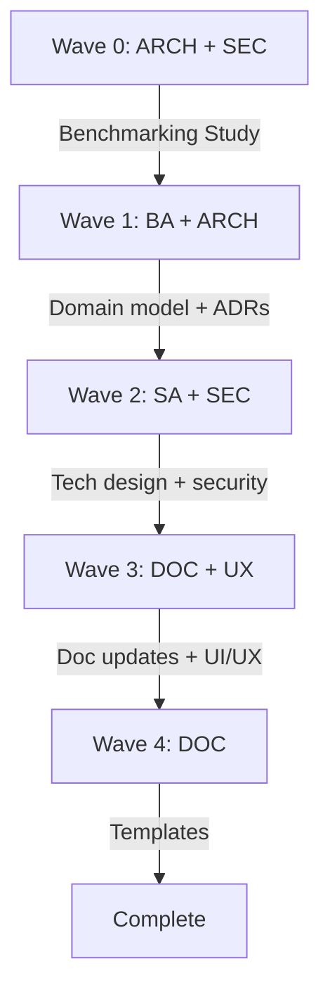

# Super Agent Platform — Design Documentation Update Plan

## Context

The EMSIST ai-service design documents (docs/ai-service/Design/01-10) need to be updated with 14 architectural design areas that emerged from iterative requirements dialogue with the product owner. **No new documents are created** — all updates go into existing documents.

The product owner is a Business Architect, Enterprise Architect, Strategy & Performance specialist, EFQM specialist, Knowledge Management specialist, GRC specialist, and Service Design specialist. The platform vision has evolved significantly beyond the current document scope.

**Current state:** Documents describe an Agent Builder + Skills + Tools framework with a basic orchestrator-worker pattern.
**Target state:** Documents describe a **Super Agent platform** with hierarchical orchestration, maturity-based autonomy, event-driven triggers, HITL workflows, dynamic context engineering, full security stack, and regulatory compliance.

---

## Design Decisions Summary (All Confirmed by Product Owner)

| # | Area | Decision |
|---|------|----------|
| 1 | Agent hierarchy | Super Agent → Domain Sub-Orchestrators → Capability Workers |
| 2 | Sub-orchestrator grouping | Hybrid: domain-expert sub-orchestrators (Way of Thinking) + capability workers (Way of Working) |
| 3 | Agent maturity model | Coaching → Co-pilot → Pilot → Graduate progression with Agent Trust Score (ATS) |
| 4 | Worker sandbox | Workers produce drafts in isolated sandbox; review authority = maturity-dependent |
| 5 | Approval authority | Risk level × Maturity level matrix determines auto-approve vs human-approve |
| 6 | Event-driven triggers | All 4 sources: entity lifecycle, time-based, external system, user workflow |
| 7 | Code of Ethics/Conduct | Platform baseline (non-negotiable) + tenant extensions (industry/internal policies) |
| 8 | Multi-tenancy isolation | Schema-per-tenant for agent data; anonymized shared schema for benchmarking |
| 9 | User context resolution | Runtime query to user-service + Valkey cache (session duration) |
| 10 | Audit trails | Full execution trace: prompts, tools, reasoning, drafts, approvals, timing, cost |
| 11 | Dynamic RAG | Operating-model-aligned: knowledge indexed by portfolio type + domain framework |
| 12 | Dynamic system prompts | Context-aware composition: person → role → privileges (RBAC/ABAC) → interests → task → knowledge |
| 13 | Cross-tenant benchmarking | Clone on setup → independent management → anonymized metrics sharing |
| 14 | Security | Full stack: prompt injection, PII, tool authorization per maturity, agent-to-agent auth, ethics enforcement |
| 15 | UI/UX | Hybrid: embedded side panel (quick interactions) + full agent workspace (complex tasks) |
| 16 | Data model approach | Full BA→SA→DBA agent chain using EA metamodel as input |

---

## Step 0: Benchmarking Study (Full Document)

**File:** `docs/ai-service/Design/11-Super-Agent-Benchmarking-Study.md`

A comprehensive benchmarking study document — NOT a summary — with full research findings, industry analysis, and platform-specific recommendations. This document is created BEFORE the design document updates, as it provides the evidence base for all design decisions.

### Document Structure

```
# Super Agent Platform — Industry Benchmarking Study

## 1. Executive Summary
   - Purpose of the study
   - Key findings overview
   - Strategic recommendations summary

## 2. Methodology
   - Research scope and approach
   - Sources and time frame (2025-2026)
   - Evaluation criteria

## 3. Multi-Agent Orchestration Patterns
   3.1 Hierarchical Orchestration (Microsoft, IBM, AWS, LangGraph)
   3.2 Event-Driven Multi-Agent Systems (Confluent 4 patterns)
   3.3 Dynamic vs Static Orchestration (NeurIPS 2025 puppeteer model)
   3.4 Sub-Orchestrator Architecture (Azure AI Foundry)
   3.5 Analysis & Comparison Table
   3.6 Recommendation for EMSIST

## 4. Agent Maturity & Trust Models
   4.1 Agent Trust Score (ATS) Framework (5 dimensions)
   4.2 Progressive Autonomy Models (Coaching → Graduate)
   4.3 Bounded Autonomy Architecture
   4.4 Industry Adoption Data (68% by 2026 — Protiviti)
   4.5 From Copilots to Agents: The 2025-2026 Shift
   4.6 Analysis & Comparison Table
   4.7 Recommendation for EMSIST

## 5. Event-Driven Agent Architecture
   5.1 EDA as Agent "Nervous System" (Confluent)
   5.2 Process Event Triggers and CDC Patterns
   5.3 Time-Based Scheduling and SLA Monitoring
   5.4 External System Integration (Webhooks, Kafka)
   5.5 Market Growth Data ($7.6B → $196.6B, 43.8% CAGR)
   5.6 Analysis & Comparison Table
   5.7 Recommendation for EMSIST

## 6. Human-in-the-Loop (HITL) Workflows
   6.1 HITL Architecture Patterns (Microsoft, AWS Bedrock, LangGraph)
   6.2 Approval Checkpoints vs Return of Control
   6.3 Smart Escalation (<10% human intervention)
   6.4 Accuracy Impact (99.9% with HITL vs 92% AI-only)
   6.5 Framework Support (LangGraph, Strands SDK, CrewAI, Orkes)
   6.6 Analysis & Comparison Table
   6.7 Recommendation for EMSIST

## 7. Dynamic RAG & Context Engineering
   7.1 RAG Evolution: From Retrieval to Context Engines
   7.2 Adaptive RAG (Self-RAG, Corrective RAG, A-RAG)
   7.3 Context Engineering vs Prompt Engineering (Anthropic, Microsoft)
   7.4 Dynamic Prompt Composition (meta-prompts, variable substitution)
   7.5 Organizational Context Alignment
   7.6 Analysis & Comparison Table
   7.7 Recommendation for EMSIST

## 8. Multi-Tenancy & Cross-Tenant Intelligence
   8.1 Multi-Tenant AI Architecture (Microsoft Azure, AWS)
   8.2 Schema-per-Tenant vs Row-Level Isolation for AI
   8.3 Cross-Tenant Benchmarking (Anonymized Analytics)
   8.4 Federated Learning Challenges (6 core constraints)
   8.5 AI-Driven Tenant Resource Orchestration
   8.6 Analysis & Comparison Table
   8.7 Recommendation for EMSIST

## 9. AI Ethics, Governance & Compliance
   9.1 Regulatory Landscape (EU AI Act, GDPR, Colorado, ISO 42005)
   9.2 From Voluntary Ethics to Enforceable Law (2025-2026 shift)
   9.3 Code of Ethics Design Patterns
   9.4 Code of Conduct for Autonomous Agents
   9.5 Audit Trail Requirements for Regulatory Compliance
   9.6 Agentic AI Accountability Challenges
   9.7 Analysis & Comparison Table
   9.8 Recommendation for EMSIST

## 10. Agent Security Architecture
   10.1 Prompt Injection Defense (LLM-specific threats)
   10.2 PII Sanitization (pre-cloud, in-context)
   10.3 Tool Authorization & Maturity-Based Access Control
   10.4 Agent-to-Agent Authentication
   10.5 Cross-Tenant Data Boundary Enforcement
   10.6 Ethics Policy Enforcement Engine
   10.7 Analysis & Comparison Table
   10.8 Recommendation for EMSIST

## 11. Worker Sandbox & Draft Lifecycle
   11.1 Sandboxed Execution Patterns
   11.2 Draft Lifecycle Management
   11.3 Review Authority Models
   11.4 Rollback and Audit Integration
   11.5 Recommendation for EMSIST

## 12. Consolidated Recommendations
   12.1 Architecture Recommendations Matrix
   12.2 Priority Ranking
   12.3 Risk Assessment
   12.4 Implementation Considerations

## 13. References
   - All sources with URLs, organized by topic
```

### Agent for Execution

The benchmarking study will be produced by an **ARCH agent** (architecture research and recommendations) with input from a **SEC agent** (security sections) and a **BA agent** (business context alignment).

**Execution approach:**
1. ARCH agent writes Sections 1-8, 11-12 (architecture, orchestration, maturity, event-driven, HITL, RAG, multi-tenancy)
2. SEC agent writes Sections 9-10 (ethics/governance, security)
3. ARCH agent consolidates recommendations (Section 12) and references (Section 13)

All content includes full research findings from the 7 benchmark searches completed, expanded with detailed analysis, comparison tables, and EMSIST-specific recommendations.

---

## Document Update Map (After Benchmarking Study)

### Document 01: PRD (01-PRD-AI-Agent-Platform.md)

**File:** `docs/ai-service/Design/01-PRD-AI-Agent-Platform.md`

| Section | Action | Content |
|---------|--------|---------|
| **1.1 Product Vision** | UPDATE | Evolve vision to include Super Agent concept: one organizational brain per tenant, context-aware, event-driven |
| **1.5 Platform Identity** | UPDATE | Add Super Agent as the central artifact; Agent Builder creates/configures the tenant's Super Agent and its sub-orchestrators/workers |
| **NEW 2.2 Super Agent Architecture** | ADD after 2.1 | Hierarchical diagram: Super Agent → Sub-Orchestrators (domain) → Workers (capability). Way of Thinking + Way of Working model |
| **NEW 2.3 Agent Maturity Model** | ADD | Coaching → Co-pilot → Pilot → Graduate lifecycle. ATS scoring (5 dimensions). Progressive autonomy. Sandbox model for drafts |
| **NEW 3.X Super Agent Lifecycle** | ADD in Section 3 | Clone on tenant setup → customize → operate → benchmark. Per-tenant independence |
| **3.2 Agent Architecture** | UPDATE | Replace flat orchestrator-worker with hierarchical model. Add sub-orchestrator role description |
| **3.4 Tool System** | UPDATE | Add tool authorization per maturity level. Graduate workers get direct execution; Coaching workers get sandboxed execution |
| **3.5 Skills Framework** | UPDATE | Skills now compose the Super Agent's "Way of Thinking". Domain skills (TOGAF, EFQM, ISO 31000, BSC, ITIL, COBIT) are the knowledge foundation |
| **NEW 3.X Event-Driven Agent Triggers** | ADD | 4 event sources: entity lifecycle, time-based, external system, user workflow. Event handler framework. Process triggers |
| **NEW 3.X Human-in-the-Loop Framework** | ADD | Approval checkpoints, escalation paths, maturity-based auto-approval, HITL interaction types (confirmation, data entry, review, takeover) |
| **NEW 3.X Worker Sandbox & Draft Lifecycle** | ADD | DRAFT → UNDER_REVIEW → APPROVED → COMMITTED lifecycle. Sandbox isolation per worker task |
| **7.1 Data Sovereignty** | UPDATE | Add schema-per-tenant requirement. Agent memory isolation |
| **7.2 Multi-Tenancy** | UPDATE | Replace current content with schema-per-tenant model. Anonymized benchmarking schema |
| **NEW 7.X Code of Ethics** | ADD | Platform baseline (immutable): data privacy, bias prevention, transparency, audit trail. Non-negotiable boundaries |
| **NEW 7.X Code of Conduct** | ADD | Tenant-configurable: industry regulations, internal policies, behavioral constraints. Enforcement engine |
| **NEW 7.X Agent Security Policies** | ADD | Tool authorization matrix per maturity. Agent-to-agent authentication. Cross-tenant boundary enforcement. Ethics violation detection + alerting |
| **NEW 7.X Audit & Compliance** | ADD | Full execution trace requirements. EU AI Act alignment. GDPR considerations. Traceable decision records |
| **8 Roadmap** | UPDATE | Add new phases for maturity model, event-driven, cross-tenant benchmarking |

### Document 02: Technical Specification (02-Technical-Specification.md)

**File:** `docs/ai-service/Design/02-Technical-Specification.md`

| Section | Action | Content |
|---------|--------|---------|
| **NEW 3.X SuperAgent Class** | ADD | Extends BaseAgent. Orchestrates sub-orchestrators. Composes dynamic system prompt from user context + role + active skills + tools + ethics policies |
| **NEW 3.X SubOrchestrator Class** | ADD | Extends BaseAgent. Domain-expert coordinator. Plans task decomposition. Reviews worker drafts. Manages worker maturity progression |
| **NEW 3.X Worker Class** | ADD | Extends BaseAgent. Capability executor. Produces sandboxed drafts. Reports results to sub-orchestrator |
| **NEW 3.X AgentMaturityService** | ADD | ATS scoring engine. 5 dimensions (Identity, Competence, Reliability, Compliance, Alignment). Maturity level transitions. Performance history tracking |
| **NEW 3.X DraftSandboxService** | ADD | Sandbox lifecycle management. Draft versioning. Review queue. Approval/rejection with audit |
| **NEW 3.X DynamicPromptComposer** | ADD | Runtime prompt assembly: [Identity block] + [Domain Knowledge block] + [User Context block] + [Active Skills block] + [Tool Declarations block] + [Behavioral Rules block] + [Ethics Policy block]. Modular composition from DB-stored blocks |
| **NEW 3.X EventTriggerService** | ADD | Event listener framework. Entity lifecycle hooks (Kafka CDC). Time-based scheduler (Quartz/Spring Scheduler). External webhook ingestion. Workflow event processing |
| **NEW 3.X HITLService** | ADD | Approval checkpoint engine. Escalation rules (risk × maturity). User notification on pending approvals. Timeout handling. Audit logging |
| **NEW 3.X EthicsPolicyEngine** | ADD | Platform baseline rules (immutable). Tenant policy extensions (CRUD). Pre-execution policy check. Post-execution compliance validation. Breach detection + alerting |
| **NEW 3.X CrossTenantBenchmarkService** | ADD | Anonymized metrics collection. Performance aggregation. Trend analysis. Privacy-preserving comparison. Federated insights |
| **3.1 BaseAgent** | UPDATE | Add maturity level awareness. Sandbox mode for Coaching/Co-pilot workers |
| **3.3 ReAct Loop** | UPDATE | Add HITL interruption points. Add draft checkpoint after tool execution |
| **3.9 Request Pipeline** | UPDATE | Add event-triggered entry point (not just user request). Add approval gate step. Expand to cover sub-orchestrator planning step |
| **3.12 Tenant Context** | UPDATE | Schema-per-tenant isolation. Runtime user context resolution (query user-service + Valkey cache) |
| **3.13 Prompt Injection** | UPDATE | Extend to cover agent-to-agent prompt injection. Cross-tenant boundary defense |
| **3.18 AuditService** | UPDATE | Full execution trace: prompts sent, tools called, tool responses, intermediate reasoning, draft versions, approval/rejection, timing, cost |
| **6 Kafka Topics** | UPDATE | Add agent event topics: agent.entity.lifecycle, agent.trigger.scheduled, agent.trigger.external, agent.worker.draft, agent.approval.request, agent.benchmark.metrics |

### Document 05: Technical LLD (05-Technical-LLD.md)

**File:** `docs/ai-service/Design/05-Technical-LLD.md`

| Section | Action | Content |
|---------|--------|---------|
| **3 Database Schema** | UPDATE | Add tables: agent_maturity_scores, agent_trust_history, worker_drafts, draft_reviews, hitl_approvals, event_triggers, event_trigger_schedules, ethics_policies, ethics_violations, benchmark_metrics, benchmark_comparisons |
| **4 API Contracts** | UPDATE | Add endpoints: /api/v1/agents/super-agent, /api/v1/maturity/{agentId}, /api/v1/drafts, /api/v1/approvals, /api/v1/events/triggers, /api/v1/ethics/policies, /api/v1/benchmarks |
| **6 Security Architecture** | UPDATE | Add agent-level security: per-maturity tool authorization, agent-to-agent JWT, cross-tenant data boundary, ethics policy enforcement hooks |
| **7 Data Flow** | UPDATE | Add event-driven data flows: entity change → Kafka → event trigger → agent activation → worker execution → draft → review → commit |

### Document 06: UI/UX Design Spec (06-UI-UX-Design-Spec.md)

**File:** `docs/ai-service/Design/06-UI-UX-Design-Spec.md`

| Section | Action | Content |
|---------|--------|---------|
| **NEW Section: Agent Workspace** | ADD | Full-screen agent workspace: chat panel, task board (active workers/drafts), execution timeline, approval queue, knowledge explorer |
| **NEW Section: Embedded Agent Panel** | ADD | Side panel overlay for contextual quick interactions. Adapts based on current page (portfolio view, KPI dashboard, etc.) |
| **NEW Section: Approval Queue UI** | ADD | HITL approval interface: pending drafts, risk indicators, preview, approve/reject/revise actions, bulk operations |
| **NEW Section: Agent Maturity Dashboard** | ADD | ATS score visualization, maturity progression timeline, worker performance metrics, domain coverage |
| **8 User Flows** | UPDATE | Add Super Agent interaction flows: event-triggered task, HITL approval, worker draft review, cross-domain task coordination |

### Document 08: Agent Prompt Templates (08-Agent-Prompt-Templates.md)

**File:** `docs/ai-service/Design/08-Agent-Prompt-Templates.md`

| Section | Action | Content |
|---------|--------|---------|
| **Super Agent Template** | ADD/UPDATE | Dynamic system prompt model: context-aware composition. Not a static template — composed at runtime from: person identity → role → privileges (RBAC/ABAC) → interests → organizational context → task identification → knowledge base selection → worker instruction generation |
| **Sub-Orchestrator Templates** | ADD/UPDATE | Domain-specific sub-orchestrator prompts: EA domain, Performance domain, GRC domain, KM domain, Service Design domain. Each includes domain planning rules |
| **Worker Templates** | ADD/UPDATE | Capability worker prompts: Data Query, Calculation, Report Generation, Notification, Analysis. Each includes sandbox output format requirements |
| **Ethics/Conduct Integration** | ADD | How ethics policies are injected into every prompt. Platform baseline block + tenant extension block |

### Document 09: Infrastructure Setup Guide (09-Infrastructure-Setup-Guide.md)

**File:** `docs/ai-service/Design/09-Infrastructure-Setup-Guide.md`

| Section | Action | Content |
|---------|--------|---------|
| **Kafka Configuration** | UPDATE | Add event-driven topics: entity lifecycle events, scheduled trigger events, approval events, benchmark metrics |
| **Schema-per-tenant** | ADD | PostgreSQL schema isolation setup. Flyway per-tenant migration strategy. Shared benchmark schema |
| **Scheduler** | ADD | Quartz/Spring Scheduler configuration for time-based event triggers |

### Performance Architecture (Cross-Cutting — All Documents)

Performance concerns are distributed across documents:

| Concern | Where | Design |
|---------|-------|--------|
| Agent response latency | Tech Spec 3.X | Maturity-based routing: Graduate workers bypass review queue → faster. Coaching workers go through full review → slower but safer |
| Concurrent agent execution | Tech Spec 3.X | Workers execute in parallel within sub-orchestrator scope. Event-driven (Kafka) decouples trigger from execution |
| Caching | Tech Spec 3.12, LLD | User context cached in Valkey (session duration). Agent configurations cached. RAG embeddings cached per tenant |
| Schema-per-tenant scaling | LLD 3, Infra 09 | Connection pooling per tenant schema. Lazy schema creation on first access |
| Event throughput | Tech Spec 6, Infra 09 | Kafka partitioning by tenant. Backpressure handling. Dead letter queues |
| Benchmark computation | Tech Spec 3.X | Async batch processing for cross-tenant metrics. Scheduled aggregation, not real-time |

### Document 10: Full-Stack Integration Spec (10-Full-Stack-Integration-Spec.md)

**File:** `docs/ai-service/Design/10-Full-Stack-Integration-Spec.md`

| Section | Action | Content |
|---------|--------|---------|
| **Agent Integration Flows** | UPDATE | End-to-end flows for: (1) User chat → Super Agent → sub-orchestrator → workers → draft → approval → response, (2) Entity event → trigger → Super Agent → automated execution → audit, (3) Cross-tenant benchmark collection and comparison |

---

## Execution Strategy

### Agent Chain (per CLAUDE.md Rule 9)



### Execution Order

**Wave 0: Benchmarking Study (ARCH + SEC in parallel)**
- ARCH agent: Write full benchmarking study (Sections 1-8, 11-12) → `docs/ai-service/Design/11-Super-Agent-Benchmarking-Study.md`
- SEC agent: Write security & governance sections (Sections 9-10) of the benchmarking study
- ARCH agent: Consolidate, add references

**Wave 1: Foundation (BA + ARCH in parallel)**
- BA agent: Define Super Agent business domain model (agent hierarchy, maturity model, draft lifecycle, ethics framework) → feeds into canonical data model
- ARCH agent: Validate architectural decisions (event-driven, schema-per-tenant, hierarchical orchestration) → produces ADR updates

**Wave 2: Technical Design (SA + SEC in parallel)**
- SA agent: Update Tech Spec (02) and LLD (05) with technical models, API contracts, data schemas
- SEC agent: Update security sections across PRD (07), Tech Spec (3.13), LLD (06) with full security stack

**Wave 3: Documentation (DOC + UX in parallel)**
- DOC agent: Update PRD (01), Epics/Stories (03), Infrastructure (09), Integration (10)
- UX agent: Update UI/UX Spec (06) with agent workspace and embedded panel designs

**Wave 4: Templates**
- DOC agent: Update Agent Prompt Templates (08) with dynamic prompt composition model

---

## Benchmark Research Summary (Completed)

All benchmarks researched and presented to product owner:

| Topic | Key Finding | Source |
|-------|-------------|--------|
| Event-driven agents | EDA is the "nervous system" of agentic AI. 4 design patterns (reactive, event-sourced, saga, pub/sub) | Confluent 2025 |
| HITL workflows | <10% decisions need human intervention with smart escalation. 99.9% accuracy with HITL vs 92% AI-only | Microsoft, AWS, Orkes |
| Dynamic RAG | Evolving from retrieval to "context engines". Adaptive RAG selects strategy per query complexity | Squirro, RAGFlow 2026 |
| Context engineering | Replaced "prompt engineering". Puppeteer-style dynamic orchestration (NeurIPS 2025) | Anthropic, DataOpsLabs |
| Cross-tenant AI | Hybrid dataset model (global benchmarks + tenant-specific). AI-driven tenant isolation | Microsoft Azure, AWS |
| AI governance | 2025-2026: shift from voluntary ethics to enforceable law (EU AI Act, ISO 42005) | KDnuggets, SecurePrivacy |
| Agent maturity | ATS composite score (0-100) with 5 dimensions. Governance gradient, not permission cliff | Trust Economy, Google Cloud |

---

## Verification

1. **Document consistency**: After all updates, verify cross-references between documents are consistent (e.g., PRD Section 3.X referenced in Tech Spec Section 3.X)
2. **Status tags**: All new sections marked `[PLANNED]` since no code exists yet
3. **Mermaid diagrams**: All architecture diagrams use Mermaid syntax (Rule 7)
4. **Changelog**: Each document's changelog updated with version bump and change description
5. **No aspirational-as-implemented**: All new content explicitly tagged as design/planned, not implemented (Rule 5)
6. **BA domain model created**: `docs/data-models/domain-model.md` updated with Super Agent entity relationships
