# Product Requirements Document: AI Agent Platform

**Product Name:** EMSIST AI Agent Platform
**Version:** 1.5
**Date:** March 9, 2026
**Status:** Implementation Baseline
**Owner:** ThinkPlus Advisory

**Scope of Baseline:** This is the implementation baseline for the AI platform stream; existing EMSIST `ai-service` may be partially aligned.

**Changelog:**
| Version | Date | Changes |
|---------|------|---------|
| 1.6 | 2026-03-09T18:00Z | (BA Agent) Added Section 7.2.1 Master Tenant Concept and Platform Administration [PLANNED]: formal definition of master tenant (UUID 00000000-..., bootstrap creation, PLATFORM_ADMIN assignment), privilege model (cross-tenant read, platform-wide write), isolation guarantees (regular tenants cannot see master tenant), RBAC hierarchy with master tenant context, business rules BR-100 through BR-105. Addresses Gap 1 (HIGH) from superadmin gap analysis. |
| 1.5 | 2026-03-09T14:00Z | (SA Agent) Final implementation-readiness pass: replaced [PRODUCT_NAME] placeholder with EMSIST AI Agent Platform, formalized risk table (Section 10) with severity/probability/mitigation for all 10 risks and 5 open questions, quantified success criteria (Section 9) with 10 measurable metrics including baselines/targets/measurement methods, verified all ADR cross-references (023-030). All Super Agent content tagged [PLANNED]. |
| 1.4 | 2026-03-08 | DOC agent: Super Agent platform content. Updated vision (1.1) with organizational brain concept. Updated platform identity (1.5) with Super Agent as central artifact. Added Super Agent Architecture (2.2) with hierarchical Mermaid diagram. Added Agent Maturity Model (2.3) with ATS scoring. Updated Agent Architecture (3.2) with hierarchical model. Updated Tool System (3.4) with maturity-based authorization. Updated Skills Framework (3.5) as Way of Thinking composition. Added Event-Driven Agent Triggers (3.18). Added Human-in-the-Loop Framework (3.19). Added Worker Sandbox and Draft Lifecycle (3.20). Added Super Agent Lifecycle (3.21). Updated Roadmap (8) with Phases 6-9 for Super Agent capabilities. All new content tagged [PLANNED]. References ADR-023 through ADR-030, Benchmarking Study Sections 3-12, and BA domain model. |
| 1.3 | 2026-03-08 | SEC agent: Added Super Agent security sections -- Code of Ethics (7.7), Code of Conduct (7.8), Agent Security Policies (7.9), Audit and Compliance (7.10). Updated Data Sovereignty (7.1) with schema-per-tenant and agent memory isolation. Updated Multi-Tenancy (7.2) with schema-per-tenant model and defense-in-depth layers. All new content tagged [PLANNED]. References ADR-023 through ADR-030 and Benchmarking Study Sections 9-10. |
| 1.2 | 2026-03-07 | Added platform operations features: Audit Log Viewer (Section 3.10), RBAC Matrix (Section 7.6), Agent Delete with Impact Assessment (Section 3.11), Agent Publish Lifecycle (Section 3.12), Pipeline Run Viewer (Section 3.13), Agent Import/Export (Section 3.14), Notification Center (Section 3.15), Knowledge Source Management (Section 3.16), Agent Comparison (Section 3.17). Updated roadmap Phases 4-5 to include new features. |
| 1.1 | 2026-03-07 | Added Agent Builder vision (Section 1.5), pipeline state machine (Section 3.9), LLM security controls (Section 7.3), data retention (Section 7.4), phase-based tool restrictions (Section 7.5), roadmap updates |
| 1.0 | 2026-03-05 | Initial baseline |

---

## 1. Vision and Purpose

### 1.1 Product Vision

Build an enterprise-grade, multi-agent AI platform powered by local LLMs (Ollama) with cloud model integration (Claude, Codex, Gemini), deployed on Spring Boot and Spring Cloud microservices. The platform enables organizations to create, train, and continuously improve specialized AI agents using multiple learning methods fed by proprietary data, business patterns, customer feedback, user feedback, and curated learning materials.

**Super Agent Vision [PLANNED]:** Each tenant operates a **Super Agent** -- one "organizational brain" that is context-aware, event-driven, and progressively autonomous. The Super Agent is not a single monolithic agent, but a hierarchical orchestration structure: a tenant-level coordinator that delegates to domain-expert sub-orchestrators (Enterprise Architecture, Performance Management, GRC, Knowledge Management, Service Design), which in turn manage capability workers that execute atomic tasks. This hierarchy evolves from a passive, user-prompted assistant (Coaching level) to a proactive, event-driven organizational partner (Graduate level) through a measured maturity progression governed by a 5-dimension Agent Trust Score. See ADR-023 (hierarchical architecture), ADR-024 (maturity model), and the Benchmarking Study (Section 12) for the evidence base.

> **Note:** The Super Agent vision describes the target platform architecture. No Super Agent hierarchy, maturity model, or event-driven trigger code exists yet. See Section 8 (Roadmap, Phases 6-9) for phased delivery.

### 1.2 Problem Statement

Organizations need AI agents that understand their specific domain, workflows, and institutional knowledge. Off-the-shelf models lack organizational context, cloud-only solutions raise privacy and cost concerns, and there is no unified platform to build, orchestrate, and continuously improve multiple specialized agents from proprietary data sources.

### 1.3 Key Value Propositions

- **Data Sovereignty:** Agents run locally on Ollama — sensitive data never leaves the organization
- **Continuous Improvement:** Multi-method learning pipeline that gets smarter from every interaction, correction, and feedback signal
- **Domain Expertise:** Agents trained on proprietary data, patterns, and institutional knowledge that no external model possesses
- **Cloud Augmentation:** Claude, Codex, and Gemini serve as teachers and fallbacks, not runtime dependencies
- **Microservice Scalability:** Spring Cloud architecture enables independent scaling, deployment, and evolution of each agent

### 1.4 Target Users

> **Persona Registry:** Full persona definitions (persona cards, empathy maps, JTBD, accessibility needs) are maintained in the centralized **[TX Persona Registry](../../persona/PERSONA-REGISTRY.md)**.

- **End Users** [PER-UX-004] Lisa Harrison: Internal employees interacting with agents for data analysis, customer support, code review, and domain-specific tasks
- **Domain Experts** [PER-EX-004] Maria Sullivan: Business analysts and subject matter experts who inject patterns, rules, and learning materials
- **ML Engineers** [PER-EX-005] Thomas Morrison: Team members managing the training pipeline, model evaluation, and deployment
- **Platform Administrators** [PER-EX-002] Oliver Kent: DevOps and infrastructure teams managing the Spring Cloud deployment
- **Agent Designers** [PER-UX-007] Nora Davidson: Business users, process owners, and power users who build custom agents using the Agent Builder without writing code

### 1.5 Platform Identity: Agent Builder, Not Agent Catalog [PLANNED]

The EMSIST AI Agent Platform is an **Agent Builder and Configurator** -- a visual, self-service workspace where any authorized user can design, assemble, test, and deploy custom AI agents tailored to their organizational context, with no AI expertise required.

**Key Principles:**

- The 30+ agent configurations in the Agent Configuration Catalog (Document 08) are pre-built configurations that seed the Template Gallery. They demonstrate what is possible; they do not constrain what users can build.
- Users can define entirely new agent types with custom names, purposes, tool sets, knowledge scopes, and behavioral rules without any code deployment.
- The Skills framework (Section 3.5) is the primary composition primitive: combine skills to create any agent capability.
- The distinction between "predefined agent types" and "custom agents" is dissolved -- all agent types are user-defined; some happen to come pre-seeded as configurations.
- The "Agent Designers" persona ([PER-UX-007] Nora Davidson, added to Section 1.4 above) represents business users, process owners, and power users who build custom agents using the Agent Builder without writing code.

**Super Agent as the Central Artifact [PLANNED]:**

With the Super Agent architecture (ADR-023), the Agent Builder's scope expands beyond individual agent configurations to encompass the tenant's entire Super Agent hierarchy:

- The **Agent Builder** creates and configures the tenant's **Super Agent** and its constituent sub-orchestrators and workers.
- The **"Way of Thinking"** (domain skills: TOGAF, EFQM, ISO 31000, BSC, ITIL/COBIT) defines a sub-orchestrator's domain expertise -- how it plans, decomposes tasks, and applies quality gates.
- The **"Way of Working"** (capability tools: Data Query, Calculation, Report, Analysis, Notification) defines a worker's execution capabilities -- what actions it can perform.
- The Builder allows users to customize sub-orchestrator domain skills and worker tool sets per tenant, creating a unique organizational intelligence profile.
- Template Gallery seeds include not only individual agent configurations but also pre-configured sub-orchestrator and worker templates for each business domain.

**Builder vs. Catalog Paradigm:**

| Aspect | Old Paradigm (Agent Catalog) | New Paradigm (Agent Builder) |
|--------|------------------------------|------------------------------|
| Agent creation | Select from fixed list of agent types | Build any agent from scratch or fork a template |
| Customization | Configure parameters within a type | Full control: name, purpose, tools, knowledge, rules |
| Templates | N/A | Template Gallery with system seeds + user-published agents |
| Skill composition | Pre-assigned per agent type | Drag-and-drop skills onto builder canvas |
| Governance | Platform-managed only | Platform seeds + organization-published + team-created |
| Hierarchy | Flat agent list | Super Agent with sub-orchestrators and workers |
| Domain expertise | Implicit in agent prompt | Explicit via "Way of Thinking" domain skills |
| Autonomy | Binary (on/off) | Progressive via ATS maturity model (Coaching to Graduate) |

> **Note:** This section describes the target platform identity. No Agent Builder code exists yet. No Super Agent hierarchy, sub-orchestrator, or worker management UI exists yet. See Section 8 (Roadmap, Phases 6-9) for phased delivery.

---

## 2. Architecture Overview

### 2.1 Platform Layers

```mermaid
graph TD
    subgraph GW["API Gateway (Spring Cloud Gateway)"]
        gateway[Unified Entry Point / Routing / Auth]
    end

    subgraph ORCH["Agent Orchestrator Service"]
        orchestrator[Routes Tasks / Coordinates Multi-Agent Flows]
    end

    subgraph AGENTS["Agent Configurations (User-Defined via Agent Builder)"]
        da[Data Analyst]
        cs[Customer Support]
        cr[Code Reviewer]
        dp[Document Processor]
        custom[Additional Agents -- Pluggable]
    end

    subgraph ACL["Agent Common Library"]
        base[Base Agent / ReAct Loop / Tools / Memory / Tracing]
    end

    subgraph MODELS["Model Integration Layer"]
        rag[RAG Module -- Retrieval at Orchestrator]
        orch_model[Orchestrator ~8B -- Ollama]
        worker_model[Worker ~24B -- Ollama]
        cloud[Claude / Codex / Gemini -- Teacher / Fallback]
    end

    subgraph VAL["Validation Layer"]
        validation[Backend Rules / Test Suites / Approval Workflows]
    end

    subgraph LEARN["Learning Pipeline Services"]
        trace[Trace Collector]
        teacher[Teacher Service]
        training[Training Orchestrator]
        feedback[Feedback Ingestion]
        dataprep[Data Preparation]
        eval[Model Evaluation]
    end

    subgraph DATA["Data and Knowledge Layer"]
        vector[Vector Store]
        pattern[Pattern Store]
        feedbackdb[Feedback DB]
        docstore[Document Store]
    end

    subgraph TENANT["Tenant Isolation Boundary"]
        isolation[Namespaced Context / Scoped Skills / Isolated Concurrency]
    end

    subgraph INFRA["Spring Cloud Infrastructure"]
        eureka[Eureka]
        config[Config Server]
        kafka[Kafka]
        circuit[Circuit Breakers]
        obs[Observability]
    end

    GW --> ORCH
    ORCH --> AGENTS
    AGENTS --> ACL
    ACL --> MODELS
    MODELS --> VAL
    VAL --> LEARN
    LEARN --> DATA
    DATA --> TENANT
    TENANT --> INFRA
```

### 2.2 Super Agent Architecture [PLANNED]

> **Status:** All content in this section is `[PLANNED]`. No Super Agent hierarchy code exists yet. See ADR-023 for the full architectural decision record and the Benchmarking Study Section 3 for industry evidence.

The Super Agent platform implements a three-tier hierarchical orchestration architecture. Each tenant operates one Super Agent that coordinates domain-expert sub-orchestrators, which in turn manage capability workers. This architecture replaces the flat orchestrator-worker pattern (Section 2.1) for complex multi-domain enterprise workflows.

```mermaid
graph TD
    subgraph TENANT["Tenant Boundary (Schema-per-Tenant)"]
        SA["Super Agent<br/>(Tenant-Level Orchestrator)"]

        subgraph SUB_EA["Enterprise Architecture"]
            SO_EA["Sub-Orchestrator<br/>Way of Thinking: TOGAF"]
            W_EA1["Worker: Data Query"]
            W_EA2["Worker: Analysis"]
            W_EA3["Worker: Report"]
            SO_EA --> W_EA1
            SO_EA --> W_EA2
            SO_EA --> W_EA3
        end

        subgraph SUB_PERF["Performance Management"]
            SO_PERF["Sub-Orchestrator<br/>Way of Thinking: BSC/EFQM"]
            W_PERF1["Worker: Calculation"]
            W_PERF2["Worker: Data Query"]
            W_PERF3["Worker: Notification"]
            SO_PERF --> W_PERF1
            SO_PERF --> W_PERF2
            SO_PERF --> W_PERF3
        end

        subgraph SUB_GRC["Governance, Risk, Compliance"]
            SO_GRC["Sub-Orchestrator<br/>Way of Thinking: ISO 31000/COBIT"]
            W_GRC1["Worker: Analysis"]
            W_GRC2["Worker: Report"]
            W_GRC3["Worker: Notification"]
            SO_GRC --> W_GRC1
            SO_GRC --> W_GRC2
            SO_GRC --> W_GRC3
        end

        subgraph SUB_KM["Knowledge Management"]
            SO_KM["Sub-Orchestrator<br/>Way of Thinking: KM Frameworks"]
            W_KM1["Worker: Data Query"]
            W_KM2["Worker: Analysis"]
            SO_KM --> W_KM1
            SO_KM --> W_KM2
        end

        subgraph SUB_SD["Service Design"]
            SO_SD["Sub-Orchestrator<br/>Way of Thinking: ITIL"]
            W_SD1["Worker: Data Query"]
            W_SD2["Worker: Report"]
            W_SD3["Worker: Calculation"]
            SO_SD --> W_SD1
            SO_SD --> W_SD2
            SO_SD --> W_SD3
        end

        SA --> SO_EA
        SA --> SO_PERF
        SA --> SO_GRC
        SA --> SO_KM
        SA --> SO_SD
    end

    USER["User / Event Trigger"] --> SA
```

**Tier descriptions:**

| Tier | Role | Count per Tenant | Responsibilities |
|------|------|-----------------|-----------------|
| **Tier 1: Super Agent** | Tenant-level orchestrator | 1 | Classifies requests by domain; routes to sub-orchestrators; coordinates cross-domain requests; composes dynamic system prompt from user context |
| **Tier 2: Sub-Orchestrators** | Domain-expert planners ("Way of Thinking") | 1 per domain (5 default: EA, Performance, GRC, KM, Service Design) | Decomposes requests into domain-specific sub-tasks; manages worker lifecycle; enforces domain-specific quality gates; applies domain knowledge (TOGAF, BSC, ISO 31000, ITIL, COBIT, EFQM) |
| **Tier 3: Workers** | Capability executors ("Way of Working") | N per sub-orchestrator | Executes atomic tasks within sandbox; produces draft outputs for review; has individual maturity level (ATS score); shared capability types: Data Query, Analysis, Calculation, Report, Notification |

**Routing strategy:**

- **Static routing (80% of requests):** Keyword matching and intent classification routes to the correct sub-orchestrator. Fast, deterministic, low latency.
- **Dynamic routing (20% of requests):** LLM-based planning for cross-domain or ambiguous requests where the Super Agent must decide which sub-orchestrator(s) to engage. Supports multi-domain fan-out.
- **Evolving routing:** Routing rules are refined over time based on observed success rates and user feedback (see Benchmarking Study Section 3.5 on evolving orchestration).

**"Way of Thinking" + "Way of Working" hybrid model:**

The key insight from the Benchmarking Study (Section 3.6) is that domain expertise (planning, decomposition, quality gates) and execution capabilities (data access, calculation, reporting) are orthogonal concerns that should be modeled separately:

| Dimension | Layer | Examples | Customizable Per Tenant |
|-----------|-------|---------|------------------------|
| Way of Thinking | Sub-Orchestrator | TOGAF planning methodology, BSC perspective analysis, ISO 31000 risk assessment framework | Yes -- tenants add custom domain skills |
| Way of Working | Worker | SQL query execution, KPI formula calculation, PDF report generation, email notification | Yes -- tenants register custom tools |

> **Note:** This section describes design intent. No hierarchical agent code, sub-orchestrator, or worker management exists yet. See Section 8 (Roadmap, Phase 6) for phased delivery.

### 2.3 Agent Maturity Model [PLANNED]

> **Status:** All content in this section is `[PLANNED]`. No maturity model or ATS scoring code exists yet. See ADR-024 for the full architectural decision record and the Benchmarking Study Section 4 for industry evidence.

Every agent (Super Agent, sub-orchestrator, and worker) progresses through a four-level maturity lifecycle governed by a composite Agent Trust Score (ATS). Maturity determines autonomy: lower-maturity agents operate under tighter human oversight, progressively relaxed as the agent demonstrates competence, reliability, and compliance.

**Maturity levels:**

| Level | ATS Range | Autonomy | Review Requirement | Tool Access | HITL Behavior |
|-------|-----------|----------|--------------------|-----------------------|---------------|
| **Coaching** | 0-39 | None -- all outputs require human review | Every output reviewed by human | Sandboxed execution only; read-only tools | Mandatory human takeover for all actions |
| **Co-pilot** | 40-64 | Limited -- low-risk outputs auto-approved | Low-risk outputs auto-approved by sub-orchestrator; medium/high-risk require human review | Read tools + low-impact write tools (within sandbox) | Human confirmation for medium-risk; human review for high-risk |
| **Pilot** | 65-84 | Moderate -- most outputs auto-approved | Only high-risk and critical outputs require human review | Full tool access within sandbox; Graduate-supervised direct execution for low-risk | Human review for high-risk; human data entry for complex inputs |
| **Graduate** | 85-100 | Full -- autonomous within policy boundaries | Critical actions only require human review | Direct execution (no sandbox for low/medium risk) | Auto-approve low/medium risk; human confirmation for critical |

**Agent Trust Score (ATS) -- 5 dimensions:**

| Dimension | Weight | What It Measures | How It Is Measured |
|-----------|--------|-----------------|-------------------|
| **Identity** | 20% | Configuration integrity, versioning, template adherence | Configuration hash stability, version control compliance, prompt drift detection |
| **Competence** | 25% | Task completion accuracy, domain expertise | Success rate per task type, hallucination rate, tool error rate |
| **Reliability** | 25% | Consistency over time, availability | Performance variance, uptime, SLA compliance, response latency |
| **Compliance** | 15% | Ethics policy adherence, data handling rules | Policy violation rate, audit finding count, boundary respect rate |
| **Alignment** | 15% | Organizational goal alignment, user satisfaction | User rating trends, feedback response rate, goal contribution |

**Maturity progression rules:**

- **Promotion** requires sustained performance over 30 days with minimum scores per dimension (prevents gaming the composite score by excelling in one dimension and neglecting others).
- **Demotion** is immediate on critical violation (safety-first: if a Graduate-level worker produces a compliance violation, it is immediately demoted to Co-pilot pending investigation).
- **Per-tenant independence:** The same worker template can be at different maturity levels across different tenants. Maturity is earned through tenant-specific operational performance.
- **Cold start:** All new agents start at Coaching level. There is no shortcut to Graduate status.

**Sandbox model:**

Workers at Coaching and Co-pilot levels produce draft outputs into an isolated sandbox. Drafts must be reviewed and approved before being committed (delivered to the user or applied to business systems). See Section 3.20 (Worker Sandbox and Draft Lifecycle) for the complete draft lifecycle. See ADR-028 for the sandbox architectural decision.

> **Note:** This section describes design intent. No ATS scoring, maturity progression, or sandbox enforcement code exists yet. See Section 8 (Roadmap, Phase 6) for phased delivery.

### 2.4 Spring Cloud Components

| Component | Technology | Purpose |
|-----------|-----------|---------|
| Service Discovery | Eureka | Agent registration and discovery |
| Configuration | Spring Cloud Config | Centralized agent and model config |
| API Gateway | Spring Cloud Gateway | Unified entry point, routing, auth |
| Messaging | Apache Kafka | Inter-agent communication, trace collection |
| Circuit Breaking | Resilience4j | Graceful fallback when models/services are down |
| Observability | Micrometer + OpenTelemetry | Token usage, latency, error monitoring |
| Security | Spring Security + OAuth2 | API authentication and authorization |

### 2.5 Model Integration via Spring AI

The platform uses Spring AI's unified `ChatClient` abstraction to interact with all model providers through a single API. Model routing logic determines when to use local Ollama models versus cloud models based on task complexity, confidence thresholds, and cost considerations.

### 2.6 Two-Model Local Strategy

Rather than running all agents on a single Ollama model, the platform employs a **two-model architecture** for local inference:

#### 2.6.1 Orchestrator Model (Small, ~8B parameters)
- **Role:** Handles routing, context retrieval, planning, and business explanation
- **Characteristics:** Lower computational overhead, optimized for decision-making and synthesis
- **Execution Profile:** Conservative temperature settings, smaller default context window to maximize throughput
- **Responsibilities:** Request classification, RAG trigger determination, agent/skill selection, response explanation generation

#### 2.6.2 Worker Model (Large, ~24B parameters)
- **Role:** Handles execution—code changes, data analysis, document processing, test-fix loops
- **Characteristics:** Higher computational capacity for complex reasoning and multi-step tasks
- **Execution Profile:** Tighter concurrency controls to manage resource usage; higher temperature when task-appropriate
- **Responsibilities:** Primary task execution through ReAct loops, tool orchestration, detailed technical output generation

#### 2.6.3 Model Agnostic Design
- The platform does not lock users to specific models (e.g., Mistral). Organizations choose which Ollama-compatible models fill the Orchestrator and Worker roles
- **~30+ agent configurations** run on top of just **2 base models**, eliminating the need for separate 30-model deployments
- Each model receives a tailored configuration including system prompts, context window settings, tool access, and concurrency limits
- **Cloud fallback:** Claude, Codex, and Gemini remain available as teachers and high-complexity fallbacks above both local models

---

## 3. Agent System

### 3.1 Seven-Step Request Pipeline

Every request flows through a formally structured 7-step pipeline that ensures reliability, governance, and explainability:

#### Step 1: Intake
- **Input:** HTTP request via API Gateway with tenant context and authorization
- **Processing:** Request classification (task type, complexity estimate), normalization (extract parameters, resolve references), security validation
- **Output:** Normalized request object with tenant scope, classified task type, raw input parameters

#### Step 2: Retrieve
- **Trigger:** Orchestrator model receives normalized request
- **Processing:** Orchestrator determines if retrieval is needed based on task classification; triggers RAG queries for tenant-safe context
- **RAG Sources:** User stories, process docs, acceptance criteria, API docs, architecture notes, test history, skill documents (note: source code is accessed via tools, not RAG)
- **Output:** Context packet (grounded documents, relevant patterns, scoped knowledge) passed to Worker model

#### Step 3: Plan
- **Input:** Request + Retrieve context
- **Processing:** Orchestrator selects appropriate agent profile/skill (static or dynamic assignment); produces a structured execution plan with: agent/skill choice, tool sequence, expected inputs/outputs, success criteria
- **Output:** Execution plan JSON (agent name, skill name, planned steps, approval requirements if applicable)

#### Step 4: Execute
- **Input:** Execution plan
- **Processing:** **Worker Model** performs the actual task via ReAct loop:
  - Alternating Reasoning and Acting steps with observations
  - Tool calls with configurable timeouts and retries
  - Self-reflection for internal quality checking (model-driven critique)
  - Artifact generation (code, queries, documents, etc.)
- **Tool Access:** Worker model uses tools from agent's skill definition (internal tools, external tools, computation, observation, etc.)
- **Output:** Execution trace (reasoning steps, tool calls + responses, artifacts, termination reason)

#### Step 5: Validate
- **Input:** Execution artifacts and tool call history
- **Processing:** **Deterministic validation** (non-model, code-based checks):
  - Backend rules engine: validates output against configurable rules (path scope restrictions, data access limits, format requirements, PII redaction)
  - Test suites: execute unit/integration tests against generated code
  - Approval workflows: for high-impact actions (deletes, data exports, system changes), trigger human approval
  - Path-scope checks: ensure file/database operations stay within approved boundaries
- **Retry Logic:** Validation failures route back to Execute step with corrective feedback
- **Output:** Validation report (pass/fail, issues found, auto-fixes applied, approvals pending)

#### Step 6: Explain
- **Input:** Execution trace + validation report
- **Processing:** **Orchestrator Model** generates a dual-audience explanation:
  - **Business-readable summary:** What was done, why it matters, key results (for managers/non-technical stakeholders)
  - **Technical detail:** Step-by-step reasoning, tool calls made, code generated, assumptions (for engineers/developers)
  - **Artifact listing:** Files changed, queries run, tools invoked, external services called
- **Output:** Structured explanation object (summary, details, artifact list)

#### Step 7: Record
- **Input:** All artifacts from steps 1-6
- **Processing:** Complete request trace logged to distributed trace system:
  - Request classification and tenant context
  - Retrieved context and knowledge
  - Execution plan and actual execution steps
  - Tool calls and responses (timestamps, arguments, latencies)
  - Validation results and any corrections
  - Final response and explanation
  - Approval records if applicable
- **Storage:** Logs stored in trace database for learning pipeline consumption, audit, observability
- **Output:** Trace ID returned for correlation and debugging

---

### 3.2 Agent Architecture

Each agent is a Spring Boot microservice that extends a common `BaseAgent` framework providing:

- **ReAct Loop:** Reasoning + Acting cycle with configurable max turns (used in Execute step)
- **Tool Registry:** Dynamic tool binding per agent skill set
- **Memory Management:** Short-term (conversation) and long-term (vector store) memory
- **Self-Reflection:** Optional verification pass after generating responses (model-driven, part of Execute step)
- **Trace Logging:** Automatic capture of all interactions for the learning pipeline
- **Model Routing:** Intelligent escalation from Ollama Worker to cloud models for complex tasks

**Hierarchical Agent Model [PLANNED]:**

In the Super Agent architecture (ADR-023, Section 2.2), the flat agent architecture above is extended into a three-tier hierarchy. Each tier inherits the BaseAgent capabilities but adds tier-specific responsibilities:

| Tier | Extends | Additional Responsibilities |
|------|---------|---------------------------|
| **Super Agent** | BaseAgent | Domain classification, sub-orchestrator routing, cross-domain coordination, dynamic system prompt composition (ADR-029), user context management |
| **Sub-Orchestrator** | BaseAgent | Domain-specific task decomposition ("Way of Thinking"), worker lifecycle management, domain quality gates, maturity-based review authority |
| **Worker** | BaseAgent | Atomic task execution ("Way of Working"), draft production within sandbox, maturity progression tracking |

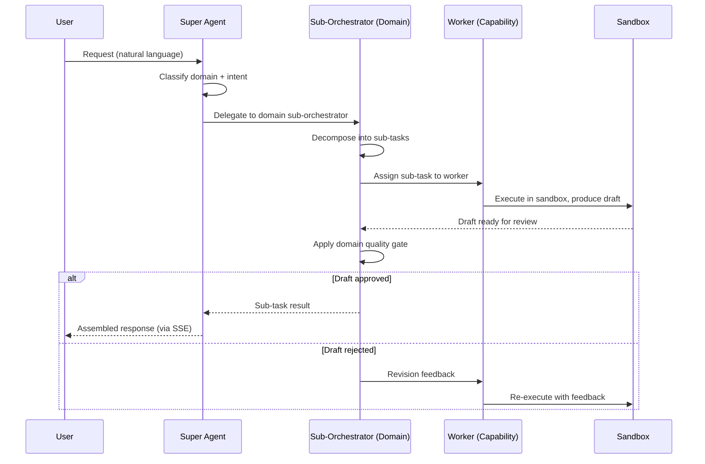

> **Note:** The hierarchical agent model is planned. No Super Agent, sub-orchestrator, or worker class hierarchy exists in code yet. The existing `BaseAgent` framework supports the flat model. See Section 8 (Roadmap, Phase 6) for delivery.

### 3.3 Seed Agent Configurations -- Phase 1 Contents

| Agent Configuration | Domain | Key Tools | Primary Model |
|---------------------|--------|-----------|---------------|
| Data Analyst | SQL queries, data visualization, trend analysis | run_sql, create_chart, summarize_table | Ollama (Llama 3.1) |
| Customer Support | Ticket management, knowledge base search | search_tickets, search_kb, create_ticket | Ollama (Llama 3.1) |
| Code Reviewer | Code analysis, security scanning, PR reviews | analyze_code, run_linter, check_security | Ollama (CodeLlama) |
| Document Processor | Document parsing, summarization, extraction | parse_document, summarize, extract_entities | Ollama (Llama 3.1) |
| Orchestrator | Task routing, multi-agent coordination | route_task, coordinate_agents, aggregate_results | Ollama Orchestrator (local ~8B role) |

Cloud escalation is fallback, not primary orchestrator runtime.

> **Note:** These configurations are starting points. The Template Gallery is not a ceiling -- users can build agents for any domain by starting from scratch or forking any existing configuration. See Document 08 (Agent Configuration Catalog) for the full set of 30+ agent configurations that seed the gallery.

### 3.4 Tool System

Tools are the actions an agent can take in the world. They are the bridge between reasoning and execution. The platform supports a comprehensive, layered tool architecture.

#### 3.4.1 Tool Categories

| Category | Description | Examples |
|----------|-------------|---------|
| **Internal Tools** | Access organizational systems and databases | `run_sql`, `call_internal_api`, `read_file`, `write_file` |
| **External Tools** | Integrate with third-party services | `search_jira`, `send_slack`, `create_email`, `query_salesforce` |
| **Agent Tools** | One agent invokes another agent as a tool | `ask_data_analyst`, `ask_code_reviewer`, `ask_compliance_agent` |
| **Knowledge Tools** | Query and update knowledge stores | `search_vector_db`, `search_knowledge_base`, `lookup_pattern` |
| **Computation Tools** | Perform calculations and transformations | `calculate`, `transform_data`, `generate_chart`, `run_script` |
| **Observation Tools** | Gather information without side effects | `get_current_time`, `check_system_status`, `read_config` |
| **Custom Tools** | User-defined tools injected at runtime via API | Dynamically registered, domain-specific |

#### 3.4.2 Tool Lifecycle

- **Registration:** Tools are registered as Spring beans with `@Description` annotations providing JSON schema for parameters and return types
- **Discovery:** Each agent declares its skill set; the tool registry resolves available tools dynamically at runtime
- **Execution:** Tools execute with configurable timeouts, retries, and circuit-breaking
- **Chaining:** Agents can chain multiple tool calls in sequence, using output from one as input to the next
- **Versioning:** Tools are versioned; agents can pin to specific tool versions for stability
- **Monitoring:** Every tool call is traced (name, arguments, response, latency, success/failure)

#### 3.4.3 Tool Composition Patterns

- **Sequential Chaining:** Agent calls tool A, uses result to call tool B (e.g., search → analyze → summarize)
- **Parallel Fan-Out:** Agent calls multiple tools simultaneously and aggregates results (e.g., search 3 databases concurrently)
- **Conditional Branching:** Agent decides which tool to call based on intermediate results
- **Agent-as-Tool:** An agent delegates a sub-task to another specialist agent (e.g., orchestrator asks data analyst to run a query)
- **Human-in-the-Loop:** Tool requires human approval before executing (e.g., sending an email, making a purchase)

#### 3.4.4 Dynamic Tool Creation

Domain experts and developers can create new tools without redeploying agents:

- **REST API registration:** Define a new tool via API with name, description, parameter schema, and endpoint
- **Webhook tools:** Wrap any webhook as an agent tool with automatic schema generation
- **Script tools:** Upload a Python or shell script that becomes an executable tool
- **Composite tools:** Combine existing tools into a new higher-level tool (e.g., "full_customer_report" = search_tickets + search_orders + summarize)

#### 3.4.5 Tool Authorization by Maturity Level [PLANNED]

In the Super Agent architecture (ADR-024), tool access is governed by the worker's maturity level. Higher maturity unlocks more powerful tools:

| Maturity Level | Read Tools | Write Tools (Low Impact) | Write Tools (High Impact) | Execution Mode |
|----------------|-----------|-------------------------|--------------------------|----------------|
| **Coaching** | Allowed (sandboxed) | Denied | Denied | Sandboxed only -- all outputs are drafts |
| **Co-pilot** | Allowed | Allowed (sandboxed) | Denied | Sandboxed -- low-risk drafts auto-approved by sub-orchestrator |
| **Pilot** | Allowed | Allowed | Allowed (sandboxed, human review) | Sandbox for write tools; direct for read |
| **Graduate** | Allowed (direct) | Allowed (direct) | Allowed (direct, audit logged) | Direct execution for low/medium risk; sandbox for critical |

**Tool risk classification:**

| Risk Level | Examples | Coaching | Co-pilot | Pilot | Graduate |
|-----------|---------|----------|----------|-------|----------|
| Read-only | `run_sql` (SELECT), `search_kb`, `get_status` | Sandbox | Direct | Direct | Direct |
| Low-impact write | `create_draft`, `update_notes`, `tag_document` | Denied | Sandbox | Direct | Direct |
| High-impact write | `send_email`, `update_record`, `delete_entry` | Denied | Denied | Sandbox + human review | Direct (audit logged) |
| Critical | `bulk_delete`, `system_config_change`, `export_data` | Denied | Denied | Denied | Sandbox + human confirmation |

> **Note:** Tool authorization by maturity level is planned. No maturity-based tool gating code exists yet. See ADR-024 and Section 2.3 for the maturity model details.

### 3.5 Skills Framework

Skills are the "expertise packages" that define what an agent knows and can do. A skill is a higher-level abstraction above tools -- it combines a system prompt, a set of tools, a knowledge scope, and behavioral rules into a reusable, versionable unit.

**Skills as the Super Agent's "Way of Thinking" [PLANNED]:**

In the Super Agent architecture (ADR-023), skills compose the domain knowledge foundation for sub-orchestrators. Each sub-orchestrator's "Way of Thinking" is defined by its assigned domain skills -- the professional frameworks, methodologies, and assessment models that govern how it plans, decomposes tasks, and applies quality gates.

| Domain Sub-Orchestrator | Primary Domain Skills | Knowledge Foundation |
|------------------------|----------------------|---------------------|
| Enterprise Architecture | TOGAF ADM, ArchiMate, Capability Mapping | Architecture frameworks, maturity models, technology radar |
| Performance Management | BSC, EFQM, OKR, KPI Design | Strategy maps, performance dashboards, benchmark data |
| GRC | ISO 31000, COBIT, ISO 27001, SOX | Risk registers, control frameworks, compliance checklists |
| Knowledge Management | KM Lifecycle, Taxonomy Design, Content Curation | Knowledge repositories, taxonomy schemas, curation policies |
| Service Design | ITIL 4, Service Blueprinting, SLA Management | Service catalogs, incident patterns, SLA templates |

Domain skills are the differentiating factor between sub-orchestrators. Two sub-orchestrators with identical worker capabilities (Data Query, Analysis, Report) will produce fundamentally different outputs because their domain skills shape how they interpret requests, decompose tasks, and validate results. See the BA Domain-Skills-Tools Mapping (`docs/ai-service/Design/BA-Domain-Skills-Tools-Mapping.md`) for the complete mapping of 7 business domains to 32 agent profiles.

#### 3.5.1 Skill Definition

| Component | Description | Example |
|-----------|-------------|---------|
| **Name** | Unique identifier | `data-analysis-v2` |
| **System Prompt** | Instructions that shape agent behavior for this skill | "You are a data analyst. Always explain your SQL before running it." |
| **Tool Set** | Which tools are available when this skill is active | `[run_sql, create_chart, summarize_table]` |
| **Knowledge Scope** | Which vector store collections / documents are relevant | `[data_warehouse_docs, sql_best_practices, company_metrics]` |
| **Behavioral Rules** | Guardrails and constraints | "Never run DELETE/DROP queries. Always confirm before queries that return >10K rows." |
| **Examples** | Few-shot examples of ideal behavior | Input/output pairs demonstrating correct tool use and response format |
| **Version** | Semantic version for tracking changes | `2.1.0` |

#### 3.5.2 Skill Assignment

- **Static Assignment:** An agent is configured with a fixed set of skills at deployment time
- **Dynamic Assignment:** The orchestrator can activate/deactivate skills per request based on task classification
- **Skill Stacking:** An agent can combine multiple skills for complex tasks (e.g., data-analysis + report-writing)
- **Skill Inheritance:** New skills can extend existing ones, adding tools or modifying prompts

#### 3.5.3 Skill Lifecycle

- **Creation:** Domain experts define skills via admin dashboard or API (prompt + tool set + knowledge scope + rules + examples)
- **Testing:** Skills are evaluated against a test suite before deployment
- **Deployment:** Skills are versioned and stored in the config server; agents pull active skill versions at startup
- **Monitoring:** Per-skill quality metrics track effectiveness over time
- **Improvement:** Skills are refined based on user feedback, trace analysis, and learning pipeline outputs
- **Retirement:** Deprecated skills are phased out with migration paths

#### 3.5.4 Skill Examples

| Skill | System Prompt (Summary) | Tools | Knowledge Scope |
|-------|------------------------|-------|----------------|
| `data-analysis` | SQL expert, explains queries, creates visualizations | run_sql, create_chart, list_tables | Data warehouse docs, metrics glossary |
| `ticket-resolution` | Resolves customer issues using KB and historical tickets | search_tickets, search_kb, create_ticket | KB articles, resolution playbooks |
| `code-security-review` | Identifies OWASP vulnerabilities, suggests fixes | analyze_code, check_security, suggest_fix | OWASP guidelines, company security policy |
| `document-summarization` | Extracts key points, creates executive summaries | parse_document, extract_entities, summarize | Document templates, style guide |
| `compliance-check` | Validates documents against regulatory requirements | parse_document, lookup_regulation, flag_violation | Regulatory database, compliance SOPs |
| `onboarding-assistant` | Guides new employees through onboarding tasks | search_kb, check_task_status, send_notification | Onboarding checklists, company wiki |

### 3.6 Validation Layer

The validation layer is a **deterministic, code-based verification system** that executes AFTER the Worker model completes task execution and BEFORE the response is returned to the user. This is separate from model self-reflection (which occurs during the Execute step).

#### 3.6.1 Validation Components

**Backend Rules Engine:**
- Configurable rule sets per skill and agent (defined by domain experts)
- Output validation against: path scope restrictions, data access limits, format requirements, field mappings, PII redaction rules
- Real-time rule evaluation with detailed failure reasons
- Examples: "SQL queries must only access approved table lists," "Generated code must not contain system calls," "Responses must include citations for external data"

**Test Suite Execution:**
- Unit and integration tests automatically executed against generated code, queries, documents
- Tests run in sandbox environments before deployment
- Failures block response delivery; issues route back to Execute step

**Approval Workflows:**
- For high-impact actions (data deletion, system changes, large exports), trigger synchronous or asynchronous human approval
- Approval status checked before final response delivery
- Approval records logged to trace system

**Path-Scope Checks:**
- Verify all file operations stay within approved directory boundaries
- Verify database operations target only authorized tables/schemas
- Prevent accidental or malicious access to restricted resources

#### 3.6.2 Validation Failures

- Validation failures are not treated as model errors—instead, failures generate corrective feedback
- Corrective feedback loops back to the Execute step: Worker model receives validation results and failure reasons, then re-attempts with additional constraints
- Adaptive retry policy: default 2 retry loops, with per-skill override up to 3 based on risk profile
- Successful validations allow response to proceed to Explain step

---

### 3.7 Explanation Generation

Every response includes a structured explanation generated by the **Orchestrator Model** (using information from the execution trace and validation report). Explanations serve two audiences:

#### 3.7.1 Business-Readable Summary
- Concise overview of what was done and why (for managers, stakeholders, non-technical users)
- Key results and impact statement
- Risk assessment if applicable (e.g., "This change affects 500 customer records")
- Estimated cost/savings/effort

#### 3.7.2 Technical Details
- Step-by-step reasoning and decision logic
- Tool calls made and their responses (with latencies and errors if any)
- Assumptions and constraints
- Edge cases encountered and how they were handled
- Code/query/output samples

#### 3.7.3 Artifact Listing
- Files created/modified with line counts and change summary
- Queries executed with record counts and execution time
- Tools invoked with argument/result pairs
- External services called (API, database, etc.)

---

### 3.8 Reasoning Depth Enhancement

The platform implements multiple strategies to maximize agent reasoning quality:

- **Chain-of-Thought Prompting:** System prompts that enforce step-by-step reasoning
- **ReAct Pattern:** Alternating reasoning and action steps with observation
- **Self-Reflection:** Post-response critique and revision loop
- **Multi-Agent Debate:** Multiple agent instances evaluating each other's reasoning
- **Tree-of-Thought:** Branching exploration for complex decisions
- **Scratchpad Memory:** Persistent working memory across reasoning steps

### 3.9 Pipeline Run State Machine [PLANNED]
<!-- Addresses R1: formal pipeline state machine -->

Every request flowing through the seven-step pipeline (Section 3.1) is tracked as a **pipeline run** with a formal state machine. The state machine provides observability, enables retry logic, supports human-in-the-loop approval gates, and persists state for crash recovery.

#### 3.9.1 States

The pipeline run state machine defines 12 states:

| State | Description | Step Mapping |
|-------|-------------|--------------|
| `QUEUED` | Run accepted, awaiting processing capacity | Pre-pipeline |
| `INTAKE` | Request classification and normalization | Step 1: Intake |
| `RETRIEVE` | Orchestrator fetching RAG context | Step 2: Retrieve |
| `PLAN` | Execution plan generation and agent/skill selection | Step 3: Plan |
| `EXECUTE` | Worker model performing task via ReAct loop | Step 4: Execute |
| `VALIDATE` | Deterministic validation of execution artifacts | Step 5: Validate |
| `EXPLAIN` | Orchestrator generating dual-audience explanation | Step 6: Explain |
| `RECORD` | Trace logging and artifact persistence | Step 7: Record |
| `COMPLETED` | Run finished successfully | Terminal |
| `FAILED` | Run terminated due to unrecoverable error | Terminal |
| `CANCELLED` | Run cancelled by user or system | Terminal |
| `AWAITING_APPROVAL` | High-impact action requires human approval | Between Execute and Validate |

#### 3.9.2 State Transitions

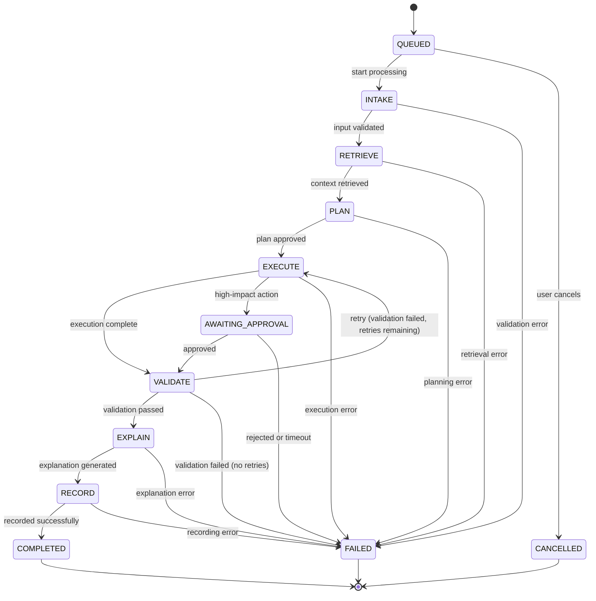

#### 3.9.3 Timeout Defaults

Each state has a configurable timeout after which the run transitions to `FAILED`:

| State | Default Timeout | Configurable Via |
|-------|----------------|------------------|
| `QUEUED` | 5 minutes | `pipeline.timeout.queued` |
| `INTAKE` | 30 seconds | `pipeline.timeout.intake` |
| `RETRIEVE` | 60 seconds | `pipeline.timeout.retrieve` |
| `PLAN` | 60 seconds | `pipeline.timeout.plan` |
| `EXECUTE` | 10 minutes | `pipeline.timeout.execute` |
| `VALIDATE` | 2 minutes | `pipeline.timeout.validate` |
| `EXPLAIN` | 60 seconds | `pipeline.timeout.explain` |
| `RECORD` | 30 seconds | `pipeline.timeout.record` |
| `AWAITING_APPROVAL` | 24 hours | `pipeline.timeout.approval` |

#### 3.9.4 Persistence

Pipeline run state is persisted in the `pipeline_runs` PostgreSQL table (see Document 05, Section 3). On service restart, runs in non-terminal states are recovered and resumed from their last committed state. The `retry_count` column tracks validation-to-execute retry loops (default max: 2, configurable per skill up to 3).

> **Note:** This section describes design intent. No pipeline state machine code exists yet. The `pipeline_runs` table schema is defined in Document 05 (Technical LLD).

### 3.10 Audit Log Viewer [PLANNED]

Enterprise compliance feature providing full visibility into all configuration changes, user actions, and system events across the AI platform.

**Capabilities:**

- View all agent configuration changes (created, updated, deleted, published, imported, exported)
- Filter by date range, user, action type, and target entity type
- Export filtered results as CSV for compliance reporting
- Real-time SSE streaming for live audit feeds (new entries appear without page refresh)
- Drill-down detail panel showing before/after JSON diff for configuration changes

**Target entities:** Agent, Skill, Template, Knowledge Source, Training Job, User, Tenant, Model, Configuration

**Action types:** Created, Updated, Deleted, Published, Unpublished, Activated, Deactivated, Imported, Exported, Login, Logout, Permission Changed

> **Note:** This section describes design intent. No audit log viewer code exists yet. See Document 06 (UI/UX Design Spec) Section 2.9 for the component layout.

### 3.11 Agent Delete with Impact Assessment [PLANNED]

Safe deletion workflow that performs usage analysis before removing an agent configuration, preventing accidental data loss and service disruption.

**Deletion workflow:**

1. User initiates delete on an agent configuration
2. System performs impact assessment: active conversations, scheduled pipeline runs, gallery publication status, forked configurations
3. Impact summary presented in a confirmation dialog with affected resource counts
4. On confirmation, agent enters 30-day soft-delete window
5. During soft-delete window, agent can be recovered via "Restore" action
6. After 30-day grace period, hard deletion permanently removes the configuration

**Impact assessment checks:**

| Resource | Impact Description |
|----------|-------------------|
| Active conversations | "{N} active conversations will lose context" |
| Scheduled pipelines | "{N} scheduled pipeline runs will be cancelled" |
| Gallery entry | "This agent will be removed from the Template Gallery" |
| Forked configurations | "{N} configurations forked from this agent" |

**Cascade behavior:**

| Related Data | On Soft Delete | On Hard Delete |
|-------------|----------------|----------------|
| Active conversations | Marked as "Agent Removed", read-only | Permanently deleted |
| Scheduled pipelines | Cancelled | Records purged |
| Gallery entry | Removed from gallery | N/A |
| Forked configurations | Retain `parent_template_id` as historical reference | Parent reference set to null |
| Pipeline run history | Preserved with status "Agent Deleted" | Permanently deleted |

> **Note:** This section describes design intent. No agent delete workflow code exists yet. See Document 06 (UI/UX Design Spec) Section 2.2.4.3 for the UX flow.

### 3.12 Agent Publish Lifecycle [PLANNED]

Multi-stage lifecycle governing agent configuration visibility, from private draft through admin-approved gallery publication.

**Lifecycle states:**

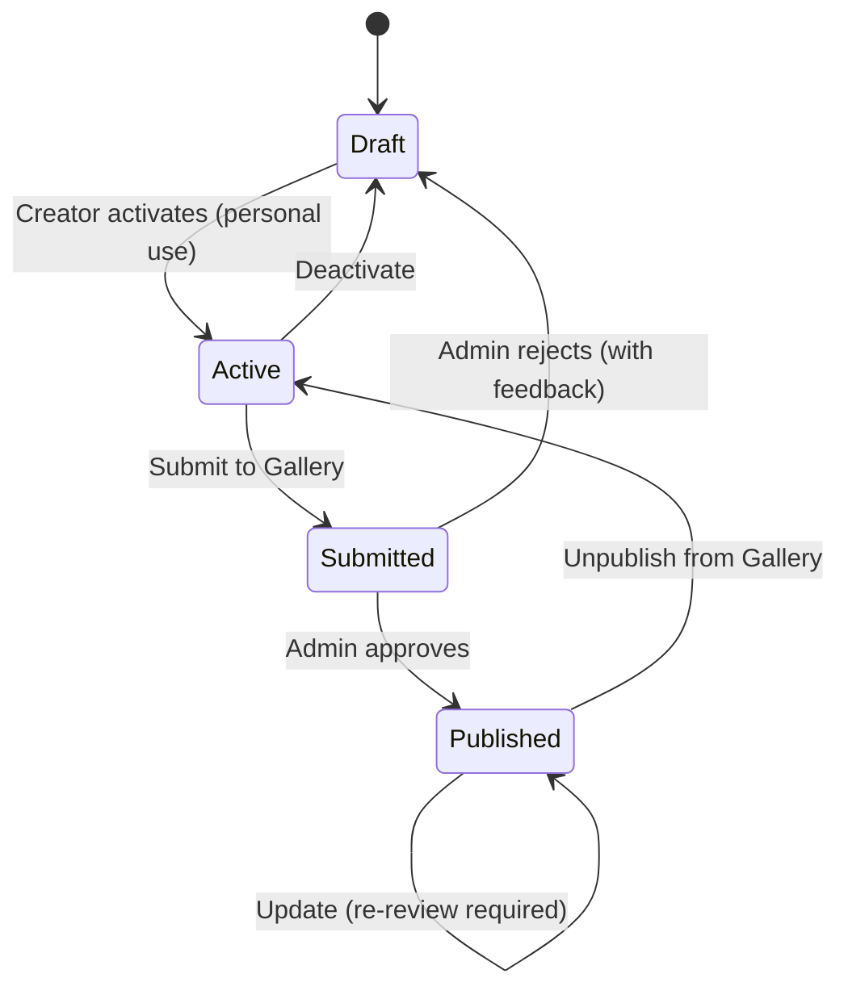

| State | Visibility | Who Can Transition |
|-------|-----------|-------------------|
| Draft | Creator only | Creator |
| Active | Creator only (usable in chat) | Creator |
| Submitted | Creator + reviewing admin | Creator (submit), Admin (approve/reject) |
| Published | All tenant users via Template Gallery | Admin (unpublish), Creator (update triggers re-review) |

**Admin review queue:** Submitted configurations appear in an admin review queue with the agent's name, description, creator, submission date, and a "Review" button that opens the configuration in read-only Builder view.

**Gallery card attribution:** Published configurations display "By {author name}" with origin badges: "Platform" (system-provided), "Organization" (admin-published), "Community" (user-submitted and approved).

> **Note:** This section describes design intent. No publish lifecycle code exists yet. See Document 06 (UI/UX Design Spec) Section 2.2.4.2 for the UX flow.

### 3.13 Pipeline Run Viewer [PLANNED]

Execution history viewer providing visibility into all pipeline runs for an agent, with 12-state tracking, step-by-step timeline, and drill-down detail.

**Viewer capabilities:**

- List all pipeline runs for an agent or globally, sorted by most recent
- Display run status using the 12-state model from Section 3.9.1
- Step-by-step timeline showing which pipeline steps completed and their durations
- Drill-down into individual runs showing: input, output, tool calls, validation results, explanation
- Filter by status (COMPLETED, FAILED, CANCELLED, AWAITING_APPROVAL), date range, agent

**Run status display:**

| State Group | States | Visual Treatment |
|------------|--------|-----------------|
| In Progress | QUEUED, INTAKE, RETRIEVE, PLAN, EXECUTE, VALIDATE, EXPLAIN, RECORD | Animated progress indicator with current step highlighted |
| Terminal Success | COMPLETED | Green check with total duration |
| Terminal Failure | FAILED, CANCELLED | Red X with failure step and error message |
| Awaiting | AWAITING_APPROVAL | Amber clock with "Awaiting approval" label |

> **Note:** This section describes design intent. No pipeline run viewer code exists yet. See Document 06 (UI/UX Design Spec) Section 2.12 for the component layout.

### 3.14 Agent Import/Export [PLANNED]

Configuration portability for backup, migration, and cross-tenant sharing via structured JSON/YAML export files.

**Export format:** JSON or YAML file containing the full agent configuration:

- Agent identity (name, purpose, icon, color, labels)
- System prompt
- Skill references (by name and version)
- Tool set (by name)
- Behavioral rules
- Few-shot examples
- Knowledge scope references
- Metadata (version, author, export date, source tenant -- anonymized)

**Import workflow:**

1. User uploads JSON/YAML file via Import dialog
2. System validates file structure and schema version
3. Conflict detection: identifies name collisions with existing configurations
4. User resolves conflicts (rename, overwrite, skip)
5. Configuration created in DRAFT status

**Export restrictions:**

- Only configurations the user owns or has admin access to can be exported
- Tenant-specific secrets and API keys are stripped from exports
- Knowledge source content is NOT included (only references by name)

> **Note:** This section describes design intent. No import/export code exists yet. See Document 06 (UI/UX Design Spec) Section 2.13 for the UX flow.

### 3.15 Notification Center [PLANNED]

Real-time notification system for platform events relevant to agent designers, administrators, and ML engineers.

**Notification categories:**

| Category | Events | Recipients |
|----------|--------|------------|
| Training | Training job started, completed, failed; quality gate passed/failed | ML Engineers, Agent Designers |
| Agent Errors | Agent runtime errors, circuit breaker trips, model fallback events | Platform Administrators |
| Feedback | New user corrections, low-confidence trace flagged, negative rating spike | Domain Experts, ML Engineers |
| Approval Requests | Agent submission for gallery review, high-impact action approval needed | Platform Administrators |
| System | Maintenance windows, model updates, feature announcements | All users |

**Delivery channels:**

- In-app notification bell with unread count badge
- Toast notifications for high-priority events
- Optional email digest (configurable frequency: instant, hourly, daily)

**Notification lifecycle:** Unread -> Read -> Dismissed. Notifications auto-archive after 30 days.

> **Note:** This section describes design intent. No notification center code exists yet. See Document 06 (UI/UX Design Spec) Section 2.14 for the component layout.

### 3.16 Knowledge Source Management [PLANNED]

Management interface for uploading, chunking, indexing, and maintaining RAG knowledge sources.

**Knowledge source types:**

| Type | Formats | Processing |
|------|---------|-----------|
| Documents | PDF, DOCX, TXT, MD | Chunked by paragraphs/sections, embedded via model |
| Web Pages | URL | Crawled, cleaned, chunked, embedded |
| Structured Data | CSV, JSON | Rows/records converted to text, embedded |
| API Endpoints | REST URL | Periodically fetched, diff-chunked, embedded |

**Management capabilities:**

- Upload files with metadata tagging (category, agent scope, priority)
- View chunking results with chunk count, average chunk size, embedding status
- Re-process sources when chunking strategy changes
- Delete sources with cascade removal from vector store
- Monitor retrieval hit rates per source (which sources are most/least useful)
- Version tracking for re-uploaded sources (diff view)

**Processing pipeline:**


> **Note:** This section describes design intent. No knowledge source management code exists yet. See Document 06 (UI/UX Design Spec) Section 2.15 for the component layout.

### 3.17 Agent Comparison [PLANNED]

Side-by-side comparison of two agent configurations enabling informed decisions about forking, merging, or selecting between agent versions.

**Comparison dimensions:**

| Dimension | Display |
|-----------|---------|
| System Prompt | Side-by-side text diff with additions/removals highlighted |
| Tool Set | Venn diagram or list showing shared, unique-to-A, unique-to-B tools |
| Skills | List comparison with version differences highlighted |
| Behavioral Rules | Rule-by-rule diff |
| Knowledge Scopes | Collection list comparison |
| Performance Metrics | Bar chart overlay (accuracy, latency, user rating) per agent |
| Eval Scores | Category-level quality score comparison from eval harness |
| Few-Shot Examples | Count and content comparison |

**Use cases:**

- Compare two versions of the same agent to evaluate changes
- Compare a forked agent against its parent to see customizations
- Compare two unrelated agents to decide which to use for a task
- Compare before/after a skill composition change

> **Note:** This section describes design intent. No agent comparison code exists yet. See Document 06 (UI/UX Design Spec) for the comparison layout specification.

### 3.18 Event-Driven Agent Triggers [PLANNED]

> **Status:** All content in this section is `[PLANNED]`. No event-driven trigger code exists yet. See ADR-025 for the full architectural decision record and the Benchmarking Study Section 5 for industry evidence.

The Super Agent is not limited to user-initiated chat interactions. Four event source types enable the Super Agent to proactively detect and respond to organizational changes, deadlines, external system events, and user workflow signals.

**Event source types:**

| Source Type | Generated By | Examples | Kafka Topic |
|------------|-------------|---------|-------------|
| **Entity Lifecycle** | Change Data Capture (CDC) from PostgreSQL via Debezium, or application-level event publishing | Strategic objective created, risk assessment updated, KPI threshold breached, process definition changed | `agent.entity.lifecycle` |
| **Time-Based** | Spring Scheduler with cron expressions, configured per tenant per sub-orchestrator | Daily KPI aggregation, weekly compliance check, monthly board report, quarterly maturity assessment | `agent.trigger.scheduled` |
| **External System** | Webhooks from ITSM tools, CI/CD pipelines, third-party SaaS | ServiceNow incident created, deployment completed, security scan result published | `agent.trigger.external` |
| **User Workflow** | Application-level Spring events from user actions in the EMSIST frontend | Approval submitted, document published, risk escalated, process workflow step completed | `agent.trigger.workflow` |

**Event processing flow:**

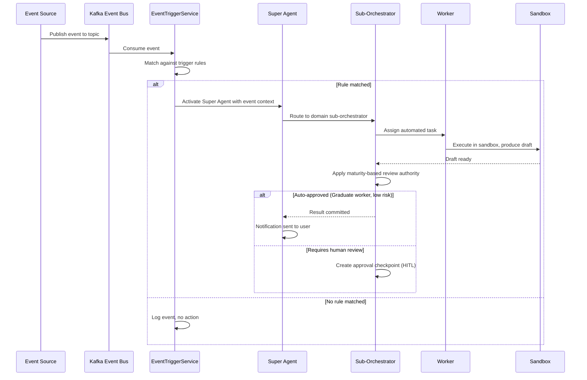

**Trigger rule configuration:** Each trigger rule specifies an event pattern (source, entity type, field condition), a target sub-orchestrator, a task template, and a priority level. Trigger rules are stored per tenant in the `event_trigger_rules` table and managed via the Event Trigger Management UI. See the BA domain model (`docs/data-models/super-agent-domain-model.md`, Section 2.5) for the EventTrigger and EventSchedule entity definitions.

> **Note:** No event trigger code, Kafka topic configuration, or Debezium CDC setup exists yet. EMSIST currently has Kafka infrastructure (`confluentinc/cp-kafka:7.5.0`) in docker-compose but no services produce or consume Kafka events (Known Discrepancy). See Section 8 (Roadmap, Phase 7) for delivery.

### 3.19 Human-in-the-Loop Framework [PLANNED]

> **Status:** All content in this section is `[PLANNED]`. No HITL framework code exists yet. See ADR-030 for the full architectural decision record and the Benchmarking Study Section 6 for industry evidence.

The Human-in-the-Loop (HITL) framework determines when agent actions require human involvement. The decision is governed by a **risk x maturity matrix** -- the intersection of the action's risk level and the agent's maturity level determines the HITL interaction type.

**HITL interaction types:**

| Type | Description | User Experience | When Used |
|------|------------|----------------|-----------|
| **Confirmation** | Simple yes/no approval of proposed action | Modal dialog with action summary and approve/reject buttons | Medium-risk actions by Co-pilot agents; low-risk actions by Coaching agents |
| **Data Entry** | Agent needs additional information from human to proceed | Form dialog with specific fields the agent cannot resolve autonomously | Complex inputs requiring domain expertise that the agent lacks |
| **Review** | Human examines full draft output and can edit before committing | Side-by-side view of draft with edit capability and approve/reject | High-risk actions; outputs from Coaching/Co-pilot agents |
| **Takeover** | Human assumes full control of the task; agent provides context and steps back | Full workspace handoff with agent-compiled context, relevant documents, and partial results | Critical-risk actions; agent confidence below threshold; user-initiated escalation |

**Risk x Maturity matrix:**

| | Coaching (0-39) | Co-pilot (40-64) | Pilot (65-84) | Graduate (85-100) |
|---|----------------|-------------------|----------------|-------------------|
| **Low Risk** | Confirmation | Auto-approve | Auto-approve | Auto-approve |
| **Medium Risk** | Review | Confirmation | Auto-approve | Auto-approve |
| **High Risk** | Takeover | Review | Review | Confirmation |
| **Critical Risk** | Takeover | Takeover | Takeover | Review |

**Target metrics (from Benchmarking Study Section 6.2):**

- Less than 10% human intervention rate for Graduate-level agents
- 100% human review for Coaching-level agents
- 99.9% accuracy with HITL vs 92% without HITL
- Timeout escalation when humans do not respond within configurable SLA (default: entity-based timeouts from 5 minutes to 24 hours depending on risk level)

**Approval checkpoints:** At each point in the pipeline where HITL is required, an `ApprovalCheckpoint` is created. The checkpoint pauses execution, sends a notification to the appropriate reviewer (determined by the approval routing rules), and waits for a decision. If the timeout expires without a response, the checkpoint escalates to the next level (e.g., from agent designer to tenant admin to platform admin).

> **Note:** No HITL framework, approval checkpoint, or risk-maturity matrix code exists yet. See Section 8 (Roadmap, Phase 6) for delivery.

### 3.20 Worker Sandbox and Draft Lifecycle [PLANNED]

> **Status:** All content in this section is `[PLANNED]`. No worker sandbox or draft lifecycle code exists yet. See ADR-028 for the full architectural decision record and the Benchmarking Study Section 11 for industry evidence.

Workers in the Super Agent hierarchy do not produce outputs that are directly delivered to users. Instead, workers produce **drafts** into an isolated sandbox. Drafts progress through a lifecycle with review authority determined by the worker's maturity level.

**Draft lifecycle states:**

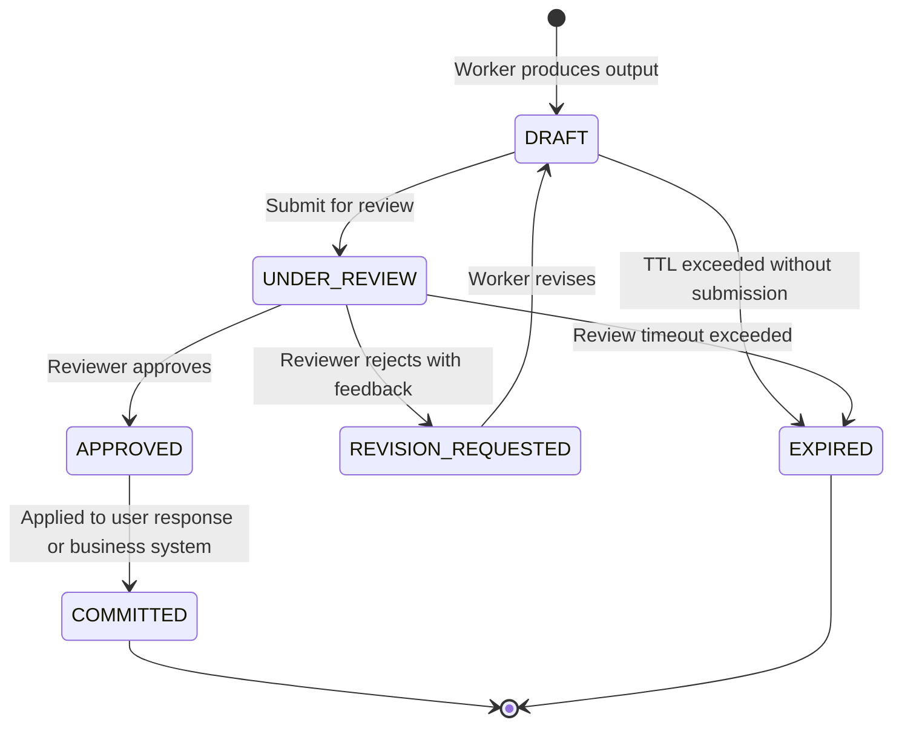

**Review authority by maturity:**

| Worker Maturity | Low-Risk Drafts | Medium-Risk Drafts | High-Risk Drafts |
|----------------|----------------|--------------------|--------------------|
| **Coaching** | Human review (mandatory) | Human review (mandatory) | Human review (mandatory) |
| **Co-pilot** | Sub-orchestrator auto-review | Human review | Human review |
| **Pilot** | Sub-orchestrator auto-approve | Sub-orchestrator auto-review | Human review |
| **Graduate** | Auto-commit (no review) | Sub-orchestrator auto-approve | Human confirmation |

**Sandbox isolation:** Each worker task executes within an isolated context. The sandbox prevents side effects (database writes, email sends, API calls) until the draft is approved and committed. Sandbox isolation is implemented through tool wrappers that capture intended actions without executing them. See the BA domain model (`docs/data-models/super-agent-domain-model.md`, Sections 2.4 and 2.8) for the DraftOutput and SandboxContext entity definitions.

**Version tracking:** Every draft revision is stored with a version number, creating a complete audit trail of how the output evolved from initial draft through revisions to final committed version. This supports EU AI Act Article 12 (record-keeping) requirements.

> **Note:** No sandbox, draft lifecycle, or review workflow code exists yet. See Section 8 (Roadmap, Phase 6) for delivery.

### 3.21 Super Agent Lifecycle [PLANNED]

> **Status:** All content in this section is `[PLANNED]`. No Super Agent lifecycle management code exists yet.

The Super Agent for a tenant is created during tenant onboarding and follows a defined lifecycle:

**Lifecycle stages:**

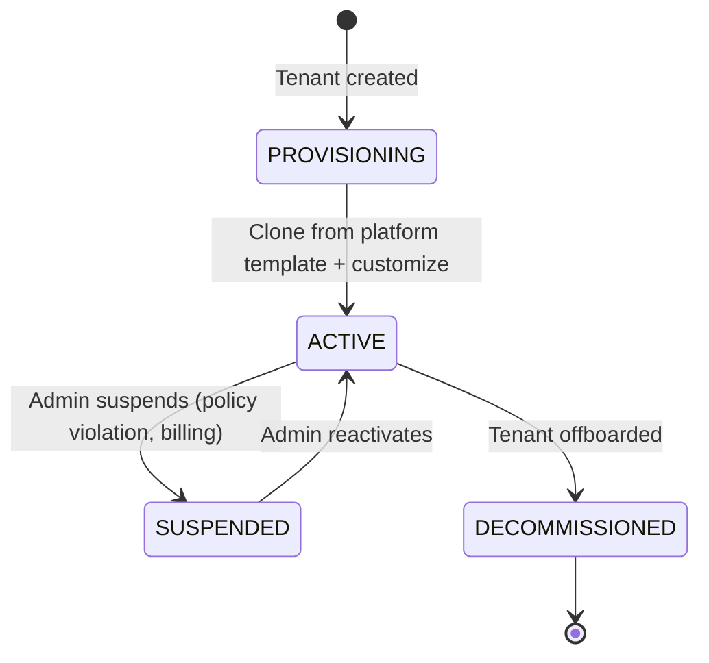

| Stage | Description | Available Operations |
|-------|------------|---------------------|
| **Provisioning** | Super Agent is cloned from platform template. Default sub-orchestrators (EA, Performance, GRC, KM, Service Design) and starter workers are created. Tenant-specific schema is initialized. | Configuration only -- no user interactions |
| **Active** | Super Agent is operational. User interactions, event-driven triggers, and automated workflows are active. Sub-orchestrators and workers can be added, customized, or removed. | Full operation -- chat, events, maturity progression |
| **Suspended** | Super Agent is paused. No new interactions accepted. Existing data preserved. Event triggers paused. | Read-only access to history and configuration |
| **Decommissioned** | Super Agent and all associated data are scheduled for deletion per data retention policy. 30-day grace period before hard deletion. | Recovery within grace period only |

**Clone-on-setup model:** When a new tenant is provisioned, the Super Agent is cloned from a platform-maintained template that includes:

- Pre-configured sub-orchestrators for 5 default domains (customizable post-clone)
- Starter worker templates for each capability type (Data Query, Analysis, Calculation, Report, Notification)
- Default domain skills per sub-orchestrator (TOGAF, BSC, ISO 31000, ITIL, KM Lifecycle)
- Platform-default ethics policies and behavioral rules
- All agents start at Coaching maturity level

After cloning, each tenant's Super Agent evolves independently. Domain skills, worker configurations, ethics policies, and maturity scores are per-tenant. The platform template serves as a starting point, not an ongoing constraint.

**Cross-tenant benchmarking [PLANNED]:** Once operational, tenants can opt in to anonymized cross-tenant benchmarking (ADR-026). Metrics such as agent response accuracy, maturity progression rates, and task completion times are anonymized and written to a shared benchmark schema. Tenants view their relative performance (e.g., "Your EA sub-orchestrator's accuracy is in the 75th percentile across all participating tenants") without accessing any other tenant's raw data. See the Benchmarking Study Section 8.5 for the k-anonymity approach and the BA domain model Section 2.10 for BenchmarkMetric entity definition.

> **Note:** No Super Agent lifecycle management, clone-on-setup, or cross-tenant benchmarking code exists yet. See Section 8 (Roadmap, Phases 6-9) for delivery.

---

## 4. Multi-Source Learning Pipeline

### 4.1 Data Sources

The learning pipeline ingests training signals from six categories of data:

#### 4.1.1 Proprietary Organizational Data

- Internal databases, documents, and API responses
- Historical records and transaction data
- Domain-specific datasets unique to the organization
- **Usage:** RAG knowledge base, SFT examples, domain grounding

#### 4.1.2 Business Patterns and Rules

- Standard Operating Procedures (SOPs)
- Decision trees and workflow definitions
- Business rules and compliance requirements
- Expert-defined "when X, do Y" patterns
- **Usage:** SFT training examples, system prompt enhancement, guardrails

#### 4.1.3 Customer Feedback

- Support ticket outcomes (resolved/unresolved)
- Customer satisfaction scores (CSAT, NPS)
- Complaints and feature requests
- Chat ratings and post-interaction surveys
- **Usage:** DPO preference pairs, quality signals, weak area identification

#### 4.1.4 User Feedback (Internal)

- Thumbs up/down ratings on agent responses
- Explicit corrections ("the answer should have been X")
- Usage patterns and abandonment signals
- Domain expert annotations and reviews
- **Usage:** Gold-standard SFT examples (corrections), DPO pairs (ratings), active learning triggers

#### 4.1.5 Learning Materials and RAG Sources

- Training manuals and onboarding documentation
- Knowledge base articles and FAQs
- Expert recordings and transcripts
- Industry publications and reference materials
- Process documentation (SOPs, workflows, decision trees)
- Acceptance criteria and requirements documents
- API documentation and schema definitions
- Architecture notes and technical specifications
- Test history and quality reports
- Skill definitions and behavioral guidelines
- **Usage:** RAG vector store (real-time inference), Q&A pair generation for SFT, knowledge grounding
- **RAG Positioning Note:** RAG sits at the **Orchestrator level** (Retrieve step). The Orchestrator model decides when retrieval is needed based on task classification, fetches tenant-safe material from the vector store, and passes a smaller, grounded context packet to the Worker model for execution. **Source code is NOT a primary RAG use case**—code is accessed through repo search/read tools in the Execute step.

#### 4.1.6 Teacher Model Outputs

- Claude, Codex, and Gemini generated training examples
- Teacher model evaluations of local agent outputs
- Synthetic scenario generation for data augmentation
- Gap-filling examples for identified weak areas
- **Usage:** SFT augmentation, evaluation baselines, preference pair generation

### 4.2 Complete Learning Methods Matrix

The platform implements 13 learning methods, each addressing a different dimension of agent capability. These methods are not alternatives — they are complementary layers that work together.

#### Tier 1: Core Training Methods (Always Active)

| # | Method | Data Sources | Purpose | Frequency | Phase |
|---|--------|-------------|---------|-----------|-------|
| 1 | **Supervised Fine-Tuning (SFT)** | User corrections, patterns, teacher examples, learning materials | Teach correct agent behavior from demonstrations | Daily | 3 |
| 2 | **Direct Preference Optimization (DPO)** | Thumbs up/down, customer satisfaction, teacher preference pairs | Refine quality judgment — learn "better vs worse" | Daily | 3 |
| 3 | **RAG (Retrieval-Augmented Generation)** | Learning materials, documents, SOPs, knowledge base | Keep knowledge current without retraining the model | Real-time | 3 |
| 4 | **Knowledge Distillation** | Claude, Codex, Gemini teacher outputs | Transfer advanced reasoning from large cloud models to local Ollama models | Weekly | 3 |

#### Tier 2: Optimization Methods (Progressive Enhancement)

| # | Method | Data Sources | Purpose | Frequency | Phase |
|---|--------|-------------|---------|-----------|-------|
| 5 | **Active Learning** | Low-confidence traces, error patterns, edge cases | Identify where agents are weakest and target data collection there | Continuous | 4 |
| 6 | **Curriculum Learning** | All sources, ordered by difficulty | Train progressively from simple → complex tasks for better generalization | Weekly | 4 |
| 7 | **Reinforcement Learning (RLHF)** | Human ratings, reward model scores, outcome signals | Optimize agent behavior through reward signals rather than demonstrations | Weekly | 4 |
| 8 | **Self-Supervised Pre-training** | Domain-specific text corpora (internal docs, emails, reports) | Adapt the base model to understand domain-specific language and jargon | Monthly | 4 |

#### Tier 3: Advanced Methods (Specialized Capabilities)

| # | Method | Data Sources | Purpose | Frequency | Phase |
|---|--------|-------------|---------|-----------|-------|
| 9 | **Semi-Supervised Learning** | Small labeled set + large unlabeled internal data | Leverage abundant unlabeled data when labeled examples are scarce | Monthly | 5 |
| 10 | **Few-Shot / Zero-Shot Learning** | Skill definitions with examples, prompt templates | Enable agents to handle new task types without retraining by using in-context examples | Real-time | 2 |
| 11 | **Meta-Learning ("Learn to Learn")** | Cross-task training data, multi-domain examples | Train agents to rapidly adapt to entirely new tasks or domains with minimal examples | Monthly | 5 |
| 12 | **Contrastive Learning** | Positive/negative example pairs, similar/dissimilar documents | Learn robust representations for better retrieval, classification, and similarity detection | Weekly | 4 |
| 13 | **Federated Learning** | Distributed data across departments/divisions (no centralization) | Train on sensitive data that cannot leave its source location (e.g., cross-department learning without sharing raw data) | Monthly | 5 |

#### Learning Method Interaction Map

The methods reinforce each other in a continuous cycle:

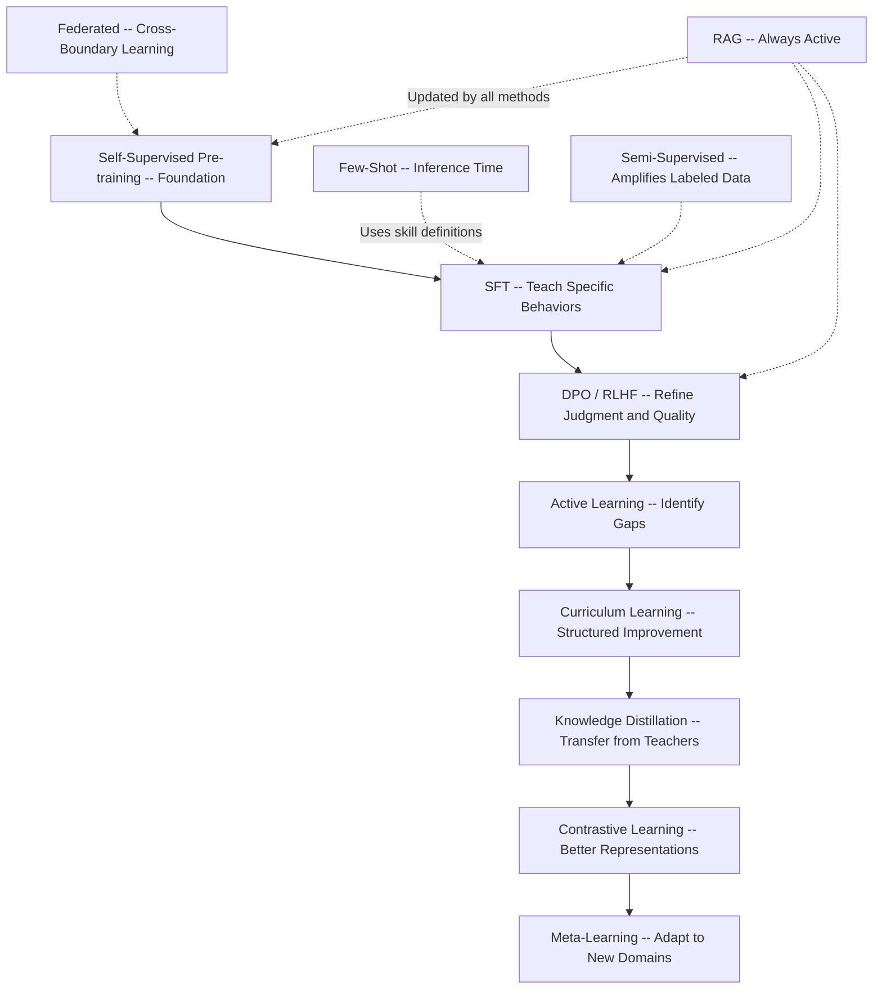

### 4.3 Feedback Ingestion

The platform provides multiple channels for injecting training signals:

- **REST API:** Programmatic submission of ratings, corrections, patterns, and materials
- **Kafka Topics:** Event-driven ingestion from external systems (CRM, support platforms, etc.)
- **Admin Dashboard:** UI for domain experts to add patterns, review traces, and annotate data
- **Webhook Integration:** Automatic ingestion from third-party feedback systems

### 4.4 Training Orchestration

- **Real-time:** User corrections immediately update RAG and queue for next fine-tuning batch
- **Daily (2:00 AM):** Batch retraining on accumulated feedback with recency weighting
- **Weekly (Sunday 4:00 AM):** Deep training cycle with teacher augmentation and curriculum learning
- **Monthly:** Full model evaluation and potential base model upgrade
- **On-demand:** Triggered retraining when quality metrics drop below threshold

### 4.5 Data Priority Weighting

1. **User corrections** (highest) — explicit ground truth
2. **Customer feedback with outcomes** — real-world impact signal
3. **Business patterns and SOPs** — expert-encoded knowledge
4. **Positively-rated agent traces** — validated good behavior
5. **Learning materials** — institutional knowledge
6. **Teacher model synthetic data** (lowest) — generic augmentation

---

## 5. Model Management

### 5.1 Local Models (Ollama)

- Primary runtime models for all agents
- Models include Llama 3.1 (general), CodeLlama (code), and specialized fine-tuned variants
- Model versioning with rollback capability
- A/B testing infrastructure for comparing model versions

### 5.2 Cloud Models (Teacher/Fallback)

- **Claude:** Primary teacher model, complex reasoning fallback, evaluation judge
- **Codex/OpenAI:** Code generation teacher, alternative perspective generation
- **Gemini:** Multi-modal tasks, alternative teacher for diversity
- Cloud models are not runtime dependencies — agents function fully on Ollama

### 5.3 Model Evaluation

Before deploying any retrained model:

- Automated benchmark suite against held-out test set
- Comparison against current production model
- Quality gate: new model must exceed current model on key metrics
- Shadow deployment period before full rollout
- Automatic rollback if production quality degrades

---

## 6. Observability and Monitoring

### 6.1 Agent Metrics

- Response latency (P50, P95, P99)
- Tool call success/failure rates
- Model routing decisions (local vs. cloud)
- Token usage per agent per model
- Conversation completion rates

### 6.2 Learning Pipeline Metrics

- Training data volume by source
- Model quality scores over time
- Feedback ingestion rates
- Active learning trigger frequency
- Training job success/failure rates

### 6.3 Business Metrics

- User satisfaction scores (from feedback)
- Customer outcome improvements
- Cost per interaction (local vs. cloud)
- Agent adoption rates
- Time saved per task

---

## 7. Security, Privacy, and Multi-Tenancy

### 7.1 Data Sovereignty and Privacy

- All local model inference stays on-premise
- Cloud model calls are opt-in and configurable per agent
- PII detection and redaction in training data
- Role-based access control for admin operations
- Audit logging for all model deployments and data access
- Encryption at rest and in transit for all data stores

**Super Agent Data Sovereignty Extensions [PLANNED]:**

- **Schema-per-tenant isolation:** Each tenant's agent data (agent configurations, execution traces, knowledge base, conversation history, maturity scores, draft versions) resides in a separate PostgreSQL schema, providing a demonstrable data boundary for regulatory audits (See ADR-026)
- **Agent memory isolation:** Agent conversation context, reasoning chains, and working memory are scoped to the tenant's schema. No agent can access, infer, or reference another tenant's agent memory under any circumstances (See ADR-026, Benchmarking Study Section 8)
- **Draft sandbox isolation:** Worker drafts produced during agent execution are stored in the tenant's isolated `worker_drafts` table. Draft content is invisible to end users until explicitly committed through the review lifecycle (See ADR-028)
- **Knowledge base isolation:** PGVector embeddings for RAG retrieval are partitioned by tenant schema with mandatory `tenant_id` metadata filtering on all similarity searches, eliminating cross-tenant knowledge leakage (See ADR-026)
- **Cross-border data flow controls:** Cloud LLM calls are subject to pre-transmission PII sanitization. Data processed by local Ollama models never crosses jurisdictional boundaries, simplifying GDPR transfer mechanism compliance (See Benchmarking Study Section 10.2)

### 7.2 Multi-Tenancy and Context Isolation

**Tenant-Safe Context Isolation:**
- Each tenant's data is namespaced independently in vector stores, knowledge bases, and retrieval indexes
- Retrieval queries automatically filtered by tenant context to prevent cross-tenant data leakage
- Vector store partitioning strategy ensures tenant A's documents never appear in Retrieve results for tenant B

**Agent Profile Scoping:**
- Agent profiles are tenant-scoped; each tenant sees only their own profiles and skills
- Skills created by one tenant are not visible to other tenants
- Tool registry per-tenant (some tools may be shared, others isolated)

**Context Window Management:**
- Context windows are managed per-tenant to prevent cross-contamination
- Conversation history isolated by tenant and user
- Memory stores (short-term and long-term) segregated by tenant namespace

**Concurrency Controls:**
- Parallel model invocations limited per-tenant to prevent resource exhaustion
- Orchestrator model concurrency limits (e.g., max 10 concurrent Plan steps per tenant)
- Worker model concurrency limits (e.g., max 5 concurrent Execute steps per tenant)
- Fair-share scheduling across tenants to prevent one tenant monopolizing compute

**Super Agent Multi-Tenancy Extensions [PLANNED]:**

The Super Agent platform extends the existing multi-tenancy model with schema-per-tenant isolation and defense-in-depth layers designed specifically for AI workloads containing sensitive organizational knowledge (See ADR-026, Benchmarking Study Section 8).

**Schema-per-Tenant Model:**
- Each tenant receives an isolated PostgreSQL schema (`tenant_{uuid}`) for all agent-related tables (agent configurations, conversations, knowledge base, maturity scores, drafts, HITL approvals, ethics policies, execution traces)
- A separate shared benchmark schema stores only anonymized, aggregated metrics for cross-tenant performance comparison
- New tenant onboarding creates a schema from a template, runs Flyway migrations, seeds default agent configurations from the Template Gallery, and seeds immutable platform ethics baseline policies

**Defense-in-Depth Layers:**

| Layer | Mechanism | Defense Against | Risk Rating |
|-------|-----------|-----------------|-------------|
| Layer 1: Schema Isolation | `SET search_path = tenant_{id}` at connection acquisition | Application bugs querying wrong schema | HIGH protection |
| Layer 2: Row-Level Security | PostgreSQL RLS policies on all tables: `USING (tenant_id = current_setting('app.current_tenant'))` | Application bypass of schema path | HIGH protection |
| Layer 3: JPA Filter | Hibernate `@TenantId` filter appending `WHERE tenant_id = :currentTenantId` on all queries | Database misconfiguration | MEDIUM protection |
| Layer 4: PGVector Metadata | Mandatory `tenant_id` metadata filter on all vector similarity searches | RAG cross-tenant leakage in embedding searches | HIGH protection |

**Anonymized Benchmarking Schema:**
- Raw metrics extracted from tenant schemas are aggregated into statistical summaries (min, max, mean, percentiles, histograms)
- k-anonymity enforcement (minimum cohort size of 5 tenants per metric bucket) prevents re-identification
- Data that never crosses tenant boundaries: agent configurations, knowledge base content, conversation history, user identifiers
- Data that crosses boundaries (anonymized only): agent execution time percentiles, tool usage frequency counts, maturity level distribution histograms, error rate by category

### 7.2.1 Master Tenant Concept and Platform Administration [PLANNED]

> **Status:** All content in this section is `[PLANNED]`. No master tenant provisioning, platform administration dashboard, or cross-tenant management code exists yet. See Epic E21 (Platform Administration) in Documents 03 and 07 for user stories.

The platform designates a single **Master Tenant** as the platform-level administrative context through which PLATFORM_ADMIN users manage the entire multi-tenant environment. The master tenant is not a regular business tenant; it is the control plane for platform-wide operations.

**Master Tenant Definition:**

| Property | Value |
|----------|-------|
| Tenant UUID | `00000000-0000-0000-0000-000000000000` (well-known, deterministic) |
| Creation mechanism | Auto-created during platform bootstrap via Flyway seed migration (`V1__seed_master_tenant.sql`) |
| Assigned role | PLATFORM_ADMIN users are assigned exclusively to this tenant |
| Purpose | Platform-wide administration, cross-tenant oversight, global policy management |
| Super Agent capability | None -- the master tenant CANNOT run its own Super Agent (it is an administrative context only) |

**Privilege Model:**

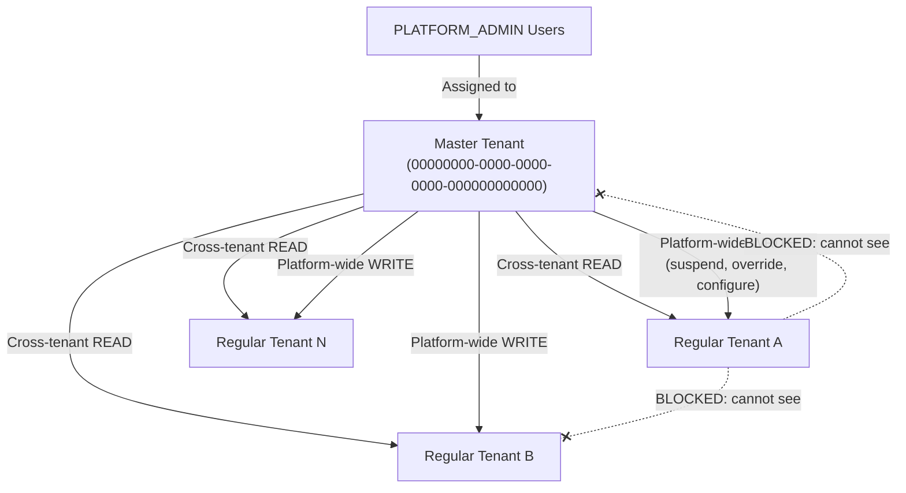

**Cross-Tenant Access Rights (PLATFORM_ADMIN via Master Tenant):**

| Access Type | Scope | Examples |
|-------------|-------|---------|
| **Cross-tenant read** | View all tenants' agent configurations, maturity scores, execution metrics, audit logs | Platform health dashboard, per-tenant utilization, benchmark comparisons |
| **Platform-wide write** | Suspend agents, override ethics policies, manage benchmark participation, adjust maturity scores | Tenant suspension, ethics baseline update, HITL escalation override |
| **Tenant provisioning** | Create new tenants with schema creation, default ethics policy seeding, and initial maturity configuration | New tenant onboarding workflow |
| **Platform configuration** | Manage platform-wide settings (ethics baseline, benchmark aggregation parameters, model registry) | Ethics ETH-001 through ETH-007 updates, k-anonymity threshold changes |

**Isolation Guarantees:**

- Regular tenants CANNOT see the master tenant in tenant listings, discovery, or benchmark data
- Regular tenants CANNOT see each other's data (unchanged from Section 7.2)
- The master tenant does NOT participate in cross-tenant benchmarking (its data is administrative, not operational)
- PLATFORM_ADMIN actions performed from the master tenant are logged in a dedicated admin audit trail (see Section 7.2.2 and LLD Section 3.11)

**RBAC Hierarchy with Master Tenant:**

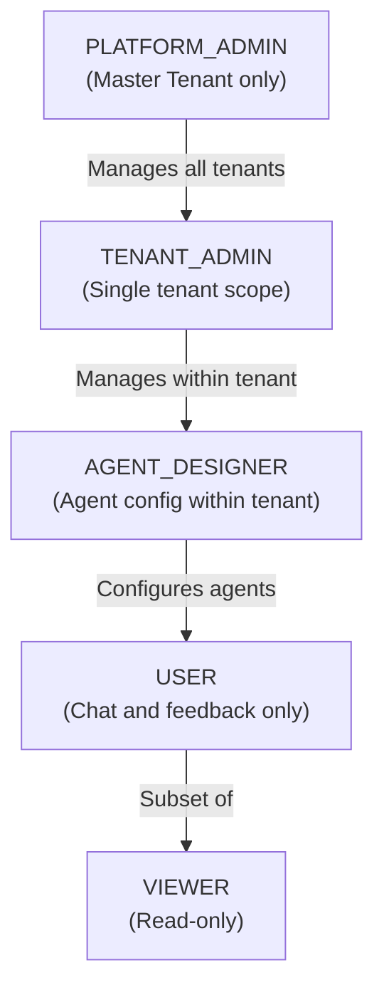

| Role | Tenant Scope | Master Tenant Access | Cross-Tenant Access |
|------|-------------|---------------------|---------------------|
| PLATFORM_ADMIN | Master tenant only | Full access | Read all tenants, write platform-wide actions |
| TENANT_ADMIN | Single regular tenant | None | None |
| AGENT_DESIGNER | Single regular tenant | None | None |
| USER | Single regular tenant | None | None |
| VIEWER | Single regular tenant | None | None |

**Business Rules:**

- BR-100: The master tenant is auto-created with UUID `00000000-0000-0000-0000-000000000000` during platform bootstrap and cannot be deleted or suspended.
- BR-101: Only PLATFORM_ADMIN users can be assigned to the master tenant. No other roles are valid in this context.
- BR-102: The master tenant cannot operate a Super Agent. Attempts to create, configure, or activate a Super Agent in the master tenant context must be rejected.
- BR-103: Regular tenants cannot discover, query, or reference the master tenant. It is excluded from all tenant listing APIs, benchmark pools, and discovery endpoints.
- BR-104: All PLATFORM_ADMIN actions are immutably audited with before/after state, target tenant, and justification (see Section 7.2.2).
- BR-105: Cross-tenant read access from the master tenant is restricted to operational data (agent configs, metrics, audit logs). PLATFORM_ADMIN cannot read tenant users' conversation content or knowledge base documents.

### 7.3 LLM-Specific Security Controls [PLANNED]
<!-- Addresses R8, R9: prompt injection and system prompt leakage -->

The platform implements defenses against the OWASP LLM Top 10 threats most relevant to an enterprise agent platform:

| Threat | OWASP ID | Control | Implementation |
|--------|----------|---------|----------------|
| Prompt Injection | LLM01 | Input boundary markers with per-request sentinel tokens; input sanitization in Intake step; canary token detection in outputs; output filtering for injection indicators | `PromptSanitizationFilter` in `libraries/agent-common/security/` |
| System Prompt Leakage | LLM07 | Standard "do not reveal instructions" guardrail in all system prompts; output filter scanning for system prompt fragments and JSON tool definitions; monitoring for extraction patterns | Output validation in Validate step (Step 5) |
| Pre-Cloud Data Sovereignty | N/A (custom) | `CloudSanitizationPipeline` applies PII redaction, strips tenant identifiers, anonymizes entity names before cloud model calls. Cloud calls blocked if sanitization fails. Fallback to local Ollama model. | `CloudSanitizationPipeline` in ModelRouter |

**Prompt Injection Defense Layers:**

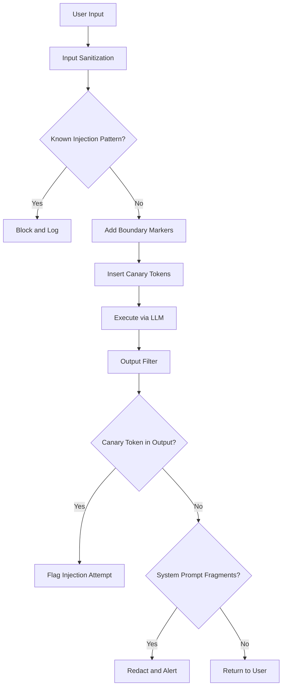

**Pre-Cloud Sanitization Pipeline:**

Before any request is routed to a cloud model (Claude, Codex, Gemini), the `CloudSanitizationPipeline` applies the following transformations:

1. **PII Detection and Redaction** -- Scans for names, emails, phone numbers, SSNs, addresses using configurable regex + NER patterns
2. **Tenant Identifier Stripping** -- Removes tenant IDs, organization names, and internal identifiers from the prompt
3. **Entity Anonymization** -- Replaces named entities (customers, products, projects) with anonymized placeholders, maintaining a reversal map for de-anonymization on response
4. **Audit Logging** -- Every sanitization action is logged with before/after hashes (no raw PII in logs)
5. **Sanitization Gate** -- If sanitization confidence is below threshold (default 95%), the cloud call is blocked and the request falls back to local Ollama

> **Note:** This section describes design intent. No prompt injection defense or cloud sanitization code exists yet. See Document 05 (Technical LLD) Sections 6.7-6.8 for class-level design.

### 7.4 Data Retention and Right-to-Erasure [PLANNED]
<!-- Addresses R11: data retention policy -->

The platform implements configurable data retention policies to comply with GDPR Article 17 (Right to Erasure) and CCPA requirements.

#### 7.4.1 Retention Periods

| Data Category | Default Retention | Configurable | Justification |
|---------------|-------------------|--------------|---------------|
| Conversation messages | 90 days | Yes, per tenant | User interaction data; subject to erasure requests |
| Pipeline run traces | 180 days | Yes, per tenant | Operational audit trail; needed for debugging and learning |
| Agent artifacts | 365 days | Yes, per tenant | Generated deliverables; may have business value |
| RAG search logs | 90 days | Yes, per tenant | Retrieval analytics; used for knowledge gap detection |
| Training data (SFT/DPO) | Indefinite (anonymized) | Yes, per tenant | Model improvement; anonymized to remove PII |
| Feedback ratings | 180 days | Yes, per tenant | Quality signals; aggregated after retention period |
| Audit logs | 7 years | No (regulatory) | Compliance requirement; cannot be shortened |
| System prompts/skill definitions | Indefinite (versioned) | No | Platform configuration; retained as version history |

#### 7.4.2 Right-to-Erasure Workflow

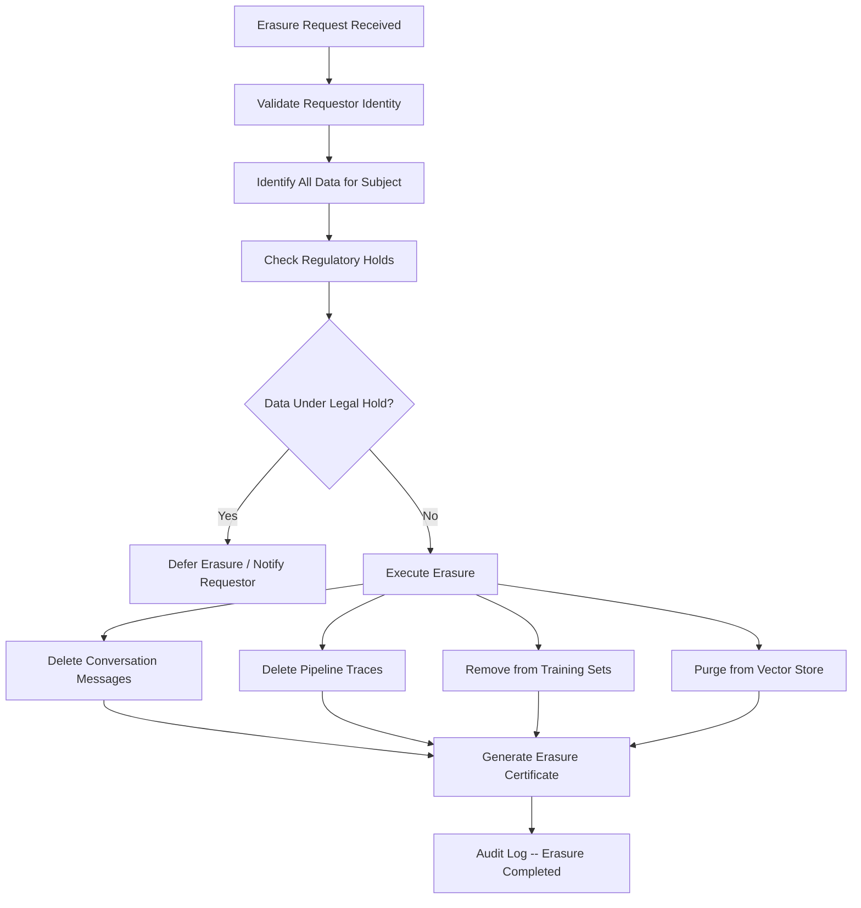

#### 7.4.3 Automated Retention Enforcement

A nightly `DataRetentionJob` scans all data categories and soft-deletes records that exceed their retention period. Hard deletion occurs 30 days after soft-delete to allow recovery from accidental policy misconfiguration. The job runs per-tenant with tenant-specific retention overrides applied.

> **Note:** This section describes design intent. No data retention automation code exists yet. See Document 05 (Technical LLD) Section 6.9 for the `RetentionPolicy` class design.

### 7.5 Phase-Based Tool Restrictions [PLANNED]
<!-- Addresses R5: phase-based tool restrictions -->

Agents operating in different pipeline phases have restricted access to tools based on their current execution context. This prevents unintended side effects during planning and discovery phases.

#### 7.5.1 Tool Classification

| Tool Class | Description | Examples |
|------------|-------------|---------|
| `READ_TOOLS` | Observation and retrieval only; no side effects | `read_file`, `run_sql` (SELECT only), `search_vector_db`, `get_current_time`, `list_tables`, `check_system_status` |
| `WRITE_TOOLS` | Create, modify, or delete state | `write_file`, `run_sql` (INSERT/UPDATE/DELETE), `create_ticket`, `send_email`, `send_slack`, `call_internal_api` (POST/PUT/DELETE) |

#### 7.5.2 Phase-to-Tool Mapping

| Pipeline Phase | Allowed Tool Classes | Rationale |
|----------------|---------------------|-----------|
| INTAKE | None | Input validation only; no tool access |
| RETRIEVE | `READ_TOOLS` | Context gathering; read-only access |
| PLAN | `READ_TOOLS` | Plan formulation; may query for schema/metadata |
| EXECUTE | `READ_TOOLS` + `WRITE_TOOLS` | Full tool access for task execution |
| VALIDATE | `READ_TOOLS` | Verification checks; read-only |
| EXPLAIN | None | Explanation generation; no tool access |
| RECORD | None (internal only) | System-level trace logging |

#### 7.5.3 Orchestrator-Role Restrictions

Agents assigned the **Orchestrator** role (routing, planning, coordination) are permanently restricted from `WRITE_TOOLS` regardless of pipeline phase. Only **Worker**-role agents executing in the EXECUTE phase may use write-class tools. This follows the BitX pattern of separating orchestration from execution authority.

> **Note:** This section describes design intent. No phase-based tool restriction code exists yet. See Document 02 (Technical Specification) for implementation details.

### 7.6 Role-Based Access Control (RBAC) Matrix [PLANNED]

The platform defines five roles controlling navigation visibility and action permissions across all AI screens.

#### 7.6.1 Role Definitions

| Role | Description | Typical Users |
|------|-------------|---------------|
| Platform Admin | Full platform access including tenant management, user administration, and system configuration | DevOps, IT Administrators |
| Tenant Admin | Full access within a tenant scope including user management, agent approval, and audit log review | Department heads, IT leads |
| Agent Designer | Create, configure, test, and publish agents; manage skills and knowledge sources | Business analysts, process owners, power users |
| User | Interact with published agents via chat; provide feedback and corrections | All employees |
| Viewer | Read-only access to agent interactions and reports; no configuration or chat capabilities | Auditors, compliance officers |

#### 7.6.2 Navigation Visibility

| Navigation Item | Platform Admin | Tenant Admin | Agent Designer | User | Viewer |
|----------------|:-:|:-:|:-:|:-:|:-:|
| Chat | Y | Y | Y | Y | N |
| Chat History (read-only) | Y | Y | Y | Y | Y |
| Agent Gallery | Y | Y | Y | Y (browse only) | Y (browse only) |
| Agent Builder | Y | Y | Y | N | N |
| Skill Management | Y | Y | Y | N | N |
| Knowledge Sources | Y | Y | Y | N | N |
| Training Dashboard | Y | Y | N | N | N |
| Pipeline Runs | Y | Y | Y (own agents) | N | Y (read-only) |
| Notification Center | Y | Y | Y | Y | Y |
| Audit Log | Y | Y | N | N | Y |
| Admin Dashboard | Y | Y | N | N | N |
| User Management | Y | Y | N | N | N |
| Tenant Settings | Y | N | N | N | N |
| Agent Workspace | Y | Y | Y | Y | N |
| Approval Queue | Y | Y | Y | N | N |
| Maturity Dashboard | Y | Y | Y | Y (read-only) | Y (read-only) |
| Event Triggers | Y | Y | Y | N | N |
| Cross-Tenant Benchmarking | Y | N | N | N | N |

**Navigation UI rules:**
- **Hidden, not disabled:** Items a role cannot access are removed from the sidebar entirely (not grayed out)
- **Chat History (read-only):** Viewers can browse historical chat transcripts (read-only replay) but CANNOT initiate new chat sessions. This resolves the distinction between active chat capability (N for Viewer) and passive transcript review (Y for Viewer)
- **Browse only:** User and Viewer roles see gallery templates but the "Build from Scratch" button is hidden
- **Tenant scope:** Tenant Admin, Agent Designer, User, and Viewer see only data within their tenant boundary

#### 7.6.3 Action Permissions

| Action | Platform Admin | Tenant Admin | Agent Designer | User | Viewer |
|--------|:-:|:-:|:-:|:-:|:-:|
| Create agent | Y | Y | Y | N | N |
| Edit agent (own) | Y | Y | Y | N | N |
| Edit agent (others) | Y | Y | N | N | N |
| Delete agent | Y | Y | Own only | N | N |
| Publish to gallery | Y | Y (approve) | Submit only | N | N |
| Fork template to personal copy | Y | Y | Y | Y | N |
| Import/export agent | Y | Y | Own only | N | N |
| Manage skills | Y | Y | Y | N | N |
| Upload knowledge sources | Y | Y | Y | N | N |
| View audit log | Y | Y | N | N | Y |
| Export audit log | Y | Y | N | N | N |
| Manage users | Y | Y | N | N | N |
| View pipeline runs | Y | Y | Own agents | N | Y |
| Chat with agents | Y | Y | Y | Y | N |
| View chat history (read-only) | Y | Y | Y | Y | Y |
| Provide feedback | Y | Y | Y | Y | N |
| Agent comparison | Y | Y | Y (own agents) | N | Y (read-only) |
| Manage event triggers | Y | Y | Y | N | N |
| Review approval queue | Y | Y | Y | N | N |
| View maturity dashboard | Y | Y | Y | Y (read-only) | Y (read-only) |
| Cross-tenant impersonation | Y | N | N | N | N |
| Cross-tenant benchmarking | Y | N | N | N | N |

**Action permission rules:**

- **Fork template to personal copy (GAP-002 resolution):** Regular Users CAN fork templates from the gallery via the "Use Configuration" button, creating a personal Draft-status copy in their namespace. They can customize the forked agent's name, greeting, and active skills, but CANNOT publish it to the gallery or modify the original template. Forked agents are visible only to the user who created them.
- **View chat history (GAP-003 resolution):** Viewers can browse and replay historical chat transcripts within their tenant but CANNOT initiate new chat sessions, send messages, or provide feedback. This supports the Viewer's compliance/audit role.
- **Cross-tenant impersonation (GAP-005 resolution):** Platform Admin can VIEW all tenants' data from the cross-tenant admin dashboard. To MODIFY a tenant's agent configurations, the Platform Admin must explicitly enter impersonation mode for that tenant, which creates an audit trail entry recording the impersonation session (start time, end time, actions performed). Impersonation mode is visually indicated by a warning banner in the UI.
- **Agent comparison (GAP-010 resolution):** Agent Designers can compare their own agents. Tenant Admins and Platform Admins can compare any agent within their scope. Viewers can view comparisons in read-only mode.

#### 7.6.4 Tenant Isolation Enforcement [PLANNED]

Tenant data isolation is enforced at three layers to prevent cross-tenant data leakage:

| Layer | Mechanism | Enforcement Point |
|-------|-----------|-------------------|
| **API Gateway** | JWT `tenant_id` claim extracted from access token; injected into request context | Every inbound API request |
| **Service Layer** | `@TenantScoped` annotation on all repository methods; tenant ID from SecurityContext | Every database query |
| **Data Layer** | Schema-per-tenant (`tenant_{uuid}`) with PostgreSQL Row-Level Security as defense-in-depth | Every SQL statement |

Cross-reference: ADR-003 (Multi-Tenancy Strategy), ADR-026 (Schema-per-Tenant).

> **Note:** This section describes design intent. No RBAC implementation exists yet. See Document 06 (UI/UX Design Spec) Section 2.10 for navigation visibility rules.

### 7.7 Code of Ethics -- Platform Baseline [PLANNED]
<!-- Addresses Decision #7 from Design Plan; See ADR-027, Benchmarking Study Section 9 -->

The platform enforces a set of immutable ethics rules that apply to all tenants, all agents, and all operations. These rules are embedded in the agent execution pipeline and cannot be disabled, modified, or bypassed by any tenant, user, or administrator. They represent the platform vendor's non-negotiable safety commitments and are designed to satisfy EU AI Act Articles 9, 12, 13, and 14 (See ADR-027).

**Risk Rating:** CRITICAL -- Failure to enforce platform ethics baseline exposes the platform vendor to EU AI Act penalties (up to 35M EUR or 7% global turnover).

| Rule ID | Ethics Rule | Enforcement Point | Failure Action |
|---------|-------------|-------------------|----------------|
| ETH-001 | No PII transmitted to cloud LLMs without sanitization | Pre-execution (ModelRouter) | Block cloud call; fallback to Ollama |
| ETH-002 | No cross-tenant data access under any circumstances | Query-level (schema isolation + RLS) | Block query; security alert |
| ETH-003 | All agent decisions logged in immutable audit trail | Post-execution (audit step) | Agent execution cannot complete without audit write |
| ETH-004 | Users informed they are interacting with an AI system | Response metadata (`ai_generated: true`) | Response blocked if metadata missing |
| ETH-005 | No generation of content facilitating harm | Output validation (content safety classifier) | Block response; log violation; alert tenant admin |
| ETH-006 | Bias detection on outputs affecting individuals | Post-execution (fairness checks) | Flag output; require human review if bias score exceeds threshold |
| ETH-007 | Decision explanations available for all agent outputs | Explain step (pipeline step 6) | Response must include explanation or be flagged as unexplainable |

**Ethics Enforcement Pipeline:**

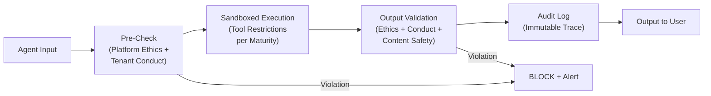

**Key Properties:**
- Platform policies are evaluated first in the pipeline; they are non-negotiable
- A tenant policy can never override a platform BLOCK decision
- Ethics violations are logged to the immutable audit trail regardless of whether the agent execution continues
- ETH-001 through ETH-007 are versioned with the platform release; changes require an ADR and changelog entry

> **Note:** This section describes design intent. No ethics enforcement engine exists yet. See ADR-027 for the full architectural decision and Benchmarking Study Section 9 for regulatory analysis.

### 7.8 Code of Conduct -- Tenant Extensions [PLANNED]
<!-- Addresses Decision #7 from Design Plan; See ADR-027, Benchmarking Study Section 9.4 -->

While the Code of Ethics (Section 7.7) defines immutable platform principles, the Code of Conduct defines configurable operational rules that tenants manage through a CRUD API. Conduct policies extend the platform baseline -- they can tighten restrictions but never loosen them (See ADR-027).

**Risk Rating:** HIGH -- Misconfigured tenant conduct policies could block all agent output or allow regulatory non-compliance for the tenant.

**Conduct Policy API:**

```
POST   /api/v1/ethics/policies          -- Create tenant conduct policy
GET    /api/v1/ethics/policies           -- List tenant conduct policies
PUT    /api/v1/ethics/policies/{id}      -- Update tenant conduct policy
DELETE /api/v1/ethics/policies/{id}      -- Deactivate (soft delete)
POST   /api/v1/ethics/policies/{id}/test -- Test policy against sample inputs (dry run)
```

**Industry-Specific Conduct Rules:**

| Industry | Regulatory Driver | Conduct Rule Examples |
|----------|------------------|----------------------|
| Healthcare | HIPAA, HITECH | No PHI in cloud model prompts; clinical recommendations require physician review |
| Financial Services | SOX, MiFID II | Financial recommendations include mandatory disclaimers; trade-related actions require dual approval |
| Legal | Attorney-client privilege | Legal analysis never presented as legal advice; client names redacted in analytics |
| Government | FISMA, FedRAMP | All inference on local models only; data classification labels propagated through pipeline |
| Education | FERPA, COPPA | Student records never sent to cloud; age-appropriate content filtering enforced |

**Conduct Policy Hierarchy:**

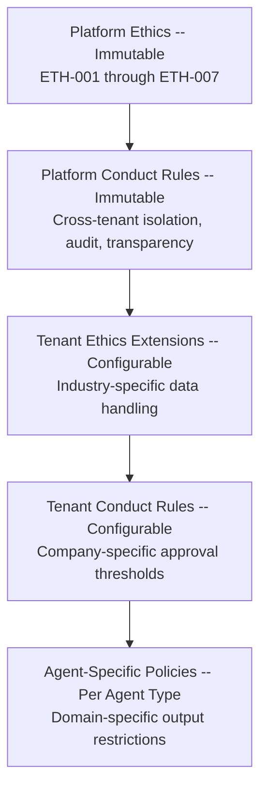

**Hot-Reload Mechanism:**
1. Tenant admin updates policy via REST API
2. Change written to tenant schema and published to Kafka (`ethics.policy.updated` topic)
3. All ai-service instances refresh in-memory policy cache (atomic swap)
4. Next agent invocation evaluates against updated policy set
5. Policy change logged in audit trail (who changed what, old value, new value)

**Breach Detection:**

| Pattern | Detection Method | Response |
|---------|-----------------|----------|
| Repeated boundary probing | 3+ unauthorized attempts in 1 hour | Reduce agent maturity level; alert tenant admin |
| Privilege escalation attempts | Any occurrence | Block; security incident; isolate agent |
| Data exfiltration pattern | Anomaly detection on data volume | Alert security team; increase monitoring |
| Policy circumvention | Semantic similarity between blocked and subsequent requests | Alert tenant admin; increase monitoring |

> **Note:** This section describes design intent. No conduct policy engine or CRUD API exists yet. See ADR-027 and Benchmarking Study Section 9.4 for design patterns.

### 7.9 Agent Security Policies [PLANNED]
<!-- Addresses Decision #3, #5 from Design Plan; See ADR-024, ADR-028, ADR-030, Benchmarking Study Section 10 -->

The Super Agent platform enforces security policies at the agent level, controlling what each agent can do based on its maturity level, the risk level of the action, and the pipeline phase. This section covers tool authorization, agent-to-agent authentication, and cross-tenant boundary enforcement (See ADR-024, ADR-028, ADR-030).

**Risk Rating:** HIGH -- Insufficient agent-level security allows privilege escalation, unauthorized tool execution, and cross-tenant data leakage.

#### 7.9.1 Tool Authorization Matrix [PLANNED]

Every tool in the platform's Tool Registry is classified by risk level. The agent's maturity level (determined by the Agent Trust Score, ADR-024) governs which tool risk levels are accessible (See Benchmarking Study Section 10.3).

**Tool Risk Classification:**

| Risk Level | Tool Category | Examples | Impact |
|------------|-------------|---------|--------|
| LOW | READ, ANALYZE | database_query (SELECT), knowledge_search, calculate, summarize | Read-only; no external side effects |
| MEDIUM | DRAFT | generate_report, compose_email, create_ticket_draft | Reversible; output in sandbox only |
| HIGH | WRITE | database_execute (INSERT/UPDATE), send_notification, create_ticket | Modifies external state; partially reversible |
| CRITICAL | DELETE | database_execute (DELETE/DROP), revoke_access, deactivate_user | Irreversible without backup |

**Maturity-Based Authorization:**

| Maturity Level | ATS Range | READ | ANALYZE | DRAFT | WRITE | DELETE |
|---------------|-----------|------|---------|-------|-------|--------|
| Coaching | 0-39 | Allowed | Allowed | Sandboxed (all reviewed) | Blocked | Blocked |
| Co-pilot | 40-64 | Allowed | Allowed | Allowed (reviewed) | Blocked | Blocked |
| Pilot | 65-84 | Allowed | Allowed | Allowed | Allowed (low-risk) | Blocked |
| Graduate | 85-100 | Allowed | Allowed | Allowed | Allowed | Allowed (with audit) |

**Key Security Properties:**
- Tool authorization is dynamic: when an agent's ATS score changes, its tool permissions change immediately
- Demotion is immediate (safety); promotion requires sustained performance over 30 days (stability)
- Critical compliance violations trigger immediate demotion to Coaching regardless of current ATS
- Cold start: new agents always start at Coaching; trust must be earned, not inherited

#### 7.9.2 Agent-to-Agent Authentication [PLANNED]

In the hierarchical multi-agent architecture (ADR-023), each logical agent (Super Agent, sub-orchestrator, worker) must authenticate to every other agent it communicates with. Infrastructure-level authentication (mTLS) is insufficient because multiple logical agents may run within a single service process (See Benchmarking Study Section 10.4).

**Agent Identity Token (JWT):**

Each agent receives a short-lived JWT (5-minute TTL) containing:
- `agent_type`: SUPER_AGENT, SUB_ORCHESTRATOR, or WORKER
- `maturity_level`: COACHING, CO_PILOT, PILOT, or GRADUATE
- `ats_score`: Current numeric ATS score
- `allowed_tool_categories`: Tool risk levels accessible at current maturity
- `tenant_id`: Tenant context for cross-tenant boundary enforcement
- `parent_agent`: Reference to the delegating agent (for hierarchy validation)
- `trace_id`: Correlation ID for the current execution trace

**Credential Rotation Triggers:**

| Trigger | Action |
|---------|--------|
| Task completion | Token expires (5-minute TTL) |
| Maturity level change | Existing tokens invalidated; new tokens with updated claims |
| Security incident | All agent tokens for affected tenant blocklisted in Valkey |
| Platform deployment | All agent signing keys rotated |

#### 7.9.3 Cross-Tenant Boundary Enforcement [PLANNED]

The most critical security invariant is that no tenant can access, infer, or influence another tenant's data. This invariant must hold even in the presence of prompt injection, agent manipulation, and side-channel inference (See ADR-026, Benchmarking Study Section 10.5).

**Enforcement Layers:**

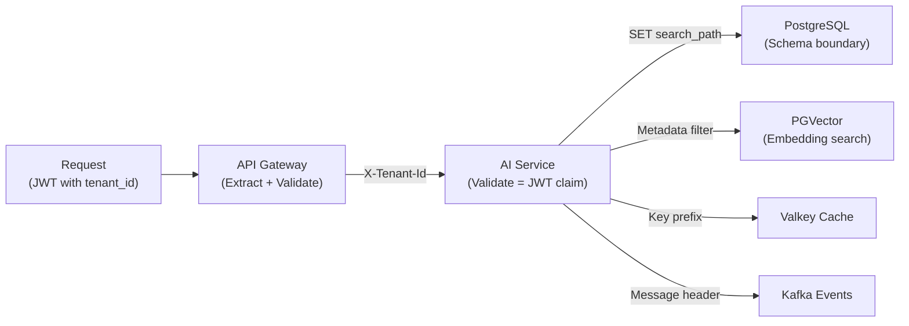

At each boundary, the `tenant_id` is validated -- not merely propagated. If `X-Tenant-Id` does not match the JWT `tenant_id` claim, the request is rejected with 403 and a security alert is logged.

> **Note:** This section describes design intent. No agent-level security, agent-to-agent authentication, or cross-tenant boundary enforcement code exists beyond the current JWT propagation in the API Gateway. See ADR-024, ADR-026, ADR-028, ADR-030, and Benchmarking Study Section 10 for full architectural decisions.

### 7.10 Audit and Compliance [PLANNED]
<!-- Addresses Decision #10 from Design Plan; See ADR-027, Benchmarking Study Section 9.5 -->

The platform maintains a comprehensive, tamper-evident audit trail of all agent operations to satisfy EU AI Act Article 12 (record-keeping), GDPR Article 22 (right to explanation for automated decisions), and industry-specific compliance requirements (See ADR-027, Benchmarking Study Section 9.5).

**Risk Rating:** CRITICAL -- Inadequate audit trails are the most commonly cited deficiency in EU AI Act preliminary investigations (Benchmarking Study Section 9.2).

#### 7.10.1 Full Execution Trace Requirements [PLANNED]

Every agent invocation must produce an execution trace containing:

| Trace Component | What Is Captured | Regulatory Basis |
|----------------|-----------------|-----------------|
| Request metadata | trace_id, tenant_id, user_id, timestamp, request_classification | EU AI Act Art. 12 (operation periods) |
| Prompt composition | system_prompt_hash, context_documents_used, skills_resolved | EU AI Act Art. 12 (reference databases) |
| Model routing | model_selected, complexity_score, routing_rationale | EU AI Act Art. 12 (operational decisions) |
| Tool invocations | tool_name, input_params_hash, output_summary, execution_time_ms | EU AI Act Art. 12 (operational decisions) |
| Draft lifecycle | draft_hash, draft_version, review_decision, reviewer_id | EU AI Act Art. 12 (output data) |
| Human interactions | approval_request_id, decision, decision_timestamp, decision_reason | EU AI Act Art. 14 (human oversight) |
| Ethics evaluations | policy_id, evaluation_result, violation_details (if any) | EU AI Act Art. 9 (risk management) |
| Response metadata | response_hash, total_execution_time_ms, total_cost, explanation_summary | GDPR Art. 22 (explainability) |

#### 7.10.2 Execution Trace Flow [PLANNED]

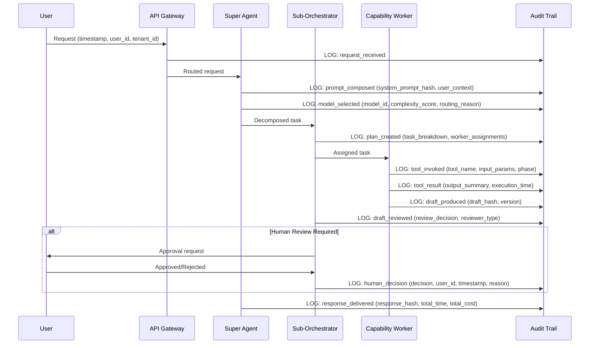

#### 7.10.3 Regulatory Alignment [PLANNED]

| Regulation | Requirement | Platform Control | Verification |
|------------|-------------|------------------|-------------|
| EU AI Act Article 9 | Risk management systems with continuous monitoring | Ethics enforcement engine (Section 7.7-7.8) + maturity-based autonomy (ADR-024) | Policy evaluation logged per invocation |
| EU AI Act Article 12 | Automatic logging throughout system lifecycle | Full execution trace (Section 7.10.1) | Append-only storage; cryptographic chaining |
| EU AI Act Article 13 | Users understand they interact with AI | ETH-004: `ai_generated: true` metadata on all responses | Output validation rejects responses missing metadata |
| EU AI Act Article 14 | Human oversight provisions | HITL risk x maturity matrix (ADR-030) | Approval records in audit trail |
| GDPR Article 22 | Right to explanation for automated decisions | Explain step (pipeline step 6) + execution trace reconstruction | Trace provides full decision chain reconstruction |
| GDPR Article 17 | Right to erasure | Anonymization of PII in audit records (preserving structural integrity) | Erasure certificates with audit log entry |
| Colorado AI Act | Consumer notification + appeal process | ETH-004 transparency + HITL escalation | Notification logged; appeal workflow in HITL queue |

#### 7.10.4 Immutable Audit Log Properties [PLANNED]

| Property | Implementation | Purpose |
|----------|---------------|---------|
| Append-only | No UPDATE or DELETE permissions for application users on audit tables | Prevents retroactive modification |
| Cryptographic chaining | Each record includes hash of previous record | Makes undetected tampering computationally infeasible |
| Separate storage | Audit data in dedicated schema inaccessible to application services | Prevents application-level log manipulation |
| Write-once archival | Periodic export to immutable object storage (S3 Object Lock) | Long-term retention with tamper protection |
| Tenant isolation | Audit records in tenant schema; no cross-tenant visibility | Regulatory compliance demonstration per tenant |

#### 7.10.5 Retention and Right-to-Erasure Conflict Resolution [PLANNED]

When a GDPR right-to-erasure request is received, the platform resolves the conflict between retention requirements and deletion rights through anonymization rather than deletion: personal data in audit records is replaced with irreversible tokens while preserving the structural integrity of the audit trail. This is consistent with GDPR Recital 26 (anonymized data is not personal data) and satisfies both EU AI Act Article 12 retention and GDPR Article 17 erasure obligations simultaneously (See Benchmarking Study Section 9.5).

> **Note:** This section describes design intent. No full execution trace, cryptographic chaining, or anonymization pipeline exists yet. The existing ai-service has basic agent trace logging [IMPLEMENTED partial] but does not implement the comprehensive audit architecture described here. See ADR-027 and Benchmarking Study Sections 9.5, 10.6 for full design rationale.

---

## 8. Roadmap

### Phase 1: Foundation (Weeks 1-6)

- Spring Cloud infrastructure setup (Eureka, Config, Gateway, Kafka)
- Base agent framework with ReAct loop (Execute step)
- Core tool registry and execution engine (internal tools, knowledge tools)
- Basic skills framework (static skill assignment, system prompt + tool set)
- **Two-model local Ollama setup** (Orchestrator ~8B + Worker ~24B)
- Ollama integration via Spring AI with model-agnostic routing
- Single agent deployment (Data Analyst) with initial skill definition
- **Basic request pipeline** (Intake --> Retrieve --> Plan --> Execute --> Record)
- Basic trace logging
- **Few-Shot/Zero-Shot** prompting strategies in skill definitions
- **Agent Builder UI foundation** [PLANNED] -- initial builder canvas, template gallery page, basic skill composition
- **Prompt injection defense** [PLANNED] -- input sanitization, boundary markers (OWASP LLM01)

### Phase 2: Multi-Agent and Cloud Integration (Weeks 7-12)

- Additional specialist agents (Customer Support, Code Reviewer)
- Orchestrator agent with dynamic skill routing
- Agent-as-tool pattern (agents calling other agents)
- Tool chaining and parallel fan-out support
- Claude and Codex integration for teacher pipeline and fallback
- Model routing logic (complexity-based escalation to cloud models)
- Feedback API (ratings, corrections)
- Skill versioning and configuration via Spring Cloud Config
- **Full 7-step pipeline** with Validate and Explain steps
- **RAG at Orchestrator level** with basic tenant namespacing in vector store
- **Few-Shot/Zero-Shot** in-context learning for handling new task types without retraining
- **Template forking and version history** [PLANNED] -- fork existing agent configurations, semantic versioning, diff snapshots
- **Pre-cloud PII sanitization** [PLANNED] -- `CloudSanitizationPipeline` for data sovereignty before cloud model calls
- **Phase-based tool restrictions** [PLANNED] -- READ_TOOLS vs WRITE_TOOLS enforcement per pipeline phase (R5)

### Phase 3: Core Learning Pipeline (Weeks 13-20)

- Training data service (unified multi-source ingestion from all 6 data sources)
- **SFT pipeline** with Ollama model reloading (user corrections, patterns, teacher examples)
- **DPO pipeline** for preference learning (user ratings, customer feedback, teacher pairs)
- **RAG system** with PGVector (learning materials, documents, SOPs -- real-time updates)
- **Knowledge Distillation** from Claude/Codex/Gemini teacher models
- Pattern and learning material ingestion services
- Dynamic tool creation API (REST registration, webhook tools, script tools)
- Daily automated retraining with quality gates
- Skill test suites and quality metrics per skill
- **Eval harness with adversarial test suite** [PLANNED] -- 20+ benchmark test cases across 5 categories, 5+ adversarial attack vectors, CI quality gate integration (R6)

### Phase 4: Advanced Learning and Optimization (Weeks 21-28)

- **Active Learning** for targeted data collection (low-confidence flagging, gap analysis)
- **Curriculum Learning** for progressive training (simple → complex task ordering)
- **RLHF** with reward model for agent behavior optimization
- **Self-Supervised Pre-training** on domain-specific corpora
- **Contrastive Learning** for improved embeddings and retrieval quality
- Model evaluation and A/B testing framework
- Admin dashboard for domain experts (pattern injection, trace review, skill management)
- Multi-agent debate for reasoning depth
- Composite tool creation (combining existing tools into higher-level actions)
- Skill stacking and inheritance
- **Audit Log Viewer** [PLANNED] -- enterprise compliance view with filtering, CSV export, and real-time SSE streaming (Section 3.10)
- **RBAC Matrix** [PLANNED] -- 5-role access control (Platform Admin, Tenant Admin, Agent Designer, User, Viewer) across all screens (Section 7.6)
- **Pipeline Run Viewer** [PLANNED] -- execution history with 12-state tracking, step timeline, drill-down detail (Section 3.13)
- **Notification Center** [PLANNED] -- real-time notifications for training, errors, feedback, and approvals (Section 3.15)
- **Knowledge Source Management** [PLANNED] -- upload, chunk, index, and manage RAG knowledge sources (Section 3.16)

### Phase 5: Production Hardening and Advanced Methods (Weeks 29-40)

- **Semi-Supervised Learning** leveraging abundant unlabeled internal data
- **Meta-Learning** for rapid adaptation to new domains and task types
- **Federated Learning** for cross-department training without data sharing
- **Multi-tenant isolation and concurrency controls** (context window management, per-tenant rate limiting, fair-share scheduling)
- Human-in-the-loop tool approval workflows
- Comprehensive observability and alerting (per-tool, per-skill, per-agent metrics, tenant-specific dashboards)
- Security audit, PII handling, and compliance validation
- Performance optimization and load testing
- Skill marketplace (teams can publish and share skills across the organization)
- Documentation and runbooks
- User onboarding and training
- Production deployment
- **Agent Delete with Impact Assessment** [PLANNED] -- safe deletion with usage analysis, 30-day soft-delete recovery window (Section 3.11)
- **Agent Publish Lifecycle** [PLANNED] -- Draft -> Active -> Submitted -> Published workflow with admin review queue (Section 3.12)
- **Agent Import/Export** [PLANNED] -- JSON/YAML configuration portability for backup, migration, cross-tenant sharing (Section 3.14)
- **Agent Comparison** [PLANNED] -- side-by-side comparison of two agent configurations (prompts, tools, metrics, eval scores) (Section 3.17)
- **Agent Version Rollback** [PLANNED] -- revert agent configuration to a previous version from version history
- **Agent Template Marketplace with cross-tenant sharing** [PLANNED] -- publish agent configurations across tenants, rating system, usage analytics, governance tiers (Platform/Organization/Team)
- **Data retention automation** [PLANNED] -- nightly `DataRetentionJob`, soft-delete with 30-day recovery window, per-tenant retention overrides
- **Right-to-erasure workflow** [PLANNED] -- GDPR Article 17 compliance, automated data subject identification, erasure certificates, audit trail

### Phase 6: Super Agent Hierarchy and Maturity Model (Weeks 41-52) [PLANNED]

> **Status:** All items in this phase are `[PLANNED]`. This phase aligns with Benchmarking Study Section 12.2 "Phase 1: Foundation (P0)".

- **Super Agent hierarchical architecture** [PLANNED] -- Three-tier hierarchy: Super Agent, Sub-Orchestrators, Workers (ADR-023). Start with one sub-orchestrator (Performance Management) and expand.
- **Agent Maturity Model (ATS)** [PLANNED] -- 5-dimension Agent Trust Score, 4 maturity levels (Coaching to Graduate), promotion/demotion rules (ADR-024). All agents start at Coaching.
- **Worker Sandbox and Draft Lifecycle** [PLANNED] -- DRAFT to UNDER_REVIEW to APPROVED to COMMITTED lifecycle, maturity-dependent review authority (ADR-028, Section 3.20).
- **Human-in-the-Loop Framework** [PLANNED] -- Risk x maturity approval matrix, 4 interaction types (confirmation, data entry, review, takeover), timeout escalation (ADR-030, Section 3.19).
- **Schema-per-Tenant Agent Data** [PLANNED] -- PostgreSQL schema isolation for agent data, Flyway per-tenant migration strategy (ADR-026). Separate from existing row-level isolation.
- **Super Agent Lifecycle Management** [PLANNED] -- Clone-on-setup, provisioning, active, suspended, decommissioned states (Section 3.21).
- **Dynamic System Prompt Composition** [PLANNED] -- Modular, database-stored prompt blocks composed at request time from user context, role, and active knowledge (ADR-029).
- **Platform Ethics Baseline** [PLANNED] -- Default ethics policies (fairness, transparency, harm avoidance, data stewardship, accountability), enforcement engine, tenant extension points (ADR-027).

### Phase 7: Event-Driven Triggers (Weeks 53-60) [PLANNED]

> **Status:** All items in this phase are `[PLANNED]`. This phase aligns with Benchmarking Study Section 12.2 "Phase 1: Foundation (P0)" for event triggers and "Phase 2: Intelligence (P1)" for adaptive RAG.

- **Kafka Event Bus for Agent Triggers** [PLANNED] -- 8 event topics (entity lifecycle, scheduled, external, workflow, drafts, approvals, benchmarks, ethics), Spring Cloud Stream bindings (ADR-025, Section 3.18).
- **Entity Lifecycle Events (CDC)** [PLANNED] -- Debezium CDC from PostgreSQL for automatic agent activation on business data changes.
- **Time-Based Event Triggers** [PLANNED] -- Spring Scheduler with per-tenant cron expressions, missed fire policy, cluster-safe scheduling.
- **External System Event Triggers** [PLANNED] -- Webhook ingestion with HMAC authentication, event normalization, source system registry.
- **User Workflow Event Triggers** [PLANNED] -- Application-level Spring events from EMSIST frontend actions (approvals, publications, escalations).
- **Adaptive RAG** [PLANNED] -- Operating-model-aligned knowledge retrieval with strategy selection (Self-RAG, Corrective RAG) based on query complexity. Extends existing `RagServiceImpl` and pgvector infrastructure.
- **Saga Orchestration** [PLANNED] -- Cross-domain workflow coordination via Kafka for complex tasks spanning multiple sub-orchestrators (e.g., risk assessment that requires data from EA, GRC, and Performance).

### Phase 8: Cross-Tenant Intelligence (Weeks 61-68) [PLANNED]

> **Status:** All items in this phase are `[PLANNED]`. This phase aligns with Benchmarking Study Section 12.2 "Phase 3: Optimization (P2)".

- **Anonymized Cross-Tenant Benchmarking** [PLANNED] -- Shared benchmark schema with k-anonymity (k>=5), tenant opt-in, relative performance reporting (ADR-026, Section 3.21). Metrics include agent accuracy, maturity progression rates, task completion times.
- **Evolving Orchestration** [PLANNED] -- Routing rules refined based on observed success rates and user feedback. Super Agent learns which sub-orchestrator is most effective for each request pattern.
- **Benchmark Dashboard** [PLANNED] -- Tenant-facing dashboard showing relative performance across anonymized cohorts. Percentile rankings per domain sub-orchestrator.
- **ATS Trend Analytics** [PLANNED] -- Per-tenant visualization of maturity score trends over time, promotion/demotion history, dimension-level breakdowns.

### Phase 9: Advanced Autonomy (Weeks 69-80) [PLANNED]

> **Status:** All items in this phase are `[PLANNED]`. This phase aligns with Benchmarking Study Section 12.2 "Phase 4: Advanced (P3)".

- **Federated Global Knowledge Pool** [PLANNED] -- Opt-in cross-tenant knowledge sharing with privacy guarantees, legal framework, anonymization pipeline (Benchmarking Study R11). Evaluate feasibility based on customer demand.
- **Full Graduate Autonomy** [PLANNED] -- Graduate-level workers operating with direct execution across all tool risk levels. Requires demonstrated stability from Phase 6-8 maturity progression.
- **Self-Improving Domain Skills** [PLANNED] -- Sub-orchestrators refine their domain skills based on accumulated task outcomes, user corrections, and benchmark comparisons.
- **Multi-Tenant Skill Marketplace** [PLANNED] -- Sub-orchestrators and workers can be published to a cross-tenant marketplace (extending the Template Gallery). Governance tiers ensure quality and compliance.

---

## 9. Success Criteria

| ID | Criterion | Baseline (Month 0) | Target (Month 6) | Measurement Method | Frequency |
|----|-----------|---------------------|-------------------|--------------------|-----------|
| SC-01 | Local task resolution rate (no cloud escalation) | 0% (no agents deployed) | 70%+ | `ModelRouter` metrics: `local_resolution_count / total_request_count` from Prometheus | Weekly |
| SC-02 | User satisfaction rating | N/A (no users) | 4.0/5.0 average | `FeedbackService` aggregated rating per tenant; weighted average across tenants | Monthly |
| SC-03 | Agent quality metric improvement | Baseline established at Month 1 | Positive MoM trend for 5 consecutive months | Eval harness scores (accuracy, relevance, safety, latency, cost) per agent; tracked in `agent_eval_results` table | Monthly |
| SC-04 | Ollama response latency (P95) | N/A | Less than 2 seconds | Spring AI `ChatClient` instrumented with Micrometer timer; P95 from Prometheus histogram | Continuous |
| SC-05 | Platform availability | N/A | 99.9% uptime (less than 8.77 hours downtime per year) | Synthetic health checks via `/actuator/health` across all services; Prometheus uptime metric | Continuous |
| SC-06 | Return on investment | Investment baseline at deployment | Positive ROI | (Cost savings from automated tasks + productivity gains) minus (infrastructure + API costs + maintenance); finance-validated quarterly | Quarterly |
| SC-07 | Explanation coverage | 0% | 100% of agent responses include business-readable explanation | `ExplainStep` execution rate: `responses_with_explanation / total_responses`; validated via output schema check | Weekly |
| SC-08 | Unsafe output interception rate | 0% | 95%+ of unsafe outputs caught before delivery | `ValidateStep` block rate: `blocked_responses / (blocked + flagged_post_delivery)`; adversarial test suite regression | Weekly |
| SC-09 | Ethics policy compliance [PLANNED] | N/A | 100% of platform ethics rules (ETH-001 through ETH-007) enforced on every invocation | `EthicsPolicyEngine` evaluation count vs. bypass count; zero tolerance for bypasses | Continuous |
| SC-10 | Agent maturity progression [PLANNED] | All agents at Coaching (ATS = 0) | At least 2 agents promoted to Co-pilot within 3 months of deployment | `AgentMaturityProfile` level transitions tracked in audit trail; ATS trend dashboard | Monthly |

---

## 10. Open Questions and Risks

### 10.1 Risk Register

| ID | Risk | Severity | Probability | Impact | Mitigation Strategy | Owner | Status |
|----|------|----------|-------------|--------|---------------------|-------|--------|
| R-01 | Model selection uncertainty: Ollama base models may underperform for specific agent types | Medium | High | Degraded task completion accuracy; increased cloud escalation costs | Benchmark 3+ model families (Llama, Mistral, Qwen) per agent type during Phase 1; establish minimum accuracy thresholds per skill before production | Platform Lead | Open |
| R-02 | Two-model sizing mismatch: 8B orchestrator or 24B worker may be undersized/oversized for target hardware | Medium | Medium | Wasted GPU memory or insufficient reasoning capability | Profile memory and latency on target hardware (CPU-only, single GPU, multi-GPU); define sizing matrix per deployment tier; allow runtime model swapping | DevOps Lead | Open |
| R-03 | Fine-tuning GPU requirements exceed budget: daily SFT/DPO retraining requires sustained GPU access | High | Medium | Training pipeline cannot run daily; model staleness increases | Use LoRA/QLoRA adapters (reduces GPU requirement by 60-80%); batch training during off-peak hours; evaluate cloud GPU spot instances for burst capacity | Platform Lead | Open |
| R-04 | Teacher model API costs exceed budget: Claude/Codex usage for knowledge distillation and evaluation | Medium | High | Training pipeline throttled; evaluation coverage reduced | Set per-tenant monthly API budget caps; cache teacher responses for repeated patterns; prioritize teacher usage for novel task types only | Product Owner | Open |
| R-05 | Feedback data quality: user corrections and ratings may be noisy, biased, or sparse | Medium | High | SFT/DPO training produces models with learned biases or low improvement | Implement feedback quality scoring (confidence, consistency, recency); require minimum N=50 samples before retraining trigger; human review of low-confidence feedback | Data Lead | Open |
| R-06 | Compliance risk: teacher model ToS may prohibit training local models on their outputs | Critical | Low | Legal exposure; must halt knowledge distillation pipeline | Legal review of OpenAI, Anthropic, and Google ToS before Phase 3; document compliance in ADR; implement toggle to disable teacher-to-student pipeline per provider | Legal/Compliance | Open |
| R-07 | Pipeline latency: 7-step request pipeline adds overhead versus direct model inference | Medium | High | User-perceived latency exceeds 2-second target for interactive use cases | Pipeline step parallelization (Retrieve + Plan can overlap); cache frequently used prompts and skill definitions in Valkey; short-circuit validation for low-risk responses | SA Lead | Open |
| R-08 | Validation false positives: deterministic validation blocks legitimate agent outputs | Medium | Medium | User frustration; reduced trust in platform | Tunable rule thresholds per tenant; dry-run mode for new rules; feedback loop from false-positive reports to rule refinement | QA Lead | Open |
| R-09 | Tenant isolation at scale: PGVector namespace strategy degrades with 1000+ tenants | High | Medium | Slow embedding retrieval; potential cross-tenant data leakage via vector similarity | Schema-per-tenant isolation per ADR-026; partition PGVector indexes by tenant schema; load test with 1000 simulated tenants in staging | DBA Lead | Open |
| R-10 | Explanation hallucination: orchestrator-generated explanations may be inaccurate or misleading | Medium | Medium | Users make decisions based on incorrect AI reasoning; regulatory risk under EU AI Act Art. 13 | Template-based explanation fallbacks for common patterns; teacher model QA on explanation quality; user feedback on explanation accuracy; threshold-based escalation to human review | Platform Lead | Open |

### 10.2 Open Questions

| ID | Question | Context | Decision Required By | Status |
|----|----------|---------|----------------------|--------|
| OQ-01 | Which Ollama base models perform best for each agent type? | Requires benchmarking across Llama 3, Mistral, Qwen families | Phase 1 completion (Week 6) | Open |
| OQ-02 | When does the 8B/24B model split require adjustment? | Hardware profiles vary: CPU-only, single GPU (16GB), multi-GPU (48GB+) | Phase 1 hardware profiling (Week 4) | Open |
| OQ-03 | What is the acceptable daily GPU budget for SFT/DPO retraining? | Impacts training frequency, batch size, and model freshness | Phase 3 planning (Week 12) | Open |
| OQ-04 | Do teacher model ToS permit training local models on their outputs? | Legal review required for OpenAI, Anthropic, Google terms | Before Phase 3 start (Week 12) | Open |
| OQ-05 | What is the minimum feedback sample size before triggering retraining? | Too low = noisy models; too high = slow adaptation | Phase 3 data pipeline design (Week 14) | Open |

---

## 11. PDF Coverage and Extension Matrix

### 11.1 PDF to Documentation Traceability

| PDF Architecture Concept | Coverage in This Baseline |
|---|---|
| Two-model local split (Orchestrator + Worker) | Section 2.6, Section 3.1 (Plan/Execute), Section 8 (roadmap) |
| Formal 7-step request pipeline | Section 3.1 |
| RAG at orchestrator level | Section 3.1 Step 2, Section 4.1.5 RAG Positioning Note |
| Deterministic validation (rules/tests/approval) | Section 3.1 Step 5, Section 3.6 |
| Explain step (business + technical + artifacts) | Section 3.1 Step 6, Section 3.7 |
| Record/audit artifacts and approvals | Section 3.1 Step 7, Section 6 |
| Tenant-safe context isolation | Section 7.2 |

### 11.2 Beyond PDF Scope (Intentional Platform Extensions)

- 13-method learning architecture (Tier 1/2/3) in Section 4.2
- Dynamic/composite/agent-as-tool framework in Section 3.4
- Sprint-ready epic decomposition in companion stories document
- Git/Claude implementation workflow guidance in companion guide
