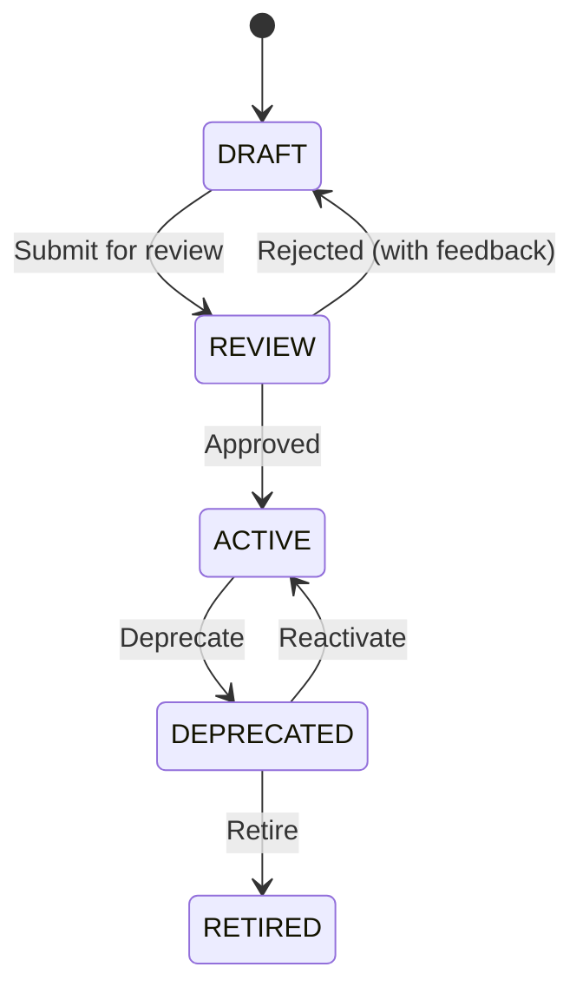

# Epics and User Stories: AI Agent Platform

**Product Name:** EMSIST AI Agent Platform
**Version:** 3.1
**Date:** March 9, 2026
**Status:** Implementation Baseline

**Changelog:**
| Version | Date | Changes |
|---------|------|---------|
| 3.3 | 2026-03-09T20:00Z | (BA Agent) Added Epic E22 Role-Specific User Journeys [PLANNED] with 8 user stories (US-E22.1 through US-E22.8): tenant management, user management, gallery approval, fork template, audit review, compliance report, policy configuration, skill lifecycle. 40 story points. Maps to UX Spec Sections 8.12-8.19. Updated summary table and traceability. |
| 3.2 | 2026-03-09T18:00Z | (BA Agent) Added Epic E21 Platform Administration [PLANNED] with 8 user stories (US-E21.1 through US-E21.8): master tenant dashboard, tenant provisioning workflow, enable/disable Super Agent, platform health dashboard, tenant suspension, cross-tenant benchmark comparison, ethics baseline management, admin audit trail viewer. 42 story points. Addresses Gap 7 (MEDIUM) from superadmin gap analysis. Updated summary table and traceability. |
| 3.1 | 2026-03-09T14:15Z | (SA Agent) Final implementation-readiness pass: replaced [PRODUCT_NAME] placeholder with EMSIST AI Agent Platform. Verified all 20 epics (E1-E20) complete with descriptions, acceptance criteria, story points, MoSCoW priority, and sprint mapping. All Super Agent content (E14-E20) confirmed as [PLANNED]. No gaps found in story content. |
| 3.0 | 2026-03-08 | Added 7 Super Agent Epics (E14-E20) with 50 user stories: E14 Super Agent Hierarchy and Orchestration, E15 Agent Maturity Model and Trust Scoring, E16 Worker Sandbox and Draft Lifecycle, E17 Human-in-the-Loop Approvals, E18 Event-Driven Agent Triggers, E19 Ethics and Conduct Policy Engine, E20 Cross-Tenant Benchmarking. All tagged [PLANNED]. Sprints S12-S18. Sources: ADR-023 through ADR-030, PRD Sections 2.2-2.3/3.18-3.21/7.7-7.10, BA domain model (35 entities, 79 business rules). |
| 2.1 | 2026-03-07 | Added US-12.7 through US-12.11 (Agent Delete, Publish Lifecycle, Import/Export, Version Rollback, Comparison) to Epic E12. Added new Epic E13 (Platform Operations) with US-13.1 through US-13.6 (Audit Log, SSE Streaming, RBAC, Pipeline Run Viewer, Notification Center, Knowledge Source Management). Updated totals. |
| 2.0 | 2026-03-07 | Added Epic E10 (LLM Security Hardening), Epic E11 (Quality Evaluation Harness), Epic E12 (Agent Builder and Template Gallery) per validation findings R1-R13 |
| 1.0 | 2026-03-05 | Initial baseline with Epics 1-13 |

**Scope of Baseline:** This is the implementation baseline for the AI platform stream; existing EMSIST `ai-service` may be partially aligned.

---

## Epic 1: Spring Cloud Infrastructure

**Goal:** Establish the foundational microservice infrastructure for the agent platform.

### US-1.1: Service Discovery Setup

**As a** platform developer,
**I want** all agent microservices to automatically register and discover each other,
**So that** agents can communicate without hardcoded service URLs.

**Acceptance Criteria:**

- Eureka Server is deployed and accessible at a configured port
- All agent services register on startup and deregister on shutdown
- Services can discover each other by logical name (e.g., `agent-data-analyst`)
- Health checks run every 30 seconds; unhealthy instances are removed after 3 missed heartbeats
- Dashboard shows all registered services and their status

**Story Points:** 3

### US-1.2: Centralized Configuration

**As a** platform administrator,
**I want** all agent and service configurations managed in a single Git-backed config server,
**So that** I can update model settings, routing rules, and training schedules without redeploying services.

**Acceptance Criteria:**

- Config Server serves configuration from a Git repository
- Each service pulls its config on startup and supports runtime refresh via `/actuator/refresh`
- Sensitive values (API keys) are encrypted at rest in the config repo
- Environment-specific profiles (dev, staging, production) are supported
- Config changes propagate within 60 seconds via Spring Cloud Bus

**Story Points:** 5

### US-1.3: API Gateway

**As an** end user,
**I want** a single entry point for all agent interactions,
**So that** I don't need to know which specific agent service handles my request.

**Acceptance Criteria:**

- Spring Cloud Gateway routes requests to appropriate agent services
- Rate limiting is enforced per user/API key
- Authentication via OAuth2/JWT is required for all endpoints
- Request/response logging is enabled for observability
- Circuit breaker prevents cascading failures when a downstream agent is unhealthy

**Story Points:** 5

### US-1.4: Kafka Messaging Infrastructure

**As a** platform developer,
**I want** a reliable message broker connecting all services,
**So that** agent traces, feedback, and training events flow asynchronously between services.

**Acceptance Criteria:**

- Kafka cluster is deployed with defined topics (see Technical Spec Section 6)
- Dead letter queues handle failed message processing
- Message schemas are versioned and validated
- Retention policies are configured per topic (traces: 30 days, feedback: 90 days)
- Monitoring dashboards show throughput, lag, and error rates

**Story Points:** 5

---

## Epic 2: Agent Common Framework

**Goal:** Build the reusable agent library that all specialist agents extend.

### US-2.1: Base Agent with ReAct Loop

**As a** agent developer,
**I want** a base agent class that implements the ReAct (Reasoning + Acting) pattern,
**So that** I can build new specialist agents by only defining tools and system prompts.

**Acceptance Criteria:**

- `BaseAgent` provides a `process(AgentRequest)` method with the full ReAct loop
- The loop alternates between model reasoning and tool execution for up to configurable max turns
- If no tool calls are made, the response is returned as the final answer
- Max turns exceeded produces a graceful fallback response
- All interactions are automatically logged as traces

**Story Points:** 8

### US-2.2: Tool Registry and Execution

**As an** agent developer,
**I want** to register tools as Spring beans that agents can dynamically discover and invoke,
**So that** adding new capabilities requires only defining a new bean.

**Acceptance Criteria:**

- Tools are registered with JSON schema descriptions via `@Description` annotation
- Each agent declares its skill set; only relevant tools are bound to its model calls
- Tool execution includes timeout handling (configurable per tool)
- Tool errors are caught and fed back to the model as error messages (not exceptions)
- Tool execution is traced (name, arguments, response, latency)

**Story Points:** 5

### US-2.3: Model Routing

**As a** platform architect,
**I want** the system to automatically route requests to the optimal model (Ollama, Claude, Codex),
**So that** simple tasks use fast/free local models and complex tasks escalate to powerful cloud models.

**Acceptance Criteria:**

- Complexity estimator classifies requests as SIMPLE, MODERATE, COMPLEX, or CODE_SPECIFIC
- Routing rules are configurable via Spring Cloud Config (no code changes to adjust thresholds)
- Fallback to cloud model triggers automatically when Ollama returns low-confidence or errors
- Model routing decisions are logged in the trace for training analysis
- Cloud model usage is tracked for cost monitoring

**Story Points:** 5

### US-2.4: Conversation Memory

**As an** end user,
**I want** agents to remember the context of our conversation,
**So that** I can have multi-turn interactions without repeating myself.

**Acceptance Criteria:**

- Short-term memory (Redis) stores conversation history per session
- Memory is automatically included in model prompts up to a configurable token limit
- Sessions expire after configurable inactivity timeout (default: 30 minutes)
- Memory can be explicitly cleared by the user
- Long-term memory (vector store) allows agents to recall information across sessions

**Story Points:** 5

### US-2.5: Self-Reflection and Reasoning Depth

**As an** end user,
**I want** agents to verify their own answers before responding,
**So that** I receive higher quality, more accurate responses.

**Acceptance Criteria:**

- Self-reflection pass is configurable per agent and per complexity level
- The model critiques its own response and revises if issues are found
- Chain-of-thought prompting is included in all agent system prompts
- Reflection adds no more than 2 seconds to response time on average
- Reflection effectiveness is measurable via quality scores on reflected vs. non-reflected traces

**Story Points:** 5

### US-2.6: Trace Logging

**As a** ML engineer,
**I want** every agent interaction fully logged with inputs, outputs, tool calls, and metadata,
**So that** I have complete training data for the learning pipeline.

**Acceptance Criteria:**

- Every `process()` call produces an `AgentTrace` published to Kafka
- Traces include: request, response, all messages, tool calls, model used, latency, confidence score
- Trace collector service persists traces to PostgreSQL
- Low-confidence traces are automatically flagged for human review
- Trace retention and archival policies are configurable

**Story Points:** 3

---

## Epic 3: Specialist Agents

**Goal:** Deploy the initial set of specialist agents as Spring Boot microservices.

### US-3.1: Data Analyst Agent

**As a** business user,
**I want** to ask data questions in natural language and get SQL-backed answers with visualizations,
**So that** I can analyze data without writing queries myself.

**Acceptance Criteria:**

- Agent translates natural language to SQL and executes against the data warehouse
- Results are returned as formatted text, tables, or chart descriptions
- Agent explains its reasoning and the SQL it generated
- Dangerous operations (DELETE, DROP, UPDATE) are blocked
- Agent handles ambiguous questions by asking for clarification

**Tools:** `run_sql`, `create_chart`, `summarize_table`, `list_tables`

**Story Points:** 8

### US-3.2: Customer Support Agent

**As a** support team member,
**I want** an agent that can search tickets, knowledge base articles, and suggest resolutions,
**So that** I can resolve customer issues faster.

**Acceptance Criteria:**

- Agent searches existing tickets for similar issues
- Agent searches knowledge base for relevant articles
- Agent can create new tickets with proper categorization
- Agent suggests resolution steps based on historical successful resolutions
- Escalation to human is triggered when confidence is below threshold

**Tools:** `search_tickets`, `search_kb`, `create_ticket`, `suggest_resolution`

**Story Points:** 8

### US-3.3: Code Reviewer Agent

**As a** developer,
**I want** an agent that analyzes code for bugs, security issues, and style violations,
**So that** I get faster, more consistent code reviews.

**Acceptance Criteria:**

- Agent analyzes code diffs for common bug patterns
- Security vulnerability scanning is included (OWASP Top 10)
- Style and convention violations are flagged with suggestions
- Agent provides actionable fix suggestions, not just problem identification
- Supports major languages: Java, Python, JavaScript/TypeScript, Go

**Tools:** `analyze_code`, `run_linter`, `check_security`, `suggest_fix`

**Story Points:** 8

### US-3.4: Orchestrator Agent

**As an** end user,
**I want** to submit any task and have it automatically routed to the right specialist agent(s),
**So that** I don't need to know which agent handles what.

**Acceptance Criteria:**

- Orchestrator classifies incoming tasks by domain
- Single-agent tasks are routed directly to the appropriate specialist
- Multi-agent tasks are decomposed and coordinated across multiple specialists
- Results from multiple agents are aggregated into a coherent response
- Routing decisions are logged for analysis and improvement

**Story Points:** 13

---

## Epic 4: Multi-Source Feedback Ingestion

**Goal:** Build the infrastructure to collect training signals from all data sources.

### US-4.1: User Rating System

**As an** end user,
**I want** to rate agent responses with thumbs up/down or a star rating,
**So that** agents learn from my feedback and improve over time.

**Acceptance Criteria:**

- Rating API accepts thumbs up/down or 1-5 star ratings linked to a trace ID
- Ratings are stored and published to Kafka for the learning pipeline
- Negative ratings flag the trace for review and priority retraining
- Rating statistics are available per agent type via API
- Rating submission takes less than 100ms

**Story Points:** 3

### US-4.2: User Correction System

**As an** end user,
**I want** to provide the correct answer when an agent gives a wrong response,
**So that** the agent learns exactly what the right answer should have been.

**Acceptance Criteria:**

- Correction API accepts the trace ID and the correct response
- Corrections are stored as gold-standard training examples (highest priority)
- Corrections are immediately added to the high-priority training queue
- Users can see that their correction was received and will be incorporated
- Corrections feed directly into the next SFT training cycle

**Story Points:** 3

### US-4.3: Customer Feedback Integration

**As a** ML engineer,
**I want** customer satisfaction data (CSAT, NPS, ticket outcomes) automatically flowing into the training pipeline,
**So that** agents learn from real customer impact, not just internal ratings.

**Acceptance Criteria:**

- Kafka consumer ingests customer feedback from CRM/support platform topics
- Feedback is mapped to training signals (positive/negative outcome, satisfaction score)
- Feedback is linked to corresponding agent traces where possible
- Feedback statistics dashboard shows trends by agent type
- Integration supports at least: Zendesk, Salesforce, or custom webhook

**Story Points:** 5

### US-4.4: Business Pattern Injection

**As a** domain expert,
**I want** to define business rules and patterns that agents should follow,
**So that** agents behave according to our organization's specific procedures.

**Acceptance Criteria:**

- REST API accepts patterns in the format: trigger condition, expected agent behavior, example
- Patterns are automatically expanded into multiple training examples
- Patterns can be tagged by agent type and priority
- Domain experts can update and deactivate patterns
- Pattern-derived training examples are included in the next SFT cycle

**Story Points:** 5

### US-4.5: Learning Material Ingestion

**As a** knowledge manager,
**I want** to upload training manuals, SOPs, and knowledge articles that agents learn from,
**So that** agents have access to our institutional knowledge.

**Acceptance Criteria:**

- Upload API accepts PDF, DOCX, TXT, and MD files
- Documents are chunked and embedded into the vector store for RAG
- Q&A pairs are automatically generated from documents for fine-tuning
- Materials can be tagged by agent type and domain
- Updates to existing materials trigger re-embedding and re-generation
- Material metadata (upload date, author, tags) is searchable

**Story Points:** 8

### US-4.6: Proprietary Data Integration

**As a** data engineer,
**I want** to connect organizational databases and APIs as data sources for agent training,
**So that** agents have domain-specific knowledge from our actual data.

**Acceptance Criteria:**

- Configurable connectors for PostgreSQL, MySQL, REST APIs, and file storage
- Data extraction runs on a configurable schedule (daily by default)
- Extracted data is transformed into training-ready formats (SFT examples, embeddings)
- PII detection and redaction is applied before data enters the training pipeline
- Data lineage is tracked (which data produced which training examples)

**Story Points:** 8

---

## Epic 5: Learning Pipeline

**Goal:** Implement the multi-method training pipeline that continuously improves agents.

### US-5.1: Training Data Service

**As a** ML engineer,
**I want** a unified service that builds training datasets from all sources with proper weighting,
**So that** I get a balanced, high-quality dataset for each training run.

**Acceptance Criteria:**

- Service aggregates data from all six sources (traces, corrections, patterns, feedback, materials, teacher)
- Each source is weighted by priority (corrections highest, synthetic lowest)
- Recency weighting applies configurable exponential decay
- Gap analysis identifies weak areas where training data is thin
- Dataset statistics (size, source distribution, quality scores) are reported

**Story Points:** 8

### US-5.2: Supervised Fine-Tuning Pipeline

**As a** ML engineer,
**I want** an automated SFT pipeline that fine-tunes Ollama models on curated training data,
**So that** agents improve from demonstrations of correct behavior.

**Acceptance Criteria:**

- Pipeline formats training data for the target model (Llama 3.1 chat format)
- LoRA fine-tuning runs with configurable hyperparameters (rank, alpha, epochs)
- Trained adapter is exported and imported into Ollama automatically
- Training metrics (loss, validation accuracy) are logged and visualizable
- Pipeline supports incremental training on new data without full retraining

**Story Points:** 13

### US-5.3: DPO Preference Learning Pipeline

**As a** ML engineer,
**I want** a DPO pipeline that teaches agents to prefer high-quality responses over low-quality ones,
**So that** agents develop better judgment beyond what SFT alone provides.

**Acceptance Criteria:**

- Pipeline ingests preference pairs from user ratings and teacher evaluations
- DPO training runs with configurable beta and learning rate
- Pipeline handles unbalanced preference data gracefully
- Quality improvement from DPO is measurable via A/B evaluation
- DPO can be combined with SFT in a single training cycle

**Story Points:** 8

### US-5.4: RAG Knowledge Management

**As an** end user,
**I want** agents to have access to up-to-date organizational knowledge when answering questions,
**So that** answers reflect our latest procedures, policies, and information.

**Acceptance Criteria:**

- Vector store (PGVector) holds embeddings for all learning materials and documents
- New materials are embedded and indexed within 5 minutes of upload
- RAG retrieval is integrated into the agent's system prompt automatically
- Relevance threshold prevents irrelevant documents from being included
- User corrections update the knowledge base in real-time

**Story Points:** 8

### US-5.5: Teacher Model Integration

**As a** ML engineer,
**I want** Claude, Codex, and Gemini to generate training data and evaluate local agent quality,
**So that** we can leverage advanced models to improve our local agents without runtime dependency.

**Acceptance Criteria:**

- Teacher service generates synthetic training examples on demand
- Teacher service evaluates local agent traces and produces quality scores
- Teacher service generates preference pairs (teacher response vs. local response)
- API usage is tracked and rate-limited to control costs
- Teacher-generated data is clearly labeled as synthetic in the training dataset

**Story Points:** 8

### US-5.6: Training Orchestrator

**As a** platform administrator,
**I want** training cycles to run automatically on a schedule with quality gates,
**So that** agents improve continuously without manual intervention.

**Acceptance Criteria:**

- Daily training cycle runs at 2:00 AM (configurable)
- Weekly deep training cycle runs Sunday 4:00 AM (configurable)
- Quality gate: new model must score higher than current production model on benchmark
- Automatic deployment on passing quality gate; no deployment on failure
- Training can be triggered on-demand via API
- Notifications sent on training completion (success or failure)
- Rollback to previous model version is available via API

**Story Points:** 8

### US-5.7: Model Evaluation Framework

**As a** ML engineer,
**I want** an automated evaluation framework that benchmarks model quality before deployment,
**So that** we never deploy a model that performs worse than the current production model.

**Acceptance Criteria:**

- Benchmark test set is curated and versioned separately from training data
- Evaluation metrics include: accuracy, helpfulness, tool use correctness, safety
- Comparison report shows current vs. new model on all metrics
- Shadow deployment runs new model on a subset of live traffic for validation
- Evaluation results are stored for historical trend analysis

**Story Points:** 8

### US-5.8: Active Learning

**As a** ML engineer,
**I want** the system to automatically identify cases where the agent is uncertain or performing poorly,
**So that** we can target our data collection and training efforts where they matter most.

**Acceptance Criteria:**

- Low-confidence traces are flagged and queued for human review
- Systematic failure patterns are identified weekly
- Teacher service generates targeted training data for identified weak areas
- Active learning metrics show coverage improvement over time
- Flagged cases are surfaced in the admin dashboard for domain expert review

**Story Points:** 5

---

## Epic 6: Observability and Administration

**Goal:** Provide comprehensive monitoring, alerting, and administration capabilities.

### US-6.1: Agent Observability Dashboard

**As a** platform administrator,
**I want** real-time visibility into agent performance, model usage, and system health,
**So that** I can identify and resolve issues before they impact users.

**Acceptance Criteria:**

- Dashboard shows per-agent metrics: latency, throughput, error rate, model routing
- Token usage tracked per model provider with cost estimation
- Training pipeline status and history visible
- Alerting on anomalous patterns (latency spikes, error rate increases, quality drops)
- Integration with existing monitoring stack (Prometheus/Grafana or equivalent)

**Story Points:** 8

### US-6.2: Admin Dashboard for Domain Experts

**As a** domain expert,
**I want** a web interface to review agent traces, add patterns, and manage learning materials,
**So that** I can improve agents without requiring engineering support.

**Acceptance Criteria:**

- Browse and search agent traces with filtering by agent type, rating, date
- Review flagged (low-confidence) traces and provide corrections
- Add, edit, and deactivate business patterns
- Upload and manage learning materials with tagging
- View feedback statistics and agent quality trends

**Story Points:** 13

---

## Epic 7: Security and Compliance

**Goal:** Ensure the platform meets security and data privacy requirements.

### US-7.1: Authentication and Authorization

**As a** platform administrator,
**I want** role-based access control across all platform APIs,
**So that** only authorized users can access agents, training data, and admin functions.

**Acceptance Criteria:**

- OAuth2/JWT authentication on all API endpoints
- Roles: end_user (chat with agents), domain_expert (patterns, materials, reviews), ml_engineer (training, models), admin (full access)
- API keys for programmatic access with per-key rate limits
- Audit log of all admin actions (model deployments, config changes)

**Story Points:** 8

### US-7.2: Data Privacy and PII Handling

**As a** compliance officer,
**I want** PII automatically detected and redacted from training data,
**So that** we comply with data protection regulations.

**Acceptance Criteria:**

- PII detection runs on all data entering the training pipeline
- Detected PII is redacted or anonymized before training
- PII detection covers: names, emails, phone numbers, SSNs, credit cards, addresses
- Audit trail shows what was redacted and when
- Cloud model calls are opt-in and configurable — sensitive data never sent by default

**Story Points:** 8

---

## Epic 8: Advanced Tool System

**Goal:** Build a comprehensive, extensible tool ecosystem that agents use to interact with the world.

### US-8.1: Dynamic Tool Registration

**As a** developer or domain expert,
**I want** to register new tools at runtime without redeploying agent services,
**So that** I can quickly extend agent capabilities as new needs arise.

**Acceptance Criteria:**

- REST API accepts tool definitions (name, description, parameter schema, endpoint)
- Webhook URLs can be wrapped as tools with automatic schema generation
- Python/shell scripts can be uploaded and registered as executable tools
- Registered tools appear in the tool registry and can be assigned to skills immediately
- Tool versioning tracks changes; agents can pin to specific versions

**Story Points:** 8

### US-8.2: Composite Tool Creation

**As a** domain expert,
**I want** to combine existing tools into higher-level composite tools,
**So that** common multi-step workflows become a single agent action.

**Acceptance Criteria:**

- API accepts a composite tool definition: name, description, and ordered steps with data mapping
- Each step references an existing tool and maps outputs to the next step's inputs
- Composite tools are callable like any other tool from the agent's perspective
- Error handling defines what happens if an intermediate step fails
- Composite tools can be tested independently before being assigned to skills

**Story Points:** 5

### US-8.3: Agent-as-Tool Pattern

**As an** agent developer,
**I want** agents to call other specialist agents as tools,
**So that** complex tasks can be decomposed across specialized agents transparently.

**Acceptance Criteria:**

- Any registered agent can be exposed as a callable tool via the tool registry
- The orchestrator uses agent-tools for multi-agent coordination
- Agent-tool calls include full tracing (parent trace → child trace linking)
- Timeout and circuit-breaking prevent cascading failures between agents
- Agent-tool responses include confidence scores for routing decisions

**Story Points:** 5

### US-8.4: Human-in-the-Loop Tool Approval

**As a** platform administrator,
**I want** certain tools to require human approval before execution,
**So that** high-impact actions (sending emails, making purchases, modifying production data) are verified.

**Acceptance Criteria:**

- Tools can be configured with `requiresApproval: true`
- When the agent wants to call an approval-required tool, execution pauses and a notification is sent
- Approver sees: tool name, arguments, agent reasoning, and context
- Approver can approve, reject, or modify arguments
- Approval history is logged for audit purposes
- Configurable auto-approve after timeout for non-critical tools

**Story Points:** 8

### US-8.5: Tool Performance Monitoring

**As a** platform administrator,
**I want** per-tool metrics showing usage, latency, error rates, and impact on agent quality,
**So that** I can identify unreliable tools and optimize the tool ecosystem.

**Acceptance Criteria:**

- Dashboard shows per-tool: call count, avg latency, error rate, timeout rate
- Tool calls linked to agent quality scores (which tools correlate with good/bad outcomes)
- Alerting on tool degradation (latency spike, error rate increase)
- Tool usage trends visible over time
- Unused tools flagged for potential retirement

**Story Points:** 5

---

## Epic 9: Skills Framework

**Goal:** Implement the skills system that packages expertise (prompt + tools + knowledge + rules) into reusable, versionable units.

### US-9.1: Skill Definition and Storage

**As a** domain expert,
**I want** to define skills that package a system prompt, tool set, knowledge scope, behavioral rules, and few-shot examples,
**So that** agent expertise is modular, reusable, and version-controlled.

**Acceptance Criteria:**

- Skill definition schema includes: name, version, systemPrompt, toolSet, knowledgeScopes, behavioralRules, fewShotExamples
- Skills stored in database with version history
- Skills can be created/updated via REST API and admin dashboard
- Skill definitions are validated on save (referenced tools must exist, knowledge scopes must be valid)
- Skills start inactive and must be explicitly activated after testing

**Story Points:** 5

### US-9.2: Skill Resolution and Assignment

**As an** agent,
**I want** my active skill to be resolved at request time with the correct prompt, tools, and knowledge,
**So that** I have the right context and capabilities for each task.

**Acceptance Criteria:**

- `SkillService.resolve()` assembles the full skill (prompt + tools + knowledge retriever + rules)
- Static assignment: agent configured with a default skill set at deployment
- Dynamic assignment: orchestrator selects skill(s) per request based on task classification
- Skill stacking: multiple skills can be combined for complex tasks (tool sets merged, prompts combined)
- Skill resolution latency < 50ms

**Story Points:** 8

### US-9.3: Skill Inheritance

**As a** domain expert,
**I want** to create new skills that extend existing ones,
**So that** I can specialize skills without duplicating their base configuration.

**Acceptance Criteria:**

- Skills can reference a `parentSkillId`
- Child skills inherit parent's tools, knowledge scopes, and rules
- Child can override or extend any inherited component
- Inheritance chain is limited to 3 levels to prevent complexity
- Resolution correctly merges parent and child configurations

**Story Points:** 5

### US-9.4: Skill Testing and Quality Metrics

**As a** domain expert,
**I want** to test a skill against a suite of test cases before activating it,
**So that** I can verify skill quality before it affects real users.

**Acceptance Criteria:**

- Test API accepts a skill ID and a list of test cases (input + expected output criteria)
- Test results show pass/fail per case with detailed comparison
- Per-skill quality metrics tracked in production: accuracy, user ratings, task completion rate
- Quality trends visible over time per skill version
- Alerting when skill quality drops below threshold

**Story Points:** 5

### US-9.5: Few-Shot / Zero-Shot Learning via Skills

**As an** agent,
**I want** to handle new task types at inference time using in-context examples from my skill definition,
**So that** I can perform well on new tasks without requiring model retraining.

**Acceptance Criteria:**

- Few-shot examples from the skill definition are automatically included in the system prompt
- Examples are selected based on relevance to the current request (not always all examples)
- Zero-shot fallback: if no examples match, the agent uses the system prompt and tool descriptions alone
- New examples can be added to a skill dynamically (from user corrections, expert annotations)
- Few-shot example effectiveness is tracked (which examples correlate with good outcomes)

**Story Points:** 5

### US-9.6: Skill Marketplace

**As a** team lead,
**I want** teams to publish and share skills across the organization,
**So that** expertise built by one team benefits all teams.

**Acceptance Criteria:**

- Published skills are discoverable via a searchable catalog
- Skills include metadata: author, description, agent type, quality metrics, usage count
- Teams can import skills into their own agents
- Imported skills can be customized without affecting the original
- Skill ratings and reviews from other teams are visible

**Story Points:** 8

---

## Epic 10: Advanced Learning Methods

**Goal:** Implement the advanced learning methods (Tier 2 and Tier 3) beyond core SFT/DPO.

### US-10.1: RLHF with Reward Model

**As a** ML engineer,
**I want** a reward model trained on human ratings that guides agent optimization via PPO,
**So that** agents learn to maximize quality beyond what demonstration-based training provides.

**Acceptance Criteria:**

- Reward model trained on human rating data (1-5 stars mapped to reward signal)
- PPO training loop optimizes agent responses to maximize reward model scores
- Reward model is updated weekly as new ratings accumulate
- RLHF improvement measurable via A/B testing against DPO-only baseline
- Guard rails prevent reward hacking (responses that score high but aren't genuinely helpful)

**Story Points:** 13

### US-10.2: Contrastive Learning for Embeddings

**As a** ML engineer,
**I want** RAG embeddings fine-tuned using contrastive learning on our domain data,
**So that** retrieval quality improves and agents find more relevant documents.

**Acceptance Criteria:**

- Positive pairs built from: queries that led to good agent answers + the documents retrieved
- Negative pairs built from: queries that led to bad answers + the documents retrieved
- Embedding model fine-tuned weekly with new contrastive pairs
- RAG retrieval accuracy measured before/after contrastive training
- Improved embeddings automatically deployed to the vector store

**Story Points:** 8

### US-10.3: Self-Supervised Domain Pre-training

**As a** ML engineer,
**I want** the base model continue-trained on our domain-specific text corpus,
**So that** it understands our organization's language, jargon, and domain concepts natively.

**Acceptance Criteria:**

- Domain corpus assembled from internal documents, emails, reports, knowledge base
- PII-redacted corpus used for continued pre-training
- Pre-training runs monthly on accumulated new corpus
- Domain understanding evaluated via domain-specific benchmarks
- Pre-trained model serves as the new base for SFT and DPO

**Story Points:** 8

### US-10.4: Semi-Supervised Learning

**As a** ML engineer,
**I want** to leverage abundant unlabeled internal data by combining it with limited labeled examples,
**So that** training data scarcity doesn't bottleneck agent quality.

**Acceptance Criteria:**

- Pseudo-labeling pipeline generates labels for unlabeled data using confident model predictions
- Only predictions above configurable confidence threshold (default: 0.9) become pseudo-labels
- Pseudo-labeled data combined with real labeled data at configurable weight ratio
- Semi-supervised training runs monthly
- Quality metrics confirm pseudo-labels don't introduce systematic errors

**Story Points:** 8

### US-10.5: Meta-Learning for Rapid Adaptation

**As a** platform administrator,
**I want** agents that can rapidly adapt to new domains or skill types with minimal examples,
**So that** deploying agents for new use cases takes days instead of weeks.

**Acceptance Criteria:**

- Meta-learning pre-trains the base model to be "good at fine-tuning"
- New skills can be adapted with as few as 5-20 examples
- Rapid adaptation runs in under 1 hour (vs. days for full retraining)
- Meta-adapted models evaluated against standard fine-tuned models on new tasks
- API endpoint allows triggering rapid adaptation for a new skill

**Story Points:** 13

### US-10.6: Federated Learning Across Departments

**As a** compliance officer,
**I want** agents to learn from data across departments without any department sharing raw data,
**So that** we benefit from cross-department knowledge while respecting data boundaries.

**Acceptance Criteria:**

- Each participating department runs local training on their data
- Only model weight updates (gradients) are shared — never raw data
- Federated averaging aggregates updates into an improved global model
- Differential privacy optionally applied to gradient updates for additional protection
- Monthly federated training rounds with configurable participation
- Quality improvement from federated learning measured against single-department baseline

**Story Points:** 13

---

## Epic 11: Request Pipeline and Validation

**Goal:** Implement the formal 7-step request pipeline with deterministic validation, explanation generation, and structured execution flow.

### US-11.1: Request Pipeline Framework

**As a** platform architect,
**I want** all agent requests to flow through a formal 7-step pipeline (Intake → Retrieve → Plan → Execute → Validate → Explain → Record),
**So that** every interaction follows a structured, auditable, and governable process.

**Acceptance Criteria:**

- PipelineRequest enters at Intake step; ClassifiedRequest produced with task type and domain
- Retrieve step fetches tenant-safe RAG context before execution
- Plan step uses the orchestrator model to select agent profile/skill and produce an execution plan
- Execute step delegates to the appropriate agent's ReAct loop with the worker model
- Validate step runs deterministic checks (backend rules + tests) before finalizing
- Explain step generates business-readable and technical explanations using the orchestrator model
- Record step logs the full pipeline run with all steps, artifacts, and outcomes
- Pipeline is configurable: steps can be enabled/disabled via config (e.g., skip Explain for internal-only tasks)

**Story Points:** 13

### US-11.2: Deterministic Validation Layer

**As a** platform administrator,
**I want** agent outputs validated by backend rules and test suites before being returned to users,
**So that** unsafe, incorrect, or out-of-scope outputs are caught before delivery.

**Acceptance Criteria:**

- Validation rules engine supports configurable rules (path scope, data access limits, format requirements)
- Generated code artifacts are automatically tested before delivery
- Validation failures trigger retry: the Execute step re-runs with the validation feedback
- Adaptive retry policy is configurable (default: 2, override up to 3 by skill risk profile)
- Approval workflows pause the pipeline for high-impact actions until human approval
- Validation results are included in the pipeline trace for audit
- Per-rule pass/fail metrics are tracked in the observability dashboard

**Story Points:** 8

### US-11.3: Explanation Generation

**As an** end user,
**I want** every agent response to include a business-readable explanation and technical detail,
**So that** I understand what was done, why, and what artifacts were produced.

**Acceptance Criteria:**

- Orchestrator model generates explanations (not the worker model)
- Business summary: 2-3 sentences suitable for management review
- Technical detail: specific steps taken, tools used, data accessed
- Artifact listing: files changed, queries run, APIs called
- Explanation quality is evaluated via user feedback ratings
- Explanation generation adds no more than 1 second to total response time on average
- Explanations are stored as part of the trace record

**Story Points:** 5

### US-11.4: Pipeline Observability

**As a** platform administrator,
**I want** per-step metrics for the request pipeline (latency, success/failure, retry count),
**So that** I can identify bottlenecks and optimize each step independently.

**Acceptance Criteria:**

- Dashboard shows per-step latency breakdown (Intake, Retrieve, Plan, Execute, Validate, Explain, Record)
- Retry count and reasons tracked per request
- Validation failure rate tracked per rule
- End-to-end pipeline latency P50, P95, P99 visible
- Alerting on pipeline step failures or degradation

**Story Points:** 5

---

## Epic 12: Two-Model Local Architecture

**Goal:** Implement the two-model local strategy where a smaller orchestrator model handles routing/planning/explaining and a larger worker model handles execution.

### US-12.1: Two-Model Router

**As a** platform architect,
**I want** the model router to distinguish between orchestration tasks (routing, planning, explaining) and execution tasks (code, data, documents),
**So that** each task type uses the optimal model — small and fast for orchestration, large and capable for execution.

**Acceptance Criteria:**

- ModelRouter supports `orchestratorClient` and `workerClient` as separate model bindings
- Orchestration tasks (classify, plan, explain, summarize) route to the orchestrator model (e.g., 8B)
- Execution tasks (code generation, data analysis, document processing) route to the worker model (e.g., 24B)
- Cloud models remain available as teachers and fallbacks above both local models
- Model assignments are configurable via Spring Cloud Config (no code changes to swap models)
- Operating constraints configurable per model: temperature, context window, concurrency limits

**Story Points:** 5

### US-12.2: Profile-Based Agent Configuration

**As a** platform administrator,
**I want** 30+ agent profiles running on just 2 base models instead of deploying separate models per agent,
**So that** we minimize infrastructure cost and complexity while maximizing agent variety.

**Acceptance Criteria:**

- Agent profiles are defined as skill + system prompt + tool set combinations on top of base models
- Profiles map to the existing Skills framework (a profile IS a skill assigned to a base model role)
- Profile catalog is searchable and manageable via admin dashboard
- Adding a new agent profile requires no model deployment — only a new skill definition
- Profile performance metrics tracked independently even though they share base models

**Story Points:** 5

### US-12.3: Concurrency and Resource Controls

**As a** platform administrator,
**I want** configurable concurrency limits and resource controls per model and per tenant,
**So that** one heavy workload doesn't starve other users or degrade system performance.

**Acceptance Criteria:**

- Maximum concurrent requests configurable per model (orchestrator vs worker)
- Per-tenant concurrency limits enforce fair resource sharing
- Worker model has tighter concurrency limits than orchestrator (execution is heavier)
- Queue overflow handled gracefully (reject with backpressure or queue with timeout)
- Resource utilization metrics (GPU memory, concurrent requests, queue depth) visible in dashboard

**Story Points:** 5

---

## Epic 13: Multi-Tenancy and Context Isolation

**Goal:** Enable secure multi-tenant operation where each tenant's data, profiles, and context are isolated.

### US-13.1: Tenant-Safe RAG Retrieval

**As a** tenant administrator,
**I want** vector store retrieval isolated by tenant namespace,
**So that** my organization's documents are never exposed to other tenants.

**Acceptance Criteria:**

- Vector store collections are namespaced by tenant ID
- All RAG queries automatically filter by the requesting tenant's namespace
- Global (shared) knowledge can be made available to all tenants via a "global" namespace
- Tenant namespace creation is automated on tenant onboarding
- Cross-tenant retrieval is impossible even if a query is crafted to attempt it

**Story Points:** 8

### US-13.2: Tenant-Scoped Profiles and Skills

**As a** tenant administrator,
**I want** agent profiles and skills scoped to my tenant,
**So that** my team's custom expertise packages don't leak to other tenants and vice versa.

**Acceptance Criteria:**

- Skills have a `tenantId` field; tenant-scoped skills are only visible to that tenant
- Global skills (tenantId = null) are available to all tenants
- Skill marketplace shows only the tenant's own skills plus published global skills
- Tenant admins can clone global skills and customize for their tenant
- Tenant skill usage metrics are isolated from other tenants

**Story Points:** 5

### US-13.3: Tenant Context Window Isolation

**As a** platform architect,
**I want** model context windows managed per-tenant to prevent cross-contamination,
**So that** one tenant's context never leaks into another tenant's model interactions.

**Acceptance Criteria:**

- Each model invocation receives only the requesting tenant's context
- Conversation memory (Redis) is keyed by tenant + session
- No shared state between tenants in model prompts
- Context isolation verified by automated security tests
- Audit log captures tenant ID for every model invocation

**Story Points:** 5

---

## Epic E10: LLM Security Hardening [PLANNED]

<!-- Addresses R5, R8, R9, R10, R11 from security architecture validation -->

**Goal:** Close OWASP LLM01, LLM07, and pre-cloud data sovereignty gaps identified in the security architecture validation.

**Priority:** Must Have (Critical security gaps)
**Estimated Points:** ~49

### US-E10.1: Prompt Injection Defense (Must Have, 8 points)

**As a** platform security officer,
**I want** all user inputs sanitized for prompt injection patterns before reaching any model,
**So that** adversarial prompts cannot bypass behavioral guardrails.

**Acceptance Criteria:**

- `PromptSanitizationFilter` executes in Intake step before model invocation
- Configurable pattern list from `security.yml` strips known injection phrases
- Boundary markers with per-request sentinel tokens injected around system prompts
- Canary instruction injected into every system prompt
- Outputs scanned for canary trigger phrases before returning to users
- Latency overhead < 50ms P95

**Story Points:** 8

### US-E10.2: System Prompt Leakage Prevention (Must Have, 5 points)

**As a** platform security officer,
**I want** system prompts protected by boundary markers and canary tokens,
**So that** users cannot extract internal instructions or tool definitions.

**Acceptance Criteria:**

- All system prompts include "do not reveal instructions" guardrail
- Output filter scans for sentinel token fragments in responses
- Detected leakage triggers response rejection with logged security event
- Monitoring alert fires if `PROMPT_LEAKAGE_DETECTED` occurs >3 times in 1 hour

**Story Points:** 5

### US-E10.3: Pre-Cloud PII Sanitization (Must Have, 8 points)

**As a** platform security officer,
**I want** all requests scrubbed of PII and tenant identifiers before routing to external cloud models,
**So that** sensitive data does not leave organizational control.

**Acceptance Criteria:**

- `CloudSanitizationPipeline` executes before every Claude/Codex/Gemini call
- `PIIRedactionRule` pattern set applied to request content
- `tenant_id`, `tenant_namespace`, internal UUIDs stripped
- Sanitization report logged to audit trail
- Exception triggers cloud call BLOCKED, fallback to local Ollama Worker

**Story Points:** 8

### US-E10.4: Data Retention Policy (Should Have, 13 points)

**As a** compliance officer,
**I want** a documented data retention policy with automated enforcement,
**So that** the platform complies with GDPR Article 17 and CCPA right-to-erasure.

**Acceptance Criteria:**

- Defined retention periods per data category (traces: 90d, feedback: 2y, conversations: 30d)
- Nightly `DataRetentionJob` enforces retention across all tables
- Right-to-erasure endpoint cascades deletion by `user_id` within tenant
- Audit log of all deletions maintained

**Story Points:** 13

### US-E10.5: Phase-Based Tool Restrictions (Must Have, 5 points)

**As a** platform security officer,
**I want** discovery and planning phase agents restricted from write-class tools,
**So that** early-stage agents cannot make unintended system changes.

**Acceptance Criteria:**

- `PhaseToolRestrictionPolicy` applied at `ToolRegistry.resolveTools()`
- `ORCHESTRATOR` role agents cannot bind `WRITE_TOOLS` set
- `WRITE_TOOLS` configurable via `security.yml`
- Violation triggers `TOOL_RESTRICTION_VIOLATION` error logged and returned to ReAct loop

**Story Points:** 5

### US-E10.6: Per-User Rate Limits (Should Have, 5 points)

**As a** platform security officer,
**I want** per-user-within-tenant rate limits in addition to per-tenant limits,
**So that** a compromised account cannot exhaust tenant resources.

**Acceptance Criteria:**

- Rate limiter tracks requests per user within a tenant
- Configurable limits per role (USER: 60/min, DOMAIN_EXPERT: 120/min, ML_ENGINEER: 240/min, ADMIN: 600/min)
- 429 Too Many Requests returned when limit exceeded

**Story Points:** 5

### US-E10.7: Token Budget Enforcement (Should Have, 5 points)

**As a** platform security officer,
**I want** a hard token budget per request and per conversation,
**So that** unbounded model consumption is prevented.

**Acceptance Criteria:**

- Configurable token budget per request (default: 4096 output tokens)
- Configurable token budget per conversation (default: 50000 total tokens)
- Budget exceeded triggers graceful termination with explanation to user

**Story Points:** 5

---

## Epic E11: Quality Evaluation Harness [PLANNED]

<!-- Addresses R6: eval harness, R7: expanded test profiles -->

**Goal:** Provide automated, measurable benchmarks for agent quality -- adopted from BitX validation findings.

**Priority:** Must Have / Should Have
**Estimated Points:** ~50

### US-E11.1: Benchmark Test Suite (Must Have, 13 points)

**As an** ML engineer,
**I want** a benchmark test suite with at least 20 test cases across 5 categories,
**So that** I can measure agent quality objectively.

**Acceptance Criteria:**

- `standard-test-cases.jsonl` contains 20+ test cases across: Accuracy (5), Reasoning (4), Tool Use (4), Safety (4), Performance (3)
- Each test case: `id`, `name`, `category`, `input`, `expected_behavior`, `scoring_rubric`, `max_score`
- `EvalHarnessService` produces weighted quality score (0.0-1.0)
- Results stored in `eval_results` table

**Story Points:** 13

### US-E11.2: Eval as CI Quality Gate (Must Have, 8 points)

**As an** ML engineer,
**I want** the eval harness to run automatically before model deployment,
**So that** regressions are caught before reaching users.

**Acceptance Criteria:**

- CI pipeline stage runs eval harness against staging deployment
- Quality gate threshold configurable (default: 0.85)
- Pipeline fails if score below threshold
- Quality score published as CI artifact

**Story Points:** 8

### US-E11.3: Adversarial Test Suite (Must Have, 8 points)

**As an** ML engineer,
**I want** adversarial test cases covering prompt injection, path traversal, SQL injection, write-from-read-only, and system prompt extraction,
**So that** security defenses are verified before deployment.

**Acceptance Criteria:**

- `adversarial-test-cases.jsonl` contains 5+ adversarial test cases
- Each case: `id`, `attack_vector`, `input`, `expected_defense`, `should_not_contain`
- All adversarial tests must pass before model deployment

**Story Points:** 8

### US-E11.4: Eval Dashboard (Should Have, 8 points)

**As a** platform administrator,
**I want** an eval dashboard showing quality scores over time per agent,
**So that** I can track trends and identify degrading agents.

**Acceptance Criteria:**

- Dashboard page with quality score charts, test case results table, trend arrows
- Filter by agent configuration and date range
- "Run Eval Now" button triggers eval job
- Drill-down shows full input/expected/actual diff

**Story Points:** 8

### US-E11.5: Custom Domain Test Cases (Could Have, 5 points)

**As a** domain expert,
**I want** to add custom test cases to the eval harness for my domain-specific scenarios.

**Acceptance Criteria:**

- UI for creating custom test cases (input, expected behavior, scoring rubric)
- Custom cases scoped to tenant
- Included in eval runs alongside standard cases

**Story Points:** 5

### US-E11.6: Expanded Testing Agent Configurations (Should Have, 8 points)

**As a** platform administrator,
**I want** specialized testing agent configurations (unit, integration, E2E, performance, accessibility, security) to match SDLC quality needs.

**Acceptance Criteria:**

- 6 new testing-focused agent configurations added to the Configuration Catalog
- Each specializes in a different testing dimension
- Available as seed configurations in Template Gallery

**Story Points:** 8

---

## Epic E12: Agent Builder and Template Gallery [PLANNED]

**Goal:** Elevate the platform from wizard-configured agents to a true Agent Builder and Configurator.

**Priority:** Must Have / Should Have
**Estimated Points:** ~47

### US-E12.1: Build Agent from Scratch (Must Have, 13 points)

**As a** domain expert,
**I want** to open the Agent Builder and define a completely custom agent without selecting from a predefined type,
**So that** I can create agents for any task my team needs.

**Acceptance Criteria:**

- Agent Builder opens with blank canvas (no pre-selected type)
- User defines: name, purpose, icon/color, custom label (optional)
- Custom system prompt in full-featured editor with syntax highlighting
- Select any combination of tools from Tool Library
- Assign any combination of skills from Skill Gallery
- Save as draft, test, then publish

**Story Points:** 13

### US-E12.2: Template Gallery (Should Have, 8 points)

**As an** agent designer,
**I want** to browse the Template Gallery and fork an existing configuration as my starting point.

**Acceptance Criteria:**

- Gallery shows all system seed configurations and tenant-published configurations
- Card shows: name, description, tags, usage count, origin, author
- "Fork" creates personal copy with `parent_template_id` recorded
- Forked configuration opens in Builder with all settings pre-populated and editable
- Fork lineage displayed in configuration detail view

**Story Points:** 8

### US-E12.3: Publish to Gallery (Could Have, 5 points)

**As a** domain expert,
**I want** to publish my agent configuration to the tenant gallery for colleagues to use.

**Acceptance Criteria:**

- Published configurations visible to all tenant users
- Set: title, description, tags, visibility (private/tenant/marketplace)
- Gallery card shows usage stats and ratings
- Author name displayed; admin can approve/reject marketplace submissions

**Story Points:** 5

### US-E12.4: Configuration Lifecycle Management (Should Have, 5 points)

**As a** platform administrator,
**I want** to manage configurations (approve, deprecate, version, retire).

**Acceptance Criteria:**

- Admin dashboard for configuration lifecycle
- Status transitions: DRAFT -> REVIEW -> ACTIVE -> DEPRECATED -> RETIRED
- Deprecation notice shown to users of deprecated configurations
- Retired configurations removed from gallery (existing agents using them continue working)

**Story Points:** 5

### US-E12.5: Drag-and-Drop Skill Composition (Must Have, 8 points)

**As an** agent designer,
**I want** to drag skills from a panel onto my agent canvas and see cumulative capabilities.

**Acceptance Criteria:**

- Skill Library panel with search and filter
- Drag skill onto canvas adds to active skill set
- Conflict detection warns on overlapping behavioral rules (advisory, not blocking)
- System prompt assembled live from skill combination
- Capability summary badge updates with active tool count

**Story Points:** 8

### US-E12.6: Prompt Playground (Should Have, 8 points)

**As an** agent designer,
**I want** to test my agent during the build phase before publishing.

**Acceptance Criteria:**

- Playground embedded in Builder as collapsible side panel
- Test messages produce real agent responses using 7-step pipeline (`isDraft=true` bypasses trace recording)
- Tool calls shown with arguments and responses
- Validation layer output displayed
- "Save as Test Case" saves input/output pair as few-shot example

**Story Points:** 8

### US-E12.7: Agent Delete with Impact Assessment (Must Have, 5 points)

**As a** domain expert,
**I want** to delete an agent configuration with a clear understanding of what will be affected,
**So that** I do not accidentally disrupt active conversations, scheduled pipelines, or downstream forks.

**Acceptance Criteria:**

- Delete action triggers impact assessment showing affected conversations, pipeline runs, gallery status, and forks
- Confirmation dialog presents impact summary with resource counts before proceeding
- Soft-delete preserves the configuration for 30-day recovery window
- During soft-delete period, agent can be restored via "Restore" action in admin dashboard
- After 30-day grace period, hard deletion permanently removes configuration and cascade-deletes related data

**Story Points:** 5

### US-E12.8: Agent Publish Lifecycle with Admin Review (Should Have, 8 points)

**As a** domain expert,
**I want** to submit my agent configuration for admin review and gallery publication,
**So that** approved configurations are discoverable by all tenant users with quality governance.

**Acceptance Criteria:**

- Agent lifecycle supports states: Draft, Active, Submitted, Published
- Creator can activate an agent for personal use (Draft -> Active) without admin review
- Creator can submit an active agent to the gallery review queue (Active -> Submitted)
- Admin review queue shows pending submissions with agent details and "Approve" / "Reject" actions
- Admin approval publishes the agent to the Template Gallery with author attribution
- Admin rejection returns the agent to Draft with feedback notes visible to the creator
- Published configurations display origin badges: Platform, Organization, Community

**Story Points:** 8

### US-E12.9: Agent Import/Export (JSON/YAML) (Should Have, 5 points)

**As a** domain expert,
**I want** to export my agent configuration as JSON or YAML and import configurations from files,
**So that** I can back up, migrate, and share configurations across environments.

**Acceptance Criteria:**

- Export generates a structured JSON or YAML file containing the full agent configuration
- Export strips tenant-specific secrets and API keys for portability
- Import validates file structure and schema version before creating the configuration
- Import performs conflict detection for name collisions with existing configurations
- Imported configurations are created in DRAFT status regardless of the source file's status
- Knowledge source content is not included in exports (only references by name)

**Story Points:** 5

### US-E12.10: Agent Version Rollback (Should Have, 3 points)

**As a** domain expert,
**I want** to revert my agent configuration to a previous version,
**So that** I can recover from a bad configuration change without recreating the agent from scratch.

**Acceptance Criteria:**

- Version history list shows all saved versions with date, author, and change summary
- "Rollback to this version" action creates a new version with the selected version's configuration
- Rollback does not delete intermediate versions (full history preserved)
- Rollback target can be previewed in read-only mode before confirming

**Story Points:** 3

### US-E12.11: Agent Comparison Side-by-Side (Could Have, 5 points)

**As a** domain expert,
**I want** to compare two agent configurations side by side,
**So that** I can understand differences before forking, merging, or selecting between agents.

**Acceptance Criteria:**

- Comparison view shows two agents in split-panel layout
- Dimensions compared: system prompt (text diff), tool set (shared/unique), skills, behavioral rules, knowledge scopes
- Performance metrics overlay (accuracy, latency, user rating) shown as bar chart comparison
- Comparison can be initiated from the Template Gallery ("Compare" action) or Agent Builder
- Diff highlights additions, removals, and changes between the two configurations

**Story Points:** 5

---

## Epic E13: Platform Operations [PLANNED]

<!-- Addresses P0/P1 UX audit findings: audit log viewer, RBAC, pipeline run viewer, notification center, knowledge source management -->

**Goal:** Provide enterprise-grade operational visibility, access control, and content management capabilities for platform administrators, compliance officers, and content managers.

**Priority:** Must Have / Should Have
**Estimated Points:** ~42

### US-E13.1: Audit Log Viewer with Filtering and Export (Must Have, 8 points)

**As a** platform administrator,
**I want** a comprehensive audit log viewer with advanced filtering and CSV export,
**So that** I can review all configuration changes and user actions for compliance and debugging.

**Acceptance Criteria:**

- Audit log page displays all platform events in a sortable, paginated table
- Filter bar supports: date range (calendar picker), user (autocomplete), action type (multi-select), target entity type (multi-select)
- Each log entry shows: timestamp, user, action, target type, target name, details summary
- Row expansion reveals full before/after JSON diff for configuration changes
- "Export CSV" button exports currently filtered results (not entire log)
- Audit logs are immutable and retained for 7 years per regulatory requirements

**Story Points:** 8

### US-E13.2: Audit Log Real-Time SSE Streaming (Should Have, 5 points)

**As a** platform administrator,
**I want** the audit log to update in real time without manual page refresh,
**So that** I can monitor live system activity during incident investigation or security reviews.

**Acceptance Criteria:**

- SSE (Server-Sent Events) endpoint streams new audit log entries as they occur
- New entries appear at the top of the table with a subtle highlight animation
- "Live" toggle enables/disables real-time streaming (default: off)
- When live mode is active, a "Live" indicator badge is shown
- Connection loss triggers automatic reconnection with exponential backoff
- Live mode respects current filter settings (only matching events are streamed)

**Story Points:** 5

### US-E13.3: Role-Based Access Control Matrix (Must Have, 8 points)

**As a** platform administrator,
**I want** a 5-role RBAC system controlling navigation visibility and action permissions,
**So that** users only see and do what their role allows across all AI platform screens.

**Acceptance Criteria:**

- Five roles defined: Platform Admin, Tenant Admin, Agent Designer, User, Viewer
- Navigation menu items are hidden/shown based on user's role
- Action buttons (create, edit, delete, publish, export) are disabled/hidden based on role permissions
- Role assignment is managed per-user in the User Management screen
- Role changes take effect immediately (no logout required)
- Viewer role provides read-only access to audit logs, pipeline runs, and agent gallery (no chat, no edit)
- Unauthorized API calls return 403 with a user-friendly error message

**Story Points:** 8

### US-E13.4: Pipeline Run Viewer / Execution History (Must Have, 8 points)

**As a** platform administrator,
**I want** a pipeline run viewer showing execution history with 12-state tracking and step-by-step timeline,
**So that** I can diagnose pipeline failures, review execution patterns, and monitor system throughput.

**Acceptance Criteria:**

- Pipeline run list page shows all runs with: run ID, agent name, status, start time, duration, trigger type
- Status column displays the 12-state model (QUEUED through CANCELLED) with color-coded badges
- Filter bar supports: status (multi-select), agent (autocomplete), date range, trigger type
- Clicking a run opens a drill-down detail view with:
  - Step-by-step timeline showing each pipeline step with duration and status
  - Input/output for each step
  - Tool call log with arguments and responses
  - Validation results (pass/fail per rule)
  - Explanation output (business summary + technical detail)
- Runs in AWAITING_APPROVAL state show an "Approve / Reject" action for authorized users

**Story Points:** 8

### US-E13.5: Notification Center with Categories (Should Have, 5 points)

**As a** platform user,
**I want** a notification center that aggregates platform events by category with read/unread tracking,
**So that** I am informed about training completions, agent errors, feedback activity, and approval requests.

**Acceptance Criteria:**

- Notification bell icon in the top navigation bar shows unread count badge
- Clicking the bell opens a notification panel with grouped categories: Training, Agent Errors, Feedback, Approval Requests, System
- Each notification shows: icon, title, message, timestamp, and read/unread status
- "Mark all as read" and individual "Dismiss" actions available
- High-priority notifications (agent errors, approval requests) also appear as toast notifications
- Notifications auto-archive after 30 days
- Optional email digest configurable per user (instant, hourly, daily, off)

**Story Points:** 5

### US-E13.6: Knowledge Source Management Screen (Must Have, 8 points)

**As a** domain expert,
**I want** a management screen for uploading, chunking, indexing, and monitoring RAG knowledge sources,
**So that** I can maintain the knowledge base that grounds agent responses.

**Acceptance Criteria:**

- Knowledge source list page shows all sources with: name, type, format, chunk count, embedding status, last processed date
- Upload dialog supports: PDF, DOCX, TXT, MD, CSV, JSON files with drag-and-drop
- Metadata form captures: name, description, category tags, agent scope (which agents can use this source)
- Processing status shown per source: Uploading, Chunking, Embedding, Indexed, Error
- Source detail view shows: chunk preview (first 5 chunks), embedding statistics, retrieval hit rate
- Re-process action triggers re-chunking and re-embedding when strategy changes
- Delete action cascades removal from vector store with confirmation dialog
- Version tracking for re-uploaded sources with diff view

**Story Points:** 8

---

## Epic E14: Super Agent Hierarchy and Orchestration [PLANNED]

<!-- Source: ADR-023, PRD Section 2.2, Domain Model Entities 1-3, Business Rules BR-001 through BR-006 -->

**Goal:** Implement the three-tier hierarchical orchestration architecture where a tenant-level Super Agent coordinates Domain Sub-Orchestrators, which manage Capability Workers.

**Priority:** Must Have (Foundational Super Agent architecture)
**Estimated Points:** ~50

### US-E14.1: Super Agent Initialization on Tenant Onboarding (Must Have, 8 points)

**As a** platform administrator,
**I want** a Super Agent automatically created and configured when a new tenant is onboarded,
**So that** every tenant has an organizational brain from day one without manual setup.

**Acceptance Criteria:**

- When a new tenant is created in tenant-service, a SuperAgent entity is automatically provisioned in the agent data store
- The Super Agent is seeded with five default Sub-Orchestrators (EA, Performance, GRC, KM, Service Design) per BR-002
- Default skill templates and tool configurations are cloned from the platform template per BR-090
- The Super Agent starts at Coaching maturity level per BR-015
- Only one Super Agent exists per tenant; duplicate creation is rejected per BR-001
- The clone operation is recorded as a TenantSuperAgentClone entity with the platform template version

**Story Points:** 8

### US-E14.2: Domain Sub-Orchestrator Configuration (Must Have, 8 points)

**As a** domain expert,
**I want** to configure Sub-Orchestrators for specific business domains with domain-specific planning rules,
**So that** each domain area has a specialized planner that understands its professional framework.

**Acceptance Criteria:**

- Sub-Orchestrators are configurable per domain (EA/TOGAF, Performance/BSC, GRC/ISO31000, KM, Service Design/ITIL)
- Each Sub-Orchestrator has domain-specific quality gates and validation rules
- Domain experts can customize the Sub-Orchestrator's planning rules, skill assignments, and knowledge scopes
- Tenants can add custom Sub-Orchestrators beyond the five defaults per BR-002
- Sub-Orchestrator configuration changes are versioned and auditable
- Each Sub-Orchestrator has its own AgentMaturityProfile starting at Coaching per BR-010

**Story Points:** 8

### US-E14.3: Capability Worker Registration and Assignment (Must Have, 5 points)

**As a** domain expert,
**I want** capability workers (Data Query, Calculation, Report, Analysis, Notification) to be registered and dynamically assigned to Sub-Orchestrators,
**So that** workers are shared by capability type across domains for efficient resource use.

**Acceptance Criteria:**

- Workers are typed by capability (Data Query, Calculation, Report, Analysis, Notification) per BR-003
- Workers are shared across Sub-Orchestrators by capability type per BR-004
- Worker assignment to a specific Sub-Orchestrator task is dynamic at routing time
- A Sub-Orchestrator can have multiple workers of the same type for parallel task execution
- Each worker has its own AgentMaturityProfile starting at Coaching per BR-010
- Worker registration includes tool bindings and skill assignments

**Story Points:** 5

### US-E14.4: Static Request Routing (Must Have, 5 points)

**As an** end user,
**I want** my requests routed to the correct domain Sub-Orchestrator based on intent classification,
**So that** domain-specific planning produces higher-quality task decomposition.

**Acceptance Criteria:**

- Super Agent classifies incoming requests by domain using keyword matching and intent classification
- Static routing handles approximately 80% of requests per ADR-023
- Routing rules are configurable per tenant without code changes
- Unrecognized requests are logged with a classification confidence score for routing improvement
- Request classification is recorded in the execution trace per BR-080

**Story Points:** 5

### US-E14.5: Dynamic Cross-Domain Routing (Should Have, 8 points)

**As an** end user,
**I want** complex requests spanning multiple domains to be automatically decomposed and coordinated across Sub-Orchestrators,
**So that** cross-domain questions get comprehensive answers without requiring me to ask each domain separately.

**Acceptance Criteria:**

- Dynamic routing uses LLM-based planning for cross-domain or ambiguous requests (approximately 20% of traffic)
- The Super Agent decomposes cross-domain requests into domain-specific sub-tasks
- Sub-tasks are dispatched to multiple Sub-Orchestrators in parallel where independent
- Results from multiple Sub-Orchestrators are composed into a unified response
- Cross-domain routing decisions are logged in the execution trace
- Dynamic routing adds no more than 3 seconds of additional latency compared to static routing

**Story Points:** 8

### US-E14.6: Hierarchical Agent Suspension and Decommission (Must Have, 5 points)

**As a** platform administrator,
**I want** to suspend or decommission agents at any level of the hierarchy with cascading effects,
**So that** problematic agents can be quickly disabled while preserving audit history.

**Acceptance Criteria:**

- Suspending a Sub-Orchestrator suspends all Workers managed by it per BR-005
- Suspending the Super Agent suspends all Sub-Orchestrators and Workers per BR-005
- A decommissioned agent cannot be reactivated; a new agent must be created per BR-006
- All execution traces and drafts are retained for audit purposes after decommission per BR-006
- Suspension is immediate; no in-flight tasks are accepted after suspension
- Reactivation from suspension restores the previous configuration and maturity state

**Story Points:** 5

### US-E14.7: Agent Hierarchy Dashboard (Should Have, 8 points)

**As a** platform administrator,
**I want** a visual dashboard showing the full agent hierarchy for my tenant with status, maturity, and activity metrics,
**So that** I can monitor the health and performance of my organizational brain at a glance.

**Acceptance Criteria:**

- Dashboard renders the three-tier hierarchy as an interactive tree visualization
- Each node shows: agent name, type, status (Active/Suspended/Decommissioned), maturity level, and ATS score
- Clicking a node opens a detail panel with configuration, recent activity, and performance metrics
- Status indicators use color coding (green=Active, amber=Suspended, gray=Decommissioned)
- Dashboard refreshes automatically at configurable intervals (default: 30 seconds)
- Export hierarchy view as PDF or PNG for reporting

**Story Points:** 8

### US-E14.8: Dynamic System Prompt Composition (Must Have, 3 points)

**As a** system (automated),
**I want** the Super Agent's system prompt dynamically assembled from modular prompt blocks at runtime,
**So that** each invocation receives a context-aware prompt tailored to the user, task, and domain.

**Acceptance Criteria:**

- Prompt blocks are stored in the database with type, content, inclusion condition, ordering weight, and staleness policy per BR-110
- Prompt composition assembles blocks in order: identity, user context, role privileges, domain knowledge, active skills, tool declarations, ethics baseline, tenant conduct, task instruction per BR-104
- Every composition is recorded as a PromptComposition entity linked to the ExecutionTrace per BR-112
- Platform-provided prompt blocks are immutable; tenant-created blocks are tenant-scoped per BR-113
- Prompt blocks support conditional inclusion based on task classification and user context

**Story Points:** 3

---

## Epic E15: Agent Maturity Model and Trust Scoring [PLANNED]

<!-- Source: ADR-024, PRD Section 2.3, Domain Model Entities 4-6, Business Rules BR-010 through BR-017 -->

**Goal:** Implement the 4-level progressive autonomy model (Coaching, Co-Pilot, Pilot, Graduate) governed by the 5-dimension Agent Trust Score (ATS).

**Priority:** Must Have (Governs agent autonomy across all Super Agent features)
**Estimated Points:** ~47

### US-E15.1: ATS Dimension Configuration (Must Have, 5 points)

**As a** platform administrator,
**I want** the five ATS dimensions (Identity, Competence, Reliability, Compliance, Alignment) configured with weights and thresholds,
**So that** agent trust scoring follows a consistent, auditable formula.

**Acceptance Criteria:**

- Five ATS dimensions are defined as global reference data per domain model entity ATSDimension
- Dimension weights are configurable: Identity 20%, Competence 25%, Reliability 25%, Compliance 15%, Alignment 15% per BR-011
- Minimum dimension thresholds per maturity level are enforced per ADR-024 threshold table
- Each dimension has a description and measurement criteria
- Dimension configuration is managed by platform administrators (global scope, not tenant-overridable)

**Story Points:** 5

### US-E15.2: ATS Score Calculation Engine (Must Have, 8 points)

**As a** system (automated),
**I want** ATS scores calculated automatically based on agent operational data,
**So that** maturity progression is earned through demonstrated performance, not manual assignment.

**Acceptance Criteria:**

- Composite ATS = (Identity x 0.20) + (Competence x 0.25) + (Reliability x 0.25) + (Compliance x 0.15) + (Alignment x 0.15) per BR-011
- Each dimension score is computed from operational metrics: task completion rates, error rates, policy compliance, user ratings, response consistency
- ATS is recalculated after every completed task (per-execution-trace)
- Score history is appended to ATSScoreHistory as an immutable record per domain model entity
- ATS scores are per-tenant per-agent; the same configuration may have different scores across tenants per BR-016

**Story Points:** 8

### US-E15.3: Maturity Level Progression (Must Have, 8 points)

**As a** domain expert,
**I want** agents to automatically progress through maturity levels (Coaching to Graduate) when they meet sustained performance criteria,
**So that** proven agents earn greater autonomy without manual intervention.

**Acceptance Criteria:**

- Promotion requires: composite ATS exceeds level threshold AND each dimension meets its minimum AND sustained for 30 days with at least 100 completed tasks per BR-012
- Maturity level thresholds: Coaching (0-39), Co-Pilot (40-64), Pilot (65-84), Graduate (85-100) per BR-014
- Promotion events are logged in the execution trace and generate a notification to the domain expert
- New and cloned agents always start at Coaching; ATS scores are not inherited per BR-015
- Promotion evaluation runs daily as a scheduled job

**Story Points:** 8

### US-E15.4: Maturity Level Demotion (Must Have, 5 points)

**As a** platform administrator,
**I want** agents immediately demoted when their performance drops below thresholds or a critical violation occurs,
**So that** underperforming agents lose autonomy faster than they gain it, protecting users.

**Acceptance Criteria:**

- Demotion is immediate when composite ATS drops below current level threshold per BR-013
- Critical compliance violations trigger immediate demotion to Coaching regardless of ATS score per BR-013
- Manual demotion by administrator is supported per BR-013
- Demotion events are logged in the execution trace with the reason
- Demotion does not require a sustained period (asymmetric with promotion)
- All tool authorizations are adjusted immediately after demotion per BR-032

**Story Points:** 5

### US-E15.5: Tool Authorization by Maturity Level (Must Have, 5 points)

**As a** system (automated),
**I want** tool access controlled by the agent's maturity level,
**So that** unproven agents cannot invoke high-risk tools and autonomy scales with demonstrated trust.

**Acceptance Criteria:**

- Coaching agents: LOW-risk tools only per BR-032
- Co-Pilot agents: LOW and MEDIUM tools (MEDIUM with sandbox) per BR-032
- Pilot agents: LOW, MEDIUM, and HIGH tools (HIGH with approval) per BR-032
- Graduate agents: all tools including CRITICAL (with audit trail only) per BR-032
- Tool authorization is evaluated at runtime before each tool invocation
- Unauthorized tool access attempts are logged as security events

**Story Points:** 5

### US-E15.6: Maturity Dashboard (Should Have, 8 points)

**As a** domain expert,
**I want** a maturity dashboard showing each agent's ATS scores, dimension breakdowns, and progression history,
**So that** I can monitor agent development and identify areas needing improvement.

**Acceptance Criteria:**

- Dashboard shows all agents in the tenant with their current maturity level and composite ATS score
- Clicking an agent shows the five-dimension radar chart with current and historical scores
- Progression timeline shows maturity level changes over time with reasons (promotion, demotion, violation)
- Filter agents by type (Super Agent, Sub-Orchestrator, Worker), domain, and maturity level
- Score trend indicators show whether each dimension is improving, stable, or declining
- Export maturity report as CSV for compliance reporting

**Story Points:** 8

### US-E15.7: Sub-Orchestrator Review Authority (Should Have, 8 points)

**As a** system (automated),
**I want** a Sub-Orchestrator's effective review authority determined by the maturity of its managed workers,
**So that** a Sub-Orchestrator with unproven workers cannot auto-approve their outputs.

**Acceptance Criteria:**

- A Sub-Orchestrator's effective maturity for review authority is the minimum of its managed Workers' maturity levels per BR-017
- A Sub-Orchestrator with one Coaching worker cannot auto-approve that worker's outputs even if the Sub-Orchestrator itself is at Pilot level
- Review authority is recalculated whenever a worker's maturity changes
- The effective review authority is displayed in the hierarchy dashboard alongside the Sub-Orchestrator's own maturity

**Story Points:** 8

---

## Epic E16: Worker Sandbox and Draft Lifecycle [PLANNED]

<!-- Source: ADR-028, PRD Section 3.19, Domain Model Entities 14-16, Business Rules BR-040 through BR-045 -->

**Goal:** Ensure all worker outputs are produced as drafts in an isolated sandbox with a governed lifecycle (Draft, UnderReview, Approved, Committed, Rejected) and maturity-dependent review authority.

**Priority:** Must Have (Core safety mechanism for agent outputs)
**Estimated Points:** ~42

### US-E16.1: Worker Draft Production (Must Have, 5 points)

**As a** system (automated),
**I want** all worker outputs produced as draft documents in an isolated sandbox,
**So that** no worker output directly affects production data without review.

**Acceptance Criteria:**

- All worker outputs are created as WorkerDraft entities in DRAFT status per BR-040
- Drafts contain: content summary, risk assessment, version number, and the originating worker reference
- Draft creation is automatic at task completion; workers cannot bypass the sandbox per BR-040
- Each draft is linked to its parent ExecutionTrace for full audit traceability per BR-081
- Drafts are stored in the tenant's isolated data schema per ADR-026

**Story Points:** 5

### US-E16.2: Draft Review Workflow (Must Have, 8 points)

**As a** domain expert,
**I want** worker drafts to progress through a structured review lifecycle,
**So that** quality is verified before outputs reach production.

**Acceptance Criteria:**

- Draft lifecycle: Draft -> UnderReview -> Approved -> Committed OR Rejected per BR-041
- Drafts transition to UnderReview when submitted by the worker; a reviewer is assigned based on worker maturity
- Rejected drafts are returned to Draft status with reviewer feedback per BR-041
- Approved drafts are committed to production; committed drafts cannot be uncommitted per BR-045
- Each lifecycle transition is recorded in the execution trace as a TraceStep
- Reviewer feedback is captured in a DraftReview entity per domain model

**Story Points:** 8

### US-E16.3: Maturity-Dependent Review Authority (Must Have, 8 points)

**As a** system (automated),
**I want** the reviewer for each draft determined by the producing worker's maturity level,
**So that** Coaching workers are always human-reviewed while Graduate workers are auto-committed.

**Acceptance Criteria:**

- Coaching worker drafts require human review per BR-042
- Co-Pilot worker drafts are reviewed by the Sub-Orchestrator; high-risk items escalated to human per BR-042
- Pilot worker drafts are spot-checked by the Sub-Orchestrator per BR-042
- Graduate worker drafts are auto-committed with audit trail only per BR-042
- Review authority assignment is logged in the execution trace
- Changes to a worker's maturity level immediately update review authority for new drafts

**Story Points:** 8

### US-E16.4: Draft Version History (Must Have, 5 points)

**As a** compliance officer,
**I want** a complete version history of every draft revision,
**So that** I have a full audit trail of how outputs evolved from initial draft to committed result.

**Acceptance Criteria:**

- Each revision creates a new DraftVersion with content hash and change reason per BR-043
- The full version history is retained and immutable
- Version history shows a diff between consecutive versions
- Version history is accessible from the execution trace detail view
- Versions include metadata: timestamp, revision number, reviewer identity, and feedback

**Story Points:** 5

### US-E16.5: Draft Timeout and Escalation (Should Have, 5 points)

**As a** platform administrator,
**I want** unreviewed drafts automatically escalated after a configurable timeout period,
**So that** drafts do not languish indefinitely without action.

**Acceptance Criteria:**

- Default review timeout: 72 hours (configurable per tenant) per BR-044
- Timed-out drafts escalate to the next reviewer in the escalation chain per BR-044
- Escalation chain: first Sub-Orchestrator (if capable), then tenant administrator, then platform support
- Drafts that exhaust all escalation options are moved to Expired status
- Timeout events generate notifications to the assigned reviewer and the escalation target
- Timeout duration is configurable per draft risk level (high-risk drafts have shorter timeouts)

**Story Points:** 5

### US-E16.6: Draft Review Interface (Should Have, 8 points)

**As a** domain expert,
**I want** a review interface showing draft content, risk assessment, version history, and approve/reject actions,
**So that** I can efficiently review worker outputs and provide actionable feedback.

**Acceptance Criteria:**

- Review interface shows: draft content (formatted), risk assessment badge, version history timeline, and worker information
- Approve and Reject actions are prominently displayed with mandatory feedback text for rejections
- Approve action transitions draft to Approved and triggers commit workflow
- Reject action transitions draft to REVISION_REQUESTED with feedback and notifies the worker
- Bulk review mode supports reviewing multiple drafts from the same Sub-Orchestrator in sequence
- The interface is accessible from the notification center and the hierarchy dashboard

**Story Points:** 8

### US-E16.7: Sandbox Isolation Verification (Must Have, 3 points)

**As a** compliance officer,
**I want** automated verification that the sandbox prevents production data modification,
**So that** I can demonstrate to auditors that draft outputs are truly isolated.

**Acceptance Criteria:**

- Automated test suite verifies that worker operations within the sandbox cannot modify production data
- Database-level isolation ensures draft tables are in a separate namespace from production tables
- Sandbox escape attempts are logged as critical security events
- Verification runs as part of the CI pipeline before every deployment
- Compliance report showing sandbox isolation test results is generated on demand

**Story Points:** 3

---

## Epic E17: Human-in-the-Loop Approvals [PLANNED]

<!-- Source: ADR-030, PRD Section 3.20, Domain Model Entities 20-22, Business Rules BR-060 through BR-065 -->

**Goal:** Implement the risk x maturity matrix that determines when and how human involvement is required for agent actions, with four HITL types (None, Confirmation, Review, Takeover).

**Priority:** Must Have (EU AI Act Article 14 human oversight compliance)
**Estimated Points:** ~48

### US-E17.1: Risk Classification Engine (Must Have, 8 points)

**As a** system (automated),
**I want** every agent action classified by risk level based on data sensitivity, reversibility, blast radius, and regulatory exposure,
**So that** the HITL matrix can determine the appropriate level of human involvement.

**Acceptance Criteria:**

- Four risk factors assessed per action: data sensitivity, action reversibility, blast radius, regulatory exposure per ADR-030
- Each factor classified as LOW, MEDIUM, HIGH, or CRITICAL
- Overall risk level is the maximum across all four factors
- Risk classification is evaluated at the Plan step of the request pipeline before execution
- Classification results are recorded in the execution trace
- Risk classification rules are configurable per tenant to reflect industry-specific risk profiles

**Story Points:** 8

### US-E17.2: Risk x Maturity Matrix Implementation (Must Have, 8 points)

**As a** system (automated),
**I want** the HITL type for each action determined by the intersection of risk level and agent maturity level,
**So that** mature agents on low-risk tasks proceed autonomously while unproven agents on high-risk tasks require human takeover.

**Acceptance Criteria:**

- Matrix maps 16 combinations (4 risk levels x 4 maturity levels) to HITL types per BR-060
- HITL type defaults follow the matrix defined in BR-061: CRITICAL risk always requires Takeover; LOW risk + Graduate = None; etc.
- Matrix is configurable per tenant; tenants can tighten but not loosen the platform defaults
- Matrix evaluation occurs after risk classification and before execution
- Confidence scoring supplements the matrix: low-confidence actions escalate regardless of risk-maturity position per BR-065

**Story Points:** 8

### US-E17.3: Confirmation HITL Type (Must Have, 5 points)

**As an** end user,
**I want** to receive a lightweight yes/no confirmation prompt for medium-risk agent actions,
**So that** I can approve routine actions quickly without disrupting my workflow.

**Acceptance Criteria:**

- Confirmation presents a concise summary of the proposed action with "Approve" and "Reject" buttons
- Confirmation timeout: 4 hours (configurable per tenant) per BR-062
- Timeout escalates to the next HITL type (Review) per BR-063
- Confirmation decision is recorded as an ApprovalDecision entity per BR-064
- Confirmation notifications are delivered via the notification center and optionally via email

**Story Points:** 5

### US-E17.4: Review HITL Type (Must Have, 8 points)

**As a** domain expert,
**I want** to review agent-proposed actions with the ability to modify content and provide feedback before approval,
**So that** I can correct agent outputs and contribute to the agent's learning.

**Acceptance Criteria:**

- Review presents the full draft content with editing capability
- Reviewer can: approve as-is, approve with modifications, request revision, or reject
- Modifications are tracked as a new DraftVersion linked to the reviewer
- Review timeout: 48 hours (configurable per tenant) per BR-062
- Timeout escalates to the escalation chain per BR-063
- Review decisions include mandatory reasoning text per BR-064

**Story Points:** 8

### US-E17.5: Takeover HITL Type (Must Have, 5 points)

**As an** end user,
**I want** full control returned to me when a critical-risk action or low-maturity agent requires human completion,
**So that** I can handle sensitive operations myself rather than delegating to an unproven agent.

**Acceptance Criteria:**

- Takeover pauses the agent pipeline and transfers full context to the human per ADR-030
- Human receives: original request, agent's proposed plan, all gathered context, and tool outputs so far
- Human can: complete the task manually, modify the agent's plan and resume, or cancel the task
- Takeover has no timeout (human owns completion) per BR-062
- All human actions during takeover are recorded in the execution trace per BR-064
- Takeover events are counted toward the agent's Alignment dimension for future ATS scoring

**Story Points:** 5

### US-E17.6: Approval Queue Management (Should Have, 8 points)

**As a** domain expert,
**I want** a centralized approval queue showing all pending HITL requests sorted by priority and deadline,
**So that** I can efficiently manage my approval workload and prevent timeouts.

**Acceptance Criteria:**

- Approval queue shows all pending Confirmation, Review, and Takeover requests assigned to the user
- Queue is sortable by: deadline (ascending), risk level (descending), agent type, and domain
- Each queue item shows: action summary, risk level badge, HITL type, deadline countdown, and agent identity
- Batch approval is supported for Confirmation type (select multiple, approve/reject all)
- Queue auto-refreshes and new items appear with a notification pulse
- Overdue items are highlighted with a visual warning indicator

**Story Points:** 8

### US-E17.7: Escalation Chain Configuration (Should Have, 3 points)

**As a** platform administrator,
**I want** to configure the escalation chain for HITL timeouts,
**So that** unresponded approvals are escalated to progressively higher authority levels.

**Acceptance Criteria:**

- Escalation chain is configurable per tenant: reviewer -> Sub-Orchestrator -> tenant administrator -> platform support per BR-063
- Each level in the chain has a configurable timeout
- Escalation notifications are sent to the new assignee with full context from the original request
- The escalation history is recorded in the execution trace
- Platform support is the final escalation target and cannot be removed from the chain

**Story Points:** 3

### US-E17.8: Confidence-Based Escalation Override (Should Have, 3 points)

**As a** system (automated),
**I want** low-confidence agent outputs escalated to human review regardless of the risk-maturity matrix result,
**So that** agents that are uncertain about their outputs get human verification even for low-risk tasks.

**Acceptance Criteria:**

- Confidence threshold is configurable per tenant (default: 0.7) per BR-065
- When an agent reports confidence below the threshold, the HITL type is escalated one level (e.g., None becomes Confirmation, Confirmation becomes Review)
- Confidence-based escalation is logged in the execution trace with the original matrix result and the override reason
- Confidence scoring is available in the maturity dashboard for trend analysis

**Story Points:** 3

---

## Epic E18: Event-Driven Agent Triggers [PLANNED]

<!-- Source: ADR-025, PRD Section 3.18, Domain Model Entities 17-19, Business Rules BR-050 through BR-055 -->

**Goal:** Enable the Super Agent to be proactive by responding to entity lifecycle events, time-based schedules, external system webhooks, and user workflow events via a Kafka-based event bus.

**Priority:** Must Have (Transforms agent from reactive to proactive)
**Estimated Points:** ~46

### US-E18.1: Entity Lifecycle Event Triggers (Must Have, 8 points)

**As a** domain expert,
**I want** agent actions triggered automatically when business entities are created, updated, or deleted,
**So that** the Super Agent proactively responds to organizational changes.

**Acceptance Criteria:**

- Entity lifecycle events (create, update, delete) are published to the `agent.entity.lifecycle` Kafka topic per ADR-025
- Events include: entity type, entity ID, change type, changed fields, tenant ID, and timestamp
- Trigger configuration specifies which entity types and change types activate the trigger per BR-050
- Events are partitioned by tenant ID for ordered processing per tenant
- Condition expressions allow filtering (e.g., "trigger only when risk severity changes to HIGH")
- Trigger activation is recorded in the execution trace

**Story Points:** 8

### US-E18.2: Time-Based Scheduled Triggers (Must Have, 8 points)

**As a** platform administrator,
**I want** recurring agent tasks configured with cron expressions and timezone awareness,
**So that** routine analyses, reports, and assessments run automatically on schedule.

**Acceptance Criteria:**

- Scheduled triggers use cron expressions with timezone awareness per BR-052
- Each tenant configures its own timezone; schedules respect timezone boundaries
- Events are published to the `agent.trigger.scheduled` Kafka topic per ADR-025
- Schedule configuration includes: cron expression, timezone, target agent (Super Agent or Sub-Orchestrator), and task description per BR-051
- Scheduled triggers execute within a configurable window (not guaranteed to the exact second) per BR-052
- Next execution time and last execution time are tracked per EventSchedule entity

**Story Points:** 8

### US-E18.3: External System Webhook Triggers (Must Have, 8 points)

**As a** platform administrator,
**I want** agent actions triggered by external system events via authenticated webhooks,
**So that** the Super Agent reacts to ITSM incidents, CI/CD deployments, and third-party system events.

**Acceptance Criteria:**

- External events are published to the `agent.trigger.external` Kafka topic per ADR-025
- Webhook endpoint accepts events from registered external sources
- Authentication is required: HMAC signatures, OAuth tokens, or API keys per BR-053
- Unauthenticated events are rejected and logged as security incidents per BR-053
- External event sources are registered as EventSource entities with connection URL and authentication method
- Source health status is tracked: Connected, Disconnected, Error per domain model

**Story Points:** 8

### US-E18.4: User Workflow Event Triggers (Should Have, 5 points)

**As an** end user,
**I want** agent actions triggered by my in-application actions (approval decisions, report generation, form submissions),
**So that** the Super Agent responds to my work context in real time.

**Acceptance Criteria:**

- User workflow events are published to the `agent.trigger.workflow` Kafka topic per ADR-025
- Events are generated by application-level Spring events from user actions in the EMSIST frontend
- Examples: user approves a risk assessment, user generates a board report, user completes a compliance form
- Events include: user ID, action type, entity context, and tenant ID
- User workflow triggers are tenant-configurable; tenants choose which user actions trigger agent responses

**Story Points:** 5

### US-E18.5: Event Trigger Management UI (Must Have, 5 points)

**As a** platform administrator,
**I want** a management interface for creating, editing, enabling, pausing, and disabling event triggers,
**So that** I can control what events activate the Super Agent without code changes.

**Acceptance Criteria:**

- Trigger management page lists all triggers with: name, type (lifecycle/scheduled/external/workflow), target agent, status, and last fired time
- Create/edit form supports all four trigger types with type-specific fields (cron for scheduled, entity type for lifecycle, source URL for external)
- Triggers can be paused (retains configuration, stops firing) or disabled (permanently deactivated) per BR-054
- Filter and search by trigger type, status, and target agent
- Trigger activity log shows recent firings with success/failure status

**Story Points:** 5

### US-E18.6: Composite Event Triggers (Could Have, 5 points)

**As a** domain expert,
**I want** agent actions triggered by composite conditions combining multiple events,
**So that** complex business scenarios (e.g., "3 high-severity risks in 30 days") activate coordinated agent responses.

**Acceptance Criteria:**

- Composite triggers combine multiple conditions with AND/OR logic per BR-055
- Time-windowed aggregation: "N events of type X within Y days" patterns supported
- Composite trigger evaluation is performed by an event correlation engine
- Composite triggers are tenant-configurable through the trigger management UI
- Example: "If three or more high-severity risks are created in the same business unit within 30 days, trigger a comprehensive risk review" per BR-055

**Story Points:** 5

### US-E18.7: Event Dead Letter Queue and Retry (Should Have, 5 points)

**As a** platform administrator,
**I want** failed event processing automatically retried with exponential backoff and dead-lettered after exhaustion,
**So that** transient failures do not cause permanent event loss.

**Acceptance Criteria:**

- Failed event processing retries up to 3 times with exponential backoff
- Events that exhaust retries are sent to a dead letter topic per Kafka DLQ pattern
- Dead letter queue is visible in the trigger management UI with reprocessing capability
- DLQ entries include: original event, failure reason, retry count, and timestamp
- Monitoring alerts fire when DLQ depth exceeds configurable threshold (default: 100 messages)

**Story Points:** 5

### US-E18.8: Event Processing Observability (Should Have, 2 points)

**As a** platform administrator,
**I want** metrics on event processing throughput, latency, and failure rates per trigger type,
**So that** I can monitor the health of the event-driven system and identify bottlenecks.

**Acceptance Criteria:**

- Metrics exported: events processed per second, processing latency P50/P95/P99, failure rate, DLQ depth
- Metrics are labeled by trigger type, tenant, and target agent
- Dashboard integration shows event processing health alongside agent hierarchy metrics
- Alerting on sustained high latency or high failure rate

**Story Points:** 2

---

## Epic E19: Ethics and Conduct Policy Engine [PLANNED]

<!-- Source: ADR-027, PRD Sections 7.7-7.8, Domain Model Entities 23-25, Business Rules BR-070 through BR-076 -->

**Goal:** Enforce immutable platform ethics rules (7 baseline rules) and configurable tenant conduct extensions with runtime policy evaluation, violation detection, and hot-reloadable policy updates.

**Priority:** Must Have (EU AI Act compliance, regulatory requirement)
**Estimated Points:** ~46

### US-E19.1: Platform Ethics Baseline Enforcement (Must Have, 8 points)

**As a** compliance officer,
**I want** seven immutable platform ethics rules enforced at the pipeline level for all agents across all tenants,
**So that** no tenant can disable critical safety protections.

**Acceptance Criteria:**

- Seven ethics rules are enforced: no PII to cloud LLMs (ETH-001), no cross-tenant access (ETH-002), immutable audit trail (ETH-003), AI disclosure (ETH-004), no harmful content (ETH-005), bias detection (ETH-006), decision explanations (ETH-007) per BR-071
- Ethics rules are evaluated at the pipeline level: pre-execution for ETH-001/ETH-002, post-execution for ETH-004/ETH-005/ETH-006/ETH-007, continuous for ETH-003 per BR-074
- Ethics rules cannot be disabled, modified, or overridden by any tenant, user, or administrator per BR-070
- Rule violations trigger the failure action defined per rule (block, fallback, alert) per ADR-027
- Ethics policy evaluation results are recorded in the execution trace as TraceSteps

**Story Points:** 8

### US-E19.2: Tenant Conduct Policy CRUD (Must Have, 5 points)

**As a** platform administrator,
**I want** to create, read, update, and deactivate tenant-specific conduct policies,
**So that** my organization's industry-specific regulations are enforced beyond the platform baseline.

**Acceptance Criteria:**

- Conduct policies are managed through a CRUD interface per ADR-027
- Policies support industry-specific regulations: HIPAA, SOX, FERPA, FISMA, and custom per BR-073
- Policies can add restrictions but never relax the platform baseline per BR-072
- Policy configuration includes: name, rule expression, enforcement point, failure action, and industry regulation reference
- Policy changes are versioned and audited per BR-076
- Deactivated policies retain history but stop being evaluated

**Story Points:** 5

### US-E19.3: Runtime Policy Evaluation Engine (Must Have, 8 points)

**As a** system (automated),
**I want** ethics and conduct policies evaluated at runtime during agent execution,
**So that** policy enforcement is a technical control, not a document.

**Acceptance Criteria:**

- Policy evaluation occurs at three enforcement points: pre-execution, post-execution, and continuous monitoring per BR-074
- Pre-execution checks run before tool invocation and LLM calls
- Post-execution checks run on agent output before delivery to the user
- Continuous monitoring analyzes patterns across execution traces for emerging violations
- Policy evaluation adds no more than 100ms of latency to the pipeline (P95)
- Evaluation results include: policy ID, pass/fail, confidence score, and any violation details

**Story Points:** 8

### US-E19.4: Policy Violation Detection and Recording (Must Have, 5 points)

**As a** compliance officer,
**I want** all policy violations detected, recorded, and categorized by severity,
**So that** I have a complete compliance audit trail.

**Acceptance Criteria:**

- Violations are recorded as PolicyViolation entities with: violated policy, severity (info/warning/critical), description, execution trace reference, and resolution status per BR-075
- Critical violations trigger immediate agent demotion to Coaching level per BR-075
- Warning-level violations are accumulated and factor into the Compliance dimension of the ATS score
- All violations are tenant-scoped and included in the immutable audit trail per BR-070
- Violation trends are visible in the maturity dashboard and ethics dashboard

**Story Points:** 5

### US-E19.5: Hot-Reloadable Policy Updates (Should Have, 5 points)

**As a** platform administrator,
**I want** conduct policy changes to take effect on the next agent invocation without platform restart,
**So that** new regulatory requirements can be enforced immediately.

**Acceptance Criteria:**

- Policy updates are hot-reloadable; changes take effect on the next agent invocation per BR-076
- Policy cache is invalidated on update; no stale policies are evaluated
- Policy version history is maintained with the change author and timestamp
- Hot-reload events are logged in the audit trail
- A policy validation step ensures new policies do not conflict with or weaken the platform baseline

**Story Points:** 5

### US-E19.6: Ethics Policy Dashboard (Should Have, 8 points)

**As a** compliance officer,
**I want** a dashboard showing ethics and conduct policy compliance metrics, violation trends, and resolution status,
**So that** I can report on regulatory compliance and identify systemic issues.

**Acceptance Criteria:**

- Dashboard shows: total violations by severity, violation trend chart (daily/weekly/monthly), top violated policies, and resolution rates
- Filter by: date range, severity, policy type (ethics baseline vs. tenant conduct), agent, and domain
- Violation detail drill-down shows: full execution trace, agent identity, user context, and policy details
- Resolution workflow: violations can be marked as Investigating, Resolved, or Dismissed per domain model
- Export compliance report as PDF or CSV for regulatory submissions
- Platform baseline compliance section shows ETH-001 through ETH-007 pass rates

**Story Points:** 8

### US-E19.7: Bias Detection on Agent Outputs (Should Have, 5 points)

**As a** compliance officer,
**I want** agent outputs that affect individuals screened for bias before delivery,
**So that** the platform complies with fairness requirements and does not perpetuate discrimination.

**Acceptance Criteria:**

- Bias detection classifier evaluates outputs that reference individuals (HR recommendations, performance assessments, risk scoring) per ETH-006
- Bias score is computed across protected categories: gender, race, age, nationality, disability
- Outputs exceeding the bias threshold are flagged for mandatory human review per ETH-006
- Bias detection results are recorded in the execution trace
- False positive rate for bias detection is monitored and the classifier is tuned quarterly

**Story Points:** 5

### US-E19.8: Content Safety Classifier (Must Have, 2 points)

**As a** system (automated),
**I want** agent outputs screened for harmful, illegal, or inappropriate content before delivery,
**So that** the platform does not facilitate harm through agent-generated content.

**Acceptance Criteria:**

- Content safety classifier screens all agent outputs before delivery per ETH-005
- Harmful content detected triggers: response blocked, violation logged, tenant admin alerted per ADR-027
- Classifier categories: violence, illegal activity, self-harm, hate speech, and explicit content
- Classification confidence threshold is configurable (default: 0.85)
- Content safety check adds no more than 50ms to response latency (P95)

**Story Points:** 2

---

## Epic E20: Cross-Tenant Benchmarking [PLANNED]

<!-- Source: ADR-026, PRD Section 7.1, Domain Model Entities 28-30, Business Rules BR-090 through BR-095 -->

**Goal:** Enable opt-in anonymized cross-tenant performance benchmarking where tenants can compare their agent metrics against industry peers without exposing identifiable data.

**Priority:** Should Have (Differentiated platform value, not MVP-critical)
**Estimated Points:** ~38

### US-E20.1: Benchmark Opt-In and Consent Management (Must Have, 5 points)

**As a** platform administrator,
**I want** to explicitly opt-in to cross-tenant benchmarking with clear consent management,
**So that** my organization's data is only shared when we have given informed consent.

**Acceptance Criteria:**

- Benchmark participation is opt-in; tenants must explicitly consent per BR-092
- Consent management UI shows: what data will be shared, how it will be anonymized, and how to revoke consent
- Consent is recorded with timestamp and the consenting administrator's identity
- Consent can be revoked at any time; revocation removes the tenant's future contributions from the benchmark pool
- Previously contributed metrics remain in the pool after revocation (anonymized, cannot be re-identified)
- Terms of benchmark participation are versioned; consent is tied to a specific terms version

**Story Points:** 5

### US-E20.2: Anonymization Pipeline (Must Have, 8 points)

**As a** system (automated),
**I want** tenant metrics anonymized through a rigorous pipeline before entering the shared benchmark pool,
**So that** no contributing tenant can be identified from benchmark data.

**Acceptance Criteria:**

- Anonymization pipeline: extract metric from tenant data, strip all tenant/user identifiers, retain only numeric performance values, enforce k-anonymity per BR-093
- K-anonymity threshold: metric suppressed if fewer than 5 tenants contribute data for that metric type per BR-093
- Anonymized metrics are published as aggregated percentiles (10th, 25th, 50th, 75th, 90th) per BR-093
- The pipeline runs as a scheduled batch job (daily) with tenant data never leaving the tenant schema before anonymization
- Anonymization audit trail records what was anonymized and which metrics were suppressed

**Story Points:** 8

### US-E20.3: Benchmark Metric Collection (Must Have, 5 points)

**As a** system (automated),
**I want** standardized performance metrics collected from participating tenants' agent operations,
**So that** benchmark comparisons use consistent, comparable data.

**Acceptance Criteria:**

- Metrics collected: agent response latency, task completion accuracy, tool usage patterns (anonymized), maturity progression rate, HITL intervention rate, and domain coverage breadth per BR-095
- Metrics are computed from ExecutionTrace data in each tenant's schema
- Collection frequency is configurable (default: daily aggregation)
- Metric definitions are versioned for cross-tenant comparability
- Missing metrics for a period are recorded as gaps, not as zeros

**Story Points:** 5

### US-E20.4: Benchmark Comparison Dashboard (Should Have, 8 points)

**As a** platform administrator,
**I want** a dashboard showing my tenant's metrics compared against anonymized cross-tenant benchmarks,
**So that** I can identify areas where my agents are leading or lagging relative to industry peers.

**Acceptance Criteria:**

- Dashboard shows tenant metric values against anonymized percentile distributions per BR-094
- Comparison presented as: "Your average response time is in the 75th percentile" per BR-094
- No individual tenant's values are identifiable in the comparison per BR-094
- Filter by: metric type, domain, date range, and maturity level
- Trend charts show tenant percentile position over time
- Insights panel highlights areas of significant improvement or decline

**Story Points:** 8

### US-E20.5: Schema-per-Tenant Data Isolation (Must Have, 8 points)

**As a** platform administrator,
**I want** all agent data stored in an isolated per-tenant PostgreSQL schema,
**So that** tenant data is physically separated and demonstrably isolated for regulatory audits.

**Acceptance Criteria:**

- Each tenant receives a dedicated PostgreSQL schema for all agent data per ADR-026
- Schema contains: agent configuration, conversations, knowledge base, maturity scores, drafts, HITL, events, ethics, and audit tables per ADR-026
- Shared benchmark schema stores only anonymized, aggregated metrics per ADR-026
- Schema creation is automated on tenant onboarding
- Per-schema Flyway migrations maintain schema consistency across all tenants
- Cross-schema access is blocked at the database level (RLS + JPA filter)

**Story Points:** 8

### US-E20.6: Benchmark Report Export (Could Have, 2 points)

**As a** platform administrator,
**I want** to export benchmark comparison results as a formatted report,
**So that** I can share performance insights with stakeholders outside the platform.

**Acceptance Criteria:**

- Export benchmark comparison as PDF with charts and percentile rankings
- Report includes: executive summary, per-metric comparison, trend analysis, and recommendations
- Report clearly states that comparisons are against anonymized data and no specific tenants are identified
- Export is available from the benchmark comparison dashboard

**Story Points:** 2

### US-E20.7: Benchmark Data Governance (Must Have, 2 points)

**As a** compliance officer,
**I want** benchmark data retention and access policies clearly defined and enforced,
**So that** shared benchmark data complies with data protection regulations.

**Acceptance Criteria:**

- Benchmark metrics have a defined retention period (configurable, default: 24 months)
- Expired benchmark data is automatically purged by a retention job
- Access to the shared benchmark schema is restricted to the anonymization pipeline and the benchmark comparison service
- No ad-hoc queries against the shared benchmark schema are permitted
- Benchmark data governance policies are documented and auditable

**Story Points:** 2

---

## Epic E21: Platform Administration [PLANNED]

<!-- Source: PRD Section 7.2.1, Business Rules BR-100 through BR-113, Gap 7 (Tenant Provisioning Workflow) -->

**Goal:** Enable PLATFORM_ADMIN users to manage the entire multi-tenant environment from the master tenant dashboard, including tenant provisioning, Super Agent enablement, health monitoring, suspension, benchmarking oversight, ethics baseline management, and admin audit trail review.

**Priority:** Must Have (Platform cannot operate without administrative controls)
**Estimated Points:** ~42

### US-E21.1: Master Tenant Dashboard -- Tenant Overview (Must Have, 5 points)

**As a** PLATFORM_ADMIN,
**I want** to view all tenants and their Super Agent status from the master tenant dashboard,
**So that** I can monitor the health and configuration of every tenant on the platform.

**Acceptance Criteria:**

- Dashboard lists all provisioned tenants with columns: tenant name, status (ACTIVE/SUSPENDED/PROVISIONING), Super Agent status (ENABLED/DISABLED/NOT_PROVISIONED), maturity level, created date, last active date
- Dashboard excludes the master tenant from the list (BR-103)
- Tenant list supports server-side pagination (default 25 rows per page), sorting by any column, and text search by tenant name
- Clicking a tenant row navigates to a tenant detail view showing agent configurations, maturity scores, utilization metrics, and recent audit events
- Real-time status indicators (green/amber/red) reflect tenant health based on error rates and queue depths
- Empty state shows a clear message when no tenants exist, with a "Provision New Tenant" call-to-action

**Story Points:** 5

### US-E21.2: Tenant Provisioning Workflow (Must Have, 8 points)

**As a** PLATFORM_ADMIN,
**I want** to provision a new tenant with schema creation, default ethics policy, and initial maturity score,
**So that** new organizations can begin using the Super Agent platform with a consistent baseline.

**Acceptance Criteria:**

- Provisioning form collects: tenant name, organization identifier, billing contact, and initial TENANT_ADMIN email
- On submission, the system creates: a tenant record, a PostgreSQL schema (`tenant_{uuid}`), runs Flyway migrations, seeds default ethics baseline policies, seeds default agent templates, and sets initial maturity to Coaching level
- Provisioning is idempotent; retrying a failed provisioning resumes from the last successful step
- A provisioning progress indicator shows each step (schema creation, migration, ethics seeding, template seeding, maturity initialization) with pass/fail status
- Audit log entry created for the provisioning action (actor: PLATFORM_ADMIN, target: new tenant, before: null, after: tenant configuration)
- Provisioning failure at any step triggers a rollback and notifies the PLATFORM_ADMIN with the failure reason

**Story Points:** 8

### US-E21.3: Enable/Disable Super Agent for Tenant (Must Have, 5 points)

**As a** PLATFORM_ADMIN,
**I want** to enable or disable Super Agent capability for a specific tenant,
**So that** I can control which tenants have access to the AI agent platform features.

**Acceptance Criteria:**

- Toggle control on the tenant detail view to enable or disable Super Agent capability
- Enabling creates the Super Agent hierarchy (clone-on-setup per PRD Section 3.21) if not already provisioned
- Disabling suspends all active agent executions, pauses event triggers, and sets the Super Agent status to DISABLED
- Disabling does NOT delete tenant data; re-enabling restores the previous configuration
- Confirmation dialog required before enabling or disabling, showing the impact of the action
- Audit log entry created for both enable and disable actions

**Story Points:** 5

### US-E21.4: Platform Health Dashboard (Should Have, 5 points)

**As a** PLATFORM_ADMIN,
**I want** to view real-time platform health including queue depths, error rates, and per-tenant utilization,
**So that** I can proactively identify and address platform performance issues.

**Acceptance Criteria:**

- Dashboard shows: total active tenants, total active agents, total requests per hour, platform-wide error rate, Kafka queue depths (per topic), and per-tenant CPU/memory utilization
- Health metrics refresh at configurable intervals (default: 30 seconds)
- Alert indicators (red/amber) when metrics exceed defined thresholds (error rate > 5%, queue depth > 1000, utilization > 80%)
- Historical trend charts (24h, 7d, 30d) for key metrics
- Drill-down capability from platform-level to per-tenant metrics
- Export platform health snapshot as PDF or CSV

**Story Points:** 5

### US-E21.5: Tenant Super Agent Suspension (Must Have, 5 points)

**As a** PLATFORM_ADMIN,
**I want** to suspend a tenant's Super Agent with cascading worker termination,
**So that** I can immediately halt a tenant's agent operations in case of policy violations, security incidents, or billing issues.

**Acceptance Criteria:**

- Suspend action available on the tenant detail view with a mandatory justification text field
- Suspension cascades: Super Agent set to SUSPENDED, all sub-orchestrators paused, all active worker tasks terminated (graceful shutdown with 30-second timeout), all event triggers paused
- Suspended tenant sees a "Service Suspended" message when accessing agent features, with a contact-admin call-to-action
- Suspension is reversible: PLATFORM_ADMIN can reactivate, which resumes the Super Agent, sub-orchestrators, and event triggers (worker tasks are NOT auto-resumed)
- Audit log entry created with: before state (ACTIVE), after state (SUSPENDED), justification, and list of affected agents/workers

**Story Points:** 5

### US-E21.6: Cross-Tenant Benchmark Comparison (Could Have, 3 points)

**As a** PLATFORM_ADMIN,
**I want** to view cross-tenant benchmark comparisons (anonymized) from the master tenant dashboard,
**So that** I can identify tenants that are underperforming and may need support.

**Acceptance Criteria:**

- Dashboard shows anonymized benchmark percentile distributions across all opted-in tenants
- PLATFORM_ADMIN can view per-tenant benchmark positions (non-anonymized for platform admin only, per BR-105 cross-tenant read access)
- Benchmark comparisons filter by: metric type (latency, accuracy, throughput), domain (EA, PERF, GRC, KM, SD), and time period
- Tenants that have opted out of benchmarking are excluded from aggregations and clearly marked
- Export comparison report as PDF

**Story Points:** 3

### US-E21.7: Platform-Wide Ethics Baseline Management (Must Have, 5 points)

**As a** PLATFORM_ADMIN,
**I want** to manage platform-wide ethics baseline policies (ETH-001 through ETH-007),
**So that** I can update safety rules that apply to all tenants as regulatory requirements evolve.

**Acceptance Criteria:**

- Ethics baseline management screen shows all platform ethics rules (ETH-001 through ETH-007) with their current definitions and enforcement points
- PLATFORM_ADMIN can update rule definitions (e.g., adjust PII detection sensitivity, update content safety thresholds) with a versioned changelog
- Changes require confirmation with an impact summary showing how many tenants and agents are affected
- Updated policies are propagated to all tenant schemas via Kafka event (`ethics.baseline.updated`)
- Previous policy versions are retained and viewable for audit purposes
- Audit log entry created with: before policy JSON, after policy JSON, change justification, and version increment

**Story Points:** 5

### US-E21.8: Admin Audit Trail Viewer (Must Have, 5 points)

**As a** PLATFORM_ADMIN,
**I want** to view the admin audit trail of all PLATFORM_ADMIN actions,
**So that** I can review administrative operations for compliance, accountability, and incident investigation.

**Acceptance Criteria:**

- Audit trail viewer shows all PLATFORM_ADMIN actions with columns: timestamp, actor, action type, target tenant, target entity, before state, after state, justification, IP address
- Server-side pagination (default 50 rows per page), sorting by timestamp (default: newest first), and filtering by: action type, target tenant, actor, and date range
- Detail view for each audit entry shows the full before/after JSON diff
- Audit entries are immutable; PLATFORM_ADMIN cannot edit or delete audit records
- Export filtered audit trail as CSV for compliance reporting
- Empty state message when no admin actions have been recorded

**Story Points:** 5

---

## Epic E22: Role-Specific User Journeys [PLANNED]

<!-- Source: UX Spec Sections 8.12-8.19, PRD Section 7.2 (Role-Based Access), Domain Model personas -->

**Goal:** Deliver end-to-end, role-specific workflows that enable each persona (Platform Admin, Tenant Admin, Regular User, Viewer, Security Officer, Agent Designer) to complete their primary tasks through guided user journeys with proper authorization, audit trails, and empty-state handling.

**Priority:** Must Have / Should Have / Could Have (mixed per story)
**Estimated Points:** ~40

### US-E22.1: Tenant Management Journey (Must Have, 5 points)

**As a** Platform Admin,
**I want** to create, configure, and manage tenants including Super Agent initialization from a unified management console,
**So that** I can onboard new organizations and maintain their platform configuration end-to-end.

**Acceptance Criteria:**

- Journey begins at the Platform Admin dashboard with a "Manage Tenants" entry point
- Tenant creation wizard collects: tenant name, organization ID, billing contact, initial admin email, and Super Agent enablement preference
- After creation, the journey continues to tenant configuration (license tier, feature flags, ethics policy selection) without navigating away
- Super Agent initialization is triggered inline if enabled during creation, with a progress indicator showing each initialization step
- Journey supports editing existing tenant configuration with an inline diff preview of changes
- Breadcrumb navigation and step indicator track position within the journey at all times
- All actions within the journey produce audit log entries visible in the admin audit trail
- Empty state on tenant list shows onboarding guidance with a "Create First Tenant" call-to-action

**Story Points:** 5
**UX Spec Reference:** Section 8.12

### US-E22.2: User Management Journey (Must Have, 5 points)

**As a** Tenant Admin,
**I want** to invite users, assign roles, and manage user accounts within my tenant,
**So that** I can control who has access to the platform and what they can do.

**Acceptance Criteria:**

- Journey begins at the Tenant Admin dashboard with a "Manage Users" entry point
- User list displays: name, email, role, status (ACTIVE/INVITED/SUSPENDED), and last active date with server-side pagination (default 25 rows)
- Invite flow collects email address and role assignment, sends invitation email, and shows the user as INVITED until they accept
- Bulk invite via CSV upload is supported (columns: email, role) with a validation summary before confirmation
- Role assignment supports: TENANT_ADMIN, AGENT_DESIGNER, USER, VIEWER, SECURITY_OFFICER with a permissions summary tooltip for each role
- Suspend/reactivate toggle with confirmation dialog showing the impact on the user's active sessions
- Search and filter by name, email, role, and status
- Empty state shows "No users yet -- invite your first team member" with an invite button

**Story Points:** 5
**UX Spec Reference:** Section 8.13

### US-E22.3: Gallery Approval Journey (Must Have, 5 points)

**As a** Tenant Admin,
**I want** to review, approve, or reject agent template submissions to the gallery,
**So that** only vetted, quality templates are available to users in my tenant's gallery.

**Acceptance Criteria:**

- Journey begins at the Tenant Admin dashboard with a "Gallery Submissions" badge showing the pending review count
- Submission queue displays: template name, submitter, submission date, category, and status (PENDING/APPROVED/REJECTED)
- Review view shows: template description, skill composition, prompt preview, test results summary, and a side-by-side diff against the previous version (if update)
- Approve action publishes the template to the tenant gallery and notifies the submitter
- Reject action requires a rejection reason (min 10 characters) and notifies the submitter with the reason
- Request Changes action sends the template back to the submitter with inline comments
- Filtering by status, category, and submitter; sorting by submission date (default: oldest first to encourage FIFO review)
- Empty state shows "No pending submissions -- all caught up" with a link to browse the published gallery

**Story Points:** 5
**UX Spec Reference:** Section 8.14

### US-E22.4: Fork Template Journey (Should Have, 5 points)

**As a** Regular User,
**I want** to fork a gallery template to create a personal draft copy that I can customize,
**So that** I can start building agents from proven templates without affecting the original.

**Acceptance Criteria:**

- Journey begins at the Template Gallery with a "Fork" button on each template card
- Fork action creates a deep copy of the template (skills, prompts, configuration) in the user's personal drafts
- Fork dialog shows: original template name, author, version, and a customizable name field for the forked copy (default: "Copy of {original name}")
- After forking, the user is navigated to the Agent Builder with the forked template loaded for editing
- Forked template retains a link to the original template for attribution and update notifications
- If the original template is updated, the user receives a notification with an option to view a diff and merge changes
- User's draft list shows forked templates with an "origin" badge indicating the source template
- Rate limiting: maximum 10 active forks per user to prevent gallery abuse

**Story Points:** 5
**UX Spec Reference:** Section 8.15

### US-E22.5: Audit Review Journey (Could Have, 5 points)

**As a** Viewer,
**I want** to browse and export audit logs with filtering by date range, action type, and actor,
**So that** I can review platform activity for compliance and incident investigation.

**Acceptance Criteria:**

- Journey begins at the Viewer dashboard with an "Audit Logs" entry point
- Audit log table displays: timestamp, actor name, action type, target entity, status (SUCCESS/FAILURE), and summary
- Server-side pagination (default 50 rows), sorting by timestamp (default: newest first)
- Filter panel supports: date range picker (from/to), action type multi-select, actor search (typeahead), target entity type, and status (SUCCESS/FAILURE)
- Detail view for each entry shows the full event payload including before/after state diff
- Export filtered results as CSV with all visible columns plus the full payload
- Viewer role has read-only access; no edit or delete controls are rendered
- Empty state shows "No audit events match your filters" with a reset-filters button

**Story Points:** 5
**UX Spec Reference:** Section 8.16

### US-E22.6: Compliance Report Journey (Could Have, 5 points)

**As a** Viewer,
**I want** to generate and download compliance reports covering agent activity, ethics violations, and data retention,
**So that** I can provide evidence for regulatory audits without manual data gathering.

**Acceptance Criteria:**

- Journey begins at the Viewer dashboard with a "Compliance Reports" entry point
- Report wizard collects: report type (Activity Summary, Ethics Violations, Data Retention, Full Compliance), date range, and scope (all agents or specific agents)
- Report generation runs asynchronously with a progress indicator and estimated completion time
- Completed reports are listed in a report history table with: report name, type, date range, generated date, size, and download link
- Report output formats: PDF (formatted) and CSV (raw data)
- Reports include: executive summary, detailed findings, charts/graphs (for PDF), and appendix with raw data references
- Report history retains the last 90 days of generated reports for re-download
- Empty state shows "No reports generated yet -- create your first compliance report" with a create button

**Story Points:** 5
**UX Spec Reference:** Section 8.17

### US-E22.7: Policy Configuration Journey (Should Have, 5 points)

**As a** Security Officer,
**I want** to configure and validate security policies including data classification, access controls, and ethics conduct extensions,
**So that** I can ensure the platform meets our organization's security and compliance requirements.

**Acceptance Criteria:**

- Journey begins at the Security Officer dashboard with a "Security Policies" entry point
- Policy list displays all active policies grouped by category: Data Classification, Access Control, Ethics Extensions, Retention, and Encryption
- Each policy shows: policy ID, name, status (ACTIVE/DRAFT/DISABLED), last modified date, and enforcement scope
- Edit view provides a structured form for policy parameters (not raw JSON) with inline validation and help text
- Policy validation runs a dry-run simulation showing which agents and operations would be affected by the policy change
- Changes require a change justification and produce an audit trail entry
- Policy versioning: previous versions are viewable and restorable with a one-click rollback
- Import/export policies as JSON for backup and cross-tenant sharing
- Empty state shows "No custom policies configured -- platform defaults are active" with a "Create Policy" button

**Story Points:** 5
**UX Spec Reference:** Section 8.18

### US-E22.8: Skill Lifecycle Journey (Should Have, 5 points)

**As an** Agent Designer,
**I want** to create, version, test, and publish skills through a guided lifecycle,
**So that** I can build reusable capabilities that other agents can consume.

**Acceptance Criteria:**

- Journey begins at the Agent Designer workspace with a "Skills" tab showing all skills grouped by status: DRAFT, TESTING, PUBLISHED, DEPRECATED
- Create skill wizard collects: skill name, description, category, input/output schema, and implementation type (tool-based, prompt-based, or composite)
- Skill editor provides: prompt template editor with variable highlighting, input/output schema builder, and a test console for inline execution
- Test phase requires at least 3 passing test cases before the skill can be submitted for publishing
- Version management: each edit to a published skill creates a new draft version; publishing increments the version number
- Publish action submits the skill for gallery review (links to US-E22.3 approval workflow) or auto-publishes if the designer has auto-publish permissions
- Deprecation flow marks the skill as DEPRECATED with a migration note pointing to the replacement skill
- Skill dependency graph shows which agents consume the skill, blocking deprecation if active consumers exist without a replacement
- Empty state shows "No skills created yet -- build your first skill" with a create button

**Story Points:** 5
**UX Spec Reference:** Section 8.19

---

## Summary: Sprint Planning Guide

| Epic | Stories | Total Story Points | Recommended Phase |
|------|---------|-------------------|-------------------|
| Epic 1: Spring Cloud Infrastructure | 4 | 18 | Phase 1 (Weeks 1-6) |
| Epic 2: Agent Common Framework | 6 | 31 | Phase 1-2 (Weeks 3-10) |
| Epic 3: Specialist Agents | 4 | 37 | Phase 2 (Weeks 7-14) |
| Epic 4: Multi-Source Feedback Ingestion | 6 | 32 | Phase 2-3 (Weeks 10-18) |
| Epic 5: Core Learning Pipeline | 8 | 66 | Phase 3-4 (Weeks 13-26) |
| Epic 6: Observability and Administration | 2 | 21 | Phase 4-5 (Weeks 20-30) |
| Epic 7: Security and Compliance | 2 | 16 | Phase 5 (Weeks 28-36) |
| Epic 8: Advanced Tool System | 5 | 31 | Phase 2-3 (Weeks 8-20) |
| Epic 9: Skills Framework | 6 | 36 | Phase 2-4 (Weeks 8-28) |
| Epic 10: Advanced Learning Methods | 6 | 63 | Phase 4-5 (Weeks 21-40) |
| Epic 11: Request Pipeline and Validation | 4 | 31 | Phase 2-3 (Weeks 8-20) |
| Epic 12: Two-Model Local Architecture | 3 | 15 | Phase 1-2 (Weeks 3-10) |
| Epic 13: Multi-Tenancy and Context Isolation | 3 | 18 | Phase 4-5 (Weeks 21-36) |
| **Epic E10: LLM Security Hardening** | **7** | **~49** | **Phase 5-6 (Weeks 28-40)** |
| **Epic E11: Quality Evaluation Harness** | **6** | **~50** | **Phase 5-6 (Weeks 32-44)** |
| **Epic E12: Agent Builder and Template Gallery** | **11** | **~73** | **Phase 6-7 (Weeks 36-48)** |
| **Epic E13: Platform Operations** | **6** | **~42** | **Phase 4-5 (Weeks 21-36)** |
| **Epic E14: Super Agent Hierarchy** | **8** | **~50** | **Phase 7-8 (Weeks 48-60)** |
| **Epic E15: Agent Maturity Model** | **7** | **~47** | **Phase 7-8 (Weeks 48-60)** |
| **Epic E16: Worker Sandbox and Drafts** | **7** | **~42** | **Phase 8-9 (Weeks 56-68)** |
| **Epic E17: HITL Approvals** | **8** | **~48** | **Phase 8-9 (Weeks 56-68)** |
| **Epic E18: Event-Driven Triggers** | **8** | **~46** | **Phase 9-10 (Weeks 64-76)** |
| **Epic E19: Ethics and Conduct Engine** | **8** | **~46** | **Phase 9-10 (Weeks 64-76)** |
| **Epic E20: Cross-Tenant Benchmarking** | **7** | **~38** | **Phase 10-11 (Weeks 72-84)** |
| **Epic E21: Platform Administration** | **8** | **~42** | **Phase 11-12 (Weeks 84-96)** |
| **Epic E22: Role-Specific User Journeys** | **8** | **~40** | **Phase 12-13 (Weeks 92-104)** |
| **Total** | **~161** | **~1028** | |

**Velocity assumption:** 20-30 story points per sprint (2-week sprints) with a team of 4-6 developers.
**Estimated duration:** 50-55 sprints (~100-110 weeks)

### Epics Traceability

| Epic | Source |
|------|--------|
| E10: LLM Security Hardening | R5 (phase-based tool restrictions), R8 (prompt injection defense), R9 (boundary markers + canary tokens), R10 (pre-cloud PII sanitization), R11 (data retention) |
| E11: Quality Evaluation Harness | R6 (eval harness with benchmark + adversarial tests), R7 (expanded testing agent configurations) |
| E12: Agent Builder and Template Gallery | Agent Builder vision; P0/P1 UX audit findings for delete safety, publish governance, import/export portability, version rollback, side-by-side comparison |
| E13: Platform Operations | P0/P1 UX audit: audit log, RBAC, pipeline runs, notifications, knowledge source management |
| E14: Super Agent Hierarchy and Orchestration | ADR-023, PRD 2.2, Domain Model Entities 1-3, BR-001 through BR-006 |
| E15: Agent Maturity Model and Trust Scoring | ADR-024, PRD 2.3, Domain Model Entities 4-6, BR-010 through BR-017 |
| E16: Worker Sandbox and Draft Lifecycle | ADR-028, PRD 3.19, Domain Model Entities 14-16, BR-040 through BR-045 |
| E17: Human-in-the-Loop Approvals | ADR-030, PRD 3.20, Domain Model Entities 20-22, BR-060 through BR-065 |
| E18: Event-Driven Agent Triggers | ADR-025, PRD 3.18, Domain Model Entities 17-19, BR-050 through BR-055 |
| E19: Ethics and Conduct Policy Engine | ADR-027, PRD 7.7-7.8, Domain Model Entities 23-25, BR-070 through BR-076 |
| E20: Cross-Tenant Benchmarking | ADR-026, PRD 7.1, Domain Model Entities 28-30, BR-090 through BR-095 |
| E21: Platform Administration | PRD 7.2.1 (Master Tenant Concept), BR-100 through BR-113, Gap Analysis Gaps 1, 7, 9, 10 |
| E22: Role-Specific User Journeys | UX Spec Sections 8.12-8.19, PRD Section 7.2 (Role-Based Access), E12 (Template Gallery), E13 (Platform Operations), E19 (Ethics), E21 (Platform Admin) |
