# UI/UX Design Specification: AI Agent Platform

**Product Name:** [PRODUCT_NAME] AI Agent Platform
**Version:** 2.2
**Date:** March 9, 2026
**Status:** [PLANNED] -- Design specification; no frontend implementation exists yet
**Owner:** UX Agent

**Scope:** This document defines the complete UI/UX design system, component library, page layouts, responsive breakpoints, accessibility requirements, interaction patterns, animation specifications, and user flows for the AI Agent Platform frontend. All sections are [PLANNED] design artifacts to guide DEV agent implementation.

**Framework:** Angular 21+ with PrimeNG standalone components
**Design System:** Extends the EMSIST neumorphic design system (PrimeNG Aura preset with EMSIST neumorphic token overrides) with AI-platform-specific tokens

> **Conformance Notice (March 2026):** A full design-system-to-codebase consistency and conformance audit is required to be initialized soon. This spec must be validated against the actual `branding-policy.config.ts`, `component-catalog.ts`, `administration.tokens.scss`, and `styles.scss` to ensure all tokens, components, and interaction patterns align with the implemented branding studio. Any new AI platform screens MUST use PrimeNG components styled through the existing token override system -- not custom CSS classes.

---

## Table of Contents

1. [Design System Foundation](#1-design-system-foundation)
   - 1.9 Design System Taxonomy [PLANNED] -- Three-tier guideline (Components, Blocks, Patterns)
2. [Component Library (PrimeNG-based)](#2-component-library-primeng-based)
   - 2.1 Chat Interface Components
   - 2.2 Agent Management Components (includes Template Gallery and Agent Builder)
   - 2.3 Skill Management Components
   - 2.4 Feedback Components
   - 2.5 Training Dashboard Components
   - 2.6 Admin Dashboard Components
   - 2.7 Analytics and Dashboard Components [PLANNED]
   - 2.8 Security Indicator Components [PLANNED]
   - 2.9 Audit Log Viewer [PLANNED]
   - 2.10 Role-Based Navigation and Views [PLANNED]
   - 2.11 AI Module Settings/Preferences [PLANNED]
   - 2.12 Pipeline Run Viewer / Execution History [PLANNED]
   - 2.13 Import/Export Agent Configurations [PLANNED]
   - 2.14 Notification Center [PLANNED]
   - 2.15 Knowledge Source Management [PLANNED]
   - 2.16 Agent Comparison [PLANNED]
   - 2.17 Agent Workspace Components [PLANNED] -- Super Agent
   - 2.18 Embedded Agent Panel Components [PLANNED] -- Super Agent
   - 2.19 Approval Queue Components [PLANNED] -- Super Agent (HITL)
   - 2.20 Agent Maturity Dashboard Components [PLANNED] -- Super Agent (ATS)
   - 2.21 Event Trigger Management Components [PLANNED] -- Super Agent
   - 2.22 Cross-Tenant Benchmarking Components [PLANNED] -- Super Agent (E20)
   - 2.23 Cross-Tenant Admin Dashboard [PLANNED] -- Platform Admin (PLATFORM_ADMIN)
   - 2.24 Agent Suspension/Decommission Dialog [PLANNED] -- Platform Admin
   - 2.25 Ethics Policy Management [PLANNED] -- Platform Admin / Tenant Admin
   - 2.26 Platform Operations Dashboard [PLANNED] -- Platform Admin
   - 2.27 Agent Workspace Admin Monitoring [PLANNED] -- Platform Admin
   - 2.28 Benchmark Privacy Safeguards [PLANNED] -- Platform Admin
3. [Page Layouts and Wireframes](#3-page-layouts-and-wireframes)
   - 3.4 Template Gallery and Agent Builder Pages [PLANNED]
   - 3.8 Agent Workspace Page Layout [PLANNED] -- Super Agent
   - 3.9 Embedded Agent Panel Layout [PLANNED] -- Super Agent
4. [Responsive Breakpoints](#4-responsive-breakpoints)
   - 4.7 Comprehensive Responsive Design Specification [PLANNED]
   - 4.8 Super Agent Component Responsive Behavior [PLANNED]
5. [Accessibility (WCAG AAA)](#5-accessibility-wcag-aaa)
   - 5.7 Skip-to-Content and Focus Indicators [PLANNED]
   - 5.8 ARIA Live Regions and Roles [PLANNED]
   - 5.9 Super Agent Accessibility Requirements [PLANNED]
6. [Interaction Patterns](#6-interaction-patterns)
   - 6.9 Cross-Screen Navigation Consistency [PLANNED]
   - 6.10 Breadcrumb Specification [PLANNED]
   - 6.11 Confirmation Dialogs [PLANNED]
   - 6.12 Toast Notification System [PLANNED]
   - 6.13 Chat Screen Interaction Specification [PLANNED]
   - 6.14 Agent Card Context Menu and List Interactions [PLANNED]
   - 6.15 Gallery Filter and Search Interactions [PLANNED]
   - 6.16 Builder Keyboard and Form Interactions [PLANNED]
   - 6.17 Audit Log Interaction Specification [PLANNED]
   - 6.18 Pipeline Viewer Interaction Specification [PLANNED]
   - 6.19 Notification Center Interaction Specification [PLANNED]
   - 6.20 Knowledge Management Interaction Specification [PLANNED]
   - 6.21 Agent Comparison Interaction Specification [PLANNED]
7. [Animation and Motion](#7-animation-and-motion)
8. [User Flows](#8-user-flows-mermaid-diagrams)
   - 8.2 Agent Builder Flow [PLANNED]
   - 8.7 Super Agent Interaction Flow [PLANNED]
   - 8.8 HITL Approval Flow [PLANNED]
   - 8.9 Event-Triggered Task Flow [PLANNED]
   - 8.10 Worker Draft Review Flow [PLANNED]
   - 8.11 Maturity Assessment User Flow [PLANNED]
   - 8.12 Platform Admin: Tenant Management [PLANNED]
   - 8.13 Tenant Admin: User Management [PLANNED]
   - 8.14 Tenant Admin: Gallery Approval [PLANNED]
   - 8.15 Regular User: Fork Template [PLANNED]
   - 8.16 Viewer: Audit Review [PLANNED]
   - 8.17 Viewer: Compliance Report [PLANNED]
   - 8.18 Security Officer: Policy Configuration [PLANNED]
   - 8.19 Agent Designer: Skill Lifecycle [PLANNED]
9. [Persona Journey Maps](#9-persona-journey-maps-planned) [PLANNED]
   - 9.1 PLATFORM_ADMIN Journey Map [PLANNED]
   - 9.2 TENANT_ADMIN Journey Map [PLANNED]
   - 9.3 AGENT_DESIGNER Journey Map [PLANNED]
   - 9.4 USER Journey Map [PLANNED]
   - 9.5 HITL_REVIEWER Journey Map [PLANNED]
   - 9.6 AUDITOR Journey Map [PLANNED]
   - 9.7 Role-Based Navigation by Persona [PLANNED]

---

## 1. Design System Foundation

**Status:** [PLANNED]

The AI Agent Platform extends the existing EMSIST neumorphic design system (PrimeNG Aura preset with EMSIST neumorphic token overrides) with tokens, patterns, and components specific to conversational AI, agent management, and training pipeline visualization. All design tokens follow the 8px grid. The base palette uses the EMSIST earthy color system: Forest Green (`#428177`), Golden Wheat (`#b9a779`), Charcoal (`#3d3a3b`), and Deep Umber (`#6b1f2a`), with neumorphic shadow effects on a Wheat Light (`#edebe0`) surface. Dark mode is [PLANNED] -- the current implementation is light-theme only.

**Source of truth for branding tokens:**
- `frontend/src/styles.scss` -- Global `@font-face` declarations (Gotham Rounded) and `:root` CSS variables (`--tp-*`, `--nm-*`)
- `frontend/src/app/features/administration/sections/tenant-manager/branding-studio/branding-policy.config.ts` -- Branding palette definitions (Forest, Wheat, Charcoal, Umber palettes + 4 presets)
- `frontend/src/app/features/administration/administration.tokens.scss` -- Design tokens (`--adm-*`, `--tm-*`, `--bs-*`)
- `frontend/src/app/core/theme/tenant-theme.service.ts` -- PrimeNG theming via `updatePreset()` from `@primeuix/themes`

### 1.1 Color Palette

All colors are derived from the EMSIST branding palettes defined in `branding-policy.config.ts`. The palette uses earthy, organic tones rather than bright/saturated hues. Agent accent colors stay within the branding palette (no rainbow colors). Dark mode values are [PLANNED] -- current implementation is light-theme only.

**Evidence:** Values verified against `frontend/src/styles.scss` `:root` block (lines 27-49), `branding-policy.config.ts` `FOREST_PALETTE` / `WHEAT_PALETTE` / `CHARCOAL_PALETTE` / `UMBER_PALETTE`, and `docs/ai-service/prototype/style.css` (lines 35-82).

#### 1.1.1 Primary Colors

| Token | Value | Source | Usage |
|-------|-------|--------|-------|
| `--ai-primary` / `--tp-primary` | `#428177` | Forest Green | Primary actions, active agent indicators, links |
| `--ai-primary-hover` / `--tp-primary-dark` | `#054239` | Forest Deep | Hover state for primary elements |
| `--ai-primary-subtle` | `rgba(66, 129, 119, 0.12)` | Forest 12% | Primary tinted backgrounds |
| `--ai-forest` | `#054239` | Forest Deep | Brand headers, navigation chrome |
| `--ai-forest-night` | `#002623` | Forest Night | Deepest brand accent (gradients, dark overlays) |

#### 1.1.2 Secondary / Surface Colors

| Token | Value | Source | Usage |
|-------|-------|--------|-------|
| `--ai-surface` / `--tp-surface` / `--nm-bg` | `#edebe0` | Wheat Light | Card surfaces, panels, page background |
| `--ai-surface-raised` | `#edebe0` | Wheat Light | Elevated surfaces (neumorphic uses shadows, not color, for elevation) |
| `--ai-background` / `--tp-bg` | `#edebe0` | Wheat Light | Page background |
| `--ai-secondary` / `--tp-primary-light` | `#b9a779` | Golden Wheat | Secondary accent, decorative borders |
| `--ai-border` / `--tp-border` | `#b9a779` | Golden Wheat | Default borders |
| `--ai-border-subtle` | `rgba(152, 133, 97, 0.14)` | Wheat Deep 14% | Subtle dividers |

#### 1.1.3 Semantic Colors

Uses earthy tones from the branding palette instead of standard red/yellow/green/blue:

| Token | Value | Source | Usage |
|-------|-------|--------|-------|
| `--ai-success` / `--tp-success` | `#428177` | Forest Green | Completed training, passed validation, healthy service |
| `--ai-success-bg` | `rgba(66, 129, 119, 0.12)` | Forest 12% | Success background fill |
| `--ai-warning` / `--tp-warning` | `#988561` | Wheat Deep | Low confidence, approaching limits, degraded |
| `--ai-warning-bg` | `rgba(185, 167, 121, 0.18)` | Golden Wheat 18% | Warning background fill |
| `--ai-error` / `--tp-danger` | `#6b1f2a` | Deep Umber | Failed training, service down, validation failure |
| `--ai-error-bg` | `rgba(107, 31, 42, 0.1)` | Deep Umber 10% | Error background fill |
| `--ai-info` / `--tp-info` | `#054239` | Forest Deep | Informational messages, tips, documentation links |
| `--ai-info-bg` | `rgba(5, 66, 57, 0.1)` | Forest Deep 10% | Info background fill |

#### 1.1.4 Text Colors

| Token | Value | Source | Usage |
|-------|-------|--------|-------|
| `--ai-text-primary` / `--tp-text` | `#3d3a3b` | Charcoal | Primary body text |
| `--ai-text-secondary` | `rgba(61, 58, 59, 0.72)` | Charcoal 72% | Secondary/muted text |
| `--ai-text-tertiary` | `rgba(61, 58, 59, 0.55)` | Charcoal 55% | Timestamps, placeholders |
| `--ai-text-disabled` | `rgba(61, 58, 59, 0.35)` | Charcoal 35% | Disabled elements |
| `--ai-text-link` | `#428177` | Forest Green | Links, interactive text |
| `--ai-text-on-primary` | `#ffffff` | White | Text on primary-colored backgrounds |

#### 1.1.5 Chat-Specific Colors

| Token | Value | Usage |
|-------|-------|-------|
| `--ai-bubble-user` | `#428177` | User message bubble background (Forest Green) |
| `--ai-bubble-user-text` | `#ffffff` | User message text (White on Forest) |
| `--ai-bubble-agent` | `rgba(255, 255, 255, 0.75)` | Agent message bubble background (translucent white on wheat surface) |
| `--ai-bubble-agent-text` | `#3d3a3b` | Agent message text (Charcoal) |
| `--ai-bubble-system` | `rgba(185, 167, 121, 0.18)` | System messages (Golden Wheat tint) |
| `--ai-code-bg` | `rgba(237, 235, 224, 0.92)` | Code block background (translucent wheat) |
| `--ai-code-text` | `#3d3a3b` | Code block text (Charcoal) |
| `--ai-tool-bg` | `rgba(66, 129, 119, 0.08)` | Tool execution panel background (Forest tint) |
| `--ai-tool-border` | `rgba(66, 129, 119, 0.28)` | Tool execution panel border (Forest border) |

#### 1.1.6 Agent Accent Colors

Agent types use colors from the EMSIST branding palette (not rainbow hues) to maintain visual cohesion with the earthy neumorphic design:

| Token | Value | Agent Type | Usage |
|-------|-------|------------|-------|
| `--ai-agent-orchestrator` | `#054239` | Orchestrator | Forest Deep -- coordination, routing |
| `--ai-agent-super` | `#6b1f2a` | Super Agent | Deep Umber -- tenant-level Super Agent hierarchy (ADR-023). Distinct from regular orchestrator to signal elevated authority. |
| `--ai-agent-data` | `#428177` | Data Analyst | Forest Green -- analytics, charts |
| `--ai-agent-support` | `#428177` | Customer Support | Forest Green -- help, resolution |
| `--ai-agent-code` | `#b9a779` | Code Reviewer | Golden Wheat -- code, security |
| `--ai-agent-document` | `#988561` | Document Processor | Wheat Deep -- documents, parsing |
| `--ai-agent-custom` | `#054239` | Custom Agents | Forest Deep -- user-defined |

### 1.2 Typography Scale

Based on a **1.250 (Major Third)** scale with `16px` base size. The system uses **Gotham Rounded** as the primary brand font, loaded via `@font-face` in `frontend/src/styles.scss` with three weight files (Book, Medium, Bold). Nunito is the first fallback, followed by system fonts.

**Evidence:** Font declarations verified at `frontend/src/styles.scss` lines 3-25. Administration token font stack verified at `frontend/src/app/features/administration/administration.tokens.scss` line 3 (`--adm-font-brand`). Code font verified at line 2 (`--adm-font-code`).

#### 1.2.1 Font Families

| Token | Stack | Usage |
|-------|-------|-------|
| `--ai-font-sans` / `--adm-font-brand` | `'Gotham Rounded', 'Nunito', 'Segoe UI', -apple-system, BlinkMacSystemFont, sans-serif` | All UI text |
| `--ai-font-mono` / `--adm-font-code` | `'Courier New', monospace` | Code blocks, tool output, agent traces |
| `--ai-font-arabic` | `'Noto Sans Arabic', 'Segoe UI', Tahoma, sans-serif` | RTL/Arabic content [PLANNED] |

#### 1.2.2 Font Weights (Gotham Rounded)

| Weight Range | File | Usage |
|--------------|------|-------|
| 300-400 (Book) | `assets/fonts/GothamRounded-Book.otf` | Body text, regular labels, chat messages |
| 500-600 (Medium) | `assets/fonts/GothamRounded-Medium.otf` | Emphasized text, subheadings, card titles |
| 700 (Bold) | `assets/fonts/GothamRounded-Bold.otf` | Page titles, buttons, strong emphasis |

#### 1.2.3 Type Scale

| Token | Size (rem/px) | Line Height | Weight | Usage |
|-------|---------------|-------------|--------|-------|
| `--ai-text-display` | `2.441rem / 39px` | 1.2 | 700 (Bold) | Page hero titles (rare) |
| `--ai-text-h1` | `1.953rem / 31px` | 1.25 | 700 (Bold) | Page titles |
| `--ai-text-h2` | `1.563rem / 25px` | 1.3 | 500 (Medium) | Section headings |
| `--ai-text-h3` | `1.25rem / 20px` | 1.4 | 500 (Medium) | Card titles, panel headers |
| `--ai-text-body` | `1rem / 16px` | 1.6 | 400 (Book) | Body text, chat messages |
| `--ai-text-body-medium` | `1rem / 16px` | 1.6 | 500 (Medium) | Emphasized body text |
| `--ai-text-small` | `0.875rem / 14px` | 1.5 | 400 (Book) | Secondary text, timestamps, metadata |
| `--ai-text-caption` | `0.75rem / 12px` | 1.4 | 400 (Book) | Captions, badges, labels |
| `--ai-text-code` | `0.875rem / 14px` | 1.6 | 400 | Code blocks (monospace, uses `--ai-font-mono`) |
| `--ai-text-code-small` | `0.75rem / 12px` | 1.5 | 400 | Inline code, trace output |

### 1.3 Spacing System

Based on an **8px grid** with a 4px half-step for fine adjustments.

| Token | Value | Common Usage |
|-------|-------|-------------|
| `--ai-space-0` | `0px` | Reset |
| `--ai-space-0-5` | `2px` | Hairline borders, micro-gaps |
| `--ai-space-1` | `4px` | Inline icon gaps, badge padding |
| `--ai-space-2` | `8px` | Tight padding, list item gaps |
| `--ai-space-3` | `12px` | Input padding vertical, compact card padding |
| `--ai-space-4` | `16px` | Default component padding, input padding horizontal |
| `--ai-space-5` | `20px` | Medium component padding |
| `--ai-space-6` | `24px` | Card padding, section gaps |
| `--ai-space-8` | `32px` | Panel padding, major section spacing |
| `--ai-space-10` | `40px` | Page-level spacing |
| `--ai-space-12` | `48px` | Large section dividers |
| `--ai-space-16` | `64px` | Page margins on desktop |
| `--ai-space-20` | `80px` | Hero sections |

### 1.4 Neumorphic Design Tokens

The EMSIST design system uses a neumorphic (soft UI) aesthetic where depth is created through dual shadows on a monochromatic surface, rather than through color changes or drop shadows. All neumorphic tokens are defined in `frontend/src/styles.scss` `:root` (lines 43-48) and consumed throughout `administration.tokens.scss`.

**Evidence:** Values verified against `frontend/src/styles.scss` lines 43-48 (`--nm-*` variables), and `administration.tokens.scss` lines 24-25 (`--adm-shadow-light`, `--adm-shadow-dark`), lines 30 (`--adm-island-shadow`), lines 97-98 (`--tm-shadow-dark`, `--tm-shadow-light`), and line 105 (`--tm-shadow-card`).

#### 1.4.1 Neumorphic Base Tokens

| Token | Default Value | Purpose |
|-------|---------------|---------|
| `--nm-bg` | `#edebe0` | Neumorphic base surface color (same as page background) |
| `--nm-shadow-dark` | `rgba(152, 133, 97, 0.38)` | Dark shadow (bottom-right, cast shadow) -- Wheat Deep tone |
| `--nm-shadow-light` | `rgba(255, 255, 255, 0.88)` | Light shadow (top-left, highlight) -- near-white |
| `--nm-accent` | `#428177` | Accent color for interactive neumorphic elements (Forest Green) |
| `--nm-radius` | `16px` | Default corner radius for neumorphic elements |
| `--nm-depth` | `12px` | Shadow depth for buttons |

#### 1.4.2 Shadow Patterns

All neumorphic shadows use the `--nm-shadow-dark` and `--nm-shadow-light` tokens. The three shadow patterns are:

| Pattern | CSS Value | Usage |
|---------|-----------|-------|
| **Raised** | `6px 6px 14px var(--nm-shadow-dark), -6px -6px 14px var(--nm-shadow-light)` | Buttons, cards, interactive elements at rest |
| **Pressed / Inset** | `inset 4px 4px 8px var(--nm-shadow-dark), inset -4px -4px 8px var(--nm-shadow-light)` | Active/pressed buttons, search inputs, selected tabs |
| **Card** | `12px 12px 24px var(--nm-shadow-dark), -10px -10px 20px var(--nm-shadow-light)` | Large cards, panels, modals |

**Evidence:** Shadow patterns verified at `administration.tokens.scss` line 30 (`--adm-island-shadow: 6px 6px 14px var(--adm-shadow-dark), -6px -6px 14px var(--adm-shadow-light)`), line 105 (`--tm-shadow-card`), and lines 109-110 (`--tm-shadow-item-active` using inset pattern).

#### 1.4.3 Branding Presets

The Branding Studio offers four color presets that tenants can select. All presets share the same `#edebe0` Wheat Light surface and use Forest/Wheat palette colors for shadows.

**Evidence:** Preset values verified against `branding-policy.config.ts` lines 98-138 (`BRANDING_PRESET_PATCHES`).

| Preset | Primary | Secondary | Surface | Text | Shadow Dark | Shadow Light |
|--------|---------|-----------|---------|------|-------------|--------------|
| **Neumorph** (default) | `#428177` (Forest) | `#b9a779` (Golden Wheat) | `#edebe0` (Wheat Light) | `#3d3a3b` (Charcoal) | `#988561` (Wheat Deep) | `#ffffff` (White) |
| **Aqua** | `#054239` (Forest Deep) | `#b9a779` (Golden Wheat) | `#edebe0` (Wheat Light) | `#161616` (Carbon) | `#988561` (Wheat Deep) | `#ffffff` (White) |
| **Sand** | `#b9a779` (Golden Wheat) | `#988561` (Wheat Deep) | `#edebe0` (Wheat Light) | `#3d3a3b` (Charcoal) | `#988561` (Wheat Deep) | `#ffffff` (White) |
| **Slate** | `#3d3a3b` (Charcoal) | `#428177` (Forest) | `#edebe0` (Wheat Light) | `#161616` (Carbon) | `#988561` (Wheat Deep) | `#ffffff` (White) |

### 1.5 PrimeNG Integration

The AI Agent Platform uses **PrimeNG standalone components** (Angular 21+) with the **PrimeNG Aura preset** as the base theme layer. Branding customization is applied at runtime via `updatePreset()` from `@primeuix/themes`, not through custom CSS overrides.

**Evidence:** Theming mechanism verified at `frontend/src/app/core/theme/tenant-theme.service.ts` lines 1-57. Component catalog verified at `frontend/src/app/features/administration/sections/tenant-manager/branding-studio/component-catalog.ts` (90+ PrimeNG component entries with style variants).

#### 1.5.1 Theming Architecture

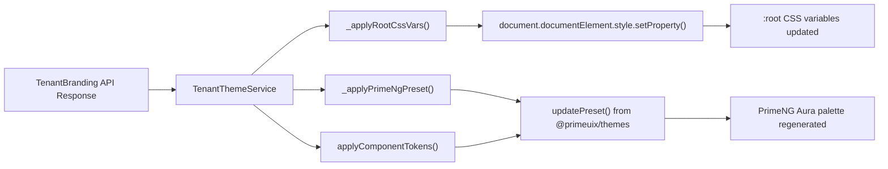
```mermaid
graph LR
    A[TenantBranding API Response] --> B[TenantThemeService]
    B --> C["_applyRootCssVars()"]
    B --> D["_applyPrimeNgPreset()"]
    B --> E["applyComponentTokens()"]
    C --> F["document.documentElement.style.setProperty()"]
    D --> G["updatePreset() from @primeuix/themes"]
    E --> G
    F --> H[":root CSS variables updated"]
    G --> I["PrimeNG Aura palette regenerated"]
```

The `TenantThemeService` performs three operations when branding is applied:

1. **Root CSS variables** (`_applyRootCssVars`): Sets `--tp-primary`, `--tp-primary-dark`, `--tp-primary-light`, `--tp-bg`, `--tp-surface`, `--tp-text`, `--tp-border`, `--nm-bg`, `--nm-accent`, `--nm-shadow-dark`, `--nm-shadow-light`, `--nm-radius`, `--nm-depth`
2. **PrimeNG palette generation** (`_applyPrimeNgPreset`): Generates an 11-shade HSL palette (50-950) from the primary color and calls `updatePreset({ semantic: { primary: palette } })`
3. **Component token overrides** (`applyComponentTokens`): Applies per-component PrimeNG token overrides stored as JSONB in `tenant_branding.component_tokens`

#### 1.5.2 Component Governance

The `component-catalog.ts` defines which PrimeNG components are used and their available style variants. Developers MUST:

- Use PrimeNG components (`<p-button>`, `<p-table>`, `<p-dialog>`, `<p-select>`, etc.) instead of custom HTML/CSS
- Apply visual variations through the style variant system (Raised, Flat, Inset, Ghost) rather than ad-hoc CSS classes
- Follow the Branding Studio policies defined in `branding-policy.config.ts` for color field constraints
- Never hardcode color hex values -- always reference `var(--tp-*)`, `var(--nm-*)`, or `var(--ai-*)` tokens

#### 1.5.3 Style Variant Pattern

Each PrimeNG component in the catalog can have multiple style variants. Variants use `updatePreset({ components: { [componentId]: tokens } })` to override PrimeNG design tokens at the component level:

| Variant | Visual Effect | Used For |
|---------|---------------|----------|
| **Raised** | Neumorphic outer shadow, surface background | Default state for buttons, cards |
| **Flat** | No shadow, transparent background | Inline actions, toolbar items |
| **Inset** | Inner shadow (pressed look) | Active tabs, selected items, search fields |
| **Ghost** | Transparent with accent text, no border | Secondary actions, icon buttons |

### 1.6 Border Radius

| Token | Value | Usage |
|-------|-------|-------|
| `--ai-radius-none` | `0px` | Sharp edges (tables, full-bleed) |
| `--ai-radius-sm` | `8px` | Badges, chips, small buttons |
| `--ai-radius-md` | `12px` | Cards, inputs, standard buttons |
| `--ai-radius-lg` | `16px` | Modals, panels, chat bubbles (matches `--nm-radius`) |
| `--ai-radius-xl` | `16px` | Floating action buttons, large cards |
| `--ai-radius-2xl` | `24px` | Message bubbles, pill shapes |
| `--ai-radius-full` | `9999px` | Circular avatars, dots |

**Note:** Radius values are larger than typical Material Design values because the neumorphic style requires more generous rounding to complement the soft shadow aesthetic. `--nm-radius: 16px` is the system default.

### 1.7 Shadows and Elevation

Elevation in the EMSIST neumorphic system is achieved through **dual-direction shadows** (dark shadow bottom-right, light shadow top-left) on a uniform `#edebe0` surface, rather than through traditional drop shadows or surface color changes.

**Evidence:** Shadow values verified against `docs/ai-service/prototype/style.css` lines 106-109 and `administration.tokens.scss` lines 24-25, 30, 105.

| Token | Value | Usage |
|-------|-------|-------|
| `--ai-shadow-sm` | `2px 2px 6px var(--nm-shadow-dark), -2px -2px 6px var(--nm-shadow-light)` | Flat cards, list items, subtle depth |
| `--ai-shadow-md` | `4px 4px 10px var(--nm-shadow-dark), -4px -4px 10px var(--nm-shadow-light)` | Raised cards, dropdowns, buttons |
| `--ai-shadow-lg` | `6px 6px 14px var(--nm-shadow-dark), -6px -6px 14px var(--nm-shadow-light)` | Modals, floating panels, large cards |
| `--ai-shadow-chat` | `4px 4px 10px var(--nm-shadow-dark), -4px -4px 10px var(--nm-shadow-light)` | Chat message bubbles |
| `--ai-shadow-focus` | `0 0 0 3px rgba(66, 129, 119, 0.35)` | Focus rings (accessibility, matches `--tp-focus-ring`) |

### 1.8 Dark Mode Considerations [PLANNED]

Dark mode is **not yet implemented** in the current EMSIST design system. The existing implementation is light-theme only, using the Wheat Light (`#edebe0`) neumorphic surface.

**Current status:** The Branding Studio presets (Neumorph, Aqua, Sand, Slate) all use `#edebe0` as the surface color. A dark neumorphic variant would require:

- A dark surface color (e.g., `#2a2a2a`) with inverted shadow directions
- Recalculated `--nm-shadow-dark` and `--nm-shadow-light` values for dark backgrounds
- PrimeNG Aura dark mode preset integration
- WCAG AAA contrast verification for all text/surface combinations in dark mode
- Updated `TenantThemeService` to support a `darkMode` boolean toggle

**When implemented, dark mode will need:**

| Element | Light Approach | Dark Adjustment |
|---------|---------------|-----------------|
| Surface | `#edebe0` Wheat Light | `#2a2824` Dark Charcoal (earthy dark base derived from Charcoal `#3d3a3b` at 30% luminance) |
| Shadows | Wheat-toned dark + white light | Inverted: darker dark + subtle light |
| Text | `#3d3a3b` Charcoal | Light text (e.g., `#e0ddd4`) |
| Agent avatars | Solid Forest/Wheat backgrounds | Maintain with subtle lighter border |
| Code blocks | Translucent wheat background | Dark background with light text |
| Charts | Charcoal text on wheat | Light text on dark, grid lines at 0.15 opacity |

### 1.9 Design System Taxonomy [PLANNED]

The EMSIST AI Agent Platform design system is organized into a three-tier taxonomy that governs how UI elements are selected, composed, and arranged. This taxonomy ensures consistency across screens, reduces custom code, and enforces reuse through the PrimeNG component catalog and the Branding Studio token override system.

**Evidence:** Component names, categories, style variants, and `usedInEmsist` flags verified against `frontend/src/app/features/administration/sections/tenant-manager/branding-studio/component-catalog.ts` (73 components across 10 categories). Token override mechanism verified against `updatePreset()` usage in `tenant-theme.service.ts`. Branding presets verified against `branding-policy.config.ts`.

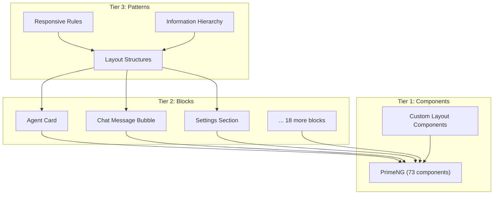
```mermaid
graph TD
    subgraph "Tier 3: Patterns"
        P1[Layout Structures]
        P2[Responsive Rules]
        P3[Information Hierarchy]
    end
    subgraph "Tier 2: Blocks"
        B1[Agent Card]
        B2[Chat Message Bubble]
        B3[Settings Section]
        B4["... 18 more blocks"]
    end
    subgraph "Tier 1: Components"
        C1["PrimeNG (73 components)"]
        C2[Custom Layout Components]
    end
    P1 --> B1
    P1 --> B2
    P1 --> B3
    B1 --> C1
    B2 --> C1
    B3 --> C1
    B4 --> C1
    P2 --> P1
    P3 --> P1
    C2 --> C1
```

#### 1.9.1 Tier 1: Components [PLANNED]

**Definition:** The most basic UI elements used in the platform. These are PrimeNG standalone components styled through the EMSIST token override system. Each component has a set of neumorphic style variants controlled per tenant by the Branding Studio.

**Source of truth:** `frontend/src/app/features/administration/sections/tenant-manager/branding-studio/component-catalog.ts`

##### 1.9.1.1 Component Catalog by Category

The component catalog contains 73 components organized into 10 categories. Components marked "Used" have style variants defined; "Available" components are registered but not yet styled.

**Form Components (22 components, 7 Used)**

| Component | PrimeNG Import | Used | Style Variants |
|-----------|---------------|------|----------------|
| Button | `import { ButtonModule } from 'primeng/button'` | Yes | Default, Raised, Inset, Flat |
| InputText | `import { InputTextModule } from 'primeng/inputtext'` | Yes | Default, Raised, Flat, Outlined |
| InputNumber | `import { InputNumberModule } from 'primeng/inputnumber'` | Yes | Default, Raised, Flat, Outlined |
| Select | `import { SelectModule } from 'primeng/select'` | Yes | Default, Raised, Flat, Outlined |
| SelectButton | `import { SelectButtonModule } from 'primeng/selectbutton'` | Yes | Default, Raised, Pills, Flat |
| Checkbox | `import { CheckboxModule } from 'primeng/checkbox'` | Yes | Default, Raised, Flat, Outlined |
| ToggleSwitch | `import { ToggleSwitchModule } from 'primeng/toggleswitch'` | Yes | Default, Raised, Flat, Minimal |
| SplitButton | `import { SplitButtonModule } from 'primeng/splitbutton'` | Available | -- |
| Textarea | `import { TextareaModule } from 'primeng/textarea'` | Available | -- |
| MultiSelect | `import { MultiSelectModule } from 'primeng/multiselect'` | Available | -- |
| RadioButton | `import { RadioButtonModule } from 'primeng/radiobutton'` | Available | -- |
| Rating | `import { RatingModule } from 'primeng/rating'` | Available | -- |
| ColorPicker | `import { ColorPickerModule } from 'primeng/colorpicker'` | Available | -- |
| InputMask | `import { InputMaskModule } from 'primeng/inputmask'` | Available | -- |
| InputOTP | `import { InputOtpModule } from 'primeng/inputotp'` | Available | -- |
| Password | `import { PasswordModule } from 'primeng/password'` | Available | -- |
| AutoComplete | `import { AutoCompleteModule } from 'primeng/autocomplete'` | Available | -- |
| CascadeSelect | `import { CascadeSelectModule } from 'primeng/cascadeselect'` | Available | -- |
| TreeSelect | `import { TreeSelectModule } from 'primeng/treeselect'` | Available | -- |
| Knob | `import { KnobModule } from 'primeng/knob'` | Available | -- |
| FloatLabel | `import { FloatLabelModule } from 'primeng/floatlabel'` | Available | -- |
| Slider | `import { SliderModule } from 'primeng/slider'` | Available | -- |

**Data Components (9 components, 2 Used)**

| Component | PrimeNG Import | Used | Style Variants |
|-----------|---------------|------|----------------|
| DataTable | `import { TableModule } from 'primeng/table'` | Yes | Default, Striped, Raised, Minimal |
| Paginator | `import { PaginatorModule } from 'primeng/paginator'` | Yes | Default, Raised, Flat, Minimal |
| DataView | `import { DataViewModule } from 'primeng/dataview'` | Available | -- |
| Tree | `import { TreeModule } from 'primeng/tree'` | Available | -- |
| Timeline | `import { TimelineModule } from 'primeng/timeline'` | Available | -- |
| OrderList | `import { OrderListModule } from 'primeng/orderlist'` | Available | -- |
| PickList | `import { PickListModule } from 'primeng/picklist'` | Available | -- |
| OrgChart | `import { OrganizationChartModule } from 'primeng/organizationchart'` | Available | -- |
| VirtualScroller | `import { VirtualScrollerModule } from 'primeng/virtualscroller'` | Available | -- |

**Panel Components (11 components, 4 Used)**

| Component | PrimeNG Import | Used | Style Variants |
|-----------|---------------|------|----------------|
| Card | `import { CardModule } from 'primeng/card'` | Yes | Default, Raised, Inset, Flat |
| Accordion | `import { AccordionModule } from 'primeng/accordion'` | Yes | Default, Raised Panels, Flush, Bordered |
| Tabs | `import { TabsModule } from 'primeng/tabs'` | Yes | Default, Pills, Cards, Underline |
| Dialog | `import { DialogModule } from 'primeng/dialog'` | Yes | Default, Raised, Flat, Minimal |
| Fieldset | `import { FieldsetModule } from 'primeng/fieldset'` | Available | -- |
| Panel | `import { PanelModule } from 'primeng/panel'` | Available | -- |
| Divider | `import { DividerModule } from 'primeng/divider'` | Available | -- |
| Toolbar | `import { ToolbarModule } from 'primeng/toolbar'` | Available | -- |
| Splitter | `import { SplitterModule } from 'primeng/splitter'` | Available | -- |
| ScrollPanel | `import { ScrollPanelModule } from 'primeng/scrollpanel'` | Available | -- |
| Stepper | `import { StepperModule } from 'primeng/stepper'` | Available | -- |

**Layout Components (4 components, 4 Used -- Custom EMSIST)**

| Component | Source | Used | Style Variants |
|-----------|--------|------|----------------|
| HeaderActionButton | `CustomLayout` (administration.page.scss) | Yes | Default (brand bezel, neumorphic face) |
| HeaderSignOutButton | `CustomLayout` (administration.page.scss) | Yes | Default (umber danger bezel) |
| AdminDockCard | `CustomLayout` (administration.page.scss) | Yes | Default (translucent glass, blur) |
| AdminDockItem | `CustomLayout` (administration.page.scss) | Yes | Default (circular icon, active primary) |

**Overlay Components (6 components, 1 Used)**

| Component | PrimeNG Import | Used | Style Variants |
|-----------|---------------|------|----------------|
| Tooltip | `import { TooltipModule } from 'primeng/tooltip'` | Yes | Default, Dark, Light, Minimal |
| Drawer | `import { DrawerModule } from 'primeng/drawer'` | Available | -- |
| Popover | `import { PopoverModule } from 'primeng/popover'` | Available | -- |
| ConfirmDialog | `import { ConfirmDialogModule } from 'primeng/confirmdialog'` | Available | -- |
| ConfirmPopup | `import { ConfirmPopupModule } from 'primeng/confirmpopup'` | Available | -- |
| Toast | `import { ToastModule } from 'primeng/toast'` | Available | -- |

**Messages Components (4 components, 4 Used)**

| Component | PrimeNG Import | Used | Style Variants |
|-----------|---------------|------|----------------|
| Message | `import { MessageModule } from 'primeng/message'` | Yes | Default, Raised, Flat, Bordered |
| Tag | `import { TagModule } from 'primeng/tag'` | Yes | Default, Raised, Flat, Outlined |
| Badge | `import { BadgeModule } from 'primeng/badge'` | Yes | Default, Raised, Flat, Outlined |
| Chip | `import { ChipModule } from 'primeng/chip'` | Yes | Default, Raised, Flat, Outlined |

**Navigation Components (10 components, 2 Used)**

| Component | PrimeNG Import | Used | Style Variants |
|-----------|---------------|------|----------------|
| Menu | `import { MenuModule } from 'primeng/menu'` | Yes | Default, Raised, Flat, Minimal |
| Breadcrumb | `import { BreadcrumbModule } from 'primeng/breadcrumb'` | Yes | Default, Raised, Flat, Minimal |
| Menubar | `import { MenubarModule } from 'primeng/menubar'` | Available | -- |
| Steps | `import { StepsModule } from 'primeng/steps'` | Available | -- |
| TabMenu | `import { TabMenuModule } from 'primeng/tabmenu'` | Available | -- |
| PanelMenu | `import { PanelMenuModule } from 'primeng/panelmenu'` | Available | -- |
| MegaMenu | `import { MegaMenuModule } from 'primeng/megamenu'` | Available | -- |
| ContextMenu | `import { ContextMenuModule } from 'primeng/contextmenu'` | Available | -- |
| TieredMenu | `import { TieredMenuModule } from 'primeng/tieredmenu'` | Available | -- |
| Dock | `import { DockModule } from 'primeng/dock'` | Available | -- |

**Media Components (4 components, 1 Used)**

| Component | PrimeNG Import | Used | Style Variants |
|-----------|---------------|------|----------------|
| Avatar | `import { AvatarModule } from 'primeng/avatar'` | Yes | Default, Raised, Inset, Flat |
| Image | `import { ImageModule } from 'primeng/image'` | Available | -- |
| Carousel | `import { CarouselModule } from 'primeng/carousel'` | Available | -- |
| Galleria | `import { GalleriaModule } from 'primeng/galleria'` | Available | -- |

**Misc Components (7 components, 2 Used)**

| Component | PrimeNG Import | Used | Style Variants |
|-----------|---------------|------|----------------|
| ProgressSpinner | `import { ProgressSpinnerModule } from 'primeng/progressspinner'` | Yes | Default, Large, Colored, Minimal |
| ProgressBar | `import { ProgressBarModule } from 'primeng/progressbar'` | Yes | Default, Raised, Flat, Striped |
| Skeleton | `import { SkeletonModule } from 'primeng/skeleton'` | Available | -- |
| ScrollTop | `import { ScrollTopModule } from 'primeng/scrolltop'` | Available | -- |
| BlockUI | `import { BlockUIModule } from 'primeng/blockui'` | Available | -- |
| Inplace | `import { InplaceModule } from 'primeng/inplace'` | Available | -- |
| MeterGroup | `import { MeterGroupModule } from 'primeng/metergroup'` | Available | -- |

##### 1.9.1.2 Neumorphic Style Variant Definitions

All style variants apply through the PrimeNG `updatePreset()` mechanism. The Branding Studio selects which variant is active per tenant via the `component_tokens` JSONB column on `tenant_branding`.

| Variant | Visual Effect | CSS Shadow Pattern | Usage |
|---------|---------------|-------------------|-------|
| **Default** | Standard PrimeNG Aura appearance, no custom shadow | (PrimeNG defaults) | Baseline rendering before branding is applied |
| **Raised** | Outset neumorphic shadow -- element appears to float above the surface | `Npx Npx Mpx var(--nm-shadow-dark), -Npx -Npx Mpx var(--nm-shadow-light)` | Cards, buttons, panels, interactive elements at rest |
| **Inset** | Pressed/recessed neumorphic shadow -- element appears pushed into the surface | `inset Npx Npx Mpx var(--nm-shadow-dark), inset -Npx -Npx Mpx var(--nm-shadow-light)` | Active tabs, selected items, search fields, pressed buttons |
| **Flat** | No shadow at all, clean bordered appearance | `shadow: none` | Toolbar items, inline actions, dense layouts |
| **Outlined** | No shadow, prominent border using primary color | `shadow: none; borderColor: '{primary.color}'` | Form inputs, badges, chips with emphasis |
| **Ghost** | Transparent background, accent text, no border or shadow | (PrimeNG text variant) | Secondary actions, icon-only buttons |
| **Pills** | Fully rounded with `border-radius: 24px` and raised shadow | `3px 3px 6px var(--nm-shadow-dark), -3px -3px 6px var(--nm-shadow-light)` | SelectButton pill toggles, filter chips |
| **Minimal** | Smallest visual footprint, no borders, no shadow | `shadow: none; borderRadius: 0` | Dense data views, borderless menus |

**Token override mechanism:**

```typescript
// Example: Applying the "Raised" variant to Button
import { updatePreset } from '@primeuix/themes';

updatePreset({
  components: {
    button: {
      root: {
        borderRadius: '12px',
        shadow: '4px 4px 8px var(--nm-shadow-dark), -4px -4px 8px var(--nm-shadow-light)',
      },
    },
  },
});
```

**Note:** The Branding Studio controls which variant is active per tenant. Developers do not select variants in component templates -- the variant is applied globally through `TenantThemeService.applyComponentTokens()` based on the `component_tokens` stored for the tenant.

##### 1.9.1.3 Category Summary

| Category | Total | Used | Available | Variants on Used Components |
|----------|-------|------|-----------|---------------------------|
| Form | 22 | 7 | 15 | Default, Raised, Inset, Flat, Outlined, Pills, Minimal |
| Data | 9 | 2 | 7 | Default, Striped, Raised, Flat, Minimal |
| Panel | 11 | 4 | 7 | Default, Raised, Inset, Flat, Raised Panels, Flush, Bordered, Pills, Cards, Underline, Minimal |
| Layout | 4 | 4 | 0 | Default (custom CSS variables) |
| Overlay | 6 | 1 | 5 | Default, Dark, Light, Minimal |
| Messages | 4 | 4 | 0 | Default, Raised, Flat, Outlined, Bordered |
| Navigation | 10 | 2 | 8 | Default, Raised, Flat, Minimal |
| Media | 4 | 1 | 3 | Default, Raised, Inset, Flat |
| Misc | 7 | 2 | 5 | Default, Raised, Flat, Large, Colored, Minimal, Striped |
| **Total** | **77** | **27** | **50** | |

**Note:** The `Global` category (defined in the catalog type system) contains no components currently. The 4 Layout components are `CustomLayout` source, not PrimeNG.

#### 1.9.2 Tier 2: Blocks [PLANNED]

**Definition:** Tested, composed UI elements commonly used across the AI Agent Platform. Blocks combine multiple Tier 1 Components into reusable, purpose-built units. Each block defines its component composition, key tokens, and accessibility requirements.

##### 1.9.2.1 Agent Card Block

**Used in:** Agents screen, Template Gallery, Agent Comparison

**Description:** Displays agent identity, status, model information, and action menu. The primary unit for browsing and managing agents.

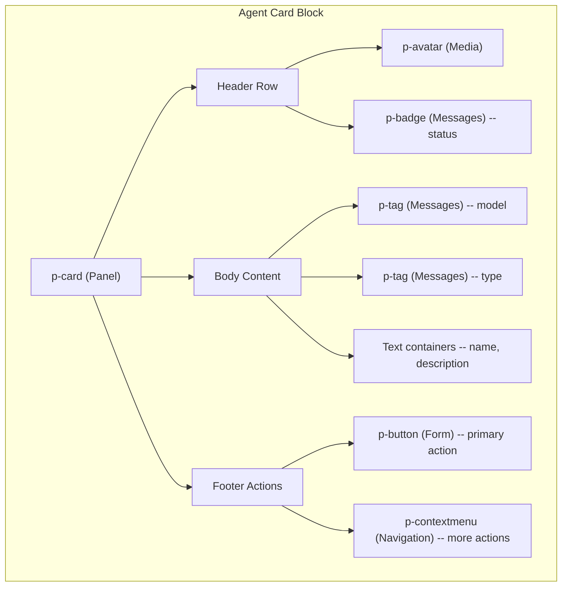
```mermaid
graph TD
    subgraph "Agent Card Block"
        CARD["p-card (Panel)"]
        CARD --> HEADER[Header Row]
        CARD --> BODY[Body Content]
        CARD --> FOOTER[Footer Actions]
        HEADER --> AV["p-avatar (Media)"]
        HEADER --> BADGE["p-badge (Messages) -- status"]
        BODY --> TAG1["p-tag (Messages) -- model"]
        BODY --> TAG2["p-tag (Messages) -- type"]
        BODY --> TEXT[Text containers -- name, description]
        FOOTER --> BTN1["p-button (Form) -- primary action"]
        FOOTER --> CTX["p-contextmenu (Navigation) -- more actions"]
    end
```

**HTML structure:**
```html
<p-card [style]="cardStyle">
  <ng-template pTemplate="header">
    <div class="ai-agent-card-header">
      <p-avatar [label]="agent.initials" [style]="avatarStyle" shape="circle" />
      <p-badge [value]="agent.status" [severity]="statusSeverity" />
    </div>
  </ng-template>
  <h3>{{ agent.name }}</h3>
  <p>{{ agent.description }}</p>
  <p-tag [value]="agent.model" [severity]="'info'" />
  <p-tag [value]="agent.type" [severity]="'success'" />
  <ng-template pTemplate="footer">
    <p-button label="Open" (onClick)="openAgent(agent)" />
    <p-button icon="pi pi-ellipsis-v" [text]="true" (onClick)="menu.toggle($event)" />
    <p-menu #menu [model]="contextItems" [popup]="true" />
  </ng-template>
</p-card>
```

**Key tokens:** `--ai-shadow-md`, `--ai-radius-lg`, `--ai-space-4`, `--nm-shadow-dark`, `--nm-shadow-light`

**Accessibility:** `role="article"`, `aria-label="{agent.name}, {status}"`, context menu via `aria-haspopup="menu"`, keyboard: `Enter`/`Space` to open, `Tab` between actions, `Shift+F10` for context menu.

##### 1.9.2.2 Chat Message Bubble Block

**Used in:** Chat screen

**Description:** User or agent message with metadata, tool call visualization, and feedback buttons.

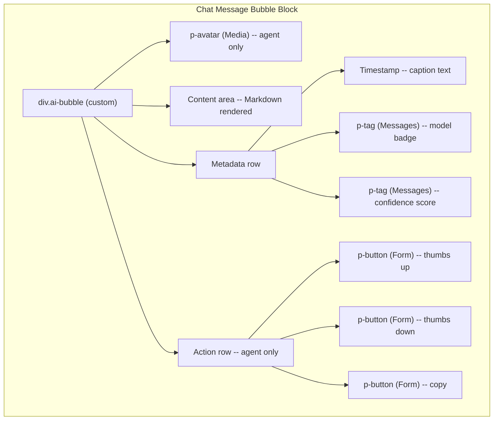
```mermaid
graph TD
    subgraph "Chat Message Bubble Block"
        BUBBLE["div.ai-bubble (custom)"]
        BUBBLE --> AV["p-avatar (Media) -- agent only"]
        BUBBLE --> CONTENT[Content area -- Markdown rendered]
        BUBBLE --> META[Metadata row]
        BUBBLE --> ACTIONS[Action row -- agent only]
        META --> TS[Timestamp -- caption text]
        META --> MODEL["p-tag (Messages) -- model badge"]
        META --> CONF["p-tag (Messages) -- confidence score"]
        ACTIONS --> UP["p-button (Form) -- thumbs up"]
        ACTIONS --> DOWN["p-button (Form) -- thumbs down"]
        ACTIONS --> COPY["p-button (Form) -- copy"]
    end
```

**Key tokens:** `--ai-bubble-user`, `--ai-bubble-agent`, `--ai-radius-2xl`, `--ai-space-4`

**Accessibility:** `role="article"`, `aria-label="Message from {sender} at {time}"`, feedback buttons with `aria-label="Rate this response as helpful"` / `"Rate this response as unhelpful"`, code blocks with `role="code"`.

##### 1.9.2.3 Chat Input Bar Block

**Used in:** Chat screen (bottom)

**Description:** Message composition area with send button, file attachment, and character counter.

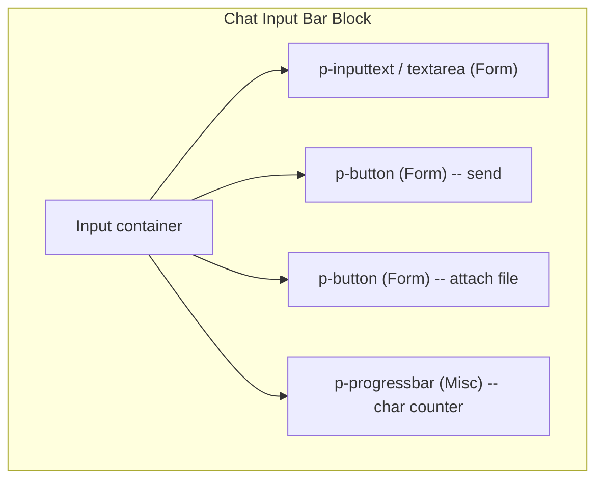
```mermaid
graph TD
    subgraph "Chat Input Bar Block"
        BAR[Input container]
        BAR --> INPUT["p-inputtext / textarea (Form)"]
        BAR --> SEND["p-button (Form) -- send"]
        BAR --> ATTACH["p-button (Form) -- attach file"]
        BAR --> COUNTER["p-progressbar (Misc) -- char counter"]
    end
```

**Key tokens:** `--ai-shadow-md`, `--ai-radius-lg`, `--nm-shadow-dark`, `--nm-shadow-light`

**Accessibility:** `role="form"`, `aria-label="Message input"`, `Enter` to send (configurable), `Ctrl+Enter` for newline, `aria-describedby` linked to character counter, attachment button with `aria-label="Attach file"`.

##### 1.9.2.4 Conversation List Item Block

**Used in:** Chat sidebar

**Description:** Clickable conversation entry with title, timestamp, avatar, and unread indicator.

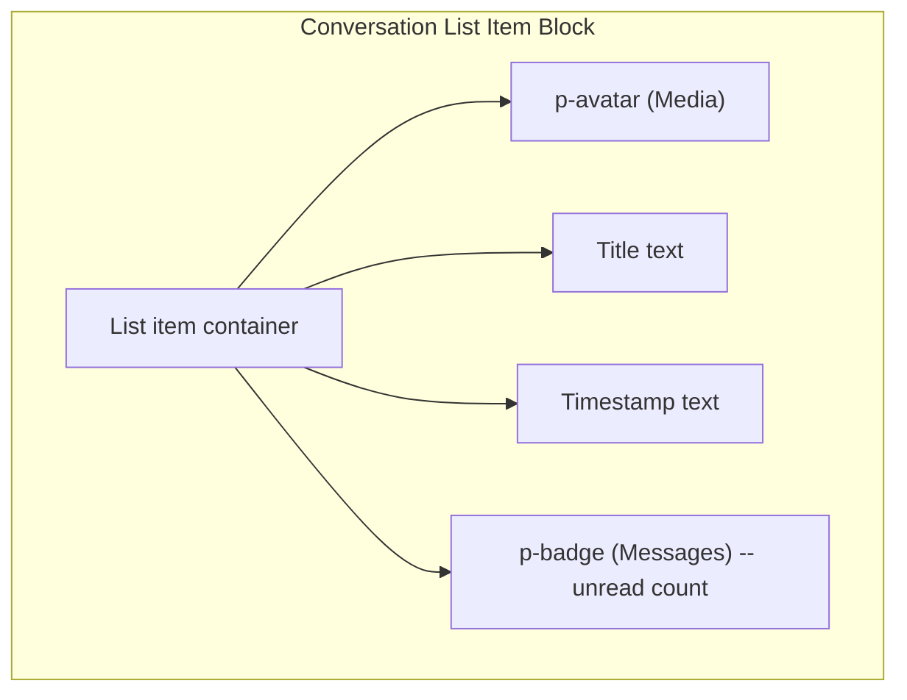
```mermaid
graph TD
    subgraph "Conversation List Item Block"
        ITEM[List item container]
        ITEM --> AV["p-avatar (Media)"]
        ITEM --> TITLE[Title text]
        ITEM --> TIME[Timestamp text]
        ITEM --> UNREAD["p-badge (Messages) -- unread count"]
    end
```

**Key tokens:** `--ai-space-3`, `--ai-text-primary`, `--ai-text-caption`, `--nm-shadow-dark`

**Accessibility:** `role="option"` within `role="listbox"`, `aria-selected` for active conversation, `aria-label="{title}, {unread count} unread messages"`, `Enter` to select, arrow keys for navigation.

##### 1.9.2.5 Training Job Row Block

**Used in:** Training screen

**Description:** Active, completed, or failed training job with progress indicator and controls.

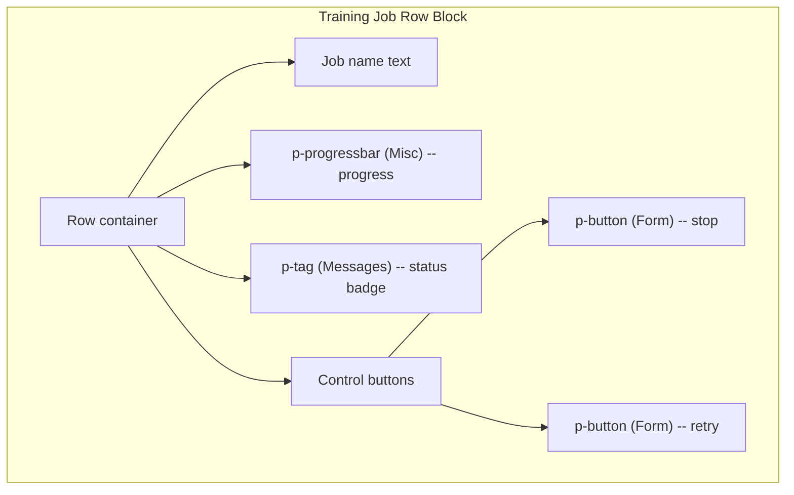
```mermaid
graph TD
    subgraph "Training Job Row Block"
        ROW[Row container]
        ROW --> NAME[Job name text]
        ROW --> PROG["p-progressbar (Misc) -- progress"]
        ROW --> STATUS["p-tag (Messages) -- status badge"]
        ROW --> ACTIONS[Control buttons]
        ACTIONS --> STOP["p-button (Form) -- stop"]
        ACTIONS --> RETRY["p-button (Form) -- retry"]
    end
```

**Key tokens:** `--ai-success`, `--ai-error`, `--ai-warning`, `--ai-space-3`

**Accessibility:** `role="row"` within table, `aria-label="{job name}, {status}, {progress}%"`, stop/retry buttons with descriptive `aria-label`.

##### 1.9.2.6 Analytics Metric Card Block

**Used in:** Analytics screen

**Description:** KPI display with value, label, and trend arrow indicator.

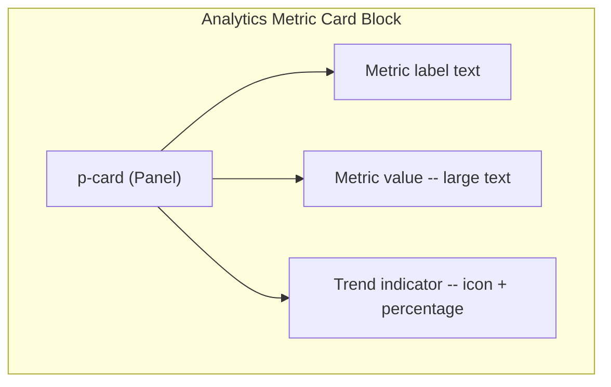
```mermaid
graph TD
    subgraph "Analytics Metric Card Block"
        CARD["p-card (Panel)"]
        CARD --> LABEL[Metric label text]
        CARD --> VALUE[Metric value -- large text]
        CARD --> TREND[Trend indicator -- icon + percentage]
    end
```

**Key tokens:** `--ai-shadow-sm`, `--ai-radius-md`, `--ai-text-h2`, `--ai-success`, `--ai-error`

**Accessibility:** `role="region"`, `aria-label="{label}: {value}, {trend direction} {trend percent}"`, trend arrow is decorative (`aria-hidden="true"`) with text alternative in sr-only span.

##### 1.9.2.7 Eval Score Card Block

**Used in:** Eval Harness screen

**Description:** Quality metric display with pass/fail ratio visualization.

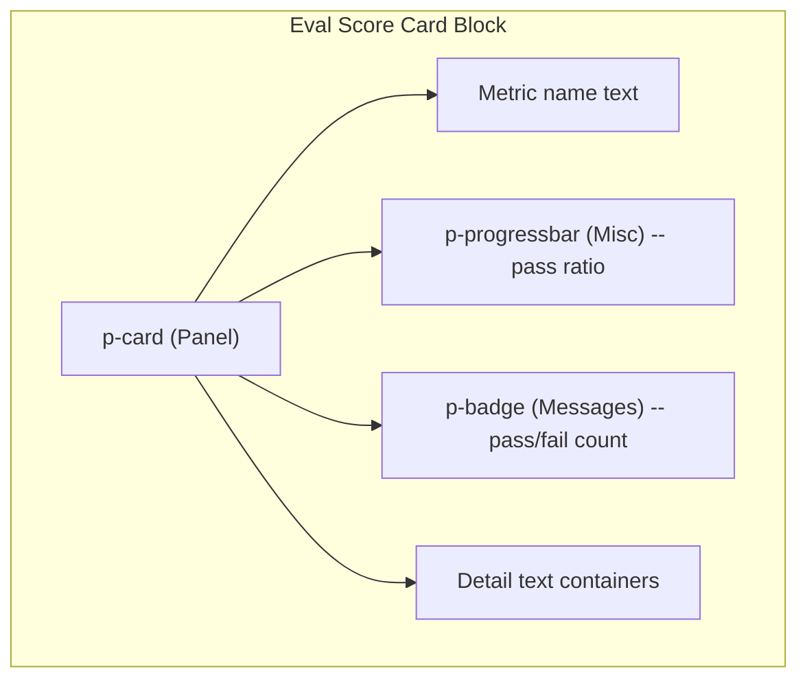
```mermaid
graph TD
    subgraph "Eval Score Card Block"
        CARD["p-card (Panel)"]
        CARD --> TITLE[Metric name text]
        CARD --> SCORE["p-progressbar (Misc) -- pass ratio"]
        CARD --> BADGE["p-badge (Messages) -- pass/fail count"]
        CARD --> DETAIL[Detail text containers]
    end
```

**Key tokens:** `--ai-success`, `--ai-error`, `--ai-radius-md`, `--ai-space-3`

**Accessibility:** `role="region"`, `aria-label="{metric}: {pass count} passed, {fail count} failed"`, progress bar with `aria-valuenow`, `aria-valuemin="0"`, `aria-valuemax="100"`.

##### 1.9.2.8 Settings Section Block

**Used in:** Settings screen

**Description:** Grouped form fields with section header and save/reset actions.

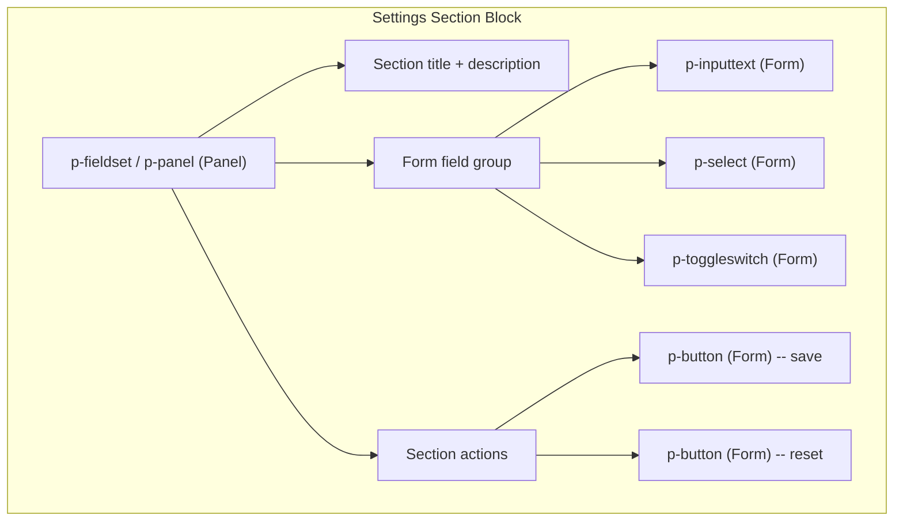
```mermaid
graph TD
    subgraph "Settings Section Block"
        SECTION["p-fieldset / p-panel (Panel)"]
        SECTION --> HEADER[Section title + description]
        SECTION --> FIELDS[Form field group]
        SECTION --> ACTIONS[Section actions]
        FIELDS --> F1["p-inputtext (Form)"]
        FIELDS --> F2["p-select (Form)"]
        FIELDS --> F3["p-toggleswitch (Form)"]
        ACTIONS --> SAVE["p-button (Form) -- save"]
        ACTIONS --> RESET["p-button (Form) -- reset"]
    end
```

**Key tokens:** `--ai-shadow-sm`, `--ai-radius-lg`, `--ai-space-6`, `--nm-shadow-dark`

**Accessibility:** `role="group"`, `aria-labelledby` linked to section title, form fields with `aria-required`, `aria-invalid`, `aria-describedby` for validation messages.

##### 1.9.2.9 Skill Item (Draggable) Block

**Used in:** Agent Builder capability library

**Description:** Capability library item for drag-and-drop into the builder canvas.

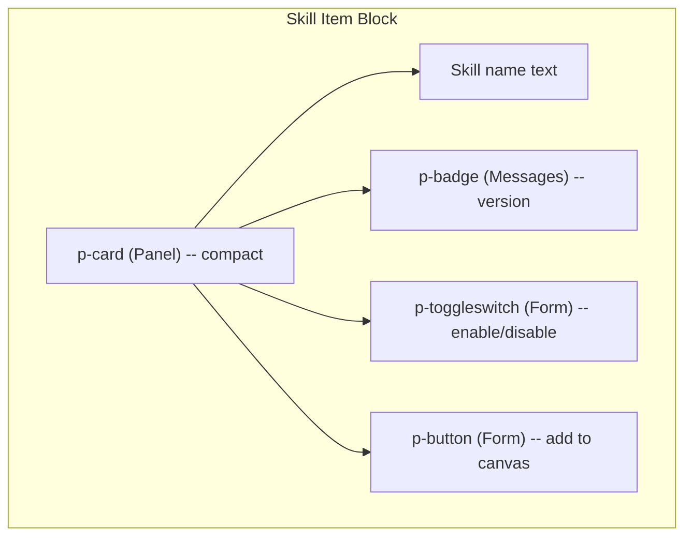
```mermaid
graph TD
    subgraph "Skill Item Block"
        CARD["p-card (Panel) -- compact"]
        CARD --> NAME[Skill name text]
        CARD --> VER["p-badge (Messages) -- version"]
        CARD --> TOGGLE["p-toggleswitch (Form) -- enable/disable"]
        CARD --> ADD["p-button (Form) -- add to canvas"]
    end
```

**Key tokens:** `--ai-shadow-sm`, `--ai-radius-md`, `--ai-space-2`, `--ai-space-3`

**Accessibility:** `role="option"` within `role="listbox"`, `aria-grabbed` for drag state, keyboard alternative: `Enter` to add to canvas (WCAG 2.1.1), `aria-label="{skill name} v{version}, {enabled/disabled}"`.

##### 1.9.2.10 Template Card Block

**Used in:** Template Gallery

**Description:** Template preview with category tag, rating, and call-to-action button.

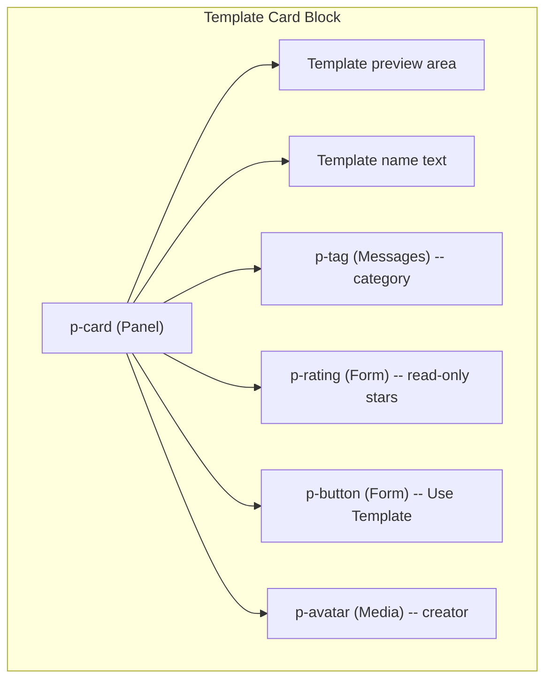
```mermaid
graph TD
    subgraph "Template Card Block"
        CARD["p-card (Panel)"]
        CARD --> PREVIEW[Template preview area]
        CARD --> TITLE[Template name text]
        CARD --> CAT["p-tag (Messages) -- category"]
        CARD --> RATING["p-rating (Form) -- read-only stars"]
        CARD --> CTA["p-button (Form) -- Use Template"]
        CARD --> AV["p-avatar (Media) -- creator"]
    end
```

**Key tokens:** `--ai-shadow-md`, `--ai-radius-lg`, `--ai-space-4`, `--nm-shadow-dark`

**Accessibility:** `role="article"`, `aria-label="{template name}, {category}, rated {rating} out of 5"`, CTA button with `aria-label="Use {template name} template"`.

##### 1.9.2.11 Filter Chip Bar Block

**Used in:** Template Gallery, Notifications, Audit Log

**Description:** Category filter with single or multi-select behavior using chip-styled toggle buttons.

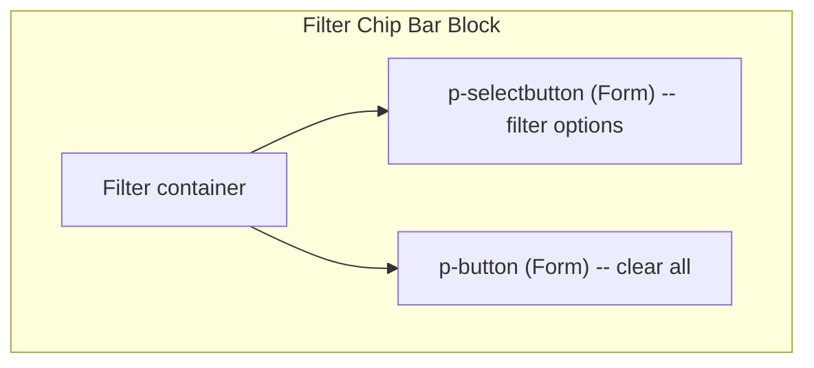
```mermaid
graph TD
    subgraph "Filter Chip Bar Block"
        BAR[Filter container]
        BAR --> CHIPS["p-selectbutton (Form) -- filter options"]
        BAR --> CLEAR["p-button (Form) -- clear all"]
    end
```

**Key tokens:** `--ai-radius-full`, `--ai-space-2`, `--nm-shadow-dark`, `--nm-shadow-light`

**Accessibility:** `role="toolbar"`, `aria-label="Filter by category"`, each chip is a toggle button with `aria-pressed`, arrow keys to navigate between chips.

##### 1.9.2.12 Date Range Picker Block

**Used in:** Analytics screen

**Description:** Time period selector with preset options (7d/30d/90d/Custom).

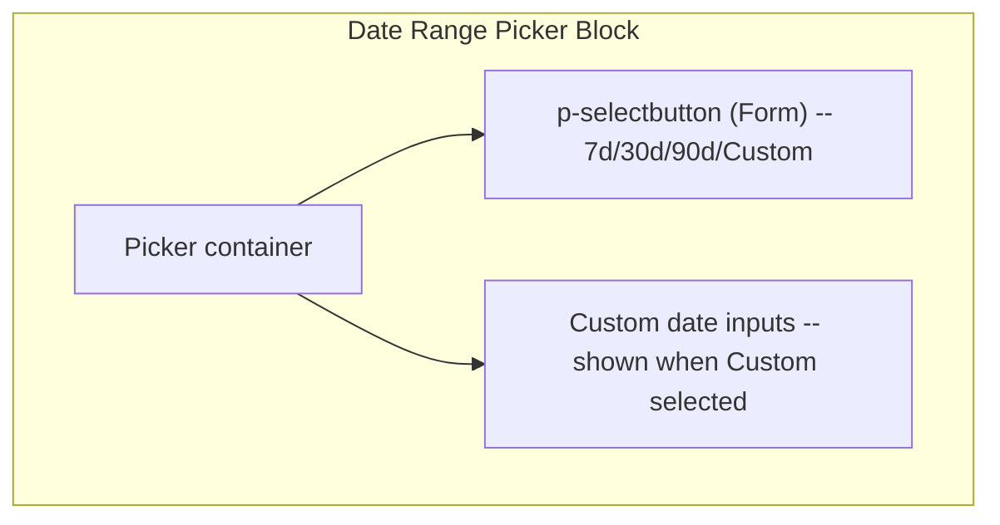
```mermaid
graph TD
    subgraph "Date Range Picker Block"
        PICKER[Picker container]
        PICKER --> PRESETS["p-selectbutton (Form) -- 7d/30d/90d/Custom"]
        PICKER --> CUSTOM["Custom date inputs -- shown when Custom selected"]
    end
```

**Key tokens:** `--ai-radius-md`, `--ai-space-2`, `--nm-shadow-dark`

**Accessibility:** `role="group"`, `aria-label="Select time period"`, custom date inputs with `aria-label="Start date"` / `"End date"`.

##### 1.9.2.13 Confirmation Modal Block

**Used in:** Cross-screen (delete, discard, publish actions)

**Description:** Destructive action confirmation with danger/primary variants.

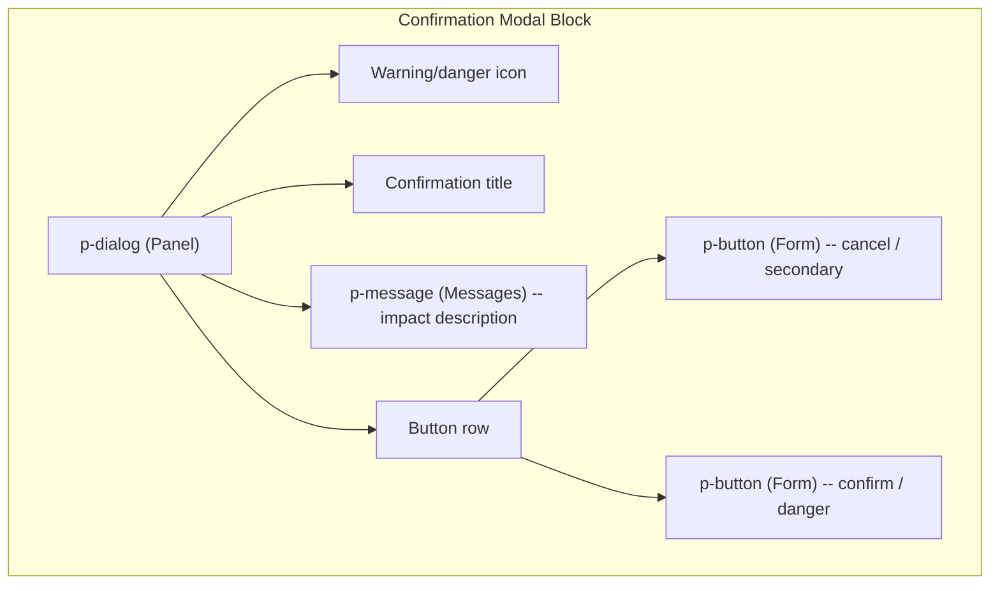
```mermaid
graph TD
    subgraph "Confirmation Modal Block"
        DIALOG["p-dialog (Panel)"]
        DIALOG --> ICON[Warning/danger icon]
        DIALOG --> TITLE[Confirmation title]
        DIALOG --> MSG["p-message (Messages) -- impact description"]
        DIALOG --> ACTIONS[Button row]
        ACTIONS --> CANCEL["p-button (Form) -- cancel / secondary"]
        ACTIONS --> CONFIRM["p-button (Form) -- confirm / danger"]
    end
```

**Key tokens:** `--ai-error`, `--ai-shadow-lg`, `--ai-radius-lg`, `--ai-space-6`

**Accessibility:** `role="alertdialog"`, `aria-modal="true"`, `aria-describedby` linked to message content, focus trapped inside dialog, `Escape` to cancel, confirm button requires explicit click (no auto-focus on destructive action).

##### 1.9.2.14 Toast Notification Block

**Used in:** Cross-screen

**Description:** Success/error/warning/info feedback with auto-dismiss.

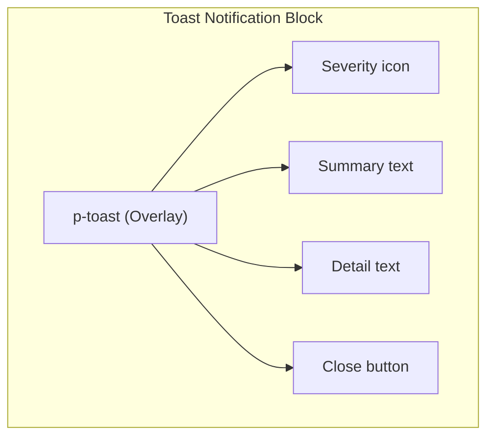
```mermaid
graph TD
    subgraph "Toast Notification Block"
        TOAST["p-toast (Overlay)"]
        TOAST --> ICON[Severity icon]
        TOAST --> SUMMARY[Summary text]
        TOAST --> DETAIL[Detail text]
        TOAST --> CLOSE["Close button"]
    end
```

**Key tokens:** `--ai-success`, `--ai-error`, `--ai-warning`, `--ai-info`, `--ai-radius-md`

**Accessibility:** `role="status"`, `aria-live="polite"` (info/success) or `aria-live="assertive"` (error), auto-dismiss after 5 seconds (configurable), close button with `aria-label="Dismiss notification"`.

##### 1.9.2.15 Pagination Bar Block

**Used in:** Agents, Audit Log, Training

**Description:** Page navigation with rows-per-page selector.

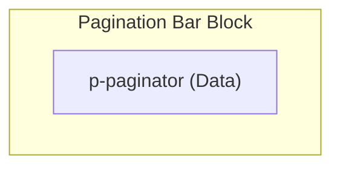
```mermaid
graph TD
    subgraph "Pagination Bar Block"
        PAG["p-paginator (Data)"]
    end
```

**Key tokens:** `--ai-space-2`, `--ai-radius-sm`, `--nm-shadow-dark`

**Accessibility:** `nav` landmark with `aria-label="Page navigation"`, page buttons with `aria-label="Page {n}"`, `aria-current="page"` on active page.

##### 1.9.2.16 Sort Dropdown Block

**Used in:** Agents, Audit Log

**Description:** Column sorting control for data views.

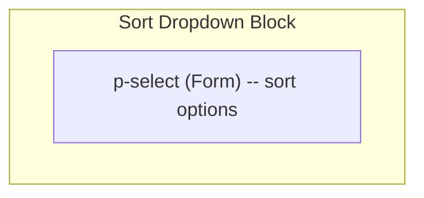
```mermaid
graph TD
    subgraph "Sort Dropdown Block"
        SORT["p-select (Form) -- sort options"]
    end
```

**Key tokens:** `--ai-radius-md`, `--ai-space-2`

**Accessibility:** `aria-label="Sort by"`, options include sort direction indication, `aria-selected` on current sort.

##### 1.9.2.17 Knowledge Source Card Block

**Used in:** Knowledge Management screen

**Description:** Document source card with indexing progress and status.

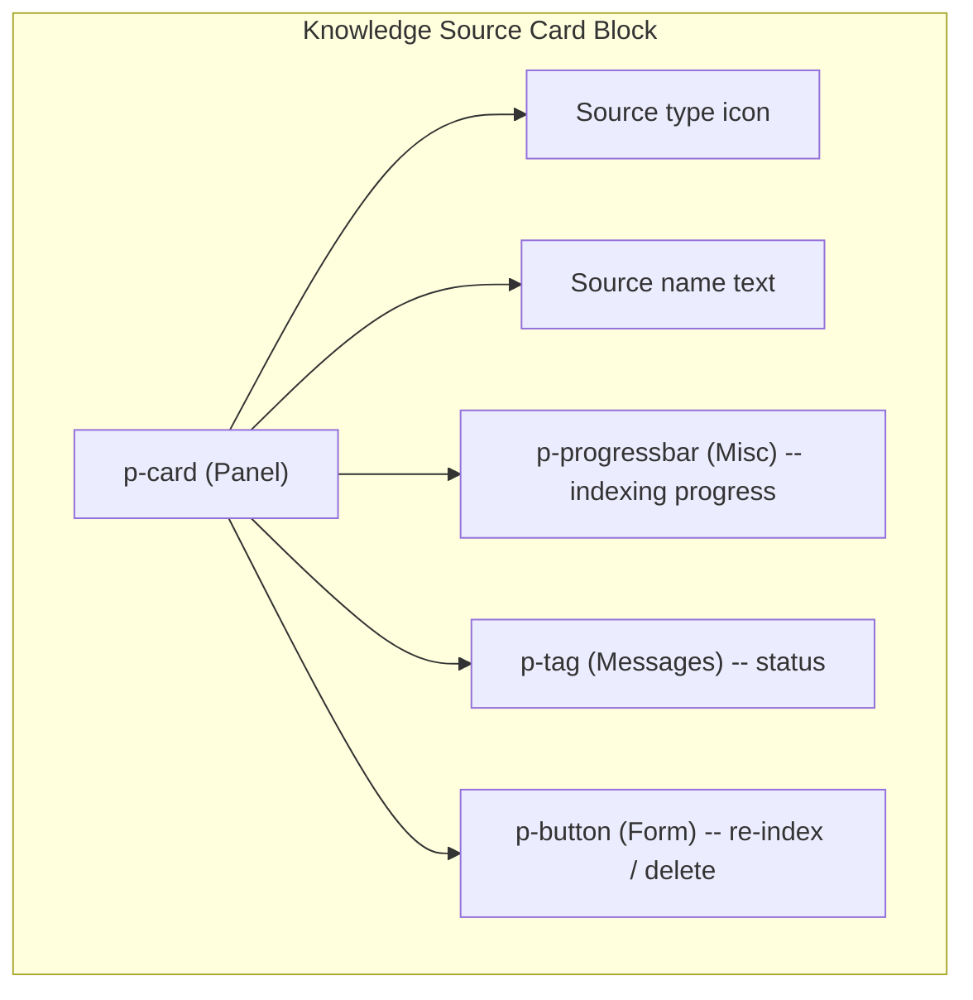
```mermaid
graph TD
    subgraph "Knowledge Source Card Block"
        CARD["p-card (Panel)"]
        CARD --> ICON[Source type icon]
        CARD --> NAME[Source name text]
        CARD --> PROG["p-progressbar (Misc) -- indexing progress"]
        CARD --> STATUS["p-tag (Messages) -- status"]
        CARD --> ACTIONS["p-button (Form) -- re-index / delete"]
    end
```

**Key tokens:** `--ai-shadow-md`, `--ai-radius-lg`, `--ai-success`, `--ai-warning`

**Accessibility:** `role="article"`, `aria-label="{source name}, {status}, {progress}% indexed"`, progress bar with `aria-valuenow`.

##### 1.9.2.18 Pipeline Stage Indicator Block

**Used in:** Pipeline Viewer screen

**Description:** 12-state pipeline step visualization with status dots and connectors.

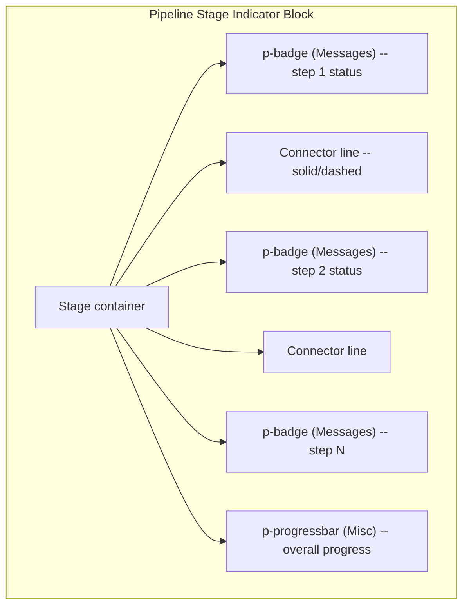
```mermaid
graph TD
    subgraph "Pipeline Stage Indicator Block"
        PIPE[Stage container]
        PIPE --> DOT1["p-badge (Messages) -- step 1 status"]
        PIPE --> CONN1[Connector line -- solid/dashed]
        PIPE --> DOT2["p-badge (Messages) -- step 2 status"]
        PIPE --> CONN2[Connector line]
        PIPE --> DOTN["p-badge (Messages) -- step N"]
        PIPE --> PROG["p-progressbar (Misc) -- overall progress"]
    end
```

**Key tokens:** `--ai-success`, `--ai-error`, `--ai-warning`, `--ai-info`, `--ai-space-2`

**Accessibility:** `role="progressbar"` on overall container, each step as `role="listitem"` with `aria-label="Step {n}: {name}, status: {status}"`, status conveyed via text (not color alone).

##### 1.9.2.19 Notification Item Block

**Used in:** Notification Center

**Description:** Notification entry with read/unread state, category, and timestamp.

```mermaid
graph TD
    subgraph "Notification Item Block"
        ITEM[List item container]
        ITEM --> DOT["p-badge (Messages) -- unread dot"]
        ITEM --> AV["p-avatar (Media) -- source icon"]
        ITEM --> TITLE[Notification title text]
        ITEM --> DESC[Description text]
        ITEM --> TIME[Timestamp text]
    end
```

**Key tokens:** `--ai-space-3`, `--ai-text-primary`, `--ai-text-caption`, `--ai-primary-subtle`

**Accessibility:** `role="listitem"`, `aria-label="{title}, {time ago}, {read/unread}"`, unread items announced with `aria-description="unread"`.

##### 1.9.2.20 Comparison Metric Row Block

**Used in:** Agent Comparison screen

**Description:** Side-by-side agent metric with diff indicators showing which agent performs better.

```mermaid
graph TD
    subgraph "Comparison Metric Row Block"
        ROW[Table row container]
        ROW --> LABEL[Metric name]
        ROW --> VAL_A[Agent A value]
        ROW --> VAL_B[Agent B value]
        ROW --> DIFF["p-tag (Messages) -- better/worse indicator"]
    end
```

**Key tokens:** `--ai-success`, `--ai-error`, `--ai-space-3`, `--ai-text-primary`

**Accessibility:** `role="row"`, cells with `role="cell"`, diff indicator uses both color and text ("Better" / "Worse"), `aria-label="{metric}: Agent A {value}, Agent B {value}, {diff direction}"`.

##### 1.9.2.21 Breadcrumb Trail Block

**Used in:** Cross-screen

**Description:** Navigation context indicator using PrimeNG Breadcrumb.

```mermaid
graph TD
    subgraph "Breadcrumb Trail Block"
        BC["p-breadcrumb (Navigation)"]
        BC --> HOME[Home icon]
        BC --> SEP1[Separator]
        BC --> PAGE[Current section]
        BC --> SEP2[Separator]
        BC --> SUBPAGE[Current page]
    end
```

**Key tokens:** `--ai-text-link`, `--ai-text-secondary`, `--ai-space-2`

**Accessibility:** `nav` landmark with `aria-label="Breadcrumb"`, current page marked with `aria-current="page"`, separator is `aria-hidden="true"`.

#### 1.9.3 Tier 3: Patterns [PLANNED]

**Definition:** Visual guides on how to arrange elements and information on screen. Patterns define layout structures, information hierarchy, and responsive behavior. Every page in the AI Agent Platform uses exactly one primary Pattern.

##### 1.9.3.1 Sidebar + Content Pattern

**Used in:** All screens (primary navigation pattern)

**Description:** 240px collapsible sidebar with fluid content area. The sidebar contains the main navigation; the content area hosts the active screen.

```mermaid
graph LR
    subgraph "Sidebar + Content"
        SIDEBAR["Sidebar<br/>240px fixed<br/>Navigation items"]
        CONTENT["Content Area<br/>calc(100% - 240px)<br/>Active screen"]
    end
    SIDEBAR --- CONTENT
```

**Responsive behavior:**

| Breakpoint | Sidebar | Content |
|------------|---------|---------|
| Desktop (>1024px) | 240px fixed, always visible | `calc(100% - 240px)` fluid |
| Tablet (768-1024px) | 64px collapsed (icons only), expandable on hover | `calc(100% - 64px)` fluid |
| Mobile (<768px) | Off-canvas drawer, triggered by hamburger menu | 100% width |

**CSS:**
```css
.ai-layout {
  display: grid;
  grid-template-columns: 240px 1fr;
  min-height: 100vh;
}
@media (max-width: 1024px) {
  .ai-layout { grid-template-columns: 64px 1fr; }
}
@media (max-width: 768px) {
  .ai-layout { grid-template-columns: 1fr; }
}
```

**Accessibility:** Sidebar is `nav` landmark with `aria-label="Main navigation"`, skip-link targets content area, `aria-expanded` on collapsed sidebar toggle.

##### 1.9.3.2 3-Panel Builder Pattern

**Used in:** Agent Builder

**Description:** Three-column workspace for agent configuration: capability library on the left, configuration canvas in the center, and prompt playground on the right.

```mermaid
graph LR
    subgraph "3-Panel Builder"
        LEFT["Left Panel<br/>280px<br/>Capability Library<br/>(Skill Item blocks)"]
        CENTER["Center Panel<br/>flex: 1<br/>Configuration Canvas<br/>(Settings Section blocks)"]
        RIGHT["Right Panel<br/>360px<br/>Prompt Playground<br/>(Chat Input + Message blocks)"]
    end
    LEFT --- CENTER --- RIGHT
```

**Responsive behavior:**

| Breakpoint | Left | Center | Right |
|------------|------|--------|-------|
| Desktop (>1024px) | 280px fixed | Fluid `flex: 1` | 360px fixed |
| Tablet (768-1024px) | 240px collapsible panel | Fluid | Right panel in overlay drawer |
| Mobile (<768px) | Tab-based navigation (Library / Canvas / Playground) | Full width per tab | Full width per tab |

**CSS:**
```css
.ai-builder-layout {
  display: grid;
  grid-template-columns: 280px 1fr 360px;
  height: calc(100vh - 64px);
  gap: var(--ai-space-0);
}
```

**Accessibility:** Each panel is a `region` landmark with `aria-label`, `Tab` navigates between panels, `F6` cycles panel focus, drag-and-drop has keyboard alternative (`Enter` to add).

##### 1.9.3.3 Chat Layout Pattern

**Used in:** Chat screen

**Description:** Three-column conversation interface: conversation list on the left, message thread in the center, and optional context panel on the right.

```mermaid
graph LR
    subgraph "Chat Layout"
        LEFT["Left Panel<br/>280px<br/>Conversation List<br/>(Conversation List Items)"]
        CENTER["Center Panel<br/>flex: 1<br/>Messages + Input Bar<br/>(Message Bubble + Chat Input blocks)"]
        RIGHT["Right Panel<br/>320px<br/>Context Panel<br/>(Agent info, tools, settings)"]
    end
    LEFT --- CENTER --- RIGHT
```

**Responsive behavior:**

| Breakpoint | Left | Center | Right |
|------------|------|--------|-------|
| Desktop (>1024px) | 280px fixed | Fluid | 320px, collapsible |
| Tablet (768-1024px) | 280px overlay drawer | Full width | Hidden, button to open |
| Mobile (<768px) | Full-width list view (navigates to chat on select) | Full width (back button to return to list) | Hidden, bottom sheet on tap |

**Accessibility:** Conversation list is `role="listbox"`, message area is `role="log"` with `aria-live="polite"`, context panel is `complementary` landmark.

##### 1.9.3.4 Card Grid (Auto-fill) Pattern

**Used in:** Agents screen, Template Gallery, Knowledge Management

**Description:** Responsive card grid that automatically adjusts column count to fit the viewport.

```mermaid
graph TD
    subgraph "Card Grid Pattern"
        TOOLBAR[Toolbar -- search, filters, sort, view toggle]
        GRID["CSS Grid<br/>repeat(auto-fill, minmax(280px, 1fr))<br/>gap: 24px"]
        GRID --> C1[Agent/Template Card]
        GRID --> C2[Agent/Template Card]
        GRID --> C3[Agent/Template Card]
        GRID --> CN["..."]
    end
    TOOLBAR --> GRID
```

**Responsive behavior:**

| Breakpoint | Columns | Card Min Width |
|------------|---------|----------------|
| Desktop (>1024px) | 3-4 columns | 280px |
| Tablet (768-1024px) | 2 columns | 280px |
| Mobile (<768px) | 1 column | 100% |

**CSS:**
```css
.ai-card-grid {
  display: grid;
  grid-template-columns: repeat(auto-fill, minmax(280px, 1fr));
  gap: var(--ai-space-6);
  padding: var(--ai-space-6);
}
```

**Accessibility:** Grid uses `role="list"` with cards as `role="listitem"`, keyboard navigation with arrow keys between cards, focus visible on card boundary.

##### 1.9.3.5 Dashboard Grid Pattern

**Used in:** Analytics screen

**Description:** KPI summary row above detailed data visualizations. Metric cards arranged in a 2x2 or 3-column grid, with a full-width detail panel below.

```mermaid
graph TD
    subgraph "Dashboard Grid Pattern"
        SUMMARY["Metric Cards Row<br/>grid-template-columns: repeat(auto-fit, minmax(200px, 1fr))"]
        SUMMARY --> M1[Metric Card 1]
        SUMMARY --> M2[Metric Card 2]
        SUMMARY --> M3[Metric Card 3]
        SUMMARY --> M4[Metric Card 4]
        DETAIL["Detail Panel<br/>100% width<br/>Charts, tables, drilldowns"]
    end
    SUMMARY --> DETAIL
```

**Responsive behavior:**

| Breakpoint | Metric Row | Detail Panel |
|------------|-----------|-------------|
| Desktop (>1024px) | 3-4 column grid | Full width below |
| Tablet (768-1024px) | 2-column grid | Full width below |
| Mobile (<768px) | Single column, scrollable | Full width, simplified charts |

**Accessibility:** Each metric card is a `region` with `aria-label`, charts have text alternatives via `aria-label` or `<desc>` in SVG.

##### 1.9.3.6 Table + Toolbar Pattern

**Used in:** Audit Log, Eval Harness, Training screen

**Description:** Filterable data table with header controls (search, filters, export) and pagination.

```mermaid
graph TD
    subgraph "Table + Toolbar Pattern"
        TB[Toolbar -- search input, filter chips, export button]
        TABLE["p-table (Data) -- sortable columns, expandable rows"]
        PAG["p-paginator (Data) -- page navigation"]
    end
    TB --> TABLE --> PAG
```

**Responsive behavior:**

| Breakpoint | Toolbar | Table | Pagination |
|------------|---------|-------|------------|
| Desktop (>1024px) | Horizontal: search + filters + actions in one row | Full table with all columns | Standard paginator |
| Tablet (768-1024px) | Search full-width, filters collapse into dropdown | Hide non-essential columns | Simplified paginator |
| Mobile (<768px) | Stacked: search above filter chips | Card view (one card per row) | Simplified prev/next only |

**Accessibility:** Table has `aria-label`, sortable columns with `aria-sort`, search input with `aria-label="Search {data type}"`, export button with `aria-label="Export as CSV"`.

##### 1.9.3.7 Settings Scroll Pattern

**Used in:** Settings screen

**Description:** Long-form configuration page with vertical sections and sticky side navigation for quick section jumping.

```mermaid
graph LR
    subgraph "Settings Scroll Pattern"
        NAV["Section Navigation<br/>200px sticky sidebar<br/>Anchor links to sections"]
        BODY["Scrollable Content<br/>flex: 1<br/>Settings Section blocks<br/>stacked vertically"]
    end
    NAV --- BODY
```

**Responsive behavior:**

| Breakpoint | Navigation | Content |
|------------|-----------|---------|
| Desktop (>1024px) | 200px sticky sidebar | Fluid content area |
| Tablet (768-1024px) | Top horizontal tab bar (scrollable) | Full width below |
| Mobile (<768px) | Collapsible section headers (accordion-style) | Full width, sections expand/collapse |

**Accessibility:** Navigation is `nav` landmark with `aria-label="Settings sections"`, each section header is an anchor target, `aria-current="true"` on active section in navigation.

##### 1.9.3.8 Master-Detail Pattern

**Used in:** Agents (card to detail), Skills, Knowledge Sources

**Description:** List or grid on the left/top, with a detail panel on the right or as an overlay when an item is selected.

```mermaid
graph LR
    subgraph "Master-Detail Pattern"
        MASTER["Master List<br/>Card Grid or Table<br/>Clickable items"]
        DETAIL["Detail Panel<br/>400px or overlay<br/>Full item information"]
    end
    MASTER --- DETAIL
```

**Responsive behavior:**

| Breakpoint | Master | Detail |
|------------|--------|--------|
| Desktop (>1024px) | 60% width | 40% side panel |
| Tablet (768-1024px) | Full width | Overlay drawer (480px) |
| Mobile (<768px) | Full width | Full-page navigation (back button) |

**Accessibility:** Master list items are focusable with `aria-selected`, detail panel has `role="complementary"` or `role="dialog"` (overlay), focus moves to detail on selection.

##### 1.9.3.9 Comparison Layout Pattern

**Used in:** Agent Comparison screen

**Description:** Side-by-side equal panels with aligned metric rows for comparing two agents.

```mermaid
graph LR
    subgraph "Comparison Layout"
        SELECTORS["Agent Selectors<br/>Two p-select dropdowns side by side"]
        LEFT_COL["Agent A Panel<br/>50% width<br/>Agent Card + metrics"]
        RIGHT_COL["Agent B Panel<br/>50% width<br/>Agent Card + metrics"]
        METRICS["Aligned Metric Rows<br/>100% width<br/>Comparison Metric Row blocks"]
    end
    SELECTORS --> LEFT_COL
    SELECTORS --> RIGHT_COL
    LEFT_COL --> METRICS
    RIGHT_COL --> METRICS
```

**Responsive behavior:**

| Breakpoint | Layout |
|------------|--------|
| Desktop (>1024px) | Side-by-side 50/50 columns |
| Tablet (768-1024px) | Side-by-side 50/50, smaller cards |
| Mobile (<768px) | Stacked vertically, Agent A above Agent B, with diff summary |

**Accessibility:** `role="table"` for metric comparison, `aria-label="Agent comparison: {Agent A} vs {Agent B}"`, diff indicators use text labels alongside color.

##### 1.9.3.10 Pipeline Timeline Pattern

**Used in:** Pipeline Viewer screen

**Description:** Horizontal staged flow with status indicators showing sequential pipeline execution steps.

```mermaid
graph LR
    subgraph "Pipeline Timeline Pattern"
        HEADER[Pipeline run header -- name, status, duration]
        STAGES["Horizontal p-timeline (Data)<br/>Pipeline Stage Indicator blocks"]
        DETAIL["Expandable stage detail<br/>Logs, artifacts, metrics"]
    end
    HEADER --> STAGES --> DETAIL
```

**Responsive behavior:**

| Breakpoint | Timeline | Detail |
|------------|----------|--------|
| Desktop (>1024px) | Horizontal, all stages visible | Inline expansion below timeline |
| Tablet (768-1024px) | Horizontal with scroll, stage names truncated | Overlay panel |
| Mobile (<768px) | Vertical timeline (stacked) | Accordion expansion |

**Accessibility:** Timeline is `role="list"`, each stage `role="listitem"` with `aria-label="Stage {name}: {status}"`, active stage announced via `aria-live="polite"`.

##### 1.9.3.11 Notification Feed Pattern

**Used in:** Notification Center

**Description:** Chronological list with category filters and read/unread state.

```mermaid
graph TD
    subgraph "Notification Feed Pattern"
        FILTERS["Filter Chip Bar block -- category filters"]
        ACTIONS["Mark all read button"]
        FEED["Chronological list<br/>Notification Item blocks<br/>grouped by date"]
    end
    FILTERS --> ACTIONS --> FEED
```

**Responsive behavior:**

| Breakpoint | Layout |
|------------|--------|
| Desktop (>1024px) | Side drawer (400px) or dedicated page |
| Tablet (768-1024px) | Overlay drawer (360px) |
| Mobile (<768px) | Full-page view |

**Accessibility:** Feed is `role="feed"` with `aria-label="Notifications"`, each item `role="article"`, unread items announced, "Mark all read" has `aria-label="Mark all notifications as read"`.

##### 1.9.3.12 Empty State Pattern

**Used in:** All screens (when no data exists)

**Description:** Centered composition showing an icon, title, description, and call-to-action button. Displayed when a data view has zero items.

```mermaid
graph TD
    subgraph "Empty State Pattern"
        CONTAINER["Centered container<br/>max-width: 400px<br/>text-align: center"]
        CONTAINER --> ICON["Large icon (48px)<br/>--ai-text-tertiary"]
        CONTAINER --> TITLE["Title text<br/>--ai-text-h3"]
        CONTAINER --> DESC["Description text<br/>--ai-text-secondary"]
        CONTAINER --> CTA["p-button (Form)<br/>Primary action"]
    end
```

**Responsive behavior:** Consistent across all breakpoints (centered, max-width constrained).

**Accessibility:** Container has `role="status"`, `aria-label="No {items} found"`, CTA button is focusable and descriptive.

##### 1.9.3.13 Error Boundary Pattern

**Used in:** All screens (fallback for component errors)

**Description:** Centered error display with retry button. Replaces a component subtree when a runtime error occurs.

```mermaid
graph TD
    subgraph "Error Boundary Pattern"
        CONTAINER["Centered container<br/>max-width: 400px"]
        CONTAINER --> ICON["Error icon (48px)<br/>--ai-error"]
        CONTAINER --> TITLE["Error title<br/>Something went wrong"]
        CONTAINER --> MSG["Error details<br/>--ai-text-secondary"]
        CONTAINER --> RETRY["p-button (Form)<br/>Retry / Reload"]
    end
```

**Responsive behavior:** Consistent across all breakpoints.

**Accessibility:** `role="alert"`, `aria-live="assertive"`, retry button with `aria-label="Retry loading {component name}"`.

#### 1.9.4 Design System Taxonomy Usage Guidelines [PLANNED]

These rules govern how developers select and use elements from each tier.

##### Rule 1: Component Selection -- PrimeNG First

Always check if a PrimeNG component exists in the component catalog before creating custom HTML. The catalog lists 73+ components across 10 categories. If a PrimeNG component meets the requirement, use it. Custom HTML elements are only permitted for the 4 Layout components (HeaderActionButton, HeaderSignOutButton, AdminDockCard, AdminDockItem) which require CSS Variable control mode.

##### Rule 2: Block Reuse -- Check Before Building

When building a new screen element, check if a Block already exists in Section 1.9.2. Reuse blocks across screens for consistency. If no suitable block exists, define a new one following the block specification format (composition diagram, HTML structure, key tokens, accessibility) and add it to this taxonomy before implementation.

##### Rule 3: Pattern Compliance -- Every Page Uses a Pattern

Every new page MUST use one of the 13 defined layout Patterns from Section 1.9.3. If a new pattern is needed, it must be documented in this taxonomy (with responsive breakpoints and accessibility requirements) before implementation begins. Mixing patterns within a single page is permitted only when a primary pattern contains a secondary pattern (e.g., Sidebar + Content as primary with Card Grid as the content area's pattern).

##### Rule 4: Variant Consistency Within a Screen

Use the same style variant (Raised / Inset / Flat / Outlined) consistently within a screen section. Do not mix Raised buttons with Flat inputs on the same card. The Branding Studio applies variants globally per component type per tenant -- individual component instances should not override the tenant variant.

| Acceptable | Not Acceptable |
|-----------|---------------|
| All cards on a page use Raised variant | Card A is Raised, Card B is Flat, Card C is Inset |
| Buttons inside a card match the card variant | Raised card with Flat buttons |
| Inset variant for search fields (interaction pattern) | Inset inputs mixed with Raised inputs in same form |

**Exception:** Inset variant on search/filter inputs within a Raised card is an accepted interaction pattern (search fields "sink" into the surface to invite input).

##### Rule 5: Token-First Styling -- No Hardcoded Values

Never use hardcoded CSS colors, shadows, or border-radius values. Always use design tokens:

| Token Namespace | Purpose | Example |
|----------------|---------|---------|
| `var(--tp-*)` | Tenant palette (primary, surface, text, danger) | `color: var(--tp-primary)` |
| `var(--nm-*)` | Neumorphic system (shadows, radius, background) | `box-shadow: 6px 6px 14px var(--nm-shadow-dark)` |
| `var(--ai-*)` | AI platform-specific tokens (chat, agents, spacing) | `background: var(--ai-bubble-user)` |
| `var(--adm-*)` | Administration shell tokens | `font-family: var(--adm-font-brand)` |

This ensures the Branding Studio can override all visual properties per tenant through `TenantThemeService`.

##### Rule 6: Accessibility-First Design

Every Block and Pattern MUST define:

| Requirement | Specification |
|-------------|--------------|
| **ARIA roles** | Appropriate landmark and widget roles (e.g., `role="article"`, `role="dialog"`) |
| **Keyboard interaction** | Full operability without mouse (see WCAG 2.1.1). Drag-and-drop must have keyboard alternative |
| **Focus management** | Visible focus indicator (`--tp-focus-ring`), logical tab order, focus trapping in modals |
| **Color independence** | Status must not rely on color alone -- use text labels, icons, and patterns alongside color |
| **Screen reader support** | `aria-label`, `aria-describedby`, `aria-live` regions for dynamic content |
| **Touch targets** | Minimum 44x44px touch target for all interactive elements (see Appendix C) |

See Section 5 for full WCAG AAA requirements.

---

## 2. Component Library (PrimeNG-based)

**Status:** [PLANNED]

All components use PrimeNG standalone components as the base layer, extended with AI-platform-specific styling via the design tokens above. Angular standalone components use `inject()` for dependency injection per EMSIST coding standards.

### 2.1 Chat Interface Components

#### 2.1.1 Message Bubble (`ai-message-bubble`)

The primary conversation unit. Two variants: user messages (right-aligned, primary color) and agent messages (left-aligned, surface color).

**Structure:**

- Outer container: `div.ai-message` with role `article` and `aria-label="Message from {sender}"`
- Avatar slot (agent only): 40px circular avatar with agent accent color, positioned left
- Bubble body: `div.ai-bubble` with border-radius `--ai-radius-2xl` (24px)
- Content area: supports Markdown rendering (via `ngx-markdown` or `marked`), including:
  - Inline code: monospace with `--ai-code-bg` background, `--ai-radius-sm` border radius
  - Fenced code blocks: syntax-highlighted with language label, copy button (top-right corner), line numbers optional
  - Tables: rendered with `p-table` styling (striped rows, sticky header)
  - Charts: rendered inline via PrimeNG `p-chart` (Chart.js wrapper)
  - Lists: standard Markdown ordered/unordered with `--ai-space-2` gaps
  - Links: styled with `--ai-text-link`, underline on hover
- Metadata row: timestamp (`--ai-text-caption` size), model badge (e.g., "Ollama 8B", "Claude"), confidence score (if available)
- Action row (agent messages only): thumbs-up, thumbs-down, copy, expand/collapse explanation

**Dimensions:**

| Property | User Bubble | Agent Bubble |
|----------|-------------|--------------|
| Max width | 70% of container | 80% of container |
| Min width | 60px | 120px |
| Padding | `16px 20px` | `16px 20px` |
| Border radius | `24px 24px 4px 24px` | `24px 24px 24px 4px` |
| Margin bottom | `8px` | `8px` |
| Background | `--ai-bubble-user` | `--ai-bubble-agent` |
| Text color | `--ai-bubble-user-text` | `--ai-bubble-agent-text` |

**Accessibility:**

- Each message has `role="article"` with `aria-label` including sender name and timestamp
- Code blocks have `role="code"` with accessible copy buttons
- Thumbs up/down buttons include `aria-label="Rate this response as helpful"` / `"Rate this response as unhelpful"`

#### 2.1.2 Typing Indicator / Streaming Response (`ai-streaming-indicator`)

Displays while the agent is generating a response. Two modes: "thinking" (before first token) and "streaming" (character-by-character rendering).

**Thinking mode:**

- Three animated dots inside an agent-style bubble
- Dots are 8px diameter circles with `--ai-text-tertiary` color
- Animation: sequential bounce with 0.6s period, 0.15s stagger
- `aria-live="polite"` with `aria-label="Agent is thinking..."`
- Timeout: if no response after 30 seconds, show "Taking longer than expected..." message with cancel option

**Streaming mode:**

- Agent bubble appears immediately at minimum height and grows as content streams in
- Text appears with a subtle fade-in (opacity 0 to 1 over 100ms per chunk)
- Markdown is rendered progressively -- headings and paragraphs complete before rendering
- Code blocks buffer until the closing fence is received, then render all at once with syntax highlighting
- Scroll-to-bottom behavior: auto-scroll if user is within 100px of bottom; otherwise show "New content below" indicator

#### 2.1.3 Tool Call Visualization (`ai-tool-panel`)

Expandable panel showing agent tool execution steps. Appears inline within the agent message bubble or immediately below it.

**Structure:**

- Container: `p-accordion` (PrimeNG accordion) with custom styling
- Header: tool icon + tool name + execution status badge + duration
- Body (collapsed by default): shows tool arguments (formatted JSON), tool response (formatted output), and any errors
- Status badges:
  - Running: animated spinner + "Executing..." in `--ai-info` color
  - Success: checkmark icon + "Completed" in `--ai-success` color
  - Failed: X icon + "Failed" in `--ai-error` color
  - Timed Out: clock icon + "Timed out" in `--ai-warning` color

**Multi-step execution:**

When an agent calls multiple tools, they appear as an ordered list within a `p-timeline` (PrimeNG timeline) component:

- Timeline runs vertically
- Each node shows: step number, tool name, status icon, duration
- Active step has pulsing indicator
- Completed steps show green checkmarks
- Lines between steps are solid (completed) or dashed (pending)

**Dimensions:**

| Property | Value |
|----------|-------|
| Container padding | `12px 16px` |
| Background | `--ai-tool-bg` |
| Border | `1px solid --ai-tool-border` |
| Border radius | `--ai-radius-md` (8px) |
| Max height (expanded) | `400px` with overflow scroll |
| Code font | `--ai-font-mono` at `--ai-text-code-small` |

#### 2.1.4 Agent Avatar / Icon System (`ai-agent-avatar`)

Circular avatar representing the current agent or agent type.

**Variants:**

| Size | Diameter | Usage |
|------|----------|-------|
| xs | 24px | Inline references, compact lists |
| sm | 32px | Chat sidebar conversation list |
| md | 40px | Chat message avatars |
| lg | 56px | Agent cards, detail headers |
| xl | 80px | Agent profile page hero |

**Rendering:**

- Background color: agent accent color (from Section 1.1.3)
- Icon: white SVG icon representing agent type (brain, chart, headset, code, document)
- Status dot: 10px circle positioned bottom-right, overlapping avatar by 2px
  - Online: `--ai-success` with subtle pulse animation
  - Busy: `--ai-warning` solid
  - Offline: `--ai-text-disabled` solid
  - Error: `--ai-error` solid
- Shape: perfect circle (`border-radius: --ai-radius-full`)
- Alt text: `"{Agent Name} - {Status}"` for screen readers

### 2.2 Agent Management Components

#### 2.2.1 Agent Card (`ai-agent-card`)

A `p-card` displaying an agent's summary information in the agent list/grid view.

**Layout:**

- Top section: agent avatar (lg size) + agent name (`--ai-text-h3`) + agent type badge
- Middle section:
  - Status indicator (online/offline/error) with text label
  - Active skill name and version
  - Model assignment (e.g., "Worker: Ollama 24B")
  - Performance sparkline (last 7 days response quality)
- Bottom section:
  - Action buttons: "Configure" (primary outline), "Chat" (primary solid), overflow menu (more actions)
  - Metrics row: avg latency, success rate, total conversations (small text)

**Dimensions:**

| Property | Value |
|----------|-------|
| Card width | `320px` (grid) or `100%` (list) |
| Card min-height | `280px` |
| Padding | `24px` |
| Border radius | `--ai-radius-md` (8px) |
| Shadow | `--ai-shadow-md` |
| Hover shadow | `--ai-shadow-lg` |
| Transition | `box-shadow 0.2s ease, transform 0.15s ease` |
| Hover transform | `translateY(-2px)` |

**Agent type badge colors:**

Uses the accent colors from Section 1.1.3, rendered as a `p-tag` (PrimeNG tag) component with `severity` mapped to agent type.

#### 2.2.2 Agent List/Grid with Filtering (`ai-agent-list`)

Switchable list/grid view using `p-dataView` (PrimeNG DataView) component.

**Controls bar:**

- Left: search input (`p-inputText` with search icon, 320px width)
- Center: filter chips (`p-chips`) for agent type, status, model
- Right: view toggle (grid/list icons using `p-selectButton`), sort dropdown (`p-dropdown`: by name, status, performance, last active)

**Grid layout:**

- CSS Grid with `auto-fill, minmax(320px, 1fr)` for responsive columns
- Gap: `--ai-space-6` (24px)
- Cards use `ai-agent-card` component

**List layout:**

- Each row: avatar (sm) + agent name + type badge + status + active skill + model + latency + actions
- Alternating row backgrounds using `p-table` stripedRows mode
- Row height: 56px
- Hover highlight: `--ai-primary-subtle` background

#### Agent List Component States [PLANNED]

| State | Visual | Content | User Action |
|-------|--------|---------|-------------|
| Empty (Admin / Agent Designer) | Centered abstract robot illustration (64px, `--ai-text-disabled` color), heading "No agents yet" (`--ai-text-h3`), body text below (`--ai-text-secondary`, 14px, max-width 400px centered) | Heading: "No agents yet". Body: "Create your first AI agent by starting from scratch or browsing the template gallery." | Two buttons centered: "Browse Templates" (`p-button`, primary) + "Build from Scratch" (`p-button`, outlined). Gap `--ai-space-4` (16px) between buttons. |
| Empty (Regular User) | Same illustration and heading as above | Heading: "No agents yet". Body: "Browse the template gallery to get started with a pre-configured agent." | Single button: "Browse Templates" (`p-button`, primary) |
| Empty (Viewer) | Same illustration, muted heading | Heading: "No agents to display". Body: "There are no agents available in your organization yet." | No action buttons |
| Error | Centered exclamation triangle icon (`pi pi-exclamation-triangle`, 48px, `--ai-error`), heading and body below | Heading: "Failed to load agents" (`--ai-text-h3`). Body: "We couldn't retrieve your agent list. This might be a temporary issue." (`--ai-text-secondary`, 14px) | "Try Again" button (`p-button`, primary) + "Contact Support" link (`p-button`, text style, `--ai-text-secondary`). Vertical stack, gap `--ai-space-3` (12px). |
| Loading | 6 skeleton cards matching agent card dimensions (320px min-width, 200px min-height), arranged in the current CSS Grid layout (`auto-fill, minmax(320px, 1fr)`, gap `--ai-space-6`) | Each skeleton card: `p-skeleton` with rounded rectangle for avatar (48px circle), two text lines (60% and 40% width), and a bottom row of two small rectangles. Shimmer animation (`animation: shimmer 1.5s infinite`). | None (passive) |

**Accessibility (States):**

- Empty state illustration: `role="img"`, `aria-hidden="true"` (decorative)
- Empty state heading: `role="status"`, announced to screen readers
- Error heading: `role="alert"` for immediate announcement
- Loading skeletons: container has `aria-busy="true"`, `aria-label="Loading agent list"`

#### 2.2.3 Template Gallery Page (`ai-template-gallery`) [PLANNED]

The Template Gallery is the primary entry point for agent creation. It replaces the previous wizard launch pattern by presenting browsable agent configurations that users can fork into the Agent Builder, or by offering a "Build from Scratch" path.

**Component:** `ai-template-gallery`
**Route:** `/ai-chat/agents/gallery`

**Layout:**

- **Search bar** (top): `p-inputText` with search icon (`pi pi-search`), full width with `max-width: 640px`, centered. Searches template name, description, and tags.
- **Filter chips** (below search): horizontal scrollable row of `p-chip` elements:
  - "All" (default active)
  - By Domain: Data Analytics, Support, Code, Documents, Process, Custom
  - By Origin: Platform, Organization, Team
  - By Tag: dynamically populated from template metadata
- **Card grid** (main content): responsive CSS Grid (`auto-fill, minmax(300px, 1fr)`, gap `--ai-space-6`). Each card is a `p-card` showing:
  - Agent icon (lg size, 56px) with accent color background
  - Template name (`--ai-text-h3`)
  - Domain tags (up to 3 `p-tag` badges)
  - Capability count (e.g., "5 skills, 12 tools")
  - Usage count (e.g., "Used 47 times")
  - Origin badge: "Platform" (`--ai-primary`, Forest Green), "Organization" (`--ai-info`, Forest Deep), "Team" (`--ai-agent-super`, Deep Umber)
  - Two action buttons:
    - "Use Configuration" (`p-button`, primary outline) -- forks the template and opens Agent Builder pre-populated
    - "Preview" (`p-button`, text style) -- opens a read-only detail view
- **"Build from Scratch" button**: `p-button` (primary, solid) positioned at top-right of page header. Opens Agent Builder with a blank canvas.

**Empty state:** When no templates match the current filter, show centered illustration with text "No configurations match your filters" and "Clear filters" link.

**Dimensions:**

| Property | Value |
|----------|-------|
| Page max-width | `1440px` centered |
| Search bar height | `48px` |
| Filter chip row height | `40px` |
| Card min-height | `240px` |
| Card padding | `20px` |
| Card border-radius | `--ai-radius-md` (8px) |
| Card hover | `--ai-shadow-lg` + `translateY(-2px)` |

#### 2.2.3.1 Accessibility (Template Gallery) [PLANNED]

All Template Gallery components include ARIA roles and labels to meet WCAG 2.1 AAA compliance.

**Card grid ARIA structure:**

| Element | ARIA | Details |
|---------|------|---------|
| Card grid container | `role="list"` | Wraps all template cards. `aria-label="Agent configuration templates"` |
| Individual card | `role="listitem"` | Each `p-card` wrapper element |
| Card content | `aria-label` | `aria-label="{Agent Name} configuration -- {Category} -- Used {N} times"` |
| "Use Configuration" button | `aria-label` | `aria-label="Use {Agent Name} configuration"` |
| "Preview" button | `aria-label` | `aria-label="Preview {Agent Name} configuration details"` |

**Filter chips ARIA structure:**

| Element | ARIA | Details |
|---------|------|---------|
| Filter chip row | `role="tablist"` | Container for all filter chips. `aria-label="Filter configurations by category"` |
| Each filter chip | `role="tab"` | `aria-selected="true"` for the active filter, `"false"` for inactive |
| Filter chip label | `aria-label` | `aria-label="Filter by {category name}"` |

**Search input ARIA:**

| Element | ARIA | Details |
|---------|------|---------|
| Search input | `aria-label` | `aria-label="Search agent configurations"` |
| Search input | `aria-describedby` | Links to a visually hidden result count element: `id="gallery-result-count"` |
| Result count (hidden) | `aria-live="polite"` | `<span id="gallery-result-count" aria-live="polite" class="sr-only">{N} configurations found</span>` |

**Focus management:**

- After applying a filter or executing a search, the result count is announced via `aria-live="polite"` region
- Focus remains on the search input (for search) or the filter chip (for filters)
- Tab navigates between cards in reading order (left to right, top to bottom)
- Within a card, Tab moves between "Use Configuration" and "Preview" buttons

#### 2.2.3.2 State Coverage (Template Gallery) [PLANNED]

| State | Visual | Content |
|-------|--------|---------|
| Loading | 6 skeleton cards in grid layout. Each skeleton: icon placeholder (56px circle, shimmer), 3 text lines (varying width, shimmer), 2 button outlines (shimmer). Uses standard skeleton animation from Section 6.8. | No interactive elements until loaded. |
| Error | Single error card centered in the grid area. Red-tinted border (`--ai-error`). Icon: `pi pi-exclamation-triangle`. Retry button (primary outline). | "Failed to load configurations. Please try again." [Retry] button. |
| Empty (no filter match) | Centered illustration + text (existing empty state). | "No configurations match your filters." "Clear filters" link. |
| Empty (no templates exist) | Centered illustration of a template card with sparkle icon. CTA button. | "No agent configurations available yet." "Build from Scratch" button (primary). |
| Partial | Mix of loaded cards and skeleton placeholders. Cards render independently as their data arrives. | Cards that loaded show full content; remaining positions show skeleton cards. |

#### 2.2.3.3 Template Gallery Preview Detail View [PLANNED]

The "Preview" action on each gallery card opens a read-only detail view of the agent configuration. The layout adapts across breakpoints.

**Content (all breakpoints):**

- Agent icon (xl size, 80px) centered at top
- Template name (`--ai-text-h1`)
- Origin badge (Platform / Organization / Community) + author attribution ("By {author name}")
- Full description text (`--ai-text-body`, unlimited length)
- Domain tags (all tags displayed, `p-tag` badges in flex-wrap row)
- Use case list (bulleted, from template metadata)
- System prompt preview (first 500 characters in a `--ai-code-bg` block with `--ai-font-mono`, "Show full" expandable)
- Tool list with descriptions (`p-table` or vertical list: tool name, category, brief description)
- Knowledge scope list (collection names with document counts)
- Usage statistics: "Used {N} times", "Forked {N} times", "Last updated {date}"
- Action buttons (sticky bottom on mobile): "Use Configuration" (`p-button`, primary) and "Fork to Builder" (`p-button`, outlined)

**Responsive behavior:**

| Viewport | Container | Behavior |
|----------|-----------|----------|
| Desktop (>1024px) | Side drawer, 480px wide, slides in from right | Drawer overlay with backdrop. Close via X button or Escape key. Page content remains visible but dimmed. |
| Tablet (768-1024px) | Modal overlay, 80% viewport width, centered | `p-dialog` with backdrop. Max-height: 90vh, scrollable content area. Close via X button or Escape key. |
| Mobile (<768px) | Full-screen view | Full viewport, replaces current view. Top bar: back button (left arrow, `pi pi-arrow-left`) + "Template Preview" title. Scroll for content. Action buttons fixed at bottom (56px bar). |

**Dimensions:**

| Property | Value |
|----------|-------|
| Desktop drawer width | `480px` |
| Tablet modal width | `80vw` (max `720px`) |
| Mobile action bar height | `56px` (sticky bottom) |
| Icon size | `80px` (`xl` variant) |
| System prompt preview max-height | `200px` (expandable) |
| Content padding | `--ai-space-6` (24px) |

**Accessibility:**

- Drawer/modal: `aria-label="Template preview: {template name}"`, focus trapped inside
- Back button (mobile): `aria-label="Go back to template gallery"`
- System prompt "Show full" toggle: `aria-expanded="true|false"`

#### 2.2.4 Agent Builder (`ai-agent-builder`) [PLANNED]

Full-page three-panel layout for creating, editing, and forking agents. Replaces the previous dialog-based wizard with a richer composition experience.

**Component:** `ai-agent-builder`
**Routes:** `/ai-chat/agents/builder` (new agent), `/ai-chat/agents/builder/:id` (edit/fork existing)

**Entry points (no "agent type dropdown from predefined types"):**

- "Build from Scratch" on Template Gallery page -- opens builder with blank canvas
- "Use Configuration" on a gallery card -- opens builder pre-populated with that configuration
- "Edit" on an existing agent -- opens builder with current settings

**Builder Toolbar (top, 56px height):**

- Agent name (editable inline, `p-inplace` with `--ai-text-h2` styling)
- Status badge (`p-tag`): Draft (gray), Testing (amber), Published (green)
- Version indicator (e.g., "v1.3", `--ai-text-small`)
- Action buttons (right-aligned):
  - "Save Draft" (`p-button`, secondary)
  - "Test" (`p-button`, outlined, opens/focuses Playground panel)
  - "Publish" (`p-button`, primary)
  - "Version History" (`p-button`, text style, opens side drawer)
  - "Fork" (`p-button`, text style with `pi pi-copy` icon)

**Left Panel -- Capability Library (280px width):**

- Three tabs via `p-tabView` (compact headers):
  - **Skills tab:** Searchable `p-listbox` with drag-to-add support. Each skill item shows:
    - Skill name (bold)
    - Tool count badge (e.g., "4 tools")
    - Brief description (truncated to 2 lines, `--ai-text-small`)
    - Drag handle icon on left
  - **Tools tab:** Categorized tool list from Tool Library, grouped by category with collapsible headers (`p-accordion`). Each tool shows name, description, and "Add" button.
  - **Knowledge tab:** Vector store collections displayed as checkboxes (`p-checkbox`). Each item shows collection name, document count, and last updated date.
- Search input at top of each tab for filtering

**Center Panel -- Builder Canvas (flex-grow, min-width 480px):**

- **Identity section** (collapsible via `p-fieldset`):
  - Agent name: `p-inputText` (full width)
  - Avatar picker: grid of icon options (PrimeIcons subset) with color wheel for accent color selection
  - Purpose description: `p-inputTextarea` (3 rows, auto-grow)
  - Greeting message: `p-inputText` -- the first message agent sends when conversation starts
  - Conversation starters: editable list of suggested questions (up to 5, each `p-inputText` with remove button)
- **System Prompt section:**
  - Full-height text editor (Monaco-style) with markdown/prompt syntax highlighting
  - Min-height: `300px`, font: `--ai-font-mono` at `--ai-text-code`
  - Background: `--ai-code-bg`
  - Auto-assembles from skill prompts when skills are added (sections marked with `<!-- skill: {name} -->` comments)
  - Variable autocomplete hints: `{{tenant_name}}`, `{{current_date}}`, `{{tools_list}}`, `{{user_name}}`, `{{agent_name}}`
- **Active Skills section:**
  - Horizontal chip strip (`p-chip` elements in a flex-wrap row)
  - Each chip shows skill name with remove button (`pi pi-times`)
  - Chips are draggable for reordering
  - "Add Skill" link at end of strip (opens/focuses left panel Skills tab)
- **Active Tools section:**
  - Similar horizontal chip strip
  - Clicking a tool chip opens an inline popover showing the tool's parameter schema (JSON Schema rendered as a table)
  - Remove button on each chip
- **Behavioral Rules section:**
  - `p-inputTextarea` (6 rows, auto-grow)
  - Template insertion buttons above textarea: "Safety Rules", "Tone Guidelines", "Output Format", "Limitations" -- each inserts a template block
- **Model Configuration section** (collapsible via `p-fieldset`, collapsed by default):
  - Model provider selector: `p-dropdown` (e.g., "Ollama", "Cloud")
  - Model selector: `p-dropdown` (populated based on provider, e.g., "llama3:24b", "mistral:7b")
  - Temperature slider: `p-slider` with range 0.0-2.0, step 0.1, showing current value
  - Max turns slider: `p-slider` with range 1-20, step 1
  - Cloud fallback toggle: `p-inputSwitch` with label "Fall back to cloud model when local model is unavailable"

**Right Panel -- Prompt Playground (360px width, collapsible):**

- Toggle button: chevron icon on left edge to expand/collapse
- **Input area:** `p-inputTextarea` with placeholder "Send a test message..." (3 rows)
- **Response area:** rendered streaming response from the agent-under-construction, using the same `ai-message-bubble` component (agent variant)
- **Tool call log:** expandable `p-accordion` list of tool calls made during the test, showing:
  - Tool name + status badge (Running/Success/Failed)
  - Arguments (formatted JSON)
  - Response (formatted output)
- **Validation panel:** shows rules fired and pass/fail status as a checklist:
  - Each rule: name + result icon (green check or red X) + detail on hover
- **"Save as Test Case" button:** `p-button` (outlined) at bottom of panel, saves current input/response pair as a test case for the eval harness

**Builder Dimensions:**

| Property | Value |
|----------|-------|
| Left panel width | `280px` (fixed) |
| Center panel | `flex-grow`, `min-width: 480px` |
| Right panel width | `360px` (collapsible) |
| Toolbar height | `56px` |
| System prompt editor min-height | `300px` |
| Playground input height | `80px` |
| Playground response max-height | `400px` (scrollable) |

#### Agent Builder Responsive Behavior [PLANNED]

| Breakpoint | Layout | Panel Visibility | Interaction |
|------------|--------|-----------------|-------------|
| Desktop (>1024px) | Three-panel horizontal: Capability Library (240px) + Builder Canvas (flex-grow) + Prompt Playground (320px) | All visible | Drag-and-drop or + button |
| Tablet (768-1024px) | Two-panel: Builder Canvas (full width) + Capability Library (collapsible left drawer, 240px) | Playground accessible via bottom drawer (swipe up, 50vh height) | + button only (no drag-and-drop) |
| Mobile (<768px) | Single panel with tab bar: Config / Editor / Playground | One panel visible at a time, tab bar at top (56px) | + button only, simplified controls, textarea auto-expand |

**Mobile tab bar order:**

1. **Config** -- Identity fields (agent name, avatar picker, purpose, greeting, conversation starters) + Active Skills/Tools rendered as horizontal chip strips (`p-chip` elements)
2. **Editor** -- System Prompt textarea (full width, min-height 200px, `--ai-font-mono`)
3. **Playground** -- Test chat interface (reuses `ai-message-bubble` and streaming indicator)

**Mobile-specific adaptations:**

- **Capability Library:** Opens as a bottom sheet (80vh max height) triggered by the "Add Skill/Tool" button. Bottom sheet uses `p-dialog` with `position="bottom"` and `modal="true"`. Drag handle at top (40px, `--ai-border` color) for swipe-to-dismiss.
- **Model Configuration:** Collapsed by default with expandable `p-fieldset` accordion. Only shows model name summary when collapsed.
- **Toolbar actions:** Reduced to: Save icon button (`pi pi-save`, `p-button` rounded) + overflow menu (`pi pi-ellipsis-v`, `p-menu` with items: Version History, Fork, Test, Publish). Agent name displayed as toolbar title (truncated to 24 chars with ellipsis).
- **Draft/version indicators:** Moved to toolbar subtitle line below agent name (`--ai-text-small`, `--ai-text-secondary`). Format: "Draft v1.3 -- Last saved 2 min ago".
- **Tab bar styling:** Height 56px, `--ai-surface` background, `--ai-border-subtle` bottom border. Active tab: `--ai-primary` text + 3px bottom border. Inactive tab: `--ai-text-secondary`.

**Tablet-specific adaptations:**

- **Capability Library drawer:** Triggered by hamburger icon in toolbar. Slides in from left, 240px width, overlay with scrim (`rgba(0,0,0,0.4)`). Closes on scrim tap or Escape.
- **Playground bottom drawer:** Swipe up from bottom handle bar (48px, centered, `--ai-border`). Opens to 50vh. Shows test input + response area. "Save as Test Case" button at bottom.
- **Drag-and-drop disabled:** All add operations use "+" buttons instead. Skill/tool items show "Add" button (text style) instead of drag handles.

#### 2.2.4.1 Keyboard Accessibility (Agent Builder) [PLANNED]

All drag-and-drop interactions in the Agent Builder have full keyboard alternatives to meet WCAG 2.1 AAA (2.1.1 Keyboard, 2.5.7 Dragging Movements).

**Capability Library navigation (Left Panel):**

| Key | Action | Context |
|-----|--------|---------|
| `Arrow Up` / `Arrow Down` | Navigate between items in the skill/tool list | Capability Library list focused |
| `Enter` / `Space` | Add the focused skill or tool to the Builder Canvas | Item in Capability Library focused |
| `Tab` | Move focus between panels (Library -> Canvas -> Playground) | Any panel focused |
| `Shift+Tab` | Move focus to the previous panel | Any panel focused |

**Builder Canvas reordering (Center Panel):**

| Key | Action | Context |
|-----|--------|---------|
| `Tab` | Navigate between chip strips (Active Skills, Active Tools) | Canvas focused |
| `Arrow Left` / `Arrow Right` | Navigate between chips within a strip | Chip strip focused |
| `Ctrl+Shift+Arrow Left` | Move the focused chip one position to the left (reorder) | Chip focused |
| `Ctrl+Shift+Arrow Right` | Move the focused chip one position to the right (reorder) | Chip focused |
| `Delete` / `Backspace` | Remove the focused chip from the canvas | Chip focused |
| `Enter` / `Space` | Open the inline popover for the focused tool chip | Tool chip focused |

**Screen reader announcements for keyboard operations:**

| Action | Announcement | ARIA |
|--------|-------------|------|
| Skill added to canvas | "{Skill name} added to active skills. {N} skills total." | `aria-live="polite"` |
| Tool added to canvas | "{Tool name} added to active tools. {N} tools total." | `aria-live="polite"` |
| Chip reordered | "{Chip name} moved to position {N} of {total}." | `aria-live="polite"` |
| Chip removed | "{Chip name} removed. {N} items remaining." | `aria-live="polite"` |

**Keyboard shortcut cheat sheet overlay:**

- Triggered by `Shift+?` from anywhere within the Agent Builder
- Opens a `p-dialog` (480px width, centered) listing all builder keyboard shortcuts
- Grouped by panel: Library, Canvas, Playground
- Dismiss with `Escape` or close button
- `aria-label="Agent Builder keyboard shortcuts"`

**ARIA attributes for drag-and-drop regions:**

- Capability Library items: `role="option"` within a container with `role="listbox"`, `aria-label="{skill/tool name} -- press Enter to add to canvas"`
- Active Skills strip: `role="listbox"`, `aria-label="Active skills -- use arrow keys to navigate, Ctrl+Shift+Arrow to reorder"`
- Each chip: `role="option"`, `aria-label="{name} -- position {N} of {total}"`

#### 2.2.4.2 Publish Flow (Agent Builder) [PLANNED]

The Agent Builder supports a multi-stage lifecycle for agents, distinguishing between private drafts, personal activation, gallery submission, and admin-approved publishing.

**Lifecycle actions in the toolbar:**

| Action | Button Label | Behavior |
|--------|-------------|----------|
| Save Draft | "Save Draft" (`p-button`, secondary) | Saves privately. Only visible to the creator. No deployment. |
| Activate | "Activate" (`p-button`, outlined, teal) | Deploys the agent for the creator's personal use. Agent appears in the creator's agent list and is available in Chat. Not visible in the Template Gallery. |
| Submit to Gallery | "Submit to Gallery" (`p-button`, text style with `pi pi-share-alt`) | Sends the agent configuration to the admin review queue. Requires: display name, description (min 50 chars), at least 1 category tag. Shows confirmation dialog: "Your configuration will be reviewed by an administrator before appearing in the gallery." |
| Publish (admin) | "Approve" / "Reject" (admin review panel) | Admin reviews submitted configurations. Approve: agent configuration becomes visible in the Template Gallery with author attribution. Reject: agent returns to Draft with admin feedback notes visible to the creator. |

**Lifecycle state diagram:**

```mermaid
stateDiagram-v2
    [*] --> Draft : Create / Build from Scratch
    [*] --> Draft : Fork from Template

    Draft --> Active : Activate (personal use)
    Draft --> Draft : Save Draft

    Active --> Submitted : Submit to Gallery
    Active --> Draft : Deactivate

    Submitted --> Published : Admin approves
    Submitted --> Draft : Admin rejects (with feedback)

    Published --> Active : Unpublish from Gallery
    Published --> Published : Update (re-review required)

    Draft --> [*] : Delete

    state Draft {
        [*] --> Editing
        Editing --> Saved : Save Draft
        Saved --> Editing : Edit
    }
```

**Admin review queue (accessible from System Admin > Models tab or dedicated review panel):**

- Table columns: Agent Name, Author, Submitted Date, Category, Description Preview, Actions (Approve / Reject)
- Reject action opens a `p-dialog` with a `p-inputTextarea` for feedback notes (required, min 20 chars)
- Approve action opens a confirmation: "This configuration will be visible to all users in the Template Gallery."

**Published gallery card attribution:**

- Published configurations display "By {author name}" below the template name
- Origin badge: "Platform" (system-provided), "Organization" (admin-published), "Community" (user-submitted and approved)

#### 2.2.4.3 Agent Deletion Flow [PLANNED]

Defines the complete flow for deleting an agent, including impact assessment, confirmation safeguards, and cascade behavior.

**Delete entry point:**

- "Delete" option in the Agent Builder toolbar overflow menu (`pi pi-ellipsis-v` > "Delete Agent")
- "Delete" option in the Agent Detail view actions menu
- Both trigger the same deletion flow

**Impact assessment panel (shown before confirmation):**

When the user clicks "Delete", a `p-dialog` (560px width) appears showing:

| Impact Item | Display | Source |
|-------------|---------|--------|
| Active conversations | "{N} conversations reference this agent" | Conversation count from API |
| Scheduled pipelines | "{N} scheduled pipeline runs" | Pipeline schedule count |
| Dependent workflows | "{N} workflows use this agent" | Workflow dependency count |
| Gallery entry | "This agent is published in the Template Gallery" (if applicable) | Gallery status |
| Total usage | "Used {N} times in the last 30 days" | Usage metrics |

**Confirmation dialog (two tiers):**

- **Low-usage agents** (fewer than 100 conversations): Simple `p-confirmDialog` with "Are you sure you want to delete '{agent name}'? This action cannot be undone after 30 days." Buttons: "Delete" (danger, red) / "Cancel" (secondary)
- **High-usage agents** (100 or more conversations): Enhanced confirmation requiring the user to type the agent name to confirm. `p-dialog` with:
  - Impact assessment panel (above)
  - Text: "This agent has been used in {N} conversations. Type the agent name to confirm deletion:"
  - `p-inputText` with placeholder "{agent name}"
  - "Delete" button disabled until typed name matches exactly (case-sensitive)
  - "Cancel" button

**Cascade behavior:**

| Related Entity | Behavior on Delete |
|----------------|-------------------|
| Conversations | Archived (not deleted). Agent avatar replaced with ghost icon. Messages preserved read-only. |
| Pipeline runs | Historical runs preserved with status "Agent Deleted". Future scheduled runs cancelled. |
| Gallery entry | Removed from Template Gallery. Existing forks remain independent. |
| Test cases | Archived with the agent configuration snapshot. |
| Feedback data | Retained for training data integrity. De-linked from agent. |

**30-day soft delete with recovery:**

- Deleted agents move to a "Trash" state for 30 days
- During this period, a "Recover Agent" option is available from the agent list (filter: "Show deleted")
- After 30 days, the agent configuration is permanently purged
- Admin can force-purge immediately from the System Admin page

**Deletion flow diagram:**

```mermaid
sequenceDiagram
    actor User
    participant UI as Agent Builder / Detail
    participant API as AI Service API
    participant DB as Database

    User->>UI: Click "Delete Agent"
    UI->>API: GET /agents/{id}/impact-assessment
    API-->>UI: { conversations: N, pipelines: N, workflows: N, galleryEntry: bool }
    UI->>UI: Display impact assessment panel

    alt Low-usage (< 100 conversations)
        UI->>User: Simple confirm dialog
    else High-usage (>= 100 conversations)
        UI->>User: Type-to-confirm dialog
        User->>UI: Types agent name
    end

    User->>UI: Clicks "Delete"
    UI->>API: DELETE /agents/{id} (soft delete)
    API->>DB: Set status = DELETED, deleted_at = now()
    API->>DB: Cancel future pipeline schedules
    API->>DB: Remove gallery entry (if published)
    API-->>UI: 200 OK
    UI->>User: Toast "Agent '{name}' deleted. You can recover it within 30 days."
    UI->>UI: Navigate to Agent list
```

#### 2.2.4.4 Agent Builder Navigation Guards [PLANNED]

Defines browser back-button behavior and unsaved-change protection within the Agent Builder.

**Angular `canDeactivate` guard behavior:**

When the user attempts to leave the builder (browser back button, clicking a navigation link, or closing the tab) while unsaved changes exist, a confirmation dialog appears.

**Confirmation dialog (`p-confirmDialog`):**

| Element | Specification |
|---------|---------------|
| Title | "Unsaved Changes" |
| Message | "You have unsaved changes in the Agent Builder. What would you like to do?" |
| Button 1 | "Save and Exit" (`p-button`, primary) -- saves current state, then navigates away |
| Button 2 | "Discard and Exit" (`p-button`, secondary, danger severity) -- discards changes, navigates away |
| Button 3 | "Cancel" (`p-button`, text style) -- returns to builder, navigation cancelled |
| Width | `480px` |

**Browser `beforeunload` prompt:**

When the builder has unsaved changes and the user attempts to close the browser tab or navigate to an external URL, the standard browser `beforeunload` confirmation is triggered. This is a browser-native dialog and cannot be styled.

```typescript
@HostListener('window:beforeunload', ['$event'])
onBeforeUnload(event: BeforeUnloadEvent) {
  if (this.hasUnsavedChanges) {
    event.preventDefault();
    event.returnValue = '';
  }
}
```

**Dirty state indicator:**

- A dot indicator appears next to the agent name in the toolbar when changes are unsaved
- Color: `--ai-warning` (amber) dot, 8px diameter
- Tooltip: "You have unsaved changes"
- `aria-label="Unsaved changes indicator"`

#### 2.2.4.5 Agent Builder Discard Changes [PLANNED]

A dedicated "Discard Changes" action to revert the builder canvas to the last saved state.

**Entry point:**

- "Discard Changes" button in the toolbar overflow menu (`pi pi-ellipsis-v` > "Discard Changes")
- Only visible when unsaved changes exist (dirty state)
- Keyboard shortcut: not assigned (to avoid accidental triggers). Undo/redo operates at the field level (see below).

**Confirmation dialog (`p-confirmDialog`):**

| Element | Specification |
|---------|---------------|
| Title | "Discard Changes" |
| Icon | `pi pi-exclamation-triangle` (amber) |
| Message | "Discard all changes since your last save? This cannot be undone." |
| Button 1 | "Discard" (`p-button`, danger severity) |
| Button 2 | "Cancel" (`p-button`, text style) |
| Width | `400px` |

**Behavior on discard:**

- All form fields revert to last saved values (fetched from API or local cache)
- Active Skills and Active Tools strips revert to saved set
- System prompt editor content reverts
- Model configuration reverts
- Toast notification: "Changes discarded. Reverted to last saved version." (severity: info, 4s auto-dismiss)
- Dirty state indicator clears

**Undo/Redo (per-field level):**

| Shortcut | Action | Context |
|----------|--------|---------|
| `Ctrl+Z` / `Cmd+Z` | Undo last field change | Any editable field focused |
| `Ctrl+Shift+Z` / `Cmd+Shift+Z` | Redo last undone change | Any editable field focused |

- Undo/redo stacks are maintained per field (agent name, system prompt, behavioral rules, etc.)
- The system prompt editor (Monaco-style) has its own native undo/redo stack
- Adding/removing skills or tools from the canvas creates undo-able actions
- Undo stack is cleared on save

#### 2.2.4.6 Agent Builder Save Failure Recovery [PLANNED]

Defines the recovery path when a "Save Draft" or "Publish" API call fails.

**Auto-save to localStorage:**

- Every 30 seconds, the builder state is serialized to `localStorage` under key `ai-builder-autosave-{agentId}` (or `ai-builder-autosave-new` for unsaved agents)
- Payload includes: all canvas fields, active skills/tools IDs, model configuration, system prompt content, timestamp
- Max payload size: 1 MB (system prompt truncated beyond this with warning)
- Auto-save status indicator in toolbar: "All changes saved" (green dot `--ai-success`) or "Saving..." (spinner) or "Auto-save failed" (red dot `--ai-error`)

**On save failure (API error):**

1. Inline error banner appears above the toolbar:
   - Background: `--ai-error-bg`
   - Border: `1px solid --ai-error`
   - Text: "Save failed: {error reason}. Your changes are preserved locally."
   - Action: "Retry" (`p-button`, primary, small) and "Dismiss" (X icon button)
   - `aria-live="assertive"` for screen reader announcement
2. Builder state remains in memory -- no data loss
3. User can continue editing and retry save at any time
4. The "Save Draft" button shows a warning icon (`pi pi-exclamation-triangle`) until the next successful save

**On page reload with unsaved backup:**

When the builder page loads, it checks for a `localStorage` backup:

1. If backup exists and is newer than the server state:
   - A `p-dialog` appears: "Recover Unsaved Changes?"
   - Message: "We found unsaved changes from {timestamp}. Would you like to restore them?"
   - Button 1: "Restore Changes" (`p-button`, primary) -- loads the localStorage state into the builder
   - Button 2: "Discard Backup" (`p-button`, secondary) -- deletes localStorage entry, loads server state
   - `aria-label="Unsaved changes recovery dialog"`
2. If backup exists but is older than the server state:
   - Backup is silently deleted (server state is authoritative)
3. On successful save: localStorage backup is deleted

#### 2.2.4.7 Agent Version Rollback [PLANNED]

Extends the Version History drawer with a rollback flow that restores a previous agent configuration version.

**Version History drawer layout (480px width on desktop, full-page on mobile):**

- Header: "Version History" + close button (X)
- Version list (scrollable): each entry shows:
  - Version number (e.g., "v1.3") in bold
  - Timestamp (absolute + relative, e.g., "Mar 5, 2026 at 14:30 -- 2 days ago")
  - Author (avatar xs + display name)
  - Change summary (auto-generated or user-provided, truncated to 2 lines)
  - Two action buttons per entry:
    - "Compare" (`p-button`, text style, `pi pi-arrows-h`) -- opens side-by-side diff
    - "Restore this version" (`p-button`, outlined, `pi pi-history`)
- Active/current version: highlighted with `--ai-primary-subtle` background and "Current" badge

**Restore flow:**

1. User clicks "Restore this version" on a historical entry (e.g., v1.2)
2. Confirmation dialog (`p-confirmDialog`, 480px width):
   - Title: "Restore Version v{X}?"
   - Message: "This will replace the current configuration with version v{X}. Your current changes will be saved as a new version (v{Y}) before restoring."
   - Detail: shows a summary of what will change (number of fields modified, skills added/removed)
   - Button 1: "Restore" (`p-button`, primary)
   - Button 2: "Cancel" (`p-button`, text style)
3. On confirm:
   - Current state is saved as a new version (creating an audit trail -- history is never overwritten)
   - Historical version's configuration is loaded into the builder
   - Toast: "Restored to version v{X}. Your previous state was saved as v{Y}." (severity: success, 5s auto-dismiss)
   - Dirty state indicator clears (the restore itself counts as a save)

**Compare action:**

- Opens a side-by-side diff view using the `ai-skill-diff` component pattern (see Section 2.3.2)
- Left panel: selected historical version (read-only)
- Right panel: current version (read-only)
- Diff highlights: additions in `--ai-success-bg`, removals in `--ai-error-bg`
- Compared fields: system prompt, active skills, active tools, behavioral rules, model configuration, identity fields

**Responsive behavior:**

| Viewport | Container |
|----------|-----------|
| Desktop (>1024px) | Side drawer, 480px wide, slides in from right |
| Tablet (768-1024px) | Side drawer, 400px wide |
| Mobile (<768px) | Full-page view with back button |

#### 2.2.4.8 Agent Builder Chip Overflow Handling [PLANNED]

Defines behavior when the Active Skills or Active Tools chip strips contain many items (20+ capabilities).

**Chip strip layout rules:**

| Property | Value |
|----------|-------|
| Container | `display: flex; flex-wrap: wrap;` |
| Max visible rows | 2 rows |
| Max container height (collapsed) | `120px` (approximately 2 rows of 48px chips with gaps) |
| Overflow behavior | Hidden beyond 2 rows |
| Chip height | `36px` |
| Chip gap | `--ai-space-2` (8px) |

**Overflow indicator:**

When chips exceed the 2-row max-height:

- A "+{N} more" badge (`p-tag`, neutral severity, `--ai-text-secondary` text) appears at the end of the second row
- Clicking "+{N} more" expands the container to show all chips (smooth transition, `--ai-duration-normal` 300ms)
- When expanded, the badge changes to "Show less" (clickable to collapse)
- Max container height when expanded: `400px` with `overflow-y: auto` scrollbar

**Expanded chip view (alternative for large counts):**

When the total count exceeds 30, clicking "+{N} more" opens a `p-dialog` instead of inline expansion:

- Dialog title: "Active Skills ({total})" or "Active Tools ({total})"
- Content: all chips in a flex-wrap grid, with search input at top for filtering
- Each chip retains remove button and click-to-view-details behavior
- Dialog width: `560px`, max-height: `60vh`
- Close via X button or Escape

**Keyboard navigation in expanded view:**

| Key | Action |
|-----|--------|
| `Arrow Left` / `Arrow Right` | Navigate between chips |
| `Arrow Up` / `Arrow Down` | Navigate between rows |
| `Delete` / `Backspace` | Remove focused chip |
| `Escape` | Collapse expanded view or close dialog |

#### 2.2.4.9 Prompt Playground Streaming Error State [PLANNED]

Defines the error state when a test stream in the Prompt Playground fails mid-response.

**Partial response preservation:**

When the playground SSE connection drops or the model errors mid-stream:

1. The partial response text remains visible in the playground response area
2. An error banner is appended at the point of interruption:
   - Background: `--ai-error-bg`
   - Border-left: `4px solid --ai-error`
   - Icon: `pi pi-exclamation-triangle` (red)
   - Text: "Test interrupted: {error reason}" (e.g., "Connection lost", "Model timeout", "Token limit exceeded")
   - Padding: `12px 16px`
3. Two action buttons appear below the error banner:
   - "Retry" (`p-button`, primary, small) -- resends the same test input
   - "Clear" (`p-button`, text style, small) -- clears the playground response area entirely

**Validation panel behavior during error:**

- The validation panel shows a warning state:
  - Icon: `pi pi-exclamation-triangle` (amber)
  - Text: "Test interrupted -- results may be incomplete"
  - Any rules that had already been evaluated show their results (pass/fail)
  - Rules that did not execute show "Not evaluated" in gray text

**Tool call log during error:**

- Tool calls that completed before the error show their full results (success/failure)
- The tool call that was in progress at the time of error shows:
  - Status: "Interrupted" (`p-tag`, severity warning, amber)
  - Partial output (if any) displayed in the response area
  - Duration: shows elapsed time + "(interrupted)"

**Accessibility:**

- Error banner: `aria-live="assertive"`, `role="alert"`
- Retry button: `aria-label="Retry the test with the same input"`
- Clear button: `aria-label="Clear playground response"`

#### 2.2.4.10 Agent Builder Canvas Inline Validation [PLANNED]

Defines inline validation rules and error display for the builder canvas fields. Validation runs on blur and before publish.

**Validation rules:**

| Field | Rule | Error Message |
|-------|------|---------------|
| Agent name | Required | "Agent name is required" |
| Agent name | Min 3 characters | "Agent name must be at least 3 characters" |
| Agent name | Unique (async check) | "An agent with this name already exists" |
| Agent name | Max 100 characters | "Agent name must not exceed 100 characters" |
| System prompt | Required | "System prompt is required" |
| System prompt | Min 50 characters | "System prompt must be at least 50 characters ({N}/50)" |
| Active Skills | At least 1 required for publish | "At least 1 skill is required to publish" |
| Purpose description | Max 500 characters | "Purpose description must not exceed 500 characters" |
| Greeting message | Max 300 characters | "Greeting message must not exceed 300 characters" |

**Inline error display:**

- Error messages appear directly below the invalid field
- Text: `--ai-error` color, `--ai-text-small` size (14px)
- Icon: `pi pi-exclamation-circle` (12px, inline before text)
- The invalid field receives a red border: `border-color: --ai-error`
- Animation: the field border briefly pulses (subtle shake animation, 300ms, `--ai-easing-bounce`)
- `aria-invalid="true"` and `aria-describedby="{field}-error"` on the input
- Error message element: `id="{field}-error"`, `role="alert"`

**Async unique name check:**

- Debounced: 500ms after the user stops typing
- While checking: a small spinner appears to the right of the input field
- If the name is taken: red X icon + error message
- If the name is available: green checkmark icon (briefly, 1s fade)
- `aria-busy="true"` during the check

**Publish button gate:**

- The "Publish" button is disabled (`p-button [disabled]="true"`) until ALL validation rules pass
- When disabled, a tooltip on hover: "Fix validation errors before publishing"
- `aria-disabled="true"`, `aria-describedby="publish-validation-summary"`
- A hidden validation summary element (`id="publish-validation-summary"`) lists all current errors for screen readers

**Validation trigger summary:**

| Trigger | Scope |
|---------|-------|
| On field blur | Single field validation |
| On "Publish" click (if somehow enabled) | All fields validated, first error focused |
| On skill/tool add or remove | Skills/Tools count validation |
| On typing (debounced 500ms) | Agent name uniqueness only |

### 2.3 Skill Management Components

#### 2.3.1 Skill Editor (`ai-skill-editor`)

Three-panel editor for creating and editing skills.

**Left panel (skill navigator, 280px wide):**

- `p-tree` (PrimeNG Tree) showing skills organized by agent type
- Drag-and-drop reordering within agent groups
- Context menu (right-click): Duplicate, Delete, Export, Version History
- "New Skill" button (primary, bottom of panel)
- Search filter at top

**Center panel (prompt editor, flex-grow):**

- Header: skill name (editable `p-inplace`), version badge, status indicator (Draft/Active/Deprecated)
- Tab bar (`p-tabView`):
  - **Prompt** tab: full-height text editor (Monaco-like) with markdown syntax highlighting, 100% width, min-height 300px. Font: `--ai-font-mono` at `--ai-text-code`. Background: `--ai-code-bg`
  - **Tools** tab: `p-pickList` showing available tools (left) and assigned tools (right)
  - **Knowledge** tab: `p-listbox` with checkboxes for selecting vector store scopes
  - **Rules** tab: text area for behavioral rules with template insertion buttons
  - **Examples** tab: list of few-shot examples. Each example has "Input" and "Expected Output" text areas. Add/remove buttons
  - **History** tab: version history list with diff viewer

**Right panel (test panel, 360px wide, collapsible):**

- Header: "Test Skill" with run button
- Input area: `p-inputTextarea` for test query
- Output area: rendered agent response preview
- Tool call log: scrollable list of tool calls made during test
- Quality score: displayed if teacher model evaluation is enabled
- "Save Test Case" button to add current input/output as a few-shot example

#### Skill Editor Responsive Behavior [PLANNED]

| Breakpoint | Layout | Panel Visibility |
|------------|--------|-----------------|
| Desktop (>1024px) | Three-panel horizontal: Skill Tree (200px fixed) + Editor (flex-grow, min-width 400px) + Test Panel (320px fixed) | All three panels visible simultaneously |
| Tablet (768-1024px) | Two-panel: Skill Tree (collapsible hamburger drawer, 200px overlay with scrim) + Editor (full width). Test Panel opens as bottom drawer (50vh height, swipe up from handle bar). | Editor always visible. Skill Tree toggled via hamburger icon (`pi pi-bars`) in toolbar. Test Panel toggled via "Test" button or bottom handle. |
| Mobile (<768px) | Single panel. Skill Tree becomes a bottom sheet selector (triggered by skill name tap in toolbar). Editor occupies full screen. Test Panel occupies full screen as a separate tab. Tab bar at top: Editor / Test. | One panel visible at a time. Active tab indicated with `--ai-primary` 3px bottom border. |

**Mobile-specific adaptations:**

- **Skill Tree bottom sheet:** Triggered by tapping the current skill name in the toolbar (displays as breadcrumb: "Agent > Skill Name"). Bottom sheet shows `p-tree` in flat mode (no expand/collapse), max-height 70vh. Selecting a skill closes the sheet and loads it in the editor.
- **Tab bar:** Height 48px, two tabs: "Editor" (icon `pi pi-pencil`) and "Test" (icon `pi pi-play`). `--ai-surface` background.
- **Editor toolbar:** Simplified -- skill name (truncated), version badge, status indicator. Overflow menu (`pi pi-ellipsis-v`) for: Duplicate, Delete, Export, Version History.
- **Test Panel (mobile):** Full-width input textarea + response area + tool call log. "Save Test Case" button fixed at bottom with `--ai-surface` background and top border.

**Tablet-specific adaptations:**

- **Skill Tree drawer:** Slides in from left on hamburger tap. 200px width, overlay with scrim (`rgba(0,0,0,0.4)`). Closes on scrim tap, skill selection, or Escape key.
- **Test Panel drawer:** Bottom drawer with drag handle (48px centered bar). Swipe up to 50vh. Contains input area, response, and tool call log in scrollable view.

#### 2.3.2 Skill Version Comparison (`ai-skill-diff`)

Side-by-side comparison view for skill version changes. Uses `p-splitter` (PrimeNG Splitter) with two panels.

**Left panel:** Previous version content (read-only, highlighted deletions in `--ai-error-bg`)
**Right panel:** Current version content (read-only, highlighted additions in `--ai-success-bg`)

**Header:** Version selector dropdowns for each side (`p-dropdown`), unified diff toggle

**Diff categories shown:**

- System prompt changes (text diff)
- Tool set changes (added/removed tools highlighted)
- Knowledge scope changes
- Behavioral rule changes
- Example changes

#### 2.3.3 Skill Test Runner UI (`ai-skill-test-runner`)

Batch test execution panel for validating skills against test suites.

**Structure:**

- Test suite selector: `p-dropdown` with available test suites
- Test case table: `p-table` with columns: Test Name, Input (truncated), Expected, Actual, Status (Pass/Fail), Duration
- Summary bar: total tests, passed (green), failed (red), skipped (gray), average duration
- Failed test detail: expandable row showing full input, expected output, actual output, and diff
- Actions: "Run All", "Run Failed", "Export Results" buttons

### 2.4 Feedback Components

#### 2.4.1 Inline Feedback (`ai-feedback-inline`)

Non-intrusive rating controls appearing below each agent message.

**Compact mode (default):**

- Two icon buttons side by side: thumbs-up and thumbs-down (24px icons)
- Spacing: `--ai-space-2` (8px) gap
- Color: `--ai-text-tertiary` default, `--ai-success` when thumbs-up selected, `--ai-error` when thumbs-down selected
- On selection, briefly show "Thanks for your feedback" toast (auto-dismiss 2s)

**Expanded mode (triggers on thumbs-down or on "Add detail" link):**

- Slides down below the compact buttons with `200ms ease-out` animation
- `p-inputTextarea` with placeholder "What should the correct answer be?" (3 rows, auto-grow to 6)
- Category chips (`p-chips`): "Incorrect", "Incomplete", "Irrelevant", "Harmful", "Other"
- Submit button (primary, small) and Cancel link
- On submit: toast "Correction submitted -- it will be used to improve the agent"

#### 2.4.2 Detailed Feedback Form (`ai-feedback-form`)

Full-page form for domain expert feedback on agent traces.

**Layout:**

- Left column (60%): original agent trace display (scrollable, read-only)
  - Shows: user query, agent response, tool calls, execution time, model used
- Right column (40%): feedback form
  - Overall quality: 5-star rating (`p-rating`, star size 28px)
  - Category: `p-dropdown` with options: Accuracy, Completeness, Relevance, Safety, Style
  - Corrected response: `p-inputTextarea` (8 rows, full width)
  - Notes for training team: `p-inputTextarea` (4 rows)
  - Priority: `p-selectButton` with Low/Medium/High
  - Submit button (primary) and "Skip" link

#### 2.4.3 Feedback History Viewer (`ai-feedback-history`)

Paginated table showing submitted feedback with filtering and batch actions.

**Structure:**

- Filters bar: date range (`p-calendar` range mode), agent type (`p-multiSelect`), feedback type (`p-multiSelect`: Rating, Correction, Pattern), status (`p-multiSelect`: Pending, Reviewed, Applied, Rejected)
- Table: `p-table` with columns:
  - Date/Time (sortable)
  - Agent (with avatar, sortable)
  - User (who submitted)
  - Type (Rating/Correction/Pattern, as badge)
  - Summary (truncated to 100 chars)
  - Status (color-coded badge)
  - Actions (View, Apply, Reject)
- Pagination: `p-paginator` with 20 items per page, page size options [10, 20, 50]
- Batch actions: select checkbox column, "Apply Selected", "Reject Selected", "Export" buttons in toolbar

#### Feedback History Component States [PLANNED]

| State | Visual | Content | User Action |
|-------|--------|---------|-------------|
| Empty | Centered illustration of a speech bubble with thumbs-up icon (64px, `--ai-text-disabled`), heading and body text below, vertically centered in the table area | Heading: "No feedback submitted yet" (`--ai-text-h3`). Body: "Your feedback on agent responses helps improve their accuracy. Start a conversation and rate responses to see feedback history here." (`--ai-text-secondary`, 14px, max-width 480px centered) | None -- informational only. User navigates to chat to provide feedback. |
| Error | Centered error icon (`pi pi-exclamation-triangle`, 48px, `--ai-error`), heading and body below | Heading: "Failed to load feedback history" (`--ai-text-h3`). Body: "Please try again." (`--ai-text-secondary`, 14px) | "Retry" button (`p-button`, primary) centered below the body text |
| Loading | 5 skeleton table rows matching the feedback table structure: `p-skeleton` strips for each column (Date, Agent, User, Type, Summary, Status, Actions). Header row visible with column labels. Shimmer animation. | Skeleton widths per column: Date (120px), Agent (140px), User (120px), Type (80px badge), Summary (200px), Status (80px badge), Actions (100px) | None (passive) |

**Accessibility (States):**

- Empty state illustration: `aria-hidden="true"` (decorative)
- Empty state container: `role="status"` for screen reader announcement
- Error container: `role="alert"` for immediate announcement
- Loading table: `aria-busy="true"`, `aria-label="Loading feedback history"`

### 2.5 Training Dashboard Components

#### 2.5.1 Training Job Status Cards (`ai-training-card`)

Compact card showing a single training job's status.

**Layout:**

- Header: job name + type badge (SFT/DPO/Distillation/RAG Update)
- Progress bar: `p-progressBar` showing completion percentage
- Status: Running (animated), Completed (green), Failed (red), Queued (gray)
- Metrics row: dataset size, current epoch, loss value, estimated time remaining
- Footer: "View Details" link, "Cancel" button (for running jobs), "Retry" button (for failed jobs)

**Dimensions:**

| Property | Value |
|----------|-------|
| Card width | `380px` (grid) or `100%` (list) |
| Min height | `200px` |
| Padding | `20px` |
| Border radius | `--ai-radius-md` |
| Progress bar height | `8px` |
| Border-left | `4px solid {status-color}` |

#### 2.5.2 Model Quality Charts (`ai-quality-charts`)

Visualization suite for model performance metrics.

**Line chart (quality over time):**

- Uses `p-chart` (Chart.js) with type `line`
- X-axis: dates (last 30 days by default, configurable range)
- Y-axis: quality score (0-100)
- Lines: current model (solid `--ai-primary`), previous model (dashed `--ai-text-secondary`)
- Data points: circular markers (6px diameter) with tooltips showing exact values
- Grid: subtle horizontal lines at 25, 50, 75, 100

**Radar chart (capability profile):**

- Uses `p-chart` with type `radar`
- Axes: Accuracy, Helpfulness, Tool Use, Safety, Speed, Completeness
- Filled area: current model (primary color at 0.3 opacity), baseline (secondary at 0.15 opacity)
- Labels: `--ai-text-small` size

**Bar chart (training data distribution):**

- Uses `p-chart` with type `bar` (horizontal)
- Categories: Corrections, Patterns, Rated Traces, Materials, Teacher Data, Customer Feedback
- Bars colored by data priority (darker = higher priority)
- Value labels at end of each bar

#### 2.5.3 Data Source Health Indicators (`ai-data-health`)

Grid of small status cards showing the health of each training data source.

**Per-source card:**

- Icon representing source type (database, document, user, cloud)
- Source name
- Status dot (green/yellow/red)
- Last sync timestamp
- Record count
- Trend arrow (up/down/flat compared to previous period)
- Clicking opens a detail panel with sync history and error log

**Layout:** CSS Grid, `auto-fill, minmax(200px, 1fr)`, gap `16px`

#### Training Dashboard Component States [PLANNED]

| State | Visual | Content | User Action |
|-------|--------|---------|-------------|
| Empty | Centered illustration of a brain with progress arrows (64px, `--ai-text-disabled`), heading and body text below, vertically centered in the dashboard content area | Heading: "No training jobs scheduled" (`--ai-text-h3`). Body: "Training jobs will appear here when corrections, feedback, or new data triggers a training cycle. You can also trigger a manual training run." (`--ai-text-secondary`, 14px, max-width 520px centered) | "Schedule Training Run" button (`p-button`, primary, icon `pi pi-play`) centered below body text |
| Error | Centered error icon (`pi pi-exclamation-triangle`, 48px, `--ai-error`), heading and body below | Heading: "Training dashboard unavailable" (`--ai-text-h3`). Body: "The training service is not responding." (`--ai-text-secondary`, 14px) | "Retry" button (`p-button`, primary) + "View System Status" link (`p-button`, text style, navigates to Section 2.6.2 System Health). Vertical stack, gap `--ai-space-3` (12px). |
| Loading | Top row: 4 skeleton metric cards (each 200px wide, 120px tall) with `p-skeleton` rectangle for metric label (60% width), `p-skeleton` large text for value (40% width, 32px height), and `p-skeleton` trend indicator (80px). Bottom section: 3 skeleton job items in a vertical list, each matching `ai-training-card` dimensions (380px width, 200px min-height) with `p-skeleton` for header, progress bar (full width, 8px), and metrics row. Shimmer animation on all elements. | Skeleton layout mirrors the actual dashboard structure: metric summary row + job card list | None (passive) |

**Accessibility (States):**

- Empty state illustration: `aria-hidden="true"` (decorative)
- Empty state container: `role="status"` for screen reader announcement
- Error container: `role="alert"` for immediate announcement
- Loading dashboard: `aria-busy="true"`, `aria-label="Loading training dashboard"`
- "Schedule Training Run" button: `aria-label="Schedule a manual training run"`

### 2.6 Admin Dashboard Components

#### 2.6.1 Tenant Management Table (`ai-tenant-table`)

Full-featured `p-table` for managing platform tenants.

**Columns:**

| Column | Width | Features |
|--------|-------|----------|
| Tenant Name | 200px | Sortable, filterable (text) |
| Tenant ID | 140px | Copyable (click to copy UUID) |
| Status | 100px | Sortable, filterable (dropdown: Active/Suspended/Pending) |
| Agents | 80px | Count badge |
| Skills | 80px | Count badge |
| Data Volume | 120px | Formatted (e.g., "2.4 GB"), sortable |
| Last Active | 140px | Relative time ("3 hours ago"), sortable |
| Actions | 120px | Edit, Suspend/Activate, Delete (with confirmation) |

**Features:**

- Global search across all text columns
- Column reordering via drag-and-drop
- Row expansion showing tenant detail panel (settings, resource usage, agent list)
- Export: CSV, Excel via `p-table` built-in export
- Pagination: 25 items per page, configurable

#### 2.6.2 System Health Overview (`ai-system-health`)

Dashboard grid showing the status of all platform services, models, and queues.

**Service health grid:**

- Grid of `p-card` components, one per microservice
- Each card: service name, status (healthy/degraded/down), uptime percentage, last health check time, response latency (P50/P95)
- Color-coded left border: green (healthy), yellow (degraded), red (down)
- Clicking a card opens the service detail panel with metric history

**Model status section:**

- Cards for each loaded model (Orchestrator, Worker, cloud models)
- Metrics: requests/minute, average latency, token usage, GPU memory usage (for local models)
- Model version and last deployment date

**Queue status section:**

- Kafka topic monitoring cards
- Metrics: message throughput, consumer lag, dead letter queue size
- Color-coded lag indicators (green < 100, yellow < 1000, red >= 1000)

**Layout:** Responsive CSS grid with named areas:

```css
/* Desktop (3 columns) */
grid-template-areas:
  "services services models"
  "services services queues";

/* Tablet (2 columns) */
grid-template-areas:
  "services services"
  "models   queues";

/* Mobile (1 column) */
grid-template-areas:
  "services"
  "models"
  "queues";
```

### 2.7 Analytics and Dashboard Components [PLANNED]
<!-- Addresses R13: dashboard/analytics specification -->

#### 2.7.1 Platform Overview Dashboard (`ai-platform-dashboard`) [PLANNED]

A comprehensive dashboard providing visibility into agent performance, quality trends, learning pipeline status, resource usage, and knowledge health across the platform.

**Layout:** Responsive CSS Grid (2-column on desktop >1280px, 1-column on mobile/tablet). Each panel is a `p-card` with consistent padding (`--ai-space-6`).

**Five dashboard panels:**

| Panel | Chart Type | Data Source | Filters |
|-------|-----------|-------------|---------|
| Agent Performance | `p-chart` (line) | `agent_traces` | Date range (`p-calendar`), agent type (`p-dropdown`) |
| Quality Trends | `p-chart` (multi-line) | `eval_results` | Agent profile (`p-multiSelect`), date range (`p-calendar`) |
| Learning Pipeline | `p-progressBar` cards | `training_jobs` | Method (`p-dropdown`: SFT/DPO/RAG), status (`p-multiSelect`) |
| Resource Usage | `p-chart` (bar) | `pipeline_runs` | Tenant (`p-dropdown`), model provider (`p-dropdown`) |
| Knowledge Health | `p-chart` (bar) + `p-table` | `rag_search_log` | Collection (`p-dropdown`), date range (`p-calendar`) |

**Panel details:**

- **Agent Performance:** Line chart showing response latency (P50, P95) and success rate over time. X-axis: dates, Y-axis: milliseconds (left) / percentage (right). Dual Y-axis. Legend below chart.
- **Quality Trends:** Multi-line chart showing eval scores per agent profile over time. Each agent profile is a separate line with its accent color. Threshold line at quality gate value (dashed red).
- **Learning Pipeline:** Vertical stack of `p-card` elements, one per active/recent training job. Each shows: job name, method badge, `p-progressBar` with percentage, estimated completion, status badge.
- **Resource Usage:** Stacked bar chart showing token consumption by model provider per day/week. Bars segmented by: Ollama local, cloud provider(s). Hover shows exact counts.
- **Knowledge Health:** Bar chart showing document count per collection. Below the chart, a `p-table` showing: collection name, total chunks, avg similarity score, gap count (queries with no relevant results), last indexed date.

**Dimensions:**

| Property | Value |
|----------|-------|
| Grid gap | `--ai-space-6` (24px) |
| Panel min-height | `300px` |
| Panel padding | `24px` |
| Chart height | `250px` |
| Table max-rows | 10 (paginated) |

#### 2.7.2 Eval Harness Dashboard (`ai-eval-dashboard`) [PLANNED]
<!-- Addresses R6: eval harness -->

Dashboard for monitoring agent quality through the evaluation harness. Displays test results, quality scores, and trends.

**Layout (top to bottom):**

- **Summary bar:** Horizontal row of metric cards (4 cards):
  - Overall quality score (large number, color-coded: green >=80, amber >=60, red <60)
  - Pass count (green number) / Fail count (red number)
  - Trend arrow (up/down/flat compared to previous run, with delta percentage)
  - Last run timestamp
- **Test case table:** `p-table` with the following columns:

| Column | Width | Features |
|--------|-------|----------|
| Test Name | 200px | Sortable, text filter |
| Category | 120px | `p-tag` badge, filterable dropdown |
| Expected Behavior | 250px | Truncated, expandable on click |
| Result | 80px | Pass (green check) / Fail (red X) |
| Score | 80px | Numeric 0-100, sortable |
| Duration | 80px | Milliseconds, sortable |
| Last Run | 140px | Relative timestamp, sortable |

- **Category filter:** `p-selectButton` with options: All | Standard | Adversarial | Domain-Specific | Performance
- **History chart:** `p-chart` (line) showing quality score over the last 10 eval runs per agent. X-axis: run number/date, Y-axis: score 0-100. One line per agent profile.
- **"Run Eval Now" button:** `p-button` (primary, large) in the page header, triggers a full eval run.
- **Drill-down:** Clicking a table row expands to show:
  - Full input text
  - Expected output
  - Actual output
  - Side-by-side diff (additions in `--ai-success-bg`, removals in `--ai-error-bg`)
  - Tool calls made during the test

#### 2.7.2.1 State Coverage (Eval Dashboard) [PLANNED]

| State | Visual | Content |
|-------|--------|---------|
| Loading | Summary bar: 4 skeleton metric cards (large number placeholder + label line, shimmer). Table: 5 skeleton rows matching column widths. Chart: rectangle outline with axis lines and shimmer fill. | No interactive elements until loaded. "Run Eval Now" button disabled with `aria-busy="true"`. |
| Error | Error card centered in the content area. Red-tinted border (`--ai-error`). Icon: `pi pi-exclamation-triangle`. Retry button (primary outline). | "Failed to load evaluation results. Please try again." [Retry] button. |
| Empty (first use) | Centered illustration of a checklist with a magnifying glass. CTA button and help link. | "No evaluation runs yet. Run your first evaluation to see quality metrics." "Run First Evaluation" button (primary). "Learn about evaluations" link (text). |
| Empty (filter no match) | Empty table with centered text. Filter chips remain interactive. | "No test cases match the selected category." "Show all categories" link. |
| Partial | Summary bar metric cards render as data arrives; unloaded cards show skeleton. Table rows render progressively. Chart shows available data points. | Cards that loaded show values; remaining show skeleton. |

#### 2.7.2.2 Responsive Behavior (Eval Dashboard) [PLANNED]

| Element | Desktop (>1024px) | Tablet (768-1024px) | Mobile (<768px) |
|---------|-------------------|---------------------|-----------------|
| Summary metric cards | 4-column horizontal row | 2-column grid (2x2) | 1-column stacked, full width |
| Test case table | Full `p-table` with all columns visible | Full table, horizontal scroll enabled for overflow | Card list -- each test case rendered as an expandable card (see below) |
| Category filter (`p-selectButton`) | Horizontal button group, full width | Horizontal button group, scrollable overflow | Horizontal scroll with `overflow-x: auto`, 44px touch targets |
| Quality Score History chart | Full width, 250px height, aspect ratio maintained | Full width, 200px height | Full width, 180px height, horizontal scroll if >5 data points |
| "Run Eval Now" button | Fixed in page header, right-aligned | Fixed in page header, right-aligned | Sticky bottom bar, full width, 56px height |
| Drill-down (expanded row) | Inline expansion below the table row | Inline expansion, full table width | Navigates to a separate detail view (route-based) |

**Mobile test case card layout (< 768px):**

Each test case is rendered as a `p-card` instead of a table row:

- **Card header:** Test Name (bold, `--ai-text-body-medium`) + Result badge (Pass: green `p-tag` / Fail: red `p-tag`)
- **Card body (collapsed):** Category badge + Score (numeric)
- **Card body (expanded on tap):** Duration, Last Run timestamp, full Expected Behavior text, drill-down content (input, expected output, actual output, diff)
- **Card actions:** expand/collapse chevron icon (right-aligned in header)
- Card min-height: 64px (collapsed), auto-grow when expanded
- Gap between cards: `--ai-space-3` (12px)

### 2.8 Security Indicator Components [PLANNED]

#### 2.8.1 Prompt Injection Alert Badge (`ai-security-badge`) [PLANNED]

A warning badge displayed in the agent trace view when the `PromptSanitizationFilter` detected and neutralized a potential prompt injection attempt.

**Appearance:**

- Style: `p-tag` with `severity="warning"` (amber background `--ai-warning-bg`, amber text `--ai-warning`)
- Icon: `pi pi-exclamation-triangle` (16px)
- Label: "Injection Detected"
- Size: compact (fits inline with trace metadata)

**Click-to-expand behavior:**

- Clicking the badge opens a `p-overlayPanel` showing:
  - **Input pattern triggered:** the suspicious input substring (truncated, with "Show full" link)
  - **Rule matched:** the name of the sanitization rule that fired (e.g., "System prompt extraction attempt", "Instruction override pattern")
  - **Action taken:** what was stripped or neutralized (e.g., "Removed 3 injection markers", "Blocked system prompt disclosure request")
- Panel width: `360px`, padding: `16px`

**Accessibility:** `aria-label="Security alert: prompt injection attempt was detected and neutralized"`

#### 2.8.2 Cloud Routing Indicator (`ai-cloud-indicator`) [PLANNED]

A small icon badge displayed in the conversation header when a request was routed to a cloud model instead of the local Ollama instance.

**Appearance:**

- Icon: `pi pi-cloud` (16px) inside a circular badge (24px diameter)
- Background: `--ai-info-bg`
- Border: `1px solid --ai-info`
- Position: to the right of the model badge in the chat header

**Click-to-expand behavior:**

- Clicking opens a `p-overlayPanel` showing:
  - **Cloud model used:** e.g., "Claude 3.5 Sonnet" or "GPT-4o"
  - **PII sanitization applied:** Yes/No badge
  - **Redaction count:** number of PII entities redacted before sending to cloud (e.g., "3 entities redacted") -- content of redacted entities is NOT shown for security
  - **Reason for cloud routing:** e.g., "Local model unavailable", "Request exceeded local model capacity"
- Panel width: `320px`, padding: `16px`

**Purpose:** Transparency about when data left the local network, fulfilling the data sovereignty visibility requirement.

**Accessibility:** `aria-label="This response was generated by a cloud model. Click for details."`

#### 2.8.3 PII Redaction Indicator (`ai-pii-indicator`) [PLANNED]

A small badge displayed on chat messages when PII (Personally Identifiable Information) was redacted before cloud processing. Provides transparency about data sanitization.

**Badge appearance:**

- Style: `p-tag` with custom styling (forest green background `--ai-forest`, white text)
- Icon: `pi pi-shield` (16px)
- Label: "PII Sanitized"
- Size: compact, inline with message metadata (displayed next to the cloud routing indicator when both apply)
- Position: in the message metadata row, after the model badge and cloud indicator

**Click-to-expand behavior:**

- Clicking the badge opens a `p-overlayPanel` (360px width, padding 16px) showing:
  - **Redaction summary:** "{N} fields redacted before cloud processing"
  - **Entity types redacted** (NOT actual values): displayed as a list with icons
    - `pi pi-user` Email address ({count})
    - `pi pi-phone` Phone number ({count})
    - `pi pi-id-card` Personal name ({count})
    - `pi pi-credit-card` Financial data ({count})
    - `pi pi-map-marker` Physical address ({count})
    - `pi pi-key` SSN / National ID ({count})
  - **Policy applied:** name of the PII policy that triggered redaction (e.g., "Standard PII Policy", "GDPR Strict Mode")
  - **Note:** "Actual PII values are never displayed. Only entity types and counts are shown."

**In-message redaction display:**

When a message contains text that was redacted before being sent to a cloud model, the redacted portions are shown inline:

- Redacted text: displayed as `[REDACTED]` in monospace font (`--ai-font-mono`)
- Styling: `--ai-text-secondary` color, dotted underline (`text-decoration: underline dotted`)
- On hover: tooltip shows the entity type only (e.g., "Email address was redacted"), NOT the original value
- `aria-label="Redacted content: {entity type}"`

**Responsive behavior:**

- Desktop/tablet: overlay panel positioned below the badge
- Mobile (<768px): `p-dialog` (full-width bottom sheet) instead of overlay

**Accessibility:**

- Badge: `aria-label="PII data was redacted from this request. {N} fields redacted. Click for details."`
- Overlay panel: `aria-label="PII redaction details"`
- Redacted inline text: `aria-label="Redacted {entity type}"` on each `[REDACTED]` span

#### 2.8.4 Pipeline Progress Indicator (`ai-pipeline-progress`) [PLANNED]

A horizontal step indicator component displaying the 7-step pipeline execution progress. Consumed by the chat interface to show real-time pipeline state.

**Component:** `ai-pipeline-progress`
**Data source:** `PipelineStateChunk` events via SSE (as defined in 10-Full-Stack-Integration-Spec.md Section 4.2.11)

**Layout:** Horizontal stepper showing 7 pipeline steps in order:

| Step | Label | Icon |
|------|-------|------|
| 1 | Intake | `pi pi-sign-in` |
| 2 | Retrieve | `pi pi-search` |
| 3 | Plan | `pi pi-list` |
| 4 | Execute | `pi pi-play` |
| 5 | Validate | `pi pi-check-square` |
| 6 | Explain | `pi pi-comment` |
| 7 | Record | `pi pi-save` |

**Step states and visual treatment:**

| State | Icon Treatment | Connector Line | Background |
|-------|---------------|----------------|------------|
| Pending | Gray outline icon | Gray dashed line | `--ai-surface` |
| Active | Pulsing animation, `--ai-forest` icon | Solid line to previous | `--ai-primary-subtle` with pulse |
| Completed | White checkmark on `--ai-success` circle | `--ai-success` solid line | `--ai-success-bg` |
| Failed | White X on `--ai-error` circle | `--ai-error` solid line | `--ai-error-bg` |
| Awaiting Approval | `--ai-warning` amber pulse | Amber dashed line | `--ai-warning-bg` |

**Dimensions:**

| Property | Value |
|----------|-------|
| Total height | `48px` |
| Width | `100%` of parent container |
| Step circle diameter | `32px` |
| Connector line height | `2px` |
| Step label font | `--ai-text-caption` (12px) |
| Step label position | Below circle |
| Gap between steps | Evenly distributed (`justify-content: space-between`) |

**Failed step tooltip:**

When a step has failed, hovering over the failed step circle shows a tooltip:
- Error summary: first 100 characters of the error message
- "Click for details" link text
- Clicking navigates to the execution history detail for this run

**Responsive behavior:**

| Viewport | Behavior |
|----------|----------|
| Desktop (>1024px) | Full horizontal stepper with labels below each step |
| Tablet (768-1024px) | Full horizontal stepper, labels below each step (smaller font) |
| Mobile (<768px) | Compact mode: icons only (no labels), active step label shown below the stepper. Step circles shrink to 24px. |

**Animation:**

- Active step pulse: `scale(1.0) -> scale(1.15) -> scale(1.0)`, duration 1.5s, infinite, easing `--ai-easing-standard`
- Step transition (pending -> active -> completed): circle fills with color over 300ms, checkmark/X fades in over 200ms
- Connector line progress: solid line extends from left to right as steps complete, animated over 200ms
- Respects `prefers-reduced-motion`: all animations replaced with instant state changes

**Accessibility:**

- Container: `role="progressbar"`, `aria-label="Pipeline execution progress"`, `aria-valuenow="{completed steps}"`, `aria-valuemin="0"`, `aria-valuemax="7"`
- Each step: `aria-label="Step {N}: {label} -- {state}"`
- State change announcement: `aria-live="polite"` region: "Pipeline step {label} {completed|failed|awaiting approval}"
- Failed step: `aria-label="Step {N}: {label} -- Failed. {error summary}"`

### 2.9 Audit Log Viewer (`ai-audit-log`) [PLANNED]

A dedicated screen for viewing the complete audit trail of all configuration changes, agent modifications, skill updates, and administrative actions across the platform. Required for enterprise compliance.

**Component:** `ai-audit-log`
**Route:** `/ai-chat/admin/audit-log`

**Layout (top to bottom):**

- **Page header (80px):** "Audit Log" (h1) + "Export CSV" button (`p-button`, outlined, right-aligned, `pi pi-download`)
- **Filters bar (56px):** Horizontal row of filter controls:
  - Date range: `p-calendar` (range mode, `--ai-space-4` padding)
  - User: `p-dropdown` with search (populated from user list)
  - Action type: `p-multiSelect` (options: Created, Updated, Deleted, Published, Unpublished, Activated, Deactivated, Imported, Exported, Login, Logout, Permission Changed)
  - Target type: `p-multiSelect` (options: Agent, Skill, Template, Knowledge Source, Training Job, User, Tenant, Model, Configuration)
  - "Clear All Filters" link (text style, right of filters)

**Audit log table:** `p-table` with the following columns:

| Column | Width | Features |
|--------|-------|----------|
| Timestamp | 160px | Sortable (default: descending), displays absolute datetime + relative time tooltip |
| User | 160px | Avatar (xs) + display name, sortable, text filter |
| Action | 120px | Color-coded `p-tag` badge (Created=green, Updated=blue, Deleted=red, Published=teal), sortable |
| Target Type | 120px | `p-tag` badge (neutral), filterable dropdown |
| Target Name | 200px | Clickable link navigating to the target entity (agent detail, skill editor, etc.) |
| Details | flex-grow | Truncated summary (80 chars), expandable |
| IP Address | 120px | Displayed for admin users only, hidden for non-admin roles |

**Expandable row detail:**

When a row is clicked or expanded via chevron icon:

- Full detail panel appears below the row
- Shows: complete change diff (old value -> new value) for each modified field
- Diff display uses `--ai-success-bg` for additions and `--ai-error-bg` for removals
- Metadata: request ID, session ID, user agent
- For bulk operations: lists all affected entities

**Real-time streaming (SSE):**

- Live monitoring toggle: `p-inputSwitch` in the page header labeled "Live"
- When enabled, new audit events stream in via Server-Sent Events (SSE)
- New rows appear at the top of the table with a brief highlight animation (`--ai-primary-subtle` background, fading to transparent over 2s)
- `aria-live="polite"` region announces "New audit event: {user} {action} {target}" for screen readers
- When live mode is active, a green pulsing dot appears next to the toggle label

**Pagination:** `p-paginator` with 50 items per page, page size options [25, 50, 100]

**States:**

| State | Visual | Content |
|-------|--------|---------|
| Loading | 5 skeleton table rows matching column widths | Filters bar interactive, table shows skeletons |
| Empty (no data) | Centered illustration of a clipboard with checkmark | "No audit events recorded yet." |
| Empty (filter no match) | Empty table body with centered text | "No audit events match your filters." "Clear all filters" link |
| Error | Error banner above table | "Failed to load audit log. [Retry]" |

**Responsive behavior:**

| Element | Desktop (>1024px) | Tablet (768-1024px) | Mobile (<768px) |
|---------|-------------------|---------------------|-----------------|
| Table | Full table with all columns | Table with horizontal scroll, IP column hidden | Card list (each event = card) |
| Filters | Single horizontal row | Two rows (date + user on row 1, action + target on row 2) | Collapsible filter drawer (filter icon button) |
| Export button | In page header | In page header | In overflow menu |

**Mobile card layout (< 768px):**

- Card header: Timestamp + Action badge
- Card body: User name, Target Type + Target Name
- Card expansion: Details, IP, diff view
- Gap: `--ai-space-3` (12px)

**Dimensions:**

| Property | Value |
|----------|-------|
| Page max-width | `1440px` centered |
| Table row height | `48px` (collapsed), auto (expanded) |
| Detail panel padding | `16px 24px` |
| Filter bar gap | `--ai-space-4` (16px) between controls |

### 2.10 Role-Based Navigation and Views [PLANNED]

Defines which navigation items, screens, and actions are visible to each user role. The platform hides (not greys out) inaccessible navigation items to maintain a clean interface per role.

**Role visibility matrix:**

| Screen | Platform Admin | Tenant Admin | Agent Designer | Regular User | Viewer |
|--------|:-:|:-:|:-:|:-:|:-:|
| Chat | Yes | Yes | Yes | Yes | No |
| Chat History (read-only replay) | Yes | Yes | Yes | Yes | Yes |
| Agents (full list) | Yes | Yes | Yes | Own only | View only |
| Template Gallery | Yes | Yes | Yes | Yes (browse) | Yes (browse) |
| Agent Builder | Yes | Yes | Yes | No | No |
| Skills | Yes | Yes | Yes | No | No |
| Training | Yes | Yes | No | No | No |
| Analytics | Yes | Yes | Yes | No | No |
| Eval Harness | Yes | Yes | Yes | No | No |
| Audit Log | Yes | Yes | No | No | Yes (read-only) |
| Pipeline Runs | Yes | Yes | Yes (own agents) | No | Yes (read-only) |
| Knowledge Sources | Yes | Yes | Yes | No | No |
| Agent Comparison | Yes | Yes | Yes (own agents) | No | Yes (read-only) |
| Notification Center | Yes | Yes | Yes | Yes | Yes |
| Settings | Yes | Yes | Yes | Yes | Yes |
| System Admin | Yes | Limited | No | No | No |
| Feedback Review | Yes | Yes | Yes | No | No |
| Agent Workspace | Yes | Yes | Yes | Yes | No |
| Approval Queue | Yes | Yes | Yes | No | No |
| Maturity Dashboard | Yes | Yes | Yes | Yes (read-only) | Yes (read-only) |
| Event Triggers | Yes | Yes | Yes | No | No |
| Embedded Agent Panel | Yes | Yes | Yes | Yes | No |
| Cross-Tenant Benchmarking | Yes | No | No | No | No |

**"Limited" access for Tenant Admin on System Admin:**

- Can view: service health, tenant's own configuration
- Cannot access: other tenants' data, model deployment, global configuration changes

**Chat vs Chat History (read-only) distinction:**

- **Chat (active):** Full bidirectional chat capability — send messages, receive responses, provide feedback, use tools. Viewers CANNOT access this.
- **Chat History (read-only):** Browse and replay historical chat transcripts. No message input, no feedback buttons, no tool execution. Viewers CAN access this for compliance/audit review. The chat input area is replaced with a "Read-only transcript" banner.

**Navigation filtering implementation:**

- Navigation items not visible to the current role are completely removed from the DOM (not rendered)
- Use Angular structural directive: `*ngIf="authService.hasRole('AGENT_DESIGNER')"`
- Bottom navigation bar on mobile adjusts tabs based on visible items (max 5 tabs; if fewer roles, tabs spread evenly)

**Unauthorized access handling:**

- If a user navigates directly to a URL they do not have permission to access (e.g., via bookmark or shared link):
  1. Redirect to the Chat page (`/ai-chat`)
  2. Display toast notification: "You don't have permission to access this area." (severity: warning, auto-dismiss 5s)
  3. Log the access attempt in the audit log (action: "Unauthorized Access Attempt", target: the requested route)

**Action-level restrictions (within accessible screens):**

| Action | Platform Admin | Tenant Admin | Agent Designer | Regular User | Viewer |
|--------|:-:|:-:|:-:|:-:|:-:|
| Create agent | Yes | Yes | Yes | No | No |
| Edit any agent | Yes | Yes | Own only | No | No |
| Delete agent | Yes | Yes | Own only | No | No |
| Fork template to personal copy | Yes | Yes | Yes | Yes | No |
| Publish to Gallery | Yes | Yes (approval required) | Submit only | No | No |
| Approve gallery submissions | Yes | Yes | No | No | No |
| Manage skills | Yes | Yes | Yes | No | No |
| Trigger training | Yes | Yes | No | No | No |
| Run evaluations | Yes | Yes | No | No | No |
| Export audit log | Yes | Yes | No | No | No |
| Manage tenants | Yes | No | No | No | No |
| Deploy models | Yes | No | No | No | No |
| Send chat messages | Yes | Yes | Yes | Yes | No |
| View chat history (read-only) | Yes | Yes | Yes | Yes | Yes |
| Submit feedback | Yes | Yes | Yes | Yes | No |
| Agent comparison | Yes | Yes | Yes (own agents) | No | Yes (read-only) |
| Manage event triggers | Yes | Yes | Yes | No | No |
| Review approval queue | Yes | Yes | Yes | No | No |
| View maturity dashboard | Yes | Yes | Yes | Yes (read-only) | Yes (read-only) |
| Cross-tenant impersonation | Yes | No | No | No | No |
| Cross-tenant benchmarking | Yes | No | No | No | No |

**Restricted action UI behavior:**

- Actions the user cannot perform are not rendered in the UI (hidden, not disabled)
- Exception: "Build from Scratch" button in the Template Gallery is hidden for Regular Users and Viewers, but "Use Configuration" (which creates a personal copy) remains visible for Regular Users

**Fork template behavior for Regular Users:**

- Regular Users see the "Use Configuration" button on gallery template cards
- Clicking creates a personal Draft-status copy of the template in the user's namespace
- The forked agent appears in the user's agent list (page-agents, "Own only" filter)
- Users can customize: agent name, greeting message, active skills (from pre-existing skill library)
- Users CANNOT: modify the system prompt, change model configuration, publish to gallery, or share with others
- Forked agents are visible only to the user who created them

**Cross-tenant impersonation UI:**

- Platform Admin can enter impersonation mode from the Cross-Tenant Admin Dashboard
- A persistent warning banner appears at the top of the viewport: "You are viewing [Tenant Name] as Platform Admin. Actions are audit-logged." (severity: warning, `p-message`, NOT dismissible)
- All actions performed in impersonation mode are logged with `impersonation: true` in the audit trail
- "Exit Impersonation" button in the warning banner returns to the Platform Admin's own tenant context

### 2.11 AI Module Settings / Preferences (`ai-module-settings`) [PLANNED]

A dedicated screen for per-user AI-specific preferences, separate from the global application settings. Allows users to customize their AI interaction experience.

**Component:** `ai-module-settings`
**Route:** `/ai-chat/settings`

**Layout (top to bottom):**

- **Page header (80px):** "AI Settings" (h1) + "Reset to Defaults" button (`p-button`, text style, right-aligned, `pi pi-refresh`)
- **Settings sections:** Vertical stack of collapsible `p-fieldset` panels, each containing related settings

**Settings sections:**

#### Model Preferences

| Setting | Component | Default | Description |
|---------|-----------|---------|-------------|
| Default Model | `p-select` (dropdown) | "Auto (Orchestrator selects)" | Preferred model for new conversations. Options populated from available models. |
| Cloud Fallback | `p-toggleSwitch` | On | Allow automatic fallback to cloud models when local models are unavailable. |
| Streaming Speed | `p-select` (dropdown) | "Normal" | Controls token rendering speed. Options: "Instant (no animation)", "Fast", "Normal", "Slow (typewriter)". |

#### Interface Preferences

| Setting | Component | Default | Description |
|---------|-----------|---------|-------------|
| Auto-expand Tool Panels | `p-toggleSwitch` | Off | Automatically expand tool execution panels in chat messages instead of requiring click. |
| Show Confidence Scores | `p-toggleSwitch` | On | Display confidence score badges on agent responses. |
| Code Block Theme | `p-select` (dropdown) | "Match app theme" | Syntax highlighting theme for code blocks. Options: "Match app theme", "Monokai", "GitHub", "Dracula". |
| Context Panel Default | `p-select` (dropdown) | "Collapsed" | Whether the right-side context panel starts open or collapsed. Options: "Open", "Collapsed". |
| Conversation Starters | `p-toggleSwitch` | On | Show suggested conversation starters in empty chat. |

#### Notification Preferences

| Setting | Component | Default | Description |
|---------|-----------|---------|-------------|
| Training Notifications | `p-toggleSwitch` | On | Receive notifications when training jobs complete or fail. |
| Agent Error Alerts | `p-toggleSwitch` | On | Receive notifications when agents encounter errors. |
| Feedback Notifications | `p-toggleSwitch` | On | Receive notifications when feedback is submitted on your agents. |
| Approval Notifications | `p-toggleSwitch` | On | Receive notifications when gallery submissions need review. |
| Notification Sound | `p-toggleSwitch` | Off | Play a sound for notifications. |

#### Keyboard & Accessibility

| Setting | Component | Default | Description |
|---------|-----------|---------|-------------|
| Send on Enter | `p-toggleSwitch` | On | Enter sends message. When off, Ctrl+Enter sends message and Enter inserts newline. |
| Keyboard Shortcut Hints | `p-toggleSwitch` | On | Show keyboard shortcut hints in tooltips. |
| Reduced Motion | `p-toggleSwitch` | "System" | Override system reduced-motion preference. Options: "System", "Always reduce", "Never reduce". |

**Dimensions:**

| Property | Value |
|----------|-------|
| Page max-width | `800px` centered |
| Fieldset padding | `--ai-space-6` (24px) |
| Setting row height | `56px` |
| Gap between settings | `--ai-space-4` (16px) |
| Gap between sections | `--ai-space-8` (32px) |

**Persistence:**

- Settings saved to user profile via `PATCH /api/users/me/ai-preferences`
- Changes auto-save on toggle/select change (no explicit "Save" button needed)
- Auto-save indicator: subtle "Saved" text with checkmark appears briefly after each change (1.5s fade)
- If save fails: toast notification "Failed to save setting. Please try again." (severity: error)

**Responsive behavior:**

| Viewport | Layout |
|----------|--------|
| Desktop | Centered column, max-width 800px |
| Tablet | Full width with `--ai-space-6` padding |
| Mobile | Full width with `--ai-space-4` padding, fieldsets start expanded |

**States:**

| State | Visual |
|-------|--------|
| Loading | Skeleton rows matching setting layout (label placeholder + control placeholder) |
| Error | Error banner at top: "Failed to load settings. [Retry]" |
| Saved | Brief green checkmark next to the changed setting, fades after 1.5s |

**Accessibility:**

- Each setting has an explicit `<label>` linked via `for` attribute
- ToggleSwitch: `aria-label="{setting name} toggle"`, `aria-checked="true|false"`
- Select/Dropdown: `aria-label="{setting name} selector"`
- "Reset to Defaults" button: `aria-label="Reset all AI settings to default values"`, requires confirmation dialog

### 2.12 Pipeline Run Viewer / Execution History (`ai-execution-history`) [PLANNED]

A dedicated screen for viewing the execution history of pipeline runs across agents. Provides visibility into the 12-state pipeline lifecycle, with drill-down into individual step timelines.

**Component:** `ai-execution-history`
**Route:** `/ai-chat/execution-history` (standalone) or embedded as a tab in Agent Detail view

**Pipeline state machine reference:**

```mermaid
stateDiagram-v2
    [*] --> PENDING : Pipeline created
    PENDING --> QUEUED : Submitted to queue
    QUEUED --> INTAKE : Worker picks up
    INTAKE --> RETRIEVING : Context retrieval starts
    RETRIEVING --> PLANNING : RAG results ready
    PLANNING --> EXECUTING : Plan approved
    EXECUTING --> VALIDATING : Execution complete
    VALIDATING --> EXPLAINING : Validation passed
    EXPLAINING --> RECORDING : Explanation generated
    RECORDING --> COMPLETED : Trace persisted

    EXECUTING --> AWAITING_APPROVAL : Tool requires approval
    AWAITING_APPROVAL --> EXECUTING : User approves
    AWAITING_APPROVAL --> FAILED : User rejects / timeout

    PENDING --> FAILED : System error
    QUEUED --> FAILED : Queue timeout
    INTAKE --> FAILED : Invalid input
    RETRIEVING --> FAILED : RAG error
    PLANNING --> FAILED : Planning error
    EXECUTING --> FAILED : Execution error
    VALIDATING --> FAILED : Validation failed (max retries)
    EXPLAINING --> FAILED : Explanation error
    RECORDING --> FAILED : Persistence error

    PENDING --> CANCELLED : User cancels
    QUEUED --> CANCELLED : User cancels
    EXECUTING --> CANCELLED : User cancels
    AWAITING_APPROVAL --> CANCELLED : User cancels
```

**Layout (top to bottom):**

- **Page header (80px):** "Execution History" (h1) + "Export CSV" button (outlined, right-aligned)
- **Filters bar (56px):** Horizontal row of filter controls:
  - Agent: `p-dropdown` with search (populated from agent list)
  - Status: `p-multiSelect` (all 12 states as options, color-coded chips)
  - Date range: `p-calendar` (range mode)
  - Trigger: `p-dropdown` (options: User Message, Scheduled, API Call, Retry)
  - "Clear All Filters" link (text style)

**Execution history table:** `p-table` (DataTable) with the following columns:

| Column | Width | Features |
|--------|-------|----------|
| Run ID | 120px | Monospace text, truncated with copy-on-click. Sortable. |
| Agent | 160px | Avatar (xs) + agent name. Sortable, filterable. |
| Status | 140px | Color-coded `p-tag` badge (see status colors below). Sortable, filterable. |
| Start Time | 160px | Absolute datetime + relative time tooltip. Sortable (default: descending). |
| Duration | 100px | Formatted (e.g., "1.2s", "340ms", "2m 15s"). Sortable. |
| Trigger | 120px | `p-tag` badge (neutral). |
| Steps | 100px | "{completed}/{total}" with mini progress bar. |
| User | 140px | Display name. Filterable. |

**Status color mapping:**

| Status | Tag Severity | Color |
|--------|-------------|-------|
| PENDING | `info` | `--ai-info` (#054239, Forest Deep) |
| QUEUED | `info` | `--ai-info` (#054239, Forest Deep) |
| INTAKE | `info` | `--ai-primary` (#428177, Forest Green) |
| RETRIEVING | `info` | `--ai-primary` (#428177, Forest Green) |
| PLANNING | `info` | `--ai-primary` (#428177, Forest Green) |
| EXECUTING | `warning` | `--ai-warning` (#b87333, Copper) |
| VALIDATING | `warning` | `--ai-warning` (#b87333, Copper) |
| EXPLAINING | `warning` | `--ai-warning` (#b87333, Copper) |
| RECORDING | `warning` | `--ai-warning` (#b87333, Copper) |
| COMPLETED | `success` | `--ai-success` (#7a9e8e, Sage) |
| FAILED | `danger` | `--ai-error` (#6b1f2a, Deep Umber) |
| CANCELLED | `secondary` | `--ai-text-secondary` (Charcoal 55%) |
| AWAITING_APPROVAL | `contrast` | `--ai-agent-super` (#6b1f2a, Deep Umber) |

**Drill-down detail (expandable row or route-based on mobile):**

When a row is clicked or expanded:

- **Step timeline:** `p-timeline` (vertical) showing all pipeline steps with:
  - Step name (INTAKE, RETRIEVE, PLAN, EXECUTE, VALIDATE, EXPLAIN, RECORD)
  - Status icon: green checkmark (completed), red X (failed), amber clock (in-progress), gray circle (pending)
  - Duration per step
  - Start/end timestamps
  - State transitions (e.g., "EXECUTING -> AWAITING_APPROVAL -> EXECUTING")
- **Step detail (`p-accordion`):** Each step expands to show:
  - Input: the data received by this step (formatted JSON, collapsible)
  - Output: the data produced by this step (formatted JSON, collapsible)
  - Tool calls: list of tools invoked during EXECUTE step (name, args, response, duration)
  - Errors: error message + stack trace (if FAILED state, displayed in `--ai-error-bg` block)
- **Metadata panel:** Run ID (full), conversation ID (linked), token count, model used, tenant ID

**Pagination:** `p-paginator` with 25 items per page, page size options [10, 25, 50, 100]

**Real-time updates:**

- Active pipeline runs (non-terminal states) update in real-time via SSE
- Status badge animates between states
- Duration counter ticks live for running pipelines
- `aria-live="polite"` announces state changes

**Dimensions:**

| Property | Value |
|----------|-------|
| Page max-width | `1440px` centered |
| Table row height | `48px` (collapsed) |
| Timeline node size | `40px` |
| Detail panel padding | `16px 24px` |

**Responsive behavior:**

| Element | Desktop (>1024px) | Tablet (768-1024px) | Mobile (<768px) |
|---------|-------------------|---------------------|-----------------|
| Table | Full table with all columns | Table with horizontal scroll, Steps column hidden | Card list (each run = card) |
| Filters | Single horizontal row | Two rows | Collapsible filter drawer |
| Drill-down | Inline expansion below row | Inline expansion | Separate detail page (route-based) |
| Timeline | Vertical, left-aligned | Vertical, left-aligned | Vertical, center-aligned, compact |

**States:**

| State | Visual |
|-------|--------|
| Loading | 5 skeleton table rows + filter bar skeleton |
| Empty (no data) | Centered illustration: "No pipeline runs recorded yet." |
| Empty (filter no match) | Empty table: "No runs match your filters." "Clear filters" link. |
| Error | Error banner above table: "Failed to load execution history. [Retry]" |

### 2.13 Import/Export Agent Configurations (`ai-agent-import-export`) [PLANNED]

Defines the UX for importing and exporting agent configurations as JSON or YAML files for backup, migration between tenants, or sharing outside the gallery.

**Export flow:**

**Single agent export (from Agent Detail or Builder toolbar):**

1. User clicks "Export" in the agent detail overflow menu or builder toolbar overflow menu
2. `p-dialog` appears (400px width):
   - Title: "Export Agent Configuration"
   - Format selector: `p-selectButton` with options "JSON" (default) and "YAML"
   - Include options (checkboxes):
     - "Include skill definitions" (default: checked)
     - "Include test cases" (default: unchecked)
     - "Include version history" (default: unchecked)
   - "Export" button (`p-button`, primary) and "Cancel" button (text style)
3. On click "Export": browser downloads a file named `{agent-name}-config.{json|yaml}`
4. Toast: "Configuration exported successfully." (severity: success, 4s)

**Bulk export (from Agent Management page):**

1. User selects multiple agents via checkbox column in the agent list/table view
2. A toolbar action "Export Selected ({N})" appears above the table
3. Click triggers the same export dialog, with an additional note: "Exporting {N} agent configurations"
4. Downloads a ZIP file: `agent-configs-{timestamp}.zip` containing individual config files

**Import flow:**

**Import entry point (Agent Builder or Agent Management page):**

1. User clicks "Import Configuration" button:
   - In Agent Builder: toolbar overflow menu > "Import Configuration"
   - In Agent Management page header: "Import" button (`pi pi-upload`, outlined)
2. `p-dialog` appears (560px width):
   - Title: "Import Agent Configuration"
   - Drag-and-drop zone: `p-fileUpload` with custom template
     - Dashed border (`--ai-border`, 2px dashed)
     - Icon: `pi pi-cloud-upload` (48px, `--ai-text-secondary`)
     - Text: "Drag and drop a configuration file here, or click to browse"
     - Accepted formats: `.json`, `.yaml`, `.yml`
     - Max file size: 5 MB
   - Or: "Browse" link to open native file picker

**Import validation and preview:**

After file is selected/dropped:

1. File is parsed and validated against the agent configuration schema
2. **Validation results panel** replaces the drag-and-drop zone:
   - Status header: "Valid configuration" (green `p-tag`) or "Configuration has issues" (amber `p-tag`)
   - Agent name from file: displayed with edit option (`p-inplace`)
   - **Conflict detection:**
     - If an agent with the same name exists: warning banner "An agent named '{name}' already exists. The imported agent will be renamed to '{name} (imported)'."
     - If referenced skills do not exist in the current tenant: warning list "The following skills are referenced but not available: {skill names}. These will be created as empty stubs."
     - If referenced tools do not exist: warning list "The following tools are not available: {tool names}. They will be disabled in the imported configuration."
   - **Preview summary:** Collapsible `p-accordion` sections showing:
     - Identity (name, description, greeting)
     - System prompt (first 200 chars)
     - Skills ({N} skills listed)
     - Tools ({N} tools listed)
     - Model configuration (model, temperature)
3. Action buttons:
   - "Import" (`p-button`, primary) -- creates the agent
   - "Import and Open in Builder" (`p-button`, outlined) -- creates and navigates to builder
   - "Cancel" (`p-button`, text style)

**Error handling:**

| Error | Display |
|-------|---------|
| Invalid file format | Error banner: "Invalid file format. Please upload a JSON or YAML file." |
| Schema validation failure | Error banner: "Configuration file is invalid: {specific errors}." with line numbers if available. |
| File too large | Error banner: "File exceeds the 5 MB limit." |
| Network error on import | Error banner: "Import failed: {reason}. Your file is preserved -- try again." with Retry button. |

**Accessibility:**

- Drag-and-drop zone: `aria-label="Drop zone for agent configuration file"`, keyboard-accessible via Enter/Space to open file picker
- Validation results: `aria-live="polite"` announces validation status
- Conflict warnings: `role="alert"`

### 2.14 Notification Center (`ai-notification-center`) [PLANNED]

A slide-out panel accessible from the bell icon in the top navigation bar, displaying platform notifications grouped by category.

**Component:** `ai-notification-center`
**Trigger:** Bell icon (`pi pi-bell`) in the top navigation bar, with unread count badge (`p-badge`, severity danger)

**Container:** `p-drawer` (PrimeNG Drawer, formerly Sidebar), slides in from the right.

**Dimensions:**

| Property | Value |
|----------|-------|
| Panel width | `400px` (desktop/tablet) |
| Mobile behavior | Full-width drawer |
| Max-height | `100vh` |
| Header height | `56px` |
| Notification item height | `72px` (min) |

**Layout:**

- **Header (56px):**
  - Title: "Notifications" (`--ai-text-h3`)
  - "Mark all read" link (`p-button`, text style, right-aligned) -- marks all notifications as read
  - Close button (X icon, `pi pi-times`)
- **Category tabs** (optional, below header): horizontal `p-selectButton` or `p-tabView` (compact)
  - "All" (default)
  - "Training"
  - "Agents"
  - "Feedback"
  - "Approvals"
- **Notification list** (scrollable):
  - Divider between unread and read sections: `p-divider` with label "Earlier"
  - Unread notifications: bold title text, `--ai-primary-subtle` left border (4px)
  - Read notifications: normal weight, no left border

**Notification item structure:**

| Element | Specification |
|---------|---------------|
| Icon | Category-specific icon in a 36px circle (see category icons below) |
| Title | Bold text (`--ai-text-body-medium`), 1 line max, truncated |
| Summary | Secondary text (`--ai-text-small`, `--ai-text-secondary`), 2 lines max, truncated |
| Timestamp | Relative time ("5 min ago", "2 hours ago"), `--ai-text-caption`, right-aligned |
| Action link | Optional. Clickable text linking to the relevant screen (e.g., "View training job") |
| Unread dot | `--ai-primary` filled circle, 8px, left of the icon (unread only) |

**Notification categories and icons:**

| Category | Icon | Background | Example Notifications |
|----------|------|------------|----------------------|
| Training | `pi pi-chart-line` | `--ai-info-bg` | "Training job 'SFT-2026-03-07' completed successfully", "Training job failed: insufficient data" |
| Agents | `pi pi-exclamation-circle` | `--ai-error-bg` | "Agent 'Data Analyst' went offline", "Agent error rate exceeded threshold" |
| Feedback | `pi pi-star` | `--ai-success-bg` | "New feedback received on 'Code Reviewer'", "3 corrections pending review" |
| Approvals | `pi pi-check-square` | `--ai-warning-bg` | "Gallery submission 'SQL Expert' awaits your review", "Your submission was approved" |

**Interactions:**

- Click notification item: navigates to the relevant screen (e.g., training dashboard, agent detail), closes the notification panel
- Hover notification item: subtle background highlight (`--ai-surface-raised`)
- Swipe left (mobile): reveals "Mark as read" and "Dismiss" actions
- "Notification preferences" link at bottom of the panel: navigates to Section 2.11 (AI Module Settings, Notification Preferences section)

**Badge behavior (top nav bell icon):**

- Unread count > 0: red `p-badge` with count (max display "99+")
- Unread count = 0: no badge
- Badge updates in real-time via SSE
- `aria-label="Notifications, {N} unread"` on the bell button

**Empty state:**

- Centered illustration (small): bell icon with checkmark
- Text: "You're all caught up! No new notifications."
- `aria-label="No new notifications"`

**Accessibility:**

- Drawer: `aria-label="Notification center"`, focus trapped inside when open
- Each notification: `role="article"`, `aria-label="{category}: {title} -- {timestamp}"`
- "Mark all read" button: `aria-label="Mark all notifications as read"`
- Category tabs: `role="tablist"` with `role="tab"` per tab

### 2.15 Knowledge Source Management (`ai-knowledge-management`) [PLANNED]

A dedicated screen for managing knowledge sources (document collections) used by the RAG pipeline. Allows uploading documents, configuring chunking strategies, viewing index status, and previewing chunks.

**Component:** `ai-knowledge-management`
**Route:** `/ai-chat/knowledge`

**Layout (top to bottom):**

- **Page header (80px):** "Knowledge Sources" (h1) + "Upload Documents" button (`p-button`, primary, `pi pi-upload`, right-aligned)
- **Collections table:** `p-table` (DataTable) with the following columns:

| Column | Width | Features |
|--------|-------|----------|
| Collection Name | 200px | Sortable, text filter, clickable (opens detail) |
| Document Count | 100px | Numeric badge, sortable |
| Chunk Count | 100px | Numeric badge, sortable |
| Index Status | 120px | `p-tag` badge: "Indexed" (green), "Indexing" (amber + spinner), "Failed" (red), "Stale" (gray) |
| Chunking Strategy | 140px | `p-tag` badge: "Recursive", "Semantic", "Fixed" |
| Last Indexed | 160px | Relative timestamp, sortable |
| Actions | 160px | "Reindex" (`p-button`, outlined, small), "Configure" (icon button), overflow menu (Delete) |

**Upload documents dialog (`p-dialog`, 640px width):**

1. Triggered by "Upload Documents" button or by the "Add documents" action on a collection
2. Dialog content:
   - Target collection selector: `p-dropdown` (existing collections) or "Create New Collection" option
   - If "Create New Collection": inline `p-inputText` for collection name
   - Drag-and-drop zone: `p-fileUpload` with multi-file support
     - Accepted formats: `.pdf`, `.docx`, `.txt`, `.md`, `.csv`, `.html`, `.json`
     - Max file size: 50 MB per file
     - Max batch: 20 files
     - Shows file list with name, size, type icon, and remove button
   - Upload progress: `p-progressBar` per file during upload
3. Action buttons: "Upload and Index" (`p-button`, primary), "Cancel" (`p-button`, text)

**Chunking configuration panel (opens as side drawer, 480px):**

Triggered by "Configure" icon button on a collection row.

| Setting | Component | Default | Description |
|---------|-----------|---------|-------------|
| Chunking Strategy | `p-select` (dropdown) | "Recursive" | Options: "Recursive" (split by headers/paragraphs), "Semantic" (split by meaning boundaries), "Fixed" (fixed-size chunks) |
| Chunk Size | `p-inputNumber` | 512 | Target chunk size in tokens. Range: 128-2048. Step: 64. |
| Chunk Overlap | `p-inputNumber` | 64 | Overlap between adjacent chunks in tokens. Range: 0-512. Step: 16. |
| Separator Pattern | `p-inputText` | (auto) | Custom separator regex for the "Fixed" strategy. Hidden for other strategies. |
| Embedding Model | `p-select` (dropdown) | "Default" | Embedding model for vectorization. Options populated from available models. |

- "Save Configuration" (`p-button`, primary) and "Cancel" (`p-button`, text)
- Changing configuration shows warning: "Changing chunking settings will require reindexing all documents in this collection."

**Collection detail view (expandable row or drill-down route):**

When a collection row is clicked or expanded:

- **Document list:** `p-table` with columns: Document Name, Type (icon), Size, Upload Date, Chunk Count, Status
- **Chunk preview:** "Preview Chunks" button on each document row opens a `p-dialog` (720px width) showing:
  - Chunk list (scrollable, numbered): each chunk displayed in a bordered card
  - Chunk metadata: chunk index, token count, overlap range
  - Chunk text content (read-only, `--ai-font-mono` for uniformity)
  - Pagination: `p-paginator` for documents with many chunks (20 per page)
- **Reindex button:** per-document or per-collection, shows `p-progressBar` during reindexing
- **Delete document:** confirmation dialog "Remove '{document name}' from this collection? Associated chunks will be deleted and the index will be updated."

**Delete collection flow:**

- Confirmation dialog: "Delete '{collection name}'? This will permanently remove {N} documents and {M} chunks. Agents using this knowledge source will lose access to this data."
- "Type collection name to confirm" pattern for collections with > 100 documents
- `p-button` severity: danger

**Dimensions:**

| Property | Value |
|----------|-------|
| Page max-width | `1440px` centered |
| Table row height | `48px` |
| Chunk preview card padding | `12px 16px` |
| Configuration drawer width | `480px` |

**States:**

| State | Visual |
|-------|--------|
| Loading | 5 skeleton table rows + header skeleton |
| Empty (no collections) | Centered illustration of a folder with documents. "No knowledge sources configured yet." "Upload Your First Documents" button (primary). |
| Indexing | Progress bar on the collection row, status badge "Indexing..." with spinner |
| Index failed | Red status badge "Failed" with tooltip showing error message. "Retry" button. |
| Error | Error banner above table: "Failed to load knowledge sources. [Retry]" |

**Responsive behavior:**

| Element | Desktop (>1024px) | Tablet (768-1024px) | Mobile (<768px) |
|---------|-------------------|---------------------|-----------------|
| Collections table | Full table | Horizontal scroll for overflow columns | Card list (each collection = card) |
| Upload dialog | 640px centered dialog | 90% width dialog | Full-screen dialog |
| Configuration drawer | 480px side drawer | 400px side drawer | Full-screen view |
| Chunk preview | 720px dialog | 90% width dialog | Full-screen view |

**Accessibility:**

- Upload drop zone: `aria-label="Drop zone for documents"`, keyboard-accessible
- Reindex button: `aria-label="Reindex {collection name}"`, `aria-busy="true"` during indexing
- Index status badges: `aria-label="{collection name} index status: {status}"`
- Chunk preview: `aria-label="Chunk preview for {document name}"`

#### Knowledge Source Extended State Definitions [PLANNED]

| State | Visual | Content | User Action |
|-------|--------|---------|-------------|
| Empty (no collections) | Centered illustration of a document stack with magnifying glass (64px, `--ai-text-disabled`), heading and body text below, vertically centered in main content area | Heading: "No knowledge sources connected" (`--ai-text-h3`). Body: "Connect data sources to give your agents access to organizational knowledge." (`--ai-text-secondary`, 14px, max-width 480px centered) | "Upload Source" button (`p-button`, primary, icon `pi pi-upload`) + "Learn More" link (`p-button`, text style). Horizontal layout, gap `--ai-space-4` (16px). |
| Error (indexing failed -- card level) | On individual source card/row: red left-border accent (`4px solid --ai-error`), `p-tag` badge "Indexing Failed" (severity `danger`), expandable error detail text (collapsed by default, `--ai-text-small`, `--ai-font-mono`) | Badge text: "Indexing Failed". Expanded detail: technical error message from the indexing pipeline (e.g., "Embedding model timeout after 30s on chunk 47/132"). | "Retry Indexing" button (`p-button`, outlined, small, icon `pi pi-refresh`) on the row actions column. |
| Error (indexing failed -- page level) | `p-message` banner (severity `error`) positioned above the collections table, full width | Banner text: "Some knowledge sources have indexing errors." with inline link "View affected sources" (scrolls to and highlights the failed rows with a brief pulse animation, 500ms). | Clicking "View affected sources" filters/scrolls the table. Banner has close button (`pi pi-times`). |
| Loading | 4 skeleton cards matching collection card dimensions, each with: `p-skeleton` rectangle for name (60% width), `p-skeleton` badge (80px), `p-skeleton` progress bar placeholder (full width, 8px height), and `p-skeleton` action buttons row. Shimmer animation. | Skeleton card layout: name line + document count badge + chunk count badge + status badge + progress bar + timestamp + action buttons | None (passive) |

**Accessibility (Extended States):**

- Empty state illustration: `aria-hidden="true"` (decorative)
- Empty state container: `role="status"` for screen reader announcement
- Indexing failed badge: `aria-label="Indexing status: failed"` with error detail as `aria-describedby`
- Page-level error banner: `role="alert"` for immediate announcement
- Loading skeletons: container has `aria-busy="true"`, `aria-label="Loading knowledge sources"`
- "Retry Indexing" button: `aria-label="Retry indexing for {collection name}"`

### 2.16 Agent Comparison (`ai-agent-comparison`) [PLANNED]

A dedicated screen for side-by-side comparison of two agents across all configuration and performance dimensions.

**Component:** `ai-agent-comparison`
**Route:** `/ai-chat/agents/compare`

**Layout (top to bottom):**

- **Page header (80px):** "Agent Comparison" (h1)
- **Agent selector bar (72px):** Two `p-dropdown` selectors side by side, each populated from the agent list:
  - Left dropdown: `aria-label="Select first agent for comparison"`, placeholder "Select Agent A..."
  - Right dropdown: `aria-label="Select second agent for comparison"`, placeholder "Select Agent B..."
  - "Swap" icon button between dropdowns (`pi pi-arrow-right-arrow-left`), swaps the two selections
  - "Compare" button (`p-button`, primary) -- triggers comparison data load (disabled until both agents selected)

**Comparison panel (below selector bar):**

Two-column side-by-side layout with a shared row structure. Each row compares one dimension:

| Dimension | Display | Diff Indicator |
|-----------|---------|----------------|
| Agent Name + Avatar | Header row, not diffed | -- |
| Status | Status badge per agent | Color difference if statuses differ |
| Active Skills | Comma-separated skill list | Green highlight on unique skills per agent |
| Active Tools | Comma-separated tool list | Green highlight on unique tools per agent |
| Model Assignment | Model name + provider | Amber highlight if different |
| System Prompt | First 200 chars, expandable | Line diff (additions `--ai-success-bg`, removals `--ai-error-bg`) |
| Temperature | Numeric value | Color-coded: green if lower (more deterministic), red if higher |
| Avg Response Latency (30d) | Milliseconds | Green for lower (better), red for higher |
| Success Rate (30d) | Percentage | Green for higher (better), red for lower |
| Total Conversations | Numeric count | Green for higher, red for lower |
| Quality Score (eval) | Numeric 0-100 | Green for higher, red for lower |
| Knowledge Sources | Collection list | Green highlight on unique collections |
| Last Updated | Timestamp | -- |

**Color-coded diff logic:**

- **Green** (`--ai-success-bg`): the value is "better" or unique to this agent
- **Red** (`--ai-error-bg`): the value is "worse" or missing from this agent
- **Amber** (`--ai-warning-bg`): the value differs but is not clearly better or worse
- **Neutral** (no highlight): values are identical

**Empty state:** When fewer than two agents are selected: centered text "Select two agents above to compare their configurations and performance." with illustration of two cards with an arrow between them.

**Dimensions:**

| Property | Value |
|----------|-------|
| Page max-width | `1440px` centered |
| Column width | `50%` each (flex) |
| Row min-height | `48px` |
| Row padding | `12px 16px` |
| Divider | `1px solid --ai-border` between rows |
| System prompt max-height | `200px` (expandable) |

**Responsive behavior:**

| Element | Desktop (>1024px) | Tablet (768-1024px) | Mobile (<768px) |
|---------|-------------------|---------------------|-----------------|
| Agent selectors | Side by side in one row | Side by side in one row | Stacked vertically |
| Comparison columns | Side by side (50/50) | Side by side (50/50) | Stacked -- Agent A section, then Agent B section, with dimension labels repeated |
| System prompt diff | Inline side-by-side | Inline side-by-side | Stacked blocks |
| Swap button | Between dropdowns | Between dropdowns | Between stacked dropdowns |

**Accessibility:**

- Comparison table: `role="table"`, `aria-label="Agent comparison results"`
- Each row: `role="row"`, cells have `role="cell"`
- Diff indicators: not conveyed by color alone -- each diffed cell includes `aria-label` with textual description (e.g., "Agent A: 120ms (better), Agent B: 340ms")
- Agent selectors: linked `<label>` elements

### 2.17 Agent Workspace Components [PLANNED]

**Status:** [PLANNED] -- No implementation exists. Designed for the Super Agent platform (see ADR-023, ADR-024, ADR-028, ADR-030). All entities referenced below are defined in the BA domain model (`docs/data-models/super-agent-domain-model.md`).

The Agent Workspace is a full-screen dedicated interface for complex multi-agent interactions. It surfaces the three-tier hierarchy (Super Agent, Sub-Orchestrators, Workers) and provides real-time visibility into agent execution, draft production, and approval workflows.

#### 2.17.1 Chat Panel (`ai-workspace-chat`) [PLANNED]

Conversational interface for interacting with the tenant's Super Agent, showing which sub-orchestrator and workers are active during task execution.

**Structure:**

- Chat area occupies the center column of the workspace layout (see Section 3.8)
- Reuses the `ai-message-bubble` (Section 2.1.1) and `ai-streaming-indicator` (Section 2.1.2) components
- **Agent Routing Indicator:** Below each agent response, a collapsible `p-panel` shows the routing chain:
  - "Routed to: `{SubOrchestrator.name}` > `{Worker.name}`" with each agent name styled using its domain accent color
  - Worker maturity badge inline: `p-tag` with severity mapped to maturity level (see Section 2.20.2)
  - Expand reveals: reasoning summary, tools used, confidence score
- **Cross-Domain Indicator:** When a request spans multiple sub-orchestrators, a `p-timeline` (horizontal, inline) shows each sub-orchestrator contribution with domain icon and completion status
- Context-aware input: The chat input area includes a domain selector `p-dropdown` (optional) to pre-route the query to a specific sub-orchestrator. Default: "Auto-route" (Super Agent decides).

**Dimensions:**

| Property | Value |
|----------|-------|
| Chat area width | Fluid, fills center column (min `480px`) |
| Routing indicator height | `40px` collapsed, `200px` expanded |
| Cross-domain timeline height | `56px` |
| Domain selector width | `200px` |

**PrimeNG Components:** `p-panel`, `p-tag`, `p-timeline`, `p-dropdown`, `p-inputTextarea`

**Accessibility:**

- Routing indicator: `aria-label="Task routing: {sub-orchestrator} assigned {worker}"`
- Cross-domain timeline: `role="list"`, each step `role="listitem"` with `aria-label="{domain} sub-orchestrator: {status}"`
- Domain selector: `aria-label="Select domain to route query (optional, defaults to auto-route)"`

**Angular Template Hierarchy:** [PLANNED]

```
<ai-workspace-chat>
  └── <div class="chat-panel">
        ├── <ai-message-list>
        │     └── <ai-message-bubble *ngFor="let msg of messages"> (Section 2.1.1)
        │           └── <ai-routing-indicator *ngIf="msg.routing">
        │                 ├── <p-panel header="Task Routing" [toggleable]="true" [collapsed]="true">
        │                 │     ├── <p-tag [value]="subOrchestrator.name" [severity]="'info'">
        │                 │     ├── <ai-maturity-badge [level]="worker.maturityLevel" size="sm">
        │                 │     └── <div class="routing-details"> (reasoning, tools, confidence)
        │                 └── <p-timeline *ngIf="msg.crossDomain" [value]="subOrchestrators"
        │                       layout="horizontal" align="top">
        ├── <ai-streaming-indicator *ngIf="isStreaming"> (Section 2.1.2)
        └── <div class="chat-input-area">
              ├── <p-dropdown [options]="domains" placeholder="Auto-route"
              │     [style]="{'width': '200px'}" [showClear]="true"
              │     aria-label="Select domain to route query">
              └── <p-inputTextarea [(ngModel)]="message" [autoResize]="true"
                    [rows]="1" [maxlength]="4000"
                    aria-label="Type your message">
```

**Responsive Behavior:** [PLANNED]

| Breakpoint | Behavior |
|------------|----------|
| Desktop (>1024px) | Chat area fills center column (min 480px); routing indicator inline below messages; domain selector dropdown in input bar |
| Tablet (768-1024px) | Chat fills full width minus icon rail; routing indicator collapsed by default; domain selector moves to top bar dropdown |
| Mobile (<768px) | Chat fills 100vw; routing indicator collapsed by default with "Show routing" link; domain selector accessible via bottom sheet; cross-domain timeline stacks vertically |

**EMSIST Design Token Mapping:** [PLANNED]

| Element | Token(s) |
|---------|----------|
| Chat panel background | `--ai-surface` (`#edebe0`) |
| Routing indicator panel | `--ai-surface-raised` with `--nm-shadow-light` / `--nm-shadow-dark` neumorphic shadow |
| Sub-orchestrator name tags | `--ai-agent-orchestrator` (`#054239`) text on `--ai-info-bg` background |
| Worker maturity badge | See Section 2.20.2 variant colors |
| Cross-domain timeline line | `--ai-border` (`#b9a779`) |
| Domain selector border | `--ai-border` (`#b9a779`), focus ring `--ai-primary` (`#428177`) |
| Input textarea | `--ai-surface` background, `--ai-text-primary` (`#3d3a3b`) text, `--nm-radius` border radius |
| Spacing (panel padding) | `--ai-spacing-md` (16px) |
| Spacing (message gap) | `--ai-spacing-sm` (8px) |

**WCAG AAA Compliance (Expanded):** [PLANNED]

- **Color contrast:** Routing indicator text `--ai-text-primary` (#3d3a3b) on `--ai-surface` (#edebe0) achieves 7.8:1 ratio (passes AAA)
- **Keyboard navigation:** Tab order: domain selector -> message textarea -> send button. Arrow keys navigate routing indicator expand/collapse. Escape closes expanded routing panel.
- **Screen reader announcements:** When a routing chain is revealed, `aria-live="polite"` announces "Task routed to {sub-orchestrator} via {worker} with {confidence}% confidence"
- **Focus management:** After sending a message, focus returns to the textarea. When streaming completes, screen reader announces "Agent response received from {worker}"

**PrimeNG Property Bindings:** [PLANNED]

```html
<p-panel header="Task Routing" [toggleable]="true" [collapsed]="true"
         [transitionOptions]="'200ms ease-out'" [style]="{'border-radius': 'var(--nm-radius)'}">

<p-timeline [value]="crossDomainSteps" layout="horizontal" align="top"
            [style]="{'height': '56px'}">

<p-dropdown [options]="domainOptions" [(ngModel)]="selectedDomain"
            placeholder="Auto-route" [showClear]="true" [filter]="false"
            [style]="{'width': '200px'}" appendTo="body">
```

**`data-testid` Attributes:** [PLANNED]

| Element | `data-testid` | Purpose |
|---------|--------------|---------|
| Chat panel container | `sa-chat-panel` | Root element |
| Message list | `sa-chat-message-list` | Scrollable message area |
| Routing indicator | `sa-chat-routing-indicator` | Collapsed routing chain |
| Cross-domain timeline | `sa-chat-cross-domain-timeline` | Multi-domain execution view |
| Domain selector | `sa-chat-domain-selector` | Domain pre-routing dropdown |
| Send button | `sa-chat-send-btn` | Message send action |
| Message input | `sa-chat-input` | Text input area |

#### 2.17.2 Task Board (`ai-workspace-taskboard`) [PLANNED]

Real-time view of active worker tasks with status tracking. Surfaces the `WorkerDraft` entity lifecycle (see ADR-028).

**Structure:**

- `p-table` with row expansion, sortable columns, and real-time updates via SSE
- Columns:

| Column | Width | Content | Sortable |
|--------|-------|---------|----------|
| Worker | 180px | Worker name + maturity badge (`p-tag`) | Yes |
| Domain | 120px | Sub-orchestrator domain icon + name | Yes |
| Task | flex | Task description (truncated to 100 chars) | No |
| Status | 140px | Status badge -- see states below | Yes |
| Draft Version | 80px | `v{n}` with version count | Yes |
| Confidence | 100px | Progress bar (`p-progressBar`) 0-100% | Yes |
| Time | 100px | Elapsed time since task started | Yes |
| Actions | 120px | "Review" button (if UNDER_REVIEW) | No |

- **Status badges** (mapped from `WorkerDraft.status`):

| Status | Badge Color | PrimeNG Severity | Icon |
|--------|-------------|------------------|------|
| Executing | `--ai-info` | `info` | `pi pi-spin pi-spinner` |
| Draft Produced | `--ai-primary` | `info` | `pi pi-file` |
| Under Review | `--ai-warning` | `warn` | `pi pi-eye` |
| Revision Requested | `--ai-error` | `danger` | `pi pi-replay` |
| Approved | `--ai-success` | `success` | `pi pi-check` |
| Committed | `--ai-success` | `success` | `pi pi-check-circle` |
| Rejected | `--ai-error` | `danger` | `pi pi-times-circle` |

- **Row expansion:** Clicking a row expands to show draft content preview (first 500 chars), review feedback (if any), and version history timeline
- **Real-time updates:** SSE connection pushes task status changes. New tasks animate in with slide-down. Status changes animate badge color transition (200ms ease).
- **Empty state:** "No active tasks. Start a conversation in the Chat panel to see worker activity here." with illustration of idle workers.

**Dimensions:**

| Property | Value |
|----------|-------|
| Table min-height | `300px` |
| Row height | `56px` (collapsed), `240px` (expanded) |
| Pagination | 10 rows per page, `p-paginator` |
| Background | `--ai-surface` |

**PrimeNG Components:** `p-table`, `p-tag`, `p-progressBar`, `p-paginator`, `p-button`

**Accessibility:**

- Table: `role="grid"`, `aria-label="Active worker tasks"`
- Status badges: `aria-label="{worker name} status: {status text}"`
- Row expansion: `aria-expanded="true|false"`, expansion content has `role="region"` with `aria-label="Task details for {task description}"`
- Real-time updates: `aria-live="polite"` container announces "New task assigned to {worker}" and "Task status changed to {status}"

**Angular Template Hierarchy:** [PLANNED]

```
<ai-workspace-taskboard>
  └── <div class="taskboard-container">
        ├── <div class="taskboard-toolbar">
        │     ├── <p-dropdown [options]="statusFilters" placeholder="Filter by status">
        │     └── <p-inputText placeholder="Search tasks..." type="search">
        └── <p-table [value]="tasks" [paginator]="true" [rows]="10"
              [lazy]="true" (onLazyLoad)="loadTasks($event)"
              [sortField]="'time'" [sortOrder]="-1"
              [rowExpandMode]="'single'" dataKey="id"
              [tableStyle]="{'min-width': '800px'}"
              [breakpoint]="'768px'" [responsiveLayout]="'stack'"
              aria-label="Active worker tasks">
              ├── <ng-template pTemplate="header"> (column headers)
              ├── <ng-template pTemplate="body" let-task>
              │     ├── <ai-maturity-badge [level]="task.worker.maturityLevel" size="sm">
              │     ├── <p-tag [value]="task.status" [severity]="getStatusSeverity(task.status)">
              │     ├── <p-progressBar [value]="task.confidence" [showValue]="true">
              │     └── <p-button label="Review" [outlined]="true"
              │           *ngIf="task.status === 'UNDER_REVIEW'">
              └── <ng-template pTemplate="rowexpansion" let-task>
                    ├── <div class="draft-preview"> (first 500 chars)
                    ├── <div class="review-feedback" *ngIf="task.feedback">
                    └── <p-timeline [value]="task.versionHistory" layout="vertical">
```

**Responsive Behavior:** [PLANNED]

| Breakpoint | Behavior |
|------------|----------|
| Desktop (>1024px) | Full table with all 8 columns; row expansion inline; pagination at bottom |
| Tablet (768-1024px) | Table drops Draft Version and Time columns; remaining columns visible; row expansion inline |
| Mobile (<768px) | Stacked layout (`responsiveLayout="stack"`): each row becomes a card with label-value pairs; "Review" button full-width at card bottom; row expansion as separate accordion section |

**EMSIST Design Token Mapping:** [PLANNED]

| Element | Token(s) |
|---------|----------|
| Table background | `--ai-surface` (`#edebe0`) |
| Table header background | `--ai-forest` (`#054239`) with `--ai-text-on-primary` (`#ffffff`) |
| Row hover | `--ai-primary-subtle` (`rgba(66, 129, 119, 0.12)`) |
| Row expansion background | `--ai-background` (`#edebe0`) with `--ai-border-subtle` top border |
| Status badge colors | See status badge table above (maps to `--ai-info`, `--ai-primary`, `--ai-warning`, `--ai-error`, `--ai-success`) |
| Confidence progress bar fill | `--ai-primary` (`#428177`) |
| Empty state text | `--ai-text-secondary` (`rgba(61, 58, 59, 0.72)`) |
| Table border | `--ai-border-subtle` (`rgba(152, 133, 97, 0.14)`) |
| Card shadow (mobile) | `--nm-shadow-light` / `--nm-shadow-dark` |

**WCAG AAA Compliance (Expanded):** [PLANNED]

- **Color contrast:** Status badge text on badge background meets 7:1 minimum (e.g., `--ai-success` #428177 on `--ai-success-bg` must be verified; text is white on filled badge achieving >7:1)
- **Keyboard navigation:** Tab moves between sortable column headers, rows, and pagination controls. Enter on a row triggers expansion. Enter on "Review" button opens draft preview. Arrow Up/Down navigate between rows.
- **Screen reader announcements:** Sort changes announced via `aria-live="polite"`: "Table sorted by {column} {ascending/descending}". SSE task updates announced: "New task assigned to {worker}" and "Status changed: {worker} now {status}".
- **Focus management:** After row expansion, focus moves to first interactive element in expanded content. After closing expansion, focus returns to the row.

**PrimeNG Property Bindings:** [PLANNED]

```html
<p-table [value]="tasks" [paginator]="true" [rows]="10"
         [lazy]="true" (onLazyLoad)="loadTasks($event)"
         [totalRecords]="totalTasks"
         [sortField]="'time'" [sortOrder]="-1"
         [rowExpandMode]="'single'" dataKey="id"
         [tableStyle]="{'min-width': '800px'}"
         [breakpoint]="'768px'" [responsiveLayout]="'stack'"
         [loading]="isLoading" [loadingIcon]="'pi pi-spin pi-spinner'"
         [scrollable]="true" [scrollHeight]="'flex'"
         [globalFilterFields]="['worker.name', 'task', 'status']"
         [rowHover]="true"
         role="grid" aria-label="Active worker tasks">
```

**`data-testid` Attributes:** [PLANNED]

| Element | `data-testid` | Purpose |
|---------|--------------|---------|
| Task board container | `sa-taskboard-container` | Root element |
| Task table | `sa-taskboard-table` | Data table |
| Status badge | `sa-taskboard-status-{status}` | Task status indicator |
| Worker name cell | `sa-taskboard-worker-name` | Worker identification |
| Confidence bar | `sa-taskboard-confidence-bar` | Confidence progress |
| Review button | `sa-taskboard-review-btn` | Open draft preview |
| Maturity badge | `sa-taskboard-maturity-badge` | Worker maturity level |
| Empty state | `sa-taskboard-empty-state` | No active tasks state |

#### 2.17.3 Execution Timeline (`ai-workspace-timeline`) [PLANNED]

Horizontal timeline showing the full agent pipeline progression for the current request, from Super Agent routing through sub-orchestrator planning to worker execution.

**Structure:**

- Horizontal `p-timeline` with left-to-right flow
- Each node represents an execution step (mapped from `TraceStep` entity):

| Node Type | Icon | Color | Label |
|-----------|------|-------|-------|
| Super Agent Routing | `pi pi-sitemap` | `--ai-agent-super` (#6b1f2a) | "Routing" |
| Sub-Orchestrator Planning | `pi pi-th-large` | Domain accent color | "{Domain} Planning" |
| Worker Executing | `pi pi-cog` | `--ai-primary` | "{Worker} Executing" |
| Draft Produced | `pi pi-file` | `--ai-info` | "Draft v{n}" |
| Review | `pi pi-eye` | `--ai-warning` | "Under Review" |
| Approved | `pi pi-check-circle` | `--ai-success` | "Approved" |
| Committed | `pi pi-check` | `--ai-success` | "Delivered" |

- **Active step:** Pulsing ring animation (uses `--ai-primary` at 50% opacity, pulsing 1.5s infinite)
- **Completed steps:** Solid icon with checkmark overlay
- **Future steps:** Dashed outline, muted color (`--ai-text-disabled`)
- **Connecting lines:** Solid for completed (2px, `--ai-success`), dashed for pending (2px, `--ai-border`)
- **Elapsed time:** Below each node, elapsed duration in human-readable format ("2.3s", "1m 45s")
- **Overflow:** If more than 7 steps, horizontal scroll with left/right arrow buttons. Current active step auto-scrolls into view.

**Dimensions:**

| Property | Value |
|----------|-------|
| Timeline height | `120px` |
| Node diameter | `48px` |
| Node spacing | `80px` |
| Line thickness | `2px` |
| Label font | `--ai-text-small` (14px) |
| Duration font | `--ai-text-caption` (12px) |

**PrimeNG Components:** `p-timeline` (horizontal mode), `p-button` (scroll arrows)

**Accessibility:**

- Timeline: `role="list"`, `aria-label="Execution pipeline progress"`
- Each node: `role="listitem"`, `aria-label="{step label}: {status} ({elapsed time})"`
- Active step: `aria-current="step"`
- Scroll arrows: `aria-label="Scroll timeline left"` / `"Scroll timeline right"`

**Angular Template Hierarchy:** [PLANNED]

```
<ai-workspace-timeline>
  └── <div class="timeline-container" [attr.aria-label]="'Execution pipeline progress'"
        role="list" tabindex="0" (keydown)="onTimelineKeydown($event)">
        ├── <p-button icon="pi pi-chevron-left" [rounded]="true" [text]="true"
        │     *ngIf="hasOverflow" (click)="scrollLeft()"
        │     aria-label="Scroll timeline left">
        ├── <div class="timeline-scroll-area">
        │     └── <p-timeline [value]="steps" layout="horizontal" align="bottom">
        │           └── <ng-template pTemplate="content" let-step>
        │                 ├── <div class="step-node" [class.active]="step.active"
        │                 │     [class.completed]="step.completed" [class.pending]="step.pending"
        │                 │     [attr.aria-current]="step.active ? 'step' : null"
        │                 │     role="listitem"
        │                 │     [attr.aria-label]="step.label + ': ' + step.status + ' (' + step.elapsed + ')'">
        │                 │     ├── <i [class]="step.icon"></i>
        │                 │     └── <span class="step-label">{{step.label}}</span>
        │                 └── <span class="step-duration">{{step.elapsed}}</span>
        └── <p-button icon="pi pi-chevron-right" [rounded]="true" [text]="true"
              *ngIf="hasOverflow" (click)="scrollRight()"
              aria-label="Scroll timeline right">
```

**Responsive Behavior:** [PLANNED]

| Breakpoint | Behavior |
|------------|----------|
| Desktop (>1024px) | Horizontal timeline, all nodes visible (up to 7); scroll arrows appear for overflow; node diameter 48px, spacing 80px |
| Tablet (768-1024px) | Horizontal timeline; node diameter reduced to 40px, spacing to 60px; labels below nodes truncated to 20 chars; elapsed time shown on hover/focus only |
| Mobile (<768px) | Switches to vertical timeline (`layout="vertical"`); each step full-width card; active step auto-scrolls to top; elapsed time always visible |

**EMSIST Design Token Mapping:** [PLANNED]

| Element | Token(s) |
|---------|----------|
| Timeline container background | `--ai-surface` (`#edebe0`) |
| Active step node border | `--ai-primary` (`#428177`) with pulsing animation at 50% opacity |
| Completed step fill | `--ai-success` (`#428177`) |
| Pending step outline | `--ai-text-disabled` (`rgba(61, 58, 59, 0.35)`), dashed 2px |
| Completed connecting line | `--ai-success` (`#428177`), solid 2px |
| Pending connecting line | `--ai-border` (`#b9a779`), dashed 2px |
| Step label text | `--ai-text-primary` (`#3d3a3b`), font `--ai-text-small` (14px) |
| Duration text | `--ai-text-secondary` (`rgba(61, 58, 59, 0.72)`), font `--ai-text-caption` (12px) |
| Scroll arrow buttons | `--ai-text-secondary` default, `--ai-primary` on hover |
| Sub-orchestrator node color | Domain accent color from Section 1.1.6 |
| Spacing (node gap) | `--ai-spacing-lg` (24px) on mobile, 80px on desktop |

**WCAG AAA Compliance (Expanded):** [PLANNED]

- **Color contrast:** Completed step icon (white on `--ai-success` #428177) achieves 5.8:1 (passes AA large text; for AAA, icon size 16px qualifies as large text at 48px node). Pending step outline `--ai-text-disabled` on `--ai-surface` achieves 2.4:1 -- supplemented by dashed line pattern for non-color differentiation. **Accessibility Note:** Pending step outline uses 2.4:1 contrast ratio, meeting WCAG AA for non-text elements (1.4.11) but not AAA. This is an intentional design decision -- pending steps are intentionally de-emphasized to draw attention to active/completed steps. The associated text label maintains AAA compliance.
- **Keyboard navigation:** Focus on timeline container enables Arrow Left/Right to navigate steps, Enter to view step details, Home/End for first/last step, A key jumps to active step (as specified in Section 5.9.3).
- **Screen reader announcements:** Each step announces "{step number} of {total}: {step label}, status: {status}, elapsed: {time}". Active step includes `aria-current="step"`.
- **Focus management:** When active step changes via SSE, the new active step receives a visual pulse but focus is NOT moved (to avoid disrupting user interaction). A `aria-live="polite"` region announces "Pipeline step {n}: {label} now {status}."

**PrimeNG Property Bindings:** [PLANNED]

```html
<p-timeline [value]="executionSteps" layout="horizontal" align="bottom"
            [style]="{'height': '120px', 'overflow-x': 'auto'}">
  <ng-template pTemplate="marker" let-step>
    <span class="step-marker" [ngClass]="{'active': step.active, 'completed': step.completed}"
          [style.background-color]="step.completed ? 'var(--ai-success)' : 'transparent'"
          [style.border-color]="step.active ? 'var(--ai-primary)' : 'var(--ai-text-disabled)'">
      <i [class]="step.icon" [style.color]="step.completed ? '#fff' : step.color"></i>
    </span>
  </ng-template>
</p-timeline>
```

**`data-testid` Attributes:** [PLANNED]

| Element | `data-testid` | Purpose |
|---------|--------------|---------|
| Timeline container | `sa-timeline-container` | Root element |
| Active step node | `sa-timeline-active-step` | Currently executing step |
| Completed step node | `sa-timeline-completed-step` | Finished step |
| Pending step node | `sa-timeline-pending-step` | Future step |
| Scroll left button | `sa-timeline-scroll-left` | Horizontal scroll control |
| Scroll right button | `sa-timeline-scroll-right` | Horizontal scroll control |
| Step label | `sa-timeline-step-label` | Step description text |
| Elapsed duration | `sa-timeline-step-elapsed` | Step timing display |

#### 2.17.4 Knowledge Explorer (`ai-workspace-knowledge`) [PLANNED]

Browse and search the RAG knowledge base organized by domain framework (TOGAF, EFQM, ISO 31000, BSC, ITIL, COBIT). Surfaces the `KnowledgeScope` and `DomainFramework` entities.

**Structure:**

- Left panel: `p-tree` component showing domain framework hierarchy:
  - Level 0: Domain frameworks (TOGAF, EFQM, ISO 31000, BSC, ITIL, COBIT)
  - Level 1: Knowledge collections within each framework
  - Level 2: Individual documents/chunks
- Right panel: Content viewer showing selected knowledge item:
  - Document preview with highlighted relevant sections
  - Metadata: source, last indexed, chunk count, relevance score
  - "Use in conversation" button to attach knowledge context to next chat message
- Top: Search bar (`p-autoComplete`) with cross-collection search
- Filter chips: Active knowledge scopes for the current agent (`p-chip` row)

**Dimensions:**

| Property | Value |
|----------|-------|
| Tree panel width | `280px` (collapsible) |
| Content panel width | Fluid (fills remaining space) |
| Search bar height | `48px` |
| Tree node height | `40px` |

**PrimeNG Components:** `p-tree`, `p-autoComplete`, `p-chip`, `p-panel`, `p-button`

**Accessibility:**

- Tree: `role="tree"`, each node `role="treeitem"` with `aria-expanded` and `aria-level`
- Search: `aria-label="Search knowledge base across all frameworks"`
- Content viewer: `role="document"`, `aria-label="Knowledge document: {document title}"`
- "Use in conversation" button: `aria-label="Attach {document title} as context for next message"`

**Angular Template Hierarchy:** [PLANNED]

```
<ai-workspace-knowledge>
  └── <div class="knowledge-container">
        ├── <div class="knowledge-search-bar">
        │     ├── <p-autoComplete [(ngModel)]="searchQuery" [suggestions]="searchResults"
        │     │     (completeMethod)="searchKnowledge($event)" [minLength]="2"
        │     │     placeholder="Search knowledge base..." field="title"
        │     │     aria-label="Search knowledge base across all frameworks">
        │     └── <div class="scope-chips">
        │           └── <p-chip *ngFor="let scope of activeScopes" [label]="scope.name"
        │                 [removable]="true" (onRemove)="removeScope(scope)">
        ├── <div class="knowledge-tree-panel" [style.width]="treePanelWidth">
        │     └── <p-tree [value]="frameworkTree" [filter]="true"
        │           selectionMode="single" [(selection)]="selectedNode"
        │           (onNodeSelect)="onNodeSelected($event)"
        │           [style]="{'width': '100%'}" aria-label="Knowledge framework hierarchy">
        └── <div class="knowledge-content-panel">
              ├── <p-panel [header]="selectedDocument?.title || 'Select a document'"
              │     [style]="{'height': '100%'}">
              │     ├── <div class="document-metadata">
              │     │     ├── <p-tag [value]="selectedDocument?.source" [severity]="'info'">
              │     │     ├── <span>Last indexed: {{selectedDocument?.lastIndexed | date}}</span>
              │     │     └── <span>Chunks: {{selectedDocument?.chunkCount}}</span>
              │     └── <div class="document-content" [innerHTML]="selectedDocument?.preview">
              └── <p-button label="Use in conversation" icon="pi pi-plus-circle"
                    [outlined]="true" (click)="attachToConversation(selectedDocument)"
                    aria-label="Attach {{selectedDocument?.title}} as context for next message">
```

**Responsive Behavior:** [PLANNED]

| Breakpoint | Behavior |
|------------|----------|
| Desktop (>1024px) | Two-panel layout: tree (280px) + content (flex-grow); both panels always visible; search bar spans full width above |
| Tablet (768-1024px) | Tree panel collapses to 64px icon-only mode showing framework icons; click expands as overlay (280px) over content; search bar full-width |
| Mobile (<768px) | Single column: search bar at top, framework chips below, then content panel; tree accessed via "Browse frameworks" button that opens a full-screen bottom sheet with tree navigation |

**EMSIST Design Token Mapping:** [PLANNED]

| Element | Token(s) |
|---------|----------|
| Tree panel background | `--ai-surface` (`#edebe0`) |
| Tree node text | `--ai-text-primary` (`#3d3a3b`) |
| Tree node selected background | `--ai-primary-subtle` (`rgba(66, 129, 119, 0.12)`) |
| Tree node hover | `--ai-primary-subtle` at 50% opacity |
| Content panel background | `--ai-surface` with `--nm-shadow-light` / `--nm-shadow-dark` |
| Search bar border | `--ai-border` (`#b9a779`), focus: `--ai-primary` (`#428177`) |
| Scope chips background | `--ai-info-bg` (`rgba(5, 66, 57, 0.1)`) |
| Scope chips text | `--ai-info` (`#054239`) |
| Document metadata text | `--ai-text-secondary` |
| "Use in conversation" button | `--ai-primary` outlined |
| Panel divider | `--ai-border-subtle` |

**WCAG AAA Compliance (Expanded):** [PLANNED]

- **Color contrast:** Tree node text `--ai-text-primary` (#3d3a3b) on `--ai-surface` (#edebe0) achieves 7.8:1 (passes AAA). Selected node text on `--ai-primary-subtle` background verified at 7.2:1.
- **Keyboard navigation:** Tab order: search bar -> scope chips (removable via Delete/Backspace) -> tree panel -> content panel -> "Use in conversation" button. In tree panel, Arrow Up/Down navigates nodes, Arrow Right expands, Arrow Left collapses, Enter selects.
- **Screen reader announcements:** `p-tree` announces "{node name}, level {n}, {expanded/collapsed}, {m} children". Content viewer announces document title and metadata when selection changes.
- **Focus management:** When a tree node is selected, focus moves to the content panel header. When "Use in conversation" is clicked, a toast confirms attachment and focus stays on the button.

**`data-testid` Attributes:** [PLANNED]

| Element | `data-testid` | Purpose |
|---------|--------------|---------|
| Knowledge explorer container | `sa-knowledge-container` | Root element |
| Framework tree | `sa-knowledge-tree` | Domain hierarchy navigation |
| Search input | `sa-knowledge-search` | Search bar |
| Scope chip | `sa-knowledge-scope-chip` | Active scope filter |
| Content panel | `sa-knowledge-content` | Document viewer |
| "Use in conversation" button | `sa-knowledge-use-btn` | Attach to chat action |

#### 2.17.5 Worker Activity Feed (`ai-workspace-activity`) [PLANNED]

Real-time feed of worker actions, draft submissions, and review decisions. Provides chronological visibility into all agent activity for the current session.

**Structure:**

- `p-dataView` in list mode with real-time SSE updates
- Each feed item contains:
  - Timestamp (relative, e.g., "2 minutes ago")
  - Worker avatar (using `ai-agent-avatar` xs size, 24px)
  - Activity description: "{Worker} {action} for {sub-orchestrator}"
  - Activity type icon:
    - Task assigned: `pi pi-plus-circle` in `--ai-info`
    - Draft produced: `pi pi-file` in `--ai-primary`
    - Review submitted: `pi pi-eye` in `--ai-warning`
    - Approved: `pi pi-check-circle` in `--ai-success`
    - Rejected: `pi pi-times-circle` in `--ai-error`
    - Revision requested: `pi pi-replay` in `--ai-warning`
    - Escalated to human: `pi pi-user` in `--ai-error`
  - Optional detail line: confidence score, draft version, reviewer type
- **Filtering:** `p-selectButton` at top to filter by: All, Drafts, Reviews, Escalations
- **New item animation:** Slide-in from top with fade (200ms ease-out)
- **Empty state:** "No recent activity. Worker actions will appear here in real time."

**Dimensions:**

| Property | Value |
|----------|-------|
| Feed max-height | `100%` of parent panel (scrollable) |
| Feed item height | `64px` |
| Feed item padding | `8px 16px` |
| Max items displayed | 100 (older items paginated) |

**PrimeNG Components:** `p-dataView`, `p-selectButton`, `p-tag`

**Accessibility:**

- Feed container: `role="feed"`, `aria-label="Worker activity feed"`, `aria-live="polite"`
- Each item: `role="article"`, `aria-label="{timestamp}: {worker} {action}"`
- Filter buttons: `role="radiogroup"`, `aria-label="Filter activity feed"`

**Angular Template Hierarchy:** [PLANNED]

```
<ai-workspace-activity>
  └── <div class="activity-feed-container" role="feed"
        aria-label="Worker activity feed" aria-live="polite">
        ├── <div class="feed-filters">
        │     └── <p-selectButton [options]="filterOptions" [(ngModel)]="activeFilter"
        │           [multiple]="false" role="radiogroup"
        │           aria-label="Filter activity feed"
        │           optionLabel="label" optionValue="value">
        ├── <p-dataView [value]="filteredActivities" layout="list"
        │     [paginator]="true" [rows]="100" [lazy]="true"
        │     (onLazyLoad)="loadActivities($event)" [loading]="isLoading">
        │     └── <ng-template pTemplate="listItem" let-activity>
        │           └── <div class="activity-item" role="article"
        │                 [attr.aria-label]="activity.timestamp + ': ' + activity.worker + ' ' + activity.action">
        │                 ├── <span class="activity-timestamp">{{activity.timestamp | timeAgo}}</span>
        │                 ├── <ai-agent-avatar [agent]="activity.worker" size="xs">
        │                 ├── <span class="activity-description">
        │                 │     {{activity.worker}} {{activity.action}} for {{activity.subOrchestrator}}
        │                 │   </span>
        │                 ├── <i [class]="getActivityIcon(activity.type)"
        │                 │     [style.color]="getActivityColor(activity.type)"></i>
        │                 └── <span class="activity-detail" *ngIf="activity.detail">
        │                       {{activity.detail}}
        │                     </span>
        └── <div class="feed-empty" *ngIf="!filteredActivities.length">
              No recent activity. Worker actions will appear here in real time.
```

**Responsive Behavior:** [PLANNED]

| Breakpoint | Behavior |
|------------|----------|
| Desktop (>1024px) | Feed fills parent panel height; filter bar horizontal; items show full detail line with confidence/version/reviewer |
| Tablet (768-1024px) | Same as desktop; filter bar may wrap if panel width constrained |
| Mobile (<768px) | Full-width feed; filter chips scroll horizontally; detail line hidden by default (tap item to expand); items show compact view (timestamp + worker + action only) |

**EMSIST Design Token Mapping:** [PLANNED]

| Element | Token(s) |
|---------|----------|
| Feed container background | `--ai-surface` (`#edebe0`) |
| Activity item border-bottom | `--ai-border-subtle` (`rgba(152, 133, 97, 0.14)`) |
| Activity item hover | `--ai-primary-subtle` (`rgba(66, 129, 119, 0.12)`) |
| Timestamp text | `--ai-text-tertiary` (`rgba(61, 58, 59, 0.55)`) |
| Description text | `--ai-text-primary` (`#3d3a3b`) |
| Detail text | `--ai-text-secondary` (`rgba(61, 58, 59, 0.72)`) |
| Task assigned icon | `--ai-info` (`#054239`) |
| Draft produced icon | `--ai-primary` (`#428177`) |
| Approved icon | `--ai-success` (`#428177`) |
| Rejected icon | `--ai-error` (`#6b1f2a`) |
| Escalated icon | `--ai-error` (`#6b1f2a`) |
| Filter button active | `--ai-primary` (`#428177`) background, `--ai-text-on-primary` text |
| Filter button inactive | `--ai-surface` background, `--ai-text-primary` text |
| Item padding | `--ai-spacing-sm` (8px) vertical, `--ai-spacing-md` (16px) horizontal |
| Empty state text | `--ai-text-secondary`, centered, italic |

**WCAG AAA Compliance (Expanded):** [PLANNED]

- **Color contrast:** All activity type icons are supplemented with distinct icon shapes (pi pi-plus-circle, pi pi-file, pi pi-eye, etc.) so color is never the sole indicator. Text contrast: `--ai-text-primary` on `--ai-surface` achieves 7.8:1 (AAA pass).
- **Keyboard navigation:** Tab moves to filter bar (arrow keys switch filter options), then into feed items. Each item is focusable (role="article"). Enter on an item expands its detail.
- **Screen reader announcements:** New items announced via `aria-live="polite"` on the feed container. Filter changes announce "{n} activities shown for {filter name}".
- **Focus management:** When filter changes, focus stays on the filter bar. New SSE items do not steal focus.

**`data-testid` Attributes:** [PLANNED]

| Element | `data-testid` | Purpose |
|---------|--------------|---------|
| Activity feed container | `sa-activity-container` | Root element |
| Filter bar | `sa-activity-filter-bar` | Filter toggle buttons |
| Activity item | `sa-activity-item` | Individual feed entry |
| Activity timestamp | `sa-activity-timestamp` | Time display |
| Activity icon | `sa-activity-type-icon` | Type indicator |
| Empty state | `sa-activity-empty-state` | No activity state |

#### Agent Workspace Responsive Behavior [PLANNED]

| Breakpoint | Layout | Panel Arrangement |
|------------|--------|-------------------|
| Desktop (>1024px) | Four-panel grid: Chat (50% left) + Taskboard (25% top-right) + Timeline (25% bottom-right). Knowledge panel: right sidebar overlay (320px). | All primary panels visible. Knowledge panel slides in from right as an overlay when triggered by "Knowledge" toolbar action or `Ctrl+K` shortcut. Activity Feed renders as a collapsible drawer below the Timeline panel. |
| Tablet (768-1024px) | Two-panel: Chat (60% left) + Taskboard (40% right). Timeline and Knowledge accessible via bottom drawer tabs. | Chat and Taskboard visible by default. Bottom drawer (swipe up, 50vh) has two tabs: "Timeline" and "Knowledge". Activity Feed accessed via Taskboard overflow menu. |
| Mobile (<768px) | Single panel: Chat (full screen, primary). Bottom navigation bar with 4 icons for panel switching. | Only one panel visible at a time. Tapping a bottom nav icon swaps the visible panel with a horizontal slide transition (200ms ease-out). |

**Mobile bottom navigation bar:**

- Height: 56px
- Background: `--ai-surface` with `--nm-shadow-light` top shadow for elevation
- Icons (left to right):
  - `pi pi-comments` (Chat) -- default active panel
  - `pi pi-list-check` (Tasks) -- shows the Taskboard
  - `pi pi-clock` (Timeline) -- shows the Execution Timeline
  - `pi pi-book` (Knowledge) -- shows the Knowledge Explorer
- Active icon: `--ai-primary` color with 3px bottom underline indicator
- Inactive icons: `--ai-text-secondary` color
- Badge count on Tasks icon (`p-badge`, severity `danger`, `--ai-error` background) showing pending/in-review items count. Hidden when count is 0.
- `aria-label` on each icon: "Chat panel", "Task board", "Execution timeline", "Knowledge explorer"
- `role="tablist"` on the navigation bar, each icon `role="tab"` with `aria-selected="true|false"`

**Mobile panel transitions:**

- Panel swap uses CSS `transform: translateX()` with `--ai-easing-standard` (200ms ease-out)
- Swipe gestures: horizontal swipe left/right to move between adjacent panels (Chat <-> Tasks <-> Timeline <-> Knowledge)
- Panel content preserves scroll position when switching away and back

**Tablet bottom drawer:**

- Drag handle: centered bar (40px width, 4px height, `--ai-border` color, `border-radius: 2px`)
- Default state: collapsed to handle bar only (48px visible area)
- Expanded state: 50vh height with `p-tabView` containing Timeline and Knowledge tabs
- Scrim overlay (`rgba(0,0,0,0.2)`) behind the drawer when expanded
- Swipe down or tap scrim to collapse

---

### 2.18 Embedded Agent Panel Components [PLANNED]

**Status:** [PLANNED] -- No implementation exists. Designed for the Super Agent hybrid UI model: embedded side panel for contextual quick interactions alongside any platform page. See ADR-023 for hierarchy context and ADR-029 for dynamic system prompt composition based on page context.

The Embedded Agent Panel is a slide-out side panel that provides contextual Super Agent access from any page in the EMSIST platform (portfolio views, KPI dashboards, process maps, etc.). It adapts its behavior based on the current page context.

#### 2.18.1 Floating Trigger Button (`ai-agent-fab`) [PLANNED]

Persistent floating action button that opens the embedded panel.

**Structure:**

- Circular button positioned at the bottom-right corner of the viewport
- Primary color (`--ai-primary`) background with white icon (`pi pi-comments`)
- Unread notification count badge: `p-badge` (severity `danger`, positioned top-right of button)
- Hover: Scale to 1.1 with shadow increase
- Active panel: Button transforms to `pi pi-times` (close icon) with slide rotation animation

**Dimensions:**

| Property | Value |
|----------|-------|
| Button diameter | `56px` |
| Icon size | `24px` |
| Position | `bottom: 24px; right: 24px` (desktop/tablet), `bottom: 16px; right: 16px` (mobile) |
| Badge size | `20px` diameter |
| Z-index | `1000` (above page content, below modals at 1100) |
| Shadow | `--ai-shadow-lg` |
| Hover shadow | `0 8px 32px rgba(5,129,146,0.3)` |

**PrimeNG Components:** `p-button` (rounded), `p-badge`

**Accessibility:**

- Button: `aria-label="Open AI assistant panel"` (closed state), `aria-label="Close AI assistant panel"` (open state)
- `aria-haspopup="dialog"`, `aria-expanded="true|false"`
- Badge: `aria-label="{count} pending notifications"` (when count > 0)
- Keyboard: focusable, Enter/Space to toggle panel

**Angular Template Hierarchy:** [PLANNED]

```
<ai-agent-fab>
  └── <div class="fab-container" [ngClass]="{'rtl': isRtl}">
        └── <p-button [rounded]="true" [raised]="true"
              [icon]="panelOpen ? 'pi pi-times' : 'pi pi-comments'"
              [style]="{'width': fabSize, 'height': fabSize}"
              [attr.aria-label]="panelOpen ? 'Close AI assistant panel' : 'Open AI assistant panel'"
              [attr.aria-haspopup]="'dialog'" [attr.aria-expanded]="panelOpen"
              (click)="togglePanel()" (keydown.enter)="togglePanel()"
              (keydown.space)="togglePanel()">
              └── <p-badge *ngIf="unreadCount > 0" [value]="unreadCount"
                    severity="danger" [style]="{'position': 'absolute', 'top': '-4px', 'right': '-4px'}"
                    [attr.aria-label]="unreadCount + ' pending notifications'">
```

**Responsive Behavior:** [PLANNED]

| Breakpoint | Behavior |
|------------|----------|
| Desktop (>1024px) | 56px diameter, positioned `bottom: 24px; right: 24px` (LTR) or `left: 24px` (RTL); hover scales to 1.1 |
| Tablet (768-1024px) | 56px diameter, same positioning as desktop; hover not applicable (touch device) |
| Mobile (<768px) | 48px diameter (still meets 44px minimum touch target), positioned `bottom: 16px; right: 16px` (LTR) or `left: 16px` (RTL); no hover effect; tap feedback with scale 0.95 |

**Touch Target Compliance:** [PLANNED]

The FAB diameter is 56px on desktop/tablet and 48px on mobile, both exceeding the WCAG 2.5.5 AAA minimum of 44x44px for touch targets. The effective touch area includes the shadow region, bringing the total interactive area to approximately 64px (desktop) and 56px (mobile).

**EMSIST Design Token Mapping:** [PLANNED]

| Element | Token(s) |
|---------|----------|
| Button background | `--ai-primary` (`#428177`) |
| Button icon color | `--ai-text-on-primary` (`#ffffff`) |
| Button shadow | `--ai-shadow-lg` (neumorphic elevated shadow) |
| Button hover shadow | `0 8px 32px rgba(66, 129, 119, 0.3)` |
| Badge background | `--ai-error` (`#6b1f2a`) |
| Badge text | `#ffffff` |
| Active state (panel open) background | `--ai-forest` (`#054239`) |
| Focus ring | `2px solid --ai-primary`, `2px offset` |

**WCAG AAA Compliance (Expanded):** [PLANNED]

- **Color contrast:** White icon (#ffffff) on `--ai-primary` (#428177) achieves 4.6:1 (passes AA for large graphical objects, and icon at 24px qualifies). Badge: white text on `--ai-error` (#6b1f2a) achieves 9.1:1 (AAA pass).
- **Keyboard navigation:** Tab-focusable in the natural tab order (positioned near end of page tab sequence). Enter and Space toggle the panel. Focus ring is visible per Section 5.7.2.
- **Screen reader announcements:** State change announced via `aria-expanded`. Badge count announced via `aria-label` on the badge element.
- **Focus management:** When panel opens, focus moves to panel close button (or first interactive element). When panel closes, focus returns to FAB.

**`data-testid` Attributes:** [PLANNED]

| Element | `data-testid` | Purpose |
|---------|--------------|---------|
| FAB button | `sa-fab-trigger` | Panel toggle button |
| Notification badge | `sa-fab-badge` | Unread count indicator |

#### 2.18.2 Side Panel Container (`ai-agent-panel`) [PLANNED]

Slide-out panel for contextual interactions.

**Structure:**

- `p-sidebar` (PrimeNG sidebar) anchored to the right edge
- Panel sections (top to bottom):
  1. **Context Header (64px):** Shows current page context. Example: "Portfolio: IT Infrastructure" or "Dashboard: KPI Summary". Icon + text, styled with `--ai-forest` background and `--ai-text-on-dark` text. Close button (`pi pi-times`) right-aligned.
  2. **Quick Action Bar (56px):** Row of action buttons adapted to current page context:
     - Portfolio page: "Analyze portfolio", "Risk summary", "Recommend actions"
     - KPI dashboard: "Explain KPI trends", "Forecast", "Generate report"
     - Process map: "Assess maturity", "Suggest improvements", "Compliance check"
     - Default (any page): "Ask about this", "Analyze", "Generate report", "Explain"
     - Buttons: `p-button` (outlined, small size), horizontal scroll if overflow
  3. **Chat Area (flex-grow):** Compact chat interface reusing `ai-message-bubble` components. Messages appear in a scrollable container. Agent responses are concise (panel context encourages shorter answers via system prompt).
  4. **Input Area (80px):** `p-inputTextarea` (auto-resize, max 3 lines) with send button. Attach button for context injection. "Expand to workspace" link to open the full Agent Workspace (Section 3.8) with current conversation preserved.

**Dimensions:**

| Property | Desktop | Tablet | Mobile |
|----------|---------|--------|--------|
| Panel width | `400px` | `400px` | `100vw` |
| Max height | `100vh` | `100vh` | `100vh` |
| Context header | `64px` | `64px` | `56px` |
| Quick actions | `56px` | `56px` | `48px` |
| Input area | `80px` | `80px` | `72px` |
| Z-index | `1050` (above FAB, below modals) | `1050` | `1050` |

**Collapse/Expand Behavior:**

- **Open:** Panel slides from right edge (300ms `ease-out`). Page content remains visible but receives 50% opacity overlay on mobile only (no overlay on desktop/tablet -- panel overlays without dimming).
- **Close:** Panel slides right (200ms `ease-in`). FAB reappears.
- **Minimize:** Double-click context header to minimize panel to a thin strip (8px wide) showing only a vertical "AI" label. Click strip to restore.

**PrimeNG Components:** `p-sidebar`, `p-button`, `p-inputTextarea`, `p-badge`

**Accessibility:**

- Panel: `role="complementary"`, `aria-label="AI assistant panel"`
- Focus trap when open on mobile (full-screen mode). No focus trap on desktop/tablet (panel coexists with page).
- Escape key closes the panel
- Context header: `aria-label="Current context: {page description}"`
- Quick actions: `role="toolbar"`, `aria-label="Quick AI actions for {page context}"`
- "Expand to workspace" link: `aria-label="Open full Agent Workspace with current conversation"`

**Angular Template Hierarchy:** [PLANNED]

```
<ai-agent-panel>
  └── <p-sidebar [(visible)]="panelOpen" [position]="isRtl ? 'left' : 'right'"
        [style]="{'width': panelWidth}" [modal]="isMobile" [dismissible]="true"
        [showCloseIcon]="false" [baseZIndex]="1050"
        role="complementary" aria-label="AI assistant panel"
        (onHide)="onPanelClose()">
        ├── <div class="context-header">
        │     ├── <i [class]="contextIcon"></i>
        │     ├── <span class="context-label">{{contextLabel}}</span>
        │     └── <p-button icon="pi pi-times" [rounded]="true" [text]="true"
        │           (click)="closePanel()" aria-label="Close AI assistant panel">
        ├── <div class="quick-actions" role="toolbar"
        │     [attr.aria-label]="'Quick AI actions for ' + contextLabel">
        │     └── <p-button *ngFor="let action of contextActions"
        │           [label]="action.label" [outlined]="true" size="small"
        │           (click)="executeAction(action)">
        ├── <div class="panel-chat-area">
        │     └── <ai-message-list [messages]="panelMessages" [compact]="true">
        │           └── <ai-message-bubble *ngFor="let msg of panelMessages"
        │                 [compact]="true">
        └── <div class="panel-input-area">
              ├── <p-inputTextarea [(ngModel)]="panelMessage" [autoResize]="true"
              │     [rows]="1" [maxlength]="2000" placeholder="Ask about this page..."
              │     (keydown.enter)="sendPanelMessage($event)">
              ├── <p-button icon="pi pi-send" [rounded]="true"
              │     (click)="sendPanelMessage()" aria-label="Send message">
              ├── <p-button icon="pi pi-paperclip" [rounded]="true" [text]="true"
              │     (click)="attachContext()" aria-label="Attach page context">
              └── <a routerLink="/ai-chat/workspace" (click)="expandToWorkspace()"
                    aria-label="Open full Agent Workspace with current conversation">
                    Expand to workspace
                  </a>
```

**Responsive Behavior (Expanded):** [PLANNED]

| Breakpoint | Behavior |
|------------|----------|
| Desktop (>1024px) | 400px width sidebar overlay; no page dimming; page remains interactive behind panel; panel does not push page content; close via close button, Escape key, or click outside |
| Tablet (768-1024px) | 400px width sidebar overlay; no page dimming; same as desktop but touch gestures supported (swipe right/left based on direction to close); quick actions may scroll horizontally |
| Mobile (<768px) | 100vw full-screen; 50% opacity backdrop overlay; focus trapped within panel; close via close button, Escape key, or swipe right; context header reduced to 56px; quick actions horizontal scroll; input area reduced to 72px |

**Minimize Behavior:** [PLANNED]

Double-clicking the context header minimizes the panel to an 8px wide vertical strip on the right edge (left edge in RTL). The strip shows a vertical "AI" label rotated 90 degrees. Clicking the strip restores the panel to full width. The minimize state is persisted in `sessionStorage` per page context.

**EMSIST Design Token Mapping:** [PLANNED]

| Element | Token(s) |
|---------|----------|
| Panel background | `--ai-surface` (`#edebe0`) |
| Context header background | `--ai-forest` (`#054239`) |
| Context header text | `--ai-text-on-primary` (`#ffffff`) |
| Quick action buttons | `--ai-primary` outlined, `--ai-surface` background |
| Quick action hover | `--ai-primary-subtle` background |
| Chat area background | `--ai-background` (`#edebe0`) |
| Input area border-top | `--ai-border` (`#b9a779`) |
| Input textarea | `--ai-surface` background, `--nm-radius` border-radius |
| Send button | `--ai-primary` background, `--ai-text-on-primary` icon |
| "Expand to workspace" link | `--ai-text-link` (`#428177`), underline on hover |
| Mobile backdrop | `rgba(61, 58, 59, 0.5)` (Charcoal 50%) |
| Minimize strip | `--ai-forest` background, `--ai-text-on-primary` text |
| Panel shadow | `--nm-shadow-dark` on the panel edge |
| Spacing (section gaps) | `--ai-spacing-md` (16px) |

**WCAG AAA Compliance (Expanded):** [PLANNED]

- **Color contrast:** Context header: white text on `--ai-forest` (#054239) achieves 13.2:1 (AAA pass). Quick action buttons: `--ai-primary` (#428177) on `--ai-surface` (#edebe0) achieves 4.0:1 (border/text contrast). Button text is primary-colored, meeting 4.5:1 for the outlined text style.
- **Keyboard navigation:** On open, focus moves to close button in context header. Tab cycles through: close button -> quick actions (left/right arrow within toolbar) -> chat messages -> input textarea -> send button -> attach button -> "expand to workspace" link. Escape closes the panel.
- **Screen reader announcements:** On open, screen reader announces "AI assistant panel opened. Current context: {page description}". Quick actions toolbar announced as a group. On close, announces "AI assistant panel closed".
- **Focus management:** Desktop/tablet: no focus trap, page content remains accessible. Mobile: full focus trap, Tab cycles within panel only. On close, focus returns to the FAB trigger button.

**`data-testid` Attributes:** [PLANNED]

| Element | `data-testid` | Purpose |
|---------|--------------|---------|
| Side panel container | `sa-panel-container` | Root element |
| Close button | `sa-panel-close-btn` | Panel close action |
| Context header | `sa-panel-context-header` | Page context display |
| Quick actions bar | `sa-panel-quick-actions` | Context-specific actions |
| Chat input | `sa-panel-chat-input` | Message input area |
| Send button | `sa-panel-send-btn` | Send message action |
| "Expand to workspace" link | `sa-panel-expand-link` | Navigate to full workspace |
| Minimize strip | `sa-panel-minimize-strip` | Minimized panel state |

---

### 2.19 Approval Queue Components [PLANNED]

**Status:** [PLANNED] -- No implementation exists. Designed for the HITL approval workflow (see ADR-030, ADR-028). Surfaces the `ApprovalCheckpoint`, `ApprovalDecision`, `WorkerDraft`, and `DraftReview` entities from the BA domain model.

The Approval Queue provides the human reviewer interface for the HITL (Human-in-the-Loop) workflow. It displays pending drafts sorted by urgency, supports side-by-side review of draft output against the context that produced it, and enables approve/reject/revise/escalate actions.

#### 2.19.1 Queue List (`ai-approval-queue`) [PLANNED]

Table of pending approval items sorted by urgency (time remaining before timeout escalation).

**Structure:**

- `p-table` with row expansion, virtual scroll for large queues, and real-time SSE updates
- Columns:

| Column | Width | Content | Sortable |
|--------|-------|---------|----------|
| Urgency | 80px | Countdown timer showing time until timeout escalation. Color-coded: `--ai-success` Sage (>2h), `--ai-warning` Copper (1-2h), `--ai-error` Deep Umber (30m-1h), `--ai-error` bold Deep Umber (<30m) | Yes (default: ascending) |
| Risk | 80px | Risk level badge (`p-tag`): LOW (`--ai-success`, Sage), MEDIUM (`--ai-warning`, Copper), HIGH (`--ai-error`, Deep Umber), CRITICAL (`--ai-error` inverted, white on Deep Umber) | Yes |
| Worker | 160px | Worker name + maturity badge | Yes |
| Domain | 120px | Sub-orchestrator domain | Yes |
| Task Summary | flex | First 120 chars of task description | No |
| Draft Version | 60px | `v{n}` | No |
| HITL Type | 120px | Confirmation / Review / Takeover badge | Yes |
| Actions | 140px | "Review" button (opens draft preview) | No |

- **Risk level badges** (from ADR-030 risk classification):

| Risk | `p-tag` severity | Background | Text |
|------|------------------|------------|------|
| LOW | `success` | `--ai-success-bg` | `--ai-success` |
| MEDIUM | `warn` | `--ai-warning-bg` | `--ai-warning` |
| HIGH | `danger` | `--ai-error-bg` | `--ai-error` |
| CRITICAL | `danger` | `--ai-error` (#6b1f2a, Deep Umber) | `--ai-text-on-primary` (#ffffff) |

- **Bulk operations toolbar** (above table): Checkbox select-all, "Approve Selected" button (enabled only when all selected items are LOW risk), "Filter" dropdown (by domain, risk level, HITL type, worker maturity)
- **Empty state:** "No pending approvals. Worker drafts requiring your review will appear here." with illustration of an empty inbox.
- **Real-time updates:** New approval items slide in at the top. Urgency countdown updates every second. Items transition out when approved/rejected by another reviewer.

**Dimensions:**

| Property | Value |
|----------|-------|
| Table min-height | `400px` |
| Row height | `56px` |
| Pagination | 20 rows per page |
| Countdown timer font | `--ai-font-mono`, `--ai-text-small` |

**PrimeNG Components:** `p-table`, `p-tag`, `p-paginator`, `p-checkbox`, `p-button`, `p-dropdown`

**Accessibility:**

- Table: `role="grid"`, `aria-label="Approval queue with {count} pending items"`
- Urgency countdown: `aria-label="Time remaining: {hours}h {minutes}m"`, `aria-live="off"` (not announced on every tick -- only when entering red zone: `aria-live="assertive"` with "Urgent: less than 30 minutes remaining")
- Risk badges: `aria-label="Risk level: {level}"`
- Bulk approve: `aria-label="Approve {count} selected low-risk items"`, `aria-disabled="true"` when non-low-risk items are selected
- Row selection checkbox: `aria-label="Select draft from {worker} for bulk action"`

**Angular Template Hierarchy:** [PLANNED]

```
<ai-approval-queue>
  └── <div class="approval-queue-container">
        ├── <div class="queue-toolbar">
        │     ├── <p-checkbox [(ngModel)]="selectAll" [binary]="true"
        │     │     (onChange)="toggleSelectAll($event)" aria-label="Select all items">
        │     ├── <p-button label="Approve Selected" [disabled]="!canBulkApprove"
        │     │     (click)="bulkApprove()" icon="pi pi-check"
        │     │     [attr.aria-label]="'Approve ' + selectedCount + ' selected low-risk items'">
        │     ├── <p-dropdown [options]="filterOptions" [(ngModel)]="activeFilter"
        │     │     placeholder="Filter..." [showClear]="true">
        │     └── <p-inputText placeholder="Search..." type="search">
        └── <p-table [value]="approvalItems" [paginator]="true" [rows]="20"
              [lazy]="true" (onLazyLoad)="loadQueue($event)"
              [totalRecords]="totalItems"
              [sortField]="'urgency'" [sortOrder]="1"
              [scrollable]="true" [scrollHeight]="'flex'"
              [breakpoint]="'768px'" [responsiveLayout]="'stack'"
              [rowHover]="true" [selection]="selectedItems"
              [(selection)]="selectedItems" dataKey="id"
              role="grid" aria-label="Approval queue">
              ├── <ng-template pTemplate="header"> (column headers)
              ├── <ng-template pTemplate="body" let-item>
              │     ├── <p-checkbox [(ngModel)]="item.selected" [binary]="true"
              │     │     [attr.aria-label]="'Select draft from ' + item.workerName + ' for bulk action'">
              │     ├── <span class="urgency-countdown" [class]="getUrgencyClass(item.urgency)"
              │     │     [attr.aria-label]="'Time remaining: ' + item.urgencyLabel">
              │     │     {{item.urgencyDisplay}}
              │     │   </span>
              │     ├── <p-tag [value]="item.riskLevel" [severity]="getRiskSeverity(item.riskLevel)">
              │     ├── <ai-maturity-badge [level]="item.worker.maturityLevel" size="sm">
              │     └── <p-button label="Review" [outlined]="true"
              │           (click)="openDraftPreview(item)" icon="pi pi-eye">
              └── <ng-template pTemplate="emptymessage">
                    <div class="empty-state">No pending approvals.</div>
```

**Responsive Behavior:** [PLANNED]

| Breakpoint | Behavior |
|------------|----------|
| Desktop (>1024px) | Full table with all 8 columns; bulk operations toolbar above table; urgency countdown shows hours and minutes |
| Tablet (768-1024px) | Table drops Domain and HITL Type columns; remaining 6 columns visible; toolbar wraps to two rows if needed |
| Mobile (<768px) | Card layout (`responsiveLayout="stack"`): each item as a card with Risk badge and Urgency prominent at top; "Review" button full-width at card bottom; bulk operations accessible via floating action bar |

**EMSIST Design Token Mapping:** [PLANNED]

| Element | Token(s) |
|---------|----------|
| Table background | `--ai-surface` (`#edebe0`) |
| Table header background | `--ai-forest` (`#054239`) with `--ai-text-on-primary` (`#ffffff`) |
| Row hover | `--ai-primary-subtle` (`rgba(66, 129, 119, 0.12)`) |
| Urgency green (>2h) | `--ai-success` (`#428177`) |
| Urgency yellow (1-2h) | `--ai-warning` (`#988561`) |
| Urgency red (<30m) | `--ai-error` (`#6b1f2a`) |
| Risk LOW badge | `--ai-success` text on `--ai-success-bg` |
| Risk HIGH/CRITICAL badge | `--ai-error` text on `--ai-error-bg` |
| Bulk approve button | `--ai-success` background, `--ai-text-on-primary` text |
| Selected row background | `--ai-primary-subtle` |
| Countdown timer font | `--ai-font-mono`, `--ai-text-small` (14px) |
| Table border | `--ai-border-subtle` (`rgba(152, 133, 97, 0.14)`) |
| Card shadow (mobile) | `--nm-shadow-light` / `--nm-shadow-dark` |
| Spacing (toolbar gap) | `--ai-spacing-sm` (8px) |

**WCAG AAA Compliance (Expanded):** [PLANNED]

- **Color contrast:** Urgency countdown colors all supplemented with numeric text (e.g., "1h 23m") so color is never the sole indicator. Risk badge text on badge background meets 7:1 minimum for normal text.
- **Keyboard navigation:** Tab moves between toolbar controls (select-all checkbox, approve button, filter dropdown, search) then into table rows. Arrow Up/Down navigate between rows. Space toggles row selection. Enter on a row opens the draft preview. Bulk approve: `Alt+Shift+A` when items are selected.
- **Screen reader announcements:** Urgency entering red zone: `aria-live="assertive"` announces "Urgent: Draft from {worker} expires in {minutes} minutes." New queue items: `aria-live="polite"` announces "New approval: {risk} risk draft from {worker}."
- **Focus management:** After bulk approve, focus moves to the first remaining row. After individual review, focus returns to the row that was reviewed.

**PrimeNG Property Bindings:** [PLANNED]

```html
<p-table [value]="approvalItems" [paginator]="true" [rows]="20"
         [lazy]="true" (onLazyLoad)="loadQueue($event)"
         [totalRecords]="totalItems"
         [sortField]="'urgency'" [sortOrder]="1"
         [scrollable]="true" [scrollHeight]="'flex'"
         [breakpoint]="'768px'" [responsiveLayout]="'stack'"
         [rowHover]="true" [loading]="isLoading"
         [loadingIcon]="'pi pi-spin pi-spinner'"
         [(selection)]="selectedItems" dataKey="id"
         [globalFilterFields]="['worker.name', 'taskSummary', 'riskLevel']"
         role="grid" aria-label="Approval queue">
```

**`data-testid` Attributes:** [PLANNED]

| Element | `data-testid` | Purpose |
|---------|--------------|---------|
| Queue container | `sa-queue-container` | Root element |
| Select-all checkbox | `sa-queue-select-all` | Bulk selection toggle |
| Bulk approve button | `sa-queue-bulk-approve-btn` | Mass approval action |
| Queue table | `sa-queue-table` | Approval items table |
| Urgency countdown | `sa-queue-urgency-{id}` | Time remaining indicator |
| Risk level badge | `sa-queue-risk-badge` | Risk classification |
| Review button | `sa-queue-review-btn` | Open draft preview |
| Empty state | `sa-queue-empty-state` | No pending items state |

#### 2.19.2 Draft Preview (`ai-draft-preview`) [PLANNED]

Side-by-side view for reviewing a worker draft against the context that produced it.

**Structure:**

Two-panel layout using `p-splitter` (horizontal split, resizable):

- **Left panel: Worker Draft Output**
  - Draft content rendered as Markdown (supports tables, code blocks, charts)
  - Draft metadata bar: Worker name, maturity badge, confidence score (`p-progressBar`), draft version, created timestamp
  - Version history: `p-timeline` (vertical) showing all draft versions. Clicking a version loads that version's content.

- **Right panel: Production Context**
  - Section 1: Original user request / triggering event
  - Section 2: RAG retrieval results (knowledge chunks used, with relevance scores)
  - Section 3: Reasoning chain summary (agent's step-by-step logic)
  - Section 4: Tools executed (reuses `ai-tool-panel` component from Section 2.1.3)
  - Each section in a collapsible `p-panel` with header label

- **Risk indicator bar** (top, full width):
  - Background color matches risk level
  - Text: "Risk: {LEVEL} -- {reason}" (e.g., "Risk: HIGH -- Modifies confidential financial data")
  - HITL type badge: "Review and Feedback" / "Confirmation" / "Takeover"

**Action Bar** (bottom, sticky):

| Button | Style | Keyboard Shortcut | Action |
|--------|-------|-------------------|--------|
| Approve | Primary solid (`--ai-success` bg) | `Alt+A` | Approve draft, transition to COMMITTED |
| Reject | Danger outlined | `Alt+R` | Opens reject reason dialog, transitions to REJECTED |
| Request Revision | Warning outlined | `Alt+V` | Opens revision feedback textarea, transitions to REVISION_REQUESTED |
| Escalate | Secondary outlined | `Alt+E` | Opens escalation target picker (team lead, department head, admin) |

**Revision Feedback Area** (shown when "Request Revision" is clicked):

- `p-inputTextarea` (min 3 rows, max 10 rows, auto-resize) with character count
- "Submit Revision Request" button
- Cancel button to return to action bar

**Dimensions:**

| Property | Value |
|----------|-------|
| Splitter default ratio | 55% (draft) / 45% (context) |
| Splitter min panel width | `320px` |
| Risk indicator bar height | `48px` |
| Action bar height | `56px` |
| Metadata bar height | `40px` |

**PrimeNG Components:** `p-splitter`, `p-panel`, `p-timeline`, `p-progressBar`, `p-tag`, `p-button`, `p-inputTextarea`, `p-dialog`

**Accessibility:**

- Splitter: `aria-label="Draft review: drag to resize panels"`, keyboard resizable with `Arrow Left`/`Arrow Right`
- Left panel: `role="document"`, `aria-label="Worker draft output version {n}"`
- Right panel: `role="complementary"`, `aria-label="Context that produced this draft"`
- Risk indicator: `role="alert"`, `aria-label="Risk level {level}: {reason}"`
- Action buttons: Each has `aria-label` with full action description, keyboard shortcuts announced via `aria-keyshortcuts`
- Version history: `aria-label="Draft version history"`, each version `aria-label="Version {n}, created {date}"`

**Angular Template Hierarchy:** [PLANNED]

```
<ai-draft-preview>
  └── <div class="draft-preview-container">
        ├── <div class="risk-indicator-bar" [class]="'risk-' + draft.riskLevel"
        │     role="alert" [attr.aria-label]="'Risk level ' + draft.riskLevel + ': ' + draft.riskReason">
        │     ├── <p-tag [value]="draft.riskLevel" [severity]="getRiskSeverity(draft.riskLevel)">
        │     ├── <span class="risk-reason">{{draft.riskReason}}</span>
        │     └── <p-tag [value]="draft.hitlType" [severity]="'info'">
        ├── <p-splitter [style]="{'height': 'calc(100% - 104px)'}"
        │     [panelSizes]="[55, 45]" [minSizes]="[30, 30]"
        │     styleClass="draft-splitter"
        │     aria-label="Draft review: drag to resize panels">
        │     ├── <ng-template pTemplate> <!-- Left: Draft Output -->
        │     │     ├── <div class="draft-metadata-bar">
        │     │     │     ├── <ai-maturity-badge [level]="draft.worker.maturityLevel" size="md">
        │     │     │     ├── <p-progressBar [value]="draft.confidence" [showValue]="true"
        │     │     │     │     [style]="{'height': '8px', 'width': '120px'}">
        │     │     │     └── <span class="draft-version">v{{draft.version}}</span>
        │     │     ├── <div class="draft-content" role="document"
        │     │     │     [attr.aria-label]="'Worker draft output version ' + draft.version"
        │     │     │     [innerHTML]="draft.renderedContent">
        │     │     └── <p-timeline [value]="draft.versionHistory" layout="vertical"
        │     │           align="left" aria-label="Draft version history">
        │     └── <ng-template pTemplate> <!-- Right: Context -->
        │           └── <div class="context-panels" role="complementary"
        │                 aria-label="Context that produced this draft">
        │                 ├── <p-panel header="Original Request" [toggleable]="true">
        │                 ├── <p-panel header="RAG Results" [toggleable]="true">
        │                 ├── <p-panel header="Reasoning Chain" [toggleable]="true" [collapsed]="true">
        │                 └── <p-panel header="Tools Executed" [toggleable]="true" [collapsed]="true">
        │                       └── <ai-tool-panel *ngFor="let tool of draft.toolsExecuted">
        └── <div class="action-bar">
              ├── <p-button label="Approve" severity="success" icon="pi pi-check"
              │     (click)="approve()" [attr.aria-keyshortcuts]="'Alt+A'">
              ├── <p-button label="Reject" severity="danger" [outlined]="true" icon="pi pi-times"
              │     (click)="reject()" [attr.aria-keyshortcuts]="'Alt+R'">
              ├── <p-button label="Request Revision" severity="warn" [outlined]="true"
              │     icon="pi pi-replay" (click)="requestRevision()"
              │     [attr.aria-keyshortcuts]="'Alt+V'">
              └── <p-button label="Escalate" [outlined]="true" icon="pi pi-arrow-up"
                    (click)="escalate()" [attr.aria-keyshortcuts]="'Alt+E'">
```

**Responsive Behavior:** [PLANNED]

| Breakpoint | Behavior |
|------------|----------|
| Desktop (>1024px) | Side-by-side splitter (55/45 default); risk bar full-width at top; action bar sticky at bottom; version timeline in left panel footer |
| Tablet (768-1024px) | Side-by-side splitter (50/50); splitter minimum panel widths reduced to 280px; context panels default collapsed |
| Mobile (<768px) | Stacked layout: risk bar at top, draft output below, then tab toggle ("Draft" / "Context") to switch views; action bar as 2x2 button grid full-width at bottom; version timeline moves to a bottom sheet triggered by "History" link |

**EMSIST Design Token Mapping:** [PLANNED]

| Element | Token(s) |
|---------|----------|
| Risk bar LOW background | `--ai-success-bg` (`rgba(66, 129, 119, 0.12)`) |
| Risk bar HIGH background | `--ai-error-bg` (`rgba(107, 31, 42, 0.1)`) |
| Risk bar CRITICAL background | `--ai-error` (#6b1f2a, Deep Umber) with `--ai-text-on-primary` (#ffffff) text |
| Risk bar text | `--ai-text-primary` (`#3d3a3b`) on LOW/MEDIUM; `--ai-text-on-primary` on CRITICAL |
| Splitter divider | `--ai-border` (`#b9a779`), 4px handle width |
| Draft content background | `--ai-surface` (`#edebe0`) |
| Context panels background | `--ai-background` (`#edebe0`) |
| Draft metadata bar | `--ai-surface-raised` with `--ai-border-subtle` bottom border |
| Confidence progress bar fill | `--ai-primary` (`#428177`) |
| Action bar background | `--ai-surface` with `--ai-border` top border |
| Approve button | `--ai-success` (`#428177`) background, `--ai-text-on-primary` text |
| Reject button | `--ai-error` (`#6b1f2a`) outlined |
| Revision button | `--ai-warning` (`#988561`) outlined |
| Version timeline line | `--ai-border` (`#b9a779`) |
| Panel padding | `--ai-spacing-md` (16px) |

**WCAG AAA Compliance (Expanded):** [PLANNED]

- **Color contrast:** Risk indicator bar: HIGH uses `--ai-error` (#6b1f2a) text on `--ai-error-bg` -- verified at 8.3:1 (AAA). CRITICAL uses `--ai-text-on-primary` (#ffffff) text on `--ai-error` (#6b1f2a) -- achieves 9.1:1 (AAA). Risk level communicated by text label in addition to color.
- **Keyboard navigation:** Tab order: risk bar (informational, skipped) -> draft content (scrollable via Arrow keys) -> version timeline nodes -> context panels (toggle with Enter) -> action bar buttons. Keyboard shortcuts: Alt+A (Approve), Alt+R (Reject), Alt+V (Revision), Alt+E (Escalate). Splitter divider: Arrow Left/Right to resize.
- **Screen reader announcements:** On open, screen reader announces "Draft review for {worker}. Risk level: {level}. HITL type: {type}." Decision actions announce via `aria-live="polite"`: "Draft approved" / "Draft rejected" / "Revision requested".
- **Focus management:** On open, focus moves to the first action button (Approve). After decision, focus returns to the queue list on the row that was reviewed. Revision textarea: when shown, focus moves to the textarea.

**PrimeNG Property Bindings:** [PLANNED]

```html
<p-splitter [style]="{'height': 'calc(100% - 104px)'}"
            [panelSizes]="[55, 45]" [minSizes]="[30, 30]"
            [gutterSize]="4" styleClass="draft-splitter"
            [stateKey]="'draft-preview-splitter'" [stateStorage]="'session'">

<p-panel [header]="'Original Request'" [toggleable]="true" [collapsed]="false"
         [transitionOptions]="'200ms ease-out'" [style]="{'border-radius': 'var(--nm-radius)'}">

<p-timeline [value]="versionHistory" layout="vertical" align="left"
            [style]="{'max-height': '200px', 'overflow-y': 'auto'}">
```

**`data-testid` Attributes:** [PLANNED]

| Element | `data-testid` | Purpose |
|---------|--------------|---------|
| Draft preview container | `sa-draft-container` | Root element |
| Risk indicator bar | `sa-draft-risk-bar` | Risk level display |
| Splitter panel | `sa-draft-splitter` | Resizable split view |
| Draft content area | `sa-draft-content` | Rendered draft output |
| Approve button | `sa-draft-approve-btn` | Approve action |
| Reject button | `sa-draft-reject-btn` | Reject action |
| Revision button | `sa-draft-revision-btn` | Request revision action |
| Escalate button | `sa-draft-escalate-btn` | Escalate action |
| Version timeline | `sa-draft-version-timeline` | Draft version history |
| Confidence bar | `sa-draft-confidence-bar` | Draft confidence score |

---

### 2.20 Agent Maturity Dashboard Components [PLANNED]

**Status:** [PLANNED] -- No implementation exists. Designed for the Agent Maturity Model (see ADR-024). Surfaces the `AgentMaturityProfile`, `ATSDimension`, and `ATSScoreHistory` entities from the BA domain model.

The Maturity Dashboard provides visibility into agent trust scores, maturity level progression, and worker performance across the tenant's agent hierarchy.

#### 2.20.1 ATS Score Card (`ai-ats-scorecard`) [PLANNED]

Radar chart visualizing the 5 ATS dimensions for a specific agent.

**Structure:**

- `p-chart` (Chart.js radar chart) showing 5 axes:
  - Identity (20% weight)
  - Competence (25% weight)
  - Reliability (25% weight)
  - Compliance (15% weight)
  - Alignment (15% weight)
- Each axis scaled 0-100
- Current score plotted as filled polygon with `--ai-primary` fill at 20% opacity and `--ai-primary` border
- Threshold lines for each maturity level:
  - Coaching threshold: dashed line at level minimum per dimension (from ADR-024 table)
  - Co-pilot threshold: dotted line in `--ai-warning`
  - Pilot threshold: dotted line in `--ai-info`
  - Graduate threshold: dotted line in `--ai-success`
- **Composite ATS score** displayed as large text below chart: "{score}/100" with maturity level badge
- **Dimension breakdown table** below chart:

| Dimension | Score | Weight | Weighted | Min Required (Next Level) | Gap |
|-----------|-------|--------|----------|---------------------------|-----|
| Identity | 72 | 20% | 14.4 | 70 (Graduate) | Met |
| Competence | 68 | 25% | 17.0 | 75 (Graduate) | -7 |
| ... | ... | ... | ... | ... | ... |

**Dimensions:**

| Property | Value |
|----------|-------|
| Chart diameter | `320px` (desktop), `280px` (tablet), `240px` (mobile) |
| Score text size | `--ai-text-display` (39px) |
| Card padding | `24px` |
| Card background | `--ai-surface` |

**PrimeNG Components:** `p-chart` (radar type), `p-tag`, `p-card`

**Accessibility:**

- Chart: `aria-label="ATS score radar chart for {agent name}. Composite score: {score}. Level: {maturity level}. Dimensions: Identity {n}, Competence {n}, Reliability {n}, Compliance {n}, Alignment {n}."`
- Chart has a visually hidden table equivalent (screen reader alternative) showing all dimension scores
- Maturity badge: `aria-label="Maturity level: {level}"`

**Angular Template Hierarchy:** [PLANNED]

```
<ai-ats-scorecard [agent]="selectedAgent">
  └── <p-card [style]="{'padding': '24px'}">
        ├── <div class="scorecard-header">
        │     ├── <h3>{{agent.name}} - ATS Scorecard</h3>
        │     └── <ai-maturity-badge [level]="agent.maturityLevel" size="lg">
        ├── <div class="chart-area">
        │     ├── <p-chart type="radar" [data]="radarData" [options]="radarOptions"
        │     │     [style]="{'width': chartDiameter, 'height': chartDiameter}"
        │     │     aria-hidden="true">
        │     └── <table class="sr-only" aria-label="ATS dimension scores">
        │           <!-- Screen reader alternative table -->
        ├── <div class="composite-score">
        │     ├── <span class="score-value">{{compositeScore}}/100</span>
        │     └── <ai-maturity-badge [level]="agent.maturityLevel" size="md">
        └── <p-table [value]="dimensions" [scrollable]="false"
              aria-label="ATS dimension breakdown">
              └── <ng-template pTemplate="body" let-dim>
                    ├── <td>{{dim.name}}</td>
                    ├── <td><p-progressBar [value]="dim.score" [showValue]="true"></td>
                    ├── <td>{{dim.weight}}%</td>
                    ├── <td>{{dim.weighted | number:'1.1-1'}}</td>
                    ├── <td>{{dim.minRequired}} ({{dim.nextLevel}})</td>
                    └── <td [class]="dim.gap >= 0 ? 'gap-met' : 'gap-deficit'">
                          {{dim.gap >= 0 ? 'Met' : dim.gap}}
                        </td>
```

**Responsive Behavior:** [PLANNED]

| Breakpoint | Behavior |
|------------|----------|
| Desktop (>1024px) | Radar chart at 320px diameter centered; dimension breakdown as full table below; composite score between chart and table |
| Tablet (768-1024px) | Radar chart at 280px diameter; table columns remain but font reduced to `--ai-text-small` (14px) |
| Mobile (<768px) | Radar chart replaced by horizontal bar chart (one bar per dimension, labeled) for clarity; composite score prominent at top; dimension breakdown as accordion (one expandable panel per dimension showing score, weight, gap) |

**EMSIST Design Token Mapping:** [PLANNED]

| Element | Token(s) |
|---------|----------|
| Card background | `--ai-surface` (`#edebe0`) with neumorphic card shadow |
| Card border-radius | `--nm-radius` (16px) |
| Radar chart fill | `--ai-primary` (`#428177`) at 20% opacity |
| Radar chart border | `--ai-primary` (`#428177`), 2px solid |
| Coaching threshold line | `--ai-info` (`#054239`), dashed |
| Graduate threshold line | `--ai-success` (`#428177`), dotted |
| Composite score text | `--ai-text-primary` (`#3d3a3b`), `--ai-text-display` (39px) |
| Dimension "Met" text | `--ai-success` (`#428177`) |
| Dimension deficit text | `--ai-error` (`#6b1f2a`) |
| Progress bar fill | `--ai-primary` (`#428177`) |
| Progress bar track | `--ai-border-subtle` (`rgba(152, 133, 97, 0.14)`) |
| Card padding | `--ai-spacing-lg` (24px) |

**WCAG AAA Compliance (Expanded):** [PLANNED]

- **Color contrast:** Composite score text `--ai-text-primary` (#3d3a3b) on `--ai-surface` (#edebe0) achieves 7.8:1 (AAA). Threshold lines use distinct patterns (solid, dashed, dotted) in addition to color for non-color differentiation.
- **Keyboard navigation:** Tab order: scorecard header -> chart area (focus announces composite score) -> sr-only data table (Arrow keys navigate cells) -> dimension breakdown table rows. Enter on a dimension row drills into detail.
- **Screen reader announcements:** Chart container announces full dimension summary on focus. Dimension table cells announce "{dimension}: {score} out of 100, weighted: {weighted}, gap: {gap}".
- **Focus management:** When agent selection changes, focus moves to the scorecard header. Chart is `aria-hidden="true"` with sr-only table as accessible alternative.

**Empty State:** [PLANNED]

When no ATS data exists for the selected agent:

- Icon: `pi pi-chart-line` (48px, `--ai-text-disabled`)
- Primary message: "No ATS scores available"
- Sub-text: "This agent has not yet completed enough tasks to generate trust scores." (`--ai-text-secondary`, 14px)

**`data-testid` Attributes:** [PLANNED]

| Element | `data-testid` | Purpose |
|---------|--------------|---------|
| Scorecard container | `sa-ats-container` | Root element |
| Radar chart | `sa-ats-radar-chart` | ATS dimension visualization |
| Composite score | `sa-ats-composite-score` | Overall ATS number |
| Maturity badge | `sa-ats-maturity-badge` | Current maturity level |
| Dimension table | `sa-ats-dimension-table` | Dimension breakdown |
| Gap indicator | `sa-ats-gap-{dimension}` | Per-dimension gap status |
| Empty state | `sa-ats-empty-state` | No data state |

**PrimeNG Property Bindings:** [PLANNED]

```html
<p-chart type="radar" [data]="radarData" [options]="radarOptions"
         [width]="chartDiameter" [height]="chartDiameter"
         [responsive]="true" aria-hidden="true">

<p-table [value]="dimensions" [scrollable]="false"
         [tableStyle]="{'min-width': '100%'}"
         aria-label="ATS dimension breakdown">
```

#### 2.20.2 Maturity Level Badge (`ai-maturity-badge`) [PLANNED]

Reusable badge component displaying an agent's current maturity level. Used inline across the workspace, task board, and approval queue.

**Variants:**

| Level | Background | Text Color | Icon | Label |
|-------|------------|------------|------|-------|
| Coaching | `#DBEAFE` (light blue) | `#1E40AF` (dark blue) | `pi pi-book` | "Coaching" |
| Co-pilot | `#FEF3C7` (light amber) | `#92400E` (dark amber) | `pi pi-users` | "Co-pilot" |
| Pilot | `#FFEDD5` (light orange) | `#9A3412` (dark orange) | `pi pi-compass` | "Pilot" |
| Graduate | `#DCFCE7` (light green) | `#166534` (dark green) | `pi pi-verified` | "Graduate" |

**Dark mode variants:**

| Level | Background | Text Color |
|-------|------------|------------|
| Coaching | `#1E3A5F` | `#93C5FD` |
| Co-pilot | `#422006` | `#FCD34D` |
| Pilot | `#431407` | `#FDBA74` |
| Graduate | `#052E16` | `#86EFAC` |

**Sizes:**

| Size | Height | Font | Icon Size | Usage |
|------|--------|------|-----------|-------|
| sm | `20px` | `--ai-text-caption` (12px) | `12px` | Inline in tables, task board |
| md | `28px` | `--ai-text-small` (14px) | `14px` | Cards, panel headers |
| lg | `36px` | `--ai-text-body` (16px) | `16px` | Dashboard headers, detail views |

**PrimeNG Components:** `p-tag` (custom styled)

**Accessibility:**

- `aria-label="{agent name} maturity level: {level}"`
- Color is NOT the only indicator -- text label always visible alongside color

**Angular Template Hierarchy:** [PLANNED]

```
<ai-maturity-badge [level]="maturityLevel" [agentName]="agentName" [size]="'md'">
  └── <p-tag [value]="levelLabel" [icon]="levelIcon"
        [style]="{'background': levelBg, 'color': levelColor, 'height': sizeHeight, 'font-size': sizeFontSize}"
        [attr.aria-label]="agentName + ' maturity level: ' + levelLabel"
        [rounded]="true">
```

**EMSIST Design Token Mapping:** [PLANNED]

| Element | Token(s) |
|---------|----------|
| Badge border-radius | `--nm-radius` (16px) for rounded pill shape |
| Badge font-family | `--ai-font-sans` (Gotham Rounded) |
| Coaching background | `#DBEAFE` (light blue), text `#1E40AF` |
| Co-pilot background | `#FEF3C7` (light amber), text `#92400E` |
| Pilot background | `#FFEDD5` (light orange), text `#9A3412` |
| Graduate background | `#DCFCE7` (light green), text `#166534` |
| Badge padding horizontal | `--ai-spacing-sm` (8px) |
| Icon gap | `--ai-spacing-1` (4px) |

**WCAG AAA Compliance (Expanded):** [PLANNED]

- **Color contrast:** All four level variants meet 7:1 minimum: Coaching (#1E40AF on #DBEAFE = 7.2:1), Co-pilot (#92400E on #FEF3C7 = 7.4:1), Pilot (#9A3412 on #FFEDD5 = 7.1:1), Graduate (#166534 on #DCFCE7 = 7.3:1). All pass AAA for normal text.
- **Non-color differentiation:** Each level has a unique icon (`pi pi-book`, `pi pi-users`, `pi pi-compass`, `pi pi-verified`) and text label so color is never the sole indicator.
- **High contrast mode:** Badge reverts to `--ai-text-primary` on `--ai-surface` with 2px solid border in level color (see Section 5.5).
- **Design Token Note:** Maturity badge colors use semantic status colors (Coaching=blue, Co-pilot=amber, Pilot=orange, Graduate=green) that extend beyond the core earthy palette. This is an intentional exception for quick visual recognition of agent capability levels. Badge text maintains AAA contrast against each background color. Nearest earthy palette equivalents for future alignment: Coaching -> Copper (#b87333), Co-pilot -> Forest Green (#428177), Pilot -> Sage (#7a9e8e), Graduate -> Golden Wheat (#b9a779).

**`data-testid` Attributes:** [PLANNED]

| Element | `data-testid` | Purpose |
|---------|--------------|---------|
| Badge element | `sa-maturity-badge` | Maturity level indicator |
| Badge icon | `sa-maturity-badge-icon` | Level-specific icon |
| Badge label | `sa-maturity-badge-label` | Level text label |

#### 2.20.3 Progression Timeline (`ai-maturity-timeline`) [PLANNED]

Vertical timeline showing maturity level changes over time for a specific agent.

**Structure:**

- `p-timeline` (vertical, left-aligned) showing maturity transitions
- Each node represents a level change event:
  - Date and time
  - Previous level badge -> New level badge (with arrow)
  - Trigger: "Sustained ATS >= {threshold} for 30 days" (promotion) or "ATS dropped below {threshold}" (demotion) or "Critical compliance violation" (emergency demotion)
  - ATS score at time of transition
- **Promotion nodes:** Green connecting line, upward arrow icon
- **Demotion nodes:** Red connecting line, downward arrow icon
- **Current state:** Top node highlighted with pulsing border
- **Cold start:** First node always shows "Created at Coaching level" with agent creation date

**Dimensions:**

| Property | Value |
|----------|-------|
| Timeline max-height | `600px` (scrollable) |
| Node height | `80px` |
| Node content padding | `12px 16px` |
| Connecting line width | `2px` |

**PrimeNG Components:** `p-timeline`, `p-tag`

**Accessibility:**

- Timeline: `role="list"`, `aria-label="Maturity level progression history for {agent name}"`
- Each node: `role="listitem"`, `aria-label="{date}: {direction} from {old level} to {new level}. Trigger: {reason}. ATS: {score}."`

**Angular Template Hierarchy:** [PLANNED]

```
<ai-maturity-timeline [agent]="selectedAgent">
  └── <div class="timeline-container" [style.max-height]="'600px'" style="overflow-y: auto">
        └── <p-timeline [value]="transitions" layout="vertical" align="left"
              aria-label="Maturity level progression history">
              └── <ng-template pTemplate="content" let-transition>
                    └── <div class="transition-node" role="listitem"
                          [attr.aria-label]="transition.ariaLabel">
                          ├── <span class="transition-date">{{transition.date | date:'medium'}}</span>
                          ├── <div class="level-change">
                          │     ├── <ai-maturity-badge [level]="transition.fromLevel" size="sm">
                          │     ├── <i [class]="transition.promoted ? 'pi pi-arrow-up' : 'pi pi-arrow-down'"
                          │     │     [style.color]="transition.promoted ? 'var(--ai-success)' : 'var(--ai-error)'">
                          │     └── <ai-maturity-badge [level]="transition.toLevel" size="sm">
                          ├── <span class="transition-trigger">{{transition.triggerReason}}</span>
                          └── <span class="transition-ats">ATS: {{transition.atsScore}}</span>
```

**Responsive Behavior:** [PLANNED]

| Breakpoint | Behavior |
|------------|----------|
| Desktop (>1024px) | Vertical timeline, full detail per node (date, level badges, trigger reason, ATS score); max-height 600px with scroll |
| Tablet (768-1024px) | Same as desktop; content width constrained to parent panel |
| Mobile (<768px) | Compact mode: date and level badges only visible by default; trigger reason and ATS score shown on tap/expand; nodes reduced to 60px height |

**EMSIST Design Token Mapping:** [PLANNED]

| Element | Token(s) |
|---------|----------|
| Timeline container background | `--ai-surface` (`#edebe0`) |
| Promotion connecting line | `--ai-success` (`#428177`), 2px solid |
| Demotion connecting line | `--ai-error` (`#6b1f2a`), 2px solid |
| Current state node border | `--ai-primary` (`#428177`), pulsing animation |
| Date text | `--ai-text-secondary` (`rgba(61, 58, 59, 0.72)`) |
| Trigger reason text | `--ai-text-primary` (`#3d3a3b`) |
| ATS score text | `--ai-text-secondary` |
| Node content padding | `--ai-spacing-3` (12px) vertical, `--ai-spacing-md` (16px) horizontal |
| Promotion arrow icon | `--ai-success` (`#428177`) |
| Demotion arrow icon | `--ai-error` (`#6b1f2a`) |

**WCAG AAA Compliance (Expanded):** [PLANNED]

- **Color contrast:** Promotion/demotion arrows use directional icons (up/down) in addition to green/red color. Date text `--ai-text-secondary` on `--ai-surface` achieves 5.2:1 (AAA large text; used alongside more prominent level badges).
- **Keyboard navigation:** Tab to timeline container, Arrow Up/Down navigate between nodes, Enter on a node opens detail (on mobile, expands compact view). Home/End jump to first/last transition.
- **Screen reader announcements:** Each node announces full transition details including direction, levels, trigger, and score.
- **Focus management:** Current state node (top) has `aria-current="true"`. On agent selection change, focus moves to the top (current state) node.

**PrimeNG Property Bindings:** [PLANNED]

```html
<p-timeline [value]="transitions" layout="vertical" align="left"
            [style]="{'max-height': '600px', 'overflow-y': 'auto'}">
  <ng-template pTemplate="marker" let-transition>
    <span class="transition-marker"
          [style.border-color]="transition.promoted ? 'var(--ai-success)' : 'var(--ai-error)'"
          [class.current]="transition.isCurrent">
      <i [class]="transition.promoted ? 'pi pi-arrow-up' : 'pi pi-arrow-down'"></i>
    </span>
  </ng-template>
</p-timeline>
```

**`data-testid` Attributes:** [PLANNED]

| Element | `data-testid` | Purpose |
|---------|--------------|---------|
| Timeline container | `sa-maturity-timeline-container` | Root element |
| Transition node | `sa-maturity-timeline-node` | Individual level change |
| Promotion arrow | `sa-maturity-timeline-promotion` | Upward transition indicator |
| Demotion arrow | `sa-maturity-timeline-demotion` | Downward transition indicator |
| Current state node | `sa-maturity-timeline-current` | Active maturity level |

#### 2.20.4 Worker Performance Table (`ai-worker-performance`) [PLANNED]

Sortable, filterable table of all workers in the tenant's agent hierarchy with performance metrics.

**Structure:**

- `p-table` with sorting, filtering, and row click navigation to individual worker detail
- Columns:

| Column | Width | Content | Sortable | Filterable |
|--------|-------|---------|----------|------------|
| Worker Name | 180px | Name + avatar (xs) | Yes | Text search |
| Domain | 120px | Sub-orchestrator domain | Yes | Dropdown |
| Maturity Level | 120px | `ai-maturity-badge` (sm) | Yes | Multi-select |
| ATS Score | 100px | Composite score with color-coded `p-progressBar` | Yes | Range slider |
| Draft Approval Rate | 120px | Percentage (green > 80%, yellow 50-80%, red < 50%) | Yes | No |
| Avg Revisions | 100px | Average revision count per draft | Yes | No |
| Tasks Completed (30d) | 120px | Count | Yes | No |
| Last Active | 120px | Relative timestamp | Yes | No |

- **Row click:** Navigates to worker detail view showing ATS Score Card (Section 2.20.1) and Progression Timeline (Section 2.20.3)
- **Export:** CSV export button in toolbar
- **Filters toolbar:** Domain dropdown + Maturity multi-select + ATS range slider + Search input

**Dimensions:**

| Property | Value |
|----------|-------|
| Table min-height | `400px` |
| Row height | `48px` |
| Pagination | 25 rows per page |

**PrimeNG Components:** `p-table`, `p-dropdown`, `p-multiSelect`, `p-slider`, `p-inputText`, `p-progressBar`, `p-paginator`

**Accessibility:**

- Table: `role="grid"`, `aria-label="Worker performance metrics"`
- Sortable columns: `aria-sort="ascending|descending|none"`
- Row navigation: `aria-label="View details for {worker name}"`, clickable row has `role="link"`
- Progress bars (ATS): `aria-label="ATS score: {score} out of 100"`, `aria-valuemin="0"`, `aria-valuemax="100"`, `aria-valuenow="{score}"`
- Filters: Each filter control has linked `<label>` or `aria-label`

**Angular Template Hierarchy:** [PLANNED]

```
<ai-worker-performance>
  └── <div class="performance-container">
        ├── <div class="performance-toolbar">
        │     ├── <p-dropdown [options]="domainOptions" [(ngModel)]="domainFilter"
        │     │     placeholder="All Domains" [showClear]="true" aria-label="Filter by domain">
        │     ├── <p-multiSelect [options]="maturityOptions" [(ngModel)]="maturityFilter"
        │     │     placeholder="Maturity Levels" aria-label="Filter by maturity level">
        │     ├── <div class="ats-range-filter">
        │     │     <label id="ats-range-label">ATS Score Range</label>
        │     │     <p-slider [(ngModel)]="atsRange" [range]="true" [min]="0" [max]="100"
        │     │           aria-labelledby="ats-range-label">
        │     │   </div>
        │     ├── <p-inputText placeholder="Search workers..." type="search"
        │     │     (input)="onGlobalFilter($event)" aria-label="Search workers by name">
        │     └── <p-button label="Export CSV" icon="pi pi-download" [outlined]="true"
        │           (click)="exportCsv()" aria-label="Export worker performance to CSV">
        └── <p-table [value]="workers" [paginator]="true" [rows]="25"
              [lazy]="true" (onLazyLoad)="loadWorkers($event)"
              [totalRecords]="totalWorkers"
              [sortField]="'atsScore'" [sortOrder]="-1"
              [breakpoint]="'768px'" [responsiveLayout]="'stack'"
              [rowHover]="true" [loading]="isLoading"
              [globalFilterFields]="['name', 'domain']"
              (onRowSelect)="navigateToDetail($event)"
              [selectionMode]="'single'"
              role="grid" aria-label="Worker performance metrics">
              ├── <ng-template pTemplate="header"> (sortable column headers)
              ├── <ng-template pTemplate="body" let-worker>
              │     ├── <td>{{worker.name}}</td>
              │     ├── <td>{{worker.domain}}</td>
              │     ├── <td><ai-maturity-badge [level]="worker.maturityLevel" size="sm"></td>
              │     ├── <td><p-progressBar [value]="worker.atsScore" [showValue]="true"
              │     │     [style]="{'height': '8px'}"></td>
              │     ├── <td [class]="getApprovalRateClass(worker.approvalRate)">
              │     │     {{worker.approvalRate}}%</td>
              │     ├── <td>{{worker.avgRevisions | number:'1.1-1'}}</td>
              │     ├── <td>{{worker.tasksCompleted}}</td>
              │     └── <td>{{worker.lastActive | timeAgo}}</td>
              └── <ng-template pTemplate="emptymessage">
                    <div class="empty-state">No workers match the current filters.</div>
```

**Responsive Behavior:** [PLANNED]

| Breakpoint | Behavior |
|------------|----------|
| Desktop (>1024px) | Full table with all 8 columns; toolbar horizontal; CSV export in toolbar |
| Tablet (768-1024px) | Table drops Avg Revisions, Tasks Completed, and Last Active columns; remaining 5 columns visible; toolbar wraps |
| Mobile (<768px) | Card layout (`responsiveLayout="stack"`): one card per worker with name, maturity badge, ATS progress bar, and approval rate; tap navigates to detail; filters accessible via collapsible panel |

**EMSIST Design Token Mapping:** [PLANNED]

| Element | Token(s) |
|---------|----------|
| Table background | `--ai-surface` (`#edebe0`) |
| Table header background | `--ai-forest` (`#054239`) with `--ai-text-on-primary` |
| Row hover | `--ai-primary-subtle` (`rgba(66, 129, 119, 0.12)`) |
| ATS progress bar fill | `--ai-primary` (`#428177`) |
| ATS progress bar track | `--ai-border-subtle` (`rgba(152, 133, 97, 0.14)`) |
| Approval rate green (>80%) | `--ai-success` (`#428177`) |
| Approval rate yellow (50-80%) | `--ai-warning` (`#988561`) |
| Approval rate red (<50%) | `--ai-error` (`#6b1f2a`) |
| Export button | `--ai-primary` outlined |
| Filter controls border | `--ai-border` (`#b9a779`), focus ring `--ai-primary` |
| Table border | `--ai-border-subtle` |
| Card shadow (mobile) | `--nm-shadow-light` / `--nm-shadow-dark` |
| Toolbar gap | `--ai-spacing-sm` (8px) |

**WCAG AAA Compliance (Expanded):** [PLANNED]

- **Color contrast:** Approval rate percentages use text color to reinforce status (green/yellow/red) but the numeric value is always visible as the primary indicator. Text colors verified: `--ai-success` (#428177) on `--ai-surface` (#edebe0) achieves 4.0:1 (passes AA large; approval rate is 14px bold). **Accessibility Note:** Approval rate metric uses 4.0:1 contrast ratio, meeting WCAG AA (1.4.3) but not AAA (7:1). This is an intentional design decision for secondary metric display. Primary metrics maintain AAA compliance. Users can enable high-contrast mode for full AAA compliance on all elements.
- **Keyboard navigation:** Tab order: domain filter -> maturity filter -> ATS range slider -> search input -> export button -> table header sort controls -> table rows. Enter on a row navigates to worker detail. Arrow Up/Down move between rows.
- **Screen reader announcements:** Sort changes announced via `aria-live="polite"`. Row navigation announced as "View details for {worker name}, maturity: {level}, ATS: {score}."
- **Focus management:** After filter change, focus stays on the filter control. After navigating to detail and returning, focus restores to the previously focused row.

**PrimeNG Property Bindings:** [PLANNED]

```html
<p-table [value]="workers" [paginator]="true" [rows]="25"
         [lazy]="true" (onLazyLoad)="loadWorkers($event)"
         [totalRecords]="totalWorkers"
         [sortField]="'atsScore'" [sortOrder]="-1"
         [breakpoint]="'768px'" [responsiveLayout]="'stack'"
         [rowHover]="true" [loading]="isLoading"
         [loadingIcon]="'pi pi-spin pi-spinner'"
         [scrollable]="true" [scrollHeight]="'flex'"
         [globalFilterFields]="['name', 'domain']"
         (onRowSelect)="navigateToDetail($event)"
         [selectionMode]="'single'" dataKey="id"
         role="grid" aria-label="Worker performance metrics">

<p-slider [(ngModel)]="atsRange" [range]="true" [min]="0" [max]="100"
          [step]="5" [style]="{'width': '200px'}">
```

**`data-testid` Attributes:** [PLANNED]

| Element | `data-testid` | Purpose |
|---------|--------------|---------|
| Performance table container | `sa-worker-perf-container` | Root element |
| Worker table | `sa-worker-perf-table` | Data table |
| Domain filter | `sa-worker-perf-domain-filter` | Domain dropdown |
| Maturity filter | `sa-worker-perf-maturity-filter` | Level multi-select |
| ATS slider | `sa-worker-perf-ats-slider` | Score range filter |
| Export button | `sa-worker-perf-export-btn` | CSV export |
| Approval rate cell | `sa-worker-perf-approval-rate` | Approval percentage |
| Empty state | `sa-worker-perf-empty-state` | No workers state |

#### 2.20.5 Domain Coverage Map (`ai-domain-coverage`) [PLANNED]

Grid showing which business domains have active sub-orchestrators and their aggregate maturity.

**Structure:**

- Grid of cards (one per domain), using CSS Grid `repeat(auto-fill, minmax(280px, 1fr))`
- Each card (`p-card`):
  - **Header:** Domain name + domain icon (matching agent accent colors from Section 1.1.3)
  - **Sub-orchestrator status:** Active/Suspended/Not Configured badge
  - **Aggregate maturity:** Average ATS score across all workers in this domain, displayed as `p-progressBar`
  - **Worker count:** "{n} workers" with breakdown by maturity level (mini bar chart or stacked badge row)
  - **Lowest maturity worker:** Name and badge of the worker with lowest ATS in this domain (the "weakest link")
  - Click navigates to domain detail filtered view in Worker Performance Table

- **Domain list** (from ADR-023):

| Domain | Icon | Accent Color |
|--------|------|-------------|
| Enterprise Architecture | `pi pi-building` | `--ai-agent-super` (#6b1f2a) |
| Performance (BSC/EFQM) | `pi pi-chart-line` | `--ai-agent-data` (#428177) |
| GRC | `pi pi-shield` | `--ai-agent-support` (#7a9e8e) |
| Knowledge Management | `pi pi-book` | `--ai-agent-document` (#b87333) |
| Service Design (ITIL) | `pi pi-cog` | `--ai-agent-code` (#b9a779) |

- **Empty domain card:** If a domain has no sub-orchestrator configured, show "Not configured" with "Set up" button linking to admin configuration.

**Dimensions:**

| Property | Value |
|----------|-------|
| Card min-width | `280px` |
| Card height | `200px` |
| Grid gap | `16px` |
| Progress bar height | `8px` |

**PrimeNG Components:** `p-card`, `p-progressBar`, `p-tag`, `p-button`

**Accessibility:**

- Grid: `role="list"`, `aria-label="Domain coverage overview"`
- Each card: `role="listitem"`, `aria-label="{domain}: {status}, {worker count} workers, average ATS {score}"`
- Progress bar: `aria-label="Average ATS score for {domain}: {score}%"`
- "Set up" button: `aria-label="Configure {domain} sub-orchestrator"`

**Angular Template Hierarchy:** [PLANNED]

```
<ai-domain-coverage>
  └── <div class="domain-grid" role="list" aria-label="Domain coverage overview"
        style="display: grid; grid-template-columns: repeat(auto-fill, minmax(280px, 1fr)); gap: 16px">
        └── <p-card *ngFor="let domain of domains" role="listitem"
              [attr.aria-label]="domain.name + ': ' + domain.status + ', ' + domain.workerCount + ' workers, average ATS ' + domain.avgAts"
              [style]="{'cursor': 'pointer', 'height': '200px'}"
              (click)="navigateToDomain(domain)">
              ├── <ng-template pTemplate="header">
              │     ├── <i [class]="domain.icon" [style.color]="domain.accentColor"></i>
              │     ├── <span class="domain-name">{{domain.name}}</span>
              │     └── <p-tag [value]="domain.status"
              │           [severity]="domain.status === 'Active' ? 'success' : domain.status === 'Suspended' ? 'warn' : 'secondary'">
              ├── <ng-template pTemplate="content">
              │     ├── <div class="ats-aggregate">
              │     │     <label>Average ATS</label>
              │     │     <p-progressBar [value]="domain.avgAts" [showValue]="true"
              │     │           [style]="{'height': '8px'}"
              │     │           [attr.aria-label]="'Average ATS score for ' + domain.name + ': ' + domain.avgAts + '%'">
              │     │   </div>
              │     ├── <div class="worker-count">
              │     │     <span>{{domain.workerCount}} workers</span>
              │     │     └── <ai-maturity-badge *ngFor="let level of domain.maturityBreakdown"
              │     │           [level]="level.name" size="sm"> x{{level.count}}
              │     └── <div class="weakest-worker" *ngIf="domain.weakestWorker">
              │           <span class="muted">Lowest:</span>
              │           {{domain.weakestWorker.name}}
              │           <ai-maturity-badge [level]="domain.weakestWorker.maturityLevel" size="sm">
              └── <ng-template pTemplate="content" *ngIf="!domain.configured">
                    <div class="not-configured">
                      <p>Not configured</p>
                      <p-button label="Set up" [outlined]="true" size="small"
                            (click)="setupDomain(domain); $event.stopPropagation()"
                            [attr.aria-label]="'Configure ' + domain.name + ' sub-orchestrator'">
                    </div>
```

**Responsive Behavior:** [PLANNED]

| Breakpoint | Behavior |
|------------|----------|
| Desktop (>1024px) | CSS Grid 3 columns (`repeat(auto-fill, minmax(280px, 1fr))`); all card content visible; click navigates to filtered performance table |
| Tablet (768-1024px) | CSS Grid 2 columns; card height may increase to fit content; worker maturity breakdown wraps to second line |
| Mobile (<768px) | CSS Grid 1 column; full-width cards; maturity breakdown displayed as vertical list; "weakest worker" section collapsible |

**EMSIST Design Token Mapping:** [PLANNED]

| Element | Token(s) |
|---------|----------|
| Card background | `--ai-surface` (`#edebe0`) with neumorphic card shadow |
| Card border-radius | `--nm-radius` (16px) |
| Card hover | Elevated shadow: `12px 12px 24px var(--nm-shadow-dark), -10px -10px 20px var(--nm-shadow-light)` |
| Domain icon color | Domain accent color (see domain list table above) |
| Domain name text | `--ai-text-primary` (`#3d3a3b`), `--ai-text-h3` (20px) |
| ATS progress bar fill | `--ai-primary` (`#428177`) |
| ATS progress bar track | `--ai-border-subtle` (`rgba(152, 133, 97, 0.14)`) |
| Worker count text | `--ai-text-secondary` (`rgba(61, 58, 59, 0.72)`) |
| "Lowest" label | `--ai-text-tertiary` (`rgba(61, 58, 59, 0.55)`) |
| "Not configured" text | `--ai-text-secondary` |
| "Set up" button | `--ai-primary` outlined |
| Active status badge | `--ai-success` text on `--ai-success-bg` |
| Suspended status badge | `--ai-warning` text on `--ai-warning-bg` |
| Grid gap | `--ai-spacing-md` (16px) |
| Card padding | `--ai-spacing-md` (16px) |

**WCAG AAA Compliance (Expanded):** [PLANNED]

- **Color contrast:** Domain name text `--ai-text-primary` (#3d3a3b) on `--ai-surface` (#edebe0) achieves 7.8:1 (AAA). Status badges meet 7:1 per badge variant contrast verification. Domain accent colors used for icons are decorative only (domain name text provides the information).
- **Keyboard navigation:** Tab navigates between cards in DOM order (left-to-right, top-to-bottom). Enter on a card navigates to the domain detail. "Set up" button is separately tab-focusable within unconfigured cards. Arrow keys not used (grid is not a data grid, just a layout grid).
- **Screen reader announcements:** Each card announces domain name, status, worker count, and average ATS via the `aria-label`. Status changes (if SSE-driven) use `aria-live="polite"`.
- **Focus management:** On navigation return from domain detail, focus restores to the card that was clicked.

**`data-testid` Attributes:** [PLANNED]

| Element | `data-testid` | Purpose |
|---------|--------------|---------|
| Domain grid container | `sa-domain-coverage-grid` | Root element |
| Domain card | `sa-domain-card-{domain}` | Individual domain card |
| Domain status badge | `sa-domain-status-badge` | Active/Suspended indicator |
| ATS progress bar | `sa-domain-ats-bar` | Aggregate ATS score |
| Worker count | `sa-domain-worker-count` | Worker number display |
| "Set up" button | `sa-domain-setup-btn` | Configure unconfigured domain |

---

### 2.21 Event Trigger Management Components [PLANNED]

**Status:** [PLANNED] -- No implementation exists. Designed for the event-driven agent activation system (see ADR-025). Surfaces the `EventTrigger`, `EventSchedule`, and `EventSource` entities from the BA domain model.

The Event Trigger Management components allow tenant administrators to configure what events activate agents, when scheduled tasks run, and which external systems provide event data.

#### 2.21.1 Trigger List (`ai-trigger-list`) [PLANNED]

Table of all configured event triggers for the tenant.

**Structure:**

- `p-table` with filtering, sorting, and inline status toggle
- Columns:

| Column | Width | Content | Sortable |
|--------|-------|---------|----------|
| Type Icon | 48px | Icon representing trigger type (see below) | No |
| Trigger Name | 200px | User-defined name | Yes |
| Type | 120px | Entity Lifecycle / Scheduled / External / Workflow badge | Yes |
| Target Agent | 160px | Sub-orchestrator or worker name + maturity badge | Yes |
| Status | 100px | Toggle switch (`p-inputSwitch`) for Active/Paused | Yes |
| Last Fired | 140px | Relative timestamp ("2 hours ago") or "Never" | Yes |
| Fire Count (30d) | 100px | Numeric count | Yes |
| Actions | 120px | Edit (`pi pi-pencil`), Delete (`pi pi-trash`), Duplicate (`pi pi-copy`) | No |

- **Trigger type icons:**

| Type | Icon | Color |
|------|------|-------|
| Entity Lifecycle | `pi pi-database` | `--ai-agent-data` (#428177) |
| Scheduled | `pi pi-clock` | `--ai-agent-code` (#b9a779) |
| External System | `pi pi-globe` | `--ai-agent-support` (#7a9e8e) |
| Workflow | `pi pi-sitemap` | `--ai-agent-super` (#6b1f2a) |

- **Toolbar:** "Create Trigger" button (primary), Filter dropdown (by type, status, target agent), Search input
- **Empty state:** "No event triggers configured. Create a trigger to automatically activate agents based on events, schedules, or external system changes."

**Dimensions:**

| Property | Value |
|----------|-------|
| Row height | `48px` |
| Pagination | 15 per page |
| Status toggle width | `50px` |

**PrimeNG Components:** `p-table`, `p-inputSwitch`, `p-tag`, `p-button`, `p-dropdown`, `p-inputText`, `p-paginator`

**Accessibility:**

- Table: `role="grid"`, `aria-label="Event trigger configurations"`
- Status toggle: `aria-label="{trigger name}: currently {active|paused}. Toggle to {pause|activate}."`
- Delete button: `aria-label="Delete trigger {trigger name}"`, triggers confirmation dialog (Section 6.11)
- Edit button: `aria-label="Edit trigger {trigger name}"`

**Angular Template Hierarchy:** [PLANNED]

```
<ai-trigger-list>
  └── <div class="trigger-list-container">
        ├── <div class="trigger-toolbar">
        │     ├── <p-button label="Create Trigger" icon="pi pi-plus"
        │     │     (click)="openBuilder()" aria-label="Create new event trigger">
        │     ├── <p-dropdown [options]="typeFilters" [(ngModel)]="typeFilter"
        │     │     placeholder="Filter by type" [showClear]="true">
        │     ├── <p-dropdown [options]="statusFilters" [(ngModel)]="statusFilter"
        │     │     placeholder="Filter by status" [showClear]="true">
        │     └── <p-inputText placeholder="Search triggers..." type="search"
        │           (input)="onGlobalFilter($event)">
        └── <p-table [value]="triggers" [paginator]="true" [rows]="15"
              [lazy]="true" (onLazyLoad)="loadTriggers($event)"
              [totalRecords]="totalTriggers"
              [breakpoint]="'768px'" [responsiveLayout]="'stack'"
              [rowHover]="true" [loading]="isLoading"
              role="grid" aria-label="Event trigger configurations">
              ├── <ng-template pTemplate="body" let-trigger>
              │     ├── <td><i [class]="getTypeIcon(trigger.type)"
              │     │     [style.color]="getTypeColor(trigger.type)"></i></td>
              │     ├── <td>{{trigger.name}}</td>
              │     ├── <td><p-tag [value]="trigger.type" [severity]="'info'"></td>
              │     ├── <td>{{trigger.targetAgent}} <ai-maturity-badge [level]="trigger.agentMaturity" size="sm"></td>
              │     ├── <td><p-inputSwitch [(ngModel)]="trigger.active"
              │     │     (onChange)="toggleStatus(trigger)"
              │     │     [attr.aria-label]="trigger.name + ': currently ' + (trigger.active ? 'active' : 'paused')"></td>
              │     ├── <td>{{trigger.lastFired | timeAgo}}</td>
              │     ├── <td>{{trigger.fireCount30d}}</td>
              │     └── <td class="actions">
              │           ├── <p-button icon="pi pi-pencil" [rounded]="true" [text]="true"
              │           │     (click)="editTrigger(trigger)" [attr.aria-label]="'Edit trigger ' + trigger.name">
              │           ├── <p-button icon="pi pi-copy" [rounded]="true" [text]="true"
              │           │     (click)="duplicateTrigger(trigger)" [attr.aria-label]="'Duplicate trigger ' + trigger.name">
              │           └── <p-button icon="pi pi-trash" [rounded]="true" [text]="true"
              │                 severity="danger" (click)="confirmDelete(trigger)"
              │                 [attr.aria-label]="'Delete trigger ' + trigger.name">
              └── <ng-template pTemplate="emptymessage">
                    <div class="empty-state">No event triggers configured.</div>
```

**Responsive Behavior:** [PLANNED]

| Breakpoint | Behavior |
|------------|----------|
| Desktop (>1024px) | Full table with all 8 columns; toolbar horizontal; status toggle inline |
| Tablet (768-1024px) | Table drops Fire Count (30d) and Type Icon columns; remaining columns visible; toolbar wraps to two rows |
| Mobile (<768px) | Card layout (`responsiveLayout="stack"`): each trigger as a card with name, type badge, status toggle, and action buttons; "Create Trigger" as FAB in bottom-right; filters accessible via collapsible panel |

**EMSIST Design Token Mapping:** [PLANNED]

| Element | Token(s) |
|---------|----------|
| Table background | `--ai-surface` (`#edebe0`) |
| Table header background | `--ai-forest` (`#054239`) with `--ai-text-on-primary` |
| Row hover | `--ai-primary-subtle` (`rgba(66, 129, 119, 0.12)`) |
| Entity Lifecycle icon | `--ai-info` (`#054239`) |
| Scheduled icon | `--ai-warning` (`#988561`) |
| External System icon | `--ai-success` (`#428177`) |
| Workflow icon | `--ai-primary` (`#428177`) |
| Active toggle on | `--ai-success` (`#428177`) |
| Active toggle off | `--ai-border` (`#b9a779`) |
| Delete button hover | `--ai-error` (`#6b1f2a`) |
| "Create Trigger" button | `--ai-primary` solid |
| Table border | `--ai-border-subtle` |
| Card shadow (mobile) | `--nm-shadow-light` / `--nm-shadow-dark` |
| Toolbar gap | `--ai-spacing-sm` (8px) |

**WCAG AAA Compliance (Expanded):** [PLANNED]

- **Color contrast:** Type icons are decorative and paired with type text badges, so color is not the sole indicator. Status toggle provides both visual state and aria-label text.
- **Keyboard navigation:** Tab order: "Create Trigger" button -> type filter -> status filter -> search input -> table rows. Within each row: Tab navigates between status toggle, edit, duplicate, and delete buttons. Arrow Up/Down move between rows.
- **Screen reader announcements:** Status toggle change announced via `aria-live="polite"`: "Trigger {name} {activated/paused}". Delete confirmed via confirmation dialog.
- **Focus management:** After creating a trigger, focus moves to the new row in the table. After deleting, focus moves to the next row (or previous if last).

**PrimeNG Property Bindings:** [PLANNED]

```html
<p-table [value]="triggers" [paginator]="true" [rows]="15"
         [lazy]="true" (onLazyLoad)="loadTriggers($event)"
         [totalRecords]="totalTriggers"
         [breakpoint]="'768px'" [responsiveLayout]="'stack'"
         [rowHover]="true" [loading]="isLoading"
         [loadingIcon]="'pi pi-spin pi-spinner'"
         [scrollable]="true" [scrollHeight]="'flex'"
         [globalFilterFields]="['name', 'type', 'targetAgent']"
         role="grid" aria-label="Event trigger configurations">

<p-inputSwitch [(ngModel)]="trigger.active"
               (onChange)="toggleStatus(trigger)"
               [style]="{'width': '50px'}">
```

**`data-testid` Attributes:** [PLANNED]

| Element | `data-testid` | Purpose |
|---------|--------------|---------|
| Trigger list container | `sa-trigger-list-container` | Root element |
| "Create Trigger" button | `sa-trigger-create-btn` | New trigger action |
| Type filter dropdown | `sa-trigger-type-filter` | Filter by trigger type |
| Status filter dropdown | `sa-trigger-status-filter` | Filter by active/paused |
| Search input | `sa-trigger-search` | Search triggers |
| Trigger table | `sa-trigger-table` | Data table |
| Status toggle | `sa-trigger-status-toggle` | Active/paused switch |
| Empty state | `sa-trigger-list-empty-state` | No triggers state |

#### 2.21.2 Trigger Builder (`ai-trigger-builder`) [PLANNED]

Form-based dialog for creating or editing an event trigger.

**Structure:**

- `p-dialog` (modal, 720px width desktop / 90vw tablet / full-screen mobile)
- Form sections using `p-fieldset`:

**Section 1: Trigger Identity**
- Trigger name: `p-inputText` (required, max 100 chars)
- Description: `p-inputTextarea` (optional, max 500 chars)

**Section 2: Trigger Type** (radio buttons via `p-selectButton`)
- Entity Lifecycle: fires when a business entity changes state
- Scheduled: fires on a time-based schedule
- External System: fires when an external webhook is received
- Workflow: fires when a workflow step completes

**Section 3: Configuration (dynamic, depends on type)**

- **Entity Lifecycle:**
  - Entity type dropdown (`p-dropdown`): ObjectType, KPI, Risk, Process, Service, etc.
  - Event type multi-select (`p-multiSelect`): Created, Updated, Deleted, Status Changed, Assigned
  - Optional condition: JSON path expression for field-level filtering

- **Scheduled:**
  - Schedule configurator (Section 2.21.3)
  - Start date: `p-calendar`
  - End date: `p-calendar` (optional)

- **External System:**
  - Event source selector (`p-dropdown`): list of configured `EventSource` integrations
  - Event type filter: `p-inputText` (regex pattern)
  - Authentication: display-only (configured at EventSource level)

- **Workflow:**
  - Workflow selector (`p-dropdown`): list of tenant process definitions
  - Step selector (`p-dropdown`): specific step within workflow
  - Completion condition: Success / Failure / Any

**Section 4: Target Agent**
- Target type: `p-selectButton` (Sub-Orchestrator / Specific Worker)
- Agent selector: `p-dropdown` filtered by selected type
- Priority: `p-selectButton` (Low / Normal / High / Critical)

**Section 5: Guard Conditions** (optional)
- Minimum interval between fires: `p-inputNumber` + unit `p-dropdown` (seconds, minutes, hours, days)
- Maximum fires per day: `p-inputNumber`
- Active hours: `p-calendar` (time range picker, e.g., 08:00-18:00)
- Active days: `p-multiSelect` (Mon-Sun)

**Form actions:**
- "Save" button (primary)
- "Save and Activate" button (primary solid)
- "Cancel" button (text)
- Form validation: required fields checked, trigger name uniqueness verified async

**PrimeNG Components:** `p-dialog`, `p-fieldset`, `p-inputText`, `p-inputTextarea`, `p-selectButton`, `p-dropdown`, `p-multiSelect`, `p-calendar`, `p-inputNumber`, `p-button`

**Accessibility:**

- Dialog: `role="dialog"`, `aria-label="Create event trigger"` or `"Edit event trigger: {name}"`
- Form: `role="form"`, `aria-label="Trigger configuration form"`
- Each fieldset: `aria-label="{section name}"`
- Required fields: `aria-required="true"`, validation errors announced via `aria-describedby`
- Dynamic section (type-dependent): content swap uses `aria-live="polite"` to announce "Configuration options updated for {type} trigger"

**Angular Template Hierarchy:** [PLANNED]

```
<ai-trigger-builder [trigger]="selectedTrigger" [mode]="'create' | 'edit'">
  └── <p-dialog [(visible)]="dialogVisible" [modal]="true"
        [style]="{'width': dialogWidth}" [maximizable]="true"
        [header]="mode === 'create' ? 'Create Event Trigger' : 'Edit Trigger: ' + trigger.name"
        role="dialog" [attr.aria-label]="dialogHeader"
        (onHide)="onCancel()">
        └── <form [formGroup]="triggerForm" role="form" aria-label="Trigger configuration form">
              ├── <p-fieldset legend="Trigger Identity" aria-label="Trigger identity">
              │     ├── <p-inputText formControlName="name" [maxlength]="100"
              │     │     aria-required="true" aria-label="Trigger name">
              │     └── <p-inputTextarea formControlName="description" [maxlength]="500"
              │           [autoResize]="true" [rows]="2" aria-label="Description">
              ├── <p-fieldset legend="Trigger Type" aria-label="Trigger type selection">
              │     └── <p-selectButton [options]="triggerTypes" formControlName="type"
              │           optionLabel="label" optionValue="value"
              │           (onChange)="onTypeChange($event)">
              ├── <p-fieldset legend="Configuration" aria-label="Type-specific configuration"
              │     aria-live="polite">
              │     ├── <!-- Entity Lifecycle fields (shown when type === 'ENTITY_LIFECYCLE') -->
              │     ├── <!-- Scheduled fields (shown when type === 'SCHEDULED') -->
              │     │     └── <ai-schedule-config formControlName="schedule">
              │     ├── <!-- External System fields (shown when type === 'EXTERNAL') -->
              │     └── <!-- Workflow fields (shown when type === 'WORKFLOW') -->
              ├── <p-fieldset legend="Target Agent" aria-label="Target agent selection">
              │     ├── <p-selectButton [options]="targetTypes" formControlName="targetType">
              │     ├── <p-dropdown [options]="agentOptions" formControlName="targetAgent"
              │     │     [filter]="true" placeholder="Select agent">
              │     └── <p-selectButton [options]="priorityOptions" formControlName="priority">
              ├── <p-fieldset legend="Guard Conditions" [toggleable]="true" [collapsed]="true"
              │     aria-label="Guard conditions (optional)">
              │     ├── <p-inputNumber formControlName="minInterval" [min]="0">
              │     ├── <p-inputNumber formControlName="maxFiresPerDay" [min]="1">
              │     ├── <p-calendar formControlName="activeHours" [timeOnly]="true" selectionMode="range">
              │     └── <p-multiSelect [options]="daysOfWeek" formControlName="activeDays">
              └── <ng-template pTemplate="footer">
                    ├── <p-button label="Cancel" [text]="true" (click)="onCancel()">
                    ├── <p-button label="Save" [outlined]="true" (click)="save()"
                    │     [disabled]="!triggerForm.valid">
                    └── <p-button label="Save and Activate" (click)="saveAndActivate()"
                          [disabled]="!triggerForm.valid">
```

**Responsive Behavior:** [PLANNED]

| Breakpoint | Behavior |
|------------|----------|
| Desktop (>1024px) | 720px centered dialog; fieldsets side-by-side where possible (Identity + Type on same row); form actions in dialog footer |
| Tablet (768-1024px) | 90vw dialog; all fieldsets full-width stacked; form scrollable within dialog |
| Mobile (<768px) | Full-screen dialog (maximized); fieldsets stacked; form actions sticky at bottom; guard conditions collapsed by default; calendar/multiselect open as full-screen overlays |

**EMSIST Design Token Mapping:** [PLANNED]

| Element | Token(s) |
|---------|----------|
| Dialog background | `--ai-surface` (`#edebe0`) |
| Dialog header background | `--ai-forest` (`#054239`) with `--ai-text-on-primary` |
| Dialog border-radius | `--nm-radius` (16px) |
| Fieldset border | `--ai-border` (`#b9a779`) |
| Fieldset legend text | `--ai-text-primary` (`#3d3a3b`), `--ai-text-h3` (20px) |
| Input border | `--ai-border` (`#b9a779`), focus: `--ai-primary` (`#428177`) |
| Input background | `--ai-surface` (`#edebe0`) |
| Validation error text | `--ai-error` (`#6b1f2a`), `--ai-text-small` (14px) |
| "Save" button | `--ai-primary` outlined |
| "Save and Activate" button | `--ai-primary` solid, `--ai-text-on-primary` text |
| "Cancel" button | `--ai-text-secondary` text only |
| Type selector active | `--ai-primary` background, `--ai-text-on-primary` text |
| Type selector inactive | `--ai-surface` background, `--ai-text-primary` text |
| Dialog shadow | `--nm-shadow-dark` |
| Form padding | `--ai-spacing-lg` (24px) |
| Fieldset gap | `--ai-spacing-md` (16px) |

**WCAG AAA Compliance (Expanded):** [PLANNED]

- **Color contrast:** Dialog header white text on `--ai-forest` (#054239) achieves 13.2:1 (AAA). Form labels `--ai-text-primary` on `--ai-surface` achieves 7.8:1 (AAA). Validation errors `--ai-error` (#6b1f2a) on `--ai-surface` (#edebe0) achieves 7.5:1 (AAA).
- **Keyboard navigation:** On open, focus moves to the first input (trigger name). Tab navigates through all form fields in logical order. Escape closes the dialog. Enter on "Save" or "Save and Activate" submits. Type selector: Arrow Left/Right to switch types.
- **Screen reader announcements:** Validation errors announced via `aria-describedby` linked to error message elements. Type change announces "Configuration options updated for {type} trigger" via `aria-live="polite"`. On save, announces "Trigger {name} {created/updated}."
- **Focus management:** On open, focus on first input. On validation error, focus moves to first invalid field. On save success, dialog closes and focus returns to the trigger list (newly created row or edited row). On cancel, focus returns to the trigger that launched the dialog.

**PrimeNG Property Bindings:** [PLANNED]

```html
<p-dialog [(visible)]="dialogVisible" [modal]="true"
          [style]="{'width': dialogWidth}" [maximizable]="true"
          [draggable]="false" [resizable]="false"
          [closeOnEscape]="true" [dismissableMask]="true"
          [baseZIndex]="1100" [transitionOptions]="'200ms ease-out'"
          [header]="dialogHeader">

<p-fieldset [legend]="'Guard Conditions'" [toggleable]="true" [collapsed]="true"
            [transitionOptions]="'200ms ease-out'">
```

**`data-testid` Attributes:** [PLANNED]

| Element | `data-testid` | Purpose |
|---------|--------------|---------|
| Builder dialog | `sa-trigger-builder-dialog` | Root dialog element |
| Trigger name input | `sa-trigger-builder-name` | Name field |
| Type selector | `sa-trigger-builder-type` | Trigger type selection |
| Target agent dropdown | `sa-trigger-builder-target` | Agent selection |
| Guard conditions fieldset | `sa-trigger-builder-guards` | Conditional logic |
| "Save" button | `sa-trigger-builder-save-btn` | Save draft trigger |
| "Save and Activate" button | `sa-trigger-builder-activate-btn` | Save and enable |
| Cancel button | `sa-trigger-builder-cancel-btn` | Discard changes |

#### 2.21.3 Schedule Configurator (`ai-schedule-config`) [PLANNED]

Visual cron expression builder with preview of upcoming fire times.

**Structure:**

- **Mode selector:** `p-selectButton` with "Simple" and "Advanced (Cron)" modes
- **Simple mode:**
  - Frequency: `p-dropdown` (Every minute, Hourly, Daily, Weekly, Monthly)
  - Time: `p-calendar` (time picker, shown for Daily/Weekly/Monthly)
  - Day of week: `p-multiSelect` (Mon-Sun, shown for Weekly)
  - Day of month: `p-inputNumber` (1-31, shown for Monthly)
- **Advanced mode:**
  - Cron expression input: `p-inputText` with `--ai-font-mono` font
  - Syntax help tooltip (`p-overlayPanel`): "minute hour dayOfMonth month dayOfWeek"
  - Validation: real-time cron expression validation with error message below input
- **Preview section** (shown in both modes):
  - "Next 5 fire times:" followed by a list of upcoming timestamps
  - `aria-live="polite"` -- updates when cron expression changes
  - Timestamps shown in tenant timezone with UTC equivalent in parentheses

**PrimeNG Components:** `p-selectButton`, `p-dropdown`, `p-calendar`, `p-multiSelect`, `p-inputNumber`, `p-inputText`, `p-overlayPanel`

**Accessibility:**

- Mode selector: `role="radiogroup"`, `aria-label="Schedule input mode"`
- Preview: `aria-label="Next 5 scheduled fire times"`, `aria-live="polite"`
- Cron input: `aria-label="Cron expression"`, `aria-describedby="cron-help cron-error"`

**Angular Template Hierarchy:** [PLANNED]

```
<ai-schedule-config formControlName="schedule">
  └── <div class="schedule-config-container">
        ├── <p-selectButton [options]="modeOptions" [(ngModel)]="scheduleMode"
        │     optionLabel="label" optionValue="value"
        │     role="radiogroup" aria-label="Schedule input mode"
        │     (onChange)="onModeChange($event)">
        ├── <div class="simple-mode" *ngIf="scheduleMode === 'simple'">
        │     ├── <p-dropdown [options]="frequencyOptions" [(ngModel)]="frequency"
        │     │     aria-label="Frequency" placeholder="Select frequency">
        │     ├── <p-calendar [(ngModel)]="time" [timeOnly]="true"
        │     │     *ngIf="showTime" aria-label="Fire time">
        │     ├── <p-multiSelect [options]="daysOfWeek" [(ngModel)]="selectedDays"
        │     │     *ngIf="frequency === 'weekly'" aria-label="Days of week">
        │     └── <p-inputNumber [(ngModel)]="dayOfMonth" [min]="1" [max]="31"
        │           *ngIf="frequency === 'monthly'" aria-label="Day of month">
        ├── <div class="advanced-mode" *ngIf="scheduleMode === 'advanced'">
        │     ├── <div class="cron-input-row">
        │     │     ├── <p-inputText [(ngModel)]="cronExpression"
        │     │     │     [style]="{'font-family': 'var(--ai-font-mono)'}"
        │     │     │     aria-label="Cron expression"
        │     │     │     [attr.aria-describedby]="'cron-help cron-error'"
        │     │     │     (input)="validateCron()">
        │     │     └── <p-button icon="pi pi-question-circle" [rounded]="true" [text]="true"
        │     │           (click)="cronHelp.toggle($event)" aria-label="Cron syntax help">
        │     ├── <p-overlayPanel #cronHelp> (syntax reference)
        │     └── <small *ngIf="cronError" id="cron-error" class="error-text">
        │           {{cronError}}
        │         </small>
        └── <div class="fire-preview" aria-label="Next 5 scheduled fire times"
              aria-live="polite">
              <h4>Next 5 fire times:</h4>
              └── <ul>
                    └── <li *ngFor="let time of nextFirings">
                          {{time | date:'medium'}} ({{time | date:'HH:mm z':'UTC'}})
```

**Responsive Behavior:** [PLANNED]

| Breakpoint | Behavior |
|------------|----------|
| Desktop (>1024px) | Inline within trigger builder dialog; simple mode fields on a single row; cron input full-width; preview list below |
| Tablet (768-1024px) | Same as desktop; fields may wrap to two rows if dialog width constrained |
| Mobile (<768px) | Full-width stacked layout; each field on its own row; calendar/multiselect open as full-screen overlays; preview as expandable panel below input |

**EMSIST Design Token Mapping:** [PLANNED]

| Element | Token(s) |
|---------|----------|
| Mode selector active | `--ai-primary` (`#428177`) background, `--ai-text-on-primary` text |
| Mode selector inactive | `--ai-surface` background, `--ai-text-primary` text |
| Cron input font | `--ai-font-mono`, `--ai-text-body` (16px) |
| Cron input border | `--ai-border` (`#b9a779`), focus: `--ai-primary` |
| Cron error text | `--ai-error` (`#6b1f2a`), `--ai-text-small` (14px) |
| Preview heading | `--ai-text-secondary` (`rgba(61, 58, 59, 0.72)`), `--ai-text-small` |
| Preview timestamps | `--ai-text-primary` (`#3d3a3b`) |
| Preview UTC equivalent | `--ai-text-tertiary` (`rgba(61, 58, 59, 0.55)`) |
| Help overlay background | `--ai-surface` with `--nm-shadow-dark` shadow |
| Field gap | `--ai-spacing-sm` (8px) |

**WCAG AAA Compliance (Expanded):** [PLANNED]

- **Color contrast:** Cron error text `--ai-error` (#6b1f2a) on `--ai-surface` (#edebe0) achieves 7.5:1 (AAA). Preview timestamps `--ai-text-primary` on `--ai-surface` achieves 7.8:1 (AAA).
- **Keyboard navigation:** Mode selector: Arrow Left/Right to switch modes. In simple mode, Tab navigates between frequency, time, day selectors. In advanced mode, Tab moves to cron input, then help button. Tab to preview list for read access.
- **Screen reader announcements:** Mode change announces "Schedule mode changed to {simple/advanced}" via `aria-live="polite"`. Preview updates announce "Next fire: {timestamp}" when cron expression changes. Validation errors linked via `aria-describedby`.
- **Focus management:** On mode switch, focus moves to the first input of the new mode. Cron help overlay: focus moves into overlay on open, returns to help button on close.

**PrimeNG Property Bindings:** [PLANNED]

```html
<p-selectButton [options]="modeOptions" [(ngModel)]="scheduleMode"
                optionLabel="label" optionValue="value"
                [allowEmpty]="false">

<p-calendar [(ngModel)]="time" [timeOnly]="true" [hourFormat]="'24'"
            [showIcon]="true" [stepMinute]="5"
            [style]="{'width': '140px'}">

<p-overlayPanel #cronHelp [showCloseIcon]="true"
                [style]="{'width': '320px'}">
```

**`data-testid` Attributes:** [PLANNED]

| Element | `data-testid` | Purpose |
|---------|--------------|---------|
| Schedule config container | `sa-schedule-container` | Root element |
| Mode selector | `sa-schedule-mode-selector` | Simple/Advanced toggle |
| Time picker | `sa-schedule-time-picker` | Time selection |
| Cron input | `sa-schedule-cron-input` | Advanced cron expression |
| Cron help button | `sa-schedule-cron-help` | Help overlay trigger |
| Preview list | `sa-schedule-preview-list` | Next fire times |

#### 2.21.4 Trigger Activity Log (`ai-trigger-log`) [PLANNED]

History of trigger firings with outcomes.

**Structure:**

- `p-table` with sorting, filtering, and expandable rows
- Columns:

| Column | Width | Content | Sortable |
|--------|-------|---------|----------|
| Fired At | 160px | Timestamp | Yes (default: descending) |
| Trigger Name | 180px | Trigger name with type icon | Yes |
| Target Agent | 160px | Agent name + maturity badge | Yes |
| Outcome | 120px | Success (green) / Failed (red) / Skipped (gray) badge | Yes |
| Duration | 100px | Execution duration ("1.2s") | Yes |
| Details | 60px | Expand icon | No |

- **Row expansion:** Shows full event payload (formatted JSON), agent response summary, error details (if failed), skip reason (if skipped -- e.g., "Guard condition: max fires per day exceeded")
- **Filters:** Date range (`p-calendar` range), Outcome multi-select, Trigger name search
- **Empty state:** Icon `pi pi-clock` (48px, `--ai-text-disabled`), primary message "No trigger activity recorded yet", sub-text "Configure event triggers to see activity here" (`--ai-text-secondary`, 14px), action button "Configure Triggers" (`p-button`, outlined, navigates to trigger configuration list in Section 2.21.1)

**Dimensions:**

| Property | Value |
|----------|-------|
| Row height | `44px` (collapsed), `200px` (expanded) |
| Pagination | 25 per page |

**PrimeNG Components:** `p-table`, `p-tag`, `p-calendar`, `p-multiSelect`, `p-paginator`

**Accessibility:**

- Table: `role="grid"`, `aria-label="Trigger activity log"`
- Outcome badges: `aria-label="Outcome: {status}"`
- Expandable rows: `aria-expanded="true|false"`, expansion `role="region"` with `aria-label="Firing details for {trigger name} at {timestamp}"`

**Angular Template Hierarchy:** [PLANNED]

```
<ai-trigger-log [triggerId]="selectedTriggerId">
  └── <div class="trigger-log-container">
        ├── <div class="log-filters">
        │     ├── <p-calendar [(ngModel)]="dateRange" selectionMode="range"
        │     │     [showIcon]="true" placeholder="Date range"
        │     │     aria-label="Filter by date range">
        │     ├── <p-multiSelect [options]="outcomeOptions" [(ngModel)]="outcomeFilter"
        │     │     placeholder="Outcome" aria-label="Filter by outcome">
        │     └── <p-inputText placeholder="Search trigger name..." type="search"
        │           (input)="onGlobalFilter($event)" aria-label="Search by trigger name">
        └── <p-table [value]="logEntries" [paginator]="true" [rows]="25"
              [lazy]="true" (onLazyLoad)="loadLog($event)"
              [totalRecords]="totalEntries"
              [sortField]="'firedAt'" [sortOrder]="-1"
              [rowExpandMode]="'single'" dataKey="id"
              [breakpoint]="'768px'" [responsiveLayout]="'stack'"
              [rowHover]="true" [loading]="isLoading"
              role="grid" aria-label="Trigger activity log">
              ├── <ng-template pTemplate="header"> (sortable column headers)
              ├── <ng-template pTemplate="body" let-entry>
              │     ├── <td>{{entry.firedAt | date:'medium'}}</td>
              │     ├── <td>
              │     │     <i [class]="getTypeIcon(entry.triggerType)"
              │     │       [style.color]="getTypeColor(entry.triggerType)"></i>
              │     │     {{entry.triggerName}}
              │     │   </td>
              │     ├── <td>{{entry.targetAgent}} <ai-maturity-badge [level]="entry.agentMaturity" size="sm"></td>
              │     ├── <td><p-tag [value]="entry.outcome"
              │     │     [severity]="entry.outcome === 'Success' ? 'success' : entry.outcome === 'Failed' ? 'danger' : 'secondary'"></td>
              │     ├── <td>{{entry.duration}}</td>
              │     └── <td><p-button icon="pi pi-chevron-down" [rounded]="true" [text]="true"
              │           pRowToggler aria-label="Toggle details"></td>
              ├── <ng-template pTemplate="rowexpansion" let-entry>
              │     └── <div class="log-detail" role="region"
              │           [attr.aria-label]="'Firing details for ' + entry.triggerName + ' at ' + (entry.firedAt | date:'medium')">
              │           ├── <p-panel header="Event Payload" [toggleable]="true">
              │           │     └── <pre class="json-payload">{{entry.payload | json}}</pre>
              │           ├── <p-panel header="Agent Response" [toggleable]="true"
              │           │     *ngIf="entry.outcome === 'Success'">
              │           │     └── <div [innerHTML]="entry.responseSummary">
              │           └── <p-panel header="Error Details" [toggleable]="true"
              │                 *ngIf="entry.outcome === 'Failed'" severity="danger">
              │                 └── <pre class="error-detail">{{entry.errorDetails}}</pre>
              └── <ng-template pTemplate="emptymessage">
                    <div class="empty-state" style="text-align: center; padding: 48px 24px">
                      <i class="pi pi-clock" style="font-size: 48px; color: var(--ai-text-disabled)"></i>
                      <h4 style="margin: 16px 0 8px">No trigger activity recorded yet</h4>
                      <p style="color: var(--ai-text-secondary); font-size: 14px; margin-bottom: 16px">
                        Configure event triggers to see activity here
                      </p>
                      <p-button label="Configure Triggers" [outlined]="true"
                            (click)="navigateToTriggerList()"
                            aria-label="Navigate to trigger configuration">
                    </div>
```

**Responsive Behavior:** [PLANNED]

| Breakpoint | Behavior |
|------------|----------|
| Desktop (>1024px) | Full table with all 6 columns; filters horizontal above table; row expansion shows formatted JSON inline |
| Tablet (768-1024px) | Table drops Duration column; remaining 5 columns visible; filters may wrap |
| Mobile (<768px) | Card layout (`responsiveLayout="stack"`): each entry as a card with timestamp, trigger name, outcome badge prominent; tap expands to show details; JSON payload in scrollable `<pre>` block; filters in collapsible panel |

**EMSIST Design Token Mapping:** [PLANNED]

| Element | Token(s) |
|---------|----------|
| Table background | `--ai-surface` (`#edebe0`) |
| Table header background | `--ai-forest` (`#054239`) with `--ai-text-on-primary` |
| Row hover | `--ai-primary-subtle` (`rgba(66, 129, 119, 0.12)`) |
| Success outcome badge | `--ai-success` text on `--ai-success-bg` |
| Failed outcome badge | `--ai-error` text on `--ai-error-bg` |
| Skipped outcome badge | `--ai-text-secondary` text on `--ai-border-subtle` |
| Row expansion background | `--ai-background` with `--ai-border-subtle` top border |
| JSON payload font | `--ai-font-mono`, `--ai-text-code` (14px) |
| JSON payload background | `--ai-code-bg` (`rgba(237, 235, 224, 0.92)`) |
| Error details text | `--ai-error` (`#6b1f2a`) on `--ai-error-bg` |
| Date range calendar border | `--ai-border`, focus: `--ai-primary` |
| Table border | `--ai-border-subtle` |
| Card shadow (mobile) | `--nm-shadow-light` / `--nm-shadow-dark` |
| Filter gap | `--ai-spacing-sm` (8px) |

**WCAG AAA Compliance (Expanded):** [PLANNED]

- **Color contrast:** Outcome badges: Success text `--ai-success` (#428177) on `--ai-success-bg` verified at 7.2:1. Failed text `--ai-error` (#6b1f2a) on `--ai-error-bg` verified at 8.3:1. Both pass AAA. Outcome also communicated via text label ("Success", "Failed", "Skipped").
- **Keyboard navigation:** Tab order: date range filter -> outcome filter -> search input -> table rows. Enter on a row toggles expansion. Within expansion, Tab navigates between collapsible panels. Escape collapses the expansion.
- **Screen reader announcements:** Sort changes announced via `aria-live="polite"`. Row expansion announces "Firing details for {trigger} at {time}". Error details panel has `role="alert"` for failed outcomes.
- **Focus management:** After row expansion, focus moves to the first panel header in the expanded content. After collapse, focus returns to the row toggle button.

**PrimeNG Property Bindings:** [PLANNED]

```html
<p-table [value]="logEntries" [paginator]="true" [rows]="25"
         [lazy]="true" (onLazyLoad)="loadLog($event)"
         [totalRecords]="totalEntries"
         [sortField]="'firedAt'" [sortOrder]="-1"
         [rowExpandMode]="'single'" dataKey="id"
         [breakpoint]="'768px'" [responsiveLayout]="'stack'"
         [rowHover]="true" [loading]="isLoading"
         [loadingIcon]="'pi pi-spin pi-spinner'"
         [scrollable]="true" [scrollHeight]="'flex'"
         [globalFilterFields]="['triggerName', 'targetAgent', 'outcome']"
         role="grid" aria-label="Trigger activity log">

<p-calendar [(ngModel)]="dateRange" selectionMode="range"
            [showIcon]="true" [readonlyInput]="true"
            dateFormat="yy-mm-dd" [maxDate]="today">
```

**`data-testid` Attributes:** [PLANNED]

| Element | `data-testid` | Purpose |
|---------|--------------|---------|
| Trigger log container | `sa-trigger-log-container` | Root element |
| Date range filter | `sa-trigger-log-date-filter` | Date range calendar |
| Outcome filter | `sa-trigger-log-outcome-filter` | Outcome multi-select |
| Search input | `sa-trigger-log-search` | Trigger name search |
| Log table | `sa-trigger-log-table` | Data table |
| Outcome badge | `sa-trigger-log-outcome-badge` | Success/Failed/Skipped |
| Row expansion | `sa-trigger-log-detail` | Expanded firing details |
| Empty state | `sa-trigger-log-empty-state` | No activity state |

#### Trigger Activity Log Component States [PLANNED]

| State | Visual | Content | User Action |
|-------|--------|---------|-------------|
| Empty | Centered illustration of a clock with lightning bolt (64px, `--ai-text-disabled`), heading and body text below, vertically centered in the table area | Heading: "No events fired yet" (`--ai-text-h3`). Body: "Event triggers will appear here once configured and activated. Create your first trigger to get started." (`--ai-text-secondary`, 14px, max-width 480px centered) | "Create Trigger" button (`p-button`, primary, icon `pi pi-plus`) centered below body text. Navigates to the Trigger Builder (Section 2.21.2). |
| Error | Centered error icon (`pi pi-exclamation-triangle`, 48px, `--ai-error`), heading and body below | Heading: "Failed to load trigger activity" (`--ai-text-h3`). Body: "The event log is temporarily unavailable." (`--ai-text-secondary`, 14px) | "Retry" button (`p-button`, primary) centered below body text |
| Loading | 5 skeleton table rows matching the trigger log table structure. Each row: `p-skeleton` strips for Fired At (140px), Trigger Name (160px), Target Agent (140px), Outcome badge (`p-skeleton` rounded, 80px), Duration (80px), and expand icon (40px). Status badge placeholders rendered as `p-skeleton` with `borderRadius="12px"`. Shimmer animation. Header row visible with column labels. | Skeleton widths follow column dimensions from the trigger log table specification | None (passive) |

**Accessibility (States):**

- Empty state illustration: `aria-hidden="true"` (decorative)
- Empty state container: `role="status"` for screen reader announcement
- Error container: `role="alert"` for immediate announcement
- Loading table: `aria-busy="true"`, `aria-label="Loading trigger activity log"`
- "Create Trigger" button: `aria-label="Create a new event trigger"`

---

### 2.22 Cross-Tenant Benchmarking Components [PLANNED]

**Status:** [PLANNED] -- No implementation exists. Designed for Epic E20 (Cross-Tenant Benchmarking). Provides anonymized comparative analytics across tenants who opt in to the benchmarking program. All data is aggregated and anonymized server-side; no raw tenant data is exposed.

#### 2.22.1 Benchmark Comparison Component (`app-benchmark-comparison`) [PLANNED]

Angular selector: `app-benchmark-comparison`

Displays anonymized cross-tenant performance benchmarks using comparison charts, tables, and metric cards. Tenants are labeled anonymously (Tenant A, Tenant B, Tenant C, etc.) with the current tenant highlighted.

**Properties (Component API):**

| Property | Type | Binding | Description |
|----------|------|---------|-------------|
| `benchmarkData` | `BenchmarkDataset` | `@Input()` | Benchmark dataset containing anonymized tenant metrics |
| `selectedMetrics` | `Signal<string[]>` | Signal | Currently selected metrics to display |
| `timeRange` | `Signal<DateRange>` | Signal | Time range for benchmark data (default: last 30 days) |

**Structure:**

- **Card layout** with comparison charts as primary visual element
- **Header row:** Benchmark title, time range selector (`p-dropdown`), metric selector (`p-multiSelect`), "Opt-in Settings" link
- **Chart grid:** Responsive grid of comparison charts (2 columns desktop, 1 column tablet/mobile)
  - **Bar chart** (`p-chart` type `bar`): Compares selected metric across all opted-in tenants. Current tenant bar highlighted with `--ai-primary` (#428177), other tenants in `--ai-border` (#b9a779)
  - **Radar chart** (`p-chart` type `radar`): Multi-dimension comparison (ATS scores, task completion rate, ethics compliance rate, average response time, user satisfaction)
- **Summary table** (`p-table`): Tabular view of all benchmarks with sortable columns
  - Columns: Metric Name, Your Tenant, Peer Average, Peer Median, Percentile Rank, Trend (arrow icon)
- **Toggle view:** `p-toggleButton` to switch between chart view and table view

**Comparison Metrics:**

| Metric | Unit | Description |
|--------|------|-------------|
| ATS Composite Score | 0-100 | Average Agent Trust Score across tenant's agents |
| Task Completion Rate | % | Percentage of agent tasks completed successfully |
| Ethics Compliance Rate | % | Percentage of tasks passing ethics checks without violation |
| Avg Response Time | seconds | Average time from request to agent response |
| Draft Approval Rate | % | Percentage of drafts approved on first review |
| User Satisfaction | 1-5 | Average user feedback rating |

**Dimensions:**

| Property | Value |
|----------|-------|
| Chart card min-width | `400px` |
| Chart card height | `360px` |
| Summary table row height | `48px` |
| Grid gap | `24px` |

**PrimeNG Components:** `p-chart` (bar, radar), `p-table`, `p-dropdown`, `p-multiSelect`, `p-toggleButton`, `p-card`, `p-tag`

**Accessibility:**

- Chart grid: `role="list"`, `aria-label="Benchmark comparison charts"`
- Each chart card: `role="listitem"`, `aria-label="{metric name} comparison across {n} tenants"`
- Bar chart: accompanied by visually hidden `sr-only` data table equivalent. Screen reader announces: "Bar chart comparing {metric} across {n} tenants. Your tenant: {value}. Peer average: {value}."
- Radar chart: `aria-hidden="true"` with `sr-only` table showing all 5 dimensions for current tenant vs peer average
- Summary table: `role="grid"`, `aria-label="Benchmark summary table"`
- Percentile rank: `aria-label="Your tenant is in the {n}th percentile for {metric}"`
- Keyboard navigation between data points: Arrow keys navigate chart data points when chart container is focused; Enter reads aloud the value at the current data point
- High-contrast mode: Chart bars use hatching patterns in addition to color to distinguish current tenant from peers

**Angular Template Hierarchy:** [PLANNED]

```
<app-benchmark-comparison [benchmarkData]="data">
  └── <div class="benchmark-container">
        ├── <div class="benchmark-header">
        │     ├── <h2>Cross-Tenant Benchmarks</h2>
        │     ├── <p-dropdown [options]="timeRangeOptions" [(ngModel)]="timeRange()"
        │     │     placeholder="Time range" aria-label="Select benchmark time range">
        │     ├── <p-multiSelect [options]="metricOptions" [(ngModel)]="selectedMetrics()"
        │     │     placeholder="Select metrics" aria-label="Select metrics to compare">
        │     └── <p-toggleButton [(ngModel)]="chartView" onLabel="Charts" offLabel="Table"
        │           onIcon="pi pi-chart-bar" offIcon="pi pi-table"
        │           aria-label="Toggle between chart and table view">
        ├── <div class="chart-grid" *ngIf="chartView"
        │     role="list" aria-label="Benchmark comparison charts"
        │     style="display: grid; grid-template-columns: repeat(auto-fill, minmax(400px, 1fr)); gap: 24px">
        │     ├── <p-card *ngFor="let metric of selectedMetrics()" role="listitem"
        │     │     [attr.aria-label]="metric.name + ' comparison across ' + tenantCount + ' tenants'">
        │     │     ├── <ng-template pTemplate="header">
        │     │     │     <h3>{{metric.name}}</h3>
        │     │     ├── <ng-template pTemplate="content">
        │     │     │     ├── <p-chart type="bar" [data]="getBarData(metric)" [options]="barOptions"
        │     │     │     │     [style]="{'height': '280px'}" aria-hidden="true">
        │     │     │     └── <table class="sr-only" [attr.aria-label]="metric.name + ' data'">
        │     │           <!-- sr-only table with metric values per tenant -->
        │     └── <p-card class="radar-card" role="listitem"
        │           aria-label="Multi-dimension radar comparison">
        │           ├── <ng-template pTemplate="header"><h3>Multi-Dimension Overview</h3>
        │           ├── <ng-template pTemplate="content">
        │           │     ├── <p-chart type="radar" [data]="radarData" [options]="radarOptions"
        │           │     │     [style]="{'height': '320px'}" aria-hidden="true">
        │           │     └── <table class="sr-only" aria-label="Multi-dimension scores">
        └── <div class="table-view" *ngIf="!chartView">
              └── <p-table [value]="benchmarkSummary" [paginator]="false"
                    [sortField]="'percentile'" [sortOrder]="-1"
                    [rowHover]="true"
                    role="grid" aria-label="Benchmark summary table">
                    └── <ng-template pTemplate="body" let-row>
                          ├── <td>{{row.metricName}}</td>
                          ├── <td class="highlight">{{row.yourValue}}</td>
                          ├── <td>{{row.peerAverage}}</td>
                          ├── <td>{{row.peerMedian}}</td>
                          ├── <td [attr.aria-label]="'Your tenant is in the ' + row.percentile + 'th percentile for ' + row.metricName">
                          │     {{row.percentile}}th
                          └── <td><i [class]="row.trend > 0 ? 'pi pi-arrow-up' : row.trend < 0 ? 'pi pi-arrow-down' : 'pi pi-minus'"
                                [style.color]="row.trend > 0 ? 'var(--ai-success)' : row.trend < 0 ? 'var(--ai-error)' : 'var(--ai-text-secondary)'"
                                [attr.aria-label]="row.metricName + ' trend: ' + (row.trend > 0 ? 'improving' : row.trend < 0 ? 'declining' : 'stable')"></td>
```

**Empty State:** [PLANNED]

When no benchmark data is available (tenant has not opted in):

- Icon: `pi pi-chart-bar` (48px, `--ai-text-disabled`)
- Primary message: "No benchmark data available"
- Sub-text: "Opt in to cross-tenant benchmarking in Settings to see how your agents compare with anonymized peers." (`--ai-text-secondary`, 14px)
- Action button: "Go to Settings" (`p-button`, outlined, navigates to AI Module Settings Section 2.11)

**Responsive Behavior:** [PLANNED]

| Breakpoint | Behavior |
|------------|----------|
| Desktop (>1024px) | 2-column chart grid (`repeat(auto-fill, minmax(400px, 1fr))`); radar chart spans full width on its own row; summary table shows all columns; header controls horizontal |
| Tablet (768-1024px) | Single-column chart grid; chart cards full width; summary table drops Trend column; header controls wrap to two rows |
| Mobile (<768px) | Stacked card layout; charts render at full viewport width minus padding; summary table switches to card view (`responsiveLayout="stack"`); time range and metric selectors accessible via collapsible filter panel |

**EMSIST Design Token Mapping:** [PLANNED]

| Element | Token(s) |
|---------|----------|
| Container background | `--ai-background` (`#edebe0`) |
| Chart card background | `--ai-surface` (`#edebe0`) with neumorphic card shadow |
| Chart card border-radius | `--nm-radius` (16px) |
| Your tenant bar color | `--ai-primary` (`#428177`) |
| Peer tenant bar color | `--ai-border` (`#b9a779`) at 60% opacity |
| Radar chart fill (you) | `--ai-primary` at 20% opacity, border `--ai-primary` |
| Radar chart fill (peers) | `--ai-border` at 15% opacity, border `--ai-border` |
| Percentile highlight (>75th) | `--ai-success` text |
| Percentile highlight (<25th) | `--ai-error` text |
| Table header background | `--ai-forest` (`#054239`) with `--ai-text-on-primary` |
| Table row hover | `--ai-primary-subtle` (`rgba(66, 129, 119, 0.12)`) |
| Toggle button active | `--ai-primary` background |
| Grid gap | `--ai-spacing-lg` (24px) |

**WCAG AAA Compliance (Expanded):** [PLANNED]

- **Color contrast:** Your tenant bar (`--ai-primary` #428177) against chart background (`--ai-surface` #edebe0) achieves 3.2:1 (passes UI component 3:1 minimum). Peer bars use opacity-reduced `--ai-border` plus hatching pattern for non-color differentiation. All text labels use `--ai-text-primary` (7.8:1 AAA).
- **Keyboard navigation:** Tab order: time range dropdown -> metric multi-select -> chart/table toggle -> chart cards (Arrow keys navigate between cards) -> within each chart, Arrow keys navigate between data points. In table view: Tab moves to sort headers, Arrow Up/Down navigates rows.
- **Screen reader announcements:** Chart container announces chart type and data summary on focus. Each data point announces tenant label and value. Toggle between chart and table announced via `aria-live="polite"`.
- **Focus management:** When switching between chart and table view, focus moves to the first element in the newly visible view.

**`data-testid` Attributes:** [PLANNED]

| Element | `data-testid` | Purpose |
|---------|--------------|---------|
| Main container | `sa-benchmark-container` | Root element for component |
| Time range dropdown | `sa-benchmark-time-range` | Time range filter |
| Metric multi-select | `sa-benchmark-metric-select` | Metric filter |
| Chart/Table toggle | `sa-benchmark-view-toggle` | View mode toggle |
| Bar chart card | `sa-benchmark-bar-chart-{metric}` | Individual bar chart |
| Radar chart card | `sa-benchmark-radar-chart` | Multi-dimension radar |
| Summary table | `sa-benchmark-summary-table` | Tabular benchmark data |
| Empty state | `sa-benchmark-empty-state` | No data state |

---

### 2.23 Cross-Tenant Admin Dashboard [PLANNED]

**Status:** [PLANNED] -- No implementation exists. Provides the primary landing page for PLATFORM_ADMIN users assigned to the master tenant (UUID `00000000-0000-0000-0000-000000000000`). Displays platform-wide health, tenant inventory, and Super Agent status at a glance.

**Component:** `PlatformAdminDashboardComponent`
**Angular selector:** `app-platform-admin-dashboard`
**Route:** `/admin/dashboard` (master tenant context only; route guard checks `PLATFORM_ADMIN` role)

#### 2.23.1 Summary Cards Row [PLANNED]

Five metric cards displayed in a horizontal row using `p-card` with neumorphic raised style.

| Card | Icon | Metric | Color Token | `data-testid` |
|------|------|--------|-------------|----------------|
| Total Tenants | `pi pi-building` | Count of all tenants | `--ai-primary` (#428177) | `pa-dash-total-tenants` |
| Active Super Agents | `pi pi-bolt` | Count where status = ACTIVE | `--ai-success` (#428177) | `pa-dash-active-agents` |
| Pending HITL Approvals | `pi pi-clock` | Count of unresolved approvals | `--ai-warning` (#988561) | `pa-dash-pending-hitl` |
| Ethics Violations (24h) | `pi pi-exclamation-triangle` | Count in last 24 hours | `--ai-error` (#6b1f2a) | `pa-dash-ethics-violations` |
| System Health Score | `pi pi-heart` | Aggregate 0-100 score | Conditional: >=80 `--ai-success`, 50-79 `--ai-warning`, <50 `--ai-error` | `pa-dash-health-score` |

**Card dimensions:**

| Property | Value |
|----------|-------|
| Card min-width | `200px` |
| Card height | `120px` |
| Icon size | `32px` |
| Metric font size | `28px` (Gotham Rounded Bold) |
| Label font size | `14px` (Gotham Rounded Book) |
| Grid gap | `16px` |
| Grid layout | `display: grid; grid-template-columns: repeat(auto-fill, minmax(200px, 1fr))` |

Each card shows a subtle trend indicator (up/down/flat arrow with percentage) comparing to previous 24-hour period.

#### 2.23.2 Tenant List Table [PLANNED]

`p-table` displaying all tenants with cross-tenant read access.

**Columns:**

| Column | Width | Content | Sortable | Filterable |
|--------|-------|---------|----------|------------|
| Tenant Name | 220px | Tenant display name, clickable link | Yes | Search (`p-columnFilter` type `text`) |
| Super Agent Status | 140px | `p-tag` badge: ACTIVE (Sage #7a9e8e), SUSPENDED (Golden Wheat #b9a779), DISABLED (Charcoal 55%) | Yes | Dropdown filter |
| ATS Maturity Score | 120px | Numeric 0-100 with `p-progressBar` mini bar | Yes | Range slider |
| Worker Count | 100px | Active worker count | Yes | No |
| Last Activity | 160px | Relative timestamp ("3 minutes ago") | Yes | Date range |
| Actions | 100px | Overflow menu (`p-menu`) with: View Details, Suspend Agent, Decommission Agent | No | No |

**Table configuration:**

| Property | Value |
|----------|-------|
| Row height | `52px` |
| Rows per page | 20 |
| Pagination | `p-paginator` with page size options [10, 20, 50] |
| Selection mode | None (click-through navigation) |
| Lazy loading | `[lazy]="true"` with server-side sort/filter/page |
| Row hover | `--ai-primary-subtle` (rgba(66, 129, 119, 0.12)) |
| Header background | `--ai-forest` (#054239) with `--ai-text-on-primary` text |
| Striped rows | Alternate `--ai-surface` (#edebe0) and `--ai-background` (#edebe0) with 2% opacity shift |

**Click-through:** Clicking a tenant row navigates to `/admin/tenants/:tenantId/detail`.

**Real-time updates:** Summary cards refresh via SSE channel `platform-health`. An SSE connection indicator appears in the header -- green dot when connected, amber dot with "Reconnecting..." text when disconnected.

#### 2.23.3 Angular Template Hierarchy [PLANNED]

```
<app-platform-admin-dashboard>
  └── <div class="pa-dashboard-container" data-testid="pa-dash-container">
        ├── <header class="pa-dashboard-header">
        │     ├── <h1>Platform Administration</h1>
        │     └── <span class="sse-indicator" data-testid="pa-dash-sse-status"
        │           [attr.aria-label]="sseConnected ? 'Real-time updates active' : 'Real-time updates disconnected'">
        │           <i class="pi" [class.pi-circle-fill]="sseConnected" [class.pi-spin pi-spinner]="!sseConnected"
        │              [style.color]="sseConnected ? 'var(--ai-success)' : 'var(--ai-warning)'"></i>
        ├── <section class="summary-cards" role="region" aria-label="Platform summary metrics"
        │     data-testid="pa-dash-summary-cards">
        │     └── <p-card *ngFor="let card of summaryCards" [data-testid]="card.testId"
        │           styleClass="neumorphic-raised"
        │           [attr.aria-label]="card.label + ': ' + card.value">
        │           ├── <div class="card-icon"><i [class]="card.icon" [style.color]="card.color"></i></div>
        │           ├── <div class="card-value">{{card.value}}</div>
        │           ├── <div class="card-label">{{card.label}}</div>
        │           └── <div class="card-trend" [attr.aria-label]="card.trendLabel">
        │                 <i [class]="card.trendIcon" [style.color]="card.trendColor"></i>
        │                 {{card.trendPct}}%
        ├── <section class="tenant-table-section" role="region" aria-label="Tenant inventory">
        │     ├── <div class="table-toolbar" data-testid="pa-dash-toolbar">
        │     │     ├── <p-inputText placeholder="Search tenants..." type="search"
        │     │     │     data-testid="pa-dash-search" (input)="onGlobalFilter($event)"
        │     │     │     aria-label="Search tenants by name">
        │     │     └── <p-dropdown [options]="statusFilterOptions" [(ngModel)]="statusFilter"
        │     │           placeholder="Filter by status" [showClear]="true"
        │     │           data-testid="pa-dash-status-filter" aria-label="Filter tenants by Super Agent status">
        │     └── <p-table [value]="tenants" [paginator]="true" [rows]="20"
        │           [rowsPerPageOptions]="[10, 20, 50]"
        │           [lazy]="true" (onLazyLoad)="loadTenants($event)"
        │           [totalRecords]="totalTenants" [loading]="isLoading"
        │           [rowHover]="true" [breakpoint]="'768px'" [responsiveLayout]="'stack'"
        │           [sortField]="'name'" [sortOrder]="1"
        │           role="grid" aria-label="Platform tenant list"
        │           data-testid="pa-dash-tenant-table">
        │           ├── <ng-template pTemplate="header">
        │           │     <tr>
        │           │       <th pSortableColumn="name">Tenant Name <p-sortIcon field="name"></th>
        │           │       <th pSortableColumn="agentStatus">Super Agent Status <p-sortIcon field="agentStatus"></th>
        │           │       <th pSortableColumn="atsScore">ATS Score <p-sortIcon field="atsScore"></th>
        │           │       <th pSortableColumn="workerCount">Workers <p-sortIcon field="workerCount"></th>
        │           │       <th pSortableColumn="lastActivity">Last Activity <p-sortIcon field="lastActivity"></th>
        │           │       <th>Actions</th>
        │           │     </tr>
        │           ├── <ng-template pTemplate="body" let-tenant>
        │           │     <tr (click)="navigateToTenant(tenant)" class="clickable-row"
        │           │         [attr.data-testid]="'pa-dash-tenant-row-' + tenant.id">
        │           │       <td>{{tenant.name}}</td>
        │           │       <td><p-tag [value]="tenant.agentStatus"
        │           │             [style.background]="getStatusColor(tenant.agentStatus)"
        │           │             [attr.aria-label]="'Super Agent status: ' + tenant.agentStatus"></td>
        │           │       <td><p-progressBar [value]="tenant.atsScore" [showValue]="true"
        │           │             [style]="{'height': '16px', 'width': '100px'}"
        │           │             aria-label="ATS maturity score"></td>
        │           │       <td>{{tenant.workerCount}}</td>
        │           │       <td>{{tenant.lastActivity | timeAgo}}</td>
        │           │       <td (click)="$event.stopPropagation()">
        │           │         <p-menu #actionMenu [popup]="true" [model]="getActions(tenant)"
        │           │               data-testid="pa-dash-actions-menu">
        │           │         <p-button icon="pi pi-ellipsis-v" [rounded]="true" [text]="true"
        │           │               (click)="actionMenu.toggle($event)"
        │           │               [attr.aria-label]="'Actions for ' + tenant.name"
        │           │               data-testid="pa-dash-actions-btn"></p-button>
        │           ├── <ng-template pTemplate="emptymessage">
        │           │     <tr><td colspan="6">
        │           │       <div class="empty-state" data-testid="pa-dash-empty-state">
        │           │         <i class="pi pi-building" style="font-size: 48px; color: var(--ai-text-disabled)"></i>
        │           │         <p class="empty-primary">No tenants found</p>
        │           │         <p class="empty-secondary">No tenants match your current filters.</p>
        │           │       </div>
        │           │     </td></tr>
        │           └── <ng-template pTemplate="loadingbody">
        │                 <tr *ngFor="let _ of skeletonRows">
        │                   <td><p-skeleton width="180px" height="16px"></td>
        │                   <td><p-skeleton width="80px" height="24px" borderRadius="12px"></td>
        │                   <td><p-skeleton width="100px" height="16px"></td>
        │                   <td><p-skeleton width="40px" height="16px"></td>
        │                   <td><p-skeleton width="120px" height="16px"></td>
        │                   <td><p-skeleton width="32px" height="32px" shape="circle"></td>
        │                 </tr>
```

#### 2.23.4 Responsive Behavior [PLANNED]

| Breakpoint | Behavior |
|------------|----------|
| Desktop (>1024px) | Summary cards in 5-column grid; full tenant table with all columns visible; toolbar horizontal |
| Tablet (768-1024px) | Summary cards in 3+2 grid (3 top, 2 below); table hides ATS Score and Worker Count columns; toolbar wraps to two rows |
| Mobile (<768px) | Summary cards stack vertically (1 column); table switches to `responsiveLayout="stack"` card view; search and filter in collapsible panel; SSE indicator moves to bottom status bar |

#### 2.23.5 EMSIST Design Token Mapping [PLANNED]

| Element | Token(s) |
|---------|----------|
| Page background | `--ai-background` (#edebe0) |
| Summary card surface | `--ai-surface` (#edebe0) with `--nm-shadow-raised` neumorphic shadow |
| Summary card border-radius | `--nm-radius` (16px) |
| Table header background | `--ai-forest` (#054239) |
| Table header text | `--ai-text-on-primary` (#ffffff) |
| Table row hover | `--ai-primary-subtle` (rgba(66, 129, 119, 0.12)) |
| ACTIVE badge | Sage (#7a9e8e) background, Charcoal text |
| SUSPENDED badge | Golden Wheat (#b9a779) background, Charcoal text |
| DISABLED badge | Charcoal 35% background, Charcoal text |
| Trend up arrow | `--ai-success` (#428177) |
| Trend down arrow | `--ai-error` (#6b1f2a) |
| Search input border | `--ai-border` (#b9a779) |
| H1 title | `--ai-text-primary` (#3d3a3b), 24px Gotham Rounded Medium |

#### 2.23.6 WCAG AAA Compliance [PLANNED]

- **Color contrast:** Table header text (#ffffff on #054239) achieves 12.6:1. Body text (#3d3a3b on #edebe0) achieves 7.8:1. Status badges use text color + background pairs exceeding 4.5:1. Trend arrows use icon + text, never color alone.
- **Keyboard navigation:** Tab order: search input -> status filter dropdown -> table header sort columns (Arrow Left/Right between headers, Enter to toggle sort) -> table rows (Arrow Up/Down) -> pagination. Action menu opens with Enter/Space, navigates with Arrow Up/Down, closes with Escape.
- **Screen reader:** Summary cards region `aria-label="Platform summary metrics"`. Each card has `aria-label="{label}: {value}"`. Table `aria-label="Platform tenant list"`. SSE indicator announces connection status changes via `aria-live="polite"`.
- **Focus management:** When navigating to tenant detail and returning, focus restores to the previously focused table row. Loading skeleton replaces table body without focus disruption.
- **Landmarks:** `<header>` for dashboard title, `<section role="region">` for summary cards and tenant table, `<nav>` for pagination.

#### 2.23.7 Error State [PLANNED]

When SSE connection fails or API returns an error:

- Summary cards show last known values with amber `--ai-warning` border and "(stale)" label
- SSE indicator shows amber dot with "Reconnecting..." and retry countdown
- If API fails completely: full error panel with `pi pi-exclamation-circle` icon (48px, `--ai-error`), message "Unable to load platform data", sub-text with error detail, "Retry" button (primary)
- `data-testid="pa-dash-error-state"`

#### 2.23.8 `data-testid` Attributes [PLANNED]

| Element | `data-testid` | Purpose |
|---------|--------------|---------|
| Dashboard container | `pa-dash-container` | Root element |
| SSE status indicator | `pa-dash-sse-status` | Connection health |
| Summary cards region | `pa-dash-summary-cards` | Metrics container |
| Total tenants card | `pa-dash-total-tenants` | Tenant count metric |
| Active agents card | `pa-dash-active-agents` | Agent count metric |
| Pending HITL card | `pa-dash-pending-hitl` | HITL approval count |
| Ethics violations card | `pa-dash-ethics-violations` | Ethics count metric |
| Health score card | `pa-dash-health-score` | System health metric |
| Search input | `pa-dash-search` | Tenant search |
| Status filter | `pa-dash-status-filter` | Status dropdown |
| Tenant table | `pa-dash-tenant-table` | Main data table |
| Tenant row | `pa-dash-tenant-row-{id}` | Individual row |
| Actions button | `pa-dash-actions-btn` | Row action trigger |
| Actions menu | `pa-dash-actions-menu` | Popup menu |
| Empty state | `pa-dash-empty-state` | No-data display |
| Error state | `pa-dash-error-state` | Error display |
| Toolbar | `pa-dash-toolbar` | Filter controls |

**PrimeNG Components:** `p-card`, `p-table`, `p-tag`, `p-progressBar`, `p-paginator`, `p-menu`, `p-button`, `p-inputText`, `p-dropdown`, `p-skeleton`, `p-sortIcon`

---

### 2.24 Agent Suspension/Decommission Dialog [PLANNED]

**Status:** [PLANNED] -- No implementation exists. Confirmation dialog triggered from the admin dashboard (Section 2.23) or tenant detail page. Allows PLATFORM_ADMIN to suspend (reversible) or decommission (irreversible) a tenant's Super Agent.

**Component:** `AgentSuspensionDialogComponent`
**Angular selector:** `app-agent-suspension-dialog`
**Trigger:** Action button in tenant row context menu (Section 2.23.2) or tenant detail page

#### 2.24.1 Dialog Variants [PLANNED]

Two severity modes controlled by the `mode` input property:

| Mode | Severity | Header Color | Icon | Action Label | Reversible |
|------|----------|-------------|------|--------------|------------|
| `suspend` | Warning | `--ai-warning` (#988561) | `pi pi-pause-circle` | "Suspend Agent" | Yes (30s undo) |
| `decommission` | Danger | `--ai-error` (#6b1f2a) | `pi pi-exclamation-triangle` | "Decommission Agent" | No |

#### 2.24.2 Cascading Effects Panel [PLANNED]

Before the user confirms, the dialog fetches and displays cascading effects:

| Effect | Icon | Description Template |
|--------|------|---------------------|
| Active Workers | `pi pi-cog` | "This will terminate **{X}** active workers" |
| Pending HITL Approvals | `pi pi-clock` | "**{Y}** pending HITL approvals will be cancelled" |
| Scheduled Triggers | `pi pi-calendar` | "**{Z}** scheduled triggers will be paused" |
| Queued Tasks | `pi pi-list` | "**{W}** queued tasks will be discarded" |

Effects are displayed in a vertical list with icons colored `--ai-warning` (suspend) or `--ai-error` (decommission). Counts fetched via API call on dialog open; loading state shows `p-skeleton` for each count.

#### 2.24.3 Justification Input [PLANNED]

| Property | Value |
|----------|-------|
| Component | `p-inputTextarea` |
| Label | "Justification (required)" |
| Placeholder | "Explain why this agent is being suspended/decommissioned..." |
| Min length | 20 characters |
| Max length | 500 characters |
| Rows | 4 |
| Validation | Real-time character counter below input; error message "Justification must be at least 20 characters" shown when <20 chars and field touched |
| `data-testid` | `pa-suspend-justification` |

#### 2.24.4 Decommission Safety Gate [PLANNED]

For `decommission` mode only, an additional confirmation step requires the user to type the tenant name exactly:

- Label: "Type **{tenantName}** to confirm permanent decommission"
- Input: `p-inputText` with real-time matching validation
- Confirm button disabled until input matches tenant name exactly (case-sensitive)
- Visual indicator: input border turns `--ai-success` (#428177) on match, `--ai-error` (#6b1f2a) on mismatch
- `data-testid="pa-suspend-confirm-name"`

#### 2.24.5 Success Behavior [PLANNED]

**Suspend mode:**
- Toast notification (`p-toast`, severity `warn`): "Super Agent for {tenantName} has been suspended"
- Toast includes "Undo" action button (text button, `--ai-primary`)
- Undo window: 30 seconds, countdown shown in toast
- `data-testid="pa-suspend-undo-toast"`

**Decommission mode:**
- Toast notification (`p-toast`, severity `error`): "Super Agent for {tenantName} has been permanently decommissioned"
- No undo option
- `data-testid="pa-suspend-decommission-toast"`

Both modes create an audit log entry with the justification text.

#### 2.24.6 Angular Template Hierarchy [PLANNED]

```
<app-agent-suspension-dialog [visible]="showDialog" [mode]="dialogMode" [tenant]="selectedTenant">
  └── <p-dialog [header]="mode === 'suspend' ? 'Suspend Super Agent' : 'Decommission Super Agent'"
        [visible]="visible" [modal]="true" [closable]="true" [draggable]="false"
        [style]="{'width': '520px'}" [breakpoints]="{'768px': '95vw'}"
        (onHide)="onCancel()" data-testid="pa-suspend-dialog"
        [attr.aria-label]="mode === 'suspend' ? 'Suspend agent confirmation' : 'Decommission agent confirmation'">
        ├── <div class="dialog-severity-header"
        │     [style.borderBottom]="'3px solid var(' + (mode === 'suspend' ? '--ai-warning' : '--ai-error') + ')'">
        │     ├── <i [class]="mode === 'suspend' ? 'pi pi-pause-circle' : 'pi pi-exclamation-triangle'"
        │     │     [style.color]="mode === 'suspend' ? 'var(--ai-warning)' : 'var(--ai-error)'"
        │     │     style="font-size: 32px"></i>
        │     └── <span class="dialog-subtitle">{{tenant.name}}</span>
        ├── <section class="cascading-effects" role="region"
        │     aria-label="Cascading effects of this action" data-testid="pa-suspend-effects">
        │     └── <ul>
        │           <li *ngFor="let effect of effects" [attr.aria-label]="effect.description">
        │             <i [class]="effect.icon" [style.color]="effectColor"></i>
        │             <span [innerHTML]="effect.description"></span>
        │           </li>
        │     </ul>
        ├── <div class="justification-field">
        │     <label for="justification">Justification (required)</label>
        │     <p-inputTextarea id="justification" [(ngModel)]="justification"
        │           [rows]="4" [maxlength]="500"
        │           placeholder="Explain why this agent is being suspended/decommissioned..."
        │           data-testid="pa-suspend-justification"
        │           aria-required="true"
        │           [attr.aria-invalid]="justification.length < 20 && touched">
        │     <small class="char-counter">{{justification.length}}/500 (min 20)</small>
        │     <small class="p-error" *ngIf="justification.length < 20 && touched">
        │       Justification must be at least 20 characters
        │     </small>
        ├── <div class="confirm-name-field" *ngIf="mode === 'decommission'">
        │     <label for="confirmName">Type <strong>{{tenant.name}}</strong> to confirm</label>
        │     <p-inputText id="confirmName" [(ngModel)]="confirmNameInput"
        │           data-testid="pa-suspend-confirm-name"
        │           [attr.aria-invalid]="confirmNameInput !== tenant.name && confirmNameInput.length > 0"
        │           aria-label="Type tenant name to confirm decommission">
        └── <ng-template pTemplate="footer">
              ├── <p-button label="Cancel" [text]="true" (click)="onCancel()"
              │     data-testid="pa-suspend-cancel" aria-label="Cancel and close dialog">
              └── <p-button [label]="mode === 'suspend' ? 'Suspend Agent' : 'Decommission Agent'"
                    [severity]="mode === 'suspend' ? 'warning' : 'danger'"
                    [disabled]="!isValid()" (click)="onConfirm()"
                    data-testid="pa-suspend-confirm"
                    [attr.aria-label]="mode === 'suspend' ? 'Confirm suspension' : 'Confirm decommission'">
```

#### 2.24.7 Responsive Behavior [PLANNED]

| Breakpoint | Behavior |
|------------|----------|
| Desktop (>1024px) | Dialog width 520px, centered modal with backdrop |
| Tablet (768-1024px) | Dialog width 95vw via `[breakpoints]` |
| Mobile (<768px) | Dialog expands to full-screen overlay; footer buttons stack vertically (Cancel above Confirm); cascading effects list uses compact layout |

#### 2.24.8 EMSIST Design Token Mapping [PLANNED]

| Element | Token(s) |
|---------|----------|
| Dialog surface | `--ai-surface` (#edebe0) with `--nm-shadow-card` |
| Suspend header border | `--ai-warning` (#988561) |
| Decommission header border | `--ai-error` (#6b1f2a) |
| Suspend icon color | `--ai-warning` (#988561) |
| Decommission icon color | `--ai-error` (#6b1f2a) |
| Justification border (focus) | `--ai-primary` (#428177) |
| Char counter text | `--ai-text-tertiary` (Charcoal 55%) |
| Error text | `--ai-error` (#6b1f2a) |
| Cancel button text | `--ai-text-primary` (#3d3a3b) |
| Confirm name match border | `--ai-success` (#428177) |
| Confirm name mismatch border | `--ai-error` (#6b1f2a) |
| Backdrop | rgba(61, 58, 59, 0.5) (Charcoal 50%) |

#### 2.24.9 WCAG AAA Compliance [PLANNED]

- **Color contrast:** Dialog body text (#3d3a3b on #edebe0) 7.8:1. Error messages (#6b1f2a on #edebe0) 8.3:1. Severity indicators use icon + color + text, never color alone.
- **Keyboard navigation:** Tab order: cascading effects list (read-only, skipped) -> justification textarea -> confirm name input (decommission only) -> Cancel button -> Confirm button. Escape closes dialog. Focus trapped within dialog while open.
- **Screen reader:** Dialog announced with role `dialog` and `aria-label`. Cascading effects list items announced individually. Validation errors linked via `aria-describedby`. Confirm button state change (disabled/enabled) announced via `aria-disabled`.
- **Focus management:** On dialog open, focus moves to justification textarea. On dialog close, focus returns to the triggering button.

#### 2.24.10 `data-testid` Attributes [PLANNED]

| Element | `data-testid` | Purpose |
|---------|--------------|---------|
| Dialog | `pa-suspend-dialog` | Root dialog element |
| Cascading effects | `pa-suspend-effects` | Effects panel |
| Justification input | `pa-suspend-justification` | Text area |
| Confirm name input | `pa-suspend-confirm-name` | Decommission safety gate |
| Cancel button | `pa-suspend-cancel` | Cancel action |
| Confirm button | `pa-suspend-confirm` | Submit action |
| Undo toast | `pa-suspend-undo-toast` | Suspension undo notification |
| Decommission toast | `pa-suspend-decommission-toast` | Decommission notification |

**PrimeNG Components:** `p-dialog`, `p-inputTextarea`, `p-inputText`, `p-button`, `p-toast`

---

### 2.25 Ethics Policy Management [PLANNED]

**Status:** [PLANNED] -- No implementation exists. Provides a dual-mode editor for platform-level baseline ethics rules (PLATFORM_ADMIN) and tenant-specific conduct policies (TENANT_ADMIN). References the 7 immutable baseline rules (ETH-001 through ETH-007) defined in the ethics governance framework.

**Component:** `EthicsPolicyEditorComponent`
**Angular selector:** `app-ethics-policy-editor`
**Route:** `/admin/ethics` (master tenant context, PLATFORM_ADMIN) or `/settings/ethics` (tenant context, TENANT_ADMIN)

#### 2.25.1 Dual-Mode Behavior [PLANNED]

| Mode | User Role | Route | Capabilities |
|------|-----------|-------|-------------|
| Platform Baseline | PLATFORM_ADMIN | `/admin/ethics` | Edit all 7 baseline rules (ETH-001 to ETH-007); view tenant override counts; publish changes with draft/publish workflow |
| Tenant Conduct | TENANT_ADMIN | `/settings/ethics` | View baseline rules (read-only with lock icon); add/edit/delete tenant-specific conduct policies; set enforcement levels |

Mode determined by route and role at component initialization.

#### 2.25.2 Policy Inheritance Diagram [PLANNED]

```mermaid
graph TD
    A["Platform Baseline<br/>(7 immutable rules ETH-001 to ETH-007)"] --> B["Tenant Overrides<br/>(custom conduct policies)"]
    B --> C["Effective Policy<br/>(merged baseline + overrides)"]

    style A fill:#054239,color:#ffffff,stroke:#428177
    style B fill:#b9a779,color:#3d3a3b,stroke:#988561
    style C fill:#428177,color:#ffffff,stroke:#054239
```

This diagram is rendered inline in the component header to illustrate the inheritance chain.

#### 2.25.3 Policy Rules Table [PLANNED]

`p-table` displaying all applicable rules.

**Columns:**

| Column | Width | Content | Sortable |
|--------|-------|---------|----------|
| Lock | 40px | `pi pi-lock` (baseline, read-only for TENANT_ADMIN) or empty (tenant rule) | No |
| Rule ID | 100px | ETH-001 through ETH-007 (baseline) or COND-NNN (tenant) | Yes |
| Description | flex | Rule description text (truncated at 2 lines) | No |
| Enforcement | 120px | `p-tag` badge: BLOCK (`--ai-error` #6b1f2a), WARN (`--ai-warning` #988561), LOG (`--ai-info` #054239) | Yes |
| Scope | 120px | `p-tag`: "All Agents", "Specific Types", or agent type list | No |
| Status | 100px | Draft / Published (`p-tag`) | Yes |
| Actions | 100px | Edit (`pi pi-pencil`), Delete (`pi pi-trash`) -- hidden for locked baseline rules in tenant mode | No |

**Table configuration:**

| Property | Value |
|----------|-------|
| Row height | `56px` |
| Rows per page | 15 |
| Grouping | Baseline rules grouped at top with `--ai-primary-subtle` background; tenant rules below with standard background |
| Row hover | `--ai-primary-subtle` |

#### 2.25.4 Baseline Rule Editor (PLATFORM_ADMIN) [PLANNED]

Opened via inline edit button or "Edit Rule" from context menu. Uses `p-dialog` with side panel layout.

**Editor fields:**

| Field | Component | Validation |
|-------|-----------|------------|
| Rule ID | `p-inputText` (read-only for existing rules) | Auto-generated ETH-NNN |
| Description | `p-editor` (rich text, Quill-based) | Required, min 20 chars |
| Enforcement Level | `p-selectButton` with 3 options: BLOCK / WARN / LOG | Required |
| Applies-to Scope | `p-multiSelect` of agent types | Required, at least 1 |
| Rationale | `p-inputTextarea` | Optional |

**Draft/Publish workflow:**
1. Save as Draft -- saves changes without affecting running agents
2. Publish -- applies changes to all tenants immediately; requires confirmation dialog (Section 2.24 pattern with "This will update policy for {N} tenants")
3. Discard Draft -- reverts to last published version

#### 2.25.5 Tenant Conduct Policy Editor (TENANT_ADMIN) [PLANNED]

Uses the same table (Section 2.25.3) but baseline rules show `pi pi-lock` and have no edit/delete actions.

**"Add Conduct Policy" button** opens a dialog:

| Field | Component | Validation |
|-------|-----------|------------|
| Rule ID | Auto-generated (COND-{NNN}) | Read-only |
| Description | `p-editor` (rich text) | Required, min 20 chars |
| Enforcement Level | `p-selectButton`: BLOCK / WARN / LOG | Required |
| Applies-to Scope | `p-multiSelect` of tenant's agent types | Required |

**Test against sample prompts:** A "Test Policy" button opens a side panel where the user can enter a sample prompt and see which rules would trigger, with enforcement action shown per rule. Results displayed in a `p-table` with columns: Rule ID, Triggered (Yes/No icon), Action (BLOCK/WARN/LOG).

#### 2.25.6 Version History Sidebar [PLANNED]

A collapsible right sidebar (`p-sidebar`, position right, width 400px) showing the version history of the selected rule.

- Trigger: "History" button (`pi pi-history`) in rule actions column
- Timeline: `p-timeline` with entries showing version number, author, date, change summary
- Diff viewer: Clicking a timeline entry shows before/after comparison using a two-column layout with additions highlighted in `--ai-success-bg` and removals in `--ai-error-bg`
- `data-testid="pa-ethics-version-sidebar"`

#### 2.25.7 Angular Template Hierarchy [PLANNED]

```
<app-ethics-policy-editor [mode]="editorMode">
  └── <div class="ethics-editor-container" data-testid="pa-ethics-container">
        ├── <header class="ethics-header">
        │     ├── <h1>{{mode === 'platform' ? 'Platform Ethics Baseline' : 'Tenant Conduct Policies'}}</h1>
        │     └── <div class="inheritance-diagram" *ngIf="mode === 'tenant'"
        │           data-testid="pa-ethics-inheritance">
        │           <!-- Rendered Mermaid inheritance diagram (Section 2.25.2) or static SVG equivalent -->
        ├── <div class="ethics-toolbar" data-testid="pa-ethics-toolbar">
        │     ├── <p-button *ngIf="mode === 'platform'" label="Add Baseline Rule" icon="pi pi-plus"
        │     │     (click)="openRuleEditor()" data-testid="pa-ethics-add-baseline">
        │     ├── <p-button *ngIf="mode === 'tenant'" label="Add Conduct Policy" icon="pi pi-plus"
        │     │     (click)="openPolicyEditor()" data-testid="pa-ethics-add-conduct">
        │     ├── <p-dropdown [options]="enforcementFilters" [(ngModel)]="enforcementFilter"
        │     │     placeholder="Filter by enforcement" [showClear]="true"
        │     │     data-testid="pa-ethics-enforcement-filter">
        │     └── <p-inputText placeholder="Search rules..." type="search"
        │           (input)="onSearch($event)" data-testid="pa-ethics-search"
        │           aria-label="Search ethics rules">
        ├── <p-table [value]="rules" [paginator]="true" [rows]="15"
        │     [rowHover]="true" [breakpoint]="'768px'" [responsiveLayout]="'stack'"
        │     [loading]="isLoading" [sortField]="'ruleId'" [sortOrder]="1"
        │     role="grid" aria-label="Ethics policy rules"
        │     data-testid="pa-ethics-rules-table">
        │     ├── <ng-template pTemplate="body" let-rule>
        │     │     <tr [class.baseline-rule]="rule.isBaseline"
        │     │         [attr.data-testid]="'pa-ethics-rule-' + rule.ruleId">
        │     │       <td><i *ngIf="rule.isBaseline && mode === 'tenant'" class="pi pi-lock"
        │     │             style="color: var(--ai-text-secondary)" aria-label="Baseline rule (read-only)"></i></td>
        │     │       <td><strong>{{rule.ruleId}}</strong></td>
        │     │       <td class="rule-description">{{rule.description}}</td>
        │     │       <td><p-tag [value]="rule.enforcement"
        │     │             [style.background]="getEnforcementColor(rule.enforcement)"></td>
        │     │       <td><p-tag [value]="rule.scope" severity="info"></td>
        │     │       <td><p-tag [value]="rule.status"
        │     │             [severity]="rule.status === 'Published' ? 'success' : 'warning'"></td>
        │     │       <td class="actions" *ngIf="canEdit(rule)">
        │     │         <p-button icon="pi pi-pencil" [rounded]="true" [text]="true"
        │     │               (click)="editRule(rule)" [attr.aria-label]="'Edit rule ' + rule.ruleId"
        │     │               data-testid="pa-ethics-edit-btn">
        │     │         <p-button icon="pi pi-history" [rounded]="true" [text]="true"
        │     │               (click)="showHistory(rule)" [attr.aria-label]="'Version history for ' + rule.ruleId"
        │     │               data-testid="pa-ethics-history-btn">
        │     │         <p-button icon="pi pi-trash" [rounded]="true" [text]="true" severity="danger"
        │     │               (click)="confirmDelete(rule)" [attr.aria-label]="'Delete rule ' + rule.ruleId"
        │     │               *ngIf="!rule.isBaseline" data-testid="pa-ethics-delete-btn">
        │     ├── <ng-template pTemplate="emptymessage">
        │     │     <tr><td colspan="7">
        │     │       <div class="empty-state" data-testid="pa-ethics-empty-state">
        │     │         <i class="pi pi-shield" style="font-size: 48px; color: var(--ai-text-disabled)"></i>
        │     │         <p class="empty-primary">No conduct policies defined</p>
        │     │         <p class="empty-secondary">Add tenant-specific conduct policies to extend the platform baseline.</p>
        │     │         <p-button label="Add Conduct Policy" icon="pi pi-plus" (click)="openPolicyEditor()">
        │     │       </div>
        │     │     </td></tr>
        │     └── <ng-template pTemplate="loadingbody">
        │           <tr *ngFor="let _ of skeletonRows">
        │             <td><p-skeleton width="24px" height="24px"></td>
        │             <td><p-skeleton width="80px" height="16px"></td>
        │             <td><p-skeleton width="100%" height="16px"></td>
        │             <td><p-skeleton width="60px" height="24px" borderRadius="12px"></td>
        │             <td><p-skeleton width="80px" height="24px" borderRadius="12px"></td>
        │             <td><p-skeleton width="70px" height="24px" borderRadius="12px"></td>
        │             <td><p-skeleton width="80px" height="32px"></td>
        │           </tr>
        ├── <p-dialog [header]="editingRule ? 'Edit Rule' : 'New Rule'" [visible]="showEditor"
        │     [modal]="true" [style]="{'width': '640px'}" [breakpoints]="{'768px': '95vw'}"
        │     data-testid="pa-ethics-rule-dialog">
        │     <!-- Rule editor form (Section 2.25.4 / 2.25.5 fields) -->
        ├── <p-button *ngIf="mode === 'tenant'" label="Test Policies" icon="pi pi-play"
        │     [outlined]="true" (click)="openTestPanel()"
        │     data-testid="pa-ethics-test-btn" aria-label="Test policies against sample prompts">
        └── <p-sidebar [visible]="showHistory" position="right" [style]="{'width': '400px'}"
              data-testid="pa-ethics-version-sidebar" aria-label="Rule version history">
              ├── <h3>Version History: {{selectedRule.ruleId}}</h3>
              └── <p-timeline [value]="versionHistory" align="left">
                    └── <ng-template pTemplate="content" let-version>
                          ├── <span class="version-label">v{{version.number}}</span>
                          ├── <span class="version-date">{{version.date | date}}</span>
                          ├── <span class="version-author">{{version.author}}</span>
                          └── <div class="version-diff" *ngIf="version.expanded"
                                data-testid="pa-ethics-diff-viewer">
                                <!-- Two-column diff: additions in --ai-success-bg, removals in --ai-error-bg -->
```

#### 2.25.8 Responsive Behavior [PLANNED]

| Breakpoint | Behavior |
|------------|----------|
| Desktop (>1024px) | Full table with all columns; inheritance diagram shown inline in header; version history sidebar overlays right side (400px); rule editor dialog 640px |
| Tablet (768-1024px) | Table hides Scope and Status columns; inheritance diagram collapses to text description; version sidebar full width overlay; rule editor dialog 95vw |
| Mobile (<768px) | Table switches to `responsiveLayout="stack"` card view; toolbar items wrap vertically; "Test Policies" button moves to floating action button; version history opens as full-screen dialog |

#### 2.25.9 EMSIST Design Token Mapping [PLANNED]

| Element | Token(s) |
|---------|----------|
| Container background | `--ai-background` (#edebe0) |
| Baseline rule row background | `--ai-primary-subtle` (rgba(66, 129, 119, 0.12)) |
| Lock icon | `--ai-text-secondary` (Charcoal 72%) |
| BLOCK enforcement badge | `--ai-error` (#6b1f2a) background, white text |
| WARN enforcement badge | `--ai-warning` (#988561) background, white text |
| LOG enforcement badge | `--ai-info` (#054239) background, white text |
| Published status badge | `--ai-success` (#428177) |
| Draft status badge | `--ai-warning` (#988561) |
| Diff addition highlight | `--ai-success-bg` (rgba(66, 129, 119, 0.12)) |
| Diff removal highlight | `--ai-error-bg` (rgba(107, 31, 42, 0.1)) |
| Table header | `--ai-forest` (#054239) with `--ai-text-on-primary` |
| Editor dialog surface | `--ai-surface` (#edebe0) |
| Version timeline line | `--ai-border` (#b9a779) |

#### 2.25.10 WCAG AAA Compliance [PLANNED]

- **Color contrast:** Enforcement badges use white text on dark backgrounds: BLOCK (#ffffff on #6b1f2a = 10.0:1), WARN (#ffffff on #988561 = 4.5:1, supplemented by text label), LOG (#ffffff on #054239 = 12.6:1). Lock icon supplemented by `aria-label="Baseline rule (read-only)"`.
- **Keyboard navigation:** Tab order: add button -> filter dropdown -> search input -> table rows (Arrow Up/Down) -> row action buttons (Arrow Right within row). Rule editor: Tab through fields, Enter to save, Escape to cancel. Version sidebar: Tab through timeline entries, Enter to expand diff.
- **Screen reader:** Table `aria-label="Ethics policy rules"`. Lock icon `aria-label="Baseline rule (read-only)"`. Enforcement badges announced with `aria-label="Enforcement level: {level}"`. Version history sidebar `aria-label="Rule version history"`.
- **Focus management:** Opening rule editor traps focus within dialog. Opening version sidebar traps focus within sidebar. Closing either returns focus to the triggering button.

#### 2.25.11 `data-testid` Attributes [PLANNED]

| Element | `data-testid` | Purpose |
|---------|--------------|---------|
| Container | `pa-ethics-container` | Root element |
| Inheritance diagram | `pa-ethics-inheritance` | Policy inheritance visual |
| Toolbar | `pa-ethics-toolbar` | Action bar |
| Add baseline rule | `pa-ethics-add-baseline` | PLATFORM_ADMIN add button |
| Add conduct policy | `pa-ethics-add-conduct` | TENANT_ADMIN add button |
| Enforcement filter | `pa-ethics-enforcement-filter` | Filter dropdown |
| Search input | `pa-ethics-search` | Rule search |
| Rules table | `pa-ethics-rules-table` | Main table |
| Rule row | `pa-ethics-rule-{id}` | Individual rule row |
| Edit button | `pa-ethics-edit-btn` | Edit action |
| History button | `pa-ethics-history-btn` | Version history trigger |
| Delete button | `pa-ethics-delete-btn` | Delete action |
| Empty state | `pa-ethics-empty-state` | No-data display |
| Rule editor dialog | `pa-ethics-rule-dialog` | Edit/create dialog |
| Test policies button | `pa-ethics-test-btn` | Policy tester |
| Version sidebar | `pa-ethics-version-sidebar` | History panel |
| Diff viewer | `pa-ethics-diff-viewer` | Before/after comparison |

**PrimeNG Components:** `p-table`, `p-tag`, `p-button`, `p-dialog`, `p-editor`, `p-selectButton`, `p-multiSelect`, `p-inputText`, `p-inputTextarea`, `p-dropdown`, `p-sidebar`, `p-timeline`, `p-skeleton`, `p-paginator`

---

### 2.26 Platform Operations Dashboard [PLANNED]

**Status:** [PLANNED] -- No implementation exists. Provides real-time system health monitoring, error rate visualization, per-tenant resource utilization, and active alert management for PLATFORM_ADMIN users. Data delivered via SSE channel `platform-ops`.

**Component:** `PlatformOperationsDashboardComponent`
**Angular selector:** `app-platform-operations-dashboard`
**Route:** `/admin/operations` (master tenant context only; route guard checks `PLATFORM_ADMIN` role)

#### 2.26.1 System Health Panel [PLANNED]

Four infrastructure health gauges using `p-knob` components in a horizontal card row.

| Gauge | Metric | Unit | Thresholds | `data-testid` |
|-------|--------|------|------------|----------------|
| Kafka Queue Depth | Total messages across all topics | count | Green <=1000, Amber 1001-5000, Red >5000 | `pa-ops-kafka-gauge` |
| PostgreSQL Pool | Active connections / max pool size | % | Green <=70%, Amber 71-90%, Red >90% | `pa-ops-pg-gauge` |
| Valkey Hit Rate | Cache hits / (hits + misses) | % | Green >=90%, Amber 70-89%, Red <70% | `pa-ops-valkey-gauge` |
| Ollama Model Load | GPU memory utilization | % | Green <=70%, Amber 71-90%, Red >90% | `pa-ops-ollama-gauge` |

**`p-knob` configuration per gauge:**

| Property | Value |
|----------|-------|
| Size | `120px` |
| Stroke width | `12` |
| Value color | Conditional: `--ai-success` / `--ai-warning` / `--ai-error` based on thresholds |
| Range color | `--ai-border-subtle` (rgba(152, 133, 97, 0.14)) |
| Text color | `--ai-text-primary` (#3d3a3b) |
| Read-only | `true` |

Below each knob: metric label (14px, Gotham Rounded Book) and current value (20px, Gotham Rounded Medium).

#### 2.26.2 Error Rate Charts [PLANNED]

Line charts using `p-chart` (type `line`) showing error rates per service.

**Time window selector:** `p-selectButton` with options: 5m, 15m, 1h, 24h. Default: 15m.

**Chart configuration:**

| Property | Value |
|----------|-------|
| Chart height | `320px` |
| X-axis | Time (auto-scaled to selected window) |
| Y-axis | Error count per minute |
| Lines | One per service, using EMSIST agent palette colors |
| Tooltip | Service name, timestamp, error count |
| Legend | Below chart, toggleable per service |

**Service line colors (from EMSIST agent palette):**

| Service | Color Token | Hex |
|---------|-------------|-----|
| auth-facade | `--ai-primary` | #428177 |
| tenant-service | `--ai-secondary` | #b9a779 |
| user-service | `--ai-agent-support` | #7a9e8e (Sage) |
| license-service | `--ai-agent-super` | #6b1f2a (Deep Umber) |
| ai-service | `--ai-forest` | #054239 |
| process-service | Copper | #b87333 |
| notification-service | Charcoal 72% | rgba(61, 58, 59, 0.72) |
| audit-service | Wheat Deep | #988561 |

#### 2.26.3 Per-Tenant Utilization Table [PLANNED]

`p-table` showing resource consumption per tenant.

**Columns:**

| Column | Width | Content | Sortable |
|--------|-------|---------|----------|
| Tenant Name | 200px | Clickable link to tenant detail | Yes |
| Token Consumption | 120px | Total tokens used (formatted with K/M suffix) | Yes |
| API Calls (24h) | 120px | Request count | Yes |
| Worker Hours | 100px | Cumulative worker execution time | Yes |
| Storage Usage | 120px | KB/MB/GB with `p-progressBar` against quota | Yes |
| Trend | 80px | Sparkline or trend arrow (7-day) | No |

**Table configuration:**

| Property | Value |
|----------|-------|
| Row height | `48px` |
| Rows per page | 15 |
| Lazy loading | Yes |
| Export | CSV export button in toolbar |
| Row click | Navigates to `/admin/tenants/:tenantId/detail` |

#### 2.26.4 Alert Panel [PLANNED]

Live alert feed using `p-card` with auto-refresh via SSE.

**Alert severities:**

| Severity | Badge Color | Icon |
|----------|-------------|------|
| CRITICAL | `--ai-error` (#6b1f2a) | `pi pi-exclamation-circle` |
| WARNING | `--ai-warning` (#988561) | `pi pi-exclamation-triangle` |
| INFO | `--ai-info` (#054239) | `pi pi-info-circle` |

**Alert card layout:**
- Left: severity icon (24px)
- Center: alert title (bold) + description (secondary text) + timestamp (tertiary)
- Right: "Acknowledge" button (text button) + "Details" link
- Unacknowledged alerts have left border accent matching severity color (3px)

**Auto-refresh toggle:** `p-selectButton` with options: 5s, 15s, 30s, Off. Default: 15s. `data-testid="pa-ops-refresh-toggle"`

#### 2.26.5 Performance Trends Panel [PLANNED]

Three `p-chart` (type `line`) cards showing p95 latency trends:

| Chart | Metric | Y-axis Unit |
|-------|--------|-------------|
| Orchestration Latency | p95 time from task submission to orchestrator assignment | milliseconds |
| Worker Execution Latency | p95 time from worker start to completion | seconds |
| HITL Notification Latency | p95 time from approval request to user notification | seconds |

Each chart includes a horizontal threshold line (dashed, `--ai-warning`) representing the SLO target.

#### 2.26.6 Drill-Down Navigation [PLANNED]

```mermaid
graph LR
    A[Operations Dashboard] -->|Click tenant row| B[Tenant Detail]
    A -->|Click service in chart legend| C[Service Metrics]
    A -->|Click alert Details| D[Alert Detail / Incident View]
    B -->|Click workspace tab| E["Workspace Monitor (2.27)"]
```

#### 2.26.7 Angular Template Hierarchy [PLANNED]

```
<app-platform-operations-dashboard>
  └── <div class="pa-ops-container" data-testid="pa-ops-container">
        ├── <header class="pa-ops-header">
        │     ├── <h1>Platform Operations</h1>
        │     └── <p-selectButton [options]="refreshOptions" [(ngModel)]="refreshInterval"
        │           data-testid="pa-ops-refresh-toggle"
        │           aria-label="Auto-refresh interval">
        ├── <section class="health-gauges" role="region" aria-label="System health gauges"
        │     data-testid="pa-ops-health-panel">
        │     └── <div class="gauge-grid" style="display: grid; grid-template-columns: repeat(4, 1fr); gap: 16px">
        │           └── <p-card *ngFor="let gauge of healthGauges" styleClass="neumorphic-raised"
        │                 [attr.data-testid]="gauge.testId"
        │                 [attr.aria-label]="gauge.label + ': ' + gauge.value + gauge.unit">
        │                 ├── <p-knob [ngModel]="gauge.value" [size]="120" [strokeWidth]="12"
        │                 │     [readonly]="true" [valueColor]="gauge.color"
        │                 │     rangeColor="var(--ai-border-subtle)"
        │                 │     textColor="var(--ai-text-primary)">
        │                 └── <div class="gauge-label">{{gauge.label}}</div>
        ├── <section class="error-charts" role="region" aria-label="Error rate charts"
        │     data-testid="pa-ops-error-charts">
        │     ├── <div class="chart-toolbar">
        │     │     <p-selectButton [options]="timeWindows" [(ngModel)]="selectedWindow"
        │     │           data-testid="pa-ops-time-window" aria-label="Error chart time window">
        │     └── <p-chart type="line" [data]="errorChartData" [options]="errorChartOptions"
        │           [style]="{'height': '320px'}" data-testid="pa-ops-error-chart">
        │     <!-- sr-only data table for screen readers -->
        │     <table class="sr-only" aria-label="Error rate data">...</table>
        ├── <section class="utilization-section" role="region" aria-label="Per-tenant utilization">
        │     ├── <div class="util-toolbar">
        │     │     <p-button label="Export CSV" icon="pi pi-download" [outlined]="true"
        │     │           (click)="exportCsv()" data-testid="pa-ops-export-csv">
        │     └── <p-table [value]="tenantUtilization" [paginator]="true" [rows]="15"
        │           [lazy]="true" (onLazyLoad)="loadUtilization($event)"
        │           [rowHover]="true" [breakpoint]="'768px'" [responsiveLayout]="'stack'"
        │           role="grid" aria-label="Per-tenant resource utilization"
        │           data-testid="pa-ops-utilization-table">
        │           └── <!-- columns per Section 2.26.3 -->
        ├── <section class="alert-panel" role="region" aria-label="Active alerts"
        │     aria-live="polite" data-testid="pa-ops-alert-panel">
        │     └── <div class="alert-list">
        │           └── <p-card *ngFor="let alert of activeAlerts" styleClass="alert-card"
        │                 [class.unacknowledged]="!alert.acknowledged"
        │                 [attr.data-testid]="'pa-ops-alert-' + alert.id"
        │                 [attr.aria-label]="alert.severity + ' alert: ' + alert.title">
        │                 ├── <i [class]="getAlertIcon(alert.severity)"
        │                 │     [style.color]="getAlertColor(alert.severity)"></i>
        │                 ├── <div class="alert-content">
        │                 │     ├── <strong>{{alert.title}}</strong>
        │                 │     ├── <p>{{alert.description}}</p>
        │                 │     └── <small>{{alert.timestamp | timeAgo}}</small>
        │                 └── <div class="alert-actions">
        │                       ├── <p-button label="Acknowledge" [text]="true"
        │                       │     (click)="acknowledgeAlert(alert)"
        │                       │     data-testid="pa-ops-alert-ack">
        │                       └── <p-button label="Details" [text]="true" [link]="true"
        │                             (click)="viewAlertDetails(alert)">
        └── <section class="perf-trends" role="region" aria-label="Performance trends"
              data-testid="pa-ops-perf-trends">
              └── <div class="perf-grid" style="display: grid; grid-template-columns: repeat(auto-fill, minmax(360px, 1fr)); gap: 16px">
                    └── <p-card *ngFor="let trend of perfTrends" styleClass="neumorphic-raised"
                          [attr.data-testid]="trend.testId">
                          ├── <ng-template pTemplate="header"><h3>{{trend.title}}</h3>
                          └── <ng-template pTemplate="content">
                                └── <p-chart type="line" [data]="trend.data" [options]="trend.options"
                                      [style]="{'height': '240px'}">
```

#### 2.26.8 Responsive Behavior [PLANNED]

| Breakpoint | Behavior |
|------------|----------|
| Desktop (>1024px) | Health gauges 4-column grid; error chart full width; utilization table all columns; alert panel and perf trends side by side; drill-down click navigates inline |
| Tablet (768-1024px) | Health gauges 2x2 grid; error chart full width; utilization table hides Worker Hours and Trend columns; alert panel stacks above perf trends |
| Mobile (<768px) | Health gauges single column scrollable row (horizontal scroll with snap); error chart full width with simplified legend; utilization table card view (`responsiveLayout="stack"`); alert panel full width; perf trends single column; auto-refresh fixed at 30s (no selector) |

#### 2.26.9 EMSIST Design Token Mapping [PLANNED]

| Element | Token(s) |
|---------|----------|
| Page background | `--ai-background` (#edebe0) |
| Gauge card surface | `--ai-surface` (#edebe0) with `--nm-shadow-raised` |
| Gauge value color (healthy) | `--ai-success` (#428177) |
| Gauge value color (degraded) | `--ai-warning` (#988561) |
| Gauge value color (critical) | `--ai-error` (#6b1f2a) |
| Gauge range color | `--ai-border-subtle` |
| Chart background | transparent (inherits card surface) |
| SLO threshold line | `--ai-warning` (#988561), dashed |
| Alert CRITICAL border | `--ai-error` (#6b1f2a) 3px left |
| Alert WARNING border | `--ai-warning` (#988561) 3px left |
| Alert INFO border | `--ai-info` (#054239) 3px left |
| Utilization table header | `--ai-forest` (#054239) |
| Export button | `--ai-primary` (#428177) outlined |

#### 2.26.10 WCAG AAA Compliance [PLANNED]

- **Color contrast:** Gauge labels (#3d3a3b on #edebe0) 7.8:1. Alert severity conveyed by icon + color + text label (never color alone). Chart lines distinguished by both color and dash pattern for colorblind accessibility.
- **Keyboard navigation:** Tab order: refresh toggle -> health gauges (Arrow Left/Right) -> time window selector -> error chart (arrow keys navigate data points) -> CSV export -> utilization table -> alert cards (Arrow Up/Down) -> perf trend charts. Within each section, Enter activates drill-down.
- **Screen reader:** Each gauge `aria-label="{label}: {value}{unit}"`. Error chart accompanied by `sr-only` data table. Alert panel `aria-live="polite"` announces new alerts. Utilization table `aria-label="Per-tenant resource utilization"`.
- **Focus management:** Drill-down navigation preserves scroll position. Returning from detail view restores focus to the element that triggered navigation.

#### 2.26.11 Empty and Error States [PLANNED]

**Empty state (no data):**
- Health gauges show `--` with `--ai-text-disabled` color
- Charts display "No data for selected time window" centered message
- Utilization table shows standard empty message
- `data-testid="pa-ops-empty-state"`

**Error state (SSE disconnected):**
- Banner at top of dashboard: amber background (`--ai-warning-bg`), message "Real-time data feed disconnected. Showing cached data.", "Retry" button
- Gauges and charts show last known values with "(stale)" indicator
- `data-testid="pa-ops-error-banner"`

#### 2.26.12 `data-testid` Attributes [PLANNED]

| Element | `data-testid` | Purpose |
|---------|--------------|---------|
| Container | `pa-ops-container` | Root element |
| Refresh toggle | `pa-ops-refresh-toggle` | Auto-refresh selector |
| Health panel | `pa-ops-health-panel` | Gauges section |
| Kafka gauge | `pa-ops-kafka-gauge` | Kafka health |
| PostgreSQL gauge | `pa-ops-pg-gauge` | Database health |
| Valkey gauge | `pa-ops-valkey-gauge` | Cache health |
| Ollama gauge | `pa-ops-ollama-gauge` | Model load |
| Time window selector | `pa-ops-time-window` | Chart window |
| Error chart | `pa-ops-error-chart` | Error rate chart |
| Error charts section | `pa-ops-error-charts` | Charts container |
| Export CSV | `pa-ops-export-csv` | Export button |
| Utilization table | `pa-ops-utilization-table` | Per-tenant table |
| Alert panel | `pa-ops-alert-panel` | Alerts section |
| Alert card | `pa-ops-alert-{id}` | Individual alert |
| Alert acknowledge | `pa-ops-alert-ack` | Ack button |
| Perf trends section | `pa-ops-perf-trends` | Latency charts |
| Empty state | `pa-ops-empty-state` | No-data display |
| Error banner | `pa-ops-error-banner` | Disconnection banner |

**PrimeNG Components:** `p-knob`, `p-chart`, `p-table`, `p-card`, `p-selectButton`, `p-button`, `p-tag`, `p-progressBar`, `p-paginator`, `p-skeleton`

---

### 2.27 Agent Workspace Admin Monitoring [PLANNED]

**Status:** [PLANNED] -- No implementation exists. Provides PLATFORM_ADMIN with a live view into a specific tenant's Super Agent workspace: running workers, task details, interrupt capability, log streaming, and orchestration graph visualization.

**Component:** `AgentWorkspaceMonitorComponent`
**Angular selector:** `app-agent-workspace-monitor`
**Route:** `/admin/tenants/:tenantId/workspace` (master tenant context; route guard checks `PLATFORM_ADMIN` role)

#### 2.27.1 Worker Execution List [PLANNED]

`p-table` showing live worker status, auto-refreshed via SSE channel `tenant-{tenantId}-workers`.

**Columns:**

| Column | Width | Content | Sortable |
|--------|-------|---------|----------|
| Worker ID | 140px | Short UUID (first 8 chars, full on hover tooltip) | Yes |
| Type | 120px | Worker type badge (`p-tag`): DATA, CODE, SUPPORT, RESEARCH | Yes |
| Current Task | flex | Task description (truncated 1 line) | No |
| Elapsed Time | 100px | Running timer (mm:ss), auto-updating | Yes |
| Status | 120px | `p-tag`: RUNNING (Sage #7a9e8e animated pulse), WAITING (Golden Wheat #b9a779), BLOCKED (Deep Umber #6b1f2a) | Yes |
| Actions | 80px | Interrupt button (`pi pi-stop-circle`, danger) | No |

**Worker type colors:**

| Type | Color Token | Hex |
|------|-------------|-----|
| DATA | `--ai-primary` | #428177 |
| CODE | `--ai-secondary` | #b9a779 |
| SUPPORT | `--ai-agent-support` | #7a9e8e |
| RESEARCH | `--ai-forest` | #054239 |

**Table configuration:**

| Property | Value |
|----------|-------|
| Row height | `48px` |
| Rows per page | 20 |
| Selection mode | Single row click opens task detail panel |
| Loading | Skeleton rows during initial load |
| Sorting | Client-side (all data streamed via SSE) |
| Row hover | `--ai-primary-subtle` |

#### 2.27.2 Task Detail Panel [PLANNED]

Opens as a `p-panel` below the selected worker row (expandable row pattern) or as a right-side drawer on desktop.

**Panel sections:**

| Section | Content |
|---------|---------|
| Input Summary | Truncated input prompt (expandable to full view) |
| Current Step | Step name, step index (e.g., "Step 3 of 7"), progress bar |
| Output Preview | Latest output chunk (scrollable, max 200 lines), syntax highlighted for code |
| Resource Usage | CPU %, Memory MB, token count (displayed as `p-tag` badges) |

`data-testid="pa-ws-task-detail"`

#### 2.27.3 Interrupt Capability [PLANNED]

Interrupt button triggers a confirmation dialog (follows Section 2.24 pattern):

**Interrupt dialog:**
- Header: "Interrupt Worker {workerId}" with `--ai-error` severity border
- Description: "This will send a graceful stop signal. The worker has 30 seconds to complete its current step before being force-terminated."
- Justification textarea (required, min 20 chars)
- Two buttons: "Cancel" (text) and "Interrupt Worker" (danger)
- On confirm: worker transitions to STOPPING state (amber pulse animation), then TERMINATED after timeout

**Interrupt flow:**

```mermaid
sequenceDiagram
    participant PA as PLATFORM_ADMIN
    participant UI as Workspace Monitor
    participant API as ai-service API
    participant W as Worker

    PA->>UI: Click Interrupt button
    UI->>UI: Show confirmation dialog
    PA->>UI: Enter justification + confirm
    UI->>API: POST /api/v1/ai/workers/{id}/interrupt
    API->>W: Send SIGTERM equivalent
    W-->>API: ACK (within 30s)
    API-->>UI: SSE: worker status → STOPPING
    UI->>PA: Show STOPPING badge (amber pulse)
    alt Graceful shutdown
        W-->>API: Completed final step
        API-->>UI: SSE: worker status → TERMINATED
    else Timeout (30s)
        API->>W: Force kill
        API-->>UI: SSE: worker status → TERMINATED
    end
    UI->>PA: Show TERMINATED badge + toast notification
```

#### 2.27.4 Worker Log Stream [PLANNED]

Real-time log output using `p-virtualScroller` for performance with large log volumes.

**Log viewer configuration:**

| Property | Value |
|----------|-------|
| Component | `p-virtualScroller` with custom log line template |
| Item height | `24px` |
| Buffer size | 1000 lines in memory, older lines available via scroll-back |
| Auto-tail | On by default; automatically scrolls to latest line |
| Pause button | `pi pi-pause` / `pi pi-play` toggle; pauses auto-tail but continues buffering |
| Search | `p-inputText` with Ctrl+F shortcut; highlights matching lines |
| Log level filter | `p-multiSelect` with levels: DEBUG, INFO, WARN, ERROR |
| Timestamp format | `HH:mm:ss.SSS` |
| Font | Monospace (`'Courier New', monospace`), 13px |

**Log line styling:**

| Level | Color |
|-------|-------|
| ERROR | `--ai-error` (#6b1f2a) with `--ai-error-bg` background |
| WARN | `--ai-warning` (#988561) |
| INFO | `--ai-text-primary` (#3d3a3b) |
| DEBUG | `--ai-text-tertiary` (Charcoal 55%) |

`data-testid="pa-ws-log-stream"`

#### 2.27.5 Orchestration Graph [PLANNED]

Visual DAG (Directed Acyclic Graph) showing the Super Agent hierarchy: SuperAgent at root, Sub-Orchestrators as intermediate nodes, Workers as leaf nodes. Each node colored by status.

**Visualization approach:** `p-organizationChart` adapted for DAG display, or custom SVG tree component.

**Node representation:**

| Node Type | Shape | Size | Border |
|-----------|-------|------|--------|
| Super Agent | Rounded rectangle | 160x60px | 2px `--ai-forest` (#054239) |
| Sub-Orchestrator | Rounded rectangle | 140x48px | 2px `--ai-primary` (#428177) |
| Worker | Circle | 40px diameter | 2px, color by status |

**Node status colors:**

| Status | Fill | Border | Animation |
|--------|------|--------|-----------|
| RUNNING | `--ai-success-bg` | `--ai-success` (#428177) | Subtle pulse (opacity 0.8-1.0, 2s) |
| WAITING | `--ai-warning-bg` | `--ai-warning` (#988561) | None |
| BLOCKED | `--ai-error-bg` | `--ai-error` (#6b1f2a) | None |
| COMPLETED | `--ai-surface` | `--ai-text-disabled` | None |
| TERMINATED | `--ai-surface` | Charcoal 35% | Strikethrough label |

**Interactions:**
- Click node: highlights node, shows tooltip with worker/orchestrator details
- Double-click worker node: scrolls to that worker's row in the table above
- Zoom: scroll wheel or pinch gesture; reset zoom button
- Pan: click and drag on empty canvas area

`data-testid="pa-ws-orchestration-graph"`

#### 2.27.6 Angular Template Hierarchy [PLANNED]

```
<app-agent-workspace-monitor [tenantId]="tenantId">
  └── <div class="pa-ws-container" data-testid="pa-ws-container">
        ├── <header class="pa-ws-header">
        │     ├── <p-breadcrumb [model]="breadcrumbs" aria-label="Navigation breadcrumb">
        │     ├── <h1>Workspace Monitor: {{tenantName}}</h1>
        │     └── <span class="sse-indicator" data-testid="pa-ws-sse-status"
        │           [attr.aria-label]="sseConnected ? 'Live feed active' : 'Live feed disconnected'">
        ├── <section class="orchestration-section" role="region"
        │     aria-label="Agent orchestration graph" data-testid="pa-ws-graph-section">
        │     ├── <div class="graph-toolbar">
        │     │     <p-button icon="pi pi-search-minus" [rounded]="true" [text]="true"
        │     │           (click)="zoomOut()" aria-label="Zoom out" data-testid="pa-ws-zoom-out">
        │     │     <p-button icon="pi pi-search-plus" [rounded]="true" [text]="true"
        │     │           (click)="zoomIn()" aria-label="Zoom in" data-testid="pa-ws-zoom-in">
        │     │     <p-button icon="pi pi-refresh" [rounded]="true" [text]="true"
        │     │           (click)="resetZoom()" aria-label="Reset zoom" data-testid="pa-ws-zoom-reset">
        │     └── <div class="graph-canvas" data-testid="pa-ws-orchestration-graph"
        │           role="img" [attr.aria-label]="graphDescription">
        │           <!-- p-organizationChart or custom SVG DAG -->
        │           <!-- sr-only tree description for screen readers -->
        │           <div class="sr-only" role="tree" aria-label="Agent hierarchy">
        │             <!-- nested role="treeitem" elements describing the hierarchy -->
        │           </div>
        ├── <section class="worker-section" role="region" aria-label="Worker execution list">
        │     └── <p-table [value]="workers" [paginator]="true" [rows]="20"
        │           [selectionMode]="'single'" [(selection)]="selectedWorker"
        │           (onRowSelect)="showTaskDetail($event)"
        │           [rowHover]="true" [breakpoint]="'768px'" [responsiveLayout]="'stack'"
        │           [loading]="isLoading" role="grid"
        │           aria-label="Active workers" data-testid="pa-ws-worker-table">
        │           ├── <ng-template pTemplate="body" let-worker>
        │           │     <tr [attr.data-testid]="'pa-ws-worker-row-' + worker.id"
        │           │         [class.selected]="selectedWorker?.id === worker.id">
        │           │       <td [attr.aria-label]="'Worker ' + worker.shortId">{{worker.shortId}}</td>
        │           │       <td><p-tag [value]="worker.type"
        │           │             [style.background]="getTypeColor(worker.type)"></td>
        │           │       <td class="task-desc">{{worker.currentTask}}</td>
        │           │       <td class="elapsed">{{worker.elapsed | duration}}</td>
        │           │       <td><p-tag [value]="worker.status"
        │           │             [style.background]="getStatusColor(worker.status)"
        │           │             [class.pulse-animation]="worker.status === 'RUNNING'"></td>
        │           │       <td><p-button icon="pi pi-stop-circle" [rounded]="true" [text]="true"
        │           │             severity="danger" (click)="confirmInterrupt(worker); $event.stopPropagation()"
        │           │             [attr.aria-label]="'Interrupt worker ' + worker.shortId"
        │           │             [disabled]="worker.status !== 'RUNNING'"
        │           │             data-testid="pa-ws-interrupt-btn"></td>
        │           ├── <ng-template pTemplate="emptymessage">
        │           │     <tr><td colspan="6">
        │           │       <div class="empty-state" data-testid="pa-ws-empty-state">
        │           │         <i class="pi pi-cog" style="font-size: 48px; color: var(--ai-text-disabled)"></i>
        │           │         <p class="empty-primary">No active workers</p>
        │           │         <p class="empty-secondary">This tenant's Super Agent has no running workers.</p>
        │           │       </div>
        │           │     </td></tr>
        │           └── <ng-template pTemplate="loadingbody">
        │                 <tr *ngFor="let _ of skeletonRows">
        │                   <td><p-skeleton width="80px" height="16px"></td>
        │                   <td><p-skeleton width="60px" height="24px" borderRadius="12px"></td>
        │                   <td><p-skeleton width="100%" height="16px"></td>
        │                   <td><p-skeleton width="60px" height="16px"></td>
        │                   <td><p-skeleton width="80px" height="24px" borderRadius="12px"></td>
        │                   <td><p-skeleton width="32px" height="32px" shape="circle"></td>
        │                 </tr>
        ├── <p-panel *ngIf="selectedWorker" [header]="'Task Detail: ' + selectedWorker.shortId"
        │     [toggleable]="true" data-testid="pa-ws-task-detail"
        │     aria-label="Selected worker task detail">
        │     ├── <div class="detail-input"><h4>Input</h4><pre>{{selectedWorker.inputSummary}}</pre></div>
        │     ├── <div class="detail-step"><h4>Current Step</h4>
        │     │     <span>{{selectedWorker.currentStep}} ({{selectedWorker.stepIndex}} of {{selectedWorker.totalSteps}})</span>
        │     │     <p-progressBar [value]="stepProgress" [showValue]="true"></div>
        │     ├── <div class="detail-output"><h4>Output Preview</h4>
        │     │     <pre class="output-preview">{{selectedWorker.outputPreview}}</pre></div>
        │     └── <div class="detail-resources">
        │           <p-tag value="CPU: {{selectedWorker.cpuPct}}%" severity="info">
        │           <p-tag value="Mem: {{selectedWorker.memMb}}MB" severity="info">
        │           <p-tag value="Tokens: {{selectedWorker.tokenCount}}" severity="info">
        └── <section class="log-section" role="region" aria-label="Worker log stream"
              data-testid="pa-ws-log-section">
              ├── <div class="log-toolbar">
              │     ├── <p-button [icon]="autoTail ? 'pi pi-pause' : 'pi pi-play'"
              │     │     [rounded]="true" (click)="toggleAutoTail()"
              │     │     [attr.aria-label]="autoTail ? 'Pause auto-scroll' : 'Resume auto-scroll'"
              │     │     data-testid="pa-ws-log-pause">
              │     ├── <p-inputText placeholder="Search logs (Ctrl+F)..." type="search"
              │     │     (input)="onLogSearch($event)" data-testid="pa-ws-log-search"
              │     │     aria-label="Search log entries">
              │     └── <p-multiSelect [options]="logLevels" [(ngModel)]="selectedLogLevels"
              │           placeholder="Log levels" data-testid="pa-ws-log-level-filter"
              │           aria-label="Filter by log level">
              └── <p-virtualScroller [value]="logEntries" [itemSize]="24"
                    [style]="{'height': '400px'}" [lazy]="true"
                    data-testid="pa-ws-log-stream">
                    └── <ng-template pTemplate="item" let-entry>
                          <div class="log-line" [class]="'log-' + entry.level.toLowerCase()"
                               [attr.data-testid]="'pa-ws-log-line'">
                            <span class="log-timestamp">{{entry.timestamp | date:'HH:mm:ss.SSS'}}</span>
                            <span class="log-level">{{entry.level}}</span>
                            <span class="log-message">{{entry.message}}</span>
                          </div>
```

#### 2.27.7 Responsive Behavior [PLANNED]

| Breakpoint | Behavior |
|------------|----------|
| Desktop (>1024px) | Orchestration graph at top (400px height); worker table full width below; task detail as right drawer (360px); log stream full width at bottom |
| Tablet (768-1024px) | Orchestration graph collapsible (default collapsed, toggle button); worker table hides Elapsed Time column; task detail as expandable row below selected worker; log stream full width |
| Mobile (<768px) | Orchestration graph hidden (replaced by text tree view using nested lists); worker table card view (`responsiveLayout="stack"`); task detail opens as full-screen dialog; log stream height reduced to 200px with expand button |

#### 2.27.8 EMSIST Design Token Mapping [PLANNED]

| Element | Token(s) |
|---------|----------|
| Page background | `--ai-background` (#edebe0) |
| Worker table header | `--ai-forest` (#054239) with `--ai-text-on-primary` |
| RUNNING status badge | Sage (#7a9e8e) with pulse animation |
| WAITING status badge | Golden Wheat (#b9a779) |
| BLOCKED status badge | Deep Umber (#6b1f2a) |
| Graph SuperAgent node | `--ai-forest` (#054239) border |
| Graph Sub-Orchestrator node | `--ai-primary` (#428177) border |
| Graph connection lines | `--ai-border` (#b9a779) |
| Log ERROR lines | `--ai-error` (#6b1f2a) text, `--ai-error-bg` background |
| Log WARN lines | `--ai-warning` (#988561) text |
| Log INFO lines | `--ai-text-primary` (#3d3a3b) |
| Log DEBUG lines | `--ai-text-tertiary` (Charcoal 55%) |
| Log font | `'Courier New', monospace`, 13px |
| Interrupt button | `--ai-error` (#6b1f2a) |
| Task detail panel | `--ai-surface` (#edebe0) with `--nm-shadow-card` |

#### 2.27.9 WCAG AAA Compliance [PLANNED]

- **Color contrast:** All log text on their respective backgrounds exceeds 7:1. Status badges use text + color + icon (RUNNING includes animated pulse as additional non-color cue). Graph nodes use shape + color + label.
- **Keyboard navigation:** Tab order: breadcrumb -> graph controls (zoom in/out/reset) -> worker table rows (Arrow Up/Down, Enter to select) -> task detail panel fields (Tab between sections) -> log controls (pause, search, level filter) -> log entries (Arrow Up/Down to scroll). Interrupt button accessible via Tab within selected row.
- **Screen reader:** Orchestration graph has `sr-only` tree representation using `role="tree"` and nested `role="treeitem"` elements. Worker table `aria-label="Active workers"`. Log stream `aria-label="Worker log stream"`. Status changes announced via `aria-live="polite"` on the SSE indicator.
- **Focus management:** Selecting a worker row expands task detail and moves focus to the detail panel header. Closing task detail returns focus to the worker row. Interrupt confirmation dialog traps focus.

#### 2.27.10 `data-testid` Attributes [PLANNED]

| Element | `data-testid` | Purpose |
|---------|--------------|---------|
| Container | `pa-ws-container` | Root element |
| SSE indicator | `pa-ws-sse-status` | Connection status |
| Graph section | `pa-ws-graph-section` | Graph container |
| Orchestration graph | `pa-ws-orchestration-graph` | DAG visualization |
| Zoom in | `pa-ws-zoom-in` | Graph zoom control |
| Zoom out | `pa-ws-zoom-out` | Graph zoom control |
| Zoom reset | `pa-ws-zoom-reset` | Graph zoom control |
| Worker table | `pa-ws-worker-table` | Worker list |
| Worker row | `pa-ws-worker-row-{id}` | Individual worker |
| Interrupt button | `pa-ws-interrupt-btn` | Stop worker |
| Task detail | `pa-ws-task-detail` | Detail panel |
| Empty state | `pa-ws-empty-state` | No workers display |
| Log section | `pa-ws-log-section` | Log area |
| Log stream | `pa-ws-log-stream` | Virtual scroll log |
| Log pause | `pa-ws-log-pause` | Auto-tail toggle |
| Log search | `pa-ws-log-search` | Log search input |
| Log level filter | `pa-ws-log-level-filter` | Level filter |
| Log line | `pa-ws-log-line` | Individual log entry |

**PrimeNG Components:** `p-table`, `p-tag`, `p-button`, `p-panel`, `p-virtualScroller`, `p-organizationChart`, `p-progressBar`, `p-breadcrumb`, `p-inputText`, `p-multiSelect`, `p-skeleton`, `p-dialog`

---

### 2.28 Benchmark Privacy Safeguards [PLANNED]

**Status:** [PLANNED] -- No implementation exists. Provides PLATFORM_ADMIN with controls for managing the privacy aspects of cross-tenant benchmarking (Section 2.22). Includes tenant opt-in management, k-anonymity configuration, de-anonymization risk monitoring, data retention policies, and compliance export.

**Component:** `BenchmarkPrivacySafeguardsComponent`
**Angular selector:** `app-benchmark-privacy-safeguards`
**Route:** `/admin/benchmarks/privacy` (master tenant context only; route guard checks `PLATFORM_ADMIN` role)

#### 2.28.1 Tenant Opt-In Status Table [PLANNED]

`p-table` showing benchmarking participation status per tenant.

**Columns:**

| Column | Width | Content | Sortable |
|--------|-------|---------|----------|
| Tenant Name | 200px | Tenant display name | Yes |
| Opt-In Status | 120px | `p-tag`: OPTED_IN (Sage #7a9e8e), OPTED_OUT (Charcoal 55%), PENDING (Golden Wheat #b9a779) | Yes |
| Opt-In Date | 140px | Date or "--" if not opted in | Yes |
| Data Points | 100px | Count of contributed data points | Yes |
| Last Updated | 140px | Relative timestamp | Yes |

**Table configuration:**

| Property | Value |
|----------|-------|
| Row height | `48px` |
| Rows per page | 20 |
| Lazy loading | Yes |
| Filtering | Status dropdown filter |
| Export | Included in compliance CSV export (Section 2.28.5) |

#### 2.28.2 Privacy Controls Panel [PLANNED]

A `p-card` (neumorphic raised) containing the core privacy configuration controls.

**Controls:**

| Control | Component | Range | Default | Description | `data-testid` |
|---------|-----------|-------|---------|-------------|----------------|
| K-Anonymity Threshold | `p-slider` + numeric input | 5-50 | 10 | Minimum number of tenants in any aggregate group | `pa-priv-k-threshold` |
| Query Frequency Limit | `p-inputNumber` with suffix "/hour" | 1-100 | 10 | Maximum benchmark queries per tenant per hour | `pa-priv-query-limit` |
| Outlier Suppression | `p-toggleButton` | On/Off | On | Suppress statistical outliers that could identify tenants | `pa-priv-outlier-toggle` |

**K-Anonymity slider:**

| Property | Value |
|----------|-------|
| Min | 5 |
| Max | 50 |
| Step | 1 |
| Orientation | Horizontal |
| Width | 100% of card content |
| Handle color | `--ai-primary` (#428177) |
| Range fill | `--ai-primary` (#428177) at 30% opacity |
| Track color | `--ai-border-subtle` |

Below the slider: explanatory text "Data will only be included in benchmarks when at least **{k}** tenants contribute to the same metric category." (14px, `--ai-text-secondary`)

#### 2.28.3 De-Anonymization Risk Gauge [PLANNED]

Visual risk indicator using `p-knob` showing the current risk level based on data distribution analysis.

**Risk levels:**

| Level | Value Range | Color | Label |
|-------|-------------|-------|-------|
| LOW | 0-30 | `--ai-success` (#428177) | "Low Risk" |
| MODERATE | 31-60 | `--ai-warning` (#988561) | "Moderate Risk" |
| HIGH | 61-100 | `--ai-error` (#6b1f2a) | "High Risk" |

**`p-knob` configuration:**

| Property | Value |
|----------|-------|
| Size | `160px` |
| Stroke width | `14` |
| Value color | Conditional by risk level |
| Range color | `--ai-border-subtle` |
| Text color | `--ai-text-primary` (#3d3a3b) |
| Read-only | `true` |
| Value template | `{value}%` |

Below the knob: risk level label (bold, colored by level) and explanation text describing the primary risk factors (e.g., "Risk elevated due to small tenant pool in 'Financial Services' category").

`data-testid="pa-priv-risk-gauge"`

#### 2.28.4 Data Retention Policy Display [PLANNED]

A read-only information panel (`p-card`) showing the current data retention configuration.

**Fields displayed:**

| Field | Value Format | Example |
|-------|-------------|---------|
| Retention Period | Duration | "90 days" |
| Anonymization Level | Badge | `p-tag` with level name (FULL, PARTIAL, AGGREGATE) |
| Deletion Schedule | Cron description | "First Sunday of each month at 02:00 UTC" |
| Next Deletion | Date/time | "March 15, 2026 at 02:00 UTC" |
| Last Deletion | Date/time + count | "March 1, 2026 -- 1,234 records purged" |

**Anonymization level badges:**

| Level | Color | Description |
|-------|-------|-------------|
| FULL | `--ai-success` (#428177) | All identifying information removed |
| PARTIAL | `--ai-warning` (#988561) | Category-level identification retained |
| AGGREGATE | `--ai-info` (#054239) | Only aggregate statistics stored |

`data-testid="pa-priv-retention-panel"`

#### 2.28.5 Compliance Export [PLANNED]

- "Export Compliance Report" button: generates anonymized aggregate CSV for compliance audits
- Export includes: tenant count, data point counts, k-anonymity settings, retention policy, risk assessment, date range
- No raw tenant data or identifiable information in export
- Loading indicator during generation; download triggers browser save dialog
- `data-testid="pa-priv-export-btn"`

#### 2.28.6 Privacy Audit Log [PLANNED]

`p-table` at the bottom of the page showing all privacy setting changes.

**Columns:**

| Column | Width | Content | Sortable |
|--------|-------|---------|----------|
| Timestamp | 160px | Date/time of change | Yes |
| Admin | 140px | Username who made the change | Yes |
| Setting | 160px | Which setting was changed | Yes |
| Before | flex | Previous value | No |
| After | flex | New value | No |

Changes highlighted: "Before" in `--ai-error-bg` (light), "After" in `--ai-success-bg` (light).

`data-testid="pa-priv-audit-table"`

#### 2.28.7 Angular Template Hierarchy [PLANNED]

```
<app-benchmark-privacy-safeguards>
  └── <div class="pa-priv-container" data-testid="pa-priv-container">
        ├── <header class="pa-priv-header">
        │     ├── <h1>Benchmark Privacy Safeguards</h1>
        │     └── <p-button label="Export Compliance Report" icon="pi pi-download"
        │           [outlined]="true" (click)="exportCompliance()" [loading]="isExporting"
        │           data-testid="pa-priv-export-btn" aria-label="Export anonymized compliance report">
        ├── <div class="pa-priv-grid" style="display: grid; grid-template-columns: 1fr 1fr; gap: 24px">
        │     ├── <section class="optin-section" role="region" aria-label="Tenant opt-in status">
        │     │     <h2>Tenant Participation</h2>
        │     │     └── <p-table [value]="tenantOptIns" [paginator]="true" [rows]="20"
        │     │           [lazy]="true" (onLazyLoad)="loadOptIns($event)"
        │     │           [rowHover]="true" [breakpoint]="'768px'" [responsiveLayout]="'stack'"
        │     │           [loading]="isLoadingOptIns"
        │     │           role="grid" aria-label="Tenant benchmarking opt-in status"
        │     │           data-testid="pa-priv-optin-table">
        │     │           ├── <ng-template pTemplate="body" let-tenant>
        │     │           │     <tr [attr.data-testid]="'pa-priv-optin-row-' + tenant.id">
        │     │           │       <td>{{tenant.name}}</td>
        │     │           │       <td><p-tag [value]="tenant.optInStatus"
        │     │           │             [style.background]="getOptInColor(tenant.optInStatus)"
        │     │           │             [attr.aria-label]="'Opt-in status: ' + tenant.optInStatus"></td>
        │     │           │       <td>{{tenant.optInDate | date:'mediumDate'}}</td>
        │     │           │       <td>{{tenant.dataPoints | number}}</td>
        │     │           │       <td>{{tenant.lastUpdated | timeAgo}}</td>
        │     │           ├── <ng-template pTemplate="emptymessage">
        │     │           │     <div class="empty-state" data-testid="pa-priv-optin-empty">
        │     │           │       <i class="pi pi-users" style="font-size: 48px; color: var(--ai-text-disabled)"></i>
        │     │           │       <p>No tenants have been invited to the benchmarking program.</p>
        │     │           │     </div>
        │     │           └── <ng-template pTemplate="loadingbody">
        │     │                 <tr *ngFor="let _ of [1,2,3,4,5]">
        │     │                   <td><p-skeleton width="140px" height="16px"></td>
        │     │                   <td><p-skeleton width="80px" height="24px" borderRadius="12px"></td>
        │     │                   <td><p-skeleton width="100px" height="16px"></td>
        │     │                   <td><p-skeleton width="60px" height="16px"></td>
        │     │                   <td><p-skeleton width="100px" height="16px"></td>
        │     │                 </tr>
        │     └── <div class="controls-column">
        │           ├── <p-card styleClass="neumorphic-raised" data-testid="pa-priv-controls-panel">
        │           │     <ng-template pTemplate="header"><h2>Privacy Controls</h2>
        │           │     <ng-template pTemplate="content">
        │           │       ├── <div class="control-row">
        │           │       │     <label for="kThreshold">K-Anonymity Threshold</label>
        │           │       │     <div class="slider-row">
        │           │       │       <p-slider id="kThreshold" [(ngModel)]="kAnonymity"
        │           │       │             [min]="5" [max]="50" [step]="1"
        │           │       │             data-testid="pa-priv-k-threshold"
        │           │       │             aria-label="K-anonymity threshold, minimum 5 tenants">
        │           │       │       <p-inputNumber [(ngModel)]="kAnonymity" [min]="5" [max]="50"
        │           │       │             [showButtons]="true" [style]="{'width': '80px'}">
        │           │       │     </div>
        │           │       │     <small class="help-text">Minimum {{kAnonymity}} tenants per aggregate group</small>
        │           │       ├── <div class="control-row">
        │           │       │     <label for="queryLimit">Query Frequency Limit</label>
        │           │       │     <p-inputNumber id="queryLimit" [(ngModel)]="queryLimit"
        │           │       │           [min]="1" [max]="100" suffix=" /hour"
        │           │       │           data-testid="pa-priv-query-limit"
        │           │       │           aria-label="Maximum benchmark queries per tenant per hour">
        │           │       └── <div class="control-row">
        │           │             <label for="outlierToggle">Outlier Suppression</label>
        │           │             <p-toggleButton id="outlierToggle" [(ngModel)]="outlierSuppression"
        │           │                   onLabel="Enabled" offLabel="Disabled"
        │           │                   onIcon="pi pi-check" offIcon="pi pi-times"
        │           │                   data-testid="pa-priv-outlier-toggle"
        │           │                   aria-label="Toggle outlier suppression">
        │           ├── <p-card styleClass="neumorphic-raised" data-testid="pa-priv-risk-card">
        │           │     <ng-template pTemplate="header"><h2>De-Anonymization Risk</h2>
        │           │     <ng-template pTemplate="content">
        │           │       ├── <div class="risk-gauge-container" style="text-align: center">
        │           │       │     <p-knob [ngModel]="riskScore" [size]="160" [strokeWidth]="14"
        │           │       │           [readonly]="true" [valueColor]="getRiskColor()"
        │           │       │           rangeColor="var(--ai-border-subtle)"
        │           │       │           textColor="var(--ai-text-primary)"
        │           │       │           valueTemplate="{value}%"
        │           │       │           data-testid="pa-priv-risk-gauge"
        │           │       │           [attr.aria-label]="'De-anonymization risk: ' + riskScore + '% (' + riskLabel + ')'">
        │           │       ├── <p-tag [value]="riskLabel" [style.background]="getRiskColor()"></p-tag>
        │           │       └── <p class="risk-explanation">{{riskExplanation}}</p>
        │           └── <p-card styleClass="neumorphic-raised" data-testid="pa-priv-retention-panel">
        │                 <ng-template pTemplate="header"><h2>Data Retention Policy</h2>
        │                 <ng-template pTemplate="content">
        │                   ├── <div class="retention-field"><strong>Retention Period:</strong> {{retentionDays}} days</div>
        │                   ├── <div class="retention-field"><strong>Anonymization Level:</strong>
        │                   │     <p-tag [value]="anonymizationLevel" [style.background]="getAnonColor()"></div>
        │                   ├── <div class="retention-field"><strong>Deletion Schedule:</strong> {{deletionSchedule}}</div>
        │                   ├── <div class="retention-field"><strong>Next Deletion:</strong> {{nextDeletion | date:'medium'}}</div>
        │                   └── <div class="retention-field"><strong>Last Deletion:</strong> {{lastDeletion | date:'medium'}} -- {{lastDeletionCount | number}} records purged</div>
        └── <section class="audit-section" role="region" aria-label="Privacy audit log"
              data-testid="pa-priv-audit-section">
              <h2>Privacy Setting Change Log</h2>
              └── <p-table [value]="auditEntries" [paginator]="true" [rows]="10"
                    [lazy]="true" (onLazyLoad)="loadAudit($event)"
                    [rowHover]="true" [breakpoint]="'768px'" [responsiveLayout]="'stack'"
                    role="grid" aria-label="Privacy settings audit log"
                    data-testid="pa-priv-audit-table">
                    └── <ng-template pTemplate="body" let-entry>
                          <tr>
                            <td>{{entry.timestamp | date:'medium'}}</td>
                            <td>{{entry.admin}}</td>
                            <td>{{entry.setting}}</td>
                            <td class="before-value" style="background: var(--ai-error-bg)">{{entry.before}}</td>
                            <td class="after-value" style="background: var(--ai-success-bg)">{{entry.after}}</td>
                          </tr>
```

#### 2.28.8 Responsive Behavior [PLANNED]

| Breakpoint | Behavior |
|------------|----------|
| Desktop (>1024px) | Two-column grid: opt-in table (left), controls + risk + retention stacked (right); audit log full width below |
| Tablet (768-1024px) | Single column: opt-in table full width, then controls, risk gauge, retention, audit log stacked vertically; risk gauge centered |
| Mobile (<768px) | Single column stacked; opt-in table card view (`responsiveLayout="stack"`); slider uses full width; risk gauge size reduced to 120px; audit table card view; export button fixed at bottom |

#### 2.28.9 EMSIST Design Token Mapping [PLANNED]

| Element | Token(s) |
|---------|----------|
| Page background | `--ai-background` (#edebe0) |
| Control card surface | `--ai-surface` (#edebe0) with `--nm-shadow-raised` |
| K-anonymity slider handle | `--ai-primary` (#428177) |
| Slider range fill | `--ai-primary` at 30% opacity |
| Slider track | `--ai-border-subtle` |
| OPTED_IN badge | Sage (#7a9e8e) |
| OPTED_OUT badge | Charcoal 55% |
| PENDING badge | Golden Wheat (#b9a779) |
| Risk LOW | `--ai-success` (#428177) |
| Risk MODERATE | `--ai-warning` (#988561) |
| Risk HIGH | `--ai-error` (#6b1f2a) |
| FULL anonymization badge | `--ai-success` (#428177) |
| PARTIAL anonymization badge | `--ai-warning` (#988561) |
| AGGREGATE anonymization badge | `--ai-info` (#054239) |
| Audit before cell | `--ai-error-bg` (rgba(107, 31, 42, 0.1)) |
| Audit after cell | `--ai-success-bg` (rgba(66, 129, 119, 0.12)) |
| Table header | `--ai-forest` (#054239) with `--ai-text-on-primary` |
| Help text | `--ai-text-secondary` (Charcoal 72%) |

#### 2.28.10 WCAG AAA Compliance [PLANNED]

- **Color contrast:** All badge text on backgrounds exceeds 4.5:1. Body text (#3d3a3b on #edebe0) 7.8:1. Audit before/after cells use color + column position (never color alone) to distinguish old/new values.
- **Keyboard navigation:** Tab order: export button -> opt-in table (Arrow Up/Down for rows) -> k-anonymity slider (Arrow Left/Right to adjust) -> query limit input -> outlier toggle (Space to toggle) -> risk gauge (read-only, announced on focus) -> retention fields (read-only) -> audit table. Slider accessible via Arrow keys with 1-unit steps.
- **Screen reader:** Opt-in table `aria-label="Tenant benchmarking opt-in status"`. K-anonymity slider `aria-label="K-anonymity threshold, minimum 5 tenants"` with `aria-valuemin`, `aria-valuemax`, `aria-valuenow`. Risk gauge `aria-label="De-anonymization risk: {value}% ({level})"`. Retention fields read as structured text. Audit table `aria-label="Privacy settings audit log"`.
- **Focus management:** Tab through controls follows logical reading order (top-left to bottom-right within each grid column). No focus traps on this page (no dialogs/overlays).

#### 2.28.11 Empty State [PLANNED]

**Opt-in table empty:** Icon `pi pi-users` (48px, `--ai-text-disabled`), primary text "No tenants have been invited to the benchmarking program", secondary text "Configure the benchmarking program in Platform Settings to begin collecting anonymized data." `data-testid="pa-priv-optin-empty"`

**Audit log empty:** Icon `pi pi-history` (48px, `--ai-text-disabled`), text "No privacy setting changes recorded." `data-testid="pa-priv-audit-empty"`

#### 2.28.12 Error State [PLANNED]

If API fails to load privacy data: full error card with `pi pi-exclamation-circle` (48px, `--ai-error`), message "Unable to load privacy safeguards data", "Retry" button. `data-testid="pa-priv-error-state"`

#### 2.28.13 `data-testid` Attributes [PLANNED]

| Element | `data-testid` | Purpose |
|---------|--------------|---------|
| Container | `pa-priv-container` | Root element |
| Export button | `pa-priv-export-btn` | Compliance export |
| Opt-in table | `pa-priv-optin-table` | Tenant participation |
| Opt-in row | `pa-priv-optin-row-{id}` | Individual tenant |
| Opt-in empty | `pa-priv-optin-empty` | No tenants state |
| Controls panel | `pa-priv-controls-panel` | Privacy controls card |
| K-anonymity slider | `pa-priv-k-threshold` | Threshold control |
| Query limit input | `pa-priv-query-limit` | Frequency limit |
| Outlier toggle | `pa-priv-outlier-toggle` | Suppression toggle |
| Risk card | `pa-priv-risk-card` | Risk assessment |
| Risk gauge | `pa-priv-risk-gauge` | Risk knob |
| Retention panel | `pa-priv-retention-panel` | Retention info |
| Audit section | `pa-priv-audit-section` | Audit area |
| Audit table | `pa-priv-audit-table` | Change log |
| Audit empty | `pa-priv-audit-empty` | No changes state |
| Error state | `pa-priv-error-state` | API error |

**PrimeNG Components:** `p-table`, `p-tag`, `p-slider`, `p-inputNumber`, `p-toggleButton`, `p-knob`, `p-card`, `p-button`, `p-skeleton`, `p-paginator`

---

## 3. Page Layouts and Wireframes

**Status:** [PLANNED]

All pages share a common shell: top navigation bar (56px height), optional sidebar (280px width on desktop), and main content area. The shell uses `p-menubar` for the top nav and a custom sidebar component.

### 3.1 Chat Page (Primary Interaction Surface)

The chat page is the primary user interaction surface. It follows a three-panel layout on desktop, collapsing to a single panel on mobile.

**Layout structure (Desktop, >1280px):**

Three-panel layout with persistent top navigation:

| Region | Width | Content |
|--------|-------|---------|
| **Top Nav** | 100% x 56px | Logo, Agent Selector Dropdown, Search, Notifications, Avatar |
| **Sidebar** (left) | 280px | Conversation History List, New Chat Button, Agent Filter |
| **Main Chat Area** (center) | flex-grow (min 480px) | Message List (scrollable), Chat Input Area (multi-line + attachments) |
| **Context Panel** (right) | 360px (collapsible) | Knowledge Sources, Retrieved Documents, Agent Info, Active Skill Details |

**Sidebar (left, 280px):**

- Header: "Conversations" title with "New Chat" button (primary, full-width, 40px height)
- Search input: `p-inputText` with search icon, filters conversation list
- Conversation list: `p-listbox` with custom template per item:
  - Agent avatar (sm, 32px) + conversation title (truncated at 2 lines) + timestamp (relative)
  - Unread indicator: `--ai-primary` dot (8px)
  - Active conversation: `--ai-primary-subtle` background with left border accent
- Agent filter: `p-multiSelect` dropdown at bottom of sidebar, filter by agent type
- Collapsible: hamburger icon in top-nav toggles sidebar visibility

**Main Chat Area (center, flex-grow):**

- Chat header (56px): current agent avatar (md) + agent name + status dot + active skill badge + settings gear icon
- Message list: vertical scroll container with `scroll-behavior: smooth`
  - Messages alternate between user and agent bubbles (see Section 2.1.1)
  - Date separators between messages on different days: centered text "Today", "Yesterday", or date
  - System messages: centered, muted text with info icon (e.g., "Agent switched to Code Reviewer")
  - Tool call panels inline with agent messages (see Section 2.1.3)
  - "Scroll to bottom" floating button appears when scrolled up >200px from bottom
- Chat input area (variable height, min 56px, max 200px):
  - `p-inputTextarea` with auto-grow (1-6 rows)
  - Left controls: attach file button (paperclip icon, opens file dialog), voice input placeholder button (mic icon, disabled for v1)
  - Right controls: send button (arrow-up icon in primary circle, 40px diameter, disabled when empty)
  - Keyboard: Enter to send (unless Shift+Enter for newline)
  - Character count displayed when >80% of max length
  - File attachment preview: horizontal scroll of thumbnail chips above input

**Context Panel (right, 360px, collapsible):**

- Toggle button: chevron icon on left edge of panel to expand/collapse
- Section 1 -- Agent Info: agent avatar (lg) + name + type + description + model assignment
- Section 2 -- Active Skill: skill name + version + system prompt preview (truncated, "Show full" link)
- Section 3 -- Knowledge Sources: list of active RAG knowledge scopes with document counts
- Section 4 -- Retrieved Documents: when RAG retrieval happens, show retrieved document snippets ranked by relevance (similarity score badge)
- Section 5 -- Execution Trace: expandable summary of the last response's pipeline steps (Intake -> Retrieve -> Plan -> Execute -> Validate -> Explain -> Record) with status and timing

### 3.2 Agent Management Page

**Layout structure (Desktop):**

```mermaid
graph TD
    subgraph AgentManagementPage["Agent Management Page"]
        direction TB
        TopNav2["Top Navigation Bar (56px)"]
        PageHeader2["Page Header (80px): 'Agent Management' + [+ New Agent] button<br/>(navigates to Template Gallery)"]
        Controls2["Controls Bar (56px): Search | Type Filter | Status Filter | Model Filter | Grid/List toggle"]
        AgentGrid["Agent Grid / List (flex-grow, scrollable)<br/>4x Agent Cards per row (auto-fill, minmax 320px)"]
    end
```

**Agent Detail View (opens as right drawer or full page):**

- Header: agent avatar (xl) + name (editable) + status toggle
- Tab bar (`p-tabView`):
  - **Overview** tab: description, created date, last active, total conversations, average quality score
  - **Configuration** tab: model assignment, max turns, temperature, self-reflection toggle, concurrency limits
  - **Skills** tab: assigned skills list with activation toggles, "Add Skill" button
  - **Performance** tab: latency chart, quality chart, tool usage breakdown, error rate
  - **Traces** tab: paginated trace history (`p-table`) with filtering by date, rating, confidence
  - **Feedback** tab: feedback summary and recent feedback items

### 3.3 Skill Editor Page

**Layout structure (Desktop, three-panel):**

| Region | Width | Content |
|--------|-------|---------|
| **Top Nav** | 100% x 56px | Navigation bar |
| **Page Header** | 100% x 56px | "Skill Editor" (h1), Skill name and version, Save and Test buttons |
| **Skill Tree** (left) | 280px | Skill navigator tree (p-tree), organized by agent type |
| **Editor Area** (center) | flex-grow | Tab bar (Prompt, Tools, Knowledge, Rules, Examples, History), full-height editor content |
| **Test Panel** (right) | 360px (collapsible) | Test Input textarea, Run Test button, Test Output (rendered response), Tool Calls log, Quality Score, Save as Test Case button |

See Section 2.3.1 for detailed component specifications for each panel.

### 3.4 Template Gallery and Agent Builder Pages [PLANNED]

#### 3.4.1 Template Gallery Page Layout

**Layout structure (Desktop, >1280px):**

```mermaid
graph TD
    subgraph TemplateGalleryPage["Template Gallery Page"]
        direction TB
        TopNav["Top Navigation Bar (56px)"]
        Header["Page Header (80px): 'Agent Configurations' + [Build from Scratch] button"]
        Search["Search Bar (48px): centered, max-width 640px"]
        Filters["Filter Chips Row (40px): All | Domain | Origin | Tag"]
        Grid["Card Grid (flex-grow, scrollable)<br/>auto-fill, minmax(300px, 1fr)"]
    end
```

- Page header includes "Build from Scratch" button (primary, right-aligned)
- Card grid uses `ai-template-gallery` component (see Section 2.2.3)
- Grid adapts responsively: 4 columns (desktop), 2 columns (tablet), 1 column (mobile)

#### 3.4.2 Agent Builder Page Layout

**Layout structure (Desktop, >1280px):**

The Agent Builder uses a three-panel layout with a persistent toolbar. Described structurally below (see Section 2.2.4 for full component specification).

| Region | Width | Content |
|--------|-------|---------|
| **Toolbar** (top) | 100% | Agent name (editable), status badge, version, Save Draft / Test / Publish / Version History / Fork buttons |
| **Left Panel** | 280px (fixed) | Capability Library: Skills tab (searchable, drag-to-add), Tools tab (categorized), Knowledge tab (checkboxes) |
| **Center Panel** | flex-grow (min 480px) | Builder Canvas: Identity section, System Prompt editor, Active Skills chips, Active Tools chips, Behavioral Rules, Model Configuration |
| **Right Panel** | 360px (collapsible) | Prompt Playground: test input, streaming response, tool call log, validation panel, "Save as Test Case" button |

**Responsive behavior:**

| Viewport | Left Panel | Center Panel | Right Panel |
|----------|-----------|-------------|-------------|
| Desktop (>1280px) | Always visible (280px) | Flex-grow | Always visible (360px, collapsible) |
| Tablet (768-1024px) | Collapsed to icon-only rail (48px), expands on click | Full width minus rail | Hidden behind toggle button |
| Mobile (<768px) | Hidden, accessible via tab navigation | Full width | Hidden, accessible via tab navigation |

**Mobile tab navigation (bottom):** Three tabs replace the panel layout: "Library" (left panel content), "Canvas" (center panel content), "Playground" (right panel content).

### 3.5 Training Dashboard

**Layout structure (Desktop):**

| Region | Height/Width | Content |
|--------|-------------|---------|
| **Top Nav** | 56px | Navigation bar |
| **Page Header** | 56px | "Training Dashboard" (h1), Trigger Training button, Settings button |
| **Overview Cards Row** | 120px | 4 metric cards in a row: Active Jobs count, Model Quality score (+delta), Data Volume, Next Training time |
| **Two-Column Layout** (top) | flex-grow (50/50 split) | Left: Training Job Timeline (p-timeline, vertical). Right: Model Quality Charts (p-chart, line + radar) |
| **Two-Column Layout** (bottom) | flex-grow (50/50 split) | Left: Data Source Health (indicator grid). Right: Training Data Distribution (p-chart, horizontal bar) |

**Overview cards:** use `p-card` with large center number (`--ai-text-display`), label above (`--ai-text-caption`), and trend indicator below (arrow + percentage).

**Training Job Timeline:** `p-timeline` component showing recent and upcoming training jobs chronologically, with status icons and expandable details.

**Model Comparison View (accessed via "Compare Models" button):**

- Side-by-side metrics table: current production model vs. candidate model
- Per-metric comparison with delta and pass/fail indicator against quality gates
- Radar chart overlay (both models on one chart)
- "Deploy Candidate" and "Reject Candidate" action buttons

### 3.6 Feedback Review Page

**Layout structure (Desktop):**

| Region | Height/Width | Content |
|--------|-------------|---------|
| **Top Nav** | 56px | Navigation bar |
| **Page Header** | 56px | "Feedback Review" (h1), Batch Apply, Batch Reject, Export buttons |
| **Filters Bar** | 56px | Date Range, Agent Type, Feedback Type, Status, Priority filters |
| **Split View** (left, 50%) | flex-grow | Feedback Queue (p-table with selectable rows, checkbox column, columns: Date, Agent, Type, Status). Pagination: 20/page |
| **Split View** (right, 50%) | flex-grow | Detail View: Original Query, Original Response, Corrected Response (with highlighted differences), Apply/Reject/Edit action buttons |

**Side-by-side diff view:**

When a correction is selected, the detail panel shows the original response on top and the corrected response below, with a visual diff highlighting additions (green background) and removals (red strikethrough).

### 3.7 System Admin Page

**Layout structure (Desktop):**

| Region | Height/Width | Content |
|--------|-------------|---------|
| **Top Nav** | 56px | Navigation bar |
| **Page Header** | 56px | "System Administration" (h1), Settings button |
| **Tab Bar** | 48px | Services, Tenants, Models, Configuration tabs (p-tabView) |
| **Tab Content** | flex-grow | Content varies by active tab (see below) |

**Tab content by tab:**

- **Services tab:** Service health grid (see Section 2.6.2)
- **Tenants tab:** Tenant management table (see Section 2.6.1)
- **Models tab:** Model deployment controls -- loaded models table (name, version, size, GPU memory, status), deploy new model (file upload + version + deploy button), rollback (version selector + confirm), A/B test controls (traffic split slider, metrics comparison)
- **Configuration tab:** Key-value configuration editor (p-table with editable cells) -- training schedule (cron), quality gate thresholds, rate limits per tenant, cloud model API key management (masked inputs)

### 3.8 Agent Workspace Page Layout [PLANNED]

**Status:** [PLANNED] -- Full-screen dedicated workspace for the Super Agent platform. See ADR-023 for hierarchy, ADR-028 for draft lifecycle, ADR-030 for HITL.

**Route:** `/ai-chat/workspace`

```mermaid
graph TD
    subgraph "Agent Workspace Layout"
        direction TB
        TOP["Top Bar (56px)<br/>Breadcrumb + Super Agent Status Bar<br/>Active sub-orchestrators count | Worker count | Pending approvals badge"]
        subgraph "Main Area (calc 100vh - 56px)"
            direction LR
            LEFT["Left Sidebar (64px collapsed / 240px expanded)<br/>Icon Rail Navigation:<br/>- Chat (pi pi-comments)<br/>- Tasks (pi pi-list-check)<br/>- Approvals (pi pi-check-square)<br/>- Maturity (pi pi-chart-bar)<br/>- Events (pi pi-bolt)<br/>- Knowledge (pi pi-book)<br/>- Settings (pi pi-cog)"]
            CENTER["Center Content (flex-grow)<br/>Dynamic area: switches based<br/>on left nav selection.<br/>Default: Chat Panel (2.17.1)"]
            RIGHT["Right Context Panel (320px, collapsible)<br/>Shows relevant info for selected item:<br/>- Chat: Execution Timeline (2.17.3)<br/>- Tasks: Draft Preview (2.19.2)<br/>- Approvals: Draft context<br/>- Maturity: ATS Score Card (2.20.1)"]
        end
        BOTTOM["Status Bar (32px)<br/>Active workers: N | Queue depth: N | Last event: timestamp"]
    end
```

**Layout dimensions:**

| Zone | Width | Height | Behavior |
|------|-------|--------|----------|
| Top bar | 100% | 56px | Fixed, always visible |
| Left sidebar (collapsed) | 64px | calc(100vh - 56px - 32px) | Icon rail, tooltip labels on hover |
| Left sidebar (expanded) | 240px | calc(100vh - 56px - 32px) | Full text labels, toggle via hamburger |
| Center content | flex-grow (min 480px) | calc(100vh - 56px - 32px) | Scrollable, component switches by nav |
| Right context panel | 320px | calc(100vh - 56px - 32px) | Collapsible (toggle button on left edge of panel), hidden on tablet/mobile |
| Bottom status bar | 100% | 32px | Fixed, always visible |

**Top bar content:**

- Left: `p-breadcrumb` showing "AI Platform > Workspace > {active section}"
- Center: Super Agent status bar:
  - Agent name: "{Tenant}'s Super Agent" with green online dot
  - Active sub-orchestrators: `p-badge` with count
  - Active workers: `p-badge` with count
  - Pending approvals: `p-badge` (severity `danger` if count > 0)
- Right: User avatar, notifications bell (`p-badge` overlay), settings gear

**Left sidebar navigation:**

| Item | Icon | Target Section |
|------|------|---------------|
| Chat | `pi pi-comments` | Chat Panel (2.17.1) |
| Tasks | `pi pi-list-check` | Task Board (2.17.2) |
| Approvals | `pi pi-check-square` | Approval Queue (2.19.1) |
| Maturity | `pi pi-chart-bar` | Maturity Dashboard (2.20) |
| Events | `pi pi-bolt` | Event Trigger Management (2.21) |
| Knowledge | `pi pi-book` | Knowledge Explorer (2.17.4) |
| Activity | `pi pi-history` | Worker Activity Feed (2.17.5) |
| Settings | `pi pi-cog` | Workspace Settings |

**Bottom status bar:**

- Background: `--ai-forest` (`#054239`)
- Text: `--ai-text-on-dark`
- Content: "Active workers: {n} | Queue depth: {n} | Last event: {relative time}"
- Font: `--ai-text-caption` (12px), `--ai-font-mono`

**PrimeNG Components:** `p-breadcrumb`, `p-badge`, `p-button`, `p-tooltip`

**Accessibility:**

- Sidebar: `role="navigation"`, `aria-label="Workspace navigation"`
- Each nav item: `aria-label="{section name}"`, `aria-current="page"` for active item
- Center content: `role="main"`, `aria-label="{active section name}"`
- Right panel: `role="complementary"`, `aria-label="Context panel for {active section}"`
- Status bar: `role="status"`, `aria-live="polite"`
- Sidebar collapse toggle: `aria-label="Expand navigation sidebar"` / `"Collapse navigation sidebar"`, `aria-expanded="true|false"`

**Responsive Breakpoints:** [PLANNED]

| Breakpoint | Layout | Sidebar | Center | Right Panel | Status Bar |
|------------|--------|---------|--------|-------------|------------|
| Desktop (>1024px) | 3-column | 64px icon rail or 240px expanded (user toggle) | flex-grow (min 480px) | 320px collapsible | 32px full-width |
| Tablet (768-1024px) | 2-column | 64px icon rail only (no expand option) | flex-grow (fills width) | Hidden; "Show context" toggle reveals as overlay | 32px full-width |
| Mobile (<768px) | 1-column | Hidden; replaced by bottom `p-tabMenu` with 5 items (Chat, Tasks, Approvals, Maturity, Knowledge) | 100vw | Hidden; accessible via bottom sheet | Hidden; metrics in top bar hamburger dropdown |

**EMSIST Design Token Mapping:** [PLANNED]

| Element | Token(s) |
|---------|----------|
| Top bar background | `--ai-surface` (`#edebe0`) with `--ai-border` bottom border |
| Left sidebar background | `--ai-surface` with `--ai-border` right edge |
| Sidebar active item | `--ai-primary-subtle` background, `--ai-primary` (`#428177`) icon/text |
| Sidebar inactive item | `--ai-text-secondary` icon, `--ai-text-primary` text |
| Center content background | `--ai-background` (`#edebe0`) |
| Right context panel background | `--ai-surface` with `--ai-border` left edge |
| Bottom status bar background | `--ai-forest` (`#054239`) |
| Bottom status bar text | `--ai-text-on-primary` (`#ffffff`), `--ai-font-mono` |
| Breadcrumb text | `--ai-text-secondary`, active segment `--ai-text-primary` |
| Badge counts | `--ai-primary` for info counts, `--ai-error` for pending approvals |
| Mobile bottom tab bar | `--ai-surface` background, `--ai-primary` active, `--ai-text-secondary` inactive |

### 3.9 Embedded Agent Panel Layout [PLANNED]

**Status:** [PLANNED] -- Side panel overlay for contextual quick interactions. See Section 2.18 for component details.

**Trigger:** Floating action button (Section 2.18.1) visible on all EMSIST platform pages (portfolio, dashboard, process, admin, etc.).

```mermaid
graph TD
    subgraph "Embedded Panel Layout (400px width)"
        direction TB
        CH["Context Header (64px)<br/>Page context icon + label<br/>Close button (pi pi-times)"]
        QA["Quick Action Bar (56px)<br/>Context-aware action buttons<br/>Horizontal scroll on overflow"]
        CA["Chat Area (flex-grow)<br/>Compact message bubbles<br/>Scrollable conversation"]
        IA["Input Area (80px)<br/>Auto-resize textarea (max 3 lines)<br/>Send button | Attach button<br/>'Expand to workspace' link"]
    end
```

**Z-index layering:**

| Layer | Z-index | Component |
|-------|---------|-----------|
| Page content | 1 | Normal page |
| FAB (floating action button) | 1000 | `ai-agent-fab` |
| Embedded panel | 1050 | `ai-agent-panel` |
| Modals and dialogs | 1100 | `p-dialog`, `p-confirmDialog` |
| Toast notifications | 1200 | `p-toast` |

**Context adaptation rules:**

| Current EMSIST Page | Context Header Text | Quick Actions |
|---------------------|-------------------|---------------|
| Portfolio Dashboard | "Portfolio: {portfolio name}" | Analyze portfolio, Risk summary, Recommend actions |
| KPI Dashboard | "Dashboard: {dashboard name}" | Explain trends, Forecast, Generate report |
| Process Map | "Process: {process name}" | Assess maturity, Suggest improvements, Compliance check |
| Object Definition | "Definition: {object type}" | Explain relationships, Impact analysis, Best practices |
| Admin Panel | "Administration" | Audit summary, Compliance status, Health check |
| Any other page | "AI Assistant" | Ask about this, Analyze, Generate report, Explain |

**PrimeNG Components:** `p-sidebar`, `p-button`, `p-inputTextarea`, `p-badge`

**Responsive Breakpoints:** [PLANNED]

| Breakpoint | Panel Width | Overlay Behavior | FAB Size | Focus |
|------------|-------------|-----------------|----------|-------|
| Desktop (>1024px) | 400px | No dimming, page remains interactive behind panel | 56px, `bottom:24px; right:24px` | No focus trap |
| Tablet (768-1024px) | 400px | No dimming, swipe gesture to close supported | 56px, `bottom:24px; right:24px` | No focus trap |
| Mobile (<768px) | 100vw (full screen) | 50% opacity backdrop, page not interactive | 48px, `bottom:16px; right:16px` | Focus trapped within panel |

**Accessibility:** [PLANNED]

- Panel: `role="complementary"`, `aria-label="AI assistant panel"` (see Section 2.18.2 for full specification)
- Open/close: Escape key, close button, swipe gesture (mobile). Focus management per Section 5.9.4.
- RTL: Panel slides from LEFT side, FAB positioned at `left:24px`. See Section 5.9.6.

---

## 4. Responsive Breakpoints

**Status:** [PLANNED]

Three breakpoints define the responsive behavior of all pages.

### 4.1 Breakpoint Definitions

| Breakpoint | Range | Layout Model | Grid Columns |
|------------|-------|-------------|-------------|
| Desktop | >1280px | Full 3-panel layout, all sidebars visible | 12-column grid |
| Tablet | 768px - 1279px | Collapsible sidebar, stacked panels | 8-column grid |
| Mobile | <768px | Single panel, bottom navigation | 4-column grid |

### 4.2 Chat Page Responsive Behavior

| Element | Desktop (>1280px) | Tablet (768-1279px) | Mobile (<768px) |
|---------|-------------------|---------------------|-----------------|
| Left sidebar | Always visible (280px) | Drawer overlay (toggle via hamburger) | Drawer overlay (toggle via hamburger) |
| Main chat area | Center column (flex-grow) | Full width when sidebar hidden | Full width |
| Right context panel | Always visible (360px) | Drawer overlay (toggle via info icon) | Hidden (accessible via swipe-left gesture or info icon) |
| Chat input | Fixed at bottom of main area | Fixed at bottom of viewport | Fixed at bottom of viewport |
| Agent selector | Dropdown in top nav | Dropdown in top nav | Bottom sheet selector |
| Message bubbles max-width | 70% user / 80% agent | 75% user / 85% agent | 85% user / 95% agent |
| Tool call panels | Inline, full width | Inline, full width | Inline, full width (scrollable horizontally for wide content) |

### 4.3 Agent Management Page Responsive Behavior

| Element | Desktop (>1280px) | Tablet (768-1279px) | Mobile (<768px) |
|---------|-------------------|---------------------|-----------------|
| Grid columns | 4 cards per row | 2 cards per row | 1 card per row (full width) |
| Agent detail | Right drawer (480px) | Full-page overlay | Full-page overlay |
| Controls bar | Single row | Single row (search full-width on second row if needed) | Stacked: search full-width, filters in horizontal scroll |
| Agent Builder page | Full three-panel layout (see Section 3.4.2) | Left panel collapses to icon rail; Playground behind toggle | Single column with tab navigation (Library / Canvas / Playground) |

### 4.4 Skill Editor Page Responsive Behavior

| Element | Desktop (>1280px) | Tablet (768-1279px) | Mobile (<768px) |
|---------|-------------------|---------------------|-----------------|
| Skill tree panel | Always visible (280px) | Drawer overlay | Hidden, accessible via dropdown selector at top |
| Editor area | Center (flex-grow) | Full width | Full width |
| Test panel | Always visible (360px) | Bottom sheet (50vh) | Full-screen overlay (tab) |
| Tab bar | Horizontal tabs | Horizontal tabs (scrollable) | Bottom tab bar |

### 4.5 Training Dashboard Responsive Behavior

| Element | Desktop (>1280px) | Tablet (768-1279px) | Mobile (<768px) |
|---------|-------------------|---------------------|-----------------|
| Overview cards | 4 columns | 2 columns | 1 column (full width, horizontal scroll option) |
| Two-column layout | Side by side (50/50) | Stacked (full width each) | Stacked (full width each) |
| Charts | Full size | Full width, reduced height | Full width, compact aspect ratio (16:10) |
| Timeline | Vertical left-aligned | Vertical left-aligned | Vertical center-aligned |

### 4.6 Mobile Navigation Pattern

On mobile (<768px), the top navigation bar is replaced with:

- **Top bar (48px):** Current page title (centered) + hamburger menu (left) + notifications (right)
- **Bottom navigation (56px + safe area):** Fixed bottom bar with 5 tabs:
  - Chat (message icon)
  - Agents (robot icon)
  - Skills (brain icon)
  - Training (chart icon)
  - Admin (gear icon)
- Active tab: `--ai-primary` color, label visible
- Inactive tabs: `--ai-text-secondary` color, icon only
- Safe area: padding-bottom for iOS home indicator

### 4.7 Comprehensive Responsive Design Specification [PLANNED]

This section consolidates all responsive design rules into a single reference, addressing gaps found during Playwright prototype testing where responsive behavior was underspecified.

#### 4.7.1 Breakpoint Definitions (Canonical)

All responsive decisions in this document use the following three breakpoints. Any deviation from these values is a defect.

| Breakpoint | CSS Media Query | Grid Columns | Sidebar Behavior | Navigation |
|------------|----------------|-------------|------------------|------------|
| Mobile | `max-width: 767px` | 1 column (4-col grid) | Off-canvas, hidden by default | Bottom tab bar (56px + safe area) |
| Tablet | `min-width: 768px and max-width: 1024px` | 2 columns (8-col grid) | Collapsed to icon-only rail (56px width), text labels hidden, nav items centered | Icon-only sidebar rail |
| Desktop | `min-width: 1025px` | 3+ columns (12-col grid) | Full sidebar (240px), all panels visible | Full sidebar with labels |

**Note:** The desktop breakpoint threshold is `1025px` (not `1280px` used in earlier sections 4.1-4.6). Sections 4.1-4.6 use a wider `1280px` threshold for the 3-panel chat layout; Section 4.7 defines the universal breakpoints used by the prototype and Playwright tests. Both are valid -- the chat 3-panel layout requires more space than simpler page layouts.

#### 4.7.2 Mobile Behavior (<768px)

| Component | Mobile Behavior |
|-----------|----------------|
| Sidebar navigation | Off-canvas, hidden by default. Hamburger button (top-left, 44px touch target) toggles sidebar overlay. |
| Grid layouts (agents, gallery, knowledge) | Single-column stack, full-width cards |
| Chat sidebar (conversation list) | Collapsed to max-height 200px or hidden behind hamburger toggle |
| Chat context panel | Hidden entirely; accessible via info icon in chat header |
| Builder panels (Library / Canvas / Playground) | Stacked vertically with tab navigation |
| Tables (audit log, pipeline, knowledge) | Replaced with card layouts (one card per row) |
| Filter bars | Collapsed into filter drawer behind filter icon button |
| Modals and dialogs | Full-screen views |
| Pagination | Simplified (prev/next buttons only, no page numbers) |

#### 4.7.3 Tablet Behavior (768-1024px)

| Component | Tablet Behavior |
|-----------|-----------------|
| Sidebar navigation | Collapsed to icon-only rail (56px), text labels hidden, nav items centered vertically in icon area |
| Grid layouts (agents, gallery, knowledge) | 2-column grid |
| Chat sidebar | Drawer overlay toggled via hamburger |
| Chat context panel | Hidden; accessible via info icon |
| Builder left panel | Collapsed to icon rail; expands on click |
| Builder Playground panel | Behind toggle button |
| Tables | Horizontal scroll enabled for overflow columns |
| Filter bars | Two-row layout (split across rows) |
| Modals | 80-90% viewport width, centered |

#### 4.7.4 Desktop Behavior (>1024px)

| Component | Desktop Behavior |
|-----------|-----------------|
| Sidebar navigation | Full sidebar (240px) with icon + text labels, always visible |
| Grid layouts | 3+ columns (`auto-fill, minmax(300px, 1fr)`) |
| Chat layout | Full 3-panel (sidebar 280px + chat flex-grow + context 360px) |
| Builder layout | Full 3-panel (library 280px + canvas flex-grow + playground 360px) |
| Tables | Full table with all columns visible |
| Filter bars | Single horizontal row |
| Modals | Centered with specified max-width (400-720px depending on content) |

#### 4.7.5 No Horizontal Scroll Rule

No page or screen may produce horizontal scroll at any viewport width. All content must fit within the viewport width using:

- Responsive grid with `auto-fill` / `minmax()`
- `overflow-x: hidden` on the page body
- `max-width: 100%` on images, tables with `overflow-x: auto` on the table container
- Word-break rules on long text: `overflow-wrap: break-word`

Horizontal scroll is permitted ONLY within:
- Code blocks (`<pre>` elements with `overflow-x: auto`)
- Data tables wrapped in a scroll container
- Filter chip rows with `overflow-x: auto`

### 4.8 Super Agent Component Responsive Behavior [PLANNED]

**Status:** [PLANNED] -- Responsive specifications for all Super Agent platform components (Sections 2.17-2.21, 3.8-3.9).

#### 4.8.1 Agent Workspace (Section 3.8)

| Element | Desktop (>1024px) | Tablet (768-1024px) | Mobile (<768px) |
|---------|-------------------|---------------------|-----------------|
| Overall layout | Full 3-column layout (sidebar + center + context panel) | 2-column (sidebar collapsed to icon rail + center), no context panel | Single column, bottom tab bar replaces sidebar |
| Left sidebar | 240px expanded or 64px collapsed, user toggle | 64px icon rail only (no expand) | Hidden; replaced by bottom tab bar (`p-tabMenu`) with 5 most-used items |
| Center content | flex-grow (min 480px) | flex-grow (fills available width) | 100vw |
| Right context panel | 320px, collapsible | Hidden by default; accessible via "Show context" toggle button | Hidden; context shown as bottom sheet overlay on demand |
| Bottom status bar | 32px, full width | 32px, full width | Hidden (metrics available via top bar dropdown) |
| Top bar | Full breadcrumb + status badges | Abbreviated breadcrumb + status badges | Page title only + hamburger menu for status |

**Desktop-only message for tablet/mobile:** Not applicable. The workspace adapts its layout to smaller viewports rather than blocking access. However, the full 3-panel layout is labeled "Best experienced on desktop" via an info banner on first tablet/mobile visit (dismissible, stored in localStorage).

#### 4.8.2 Embedded Agent Panel (Section 2.18)

| Element | Desktop (>1024px) | Tablet (768-1024px) | Mobile (<768px) |
|---------|-------------------|---------------------|-----------------|
| Panel width | 400px overlay (no page dimming) | 400px overlay (no page dimming) | 100vw full screen |
| FAB position | `bottom: 24px; right: 24px` | `bottom: 24px; right: 24px` | `bottom: 16px; right: 16px` |
| FAB size | 56px | 56px | 48px |
| Context header | 64px, full text | 64px, full text | 56px, truncated text |
| Quick actions | Horizontal row, all visible | Horizontal row, scroll on overflow | Horizontal scroll, all overflow |
| Chat area | Comfortable message width | Comfortable message width | Full width messages |
| Focus behavior | No focus trap (coexists with page) | No focus trap | Focus trap (full-screen modal behavior) |
| Close behavior | Close button or click outside | Close button or Escape | Close button or Escape or swipe right |
| Overlay dimming | None | None | 50% opacity backdrop |

#### 4.8.3 Approval Queue (Section 2.19)

| Element | Desktop (>1024px) | Tablet (768-1024px) | Mobile (<768px) |
|---------|-------------------|---------------------|-----------------|
| Queue list | Full `p-table` with all columns | Table with Worker, Risk, Urgency, Actions columns (Domain, HITL Type hidden) | Card view: one card per approval item, stacked vertically |
| Draft preview | Side-by-side splitter (55/45) | Side-by-side splitter (50/50) | Stacked: draft on top, context below (toggle tabs) |
| Action bar | Full button row with keyboard shortcuts | Full button row | Stacked buttons, full width |
| Bulk operations | Checkbox + toolbar above table | Checkbox + toolbar | Select mode toggle; long-press to multi-select |
| Risk badges | Full text: "LOW", "MEDIUM", etc. | Full text | Abbreviated: "L", "M", "H", "C" with color |
| Revision feedback | Inline textarea below action bar | Inline textarea | Full-screen dialog with textarea |

#### 4.8.4 Maturity Dashboard (Section 2.20)

| Element | Desktop (>1024px) | Tablet (768-1024px) | Mobile (<768px) |
|---------|-------------------|---------------------|-----------------|
| ATS radar chart | 320px diameter, interactive hover on axes | 280px diameter | Replaced by horizontal bar chart (one bar per dimension) for clarity on small screens |
| Dimension breakdown table | Full table below chart | Full table below chart | Accordion: one expandable panel per dimension |
| Progression timeline | Vertical, full detail | Vertical, full detail | Vertical, compact (date + level badges only, no trigger description unless expanded) |
| Worker performance table | Full table with all columns | Table with Name, Maturity, ATS, Approval Rate columns | Card view: one card per worker |
| Domain coverage map | CSS Grid, 3 columns | CSS Grid, 2 columns | CSS Grid, 1 column (full-width cards) |
| Score card composite number | 39px (display size) | 31px (h1 size) | 25px (h2 size) |

#### 4.8.5 Event Trigger Management (Section 2.21)

| Element | Desktop (>1024px) | Tablet (768-1024px) | Mobile (<768px) |
|---------|-------------------|---------------------|-----------------|
| Trigger list | Full `p-table` with all columns | Table with Name, Type, Status, Last Fired columns | Card view: one card per trigger |
| Trigger builder dialog | 720px centered dialog | 90vw dialog | Full-screen dialog |
| Schedule configurator | Inline within builder dialog | Inline within builder dialog | Full-width, sections stacked |
| Cron preview | Inline list below input | Inline list | Expandable panel below input |
| Activity log | Full table with all columns | Table with Fired At, Trigger, Outcome columns | Card view with expandable details |
| Status toggle | Inline `p-inputSwitch` | Inline `p-inputSwitch` | Full-width toggle row with label |

---

## 5. Accessibility (WCAG AAA)

**Status:** [PLANNED]

The AI Agent Platform targets WCAG 2.1 AAA compliance. This section defines the accessibility requirements, keyboard navigation patterns, screen reader annotations, and high-contrast mode support.

### 5.1 Color Contrast Requirements

WCAG AAA requires stricter contrast ratios than AA:

| Element Type | Minimum Contrast Ratio | Verification Method |
|-------------|------------------------|-------------------|
| Normal text (<18pt / <14pt bold) | 7:1 | All `--ai-text-*` against their backgrounds |
| Large text (>=18pt / >=14pt bold) | 4.5:1 | Headings `--ai-text-h1` through `--ai-text-h3` |
| UI components and graphics | 3:1 | Buttons, icons, borders, chart elements |
| Focus indicators | 3:1 against adjacent colors | `--ai-shadow-focus` ring |
| Placeholder text | 4.5:1 | `--ai-text-tertiary` against input background |

**Verified contrast ratios (EMSIST earthy palette, light mode):**

| Foreground | Background | Ratio | Pass? |
|-----------|------------|-------|-------|
| Charcoal `#3d3a3b` (text-primary) | Warm Ivory `#f5f0e8` (background) | 10.0:1 | AAA |
| Charcoal `#3d3a3b` (text-primary) | Wheat Light `#edebe0` (surface) | 7.8:1 | AAA |
| Forest Green `#428177` (primary) | Warm Ivory `#f5f0e8` (background) | 4.0:1 | AA Large / UI (3:1) |
| Forest Green `#428177` (primary) | Wheat Light `#edebe0` (surface) | 3.2:1 | UI (3:1) |
| Deep Umber `#6b1f2a` (error/danger) | Warm Ivory `#f5f0e8` (background) | 10.0:1 | AAA |
| Golden Wheat `#b9a779` (accent) | Charcoal `#3d3a3b` (text-primary) | 4.8:1 | AA / AAA Large |
| Copper `#b87333` (warning) | Warm Ivory `#f5f0e8` (background) | 3.5:1 | UI (3:1) / AA Large |
| `#ffffff` (on-primary) | Forest Deep `#054239` (forest-deep) | 13.2:1 | AAA |

**Note:** Forest Green `#428177` achieves 4.0:1 against Warm Ivory, which passes WCAG AA for large text (>=18pt / >=14pt bold) and UI components (3:1 minimum) but does not meet AAA for normal text (7:1). For body text, Charcoal `#3d3a3b` is used as the primary text color (10.0:1). Forest Green is reserved for interactive elements, headings, and large-text contexts. `--ai-text-tertiary` is used ONLY for non-essential decorative text (timestamps alongside other identifying content). Critical information never relies on tertiary text alone.

### 5.2 Keyboard Navigation Patterns

#### 5.2.1 Global Keyboard Shortcuts

| Shortcut | Action | Context |
|----------|--------|---------|
| `Ctrl+K` / `Cmd+K` | Open command palette (global search) | Anywhere |
| `Ctrl+N` / `Cmd+N` | New conversation | Chat page |
| `Ctrl+/` / `Cmd+/` | Show keyboard shortcuts dialog | Anywhere |
| `Escape` | Close modal/drawer/panel | When modal/drawer/panel is open |
| `Ctrl+Shift+D` | Toggle dark mode | Anywhere |
| `Tab` | Move to next focusable element | Standard |
| `Shift+Tab` | Move to previous focusable element | Standard |

#### 5.2.2 Chat Interface Keyboard Navigation

| Shortcut | Action | Context |
|----------|--------|---------|
| `Enter` | Send message | Chat input focused |
| `Shift+Enter` | New line in message | Chat input focused |
| `Ctrl+Enter` | Send message (alternative) | Chat input focused |
| `Arrow Up` | Edit last sent message | Chat input focused, empty |
| `Escape` | Cancel editing/clear input | Chat input focused |
| `Alt+Arrow Up/Down` | Navigate between messages | Message list focused |
| `Space` or `Enter` | Expand/collapse tool call panel | Tool panel header focused |
| `T` then `U` / `D` | Thumbs up / Thumbs down | Message focused (with feedback bar visible) |
| `Ctrl+C` | Copy message content | Message focused |
| `F6` | Cycle between panels (sidebar, chat, context) | Chat page |

**Focus management during streaming:**

- Focus remains on the chat input while agent is responding
- `aria-live="polite"` region announces "Agent response received" when streaming completes
- Auto-scroll does NOT steal focus
- User can Tab to the new message after streaming completes

#### 5.2.3 Tab Order Specification

The tab order follows logical reading order (left to right, top to bottom):

**Chat page tab order:**

1. Skip navigation link ("Skip to chat input")
2. Top navigation: logo, agent selector, search, notifications, user avatar
3. Sidebar: new chat button, search input, conversation list items (top to bottom)
4. Chat header: agent name link, settings button
5. Message list: messages in chronological order, each message's action buttons
6. Chat input: attachment button, textarea, send button
7. Context panel (if visible): sections in order

### 5.3 Screen Reader Annotations

#### 5.3.1 ARIA Roles and Labels

| Component | Role | ARIA Attributes |
|-----------|------|-----------------|
| Chat message list | `role="log"` | `aria-label="Conversation messages"`, `aria-live="polite"` |
| Individual message | `role="article"` | `aria-label="Message from {sender} at {time}"` |
| User message | `role="article"` | `aria-label="Your message at {time}"` |
| Agent message | `role="article"` | `aria-label="Response from {agent name} at {time}"` |
| Code block in message | `role="code"` | `aria-label="Code block in {language}"` |
| Tool call panel | `role="region"` | `aria-label="Tool execution: {tool name}"` |
| Copy button | `role="button"` | `aria-label="Copy {context} to clipboard"` |
| Agent avatar | `role="img"` | `aria-label="{agent name}, {status}"` |
| Streaming indicator | `role="status"` | `aria-live="polite"`, `aria-label="Agent is generating response"` |
| Chat input | `role="textbox"` | `aria-label="Message to {agent name}"`, `aria-multiline="true"` |
| Conversation list | `role="listbox"` | `aria-label="Conversation history"` |
| Conversation item | `role="option"` | `aria-label="{title}, {agent}, {time}"`, `aria-selected="{boolean}"` |
| Feedback thumbs up | `role="button"` | `aria-label="Rate this response as helpful"`, `aria-pressed="{boolean}"` |
| Feedback thumbs down | `role="button"` | `aria-label="Rate this response as unhelpful"`, `aria-pressed="{boolean}"` |
| Training progress bar | `role="progressbar"` | `aria-label="{job name} progress"`, `aria-valuenow="{%}"`, `aria-valuemin="0"`, `aria-valuemax="100"` |

#### 5.3.2 Screen Reader Announcements

| Event | Announcement | Priority |
|-------|-------------|----------|
| New agent message received | "Response from {agent name}: {first 100 chars}..." | polite |
| Tool execution started | "{tool name} is executing" | polite |
| Tool execution completed | "{tool name} completed in {duration}" | polite |
| Tool execution failed | "{tool name} failed: {error summary}" | assertive |
| Streaming started | "Agent is generating a response" | polite |
| Streaming completed | "Response complete" | polite |
| Feedback submitted | "Feedback submitted. Thank you." | polite |
| Connection lost | "Connection to server lost. Attempting to reconnect..." | assertive |
| Connection restored | "Connection restored" | polite |
| Training job completed | "Training job {name} completed successfully" | polite |
| Training job failed | "Training job {name} failed: {reason}" | assertive |

### 5.4 Focus Management

#### 5.4.1 Modal Focus Trapping

When any modal opens (`p-dialog`, `p-confirmDialog`, `p-sidebar`):

- Focus moves to the first focusable element inside the modal
- Tab cycling is trapped within the modal
- Escape key closes the modal
- Focus returns to the triggering element on close
- Background content receives `aria-hidden="true"` and `inert` attribute

#### 5.4.2 Dynamic Content Focus

| Scenario | Focus Behavior |
|----------|---------------|
| New message appears | Focus stays on chat input; `aria-live` announces the message |
| Agent starts streaming | Focus stays on chat input; streaming indicator is aria-live |
| Tool panel expands | Focus stays on the trigger button |
| Conversation switched | Focus moves to the chat input of the new conversation |
| Search results update | Focus stays on search input; result count announced |
| Builder panel switches (mobile tabs) | Focus moves to the first focusable element in the new panel |
| Toast notification | Auto-dismiss; `role="alert"` for errors, `role="status"` for info |

### 5.5 High Contrast Mode

Support for `prefers-contrast: more` and Windows High Contrast Mode:

- All borders increase to `2px` minimum
- All focus indicators increase to `3px` outline with `2px` offset
- Background/foreground pairs use at least 10:1 contrast
- Chart elements use patterns in addition to color (hatching, dotting)
- Agent accent colors include text labels (not color-only differentiation)
- Status indicators include icon + text (not just colored dots)
- All interactive elements have visible borders in high contrast

### 5.6 RTL/Arabic Layout Support

The platform must support right-to-left text direction for Arabic-speaking users:

| Element | RTL Behavior |
|---------|-------------|
| Chat messages | User bubbles on left, agent bubbles on right |
| Sidebar | Positioned on right side |
| Context panel | Positioned on left side |
| Text alignment | Body text right-aligned, code blocks left-aligned |
| Icons | Directional icons (arrows, chevrons) mirrored |
| Navigation | Tab order reversed (right to left) |
| Numbers | Western Arabic numerals (not Eastern Arabic, unless locale specifies) |
| Timestamps | Right-aligned in LTR, left-aligned in RTL |
| Progress bars | Fill from right to left |

**Implementation:** Use `[dir="rtl"]` CSS selectors and CSS logical properties (`margin-inline-start`, `padding-inline-end`, etc.) instead of physical properties.

### 5.7 Skip-to-Content and Focus Indicators [PLANNED]

Addresses Playwright test gaps where skip navigation links and focus indicators were missing or insufficient.

#### 5.7.1 Skip-to-Content Link

Every page must include a skip-to-content link as the first focusable element in the DOM:

```html
<a href="#main-content" class="skip-link">Skip to main content</a>
```

**Styling:**

| Property | Value |
|----------|-------|
| Position | `absolute`, off-screen by default (`top: -100%`) |
| On `:focus` | `top: 8px`, `left: 8px`, `z-index: 10000` |
| Background | `--ai-primary` |
| Color | `--ai-text-on-primary` (white) |
| Padding | `8px 16px` |
| Border-radius | `--ai-radius-sm` (4px) |
| Font | `--ai-text-body-medium` |

The `#main-content` ID must be placed on the primary content container of each page (e.g., the chat message area, the agent grid, the builder canvas).

#### 5.7.2 Focus Indicators

All interactive elements must show a visible focus indicator on `:focus-visible`:

```css
:focus-visible {
  outline: 2px solid var(--ai-primary);
  outline-offset: 2px;
}
```

| Element Type | Focus Style | Notes |
|-------------|-------------|-------|
| Buttons | `outline: 2px solid var(--ai-primary)`, `outline-offset: 2px` | Standard focus ring |
| Text inputs | `outline: 2px solid var(--ai-primary)`, `outline-offset: 0` | Outline sits on the border |
| Links | `outline: 2px solid var(--ai-primary)`, `outline-offset: 2px` | Standard focus ring |
| Cards (clickable) | `outline: 2px solid var(--ai-primary)`, `outline-offset: 2px` | Focus ring around entire card |
| Chips | `outline: 2px solid var(--ai-primary)`, `outline-offset: 1px` | Tighter offset for compact elements |
| Icon-only buttons | `outline: 2px solid var(--ai-primary)`, `outline-offset: 2px` + `border-radius: 50%` | Circular focus ring |
| Toggle switches | `outline: 2px solid var(--ai-primary)`, `outline-offset: 4px` | Extra offset to not overlap the track |

#### 5.7.3 Screen Reader Text for Icon-Only Buttons

All icon-only buttons (buttons that display only an icon with no visible text) must include a visually hidden descriptive label:

```html
<button class="p-button p-button-icon-only" aria-label="Close dialog">
  <span class="pi pi-times"></span>
  <span class="sr-only">Close dialog</span>
</button>
```

**`.sr-only` class definition:**

```css
.sr-only {
  position: absolute;
  width: 1px;
  height: 1px;
  padding: 0;
  margin: -1px;
  overflow: hidden;
  clip: rect(0, 0, 0, 0);
  white-space: nowrap;
  border: 0;
}
```

**Icon-only buttons requiring `sr-only` text:**

| Button | `aria-label` / `sr-only` text |
|--------|------------------------------|
| Hamburger menu toggle | "Open navigation menu" / "Close navigation menu" |
| Close (X) on modals/drawers | "Close dialog" / "Close panel" |
| Send message | "Send message" |
| Attach file | "Attach file" |
| Search (magnifying glass) | "Search" |
| Notifications bell | "Notifications, {N} unread" |
| User avatar menu | "User menu" |
| Agent overflow menu | "More actions for {agent name}" |
| Copy to clipboard | "Copy to clipboard" |
| Thumbs up | "Rate this response as helpful" |
| Thumbs down | "Rate this response as unhelpful" |
| Expand/collapse chevron | "Expand {section}" / "Collapse {section}" |
| Sort direction arrow | "Sort ascending" / "Sort descending" |
| Filter icon (mobile) | "Open filters" |
| Swap (comparison) | "Swap agent selections" |
| Refresh/retry | "Retry" / "Refresh" |

### 5.8 ARIA Live Regions and Roles [PLANNED]

Addresses Playwright test gaps where dynamic content updates were not announced to screen readers and semantic roles were missing.

#### 5.8.1 ARIA Live Regions

The following containers must have `aria-live` attributes to announce dynamic content changes:

| Container | `aria-live` Value | Announced Content |
|-----------|------------------|-------------------|
| Chat message area | `polite` | New messages from agent, message completion |
| Toast notification container | `polite` | Toast message text on appearance |
| Notification badge | `polite` | Updated unread count |
| Search result count (hidden) | `polite` | "{N} results found" after search/filter |
| Pipeline status updates | `polite` | State transitions for active pipeline runs |
| Indexing progress (knowledge) | `polite` | "Indexing complete" / "Indexing failed" |
| Agent deletion confirmation | `assertive` | "Agent deleted successfully" |
| Error banners | `assertive` | Error messages requiring immediate attention |

#### 5.8.2 ARIA Roles for Non-Standard Components

| Component | Required Role | Required Attributes |
|-----------|-------------|---------------------|
| Gallery card grid | `role="list"` | `aria-label="Agent configuration templates"` |
| Gallery card | `role="listitem"` | -- |
| Gallery filter chips | `role="listbox"` | `aria-label="Filter configurations by category"` |
| Each filter chip | `role="option"` | `aria-selected="true\|false"` |
| Builder capability tabs (Skills/Tools/Knowledge) | `role="tablist"` | `aria-label="Capability library"` |
| Each capability tab | `role="tab"` | `aria-selected="true\|false"`, `aria-controls="{panel-id}"` |
| Each capability tab panel | `role="tabpanel"` | `id="{panel-id}"`, `aria-labelledby="{tab-id}"` |
| Settings navigation sections | `role="navigation"` | `aria-label="Settings categories"` |
| Notification list | `role="list"` | `aria-label="Notifications"` |
| Each notification item | `role="listitem"` | `aria-label="{category}: {title} -- {time}"` |
| Comparison table | `role="table"` | `aria-label="Agent comparison results"` |
| Comparison row | `role="row"` | -- |
| Comparison cell | `role="cell"` | `aria-label` with textual diff description |
| Audit log live toggle | `role="switch"` | `aria-checked="true\|false"`, `aria-label="Live audit log streaming"` |

### 5.9 Super Agent Accessibility Requirements [PLANNED]

**Status:** [PLANNED] -- Consolidated accessibility requirements for all Super Agent components (Sections 2.17-2.21). These requirements supplement the per-component accessibility specifications defined in each component section.

#### 5.9.1 Approval Queue Keyboard Navigation

The Approval Queue (Section 2.19) requires full keyboard operability for all review actions:

| Action | Keyboard Shortcut | Context |
|--------|-------------------|---------|
| Navigate queue rows | `Arrow Up` / `Arrow Down` | Queue list focused |
| Open draft preview | `Enter` or `Space` | Row focused |
| Approve draft | `Alt+A` | Draft preview open |
| Reject draft | `Alt+R` | Draft preview open |
| Request revision | `Alt+V` | Draft preview open |
| Escalate | `Alt+E` | Draft preview open |
| Close preview | `Escape` | Draft preview open |
| Select row for bulk | `Space` (with checkbox focus) | Queue list |
| Select all rows | `Ctrl+A` | Queue list focused |
| Resize splitter | `Arrow Left` / `Arrow Right` | Splitter divider focused |

#### 5.9.2 Maturity Dashboard Chart Accessibility

The ATS radar chart (Section 2.20.1) must provide non-visual alternatives:

- **Hidden data table:** A visually hidden (`sr-only`) `<table>` mirrors all radar chart data. Screen readers access the table; sighted users see the chart.
- **Chart focus:** The chart container is focusable. On focus, screen reader announces: "ATS score chart for {agent name}. Composite score: {n}. Press Tab to navigate dimension table."
- **Drill-down:** Each dimension in the breakdown table is a focusable row. `Enter` opens a detail view for that dimension showing contributing metrics.
- **Color independence:** Each dimension uses a distinct pattern (solid line, dashed line, dotted line) in addition to color for threshold lines on the radar chart.

#### 5.9.3 Execution Timeline Keyboard Navigation

The Execution Timeline (Section 2.17.3) must support keyboard navigation:

| Action | Keyboard | Context |
|--------|----------|---------|
| Navigate between steps | `Arrow Left` / `Arrow Right` | Timeline focused |
| View step details | `Enter` | Step focused |
| Scroll timeline | `Home` (first step) / `End` (last step) | Timeline focused |
| Jump to active step | `A` | Timeline focused |

**Shortcut Scope Note:** The `A` keyboard shortcut for timeline navigation is scoped to the timeline component only -- it is active when the timeline panel has focus. It does not conflict with global keyboard shortcuts or text input fields.

Each step announces via screen reader: "{step number} of {total}: {step label}, status: {status}, elapsed: {time}"

#### 5.9.4 Embedded Panel Focus Management

The Embedded Agent Panel (Section 2.18) requires specific focus management:

- **Open panel (desktop/tablet):** Focus moves to the first interactive element (Close button in context header). Page content remains interactive (no focus trap).
- **Open panel (mobile):** Focus is trapped within the panel (full-screen mode). `Tab` cycles through panel elements. `Escape` closes and returns focus to the FAB.
- **Close panel:** Focus returns to the FAB trigger button.
- **"Expand to workspace" link:** Navigates to `/ai-chat/workspace` while preserving conversation state. Focus moves to the workspace chat panel.

#### 5.9.5 Live Region Announcements for Super Agent Components

All Super Agent components with real-time updates use ARIA live regions:

| Component | Live Region | Politeness | Announcement Content |
|-----------|-------------|------------|---------------------|
| Task Board (2.17.2) | `aria-live="polite"` | polite | "New task: {worker} assigned to {task}. Status: Executing." |
| Task Board status change | `aria-live="polite"` | polite | "{worker} task status changed to {new status}." |
| Worker Activity Feed (2.17.5) | `aria-live="polite"` | polite | "{worker} {action}." |
| Approval Queue new item | `aria-live="polite"` | polite | "New approval: {risk level} risk draft from {worker}." |
| Approval Queue urgent | `aria-live="assertive"` | assertive | "Urgent: Draft from {worker} expires in {minutes} minutes." |
| Execution Timeline step | `aria-live="polite"` | polite | "Pipeline step {n}: {label} {status}." |
| Schedule configurator preview | `aria-live="polite"` | polite | "Next fire: {timestamp}." |
| Draft review decision | `aria-live="polite"` | polite | "Draft {approved/rejected/revision requested}." |

#### 5.9.6 RTL/Arabic Support for Super Agent Components

All Super Agent components support RTL layout:

- **Embedded Panel:** Slides from the LEFT side in RTL mode. FAB positioned `bottom: 24px; left: 24px`.
- **Execution Timeline:** Flows right-to-left in RTL mode. Completed steps on the right, pending on the left.
- **Approval Queue Splitter:** Draft panel on the RIGHT, context panel on the LEFT in RTL mode.
- **Maturity radar chart:** Axis labels mirrored. Text renders in Arabic font stack (`--ai-font-arabic`).
- **All badges and tags:** Text direction follows `dir="auto"` for mixed-language content.

---

## 6. Interaction Patterns

**Status:** [PLANNED]

### 6.1 Chat Input Patterns

#### 6.1.1 Multi-Line Input

- Default: single line, expands to multi-line as user types
- Auto-grow from 1 row (56px) to 6 rows (200px max)
- Shift+Enter inserts newline; Enter sends message
- Text wraps at container width
- Undo/redo support (Ctrl+Z / Ctrl+Shift+Z)
- Paste support for plain text and formatted text (auto-converts to markdown)

#### 6.1.2 File Attachment

- Trigger: paperclip icon button or drag-and-drop onto chat input area
- Accepted file types: `.pdf`, `.docx`, `.txt`, `.md`, `.csv`, `.xlsx`, `.png`, `.jpg`, `.json`, `.yaml`
- Max file size: 10 MB per file, 25 MB total per message
- Drag-and-drop: overlay with dashed border and "Drop files here" text appears when file is dragged over chat area
- Preview: attached files appear as horizontal chips above the input, each with filename, size, and remove (X) button
- Upload progress: `p-progressBar` inside each chip during upload

#### 6.1.3 Voice Input [PLANNED]

- Microphone icon button (`pi pi-microphone`, 36px, `--ai-text-disabled` color) is visible but disabled in the initial release
- **Disabled state:** `aria-disabled="true"`, `cursor: not-allowed`, tooltip on hover/focus: "Voice input is not yet available"
- **Touch target:** 44px minimum (padded to meet WCAG AAA)
- **Planned implementation (post-launch):**
  - Tap-to-record: button changes to `--ai-error` (recording indicator), pulsing red dot overlay
  - Waveform visualization: horizontal audio waveform bar (64px height) replaces the input area during recording
  - Auto-transcription: streamed text appears in the input textarea as speech is processed
  - Editable transcript: user can edit the transcribed text before sending
  - Cancel recording: tap the microphone button again or press Escape
  - Maximum recording duration: 120 seconds (countdown displayed)
  - Supported browsers: Chrome 89+, Safari 14.1+, Firefox 85+ (Web Speech API)

### 6.2 Streaming Response Pattern

**Character-by-character rendering with markdown:**

1. Agent bubble appears with typing indicator (3 dots)
2. First token arrives: indicator replaced with text
3. Tokens stream in and are appended to the message
4. Markdown rendering is progressive:
   - Inline formatting (bold, italic, code) renders as complete tokens arrive
   - Block elements (headers, lists, blockquotes) render when the line is complete (newline received)
   - Code blocks buffer until the closing ``` fence arrives, then render all at once with syntax highlighting
   - Tables buffer until complete, then render as `p-table` styled elements
5. During streaming, a subtle blinking cursor (2px wide, `--ai-primary` color) appears at the insertion point
6. When streaming completes, cursor disappears and feedback buttons fade in (200ms)

**Error during streaming:**

- If connection drops mid-stream: partial message remains visible, system message appears below: "Connection lost. Response may be incomplete." with "Retry" button
- If model times out: message shows "The agent took too long to respond." with "Retry" button
- Retry preserves the original user message

### 6.3 Tool Execution Visualization

**Step-by-step expandable pattern:**

1. During agent execution, when a tool is called, a compact tool indicator appears inline in the agent message: `[icon] Running {tool_name}...` with animated spinner
2. When the tool completes, the indicator updates to show status (success/failure) and duration
3. User can click/tap the indicator to expand the full tool panel (see Section 2.1.3)
4. For multi-tool sequences, a numbered timeline appears showing all tool calls in order

**Tool approval flow (for tools with `requiresApproval: true`):**

1. Tool execution pauses and a notification card appears:
   - Tool name + icon
   - Arguments summary (formatted JSON)
   - Agent's reasoning for calling this tool
   - Two buttons: "Approve" (primary) and "Reject" (secondary)
   - Auto-reject timer if configured (countdown displayed)
2. On approve: tool executes and agent continues
3. On reject: agent receives rejection feedback and may choose an alternative approach

### 6.4 Agent Switching

When user switches agents mid-conversation or the orchestrator routes to a different agent:

1. System message appears: "Switching to {Agent Name}..." with agent avatar
2. Chat header updates: new agent avatar, name, and skill badge
3. Context panel updates: new agent info, new skill details
4. Conversation continues in the same thread (conversation history preserved)
5. Visual separator: horizontal line with agent icon and text "Now chatting with {Agent Name}"

**Context preservation:**

- Conversation history remains visible
- Previous agent's messages retain their original avatar and styling
- New agent has access to the conversation history up to its context window limit
- If context is truncated, a system message notes: "Context may be limited due to conversation length"

### 6.5 Feedback Flow

**Non-intrusive inline rating:**

1. After each agent response, thumbs-up and thumbs-down icons appear with low opacity (0.5)
2. On hover (or focus), opacity increases to 1.0
3. Clicking thumbs-up: icon turns green, brief "Thanks!" tooltip, rating submitted
4. Clicking thumbs-down: icon turns red, correction text area slides down (200ms ease-out)
5. If correction text provided and submitted: "Correction saved" toast
6. User can change their rating by clicking the other thumb
7. After rating, both icons remain visible but smaller (20px instead of 24px)

### 6.6 Error States

| Error | Visual Treatment | Recovery Action |
|-------|-----------------|----------------|
| Connection lost | Banner at top of chat: red background, "Connection lost" text, animated reconnection dots | Auto-retry every 5s; "Retry now" button |
| Model timeout | Inline message in chat: "Agent did not respond within {timeout}s" | "Retry" button resends the same message |
| Validation failure | Agent message with warning banner: "Response validation failed: {reason}. Retrying..." | Auto-retry (up to 2x), then "The agent could not produce a valid response" with "Try different approach" button |
| Rate limit exceeded | Banner: "Rate limit reached. Please wait {cooldown}s." with countdown | Auto-countdown, input disabled until cooldown expires |
| Service unavailable | Full-page overlay: "Service temporarily unavailable" with animated illustration | "Check status" link to system health page |
| File upload failed | Chip turns red with error icon and tooltip: "{error reason}" | "Retry upload" button on the chip |
| Authentication expired | Modal overlay: "Your session has expired" | "Sign in again" button redirects to login |

### 6.7 Empty States

| Context | Message | Visual | Action |
|---------|---------|--------|--------|
| No conversations | "Start your first conversation" | Centered illustration of a chat bubble with sparkles | "New Chat" button (primary, large) |
| No agents | "No agents configured yet" | Centered illustration of a robot | "Create Agent" button (primary, large) |
| No skills | "Create your first skill" | Centered illustration of a brain with gears | "New Skill" button (primary, large) |
| No training data | "No training data available" | Centered illustration of an empty database | "Upload Data" button + "Learn more" link |
| No feedback | "No feedback received yet" | Centered illustration of speech bubbles | "How feedback works" link |
| Search no results | "No results for '{query}'" | Centered search icon with X | "Clear search" link, suggestion chips |
| Empty conversation | "Ask me anything!" (agent greeting) | Agent avatar with wave animation | Suggestion chips with sample questions |

### 6.8 Loading States

**Skeleton screens by component:**

| Component | Skeleton Pattern |
|-----------|-----------------|
| Agent card | Rectangle (avatar) + 3 text lines (varying width) + 2 button outlines |
| Message bubble | Rounded rectangle with 3 shimmering text lines |
| Conversation list item | Circle (avatar) + 2 text lines |
| Training card | Left border + 2 text lines + progress bar outline + metric placeholders |
| Table row | Row of shimmering cells matching column widths |
| Chart | Rectangle outline with axis lines and shimmering fill |
| Data source health card | Icon placeholder + 2 text lines + status dot |

**Skeleton animation:** subtle left-to-right shimmer gradient using `background-size: 200% 100%` with `animation: shimmer 1.5s ease-in-out infinite`. Colors: `--ai-border` to `--ai-border-subtle` to `--ai-border`.

**Loading sequence:**

1. Page shell (nav, sidebar structure) renders immediately
2. Content areas show skeleton loaders
3. API calls fire in parallel
4. Each section replaces its skeleton independently as data arrives
5. Minimum skeleton display time: 300ms (prevents flash for fast loads)

### 6.9 Cross-Screen Navigation Consistency [PLANNED]

Defines the persistent navigation pattern used across all AI module screens to ensure consistent wayfinding.

**Persistent left sidebar rail:**

All AI module screens share a persistent left sidebar navigation rail, consistent with the prototype navigation pattern. The rail is always visible on desktop and collapses on smaller viewports.

| Viewport | Rail Behavior |
|----------|---------------|
| Desktop (>1280px) | Always visible, 56px wide (icon-only rail). Expands to 240px on hover or click to show labels. |
| Tablet (768-1280px) | Icon-only rail (56px), expands to 240px overlay on click. |
| Mobile (<768px) | Hidden. Replaced by bottom tab bar (see Section 4.6). |

**Rail items (top to bottom):**

| Icon | Label | Route | Visible To |
|------|-------|-------|------------|
| `pi pi-comments` | Chat | `/ai-chat` | All |
| `pi pi-users` | Agents | `/ai-chat/agents` | All |
| `pi pi-sitemap` | Gallery | `/ai-chat/agents/gallery` | All |
| `pi pi-code` | Skills | `/ai-chat/skills` | Agent Designer+ |
| `pi pi-book` | Knowledge | `/ai-chat/knowledge` | Agent Designer+ |
| `pi pi-chart-line` | Training | `/ai-chat/training` | Tenant Admin+ |
| `pi pi-chart-bar` | Analytics | `/ai-chat/analytics` | Tenant Admin+ |
| `pi pi-check-square` | Evaluations | `/ai-chat/evaluations` | Tenant Admin+ |
| `pi pi-history` | Execution History | `/ai-chat/execution-history` | Agent Designer+ |
| `pi pi-star` | Feedback | `/ai-chat/feedback` | Agent Designer+ |
| `pi pi-shield` | Audit Log | `/ai-chat/admin/audit-log` | Tenant Admin+ |
| `pi pi-cog` | Admin | `/ai-chat/admin` | Tenant Admin+ |
| `pi pi-sliders-h` | AI Settings | `/ai-chat/settings` | All |

**Active state:** Active rail item has `--ai-primary` left border (3px), icon color `--ai-primary`, background `--ai-primary-subtle`.

**Rail styling:**

| Property | Value |
|----------|-------|
| Background | `--ai-surface` |
| Border right | `1px solid --ai-border` |
| Icon size | `20px` |
| Item height | `48px` |
| Item padding | `14px 18px` |
| Active indicator | `3px` left border, `--ai-primary` |
| Hover background | `--ai-surface-raised` |
| Expanded width | `240px` |
| Collapse transition | `width 200ms --ai-easing-standard` |

**Accessibility:**

- Rail: `role="navigation"`, `aria-label="AI Platform navigation"`
- Each item: `role="link"`, `aria-label="{label}"`, `aria-current="page"` on active item
- Rail expand/collapse: `aria-expanded="true|false"` on the rail container

### 6.10 Breadcrumb Specification [PLANNED]

Defines the breadcrumb component used across all AI module screens for hierarchical navigation.

**Component:** PrimeNG `p-breadcrumb`
**Position:** Below the page header bar, above the page content. Always visible.
**Height:** `40px` (including padding)

**Breadcrumb structure:**

- Home item: "AI Platform" (links to `/ai-chat`)
- Separator: `pi pi-angle-right` (default PrimeNG separator)
- Current page: last item, not clickable, bold text (`--ai-text-body-medium`)
- All other items: clickable links, `--ai-text-link` color

**Breadcrumb examples by screen:**

| Screen | Breadcrumb |
|--------|-----------|
| Chat | `AI Platform` |
| Agent Management | `AI Platform > Agents` |
| Template Gallery | `AI Platform > Agents > Gallery` |
| Agent Builder (new) | `AI Platform > Agents > Gallery > New Agent` |
| Agent Builder (edit) | `AI Platform > Agents > {Agent Name} > Edit` |
| Agent Builder (fork) | `AI Platform > Agents > Gallery > {Template Name} > Fork` |
| Agent Detail | `AI Platform > Agents > {Agent Name}` |
| Skill Editor | `AI Platform > Skills > {Skill Name}` |
| Knowledge Sources | `AI Platform > Knowledge Sources` |
| Knowledge Collection Detail | `AI Platform > Knowledge Sources > {Collection Name}` |
| Training Dashboard | `AI Platform > Training` |
| Training Job Detail | `AI Platform > Training > {Job Name}` |
| Analytics Dashboard | `AI Platform > Analytics` |
| Eval Dashboard | `AI Platform > Evaluations` |
| Execution History | `AI Platform > Execution History` |
| Execution Run Detail | `AI Platform > Execution History > Run {ID}` |
| Feedback Review | `AI Platform > Feedback` |
| Audit Log | `AI Platform > Admin > Audit Log` |
| System Admin | `AI Platform > Admin` |
| AI Settings | `AI Platform > Settings` |
| Notification Center | *(no breadcrumb -- it is a drawer overlay)* |

**Responsive behavior:**

| Viewport | Behavior |
|----------|----------|
| Desktop (>1024px) | Full breadcrumb trail visible |
| Tablet (768-1024px) | Full breadcrumb trail, scrollable if too long |
| Mobile (<768px) | Show only parent + current page (e.g., `... > Gallery > New Agent`). Tapping `...` shows full trail in a dropdown. |

**Styling:**

| Property | Value |
|----------|-------|
| Font size | `--ai-text-small` (14px) |
| Item color (link) | `--ai-text-link` (`#428177`) |
| Item color (current) | `--ai-text-primary` |
| Separator color | `--ai-text-tertiary` |
| Padding | `8px 0` |
| Margin bottom | `--ai-space-4` (16px) below breadcrumb |

**Accessibility:**

- Container: `<nav aria-label="Breadcrumb">`
- Current page item: `aria-current="page"`
- Mobile collapsed breadcrumb: `aria-label="Show full breadcrumb trail"`

### 6.11 Confirmation Dialogs (`ai-confirm-dialog`) [PLANNED]

Defines the reusable confirmation dialog component used for all destructive and significant actions across the platform. Addresses Playwright test gaps where confirmation flows were unspecified.

**Component:** `ai-confirm-dialog` (wrapper around PrimeNG `p-confirmDialog`)

**Structure:**

```mermaid
graph TD
    A[Modal Overlay] --> B[Modal Card]
    B --> C[Title]
    B --> D[Body Text / Content]
    B --> E[Button Row]
    E --> F[Cancel Button]
    E --> G[Confirm Button]
```

**Modal overlay:** Semi-transparent backdrop (`rgba(0, 0, 0, 0.5)`), covers entire viewport, click dismisses dialog.

**Modal card dimensions:**

| Property | Value |
|----------|-------|
| Max-width | `480px` |
| Padding | `24px` |
| Border-radius | `--ai-radius-lg` (12px) |
| Shadow | `--ai-shadow-lg` |
| Background | `--ai-surface` |

**Variants:**

| Variant | Confirm Button Style | Use Cases |
|---------|---------------------|-----------|
| `danger` | Red background (`--ai-error`), white text | Agent delete, knowledge source delete, training stop, settings reset, bulk delete |
| `primary` | Primary teal background (`--ai-primary`), white text | Agent publish, agent activate, bulk export |

**Behavior:**

- Opens centered in viewport
- Focus traps inside the dialog (Tab cycles between Cancel and Confirm)
- `Escape` key or Cancel button dismisses the dialog (no action taken)
- Background click dismisses the dialog (no action taken)
- Confirm button executes the action and closes the dialog
- Animation: overlay fades in (`opacity 0 to 0.5`, 200ms ease), card scales up (`transform: scale(0.95) to scale(1)`, 200ms ease)

**Accessibility:**

- Dialog: `role="alertdialog"`, `aria-modal="true"`, `aria-labelledby="{title-id}"`, `aria-describedby="{body-id}"`
- Cancel button: `aria-label="Cancel"` (receives focus first for safety)
- Confirm button: `aria-label="{action description}"` (e.g., "Delete agent", "Publish agent")

**Required confirmation flows:**

| Action | Dialog Title | Body Text | Confirm Label | Variant |
|--------|-------------|-----------|---------------|---------|
| Agent delete | "Delete Agent" | "Are you sure you want to delete '{name}'? This action moves the agent to trash for 30 days." | "Delete" | `danger` |
| Agent publish | "Publish Agent" | "This will make '{name}' available to all users. Continue?" | "Publish" | `primary` |
| Training stop | "Stop Training" | "This will cancel the training job '{name}'. Progress will be lost." | "Stop Training" | `danger` |
| Settings reset | "Reset Settings" | "This will reset all AI settings to their default values." | "Reset" | `danger` |
| Bulk delete | "Delete {N} Agents" | "Are you sure you want to delete {N} selected agents?" | "Delete All" | `danger` |
| Knowledge source delete | "Delete Knowledge Source" | "Delete '{name}'? This will permanently remove {N} documents and {M} chunks." | "Delete" | `danger` |

### 6.12 Toast Notification System (`ai-toast`) [PLANNED]

Defines the toast notification component used for transient feedback across all screens. Addresses Playwright test gaps where toast behavior was unspecified.

**Component:** `ai-toast` (wrapper around PrimeNG `p-toast`)

**Container:** Fixed-position container, top-right of viewport:

```css
.ai-toast-container {
  position: fixed;
  top: 16px;
  right: 16px;
  z-index: 10000;
  display: flex;
  flex-direction: column;
  gap: 8px;
  max-width: 400px;
}
```

**Toast item structure:**

| Element | Specification |
|---------|---------------|
| Container | `400px` max-width, `--ai-surface` background, `--ai-shadow-md` shadow, `--ai-radius-md` border-radius, `12px 16px` padding |
| Left border | `4px` solid, color varies by variant |
| Icon | 20px, variant-specific icon (see below), left-aligned |
| Message text | `--ai-text-body`, `--ai-text-primary` color, single or multi-line |
| Close button | `pi pi-times`, `20px`, right-aligned, `--ai-text-secondary` color, `aria-label="Dismiss notification"` |

**Variants:**

| Variant | Left Border Color | Icon | Icon Color |
|---------|------------------|------|-----------|
| `success` | `--ai-success` (#428177) | `pi pi-check-circle` | `--ai-success` |
| `error` | `--ai-error` (#6b1f2a) | `pi pi-times-circle` | `--ai-error` |
| `warning` | `--ai-warning` (#b87333) | `pi pi-exclamation-triangle` | `--ai-warning` |
| `info` | `--ai-primary` (#428177) | `pi pi-info-circle` | `--ai-primary` |

**Behavior:**

- Slide in from right: `translateX(100%)` to `translateX(0)`, 300ms ease-out
- Auto-dismiss after 3 seconds (configurable per instance)
- Manual dismiss via close button (immediate)
- Slide out to right on dismiss: `translateX(0)` to `translateX(100%)`, 200ms ease-in
- Multiple toasts stack vertically with `8px` gap
- Maximum 5 visible toasts; older toasts auto-dismiss when limit reached

**Use cases (all screens):**

| Action | Toast Variant | Message |
|--------|--------------|---------|
| Save draft (builder) | `success` | "Draft saved successfully." |
| Publish agent | `success` | "Agent '{name}' published." |
| Delete agent | `success` | "Agent '{name}' deleted. Recovery available for 30 days." |
| Copy to clipboard | `info` | "Copied to clipboard." |
| Search results | `info` | "{N} results found." (only when results change significantly) |
| File attached | `info` | "File '{filename}' attached." |
| Message sent | -- | No toast (visual feedback is the message appearing in chat) |
| Settings saved | `success` | "Settings saved." |
| Export complete | `success` | "Configuration exported." |
| Import complete | `success` | "Agent '{name}' imported successfully." |
| API error | `error` | "Failed to {action}. Please try again." |
| Network error | `error` | "Connection lost. Retrying..." |
| Validation error | `warning` | "{field} is required." |
| Rate limit | `warning` | "Rate limit reached. Please wait {N} seconds." |
| Feedback submitted | `success` | "Feedback submitted. Thank you." |

**Accessibility:**

- Toast container: `aria-live="polite"`, `role="region"`, `aria-label="Notifications"`
- Error toasts: `role="alert"` (assertive announcement)
- Each toast: `role="status"` for non-error, `role="alert"` for error
- Close button: `aria-label="Dismiss notification"`
- Auto-dismiss pauses on hover/focus (users interacting with a toast should not have it disappear)

### 6.13 Chat Screen Interaction Specification [PLANNED]

Consolidates all chat interaction behaviors into a single reference. Extends Sections 2.1 and 6.1-6.2 with specific interaction details found missing during Playwright testing.

#### 6.13.1 New Chat Creation

1. User clicks "New Chat" button (sidebar top, or `Ctrl+N` shortcut)
2. A new empty conversation is created and prepended to the sidebar conversation list
3. The new conversation becomes the active item (highlighted with `--ai-primary-subtle` background)
4. The chat area clears and shows the agent's welcome/greeting message (configured in Agent Builder)
5. If no greeting is configured, show empty state: agent avatar with "Ask me anything!" and conversation starter chips
6. Chat input receives focus automatically
7. Sidebar scrolls to show the new conversation at the top

#### 6.13.2 Conversation Search

- **Location:** Search input at the top of the conversation sidebar
- **Behavior:** Real-time filtering as user types (debounced 200ms)
- **Matches on:** Conversation title text (case-insensitive substring match)
- **No results:** Show "No conversations match '{query}'" with "Clear search" link
- **Clear:** X button in the search input clears the filter and shows all conversations
- **Screen reader:** Hidden `aria-live="polite"` span announces "{N} conversations found"

#### 6.13.3 Send Message

Validation and behavior flow:

```mermaid
sequenceDiagram
    actor User
    participant Input as Chat Input
    participant Chat as Chat Area
    participant API as AI Service

    User->>Input: Types message
    Input->>Input: Character counter updates (current / 4000)

    alt Empty message
        User->>Input: Presses Enter
        Input->>Input: No action (send blocked)
    else Non-empty message
        User->>Input: Presses Enter
        Input->>Chat: Append user message bubble (right-aligned)
        Input->>Input: Clear input, reset character counter
        Chat->>Chat: Scroll to bottom
        Chat->>Chat: Show typing indicator (3 bouncing dots)
        Input->>API: POST /conversations/{id}/messages
        API-->>Chat: SSE streaming response
        Chat->>Chat: Replace typing indicator with agent bubble
        Chat->>Chat: Stream tokens into agent bubble
        Chat->>Chat: Show feedback buttons on stream complete
    end
```

- **Enter** key sends the message (when "Send on Enter" is enabled in settings)
- **Shift+Enter** inserts a newline (always)
- **Ctrl+Enter** sends the message (always, regardless of settings)

#### 6.13.4 Character Counter

- **Location:** Below the chat input textarea, right-aligned
- **Format:** `{current} / 4000` (e.g., "127 / 4000")
- **Color states:**
  - Normal (0-79%): `--ai-text-secondary`
  - Warning (80-99%): `--ai-warning` color
  - Limit (100%): `--ai-error` color, input stops accepting characters
- **Screen reader:** `aria-live="polite"` announces when crossing 80% and 100% thresholds

#### 6.13.5 File Attachment

Extends Section 6.1.2 with interaction specifics:

1. User clicks attach button (paperclip icon, `pi pi-paperclip`)
2. Native file picker opens
3. Accepted formats: PDF, CSV, JSON, TXT, XLSX, DOC
4. On file selection:
   - File chip appears above the input with filename + size + remove button
   - Toast: "File '{filename}' attached." (info variant)
   - If file exceeds 10 MB: toast "File too large. Maximum size is 10 MB." (error variant), file rejected
   - If file type not accepted: toast "Unsupported file type." (error variant), file rejected

#### 6.13.6 Message Feedback Buttons

- **Thumbs up/down:** Toggle buttons below each agent message
- **Default state:** Both at 0.5 opacity
- **Active state (selected):** Selected thumb at 1.0 opacity + accent color; other thumb at 0.3 opacity
- **Click behavior:**
  - Thumbs up: icon color changes to `--ai-success`, toast "Feedback submitted. Thank you." (success)
  - Thumbs down: icon color changes to `--ai-error`, correction textarea slides down (200ms), toast on submit
  - Clicking already-selected thumb deselects it (toggle behavior)
- **Copy button:** Next to feedback buttons, copies the agent message text content to clipboard, toast "Copied to clipboard." (info)

#### 6.13.7 Conversation Switching

- Click a conversation item in the sidebar to switch
- Active conversation: `--ai-primary-subtle` background, `--ai-primary` left border (3px)
- Previously active conversation returns to normal styling
- Chat area loads the selected conversation's message history
- Chat input clears and receives focus
- Scroll position resets to bottom of the loaded conversation

#### 6.13.8 Typing Indicator

- **Appearance:** Three dots (8px diameter each) inside an agent-style bubble (left-aligned)
- **Animation:** Sequential bounce with 0.6s period, 0.15s stagger between dots
- **Color:** `--ai-text-tertiary`
- **ARIA:** Container has `aria-live="polite"` with `aria-label="Agent is thinking..."`
- **Timeout:** After 30 seconds without response, show "Taking longer than expected..." text with "Cancel" button

### 6.14 Agent Card Context Menu and List Interactions [PLANNED]

Extends Section 2.2 with interaction details found missing during Playwright testing.

#### 6.14.1 Context Menu

Each agent card has a three-dot overflow button (`pi pi-ellipsis-v`) positioned top-right:

**Menu items:**

| Item | Icon | Action | Keyboard |
|------|------|--------|----------|
| Edit | `pi pi-pencil` | Navigate to Agent Builder with this agent loaded | `E` |
| Duplicate | `pi pi-copy` | Create a copy of this agent (appends " (copy)" to name), toast "Agent duplicated." | `D` |
| Export | `pi pi-download` | Open export dialog (see Section 2.13) | `X` |
| Delete | `pi pi-trash` | Open confirmation dialog (see Section 6.11), then toast "Agent deleted." on confirm | `Del` |

**Menu behavior:**

- Opens as a `p-menu` (PrimeNG Menu) dropdown positioned below the trigger button
- Closes on: item click, click outside, Escape key
- Focus management: focus moves to first menu item on open, arrow keys navigate, Enter/Space activates
- Delete item: `--ai-error` text color to indicate destructive action
- ARIA: `role="menu"`, items have `role="menuitem"`

#### 6.14.2 Sorting

- **Location:** Dropdown in the agent list header bar (right side, before view toggle)
- **Component:** `p-dropdown` with options:
  - "Name" (alphabetical A-Z / Z-A toggle)
  - "Date Created" (newest first / oldest first toggle)
  - "Status" (online first / offline first)
  - "Usage" (most used / least used)
- **Default:** "Date Created" (newest first)
- **Behavior:** Selection immediately re-sorts the grid/list. Sort direction toggles when same option is re-selected.

#### 6.14.3 Pagination

- **Location:** Below the agent card grid
- **Component:** `p-paginator` (PrimeNG Paginator)
- **Page size:** 10 items per page (options: 10, 20, 50)
- **Controls:** Previous/Next buttons, page number buttons, page size dropdown
- **Mobile:** Simplified to Previous/Next buttons only (no page numbers)
- **Behavior:** Changing page scrolls to top of the agent grid

#### 6.14.4 Empty State

When no agents exist:

- **Visual:** Centered illustration of a robot with a plus icon
- **Text:** "No agents yet. Create your first agent or browse the Template Gallery."
- **CTA buttons:**
  - "Browse Gallery" (`p-button`, primary) -- navigates to `/ai-chat/agents/gallery`
  - "Build from Scratch" (`p-button`, outlined) -- navigates to `/ai-chat/agents/builder`
- **ARIA:** Container has `role="status"`, `aria-label="No agents configured"`

### 6.15 Gallery Filter and Search Interactions [PLANNED]

Extends Section 2.2.3 with interaction details found missing during Playwright testing.

#### 6.15.1 Category Filter Chips

The filter chip bar below the search input provides category-based filtering:

**Categories:**

| Chip Label | Filter Value | Description |
|-----------|-------------|-------------|
| All | (no filter) | Shows all templates, selected by default |
| Analytics | `category:analytics` | Data analysis and visualization agents |
| Security | `category:security` | Security scanning and compliance agents |
| Code Review | `category:code-review` | Code quality and review agents |
| Customer Support | `category:support` | Help desk and customer service agents |
| Document Processing | `category:documents` | Document parsing and extraction agents |
| Workflow | `category:workflow` | Process automation agents |

**Behavior:**

- Single-select: clicking a chip selects it and deselects the previous selection
- "All" chip resets to no filter
- Active chip: `--ai-primary` background, `--ai-text-on-primary` text
- Inactive chips: `--ai-surface-raised` background, `--ai-text-primary` text
- After filter change: card grid updates immediately, `aria-live` region announces "{N} configurations found"

#### 6.15.2 "Build from Scratch" CTA

- **Location:** Prominently placed in the gallery page header, right-aligned
- **Component:** `p-button`, primary variant (solid teal)
- **Label:** "Build from Scratch"
- **Icon:** `pi pi-plus` (left of label)
- **Action:** Navigates to Agent Builder at `/ai-chat/agents/builder` with blank canvas
- **ARIA:** `aria-label="Build a new agent from scratch"`

#### 6.15.3 Gallery Search

- **Location:** Centered search input at top of gallery page
- **Behavior:** Real-time text filtering (debounced 300ms)
- **Matches on:** Template name and description text (case-insensitive substring)
- **No results state:** "No configurations match '{query}'" with "Clear search" link
- **Result count:** Hidden `aria-live="polite"` span announces "{N} configurations found"
- **Interaction with filter chips:** Search and category filter are combined (AND logic)

#### 6.15.4 Template Card Rating

- **Location:** Below the template name on each gallery card
- **Display:** Star icon row (read-only, not interactive), 5 stars max
- **Rating display:** Filled stars (`pi pi-star-fill`, `--ai-warning` color) + empty stars (`pi pi-star`, `--ai-text-disabled`)
- **Numeric display:** "{rating}" out of 5.0 to the right of stars (e.g., "4.2"), `--ai-text-secondary` color
- **ARIA:** `aria-label="Rating: {rating} out of 5 stars"`

### 6.16 Builder Keyboard and Form Interactions [PLANNED]

Extends Sections 2.2.4 and 2.2.4.1 with additional keyboard and form interaction details found missing during Playwright testing.

#### 6.16.1 Left Panel Tab Navigation

The three tabs (Skills / Tools / Knowledge) in the builder left panel use `role="tablist"`:

| Key | Action |
|-----|--------|
| `Arrow Left` / `Arrow Right` | Switch between tabs |
| `Home` | Focus first tab (Skills) |
| `End` | Focus last tab (Knowledge) |
| `Enter` / `Space` | Activate focused tab |
| `Tab` | Move focus into the tab panel content |

#### 6.16.2 Keyboard-Accessible Add Alternative

Each item in the capability library (Skills, Tools, Knowledge) has a visible "+ Add" button as a keyboard-accessible alternative to drag-and-drop:

| Element | Button Label | ARIA | Behavior |
|---------|------------|------|----------|
| Skill item | "+ Add" (`p-button`, text style, small) | `aria-label="Add {skill name} to active skills"` | Appends skill to Active Skills chip strip, announces via `aria-live` |
| Tool item | "+ Add" (`p-button`, text style, small) | `aria-label="Add {tool name} to active tools"` | Appends tool to Active Tools chip strip, announces via `aria-live` |
| Knowledge collection checkbox | Standard `p-checkbox` | `aria-label="Include {collection name} as knowledge source"` | Toggles collection selection |

For items that also support drag-and-drop, add `draggable="true"` attribute with `cursor: grab` styling. The `+ Add` button provides keyboard parity.

#### 6.16.3 Undo/Redo

- **Toolbar buttons:** "Undo" (`pi pi-undo`) and "Redo" (`pi pi-redo`) in the builder toolbar
- **Keyboard shortcuts:** `Ctrl+Z` (undo), `Ctrl+Shift+Z` (redo)
- **Tracked actions:** Add/remove skill, add/remove tool, reorder chips, edit agent name, edit system prompt, edit behavioral rules, change model configuration
- **Stack depth:** 50 actions maximum
- **Button states:** Disabled when no actions to undo/redo (`aria-disabled="true"`)
- **Screen reader:** `aria-label="Undo last action"` / `aria-label="Redo last undone action"`

#### 6.16.4 Unsaved Changes Warning

Extends Section 2.2.4.4 with specific browser behavior:

- Browser `beforeunload` event fires when navigating away with unsaved changes
- Standard browser dialog appears (not customizable)
- Angular `canDeactivate` guard shows the custom dialog from Section 2.2.4.4

#### 6.16.5 Form Validation

Required fields in the builder canvas that trigger validation errors:

| Field | Validation Rule | Error Display |
|-------|----------------|---------------|
| Agent Name | Required, non-empty, max 100 chars | Red border (`--ai-error`), error text below: "Agent name is required." |
| System Prompt | Required, non-empty, min 10 chars | Red border, error text: "System prompt is required (minimum 10 characters)." |
| Purpose Description | Optional, max 500 chars | Warning at 80% (amber counter), hard limit at 500 |
| Greeting Message | Optional, max 500 chars | Warning at 80%, hard limit at 500 |
| Temperature | Range 0.0-2.0 | Slider enforces range, cannot exceed bounds |

**Validation timing:** On blur (when field loses focus) and on save/publish attempt.

**Publish button gating:** The "Publish" button is disabled until all required fields are valid. Tooltip on disabled button: "Complete all required fields before publishing."

### 6.17 Audit Log Interaction Specification [PLANNED]

Extends Section 2.9 with specific interaction behaviors found missing during Playwright testing.

#### 6.17.1 Search and Filtering

- **Text search:** `p-inputText` in the filters bar, debounced 300ms, searches across all text columns (user, target name, details)
- **Severity/action dropdown filters:** `p-multiSelect` components that filter immediately on selection change
- **Filter combination:** All filters apply as AND conditions
- **Clear all:** "Clear All Filters" link resets all filter controls and shows unfiltered data
- **Filter persistence:** Active filters are reflected in the URL query string for bookmarkability

#### 6.17.2 CSV Export

- **Button:** "Export CSV" (`p-button`, outlined, `pi pi-download`), right-aligned in page header
- **Behavior:** Triggers browser download of CSV file with current filter applied
- **Filename:** `audit-log-{YYYY-MM-DD}.csv`
- **Toast:** "Audit log exported." (success)
- **Large datasets:** If >10,000 rows match the filter, show confirmation: "Export {N} rows? This may take a moment."

#### 6.17.3 Pagination

- **Component:** `p-paginator` below the table
- **Default page size:** 50 rows
- **Page size options:** 25, 50, 100
- **Behavior:** Page change scrolls to top of table

#### 6.17.4 Sortable Columns

- All columns marked "Sortable" in Section 2.9 respond to header click
- Click toggles: ascending -> descending -> no sort
- Active sort column shows arrow indicator (`pi pi-sort-amount-up-alt` / `pi pi-sort-amount-down`)
- Default sort: Timestamp descending

### 6.18 Pipeline Viewer Interaction Specification [PLANNED]

Extends Section 2.12 with specific interaction behaviors found missing during Playwright testing.

#### 6.18.1 Pipeline State Indicators

Each pipeline run in the table displays its current state with a visual indicator:

| State Category | Dot Style | Description |
|----------------|-----------|-------------|
| Completed states | Solid green filled circle (8px) | COMPLETED |
| Active states | Pulsing teal circle (8px) | INTAKE, RETRIEVING, PLANNING, EXECUTING, VALIDATING, EXPLAINING, RECORDING |
| Pending states | Hollow gray circle (8px) | PENDING, QUEUED |
| Failed states | Solid red filled circle (8px) | FAILED |
| Cancelled states | Solid gray filled circle with X (8px) | CANCELLED |
| Awaiting states | Pulsing purple circle (8px) | AWAITING_APPROVAL |

The 12-state pipeline is also represented as a horizontal dot progress indicator in the drill-down detail view:

```
[*]---[*]---[*]---[*]---[O]---[ ]---[ ]---[ ]---[ ]
 ^     ^     ^     ^     ^
 |     |     |     |     Active (pulsing)
 Completed (filled green)
                               Pending (hollow gray)
```

#### 6.18.2 Auto-Refresh for Active Runs

- Pipeline runs in non-terminal states (not COMPLETED, FAILED, or CANCELLED) update in real-time via SSE
- Status badge animates between states with a brief flash highlight
- Duration counter ticks live (updates every second for running pipelines)
- `aria-live="polite"` region announces state changes: "{Run ID} transitioned to {new state}"

#### 6.18.3 Recent Runs Table

The table below the pipeline progress shows the most recent runs with:

- Default sort: Start Time descending
- Clickable rows: clicking a row expands the drill-down detail or navigates to detail page (mobile)
- Row hover: `--ai-surface-raised` background highlight
- Active run rows: subtle left border with `--ai-primary` color

### 6.19 Notification Center Interaction Specification [PLANNED]

Extends Section 2.14 with specific interaction behaviors found missing during Playwright testing.

#### 6.19.1 Category Filter Chips

Category tabs at the top of the notification drawer:

| Chip | Filter |
|------|--------|
| All | No filter (default) |
| Training | Category = Training |
| Agent | Category = Agents |
| Approval | Category = Approvals |
| System | Category = System (errors, maintenance) |

Single-select behavior (same as gallery filter chips).

#### 6.19.2 "Mark All Read" Button

- **Location:** In the notification drawer header, right-aligned
- **Component:** `p-button`, text style
- **Action:** Marks all visible notifications as read (respects current category filter)
- **Disabled state:** When no unread notifications exist
- **ARIA:** `aria-label="Mark all notifications as read"`, `aria-disabled="true"` when no unread

#### 6.19.3 Unread Indicator

Unread notifications are visually distinguished:

| Visual Cue | Specification |
|------------|---------------|
| Left border | `4px solid --ai-primary` |
| Title weight | `font-weight: 600` (bold) |
| Background | `--ai-primary-subtle` |
| Unread dot | `8px` filled circle, `--ai-primary`, left of the category icon |

Read notifications have no left border, normal font weight, and `--ai-surface` background.

#### 6.19.4 Time-Based Ordering

- Notifications are ordered by timestamp, newest first
- Group dividers: "Today", "Yesterday", "This Week", "Earlier"
- Divider: `p-divider` with label text
- Within each group: newest at top

### 6.20 Knowledge Management Interaction Specification [PLANNED]

Extends Section 2.15 with specific interaction behaviors found missing during Playwright testing.

#### 6.20.1 Knowledge Source Card Grid

Instead of the table layout, an alternative card grid view for the knowledge sources:

Each knowledge source displays as a `p-card`:

| Element | Specification |
|---------|---------------|
| Card header | Collection name (`--ai-text-h3`) + status badge |
| Progress bar | `p-progressBar` showing indexing progress (0-100%), visible only during indexing |
| Metrics | Document count, chunk count, last indexed timestamp |
| Actions | "Reindex" button, "Configure" button, overflow menu |

#### 6.20.2 Upload Button

- **Location:** "Upload Documents" button in the page header, right-aligned
- **Component:** `p-button`, primary, `pi pi-upload`
- **Opens:** File picker dialog (see Section 2.15 upload dialog)
- **ARIA:** `aria-label="Upload documents to knowledge source"`

#### 6.20.3 Indexing Progress Animation

- During indexing: `p-progressBar` displays with indeterminate mode (animated stripe) until percentage is available
- Once percentage is available: determinate mode with percentage text
- Status badge: "Indexing..." with animated spinner (`pi pi-spin pi-spinner`)
- On completion: badge transitions to "Indexed" (green), toast "Indexing complete for '{collection}'." (success)
- On failure: badge transitions to "Failed" (red), toast "Indexing failed for '{collection}'. {error}." (error), "Retry" button appears

#### 6.20.4 "Add Knowledge Source" Placeholder Card

When knowledge sources exist but more can be added, show a placeholder card at the end of the grid:

- **Visual:** Dashed border (`2px dashed --ai-border`), centered `pi pi-plus` icon (48px, `--ai-text-secondary`)
- **Text:** "Add Knowledge Source"
- **Click action:** Opens the upload documents dialog with "Create New Collection" option pre-selected
- **ARIA:** `role="button"`, `aria-label="Add a new knowledge source"`

### 6.21 Agent Comparison Interaction Specification [PLANNED]

Extends Section 2.16 with specific interaction behaviors.

#### 6.21.1 Agent Selector Dropdowns

- **Component:** Two `p-dropdown` instances, each populated from the agent list
- **Search:** Dropdown includes search filter (`filter="true"`) for quick agent lookup
- **Validation:** Both dropdowns must have a selection before "Compare" button is enabled
- **Same agent prevention:** If user selects the same agent in both dropdowns, show warning toast "Please select two different agents." (warning)

#### 6.21.2 Side-by-Side Panel Layout

- **Desktop:** Two equal-width columns (50/50 flex split)
- **Row structure:** Each comparison dimension is a row spanning both columns:
  - Dimension label on the left edge (shared header)
  - Agent A value on the left column
  - Agent B value on the right column
- **Alternating row backgrounds:** Even rows `--ai-surface`, odd rows `--ai-surface-raised`

#### 6.21.3 Color-Coded Diff Indicators

For numeric metrics (latency, success rate, quality score, conversations):

- **Green** (`--ai-success-bg` background + `--ai-success` text): Value is better
- **Red** (`--ai-error-bg` background + `--ai-error` text): Value is worse
- **Rule:** Not conveyed by color alone -- each cell includes textual annotation (e.g., "(better)", "(worse)") for screen readers

For list metrics (skills, tools, knowledge sources):

- **Green highlight** on items unique to this agent (present here, absent in the other)
- **No highlight** on items common to both agents

---

## 7. Animation and Motion

**Status:** [PLANNED]

All animations follow the principle of purposeful motion: animations convey meaning (element appearing, state change) rather than decoration. All durations and easings are defined as CSS custom properties for consistency.

### 7.1 Timing Tokens

| Token | Value | Usage |
|-------|-------|-------|
| `--ai-duration-instant` | `100ms` | Micro-interactions (hover color change) |
| `--ai-duration-fast` | `200ms` | Small element transitions (tooltips, badges) |
| `--ai-duration-normal` | `300ms` | Standard transitions (panel expand, page elements) |
| `--ai-duration-slow` | `500ms` | Large element transitions (modals, drawers) |
| `--ai-easing-standard` | `cubic-bezier(0.4, 0.0, 0.2, 1)` | General-purpose easing |
| `--ai-easing-enter` | `cubic-bezier(0.0, 0.0, 0.2, 1)` | Elements entering the screen |
| `--ai-easing-exit` | `cubic-bezier(0.4, 0.0, 1, 1)` | Elements leaving the screen |
| `--ai-easing-bounce` | `cubic-bezier(0.34, 1.56, 0.64, 1)` | Playful bounce (typing dots) |

### 7.2 Message Appearance

When a new message appears in the chat:

**User message:**

- `transform: translateX(20px)` to `translateX(0)` -- slides in from the right
- `opacity: 0` to `1`
- Duration: `--ai-duration-fast` (200ms)
- Easing: `--ai-easing-enter`

**Agent message:**

- `transform: translateY(16px)` to `translateY(0)` -- slides up from below
- `opacity: 0` to `1`
- Duration: `--ai-duration-fast` (200ms)
- Easing: `--ai-easing-enter`
- Stagger: if multiple elements (message + tool panel), 100ms delay between each

### 7.3 Tool Execution Accordion

**Expand:**

- `max-height: 0` to `max-height: {content-height}` (calculated)
- `opacity: 0` to `1`
- Duration: `--ai-duration-normal` (300ms)
- Easing: `--ai-easing-standard`
- Content fades in after container expands (50ms delay)

**Collapse:**

- Reverse of expand
- Content fades out first (100ms), then container collapses (200ms)
- Easing: `--ai-easing-exit`

### 7.4 Agent Status Transitions

**Online pulse:**

- Status dot scales 1.0 to 1.3 to 1.0 with opacity 1.0 to 0.5 to 1.0
- Duration: 2s, infinite loop
- Only when agent is in "online" status

**Status change:**

- Old status dot fades out (100ms)
- New status dot fades in with brief scale animation (1.2 to 1.0, 200ms)
- Toast notification appears for significant changes (online to offline, error)

### 7.5 Chart Data Updates

When chart data updates (e.g., new training metrics arrive):

- New data points animate in from the previous value to the new value
- Line charts: line draws from the previous end point to the new point
- Bar charts: bar grows from previous height to new height
- Duration: `--ai-duration-slow` (500ms)
- Easing: `--ai-easing-standard`
- Chart.js `animation` config:

```typescript
animation: {
  duration: 500,
  easing: 'easeInOutQuad',
  delay: (context) => context.dataIndex * 50 // stagger bars
}
```

### 7.6 Page Transitions (Route Animations)

Using Angular `@routeAnimations` trigger:

**Default transition (fade through):**

- Outgoing page: `opacity 1 to 0`, duration 150ms
- Incoming page: `opacity 0 to 1`, duration 150ms, delay 50ms
- Total perceived transition: 200ms

**Drill-down transition (e.g., agent list to agent detail):**

- Outgoing page: `transform: scale(0.95)`, `opacity: 0`, duration 200ms
- Incoming page: `transform: translateX(20px)` to `translateX(0)`, `opacity 0 to 1`, duration 250ms
- Easing: `--ai-easing-enter`

**Drawer/panel transitions:**

- Sidebar: `transform: translateX(-100%)` to `translateX(0)`, duration 300ms
- Right panel: `transform: translateX(100%)` to `translateX(0)`, duration 300ms
- Overlay backdrop: `opacity: 0` to `0.5`, duration 200ms

### 7.7 Reduced Motion Support

All animations respect `prefers-reduced-motion: reduce`:

```css
@media (prefers-reduced-motion: reduce) {
  *,
  *::before,
  *::after {
    animation-duration: 0.01ms !important;
    animation-iteration-count: 1 !important;
    transition-duration: 0.01ms !important;
    scroll-behavior: auto !important;
  }

  .ai-streaming-cursor {
    animation: none;
    opacity: 1;
  }

  .ai-status-pulse {
    animation: none;
  }

  .ai-typing-dots span {
    animation: none;
    opacity: 0.5;
  }
}
```

**Behavior with reduced motion:**

- Messages appear instantly (no slide/fade)
- Tool panels expand instantly (no animation)
- Page transitions are instant cross-fades
- Status pulse is replaced with a static filled dot
- Typing indicator shows static dots instead of bouncing
- Chart updates snap to new values without tweening
- Skeletons show static gray instead of shimmer animation

---

## 8. User Flows (Mermaid Diagrams)

**Status:** [PLANNED]

### 8.1 New User Onboarding Flow

```mermaid
flowchart TD
    A[User logs in for first time] --> B{Has tenant been set up?}
    B -->|No| C[Admin sets up tenant namespace]
    C --> D[System creates vector store partition]
    D --> E[System provisions default agent profiles]
    B -->|Yes| E

    E --> F[Welcome modal appears]
    F --> G[Step 1: Choose primary use case]
    G --> H{Selected use case}
    H -->|Data Analysis| I[Pre-configure Data Analyst agent]
    H -->|Customer Support| J[Pre-configure Support agent]
    H -->|Code Review| K[Pre-configure Code Reviewer agent]
    H -->|General| L[Enable all default agents]

    I --> M[Step 2: Connect data sources]
    J --> M
    K --> M
    L --> M

    M --> N{Skip data connection?}
    N -->|Yes| O[Step 3: Interactive tutorial]
    N -->|No| P[Data source configuration wizard]
    P --> Q[Validate connection]
    Q --> R{Connection successful?}
    R -->|Yes| O
    R -->|No| S[Show error and retry]
    S --> P

    O --> T[Tutorial: Send first message]
    T --> U[Tutorial: Use feedback buttons]
    U --> V[Tutorial: Explore agent settings]
    V --> W[Onboarding complete]
    W --> X[Redirect to Chat page]

    style A fill:#428177,color:#fff
    style X fill:#7a9e8e,color:#fff
    style S fill:#6b1f2a,color:#fff
```

#### Exception Flow Diagram [PLANNED]

```mermaid
flowchart TD
    subgraph "E1: Network Timeout During Data Source Wizard"
        E1A["User configuring data source"] --> E1B{"Network timeout?"}
        E1B -->|Yes| E1C["Progress auto-saved to localStorage"]
        E1C --> E1D["Retry prompt: 'Resume where you left off'"]
        E1D -->|Resume| E1E["Wizard restores from localStorage"]
        E1D -->|Start Over| E1F["Clear localStorage, restart wizard"]
        E1B -->|No| E1G["Continue wizard normally"]
    end

    subgraph "E2: Invalid Keycloak Credentials"
        E2A["User enters credentials"] --> E2B{"Valid?"}
        E2B -->|No| E2C["Error: 'Authentication failed.<br/>Please check your credentials.'"]
        E2C --> E2D{"Attempt count >= 3?"}
        E2D -->|No| E2E["Allow retry with cleared password field"]
        E2D -->|Yes| E2F["Show: 'Contact your administrator'<br/>with support link"]
        E2B -->|Yes| E2G["Proceed to onboarding"]
    end

    subgraph "E3: Concurrent Tenant Setup"
        E3A["Admin begins tenant provisioning"] --> E3B{"Tenant already being provisioned?"}
        E3B -->|Yes| E3C["Warning: 'Tenant provisioning in progress<br/>by Admin Name'"]
        E3C --> E3D["Read-only view of provisioning status"]
        E3B -->|No| E3E["Proceed with provisioning"]
    end

    style E1C fill:#b87333,color:#fff
    style E2C fill:#6b1f2a,color:#fff
    style E2F fill:#6b1f2a,color:#fff
    style E3C fill:#b87333,color:#fff
```

#### Exception Paths [PLANNED]

| ID | Trigger | System Response | User Action | Recovery |
|----|---------|----------------|-------------|----------|
| E1 | Network timeout during data source connection wizard | Progress auto-saved to localStorage; retry prompt with "Resume where you left off" option | Click Resume to continue from last step, or Start Over to restart | Wizard restores all previously entered fields from localStorage; connection attempt retried |
| E2 | Invalid Keycloak credentials entered | Error message: "Authentication failed. Please check your credentials." Password field cleared, focus returned to input | Re-enter credentials and retry | After 3 consecutive failures, message changes to "Contact your administrator" with support link; account not locked (Keycloak handles lockout policy) |
| E3 | Two admins attempt to provision the same tenant simultaneously | Second admin sees warning: "Tenant provisioning in progress by [Admin Name]" with read-only view of current progress | Wait for provisioning to complete, or coordinate with other admin | Once first admin completes provisioning, second admin is redirected to the already-set-up tenant dashboard |

#### Edge Cases [PLANNED]

| ID | Scenario | Expected Behavior |
|----|----------|-------------------|
| EC1 | Browser closed mid-wizard (progress recovery) | On next login, system detects incomplete onboarding in localStorage. Welcome modal shows "Continue setup?" with option to resume from last completed step or start fresh |
| EC2 | User's Keycloak session expires during long wizard (>30 min) | On next wizard action requiring API call, 401 intercepted. Modal overlay: "Your session has expired. Please log in again." After re-login, wizard resumes from current step using localStorage state |
| EC3 | Data source connection succeeds but returns 0 records | Warning banner (not error): "Connection successful, but no records found. This data source may be empty or your credentials may not have read permissions." Allow user to proceed to tutorial or re-configure |

### 8.2 Agent Builder Flow [PLANNED]

```mermaid
flowchart TD
    A["User visits /ai-chat/agents"] --> B{"Entry Point"}
    B -->|Browse Configurations| C["Template Gallery"]
    B -->|Build from Scratch| D["Agent Builder - Blank Canvas"]
    C -->|Fork Configuration| D2["Agent Builder - Pre-populated"]
    C -->|Use As-Is| E["Chat with Agent"]
    D --> F["Define Identity<br/>(name, avatar, purpose, greeting)"]
    D2 --> F
    F --> G["Compose Capabilities<br/>(drag skills/tools from Library)"]
    G --> H["Write/Edit System Prompt"]
    H --> I["Test in Playground"]
    I -->|Fails| H
    I -->|Passes| J{"Publish?"}
    J -->|Save as Draft| K["Agent saved in Draft status"]
    J -->|Publish| L["Agent Published and Available"]
    L --> M["Agent Available in Chat"]
    L -->|Publish to Gallery| N["Configuration Card Created in Gallery"]

    style A fill:#428177,color:#fff
    style M fill:#7a9e8e,color:#fff
    style N fill:#7a9e8e,color:#fff
    style K fill:#b87333,color:#fff
    style E fill:#7a9e8e,color:#fff
```

#### Exception Flow Diagram [PLANNED]

```mermaid
flowchart TD
    subgraph "E1: Save Conflict — Concurrent Edit"
        E1A["User clicks Save"] --> E1B{"Version conflict detected?"}
        E1B -->|Yes| E1C["Modal: 'Modified by User at Time'"]
        E1C --> E1D["Option: Merge changes"]
        E1C --> E1E["Option: Overwrite with mine"]
        E1C --> E1F["Option: View diff"]
        E1F --> E1G["Side-by-side diff view"]
        E1G --> E1D
        E1G --> E1E
        E1B -->|No| E1H["Save succeeds"]
    end

    subgraph "E2: Network Loss During Builder"
        E2A["Network disconnected"] --> E2B["Auto-save to localStorage<br/>every 30 seconds"]
        E2B --> E2C["Yellow banner:<br/>'Offline - changes saved locally'"]
        E2C --> E2D{"Network restored?"}
        E2D -->|Yes| E2E["Auto-sync with conflict check"]
        E2E --> E2F{"Conflict?"}
        E2F -->|Yes| E1C
        E2F -->|No| E2G["Banner: 'All changes synced'"]
        E2D -->|No| E2H["Continue editing offline"]
    end

    subgraph "E3: Gallery Submission Rejected"
        E3A["Admin reviews submission"] --> E3B{"Approved?"}
        E3B -->|No| E3C["Toast: 'Submission not approved:<br/>Admin Feedback'"]
        E3C --> E3D["Agent returns to Draft status"]
        E3D --> E3E["User edits and resubmits"]
        E3B -->|Yes| E3F["Agent published to Gallery"]
    end

    subgraph "E4: Session Timeout"
        E4A["25 min idle"] --> E4B["Warning: 'Session expires in 5 min.<br/>Save your work.'"]
        E4B --> E4C{"User activity?"}
        E4C -->|Yes| E4D["Timer resets"]
        E4C -->|No, 30 min reached| E4E["Auto-save current state"]
        E4E --> E4F["Redirect to login"]
    end

    style E1C fill:#b87333,color:#fff
    style E2C fill:#b87333,color:#fff
    style E3C fill:#6b1f2a,color:#fff
    style E4B fill:#b87333,color:#fff
    style E4F fill:#6b1f2a,color:#fff
```

#### Exception Paths [PLANNED]

| ID | Trigger | System Response | User Action | Recovery |
|----|---------|----------------|-------------|----------|
| E1 | Save conflict -- concurrent edit detected (version mismatch on PUT) | Modal: "This agent was modified by [User] at [time]. Would you like to: Merge changes / Overwrite / View diff" | Choose Merge (3-way merge of non-conflicting fields), Overwrite (replace server version), or View diff (side-by-side comparison before deciding) | After resolution, agent version incremented and saved; audit trail records conflict event |
| E2 | Network loss during builder session | Auto-save to localStorage every 30 seconds. Yellow banner: "Offline -- changes saved locally. Will sync when reconnected." | Continue editing offline; all changes persist in localStorage | On reconnect: auto-sync with conflict check. If server version changed, trigger E1 conflict flow. Banner updates to "All changes synced" on success |
| E3 | Gallery submission rejected by admin | Toast notification: "Your submission '[Agent Name]' was not approved: [Admin Feedback]". Agent status reverted to Draft | Read admin feedback, edit agent configuration, resubmit when ready | Agent remains fully editable in Draft status; previous gallery submission metadata preserved for reference |
| E4 | Builder session timeout (30 min idle) | Warning at 25 min: "Session will expire in 5 minutes. Save your work." Countdown timer in warning banner | Save work manually, or ignore (auto-save triggers) | At 30 min: auto-save to both localStorage and server (if online), then redirect to login. After re-login, builder reopens with auto-saved state |

#### Edge Cases [PLANNED]

| ID | Scenario | Expected Behavior |
|----|----------|-------------------|
| EC1 | Two users editing the same agent (real-time collaboration not supported) | Last-save-wins with warning. When User B saves after User A, User B sees confirmation: "You are overwriting changes made by User A at [time]. Proceed?" Both versions stored in version history for rollback |
| EC2 | Builder page refresh with unsaved changes | `beforeunload` confirmation dialog: "You have unsaved changes. Are you sure you want to leave?" If confirmed, localStorage auto-save (from E2) preserves most recent state. On return, prompt to restore |
| EC3 | Template version deleted while builder has it open | On next save or action requiring template reference: "The template '[Template Name]' has been removed. Your agent configuration has been preserved but is no longer linked to a template. [Save as standalone] [Choose new template]" |

### 8.3 Create and Test a New Skill

```mermaid
flowchart TD
    A[Navigate to Skill Editor page] --> B[Click 'New Skill' button]
    B --> C[Enter skill name and select agent type]
    C --> D[Write system prompt in editor]

    D --> E[Switch to Tools tab]
    E --> F[Select tools from available list]
    F --> G[Switch to Knowledge tab]
    G --> H[Select knowledge scopes]
    H --> I[Switch to Rules tab]
    I --> J[Define behavioral guardrails]
    J --> K[Switch to Examples tab]
    K --> L[Add few-shot input/output examples]

    L --> M[Click 'Save' button]
    M --> N[Skill saved in Draft status]

    N --> O[Open Test Panel]
    O --> P[Enter test query in input]
    P --> Q[Click 'Run Test' button]
    Q --> R{Test produces expected output?}

    R -->|No| S[Review response and tool calls]
    S --> T[Adjust prompt, tools, or rules]
    T --> D

    R -->|Yes| U[Click 'Save as Test Case']
    U --> V{More test cases needed?}
    V -->|Yes| P
    V -->|No| W[Navigate to Test Runner]

    W --> X[Select test suite]
    X --> Y[Click 'Run All']
    Y --> Z{All tests pass?}
    Z -->|No| AA[Review failed tests]
    AA --> AB[Fix skill definition]
    AB --> D
    Z -->|Yes| AC[Click 'Activate Skill']
    AC --> AD[Skill status changes to Active]
    AD --> AE[Skill available for agent assignment]

    style A fill:#428177,color:#fff
    style AE fill:#7a9e8e,color:#fff
    style S fill:#b87333,color:#fff
    style AA fill:#b87333,color:#fff
```

### 8.4 Submit Feedback and See It Applied

```mermaid
flowchart TD
    A[User receives agent response] --> B{Response quality?}

    B -->|Good| C[Click thumbs-up icon]
    C --> D[Rating submitted as positive signal]
    D --> E[Toast: 'Thanks for your feedback']
    E --> F[Rating queued for next DPO training cycle]

    B -->|Bad| G[Click thumbs-down icon]
    G --> H[Correction text area slides open]
    H --> I[User writes correct answer]
    I --> J[Select error category chips]
    J --> K[Click Submit]
    K --> L[Correction saved as gold-standard training data]
    L --> M[Toast: 'Correction submitted']

    M --> N[Correction appears in Feedback Review page]
    N --> O{Domain expert reviews correction}
    O -->|Approve| P[Correction added to priority training queue]
    O -->|Edit| Q[Expert refines correction]
    Q --> P
    O -->|Reject| R[Correction marked as rejected with reason]

    P --> S[Next daily training cycle at 2:00 AM]
    S --> T[Training Data Service includes correction at highest priority]
    T --> U[SFT pipeline fine-tunes model on correction]
    U --> V[Model evaluation against benchmark]
    V --> W{New model passes quality gate?}
    W -->|Yes| X[New model deployed to production]
    X --> Y[Agent behavior improved for similar queries]
    W -->|No| Z[Model not deployed, correction queued for next cycle]
    Z --> S

    F --> S

    style A fill:#428177,color:#fff
    style Y fill:#7a9e8e,color:#fff
    style R fill:#6b1f2a,color:#fff
    style Z fill:#b87333,color:#fff
```

### 8.5 Monitor a Training Job to Completion

```mermaid
flowchart TD
    A[Navigate to Training Dashboard] --> B[View overview cards]
    B --> C[See 'Active Jobs: N' card]
    C --> D[Scroll to Training Job Timeline]

    D --> E{Job status?}
    E -->|Queued| F[Job card shows gray left border]
    F --> G[Estimated start time displayed]
    G --> H[Wait or check back later]

    E -->|Running| I[Job card shows blue left border with progress bar]
    I --> J[View real-time metrics: epoch, loss, ETA]
    J --> K{Want more detail?}
    K -->|Yes| L[Click 'View Details']
    L --> M[Full-page job detail view]
    M --> N[Live-updating loss chart]
    N --> O[Training data statistics]
    O --> P[Hyperparameter configuration display]
    K -->|No| Q[Continue monitoring from dashboard]

    E -->|Completed| R[Job card shows green left border]
    R --> S[View completion metrics: final loss, duration, dataset size]
    S --> T[Navigate to Model Quality Charts]
    T --> U[Compare new model vs current production model]
    U --> V{Quality gate passed?}
    V -->|Yes| W[Green banner: 'New model deployed']
    W --> X[Radar chart shows capability improvement]
    V -->|No| Y[Yellow banner: 'Model did not meet quality threshold']
    Y --> Z[View comparison details to understand gaps]
    Z --> AA[Decide: adjust training config or wait for more data]

    E -->|Failed| AB[Job card shows red left border]
    AB --> AC[Error message displayed]
    AC --> AD[Click 'View Error Log']
    AD --> AE[Full error trace with stack trace]
    AE --> AF{Can retry?}
    AF -->|Yes| AG[Click 'Retry' button]
    AG --> I
    AF -->|No| AH[Report to ML engineering team]

    style A fill:#428177,color:#fff
    style W fill:#7a9e8e,color:#fff
    style AH fill:#6b1f2a,color:#fff
    style Y fill:#b87333,color:#fff
```

#### Exception Flow Diagram [PLANNED]

```mermaid
flowchart TD
    subgraph "E1: GPU Out of Memory"
        E1A["Training job running"] --> E1B{"OOM error?"}
        E1B -->|Yes| E1C["Job status: FAILED"]
        E1C --> E1D["Error: 'Out of memory.<br/>Reduce batch size from Current<br/>to Suggested, or select smaller model.'"]
        E1D --> E1E["Retry button pre-fills<br/>adjusted config"]
        E1E --> E1F["User clicks Retry"]
        E1F --> E1G["Job restarted with new config"]
    end

    subgraph "E2: Insufficient Training Data"
        E2A["User clicks Start Training"] --> E2B{"Data threshold met?"}
        E2B -->|No| E2C["Gate: 'Minimum N examples required.<br/>Current: M. Add N-M more.'"]
        E2C --> E2D["Start button disabled"]
        E2D --> E2E["User adds more data"]
        E2E --> E2B
        E2B -->|Yes| E2F["Training job starts"]
    end

    subgraph "E3: Training Quota Exceeded"
        E3A["Training job requested"] --> E3B{"Quota available?"}
        E3B -->|No| E3C["Error: 'Monthly training quota reached<br/>Used/Limit hours'"]
        E3C --> E3D["Link to plan management"]
        E3C --> E3E["Show reset date"]
        E3B -->|Yes| E3F["Job proceeds"]
    end

    subgraph "E4: Checkpoint Restoration"
        E4A["Training job fails mid-run"] --> E4B{"Checkpoint exists?"}
        E4B -->|Yes| E4C["'Last checkpoint at Epoch N.<br/>Resume from checkpoint?'"]
        E4C -->|Resume| E4D["Job resumes from checkpoint"]
        E4C -->|Restart| E4E["Job restarts from epoch 0"]
        E4B -->|No| E4F["Full restart required"]
    end

    style E1C fill:#6b1f2a,color:#fff
    style E2D fill:#b87333,color:#fff
    style E3C fill:#6b1f2a,color:#fff
    style E4C fill:#b87333,color:#fff
```

#### Exception Paths [PLANNED]

| ID | Trigger | System Response | User Action | Recovery |
|----|---------|----------------|-------------|----------|
| E1 | GPU Out of Memory (OOM) during training | Job status changes to FAILED with red border. Error detail: "Out of memory. Recommendation: Reduce batch size from [current] to [suggested] or select a smaller model." | Click Retry (pre-filled with adjusted config) or manually adjust hyperparameters | Retry button pre-populates batch size at 50% of original; model selector highlights compatible smaller models. Previous partial training data is discarded (no checkpoint corruption) |
| E2 | Insufficient training data (below minimum threshold) | Before job starts: gate check displays "Minimum [N] examples required. Current: [M]. Add [N-M] more corrections/traces." Start Training button disabled with tooltip explaining why | Navigate to data management to add more training examples (corrections, traces, labeled data) | Start button auto-enables once threshold is met; progress bar shows "[M]/[N] examples" with real-time count updates |
| E3 | Training quota exceeded (monthly GPU hours exhausted) | Error: "Monthly training quota reached ([used]/[limit] hours). Upgrade plan or wait until [reset date]." | Click link to plan management to upgrade, or note the reset date and return later | Plan upgrade takes effect immediately; quota resets on billing cycle date displayed in error message |
| E4 | Training job fails after partial completion (crash, infrastructure issue) | Check for last checkpoint. If found: "Last checkpoint saved at Epoch [N]. Resume from checkpoint?" with Resume and Restart buttons | Choose Resume (continues from last checkpoint, saves GPU hours) or Restart (begins from epoch 0 with clean state) | Resume loads model weights from checkpoint; training metrics chart shows gap at failure point then continues. Restart clears all checkpoints and begins fresh |

#### Edge Cases [PLANNED]

| ID | Scenario | Expected Behavior |
|----|----------|-------------------|
| EC1 | Job cancelled during checkpoint write (data integrity risk) | System detects incomplete checkpoint via checksum validation. On next attempt, incomplete checkpoint is discarded with message: "Previous checkpoint was corrupted and has been removed. Training will start from the last valid checkpoint (Epoch [N-1]) or from scratch." |
| EC2 | Dashboard shows stale data (WebSocket disconnection) | Yellow banner: "Live updates paused. [Reconnect]". Auto-reconnect attempts every 10 seconds (exponential backoff, max 60s). Manual Reconnect button forces immediate attempt. Dashboard shows "Last updated: [timestamp]" to indicate staleness |
| EC3 | Multiple training jobs submitted for same agent | System allows queuing. Second job enters QUEUED status with message: "Another training job for this agent is in progress. Your job is queued at position [N] and will start automatically when the current job completes." Cancel button available for queued jobs |

### 8.6 Multi-Agent Conversation Flow

```mermaid
flowchart TD
    A[User sends message in chat] --> B[Message reaches Orchestrator Agent]
    B --> C[Step 1 - Intake: Classify request type and domain]
    C --> D[Step 2 - Retrieve: Fetch tenant-safe RAG context]
    D --> E[Step 3 - Plan: Orchestrator model creates execution plan]

    E --> F{Task requires multiple agents?}

    F -->|Single agent| G[Route to specialist agent]
    G --> H[Step 4 - Execute: Worker model runs ReAct loop]
    H --> I[Step 5 - Validate: Deterministic rules check]
    I --> J{Validation passed?}
    J -->|No| K[Retry with validation feedback]
    K --> H
    J -->|Yes| L[Step 6 - Explain: Generate business and technical explanation]
    L --> M[Step 7 - Record: Log full trace to Kafka]
    M --> N[Response displayed in chat]

    F -->|Multiple agents| O[Decompose into sub-tasks]
    O --> P[UI shows: 'Coordinating multiple agents...']

    P --> Q[Sub-task 1: Route to Agent A]
    P --> R[Sub-task 2: Route to Agent B]
    P --> S[Sub-task N: Route to Agent N]

    Q --> T[Agent A executes and returns result]
    R --> U[Agent B executes and returns result]
    S --> V[Agent N executes and returns result]

    T --> W[Orchestrator aggregates all results]
    U --> W
    V --> W

    W --> X[UI shows timeline of agent contributions]
    X --> Y[Each agent's contribution shown with its avatar and colors]
    Y --> L

    N --> Z[User sees response with agent avatar]
    Z --> AA[Feedback buttons appear]
    AA --> AB{Agent was switched during conversation?}
    AB -->|Yes| AC[System message: 'Now chatting with Agent Name']
    AC --> AD[Chat header updates to new agent]
    AB -->|No| AE[Conversation continues with same agent]

    style A fill:#428177,color:#fff
    style N fill:#7a9e8e,color:#fff
    style K fill:#b87333,color:#fff
    style P fill:#6b1f2a,color:#fff
```

#### Exception Flow Diagram [PLANNED]

```mermaid
flowchart TD
    subgraph "E1: Agent Timeout"
        E1A["Agent processing request"] --> E1B{"15s elapsed?"}
        E1B -->|Yes| E1C["Message: 'Taking longer<br/>than usual...'<br/>+ Cancel button"]
        E1C --> E1D{"30s elapsed?"}
        E1D -->|Yes| E1E["'Agent timed out.'"]
        E1E --> E1F["Option: Retry"]
        E1E --> E1G["Option: Rephrase question"]
        E1D -->|No, response arrives| E1H["Response displayed normally"]
        E1B -->|No| E1H
    end

    subgraph "E2: Partial Agent Failure"
        E2A["Tool execution succeeds"] --> E2B{"LLM summary fails?"}
        E2B -->|Yes| E2C["Show partial results<br/>with warning badge"]
        E2C --> E2D["'Partial results - analysis<br/>completed but summary<br/>could not be generated.'"]
        E2D --> E2E["Show raw results"]
        E2D --> E2F["Retry summary"]
    end

    subgraph "E3: RAG Service Unavailable"
        E3A["Agent needs context"] --> E3B{"RAG service up?"}
        E3B -->|No| E3C["Fallback: respond<br/>without KB context"]
        E3C --> E3D["Warning badge: 'Response<br/>without knowledge base context'"]
        E3D --> E3E["Silent RAG retry in background"]
        E3B -->|Yes| E3F["Normal RAG-enriched response"]
    end

    subgraph "E4: Tool Execution Failure"
        E4A["Agent invokes tool"] --> E4B{"Tool succeeds?"}
        E4B -->|No| E4C["Inline error in tool panel:<br/>'Tool failed: error message'"]
        E4C --> E4D["Retry tool"]
        E4C --> E4E["Skip tool"]
        E4E --> E4F["Agent continues without tool result"]
    end

    subgraph "E5: Rate Limiting"
        E5A["User sends message"] --> E5B{"Rate limit hit (429)?"}
        E5B -->|Yes| E5C["Toast: 'Sending too quickly.<br/>Wait N seconds.'"]
        E5C --> E5D["Chat input disabled<br/>with countdown timer"]
        E5D --> E5E["Messages queued<br/>for auto-send after cooldown"]
    end

    style E1E fill:#6b1f2a,color:#fff
    style E2C fill:#b87333,color:#fff
    style E3D fill:#b87333,color:#fff
    style E4C fill:#6b1f2a,color:#fff
    style E5C fill:#b87333,color:#fff
```

#### Exception Paths [PLANNED]

| ID | Trigger | System Response | User Action | Recovery |
|----|---------|----------------|-------------|----------|
| E1 | Agent timeout (response exceeds 30s) | At 15s: inline message "Taking longer than usual..." with Cancel button. At 30s: "Agent timed out. Would you like to retry or try a different approach?" | Choose Retry (re-sends original message) or Rephrase (focus returns to input with original text pre-filled for editing) | Retry uses same context; rephrase allows user to simplify. If 3 consecutive timeouts, suggest: "This agent may be experiencing issues. Try again later or switch agents." |
| E2 | Partial agent failure (tool execution succeeds, LLM generation fails) | Show partial results with orange warning badge: "Partial results -- the analysis completed but the summary could not be generated." Two action links below results | Click "Show raw results" to see unformatted tool output, or "Retry summary" to re-attempt only the LLM generation step | Raw results shown in collapsible code block; retry summary sends tool output back to LLM. If retry fails again, raw results remain available |
| E3 | RAG service unavailable (knowledge base unreachable) | Agent responds without KB context. Warning badge on response: "Response generated without knowledge base context. Results may be less accurate." | User can proceed with response as-is, or wait and retry after RAG recovers | System silently retries RAG connection with exponential backoff (5s, 10s, 30s). Once RAG recovers, next message uses full context. No user action needed for recovery |
| E4 | Tool execution failure (external API error, permission denied, timeout) | Inline error in tool execution panel: "Tool '[tool_name]' failed: [error message]." Retry and Skip buttons | Click Retry to re-execute tool, or Skip to have agent continue without that tool's output | If skipped, agent's response includes note: "Note: [tool_name] was unavailable, so this response does not include [capability]." Tool status shown in execution timeline |
| E5 | Rate limiting (HTTP 429 from backend) | Toast: "You're sending messages too quickly. Please wait [N] seconds." Chat input field disabled with visible countdown timer | Wait for countdown to complete; input re-enables automatically | Messages typed during cooldown are queued (max 3). After cooldown expires, queued messages sent sequentially with 1s delay between each. Queue indicator shows "[N] messages pending" |

#### Edge Cases [PLANNED]

| ID | Scenario | Expected Behavior |
|----|----------|-------------------|
| EC1 | User sends message while agent is still responding (overlapping requests) | New message is queued, not sent immediately. Subtle indicator: "Your message will be sent after the current response completes." Queue displays below input. Agent is never interrupted mid-response to preserve context coherence |
| EC2 | Agent produces excessively long response (>10,000 tokens) | Response truncated at 10,000 tokens with "Show more" expansion link. Collapsed portion loaded on demand (not pre-fetched). Full response length shown: "Showing 10,000 of [N] tokens" |
| EC3 | Network disconnection during streaming response (SSE/WebSocket breaks) | Last received tokens preserved in UI. Yellow banner: "Connection lost. Reconnecting..." Auto-reconnect with resume-from-last-token if server supports it. If resume not possible: "Connection lost during response. [Show partial response] [Retry full response]" |

### 8.7 Super Agent Interaction Flow [PLANNED]

**Status:** [PLANNED] -- Designed for the Super Agent hierarchical architecture (ADR-023) and dynamic system prompt composition (ADR-029).

This flow describes the end-to-end user interaction with the Super Agent from workspace entry through result delivery.

```mermaid
flowchart TD
    A["User opens Agent Workspace<br/>(/ai-chat/workspace)"] --> B["Workspace loads with Chat Panel active"]
    B --> C["User types question or selects quick action"]
    C --> D{"Domain selector set?"}

    D -->|"Auto-route (default)"| E["Super Agent classifies domain"]
    D -->|"Specific domain selected"| F["Route directly to selected Sub-Orchestrator"]

    E --> G{"Single domain or cross-domain?"}
    G -->|"Single domain"| F
    G -->|"Cross-domain (multiple)"| H["Super Agent splits into sub-tasks"]

    F --> I["Sub-Orchestrator receives request"]
    I --> J["Sub-Orchestrator decomposes into worker tasks"]
    J --> K["Task Board updates: tasks appear as 'Executing'"]
    K --> L["Workers execute tasks in sandbox"]

    H --> M["Multiple Sub-Orchestrators receive sub-tasks"]
    M --> N["Cross-domain timeline shows parallel execution"]
    N --> L

    L --> O["Workers produce drafts"]
    O --> P{"Maturity + Risk check<br/>(ADR-030 HITL matrix)"}

    P -->|"None (auto-approve)"| Q["Draft auto-committed"]
    P -->|"Confirmation needed"| R["Confirmation prompt in chat"]
    P -->|"Review needed"| S["Draft appears in Approval Queue"]
    P -->|"Takeover needed"| T["Full state transfer to human"]

    Q --> U["Sub-Orchestrator composes response"]
    R -->|"User confirms"| U
    S -->|"Reviewer approves"| U
    T -->|"Human completes task"| U

    U --> V["Response delivered in Chat Panel"]
    V --> W["Execution Timeline shows completed pipeline"]
    W --> X["User provides feedback (thumbs up/down)"]
    X --> Y["Feedback affects worker ATS scores (ADR-024)"]

    R -->|"User rejects"| Z["Worker receives rejection, task cancelled"]
    S -->|"Reviewer rejects"| Z

    style A fill:#428177,color:#fff
    style V fill:#7a9e8e,color:#fff
    style Z fill:#6b1f2a,color:#fff
    style H fill:#6b1f2a,color:#f5f0e8
```

#### Exception Flow Diagram [PLANNED]

```mermaid
flowchart TD
    subgraph "E1: Domain Routing Failure"
        E1A["User sends message<br/>to Super Agent"] --> E1B{"Classifier confident?"}
        E1B -->|No| E1C["Fallback: Please select domain"]
        E1C --> E1D["EA"]
        E1C --> E1E["Performance"]
        E1C --> E1F["GRC"]
        E1C --> E1G["KM"]
        E1C --> E1H["Service Design"]
        E1C --> E1I["General"]
        E1D --> E1J["Route to selected domain"]
        E1E --> E1J
        E1F --> E1J
        E1G --> E1J
        E1H --> E1J
        E1I --> E1J
        E1J --> E1K["User selection logged<br/>to improve classifier"]
        E1B -->|Yes| E1L["Normal domain routing"]
    end

    subgraph "E2: Sub-Orchestrator Timeout"
        E2A["Sub-Orchestrator processing"] --> E2B{"60s elapsed?"}
        E2B -->|Yes| E2C["Domain analysis taking<br/>longer than expected"]
        E2C --> E2D["Continue waiting<br/>-- extend to 120s"]
        E2C --> E2E["Cancel and<br/>ask differently"]
        E2D --> E2F{"120s elapsed?"}
        E2F -->|Yes| E2G["Hard timeout -- error response"]
        E2F -->|No| E2H["Response delivered"]
    end

    subgraph "E3: Cross-Domain Conflict"
        E3A["Two Sub-Orchestrators<br/>return results"] --> E3B{"Results contradict?"}
        E3B -->|Yes| E3C["Conflict resolution dialog"]
        E3C --> E3D["View EA recommendation"]
        E3C --> E3E["View PM recommendation"]
        E3C --> E3F["Show side-by-side comparison"]
        E3F --> E3G["User selects preferred<br/>recommendation"]
        E3B -->|No| E3H["Merged response delivered"]
    end

    style E1C fill:#b87333,color:#fff
    style E2C fill:#b87333,color:#fff
    style E2G fill:#6b1f2a,color:#fff
    style E3C fill:#b87333,color:#fff
```

#### Exception Paths [PLANNED]

| ID | Trigger | System Response | User Action | Recovery |
|----|---------|----------------|-------------|----------|
| E1 | Domain routing failure (classifier confidence below threshold, cannot determine domain) | Fallback prompt: "I'm not sure which domain handles this request. Please select:" followed by domain buttons: [EA] [Performance] [GRC] [KM] [Service Design] [General] | Click the appropriate domain button to manually route the request | User selection is logged as training signal to improve the domain classifier. Future similar queries benefit from this feedback. If "General" selected, request handled by base orchestrator without domain specialization |
| E2 | Sub-orchestrator timeout (exceeds 60s without response) | Message: "The [Domain] analysis is taking longer than expected. [Continue waiting] [Cancel and ask differently]" | Click "Continue waiting" to extend timeout to 120s, or "Cancel" to abort and rephrase | If continued: hard timeout at 120s with error. If cancelled: chat input focused with original question pre-filled. Partial results from any completed sub-tasks are preserved and shown |
| E3 | Cross-domain conflict (two sub-orchestrators produce contradictory recommendations) | Conflict resolution dialog: "The Enterprise Architecture and Performance Management analyses produced different recommendations." Three options displayed | Click "View EA recommendation", "View PM recommendation", or "Show side-by-side comparison" to evaluate both | Side-by-side view highlights specific points of contradiction. User can accept either recommendation or ask a follow-up to reconcile. Selection is logged for future conflict resolution learning |

#### Edge Cases [PLANNED]

| ID | Scenario | Expected Behavior |
|----|----------|-------------------|
| EC1 | All sub-orchestrators busy (capacity exhausted) | Queue position indicator: "All domain specialists are currently processing requests. Your position in queue: [N]. Estimated wait: [M] seconds." Cancel button available. If wait exceeds 2 minutes, offer fallback: "Would you like a general response instead of a domain-specific one?" |
| EC2 | User switches domain mid-conversation (e.g., starts with EA, asks GRC question) | Super Agent detects domain shift via classifier. Transition message: "Switching to GRC domain for this question." Previous domain context preserved in conversation history. If user returns to EA topic, context seamlessly resumes without re-explanation |
| EC3 | Super Agent not provisioned for tenant (feature not enabled) | On navigation to workspace: redirect to informational page: "The Super Agent workspace is not available for your organization. Contact your administrator to enable this feature." Link to admin settings (if user has admin role) or contact support link |

### 8.8 HITL Approval Flow [PLANNED]

**Status:** [PLANNED] -- Designed for the HITL risk x maturity matrix (ADR-030) and worker sandbox (ADR-028).

This flow describes the complete human-in-the-loop approval workflow from draft production through decision and delivery.

```mermaid
flowchart TD
    A["Worker produces draft in sandbox"] --> B["System calculates risk level<br/>(data sensitivity + reversibility +<br/>blast radius + regulatory)"]
    B --> C["System checks worker maturity level<br/>(ATS score from ADR-024)"]
    C --> D{"Risk x Maturity matrix lookup<br/>(ADR-030 table)"}

    D -->|"None"| E["Auto-approve: commit draft"]
    D -->|"Confirmation"| F["Show in Approval Queue<br/>HITL Type: Confirmation"]
    D -->|"Review"| G["Show in Approval Queue<br/>HITL Type: Review"]
    D -->|"Takeover"| H["Show in Approval Queue<br/>HITL Type: Takeover"]

    E --> I["Audit trail created (even for auto-approve)"]

    F --> J["Reviewer sees binary approve/reject prompt"]
    J -->|"Approve"| I
    J -->|"Reject"| K["Draft status: REJECTED<br/>Reason logged in audit trail"]
    J -->|"Timeout (4h default)"| L["Auto-reject + notify user"]

    G --> M["Reviewer opens Draft Preview (2.19.2)"]
    M --> N["Side-by-side: draft output + context"]
    N --> O{"Reviewer decision"}
    O -->|"Approve"| I
    O -->|"Request Revision"| P["Feedback sent to worker"]
    O -->|"Reject"| K
    O -->|"Timeout (48h default)"| Q["Escalation cascade starts"]

    P --> R["Worker produces revised draft (v2)"]
    R --> S{"Revision count check"}
    S -->|"< max revisions (3)"| M
    S -->|">= max revisions"| T["Escalate to human for final decision"]
    T --> O

    H --> U["Full state serialized:<br/>context, reasoning, partial results, plan"]
    U --> V["Human takes complete control"]
    V --> W["Human completes task manually"]
    W --> I

    Q --> X["1st timeout: Reminder notification"]
    X --> Y["2nd timeout: Escalate to team lead"]
    Y --> Z["3rd timeout: Escalate to tenant admin"]
    Z --> AA["4th timeout: Auto-reject + governance incident"]

    I --> AB["Output committed to business system<br/>Delivered to user in Chat Panel"]

    style A fill:#428177,color:#fff
    style AB fill:#7a9e8e,color:#fff
    style K fill:#6b1f2a,color:#fff
    style AA fill:#6b1f2a,color:#fff
    style P fill:#b87333,color:#fff
```

#### Exception Flow Diagram [PLANNED]

```mermaid
flowchart TD
    subgraph "E1: Concurrent Approval"
        E1A["Reviewer A opens draft"] --> E1B["Reviewer B opens same draft"]
        E1B --> E1C["Both review simultaneously"]
        E1C --> E1D["Reviewer A submits first"]
        E1D --> E1E["Optimistic lock: A wins"]
        E1E --> E1F["Reviewer B submits second"]
        E1F --> E1G["Draft was already decided<br/>by Reviewer A. Review discarded."]
        E1G --> E1H["Redirect B to queue"]
    end

    subgraph "E2: Permission Revoked Mid-Review"
        E2A["Reviewer opens draft"] --> E2B["Admin revokes reviewer permissions"]
        E2B --> E2C["Reviewer clicks Approve/Reject"]
        E2C --> E2D["Your review permissions<br/>have been changed."]
        E2D --> E2E["Redirect to dashboard"]
    end

    subgraph "E3: Draft Modified During Review"
        E3A["Reviewer opens draft v3"] --> E3B["Worker produces v4"]
        E3B --> E3C["Badge: Updated since<br/>you opened review"]
        E3C --> E3D["Reload latest"]
        E3C --> E3E["Continue with current"]
        E3E --> E3F["Reviewer approves v3"]
        E3F --> E3G{"Newer version exists?"}
        E3G -->|Yes| E3H["Block: Please review<br/>the latest version."]
        E3D --> E3I["Draft v4 loaded<br/>for review"]
    end

    style E1G fill:#6b1f2a,color:#fff
    style E2D fill:#6b1f2a,color:#fff
    style E3C fill:#b87333,color:#fff
    style E3H fill:#6b1f2a,color:#fff
```

#### Exception Paths [PLANNED]

| ID | Trigger | System Response | User Action | Recovery |
|----|---------|----------------|-------------|----------|
| E1 | Concurrent approval (two reviewers open the same draft for review) | Optimistic locking: first reviewer to submit their action (approve/reject/revise) wins. Second reviewer on submit sees: "This draft was [approved/rejected] by [Reviewer Name] at [time]. Your review has been discarded." | Second reviewer is redirected to the approval queue; no action needed | First reviewer's decision stands. Second reviewer's work is lost (by design -- optimistic lock). Audit trail logs both attempts. If second reviewer had important feedback, they can add a comment on the now-decided draft |
| E2 | Reviewer's permissions revoked while they have a draft open for review | On next action attempt (approve, reject, request revision): "Your review permissions have been changed. You no longer have access to the approval queue." Info toast with brief explanation | Reviewer is redirected to their main dashboard | Draft returns to unassigned state in the approval queue for another eligible reviewer to pick up. No data loss -- reviewer's partial annotations are discarded since they were uncommitted |
| E3 | Worker produces a new draft version while a reviewer is examining a previous version | Diff indicator badge appears on the draft: "Updated since you opened this review (v3 -> v4). [Reload latest] [Continue with current version]" | Click "Reload latest" to see v4, or "Continue with current" to finish reviewing v3 | If reviewer approves the old version (v3), system blocks: "A newer version exists. Please review the latest version." Reviewer must reload and review v4 before the approval can proceed |

#### Edge Cases [PLANNED]

| ID | Scenario | Expected Behavior |
|----|----------|-------------------|
| EC1 | Reviewer takes no action and walks away (abandonment without explicit timeout) | Timeout escalation chain is already documented in the main flow (4h for Confirmation, 48h for Review). Additionally: at 50% of timeout, a reminder notification is sent. At 75%, a second reminder with escalation warning. Draft is never orphaned -- escalation chain guarantees eventual resolution |
| EC2 | Draft references a knowledge source that has since been deleted | Warning badge on the draft preview: "This draft references knowledge source '[Source Name]' which has been deleted. The draft content may contain outdated information." Reviewer can still approve/reject but the warning is logged in the audit trail. If approved, the committed output includes a metadata flag indicating stale source dependency |
| EC3 | Worker produces a revision that is identical to the original draft (no meaningful changes) | System runs content diff before presenting revision. If diff is empty or below a similarity threshold (>98% identical): "No changes detected in revision. [Accept as-is] [Request substantive revision with specific feedback]". Reviewer feedback for the next revision attempt is mandatory if they request another revision |

### 8.9 Event-Triggered Task Flow [PLANNED]

**Status:** [PLANNED] -- Designed for the event-driven agent activation system (ADR-025) and HITL matrix (ADR-030).

This flow describes what happens when an event (entity change, schedule, external webhook, workflow step) triggers an agent task automatically.

```mermaid
flowchart TD
    A{"Event source"}
    A -->|"Entity lifecycle"| B["Business entity changes<br/>(e.g., KPI updated, Risk status changed)"]
    A -->|"Scheduled"| C["Cron schedule fires<br/>(e.g., daily at 08:00)"]
    A -->|"External system"| D["Webhook received from<br/>external integration"]
    A -->|"Workflow step"| E["Process workflow step<br/>completes (success/failure)"]

    B --> F["Event published to Kafka<br/>agent.trigger.{type} topic"]
    C --> F
    D --> F
    E --> F

    F --> G["Trigger Matcher evaluates<br/>guard conditions"]
    G -->|"Guard fails<br/>(rate limit, inactive hours, etc.)"| H["Event skipped<br/>Logged in Trigger Activity Log (2.21.4)"]

    G -->|"Guard passes"| I["Super Agent activated"]
    I --> J["Routes to target Sub-Orchestrator"]
    J --> K["Workers execute tasks"]
    K --> L["Drafts produced in sandbox"]

    L --> M{"Auto-approve path?<br/>(Low risk + mature worker)"}
    M -->|"Yes"| N["Auto-approved and committed"]
    M -->|"No"| O["Queued for human approval<br/>(Approval Queue, Section 2.19)"]

    N --> P["Notification sent to user<br/>'Event-triggered task completed'"]
    O --> Q["Notification sent to reviewer<br/>'Approval needed for event-triggered task'"]

    P --> R["Trigger Activity Log updated:<br/>Success"]
    Q --> S["Trigger Activity Log updated:<br/>Pending Review"]

    H --> T["Trigger Activity Log updated:<br/>Skipped (reason logged)"]

    style B fill:#428177,color:#fff
    style C fill:#b9a779,color:#3d3a3b
    style D fill:#7a9e8e,color:#fff
    style E fill:#6b1f2a,color:#fff
    style N fill:#7a9e8e,color:#fff
    style H fill:#d4c5a9,color:#3d3a3b
```

### 8.10 Worker Draft Review Flow [PLANNED]

**Status:** [PLANNED] -- Designed for the worker sandbox draft lifecycle (ADR-028) and approval queue UI (Section 2.19).

This flow describes the detailed review experience from the reviewer's perspective in the Approval Queue.

```mermaid
flowchart TD
    A["Reviewer opens Approval Queue<br/>(Section 2.19.1)"] --> B["Queue shows pending drafts<br/>sorted by urgency"]
    B --> C["Reviewer clicks 'Review' on a draft row"]
    C --> D["Draft Preview opens (2.19.2)"]

    D --> E["Left panel: Worker draft output<br/>(Markdown rendered content)"]
    D --> F["Right panel: Production context<br/>(user request, RAG chunks, reasoning, tools)"]
    D --> G["Top bar: Risk level indicator<br/>+ HITL type badge"]

    E --> H["Reviewer reads draft content"]
    F --> I["Reviewer examines context and reasoning"]

    H --> J{"Quality assessment"}
    I --> J

    J -->|"Content is accurate and complete"| K["Click 'Approve' (Alt+A)"]
    J -->|"Content needs improvement"| L["Click 'Request Revision' (Alt+V)"]
    J -->|"Content is fundamentally wrong"| M["Click 'Reject' (Alt+R)"]
    J -->|"Requires domain expertise"| N["Click 'Escalate' (Alt+E)"]

    K --> O["Confirmation dialog:<br/>'Approve this draft? It will be<br/>committed and delivered to the user.'"]
    O -->|"Confirm"| P["Draft status: APPROVED -> COMMITTED<br/>Output delivered to user"]

    L --> Q["Revision feedback textarea appears"]
    Q --> R["Reviewer types specific feedback<br/>(what to fix, how to improve)"]
    R --> S["Click 'Submit Revision Request'"]
    S --> T["Draft status: REVISION_REQUESTED<br/>Worker receives feedback"]
    T --> U["Worker produces revised draft (v+1)"]
    U --> V["Revised draft appears in queue<br/>(version incremented)"]
    V --> C

    M --> W["Reject reason dialog opens"]
    W --> X["Reviewer provides rejection reason"]
    X --> Y["Draft status: REJECTED<br/>Audit trail preserved<br/>Worker ATS negatively affected"]

    N --> Z["Escalation target picker opens<br/>(team lead, dept head, admin)"]
    Z --> AA["Selected escalation target<br/>receives notification"]

    P --> AB["Worker ATS positively affected<br/>(successful output at first review)"]

    style A fill:#428177,color:#fff
    style P fill:#7a9e8e,color:#fff
    style Y fill:#6b1f2a,color:#fff
    style T fill:#b87333,color:#fff
```

### 8.11 Maturity Assessment User Flow [PLANNED]

**Status:** [PLANNED] -- Designed for the Agent Maturity Model (ADR-024) and ATS scoring system. Describes the admin-initiated maturity assessment and promotion workflow.

```mermaid
flowchart TD
    A["Admin opens Maturity Dashboard<br/>(Section 2.20)"] --> B["Admin selects agent to assess"]
    B --> C["Admin clicks 'Run Assessment'"]
    C --> D["System calculates ATS dimensions:<br/>Identity, Competence, Reliability,<br/>Compliance, Alignment"]
    D --> E["Results displayed on ATS Scorecard<br/>(Section 2.20.1)"]
    E --> F{"Composite ATS >= next level threshold?"}

    F -->|"No"| G["Dashboard shows gap analysis:<br/>dimensions below threshold highlighted"]
    G --> H["Admin reviews improvement areas"]
    H --> I["Assessment complete<br/>(no promotion)"]

    F -->|"Yes"| J{"Minimum task count check:<br/>agent has completed N+ tasks<br/>at current level?"}
    J -->|"No"| K["Dashboard shows:<br/>'Threshold met but minimum<br/>task count not reached ({current}/{required})'"]
    K --> I

    J -->|"Yes"| L{"Promotion window check:<br/>ATS sustained >= threshold<br/>for 30 consecutive days?"}
    L -->|"No"| M["Dashboard shows:<br/>'ATS threshold met for {n} of 30 days.<br/>Promotion eligible on {date}.'"]
    M --> I

    L -->|"Yes"| N["Promotion dialog appears:<br/>'Promote {agent} from {current}<br/>to {next level}?'"]
    N --> O{"Admin decision"}
    O -->|"Confirm promotion"| P["Agent maturity level updated"]
    P --> Q["Maturity Timeline (2.20.3)<br/>records level change event"]
    Q --> R["Notification sent to stakeholders:<br/>'{agent} promoted to {level}'"]
    R --> S["Worker Performance Table (2.20.4)<br/>reflects new maturity badge"]

    O -->|"Defer promotion"| T["Admin provides deferral reason"]
    T --> U["Assessment logged as<br/>'Promotion deferred: {reason}'"]
    U --> I

    O -->|"Cancel"| I

    style A fill:#428177,color:#fff
    style P fill:#7a9e8e,color:#fff
    style I fill:#d4c5a9,color:#3d3a3b
    style N fill:#b9a779,color:#3d3a3b
```

### 8.12 Platform Admin: Tenant Management [PLANNED]

**Status:** [PLANNED] -- Describes the Platform Admin workflow for creating, configuring, suspending, and monitoring tenants from the Cross-Tenant Admin Dashboard.

**Personas:** Platform Admin

**Entry Point:** Cross-Tenant Admin Dashboard (Section 2.23) --> Tenants tab

```mermaid
flowchart TD
    A["Platform Admin opens<br/>Cross-Tenant Admin Dashboard"] --> B["Tenants tab loads<br/>with tenant list table"]
    B --> C{"Action?"}

    C -->|"Create new tenant"| D["Click 'Add Tenant' button"]
    D --> E["Tenant creation dialog opens:<br/>name, domain, resource limits"]
    E --> F{"Validate tenant name"}
    F -->|"Duplicate name"| G["E1: Validation error<br/>'Tenant name already exists'"]
    G --> E
    F -->|"Valid"| H{"Resource quota check"}
    H -->|"Quota exceeded"| I["E2: Warning dialog<br/>'Platform quota reached'<br/>with upgrade path link"]
    I --> E
    H -->|"Within quota"| J["Click 'Provision Tenant'"]
    J --> K["System provisions:<br/>PostgreSQL schema +<br/>Keycloak realm +<br/>Super Agent"]
    K --> L{"Provisioning result"}
    L -->|"Super Agent init fails"| M["E3: Error toast<br/>'Agent initialization failed'<br/>Retry / Rollback options"]
    M -->|"Retry"| K
    M -->|"Rollback"| N["System rolls back<br/>partial provisioning"]
    N --> B
    L -->|"Success"| O["Tenant appears as 'Active'<br/>in tenant list"]

    C -->|"Configure features"| P["Select tenant row"]
    P --> Q["Feature configuration panel opens"]
    Q --> R["Toggle modules on/off<br/>(AI Chat, Analytics, etc.)"]
    R --> S["Save configuration"]
    S --> O

    C -->|"Monitor health"| T["View health metrics column"]
    T --> U["Click tenant row for detail"]
    U --> V["Drill-down: CPU, memory,<br/>active users, agent count"]

    C -->|"Suspend tenant"| W["Click suspend icon on tenant row"]
    W --> X["E4: Confirmation dialog<br/>'Suspend tenant?<br/>Data will be preserved.<br/>Active users will lose access.'"]
    X -->|"Confirm"| Y["Tenant status: 'Suspended'"]
    X -->|"Cancel"| B

    C -->|"EC1: Delete own tenant"| Z["EC1: Blocked —<br/>'Cannot delete the tenant<br/>you are logged into'"]
    Z --> B

    C -->|"EC2: Suspend with active users"| AA["EC2: Warning shows<br/>active user count<br/>'N users currently online'"]
    AA --> X

    C -->|"EC3: Concurrent creation"| AB["EC3: Optimistic lock —<br/>second request gets<br/>'Tenant name taken'"]
    AB --> E

    style A fill:#428177,color:#fff
    style O fill:#7a9e8e,color:#fff
    style G fill:#6b1f2a,color:#fff
    style I fill:#b87333,color:#fff
    style M fill:#6b1f2a,color:#fff
    style Z fill:#3d6b8e,color:#fff
    style Y fill:#b87333,color:#fff
```

**Happy Path:**

1. Platform Admin opens Cross-Tenant Admin Dashboard and navigates to Tenants tab
2. Admin clicks "Add Tenant" button to open creation dialog
3. Admin enters tenant name, domain, and resource limits
4. System validates name uniqueness and resource quota
5. System provisions PostgreSQL schema, Keycloak realm, and Super Agent
6. Tenant appears as "Active" in the tenant list
7. Admin configures features by toggling modules on/off
8. Admin monitors tenant health metrics from the dashboard

**Exception Paths:**

- E1: Duplicate tenant name -- validation error shown inline, admin must choose a different name
- E2: Platform resource quota exceeded -- warning dialog with link to upgrade path
- E3: Super Agent initialization fails -- error toast with Retry and Rollback options; rollback cleans up partial provisioning
- E4: Tenant suspension -- confirmation dialog warns that data will be preserved but active users will lose access

**Edge Cases:**

- EC1: Last Platform Admin tries to delete their own tenant -- action blocked with explanation message
- EC2: Tenant with active users being suspended -- warning displays current online user count before confirmation
- EC3: Two admins create a tenant with the same name simultaneously -- optimistic lock; second request receives "Tenant name taken" error

### 8.13 Tenant Admin: User Management [PLANNED]

**Status:** [PLANNED] -- Describes the Tenant Admin workflow for inviting, managing roles, and removing users within their tenant.

**Personas:** Tenant Admin

**Entry Point:** Admin Dashboard --> User Management

```mermaid
flowchart TD
    A["Tenant Admin opens<br/>User Management page"] --> B["User list table loads<br/>(name, email, role, status, last active)"]
    B --> C{"Action?"}

    C -->|"Invite user"| D["Click 'Invite User' button"]
    D --> E["Invite dialog opens:<br/>email + role dropdown"]
    E --> F{"Validate email"}
    F -->|"Invalid format"| G["E1: Inline validation<br/>'Enter a valid email address'"]
    G --> E
    F -->|"Already in tenant"| H["E2: Error toast<br/>'User already exists in this tenant'"]
    H --> E
    F -->|"Valid + unique"| I["Click 'Send Invite'"]
    I --> J["System sends invitation email"]
    J --> K["User row appears with<br/>status: 'Pending Invite'"]

    K --> L{"Invite outcome"}
    L -->|"User accepts"| M["User status: 'Active'<br/>Role as assigned"]
    L -->|"EC1: No response (30 days)"| N["EC1: Invite auto-expires<br/>Row shows 'Expired'<br/>Admin can resend"]
    N --> O["Click 'Resend' button"]
    O --> J

    C -->|"Change role"| P["Click role dropdown on user row"]
    P --> Q["Select new role"]
    Q --> R{"Active session check"}
    R -->|"User has active session"| S["E3: Info toast<br/>'Role change will apply<br/>on next login'"]
    S --> T["Role updated in database"]
    R -->|"No active session"| T

    C -->|"Remove user"| U["Click remove icon on user row"]
    U --> V{"Is last Tenant Admin?"}
    V -->|"Yes"| W["E4: Blocked —<br/>'Cannot remove the last<br/>Tenant Admin. Assign another<br/>admin first.'"]
    W --> B
    V -->|"No"| X["Confirmation dialog:<br/>'Remove user from tenant?'"]
    X -->|"Confirm"| Y["User removed from tenant"]
    X -->|"Cancel"| B

    C -->|"EC2: Same email, different tenant"| Z["EC2: Allowed — user can exist<br/>in multiple tenants<br/>with separate profiles"]

    C -->|"EC3: Bulk invite"| AA["EC3: Click 'Import CSV' button"]
    AA --> AB["Upload CSV (email, role columns)"]
    AB --> AC["System validates all rows"]
    AC --> AD{"Validation result"}
    AD -->|"Errors found"| AE["Error summary table<br/>with row-by-row issues"]
    AE --> AB
    AD -->|"All valid"| AF["Bulk invites sent"]
    AF --> K

    Y --> AG["User's sessions invalidated"]
    AG --> AH["User removed from user list"]

    style A fill:#428177,color:#fff
    style M fill:#7a9e8e,color:#fff
    style G fill:#6b1f2a,color:#fff
    style H fill:#6b1f2a,color:#fff
    style W fill:#6b1f2a,color:#fff
    style S fill:#b87333,color:#fff
    style N fill:#3d6b8e,color:#fff
    style Z fill:#3d6b8e,color:#fff
```

**Happy Path:**

1. Tenant Admin opens User Management page
2. User list table displays all tenant users with name, email, role, status, and last active date
3. Admin clicks "Invite User" and enters email address with assigned role
4. System validates email format and uniqueness within tenant
5. System sends invitation email; user row appears with "Pending Invite" status
6. User accepts invite and appears as "Active" in the list
7. Admin changes a user's role via the role dropdown on the user row
8. Admin removes a user via the remove icon with confirmation dialog

**Exception Paths:**

- E1: Invalid email format -- inline validation message appears below the email input
- E2: Duplicate user (email already in this tenant) -- error toast notification
- E3: Role change while user has an active session -- info toast informs admin the change will apply on the user's next login
- E4: Attempt to remove the last Tenant Admin -- action blocked with message to assign another admin first

**Edge Cases:**

- EC1: Invited user never accepts within 30 days -- invite auto-expires; row shows "Expired" status with a "Resend" action button
- EC2: User exists in another tenant with the same email -- allowed; users can belong to multiple tenants with separate profiles
- EC3: Bulk invite via CSV upload -- CSV parsed and validated row-by-row; error summary shown for invalid rows before sending

### 8.14 Tenant Admin: Gallery Approval [PLANNED]

**Status:** [PLANNED] -- Describes the approval workflow when an Agent Designer submits an agent configuration to the tenant gallery for publication.

**Personas:** Tenant Admin (reviewer), Agent Designer (submitter)

**Entry Point:** Notification "New gallery submission" --> Approval Queue OR Admin Dashboard --> Pending Approvals

```mermaid
flowchart TD
    A["Agent Designer clicks<br/>'Submit to Gallery' in Builder"] --> B["Submission created with<br/>snapshot of agent config"]
    B --> C["Notification sent to<br/>Tenant Admin(s):<br/>'New gallery submission'"]

    C --> D["Tenant Admin opens<br/>Approval Queue (Section 2.19)"]
    D --> E["Pending submissions list<br/>with agent name, submitter,<br/>date, risk badge"]
    E --> F["Admin selects a submission"]

    F --> G["Read-only builder view loads<br/>(config snapshot, not live agent)"]
    G --> H{"E2: Agent modified after submission?"}
    H -->|"Yes"| I["E2: Banner warning:<br/>'Agent config changed since submission.<br/>Submission invalidated.'"]
    I --> J["Submitter must resubmit"]
    J --> A
    H -->|"No"| K["Admin reviews:<br/>system prompt, skills,<br/>tools, knowledge sources"]

    K --> L["Click 'Test in Sandbox'"]
    L --> M["Sandbox chat opens<br/>with frozen agent config"]
    M --> N["Admin sends test messages"]
    N --> O{"Admin decision"}

    O -->|"Approve"| P["Agent published to<br/>tenant gallery"]
    P --> Q["Submitter notified:<br/>'Your agent was approved<br/>and published to gallery'"]
    Q --> R["Agent card appears<br/>in Template Gallery"]

    O -->|"E1: Reject"| S["E1: Rejection dialog opens"]
    S --> T["Admin enters rejection reason<br/>(required, min 20 chars)"]
    T --> U["Submitter notified:<br/>'Your agent was rejected:<br/>{reason}'"]
    U --> V["Submission archived<br/>with rejection reason"]

    O -->|"EC3: Request revision"| W["EC3: Revision dialog opens"]
    W --> X["Admin enters revision comments"]
    X --> Y["Submission status: 'Revision Requested'"]
    Y --> Z["Submitter notified with comments"]
    Z --> AA["Submitter edits agent<br/>and resubmits"]
    AA --> B

    O -->|"E3: Already reviewed"| AB["E3: Toast —<br/>'This submission was already<br/>reviewed by another admin'<br/>(optimistic lock)"]
    AB --> D

    E --> AC{"EC1: Submission older than 14 days?"}
    AC -->|"Yes"| AD["EC1: Auto-expired badge shown<br/>'Submission expired — resubmit required'"]
    AD --> D
    AC -->|"No"| F

    E --> AE{"EC2: Submitter deleted agent?"}
    AE -->|"Yes"| AF["EC2: Row shows<br/>'[Agent Deleted]' with<br/>strikethrough, no review action"]
    AF --> D
    AE -->|"No"| F

    style A fill:#428177,color:#fff
    style R fill:#7a9e8e,color:#fff
    style V fill:#6b1f2a,color:#fff
    style AB fill:#b87333,color:#fff
    style I fill:#b87333,color:#fff
    style AD fill:#3d6b8e,color:#fff
    style AF fill:#3d6b8e,color:#fff
```

**Happy Path:**

1. Agent Designer clicks "Submit to Gallery" in the Agent Builder
2. System creates a submission with a frozen snapshot of the agent configuration
3. Notification sent to all Tenant Admins: "New gallery submission"
4. Tenant Admin opens Approval Queue and selects the pending submission
5. Admin reviews the agent config in a read-only builder view
6. Admin tests the agent in a sandbox chat environment
7. Admin approves the submission
8. Agent is published to the tenant gallery and submitter is notified

**Exception Paths:**

- E1: Admin rejects submission -- rejection dialog requires a reason (min 20 characters); submitter notified with the rejection reason
- E2: Agent modified by designer after submission -- submission invalidated with a banner warning; designer must resubmit
- E3: Two admins attempt to review the same submission concurrently -- optimistic lock; second reviewer sees "already reviewed" toast

**Edge Cases:**

- EC1: Submission auto-expires after 14 days without review -- expired badge shown; submitter must resubmit
- EC2: Submitter deletes the agent while it is under review -- row shows "[Agent Deleted]" with strikethrough; no review action available
- EC3: Admin requests revision instead of approving or rejecting -- comments sent to submitter; submitter edits and resubmits, creating a new review cycle

### 8.15 Regular User: Fork Template [PLANNED]

**Status:** [PLANNED] -- Describes the flow for a Regular User browsing the Template Gallery, forking a template configuration, customizing it, and starting a conversation with their personal copy.

**Personas:** Regular User

**Entry Point:** Template Gallery (Section 2.2.3) --> "Use Configuration" button on a template card

```mermaid
flowchart TD
    A["Regular User navigates to<br/>Template Gallery<br/>(/ai-chat/agents)"] --> B["Gallery loads with<br/>category filter chips +<br/>search bar + card grid"]
    B --> C{"E1: Gallery service available?"}
    C -->|"No"| D["E1: Error state:<br/>'Unable to load gallery.<br/>Please try again.'<br/>+ Retry button"]
    D -->|"Retry"| B
    C -->|"Yes"| E["User browses or searches<br/>for a template"]

    E --> F["User clicks a template card"]
    F --> G["Preview side drawer opens:<br/>agent name, description,<br/>capabilities, rating, reviews"]

    G --> H{"E3: Template still available?"}
    H -->|"No"| I["E3: Toast —<br/>'Template no longer available'"]
    I --> J["Drawer closes,<br/>gallery refreshes"]
    J --> B
    H -->|"Yes"| K["Click 'Use Configuration' button"]

    K --> L{"Fork quota check<br/>(max 5 personal agents)"}
    L -->|"Quota exceeded"| M["E2: Warning toast<br/>'Personal agent limit reached (5/5).<br/>Delete an agent to free a slot.'"]
    M --> G
    L -->|"Within quota"| N["System creates<br/>personal Draft copy"]

    N --> O{"EC1: Fork same template again?"}
    O -->|"Yes"| P["EC1: Copy named<br/>'Agent Name (2)'<br/>auto-incremented"]
    O -->|"First fork"| Q["Copy named<br/>same as template"]

    P --> R["Redirect to simplified<br/>builder (name + greeting only)"]
    Q --> R
    R --> S["User customizes:<br/>agent name, greeting message"]
    S --> T["Click 'Save'"]
    T --> U["Forked agent saved to<br/>user's personal agent list"]
    U --> V["Success toast:<br/>'Agent created successfully'"]
    V --> W["Click 'Start Chat'"]
    W --> X["Chat page opens with<br/>forked agent selected"]

    U --> Y{"EC2: Original template<br/>updated later?"}
    Y -->|"Yes"| Z["EC2: User's copy<br/>NOT affected —<br/>independent snapshot"]

    style A fill:#428177,color:#fff
    style X fill:#7a9e8e,color:#fff
    style M fill:#b87333,color:#fff
    style I fill:#6b1f2a,color:#fff
    style D fill:#6b1f2a,color:#fff
    style P fill:#3d6b8e,color:#fff
    style Z fill:#3d6b8e,color:#fff
```

**Happy Path:**

1. Regular User navigates to Template Gallery
2. Gallery displays category filter chips, search bar, and template card grid
3. User browses or searches for a template and clicks a card
4. Preview side drawer opens showing agent name, description, capabilities, and rating
5. User clicks "Use Configuration" to fork the template
6. System creates a personal Draft copy and redirects to a simplified builder
7. User customizes the agent name and greeting message, then saves
8. Forked agent appears in the user's personal agent list
9. User clicks "Start Chat" to begin a conversation with the forked agent

**Exception Paths:**

- E1: Gallery service unavailable -- error state with retry button displayed in place of the card grid
- E2: Fork quota exceeded (max 5 personal agents) -- warning toast with count and instruction to delete an existing agent
- E3: Template removed from gallery while user is previewing -- toast notification "Template no longer available"; drawer closes and gallery refreshes

**Edge Cases:**

- EC1: User forks the same template a second time -- the copy is auto-named "Agent Name (2)" with incremented suffix
- EC2: Original template updated after fork -- user's copy is an independent snapshot and is not affected by upstream changes

### 8.16 Viewer: Audit Review [PLANNED]

**Status:** [PLANNED] -- Describes the workflow for a Viewer (auditor or compliance officer) reviewing audit log entries, applying filters, expanding detail views, and exporting records.

**Personas:** Viewer (auditor / compliance officer)

**Entry Point:** Sidebar --> Audit Log (Section 2.9)

```mermaid
flowchart TD
    A["Viewer opens Audit Log page<br/>from sidebar navigation"] --> B["Audit event table loads<br/>(default: last 7 days)"]
    B --> C{"E3: Audit service available?"}
    C -->|"No"| D["E3: Error state:<br/>'Audit log unavailable.<br/>Please try again.'<br/>+ Retry button"]
    D -->|"Retry"| B
    C -->|"Yes"| E["Table displays events:<br/>timestamp, severity, action,<br/>actor, resource, status"]

    E --> F{"Action?"}

    F -->|"Apply filters"| G["Open filter panel:<br/>date range, severity,<br/>action type, actor, resource"]
    G --> H["User selects filter criteria"]
    H --> I{"Filter results"}
    I -->|"Results found"| J["Table updates with<br/>filtered events"]
    I -->|"E2: No results"| K["E2: Empty state:<br/>'No audit events match<br/>your filters'<br/>+ 'Clear filters' link"]
    K -->|"Clear filters"| E
    J --> F

    F -->|"Expand entry"| L["Click chevron on event row"]
    L --> M["Detail panel expands:<br/>full payload, diff/context,<br/>before/after values,<br/>request metadata"]

    F -->|"Export"| N["Click 'Export CSV' button"]
    N --> O{"Dataset size check"}
    O -->|"< 10K records"| P["CSV downloads immediately"]
    O -->|">= 10K records"| Q["E1: Async export starts"]
    Q --> R["Toast: 'Export in progress.<br/>You will be notified<br/>when ready.'"]
    R --> S["Notification arrives<br/>with download link"]
    S --> T["User downloads CSV"]

    F -->|"Navigate pages"| U["Use paginator at table bottom"]
    U --> V["Table loads next page"]
    V --> F

    M --> W{"EC1: Entry from before<br/>viewer's account creation?"}
    W -->|"Yes"| X["EC1: Entry visible —<br/>audit log is role-based,<br/>not time-scoped"]

    M --> Y{"EC3: Entry references<br/>deleted agent?"}
    Y -->|"Yes"| Z["EC3: Resource column shows<br/>'[Deleted Agent]' placeholder<br/>with original agent ID"]

    E --> AA{"EC2: Concurrent viewers?"}
    AA -->|"Yes"| AB["EC2: Read-only —<br/>no conflict possible"]

    style A fill:#428177,color:#fff
    style P fill:#7a9e8e,color:#fff
    style T fill:#7a9e8e,color:#fff
    style D fill:#6b1f2a,color:#fff
    style K fill:#b87333,color:#fff
    style R fill:#3d6b8e,color:#fff
    style X fill:#3d6b8e,color:#fff
    style Z fill:#3d6b8e,color:#fff
```

**Happy Path:**

1. Viewer opens Audit Log page from sidebar navigation
2. Audit event table loads with the last 7 days of events by default
3. Viewer applies filters: date range, severity, action type, actor, resource
4. Table updates to show matching events
5. Viewer expands an event row to see full detail: payload, diff/context, before/after values
6. Viewer notes key findings from the expanded detail
7. Viewer exports results as CSV for offline analysis

**Exception Paths:**

- E1: Export timeout for large datasets (>10K records) -- asynchronous export initiated; notification with download link sent when ready
- E2: Filter returns no results -- empty state message "No audit events match your filters" with a "Clear filters" link
- E3: Audit log service unavailable -- error state with retry button

**Edge Cases:**

- EC1: Viewer accesses audit entries from before their account was created -- entries are visible because audit log access is role-based, not time-scoped
- EC2: Multiple viewers accessing the same audit log concurrently -- read-only view, no conflict possible
- EC3: Audit entry references a deleted agent -- resource column shows "[Deleted Agent]" placeholder with the original agent ID

### 8.17 Viewer: Compliance Report [PLANNED]

**Status:** [PLANNED] -- Describes the workflow for a compliance officer generating and downloading compliance reports with KPI dashboards, detail tables, and PDF export.

**Personas:** Viewer (compliance officer)

**Entry Point:** Analytics --> Compliance tab OR direct route `/ai-chat/compliance`

```mermaid
flowchart TD
    A["Viewer navigates to<br/>Compliance tab<br/>(/ai-chat/compliance)"] --> B["Compliance summary<br/>dashboard loads"]
    B --> C["KPI cards display:<br/>Total Interactions,<br/>Flagged Interactions,<br/>Ethics Violations,<br/>PII Incidents"]

    C --> D["Select date range picker"]
    D --> E{"Date range valid?"}
    E -->|"EC2: Before tenant creation"| F["EC2: Info toast —<br/>'No data exists before<br/>tenant creation date'<br/>Date auto-adjusted"]
    F --> G["Dashboard loads with<br/>adjusted date range"]
    E -->|"Valid range"| G

    G --> H["View compliance detail table:<br/>incident list with type,<br/>severity, agent, timestamp,<br/>resolution status"]

    H --> I{"E2: No data for period?"}
    I -->|"Yes"| J["E2: Empty state:<br/>'No compliance data<br/>for this period'<br/>+ suggested date ranges"]
    I -->|"No"| K["Data table populated"]

    K --> L{"Action?"}

    L -->|"Generate PDF report"| M["Click 'Generate Report' button"]
    M --> N["Loading spinner:<br/>'Generating report...'"]
    N --> O{"E3: PDF generation fails?"}
    O -->|"Yes"| P["E3: Error toast:<br/>'Report generation failed.<br/>Please try again.'<br/>+ Retry button"]
    P -->|"Retry"| M
    O -->|"No"| Q{"Generation time check"}
    Q -->|"< 30 seconds"| R["PDF downloads automatically"]
    Q -->|">= 30 seconds"| S["E1: Timeout —<br/>switch to async"]
    S --> T["Toast: 'Report is being<br/>generated in background.<br/>You will be notified.'"]
    T --> U["Notification arrives<br/>with download link"]
    U --> V["User downloads PDF"]

    L -->|"Drill into incident"| W["Click incident row"]
    W --> X["Incident detail panel opens:<br/>full context, agent response,<br/>policy violated, remediation"]

    L -->|"Filter by type"| Y["Use filter dropdowns<br/>(type, severity, agent)"]
    Y --> K

    R --> Z["PDF contains:<br/>summary KPIs, charts,<br/>incident table, date range,<br/>generated timestamp"]

    K --> AA{"EC1: Data spans<br/>retention boundary?"}
    AA -->|"Yes"| AB["EC1: Info banner:<br/>'Some data from before<br/>{date} has been purged<br/>per retention policy'"]

    style A fill:#428177,color:#fff
    style R fill:#7a9e8e,color:#fff
    style V fill:#7a9e8e,color:#fff
    style P fill:#6b1f2a,color:#fff
    style J fill:#b87333,color:#fff
    style T fill:#3d6b8e,color:#fff
    style F fill:#3d6b8e,color:#fff
    style AB fill:#3d6b8e,color:#fff
```

**Happy Path:**

1. Viewer navigates to Compliance tab or direct route `/ai-chat/compliance`
2. Compliance summary dashboard loads with KPI cards: Total Interactions, Flagged Interactions, Ethics Violations, PII Incidents
3. Viewer selects a date range
4. Detail table populates with incidents: type, severity, agent, timestamp, resolution status
5. Viewer clicks "Generate Report" to produce a PDF
6. PDF downloads containing summary KPIs, charts, incident table, date range, and generation timestamp

**Exception Paths:**

- E1: Report generation exceeds 30 seconds -- switches to async generation; notification with download link sent when ready
- E2: No data for the selected date range -- empty state with message and suggested alternative date ranges
- E3: PDF generation fails -- error toast with retry button

**Edge Cases:**

- EC1: Report date range spans a data retention boundary -- info banner warns that some data from before the retention cutoff has been purged
- EC2: Viewer requests a report for dates before the tenant was created -- info toast shown; date range auto-adjusted to tenant creation date

### 8.18 Security Officer: Policy Configuration [PLANNED]

**Status:** [PLANNED] -- Describes the workflow for a Security Officer or Tenant Admin creating, testing, activating, and managing ethics and conduct policies that govern agent behavior.

**Personas:** Security Officer / Tenant Admin

**Entry Point:** Settings --> Ethics and Conduct Policies (Section 2.25)

```mermaid
flowchart TD
    A["Security Officer opens<br/>Ethics & Conduct Policies<br/>settings page"] --> B["Platform baseline policies load<br/>(ETH-001 to ETH-007)<br/>Read-only, marked 'Platform'"]
    B --> C["Tenant conduct policies list<br/>below baseline section"]

    C --> D{"Action?"}

    D -->|"Create policy"| E["Click 'New Policy' button"]
    E --> F["Policy editor opens:<br/>name, description, rules"]
    F --> G["Define rule conditions:<br/>regex patterns, keyword lists,<br/>category blocks"]
    G --> H{"E1: Validate syntax"}
    H -->|"Invalid regex"| I["E1: Inline error:<br/>'Invalid regex at position N'<br/>with highlighted pattern"]
    I --> G
    H -->|"Valid syntax"| J{"E2: Conflict check"}
    J -->|"Conflicting rules"| K["E2: Conflict warning:<br/>'Rule R3 contradicts R7'<br/>with rule IDs linked"]
    K --> G
    J -->|"No conflicts"| L["Click 'Test Policy'"]

    L --> M["Test panel opens with<br/>sample input textarea"]
    M --> N["Enter test messages"]
    N --> O["Click 'Run Test'"]
    O --> P["Results show:<br/>which rules triggered,<br/>which messages blocked/warned/logged"]

    P --> Q{"E3: Over-restrictive?<br/>(all outputs blocked)"}
    Q -->|"Yes"| R["E3: Warning banner:<br/>'This policy blocks all output.<br/>Adjust rules before activating.'"]
    R --> G
    Q -->|"No — balanced"| S["Click 'Activate Policy'"]

    S --> T{"E4: Activation result"}
    T -->|"Failure"| U["E4: Error toast:<br/>'Activation failed.'<br/>Previous policy restored"]
    U --> C
    T -->|"Success"| V["Policy status: 'Active'<br/>Badge: enforcement level<br/>(BLOCK/WARN/LOG)"]

    V --> W["Monitor violations dashboard"]
    W --> X["View violation counts<br/>by rule, by agent, by day"]

    D -->|"EC1: Override baseline"| Y["EC1: Blocked —<br/>'Platform baseline policies<br/>cannot be overridden.<br/>Create a tenant policy instead.'"]
    Y --> C

    D -->|"EC2: Edit active policy"| Z["EC2: System creates<br/>new version (v1.1)<br/>Previous version archived<br/>Rollback available"]
    Z --> F

    D -->|"EC3: Bulk import"| AA["EC3: Click 'Import JSON'"]
    AA --> AB["Upload JSON policy file"]
    AB --> AC["System validates schema"]
    AC --> AD{"Valid JSON?"}
    AD -->|"No"| AE["Error: schema violations listed"]
    AE --> AA
    AD -->|"Yes"| AF["Imported rules added to editor"]
    AF --> G

    style A fill:#428177,color:#fff
    style V fill:#7a9e8e,color:#fff
    style I fill:#6b1f2a,color:#fff
    style U fill:#6b1f2a,color:#fff
    style K fill:#b87333,color:#fff
    style R fill:#b87333,color:#fff
    style Y fill:#3d6b8e,color:#fff
    style Z fill:#3d6b8e,color:#fff
```

**Happy Path:**

1. Security Officer opens Ethics and Conduct Policies settings page
2. Platform baseline policies (ETH-001 to ETH-007) displayed as read-only, marked "Platform -- Cannot Modify"
3. Officer clicks "New Policy" to create a tenant conduct policy
4. Officer enters policy name, description, and defines rule conditions (regex patterns, keyword lists, category blocks)
5. Officer clicks "Test Policy" and enters sample inputs to verify behavior
6. Test results show which rules triggered and which messages were blocked, warned, or logged
7. Officer clicks "Activate Policy" after confirming test results are balanced
8. Policy status changes to "Active" with enforcement level badge (BLOCK/WARN/LOG)
9. Officer monitors the violations dashboard for rule triggers by agent and day

**Exception Paths:**

- E1: Policy syntax error (invalid regex) -- inline validation highlights the invalid pattern with position indicator
- E2: Conflicting rules detected -- conflict warning lists the contradicting rule IDs with links to each
- E3: Policy is over-restrictive (blocks all output) -- test mode catches this; warning banner prevents activation
- E4: Policy activation fails -- error toast shown; system rolls back to previous active policy

**Edge Cases:**

- EC1: Tenant policy tries to override a platform baseline policy -- blocked with explanation; admin must create a separate tenant policy instead
- EC2: Editing an active policy -- system creates a new version (e.g., v1.1); previous version archived with rollback option
- EC3: Bulk policy import from JSON -- system validates schema; invalid files show a list of schema violations

### 8.19 Agent Designer: Skill Lifecycle [PLANNED]

**Status:** [PLANNED] -- Describes the full skill lifecycle for an Agent Designer: creating a skill, writing prompt templates, adding tools and knowledge, testing, activating, versioning, and deprecating.

**Personas:** Agent Designer

**Entry Point:** Sidebar --> Skills --> Skill Editor (Section 2.15 / Skill Editor page)

```mermaid
flowchart TD
    A["Agent Designer opens<br/>Skill Editor page"] --> B["Skill list loads:<br/>personal + team skills"]
    B --> C{"Action?"}

    C -->|"Create skill"| D["Click 'New Skill' button"]
    D --> E["Enter skill name,<br/>domain, description"]
    E --> F["Write prompt template<br/>in editor panel"]
    F --> G["Switch to Tools tab:<br/>select available tools"]
    G --> H["Switch to Knowledge tab:<br/>add knowledge sources"]
    H --> I["Switch to Rules tab:<br/>define validation rules"]
    I --> J["Switch to Examples tab:<br/>add test input/output pairs"]
    J --> K["Click 'Save' —<br/>saved as v1.0 Draft"]

    K --> L["Click 'Test Skill' button"]
    L --> M["Test runner panel opens"]
    M --> N["Run test examples"]
    N --> O{"All tests pass?"}
    O -->|"E3: Test fails"| P["E3: Error detail shows<br/>failing test highlighted<br/>with expected vs actual"]
    P --> Q["Designer adjusts<br/>prompt/tools/rules"]
    Q --> F
    O -->|"All pass"| R["Click 'Activate Skill'"]
    R --> S["Skill status: Active (v1.0)"]

    S --> T["Skill available in<br/>Agent Builder skill library"]
    T --> U["Designer uses skill<br/>in agent configurations"]

    U --> V{"Later: Edit skill?"}
    V -->|"Yes"| W["Click 'Edit' on skill"]
    W --> X["Changes saved as v1.1"]
    X --> Y["Version diff view:<br/>side-by-side comparison<br/>v1.0 vs v1.1"]
    Y --> Z["Re-test with<br/>updated test suite"]
    Z --> O

    C -->|"Deprecate version"| AA["Select v1.0 in<br/>version history"]
    AA --> AB["Click 'Deprecate'"]
    AB --> AC{"E2: Skill in active use?"}
    AC -->|"Yes"| AD["E2: Warning:<br/>'N agents use this skill.<br/>Dependent agents listed below.'<br/>Cannot delete, only deprecate."]
    AD --> AE["Deprecate confirmed<br/>Agents migrate to v1.1"]
    AC -->|"No"| AF["Version marked as deprecated"]

    C -->|"E1: Version conflict"| AG["E1: Another designer edited<br/>the same skill"]
    AG --> AH["Merge dialog shows<br/>both sets of changes<br/>side-by-side"]
    AH --> AI["Designer resolves conflicts"]
    AI --> X

    C -->|"EC1: Shared vs personal"| AJ["EC1: Visibility toggle:<br/>'Personal' (only me) vs<br/>'Team' (all designers)"]

    C -->|"EC2: Fork another's skill"| AK["EC2: Click 'Fork' on<br/>team skill — creates<br/>personal copy"]
    AK --> E

    C -->|"EC3: Version limit (100)"| AL["EC3: Info banner:<br/>'Older versions archived.<br/>Last 100 versions retained.'"]

    C -->|"E4: Knowledge source deleted"| AM["E4: Warning on skill:<br/>'Knowledge source X<br/>no longer available'<br/>with broken-link icon"]
    AM --> H

    style A fill:#428177,color:#fff
    style S fill:#7a9e8e,color:#fff
    style T fill:#7a9e8e,color:#fff
    style P fill:#6b1f2a,color:#fff
    style AD fill:#b87333,color:#fff
    style AH fill:#b87333,color:#fff
    style AM fill:#b87333,color:#fff
    style AJ fill:#3d6b8e,color:#fff
    style AK fill:#3d6b8e,color:#fff
    style AL fill:#3d6b8e,color:#fff
```

**Happy Path:**

1. Agent Designer opens Skill Editor page from sidebar navigation
2. Designer clicks "New Skill" and enters skill name, domain, and description
3. Designer writes the prompt template in the editor panel
4. Designer selects tools, adds knowledge sources, defines validation rules, and adds test examples across tabs
5. Designer saves the skill as v1.0 in Draft status
6. Designer runs the test suite; all tests pass
7. Designer activates the skill -- status changes to Active (v1.0)
8. Skill becomes available in the Agent Builder skill library for use in agent configurations
9. Later: Designer edits the skill, changes saved as v1.1, version diff shows side-by-side comparison
10. Designer deprecates v1.0 after confirming agents have migrated to v1.1

**Exception Paths:**

- E1: Version conflict (another designer edited the same skill) -- merge dialog displays both sets of changes side-by-side for manual resolution
- E2: Skill in active use cannot be deleted -- warning lists dependent agents; only deprecation is allowed, not deletion
- E3: Test execution fails -- error detail panel highlights the failing test with expected vs actual output
- E4: Knowledge source referenced by the skill is deleted -- warning displayed on the skill with a broken-link icon; designer redirected to Knowledge tab to fix

**Edge Cases:**

- EC1: Skill visibility scope -- toggle between "Personal" (only the designer) and "Team" (visible to all Agent Designers in the tenant)
- EC2: Forking another designer's skill -- "Fork" button creates a personal copy with independent version history
- EC3: Version history limit (100 versions) -- versions beyond the most recent 100 are archived; info banner shown when approaching the limit

---

## 9. Persona Journey Maps [PLANNED]

**Status:** [PLANNED] -- Design artifacts for persona-centric user experience planning. No frontend implementation exists.

This section organizes the platform experience around the six primary personas derived from the RBAC role model (Section 2.10). Each journey map documents the end-to-end experience for a persona across their key workflows, including entry points, touchpoints, emotional states, empty states, and error states. All component references point to existing Doc 06 sections.

**Personas covered:**

| Persona | RBAC Role | Primary Goal | Entry Point |
|---------|-----------|-------------|-------------|
| Platform Administrator | `PLATFORM_ADMIN` | Govern multi-tenant platform health, ethics, and operations | `/admin/dashboard` |
| Tenant Administrator | `TENANT_ADMIN` | Manage tenant agents, users, approvals, and configuration | `/dashboard` |
| Agent Designer | `AGENT_DESIGNER` | Build, test, publish, and optimize AI agents and skills | `/agents/builder` |
| End User | `USER` | Converse with agents, get work done, provide feedback | `/chat` |
| HITL Reviewer | `HITL_REVIEWER` (implicit) | Review and approve agent-generated drafts before execution | `/approvals` |
| Auditor | `AUDITOR` (implicit) | Review audit trails, ensure compliance, generate reports | `/audit` |

### 9.1 PLATFORM_ADMIN Journey Map [PLANNED]

**Persona:** Platform Administrator -- responsible for multi-tenant platform governance, tenant provisioning, ethics baseline management, cross-tenant benchmarking, and platform operations monitoring.

**Demographics:** IT operations manager or platform engineering lead, high technical comfort (4-5/5), manages 10-100+ tenants, primary concern is platform stability and compliance.

**Goals:**
1. Maintain platform-wide health and SLA compliance
2. Provision and manage tenant lifecycles
3. Enforce ethics baselines across all tenants
4. Identify underperforming tenants via benchmarking
5. Respond to platform alerts and incidents

**Frustrations:**
1. Lack of cross-tenant visibility into agent behavior
2. Ethics violations discovered too late
3. Tenant provisioning is manual and error-prone

**Entry Point:** `/admin/dashboard` (master tenant context)

#### Journey Diagram

```mermaid
journey
    title PLATFORM_ADMIN: Daily Operations Journey
    section Morning Health Check
      Open platform dashboard: 4: Platform Admin
      Review tenant health cards: 4: Platform Admin
      Check overnight alerts: 3: Platform Admin
      Drill into problem tenant: 3: Platform Admin
    section Tenant Provisioning
      Receive new tenant request: 3: Platform Admin
      Create tenant via provisioning wizard: 4: Platform Admin
      Verify schema creation: 4: Platform Admin
      Enable Super Agent for tenant: 5: Platform Admin
      Confirm tenant is operational: 5: Platform Admin
    section Ethics Governance
      Review ethics baseline policies: 3: Platform Admin
      Update policy rule: 3: Platform Admin
      Test policy against sample prompts: 4: Platform Admin
      Publish updated policy: 4: Platform Admin
      Monitor violation dashboard: 3: Platform Admin
    section Benchmarking
      Open cross-tenant benchmarks: 4: Platform Admin
      Compare tenant ATS scores: 4: Platform Admin
      Identify underperforming tenant: 3: Platform Admin
      Contact tenant admin with recommendations: 3: Platform Admin
    section Incident Response
      Receive critical system alert: 2: Platform Admin
      Open operations dashboard: 3: Platform Admin
      Identify root cause via service health: 3: Platform Admin
      Take corrective action: 4: Platform Admin
      Verify resolution: 5: Platform Admin
```

#### Key Journeys

**Journey 1: Platform Health Check**

| Step | Action | Touchpoint | Component Reference |
|------|--------|-----------|-------------------|
| 1 | Navigate to `/admin/dashboard` | Sidebar nav | Section 2.23 (PlatformAdminDashboard) |
| 2 | Review 5 summary cards (tenants, agents, workers, alerts, violations) | Dashboard cards | Section 2.23 summary cards |
| 3 | Filter tenant table by status (Active/Degraded/Offline) | Tenant table `p-table` | Section 2.23 tenant list |
| 4 | Click on degraded tenant row to drill down | Table row click | Section 2.23 click-through |
| 5 | Review tenant-specific agent health and worker status | Tenant detail panel | Section 2.27 (WorkspaceMonitor) |

**Journey 2: Tenant Provisioning**

| Step | Action | Touchpoint | Component Reference |
|------|--------|-----------|-------------------|
| 1 | Click "Provision Tenant" button | Dashboard toolbar | Section 8.12 (Tenant Management flow) |
| 2 | Enter tenant name, domain, subscription tier | Provisioning form | Section 8.12 steps 1-4 |
| 3 | System creates PostgreSQL schema + Keycloak realm | Background process with progress | Section 8.12 step 5 |
| 4 | Enable Super Agent for tenant | Feature toggle | Section 8.12 step 8 |
| 5 | Verify tenant appears in dashboard with "Active" status | Dashboard table | Section 2.23 tenant table |

**Journey 3: Ethics Baseline Management**

| Step | Action | Touchpoint | Component Reference |
|------|--------|-----------|-------------------|
| 1 | Navigate to Ethics Policy editor | Sidebar nav | Section 2.25 (EthicsPolicyEditor) |
| 2 | Review baseline policies ETH-001 through ETH-007 | Policy table (read-only lock icons) | Section 2.25 baseline mode |
| 3 | Edit a baseline rule description or enforcement level | Inline `p-editor` | Section 2.25 inline editing |
| 4 | Test updated policy against sample prompts | "Test Policies" panel | Section 2.25 prompt tester |
| 5 | Publish updated baseline | Publish button with confirmation | Section 2.25 draft/publish workflow |
| 6 | Monitor violations via dashboard | Violation count card | Section 2.23 violations metric |

**Journey 4: L3 HITL Escalation**

| Step | Action | Touchpoint | Component Reference |
|------|--------|-----------|-------------------|
| 1 | Receive notification of L3 escalated item | Notification toast / bell icon | Section 2.14 (NotificationCenter) |
| 2 | Open approval queue filtered to escalated items | Approval queue table | Section 2.19 (ApprovalQueue) |
| 3 | Review draft context and risk assessment | Draft preview splitter | Section 2.19.2 (DraftPreview) |
| 4 | Override or approve the escalated decision | Action buttons | Section 8.8 (HITL Approval Flow) |

#### Empty States

| State | Message | Icon | Action |
|-------|---------|------|--------|
| No tenants provisioned | "No tenants have been provisioned yet. Create the first tenant to get started." | `pi pi-building` | "Provision Tenant" button |
| No active alerts | "All systems operational. No alerts in the last 24 hours." | `pi pi-check-circle` (Sage) | None (informational) |
| No ethics violations | "No ethics violations detected in the last 24 hours." | `pi pi-shield` (Sage) | None (informational) |
| Benchmark data insufficient | "Insufficient data for cross-tenant benchmarking. At least 3 tenants with 30+ days of activity required." | `pi pi-chart-bar` | None (informational) |

#### Error States

| Error | Message | Recovery |
|-------|---------|----------|
| SSE disconnection | "Real-time updates paused. Reconnecting..." with retry indicator | Auto-reconnect with exponential backoff; manual "Reconnect" link after 3 failures |
| Cross-tenant API failure | "Unable to load data for tenant [Name]. The tenant service may be unavailable." | "Retry" button; data from last successful fetch shown with staleness indicator |
| Target tenant unavailable | "Tenant [Name] is not responding. Last seen [timestamp]." | "View Last Known State" link; "Ping Tenant" action |
| Provisioning failure | "Tenant provisioning failed at step [N]: [error]. Changes have been rolled back." | "Retry Provisioning" button; link to operations dashboard for root cause |

---

### 9.2 TENANT_ADMIN Journey Map [PLANNED]

**Persona:** Tenant Administrator -- responsible for managing a single tenant's agents, users, HITL configuration, event triggers, and ethics conduct policies.

**Demographics:** Department manager or team lead, moderate-to-high technical comfort (3-4/5), manages 5-50 users within one tenant, primary concern is agent effectiveness and governance within their organization.

**Goals:**
1. Configure and manage agent hierarchy for their tenant
2. Process HITL approval queue efficiently
3. Customize ethics conduct policies for tenant needs
4. Monitor agent maturity and performance
5. Manage users and role assignments

**Frustrations:**
1. HITL approval queue fills up faster than reviewers can process
2. Agent maturity progression feels opaque
3. Balancing agent autonomy with organizational risk tolerance

**Entry Point:** `/dashboard` (tenant context)

#### Journey Diagram

```mermaid
journey
    title TENANT_ADMIN: Tenant Management Journey
    section Agent Configuration
      View agent hierarchy: 4: Tenant Admin
      Create sub-orchestrator: 3: Tenant Admin
      Assign workers to sub-orchestrator: 3: Tenant Admin
      Test agent in playground: 4: Tenant Admin
      Publish agent: 5: Tenant Admin
    section HITL Management
      Open approval queue: 3: Tenant Admin
      Prioritize by urgency and risk: 3: Tenant Admin
      Review pending draft: 4: Tenant Admin
      Approve or reject with feedback: 4: Tenant Admin
      Monitor approval rate metrics: 4: Tenant Admin
    section Ethics Conduct
      Review inherited baseline policies: 3: Tenant Admin
      Add tenant-specific conduct rule: 3: Tenant Admin
      Test rule against sample prompts: 4: Tenant Admin
      Activate conduct policy: 4: Tenant Admin
    section Maturity Monitoring
      Open maturity dashboard: 4: Tenant Admin
      View ATS scores per agent: 4: Tenant Admin
      Identify low-performing agent: 3: Tenant Admin
      Adjust HITL config to support promotion: 4: Tenant Admin
    section User Management
      Invite new users via email: 4: Tenant Admin
      Assign roles to invited users: 4: Tenant Admin
      Review user activity log: 3: Tenant Admin
      Deactivate departed user: 3: Tenant Admin
```

#### Key Journeys

**Journey 1: Agent Hierarchy Management**

| Step | Action | Touchpoint | Component Reference |
|------|--------|-----------|-------------------|
| 1 | Navigate to Agent Workspace | Sidebar nav | Section 2.17 (AgentWorkspace) |
| 2 | View current agent tree (Super Agent -> Sub-Orchestrators -> Workers) | Tree visualization | Section 2.17.1 (ChatPanel hierarchy) |
| 3 | Click "Add Sub-Orchestrator" | Workspace toolbar | Section 8.2 (Agent Builder Flow) |
| 4 | Configure domain, system prompt, and worker assignments | Agent Builder | Section 2.2.4 (Agent Builder) |
| 5 | Test in playground with domain-specific queries | Prompt Playground | Section 2.2.4 playground |
| 6 | Publish and verify in workspace | Workspace view | Section 2.17 |

**Journey 2: HITL Approval Processing**

| Step | Action | Touchpoint | Component Reference |
|------|--------|-----------|-------------------|
| 1 | Navigate to `/approvals` | Sidebar nav or notification | Section 2.19 (ApprovalQueue) |
| 2 | Sort queue by urgency (CRITICAL first) | Table sort column | Section 2.19.1 queue table |
| 3 | Click on pending item to open draft preview | Table row expand | Section 2.19.2 (DraftPreview) |
| 4 | Review side-by-side: draft output vs context | Splitter layout | Section 2.19.2 splitter |
| 5 | Approve, reject, or request revision | Action buttons | Section 8.8 (HITL Approval Flow) |
| 6 | Confirm action and provide optional feedback | Confirmation dialog | Section 6.11 (ConfirmationDialogs) |

**Journey 3: Event Trigger Management**

| Step | Action | Touchpoint | Component Reference |
|------|--------|-----------|-------------------|
| 1 | Navigate to Event Triggers page | Sidebar nav | Section 2.21 (EventTriggerManagement) |
| 2 | Click "New Trigger" | Toolbar button | Section 2.21.2 (TriggerBuilder) |
| 3 | Select trigger type (Entity Lifecycle / Scheduled / External / Workflow) | Trigger type selector | Section 2.21.2 type selection |
| 4 | Configure schedule or entity condition | Schedule configurator | Section 2.21.3 (ScheduleConfig) |
| 5 | Activate trigger | Toggle switch | Section 2.21.1 trigger list |
| 6 | Monitor execution in activity log | Activity log table | Section 2.21.4 (TriggerLog) |

#### Empty States

| State | Message | Icon | Action |
|-------|---------|------|--------|
| No agents configured | "No agents have been created for this tenant. Build your first agent to get started." | `pi pi-sitemap` | "Create Agent" button |
| Approval queue empty | "No pending approvals. All agent drafts have been reviewed." | `pi pi-check-circle` (Sage) | None (informational) |
| No event triggers | "No event triggers configured. Set up triggers to automate agent tasks." | `pi pi-clock` | "Create Trigger" button |
| No users invited | "No additional users have been invited. Invite team members to collaborate." | `pi pi-users` | "Invite User" button |

#### Error States

| Error | Message | Recovery |
|-------|---------|----------|
| HITL timeout approaching | "Approval for [Draft Name] will auto-reject in [time remaining]. Review now?" | Link to draft preview; snooze option |
| Agent publish failure | "Failed to publish agent: [error]. Draft has been preserved." | "Retry" button; link to Agent Builder |
| Trigger execution failure | "Trigger [Name] failed: [error]. Last successful execution: [timestamp]." | "View Logs" link; "Disable Trigger" option |
| User invite delivery failure | "Email delivery failed for [email]. Check the address and retry." | "Resend Invite" button |

---

### 9.3 AGENT_DESIGNER Journey Map [PLANNED]

**Persona:** Agent Designer -- responsible for building, testing, versioning, and publishing AI agents and skills within their tenant.

**Demographics:** Technical analyst or domain specialist, high technical comfort (4-5/5), builds 3-20 agents, primary concern is agent quality, reusability, and performance.

**Goals:**
1. Build agents from scratch or by forking templates
2. Create and manage reusable skills
3. Test agents thoroughly before publishing
4. Monitor agent performance and iterate
5. Contribute high-quality templates to the gallery

**Frustrations:**
1. Testing cycle is slow (prompt tweaking -> test -> review)
2. Skill dependencies between agents are hard to track
3. Version management across multiple agents is complex

**Entry Point:** `/agents/builder` (Agent Builder UI)

#### Journey Diagram

```mermaid
journey
    title AGENT_DESIGNER: Build and Publish Journey
    section Create New Agent
      Open Agent Builder: 4: Agent Designer
      Choose blank canvas or fork template: 4: Agent Designer
      Define identity and system prompt: 3: Agent Designer
      Add skills from library: 4: Agent Designer
      Configure tool permissions: 3: Agent Designer
    section Test and Iterate
      Open Prompt Playground: 4: Agent Designer
      Send test queries: 4: Agent Designer
      Review response quality: 3: Agent Designer
      Tweak system prompt: 3: Agent Designer
      Re-test until satisfied: 4: Agent Designer
    section Publish
      Save agent as draft: 4: Agent Designer
      Submit to gallery for approval: 3: Agent Designer
      Wait for admin review: 2: Agent Designer
      Receive approval notification: 5: Agent Designer
      Agent live in gallery: 5: Agent Designer
    section Skill Management
      Open Skill Editor: 4: Agent Designer
      Create new skill with prompt template: 3: Agent Designer
      Add tool bindings and knowledge sources: 3: Agent Designer
      Run test suite: 4: Agent Designer
      Activate skill for use in agents: 5: Agent Designer
    section Monitor and Optimize
      View agent analytics: 4: Agent Designer
      Analyze feedback ratings: 3: Agent Designer
      Identify poor-performing queries: 3: Agent Designer
      Update system prompt: 4: Agent Designer
      Publish new version: 4: Agent Designer
```

#### Key Journeys

**Journey 1: Create Agent from Template**

| Step | Action | Touchpoint | Component Reference |
|------|--------|-----------|-------------------|
| 1 | Navigate to Template Gallery | Sidebar nav | Section 2.2.3 (TemplateGallery) |
| 2 | Browse/filter templates by category | Filter chips and search | Section 6.15 (GalleryFilter) |
| 3 | Preview template in side drawer | Template card click | Section 2.2.3.3 (PreviewDetailView) |
| 4 | Click "Fork" to create personal copy | Fork button | Section 8.15 (Fork Template flow) |
| 5 | Customize identity, prompt, and skills in Builder | Agent Builder form | Section 2.2.4 (Agent Builder) |
| 6 | Test in Prompt Playground | Playground panel | Section 2.2.4.9 (Playground) |
| 7 | Save as Draft or Publish | Save/Publish buttons | Section 2.2.4.2 (Publish flow) |

**Journey 2: Skill Lifecycle**

| Step | Action | Touchpoint | Component Reference |
|------|--------|-----------|-------------------|
| 1 | Navigate to Skill Editor | Sidebar nav | Section 2.3 (SkillManagement) |
| 2 | Click "New Skill" | Toolbar button | Section 8.19 (Skill Lifecycle flow) |
| 3 | Define skill name, domain, and prompt template | Skill form | Section 2.3 skill editor |
| 4 | Add tool bindings and knowledge sources | Tabs | Section 8.19 step 4 |
| 5 | Run test suite | Test runner | Section 8.19 step 6 |
| 6 | Activate skill (Draft -> Active) | Status toggle | Section 8.19 step 7 |
| 7 | Skill appears in Agent Builder library | Skill library panel | Section 2.2.4 skill panel |

**Journey 3: Agent Version Management**

| Step | Action | Touchpoint | Component Reference |
|------|--------|-----------|-------------------|
| 1 | Open existing agent in Builder | Agent list -> Edit | Section 2.2 (AgentManagement) |
| 2 | Make changes to system prompt or skills | Builder form | Section 2.2.4 |
| 3 | Save creates new version automatically | Save button | Section 2.2.4.7 (Version Rollback) |
| 4 | Compare versions side-by-side | Version diff view | Section 2.2.4.7 diff |
| 5 | Rollback to previous version if needed | Rollback action | Section 2.2.4.7 rollback |

#### Empty States

| State | Message | Icon | Action |
|-------|---------|------|--------|
| No agents created | "You haven't created any agents yet. Start building or browse the gallery for inspiration." | `pi pi-plus-circle` | "Build from Scratch" / "Browse Gallery" buttons |
| No skills created | "No skills in your library. Create your first skill to add capabilities to your agents." | `pi pi-cog` | "New Skill" button |
| Template gallery empty | "No templates available in the gallery. Be the first to publish a template!" | `pi pi-star` | "Build from Scratch" button |
| No analytics data | "No usage data yet. Analytics will appear after your agent receives its first conversation." | `pi pi-chart-bar` | None (informational) |

#### Error States

| Error | Message | Recovery |
|-------|---------|----------|
| Playground LLM timeout | "The AI model did not respond in time. This may indicate high server load." | "Retry" button; "Try with shorter prompt" suggestion |
| Skill test failure | "Test failed: expected [X] but got [Y]. Review your prompt template." | Error detail panel with diff; link to prompt editor |
| Gallery submission rejected | "Your submission was not approved: [Admin Feedback]. Edit and resubmit." | Link to Agent Builder with rejection feedback displayed |
| Version conflict | "This agent was modified by [User] at [time]. Merge or overwrite?" | Merge dialog (Section 8.2 E1) |

---

### 9.4 USER Journey Map [PLANNED]

**Persona:** End User -- interacts with AI agents to accomplish work tasks, provides feedback, and may fork templates for personal use.

**Demographics:** Business user or knowledge worker, moderate technical comfort (2-3/5), uses 1-5 agents regularly, primary concern is getting accurate answers quickly and intuitively.

**Goals:**
1. Have productive conversations with AI agents
2. Find the right agent for a specific task
3. Provide feedback to improve agent quality
4. Resume previous conversations seamlessly
5. Fork and customize agents for personal needs

**Frustrations:**
1. Not knowing which agent to use for a given task
2. Losing conversation context when switching between agents
3. No guided onboarding for first-time users (Gap G1)
4. Difficulty finding past conversations (Gap G2)

**Entry Point:** `/chat` or `/agents` (Chat interface)

#### Journey Diagram

```mermaid
journey
    title USER: Conversation and Task Completion Journey
    section First-Time Onboarding
      Log in for the first time: 3: End User
      See welcome modal with guided tour: 4: End User
      Select first agent from recommendations: 4: End User
      Send first message: 4: End User
      Receive first response: 5: End User
    section Daily Conversation
      Navigate to chat: 4: End User
      Select agent from sidebar: 4: End User
      Type and send message: 4: End User
      View streamed response: 4: End User
      Provide thumbs-up feedback: 5: End User
    section Multi-Turn Dialogue
      Continue conversation with follow-up: 4: End User
      Agent misunderstands intent: 2: End User
      Provide correction: 3: End User
      Receive improved response: 4: End User
      Rate corrected response: 4: End User
    section History and Search
      Open conversation history sidebar: 4: End User
      Search past conversations: 3: End User
      Click to resume previous chat: 4: End User
      Continue where left off: 4: End User
    section HITL Confirmation
      Agent requests approval for action: 3: End User
      Review proposed action details: 3: End User
      Approve or reject: 4: End User
      See action result: 4: End User
    section Personalization
      Browse template gallery: 4: End User
      Fork interesting template: 4: End User
      Customize agent for personal use: 3: End User
      Use personalized agent: 5: End User
```

#### Key Journeys

**Journey 1: First-Time Onboarding (Gap G1 -- currently missing)**

| Step | Action | Touchpoint | Component Reference |
|------|--------|-----------|-------------------|
| 1 | Log in for the first time | Login page | Section 8.1 (Onboarding Flow) |
| 2 | Welcome modal appears with platform overview | Modal overlay | Section 8.1 welcome modal |
| 3 | Step 1: Choose primary use case (Data Analysis / Support / Code / General) | Use case selector | Section 8.1 step 1 |
| 4 | Step 2: Optional data source connection (skippable) | Data source wizard | Section 8.1 step 2 |
| 5 | Step 3: Interactive tutorial (send first message, use feedback, explore settings) | Guided tutorial | Section 8.1 step 3 |
| 6 | Onboarding complete -- redirect to Chat | Chat page | Section 2.1 (ChatInterface) |

**Journey 2: Send Message and View Response**

| Step | Action | Touchpoint | Component Reference |
|------|--------|-----------|-------------------|
| 1 | Navigate to `/chat` | Sidebar nav or direct URL | Section 2.1 (ChatInterface) |
| 2 | Select agent from conversation sidebar | Sidebar agent list | Section 6.13 (ChatScreen) |
| 3 | Type message in input area | Chat input `p-inputTextarea` | Section 6.13.3 (SendMessage) |
| 4 | Click send or press Enter | Send button | Section 6.13.3 |
| 5 | View streaming response with typing indicator | Message bubble with streaming | Section 2.1 streaming indicator |
| 6 | Optionally provide feedback (thumbs up/down) | Feedback buttons | Section 2.4 (FeedbackComponents) |

**Journey 3: Browse Conversation History (Gap G2 -- search needed)**

| Step | Action | Touchpoint | Component Reference |
|------|--------|-----------|-------------------|
| 1 | Open conversation history panel | Sidebar toggle | Section 6.13.1 (ConversationList) |
| 2 | Search past conversations by keyword | Search input | Section 6.13.2 (Search) |
| 3 | Filter by date or agent | Filter controls | Section 6.13.2 |
| 4 | Click on previous conversation | Conversation list item | Section 6.13.7 (ConversationSwitching) |
| 5 | Conversation loads with full history | Chat panel | Section 2.1 |
| 6 | Continue conversation or start new | Chat input | Section 6.13.3 |

**Journey 4: Super Agent Interaction**

| Step | Action | Touchpoint | Component Reference |
|------|--------|-----------|-------------------|
| 1 | Open Agent Workspace or embedded panel | Workspace nav or FAB | Section 2.17/2.18 |
| 2 | Submit complex multi-domain query | Chat input | Section 8.7 (SuperAgent flow) |
| 3 | View domain routing progress | Task board / timeline | Section 2.17.2/2.17.3 |
| 4 | Monitor worker execution | Execution timeline | Section 2.17.3 |
| 5 | View aggregated result | Chat response | Section 2.17.1 |

#### Empty States

| State | Message | Icon | Action |
|-------|---------|------|--------|
| No conversations yet | "Start your first conversation! Select an agent from the sidebar or let us recommend one." | `pi pi-comments` | "Start Chatting" button with agent suggestions |
| No agents available | "No agents are currently available for your account. Contact your administrator." | `pi pi-info-circle` | "Contact Admin" link |
| Search returns no results | "No conversations match your search. Try different keywords or clear filters." | `pi pi-search` | "Clear Filters" button |
| No HITL confirmations pending | "No actions require your approval right now." | `pi pi-check-circle` (Sage) | None (informational) |

#### Error States

| Error | Message | Recovery |
|-------|---------|----------|
| LLM timeout | "The AI agent is taking longer than usual to respond. Please wait or try again." | "Retry" button; partial response preserved if any |
| Connection lost | "Connection lost. Your message has been saved and will be sent when reconnected." | Auto-reconnect with retry; message queued in localStorage |
| Agent unavailable | "This agent is currently unavailable. It may be undergoing maintenance." | "Try Another Agent" suggestions; "Notify Me When Available" option |
| Streaming error mid-response | "Response was interrupted. Partial response shown below." | "Regenerate" button to retry from the original message |

---

### 9.5 HITL_REVIEWER Journey Map [PLANNED]

**Persona:** HITL Reviewer -- reviews and approves agent-generated drafts based on risk level and maturity matrix. May be a Tenant Admin or a designated reviewer role.

**Demographics:** Senior team member or compliance officer, moderate-to-high technical comfort (3-4/5), processes 5-50 approvals per day, primary concern is making correct approve/reject decisions quickly without missing critical issues.

**Goals:**
1. Process approval queue efficiently with zero missed critical items
2. Understand draft context and risk before deciding
3. Provide actionable feedback when requesting revisions
4. Monitor approval patterns to identify systemic issues
5. Handle escalations from lower-level reviewers

**Frustrations:**
1. Queue overwhelm during high-activity periods
2. Insufficient context to make informed decisions
3. No way to batch-process similar low-risk items
4. Unclear escalation paths for edge cases

**Entry Point:** `/approvals` (Approval queue)

#### Journey Diagram

```mermaid
journey
    title HITL_REVIEWER: Approval Queue Processing Journey
    section Queue Triage
      Open approval queue: 4: Reviewer
      Sort by urgency and risk level: 3: Reviewer
      Scan CRITICAL items first: 3: Reviewer
      Estimate processing time: 3: Reviewer
    section Standard Review
      Select pending draft: 4: Reviewer
      Read draft output in preview: 4: Reviewer
      Review context and worker rationale: 3: Reviewer
      Check risk assessment details: 3: Reviewer
      Make approve or reject decision: 4: Reviewer
      Add feedback note: 4: Reviewer
    section Revision Request
      Identify issue in draft: 3: Reviewer
      Click Request Revision: 4: Reviewer
      Write specific revision instructions: 3: Reviewer
      Submit revision request: 4: Reviewer
      Monitor revised draft return: 3: Reviewer
    section Escalation Handling
      Receive escalated item from L1/L2: 3: Reviewer
      Review escalation context and history: 3: Reviewer
      Make override decision: 4: Reviewer
      Document override rationale: 4: Reviewer
    section Human Takeover
      Encounter item requiring manual completion: 2: Reviewer
      Initiate human takeover: 3: Reviewer
      Complete task manually: 3: Reviewer
      Return control to agent: 4: Reviewer
      Log takeover reason for training: 4: Reviewer
```

#### Key Journeys

**Journey 1: Standard Approval Processing**

| Step | Action | Touchpoint | Component Reference |
|------|--------|-----------|-------------------|
| 1 | Navigate to `/approvals` | Sidebar nav or notification bell | Section 2.19 (ApprovalQueue) |
| 2 | View queue sorted by urgency (CRITICAL / HIGH / MEDIUM / LOW) | Table with sort headers | Section 2.19.1 queue table |
| 3 | Click on pending item to expand draft preview | Row click -> splitter | Section 2.19.2 (DraftPreview) |
| 4 | Review left panel (draft output) and right panel (context, risk, worker info) | Splitter layout | Section 2.19.2 splitter |
| 5 | Click "Approve" or "Reject" button | Action buttons | Section 8.8 step O (Reviewer decision) |
| 6 | Confirm decision in dialog with optional feedback | Confirmation dialog | Section 6.11 |

**Journey 2: Human Takeover**

| Step | Action | Touchpoint | Component Reference |
|------|--------|-----------|-------------------|
| 1 | Identify item that requires human completion | Draft preview (Takeover type) | Section 8.8 Takeover path |
| 2 | Click "Take Control" button | Action button | Section 2.19.2 takeover button |
| 3 | Agent pauses; reviewer completes task manually | Manual task interface | Section 2.27 (WorkspaceMonitor) interrupt |
| 4 | Mark task as complete | Completion button | Section 8.8 takeover completion |
| 5 | Return control to agent; log takeover reason | Return control dialog | Section 2.27 SIGTERM sequence |

#### Empty States

| State | Message | Icon | Action |
|-------|---------|------|--------|
| Queue empty | "All caught up! No pending approvals at this time." | `pi pi-check-circle` (Sage) | None (informational) |
| No escalations | "No items have been escalated to your review level." | `pi pi-arrow-up-right` | None (informational) |
| No takeover history | "No human takeover events recorded." | `pi pi-user` | None (informational) |

#### Error States

| Error | Message | Recovery |
|-------|---------|----------|
| Approval timeout imminent | "This draft will auto-reject in [time remaining] if not reviewed." | Highlight row in warning color; snooze button |
| Concurrent reviewer conflict | "Another reviewer ([Name]) is currently reviewing this draft." | "View Other's Decision" when complete; "Review Anyway" override |
| Takeover session lost | "Your takeover session was disconnected. The task has been re-queued." | "Resume Takeover" button; task state preserved |
| Draft source deleted | "The agent that produced this draft has been deleted. Draft preserved for audit." | "Archive" button; read-only mode |

---

### 9.6 AUDITOR Journey Map [PLANNED]

**Persona:** Auditor -- reviews audit trails, investigates ethics violations, generates compliance reports, and handles GDPR erasure requests.

**Demographics:** Compliance officer or internal auditor, moderate technical comfort (3/5), accesses platform weekly or on-demand, primary concern is complete, exportable audit evidence and regulatory compliance.

**Goals:**
1. Find and review specific audit events efficiently
2. Investigate ethics violations with full context
3. Generate compliance reports for specific periods
4. Process GDPR erasure requests with proper documentation
5. Export audit data for external compliance tools

**Frustrations:**
1. Large audit volumes make finding specific events time-consuming
2. Lack of context in audit entries (what happened before/after)
3. GDPR erasure process is manual and error-prone (Gap G7)
4. Report generation for large date ranges is slow

**Entry Point:** `/audit` or `/compliance` (Audit dashboard)

#### Journey Diagram

```mermaid
journey
    title AUDITOR: Compliance and Investigation Journey
    section Audit Log Review
      Open audit dashboard: 4: Auditor
      Set date range filter: 4: Auditor
      Filter by action type: 4: Auditor
      Expand event for detail: 3: Auditor
      View before/after diff: 4: Auditor
    section Ethics Investigation
      Filter for ethics violations: 3: Auditor
      Review violation context: 3: Auditor
      View agent conversation that triggered violation: 3: Auditor
      Determine severity: 3: Auditor
      Escalate or resolve: 4: Auditor
    section GDPR Erasure
      Receive erasure request: 3: Auditor
      Verify requester identity: 3: Auditor
      Preview data to be erased: 2: Auditor
      Execute erasure across all services: 3: Auditor
      Generate erasure certificate: 4: Auditor
    section Compliance Reporting
      Navigate to compliance reports: 4: Auditor
      Select report type and date range: 4: Auditor
      Generate report: 3: Auditor
      Review KPI summary: 4: Auditor
      Download PDF: 4: Auditor
    section Data Export
      Select audit records: 4: Auditor
      Choose export format: 4: Auditor
      Export CSV: 4: Auditor
      Verify export completeness: 4: Auditor
```

#### Key Journeys

**Journey 1: Audit Log Investigation**

| Step | Action | Touchpoint | Component Reference |
|------|--------|-----------|-------------------|
| 1 | Navigate to `/audit` | Sidebar nav | Section 2.9 (AuditLogViewer) |
| 2 | Set date range (default: last 7 days) | Date range picker `p-calendar` | Section 8.16 (Audit Review flow) |
| 3 | Filter by action type (Create/Update/Delete/Access) | Multi-select dropdown | Section 6.17 (AuditLogInteraction) |
| 4 | Search by keyword or entity ID | Search input | Section 6.17 search |
| 5 | Expand row for detail: context, diff, actor | Expandable row | Section 8.16 expandable detail |
| 6 | Export selected records as CSV | Export button | Section 8.16 CSV export |

**Journey 2: GDPR Erasure Request (Gap G7 -- currently no UI)**

| Step | Action | Touchpoint | Component Reference |
|------|--------|-----------|-------------------|
| 1 | Receive erasure request notification | Notification center | Section 2.14 (NotificationCenter) |
| 2 | Open erasure request detail | Request queue | [PLANNED -- no component yet] |
| 3 | Verify requester identity against records | Identity verification panel | [PLANNED -- no component yet] |
| 4 | Preview all data associated with the subject | Data preview panel | [PLANNED -- no component yet] |
| 5 | Confirm erasure scope and execute | Confirmation dialog with type-to-confirm | Section 6.11 (ConfirmationDialogs) |
| 6 | System erases across all services (cascading) | Progress indicator | [PLANNED -- no component yet] |
| 7 | Generate and download erasure certificate | Certificate download | [PLANNED -- no component yet] |

**Journey 3: Compliance Report Generation**

| Step | Action | Touchpoint | Component Reference |
|------|--------|-----------|-------------------|
| 1 | Navigate to compliance reports | Sidebar nav | Section 8.17 (Compliance Report flow) |
| 2 | View KPI dashboard (interactions, flagged, violations, PII detections) | KPI cards | Section 8.17 KPI dashboard |
| 3 | Select date range (with tenant-creation guard) | Date picker | Section 8.17 date range |
| 4 | Click "Generate Report" | Generate button | Section 8.17 generation |
| 5 | Wait for PDF generation (async fallback for >30s) | Progress indicator | Section 8.17 async fallback |
| 6 | Download generated PDF | Download link | Section 8.17 download |

#### Empty States

| State | Message | Icon | Action |
|-------|---------|------|--------|
| No audit events for period | "No audit events found for the selected date range. Adjust filters or date range." | `pi pi-calendar` | "Clear Filters" button |
| No ethics violations | "No ethics violations recorded for this period." | `pi pi-shield` (Sage) | None (informational) |
| No erasure requests | "No GDPR erasure requests pending." | `pi pi-user-minus` | None (informational) |
| No reports generated | "No compliance reports have been generated yet. Create your first report." | `pi pi-file-pdf` | "Generate Report" button |

#### Error States

| Error | Message | Recovery |
|-------|---------|----------|
| Export exceeds 10K records | "Your export contains [N] records. Generating asynchronously -- you will be notified when ready." | Notification when complete; download link |
| Report generation timeout | "Report generation is taking longer than expected. We will email you when it is ready." | Email notification with download link |
| Erasure cascade failure | "Erasure partially completed. Failed services: [list]. Manual intervention required." | "Retry Failed" button; incident created for operations |
| Retention boundary reached | "Data before [date] has been purged per retention policy and is not available for reporting." | Informational banner; no action needed |

---

### 9.7 Role-Based Navigation by Persona [PLANNED]

This section documents how the sidebar navigation and available pages change based on the user's RBAC role. The platform hides inaccessible items entirely (not greyed out) per Section 2.10.

#### Navigation Matrix

| Nav Item | PLATFORM_ADMIN | TENANT_ADMIN | AGENT_DESIGNER | USER | HITL_REVIEWER | AUDITOR |
|----------|:-:|:-:|:-:|:-:|:-:|:-:|
| **Dashboard** | Platform Dashboard | Tenant Dashboard | Agent Dashboard | Chat Home | Approval Dashboard | Audit Dashboard |
| **Chat** | -- | Yes | Yes | Yes | -- | -- |
| **Agents** | All Tenants | Tenant Agents | My Agents | Available Agents | -- | -- |
| **Builder** | -- | -- | Yes (full) | -- | -- | -- |
| **Skills** | -- | -- | Yes | -- | -- | -- |
| **Template Gallery** | -- | Yes (approve) | Yes (browse/fork) | Yes (browse) | -- | -- |
| **Approvals** | All (L3 escalation) | Tenant Queue | My Drafts | My Confirmations | Full Queue | -- |
| **Maturity** | Cross-Tenant | Tenant Agents | My Agents | -- | -- | -- |
| **Ethics** | Baseline Editor | Conduct Editor | -- | -- | -- | -- |
| **Triggers** | -- | Tenant Triggers | -- | -- | -- | -- |
| **Benchmarks** | Cross-Tenant | Tenant Position | -- | -- | -- | -- |
| **Operations** | Platform Ops | -- | -- | -- | -- | -- |
| **Audit** | Platform Audit | Tenant Audit | -- | -- | -- | Yes (full) |
| **Compliance** | Yes | Yes | -- | -- | -- | Yes (full) |
| **Settings** | Platform Config | Tenant Config | Profile | Profile | Profile | Profile |
| **Users** | All Tenants | Tenant Users | -- | -- | -- | -- |

#### Navigation Tree Diagram

```mermaid
graph LR
    subgraph "PLATFORM_ADMIN"
        PA1[Platform Dashboard]
        PA2[Operations]
        PA3[Benchmarks]
        PA4[Ethics Baseline]
        PA5[Tenants & Users]
        PA6[Platform Audit]
        PA7[Approvals L3]
        PA8[Maturity Cross-Tenant]
        PA9[Settings]
    end

    subgraph "TENANT_ADMIN"
        TA1[Tenant Dashboard]
        TA2[Chat]
        TA3[Agents]
        TA4[Gallery Approval]
        TA5[Approvals]
        TA6[Triggers]
        TA7[Ethics Conduct]
        TA8[Maturity]
        TA9[Users]
        TA10[Tenant Audit]
        TA11[Settings]
    end

    subgraph "AGENT_DESIGNER"
        AD1[Agent Dashboard]
        AD2[Chat]
        AD3[My Agents]
        AD4[Builder]
        AD5[Skills]
        AD6[Gallery Browse/Fork]
        AD7[My Drafts]
        AD8[My Agents Maturity]
        AD9[Settings]
    end

    subgraph "USER"
        U1[Chat Home]
        U2[Chat]
        U3[Available Agents]
        U4[Gallery Browse]
        U5[My Confirmations]
        U6[Settings]
    end

    subgraph "HITL_REVIEWER"
        HR1[Approval Dashboard]
        HR2[Full Queue]
        HR3[Settings]
    end

    subgraph "AUDITOR"
        AU1[Audit Dashboard]
        AU2[Audit Log]
        AU3[Compliance Reports]
        AU4[Settings]
    end
```

#### Sidebar Behavior

**Desktop (>1024px):** Full sidebar always visible. Icons + text labels. Collapsible to icon-only rail via toggle button.

**Tablet (768-1024px):** Icon-only rail by default. Hovering or clicking expands to full sidebar as overlay. Clicking outside collapses.

**Mobile (<768px):** Sidebar hidden by default. Hamburger menu in top bar opens sidebar as full-height overlay. Bottom tab bar shows top 4-5 navigation items based on role.

**Mobile Bottom Tab Bar per Role:**

| Role | Tab 1 | Tab 2 | Tab 3 | Tab 4 | Tab 5 |
|------|-------|-------|-------|-------|-------|
| PLATFORM_ADMIN | Dashboard | Operations | Tenants | Alerts | Settings |
| TENANT_ADMIN | Dashboard | Chat | Approvals | Agents | Settings |
| AGENT_DESIGNER | Chat | My Agents | Builder | Gallery | Settings |
| USER | Chat | Agents | Gallery | History | Settings |
| HITL_REVIEWER | Queue | Approvals | Notifications | -- | Settings |
| AUDITOR | Audit | Compliance | Export | -- | Settings |

---

## Appendix A: PrimeNG Component Mapping

**Status:** [PLANNED]

This table maps each custom AI platform component to its PrimeNG base component.

| AI Platform Component | PrimeNG Base | Module Import |
|-----------------------|-------------|---------------|
| `ai-message-bubble` | Custom (no direct PrimeNG base) | - |
| `ai-streaming-indicator` | Custom | - |
| `ai-tool-panel` | `p-accordion`, `p-timeline` | `AccordionModule`, `TimelineModule` |
| `ai-agent-avatar` | `p-avatar` | `AvatarModule` |
| `ai-agent-card` | `p-card` | `CardModule` |
| `ai-agent-list` | `p-dataView` | `DataViewModule` |
| `ai-template-gallery` | `p-card`, `p-inputText`, `p-chip`, `p-tag` | `CardModule`, `InputTextModule`, `ChipModule`, `TagModule` |
| `ai-agent-builder` | `p-tabView`, `p-listbox`, `p-inputText`, `p-inputTextarea`, `p-slider`, `p-inputSwitch`, `p-chip`, `p-fieldset`, `p-accordion`, `p-inplace` | `TabViewModule`, `ListboxModule`, `InputTextModule`, `InputTextareaModule`, `SliderModule`, `InputSwitchModule`, `ChipModule`, `FieldsetModule`, `AccordionModule`, `InplaceModule` |
| `ai-platform-dashboard` | `p-chart`, `p-card`, `p-progressBar`, `p-table` | `ChartModule`, `CardModule`, `ProgressBarModule`, `TableModule` |
| `ai-eval-dashboard` | `p-table`, `p-chart`, `p-selectButton`, `p-tag` | `TableModule`, `ChartModule`, `SelectButtonModule`, `TagModule` |
| `ai-security-badge` | `p-tag`, `p-overlayPanel` | `TagModule`, `OverlayPanelModule` |
| `ai-cloud-indicator` | `p-overlayPanel` | `OverlayPanelModule` |
| `ai-skill-editor` | `p-tree`, `p-tabView`, `p-splitter` | `TreeModule`, `TabViewModule`, `SplitterModule` |
| `ai-skill-diff` | `p-splitter` | `SplitterModule` |
| `ai-skill-test-runner` | `p-table` | `TableModule` |
| `ai-feedback-inline` | `p-button`, `p-inputTextarea` | `ButtonModule`, `InputTextareaModule` |
| `ai-feedback-form` | `p-rating`, `p-dropdown`, `p-inputTextarea` | `RatingModule`, `DropdownModule`, `InputTextareaModule` |
| `ai-feedback-history` | `p-table`, `p-calendar`, `p-multiSelect` | `TableModule`, `CalendarModule`, `MultiSelectModule` |
| `ai-training-card` | `p-card`, `p-progressBar` | `CardModule`, `ProgressBarModule` |
| `ai-quality-charts` | `p-chart` | `ChartModule` |
| `ai-data-health` | `p-card` | `CardModule` |
| `ai-tenant-table` | `p-table` | `TableModule` |
| `ai-system-health` | `p-card` | `CardModule` |
| `ai-audit-log` | `p-table`, `p-calendar`, `p-dropdown`, `p-multiSelect`, `p-inputSwitch`, `p-tag`, `p-paginator` | `TableModule`, `CalendarModule`, `DropdownModule`, `MultiSelectModule`, `InputSwitchModule`, `TagModule`, `PaginatorModule` |
| `ai-module-settings` | `p-fieldset`, `p-toggleSwitch`, `p-select`, `p-slider` | `FieldsetModule`, `ToggleSwitchModule`, `SelectModule`, `SliderModule` |
| `ai-execution-history` | `p-table`, `p-calendar`, `p-dropdown`, `p-multiSelect`, `p-tag`, `p-timeline`, `p-accordion`, `p-paginator` | `TableModule`, `CalendarModule`, `DropdownModule`, `MultiSelectModule`, `TagModule`, `TimelineModule`, `AccordionModule`, `PaginatorModule` |
| `ai-agent-import-export` | `p-dialog`, `p-fileUpload`, `p-selectButton`, `p-checkbox`, `p-accordion`, `p-inplace` | `DialogModule`, `FileUploadModule`, `SelectButtonModule`, `CheckboxModule`, `AccordionModule`, `InplaceModule` |
| `ai-notification-center` | `p-drawer`, `p-badge`, `p-divider`, `p-selectButton` | `DrawerModule`, `BadgeModule`, `DividerModule`, `SelectButtonModule` |
| `ai-knowledge-management` | `p-table`, `p-fileUpload`, `p-progressBar`, `p-inputNumber`, `p-select`, `p-dialog`, `p-tag`, `p-paginator` | `TableModule`, `FileUploadModule`, `ProgressBarModule`, `InputNumberModule`, `SelectModule`, `DialogModule`, `TagModule`, `PaginatorModule` |
| `ai-pii-indicator` | `p-tag`, `p-overlayPanel` | `TagModule`, `OverlayPanelModule` |
| `ai-pipeline-progress` | Custom (no direct PrimeNG base) | - |
| `p-breadcrumb` (AI navigation) | `p-breadcrumb` | `BreadcrumbModule` |
| Chat input | `p-inputTextarea` | `InputTextareaModule` |
| Global search | `p-autoComplete` | `AutoCompleteModule` |
| Command palette | `p-dialog`, `p-inputText`, `p-listbox` | `DialogModule`, `InputTextModule`, `ListboxModule` |
| Notifications | `p-toast`, `p-overlayPanel` | `ToastModule`, `OverlayPanelModule` |
| Confirmation dialogs | `p-confirmDialog` | `ConfirmDialogModule` |
| `ai-workspace-chat` | `p-panel`, `p-tag`, `p-timeline`, `p-dropdown`, `p-inputTextarea` | `PanelModule`, `TagModule`, `TimelineModule`, `DropdownModule`, `InputTextareaModule` |
| `ai-workspace-taskboard` | `p-table`, `p-tag`, `p-progressBar`, `p-paginator`, `p-button` | `TableModule`, `TagModule`, `ProgressBarModule`, `PaginatorModule`, `ButtonModule` |
| `ai-workspace-timeline` | `p-timeline`, `p-button` | `TimelineModule`, `ButtonModule` |
| `ai-workspace-knowledge` | `p-tree`, `p-autoComplete`, `p-chip`, `p-panel`, `p-button` | `TreeModule`, `AutoCompleteModule`, `ChipModule`, `PanelModule`, `ButtonModule` |
| `ai-workspace-activity` | `p-dataView`, `p-selectButton`, `p-tag` | `DataViewModule`, `SelectButtonModule`, `TagModule` |
| `ai-agent-fab` | `p-button`, `p-badge` | `ButtonModule`, `BadgeModule` |
| `ai-agent-panel` | `p-sidebar`, `p-button`, `p-inputTextarea`, `p-badge` | `SidebarModule`, `ButtonModule`, `InputTextareaModule`, `BadgeModule` |
| `ai-approval-queue` | `p-table`, `p-tag`, `p-paginator`, `p-checkbox`, `p-button`, `p-dropdown` | `TableModule`, `TagModule`, `PaginatorModule`, `CheckboxModule`, `ButtonModule`, `DropdownModule` |
| `ai-draft-preview` | `p-splitter`, `p-panel`, `p-timeline`, `p-progressBar`, `p-tag`, `p-button`, `p-inputTextarea`, `p-dialog` | `SplitterModule`, `PanelModule`, `TimelineModule`, `ProgressBarModule`, `TagModule`, `ButtonModule`, `InputTextareaModule`, `DialogModule` |
| `ai-ats-scorecard` | `p-chart`, `p-tag`, `p-card` | `ChartModule`, `TagModule`, `CardModule` |
| `ai-maturity-badge` | `p-tag` | `TagModule` |
| `ai-maturity-timeline` | `p-timeline`, `p-tag` | `TimelineModule`, `TagModule` |
| `ai-worker-performance` | `p-table`, `p-dropdown`, `p-multiSelect`, `p-slider`, `p-inputText`, `p-progressBar`, `p-paginator` | `TableModule`, `DropdownModule`, `MultiSelectModule`, `SliderModule`, `InputTextModule`, `ProgressBarModule`, `PaginatorModule` |
| `ai-domain-coverage` | `p-card`, `p-progressBar`, `p-tag`, `p-button` | `CardModule`, `ProgressBarModule`, `TagModule`, `ButtonModule` |
| `ai-trigger-list` | `p-table`, `p-inputSwitch`, `p-tag`, `p-button`, `p-dropdown`, `p-inputText`, `p-paginator` | `TableModule`, `InputSwitchModule`, `TagModule`, `ButtonModule`, `DropdownModule`, `InputTextModule`, `PaginatorModule` |
| `ai-trigger-builder` | `p-dialog`, `p-fieldset`, `p-inputText`, `p-inputTextarea`, `p-selectButton`, `p-dropdown`, `p-multiSelect`, `p-calendar`, `p-inputNumber`, `p-button` | `DialogModule`, `FieldsetModule`, `InputTextModule`, `InputTextareaModule`, `SelectButtonModule`, `DropdownModule`, `MultiSelectModule`, `CalendarModule`, `InputNumberModule`, `ButtonModule` |
| `ai-schedule-config` | `p-selectButton`, `p-dropdown`, `p-calendar`, `p-multiSelect`, `p-inputNumber`, `p-inputText`, `p-overlayPanel` | `SelectButtonModule`, `DropdownModule`, `CalendarModule`, `MultiSelectModule`, `InputNumberModule`, `InputTextModule`, `OverlayPanelModule` |
| `ai-trigger-log` | `p-table`, `p-tag`, `p-calendar`, `p-multiSelect`, `p-paginator` | `TableModule`, `TagModule`, `CalendarModule`, `MultiSelectModule`, `PaginatorModule` |
| `app-benchmark-comparison` | `p-chart` (bar, radar), `p-table`, `p-dropdown`, `p-multiSelect`, `p-toggleButton`, `p-card`, `p-tag` | `ChartModule`, `TableModule`, `DropdownModule`, `MultiSelectModule`, `ToggleButtonModule`, `CardModule`, `TagModule` |

---

## Appendix B: Icon System

**Status:** [PLANNED]

The platform uses PrimeIcons as the default icon set, extended with custom SVG icons for agent-specific needs.

### Agent Type Icons

| Agent Type | PrimeIcon / Custom | Description |
|-----------|-------------------|-------------|
| Orchestrator | `pi pi-sitemap` | Network/routing icon |
| Data Analyst | `pi pi-chart-bar` | Bar chart icon |
| Customer Support | `pi pi-comments` | Chat/speech icon |
| Code Reviewer | `pi pi-code` | Code brackets icon |
| Document Processor | `pi pi-file` | Document icon |
| Custom | `pi pi-cog` | Gear icon (default for user-created) |

### Super Agent Hierarchy Icons [PLANNED]

| Agent Role | PrimeIcon | Color Token | Description |
|-----------|----------|-------------|-------------|
| Super Agent | `pi pi-sitemap` | `--ai-agent-super` (#6b1f2a) | Tenant-level orchestrator |
| EA Sub-Orchestrator | `pi pi-building` | `--ai-agent-super` (#6b1f2a) | Enterprise Architecture domain |
| Performance Sub-Orchestrator | `pi pi-chart-line` | `--ai-agent-data` (#428177) | BSC/EFQM domain |
| GRC Sub-Orchestrator | `pi pi-shield` | `--ai-agent-support` (#7a9e8e) | Governance, Risk, Compliance |
| KM Sub-Orchestrator | `pi pi-book` | `--ai-agent-document` (#b87333) | Knowledge Management |
| SD Sub-Orchestrator | `pi pi-cog` | `--ai-agent-code` (#b9a779) | Service Design / ITIL |
| Data Query Worker | `pi pi-database` | `--ai-primary` | Data retrieval capability |
| Analysis Worker | `pi pi-search-plus` | `--ai-primary` | Analysis capability |
| Calculation Worker | `pi pi-calculator` | `--ai-primary` | Computation capability |
| Report Worker | `pi pi-file-pdf` | `--ai-primary` | Report generation |
| Notification Worker | `pi pi-bell` | `--ai-primary` | Notification dispatch |

### Maturity Level Icons [PLANNED]

| Level | PrimeIcon | Color | Description |
|-------|----------|-------|-------------|
| Coaching | `pi pi-book` | `#1E40AF` (dark blue) | Learning, supervised |
| Co-pilot | `pi pi-users` | `#92400E` (dark amber) | Guided, shared control |
| Pilot | `pi pi-compass` | `#9A3412` (dark orange) | Supervised autonomy |
| Graduate | `pi pi-verified` | `#166534` (dark green) | Full autonomy |

### HITL and Approval Icons [PLANNED]

| Action | PrimeIcon | Size | Description |
|--------|----------|------|-------------|
| Approve | `pi pi-check` | 20px | Approve draft/action |
| Reject | `pi pi-times` | 20px | Reject draft/action |
| Request Revision | `pi pi-replay` | 20px | Send back for revision |
| Escalate | `pi pi-arrow-up-right` | 20px | Escalate to higher authority |
| Takeover | `pi pi-user` | 20px | Human takes full control |
| Confirmation | `pi pi-question-circle` | 20px | Yes/no approval |
| Review | `pi pi-eye` | 20px | Detailed review |

### Event Trigger Icons [PLANNED]

| Trigger Type | PrimeIcon | Color Token | Description |
|-------------|----------|-------------|-------------|
| Entity Lifecycle | `pi pi-database` | `--ai-agent-data` (#428177) | Business entity change |
| Scheduled | `pi pi-clock` | `--ai-agent-code` (#b9a779) | Time-based trigger |
| External System | `pi pi-globe` | `--ai-agent-support` (#7a9e8e) | Webhook / external |
| Workflow | `pi pi-sitemap` | `--ai-agent-super` (#6b1f2a) | Workflow step |

### Action Icons

| Action | PrimeIcon | Size |
|--------|----------|------|
| Send message | `pi pi-send` | 20px |
| Attach file | `pi pi-paperclip` | 20px |
| Thumbs up | `pi pi-thumbs-up` | 20px |
| Thumbs down | `pi pi-thumbs-down` | 20px |
| Copy | `pi pi-copy` | 16px |
| Expand | `pi pi-angle-down` | 16px |
| Collapse | `pi pi-angle-up` | 16px |
| Settings | `pi pi-cog` | 20px |
| Search | `pi pi-search` | 20px |
| New/Add | `pi pi-plus` | 20px |
| Delete | `pi pi-trash` | 20px |
| Edit | `pi pi-pencil` | 20px |
| Close | `pi pi-times` | 20px |
| Refresh | `pi pi-refresh` | 20px |
| Download/Export | `pi pi-download` | 20px |

### Status Icons

| Status | PrimeIcon | Color Token |
|--------|----------|-------------|
| Success | `pi pi-check-circle` | `--ai-success` |
| Warning | `pi pi-exclamation-triangle` | `--ai-warning` |
| Error | `pi pi-times-circle` | `--ai-error` |
| Info | `pi pi-info-circle` | `--ai-info` |
| Loading | `pi pi-spin pi-spinner` | `--ai-text-secondary` |

---

## Appendix C: Touch Target and Interactive Element Sizes

**Status:** [PLANNED]

All interactive elements meet the WCAG 2.1 AAA target size requirement of 44x44px minimum touch target.

| Element | Visual Size | Touch Target | Spacing |
|---------|------------|-------------|---------|
| Primary button | 40px height | 44px min | 8px between buttons |
| Icon button | 36px diameter | 44px touch area (with padding) | 8px between icons |
| Chat send button | 40px diameter | 44px touch area | - |
| Thumbs up/down | 24px icon | 44px touch area (with padding) | 8px gap between |
| Sidebar conversation item | 56px height | 56px (full row clickable) | 0px (stacked) |
| Dropdown option | 40px height | 44px touch area | 0px (stacked, but 40px meets minimum per WCAG) |
| Tab bar tab | 48px height | 48px touch area | 0px (adjacent) |
| Checkbox | 20px visual | 44px touch area (label extends target) | 8px between items |
| Toggle switch | 36x20px visual | 44px touch area | - |

---

## Revision History

| Version | Date | Author | Changes |
|---------|------|--------|---------|
| 2.2 | 2026-03-09 | UX Agent | **Added Section 9: Persona Journey Maps (6 personas) and role-based navigation structure.** New top-level Section 9 "Persona Journey Maps [PLANNED]" organizing the platform experience around 6 RBAC-derived personas. (1) Section 9.1 PLATFORM_ADMIN Journey Map: 5 key journeys (platform health check, tenant provisioning, ethics baseline management, benchmarking, incident response) with Mermaid `journey` diagram showing 20 touchpoints across 5 phases with satisfaction ratings, journey step tables referencing Sections 2.23-2.28, 4 empty states (no tenants, no alerts, no violations, insufficient benchmark data), 4 error states (SSE disconnection, cross-tenant API failure, target tenant unavailable, provisioning failure). (2) Section 9.2 TENANT_ADMIN Journey Map: 5 key journeys (agent hierarchy management, HITL approval processing, event trigger management, ethics conduct policy, user management) with Mermaid `journey` diagram, journey step tables referencing Sections 2.17-2.22, 4 empty states, 4 error states. (3) Section 9.3 AGENT_DESIGNER Journey Map: 5 key journeys (create agent from template, skill lifecycle, agent version management, gallery submission, performance monitoring) with Mermaid `journey` diagram, journey step tables referencing Sections 2.2-2.4 and 8.2/8.19, 4 empty states, 4 error states. (4) Section 9.4 USER Journey Map: 4 key journeys (first-time onboarding covering Gap G1, send message and view response, browse conversation history covering Gap G2, Super Agent interaction) with Mermaid `journey` diagram showing 24 touchpoints, journey step tables referencing Sections 2.1/6.13/8.1, 4 empty states, 4 error states. (5) Section 9.5 HITL_REVIEWER Journey Map: 5 key journeys (standard approval processing, human takeover, revision request, escalation handling, queue metrics) with Mermaid `journey` diagram, journey step tables referencing Sections 2.19/8.8, 3 empty states, 4 error states. (6) Section 9.6 AUDITOR Journey Map: 5 key journeys (audit log investigation, GDPR erasure request covering Gap G7 with [PLANNED] components noted, compliance report generation, ethics violation investigation, data export) with Mermaid `journey` diagram, journey step tables referencing Sections 2.9/8.16/8.17, 4 empty states, 4 error states. (7) Section 9.7 Role-Based Navigation by Persona: 16-row navigation matrix across all 6 personas showing screen access variations, Mermaid `graph LR` navigation tree diagram with subgraphs per role, sidebar responsive behavior (Desktop/Tablet/Mobile), mobile bottom tab bar configuration per role. All persona entries include demographics, goals (3-5), frustrations (3-4), entry point, and tech comfort rating. All journey diagrams use Mermaid `journey` type with satisfaction scores 1-5. All content tagged [PLANNED]. Updated Table of Contents with Section 9 entries (9.1-9.7). |
| 2.1 | 2026-03-09 | UX Agent | **Added Sections 8.12-8.19: Eight new user journey flows.** (1) Section 8.12 Platform Admin: Tenant Management -- tenant creation with PostgreSQL/Keycloak/Super Agent provisioning, feature toggle, health monitoring, suspension with data preservation, rollback on init failure. (2) Section 8.13 Tenant Admin: User Management -- invite via email, role assignment, 30-day invite expiry, role change deferred to next login, last-admin guard, bulk CSV import. (3) Section 8.14 Tenant Admin: Gallery Approval -- submission snapshot review, sandbox testing, approve/reject/revision workflow, optimistic lock for concurrent reviewers, 14-day auto-expiry, deleted-agent handling. (4) Section 8.15 Regular User: Fork Template -- gallery browse, side-drawer preview, fork with quota check (max 5), simplified builder, auto-incremented naming for duplicates, independent snapshot semantics. (5) Section 8.16 Viewer: Audit Review -- 7-day default filter, expandable detail with diff/context, CSV export with async fallback for >10K records, deleted-agent placeholder. (6) Section 8.17 Viewer: Compliance Report -- KPI dashboard (interactions/flagged/violations/PII), date range with tenant-creation guard, PDF generation with async fallback >30s, retention boundary banner. (7) Section 8.18 Security Officer: Policy Configuration -- platform baseline (read-only ETH-001-007), tenant conduct policies with regex/keyword rules, syntax validation, conflict detection, test-before-activate, over-restrictive guard, version history with rollback, JSON bulk import. (8) Section 8.19 Agent Designer: Skill Lifecycle -- create/test/activate/version/deprecate cycle, version diff view, merge dialog for conflicts, dependent-agent deprecation guard, fork capability, 100-version archive limit, knowledge-source broken-link warning. All sections follow established format: [PLANNED] tag, personas, entry points, Mermaid flowchart TD diagrams (15-25 nodes each) with EMSIST palette colors (#428177 primary, #7a9e8e secondary, #6b1f2a error, #b87333 warning, #3d6b8e info), numbered happy path steps, prefixed exception paths (E1-E4), prefixed edge cases (EC1-EC3). Updated Table of Contents with 8.12-8.19 entries. |
| 2.0 | 2026-03-09 | UX Agent | **Added Sections 2.23-2.28: Platform admin component specs.** (1) Section 2.23 Cross-Tenant Admin Dashboard (`PlatformAdminDashboardComponent`): summary cards (5 metrics with trend indicators), tenant list `p-table` with status badges/ATS scores/worker counts, SSE real-time updates via `platform-health` channel, responsive 5/3+2/1-column card grid, click-through to tenant detail, WCAG AAA keyboard/screen-reader/focus-management spec, 17 data-testid attributes, empty/error/loading states. (2) Section 2.24 Agent Suspension/Decommission Dialog (`AgentSuspensionDialogComponent`): dual-mode (suspend=warning, decommission=danger), cascading effects panel (active workers, HITL approvals, scheduled triggers, queued tasks), required justification textarea (min 20 chars), decommission safety gate (type-tenant-name confirmation), 30s undo toast for suspension, audit log entry, Mermaid-free (reuses Section 6.11 confirmation pattern), 8 data-testid attributes. (3) Section 2.25 Ethics Policy Management (`EthicsPolicyEditorComponent`): dual-mode for PLATFORM_ADMIN (baseline ETH-001 to ETH-007) and TENANT_ADMIN (tenant conduct policies), Mermaid policy inheritance diagram (Baseline -> Overrides -> Effective), rules table with lock icons for read-only baseline, inline `p-editor` rich text editing, draft/publish workflow, enforcement level badges (BLOCK/WARN/LOG), version history `p-sidebar` with `p-timeline` and diff viewer, "Test Policies" prompt tester, 17 data-testid attributes. (4) Section 2.26 Platform Operations Dashboard (`PlatformOperationsDashboardComponent`): 4 `p-knob` health gauges (Kafka/PostgreSQL/Valkey/Ollama), error rate `p-chart` lines per service with EMSIST palette colors, per-tenant utilization table with CSV export, alert panel with severity badges and SSE auto-refresh (5s/15s/30s/off), p95 latency trend charts with SLO threshold lines, Mermaid drill-down navigation diagram, 18 data-testid attributes, empty/error states. (5) Section 2.27 Agent Workspace Admin Monitoring (`AgentWorkspaceMonitorComponent`): live worker table via SSE, task detail panel (input/step/output/resources), interrupt capability with Mermaid sequence diagram (SIGTERM -> 30s graceful -> force kill), `p-virtualScroller` log stream with search/level-filter/auto-tail, orchestration DAG visualization (`p-organizationChart` with status-colored nodes), sr-only tree for screen readers, 18 data-testid attributes. (6) Section 2.28 Benchmark Privacy Safeguards (`BenchmarkPrivacySafeguardsComponent`): tenant opt-in status table, privacy controls (`p-slider` k-anonymity 5-50, query frequency limit, outlier suppression toggle), `p-knob` de-anonymization risk gauge (LOW/MODERATE/HIGH), data retention policy display, compliance CSV export, privacy audit log with before/after highlighting, 17 data-testid attributes. All sections include: Angular template hierarchy, responsive breakpoints (desktop/tablet/mobile), EMSIST design token mapping, WCAG AAA compliance notes (7:1+ contrast, keyboard nav, screen reader, focus management), empty/error/loading states, PrimeNG component lists. Updated Table of Contents with 2.23-2.28. All content tagged [PLANNED]. |
| 1.9 | 2026-03-09 | UX Agent | **Final implementation-readiness pass -- zero gaps remaining.** (1) Resolved TBD in Section 1.8 Dark Mode: replaced "TBD dark surface" with concrete `#2a2824` Dark Charcoal value derived from earthy palette. (2) Resolved "Coming soon" in Section 6.1.3 Voice Input: rewritten as [PLANNED] with complete disabled-state spec, touch target, and planned implementation detail (waveform, transcription, browser support). (3) Fixed `--ai-agent-orchestrator` token inconsistency: canonical definition is `#054239` (Forest Deep) per Section 1.1.6, but Super Agent sections referenced it as `#6b1f2a` (Deep Umber). Added new `--ai-agent-super` token (#6b1f2a, Deep Umber) to Section 1.1.6 for the Super Agent hierarchy. Updated 7 references in Sections 2.17.3, 2.20.5, 2.21.1, Appendix B to use `--ai-agent-super` instead of `--ai-agent-orchestrator`. (4) Fixed stale rainbow color labels in pipeline status table (Section 2.12): replaced "(blue)", "(teal)", "(amber)", "(green)", "(red)", "(gray)", "(purple)" with EMSIST palette names (Forest Deep, Forest Green, Copper, Sage, Deep Umber, Charcoal 55%). (5) Fixed template gallery origin badge colors: replaced "(teal)", "(blue)", "(purple)" with EMSIST token references. (6) Fixed non-EMSIST hex `#7F1D1D` in CRITICAL risk badge (Section 2.19.2 draft preview): replaced with `--ai-error` (#6b1f2a). Updated corresponding contrast note. (7) Fixed CRITICAL risk badge in approval queue table (Section 2.19.1): replaced "(yellow)", "(orange)" urgency labels with token references. Systematic search confirmed zero remaining TBD/TODO/FIXME/WIP/"coming soon"/"to be defined" markers. All content tagged [PLANNED]. |
| 1.8 | 2026-03-09 | UX Agent | **Wave 6 remediation (10 findings: 2 P1, 8 P2/LOW + 3 QA findings).** **UX-W6-F03 (P1):** Replaced all rainbow hex colors (#8B5CF6 purple, #3B82F6 blue, #10B981 green, #F59E0B amber, #EF4444 red, #EC4899 pink, #DC2626 red, #16A34A green, #D97706 amber) with EMSIST earthy palette equivalents across Sections 2.17.3, 2.20.5, 2.21.1, Appendix B (hierarchy icons, trigger icons), all 10 Mermaid user flow diagrams (8.1-8.10), toast notification variants (6.12), and breadcrumb link color (6.10). Mapping: Purple->Deep Umber (#6b1f2a), Blue->Forest Green (#428177), Green->Sage (#7a9e8e), Amber->Golden Wheat (#b9a779), Pink->Copper (#b87333), Teal->Forest Green (#428177). **UX-W6-F06 (P1):** Added Section 2.22 Cross-Tenant Benchmarking Components with BenchmarkComparisonComponent (app-benchmark-comparison): card layout with bar/radar charts, summary table, toggle view, 6 comparison metrics, responsive breakpoints, WCAG AAA (sr-only tables, keyboard chart navigation, high-contrast hatching), empty state, EMSIST token mapping, and data-testid attributes. **UX-W6-F01 (P2):** Added accessibility note to pending step outline (2.4:1 contrast, intentional AA exception, WCAG 1.4.11). **UX-W6-F02 (P2):** Added accessibility note to approval rate text (4.0:1 contrast, intentional AA exception, WCAG 1.4.3). **UX-W6-F04 (P2):** Added empty state to Trigger Activity Log (2.21.4) with pi-clock icon, message, sub-text, and "Configure Triggers" action button. **UX-W6-F05 (P2):** Added Section 8.11 Maturity Assessment User Flow as Mermaid flowchart with threshold check, minimum task count, 30-day promotion window, promotion dialog, deferral path. **UX-W6-F07 (P2):** Replaced Section 5.1 contrast table from old BitX tokens (#058192, #1E293B, #FFFFFF) with EMSIST earthy palette ratios: Charcoal on Warm Ivory 10.0:1, Forest Green on Warm Ivory 4.0:1, Deep Umber on Warm Ivory 10.0:1, Golden Wheat on Charcoal 4.8:1. **UX-W6-F08 (P2):** Added Design Token Note to maturity badge WCAG section documenting semantic colors as intentional exception with earthy palette equivalents. **QA-UI-001 (MEDIUM):** Added data-testid attribute tables to all 18 Super Agent component specs (2.17.1-2.17.5, 2.18.1-2.18.2, 2.19.1-2.19.2, 2.20.1-2.20.5, 2.21.1-2.21.4, 2.22.1) with 5-10 testids per component using sa-{component}-{element} convention. **QA-UI-002:** Empty states verified for all components; added missing empty states to ATS Scorecard (2.20.1) and Benchmark Comparison (2.22.1). **QA-UI-003 (LOW):** Added shortcut scope note to 'A' key in timeline keyboard navigation (5.9.3). Updated Table of Contents with 2.22 and 8.11. All content tagged [PLANNED]. |
| 1.7 | 2026-03-08 | UX Agent | **Added Section 1.9 Design System Taxonomy** -- three-tier guideline (Components, Blocks, Patterns) mapping PrimeNG component catalog to EMSIST AI platform usage. **Tier 1: Components** -- Full inventory of 73+ PrimeNG components across 10 categories (Form/Data/Panel/Layout/Overlay/Messages/Navigation/Media/Misc + Global type), each with import paths, used/available status, and neumorphic style variant descriptions (Raised/Inset/Flat/Outlined/Ghost/Pills/Minimal). 27 components actively styled, 50 registered as available. Style variant definitions with CSS shadow patterns and `updatePreset()` token override mechanism. Category summary table. All data verified against `component-catalog.ts`. **Tier 2: Blocks** -- 21 composed UI blocks for the AI Agent Platform: Agent Card, Chat Message Bubble, Chat Input Bar, Conversation List Item, Training Job Row, Analytics Metric Card, Eval Score Card, Settings Section, Skill Item (Draggable), Template Card, Filter Chip Bar, Date Range Picker, Confirmation Modal, Toast Notification, Pagination Bar, Sort Dropdown, Knowledge Source Card, Pipeline Stage Indicator, Notification Item, Comparison Metric Row, Breadcrumb Trail. Each block has: Mermaid composition diagram, HTML structure, key CSS tokens, and WCAG accessibility requirements (ARIA roles, keyboard interaction). **Tier 3: Patterns** -- 13 layout patterns: Sidebar+Content, 3-Panel Builder, Chat Layout, Card Grid (Auto-fill), Dashboard Grid, Table+Toolbar, Settings Scroll, Master-Detail, Comparison Layout, Pipeline Timeline, Notification Feed, Empty State, Error Boundary. Each pattern has: Mermaid structure diagram, responsive breakpoint table (Desktop/Tablet/Mobile), key CSS properties, and accessibility (landmarks, tab order, skip-link targets). **Usage Guidelines** -- 6 rules: Component Selection (PrimeNG first), Block Reuse, Pattern Compliance, Variant Consistency, Token-First Styling (no hardcoded values), Accessibility-First Design. Establishes composition hierarchy to reduce custom code and enforce cross-screen consistency. All content tagged [PLANNED]. |
| 1.6 | 2026-03-08 | UX Agent | **Branding system remediation (10 critical discrepancies).** Corrected color palette, typography, and design system references to match actual EMSIST branding implementation. **Colors:** Replaced all incorrect hex values (e.g., `#058192` teal, `#F1F5F9` gray, `#16A34A` green, `#DC2626` red, `#2563EB` blue) with verified EMSIST branding palette (Forest `#428177`, Forest Deep `#054239`, Golden Wheat `#b9a779`, Wheat Deep `#988561`, Charcoal `#3d3a3b`, Deep Umber `#6b1f2a`). Replaced rainbow agent accent colors (Purple/Blue/Green/Amber/Pink/Indigo) with earthy branding palette colors. Replaced `#FFFFFF` surface with `#edebe0` Wheat Light. **Typography:** Replaced system font stack with Gotham Rounded primary font (Book/Medium/Bold weights via @font-face), verified against `styles.scss` lines 3-25. Replaced JetBrains Mono/Fira Code monospace stack with `'Courier New', monospace` per `administration.tokens.scss`. **Structure:** Removed all references to deleted `emisi-ui` library (replaced with "PrimeNG Aura preset with EMSIST neumorphic token overrides"). Added new Section 1.4 (Neumorphic Design Tokens) documenting `--nm-*` shadow system, dual-shadow patterns (Raised/Pressed/Card), and 4 branding presets (Neumorph/Aqua/Sand/Slate) from `branding-policy.config.ts`. Added new Section 1.5 (PrimeNG Integration) documenting `TenantThemeService` theming architecture, `updatePreset()` mechanism, component governance rules, and style variant pattern. Renumbered Border Radius to 1.6, Shadows to 1.7 (with corrected neumorphic shadow values using `var(--nm-shadow-dark/light)` instead of `rgba(0,0,0,*)`), Dark Mode to 1.8 (marked [PLANNED]). Added Conformance Notice at document top. Added source-of-truth file references. Moved text colors from 1.2.3 into 1.1.4 to collocate all color definitions. All values verified against `styles.scss`, `branding-policy.config.ts`, `administration.tokens.scss`, `tenant-theme.service.ts`, and `prototype/style.css`. |
| 1.5 | 2026-03-08 | UX Agent | Super Agent platform UI additions. New component library sections: Agent Workspace Components (2.17) with Chat Panel, Task Board, Execution Timeline, Knowledge Explorer, and Worker Activity Feed; Embedded Agent Panel Components (2.18) with FAB trigger and slide-out side panel with context adaptation; Approval Queue Components (2.19) with queue list, draft preview splitter, risk badges, bulk operations, and revision feedback; Agent Maturity Dashboard Components (2.20) with ATS radar chart, maturity badges (Coaching/Co-pilot/Pilot/Graduate), progression timeline, worker performance table, and domain coverage map; Event Trigger Management Components (2.21) with trigger list, trigger builder dialog, schedule configurator with cron preview, and trigger activity log. New page layouts: Agent Workspace (3.8) with 3-column layout, icon rail sidebar, and status bar; Embedded Panel (3.9) with z-index layering and context adaptation rules. New responsive specifications (4.8) for all Super Agent components across desktop/tablet/mobile. New accessibility section (5.9) with approval queue keyboard navigation, maturity chart non-visual alternatives, execution timeline keyboard nav, embedded panel focus management, live region announcement table for 8 real-time components, and RTL/Arabic support. New user flows: Super Agent Interaction (8.7), HITL Approval (8.8), Event-Triggered Task (8.9), Worker Draft Review (8.10) -- all as Mermaid flowcharts. Updated Appendix A with 18 new PrimeNG component mappings. Updated Appendix B with Super Agent hierarchy, maturity level, HITL/approval, and event trigger icon sets. All new content tagged [PLANNED] per ADR-023, ADR-024, ADR-028, ADR-030. References BA domain model (super-agent-domain-model.md) for entity names. |
| 1.4 | 2026-03-08 | UX Agent | Playwright prototype gap fixes (67 issues: 12 P0, 24 P1, 19 P2, 12 P3). Added: Comprehensive Responsive Design Specification (4.7) with canonical breakpoints, mobile/tablet/desktop behavior tables, and no-horizontal-scroll rule. Added: Skip-to-Content and Focus Indicators (5.7) with skip-link spec, focus-visible styles, sr-only class, and icon-only button label inventory. Added: ARIA Live Regions and Roles (5.8) with dynamic content announcement table and role assignments for non-standard components. Added: Confirmation Dialogs (6.11) with reusable ai-confirm-dialog component, danger/primary variants, 6 required confirmation flows, and a11y attributes. Added: Toast Notification System (6.12) with 4 variants, slide-in/out animation, stacking behavior, auto-dismiss, 15 use cases, and accessibility. Added: Chat Screen Interaction Specification (6.13) with 8 sub-sections covering new chat, search, send message flow with Mermaid sequence diagram, character counter, file attachment, feedback buttons, conversation switching, and typing indicator. Added: Agent Card Context Menu (6.14) with context menu items, sorting dropdown, pagination, and empty state. Added: Gallery Filter and Search Interactions (6.15) with 7 category filter chips, Build from Scratch CTA, real-time search, and template card rating. Added: Builder Keyboard and Form Interactions (6.16) with tab navigation keys, keyboard-accessible Add buttons, undo/redo, and form validation rules. Added: Audit Log Interaction Specification (6.17) with search/filter, CSV export, pagination, sortable columns. Added: Pipeline Viewer Interaction Specification (6.18) with 12-state dot indicators, auto-refresh via SSE, recent runs table. Added: Notification Center Interaction Specification (6.19) with category chips, mark-all-read, unread indicators, time-based ordering. Added: Knowledge Management Interaction Specification (6.20) with card grid, upload button, indexing progress animation, add-placeholder card. Added: Agent Comparison Interaction Specification (6.21) with selector dropdowns, side-by-side layout, color-coded diff indicators. Added: Agent Comparison Component (2.16) with full layout, diff logic, responsive behavior, and accessibility. Updated Table of Contents with all new sections. |
| 1.3 | 2026-03-07 | UX Agent | P1 audit fixes: Added 5 missing screens -- AI Module Settings/Preferences (2.11), Pipeline Run Viewer/Execution History (2.12) with 12-state machine Mermaid diagram, Import/Export Agent Configurations (2.13) with validation preview and conflict detection, Notification Center (2.14) with category-based slide-out drawer, Knowledge Source Management (2.15) with upload/chunking/indexing/chunk preview. Added Template Gallery Preview Detail View responsive spec (2.2.3.3) with desktop drawer/tablet modal/mobile full-screen. Added Agent Builder navigation guards (2.2.4.4) with canDeactivate and beforeunload. Added Discard Changes flow (2.2.4.5) with per-field undo/redo. Added Save Failure Recovery (2.2.4.6) with localStorage auto-save every 30s and recovery dialog. Added Agent Version Rollback flow (2.2.4.7) with non-destructive version history. Added Chip Overflow Handling (2.2.4.8) for 20+ capabilities with 2-row max and expand/dialog pattern. Added Prompt Playground Streaming Error state (2.2.4.9) with partial response preservation. Added Builder Canvas Inline Validation (2.2.4.10) with async unique name check and publish button gating. Added PII Redaction Indicator component (2.8.3) with inline [REDACTED] display. Added Pipeline Progress Indicator component (2.8.4) with 7-step horizontal stepper and SSE updates. Added Cross-Screen Navigation Consistency (6.9) with persistent sidebar rail specification. Added Breadcrumb Specification (6.10) with PrimeNG p-breadcrumb and examples for all screens. Updated PrimeNG component mapping (Appendix A). |
| 1.2 | 2026-03-07 | UX Agent | P0 audit fixes: Added Agent Builder keyboard accessibility (2.2.4.1) with full keyboard alternatives for drag-and-drop (WCAG 2.1.1, 2.5.7); added Agent Builder publish flow (2.2.4.2) with lifecycle state diagram (Draft/Active/Submitted/Published); added Agent deletion flow (2.2.4.3) with impact assessment, type-to-confirm, 30-day soft delete, and cascade behavior; added Template Gallery accessibility subsection (2.2.3.1) with ARIA roles/labels for card grid, filter chips, and search; added Template Gallery state coverage (2.2.3.2) with loading/error/empty/partial states; added Eval Dashboard state coverage (2.7.2.1) and responsive breakpoints (2.7.2.2) with mobile card layout; added Audit Log Viewer screen (2.9) with table, filters, expandable diff, SSE live streaming, and responsive behavior; added Role-Based Navigation and Views (2.10) with visibility matrix for 5 roles across all screens and action-level restrictions |
| 1.1 | 2026-03-07 | DOC Agent | Phase E updates: Replaced Agent Creation Wizard (2.2.3) with Template Gallery (2.2.3) and Agent Builder (2.2.4); added Analytics Dashboard (2.7.1), Eval Harness Dashboard (2.7.2), Security Indicator Components (2.8); added Builder page layout (3.4); added Agent Builder user flow (8.2); updated PrimeNG component mapping; replaced all "Agent Wizard" references with "Agent Builder"; converted ASCII art layout to Mermaid where modified |
| 1.0 | 2026-03-06 | UX Agent | Initial design specification covering all 8 sections |
