# Infrastructure Setup Guide: AI Agent Platform

**Product Name:** [PRODUCT_NAME]
**Version:** 1.3.0
**Date:** March 8, 2026
**Status:** Implementation Baseline
**Owner:** DevOps Agent (DEVOPS-PRINCIPLES v2.0.0)

**Scope:** This guide covers all infrastructure, deployment, CI/CD, monitoring, and troubleshooting for the AI Agent Platform. All sections are marked **[PLANNED]** as the platform is in the design/baseline phase -- no production code exists yet.

---

## Table of Contents

1. [Prerequisites](#1-prerequisites)
2. [Ollama Setup](#2-ollama-setup)
3. [Docker Compose Configuration](#3-docker-compose-configuration)
4. [Docker Compose Profiles](#4-docker-compose-profiles)
5. [Environment Configuration](#5-environment-configuration)
6. [Network Architecture](#6-network-architecture)
7. [Data Persistence](#7-data-persistence)
8. [CI/CD Pipeline](#8-cicd-pipeline)
9. [Kubernetes Deployment (Production)](#9-kubernetes-deployment-production)
10. [Monitoring and Observability Stack](#10-monitoring-and-observability-stack)
11. [Troubleshooting](#11-troubleshooting)
12. [Audit Log Infrastructure](#12-audit-log-infrastructure)
13. [Notification Infrastructure](#13-notification-infrastructure)
14. [Knowledge Source Storage](#14-knowledge-source-storage)
15. [RBAC Configuration](#15-rbac-configuration)
16. [Kafka Event Topics for Super Agent](#16-kafka-event-topics-for-super-agent)
17. [Schema-per-Tenant Setup](#17-schema-per-tenant-setup)
18. [Event Scheduler Configuration](#18-event-scheduler-configuration)

---

## 1. Prerequisites [PLANNED]

### 1.1 Hardware Requirements

#### Development Machine (CPU-Only Ollama)

Running the orchestrator model (~8B parameters) on CPU is feasible for development, though inference will be significantly slower than GPU-accelerated setups.

| Resource | Minimum | Recommended |
|----------|---------|-------------|
| CPU | 8 cores (Intel i7 / AMD Ryzen 7) | 12+ cores (Intel i9 / AMD Ryzen 9) |
| RAM | 32 GB | 64 GB |
| Disk (SSD) | 100 GB free | 250 GB free (NVMe preferred) |
| Network | Broadband (for model downloads) | 100 Mbps+ |

**Notes:**
- The orchestrator model (~8B) requires approximately 8 GB of RAM when loaded.
- The worker model (~24B) requires approximately 24 GB of RAM when loaded.
- Running both models concurrently on CPU requires at least 32 GB RAM dedicated to Ollama alone.
- Docker containers (PostgreSQL, Kafka, Keycloak, etc.) require an additional 8-12 GB RAM.
- Total system RAM recommendation: 64 GB to run all services and both models simultaneously.

#### GPU-Accelerated Setup (NVIDIA)

For production-grade local inference, a dedicated NVIDIA GPU dramatically improves throughput and latency.

| Resource | Minimum | Recommended |
|----------|---------|-------------|
| GPU | NVIDIA RTX 3090 (24 GB VRAM) | NVIDIA RTX 4090 (24 GB VRAM) or A100 (40/80 GB) |
| GPU VRAM | 24 GB (single model at a time) | 48 GB+ (both models simultaneously) |
| CPU | 8 cores | 12+ cores |
| RAM | 32 GB | 64 GB |
| Disk (SSD) | 100 GB free | 250 GB free (NVMe) |

**VRAM allocation for simultaneous models:**

| Model | Quantization | Approximate VRAM |
|-------|-------------|-----------------|
| Orchestrator (~8B, e.g., Llama 3.1 8B) | Q4_K_M | ~5 GB |
| Orchestrator (~8B) | FP16 | ~16 GB |
| Worker (~24B, e.g., Codestral/Devstral 24B) | Q4_K_M | ~14 GB |
| Worker (~24B) | FP16 | ~48 GB |
| **Both models (Q4_K_M)** | Q4_K_M | **~19 GB** |

With Q4_K_M quantization, both models fit within a single 24 GB VRAM GPU. FP16 for both requires 48+ GB (dual GPU or A100-80GB).

#### Apple Silicon (M1/M2/M3/M4)

Apple Silicon Macs use unified memory architecture, sharing RAM between CPU and GPU (Metal). This provides a streamlined development experience without a discrete GPU.

| Resource | Minimum | Recommended |
|----------|---------|-------------|
| Chip | M1 Pro (16 GB) | M3 Pro/Max (36-96 GB unified memory) |
| Unified Memory | 32 GB | 64 GB+ |
| Disk (SSD) | 100 GB free | 250 GB free |

**Apple Silicon considerations:**
- Metal GPU acceleration is automatic -- Ollama detects Apple Silicon and uses Metal without configuration.
- Unified memory is shared between system, Docker, and Ollama -- allocate accordingly.
- M1/M2/M3 with 32 GB can run the orchestrator model; 64 GB+ recommended for both models concurrently.
- M4 Pro/Max with 48-96 GB unified memory provides the best experience for dual-model development.
- Docker Desktop for Mac runs Linux containers in a lightweight VM; allocate at least 12 GB to the Docker VM.

### 1.2 Software Prerequisites

| Software | Version | Purpose | Installation |
|----------|---------|---------|--------------|
| Java | 21 (LTS) | Runtime for Spring Boot services | [Adoptium Temurin](https://adoptium.net/) |
| Docker | 24+ | Container runtime | [docker.com](https://docs.docker.com/get-docker/) |
| Docker Compose | 2.20+ | Multi-container orchestration | Included with Docker Desktop |
| Ollama | 0.3+ | Local LLM inference server | [ollama.com](https://ollama.com/download) |
| Git | 2.40+ | Version control | [git-scm.com](https://git-scm.com/) |
| Gradle | 8.5+ (or use wrapper) | Build tool | Via `./gradlew` wrapper |
| Node.js | 22 LTS | Frontend build (if applicable) | [nodejs.org](https://nodejs.org/) |
| kubectl | 1.28+ | Kubernetes CLI (production) | [kubernetes.io](https://kubernetes.io/docs/tasks/tools/) |
| Helm | 3.13+ | Kubernetes package manager (production) | [helm.sh](https://helm.sh/) |

### 1.3 Verification Commands

Run these commands to verify all prerequisites are installed:

```bash
# Java
java -version
# Expected: openjdk version "21.x.x"

# Docker
docker --version
docker compose version
# Expected: Docker version 24+, Docker Compose version v2.20+

# Ollama
ollama --version
# Expected: ollama version 0.3.x+

# Git
git --version
# Expected: git version 2.40+

# Gradle (if not using wrapper)
gradle --version
# Expected: Gradle 8.5+

# Node.js
node --version
npm --version
# Expected: v22.x.x, 10.x.x
```

---

## 2. Ollama Setup [PLANNED]

### 2.1 Installation

#### macOS (Homebrew)

```bash
brew install ollama

# Start the Ollama server (runs as a background service)
brew services start ollama
```

#### macOS (Direct Download)

Download from [ollama.com/download](https://ollama.com/download) and install the `.dmg` package. The application installs a menu bar item and starts the server automatically.

#### Linux (curl)

```bash
curl -fsSL https://ollama.com/install.sh | sh

# Start the Ollama server (systemd)
sudo systemctl enable ollama
sudo systemctl start ollama
```

#### Windows (WSL2)

Ollama runs natively on Windows, but for Docker integration, WSL2 is recommended:

```powershell
# Install WSL2 (if not already)
wsl --install

# Inside WSL2 (Ubuntu)
curl -fsSL https://ollama.com/install.sh | sh

# Start the server
ollama serve
```

Alternatively, download the Windows native installer from [ollama.com/download](https://ollama.com/download).

### 2.2 Model Pulling

The platform uses a two-model local strategy. Pull both models before starting development.

#### Orchestrator Model (~8B parameters)

The orchestrator handles routing, planning, context retrieval, and explanation generation. It needs to be fast and efficient.

```bash
# Recommended: Llama 3.1 8B (general-purpose, strong reasoning)
ollama pull llama3.1:8b

# Alternative: Mistral 7B (lighter, good for routing tasks)
ollama pull mistral:7b

# Alternative: Gemma 2 9B (Google, strong instruction following)
ollama pull gemma2:9b
```

#### Worker Model (~24B parameters)

The worker handles execution -- code generation, data analysis, document processing, and complex reasoning via ReAct loops.

```bash
# Recommended: Devstral Small 24B (Mistral, optimized for code + reasoning)
ollama pull devstral-small:24b

# Alternative: CodeLlama 34B (Meta, strong code generation)
ollama pull codellama:34b

# Alternative: Llama 3.1 70B Q4 (if you have 48GB+ VRAM/unified memory)
ollama pull llama3.1:70b-instruct-q4_K_M

# Alternative: DeepSeek Coder V2 Lite 16B (lighter worker option)
ollama pull deepseek-coder-v2:16b
```

#### Embedding Model (for RAG/Vector Store)

```bash
# Recommended: nomic-embed-text (768 dimensions, fast)
ollama pull nomic-embed-text

# Alternative: mxbai-embed-large (1024 dimensions, higher quality)
ollama pull mxbai-embed-large
```

### 2.3 GPU Configuration

#### NVIDIA GPU (CUDA)

```bash
# 1. Install NVIDIA drivers (if not already)
#    Ubuntu/Debian:
sudo apt install nvidia-driver-545

# 2. Install NVIDIA Container Toolkit (for Docker GPU passthrough)
distribution=$(. /etc/os-release;echo $ID$VERSION_ID)
curl -fsSL https://nvidia.github.io/libnvidia-container/gpgkey | sudo gpg --dearmor -o /usr/share/keyrings/nvidia-container-toolkit-keyring.gpg
curl -s -L https://nvidia.github.io/libnvidia-container/$distribution/libnvidia-container.list | \
  sed 's#deb https://#deb [signed-by=/usr/share/keyrings/nvidia-container-toolkit-keyring.gpg] https://#g' | \
  sudo tee /etc/apt/sources.list.d/nvidia-container-toolkit.list
sudo apt update && sudo apt install -y nvidia-container-toolkit
sudo nvidia-ctk runtime configure --runtime=docker
sudo systemctl restart docker

# 3. Verify GPU is detected
nvidia-smi
ollama list  # Should show GPU acceleration in logs

# 4. Configure GPU layers for Ollama
export OLLAMA_NUM_GPU=999  # Use all available GPU layers (default)
# Or limit to specific number of layers offloaded to GPU:
# export OLLAMA_NUM_GPU=35  # Partial offload for low-VRAM setups
```

#### Apple Silicon (Metal)

Metal acceleration is automatic on Apple Silicon. No additional configuration is needed.

```bash
# Verify Metal is being used (check Ollama server logs)
ollama serve 2>&1 | grep -i metal
# Expected: "using Metal"

# No OLLAMA_NUM_GPU needed -- Metal handles unified memory automatically
```

#### CPU Fallback

For machines without GPU acceleration or when GPU memory is insufficient:

```bash
# Force CPU-only inference
export OLLAMA_NUM_GPU=0

# Increase CPU thread count for better performance
export OLLAMA_NUM_THREADS=8  # Match your CPU core count
```

### 2.4 Multi-Model Concurrency

The platform keeps both the orchestrator and worker models loaded in memory simultaneously to avoid cold-start latency during task routing.

```bash
# Keep both models loaded in memory (default is 1)
export OLLAMA_MAX_LOADED_MODELS=2

# Keep models in memory indefinitely (default: 5m)
# This prevents unloading between requests
export OLLAMA_KEEP_ALIVE=24h

# Set Ollama host and port (default: localhost:11434)
export OLLAMA_HOST=0.0.0.0:11434
```

**Memory allocation strategy:**

| Model Role | Model Example | Quantization | RAM/VRAM Required |
|------------|---------------|-------------|-------------------|
| Orchestrator | llama3.1:8b | Q4_K_M | ~5 GB |
| Worker | devstral-small:24b | Q4_K_M | ~14 GB |
| Embedding | nomic-embed-text | FP16 | ~0.5 GB |
| **Total Ollama** | | | **~19.5 GB** |
| Docker services | PostgreSQL, Kafka, etc. | | ~8-12 GB |
| **Total system** | | | **~28-32 GB minimum** |

**Recommended Ollama environment file** (`/etc/default/ollama` on Linux, or `~/.ollama/config` on macOS):

```bash
# /etc/default/ollama (Linux systemd)
OLLAMA_HOST=0.0.0.0:11434
OLLAMA_MAX_LOADED_MODELS=2
OLLAMA_KEEP_ALIVE=24h
OLLAMA_NUM_GPU=999
OLLAMA_ORIGINS=*
```

### 2.5 Ollama API Verification

After starting Ollama and pulling models, verify the setup:

```bash
# Check Ollama is running
curl -s http://localhost:11434/api/tags | jq '.models[].name'
# Expected: lists all pulled models

# Verify orchestrator model works
curl -s http://localhost:11434/api/generate \
  -d '{"model": "llama3.1:8b", "prompt": "Hello, respond with one word.", "stream": false}' \
  | jq '.response'

# Verify worker model works
curl -s http://localhost:11434/api/generate \
  -d '{"model": "devstral-small:24b", "prompt": "Write a Python hello world function.", "stream": false}' \
  | jq '.response'

# Verify embedding model works
curl -s http://localhost:11434/api/embeddings \
  -d '{"model": "nomic-embed-text", "prompt": "Test embedding generation"}' \
  | jq '.embedding | length'
# Expected: 768 (dimension count)

# Health check endpoint
curl -s http://localhost:11434/
# Expected: "Ollama is running"
```

### 2.6 Custom Modelfile Creation

For fine-tuned or customized models, create Modelfiles that set system prompts, parameters, and templates.

**Orchestrator Modelfile** (`infrastructure/ollama/Modelfile.orchestrator`):

```dockerfile
FROM llama3.1:8b

# System prompt for orchestrator role
SYSTEM """
You are the orchestrator agent for an enterprise AI platform. Your responsibilities:
1. Classify incoming requests by task type and complexity
2. Determine if RAG retrieval is needed
3. Select the appropriate agent profile and skill set
4. Generate structured execution plans
5. Generate business-readable and technical explanations

Always respond with structured JSON when generating plans.
Never execute tasks directly -- delegate to the worker model via execution plans.
"""

# Conservative temperature for consistent routing decisions
PARAMETER temperature 0.3
PARAMETER top_p 0.9
PARAMETER num_ctx 4096
PARAMETER stop "<|eot_id|>"
```

**Worker Modelfile** (`infrastructure/ollama/Modelfile.worker`):

```dockerfile
FROM devstral-small:24b

# System prompt for worker role
SYSTEM """
You are the worker agent for an enterprise AI platform. Your responsibilities:
1. Execute tasks according to the execution plan provided
2. Use available tools via function calling (ReAct loop)
3. Generate code, queries, documents, and analysis as required
4. Perform self-reflection on complex outputs before returning

Follow the execution plan strictly. Report tool call results accurately.
If a task cannot be completed, explain why and suggest alternatives.
"""

# Slightly higher temperature for creative execution tasks
PARAMETER temperature 0.5
PARAMETER top_p 0.95
PARAMETER num_ctx 8192
PARAMETER stop "<|eot_id|>"
```

**Create custom models:**

```bash
ollama create agent-orchestrator -f infrastructure/ollama/Modelfile.orchestrator
ollama create agent-worker -f infrastructure/ollama/Modelfile.worker
```

---

## 3. Docker Compose Configuration [PLANNED]

The following Docker Compose file defines all services for the AI Agent Platform. Copy this file to `docker-compose.yml` at the project root.

### 3.1 Complete Docker Compose File

```yaml
# docker-compose.yml
# AI Agent Platform - Full Development Stack
# Usage: docker compose up -d
# Profiles: default (core), full, dev, monitoring, gpu

name: agent-platform

x-spring-common: &spring-common
  restart: unless-stopped
  networks:
    - agent-network
  deploy:
    resources:
      limits:
        memory: 512M
      reservations:
        memory: 256M

x-spring-env: &spring-env
  SPRING_PROFILES_ACTIVE: docker
  EUREKA_CLIENT_SERVICEURL_DEFAULTZONE: http://eureka-server:8761/eureka/
  SPRING_CLOUD_CONFIG_URI: http://config-server:8888
  SPRING_KAFKA_BOOTSTRAP_SERVERS: kafka:29092
  SPRING_DATA_REDIS_HOST: valkey
  SPRING_DATA_REDIS_PORT: 6379

services:

  # ==========================================================================
  # INFRASTRUCTURE SERVICES
  # ==========================================================================

  # --- PostgreSQL 16 with PGVector Extension ---
  postgres:
    image: pgvector/pgvector:pg16
    container_name: agent-postgres
    environment:
      POSTGRES_USER: ${DB_USER:-agent_admin}
      POSTGRES_PASSWORD: ${DB_PASSWORD:-changeme_in_production}
      POSTGRES_DB: ${DB_NAME:-agent_platform}
      POSTGRES_MULTIPLE_DATABASES: >-
        agent_traces,agent_feedback,agent_training,agent_skills
    ports:
      - "${DB_PORT:-5432}:5432"
    volumes:
      - postgres_data:/var/lib/postgresql/data
      - ./infrastructure/postgres/init-db.sh:/docker-entrypoint-initdb.d/01-init-db.sh:ro
      - ./infrastructure/postgres/init-pgvector.sql:/docker-entrypoint-initdb.d/02-init-pgvector.sql:ro
    healthcheck:
      test: ["CMD-SHELL", "pg_isready -U ${DB_USER:-agent_admin} -d ${DB_NAME:-agent_platform}"]
      interval: 10s
      timeout: 5s
      retries: 5
      start_period: 30s
    deploy:
      resources:
        limits:
          cpus: "2.0"
          memory: 2G
        reservations:
          memory: 512M
    networks:
      - agent-network

  # --- Valkey 8 (Redis-compatible cache) ---
  valkey:
    image: valkey/valkey:8-alpine
    container_name: agent-valkey
    command: >
      valkey-server
        --maxmemory 512mb
        --maxmemory-policy allkeys-lru
        --appendonly yes
        --appendfsync everysec
    ports:
      - "${CACHE_PORT:-6379}:6379"
    volumes:
      - valkey_data:/data
    healthcheck:
      test: ["CMD", "valkey-cli", "ping"]
      interval: 10s
      timeout: 5s
      retries: 5
      start_period: 10s
    deploy:
      resources:
        limits:
          cpus: "1.0"
          memory: 768M
        reservations:
          memory: 256M
    networks:
      - agent-network

  # --- Apache Kafka (KRaft mode, no Zookeeper) ---
  kafka:
    image: confluentinc/cp-kafka:7.6.1
    container_name: agent-kafka
    environment:
      KAFKA_NODE_ID: 1
      KAFKA_PROCESS_ROLES: broker,controller
      KAFKA_CONTROLLER_QUORUM_VOTERS: 1@kafka:9093
      KAFKA_LISTENERS: PLAINTEXT://0.0.0.0:29092,EXTERNAL://0.0.0.0:9092,CONTROLLER://0.0.0.0:9093
      KAFKA_ADVERTISED_LISTENERS: PLAINTEXT://kafka:29092,EXTERNAL://localhost:9092
      KAFKA_LISTENER_SECURITY_PROTOCOL_MAP: PLAINTEXT:PLAINTEXT,EXTERNAL:PLAINTEXT,CONTROLLER:PLAINTEXT
      KAFKA_CONTROLLER_LISTENER_NAMES: CONTROLLER
      KAFKA_INTER_BROKER_LISTENER_NAME: PLAINTEXT
      KAFKA_OFFSETS_TOPIC_REPLICATION_FACTOR: 1
      KAFKA_TRANSACTION_STATE_LOG_MIN_ISR: 1
      KAFKA_TRANSACTION_STATE_LOG_REPLICATION_FACTOR: 1
      KAFKA_LOG_RETENTION_HOURS: 168
      KAFKA_LOG_SEGMENT_BYTES: 1073741824
      KAFKA_AUTO_CREATE_TOPICS_ENABLE: "true"
      CLUSTER_ID: "AgentPlatformKafkaClusterId01"
    ports:
      - "${KAFKA_PORT:-9092}:9092"
    volumes:
      - kafka_data:/var/lib/kafka/data
    healthcheck:
      test: ["CMD-SHELL", "kafka-broker-api-versions --bootstrap-server localhost:29092 || exit 1"]
      interval: 15s
      timeout: 10s
      retries: 5
      start_period: 30s
    deploy:
      resources:
        limits:
          cpus: "2.0"
          memory: 2G
        reservations:
          memory: 512M
    networks:
      - agent-network

  # --- Keycloak 24 (Authentication) ---
  keycloak:
    image: quay.io/keycloak/keycloak:24.0
    container_name: agent-keycloak
    command: start-dev --import-realm
    environment:
      KEYCLOAK_ADMIN: ${KC_ADMIN_USER:-admin}
      KEYCLOAK_ADMIN_PASSWORD: ${KC_ADMIN_PASSWORD:-changeme_in_production}
      KC_DB: postgres
      KC_DB_URL: jdbc:postgresql://postgres:5432/${DB_NAME:-agent_platform}
      KC_DB_USERNAME: ${DB_USER:-agent_admin}
      KC_DB_PASSWORD: ${DB_PASSWORD:-changeme_in_production}
      KC_HEALTH_ENABLED: "true"
      KC_METRICS_ENABLED: "true"
    ports:
      - "${KC_PORT:-8180}:8080"
    volumes:
      - ./infrastructure/keycloak/realm-export.json:/opt/keycloak/data/import/realm-export.json:ro
    healthcheck:
      test: ["CMD-SHELL", "exec 3<>/dev/tcp/localhost/8080 && echo -e 'GET /health/ready HTTP/1.1\\r\\nHost: localhost\\r\\nConnection: close\\r\\n\\r\\n' >&3 && cat <&3 | grep -q '200'"]
      interval: 15s
      timeout: 10s
      retries: 10
      start_period: 60s
    depends_on:
      postgres:
        condition: service_healthy
    deploy:
      resources:
        limits:
          cpus: "1.0"
          memory: 1G
        reservations:
          memory: 512M
    networks:
      - agent-network

  # ==========================================================================
  # SPRING CLOUD INFRASTRUCTURE
  # ==========================================================================

  # --- Eureka Server (Service Discovery) ---
  eureka-server:
    build:
      context: ./infrastructure/eureka-server
      dockerfile: Dockerfile
    image: agent-platform/eureka-server:${APP_VERSION:-latest}
    container_name: agent-eureka
    <<: *spring-common
    ports:
      - "${EUREKA_PORT:-8761}:8761"
    environment:
      SPRING_PROFILES_ACTIVE: docker
    healthcheck:
      test: ["CMD-SHELL", "wget -q --spider http://localhost:8761/actuator/health || exit 1"]
      interval: 15s
      timeout: 5s
      retries: 5
      start_period: 30s
    deploy:
      resources:
        limits:
          cpus: "0.5"
          memory: 512M
        reservations:
          memory: 256M

  # --- Config Server (Centralized Configuration) ---
  config-server:
    build:
      context: ./infrastructure/config-server
      dockerfile: Dockerfile
    image: agent-platform/config-server:${APP_VERSION:-latest}
    container_name: agent-config
    <<: *spring-common
    ports:
      - "${CONFIG_PORT:-8888}:8888"
    environment:
      SPRING_PROFILES_ACTIVE: docker
      SPRING_CLOUD_CONFIG_SERVER_GIT_URI: ${CONFIG_GIT_URI:-file:///config-repo}
      EUREKA_CLIENT_SERVICEURL_DEFAULTZONE: http://eureka-server:8761/eureka/
    volumes:
      - ./infrastructure/config-repo:/config-repo:ro
    healthcheck:
      test: ["CMD-SHELL", "wget -q --spider http://localhost:8888/actuator/health || exit 1"]
      interval: 15s
      timeout: 5s
      retries: 5
      start_period: 30s
    depends_on:
      eureka-server:
        condition: service_healthy
    deploy:
      resources:
        limits:
          cpus: "0.5"
          memory: 512M
        reservations:
          memory: 256M

  # --- API Gateway (Spring Cloud Gateway) ---
  api-gateway:
    build:
      context: ./infrastructure/api-gateway
      dockerfile: Dockerfile
    image: agent-platform/api-gateway:${APP_VERSION:-latest}
    container_name: agent-gateway
    <<: *spring-common
    ports:
      - "${GATEWAY_PORT:-8080}:8080"
    environment:
      <<: *spring-env
      SPRING_SECURITY_OAUTH2_RESOURCESERVER_JWT_ISSUER_URI: http://keycloak:8080/realms/agent-platform
    healthcheck:
      test: ["CMD-SHELL", "wget -q --spider http://localhost:8080/actuator/health || exit 1"]
      interval: 15s
      timeout: 5s
      retries: 5
      start_period: 30s
    depends_on:
      eureka-server:
        condition: service_healthy
      config-server:
        condition: service_healthy
      keycloak:
        condition: service_healthy
    deploy:
      resources:
        limits:
          cpus: "1.0"
          memory: 768M
        reservations:
          memory: 384M

  # ==========================================================================
  # AGENT SERVICES
  # ==========================================================================

  # --- Agent Orchestrator ---
  agent-orchestrator:
    build:
      context: ./agents/agent-orchestrator
      dockerfile: Dockerfile
    image: agent-platform/agent-orchestrator:${APP_VERSION:-latest}
    container_name: agent-orchestrator
    <<: *spring-common
    ports:
      - "${ORCHESTRATOR_PORT:-8090}:8090"
    environment:
      <<: *spring-env
      SERVER_PORT: 8090
      SPRING_AI_OLLAMA_BASE_URL: ${OLLAMA_BASE_URL:-http://host.docker.internal:11434}
      AGENT_MODELS_ORCHESTRATOR_MODEL: ${ORCHESTRATOR_MODEL:-llama3.1:8b}
      AGENT_MODELS_WORKER_MODEL: ${WORKER_MODEL:-devstral-small:24b}
      AGENT_ROUTING_CLOUD_THRESHOLD: ${CLOUD_THRESHOLD:-0.7}
      SPRING_AI_ANTHROPIC_API_KEY: ${ANTHROPIC_API_KEY:-}
      SPRING_AI_OPENAI_API_KEY: ${OPENAI_API_KEY:-}
      SPRING_AI_VERTEX_AI_GEMINI_PROJECT_ID: ${GOOGLE_PROJECT_ID:-}
      SPRING_DATASOURCE_URL: jdbc:postgresql://postgres:5432/agent_platform
      SPRING_DATASOURCE_USERNAME: ${DB_USER:-agent_admin}
      SPRING_DATASOURCE_PASSWORD: ${DB_PASSWORD:-changeme_in_production}
    healthcheck:
      test: ["CMD-SHELL", "wget -q --spider http://localhost:8090/actuator/health || exit 1"]
      interval: 15s
      timeout: 5s
      retries: 5
      start_period: 45s
    depends_on:
      eureka-server:
        condition: service_healthy
      config-server:
        condition: service_healthy
      postgres:
        condition: service_healthy
      kafka:
        condition: service_healthy
      valkey:
        condition: service_healthy
    deploy:
      resources:
        limits:
          cpus: "2.0"
          memory: 1G
        reservations:
          memory: 512M
    profiles:
      - full
      - dev

  # --- Data Analyst Agent ---
  agent-data-analyst:
    build:
      context: ./agents/agent-data-analyst
      dockerfile: Dockerfile
    image: agent-platform/agent-data-analyst:${APP_VERSION:-latest}
    container_name: agent-data-analyst
    <<: *spring-common
    ports:
      - "${DATA_ANALYST_PORT:-8091}:8091"
    environment:
      <<: *spring-env
      SERVER_PORT: 8091
      SPRING_AI_OLLAMA_BASE_URL: ${OLLAMA_BASE_URL:-http://host.docker.internal:11434}
      AGENT_MODELS_WORKER_MODEL: ${WORKER_MODEL:-devstral-small:24b}
      SPRING_DATASOURCE_URL: jdbc:postgresql://postgres:5432/agent_platform
      SPRING_DATASOURCE_USERNAME: ${DB_USER:-agent_admin}
      SPRING_DATASOURCE_PASSWORD: ${DB_PASSWORD:-changeme_in_production}
    healthcheck:
      test: ["CMD-SHELL", "wget -q --spider http://localhost:8091/actuator/health || exit 1"]
      interval: 15s
      timeout: 5s
      retries: 5
      start_period: 45s
    depends_on:
      agent-orchestrator:
        condition: service_healthy
    deploy:
      resources:
        limits:
          cpus: "1.0"
          memory: 768M
        reservations:
          memory: 384M
    profiles:
      - full
      - dev

  # --- Customer Support Agent ---
  agent-customer-support:
    build:
      context: ./agents/agent-customer-support
      dockerfile: Dockerfile
    image: agent-platform/agent-customer-support:${APP_VERSION:-latest}
    container_name: agent-customer-support
    <<: *spring-common
    ports:
      - "${CUSTOMER_SUPPORT_PORT:-8092}:8092"
    environment:
      <<: *spring-env
      SERVER_PORT: 8092
      SPRING_AI_OLLAMA_BASE_URL: ${OLLAMA_BASE_URL:-http://host.docker.internal:11434}
      AGENT_MODELS_WORKER_MODEL: ${WORKER_MODEL:-devstral-small:24b}
      SPRING_DATASOURCE_URL: jdbc:postgresql://postgres:5432/agent_platform
      SPRING_DATASOURCE_USERNAME: ${DB_USER:-agent_admin}
      SPRING_DATASOURCE_PASSWORD: ${DB_PASSWORD:-changeme_in_production}
    healthcheck:
      test: ["CMD-SHELL", "wget -q --spider http://localhost:8092/actuator/health || exit 1"]
      interval: 15s
      timeout: 5s
      retries: 5
      start_period: 45s
    depends_on:
      agent-orchestrator:
        condition: service_healthy
    deploy:
      resources:
        limits:
          cpus: "1.0"
          memory: 768M
        reservations:
          memory: 384M
    profiles:
      - full
      - dev

  # --- Code Reviewer Agent ---
  agent-code-reviewer:
    build:
      context: ./agents/agent-code-reviewer
      dockerfile: Dockerfile
    image: agent-platform/agent-code-reviewer:${APP_VERSION:-latest}
    container_name: agent-code-reviewer
    <<: *spring-common
    ports:
      - "${CODE_REVIEWER_PORT:-8093}:8093"
    environment:
      <<: *spring-env
      SERVER_PORT: 8093
      SPRING_AI_OLLAMA_BASE_URL: ${OLLAMA_BASE_URL:-http://host.docker.internal:11434}
      AGENT_MODELS_WORKER_MODEL: ${WORKER_MODEL:-devstral-small:24b}
      SPRING_DATASOURCE_URL: jdbc:postgresql://postgres:5432/agent_platform
      SPRING_DATASOURCE_USERNAME: ${DB_USER:-agent_admin}
      SPRING_DATASOURCE_PASSWORD: ${DB_PASSWORD:-changeme_in_production}
    healthcheck:
      test: ["CMD-SHELL", "wget -q --spider http://localhost:8093/actuator/health || exit 1"]
      interval: 15s
      timeout: 5s
      retries: 5
      start_period: 45s
    depends_on:
      agent-orchestrator:
        condition: service_healthy
    deploy:
      resources:
        limits:
          cpus: "1.0"
          memory: 768M
        reservations:
          memory: 384M
    profiles:
      - full
      - dev

  # --- Document Processor Agent ---
  agent-document-processor:
    build:
      context: ./agents/agent-document-processor
      dockerfile: Dockerfile
    image: agent-platform/agent-document-processor:${APP_VERSION:-latest}
    container_name: agent-document-processor
    <<: *spring-common
    ports:
      - "${DOC_PROCESSOR_PORT:-8094}:8094"
    environment:
      <<: *spring-env
      SERVER_PORT: 8094
      SPRING_AI_OLLAMA_BASE_URL: ${OLLAMA_BASE_URL:-http://host.docker.internal:11434}
      AGENT_MODELS_WORKER_MODEL: ${WORKER_MODEL:-devstral-small:24b}
      SPRING_DATASOURCE_URL: jdbc:postgresql://postgres:5432/agent_platform
      SPRING_DATASOURCE_USERNAME: ${DB_USER:-agent_admin}
      SPRING_DATASOURCE_PASSWORD: ${DB_PASSWORD:-changeme_in_production}
    healthcheck:
      test: ["CMD-SHELL", "wget -q --spider http://localhost:8094/actuator/health || exit 1"]
      interval: 15s
      timeout: 5s
      retries: 5
      start_period: 45s
    depends_on:
      agent-orchestrator:
        condition: service_healthy
    deploy:
      resources:
        limits:
          cpus: "1.0"
          memory: 768M
        reservations:
          memory: 384M
    profiles:
      - full
      - dev

  # ==========================================================================
  # LEARNING PIPELINE SERVICES
  # ==========================================================================

  # --- Trace Collector ---
  trace-collector:
    build:
      context: ./learning/trace-collector
      dockerfile: Dockerfile
    image: agent-platform/trace-collector:${APP_VERSION:-latest}
    container_name: agent-trace-collector
    <<: *spring-common
    ports:
      - "${TRACE_COLLECTOR_PORT:-8100}:8100"
    environment:
      <<: *spring-env
      SERVER_PORT: 8100
      SPRING_DATASOURCE_URL: jdbc:postgresql://postgres:5432/agent_traces
      SPRING_DATASOURCE_USERNAME: ${DB_USER:-agent_admin}
      SPRING_DATASOURCE_PASSWORD: ${DB_PASSWORD:-changeme_in_production}
    healthcheck:
      test: ["CMD-SHELL", "wget -q --spider http://localhost:8100/actuator/health || exit 1"]
      interval: 15s
      timeout: 5s
      retries: 5
      start_period: 45s
    depends_on:
      eureka-server:
        condition: service_healthy
      postgres:
        condition: service_healthy
      kafka:
        condition: service_healthy
    deploy:
      resources:
        limits:
          cpus: "1.0"
          memory: 768M
        reservations:
          memory: 384M
    profiles:
      - full

  # --- Feedback Service ---
  feedback-service:
    build:
      context: ./learning/feedback-service
      dockerfile: Dockerfile
    image: agent-platform/feedback-service:${APP_VERSION:-latest}
    container_name: agent-feedback-service
    <<: *spring-common
    ports:
      - "${FEEDBACK_SERVICE_PORT:-8101}:8101"
    environment:
      <<: *spring-env
      SERVER_PORT: 8101
      SPRING_DATASOURCE_URL: jdbc:postgresql://postgres:5432/agent_feedback
      SPRING_DATASOURCE_USERNAME: ${DB_USER:-agent_admin}
      SPRING_DATASOURCE_PASSWORD: ${DB_PASSWORD:-changeme_in_production}
    healthcheck:
      test: ["CMD-SHELL", "wget -q --spider http://localhost:8101/actuator/health || exit 1"]
      interval: 15s
      timeout: 5s
      retries: 5
      start_period: 45s
    depends_on:
      eureka-server:
        condition: service_healthy
      postgres:
        condition: service_healthy
      kafka:
        condition: service_healthy
    deploy:
      resources:
        limits:
          cpus: "1.0"
          memory: 768M
        reservations:
          memory: 384M
    profiles:
      - full

  # --- Teacher Service (Cloud Model Integration) ---
  teacher-service:
    build:
      context: ./learning/teacher-service
      dockerfile: Dockerfile
    image: agent-platform/teacher-service:${APP_VERSION:-latest}
    container_name: agent-teacher-service
    <<: *spring-common
    ports:
      - "${TEACHER_SERVICE_PORT:-8102}:8102"
    environment:
      <<: *spring-env
      SERVER_PORT: 8102
      SPRING_AI_ANTHROPIC_API_KEY: ${ANTHROPIC_API_KEY:-}
      SPRING_AI_OPENAI_API_KEY: ${OPENAI_API_KEY:-}
      SPRING_AI_VERTEX_AI_GEMINI_PROJECT_ID: ${GOOGLE_PROJECT_ID:-}
      SPRING_DATASOURCE_URL: jdbc:postgresql://postgres:5432/agent_training
      SPRING_DATASOURCE_USERNAME: ${DB_USER:-agent_admin}
      SPRING_DATASOURCE_PASSWORD: ${DB_PASSWORD:-changeme_in_production}
    healthcheck:
      test: ["CMD-SHELL", "wget -q --spider http://localhost:8102/actuator/health || exit 1"]
      interval: 15s
      timeout: 5s
      retries: 5
      start_period: 45s
    depends_on:
      eureka-server:
        condition: service_healthy
      postgres:
        condition: service_healthy
    deploy:
      resources:
        limits:
          cpus: "1.0"
          memory: 768M
        reservations:
          memory: 384M
    profiles:
      - full

  # --- Training Orchestrator ---
  training-orchestrator:
    build:
      context: ./learning/training-orchestrator
      dockerfile: Dockerfile
    image: agent-platform/training-orchestrator:${APP_VERSION:-latest}
    container_name: agent-training-orchestrator
    <<: *spring-common
    ports:
      - "${TRAINING_ORCH_PORT:-8103}:8103"
    environment:
      <<: *spring-env
      SERVER_PORT: 8103
      SPRING_AI_OLLAMA_BASE_URL: ${OLLAMA_BASE_URL:-http://host.docker.internal:11434}
      SPRING_DATASOURCE_URL: jdbc:postgresql://postgres:5432/agent_training
      SPRING_DATASOURCE_USERNAME: ${DB_USER:-agent_admin}
      SPRING_DATASOURCE_PASSWORD: ${DB_PASSWORD:-changeme_in_production}
    healthcheck:
      test: ["CMD-SHELL", "wget -q --spider http://localhost:8103/actuator/health || exit 1"]
      interval: 15s
      timeout: 5s
      retries: 5
      start_period: 45s
    depends_on:
      eureka-server:
        condition: service_healthy
      postgres:
        condition: service_healthy
      kafka:
        condition: service_healthy
    deploy:
      resources:
        limits:
          cpus: "2.0"
          memory: 1G
        reservations:
          memory: 512M
    profiles:
      - full

  # --- Model Evaluator ---
  model-evaluator:
    build:
      context: ./learning/model-evaluator
      dockerfile: Dockerfile
    image: agent-platform/model-evaluator:${APP_VERSION:-latest}
    container_name: agent-model-evaluator
    <<: *spring-common
    ports:
      - "${MODEL_EVAL_PORT:-8104}:8104"
    environment:
      <<: *spring-env
      SERVER_PORT: 8104
      SPRING_AI_OLLAMA_BASE_URL: ${OLLAMA_BASE_URL:-http://host.docker.internal:11434}
      SPRING_DATASOURCE_URL: jdbc:postgresql://postgres:5432/agent_training
      SPRING_DATASOURCE_USERNAME: ${DB_USER:-agent_admin}
      SPRING_DATASOURCE_PASSWORD: ${DB_PASSWORD:-changeme_in_production}
    healthcheck:
      test: ["CMD-SHELL", "wget -q --spider http://localhost:8104/actuator/health || exit 1"]
      interval: 15s
      timeout: 5s
      retries: 5
      start_period: 45s
    depends_on:
      eureka-server:
        condition: service_healthy
      postgres:
        condition: service_healthy
    deploy:
      resources:
        limits:
          cpus: "2.0"
          memory: 1G
        reservations:
          memory: 512M
    profiles:
      - full

  # ==========================================================================
  # OPTIONAL TOOLING
  # ==========================================================================

  # --- PGAdmin (Database Management UI) ---
  pgadmin:
    image: dpage/pgadmin4:8.4
    container_name: agent-pgadmin
    environment:
      PGADMIN_DEFAULT_EMAIL: ${PGADMIN_EMAIL:-admin@agent-platform.local}
      PGADMIN_DEFAULT_PASSWORD: ${PGADMIN_PASSWORD:-changeme_in_production}
      PGADMIN_LISTEN_PORT: 5050
    ports:
      - "${PGADMIN_PORT:-5050}:5050"
    depends_on:
      postgres:
        condition: service_healthy
    deploy:
      resources:
        limits:
          cpus: "0.5"
          memory: 512M
    networks:
      - agent-network
    profiles:
      - dev

  # --- Kafka UI (Topic Inspection) ---
  kafka-ui:
    image: provectuslabs/kafka-ui:v0.7.2
    container_name: agent-kafka-ui
    environment:
      KAFKA_CLUSTERS_0_NAME: agent-platform
      KAFKA_CLUSTERS_0_BOOTSTRAPSERVERS: kafka:29092
      DYNAMIC_CONFIG_ENABLED: "true"
    ports:
      - "${KAFKA_UI_PORT:-8089}:8080"
    depends_on:
      kafka:
        condition: service_healthy
    deploy:
      resources:
        limits:
          cpus: "0.5"
          memory: 512M
    networks:
      - agent-network
    profiles:
      - dev

  # ==========================================================================
  # MONITORING STACK
  # ==========================================================================

  # --- Prometheus ---
  prometheus:
    image: prom/prometheus:v2.51.2
    container_name: agent-prometheus
    command:
      - --config.file=/etc/prometheus/prometheus.yml
      - --storage.tsdb.retention.time=30d
      - --web.enable-lifecycle
    ports:
      - "${PROMETHEUS_PORT:-9090}:9090"
    volumes:
      - ./infrastructure/monitoring/prometheus/prometheus.yml:/etc/prometheus/prometheus.yml:ro
      - ./infrastructure/monitoring/prometheus/alert-rules.yml:/etc/prometheus/alert-rules.yml:ro
      - prometheus_data:/prometheus
    healthcheck:
      test: ["CMD-SHELL", "wget -q --spider http://localhost:9090/-/healthy || exit 1"]
      interval: 15s
      timeout: 5s
      retries: 3
    deploy:
      resources:
        limits:
          cpus: "1.0"
          memory: 1G
        reservations:
          memory: 512M
    networks:
      - agent-network
    profiles:
      - monitoring

  # --- Grafana ---
  grafana:
    image: grafana/grafana:10.4.2
    container_name: agent-grafana
    environment:
      GF_SECURITY_ADMIN_USER: ${GRAFANA_USER:-admin}
      GF_SECURITY_ADMIN_PASSWORD: ${GRAFANA_PASSWORD:-changeme_in_production}
      GF_INSTALL_PLUGINS: grafana-clock-panel
    ports:
      - "${GRAFANA_PORT:-3000}:3000"
    volumes:
      - ./infrastructure/monitoring/grafana/provisioning:/etc/grafana/provisioning:ro
      - ./infrastructure/monitoring/grafana/dashboards:/var/lib/grafana/dashboards:ro
      - grafana_data:/var/lib/grafana
    healthcheck:
      test: ["CMD-SHELL", "wget -q --spider http://localhost:3000/api/health || exit 1"]
      interval: 15s
      timeout: 5s
      retries: 3
    depends_on:
      prometheus:
        condition: service_healthy
    deploy:
      resources:
        limits:
          cpus: "1.0"
          memory: 512M
        reservations:
          memory: 256M
    networks:
      - agent-network
    profiles:
      - monitoring

  # --- Jaeger (Distributed Tracing) ---
  jaeger:
    image: jaegertracing/all-in-one:1.56
    container_name: agent-jaeger
    environment:
      COLLECTOR_OTLP_ENABLED: "true"
    ports:
      - "${JAEGER_UI_PORT:-16686}:16686"       # Jaeger UI
      - "${JAEGER_OTLP_PORT:-4317}:4317"       # OpenTelemetry gRPC
      - "${JAEGER_OTLP_HTTP_PORT:-4318}:4318"  # OpenTelemetry HTTP
    healthcheck:
      test: ["CMD-SHELL", "wget -q --spider http://localhost:16687/ || exit 1"]
      interval: 15s
      timeout: 5s
      retries: 3
    deploy:
      resources:
        limits:
          cpus: "1.0"
          memory: 512M
        reservations:
          memory: 256M
    networks:
      - agent-network
    profiles:
      - monitoring

  # ==========================================================================
  # GPU-ACCELERATED OLLAMA (Docker container)
  # ==========================================================================

  # --- Ollama (GPU-accelerated, containerized) ---
  ollama:
    image: ollama/ollama:0.3.12
    container_name: agent-ollama
    ports:
      - "${OLLAMA_PORT:-11434}:11434"
    volumes:
      - ollama_data:/root/.ollama
    environment:
      OLLAMA_MAX_LOADED_MODELS: "2"
      OLLAMA_KEEP_ALIVE: "24h"
      OLLAMA_ORIGINS: "*"
    healthcheck:
      test: ["CMD-SHELL", "curl -sf http://localhost:11434/ || exit 1"]
      interval: 15s
      timeout: 5s
      retries: 5
      start_period: 30s
    deploy:
      resources:
        limits:
          cpus: "4.0"
          memory: 32G
        reservations:
          memory: 16G
          devices:
            - driver: nvidia
              count: all
              capabilities: [gpu]
    networks:
      - agent-network
    profiles:
      - gpu

# ==========================================================================
# VOLUMES
# ==========================================================================
volumes:
  postgres_data:
    name: agent-platform-postgres
  valkey_data:
    name: agent-platform-valkey
  kafka_data:
    name: agent-platform-kafka
  ollama_data:
    name: agent-platform-ollama
  prometheus_data:
    name: agent-platform-prometheus
  grafana_data:
    name: agent-platform-grafana

# ==========================================================================
# NETWORKS
# ==========================================================================
networks:
  agent-network:
    name: agent-platform-network
    driver: bridge
    ipam:
      config:
        - subnet: 172.28.0.0/16
```

### 3.2 Multi-Stage Dockerfile Template (Spring Boot Services)

All Spring Boot services use a multi-stage Dockerfile for minimal image size and security.

**File:** `agents/agent-orchestrator/Dockerfile` (template for all agent/learning services)

```dockerfile
# Stage 1: Build
FROM eclipse-temurin:21-jdk-alpine AS builder

WORKDIR /build

# Copy Gradle wrapper and build files for dependency caching
COPY gradlew .
COPY gradle/ gradle/
COPY build.gradle settings.gradle ./
COPY libraries/agent-common/build.gradle libraries/agent-common/

# Download dependencies (cached layer)
RUN chmod +x gradlew && ./gradlew dependencies --no-daemon || true

# Copy source code
COPY libraries/agent-common/src/ libraries/agent-common/src/
COPY agents/agent-orchestrator/build.gradle agents/agent-orchestrator/
COPY agents/agent-orchestrator/src/ agents/agent-orchestrator/src/

# Build the application
RUN ./gradlew :agents:agent-orchestrator:bootJar --no-daemon -x test

# Stage 2: Runtime
FROM eclipse-temurin:21-jre-alpine AS runtime

# Security: create non-root user
RUN addgroup -g 1001 -S spring && \
    adduser -u 1001 -S spring -G spring

# Install curl for health checks
RUN apk add --no-cache curl

WORKDIR /app

# Copy built JAR from builder stage
COPY --from=builder --chown=spring:spring \
  /build/agents/agent-orchestrator/build/libs/*.jar app.jar

# Switch to non-root user
USER spring:spring

# Health check
HEALTHCHECK --interval=30s --timeout=5s --start-period=45s --retries=3 \
  CMD curl -sf http://localhost:8090/actuator/health || exit 1

# Expose service port
EXPOSE 8090

# JVM tuning for containers
ENTRYPOINT ["java", \
  "-XX:+UseContainerSupport", \
  "-XX:MaxRAMPercentage=75.0", \
  "-XX:+UseG1GC", \
  "-Djava.security.egd=file:/dev/./urandom", \
  "-jar", "app.jar"]
```

### 3.3 PostgreSQL Initialization Scripts

**File:** `infrastructure/postgres/init-pgvector.sql`

```sql
-- Enable PGVector extension for all databases that need vector storage
CREATE EXTENSION IF NOT EXISTS vector;
CREATE EXTENSION IF NOT EXISTS "uuid-ossp";
CREATE EXTENSION IF NOT EXISTS pg_trgm;
```

**File:** `infrastructure/postgres/init-db.sh`

```bash
#!/bin/bash
set -e

# Create additional databases for service isolation
# Main database (agent_platform) is created by POSTGRES_DB env var

psql -v ON_ERROR_STOP=1 --username "$POSTGRES_USER" --dbname "$POSTGRES_DB" <<-EOSQL
    -- Agent traces database
    CREATE DATABASE agent_traces;
    GRANT ALL PRIVILEGES ON DATABASE agent_traces TO $POSTGRES_USER;

    -- Agent feedback database
    CREATE DATABASE agent_feedback;
    GRANT ALL PRIVILEGES ON DATABASE agent_feedback TO $POSTGRES_USER;

    -- Agent training database
    CREATE DATABASE agent_training;
    GRANT ALL PRIVILEGES ON DATABASE agent_training TO $POSTGRES_USER;

    -- Agent skills database
    CREATE DATABASE agent_skills;
    GRANT ALL PRIVILEGES ON DATABASE agent_skills TO $POSTGRES_USER;
EOSQL

# Enable PGVector on all databases
for db in agent_platform agent_traces agent_feedback agent_training agent_skills; do
    psql -v ON_ERROR_STOP=1 --username "$POSTGRES_USER" --dbname "$db" <<-EOSQL
        CREATE EXTENSION IF NOT EXISTS vector;
        CREATE EXTENSION IF NOT EXISTS "uuid-ossp";
        CREATE EXTENSION IF NOT EXISTS pg_trgm;
EOSQL
done

echo "All databases initialized with PGVector extension."
```

---

## 4. Docker Compose Profiles [PLANNED]

Profiles allow selective service startup based on the development scenario.

### 4.1 Profile Summary

| Profile | Services Included | Use Case | Command |
|---------|-------------------|----------|---------|
| `(default)` | PostgreSQL, Valkey, Kafka, Keycloak, Eureka, Config Server, API Gateway | Core infrastructure only | `docker compose up -d` |
| `full` | Default + all agent services + all learning pipeline services | Full platform stack | `docker compose --profile full up -d` |
| `dev` | Default + agents + PGAdmin + Kafka UI | Development with tooling | `docker compose --profile dev up -d` |
| `monitoring` | Prometheus + Grafana + Jaeger | Observability stack | `docker compose --profile monitoring up -d` |
| `gpu` | Ollama with NVIDIA GPU passthrough | GPU-accelerated inference | `docker compose --profile gpu up -d` |

### 4.2 Profile Combinations

Profiles can be combined for different scenarios:

```bash
# Development with monitoring
docker compose --profile dev --profile monitoring up -d

# Full platform with GPU Ollama
docker compose --profile full --profile gpu up -d

# Everything (full + dev tools + monitoring + GPU)
docker compose --profile full --profile dev --profile monitoring --profile gpu up -d

# Core infra only (default, no profiles needed)
docker compose up -d
```

### 4.3 Resource Estimates by Profile

| Profile | Containers | Approximate RAM | Approximate CPU |
|---------|------------|----------------|-----------------|
| `(default)` | 7 | ~6 GB | 8 cores |
| `dev` | 14 | ~12 GB | 12 cores |
| `full` | 17 | ~16 GB | 16 cores |
| `monitoring` | 3 (additive) | ~2 GB | 3 cores |
| `gpu` | 1 (additive) | ~32 GB (GPU VRAM) | 4 cores |

---

## 5. Environment Configuration [PLANNED]

### 5.1 Environment File Template

Create a `.env` file at the project root. **Never commit this file to version control** -- add it to `.gitignore`.

**File:** `.env.template` (copy to `.env` and fill in values)

```bash
# =============================================================================
# AI Agent Platform - Environment Configuration
# =============================================================================
# Copy this file to .env and update values for your environment.
# NEVER commit .env to version control.
# =============================================================================

# --- Application Version ---
APP_VERSION=0.1.0

# --- Database Configuration ---
DB_USER=agent_admin
DB_PASSWORD=changeme_in_production
DB_NAME=agent_platform
DB_PORT=5432

# --- Cache Configuration ---
CACHE_PORT=6379

# --- Kafka Configuration ---
KAFKA_PORT=9092

# --- Keycloak Configuration ---
KC_ADMIN_USER=admin
KC_ADMIN_PASSWORD=changeme_in_production
KC_PORT=8180

# --- Spring Cloud Infrastructure ---
EUREKA_PORT=8761
CONFIG_PORT=8888
GATEWAY_PORT=8080
CONFIG_GIT_URI=file:///config-repo

# --- Ollama Configuration ---
OLLAMA_BASE_URL=http://host.docker.internal:11434
OLLAMA_PORT=11434
ORCHESTRATOR_MODEL=llama3.1:8b
WORKER_MODEL=devstral-small:24b
EMBEDDING_MODEL=nomic-embed-text
CLOUD_THRESHOLD=0.7

# --- Agent Service Ports ---
ORCHESTRATOR_PORT=8090
DATA_ANALYST_PORT=8091
CUSTOMER_SUPPORT_PORT=8092
CODE_REVIEWER_PORT=8093
DOC_PROCESSOR_PORT=8094

# --- Learning Pipeline Ports ---
TRACE_COLLECTOR_PORT=8100
FEEDBACK_SERVICE_PORT=8101
TEACHER_SERVICE_PORT=8102
TRAINING_ORCH_PORT=8103
MODEL_EVAL_PORT=8104

# --- Cloud AI API Keys (Optional -- leave empty to disable) ---
# These are used for teacher models and fallback, NOT required for local inference.
ANTHROPIC_API_KEY=
OPENAI_API_KEY=
GOOGLE_PROJECT_ID=

# --- Monitoring ---
PROMETHEUS_PORT=9090
GRAFANA_PORT=3000
GRAFANA_USER=admin
GRAFANA_PASSWORD=changeme_in_production
JAEGER_UI_PORT=16686
JAEGER_OTLP_PORT=4317
JAEGER_OTLP_HTTP_PORT=4318

# --- Development Tools ---
PGADMIN_PORT=5050
PGADMIN_EMAIL=admin@agent-platform.local
PGADMIN_PASSWORD=changeme_in_production
KAFKA_UI_PORT=8089

# --- JWT Configuration ---
JWT_ISSUER_URI=http://localhost:8180/realms/agent-platform
JWT_SECRET=changeme_use_keycloak_jwks_in_production

# =============================================================================
# Security Configuration [PLANNED]
# Added: Phase H (R8, R9, R10 — SECURITY-TIER-BOUNDARY-AUDIT findings)
# =============================================================================
PROMPT_INJECTION_PATTERNS_PATH=/config/security/injection-patterns.txt
CANARY_TOKEN_SECRET=<generate-random-32-char>
CLOUD_SANITIZATION_ENABLED=true
PII_DETECTION_MODE=REGEX_ONLY  # REGEX_ONLY | NER_ENHANCED | NER_ONLY

# --- Per-Service Database Credentials [PLANNED] ---
# Replaces shared superuser (DB_USER/DB_PASSWORD) with per-service accounts.
# See Section 6: Per-Service Database Credentials for SQL setup.
# Addresses ADR-020, SECURITY-TIER-BOUNDARY-AUDIT findings.
AGENT_ORCHESTRATOR_DB_PASSWORD=<generate-random-32-char>
AGENT_BUILDER_DB_PASSWORD=<generate-random-32-char>
TRACE_COLLECTOR_DB_PASSWORD=<generate-random-32-char>
EVAL_HARNESS_DB_PASSWORD=<generate-random-32-char>

# --- Data Retention Configuration [PLANNED] ---
# GDPR/CCPA compliance — automated purge schedules.
TRACE_RETENTION_ACTIVE_DAYS=90
TRACE_RETENTION_ARCHIVE_DAYS=365
FEEDBACK_RETENTION_DAYS=730
CONVERSATION_RETENTION_DAYS=30

# --- RAG Configuration [PLANNED] ---
# Chunking and embedding parameters (R4).
RAG_CHUNK_SIZE_CHARS=1500
RAG_CHUNK_OVERLAP_CHARS=200
RAG_EMBEDDING_DIMENSION=1536

# --- Eval Harness Configuration [PLANNED] ---
# Quality gate threshold and adversarial test data (R6).
EVAL_HARNESS_QUALITY_GATE=0.85
EVAL_ADVERSARIAL_TEST_CASES_PATH=/config/eval/adversarial-test-cases.jsonl
```

### 5.2 Environment-Specific Overrides

#### Development (Local)

```bash
# .env.dev (local overrides)
SPRING_PROFILES_ACTIVE=local
OLLAMA_BASE_URL=http://localhost:11434
DB_PASSWORD=devpassword
KC_ADMIN_PASSWORD=devpassword
```

#### Staging

```bash
# .env.staging (staging overrides -- do NOT commit)
SPRING_PROFILES_ACTIVE=staging
APP_VERSION=0.1.0-rc1
DB_PASSWORD=${VAULT_DB_PASSWORD}
KC_ADMIN_PASSWORD=${VAULT_KC_PASSWORD}
OLLAMA_BASE_URL=http://ollama-staging:11434
ANTHROPIC_API_KEY=${VAULT_ANTHROPIC_KEY}
```

#### Production

```bash
# .env.prod (production -- managed by secrets manager, NOT in file)
SPRING_PROFILES_ACTIVE=prod
APP_VERSION=1.0.0
# All secrets injected via HashiCorp Vault or Kubernetes Secrets
# No file-based .env in production
```

### 5.3 Spring Application Profiles

Each service should have profile-specific configuration:

**File:** `application-docker.yml` (for Docker Compose environment)

```yaml
# Shared configuration when running inside Docker Compose
spring:
  datasource:
    url: jdbc:postgresql://postgres:5432/${DB_NAME:agent_platform}
    username: ${DB_USER:agent_admin}
    password: ${DB_PASSWORD:changeme_in_production}
  data:
    redis:
      host: valkey
      port: 6379
  kafka:
    bootstrap-servers: kafka:29092
  ai:
    ollama:
      base-url: ${OLLAMA_BASE_URL:http://host.docker.internal:11434}

eureka:
  client:
    service-url:
      defaultZone: http://eureka-server:8761/eureka/
  instance:
    prefer-ip-address: true

management:
  endpoints:
    web:
      exposure:
        include: health,info,prometheus,metrics
  endpoint:
    health:
      probes:
        enabled: true
      show-details: always
  metrics:
    tags:
      application: ${spring.application.name}
    export:
      prometheus:
        enabled: true
```

---

## 6. Network Architecture [PLANNED]

### 6.1 Service Connectivity Diagram

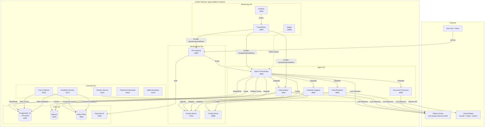

### 6.2 Port Allocation Table

| Service | Container Port | Host Port | Protocol | Profile |
|---------|---------------|-----------|----------|---------|
| **Infrastructure** | | | | |
| PostgreSQL + PGVector | 5432 | 5432 | TCP | default |
| Valkey | 6379 | 6379 | TCP | default |
| Kafka (external) | 9092 | 9092 | TCP | default |
| Kafka (internal) | 29092 | -- | TCP | default |
| Kafka (controller) | 9093 | -- | TCP | default |
| Keycloak | 8080 | 8180 | HTTP | default |
| **Spring Cloud** | | | | |
| Eureka Server | 8761 | 8761 | HTTP | default |
| Config Server | 8888 | 8888 | HTTP | default |
| API Gateway | 8080 | 8080 | HTTP | default |
| **Agent Services** | | | | |
| Agent Orchestrator | 8090 | 8090 | HTTP | full/dev |
| Data Analyst Agent | 8091 | 8091 | HTTP | full/dev |
| Customer Support Agent | 8092 | 8092 | HTTP | full/dev |
| Code Reviewer Agent | 8093 | 8093 | HTTP | full/dev |
| Document Processor Agent | 8094 | 8094 | HTTP | full/dev |
| **Learning Pipeline** | | | | |
| Trace Collector | 8100 | 8100 | HTTP | full |
| Feedback Service | 8101 | 8101 | HTTP | full |
| Teacher Service | 8102 | 8102 | HTTP | full |
| Training Orchestrator | 8103 | 8103 | HTTP | full |
| Model Evaluator | 8104 | 8104 | HTTP | full |
| **Monitoring** | | | | |
| Prometheus | 9090 | 9090 | HTTP | monitoring |
| Grafana | 3000 | 3000 | HTTP | monitoring |
| Jaeger UI | 16686 | 16686 | HTTP | monitoring |
| Jaeger OTLP (gRPC) | 4317 | 4317 | gRPC | monitoring |
| Jaeger OTLP (HTTP) | 4318 | 4318 | HTTP | monitoring |
| **Development Tools** | | | | |
| PGAdmin | 5050 | 5050 | HTTP | dev |
| Kafka UI | 8080 | 8089 | HTTP | dev |
| Ollama (containerized) | 11434 | 11434 | HTTP | gpu |

### 6.3 Service Discovery Flow

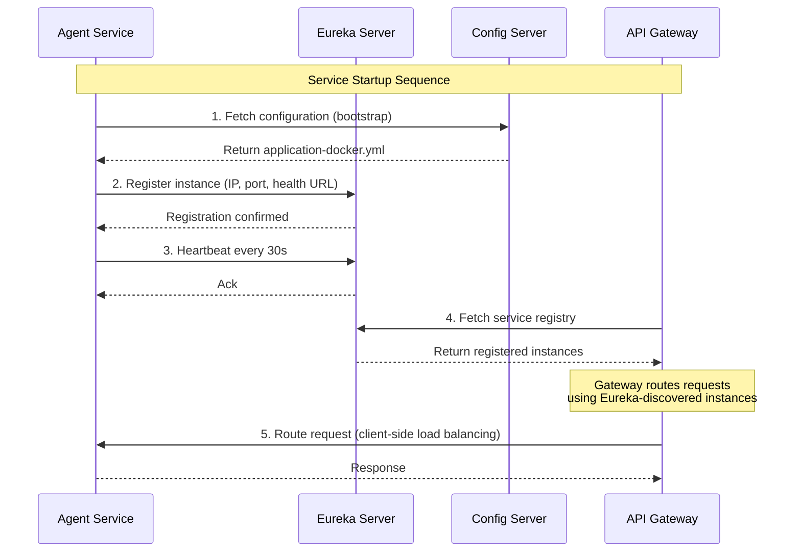

### 6.4 Network Segmentation Policy [PLANNED]

<!-- Addresses SECURITY-TIER-BOUNDARY-AUDIT critical findings -->

**Status:** `[PLANNED]` -- not yet built. The current Docker Compose configuration uses a single flat `agent-platform-network`. This section defines the target four-network segmentation architecture to enforce defense-in-depth at the network layer.

**Rationale:** The SECURITY-TIER-BOUNDARY-AUDIT identified 5 CRITICAL findings related to all services sharing a single Docker network, enabling direct lateral movement between tiers. Segmenting into four purpose-specific networks limits blast radius if any single container is compromised.

#### Four Docker Networks

| Network | Purpose | External Access | Services |
|---------|---------|-----------------|----------|
| `ai-frontend-net` | External-facing gateway tier | Yes (clients connect here) | API Gateway only |
| `ai-service-net` | Internal service mesh for agent and learning services | No direct external access | Agent Orchestrator, Agent Builder, all agent microservices, Trace Collector, Feedback Service, Teacher Service, Training Orchestrator, Model Evaluator |
| `ai-data-net` | Data tier for databases and caches | No direct external access | PostgreSQL + PGVector, Valkey/Redis |
| `ai-infra-net` | Infrastructure tier for supporting services | No direct external access | Eureka Server, Config Server, Kafka, Keycloak |

#### Traffic Flow Rules

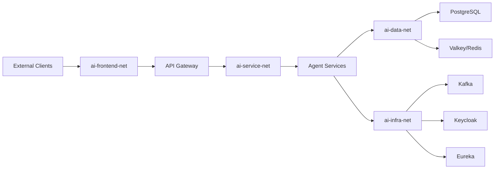

**Permitted traffic matrix:**

| Source Tier | Destination Tier | Allowed | Examples |
|-------------|-----------------|---------|----------|
| `ai-frontend-net` | `ai-service-net` | Yes | Gateway routes to Agent Orchestrator |
| `ai-frontend-net` | `ai-infra-net` | Yes (Keycloak only) | Gateway validates JWT against Keycloak |
| `ai-frontend-net` | `ai-data-net` | **No** | Gateway must not access databases directly |
| `ai-service-net` | `ai-data-net` | Yes | Agents read/write PostgreSQL, Valkey |
| `ai-service-net` | `ai-infra-net` | Yes | Agents register with Eureka, publish to Kafka |
| `ai-service-net` | `ai-frontend-net` | **No** | Agents must not expose ports externally |
| `ai-data-net` | any other tier | **No** | Databases accept only inbound connections |
| `ai-infra-net` | `ai-data-net` | Yes (Keycloak only) | Keycloak stores realm data in PostgreSQL |

#### Docker Compose Network Definitions

```yaml
# Target network segmentation (docker-compose.override.yml)
networks:
  ai-frontend-net:
    name: ai-platform-frontend
    driver: bridge
    ipam:
      config:
        - subnet: 172.28.1.0/24

  ai-service-net:
    name: ai-platform-services
    driver: bridge
    internal: true  # No external access
    ipam:
      config:
        - subnet: 172.28.2.0/24

  ai-data-net:
    name: ai-platform-data
    driver: bridge
    internal: true  # No external access
    ipam:
      config:
        - subnet: 172.28.3.0/24

  ai-infra-net:
    name: ai-platform-infra
    driver: bridge
    internal: true  # No external access
    ipam:
      config:
        - subnet: 172.28.4.0/24
```

#### Service-to-Network Mapping

| Service | `ai-frontend-net` | `ai-service-net` | `ai-data-net` | `ai-infra-net` |
|---------|:-:|:-:|:-:|:-:|
| API Gateway | Yes | Yes | -- | Yes |
| Agent Orchestrator | -- | Yes | Yes | Yes |
| Agent Builder | -- | Yes | Yes | Yes |
| Agent Data Analyst | -- | Yes | Yes | Yes |
| Agent Customer Support | -- | Yes | Yes | Yes |
| Agent Code Reviewer | -- | Yes | Yes | Yes |
| Agent Document Processor | -- | Yes | Yes | Yes |
| Trace Collector | -- | Yes | Yes | Yes |
| Feedback Service | -- | Yes | Yes | Yes |
| Teacher Service | -- | Yes | Yes | Yes |
| Training Orchestrator | -- | Yes | Yes | Yes |
| Model Evaluator | -- | Yes | Yes | Yes |
| PostgreSQL + PGVector | -- | -- | Yes | -- |
| Valkey | -- | -- | Yes | -- |
| Kafka | -- | -- | -- | Yes |
| Keycloak | -- | -- | Yes | Yes |
| Eureka Server | -- | -- | -- | Yes |
| Config Server | -- | -- | -- | Yes |
| Prometheus | -- | Yes | -- | Yes |
| Grafana | -- | -- | -- | Yes |

### 6.5 Per-Service Database Credentials [PLANNED]

<!-- Addresses ADR-020, SECURITY-TIER-BOUNDARY-AUDIT findings -->

**Status:** `[PLANNED]` -- not yet built. The current Docker Compose configuration uses a single shared superuser (`agent_admin`) for all services. This section defines per-service PostgreSQL users with minimal privileges following the principle of least privilege.

**Rationale:** The SECURITY-TIER-BOUNDARY-AUDIT identified that a compromised service using a shared superuser could read or modify data belonging to any other service. Per-service credentials with scoped `GRANT` statements limit blast radius.

#### Credential Setup SQL

Each microservice receives its own PostgreSQL user with access restricted to its own database. The `init-db.sh` script (Section 3.3) should be extended to create these users.

```sql
-- Per-service credential creation (infrastructure/postgres/init-per-service-users.sql)
-- Run as superuser during PostgreSQL initialization.

-- Agent Orchestrator
CREATE USER svc_agent_orchestrator WITH PASSWORD '${AGENT_ORCHESTRATOR_DB_PASSWORD}';
CREATE DATABASE agent_orchestrator OWNER svc_agent_orchestrator;
GRANT CONNECT ON DATABASE agent_orchestrator TO svc_agent_orchestrator;

-- Agent Builder
CREATE USER svc_agent_builder WITH PASSWORD '${AGENT_BUILDER_DB_PASSWORD}';
CREATE DATABASE agent_builder OWNER svc_agent_builder;
GRANT CONNECT ON DATABASE agent_builder TO svc_agent_builder;

-- Trace Collector
CREATE USER svc_trace_collector WITH PASSWORD '${TRACE_COLLECTOR_DB_PASSWORD}';
CREATE DATABASE trace_collector OWNER svc_trace_collector;
GRANT CONNECT ON DATABASE trace_collector TO svc_trace_collector;

-- Eval Harness
CREATE USER svc_eval_harness WITH PASSWORD '${EVAL_HARNESS_DB_PASSWORD}';
CREATE DATABASE eval_harness OWNER svc_eval_harness;
GRANT CONNECT ON DATABASE eval_harness TO svc_eval_harness;

-- Revoke public schema access from all service users (defense in depth)
REVOKE ALL ON SCHEMA public FROM PUBLIC;
```

#### Credential Assignment Table

| Service | DB User | Database | Privileges | Env Variable |
|---------|---------|----------|------------|--------------|
| agent-orchestrator | `svc_agent_orchestrator` | `agent_orchestrator` | ALL on own database | `AGENT_ORCHESTRATOR_DB_PASSWORD` |
| agent-builder | `svc_agent_builder` | `agent_builder` | ALL on own database | `AGENT_BUILDER_DB_PASSWORD` |
| trace-collector | `svc_trace_collector` | `trace_collector` | ALL on own database | `TRACE_COLLECTOR_DB_PASSWORD` |
| eval-harness | `svc_eval_harness` | `eval_harness` | SELECT, INSERT on own database | `EVAL_HARNESS_DB_PASSWORD` |

**Migration path:** During transition from shared to per-service credentials:

1. Create per-service users and databases via `init-per-service-users.sql`
2. Update each service's `SPRING_DATASOURCE_USERNAME` and `SPRING_DATASOURCE_PASSWORD` environment variables in Docker Compose
3. Run Flyway migrations under the new service user (ensure the user has DDL privileges)
4. Revoke the shared `agent_admin` account from application databases
5. Retain `agent_admin` only for backup scripts and administrative access

---

## 7. Data Persistence [PLANNED]

### 7.1 Volume Mapping Strategy

All persistent data is stored in named Docker volumes to survive container restarts and upgrades.

| Volume Name | Service | Container Path | Purpose |
|-------------|---------|---------------|---------|
| `agent-platform-postgres` | PostgreSQL | `/var/lib/postgresql/data` | All relational data, vector embeddings |
| `agent-platform-valkey` | Valkey | `/data` | Cache persistence (AOF) |
| `agent-platform-kafka` | Kafka | `/var/lib/kafka/data` | Topic logs, consumer offsets |
| `agent-platform-ollama` | Ollama (GPU) | `/root/.ollama` | Downloaded model files |
| `agent-platform-prometheus` | Prometheus | `/prometheus` | Time-series metrics data |
| `agent-platform-grafana` | Grafana | `/var/lib/grafana` | Dashboard configs, user data |

### 7.2 PostgreSQL Data Directory

PostgreSQL stores all data in the `agent-platform-postgres` volume. The platform uses multiple databases for service isolation:

| Database | Services | Data Stored |
|----------|----------|-------------|
| `agent_platform` | API Gateway, Agent Orchestrator, Keycloak | User data, agent configs, Keycloak realm |
| `agent_traces` | Trace Collector | Execution traces, tool call logs |
| `agent_feedback` | Feedback Service | User ratings, corrections, patterns |
| `agent_training` | Teacher Service, Training Orchestrator, Model Evaluator | Training datasets, model benchmarks |
| `agent_skills` | Agent Orchestrator, all agents | Skill definitions, versions, test suites |

### 7.3 Kafka Log Directories

Kafka stores topic partitions in the `agent-platform-kafka` volume. Key topics:

| Topic | Producers | Consumers | Retention |
|-------|-----------|-----------|-----------|
| `agent.traces` | All agent services | Trace Collector | 7 days |
| `agent.feedback` | API Gateway (user ratings) | Feedback Service | 30 days |
| `agent.training.jobs` | Training Orchestrator | Training Workers | Until consumed |
| `agent.model.events` | Model Evaluator | Training Orchestrator | 7 days |
| `agent.inter-agent` | Orchestrator, all agents | Target agents | 1 day |

### 7.4 Ollama Model Cache Directory

When running Ollama in a container (GPU profile), models are cached in the `agent-platform-ollama` volume. When running Ollama on the host, models are stored in:

| OS | Default Model Cache Path |
|----|-------------------------|
| macOS | `~/.ollama/models/` |
| Linux | `/usr/share/ollama/.ollama/models/` |
| Windows | `%USERPROFILE%\.ollama\models\` |

Model sizes (approximate, Q4_K_M quantization):

| Model | File Size |
|-------|-----------|
| llama3.1:8b | ~4.7 GB |
| devstral-small:24b | ~14 GB |
| codellama:34b | ~19 GB |
| nomic-embed-text | ~274 MB |

### 7.5 Backup and Restore Procedures

#### PostgreSQL Backup

```bash
# Full backup of all databases
docker exec agent-postgres pg_dumpall \
  -U agent_admin \
  > backup/agent-platform-full-$(date +%Y%m%d-%H%M%S).sql

# Single database backup (compressed)
docker exec agent-postgres pg_dump \
  -U agent_admin \
  -Fc agent_platform \
  > backup/agent_platform-$(date +%Y%m%d-%H%M%S).dump

# Restore from compressed backup
docker exec -i agent-postgres pg_restore \
  -U agent_admin \
  -d agent_platform \
  --clean --if-exists \
  < backup/agent_platform-20260306-120000.dump
```

#### Valkey Backup

```bash
# Trigger RDB snapshot
docker exec agent-valkey valkey-cli BGSAVE

# Copy the dump file
docker cp agent-valkey:/data/dump.rdb backup/valkey-dump-$(date +%Y%m%d-%H%M%S).rdb

# Restore: stop container, replace dump.rdb, restart
docker compose stop valkey
docker cp backup/valkey-dump-20260306-120000.rdb agent-valkey:/data/dump.rdb
docker compose start valkey
```

#### Kafka Topic Backup

```bash
# Export topic data using kafka-console-consumer
docker exec agent-kafka kafka-console-consumer \
  --bootstrap-server localhost:29092 \
  --topic agent.traces \
  --from-beginning \
  --timeout-ms 10000 \
  > backup/kafka-traces-$(date +%Y%m%d-%H%M%S).json
```

#### Volume-Level Backup (Full Snapshot)

```bash
# Backup entire PostgreSQL volume
docker run --rm \
  -v agent-platform-postgres:/source:ro \
  -v $(pwd)/backup:/backup \
  alpine tar czf /backup/postgres-volume-$(date +%Y%m%d-%H%M%S).tar.gz -C /source .

# Restore volume from backup
docker run --rm \
  -v agent-platform-postgres:/target \
  -v $(pwd)/backup:/backup \
  alpine tar xzf /backup/postgres-volume-20260306-120000.tar.gz -C /target
```

---

## 8. CI/CD Pipeline [PLANNED]

### 8.1 GitHub Actions Workflow

**File:** `.github/workflows/ci.yml`

```yaml
name: AI Agent Platform CI/CD

on:
  push:
    branches: [main, develop]
    paths-ignore:
      - "docs/**"
      - "**.md"
  pull_request:
    branches: [main]

env:
  JAVA_VERSION: "21"
  GRADLE_VERSION: "8.5"
  DOCKER_REGISTRY: ghcr.io
  IMAGE_PREFIX: ${{ github.repository_owner }}/agent-platform

permissions:
  contents: read
  packages: write
  security-events: write

jobs:
  # ==========================================================================
  # Stage 1: Static Analysis
  # ==========================================================================
  static-analysis:
    name: "Stage 1: Static Analysis"
    runs-on: ubuntu-latest
    steps:
      - name: Checkout code
        uses: actions/checkout@v4

      - name: Set up JDK 21
        uses: actions/setup-java@v4
        with:
          java-version: ${{ env.JAVA_VERSION }}
          distribution: temurin
          cache: gradle

      - name: Backend Linting (Checkstyle)
        run: ./gradlew checkstyleMain checkstyleTest --no-daemon
        working-directory: .

      - name: SAST Scan (SpotBugs)
        run: ./gradlew spotbugsMain --no-daemon
        working-directory: .

      - name: SCA Scan (OWASP Dependency Check)
        run: ./gradlew dependencyCheckAnalyze --no-daemon
        working-directory: .

      - name: Upload SAST results
        if: always()
        uses: github/codeql-action/upload-sarif@v3
        with:
          sarif_file: build/reports/spotbugs/

  # ==========================================================================
  # Stage 2: Build and Unit Tests
  # ==========================================================================
  build-test:
    name: "Stage 2: Build & Unit Tests"
    needs: static-analysis
    runs-on: ubuntu-latest
    steps:
      - name: Checkout code
        uses: actions/checkout@v4

      - name: Set up JDK 21
        uses: actions/setup-java@v4
        with:
          java-version: ${{ env.JAVA_VERSION }}
          distribution: temurin
          cache: gradle

      - name: Build and test all modules
        run: ./gradlew clean build --no-daemon
        working-directory: .

      - name: Check test coverage (JaCoCo)
        run: ./gradlew jacocoTestReport --no-daemon
        working-directory: .

      - name: Verify coverage threshold (80% line, 75% branch)
        run: ./gradlew jacocoTestCoverageVerification --no-daemon
        working-directory: .

      - name: Upload test reports
        if: always()
        uses: actions/upload-artifact@v4
        with:
          name: test-reports
          path: "**/build/reports/tests/"

      - name: Upload coverage reports
        if: always()
        uses: actions/upload-artifact@v4
        with:
          name: coverage-reports
          path: "**/build/reports/jacoco/"

  # ==========================================================================
  # Stage 3: Integration Tests (Testcontainers)
  # ==========================================================================
  integration-tests:
    name: "Stage 3: Integration Tests"
    needs: build-test
    runs-on: ubuntu-latest
    services:
      postgres:
        image: pgvector/pgvector:pg16
        env:
          POSTGRES_USER: test
          POSTGRES_PASSWORD: test
          POSTGRES_DB: agent_test
        ports:
          - 5432:5432
        options: >-
          --health-cmd pg_isready
          --health-interval 10s
          --health-timeout 5s
          --health-retries 5
    steps:
      - name: Checkout code
        uses: actions/checkout@v4

      - name: Set up JDK 21
        uses: actions/setup-java@v4
        with:
          java-version: ${{ env.JAVA_VERSION }}
          distribution: temurin
          cache: gradle

      - name: Run integration tests
        run: ./gradlew integrationTest --no-daemon
        working-directory: .
        env:
          SPRING_DATASOURCE_URL: jdbc:postgresql://localhost:5432/agent_test
          SPRING_DATASOURCE_USERNAME: test
          SPRING_DATASOURCE_PASSWORD: test

      - name: Upload integration test reports
        if: always()
        uses: actions/upload-artifact@v4
        with:
          name: integration-test-reports
          path: "**/build/reports/tests/"

  # ==========================================================================
  # Stage 4: Docker Image Build and Container Scan
  # ==========================================================================
  container-build:
    name: "Stage 4: Container Build & Scan"
    needs: integration-tests
    runs-on: ubuntu-latest
    strategy:
      matrix:
        service:
          - infrastructure/eureka-server
          - infrastructure/config-server
          - infrastructure/api-gateway
          - agents/agent-orchestrator
          - agents/agent-data-analyst
          - agents/agent-customer-support
          - agents/agent-code-reviewer
          - agents/agent-document-processor
          - learning/trace-collector
          - learning/feedback-service
          - learning/teacher-service
          - learning/training-orchestrator
          - learning/model-evaluator
    steps:
      - name: Checkout code
        uses: actions/checkout@v4

      - name: Set up Docker Buildx
        uses: docker/setup-buildx-action@v3

      - name: Log in to GitHub Container Registry
        uses: docker/login-action@v3
        with:
          registry: ${{ env.DOCKER_REGISTRY }}
          username: ${{ github.actor }}
          password: ${{ secrets.GITHUB_TOKEN }}

      - name: Extract service name
        id: service-name
        run: echo "name=$(basename ${{ matrix.service }})" >> $GITHUB_OUTPUT

      - name: Build Docker image
        uses: docker/build-push-action@v5
        with:
          context: .
          file: ${{ matrix.service }}/Dockerfile
          push: false
          load: true
          tags: |
            ${{ env.DOCKER_REGISTRY }}/${{ env.IMAGE_PREFIX }}/${{ steps.service-name.outputs.name }}:${{ github.sha }}
            ${{ env.DOCKER_REGISTRY }}/${{ env.IMAGE_PREFIX }}/${{ steps.service-name.outputs.name }}:latest
          cache-from: type=gha
          cache-to: type=gha,mode=max

      - name: Trivy container scan
        uses: aquasecurity/trivy-action@0.20.0
        with:
          image-ref: "${{ env.DOCKER_REGISTRY }}/${{ env.IMAGE_PREFIX }}/${{ steps.service-name.outputs.name }}:${{ github.sha }}"
          format: sarif
          output: trivy-results.sarif
          severity: "CRITICAL,HIGH"
          exit-code: "1"

      - name: Upload Trivy scan results
        if: always()
        uses: github/codeql-action/upload-sarif@v3
        with:
          sarif_file: trivy-results.sarif

      - name: Push Docker image
        if: github.ref == 'refs/heads/main'
        uses: docker/build-push-action@v5
        with:
          context: .
          file: ${{ matrix.service }}/Dockerfile
          push: true
          tags: |
            ${{ env.DOCKER_REGISTRY }}/${{ env.IMAGE_PREFIX }}/${{ steps.service-name.outputs.name }}:${{ github.sha }}
          cache-from: type=gha

  # ==========================================================================
  # Stage 5: Deploy to Staging
  # ==========================================================================
  staging-deploy:
    name: "Stage 5: Staging Deployment"
    needs: container-build
    if: github.ref == 'refs/heads/main'
    runs-on: ubuntu-latest
    environment:
      name: staging
      url: https://staging.agent-platform.internal
    steps:
      - name: Checkout code
        uses: actions/checkout@v4

      - name: Deploy to staging
        run: |
          export APP_VERSION=${{ github.sha }}
          docker compose -f docker-compose.yml --profile full up -d --pull always
        env:
          DB_PASSWORD: ${{ secrets.STAGING_DB_PASSWORD }}
          KC_ADMIN_PASSWORD: ${{ secrets.STAGING_KC_PASSWORD }}
          ANTHROPIC_API_KEY: ${{ secrets.STAGING_ANTHROPIC_KEY }}

      - name: Wait for all health checks
        run: |
          ./scripts/wait-for-health.sh --timeout 300 --services \
            "http://localhost:8080/actuator/health" \
            "http://localhost:8090/actuator/health" \
            "http://localhost:8761/actuator/health"
        timeout-minutes: 5

      - name: Run staging smoke tests
        run: ./gradlew smokeTest --no-daemon
        timeout-minutes: 10

  # ==========================================================================
  # Stage 6: Production Deployment (Manual Approval)
  # ==========================================================================
  production-deploy:
    name: "Stage 6: Production Deployment"
    needs: staging-deploy
    if: github.ref == 'refs/heads/main'
    runs-on: ubuntu-latest
    environment:
      name: production
      url: https://agent-platform.internal
    steps:
      - name: Checkout code
        uses: actions/checkout@v4

      - name: Set up kubectl
        uses: azure/setup-kubectl@v4
        with:
          version: "v1.28.0"

      - name: Set up Helm
        uses: azure/setup-helm@v4
        with:
          version: "v3.13.0"

      - name: Deploy to Kubernetes
        run: |
          helm upgrade --install agent-platform \
            ./k8s/helm/agent-platform \
            --namespace agent-platform \
            --set image.tag=${{ github.sha }} \
            --set-string env.APP_VERSION=${{ github.sha }} \
            --wait --timeout 10m

      - name: Post-deploy health verification
        run: ./scripts/verify-production.sh --timeout 300
        timeout-minutes: 10

      - name: Post-deploy smoke test
        run: ./gradlew productionSmokeTest --no-daemon
        timeout-minutes: 5
```

### 8.2 Security Gate CI Stage [PLANNED]

<!-- Addresses R8, R6 — prompt injection defense and eval harness quality gate -->

**Status:** `[PLANNED]` -- not yet built. This stage is inserted **before** the existing Stage 1 (Static Analysis) to fail fast on security regressions.

**Rationale:** LLM-specific security (prompt injection, system prompt leakage, PII sanitization) cannot be caught by generic SAST/SCA tools. A dedicated security gate runs targeted tests against the `security/` package and adversarial input patterns before any build artifacts are created.

```yaml
  # ==========================================================================
  # Stage 0: Security Gate (BEFORE Static Analysis) [PLANNED]
  # ==========================================================================
  security-gate:
    name: "Stage 0: LLM Security Gate"
    runs-on: ubuntu-latest
    steps:
      - name: Checkout code
        uses: actions/checkout@v4

      - name: Set up JDK 21
        uses: actions/setup-java@v4
        with:
          java-version: ${{ env.JAVA_VERSION }}
          distribution: temurin
          cache: gradle

      - name: Run PromptSanitizationFilter unit tests
        run: ./gradlew :libraries:agent-common:test --tests "*.security.*" --no-daemon
        working-directory: .

      - name: Run adversarial test suite (mock model)
        run: ./gradlew :agents:agent-eval-harness:test --tests "*.adversarial.*" --no-daemon
        working-directory: .

      - name: OWASP Dependency Check (SCA)
        run: ./gradlew dependencyCheckAnalyze --no-daemon
        working-directory: .

      - name: Semgrep SAST scan (security package)
        uses: returntocorp/semgrep-action@v1
        with:
          config: >-
            p/java
            p/owasp-top-ten
          paths: |
            libraries/agent-common/src/main/java/**/security/
            agents/agent-orchestrator/src/main/java/**/security/

      - name: Upload security scan results
        if: always()
        uses: actions/upload-artifact@v4
        with:
          name: security-gate-reports
          path: |
            **/build/reports/tests/
            **/build/reports/dependency-check/
```

**Updated CI pipeline flow with Security Gate:**

The Security Gate runs as Stage 0, gating all subsequent stages:

```yaml
  # Update: static-analysis now depends on security-gate
  static-analysis:
    name: "Stage 1: Static Analysis"
    needs: security-gate
    # ... (existing steps unchanged)
```

### 8.3 Eval Harness CI Stage [PLANNED]

<!-- Addresses R6 — model quality gate before deployment -->

**Status:** `[PLANNED]` -- not yet built. This stage is inserted **after** Stage 3 (Integration Tests) and **before** Stage 4 (Container Build). It acts as a model quality gate that prevents deployment of model configurations that degrade response quality.

**Rationale:** Without automated model quality evaluation, a model update or prompt change could silently degrade agent performance. The eval harness runs standardized test cases (including adversarial inputs) against the actual model and fails the build if the weighted quality score drops below the configured threshold.

```yaml
  # ==========================================================================
  # Stage 3.5: Eval Harness Quality Gate (AFTER Integration Tests) [PLANNED]
  # ==========================================================================
  eval-harness:
    name: "Stage 3.5: Eval Harness Quality Gate"
    needs: integration-tests
    runs-on: ubuntu-latest
    services:
      postgres:
        image: pgvector/pgvector:pg16
        env:
          POSTGRES_USER: test
          POSTGRES_PASSWORD: test
          POSTGRES_DB: eval_harness_test
        ports:
          - 5432:5432
        options: >-
          --health-cmd pg_isready
          --health-interval 10s
          --health-timeout 5s
          --health-retries 5
    steps:
      - name: Checkout code
        uses: actions/checkout@v4

      - name: Set up JDK 21
        uses: actions/setup-java@v4
        with:
          java-version: ${{ env.JAVA_VERSION }}
          distribution: temurin
          cache: gradle

      - name: Start Ollama for evaluation
        run: |
          curl -fsSL https://ollama.com/install.sh | sh
          ollama serve &
          sleep 5
          ollama pull llama3.1:8b
          ollama pull devstral-small:24b

      - name: Run standard eval test cases
        run: ./gradlew :agents:agent-eval-harness:evalStandard --no-daemon
        working-directory: .
        env:
          SPRING_DATASOURCE_URL: jdbc:postgresql://localhost:5432/eval_harness_test
          SPRING_DATASOURCE_USERNAME: test
          SPRING_DATASOURCE_PASSWORD: test
          EVAL_HARNESS_QUALITY_GATE: ${{ vars.EVAL_HARNESS_QUALITY_GATE || '0.85' }}

      - name: Run adversarial eval test cases
        run: ./gradlew :agents:agent-eval-harness:evalAdversarial --no-daemon
        working-directory: .
        env:
          EVAL_ADVERSARIAL_TEST_CASES_PATH: config/eval/adversarial-test-cases.jsonl

      - name: Check quality gate threshold
        run: |
          SCORE=$(cat build/eval-results/quality-score.json | jq -r '.weightedScore')
          THRESHOLD=${{ vars.EVAL_HARNESS_QUALITY_GATE || '0.85' }}
          echo "Quality score: $SCORE (threshold: $THRESHOLD)"
          if (( $(echo "$SCORE < $THRESHOLD" | bc -l) )); then
            echo "FAIL: Quality score $SCORE is below threshold $THRESHOLD"
            exit 1
          fi
          echo "PASS: Quality score $SCORE meets threshold $THRESHOLD"

      - name: Publish quality score as artifact
        if: always()
        uses: actions/upload-artifact@v4
        with:
          name: eval-harness-results
          path: |
            build/eval-results/
            **/build/reports/tests/
```

**Updated CI pipeline dependency chain:**

```yaml
  # container-build now depends on eval-harness (not just integration-tests)
  container-build:
    name: "Stage 4: Container Build & Scan"
    needs: eval-harness
    # ... (existing steps unchanged)
```

### 8.4 Updated CI/CD Pipeline Overview [PLANNED]

The full pipeline with new security and eval stages:

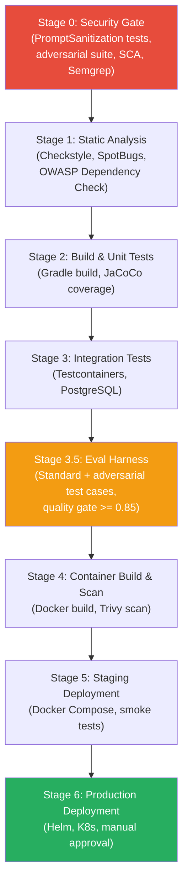

### 8.5 Docker Layer Caching Strategy

The multi-stage Dockerfile is structured for optimal layer caching:

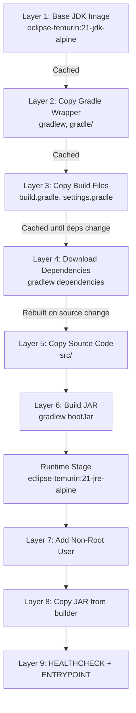

**Key caching optimizations:**
- Dependencies are downloaded in a separate layer (Layer 4). This layer is cached until `build.gradle` or `settings.gradle` changes.
- Source code copy (Layer 5) only invalidates the build layer, not the dependency download.
- The runtime stage starts fresh from the JRE image, keeping the final image small.
- GitHub Actions layer caching (`cache-from: type=gha`) persists layers between CI runs.

### 8.6 Artifact Versioning

| Artifact | Version Format | Example |
|----------|---------------|---------|
| Docker images (CI) | Git commit SHA | `ghcr.io/org/agent-orchestrator:a1b2c3d` |
| Docker images (release) | Semantic version | `ghcr.io/org/agent-orchestrator:1.0.0` |
| Gradle artifacts | Semantic version | `com.company:agent-common:1.0.0` |
| Helm charts | Semantic version | `agent-platform-1.0.0.tgz` |

---

## 9. Kubernetes Deployment (Production) [PLANNED]

### 9.1 Helm Chart Structure

```
k8s/
├── helm/
│   └── agent-platform/
│       ├── Chart.yaml
│       ├── values.yaml
│       ├── values-staging.yaml
│       ├── values-production.yaml
│       ├── templates/
│       │   ├── _helpers.tpl
│       │   ├── namespace.yaml
│       │   ├── configmap.yaml
│       │   ├── secret.yaml
│       │   ├── ingress.yaml
│       │   ├── networkpolicy.yaml
│       │   ├── infrastructure/
│       │   │   ├── eureka-deployment.yaml
│       │   │   ├── eureka-service.yaml
│       │   │   ├── config-deployment.yaml
│       │   │   ├── config-service.yaml
│       │   │   ├── gateway-deployment.yaml
│       │   │   ├── gateway-service.yaml
│       │   │   └── gateway-hpa.yaml
│       │   ├── agents/
│       │   │   ├── orchestrator-deployment.yaml
│       │   │   ├── orchestrator-service.yaml
│       │   │   ├── orchestrator-hpa.yaml
│       │   │   ├── data-analyst-deployment.yaml
│       │   │   ├── data-analyst-service.yaml
│       │   │   ├── customer-support-deployment.yaml
│       │   │   ├── customer-support-service.yaml
│       │   │   ├── code-reviewer-deployment.yaml
│       │   │   ├── code-reviewer-service.yaml
│       │   │   ├── document-processor-deployment.yaml
│       │   │   └── document-processor-service.yaml
│       │   ├── learning/
│       │   │   ├── trace-collector-deployment.yaml
│       │   │   ├── feedback-service-deployment.yaml
│       │   │   ├── teacher-service-deployment.yaml
│       │   │   ├── training-orchestrator-deployment.yaml
│       │   │   └── model-evaluator-deployment.yaml
│       │   ├── data/
│       │   │   ├── postgres-statefulset.yaml
│       │   │   ├── postgres-pvc.yaml
│       │   │   ├── postgres-service.yaml
│       │   │   ├── valkey-statefulset.yaml
│       │   │   ├── valkey-pvc.yaml
│       │   │   ├── valkey-service.yaml
│       │   │   ├── kafka-statefulset.yaml
│       │   │   └── kafka-pvc.yaml
│       │   └── monitoring/
│       │       ├── prometheus-deployment.yaml
│       │       ├── grafana-deployment.yaml
│       │       └── jaeger-deployment.yaml
│       └── charts/
│           └── (sub-chart dependencies)
```

### 9.2 Deployment Manifest (Agent Orchestrator Example)

```yaml
# k8s/helm/agent-platform/templates/agents/orchestrator-deployment.yaml
apiVersion: apps/v1
kind: Deployment
metadata:
  name: {{ include "agent-platform.fullname" . }}-orchestrator
  namespace: {{ .Values.namespace }}
  labels:
    app.kubernetes.io/name: agent-orchestrator
    app.kubernetes.io/component: agent
    app.kubernetes.io/part-of: agent-platform
spec:
  replicas: {{ .Values.agents.orchestrator.replicas | default 2 }}
  selector:
    matchLabels:
      app.kubernetes.io/name: agent-orchestrator
  template:
    metadata:
      labels:
        app.kubernetes.io/name: agent-orchestrator
        app.kubernetes.io/component: agent
      annotations:
        prometheus.io/scrape: "true"
        prometheus.io/port: "8090"
        prometheus.io/path: "/actuator/prometheus"
    spec:
      serviceAccountName: agent-platform
      securityContext:
        runAsNonRoot: true
        runAsUser: 1001
        runAsGroup: 1001
        fsGroup: 1001
      containers:
        - name: agent-orchestrator
          image: "{{ .Values.image.registry }}/agent-orchestrator:{{ .Values.image.tag }}"
          imagePullPolicy: IfNotPresent
          ports:
            - name: http
              containerPort: 8090
              protocol: TCP
          env:
            - name: SPRING_PROFILES_ACTIVE
              value: "kubernetes"
            - name: SPRING_DATASOURCE_URL
              valueFrom:
                configMapKeyRef:
                  name: {{ include "agent-platform.fullname" . }}-config
                  key: db-url
            - name: SPRING_DATASOURCE_PASSWORD
              valueFrom:
                secretKeyRef:
                  name: {{ include "agent-platform.fullname" . }}-secrets
                  key: db-password
            - name: SPRING_AI_OLLAMA_BASE_URL
              value: "http://ollama:11434"
            - name: AGENT_MODELS_ORCHESTRATOR_MODEL
              valueFrom:
                configMapKeyRef:
                  name: {{ include "agent-platform.fullname" . }}-config
                  key: orchestrator-model
            - name: AGENT_MODELS_WORKER_MODEL
              valueFrom:
                configMapKeyRef:
                  name: {{ include "agent-platform.fullname" . }}-config
                  key: worker-model
          resources:
            requests:
              cpu: "250m"
              memory: "512Mi"
            limits:
              cpu: "1000m"
              memory: "1Gi"
          livenessProbe:
            httpGet:
              path: /actuator/health/liveness
              port: http
            initialDelaySeconds: 45
            periodSeconds: 15
            timeoutSeconds: 5
            failureThreshold: 3
          readinessProbe:
            httpGet:
              path: /actuator/health/readiness
              port: http
            initialDelaySeconds: 30
            periodSeconds: 10
            timeoutSeconds: 5
            failureThreshold: 3
          startupProbe:
            httpGet:
              path: /actuator/health
              port: http
            initialDelaySeconds: 10
            periodSeconds: 10
            failureThreshold: 12
```

### 9.3 Horizontal Pod Autoscaler

```yaml
# k8s/helm/agent-platform/templates/agents/orchestrator-hpa.yaml
apiVersion: autoscaling/v2
kind: HorizontalPodAutoscaler
metadata:
  name: {{ include "agent-platform.fullname" . }}-orchestrator
  namespace: {{ .Values.namespace }}
spec:
  scaleTargetRef:
    apiVersion: apps/v1
    kind: Deployment
    name: {{ include "agent-platform.fullname" . }}-orchestrator
  minReplicas: {{ .Values.agents.orchestrator.hpa.minReplicas | default 2 }}
  maxReplicas: {{ .Values.agents.orchestrator.hpa.maxReplicas | default 8 }}
  metrics:
    - type: Resource
      resource:
        name: cpu
        target:
          type: Utilization
          averageUtilization: 70
    - type: Resource
      resource:
        name: memory
        target:
          type: Utilization
          averageUtilization: 80
  behavior:
    scaleUp:
      stabilizationWindowSeconds: 60
      policies:
        - type: Pods
          value: 2
          periodSeconds: 60
    scaleDown:
      stabilizationWindowSeconds: 300
      policies:
        - type: Pods
          value: 1
          periodSeconds: 120
```

### 9.4 GPU Node Scheduling for Ollama

```yaml
# k8s/helm/agent-platform/templates/agents/ollama-deployment.yaml
apiVersion: apps/v1
kind: Deployment
metadata:
  name: {{ include "agent-platform.fullname" . }}-ollama
  namespace: {{ .Values.namespace }}
spec:
  replicas: 1
  selector:
    matchLabels:
      app.kubernetes.io/name: ollama
  template:
    metadata:
      labels:
        app.kubernetes.io/name: ollama
    spec:
      nodeSelector:
        nvidia.com/gpu.present: "true"
      tolerations:
        - key: nvidia.com/gpu
          operator: Exists
          effect: NoSchedule
      containers:
        - name: ollama
          image: ollama/ollama:0.3.12
          ports:
            - containerPort: 11434
          env:
            - name: OLLAMA_MAX_LOADED_MODELS
              value: "2"
            - name: OLLAMA_KEEP_ALIVE
              value: "24h"
          resources:
            requests:
              cpu: "2"
              memory: "16Gi"
              nvidia.com/gpu: "1"
            limits:
              cpu: "4"
              memory: "32Gi"
              nvidia.com/gpu: "1"
          volumeMounts:
            - name: ollama-models
              mountPath: /root/.ollama
          livenessProbe:
            httpGet:
              path: /
              port: 11434
            initialDelaySeconds: 30
            periodSeconds: 15
          readinessProbe:
            httpGet:
              path: /api/tags
              port: 11434
            initialDelaySeconds: 10
            periodSeconds: 10
      volumes:
        - name: ollama-models
          persistentVolumeClaim:
            claimName: ollama-models-pvc
---
apiVersion: v1
kind: PersistentVolumeClaim
metadata:
  name: ollama-models-pvc
  namespace: {{ .Values.namespace }}
spec:
  accessModes:
    - ReadWriteOnce
  resources:
    requests:
      storage: 100Gi
  storageClassName: fast-ssd
```

### 9.5 NetworkPolicy Manifests [PLANNED]

<!-- Addresses SECURITY-TIER-BOUNDARY-AUDIT — Kubernetes enforcement of four-network segmentation -->

**Status:** `[PLANNED]` -- not yet built. These NetworkPolicy manifests enforce the same four-network segmentation defined in Section 6.4, but at the Kubernetes level using pod labels and selectors.

**Rationale:** Docker Compose network segmentation (Section 6.4) applies only to local development. In production (Kubernetes), the equivalent enforcement is achieved through Kubernetes NetworkPolicy resources that restrict pod-to-pod communication based on tier labels.

#### Tier Labels

All pods must carry a `tier` label matching their network assignment:

| Tier Label | Pods | Equivalent Docker Network |
|------------|------|---------------------------|
| `tier: gateway` | API Gateway | `ai-frontend-net` |
| `tier: service` | All agent and learning services | `ai-service-net` |
| `tier: data` | PostgreSQL, Valkey | `ai-data-net` |
| `tier: infrastructure` | Eureka, Config Server, Kafka, Keycloak | `ai-infra-net` |

#### Agent Orchestrator NetworkPolicy

```yaml
# k8s/helm/agent-platform/templates/networkpolicies/agent-orchestrator-netpol.yaml
# Agent Orchestrator can receive traffic from gateway tier
# and can reach data tier and infrastructure tier.
apiVersion: networking.k8s.io/v1
kind: NetworkPolicy
metadata:
  name: agent-orchestrator-netpol
  namespace: {{ .Values.namespace }}
  labels:
    app.kubernetes.io/part-of: agent-platform
spec:
  podSelector:
    matchLabels:
      app: agent-orchestrator
  policyTypes:
    - Ingress
    - Egress
  ingress:
    - from:
        - podSelector:
            matchLabels:
              tier: gateway
      ports:
        - protocol: TCP
          port: 8090
  egress:
    - to:
        - podSelector:
            matchLabels:
              tier: data
      ports:
        - protocol: TCP
          port: 5432    # PostgreSQL
        - protocol: TCP
          port: 6379    # Valkey
    - to:
        - podSelector:
            matchLabels:
              tier: infrastructure
      ports:
        - protocol: TCP
          port: 8761    # Eureka
        - protocol: TCP
          port: 8888    # Config Server
        - protocol: TCP
          port: 29092   # Kafka (internal)
    - to:  # Allow DNS resolution
        - namespaceSelector: {}
      ports:
        - protocol: UDP
          port: 53
        - protocol: TCP
          port: 53
```

#### Data Tier NetworkPolicy (PostgreSQL)

```yaml
# k8s/helm/agent-platform/templates/networkpolicies/postgres-netpol.yaml
# PostgreSQL accepts inbound connections ONLY from service tier and Keycloak.
# No egress allowed (databases do not initiate connections).
apiVersion: networking.k8s.io/v1
kind: NetworkPolicy
metadata:
  name: postgres-netpol
  namespace: {{ .Values.namespace }}
spec:
  podSelector:
    matchLabels:
      app: postgres
  policyTypes:
    - Ingress
    - Egress
  ingress:
    - from:
        - podSelector:
            matchLabels:
              tier: service
        - podSelector:
            matchLabels:
              app: keycloak
      ports:
        - protocol: TCP
          port: 5432
  egress: []  # Databases do not initiate outbound connections
```

#### Gateway Tier NetworkPolicy

```yaml
# k8s/helm/agent-platform/templates/networkpolicies/gateway-netpol.yaml
# API Gateway accepts external traffic and can reach service tier + Keycloak.
# Cannot reach data tier directly.
apiVersion: networking.k8s.io/v1
kind: NetworkPolicy
metadata:
  name: gateway-netpol
  namespace: {{ .Values.namespace }}
spec:
  podSelector:
    matchLabels:
      app: api-gateway
  policyTypes:
    - Ingress
    - Egress
  ingress:
    - {}  # Accept from any source (external clients via Ingress)
  egress:
    - to:
        - podSelector:
            matchLabels:
              tier: service
    - to:
        - podSelector:
            matchLabels:
              app: keycloak
      ports:
        - protocol: TCP
          port: 8080
    - to:
        - podSelector:
            matchLabels:
              tier: infrastructure
      ports:
        - protocol: TCP
          port: 8761    # Eureka
        - protocol: TCP
          port: 8888    # Config Server
    - to:  # Allow DNS resolution
        - namespaceSelector: {}
      ports:
        - protocol: UDP
          port: 53
        - protocol: TCP
          port: 53
```

### 9.6 PodDisruptionBudget [PLANNED]

**Status:** `[PLANNED]` -- not yet built. PodDisruptionBudgets (PDBs) ensure that voluntary disruptions (node drains, cluster upgrades) do not take all replicas of a critical service offline simultaneously.

#### Critical Services PDB

```yaml
# k8s/helm/agent-platform/templates/pdb/agent-orchestrator-pdb.yaml
apiVersion: policy/v1
kind: PodDisruptionBudget
metadata:
  name: agent-orchestrator-pdb
  namespace: {{ .Values.namespace }}
  labels:
    app.kubernetes.io/name: agent-orchestrator
    app.kubernetes.io/part-of: agent-platform
spec:
  minAvailable: 1
  selector:
    matchLabels:
      app: agent-orchestrator
```

```yaml
# k8s/helm/agent-platform/templates/pdb/api-gateway-pdb.yaml
apiVersion: policy/v1
kind: PodDisruptionBudget
metadata:
  name: api-gateway-pdb
  namespace: {{ .Values.namespace }}
  labels:
    app.kubernetes.io/name: api-gateway
    app.kubernetes.io/part-of: agent-platform
spec:
  minAvailable: 1
  selector:
    matchLabels:
      app: api-gateway
```

```yaml
# k8s/helm/agent-platform/templates/pdb/postgres-pdb.yaml
apiVersion: policy/v1
kind: PodDisruptionBudget
metadata:
  name: postgres-pdb
  namespace: {{ .Values.namespace }}
  labels:
    app.kubernetes.io/name: postgres
    app.kubernetes.io/part-of: agent-platform
spec:
  minAvailable: 1
  selector:
    matchLabels:
      app: postgres
```

#### PDB Summary Table

| Service | `minAvailable` | Rationale |
|---------|:-:|-----------|
| agent-orchestrator | 1 | Core routing service; unavailability blocks all agent requests |
| api-gateway | 1 | Single entry point; unavailability means total platform outage |
| postgres | 1 | Stateful data store; unavailability causes data access failures |
| valkey | 1 | Cache unavailability causes cold-start latency spikes |
| kafka | 1 | Message broker unavailability blocks async trace/feedback pipelines |
| eureka-server | 1 | Service discovery unavailability prevents new instance registration |

### 9.7 Ingress Configuration

```yaml
# k8s/helm/agent-platform/templates/ingress.yaml
apiVersion: networking.k8s.io/v1
kind: Ingress
metadata:
  name: {{ include "agent-platform.fullname" . }}-ingress
  namespace: {{ .Values.namespace }}
  annotations:
    nginx.ingress.kubernetes.io/ssl-redirect: "true"
    nginx.ingress.kubernetes.io/proxy-body-size: "50m"
    nginx.ingress.kubernetes.io/proxy-read-timeout: "120"
    cert-manager.io/cluster-issuer: letsencrypt-prod
spec:
  ingressClassName: nginx
  tls:
    - hosts:
        - {{ .Values.ingress.host }}
      secretName: agent-platform-tls
  rules:
    - host: {{ .Values.ingress.host }}
      http:
        paths:
          - path: /
            pathType: Prefix
            backend:
              service:
                name: {{ include "agent-platform.fullname" . }}-gateway
                port:
                  number: 8080
```

---

## 10. Monitoring and Observability Stack [PLANNED]

### 10.1 Prometheus Scrape Configuration

**File:** `infrastructure/monitoring/prometheus/prometheus.yml`

```yaml
global:
  scrape_interval: 15s
  evaluation_interval: 15s

rule_files:
  - alert-rules.yml

scrape_configs:
  # --- Spring Boot Services (Actuator + Micrometer) ---
  - job_name: "spring-boot-services"
    metrics_path: /actuator/prometheus
    eureka_sd_configs:
      - server: http://eureka-server:8761/eureka
    relabel_configs:
      - source_labels: [__meta_eureka_app_name]
        target_label: application
      - source_labels: [__meta_eureka_app_instance_hostname]
        target_label: instance

  # --- Fallback static config (if Eureka is down) ---
  - job_name: "agent-services-static"
    metrics_path: /actuator/prometheus
    static_configs:
      - targets:
          - "api-gateway:8080"
          - "agent-orchestrator:8090"
          - "agent-data-analyst:8091"
          - "agent-customer-support:8092"
          - "agent-code-reviewer:8093"
          - "agent-document-processor:8094"
          - "trace-collector:8100"
          - "feedback-service:8101"
          - "teacher-service:8102"
          - "training-orchestrator:8103"
          - "model-evaluator:8104"
        labels:
          group: "agent-platform"

  # --- Kafka Metrics ---
  - job_name: "kafka"
    static_configs:
      - targets: ["kafka:9092"]
        labels:
          group: "infrastructure"

  # --- PostgreSQL Exporter ---
  - job_name: "postgres"
    static_configs:
      - targets: ["postgres-exporter:9187"]
        labels:
          group: "infrastructure"

  # --- Valkey Exporter ---
  - job_name: "valkey"
    static_configs:
      - targets: ["valkey-exporter:9121"]
        labels:
          group: "infrastructure"

  # --- Ollama Health ---
  - job_name: "ollama"
    metrics_path: /
    static_configs:
      - targets: ["host.docker.internal:11434"]
        labels:
          group: "inference"
    metric_relabel_configs:
      - source_labels: [__name__]
        regex: "(.*)"
        target_label: __name__
        replacement: "ollama_${1}"
```

### 10.2 Alert Rules

**File:** `infrastructure/monitoring/prometheus/alert-rules.yml`

```yaml
groups:
  - name: agent-platform-alerts
    rules:
      # --- Service Health ---
      - alert: ServiceDown
        expr: up{job="spring-boot-services"} == 0
        for: 1m
        labels:
          severity: critical
        annotations:
          summary: "Service {{ $labels.application }} is down"
          description: "{{ $labels.application }} on {{ $labels.instance }} has been down for more than 1 minute."

      # --- High Error Rate ---
      - alert: HighErrorRate
        expr: |
          rate(http_server_requests_seconds_count{status=~"5.."}[5m])
          / rate(http_server_requests_seconds_count[5m]) > 0.01
        for: 5m
        labels:
          severity: warning
        annotations:
          summary: "High error rate on {{ $labels.application }}"
          description: "Error rate is {{ $value | humanizePercentage }} (threshold: 1%)"

      # --- High Latency ---
      - alert: HighLatencyP95
        expr: |
          histogram_quantile(0.95,
            rate(http_server_requests_seconds_bucket[5m])
          ) > 0.5
        for: 5m
        labels:
          severity: warning
        annotations:
          summary: "High p95 latency on {{ $labels.application }}"
          description: "p95 latency is {{ $value }}s (threshold: 500ms)"

      # --- Agent-Specific Metrics ---
      - alert: AgentHighTokenUsage
        expr: |
          rate(agent_token_usage_total[1h]) > 100000
        for: 15m
        labels:
          severity: info
        annotations:
          summary: "High token usage on {{ $labels.agent }}"
          description: "{{ $labels.agent }} is consuming {{ $value }} tokens/hour"

      - alert: ModelInferenceTimeout
        expr: |
          rate(agent_model_timeout_total[5m]) > 0
        for: 5m
        labels:
          severity: warning
        annotations:
          summary: "Model inference timeouts on {{ $labels.model }}"

      # --- Infrastructure ---
      - alert: KafkaConsumerLag
        expr: kafka_consumer_lag > 10000
        for: 10m
        labels:
          severity: warning
        annotations:
          summary: "Kafka consumer lag on {{ $labels.topic }}"
          description: "Consumer group {{ $labels.group }} has {{ $value }} lag on topic {{ $labels.topic }}"

      - alert: PostgresConnectionPoolExhausted
        expr: hikaricp_connections_active / hikaricp_connections_max > 0.9
        for: 5m
        labels:
          severity: critical
        annotations:
          summary: "Connection pool nearly exhausted on {{ $labels.application }}"

      - alert: HighMemoryUsage
        expr: jvm_memory_used_bytes{area="heap"} / jvm_memory_max_bytes{area="heap"} > 0.9
        for: 5m
        labels:
          severity: warning
        annotations:
          summary: "High heap memory usage on {{ $labels.application }}"
```

### 10.3 Grafana Dashboard Definitions

#### Agent Performance Dashboard

**File:** `infrastructure/monitoring/grafana/dashboards/agent-performance.json`

Key panels to include:

| Panel | Type | Metric | Description |
|-------|------|--------|-------------|
| Request Rate | Time series | `rate(http_server_requests_seconds_count[5m])` | Requests per second per agent |
| Latency (p50/p95/p99) | Time series | `histogram_quantile(0.95, rate(...))` | Response time percentiles |
| Error Rate | Gauge | `rate(http_server_requests_seconds_count{status=~"5.."}[5m])` | Percentage of 5xx responses |
| Active Agents | Stat | `count(up{job="spring-boot-services"} == 1)` | Number of healthy agent instances |
| Token Usage | Time series | `rate(agent_token_usage_total[1h])` | Tokens consumed per agent per hour |
| Model Routing | Pie | `sum by (model) (agent_model_requests_total)` | Distribution of local vs cloud model usage |

#### Model Metrics Dashboard

| Panel | Type | Metric | Description |
|-------|------|--------|-------------|
| Inference Latency | Histogram | `agent_inference_duration_seconds` | Time per model inference call |
| Cache Hit Rate | Gauge | `agent_cache_hits_total / (agent_cache_hits_total + agent_cache_misses_total)` | Valkey cache effectiveness |
| Token Usage by Model | Stacked bar | `agent_token_usage_total` | Token consumption breakdown |
| Model Load Status | Table | `ollama_model_loaded` | Which models are loaded in Ollama |
| Cloud Fallback Rate | Time series | `rate(agent_cloud_fallback_total[1h])` | How often cloud models are used |

#### Infrastructure Health Dashboard

| Panel | Type | Metric | Description |
|-------|------|--------|-------------|
| CPU Usage | Time series | `process_cpu_usage` | CPU per container |
| Memory Usage | Time series | `jvm_memory_used_bytes` | JVM heap per service |
| Disk I/O | Time series | `node_disk_io_time_seconds_total` | Disk latency |
| Network Traffic | Time series | `container_network_transmit_bytes_total` | Network throughput |
| Kafka Consumer Lag | Time series | `kafka_consumer_lag` | Message processing backlog |
| DB Connection Pool | Gauge | `hikaricp_connections_active` | Active database connections |
| Valkey Memory | Gauge | `redis_memory_used_bytes` | Cache memory consumption |

### 10.4 Jaeger/OpenTelemetry Trace Collection

Configure Spring Boot services to export traces to Jaeger via OpenTelemetry:

**File:** `application.yml` (shared config)

```yaml
management:
  tracing:
    sampling:
      probability: 1.0  # 100% sampling in dev/staging, reduce in production
  otlp:
    tracing:
      endpoint: http://jaeger:4318/v1/traces

spring:
  application:
    name: ${SPRING_APPLICATION_NAME:agent-orchestrator}

logging:
  pattern:
    level: "%5p [${spring.application.name},%X{traceId:-},%X{spanId:-}]"
```

**Trace flow:**

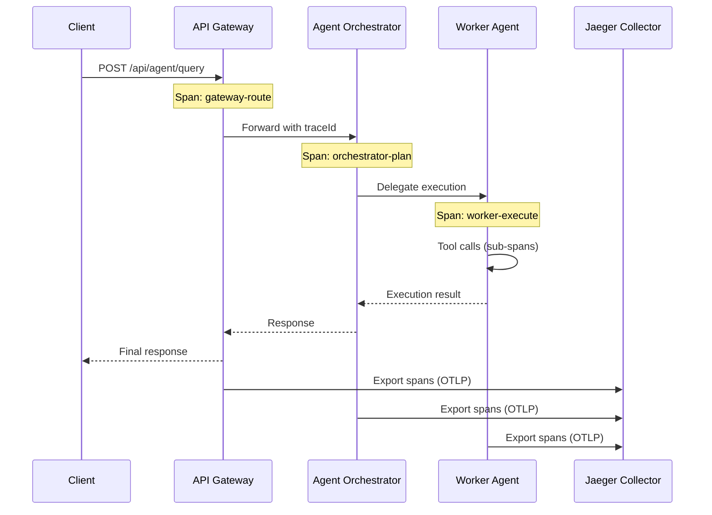

---

## 11. Troubleshooting [PLANNED]

### 11.1 Common Issues and Solutions

#### Ollama Out of Memory

**Symptom:** Ollama crashes or returns `out of memory` error when loading the worker model.

**Diagnosis:**
```bash
# Check available system memory
free -h    # Linux
vm_stat    # macOS

# Check Ollama loaded models
ollama list
curl -s http://localhost:11434/api/tags | jq '.models[] | {name, size}'

# Check Ollama server logs
journalctl -u ollama -f      # Linux (systemd)
tail -f ~/.ollama/logs/server.log  # macOS
```

**Solutions:**
1. **Reduce model quantization:** Use Q4_K_M instead of FP16 to halve memory usage.
2. **Load one model at a time:** Set `OLLAMA_MAX_LOADED_MODELS=1` and accept cold-start latency for the second model.
3. **Increase swap space:** Temporary workaround for CPU-only systems.
4. **Use a smaller worker model:** Replace 24B with 16B (e.g., `deepseek-coder-v2:16b`).
5. **Offload partially to GPU:** Set `OLLAMA_NUM_GPU=20` to offload some layers to GPU, keeping the rest in RAM.

#### Model Loading Timeout

**Symptom:** Spring AI throws `TimeoutException` when calling Ollama because the model is not yet loaded.

**Diagnosis:**
```bash
# Check if model is loaded
curl -s http://localhost:11434/api/tags | jq '.models[].name'

# Check Ollama is actually running
curl -s http://localhost:11434/
# Expected: "Ollama is running"
```

**Solutions:**
1. **Pre-load models:** Run a warm-up query after Ollama starts:
   ```bash
   curl -s http://localhost:11434/api/generate \
     -d '{"model": "llama3.1:8b", "prompt": "warmup", "stream": false}' > /dev/null
   ```
2. **Set `OLLAMA_KEEP_ALIVE=24h`** to prevent model unloading.
3. **Increase Spring AI timeout:** Set `spring.ai.ollama.chat.options.timeout=120s` in application.yml.
4. **Add a startup probe** in Docker/Kubernetes that waits for model loading to complete.

#### Kafka Consumer Lag

**Symptom:** Trace Collector or Feedback Service falls behind in processing Kafka messages.

**Diagnosis:**
```bash
# Check consumer group lag
docker exec agent-kafka kafka-consumer-groups \
  --bootstrap-server localhost:29092 \
  --group trace-collector-group \
  --describe

# Check topic partition offsets
docker exec agent-kafka kafka-topics \
  --bootstrap-server localhost:29092 \
  --describe --topic agent.traces
```

**Solutions:**
1. **Increase consumer instances:** Scale the consumer service horizontally.
2. **Increase partition count:** More partitions allow more parallel consumers.
3. **Tune batch size:** Increase `spring.kafka.consumer.max-poll-records` from default 500 to 1000.
4. **Check for slow processing:** Profile the consumer code for bottlenecks (database writes, model calls).

#### Database Connection Pool Exhaustion

**Symptom:** Services log `HikariPool - Connection is not available` or `Too many connections`.

**Diagnosis:**
```bash
# Check active connections in PostgreSQL
docker exec agent-postgres psql -U agent_admin -d agent_platform \
  -c "SELECT count(*), state FROM pg_stat_activity GROUP BY state;"

# Check HikariCP metrics
curl -s http://localhost:8090/actuator/metrics/hikaricp.connections.active | jq
curl -s http://localhost:8090/actuator/metrics/hikaricp.connections.max | jq
```

**Solutions:**
1. **Increase pool size:** Set `spring.datasource.hikari.maximum-pool-size=20` (default is 10).
2. **Increase PostgreSQL max connections:** Add `-c max_connections=200` to the postgres container command.
3. **Check for connection leaks:** Ensure all database operations close connections (use try-with-resources).
4. **Enable connection timeout:** Set `spring.datasource.hikari.connection-timeout=30000`.

#### Service Discovery Failures

**Symptom:** Services cannot find each other; API Gateway returns 503; Eureka dashboard shows no instances.

**Diagnosis:**
```bash
# Check Eureka dashboard
curl -s http://localhost:8761/eureka/apps | python3 -m json.tool

# Check service registration from inside a container
docker exec agent-orchestrator wget -qO- http://eureka-server:8761/eureka/apps/AGENT-ORCHESTRATOR

# Check Config Server health
curl -s http://localhost:8888/actuator/health | jq
```

**Solutions:**
1. **Verify startup order:** Eureka must be healthy before other services start (check `depends_on` conditions).
2. **Check network connectivity:** Ensure all containers are on the same Docker network (`agent-platform-network`).
3. **Increase registration retry:** Set `eureka.client.registry-fetch-interval-seconds=5` for faster discovery.
4. **Check hostname resolution:** Services must use container names (e.g., `eureka-server`), not `localhost`.

### 11.2 Log Aggregation Setup

All services use structured JSON logging for centralized log analysis.

**Logback configuration** (`logback-spring.xml`):

```xml
<?xml version="1.0" encoding="UTF-8"?>
<configuration>
  <springProfile name="docker,kubernetes,staging,prod">
    <appender name="STDOUT" class="ch.qos.logback.core.ConsoleAppender">
      <encoder class="net.logstash.logback.encoder.LogstashEncoder">
        <includeMdcKeyName>traceId</includeMdcKeyName>
        <includeMdcKeyName>spanId</includeMdcKeyName>
        <includeMdcKeyName>tenantId</includeMdcKeyName>
        <customFields>{"service":"${spring.application.name}"}</customFields>
      </encoder>
    </appender>
    <root level="INFO">
      <appender-ref ref="STDOUT"/>
    </root>
  </springProfile>

  <springProfile name="local">
    <appender name="STDOUT" class="ch.qos.logback.core.ConsoleAppender">
      <encoder>
        <pattern>%d{HH:mm:ss.SSS} [%thread] %-5level %logger{36} [%X{traceId},%X{spanId}] - %msg%n</pattern>
      </encoder>
    </appender>
    <root level="DEBUG">
      <appender-ref ref="STDOUT"/>
    </root>
  </springProfile>
</configuration>
```

**Viewing logs:**

```bash
# Follow logs for all services
docker compose logs -f

# Follow logs for a specific service
docker compose logs -f agent-orchestrator

# Filter logs by level
docker compose logs agent-orchestrator 2>&1 | grep '"level":"ERROR"'

# Search for a specific trace ID
docker compose logs 2>&1 | grep '"traceId":"abc123def456"'
```

### 11.3 Debug Mode Activation

Enable debug mode for individual services without restarting the full stack:

```bash
# Enable debug logging at runtime via Actuator
curl -X POST http://localhost:8090/actuator/loggers/com.company.agent \
  -H "Content-Type: application/json" \
  -d '{"configuredLevel": "DEBUG"}'

# Reset to INFO
curl -X POST http://localhost:8090/actuator/loggers/com.company.agent \
  -H "Content-Type: application/json" \
  -d '{"configuredLevel": "INFO"}'

# Enable JVM debug port (add to docker-compose environment)
# JAVA_TOOL_OPTIONS: "-agentlib:jdwp=transport=dt_socket,server=y,suspend=n,address=*:5005"
```

For the `dev` profile, debug ports can be exposed:

```yaml
# Add to agent service in docker-compose.yml for debugging
agent-orchestrator:
  environment:
    JAVA_TOOL_OPTIONS: "-agentlib:jdwp=transport=dt_socket,server=y,suspend=n,address=*:5005"
  ports:
    - "5005:5005"  # Remote debug port
```

### 11.4 Quick Health Check Script

**File:** `scripts/wait-for-health.sh`

```bash
#!/usr/bin/env bash
set -euo pipefail

# Usage: ./scripts/wait-for-health.sh [--timeout 300]
# Waits for all core services to report healthy.

TIMEOUT=${TIMEOUT:-300}
INTERVAL=5
ELAPSED=0

SERVICES=(
  "http://localhost:8761/actuator/health:Eureka"
  "http://localhost:8888/actuator/health:Config Server"
  "http://localhost:8080/actuator/health:API Gateway"
)

echo "Waiting for services to become healthy (timeout: ${TIMEOUT}s)..."

for entry in "${SERVICES[@]}"; do
  IFS=':' read -r scheme host_port path name <<< "$entry"
  url="${scheme}:${host_port}${path:+/$path}"

  while true; do
    if [ "$ELAPSED" -ge "$TIMEOUT" ]; then
      echo "TIMEOUT: ${name} did not become healthy within ${TIMEOUT}s"
      exit 1
    fi

    STATUS=$(curl -sf -o /dev/null -w "%{http_code}" "$url" 2>/dev/null || echo "000")
    if [ "$STATUS" = "200" ]; then
      echo "[OK] ${name} is healthy"
      break
    fi

    echo "[WAIT] ${name} (status: ${STATUS}) - retrying in ${INTERVAL}s..."
    sleep "$INTERVAL"
    ELAPSED=$((ELAPSED + INTERVAL))
  done
done

echo "All services are healthy."
```

### 11.5 Container Resource Monitoring

```bash
# Real-time resource usage for all containers
docker stats --format "table {{.Name}}\t{{.CPUPerc}}\t{{.MemUsage}}\t{{.NetIO}}\t{{.BlockIO}}"

# Check specific container resource limits
docker inspect agent-orchestrator | jq '.[0].HostConfig.Memory, .[0].HostConfig.NanoCpus'

# View container events (restarts, OOM kills)
docker events --filter 'event=oom' --filter 'event=die' --since '1h'
```

---

## 12. Audit Log Infrastructure [PLANNED]

> **Status:** All content in this section is `[PLANNED]`. No audit log infrastructure has been implemented. These specifications define the target architecture for the audit subsystem.

### 12.1 PostgreSQL Partitioning Strategy [PLANNED]

The `audit_events` table will use PostgreSQL native range partitioning on the `created_at` timestamp column to ensure query performance as the table grows.

**Partitioning scheme:**

| Aspect | Configuration |
|--------|--------------|
| Partition key | `created_at` (timestamp) |
| Partition interval | Monthly (`YYYY_MM`) |
| Naming convention | `audit_events_2026_03`, `audit_events_2026_04`, etc. |
| Index strategy | Each partition has a local index on `(tenant_id, created_at DESC)` |
| Auto-creation | Scheduled job creates next month's partition 7 days before month-end |

**DDL template:**

```sql
-- Parent table (partitioned)
CREATE TABLE audit_events (
    id              UUID DEFAULT gen_random_uuid(),
    tenant_id       UUID NOT NULL,
    actor_id        UUID NOT NULL,
    actor_type      VARCHAR(50) NOT NULL,       -- USER | SYSTEM | AGENT
    action          VARCHAR(100) NOT NULL,       -- e.g., AGENT_CREATED, CONVERSATION_DELETED
    resource_type   VARCHAR(100) NOT NULL,       -- e.g., AGENT, CONVERSATION, KNOWLEDGE_SOURCE
    resource_id     UUID,
    details         JSONB,                       -- Arbitrary structured details
    ip_address      INET,
    user_agent      TEXT,
    created_at      TIMESTAMPTZ NOT NULL DEFAULT now(),
    PRIMARY KEY (id, created_at)
) PARTITION BY RANGE (created_at);

-- Example monthly partition
CREATE TABLE audit_events_2026_03 PARTITION OF audit_events
    FOR VALUES FROM ('2026-03-01') TO ('2026-04-01');

-- Local index per partition
CREATE INDEX idx_audit_2026_03_tenant_time
    ON audit_events_2026_03 (tenant_id, created_at DESC);
```

### 12.2 Retention Policy [PLANNED]

Audit events follow a tiered retention policy for compliance and performance:

| Tier | Retention | Storage | Access Pattern |
|------|-----------|---------|----------------|
| Hot | 90 days | PostgreSQL (partitioned) | Real-time queries via API and SSE |
| Cold | 365 days | S3-compatible object storage (MinIO in dev, S3 in prod) | On-demand retrieval, compliance audits |
| Archive | Beyond 365 days | Deleted or moved to long-term archive per GDPR/CCPA policy | Legal hold only |

**Retention job:**

```yaml
# Scheduled via Spring @Scheduled or Kubernetes CronJob
audit-retention:
  hot-to-cold:
    schedule: "0 2 1 * *"          # 1st of each month at 02:00 UTC
    action: Export partition older than 90 days to S3, then DROP PARTITION
  cold-purge:
    schedule: "0 3 1 * *"          # 1st of each month at 03:00 UTC
    action: Delete S3 objects older than 365 days (unless legal hold)
```

### 12.3 SSE Configuration [PLANNED]

The audit log viewer uses Server-Sent Events (SSE) for real-time streaming of new audit events.

| Aspect | Configuration |
|--------|--------------|
| Framework | Spring WebFlux `Flux<ServerSentEvent<AuditEvent>>` |
| Endpoint | `GET /api/v1/audit/stream?tenantId={id}` |
| Heartbeat | 30-second keepalive (`comment: heartbeat`) |
| Reconnection | Client-side retry with `retry: 5000` (5 seconds) |
| Backpressure | `onBackpressureBuffer(256)` -- buffers up to 256 events per client |
| Auth | Bearer JWT required; events filtered by tenant from JWT claims |
| Max connections | 50 concurrent SSE connections per service instance |

**Spring configuration:**

```yaml
# application.yml
ai:
  audit:
    sse:
      heartbeat-interval: 30s
      max-connections: 50
      backpressure-buffer-size: 256
```

### 12.4 Elasticsearch Integration (Optional) [PLANNED]

For full-text search on audit event details (the JSONB `details` column), an optional Elasticsearch integration provides indexed search capabilities.

| Aspect | Configuration |
|--------|--------------|
| Image | `docker.elastic.co/elasticsearch/elasticsearch:8.13.0` |
| Index pattern | `audit-events-{tenant_id}-YYYY.MM` |
| Sync mechanism | Kafka consumer reads from `ai.audit.events` topic and indexes into Elasticsearch |
| Retention | Index lifecycle policy: hot (7 days) -> warm (30 days) -> delete (90 days) |
| Search endpoint | `GET /api/v1/audit/search?q={query}&tenantId={id}` |

> **Note:** Elasticsearch is optional. The core audit log functions with PostgreSQL alone. Elasticsearch adds full-text search over the `details` JSONB field for high-volume tenants.

---

## 13. Notification Infrastructure [PLANNED]

> **Status:** All content in this section is `[PLANNED]`. No notification infrastructure has been implemented. These specifications define the target architecture for the notification subsystem.

### 13.1 SSE Endpoint for Real-Time Delivery [PLANNED]

Notifications are delivered to the frontend in real time via SSE. Each authenticated user maintains a single SSE connection.

| Aspect | Configuration |
|--------|--------------|
| Endpoint | `GET /api/v1/notifications/stream` |
| Framework | Spring WebFlux `Flux<ServerSentEvent<Notification>>` |
| Auth | Bearer JWT required; notifications filtered by `user_id` from JWT claims |
| Heartbeat | 30-second keepalive |
| Event types | `notification` (new notification), `read-receipt` (mark-as-read confirmation) |
| Reconnection | Client `retry: 3000` (3 seconds) |
| Max connections | 100 concurrent SSE connections per service instance |

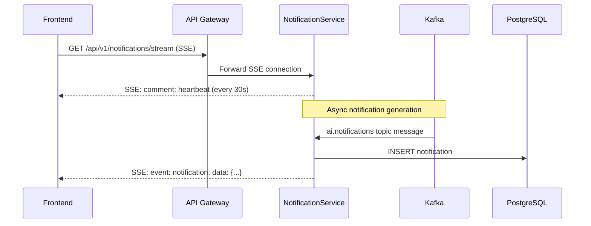

### 13.2 Kafka Topic Configuration [PLANNED]

Notifications are generated asynchronously via a Kafka topic to decouple notification creation from the triggering action.

| Aspect | Configuration |
|--------|--------------|
| Topic name | `ai.notifications` |
| Partitions | 6 (partitioned by `user_id` for ordering) |
| Replication factor | 1 (dev), 3 (production) |
| Retention | 7 days (notifications are persisted to PostgreSQL on consumption) |
| Consumer group | `notification-service-consumer` |
| Serialization | JSON (Avro optional for production) |

**Message schema:**

```json
{
  "userId": "uuid",
  "tenantId": "uuid",
  "type": "AGENT_COMPLETED | PIPELINE_FAILED | KNOWLEDGE_INDEXED | PUBLISH_APPROVED | PUBLISH_REJECTED | SYSTEM_ALERT",
  "title": "string",
  "body": "string",
  "resourceType": "AGENT | PIPELINE_RUN | KNOWLEDGE_SOURCE | TEMPLATE",
  "resourceId": "uuid",
  "severity": "INFO | WARNING | ERROR",
  "timestamp": "ISO-8601"
}
```

### 13.3 Cleanup Job [PLANNED]

Read notifications are cleaned up automatically to control database growth.

| Aspect | Configuration |
|--------|--------------|
| Schedule | Daily at 03:00 UTC (`0 3 * * *`) |
| Rule | Delete notifications where `read = true` AND `created_at < now() - 30 days` |
| Batch size | 1000 rows per DELETE to avoid long locks |
| Unread retention | Unread notifications are retained indefinitely (until read or user-deleted) |

```sql
-- Cleanup query (executed in batches)
DELETE FROM notifications
WHERE id IN (
    SELECT id FROM notifications
    WHERE read = true
      AND created_at < now() - INTERVAL '30 days'
    LIMIT 1000
);
```

---

## 14. Knowledge Source Storage [PLANNED]

> **Status:** All content in this section is `[PLANNED]`. No knowledge source storage has been implemented. These specifications define the target architecture for the knowledge source management subsystem.

### 14.1 Document Upload Storage [PLANNED]

Uploaded knowledge source documents are stored in S3-compatible object storage, separate from the PostgreSQL metadata.

| Aspect | Configuration |
|--------|--------------|
| Dev storage | MinIO (S3-compatible, self-hosted) |
| Prod storage | AWS S3 or Azure Blob Storage |
| Bucket naming | `emsist-knowledge-{environment}` (e.g., `emsist-knowledge-dev`) |
| Object key format | `{tenant_id}/{knowledge_source_id}/{filename}` |
| Max file size | 50 MB per document |
| Max collection size | 500 MB per knowledge source collection |
| Supported formats | PDF, DOCX, TXT, MD, CSV, JSON |
| Upload endpoint | `POST /api/v1/knowledge-sources/{id}/upload` (multipart/form-data) |

**MinIO Docker Compose service (dev profile):**

```yaml
  minio:
    image: minio/minio:RELEASE.2024-04-06T05-26-02Z
    container_name: agent-minio
    command: server /data --console-address ":9001"
    environment:
      MINIO_ROOT_USER: ${MINIO_ROOT_USER:-minioadmin}
      MINIO_ROOT_PASSWORD: ${MINIO_ROOT_PASSWORD:-changeme_in_production}
    ports:
      - "${MINIO_API_PORT:-9000}:9000"
      - "${MINIO_CONSOLE_PORT:-9001}:9001"
    volumes:
      - minio_data:/data
    healthcheck:
      test: ["CMD-SHELL", "mc ready local || exit 1"]
      interval: 15s
      timeout: 5s
      retries: 5
    deploy:
      resources:
        limits:
          cpus: "1.0"
          memory: 1G
        reservations:
          memory: 512M
    networks:
      - agent-network
    profiles:
      - dev
      - full
```

**Environment variables:**

```bash
# --- Knowledge Source Storage [PLANNED] ---
MINIO_ROOT_USER=minioadmin
MINIO_ROOT_PASSWORD=changeme_in_production
MINIO_API_PORT=9000
MINIO_CONSOLE_PORT=9001
KNOWLEDGE_STORAGE_BUCKET=emsist-knowledge-dev
KNOWLEDGE_MAX_FILE_SIZE_MB=50
KNOWLEDGE_MAX_COLLECTION_SIZE_MB=500
```

### 14.2 Chunking Worker [PLANNED]

Uploaded documents are processed asynchronously. A Kafka consumer splits documents into chunks for embedding and indexing in the vector store.

| Aspect | Configuration |
|--------|--------------|
| Kafka topic | `ai.knowledge.index` |
| Partitions | 3 |
| Consumer group | `knowledge-indexing-consumer` |
| Chunk size | Configurable via `RAG_CHUNK_SIZE_CHARS` (default: 1500 characters) |
| Chunk overlap | Configurable via `RAG_CHUNK_OVERLAP_CHARS` (default: 200 characters) |
| Embedding model | `nomic-embed-text` via Ollama (dimension: 768) or OpenAI `text-embedding-3-small` (dimension: 1536) |
| Vector store | PGVector (`knowledge_chunks` table with `embedding vector(768)`) |
| Processing timeout | 5 minutes per document |

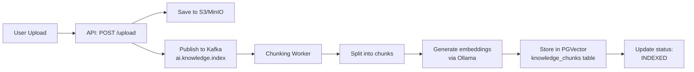

**Supported format processing:**

| Format | Processing Strategy |
|--------|-------------------|
| PDF | Apache PDFBox text extraction; fallback to Tesseract OCR for scanned PDFs |
| DOCX | Apache POI text extraction with heading structure preservation |
| TXT / MD | Direct text splitting by paragraph boundaries |
| CSV | Row-based chunking with header preserved in each chunk |
| JSON | Path-based splitting for nested structures; array elements as individual chunks |

---

## 15. RBAC Configuration [PLANNED]

> **Status:** All content in this section is `[PLANNED]`. No RBAC configuration for the AI platform has been implemented. These specifications define the target role and permission architecture.

### 15.1 Keycloak Realm Roles [PLANNED]

AI platform roles are defined as realm roles in the Keycloak `agent-platform` realm. Each role maps to a set of permissions enforced by Spring Security.

| Role | Description | Scope |
|------|-------------|-------|
| `ai-platform-admin` | Full access to all AI platform features across all tenants | Platform-wide |
| `ai-tenant-admin` | Full access to AI features within their tenant | Tenant-scoped |
| `ai-agent-designer` | Create, edit, fork, and publish agent configurations | Tenant-scoped |
| `ai-user` | Use agents (conversations, pipeline runs) but not create/edit them | Tenant-scoped |
| `ai-viewer` | Read-only access to dashboards, audit logs, and agent outputs | Tenant-scoped |

### 15.2 Role-to-Permission Matrix [PLANNED]

| Permission | `ai-platform-admin` | `ai-tenant-admin` | `ai-agent-designer` | `ai-user` | `ai-viewer` |
|-----------|---------------------|--------------------|--------------------|-----------|------------|
| View agents | Yes | Yes | Yes | Yes | Yes |
| Create agent | Yes | Yes | Yes | No | No |
| Edit agent | Yes | Yes (own tenant) | Yes (own agents) | No | No |
| Delete agent | Yes | Yes (own tenant) | Yes (own agents) | No | No |
| Publish to gallery | Yes | Yes | Submit for review | No | No |
| Use agent (conversation) | Yes | Yes | Yes | Yes | No |
| View audit log | Yes | Yes | Own actions only | Own actions only | Yes |
| Manage knowledge sources | Yes | Yes | Yes | No | No |
| View pipeline runs | Yes | Yes | Yes | Yes (own) | Yes |
| Manage notification preferences | Yes | Yes | Yes | Yes | Yes |
| Manage roles | Yes | No | No | No | No |

### 15.3 Spring Security Configuration [PLANNED]

Roles are enforced at the method level using Spring Security's `@PreAuthorize` annotation. The `AiRoleGuard` service provides reusable authorization checks.

**application.yml role mapping:**

```yaml
# application.yml
ai:
  rbac:
    roles:
      platform-admin:
        keycloak-role: "ai-platform-admin"
        permissions:
          - "ai:*"
      tenant-admin:
        keycloak-role: "ai-tenant-admin"
        permissions:
          - "ai:agent:*"
          - "ai:knowledge:*"
          - "ai:audit:read"
          - "ai:notification:*"
          - "ai:pipeline:*"
      agent-designer:
        keycloak-role: "ai-agent-designer"
        permissions:
          - "ai:agent:create"
          - "ai:agent:edit:own"
          - "ai:agent:delete:own"
          - "ai:agent:publish:submit"
          - "ai:knowledge:*"
          - "ai:pipeline:read"
      user:
        keycloak-role: "ai-user"
        permissions:
          - "ai:agent:read"
          - "ai:conversation:*"
          - "ai:pipeline:read:own"
          - "ai:notification:manage:own"
      viewer:
        keycloak-role: "ai-viewer"
        permissions:
          - "ai:agent:read"
          - "ai:audit:read"
          - "ai:pipeline:read"
          - "ai:notification:manage:own"
```

**Method-level authorization examples:**

```java
@RestController
@RequestMapping("/api/v1/agents")
public class AgentController {

    @GetMapping
    @PreAuthorize("hasAnyRole('AI_PLATFORM_ADMIN', 'AI_TENANT_ADMIN', 'AI_AGENT_DESIGNER', 'AI_USER', 'AI_VIEWER')")
    public Page<AgentSummary> listAgents(Pageable pageable) { ... }

    @PostMapping
    @PreAuthorize("hasAnyRole('AI_PLATFORM_ADMIN', 'AI_TENANT_ADMIN', 'AI_AGENT_DESIGNER')")
    public AgentDetail createAgent(@RequestBody CreateAgentRequest request) { ... }

    @DeleteMapping("/{id}")
    @PreAuthorize("@aiRoleGuard.canDeleteAgent(#id, authentication)")
    public void deleteAgent(@PathVariable UUID id) { ... }

    @PostMapping("/{id}/publish")
    @PreAuthorize("@aiRoleGuard.canPublishAgent(#id, authentication)")
    public PublishResponse publishAgent(@PathVariable UUID id) { ... }
}
```

---

## 16. Kafka Event Topics for Super Agent [PLANNED]

> **Status:** All content in this section is `[PLANNED]`. No Kafka topics for the Super Agent have been created. EMSIST currently has Kafka infrastructure (`confluentinc/cp-kafka:7.5.0`) in docker-compose but no services produce or consume Kafka events. See ADR-025 for the event-driven architecture decision and PRD Section 3.18 for the event trigger requirements.

### 16.1 Topic Definitions [PLANNED]

The Super Agent platform requires 9 Kafka topics for event-driven communication. All topics are partitioned by tenant ID to ensure ordering within a tenant and enable parallel processing across tenants.

| Topic Name | Purpose | Producer(s) | Consumer(s) | Key | Partitions | Retention |
|-----------|---------|-------------|-------------|-----|------------|-----------|
| `agent.entity.lifecycle` | CDC events from business entity changes | Debezium CDC connector, application-level publishers | EventTriggerService | `tenantId` | 12 | 7 days |
| `agent.trigger.scheduled` | Time-based trigger events from scheduler | EventSchedulerService | EventTriggerService | `tenantId` | 6 | 24 hours |
| `agent.trigger.external` | External system webhook events | WebhookIngestionController | EventTriggerService | `tenantId` | 6 | 7 days |
| `agent.workflow.events` | User workflow events from EMSIST frontend | Application event publishers (Spring ApplicationEvent) | EventTriggerService | `tenantId` | 6 | 7 days |
| `agent.worker.draft` | Draft state transition events | WorkerSandboxService | DraftReviewService, AuditService | `tenantId:draftId` | 12 | 7 days |
| `agent.approval.request` | HITL approval request events | ApprovalCheckpointService | NotificationService, ApprovalDashboard SSE | `tenantId:checkpointId` | 6 | 30 days |
| `agent.approval.decision` | HITL approval decision events | ApprovalService | SuperAgentOrchestrator, AuditService | `tenantId:checkpointId` | 6 | 30 days |
| `agent.benchmark.metrics` | Anonymized benchmark data for cross-tenant comparison | BenchmarkCollectorService | BenchmarkAggregatorService | `anonymizedCohortId` | 3 | 90 days |
| `ethics.policy.updated` | Ethics policy hot-reload events | EthicsPolicyService | SuperAgent, SubOrchestrators (all instances) | `tenantId` | 1 | 7 days |

### 16.2 Topic Configuration [PLANNED]

**Docker Compose Kafka topic auto-creation:**

```yaml
# infrastructure/docker/docker-compose.yml (extension for Super Agent topics)
# Added to the existing Kafka service environment section

KAFKA_CREATE_TOPICS: >
  agent.entity.lifecycle:12:1,
  agent.trigger.scheduled:6:1,
  agent.trigger.external:6:1,
  agent.workflow.events:6:1,
  agent.worker.draft:12:1,
  agent.approval.request:6:1,
  agent.approval.decision:6:1,
  agent.benchmark.metrics:3:1,
  ethics.policy.updated:1:1
```

**Spring Cloud Stream bindings (application.yml):**

```yaml
# ai-service application.yml additions
spring:
  cloud:
    stream:
      kafka:
        binder:
          brokers: ${KAFKA_BOOTSTRAP_SERVERS:localhost:9092}
          auto-create-topics: false  # Topics created by Docker Compose or admin scripts
      bindings:
        # Entity lifecycle event consumer
        entityLifecycleIn:
          destination: agent.entity.lifecycle
          group: ai-service-trigger
          consumer:
            max-attempts: 3
            back-off-initial-interval: 1000
            back-off-max-interval: 10000
        # Scheduled trigger consumer
        scheduledTriggerIn:
          destination: agent.trigger.scheduled
          group: ai-service-trigger
        # External trigger consumer
        externalTriggerIn:
          destination: agent.trigger.external
          group: ai-service-trigger
        # Workflow trigger consumer
        workflowTriggerIn:
          destination: agent.workflow.events
          group: ai-service-trigger
        # Draft state producer
        draftStateOut:
          destination: agent.worker.draft
        # Approval request producer
        approvalRequestOut:
          destination: agent.approval.request
        # Approval decision consumer
        approvalDecisionIn:
          destination: agent.approval.decision
          group: ai-service-orchestrator
        # Benchmark metrics producer
        benchmarkMetricsOut:
          destination: agent.benchmark.metrics
        # Ethics policy consumer (broadcast to all instances)
        ethicsPolicyIn:
          destination: ethics.policy.updated
          group: ai-service-${random.uuid}  # Unique group per instance for broadcast
```

### 16.3 Consumer Groups [PLANNED]

| Consumer Group | Topics Consumed | Scaling Strategy |
|---------------|----------------|------------------|
| `ai-service-trigger` | agent.entity.lifecycle, agent.trigger.scheduled, agent.trigger.external, agent.workflow.events | Scale with tenant count; one consumer per partition |
| `ai-service-orchestrator` | agent.approval.decision | Scale with concurrent approval volume |
| `ai-service-draft` | agent.worker.draft | Scale with worker concurrency |
| `benchmark-aggregator` | agent.benchmark.metrics | Single consumer (aggregation is centralized) |
| `ai-service-{uuid}` | ethics.policy.updated | Broadcast: every instance gets every message (unique group per instance) |

### 16.4 Dead Letter Queue (DLQ) Policy [PLANNED]

Events that fail processing after max retries are routed to a dead letter topic for manual inspection:

| Source Topic | DLQ Topic | Max Retries | Alert Threshold |
|-------------|-----------|-------------|----------------|
| `agent.entity.lifecycle` | `agent.entity.lifecycle.dlq` | 3 | 10 messages/hour |
| `agent.trigger.external` | `agent.trigger.external.dlq` | 3 | 5 messages/hour |
| `agent.approval.decision` | `agent.approval.decision.dlq` | 5 | 1 message (critical) |

### 16.5 Debezium CDC Configuration [PLANNED]

For entity lifecycle events, Debezium captures PostgreSQL WAL changes and publishes to the `agent.entity.lifecycle` topic:

```json
{
  "name": "emsist-cdc-connector",
  "config": {
    "connector.class": "io.debezium.connector.postgresql.PostgresConnector",
    "database.hostname": "${POSTGRES_HOST}",
    "database.port": "5432",
    "database.user": "${POSTGRES_CDC_USER}",
    "database.password": "${POSTGRES_CDC_PASSWORD}",
    "database.dbname": "emsist",
    "schema.include.list": "tenant_*",
    "table.include.list": "tenant_*.strategic_objectives,tenant_*.risk_assessments,tenant_*.kpi_values,tenant_*.process_definitions",
    "topic.prefix": "agent.entity",
    "plugin.name": "pgoutput",
    "slot.name": "emsist_cdc_slot",
    "publication.name": "emsist_cdc_pub",
    "transforms": "route",
    "transforms.route.type": "io.debezium.transforms.ByLogicalTableRouter",
    "transforms.route.topic.regex": "agent\\.entity\\.tenant_(.*)\\.(.*)",
    "transforms.route.topic.replacement": "agent.entity.lifecycle"
  }
}
```

**Prerequisites:**
- PostgreSQL `wal_level` must be set to `logical` (not `replica`)
- In docker-compose, add to the PostgreSQL service: `command: postgres -c wal_level=logical -c max_replication_slots=4 -c max_wal_senders=4`
- For existing deployments: changing `wal_level` requires a PostgreSQL restart (schedule during maintenance window)
- The current docker-compose uses the default `wal_level=replica`, which does not support Debezium CDC

### 16.6 Event Payload Schemas [PLANNED]

> **Status:** All schemas in this section are `[PLANNED]`. No Kafka producers or consumers exist in the current codebase. These JSON Schema definitions specify the wire format for each topic, enabling contract-first development and consumer-side validation. All schemas use JSON Schema Draft 2020-12.
>
> **Security Policy:** Every event payload MUST include a `tenantId` field for tenant isolation enforcement. Fields annotated with `x-pii: true` or `x-sensitive: true` MUST be sanitized before logging, indexing, or cross-tenant aggregation. No credentials, API keys, or authentication tokens may appear in any event payload.

#### 16.6.1 Schema Relationship Overview

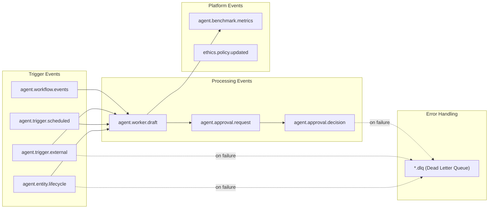

#### 16.6.2 Common Header Schema [PLANNED]

All event payloads share a common header structure. This is embedded (not referenced via `$ref`) in each topic schema to keep messages self-describing on the wire.

```json
{
  "$id": "https://emsist.io/schemas/events/common-header.schema.json",
  "$schema": "https://json-schema.org/draft/2020-12/schema",
  "title": "EMSIST Event Common Header",
  "description": "Fields present in every EMSIST Kafka event payload. Provides traceability, tenant isolation, and idempotency guarantees.",
  "type": "object",
  "properties": {
    "eventId": {
      "type": "string",
      "format": "uuid",
      "description": "Globally unique event identifier for idempotency and deduplication."
    },
    "eventType": {
      "type": "string",
      "description": "Dot-notation event type (e.g., 'agent.entity.created', 'agent.trigger.fired')."
    },
    "tenantId": {
      "type": "string",
      "format": "uuid",
      "description": "Tenant identifier. REQUIRED for all events. Used for partition key derivation and schema-per-tenant routing.",
      "x-pii": false
    },
    "timestamp": {
      "type": "string",
      "format": "date-time",
      "description": "ISO 8601 UTC timestamp of event creation (e.g., '2026-03-08T14:30:00.000Z')."
    },
    "correlationId": {
      "type": "string",
      "format": "uuid",
      "description": "Trace correlation ID for distributed tracing across services. Propagated from originating request."
    },
    "sourceService": {
      "type": "string",
      "description": "Name of the service that produced this event (e.g., 'ai-service', 'debezium-cdc')."
    },
    "schemaVersion": {
      "type": "string",
      "pattern": "^\\d+\\.\\d+\\.\\d+$",
      "description": "Semantic version of the payload schema (e.g., '1.0.0'). Used for schema evolution compatibility checks."
    }
  },
  "required": ["eventId", "eventType", "tenantId", "timestamp", "sourceService", "schemaVersion"]
}
```

#### 16.6.3 Topic: `agent.entity.lifecycle` [PLANNED]

**Purpose:** Debezium CDC envelope wrapping business entity change events. Published when agents, sub-orchestrators, workers, maturity scores, or event triggers are created, updated, or deleted.

**Producer:** Debezium CDC connector (PostgreSQL WAL), application-level publishers (for non-CDC events).
**Consumer:** EventTriggerService.
**Partition Key:** `tenantId`.

**JSON Schema:**

```json
{
  "$id": "https://emsist.io/schemas/events/agent-entity-lifecycle.schema.json",
  "$schema": "https://json-schema.org/draft/2020-12/schema",
  "title": "Agent Entity Lifecycle Event",
  "description": "CDC envelope for business entity changes in the Super Agent platform. Wraps Debezium change events with EMSIST-specific metadata for trigger evaluation.",
  "type": "object",
  "properties": {
    "eventId": {
      "type": "string",
      "format": "uuid",
      "description": "Globally unique event identifier."
    },
    "eventType": {
      "type": "string",
      "enum": [
        "agent.entity.created",
        "agent.entity.updated",
        "agent.entity.deleted",
        "agent.entity.status_changed"
      ],
      "description": "The type of entity lifecycle event."
    },
    "tenantId": {
      "type": "string",
      "format": "uuid",
      "description": "Tenant identifier for partition routing and schema isolation."
    },
    "timestamp": {
      "type": "string",
      "format": "date-time",
      "description": "ISO 8601 UTC timestamp of event creation."
    },
    "correlationId": {
      "type": "string",
      "format": "uuid",
      "description": "Distributed tracing correlation ID."
    },
    "sourceService": {
      "type": "string",
      "description": "Originating service (e.g., 'debezium-cdc', 'ai-service')."
    },
    "schemaVersion": {
      "type": "string",
      "pattern": "^\\d+\\.\\d+\\.\\d+$",
      "description": "Payload schema version.",
      "const": "1.0.0"
    },
    "entity": {
      "type": "object",
      "description": "The entity that changed.",
      "properties": {
        "entityType": {
          "type": "string",
          "enum": [
            "SUPER_AGENT",
            "SUB_ORCHESTRATOR",
            "WORKER",
            "MATURITY_SCORE",
            "EVENT_TRIGGER",
            "ETHICS_POLICY",
            "CONDUCT_POLICY",
            "WORKER_DRAFT",
            "APPROVAL_CHECKPOINT"
          ],
          "description": "Type of the business entity."
        },
        "entityId": {
          "type": "string",
          "format": "uuid",
          "description": "Primary key of the entity."
        },
        "tableName": {
          "type": "string",
          "description": "Source database table name (e.g., 'super_agents', 'workers')."
        },
        "schemaName": {
          "type": "string",
          "description": "Source database schema name (e.g., 'tenant_acme')."
        }
      },
      "required": ["entityType", "entityId", "tableName"],
      "additionalProperties": false
    },
    "operation": {
      "type": "string",
      "enum": ["CREATE", "UPDATE", "DELETE"],
      "description": "The database operation that produced this event."
    },
    "before": {
      "type": ["object", "null"],
      "description": "Entity state before the change (null for CREATE operations). Schema matches the source table columns.",
      "x-sensitive": true
    },
    "after": {
      "type": ["object", "null"],
      "description": "Entity state after the change (null for DELETE operations). Schema matches the source table columns.",
      "x-sensitive": true
    },
    "changedFields": {
      "type": "array",
      "items": {
        "type": "string"
      },
      "description": "List of field names that changed (for UPDATE operations). Empty for CREATE/DELETE."
    },
    "dbTransactionId": {
      "type": ["string", "null"],
      "description": "PostgreSQL transaction ID from WAL. Used for ordering and deduplication of CDC events."
    }
  },
  "required": [
    "eventId", "eventType", "tenantId", "timestamp", "sourceService",
    "schemaVersion", "entity", "operation", "after"
  ],
  "additionalProperties": false
}
```

**Example Payload:**

```json
{
  "eventId": "e7b1c4d2-3f5a-4b8e-9c1d-2a3b4c5d6e7f",
  "eventType": "agent.entity.status_changed",
  "tenantId": "a1b2c3d4-e5f6-7890-abcd-ef1234567890",
  "timestamp": "2026-03-08T14:30:00.000Z",
  "correlationId": "f8e7d6c5-b4a3-2190-8765-432109876543",
  "sourceService": "debezium-cdc",
  "schemaVersion": "1.0.0",
  "entity": {
    "entityType": "WORKER",
    "entityId": "11223344-5566-7788-99aa-bbccddeeff00",
    "tableName": "workers",
    "schemaName": "tenant_a1b2c3d4"
  },
  "operation": "UPDATE",
  "before": {
    "id": "11223344-5566-7788-99aa-bbccddeeff00",
    "status": "ACTIVE",
    "capability_type": "DATA_QUERY"
  },
  "after": {
    "id": "11223344-5566-7788-99aa-bbccddeeff00",
    "status": "SUSPENDED",
    "capability_type": "DATA_QUERY"
  },
  "changedFields": ["status", "updated_at", "updated_by"],
  "dbTransactionId": "5432198"
}
```

**Security Considerations:**
- The `before` and `after` fields may contain entity data including user references (`created_by`, `updated_by`). These fields are marked `x-sensitive: true` and MUST NOT be logged to external systems without PII sanitization.
- `schemaName` exposes the tenant slug. Consumers MUST verify that `tenantId` in the header matches the schema name to prevent cross-tenant data injection.
- Debezium CDC connectors MUST use a dedicated PostgreSQL role (`POSTGRES_CDC_USER`) with SELECT-only and replication permissions -- no INSERT/UPDATE/DELETE grants.
- The `table.include.list` in the Debezium connector configuration (Section 16.5) MUST be maintained as an allowlist. Adding new tables requires a security review.

---

#### 16.6.4 Topic: `agent.trigger.scheduled` [PLANNED]

**Purpose:** Scheduler fire event emitted when a time-based trigger activates. Contains the trigger definition, cron expression, and target agent routing information.

**Producer:** EventSchedulerService (Spring Scheduler with ShedLock).
**Consumer:** EventTriggerService.
**Partition Key:** `tenantId`.

**JSON Schema:**

```json
{
  "$id": "https://emsist.io/schemas/events/agent-trigger-scheduled.schema.json",
  "$schema": "https://json-schema.org/draft/2020-12/schema",
  "title": "Scheduled Trigger Event",
  "description": "Emitted by the event scheduler when a time-based trigger fires. Contains trigger definition and execution context for the EventTriggerService to route to the appropriate agent.",
  "type": "object",
  "properties": {
    "eventId": {
      "type": "string",
      "format": "uuid",
      "description": "Globally unique event identifier."
    },
    "eventType": {
      "type": "string",
      "const": "agent.trigger.scheduled.fired",
      "description": "Fixed event type for scheduled trigger activations."
    },
    "tenantId": {
      "type": "string",
      "format": "uuid",
      "description": "Tenant identifier for partition routing and schema isolation."
    },
    "timestamp": {
      "type": "string",
      "format": "date-time",
      "description": "ISO 8601 UTC timestamp of event creation."
    },
    "correlationId": {
      "type": "string",
      "format": "uuid",
      "description": "Distributed tracing correlation ID."
    },
    "sourceService": {
      "type": "string",
      "description": "Always 'ai-service' for scheduled triggers."
    },
    "schemaVersion": {
      "type": "string",
      "pattern": "^\\d+\\.\\d+\\.\\d+$",
      "const": "1.0.0"
    },
    "triggerId": {
      "type": "string",
      "format": "uuid",
      "description": "Reference to the event_triggers table record."
    },
    "scheduleId": {
      "type": "string",
      "format": "uuid",
      "description": "Reference to the event_schedules table record."
    },
    "cronExpression": {
      "type": "string",
      "description": "The cron expression that fired (e.g., '0 0 2 * * ?')."
    },
    "timezone": {
      "type": "string",
      "description": "Timezone of the cron expression (e.g., 'UTC', 'America/New_York')."
    },
    "scheduledFireTime": {
      "type": "string",
      "format": "date-time",
      "description": "The planned fire time (may differ from timestamp if missed fire recovery)."
    },
    "actualFireTime": {
      "type": "string",
      "format": "date-time",
      "description": "The actual fire time (equals timestamp under normal conditions)."
    },
    "missedFireRecovery": {
      "type": "boolean",
      "description": "True if this event was produced by missed fire recovery (FIRE_NOW policy)."
    },
    "targetAgent": {
      "type": "object",
      "description": "The agent that should process this trigger.",
      "properties": {
        "agentType": {
          "type": "string",
          "enum": ["SUPER_AGENT", "SUB_ORCHESTRATOR"],
          "description": "Target agent tier."
        },
        "agentId": {
          "type": ["string", "null"],
          "format": "uuid",
          "description": "Specific agent ID (null for SuperAgent, which is singleton per tenant)."
        }
      },
      "required": ["agentType"],
      "additionalProperties": false
    },
    "executionContext": {
      "type": "object",
      "description": "Additional context passed to the agent for this scheduled execution.",
      "properties": {
        "triggerName": {
          "type": "string",
          "description": "Human-readable trigger name (e.g., 'Daily KPI Aggregation')."
        },
        "recurrenceType": {
          "type": "string",
          "enum": ["DAILY", "WEEKLY", "MONTHLY", "QUARTERLY", "CUSTOM"],
          "description": "Schedule recurrence pattern."
        },
        "parameters": {
          "type": "object",
          "description": "Arbitrary key-value parameters configured on the trigger.",
          "additionalProperties": {
            "type": "string"
          }
        }
      },
      "required": ["triggerName", "recurrenceType"],
      "additionalProperties": false
    }
  },
  "required": [
    "eventId", "eventType", "tenantId", "timestamp", "sourceService",
    "schemaVersion", "triggerId", "scheduleId", "cronExpression",
    "scheduledFireTime", "actualFireTime", "missedFireRecovery",
    "targetAgent", "executionContext"
  ],
  "additionalProperties": false
}
```

**Example Payload:**

```json
{
  "eventId": "b2c3d4e5-f6a7-8901-bcde-f23456789012",
  "eventType": "agent.trigger.scheduled.fired",
  "tenantId": "a1b2c3d4-e5f6-7890-abcd-ef1234567890",
  "timestamp": "2026-03-08T02:00:00.123Z",
  "correlationId": "c3d4e5f6-a7b8-9012-cdef-345678901234",
  "sourceService": "ai-service",
  "schemaVersion": "1.0.0",
  "triggerId": "d4e5f6a7-b8c9-0123-def0-456789012345",
  "scheduleId": "e5f6a7b8-c9d0-1234-ef01-567890123456",
  "cronExpression": "0 0 2 * * ?",
  "timezone": "UTC",
  "scheduledFireTime": "2026-03-08T02:00:00.000Z",
  "actualFireTime": "2026-03-08T02:00:00.123Z",
  "missedFireRecovery": false,
  "targetAgent": {
    "agentType": "SUPER_AGENT",
    "agentId": null
  },
  "executionContext": {
    "triggerName": "Daily KPI Aggregation",
    "recurrenceType": "DAILY",
    "parameters": {
      "kpiCategory": "financial",
      "aggregationPeriod": "24h"
    }
  }
}
```

**Security Considerations:**
- `executionContext.parameters` is tenant-configurable and MUST be validated before use. Apply input length limits (max 10 keys, max 255 chars per key, max 1024 chars per value) and reject non-alphanumeric key names.
- Missed fire recovery events (`missedFireRecovery: true`) MUST be rate-limited to prevent a burst of catch-up events from overwhelming consumers after extended downtime. Maximum 10 missed fire events per tenant per minute.
- The scheduler MUST verify that the `triggerId` and `scheduleId` still exist and are `ACTIVE` before publishing. Race conditions between trigger deletion and scheduler firing MUST be handled gracefully (discard event, do not DLQ).

---

#### 16.6.5 Topic: `agent.trigger.external` [PLANNED]

**Purpose:** Webhook ingestion envelope for events from external systems. Contains the verified webhook payload, source system identification, and routing rules.

**Producer:** WebhookIngestionController (REST endpoint).
**Consumer:** EventTriggerService.
**Partition Key:** `tenantId`.

**JSON Schema:**

```json
{
  "$id": "https://emsist.io/schemas/events/agent-trigger-external.schema.json",
  "$schema": "https://json-schema.org/draft/2020-12/schema",
  "title": "External Trigger Event",
  "description": "Webhook ingestion envelope. Produced when an external system sends a webhook to the EMSIST ingestion endpoint. The payload is wrapped with verification metadata and routing information.",
  "type": "object",
  "properties": {
    "eventId": {
      "type": "string",
      "format": "uuid",
      "description": "Globally unique event identifier."
    },
    "eventType": {
      "type": "string",
      "const": "agent.trigger.external.received",
      "description": "Fixed event type for external webhook ingestion."
    },
    "tenantId": {
      "type": "string",
      "format": "uuid",
      "description": "Tenant identifier resolved from the webhook registration."
    },
    "timestamp": {
      "type": "string",
      "format": "date-time",
      "description": "ISO 8601 UTC timestamp of ingestion."
    },
    "correlationId": {
      "type": "string",
      "format": "uuid",
      "description": "Distributed tracing correlation ID."
    },
    "sourceService": {
      "type": "string",
      "const": "ai-service",
      "description": "Always 'ai-service' (ingestion endpoint)."
    },
    "schemaVersion": {
      "type": "string",
      "pattern": "^\\d+\\.\\d+\\.\\d+$",
      "const": "1.0.0"
    },
    "webhookSource": {
      "type": "object",
      "description": "Identification of the external system that sent the webhook.",
      "properties": {
        "sourceId": {
          "type": "string",
          "format": "uuid",
          "description": "Registered webhook source ID (from event_sources table)."
        },
        "sourceName": {
          "type": "string",
          "description": "Human-readable source name (e.g., 'Jira', 'GitHub', 'SAP')."
        },
        "sourceType": {
          "type": "string",
          "enum": ["JIRA", "GITHUB", "SAP", "SERVICENOW", "SALESFORCE", "CUSTOM"],
          "description": "Categorized source type for routing."
        },
        "callbackUrl": {
          "type": ["string", "null"],
          "format": "uri",
          "description": "Optional callback URL for bidirectional integration."
        }
      },
      "required": ["sourceId", "sourceName", "sourceType"],
      "additionalProperties": false
    },
    "verification": {
      "type": "object",
      "description": "Webhook signature verification result. The raw signature is NOT stored.",
      "properties": {
        "signatureAlgorithm": {
          "type": "string",
          "enum": ["HMAC-SHA256", "HMAC-SHA512", "RSA-SHA256", "NONE"],
          "description": "Algorithm used for webhook signature verification."
        },
        "signatureVerified": {
          "type": "boolean",
          "description": "Whether the webhook signature was successfully verified."
        },
        "verifiedAt": {
          "type": "string",
          "format": "date-time",
          "description": "Timestamp of signature verification."
        },
        "sourceIp": {
          "type": "string",
          "description": "IP address of the webhook sender. Used for IP allowlist enforcement.",
          "x-pii": true
        }
      },
      "required": ["signatureAlgorithm", "signatureVerified", "verifiedAt"],
      "additionalProperties": false
    },
    "payload": {
      "type": "object",
      "description": "The raw webhook payload from the external system. Content structure varies by sourceType. MUST be sanitized before agent processing (strip scripts, limit depth to 10 levels, max 64KB).",
      "x-sensitive": true
    },
    "routingRules": {
      "type": "object",
      "description": "How to route this external event to agents.",
      "properties": {
        "triggerId": {
          "type": "string",
          "format": "uuid",
          "description": "Matched event_triggers record that handles this webhook."
        },
        "targetAgentType": {
          "type": "string",
          "enum": ["SUPER_AGENT", "SUB_ORCHESTRATOR"],
          "description": "Target agent tier."
        },
        "targetAgentId": {
          "type": ["string", "null"],
          "format": "uuid",
          "description": "Specific agent ID if targeting a sub-orchestrator."
        },
        "conditionMatched": {
          "type": "boolean",
          "description": "Whether the trigger condition expression evaluated to true."
        },
        "conditionExpression": {
          "type": ["string", "null"],
          "description": "The condition expression that was evaluated (JSON Path or SpEL)."
        }
      },
      "required": ["triggerId", "targetAgentType", "conditionMatched"],
      "additionalProperties": false
    },
    "httpMetadata": {
      "type": "object",
      "description": "HTTP request metadata from the webhook delivery.",
      "properties": {
        "method": {
          "type": "string",
          "enum": ["POST", "PUT"],
          "description": "HTTP method used."
        },
        "contentType": {
          "type": "string",
          "description": "Content-Type header value."
        },
        "userAgent": {
          "type": ["string", "null"],
          "description": "User-Agent header from the webhook sender.",
          "x-pii": true
        },
        "deliveryId": {
          "type": ["string", "null"],
          "description": "Delivery ID from the source system (e.g., X-GitHub-Delivery header)."
        }
      },
      "required": ["method", "contentType"],
      "additionalProperties": false
    }
  },
  "required": [
    "eventId", "eventType", "tenantId", "timestamp", "sourceService",
    "schemaVersion", "webhookSource", "verification", "payload", "routingRules"
  ],
  "additionalProperties": false
}
```

**Example Payload:**

```json
{
  "eventId": "f6a7b8c9-d0e1-2345-f012-678901234567",
  "eventType": "agent.trigger.external.received",
  "tenantId": "a1b2c3d4-e5f6-7890-abcd-ef1234567890",
  "timestamp": "2026-03-08T10:15:32.456Z",
  "correlationId": "a7b8c9d0-e1f2-3456-0123-789012345678",
  "sourceService": "ai-service",
  "schemaVersion": "1.0.0",
  "webhookSource": {
    "sourceId": "b8c9d0e1-f2a3-4567-1234-890123456789",
    "sourceName": "Jira Cloud",
    "sourceType": "JIRA",
    "callbackUrl": null
  },
  "verification": {
    "signatureAlgorithm": "HMAC-SHA256",
    "signatureVerified": true,
    "verifiedAt": "2026-03-08T10:15:32.400Z",
    "sourceIp": "104.192.136.0"
  },
  "payload": {
    "webhookEvent": "jira:issue_updated",
    "issue": {
      "key": "PROJ-1234",
      "fields": {
        "summary": "Update quarterly compliance report",
        "status": { "name": "Done" },
        "priority": { "name": "High" }
      }
    }
  },
  "routingRules": {
    "triggerId": "c9d0e1f2-a3b4-5678-2345-901234567890",
    "targetAgentType": "SUB_ORCHESTRATOR",
    "targetAgentId": "d0e1f2a3-b4c5-6789-3456-012345678901",
    "conditionMatched": true,
    "conditionExpression": "$.issue.fields.status.name == 'Done'"
  },
  "httpMetadata": {
    "method": "POST",
    "contentType": "application/json",
    "userAgent": "Atlassian Webhook/1.0",
    "deliveryId": "jira-webhook-98765"
  }
}
```

**Security Considerations:**
- **Webhook signature verification is MANDATORY.** Events with `signatureVerified: false` MUST be rejected at the ingestion endpoint and MUST NOT be published to Kafka. The only exception is source types with `signatureAlgorithm: NONE`, which MUST be restricted to IP-allowlisted sources only.
- The `payload` field contains untrusted external data. It is marked `x-sensitive: true` and MUST be sanitized before processing: strip embedded scripts, limit JSON depth to 10 levels, enforce a 64KB maximum payload size, and reject payloads containing known injection patterns (SQL, LDAP, OS command).
- `verification.sourceIp` and `httpMetadata.userAgent` are marked `x-pii: true` and MUST be excluded from cross-tenant aggregation and benchmark metrics.
- Webhook HMAC secrets MUST be stored in HashiCorp Vault (not in application.yml or environment variables). See SEC-PRINCIPLES Section "Secrets Management".
- Rate limiting: Maximum 100 webhook events per tenant per minute. Excess events receive HTTP 429 and are NOT published to Kafka.

---

#### 16.6.6 Topic: `agent.workflow.events` [PLANNED]

**Purpose:** Frontend workflow event emitted when a user action in the EMSIST UI should trigger agent processing. Examples include manual data refresh requests, report generation, or "ask the agent" interactions from non-chat contexts.

**Producer:** Application event publishers (Spring ApplicationEvent from REST endpoints).
**Consumer:** EventTriggerService.
**Partition Key:** `tenantId`.

**JSON Schema:**

```json
{
  "$id": "https://emsist.io/schemas/events/agent-workflow-events.schema.json",
  "$schema": "https://json-schema.org/draft/2020-12/schema",
  "title": "Workflow Trigger Event",
  "description": "Frontend workflow event produced when a user action in the EMSIST UI triggers agent processing outside the chat interface.",
  "type": "object",
  "properties": {
    "eventId": {
      "type": "string",
      "format": "uuid",
      "description": "Globally unique event identifier."
    },
    "eventType": {
      "type": "string",
      "const": "agent.workflow.events.action",
      "description": "Fixed event type for workflow trigger events."
    },
    "tenantId": {
      "type": "string",
      "format": "uuid",
      "description": "Tenant identifier from the user's JWT."
    },
    "timestamp": {
      "type": "string",
      "format": "date-time",
      "description": "ISO 8601 UTC timestamp of event creation."
    },
    "correlationId": {
      "type": "string",
      "format": "uuid",
      "description": "Distributed tracing correlation ID."
    },
    "sourceService": {
      "type": "string",
      "const": "ai-service",
      "description": "Always 'ai-service'."
    },
    "schemaVersion": {
      "type": "string",
      "pattern": "^\\d+\\.\\d+\\.\\d+$",
      "const": "1.0.0"
    },
    "user": {
      "type": "object",
      "description": "The user who triggered the workflow action.",
      "properties": {
        "userId": {
          "type": "string",
          "format": "uuid",
          "description": "User identifier.",
          "x-pii": true
        },
        "roles": {
          "type": "array",
          "items": {
            "type": "string"
          },
          "description": "User's RBAC roles at the time of action.",
          "x-sensitive": true
        }
      },
      "required": ["userId", "roles"],
      "additionalProperties": false
    },
    "action": {
      "type": "object",
      "description": "The user action that triggered this event.",
      "properties": {
        "actionType": {
          "type": "string",
          "enum": [
            "DATA_REFRESH",
            "REPORT_GENERATION",
            "ANALYSIS_REQUEST",
            "NOTIFICATION_DISPATCH",
            "COMPLIANCE_CHECK",
            "CUSTOM"
          ],
          "description": "Categorized action type."
        },
        "actionName": {
          "type": "string",
          "description": "Human-readable action name (e.g., 'Generate Q1 Board Report')."
        },
        "interactionType": {
          "type": "string",
          "enum": ["BUTTON_CLICK", "MENU_ACTION", "CONTEXT_MENU", "KEYBOARD_SHORTCUT", "API_CALL"],
          "description": "How the user initiated the action."
        }
      },
      "required": ["actionType", "actionName", "interactionType"],
      "additionalProperties": false
    },
    "pageContext": {
      "type": "object",
      "description": "Context about the UI page where the action was triggered.",
      "properties": {
        "pageRoute": {
          "type": "string",
          "description": "Angular route path (e.g., '/dashboard/kpi', '/administration/agents')."
        },
        "moduleContext": {
          "type": ["string", "null"],
          "description": "EMSIST module context (e.g., 'performance-management', 'governance')."
        },
        "selectedEntityId": {
          "type": ["string", "null"],
          "format": "uuid",
          "description": "If the action relates to a specific entity (e.g., a KPI, a process), its ID."
        },
        "selectedEntityType": {
          "type": ["string", "null"],
          "description": "Type of the selected entity (e.g., 'KPI', 'PROCESS', 'RISK')."
        }
      },
      "required": ["pageRoute"],
      "additionalProperties": false
    },
    "targetAgent": {
      "type": "object",
      "description": "The agent that should process this workflow action.",
      "properties": {
        "agentType": {
          "type": "string",
          "enum": ["SUPER_AGENT", "SUB_ORCHESTRATOR"],
          "description": "Target agent tier."
        },
        "agentId": {
          "type": ["string", "null"],
          "format": "uuid",
          "description": "Specific agent ID."
        },
        "domainHint": {
          "type": ["string", "null"],
          "enum": ["EA", "PERF", "GRC", "KM", "SD", null],
          "description": "Domain hint to assist SuperAgent routing."
        }
      },
      "required": ["agentType"],
      "additionalProperties": false
    },
    "parameters": {
      "type": "object",
      "description": "Arbitrary parameters for the workflow action.",
      "additionalProperties": {
        "type": "string"
      }
    }
  },
  "required": [
    "eventId", "eventType", "tenantId", "timestamp", "sourceService",
    "schemaVersion", "user", "action", "pageContext", "targetAgent"
  ],
  "additionalProperties": false
}
```

**Example Payload:**

```json
{
  "eventId": "12345678-abcd-ef01-2345-678901234567",
  "eventType": "agent.workflow.events.action",
  "tenantId": "a1b2c3d4-e5f6-7890-abcd-ef1234567890",
  "timestamp": "2026-03-08T09:45:12.789Z",
  "correlationId": "23456789-bcde-f012-3456-789012345678",
  "sourceService": "ai-service",
  "schemaVersion": "1.0.0",
  "user": {
    "userId": "34567890-cdef-0123-4567-890123456789",
    "roles": ["ADMIN", "ANALYST"]
  },
  "action": {
    "actionType": "REPORT_GENERATION",
    "actionName": "Generate Q1 Board Report",
    "interactionType": "BUTTON_CLICK"
  },
  "pageContext": {
    "pageRoute": "/dashboard/kpi",
    "moduleContext": "performance-management",
    "selectedEntityId": null,
    "selectedEntityType": null
  },
  "targetAgent": {
    "agentType": "SUPER_AGENT",
    "agentId": null,
    "domainHint": "PERF"
  },
  "parameters": {
    "reportPeriod": "Q1-2026",
    "format": "PDF"
  }
}
```

**Security Considerations:**
- `user.userId` is extracted from the validated JWT and is marked `x-pii: true`. It MUST NOT appear in cross-tenant benchmark events.
- `user.roles` is marked `x-sensitive: true`. Role information MUST be used only for authorization within the tenant context and MUST NOT be logged to shared audit stores without masking.
- The `parameters` field is user-supplied. Apply the same validation as scheduled trigger parameters: max 10 keys, max 255 chars per key, max 1024 chars per value, alphanumeric key names only.
- `pageContext.pageRoute` MUST be validated against a known route allowlist to prevent route injection attacks.
- Authorization: The REST endpoint that publishes workflow events MUST verify that the user has the required RBAC role for the `action.actionType` before publishing.

---

#### 16.6.7 Topic: `agent.worker.draft` [PLANNED]

**Purpose:** Draft state transition event emitted when a worker draft changes state in the sandbox. Tracks the full lifecycle from initial creation through review, revision, approval, and commit.

**Producer:** WorkerSandboxService (DraftSandboxService).
**Consumer:** DraftReviewService, AuditService.
**Partition Key:** `tenantId:draftId` (compound key for per-draft ordering).

**JSON Schema:**

```json
{
  "$id": "https://emsist.io/schemas/events/agent-worker-draft.schema.json",
  "$schema": "https://json-schema.org/draft/2020-12/schema",
  "title": "Worker Draft State Transition Event",
  "description": "Emitted when a worker draft transitions between states in the sandbox. Provides a full audit trail of draft lifecycle for compliance (EU AI Act Article 12).",
  "type": "object",
  "properties": {
    "eventId": {
      "type": "string",
      "format": "uuid",
      "description": "Globally unique event identifier."
    },
    "eventType": {
      "type": "string",
      "enum": [
        "agent.worker.draft.created",
        "agent.worker.draft.submitted",
        "agent.worker.draft.under_review",
        "agent.worker.draft.revision_requested",
        "agent.worker.draft.approved",
        "agent.worker.draft.committed",
        "agent.worker.draft.rejected"
      ],
      "description": "The specific state transition that occurred."
    },
    "tenantId": {
      "type": "string",
      "format": "uuid",
      "description": "Tenant identifier for partition routing and schema isolation."
    },
    "timestamp": {
      "type": "string",
      "format": "date-time",
      "description": "ISO 8601 UTC timestamp of state transition."
    },
    "correlationId": {
      "type": "string",
      "format": "uuid",
      "description": "Distributed tracing correlation ID (same across all events for one pipeline run)."
    },
    "sourceService": {
      "type": "string",
      "const": "ai-service",
      "description": "Always 'ai-service'."
    },
    "schemaVersion": {
      "type": "string",
      "pattern": "^\\d+\\.\\d+\\.\\d+$",
      "const": "1.0.0"
    },
    "draft": {
      "type": "object",
      "description": "The draft that transitioned state.",
      "properties": {
        "draftId": {
          "type": "string",
          "format": "uuid",
          "description": "Worker draft primary key."
        },
        "draftVersion": {
          "type": "integer",
          "minimum": 1,
          "description": "Draft version number (increments on revision)."
        },
        "workerId": {
          "type": "string",
          "format": "uuid",
          "description": "Worker that produced the draft."
        },
        "taskId": {
          "type": "string",
          "format": "uuid",
          "description": "Originating task reference."
        },
        "contentHash": {
          "type": "string",
          "description": "SHA-256 hash of the draft content JSONB. Used for integrity verification and deduplication.",
          "pattern": "^[a-f0-9]{64}$"
        },
        "contentSizeBytes": {
          "type": "integer",
          "minimum": 0,
          "description": "Size of the draft content in bytes."
        }
      },
      "required": ["draftId", "draftVersion", "workerId", "taskId", "contentHash"],
      "additionalProperties": false
    },
    "stateTransition": {
      "type": "object",
      "description": "Details of the state change.",
      "properties": {
        "fromState": {
          "type": ["string", "null"],
          "enum": [
            "DRAFT", "UNDER_REVIEW", "REVISION_REQUESTED",
            "APPROVED", "COMMITTED", "REJECTED", null
          ],
          "description": "Previous state (null for initial creation)."
        },
        "toState": {
          "type": "string",
          "enum": [
            "DRAFT", "UNDER_REVIEW", "REVISION_REQUESTED",
            "APPROVED", "COMMITTED", "REJECTED"
          ],
          "description": "New state after transition."
        },
        "riskLevel": {
          "type": "string",
          "enum": ["LOW", "MEDIUM", "HIGH", "CRITICAL"],
          "description": "Risk level assessment of the draft content."
        },
        "confidenceScore": {
          "type": ["number", "null"],
          "minimum": 0.0,
          "maximum": 1.0,
          "description": "Worker self-assessed confidence (0.0-1.0)."
        }
      },
      "required": ["fromState", "toState", "riskLevel"],
      "additionalProperties": false
    },
    "reviewer": {
      "type": ["object", "null"],
      "description": "Reviewer details (present for review-related transitions).",
      "properties": {
        "reviewerType": {
          "type": "string",
          "enum": ["AUTO", "SUB_ORCHESTRATOR", "HUMAN"],
          "description": "Type of reviewer."
        },
        "reviewerId": {
          "type": ["string", "null"],
          "format": "uuid",
          "description": "Reviewer identity (agent ID or user ID).",
          "x-pii": true
        },
        "feedback": {
          "type": ["string", "null"],
          "description": "Review feedback text (for REVISION_REQUESTED or REJECTED).",
          "x-sensitive": true,
          "maxLength": 4096
        }
      },
      "required": ["reviewerType"],
      "additionalProperties": false
    }
  },
  "required": [
    "eventId", "eventType", "tenantId", "timestamp", "sourceService",
    "schemaVersion", "draft", "stateTransition"
  ],
  "additionalProperties": false
}
```

**Example Payload:**

```json
{
  "eventId": "45678901-def0-1234-5678-901234567890",
  "eventType": "agent.worker.draft.approved",
  "tenantId": "a1b2c3d4-e5f6-7890-abcd-ef1234567890",
  "timestamp": "2026-03-08T11:22:33.456Z",
  "correlationId": "56789012-ef01-2345-6789-012345678901",
  "sourceService": "ai-service",
  "schemaVersion": "1.0.0",
  "draft": {
    "draftId": "67890123-f012-3456-7890-123456789012",
    "draftVersion": 2,
    "workerId": "78901234-0123-4567-8901-234567890123",
    "taskId": "89012345-1234-5678-9012-345678901234",
    "contentHash": "a3f2b1c0d9e8f7a6b5c4d3e2f1a0b9c8d7e6f5a4b3c2d1e0f9a8b7c6d5e4f3",
    "contentSizeBytes": 4512
  },
  "stateTransition": {
    "fromState": "UNDER_REVIEW",
    "toState": "APPROVED",
    "riskLevel": "MEDIUM",
    "confidenceScore": 0.87
  },
  "reviewer": {
    "reviewerType": "SUB_ORCHESTRATOR",
    "reviewerId": "90123456-2345-6789-0123-456789012345",
    "feedback": null
  }
}
```

**Security Considerations:**
- Draft `content` is intentionally NOT included in this event. Only the `contentHash` is transmitted for integrity verification. Full draft content must be read from the database by authorized consumers. This prevents sensitive business data from flowing through Kafka in cleartext.
- `reviewer.reviewerId` may contain a human user ID (marked `x-pii: true`). When the reviewer is `HUMAN`, this field MUST be excluded from any cross-tenant data flows.
- `reviewer.feedback` is marked `x-sensitive: true` as it may contain references to business-specific content. Maximum length is 4096 characters to prevent abuse.
- State transitions are append-only events. Once published, they MUST NOT be modified or deleted (EU AI Act Article 12 traceability requirement). The 14-day retention on this topic is a minimum; production deployments SHOULD archive to cold storage before expiry.

---

#### 16.6.8 Topic: `agent.approval.request` [PLANNED]

**Purpose:** HITL approval request event published when a draft or action requires human review. Contains the checkpoint details, risk assessment, maturity context, and required action type.

**Producer:** ApprovalCheckpointService (HITLService).
**Consumer:** NotificationService, ApprovalDashboard SSE.
**Partition Key:** `tenantId:checkpointId` (compound key for per-checkpoint ordering).

**JSON Schema:**

```json
{
  "$id": "https://emsist.io/schemas/events/agent-approval-request.schema.json",
  "$schema": "https://json-schema.org/draft/2020-12/schema",
  "title": "HITL Approval Request Event",
  "description": "Published when the HITL engine determines that a draft or action requires human review. Drives the approval queue, notification delivery, and SSE dashboard updates.",
  "type": "object",
  "properties": {
    "eventId": {
      "type": "string",
      "format": "uuid",
      "description": "Globally unique event identifier."
    },
    "eventType": {
      "type": "string",
      "enum": [
        "agent.approval.request.created",
        "agent.approval.request.escalated",
        "agent.approval.request.expired"
      ],
      "description": "Approval request lifecycle event type."
    },
    "tenantId": {
      "type": "string",
      "format": "uuid",
      "description": "Tenant identifier for partition routing."
    },
    "timestamp": {
      "type": "string",
      "format": "date-time",
      "description": "ISO 8601 UTC timestamp."
    },
    "correlationId": {
      "type": "string",
      "format": "uuid",
      "description": "Pipeline correlation ID."
    },
    "sourceService": {
      "type": "string",
      "const": "ai-service",
      "description": "Always 'ai-service'."
    },
    "schemaVersion": {
      "type": "string",
      "pattern": "^\\d+\\.\\d+\\.\\d+$",
      "const": "1.0.0"
    },
    "checkpoint": {
      "type": "object",
      "description": "The approval checkpoint that was created.",
      "properties": {
        "checkpointId": {
          "type": "string",
          "format": "uuid",
          "description": "Approval checkpoint primary key."
        },
        "checkpointType": {
          "type": "string",
          "enum": ["CONFIRMATION", "DATA_ENTRY", "REVIEW", "TAKEOVER"],
          "description": "HITL interaction type (from ADR-030 risk x maturity matrix)."
        },
        "draftId": {
          "type": "string",
          "format": "uuid",
          "description": "Reference to the worker draft requiring approval."
        },
        "pipelineRunId": {
          "type": ["string", "null"],
          "format": "uuid",
          "description": "Reference to the pipeline run that produced this checkpoint."
        }
      },
      "required": ["checkpointId", "checkpointType", "draftId"],
      "additionalProperties": false
    },
    "riskAssessment": {
      "type": "object",
      "description": "Risk context for the approval decision.",
      "properties": {
        "riskLevel": {
          "type": "string",
          "enum": ["LOW", "MEDIUM", "HIGH", "CRITICAL"],
          "description": "Risk level of the draft content."
        },
        "maturityLevel": {
          "type": "string",
          "enum": ["COACHING", "CO_PILOT", "PILOT", "GRADUATE"],
          "description": "Current maturity level of the worker agent."
        },
        "confidenceScore": {
          "type": ["number", "null"],
          "minimum": 0.0,
          "maximum": 1.0,
          "description": "Worker confidence score."
        },
        "riskFactors": {
          "type": "array",
          "items": {
            "type": "string"
          },
          "description": "Human-readable risk factors that contributed to the assessment.",
          "x-sensitive": true
        }
      },
      "required": ["riskLevel", "maturityLevel"],
      "additionalProperties": false
    },
    "draftSummary": {
      "type": "object",
      "description": "Summary of the draft content (NOT the full content, for notification display).",
      "properties": {
        "title": {
          "type": "string",
          "maxLength": 255,
          "description": "Short title summarizing the draft."
        },
        "description": {
          "type": "string",
          "maxLength": 1024,
          "description": "Brief description of what the draft contains.",
          "x-sensitive": true
        },
        "workerName": {
          "type": "string",
          "description": "Name of the worker that produced the draft."
        },
        "domainType": {
          "type": "string",
          "enum": ["EA", "PERF", "GRC", "KM", "SD"],
          "description": "Business domain of the draft."
        }
      },
      "required": ["title", "workerName", "domainType"],
      "additionalProperties": false
    },
    "assignment": {
      "type": "object",
      "description": "Approval assignment details.",
      "properties": {
        "assignedTo": {
          "type": ["string", "null"],
          "format": "uuid",
          "description": "User ID of the assigned reviewer (null for pool assignment).",
          "x-pii": true
        },
        "assignedRole": {
          "type": ["string", "null"],
          "description": "RBAC role required to review (e.g., 'ADMIN', 'DOMAIN_EXPERT')."
        },
        "deadline": {
          "type": "string",
          "format": "date-time",
          "description": "Approval deadline. Expiration triggers escalation."
        },
        "escalationCount": {
          "type": "integer",
          "minimum": 0,
          "description": "Number of times this checkpoint has been escalated."
        },
        "escalationTarget": {
          "type": ["string", "null"],
          "description": "Next escalation target (role or user ID) if deadline expires.",
          "x-pii": true
        }
      },
      "required": ["deadline", "escalationCount"],
      "additionalProperties": false
    },
    "requiredActionType": {
      "type": "string",
      "enum": ["APPROVE_REJECT", "PROVIDE_DATA", "REVIEW_AND_EDIT", "FULL_TAKEOVER"],
      "description": "What the human reviewer must do."
    },
    "timeoutMinutes": {
      "type": "integer",
      "minimum": 1,
      "description": "Timeout in minutes before escalation is triggered."
    }
  },
  "required": [
    "eventId", "eventType", "tenantId", "timestamp", "sourceService",
    "schemaVersion", "checkpoint", "riskAssessment", "draftSummary",
    "assignment", "requiredActionType", "timeoutMinutes"
  ],
  "additionalProperties": false
}
```

**Example Payload:**

```json
{
  "eventId": "abcdef01-2345-6789-abcd-ef0123456789",
  "eventType": "agent.approval.request.created",
  "tenantId": "a1b2c3d4-e5f6-7890-abcd-ef1234567890",
  "timestamp": "2026-03-08T11:30:00.000Z",
  "correlationId": "56789012-ef01-2345-6789-012345678901",
  "sourceService": "ai-service",
  "schemaVersion": "1.0.0",
  "checkpoint": {
    "checkpointId": "bcdef012-3456-7890-bcde-f01234567890",
    "checkpointType": "REVIEW",
    "draftId": "67890123-f012-3456-7890-123456789012",
    "pipelineRunId": "cdef0123-4567-8901-cdef-012345678901"
  },
  "riskAssessment": {
    "riskLevel": "HIGH",
    "maturityLevel": "CO_PILOT",
    "confidenceScore": 0.72,
    "riskFactors": [
      "Financial data modification",
      "Worker maturity below PILOT for HIGH risk"
    ]
  },
  "draftSummary": {
    "title": "Q1 Financial KPI Update",
    "description": "Updated 12 financial KPIs with new quarterly targets based on board directive.",
    "workerName": "KPI Calculation Worker",
    "domainType": "PERF"
  },
  "assignment": {
    "assignedTo": "34567890-cdef-0123-4567-890123456789",
    "assignedRole": "ADMIN",
    "deadline": "2026-03-08T15:30:00.000Z",
    "escalationCount": 0,
    "escalationTarget": "SUPER_ADMIN"
  },
  "requiredActionType": "REVIEW_AND_EDIT",
  "timeoutMinutes": 240
}
```

**Security Considerations:**
- `assignment.assignedTo` and `assignment.escalationTarget` may contain user IDs (marked `x-pii: true`). These MUST NOT be exposed in cross-tenant flows or benchmark events.
- `draftSummary.description` and `riskAssessment.riskFactors` are marked `x-sensitive: true` as they may reference business-specific content. They are intentionally brief summaries, not full draft content.
- The approval topic has 30-day retention for compliance audit purposes. Production deployments SHOULD archive events to cold storage before expiry.
- Consumers of this topic (NotificationService, SSE dashboard) MUST verify that the requesting user has the required `assignment.assignedRole` before displaying checkpoint details.
- Escalation events (`agent.approval.request.escalated`) MUST include the original checkpoint details and the new escalation target. The escalation chain MUST terminate after a configurable maximum depth (default: 3 levels) to prevent infinite escalation loops.

---

#### 16.6.9 Topic: `agent.approval.decision` [PLANNED]

**Purpose:** HITL approval decision event published when a human reviewer completes an approval checkpoint. Contains the decision, reviewer identity, feedback, and any modified content reference.

**Producer:** ApprovalService (REST endpoint from approval UI).
**Consumer:** SuperAgentOrchestrator, AuditService.
**Partition Key:** `tenantId:checkpointId` (compound key matching the request topic).

**JSON Schema:**

```json
{
  "$id": "https://emsist.io/schemas/events/agent-approval-decision.schema.json",
  "$schema": "https://json-schema.org/draft/2020-12/schema",
  "title": "HITL Approval Decision Event",
  "description": "Published when a human reviewer completes an approval checkpoint. The SuperAgentOrchestrator consumes this to resume pipeline execution. AuditService consumes for compliance logging.",
  "type": "object",
  "properties": {
    "eventId": {
      "type": "string",
      "format": "uuid",
      "description": "Globally unique event identifier."
    },
    "eventType": {
      "type": "string",
      "const": "agent.approval.decision.completed",
      "description": "Fixed event type for approval decisions."
    },
    "tenantId": {
      "type": "string",
      "format": "uuid",
      "description": "Tenant identifier."
    },
    "timestamp": {
      "type": "string",
      "format": "date-time",
      "description": "ISO 8601 UTC timestamp of the decision."
    },
    "correlationId": {
      "type": "string",
      "format": "uuid",
      "description": "Pipeline correlation ID (same as the original request)."
    },
    "sourceService": {
      "type": "string",
      "const": "ai-service",
      "description": "Always 'ai-service'."
    },
    "schemaVersion": {
      "type": "string",
      "pattern": "^\\d+\\.\\d+\\.\\d+$",
      "const": "1.0.0"
    },
    "checkpointId": {
      "type": "string",
      "format": "uuid",
      "description": "Reference to the approval checkpoint that was resolved."
    },
    "draftId": {
      "type": "string",
      "format": "uuid",
      "description": "Reference to the worker draft."
    },
    "decision": {
      "type": "object",
      "description": "The approval decision.",
      "properties": {
        "decisionType": {
          "type": "string",
          "enum": ["APPROVED", "REJECTED", "DATA_PROVIDED", "TAKEN_OVER", "REVISION_REQUESTED"],
          "description": "The reviewer's decision."
        },
        "reason": {
          "type": ["string", "null"],
          "maxLength": 4096,
          "description": "Reason for the decision (required for REJECTED and REVISION_REQUESTED).",
          "x-sensitive": true
        },
        "modifiedContentHash": {
          "type": ["string", "null"],
          "pattern": "^[a-f0-9]{64}$",
          "description": "SHA-256 hash of modified content (if reviewer edited the draft). Null if no edits."
        },
        "dataProvided": {
          "type": ["object", "null"],
          "description": "Data provided by the reviewer (for DATA_ENTRY checkpoint type). Structure varies by domain.",
          "x-sensitive": true
        }
      },
      "required": ["decisionType"],
      "additionalProperties": false
    },
    "reviewer": {
      "type": "object",
      "description": "The human reviewer who made the decision.",
      "properties": {
        "reviewerId": {
          "type": "string",
          "format": "uuid",
          "description": "User ID of the reviewer.",
          "x-pii": true
        },
        "reviewerRole": {
          "type": "string",
          "description": "RBAC role under which the review was performed.",
          "x-sensitive": true
        }
      },
      "required": ["reviewerId", "reviewerRole"],
      "additionalProperties": false
    },
    "timing": {
      "type": "object",
      "description": "Timing metrics for the approval process.",
      "properties": {
        "requestedAt": {
          "type": "string",
          "format": "date-time",
          "description": "When the approval request was created."
        },
        "decidedAt": {
          "type": "string",
          "format": "date-time",
          "description": "When the decision was made."
        },
        "durationSeconds": {
          "type": "integer",
          "minimum": 0,
          "description": "Seconds between request and decision."
        },
        "wasEscalated": {
          "type": "boolean",
          "description": "Whether the checkpoint was escalated before being resolved."
        }
      },
      "required": ["requestedAt", "decidedAt", "durationSeconds", "wasEscalated"],
      "additionalProperties": false
    }
  },
  "required": [
    "eventId", "eventType", "tenantId", "timestamp", "sourceService",
    "schemaVersion", "checkpointId", "draftId", "decision", "reviewer", "timing"
  ],
  "additionalProperties": false
}
```

**Example Payload:**

```json
{
  "eventId": "def01234-5678-9abc-def0-123456789abc",
  "eventType": "agent.approval.decision.completed",
  "tenantId": "a1b2c3d4-e5f6-7890-abcd-ef1234567890",
  "timestamp": "2026-03-08T13:15:22.100Z",
  "correlationId": "56789012-ef01-2345-6789-012345678901",
  "sourceService": "ai-service",
  "schemaVersion": "1.0.0",
  "checkpointId": "bcdef012-3456-7890-bcde-f01234567890",
  "draftId": "67890123-f012-3456-7890-123456789012",
  "decision": {
    "decisionType": "APPROVED",
    "reason": null,
    "modifiedContentHash": null,
    "dataProvided": null
  },
  "reviewer": {
    "reviewerId": "34567890-cdef-0123-4567-890123456789",
    "reviewerRole": "ADMIN"
  },
  "timing": {
    "requestedAt": "2026-03-08T11:30:00.000Z",
    "decidedAt": "2026-03-08T13:15:22.100Z",
    "durationSeconds": 6322,
    "wasEscalated": false
  }
}
```

**Security Considerations:**
- This topic has the highest DLQ alert threshold (1 message is critical) because lost approval decisions can stall pipeline execution indefinitely. The DLQ consumer MUST page the on-call team immediately.
- `reviewer.reviewerId` is `x-pii: true`. The audit trail MUST preserve this for compliance but cross-tenant benchmark aggregation MUST anonymize it.
- `decision.reason` and `decision.dataProvided` are marked `x-sensitive: true`. They may contain business-specific information that the reviewer typed. Maximum 4096 characters for the reason field.
- `decision.modifiedContentHash` provides tamper evidence. If the reviewer modified the draft, the hash MUST be computed on the modified content and stored alongside the decision. Consumers MUST verify the hash when reading the modified content from the database.
- The `correlationId` MUST match the original approval request event to enable end-to-end tracing. Consumers MUST reject decisions with non-matching correlation IDs.

---

#### 16.6.10 Topic: `agent.benchmark.metrics` [PLANNED]

**Purpose:** Anonymized benchmark data point for cross-tenant performance comparison. All tenant-identifying information is removed before publication; metrics are grouped into k-anonymity cohorts (k >= 5).

**Producer:** BenchmarkCollectorService.
**Consumer:** BenchmarkAggregatorService.
**Partition Key:** `anonymizedCohortId` (NOT tenantId -- cross-tenant aggregation key).

**JSON Schema:**

```json
{
  "$id": "https://emsist.io/schemas/events/agent-benchmark-metrics.schema.json",
  "$schema": "https://json-schema.org/draft/2020-12/schema",
  "title": "Anonymized Benchmark Metric Event",
  "description": "Cross-tenant performance metric anonymized with k-anonymity (k >= 5). No PII or tenant-identifying information is present. Used for comparative benchmarking dashboards.",
  "type": "object",
  "properties": {
    "eventId": {
      "type": "string",
      "format": "uuid",
      "description": "Globally unique event identifier."
    },
    "eventType": {
      "type": "string",
      "const": "agent.benchmark.metrics.recorded",
      "description": "Fixed event type for benchmark metric events."
    },
    "tenantId": {
      "type": "string",
      "format": "uuid",
      "description": "Tenant identifier. Present for Kafka partition routing ONLY. MUST NOT be stored in the benchmark schema. MUST NOT be logged by consumers.",
      "x-pii": true
    },
    "timestamp": {
      "type": "string",
      "format": "date-time",
      "description": "ISO 8601 UTC timestamp of metric recording."
    },
    "correlationId": {
      "type": "string",
      "format": "uuid",
      "description": "Correlation ID."
    },
    "sourceService": {
      "type": "string",
      "const": "ai-service",
      "description": "Always 'ai-service'."
    },
    "schemaVersion": {
      "type": "string",
      "pattern": "^\\d+\\.\\d+\\.\\d+$",
      "const": "1.0.0"
    },
    "anonymization": {
      "type": "object",
      "description": "Anonymization metadata. This section proves k-anonymity compliance.",
      "properties": {
        "anonymizedTenantHash": {
          "type": "string",
          "pattern": "^[a-f0-9]{64}$",
          "description": "SHA-256 hash of tenantId + rotating salt. Cannot be reversed to tenant identity."
        },
        "cohortId": {
          "type": "string",
          "format": "uuid",
          "description": "K-anonymity cohort identifier. Each cohort contains >= 5 tenants."
        },
        "cohortSize": {
          "type": "integer",
          "minimum": 5,
          "description": "Number of tenants in this cohort. Must be >= 5 for k-anonymity."
        },
        "cohortCriteria": {
          "type": "string",
          "description": "Grouping criteria description (e.g., 'industry:technology, size:medium')."
        },
        "saltRotationPeriod": {
          "type": "string",
          "enum": ["DAILY", "WEEKLY", "MONTHLY"],
          "description": "How often the anonymization salt is rotated."
        }
      },
      "required": ["anonymizedTenantHash", "cohortId", "cohortSize", "saltRotationPeriod"],
      "additionalProperties": false
    },
    "metric": {
      "type": "object",
      "description": "The benchmark metric data point.",
      "properties": {
        "metricType": {
          "type": "string",
          "enum": [
            "AGENT_RESPONSE_TIME_P50",
            "AGENT_RESPONSE_TIME_P95",
            "AGENT_RESPONSE_TIME_P99",
            "DRAFT_APPROVAL_RATE",
            "DRAFT_REVISION_RATE",
            "HITL_RESOLUTION_TIME_AVG",
            "MATURITY_PROGRESSION_RATE",
            "PIPELINE_SUCCESS_RATE",
            "TOOL_EXECUTION_SUCCESS_RATE",
            "ETHICS_VIOLATION_RATE",
            "USER_SATISFACTION_SCORE"
          ],
          "description": "Type of metric being benchmarked."
        },
        "value": {
          "type": "number",
          "description": "Metric value."
        },
        "unit": {
          "type": "string",
          "description": "Measurement unit (e.g., 'milliseconds', 'percent', 'score')."
        },
        "period": {
          "type": "object",
          "description": "Measurement period for the metric.",
          "properties": {
            "startDate": {
              "type": "string",
              "format": "date",
              "description": "Period start date (ISO 8601)."
            },
            "endDate": {
              "type": "string",
              "format": "date",
              "description": "Period end date (ISO 8601)."
            },
            "granularity": {
              "type": "string",
              "enum": ["HOURLY", "DAILY", "WEEKLY", "MONTHLY", "QUARTERLY"],
              "description": "Time granularity of the metric."
            }
          },
          "required": ["startDate", "endDate", "granularity"],
          "additionalProperties": false
        },
        "sampleSize": {
          "type": "integer",
          "minimum": 1,
          "description": "Number of observations in this metric. Used for weighted aggregation."
        }
      },
      "required": ["metricType", "value", "unit", "period", "sampleSize"],
      "additionalProperties": false
    }
  },
  "required": [
    "eventId", "eventType", "tenantId", "timestamp", "sourceService",
    "schemaVersion", "anonymization", "metric"
  ],
  "additionalProperties": false
}
```

**Example Payload:**

```json
{
  "eventId": "01234567-89ab-cdef-0123-456789abcdef",
  "eventType": "agent.benchmark.metrics.recorded",
  "tenantId": "a1b2c3d4-e5f6-7890-abcd-ef1234567890",
  "timestamp": "2026-03-08T00:00:00.000Z",
  "correlationId": "12345678-9abc-def0-1234-56789abcdef0",
  "sourceService": "ai-service",
  "schemaVersion": "1.0.0",
  "anonymization": {
    "anonymizedTenantHash": "e3b0c44298fc1c149afbf4c8996fb92427ae41e4649b934ca495991b7852b855",
    "cohortId": "23456789-abcd-ef01-2345-6789abcdef01",
    "cohortSize": 8,
    "cohortCriteria": "industry:technology, size:medium",
    "saltRotationPeriod": "WEEKLY"
  },
  "metric": {
    "metricType": "DRAFT_APPROVAL_RATE",
    "value": 0.847,
    "unit": "percent",
    "period": {
      "startDate": "2026-03-01",
      "endDate": "2026-03-07",
      "granularity": "WEEKLY"
    },
    "sampleSize": 156
  }
}
```

**Security Considerations:**
- **CRITICAL:** The `tenantId` field is marked `x-pii: true` and is present ONLY for Kafka partition routing. The `BenchmarkAggregatorService` consumer MUST strip `tenantId` before persisting to the benchmark schema. The `tenantId` MUST NOT be logged, indexed, or stored by any consumer of this topic.
- The `anonymizedTenantHash` uses SHA-256 with a rotating salt to prevent rainbow table attacks. Salt rotation frequency is configurable (default: WEEKLY). The salt MUST be stored in HashiCorp Vault and MUST NOT be accessible to benchmark consumers.
- k-anonymity enforcement: Events MUST NOT be published for cohorts with fewer than 5 tenants. The `BenchmarkCollectorService` MUST verify cohort size before producing events. Metrics for small cohorts are aggregated into a broader cohort or deferred.
- `metric.sampleSize` MUST be >= 1. Very small sample sizes (< 10) SHOULD include a `lowConfidence: true` flag in consumer processing to prevent misleading benchmarks.
- No business entity identifiers (agent IDs, draft IDs, user IDs) appear in this schema. This is by design. The benchmark schema is a one-way data flow from tenant data to anonymized aggregates.

---

#### 16.6.11 Topic: `ethics.policy.updated` [PLANNED]

**Purpose:** Ethics policy hot-reload event published when a platform or tenant conduct policy is created, updated, or deactivated. All ai-service instances consume this event to invalidate their local policy cache.

**Producer:** EthicsPolicyService (admin endpoint).
**Consumer:** All ai-service instances (broadcast via unique consumer group per instance).
**Partition Key:** `tenantId` (single partition for ordering guarantee).

**JSON Schema:**

```json
{
  "$id": "https://emsist.io/schemas/events/ethics-policy-updated.schema.json",
  "$schema": "https://json-schema.org/draft/2020-12/schema",
  "title": "Ethics Policy Updated Event",
  "description": "Broadcast event for ethics policy hot-reload. Every ai-service instance receives every message to invalidate its local policy cache. Uses unique consumer group per instance (ai-service-{uuid}).",
  "type": "object",
  "properties": {
    "eventId": {
      "type": "string",
      "format": "uuid",
      "description": "Globally unique event identifier."
    },
    "eventType": {
      "type": "string",
      "enum": [
        "ethics.policy.created",
        "ethics.policy.updated",
        "ethics.policy.deactivated",
        "ethics.policy.reactivated"
      ],
      "description": "The type of policy change."
    },
    "tenantId": {
      "type": ["string", "null"],
      "format": "uuid",
      "description": "Tenant identifier. NULL for platform-level (immutable) policy changes. Non-null for tenant conduct policy changes."
    },
    "timestamp": {
      "type": "string",
      "format": "date-time",
      "description": "ISO 8601 UTC timestamp of the policy change."
    },
    "correlationId": {
      "type": "string",
      "format": "uuid",
      "description": "Correlation ID."
    },
    "sourceService": {
      "type": "string",
      "const": "ai-service",
      "description": "Always 'ai-service'."
    },
    "schemaVersion": {
      "type": "string",
      "pattern": "^\\d+\\.\\d+\\.\\d+$",
      "const": "1.0.0"
    },
    "policy": {
      "type": "object",
      "description": "The policy that was changed.",
      "properties": {
        "policyId": {
          "type": "string",
          "format": "uuid",
          "description": "Policy primary key (from ethics_policies or conduct_policies)."
        },
        "policyType": {
          "type": "string",
          "enum": ["PLATFORM_ETHICS", "TENANT_CONDUCT"],
          "description": "Whether this is a platform baseline rule or a tenant extension."
        },
        "ruleId": {
          "type": ["string", "null"],
          "description": "Platform rule ID (e.g., 'ETH-001') for PLATFORM_ETHICS policies. Null for TENANT_CONDUCT."
        },
        "policyName": {
          "type": "string",
          "description": "Human-readable policy name."
        },
        "enforcementPoint": {
          "type": "string",
          "enum": ["PRE_EXECUTION", "POST_EXECUTION", "QUERY_LEVEL"],
          "description": "Where in the pipeline this policy is enforced."
        },
        "failureAction": {
          "type": "string",
          "enum": ["BLOCK", "FLAG", "ALERT", "ESCALATE"],
          "description": "What happens when the policy is violated."
        },
        "scope": {
          "type": "string",
          "enum": ["PLATFORM", "TENANT"],
          "description": "Policy scope."
        }
      },
      "required": ["policyId", "policyType", "policyName", "enforcementPoint", "failureAction", "scope"],
      "additionalProperties": false
    },
    "changeType": {
      "type": "string",
      "enum": ["CREATED", "RULE_EXPRESSION_UPDATED", "FAILURE_ACTION_CHANGED", "DEACTIVATED", "REACTIVATED"],
      "description": "What specifically changed about the policy."
    },
    "effectiveTimestamp": {
      "type": "string",
      "format": "date-time",
      "description": "When the policy change takes effect. May be in the future for scheduled policy rollouts."
    },
    "changedBy": {
      "type": "string",
      "format": "uuid",
      "description": "User ID of the admin who made the change.",
      "x-pii": true
    },
    "previousVersion": {
      "type": ["integer", "null"],
      "description": "Optimistic lock version before the change (null for new policies)."
    },
    "newVersion": {
      "type": "integer",
      "description": "Optimistic lock version after the change."
    }
  },
  "required": [
    "eventId", "eventType", "timestamp", "sourceService",
    "schemaVersion", "policy", "changeType", "effectiveTimestamp",
    "changedBy", "newVersion"
  ],
  "additionalProperties": false
}
```

**Example Payload:**

```json
{
  "eventId": "fedcba98-7654-3210-fedc-ba9876543210",
  "eventType": "ethics.policy.updated",
  "tenantId": "a1b2c3d4-e5f6-7890-abcd-ef1234567890",
  "timestamp": "2026-03-08T16:00:00.000Z",
  "correlationId": "edcba987-6543-2109-edcb-a98765432109",
  "sourceService": "ai-service",
  "schemaVersion": "1.0.0",
  "policy": {
    "policyId": "dcba9876-5432-1098-dcba-987654321098",
    "policyType": "TENANT_CONDUCT",
    "ruleId": null,
    "policyName": "SOX Financial Data Handling",
    "enforcementPoint": "PRE_EXECUTION",
    "failureAction": "BLOCK",
    "scope": "TENANT"
  },
  "changeType": "RULE_EXPRESSION_UPDATED",
  "effectiveTimestamp": "2026-03-08T16:00:00.000Z",
  "changedBy": "34567890-cdef-0123-4567-890123456789",
  "previousVersion": 2,
  "newVersion": 3
}
```

**Security Considerations:**
- **Platform ethics policies (scope: PLATFORM) are immutable.** The `EthicsPolicyService` MUST reject any attempt to update or deactivate platform policies via the API. Only the system administrator can modify platform policies through a database migration. Events with `policyType: PLATFORM_ETHICS` and `changeType: DEACTIVATED` MUST be rejected and flagged as a potential tampering attempt.
- `changedBy` is `x-pii: true`. This field MUST be present for audit compliance but MUST NOT be included in any cross-tenant data flows.
- This topic uses a single partition (partition count: 1) to guarantee global ordering of policy changes. This means all instances receive events in the same order, preventing race conditions in cache invalidation.
- Policy cache invalidation is time-sensitive. Consumers MUST process events within 5 seconds of receipt. If a consumer falls behind (lag > 100 messages), it MUST reload all policies from the database instead of processing individual events.
- The `effectiveTimestamp` supports scheduled policy rollouts. Consumers MUST NOT enforce a policy before its effective timestamp. For immediate changes, `effectiveTimestamp` equals `timestamp`.

---

#### 16.6.12 Dead Letter Queue (DLQ) Error Envelope Schema [PLANNED]

**Purpose:** Generic error envelope wrapping any failed event that has exhausted retry attempts. Provides diagnostic information for manual inspection and replay.

**Applies to topics:** `agent.entity.lifecycle.dlq`, `agent.trigger.external.dlq`, `agent.approval.decision.dlq` (see Section 16.4 for DLQ routing policy).

**JSON Schema:**

```json
{
  "$id": "https://emsist.io/schemas/events/dlq-error-envelope.schema.json",
  "$schema": "https://json-schema.org/draft/2020-12/schema",
  "title": "Dead Letter Queue Error Envelope",
  "description": "Generic error wrapper for events that failed processing after exhausting retry attempts. Contains the original event, error details, and retry metadata for manual inspection and replay.",
  "type": "object",
  "properties": {
    "dlqEventId": {
      "type": "string",
      "format": "uuid",
      "description": "Unique identifier for this DLQ entry (distinct from the original eventId)."
    },
    "dlqTimestamp": {
      "type": "string",
      "format": "date-time",
      "description": "ISO 8601 UTC timestamp of DLQ entry creation."
    },
    "sourceTopic": {
      "type": "string",
      "description": "The Kafka topic from which the original event was consumed."
    },
    "sourcePartition": {
      "type": "integer",
      "description": "Partition number of the original message."
    },
    "sourceOffset": {
      "type": "integer",
      "description": "Offset of the original message in the source partition."
    },
    "originalEvent": {
      "type": "object",
      "description": "The complete original event payload that failed processing. Preserved exactly as received.",
      "x-sensitive": true
    },
    "error": {
      "type": "object",
      "description": "Error details from the final failed processing attempt.",
      "properties": {
        "errorCode": {
          "type": "string",
          "description": "Application-defined error code (e.g., 'SCHEMA_VALIDATION_FAILED', 'TENANT_NOT_FOUND', 'DATABASE_TIMEOUT', 'DESERIALIZATION_ERROR')."
        },
        "errorMessage": {
          "type": "string",
          "maxLength": 2048,
          "description": "Human-readable error message. MUST NOT contain secrets, credentials, or full stack traces."
        },
        "errorCategory": {
          "type": "string",
          "enum": [
            "SCHEMA_VALIDATION",
            "DESERIALIZATION",
            "TENANT_RESOLUTION",
            "DATABASE",
            "EXTERNAL_SERVICE",
            "AUTHORIZATION",
            "BUSINESS_RULE",
            "UNKNOWN"
          ],
          "description": "Categorized error type for automated triage."
        },
        "stackTraceHash": {
          "type": "string",
          "pattern": "^[a-f0-9]{64}$",
          "description": "SHA-256 hash of the full stack trace. The full trace is logged to the application log (NOT stored in Kafka). The hash enables correlation."
        },
        "exceptionClass": {
          "type": "string",
          "description": "Fully qualified Java exception class name (e.g., 'org.springframework.kafka.listener.ListenerExecutionFailedException')."
        }
      },
      "required": ["errorCode", "errorMessage", "errorCategory", "stackTraceHash"],
      "additionalProperties": false
    },
    "retry": {
      "type": "object",
      "description": "Retry metadata.",
      "properties": {
        "retryCount": {
          "type": "integer",
          "minimum": 1,
          "description": "Number of processing attempts before DLQ routing."
        },
        "maxRetries": {
          "type": "integer",
          "description": "Maximum retry count configured for the source topic."
        },
        "firstAttemptAt": {
          "type": "string",
          "format": "date-time",
          "description": "Timestamp of the first processing attempt."
        },
        "lastAttemptAt": {
          "type": "string",
          "format": "date-time",
          "description": "Timestamp of the last (failed) processing attempt."
        },
        "backoffIntervals": {
          "type": "array",
          "items": {
            "type": "integer"
          },
          "description": "Backoff intervals in milliseconds between retry attempts."
        }
      },
      "required": ["retryCount", "maxRetries", "firstAttemptAt", "lastAttemptAt"],
      "additionalProperties": false
    },
    "processingService": {
      "type": "object",
      "description": "The service instance that routed the event to DLQ.",
      "properties": {
        "serviceName": {
          "type": "string",
          "description": "Service name (e.g., 'ai-service')."
        },
        "instanceId": {
          "type": "string",
          "description": "Service instance identifier (hostname or pod name)."
        },
        "serviceVersion": {
          "type": "string",
          "description": "Service version at the time of failure."
        }
      },
      "required": ["serviceName", "instanceId", "serviceVersion"],
      "additionalProperties": false
    },
    "replayable": {
      "type": "boolean",
      "description": "Whether this event can be safely replayed. False for events where replay could cause duplicate side effects."
    },
    "tenantId": {
      "type": ["string", "null"],
      "format": "uuid",
      "description": "Tenant identifier extracted from the original event (if available). May be null if tenant resolution failed."
    }
  },
  "required": [
    "dlqEventId", "dlqTimestamp", "sourceTopic", "sourcePartition",
    "sourceOffset", "originalEvent", "error", "retry",
    "processingService", "replayable"
  ],
  "additionalProperties": false
}
```

**Example Payload:**

```json
{
  "dlqEventId": "aabbccdd-eeff-0011-2233-445566778899",
  "dlqTimestamp": "2026-03-08T14:55:00.000Z",
  "sourceTopic": "agent.entity.lifecycle",
  "sourcePartition": 3,
  "sourceOffset": 154892,
  "originalEvent": {
    "eventId": "e7b1c4d2-3f5a-4b8e-9c1d-2a3b4c5d6e7f",
    "eventType": "agent.entity.created",
    "tenantId": "a1b2c3d4-e5f6-7890-abcd-ef1234567890",
    "timestamp": "2026-03-08T14:50:00.000Z",
    "sourceService": "debezium-cdc",
    "schemaVersion": "1.0.0",
    "entity": {
      "entityType": "WORKER",
      "entityId": "11223344-5566-7788-99aa-bbccddeeff00",
      "tableName": "workers"
    },
    "operation": "CREATE",
    "before": null,
    "after": {
      "id": "11223344-5566-7788-99aa-bbccddeeff00",
      "status": "ACTIVE"
    },
    "changedFields": []
  },
  "error": {
    "errorCode": "TENANT_NOT_FOUND",
    "errorMessage": "Tenant schema 'tenant_a1b2c3d4' does not exist. The tenant may have been deprovisioned.",
    "errorCategory": "TENANT_RESOLUTION",
    "stackTraceHash": "b5c4d3e2f1a0b9c8d7e6f5a4b3c2d1e0f9a8b7c6d5e4f3a2b1c0d9e8f7a6b5",
    "exceptionClass": "com.emsist.ai.exception.TenantNotFoundException"
  },
  "retry": {
    "retryCount": 3,
    "maxRetries": 3,
    "firstAttemptAt": "2026-03-08T14:50:01.000Z",
    "lastAttemptAt": "2026-03-08T14:54:59.000Z",
    "backoffIntervals": [1000, 5000, 10000]
  },
  "processingService": {
    "serviceName": "ai-service",
    "instanceId": "ai-service-pod-7b8c9d",
    "serviceVersion": "1.3.0"
  },
  "replayable": true,
  "tenantId": "a1b2c3d4-e5f6-7890-abcd-ef1234567890"
}
```

**Security Considerations:**
- **PII Sanitization in DLQ:** Before writing to DLQ, the DLQ producer MUST apply PII sanitization to the `originalEvent` payload. Fields annotated with `x-pii: true` in the source event schema (e.g., `userId`, `reviewerId`, `sourceIp`, `userAgent`) MUST be replaced with `[REDACTED]`. The original unsanitized payload is available only in the compliance-tier audit log (encrypted at rest, tenant-scoped, `AUDIT_ADMIN` RBAC role required). DLQ consumers MUST NOT have access to raw PII data.
- `originalEvent` is marked `x-sensitive: true` because it contains business data even after PII sanitization. DLQ topics MUST have stricter access controls than source topics. Only operations engineers and the DLQ replay service should have consumer access.
- `error.errorMessage` MUST NOT contain secrets, database connection strings, or full stack traces. Only the `stackTraceHash` is stored in the event; the full trace is written to the application log under the same correlation ID.
- DLQ topics SHOULD have longer retention than source topics (minimum 30 days, recommended 90 days) to allow for investigation and replay.
- The `replayable` flag MUST be set to `false` for events that could cause duplicate side effects (e.g., duplicate notification delivery, duplicate Kafka publish). Non-replayable events require manual intervention.
- DLQ consumer access MUST require the `DLQ_ADMIN` RBAC role. Regular service accounts MUST NOT have read access to DLQ topics.

---

#### 16.6.13 Schema Evolution Rules [PLANNED]

All event schemas follow **backward-compatible evolution** to ensure that consumers running older schema versions can still process messages from producers using newer schemas.

**Evolution Strategy: Avro-Style Compatibility via JSON Schema**

| Rule | Description | Example |
|------|-------------|---------|
| **Add optional fields** | New fields MUST have a default value or be nullable (`"type": ["string", "null"]`) | Adding `priority` field with `"default": "NORMAL"` |
| **Never remove required fields** | Required fields in published schemas are permanent contracts | `eventId`, `tenantId`, `timestamp` can never be removed |
| **Never rename fields** | Renaming is a breaking change. Add a new field and deprecate the old one | `draftId` -> add `workerDraftId`, keep `draftId` as alias |
| **Never change field types** | Changing `string` to `integer` breaks consumers | If type must change, add a new field with the new type |
| **Enum additions only** | New enum values may be added; existing values MUST NOT be removed or renamed | Adding `DATA_ENTRY` to checkpoint types is allowed |
| **Version bump required** | Any schema change MUST increment `schemaVersion` (semver) | `1.0.0` -> `1.1.0` (minor for additions), `2.0.0` (major for breaking) |

**Version Compatibility Matrix:**

| Producer Version | Consumer Version | Compatibility |
|-----------------|-----------------|---------------|
| 1.0.0 | 1.0.0 | Full |
| 1.1.0 | 1.0.0 | Backward compatible (consumer ignores new fields) |
| 1.0.0 | 1.1.0 | Forward compatible (consumer uses defaults for missing fields) |
| 2.0.0 | 1.x.x | Breaking -- consumers MUST upgrade |

**Consumer Resilience Requirements:**
- Consumers MUST ignore unknown fields (`additionalProperties` is `false` in schemas for producer validation, but consumers SHOULD be lenient)
- Consumers MUST handle missing optional fields by using defaults
- Consumers MUST validate `schemaVersion` and log warnings for unknown versions
- Consumers MUST NOT fail on unknown `eventType` enum values (treat as unhandled and skip or DLQ)

**Schema Registry (Future):**
When the platform matures beyond the current `[PLANNED]` state, schemas SHOULD be registered in Confluent Schema Registry (or Apicurio) for automated compatibility checking. Until then, schemas are documented in this section and validated by consumer-side JSON Schema validators.

---

#### 16.6.14 Security Summary for All Event Topics [PLANNED]

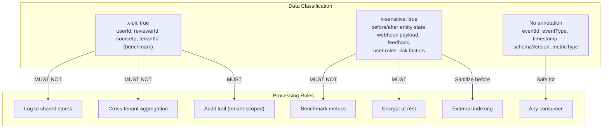

**Cross-cutting security requirements for all topics:**

| Requirement | Policy | Enforcement |
|-------------|--------|-------------|
| Tenant isolation | Every event includes `tenantId`; consumers MUST filter by tenant context | Application-level filter + Kafka ACLs per consumer group |
| PII protection | Fields marked `x-pii: true` excluded from logging and cross-tenant flows | Consumer-side field stripping before external output |
| Sensitive data handling | Fields marked `x-sensitive: true` sanitized before indexing or benchmarking | Pre-processing pipeline in each consumer |
| Schema validation | Producers validate against JSON Schema before publishing | `JsonSchemaValidator` bean in Spring Cloud Stream |
| Kafka ACLs | Per-topic producer/consumer ACLs mapped to service accounts | Kafka `AclAuthorizer` configuration |
| TLS encryption | All Kafka traffic encrypted in transit | `security.protocol: SSL` in broker and client configs |
| At-rest encryption | Kafka log directories on encrypted volumes | Filesystem-level encryption (LUKS or EBS encryption) |
| DLQ access control | DLQ topics restricted to `DLQ_ADMIN` role | Kafka ACLs + RBAC check in DLQ consumer UI |
| Audit trail | All event publications logged with `eventId`, `tenantId`, `timestamp` | AuditService consumer on approval and draft topics |
| Rate limiting | Per-tenant event rate limits on producer endpoints | Spring Cloud Gateway rate limiter + application-level guards |

---

## 17. Schema-per-Tenant Setup [PLANNED]

> **Status:** All content in this section is `[PLANNED]`. No schema-per-tenant isolation for agent data exists. The current platform uses row-level isolation (`tenant_id` column). See ADR-026 for the architectural decision and PRD Section 7.1 for data sovereignty requirements.

### 17.1 Schema Architecture [PLANNED]

The Super Agent platform uses PostgreSQL schema isolation for agent data. Each tenant gets a dedicated schema within the shared `emsist` database. A separate `benchmark` schema stores anonymized cross-tenant metrics.

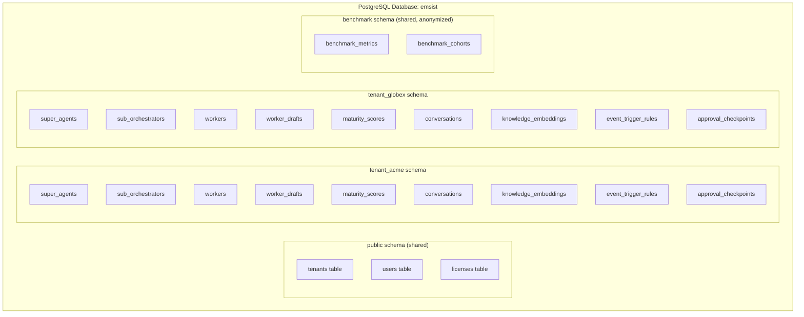

### 17.2 Flyway Per-Tenant Migration Strategy [PLANNED]

Migrations are applied per tenant schema using a custom `TenantAwareFlyway` that iterates over all registered tenant schemas:

```yaml
# ai-service application.yml
ai:
  tenancy:
    schema-prefix: "tenant_"
    default-schema: "public"
    benchmark-schema: "benchmark"
    flyway:
      locations: "classpath:db/migration/tenant"
      baseline-on-migrate: true
      table: "flyway_schema_history"
```

**Migration file naming convention:**

```
db/migration/tenant/
    V1__create_super_agents.sql
    V2__create_sub_orchestrators.sql
    V3__create_workers.sql
    V4__create_worker_drafts.sql
    V5__create_maturity_scores.sql
    V6__create_event_trigger_rules.sql
    V7__create_approval_checkpoints.sql
    V8__create_conversations_agent.sql
    V9__create_knowledge_embeddings.sql

db/migration/benchmark/
    V1__create_benchmark_schema.sql
    V2__create_benchmark_metrics.sql
    V3__create_benchmark_cohorts.sql
```

### 17.3 Connection Pool Per-Tenant Schema [PLANNED]

The ai-service uses a single connection pool with dynamic schema switching via `SET search_path`:

```yaml
# ai-service application.yml
spring:
  datasource:
    url: jdbc:postgresql://${POSTGRES_HOST:localhost}:5432/emsist
    hikari:
      maximum-pool-size: 30
      minimum-idle: 5

ai:
  tenancy:
    connection:
      schema-switch-strategy: "search_path"  # SET search_path = tenant_{id}
      cache-schemas: true
      schema-cache-ttl: 300  # seconds
```

**Tenant schema resolution:** On each request, the `TenantSchemaFilter` extracts the tenant ID from the JWT `tenant_id` claim and sets `search_path = tenant_{tenantId}, public` on the connection. This ensures all queries execute within the tenant's schema without requiring per-tenant connection pools.

### 17.4 Tenant Provisioning Flow [PLANNED]

When a new tenant is created:

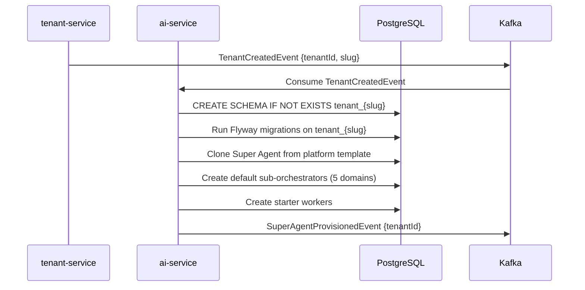

### 17.5 Shared Benchmark Schema [PLANNED]

The `benchmark` schema stores anonymized metrics from all participating tenants:

- **No tenant-identifying information** -- metrics are stored with `anonymized_cohort_id` (hash-based grouping with k>=5 minimum cohort size)
- **Write-only from tenant schemas** -- the `BenchmarkCollectorService` reads from tenant schemas, anonymizes, and writes to the benchmark schema
- **Read access for all tenants** -- tenants can query their own relative performance (percentile rankings) but cannot access raw data from other tenants
- **Separate access control** -- benchmark schema has its own PostgreSQL role with SELECT-only grants to application users

---

## 18. Event Scheduler Configuration [PLANNED]

> **Status:** All content in this section is `[PLANNED]`. No event scheduler configuration exists. See ADR-025 Section "Time-Based Events" and PRD Section 3.18 for requirements.

### 18.1 Spring Scheduler Setup [PLANNED]

The Super Agent platform uses Spring's `@Scheduled` annotation with Quartz-compatible cron expressions for time-based event triggers. Schedules are stored per tenant in the `event_trigger_schedules` table and loaded dynamically.

```yaml
# ai-service application.yml
spring:
  task:
    scheduling:
      pool:
        size: 10  # Thread pool for scheduled tasks
      shutdown:
        await-termination: true
        await-termination-period: 60s

ai:
  scheduler:
    enabled: true
    cluster-safe: true  # Uses database-backed locking for cluster deployments
    missed-fire-policy: "FIRE_NOW"  # Execute immediately if missed (alternatives: SKIP, RESCHEDULE)
    max-concurrent-per-tenant: 3  # Prevent a single tenant from monopolizing scheduler threads
    default-timezone: "UTC"
```

### 18.2 Cron Expression Configuration [PLANNED]

Each time-based trigger rule includes a cron expression stored in the `event_trigger_schedules` table:

| Schedule Type | Cron Expression | Description |
|--------------|-----------------|-------------|
| Daily KPI aggregation | `0 0 2 * * ?` | Every day at 02:00 UTC |
| Weekly compliance check | `0 0 6 ? * MON` | Every Monday at 06:00 UTC |
| Monthly board report | `0 0 8 1 * ?` | First of each month at 08:00 UTC |
| Quarterly maturity assessment | `0 0 9 1 1,4,7,10 ?` | First day of each quarter at 09:00 UTC |
| Hourly SLA monitoring | `0 0 * * * ?` | Every hour on the hour |

**Per-tenant schedule overrides:** Tenants can customize cron expressions via the Event Trigger Management UI. Custom schedules are stored in the tenant's schema and override platform defaults.

### 18.3 Missed Fire Policy [PLANNED]

When the scheduler misses a trigger (e.g., during service downtime or restart):

| Policy | Behavior | Use Case |
|--------|----------|----------|
| `FIRE_NOW` | Execute the missed trigger immediately on recovery | Default for most triggers; ensures no data gaps |
| `SKIP` | Skip the missed trigger and wait for the next scheduled time | Appropriate for frequent triggers (hourly) where the next execution is soon |
| `RESCHEDULE` | Reschedule the missed trigger to the next valid fire time | Appropriate for triggers where timing is important (e.g., end-of-day reports) |

### 18.4 Cluster-Safe Scheduling [PLANNED]

In multi-instance deployments, only one instance should execute each scheduled trigger. The scheduler uses database-backed distributed locking:

```yaml
# ai-service application.yml
ai:
  scheduler:
    lock:
      provider: "jdbc"  # Use PostgreSQL advisory locks
      table: "shedlock"
      lock-at-most-for: "PT30M"  # Max lock duration: 30 minutes
      lock-at-least-for: "PT5M"  # Min lock duration: 5 minutes (prevents double-firing)
```

**Implementation:** Uses [ShedLock](https://github.com/lukas-krecan/ShedLock) with JDBC provider for distributed lock coordination. Each scheduled task acquires an advisory lock before execution and releases it on completion or timeout.

> **Note:** No scheduler infrastructure, ShedLock integration, or scheduled trigger execution exists yet. See PRD Section 8 (Roadmap, Phase 7) for delivery.

---

## Changelog

| Version | Date | Changes |
|---------|------|---------|
| 1.3.0 | 2026-03-08 | SEC agent: Added Section 16.6: Event Payload Schemas for all 9 Kafka topics (JSON Schema Draft 2020-12 definitions with `$id`, required fields, format annotations, `x-pii`/`x-sensitive` security annotations). Added DLQ Error Envelope schema (Section 16.6.12). Added Schema Evolution Rules (Section 16.6.13). Added cross-topic Security Summary (Section 16.6.14). Each topic schema includes example payload and security considerations. Corrected topic count from 8 to 9. All new content tagged `[PLANNED]`. |
| 1.2.0 | 2026-03-08 | DOC agent: Added Section 16: Kafka Event Topics for Super Agent (9 topics with partition/retention config, Spring Cloud Stream bindings, consumer groups, DLQ policy, Debezium CDC config). Added Section 17: Schema-per-Tenant Setup (schema architecture, Flyway per-tenant migration, connection pool config, tenant provisioning flow, shared benchmark schema). Added Section 18: Event Scheduler Configuration (Spring Scheduler setup, cron expressions, missed fire policy, cluster-safe scheduling via ShedLock). All new sections tagged `[PLANNED]`. References ADR-025, ADR-026, Benchmarking Study. Updated Table of Contents. |
| 1.1.0 | 2026-03-07 | Added Section 12: Audit Log Infrastructure (PostgreSQL partitioning, retention policy, SSE configuration, optional Elasticsearch). Added Section 13: Notification Infrastructure (SSE delivery, Kafka topic `ai.notifications`, cleanup job). Added Section 14: Knowledge Source Storage (S3/MinIO document upload, chunking worker via Kafka `ai.knowledge.index`). Added Section 15: RBAC Configuration (Keycloak realm roles, permission matrix, Spring Security method-level authorization). All new sections tagged `[PLANNED]`. Updated Table of Contents. |
| 1.0.0 | 2026-03-06 | Initial infrastructure guide: prerequisites, Ollama setup, Docker Compose configuration, profiles, environment configuration, network architecture, data persistence, CI/CD pipeline, Kubernetes deployment, monitoring stack, troubleshooting. |

---

## Appendix A: Quick Start Commands

```bash
# 1. Clone the repository
git clone https://github.com/org/agent-platform.git
cd agent-platform

# 2. Copy environment template
cp .env.template .env
# Edit .env with your values

# 3. Install and start Ollama
brew install ollama              # macOS
brew services start ollama

# 4. Pull required models
ollama pull llama3.1:8b
ollama pull devstral-small:24b
ollama pull nomic-embed-text

# 5. Start core infrastructure
docker compose up -d

# 6. Wait for services
./scripts/wait-for-health.sh

# 7. Start full platform (when ready)
docker compose --profile full up -d

# 8. Verify
curl http://localhost:8080/actuator/health   # API Gateway
curl http://localhost:8761/                   # Eureka Dashboard
curl http://localhost:11434/api/tags          # Ollama models
```

---

## Appendix B: Service Dependency Graph

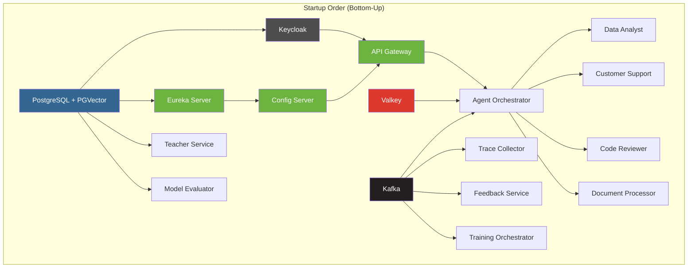

---

## Appendix C: Environment Comparison Matrix

| Configuration | Development (Local) | Staging (Docker Compose) | Production (Kubernetes) |
|---------------|--------------------|--------------------------|-----------------------|
| **Spring Profile** | `local` | `staging` | `prod` |
| **Ollama** | Host machine | Host or GPU container | GPU node (K8s) |
| **PostgreSQL** | Docker container | Docker container | StatefulSet (PVC) |
| **Kafka** | Docker KRaft | Docker KRaft | Confluent Operator or Strimzi |
| **Valkey** | Docker container | Docker container | StatefulSet (PVC) |
| **Keycloak** | Docker (dev mode) | Docker (prod mode) | Deployment + PVC |
| **Secrets** | `.env` file | `.env.staging` (not committed) | K8s Secrets / Vault |
| **TLS** | None (HTTP) | Self-signed / Let's Encrypt staging | Let's Encrypt production |
| **Replicas** | 1 per service | 1 per service | 2-8 per service (HPA) |
| **Monitoring** | Optional (monitoring profile) | Prometheus + Grafana | Full Prometheus + Grafana + Jaeger |
| **Log Format** | Human-readable | JSON (structured) | JSON (structured) |
| **Backup** | Manual | Scripted (cron) | Automated (Velero / pg_dump CronJob) |

---

*This document is the implementation baseline for AI Agent Platform infrastructure. All sections are [PLANNED] -- no production infrastructure exists yet. Update this document as services are implemented and deployed.*
