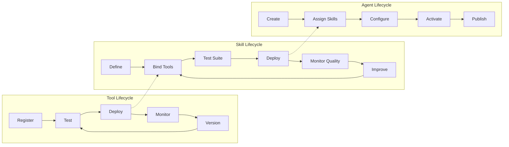
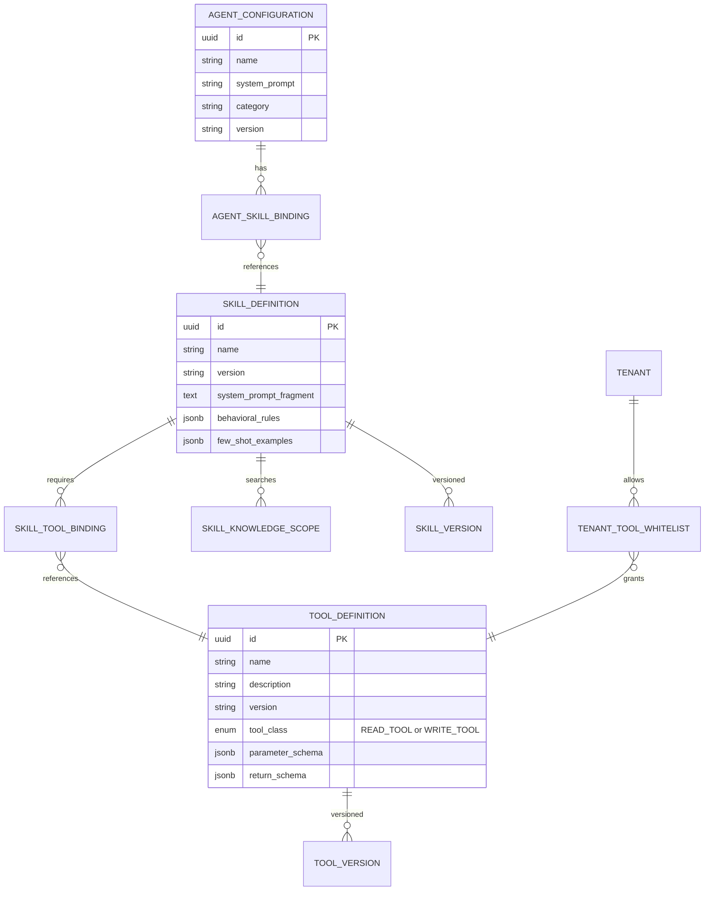

# Business Analysis: Domain-to-Skills-to-Tools Mapping

**Document:** BA-Domain-Skills-Tools-Mapping.md
**Version:** 1.0.0
**Date:** 2026-03-07
**Status:** [PLANNED] -- Business analysis mapping; no implementation code exists
**Owner:** BA Agent
**References:** [01-PRD Section 3.4-3.5](./01-PRD-AI-Agent-Platform.md) | [08-Agent-Prompt-Templates](./08-Agent-Prompt-Templates.md) | [TOGAF 02-Business-Architecture](../../togaf/02-business-architecture.md)

---

## 1. Executive Summary

This document maps the platform user's seven professional domains to the skills and tools required by the EMSIST AI Agent Platform. It inventories the 32 existing agent configurations (Document 08), identifies which skills and tools already exist, discovers gaps, and recommends an architecture for skills and tools as entities.

**Key findings:**

- The user's seven domains require approximately **48 distinct skills** and **62 distinct tools**
- The existing 32 agent profiles cover approximately **55%** of the required skills
- Significant gaps exist in **Enterprise Architecture (TOGAF)**, **EFQM**, **Knowledge Management**, and **GRC** domains
- Tools exhibit high reuse across domains -- the average tool is used by **4.3 skills**
- The architecture MUST treat Skills and Tools as **independent, reusable, manageable entities** (Option B)

---

## 2. User Domain Areas

The platform user operates across seven interconnected professional domains:

| # | Domain | Description | Primary Outputs |
|---|--------|-------------|-----------------|
| D1 | **Business Architecture and Strategy** | Defining business capabilities, value streams, strategic objectives, operating models | Capability maps, value stream diagrams, strategic plans, business cases |
| D2 | **Performance Analysis and Management** | Measuring, analyzing, and improving organizational performance against KPIs/OKRs | KPI dashboards, performance reports, trend analyses, benchmarking reports |
| D3 | **Enterprise Architecture (TOGAF)** | Designing and governing enterprise architecture across Business/Data/Application/Technology layers | ADM deliverables, architecture vision, migration plans, governance frameworks |
| D4 | **Service Design** | Designing services using ITIL/service management principles including SLA definition, service catalogs, and service improvement | Service blueprints, SLA frameworks, service catalogs, improvement plans |
| D5 | **EFQM (European Foundation for Quality Management)** | Assessing organizational excellence using the EFQM Model, self-assessments, and scoring | EFQM self-assessments, RADAR scoring, excellence reports, maturity assessments |
| D6 | **Knowledge Management** | Capturing, organizing, sharing, and improving organizational knowledge and intellectual capital | Knowledge bases, taxonomies, lessons learned repositories, knowledge audits |
| D7 | **GRC (Governance, Risk and Compliance)** | Managing governance frameworks, risk registers, compliance audits, and regulatory requirements | Risk registers, compliance matrices, audit reports, governance dashboards |

---

## 3. Domain-to-Skills Mapping

### D1: Business Architecture and Strategy

| Skill Name | Purpose | Priority |
|------------|---------|----------|
| capability-mapping | Create and maintain business capability maps | Must Have |
| value-stream-analysis | Map and analyze end-to-end value streams | Must Have |
| strategic-planning | Develop strategic plans, objectives, and initiatives | Must Have |
| business-case-analysis | Analyze and justify business investments (ROI, NPV, payback) | Should Have |
| operating-model-design | Design target operating models (people, process, technology) | Should Have |
| stakeholder-analysis | Map stakeholders, interests, influence, and engagement strategies | Should Have |
| business-motivation-modeling | Model business goals, strategies, tactics, and influencers (BMM) | Could Have |

**Existing agent coverage:**
- Report Generator (Profile 11) -- partially covers strategic planning outputs
- Process Mapper (Profile 26) -- partially covers value stream diagramming

**Gaps:** No agent for capability mapping, business case financial analysis, operating model design, or stakeholder analysis.

---

### D2: Performance Analysis and Management

| Skill Name | Purpose | Priority |
|------------|---------|----------|
| kpi-calculation | Define, calculate, and track Key Performance Indicators | Must Have |
| trend-analysis | Identify patterns and trends in performance data over time | Must Have |
| benchmarking | Compare organizational metrics against industry benchmarks | Must Have |
| balanced-scorecard | Build and maintain Balanced Scorecard perspectives (Financial, Customer, Internal Process, Learning) | Should Have |
| okr-tracking | Define and track Objectives and Key Results | Should Have |
| performance-dashboard-building | Design and build performance monitoring dashboards | Must Have |
| root-cause-analysis | Analyze performance gaps to identify root causes | Should Have |
| forecasting | Project future performance based on historical trends | Could Have |

**Existing agent coverage:**
- SQL Data Analyst (Profile 9) -- covers data querying for KPI calculation
- Metrics Dashboard Builder (Profile 12) -- covers dashboard building
- Customer Insight Analyst (Profile 14) -- covers trend analysis for customer domain
- Report Generator (Profile 11) -- covers reporting

**Gaps:** No agent for Balanced Scorecard, OKR tracking, cross-domain benchmarking, or structured root cause analysis (Ishikawa, 5 Whys).

---

### D3: Enterprise Architecture (TOGAF)

| Skill Name | Purpose | Priority |
|------------|---------|----------|
| architecture-vision | Create Architecture Vision documents (ADM Phase A) | Must Have |
| business-architecture | Develop Business Architecture deliverables (ADM Phase B) | Must Have |
| data-architecture | Develop Data Architecture deliverables (ADM Phase C-Data) | Must Have |
| application-architecture | Develop Application Architecture (ADM Phase C-Application) | Must Have |
| technology-architecture | Develop Technology Architecture (ADM Phase D) | Must Have |
| gap-analysis | Perform gap analysis between baseline and target architectures | Must Have |
| migration-planning | Create migration roadmaps and transition architectures | Should Have |
| architecture-governance | Maintain architecture principles, standards, and compliance checks | Should Have |
| adr-management | Create and manage Architecture Decision Records | Should Have |
| architecture-repository-management | Maintain architecture repository (metamodel, reference library, standards) | Could Have |

**Existing agent coverage:**
- API Designer (Profile 21) -- covers API contract design (narrow aspect of Application Architecture)
- Code Reviewer (Profile 17) -- tangentially supports technology assessment

**Gaps:** TOGAF is essentially uncovered. No agents for ADM phase deliverables, architecture metamodels, gap analysis, migration planning, or governance framework management. This is the largest domain gap.

---

### D4: Service Design

| Skill Name | Purpose | Priority |
|------------|---------|----------|
| service-blueprint-design | Create service blueprints with frontstage/backstage/support | Must Have |
| sla-definition | Define Service Level Agreements with measurable targets | Must Have |
| service-catalog-management | Maintain service catalog with offerings, tiers, and dependencies | Should Have |
| service-improvement-planning | Identify and plan service improvements (CSI/Continual Improvement) | Should Have |
| incident-pattern-analysis | Analyze incident data for recurring service issues | Should Have |
| capacity-planning | Plan service capacity based on demand forecasting | Could Have |

**Existing agent coverage:**
- Ticket Resolver (Profile 13) -- covers incident resolution (operational, not design)
- Process Mapper (Profile 26) -- partially covers service process flows

**Gaps:** No agent for service blueprint design, SLA definition, service catalog management, or continual service improvement planning.

---

### D5: EFQM (European Foundation for Quality Management)

| Skill Name | Purpose | Priority |
|------------|---------|----------|
| efqm-self-assessment | Conduct organizational self-assessment against EFQM Model criteria | Must Have |
| radar-scoring | Apply RADAR logic (Results, Approach, Deployment, Assessment, Refinement) | Must Have |
| excellence-benchmarking | Compare EFQM scores against excellence benchmarks | Should Have |
| maturity-assessment | Assess organizational maturity across EFQM enabler and result criteria | Should Have |
| improvement-prioritization | Prioritize improvement areas based on EFQM assessment findings | Should Have |

**Existing agent coverage:**
- None directly applicable

**Gaps:** Complete gap. No agent configurations address quality management frameworks, self-assessment scoring, or RADAR methodology.

---

### D6: Knowledge Management

| Skill Name | Purpose | Priority |
|------------|---------|----------|
| knowledge-capture | Extract and structure knowledge from documents, conversations, and experts | Must Have |
| taxonomy-design | Design and maintain knowledge classification taxonomies | Must Have |
| knowledge-audit | Audit organizational knowledge assets for coverage, quality, and currency | Should Have |
| lessons-learned-management | Capture, categorize, and surface lessons learned from projects and incidents | Should Have |
| knowledge-gap-analysis | Identify gaps in organizational knowledge coverage | Should Have |
| expert-knowledge-extraction | Extract tacit knowledge from SME interviews and recordings | Could Have |

**Existing agent coverage:**
- Document Summarizer (Profile 22) -- covers document extraction
- FAQ Generator (Profile 15) -- covers knowledge base gap identification
- Meeting Summarizer (Profile 29) -- covers meeting knowledge extraction

**Gaps:** No agent for taxonomy design, systematic knowledge auditing, lessons learned management, or expert knowledge extraction from video/audio.

---

### D7: GRC (Governance, Risk and Compliance)

| Skill Name | Purpose | Priority |
|------------|---------|----------|
| risk-register-management | Maintain risk registers with identification, assessment, and mitigation | Must Have |
| compliance-audit | Audit organizational compliance against regulatory frameworks | Must Have |
| regulatory-monitoring | Monitor regulatory changes and assess organizational impact | Must Have |
| governance-framework-management | Define and maintain governance frameworks, policies, and procedures | Should Have |
| risk-assessment | Assess risk likelihood, impact, and calculate risk scores | Must Have |
| control-testing | Test effectiveness of internal controls | Should Have |
| policy-lifecycle-management | Manage policy creation, review, approval, and retirement cycles | Could Have |
| incident-and-breach-management | Manage security incidents and data breaches through to resolution | Should Have |

**Existing agent coverage:**
- Compliance Auditor (Profile 27) -- covers compliance auditing (SOC2, ISO 27001, GDPR, HIPAA)
- Policy Checker (Profile 24) -- covers policy validation
- Security Auditor (Profile 18) -- covers technical security auditing
- Contract Analyzer (Profile 23) -- covers contract risk identification

**Gaps:** No agent for risk register management, regulatory change monitoring, governance framework management, or policy lifecycle management.

---

## 4. Skills-to-Tools Mapping

### 4.1 Complete Tool Inventory

The following table lists all tools required across all seven domains, categorized by type. Tools marked with a star are already defined in the 32 agent profiles (Document 08).

#### Data Access Tools (Read Structured)

| Tool Name | Purpose | Used by Domains | In Doc 08? |
|-----------|---------|-----------------|------------|
| `run_sql` | Execute read-only SQL queries against data warehouses | D1, D2, D4, D5, D7 | Yes |
| `list_tables` | List available database tables with metadata | D2 | Yes |
| `describe_table` | Return schema details for a table | D2 | Yes |
| `summarize_table` | Return data profiling statistics | D2 | Yes |
| `read_spreadsheet` | Read structured data from Excel/CSV files | D1, D2, D3, D5, D7 | **No** |
| `query_cmdb` | Query Configuration Management Database for IT assets | D3, D4 | **No** |
| `query_risk_register` | Query risk register database | D7 | **No** |
| `query_service_catalog` | Query service catalog entries and SLAs | D4 | **No** |
| `query_architecture_repository` | Query architecture metamodel and standards repository | D3 | **No** |

#### Data Access Tools (Read Unstructured)

| Tool Name | Purpose | Used by Domains | In Doc 08? |
|-----------|---------|-----------------|------------|
| `parse_document` | Parse PDFs, DOCX, TXT into structured text | D1, D3, D5, D6, D7 | Yes |
| `extract_entities` | Extract named entities from text (people, dates, amounts) | D1, D6, D7 | Yes |
| `search_kb` | Search knowledge base via semantic/keyword query | All | Yes |
| `search_vector_store` | Search PGVector store with tenant-scoped filtering | All | Yes |
| `read_file` | Read file contents from a path | D3, D6 | Yes |
| `read_email` | Read and parse email content and attachments | D6, D7 | **No** |
| `transcribe_meeting` | Transcribe audio/video meeting recordings to text | D6 | **No** |
| `process_video` | Extract frames, scenes, or transcripts from video content | D6 | **No** |
| `crawl_webpage` | Fetch and extract content from web URLs | D3, D7 | **No** |

#### Content Generation Tools

| Tool Name | Purpose | Used by Domains | In Doc 08? |
|-----------|---------|-----------------|------------|
| `create_chart` | Create bar, line, pie, scatter, and heatmap charts | D1, D2, D5 | Yes |
| `summarize` | Generate summaries at varying detail levels | D1, D3, D6 | Yes |
| `generate_report` | Generate structured reports with sections and formatting | D1, D2, D5, D7 | **No** |
| `generate_diagram` | Generate Mermaid diagrams (flowcharts, sequence, ER, C4) | D1, D3, D4 | **No** |
| `generate_presentation` | Generate slide deck content for stakeholder presentations | D1, D2, D5 | **No** |
| `generate_assessment_report` | Generate structured assessment reports (EFQM, maturity) | D5 | **No** |

#### Analysis Tools

| Tool Name | Purpose | Used by Domains | In Doc 08? |
|-----------|---------|-----------------|------------|
| `calculate` | Perform numerical calculations and formulas | D2, D5, D7 | **No** (mentioned in PRD 3.4 but not bound to any profile) |
| `gap_analysis` | Compare baseline vs target and identify gaps | D3, D5 | **No** |
| `risk_scoring` | Calculate risk scores (likelihood x impact matrix) | D7 | **No** |
| `trend_detection` | Detect statistical trends in time-series data | D2 | **No** |
| `radar_scoring` | Apply EFQM RADAR scoring methodology | D5 | **No** |
| `maturity_scoring` | Calculate maturity scores against assessment frameworks | D3, D5, D7 | **No** |
| `compare_outputs` | Compare two outputs for evaluation | D2, D5 | Yes |
| `check_factual_accuracy` | Cross-reference claims against retrieved context | D3, D6, D7 | Yes |
| `benchmark_compare` | Compare organizational metrics against external benchmarks | D2, D5 | **No** |

#### Integration Tools (Write/Mutate)

| Tool Name | Purpose | Used by Domains | In Doc 08? |
|-----------|---------|-----------------|------------|
| `create_ticket` | Create support/work tickets in ticketing systems | D4 | Yes |
| `update_ticket` | Update existing tickets | D4 | Yes |
| `send_notification` | Send internal notifications | D4, D7 | Yes |
| `call_internal_api` | Call internal APIs (REST) with tenant context | D3, D4 | Mentioned in PRD 3.4 |
| `write_to_database` | Write records to approved databases | D7 | **No** |
| `write_file` | Write output to files (reports, exports) | D1, D2, D5, D7 | Mentioned in PRD 3.4 |
| `trigger_workflow` | Trigger a BPMN workflow instance | D4, D7 | **No** |
| `update_risk_register` | Add/update entries in risk register | D7 | **No** |
| `update_architecture_repository` | Add/update architecture artifacts | D3 | **No** |
| `publish_to_knowledge_base` | Publish new articles to organizational KB | D6 | **No** |

#### Collaboration Tools

| Tool Name | Purpose | Used by Domains | In Doc 08? |
|-----------|---------|-----------------|------------|
| `send_email` | Send formatted email communications | D4, D7 | Mentioned in PRD 3.4 |
| `send_slack` | Send Slack/Teams messages | D4 | Mentioned in PRD 3.4 |
| `request_approval` | Trigger human approval workflow | D7 | Implicit in PRD 3.6 |
| `schedule_meeting` | Schedule calendar events | D6 | **No** |
| `assign_action_item` | Assign tracked action items to team members | D6 | **No** |

#### Lookup and Reference Tools

| Tool Name | Purpose | Used by Domains | In Doc 08? |
|-----------|---------|-----------------|------------|
| `lookup_regulation` | Look up specific regulatory requirements | D7 | Yes |
| `flag_violation` | Record a compliance violation for tracking | D7 | Yes |
| `lookup_standard` | Look up architecture/quality standards | D3, D5 | **No** |
| `lookup_framework_control` | Look up specific framework control (SOC2, ISO, EFQM) | D5, D7 | **No** |
| `check_task_status` | Check task/workflow completion status | D4, D6 | Yes |
| `get_customer_info` | Retrieve customer/stakeholder profile | D4 | Yes |

---

### 4.2 Tool Reuse Analysis

The following tools are used by 4 or more skills across domains, demonstrating high reuse:

| Tool | Skills Using It | Domains |
|------|----------------|---------|
| `search_kb` | 22+ skills | All 7 |
| `run_sql` | 14+ skills | D1, D2, D4, D5, D7 |
| `parse_document` | 12+ skills | D1, D3, D5, D6, D7 |
| `create_chart` | 10+ skills | D1, D2, D5 |
| `extract_entities` | 9+ skills | D1, D6, D7 |
| `generate_diagram` | 8+ skills | D1, D3, D4 |
| `summarize` | 7+ skills | D1, D3, D6 |

**This reuse pattern is the strongest argument for tools as independent entities.**

---

## 5. Tool Taxonomy (Categorized)

```mermaid
graph TD
    ROOT[All Tools] --> DA[Data Access]
    ROOT --> CG[Content Generation]
    ROOT --> AN[Analysis]
    ROOT --> INT[Integration]
    ROOT --> COL[Collaboration]
    ROOT --> LR[Lookup and Reference]

    DA --> DAS[Structured<br/>run_sql, list_tables<br/>describe_table, summarize_table<br/>read_spreadsheet, query_cmdb<br/>query_risk_register<br/>query_service_catalog<br/>query_architecture_repository]
    DA --> DAU[Unstructured<br/>parse_document, extract_entities<br/>search_kb, search_vector_store<br/>read_file, read_email<br/>transcribe_meeting<br/>process_video, crawl_webpage]

    CG --> CGV[Visual<br/>create_chart<br/>generate_diagram<br/>generate_presentation]
    CG --> CGT[Textual<br/>summarize<br/>generate_report<br/>generate_assessment_report]

    AN --> ANC[Calculation<br/>calculate<br/>risk_scoring<br/>radar_scoring<br/>maturity_scoring<br/>benchmark_compare]
    AN --> AND[Detection<br/>gap_analysis<br/>trend_detection<br/>compare_outputs<br/>check_factual_accuracy]

    INT --> INTW[Write<br/>write_to_database<br/>write_file<br/>update_risk_register<br/>update_architecture_repository<br/>publish_to_knowledge_base]
    INT --> INTT[Trigger<br/>create_ticket, update_ticket<br/>send_notification<br/>call_internal_api<br/>trigger_workflow]

    COL --> COLC[Communication<br/>send_email, send_slack<br/>schedule_meeting]
    COL --> COLA[Action<br/>request_approval<br/>assign_action_item]

    LR --> LRR[Regulatory<br/>lookup_regulation<br/>flag_violation<br/>lookup_framework_control]
    LR --> LRS[Standards<br/>lookup_standard<br/>check_task_status<br/>get_customer_info]
```

### Tool Count Summary

| Category | Subcategory | Count | In Doc 08 | Gap |
|----------|-------------|-------|-----------|-----|
| Data Access | Structured | 9 | 4 | 5 |
| Data Access | Unstructured | 9 | 5 | 4 |
| Content Generation | Visual | 3 | 1 | 2 |
| Content Generation | Textual | 3 | 1 | 2 |
| Analysis | Calculation | 5 | 0 | 5 |
| Analysis | Detection | 4 | 2 | 2 |
| Integration | Write | 5 | 0 | 5 |
| Integration | Trigger | 5 | 3 | 2 |
| Collaboration | Communication | 3 | 0 | 3 |
| Collaboration | Action | 2 | 0 | 2 |
| Lookup/Reference | Regulatory | 3 | 2 | 1 |
| Lookup/Reference | Standards | 3 | 2 | 1 |
| **TOTAL** | | **54** | **20** | **34** |

---

## 6. Gaps Identified

### 6.1 Skill Gaps (Skills Needed but Not Covered by Any Agent Profile)

| Gap ID | Domain | Missing Skill | Business Impact | Priority |
|--------|--------|---------------|-----------------|----------|
| SG-01 | D3 | architecture-vision | Cannot produce TOGAF ADM Phase A deliverables | Must Have |
| SG-02 | D3 | business-architecture | Cannot produce ADM Phase B business models | Must Have |
| SG-03 | D3 | data-architecture | Cannot produce ADM Phase C data models | Must Have |
| SG-04 | D3 | application-architecture | Cannot produce ADM Phase C application models | Must Have |
| SG-05 | D3 | technology-architecture | Cannot produce ADM Phase D technology models | Must Have |
| SG-06 | D3 | gap-analysis (architecture) | Cannot compare baseline vs target architectures | Must Have |
| SG-07 | D5 | efqm-self-assessment | Cannot conduct EFQM assessments | Must Have |
| SG-08 | D5 | radar-scoring | Cannot apply RADAR methodology | Must Have |
| SG-09 | D7 | risk-register-management | Cannot maintain risk registers | Must Have |
| SG-10 | D7 | regulatory-monitoring | Cannot monitor regulatory changes | Must Have |
| SG-11 | D1 | capability-mapping | Cannot create capability maps | Must Have |
| SG-12 | D1 | value-stream-analysis | Cannot perform value stream mapping | Must Have |
| SG-13 | D4 | service-blueprint-design | Cannot create service blueprints | Must Have |
| SG-14 | D4 | sla-definition | Cannot define measurable SLAs | Must Have |
| SG-15 | D6 | taxonomy-design | Cannot design knowledge classification systems | Must Have |
| SG-16 | D6 | knowledge-audit | Cannot audit organizational knowledge assets | Should Have |
| SG-17 | D2 | balanced-scorecard | Cannot build/maintain Balanced Scorecards | Should Have |
| SG-18 | D7 | governance-framework-management | Cannot manage governance frameworks | Should Have |
| SG-19 | D1 | business-case-analysis | Cannot produce financial analyses for investments | Should Have |
| SG-20 | D6 | expert-knowledge-extraction | Cannot extract tacit knowledge from recordings/video | Could Have |

### 6.2 Tool Gaps (Tools Needed but Not Defined Anywhere)

| Gap ID | Tool | Required For Skills | Priority |
|--------|------|---------------------|----------|
| TG-01 | `read_spreadsheet` | KPI calculation, benchmarking, self-assessment | Must Have |
| TG-02 | `generate_diagram` | Capability mapping, architecture deliverables, service blueprints | Must Have |
| TG-03 | `calculate` | Risk scoring, RADAR scoring, financial calculations | Must Have |
| TG-04 | `gap_analysis` | Architecture gap analysis, maturity assessment | Must Have |
| TG-05 | `query_cmdb` | Technology architecture, capacity planning | Should Have |
| TG-06 | `query_risk_register` | Risk management, compliance audit | Must Have |
| TG-07 | `risk_scoring` | Risk assessment, risk register management | Must Have |
| TG-08 | `radar_scoring` | EFQM self-assessment | Must Have |
| TG-09 | `maturity_scoring` | Architecture governance, EFQM, GRC maturity | Should Have |
| TG-10 | `benchmark_compare` | Performance benchmarking, EFQM excellence | Should Have |
| TG-11 | `transcribe_meeting` | Knowledge capture from meetings, expert extraction | Should Have |
| TG-12 | `process_video` | Expert knowledge extraction, training material analysis | Could Have |
| TG-13 | `generate_report` | All reporting across all 7 domains | Must Have |
| TG-14 | `trigger_workflow` | Service management, GRC incident management | Should Have |
| TG-15 | `write_to_database` | Risk register updates, architecture repository writes | Should Have |
| TG-16 | `publish_to_knowledge_base` | Knowledge management outputs | Should Have |

### 6.3 Knowledge Scope Gaps

The vector store knowledge collections needed but not defined in Document 08:

| Collection | Domain | Content |
|------------|--------|---------|
| `togaf_reference` | D3 | TOGAF standard, ADM phase deliverables, metamodel reference |
| `efqm_model` | D5 | EFQM Model criteria, RADAR methodology, scoring guidance |
| `risk_frameworks` | D7 | ISO 31000, COSO ERM, risk assessment methodologies |
| `itil_service_design` | D4 | ITIL service design, service lifecycle, SLA templates |
| `capability_patterns` | D1 | Business capability modeling patterns, reference models |
| `balanced_scorecard_reference` | D2 | BSC framework, perspective definitions, measure catalog |
| `knowledge_management_frameworks` | D6 | KM frameworks (SECI, Cynefin), taxonomy standards |
| `governance_standards` | D7 | COBIT, ISO 38500, corporate governance frameworks |

---

## 7. Existing Agent Profile Coverage Matrix

| Profile # | Profile Name | D1 | D2 | D3 | D4 | D5 | D6 | D7 | Coverage Notes |
|-----------|-------------|:--:|:--:|:--:|:--:|:--:|:--:|:--:|---------------|
| 9 | SQL Data Analyst | - | Full | - | - | - | - | Partial | Core for D2 data querying |
| 10 | Data Pipeline Builder | - | Partial | - | - | - | - | - | ETL, not analysis |
| 11 | Report Generator | Partial | Full | - | - | Partial | - | Partial | Cross-domain reporting |
| 12 | Metrics Dashboard Builder | - | Full | - | - | - | - | - | Dashboard design |
| 13 | Ticket Resolver | - | - | - | Partial | - | - | - | Operational, not design |
| 14 | Customer Insight Analyst | - | Partial | - | - | - | - | - | Customer-specific trends |
| 15 | FAQ Generator | - | - | - | - | - | Partial | - | KB content generation |
| 17 | Code Reviewer | - | - | Partial | - | - | - | - | Technical review only |
| 18 | Security Auditor | - | - | - | - | - | - | Partial | Technical security |
| 22 | Document Summarizer | Partial | - | Partial | - | - | Full | - | Document extraction |
| 23 | Contract Analyzer | - | - | - | - | - | - | Partial | Contract risk |
| 24 | Policy Checker | - | - | - | - | - | - | Full | Policy validation |
| 25 | Content Writer | - | - | - | - | - | Partial | - | Documentation |
| 26 | Process Mapper | Partial | - | - | Partial | - | - | - | Process flows |
| 27 | Compliance Auditor | - | - | - | - | - | - | Full | Regulatory compliance |
| 28 | Onboarding Assistant | - | - | - | Partial | - | - | - | HR service delivery |
| 29 | Meeting Summarizer | - | - | - | - | - | Full | - | Knowledge capture |

### Domain Coverage Summary

| Domain | Skills Needed | Skills Covered | Coverage % | Status |
|--------|--------------|----------------|------------|--------|
| D1: Business Architecture and Strategy | 7 | 1.5 | 21% | Major Gap |
| D2: Performance Analysis and Management | 8 | 5 | 63% | Partial |
| D3: Enterprise Architecture (TOGAF) | 10 | 0.5 | 5% | Critical Gap |
| D4: Service Design | 6 | 1.5 | 25% | Major Gap |
| D5: EFQM | 5 | 0 | 0% | Complete Gap |
| D6: Knowledge Management | 6 | 3 | 50% | Moderate Gap |
| D7: GRC | 8 | 4 | 50% | Moderate Gap |
| **Total** | **50** | **16** | **32%** | **Significant Gaps** |

Note: "Covered" includes partial coverage. The 32 existing profiles were designed primarily for Data Analytics, Customer Operations, Code Engineering, and Document/Content domains -- not for the user's specialized management and governance domains.

---

## 8. Architecture Recommendation: Skills and Tools as Independent Entities

### The Question

> Does the platform need:
> - **(A)** Skills + Tools as simple embedded lists on each agent
> - **(B)** Skills and Tools as independent, reusable, manageable entities with their own lifecycle

### Recommendation: Option B -- Independent, Reusable Entities

### Justification

#### 8.1 Scale Argument

| Dimension | Count | Implication |
|-----------|-------|-------------|
| Skills required | ~48 across 7 domains | Too many to manage as embedded lists |
| Tools required | ~62 unique tools | Duplication if embedded per-skill |
| Agent configurations | 32+ (growing via Agent Builder) | Each referencing shared skills and tools |
| Tenants | Multi-tenant, each with custom agents | Tenant-scoped overrides needed |
| Versions | Skills and tools evolve independently | Semantic versioning required |

At 48 skills and 62 tools, embedding them as JSON arrays inside agent profiles creates an unmanageable proliferation of duplicated definitions. A change to `run_sql` (e.g., adding a new parameter or changing timeout behavior) would require updating every agent profile that uses it.

#### 8.2 Reuse Argument

The tool reuse analysis (Section 4.2) demonstrates that tools are highly shared:

- `search_kb` is used by **22+ skills** across all 7 domains
- `run_sql` is used by **14+ skills** across 5 domains
- `parse_document` is used by **12+ skills** across 5 domains

If tools are embedded in skills, the same `run_sql` definition appears in 14+ places. Any change requires 14+ synchronized edits. This is the classic DRY violation that entity independence solves.

Similarly, skills are composable across agents:
- A "Business Architecture Agent" might combine `capability-mapping` + `value-stream-analysis` + `gap-analysis` skills
- A "GRC Agent" might combine `risk-register-management` + `compliance-audit` + `regulatory-monitoring` skills
- The `gap-analysis` skill could be used by both a TOGAF agent AND an EFQM agent with different knowledge scopes

#### 8.3 Management Lifecycle Argument

Skills and tools have independent lifecycles that do not align with agent lifecycles:

- A **tool** gets a new version when the underlying API changes (e.g., `run_sql` v2 adds parameterized query support). This affects all skills using it but should not require redeploying agents.
- A **skill** gets a new version when its system prompt, behavioral rules, or few-shot examples improve. This affects agents using the skill but should not require recreating the agent.
- An **agent** gets a new version when its skill composition or configuration changes.

With Option A (embedded), all three lifecycles are coupled. With Option B (independent), they evolve independently.

#### 8.4 Governance Argument

| Concern | Option A (Embedded) | Option B (Independent) |
|---------|--------------------|-----------------------|
| Tool access control | Per-agent only | Per-tool with tenant whitelist/blacklist |
| Skill quality metrics | Aggregated into agent metrics only | Per-skill quality tracking (PRD 3.5.3) |
| Tool versioning | No versioning | Semantic versions, agents pin to specific versions |
| Skill testing | No isolated testing | Skill test suites (Profile 32: Skill Tester) |
| Audit trail | Agent-level only | Per-tool invocation audit, per-skill activation audit |
| Phase-based restrictions | Complex to enforce | Tool classified as READ_TOOL or WRITE_TOOL centrally |

The PRD already describes this governance model (Section 3.5.3 Skill Lifecycle, Section 3.4.2 Tool Lifecycle) and the 08-Agent-Prompt-Templates document structures skills with version fields, tool bindings, and knowledge scopes as composable pieces.

#### 8.5 Agent Builder Argument

The PRD's Agent Builder vision (Section 1.5) explicitly describes:
- "Drag-and-drop skills onto builder canvas"
- "Full control: name, purpose, tools, knowledge, rules"
- "Skill composition is the primary composition primitive"

This user experience requires skills and tools to be browsable, searchable, and composable entities -- not buried inside agent configurations. The Template Gallery needs to surface which skills a template uses, and users need to be able to swap one skill for another.

### Data Model Implication

This entity model is already implied by the `SkillDefinition` JPA entity described in Technical Specification Section 3.7 and the `ToolRegistry` in Section 3.4.

### Conclusion

**Option B is the correct architecture.** The combination of scale (48 skills, 62 tools), reuse (average tool used by 4.3 skills), independent lifecycles, governance requirements, and the Agent Builder composition model all point unambiguously to skills and tools as first-class, independently managed entities with their own versioning, testing, and lifecycle management.

The existing PRD and Technical Specification already describe this model at a conceptual level. This analysis confirms the design intent with concrete numbers from the user's actual domain requirements.

---

## 9. Requirements Traceability Matrix

| Domain | Skill | Tool Dependencies | Existing Agent | Gap Status |
|--------|-------|-------------------|----------------|------------|
| D1 | capability-mapping | generate_diagram, search_kb, parse_document | None | SG-11 |
| D1 | value-stream-analysis | generate_diagram, search_kb, run_sql | Process Mapper (partial) | SG-12 |
| D1 | strategic-planning | generate_report, search_kb, create_chart | Report Generator (partial) | Partial |
| D1 | business-case-analysis | calculate, run_sql, create_chart, generate_report | None | SG-19 |
| D2 | kpi-calculation | run_sql, calculate, create_chart | SQL Data Analyst | Covered |
| D2 | trend-analysis | run_sql, trend_detection, create_chart | Customer Insight Analyst | Covered |
| D2 | benchmarking | run_sql, benchmark_compare, search_kb | None (partial via SQL) | Partial |
| D2 | balanced-scorecard | run_sql, create_chart, generate_diagram | None | SG-17 |
| D2 | performance-dashboard-building | run_sql, create_chart, list_tables | Dashboard Builder | Covered |
| D3 | architecture-vision | parse_document, search_kb, generate_diagram, generate_report | None | SG-01 |
| D3 | business-architecture | parse_document, generate_diagram, search_kb, query_cmdb | None | SG-02 |
| D3 | data-architecture | parse_document, generate_diagram, run_sql, describe_table | None | SG-03 |
| D3 | application-architecture | parse_document, generate_diagram, read_file, analyze_code | API Designer (partial) | SG-04 |
| D3 | technology-architecture | query_cmdb, parse_document, generate_diagram, read_file | None | SG-05 |
| D3 | gap-analysis | gap_analysis, search_kb, generate_report | None | SG-06 |
| D3 | migration-planning | gap_analysis, generate_diagram, generate_report | None | Partial |
| D4 | service-blueprint-design | generate_diagram, search_kb, parse_document | None | SG-13 |
| D4 | sla-definition | search_kb, generate_report, calculate | None | SG-14 |
| D4 | service-catalog-management | query_service_catalog, search_kb, generate_report | None | Partial |
| D5 | efqm-self-assessment | radar_scoring, parse_document, search_kb, generate_assessment_report | None | SG-07 |
| D5 | radar-scoring | radar_scoring, calculate, search_kb | None | SG-08 |
| D5 | excellence-benchmarking | benchmark_compare, run_sql, create_chart | None | Partial |
| D5 | maturity-assessment | maturity_scoring, search_kb, generate_assessment_report | None | Partial |
| D6 | knowledge-capture | parse_document, extract_entities, summarize, transcribe_meeting | Doc Summarizer, Meeting Summarizer | Covered |
| D6 | taxonomy-design | search_kb, generate_diagram, parse_document | None | SG-15 |
| D6 | knowledge-audit | search_kb, run_sql, gap_analysis, generate_report | None | SG-16 |
| D6 | lessons-learned-management | search_kb, parse_document, publish_to_knowledge_base | FAQ Generator (partial) | Partial |
| D7 | risk-register-management | query_risk_register, update_risk_register, risk_scoring, generate_report | None | SG-09 |
| D7 | compliance-audit | lookup_regulation, parse_document, search_kb, flag_violation | Compliance Auditor | Covered |
| D7 | regulatory-monitoring | crawl_webpage, search_kb, send_notification | None | SG-10 |
| D7 | risk-assessment | risk_scoring, calculate, search_kb, generate_report | None | Partial |
| D7 | governance-framework-management | search_kb, parse_document, generate_report, lookup_standard | None | SG-18 |
| D7 | control-testing | lookup_framework_control, read_file, search_kb | Compliance Auditor (partial) | Partial |

---

## 10. Recommended Next Steps

1. **Agent Builder Priority:** Build the Agent Builder (PRD Phase 1-2) with skills and tools as independent entities. This enables users to compose domain-specific agents from the skill catalog without requiring new code deployments.

2. **Tool Registry First:** Implement the Tool Registry as a first-class service with registration, versioning, and tenant-scoped whitelisting. This is the foundation upon which all agent capabilities depend.

3. **Domain-Specific Skill Development Phases:**

| Phase | Domains | Skills Count | Rationale |
|-------|---------|-------------|-----------|
| Phase 3 | D2 (Performance), D7 (GRC) | 12 skills | Highest existing agent coverage + highest business urgency |
| Phase 4 | D1 (Business Architecture), D3 (TOGAF) | 14 skills | Strategic domains requiring the most new tools |
| Phase 5 | D4 (Service Design), D5 (EFQM), D6 (KM) | 14 skills | Specialized domains requiring domain-specific knowledge collections |

4. **Knowledge Collection Ingestion:** Prioritize uploading TOGAF reference material, EFQM Model documentation, and risk management frameworks into the vector store before building agents that depend on them.

5. **Custom Tool Development:** The 34 tool gaps identified in Section 6.2 should be addressed through the Dynamic Tool Creation API (PRD Section 3.4.4), starting with the 16 Must-Have tools.

---

## Appendix A: Changelog

| Version | Date | Changes |
|---------|------|---------|
| 1.0.0 | 2026-03-07 | Initial domain-to-skills-to-tools mapping analysis |
