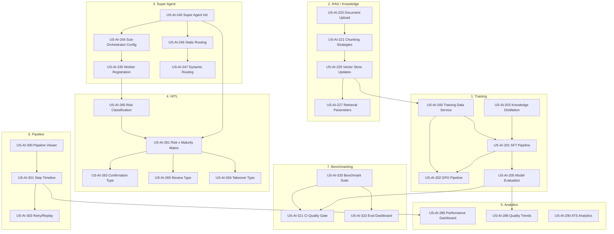

# R05 AI Platform -- Story Inventory Part 2: AI/ML Features

**Product:** EMSIST AI Agent Platform
**Version:** 1.0
**Date:** 2026-03-13
**Author:** BA Agent
**Status:** [PLANNED] -- All stories are planned; no implementation exists yet.
**Story ID Range:** US-AI-200 through US-AI-399

**Source Documents:**
- 01-PRD-AI-Agent-Platform.md (Sections 2.2-2.3, 3.1-3.21, 7.7-7.10, 8)
- 03-Epics-and-User-Stories.md (Epics E5-E6, E11, E13-E20)
- 07-Detailed-User-Stories.md (Epics 6, 11, 13-20)
- 00-Super-Agent-Design-Plan.md (14 design areas)
- 11-Super-Agent-Benchmarking-Study.md (Sections 3-12)
- BA-Domain-Skills-Tools-Mapping.md (7 domains, 32 agent profiles)

---

## Summary

| Metric | Count |
|--------|-------|
| Total Stories | 112 |
| Feature Areas | 7 |
| Personas Covered | 6 |
| Must Have | 62 |
| Should Have | 35 |
| Could Have | 15 |
| Estimated Story Points | ~628 |

### Feature Area Breakdown

| Feature Area | Stories | Points | Must | Should | Could |
|-------------|---------|--------|------|--------|-------|
| 1. Training and Fine-Tuning | 18 | 98 | 10 | 5 | 3 |
| 2. RAG / Knowledge Management | 16 | 91 | 10 | 4 | 2 |
| 3. Super Agent / Orchestration | 16 | 96 | 10 | 4 | 2 |
| 4. HITL Workflows | 16 | 89 | 9 | 5 | 2 |
| 5. Analytics / Monitoring | 16 | 88 | 8 | 6 | 2 |
| 6. Pipeline Runs / Execution Logs | 15 | 84 | 8 | 5 | 2 |
| 7. Benchmarking / Evaluation | 15 | 82 | 7 | 6 | 2 |

---

## Personas Referenced

| Persona ID | Name | Role | Primary Feature Areas |
|-----------|------|------|----------------------|
| PER-EX-005 | Thomas Morrison | ML Engineer | Training, Benchmarking, RAG, Analytics |
| PER-EX-004 | Maria Sullivan | Domain Expert | Knowledge Management, HITL, Training |
| PER-EX-002 | Oliver Kent | Platform Administrator | Analytics, Pipeline, Orchestration, HITL |
| PER-UX-004 | Lisa Harrison | End User | HITL, Orchestration |
| PER-UX-007 | Nora Davidson | Agent Designer | Knowledge Management, Benchmarking |
| SYS | System (Automated) | Automated | Orchestration, Training, HITL |

---

## 1. Training and Fine-Tuning

### Persona: Thomas Morrison (ML Engineer)

| Story ID | User Story | Acceptance Criteria (Summary) | Confirmation Dialogs | Error Messages | Edge Cases |
|----------|-----------|------------------------------|---------------------|----------------|------------|
| US-AI-200 | As an ML engineer, I want a unified training data service that aggregates data from all six sources with priority weighting, so that I get balanced, high-quality datasets for each training run. | Given six sources exist, When dataset is built, Then sources weighted by priority (corrections highest, synthetic lowest); recency decay applied; gap analysis identifies weak areas; dataset statistics reported | None | "Insufficient training data: minimum 100 examples required for SFT" | Zero data for one source; dataset entirely from one source; recency decay eliminates all old data |
| US-AI-201 | As an ML engineer, I want an automated SFT pipeline that fine-tunes Ollama models on curated data, so that agents improve from demonstrations of correct behavior. | Given training data is available, When daily SFT job runs at 2:00 AM, Then LoRA fine-tuning executes with configurable hyperparameters (rank, alpha, epochs); adapter exported to Ollama; training metrics logged; incremental training supported | "Start Training Run? This will use estimated X GPU hours." | "Training failed: GPU memory exceeded. Reduce batch size or LoRA rank."; "Model export failed: Ollama unavailable" | Zero new data since last run (skip with log); GPU OOM mid-training; partial adapter produced |
| US-AI-202 | As an ML engineer, I want a DPO preference learning pipeline that teaches agents to prefer high-quality responses, so that agents develop better judgment beyond SFT alone. | Given 50+ preference pairs exist, When DPO runs after SFT, Then model optimized to prefer chosen over rejected; quality improvement measurable via A/B evaluation; combinable with SFT in single cycle | "Start DPO Training? Requires minimum 50 preference pairs." | "DPO skipped: fewer than 50 preference pairs available"; "DPO training diverged: learning rate too high" | All pairs positive (skip DPO); unbalanced pairs (90/10 split); DPO degrades model (rollback) |
| US-AI-203 | As an ML engineer, I want knowledge distillation from cloud teacher models (Claude, Codex, Gemini) into local models, so that local models gain advanced reasoning without runtime cloud dependency. | Given weak areas identified from trace analysis, When teacher service generates targeted examples, Then Claude produces high-quality responses; examples tagged as "teacher_model" with lowest priority; cloud API costs tracked | "Generate Teacher Examples? Estimated cloud API cost: $X.XX" | "Teacher model unavailable: distillation skipped"; "Cloud API budget exceeded for this billing period" | Teacher response worse than local (filtered by quality score); all identified areas already strong; API rate limit hit mid-batch |
| US-AI-204 | As an ML engineer, I want configurable training schedules (daily, weekly, on-demand), so that training cadence matches data volume and quality requirements. | Given daily training scheduled for 2:00 AM, When cron fires, Then SFT and DPO run in sequence; weekly deep training on Sunday 4:00 AM includes teacher augmentation; on-demand via API; job queuing when one already runs | None (automated) | "Training job already running. Queued for execution after current job completes."; "Invalid cron expression" | On-demand triggered during scheduled run; training job exceeds business hours cutoff (6 AM); cron timezone mismatch |
| US-AI-205 | As an ML engineer, I want an automated model evaluation pipeline that benchmarks retrained models against production, so that only quality-improving models are deployed. | Given retrained model exists, When evaluation runs, Then benchmarked against production on held-out test set; quality gate: new model must score higher on all key metrics; shadow deployment for 1 hour; automatic rollback on quality drop | "Deploy New Model? Quality score: X.XX (threshold: 0.85)" | "Quality gate failed: new model scored X.XX on accuracy (current: Y.YY). Deployment blocked."; "Shadow period quality drop detected: rolling back" | New model ties with current (no deploy); shadow period reveals intermittent quality drop; evaluation benchmark stale |
| US-AI-206 | As an ML engineer, I want to manage training datasets with versioning and source tracking, so that I can reproduce any training run and audit data provenance. | Given datasets are built, When a dataset is finalized, Then version number assigned; source distribution recorded; data lineage tracked (which source produced which examples); dataset frozen for reproducibility | "Freeze Dataset v{N}? This dataset will become immutable." | "Dataset version conflict: version {N} already exists"; "Source lineage broken: original trace deleted" | Duplicate examples across sources; dataset exceeds storage quota; source data retroactively deleted |
| US-AI-207 | As an ML engineer, I want active learning that automatically identifies uncertain or poorly performing cases, so that data collection targets areas that matter most. | Given low-confidence traces accumulate, When weekly analysis runs, Then systematic failure patterns identified; teacher generates targeted data for weak areas; active learning metrics show coverage improvement; flagged cases surfaced in admin dashboard | None (automated) | "Active learning analysis skipped: insufficient trace volume (minimum 500 traces/week)" | All traces high-confidence (no weak areas); failure patterns span multiple agent types; domain expert queue overwhelmed |
| US-AI-208 | As an ML engineer, I want to configure LoRA hyperparameters per agent type, so that each agent type receives optimized fine-tuning. | Given agent-specific training configs exist, When SFT runs for each agent type, Then per-type LoRA rank, alpha, learning rate, and epochs applied; configs versioned; comparison across configs visible | None | "Invalid hyperparameter: LoRA rank must be 4-128"; "Configuration not found for agent type {X}, using defaults" | Agent type with zero training data; conflicting configs for same type; hyperparameter change mid-training |
| US-AI-209 | As an ML engineer, I want training run history with metrics visualization, so that I can track model quality trends over time. | Given training runs complete, When history is queried, Then all runs listed with: start/end time, dataset version, metrics (loss, validation accuracy), quality gate result, deployment status; trend charts available | None | "No training runs found for the selected date range" | Hundreds of runs (pagination needed); run with missing metrics (partial data); timezone display issues |

### Persona: Maria Sullivan (Domain Expert)

| Story ID | User Story | Acceptance Criteria (Summary) | Confirmation Dialogs | Error Messages | Edge Cases |
|----------|-----------|------------------------------|---------------------|----------------|------------|
| US-AI-210 | As a domain expert, I want to submit business patterns (when X happens, do Y) that expand into training examples, so that agents learn organizational best practices. | Given pattern with trigger and expected response, When submitted via API, Then stored in pattern repository; pattern expander generates 5+ training examples; tagged as "business_pattern"; weighted as third priority | None | "Pattern validation failed: expected response is empty"; "Conflicting pattern detected: pattern {ID} defines opposite behavior for same trigger" | Two patterns conflict; pattern generates low-quality examples; pattern applies to multiple agent types |
| US-AI-211 | As a domain expert, I want to upload training manuals and SOPs that are chunked and embedded for RAG and fine-tuning, so that agents have access to institutional knowledge. | Given PDF/DOCX/TXT/MD file uploaded, When processing completes, Then chunked at configurable size (default 512 tokens); embedded in PGVector with tenant ID; Q&A pairs auto-generated for SFT; tagged by agent type and domain | "Upload {filename}? File will be chunked and embedded for agent knowledge." | "Unsupported file format: only PDF, DOCX, TXT, MD accepted"; "File exceeds 50MB limit"; "Empty document: no content to process" | Empty document; document in unsupported language; duplicate upload of same file; corrupt PDF |
| US-AI-212 | As a domain expert, I want to review and approve auto-generated Q&A pairs before they enter training, so that training quality is maintained. | Given Q&A pairs generated from uploaded material, When review queue is loaded, Then pairs displayed with source context; approve/edit/reject actions; approved pairs enter SFT queue; rejection reasons logged | "Approve {N} Q&A pairs for training?" | "No Q&A pairs pending review"; "Edit rejected: answer exceeds 2000 character limit" | All pairs low quality (reject all); pair references deleted source material; reviewer edits change meaning |
| US-AI-213 | As a domain expert, I want to connect organizational databases and APIs as training data sources, so that agents have domain-specific knowledge from actual data. | Given connectors configured for PostgreSQL/MySQL/REST/file storage, When extraction runs on schedule (default daily), Then data transformed into training-ready formats; PII detection and redaction applied; data lineage tracked | "Connect to {source}? Daily extraction will begin at next scheduled time." | "Connection failed: {source} unreachable"; "PII detected in {N} records: redaction applied before training ingestion"; "Extraction timeout: source returned incomplete data" | Source schema changes between extractions; massive dataset exceeds processing window; PII redaction removes critical context |

### Persona: Oliver Kent (Platform Administrator)

| Story ID | User Story | Acceptance Criteria (Summary) | Confirmation Dialogs | Error Messages | Edge Cases |
|----------|-----------|------------------------------|---------------------|----------------|------------|
| US-AI-214 | As a platform administrator, I want to monitor training pipeline status and resource usage, so that I can ensure training completes within SLA windows. | Given training pipeline is running, When admin views training dashboard, Then current status (idle/running/failed), resource usage (GPU, memory), estimated completion, queue depth visible; alerts on SLA breach | None | "Training SLA breach: job exceeded 4-hour window"; "GPU allocation failed: insufficient resources" | Multiple tenants training simultaneously; GPU contention; training job hung (no progress for 30 min) |
| US-AI-215 | As a platform administrator, I want to rollback a deployed model to a previous version, so that I can recover from a bad deployment. | Given model versions exist, When rollback API is called, Then previous model version loaded in Ollama; current version retained in history; rollback logged in audit trail | "Rollback to model version {N}? Current version {M} will be replaced." | "Rollback failed: version {N} no longer available in artifact store"; "Ollama failed to load model: version incompatible" | Rollback to version 3 releases old; only one version exists (cannot rollback); rollback during active requests |
| US-AI-216 | As a platform administrator, I want per-tenant training isolation so that one tenant's training data never influences another tenant's models. | Given multi-tenant training, When SFT runs, Then each tenant's training data is isolated; models fine-tuned per-tenant; no cross-tenant data leakage; isolation verified by audit | None | "Cross-tenant data detected in training batch: job aborted"; "Tenant isolation verification failed: training halted pending investigation" | Shared base model across tenants; tenant with zero training data; global skill training vs tenant training |
| US-AI-217 | As a platform administrator, I want to configure training cost budgets per tenant, so that training resource consumption is controlled. | Given budget thresholds configured, When training runs, Then resource consumption tracked against budget; alert at 80% threshold; training blocked at 100%; budget period configurable (monthly/quarterly) | "Training budget {X}% consumed. Continue?" (at 80%) | "Training budget exceeded for tenant {name}. Training blocked until next budget period or admin override."; "Budget configuration invalid: amount must be positive" | Budget consumed on first day; multiple training jobs in single day; budget reset mid-training |

---

## 2. RAG / Knowledge Management

### Persona: Maria Sullivan (Domain Expert)

| Story ID | User Story | Acceptance Criteria (Summary) | Confirmation Dialogs | Error Messages | Edge Cases |
|----------|-----------|------------------------------|---------------------|----------------|------------|
| US-AI-220 | As a domain expert, I want to upload documents to the knowledge base with metadata tagging, so that agents retrieve relevant organizational content during RAG. | Given file in supported format (PDF, DOCX, TXT, MD, CSV, JSON), When uploaded with name, description, category tags, and agent scope, Then file processed through: Uploading, Chunking, Embedding, Indexed pipeline; progress visible in table | "Upload {filename}? File will be processed and available for agent retrieval." | "Unsupported file format. Supported: PDF, DOCX, TXT, MD, CSV, JSON"; "File exceeds 50MB limit"; "Processing failed at chunking stage: file appears to be encrypted" | Empty document; very large document (100+ pages); document with only images (no text); re-upload same file |
| US-AI-221 | As a domain expert, I want to configure chunking strategies per knowledge source, so that document structure is preserved for optimal retrieval. | Given chunking configuration options, When chunk size, overlap, and strategy are set, Then documents chunked accordingly; strategies: fixed-size, sentence-aware, paragraph-aware, semantic; chunk previews available before commit | None | "Invalid chunk size: must be between 64 and 2048 tokens"; "Semantic chunking unavailable: embedding model not configured" | Single-sentence document; document with no paragraph breaks; tables that should not be split; code blocks |
| US-AI-222 | As a domain expert, I want to manage knowledge base sources with version tracking, so that I can update content and track changes over time. | Given knowledge source exists, When re-uploaded, Then new version created with diff tracking (chunks added/removed/modified); previous versions retained; version history viewable with comparison | "Replace version {N} with new upload? Previous version will be retained." | "Version conflict: another update is in progress"; "Diff generation failed: source too large for comparison" | Identical re-upload (no changes); format change between versions (PDF to DOCX); 50+ versions accumulated |
| US-AI-223 | As a domain expert, I want to view retrieval hit rates per knowledge source, so that I can identify high-value and underutilized content. | Given knowledge sources are indexed, When hit rate analytics are viewed, Then each source shows: query count that returned chunks, total queries, hit rate percentage; filterable by date range and agent | None | "Insufficient data: retrieval analytics require at least 100 queries" | Source with 0% hit rate (never retrieved); source with 100% hit rate; recently indexed source (no data yet) |
| US-AI-224 | As a domain expert, I want to scope knowledge sources to specific agents, so that irrelevant content does not pollute agent context. | Given agent scope is configurable per source, When scope is set to specific agents, Then only those agents retrieve from this source during RAG; "All agents" option available as default | None | "At least one agent must be selected for knowledge source scope"; "Agent {name} does not exist" | Agent deleted after being scoped; source scoped to zero agents (orphaned); scope change while agent is processing |

### Persona: Thomas Morrison (ML Engineer)

| Story ID | User Story | Acceptance Criteria (Summary) | Confirmation Dialogs | Error Messages | Edge Cases |
|----------|-----------|------------------------------|---------------------|----------------|------------|
| US-AI-225 | As an ML engineer, I want the RAG vector store updated automatically when materials, corrections, or patterns are ingested, so that agents have current knowledge. | Given new material ingested, When embedding completes, Then vector store updated and searchable within 5 minutes; corrections update relevant entries in real-time; deleted materials cascade to remove embeddings | None (automated) | "Embedding service unavailable: material queued for processing when service recovers"; "Vector store update failed: retrying in 60 seconds" | Embedding service down for hours (large queue); correction references non-existent vector entry; simultaneous updates to same entry |
| US-AI-226 | As an ML engineer, I want configurable embedding models per tenant, so that each tenant can optimize for their domain vocabulary. | Given embedding model configuration, When tenant admin selects a model, Then all new embeddings use the selected model; re-embedding option for existing sources; model comparison metrics available | "Change embedding model? All existing sources will need re-embedding (estimated time: {X} hours)." | "Embedding model {name} not available in model registry"; "Re-embedding in progress: cannot change model until complete" | Mid-migration model change; mixed embeddings from different models; model removed from registry while in use |
| US-AI-227 | As an ML engineer, I want to configure retrieval parameters (top-K, similarity threshold, reranking), so that RAG quality is tunable per agent. | Given retrieval configuration per agent/skill, When RAG query runs, Then top-K (default 5) most relevant documents retrieved; similarity threshold filters low-relevance results; optional reranking with cross-encoder | None | "Invalid top-K value: must be 1-20"; "Reranking model not configured" | Query returns zero results (below threshold); all documents equally relevant; context token limit exceeded by top-K results |
| US-AI-228 | As an ML engineer, I want hybrid search combining vector similarity and keyword matching, so that retrieval handles both semantic and exact-match queries. | Given hybrid search configured, When RAG query runs, Then vector similarity and BM25 keyword search execute in parallel; results merged with configurable weight ratio (default 0.7 vector / 0.3 keyword) | None | "BM25 index not built for this collection: falling back to vector-only search" | Query with exact technical term (keyword wins); vague conceptual query (vector wins); mixed query with both |

### Persona: Oliver Kent (Platform Administrator)

| Story ID | User Story | Acceptance Criteria (Summary) | Confirmation Dialogs | Error Messages | Edge Cases |
|----------|-----------|------------------------------|---------------------|----------------|------------|
| US-AI-229 | As a platform administrator, I want a knowledge source management dashboard with processing status and health metrics, so that I can monitor the knowledge infrastructure. | Given knowledge sources exist, When dashboard loads, Then table shows: name, type, format, chunk count, embedding status, last processed, retrieval hit rate; status badges: gray=Uploading, amber=Chunking, blue=Embedding, green=Indexed, red=Error | None | "Knowledge source processing failed: {error details}. Re-process to retry." | Source stuck in "Chunking" state; hundreds of sources (pagination); source with Error status for days |
| US-AI-230 | As a platform administrator, I want to enforce tenant isolation for knowledge sources, so that one tenant's documents are never accessible to another tenant. | Given tenant isolation enforced, When RAG query runs, Then metadata filter ensures only requesting tenant's documents returned; cross-tenant access blocked at TenantContextService level | None | "Cross-tenant knowledge access attempt blocked. Security event logged." | Global knowledge sources (shared); tenant migration (moving sources between tenants); tenant deletion (cascade cleanup) |
| US-AI-231 | As a platform administrator, I want to re-process knowledge sources when embedding models or chunking strategies change, so that existing content benefits from improvements. | Given re-processing triggered, When bulk re-process runs, Then all sources re-chunked and re-embedded with new settings; progress tracked; old embeddings replaced atomically | "Re-process all knowledge sources? Estimated time: {X} hours. Agents will use existing embeddings until re-processing completes." | "Re-processing failed for source {name}: {error}. Other sources continue processing." | Re-processing during peak query load; partial re-processing failure (some sources updated, some not); storage capacity exceeded |
| US-AI-232 | As a platform administrator, I want to delete knowledge sources with cascading cleanup, so that removed content no longer influences agent responses. | Given delete action initiated, When confirmed, Then all chunks and embeddings removed from vector store; source record removed; deletion audited | "Delete knowledge source '{name}'? All {N} chunks and embeddings will be permanently removed from the vector store." | "Deletion failed: source is referenced by an active processing job. Wait for completion or cancel the job first." | Source referenced by active training job; deletion during active RAG queries; large source with 10,000+ chunks |
| US-AI-233 | As a platform administrator, I want knowledge source access restricted by RBAC, so that only authorized roles can upload and manage content. | Given RBAC configured, When user with "User" role navigates to knowledge sources, Then access denied; Agent Designer, Tenant Admin, and Platform Admin can upload and manage | None | "Access denied: You do not have permission to manage knowledge sources. Required role: Agent Designer or higher." | Role change while viewing knowledge page; admin downgrades own role; bulk upload by multiple admins simultaneously |
| US-AI-234 | As a platform administrator, I want operating-model-aligned RAG indexing, so that knowledge is organized by portfolio type and domain framework for the Super Agent. | Given dynamic RAG configured per ADR-023, When knowledge indexed, Then indexed by domain framework (TOGAF, EFQM, ISO 31000, BSC, ITIL) and portfolio type; Sub-Orchestrator queries scoped to their domain index | None | "Domain index not configured for framework {name}. Knowledge source will be indexed in the general collection." | Knowledge source spans multiple domains; new domain framework added; domain index rebalancing |
| US-AI-235 | As a platform administrator, I want knowledge source ingestion from external URLs with scheduled refresh, so that web-based content stays current. | Given URL source configured with refresh schedule, When refresh cron fires, Then content re-fetched, re-chunked, re-embedded; change detection avoids unnecessary re-processing; fetch failures logged with retry | "Add URL source? Content will be fetched and refreshed on schedule: {cron}." | "URL fetch failed: HTTP {status}. Will retry at next scheduled time."; "Content unchanged since last fetch: skipping re-processing" | URL returns 404 after initial success; content changes format between fetches; very large page (exceeds size limit) |

---

## 3. Super Agent / Orchestration

### Persona: Oliver Kent (Platform Administrator)

| Story ID | User Story | Acceptance Criteria (Summary) | Confirmation Dialogs | Error Messages | Edge Cases |
|----------|-----------|------------------------------|---------------------|----------------|------------|
| US-AI-240 | As a platform administrator, I want a Super Agent automatically created when a new tenant is onboarded, so that every tenant has an organizational brain from day one. | Given new tenant created, When onboarding completes, Then SuperAgent provisioned in tenant's isolated schema; seeded with 5 default Sub-Orchestrators (EA, Performance, GRC, KM, Service Design); starts at Coaching maturity; clone record saved | None (automated) | "Super Agent already exists for tenant {name}: duplicate creation rejected"; "Onboarding failed: schema creation error for tenant {name}" | Duplicate onboarding event; partial provisioning (3 of 5 Sub-Orchestrators created); tenant deletion during onboarding |
| US-AI-241 | As a platform administrator, I want to suspend or decommission agents at any hierarchy level with cascading effects, so that problematic agents are quickly disabled. | Given agent in hierarchy, When suspended, Then all children suspended cascading; decommissioned agents cannot be reactivated; audit data retained; reactivation restores previous state | "Suspend {agent name}? This will also suspend {N} child agents." / "Decommission {agent name}? This action is permanent." | "Agent already suspended"; "Cannot reactivate: agent is decommissioned"; "In-flight tasks will complete before suspension takes effect" | Suspend during active task execution; decommission with pending drafts; suspend Super Agent (entire tenant offline) |
| US-AI-242 | As a platform administrator, I want a visual hierarchy dashboard showing the full agent tree with status, maturity, and activity, so that I can monitor organizational brain health. | Given hierarchy exists, When dashboard loads, Then three-tier tree rendered (SuperAgent, Sub-Orchestrators, Workers); each node shows name, type, status, maturity, ATS score, task count; clickable for detail; auto-refresh every 30s; exportable as PDF/PNG | None | "No agent hierarchy found for this tenant"; "Dashboard data temporarily unavailable: metrics backend degraded" | Tenant with only Super Agent (no workers yet); 100+ workers (tree rendering performance); real-time status change during viewing |
| US-AI-243 | As a platform administrator, I want to enable or disable the Super Agent feature per tenant, so that tenants can opt in when ready. | Given Super Agent toggle exists, When disabled, Then flat orchestrator-worker model used; agents continue to function without hierarchy; toggle change audited | "Disable Super Agent for tenant {name}? Agents will revert to flat orchestration model." | "Cannot disable: {N} active cross-domain tasks in progress. Wait for completion or force-disable." | Disable while tasks in progress; enable after being disabled (restore hierarchy); enable for tenant with existing flat agents |

### Persona: Maria Sullivan (Domain Expert)

| Story ID | User Story | Acceptance Criteria (Summary) | Confirmation Dialogs | Error Messages | Edge Cases |
|----------|-----------|------------------------------|---------------------|----------------|------------|
| US-AI-244 | As a domain expert, I want to configure Sub-Orchestrators with domain-specific planning rules, quality gates, and skills, so that each domain has a specialized planner. | Given Sub-Orchestrator config page, When domain expert edits, Then domain type, assigned skills, knowledge scopes, quality gate rules saved and versioned; custom Sub-Orchestrators creatable beyond 5 defaults; starts at Coaching | None | "At least one skill required for Sub-Orchestrator"; "Domain framework {name} not recognized"; "Configuration version conflict: reload and retry" | Custom Sub-Orchestrator with no matching workers; edit while Sub-Orchestrator is processing; conflicting quality gate rules |
| US-AI-245 | As a domain expert, I want capability workers registered and dynamically assigned to Sub-Orchestrators, so that workers are shared efficiently across domains. | Given workers typed by capability (Data Query, Calculation, Report, Analysis, Notification), When Sub-Orchestrator needs worker, Then most suitable available worker assigned dynamically; multiple workers of same type for parallel execution; starts at Coaching | None | "No available worker of type {capability} for assignment. All workers busy or suspended."; "Worker registration failed: duplicate name in tenant" | All workers busy (queuing); worker demoted during assignment; cross-domain worker sharing contention |

### Persona: Lisa Harrison (End User)

| Story ID | User Story | Acceptance Criteria (Summary) | Confirmation Dialogs | Error Messages | Edge Cases |
|----------|-----------|------------------------------|---------------------|----------------|------------|
| US-AI-246 | As an end user, I want my requests routed to the correct domain Sub-Orchestrator via intent classification, so that I get domain-specific quality without knowing which agent handles what. | Given static routing for ~80% of requests, When request classified, Then keyword matching and intent classification determine target Sub-Orchestrator; confidence score recorded; low-confidence flagged for dynamic routing | None | "Unable to classify your request. Routing to general assistant."; "The {domain} Sub-Orchestrator is temporarily unavailable. Trying alternative routing." | Ambiguous request spanning two domains; request in unsupported language; all Sub-Orchestrators unavailable |
| US-AI-247 | As an end user, I want complex cross-domain requests automatically decomposed and coordinated across multiple Sub-Orchestrators, so that I get comprehensive answers without asking each domain separately. | Given cross-domain request, When dynamic routing applied, Then LLM-based planning decomposes into domain sub-tasks; independent sub-tasks dispatched in parallel; results composed into unified response; latency within 3s of static routing | None | "Cross-domain analysis partially complete: {domain} component encountered an error. Showing available results."; "Request too complex: please break into smaller questions" | One Sub-Orchestrator fails while others succeed (partial result); circular dependency between domains; response composition exceeds token limit |
| US-AI-248 | As an end user, I want the Super Agent to remember context across my conversation turns, so that multi-step domain explorations build on previous answers. | Given conversation memory active, When user sends follow-up, Then prior conversation context included; cross-domain context shared when relevant; session timeout at 30 minutes; explicit clear option | None | "Session expired after 30 minutes of inactivity. Starting fresh conversation."; "Context size limit reached: earlier messages summarized" | Context exceeds token limit (summarization); domain switch mid-conversation; session timeout during long analysis |

### Persona: System (Automated)

| Story ID | User Story | Acceptance Criteria (Summary) | Confirmation Dialogs | Error Messages | Edge Cases |
|----------|-----------|------------------------------|---------------------|----------------|------------|
| US-AI-249 | As the system, I want the Super Agent's system prompt dynamically assembled from modular blocks at runtime, so that each invocation is context-aware. | Given prompt blocks stored in DB, When agent invoked, Then blocks composed in order: identity, user context, role privileges, domain knowledge, skills, tools, ethics, conduct, task; conditional inclusion based on task; composition hash and token count recorded in trace | None (automated) | "Prompt composition failed: mandatory block {type} missing"; "Token budget exceeded: reducing context blocks" | Block exceeds model context window; stale cached block; platform block update mid-request |
| US-AI-250 | As the system, I want evolving routing rules refined over time based on observed success rates and user feedback, so that routing accuracy improves continuously. | Given routing decisions logged with outcomes, When weekly analysis runs, Then routing rules refined based on success rates; misrouted requests identified; updated rules deployed without code changes | None (automated) | "Routing rule update failed: conflicting rules detected for domain {name}" | New domain added with no routing data; rule update causes regression; edge case queries that never classify well |
| US-AI-251 | As the system, I want conflict resolution when multiple Sub-Orchestrators produce contradictory results for a cross-domain request, so that users receive consistent answers. | Given parallel Sub-Orchestrator results received, When conflicts detected, Then Super Agent applies conflict resolution: prefer higher-confidence result, flag for human review if confidence gap < 10%, include both perspectives with explicit disagreement note | None (automated) | "Conflicting results from {domain A} and {domain B}: presenting both perspectives for your review" | All domains agree (no conflict); three-way conflict; one domain returns error while others succeed |
| US-AI-252 | As the system, I want task delegation between Sub-Orchestrators when a task requires capabilities from another domain, so that domain expertise is leveraged without user intervention. | Given Sub-Orchestrator identifies cross-domain dependency, When delegation requested, Then target Sub-Orchestrator receives sub-task with context; result returned to originator; delegation depth limited to 2 levels; full delegation chain traced | None (automated) | "Delegation failed: target Sub-Orchestrator {name} unavailable"; "Maximum delegation depth (2) reached: completing with available information" | Circular delegation (A delegates to B delegates to A); delegation timeout; delegated task higher priority than target's current work |
| US-AI-253 | As the system, I want the Super Agent hierarchy to support tenant customization beyond the 5 default domains, so that tenants can model their unique organizational structure. | Given tenant adds custom Sub-Orchestrator, When created, Then custom domain appears in hierarchy alongside defaults; routing rules updated; workers assignable; custom domain skills configurable | None (automated) | "Maximum Sub-Orchestrator limit (20) reached for this tenant"; "Custom domain name conflicts with existing domain" | Delete custom domain with active tasks; merge two domains; revert custom domain to default configuration |
| US-AI-254 | As the system, I want saga-pattern coordination for multi-Sub-Orchestrator tasks, so that partial failures are handled gracefully with compensation. | Given multi-domain task dispatched, When one Sub-Orchestrator fails, Then compensation logic executes for completed sub-tasks; partial results preserved; failure context logged; user notified of partial completion | None (automated) | "Multi-domain task partially failed: {domain} component failed. Compensating completed work." | All Sub-Orchestrators fail; compensation itself fails; user cancels mid-execution |
| US-AI-255 | As the system, I want per-tenant independent Super Agent configurations, so that the same platform template produces unique organizational intelligence profiles per tenant. | Given platform template cloned on onboarding, When tenant operates independently, Then skill customizations, routing rules, knowledge scopes, and worker configurations are tenant-specific; changes in one tenant do not affect others | None (automated) | "Platform template version mismatch: tenant clone is outdated. Optional upgrade available." | Platform template updated after clone; tenant diverges significantly from template; template rollback |

---

## 4. HITL (Human-in-the-Loop) Workflows

### Persona: System (Automated)

| Story ID | User Story | Acceptance Criteria (Summary) | Confirmation Dialogs | Error Messages | Edge Cases |
|----------|-----------|------------------------------|---------------------|----------------|------------|
| US-AI-260 | As the system, I want every agent action classified by risk level using four factors (data sensitivity, reversibility, blast radius, regulatory exposure), so that the HITL matrix determines appropriate human involvement. | Given action proposed, When risk classifier evaluates, Then four factors assessed; overall risk = maximum across factors; result recorded in execution trace; rules configurable per tenant for industry-specific profiles | None (automated) | "Risk classification failed: insufficient context for assessment. Defaulting to HIGH risk." | Action with mixed risk factors (HIGH sensitivity, LOW reversibility); new action type not in classification rules; tenant-custom risk overrides |
| US-AI-261 | As the system, I want HITL type determined by the intersection of risk level and agent maturity, so that mature agents on low-risk tasks proceed autonomously. | Given matrix evaluated, When LOW risk + Graduate agent, Then HITL = None (audit only); CRITICAL risk + any agent = Takeover; tenant can tighten but not loosen below platform defaults; low confidence overrides one level up | None (automated) | "HITL matrix misconfiguration: cell {risk}x{maturity} has invalid type. Using platform default."; "Tenant attempted to loosen CRITICAL controls: rejected" | Confidence-based escalation on already-Takeover level (stays Takeover); tenant matrix corruption; agent maturity changes between risk classification and HITL evaluation |
| US-AI-262 | As the system, I want low-confidence outputs escalated regardless of the risk-maturity matrix, so that uncertain agents always get human verification. | Given confidence threshold configurable (default 0.7), When agent reports confidence below threshold, Then HITL type escalated one level: None to Confirmation, Confirmation to Review, Review to Takeover; trace includes original matrix result and override reason | None (automated) | "Confidence score unavailable: treating as low-confidence for HITL purposes" | Confidence exactly at threshold (no escalation); agent always low-confidence (perpetual escalation); confidence scoring model unavailable |

### Persona: Lisa Harrison (End User)

| Story ID | User Story | Acceptance Criteria (Summary) | Confirmation Dialogs | Error Messages | Edge Cases |
|----------|-----------|------------------------------|---------------------|----------------|------------|
| US-AI-263 | As an end user, I want a lightweight yes/no confirmation for medium-risk agent actions, so that I can approve routine actions quickly. | Given Confirmation HITL triggered, When user notified, Then concise action summary with "Approve" and "Reject" buttons; timeout after 4 hours escalates to Review; decision recorded as ApprovalDecision with who/what/when; toast notification for active users | "Agent wants to {action summary}. Approve?" | "Confirmation expired: escalated to full review"; "Approval rejected: reason logged" | User closes browser mid-confirmation; confirmation for already-completed action (race condition); multiple confirmations simultaneously |
| US-AI-264 | As an end user, I want full control returned to me for critical-risk actions, so that I handle sensitive operations myself. | Given Takeover HITL triggered, When pipeline pauses, Then full context transferred: original request, agent's plan, gathered context, tool outputs; user can: complete manually, modify plan and resume, or cancel; no timeout; all human actions traced | None (context handoff, not dialog) | "Takeover context transfer failed: partial context available. Full trace accessible in pipeline viewer."; "Cannot resume: pipeline state corrupted. Please create a new request." | Human never responds (indefinite wait); human modifies plan incorrectly; takeover during multi-domain task |

### Persona: Maria Sullivan (Domain Expert)

| Story ID | User Story | Acceptance Criteria (Summary) | Confirmation Dialogs | Error Messages | Edge Cases |
|----------|-----------|------------------------------|---------------------|----------------|------------|
| US-AI-265 | As a domain expert, I want to review and optionally modify agent-proposed actions before approval, so that I can correct outputs and contribute to agent learning. | Given Review HITL triggered, When review interface opens, Then full draft content displayed with editing; approve with modifications creates new DraftVersion; request revision returns to worker with feedback; timeout after 48 hours escalates; mandatory reasoning text | None | "Review timeout: escalated to next reviewer in chain"; "Rejection requires feedback text (minimum 10 characters)" | Reviewer edits introduce errors; review of extremely long document; multiple reviewers assigned simultaneously |
| US-AI-266 | As a domain expert, I want a centralized approval queue sorted by priority and deadline, so that I can efficiently manage my approval workload. | Given approval queue loaded, When rendered, Then all pending Confirmation, Review, Takeover items listed; sortable by deadline; each shows action summary, risk badge, HITL type, deadline countdown, agent identity; batch approval for Confirmations; overdue items highlighted | None | "No pending approvals"; "Batch approval failed for {N} items: individual review required" | 100+ items in queue; all items overdue; batch approve while individual items being reviewed |
| US-AI-267 | As a domain expert, I want my review decisions and modifications to feed back into agent training, so that the agent learns from my corrections. | Given review modifies a draft, When modification is saved, Then original and modified versions create a preference pair for DPO training; approval/rejection patterns inform agent confidence calibration; feedback aggregated for active learning | None (automated) | "Training feedback submission failed: queued for retry" | Reviewer makes trivial edits (not meaningful training signal); reviewer provides inconsistent feedback across similar items; bulk-approved items lack individual feedback |

### Persona: Oliver Kent (Platform Administrator)

| Story ID | User Story | Acceptance Criteria (Summary) | Confirmation Dialogs | Error Messages | Edge Cases |
|----------|-----------|------------------------------|---------------------|----------------|------------|
| US-AI-268 | As a platform administrator, I want to configure the escalation chain for HITL timeouts, so that unresponded approvals reach progressively higher authority. | Given escalation chain configurable, When edited, Then levels defined: reviewer, Sub-Orchestrator, tenant admin, platform support; each level has configurable timeout; platform support cannot be removed from chain; full context forwarded on escalation | None | "Final escalation target (platform support) cannot be removed from chain"; "Invalid timeout: must be at least 1 hour" | All chain members unavailable; escalation chain with only 1 level; timeout shorter than typical response time |
| US-AI-269 | As a platform administrator, I want to customize the risk-maturity HITL matrix per tenant, so that industry-specific oversight requirements are met. | Given matrix is 4x4 (risk x maturity), When tenant admin edits, Then cells configurable: None, Confirmation, Review, Takeover; can only tighten (increase oversight), not loosen below platform defaults; changes audited; take effect immediately | "Update HITL matrix? Changes apply immediately to all new agent actions." | "Cannot loosen cell [{risk},{maturity}] below platform default: {default type}"; "Matrix validation failed: all CRITICAL risk cells must require at minimum Review" | Matrix change during active approvals; revert to platform defaults; partial matrix update (some cells changed, validation fails) |
| US-AI-270 | As a platform administrator, I want HITL analytics showing approval rates, response times, and escalation frequency, so that I can optimize the approval process. | Given HITL data accumulated, When analytics dashboard loaded, Then shows: approval rate by HITL type, average response time, escalation frequency, top reviewers, bottleneck identification; filterable by date range, domain, risk level | None | "Insufficient HITL data for analytics: minimum 50 decisions required" | Zero HITL events (all agents Graduate on low-risk); single reviewer handling all approvals; seasonal patterns in approval volume |
| US-AI-271 | As a platform administrator, I want draft timeout and escalation rules configurable by risk level, so that high-risk items get faster attention. | Given timeout rules per risk level, When configured, Then HIGH risk default 24 hours, MEDIUM 48 hours, LOW 72 hours; configurable per tenant; timeout check runs every 15 minutes; both current reviewer and escalation target notified | None | "Timeout value too short: minimum 1 hour for any risk level"; "Escalation notification failed: retrying" | Draft nearly at timeout when reviewer starts reviewing; timezone differences between reviewer and escalation target; multiple drafts timing out simultaneously |
| US-AI-272 | As a platform administrator, I want data entry HITL type for complex inputs requiring human expertise, so that agents can request structured information from humans. | Given Data Entry HITL triggered, When the system needs human input, Then structured form presented with required fields, validation rules, and context; human enters data; data passed back to agent pipeline; entries recorded in trace | None | "Data entry form expired: please restart the agent task"; "Required field {name} is missing" | Human enters invalid data repeatedly; form with 20+ fields; data entry abandoned mid-way |
| US-AI-273 | As a platform administrator, I want SLA tracking for HITL response times, so that approval bottlenecks are identified and resolved before they impact business operations. | Given SLA thresholds configured per HITL type, When response time exceeds SLA, Then alert raised; SLA breach count tracked per reviewer, domain, and risk level; trend analysis available; configurable notification recipients | None | "SLA breach: {HITL type} response exceeded {N} hours for {domain}. Escalating."; "SLA configuration invalid: threshold must be positive" | Persistent SLA breaches (systemic issue); SLA during weekends/holidays; SLA reset at period boundary |
| US-AI-274 | As a platform administrator, I want approval audit trails with full decision context, so that every human intervention is traceable for compliance. | Given any HITL decision made, When recorded, Then ApprovalDecision stores: who, what action, when, reasoning, risk level, maturity level, confidence score, original agent output, final output after modification; immutable; queryable for compliance reports | None | "Audit trail write failed: queued for retry. Decision is still valid." | Massive audit volume (thousands/day); audit query performance for multi-year range; audit retention beyond data lifecycle |
| US-AI-275 | As a platform administrator, I want to simulate HITL scenarios in a sandbox mode, so that matrix configurations can be tested before production deployment. | Given sandbox mode available, When admin triggers simulation, Then simulated agent actions with configurable risk and maturity levels; HITL matrix evaluated; approval workflow demonstrated without production impact; results reportable | "Run HITL simulation? This will not affect production agents or data." | "Simulation failed: invalid scenario configuration"; "Simulation timeout: scenario exceeded 5-minute limit" | Simulation triggers real notifications (should not); simulation data leaks to training pipeline; concurrent simulations by multiple admins |

---

## 5. Analytics / Monitoring Dashboards

### Persona: Oliver Kent (Platform Administrator)

| Story ID | User Story | Acceptance Criteria (Summary) | Confirmation Dialogs | Error Messages | Edge Cases |
|----------|-----------|------------------------------|---------------------|----------------|------------|
| US-AI-280 | As a platform administrator, I want a comprehensive agent performance dashboard with per-agent latency, throughput, error rate, and model routing metrics, so that I can identify and resolve issues proactively. | Given dashboard loaded, When rendered, Then shows: P50/P95/P99 latency per agent and model; throughput (requests/minute); error rate; model routing distribution (local orchestrator vs worker vs cloud); filterable by tenant, agent, date range; near-real-time (max 1 minute delay) | None | "Metrics backend degraded: showing partial data with 5-minute delay"; "No data available for selected filters" | Tenant with zero traffic (show zeros not errors); metrics cardinality explosion (thousands of tenants); dashboard during system outage |
| US-AI-281 | As a platform administrator, I want per-request and per-tenant cost tracking for model usage, so that I can attribute costs accurately and optimize spending. | Given model calls tracked, When cost aggregated, Then computed based on token count and per-token rate; local cost (estimated compute) and cloud cost (API charges) tracked separately; breakdown by model, agent, tenant, date; alert at 80% budget threshold | None | "Cloud API pricing not configured for model {name}: cost tracking incomplete"; "Cost threshold alert: tenant {name} at 82% of monthly budget" | Tenant with zero cloud usage ($0 cloud cost); cloud pricing changes mid-month; cost tracking during model fallback |
| US-AI-282 | As a platform administrator, I want training pipeline monitoring with resource usage and SLA tracking, so that I can ensure training completes on schedule. | Given training pipeline active, When monitoring viewed, Then shows: current job status, GPU/memory utilization, estimated completion time, historical completion times, SLA compliance rate; alerts on SLA breach or resource exhaustion | None | "Training SLA breach: job {ID} exceeded 4-hour window by {N} minutes"; "GPU utilization at 95%: consider scaling resources" | Training job hung (no progress); multiple training jobs competing for resources; SLA during infrastructure maintenance |
| US-AI-283 | As a platform administrator, I want token usage analytics broken down by model provider, agent type, and tenant, so that I can understand consumption patterns. | Given token tracking active, When analytics viewed, Then shows: total tokens by provider (Ollama local, Claude, Codex, Gemini); per-agent-type breakdown; per-tenant breakdown; trend over time; ratio of prompt vs completion tokens | None | "Token counting unavailable for model {name}: estimation used"; "Data aggregation in progress: showing cached results" | Extremely long conversations (high token count); model that does not report tokens accurately; token tracking during model switching |
| US-AI-284 | As a platform administrator, I want alerting on anomalous patterns (latency spikes, error rate increases, quality drops), so that I can respond before users are impacted. | Given anomaly detection configured, When patterns detected, Then alerts raised for: latency spike (>2x baseline), error rate increase (>5% in 5-minute window), quality score drop (>10% from 30-day average); alert channels: notification center, email, webhook | None | "Alert suppressed: similar alert fired within last 15 minutes (dedup)"; "Anomaly detection requires 7 days of baseline data" | Alert storm during outage; false positive from traffic spike; baseline shift after model deployment |
| US-AI-285 | As a platform administrator, I want system health dashboard showing all infrastructure components, so that I can monitor overall platform stability. | Given infrastructure components tracked, When health dashboard loaded, Then shows: Eureka services, Kafka topics (lag, throughput), Ollama model status, PostgreSQL connections, PGVector index health, Valkey cache hit rates; component-level UP/DOWN/DEGRADED | None | "Health check timeout for component {name}: status UNKNOWN"; "Multiple components degraded: potential infrastructure issue" | Component flapping (UP/DOWN/UP rapidly); health check endpoint slow but service functional; cascade failure pattern |

### Persona: Thomas Morrison (ML Engineer)

| Story ID | User Story | Acceptance Criteria (Summary) | Confirmation Dialogs | Error Messages | Edge Cases |
|----------|-----------|------------------------------|---------------------|----------------|------------|
| US-AI-286 | As an ML engineer, I want a model quality trends dashboard showing evaluation scores over time, so that I can track model improvement and detect regression. | Given evaluation results accumulated, When trends dashboard loaded, Then shows: aggregate quality score over time; per-category breakdown (Accuracy, Reasoning, Tool Use, Safety, Performance); trend arrows (improving/stable/declining); comparison between model versions | None | "Insufficient evaluation data: minimum 5 evaluations required for trend analysis"; "Historical data beyond 1 year has been archived" | Dramatic score drop after model change; long period without evaluations (gap in trend); evaluation methodology change invalidates comparison |
| US-AI-287 | As an ML engineer, I want RAG retrieval quality metrics, so that I can optimize knowledge base content and retrieval parameters. | Given RAG queries tracked, When metrics viewed, Then shows: retrieval success rate, average relevance score, queries with zero results, top retrieved sources, retrieval latency; filterable by agent type and knowledge collection | None | "RAG metrics unavailable: vector store health check failed"; "Zero-result queries above 20%: knowledge base may need expansion" | Knowledge base empty (all zero results); query patterns that always match everything; retrieval latency spike during re-indexing |
| US-AI-288 | As an ML engineer, I want agent confidence distribution analytics, so that I can identify agents that need additional training or HITL tuning. | Given confidence scores tracked per agent response, When distribution viewed, Then shows: histogram of confidence scores per agent; mean/median/P10 confidence; confidence trend over time; correlation with user ratings; agents with consistently low confidence flagged | None | "Confidence scoring not enabled for agent {name}"; "Insufficient data: minimum 100 responses required for meaningful distribution" | Agent always high-confidence (overconfident); agent always low-confidence (undertrained); confidence calibration drift over time |
| US-AI-289 | As an ML engineer, I want user feedback correlation analytics, so that I can understand the relationship between model behavior and user satisfaction. | Given ratings and corrections tracked, When correlation viewed, Then shows: satisfaction rate by agent type; most-corrected response patterns; rating trend after model updates; negative feedback root cause analysis; improvement impact measurement | None | "Feedback volume too low for statistical significance (minimum 50 ratings)"; "Correlation analysis requires both model metrics and user ratings" | Very few users provide feedback; feedback bias (only negative feedback given); rating pattern changes after UI change |
| US-AI-290 | As an ML engineer, I want ATS dimension analytics across all agents, so that I can identify systemic maturity gaps across the platform. | Given ATS scores calculated per agent, When analytics viewed, Then shows: dimension heatmap across all agents; average score per dimension; agents stuck at Coaching (no progression); dimension correlation with promotion/demotion events; per-domain breakdown | None | "ATS analytics require at least 10 agents with 30+ days of history"; "Dimension {name} has no data for the selected period" | All agents at Coaching (new platform); single Graduate agent skewing averages; dimension scoring methodology change |
| US-AI-291 | As an ML engineer, I want tool usage and performance analytics, so that I can identify poorly performing or underutilized tools. | Given tool calls tracked, When analytics viewed, Then shows: per-tool call count, latency (P50/P95/P99), error rate, agents using each tool, tool-level circuit breaker events; filterable by tool, agent, date range | None | "Tool metrics collection unavailable: observability stack degraded"; "Tool {name} error rate exceeds 20% threshold" | Tool never called (zero usage); tool with 100% error rate; tool removed but historical data remains |

### Persona: Maria Sullivan (Domain Expert)

| Story ID | User Story | Acceptance Criteria (Summary) | Confirmation Dialogs | Error Messages | Edge Cases |
|----------|-----------|------------------------------|---------------------|----------------|------------|
| US-AI-292 | As a domain expert, I want agent trace browsing with filtering by agent type, rating, and date, so that I can review agent behavior and provide corrections. | Given traces accumulated, When trace browser loaded, Then searchable/filterable list with: agent type, skill, tenant, rating, date range; expandable rows show full request/response, tool calls, validation results; corrections submittable inline | None | "No traces match the selected filters"; "Trace detail unavailable: trace may have been archived" | Thousands of traces (pagination required); trace with PII (redacted view); trace for deleted agent |
| US-AI-293 | As a domain expert, I want to view feedback statistics and agent quality trends per domain, so that I can prioritize improvement efforts. | Given feedback and quality data accumulated, When domain dashboard loaded, Then shows: per-domain satisfaction rate, correction frequency, most common issues, quality trend over time, comparison across domains | None | "Domain {name} has insufficient feedback for trend analysis" | New domain with no feedback; domain quality drops after skill change; cross-domain comparison with different traffic volumes |
| US-AI-294 | As a domain expert, I want ATS maturity dashboard with radar charts and progression timeline per agent, so that I can monitor development and identify improvement areas. | Given ATS scores calculated, When maturity dashboard loaded, Then all agents shown with current maturity and ATS; detail view shows five-dimension radar chart with current and historical scores; progression timeline with events; filterable by type, domain, maturity level; exportable CSV | None | "No maturity data available for agent {name}: agent has no completed tasks yet"; "Radar chart requires all 5 dimensions to have scores" | Agent with perfect scores in 4 dimensions but zero in 1; rapid promotion and demotion cycle; historical data beyond retention period |
| US-AI-295 | As a domain expert, I want Sub-Orchestrator performance comparison across domains, so that I can identify which domains need more attention. | Given multiple Sub-Orchestrators active, When comparison viewed, Then side-by-side metrics: task completion rate, average response time, quality scores, escalation rate, worker utilization; ranked by performance | None | "Comparison requires at least 2 active Sub-Orchestrators with 50+ completed tasks each" | Sub-Orchestrator with zero tasks; domains with very different task complexity (unfair comparison); new Sub-Orchestrator vs established one |

---

## 6. Pipeline Runs / Execution Logs

### Persona: Oliver Kent (Platform Administrator)

| Story ID | User Story | Acceptance Criteria (Summary) | Confirmation Dialogs | Error Messages | Edge Cases |
|----------|-----------|------------------------------|---------------------|----------------|------------|
| US-AI-300 | As a platform administrator, I want a pipeline run viewer showing execution history with 12-state tracking, so that I can diagnose failures and monitor throughput. | Given pipeline runs accumulated, When viewer loaded, Then paginated table with: run ID, agent name, status badge (12 states), start time, duration, trigger type (API, Scheduled, Playground); filterable by status, agent, date, trigger; color-coded badges | None | "No pipeline runs match the selected filters"; "Pipeline run detail temporarily unavailable" | Thousands of runs (server-side pagination <2s); run in transient state (status changes during viewing); orphaned run (agent deleted) |
| US-AI-301 | As a platform administrator, I want step-by-step timeline drill-down for each pipeline run, so that I can identify exactly where failures or slowdowns occur. | Given run selected, When drill-down opens, Then 7-step timeline displayed with per-step duration and status (completed/failed/skipped); expandable steps show input/output data, tool calls with arguments and responses, validation results | None | "Step detail unavailable: trace data may have been archived"; "Tool call response too large to display: download available" | Step with zero duration (skipped); step with 50+ tool calls; failed step with partial data |
| US-AI-302 | As a platform administrator, I want to approve or reject pipeline runs in AWAITING_APPROVAL state, so that human-gated workflows are completed efficiently from the pipeline viewer. | Given run in AWAITING_APPROVAL, When authorized user views drill-down, Then "Approve" and "Reject" buttons visible with approval context (tool name, arguments, reasoning); decision recorded; run transitions on action | "Approve pipeline run {ID}? Agent will proceed with: {action summary}" | "Approval no longer valid: run has expired or been cancelled"; "You do not have permission to approve pipeline runs" | Approval while run times out; two admins approve simultaneously; approval of stale run |
| US-AI-303 | As a platform administrator, I want pipeline run retry and replay capabilities, so that failed runs can be re-executed with the same or modified parameters. | Given failed run exists, When retry initiated, Then run re-executed from the failed step with same input; replay option re-executes entire pipeline; new run linked to original as retry/replay; modified parameters optional | "Retry pipeline run {ID} from step {name}? Original parameters will be used unless modified." | "Cannot retry: original input data no longer available"; "Retry limit (3) exceeded for this pipeline run"; "Replay unavailable: run type does not support replay" | Retry of very old run (data archived); retry with modified parameters changes outcome; retry during high load |
| US-AI-304 | As a platform administrator, I want pipeline run status notifications via the notification center, so that I am alerted to failures and approvals without constantly checking the viewer. | Given pipeline events occur, When status changes to FAILED, AWAITING_APPROVAL, or COMPLETED (after manual approval), Then notification sent to configured recipients; notification includes run ID, agent name, status, and summary | None | "Notification delivery failed: queued for retry" | Burst of failures (notification flood); notification for run the admin already resolved; notification channel unavailable |
| US-AI-305 | As a platform administrator, I want RBAC-controlled access to pipeline runs, so that users only see runs they are authorized to view. | Given RBAC configured, When pipeline viewer accessed, Then Platform Admin and Tenant Admin see all runs; Agent Designer sees own agents' runs only; Viewer sees all in read-only; User role has no access | None | "Access denied: You do not have permission to view pipeline runs. Required role: Agent Designer or higher." | Agent Designer's agent reassigned to another designer; role change while viewing pipeline; run by deleted user |
| US-AI-306 | As a platform administrator, I want pipeline run retention management, so that old runs are archived according to data retention policy. | Given retention policy configured (default 180 days), When retention job runs, Then runs older than retention period archived; archived runs queryable but detail may be summarized; retention configurable per tenant | None | "Pipeline run archived: full detail no longer available. Summary data preserved." | Run at exact retention boundary; active investigation on old run (prevent archival); retention period reduced retroactively |

### Persona: Thomas Morrison (ML Engineer)

| Story ID | User Story | Acceptance Criteria (Summary) | Confirmation Dialogs | Error Messages | Edge Cases |
|----------|-----------|------------------------------|---------------------|----------------|------------|
| US-AI-307 | As an ML engineer, I want pipeline execution metrics aggregated by step, so that I can identify systematic bottlenecks in the 7-step pipeline. | Given pipeline metrics collected, When aggregated by step, Then P50/P95/P99 latency per step; step-level error rates; retry rates per step; skip rates; breakdown by agent type and skill | None | "Metric aggregation in progress: showing cached data"; "Insufficient pipeline runs for statistical analysis (minimum 100)" | One step dominates latency (obvious bottleneck); metrics during model deployment (artificial spike); step metrics vary widely by agent type |
| US-AI-308 | As an ML engineer, I want to compare pipeline execution patterns across model versions, so that I can assess the impact of model changes on pipeline behavior. | Given multiple model versions deployed over time, When comparison viewed, Then side-by-side metrics: per-step latency, tool call patterns, error rates, quality scores; correlated with model version deployment dates | None | "Model version metadata not available for runs before {date}"; "Comparison requires at least 50 runs per model version" | Model version with very few runs (insufficient data); multiple model changes in short period; comparison across different agent types |
| US-AI-309 | As an ML engineer, I want trace export for failed or interesting pipeline runs, so that I can analyze execution patterns offline for debugging or training data curation. | Given pipeline run trace available, When export requested, Then full trace exported as JSON including: all steps, tool calls, model interactions, validation results, timing; PII redacted in export; batch export for filtered set | None | "Trace export too large: maximum 100 runs per batch export"; "PII redaction failed: export blocked for security" | Export of run with sensitive data; batch export of thousands of runs; export format compatibility across platform versions |

### Persona: Maria Sullivan (Domain Expert)

| Story ID | User Story | Acceptance Criteria (Summary) | Confirmation Dialogs | Error Messages | Edge Cases |
|----------|-----------|------------------------------|---------------------|----------------|------------|
| US-AI-310 | As a domain expert, I want to view pipeline runs for my agents with execution details, so that I can understand how my agent configurations perform in practice. | Given domain expert has agent configurations, When pipeline runs viewed, Then only runs for their agents shown; simplified timeline view; quality indicators; ability to flag runs for further investigation | None | "No pipeline runs found for your agent configurations"; "Pipeline run detail restricted: contact administrator for full access" | Agent configuration changed between runs; run by another user's request using domain expert's agent; agent with zero runs |
| US-AI-311 | As a domain expert, I want to flag pipeline runs as "interesting" or "problematic" for ML engineer review, so that field observations contribute to model improvement. | Given pipeline run viewed, When flagged, Then flag with category (interesting/problematic) and optional comment saved; flagged runs surfaced in ML engineer's review queue; flag contributes to active learning | None | "Flag submission failed: please try again"; "Run already flagged by another reviewer" | Hundreds of flags (flag fatigue for ML engineer); flag on archived run; contradictory flags by different domain experts |
| US-AI-312 | As a domain expert, I want pipeline run comparison between two runs of the same agent type, so that I can understand why one succeeded and another failed. | Given two runs selected, When comparison viewed, Then side-by-side: input differences, step-by-step execution differences, tool call differences, output differences; differences highlighted | None | "Comparison not available: runs use different agent types"; "Step-level comparison unavailable: run {ID} detail has been archived" | Identical inputs with different outputs (non-determinism); comparing runs weeks apart; runs with very different step counts |
| US-AI-313 | As a domain expert, I want real-time pipeline execution progress for runs I triggered, so that I can see each step completing as it happens. | Given pipeline run in progress, When progress viewed, Then SSE-based real-time updates show each step starting/completing with duration; tool calls appear as they execute; estimated remaining time based on historical averages | None | "Real-time progress unavailable: SSE connection failed. Refresh to see current status."; "Pipeline completed while loading progress view" | Run completes before progress view opens; SSE connection drop mid-execution; very fast run (all steps in <1s) |
| US-AI-314 | As a domain expert, I want pipeline run search by natural language query content, so that I can find specific runs based on what was asked. | Given pipeline runs have recorded inputs, When search query entered, Then full-text search across run inputs and outputs; results ranked by relevance; search across date ranges | None | "No pipeline runs match your search query"; "Search index being rebuilt: results may be incomplete" | Vague search query (too many results); search for PII-containing content (redacted results); search across archived runs |

---

## 7. Benchmarking / Evaluation

### Persona: Thomas Morrison (ML Engineer)

| Story ID | User Story | Acceptance Criteria (Summary) | Confirmation Dialogs | Error Messages | Edge Cases |
|----------|-----------|------------------------------|---------------------|----------------|------------|
| US-AI-320 | As an ML engineer, I want a benchmark test suite with 20+ test cases across 5 categories (Accuracy, Reasoning, Tool Use, Safety, Performance), so that model quality is objectively measured. | Given standard-test-cases.jsonl exists, When loaded, Then 20+ cases across 5 categories; each case has id, name, category, input, expected_behavior, scoring_rubric, max_score (1-10); weighted aggregate score 0.0-1.0; results persisted with model version | None | "Test case schema validation failed: missing required field {name}"; "Benchmark execution failed: model endpoint unreachable" | Test case with ambiguous expected behavior; model produces valid but unexpected response; scoring rubric too lenient or strict |
| US-AI-321 | As an ML engineer, I want the eval harness to run as a CI quality gate with configurable threshold, so that degraded models are automatically blocked from deployment. | Given CI pipeline includes eval stage, When eval runs, Then full benchmark executed against staging deployment; quality gate passes if score >= threshold (default 0.85); failure blocks deployment; aggregate score and per-category breakdown published as CI artifact | None | "Quality gate FAILED: aggregate score {X.XX} below threshold {Y.YY}. Deployment blocked."; "Eval harness timeout: test execution exceeded 30-minute limit" | Score exactly at threshold (passes); threshold different per environment; eval harness itself has a bug (false failure) |
| US-AI-322 | As an ML engineer, I want an adversarial test suite with 5+ attack vectors, so that security defenses are validated before every model deployment. | Given adversarial-test-cases.jsonl exists, When loaded, Then 5+ cases covering: prompt injection, path traversal, SQL injection, write-from-read-only role, system prompt extraction; all tests must pass (hard gate); no partial credit | None | "SECURITY GATE FAILED: adversarial test {name} failed. Model deployment blocked."; "Attack vector response contains prohibited content: {pattern}" | New attack vector discovered post-deployment; adversarial test causes model to crash; test environment differs from production |
| US-AI-323 | As an ML engineer, I want an eval dashboard showing quality scores, test case results, and historical trends, so that I can monitor quality over time and identify regression. | Given eval results accumulated, When dashboard loaded, Then quality score summary chart, test case result table, trend arrows vs previous evaluation; filterable by agent config and date range; "Run Eval Now" button triggers on-demand evaluation; drill-down shows input vs expected vs actual | None | "Evaluation data not available for selected date range"; "On-demand evaluation already in progress" | Dashboard with single data point (no trend possible); eval run during model deployment; dashboard performance with years of data |
| US-AI-324 | As an ML engineer, I want model version comparison benchmarks, so that I can quantify improvement across training iterations. | Given multiple model versions evaluated, When comparison viewed, Then side-by-side scores per category; improvement/regression per category highlighted; statistical significance of differences calculated; exportable report | None | "Comparison requires evaluation data for both model versions"; "Statistical significance cannot be determined: insufficient test cases" | Versions evaluated with different test sets (incomparable); marginal improvements within noise; version naming inconsistency |
| US-AI-325 | As an ML engineer, I want shadow deployment quality validation, so that new models are verified on live traffic before full deployment. | Given new model passes quality gate, When shadow deployed, Then both old and new models run on incoming traffic; only new model responses served if quality holds during shadow period (default 1 hour); automatic rollback on quality degradation | "Start shadow deployment of model version {N}? Both models will run for {X} hours." | "Shadow period quality degradation detected: rolling back to previous version"; "Shadow deployment cancelled: infrastructure capacity insufficient for dual-model operation" | Quality degrades at 59 minutes (just before period ends); shadow deployment during peak load; new model slower but higher quality |
| US-AI-326 | As an ML engineer, I want agent-to-agent performance comparison benchmarks, so that I can identify best-performing configurations per task category. | Given multiple agent configurations evaluated, When comparison viewed, Then per-task-category scores compared; best performer highlighted; configuration differences that explain performance gaps identified; recommendations for underperformers | None | "Agent {name} has insufficient evaluations for comparison (minimum 10)"; "Task categories do not overlap: cannot compare" | Agents designed for different purposes (unfair comparison); agent with high accuracy but high latency; new agent vs mature agent |

### Persona: Nora Davidson (Agent Designer)

| Story ID | User Story | Acceptance Criteria (Summary) | Confirmation Dialogs | Error Messages | Edge Cases |
|----------|-----------|------------------------------|---------------------|----------------|------------|
| US-AI-327 | As an agent designer, I want to create custom test cases specific to my business domain, so that model quality is evaluated against criteria that matter to my organization. | Given custom test case UI, When domain expert fills form (input, expected behavior, scoring rubric, category), Then test case saved and scoped to tenant; included alongside standard cases in eval runs; aggregate score adjusts weights proportionally | None | "Test case validation failed: input field is required"; "Custom test case limit reached (100 per tenant)" | Test case with unclear expected behavior; custom case contradicts standard case; custom case tests functionality not yet available |
| US-AI-328 | As an agent designer, I want to run evaluations on my draft agent configurations, so that I can validate quality before publishing. | Given agent configuration in draft, When "Evaluate" clicked, Then benchmark runs against draft configuration in playground mode; results not published to production eval history; pass/fail assessment with recommendations | "Run evaluation on draft agent? This uses the full benchmark suite but does not affect production metrics." | "Draft evaluation failed: agent configuration is incomplete (missing system prompt)"; "Playground mode timeout: evaluation exceeded 10-minute limit" | Draft agent with no skills (trivial evaluation); draft agent significantly better than production; evaluation during high platform load |
| US-AI-329 | As an agent designer, I want evaluation results embedded in the Agent Builder, so that I can see quality impact of configuration changes in real time. | Given Agent Builder open, When configuration changed and eval triggered, Then mini eval summary shown in Builder sidebar: overall score, per-category indicators (pass/warn/fail), comparison with previous configuration version | None | "Quick evaluation unavailable: model endpoint busy. Try again in a few minutes." | Rapid configuration changes (eval cannot keep up); eval shows regression but designer proceeds anyway; eval baseline from different model version |
| US-AI-330 | As an agent designer, I want cross-tenant benchmarking (anonymized) to compare my tenant's agent performance against industry peers, so that I can identify areas for improvement. | Given cross-tenant benchmarking enabled (ADR-027), When comparison viewed, Then anonymized metrics from consenting tenants shown; comparison by domain, agent type, and task category; tenant identities never revealed; opt-in per tenant | None | "Cross-tenant benchmarking not enabled for your tenant. Contact administrator to opt in."; "Insufficient peer data: fewer than 5 tenants opted in for this comparison category" | Only 2 tenants opted in (identifiable by elimination); tenant with vastly different use case; benchmark data staleness |
| US-AI-331 | As an agent designer, I want evaluation reports exportable as PDF with executive summary, so that I can share quality assessments with non-technical stakeholders. | Given evaluation results available, When export requested, Then PDF generated with: executive summary, overall quality score, per-category breakdown with trend arrows, test case results table, recommendation section, agent configuration summary | None | "PDF generation failed: report too large. Try limiting to last 30 days."; "Chart rendering failed: using text-only format" | Report spanning years of data; report for agent with no evaluations; PDF accessibility requirements (screen reader compatible) |

### Persona: Oliver Kent (Platform Administrator)

| Story ID | User Story | Acceptance Criteria (Summary) | Confirmation Dialogs | Error Messages | Edge Cases |
|----------|-----------|------------------------------|---------------------|----------------|------------|
| US-AI-332 | As a platform administrator, I want platform-wide quality metrics aggregated across all tenants, so that I can assess overall platform health and identify systemic issues. | Given multi-tenant eval data, When platform metrics viewed, Then aggregate quality score across all tenants; per-tenant quality distribution; tenants below quality threshold flagged; trend across platform updates; model version impact analysis | None | "Platform-wide metrics require at least 3 active tenants with evaluation data"; "Tenant data anonymized in aggregate view per data isolation policy" | Single tenant dragging down platform average; new platform version improves some tenants, degrades others; metric aggregation during active evaluations |
| US-AI-333 | As a platform administrator, I want to manage the standard benchmark test suite with versioning, so that test evolution is tracked and reproducible. | Given standard test suite maintained, When updated, Then new version created; previous versions retained; version comparison available; impact assessment shows how score changes with new test suite version; transition period supports both versions | "Update standard test suite to version {N}? Historical comparisons will note suite version changes." | "Test suite version conflict: version {N} already exists"; "Test case dependency check failed: referenced tool {name} not available" | Suite update changes scoring rubric (historical comparison invalid); tenant custom cases reference standard suite version; suite update during active CI pipeline |
| US-AI-334 | As a platform administrator, I want evaluation scheduling with automated weekly runs, so that quality is continuously monitored without manual intervention. | Given eval schedule configured, When cron fires, Then full benchmark executed against production deployment; results persisted; quality score compared to previous run; alert if regression detected; schedule configurable per tenant | None | "Scheduled evaluation skipped: model deployment in progress"; "Evaluation schedule conflict: another evaluation already running" | Scheduled eval during maintenance window; eval schedule timezone issues; evaluation queue backs up (weekly + on-demand) |

---

## Dependency Map

---

## Cross-References to Source Documents

| Feature Area | PRD Sections | Epic References (Doc-03) | Detailed Story References (Doc-07) |
|-------------|-------------|--------------------------|-----------------------------------|
| Training | 4 (Feedback), 5 (Learning Pipeline) | E5, E6 | US-5.1-5.8, US-6.1-6.10 |
| RAG / Knowledge | 3.1 Step 2, 3.16 | E5 (US-5.4), E13 (US-13.6) | US-4.2, US-6.4, US-6.8, US-13.6 |
| Super Agent | 2.2, 2.3, 3.2, 3.5 | E14, E15 | US-14.1-14.8, US-15.1-15.7 |
| HITL | 3.19, 3.20 | E16, E17 | US-16.1-16.7, US-17.1-17.8 |
| Analytics | 6.1, 6.2, 9 | E9, E13 (US-13.1), E23 | US-9.1-9.5, US-13.1-13.5, US-23.1-23.2 |
| Pipeline | 3.1, 3.13 | E4, E13 (US-13.4) | US-4.1-4.10, US-13.4 |
| Benchmarking | 6 (Quality), 11 | E11, E20 | US-11.1-11.6, US-20.1-20.7 |

---

## BA Checklist Verification

- [x] All stories follow As a / I want / So that format
- [x] Acceptance criteria summarized in Given/When/Then style
- [x] All criteria are testable by QA
- [x] Business rules referenced by source document BR-IDs where applicable
- [x] Entities described in business terms (not technical implementation)
- [x] Tenant scope identified (all features are tenant-scoped unless marked global)
- [x] Priority assigned using MoSCoW (Must/Should/Could)
- [x] Dependencies identified (Dependency Map section)
- [x] Confirmation dialogs, error messages, and edge cases documented per story
- [x] All diagrams use Mermaid syntax
- [x] No technical implementation details included (no databases, APIs, or code)
- [x] Traceability to source PRD/Epic/Detailed Story documents established
